# Guest Lecture: Dan Fu · 原始文稿（图-字幕分栏）

| 字幕文本 | 画面 |
| :--- | ---: |
| 大家好，非常感谢各位前来。我觉得你们这门课很棒，也谢谢 Percy 邀请我来做这个演讲。 [【跳转到 00:00】](https://www.bilibili.com/video/BV11LEA6eEuj/?p=19&t=0) | 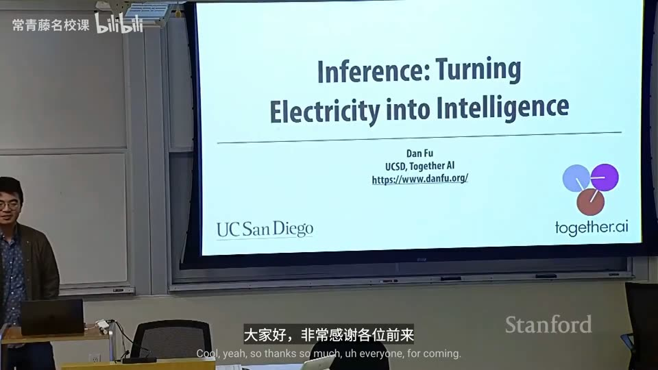 |
| 我想这门课主要讲的是训练，也就是怎么训练语言模型。 [【跳转到 00:05】](https://www.bilibili.com/video/BV11LEA6eEuj/?p=19&t=5) |  |
| 最终做出这些东西来。今天我想讲讲，当你有了这样一个模型之后，从另一面看是什么样的，也就是真正去部署这些模型、做推理是什么样的。把这些东西转化一下，比如说从电力变成 token， [【跳转到 00:10】](https://www.bilibili.com/video/BV11LEA6eEuj/?p=19&t=10) | 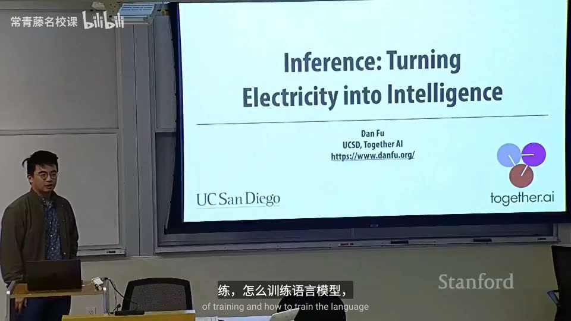 |
| 再变成智能。以及从这个角度看，有哪些有意思的研究问题和研究方向。好。 [【跳转到 00:24】](https://www.bilibili.com/video/BV11LEA6eEuj/?p=19&t=24) | 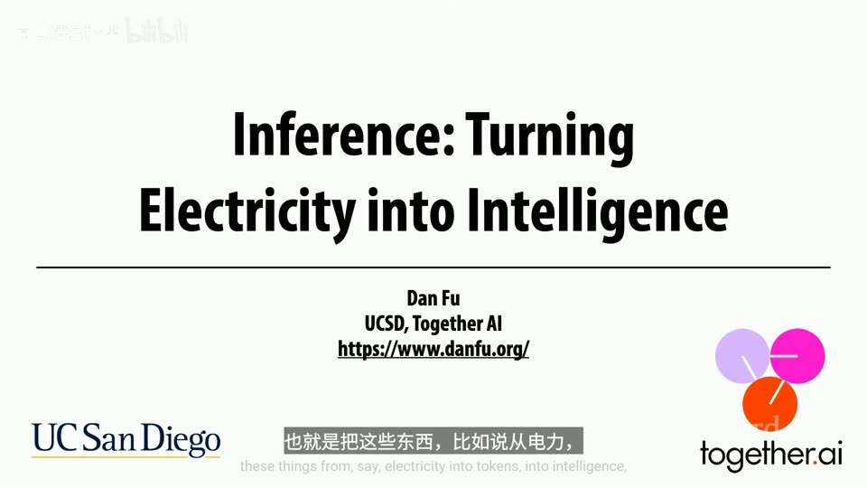 |
| 我先从一些宏观的动机讲起。我想有一点我们都已经看得非常清楚， [【跳转到 00:30】](https://www.bilibili.com/video/BV11LEA6eEuj/?p=19&t=30) | 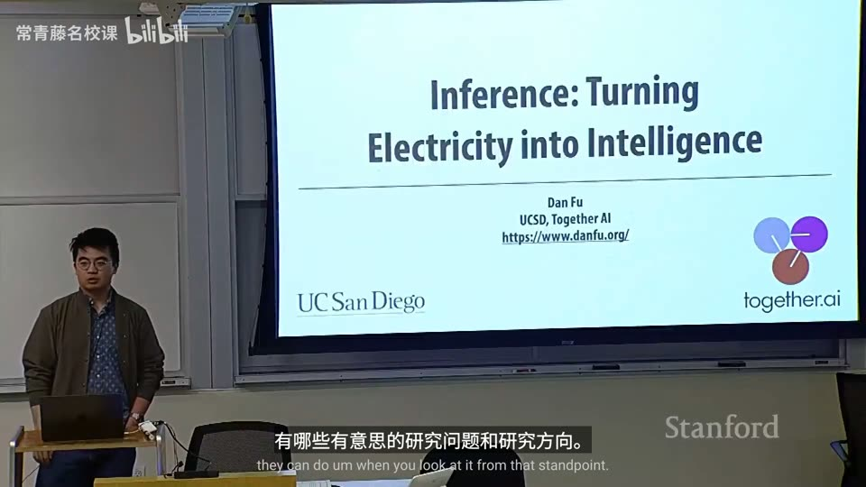 |
| 那就是这些模型和它们的能力正在带来一场近乎全新的工业革命。这些幻灯片是我两年前求职演讲时做的，所以具体的例子已经有点旧了，但你可以做到人类水平的文本生成、代码生成。 [【跳转到 00:35】](https://www.bilibili.com/video/BV11LEA6eEuj/?p=19&t=35) |  |
| 比如 Cursor、Claude Code、GPT-5.5，而不只是 GPT-4。你既能生成，也能理解、处理图像和视频。 [【跳转到 00:50】](https://www.bilibili.com/video/BV11LEA6eEuj/?p=19&t=50) | 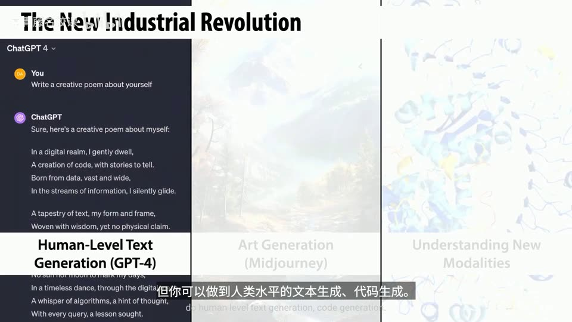 |
| 很能开始理解新模态。 [【跳转到 00:59】](https://www.bilibili.com/video/BV11LEA6eEuj/?p=19&t=59) |  |
| 对，生物健康领域就出现了 DNA 模型这类应用。我一直很关心一个问题： [【跳转到 01:04】](https://www.bilibili.com/video/BV11LEA6eEuj/?p=19&t=64) | 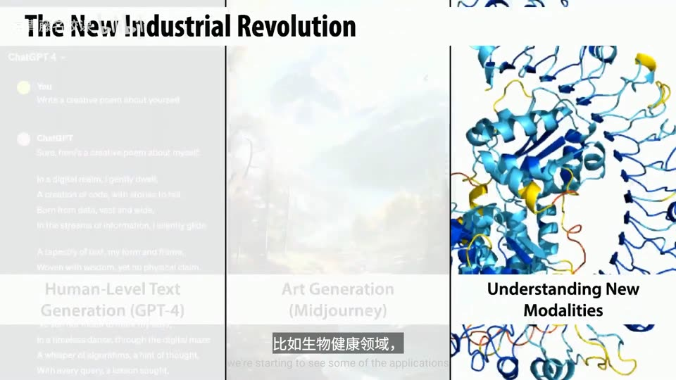 |
| 这些突破是怎么做到的？下一代又能怎么改进？规模是这些能力的主要驱动力。 [【跳转到 01:09】](https://www.bilibili.com/video/BV11LEA6eEuj/?p=19&t=69) | 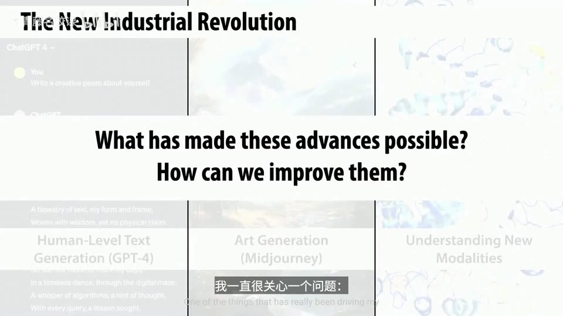 |
| 看这张旧图，模型规模已经大幅扩展了。2018 年我刚开始读博，那时最大的模型才 1 亿参数，我们都觉得太疯狂了。到 2019 年，我们觉得它太危险，不敢发布，这就是 GPT-2。这门课你们应该能训出 GPT-2 水平的模型，不知道做到没，努力的话你们肯定能。如今开源模型都有万亿参数甚至更多。 [【跳转到 01:14】](https://www.bilibili.com/video/BV11LEA6eEuj/?p=19&t=74) | 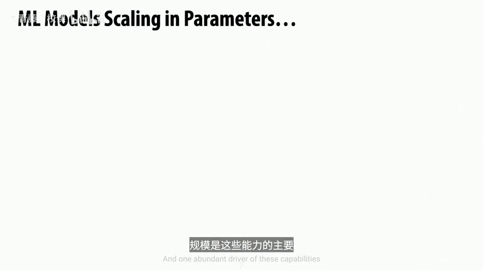 |
| 前沿模型参数大概 5 到 10 万亿，挺让人兴奋的。有了这些，你就能对话、写代码、分析复杂文本，还能帮你做作业等等。真正了不起的是， [【跳转到 01:39】](https://www.bilibili.com/video/BV11LEA6eEuj/?p=19&t=99) | 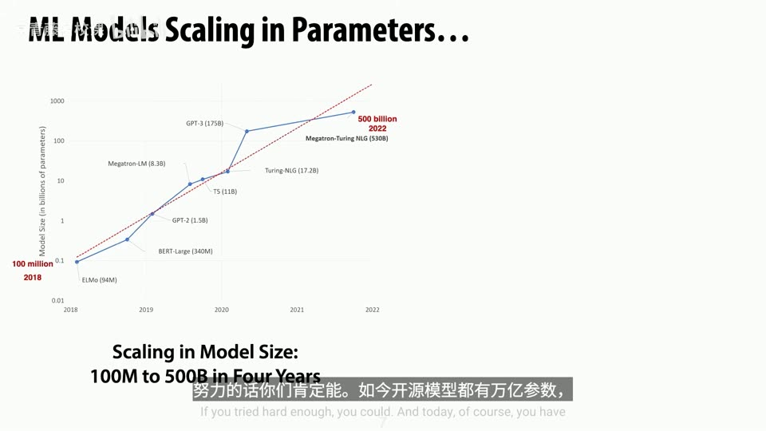 |
| 这一转变比我们想象的更快，也比我几年前读博初期预想的快得多。我觉得有个类比很贴切，而且日期也很有意思地吻合。1902 年曼哈顿有 13 万匹马，它们不是养着玩的，而是承担着关键作用。每匹马每天产生好几磅粪便，乘以 13 万匹，数量惊人，这也成了严重的粪便问题，事实上还真开过专门的学术会议， [【跳转到 01:53】](https://www.bilibili.com/video/BV11LEA6eEuj/?p=19&t=113) |  |
| 讨论怎么处理这些麻烦。1898 年纽约就开过一次这样的会，结论是马粪问题没辙，只能捏着鼻子忍着。10 年后到 1912 年，曼哈顿的汽车数量已经超过马匹。 [【跳转到 02:18】](https://www.bilibili.com/video/BV11LEA6eEuj/?p=19&t=138) |  |
| 所以在这 10 年的过渡期里，你看那些存在了几个世纪的东西开始被汽车取代了。我觉得对咱们做语言模型的人来说，那个“1912 时刻”大概就是去年。所以至少对我来说，去年我开始用这些语言模型来写大部分代码了，我团队里大多数人都这么干，我也让所有学生都这么干。 [【跳转到 02:31】](https://www.bilibili.com/video/BV11LEA6eEuj/?p=19&t=151) |  |
| 除了做作业的时候。这确实是个令人兴奋的过渡期，咱们正身处其中。推动这一切的一个关键因素是， [【跳转到 02:56】](https://www.bilibili.com/video/BV11LEA6eEuj/?p=19&t=176) | 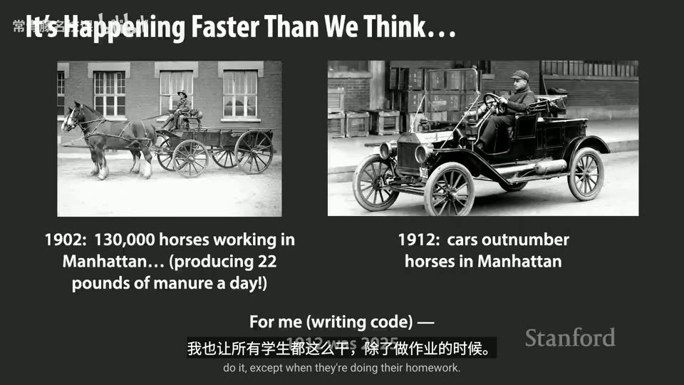 |
| 很多规模效应都由 GPU 驱动。所以说真的，你可以把 GPU 看作新的石油。虽然这已经不算新消息，但能看到数千亿美元甚至更多资金投入 GPU，历史啊总是惊人的相似。 [【跳转到 03:06】](https://www.bilibili.com/video/BV11LEA6eEuj/?p=19&t=186) |  |
| 各国主权基金正把这类投资作为国家资产的重头戏。有一点非常清楚：推理才是关键。 [【跳转到 03:23】](https://www.bilibili.com/video/BV11LEA6eEuj/?p=19&t=203) | 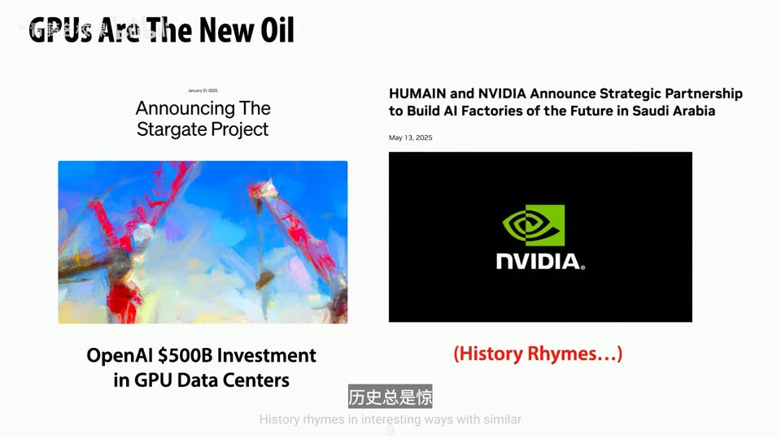 |
| 你可以把它看作把电力转化为智能的引擎。就像没有引擎，石油无法转化为动能一样，推理引擎也至关重要。GPU 内核让 GPU 从沙子变成今天我们能用的东西——机器学习模型。 [【跳转到 03:33】](https://www.bilibili.com/video/BV11LEA6eEuj/?p=19&t=213) | 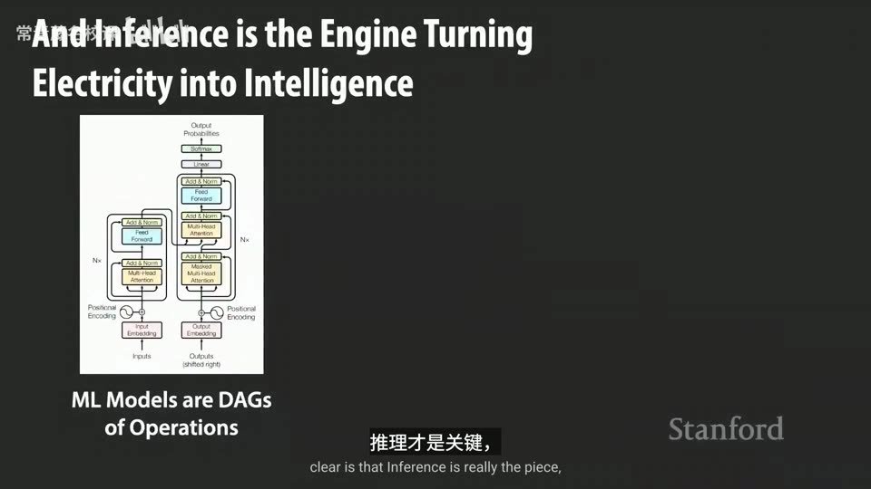 |
| 其实就是些存在于抽象空间的运算、有向无环图。推理引擎和 GPU 内核， [【跳转到 03:52】](https://www.bilibili.com/video/BV11LEA6eEuj/?p=19&t=232) | 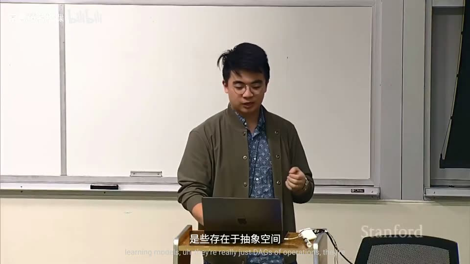 |
| 就是要把模型映射到机器学习运算的关键。这门课会涉及部分实现，比如 FlashAttention。 [【跳转到 03:57】](https://www.bilibili.com/video/BV11LEA6eEuj/?p=19&t=237) | 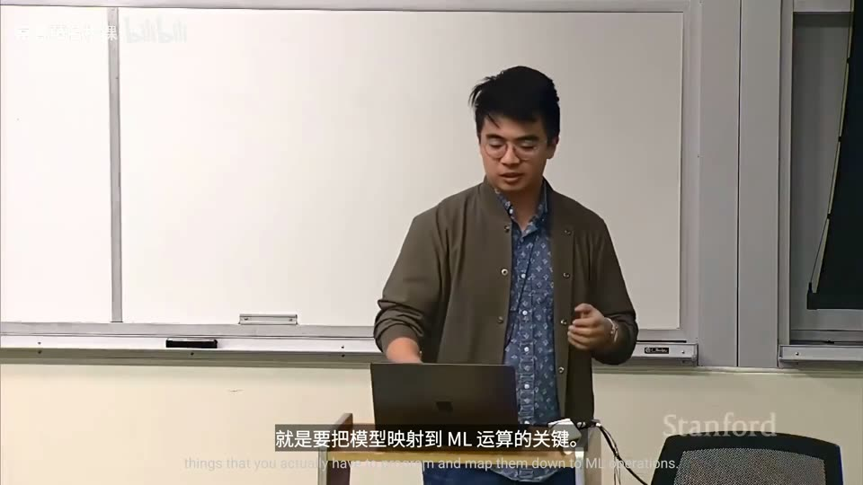 |
| 不过在推理这一侧其实藏着巨大的复杂性。所以哪怕今天的内容你都忘了，也请记住一点： [【跳转到 04:02】](https://www.bilibili.com/video/BV11LEA6eEuj/?p=19&t=242) | 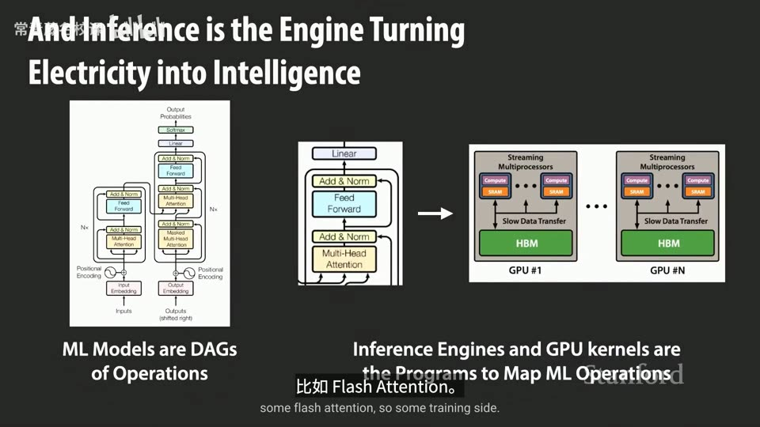 |
| 只要搞懂推理、推理引擎和底层的 GPU 内核，你就能推动底层基础设施，从而在机器学习算法上实现全栈创新。今天我先给大家宏观讲讲 token 的生命周期。 [【跳转到 04:11】](https://www.bilibili.com/video/BV11LEA6eEuj/?p=19&t=251) | 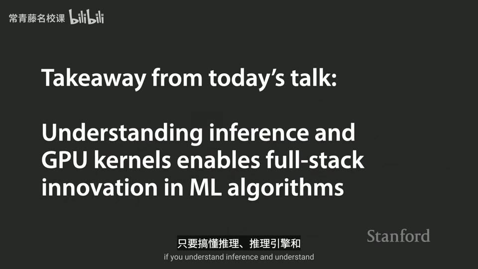 |
| 比如当你向模型发出请求时，请求会经历什么？它如何贯穿整个推理服务？你会面临哪些有趣的选择？然后我会深入讲两个偏研究性的项目：如果你抽取这个系统的某些部分，你能提出哪些问题，又能做些什么。在讲技术细节前，我先简单做个介绍。 [【跳转到 04:23】](https://www.bilibili.com/video/BV11LEA6eEuj/?p=19&t=263) | 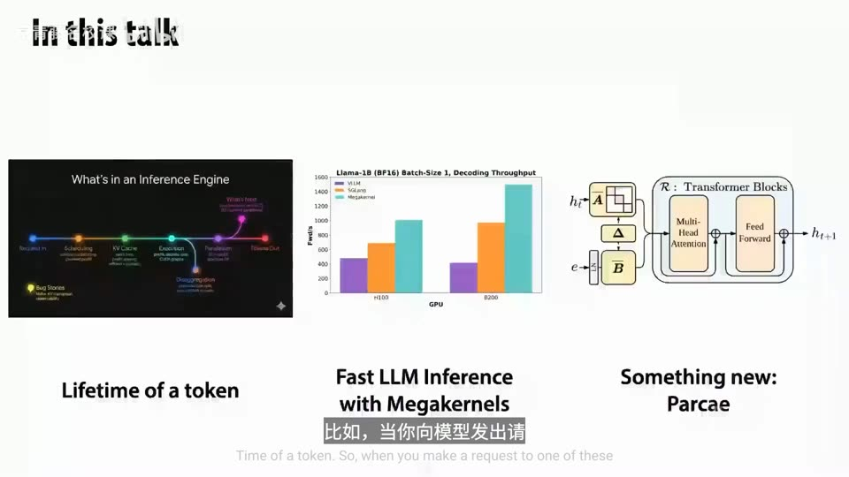 |
| 今天我代表两个机构来到这里。一个是 UCSD，我在那儿有个小实验室，今天演讲里也涵盖了他们的一些工作；另一个是 Together，他们做了很多其他工作，今天也会一并介绍。Together 是个 AI 云平台，涵盖 GPU、推理、微调等全套服务，研究背景很强。比如 Percy，他可能看不见我的鼠标， [【跳转到 04:43】](https://www.bilibili.com/video/BV11LEA6eEuj/?p=19&t=283) | 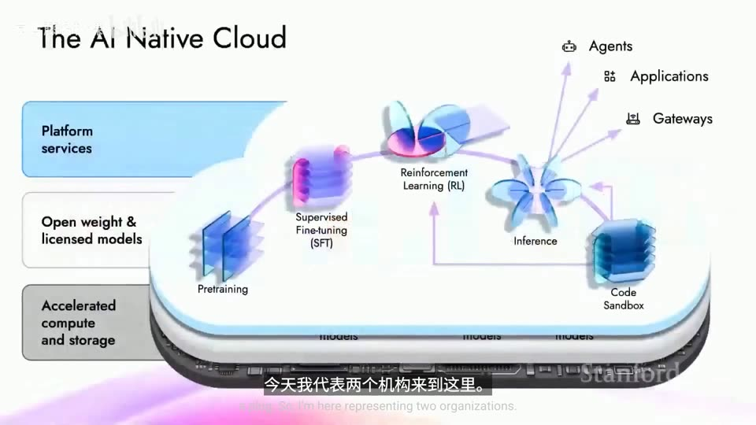 |
| 但就在屏幕上，背后还有强大的研究团队支撑你接下来在演讲中看到的各项内容。 [【跳转到 05:04】](https://www.bilibili.com/video/BV11LEA6eEuj/?p=19&t=304) |  |
| 我先大致讲讲一个 token 的完整生命周期。 [【跳转到 05:09】](https://www.bilibili.com/video/BV11LEA6eEuj/?p=19&t=309) |  |
| 当你向推理系统发请求时，数据会经过哪些环节？这些幻灯片参考了我学生 Austin 的演示以及他在 Together 的经历。顺便说下，幻灯片全是 Nano Banana Pro 生成的。 [【跳转到 05:15】](https://www.bilibili.com/video/BV11LEA6eEuj/?p=19&t=315) |  |
| 只要别盯着文字细看，效果其实不错，大体上没错，但要是细看就会发现不少地方错得离谱。（此处录音不清）好，咱们来看看推理引擎主要由哪些部分组成。 [【跳转到 05:30】](https://www.bilibili.com/video/BV11LEA6eEuj/?p=19&t=330) |  |
| 简单说下它怎么运作。请求进来之后，第一步系统会把请求分配给不同的 GPU，预填充和解码阶段可能跑在不同的机器上。接着拿请求去查 KV 缓存，看以前是否处理过，看看能不能省点算力。接着就开始跑核心机器学习代码、采样新 token，以及算子优化手段，包括跨机器拆分。 [【跳转到 05:42】](https://www.bilibili.com/video/BV11LEA6eEuj/?p=19&t=342) | 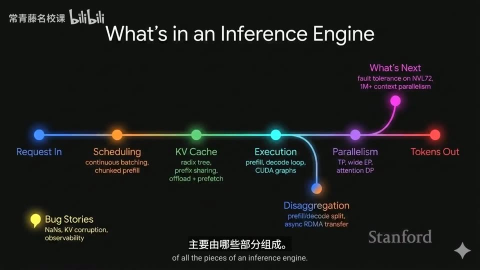 |
| 多节点并行，或节点内 GPU 并行，具体取决于模型大小和拆分方式。随着硬件发展，我们会看到更多可选方案。选好、跑完代码，最后就能拿到 token 了。你可以问“嘿模型，Percy 说的线性回归是什么意思，因为我那节课缺了”，所以你能体验整个全流程。值得我们开始思考的是，这些不同的负载到底长什么样。 [【跳转到 06:07】](https://www.bilibili.com/video/BV11LEA6eEuj/?p=19&t=367) | 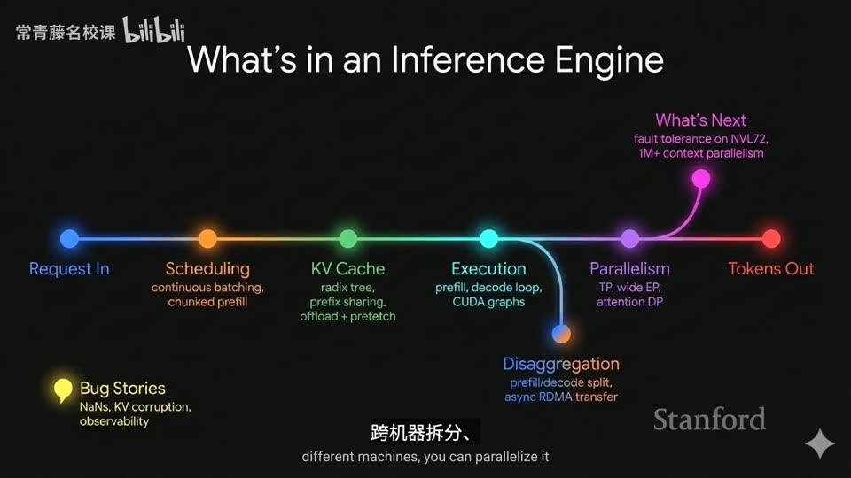 |
| 情况多种多样。这张图你要是看得太细，有些地方看着就不太对，但你要想到，真正跑生产流量时，未必、也肯定不像你现在做的这样，不像训练时看到的那种 token，也不太像你在脑子里凭空编出来的负载。那我们通常会看到什么？特定负载下，输入和输出 token 会呈现特定的分布。 [【跳转到 06:32】](https://www.bilibili.com/video/BV11LEA6eEuj/?p=19&t=392) | 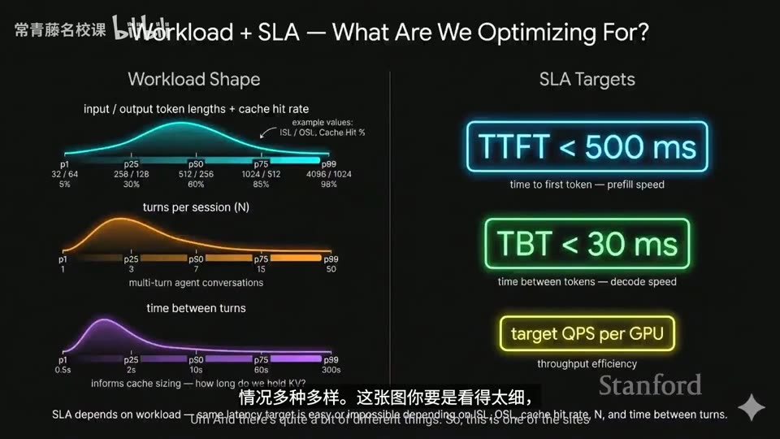 |
| 拿代码生成来说，比如你用 Cursor 智能体，它能访问你的代码库，你只管提问。一般情况是输入量很大，得有上万个输入 token。接着看模型怎么训练的，它可能输出一些思考 token，也可能只给简短回复。第二取决于工作负载和模型，比如代码生成跟摘要生成差别就很大。 [【跳转到 06:57】](https://www.bilibili.com/video/BV11LEA6eEuj/?p=19&t=417) | 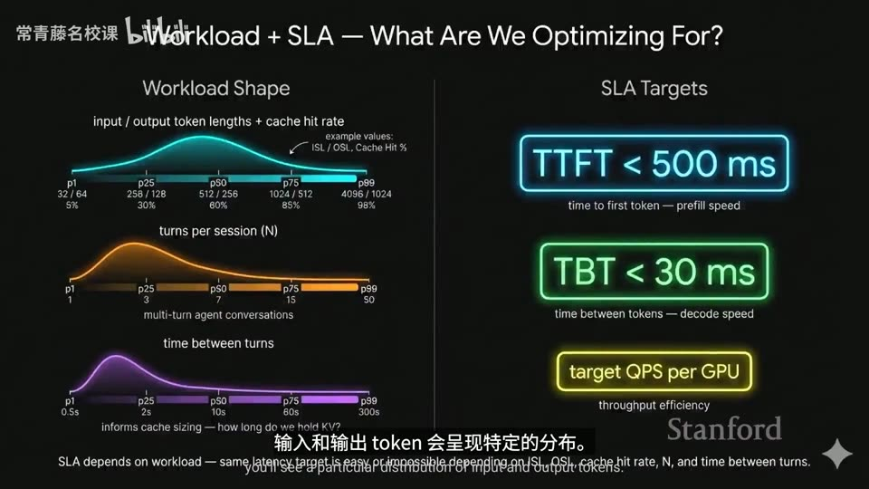 |
| 要是你把整本书贴进对话框来回聊，那跟普通对话完全不一样；要是你直接问“给我讲讲一阶微积分”，负载形态就完全不同了。现在用语言模型大多是这种一问一答的智能体工作流。写代码时，你和代码 agent 来回沟通，“做这个”“不，不是这意思”“或者做那个”，代码 agent 本身就能对语言模型做不少迭代。 [【跳转到 07:22】](https://www.bilibili.com/video/BV11LEA6eEuj/?p=19&t=442) |  |
| 比如我调用工具让 grep 在代码库里搜点东西，再把结果喂回模型；我也可能上网搜一下用户问的东西。 [【跳转到 07:47】](https://www.bilibili.com/video/BV11LEA6eEuj/?p=19&t=467) | 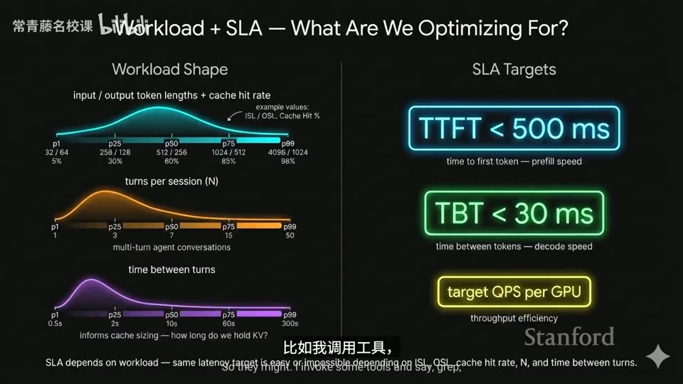 |
| 所以对话通常会有好几个来回。另一个有趣的点是，不同应用的节奏各不相同。 [【跳转到 07:55】](https://www.bilibili.com/video/BV11LEA6eEuj/?p=19&t=475) |  |
| 比如你在快速对话循环里， [【跳转到 08:00】](https://www.bilibili.com/video/BV11LEA6eEuj/?p=19&t=480) | 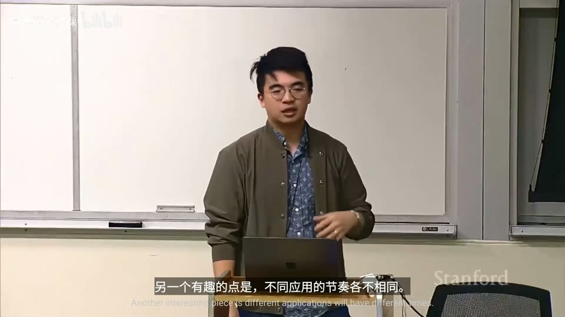 |
| 或用语音模式跟 ChatGPT 聊天，响应通常很快。反之，如果你 run agent 自己跑流程，“替我做这个”“我不打扰你”，自己迭代，节奏就不同了。 [【跳转到 08:05】](https://www.bilibili.com/video/BV11LEA6eEuj/?p=19&t=485) | 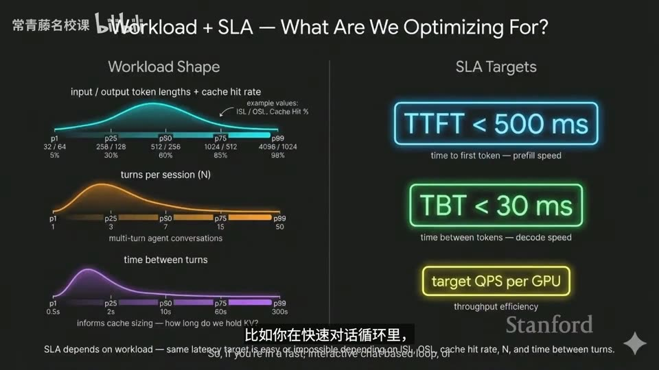 |
| 要是代理卡住喊“帮帮我”，我得问问你，却没注意到，回合间可能又多个空档。所以这些就决定了你的工作负载是什么样的：每次能拿到多少新 token，你要生成多少 token，会话有多长。我是那种反复跟 code 代理来回聊的年轻用户吗？还是我只问个问题就走，第二天再回来？还有回合间隔，比如我曾用 ChatGPT 代理聊。 [【跳转到 08:17】](https://www.bilibili.com/video/BV11LEA6eEuj/?p=19&t=497) | 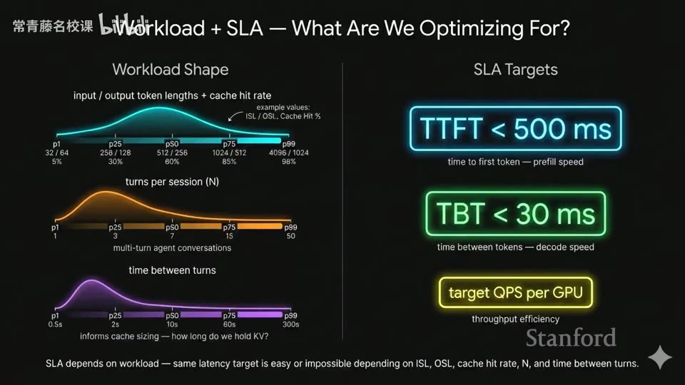 |
| 怎么安排每周的锻炼，我大概每两周才聊一次，这跟其他流量模式差别很大。还有要看你的应用：交互式应用可能要求一秒内返回第一个 token，让代理能提示“我正在想”，或者我知道要生成 500 个 token，希望整个响应在规定时间内返回，让用户能快点。谢谢。请求进来时包含几个基本部分，稍后详述：预填充和解码。 [【跳转到 08:42】](https://www.bilibili.com/video/BV11LEA6eEuj/?p=19&t=522) | 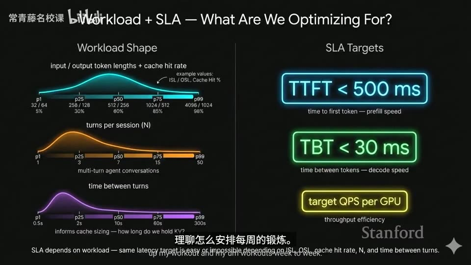 |
| 假设输入一些文本，第一步是分词。 [【跳转到 09:07】](https://www.bilibili.com/video/BV11LEA6eEuj/?p=19&t=547) | 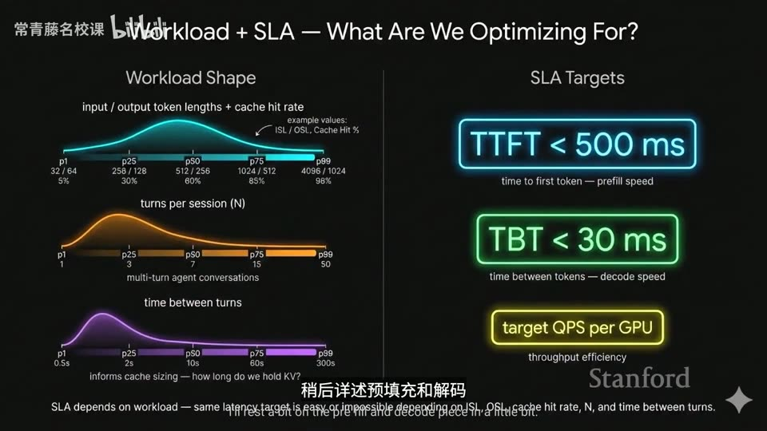 |
| 我想大家都熟悉。然后进入复杂的调度机制，比如是否见过这些 token，能否从缓存直接查找激活值。这是机器学习计算的两个主要部分，叫预填充和解码，节奏差别很大。预填充是说，假设你手上有这样一段东西，你压入 1 万个从未见过的 token，得算出激活值和 logits， [【跳转到 09:12】](https://www.bilibili.com/video/BV11LEA6eEuj/?p=19&t=552) | 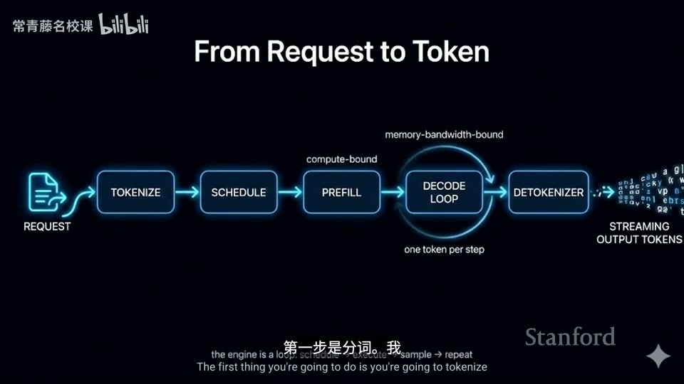 |
| 即输入 10000 token，输出一个 token。这是计算密集型操作，这和你们训练时看的指标差不多。训练时你处理大量 token，写好 FlashAttention 内核，跑训练循环，和 prefill 差不多，只是不反向传播。然后是 decode，是逐个生成 token。比如输入 10000 token，问“ABC 函数是干什么的”，模型处理完 prompt 就开始逐个生成。 [【跳转到 09:37】](https://www.bilibili.com/video/BV11LEA6eEuj/?p=19&t=577) | 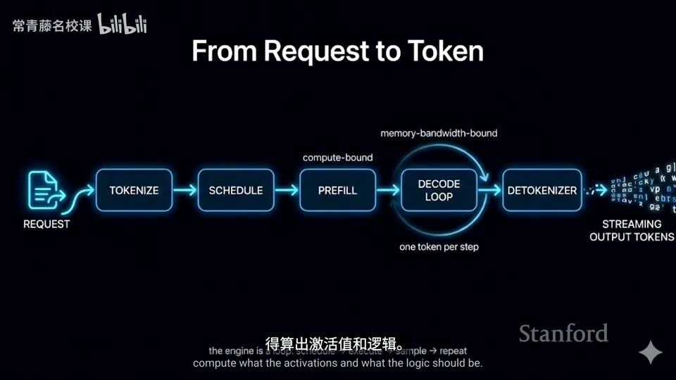 |
| 用了推测解码的话，一次能出三四个。每生成一个新 token 都得重新过一遍模型，算一算就知道，其实需要计算的浮点运算并不多，就是计算量不大，但瓶颈在内存带宽。也就是说，每次生成一个 token 都要重新加载模型。模型跑完后，你会得到一个代表该 token 的数值，再转成字符串。接着你会做点处理，比如检查停止 token 或做安全检查， [【跳转到 10:02】](https://www.bilibili.com/video/BV11LEA6eEuj/?p=19&t=602) |  |
| 看用户是不是想恶意入侵系统之类的。最后输出 token。推理引擎就在这一循环里运行，等着接受请求，它就在调度、执行和 token 采样的循环里不断重复。咱们再深入一步，看看系统同时处理多个请求时是什么样。这里有个技术叫连续批处理，看这张图，时间是从上往下走的。 [【跳转到 10:27】](https://www.bilibili.com/video/BV11LEA6eEuj/?p=19&t=627) | 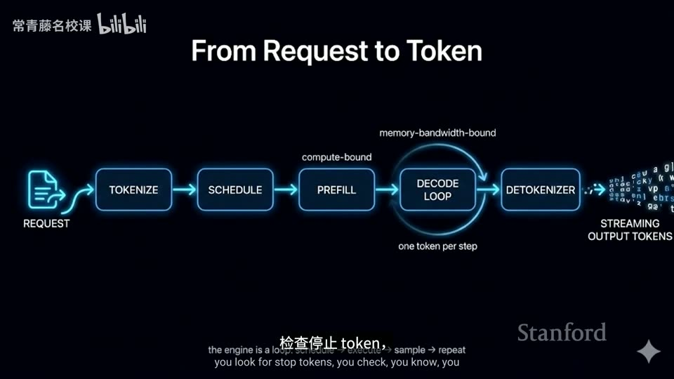 |
| 往下走会有新请求进来。比如到第一步，你有一些长请求，有用户让你分析一份很长的文档，引擎就一直生成一大堆 token；可能还有另一个请求进来，开始占用资源。这些资源首先是计算资源，你得同时跑多个请求；如果你在填 KV cache，那就是内存资源。你会看到多个请求同时进行。 [【跳转到 10:52】](https://www.bilibili.com/video/BV11LEA6eEuj/?p=19&t=652) | 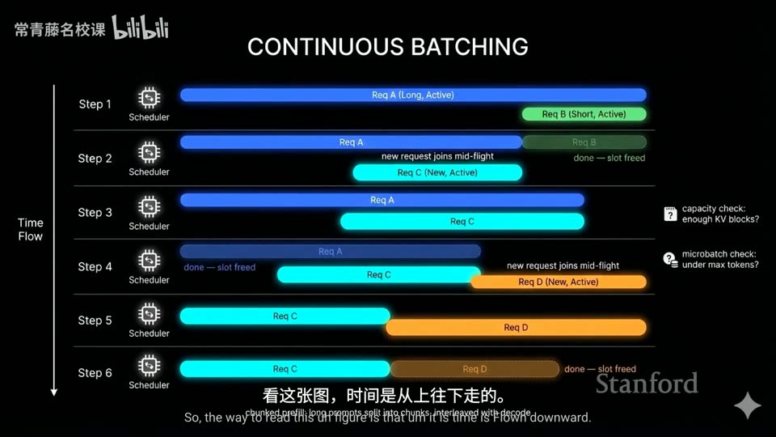 |
| 走一步后，那个短请求可能结束了，又来个新请求，可能要跑好几步；又会来新请求，比如又是个特别长的，就是第四步里那个橙色的。但显存不够，就得把全部 KV cache 存到 CPU 上，那显存耗尽时，请求可能会开始排队，等那个长请求跑完，就能启动新请求，以此类推。你可以看着它运行。 [【跳转到 11:17】](https://www.bilibili.com/video/BV11LEA6eEuj/?p=19&t=677) | 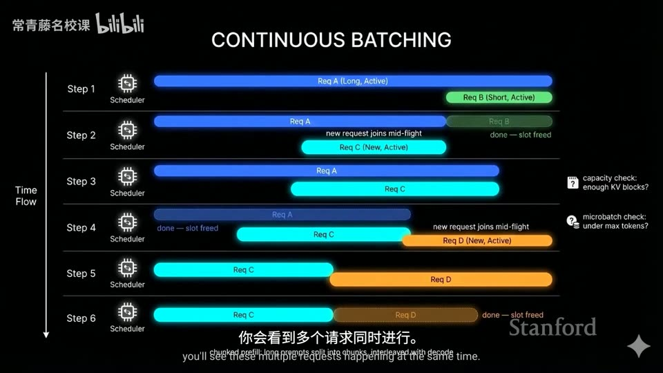 |
| 所以你看，系统里有一堆不同请求时，运行起来就已经挺复杂了。其中一个挺重要的部分叫做 KV cache。你可以这么想：很多用户可能都在说“hi ChatGPT”或“hi Claude”，理论上不用重新计算激活值。 [【跳转到 11:42】](https://www.bilibili.com/video/BV11LEA6eEuj/?p=19&t=702) |  |
| 不用给每个用户都再跑一遍。要是用户输入了长文本，只需对它做一次 prefill；下一轮对话里再追加内容时，你不用把整个东西重新算一遍。所以有了叫 KV cache 的机制，利用前缀共享，新来一组 token，用基数树这种很传统的数据结构看看哪些 token 见过、哪些是新的，然后查一下这些激活值大概长什么样。 [【跳转到 11:56】](https://www.bilibili.com/video/BV11LEA6eEuj/?p=19&t=716) | 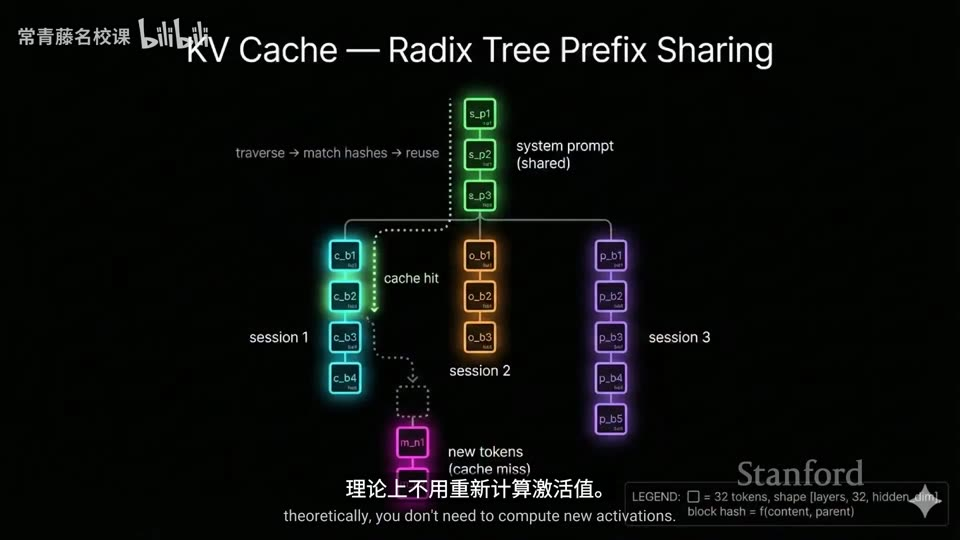 |
| 算力到了 GPU 上，拆分的方式就有很多种。假设你有一个万亿参数的模型， [【跳转到 12:21】](https://www.bilibili.com/video/BV11LEA6eEuj/?p=19&t=741) | 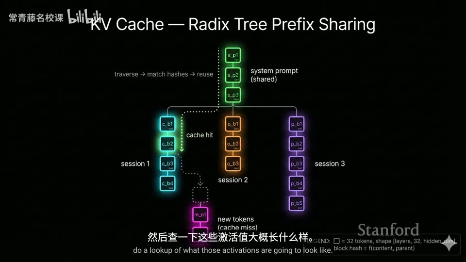 |
| 跑在 280GB 显存的 GPU 上，单个 GPU 根本装不下。 [【跳转到 12:26】](https://www.bilibili.com/video/BV11LEA6eEuj/?p=19&t=746) |  |
| 整个模型拆分方式有好几种，比如把每个 tensor 拆成四份分给四个 GPU，或者叫 tensor parallelism。还有现在很多 SOTA 模型是 mixture of experts（MoE），这些独立的 expert 会根据不同的 token 被选择性激活，你可以把它们分到不同 GPU。这些选择决定了瓶颈在哪、需要多少 GPU， [【跳转到 12:31】](https://www.bilibili.com/video/BV11LEA6eEuj/?p=19&t=751) | 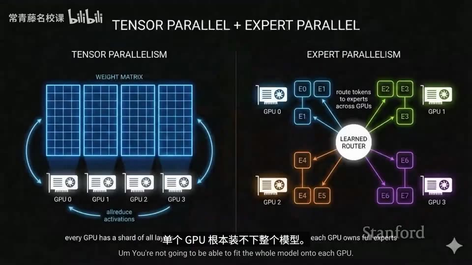 |
| 能同时服务多少 session 等等。一个常见做法是把 prefill 和 decode 分到不同的 GPU、不同的机器组上，因为啊它们的计算瓶颈和计算特性截然不同。 [【跳转到 12:56】](https://www.bilibili.com/video/BV11LEA6eEuj/?p=19&t=776) | 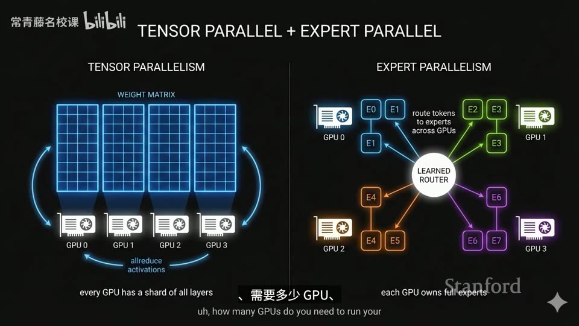 |
| 预填充很像你们训练时做的事，直接运行，非常消耗算力，你能充分利用 GPU；而另一方面（解码）极度依赖内存带宽，因为计算量不大却得同时加载所有模型权重。两者耗时也各不相同，预填充通常比单次解码久得多，但解码步骤多得多，因为提示词只预填充一次，每生成一个 token 就解码一次。一个基础优化是我们都开始采用的：让不同的 worker 组分别处理预填充和解码， [【跳转到 13:09】](https://www.bilibili.com/video/BV11LEA6eEuj/?p=19&t=789) | 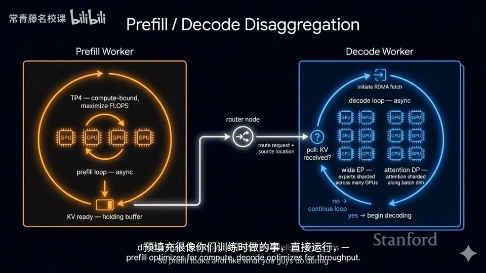 |
| 从而针对计算栈的不同环节做专门优化。事实证明，有了这种拆分可以做很多创新。比如你可能听说过 NVIDIA 收购 Groq——NVIDIA 买下了这种新型推理芯片，原因之一是解码负载和预填充负载差异巨大。 [【跳转到 13:34】](https://www.bilibili.com/video/BV11LEA6eEuj/?p=19&t=814) | 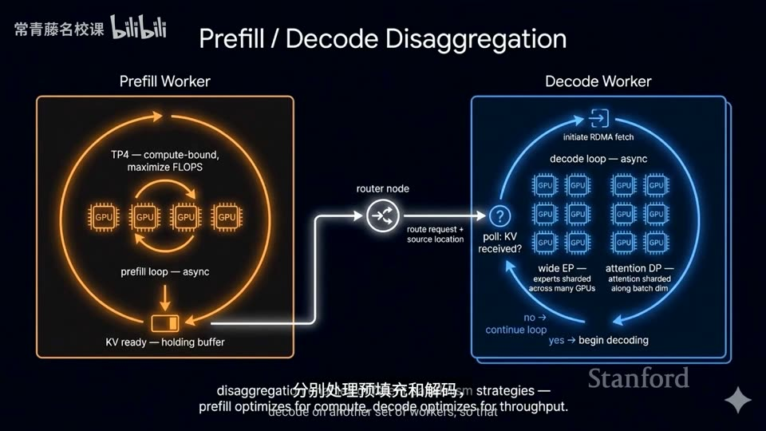 |
| 针对解码你可以使用完全不同的芯片，比如下一代硬件，NVIDIA 打算用 GPU 处理预填充， [【跳转到 13:55】](https://www.bilibili.com/video/BV11LEA6eEuj/?p=19&t=835) |  |
| 用 Groq 的 LPU 芯片做解码。Cerebras 也是，OpenAI 和 Cerebras 有算力合作，它解码更强。 [【跳转到 14:01】](https://www.bilibili.com/video/BV11LEA6eEuj/?p=19&t=841) | 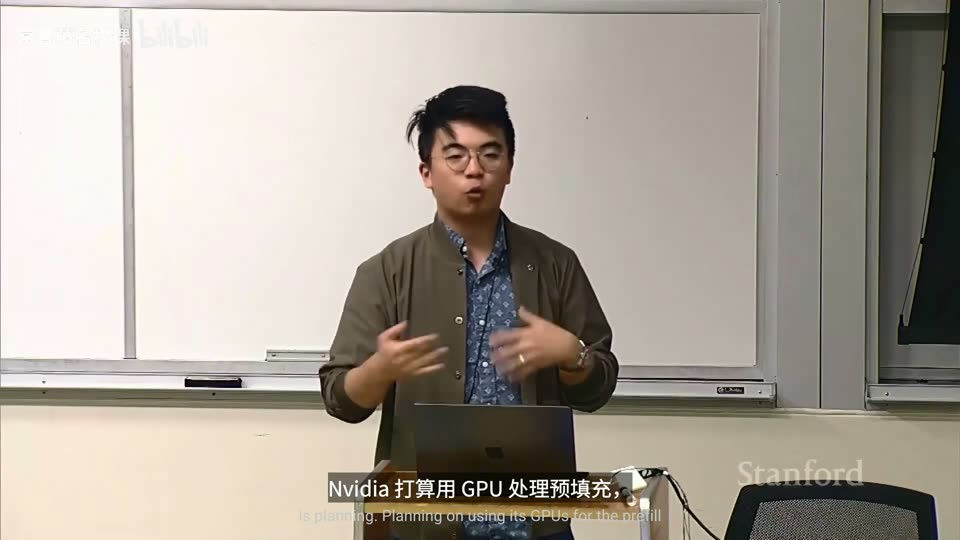 |
| SambaNova 这些公司也在这一领域的不同环节下注。（此处录音不清）当你真正大规模部署这些推理引擎，每天处理上万亿 token 甚至更多时，就会遇到一些相当棘手的 bug。 [【跳转到 14:10】](https://www.bilibili.com/video/BV11LEA6eEuj/?p=19&t=850) | 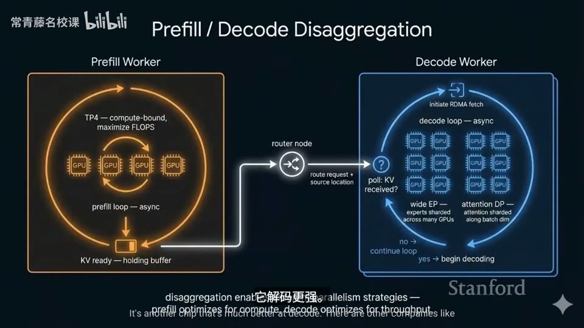 |
| 这组 bug 大多发生在去年年底，涉及一些开源推理引擎。大规模系统有个特点：小规模下正常，大规模下必然出错。我们说的是发生概率低于 0.001% 的事件。有些 bug 极细微，内核略有错误，但触发条件极罕见。算到一半，部分 logits 就会变成 NaN，这时模型就开始反复输出同一个 token。 [【跳转到 14:25】](https://www.bilibili.com/video/BV11LEA6eEuj/?p=19&t=865) | 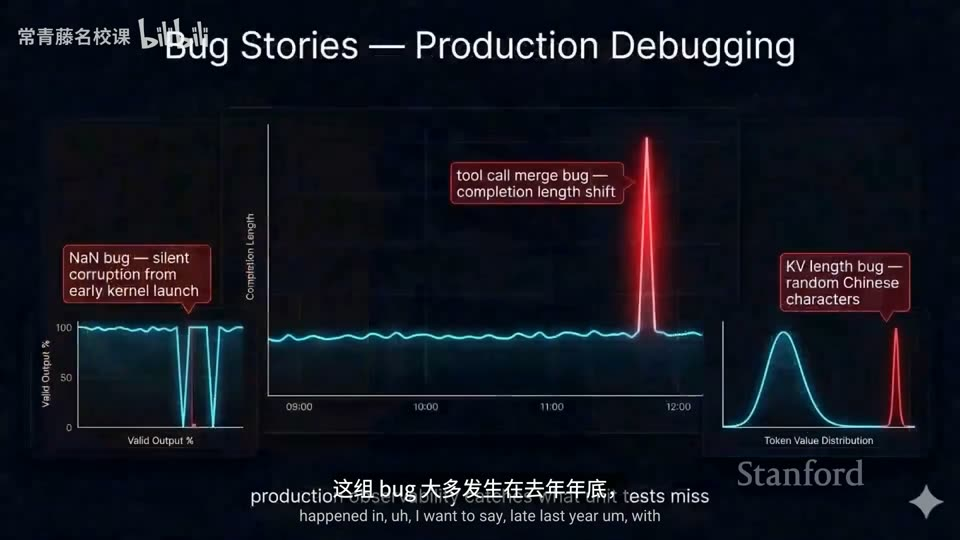 |
| 有个模型后来只输出“hi hi hi”或感叹号，陷入死循环。还有个模型，有人改了处理工具调用的逻辑。工具调用就是模型说“嘿，我要搜个网”之类的，模型说完去搜一下，后端就得用老代码去执行。后来某个引擎处理工具调用出错了，就是输出变长，模型一直喊“去搜一下”， [【跳转到 14:50】](https://www.bilibili.com/video/BV11LEA6eEuj/?p=19&t=890) | 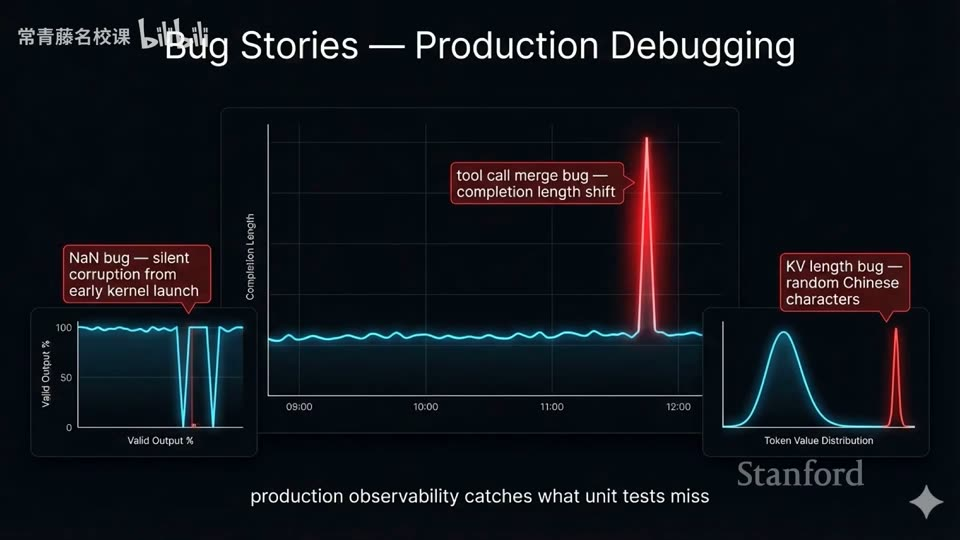 |
| 正常时通常会说“嘿，去搜一下”，然后“好，我搞定了，去回复用户吧”。但这回它没正确返回，它会一直说“去搜一下、去搜一下，怎么还没搜”，陷入死循环，跑上数万个 token。还有个案例很有趣，它同时搞挂了多个推理提供商，还被赖在量化问题上，其实是个更微妙的 bug：模型没理由地突然开始蹦出中文字。 [【跳转到 15:15】](https://www.bilibili.com/video/BV11LEA6eEuj/?p=19&t=915) | 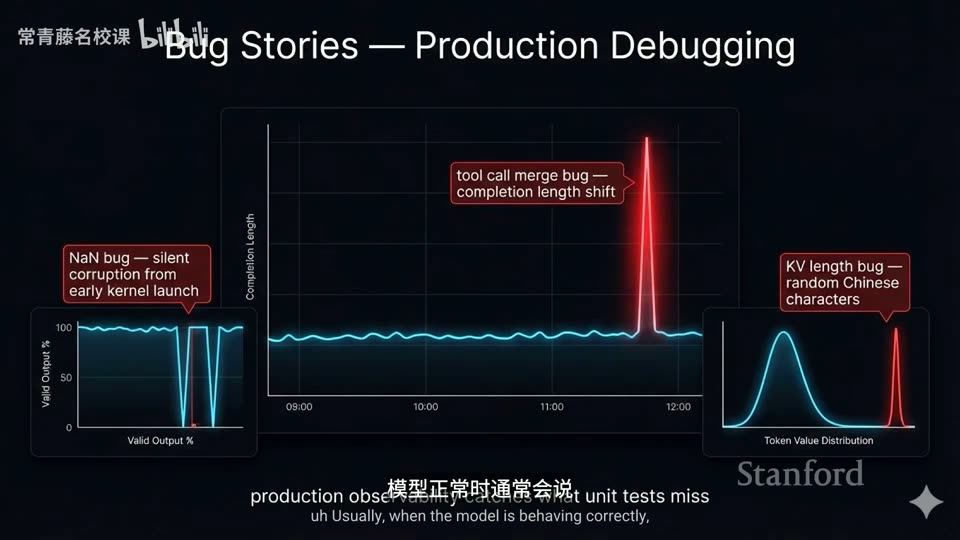 |
| 有人猜模型可能用中文微调过，因为问他英文他却回中文，其实是某个 kernel 里的一个差异错误，是个很微妙的 bug。有时候你会从 GPU 里读到一些没初始化的内存数据，经过注意力机制，最后会得到一个随机的中文字。模型会纳闷怎么突然开始想中文了，以为你在问中文问题，结果就顺着聊到中文去了。有时候这是因为模型确实被训练过， [【跳转到 15:40】](https://www.bilibili.com/video/BV11LEA6eEuj/?p=19&t=940) | 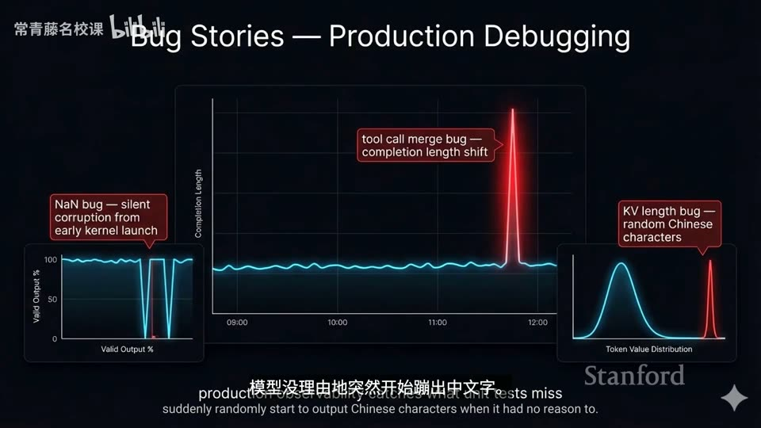 |
| 让它能想中文；有时候只是别人的代码里有个 off-by-one 的小 bug。在一些更高级的推理框架里，最近开始冒出一些挺有意思的现象。跑大型生产系统时，关键的一点就是 KV cache 越大越好，最好能把不同用户、或者同一用户 [【跳转到 16:05】](https://www.bilibili.com/video/BV11LEA6eEuj/?p=19&t=965) | 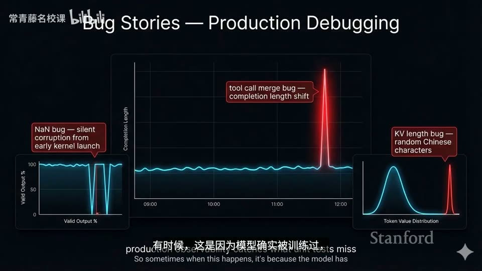 |
| 在不同会话里的请求都缓存起来，这样能跑的任务就更多。为了处理更多会话，先把 KV cache 存到 GPU 上，结果 GPU 内存很快就不够了。接着你可以开始存到 CPU 内存里。如果你留意 Jensen 的主题演讲，会发现他最近特别看重 CPU 性能（此处录音不清），原因之一在于上一代 CPU 其实很慢，结果成了很多重要任务的瓶颈。 [【跳转到 16:25】](https://www.bilibili.com/video/BV11LEA6eEuj/?p=19&t=985) | 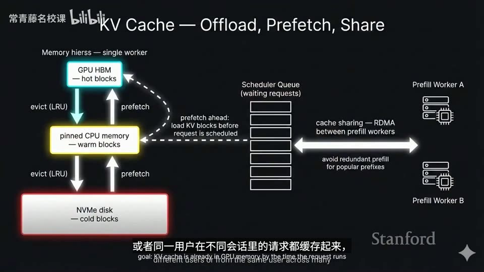 |
| 于是你开始关注，因为如果你 50 万美元的机器被你配的 1000 美元 CPU 拖了后腿，那就很糟糕了。原因之一是你可能把 KV cache 存在了 CPU 内存里，所以你会很在意把 KV cache 读回来的速度。再往后，你可能把更多 KV cache 放到磁盘上，这时就得关注 SSD 和它的空间了。 [【跳转到 16:50】](https://www.bilibili.com/video/BV11LEA6eEuj/?p=19&t=1010) | 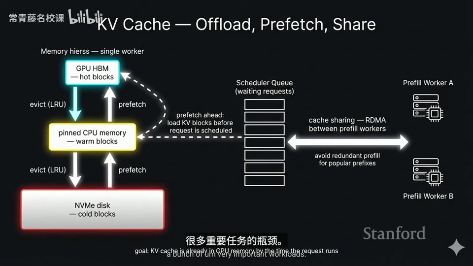 |
| 再说，你大概听过 OpenAI 抢购全球 SSD 和内存的传闻，原因之一就是为了这种场景：你得在 KV 缓存里尽可能多地存数据。当然，真正构建引擎时，你得处理各种复杂情况，比如这些 token 我好久没见了，我可能会把它踢出去，转到 CPU、磁盘或者其他全局存储里。新请求一来， [【跳转到 17:15】](https://www.bilibili.com/video/BV11LEA6eEuj/?p=19&t=1035) | 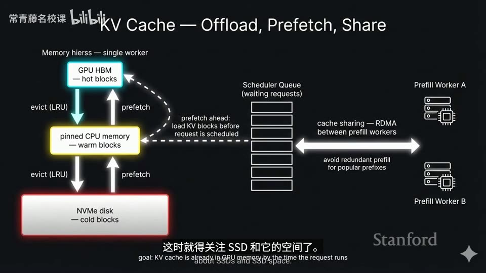 |
| 我得去查、去等，再把它们取回来，加载进系统里，这事就妥了。这感觉有点儿像这种卸载，不是指把某种特定负载卸下来。比如要快的时候，你肯定不想这么干，对吧？毕竟读 SSD 太慢了。“能再问一遍吗？”行，你是问这种卸载 [【跳转到 17:40】](https://www.bilibili.com/video/BV11LEA6eEuj/?p=19&t=1060) |  |
| 是不是只针对某类特定的工作负载？嗯，咱们聊聊这个。我知道你们可能没修过操作系统课， [【跳转到 18:02】](https://www.bilibili.com/video/BV11LEA6eEuj/?p=19&t=1082) | 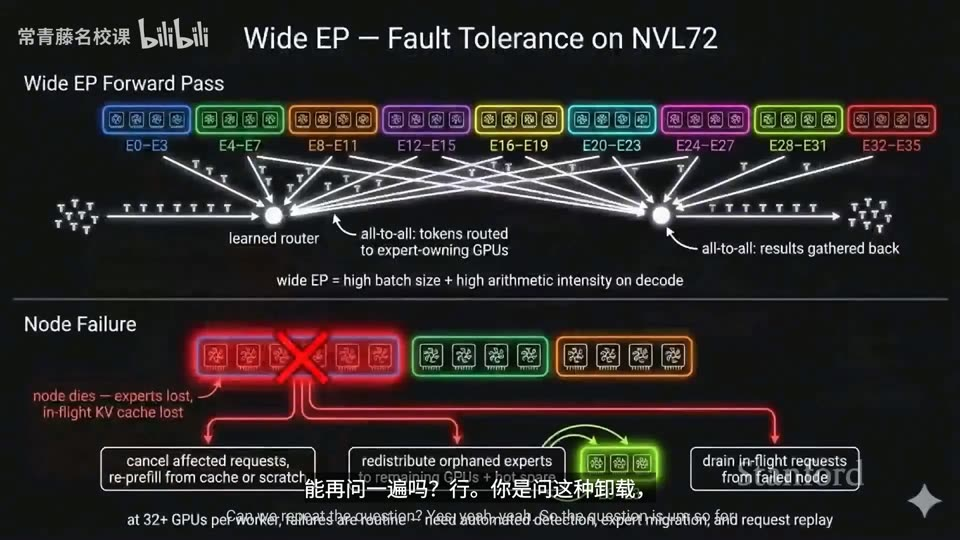 |
| 但我强烈建议你们去上。这里涉及很经典的调度逻辑，除了右边 GPU 那块，这张图看着就跟七八十年代操作系统课的图 [【跳转到 18:08】](https://www.bilibili.com/video/BV11LEA6eEuj/?p=19&t=1088) |  |
| 一模一样。以前咱们也遇到过这问题： [【跳转到 18:16】](https://www.bilibili.com/video/BV11LEA6eEuj/?p=19&t=1096) |  |
| 电脑里开太多应用，CPU 内存已满，你就得想办法应对， [【跳转到 18:21】](https://www.bilibili.com/video/BV11LEA6eEuj/?p=19&t=1101) |  |
| 把这些应用挪到磁盘里。这工作负载其实是一回事。理想状态下，左边那个 Nano Banana 模拟了 LRU 驱逐。 [【跳转到 18:26】](https://www.bilibili.com/video/BV11LEA6eEuj/?p=19&t=1106) | 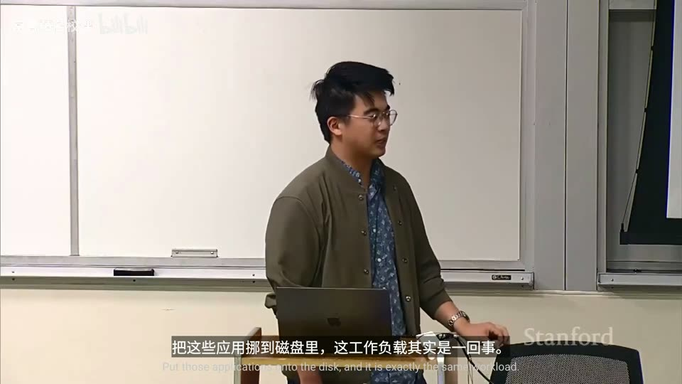 |
| 这启发式策略其实挺靠谱的。估计有篇操作系统论文说过，LRU 的效果最多也就比最优解差两倍。 [【跳转到 18:31】](https://www.bilibili.com/video/BV11LEA6eEuj/?p=19&t=1111) |  |
| 那才是最优解。当然，如果你能预知未来，知道马上会有特定请求进来， [【跳转到 18:41】](https://www.bilibili.com/video/BV11LEA6eEuj/?p=19&t=1121) |  |
| 那就完美了。于是你先预取一下内存。其实预测未来是有可能的，比如你打开聊天应用，翻出一个月前的旧对话，这说明你大概率要针对它提问，接着你可能得把它加载到 GPU 上。 [【跳转到 18:46】](https://www.bilibili.com/video/BV11LEA6eEuj/?p=19&t=1126) |  |
| 理想情况下你能预测未来；若不能，就靠各种启发式策略。这其实是个问题：你要把多少流量压到 GPU 上？我没见过谁想把更少的流量压给 GPU，所以只要满足咱们开头提的那些 SLA，你肯定想尽可能多地承载流量。有些有趣的事开始了。 [【跳转到 19:00】](https://www.bilibili.com/video/BV11LEA6eEuj/?p=19&t=1140) | 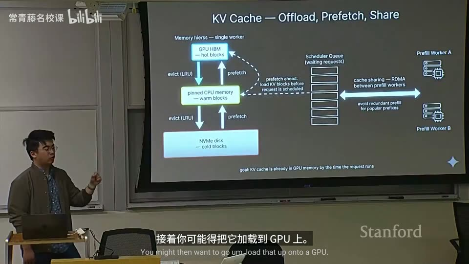 |
| 在上一代 Blackwell GPU 中，NVIDIA 开始打造新的 GPU，即 GB200 NVL72 的 Blackwell 芯片，这就是 72 块 GPU 通过高速互联连接起来。于是你开始考虑怎么把万亿参数的模型分摊到 72 块 GPU 上。 [【跳转到 19:25】](https://www.bilibili.com/video/BV11LEA6eEuj/?p=19&t=1165) | 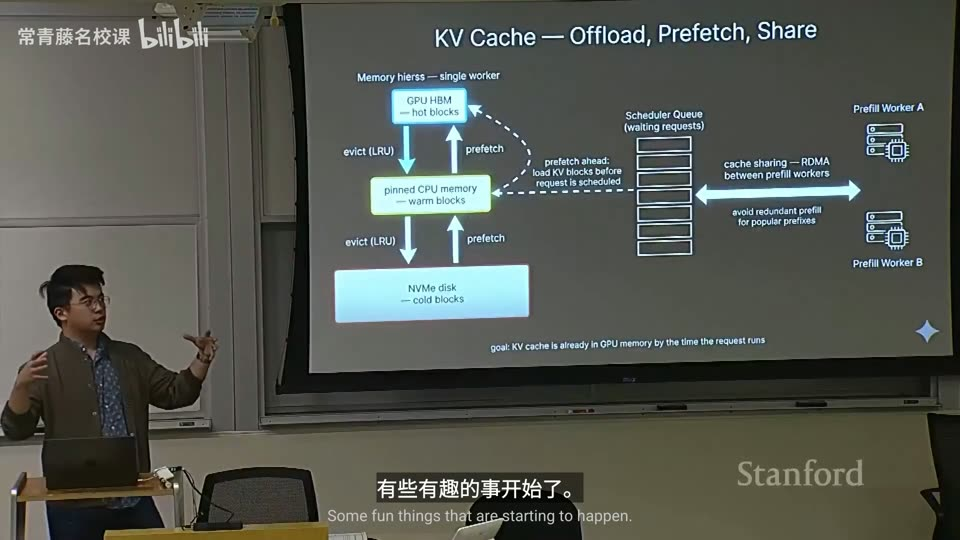 |
| 这有意义吗？能带来什么？会发生什么？怎么考虑容错呢？这些设备常因各种原因出故障，比如连接器很脆，是塑料做的不是金属，插太紧或者线歪了，NVLink 连接就变得不稳定，这本身就很麻烦。这是 AI 时代，所以给芯片加了风扇和散热器。如果把模型分到 64 块 GPU 上， [【跳转到 19:38】](https://www.bilibili.com/video/BV11LEA6eEuj/?p=19&t=1178) | 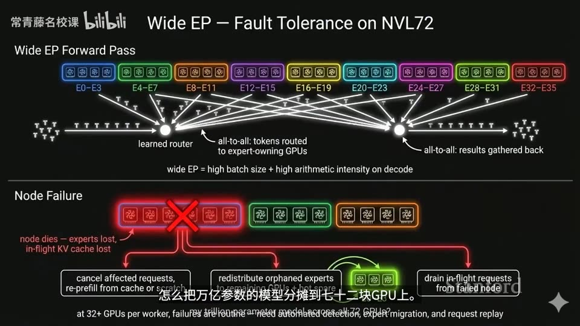 |
| 为数百万用户、数万亿 token 提供生产流量，当某一块 GPU 出故障时该怎么办？有办法做到容错吗？这里有很多有趣的问题值得琢磨。接着你会发现，这些模型的上下文已经达到百万级甚至更多，那具体怎么处理？是把上下文拆分到多个 GPU 上吗？那具体怎么做？谢谢。我想简要提一种优化方案：当你从系统层面审视整个流程时， [【跳转到 20:03】](https://www.bilibili.com/video/BV11LEA6eEuj/?p=19&t=1203) | 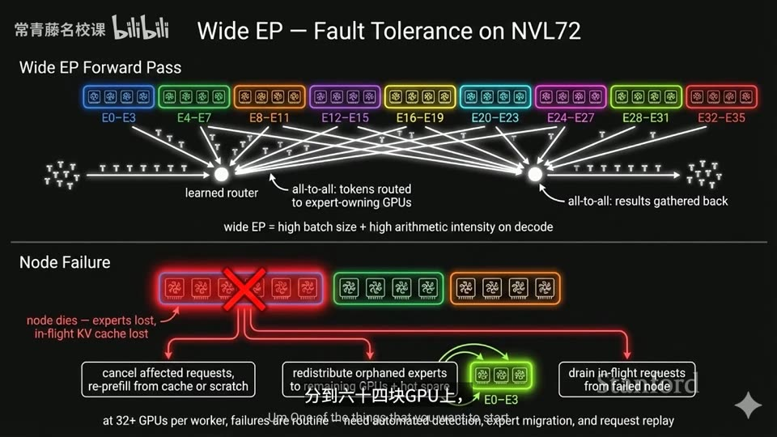 |
| 就可以着手实施。这是我们几个月前一起发布的一项工作， [【跳转到 20:28】](https://www.bilibili.com/video/BV11LEA6eEuj/?p=19&t=1228) | 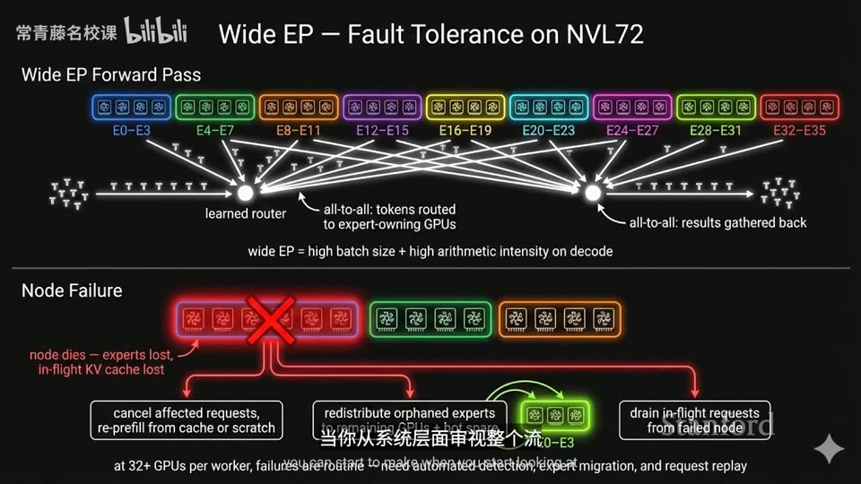 |
| 叫做 cache-aware prefill-decode segregation。这优化很简单，路由层只需改两行代码。 [【跳转到 20:33】](https://www.bilibili.com/video/BV11LEA6eEuj/?p=19&t=1233) | 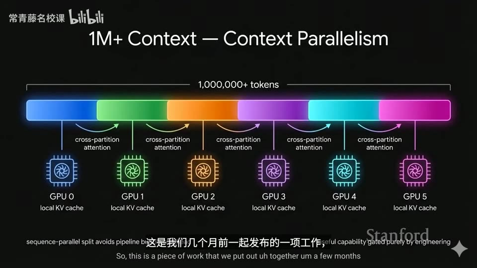 |
| 但效果显著。基本思路是，近来大量请求多为对话中的逐轮交互，即用户已经开启了对话。 [【跳转到 20:40】](https://www.bilibili.com/video/BV11LEA6eEuj/?p=19&t=1240) | 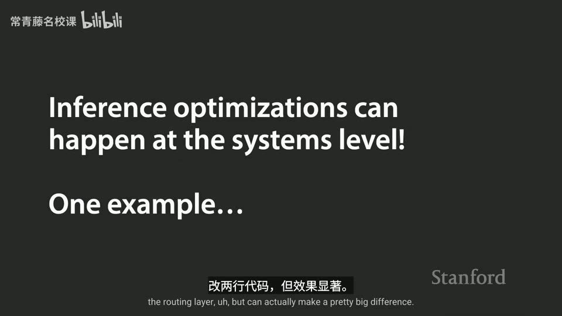 |
| 假设平均一段对话持续十轮，随后用户离开，这意味着 10% 的请求是全新的请求。新请求包含数千 token，看起来很不一样，计算成本也高得多。所以你也许不想把这种预填充和一个进行到一半的短对话放在一起。比如有人刚贴进一本书说“跟我聊聊这本书”，你不想让它和另一个人同时跑，而那个人正聊到一半。 [【跳转到 20:47】](https://www.bilibili.com/video/BV11LEA6eEuj/?p=19&t=1247) | 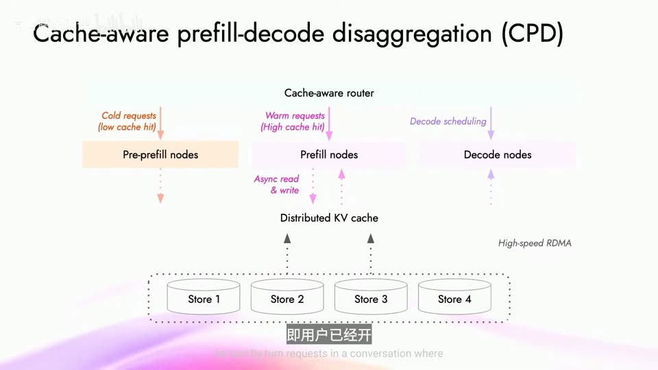 |
| 比如问“为什么 1+1=2”，对方答“1+1=2，因为数字之类的”，你说“我没懂”。你不会想让这种很短的问答和那个很长的请求同时跑在同一批 GPU 上。所以你可以做一个很简单的路由：新请求进来，缓存命中率很低，就发到一组 GPU 上去处理，把这些内容合并，再把其他预热请求发给另一组预填充节点。 [【跳转到 21:12】](https://www.bilibili.com/video/BV11LEA6eEuj/?p=19&t=1272) | 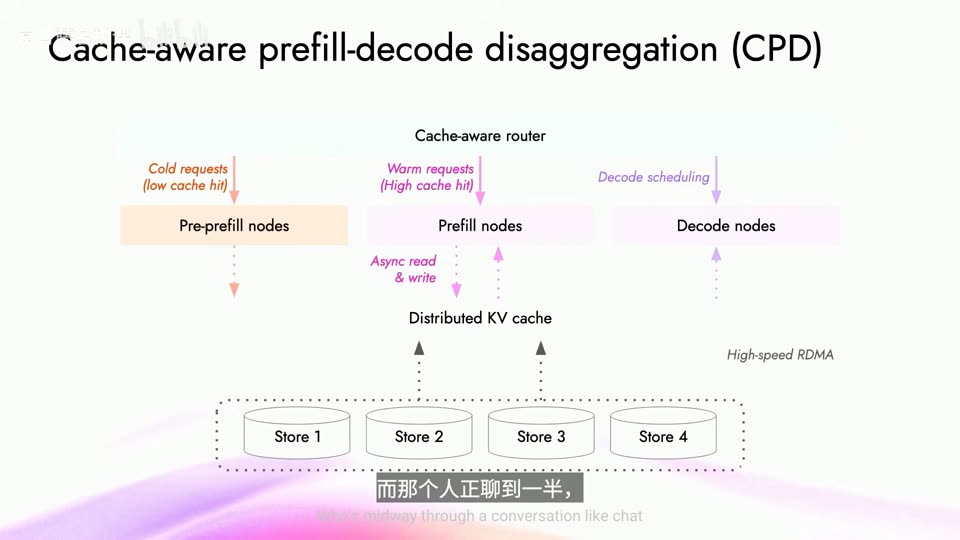 |
| 事实证明，用这种简单的优化，服务速度最高能提升 40%。这是第一组内容。我觉得咱们在研究和这些技术上的现状可以用“非常早期”来形容。这就是那种事，10 到 20 年后人们回头看可能会想： [【跳转到 21:37】](https://www.bilibili.com/video/BV11LEA6eEuj/?p=19&t=1297) | 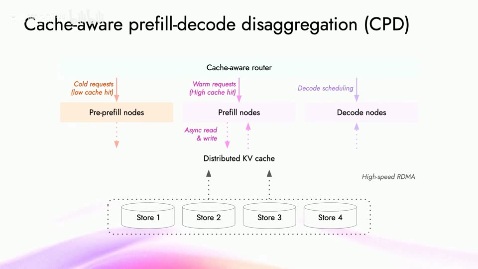 |
| “当时他们为啥聊这个？这难道不是显而易见的吗？”其实是因为我们开始在生产环境中用新方式运行这些东西，看到了新方式下的新流量模式。好了，刚才大致介绍了内核、推理的生命周期。接下来我要讲两个有趣的研究项目，它们深受我们推理服务中一些现象的启发。第一个，咱们聊聊语言模型解码， [【跳转到 21:54】](https://www.bilibili.com/video/BV11LEA6eEuj/?p=19&t=1314) |  |
| 以及怎么用所谓的 MegaKernel 让它快得多。这是斯坦福和 Together 的合作。 [【跳转到 22:19】](https://www.bilibili.com/video/BV11LEA6eEuj/?p=19&t=1339) | 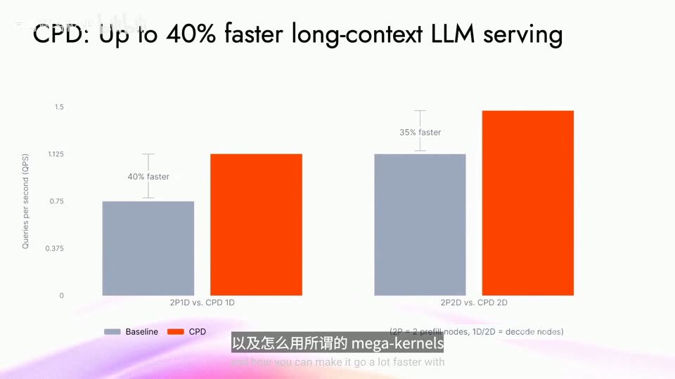 |
| 解码时根本难点在于，你得先处理 prompt，再逐个生成 token。难点在于生成一个 token 就得跑完整个模型，这意味着你没法像预填充或训练时那样利用 GPU 的大规模并行能力，反而把这套高性能系统变成了单纯的内存读取工具。难点还在于，我们写内核和跑模型时， [【跳转到 22:24】](https://www.bilibili.com/video/BV11LEA6eEuj/?p=19&t=1344) |  |
| 通常是一次只写一个操作。大家大概能理解为什么了， [【跳转到 22:47】](https://www.bilibili.com/video/BV11LEA6eEuj/?p=19&t=1367) |  |
| 毕竟写内核挺难的，我猜大家写 FlashAttention 时肯定没少折腾。所以通常的做法是看看语言模型里有哪些操作， [【跳转到 22:52】](https://www.bilibili.com/video/BV11LEA6eEuj/?p=19&t=1372) | 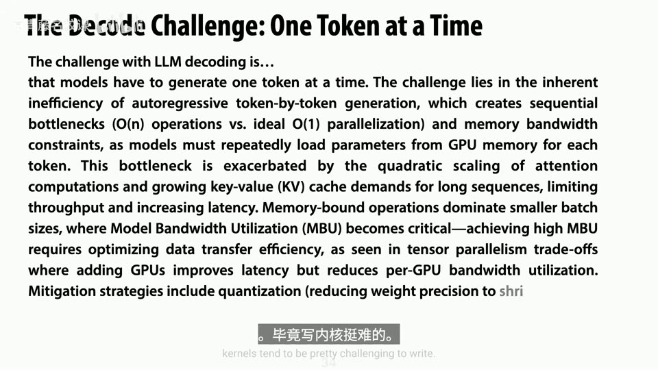 |
| 然后一次只跑一个操作对应的内核，这样编程就简单多了，你只需要写好归一化内核、映射内核和注意力内核就行。但你会发现，这最终会给系统引入大量停机时间。所以这是你在两个内核上运行推理时的一个示例，这显然是个示意图，但例子取自某个特定的注意力推理内核。读图的方法是，横轴是时间， [【跳转到 23:01】](https://www.bilibili.com/video/BV11LEA6eEuj/?p=19&t=1381) | 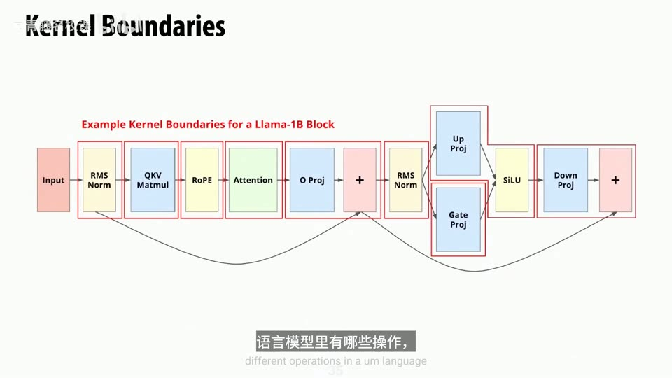 |
| 时间从左向右流动，纵轴是 GPU 上所有不同的流式多处理器。 [【跳转到 23:26】](https://www.bilibili.com/video/BV11LEA6eEuj/?p=19&t=1406) | 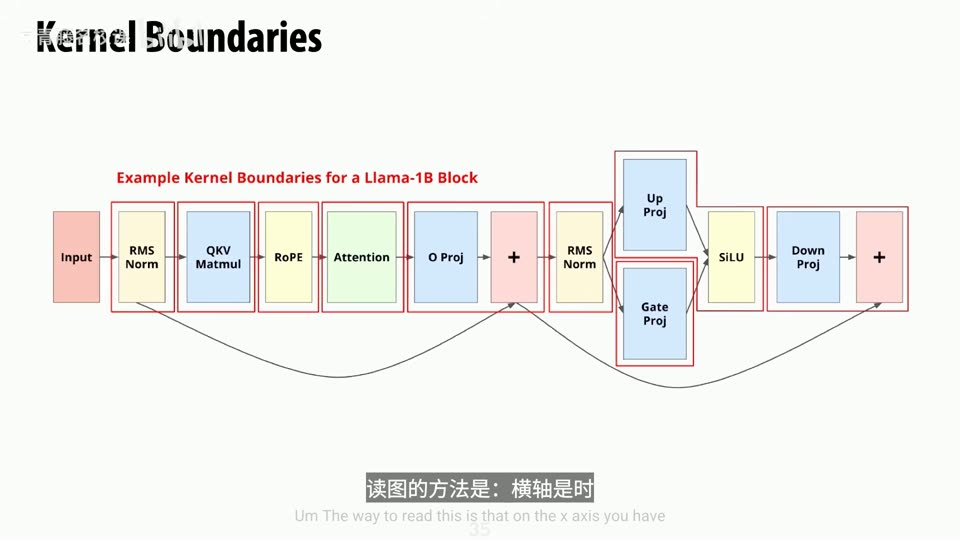 |
| H100 上有 132 个，B200 上我记得是 148 个，以此类推。条形代表有效工作，有条形时就说明 GPU 上的某个处理器正在干活，空白处则是在等待。那你是在等其他操作做完好接着干别的。所以你会发现，不管内核写得再好，GPU 总有停摆的时候。 [【跳转到 23:31】](https://www.bilibili.com/video/BV11LEA6eEuj/?p=19&t=1411) | 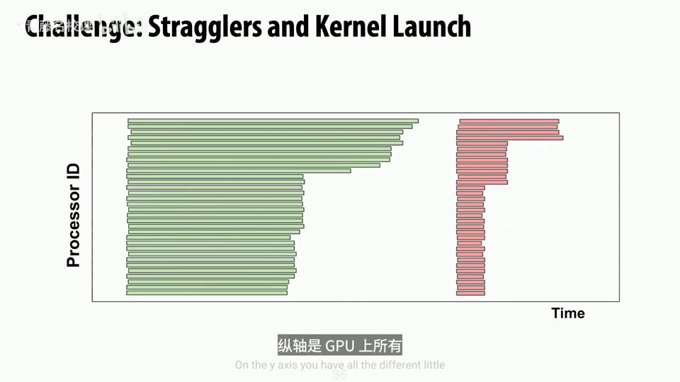 |
| 比如内核启动和拆卸，也就是空白区域里那些大空隙，这叫尾部效应，就像短 prompt 和很长的 prompt 一起处理时一样。这影响会一直传到最基础的注意力操作。处理一批输入时，如果有长有短，你就得等那个最长的处理完。 [【跳转到 23:56】](https://www.bilibili.com/video/BV11LEA6eEuj/?p=19&t=1436) | 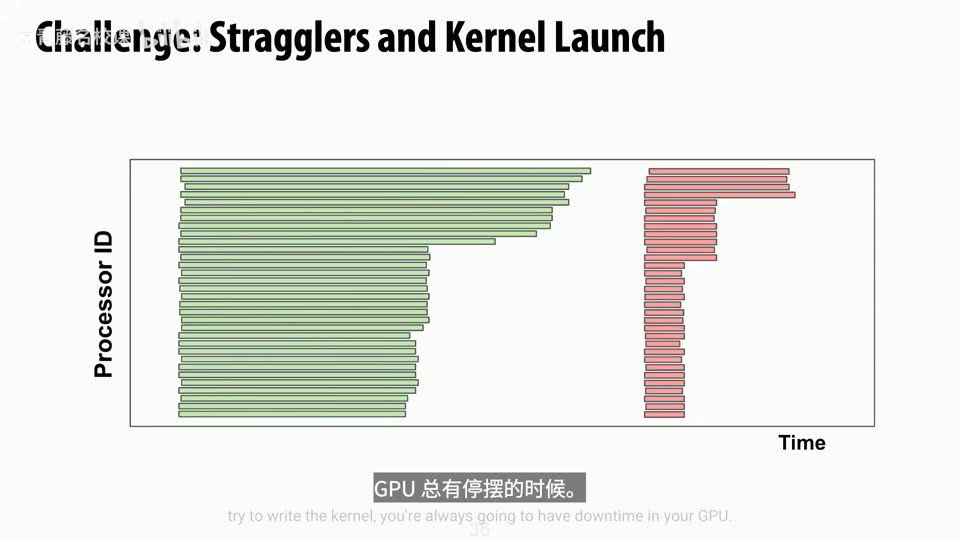 |
| 而且因为跨多个内核运行，这些内核之间的间隙会慢慢叠加起来。都为了解决这个问题，我们做了个叫 MegaKernel 的东西，也就是不单独为每个操作写内核，而是用一个内核一次搞定多个操作。这有点像 FlashAttention 里的融合，只是覆盖更广、更激进。具体来说，它让 GPU 不再只是单一设备， [【跳转到 24:10】](https://www.bilibili.com/video/BV11LEA6eEuj/?p=19&t=1450) | 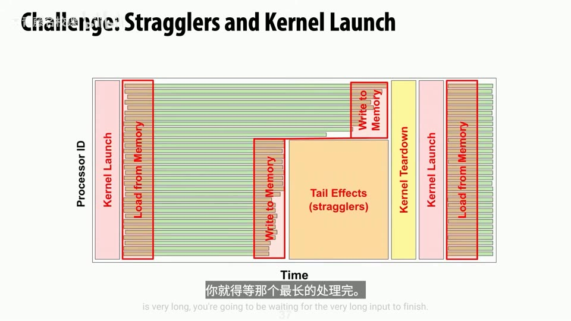 |
| 执行单一操作，你要开始把 GPU 看作一个庞大的分布式系统。好吧，我有大量工作要处理，有些任务存在依赖关系，比如这些红色部分依赖于某些绿色任务。该怎么调度、怎么分配任务才能最大化 GPU 利用率？如果只对注意力推理内核这样做，能获得 30% 到 70% 的加速。 [【跳转到 24:35】](https://www.bilibili.com/video/BV11LEA6eEuj/?p=19&t=1475) | 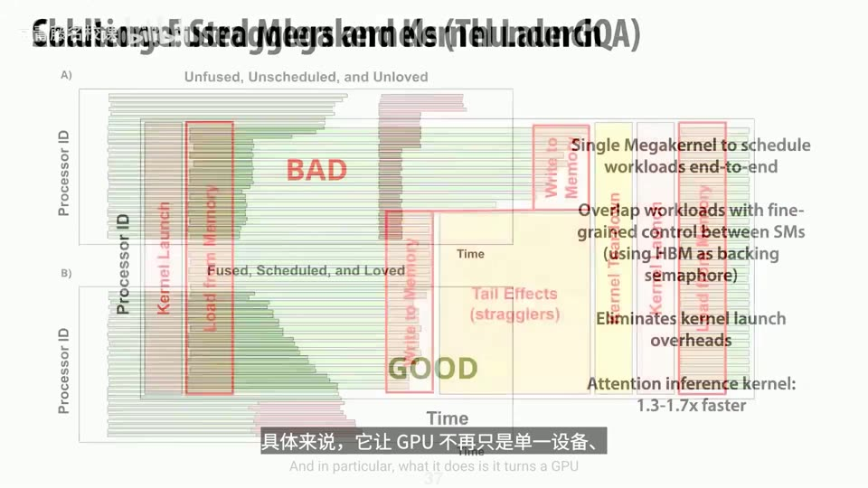 |
| 好处是，这能应用到整个模型。比如这是 Llama 模型的一层，这里我们基本上把整个层合并成了一个内核。你看这些不同的条，它们以非常奇怪的方式重叠在一起，也就是让前一层的权重加载与注意力机制重叠， [【跳转到 25:00】](https://www.bilibili.com/video/BV11LEA6eEuj/?p=19&t=1500) | 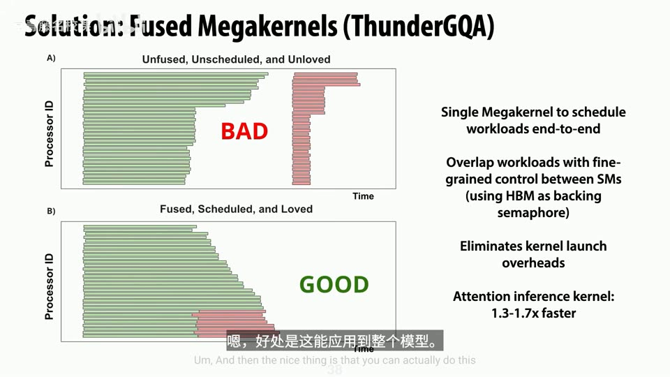 |
| 或者说在注意力操作结束前就开始执行部分规约。举个有趣的例子，在现代大语言模型中有注意力层，还有 QKV 投影，你会给它加入一些 RoPE scaling，也就是这些蓝线。这些蓝线就是 QKV 加 RoPE，橙色线是注意力的开始。一个关键认识是，在 QKV 完成前你就能把 KV cache 加载进注意力， [【跳转到 25:19】](https://www.bilibili.com/video/BV11LEA6eEuj/?p=19&t=1519) | 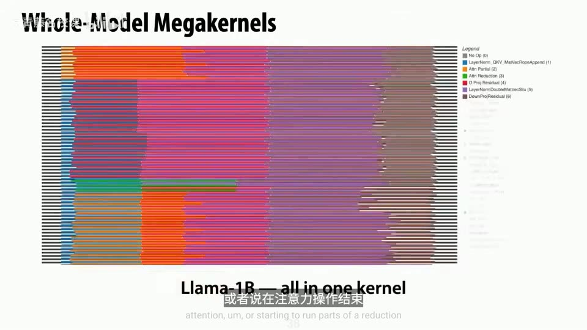 |
| 尤其是在 decode 阶段，带圆圈的这些橙色条表示 QKV 加 RoPE 还在跑时，你就开始加载 KV cache 了。QKV 完成后，你拿到新的 query token，就能跑完注意力操作的剩余部分。基本上，当你能这样精细控制 GPU 时，就可以在其他操作结束前启动某些操作。再看一个例子，这里的橙色同样代表注意力计算的第一部分，红色是注意力之后的 O 投影。 [【跳转到 25:41】](https://www.bilibili.com/video/BV11LEA6eEuj/?p=19&t=1541) | 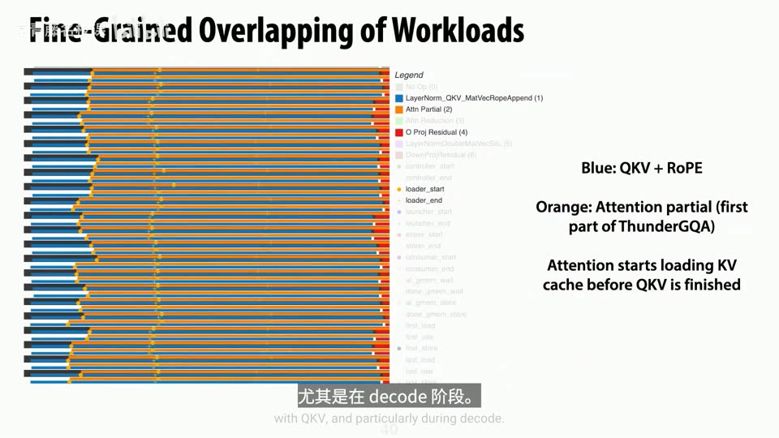 |
| 在注意力运算结束前，O 投影就已经开始加载权重了。我们把它整合进一个相对复杂的 code 框架，用基于指令的抽象让每个子内核都能独立写进各自的文件里， [【跳转到 26:06】](https://www.bilibili.com/video/BV11LEA6eEuj/?p=19&t=1566) | 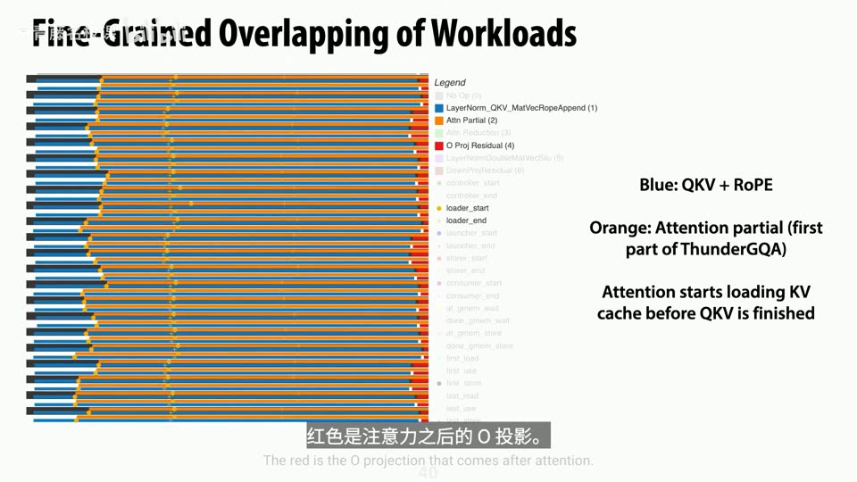 |
| 再搭建一个大型虚拟化共享内存系统来协调这些操作的运行。为此我们做了一个叫 ThunderKittens 的 C++ 库，它属于编写内核的那类库。 [【跳转到 26:21】](https://www.bilibili.com/video/BV11LEA6eEuj/?p=19&t=1581) | 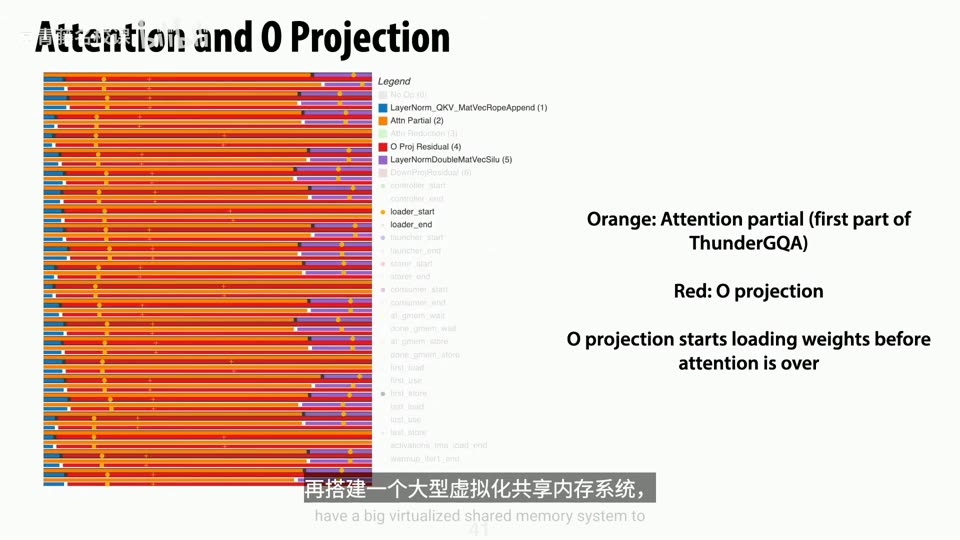 |
| 你也可以把它想成更底层的 Triton，对细节的控制要精细得多，就是推理解码速度接近光速。现在这数据已经好多了，青色这根柱子就是 MegaKernel 的表现，你看它比其他一些顶尖引擎跑得快多了。 [【跳转到 26:32】](https://www.bilibili.com/video/BV11LEA6eEuj/?p=19&t=1592) | 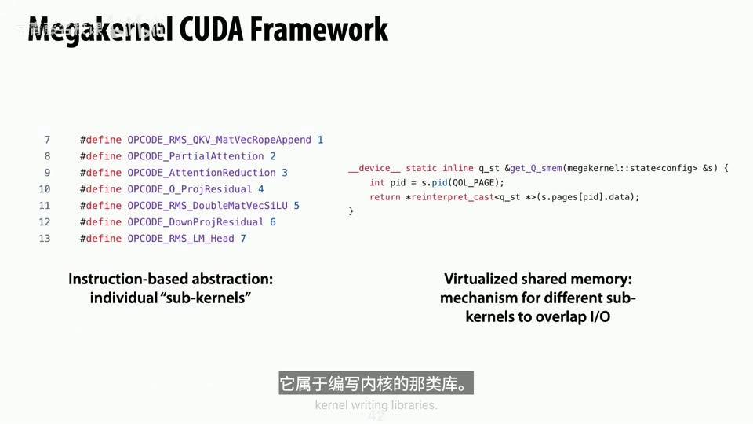 |
| 在 H100 上带宽利用率达到 72%，几乎跑满了 GPU 的物理极限。抛开我们这里做的所有复杂处理， [【跳转到 26:48】](https://www.bilibili.com/video/BV11LEA6eEuj/?p=19&t=1608) | 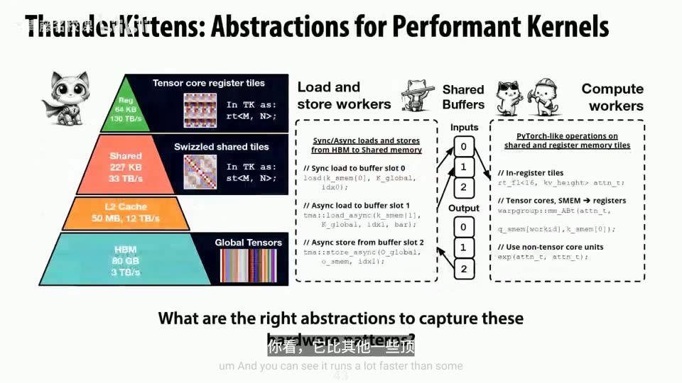 |
| 只看 GPU 执行这个操作的物理极限速度，我们已经接近那个极限的 72% 了。这部分的一个启示是，如果你能深度掌控内核、理解硬件，就能解锁全然不同的计算范式，这些细节只有当你深入到推理的底层去摸索时才会发现。那下面我要讲点新东西，这就进入新架构的领域了。我要介绍一个新模型叫 Parcae。 [【跳转到 26:58】](https://www.bilibili.com/video/BV11LEA6eEuj/?p=19&t=1618) | 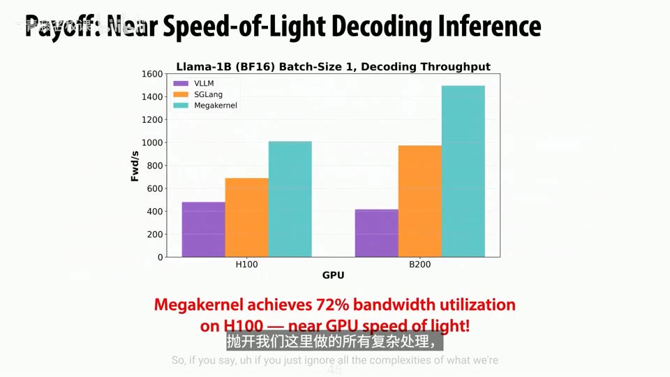 |
| 这是我 UCSD 实验室的成果，由 Hayden 主导，还和 Zachary、Taylor 合作完成。 [【跳转到 27:23】](https://www.bilibili.com/video/BV11LEA6eEuj/?p=19&t=1643) | 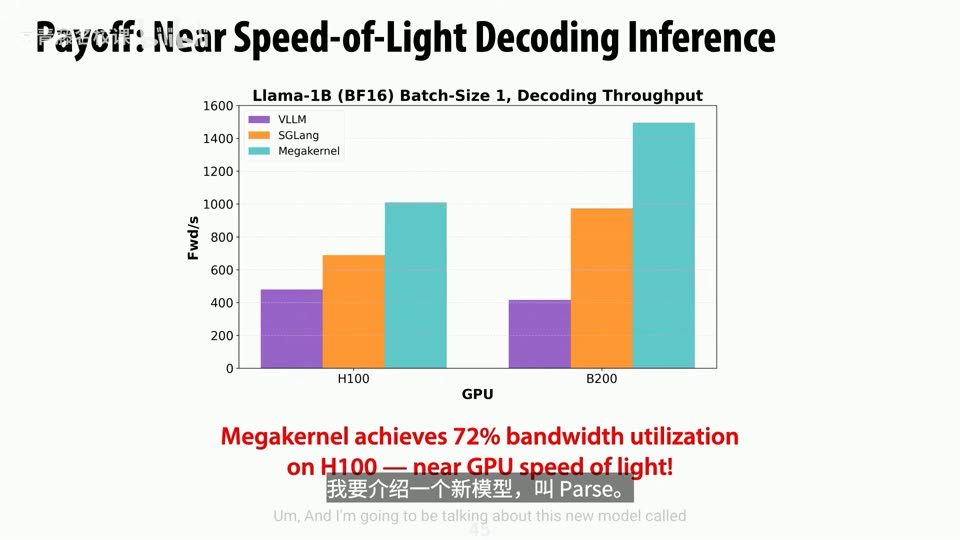 |
| 我待会再回到这点。开场时我讲过，这些新能力之所以出现， [【跳转到 27:28】](https://www.bilibili.com/video/BV11LEA6eEuj/?p=19&t=1648) | 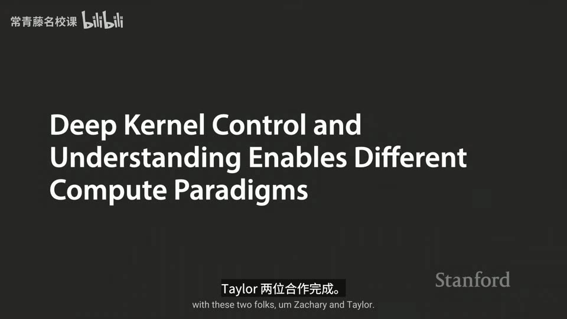 |
| 是因为你开始扩大模型参数和数据的规模。在 Parcae 这个工作里， [【跳转到 27:33】](https://www.bilibili.com/video/BV11LEA6eEuj/?p=19&t=1653) | 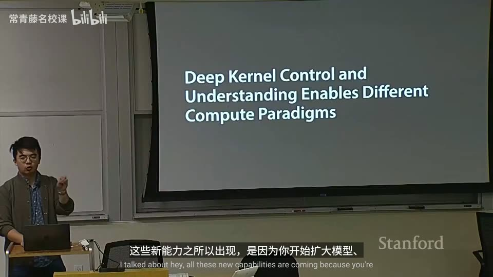 |
| 我们想问另一个问题：规模扩张是唯一的路吗？还是说有没有别的办法能达到同样的质量？做 Parcae 时，我们想试试循环 transformer 技术。 [【跳转到 27:39】](https://www.bilibili.com/video/BV11LEA6eEuj/?p=19&t=1659) |  |
| 就是把 transformer 的某些模块拿出来循环跑。所以与其让 token 一层层过模型，不如让它们在处理过程中反复在循环里跑。Parcae 设计里有几块内容：首先我们用了一些状态空间模型理论，还有 SSM 理论。 [【跳转到 27:50】](https://www.bilibili.com/video/BV11LEA6eEuj/?p=19&t=1670) | 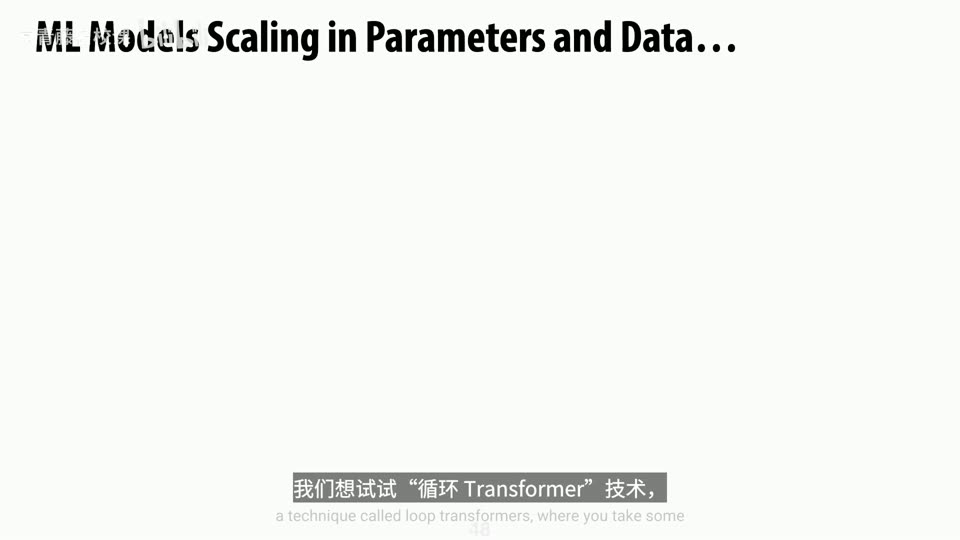 |
| 主要是为了稳住这个操作。要是直接训，我们发现模型会直接崩掉。另外我们发现一些有趣的缩放定律，说明数据多了得增加这些循环模型的循环次数，所以为了把 Parcae 用好，你得在一定程度上复用它们。先说说动机：为什么我们觉得这个循环问题很有意思？简单来说， [【跳转到 28:08】](https://www.bilibili.com/video/BV11LEA6eEuj/?p=19&t=1688) | 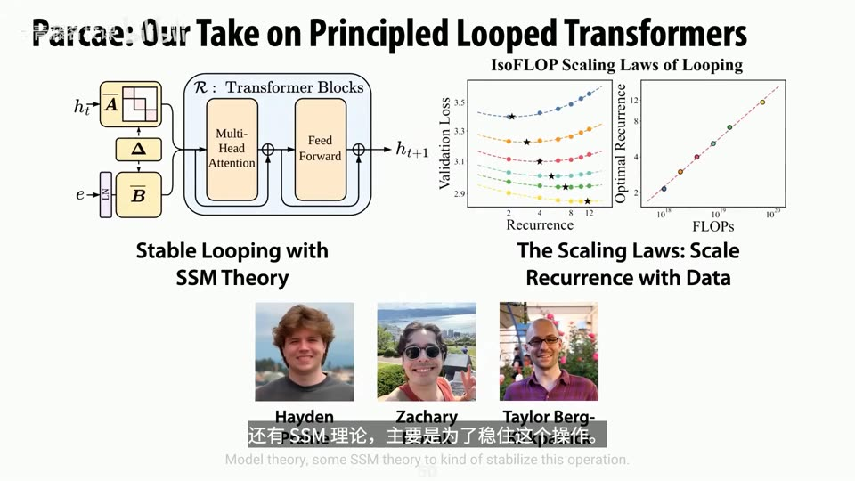 |
| 假设有个激活值穿过模型的一部分 M，它会碰到循环块，反复穿过该层，多次运行相同的激活值。紫色块是循环块，最后会返回结果。这有好处：parameter 保持不变，却能调高 FLOPs。 [【跳转到 28:33】](https://www.bilibili.com/video/BV11LEA6eEuj/?p=19&t=1713) | 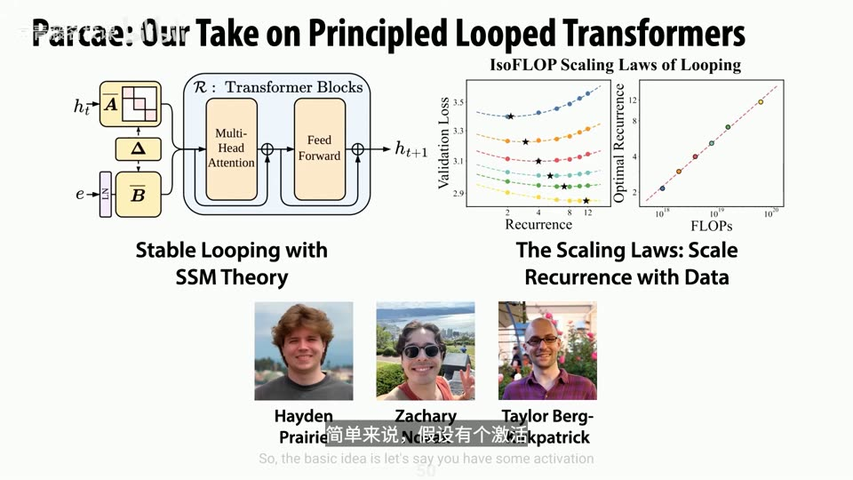 |
| 如果觉得 FLOPs 越多质量越高，这就能不增加 parameter 成本来提升质量。 [【跳转到 28:49】](https://www.bilibili.com/video/BV11LEA6eEuj/?p=19&t=1729) | 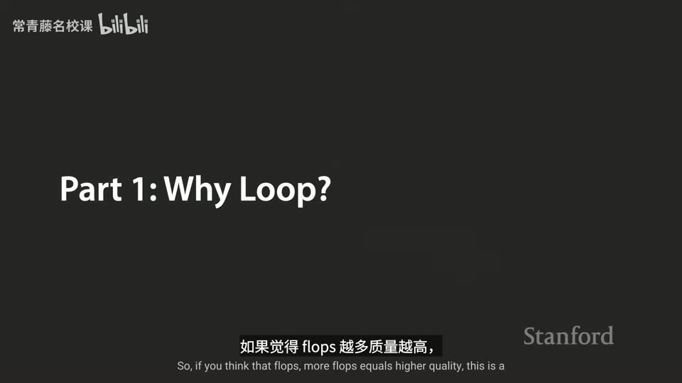 |
| 虽然还有几年前的旧作，也就是 RDM，表明实际能获得更高表达能力：有些东西用相同 parameter 数表达不了，而这些循环模型却能表达。我们一直在思考怎样让每个参数发挥最大价值，也就是在数据里这些模型能展现出怎样的智能水平。起初有些不错的结果，马里兰大学 Tom Goldstein 团队有篇论文说， [【跳转到 28:54】](https://www.bilibili.com/video/BV11LEA6eEuj/?p=19&t=1734) | 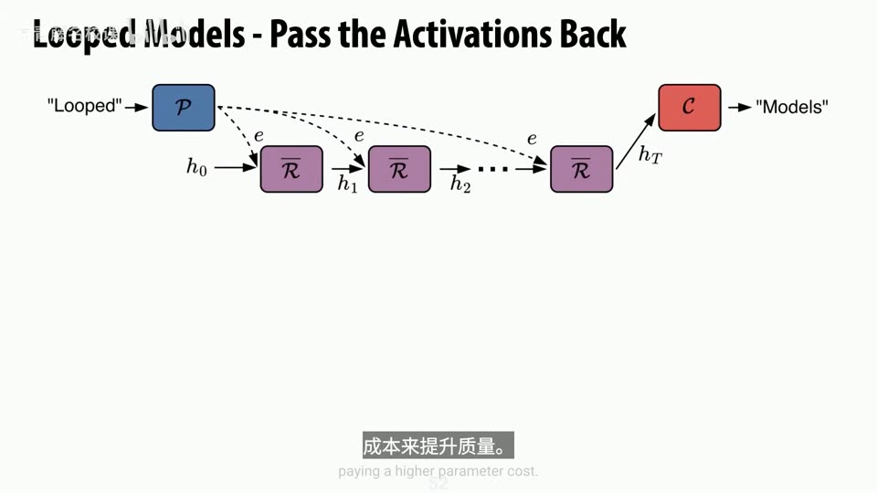 |
| 这东西说不定比 transformer 更强，这是某些任务上的一些结果。Twitter 上也有不少热议，因为发布 Parcae 前一周，OpenAI 有人说 Claude 是个循环语言模型。嗯，我觉得他说的不对，他就是在瞎编。结果那会儿 Twitter 上全是各种猜测，闹得沸沸扬扬。 [【跳转到 29:19】](https://www.bilibili.com/video/BV11LEA6eEuj/?p=19&t=1759) | 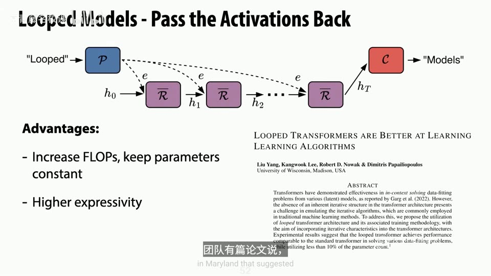 |
| 最后他只能发博文认错，说那都是他瞎编的，这些都不是真的。但我们觉得挺有意思，所以早在那波 Twitter 热议之前就开始研究了。 [【跳转到 29:37】](https://www.bilibili.com/video/BV11LEA6eEuj/?p=19&t=1777) | 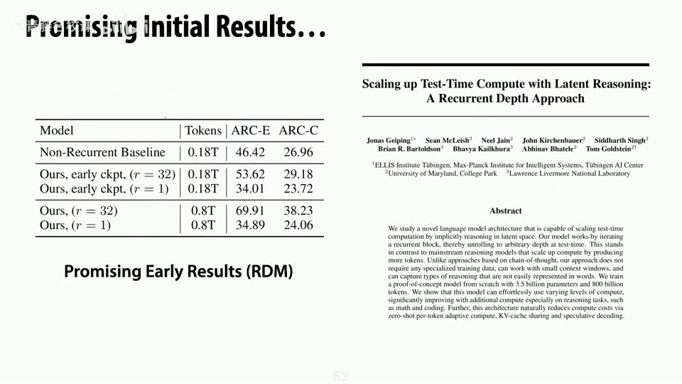 |
| 不过我觉得这里有些地方挺值得琢磨的。这类循环模型有个问题：你训练它们的时候，只要稍微改动一下训练算法，比如把学习率调一点点，模型就会突然开始崩掉。比如我做学习率扫描，十次有九次这模型都不收敛、会爆掉，冒出 NaN 或损失激增。训练大模型时，若见损失暴涨，说明训练出问题了。 [【跳转到 29:47】](https://www.bilibili.com/video/BV11LEA6eEuj/?p=19&t=1787) | 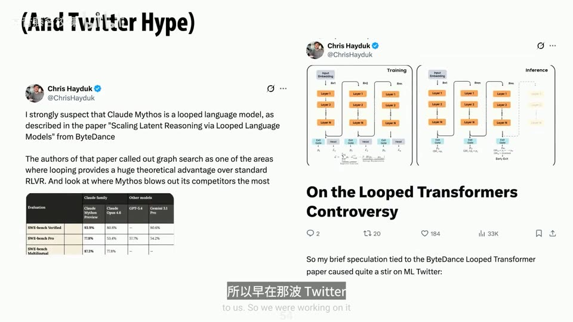 |
| 得深究到底是怎么回事。以前靠土办法，比如每层都加归一化来看情况， [【跳转到 30:12】](https://www.bilibili.com/video/BV11LEA6eEuj/?p=19&t=1812) | 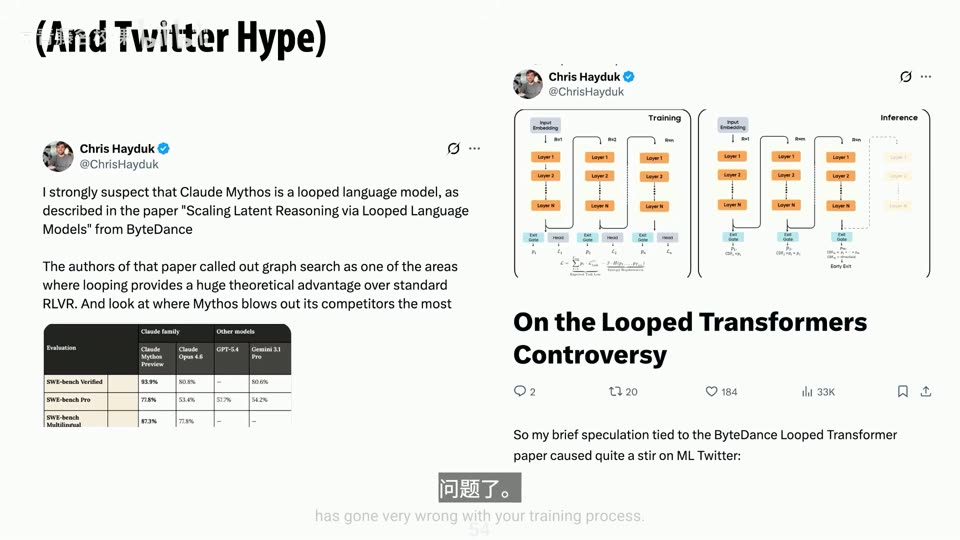 |
| 或者干脆只用 2e-4 的学习率，别的都不行。这损失暴涨说明底下还有更深层的原因。我们用类似状态空间模型的思路来解决稳定性问题。我们的核心发现是，这个过程是可以分析的；直接硬算太复杂，因为 R 模块参数实在太多，模型里有很多非线性操作，比如 softmax、GLU 和 RoPE。 [【跳转到 30:17】](https://www.bilibili.com/video/BV11LEA6eEuj/?p=19&t=1817) | 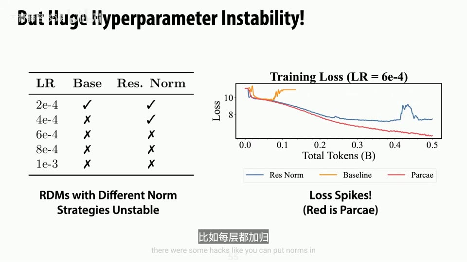 |
| 太复杂了。我们的思路是直接看看这个残差到底在发生什么，就是那激活值在各模块之间变化其实不大。 [【跳转到 30:42】](https://www.bilibili.com/video/BV11LEA6eEuj/?p=19&t=1842) | 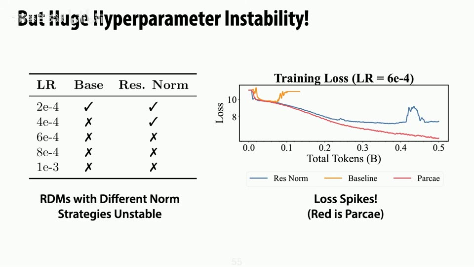 |
| 这是我们第一个发现：这些残差块只是微调向量， [【跳转到 30:48】](https://www.bilibili.com/video/BV11LEA6eEuj/?p=19&t=1848) | 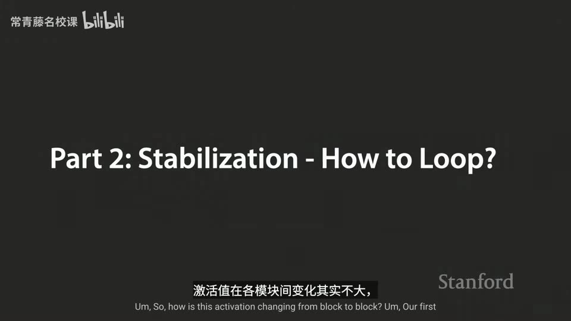 |
| 影响其实没那么大。那么我们接下来该怎么做呢？我们试着建个模，深挖一下里面的细节。我们基于这个残差建立了一个动态系统模型。这么做之后，我们发现模型里有几个部分，写出来看着不起眼，实际上却影响巨大。我们把这些非线性组件，比如注意力机制、GLU 和带中间层的大前馈网络， [【跳转到 30:53】](https://www.bilibili.com/video/BV11LEA6eEuj/?p=19&t=1853) | 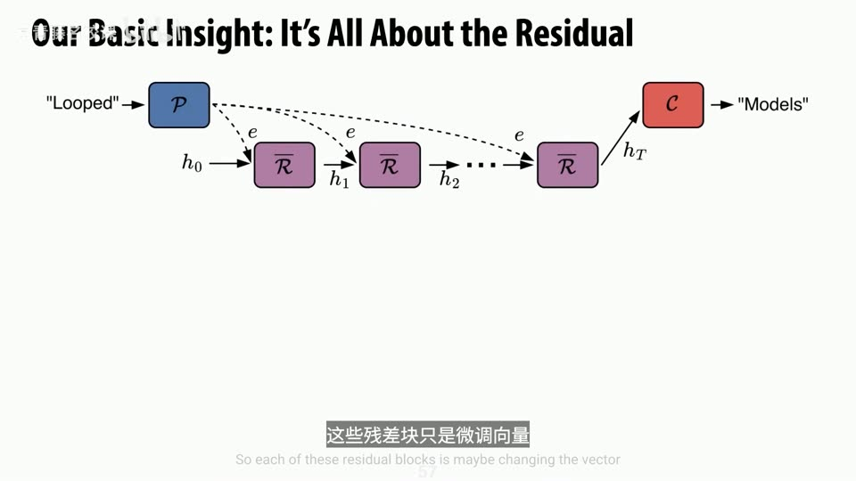 |
| 先打包处理。我们把它们装进一个盒子，叫做 R，R 是某种复杂的非线性结构。我们把它放到一边，剩下的就是 A 和 B 矩阵。B 矩阵负责对你初始的向量做某种变换，循环开始前初始向量是什么；而 A 矩阵决定了如何在每次循环中变换这个残差。 [【跳转到 31:18】](https://www.bilibili.com/video/BV11LEA6eEuj/?p=19&t=1878) | 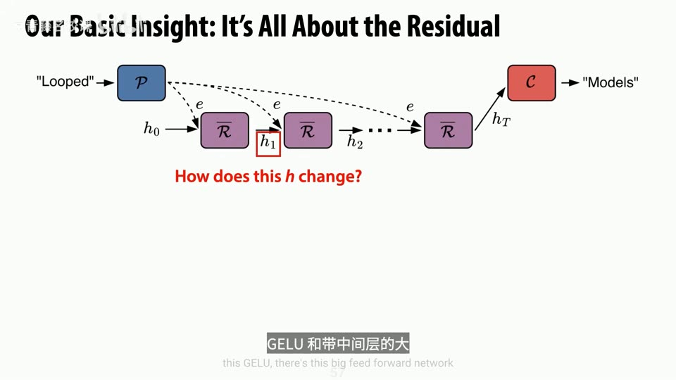 |
| transformer 的复杂性都放到一边，就能用一种相对简单的方式来看待之前的循环。在以前的案例里，你确实会做一些挺常规的决定。比如一种情况，你直接把它当成恒等变换，就是简单相加；另一种情况，它是一个完全可学习的矩阵。我们接着想，要是直接……经验显示，A 和 B 矩阵其实主导了方程的量级。 [【跳转到 31:43】](https://www.bilibili.com/video/BV11LEA6eEuj/?p=19&t=1903) | 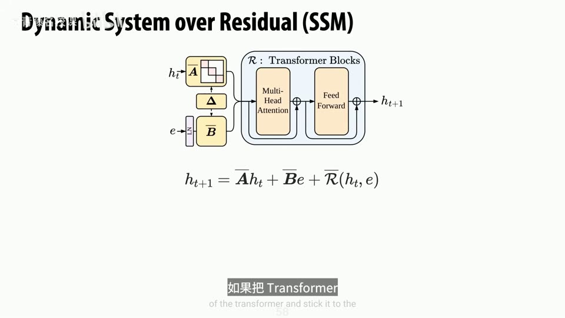 |
| 直接去掉那个复杂的非线性部分，结果会怎样？结果呢，你会得到一个很简单的系统，用微积分就能解出答案。你可以算出给定初始激活和初始注入，你甚至可以直接经验性地算出 t+1 时的激活状态。你会注意到几点：这由 A 矩阵主导，尤其是被大幅幂次的那个 A 矩阵。由此我们意识到，有个量叫 A 的谱半径。 [【跳转到 32:08】](https://www.bilibili.com/video/BV11LEA6eEuj/?p=19&t=1928) | 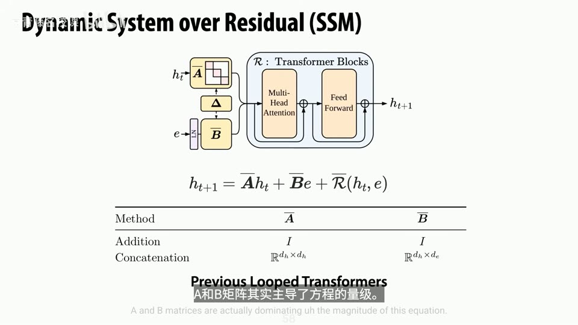 |
| 谱半径基本等同于范数。一种看法是，你把矩阵大幅幂次。咱们打个比方，假设这个矩阵就是个标量 2，2 的 4 次方大概是 16。你把激活值放大到 2 的 16 次方，数值变得巨大，这解释了为何损失值会剧烈波动。我们发现，先前论文里 A 和 B 矩阵的选择 [【跳转到 32:33】](https://www.bilibili.com/video/BV11LEA6eEuj/?p=19&t=1953) |  |
| 要么边缘稳定，要么就不稳定，这样会让系统不稳定。所以在 Parcae 里我们想：如果让 A 和 B 随便怎么变，系统就会爆炸，那咱们约束一下 A 和 B，让它们在数学上不会爆炸呢？对于 A，咱们直接把它设成负对角矩阵，这样它的幂次项最终会趋于零，不会发散；对于 B 矩阵，我们加了个简单的线性范数约束。 [【跳转到 32:58】](https://www.bilibili.com/video/BV11LEA6eEuj/?p=19&t=1978) |  |
| 因为它只应用一次，不会发散。只要谱半径小于一，系统就稳定了。训练时你会发现损失曲线很稳定。这就是我们对 A 和 B 重参数化后的稳定版，哪怕用 6e-4 这种让别的模型崩掉的学习率，最后模型还是稳的。这样就能自然约束激活值的状态范数。那条橙色基线就是完全没加约束的模型，它直接炸到 10 的 19 次方。 [【跳转到 33:23】](https://www.bilibili.com/video/BV11LEA6eEuj/?p=19&t=2003) | 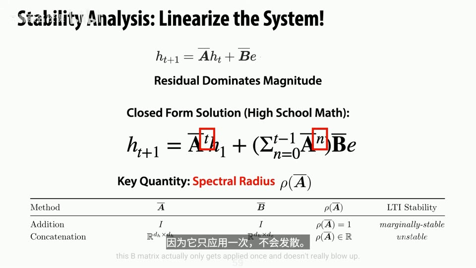 |
| 蓝色线则是加了范数约束的模型。而模型想扩张激活值， [【跳转到 33:48】](https://www.bilibili.com/video/BV11LEA6eEuj/?p=19&t=2028) | 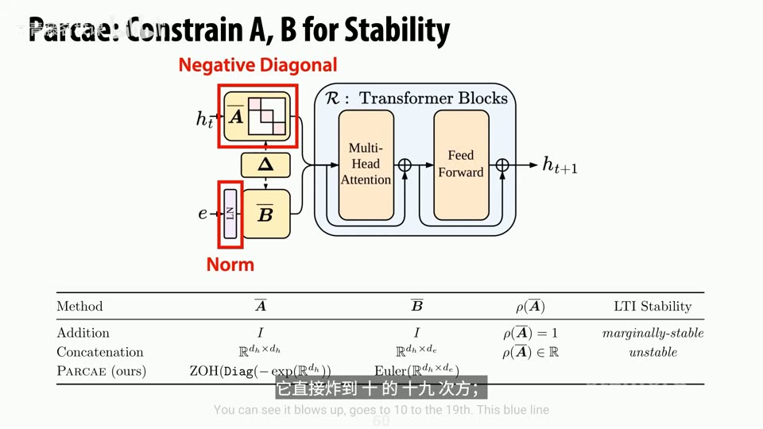 |
| 因为它觉得空间越大，表示效果越好。咱们把这些概念尽量拉开距离，再用范数约束把想膨胀的数值压回到一。这两种力量互相拉扯，导致损失出现剧烈波动。虽然右侧范数控制得很好，激活没炸，但损失值确实出现了很糟糕的波动。所以激活值稍微改一下就能稳定训练和这些循环过程。 [【跳转到 33:54】](https://www.bilibili.com/video/BV11LEA6eEuj/?p=19&t=2034) | 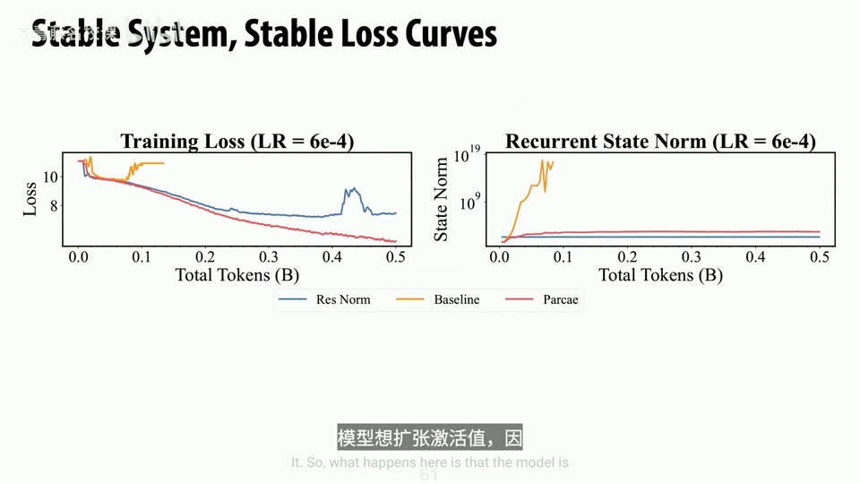 |
| 系统不仅更稳了，模型质量也更高。这张表对比了 Parcae 模型和之前的循环 transformer 模型（recurrent depth models），可以看到它在各种应用里表现都更好。Parcae 不仅胜过上一代循环模型，还强于那些很强的 transformer 基线。这种 transformer 就像那些微型对话模型，一群人都想让它尽快学会。拿这种模型来说， [【跳转到 34:19】](https://www.bilibili.com/video/BV11LEA6eEuj/?p=19&t=2059) | 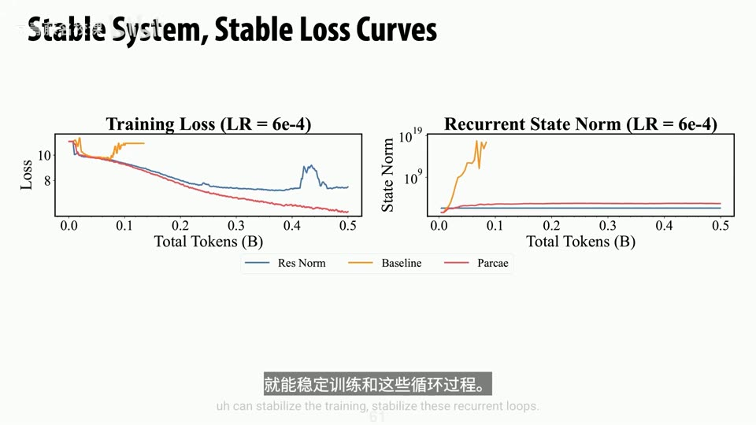 |
| 用同样的基础 transformer 架构做循环并稳住它， [【跳转到 34:44】](https://www.bilibili.com/video/BV11LEA6eEuj/?p=19&t=2084) | 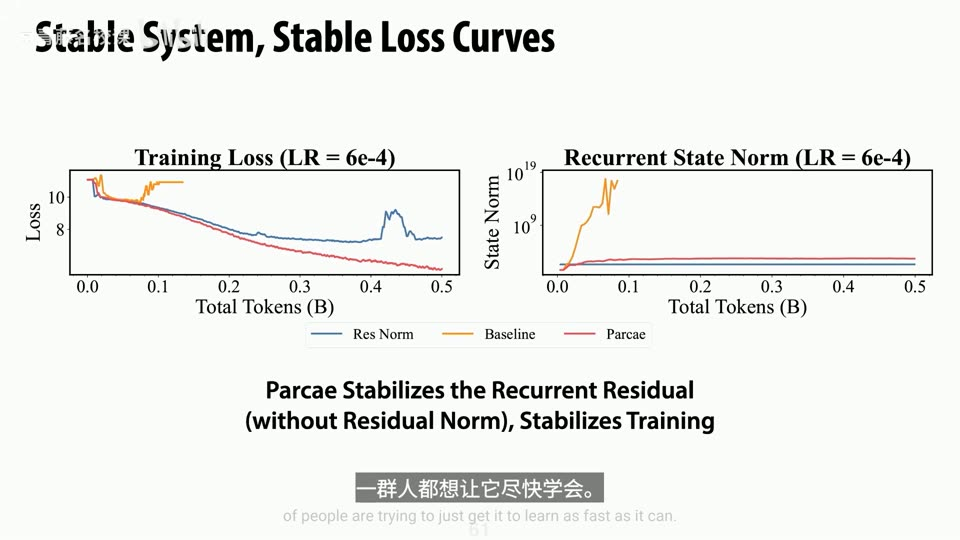 |
| 困惑度会更低，端到端质量也更好。接着我们跑了一些基础的扩展定律。我就在想，这事儿挺有意思，循环操作确实能提升效果，但咱们得想想，有没有证据显示我们应该更激进地这么干。先退一步说，几年前当我们开始大规模扩展这些模型时，一个自然的问题是：是该把模型做大，还是只是多训练些数据？ [【跳转到 34:50】](https://www.bilibili.com/video/BV11LEA6eEuj/?p=19&t=2090) | 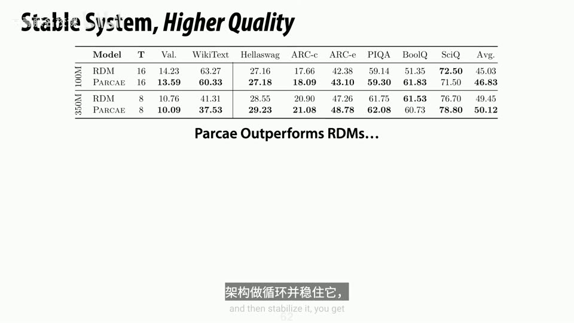 |
| 几年前大家就开始琢磨这两个量该怎么一起扩展。 [【跳转到 35:15】](https://www.bilibili.com/video/BV11LEA6eEuj/?p=19&t=2115) | 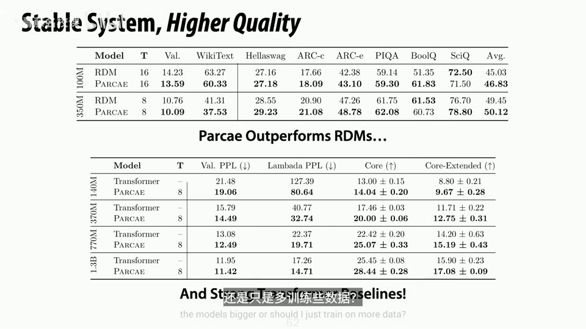 |
| 扩参数还是扩数据？咱们搞出了一堆复杂的幂律曲线，都长这样。这些图挺漂亮，颜色也多。咱们主要得看的是——抱歉，你要注意的是， [【跳转到 35:21】](https://www.bilibili.com/video/BV11LEA6eEuj/?p=19&t=2121) | 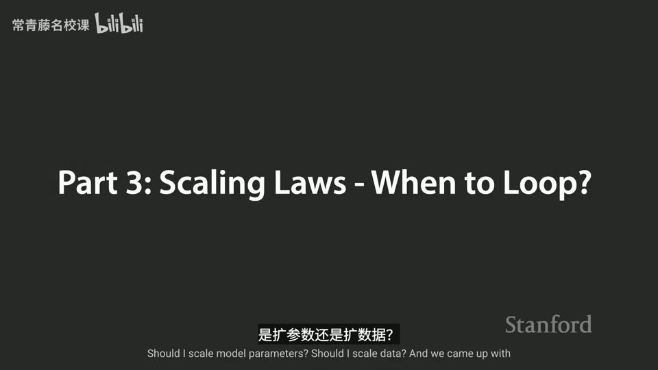 |
| 曲线向右下倾斜，就说明要同时扩展数据和参数。 [【跳转到 35:32】](https://www.bilibili.com/video/BV11LEA6eEuj/?p=19&t=2132) | 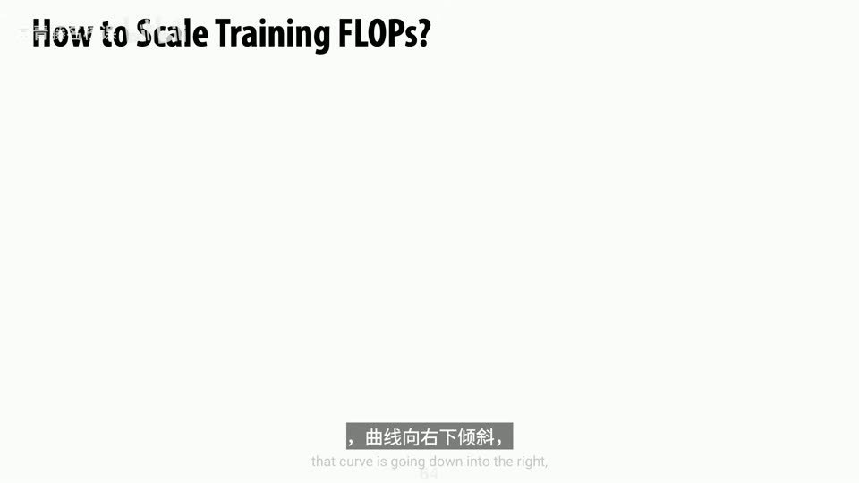 |
| 如果曲线垂直向下，那就只要增加训练数据，不用加参数；如果曲线水平向右，那就完全别加数据。 [【跳转到 35:37】](https://www.bilibili.com/video/BV11LEA6eEuj/?p=19&t=2137) | 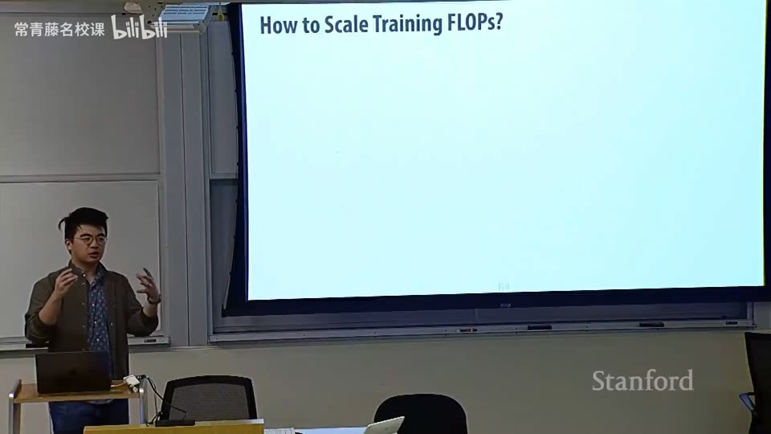 |
| 只加参数？曲线向右下倾斜说明要同步扩展数据和参数，还用 35 万亿 token 训练万亿参数模型，效果更好。我们想问循环机制怎么融入其中。有两种可能。向右下倾斜意味着要扩展数据和参数，结合循环机制有几种可能，你可能会觉得根本不该用循环机制。 [【跳转到 35:44】](https://www.bilibili.com/video/BV11LEA6eEuj/?p=19&t=2144) | 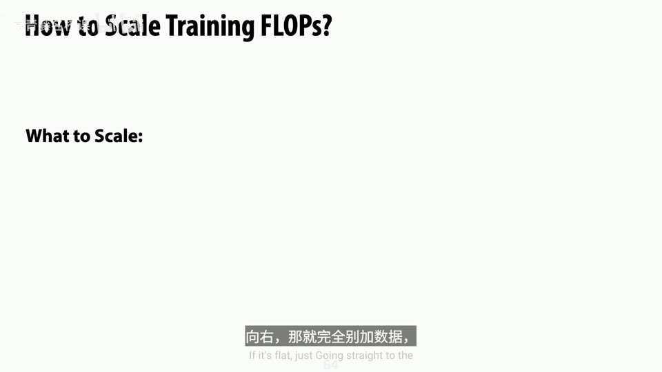 |
| 最好还是用同一个循环模型。你可能会觉得，要么多做循环，要么只对一小部分做循环。我们这里展示的是，至少在初步的缩放定律里，这些曲线都保持计算量和参数规模不变，所以那条曲线就是一个模型，左右两边的参数数量是一样的。 [【跳转到 36:09】](https://www.bilibili.com/video/BV11LEA6eEuj/?p=19&t=2169) | 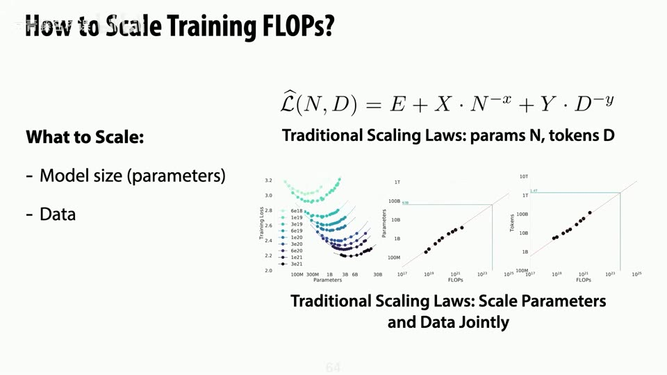 |
| 往下走，颜色变化意味着我们通过增加数据量来提升训练模型的算力，所以这里我们在调整数据量和循环次数。我们发现这两种模型都再次呈现出右下倾斜的趋势，这说明对于这些固定参数的训练，随着数据量增加，你也应该相应增加循环计算的量。我们发现这些循环遵循经典的幂律关系。 [【跳转到 36:27】](https://www.bilibili.com/video/BV11LEA6eEuj/?p=19&t=2187) | 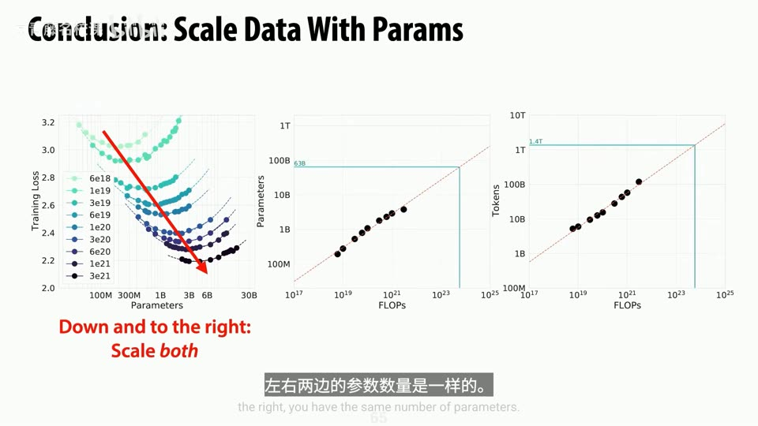 |
| 现在你其实可以开始预测了：随着循环和 token 同步扩展，这些缩放定律就能预测质量。（此处录音不清）我们之前有个很复杂的 3D 图展示了不少东西，比如循环、数据和参数，它大致指向右下方，同时也指向那个方向。所以如果你相信这个图， [【跳转到 36:52】](https://www.bilibili.com/video/BV11LEA6eEuj/?p=19&t=2212) | 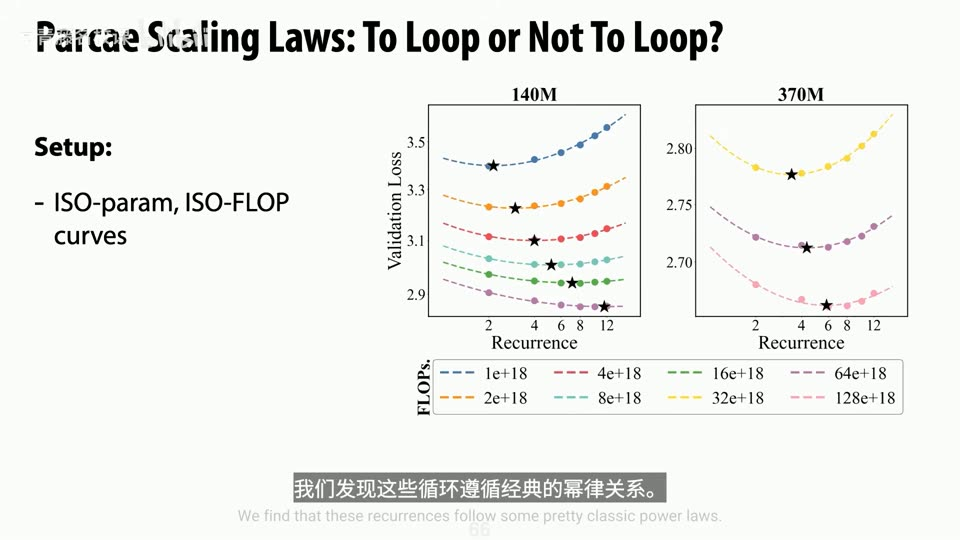 |
| 它表明你应该同时扩展这三者。对啊，但这个图真的很难看，因为它是 3D 的，有点怪。这些幂律表明，增加数据时你应该增加循环；还有其他幂律表明，增加数据时你应该增加参数。显然，条件允许的话，这三项最好都提上去。但有一点，如果你固定模型大小， [【跳转到 37:17】](https://www.bilibili.com/video/BV11LEA6eEuj/?p=19&t=2237) | 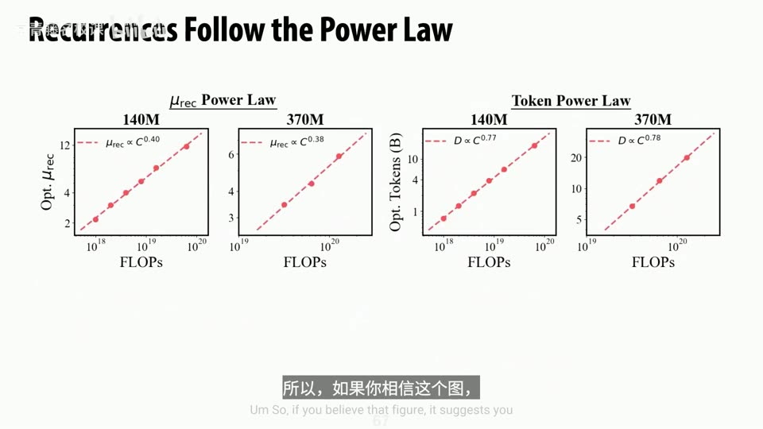 |
| 同时增加数据量，你也得增加 recurrence。这挺有意思，因为据我所知， [【跳转到 37:40】](https://www.bilibili.com/video/BV11LEA6eEuj/?p=19&t=2260) |  |
| 现在的模型都不带 recurrence，所以它们都在曲线最左边，数据量巨大，说明训练时我们或许能做得更好。 [【跳转到 37:45】](https://www.bilibili.com/video/BV11LEA6eEuj/?p=19&t=2265) | 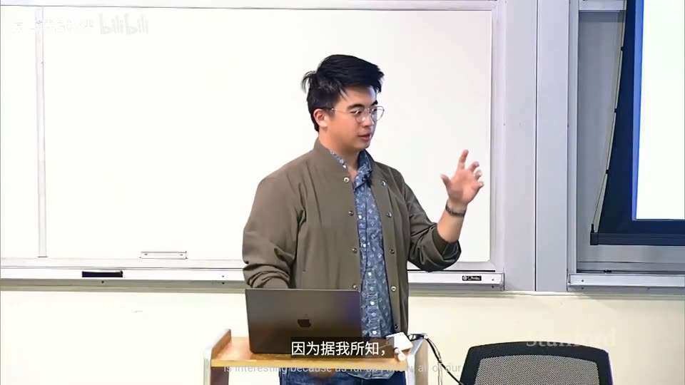 |
| 都没错，这只是换个角度展示这个实验。 [【跳转到 37:53】](https://www.bilibili.com/video/BV11LEA6eEuj/?p=19&t=2273) | 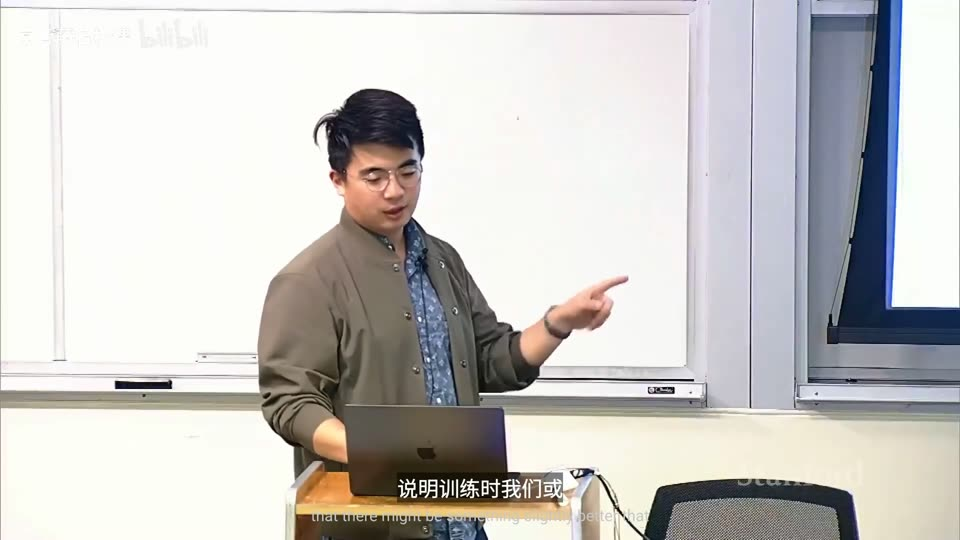 |
| 看橙色曲线，这里我们固定了模型规模。橙色曲线代表固定深度的模型，也就是传统的 transformer 模型；蓝色曲线是固定 FLOP 预算的情况。looping 模型在曲线上该取哪个点？这里橙色和蓝色的点训练用的算力相同，但数据量不同，模型大小是一样的：如果是靠增加循环次数而不是只堆数据来达到这个算力， [【跳转到 37:58】](https://www.bilibili.com/video/BV11LEA6eEuj/?p=19&t=2278) | 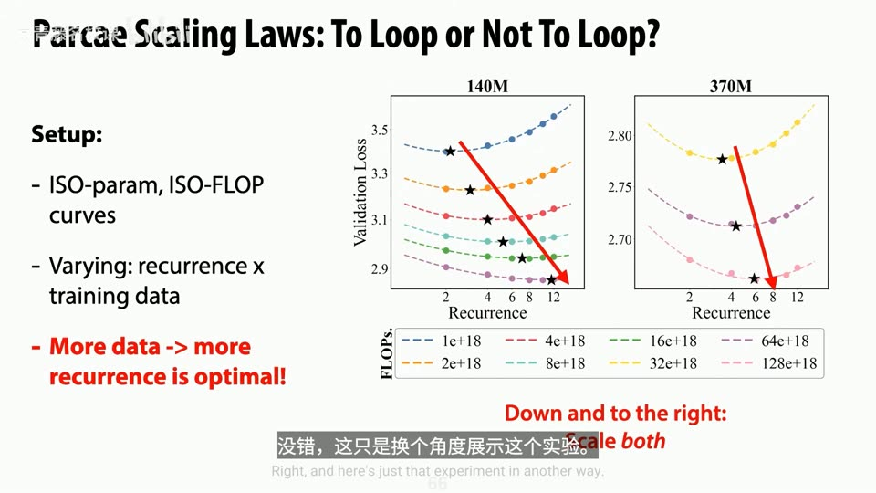 |
| 损失会更低。这说明我们或许应该让所有大规模预训练都循环起来。 [【跳转到 38:23】](https://www.bilibili.com/video/BV11LEA6eEuj/?p=19&t=2303) | 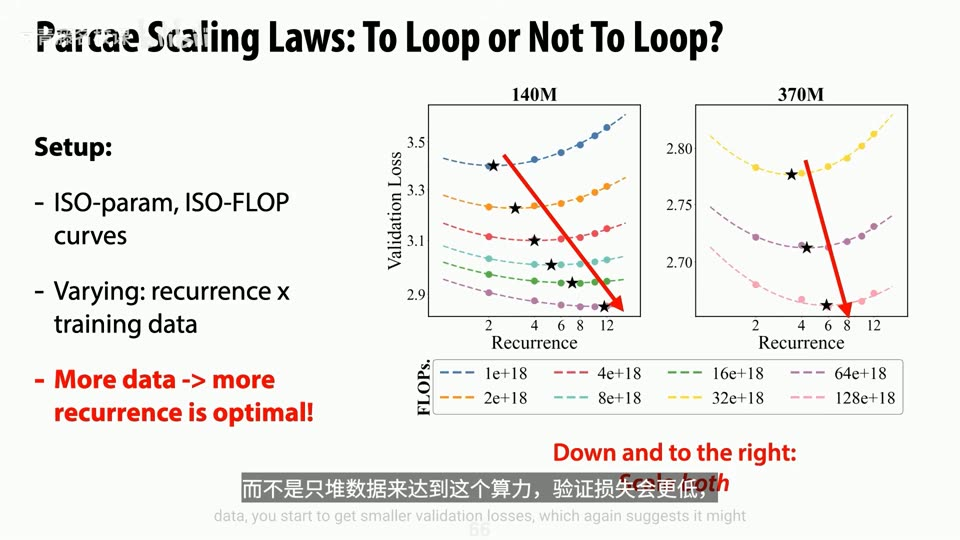 |
| 我稍微退一步，回到这次演讲的核心要点。希望今天我让大家多少明白了：如果你理解推理，理解这些模型，理解 GPU 内核，理解构成它们的每一个部分，你就真的能在机器学习算法上实现全栈创新。无论是通过新的路由算法来处理更多流量，或换种方式分配流量，还是用新的内核让系统的一部分跑得快得多， [【跳转到 38:28】](https://www.bilibili.com/video/BV11LEA6eEuj/?p=19&t=2308) | 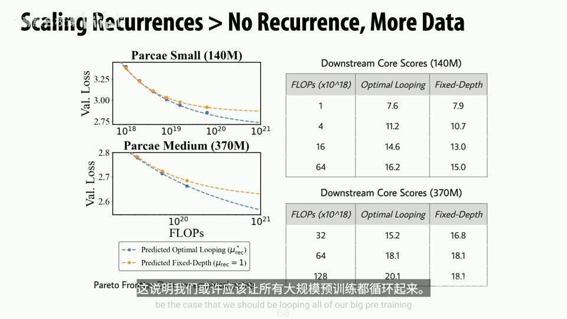 |
| 又或是用新架构让参数少很多时也能装进， [【跳转到 38:53】](https://www.bilibili.com/video/BV11LEA6eEuj/?p=19&t=2333) | 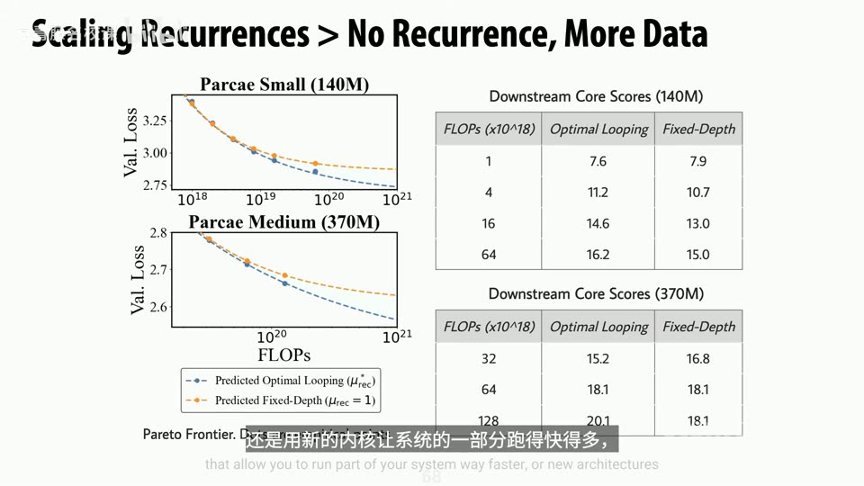 |
| 让它们以不同方式装进部分 GPU，减少通信量。这些都是这个问题 [【跳转到 38:58】](https://www.bilibili.com/video/BV11LEA6eEuj/?p=19&t=2338) | 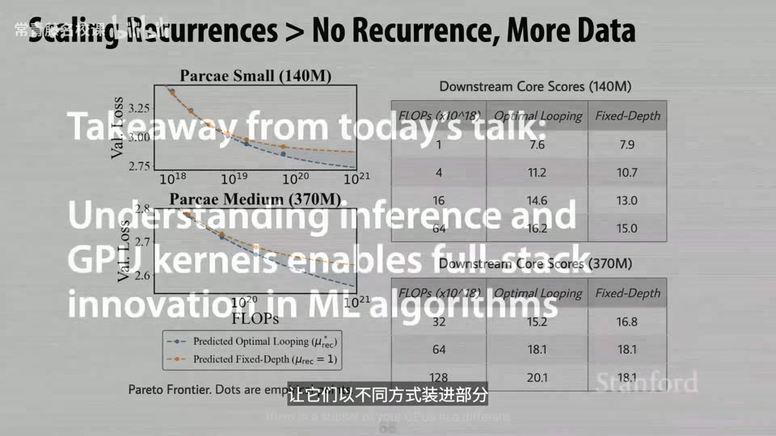 |
| 也就是我们今天看到的这个研究难题的不同侧面。也希望今天我至少能激发在座的一位 [【跳转到 39:03】](https://www.bilibili.com/video/BV11LEA6eEuj/?p=19&t=2343) | 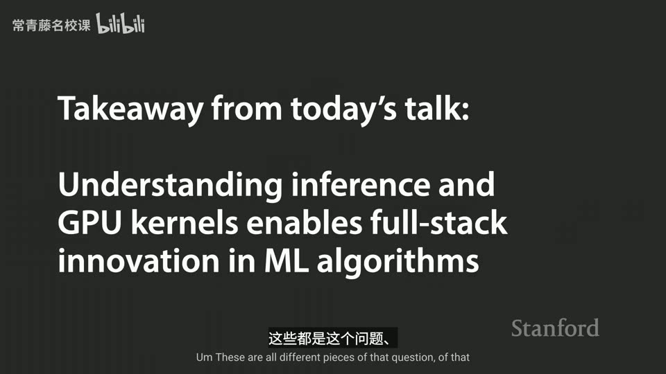 |
| 去更深入地探究其中一些内容。好了，谢谢。很高兴回答几个问题，我们有大约五到 10 分钟的提问时间，有问题的请举手。（课堂问答）我想知道，你是从头开始训练的吗？能不能展示一下其中的一些内容？ [【跳转到 39:10】](https://www.bilibili.com/video/BV11LEA6eEuj/?p=19&t=2350) | 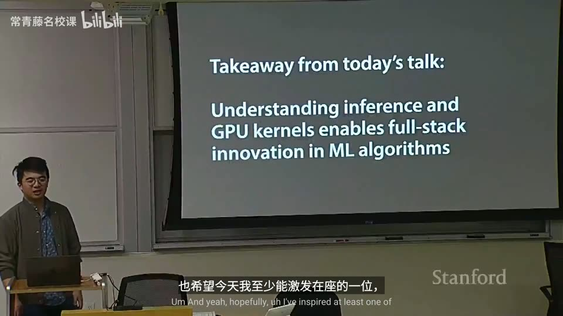 |
| 好的，好问题。问题是关于 Parcae，我们是不是从头开始训练。 [【跳转到 39:32】](https://www.bilibili.com/video/BV11LEA6eEuj/?p=19&t=2372) | 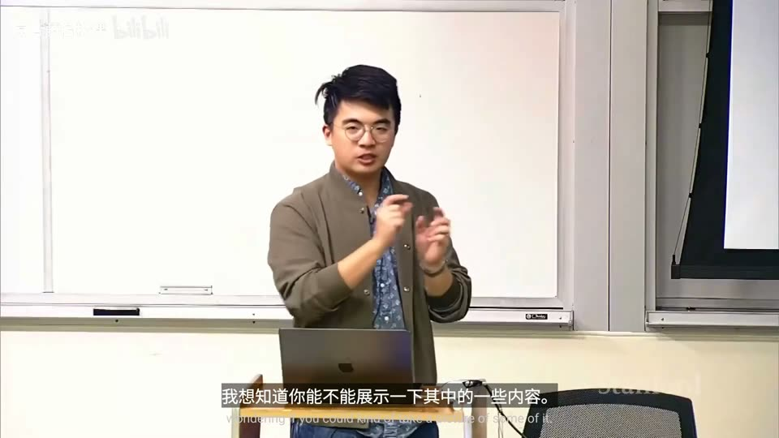 |
| 能用预训练模型做什么？嗯，几个月前有人发了篇很恶搞的博客， [【跳转到 39:37】](https://www.bilibili.com/video/BV11LEA6eEuj/?p=19&t=2377) | 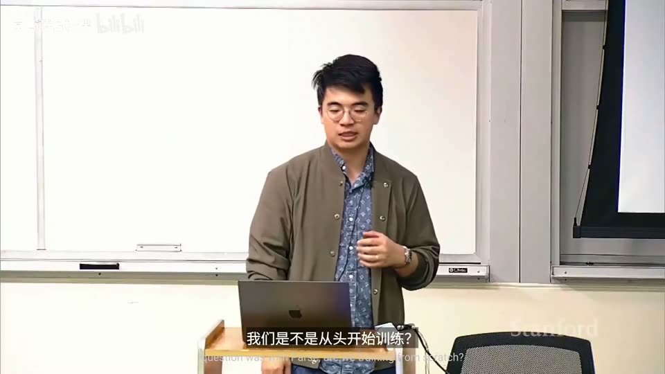 |
| 就赢了一个排行榜比赛。嗯，他其实是在一个 Qwen 模型里循环了两三层， [【跳转到 39:42】](https://www.bilibili.com/video/BV11LEA6eEuj/?p=19&t=2382) | 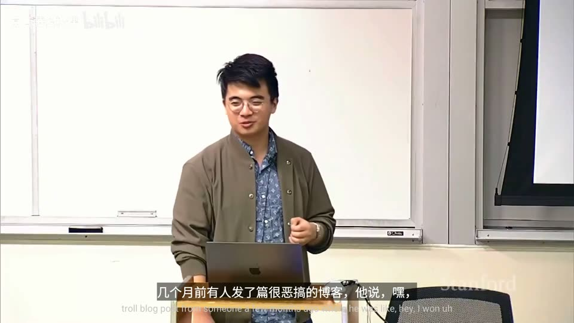 |
| 然后发现在一些数学问题上它的质量开始变高。啊，我们有一些相关研究在做， [【跳转到 39:47】](https://www.bilibili.com/video/BV11LEA6eEuj/?p=19&t=2387) | 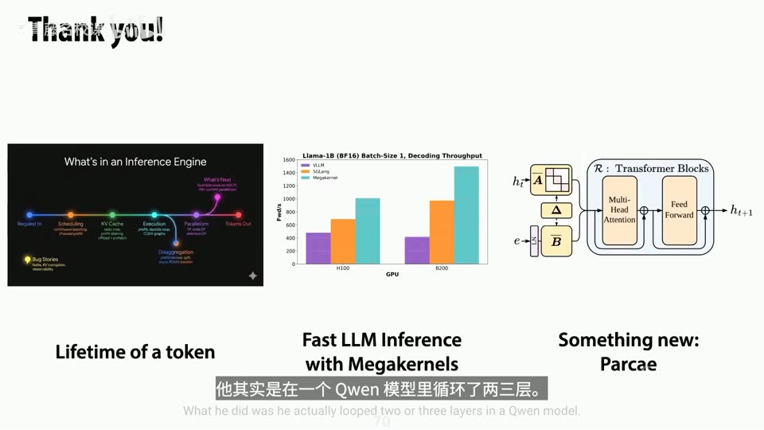 |
| 可能很快就会发布。但有些模型，只要对预训练模型做一点循环迭代，就能得到更高质量的结果。 [【跳转到 39:56】](https://www.bilibili.com/video/BV11LEA6eEuj/?p=19&t=2396) | 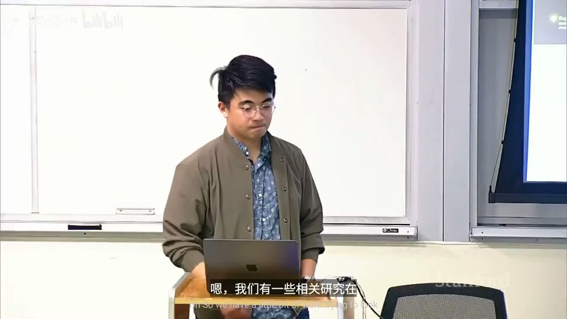 |
| 这真挺怪的，有点让我想不通，不知道为啥会这样。 [【跳转到 40:02】](https://www.bilibili.com/video/BV11LEA6eEuj/?p=19&t=2402) | 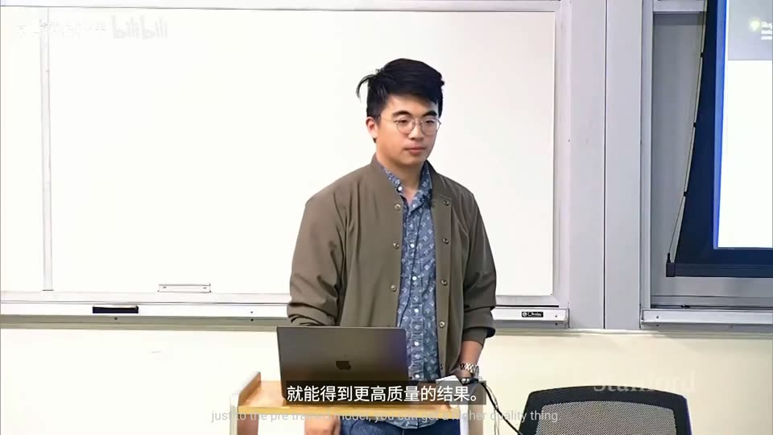 |
| 我们对这个挺感兴趣的。要是能说服 Hayden，他会去盯着激活值和实际的权重， [【跳转到 40:07】](https://www.bilibili.com/video/BV11LEA6eEuj/?p=19&t=2407) | 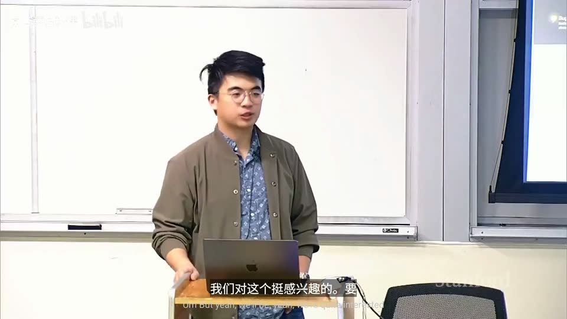 |
| 看看循环为啥能让效果变好。顺着刚才说的， [【跳转到 40:12】](https://www.bilibili.com/video/BV11LEA6eEuj/?p=19&t=2412) |  |
| 你提到了循环模型在算力上的最优性，能聊聊推理方面的影响和显存吗？这怎么帮你跑得更快？我对这些循环方法特别兴奋的一点是，高效跑推理的主要瓶颈往往是 GPU 显存，参数少了就能塞进更多 KV cache，或者减少跨 GPU 拆分带来的通信开销。 [【跳转到 40:17】](https://www.bilibili.com/video/BV11LEA6eEuj/?p=19&t=2417) |  |
| 所以小模型能带来很大的灵活性。嗯，我有个想法：要是把循环块缩得足够小，就能写个微型巨型内核， [【跳转到 40:36】](https://www.bilibili.com/video/BV11LEA6eEuj/?p=19&t=2436) | 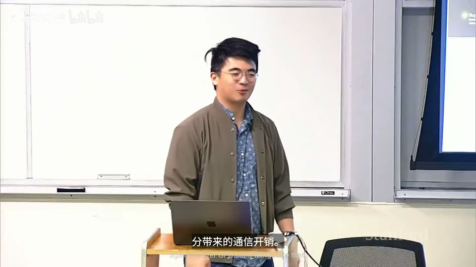 |
| 用超快循环跑这些计算。嗯，目前还没法把块儿做得那么小。 [【跳转到 40:46】](https://www.bilibili.com/video/BV11LEA6eEuj/?p=19&t=2446) |  |
| 但这挺有意思。当然，下一代 LPU 来了，Groq 芯片会结合 NVIDIA 的技术，它们大概有 250MB 内存。 [【跳转到 40:51】](https://www.bilibili.com/video/BV11LEA6eEuj/?p=19&t=2451) | 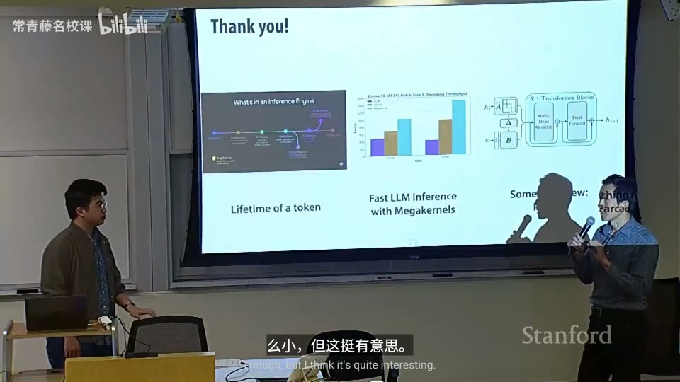 |
| 所以能塞进去的东西极少，不过可以设计适配方案，让权重常驻内存，极速跑激活值。 [【跳转到 40:58】](https://www.bilibili.com/video/BV11LEA6eEuj/?p=19&t=2458) |  |
| 跨过这些阈值会有非线性收益，希望我们很快能做到。（此处录音不清） [【跳转到 41:05】](https://www.bilibili.com/video/BV11LEA6eEuj/?p=19&t=2465) | 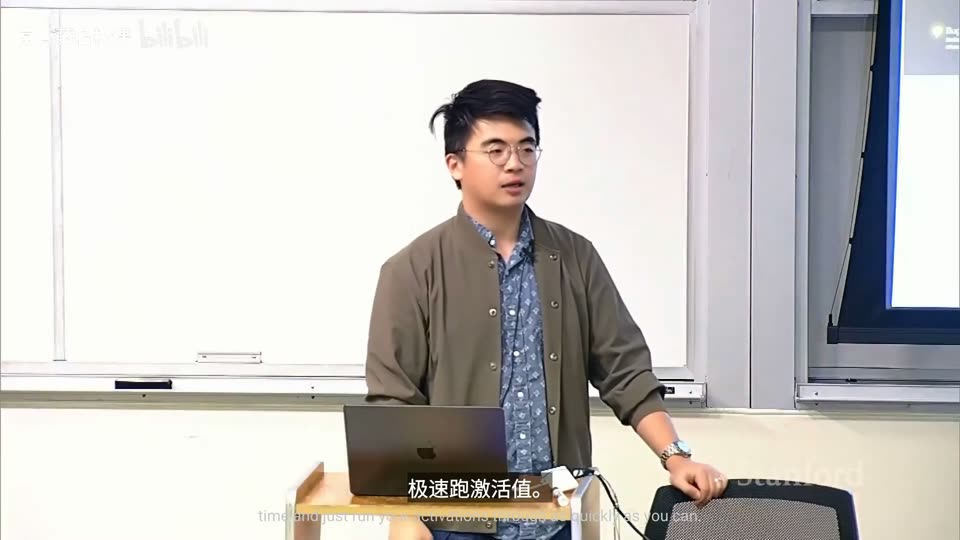 |
| 这总是严格最优的，但人们不这么做。巨型内核的代价是什么？是啊，工程师的血汗。事实证明，编写巨型内核非常耗费人力。 [【跳转到 41:19】](https://www.bilibili.com/video/BV11LEA6eEuj/?p=19&t=2479) |  |
| 打个比方，顶尖工程师一年可能也就为一种硬件 [【跳转到 41:28】](https://www.bilibili.com/video/BV11LEA6eEuj/?p=19&t=2488) | 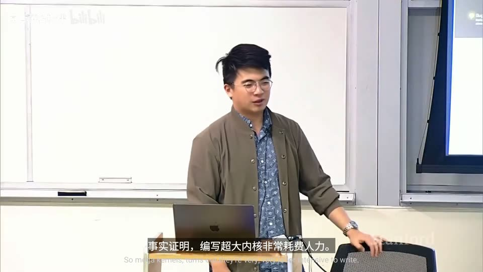 |
| 做出两三个模型的巨型内核。批量大小 1 到 16 还行， [【跳转到 41:33】](https://www.bilibili.com/video/BV11LEA6eEuj/?p=19&t=2493) |  |
| 一旦到 17 就得推倒重来，编写难度极大。 [【跳转到 41:39】](https://www.bilibili.com/video/BV11LEA6eEuj/?p=19&t=2499) |  |
| 我们正试着用编译器把其中一些工作自动化，这个过程做起来确实很难。在 GPU 编程里，巨型内核这个概念过去几十年一直起起落落， [【跳转到 41:45】](https://www.bilibili.com/video/BV11LEA6eEuj/?p=19&t=2505) |  |
| 但一旦搞定，速度就顶天了。 [【跳转到 41:53】](https://www.bilibili.com/video/BV11LEA6eEuj/?p=19&t=2513) | 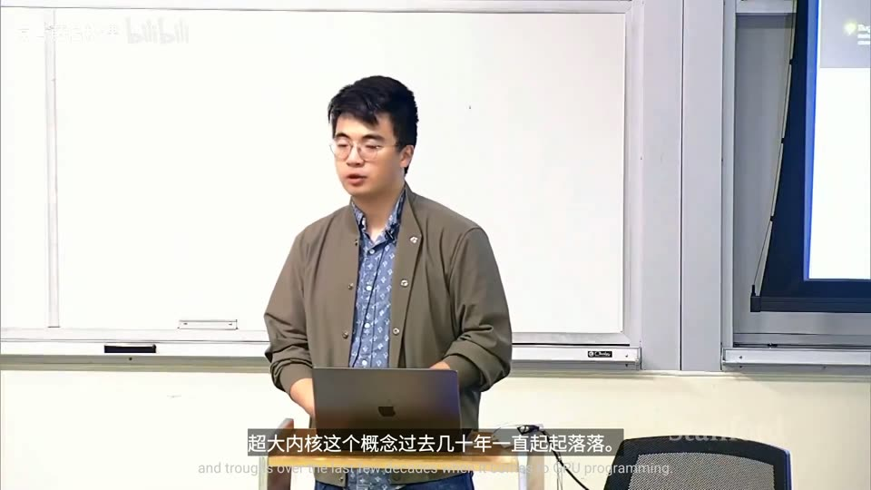 |
| 再也快不了。但这确实得耗费大量精力。行，我能问个问题吗？ [【跳转到 41:58】](https://www.bilibili.com/video/BV11LEA6eEuj/?p=19&t=2518) |  |
| 好，咱们能多聊聊协同设计吗？比如你提到的 Groq 和 Cerebras 这些推理新硬件。如果你设计模型， [【跳转到 42:04】](https://www.bilibili.com/video/BV11LEA6eEuj/?p=19&t=2524) | 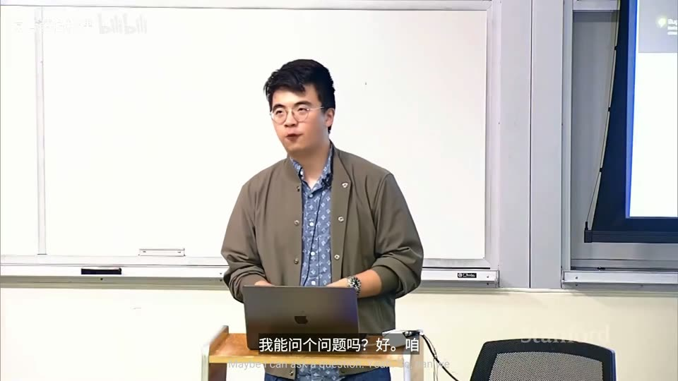 |
| 且知道它要在特定平台服务，该怎么调架构？对，有几件事得注意。 [【跳转到 42:12】](https://www.bilibili.com/video/BV11LEA6eEuj/?p=19&t=2532) | 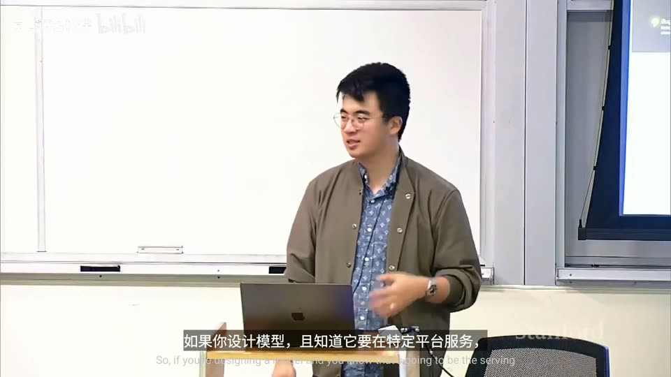 |
| 首先，内存是主要瓶颈。在特定 Cerebras 芯片上服务，得看晶圆算内存，调整模型大小以容纳 KV 缓存，还要留出余量。 [【跳转到 42:17】](https://www.bilibili.com/video/BV11LEA6eEuj/?p=19&t=2537) | 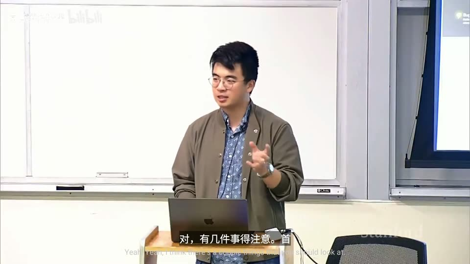 |
| 看最近的中国模型，它们的一些选择暗示了它们可能在考虑华为的新芯片。 [【跳转到 42:28】](https://www.bilibili.com/video/BV11LEA6eEuj/?p=19&t=2548) |  |
| 你会看到一些量化选择。比如你要在英伟达显卡上跑模型， [【跳转到 42:33】](https://www.bilibili.com/video/BV11LEA6eEuj/?p=19&t=2553) | 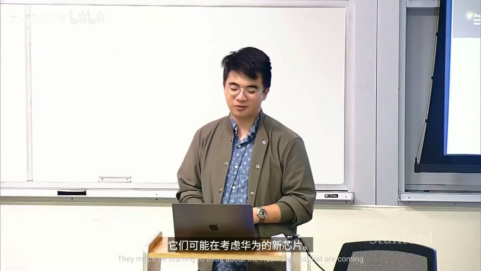 |
| 像它们的 Nemotron 就得用 NVFP4 格式来训练，这是英伟达芯片专有的 FP4 格式。如果你不用英伟达，比如用 AMD， [【跳转到 42:38】](https://www.bilibili.com/video/BV11LEA6eEuj/?p=19&t=2558) | 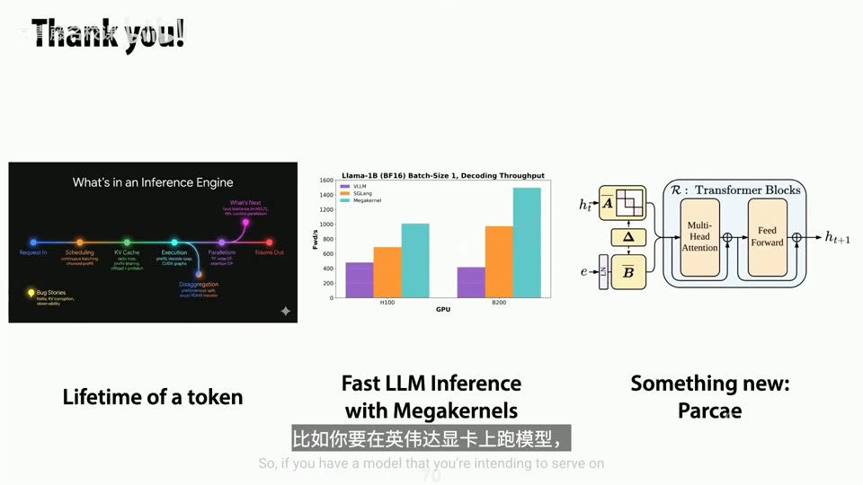 |
| 就得用另一种叫 MXFP4 的格式，它们各有优劣。所以你得根据选用的硬件来做这些细微的选择。 [【跳转到 42:49】](https://www.bilibili.com/video/BV11LEA6eEuj/?p=19&t=2569) | 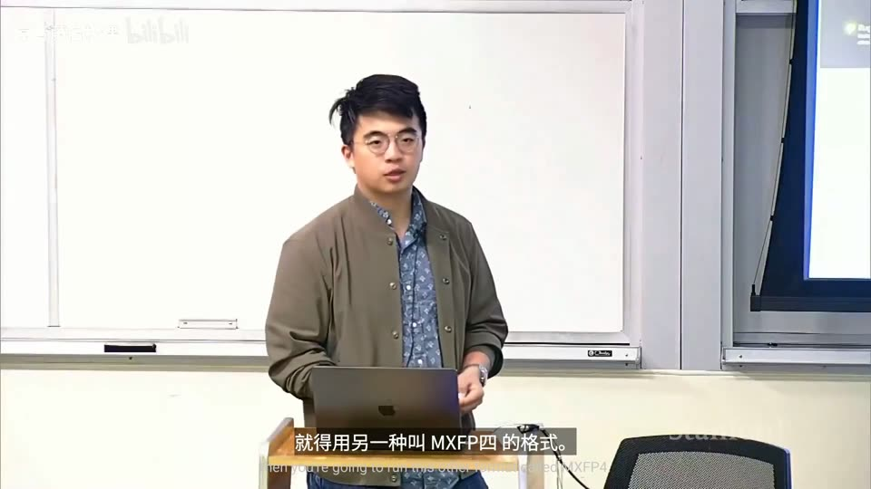 |
| 谢谢。 [【跳转到 42:54】](https://www.bilibili.com/video/BV11LEA6eEuj/?p=19&t=2574) | 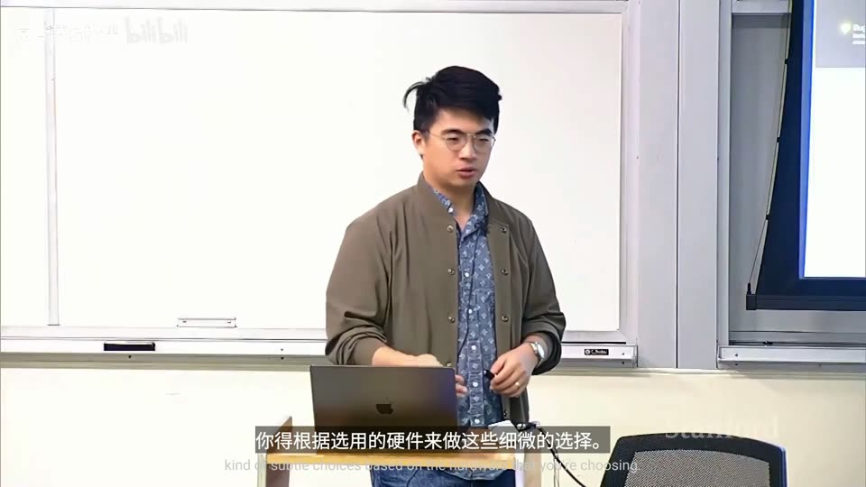 |
| 想问，如果只在乎计算最优训练，循环迭代是不是比增加参数更好？还是说这主要是为了降低推理成本的技巧？对，关于计算最优训练，计算最优通常是指给定 FLOP 预算。 [【跳转到 42:59】](https://www.bilibili.com/video/BV11LEA6eEuj/?p=19&t=2579) | 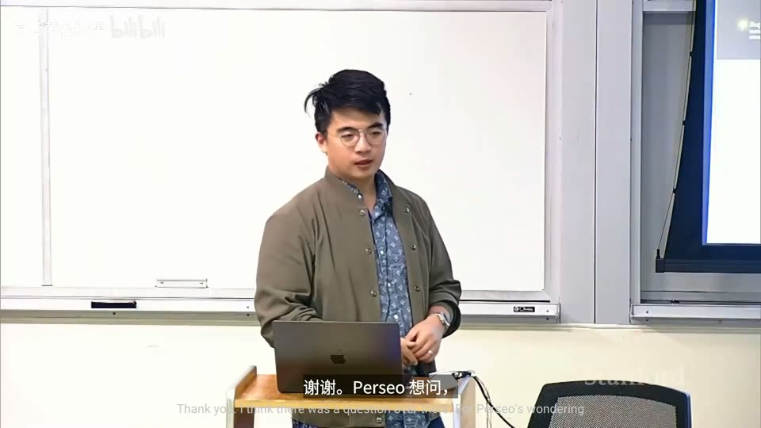 |
| 麻烦重复一下问题，抱歉。问题是：训练 Parcae 时，你会选择循环迭代而不是增加参数吗？计算最优的技巧就是在给定 FLOP 预算下搞清楚你想达到什么目标。 [【跳转到 43:14】](https://www.bilibili.com/video/BV11LEA6eEuj/?p=19&t=2594) | 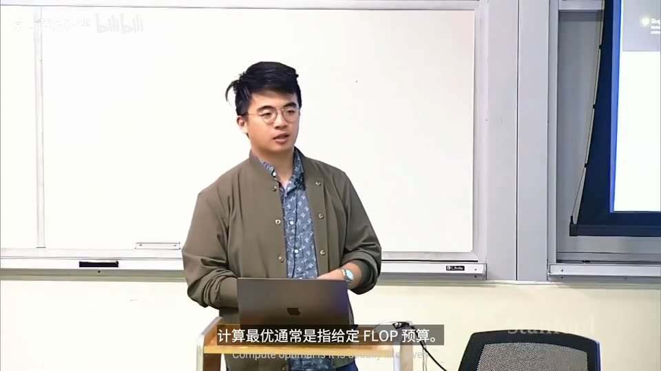 |
| 这么说有点牵强，毕竟想提升模型质量，直接增加 FLOPs 预算就行。 [【跳转到 43:26】](https://www.bilibili.com/video/BV11LEA6eEuj/?p=19&t=2606) | 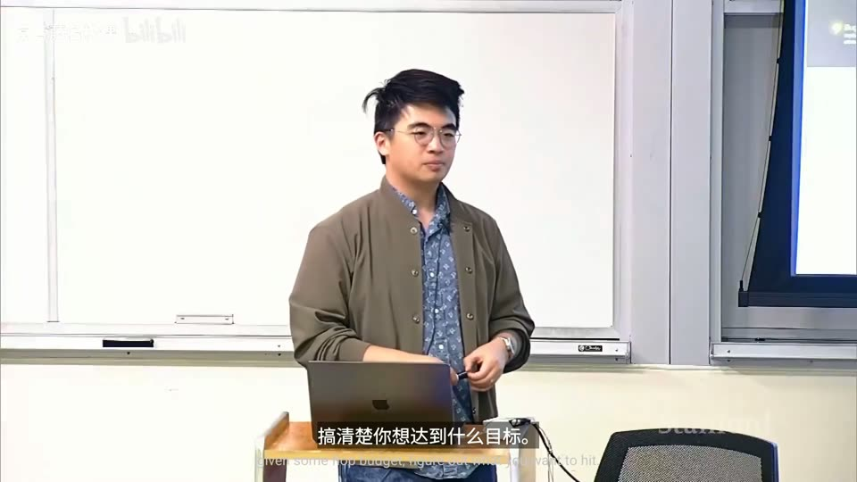 |
| 定好模型规模后，就拉长训练时长；要是规模受限， [【跳转到 43:33】](https://www.bilibili.com/video/BV11LEA6eEuj/?p=19&t=2613) | 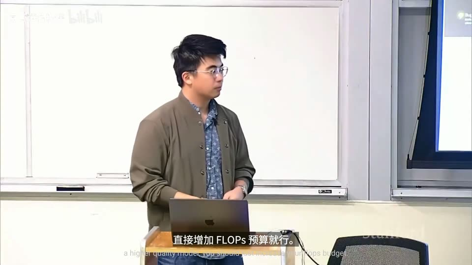 |
| 那就多跑几轮循环；数据用完了，就挑个你觉得合适的模型规模，在选定规模下尽量练好。我觉得选择很多，当然得看这东西到底能不能被采纳，我该怎么部署它。真要搞开源，现在大家笔记本上跑得动多大的模型？ [【跳转到 43:38】](https://www.bilibili.com/video/BV11LEA6eEuj/?p=19&t=2618) | 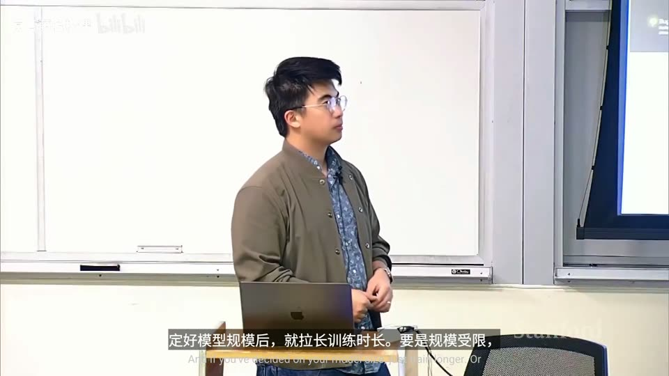 |
| 我觉得这些考量最终都归结为一个决定：你打算训练多大的模型。嗯，我觉得只要模型更大、数据更多，性能肯定更好。 [【跳转到 43:55】](https://www.bilibili.com/video/BV11LEA6eEuj/?p=19&t=2635) | 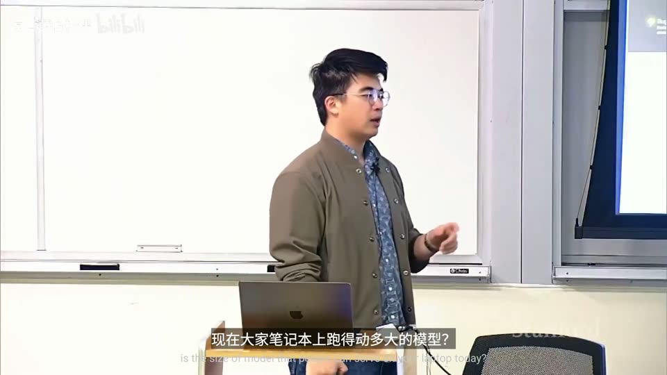 |
| 对，我觉得这主要看那些设计细节。谢谢。也许还有一个关于协同设计的问题：你开头提到了不同的用例，比如代理式代码生成，还有批量数据处理。 [【跳转到 44:06】](https://www.bilibili.com/video/BV11LEA6eEuj/?p=19&t=2646) | 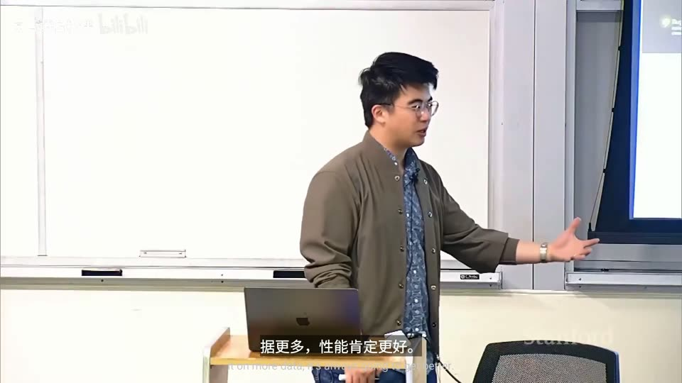 |
| 那么不同用例之间，你看到的最佳架构最显著的区别是什么？ [【跳转到 44:20】](https://www.bilibili.com/video/BV11LEA6eEuj/?p=19&t=2660) | 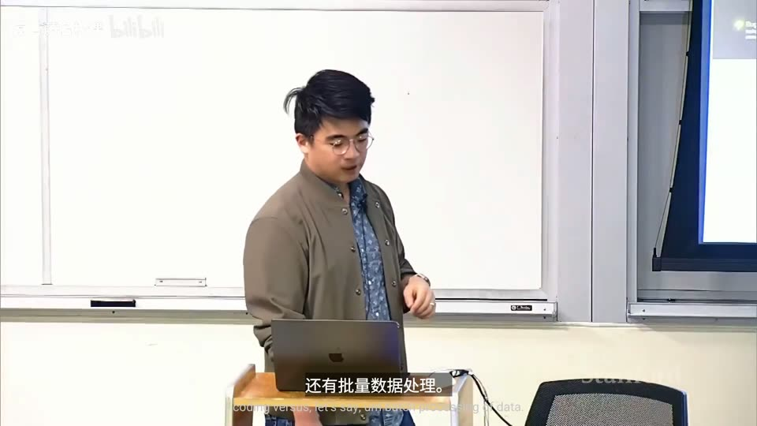 |
| 归根结底，模型开发者得选一个，还得尽量做到合理。（此处录音不清）好问题。我认为一个巨大的区别在于，在这些代理循环工作流里，有一点很重要，就是要让你的 KV 缓存尽量保持热， [【跳转到 44:25】](https://www.bilibili.com/video/BV11LEA6eEuj/?p=19&t=2665) | 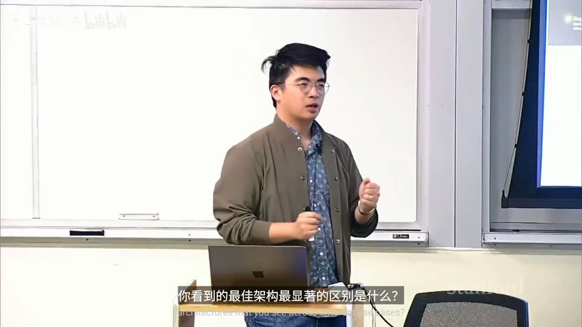 |
| 越热越好。所以如果你做的是大规模批量处理， [【跳转到 44:40】](https://www.bilibili.com/video/BV11LEA6eEuj/?p=19&t=2680) | 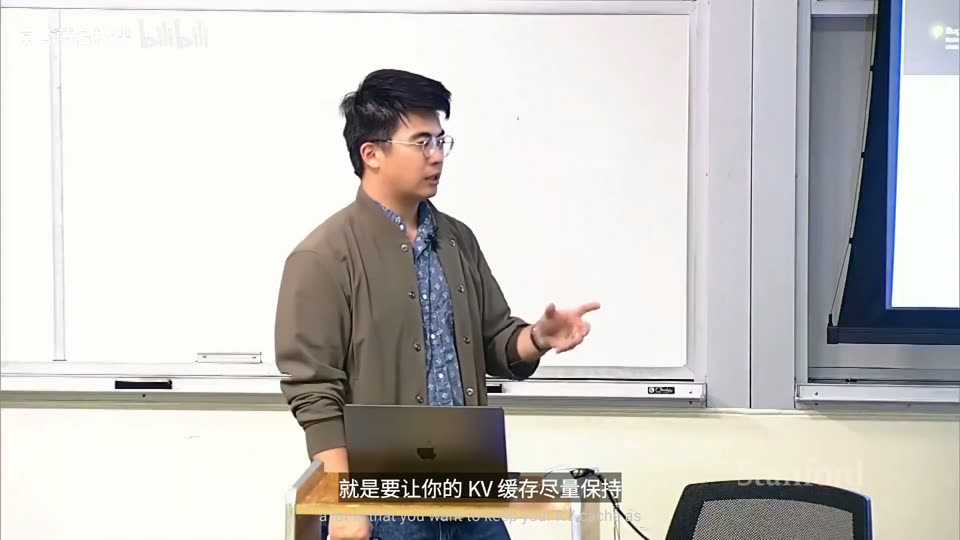 |
| 每个文档只看一次，然后翻译，KV 缓存就没那么重要了。比如 DeepSeek 的 MLA 注意力机制，相比其他模型，它对 KV 缓存做了激进的压缩；或者如果模型能在 FP8 或者 FP4 下处理 KV 缓存，这在缓存大小上都是相当大的差异。如果你关注智能体工作流，就会注意到这点。当然，最关键的是因果注意力还是非因果注意力。 [【跳转到 44:45】](https://www.bilibili.com/video/BV11LEA6eEuj/?p=19&t=2685) |  |
| 对吧。嗯，所以如果只是做大批量处理，比如谷歌过去长期只用 BERT 模型，我想搜索里现在可能还在用。但因为另一端其实不需要生成大量 token，所以做一次大的双向注意力， [【跳转到 45:10】](https://www.bilibili.com/video/BV11LEA6eEuj/?p=19&t=2710) | 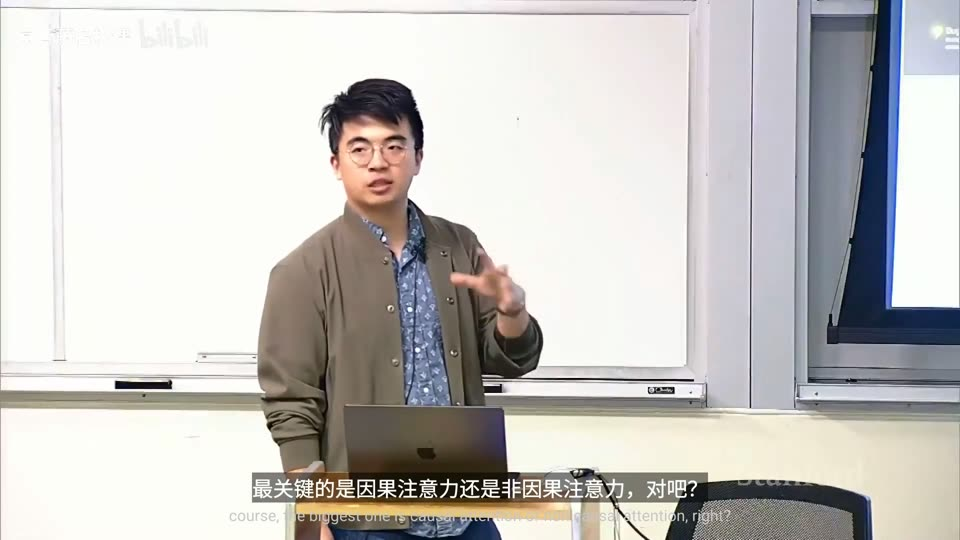 |
| 就能得到向量输出结果， [【跳转到 45:23】](https://www.bilibili.com/video/BV11LEA6eEuj/?p=19&t=2723) | 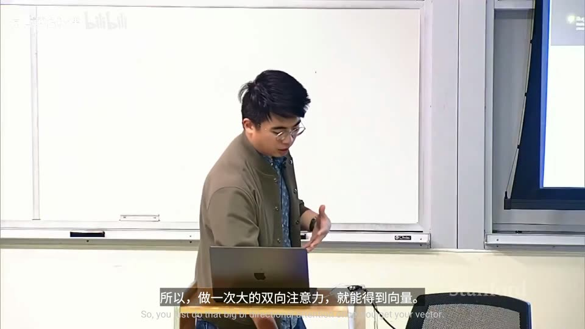 |
| 存入数据库，随你怎么用。但对话工作流的处理总会包含解码这部分， [【跳转到 45:28】](https://www.bilibili.com/video/BV11LEA6eEuj/?p=19&t=2728) |  |
| 比如 T5 这类这种方案。嗯，人们曾选择用它先做双向处理再做生成。谢谢。好，最后再问一个问题。哦，对，我主要想问关于 MegaKernels 的问题。 [【跳转到 45:33】](https://www.bilibili.com/video/BV11LEA6eEuj/?p=19&t=2733) | 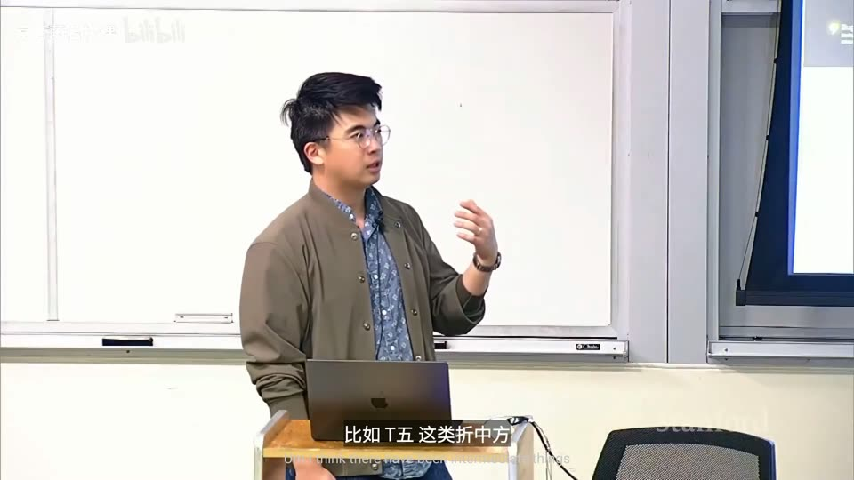 |
| 当时是想把所有东西融进一个内核， [【跳转到 45:44】](https://www.bilibili.com/video/BV11LEA6eEuj/?p=19&t=2744) | 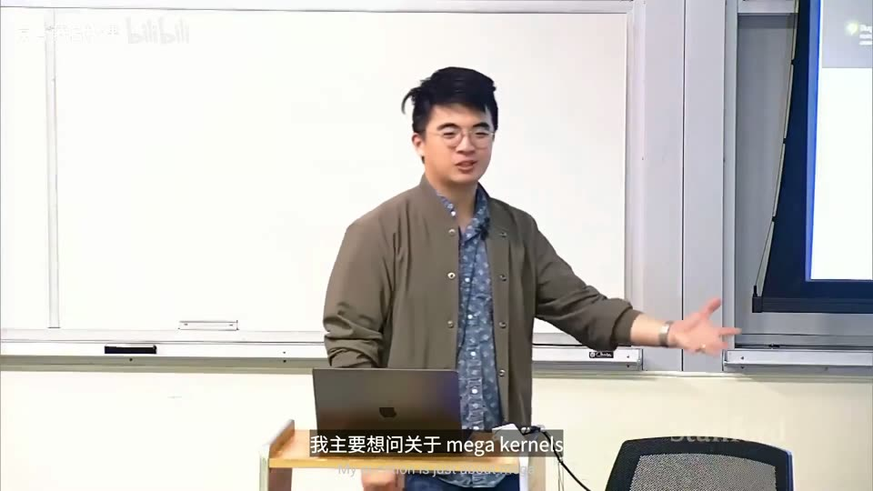 |
| 但说到可移植性，其实你做的是推理芯片。好，就是想问问这些巨型内核怎么跨多台机器通信？ [【跳转到 45:49】](https://www.bilibili.com/video/BV11LEA6eEuj/?p=19&t=2749) |  |
| 还是说必须扩展到训练环节？问得好。你是问，当多个 GPU 在循环里通信时，巨型内核怎么运作，对吧？我们早期做过一些初步研究， [【跳转到 45:54】](https://www.bilibili.com/video/BV11LEA6eEuj/?p=19&t=2754) | 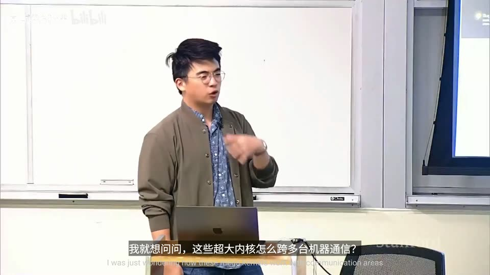 |
| 发现只要设置得当，也能把 NCCL 调用融进巨型内核。 [【跳转到 46:06】](https://www.bilibili.com/video/BV11LEA6eEuj/?p=19&t=2766) | 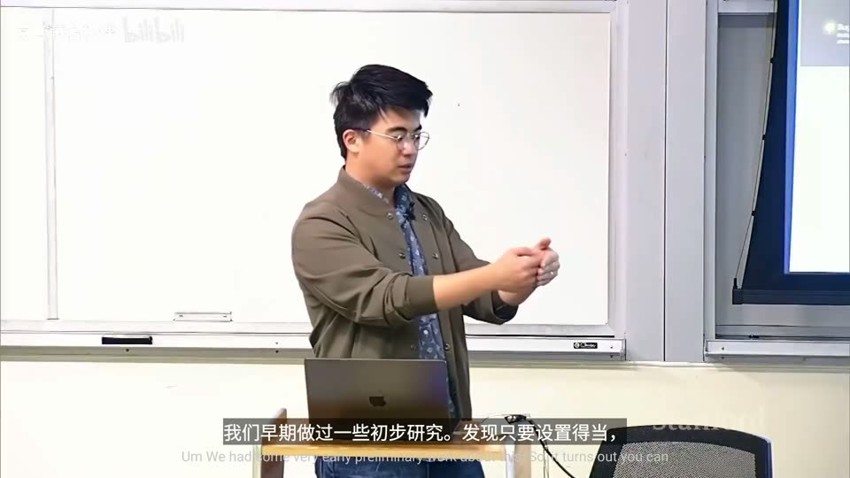 |
| 我觉得还没找到特别好的杀手级应用场景，有时候瓶颈就在 NCCL 调用本身的延迟上。 [【跳转到 46:11】](https://www.bilibili.com/video/BV11LEA6eEuj/?p=19&t=2771) | 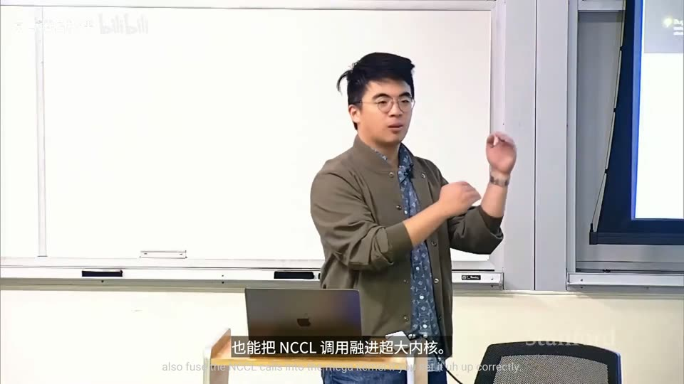 |
| 我觉得这些也能融合。DeepSeek 出来时，他们为 MoE 推理层做了个巨型内核专门跑这一块，还真把部分通信也融了进去。我觉得现在越来越能看到的趋势是，模型越来越大时，你会为一部分计算做个小的巨型内核， [【跳转到 46:16】](https://www.bilibili.com/video/BV11LEA6eEuj/?p=19&t=2776) | 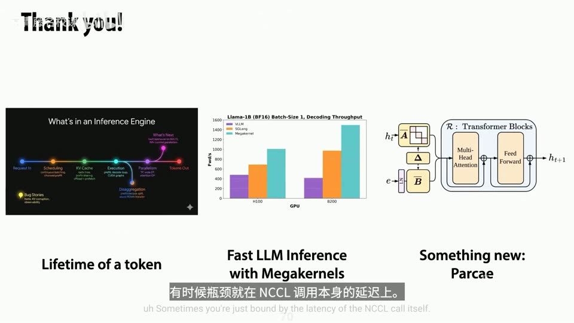 |
| 但不一定为整个模型做。All the time。我们再次感谢 Dan，非常感谢邀请我。 [【跳转到 46:37】](https://www.bilibili.com/video/BV11LEA6eEuj/?p=19&t=2797) | 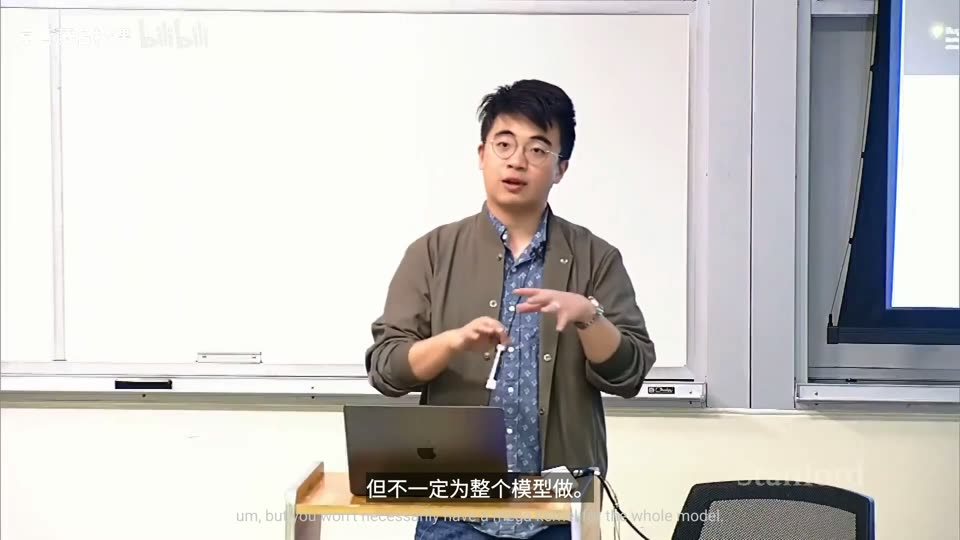 |
| 除非你愿意拼尽全力把整套真正跑起来。好，时间差不多了，再次感谢 Dan，谢谢邀请。 [【跳转到 46:43】](https://www.bilibili.com/video/BV11LEA6eEuj/?p=19&t=2803) | 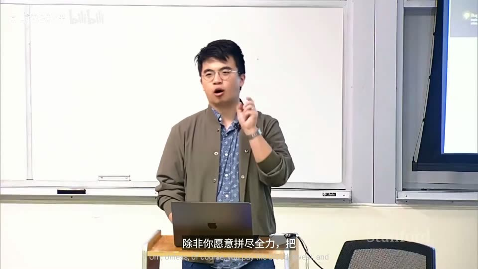 |