# Lecture 1: 课程概览与分词 · 原始文稿（图-字幕分栏）

| 字幕文本 | 画面 |
| :--- | ---: |
| 欢迎大家来到 CS336——"从零构建语言模型"课程。这是我们的教学团队。 [【跳转到 00:00】](https://www.bilibili.com/video/BV11LEA6eEuj/?p=1&t=0) | 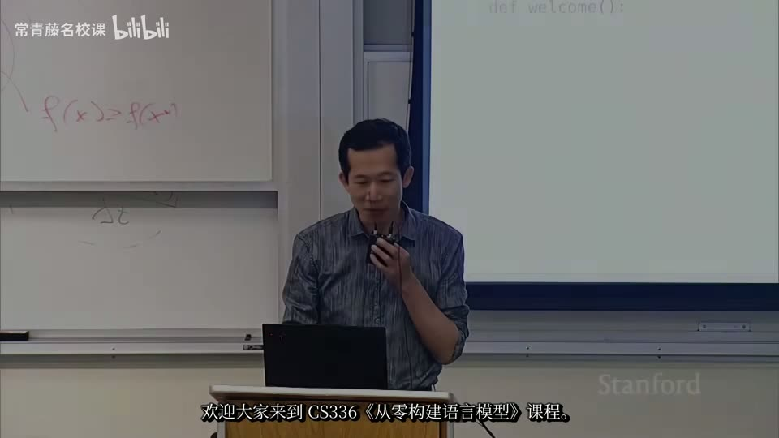 |
| 我是 Percy，旁边是 Tatsu、Marcel、Herman 和 Steven。 [【跳转到 00:05】](https://www.bilibili.com/video/BV11LEA6eEuj/?p=1&t=5) | 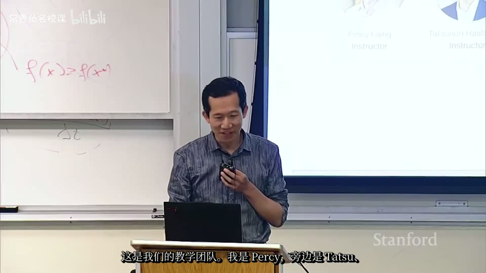 |
| 我们为大家带来第三版 CS336。先快速做个自我介绍：我常说自己在语言模型领域干了约 20 年，不过大部分时间其实是在做小型语言模型。 [【跳转到 00:10】](https://www.bilibili.com/video/BV11LEA6eEuj/?p=1&t=10) | 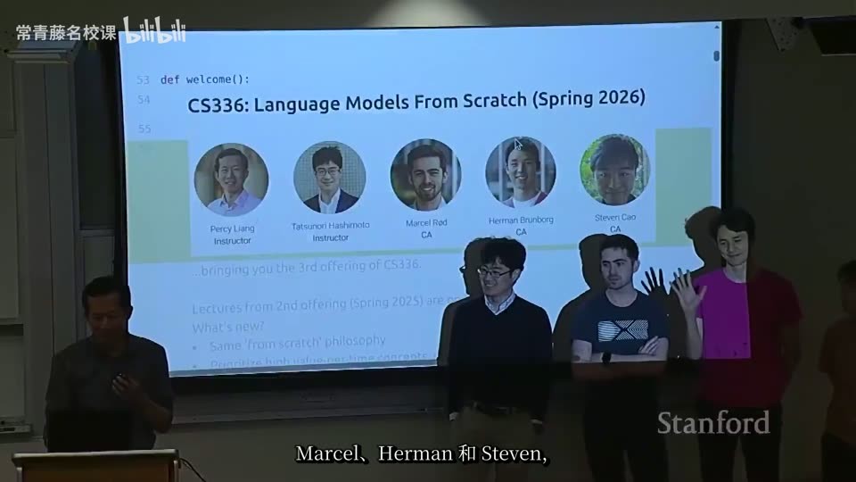 |
| 其实放长远看，这时间也不算长。我想 Tatsu 和我刚开始教这门课的时候 [【跳转到 00:21】](https://www.bilibili.com/video/BV11LEA6eEuj/?p=1&t=21) | 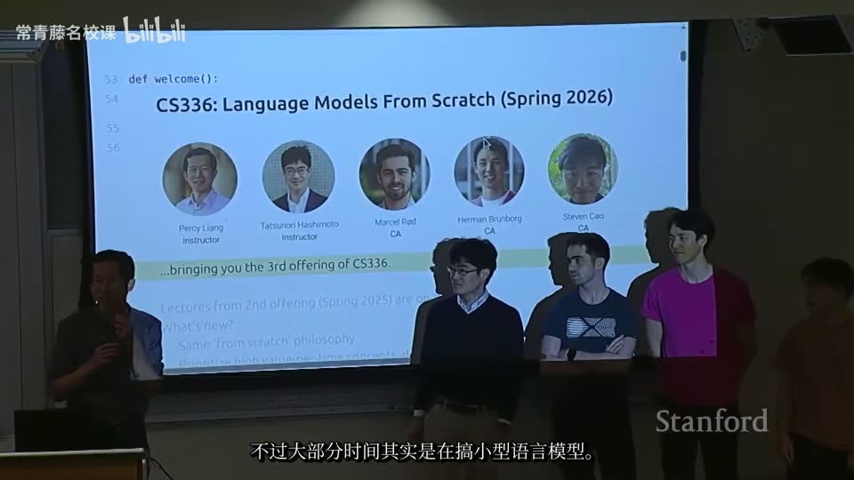 |
| 情况也是这样：两年前我们其实不太确定效果会怎样， [【跳转到 00:26】](https://www.bilibili.com/video/BV11LEA6eEuj/?p=1&t=26) | 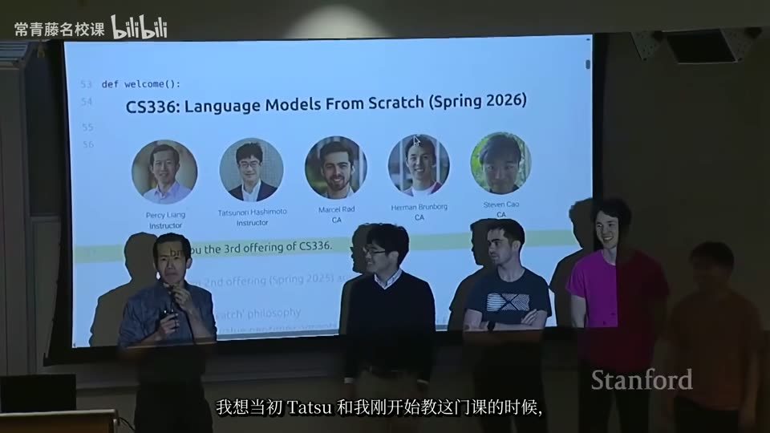 |
| 但让我们非常惊喜的是，有这么多人想学怎么从零构建语言模型。 [【跳转到 00:33】](https://www.bilibili.com/video/BV11LEA6eEuj/?p=1&t=33) | 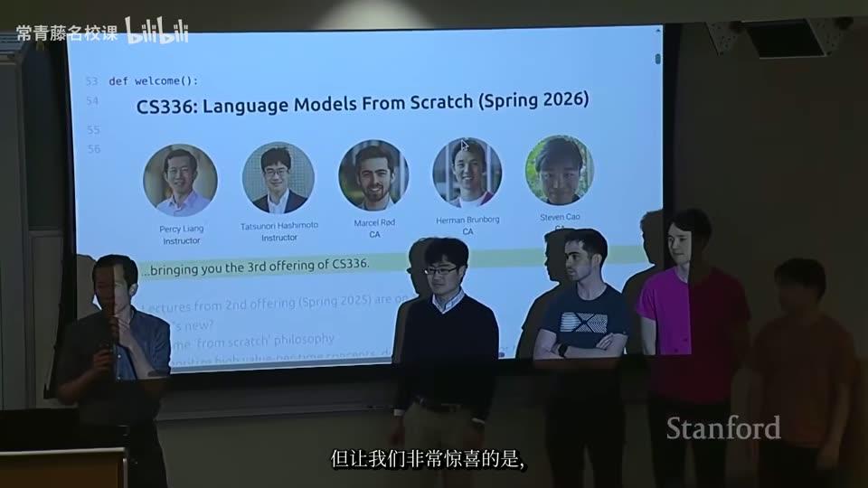 |
| 尤其是在如今编码智能体可能零样本就能搞定语言模型的时代，很高兴看到大家真的想了解它们的运作原理。谢谢。我是 Tatsu，联合讲师之一；等讲到架构、扩展以及其他有趣话题时，我会负责讲解。 [【跳转到 00:38】](https://www.bilibili.com/video/BV11LEA6eEuj/?p=1&t=38) | 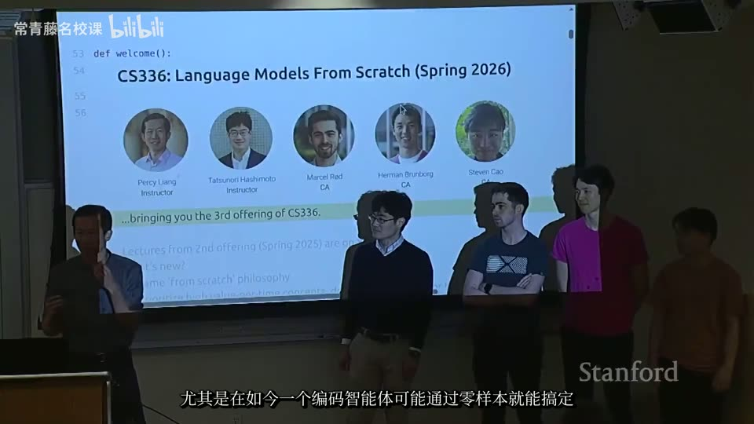 |
| 我特别兴奋——这是我教过的最有趣的课。Percy 每年都要调侃我， [【跳转到 00:54】](https://www.bilibili.com/video/BV11LEA6eEuj/?p=1&t=54) | 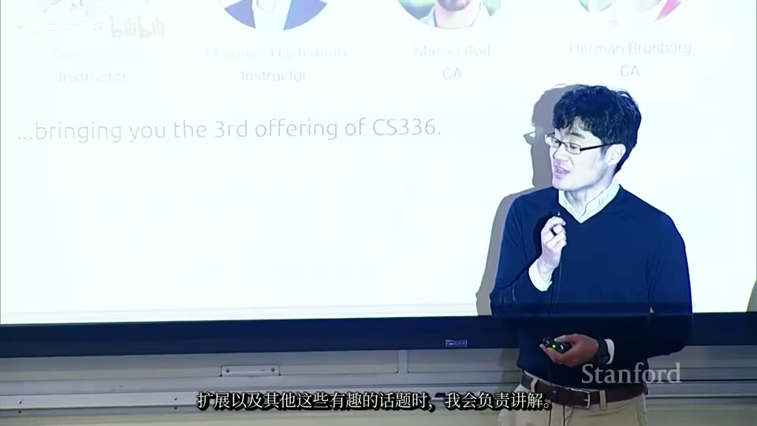 |
| 因为他总说"你得重做所有讲座，你负责架构部分，而架构每年都在变"。不过说实话，对我来说 [【跳转到 00:59】](https://www.bilibili.com/video/BV11LEA6eEuj/?p=1&t=59) | 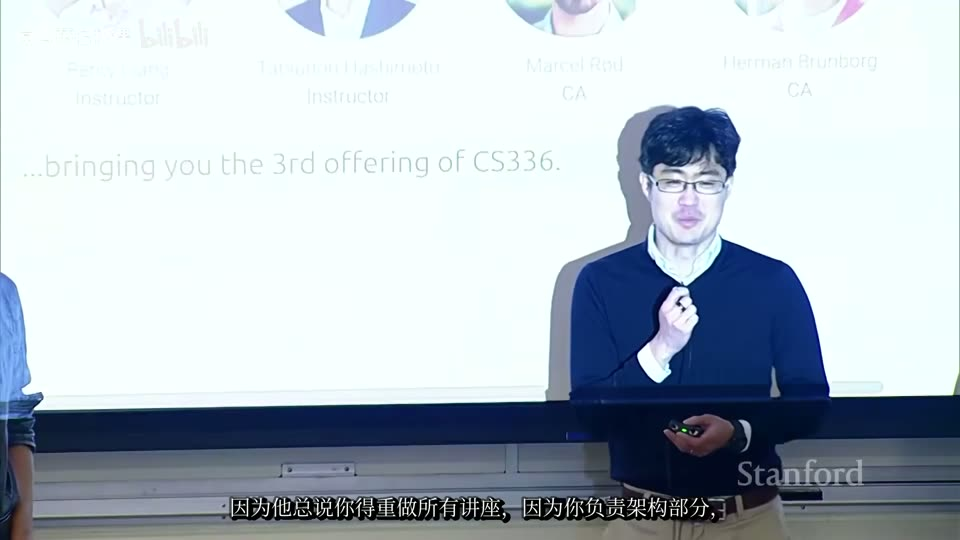 |
| 这真的挺有意思。我很期待能和大家一起再经历一遍。 [【跳转到 01:04】](https://www.bilibili.com/video/BV11LEA6eEuj/?p=1&t=64) | 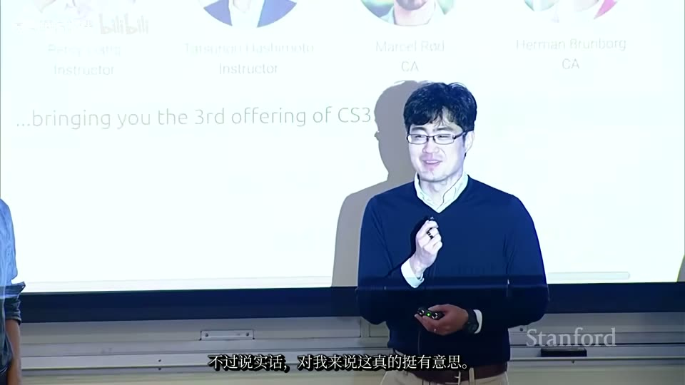 |
| 大家好，我是马骁（Marcel），我之前做过这门课的 TA， [【跳转到 01:09】](https://www.bilibili.com/video/BV11LEA6eEuj/?p=1&t=69) | 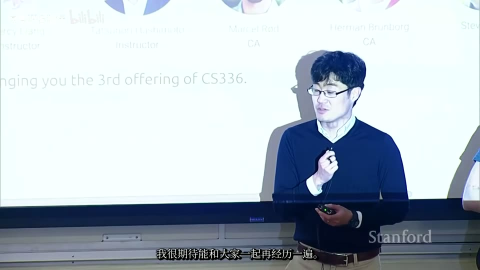 |
| 因为上次体验太棒了所以又回来了。这学期工作量很大。我的研究做架构相关工作， [【跳转到 01:14】](https://www.bilibili.com/video/BV11LEA6eEuj/?p=1&t=74) | 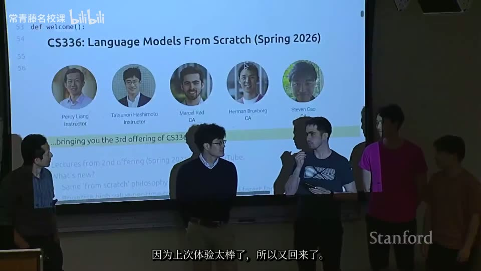 |
| 涉及高阶梯度和训练等，很期待和大家合作。大家好， [【跳转到 01:19】](https://www.bilibili.com/video/BV11LEA6eEuj/?p=1&t=79) | 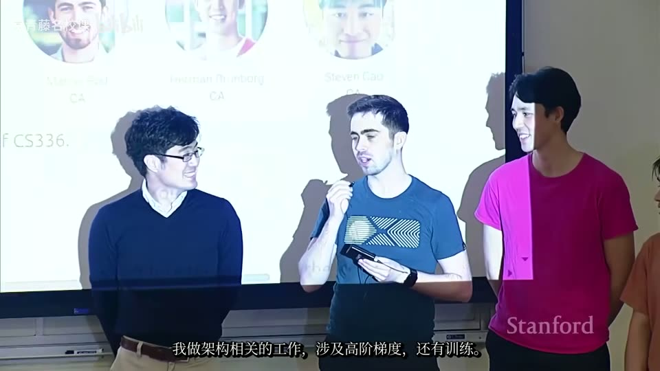 |
| 我是 Herman。一年前我其实并不懂语言模型是怎么运作的—— [【跳转到 01:24】](https://www.bilibili.com/video/BV11LEA6eEuj/?p=1&t=84) | 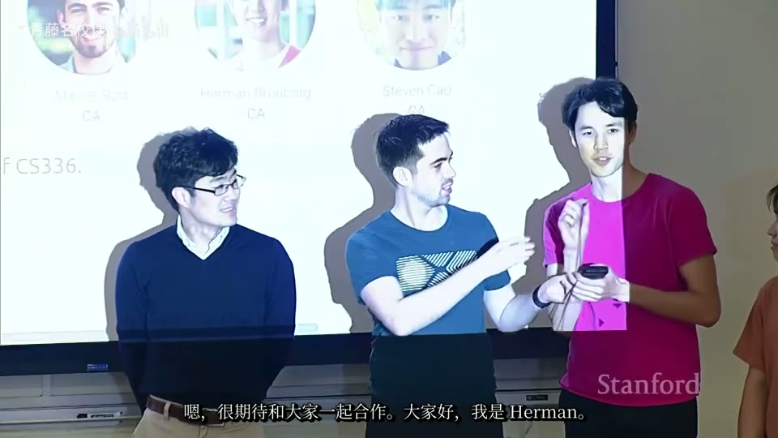 |
| 以前对我来说，token 是游戏里收集的东西，attention 则是"你拥有的注意力"， [【跳转到 01:29】](https://www.bilibili.com/video/BV11LEA6eEuj/?p=1&t=89) | 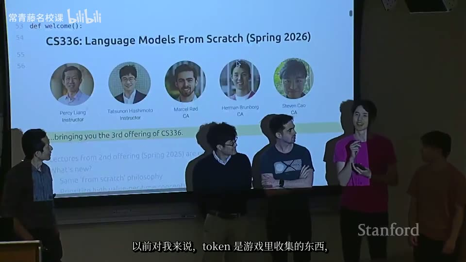 |
| 就像所谓的"注意力经济"。去年在这门课上投入大量时间后，我现在在做语言模型研究， [【跳转到 01:35】](https://www.bilibili.com/video/BV11LEA6eEuj/?p=1&t=95) | 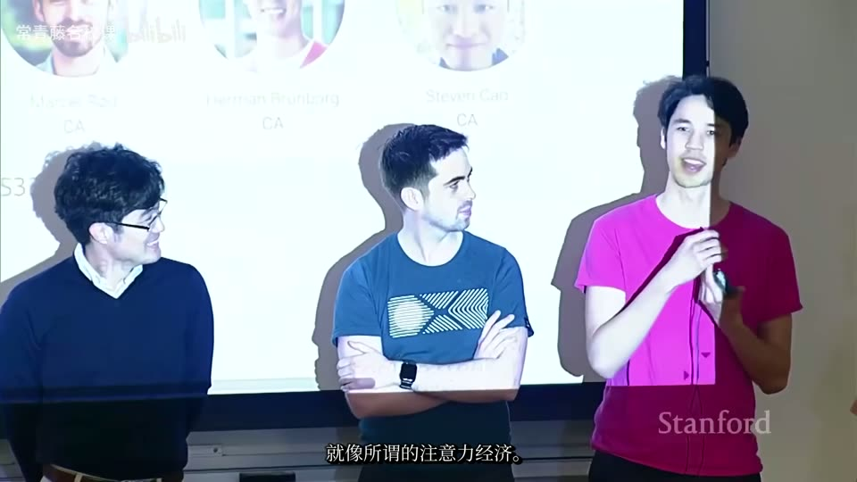 |
| 今年能当 TA 我特别兴奋。谢谢。大家好， [【跳转到 01:40】](https://www.bilibili.com/video/BV11LEA6eEuj/?p=1&t=100) | 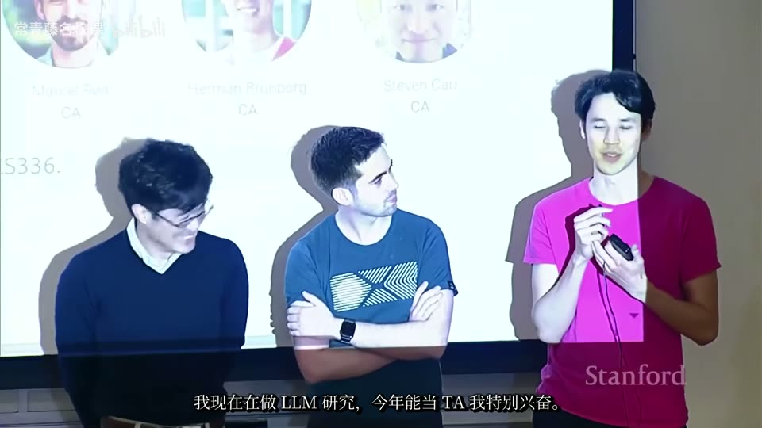 |
| 我是 Steven，第一次担任这门课的 TA，我对此非常期待，觉得这会很有趣。 [【跳转到 01:45】](https://www.bilibili.com/video/BV11LEA6eEuj/?p=1&t=105) | 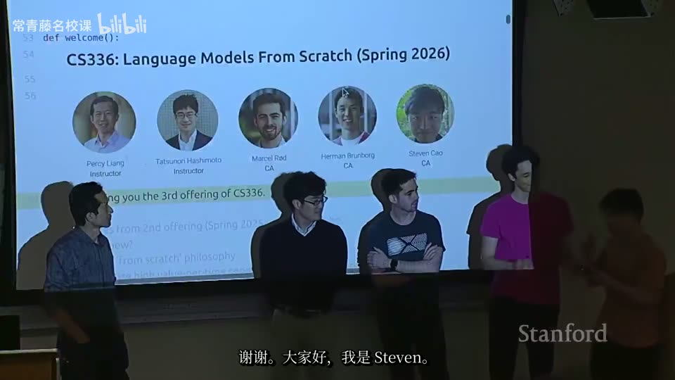 |
| 总的来说，我的研究方向是语言模型理论， [【跳转到 01:51】](https://www.bilibili.com/video/BV11LEA6eEuj/?p=1&t=111) | 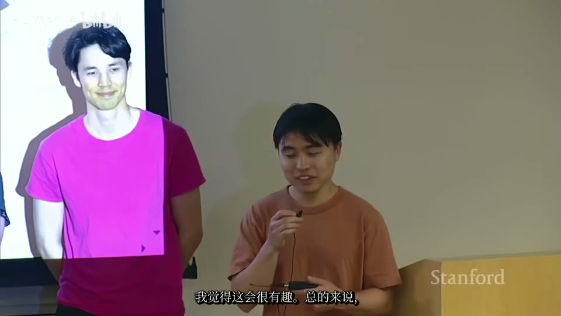 |
| 还有一些数据效率方面的工作。很高兴见到各位。谢谢。好了， [【跳转到 01:57】](https://www.bilibili.com/video/BV11LEA6eEuj/?p=1&t=117) | 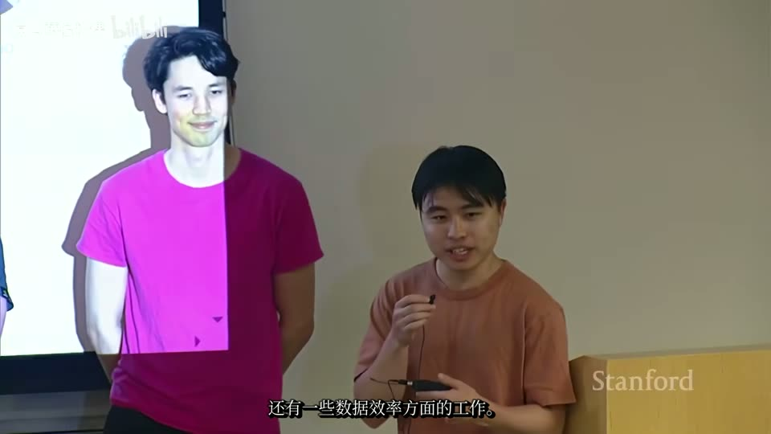 |
| 我们开始吧！这是我们第三次开这门课。去年我们把所有讲座放到了 YouTube 上， [【跳转到 02:02】](https://www.bilibili.com/video/BV11LEA6eEuj/?p=1&t=122) | 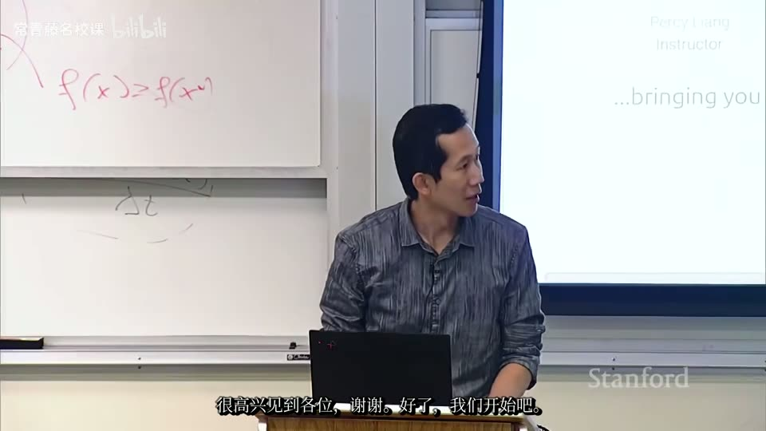 |
| 所以你们当中有些人可能已经看过了。有什么新变化？没变的是"从零开始"的理念：我们依然坚信，只有从头构建一切，你才能真正学懂 [【跳转到 02:07】](https://www.bilibili.com/video/BV11LEA6eEuj/?p=1&t=127) | 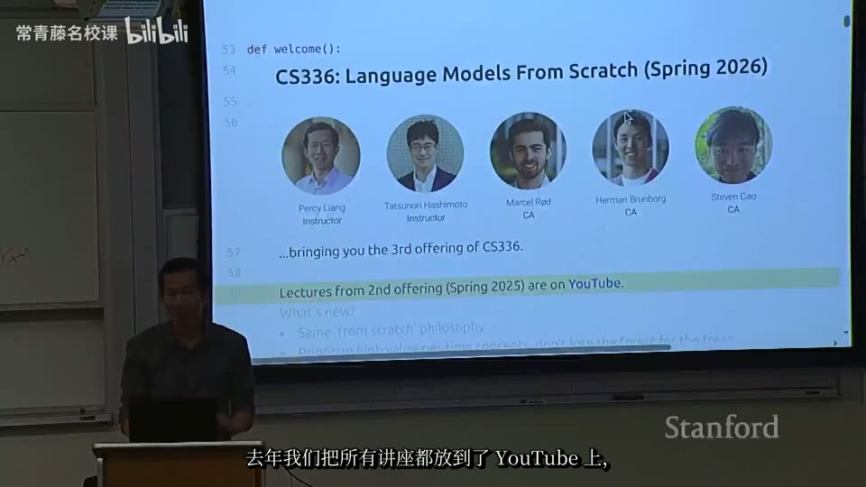 |
| 一切如何运作。当然，我们实际上并没有从零构建所有内容，一学期根本做不完。过去两年我们一直在打磨这套方法，弄清哪些"从零构建"最有价值。另外，正如他提到的，哪怕只过一年变化也很大：今年我打算在混合专家（MoE）架构上多花时间；而且智能体现在很火，搞懂长上下文以及为此需要什么也很重要。 [【跳转到 02:26】](https://www.bilibili.com/video/BV11LEA6eEuj/?p=1&t=146) | 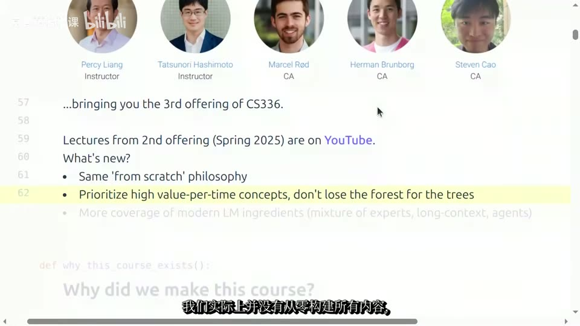 |
| 那我们为什么开这门课？我觉得两年前的问题在于：研究人员和底层技术脱节了。 [【跳转到 02:51】](https://www.bilibili.com/video/BV11LEA6eEuj/?p=1&t=171) | 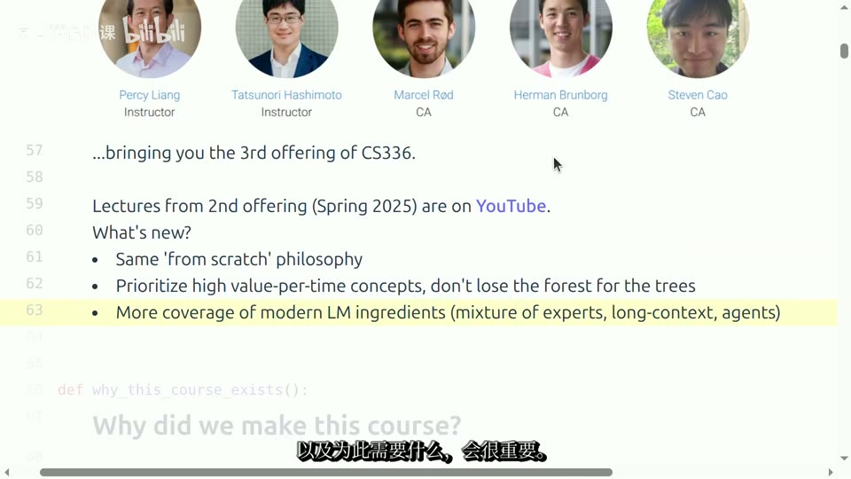 |
| 大概 10 年前，做 AI 研究的人都会自己实现并训练模型；到了 8 年前，大家会下载像 BERT 这样的预训练模型再微调；现在光靠提示模型就能做成很多事。提示模型本身没问题，用它真能做出很厉害的东西。总的来说，提升抽象层级是好事。 [【跳转到 02:56】](https://www.bilibili.com/video/BV11LEA6eEuj/?p=1&t=176) |  |
| 但抽象层总有漏掉的地方。你们给模型写过提示，有时会遇到本想做某件事却做不到、也无任何补救办法的情况。我想说，如果你真的对基础研究（fundamental research）感兴趣，仅仅靠给模型写提示，其实就极大地限制了你能考虑的方案集合、限制了你面对的设计空间。所以做基础研究的话， [【跳转到 03:21】](https://www.bilibili.com/video/BV11LEA6eEuj/?p=1&t=201) | 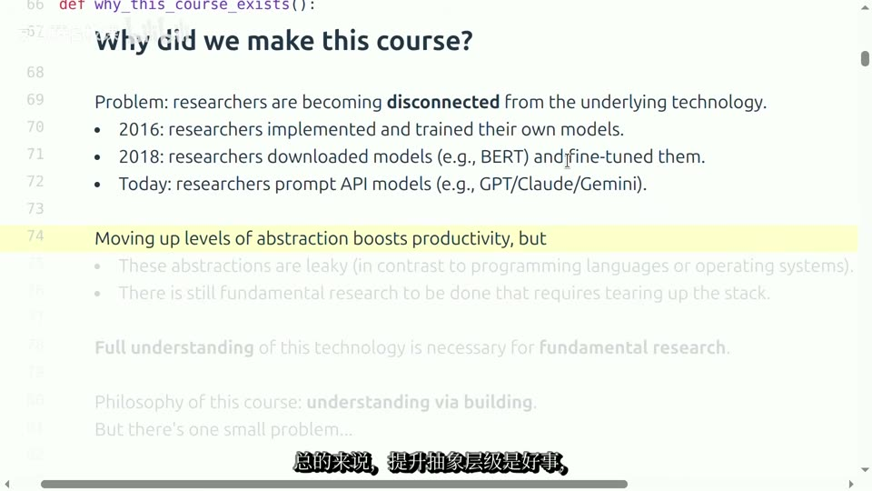 |
| 你真的得把整个技术栈推倒重来。想做基础研究，就必须彻底搞懂语言模型怎么工作。我们获取这种理解的方式就是动手构建——这也是这门课的教学理念。但这里有个小问题： [【跳转到 03:46】](https://www.bilibili.com/video/BV11LEA6eEuj/?p=1&t=226) | 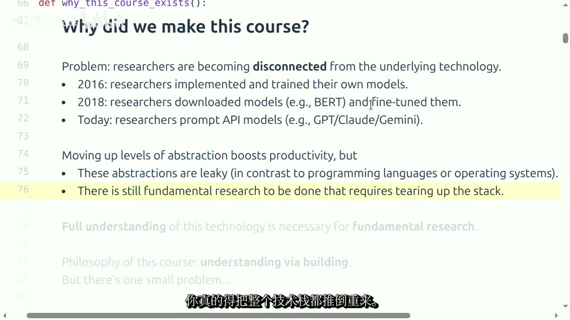 |
| 语言模型已经实现了"工业化"，前沿模型真的非常烧钱，哪怕在 3 年前， [【跳转到 04:01】](https://www.bilibili.com/video/BV11LEA6eEuj/?p=1&t=241) |  |
| 据说训练 GPT-4 就要花 1 亿美元，现在成本可能涨到了 10 亿美元量级，这数字简直惊人。各大实验室正在搭建的 GPU 数量也极其庞大。此外，这些模型如何构建没有任何细节公开。早在 ChatGPT 之前 3 年， [【跳转到 04:06】](https://www.bilibili.com/video/BV11LEA6eEuj/?p=1&t=246) | 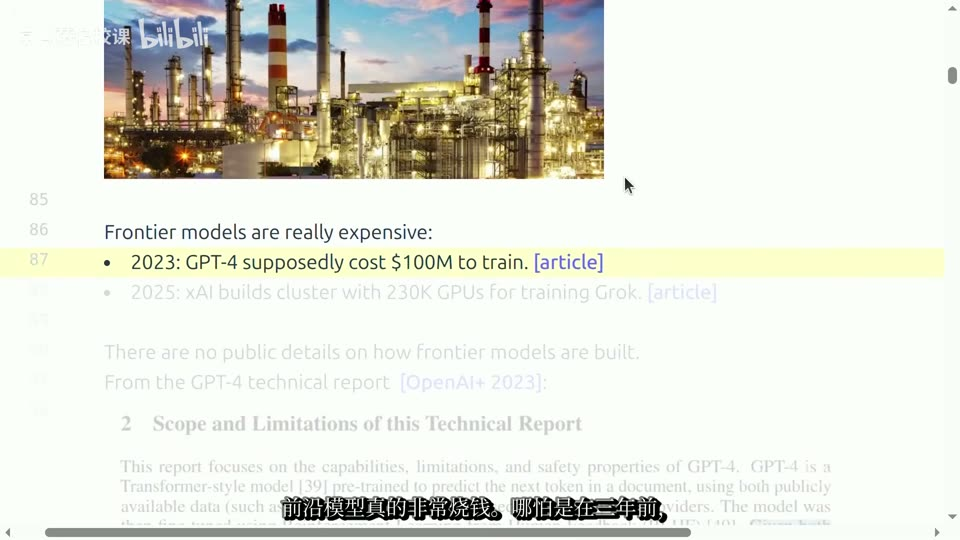 |
| GPT-4 论文就明确说：出于竞争格局和安全方面的考虑，我们不会透露任何关于模型构建方式的内容。所以对我们来说，这些前沿模型在某种程度上是遥不可及的。当然，我们可以构建小型语言模型， [【跳转到 04:23】](https://www.bilibili.com/video/BV11LEA6eEuj/?p=1&t=263) | 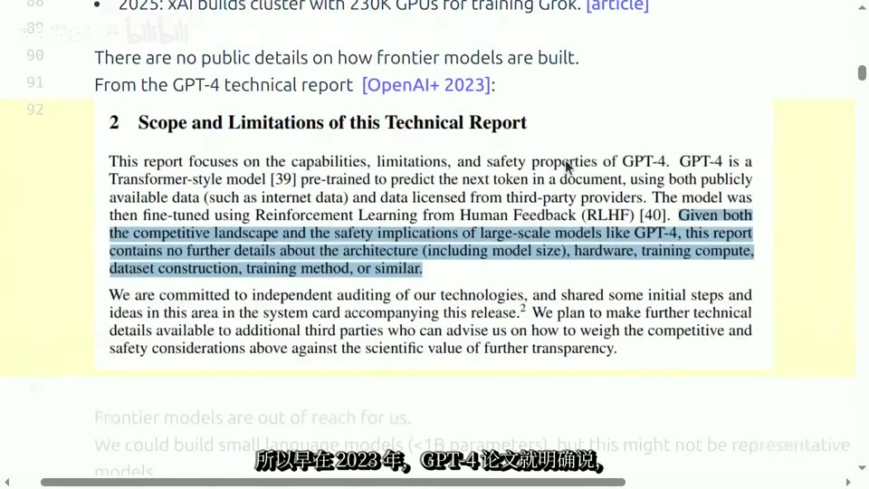 |
| 也确实会这么做。但重要的是记住：它们可能无法代表真正的前沿模型。我举两个例子解释为什么会这样。先看第一个例子——这其实来自很久以前： [【跳转到 04:37】](https://www.bilibili.com/video/BV11LEA6eEuj/?p=1&t=277) | 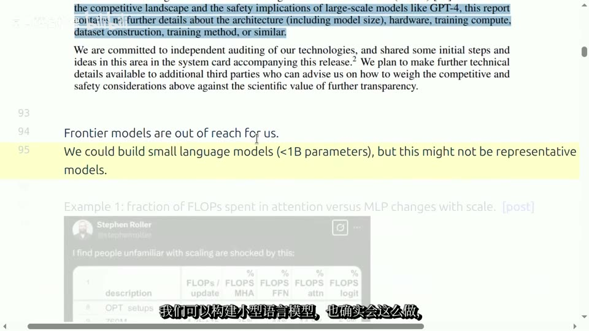 |
| 把时间拨回 2021 年。我们会花不少时间做浮点运算次数（FLOPs）统计，分析计算资源究竟花在了哪里。小规模情况下，MLP 层消耗的浮点运算比例约为 44%；而扩展到 150 亿参数规模，这一比例会升至 80%。所以大规模下的优化目标和关键因素跟小规模是不一样的。 [【跳转到 04:51】](https://www.bilibili.com/video/BV11LEA6eEuj/?p=1&t=291) | 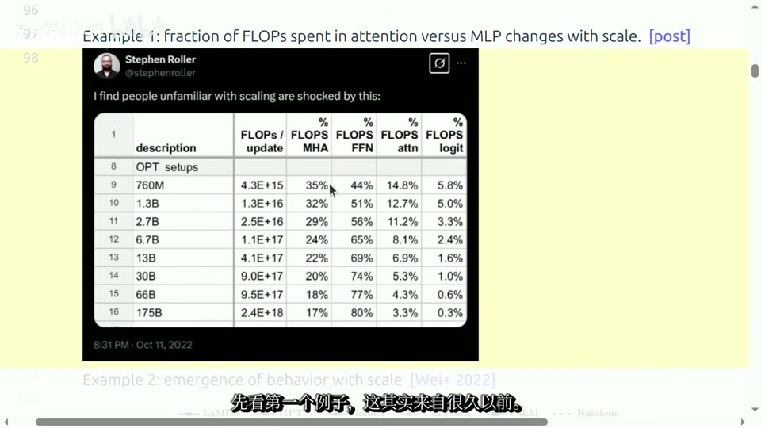 |
| 因此，如果你在小规模上针对注意力机制做了一系列实验，在大规模下可能就无法获得同样的收益。 [【跳转到 05:16】](https://www.bilibili.com/video/BV11LEA6eEuj/?p=1&t=316) | 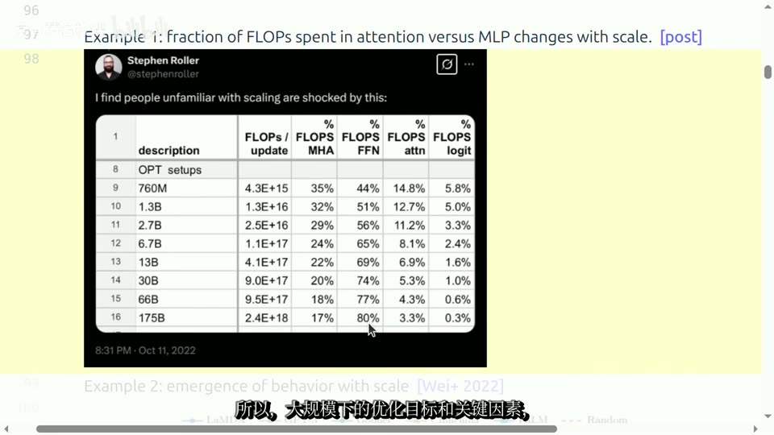 |
| 第二个例子是：我们观察到行为会随规模扩展而出现涌现现象。小模型——这又是很久以前的事了—— [【跳转到 05:29】](https://www.bilibili.com/video/BV11LEA6eEuj/?p=1&t=329) | 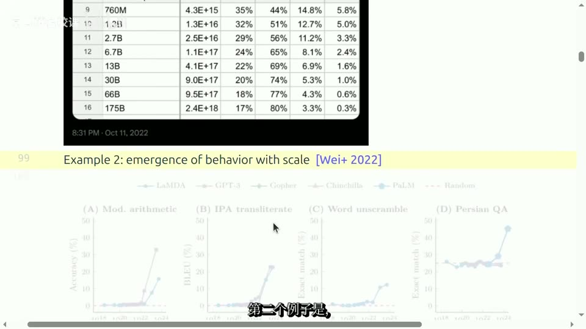 |
| 但即便在当时，只要你具备条件就能看到：零样本或少样本地学习各种任务，基本上毫无效果；只有规模达到临界点，才会突然出现显著改进。同样地，如果你在小规模下工作，相比在全规模下工作，可能就观察不到某些类型的现象。 [【跳转到 05:35】](https://www.bilibili.com/video/BV11LEA6eEuj/?p=1&t=335) | 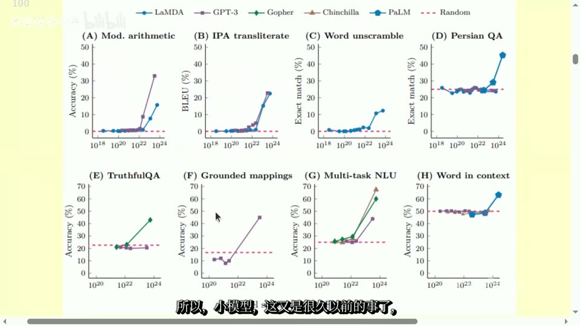 |
| 好，这或许有点令人泄气，但别担心：我们会在这门课里学到一些东西。问题是，我们能学到哪些真正可迁移的知识？我认为有必要拆成三类。首先是事物运作的机制，例如什么是 Transformer、模型并行如何工作； [【跳转到 06:00】](https://www.bilibili.com/video/BV11LEA6eEuj/?p=1&t=360) | 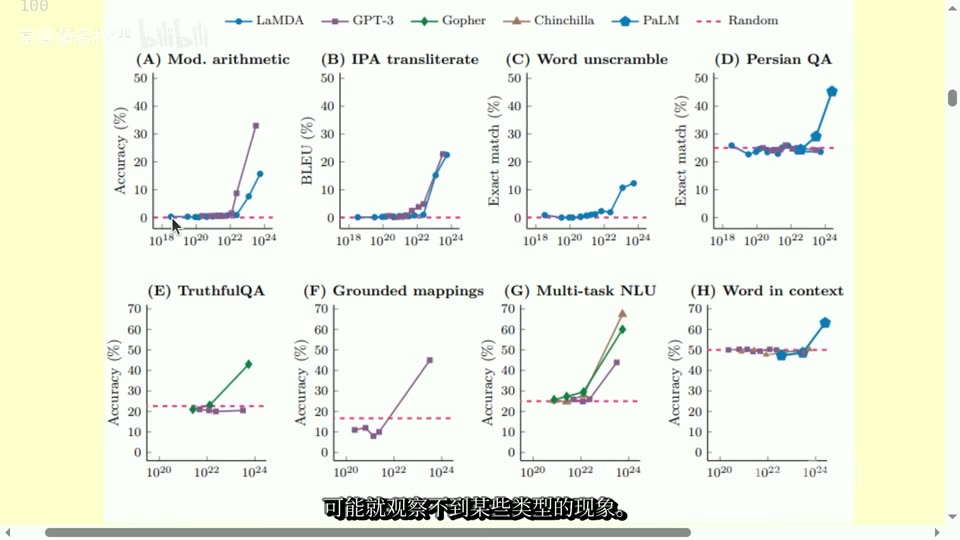 |
| 其次是思维模式，即你如何着手构建一个语言模型——我们将讨论如何最大限度榨取硬件性能、并认真对待扩展问题；最后是直觉，即哪些数据和建模决策能带来良好性能。我认为，这门课可以较好地教授机制和思维模式：我们将着重强调对一切进行性能分析和基准测试， [【跳转到 06:21】](https://www.bilibili.com/video/BV11LEA6eEuj/?p=1&t=381) | 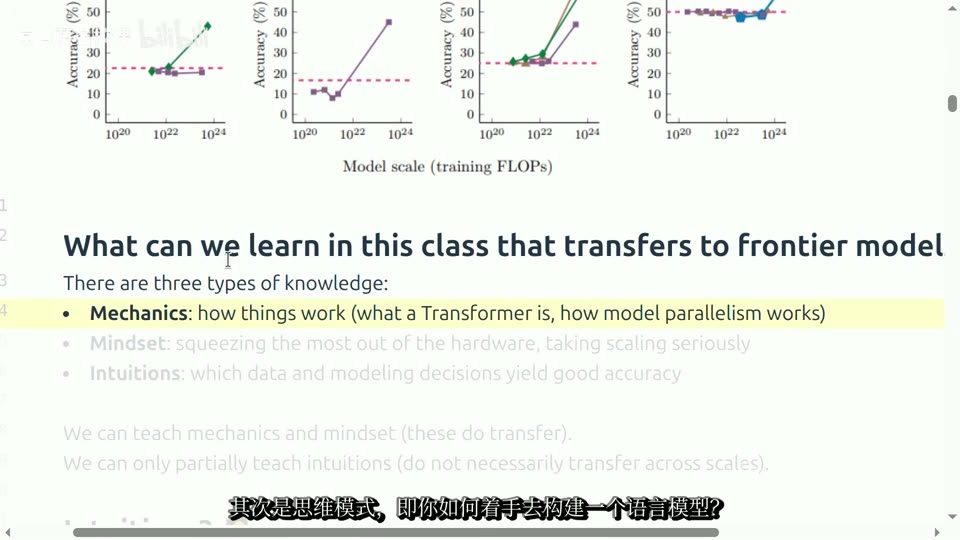 |
| 并尝试优化效率。这些东西确实可以迁移到更大规模。 [【跳转到 06:46】](https://www.bilibili.com/video/BV11LEA6eEuj/?p=1&t=406) | 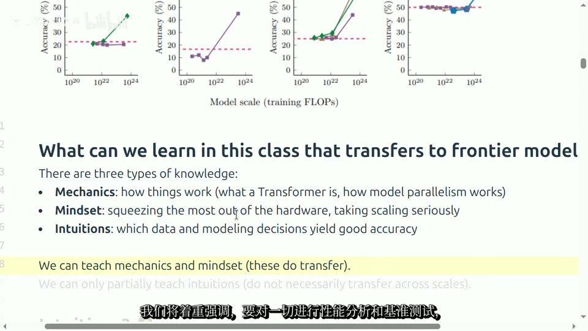 |
| 不过，关于"哪些建模/数据决策有效"的直觉，未必能在不同规模间迁移。想获得这种直觉，你得去能开展大规模工作的地方。说到直觉，有一点值得一提：有些设计决策其实没道理可讲，纯粹是靠实验试出来的；而机制层面的东西，从设计本身大致就能看出——并行和核函数为什么能加速，等等。 [【跳转到 06:53】](https://www.bilibili.com/video/BV11LEA6eEuj/?p=1&t=413) | 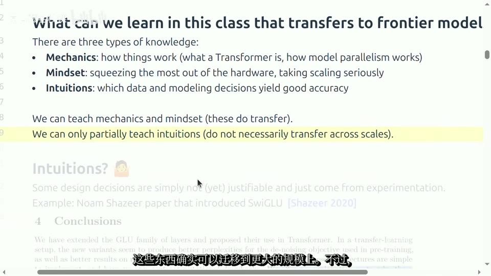 |
| 但至于哪些建模改动有效，我觉得只能靠跑实验验证。比如那篇著名论文（原字幕 normhzero）引入了 SwiGLU 激活函数，我们稍后会详细看： [【跳转到 07:18】](https://www.bilibili.com/video/BV11LEA6eEuj/?p=1&t=438) | 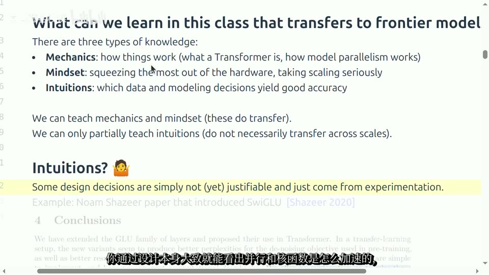 |
| 在结论部分，作者非常坦诚地写下："我们不做任何解释；我们把这些架构的成功——一如其他一切——归于上天的恩典（thanks the heavens）。"所以某种意义上，这种直觉只能靠积累经验获得。 [【跳转到 07:34】](https://www.bilibili.com/video/BV11LEA6eEuj/?p=1&t=454) | 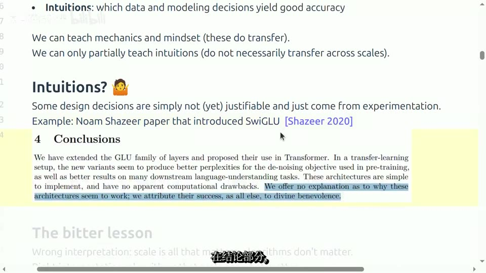 |
| 最后提一下"苦涩的教训"。这个说法一直流传，大家也常讨论，但我认为众人对它普遍存在误解。错误解读是"规模决定一切、算法无关紧要"——这不对。正确解读是"可扩展的算法才是关键"。简单说，可以把模型表现看作"效率 [【跳转到 07:50】](https://www.bilibili.com/video/BV11LEA6eEuj/?p=1&t=470) | 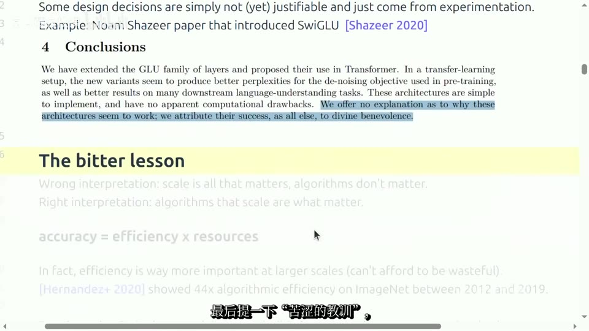 |
| 再乘以资源"。效率等于输出除以输入，资源就是那个输入。从某种意义上说，更大规模下效率反而重要得多：小规模实验一次多花一倍时间，你多等一倍再来就行；但大规模操作成本可能高达数亿美元，你肯定不想这么干——哪怕只提升 5% 也可能意义重大。 [【跳转到 08:15】](https://www.bilibili.com/video/BV11LEA6eEuj/?p=1&t=495) | 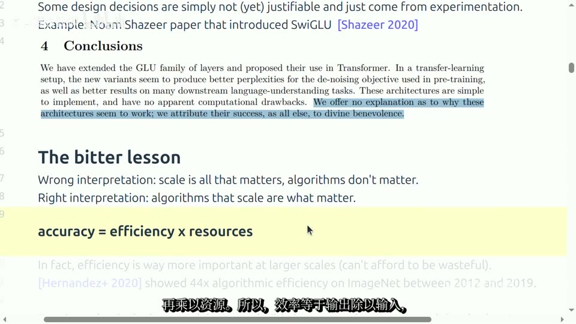 |
| 事实上，效率极其关键。我希望这门课能让你把它内化为思维方式的一部分。从实证角度看， [【跳转到 08:40】](https://www.bilibili.com/video/BV11LEA6eEuj/?p=1&t=520) | 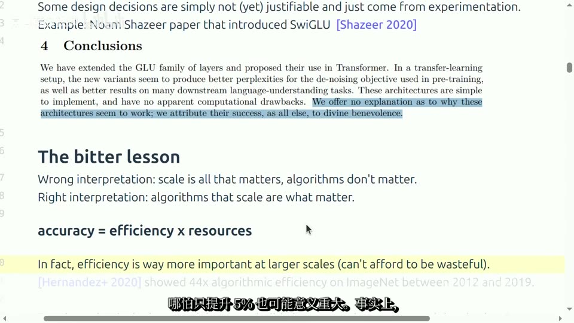 |
| OpenAI 在 2020 年发表的一篇论文显示：2012~2019 年间，ImageNet 上算法效率提升了 44 倍。硬件性能确实显著提升，但同时伴随着算法改进——只有把两者相乘，才能看到效率与创新（应为"性能"）的巨大提升。综上所述，核心问题是：在给定的数据和计算预算下，能构建出的最优模型是什么。 [【跳转到 08:47】](https://www.bilibili.com/video/BV11LEA6eEuj/?p=1&t=527) | 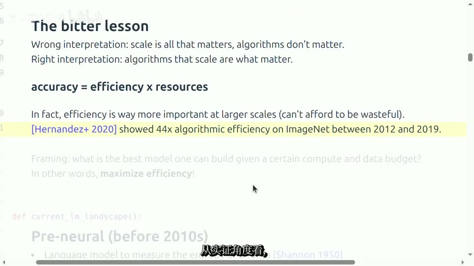 |
| 对预训练而言，我们主要讨论计算预算，因为我们会假设你拥有的数据量远超算力。但如果你处于数据受限场景，或者囤积了大量 B200，那你可能就受限于数据。换句话说，就是最大化效率——我们将看到，这一主题贯穿整门课程。接下来我想花点时间聊聊语言模型的历史背景，帮大家建立整体认识， [【跳转到 09:12】](https://www.bilibili.com/video/BV11LEA6eEuj/?p=1&t=552) | 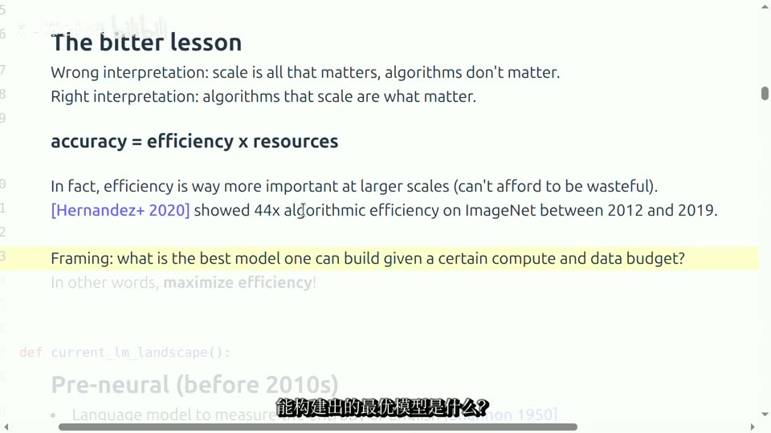 |
| 然后再深入技术细节。语言模型其实早就有了：20 世纪 50 年代，香农就用它测算英语的熵。很长一段时间里，n-gram 模型一直用在机器翻译和语音识别系统中——它们不是系统全部，但却是保证生成流畅文本的重要一环。我认为现代语言模型的源头可以追溯到神经架构。我觉得有几个关键思想推动了这一发展： [【跳转到 09:37】](https://www.bilibili.com/video/BV11LEA6eEuj/?p=1&t=577) | 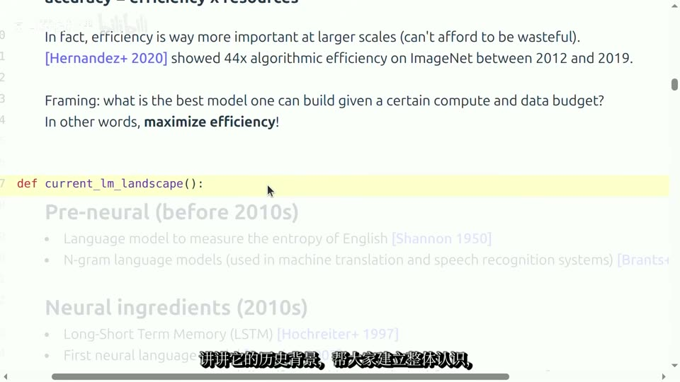 |
| 20 世纪 90 年代出现了 LSTM。要说 Bengio，早在 2003 年就写出了第一篇神经语言模型的论文；那时还不是 LSTM，只是仅关注小范围上下文的前馈网络。接着是序列到序列建模，它大胆宣称能把整句话压缩成一个向量；还有为机器翻译开发的 Adam 优化器、 [【跳转到 10:02】](https://www.bilibili.com/video/BV11LEA6eEuj/?p=1&t=602) |  |
| 注意力机制，以及在此基础上构建的 Transformer 架构，同样为机器翻译而生；随后又扩展到混合专家模型和模型并行。你会发现，2010 年代涌现出许多不同的架构，以及系统和优化器方面的新思路。到了 2010 年代末，事情开始真正变得有意思：比如 ELMo 和 BERT，这些语言模型经过大量文本训练之后， [【跳转到 10:27】](https://www.bilibili.com/video/BV11LEA6eEuj/?p=1&t=627) | 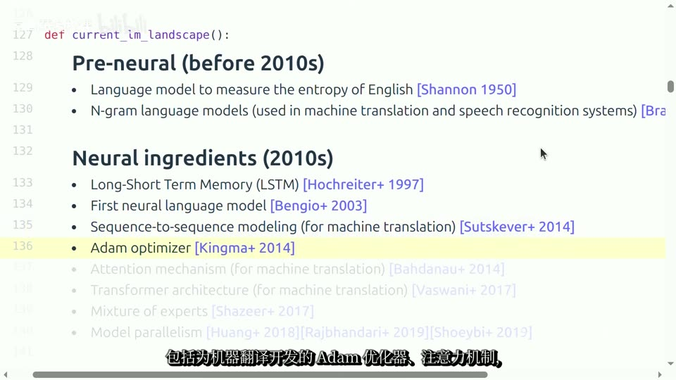 |
| 你可以在问答等下游任务上微调它们，效果有巨大提升。当时的做法就是选一个这样的模型然后微调。后来 Google 发了一篇论文，我觉得它真正预示了"输入提示、输出响应"这种范式。此外，我认为真正靠拥抱扩展打开局面的是 OpenAI：大约 2017 年左右，他们发表了 GPT-1 论文，并扩展成 GPT-2； [【跳转到 10:52】](https://www.bilibili.com/video/BV11LEA6eEuj/?p=1&t=652) | 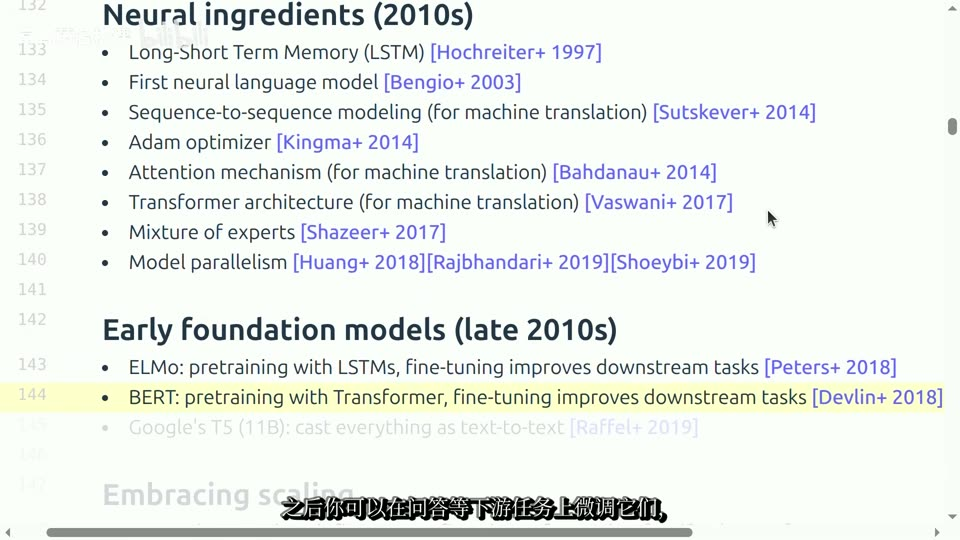 |
| 随后他们真正想明白（或者说接纳了）缩放定律这一理念——我们稍后会讨论——这使他们得以训练 GPT-3：一个规模大得多的模型，大了几乎十倍以上，展现出上下文学习这类涌现行为。当时谷歌表示"好吧，我们也得行动"，于是训练了一个庞大的模型， [【跳转到 11:17】](https://www.bilibili.com/video/BV11LEA6eEuj/?p=1&t=677) | 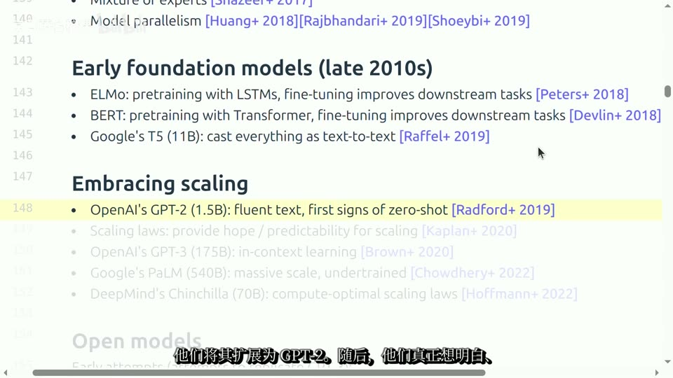 |
| 结果发现它训练不足。而事实证明，当时尚未并入谷歌的 DeepMind 已经发现了"计算最优"缩放定律——所有这些都在同时发生。GPT-3 发布后，我认为这敲响了警钟，出现了许多试图复现它的早期尝试。于是，一个叫 EleutherAI 的草根组织创建了一些开放数据集和模型；规模不大，因为算力有限。 [【跳转到 11:42】](https://www.bilibili.com/video/BV11LEA6eEuj/?p=1&t=702) | 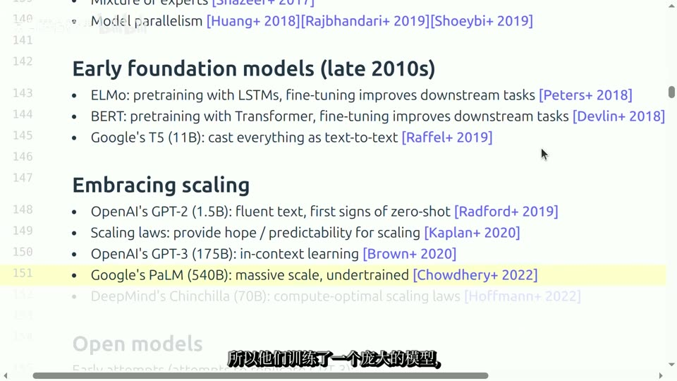 |
| Meta 的首个 LLaMA 你能看出是"复刻"之作：它并非一个很好的模型，遇到了很多硬件问题。随后 HuggingFace 又有 BigScience 项目。这些模型并不算强大，但在过去 3 年里，我认为开源生态发生了很大变化：Meta 凭借 LLaMA 系列（LLaMA、LLaMA 2、LLaMA 3）引领了潮流； [【跳转到 12:07】](https://www.bilibili.com/video/BV11LEA6eEuj/?p=1&t=727) | 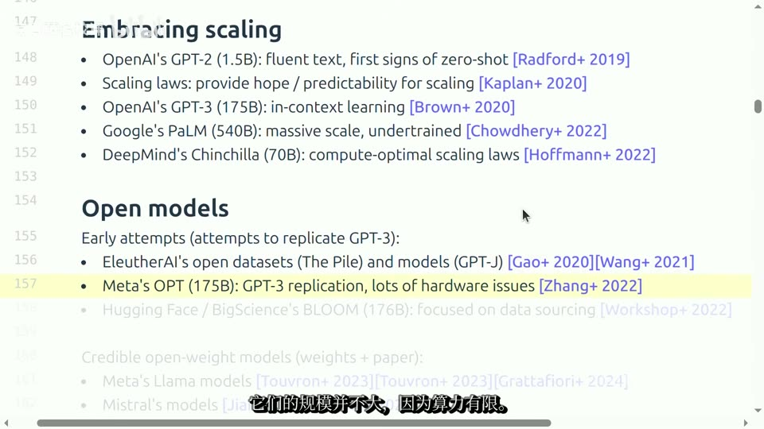 |
| Mistral 随后加入。接着是一大批中国模型。哦，我还漏掉一些：比如字节跳动也有相关项目，我认为腾讯可能也有。 [【跳转到 12:32】](https://www.bilibili.com/video/BV11LEA6eEuj/?p=1&t=752) | 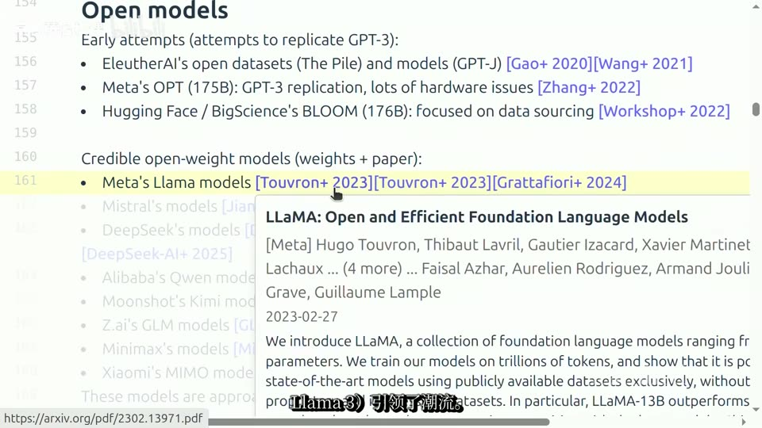 |
| 所以很难跟踪所有动态。不过 DeepSeek 和 Qwen 大家都听说过，主要的我应该都提到了。我觉得这些模型有趣的地方在于：现在我们有了正在逼近闭源水平的开放权重模型。具体是落后还是持平，取决于你问谁、用什么基准测；但确实有一些非常可靠的模型已经在工业界广泛使用了。 [【跳转到 12:41】](https://www.bilibili.com/video/BV11LEA6eEuj/?p=1&t=761) | 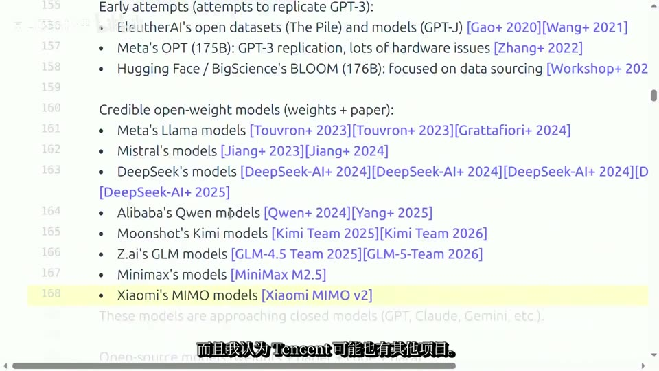 |
| 此外还有一条工作路线，不再局限于发布开源权重：比如 AI2、Technology Innovation Institute，还有我参与的 OLMO 项目，我们试着除权重外还公开论文、代码和数据，这样就能更深入理解这些模型究竟是怎么搭出来的。我为什么这么看重开放生态？因为我觉得，要是没有这些模型， [【跳转到 13:06】](https://www.bilibili.com/video/BV11LEA6eEuj/?p=1&t=786) | 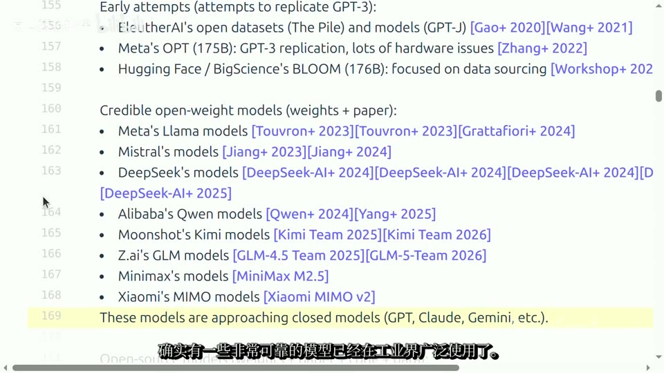 |
| 这门课根本开不起来。现在还有很多论文在探讨这些大型混合专家系统和强化学习系统如何运作，让我们至少能一窥前沿模型是怎么构建的。当然（原字幕有 down），即便像 Qwen 这样的论文，很多细节还是没写全、没法照着复现——特别是数据混合比例，我们并不清楚——但这总比一无所知强得多。好，那么过去 10 年里， [【跳转到 13:31】](https://www.bilibili.com/video/BV11LEA6eEuj/?p=1&t=811) | 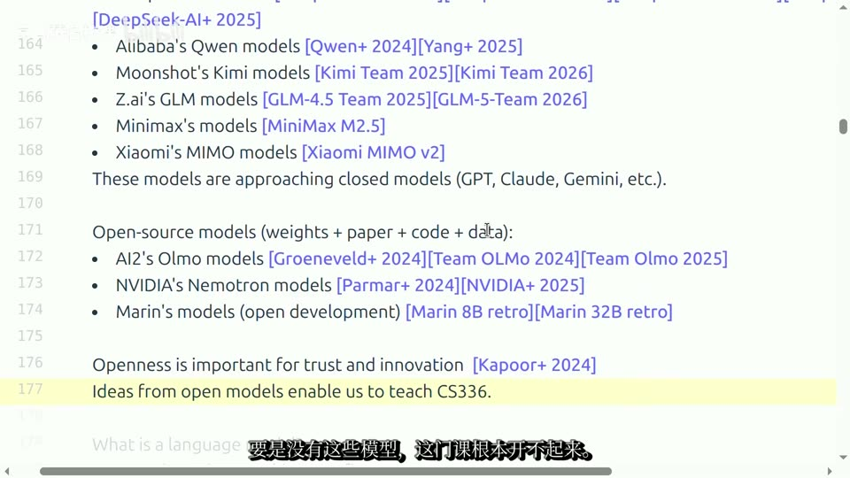 |
| "语言模型"这个概念已经变了：以前它是你拿来微调的东西，后来变成你拿来提示的东西，而到了 ChatGPT 时代，它变成了你可以直接对话、与之交谈的东西。现在——好吧，我看是没网络了，没关系——我们已经进入智能体时代：点开这个链接，它会展示一长段智能体的执行轨迹。 [【跳转到 13:56】](https://www.bilibili.com/video/BV11LEA6eEuj/?p=1&t=836) | 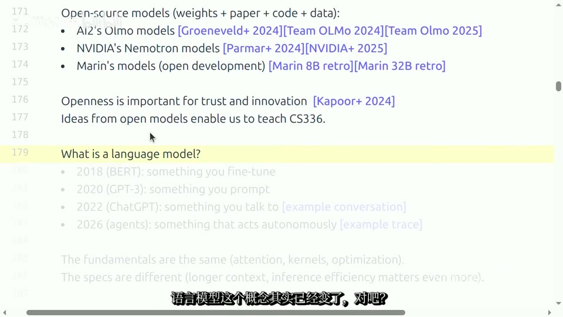 |
| 而且我至今仍觉得不可思议：这些模型能力强大得惊人，给它一页文字，它就能完成相当复杂的智能体编码任务。所以我们今天对语言模型提出的要求，可能是 10 年前无法想象的。话虽如此，我认为最根本的东西没有太大变化：总的来说，我们依然依托 GPU 和底层内核来构建系统， [【跳转到 14:21】](https://www.bilibili.com/video/BV11LEA6eEuj/?p=1&t=861) | 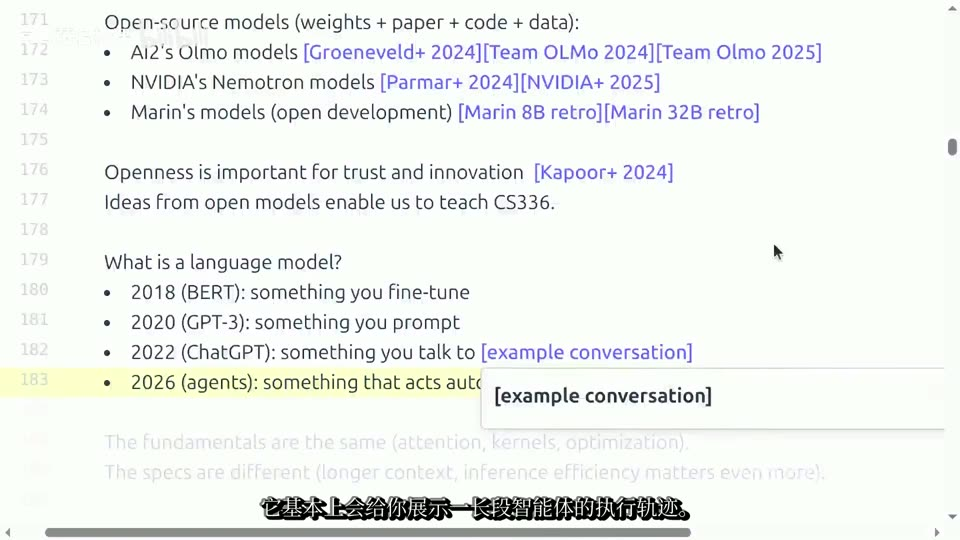 |
| 基本运作模式也没变：依然用梯度或随机梯度这类方法做优化，Transformer 的注意力机制也还在用。架构我们会细聊，但整体变化不大。现在关注的焦点不同了：要处理更长的上下文，所以推理效率格外关键。好消息是这门课不用大改，只有 Tatsu 讲最新架构的部分做了更新。 [【跳转到 14:46】](https://www.bilibili.com/video/BV11LEA6eEuj/?p=1&t=886) | 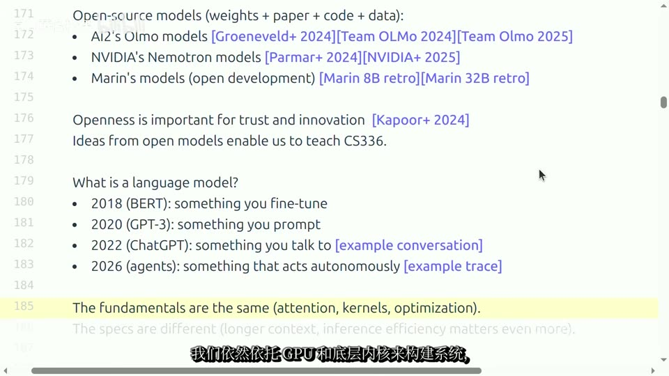 |
| 不过基础知识这块，至少暂时不会变。谢谢。那我就先停在这儿，看看大家有没有问题或想法。 [【跳转到 15:11】](https://www.bilibili.com/video/BV11LEA6eEuj/?p=1&t=911) | 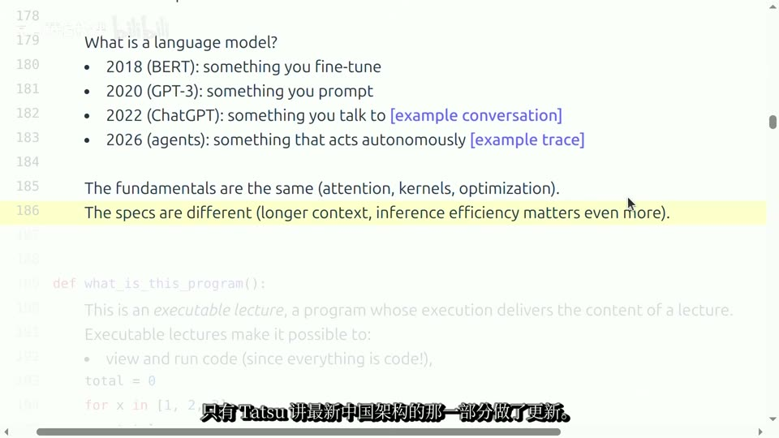 |
| 还有——谢谢。接着往下讲。这里先插一段： [【跳转到 15:22】](https://www.bilibili.com/video/BV11LEA6eEuj/?p=1&t=922) | 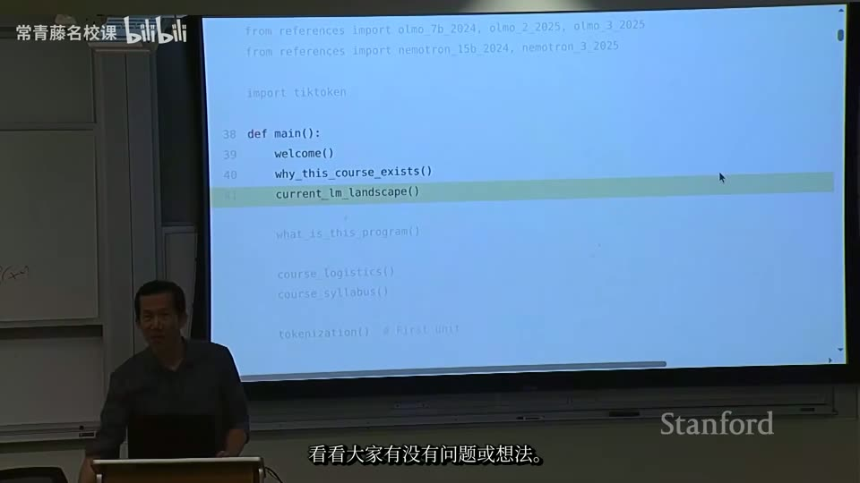 |
| "这到底是什么程序？"我管它叫"可执行讲座"。它看着像 Python 代码，因为它确实就是 Python 代码，只是做了渲染处理让你看着更舒服。我一步步演示时，其实就是在运行讲座内容——这基本上就是在逐步执行代码。希望这对大家既有趣又重要。你还能看到讲座的层级结构： [【跳转到 15:27】](https://www.bilibili.com/video/BV11LEA6eEuj/?p=1&t=927) | 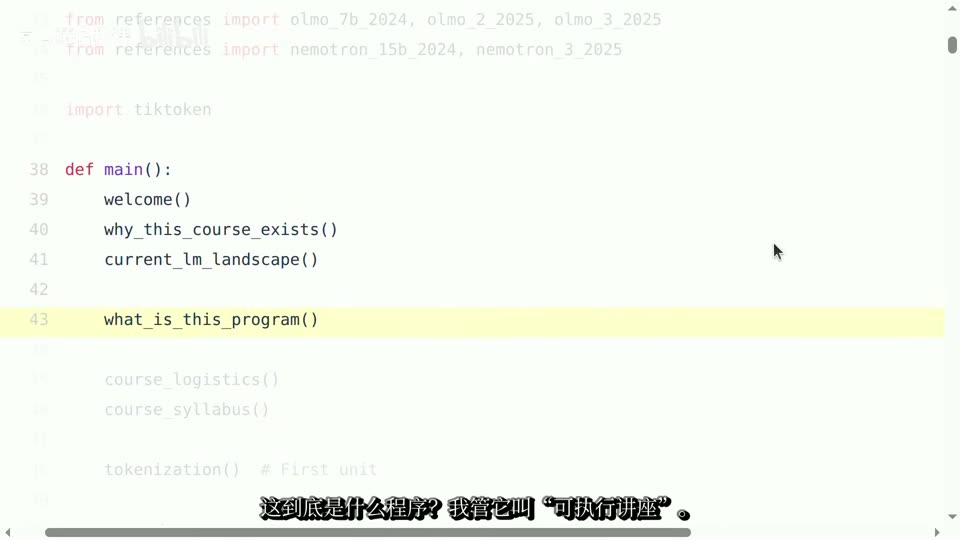 |
| 比如这个函数执行完，我们就回到主函数。好，聊聊课程安排和教学大纲。所有信息都在 cs336.stanford.edu 网站上。这门课 5 个学分，名气已经摆在那了，所以不用多解释。我们有 5 个作业要交，按这个大纲来看 [【跳转到 15:52】](https://www.bilibili.com/video/BV11LEA6eEuj/?p=1&t=952) | 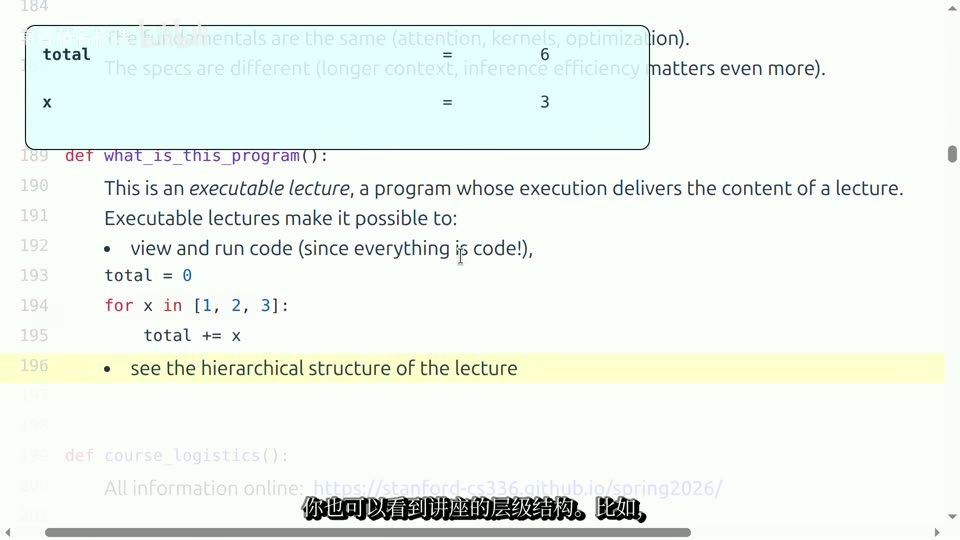 |
| 强度都很大，哪怕第一个作业也不例外：按工作量算，其实跟 CS224N 的五次作业加起来差不多。有人跟我说这有点言过其实，但我认为预估工作量时保守一点总没错。那么你为什么应该选这门课？首先，你得像我一样，对理解事物运作机制有一种执着的需求——这才是主要目标：对语言模型究竟如何工作 [【跳转到 16:17】](https://www.bilibili.com/video/BV11LEA6eEuj/?p=1&t=977) | 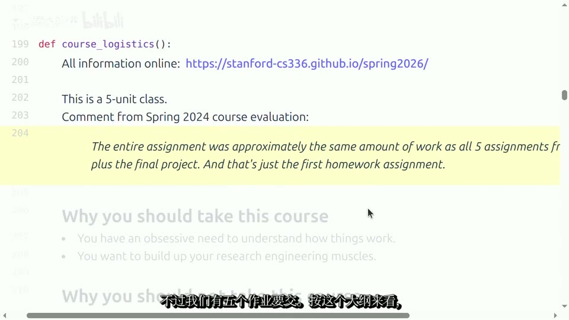 |
| 保持纯粹的好奇心。此外，通过修读这门课，你会锻炼出更扎实的研究与工程能力，从而有信心应对全新的环境和各种突发状况。回想我刚到斯坦福时开设过统计学习理论课程，主要讲机器学习的理论部分。这很有帮助，因为它赋予了大家相应的能力： [【跳转到 16:42】](https://www.bilibili.com/video/BV11LEA6eEuj/?p=1&t=1002) | 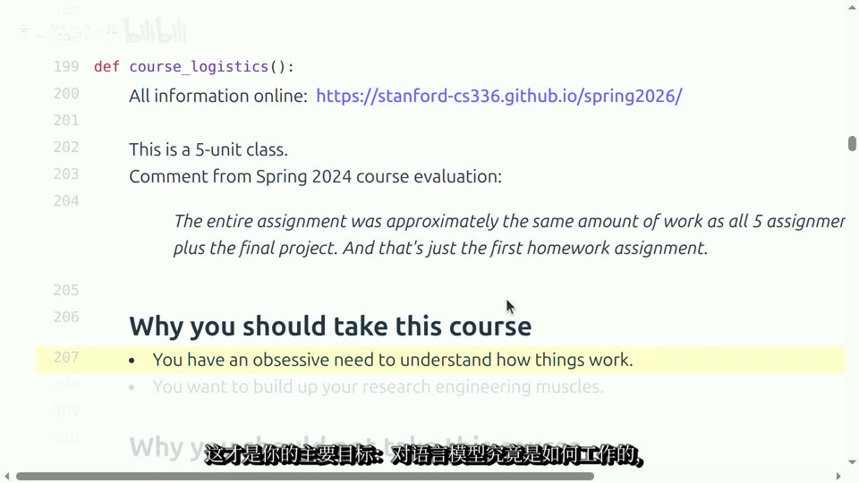 |
| 当你阅读论文时，能看懂其中的所有数学推导。如今该领域已大幅转向更侧重系统和实证的方向；这门课在深度上与之类似，能让大家打下坚实基础，从而觉得其他内容相对容易。那么什么情况下你不该选这门课呢？这点很重要，因为确实存在不该选它的理由。第一，如果你本季度主要想推进研究， [【跳转到 17:07】](https://www.bilibili.com/video/BV11LEA6eEuj/?p=1&t=1027) | 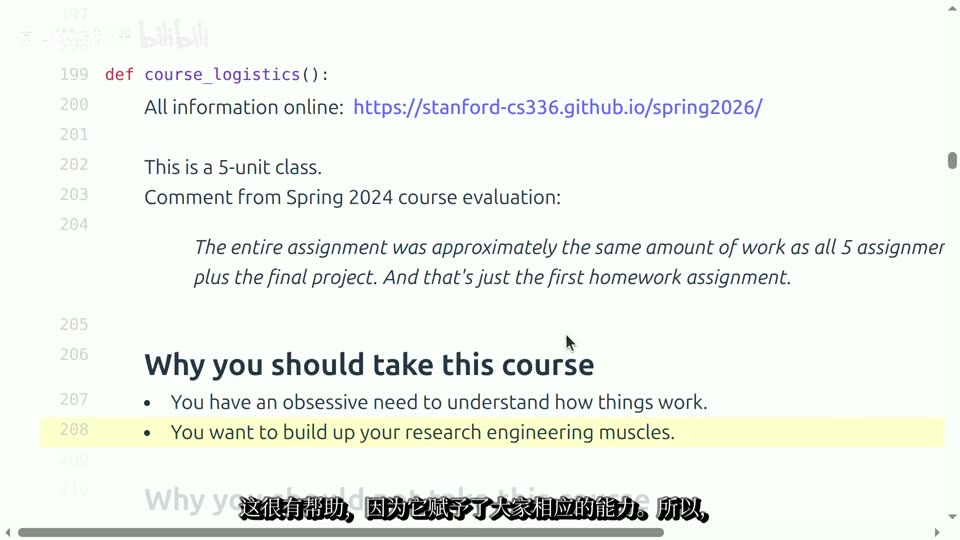 |
| 那最好先和导师沟通，让他知道你选了这门课，以免后续出现意外。如果你想学 AI 领域最前沿的最新技术，有许多其他优秀课程、研讨课或专题课更适合你——我们不会涉及很多内容：不讨论多模态，也不深入探讨智能体。想了解这些的话，这门课并不适合你。如果你抱着这样的目的而来—— [【跳转到 17:32】](https://www.bilibili.com/video/BV11LEA6eEuj/?p=1&t=1052) | 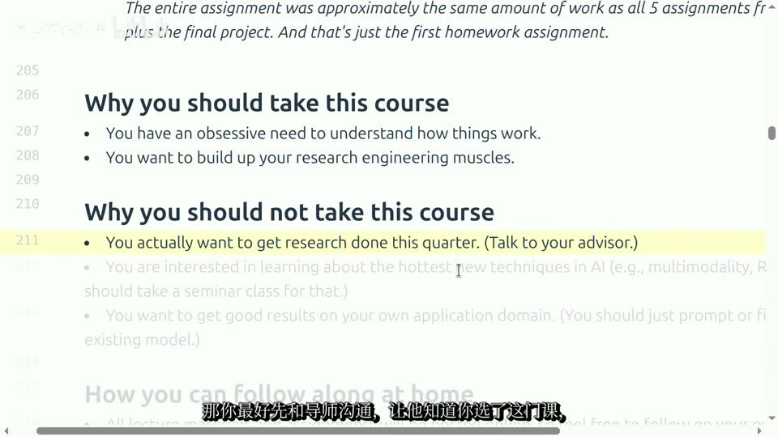 |
| "我有一个具体的应用领域，想在上面取得好结果"——门课可能不是最好的起点，至少入门阶段不是。我总是建议：先对模型做提示，再微调模型，万不得已才预训练自己的模型——因为那既折磨人又昂贵。不过这件事很有意思。好的，如果你没选这门课， [【跳转到 17:57】](https://www.bilibili.com/video/BV11LEA6eEuj/?p=1&t=1077) | 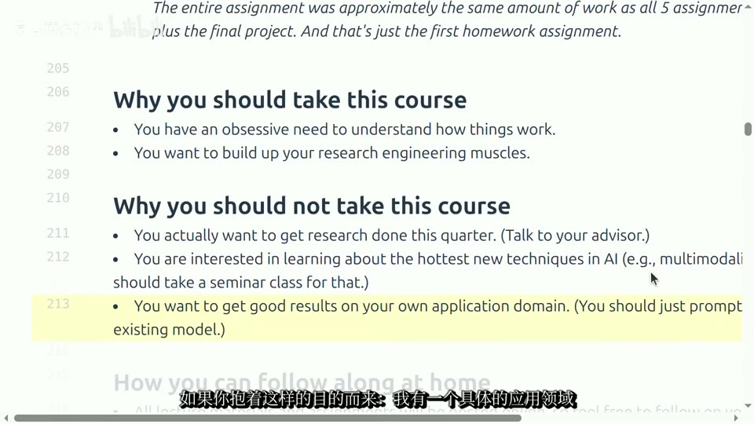 |
| 也可以在家跟着学：所有讲义材料都会发布在网站上，也会由 Canvas 录制（感谢 Canvas），之后发布到 YouTube。在家看讲座固然好，但你真正的学习靠完成作业，所以得想办法激励自己做作业。说到作业，一共五项，其理念是 [【跳转到 18:19】](https://www.bilibili.com/video/BV11LEA6eEuj/?p=1&t=1099) | 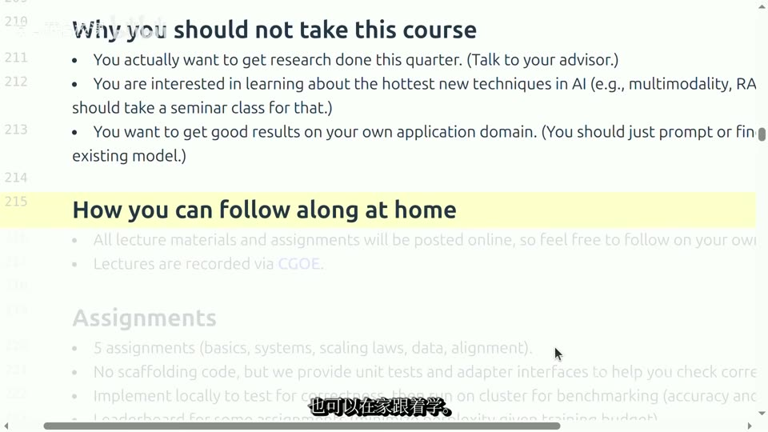 |
| "如何从零开始构建"。但作业不只是"构建一个语言模型"然后完事：我们不提供脚手架代码，但会提供大量单元测试，确保你构建的东西确实正确——这样你就不会陷入"稀疏奖励"的情形：提交后结果要么对、要么错。我的建议是：作业结构经过精心设计，大部分内容在你自己的笔记本上就能本地完成： [【跳转到 18:44】](https://www.bilibili.com/video/BV11LEA6eEuj/?p=1&t=1124) | 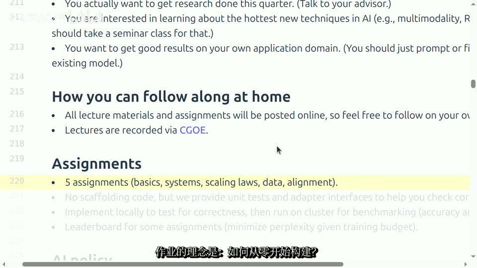 |
| 你可以先实现代码并验证正确性；然后我们提供集群让你进行实际训练运行、查看准确率，或提供一组 GPU 实测某些内核性能。为了增添趣味，至少在大多数作业里我们会设排行榜，大致是这样：既然你已经学了这部分内容， [【跳转到 19:09】](https://www.bilibili.com/video/BV11LEA6eEuj/?p=1&t=1149) | 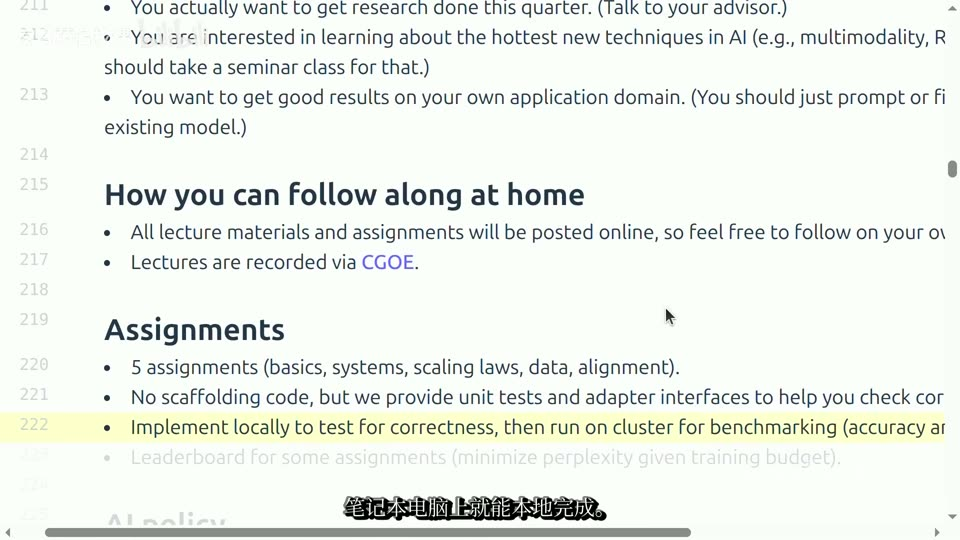 |
| 那就试着在某种预算限制下把困惑度降到最低。Marcel 和 Herman 前两年都是刷排行榜的高手，想要建议的话，我相信他们很乐意分享——其实我也不确定他们会不会告诉你秘诀， [【跳转到 19:34】](https://www.bilibili.com/video/BV11LEA6eEuj/?p=1&t=1174) | 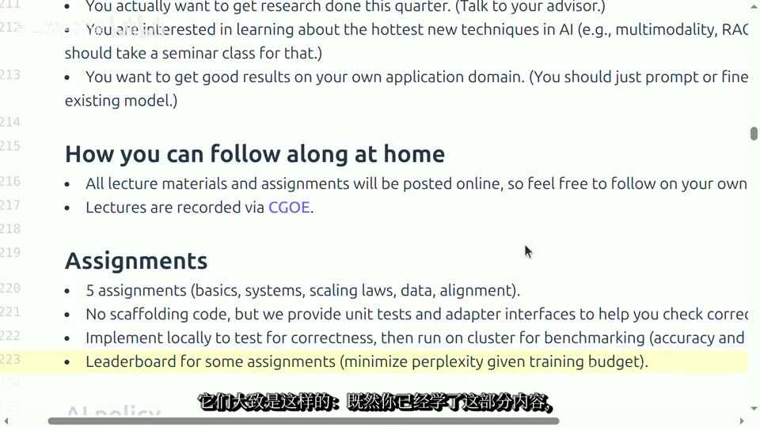 |
| 但你可以试试。好，去年我们在思考"AI 能为这门课做什么"。人人都能用 AI，但还是要尽力做到最好。我觉得现在的编码智能体已强到足以搞定所有作业；但显而易见，如果你只是把作业一的 PDF 直接喂给 Claude Code，你什么也学不到。 [【跳转到 19:51】](https://www.bilibili.com/video/BV11LEA6eEuj/?p=1&t=1191) | 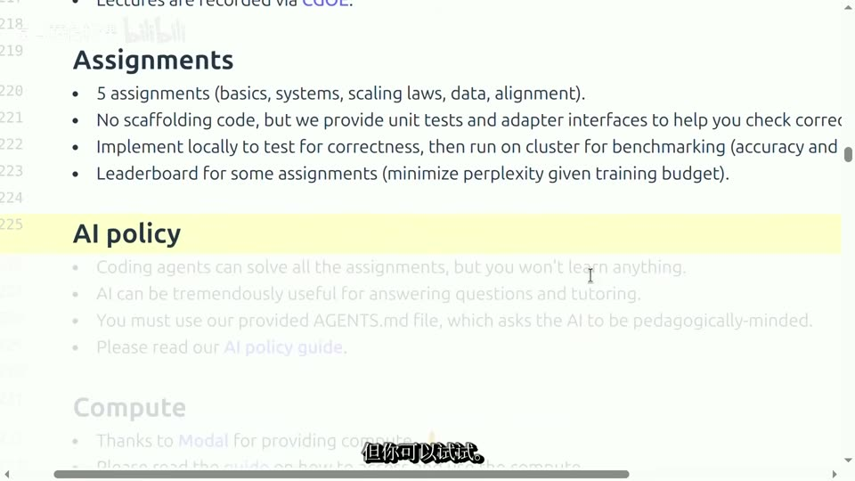 |
| 同时，AI 在答疑和辅导方面很有用，所以得想办法利用它。我们决定提供一个"AI 政策" markdown 文件（或等效提示），要求 AI 具备教学意识。如果你的确要用 AI，就得带上这个提示：它会回答代码相关问题、帮你理清疑惑， [【跳转到 20:16】](https://www.bilibili.com/video/BV11LEA6eEuj/?p=1&t=1216) | 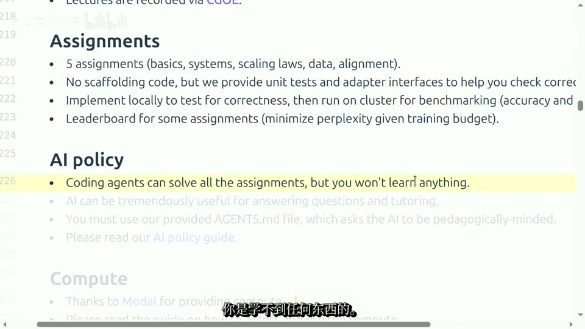 |
| 但如果作业是让你实现 Transformer，它就不会顺手替你把 Transformer 写出来。这是第一年这么做，请大家试用并反馈它管不管用。接下来是计算资源：今年多亏了 Modal，他们在平台上为我们提供了计算额度，体验相当不错，跟去年不一样。 [【跳转到 20:41】](https://www.bilibili.com/video/BV11LEA6eEuj/?p=1&t=1241) | 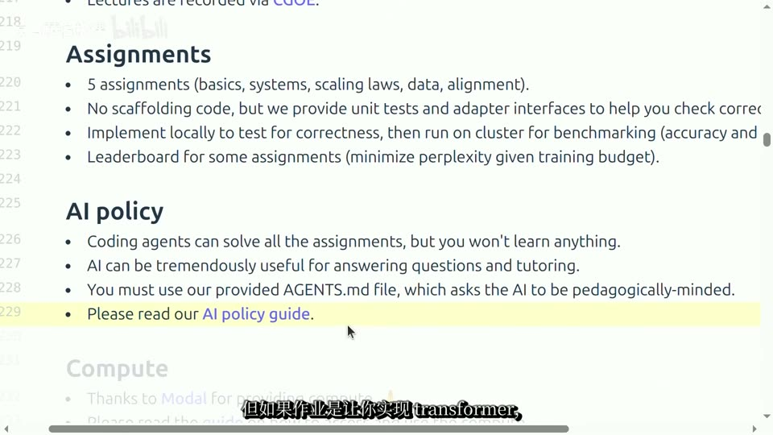 |
| 去年我们要 SSH 连到集群，这次更多是用 API。我起初还有点怀疑，但实际用下来挺顺手。再提一句：请大家试用，并把实际效果反馈给我们。我们写了一份指南，介绍如何访问和使用这些计算资源。谢谢。关于课程安排还有问题吗？好，接下来聊聊这门课讲什么。 [【跳转到 21:06】](https://www.bilibili.com/video/BV11LEA6eEuj/?p=1&t=1266) | 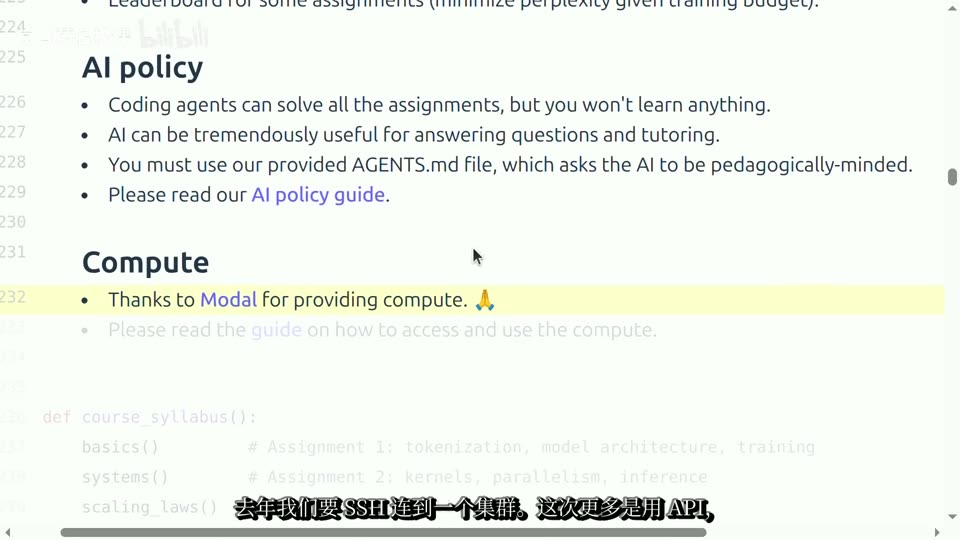 |
| 大体上分为五个部分， [【跳转到 21:26】](https://www.bilibili.com/video/BV11LEA6eEuj/?p=1&t=1286) | 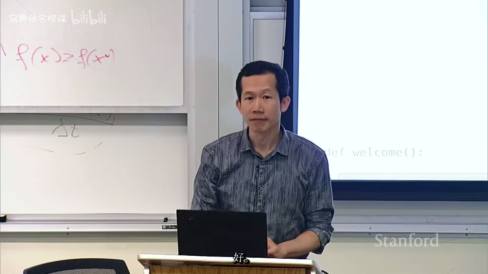 |
| 对应你要做的五项作业：基础、系统、缩放定律、数据和对齐。接下来我会逐一过一遍每个部分，让你对要学的内容有个初步了解。好，先从基础部分开始。这是第一单元，为期两周，目标是让你能够从零开始构建并训练一个语言模型。具体环节包括：对数据进行分词（tokenize）、定义架构，接着实现优化器并进行训练。 [【跳转到 21:31】](https://www.bilibili.com/video/BV11LEA6eEuj/?p=1&t=1291) | 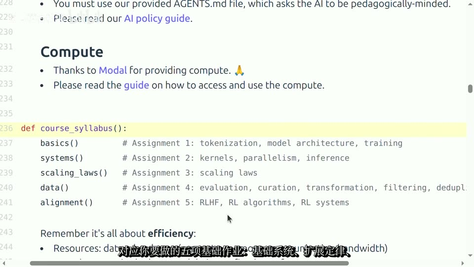 |
| 清楚吗？那你可能会问：剩下的课讲什么？稍后会讲。现在我们从分词（tokenization）开始。分词的本质在于确定模型所操作的基本单元，也就是它的"原子"。从形式上看，分词器（tokenizer）在原始输入字节与表示 token 的整数序列之间进行转换；概念上，这相当于对文本进行分割。我们将讨论字节对编码（BPE）分词器： [【跳转到 21:56】](https://www.bilibili.com/video/BV11LEA6eEuj/?p=1&t=1316) | 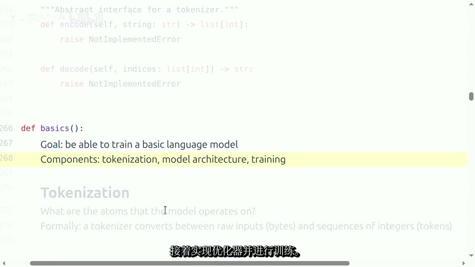 |
| 其直观原理是把输入分解为频繁出现的片段。考虑到这门课的核心是"效率"，从效率视角看，分词是有益的：它把原始字节流构成长序列，缩减为数量更少的 token。但更微妙、或许更重要的是，它让你能够进行自适应计算： [【跳转到 22:21】](https://www.bilibili.com/video/BV11LEA6eEuj/?p=1&t=1341) | 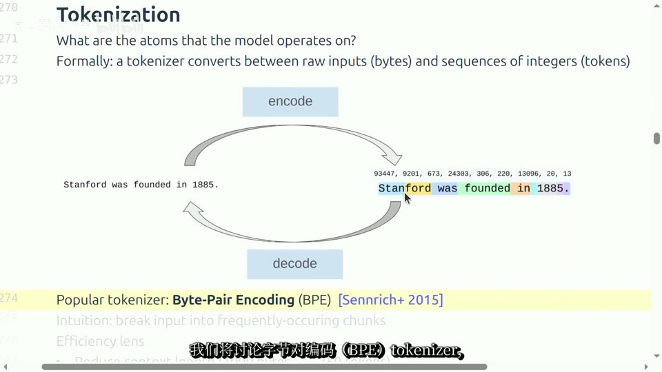 |
| 有些位置可能包含大量字节，但其实应该被压缩成一个 token；而输入中那些更罕见、更值得关注的部分则应保留为多个 token。后面会详细展开。这里先提一下：每年我都盼着不用再讲分词，因为我们真正的梦想是实现一种端到端、直接对字节操作的方式。这方面有不少研究， [【跳转到 22:46】](https://www.bilibili.com/video/BV11LEA6eEuj/?p=1&t=1366) | 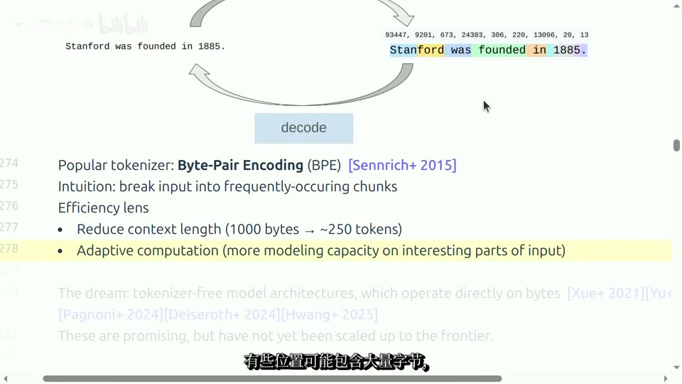 |
| 包括最近的 H-Net 等工作，看起来很有前景。但到目前为止，它们都还没能扩展到前沿规模；前沿模型仍在使用分词器，所以我们觉得继续讲授分词器仍是明智之举。好，对输入分词之后，你就得到一堆 token，接下来在其上定义一个模型。我想大家对 Transformer 都很熟悉了： [【跳转到 23:10】](https://www.bilibili.com/video/BV11LEA6eEuj/?p=1&t=1390) | 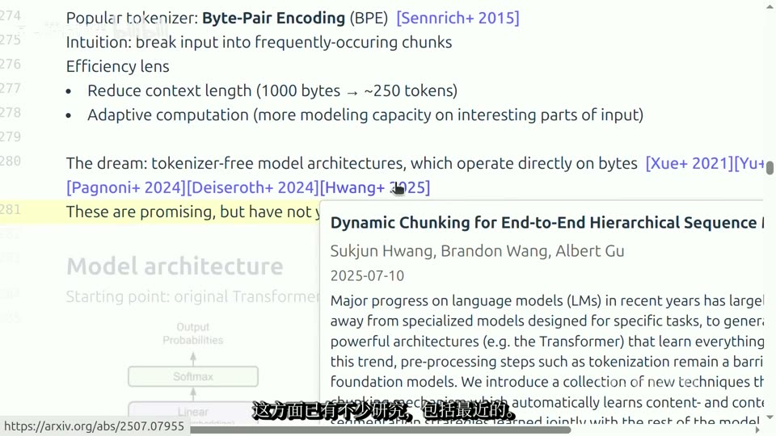 |
| 如果你修过 CS224N 这门自然语言处理课程，那你肯定见过 Transformer。 [【跳转到 23:33】](https://www.bilibili.com/video/BV11LEA6eEuj/?p=1&t=1413) | 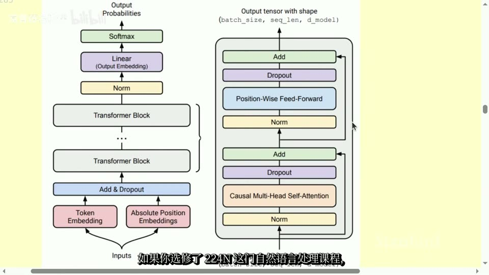 |
| 此后 Transformer 经历了许多改进或优化，我认为这些都很重要，稍后会详谈。这里先快速过一遍需要考虑的各类问题：激活函数已经演变；位置编码、归一化的做法也都发生了演变；用于防止数值爆炸的那些不同层也演变了。我们不再使用全注意力，而是采用多种方法大幅减少注意力的计算量， [【跳转到 23:39】](https://www.bilibili.com/video/BV11LEA6eEuj/?p=1&t=1419) | 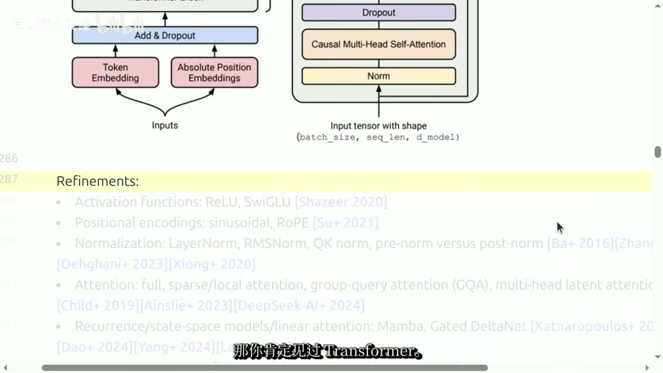 |
| 因为注意力的计算量随序列长度 N 呈平方级增长，开销巨大。这方面的思路有很多。如果你追求更前沿的方案， [【跳转到 24:04】](https://www.bilibili.com/video/BV11LEA6eEuj/?p=1&t=1444) | 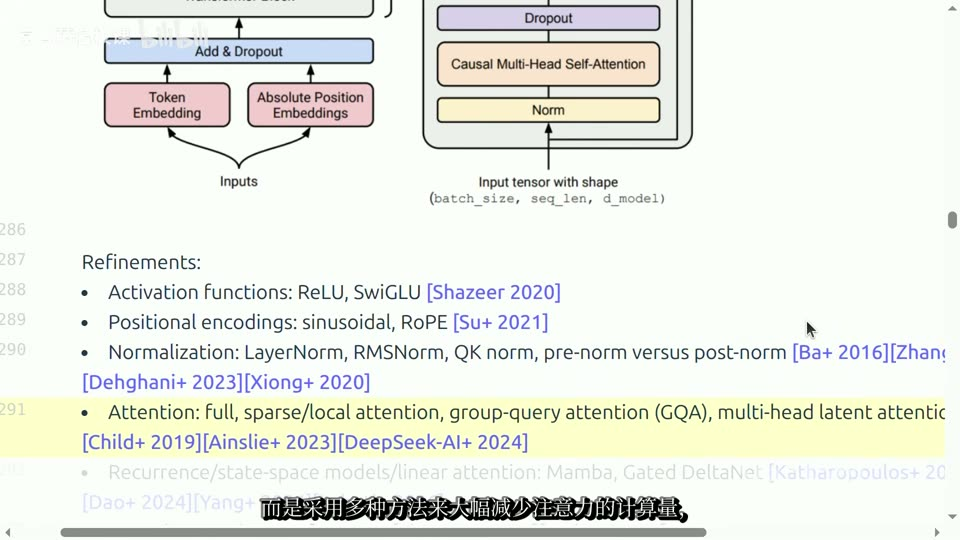 |
| 可以看看状态空间模型，或者等价的线性注意力机制，比如 Mamba 和 gated DeltaNet。这些模型过去几年很受欢迎，而且把它们与注意力机制混合使用效果相当好，所以我们会探讨其中一些内容。接着是 Transformer 的 MLP 层：最初的 Transformer 只是稠密 MLP，而现在混合专家（MoE）已成为构建"计算高效 Transformer"的主流范式—— [【跳转到 24:17】](https://www.bilibili.com/video/BV11LEA6eEuj/?p=1&t=1457) | 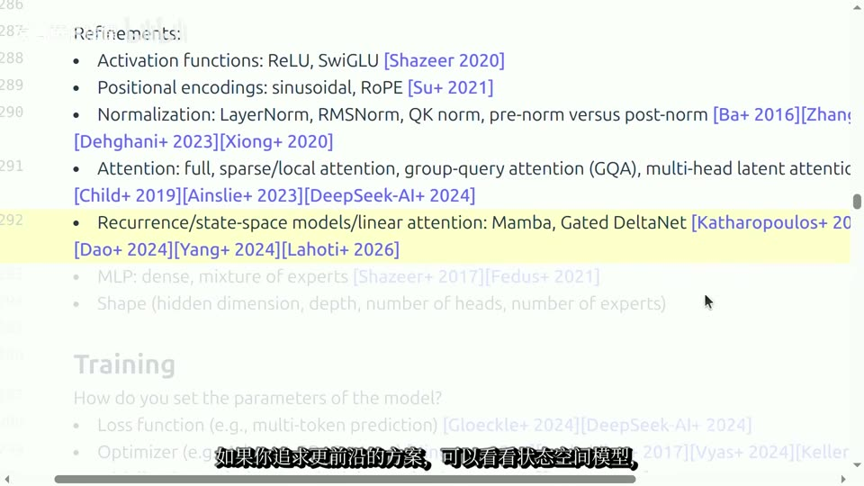 |
| 接下来我们就谈这个。当然，对 MLP 和混合专家来说，不只是定义架构的问题，我们还会发现需要采用不同的训练技术。最后，也许有点枯燥，但有个重要问题：你的 Transformer 具体长什么样？层数多少？注意力头多少？ [【跳转到 24:42】](https://www.bilibili.com/video/BV11LEA6eEuj/?p=1&t=1482) | 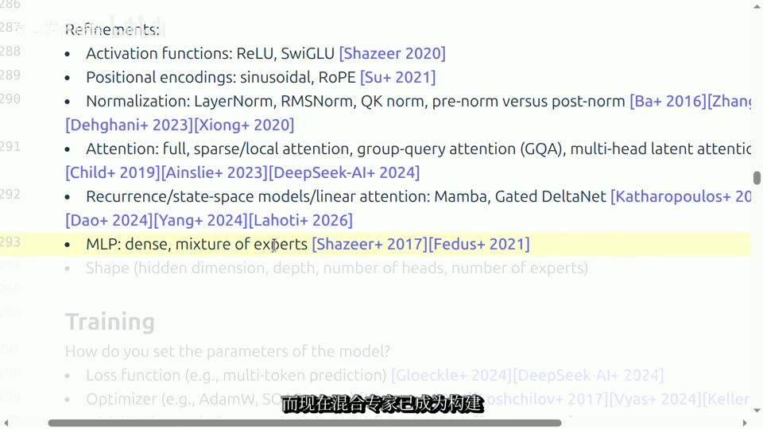 |
| 隐藏维度多少？专家数量多少？这些在讨论缩放定律时会更常提到。设置这些参数其实是有讲究的：它几乎"微不足道"，只是个超参数，但在语言模型扩展的语境下，影响其实非常巨大。好，一旦确定了模型架构，该怎么训练它呢？围绕损失函数有一堆设计决策：默认是预测下一个 token， [【跳转到 25:07】](https://www.bilibili.com/video/BV11LEA6eEuj/?p=1&t=1507) | 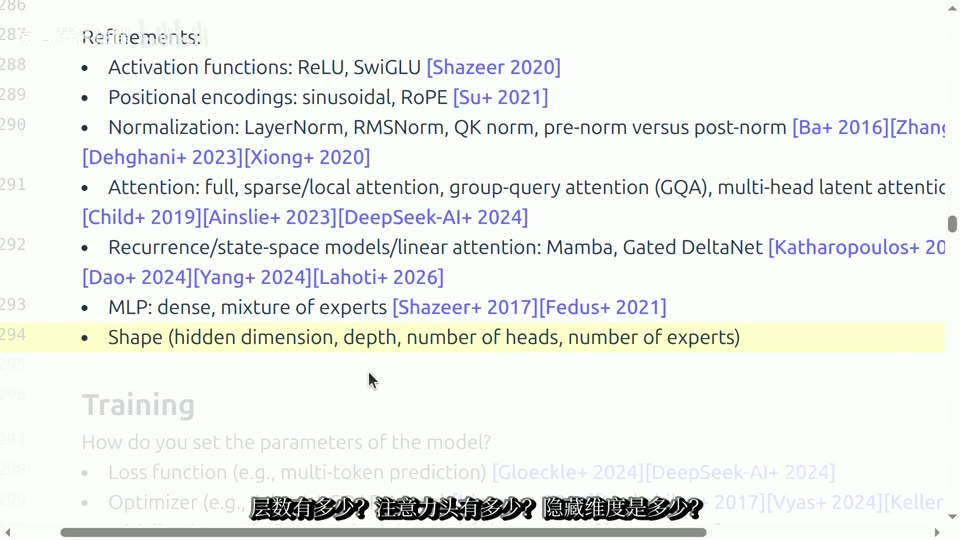 |
| 但人们发现预测多个 token 似乎有助于提升效果。还有优化器：以前大家常用 Adam，但现在越来越多地采用 Muon，尤其是在 Kimi K2 等最新开源模型中。初始化听起来枯燥，但事实证明，它对大模型训练的稳定性、学习率调度等都有巨大影响。 [【跳转到 25:32】](https://www.bilibili.com/video/BV11LEA6eEuj/?p=1&t=1532) | 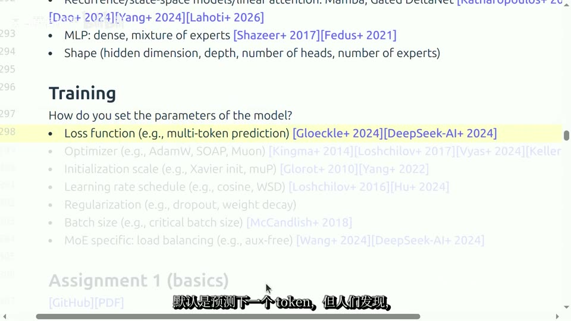 |
| 还有批次大小，然后是混合专家（MoE）特有的那些设置。看到这份清单你可能会想："不过是些超参数罢了，我打算各种选项都试一大堆。"但事实证明，以有原则的方式仔细设置这些超参数，将决定一次实验究竟是彻底崩溃、毫无用处， [【跳转到 25:57】](https://www.bilibili.com/video/BV11LEA6eEuj/?p=1&t=1557) | 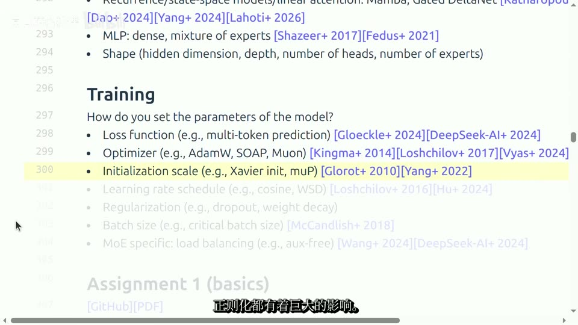 |
| 还是表现出色——也就是达到最先进水平的那种实验。谢谢。等我们讨论损失爆炸（loss explosion）时会再回到这一点。好，第一次作业要做的是：实现 BPE 分词器，实现 Transformer、损失函数、优化器以及整个训练流程。我们还会让你们做大量资源核算，这样你们就能明白自己的算力（FLOPs）都花在了哪里。 [【跳转到 26:22】](https://www.bilibili.com/video/BV11LEA6eEuj/?p=1&t=1582) | 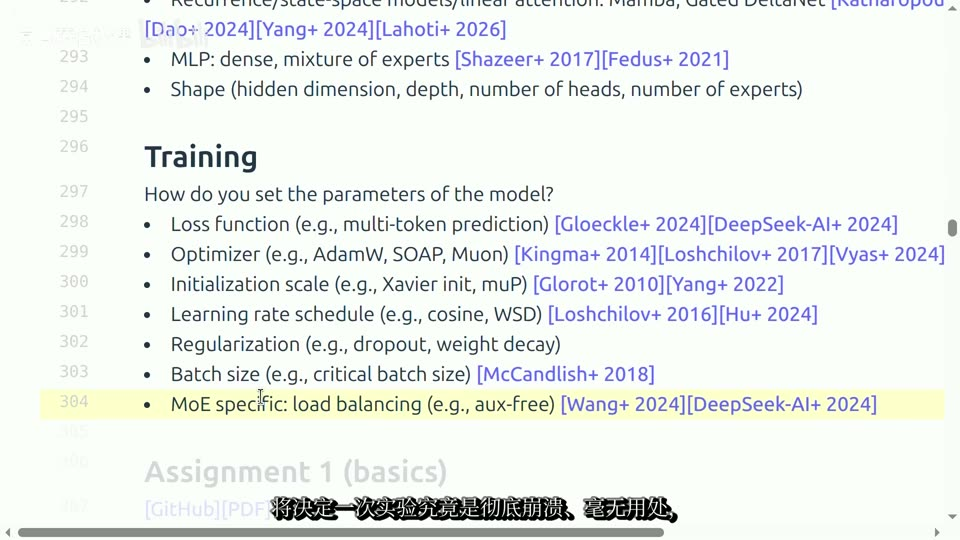 |
| 我们会用 TinyStories 和 OpenWebText 这类数据集来训练一些模型。接下来会有排行榜，你要想办法让困惑度降得越低越好——如果熟悉 nanoGPT speedrun，会觉得有点类似。好啦，到作业一结束时，你应该就能从零搭建出一个语言模型。 [【跳转到 26:47】](https://www.bilibili.com/video/BV11LEA6eEuj/?p=1&t=1607) | 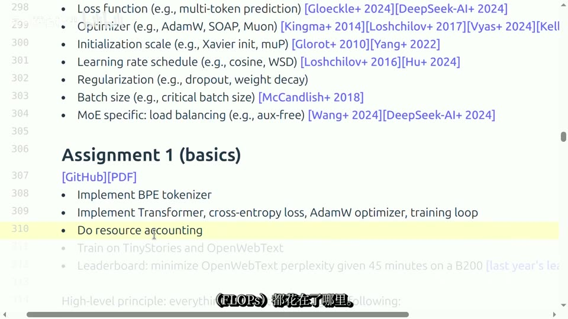 |
| 这很令人兴奋。如果要在这里总结一个高层要点：虽然分词、建模和训练看起来被拆成独立的部分，但实际上一切都在于平衡以下几点。你需要模型有足够的表达能力，以便刻画数据的复杂性；但同时你还希望训练过程保持稳定——我们会花大量时间讨论， [【跳转到 27:12】](https://www.bilibili.com/video/BV11LEA6eEuj/?p=1&t=1632) | 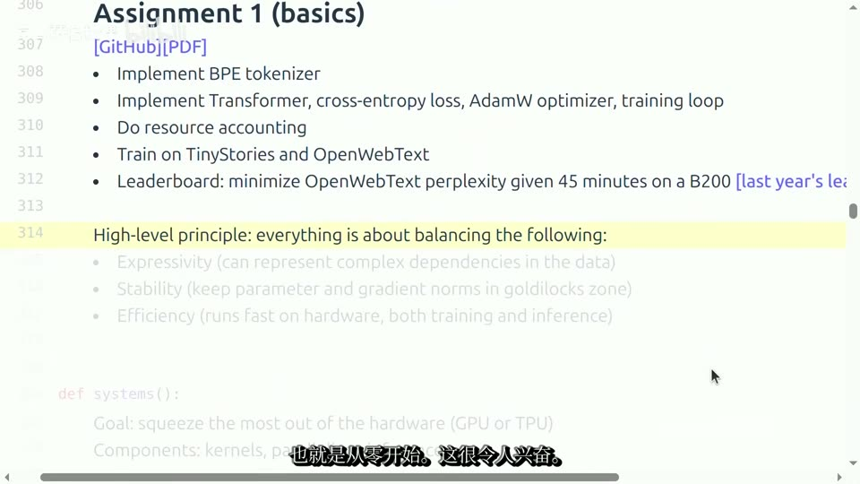 |
| 怎么把参数和梯度的范数控制在既不太大也不太小的黄金区间，避免它们爆炸或消失。事实证明，训练语言模型在很大程度上就是关乎稳定性。最后是效率，这一点相对更直接：只需让它在硬件上跑得更快。但你会看到一些有趣的现象：比如改变架构——很多架构决策正是这样——我们可以通过缩减来加快速度， [【跳转到 27:37】](https://www.bilibili.com/video/BV11LEA6eEuj/?p=1&t=1657) | 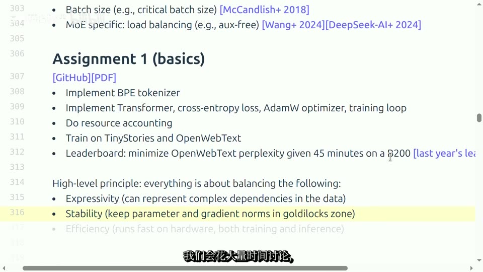 |
| 把它投影到低维空间；但随之而来的问题是：效果还一样好吗？做出这些权衡正是这里的关键。好，作业二将更深入地探讨系统层面：目标是尽可能充分利用你的硬件。我们会讨论内核（kernel）、如何在多个 GPU 上并行，以及如何进行推理。 [【跳转到 28:02】](https://www.bilibili.com/video/BV11LEA6eEuj/?p=1&t=1682) | 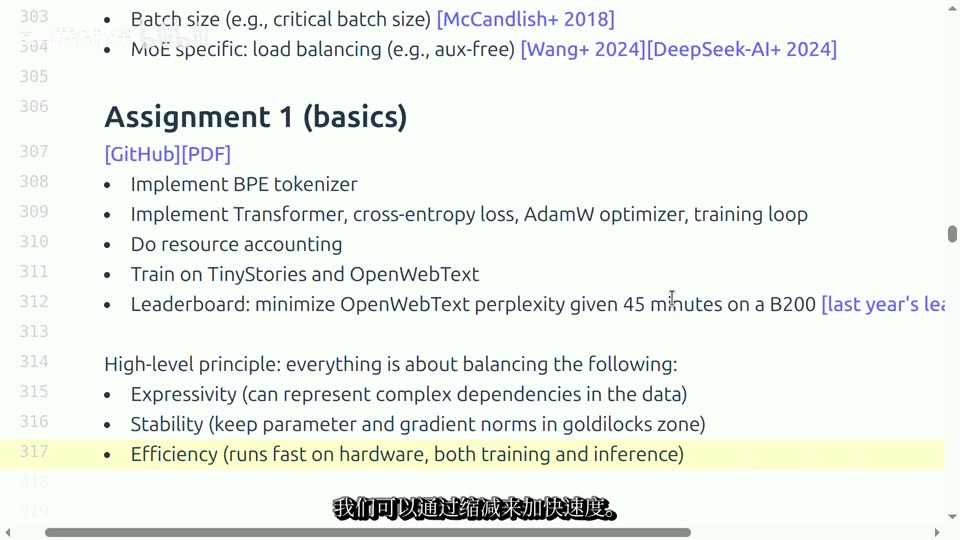 |
| 系统部分的实际内容要到下次课才开始。之前提过资源核算：你们以前可能都搭过模型，但这里的重点是搞清楚所有浮点运算都花在了哪里、内存都消耗在了哪里。我们会花时间专门做资源核算。我们会看到一个反复出现的公式：在 D 个 token 上训练一个参数量为 N 的模型需要多少浮点运算？ [【跳转到 28:27】](https://www.bilibili.com/video/BV11LEA6eEuj/?p=1&t=1707) | 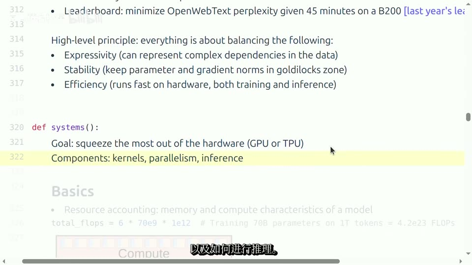 |
| 大概是 6 乘以 N 乘以 D。这个公式是怎么来的？然后我们再来看硬件： [【跳转到 28:52】](https://www.bilibili.com/video/BV11LEA6eEuj/?p=1&t=1732) | 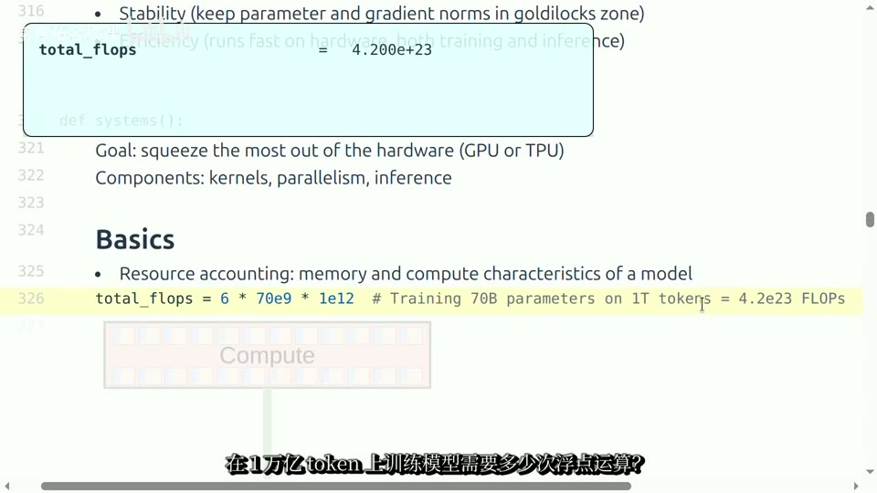 |
| 这里有个直观的图示，说明硬件上需要注意的一点：内存并不是算力所在的地方。你必须把参数或激活值从内存搬到计算单元进行计算，然后再搬回去——而这往往就是瓶颈所在。比如我们将有机会上手体验的 B200，它在 BF16 精度下的算力是每秒 2.25 PFLOPs，内存带宽是每秒 8 TB。那么这意味着什么？ [【跳转到 29:01】](https://www.bilibili.com/video/BV11LEA6eEuj/?p=1&t=1741) | 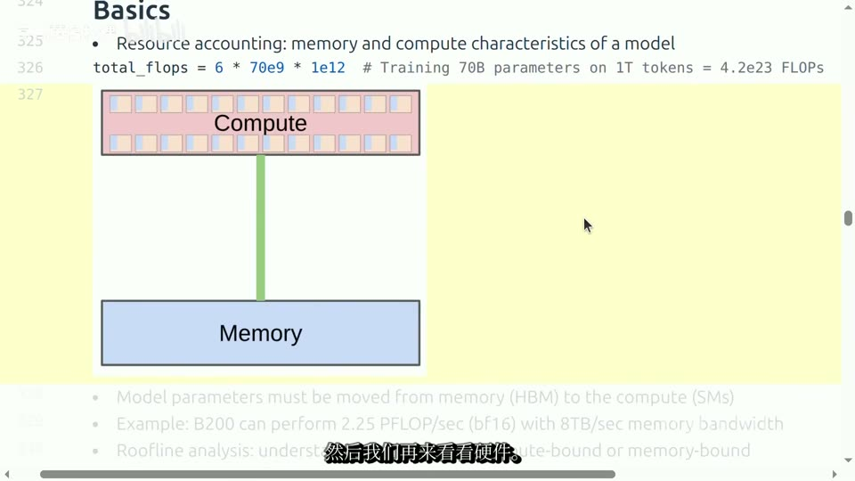 |
| 我想我会在下一讲里讲解。我们会把硬件拆开，用这些信息做一些计算，看看不同类型的算法各需要多长时间。我们会讨论屋顶线分析（roofline analysis），它能让我们理解一个计算到底是受限于算力还是受限于内存。 [【跳转到 29:26】](https://www.bilibili.com/video/BV11LEA6eEuj/?p=1&t=1766) | 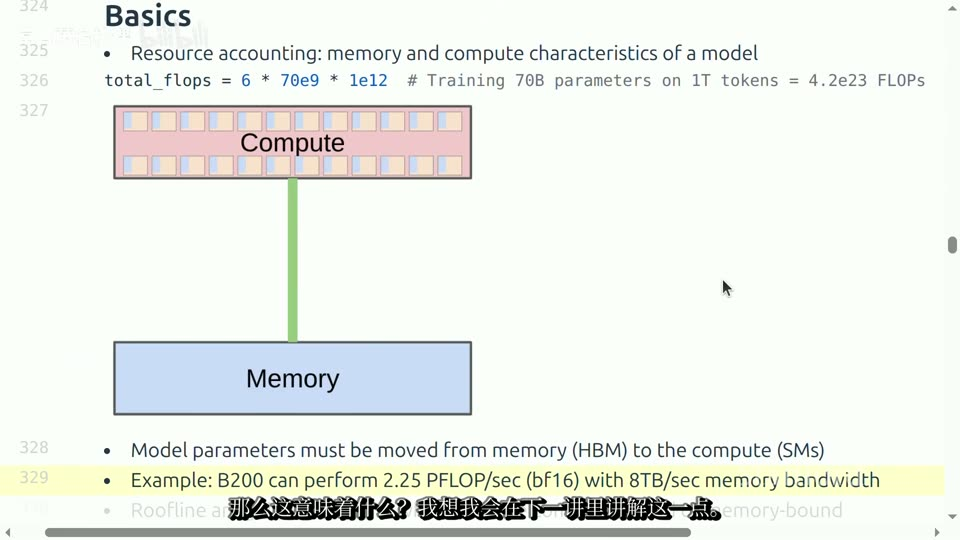 |
| 一般来说，瓶颈在内存。 [【跳转到 29:40】](https://www.bilibili.com/video/BV11LEA6eEuj/?p=1&t=1780) | 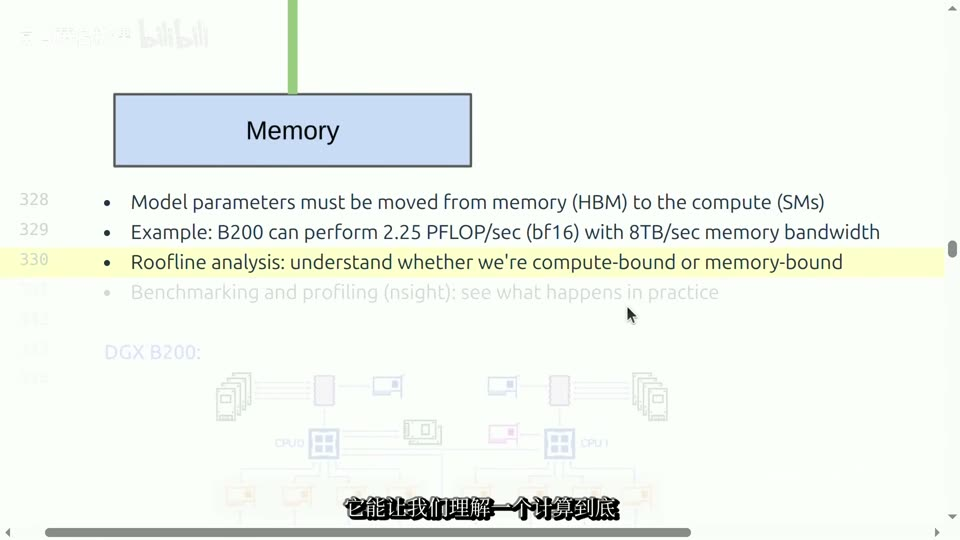 |
| 接下来我们简单聊聊基准测试和性能分析。 [【跳转到 29:45】](https://www.bilibili.com/video/BV11LEA6eEuj/?p=1&t=1785) | 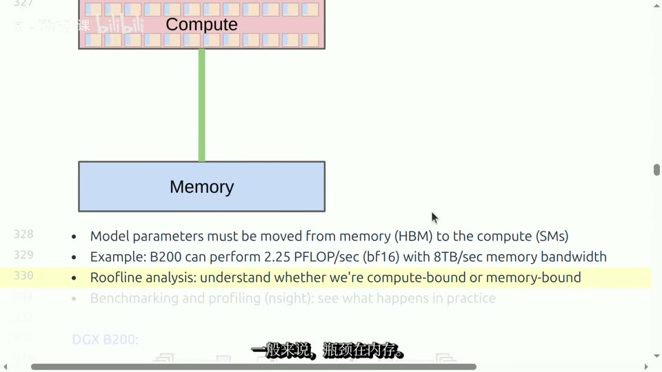 |
| 一台机器配备八块 GPU，通过 NVLink 互联；如果有 1000 块 GPU，就需要多个这样的模块，再用 InfiniBand 或以太网把它们连起来。讲到系统，接下来有两个部分。其一是内核：内核其实就是跑在 GPU 上的函数。如果你只用普通 PyTorch，那 PyTorch 里的各种操作其实都对应着启动某些内置好的内核。 [【跳转到 29:50】](https://www.bilibili.com/video/BV11LEA6eEuj/?p=1&t=1790) | 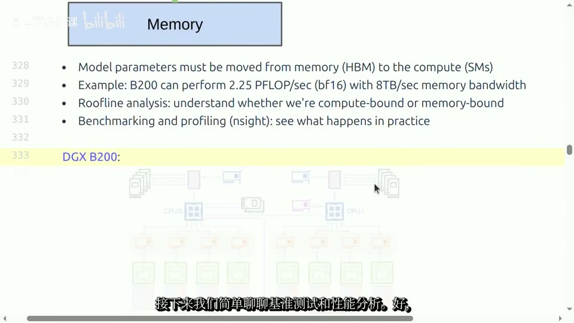 |
| 所以不管你知不知道，你其实已经在用内核了。但重点在于：针对某些类型的计算，如果仔细研究，完全可以写自定义内核让 GPU 跑得更快。这里的核心原则是安排好计算，尽量减少数据搬运。记住这张图：从内存读取数据的成本很高，要把这部分开销降到最低。 [【跳转到 30:15】](https://www.bilibili.com/video/BV11LEA6eEuj/?p=1&t=1815) | 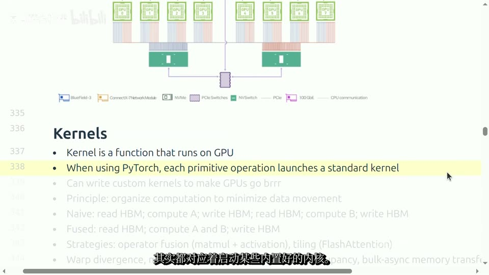 |
| 举个简单的例子：假设你要计算 A 和 B。通常的流程是从高带宽内存（HBM）读取数据， [【跳转到 30:40】](https://www.bilibili.com/video/BV11LEA6eEuj/?p=1&t=1840) | 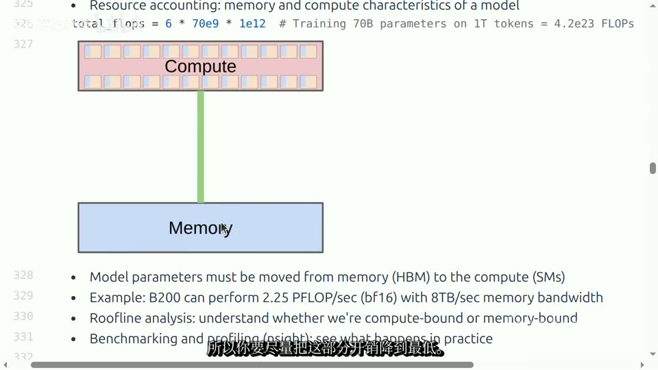 |
| 计算、写回，再读取、计算、写回——数据来回传输了两次。有一个叫"融合（fusion）"的思路：只读取一次，把两项计算都做完，然后只写回一次，这样能省下大量时间。这就是算子融合（operator fusion）。分块（tiling）则是基于同一思路的更复杂变体。 [【跳转到 30:46】](https://www.bilibili.com/video/BV11LEA6eEuj/?p=1&t=1846) | 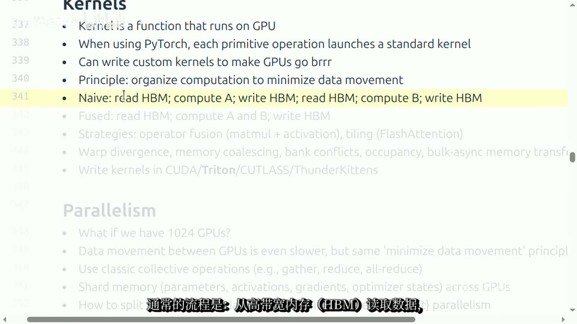 |
| 而且 GPU 变得越来越复杂，所以我不确定有没有时间深入这些细节；但至少我们想让你了解 GPU 的一些特性，让你认识到为了榨取性能必须考虑哪些因素、尽可能把性能压榨殆尽。我们会写一些内核来做实验。那么，如果你有几千块 GPU 会怎样？最小化数据移动这一原则依然适用， [【跳转到 31:11】](https://www.bilibili.com/video/BV11LEA6eEuj/?p=1&t=1871) | 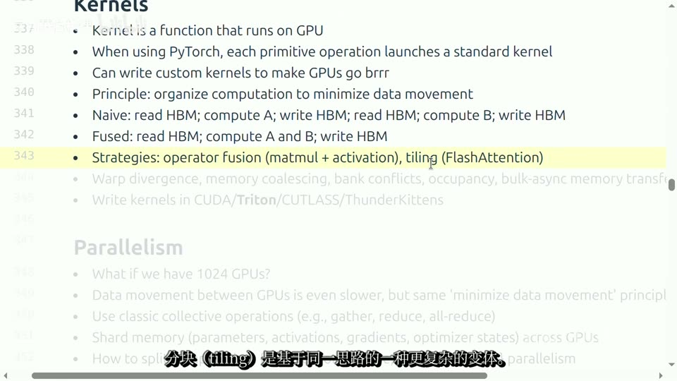 |
| 只不过在不同 GPU 之间传输数据的成本更高了。我们要讲讲 gather、reduce、all-reduce 这些经典的集合操作（而非"几何操作"），它们为理解分布式训练提供了思路。这基本上就是分布式训练：我们有模型参数、激活值、梯度和优化器状态，需要在多个 GPU 之间分片；你得把正确的数据送到正确的节点上计算，再写回去。 [【跳转到 31:36】](https://www.bilibili.com/video/BV11LEA6eEuj/?p=1&t=1896) | 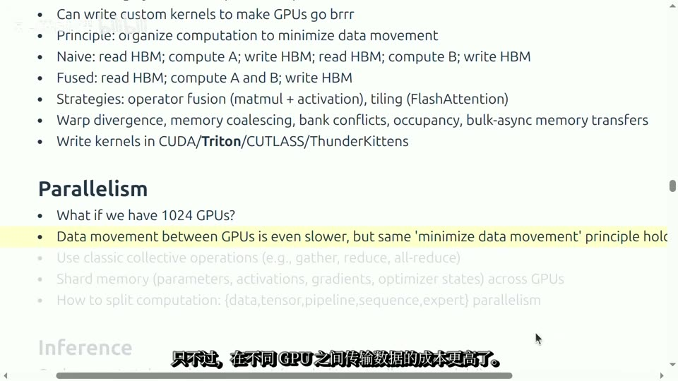 |
| 这涉及一整套协调工作，如何高效完成正是本单元的主题。分片有多种方式：你可以切分数据、切分模型、切分模型的不同层、切分序列，或者在不同专家之间切分。我们将讨论每种方式带来的权衡。好，最后我们将讨论推理。正如我提到的，推理的重要性日益增加：推理的目标是实际使用模型。 [【跳转到 32:01】](https://www.bilibili.com/video/BV11LEA6eEuj/?p=1&t=1921) | 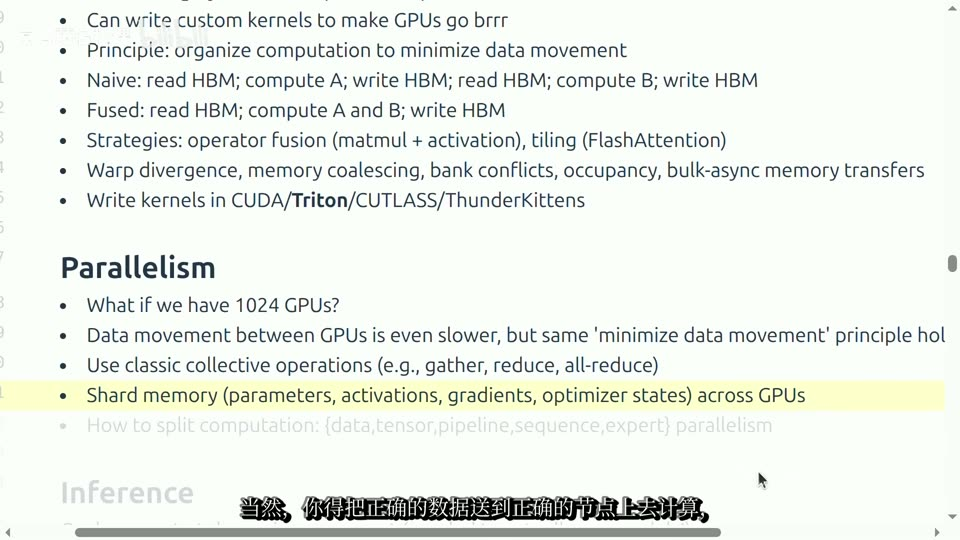 |
| 这里有个小细节：与模型对话时自然要推理，但它在强化学习中也很有用——对执行 rollout、测试计算、生成合成数据以及评估都有用，因此推理是语言模型工作中非常关键的一部分。我们可能不会像我希望的那样花很多时间讲，因为课程内容已经相当满了， [【跳转到 32:26】](https://www.bilibili.com/video/BV11LEA6eEuj/?p=1&t=1946) | 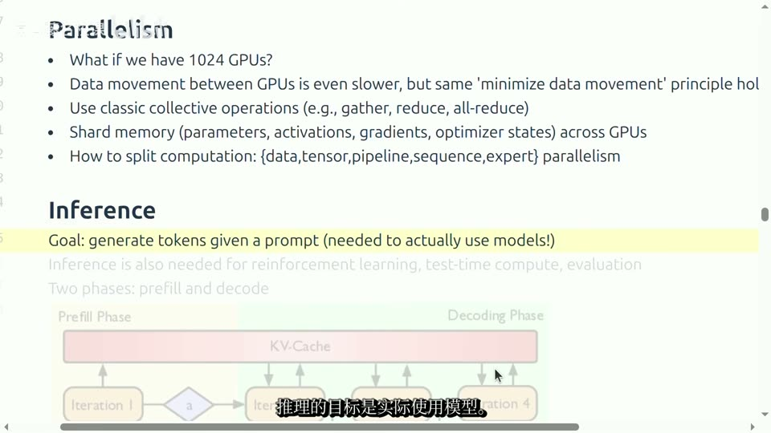 |
| 但我们尽力而为。现在还没决定是否要让你们从零开始编写推理代码， [【跳转到 32:51】](https://www.bilibili.com/video/BV11LEA6eEuj/?p=1&t=1971) | 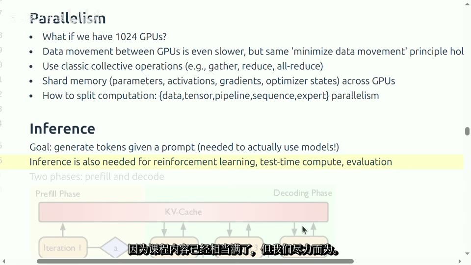 |
| 再看看吧。我们可以把推理过程看作两个阶段：预填充（prefill）和解码（decode）。 [【跳转到 32:56】](https://www.bilibili.com/video/BV11LEA6eEuj/?p=1&t=1976) | 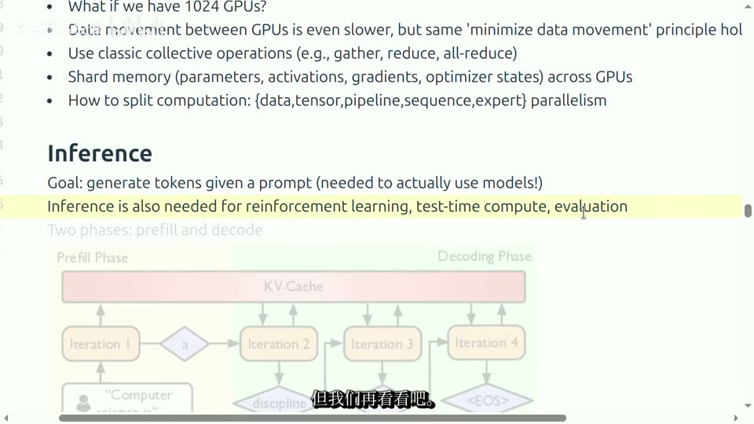 |
| 预填充阶段：把提示输入进去，一次性前向传播所有 token，从而构建出 KV 缓存——这跟训练很像。接下来的解码阶段则逐个生成 token；这里很快就会出现内存瓶颈，这正是推理的症结所在。所以有很多方法可以加速推理： [【跳转到 33:01】](https://www.bilibili.com/video/BV11LEA6eEuj/?p=1&t=1981) | 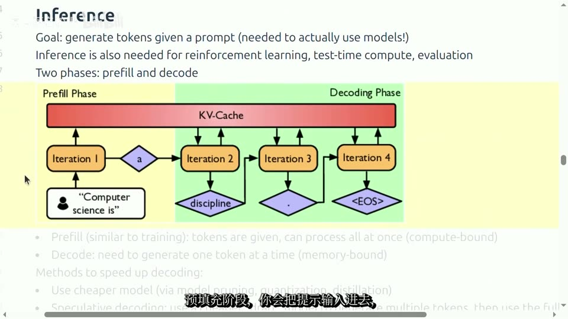 |
| 你可以用"减脂大模型"的方式改用更轻量的模型，也可以做量化或知识蒸馏。你还可以用一种叫投机解码（speculative decoding）的技术：让一个轻量模型先跑一步、一口气出一堆 token，再用完整的大模型批量处理这些 token，看看猜得对不对。运气好的话，你就能一次性接受所有这些 token——这比逐个处理快得多。当然也可以做系统优化，有些内核是专门针对推理设计的。 [【跳转到 33:20】](https://www.bilibili.com/video/BV11LEA6eEuj/?p=1&t=2000) | 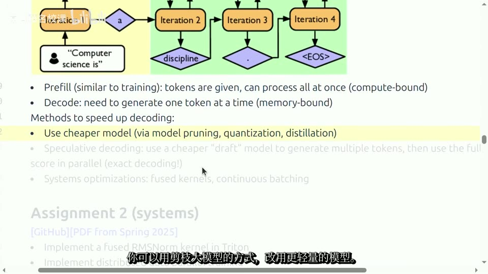 |
| 另外推理有个有趣的地方：如果你运行的是一个服务，查询可能在不同时间到来，你得想办法把它们打包成批；而在训练时，批次基本上已经定好，一切都要求可预测。谢谢。所以第二次作业里，你会用 Triton 实现一些内核，还要做一些并行训练。 [【跳转到 33:45】](https://www.bilibili.com/video/BV11LEA6eEuj/?p=1&t=2025) | 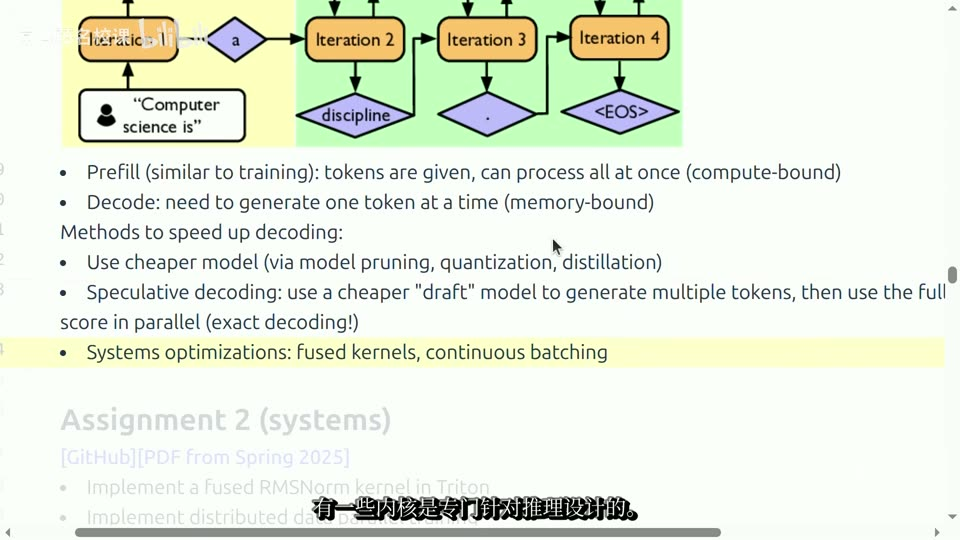 |
| 不过这里的细节其实可能会变：整个系列课程有个大计划，要彻底改造系统这部分，所以这次作业可能跟去年有点不一样，但涵盖的内容大致相同。谢谢。我想提一下：有谷歌的几位研究者写了一本很棒的书《How to Scale Your Model》。我觉得这本书对建立概念性理解很有帮助，比如屋顶线分析、Transformer 的数学原理， [【跳转到 34:10】](https://www.bilibili.com/video/BV11LEA6eEuj/?p=1&t=2050) | 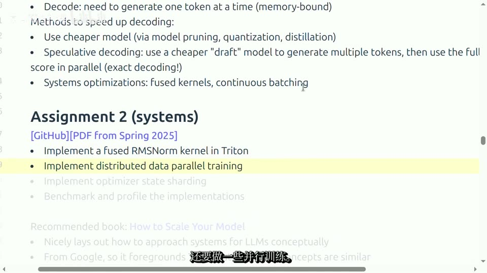 |
| 以及如何从概念上理解语言模型，所以我强烈推荐大家去读。不过要注意：因为它是谷歌出的，所以主要讲 TPU——现在还新增了一章讲如何理解 GPU。好，第三次作业是关于缩放定律的。 [【跳转到 34:35】](https://www.bilibili.com/video/BV11LEA6eEuj/?p=1&t=2075) | 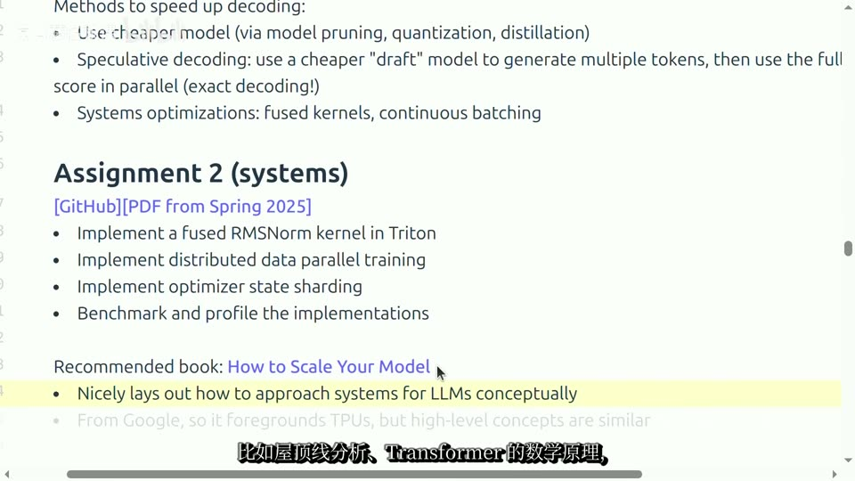 |
| 到现在为止，你应该已经训练过一个语言模型了，也可以通过并行和优化内核让它跑得非常快。现在想进一步扩大规模，该怎么扩展呢？想象一下：如果你拥有 10^25 方级别的算力——这相当于数千万美元的计算开销——你会去训练哪个模型？ [【跳转到 35:00】](https://www.bilibili.com/video/BV11LEA6eEuj/?p=1&t=2100) | 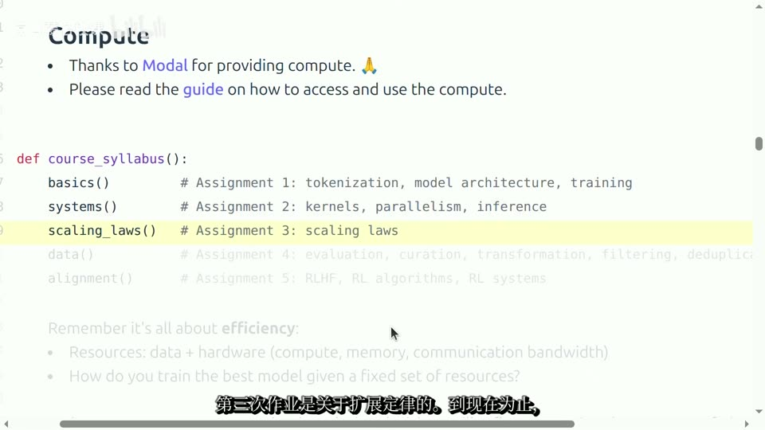 |
| 我觉得这任务挺吓人的：一旦搞砸，那就是巨额资金打水漂。在这个量级上，你大概没法做常规超参数调优，因为你只有一次训练机会。这是大语言模型训练中必须解决的核心难题；如果你只是微调模型或做小规模实验，通常不需要面对。所以这里的关键思维转变是：我们不应该只盯着正在训练的某一个模型， [【跳转到 35:25】](https://www.bilibili.com/video/BV11LEA6eEuj/?p=1&t=2125) | 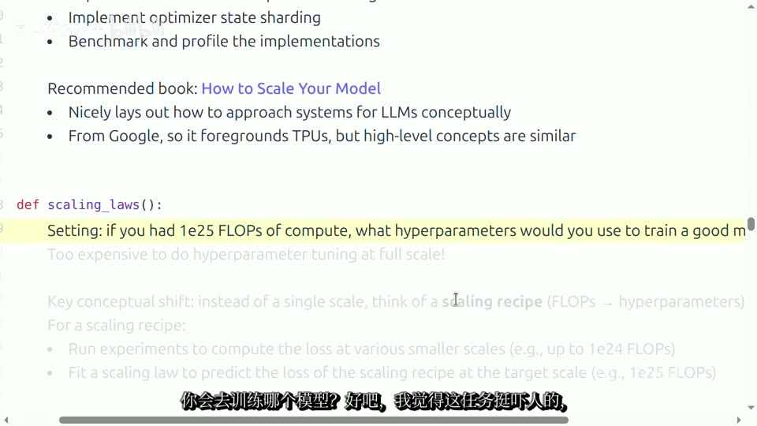 |
| 而应该真正去思考"扩展配方"（scaling recipe）。扩展配方是一种映射关系：将 FLOPs 预算——比如 10^21 或 10^22——映射到一组超参数，基本上就是一个配置文件。针对给定的扩展配方，我们要做的是运行大量实验，计算在较小规模下得到的损失，然后拟合缩放定律， [【跳转到 35:50】](https://www.bilibili.com/video/BV11LEA6eEuj/?p=1&t=2150) | 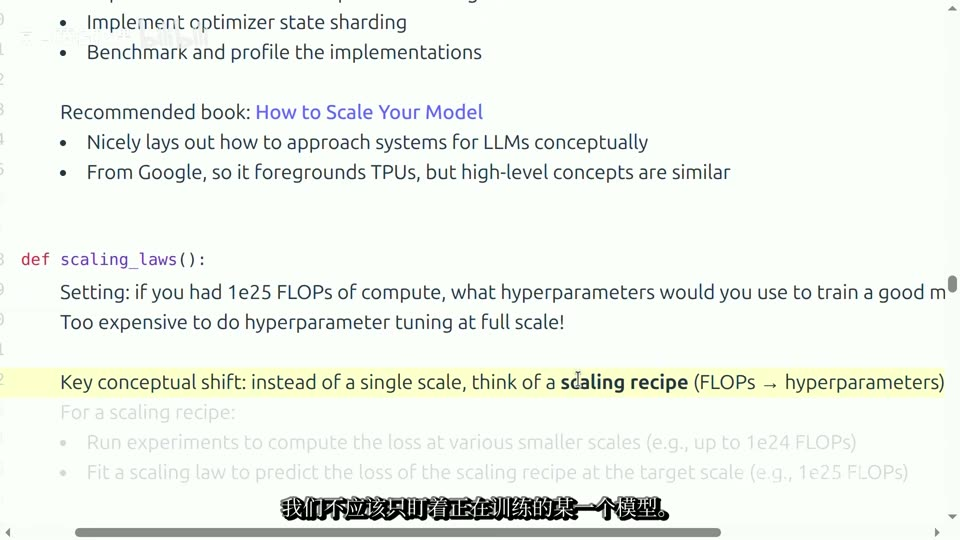 |
| 从而让你能够预测目标规模下的损失。也许你会先运行一些小规模实验、拟合缩放定律，然后预测更大规模下的结果。这就是基本方法。利用这一点，你就可以优化"给定目标损失下的扩展配方"，用小规模实验为更大规模进行优化。这非常棒：在实际运行实验之前，你就能预测出理论上将达到的损失—— [【跳转到 36:15】](https://www.bilibili.com/video/BV11LEA6eEuj/?p=1&t=2175) | 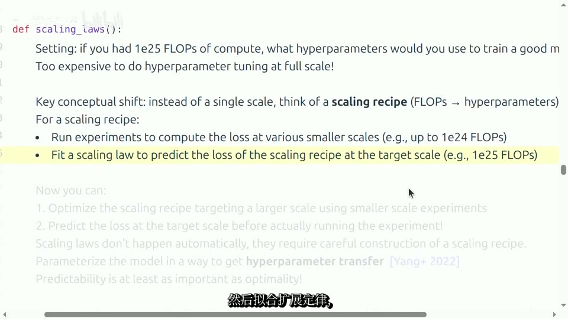 |
| 还能让你去筹集资金。你可以说："看，我运行了小规模实验，我认为我可以得到一个差不多 GPT-5 级别的模型，请给我一大笔钱，让我训练那个模型。"还有一个可能的误解：缩放定律并不是自然定律，它们不会自动发生，你必须有意识地去促成它们的实现。 [【跳转到 36:40】](https://www.bilibili.com/video/BV11LEA6eEuj/?p=1&t=2200) | 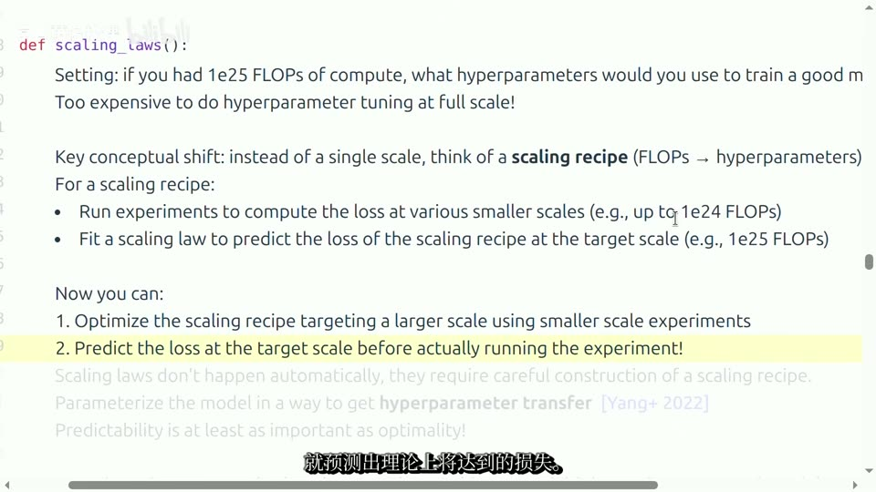 |
| 这一过程是通过精心构建扩展配方来实现的。而且要记住：扩展配方必须具有外推能力。这通常意味着你有一系列超参数，规定随规模增大，学习率是保持恒定还是下降、批次大小是否增加而具体增加多少——这些都是小规模语言模型配方需要确定的内容，因此你需要进行参数化， [【跳转到 37:05】](https://www.bilibili.com/video/BV11LEA6eEuj/?p=1&t=2225) | 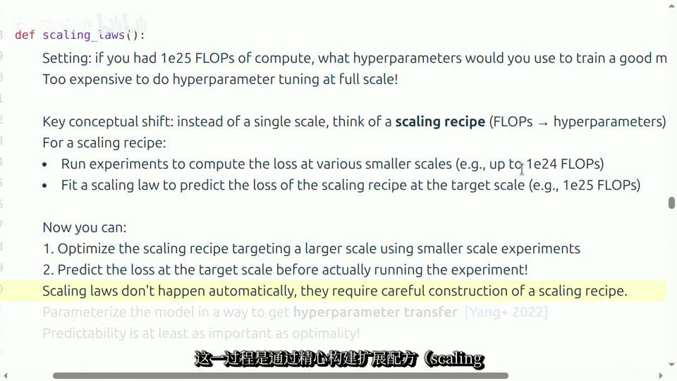 |
| 从而获得可预测的缩放定律。你实际需要考虑的一点是：如何对模型进行参数化，以实现所谓的"超参数迁移"（hyperparameter transfer）——即你在小规模下使用的超参数，要么就是你在更大规模下使用的那些，要么是它们的可预测函数。因为如果在每个规模下，你的学习率忽高忽低、毫无规律， [【跳转到 37:30】](https://www.bilibili.com/video/BV11LEA6eEuj/?p=1&t=2250) | 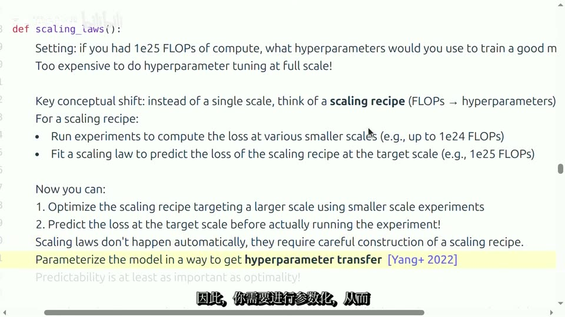 |
| 那么你就无法在更大规模下神奇地猜出正确的学习率。好。 [【跳转到 37:55】](https://www.bilibili.com/video/BV11LEA6eEuj/?p=1&t=2275) | 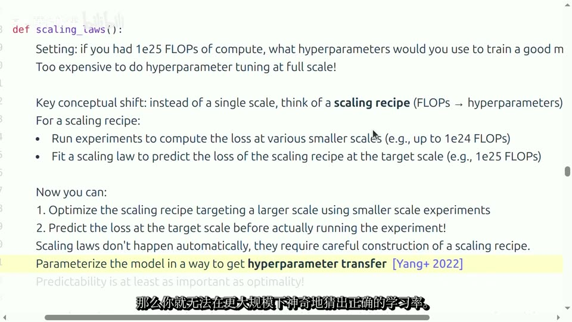 |
| 所以思维方式的一个转变是：可预测性的重要性至少不亚于最优性。我们通常会想"要在这里优化效率，通过超参数调优让系统达到最优"——没错，你确实需要这样做，但你也希望拥有这种可预测性，从而在规模扩大时不至于措手不及。好，这算是背景铺垫。我们要看的实际缩放定律相当经典： [【跳转到 38:00】](https://www.bilibili.com/video/BV11LEA6eEuj/?p=1&t=2280) | 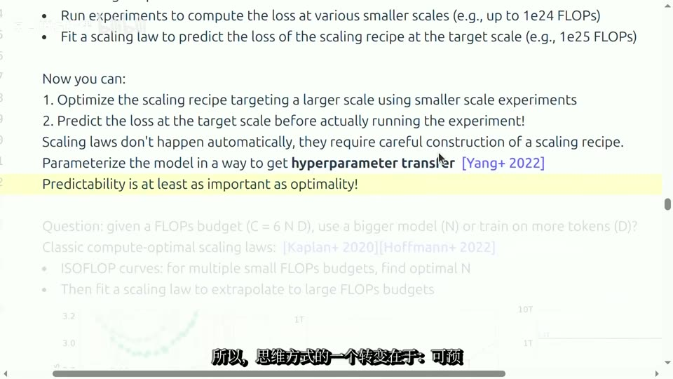 |
| 你可能见过这样的想法：如果给你一个 FLOPs 预算，你该如何使用？如何平衡"训练更大的模型"与"在更多 token 上训练"？这正是 Kaplan 等人提出的经典"计算最优"缩放定律以及所谓的 Chinchilla 缩放定律登场的地方。其基本思路是：针对一系列最大 FLOPs 预算（假设取值从 6e19 到 3e21、e23 之类）， [【跳转到 38:25】](https://www.bilibili.com/video/BV11LEA6eEuj/?p=1&t=2305) | 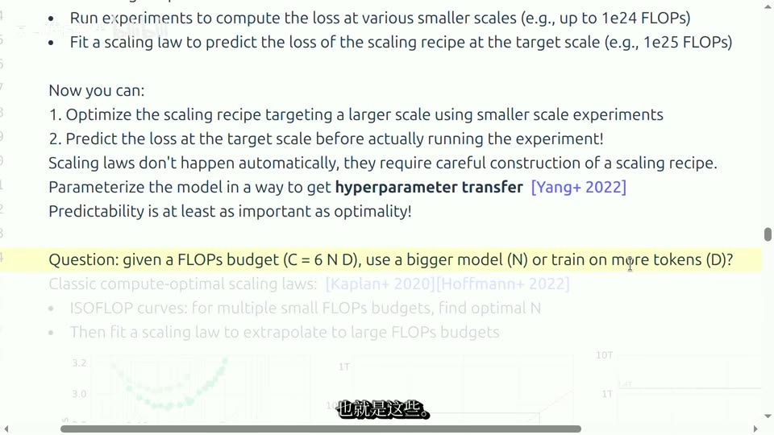 |
| 你遍历不同的模型规模，选出最佳的一个：试着最小化这些指标中的每一项，然后拟合一条曲线，基本上让你根据 FLOPs 预算来预测参数数量。运气好的话，它大致会落在一条直线上；运气不好的话，数据会杂乱无章，意味着你不该指望能做出可靠的预测。 [【跳转到 38:50】](https://www.bilibili.com/video/BV11LEA6eEuj/?p=1&t=2330) | 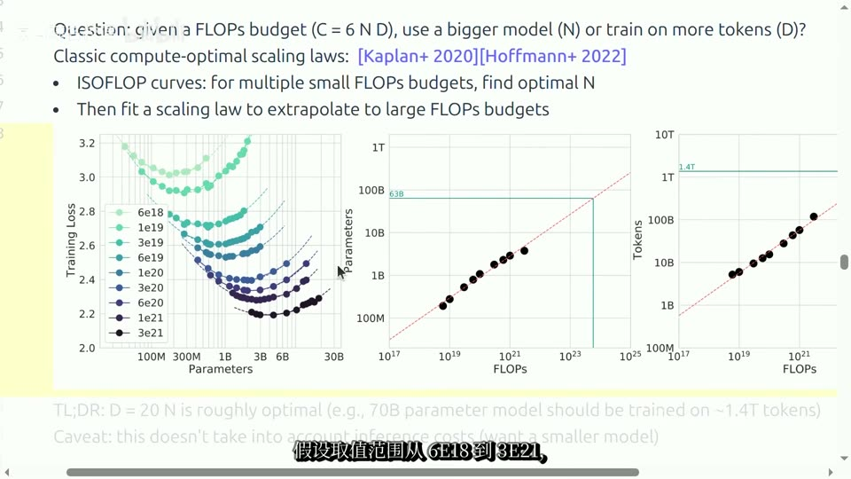 |
| 其结论相当粗略，但一个经验法则是：你应该用于训练的数据量约是参数数量的 20 倍。因此一个 8B 参数的模型应该在大约 1.8 万亿（原字幕"一点4000000000000"，即约 1.4 万亿，此处按上下文换算）个 token 上进行训练。当然，具体取决于数据集和架构，这个数字实际上会有所不同。谢谢。另外，这还没有考虑推理成本：如今许多模型规模较小， [【跳转到 39:15】](https://www.bilibili.com/video/BV11LEA6eEuj/?p=1&t=2355) | 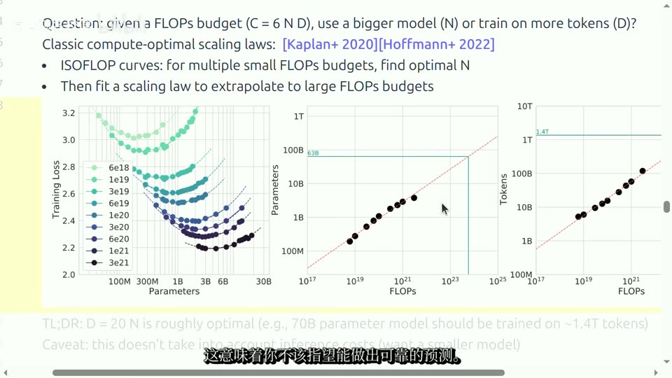 |
| 但训练所用 token 数量远超"计算最优"，因为出于推理方面的考虑，我们希望模型更小。好，我们在 MARIN 项目中一直在做一件有趣的事——预先注册我们的结果：我们在不同计算预算下拟合了一系列扩展曲线，拟合出一条缩放定律，并据此基本预测了达到某个损失阈值时的表现。这次运行实际上正在进行训练。 [【跳转到 39:40】](https://www.bilibili.com/video/BV11LEA6eEuj/?p=1&t=2380) | 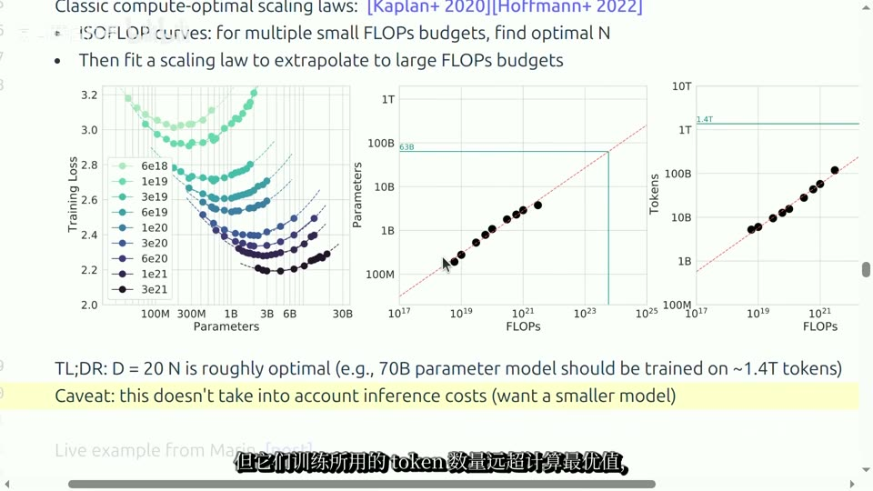 |
| 如果你访问某个网站，可以实时跟进；它现在应该已经完成，也许今晚就能完成。所以也许到周三，我会回来汇报情况——看看我们是怎么注册的，也就是我们如何匹配预先注册的损失值。这里的想法是：我们对"训练这个从未训练过的庞大模型会有怎样的表现"做出了预测；如果能预测它的表现如何，那就很好了。拜拜。 [【跳转到 40:05】](https://www.bilibili.com/video/BV11LEA6eEuj/?p=1&t=2405) | 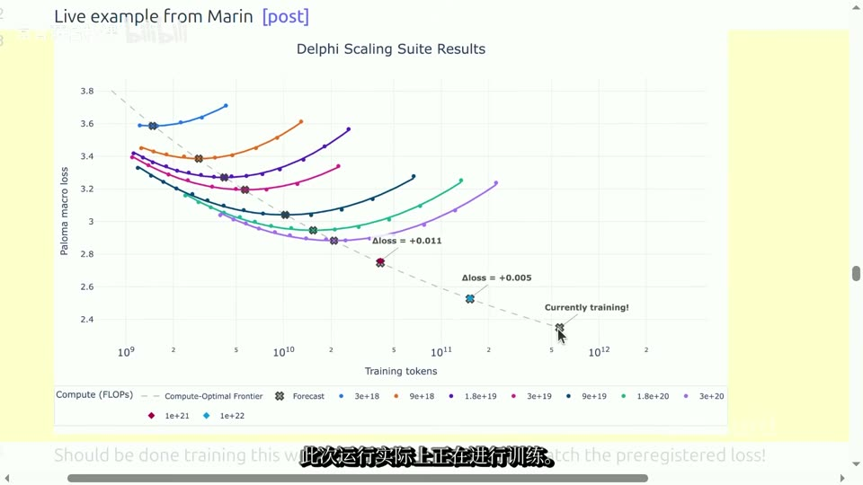 |
| 好的，第三次作业。我觉得它要么很有趣、要么也还行——我们就说它是一次有趣的作业吧。我们要定义一个"训练 API"：基本上就是你给我们超参数，我们返回一个损失值——这是一个模拟。当然，我们没那么多算力让每个人都训练自己的几十亿参数模型之类的， [【跳转到 40:30】](https://www.bilibili.com/video/BV11LEA6eEuj/?p=1&t=2430) | 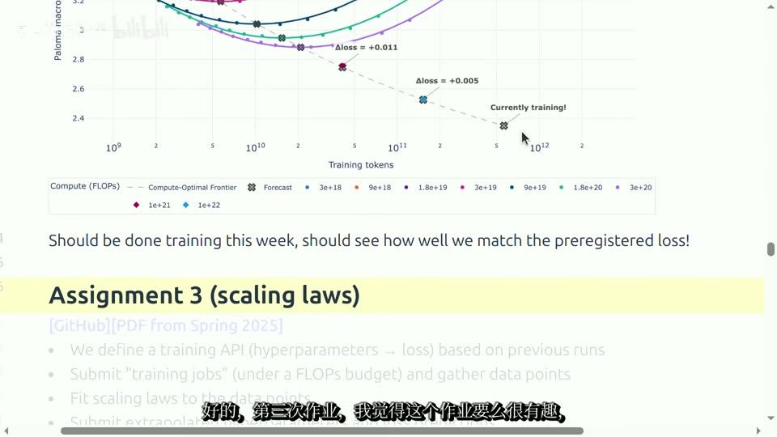 |
| 所以我们会离线训练一批模型，然后提供这个缓存，让你感觉像是在训练：你给我们一个配置，我们基本就返回一个损失值，你可以随意操作。我们建议你根据这些数据点拟合缩放定律，然后进行外推。接着我们给你一个预算，并评估你的模型最终落地的效果如何。 [【跳转到 40:55】](https://www.bilibili.com/video/BV11LEA6eEuj/?p=1&t=2455) | 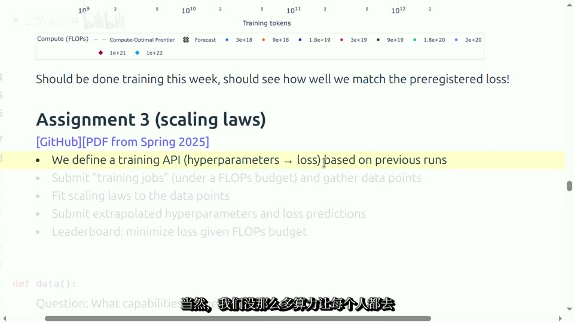 |
| 它的目的——我本想这么说——是模拟那种高压场景：假设你真的有一笔预算，比如 1 亿美元要花出去，你必须非常谨慎地考虑怎么花这笔钱；当然这其实是低风险的。好，谢谢。所以到这一步，你已经训练好了一个模型，知道怎么让它跑得快，也知道怎么做扩展，那么现在还缺什么？ [【跳转到 41:20】](https://www.bilibili.com/video/BV11LEA6eEuj/?p=1&t=2480) | 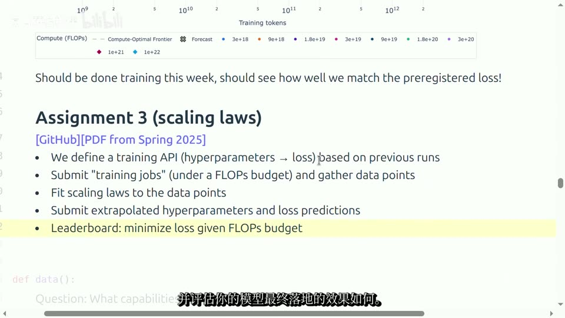 |
| 你拿什么数据来训练模型？这就是接下来数据部分要讲的内容。可以说，这是最重要的环节之一，因为数据质量基本上决定了你的模型能有多好。另一种表述方式是：数据基本上反映了你希望模型做什么。那么，你是希望模型掌握多种语言、 [【跳转到 41:45】](https://www.bilibili.com/video/BV11LEA6eEuj/?p=1&t=2505) | 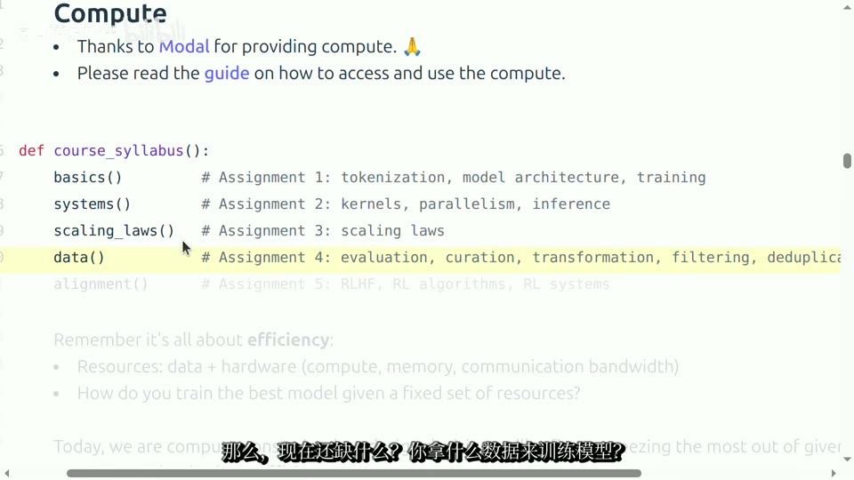 |
| 擅长对话？还是希望能运行长时间的编码智能体任务？其中一部分内容要先从评估讲起：评估基本上就定义了你希望模型拥有什么能力。我们要讲的一点是：评估其实是个相当深入的话题，不只是跑跑基准测试那么简单。模型开发内部有评估指标，而这里的关键在于扩展过程中的平滑性—— [【跳转到 42:10】](https://www.bilibili.com/video/BV11LEA6eEuj/?p=1&t=2530) | 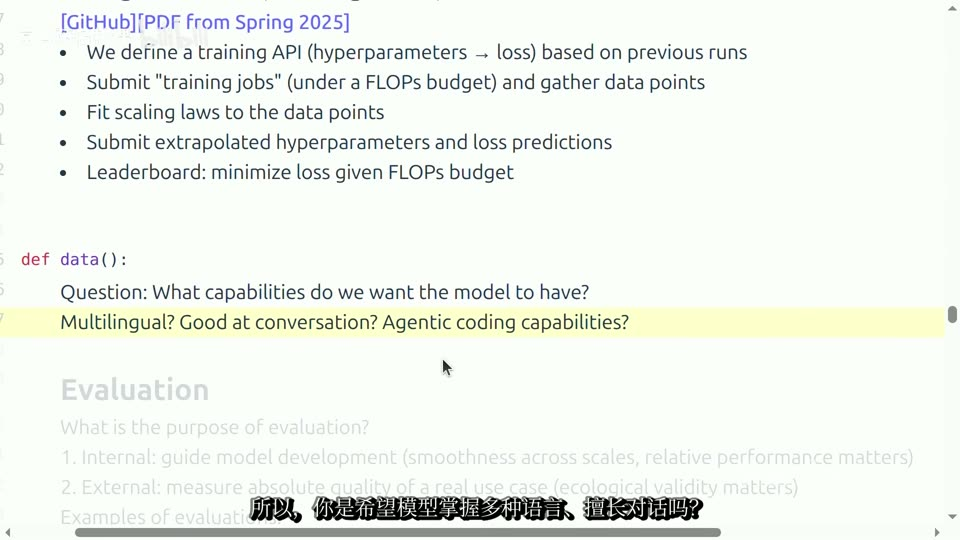 |
| 这样结果才是可预测的。相对性能很重要：你未必关心绝对数值——比如某些困惑度为 1.2，到底意味着什么？你知道（数字大小需要参照）……确实，研究者总要留意数字的来龙去脉。然后还有"外部"方面的指标：指你需要向客户、评审员或任何听取汇报的对象报告的数据， [【跳转到 42:35】](https://www.bilibili.com/video/BV11LEA6eEuj/?p=1&t=2555) | 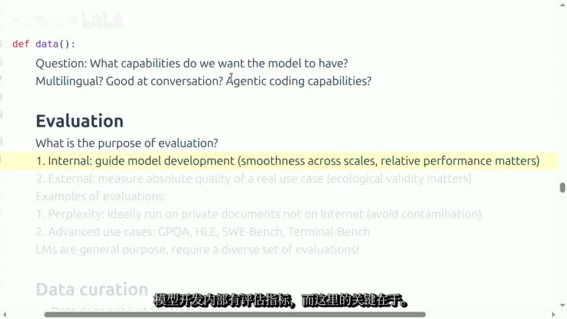 |
| 此时"外部效度"非常关键。虽然人们有时会把这两者混为一谈，但它们其实有着截然不同的用途。因此，你可以把困惑度视为对内部开发非常有用的指标：即便到现在，困惑度依然是衡量模型内在质量的可靠手段，而且不用担心出现为刷高分而过度优化的情况。接下来要讨论的是：你该在什么数据上运行 [【跳转到 43:00】](https://www.bilibili.com/video/BV11LEA6eEuj/?p=1&t=2580) | 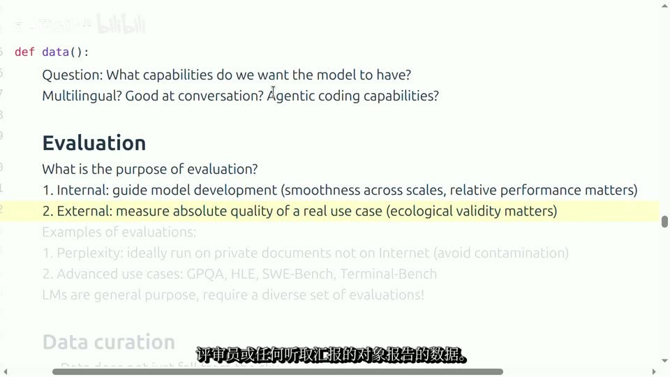 |
| 评估。建议的做法是：如果你有一些互联网上没有的数据，那会很好，因为这样可以避免数据污染。此外还有一些高级用例，它们更能代表面向外部用户的场景。另外需要注意：语言模型据称是非常通用的，因此我们确实需要一套非常多样化的评估，这也是理所当然的。我总是建议进行多项评估、去考察各个方面—— [【跳转到 43:25】](https://www.bilibili.com/video/BV11LEA6eEuj/?p=1&t=2605) | 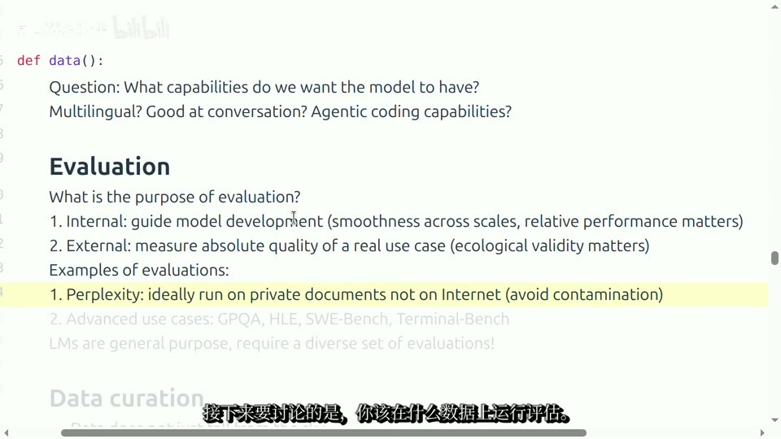 |
| 你可以把它们平均成一个单一的数值，但这个平均值往往会把许多不同的因素混为一谈。好。 [【跳转到 43:50】](https://www.bilibili.com/video/BV11LEA6eEuj/?p=1&t=2630) | 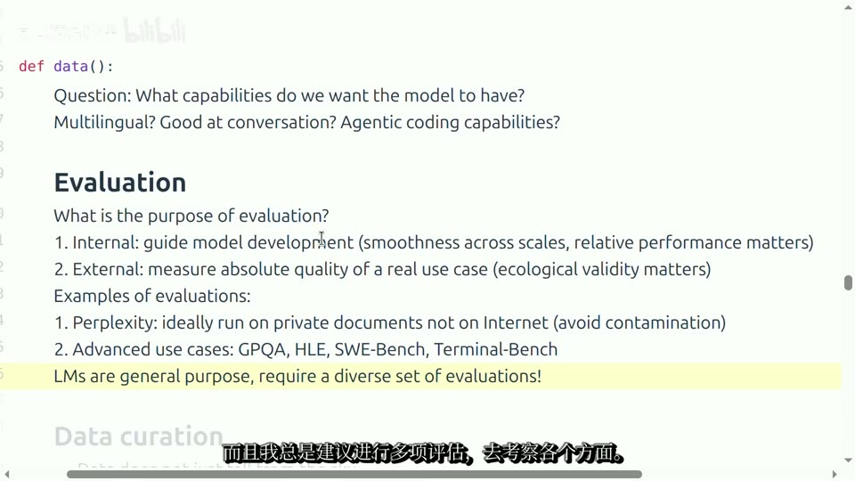 |
| 那么现在评估设定好之后，我们就明确了自己要构建什么。你要如何获取数据呢？首先，数据并不会凭空从天上掉下来，它必须经过主动的整理与收集。尤其在课程和研究中，有时你会被直接给定一个数据集，然后就好像"好，现在我对这个数据集做些处理"；但对于很多语言模型来说， [【跳转到 43:56】](https://www.bilibili.com/video/BV11LEA6eEuj/?p=1&t=2636) | 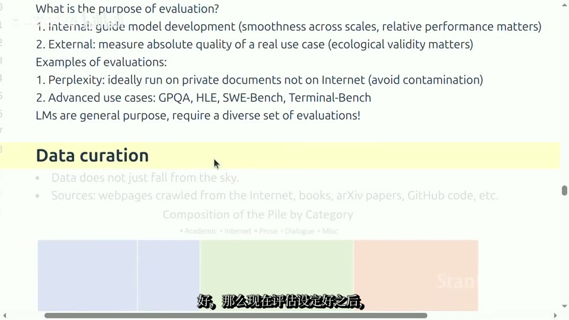 |
| 尤其是当你想收集大规模数据集时，你必须主动去获取。看看这张图： [【跳转到 44:21】](https://www.bilibili.com/video/BV11LEA6eEuj/?p=1&t=2661) | 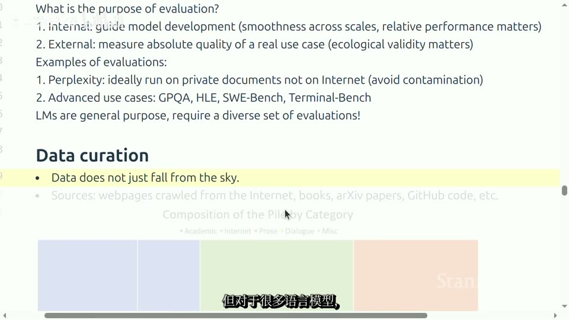 |
| 网页是从互联网上抓取下来的，还有书籍（我觉得这一点现在很有争议）、arXiv 论文、GitHub 代码，等等。 [【跳转到 44:28】](https://www.bilibili.com/video/BV11LEA6eEuj/?p=1&t=2668) | 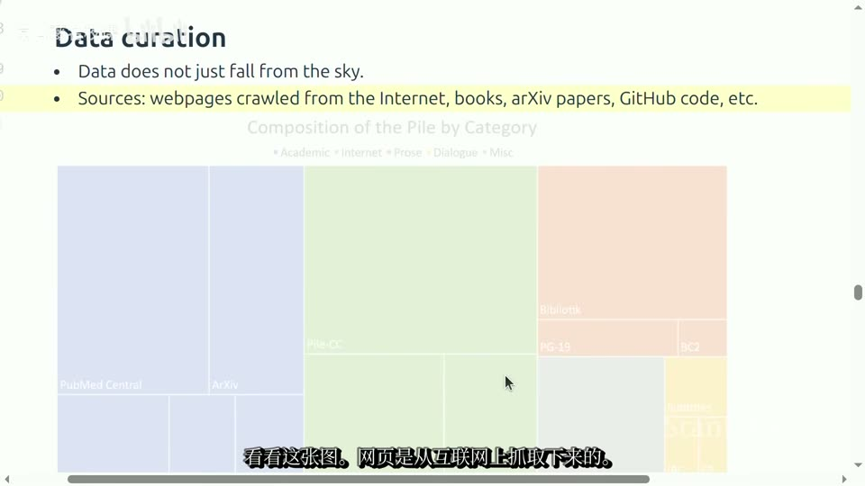 |
| 这是 2021 年 The Pile 数据集里的一张旧图。可以看到，语言建模的数据集相当多样，尤其是现在。 [【跳转到 44:35】](https://www.bilibili.com/video/BV11LEA6eEuj/?p=1&t=2675) | 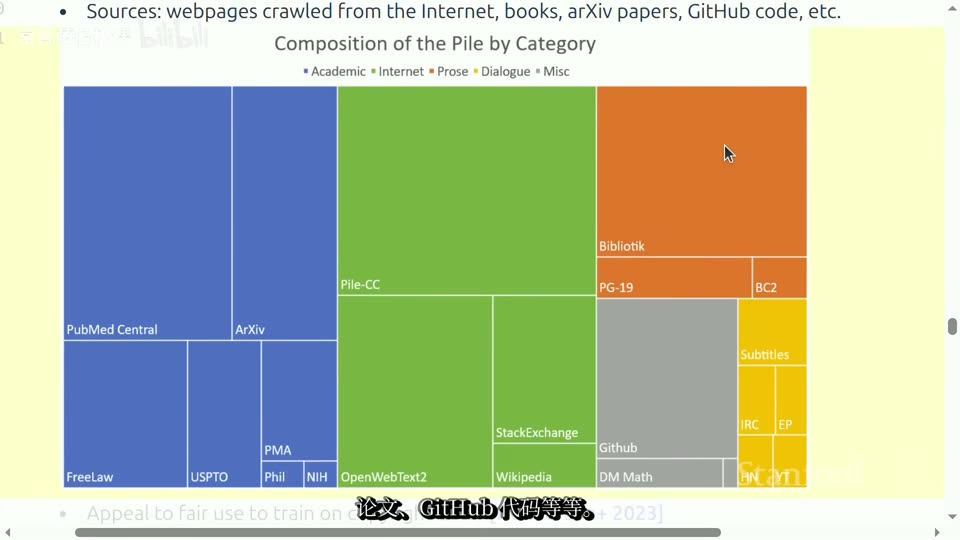 |
| 围绕"在受版权保护的数据上训练是否属于合理使用"存在很多争议；有时你还得去获取数据授权之类，所以数据方面存在一些法律问题。我认为这相当重要。比如很多 GitHub 上的代码都没有许可证，那该怎么理解呢？你是默认它允许使用，还是保守一点、假设它不允许使用？ [【跳转到 44:42】](https://www.bilibili.com/video/BV11LEA6eEuj/?p=1&t=2682) | 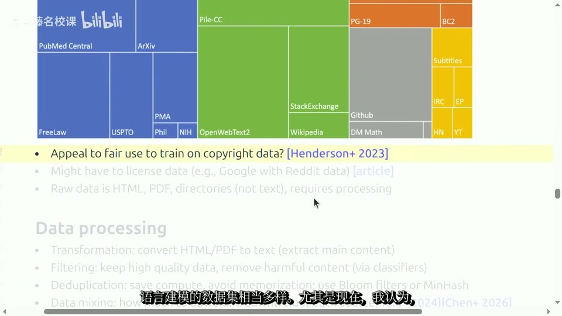 |
| 还有一个事实：数据其实根本不是"文本"——它要么是 HTML，要么是 PDF；代码也不是以纯文本形式存在，而是以目录形式存在。这些需要经过处理、转换成真正的文本才能用于训练，这就是数据处理这个话题。这里需要经历几个步骤：转换， [【跳转到 45:07】](https://www.bilibili.com/video/BV11LEA6eEuj/?p=1&t=2707) | 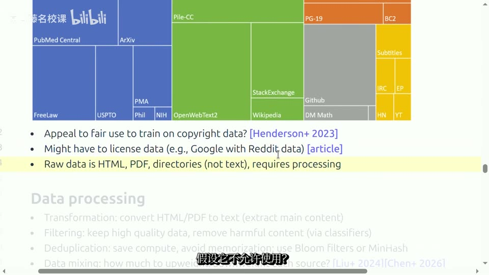 |
| 也就是把一些非文本内容转成文本；过滤，只保留高质量的内容——如果 Common Crawl 中某个随机的网络文档质量极差，你肯定不想用它来训练。另外，数据来源多种多样，那么该如何整合这些不同的来源呢？（比如模型加权/配比（model weighting）。） [【跳转到 45:27】](https://www.bilibili.com/video/BV11LEA6eEuj/?p=1&t=2727) | 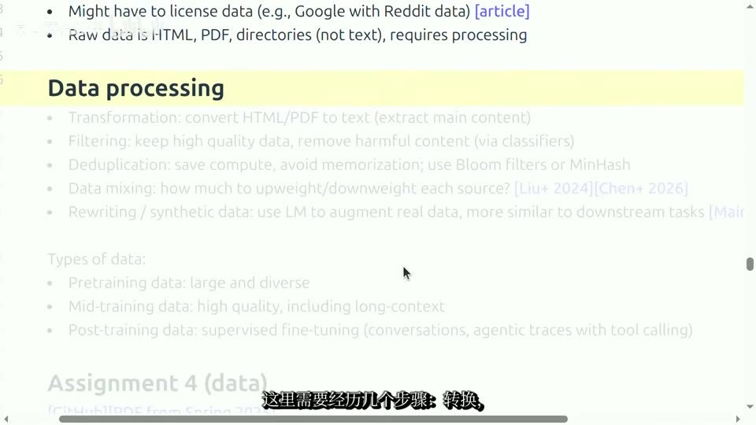 |
| 关于生成合成数据的研究很多，这通常指利用真实数据，将其重写为更贴近下游任务、或更像维基百科风格的内容，或其他你想要的形式；总之这是一个目前非常活跃的研究方向。另外，数据不仅可用于预训练，还可用于一种叫"中期训练"（mid-training）的过程：在预训练后期加入高质量数据。这类数据包括长上下文数据， [【跳转到 45:52】](https://www.bilibili.com/video/BV11LEA6eEuj/?p=1&t=2752) | 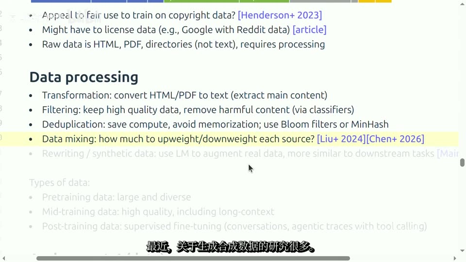 |
| 比如大型代码库或书籍。最后还有后训练数据，可能是包含工具调用的对话或智能体轨迹。第四次作业中，我们会让你从非常原始的语料库（比如原始网页抓取数据）入手，完成所有处理工作：对数据进行过滤、去重和清洗。我觉得这算是许多人眼中的"脏活儿"—— [【跳转到 46:17】](https://www.bilibili.com/video/BV11LEA6eEuj/?p=1&t=2777) | 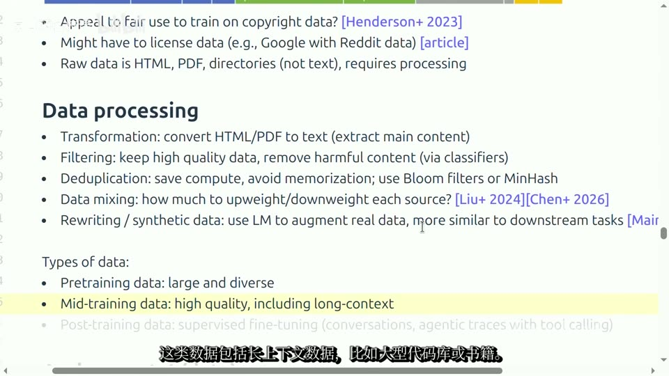 |
| 虽然我不确定该不该说它无趣，但它确实如此。不过在我看来，这是从零构建语言模型不可或缺的一环，所以你需要体验完整流程。好，最后是对齐阶段。到目前为止，我们基本上用全监督方式训练模型，即预测下一个或接下来几个 token；此时模型应该已具备基本能力，但我们可以借助弱监督进一步改进它。 [【跳转到 46:42】](https://www.bilibili.com/video/BV11LEA6eEuj/?p=1&t=2802) | 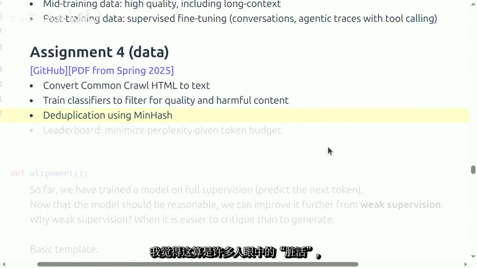 |
| 为什么要用弱监督？因为有时候，评判优劣比直接生成内容更容易。我们很难总是拿到那种"这个提示对应的回答就是对的"的数据，但也许我们可以定义出什么样的回答算"好"。基本流程是：让模型生成回答，然后让人类、验证器或语言模型裁判来打分，接着更新模型，让它更倾向于生成更好的回答。 [【跳转到 47:07】](https://www.bilibili.com/video/BV11LEA6eEuj/?p=1&t=2827) | 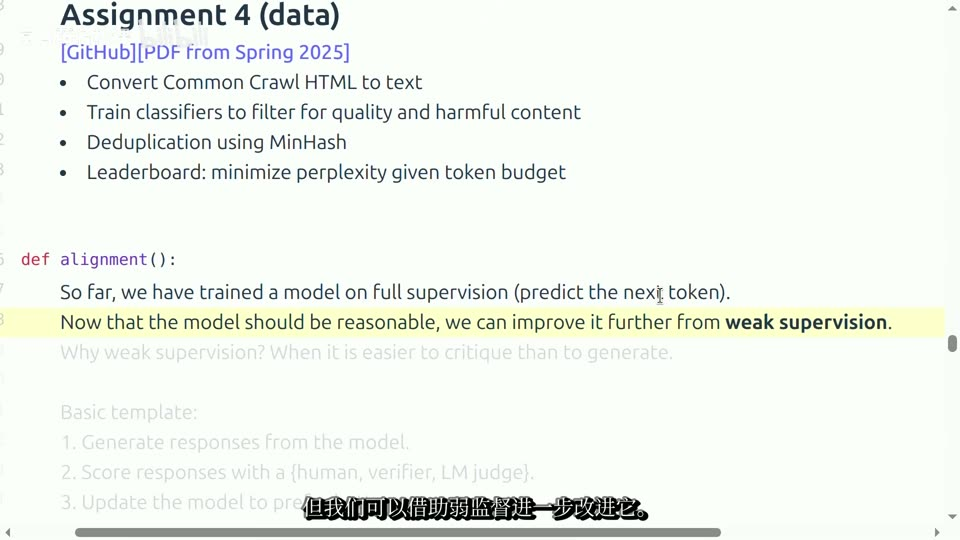 |
| 这可以用 PPO 或 GRPO 等强化学习算法来实现（前提是只有偏好数据）。当然，强化学习面临的挑战在于：算法不稳定、很难调参，大家可能都有切身体会。我个人倾向于尽可能久地停留在完全监督学习的框架里；但既然非做强化学习不可——好吧，也有些人不管出于什么原因 [【跳转到 47:32】](https://www.bilibili.com/video/BV11LEA6eEuj/?p=1&t=2852) | 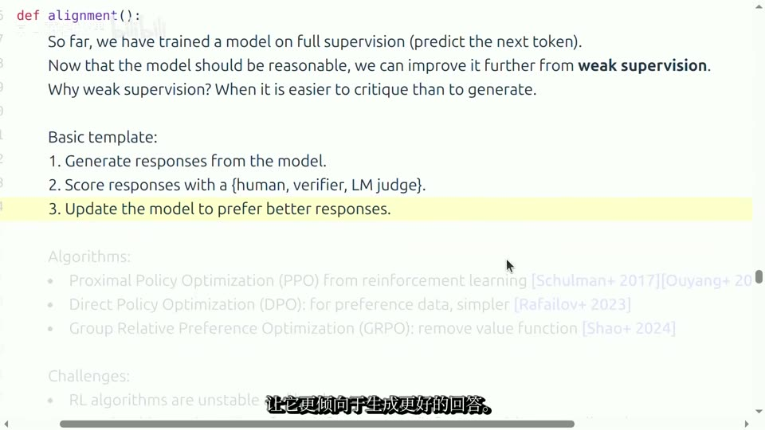 |
| 就是喜欢做强化学习。另外，今年我们希望探讨：如果你在大规模上跑强化学习、试图最大化吞吐量，实际上会遇到很多系统层面的挑战。你需要一台推理服务器和一台训练服务器，推理服务器必须不断生成这些 rollout；尤其是当你针对涉及代码执行的环境做强化学习时，这是一整套编排工作。 [【跳转到 47:57】](https://www.bilibili.com/video/BV11LEA6eEuj/?p=1&t=2877) | 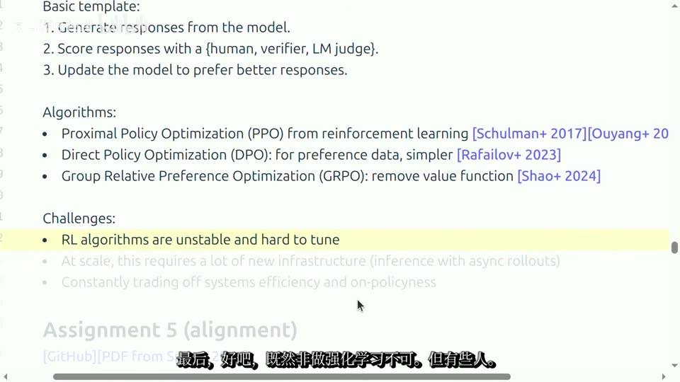 |
| 如果 worker 之后就会陷入离策略（off-policy）问题，于是你得不断在中间权衡协调：既要保持策略的同策略性（on-policy），又要尽量最大化吞吐量。这是一个庞大而美妙的混乱局面，希望讲到那部分时能多聊聊。嗯，第五次作业我们还在决定具体要做什么；去年是实现 DPO 和 GRPO， [【跳转到 48:22】](https://www.bilibili.com/video/BV11LEA6eEuj/?p=1&t=2902) | 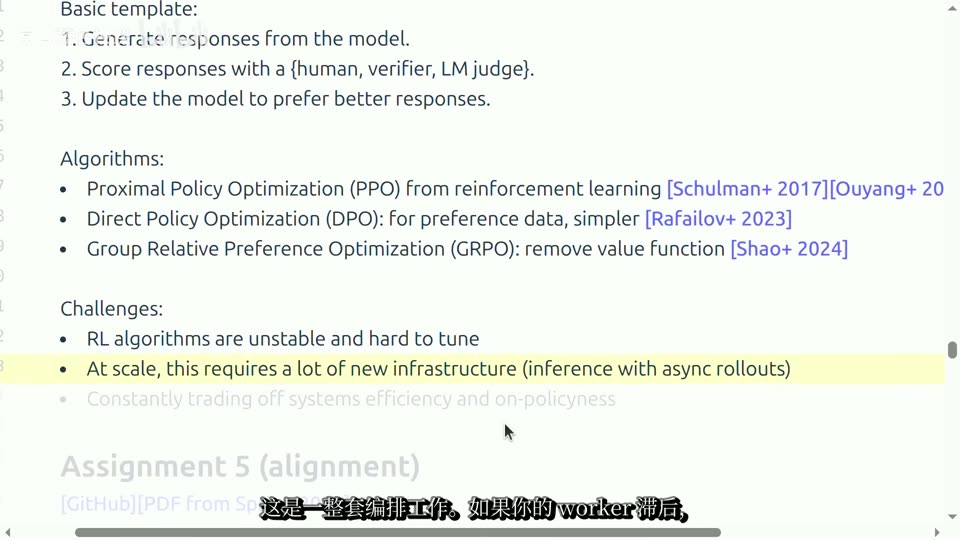 |
| 并让它们在数学基准等某些情况下正常运行。但我们要看看今年能在多大程度上把它向"真实世界"推进。好，再提醒一下：重点在于效率，而效率可以体现在很多方面——要么是数据效率，要么是计算效率。可以这样想：你拥有所有这些资源——数据、待计算核心的硬件、内存、 [【跳转到 48:47】](https://www.bilibili.com/video/BV11LEA6eEuj/?p=1&t=2927) | 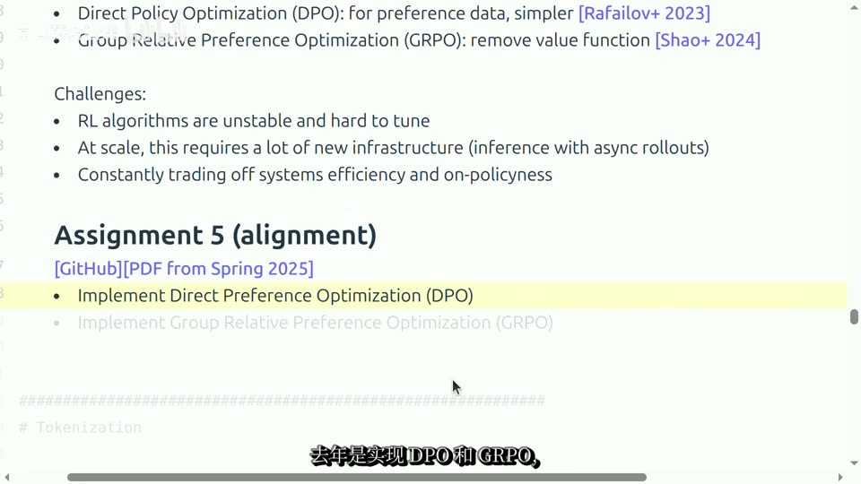 |
| 通信和带宽——而你要做的，就是在资源固定的前提下，按照某种评估标准把模型做到最好。换个角度看，我觉得可以把很多这类设计决策都看作是为这个目标做优化。系统方面显然关乎计算效率。之前提过分词：你虽然可以直接用原始字节， [【跳转到 49:12】](https://www.bilibili.com/video/BV11LEA6eEuj/?p=1&t=2952) | 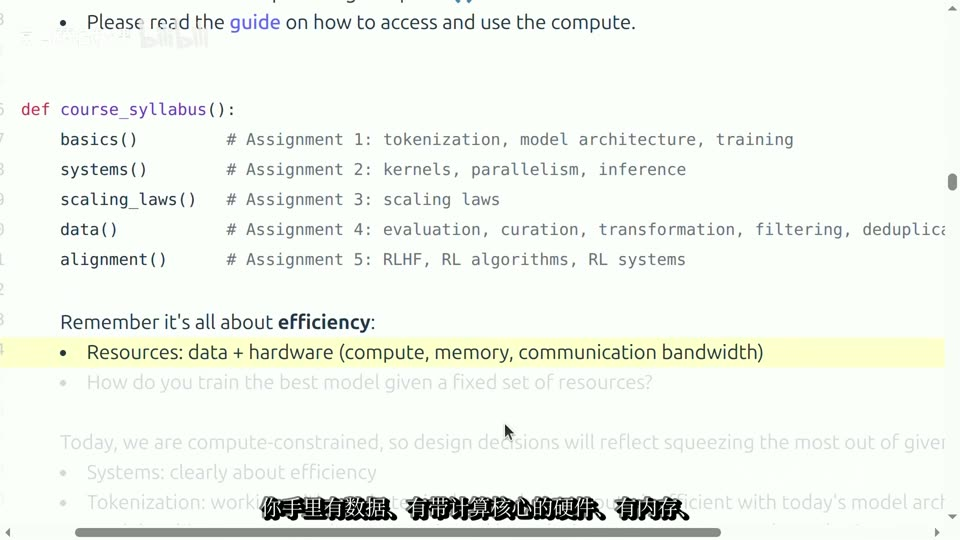 |
| 但至少在现在的模型架构下，那样算起来效率太低了，所以很多分词工作都是为了提升计算效率。模型架构这块，我们会看到很多改动，主要是为了减少内存消耗或浮点运算量；事实上很多改动都出于对更快推理速度的需求。数据过滤也可以从效率的角度看：我们不想把时间和算力浪费在 [【跳转到 49:37】](https://www.bilibili.com/video/BV11LEA6eEuj/?p=1&t=2977) | 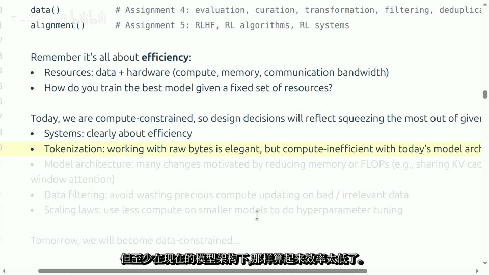 |
| 大量冗余的低质数据上——即便它未必直接损害模型，仍有负面影响。在固定的计算预算下，花在低质数据上的时间越多，花在优质数据上的时间就越少。最后，缩放定律明确关注的正是"你可以如何去做这件事"：本质上就是用规模小得多的模型进行有效的超参数调优。而如果明天我们就受限于数据， [【跳转到 50:02】](https://www.bilibili.com/video/BV11LEA6eEuj/?p=1&t=3002) | 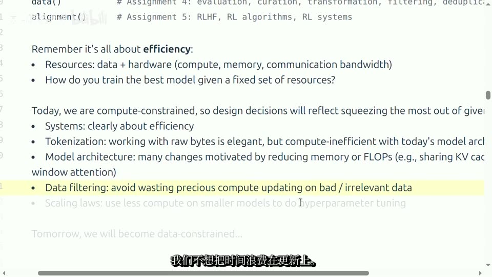 |
| 那么关于该做哪些设计决策的权衡逻辑可能就会改变。但我认为我们想教给大家的核心思维模式是：要思考你所用方法的效率。谢谢，我就讲到这里。关于这些作业或主题， [【跳转到 50:27】](https://www.bilibili.com/video/BV11LEA6eEuj/?p=1&t=3027) | 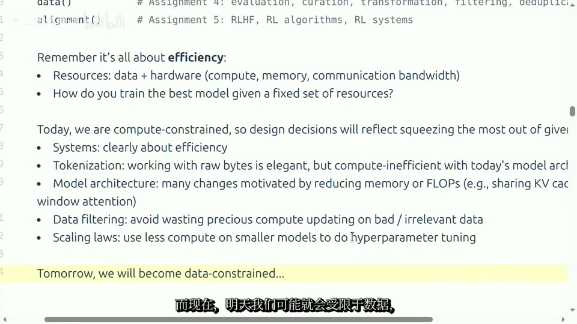 |
| 大家有什么问题吗？嗯，谢谢，谢谢大家。 [【跳转到 50:40】](https://www.bilibili.com/video/BV11LEA6eEuj/?p=1&t=3040) | 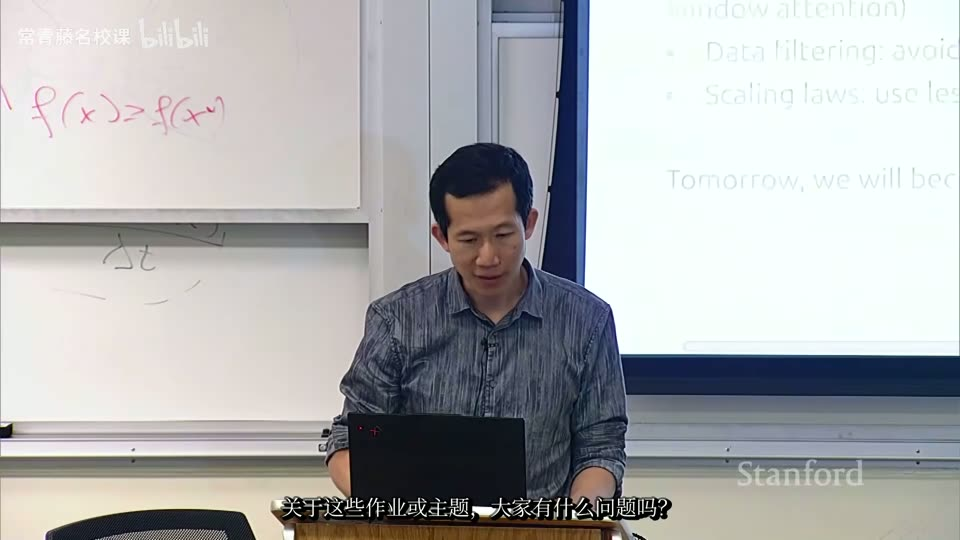 |
| 好，接下来我们来讲分词（tokenization），这是我们进入的第一个单元。 [【跳转到 50:45】](https://www.bilibili.com/video/BV11LEA6eEuj/?p=1&t=3045) | 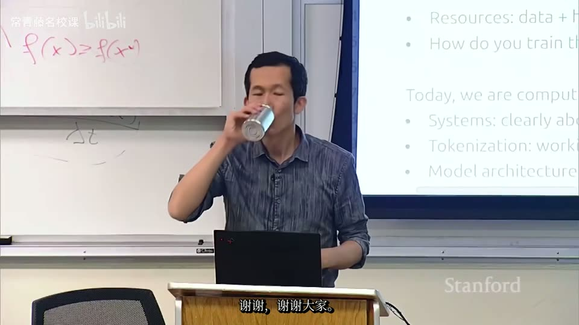 |
| Andrej Karpathy 有个视频讲分词讲得很棒，推荐大家去看看。我们从原始文本开始——到底什么是文本？它是 Unicode 字符串；而另一方面，语言模型会对 token 序列建立概率分布，通常用索引来表示。所以我们需要一个流程：把字符串编码成 token，再把 token 解码回字符串。 [【跳转到 50:51】](https://www.bilibili.com/video/BV11LEA6eEuj/?p=1&t=3051) | 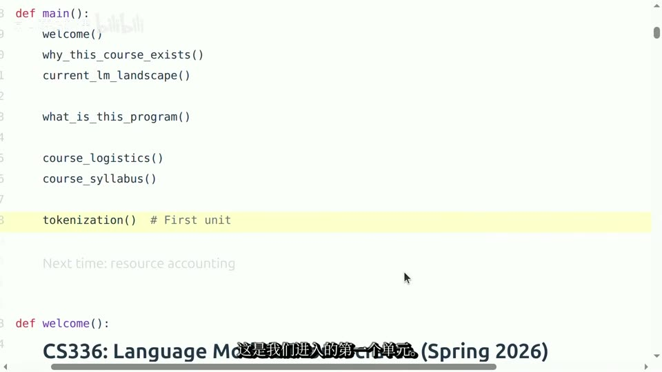 |
| 所以，分词器（tokenizer）本质上就是能完成这种双向转换的工具。这里有一些例子，帮你直观理解分词器是怎么工作的。我本该早点联网，所以现在这个演示用不了了。好吧，如果你去那个网站，可以试用各种不同的分词器。这里有一些观察，你会体会到为什么分词器有点"烦人"， [【跳转到 51:16】](https://www.bilibili.com/video/BV11LEA6eEuj/?p=1&t=3076) | 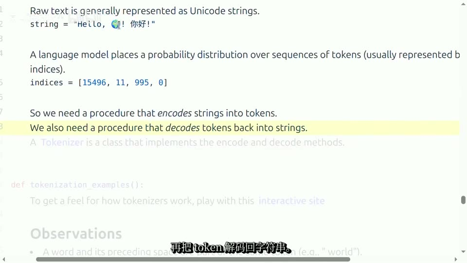 |
| 以及为什么人们想摆脱它们。一个单词，和这个单词连同它前面的空格组合在一起，是不同的 token——所以你实际看到的很多 token 其实是"空格＋单词"的形式。这没问题，但有点奇怪：因此这个"hello"和那个"hello"实际上是两个完全不同的索引，彼此毫无关系。有时候，取决于你使用的分词器，数字会被表示成每几位数字构成一个 token； [【跳转到 51:41】](https://www.bilibili.com/video/BV11LEA6eEuj/?p=1&t=3101) | 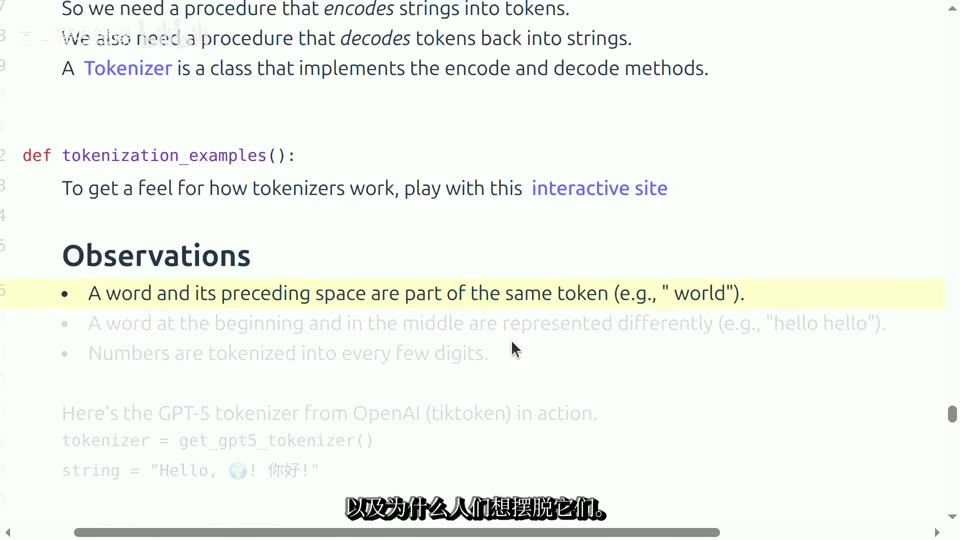 |
| 有时这是可预测的，有时则不是。有些分词器试图让每个数字都单独成为一个 token，但这样会让 token 数量激增，所以这里存在一个权衡。这是 GPT-5（原字幕 gpdfive）的分词器：把这个字符串转换成这些索引，然后就能把它解码回原来的字符串。分词器应当支持往返转换（roundtrip）；如果你实现的分词器无法往返转换，那就说明有问题。 [【跳转到 52:06】](https://www.bilibili.com/video/BV11LEA6eEuj/?p=1&t=3126) | 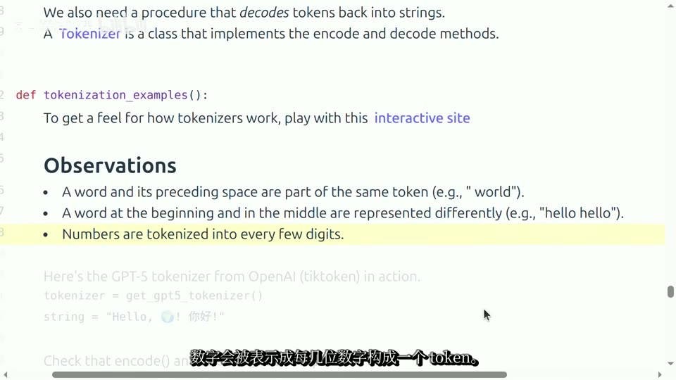 |
| 还有压缩比：它是每个 token 对应的字节数。在本例中，这个字符串的字节数为 20，token 数量为 8，用二十除以八，压缩比就是 2.5——也就是每个 token 对应 2.5 个字节。压缩比越大，意味着序列越短，这是好事，因为注意力的计算复杂度是二次方的，你要确保序列尽可能短。 [【跳转到 52:31】](https://www.bilibili.com/video/BV11LEA6eEuj/?p=1&t=3151) | 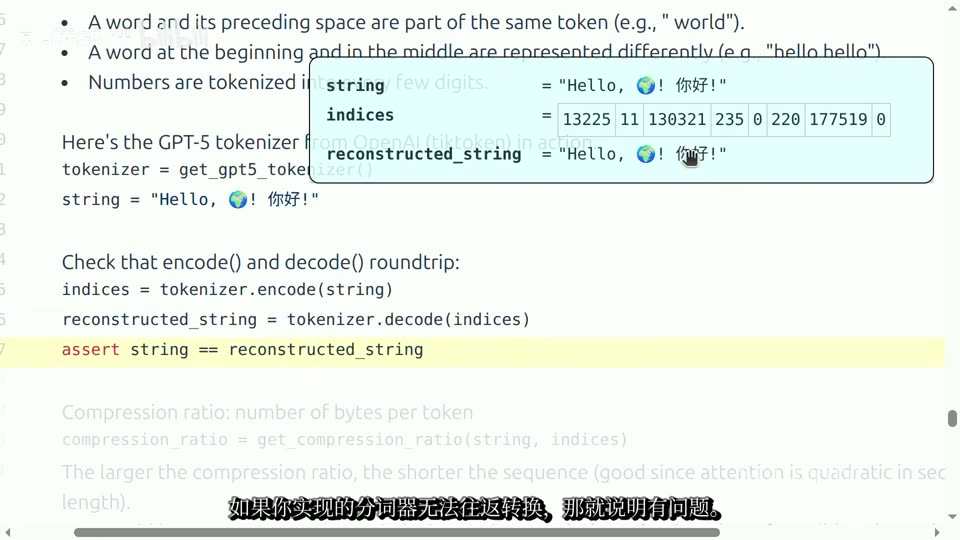 |
| 显然，你可以通过增加词表大小来提高压缩比，但这会引发稀疏性问题，因为词表中的每个元素都被视为独立的元素。如今分词器尤其是多语言分词器已经能拥有比如 10 万或 20 万个不同的 token。你可以去看看 GPT 的 token 词表。考虑到时间，我们跳过这部分。好， [【跳转到 52:56】](https://www.bilibili.com/video/BV11LEA6eEuj/?p=1&t=3176) | 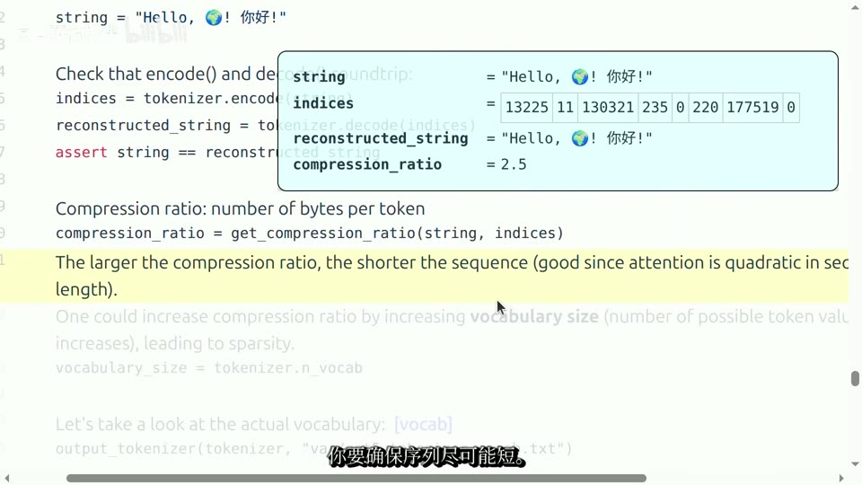 |
| 那怎么构建分词器呢？我快速讲一下。第一步，你可能会这样做：处理 Unicode 字符串。它本身就是一个 Unicode 字符序列，每个字符对应一个整数；在 Python 里可以用 ord 函数获取这个数值，这些数值也可以还原为字符。所以我们也可以构建一个"字符级"分词器：它把每个字符单独拆分并编码成一个 token，然后还能解码回去——一切都很顺利。 [【跳转到 53:21】](https://www.bilibili.com/video/BV11LEA6eEuj/?p=1&t=3201) | 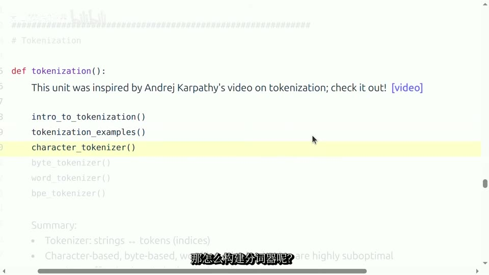 |
| 不过现在有 15 万个 Unicode 字符，这意味着词表大小可能高达 15 万这个数量级。你知道的，这倒不算离谱，但我认为更大的问题是：很多字符其实很少见，这意味着词表的利用效率其实很低。另外，压缩比在一定程度上反映了这一点：表现并不理想，大多数时候你得用很多 token 来表示序列， [【跳转到 53:46】](https://www.bilibili.com/video/BV11LEA6eEuj/?p=1&t=3226) | 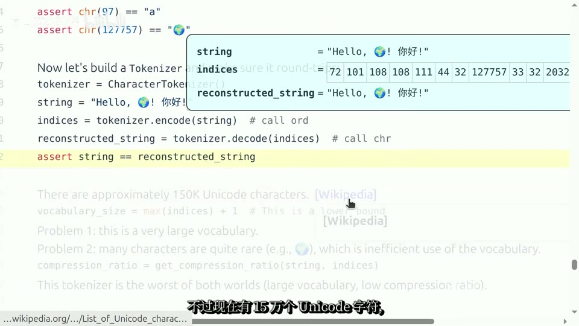 |
| 而很多索引其实没怎么被用到，所以这个分词器效果不太好。我们再试试另一种方法：把字符串转成字节。Unicode 有一种 UTF-8 编码，可以这样处理：有时像"a"这样的字符串只占一个字节，有时一个字符串会占多个字节。基于这个思路构建分词器， [【跳转到 54:11】](https://www.bilibili.com/video/BV11LEA6eEuj/?p=1&t=3251) | 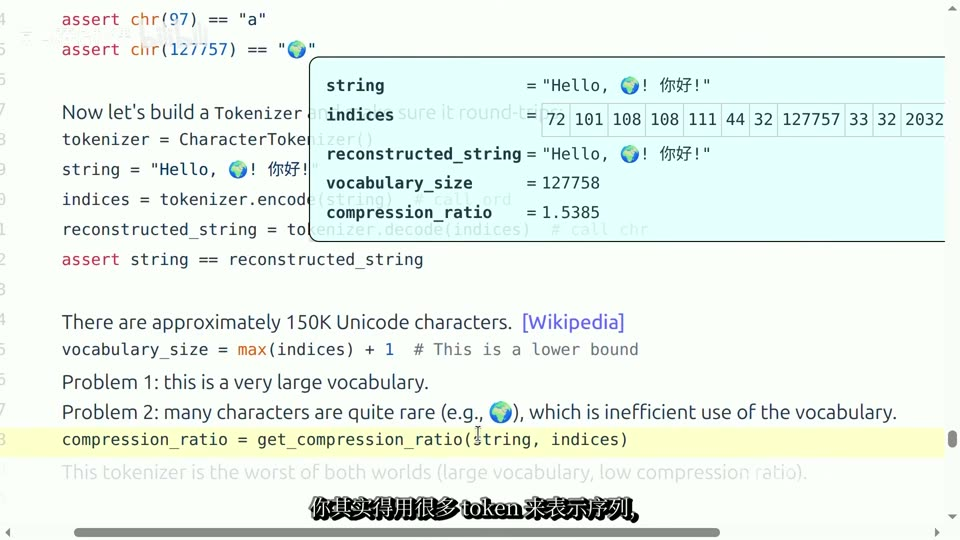 |
| 我们可以把这个字符串转换成字节序列。注意：现在的序列变长了，但所有数值都在 0~255 之间（因为这就是字节的定义），压缩比是 1——这并不理想：字节序列可能非常长，但词表大小却很小。好，那么现在这两种方法其实都很糟糕。 [【跳转到 54:36】](https://www.bilibili.com/video/BV11LEA6eEuj/?p=1&t=3276) | 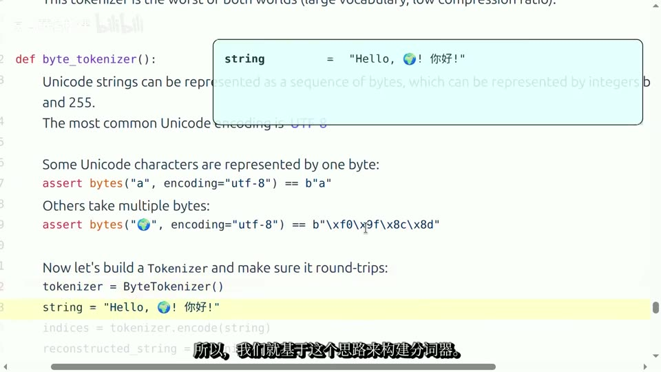 |
| 所以我们试着推进一下。这其实是 NLP 领域过去常用的做法：如果还记得的话，拿到一个字符串，我可以直接把它切分成块——比如按空格或某些正则表达式来切——我们把这些块中的每一个都叫做 token。这种方法的优点在于每个 token 都是有意义的，因为人类发明了词汇， [【跳转到 55:01】](https://www.bilibili.com/video/BV11LEA6eEuj/?p=1&t=3301) | 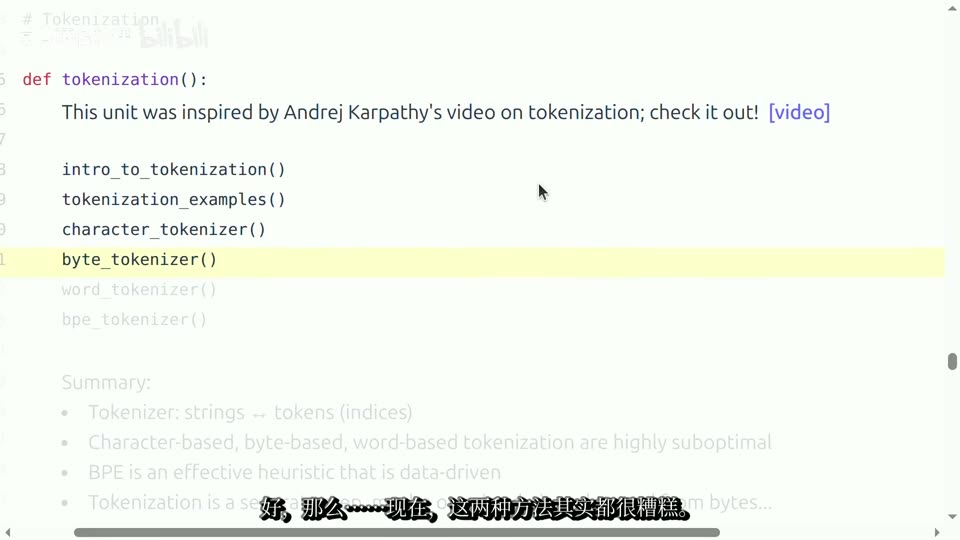 |
| 而词汇往往具有稳定的语义含义。但是你的词表大小是训练数据中不同块的数量，这可能非常多；此外你的压缩比相当好，但词表可能非常巨大。实际上情况更糟：词表实际上可能是无界的。因为在测试时，你可能对某些序列分词，然后遇到一个从未见过的 token—— [【跳转到 55:26】](https://www.bilibili.com/video/BV11LEA6eEuj/?p=1&t=3326) | 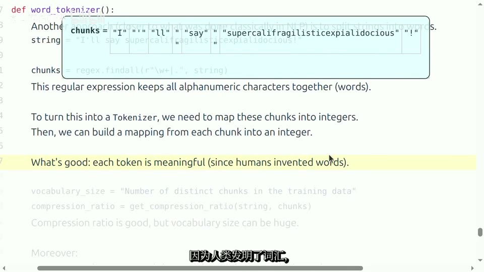 |
| 人们过去常常把这些标记为 UNK token，但这很不优雅，还会扰乱你的困惑度计算，所以这也不是理想方案。好，接下来我们实际要用的方法叫做字节对编码（Byte Pair Encoding, BPE）。这个想法其实很久以前就有了，是为了做数据压缩，远早于语言模型登场。它最早被引入 NLP 领域，用于神经机器翻译； [【跳转到 55:51】](https://www.bilibili.com/video/BV11LEA6eEuj/?p=1&t=3351) | 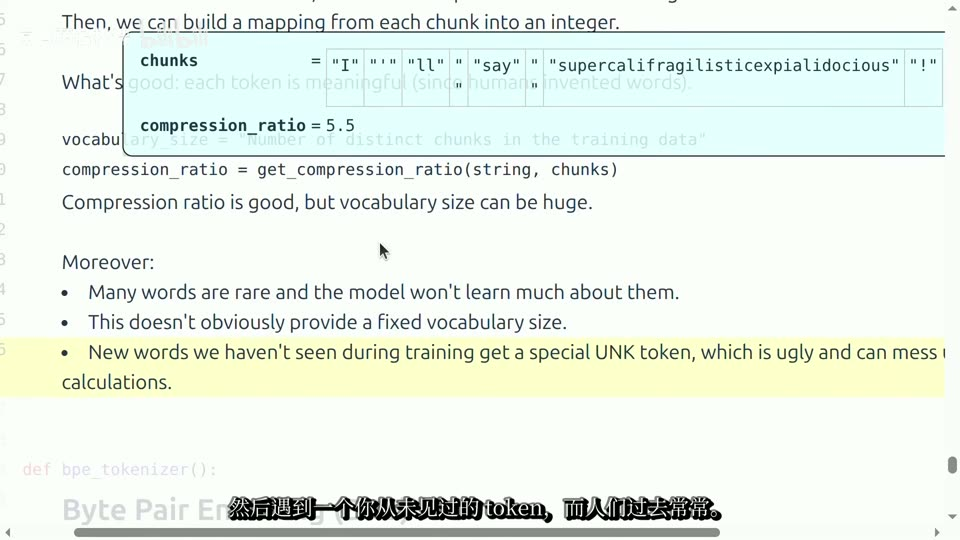 |
| 而首次把 BPE 用于语言模型的是 GPT-2 论文。基本思路就是用原始文本来训练分词器，从而构建出为数据量身定制的词表。它还有一个特性：任何内容都能被分词——遇到罕见序列时就拆分成更小的单元，而不是用一个 UNK token 来表示。所以常见的序列会被表示成一个 token， [【跳转到 56:16】](https://www.bilibili.com/video/BV11LEA6eEuj/?p=1&t=3376) | 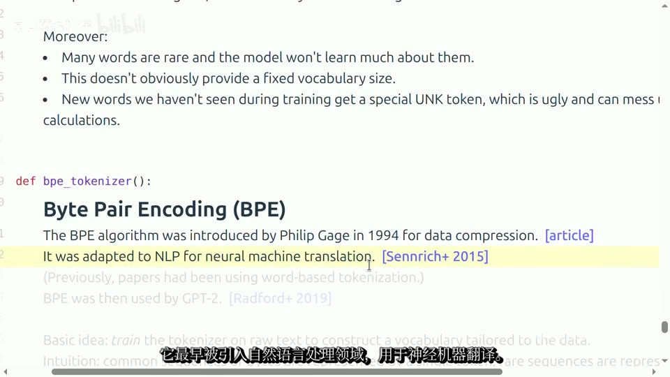 |
| 罕见的序列则被拆成多个 token。原理就是这样。好，从概念上讲，这个算法相当简单：基本上你从语料库开始，假设它就是一长串序列，你得到的是字节序列，每个字节起初都是一个 token。然后我们把出现频率最高的相邻 token 对合并起来。这里有一个简单的字符串： [【跳转到 56:41】](https://www.bilibili.com/video/BV11LEA6eEuj/?p=1&t=3401) | 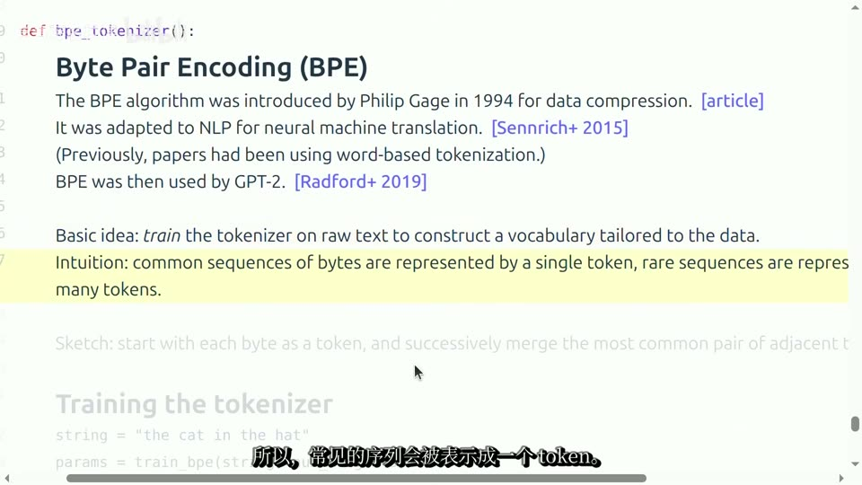 |
| "戴帽子的猫"（The Cat in the Hat），以及 BPE 算法的实现。我们要把它转换成字节序列，然后统计相邻 token 出现的次数——比如某个对出现了两次——于是得到这个结果。然后我们要找出出现次数最多的那个 token 对。 [【跳转到 57:05】](https://www.bilibili.com/video/BV11LEA6eEuj/?p=1&t=3425) | 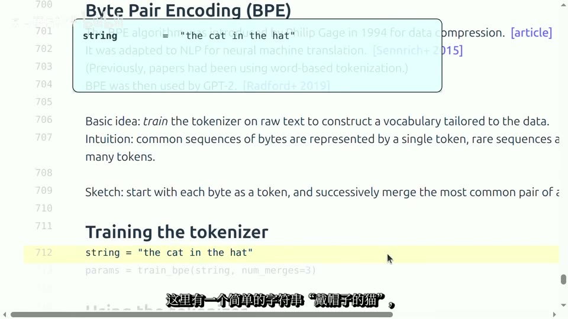 |
| 我想有几处并列的情况，但我们只取第一个。接着我们要合并这个 token 对。合并做的就是：创建一个新 token——这里我们把它命名为 token 256，它代表这一对——并把它加入词表。所以 256 就代表"th"这个序列；T 和 H 合并以后， [【跳转到 57:30】](https://www.bilibili.com/video/BV11LEA6eEuj/?p=1&t=3450) | 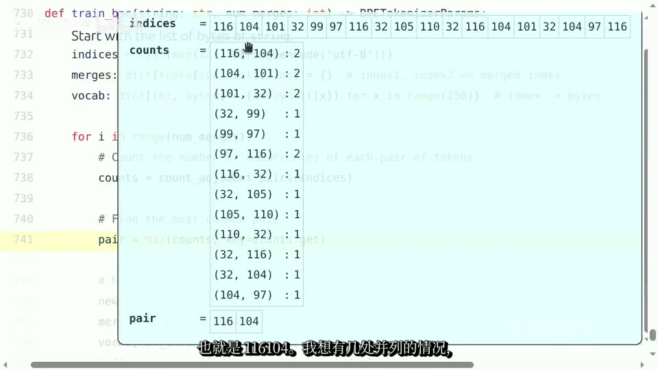 |
| 只要看到 TH，我们就用 256 来表示。然后我们遍历索引，把每一处出现的这一对替换成 256——这两个位置就替换好了。然后进入下一轮迭代：下次再做这一步时，我们会找到新的高频对，把它们合并得到 257；然后再合并一次， [【跳转到 57:55】](https://www.bilibili.com/video/BV11LEA6eEuj/?p=1&t=3475) | 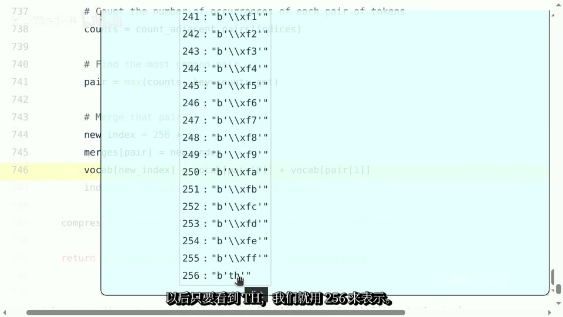 |
| 继续这样下去，序列会越来越短，而词表规模会越来越大。在这个玩具示例中，我们得到的压缩率是 1.5。好，既然你有了分词器，那怎么对新文本进行分词呢？你拿一个新字符串，对它进行编码：概念上，你基本上是遍历之前建立的合并规则， [【跳转到 58:20】](https://www.bilibili.com/video/BV11LEA6eEuj/?p=1&t=3500) | 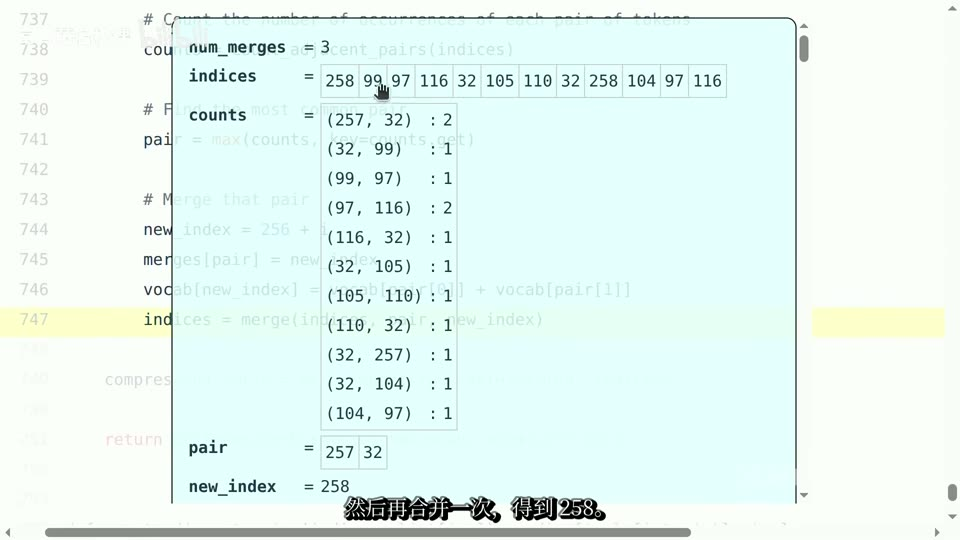 |
| 然后把这些规则应用到字符串上。我就不一步步演示那段代码了。那样你会得到一个序列——这是 quick brown fox 的编码；当你解码它时，会得到原来的内容。所以为了赶时间我刚才讲得有点快。然后要说的是：这个实现是一个完整的 BPE 实现， [【跳转到 58:45】](https://www.bilibili.com/video/BV11LEA6eEuj/?p=1&t=3525) | 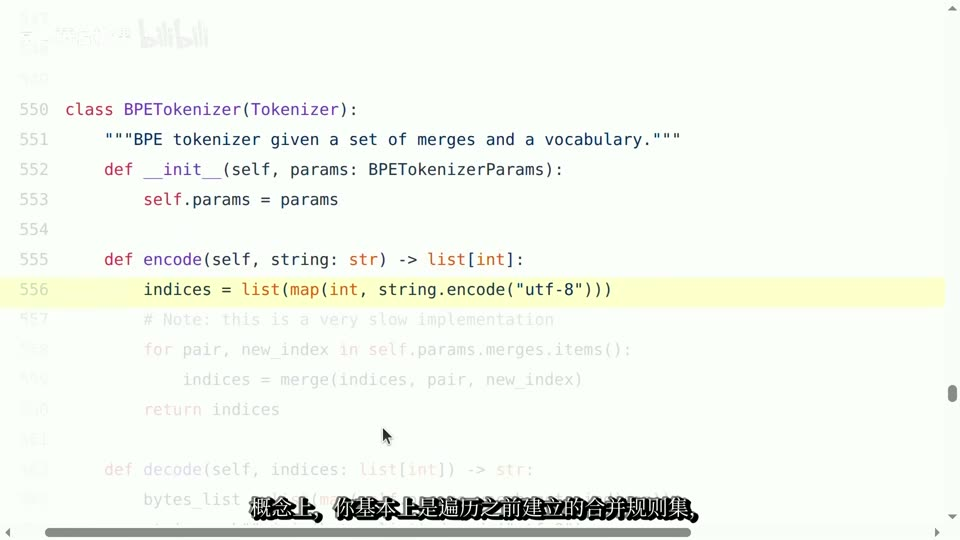 |
| 它运行起来非常慢，所以在第一次作业里我们会让你把它改得更快一些。现在 encode 会遍历所有合并操作，这特别慢，因为合并的数量基本上就是词表大小。所以要改为只遍历那些关键的合并操作——你需要建立一些索引来实现这一点。另外，关于特殊 token 有一些细节：概念上不难，但对构建现代分词器来说很重要。 [【跳转到 59:10】](https://www.bilibili.com/video/BV11LEA6eEuj/?p=1&t=3550)
| 还有一点：为了简单起见，我把分词器展示为"接收整个字符串、然后尝试对其进行分词"的形式。实际上，过程是把文本分解为块，然后对每个块应用分词器——这样速度会快很多。接着再想办法让它尽可能快：到某个时候，你可能会意识到 Python 其实并不快；如果你想用 Rust 或你喜欢的其他语言来实现， [【跳转到 59:35】](https://www.bilibili.com/video/BV11LEA6eEuj/?p=1&t=3575) | 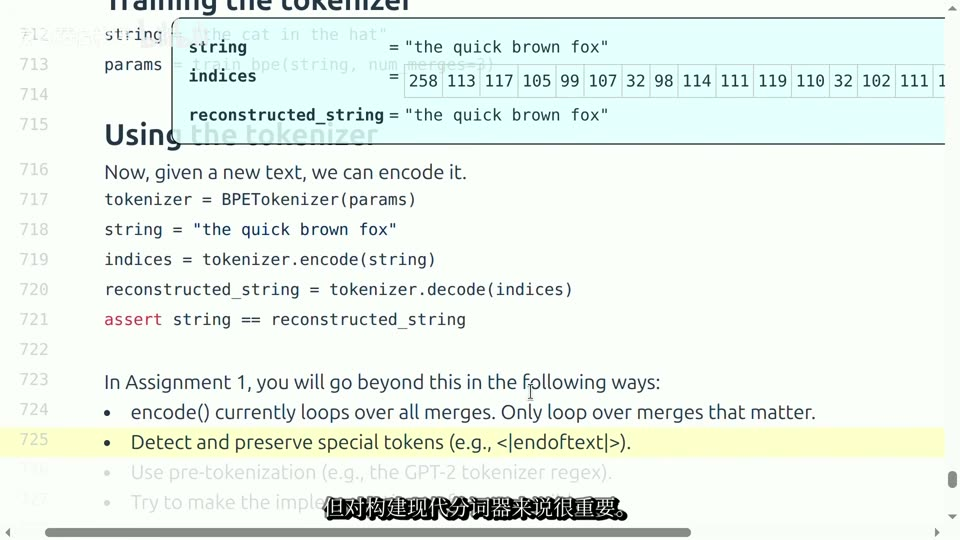 |
| 那就动手吧。好，快速回顾一下：分词器的作用是在字符串和 token（或索引）之间转换。 [【跳转到 60:00】](https://www.bilibili.com/video/BV11LEA6eEuj/?p=1&t=3600) | 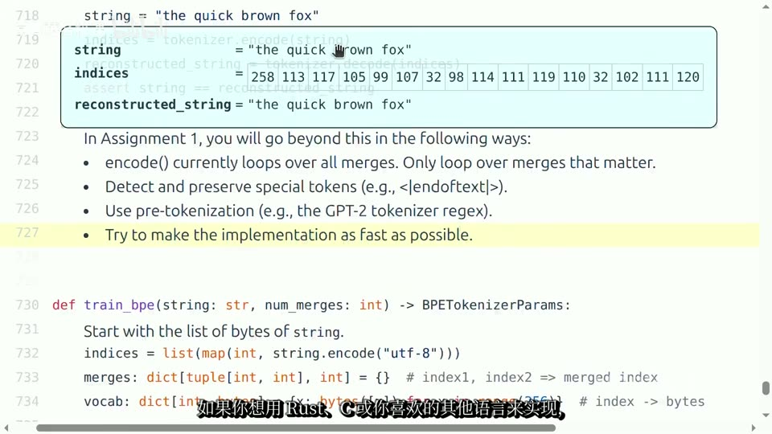 |
| 之前那些基于字符、基于字节、基于单词的方法，各自都有很大的局限。BPE 是一种有效的启发式方法：它是数据驱动的，看起来确实相当有效。现在，就像我之前说的，也许明年我就不用教这个了，但今年还得继续讲分词。不过，即使我们摆脱了分词，我认为任何取而代之的方案都必须满足以下特性： [【跳转到 60:10】](https://www.bilibili.com/video/BV11LEA6eEuj/?p=1&t=3610) | 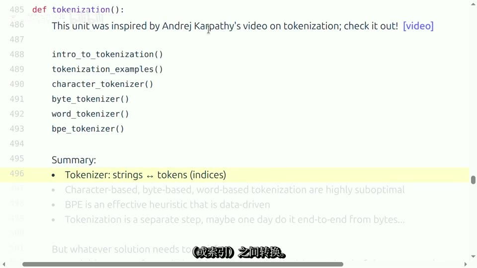 |
| 有了模型之后，Transformer 就得基于某种序列抽象来运行。如果你不仅考虑文本，还考虑视频或 DNA 序列，这一点就尤为明显，因为其中的单个字节或单元实际上是另一回事，信噪比相当低。因此你需要进行某种形式的抽象，将其提升到可以进行建模的层面。 [【跳转到 60:35】](https://www.bilibili.com/video/BV11LEA6eEuj/?p=1&t=3635) | 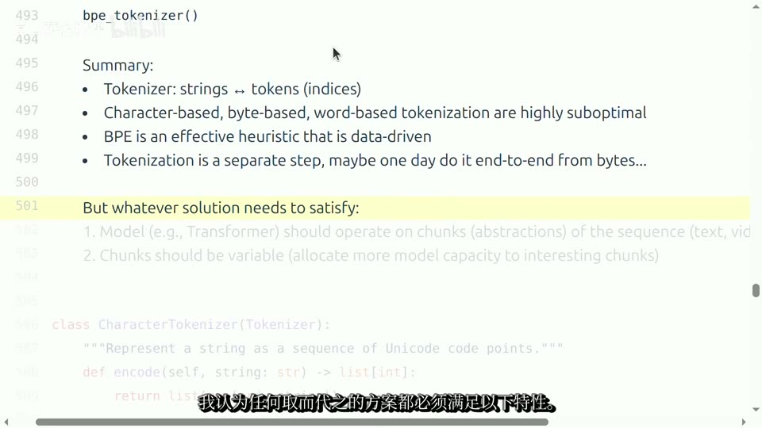 |
| 最后，正如我提到的，块的大小应该是可变的：你需要自适应计算，因为并非所有字节都同等重要。如果不这样做，结果就会是次优的。因此任何端到端方案也必须具备这些特性。好，今天就到这里。 [【跳转到 61:00】](https://www.bilibili.com/video/BV11LEA6eEuj/?p=1&t=3660) | 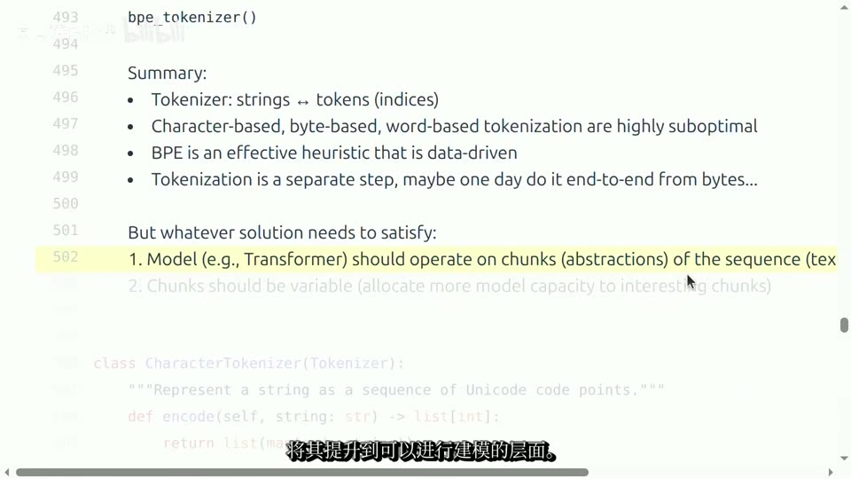 |
| 下周三，我们开始讲资源核算，算是系统课的入门内容。接下来我们会回到架构部分，继续深入。 [【跳转到 61:18】](https://www.bilibili.com/video/BV11LEA6eEuj/?p=1&t=3678) | 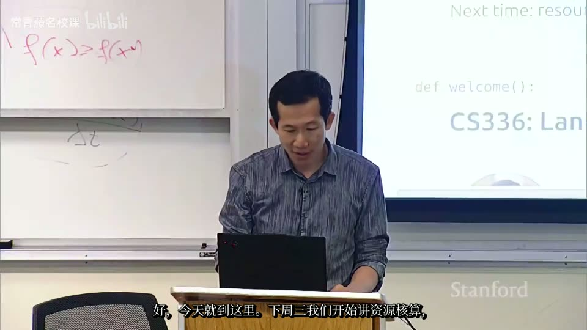 |