# Lecture 10: Inference · 原始文稿（图-字幕分栏）

| 字幕文本 | 画面 |
| :--- | ---: |
| 好，咱们开始。上次讲了 scaling laws，咱们先放一放，这次聊聊 inference（推理）。 [【跳转到 00:00】](https://www.bilibili.com/video/BV11LEA6eEuj/?p=10&t=0) | 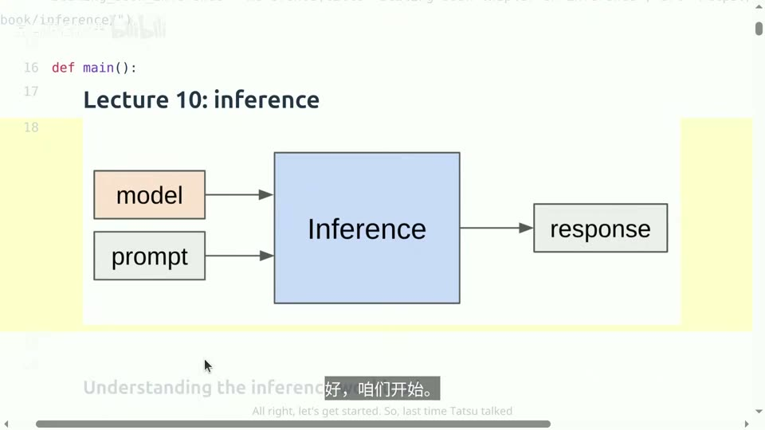 |
| 所以 inference 这个问题其实很简单：你已经训练好了一个模型。 [【跳转到 00:05】](https://www.bilibili.com/video/BV11LEA6eEuj/?p=10&t=5) | 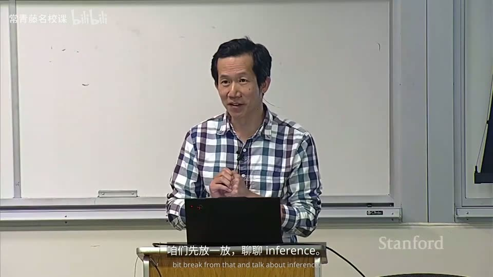 |
| 你输入一个 prompt，然后通常希望模型尽可能准确、快速地给出回复。所以 inference 虽然只有一节课…… [【跳转到 00:10】](https://www.bilibili.com/video/BV11LEA6eEuj/?p=10&t=10) | 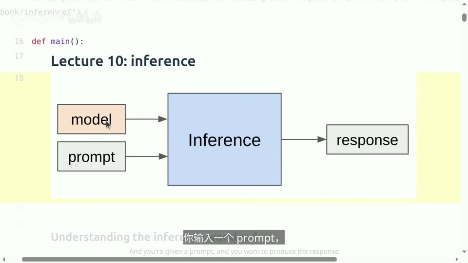 |
| 但它的地位其实越来越重要，应用场景很多。显然，模型训练完你总不能干坐着。如果你是做研究的，你会在论文里放张图，说明你的模型是怎么跑的；对大多数人来说，你是真想把这个模型用起来。那具体怎么用呢？比如跟 AI 助手或 chatbot 聊天，或者用它做代码补全。 [【跳转到 00:17】](https://www.bilibili.com/video/BV11LEA6eEuj/?p=10&t=17) | 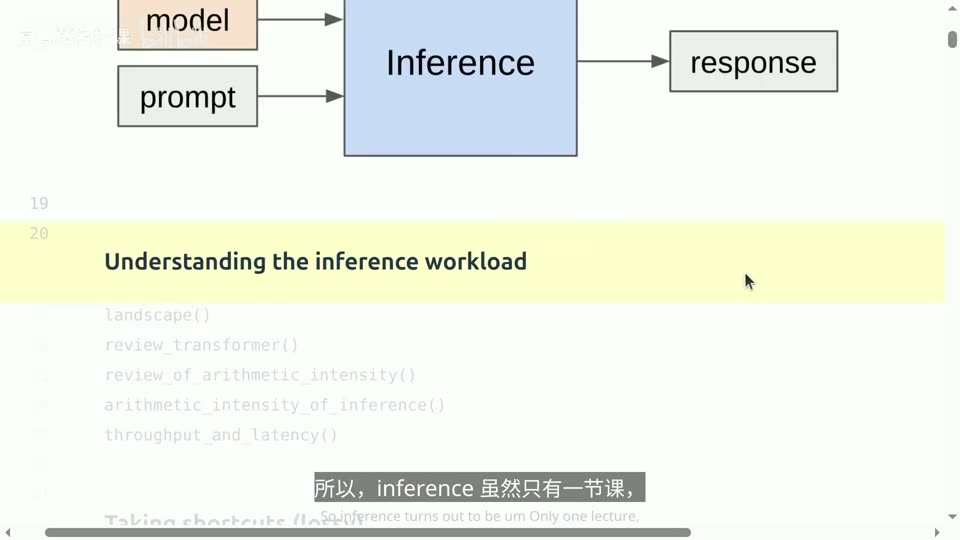 |
| 现在 agent 很火，这就需要用到 inference；还有批量数据处理，这对评估也很有用，尤其是那种需要靠生成来完成的评估。训练里也会用到：你要是做 reinforcement learning（强化学习），就得有个模型先生成 rollouts，再给它们打分，然后相应地更新权重。所以 inference 到处都用得到，而且效率这事儿…… [【跳转到 00:42】](https://www.bilibili.com/video/BV11LEA6eEuj/?p=10&t=42) | 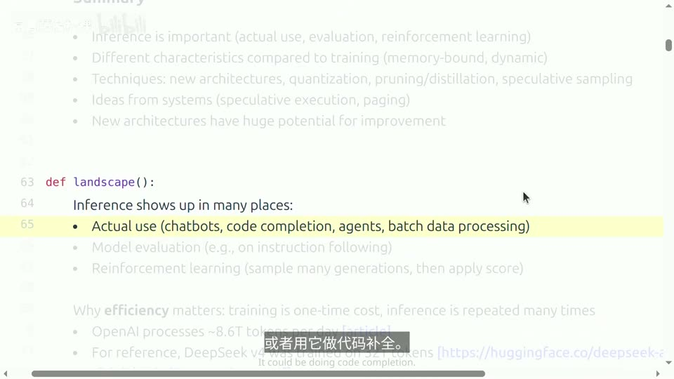 |
| 作为咱们这门课的主题，它真的比以往任何时候都更重要。哪怕只从实际应用的角度看：训练是一次性的，成本可能非常高、确实非常高，但做完也就完了；而 inference 是反复产生的成本，你基本每天都得为它买单。据估计，OpenAI 每天产生约 6 万亿（6×10^12）个 token。 [【跳转到 01:07】](https://www.bilibili.com/video/BV11LEA6eEuj/?p=10&t=67) | 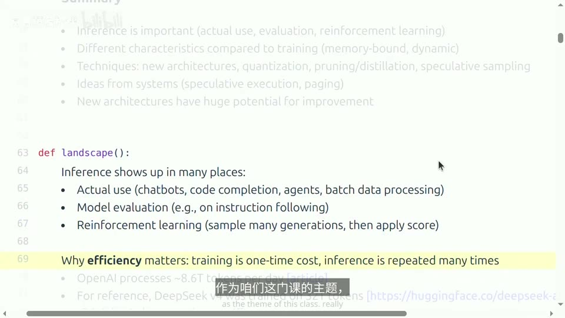 |
| 作为参考，今年早些时候发布的 DeepSeek V4，其训练数据量为 32 万亿个 token。因此在不到四天的时间里，OpenAI 需要生成的 token 数量及其对应的计算量，至少相当于训练一个 DeepSeek V4。当然，即使是前沿模型，其训练所用的 token 数量可能更多；但即便如此，inference 阶段生成的 token 数量仍然会更高。 [【跳转到 01:32】](https://www.bilibili.com/video/BV11LEA6eEuj/?p=10&t=92) | 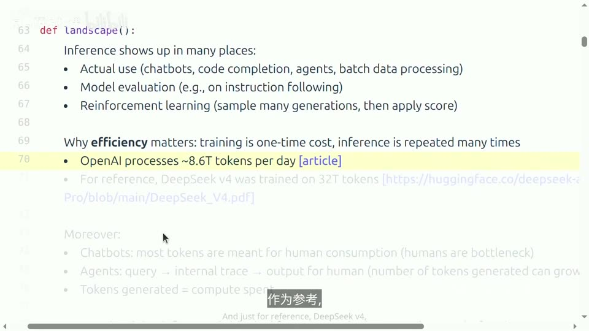 |
| 这只是个背景参考。而且我觉得过去这一年，inference 的重要性上升了。因为以前我们觉得语言模型主要就是个 chatbot 或助手，你输入一个 prompt，它返回一个回复，而人类的目标大概就是读这个回复。但现在，随着我们越来越进入 agentic（智能体化）的世界…… [【跳转到 01:57】](https://www.bilibili.com/video/BV11LEA6eEuj/?p=10&t=117) | 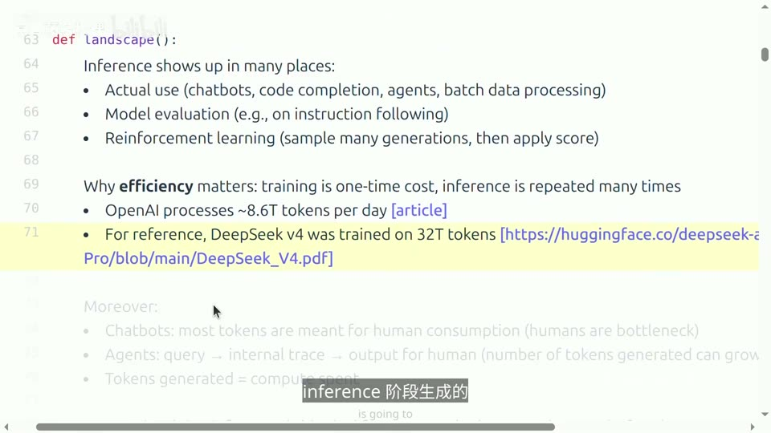 |
| 情况变了：你发起一个查询，agent 就会去做一堆事，它会思考、会推理、会调用工具，还会自我检查，最后才生成结果让人类来看。所以你看，agent 生成的那些 token 大部分其实都不是给人读的。所以你得真正把生成的 token 数量看作是花掉的算力，而这其实没什么上限。 [【跳转到 02:22】](https://www.bilibili.com/video/BV11LEA6eEuj/?p=10&t=142) | 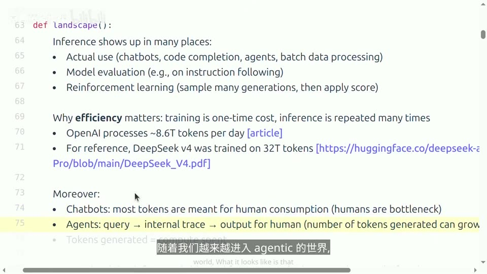 |
| 如果你要解决的问题足够宏大，那就需要投入很多算力和大量 token。所以如果你做的是 chat 类 inference，到了某个点之后就足够快了，因为人的阅读速度就那么快；但对 agent 来说，你从 inference 里多压榨出一点性能，能带来的价值是没有上限的。现在在商业这边，有很多人在做 inference。 [【跳转到 02:47】](https://www.bilibili.com/video/BV11LEA6eEuj/?p=10&t=167) | 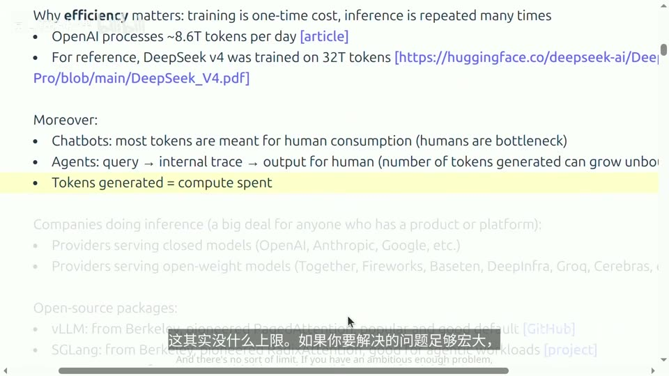 |
| 当然，所有闭源 API 提供商都得为自己的模型提供服务，所以 inference 对他们来说是件大事。另外还有一批提供商专门服务开源权重模型、也提供 inference 服务。vLLM 算是个很火的选择，也算是首选；还有 SGLang。 [【跳转到 03:12】](https://www.bilibili.com/video/BV11LEA6eEuj/?p=10&t=192) | 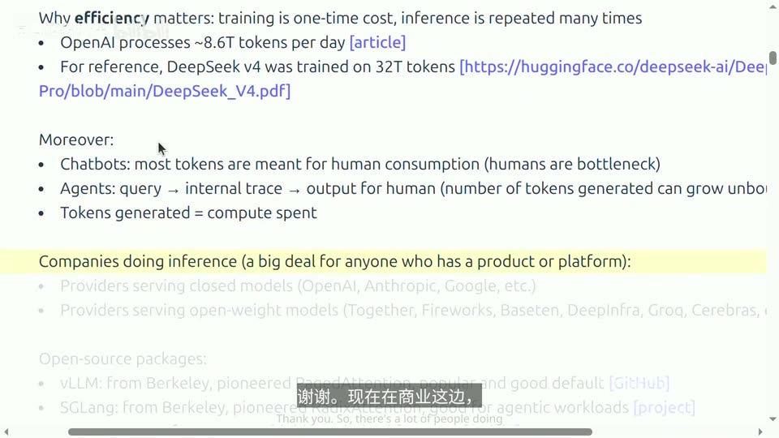 |
| 另一个在 agentic 工作负载上表现特别好的是 SGLang，不过可能还没那么火。然后是 NVIDIA 的 TensorRT，速度非常快，不过适用范围相对窄一些。还有 llama.cpp，如果你想在 CPU 上做 inference，这是个挺流行的包。好，希望我刚才已经说明了 inference 有多重要。如果你能让 inference 快一倍、哪怕只快十倍，哪怕…… [【跳转到 03:33】](https://www.bilibili.com/video/BV11LEA6eEuj/?p=10&t=213) | 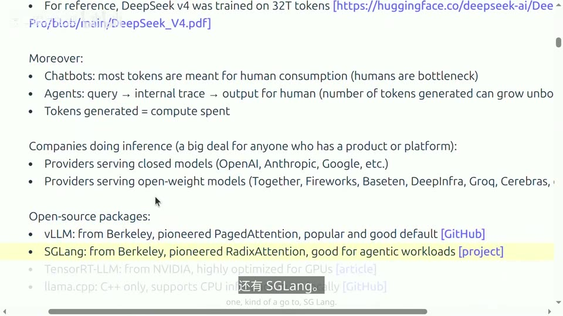 |
| 那都是件大事。那现在问题来了：到底什么是"快"？有几个指标能衡量快，它们适用于不同场景、各有取舍。衡量快的一个指标是"首 token 时间"（TTFT），这基本上就是用户在开始生成任何内容之前要等的时长。比如你把查询发给 ChatGPT，过几毫秒、从第一个 token 出来的那一刻算起…… [【跳转到 03:58】](https://www.bilibili.com/video/BV11LEA6eEuj/?p=10&t=238) | 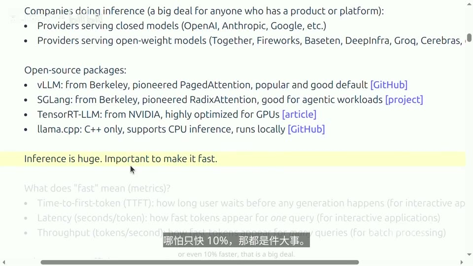 |
| 这就是 time to first token。它对交互式应用通常很有用，因为那种你干等着、什么也做不了的延迟越长，用户体验就越差。等第一个 token 出来之后，速度倒未必需要那么快，反正你都要读、而你也读不了那么快。所以第二个指标是延迟（latency）：从单个用户的角度看，一次查询里 token 出来的速度有多快。 [【跳转到 04:23】](https://www.bilibili.com/video/BV11LEA6eEuj/?p=10&t=263) | 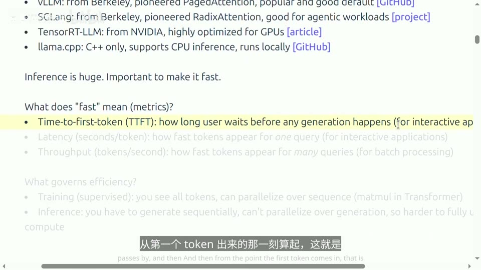 |
| 这对交互式应用也很重要，基本上就是看 token 流式输出的速度有多快。然后是一个相关概念——吞吐量（throughput），也就是每秒能处理多少个 token，这是指面对多个查询时 token 出来的速度。延迟（或延迟的倒数）和吞吐量显然关系密切，它们其实挺一致的。 [【跳转到 04:48】](https://www.bilibili.com/video/BV11LEA6eEuj/?p=10&t=288) | 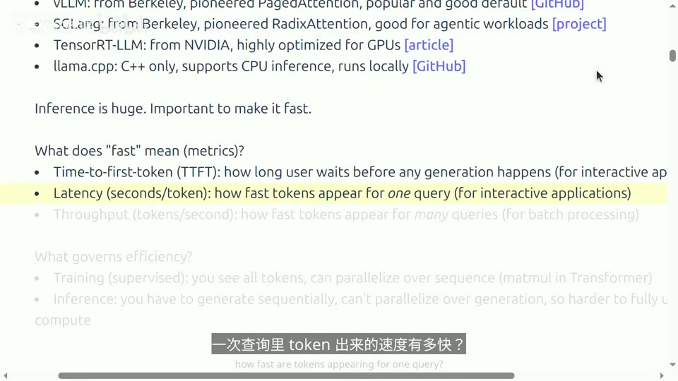 |
| 总体来说，很多干预手段都能同时改善延迟和吞吐量，不过咱们后面会看到，这里其实有个权衡取舍。而且如果你做的是大量批量处理，吞吐量就很有用，比如你有一批 KB 级的数据，想用语言模型来处理它，你只想把这个任务干完，单个查询是快是慢、先来后到都无所谓。 [【跳转到 05:13】](https://www.bilibili.com/video/BV11LEA6eEuj/?p=10&t=313) | 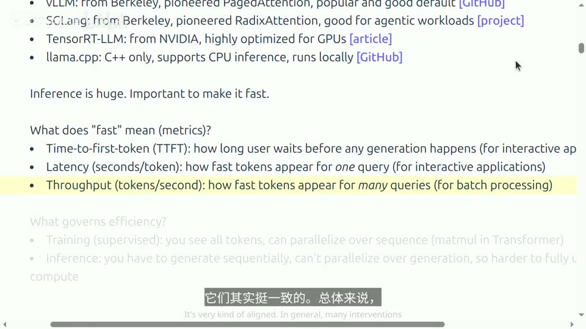 |
| 那什么决定了效率呢？也就是用推理的这些指标里的任何一个来衡量。那么高层面的要点是这样的，这大概是这节课要记住的一个高层面要点：训练时你能一次性看到所有 token，因为在监督微调中你可以看到全部 token，并在序列维度上做并行计算。大家记住，想一想 transformer 里注意力机制和 MLP 的计算…… [【跳转到 05:38】](https://www.bilibili.com/video/BV11LEA6eEuj/?p=10&t=338) | 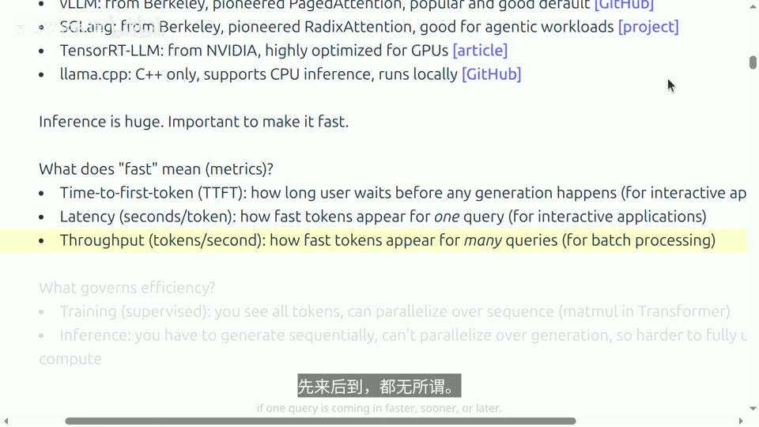 |
| 序列只是其中一个维度，所以它是一个参与相乘的大张量，因此你本质上是一次性处理所有 token。但在 inference 阶段，这种做法行不通：由于 inference 的自回归特性，我们必须按顺序、一次一个地生成 token。这就是为什么 inference 的工作负载和训练有本质区别——你没法在序列维度上做并行。所以正如我们稍后会看到的…… [【跳转到 06:03】](https://www.bilibili.com/video/BV11LEA6eEuj/?p=10&t=363) | 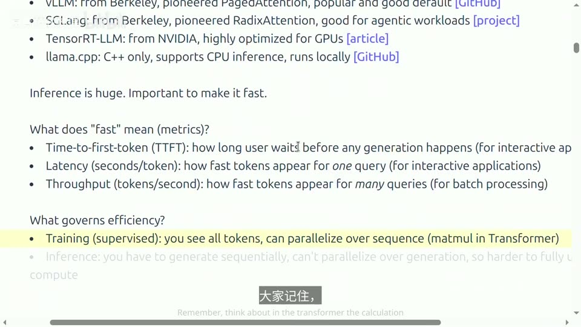 |
| 这会让高算术强度更难实现，也很难充分利用计算资源。好，咱们接着往下讲。 [【跳转到 06:28】](https://www.bilibili.com/video/BV11LEA6eEuj/?p=10&t=388) | 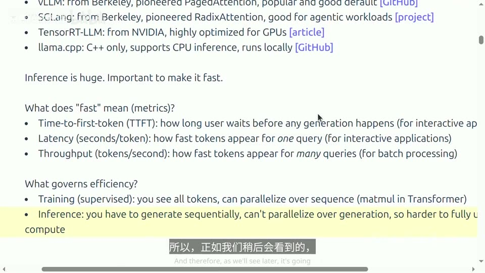 |
| 首先，我先给大家简单预告一下这次课要讲什么。第一步，我会做一些数学推导，来理解算术强度、吞吐量和延迟，以及怎么针对 transformer 来思考这些问题。接下来我会介绍几种降低成本的技术，比如缩小 KV cache、模型量化和剪枝（pruning）。最后我会讲一讲推测解码（speculative decoding）。 [【跳转到 06:36】](https://www.bilibili.com/video/BV11LEA6eEuj/?p=10&t=396) | 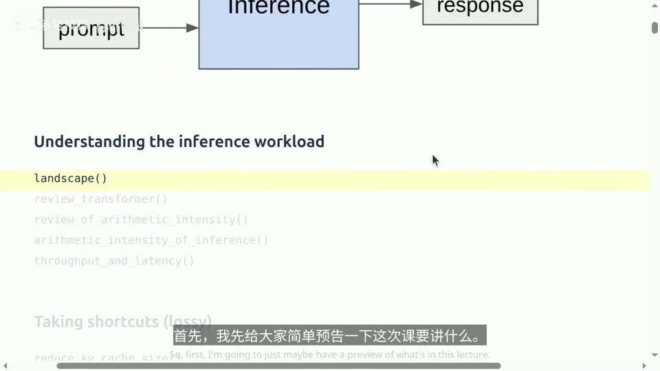 |
| 以及一些实际应用中需要注意的问题。好，这部分算是复习一下，主要是把符号统一起来，确保咱们对记号的理解是一致的。这次课的内容很多都参考了 Google 那本关于 transformer 和 inference 的 scaling book，所以我很推荐大家去看看，那本书写得非常好，里面有些图我也直接借用过来了。 [【跳转到 07:01】](https://www.bilibili.com/video/BV11LEA6eEuj/?p=10&t=421) | 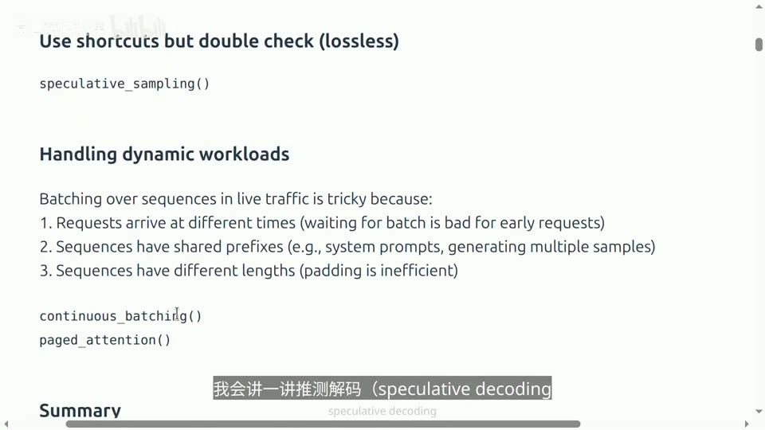 |
| 为了看懂这张图，咱们先定一些符号。这里会用一些符号，按 einops 来理解，用来表示维度，同时也表示它们的长度。所以 B 是 batch 维度，也就是序列的数量；T 是序列维度，也就是 token 的数量；D 是模型维度；H 是 head 维度。好，如果我这么写，这就是把一个维度为 B×T×D 的 tensor…… [【跳转到 07:26】](https://www.bilibili.com/video/BV11LEA6eEuj/?p=10&t=446) | 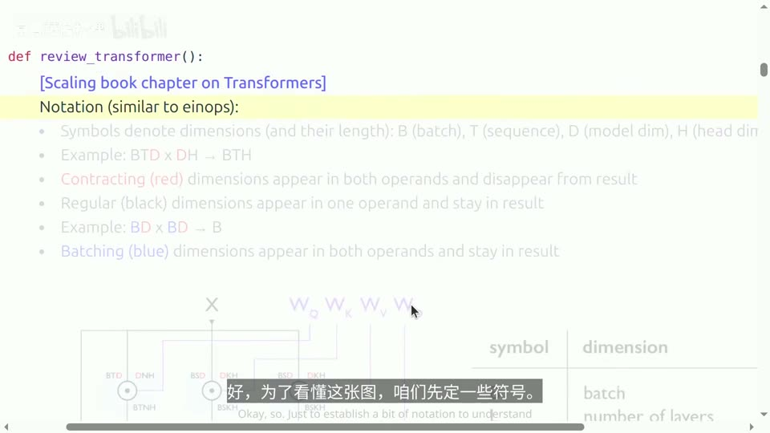 |
| 跟另一个维度为 D×H 的 matrix 做乘积，得到的结果是 B×T×H。这里的情况是：有些维度被标成了红色，这些维度会被收缩掉——它们同时出现在两个操作数里，却从结果中消失了。另外还有些常规的黑色维度，它们只在一个操作数里出现，然后保留在结果中。 [【跳转到 07:51】](https://www.bilibili.com/video/BV11LEA6eEuj/?p=10&t=471) | 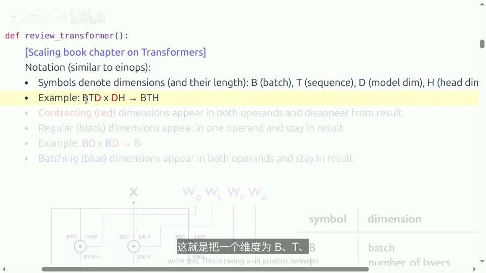 |
| 这是一般情况。还有一种情况：如果你有蓝色维度，那说明它们是批处理维度，既出现在两个操作数里、也保留在结果中，它们不会被收缩或缩减。好，所以这里的含义是——就像我们后面会看到的——对每个序列和 token 位置，我们都有这样一个 tensor，里面是一个向量，你想把它乘以一个 matrix。这里你基本上就是在两个 tensor 之间…… [【跳转到 08:16】](https://www.bilibili.com/video/BV11LEA6eEuj/?p=10&t=496) | 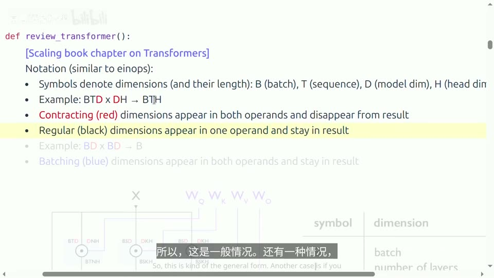 |
| 做一系列点积运算。好，有了这个概念，这就是 transformer 模块完整形态的描述，所以它看起来有点像电路图。这里细节很多，但我觉得这可能是对"transformer 是什么"最清晰的定义了。你会看到很多关于 transformer 的描述，坦白说其中很多都让人很难真正理解到底发生了什么。 [【跳转到 08:41】](https://www.bilibili.com/video/BV11LEA6eEuj/?p=10&t=521) | 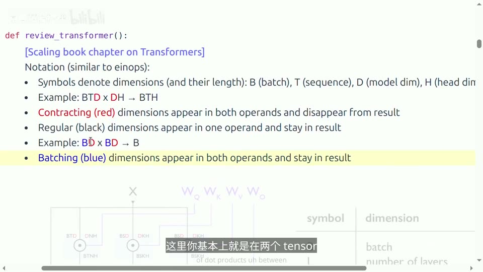 |
| 这个版本基本上会告诉你张量（tensor）的确切形状，这样你就能理清它们之间的依赖关系了。所以对于一个 transformer 模块，你会先取出 X，也就是某一层的激活值，把它输入注意力机制，然后再输入 MLP。简单复习一下：X 是用查询矩阵、键矩阵和值矩阵投影出来的。你看这里，N 代表头的数量…… [【跳转到 09:06】](https://www.bilibili.com/video/BV11LEA6eEuj/?p=10&t=546) | 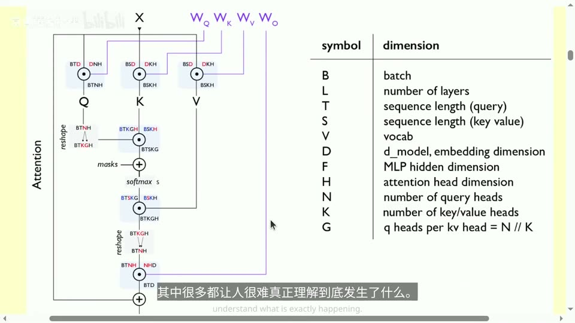 |
| H 是每个头的维度。所以查询矩阵的形状就是 batch×sequence（序列）×头的数量×每个头的维度。而对于 K 和 V，我们不用 N 而是用 K，这个我们待会儿会看到，它对应的 key/value head 数量可能更少。接下来是注意力操作，注意这里涉及批处理维度…… [【跳转到 09:31】](https://www.bilibili.com/video/BV11LEA6eEuj/?p=10&t=571) | 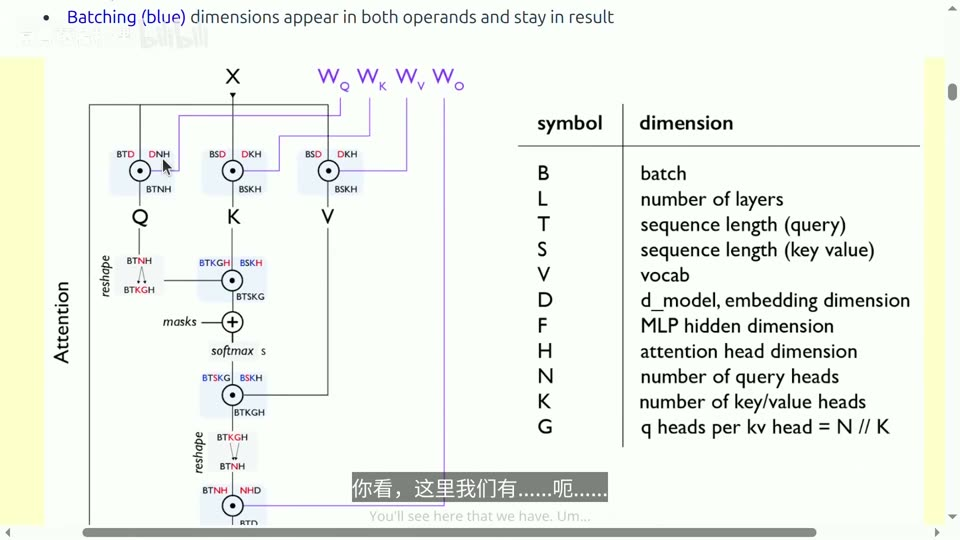 |
| 所以 B 在两处都出现，我们在 head 维度上做收缩。咱们稍后再回过头看：为什么 B 同时出现在两处会让 inference 变得困难，以及为什么 attention 会成为一个瓶颈。我想先把这个想法记住。MLP 其实特别简单直接，你只需要做点矩阵乘法：就是门控部分、这是个上投影矩阵…… [【跳转到 09:56】](https://www.bilibili.com/video/BV11LEA6eEuj/?p=10&t=596) | 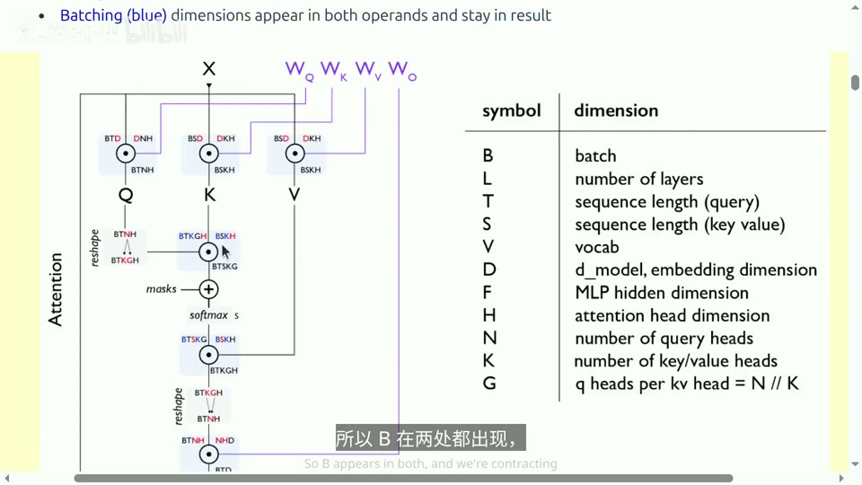 |
| 还有个下投影矩阵。我觉得你们之前都实现过这个，所以我不打算细讲，只是换一下符号表示。按惯例，咱们假设 MLP 会把低维的模型维度扩展到四倍，所以以后看到 F，你就把它当成 4D 来看。然后模型维度会被拆分到 N 个 head 上，所以模型维度永远等于 head 的数量乘以每个 head 维度。 [【跳转到 10:21】](https://www.bilibili.com/video/BV11LEA6eEuj/?p=10&t=621) | 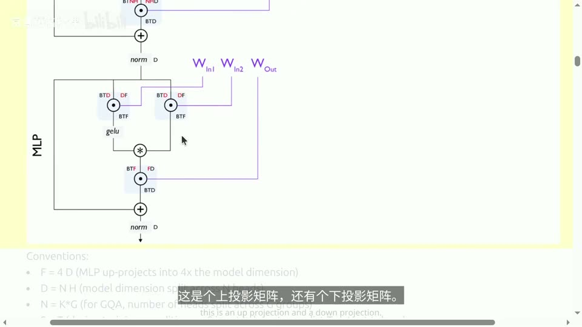 |
| 以分组查询注意力（group query attention，GQA）为例，head 的总数会拆分成组数和每组的 head 数。最后我们有 S 和 T 两个变量，它们都表示序列维度。两者的区别在于：S 指的是输入 token 的数量，而 T 则代表输出 token 的数量。所以在训练阶段这两个值是一样的，因为模型是把所有输入直接当作输出来…… [【跳转到 10:46】](https://www.bilibili.com/video/BV11LEA6eEuj/?p=10&t=646) | 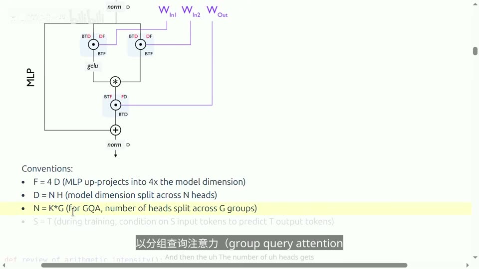 |
| 预测的。到了 inference 阶段，T 固定为 1，而输入部分是 S。好，咱们再来回顾一下算术强度（arithmetic intensity），这我在第二章里讲过。先做个热身练习：假设我们要做两个矩阵的乘法，一个是 B×D 的矩阵，另一个是 D×F 的矩阵。直观来看，B 代表批次维度，D 是隐藏维度即模型维度…… [【跳转到 11:11】](https://www.bilibili.com/video/BV11LEA6eEuj/?p=10&t=671) | 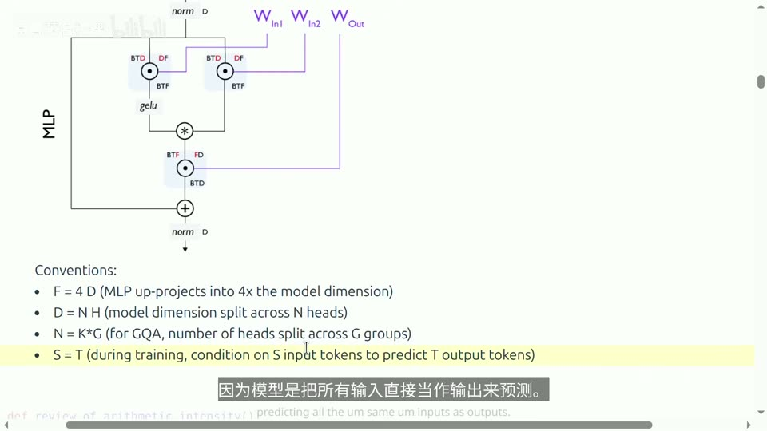 |
| 而 F 则是 MLP 中的上投影维度。回想一下算术强度到底是什么：我们要算两样东西——浮点运算量和内存搬运量。咱们这么算：你要做矩阵乘法，具体得干嘛呢？记得咱们系统课讲过的吗？你得先从 HBM 把 X 读出来，假设你全用 bf16 存数据，推理时通常就是这样，那这部分数据量就是 2×B×D。 [【跳转到 11:36】](https://www.bilibili.com/video/BV11LEA6eEuj/?p=10&t=696) | 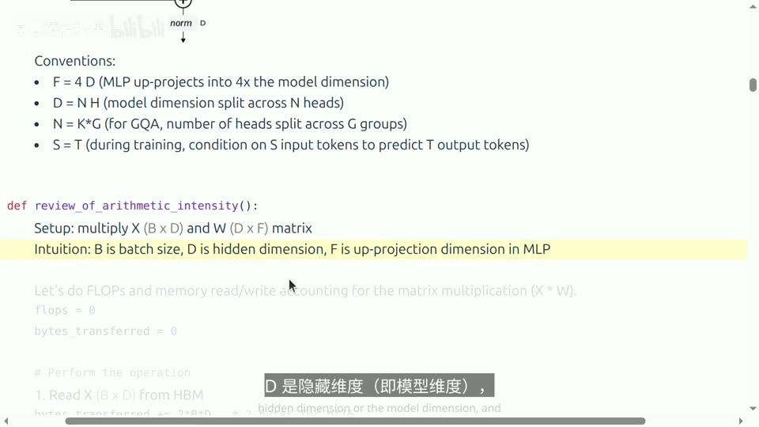 |
| 接着你要读权重 W，这又得加上 2×D×F，然后做矩阵乘法。所以浮点运算量是 2×B×D×F。最后还得写回去。所以你看，每次读写基本上就是数据条目的总数，这差不多是个二次的，而矩阵乘法是三次的。记住这点很关键，因为只有这样你才能实现高算术强度。 [【跳转到 12:01】](https://www.bilibili.com/video/BV11LEA6eEuj/?p=10&t=721) | 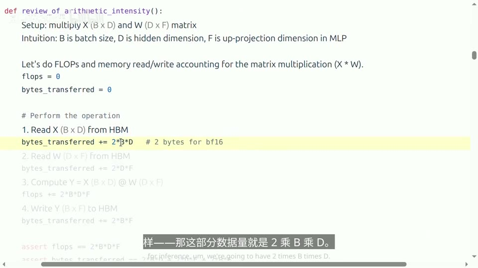 |
| 所以总的浮点运算次数就是那个三次的，而传输的字节数则是读写之和。好，记住算术强度就是每传输一个字节所做的计算量，我们希望这个值越高越好。所以强度等于浮点运算次数除以传输字节数。这里我用符号来表示这些量，因为这样比用具体数字更直观、更好处理。 [【跳转到 12:26】](https://www.bilibili.com/video/BV11LEA6eEuj/?p=10&t=746) | 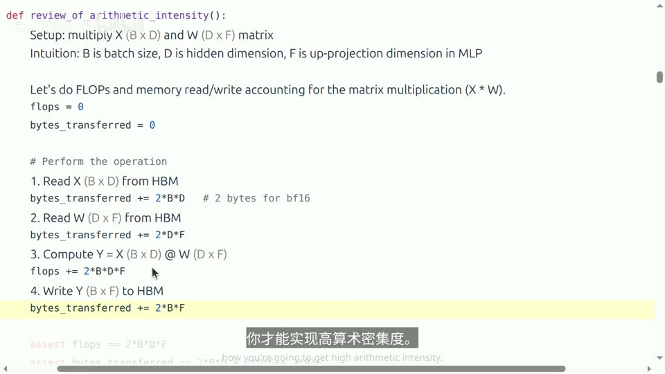 |
| 那我们可以做一个简化假设：这里的 batch 维度远小于 D 和 F，那就可以简化这个式子。具体来说，这里假设 D 等于 c×B、F 等于 c×B，并令 c 趋向于无穷大，这样 D 和 F 都很大而 B 相对较小，该式就简化为 B 的强度。所以总结一下…… [【跳转到 12:51】](https://www.bilibili.com/video/BV11LEA6eEuj/?p=10&t=771) | 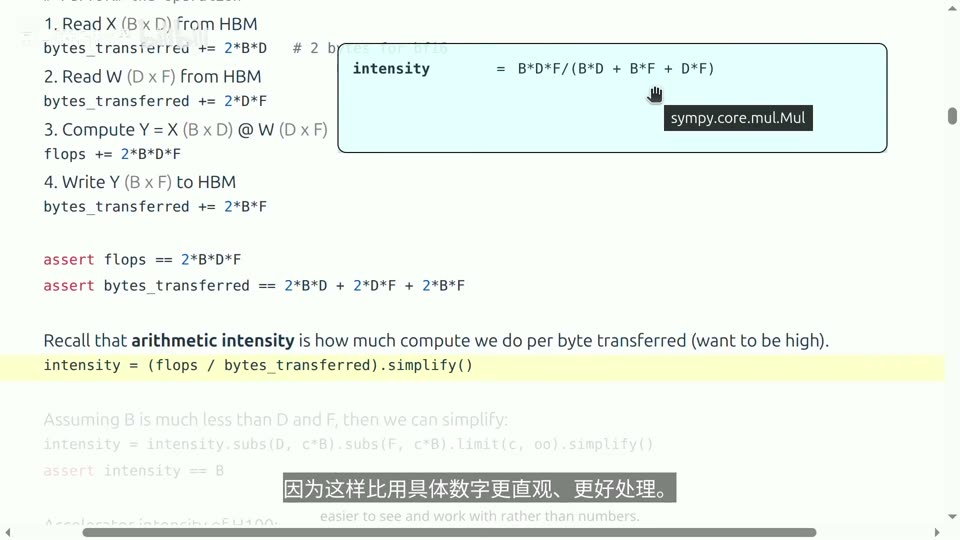 |
| 大家还记得咱们之前算矩阵乘法的计算强度吗？结果大概是 N/3。嗯，这跟之前的情况类似，只不过之前只有一个变量来表示含义，咱们现在用的是非方阵而不是方阵。好，为了做个对比，硬件的计算强度是这样看的：先看规格书里的每秒浮点运算数（FLOPs），再看内存带宽，也就是内存在高带宽…… [【跳转到 13:16】](https://www.bilibili.com/video/BV11LEA6eEuj/?p=10&t=796) | 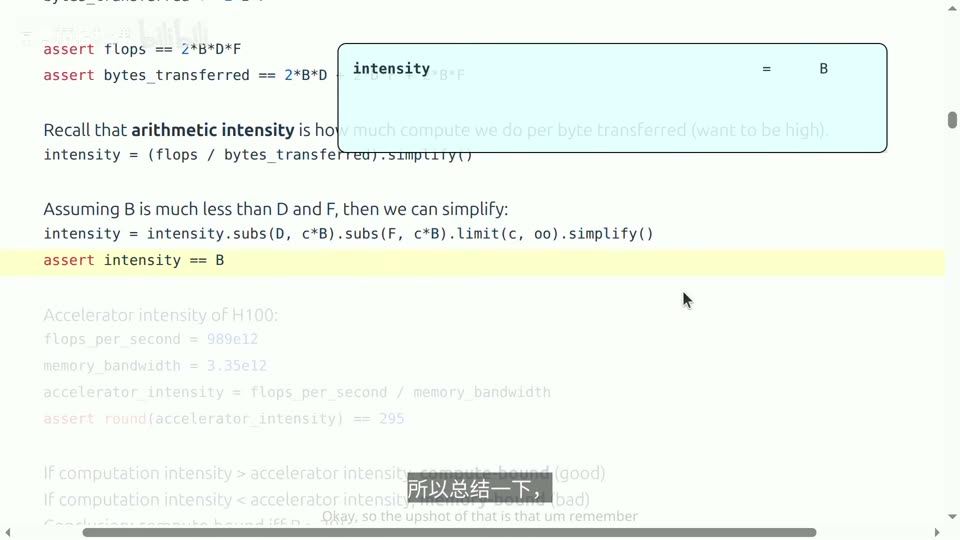 |
| 内存（HBM）之间的传输速度。把这两个数一除就算出了计算强度。接下来，把你算出来的计算强度跟硬件的计算强度比一比：如果比它大，那就说明你受限于计算能力，也就是计算瓶颈，这是好事。所以以 H100 为例，针对这个特定的矩阵乘法，如果批次大小超过 295…… [【跳转到 13:41】](https://www.bilibili.com/video/BV11LEA6eEuj/?p=10&t=821) | 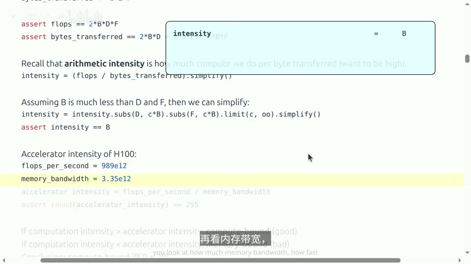 |
| 你就处于计算瓶颈状态。咱们来看个极端情况：假设你只有一个样本。如果你只有一个样本，那算术强度（arithmetic intensity）大约是 1，这时候就会受限于内存带宽。你大概能看出这里发生了什么：你在读取这个 D×F 矩阵，但 B 只有 1，所以你实际上只做了 2×D×F 次浮点运算…… [【跳转到 14:06】](https://www.bilibili.com/video/BV11LEA6eEuj/?p=10&t=846) | 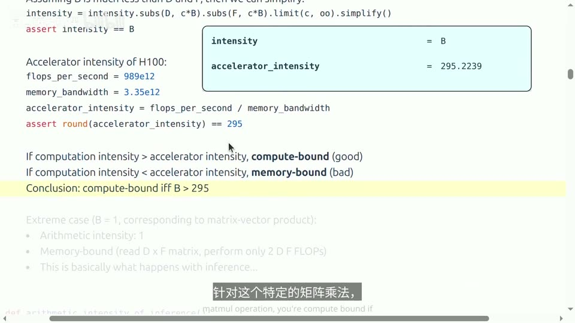 |
| 这基本上就是你在 inference 阶段会遇到的工作负载：你拿到的不是完整的矩阵，而是这种非常薄的矩阵或张量。好，我先讲到这里，看看大家有没有什么问题。 [【跳转到 14:31】](https://www.bilibili.com/video/BV11LEA6eEuj/?p=10&t=871) | 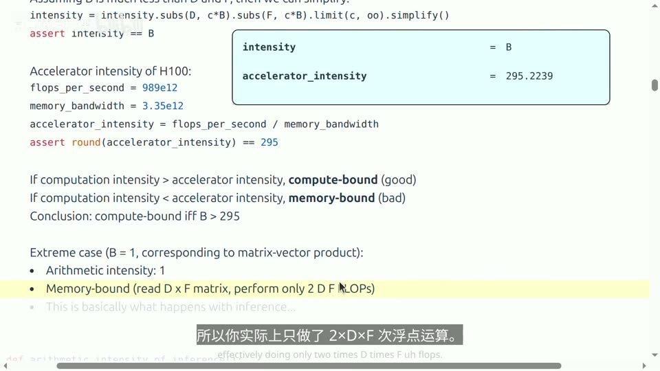 |
| （课堂问答）抱歉，这个我没法引用，咱们在这些动作里搜一圈。我能跨着搜吗？就是跨域、跨域……哦，还得检查这个交叉点。对，这意思是所有动作都要跨域吗？对。到底哪些在动，我有点搞不清这个关联。嗯，咱们看看，就是这里的组数、S 等等，我就是确认一下。嗯，K 是 key/value heads 的数量…… [【跳转到 14:47】](https://www.bilibili.com/video/BV11LEA6eEuj/?p=10&t=887) |  |
| （课堂问答）还有，所以你有 Q……抱歉，是 G，抱歉，G 用于 kv heads。是的，对应关系……（此处问答录音不清） [【跳转到 15:12】](https://www.bilibili.com/video/BV11LEA6eEuj/?p=10&t=912) | 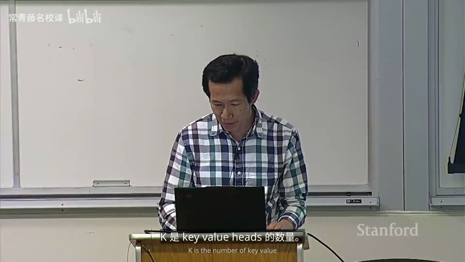 |
| （课堂问答）我重复一遍：这意味着我们有三个……这是个问题。好，我觉得你说得对，所以 K 代表组的数量，G 代表每个组里的头数。好的，谢谢，我回头会修正这一点，谢谢。好，那我们再多聊聊推理过程中的算术强度。 [【跳转到 15:37】](https://www.bilibili.com/video/BV11LEA6eEuj/?p=10&t=937) |  |
| 我们可以这样理解推理过程中发生的情况。假设你用最朴素的方式来做：这里有个 prompt，内容是 "never gonna give you"，输入到 transformer，transformer 会生成 keys、values 和 activations，最终在输出词表上生成 logits，接着采样出一个 token。 [【跳转到 15:57】](https://www.bilibili.com/video/BV11LEA6eEuj/?p=10&t=957) | 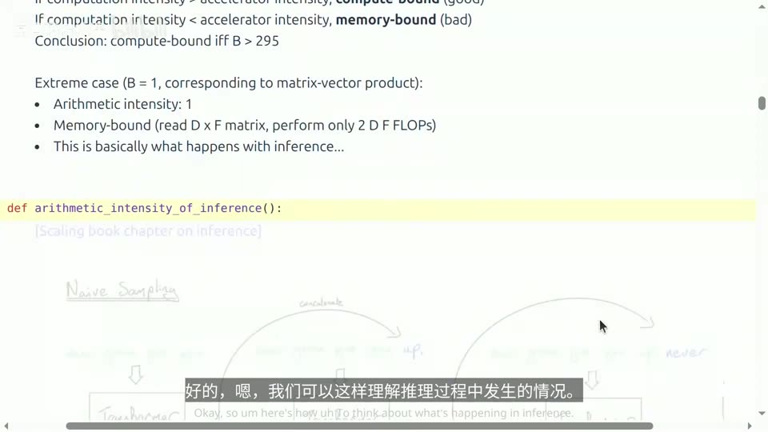 |
| 把它拼接到 prompt 后面，然后你不断重复，生成 "never"、把它接在 prompt 后面，以此类推。好吧，这就是最基础的做法。如果你有个黑盒，输入序列就能输出 token 分布，transformer 正是如此，那你直接反复套用就行。是行得通，但效果真的很差。因为每生成一个 token…… [【跳转到 16:22】](https://www.bilibili.com/video/BV11LEA6eEuj/?p=10&t=982) | 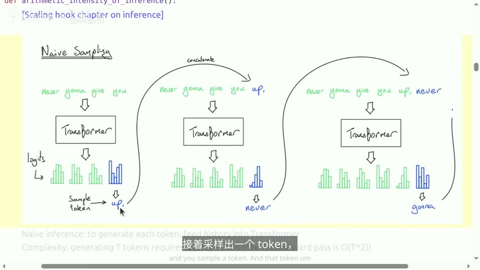 |
| 你实际花费的时间是 O(T) 的量级，这里的 T 就是你目前为止生成的 token 总数。OK，所以生成 T 个 token 的复杂度其实是 T 的三次方，明白了吧？因为注意力机制本身的计算量就是 T 的平方，这部分是绕不开的。也就是说每个 token 都要算一遍，所以这效率挺低的。 [【跳转到 16:47】](https://www.bilibili.com/video/BV11LEA6eEuj/?p=10&t=1007) | 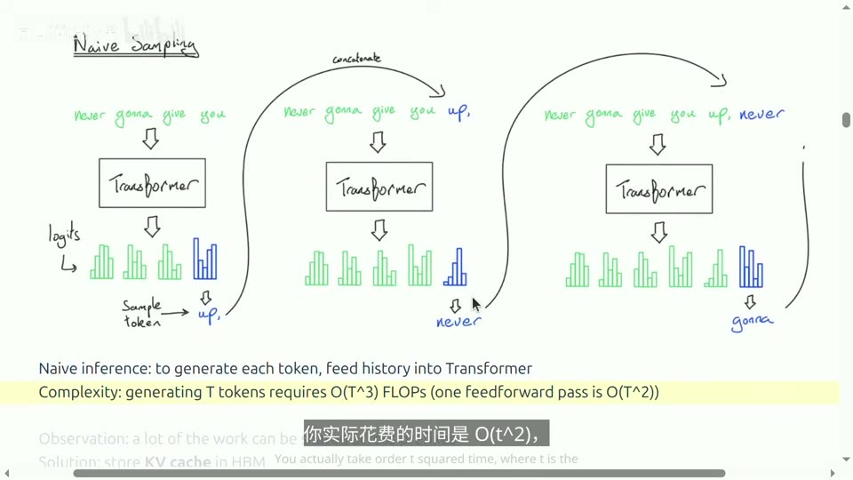 |
| 不过我们发现其实没必要这么算，其实很多计算是可以跨前缀复用的。打个比方，比如你生成 "never" 或者 "up"，你会发现很多键值（key/values）是重复计算的。比如 "never gonna give you up" 这句前面的 token 其实是不变的，对吧？这是因为我们用的是因果 transformer。如果是双向模型，那你加个新 token…… [【跳转到 17:12】](https://www.bilibili.com/video/BV11LEA6eEuj/?p=10&t=1032) | 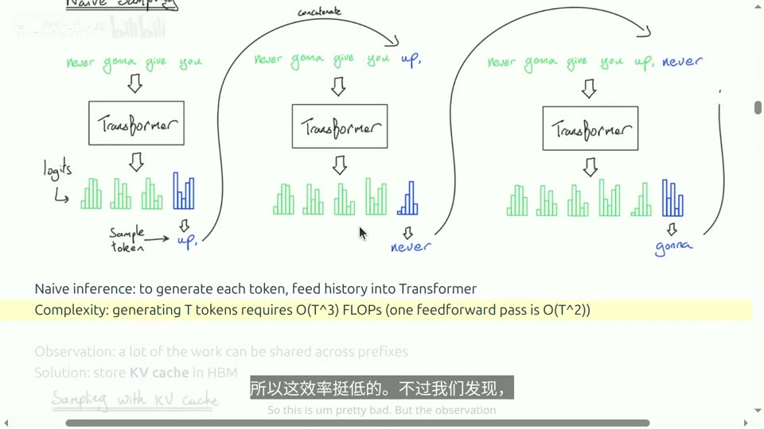 |
| 前面的所有状态都得变。但在因果模型里，你往后追加 token，前面这些激活值（activations）是不会变的。基于这个观察，最显而易见的做法就是存一个 KV 缓存、存在 HBM 里，这样在连续生成 token 之间你就能直接复用之前的 KV 缓存。也就是说，当你要生成 "gonna" 的时候，其实不用再去重新计算这些…… [【跳转到 17:37】](https://www.bilibili.com/video/BV11LEA6eEuj/?p=10&t=1057) | 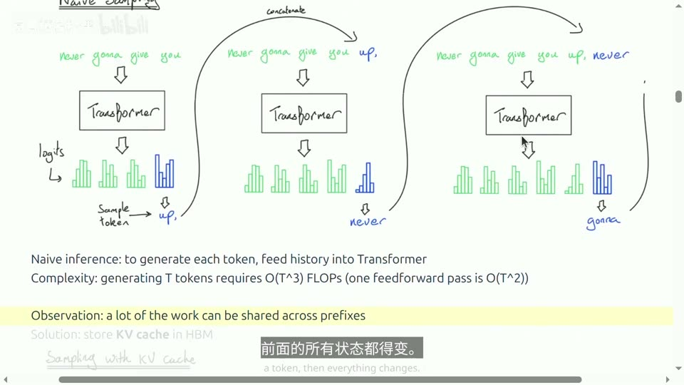 |
| 之前 token 的所有键和激活值了。所以这就是用上 KV 缓存之后的样子。好，这里分两个阶段：先是预填充（prefill），你先拿到 prompt，把 KV 缓存填满，也就是 transformer 算出来的那些键值对；然后你就开始生成，用的还是跟之前一样的计算。现在你就有了这个 KV 缓存…… [【跳转到 18:02】](https://www.bilibili.com/video/BV11LEA6eEuj/?p=10&t=1082) |  |
| 然后从这个分布里你采样出一个 token。现在你把它喂给 transformer，它会用到这个缓存，接着输出下一个 token 的概率分布，并生成一个新的 KV 缓存——这基本上就是对应到该 token 的激活值。然后这个结果被输入回去，现在你的 KV 缓存增强了，有了这些 logits 进行采样，再把它喂给 transformer…… [【跳转到 18:27】](https://www.bilibili.com/video/BV11LEA6eEuj/?p=10&t=1107) |  |
| 输出下一个 token 的分布以及下一个新的 token，你把它加到 KV 缓存里，如此反复循环。好，KV 缓存在形式上是……对每个序列而言的，所以有 B 个序列；对每个 token 有 S 个；对每一层、在每个 head 中…… [【跳转到 18:52】](https://www.bilibili.com/video/BV11LEA6eEuj/?p=10&t=1132) | 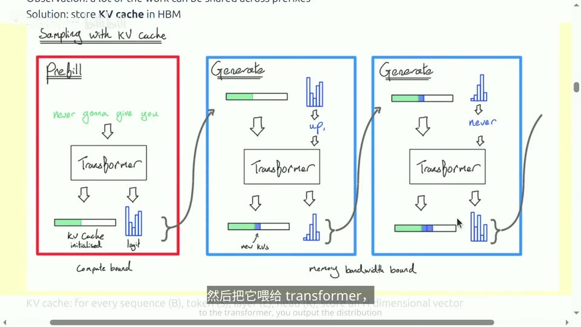 |
| 你存储每个维度的向量。好，再强调一下：在 inference 阶段，首先是 prefill，你拿到一个 prompt，把它编码成这些向量，这跟训练时一样是可以并行的，因为你能看到完整的 prompt，就可以计算出 KV cache。然后在生成阶段，你就按顺序逐个生成新的响应 token；但至少对于已经看过的 token，你不用再花开销去计算它们的 KV cache。 [【跳转到 19:17】](https://www.bilibili.com/video/BV11LEA6eEuj/?p=10&t=1157) | 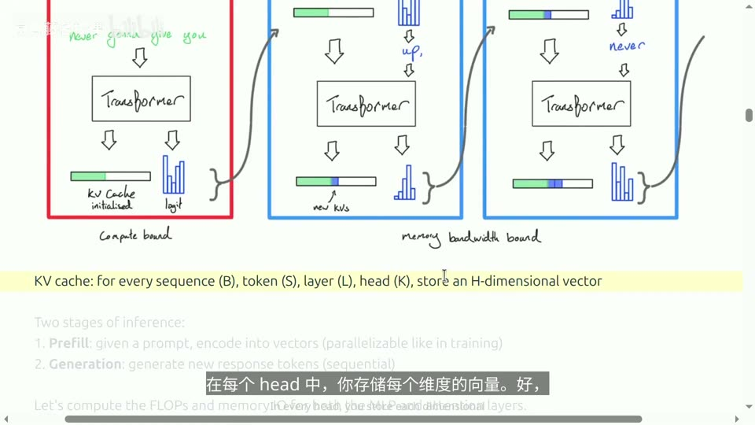 |
| 好，大家对 KV cache 都清楚了吗？关于这部分还有什么问题吗？好，那咱们来算算 FLOPs 和内存，也就是 MLP 层和注意力层的 IO。记住 S 是我们作为条件的 token 数量，而 T 是我们要生成的 token 数量。咱们先做一个抽象的推导，后面再具体到 prefill 阶段（此时 T 等于 S）和生成阶段…… [【跳转到 19:42】](https://www.bilibili.com/video/BV11LEA6eEuj/?p=10&t=1182) | 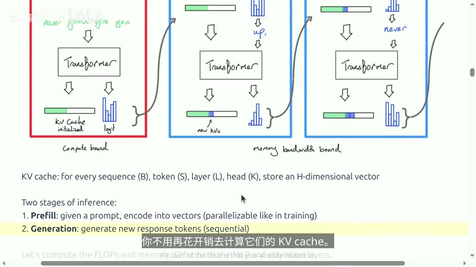 |
| 此时 T 等于 1。咱们先看 MLP 层。整个推导过程我都只看矩阵乘法，因为真正费计算量的就是它，剩下的部分浮点运算量不大，而且可以合并到矩阵乘法里。好，咱们来算一下，这跟矩阵计算一样，这部分我大概就不细讲了，也不会逐一去抠每个细节。不过大致的形式就是：你去读取，把 X 从内存里读进来…… [【跳转到 20:07】](https://www.bilibili.com/video/BV11LEA6eEuj/?p=10&t=1207) | 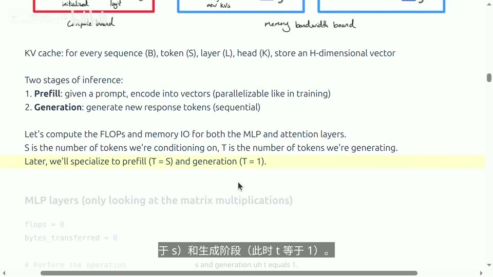 |
| 你读出所有参数，然后计算上投影，接着把它写入 HBM；然后计算门控、写入 HBM；然后你计算——简单来说就是做一下这个向下投影，再把它写到 HBM 里。好，那 FLOPs 的数值就取决于 B、T、D 和 F 这几个变量。 [【跳转到 20:32】](https://www.bilibili.com/video/BV11LEA6eEuj/?p=10&t=1232) | 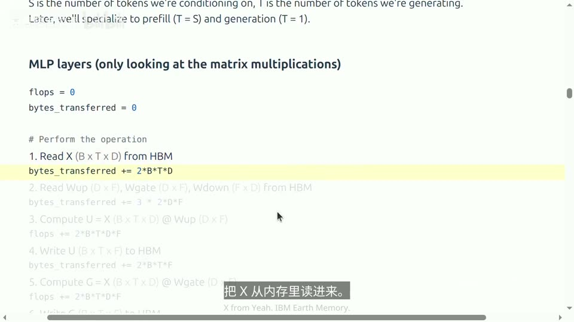 |
| 也就是批量大小、序列长度、模型维度，还有前馈维度（MLP 维度）。而传输的字节数就是上面这个表达式。好，现在咱们就能算出算术强度了，也就是 FLOPs 除以传输的字节数。这就是个表达式，咱们还是像之前那样假设 B×T 远小于 D 和 F，有了这个假设…… [【跳转到 20:57】](https://www.bilibili.com/video/BV11LEA6eEuj/?p=10&t=1257) | 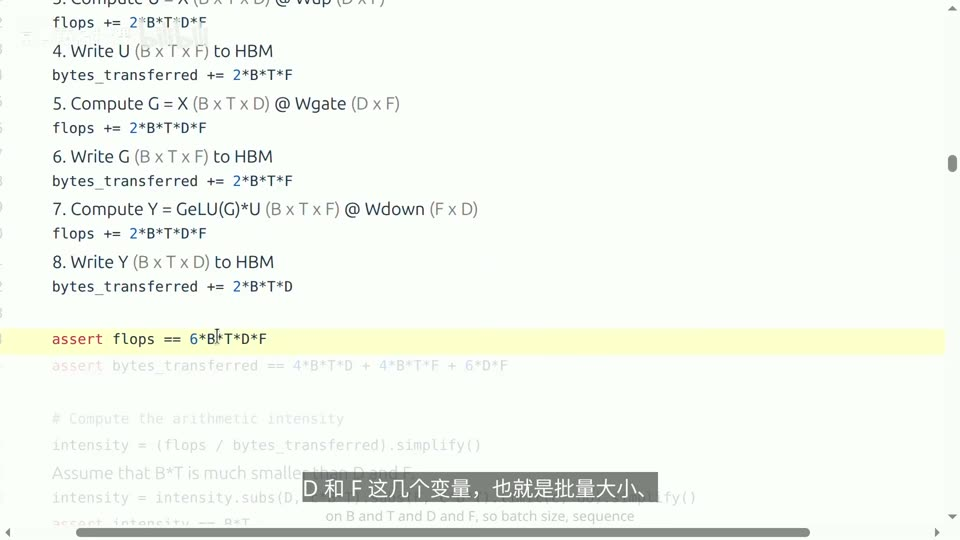 |
| 咱们就能看出强度其实就是 B×T。好，这跟矩阵乘法的情况很像，虽然矩阵和维度多了不少，但本质上是一回事。这很合理，MLP 本质上就是一次大的矩阵乘法，而且这也说得通，因为批量维度和序列长度维度基本上互不影响、各自独立。接下来我们看 MLP，它内部没有交互…… [【跳转到 21:22】](https://www.bilibili.com/video/BV11LEA6eEuj/?p=10&t=1282) | 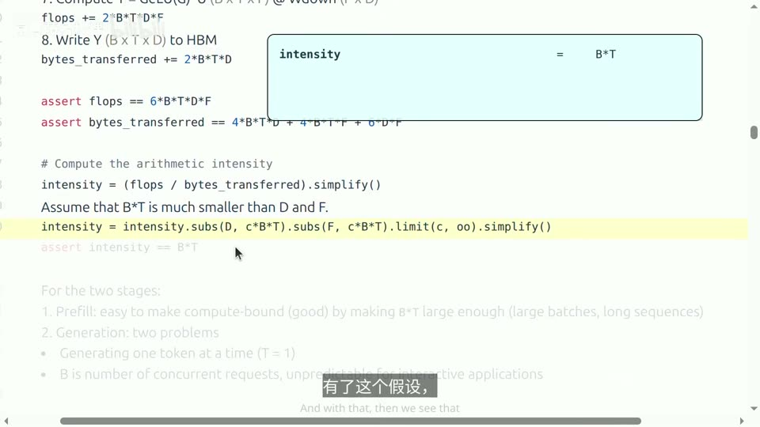 |
| attention 的情况就不一样了。所以就是 B×T。只要在预填充阶段把 B×T 设得足够大，用大批量、长序列，那就没问题。接下来看生成阶段，大家还记得生成阶段吧？这里有两个问题：第一，生成阶段 T 等于 1，也就是说你每次只生成一个 token。 [【跳转到 21:47】](https://www.bilibili.com/video/BV11LEA6eEuj/?p=10&t=1307) | 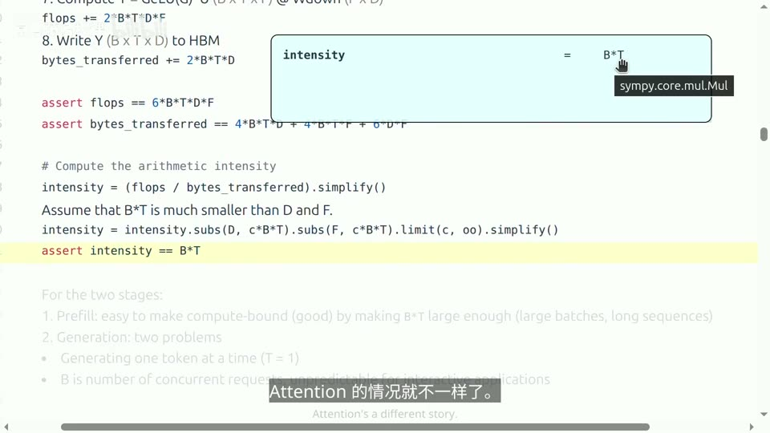 |
| 这就意味着你的算术强度会是 B。不过在生成阶段，B 指的是并发请求数——或者如果你是在做批处理，那还能稍微控制一下；但如果你是在服务一个 chatbot，那并发请求数基本上就是并发用户数，可能很高也可能很低，它会随时间变化。所以接下来讲连续批处理（continuous batching）时…… [【跳转到 22:12】](https://www.bilibili.com/video/BV11LEA6eEuj/?p=10&t=1332) | 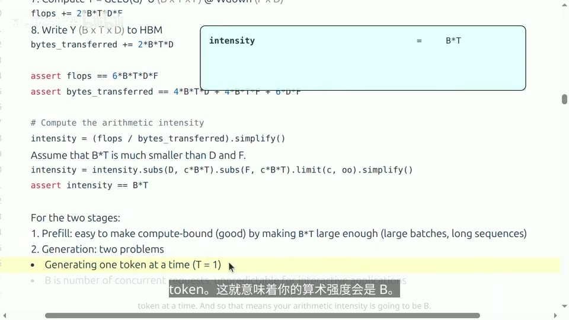 |
| 我们会解决这个问题。不过总的来说这还行，因为只要 batch 够大……序列长度其实帮不上什么忙，只要 batch 够大效果通常就没问题。咱们来看看注意力层：S 是已经生成的那些 token，T 则是你要生成的 token 数量。在注意力层里，你要从 HBM 读取 Q、K、V 矩阵…… [【跳转到 22:37】](https://www.bilibili.com/video/BV11LEA6eEuj/?p=10&t=1357) | 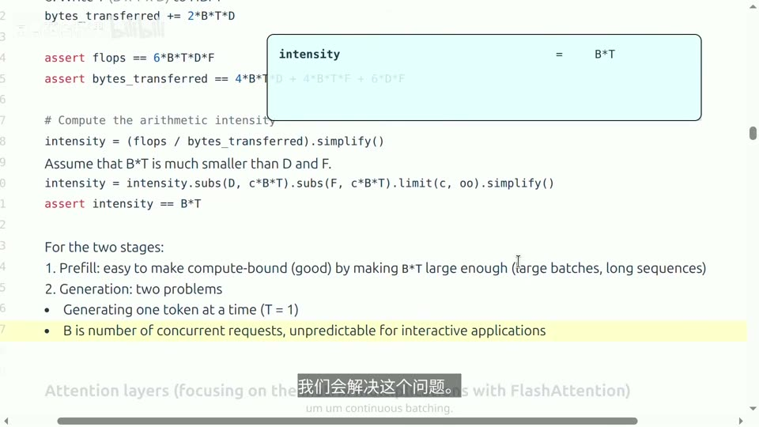 |
| 然后计算注意力，先 softmax——这步其实没那么重要——算出值矩阵，再把结果写回 HBM。好，那么 FLOPs 是 B×S×T×D，传输的字节数就是上面这个公式。所以你看，所有这些都是矩阵乘法，对吧？所以它的多项式阶数总会比传输的字节数高一阶。 [【跳转到 23:02】](https://www.bilibili.com/video/BV11LEA6eEuj/?p=10&t=1382) | 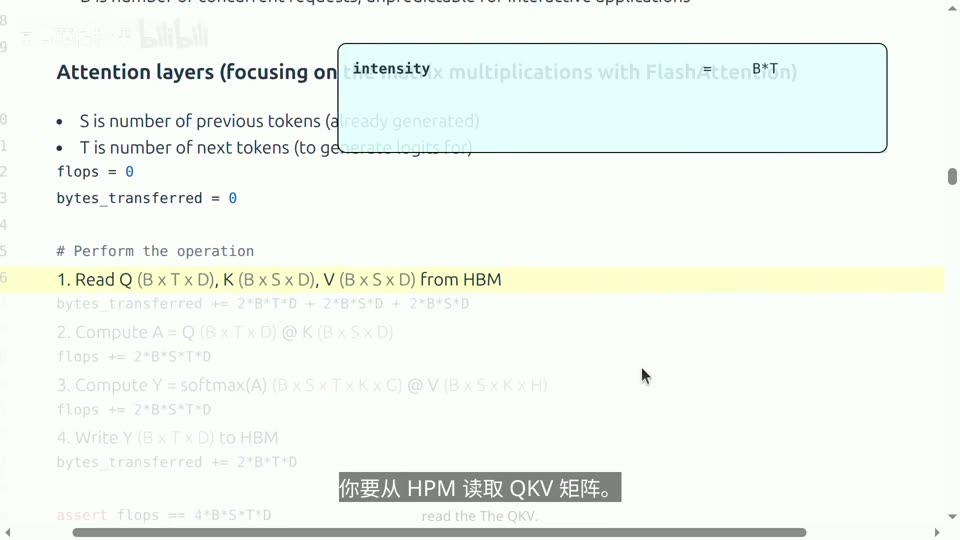 |
| 因为这是矩阵乘法，关键在于这个系数长什么样。对于注意力机制，该系数为 1/(1/S + 1/T)。好，咱们来看看预填充阶段。预填充阶段当 T 等于 S 时，计算强度是 S/2，这很好，对吧？只要序列够长…… [【跳转到 23:27】](https://www.bilibili.com/video/BV11LEA6eEuj/?p=10&t=1407) | 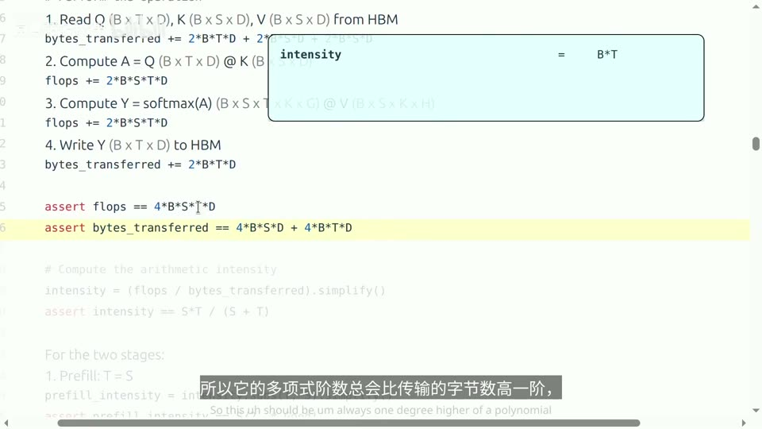 |
| 对于注意力机制，你能维持很高的计算强度。注意这里没有批处理维度，我待会解释为什么。等到了生成阶段，这就麻烦了。所以生成阶段的强度大约是 S/(S+1)，也就是接近 1。记住，强度只有 1 的话就糟了。 [【跳转到 23:52】](https://www.bilibili.com/video/BV11LEA6eEuj/?p=10&t=1432) | 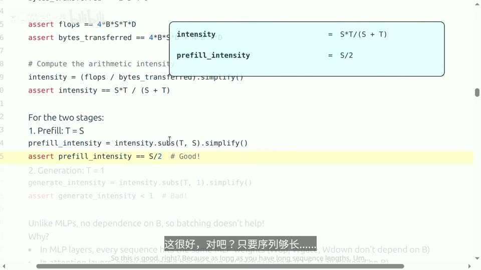 |
| 我们希望它达到 295 左右，好让 H100 把算力跑满。所以这确实就是瓶颈所在。我们刚才对 MLP、注意力机制做了所有这些分析，还有预填充、生成，我们发现这里存在瓶颈。所以咱们来琢磨一下：为什么它会是个瓶颈？ [【跳转到 24:17】](https://www.bilibili.com/video/BV11LEA6eEuj/?p=10&t=1457) | 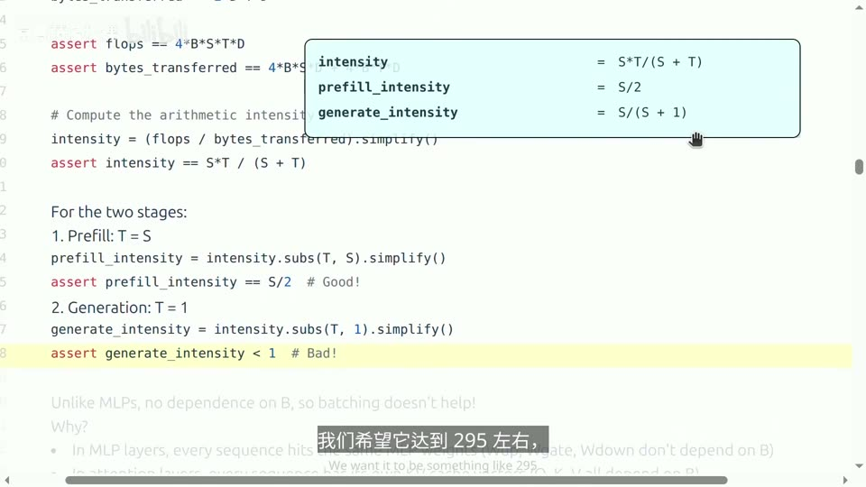 |
| 跟 MLP 不一样，其实 MLP 用来做生成是没问题的，只要你的批处理足够大就行。所以问题在于……说到机器学习，你知道，注意力机制就是这么回事。咱们来看看 MLP：每个序列用的都是同一组 MLP 权重。 [【跳转到 24:42】](https://www.bilibili.com/video/BV11LEA6eEuj/?p=10&t=1482) | 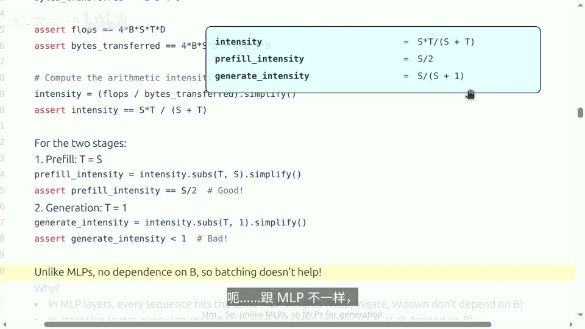 |
| 所以这些不依赖 B。但在注意力层里，每个序列都有自己的 KV 缓存，所以这些全都依赖于 B。所以你可以这么理解：在 MLP 这种场景下，有了 B 就意味着批量大、其实是有帮助的，因为这些 MLP 权重你大概只要加载一次…… [【跳转到 25:07】](https://www.bilibili.com/video/BV11LEA6eEuj/?p=10&t=1507) | 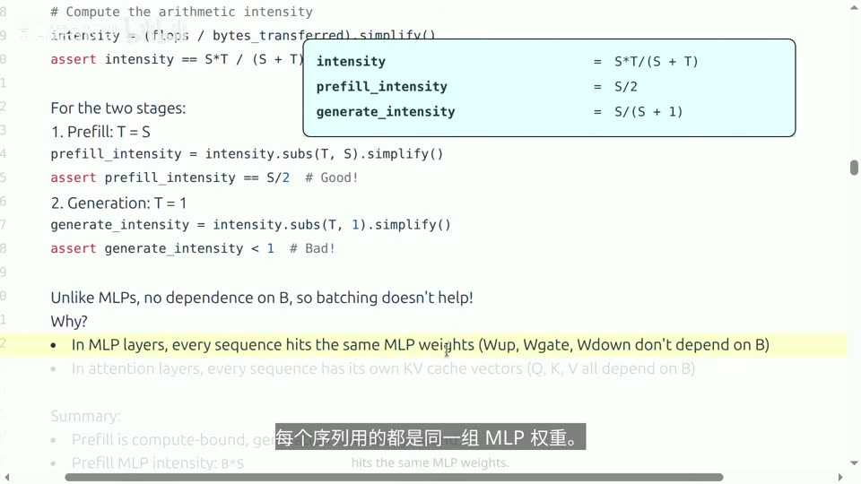 |
| 然后就能用它来处理所有的序列，这就是你能获得高算术强度的原因。简单点说：你加载一次权重，然后把整批数据都处理掉，这样就很好。但在注意力机制里就不行了，这些全都依赖于 B，所以增加 B 没什么用。对每个序列来说，你其实就是在做一次矩阵乘法…… [【跳转到 25:32】](https://www.bilibili.com/video/BV11LEA6eEuj/?p=10&t=1532) | 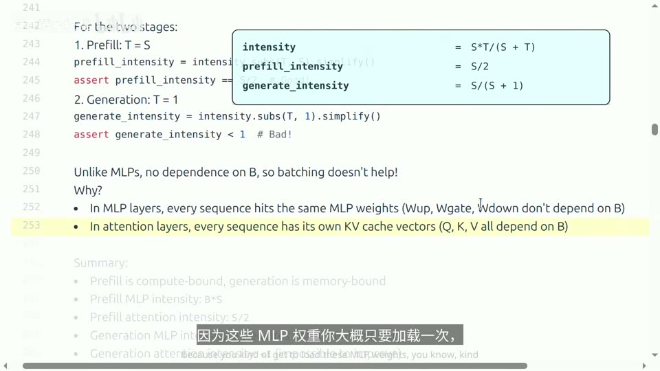 |
| 因为它们彼此独立，所以多做几次矩阵乘法也没什么用。还记得吗？刚开始的时候给你们看过这个例子，它的算术强度也很低——这不是矩阵乘法，因为我们本质上是在做批处理、是按坐标来的，这本质上跟做点积是一样的，而点积的算术强度糟糕透了。记住，这是在注意力机制里，这个蓝色的 B 正是算术强度…… [【跳转到 25:57】](https://www.bilibili.com/video/BV11LEA6eEuj/?p=10&t=1557) | 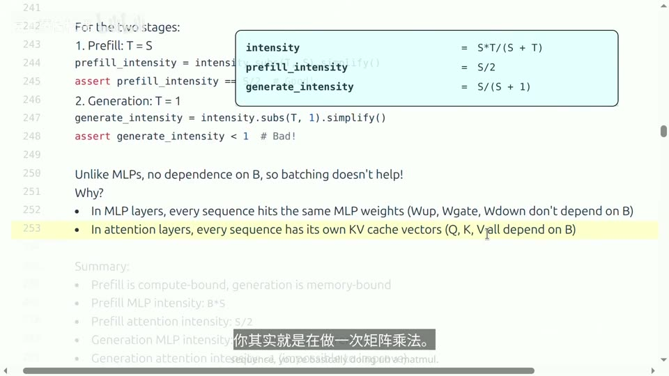 |
| 不随 B 缩放的原因所在，这就是个瓶颈。好，咱们总结一下：预填充阶段是计算受限的，生成阶段是内存受限的。所以如果你看预填充阶段的 MLP 算术强度，它是 B×S，这就对了；预填充阶段的注意力强度是 S/2，没那么理想但还能用。到了生成阶段，MLP 强度虽然也能应付…… [【跳转到 26:22】](https://www.bilibili.com/video/BV11LEA6eEuj/?p=10&t=1582) | 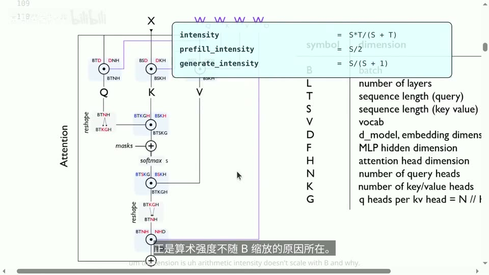 |
| 但这要求请求并发量很大。真正棘手的根本瓶颈是生成阶段那极低的注意力强度。就是这么回事，只要你还用 transformer，这个问题就没法真正解决。先停一下，大家有问题吗？接下来，每当你们听到大家常说"inference 是内存受限的"，现在你们应该明白为什么了。好…… [【跳转到 26:47】](https://www.bilibili.com/video/BV11LEA6eEuj/?p=10&t=1607) | 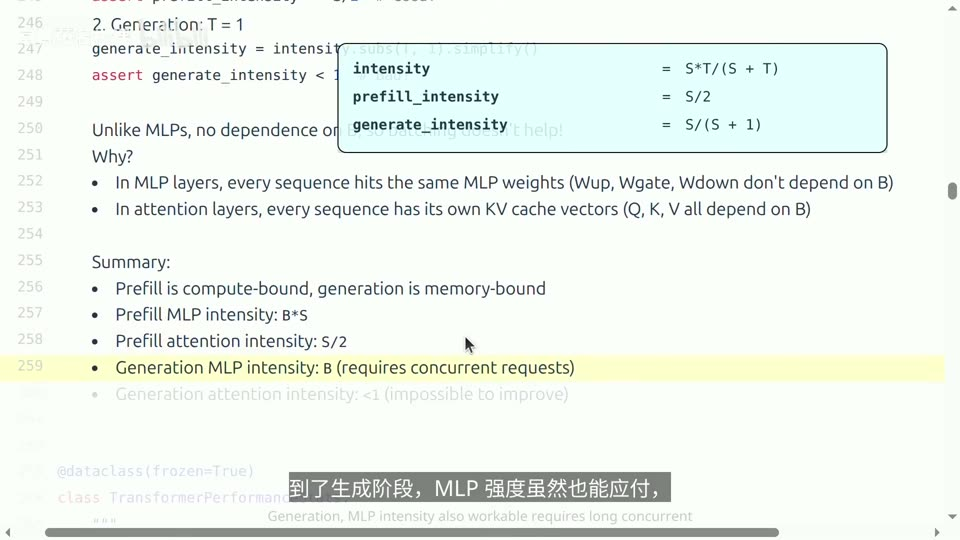 |
| 咱们接着用刚才的直觉和计算来聊聊 inference 的指标：吞吐量、延迟，还有 TTFT。所以 inference 是内存受限的。现在这么看，其实把很多事都简化了，因为咱们考虑耗时的时候，只要看需要传输多少内存就行——因为咱们假设通信和计算是重叠进行的。 [【跳转到 27:12】](https://www.bilibili.com/video/BV11LEA6eEuj/?p=10&t=1632) | 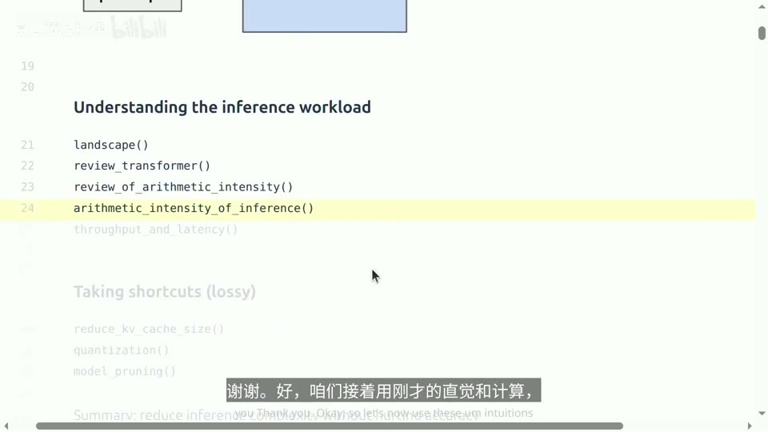 |
| 那瓶颈就只取决于你得处理多少内存。好，所以这某种程度上挺好，因为更简单了；但另一方面也挺让人头疼的，加速器就在那干坐着、什么也不干。好，那咱们用一个例子走一遍：比如 Llama 2 13B 跑在 H100 上，延迟和吞吐量各是多少？好，记得 Llama 2 13B 有个特定的结构形状…… [【跳转到 27:37】](https://www.bilibili.com/video/BV11LEA6eEuj/?p=10&t=1657) | 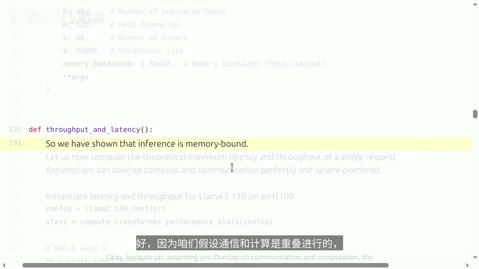 |
| 抱歉，这是序列长度、模型维度、前馈维度、查询头数，还有键值头数，所以 N 等于 K；还有头维度、层数、词表大小，以及 H100 的内存带宽。谢谢。好，咱们用这个配置来算一下…… [【跳转到 28:02】](https://www.bilibili.com/video/BV11LEA6eEuj/?p=10&t=1682) | 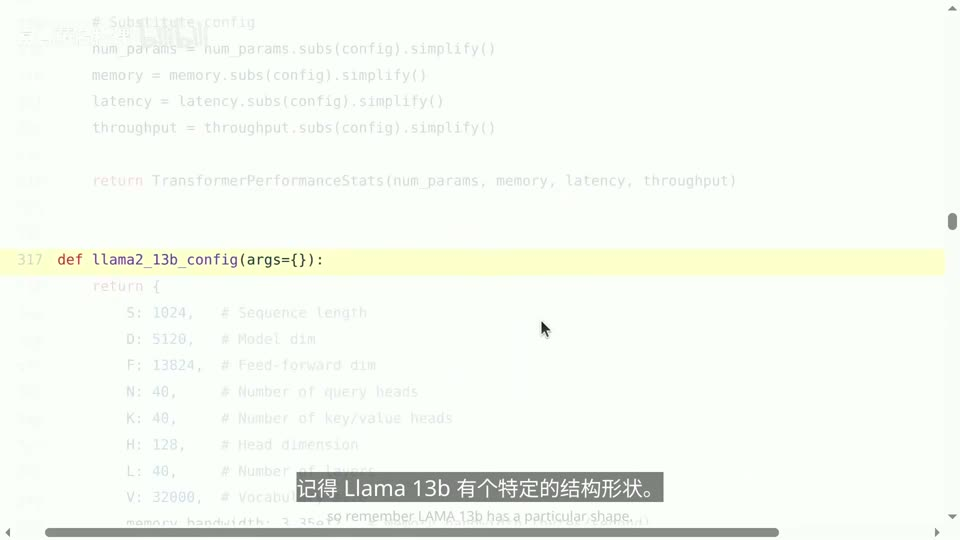 |
| transformer 的性能数据。好，这些是我们的输入。接下来我要算的统计指标如下：参数数量、内存占用、延迟，还有吞吐量。好，那首先咱们来看看到底是什么占用了资源——什么东西占内存？是参数，所以参数会占用内存，所以我们先算参数数量…… [【跳转到 28:27】](https://www.bilibili.com/video/BV11LEA6eEuj/?p=10&t=1707) | 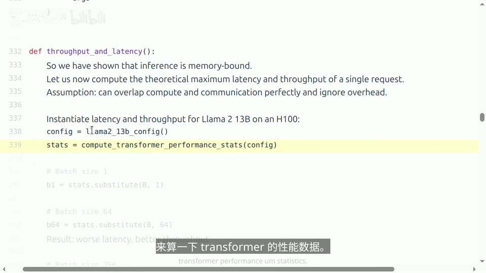 |
| 大家来看：嵌入层、MLP 层、KQV 的投影，把这些加起来你就得到了总的参数数量。假设我们用的是 bf16——做 inference 时一向如此——那参数就得占这么多字节。另外内存里还有 KV 缓存，KV 缓存的大小就是序列里的 token 数再乘上后面这几项…… [【跳转到 28:52】](https://www.bilibili.com/video/BV11LEA6eEuj/?p=10&t=1732) | 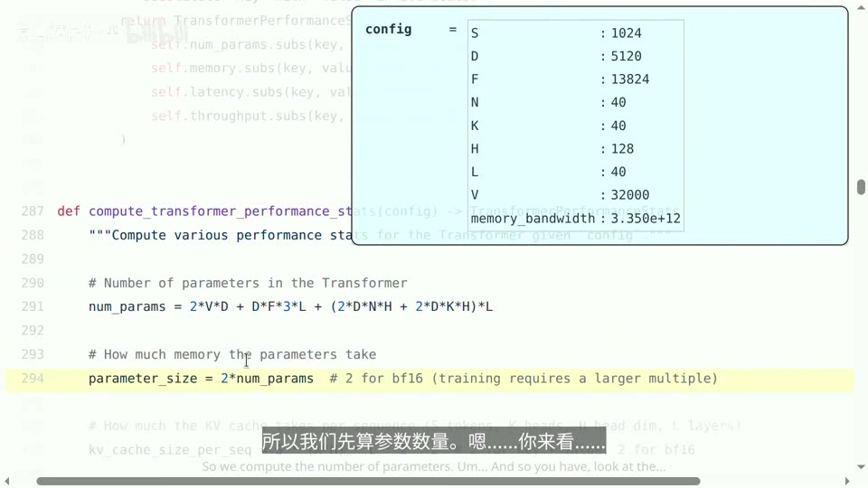 |
| 具体就是你的 head 数再乘以 kv head 数、乘以 head 维度，最后乘以层数。你得存一份 key、一份 value，然后因为用的是 bf16，还要再乘以 2。好，这就是 KV 缓存的大小。而总的内存占用，就是——这是单个序列的，你有 B 个序列，所以要乘以 B，再加上参数大小。 [【跳转到 29:17】](https://www.bilibili.com/video/BV11LEA6eEuj/?p=10&t=1757) | 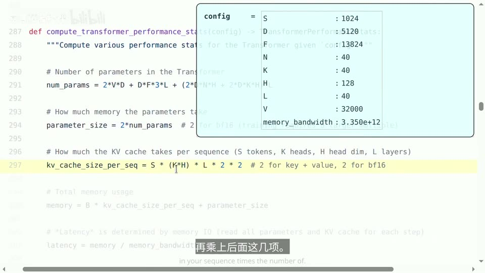 |
| 这就是你需要的内存量。现在，延迟是什么？它主要取决于内存 IO。因为推理过程受限于内存带宽，通常情况下，如果你能把通信和计算重叠起来，内存开销主要花在参数数据的来回搬运上。那数据要在 HBM 和 SRAM 之间来回传输…… [【跳转到 29:42】](https://www.bilibili.com/video/BV11LEA6eEuj/?p=10&t=1782) | 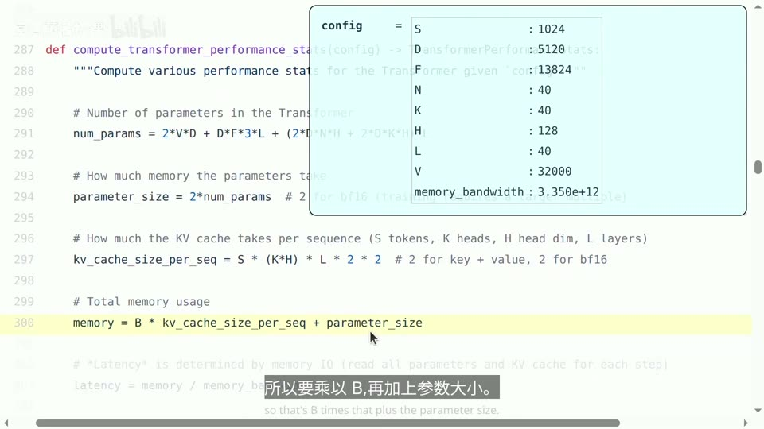 |
| 这就是移动数据所花的时间。而吞吐量是延迟的倒数，不过我们是并行生成 B 个 token，所以这里涉及两个指标：一个是每个 token 的秒数，另一个是每秒 token 数。另外因为你要处理一个大小为 B 的批次，数值上还会多出一个 B 的因子。好，那我们来算一下…… [【跳转到 30:07】](https://www.bilibili.com/video/BV11LEA6eEuj/?p=10&t=1807) | 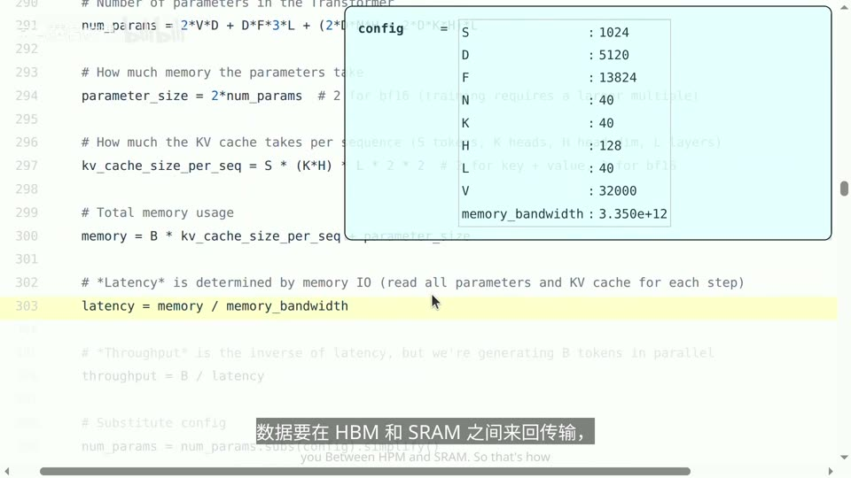 |
| 针对这个配置，这些指标的实际数值是多少？好，参数总量是 130 亿。所以有个很好的合理性检验——它号称是个 130 亿参数的模型。内存就是这一项，大概是若干 MB 乘以 B。 [【跳转到 30:32】](https://www.bilibili.com/video/BV11LEA6eEuj/?p=10&t=1832) | 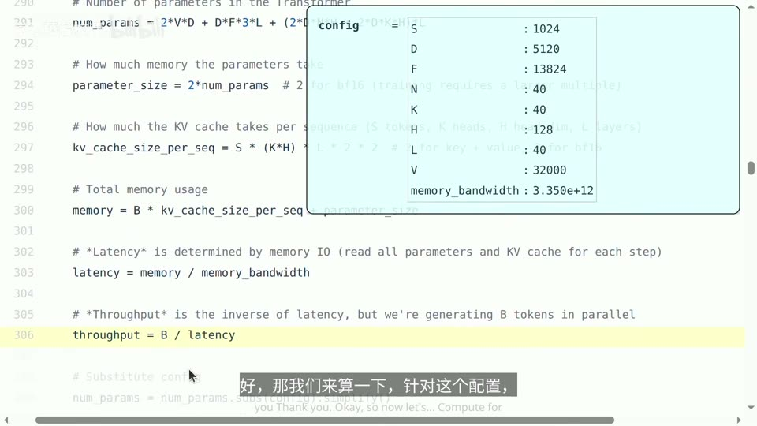 |
| 所以它基本上就是 B 的线性函数，再加上其他一些项。所以这是 KV cache，它随 B 增长；这是参数，是参数数量的两倍。现在延迟就是把这一项按内存带宽缩放，所以它的形式和内存相同。吞吐量就是 B 除以那个值。好…… [【跳转到 30:57】](https://www.bilibili.com/video/BV11LEA6eEuj/?p=10&t=1857) | 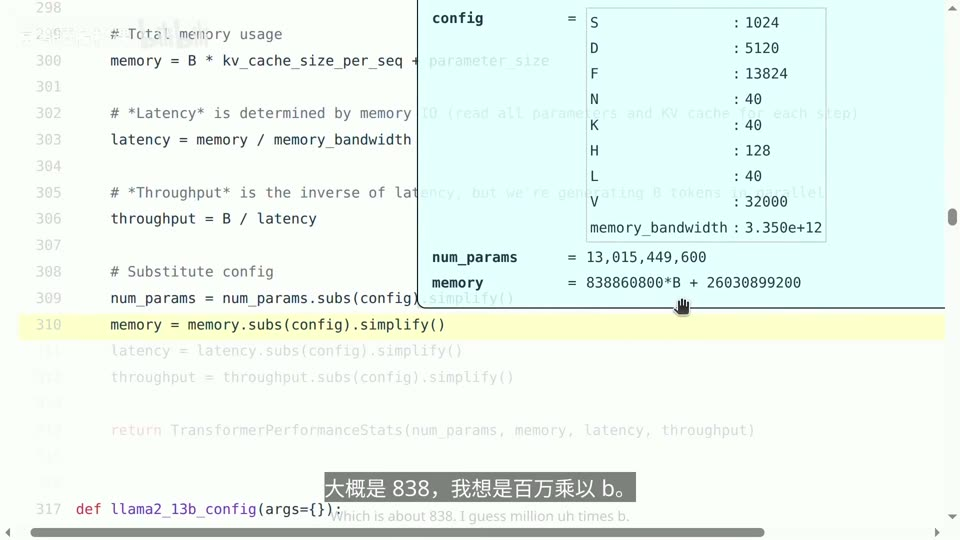 |
| 所以注意，当你增大 B 时，延迟会随之增长，因为 KV 缓存的大小会不断增加，而处理数据时需要反复复制 KV 缓存。接下来看吞吐量，它更有意思：随着批量大小 B 的增加，吞吐量确实会提高，但这有个上限。吞吐量之所以提升，是因为现在你把成本分摊到了更大的批次上。 [【跳转到 31:22】](https://www.bilibili.com/video/BV11LEA6eEuj/?p=10&t=1882) | 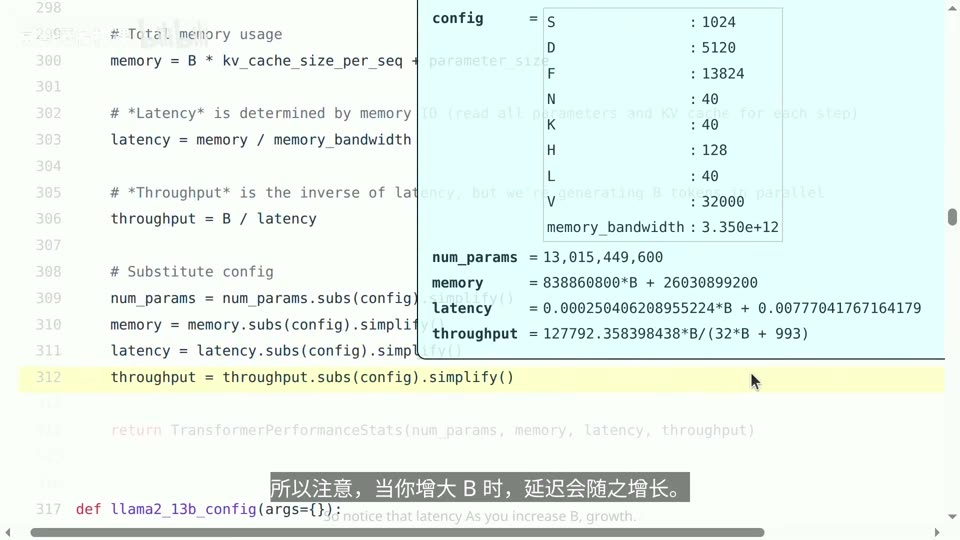 |
| 另外你处理这些数据的速度显然也在随时间提升。所以这就是所谓的渐近线，吞吐量不可能无限增长。好，目前为止大家有什么问题吗？你只需要记住一点：延迟是 B 的线性函数，这里的常数项是 KV 缓存的大小…… [【跳转到 31:47】](https://www.bilibili.com/video/BV11LEA6eEuj/?p=10&t=1907) | 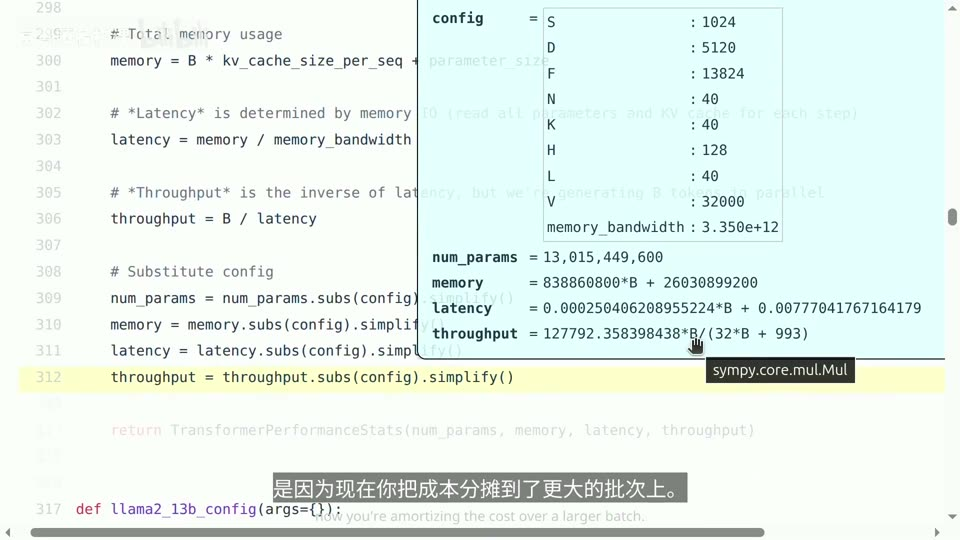 |
| 接着是参数量。然后就是吞吐量，确实存在上限，其比例大致相当于 B 除以 (B 加上某数值)。好，接下来咱们针对各种场景把这个模型具体化一下。假设你的 batch size 是 1，那结果就是这样的：你的 latency 会是 0.008 秒每个 token，而 throughput 则是每秒 124 个 token。 [【跳转到 32:12】](https://www.bilibili.com/video/BV11LEA6eEuj/?p=10&t=1932) | 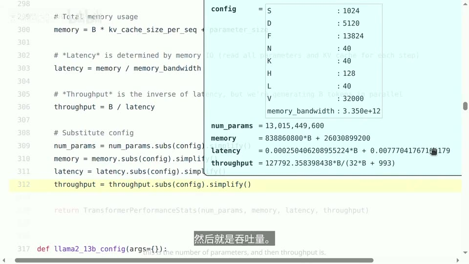 |
| 那么要是你增大 batch size 呢？你会发现 latency 变高了，不过 throughput 也会随之提升——也就是说 latency 变差了，但 throughput 却改善了。所以这挺有意思，因为我们总想着让它跑快一点，但这里的"快"其实有两层意思，具体看你看重哪一面，这两者甚至截然相反。如果你想调 batch size…… [【跳转到 32:37】](https://www.bilibili.com/video/BV11LEA6eEuj/?p=10&t=1957) | 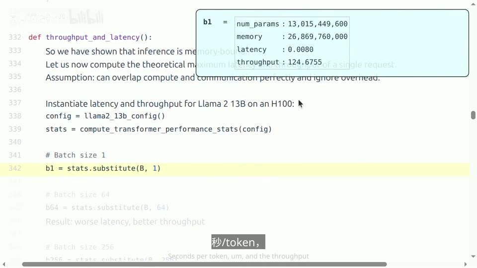 |
| 其实关系很大，它会决定你想要的是 latency 还是 throughput。那如果我们把它调大呢？咱们现在确实需要高吞吐量，因为要处理海量文档。咱们再把 batch size 往上提一提。好，这下 latency 就更差了——我是说，对，latency 是更差了，但 throughput 反而更高了。 [【跳转到 33:02】](https://www.bilibili.com/video/BV11LEA6eEuj/?p=10&t=1982) | 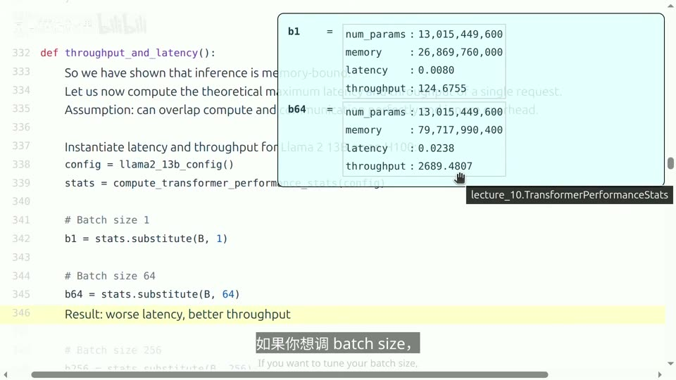 |
| 但主要问题是内存，你会把内存耗尽。KV cache 占用的内存会超过 H100 的显存上限。就算你有 B200，能把 batch size 调得更大，但最终还是会碰到瓶颈。所以你的吞吐量其实是有上限的，你没法达到那个理论极限，因为内存会成为瓶颈。 [【跳转到 33:22】](https://www.bilibili.com/video/BV11LEA6eEuj/?p=10&t=2002) | 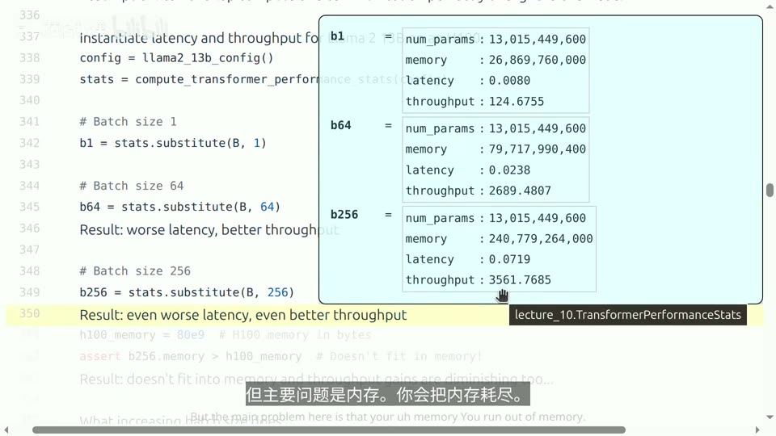 |
| 还有，随着吞吐量提升，你的收益也在递减。所以增大 batch size 会让延迟变差，因为现在你要读写更大的 KV cache。记住，因为是批处理，如果你只有一个查询，你得等所有人都跑完。所以基本上，你就像在等公交，延迟挺高的…… [【跳转到 33:47】](https://www.bilibili.com/video/BV11LEA6eEuj/?p=10&t=2027) | 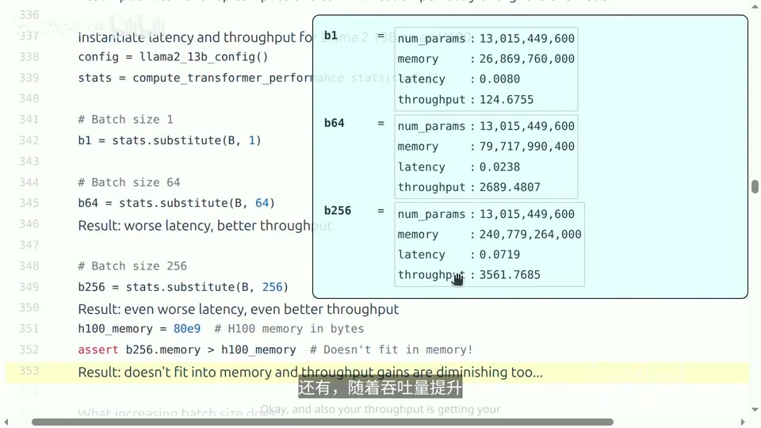 |
| 公交可以让大家一起走，而公交的吞吐量很好，因为它能一次运送很多人；当然你也可以选择和大家同时启动。所以 batch size 越大、吞吐量越高，这是因为参数是共享的——你只需要把模型加载到内存里一次，这样就能处理很多序列。好，咱们再确认一下：这里存在延迟和吞吐量之间的权衡关系，小 batch size 延迟低…… [【跳转到 34:12】](https://www.bilibili.com/video/BV11LEA6eEuj/?p=10&t=2052) | 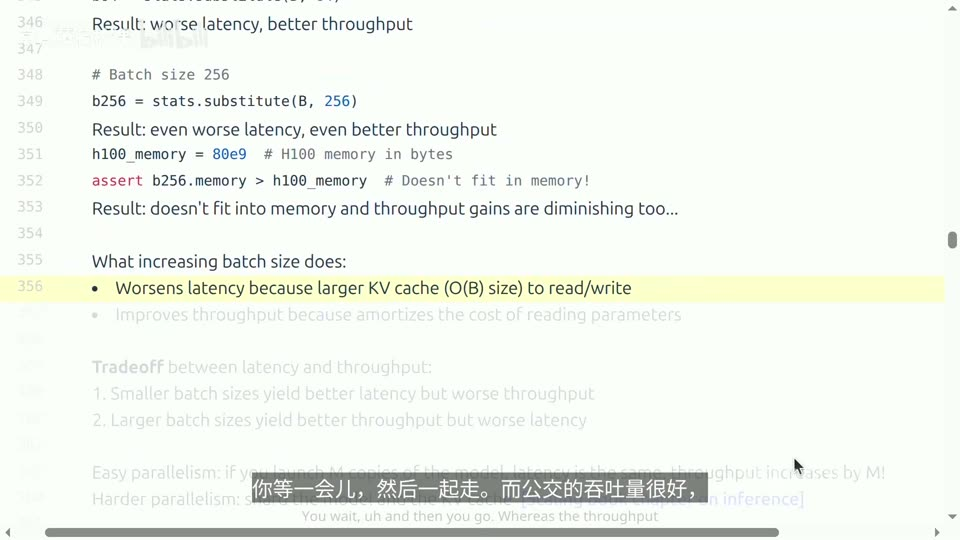 |
| 但吞吐量差；大 batch size 吞吐高但延迟差。好，关于并行性我就不展开讲了。推理还有个维度，就是你可以把模型切分、放到多个设备上去跑。要想深入了解的话，可以去看看 scaling book 里关于推理的那一章。我就举个特别简单的例子：比如你启动 M 个模型副本，延迟不变…… [【跳转到 34:37】](https://www.bilibili.com/video/BV11LEA6eEuj/?p=10&t=2077) | 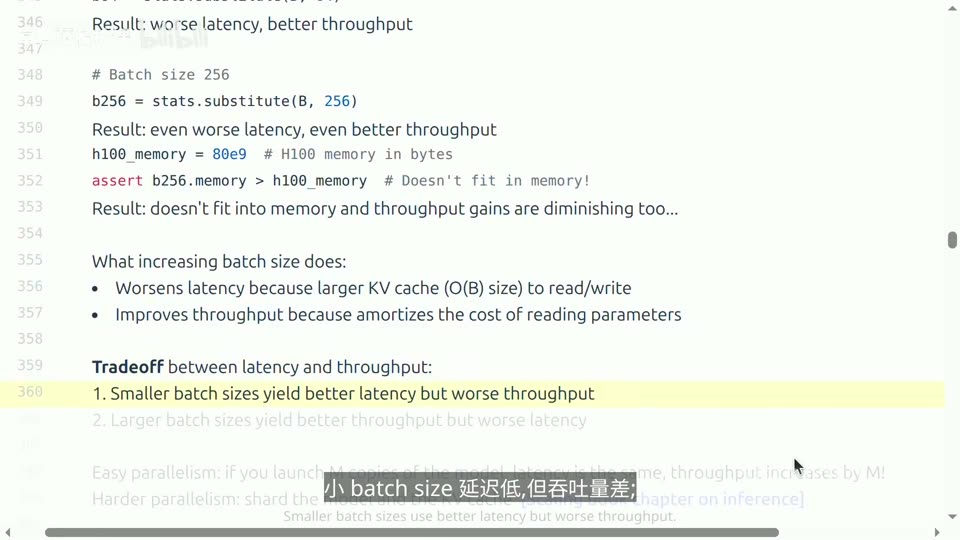 |
| 但吞吐量能提升到 M 倍。嗯，还有个指标我们没提到——time to first token，这基本上就是做 prefill 所花的时间，因为 prefill 一结束你基本上就能开始生成了。那如果你想这么做的话：想要更快的 TTFT，就得用较小的 batch size；而想提升 throughput，就得用较大的 batch size。 [【跳转到 35:02】](https://www.bilibili.com/video/BV11LEA6eEuj/?p=10&t=2102) | 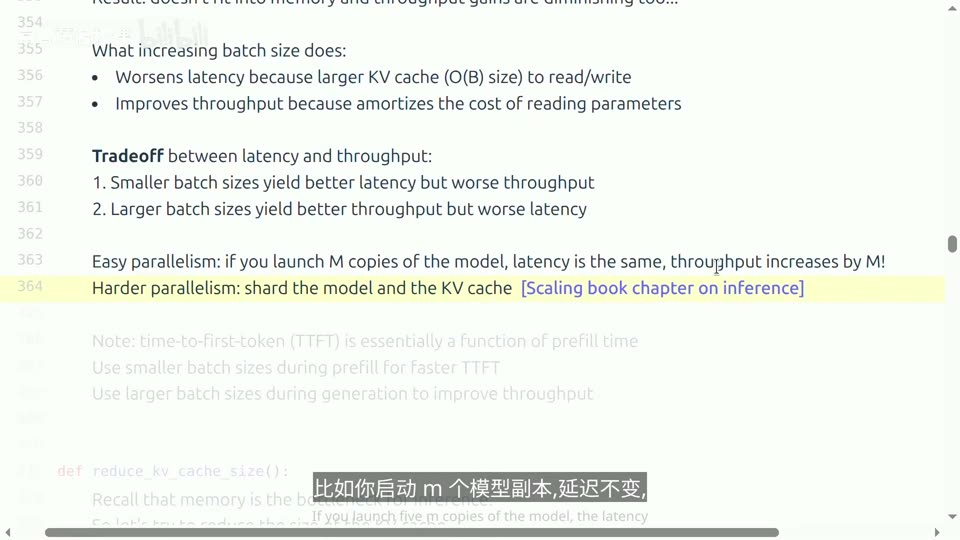 |
| 好，希望这点讲清楚了：关于 throughput 和 latency，以及它们之间为什么相互制约。大家有什么问题吗？好，现在咱们有了一个概念框架，用来理解怎么高效地做 inference，也就是 arithmetic intensity、throughput 和 latency 这几个方面。接下来咱们试试怎么让它更快——怎么让 inference 提速，方法很多…… [【跳转到 35:27】](https://www.bilibili.com/video/BV11LEA6eEuj/?p=10&t=2127) | 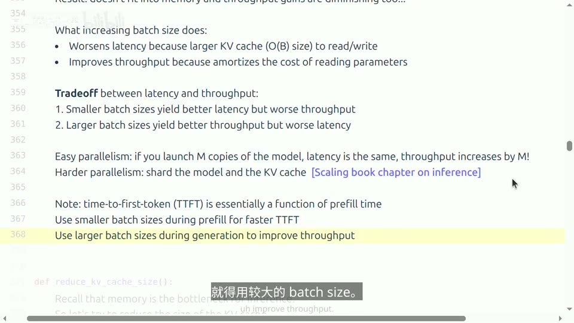 |
| 差异也很大，从改模型架构到做系统优化，中间各种做法都有。所以某种意义上说，inference 算是个内容相当丰富、横跨多个领域的话题。那怎么说呢，也许现在回过头看，最显而易见的一点就是——希望我已经把这一点反复讲透了——memory 是 inference 的瓶颈。 [【跳转到 35:52】](https://www.bilibili.com/video/BV11LEA6eEuj/?p=10&t=2152) | 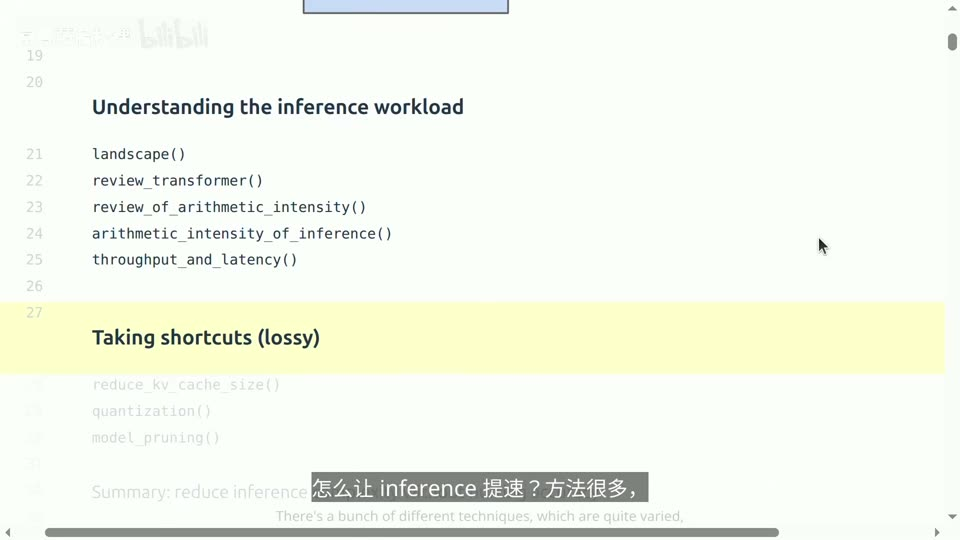 |
| 首先，KV cache 很占内存，如果 batch size 足够大，它占用的量甚至可能超过参数本身的规模。所以试着把 KV cache 的大小降下来，不过你得小心操作，因为得确保在这个过程中别损失太多精度。这里有个办法，咱们之前聊过，就是 group query attention（GQA）。 [【跳转到 36:17】](https://www.bilibili.com/video/BV11LEA6eEuj/?p=10&t=2177) | 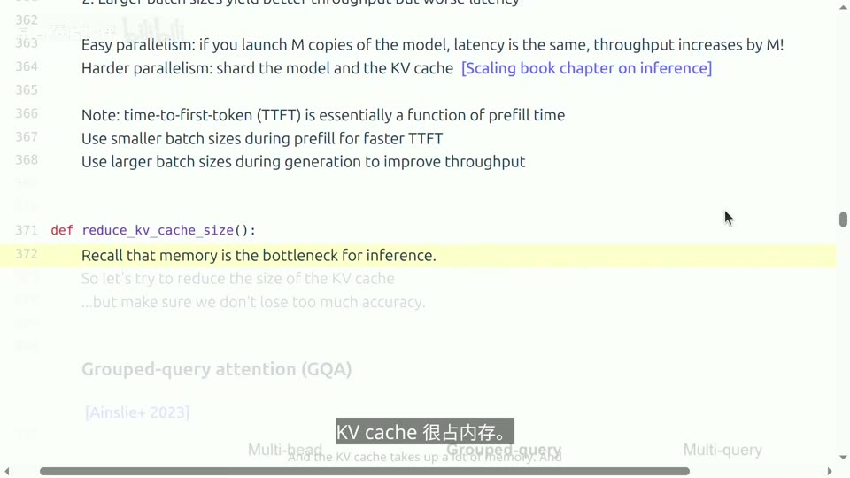 |
| 简单回顾一下。基本逻辑是：对于每个 token，你都要有一个 key、一个 value 和一个 query。如果你用 group query attention，你依然计算相同数量的 queries，但你只有其中一部分（分组数更少），并且你要为每个分组分别计算 key 和 value。好…… [【跳转到 36:42】](https://www.bilibili.com/video/BV11LEA6eEuj/?p=10&t=2202) | 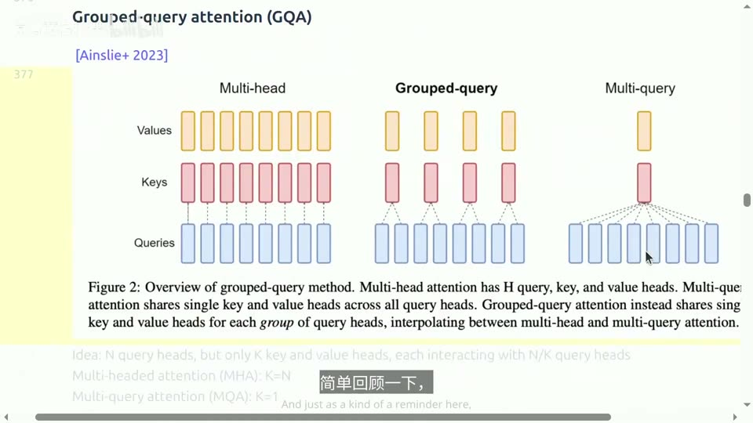 |
| 所以这里的 K 就是分组的数量。所以在多头注意力里 K 等于 N，也就是不做任何缩减。 [【跳转到 37:07】](https://www.bilibili.com/video/BV11LEA6eEuj/?p=10&t=2227) |  |
| 还有个叫多查询注意力（multi-query attention）的东西，因为效果太差没人用它，它的 K 等于 1。介于两者之间的某个地方，希望能让我们找到精度和速度之间的平衡。就是那篇介绍 GQA 的论文，他们的结果表明，只要你去看耗时就会发现，每个样本的时间…… [【跳转到 37:12】](https://www.bilibili.com/video/BV11LEA6eEuj/?p=10&t=2232) | 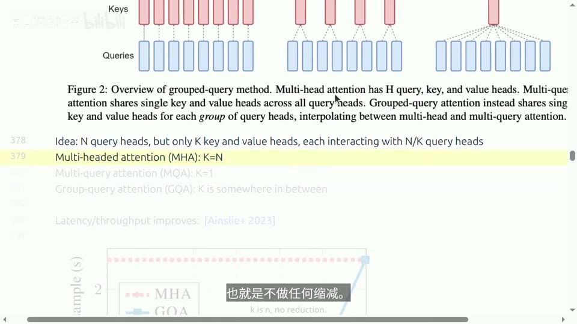 |
| 这跟延迟和吞吐量都有关。多头注意力，也就是全注意力，它的耗时非常高；要是你从 K 等于 1 起步，那速度可就快多了。接着你可以把 K 往上加，比如 K 等于 8，这样效果还挺好；但到最后也就到顶了，耗时就会明显变长。 [【跳转到 37:37】](https://www.bilibili.com/video/BV11LEA6eEuj/?p=10&t=2257) | 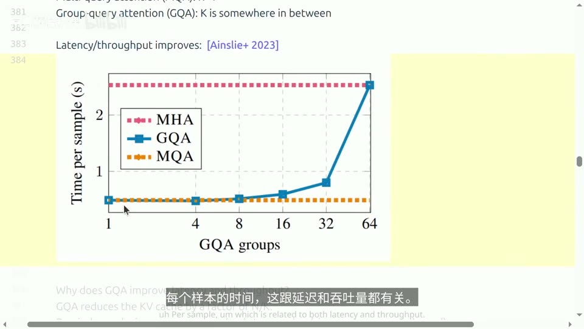 |
| 好，那为啥 GQA 能降低延迟、提升吞吐量呢？它把 KV 缓存的大小缩减到了原来的 K/N。另外提一句，省内存就能提速，因为咱们这系统是内存瓶颈。好，咱们再来看看这个 Llama 模型……记得吧，最开始咱们设的是 K 等于 N，所以既没有…… [【跳转到 38:02】](https://www.bilibili.com/video/BV11LEA6eEuj/?p=10&t=2282) | 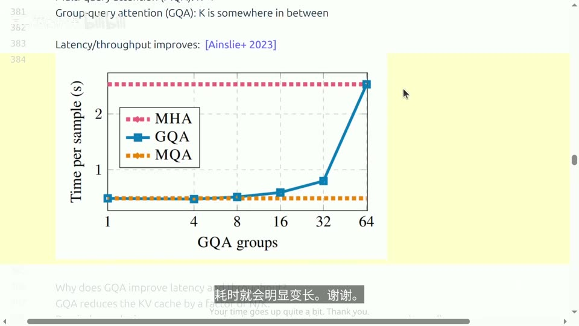 |
| 也没有减少 key 和 value 的数量。所以还是刚才那个例子，大家记得吗？用 64 的 batch size，咱们得到的吞吐量和延迟是这样的。现在要是你用了 GQA，咱们可以假设一个压缩比例，这能减少 KV 内存，能省不少。这样一来延迟改善了…… [【跳转到 38:27】](https://www.bilibili.com/video/BV11LEA6eEuj/?p=10&t=2307) | 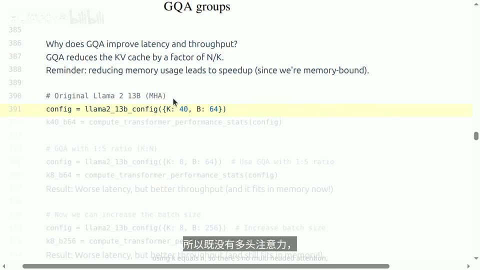 |
| 吞吐量也上去了。所以你看，延迟和吞吐量并不总是冲突的：你要是把内存占用降下来，这两个指标都能变好。主要的矛盾点其实还是在 batch 这个维度上。行，这效果不错。还有，咱们干脆再把 batch size 调大一点试试，看看会怎样。之前要是 batch size 设成 256，内存就爆了…… [【跳转到 38:52】](https://www.bilibili.com/video/BV11LEA6eEuj/?p=10&t=2332) | 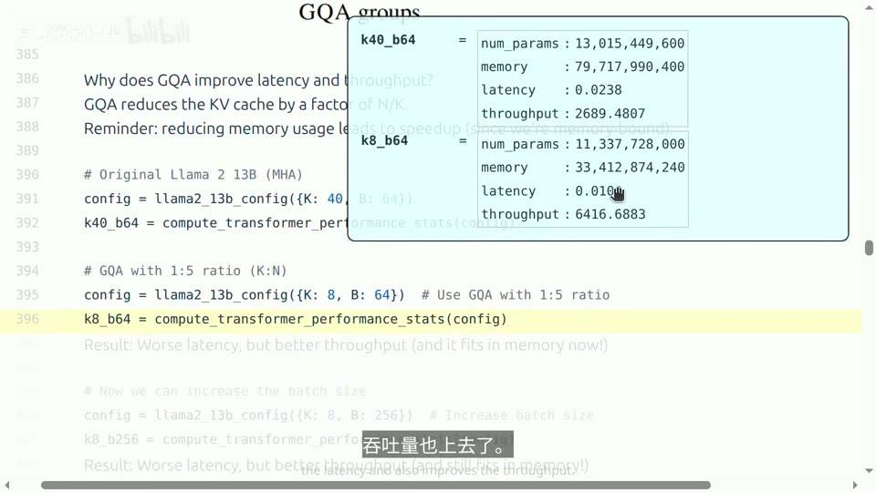 |
| 但现在装得下内存了。你会发现 batch size 变大让延迟稍微高了点，但吞吐量反倒上来了，而且会成比例地往上涨。好，所以有时候你得把这些参数一起调，比如减小 KV cache，这样就能把 batch size 提上去，顺便做做其他取舍。所以最后一件要做的事：不管你做哪种有损改动…… [【跳转到 39:17】](https://www.bilibili.com/video/BV11LEA6eEuj/?p=10&t=2357) | 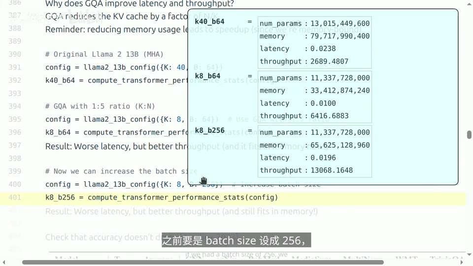 |
| 都得保证 accuracy 不掉。这篇论文显示 GQA 在时间上表现更好，不过跑了一堆测试，基本上效果都不错。所以有了这些 accuracy 评估，我觉得咱们还是得打个折扣看，毕竟这只是针对特定模型的结果。后来 DeepSeek 的论文表明，它确实会带来负面影响。 [【跳转到 39:42】](https://www.bilibili.com/video/BV11LEA6eEuj/?p=10&t=2382) | 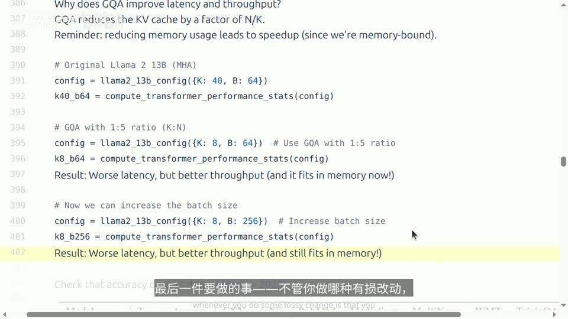 |
| 所以除了纯数学的部分，其他内容咱们都得打个折扣看。 [【跳转到 40:07】](https://www.bilibili.com/video/BV11LEA6eEuj/?p=10&t=2407) | 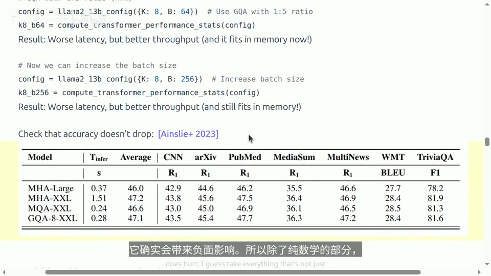 |
| 说到 DeepSeek，这里还有一个进一步压缩的思路——压缩 KV 缓存。好，这部分的主题就是减少 KV 缓存，同时降低延迟、提升吞吐量。 [【跳转到 40:13】](https://www.bilibili.com/video/BV11LEA6eEuj/?p=10&t=2413) | 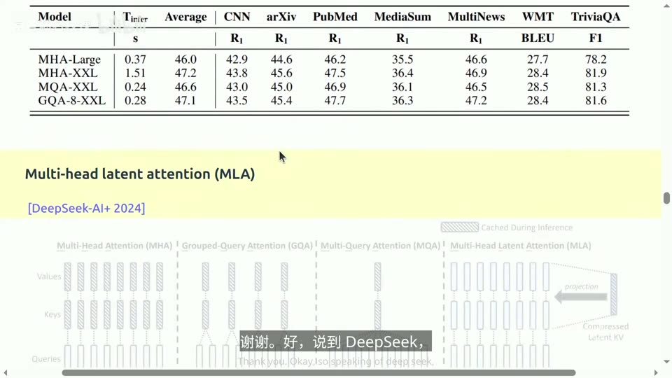 |
| 这是多头注意力机制，每个 token 对应的 queries、keys 和 values 数量都是一样的。还有 GQA，大家还记得吧，我们减少了每个 token 对应的 keys 和 values 的数量——抱歉我说错了，不是每个 token，我们其实是减少了……总之减少了 keys 和 values 的数量。现在 DeepSeek 的多头潜在注意力（MLA）则表示，我们其实要保留 keys 和 values 的数量不变…… [【跳转到 40:24】](https://www.bilibili.com/video/BV11LEA6eEuj/?p=10&t=2424) | 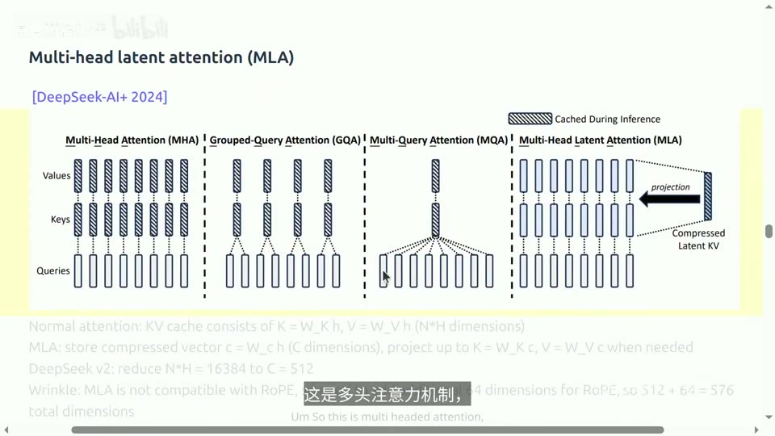 |
| 每个 token 对应一个——本质上就是每个 token 一个，但我会对它们做参数化处理，把这些压缩一下。一般来说，咱们是怎么算键和值的呢？咱们先拿到激活值，然后乘上一个矩阵得到 K，再乘另一个矩阵得到 V，这通常是 N×H 的维度，就跟你的模型维度差不多大。 [【跳转到 40:49】](https://www.bilibili.com/video/BV11LEA6eEuj/?p=10&t=2449) | 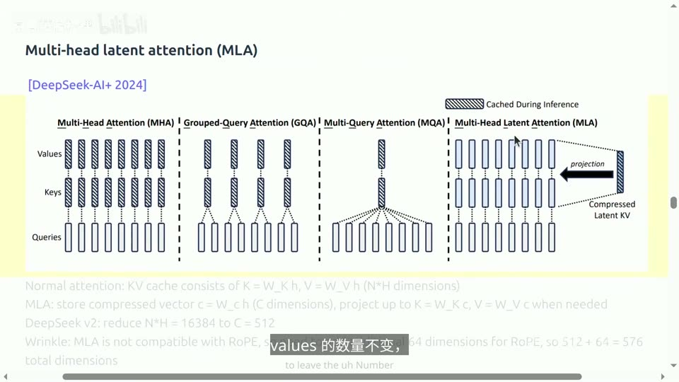 |
| 这个维度很大。所以 MLA 的做法是把这些激活值投影、压缩到 C 维。打个比方，DeepSeek V2 就把它大幅压低了，所以这里的压缩相当激进。接着我就从这个压缩表示里算出 K 和 V，现在我只存 C 就行，这小多了。等需要键和值的时候，我再把它们还原出来。 [【跳转到 41:14】](https://www.bilibili.com/video/BV11LEA6eEuj/?p=10&t=2474) | 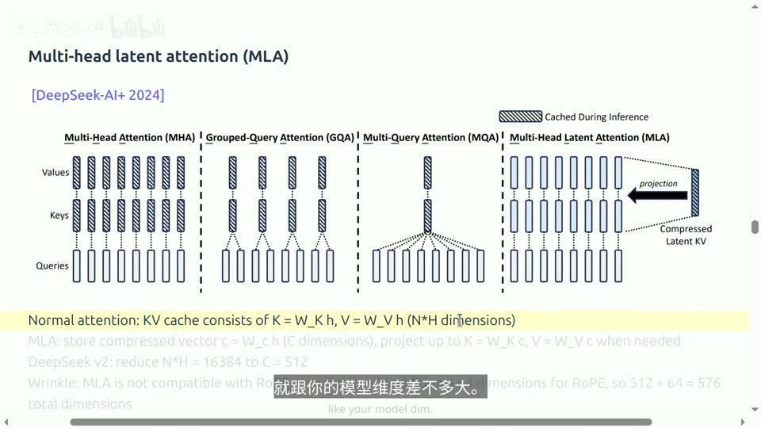 |
| 不过这里有个细节要注意：MLA 和 RoPE 兼容，因为 RoPE 是直接作用在键和值上的。 [【跳转到 41:39】](https://www.bilibili.com/video/BV11LEA6eEuj/?p=10&t=2499) | 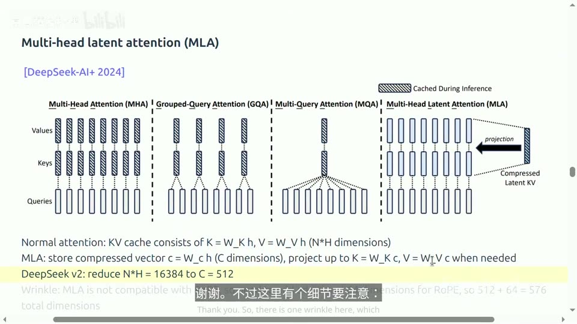 |
| 所以他们的做法是增加额外的维度来处理 RoPE。不过总的来说，缩减幅度还是挺大的，所以延迟和吞吐量的提升——算笔简单的账就清楚了：KV cache 越小，跑起来就越快。行，在某个点之前…… [【跳转到 41:44】](https://www.bilibili.com/video/BV11LEA6eEuj/?p=10&t=2504) | 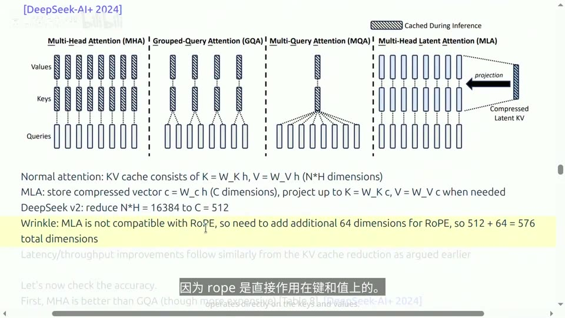 |
| 这基本是线性扩展。另外记得检查一下你的模型准不准。 [【跳转到 42:09】](https://www.bilibili.com/video/BV11LEA6eEuj/?p=10&t=2529) | 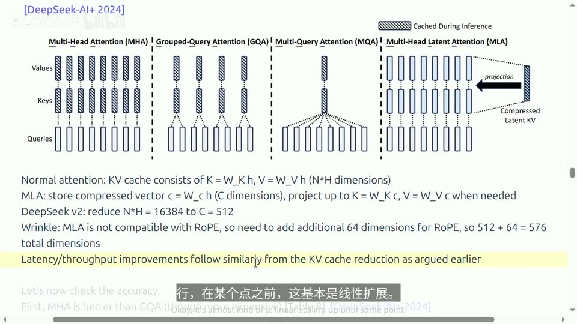 |
| 所以首先，这个结果跟 GQA 那篇论文有点冲突，或者说存在张力：他们指出 GQA 其实没那么好。好，这是 MHA，这是 GQA，这几个数字比那几个数字要小。 [【跳转到 42:14】](https://www.bilibili.com/video/BV11LEA6eEuj/?p=10&t=2534) | 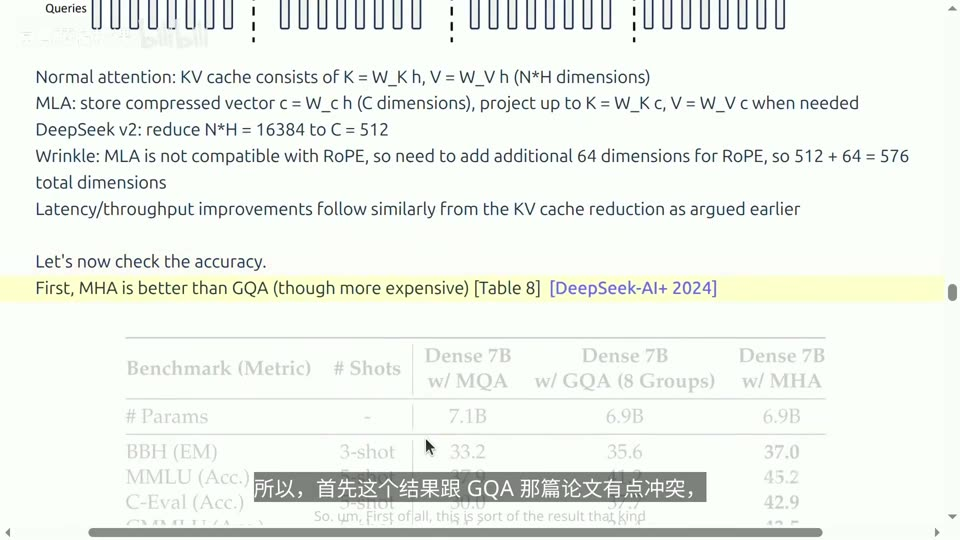 |
| 不过你看，他们的 MLA（多潜在注意力）方法甚至比 MHA 还略好一点。 [【跳转到 42:27】](https://www.bilibili.com/video/BV11LEA6eEuj/?p=10&t=2547) | 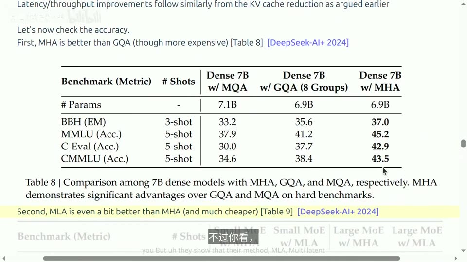 |
| 但咱们大体上可以认为两者差不多。所以这一列和这一列要好得多。不过我想这张表上没有 GQA。 [【跳转到 42:32】](https://www.bilibili.com/video/BV11LEA6eEuj/?p=10&t=2552) | 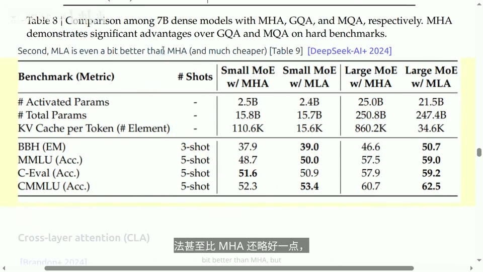 |
| 咱们在这儿做个对比。好，那我接着讲。 [【跳转到 42:40】](https://www.bilibili.com/video/BV11LEA6eEuj/?p=10&t=2560) | 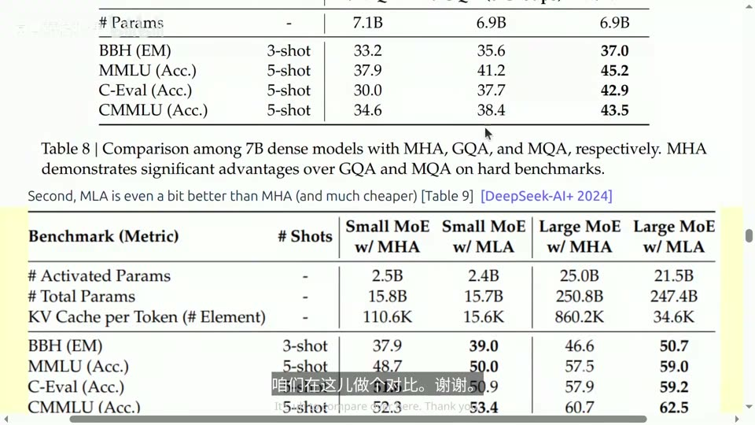 |
| 这跟减少模型里的维度数量相比效果怎么样？ [【跳转到 42:45】](https://www.bilibili.com/video/BV11LEA6eEuj/?p=10&t=2565) | 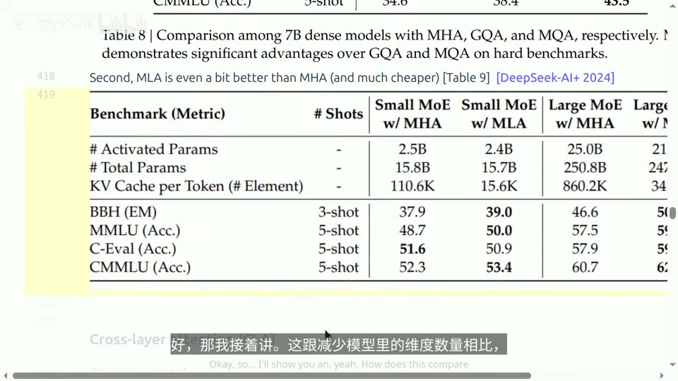 |
| （课堂问答）这个问题是：跟缩减模型维度相比效果如何？不过这些消融实验没体现出这一点。我猜单纯缩减模型维度只会让效果更差，因为你是在不加区分地削减所有东西。我觉得这里面的关键是，在模型里找到那些可以压缩的地方；至于先验知识，你很难一开始就确定，咱们得靠大量实验。 [【跳转到 42:50】](https://www.bilibili.com/video/BV11LEA6eEuj/?p=10&t=2570) | 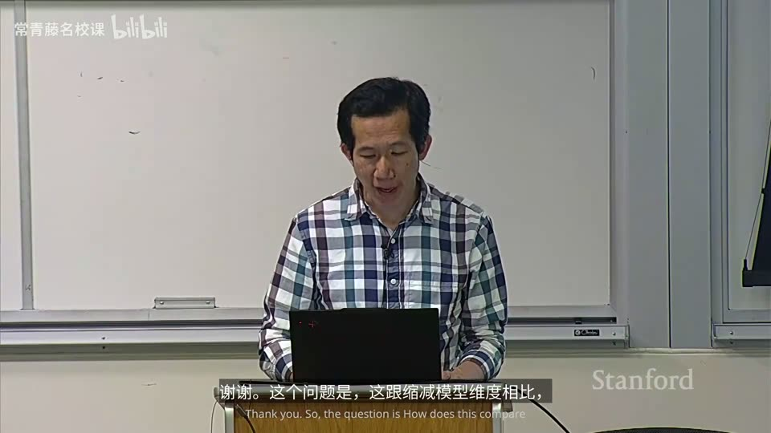 |
| 看看哪种方法管用。所以这里有个新点子来缩减 KV cache，叫做跨层注意力（cross-layer attention）。咱们先看一下常规情况：每一层本来都有 K、V、keys 和 values。咱们假设不这么做了，只去计算其中一部分层级的 KV，然后对于这一层，我就直接用上一层的 KV cache。好，所以这算是另一种形式的共享。 [【跳转到 43:15】](https://www.bilibili.com/video/BV11LEA6eEuj/?p=10&t=2595) | 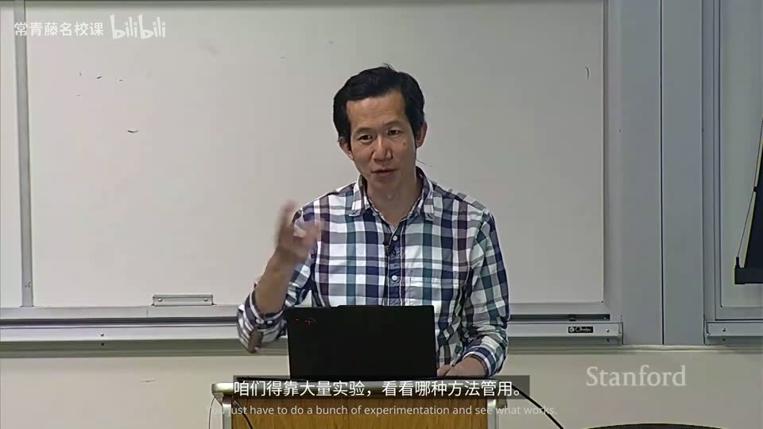 |
| 就像 GQA 是在 head 之间共享 KV 一样，现在咱们是在 layer 之间共享 KV。从实证结果来看，这篇论文显示这么做能优化帕累托前沿（Pareto frontier），所以这些模型每一个都更好、一个比一个强。另有一个方法，你其实可以通过调整 K 和 head dimension 来遍历 KV cache 的不同大小。 [【跳转到 43:40】](https://www.bilibili.com/video/BV11LEA6eEuj/?p=10&t=2620) |  |
| 我想这跟你之前提到的改变模型维度的观点有点关系，不过要是你用了跨层注意力，效果就更好了。好，咱们接着往下讲，快速过一遍减少 KV cache 的各种技术。比如局部注意力或滑动窗口注意力，这个想法挺老的，但也特别自然。所以你看，完整的注意力矩阵…… [【跳转到 44:05】](https://www.bilibili.com/video/BV11LEA6eEuj/?p=10&t=2645) | 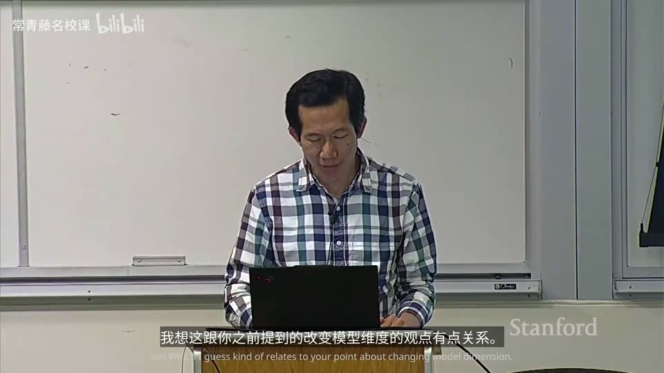 |
| 它的规模是 N 的平方。与其那样，如果你要生成一个 token，只需看最近的 K 个 token 就行。所以简单来说，你生成的每个 token 都有一个滑动窗口，只依赖最近的 K 个。现在要是你这么做，那么 KV cache 就跟序列长度没关系了，它其实就是批次大小乘以其他变量。这太好了，尤其对于长上下文场景。 [【跳转到 44:30】](https://www.bilibili.com/video/BV11LEA6eEuj/?p=10&t=2670) |  |
| 你看，因为层数的关系，实际的有效上下文长度比标称的要大，因为信息顺着层往下传、能传得更远。现在你可以做些更复杂的，比如不一定非要密集地选层，但你可以把它们间隔开；你也可以用全局加滑动窗口的方式，既关注固定网格上的不同 token 点，又关注局部的滑动窗口。 [【跳转到 44:55】](https://www.bilibili.com/video/BV11LEA6eEuj/?p=10&t=2695) | 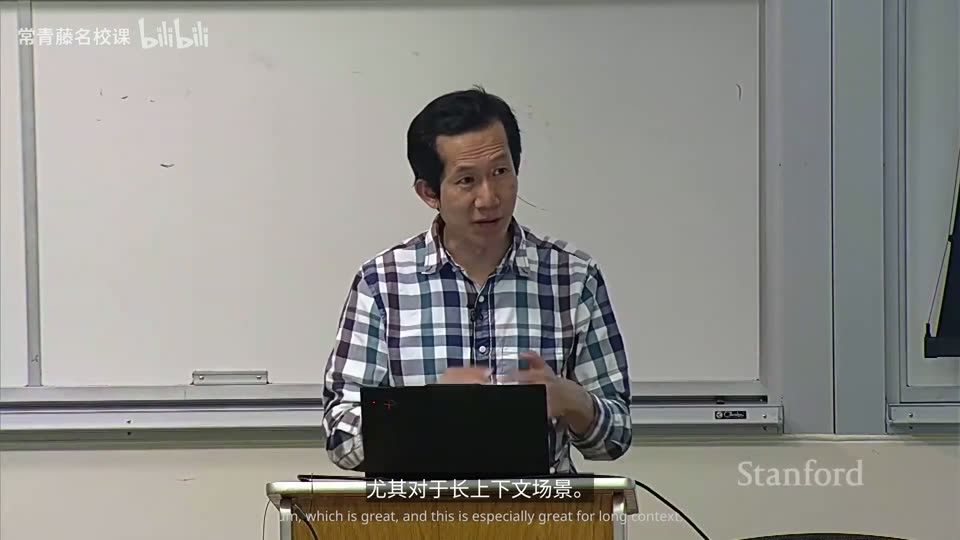 |
| 所以你可以尝试各种方法。不过有个问题：这样做其实还是会牺牲准确性，也就是说表达能力下降了，天下没有免费的午餐——或者说这顿午餐其实挺贵的。大家想到的解决办法是把局部注意力和全局注意力交替使用，所以这类混合模型的做法是：某些层用全注意力，另一些层则用局部注意力。 [【跳转到 45:20】](https://www.bilibili.com/video/BV11LEA6eEuj/?p=10&t=2720) | 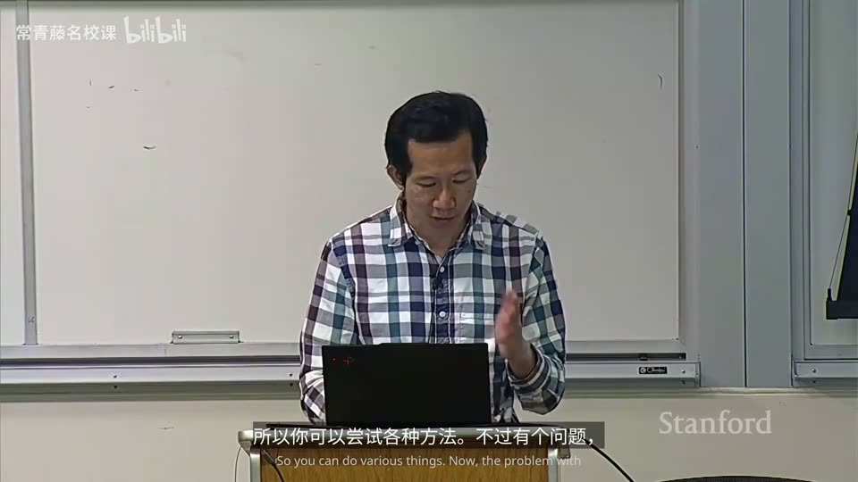 |
| 而且这样基本上就能稍微减少一点 KV 缓存，你一直在努力平衡准确性和效率、速度。（课堂问答）问：线性注意力和滑动窗口注意力在权衡取舍上有区别吗？对，这个问题是关于线性注意力和滑动窗口注意力。线性注意力我就不展开讲了，简单提一下：有一些方法不去存储 KV cache…… [【跳转到 45:45】](https://www.bilibili.com/video/BV11LEA6eEuj/?p=10&t=2745) |  |
| 而是直接进行计算，对全部历史信息做某种压缩表示。最简单的线性注意力做法就是直接把 KV 加起来，把这些 values 加总成一个向量，这样一来就肯定与序列长度无关了。你也可以用更高级的方法，比如 Gated DeltaNet 和 Mamba。所以现在的问题是…… [【跳转到 46:10】](https://www.bilibili.com/video/BV11LEA6eEuj/?p=10&t=2770) | 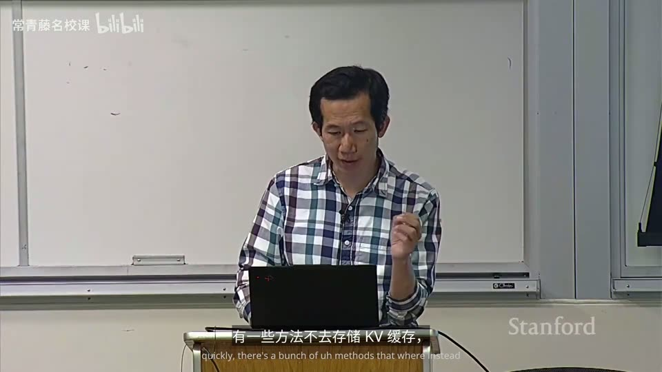 |
| 这些方法之间该怎么比较？它们也被用来替代滑动窗口注意力，人们也已经有了一些探索。你也可以把全注意力、滑动窗口注意力和线性注意力结合起来用，因为它们各自捕捉的侧重点不同。如果你更在意局部高分辨率的信息，那滑动窗口注意力会更合适；如果你只是想要对过往内容的宏观概括…… [【跳转到 46:35】](https://www.bilibili.com/video/BV11LEA6eEuj/?p=10&t=2795) | 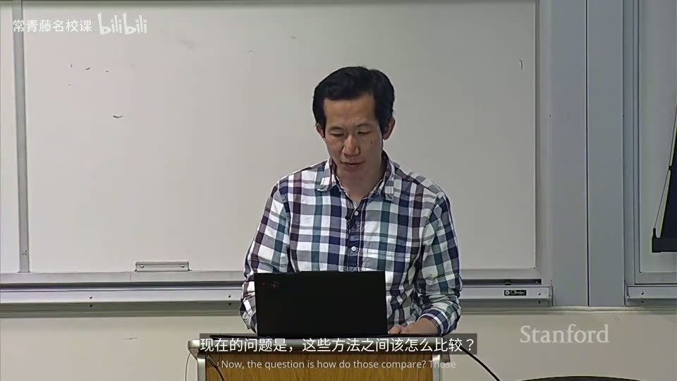 |
| 那就用另一种方法更好，线性注意力可能更好。（课堂问答）那么对于长上下文，你觉得线性注意力会更好吗？针对这种情况……所以我的问题是：对于长上下文，线性注意力会更好吗？我来说说，总之天下没有免费的午餐，对吧？ [【跳转到 47:00】](https://www.bilibili.com/video/BV11LEA6eEuj/?p=10&t=2820) | 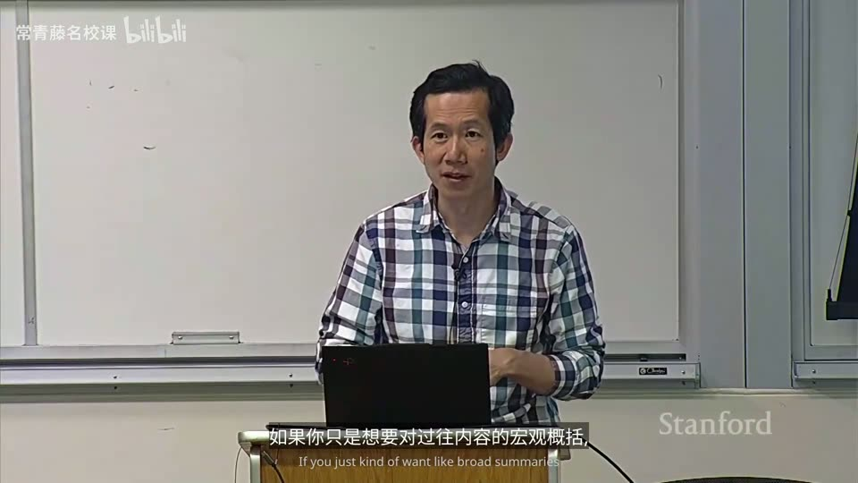 |
| 打个比方，假设上下文极长，而你正在处理一个"大海捞针"的问题，对吧？ [【跳转到 47:21】](https://www.bilibili.com/video/BV11LEA6eEuj/?p=10&t=2841) | 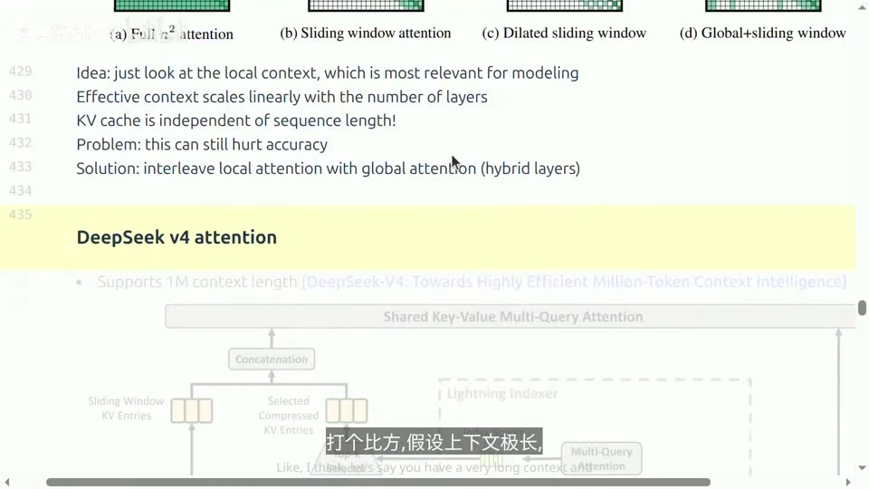 |
| 如果你必须把整段历史压缩进很小的一段上下文里，信息就一定会丢失，而且你可能根本就检索不到它了。我想我的意思是，看起来大家都在采用混合架构，因为似乎总需要某种更长程的注意力机制，我只是想在自己脑子里把这件事理清楚。那么用滑动窗口和用某种线性注意力层（比如 Mamba）相比…… [【跳转到 47:26】](https://www.bilibili.com/video/BV11LEA6eEuj/?p=10&t=2846) |  |
| 二者的取舍是什么？使用高分辨率层是不是始终都比滑动窗口更好？那实际上有代表性的取舍到底是什么呢？我想也许可以这么说：Mamba 和 DeltaNet 更为强大，比滑动窗口注意力更强大。也许你可以这样来理解 Mamba，你应该是能想明白的——它当然能体现出滑动窗口注意力的某些特性…… [【跳转到 47:51】](https://www.bilibili.com/video/BV11LEA6eEuj/?p=10&t=2871) |  |
| 因为在做递归的时候，它只要看上一个状态就行。对，也许吧。也许你可以把线性注意力或者它的扩展形式看作……不，至少它们还有更多回旋的空间；而一旦你把它做成滑动窗口注意力，就到此为止了，没有别的能做的了。对。好，那我快速过一下。 [【跳转到 48:16】](https://www.bilibili.com/video/BV11LEA6eEuj/?p=10&t=2896) | 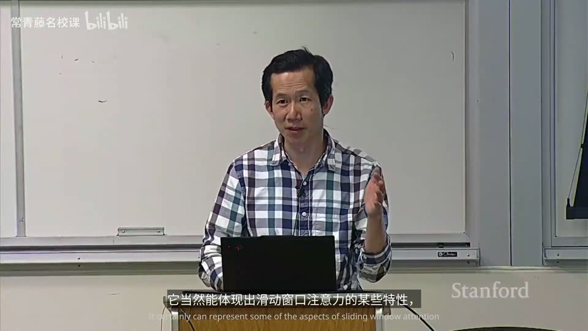 |
| 重点讲一下这个 DeepSeek，DeepSeek 还在不断地创新出不同类型的注意力机制。 [【跳转到 48:38】](https://www.bilibili.com/video/BV11LEA6eEuj/?p=10&t=2918) | 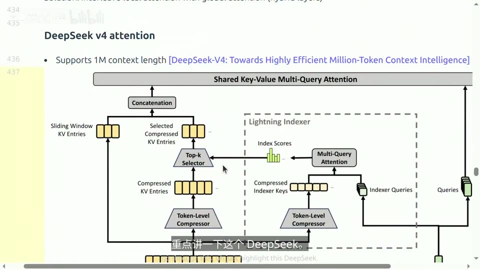 |
| 大家记得，他们提出了多潜在注意力（Multi-latent attention）用来压缩 K、V。这里有个概念叫压缩稀疏注意力。 [【跳转到 48:45】](https://www.bilibili.com/video/BV11LEA6eEuj/?p=10&t=2925) | 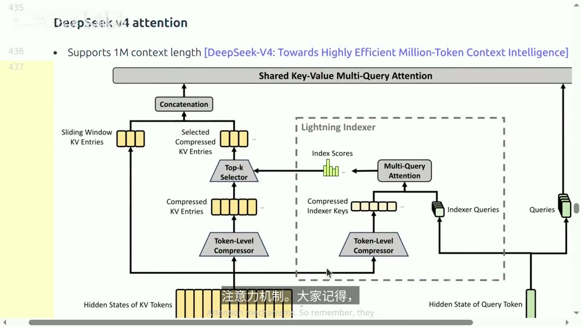 |
| 现在还有 DeepSeek 稀疏注意力和重度压缩注意力。这些缩写词的具体含义我一时想不起来。 [【跳转到 48:53】](https://www.bilibili.com/video/BV11LEA6eEuj/?p=10&t=2933) | 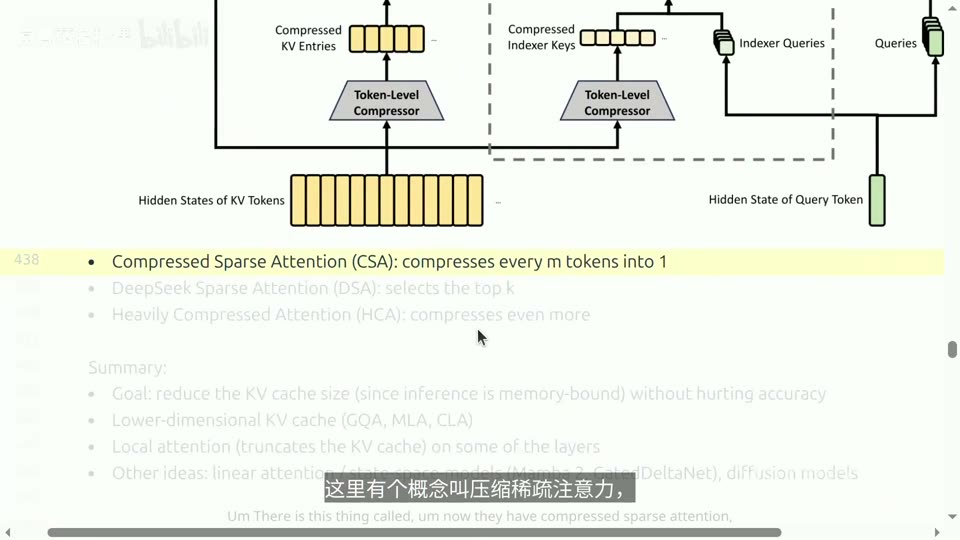 |
| 不过咱们来看这张图。正常情况下你会用到 KV token 和 query token。压缩注意力的做法…… [【跳转到 48:58】](https://www.bilibili.com/video/BV11LEA6eEuj/?p=10&t=2938) | 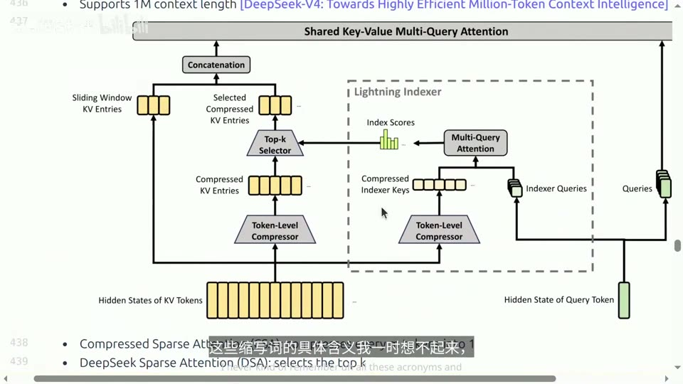 |
| 基本上就是把每 M 个 token 压缩成一个 token。接着是 DeepSeek 稀疏注意力，它主要就是从里面挑出一部分子集用来保留，挑选子集的方法是先算一些轻量级的 queries 和 keys，再做一次小规模的 attention 来拿到索引分数，这样你就知道该留哪些了。这就是一种极快的、确定该保留哪些 token 的方法。 [【跳转到 49:07】](https://www.bilibili.com/video/BV11LEA6eEuj/?p=10&t=2947) | 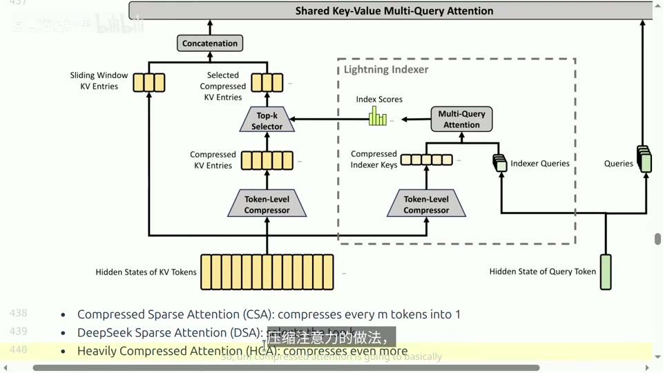 |
| 然后你就用这些 token。后面还有更进一步的压缩。 [【跳转到 49:32】](https://www.bilibili.com/video/BV11LEA6eEuj/?p=10&t=2972) | 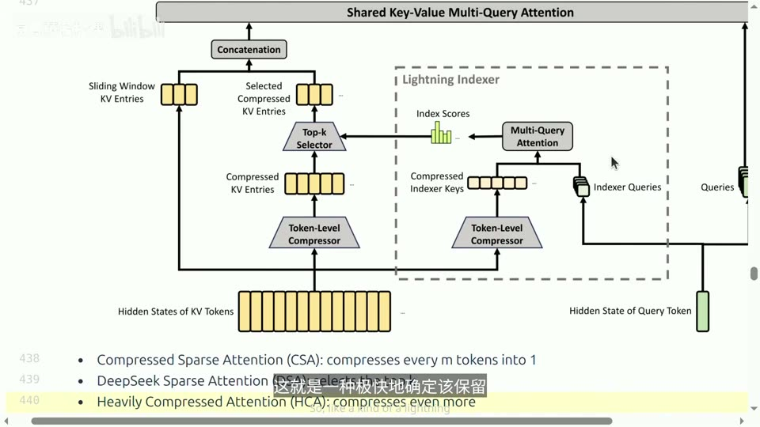 |
| 为了节省时间，我直接往下讲。这一节的目标是减少 KV cache，因为 KV cache 跟内存有关，而我们前面已经看到 inference 是 memory-bound，这能直接提升吞吐量、降低延迟。关键是要在不损害准确性的前提下做到这一点。所以你可以跨层、跨 head、跨 head dimension 来做低维度的 KV cache…… [【跳转到 49:39】](https://www.bilibili.com/video/BV11LEA6eEuj/?p=10&t=2979) | 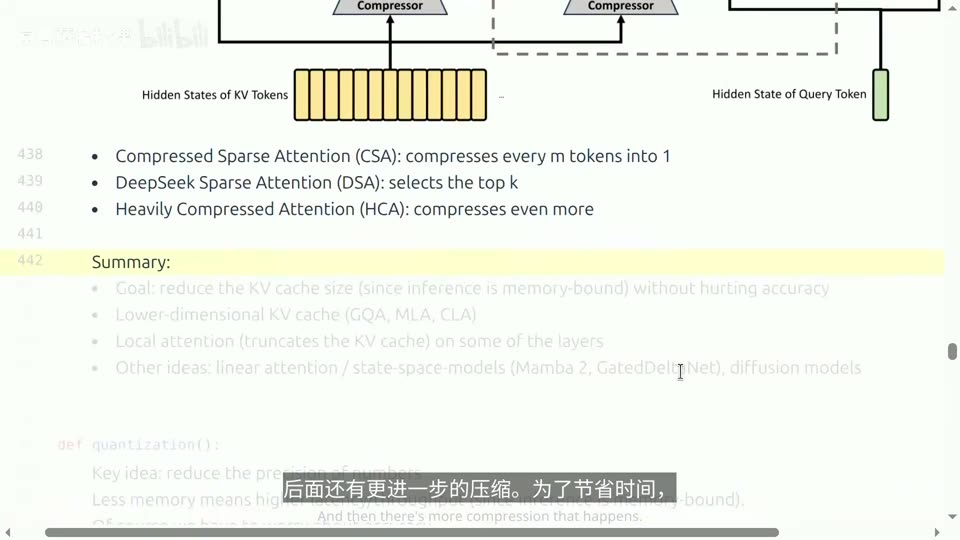 |
| 你可以用 local attention，也可以用 linear attention，这个前面讲过，还有很多其他方法。另外还有 diffusion models，这是一种非自回归的生成方式，速度能快很多。好，咱们再来聊几个其他的重要思路。所以 quantization 更多是从系统层面、而不是架构层面来讨论怎么让模型变小，核心思路就是降低数字的精度，内存占用更少…… [【跳转到 50:04】](https://www.bilibili.com/video/BV11LEA6eEuj/?p=10&t=3004) | 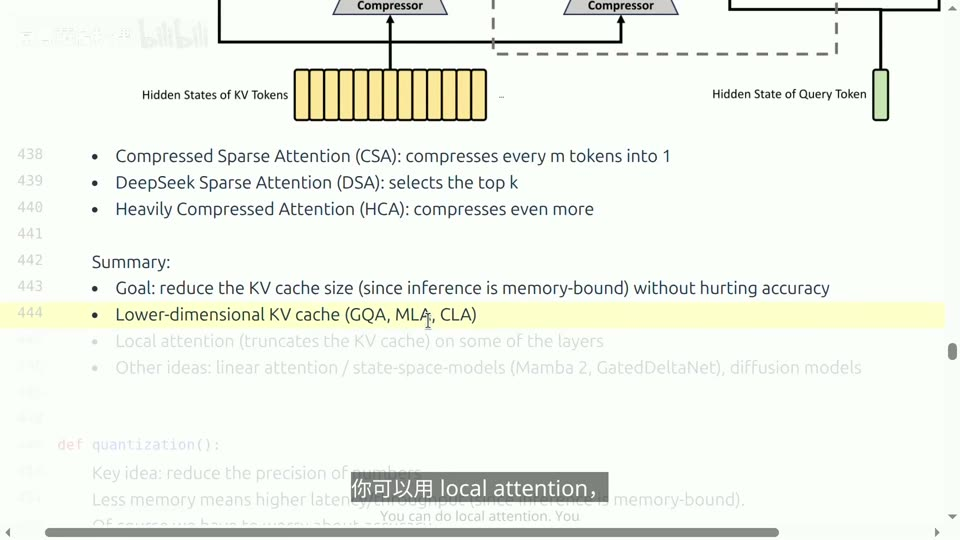 |
| 就能带来更高的吞吐量和更低的延迟。显然你得担心准确性问题。量化嘛，选项很多，范围从 bf16 一直到 int4。所以如果你怕量化把模型搞砸，可以试试带着量化意识去训练模型，这叫量化感知训练（QAT）。 [【跳转到 50:29】](https://www.bilibili.com/video/BV11LEA6eEuj/?p=10&t=3029) | 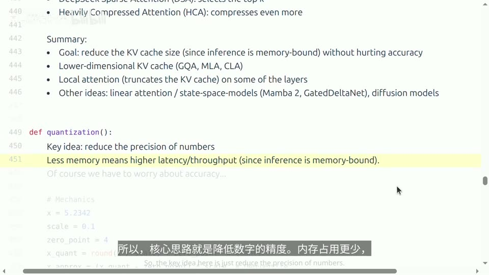 |
| 训练时，在正向传播过程中你会先量化、再反量化，你基本上是在训练时模拟这些量化误差，这样权重会适应，量化效果通常更好；但代价是训练成本高昂且规模大。一般大家会先训练好模型，然后再做量化，这叫训练后量化（PTQ），通常便宜得多。有一种比较直接的做法，针对每一层或每个张量…… [【跳转到 50:54】](https://www.bilibili.com/video/BV11LEA6eEuj/?p=10&t=3054) | 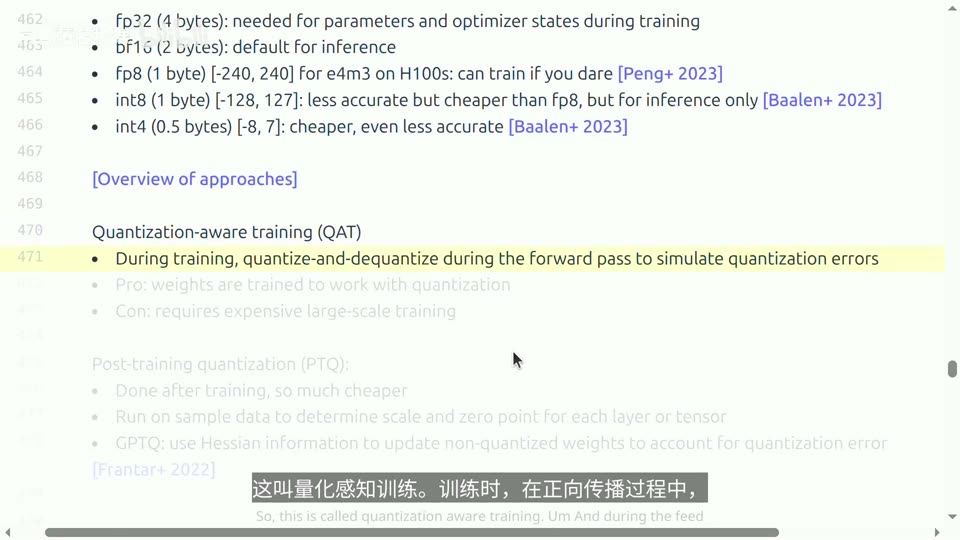 |
| 分别确定它的缩放因子和零点，然后单独做量化。不过这种做法通常效果没那么好。你可以用一种叫 GPTQ 的方法，它利用一些海森矩阵（Hessian）信息逐层量化，同时追踪那些传播到未量化权重里的误差，这样你就能修正这些误差。现在更高级的做法叫激活感知量化（activation-aware quantization）。 [【跳转到 51:19】](https://www.bilibili.com/video/BV11LEA6eEuj/?p=10&t=3079) | 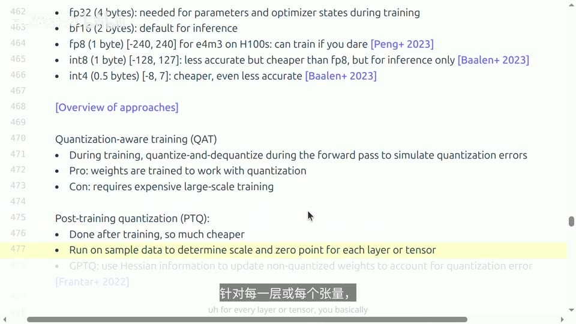 |
| 它的核心观察是：有些激活通道的值很大，跟这些通道打交道的权重就显得更重要，所以咱们给这些权重多分配点精度。来看这张图，一般情况是：如果你拿 FP16 的权重矩阵做量化，比如把它量化成 int3，咱们接下来要做的是找出哪些通道是活跃的…… [【跳转到 51:44】](https://www.bilibili.com/video/BV11LEA6eEuj/?p=10&t=3104) | 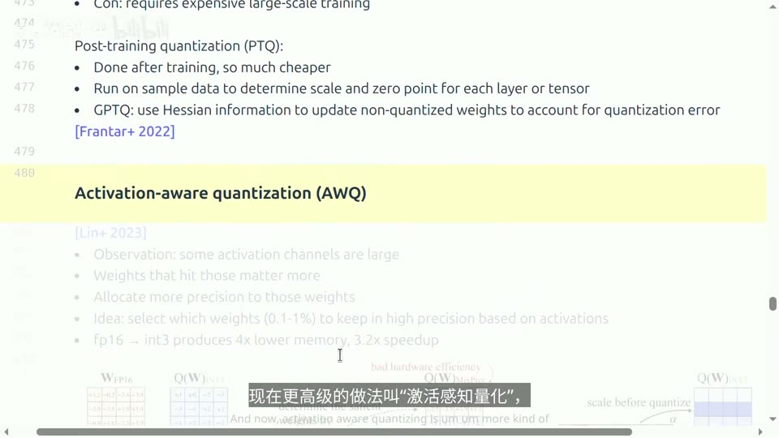 |
| 比如这些激活通道，其中有些通道规模还挺大。所以如果某个通道整体规模较大，咱们就直接给它分配 FP16 精度，其余部分都保持 int3，只有少数几个重要通道采用更高的精度。好，所以这里还有另一种思路叫模型剪枝（pruning）。 [【跳转到 52:09】](https://www.bilibili.com/video/BV11LEA6eEuj/?p=10&t=3129) | 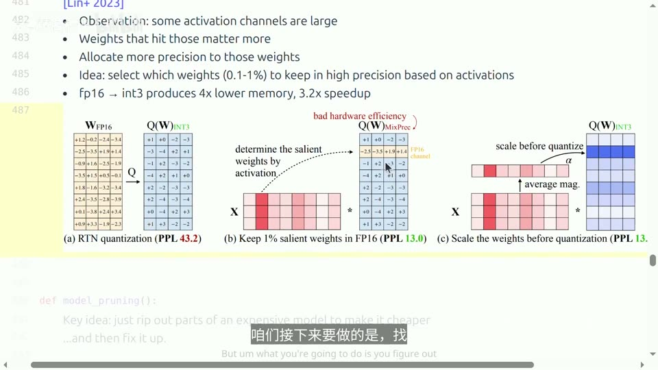 |
| 简单来说就是拿一个大模型，把其中一部分切掉，然后再修补一下。这方法挺粗糙的，但确实管用。比如 NVIDIA 有篇论文，基本上……让我先看一下。 [【跳转到 52:30】](https://www.bilibili.com/video/BV11LEA6eEuj/?p=10&t=3150) | 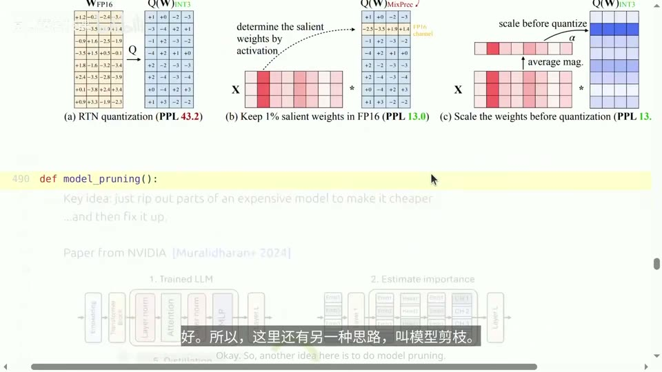 |
| 咱们看看。 [【跳转到 52:46】](https://www.bilibili.com/video/BV11LEA6eEuj/?p=10&t=3166) | 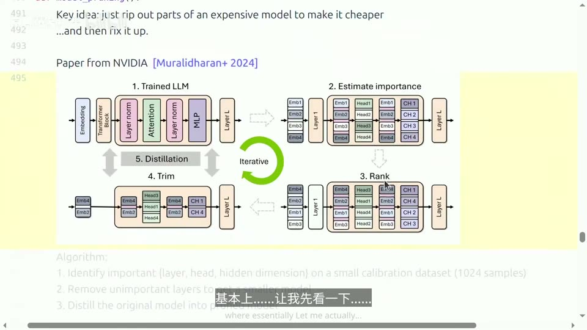 |
| 所以你得先评估模型各部分的重要性，挑出最关键的那些，然后把不同的隐藏单元甚至某些层直接移除掉。现在我们就得到了一个模型，不过它的效果还不太行，所以你要对它做后训练（post-training），用你关心的那些数据或任务再多训练一下，把它的性能修复回来。所以某种意义上说…… [【跳转到 52:51】](https://www.bilibili.com/video/BV11LEA6eEuj/?p=10&t=3171) |  |
| 这其实也算是一种训练。这是一种减少 KV cache 用量的方法。 [【跳转到 53:16】](https://www.bilibili.com/video/BV11LEA6eEuj/?p=10&t=3196) | 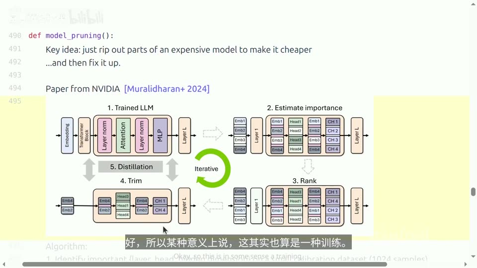 |
| 只不过你是用一个好模型的一部分来给它做初始化。好，看起来这个方法效果还挺不错的。 [【跳转到 53:21】](https://www.bilibili.com/video/BV11LEA6eEuj/?p=10&t=3201) | 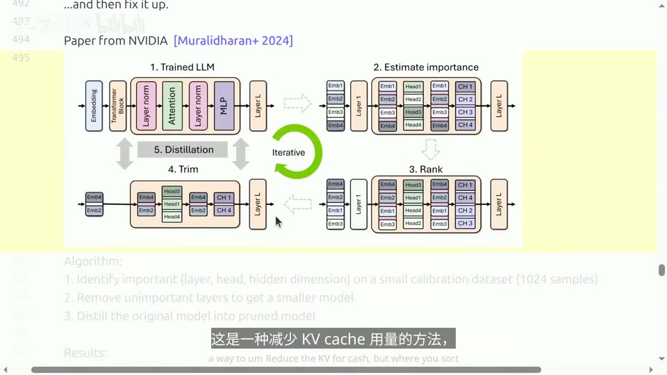 |
| 所以他们成功把一个 15B 的模型压缩到了 8B，准确率没怎么受影响，而且训练这个模型、走这整个流程所需的数据量要少得多。好，那咱们来总结一下：我们要做的就是在不损害准确率的前提下降低推理（inference）复杂度。 [【跳转到 53:30】](https://www.bilibili.com/video/BV11LEA6eEuj/?p=10&t=3210) | 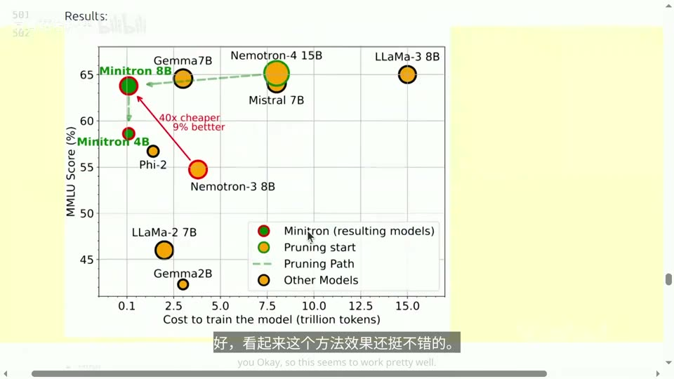 |
| 你可以把它理解为，主要就是减少参数量或者 KV cache。你可以定义一种更快的模型架构来训练它；或者你也可以定义一种更快的模型架构，然后做初始化——用原始模型的权重来初始化，虽然它的架构可能不一样，基本上就是拼出一个"弗兰肯斯坦"式的怪物，然后再用蒸馏把这个更快的模型修好。 [【跳转到 53:55】](https://www.bilibili.com/video/BV11LEA6eEuj/?p=10&t=3235) | 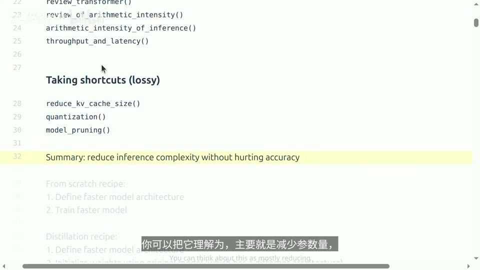 |
| 区分重要层和非重要层。 [【跳转到 54:20】](https://www.bilibili.com/video/BV11LEA6eEuj/?p=10&t=3260) | 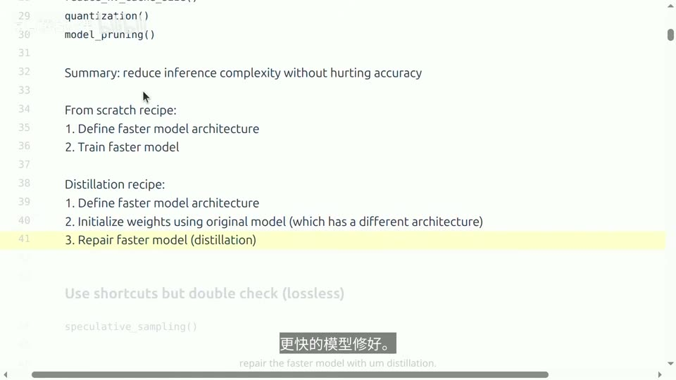 |
| 那么咱们怎么区分哪些是重要层、哪些不是呢？一般来说，你会准备一个校准集，把输入跑一遍模型，主要看的就是激活值（activations）的大小。至于那些确实存在的激活值，其中一些尤其是那些"死单元"，数值会接近于零；而那些数值较大的，我们要保留下来。 [【跳转到 54:25】](https://www.bilibili.com/video/BV11LEA6eEuj/?p=10&t=3265) | 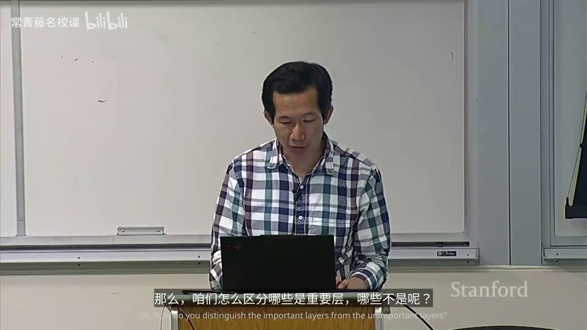 |
| 这就是一个宏观层面的思路。我猜你可能会问：为什么激活值高就很重要？它也可能只是……要是它在其余样本里压根儿就不出现呢？问题在于，如果所有激活值都很高，那又怎么样？所以总的来说，这是一种经验性的观察：某些通道的激活值会远高于其他通道。如果事实并非如此…… [【跳转到 54:50】](https://www.bilibili.com/video/BV11LEA6eEuj/?p=10&t=3290) |  |
| 这些技术就不一定有效。但事实碰巧就是如此，这是有原因的，这正是这些模型最终被训练出来的方式，然后你就可以利用这一点。（课堂问答）它在所有样本中的值始终是 100，这是否意味着它一定有意义？还是说它可能只是训练过程中产生的某种伪影？我明白了。 [【跳转到 55:15】](https://www.bilibili.com/video/BV11LEA6eEuj/?p=10&t=3315) | 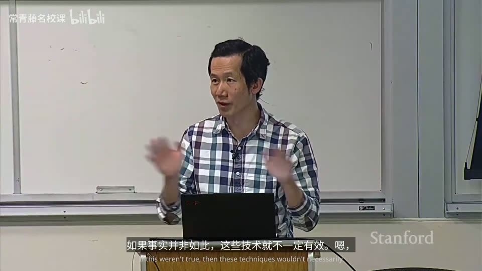 |
| 那么问题来了：如果一个神经元的值始终为 100 呢？这种情况下你也可以考察与方差相关的问题。比如如果值为 100，你就不能直接移除它，否则会导致整体出错；但如果均值高、方差低，或许还有别的处理思路，也就是本质上把偏置（bias）纳入进来的一种方法。我快速过一下另一个想法。 [【跳转到 55:40】](https://www.bilibili.com/video/BV11LEA6eEuj/?p=10&t=3340) | 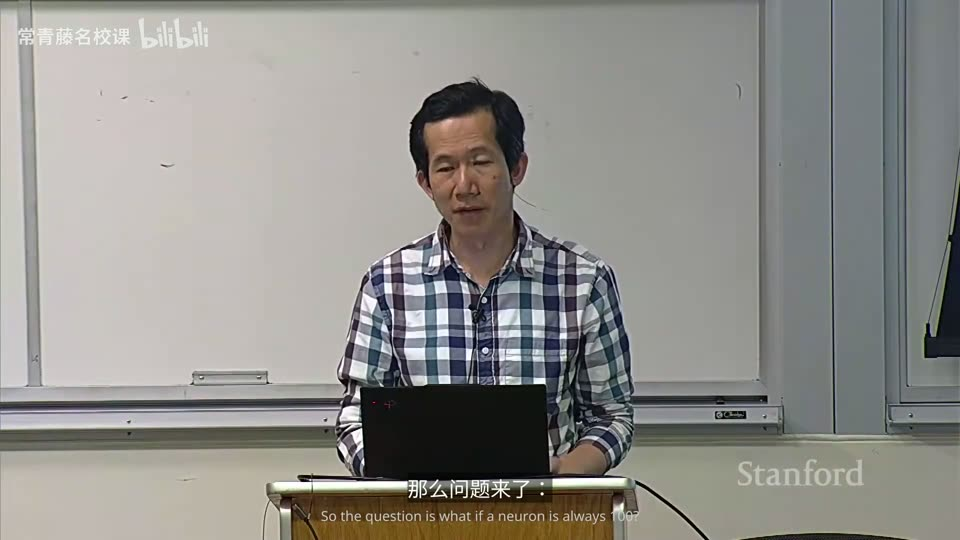 |
| 到目前为止，我们讨论的都是有损方法，这类方法能大幅压缩 KV 缓存，但可能会牺牲准确性。还有一种非常优雅的方法，可以实现无损处理，这被称为推测采样（speculative sampling）或推测解码（speculative decoding）。回想一下，在执行预填充（prefill）阶段，你可以并行地对所有 token 进行编码…… [【跳转到 56:03】](https://www.bilibili.com/video/BV11LEA6eEuj/?p=10&t=3363) | 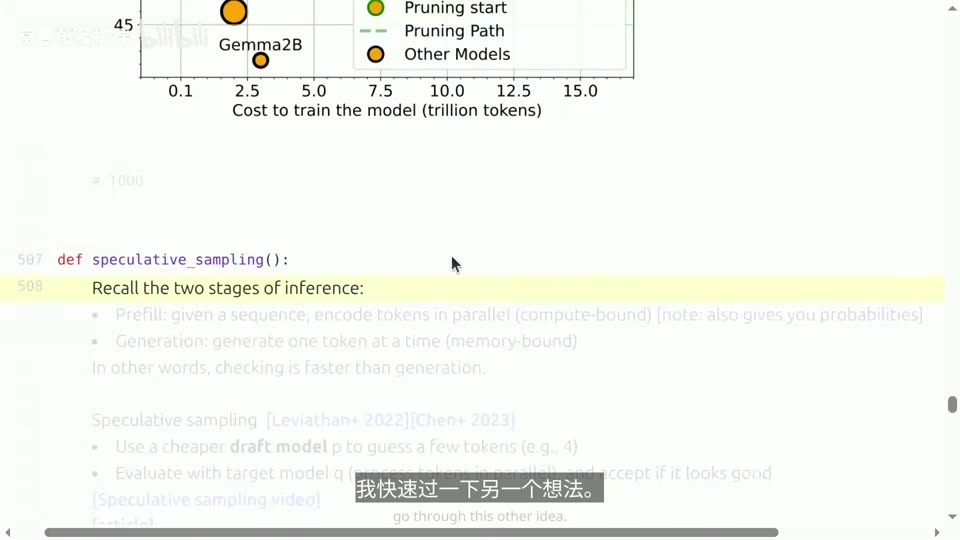 |
| 这同样能给出概率，该方法速度很快，属于计算受限（compute-bound）型，具备诸多优点；而生成则是逐个进行的。咱们来说说：检查比生成快多了。比如我给你一段序列，你能很快告诉我它有多好，比逐个生成要快得多。所以咱们可以利用这种不对称性。思路如下：我们先用一个便宜的草稿模型…… [【跳转到 56:28】](https://www.bilibili.com/video/BV11LEA6eEuj/?p=10&t=3388) | 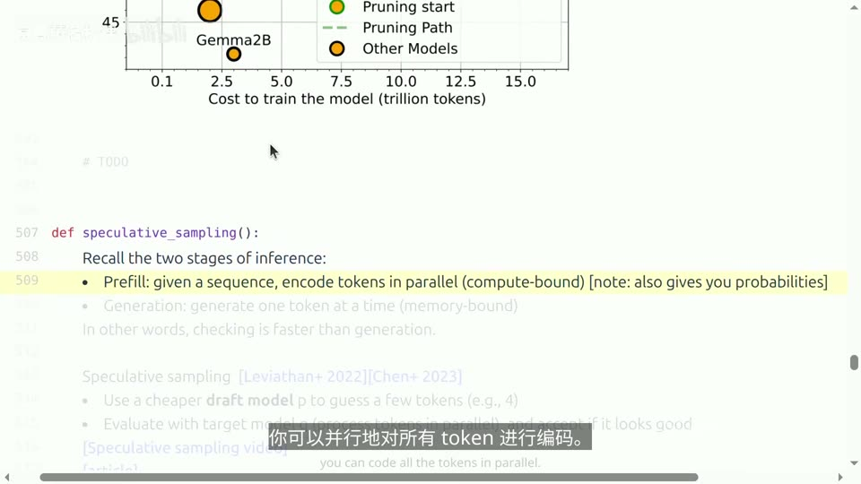 |
| 让草稿模型先生成几个 token，比如四个，接着用我们真正在乎的目标模型来审查这些 token，决定接受还是拒绝，懂了吗？这样两边就平衡了：草稿模型更小更便宜，虽然它受内存限制、必须逐个生成，但这问题不大；目标模型虽然大且贵，但咱们让它并行处理一批 token…… [【跳转到 56:53】](https://www.bilibili.com/video/BV11LEA6eEuj/?p=10&t=3413) | 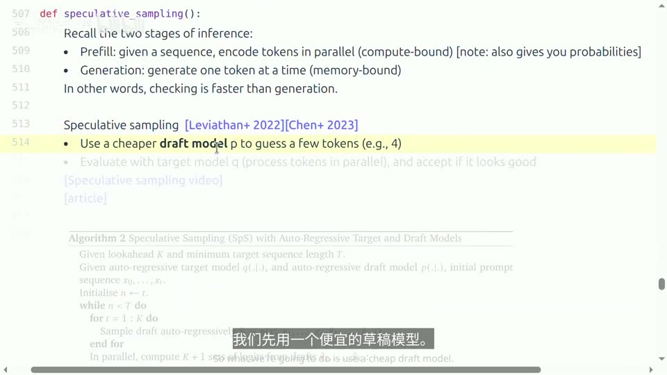 |
| 所以它也不会太吃力。咱们来看个视频，直观地演示一下这背后的工作原理。 [【跳转到 57:18】](https://www.bilibili.com/video/BV11LEA6eEuj/?p=10&t=3438) | 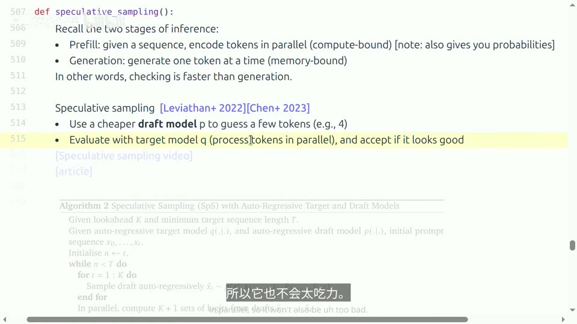 |
| 你看，要是让大模型一个一个 token 地生成，那效率可就太低了。但要是你用了推测解码（speculative decoding），情况就不一样了。 [【跳转到 57:23】](https://www.bilibili.com/video/BV11LEA6eEuj/?p=10&t=3443) | 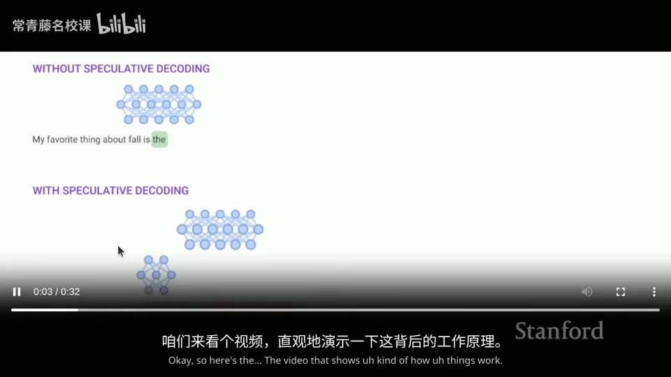 |
| 这时候你能看到小模型先生成出一批 token，接着交给大模型，基本上大模型会对这些 token 进行校验和评估，这样一来你就获得了一连串 token 的批量输出，接着是下一批，以此类推。 [【跳转到 57:36】](https://www.bilibili.com/video/BV11LEA6eEuj/?p=10&t=3456) |  |
| 好，咱们来看看具体的算法流程。当时有好几篇论文几乎同时发表了关于推测解码的研究。 [【跳转到 57:55】](https://www.bilibili.com/video/BV11LEA6eEuj/?p=10&t=3475) | 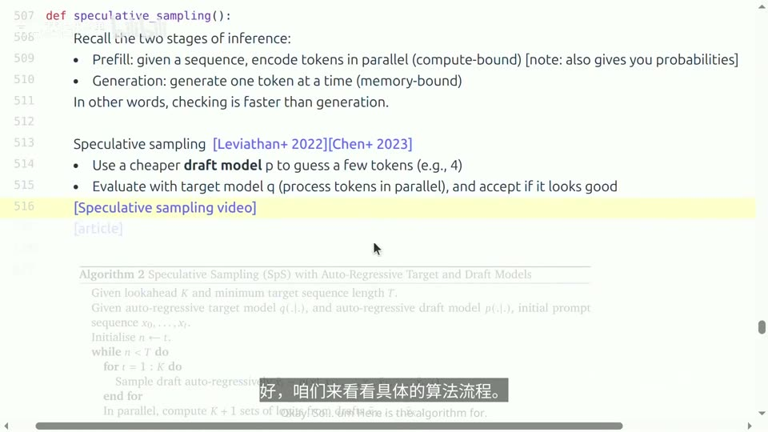 |
| 这就是其中之一。 [【跳转到 58:03】](https://www.bilibili.com/video/BV11LEA6eEuj/?p=10&t=3483) | 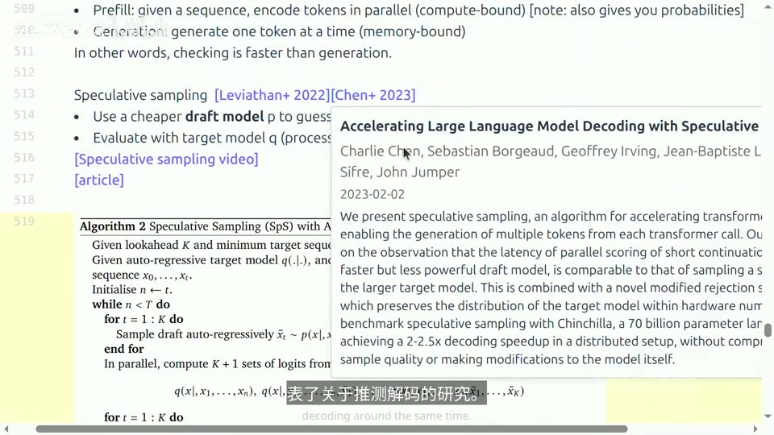 |
| 所以这里的思路是：为了生成内容，我们会先生成 K 个 token，直接从这个草稿模型里采样，所以 P 就是那个草稿模型。我们要从中采样出 K 个 token，然后并行地算出这些草稿 token 的 logits——用的是 Q。现在我们需要决定是接受还是拒绝，这时候就得用到一些数学概率和统计学的知识了。 [【跳转到 58:08】](https://www.bilibili.com/video/BV11LEA6eEuj/?p=10&t=3488) |  |
| 你基本上会以 min(1, q(x)/p(x)) 这个概率来接受它。也就是说，如果 Q 比 P 大很多，Q 越大我们就越倾向于接受它；否则你就从那个残差分布里采样。这基本上就是拒绝采样，只不过在拒绝采样里，有时候你被拒绝了就什么都得不到，但在这儿，我们总能保证从目标模型里拿到精确的样本。 [【跳转到 58:33】](https://www.bilibili.com/video/BV11LEA6eEuj/?p=10&t=3513) | 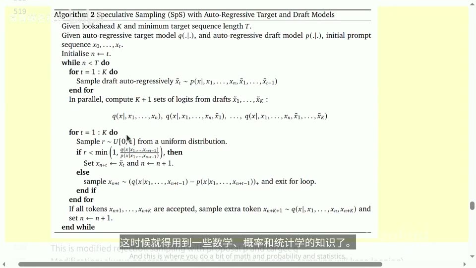 |
| 这部分我跳过不讲，证明挺简单的，论证逻辑跟拒绝采样基本一样，用来证明它是精确的，也就是目标模型给出的那些概率。最初那篇论文表明这种方法速度很快。一般来看，如果你的草稿 token 太少，就没怎么利用上目标模型那边的批处理； [【跳转到 58:58】](https://www.bilibili.com/video/BV11LEA6eEuj/?p=10&t=3538) | 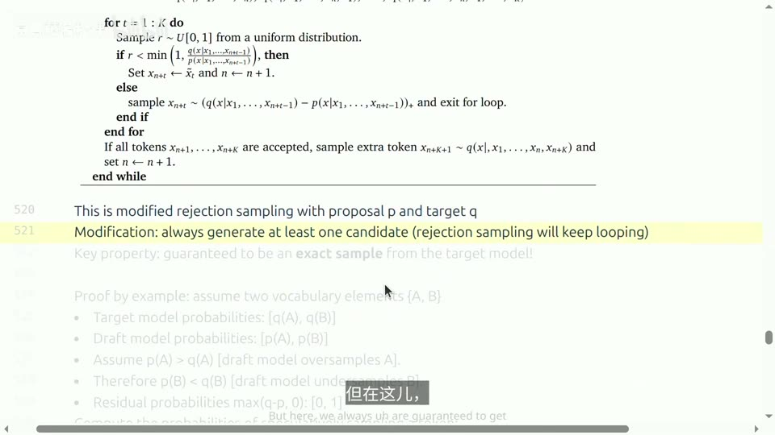 |
| 如果数量太多，被拒绝的概率就大了，所以得找个平衡点，比如 3 到 4 个。好，一般来说 draft model 比 target model 小得多。理想状态下，你希望 draft model 尽量贴近 target model，这就得靠蒸馏来实现。也就是说，咱们刚才聊的那些思路其实也适用于 speculative decoding。简单来说，就是想办法用各种手段把 KV cache 降下来。 [【跳转到 59:23】](https://www.bilibili.com/video/BV11LEA6eEuj/?p=10&t=3563) | 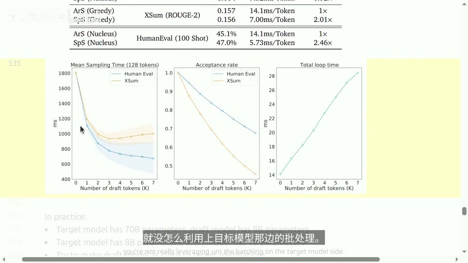 |
| 要是结果满意就直接上线；要是不满意，它至少能当个 draft model，再用主模型来修补一下。现在关于 speculative decoding 有很多新研究，效果都比最初的好，这部分我就先跳过了。好，咱们快速过一下动态负载。这个应用场景是这样：你有一个线上网站，用户过来跟你的模型聊天…… [【跳转到 59:48】](https://www.bilibili.com/video/BV11LEA6eEuj/?p=10&t=3588) | 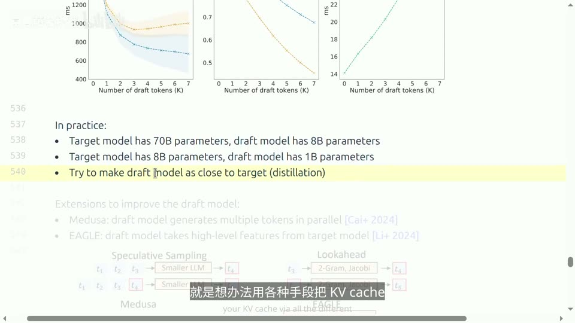 |
| 这些请求到达的时间各不相同，共享的前缀也不一样，而且长度参差不齐，所以情况挺乱的，完全不像那种一次性把同样数量的 token 块都塞进去的简单训练。那这种情况下该怎么办呢？有这么个思路：有人构建了一个叫 ORCA 的系统，这其实是挺早的一个做法。 [【跳转到 60:13】](https://www.bilibili.com/video/BV11LEA6eEuj/?p=10&t=3613) | 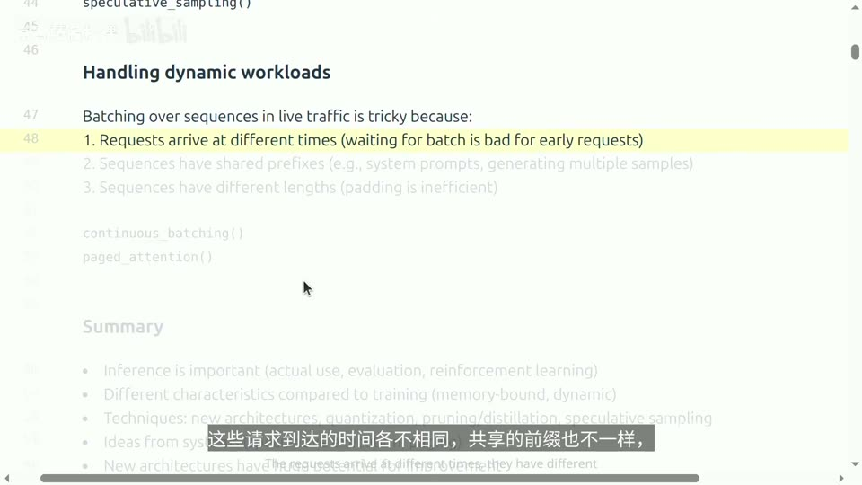 |
| 它提出了 continuous batching（连续批处理）这个概念。咱们这么想：你手头有一堆这样的请求，比如这是第一个请求的前缀，你现在要生成这个 token，这是第二个、这是第三个、这是第四个。因为每个前缀长度都不一样，所以看起来参差不齐。咱们一步步来——在解码的每一步里，你为所有序列各解码出一个 token。 [【跳转到 60:38】](https://www.bilibili.com/video/BV11LEA6eEuj/?p=10&t=3638) | 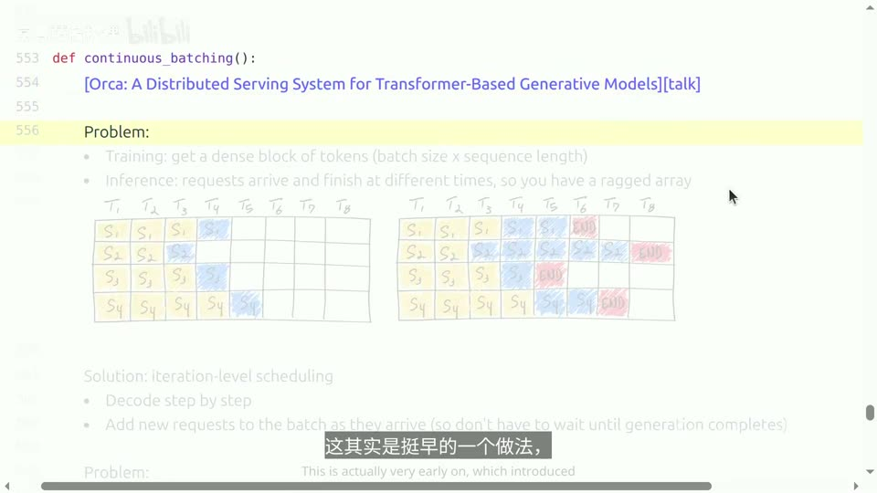 |
| 接下来你要为所有序列解码下一个 token。一旦某个序列生成结束，就直接把它剔除掉；接着当有新请求进入批次时，你把它加进去，然后继续处理。这就是为什么叫连续批次——你的批次是动态更新的，旧的序列完成后被踢出，新的序列随即进入。哎，这里有个问题…… [【跳转到 61:03】](https://www.bilibili.com/video/BV11LEA6eEuj/?p=10&t=3663) | 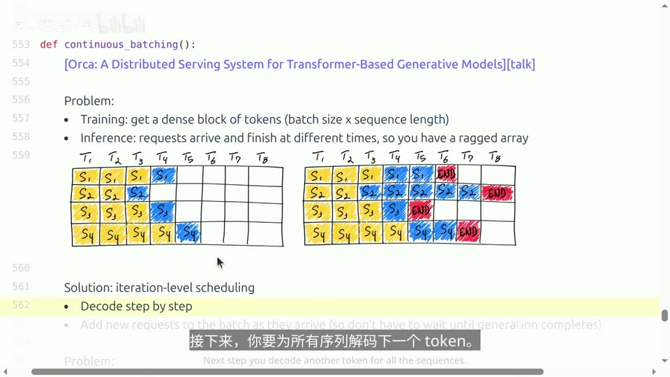 |
| 之前我们看到的批量处理，前提是所有序列的维度必须一致，对吧？张量里的每一个切片维度都一样。但这里每个请求的长度不同，你该怎么处理？这就引出了选择性批次的概念。比如假设你有长度各不相同的若干序列……在注意力计算中，这确实没法直接处理，因为注意力机制依赖于序列的长度。 [【跳转到 61:25】](https://www.bilibili.com/video/BV11LEA6eEuj/?p=10&t=3685) | 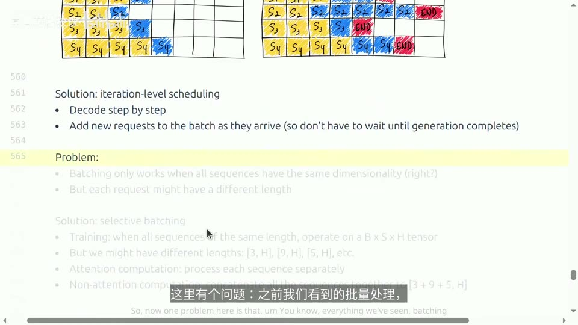 |
| 比如如果是 3×3 的运算和 9×9 的运算，你就没法有效地共享张量。但对于非注意力的部分…… [【跳转到 61:50】](https://www.bilibili.com/video/BV11LEA6eEuj/?p=10&t=3710) | 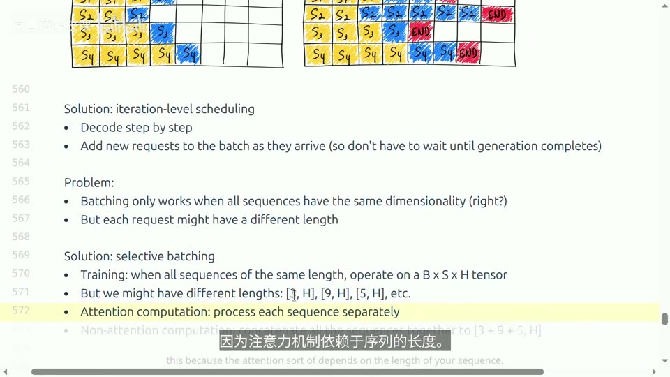 |
| 也就是占用大量浮点运算的 MLP 层，你其实可以把所有序列拼接成一个超大序列，然后一起处理。好，最后一个思路是分页注意力（PagedAttention），这一机制在 vLLM 论文中提出。当然现在的 vLLM 拥有许多其他功能，但这是当时的核心思想。那么问题是：KV 缓存是如何存储的？你想想看，请求进来了，你得把它们存到内存的某个地方…… [【跳转到 62:03】](https://www.bilibili.com/video/BV11LEA6eEuj/?p=10&t=3723) | 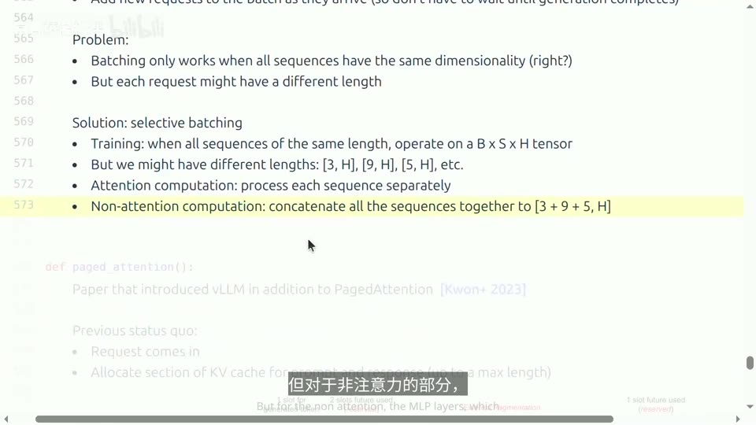 |
| 而这通常会带来一个问题，就是碎片化。这就像以前你的硬盘会遇到的情况，那时候你得给硬盘做碎片整理，对吧？好，所以碎片化主要有两种。第一种是你必须预留足够的缓冲区，这是因为你根本不知道什么时候会停下来，所以你可能得设一个最大 token 上限，所以你得把所有内存都分配出去…… [【跳转到 62:28】](https://www.bilibili.com/video/BV11LEA6eEuj/?p=10&t=3748) | 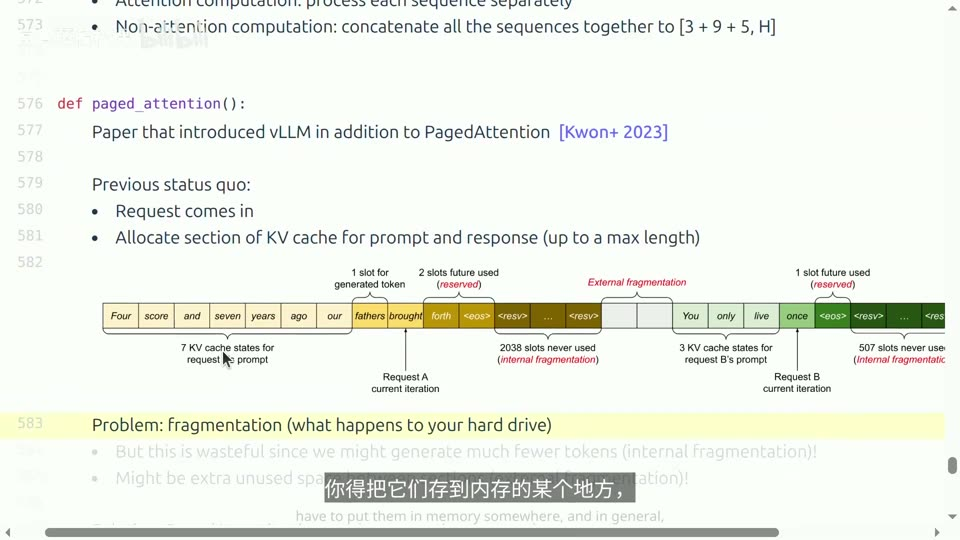 |
| 但里面什么也放不进去，因为系统会一直生成直到 token 数达到上限，这就太浪费了。这叫内部碎片。 [【跳转到 62:53】](https://www.bilibili.com/video/BV11LEA6eEuj/?p=10&t=3773) |  |
| 另外，不同请求之间也可能留出一些空隙，但这些空隙往往太小、没法有效利用，也就成了浪费的空间。所以解决办法是这样的——毕竟他们是搞系统的人，对操作系统很熟悉，他们说：既然这个问题我们以前解决过，那就照老办法来。所以我们要把一个序列的 KV cache 切成不连续的小块…… [【跳转到 63:03】](https://www.bilibili.com/video/BV11LEA6eEuj/?p=10&t=3783) |  |
| 比如如果你有这样一个序列——"87 年前我们的先辈创立了这个国家"——我们就把它切成大小为 4 的小块。块具体放在哪并不重要，但它们会按块对齐，这样整体就有了一定的统一性。所以当两个请求共享相同的（前缀）时，它们实际上可以共用同一个 KV cache。所以你可能有一块、还有那一块，比如这块可能放在这里…… [【跳转到 63:28】](https://www.bilibili.com/video/BV11LEA6eEuj/?p=10&t=3808) | 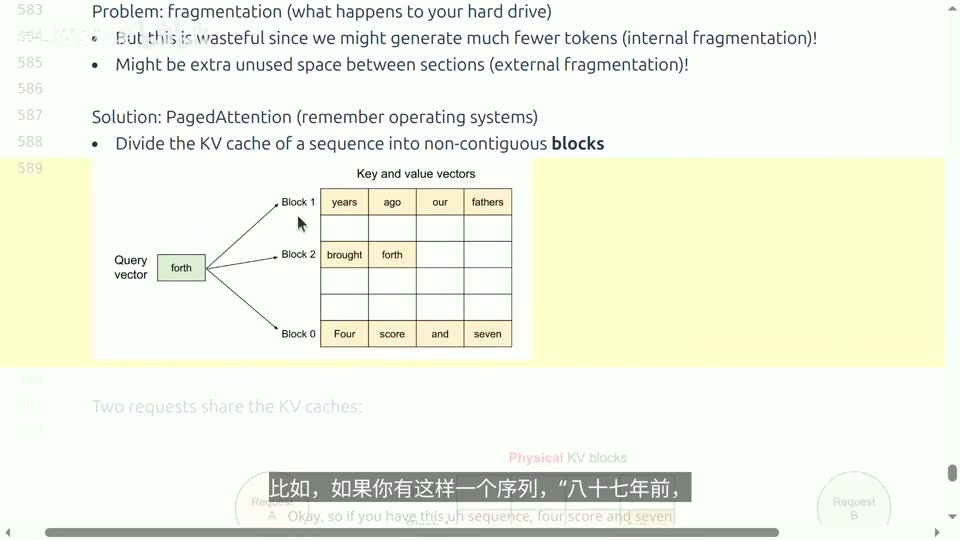 |
| 那块可能放在那边。它们有点交错分布，但只要你有索引能追踪到每样东西的位置，就没问题。 [【跳转到 63:53】](https://www.bilibili.com/video/BV11LEA6eEuj/?p=10&t=3833) | 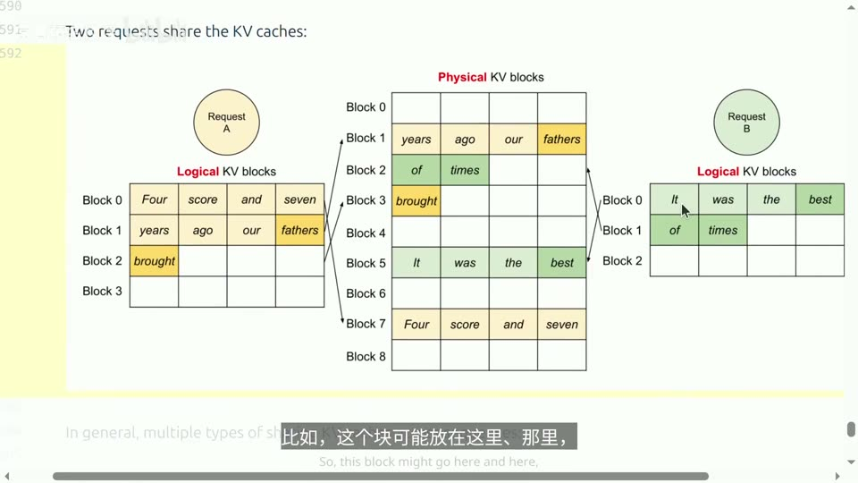 |
| 特别是，如果你有 system prompt，你其实可以只把这些 system prompt 的 KV cache…… [【跳转到 64:02】](https://www.bilibili.com/video/BV11LEA6eEuj/?p=10&t=3842) | 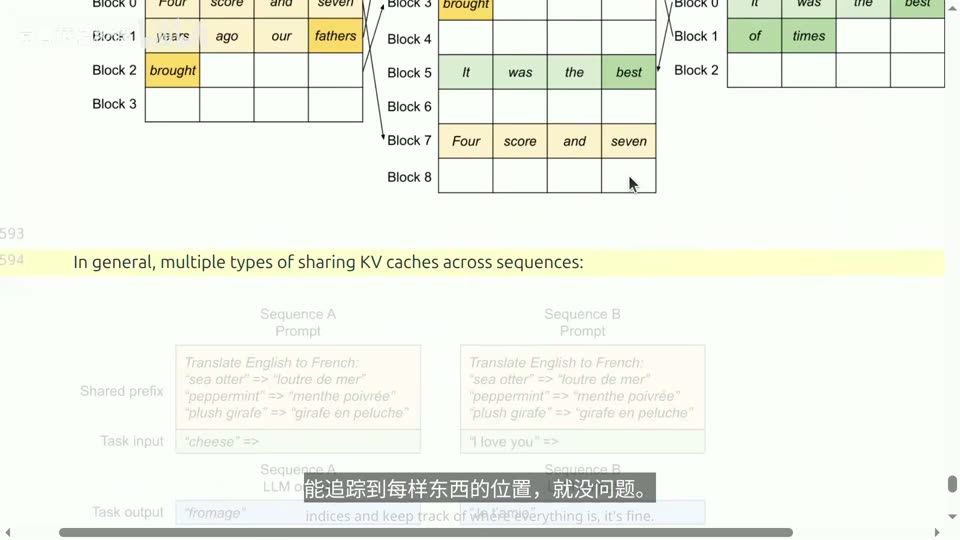 |
| 缓存一次，这对所有查询都很有用。 [【跳转到 64:09】](https://www.bilibili.com/video/BV11LEA6eEuj/?p=10&t=3849) | 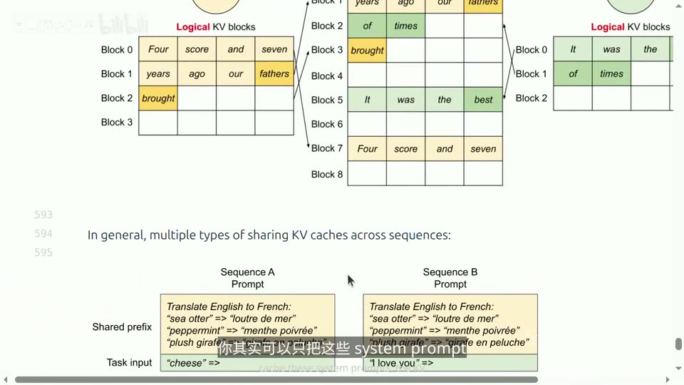 |
| 这非常关键，因为如果很多人用的是同一个 system prompt，你就不用每个请求都重新计算 KV cache。另外，在很多应用场景里，你用的是同一个 prompt，但其实想生成多个回复。 [【跳转到 64:14】](https://www.bilibili.com/video/BV11LEA6eEuj/?p=10&t=3854) | 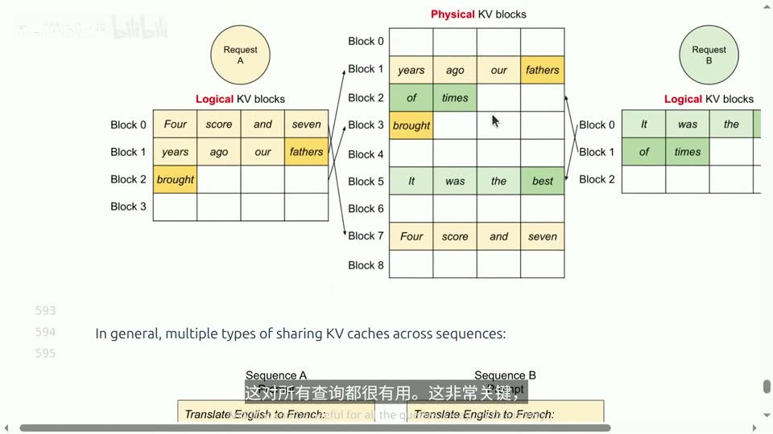 |
| 这种情况下，你也可以共享这个 prompt 的 KV cache，只让各自独特的回复输出出来。好，比如如果你要从"87 年前"这个开头生成多段续写……这里的情况是你已经有了 "four score and seven"，接下来从 "years ago" 或者 "our" 开始往下生成 "for"…… [【跳转到 64:29】](https://www.bilibili.com/video/BV11LEA6eEuj/?p=10&t=3869) | 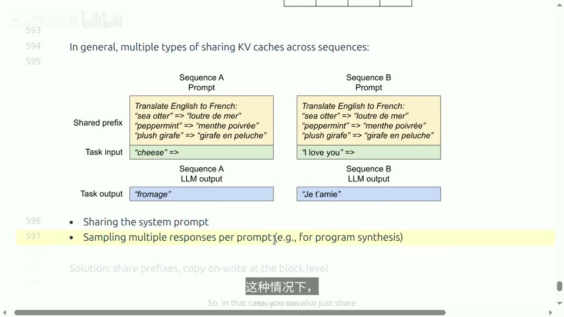 |
| 然后这就叫写时复制（copy-on-write）语义。我们保留这部分，然后看这两个样本：如果它们恰好采样到了相同的 token，就直接沿用它继续往下；但如果它们采样到了不同的 token，就把这个块拆开，然后各自往下继续。也就是说，你本质上是在尽可能多地共享前缀缓存…… [【跳转到 64:54】](https://www.bilibili.com/video/BV11LEA6eEuj/?p=10&t=3894) | 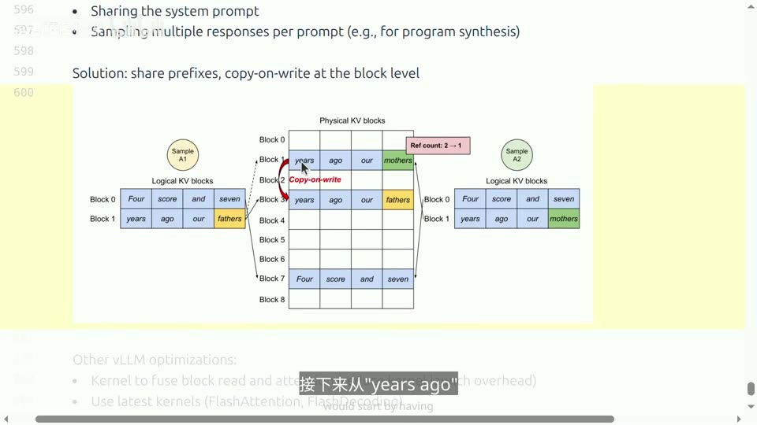 |
| prefix cache。此外还有一系列其他优化，比如 kernel 层面的改进，时间关系我就不展开讲了。但核心思路就是借用操作系统里的这些概念来管理你的 inference。好，总结一下：inference 真的非常非常重要，这和训练非常不同…… [【跳转到 65:19】](https://www.bilibili.com/video/BV11LEA6eEuj/?p=10&t=3919) | 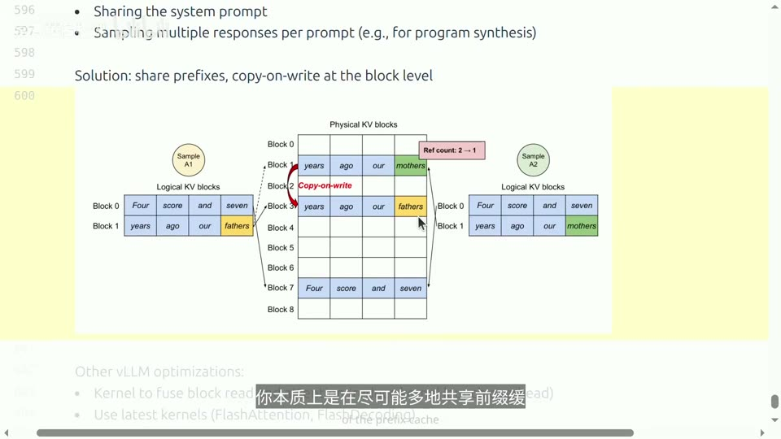 |
| 虽然是同一个模型，但你让模型做的事情完全不同，它最终会变得严重受内存限制，而且在实时服务这种场景下负载还是动态变化的。我们看到了多种不同的技术，为了提升 inference，你可以做量化、可以设计新架构、可以做剪枝和蒸馏，也可以使用推测采样。但所有这些方法都遵循同一个原则…… [【跳转到 65:44】](https://www.bilibili.com/video/BV11LEA6eEuj/?p=10&t=3944) | 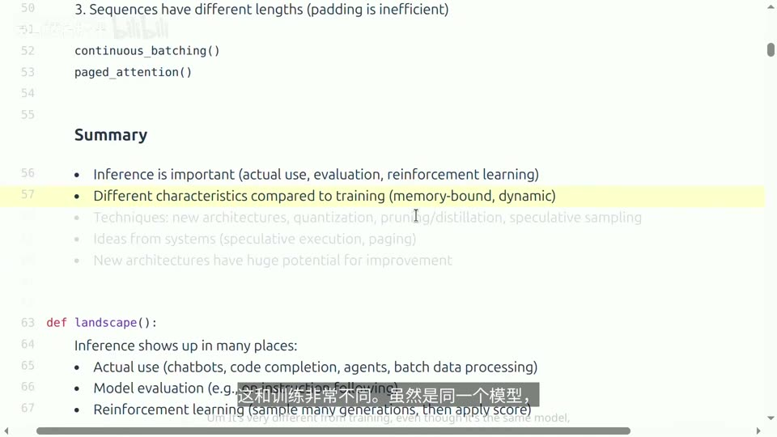 |
| 减少 KV cache 的占用，同时尽量不损害精度。此外还可以引入来自系统领域的思想，比如分页和推测执行。针对实际运行的 inference 服务器，有一点我们没怎么来得及展开、只是简单提了一下，那就是：我觉得新架构其实有巨大的改进潜力。 [【跳转到 66:09】](https://www.bilibili.com/video/BV11LEA6eEuj/?p=10&t=3969) | 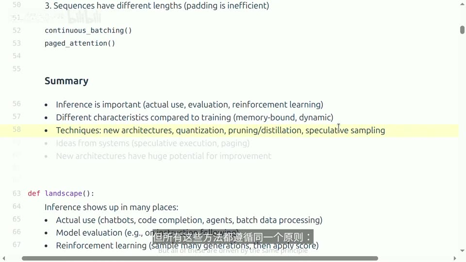 |
| 比如状态空间模型、线性注意力或者扩散模型。在某种程度上，KV 缓存以及注意力的构建方式从根本上决定了这一切——这种架构对 inference 不太友好。所以如果你能设计出一种专为 inference 而生的新架构——而 transformer 当初并不是这样设计的——也许就能释放出巨大的潜力。好，我就先讲到这。下节课…… [【跳转到 66:34】](https://www.bilibili.com/video/BV11LEA6eEuj/?p=10&t=3994) | 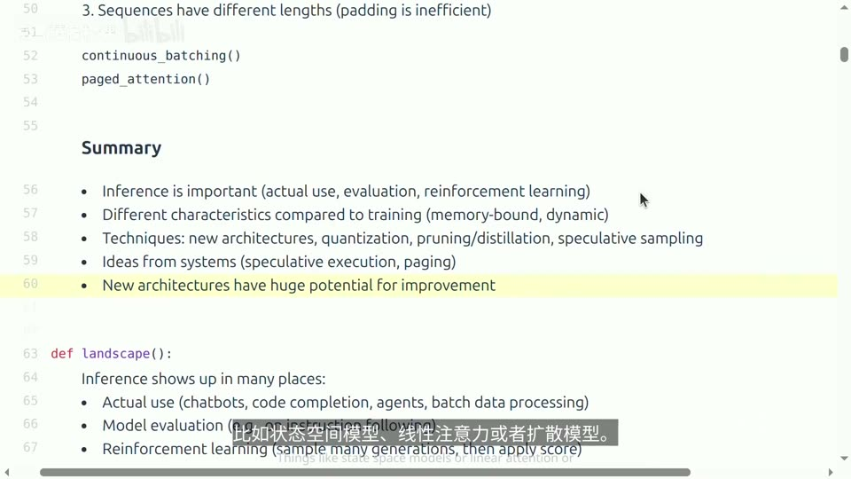 |
| 我回来接着讲 scaling laws 的第二部分。 [【跳转到 66:58】](https://www.bilibili.com/video/BV11LEA6eEuj/?p=10&t=4018) | 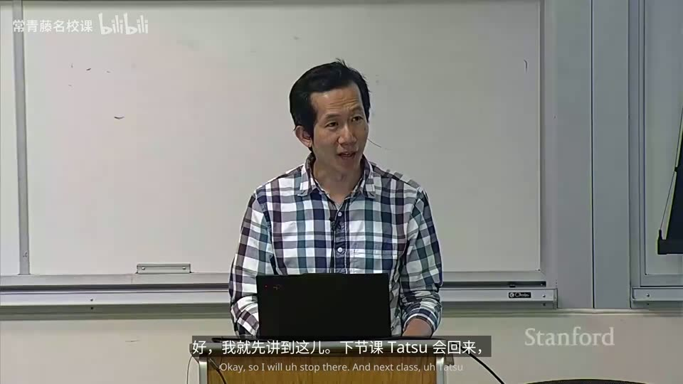 |