# Lecture 11: Scaling Laws · 原始文稿（图-字幕分栏）

| 字幕文本 | 画面 |
| :--- | ---: |
| 好，咱们继续我们的 scaling 之旅。今天的内容有点杂，具体来说，咱们要聊聊 scaling laws 里更进阶的细节。 [【跳转到 00:00】](https://www.bilibili.com/video/BV11LEA6eEuj/?p=11&t=0) |  |
| 还有模型扩展的具体做法。在这个过程中…… [【跳转到 00:05】](https://www.bilibili.com/video/BV11LEA6eEuj/?p=11&t=5) | 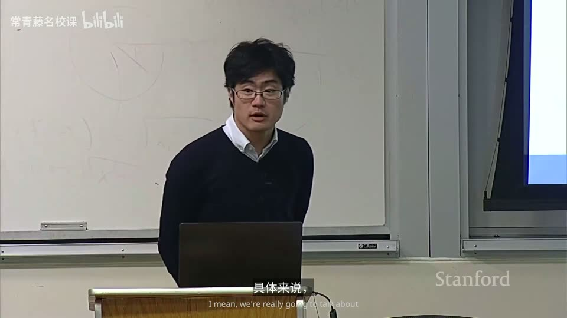 |
| 咱们会讲到一些我觉得很关键的细节，也就是实际操作中怎么扩展一个 language model。 [【跳转到 00:10】](https://www.bilibili.com/video/BV11LEA6eEuj/?p=11&t=10) |  |
| 好，咱们可以问几个问题：比如你两节课前讲的那个 scaling laws，在真正构建 open-source model 的规模下，它真的管用吗？如果能优化其中一些环节就好了。人们用了很多学习率技巧之类的手段，我觉得作为了解怎么构建 language model 的人，这些你们都该知道，所以咱们会聊聊这些优化细节。最后我想讲的一点是…… [【跳转到 00:15】](https://www.bilibili.com/video/BV11LEA6eEuj/?p=11&t=15) |  |
| 模型规模变大后，有些东西调起来会稍微麻烦一点。我们知道，优化器及其行为对规模变化其实非常敏感，因此像初始化、学习率、批次大小这些，我们需要把它们作为规模的函数来仔细考量。接下来我们就来讲讲该怎么仔细思考这些问题。好，到目前为止，我们聊的大多是我所说的经典 scaling laws。 [【跳转到 00:40】](https://www.bilibili.com/video/BV11LEA6eEuj/?p=11&t=40) | 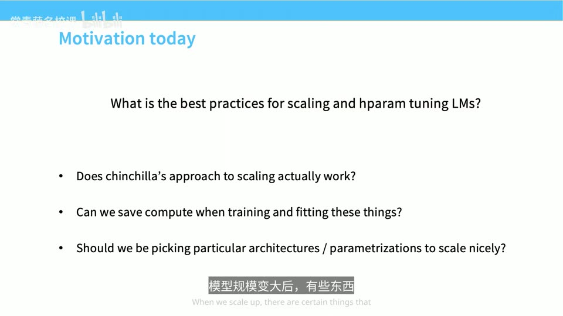 |
| 之前我们聊过 Kaplan、聊过 Hestness，还有 Chinchilla 那篇论文。所以我们讲到的内容大概到 2022 年左右。从那以后，不少训练大模型的人发表了一系列 scaling 论文，不过我觉得近几年这类论文的数量有所减少，而且大多出自中国的 open-source 社区。所以今天我想挑几篇来讲讲。 [【跳转到 01:05】](https://www.bilibili.com/video/BV11LEA6eEuj/?p=11&t=65) | 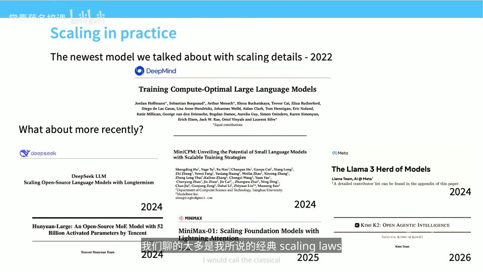 |
| 这些都是我特意筛选出来的，想让大家感受一下前沿——至少是开源前沿的 scaling 是什么样子，这些人关心或担心的是什么。如果你想从 Chinchilla 一路速通到 Kimi K2，也就是最新发布的那个，你需要做些什么事？这里有一些 scaling 的细节。好，这就是本次讲座的第一部分，咱们会过几篇论文、把细节都讲一遍；第二部分讲 optimizer、scaling 和初始化。大家记得吧…… [【跳转到 01:30】](https://www.bilibili.com/video/BV11LEA6eEuj/?p=11&t=90) | 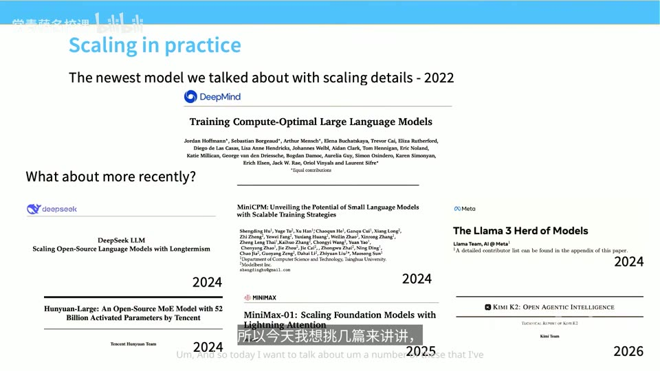 |
| 我两节课之前花了不少时间讲怎么选 batch size，这点很重要。还有咱们还得想想怎么调 learning rate 这类参数，这也挺关键的，这些参数很敏感，设对了特别重要。所以你看，大家确实花了不少功夫把它们调对。咱们会讲一些相关技巧，说实话这对你们平时训练各种 language model 挺有用的，因为它能让你们知道规模放大或缩小时，实验里的超参数（hyperparameters）该怎么调。好。 [【跳转到 01:55】](https://www.bilibili.com/video/BV11LEA6eEuj/?p=11&t=115) | 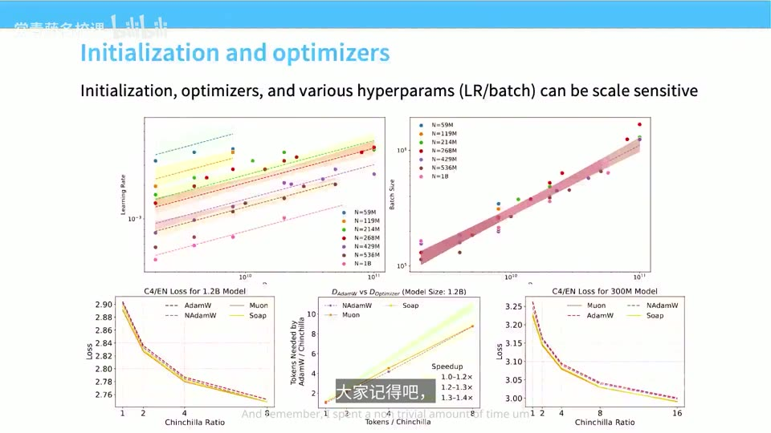 |
| 我打算花不少时间重点讲两篇论文。这两篇不算最新，其实也不算最顶尖，不过说真的，DeepSeek 那篇可能算是讲得比较细的；整体上它不算最详尽的那篇 scaling 论文，但我觉得它正好踩在了一个最佳平衡点上。所以这两篇论文都是来自一线模型构建者的严肃 scaling 研究，它们都达到了相当高的性能。 [【跳转到 02:20】](https://www.bilibili.com/video/BV11LEA6eEuj/?p=11&t=140) | 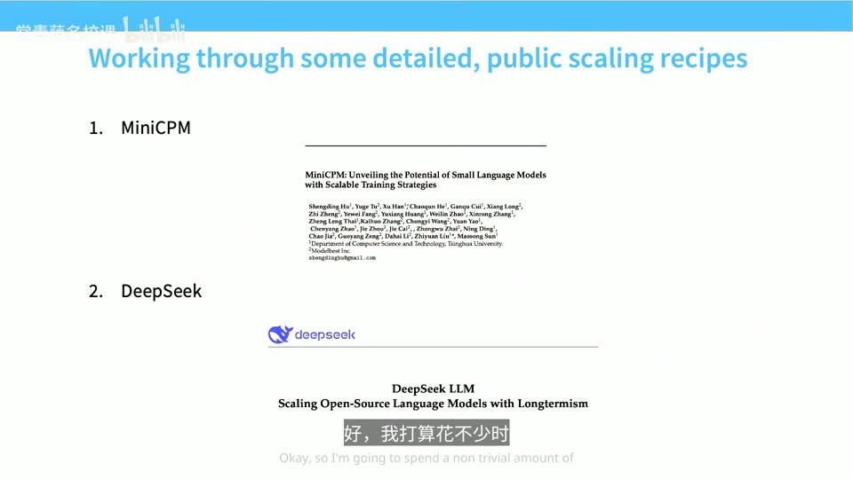 |
| 更重要的是，针对我们今天要探讨的一些关键问题，它们采取了截然不同的方法，所以我觉得用它们来引出后面课程的很多内容很合适。那我就来讲讲这两篇。第一篇是 MiniCPM，我想这是 2024 年的，是一个高性能的 small language model；还有 DeepSeek，大家现在都很熟悉了，我不用再解释为什么要讲 DeepSeek，这很好。 [【跳转到 02:45】](https://www.bilibili.com/video/BV11LEA6eEuj/?p=11&t=165) | 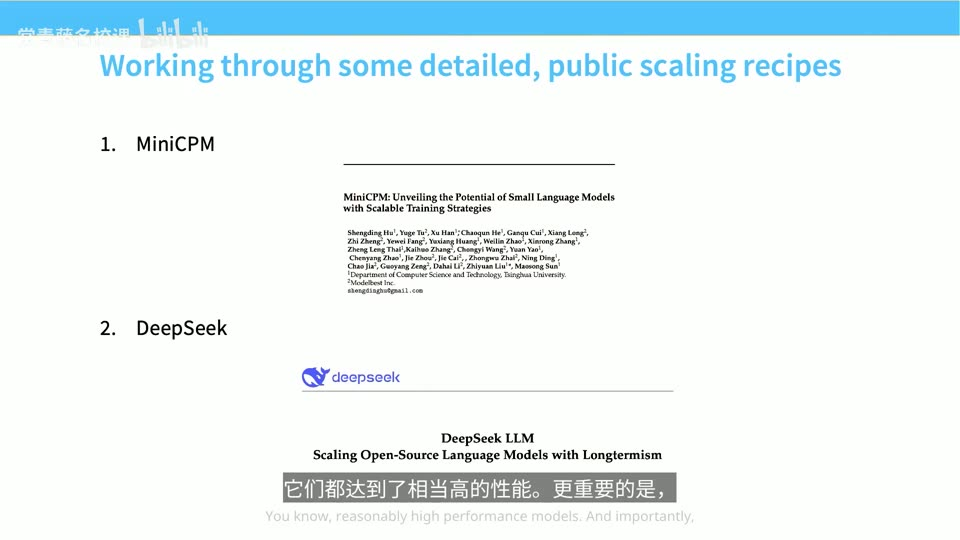 |
| 不过我们还是先从 MiniCPM 讲起。我挺喜欢这篇论文的，尤其是它刚发表的时候，当时感觉非常新颖、很有前沿感。即便到了 2024 年，我觉得 MiniCPM 团队做的很多工作对我们依然很有启发，这个我后面讲到新论文时会细说。不过我感觉现在大家似乎已经默认了一些经典的 scaling 操作，比如怎么设学习率、怎么做 Chinchilla 的优化，这些基本都成了标配。 [【跳转到 03:10】](https://www.bilibili.com/video/BV11LEA6eEuj/?p=11&t=190) | 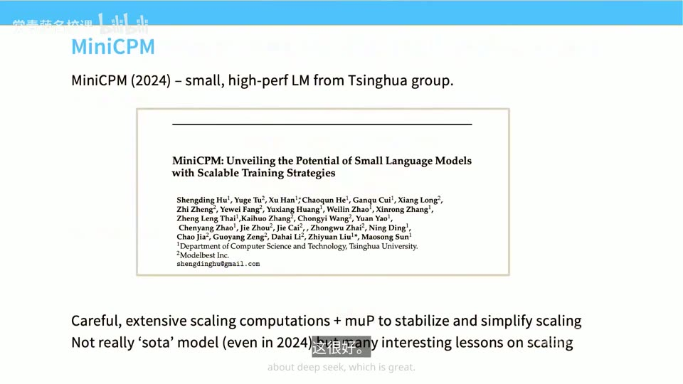 |
| 我觉得这类东西现在大家都觉得理所应当了，就像大家默认你肯定知道该怎么操作一样，所以现在论文里很少再提这些了。正因如此，回过头来聊聊这些早期的论文其实挺有意义的。MiniCPM 是中国 open-source 社区里一群来自业界、学界还有合作伙伴的朋友一起搞出来的项目，目的是做一个高性能、参数规模中等的 language model。 [【跳转到 03:35】](https://www.bilibili.com/video/BV11LEA6eEuj/?p=11&t=215) | 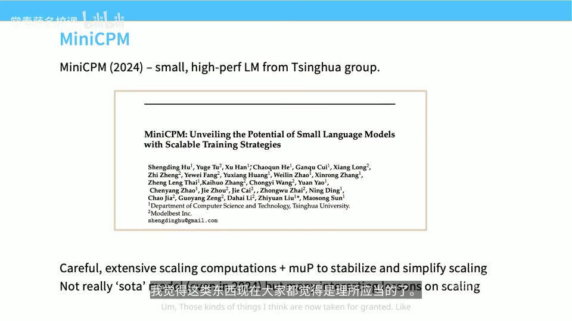 |
| 当时它刚出来的时候，在中小参数这个档位里基本上算是顶尖水平了。虽然现在 Gemma 和其他 2B 或者 3B 的模型性能更强，MiniCPM 依然是训练良好、具备竞争力的模型，至少放在 2024 年的标准来看是这样。那这些模型怎么训练呢？正如我之前提到的，咱们得把一些 scaling 参数调对。我今天想重点强调的一点是…… [【跳转到 04:00】](https://www.bilibili.com/video/BV11LEA6eEuj/?p=11&t=240) | 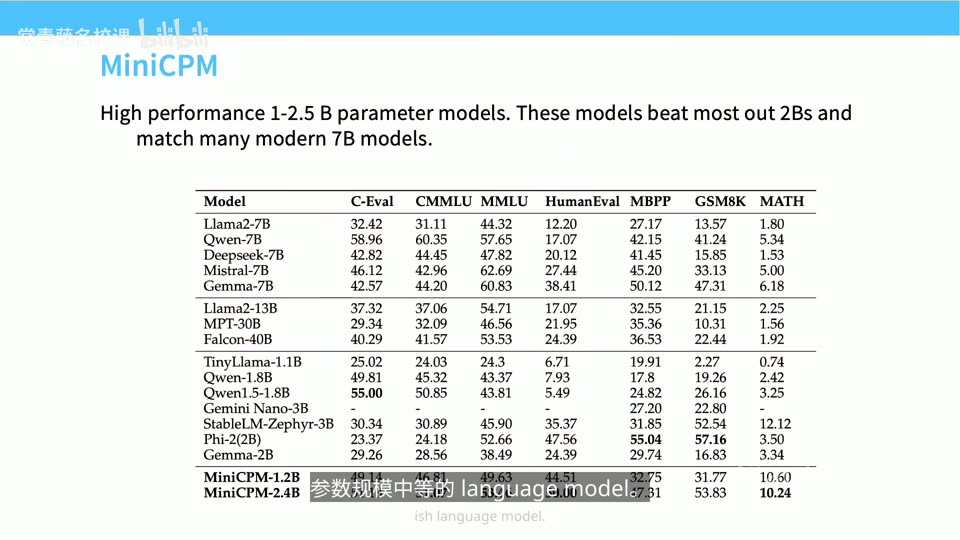 |
| 初始化这事儿特别重要。初始化之所以重要，是因为它能让某些超参数不那么依赖模型规模。那么我想先从这篇 MiniCPM 论文里提到的第一个技术聊起，它是一类特殊的初始化方法，叫做 μP（maximum update parametrization）。μP 的核心思想就是：无论模型规模如何放大或缩小，我都希望最优学习率保持不变。 [【跳转到 04:25】](https://www.bilibili.com/video/BV11LEA6eEuj/?p=11&t=265) | 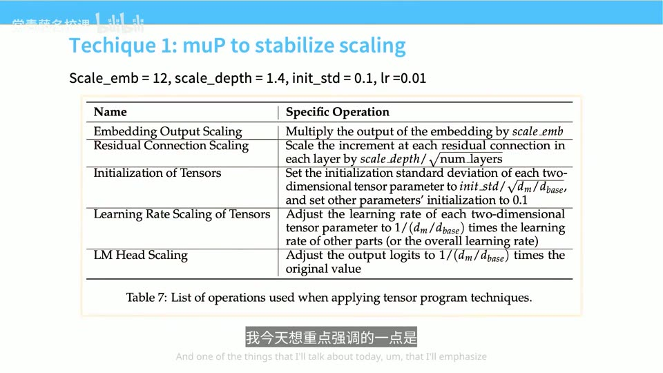 |
| 我在两次课之前简单提过这个概念，希望大家还有点印象，但这是我们今天要讨论的第一个真正的具体实现。它具体长什么样呢？MiniCPM 这篇论文列出了一系列操作：他们会缩放嵌入（embedding）的输出，按层数的平方根来缩放残差连接，对所有矩阵形状的张量则依据 fan-in/fan-out 比率来缩放它们的初始化；他们还会调整张量的学习率。 [【跳转到 04:50】](https://www.bilibili.com/video/BV11LEA6eEuj/?p=11&t=290) | 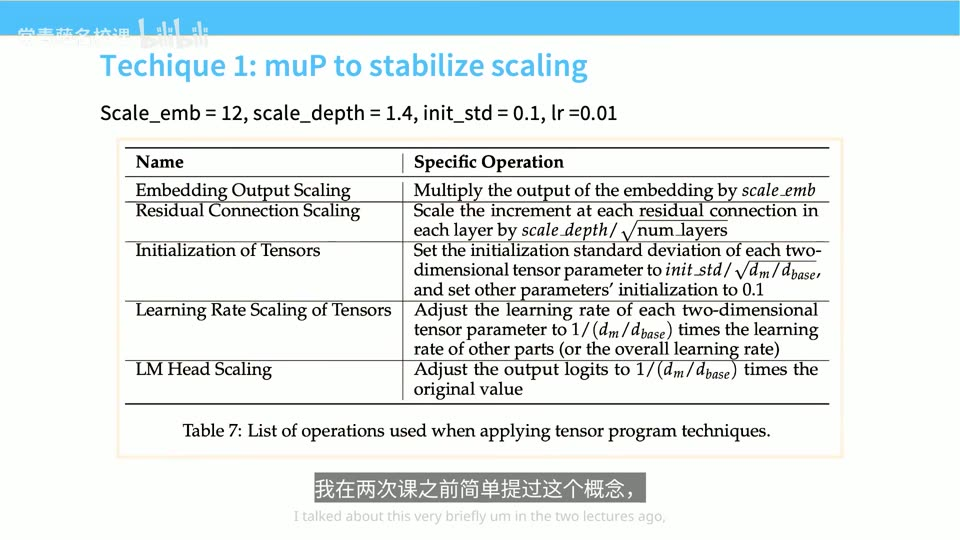 |
| 大家请注意这一点，它之所以显得特别，是因为如果你平时不习惯按参数设置学习率，会觉得有点奇怪。另外，他们还会对 language model 的 head 做缩放，咱们后面会聊为什么要这么做，以及这些缩放比例是怎么推导出来的。简单说，你只需要把初始化和学习率的设定稍微改一改，希望能让训练过程更稳一点。 [【跳转到 05:15】](https://www.bilibili.com/video/BV11LEA6eEuj/?p=11&t=315) | 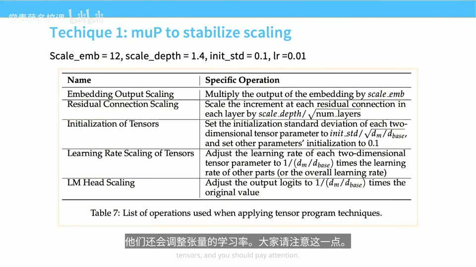 |
| 当然我们这训练的是个小模型，但还是想搞一套像样的缩放策略。做这个研究的一个目的，就是不想靠训练几百个模型去暴力穷举、从而得到那个 1.5B 的模型；咱们希望第一次就把超参数调准。所以会先训练一堆小得多的模型，然后搭一个缩放阶梯、一路扩展到目标大小，大概五倍左右。所以他们阶梯上最大的那个模型…… [【跳转到 05:40】](https://www.bilibili.com/video/BV11LEA6eEuj/?p=11&t=340) | 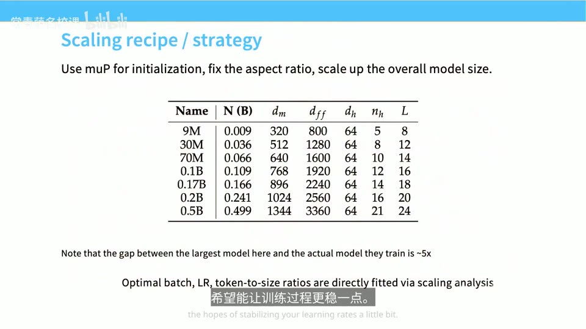 |
| 和最后真正发布的那个模型之间差了大概五倍。他们的目标是想把那些大家普遍认为很敏感的参数定下来，比如最佳批量大小、学习率，还有咱们在 Chinchilla 里提过的 token 与模型规模的比率。他们其实也想复现一下 Chinchilla 的分析，这事儿现在对我们来说没那么重要了，对你们估计也一样，哪怕你们正在做训练。 [【跳转到 06:05】](https://www.bilibili.com/video/BV11LEA6eEuj/?p=11&t=365) | 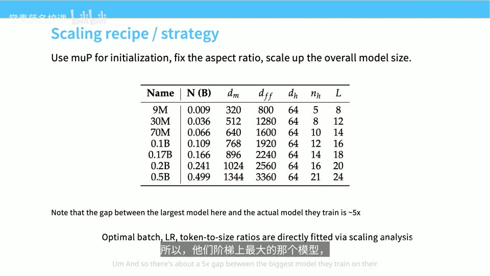 |
| 不过我还是得聊聊这个，因为他们做这件事的方式里有个关键点，我觉得特别有价值、也很实用。就像我刚才说的，搞这种叫 μP 的奇怪初始化——或者说非标准初始化——主要目的就是想让最优学习率保持稳定，是吗？至少在 MiniCPM 这个例子里，答案是肯定的。事实上他们的实验结果非常干净漂亮：他们在各种模型上扫了学习率，所以每条线就是一个模型的大小。 [【跳转到 06:30】](https://www.bilibili.com/video/BV11LEA6eEuj/?p=11&t=390) | 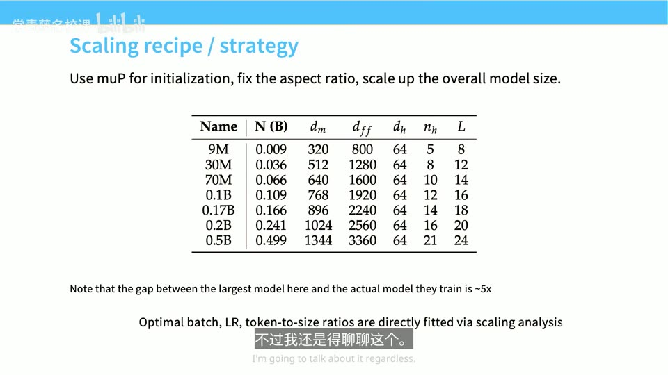 |
| 最小损失基本就落在同一水平附近。我猜对于最小的那个模型，最小值稍微偏了一点，但即便如此也挺接近最小值的。所以这是 μP 方法的一个很好的成功案例。接下来我们会聊聊其他几个用了 μP 的模型和论文。这不是唯一的方法，但确实是一种有效的方法，如果你能做到类似这样的效果，基本上就不用再去调学习率了。 [【跳转到 06:55】](https://www.bilibili.com/video/BV11LEA6eEuj/?p=11&t=415) | 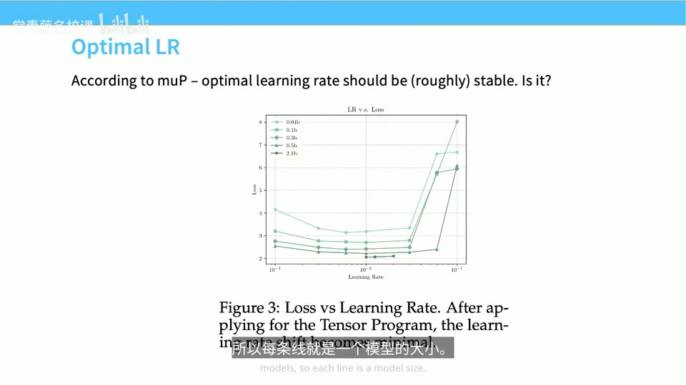 |
| 不过当然，哪怕你有个漂亮的参数化方案、把学习率锁定在某个最优值上…… [【跳转到 07:20】](https://www.bilibili.com/video/BV11LEA6eEuj/?p=11&t=440) | 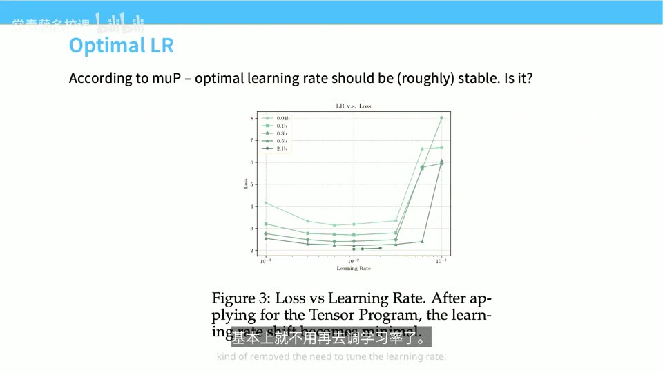 |
| 你的最优 batch size 也还是不会保持不变。所以你看，batch size 其实是随着数据集规模和模型规模变化而变化的。在他们的案例里，他们跑了一批这样的模型训练，你在这些图上看到的一列点就代表一次训练。他们把 batch size 固定，然后增加处理的 token 数量——我猜是从下往上递增的——然后他们问…… [【跳转到 07:25】](https://www.bilibili.com/video/BV11LEA6eEuj/?p=11&t=445) | 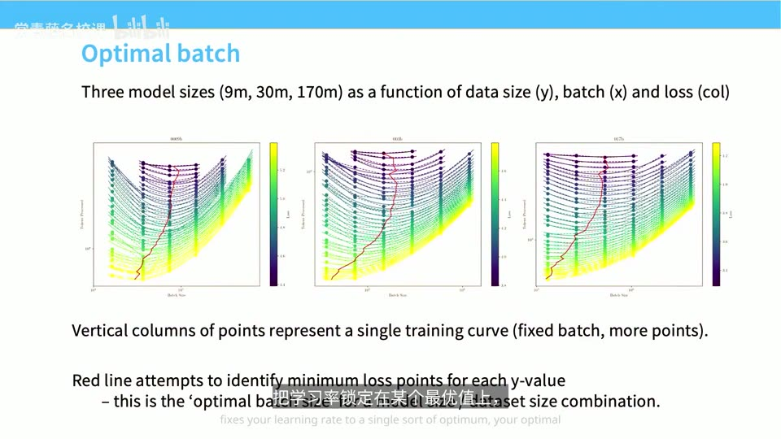 |
| 我们做了这么多次训练，那把这些二次曲线拟合到每一条线——也就是这些等损失等高线上——最优的 batch size 是多少？结果他们发现，最优 batch size 大致是随着处理的 token 数量按比例变化的。他们在不同规模的模型上都试了一遍。考虑到我们在 Kaplan 论文里看到的临界 batch size…… [【跳转到 07:50】](https://www.bilibili.com/video/BV11LEA6eEuj/?p=11&t=470) | 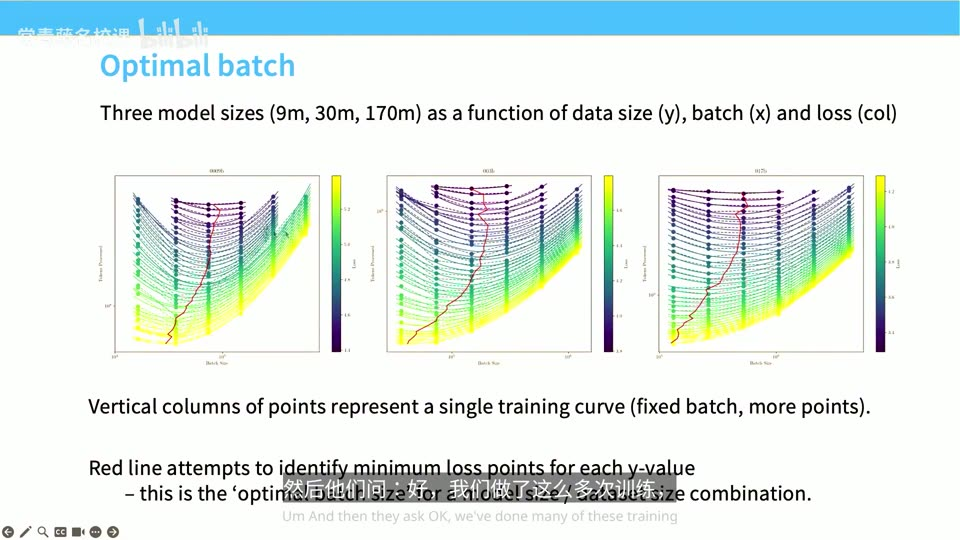 |
| 那些漂亮的缩放规律，这个结果你应该不会觉得意外。不过最优的 batch size 相对于目标 loss 来说，确实呈现出一种幂律结构。所以你看，这就很像 Kaplan 那套分析逻辑：如果你的 loss 更低，也就是在图的左边，那 batch size 就得更大，对吧？这就是临界 batch size 的缩放规律。所以既然你已经通过 scaling law 反推出了一个特定的 loss 目标，那你基本上就能定下那个最优…… [【跳转到 08:10】](https://www.bilibili.com/video/BV11LEA6eEuj/?p=11&t=490) |  |
| 或者说临界 batch size 了，这样能帮你找到最佳的权衡点，对吧？这里有个很清晰、很干净的规律，有了它，你就能非常轻松、精确地把 batch size 定下来了。好，那咱们刚才说的这两点——batch size 和学习率的缩放——后面还会反复提到，可以说它们是做 scaling law 最重要也最敏感的两个参数。不过我最后还想讲讲 MiniCPM 论文里…… [【跳转到 08:35】](https://www.bilibili.com/video/BV11LEA6eEuj/?p=11&t=515) | 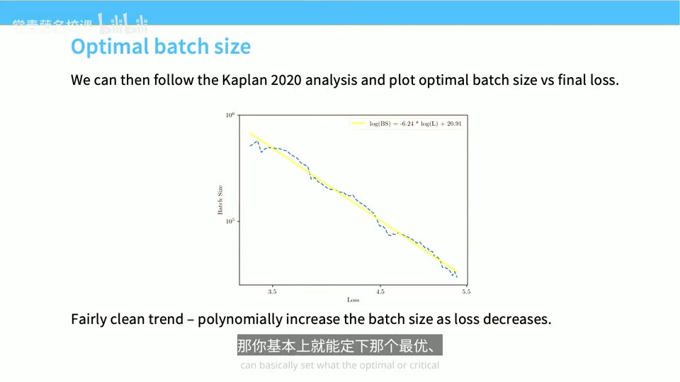 |
| 我觉得很重要的一点。所以大家还记得吧，要做 Chinchilla 的话，咱们得训练好多个不同的模型。咱们举个例子，这次要做的是 isoFLOPs 实验，也就是说我把浮点运算量预算固定下来，然后去调整 token 数量和模型大小之间的取舍。具体怎么做呢？我会增加训练数据的量，也就是增加序列的数量…… [【跳转到 09:00】](https://www.bilibili.com/video/BV11LEA6eEuj/?p=11&t=540) | 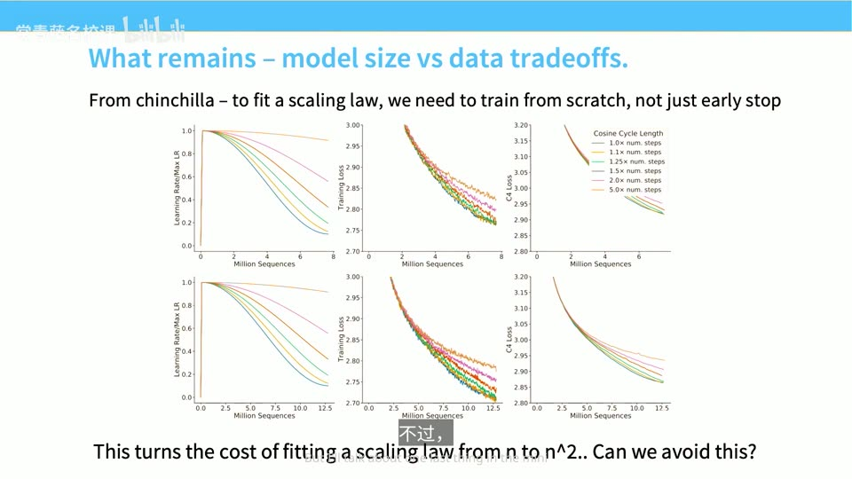 |
| 不过随着序列数量增加，大家要记住：每个序列得到的学习率调度是不同的。你们用的都是余弦学习率，但它们的曲线长得不一样——你得在训练前就清楚最终的总预算，才能定出余弦调度。这就带来一个挺让人头疼的问题：你不得不反复重新训练模型。比如你想训练一个 200 万序列的模型，你不能接着 400 万序列模型的末尾继续训…… [【跳转到 09:25】](https://www.bilibili.com/video/BV11LEA6eEuj/?p=11&t=565) | 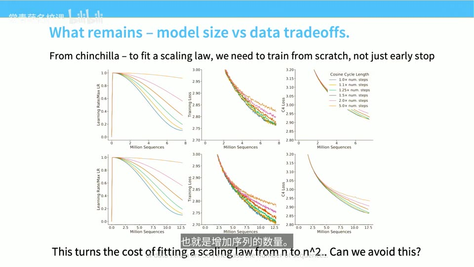 |
| 你必须从头开始，因为学习率调度从根本上就不同。这真的很让人头疼。从某种意义上说，这么做的成本相当于二次方增长，因为你每次都得从头开始重新跑训练，这太浪费了。我想很多人也是这么觉得的。 [【跳转到 09:50】](https://www.bilibili.com/video/BV11LEA6eEuj/?p=11&t=590) | 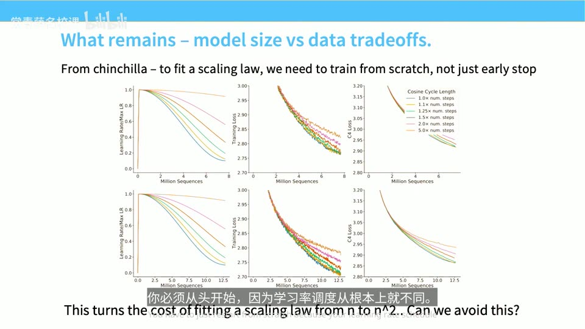 |
| 我觉得 MiniCPM 论文里有个很不错的方案，现在一般叫它"预热-稳定-衰减"学习率（WSD），这是个挺通用的叫法。它的形状大体上是个大梯形：首先是一个预热阶段——预热阶段通常按固定的步数来定义，而不是按训练总量的比例来定义，它跟你的训练总时长无关；接下来会有相当长的一段时间把学习率保持恒定，这就是稳定阶段；然后在最后，学习率会比较快地衰减到零，这就是衰减阶段。 [【跳转到 10:05】](https://www.bilibili.com/video/BV11LEA6eEuj/?p=11&t=605) | 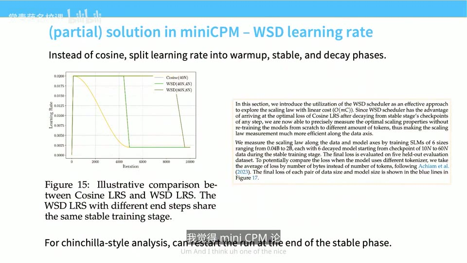 |
| 一般来说，衰减阶段大约占整个训练总量的 10% 到 20%。所以在训练的绝大部分时间里，学习率都保持稳定，然后在最后阶段迅速衰减到最大学习率的 10% 左右。这就是典型的预热-稳定-衰减学习率策略。好，那我们为什么要这么做呢？这么做的意义何在？我们之所以用 WSD…… [【跳转到 10:30】](https://www.bilibili.com/video/BV11LEA6eEuj/?p=11&t=630) | 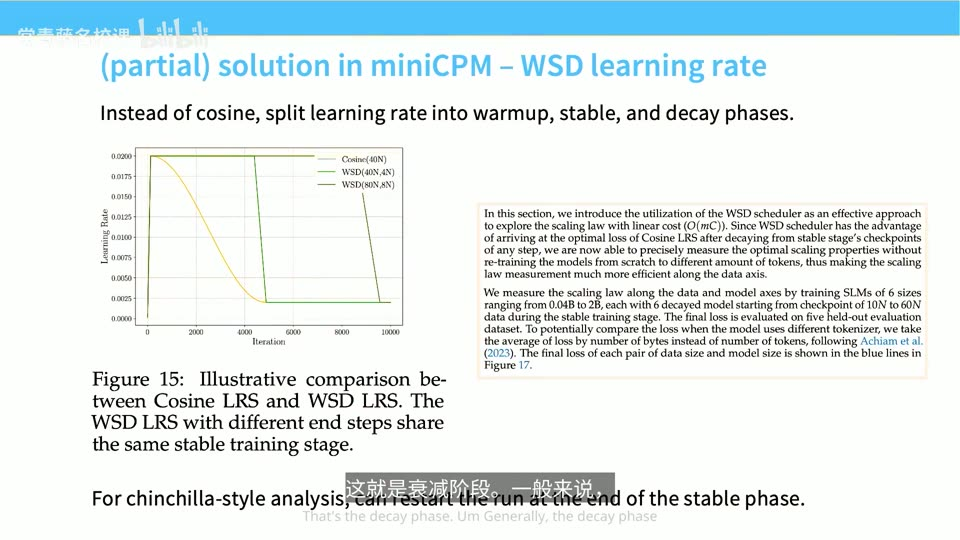 |
| 是因为现在只要稳定阶段一结束，我们就能随时重启训练。所以如果我想复用之前的训练并继续跑下去，我只需要把训练回滚到上一个稳定的检查点就行；接着我就用稳定阶段的学习率继续往下跑，然后再把模型重新衰减到零。所以这让我们能很方便地做数据规模实验，基本上不用每次都重新跑一遍——你每次都得重新衰减…… [【跳转到 10:55】](https://www.bilibili.com/video/BV11LEA6eEuj/?p=11&t=655) | 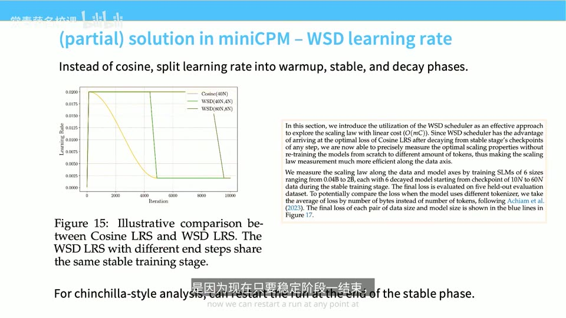 |
| 但这可能只占总成本的 10% 左右，反复做衰减可比反复重跑预训练划算多了。这是一个很常见的技巧，很多地方都在用。我给大家看个性能对比吧，以前有很多这种形式的图，我想最近是谁做的来着，也许是 Martin Jaggi 他们，我记得是在 ETH，他们对 WSD 的性能做过深入的研究。不过我觉得很多论文都展示了类似的情况。 [【跳转到 11:20】](https://www.bilibili.com/video/BV11LEA6eEuj/?p=11&t=680) | 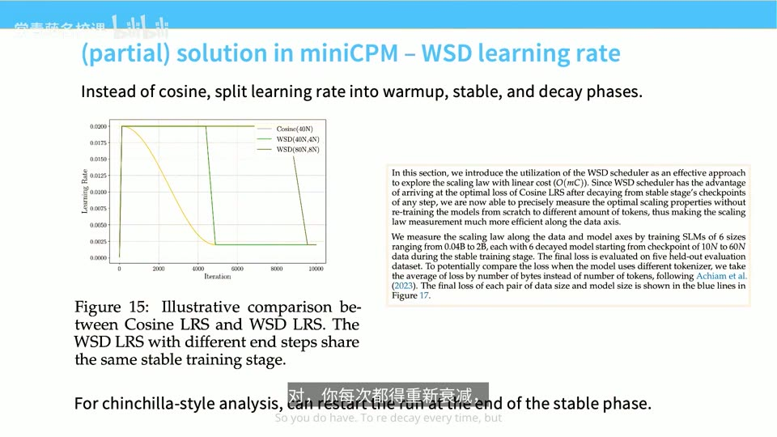 |
| 你会有一个调得很好的余弦学习曲线，这是这条橙线；然后还有各种 WSD 曲线。WSD 曲线看起来总有点怪怪的，因为在进入衰减阶段之前，你的表现看起来差远了，直到进入衰减阶段，你突然又把之前落下的全追了回来、收益都追回来了，然后你的表现大致能赶上、甚至有时超过余弦学习率的表现。凭经验来说…… [【跳转到 11:45】](https://www.bilibili.com/video/BV11LEA6eEuj/?p=11&t=705) | 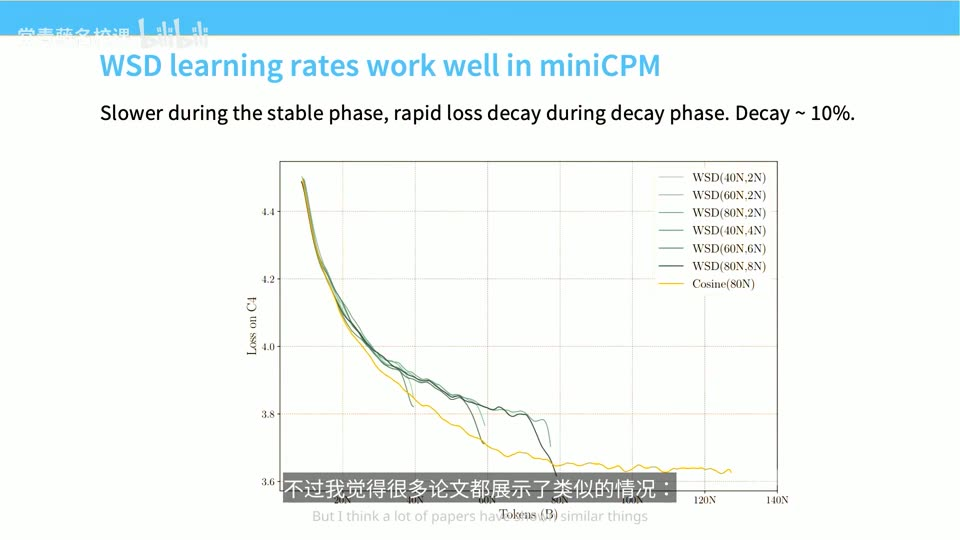 |
| 要是你去问那些训练模型的人，很多人会说余弦调度在很多情况下稍微好一点，但 WSD 在不少其他场景下其实也差不多。它就像一个非常通用的默认学习率。如果你只是想接着跑之前的实验，通常不需要重新跑。不过如果你以前没试过学习率衰减，看到它带来的影响有多大，真的挺震撼的。学习率衰减这一步对于搞定训练…… [【跳转到 12:10】](https://www.bilibili.com/video/BV11LEA6eEuj/?p=11&t=730) | 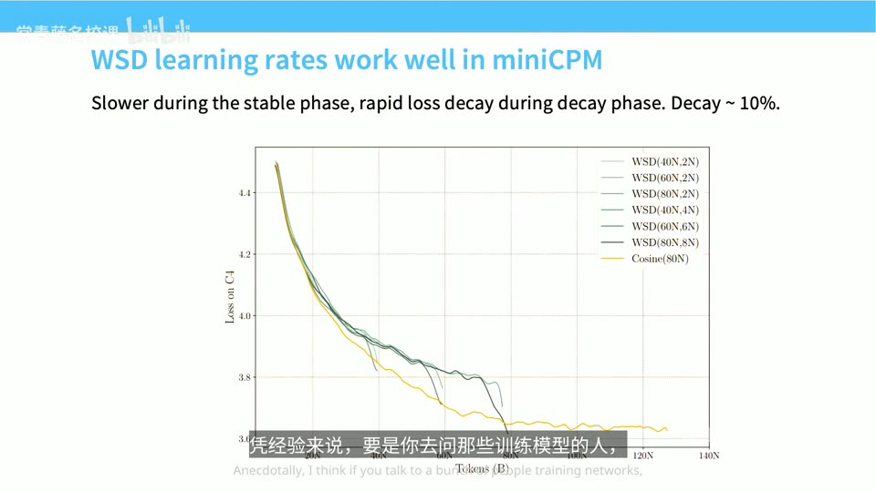 |
| 最后那个退火阶段真的特别关键。好，这就是之前的对比。既然咱们有了 WSD 风格的学习率，Chinchilla 风格的分析其实就很简单了：你主要要做的就是跑一次长周期的训练，然后把检查点回退、反复做衰减，这样你就能在数据维度上扫一遍，同时也在模型维度上扫一遍，而你可以做 isoFLOPs 分析…… [【跳转到 12:35】](https://www.bilibili.com/video/BV11LEA6eEuj/?p=11&t=755) | 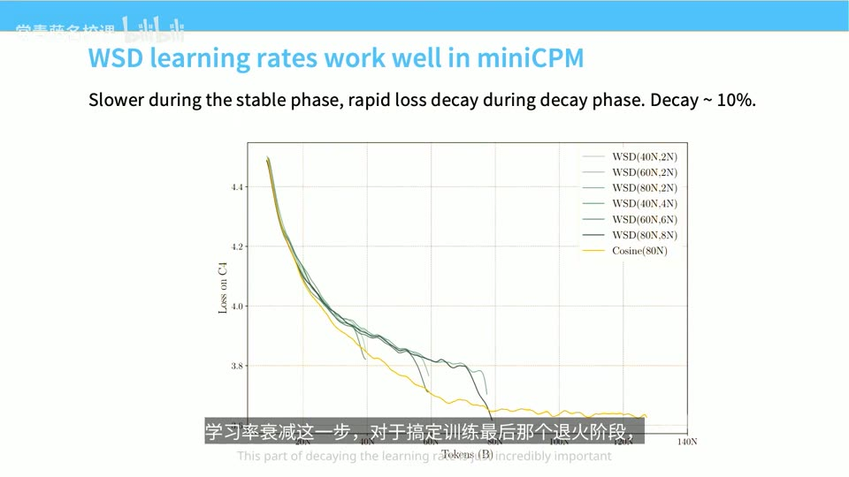 |
| 或者任何你想做的其他分析。MiniCPM 的作者不知为啥选了方法一和方法三来复现，我觉得这两个在 Chinchilla 方法里最不可靠，但他们出来的 scaling 曲线确实挺好看的。你看 MiniCPM 那个 Chinchilla 方法一得到的下包络线挺漂亮的，基本都呈线性，这挺好的。然后是方法三…… [【跳转到 13:00】](https://www.bilibili.com/video/BV11LEA6eEuj/?p=11&t=780) | 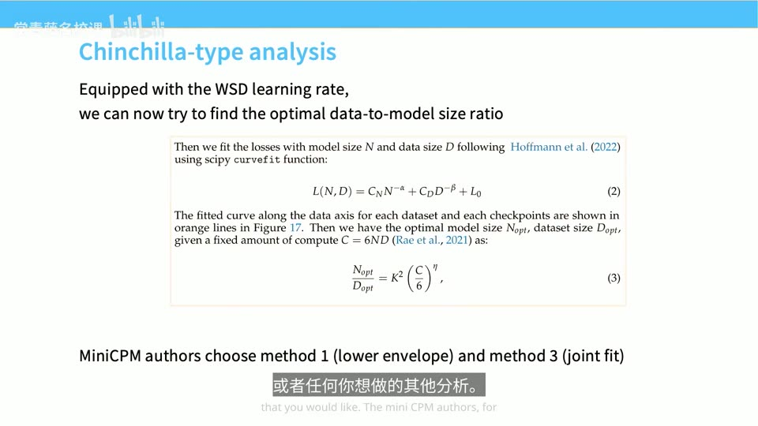 |
| 在计算量和非嵌入参数的权衡上，大部分时候他们得到的 scaling 曲线都很平滑。 [【跳转到 13:19】](https://www.bilibili.com/video/BV11LEA6eEuj/?p=11&t=799) | 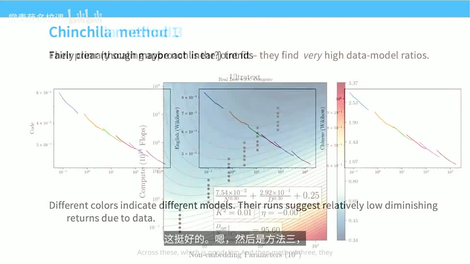 |
| 看起来大多数情况下他们得到的拟合结果都挺符合前期老规律的。有一点我得提一下，就是他们得到的指数差别挺大的——就他们整体的联合拟合而言，跟 Chinchilla 比的话。论文里说这意味着他们应该用比 Chinchilla 多得多的文本来训练。说实话我不太确定这是不是真的成立，还是说他们的 Chinchilla 拟合结果…… [【跳转到 13:24】](https://www.bilibili.com/video/BV11LEA6eEuj/?p=11&t=804) |  |
| 跟原始 Chinchilla 论文比有点奇怪。好，我先停一下，看看大家有没有关于 MiniCPM 的问题。 [【跳转到 13:49】](https://www.bilibili.com/video/BV11LEA6eEuj/?p=11&t=829) | 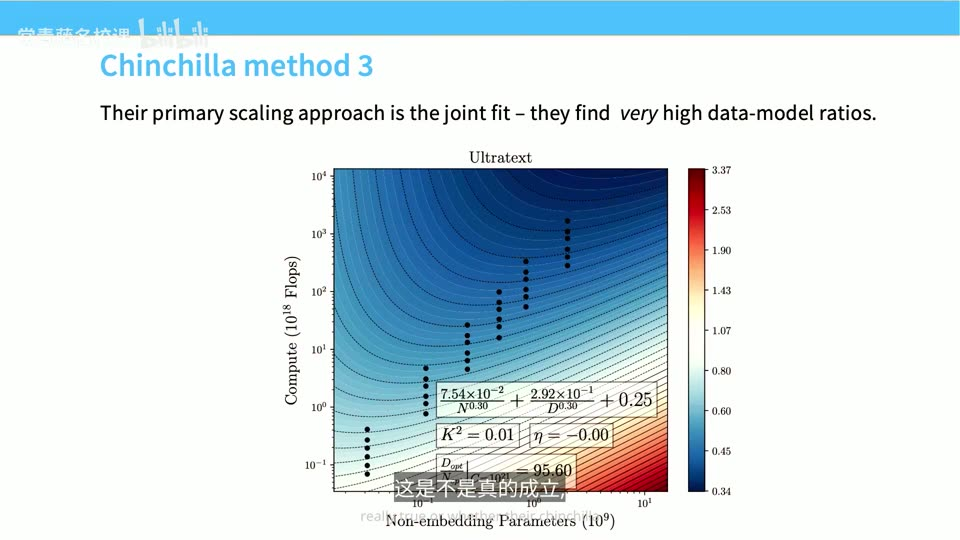 |
| 我觉得主要有两点值得记住：第一，用 μP 是个挺有用的技巧，能帮你稳定学习率随规模变化时的表现；第二点要记住的是 WSD 学习率，这也是个很常见的技巧，这种学习率你们都得知道，这是基础内容。好，不错，那咱们接着看 DeepSeek。这是 DeepSeek 早期的一篇原始论文，那时候他们还没开始聊 MoE 这些很酷的东西。 [【跳转到 13:54】](https://www.bilibili.com/video/BV11LEA6eEuj/?p=11&t=834) | 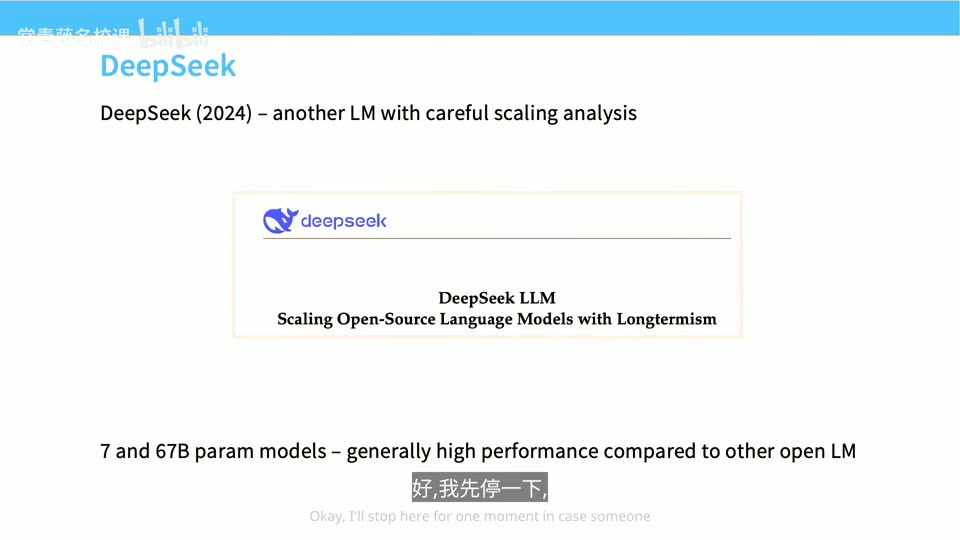 |
| 哪怕看 DeepSeek 的第一篇论文，也能看出这帮人做事非常认真。就拿 DeepSeek LLM 来说，我觉得即便到现在，这也是开源世界里 scaling 分析做得最漂亮的研究之一，我觉得他们做实验的品味特别好。所以哪怕 R1 这些还没出来，大家就都看出来这帮人是要成大事的。好…… [【跳转到 14:19】](https://www.bilibili.com/video/BV11LEA6eEuj/?p=11&t=859) | 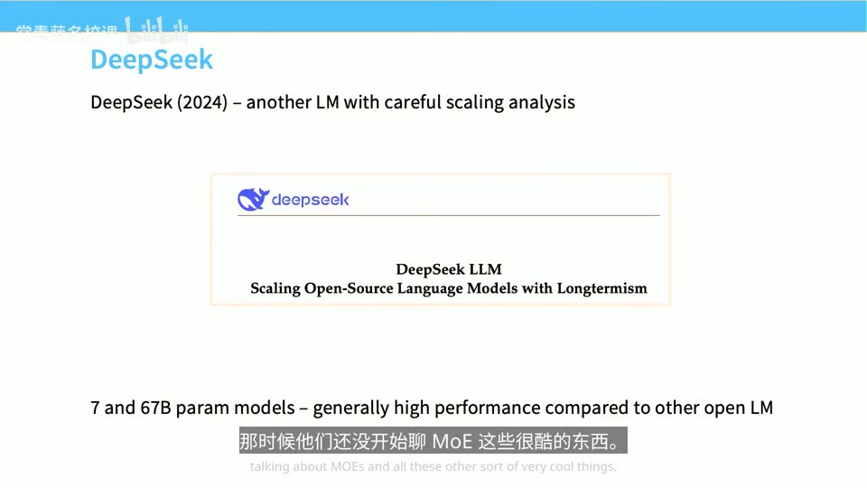 |
| 所以 DeepSeek 用的 scaling 策略跟 MiniCPM 那几个不太一样。他们主要是想优化超参数，他们不搞那个 μP、也不搞这种挺有意思的 scaling 调整；相反，他们打算直接拟合一条 scaling law，用来估算最优的 batch size 和 learning rate。咱们都知道 learning rate 和 batch size 其实得跟着规模变，但如果它们的变化规律是可预测的…… [【跳转到 14:43】](https://www.bilibili.com/video/BV11LEA6eEuj/?p=11&t=883) | 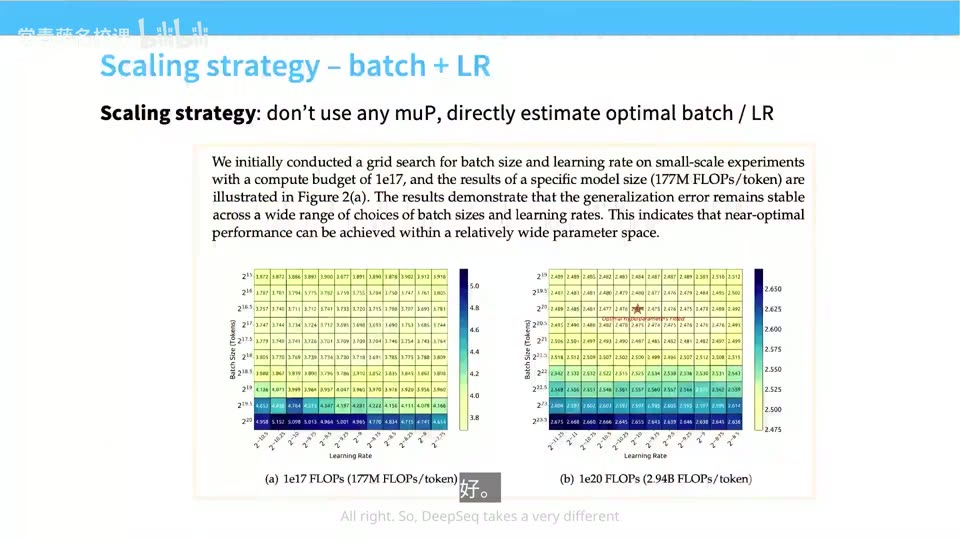 |
| 就跟 scaling laws 那样，那咱们心里就有底了，我们其实不用太担心。他们主要是在不同规模下做广泛的网格搜索，找出最优解。这就是他们正在做的一类事情：他们会遍历 learning rate、遍历 batch size，然后看看处理一定数量 token 时的最终损失是多少。他们会先固定计算量，然后变动这两个参数，而且会针对几个不同的规模都这么做。接着他们主要会去识别最低损失…… [【跳转到 15:08】](https://www.bilibili.com/video/BV11LEA6eEuj/?p=11&t=908) |  |
| 也就是图里颜色最浅的那个点，它们会在对应位置标个星号，然后针对各个规模都这么做。所以如果你在足够多的不同规模上都这么做，你就会得到像这样的图表。 [【跳转到 15:33】](https://www.bilibili.com/video/BV11LEA6eEuj/?p=11&t=933) | 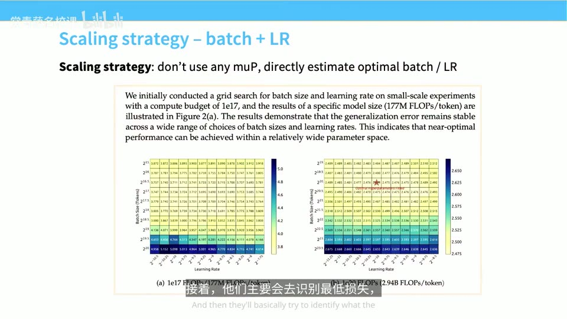 |
| 这张图的意思是：我要在某个范围内变动我的非嵌入训练 FLOPs，你能看到这些灰点，对吧？当我变动这个参数时，我的最优 batch size 也会跟着变。记住，最优 batch size 是从这些大型网格中找出来的。 [【跳转到 15:44】](https://www.bilibili.com/video/BV11LEA6eEuj/?p=11&t=944) | 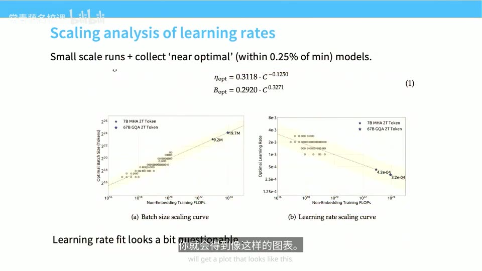 |
| 也就是找到那个损失最小的点，对吧？我会得到一条看起来像直线的东西。 [【跳转到 16:00】](https://www.bilibili.com/video/BV11LEA6eEuj/?p=11&t=960) | 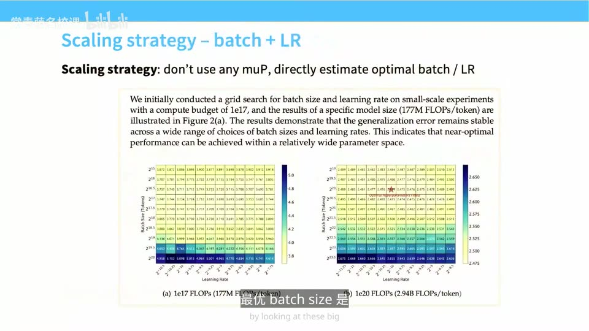 |
| 最优批次大小应该随非嵌入计算量（non-embedding FLOPs）缩放。同样地，对于最优学习率，我会在非嵌入计算量范围内得到一堆灰点，接着我可以用一条线去拟合这些数据，以此估算出最优学习率大概该是什么样。这结果挺不错的。我想提一下，他们那些完整的运行实验在图上是标了星号的，这些是他们在计算量较高时选定的实验。 [【跳转到 16:06】](https://www.bilibili.com/video/BV11LEA6eEuj/?p=11&t=966) |  |
| 他们的批次大小要大得多，学习率则要低得多。那些星号就是他们真正跑过的大型实验。这些拟合线对 batch size 来说挺合理的，对吧？这确实看起来像条直线。不过学习率那条线，我不太确定这算不算我这辈子见过最好的线性拟合，但既然它能跑通，那应该就没问题，对吧？模型确实训练起来了。确实如此，你能得到合理的结果吗？ [【跳转到 16:31】](https://www.bilibili.com/video/BV11LEA6eEuj/?p=11&t=991) | 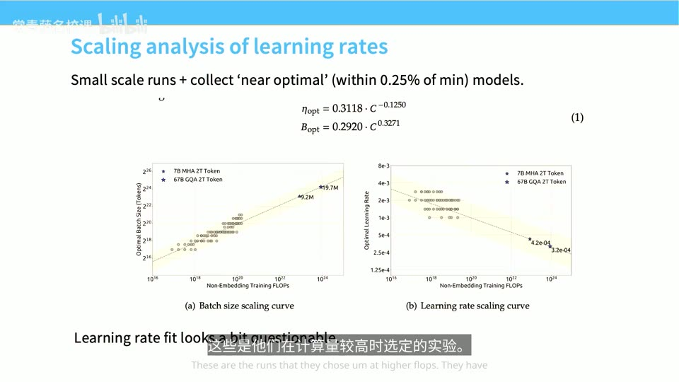 |
| 我觉得这是学习率方法的一个短板：如果你做这种网格搜索…… [【跳转到 16:56】](https://www.bilibili.com/video/BV11LEA6eEuj/?p=11&t=1016) | 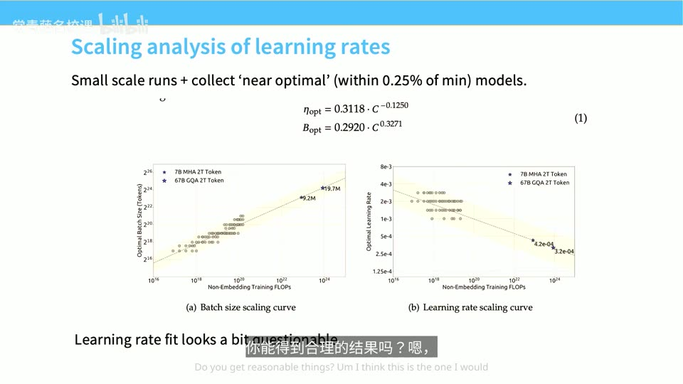 |
| 除非网格找对了地方，否则量化误差会很大，最后 scaling laws 的拟合效果也不好。 [【跳转到 17:01】](https://www.bilibili.com/video/BV11LEA6eEuj/?p=11&t=1021) | 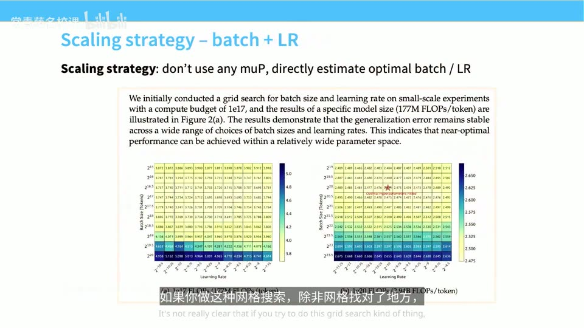 |
| 最后出来的结果看起来就像是个随意的线性关系。行。（课堂问答）为什么同样的训练算力下…… [【跳转到 17:06】](https://www.bilibili.com/video/BV11LEA6eEuj/?p=11&t=1026) | 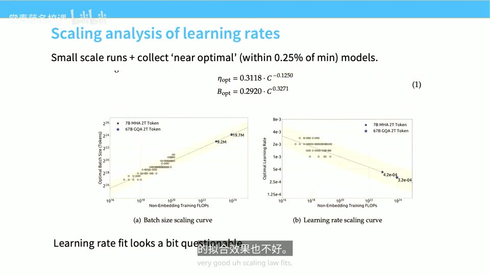 |
| 你会得到多个数据点，而且最优学习率的跨度还那么大？为什么不同的训练算力下，最优学习率的范围差别会这么大？你是问 Y 轴这里的问题吗？对。我觉得这是因为模型规模这些参数变了。所以 2024 年那会儿，我觉得每个做 open-source 模型的人…… [【跳转到 17:17】](https://www.bilibili.com/video/BV11LEA6eEuj/?p=11&t=1037) | 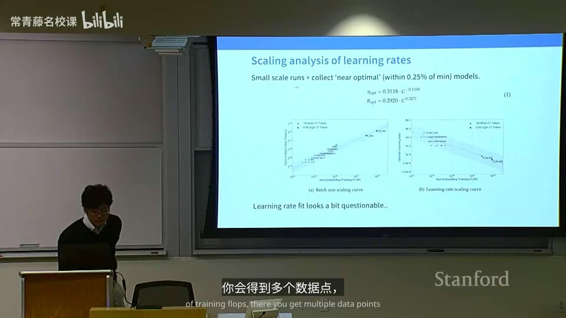 |
| 都在复现整套 scaling law 体系。所以 DeepSeek 也在补充学习这方面的内容，做的是 learning rate 分析，基本上就是把 Chinchilla 复现一遍。为了做到这一点，他们也会像 MiniCPM 那样沿用 WSD 风格的 learning rate。他们有个稍微有点特别的小改动，就是做了两个衰减阶段、而不是通常的一个，我其实不太清楚为什么要这么做。 [【跳转到 17:38】](https://www.bilibili.com/video/BV11LEA6eEuj/?p=11&t=1058) | 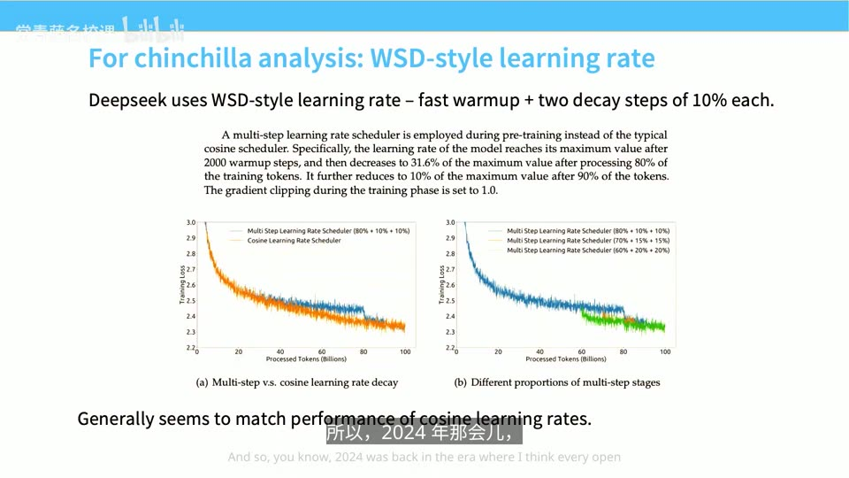 |
| 这后来也没怎么流行起来，但他们确实就是这么做的。不管怎样，这里想说的核心观点是：WSD 是个有效的方法，你可以用它来复现 Chinchilla isoFLOPs。所以 DeepSeek 的 scaling 曲线比 MiniCPM 漂亮多了，结果就是在固定的 FLOPs 范围内，他们得到了一组非常漂亮、清晰的 sweeps，接着他们也得到了相当漂亮、清晰的 Chinchilla…… [【跳转到 18:03】](https://www.bilibili.com/video/BV11LEA6eEuj/?p=11&t=1083) | 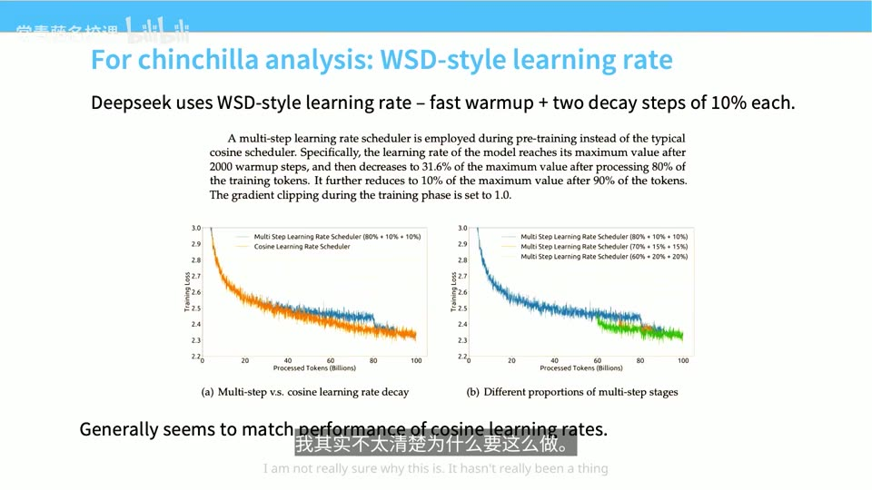 |
| 风格权衡，跟之前一样。所以他们借此基本复现了 Chinchilla 的结果，并得到了类似的"数据-模型 scaling laws"。我讲这个主要是想说明：Chinchilla law 已经在相当大的计算规模下被其他人复现了，所以这个分析大体上是靠谱的。最后我觉得挺遗憾的，现在 open-source 论文里很少见到这种图了…… [【跳转到 18:28】](https://www.bilibili.com/video/BV11LEA6eEuj/?p=11&t=1108) | 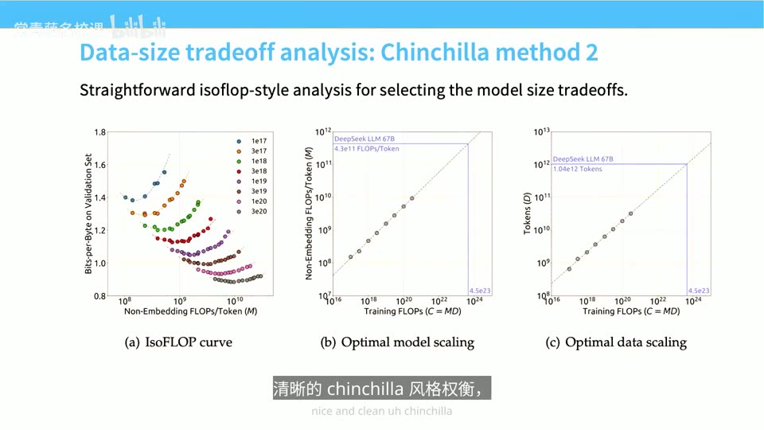 |
| 但这其实是很多 scaling law 研究工作的最终结论：在较小的计算规模下训练一堆精心挑选的小模型、然后画出幂律，最后得到的结果跟现实非常接近，只要你扩展得足够大，对吧？那两个星号是他们实际训练的模型，灰色圆点则是 scaling law 的拟合结果。他们对那些星号标记的模型预测得相当准，我是说虽然还能更好，但已经相当不错了。 [【跳转到 18:53】](https://www.bilibili.com/video/BV11LEA6eEuj/?p=11&t=1133) | 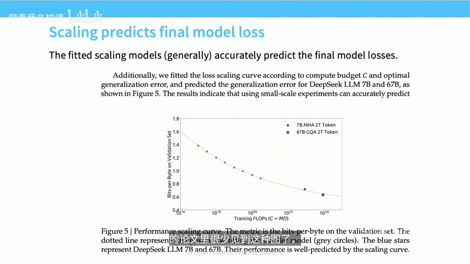 |
| 所以他们对自己训练的那些真实 open-source 模型做出了相当准确的 scaling law 预测。好，那我就先讲到这里，如果大家对 DeepSeek 的内容有疑问随时提问。（课堂问答）你觉得这里可以用一句话概括：这是处理敏感超参数的另一种思路——你要么试着稳定这些参数，要么直接用 scaling laws 去拟合它们，对吧？然后就直接按 scaling laws 来。DeepSeek 走的路线…… [【跳转到 19:18】](https://www.bilibili.com/video/BV11LEA6eEuj/?p=11&t=1158) | 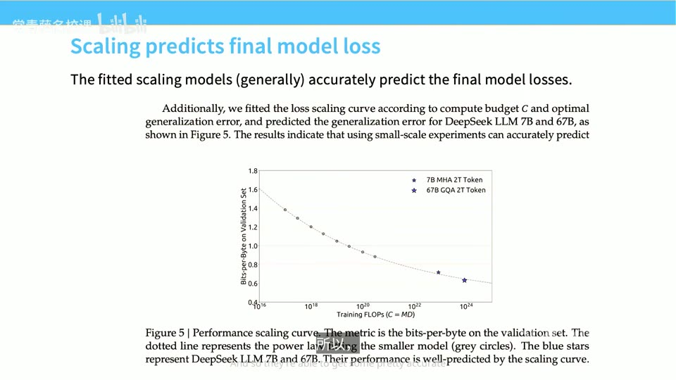 |
| 更像是通过拟合 scaling laws 来处理这个问题。好，行。还有一些其他模型，尤其是比较新的，他们提到了自己拥有不错的 scaling laws。不过就像我之前说的，我觉得现在好多这类工作大家都已经知道了，所以没人会把这类东西专门写进论文的大章节里。你看 Qwen2 的论文，里面大概就是说：好，我们需要调优一些最佳超参数，比如批量大小和学习率，所以我们做了一堆 scaling 实验来找最优值。 [【跳转到 19:43】](https://www.bilibili.com/video/BV11LEA6eEuj/?p=11&t=1183) | 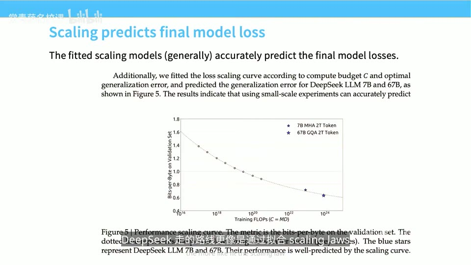 |
| 然后我们有了 scaling law，就能预测出最优值了，然后我们甚至能对 MoE 也这么做，对吧？所以这基本上是一回事。就像他们在 2025 里讨论的那个 DeepSeek 分析那样，Qwen3 也是同理，他们说到了 Qwen3 这个阶段，我们已经在 Qwen2 的工作里把该做的都定好了，我们只是照搬之前的做法。所以这已经变成了一套标准流程，用来确定最优的学习率和批次大小。 [【跳转到 20:08】](https://www.bilibili.com/video/BV11LEA6eEuj/?p=11&t=1208) | 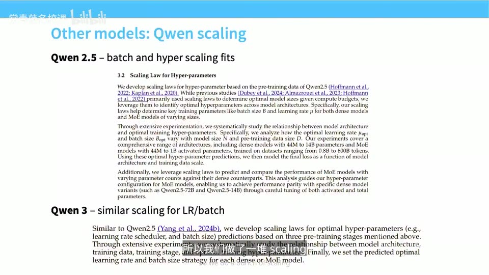 |
| Kimi K2 大概是我接下来要讲的这一系列论文里最新的一篇。接下来我会快速过几篇论文，主要是想给大家一个概览，看看大家在 open-source 模型发布的 scaling 工作上都做了什么。所以 Kimi K2 和其他几篇论文关注的基本上就是 MoE 的 scaling law。你想啊，现在都 2025 年了，大多数人应该都知道怎么做 Chinchilla scaling law…… [【跳转到 20:33】](https://www.bilibili.com/video/BV11LEA6eEuj/?p=11&t=1233) | 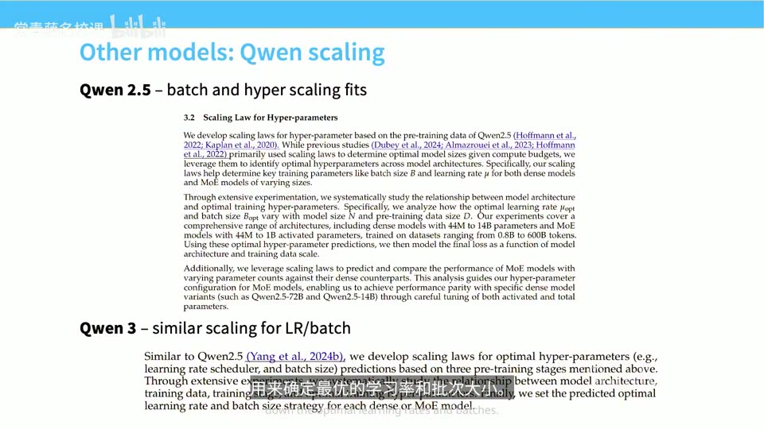 |
| 甚至是学习率的 scaling law，那有什么新东西呢？很多公司现在都在转向 MoE，而且是全面转向 MoE，对吧？如果你在做这类实验，你得搞清楚一件事：你训练的激活参数数量到底对不对？所以他们会做这类实验，调整 FLOPs 看看损失怎么变，还要在不同稀疏度下都跑一遍，搞清楚稀疏度到底是帮了忙还是拖了后腿。 [【跳转到 20:58】](https://www.bilibili.com/video/BV11LEA6eEuj/?p=11&t=1258) | 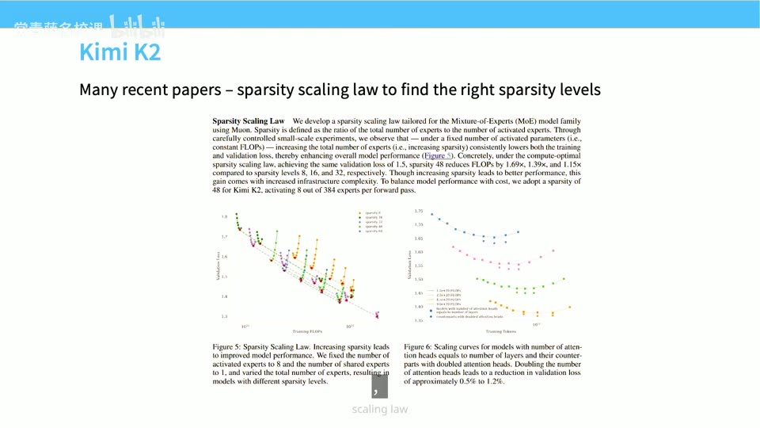 |
| 他们的结论很明确：你看不同稀疏度下的表现，网络越稀疏，验证损失就越低——给定 FLOPs 下的损失。这其实并不意外，但关键在于他们现在能定量算出稀疏度和损失之间的关系，这样就能更理性地决定模型里该塞进多少稀疏度了。他们看完数据后说：行，我们就用某个稀疏度吧，因为再往上加，scaling laws 带来的收益就开始递减了。 [【跳转到 21:23】](https://www.bilibili.com/video/BV11LEA6eEuj/?p=11&t=1283) |  |
| 所以你看，这种分析常被用来为不同 open-source 版本里的架构决策提供依据。再比如 Hunyuan，这是几年前发布的另一个 open-source MoE，他们做的也差不多，对吧？我觉得每家公司一旦转用 MoE，都得做这套分析。这就像是一种 MoE scaling law，用来搞清楚激活参数数量或稀疏度的变化怎么影响训练损失，然后他们就会把这些分析重新跑一遍。 [【跳转到 21:48】](https://www.bilibili.com/video/BV11LEA6eEuj/?p=11&t=1308) | 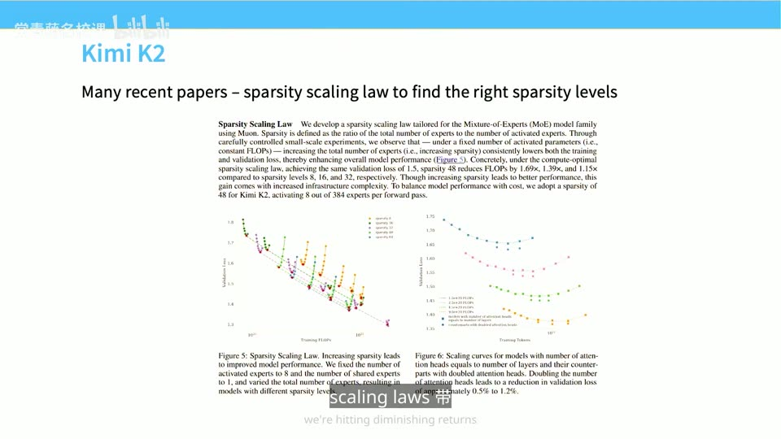 |
| 举个例子，Hunyuan 最后算出来每个激活参数对应大概 96 个数据点，他们那边把稀疏度固定住了，所以这也不是他们要搜索的参数。Llama 3 也有一些不错的 scaling laws，不过遗憾的是这些规律其实没多大用。他们做的是 isoFLOP 风格的缩放，得出的 token 和模型规模比例虽然略有不同，但大体相似。 [【跳转到 22:13】](https://www.bilibili.com/video/BV11LEA6eEuj/?p=11&t=1333) | 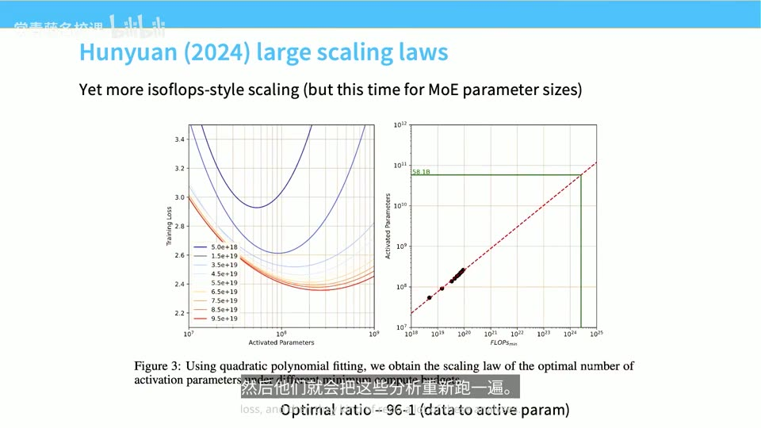 |
| Llama 3 在缩放方面最有趣的地方就是右边这张图。左边那个面板展示的是常规的 scaling law，也就是说如果我投入更多算力，基准测试答案的对数概率就会稳定下降。右边则展示了：对数损失越低，下游准确率也就越高，对吧？所以他们大概的意思是，咱们可以对这些紫色数据点做个 sigmoid 拟合，这样就能大致看出这些不同模型的效果如何。 [【跳转到 22:38】](https://www.bilibili.com/video/BV11LEA6eEuj/?p=11&t=1358) | 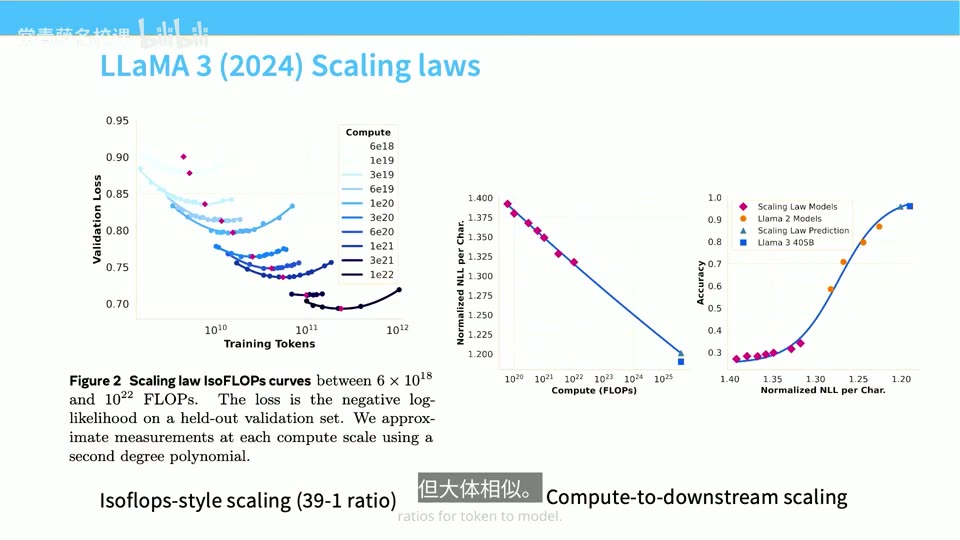 |
| 大家可以看到，数据点和这条曲线有系统性的偏离，所以我真不敢说这条曲线就是绝对真理。不过很明显它符合从损失到准确率的 S 型缩放映射，我觉得这点很有用，对吧？因为咱们之前一直只在聊对数损失，但在某些甚至很多情况下，对数损失和下游准确率其实是紧密绑定的。好，最后我想再聊一篇关于缩放的论文。 [【跳转到 23:03】](https://www.bilibili.com/video/BV11LEA6eEuj/?p=11&t=1383) | 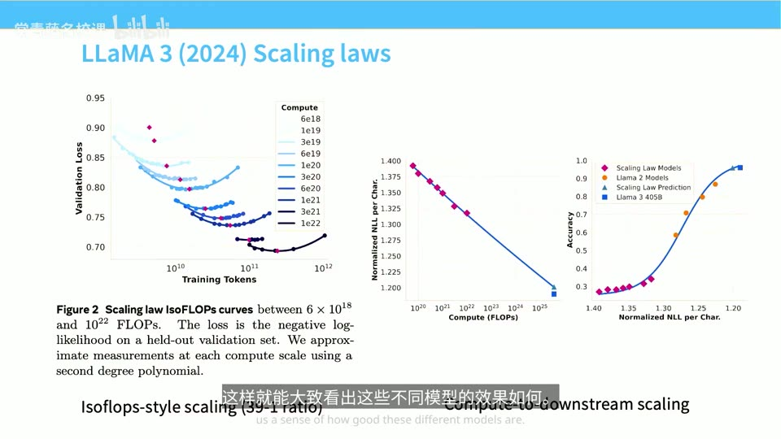 |
| 去年 MiniMax-01 做了一组很棒的缩放实验，他们做了我在两次讲座前提到的那种利用缩放来探索架构变体的操作。他们想搞清楚：我有 Lightning Attention，这是一种类似线性注意力的架构；我有 softmax 版本，也就是全注意力；还有一个混合版本，把两者结合起来。这些东西怎么缩放？ [【跳转到 23:28】](https://www.bilibili.com/video/BV11LEA6eEuj/?p=11&t=1408) | 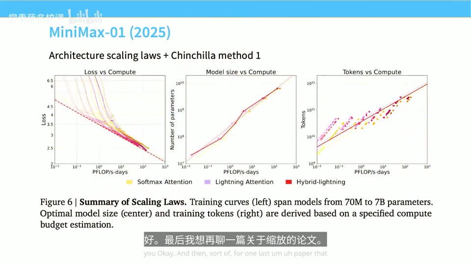 |
| 是不是说，如果我扩大规模，其中一种方法的表现会比另一种差很多？所以你可以看到，他们基本上是在复现 Kaplan 图，看看随着 FLOPs 增加，学习曲线是怎么变的。那么参数数量是不是得变？也就是说，针对不同架构和不同的算力水平，我们需要调整参数数量吗？大体上答案是否定的：混合架构、Lightning 和 softmax 在大多数情况下差不多，他们需要的模型规模也类似。 [【跳转到 23:53】](https://www.bilibili.com/video/BV11LEA6eEuj/?p=11&t=1433) | 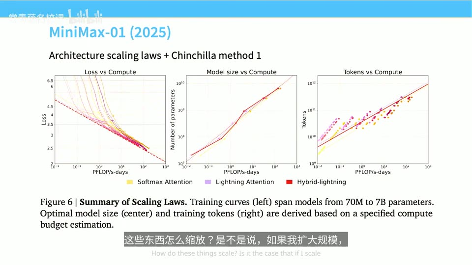 |
| 这组图就是用来证明为什么他们在实际部署的系统里选了混合架构。你看，这就是基于 scaling laws 做决策的典型例子。 [【跳转到 24:18】](https://www.bilibili.com/video/BV11LEA6eEuj/?p=11&t=1458) | 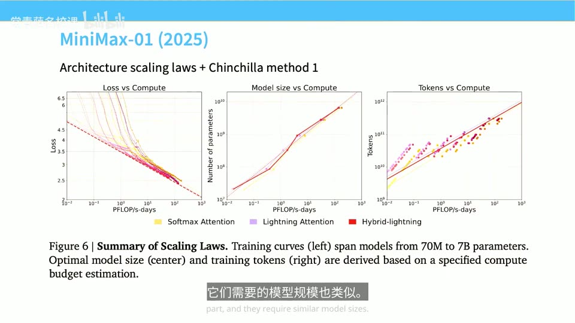 |
| 好了，这就是我想讲的关于各家近期 scaling law 配方（recipes）的全部内容。就像我之前说的，DeepSeek 的配方主要看两点，核心在于对 batch size 和 learning rate 的 scaling 分析，这是一种基于 scaling 的做法；而 MiniCPM 走的是更偏 μP 风格的路子，试图获得不变性。接着我们看到了一些趋势：比如 Kimi、Qwen 还有 Hunyuan，他们在切换到 MoE 架构时都在做这类 MoE scaling 实验。 [【跳转到 24:30】](https://www.bilibili.com/video/BV11LEA6eEuj/?p=11&t=1470) | 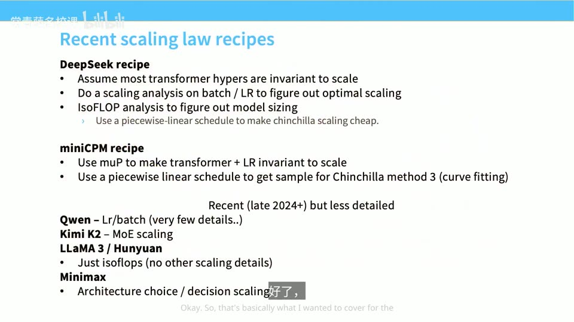 |
| 我们看到了 MiniMax 在架构方面的一些工作，另外我们也看到其他几家机构复现了 isoFLOPs 分析。咱们回到刚才那个点：我觉得现在很多公司没那么注重细节了，因为像 Chinchilla 或者学习率缩放这些核心的 scaling 机制，大家其实都搞得挺明白了，所以把这些实验或者部分发布内容拿出来展示其实没啥额外的价值。这大概就是咱们发布里…… [【跳转到 24:55】](https://www.bilibili.com/video/BV11LEA6eEuj/?p=11&t=1495) | 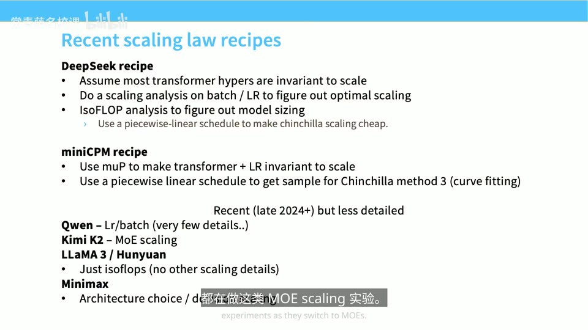 |
| 这类实验变少的原因吧。行，我再讲一分钟然后停一下，大家消化消化，要是有什么问题随时提问。好的。 [【跳转到 25:20】](https://www.bilibili.com/video/BV11LEA6eEuj/?p=11&t=1520) |  |
| （课堂问答）刚才说的都是预训练阶段，那我想问一下：现在后训练成了所有模型的标准流程，这中间哪些变了、哪些没变？问的是当你大致把后训练也考虑进来时，这方面会有什么变化。我觉得这还是个悬而未决的大问题。要想把 post-training 也考虑进去、做那种完全整合的 scaling，目前还没什么好办法，因为 post-training 有时候真的会改变 pre-training 该怎么做。 [【跳转到 25:30】](https://www.bilibili.com/video/BV11LEA6eEuj/?p=11&t=1530) | 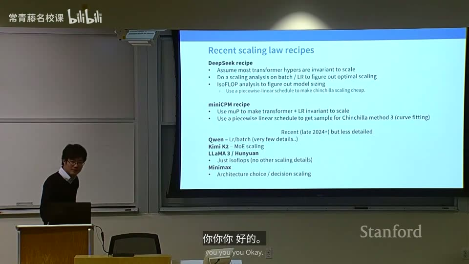 |
| 而当 post-training 是……有些研究在探讨 pre-training 里的覆盖率或者多样性概念，想用它来预测 post-training 会怎样，不过这还是个很新的领域。至于该怎么处理跟 post-training 的协同效应，我觉得现在也没什么靠谱的答案。好，那咱们接着聊另一块内容。 [【跳转到 25:55】](https://www.bilibili.com/video/BV11LEA6eEuj/?p=11&t=1555) | 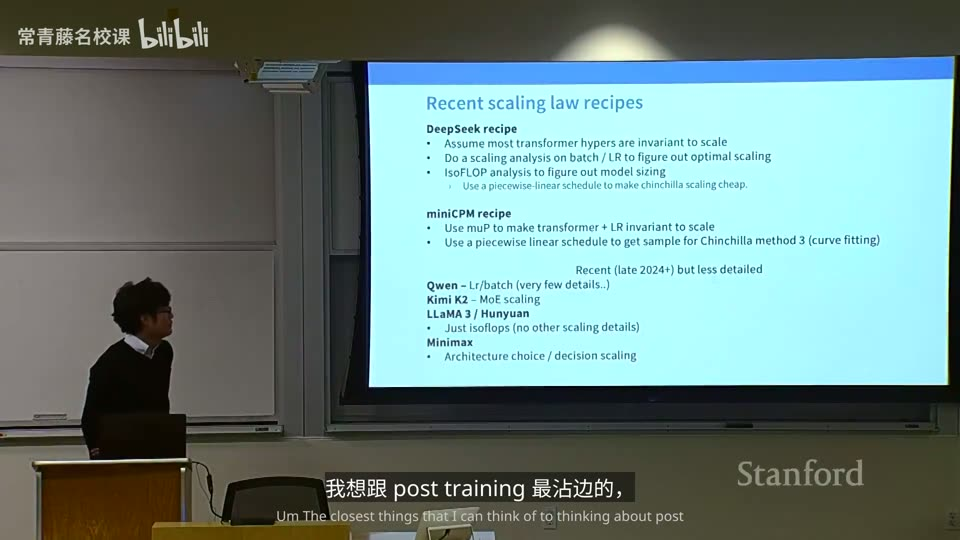 |
| 我觉得这堂课剩下的两部分正好能对应上咱们刚才说的两个例子。所以我要讲一种方法、或者说一类方法，就是关于 learning rates、batch sizes 和 optimizers 的 scaling laws，这在某种程度上对应了 DeepSeek 看待世界的方式；然后我要聊聊 μP 那些东西，这在某种程度上对应了 MiniCPM 看待世界的方式。 [【跳转到 26:12】](https://www.bilibili.com/video/BV11LEA6eEuj/?p=11&t=1572) | 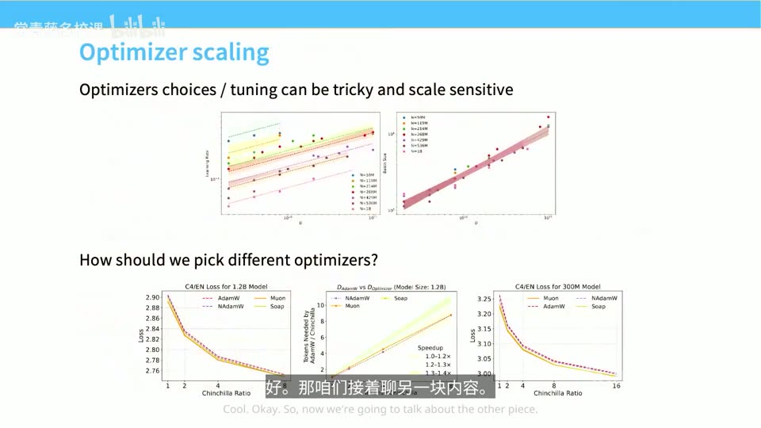 |
| 咱们能不能把所有东西重新参数化一下，这样就不用操心 scale 的问题了？接下来我们聊聊 DeepSeek 的做法，也就是学习率到底该怎么按比例放大。这主要分两块：一是超参数，二是优化器的选择。我们会大量参考 StepFun 团队最近发的一篇预印本。我觉得目前并没有一项真正可靠、稳健的、针对超参数尤其是学习率的研究，但这篇大概已经比较接近了。 [【跳转到 26:37】](https://www.bilibili.com/video/BV11LEA6eEuj/?p=11&t=1597) | 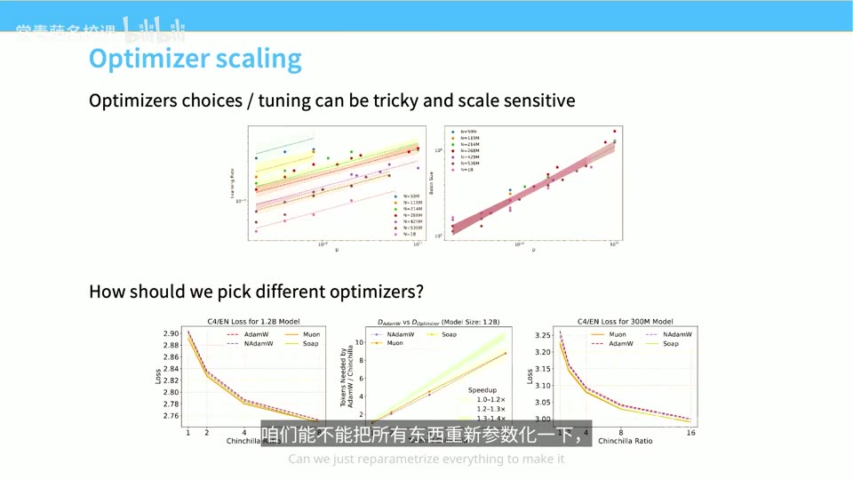 |
| StepFun 团队训练出可信的大模型并把他们公开发布，在一项 scaling law 研究中，他们用网格搜索遍历超参数空间，烧掉了大量算力。所以我会带大家过一遍，看看一些有趣的经验现象：学习率、batch size 这些因素是怎么影响下游损失的。很多人已经讨论过各种不同的方式…… [【跳转到 27:02】](https://www.bilibili.com/video/BV11LEA6eEuj/?p=11&t=1622) | 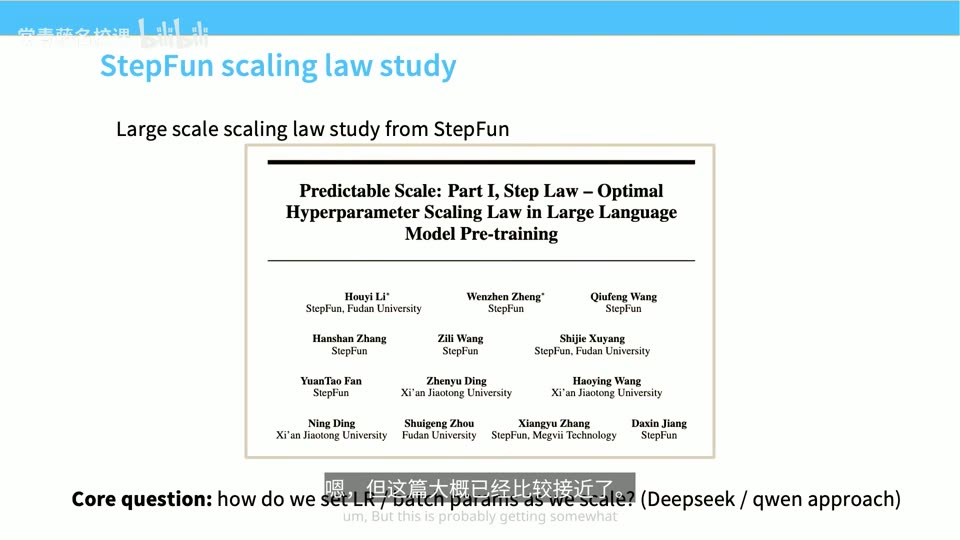 |
| 大致根据算力来缩放学习率和 batch size。另外 StepFun 那篇关于超参数调优的论文——注意是研究论文不是综述——里面有张表做得特别棒，把这些内容都涵盖进去了。我来指出几个不同的点，有些东西咱们其实早就知道了。你看最上面那一行…… [【跳转到 27:21】](https://www.bilibili.com/video/BV11LEA6eEuj/?p=11&t=1641) | 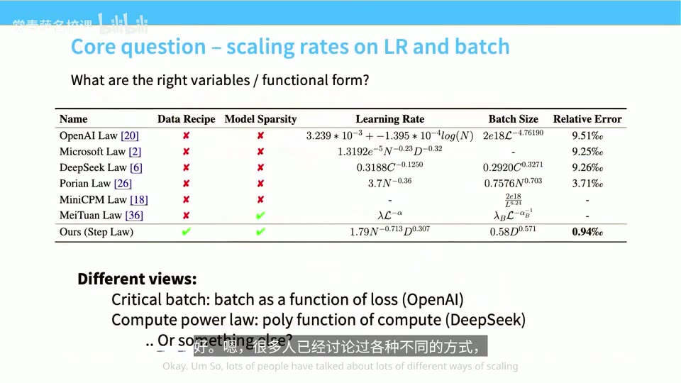 |
| 这是 OpenAI 的 scaling laws，来自 Kaplan。你看那个 batch size 上面写的是 2 的 18 次方，那个 18 是上标、作为指数，这就是所谓的临界 batch size，对吧？意思基本上就是说你要根据最终的 loss 来调整 batch size。不错，对吧？DeepSeek 咱们刚才也看过了，这就是针对 learning rate 和 batch size 的、基于计算量的 scaling laws。还有其他人也提出过各种 scaling 方案。 [【跳转到 27:46】](https://www.bilibili.com/video/BV11LEA6eEuj/?p=11&t=1666) | 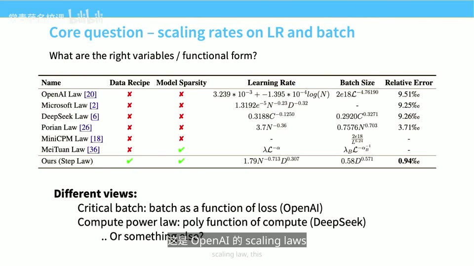 |
| 比如咱们之前聊过的 MiniCPM。还有个重要的点我想提一下，就是这些算 learning rate 和 batch size 的公式，用的输入变量都不一样。大家似乎连哪些变量会影响这些 learning rate 都还没达成共识：OpenAI 用的是最终损失，而 StepFun 那边人则认为 batch size 的正确缩放方式取决于数据量。在"超参数缩放的本质"这个问题上，大家有很多不同的分歧。 [【跳转到 28:11】](https://www.bilibili.com/video/BV11LEA6eEuj/?p=11&t=1691) |  |
| 我顺便说一句，大家看最后这一行时——这些方法在很多方面其实挺脆弱的，但里面的实验和现象咱们还是能学到不少东西的。好，我就讲这些。这篇论文的设计跟 DeepSeek 那篇很像：他们就是训练一大堆模型，把 learning rate 空间和 batch size 空间都做成网格搜索，在不同规模的模型和不同大小的数据集上都跑一遍。 [【跳转到 28:36】](https://www.bilibili.com/video/BV11LEA6eEuj/?p=11&t=1716) | 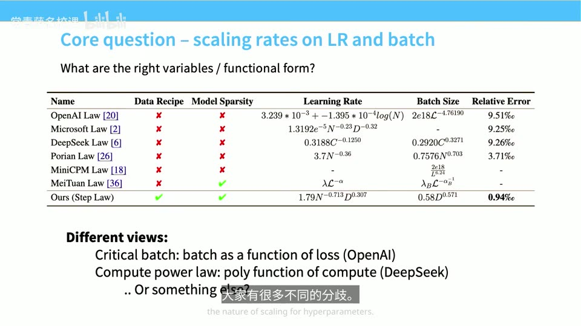 |
| 这么做的目的本质上就是想把超参数空间给填满，针对一组小模型然后把那个最优值给敲定下来。这和 DeepSeek 的设计很像，他们把空间网格化之后画出了等高线图，其实底层就是跑一堆模型，目标就是尽量把损失降到最低，对吧？这等高线图挺直观的，看着很舒服。他们用了很细的网格，所以我们能看出来他们其实能画出分辨率相当高的等高线。 [【跳转到 29:01】](https://www.bilibili.com/video/BV11LEA6eEuj/?p=11&t=1741) | 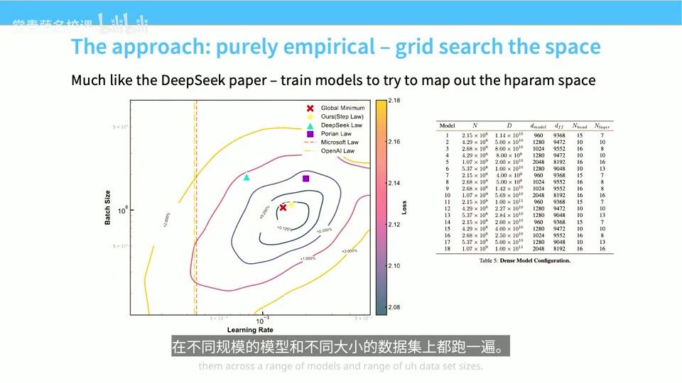 |
| 看看超参数空间长什么样。这里切出来的是 10 亿参数下的那一片……我记得是 1000 个 token？你看右边那个曲面就是超参数的地形图，横轴是批量大小、纵轴是学习率。如果我们固定模型的总数据量，看看损失是怎么随着两个变量变化的。现在你看每个切片，比如你固定了批量大小或者学习率，形状都很凸、甚至几乎是平滑的。 [【跳转到 29:26】](https://www.bilibili.com/video/BV11LEA6eEuj/?p=11&t=1766) |  |
| 这挺好的，因为这意味着你找最优超参数会容易得多，这样你就能放心最小值不会跑太远。要知道以前那种曲线可是锯齿状的，你可能会怀疑这种把搜索空间网格化的方法到底行不行得通。另外这应该能让你对超参数空间整体的平滑性有个直观的认识。我觉得这里其实有一个特别有意思的通用 scaling 趋势，我看了跟这个主题相关的其他论文…… [【跳转到 29:51】](https://www.bilibili.com/video/BV11LEA6eEuj/?p=11&t=1791) | 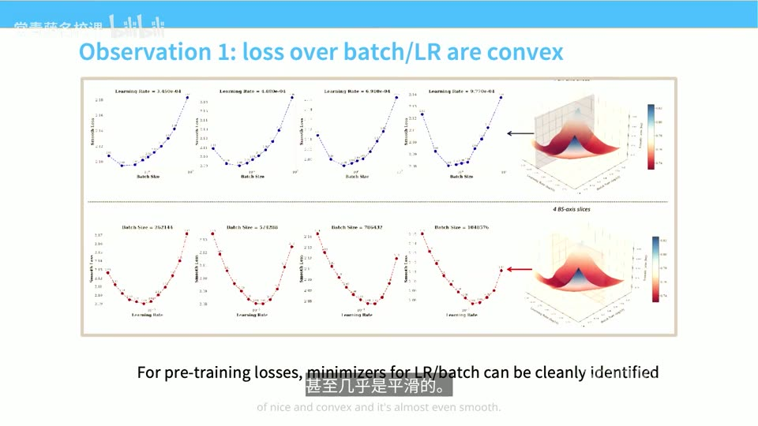 |
| 我不太确定有没有见过跟这个观察结果相矛盾的证据。所以我觉得这项工作最有趣的一点、也是核心结论之一：如果你看最优 batch size，它似乎只取决于你训练数据的总量。所以咱们看右边这张图，对吧？这里的横轴代表的是训练数据量，不同颜色的点代表不同的模型，你看这些点大致都沿着同一条趋势线走，挺有规律的。 [【跳转到 30:16】](https://www.bilibili.com/video/BV11LEA6eEuj/?p=11&t=1816) | 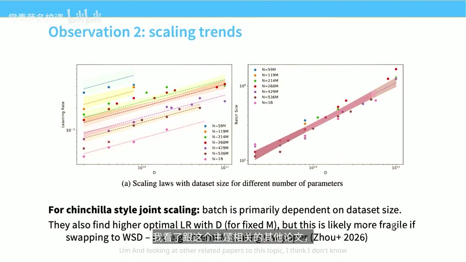 |
| 因为这是双对数坐标，所以你应该能预期到某种关于 D 的幂律关系，对吧？左侧面板展示的是对学习率的依赖关系，可以看到这里的情况很不一样。以模型规模为例，颜色从蓝色一直过渡到粉色，代表模型越来越大，你会发现模型越大、最优学习率反而越低；而数据量越大，最优学习率则越高。这其实有点反直觉。 [【跳转到 30:41】](https://www.bilibili.com/video/BV11LEA6eEuj/?p=11&t=1841) | 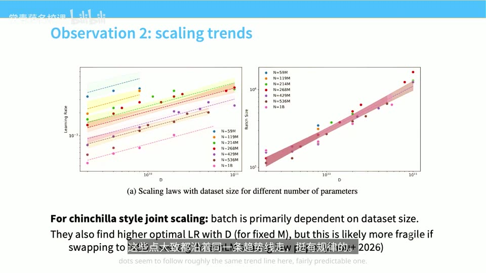 |
| 所以这个结论可能不太稳固，也有另外一些论文认为对 D 的依赖关系应该是反过来的，不过至少就这项实验而言，这里的趋势是相当清晰的。好，最后我想指出一点：学习率其实是相当稳健的，我认为这一点也得到了大量实践经验和实验结果的支持。我想大家心里大概都有个谱。 [【跳转到 31:06】](https://www.bilibili.com/video/BV11LEA6eEuj/?p=11&t=1866) | 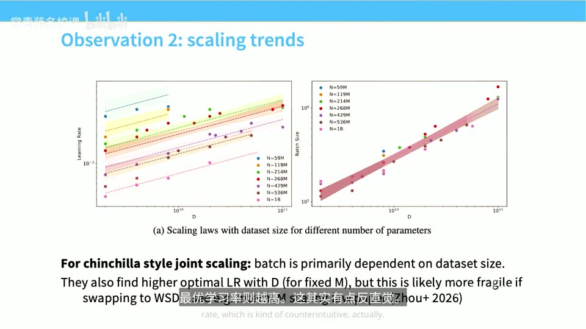 |
| 顺便做个小调查：大家清楚什么样的超参数才算好吗？假如你明天就要去训练一个 language model，你会选 1e-3 还是 1e-4 这种学习率？我觉得咱们大概心里有数。learning rate 这个超参数范围通常是个不错的起点，大体上确实如此。所以他们得出的 scaling law 在一定程度上也能用到 MoE 上。那些黄色的星号可能稍微有点看不清…… [【跳转到 31:31】](https://www.bilibili.com/video/BV11LEA6eEuj/?p=11&t=1891) | 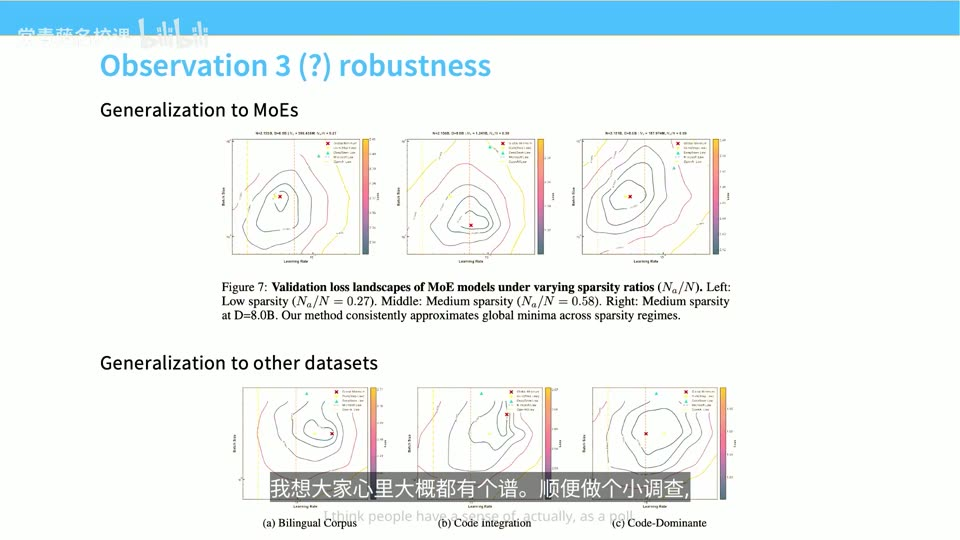 |
| 就是根据他们的 scaling law 做出的预测，那些红色的 X 呢，基本上就是直接从 MoE 里推导出来的最优值。所以只要你大致把控好 active parameters 的数量，换成 MoE 架构的话，scaling law 其实不会有太大差别。唯一看起来可能稍微有点悬的地方是：当你换训练数据的时候，最优的 learning rate 和最优的 batch size 确实会有些变动。 [【跳转到 31:56】](https://www.bilibili.com/video/BV11LEA6eEuj/?p=11&t=1916) | 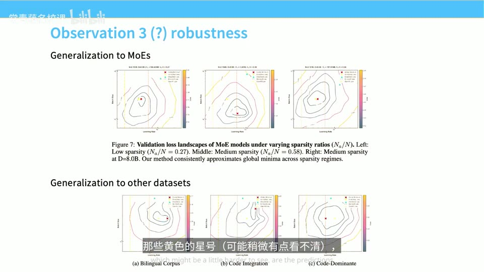 |
| 对吧？这说明这些现象很可能都取决于数据。像这些 scaling law 的具体数字，很大程度上是依赖于你用来训练的数据的，比其他因素更依赖数据。所以在我接着往下讲之前…… [【跳转到 32:21】](https://www.bilibili.com/video/BV11LEA6eEuj/?p=11&t=1941) | 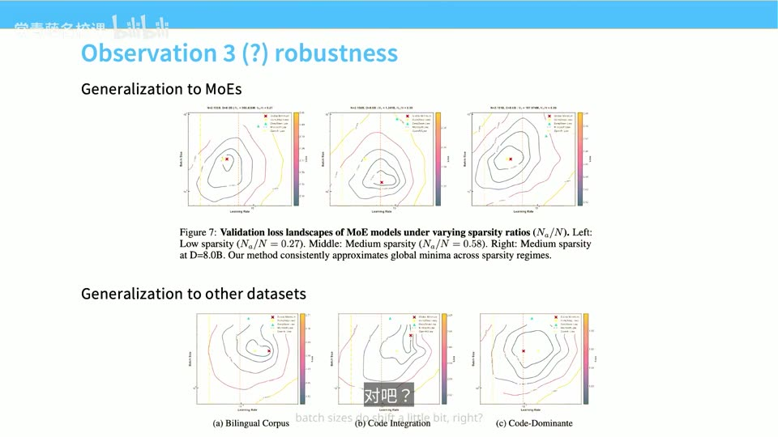 |
| 我想把这个画面再放出来看看，最后你会得出一个简化的 scaling law 结论：batch size 大致等于数据量乘以某个常数再开平方；你的 learning rate 也得跟着调——数据多了、learning rate 往上调；模型大了、往下调。这效果挺反直觉，但也不至于太疯狂，因为很多实验都默认用了 Chinchilla 式的 scaling，那样这两个因素刚好抵消。算力上去了…… [【跳转到 32:34】](https://www.bilibili.com/video/BV11LEA6eEuj/?p=11&t=1954) | 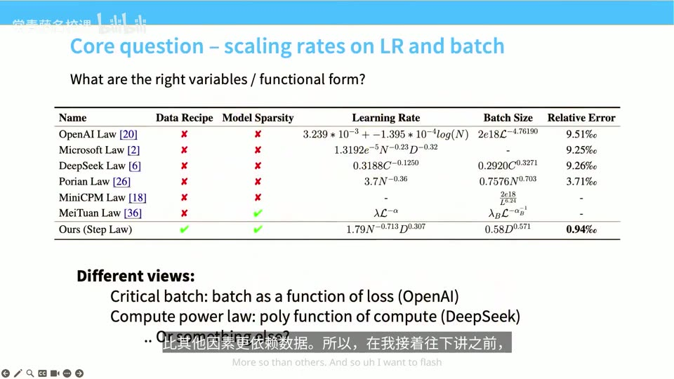 |
| learning rate 就得降下来。刚才关于 Chinchilla 的那段大家应该听明白了吧？按 Chinchilla 原则做 scaling 的时候，N 和 D 其实都跟着算力走，算力一涨、learning rate 就得降，对吧？所以你会得到类似 DeepSeek 定律的结论：learning rate 随算力增加而降低，batch size 随算力增加而升高，只是指数跟 DeepSeek 定律的不太一样。不错，某种程度上说…… [【跳转到 32:59】](https://www.bilibili.com/video/BV11LEA6eEuj/?p=11&t=1979) | 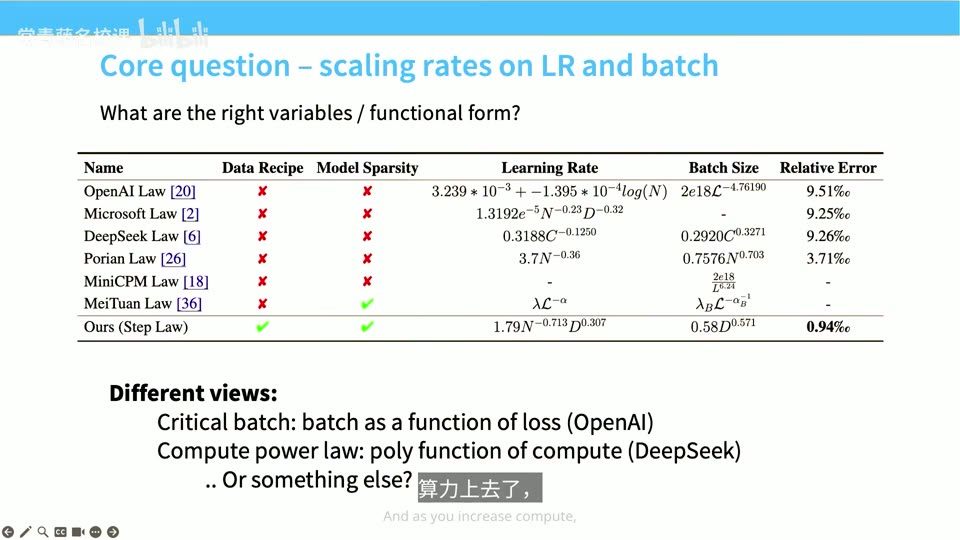 |
| 这就是 DeepSeek 分析最新、规模最大的一版。这是一种思路：如果你用 scaling law 那套方法处理 learning rate 拟合问题，就是这么做的好。以上就是超参数部分，大家如果有疑问随时可以打断我。接下来我们要接着聊聊优化器，我觉得这部分内容我在讲架构时没来得及展开——之前那次讲座内容已经很满了。但要是我不讲优化器…… [【跳转到 33:24】](https://www.bilibili.com/video/BV11LEA6eEuj/?p=11&t=2004) | 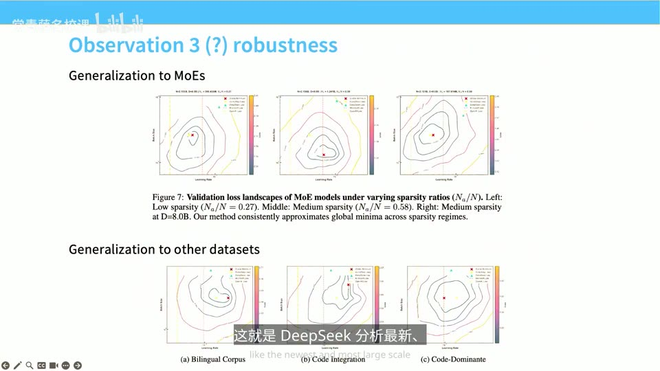 |
| 我觉得对你们不太公平，而且优化器是依赖于规模的，所以这里很适合拿来聊聊，讲讲优化器的一些最新进展，以及它们和规模之间的关系。嗯，对，我是想弄明白该怎么理解这个…… [【跳转到 33:49】](https://www.bilibili.com/video/BV11LEA6eEuj/?p=11&t=2029) | 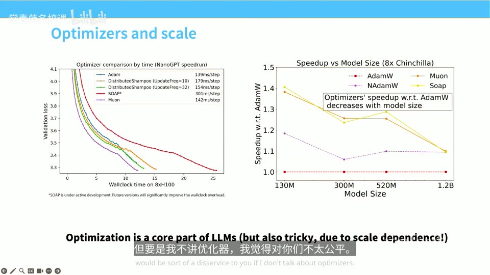 |
| 比如这是不是说，我们直接用现有的 scaling law 就行，不用自己再去跑网格搜索了？我的意思是，这得看是什么情形。抱歉，这个问题我得给线上的朋友重复一遍，对吧？我们是直接拿现成的 scaling laws 来用，还是自己跑一遍网格搜索？这得看你的计算预算有多少，还有你需要把它调到多准。我觉得，比如 StepFun 那个 scaling law，要是你的算力规模刚好合适…… [【跳转到 34:03】](https://www.bilibili.com/video/BV11LEA6eEuj/?p=11&t=2043) | 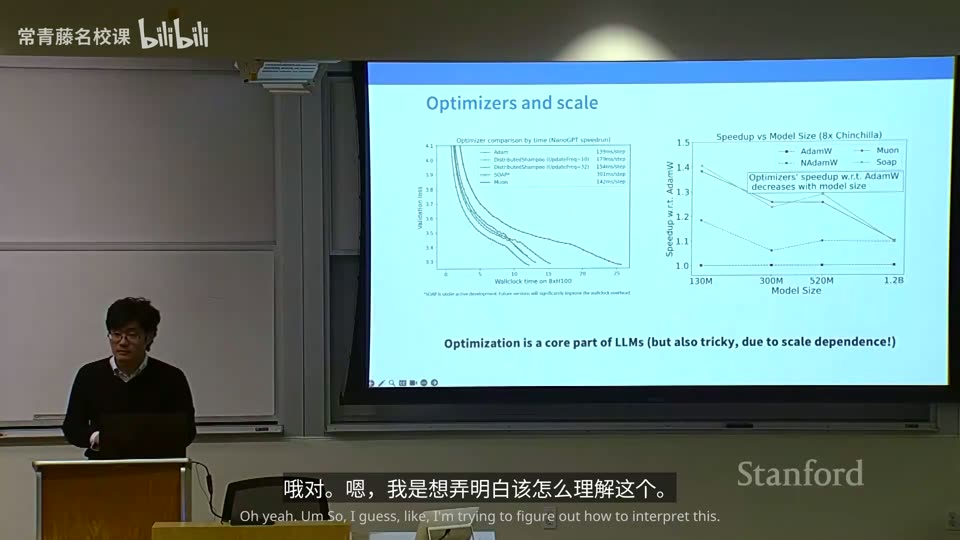 |
| 差不多就在他们做网格搜索的那个水平，那这些参数大概就是很好的默认选择，我肯定会选这些、而不是我自己凭空想出来的东西。不过话说回来，要是你在做自己的大规模预训练，多半会有一些细微的差别。有人可能会说：我真的觉得咱们应该用比较大的权重衰减，我的架构里权重衰减就设得很大。咱们不一定知道这些因素会按同样的规律扩展，所以你可能得把这里面很多东西重新做一遍。 [【跳转到 34:28】](https://www.bilibili.com/video/BV11LEA6eEuj/?p=11&t=2068) | 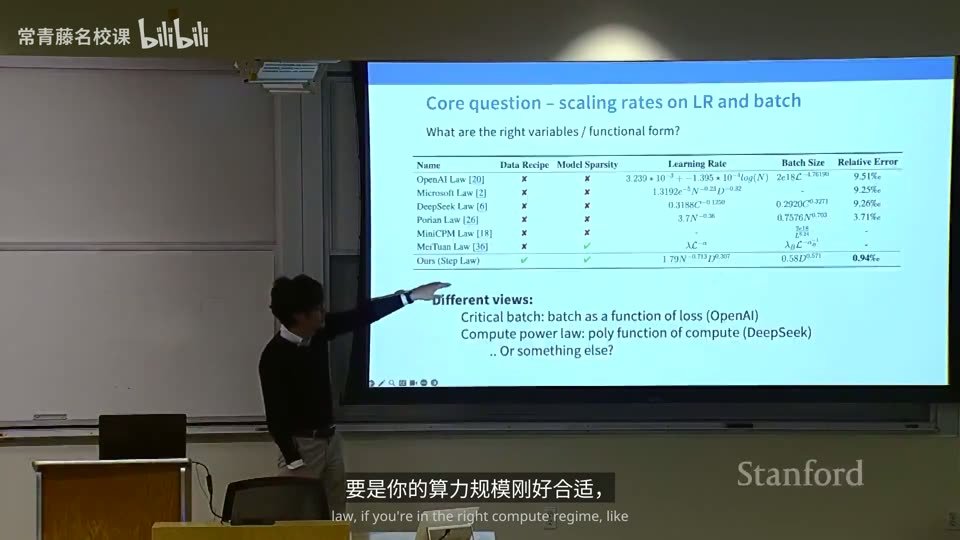 |
| 这就是为什么我觉得之前给你们看的那些报告都在重新跑、重新验证各种东西，因为细节上总有些差别，大家想确认一下这些结果在主要量级上大致是对的。我觉得接下来讲优化器的时候还会提到这个。我之前也聊过这一点，就是 scaling laws 给人的感觉特别像严谨的科学——这感觉就像：把这些线拟合上去，然后往外推。 [【跳转到 34:53】](https://www.bilibili.com/video/BV11LEA6eEuj/?p=11&t=2093) | 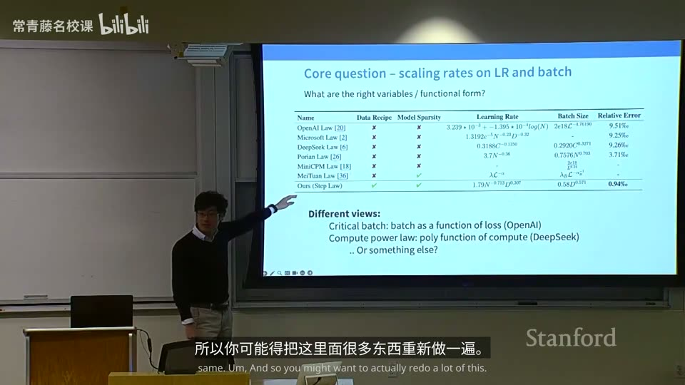 |
| 但说到底，scaling laws 里有很大一部分还是靠感觉。我就会想：第一步，那个调查的实验设置真的和我的足够相似吗？相似到结果能迁移过来？我们根本没法确切知道，总会有一些细微的差别。好，接下来咱们聊聊优化器。 [【跳转到 35:18】](https://www.bilibili.com/video/BV11LEA6eEuj/?p=11&t=2118) | 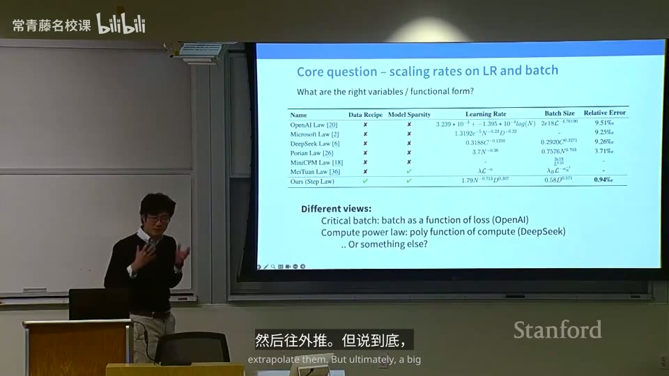 |
| 我觉得过去这一两年，LM 优化器甚至整个深度学习优化器领域都有一些特别让人兴奋的进展，所以现在聊这个正合适。我想先从这个比较讲起，它也许能让我们明白这一小节为什么值得讲。咱们就先从左边这张图开始，这是来自 nanoGPT speedrun，它启发了咱们的第一次作业。在那个例子里，你要训练一个非常小的模型…… [【跳转到 35:35】](https://www.bilibili.com/video/BV11LEA6eEuj/?p=11&t=2135) | 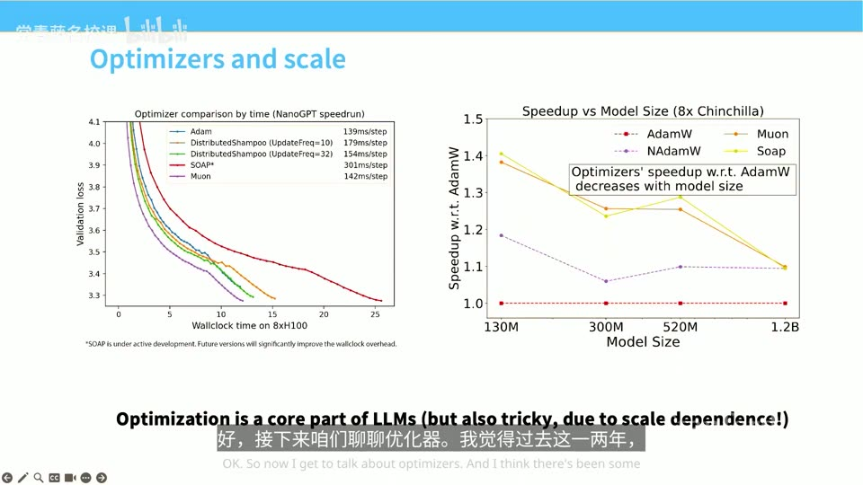 |
| 训练时间也相当短，你想尽快达到三点几的对数损失——具体是多少我忘了。很多人一直在针对这个基准测试做局部优化。我觉得这里有个挺有意思的现象：你看这个叫 Muon 的紫色曲线，它相对于 Adam 蓝色取得了非常显著的增益，它就在那条绿色线下面。所以你看，只要对比一下绿色和紫色这两条线之间的差距，你就会觉得：哇，仅仅把优化器换成 Muon…… [【跳转到 36:00】](https://www.bilibili.com/video/BV11LEA6eEuj/?p=11&t=2160) |  |
| 提升就这么大，而且它甚至不比 Adam 慢，更谈不上比 Adam 慢很多，这很棒，对吧？但接下来有个问题：这东西在大规模扩展时真的管用吗？然后你去跑一些扩展性研究，结果可能就没那么好了。这是做研究中一个很棘手也很重要的部分：我们做个小规模实验——比如优化器这种肯定依赖规模的东西——结果在小规模下看到了巨大的提升，那大规模情况下该怎么办呢？ [【跳转到 36:25】](https://www.bilibili.com/video/BV11LEA6eEuj/?p=11&t=2185) | 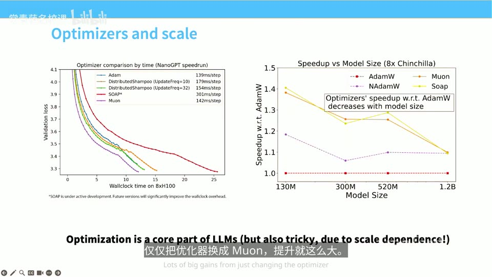 |
| 这不仅仅是给出一个扎实具体的方案那么简单。我想咱们在这里不妨讲个故事，这样你们就能大概明白我们到底能做什么，以及哪些事情是我们不一定能提前知道的。好，在切到下一张幻灯片前大家常遇到这种情况：小规模时想出一个很棒的方案，可放大规模就不灵了。差别在哪？接下来几页我会讲讲 Keller Jordan…… [【跳转到 36:50】](https://www.bilibili.com/video/BV11LEA6eEuj/?p=11&t=2210) | 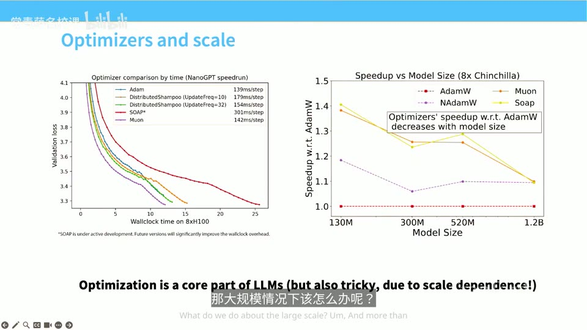 |
| 还有 Percy 和 David 的那篇论文，他们基本上做了一组大规模实验，用来对比优化器，并且把这种对比做得更到位。我的意思是，除了能从中学到关于 scaling 以及其他方面的东西，这里面还有很多标准的深度学习知识值得了解。有些很基础的问题，比如不同模型的超参数是不一样的，所以当你扩大规模时，它们的 scaling 指数可能都不一样。 [【跳转到 37:15】](https://www.bilibili.com/video/BV11LEA6eEuj/?p=11&t=2235) | 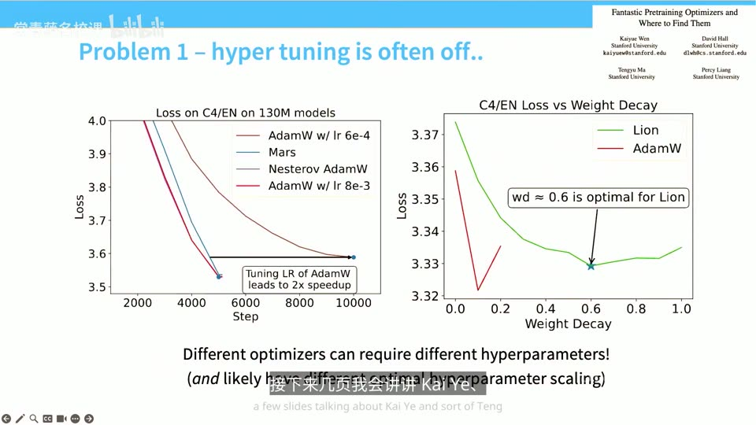 |
| 这时候你必须把 Adam 调得很到位。所以如果你调得不好，就会得到这条深褐色的线，你会想：哇，这东西比左边那些算法差远了。但只要你稍微改一下学习率，你就会发现：哇，之前所有的收益都没了。同样在右边也有这种情况：也许你已经把学习率调好了，但其他东西比如权重衰减（weight decay）却没调到最优。所以要是你用同样的权重衰减…… [【跳转到 37:40】](https://www.bilibili.com/video/BV11LEA6eEuj/?p=11&t=2260) |  |
| 那这条绿线的结果肯定会差很多；要是你选了这个偏小的权重衰减，那跟选最优权重衰减比起来，这条绿线的结果会差很多。所以以后有各种挺棘手的情况。严格来说，这不算 scaling 层面的问题，但这是个非常重要的机器学习通用经验规律，我想特别指出来。不过可能跟咱们现在课上讨论更贴切的是…… [【跳转到 38:05】](https://www.bilibili.com/video/BV11LEA6eEuj/?p=11&t=2285) | 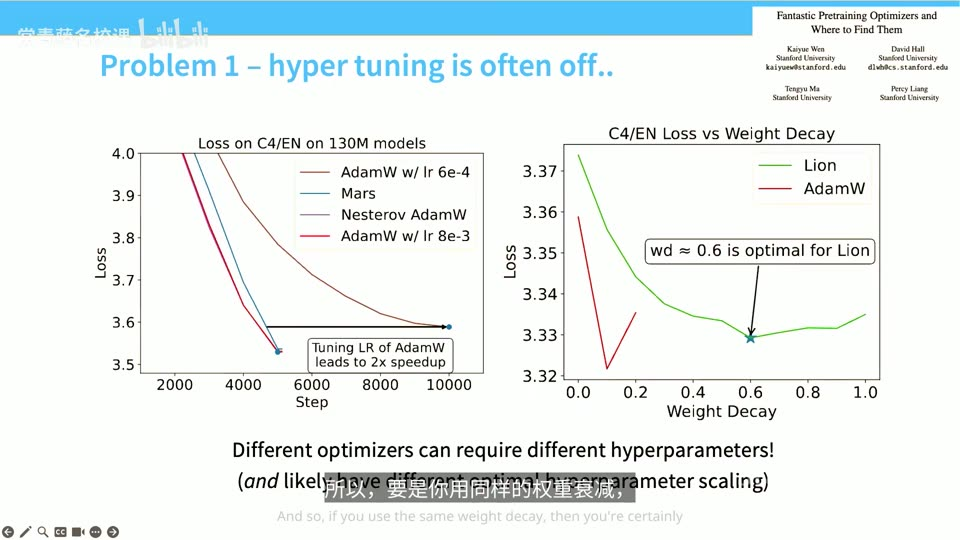 |
| 这些因素对规模的依赖关系。我觉得这是个很好的案例，能帮我们真正学会怎么把算法开发当成规模的函数来思考。因为在我看来，思考规模的时候有两个变量始终很重要，这篇论文在很大程度上把这两点都揭示了出来。其中一个维度是算力：要是你固定了模型大小和数据量的比例…… [【跳转到 38:30】](https://www.bilibili.com/video/BV11LEA6eEuj/?p=11&t=2310) | 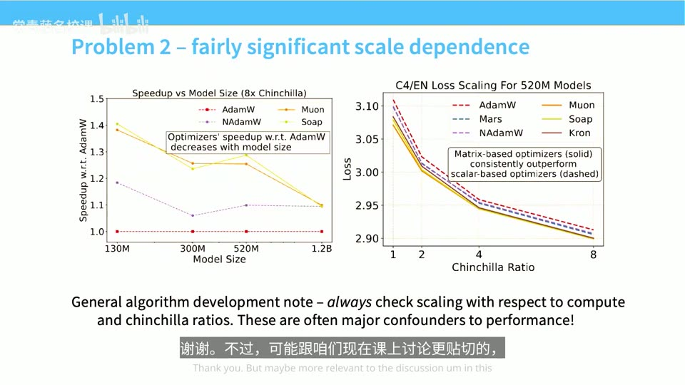 |
| 让这两者绑定在一起，那这本质上就是横轴上的算力维度。所以做研究的时候，你总得把算力拉上去，看看各项指标是怎么随规模变化的。我们看这里，如果把 Adam 的加速比定为 1.0、再对比其他所有算法，会发现 Muon 在小规模时特别强，但随着规模增大…… [【跳转到 38:55】](https://www.bilibili.com/video/BV11LEA6eEuj/?p=11&t=2335) | 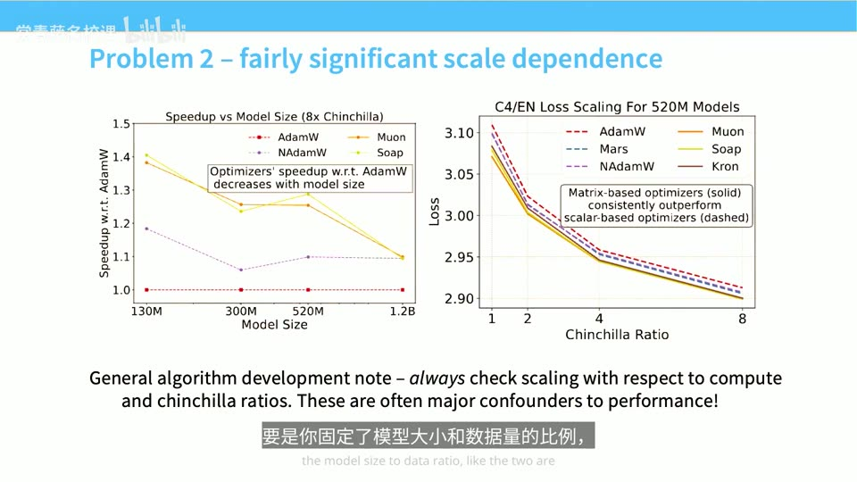 |
| 这种优势就慢慢减弱了。这往往不是你想看到的情况。要是你在做算法开发，还有另一个维度得时刻留意——你得警惕的另一个维度就是 Chinchilla 比例。简单说，Chinchilla 比例就是你的数据量和模型参数量之比。这个参数特别关键，因为有些算法在过参数化的情况下跑得挺好，也就是模型比数据大得多。你的算法是不是引入了某种隐式正则化…… [【跳转到 39:20】](https://www.bilibili.com/video/BV11LEA6eEuj/?p=11&t=2360) | 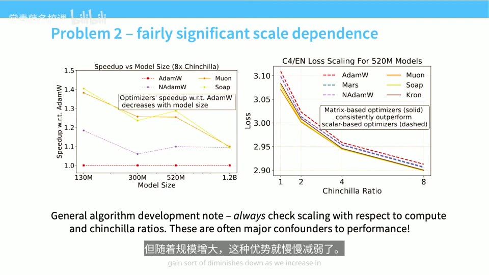 |
| 又或者它数据效率不高，但靠算力撑着、效果照样不错。所以有些算法在 Chinchilla 比例低的时候效果好，反过来，有些算法则适合 Chinchilla 比例高的情况，也就是每个参数能分到很多数据，因为你能把知识更高效地塞进参数里，对吧？所以这是一个特别特别大的混淆因素。哪怕是那些我觉得在模型规模这条轴上做 scaling 实验、规范做得挺不错的论文，往往也忽略了，或者压根没算力…… [【跳转到 39:45】](https://www.bilibili.com/video/BV11LEA6eEuj/?p=11&t=2385) |  |
| 去研究那种 Chinchilla 式的 token 与参数比例，结果发现这一点很多时候出人意料地重要。但在这种情况下并非如此——你看这种情况下，优化器带来的提升是相当一致的，意思是不管 Chinchilla 的比例怎么变，这几条线之间的比例关系都一样。但情况并非总是如此。所以这两个 scaling 因素你都得时刻留意，这点挺重要的。 [【跳转到 40:10】](https://www.bilibili.com/video/BV11LEA6eEuj/?p=11&t=2410) | 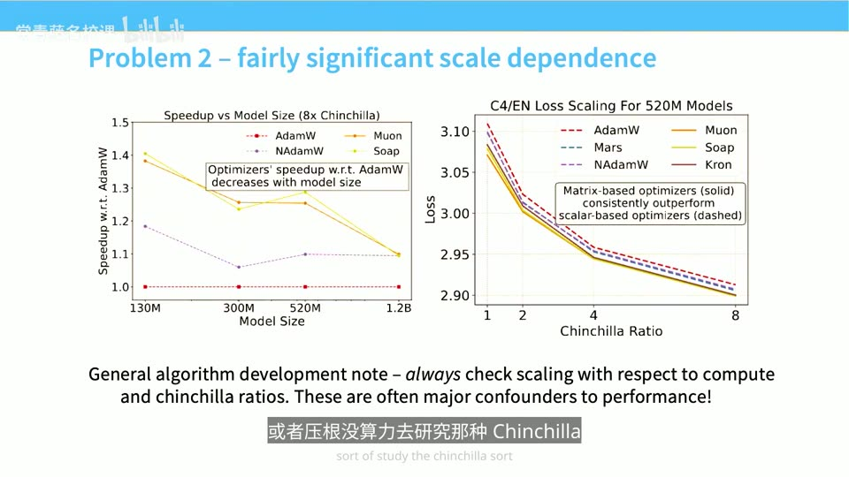 |
| 那我还要提一句：要是你搞了个新算法或者新配置，想确立 scaling 规律可没那么简单。这个例子来自 Will Held，他参与过 Marin 项目，也就是 Percy 那个 open-source language model 训练项目。在那个实验里，他们主要是在验证一组特定的超参数，所以这根本不算什么新算法，它算是 Adam 的一个变体，用了平方根 batch size 缩放，还有一堆其他看起来很常规的设置。他们做的本质上就是…… [【跳转到 40:34】](https://www.bilibili.com/video/BV11LEA6eEuj/?p=11&t=2434) | 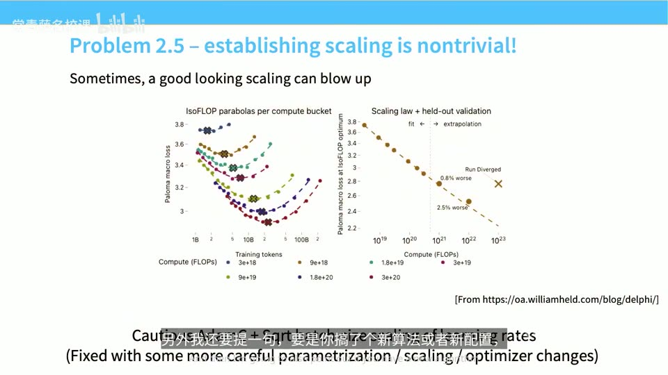 |
| 你在其他所有论文里都见过的那种 Chinchilla 分析。但因为这不一定算是一篇论文，而是一群人在做实验，所以你不会只把成功的那个发表出来。他们有个好处，就是愿意把失败的实验记录也公开出来。这里的例子是他们做的基本上就是标准的 Chinchilla 那一套，结果看起来很棒。如果你看这条……竖直虚线…… [【跳转到 40:59】](https://www.bilibili.com/video/BV11LEA6eEuj/?p=11&t=2459) | 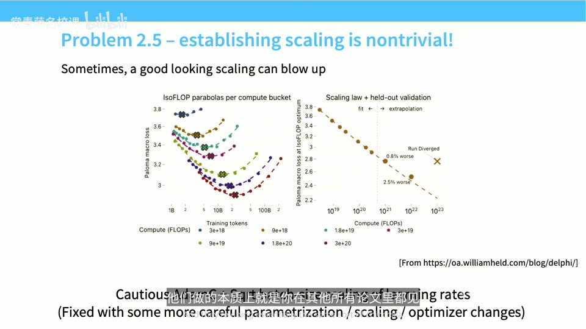 |
| 在它之前，这条 scaling law 画得真的非常漂亮，可随着规模继续往上扩就变成——先是差了一点点、然后差很多、接着哇，那个实验现在就不行了，整个就在你手里崩掉了。这里想说的是：即便在很多个数量级上 scaling 趋势看起来都不错，也可能突然反咬你一口，曲线可能会偏离线性，然后立刻就崩掉。针对他们的情况…… [【跳转到 41:24】](https://www.bilibili.com/video/BV11LEA6eEuj/?p=11&t=2484) | 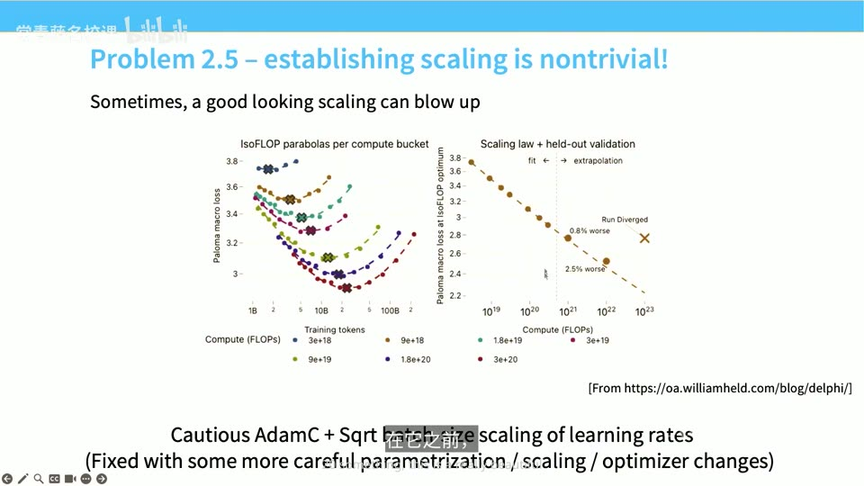 |
| 解决办法就是选用更谨慎的 μP 风格参数化。在优化器方面，他们换了一种优化器，结果在多个数量级上都得到了更好的 scaling 表现。但我想强调的是，当我回过头来说"好吧，你们都应该去做 scaling 实验"…… [【跳转到 41:49】](https://www.bilibili.com/video/BV11LEA6eEuj/?p=11&t=2509) | 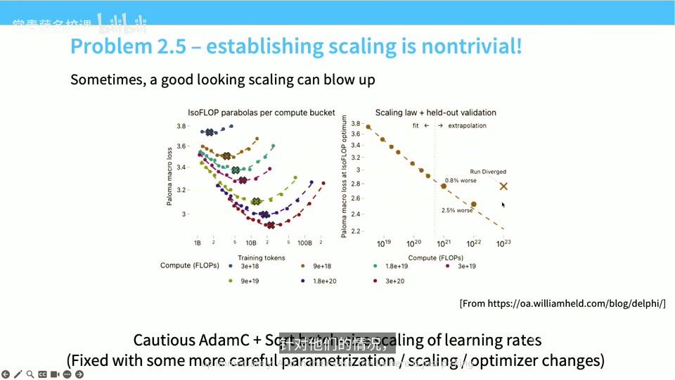 |
| 你们得对所有学习率等参数做 scaling，这并不容易，最后你会发现有相当一部分时间…… [【跳转到 42:02】](https://www.bilibili.com/video/BV11LEA6eEuj/?p=11&t=2522) | 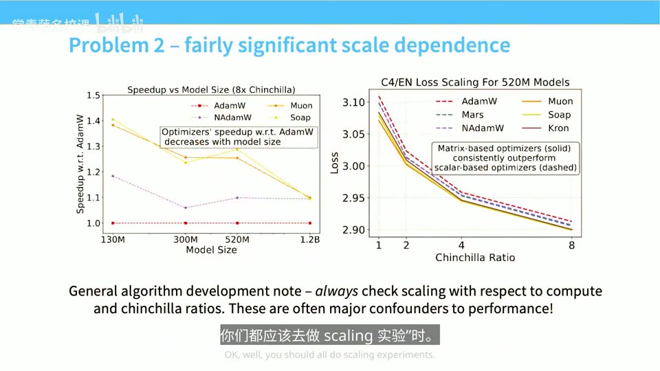 |
| 你得到的图表都是长这样，看着挺糟心的，而且你也不太确定到底哪里出了问题。好，那么最后我想稍微聊聊、大致收尾一下关于 Muon 的话题。我觉得有必要比之前更详细地讲讲 Muon，因为它开始变得越来越重要了，它被整合进了大规模模型训练流程，这也是咱们这门课很多新研究课题的入选标准——它有没有参与过大规模训练。 [【跳转到 42:09】](https://www.bilibili.com/video/BV11LEA6eEuj/?p=11&t=2529) | 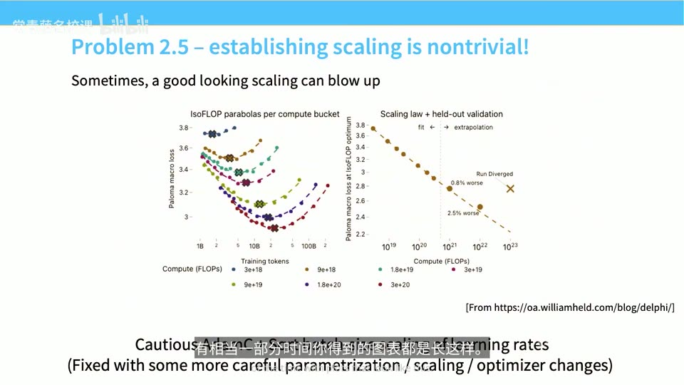 |
| 现在 Muon 达标了，而且它本身也是个挺有意思的算法，所以我简单提一下、聊几分钟，然后咱们接着往下。在梯度下降里通常发生的事情比较简单，先别管细节，这样你得到的大致就是个标准的基于动量的优化器：我取个梯度，把它加到动量上，这就是我的动量步骤；所以我用参数 μ 延续之前的动量，然后基于这个动量梯度来更新参数。 [【跳转到 42:34】](https://www.bilibili.com/video/BV11LEA6eEuj/?p=11&t=2554) | 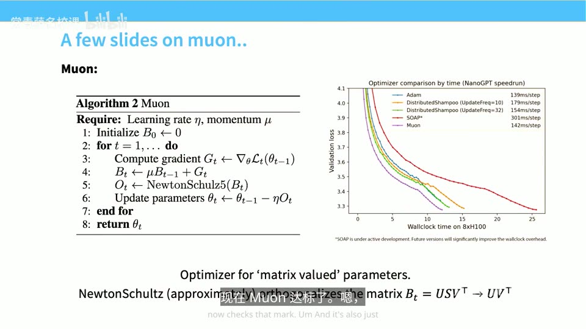 |
| 这是非常标准的动量梯度操作。但我认为真正有意思的、至少对我来说，是一套跳出常规的思路：梯度有个特性，就是对所有参数都一视同仁；但我们要知道，language model 甚至深度神经网络里的参数并不都是一样的。有些参数是向量参数，比如属于 RMS 归一化的那些；有些参数是矩阵参数…… [【跳转到 42:59】](https://www.bilibili.com/video/BV11LEA6eEuj/?p=11&t=2579) | 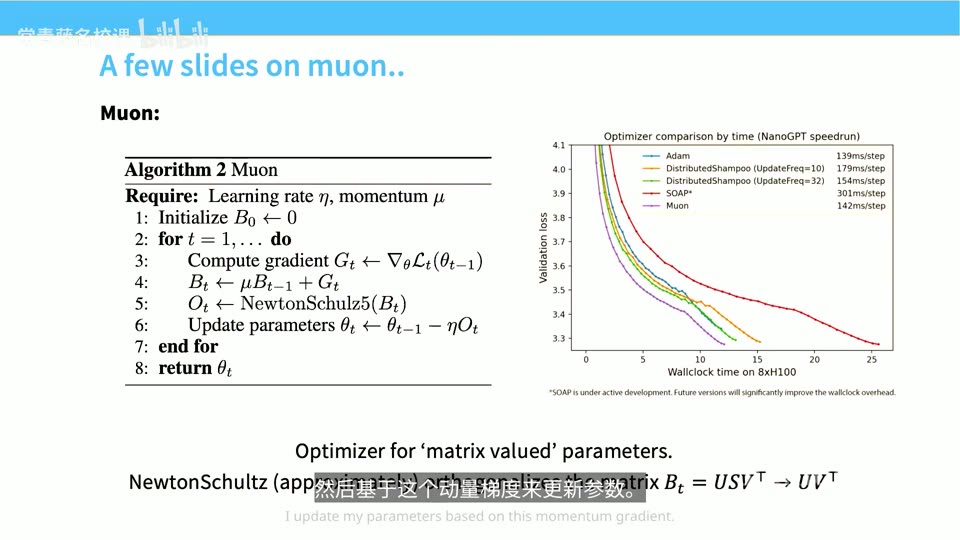 |
| 比如用于注意力机制或 MLP 的参数，对吧？而矩阵参数可能跟向量参数不一样，这就是这个想法的起点，我觉得挺有意思的。所以针对矩阵参数，你能做的一件事就是开始看看它们的谱，对吧？毕竟它们是矩阵嘛，矩阵有特征值和奇异值，所以你可以对奇异值做些操作。你在 Muon 里用的就是这个挺简单的想法：你算出梯度、走一步动量，现在我拿到 T 时刻的更新量…… [【跳转到 43:24】](https://www.bilibili.com/video/BV11LEA6eEuj/?p=11&t=2604) | 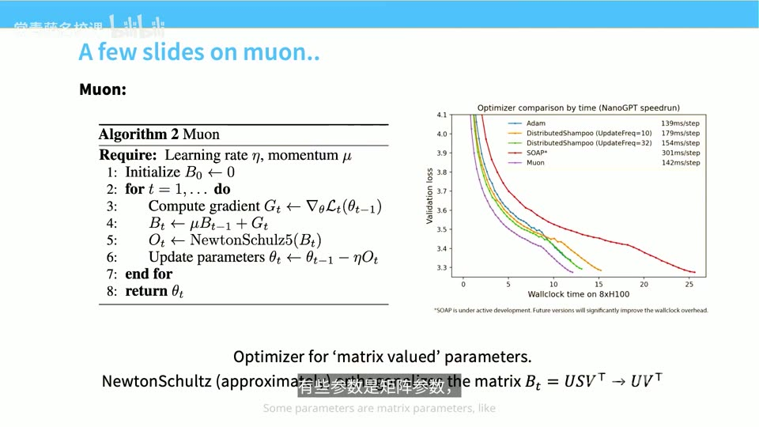 |
| 不是像第六行那样直接把它用到参数上，而是要做一下这个 Newton-Schulz 操作，具体来说是 Newton-Schulz 迭代。这样做的作用就是把更新矩阵正交化，所以我把这个操作写在下面了。咱们假设取更新量，把它做奇异值分解、写成 U S V^T 的形式，然后把所有奇异值都设成一：如果奇异值特别大，我就把它缩回到一；如果特别小…… [【跳转到 43:49】](https://www.bilibili.com/video/BV11LEA6eEuj/?p=11&t=2629) | 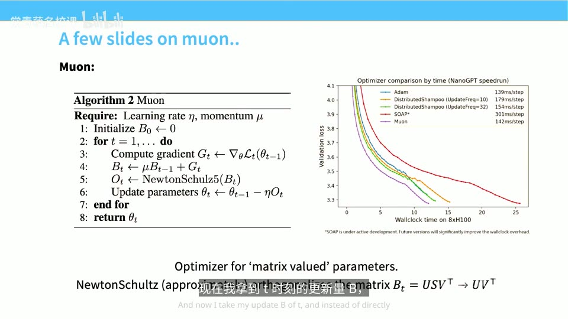 |
| 就把它扩回到一。然后我取 U V^T，这就是我要应用的新更新量。如果你想找个直观的理解，而且你对 AdaGrad 或者 Adam 这些优化器已经有概念了，那么在 AdaGrad 或 Adam 里，你是除以梯度的某种大小，对吧？这样每个坐标的大小就大致相同了。而在 Muon 里，你操作的是谱范数，所以每个方向的大小都是单位值。注意，这只有对矩阵才有意义…… [【跳转到 44:14】](https://www.bilibili.com/video/BV11LEA6eEuj/?p=11&t=2654) | 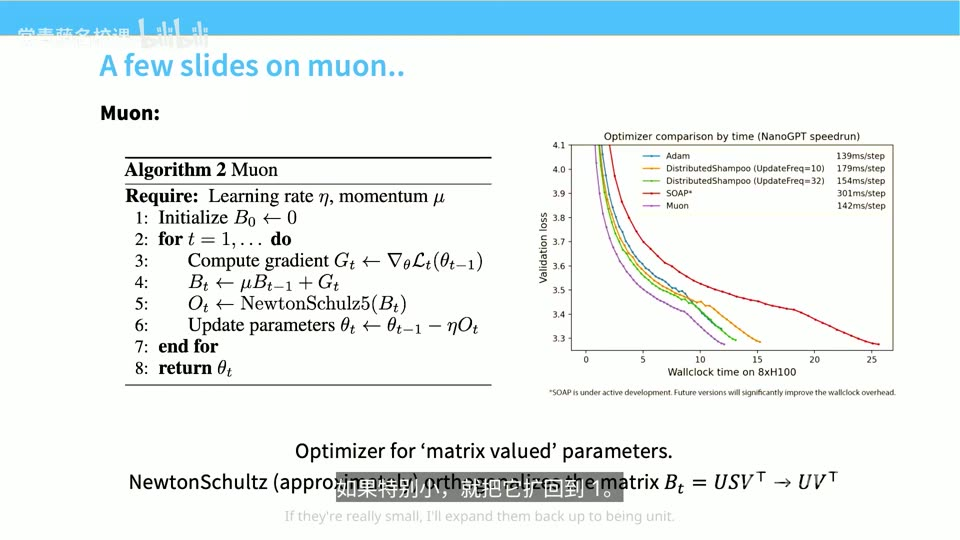 |
| 我只能对矩阵值的更新量定义奇异值分解这个概念。所以有意思的地方在于，它是一个矩阵优化器，所以你把它用在这些矩阵参数上；如果是向量值的参数，你大概还是会用 AdamW 这类优化器，因为它们跟 Newton-Schulz 项基本没什么交互。另外，Newton-Schulz 是对那个运算的一种近似，而且只用到矩阵乘法，所以它在系统层面很高效。 [【跳转到 44:39】](https://www.bilibili.com/video/BV11LEA6eEuj/?p=11&t=2679) |  |
| 但严格来说并不算正交化。那我为什么花这么多时间讲 Muon 呢？首先，它在像 nanoGPT 速度竞赛这类任务里表现非常强，它本来就是为这类任务提出的，所以你可能会觉得它效果不错。就像我刚才那张幻灯片里说的，有些扩展性研究指出…… [【跳转到 45:04】](https://www.bilibili.com/video/BV11LEA6eEuj/?p=11&t=2704) | 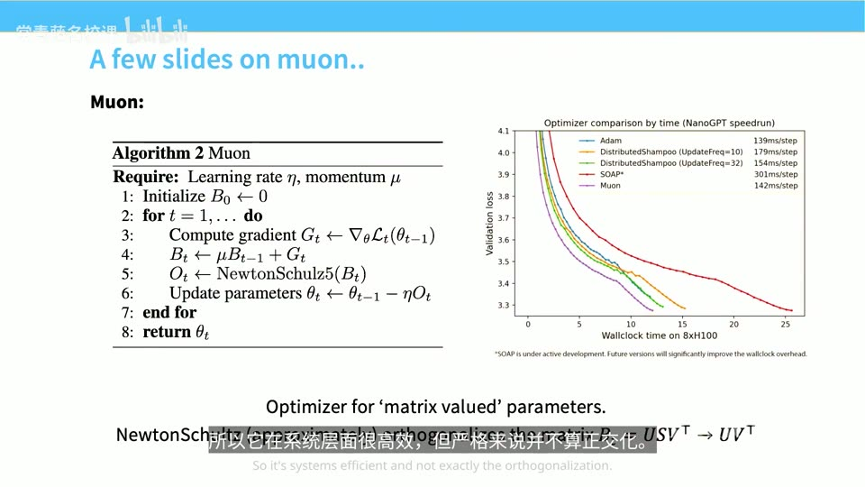 |
| 随着模型规模变大，Muon 带来的收益好像会慢慢变少。对，我想给这个故事做个收尾。Muon 刚出来那会儿，我觉得它挺有意思的，我当时在想会不会有人把它放大到更大规模。后来——他们真的把 Muon 做了大规模实验，结果说它的效果可能没那么神。我当时觉得这事就算翻篇了，心想估计也就这样了，谁会砸那么多算力…… [【跳转到 45:20】](https://www.bilibili.com/video/BV11LEA6eEuj/?p=11&t=2720) | 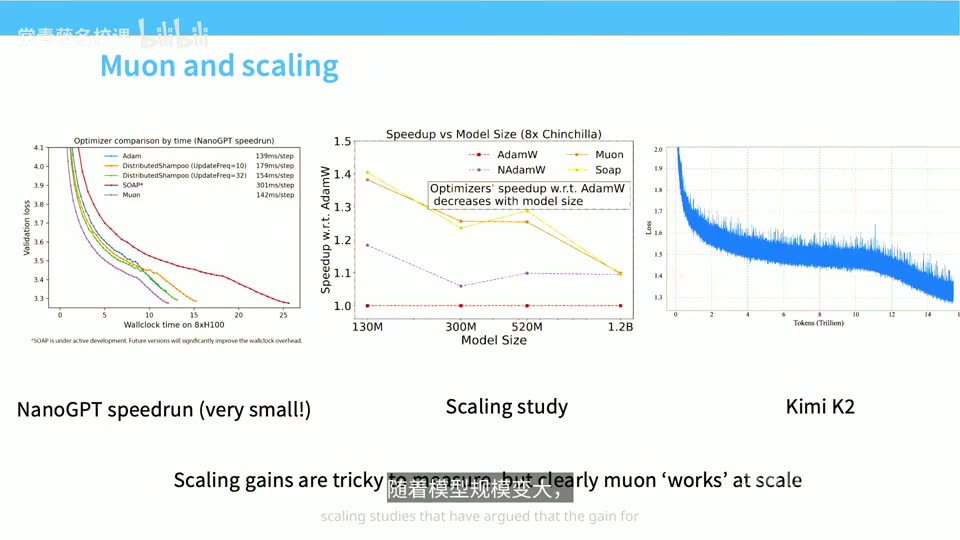 |
| 把它扩到完整的预训练规模啊？结果 Kimi K2 出来了，而且它整个模型都是用 Muon 训练的，就全套都用 Muon，只是加了一些小手段防止 Muon 训练时数值爆炸，他们确实发现了一大堆不稳定的问题。但 Kimi K2 是个非常出色的模型，对吧？模型效果很好，训练曲线看起来也挺合理的。所以这其实说明 Muon 在大规模场景下是行得通的。 [【跳转到 45:45】](https://www.bilibili.com/video/BV11LEA6eEuj/?p=11&t=2745) | 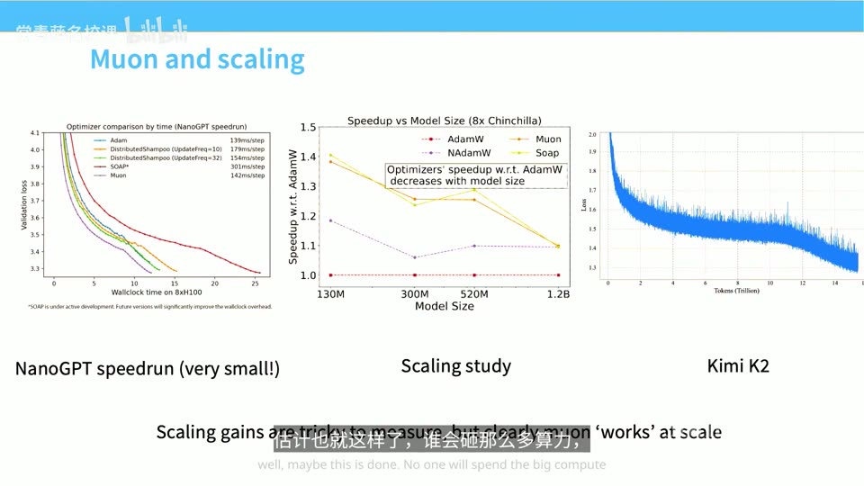 |
| 它比 Adam 好吗？Kimi K2 肯定没做消融实验，所以我们在那个规模下没法确切知道，但它确实是个有效能用的方案。那这个故事想说明什么呢？就是想说很难确定某样东西在大规模下到底行不行，这真的很难。不过到目前为止，我们做科研的主要路子还是先做小规模实验、再扩展到大规模，所以像 nanoGPT 速度竞赛…… [【跳转到 46:10】](https://www.bilibili.com/video/BV11LEA6eEuj/?p=11&t=2770) | 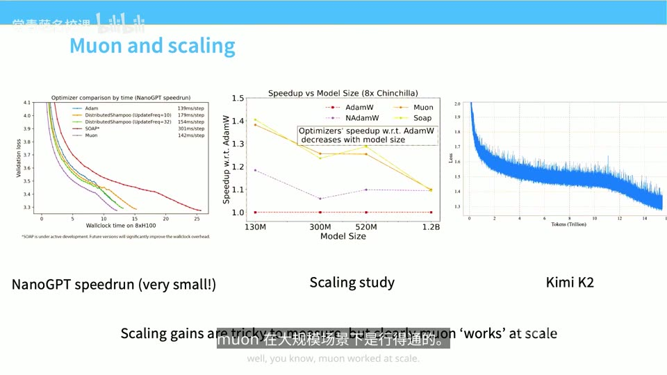 |
| speedrun 这种工作，咱们还是得重视，从中能学到不少东西，也能得到不少好点子，然后这些方法最终会用到大模型上。咱们看看大家是不是还会在大规模上做消融实验，真正搞清楚 Muon 在大规模上到底是不是比 AdamW 好。诸如此类，这些都是挺有意思的问题，咱们现在还没答案。好，我先停一下。优化器这部分讲完了，我想确认一下大家都听懂了没。 [【跳转到 46:35】](https://www.bilibili.com/video/BV11LEA6eEuj/?p=11&t=2795) | 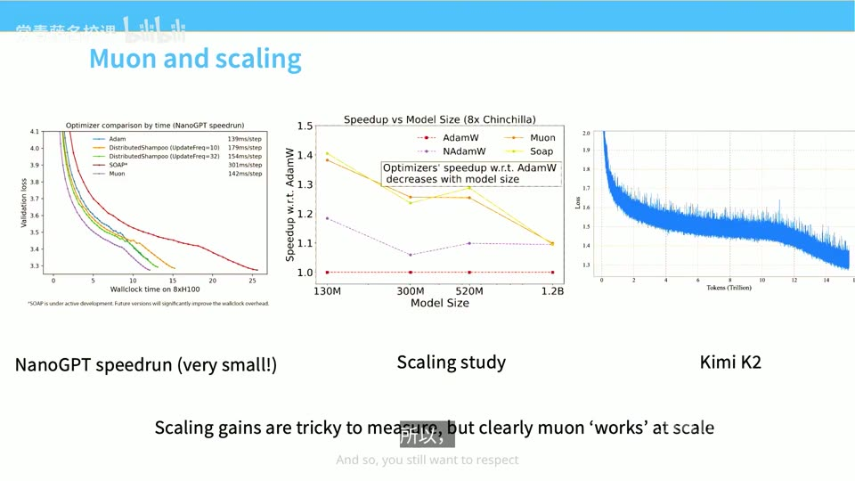 |
| 另外，因为我刚才提到了 Muon，这是个全新的话题，我之前没怎么细讲，里面水挺深的。或者说，你能做到更快的速度。 [【跳转到 47:00】](https://www.bilibili.com/video/BV11LEA6eEuj/?p=11&t=2820) | 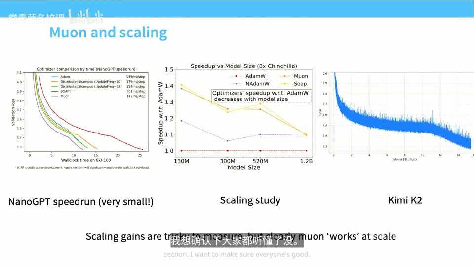 |
| （课堂问答）问题是：SVD 在 GPU 上跑得快吗？ [【跳转到 47:07】](https://www.bilibili.com/video/BV11LEA6eEuj/?p=11&t=2827) |  |
| SVD 在 GPU 上其实不快，但他们根本没用 SVD。他们用的方法是 Newton-Schulz（牛顿-舒尔茨），这是一种只做矩阵乘法的有限迭代算法，用来近似实现矩阵的正交化。这里有好几个巧妙的地方，比如把它当做一个独立的矩阵来处理、有正交化这个思路，另外就是用 Newton-Schulz 方法在系统层面去实现它。所以这些都是挺重要…… [【跳转到 47:12】](https://www.bilibili.com/video/BV11LEA6eEuj/?p=11&t=2832) | 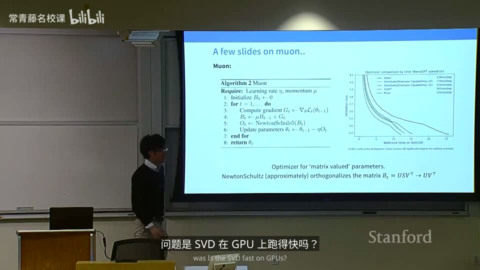 |
| 挺有意思的点。（课堂问答）后排那位……超参数是共享的吗？不，也不一样。我觉得——其实有几个人一直在做类似 Muon 风格的研究，其中一位比如 Jeremy Bernstein，他好像一直主张每一层都应该有自己的学习率。我觉得这件事的极限大概是这样，甚至更进一步，抱歉——是每一层都该有自己的优化器。 [【跳转到 47:37】](https://www.bilibili.com/video/BV11LEA6eEuj/?p=11&t=2857) | 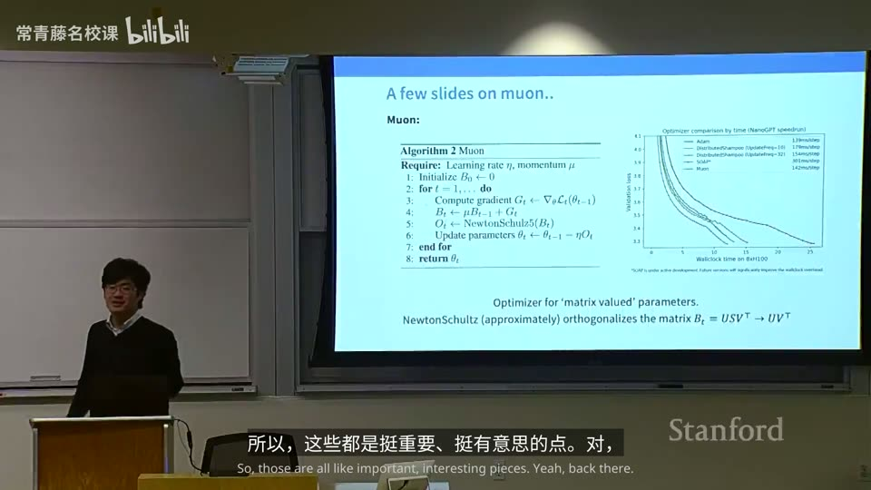 |
| 把这个推到极致，就是说 transformer 里的每一个参数都是不一样的，为什么不给它们每一个都配一个独立的优化器呢？那你也得为每一个单独调超参数，这我可不想折腾。但这说不定就是优化未来的方向。（课堂问答）他们好像就盯着这两样，挑出最好的，然后再拿它去调别的参数…… [【跳转到 48:02】](https://www.bilibili.com/video/BV11LEA6eEuj/?p=11&t=2882) | 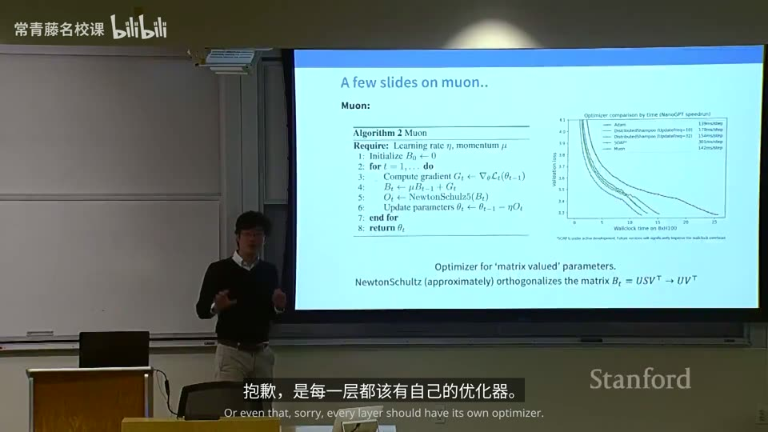 |
| 但这些变量会和 learning rate 互相影响吗？对。或者我理解的那个版本是：很多人就是在网格搜索里调 learning rate 和 batch size，但按理说这些变量会和一大堆其他超参数产生交互，你难道不担心这个吗？我觉得一般来说确实得担心超参数之间的相互作用，但现实是组合数量是指数级增长的，对吧？你不可能把整个空间都拿来做网格搜索。 [【跳转到 48:27】](https://www.bilibili.com/video/BV11LEA6eEuj/?p=11&t=2907) | 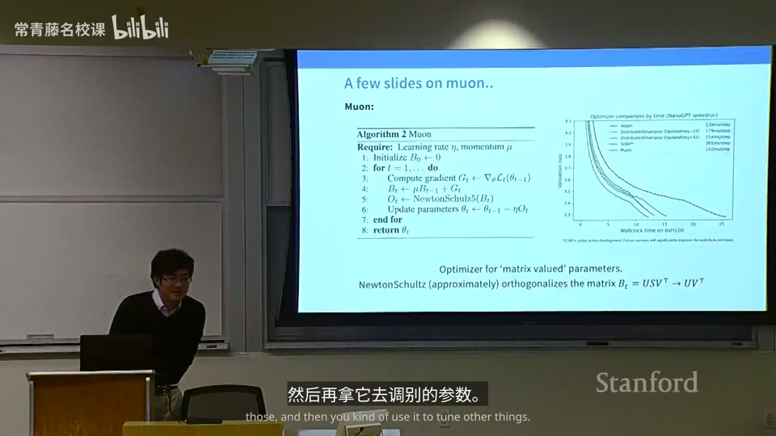 |
| 所以我觉得大家通常的做法是只对那些最让人头疼、最敏感的参数做网格搜索，而 learning rate 特别重要——我觉得只要你跑过一遍就知道 learning rate 是最该调的那个，所以他们在这上面会非常激进地下功夫。然后像 weight decay 这种参数，他们之后可能会单独扫一遍，好让这几个参数达到局部最优。好，谢谢。那这堂课的最后部分我想聊聊 μP。 [【跳转到 48:52】](https://www.bilibili.com/video/BV11LEA6eEuj/?p=11&t=2932) |  |
| 这东西有点神秘，虽然有不少论文写过它，实际上也有不少人做了实现，但我觉得大家连底层的数学是什么、底层实现该怎么做，都没能达成一致。不过大家还是有一套共享的核心理念的，而且这套方法看起来确实挺管用。所以我来聊聊我对这整套方案的理解，咱们姑且就这么叫它吧。那么这个目标希望已经讲得很清楚了…… [【跳转到 49:17】](https://www.bilibili.com/video/BV11LEA6eEuj/?p=11&t=2957) | 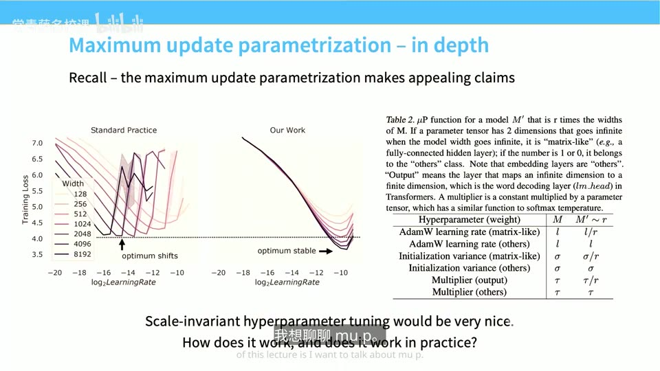 |
| 我觉得这张图就代表了我们的目标：如果我们增大模型的规模——这里特指只增加宽度——模型变大时最优学习率通常会变，但理想状态下，我们希望不管模型多大、最优学习率都别变。这就是我们想做的事。而为了做到这一点，我愿意动的旋钮是：我愿意按层去调整初始化，我也愿意按每一个参数去调整学习率。 [【跳转到 49:42】](https://www.bilibili.com/video/BV11LEA6eEuj/?p=11&t=2982) | 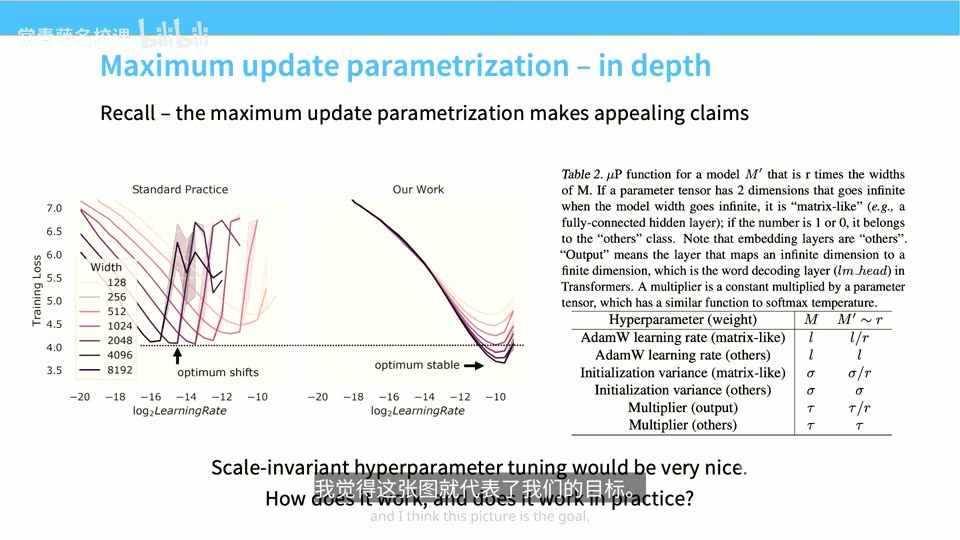 |
| 我还愿意根据模型的大小把残差连接这类东西放大或缩小。好，这就是我想玩的游戏。那它在实际中效果如何呢？已有好几篇论文对这些内容做了相当广泛的研究。Cerebras 其实是一家芯片公司，他们还有一个语言模型训练部门，由 Hestness 负责——就是那位因 scaling laws 论文而出名的人。 [【跳转到 50:07】](https://www.bilibili.com/video/BV11LEA6eEuj/?p=11&t=3007) | 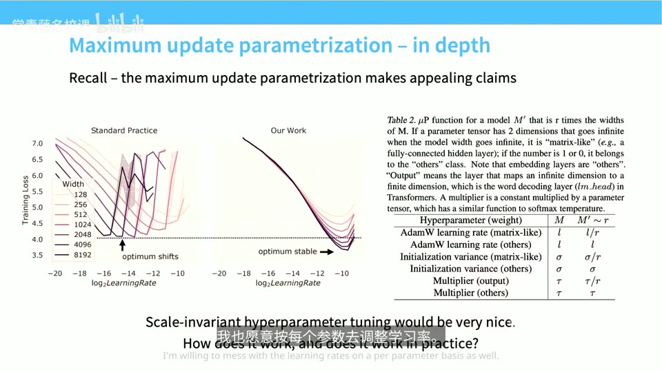 |
| 我觉得他们做的事挺有意思的，因为他们最近发表了很多关于语言模型 μP scaling 的论文。比如他们几年前推出的一个模型，就是用标准的 Chinchilla 配方来训练 0.1B 到 3B 参数的模型。另外他们还用了一种 μP 的变体，主要是为了更有效地调优超参数。我觉得挺不错的一点是…… [【跳转到 50:32】](https://www.bilibili.com/video/BV11LEA6eEuj/?p=11&t=3032) | 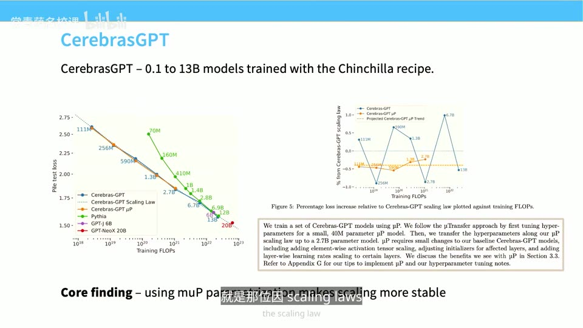 |
| 他们发现，要是用 μP 参数化，scaling laws 的拟合结果通常会更稳定，他们预测的 μP 趋势跟实际模型几乎严丝合缝。相比之下，我觉得那些非 μP 模型的损失预测波动要大得多。所以他们的结论是：μP 也许真是个很好的思路，这一点已经在大规模场景下得到了验证。 [【跳转到 50:57】](https://www.bilibili.com/video/BV11LEA6eEuj/?p=11&t=3057) |  |
| 大家看到了 MiniCPM 这些例子，其实很多人已经用 μP 的变体训练过模型了。我其实也可以多讲讲训练方面的内容，或者举几个用 μP 训练出来的模型例子。不过我觉得现在更有意思的其实是聊聊 μP 的概念基础和背后的数学原理。如果你对这块感兴趣、想找篇相对好懂的论文读读，我推荐这篇论文，对我来说这是最清晰的一篇。 [【跳转到 51:22】](https://www.bilibili.com/video/BV11LEA6eEuj/?p=11&t=3082) | 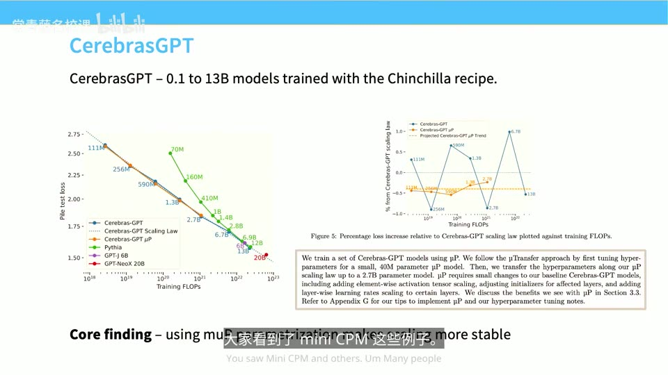 |
| 相关的论文有好几篇。发起这项研究项目的 Greg Yang 写了一系列论文，叫做 Tensor Programs，我觉得这些资料有点晦涩。Jeremy Bernstein 也参与了 μP 那部分的研究，他写了一篇很不错的文章，不是那种简单的回顾，而是一篇综述，把它放到了一个不同的框架里，我觉得很好理解。另外还有几位物理学家写的文章在解释 μP 是什么。 [【跳转到 51:47】](https://www.bilibili.com/video/BV11LEA6eEuj/?p=11&t=3107) |  |
| 这方面也挺有意思的。其实也做点类似的工作。好吧，不管怎样，咱们回到这篇论文。μP 的核心想法基于两个断言，对吧？这是很典型的物理学家思维。比如如果我让网络变大——假设我现在只改宽度——我把网络的宽度变大，我要提出两个不变量：在做扩展极限时，这两个量应该保持不变。首先是初始化时的激活值…… [【跳转到 52:12】](https://www.bilibili.com/video/BV11LEA6eEuj/?p=11&t=3132) | 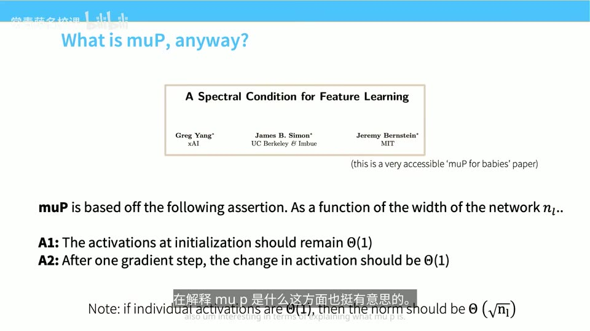 |
| 也就是说，如果我初始化模型、输入一些随机数据，激活值的大小应该大致保持不变，不随网络规模变化。如果它们随网络变大而爆炸、或者随网络变大而缩到零，那就是我参数化方法选错了。这听起来挺合理的：不管网络多大，激活值的大小都应该大致维持在同一个量级上。好，咱们做一次梯度更新，激活值的变化量应该是 O(1)。 [【跳转到 52:37】](https://www.bilibili.com/video/BV11LEA6eEuj/?p=11&t=3157) |  |
| 所以这就叫特征学习，也就是说做一次梯度更新，网络里的东西会发生显著变化，而且这个变化量应该是网络宽度的固定函数。在座的可能有些是搞理论的，对吧？你可能听说过神经正切核（neural tangent kernels），它的表现会非常不一样：在那种情况下，随着网络变宽，激活值的变化量反而会趋近于零。咱们不希望看到这种情况。 [【跳转到 53:02】](https://www.bilibili.com/video/BV11LEA6eEuj/?p=11&t=3182) | 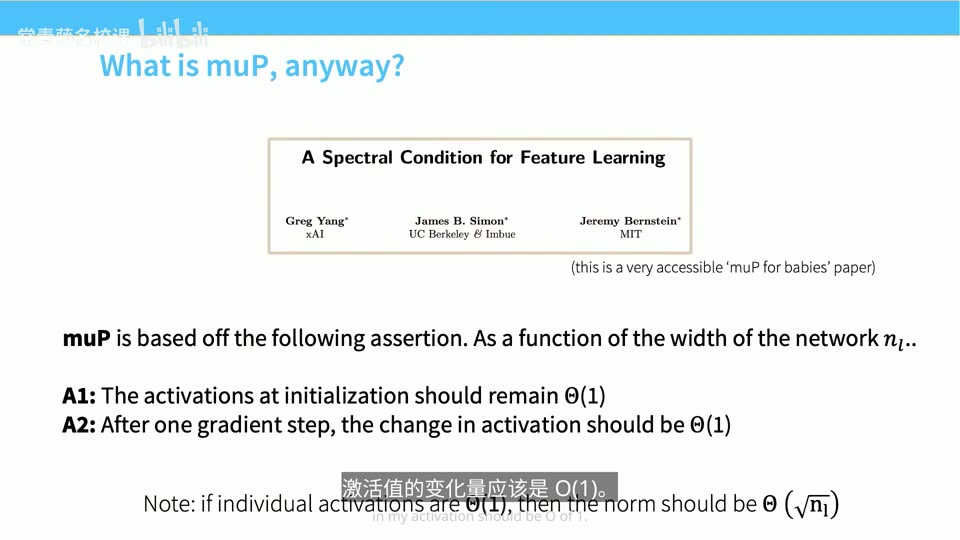 |
| 因为即便网络规模很大。好，这两个就是我们要找的不变量，这说得通，基本上就是说无论网络宽度如何变化，激活值及其变化量都应保持大致稳定。尤其是会在单个激活值和范数之间切换：如果每个激活值大致是 O(1)，那么整个激活向量的范数应该是隐藏单元数量的平方根，因此在那一层里…… [【跳转到 53:27】](https://www.bilibili.com/video/BV11LEA6eEuj/?p=11&t=3207) | 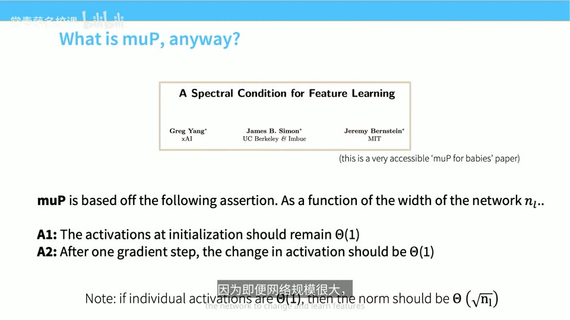 |
| 这就是关键所在。说到 μP，它其实挺有意思的。 [【跳转到 53:52】](https://www.bilibili.com/video/BV11LEA6eEuj/?p=11&t=3232) | 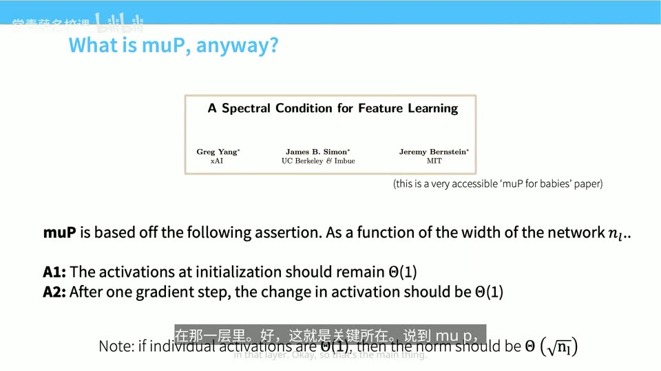 |
| 因为它一开始基于的是一组非常简单、也很容易让人接受的假设。 [【跳转到 53:57】](https://www.bilibili.com/video/BV11LEA6eEuj/?p=11&t=3237) | 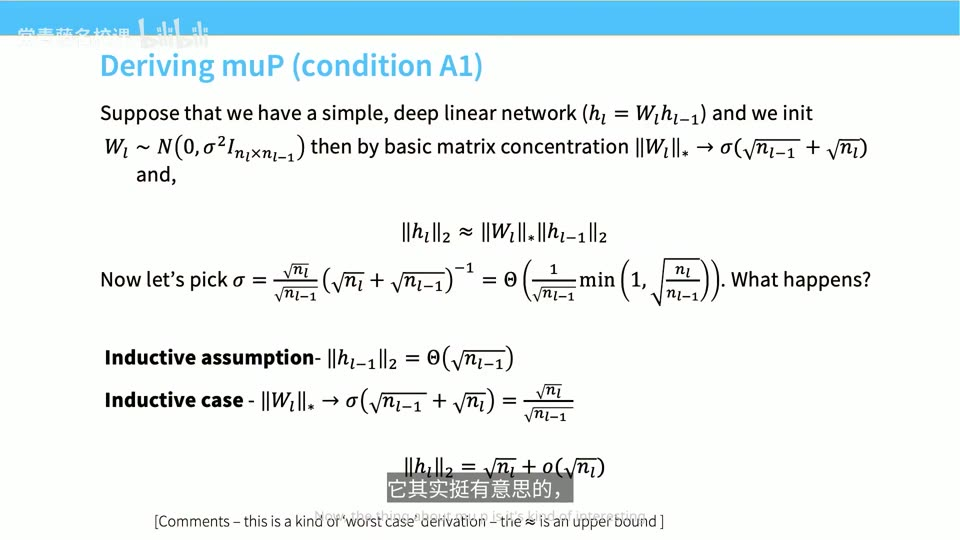 |
| 你们可能都会认同这么做是合理的，然后我们会再追加一些很强的假设，但到最后我们会得到一套…… [【跳转到 54:03】](https://www.bilibili.com/video/BV11LEA6eEuj/?p=11&t=3243) | 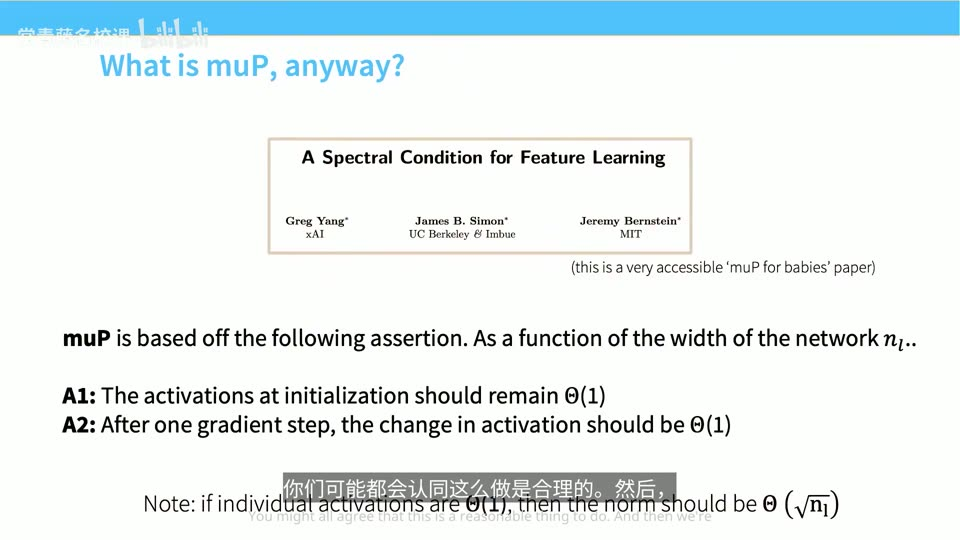 |
| 非常简单的 scaling 规则，他们就这么从这些假设里推导出来了。咱们回想一下，目标是要确保初始化时的激活值大致保持在单位量级。那咱们该怎么做呢？假设我们有一个简单的深度线性网络，把权重都初始化为按 σ² 缩放的高斯分布，那这个矩阵的谱范数（spectral norm）大概是多少？那就把它写下来。 [【跳转到 54:08】](https://www.bilibili.com/video/BV11LEA6eEuj/?p=11&t=3248) | 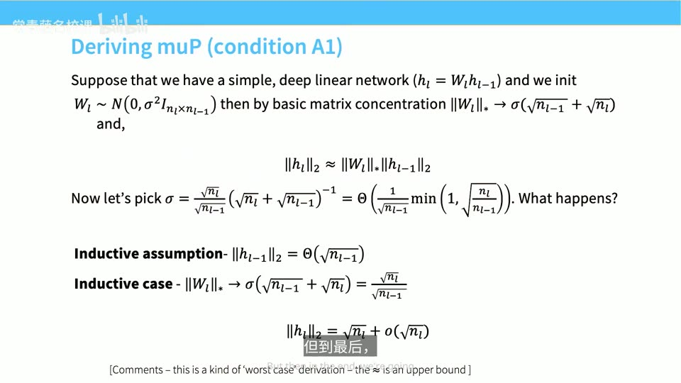 |
| 我不要求你们去验证，但这属于标准的矩阵浓度（matrix concentration）论证，是关于随机高斯矩阵算子范数的论证。接着请注意，在某些情况下，当 fan-out 不比 fan-in 大太多时，你会得到该层的输出大致等于输入乘以该算子范数。这始终是一个上界，但在某些情况下它只是近似成立。如果这成立，那我们现在能做什么呢？ [【跳转到 54:33】](https://www.bilibili.com/video/BV11LEA6eEuj/?p=11&t=3273) |  |
| 我们可以求解 σ，努力让激活值在所有层、所有宽度上都保持一致。设想一下，在第 L 层我大约有 √(fan-in) 的激活值——记住这与我们的记号一致——那至少对整个向量而言结果应该是 √(n_L)。这就是我们归纳法的基础情形。然后归纳步骤说：记住我在第 L 层有这个算子范数，它是 fan-in 和 fan-out 的函数。 [【跳转到 54:58】](https://www.bilibili.com/video/BV11LEA6eEuj/?p=11&t=3298) |  |
| 所以如果我选取某个特定的 σ，这一项就会等于那一项，我们就把它当作拟设（ansatz）。我先假定它就是答案，然后看看归纳法会怎么样。如果我把这个作为假设代入 σ，注意我得到算子范数之比就是 fan-out 除以 √(fan-in)。好，把它带回这里，于是我会得到输出的范数等于层中单元数的平方根…… [【跳转到 55:23】](https://www.bilibili.com/video/BV11LEA6eEuj/?p=11&t=3323) | 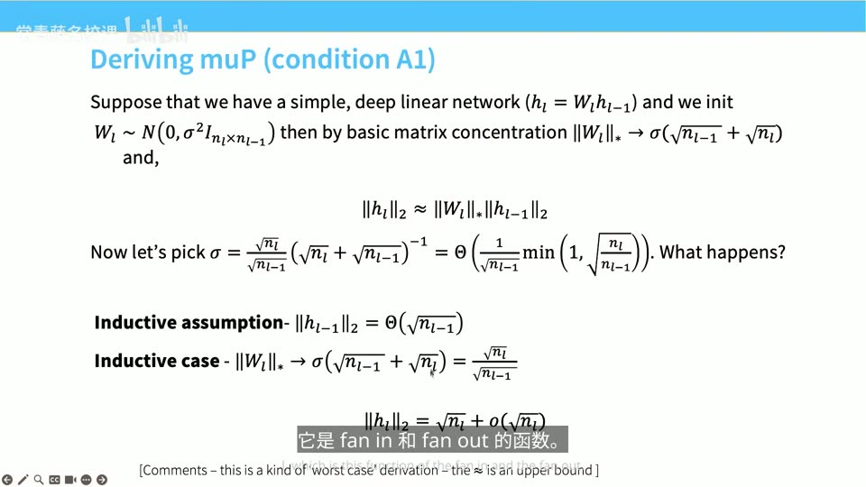 |
| 再加上一些我懒得细究的低阶项。那这个 σ 是怎么来的呢？说实话，这乍一看像是凭空变出来的，但只要把这种噪声初始化代入我前面的式子里，大致就能验证这一点。根据公式，本质上每一层的激活值规模大致都等于该层隐藏单元数的平方根。这里确实做了一些假设…… [【跳转到 55:48】](https://www.bilibili.com/video/BV11LEA6eEuj/?p=11&t=3348) | 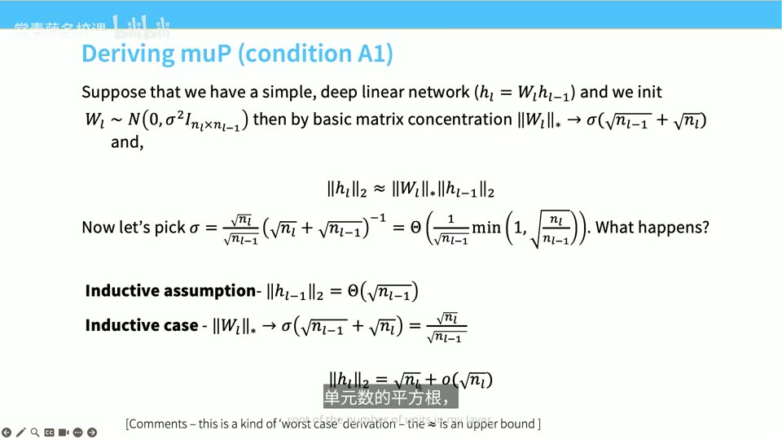 |
| 比如这个近似相等，但这套假设基本上是站得住脚的。所以条件 A1（激活值保持单位量级）很简单，但说实话条件 A2 就要稍微棘手一些了。所以咱们现在得来处理更新这一块了。我只讨论深度线性网络在 SGD 下、批次中单个样本的情况，那它具体会是什么样呢？想想看，对于特定层 L，权重的变化其实就是损失梯度和激活值之间的一种…… [【跳转到 56:13】](https://www.bilibili.com/video/BV11LEA6eEuj/?p=11&t=3373) | 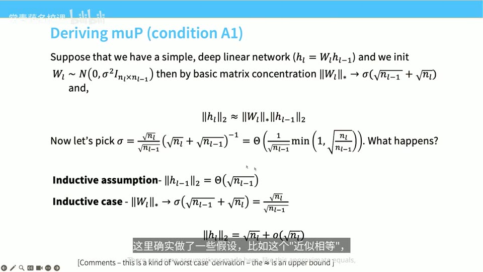 |
| 更新，这纯粹是由反向传播的性质决定的：前向传播是矩阵乘法，而反向传播则表现为外积。好，刚才说的是权重的变化，那接下来这一层激活值的变化又是怎样的呢？那么关于激活值的变化，咱们取 H 等于 W 乘以 h_{L-1} 的展开，对…… [【跳转到 56:38】](https://www.bilibili.com/video/BV11LEA6eEuj/?p=11&t=3398) |  |
| 把它展开成这个公式，这就是第 L 层激活值的精确变化量。它包含两项：一项是直接来源于前一层激活值的变化，另一项是交叉项，反映的是权重变化带来的影响，而不仅仅是前一层激活值变化带来的影响。所以这个更新涉及两项，这就是第 L 层激活值的变化量。接下来咱们来看看这几项中的每一项。 [【跳转到 57:03】](https://www.bilibili.com/video/BV11LEA6eEuj/?p=11&t=3423) | 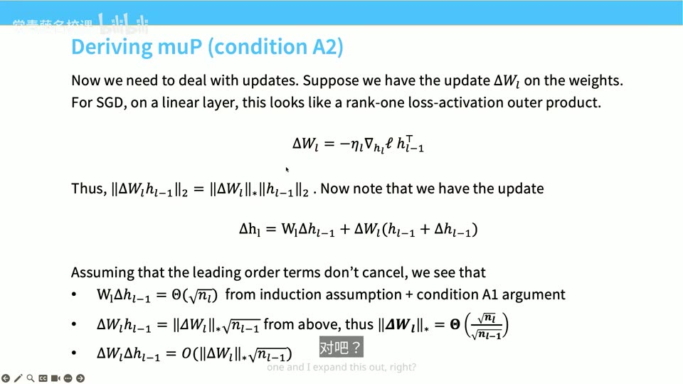 |
| 我希望这三项的数量级保持一致，而且这个数量级都是 √(n_L)。为什么呢？大家还记得前面两页幻灯片提到的条件吗？ [【跳转到 57:28】](https://www.bilibili.com/video/BV11LEA6eEuj/?p=11&t=3448) |  |
| 对于 A2，我们希望经过一次梯度更新后，激活值的变化量保持在 O(1) 的量级。所以为了满足这个条件，该层激活值的范数应当是 √(n_L)。对，所以为了做到这一点…… [【跳转到 57:38】](https://www.bilibili.com/video/BV11LEA6eEuj/?p=11&t=3458) | 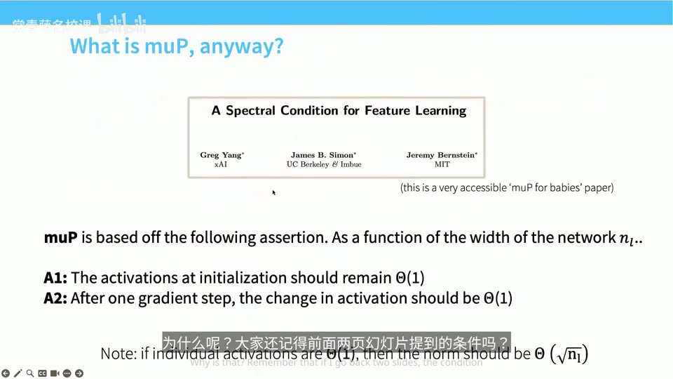 |
| 我希望这每一项都达到那个数量级。只要假设成立、且各项之间没有相互抵消，那么这个估算的数量级就是准确的。你可以看到这些粗略的估算是如何一点点累加起来的，对吧？这里我们做了一些假设，比如假设不存在相互抵消的情况。这提供了一种有趣的视角，让我们去思考这些对象各自的数量级该如何评估。 [【跳转到 57:53】](https://www.bilibili.com/video/BV11LEA6eEuj/?p=11&t=3473) | 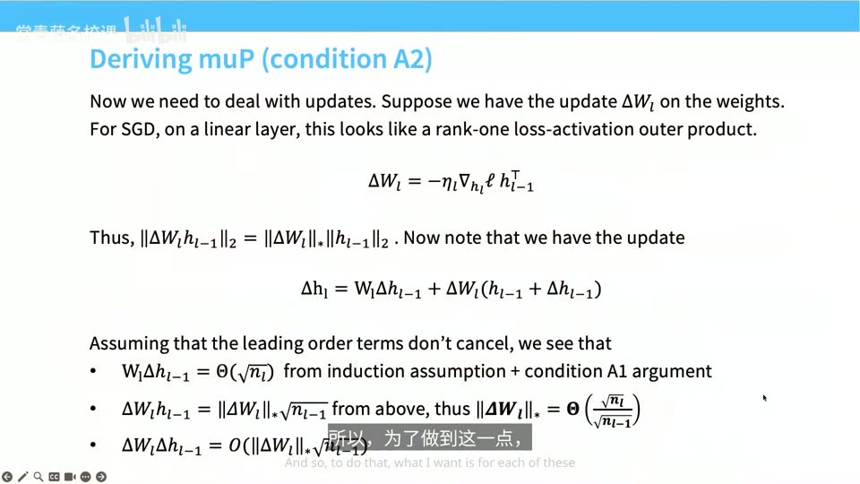 |
| 所以此刻，我们思考这个问题的正确方式，并不是说我是正坐在这里进行严谨的数学推导。我在这里做的本质上就是在追踪所有这些项的数量级，我的意思是，基于我们之前的假设，这些项的规模大致应该是多少，就有点像物理学家式的数学。嗯，没有冒犯物理学家的意思，这种方法正是物理学家们这样发展出来的。好。 [【跳转到 58:18】](https://www.bilibili.com/video/BV11LEA6eEuj/?p=11&t=3498) | 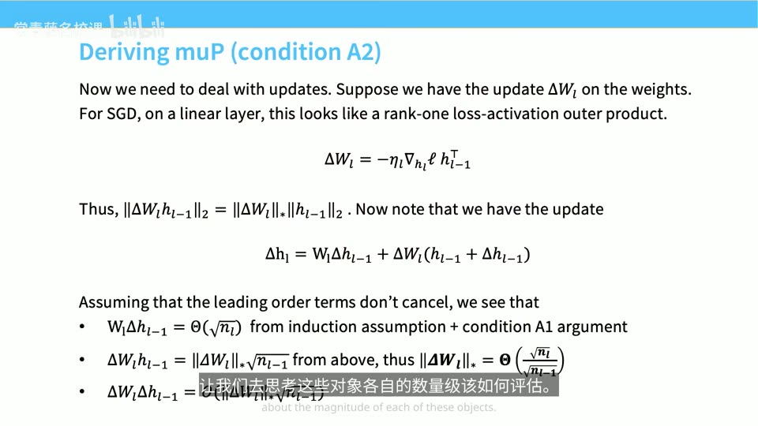 |
| 那我们现在——哦抱歉，先退回到上一张幻灯片，把这些内容讲清楚。第一项基本是假设得来的，对吧？也就是所谓的归纳假设，我们假设 Δh_L 的数量级是正确的，所以这项是自然成立的。另外两项就比较棘手了，这里涉及几项相乘：权重在算子范数下的变化量，再乘以 n_L 的平方根…… [【跳转到 58:43】](https://www.bilibili.com/video/BV11LEA6eEuj/?p=11&t=3523) | 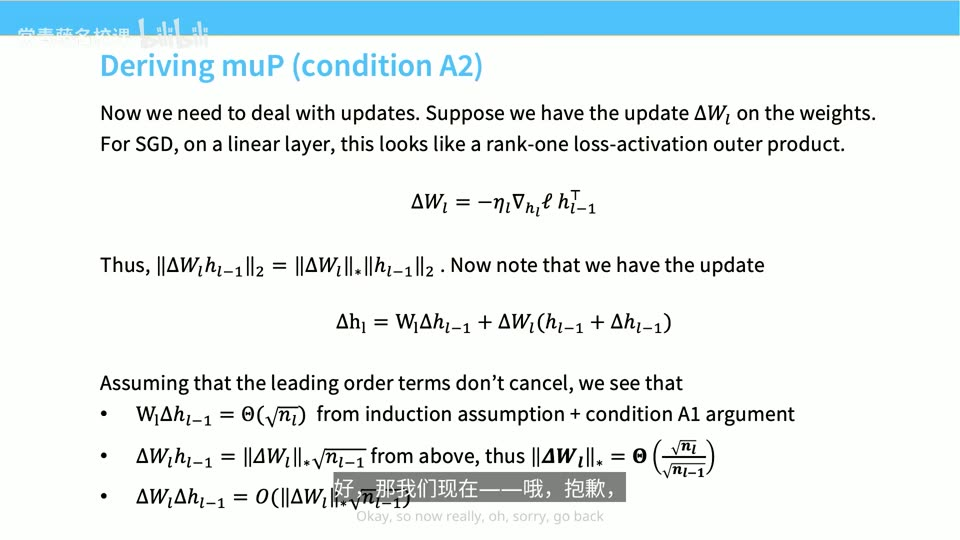 |
| 所以既然这两项分别代表了各自的数量级，我们就能大致推算出 Δ 需要多大，对吧？我们可以解出它，因为我们知道左边的值需要是某个量级。接着我们处理这一项，于是我们解出这个算子范数，得到的正是这个量。所以这就是我们下一张幻灯片要达成的目标：我想搞清楚什么样的学习率能让参数更新量大致正比于 fan-out 的平方根、反比于 fan-in 的平方根。 [【跳转到 59:08】](https://www.bilibili.com/video/BV11LEA6eEuj/?p=11&t=3548) | 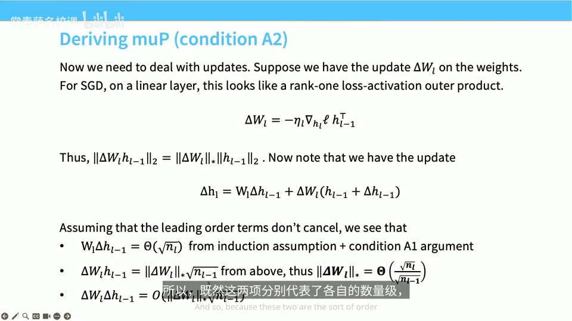 |
| 所以目标就是这个。刚才我说了，选好学习率后这个关系应该大致成立。那具体怎么做呢？好，咱们再做一个假设，这个假设可能是我觉得最不太能接受的：我们假设损失更新是按单位缩放的。换句话说，我们假设模型随着规模扩大确实取得了显著、且非平凡的进展，且这种进展模式大致相似。 [【跳转到 59:33】](https://www.bilibili.com/video/BV11LEA6eEuj/?p=11&t=3573) | 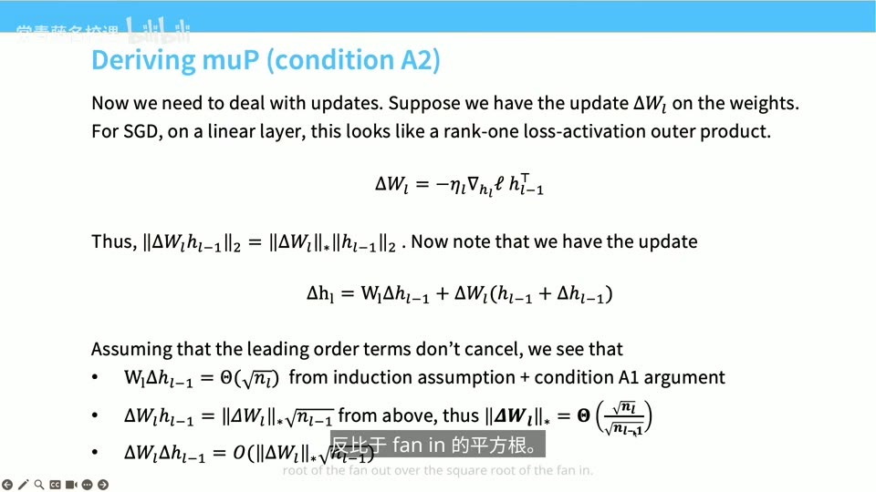 |
| 说实话，我自己也不太觉得这个假设很合理，但咱们先把它作为假设写在这儿。但这个假设的关键在于，如果它成立，后面的数学推导就会非常清晰简洁。因为损失的变化量等于梯度与权重变化量的乘积——这就是泰勒近似，因为它是内积——所以我们可以把它改写为弗罗贝尼乌斯范数和算子范数……按右边的这一项。 [【跳转到 59:58】](https://www.bilibili.com/video/BV11LEA6eEuj/?p=11&t=3598) | 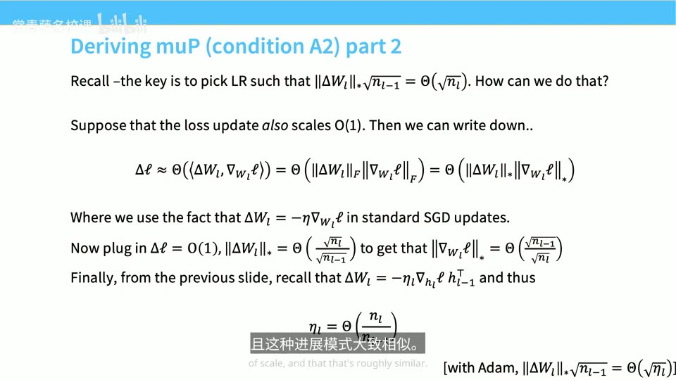 |
| 就能帮我们得到想要的结果了。所以这一项是 O(1)，我们希望这一项是 √(n_L) 除以 √(n_{L-1})，就是右边这一项。最后我们来看这一项的梯度，这将是……那我现在需要什么样的学习率 η 呢？我们需要解出这个量，也就是这两者的比值。 [【跳转到 60:23】](https://www.bilibili.com/video/BV11LEA6eEuj/?p=11&t=3623) | 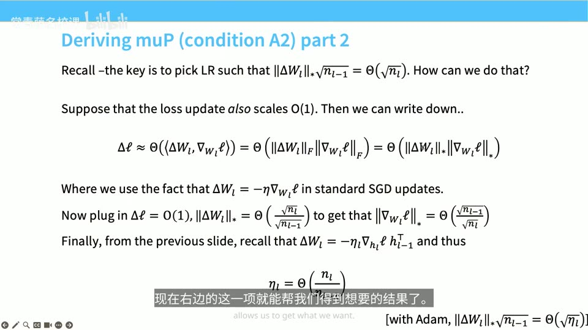 |
| 大家看，也就是 n_L / n_{L-1}。所以我们做了一个假设，认为左边这一项是 O(1)，然后解出了所有变量，最终得出了某一层学习率正比于 fan-out 与 fan-in 之比。另外补充一点，对于 Adam 优化器，由于其中一些变化，你会得到与前者略有不同的比例关系，我在这里提一下。那么我刚才带大家过了一遍针对各个组件的 scaling 论证。 [【跳转到 60:48】](https://www.bilibili.com/video/BV11LEA6eEuj/?p=11&t=3648) |  |
| 希望这些论证看起来比较直观。但说到底，你可能更关心的是：这到底意味着什么、对你有什么用？这意味着我们在设置初始化和学习率时会稍微调整一下方法。所以针对 μP——也就是蓝色部分——我们的初始化方式如下：蓝色方框展示了我们的具体做法。初始化公式为 1/√(fan-in) 乘以一个系数…… [【跳转到 61:13】](https://www.bilibili.com/video/BV11LEA6eEuj/?p=11&t=3673) |  |
| 该系数为一除以根号下 fan-out。这个比值如果是 1，那就等同于我们常规的初始化方式，不，这是标准参数化；但如果这个比值不小于 1，得到的结果基本上就不一样了，你会得到更接近 √(fan-out) 与 fan-in 的比值。更有趣的是 Adam 的情况有点不一样，它的推导我就不细讲了，主要就是把那个 2 的分子去掉。 [【跳转到 61:38】](https://www.bilibili.com/video/BV11LEA6eEuj/?p=11&t=3698) | 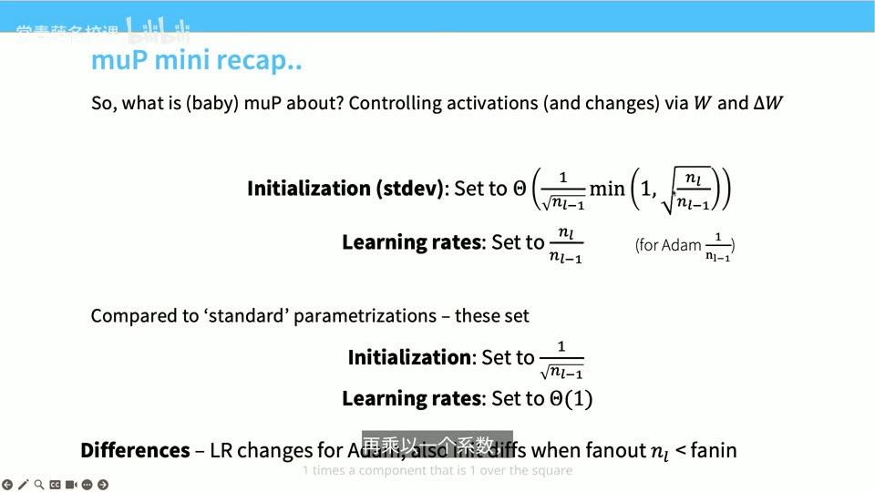 |
| 这样就得到……把它当做一种针对特定层的学习率。所以简单来说，对 Adam 而言，fan-in 比较大的层得到的学习率会更小，这样你能实现这种"层次适应"的学习率，挺有意思的。以上就是 μP 的推导。刚才我讲了不少细节，所以我想聊聊这背后的核心要点到底是什么。 [【跳转到 62:03】](https://www.bilibili.com/video/BV11LEA6eEuj/?p=11&t=3723) | 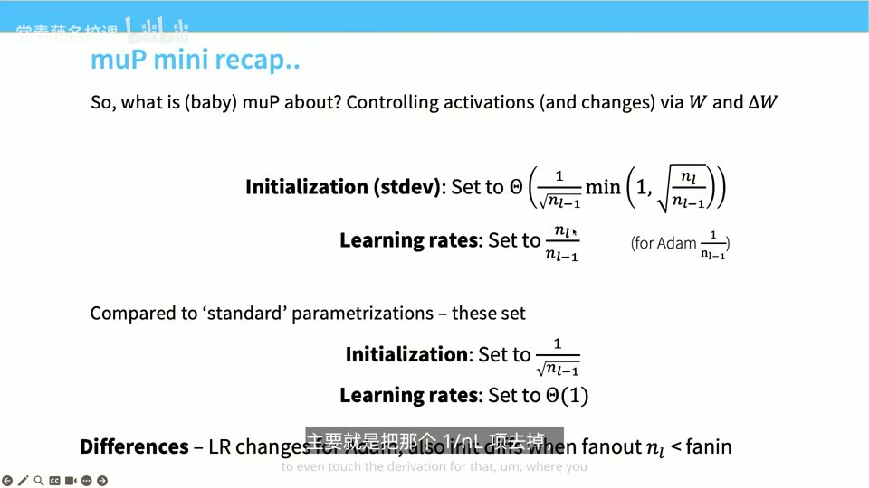 |
| 核心要点在于，μP 这个论点本身非常有趣，这不仅是因为里面有实际有用的东西，更是因为推导出这个算法的过程本身就很有趣，因为这里用到的数学方法很不一样。它的思路是：好吧，咱们要取一个缩放极限，针对我的网络，我先断言它具备某种不变性…… [【跳转到 62:28】](https://www.bilibili.com/video/BV11LEA6eEuj/?p=11&t=3748) | 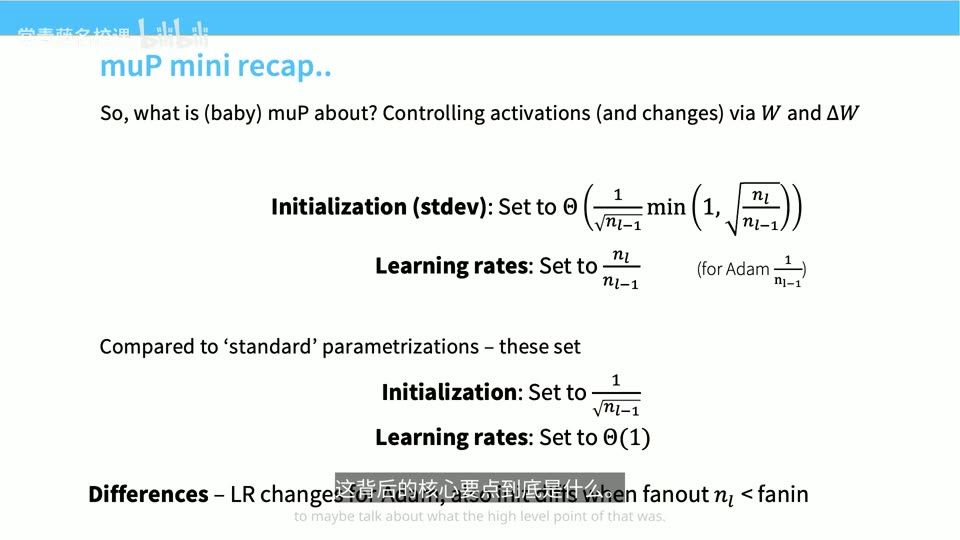 |
| 接着做一些额外假设，然后去推导这类超参数需要满足什么约束。这些约束本质上给你的超参数也划定了一些 scaling limits。我觉得这是一个通用的原则，用来推导不同的算法或超参数的 scaling，这大概跟你们在 CS 或 ML 训练中习惯的做法很不一样。好，以上就是 μP 的推导。 [【跳转到 62:53】](https://www.bilibili.com/video/BV11LEA6eEuj/?p=11&t=3773) | 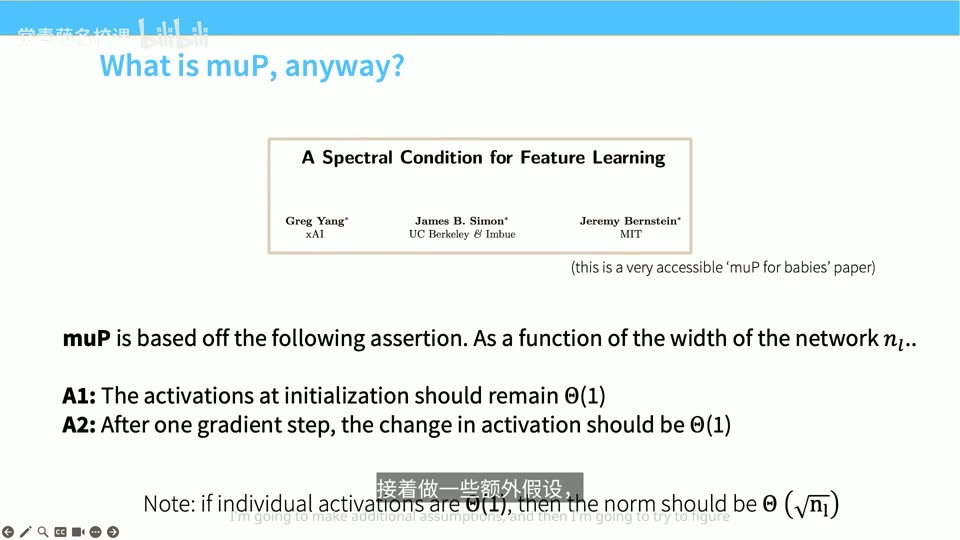 |
| 我想用几个实证例子来收尾 μP 这部分。有个独立研究者发了篇挺有意思的论文，基本上是用各种不同的方式对 μP 做了压力测试。你可以把 μP 看作是一种调整超参数的流程，所以取决于你怎么做，比如 Adam 的学习率就是网络不同组件的函数，所以你会涉及到嵌入参数、注意力参数、输入输出的 MLP，或者是 softmax 线性层。 [【跳转到 63:13】](https://www.bilibili.com/video/BV11LEA6eEuj/?p=11&t=3793) | 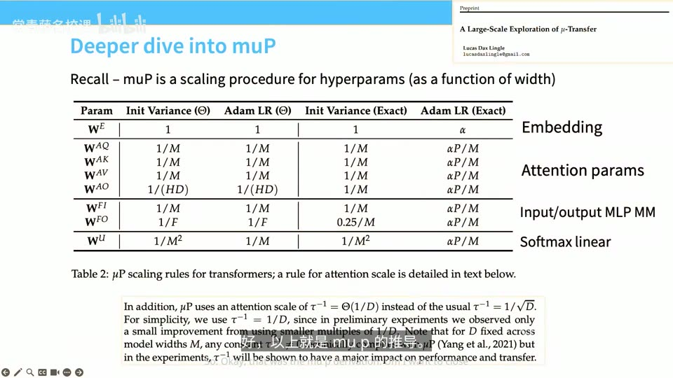 |
| 这些情况在 μP 下会有不同的缩放表现，同时也有一些遵循非 μP 规则的缩放方式。有意思的是…… [【跳转到 63:38】](https://www.bilibili.com/video/BV11LEA6eEuj/?p=11&t=3818) | 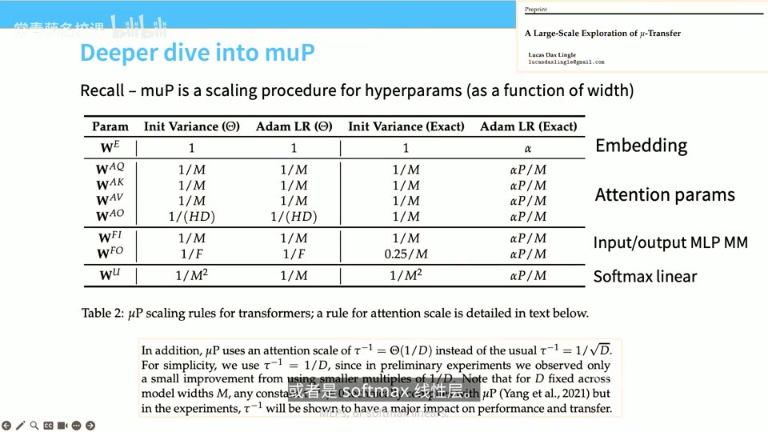 |
| 那篇论文复现了不同规模下训练的 language model 的不少 μP 结果，结论就不出所料，他得出的主要结论和 MiniCPM 等研究一致：只要 μP 设置正确、且仅进行缩放——比如在这里用一种非常受控的方式——你就能得到和基线 μP 一样的学习率最优性、不变性；或者看看那种追踪注意力、投影偏差的 μP 变体…… [【跳转到 63:48】](https://www.bilibili.com/video/BV11LEA6eEuj/?p=11&t=3828) | 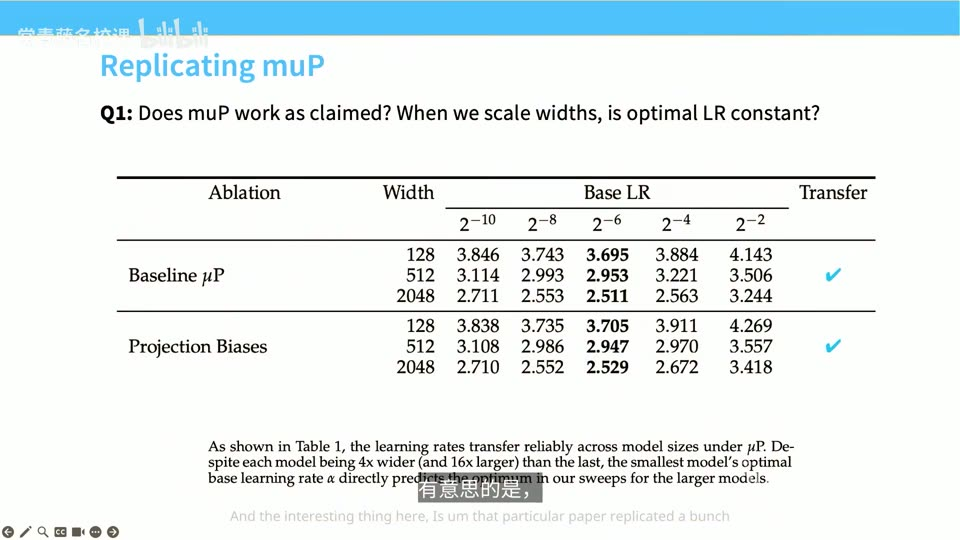 |
| 这两种情况都能很好地迁移。但你可能会问：现实中其实有很多 μP 没涵盖的情况，比如技术上讲 SwiGLU 就不在 μP 范围内，初始化或 RMSNorm 的变动也不行，要是你大幅改动优化器，那也会破坏规则。所以你可能会问：这些理论不允许的因素里，哪些真正破坏了 μP？其实大部分时候这些都能和 μP 兼容…… [【跳转到 64:13】](https://www.bilibili.com/video/BV11LEA6eEuj/?p=11&t=3853) | 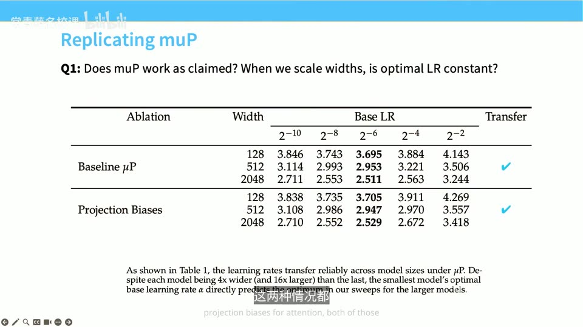 |
| 但有些情况不行，比如在 RMSNorm 中学习增益项，事实证明这会让 μP 失效。虽然很多时候去掉它们并不会影响效果，所以这倒不算个坏主意，但 μP 确实会因此出问题。另外如果你用一些更冷门的优化器，比如 Lion，它基本上依赖梯度的符号，μP 似乎也会失效。 [【跳转到 64:38】](https://www.bilibili.com/video/BV11LEA6eEuj/?p=11&t=3878) | 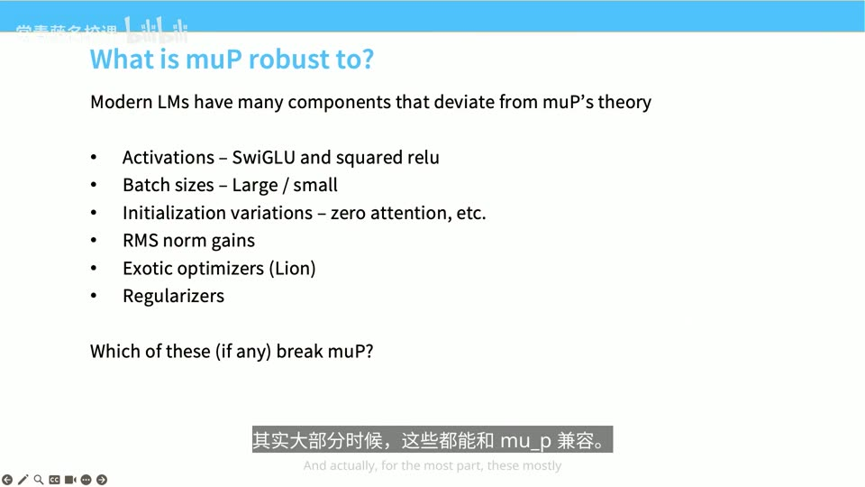 |
| 符号梯度在理念上和 Muon 挺像的，所以 μP 可能还会在其他一些有趣的地方失效。最后，最让人担心的是：如果你做较大的解耦权重衰减，μP 最终会严重失效，所以这可能是它唯一没通过的压力测试。好，为了收尾这最后一节，你最终可能会问：μP 到底有没有用？如果你真心想让学习率稳定下来，它其实挺管用的。 [【跳转到 65:03】](https://www.bilibili.com/video/BV11LEA6eEuj/?p=11&t=3903) | 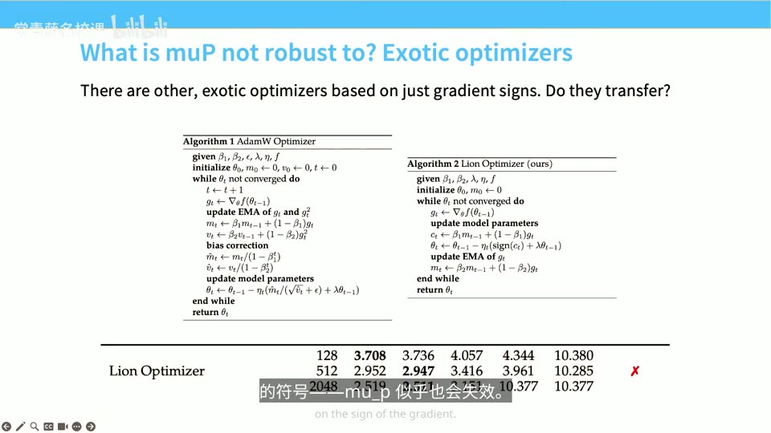 |
| 有很多这类实验都显示，当你增加宽度时，最优学习率会随规模发生巨大但可预测的偏移，而用了 μP 之后就不会这样。所以它是工具箱里的众多工具之一，用来控制那些随规模变化而漂移的超参数。我觉得这是个很有意思、有待探索的研究方向，还没到盖棺定论的程度，也没说这就是唯一正确的做法。不过 μP 风格的初始化方案很有前景，另外光是去拟合 scaling laws 也很有前途。行。 [【跳转到 65:28】](https://www.bilibili.com/video/BV11LEA6eEuj/?p=11&t=3928) | 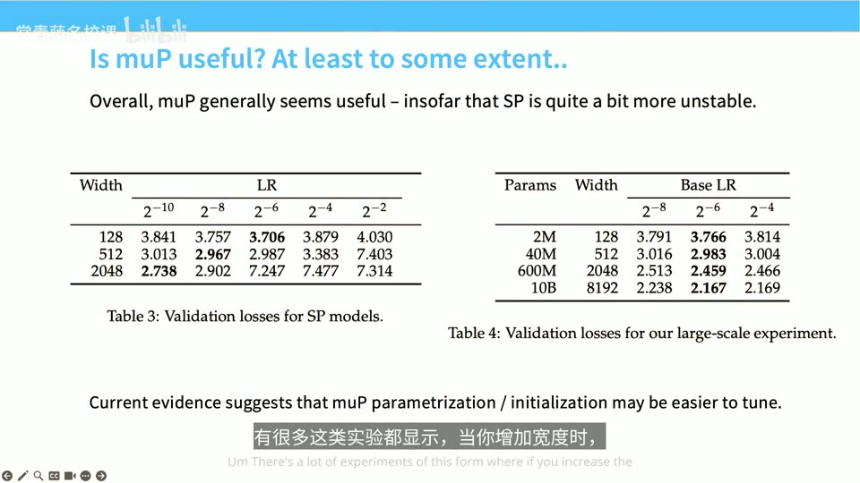 |
| （此区间无字幕） [【跳转到 65:53】](https://www.bilibili.com/video/BV11LEA6eEuj/?p=11&t=3953) | 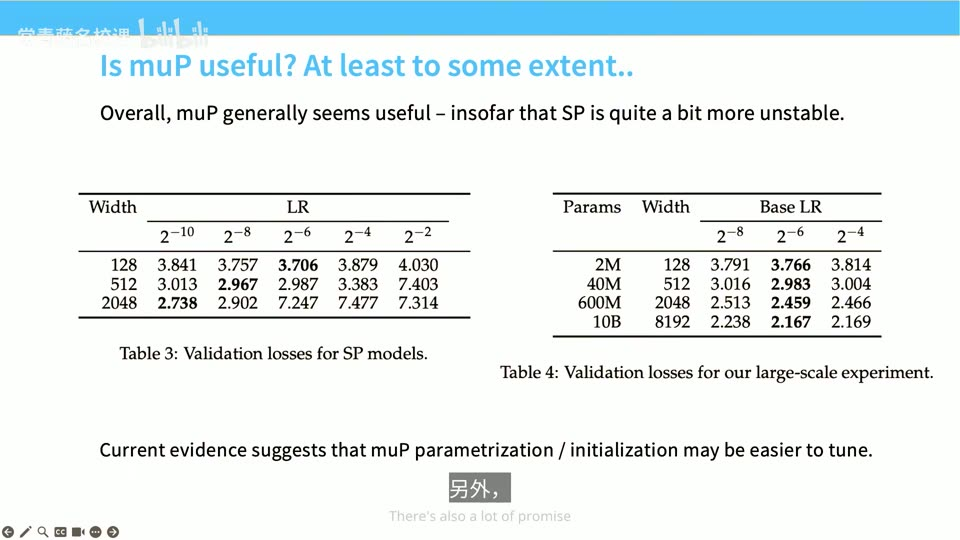 |
| 所以我想用最后一点来收尾：真实环境中的扩展其实非常棘手。就像我在某条回复里说的，我觉得 scaling laws 最初被介绍的方式，会让人感觉它像一门科学——好像只要画出这条线、按步骤操作，你就能确切地知道规模变大后会发生什么。但实际上，现实情况比这要混乱得多，未知因素也多得多。大家确实会用 scaling laws 来做很多事…… [【跳转到 65:58】](https://www.bilibili.com/video/BV11LEA6eEuj/?p=11&t=3958) | 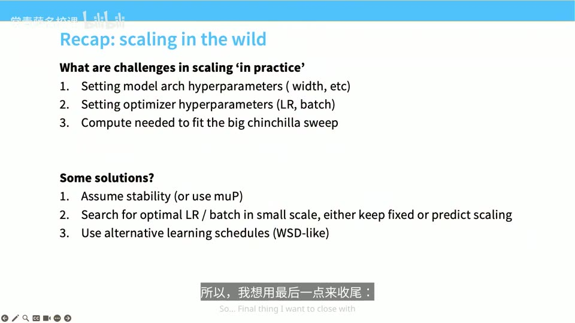 |
| 比如选架构、选优化器、选超参数。虽然大家拿 scaling laws 做这些事，但这其实挺讲究技巧的，因为你根本没法确定它能不能无限外推下去。你会想做一些合理的事、尽量提高成功率，对吧？所以大家想出了不少办法，比如用 μP、或者去搜最优学习率，诸如此类。这些都是控制超参数漂移的方法，但目前还没有万全之策，也许明年会有个模块告诉我们问题解决了…… [【跳转到 66:23】](https://www.bilibili.com/video/BV11LEA6eEuj/?p=11&t=3983) | 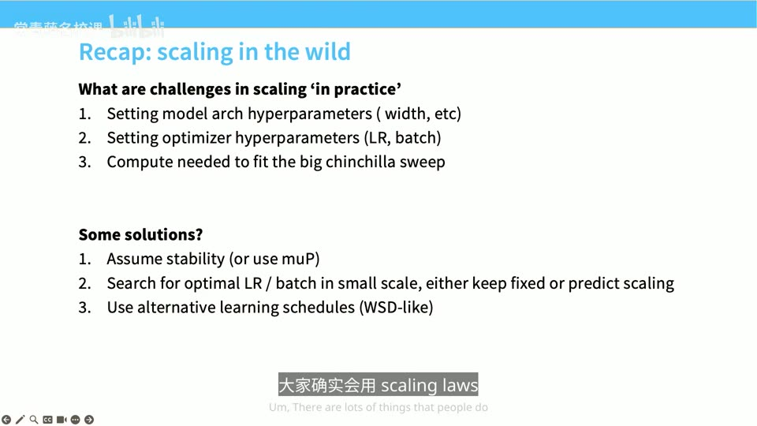 |
| 不过现在还差点意思。太好了，非常感谢，之后我可以回答大家的问题。 [【跳转到 66:48】](https://www.bilibili.com/video/BV11LEA6eEuj/?p=11&t=4008) | 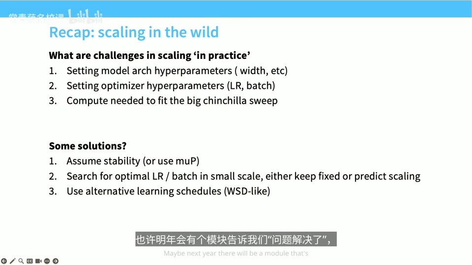 |