# Lecture 13: Data (Sources, Datasets) · 原始文稿（图-字幕分栏）

| 字幕文本 | 画面 |
| :--- | ---: |
| 今天咱们聊聊数据。我们现在所处的阶段是：大家已经知道怎么训练模型了。 [【跳转到 00:00】](https://www.bilibili.com/video/BV11LEA6eEuj/?p=13&t=0) | 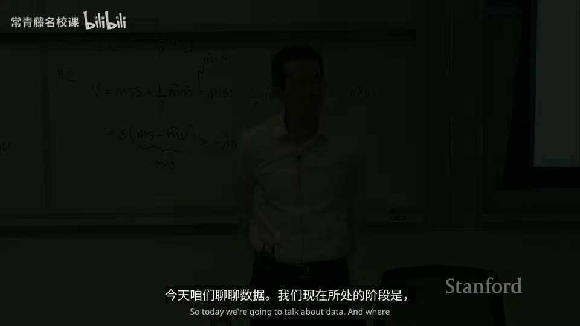 |
| 有了数据、上次咱们还讲了评估，所以也清楚什么样的模型算好模型。这周剩下两节课咱们重点讲讲该用哪些数据来训练。我想强调一点：在语言模型里，数据是最关键、最需要搞对的部分。咱们看看各大公司实际披露的信息，就能明白为什么这么说。 [【跳转到 00:05】](https://www.bilibili.com/video/BV11LEA6eEuj/?p=13&t=5) | 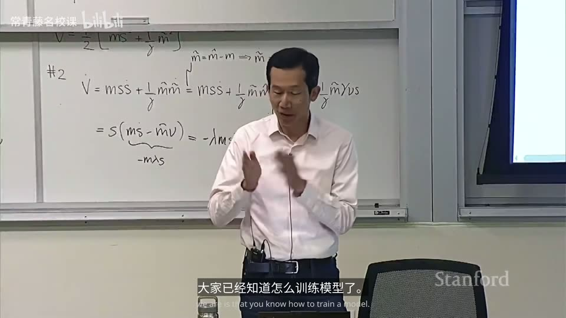 |
| 以 Llama 3 论文为例，他们对架构完全透明——当然啦，毕竟这是个开放权重模型——他们连训练流程都告诉你了，但关于数据却只字未提，他们只是说"我们用了各种各样的数据来源来训练"、顺便做点别的。之所以要保密是有充分理由的。首先，数据在某种程度上是你的独门竞争优势…… [【跳转到 00:27】](https://www.bilibili.com/video/BV11LEA6eEuj/?p=13&t=27) | 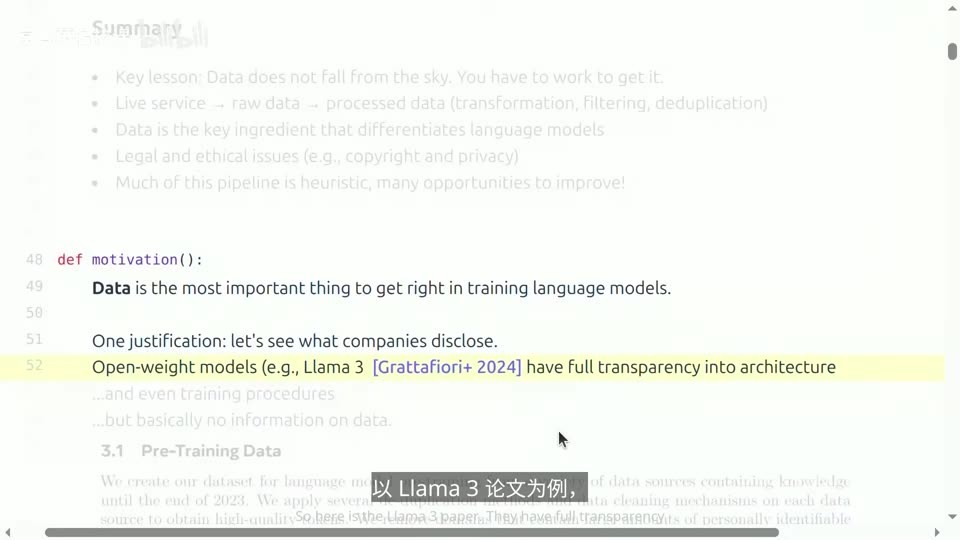 |
| 关乎竞争格局，你当然不希望竞争对手摸清你的底细。第二点、我们稍后细聊，就是版权责任问题：如果你公开宣称自己在用某些特定类型的数据做训练，那就容易招致诉讼。所以在机器学习里，数据是个能展开讲很久的大话题。在 foundation model 出现之前，数据工作主要就是为 supervised learning 标注数据…… [【跳转到 00:52】](https://www.bilibili.com/video/BV11LEA6eEuj/?p=13&t=52) | 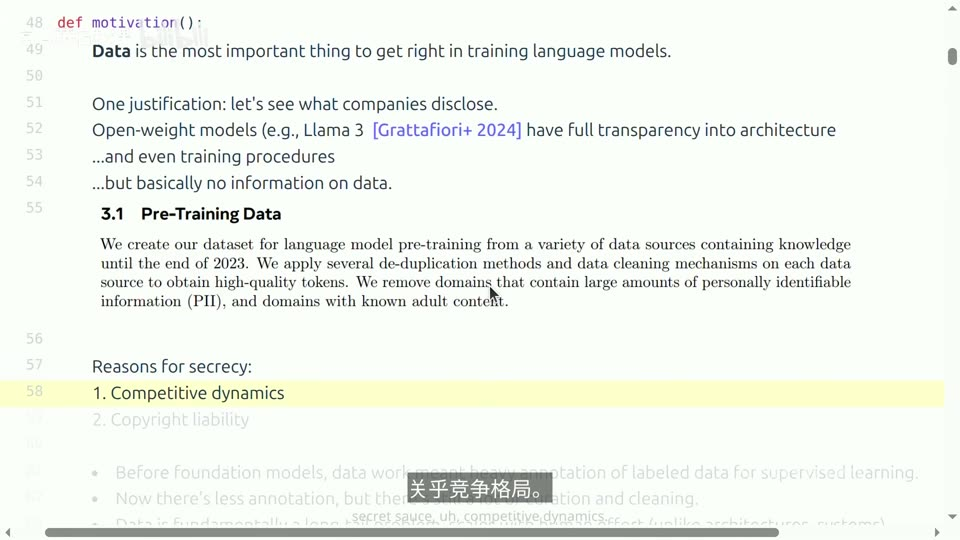 |
| 而手动标注的工作量减少了，至少在 pre-training 阶段如此，但数据的筛选和清洗工作依然繁重。所以从根本上说，这一点其实没怎么变：数据一直是瓶颈、将来也还是瓶颈，因为从某种意义上说，这是一个随人力投入而放大的长尾问题。如果很多人都想解决同一个问题……能参与架构和系统工作的人毕竟有限。 [【跳转到 01:17】](https://www.bilibili.com/video/BV11LEA6eEuj/?p=13&t=77) | 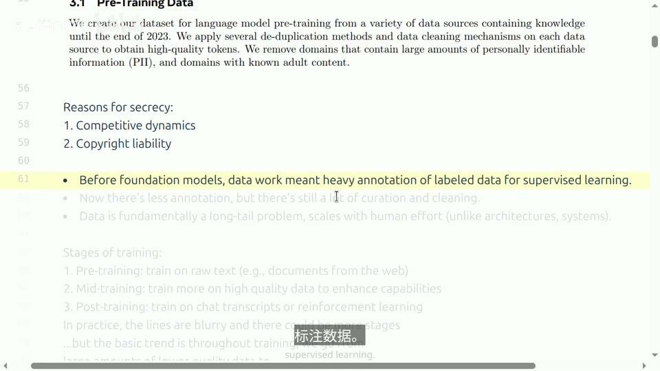 |
| 但数据就不一样了，尤其是训练那种想要包揽所有这些任务的 foundation model 时，你可以轻松地把这项工作并行化、让很多人同时分担。所以这就是为什么数据团队和模型开发团队通常都相当庞大。数据会在管道的不同阶段被引入，今天我们主要关注 pre-training。在 pre-training 阶段，你使用的是原始数据…… [【跳转到 01:42】](https://www.bilibili.com/video/BV11LEA6eEuj/?p=13&t=102) | 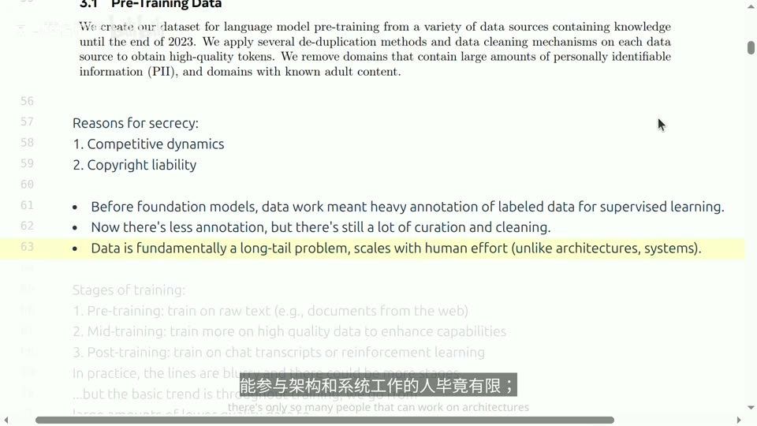 |
| 比如来自网络的文档。接着进入 mid-training，在这一阶段你使用更高质量的数据进行训练、以增强特定能力，比如支持长上下文。最后是 post-training，在此阶段你使用聊天 transcript 这类数据进行训练；如果你在做 reinforcement learning，则会用到一些特定的环境来训练，这一阶段的任务针对性更强。实际上各阶段的界限可能有些模糊…… [【跳转到 02:07】](https://www.bilibili.com/video/BV11LEA6eEuj/?p=13&t=127) | 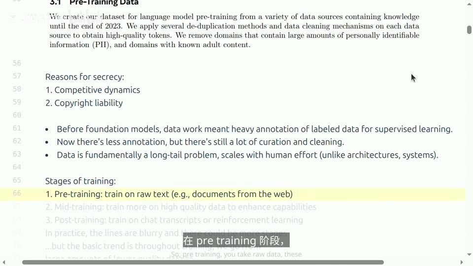 |
| 阶段数量也可能超过三个，但这只是一个基本框架。目前的趋势是训练数据从大量低质量数据逐渐转向较小规模的高质量数据。所以经过这个过程，你在文献里会看到有人会提到 base model，通常指 pre-training 和 mid-training 之后的阶段；而 instruct models 或 chat models 则是在 post-training 之后。 [【跳转到 02:32】](https://www.bilibili.com/video/BV11LEA6eEuj/?p=13&t=152) | 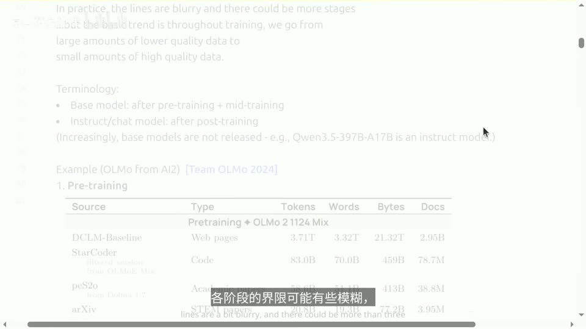 |
| 但当然，界限已经变得相当模糊，现在什么才算 base model 其实已经不太清楚了。而且最近最大的那些模型根本就没有 base model，只有……Qwen 3.5、39B？就是这样，你看不到中间的 checkpoint。所以对于开源模型，比如 AI2 的 OLMo，你能看到其中发生的一切 pre-training。我们希望我们会研究其中一些模型。 [【跳转到 02:57】](https://www.bilibili.com/video/BV11LEA6eEuj/?p=13&t=177) | 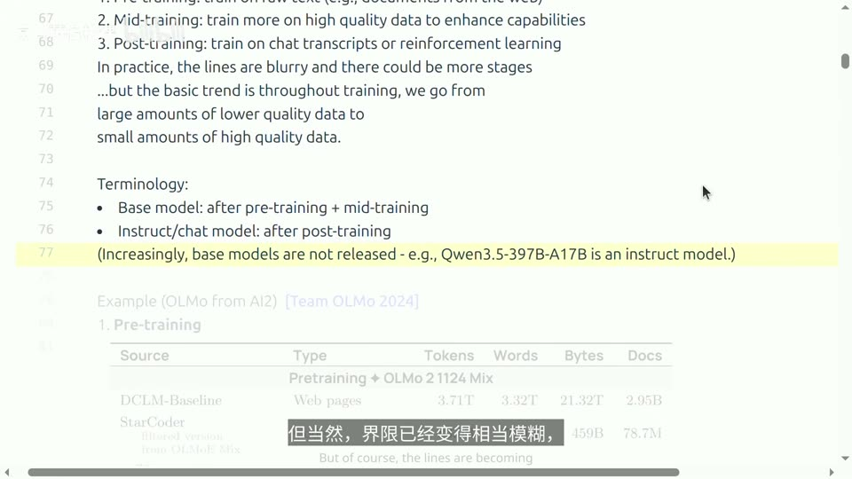 |
| 比如在 pre-training 阶段，数据来源有很多，我们稍后会讲这些来源的含义。其中就有这么一些：网页、学术论文、数学页面、证明等等。中训练阶段则使用更高质量的网页数据、指令…… [【跳转到 03:22】](https://www.bilibili.com/video/BV11LEA6eEuj/?p=13&t=202) | 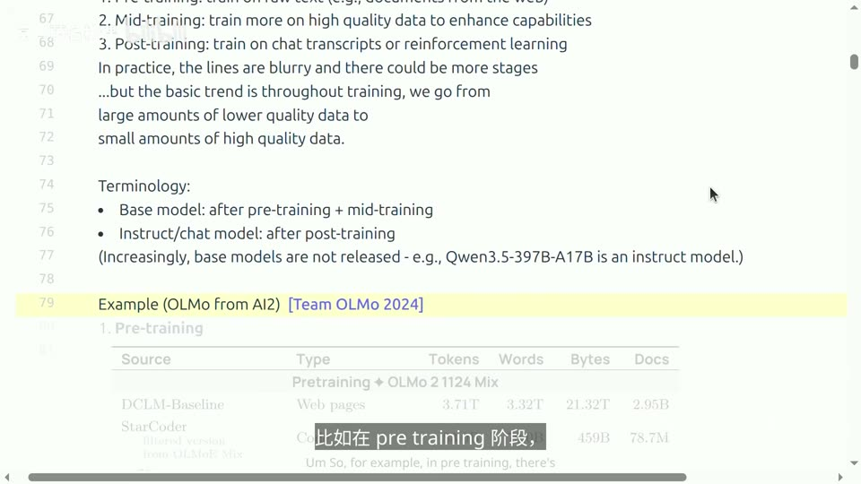 |
| 数据通常还会加入大量合成数据。 [【跳转到 03:34】](https://www.bilibili.com/video/BV11LEA6eEuj/?p=13&t=214) | 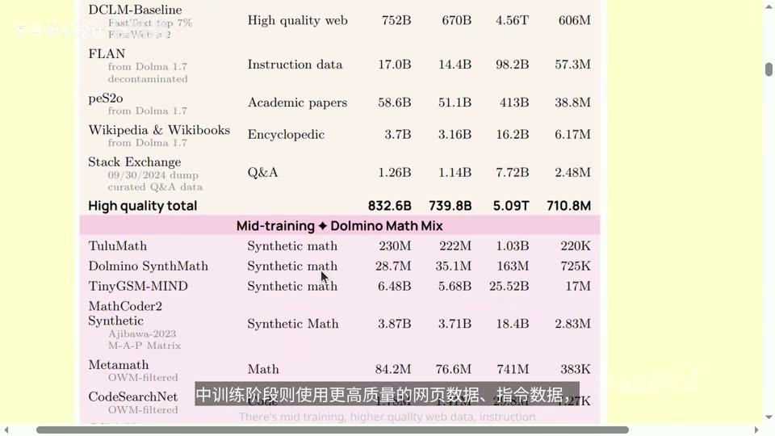 |
| 最后是 post-training，这一个阶段会用到大量数据，比如对话日志，还有更多数学推理和编程内容，同时也会在这个阶段做安全方面的处理。那这些数据集具体是哪些、咱们该怎么挑又该怎么处理它们呢？这正是核心问题所在。好，咱们就顺着这门课的思路来聊聊数据。 [【跳转到 03:40】](https://www.bilibili.com/video/BV11LEA6eEuj/?p=13&t=220) | 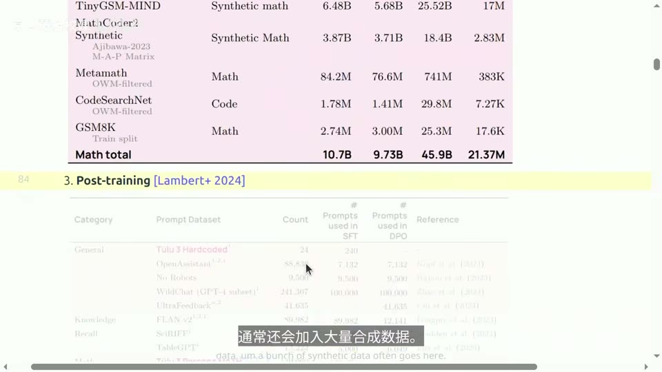 |
| 咱们从头说起：数据到底从哪来？咱们平时在走廊里聊天，常会听到一种说法——"语言模型是用整个互联网的数据训练出来的"。首先，这种说法其实不太站得住脚，真要那样，模型就得是个 online agent、能在网上到处跑、执行各种操作才行。但 pre-training 的实际运作方式并非如此，更准确地说，它是在全球公开网络上训练的。 [【跳转到 04:05】](https://www.bilibili.com/video/BV11LEA6eEuj/?p=13&t=245) | 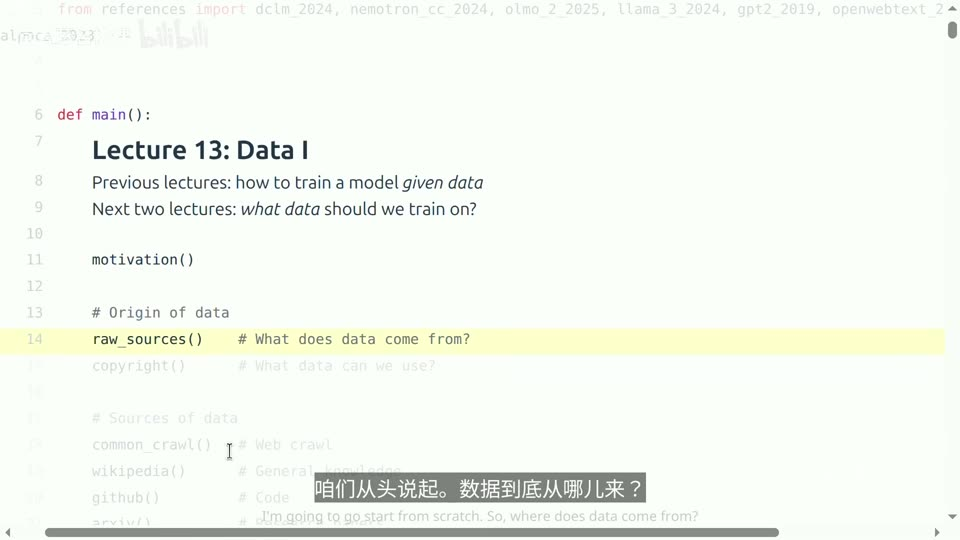 |
| 不过这话也不完全准确，原因我待会儿解释。首先呢，网络其实就是世界上一堆正在运行、你能连上去的服务器。所以随便找个网站，你都能去下载它的页面，说白了就是发个请求、然后拿回响应——除非你在训练一个 RL agent，否则你没法直接拿这些在线服务器来训练模型。 [【跳转到 04:30】](https://www.bilibili.com/video/BV11LEA6eEuj/?p=13&t=270) | 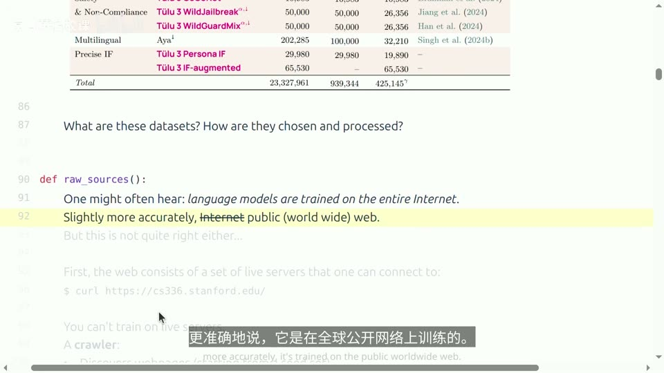 |
| 所以一般是你自己有个爬虫、或者是别人搭好的爬虫，反正不一定是你亲手建的。爬虫得从前面说的那个种子集开始，去把现有的网页都找出来，一边爬一边把找到的页面下载下来。但你不能指望跑一次爬虫就把互联网上所有的网页都下载下来，原因有好几个。首先，网上很多内容其实是动态生成的…… [【跳转到 04:55】](https://www.bilibili.com/video/BV11LEA6eEuj/?p=13&t=295) | 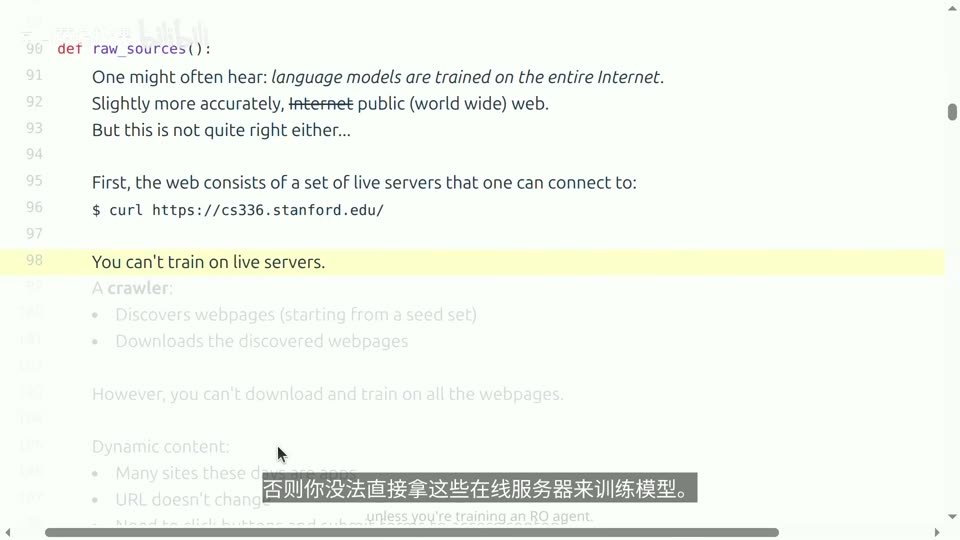 |
| 特别是现在，好多网站其实就是 app，URL 甚至没法完整地描述内容，它只是个供你交互的 app，你得经常点按钮或者填表单才能看到里面的内容。打个比方，你在用 Discord 的时候，可没法直接拿 curl 去抓它的数据、把上面的东西全弄下来。还有一种情况，很多内容其实藏在深网里，光靠传统的网页爬取和点超链接是搞不定的。 [【跳转到 05:20】](https://www.bilibili.com/video/BV11LEA6eEuj/?p=13&t=320) | 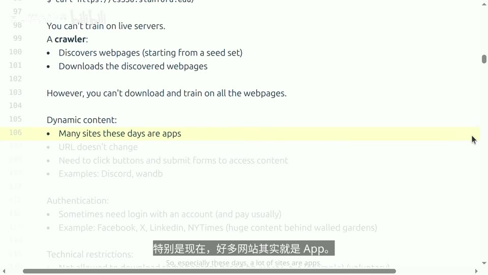 |
| 这就是那种很传统的网页爬取模式。第二点是身份验证：有些页面得登录账号才能看，一般来说你还得花钱。比如像 Facebook、LinkedIn、纽约时报这些，其实有大量内容都被锁在"围墙花园"里，你进不去。所以虽然从技术上说，这些内容确实在互联网上…… [【跳转到 05:45】](https://www.bilibili.com/video/BV11LEA6eEuj/?p=13&t=345) | 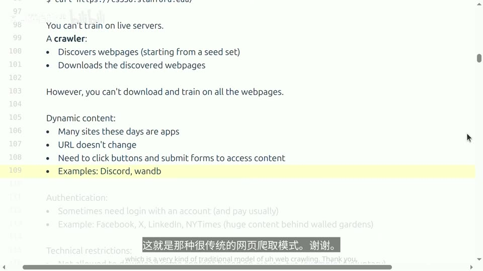 |
| 但你不能随便搭个爬虫就去抓 Facebook 的数据。我猜如果你是 Facebook 的话，你可以去爬取——不过其实你不需要爬 Facebook，因为你手里就有数据，直接拿这些数据训练模型就行；或者如果你是 X，你可以拿 X 平台的数据来训练。但要是换做别人，你就没法真正用到这些内容。好，咱们先假设不存在身份认证的问题。 [【跳转到 06:10】](https://www.bilibili.com/video/BV11LEA6eEuj/?p=13&t=370) | 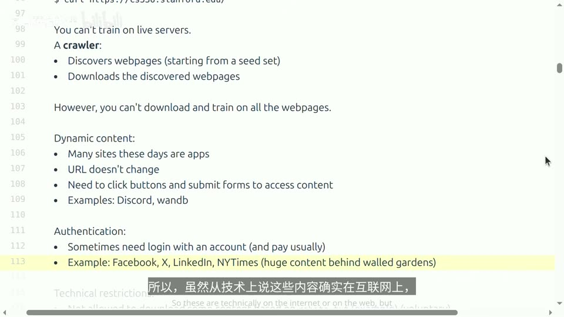 |
| 不过这里还有潜在的限制。比如有个叫 robots.txt 的文件，这个文件一般放在网站根目录下…… [【跳转到 06:35】](https://www.bilibili.com/video/BV11LEA6eEuj/?p=13&t=395) | 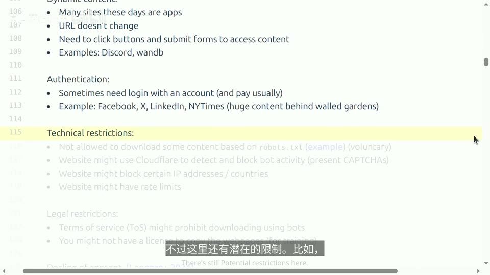 |
| 比如 nytimes.com，它基本上会告诉你哪些内容允许抓取、哪些不行。所以很多内容是被禁止抓取的，比如 oai-searchbot、PerplexityBot、GPTBot，我记得还有 ChatGPT-User、ClaudeBot 等等。 [【跳转到 06:42】](https://www.bilibili.com/video/BV11LEA6eEuj/?p=13&t=402) | 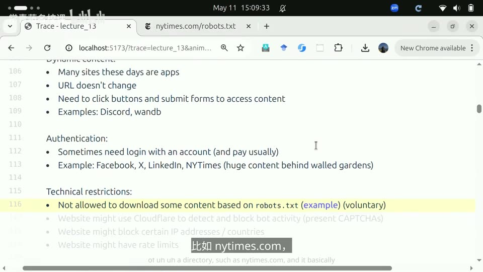 |
| 所以这不是法律层面的限制，这更像是说你应该自觉守规矩、去看一眼 robots.txt，如果你的名字在那份名单上，就不该去抓取。这基本上算是个契约——甚至算不上契约，它就是这么个东西，这就是你该做的事。现在很多网站会用 Cloudflare 之类的工具来检测并拦截机器人流量，所以有时候你访问网站会弹出一个验证码，对吧？ [【跳转到 06:59】](https://www.bilibili.com/video/BV11LEA6eEuj/?p=13&t=419) | 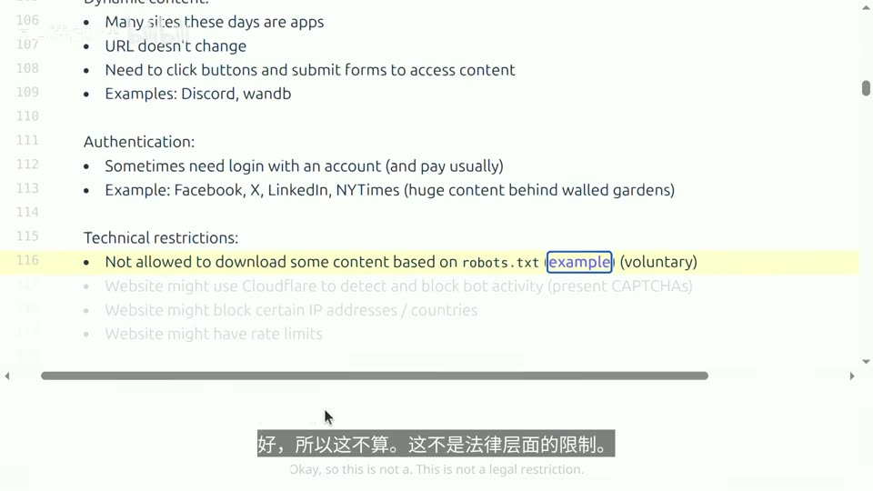 |
| 那是因为某种算法检测到你可能是机器人，于是要先确认你是真人。要是你真是个机器人，那你就过不去了——我是说，你可以试着绕过它，但这通常是个障碍。网站可能会封掉某些 IP 或国家，还会限制请求频率。 [【跳转到 07:24】](https://www.bilibili.com/video/BV11LEA6eEuj/?p=13&t=444) | 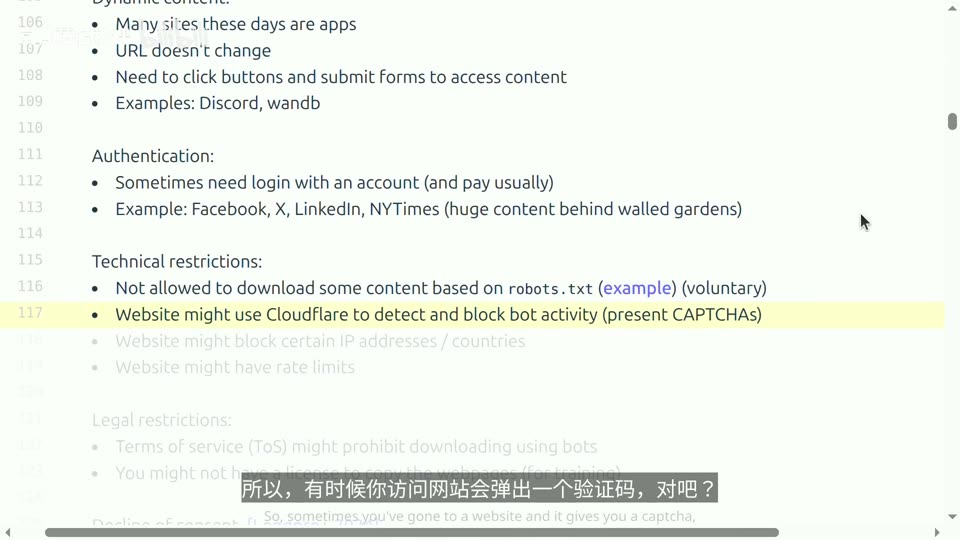 |
| 所以你在实际爬取时会碰到技术上的限制。另外还有法律层面的限制：网站的服务条款规定，你访问网站就得遵守这份合约才能使用，条款里通常会说"如果是机器人就请离开"、"你不能拿网站的内容去做 AI 训练"之类的事。还有，就算服务条款没提这一点，网站内容也可能有自己的许可证…… [【跳转到 07:49】](https://www.bilibili.com/video/BV11LEA6eEuj/?p=13&t=469) | 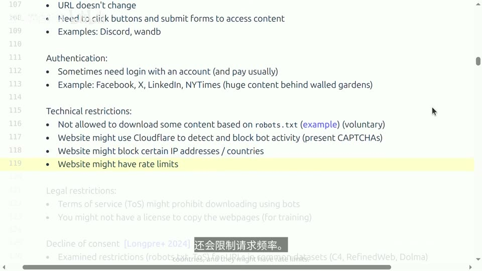 |
| 或者你根本没拿到训练授权。我们待会儿再细说。总之，你能拿什么数据来训练是由法律红线管着的。这事儿也在不断变——Shayne Longpre 写过一篇很好的论文叫《危机中的同意》，他们研究了常见数据里各种网址的限制，既有 robots.txt 这种技术层面的，也有服务条款这种法律层面的。 [【跳转到 08:14】](https://www.bilibili.com/video/BV11LEA6eEuj/?p=13&t=494) | 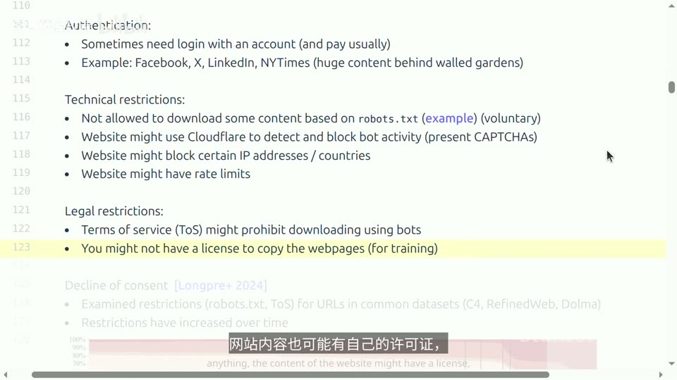 |
| 这个我们后面再聊。结论就是：限制越来越多了。 [【跳转到 08:39】](https://www.bilibili.com/video/BV11LEA6eEuj/?p=13&t=519) | 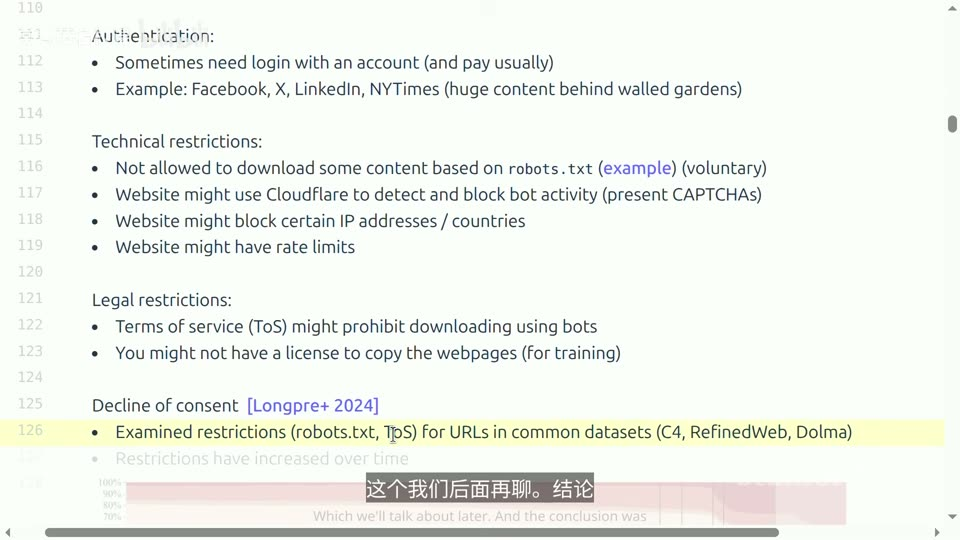 |
| 看这张图，上面那部分展示的是 robots.txt 的情况，你看那块红色区域代表的是完全限制。 [【跳转到 08:44】](https://www.bilibili.com/video/BV11LEA6eEuj/?p=13&t=524) | 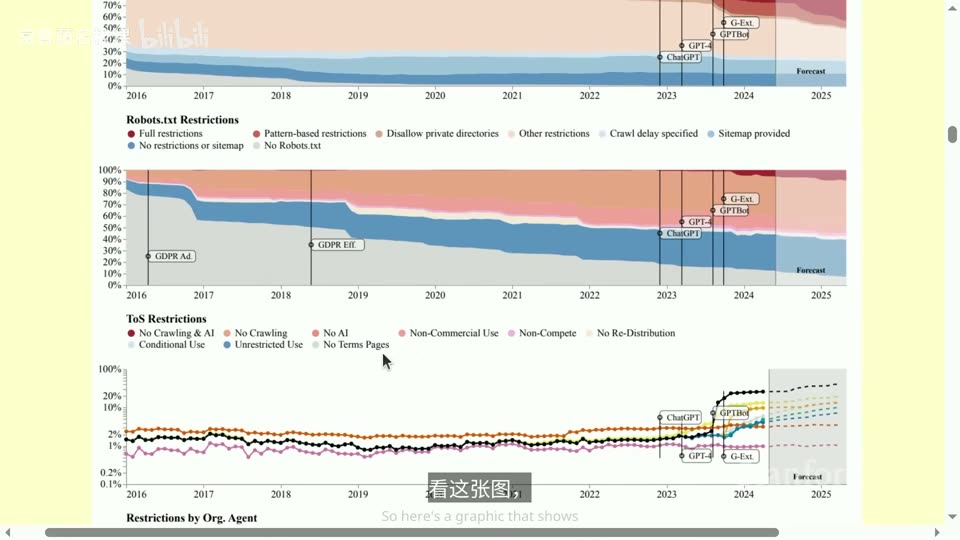 |
| 在 2023 年之前情况一直挺稳定的，但到了 2023 年年中，受完全限制的网站比例突然飙升，几乎到了一半左右。服务条款那边的趋势也差不多——回想 2016 年，那时候几乎没人会在网页上写什么使用条款。 [【跳转到 08:49】](https://www.bilibili.com/video/BV11LEA6eEuj/?p=13&t=529) |  |
| 而现在大多数网站都有条款了，而且大部分都明确写着不能拿这些内容用于 AI 训练。就算在……那会儿，爬取互联网在技术上还是行得通的，但实际上，至少就你能合法爬取的那部分而言，互联网要小得多。 [【跳转到 09:09】](https://www.bilibili.com/video/BV11LEA6eEuj/?p=13&t=549) | 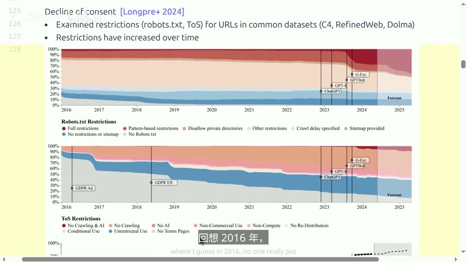 |
| 而有时候，不管是有意还是无意…… [【跳转到 09:32】](https://www.bilibili.com/video/BV11LEA6eEuj/?p=13&t=572) | 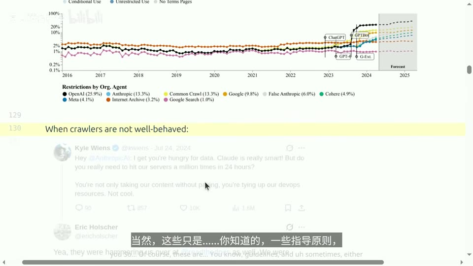 |
| 你都可能会违反它们，所以有时候你就会遇到这种情况。 [【跳转到 09:37】](https://www.bilibili.com/video/BV11LEA6eEuj/?p=13&t=577) | 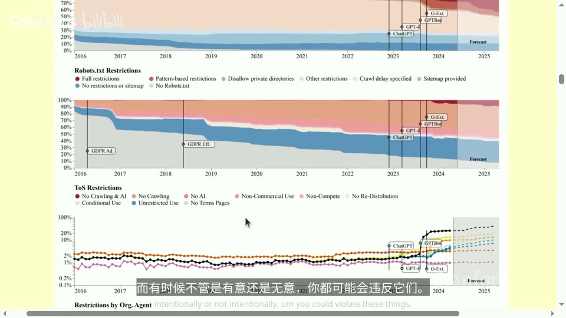 |
| 有这么一个人，那个谁、这叫什么来着，我忘了那个网站叫什么了，他在抱怨 Anthropic 爬他的数据，24 小时内访问了他们的服务器 100 万次，这可不太好。然后 Read the Docs 也被狂刷。所以有那么一阵子——我觉得现在应该已经好转了——爬虫一直在疯狂冲击各个网站。有个挺有意思的点：在谈版权问题之前，我觉得爬取本身就有问题，因为你要么违反了服务条款…… [【跳转到 09:42】](https://www.bilibili.com/video/BV11LEA6eEuj/?p=13&t=582) | 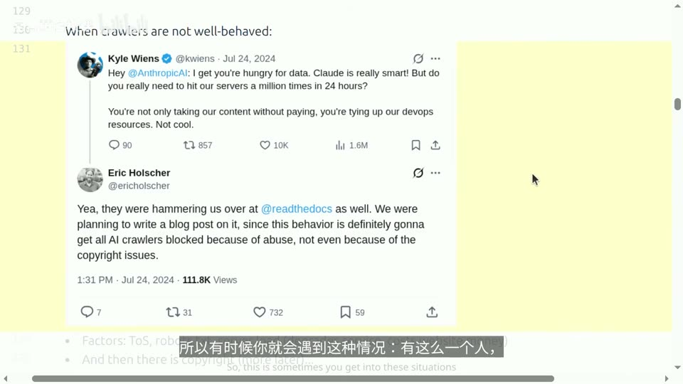 |
| 要么无视了 robots.txt，或者简单来说就是让系统过载。这会消耗大量服务器资源，不仅增加了托管方的成本，也拖累了其他用户的使用体验。因此爬取过程中会遇到各种问题。当然还有版权问题，我们稍后会详细讨论，那是另一个复杂的难题。最后还有所谓的"影子图书馆"，它们也是互联网的一部分。 [【跳转到 10:07】](https://www.bilibili.com/video/BV11LEA6eEuj/?p=13&t=607) | 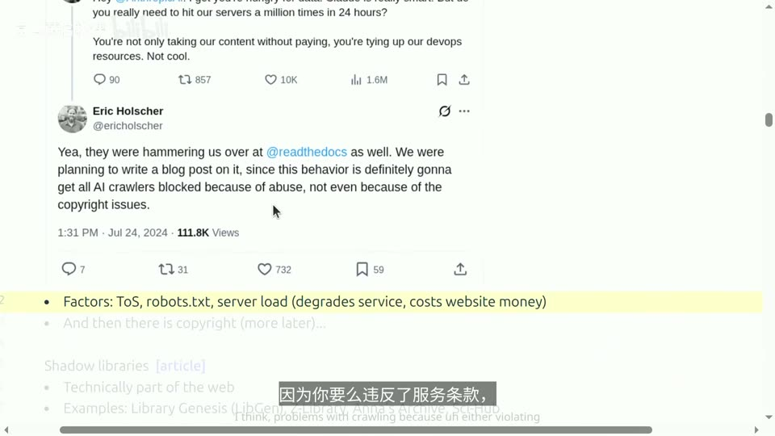 |
| 比如 Library Genesis 或 Anna's Archive，它们完全无视版权、并绕过付费墙。有人收集了海量受版权保护的数据，通常是书籍和文章，这些内容本来需要付费、却被免费公开了。这类站点面临过很多下架令和诉讼，也一度被封禁，但通常都能被规避，因为它们往往把服务器设在其他国家。 [【跳转到 10:32】](https://www.bilibili.com/video/BV11LEA6eEuj/?p=13&t=632) | 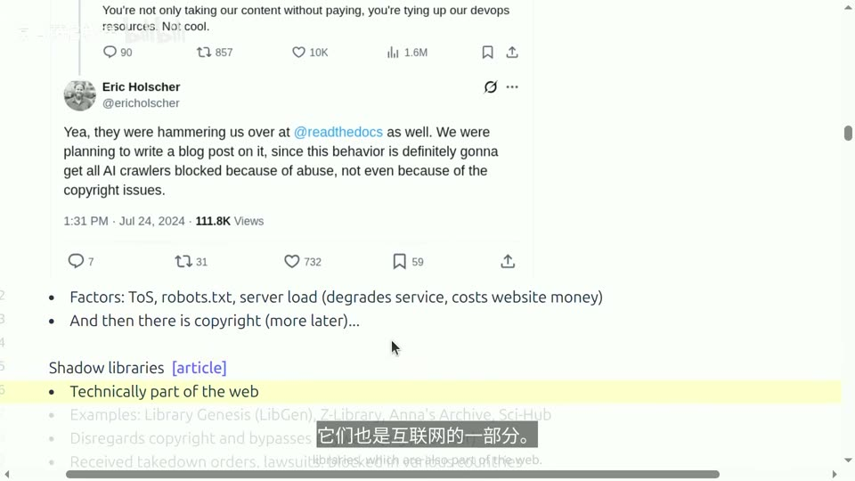 |
| 做这件事的人辩称，他们只是让本应免费的内容回归免费，但从法律角度看，这通常被视为盗版和侵犯版权。我们待会儿再回到这一点。关于这些影子图书馆已经有很多书和论文了。好，咱们先总结一下：到目前为止，互联网是个巨大、杂乱、而且说实话挺吓人的地方，而且你其实没法把里面的内容全都拿到手。 [【跳转到 10:57】](https://www.bilibili.com/video/BV11LEA6eEuj/?p=13&t=657) | 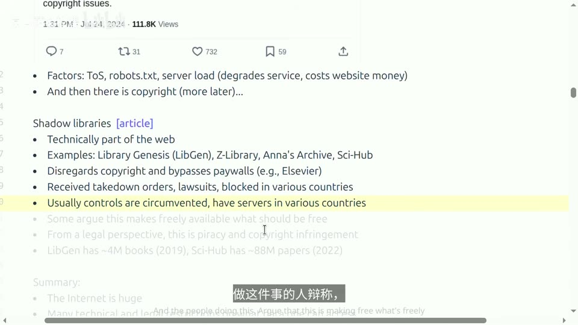 |
| 有技术上的限制、也有法律限制，规定了你能访问哪些数据。所以下次有人跟你说"我是用互联网数据训练的"，你就可以把学到的这些东西讲给他们听。好，接下来咱们进入第二部分：咱们能用哪些数据呢？这就涉及到版权问题了。假设你乖乖遵守了服务条款，而且你真是个守法公民、严格遵守了速率限制…… [【跳转到 11:22】](https://www.bilibili.com/video/BV11LEA6eEuj/?p=13&t=682) | 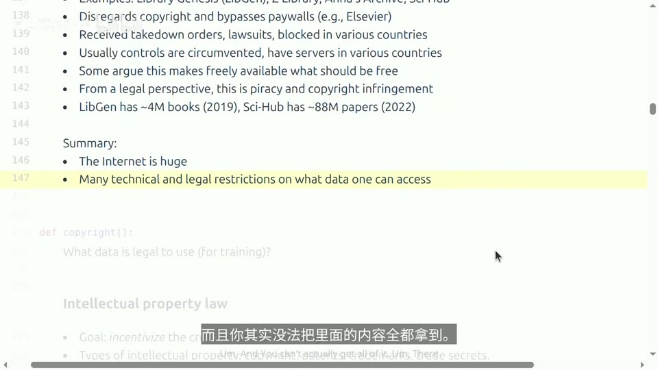 |
| 不过现在还有个问题：你究竟能不能拿这些数据来训练模型？这个问题到现在还没彻底解决，不过过去一年里倒是有了不少新进展。所以咱们得从知识产权法的角度来理解这个问题。你看，这套制度体系的核心目的就是鼓励大家去创造智力成果，所以我觉得咱们得记住法律背后的精神，也就是说…… [【跳转到 11:47】](https://www.bilibili.com/video/BV11LEA6eEuj/?p=13&t=707) | 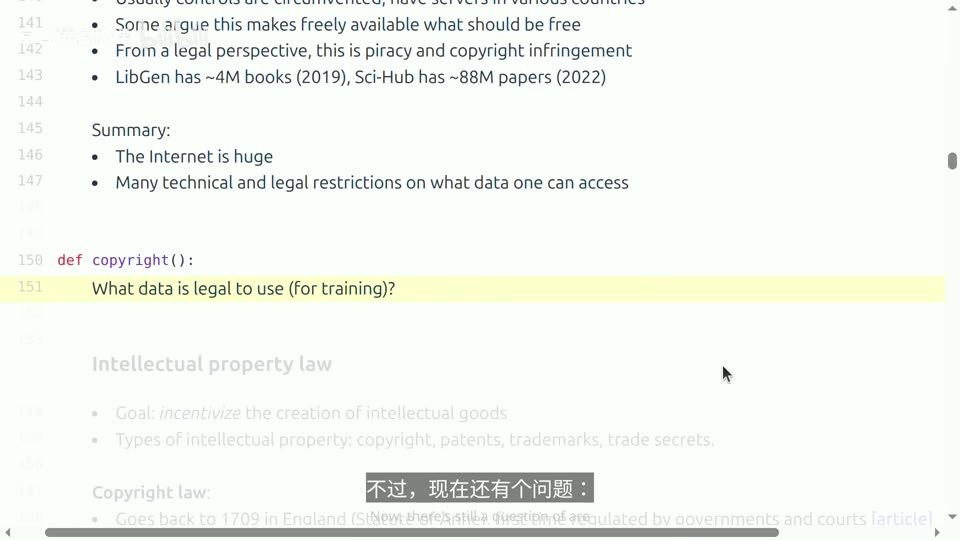 |
| 别光从技术层面对什么都说不，关键是要鼓励大家去创造智力成果。知识产权的形式很多，比如版权、专利、商标还有商业秘密。对于语言模型的数据来说，最相关的就是版权法。版权法的历史挺长的，最早能追溯到 1770 年代的英国。所以 1709 年是政府和法院第一次…… [【跳转到 12:12】](https://www.bilibili.com/video/BV11LEA6eEuj/?p=13&t=732) | 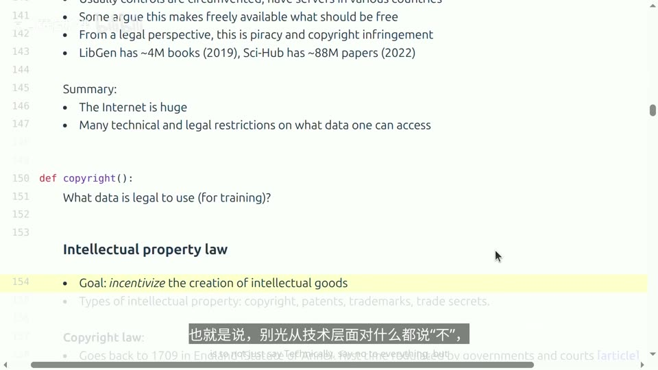 |
| 真正为了激励创新和创作这个目标去监管版权。而在美国，比较近的 1976 年版权法，我觉得它定义了现代版权的很多方面。因此，版权保护适用于固定在任何有形表达媒介中的原创性作品，诸如此类。这里说几点：不是所有东西都能受版权保护…… [【跳转到 12:37】](https://www.bilibili.com/video/BV11LEA6eEuj/?p=13&t=757) | 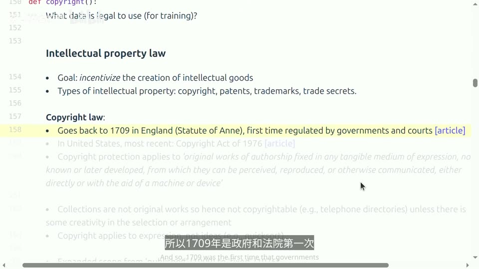 |
| 特别是汇编作品不受版权保护。打个比方，电话簿本身就不受保护，除非你在编排方式上花了心思、体现了创意。还有，版权保护的是表达、而不是思想本身，所以你没法给一个想法申请版权，就像你没法给快速排序算法申请版权一样；可以给快速排序算法的实现代码加版权保护…… [【跳转到 13:02】](https://www.bilibili.com/video/BV11LEA6eEuj/?p=13&t=782) | 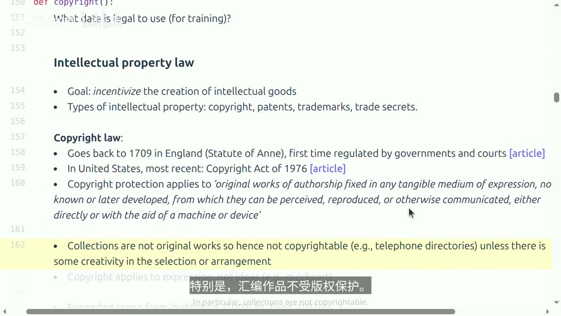 |
| 但算法本身不行。过去这些年有个变化，就是申请版权的门槛降了很多，所以能受版权保护的东西变多了。以前你得把东西发表出来才算有版权，现在只要把内容固定下来就行。想要版权保护根本不用去做任何注册。 [【跳转到 13:27】](https://www.bilibili.com/video/BV11LEA6eEuj/?p=13&t=807) | 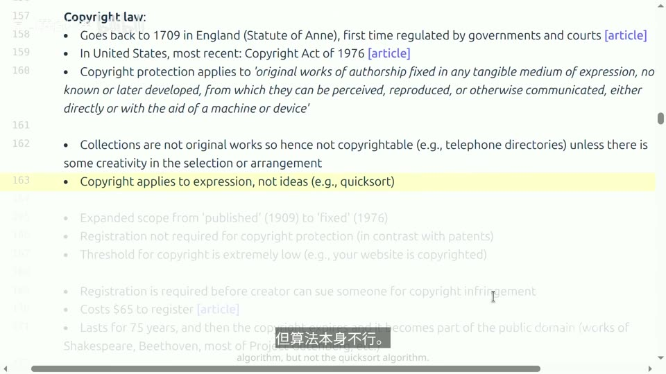 |
| 这和专利就不一样了，专利你得花一大笔钱去申请、去提交；但版权的门槛特别低，比如你把东西放到自己网站上，它就自动受版权保护了，就这么简单。想告人的话得先去登记版权，不过这只要 65 美元，比请律师的费用低多了，所以这个门槛其实真的很低。 [【跳转到 13:52】](https://www.bilibili.com/video/BV11LEA6eEuj/?p=13&t=832) | 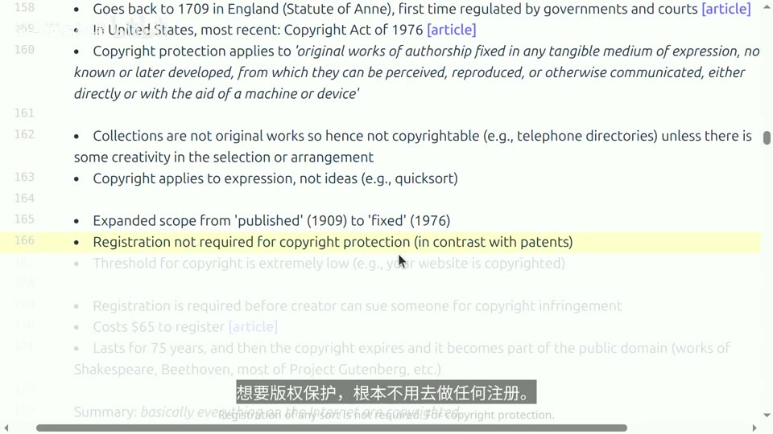 |
| 版权有个特点，保护期是 75 年，过了这 75 年版权就失效了，作品进入公共领域，大家都能随便用。很多以前的人，他们那些伟大的作品现在都进入了公共领域，这对大家都很好。版权制度的初衷就是为了鼓励创新——艺术家或创作者做出的作品，你会想保护他们、不想让别人就这么拿走。 [【跳转到 14:17】](https://www.bilibili.com/video/BV11LEA6eEuj/?p=13&t=857) | 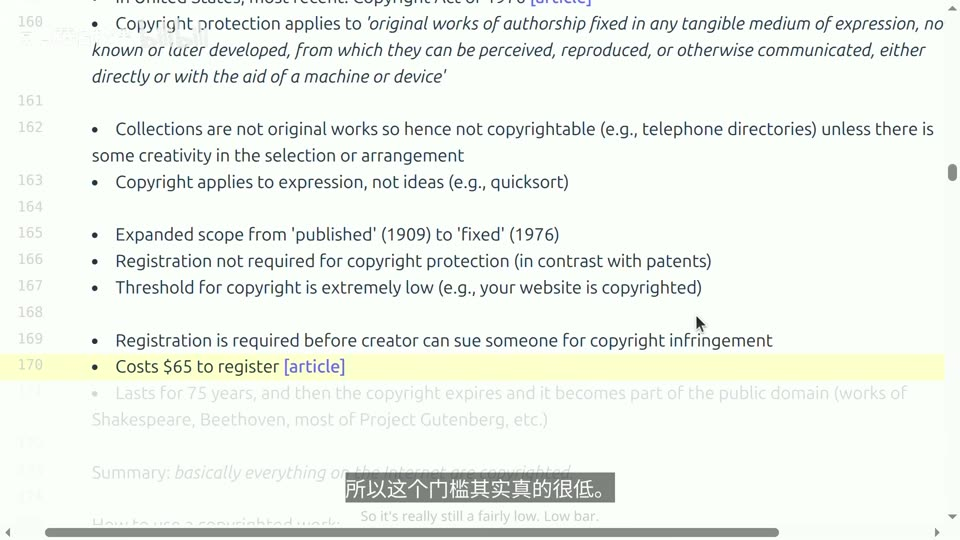 |
| 所以保护也就一阵子，过了 75 年可能就没必要再保护了，或者作者也去世了，所以再死守版权也没意义。你看，基本上网上所有内容都受版权保护。（课堂问答）等等，你的意思是，如果我拿任何数据来训练就算侵权？倒也不全是，虽然都有版权，但你依然可以使用这些受保护的内容，主要有两种途径…… [【跳转到 14:42】](https://www.bilibili.com/video/BV11LEA6eEuj/?p=13&t=882) | 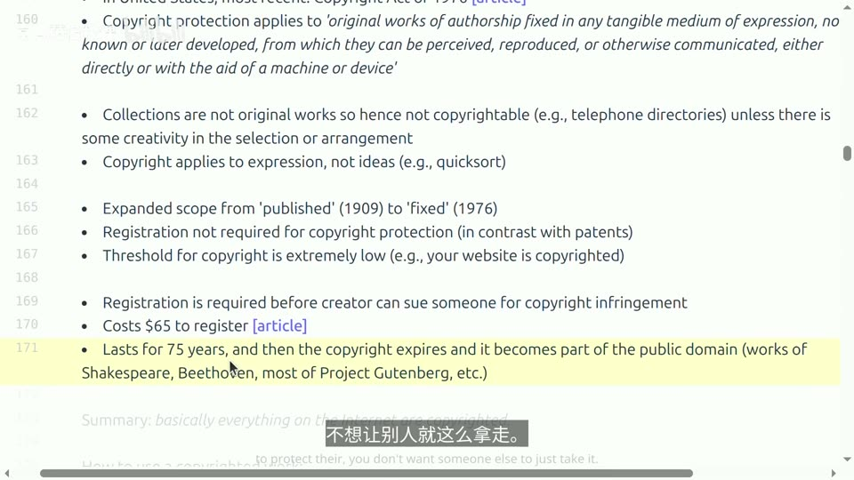 |
| 第一，获取授权许可；第二，援引合理使用条款。简单来说，许可属于合同法范畴，是许可方授予被许可方的授权，意思就是"别告我，你可以按许可规定的范围使用这个作品"。比如有个很棒的许可叫知识共享（Creative Commons），它能让作品像进入公共领域一样自由使用。 [【跳转到 15:07】](https://www.bilibili.com/video/BV11LEA6eEuj/?p=13&t=907) | 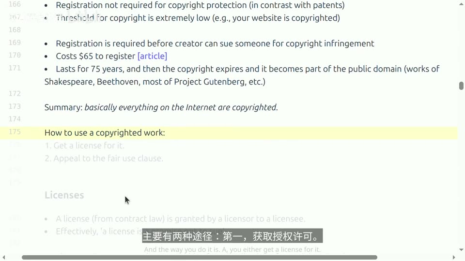 |
| 它让受版权保护的作品得以免费传播，比如维基百科、开放课程资源（OpenCourseWare）、可汗学院都是这类例子。它是在 2001 年建立的，主要是为了在公有领域和现有版权之间架起桥梁——不然的话你得等上 75 年；但如果创作者说"其实我想让大家用我的作品呢"，他们现在有了办法、一种合法的方式来声明。 [【跳转到 15:32】](https://www.bilibili.com/video/BV11LEA6eEuj/?p=13&t=932) | 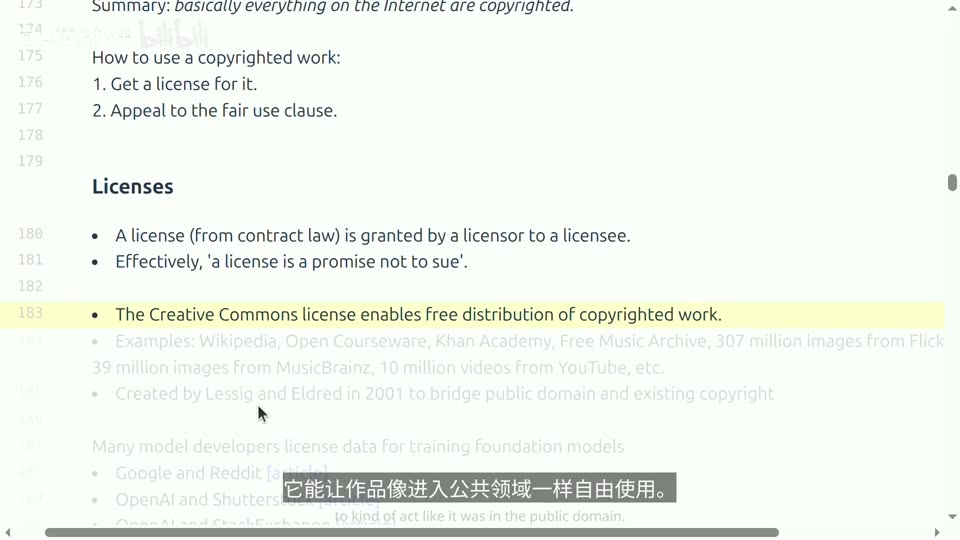 |
| "我给它加了知识共享许可协议"，它就像是在公有领域里一样，大家都能随便用。到目前为止，公有领域的东西和那些有知识共享许可的东西都属于比较宽松的类型，你可以用它。但还有很多其他情况，既没有知识共享许可、也不在公有领域里，这时候你就得去拿许可。如果你有预算，你可以花钱买许可。 [【跳转到 15:57】](https://www.bilibili.com/video/BV11LEA6eEuj/?p=13&t=957) | 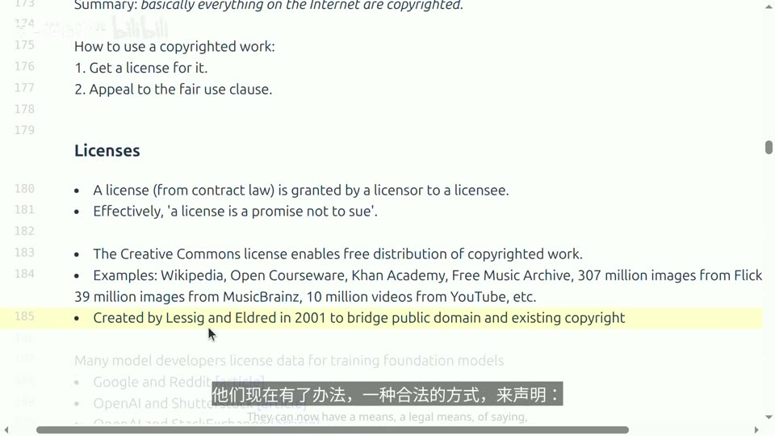 |
| 所以模型开发者和内容平台之间签了不少协议，让开发者能拿到数据去训练模型。好，这是第一点，你可以申请许可，要么是知识共享许可、要么花钱买授权。现在如果你不想花钱，你可以主张合理使用，不过这事比较复杂。这是版权法第 107 条…… [【跳转到 16:22】](https://www.bilibili.com/video/BV11LEA6eEuj/?p=13&t=982) | 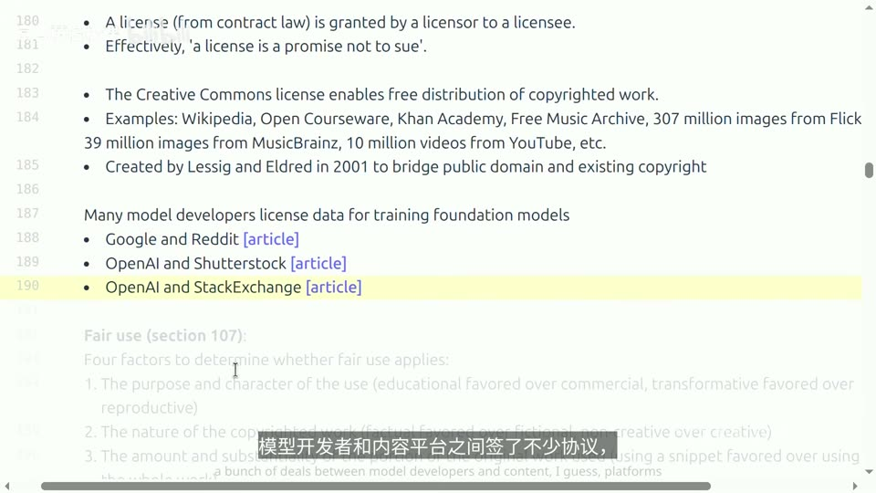 |
| 简单来说，合理使用原则就是说：就算我没拿到授权，我照样能用。是否适用合理使用，主要看四个因素。第一个因素就是看你的使用目的或性质，比如你想拿它来做什么。这些都不是硬性规定，它们只是一些倾向，真要闹上法庭就得在法庭上权衡。打个比方，如果你是为了做教育…… [【跳转到 16:47】](https://www.bilibili.com/video/BV11LEA6eEuj/?p=13&t=1007) | 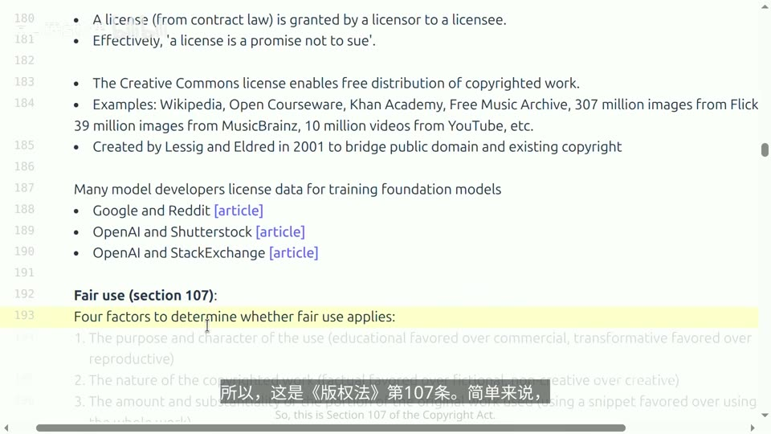 |
| 比起拿去卖钱赚利润，更有可能被认定为合理使用。如果你做了转换性使用，就比单纯原样托管一模一样的副本更有利。受版权保护的作品本身的性质也很重要，所以跟虚构作品比起来，事实性更强的内容更容易被认定为合理使用。比如写一篇二战总结、写一页关于二战事实的内容，它受到的保护就不如那种真正有创意的诗。 [【跳转到 17:12】](https://www.bilibili.com/video/BV11LEA6eEuj/?p=13&t=1032) | 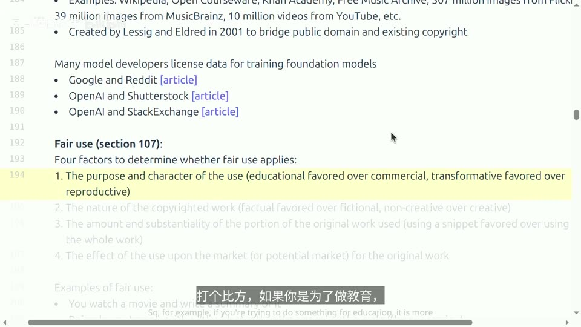 |
| 还有你用了原作的多少内容，所以只用一小段比把整部作品都用上更受认可——只拿一小部分总比全拿走要好，这点挺好理解的。最后一点跟最初的动机有关：当时大家就在想到底为什么要有版权？是为了保护以及协调好经济激励及使用行为对原作品市场产生的影响。 [【跳转到 17:37】](https://www.bilibili.com/video/BV11LEA6eEuj/?p=13&t=1057) | 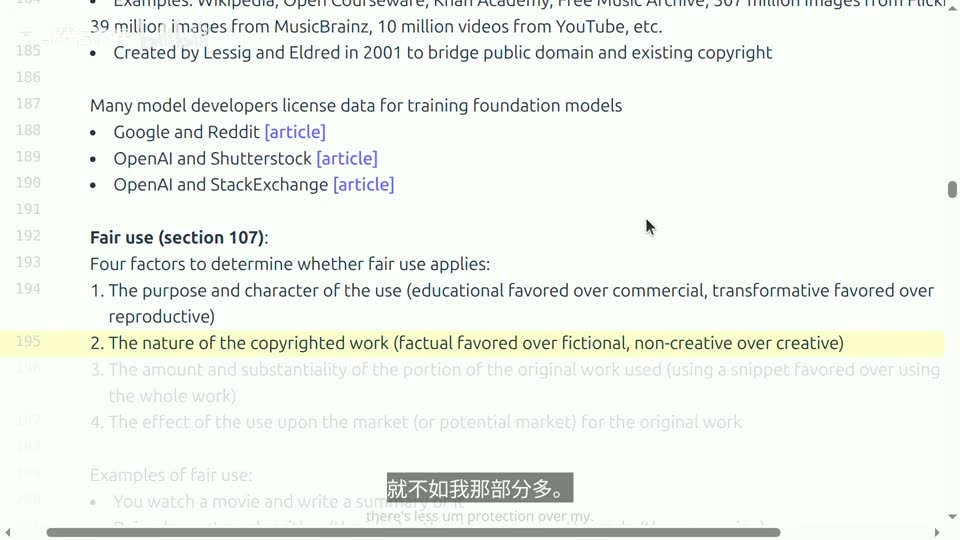 |
| 所以如果你用了某位作者的作品、提供了一个替代品，导致原作者没法再像以前那样靠作品赚钱，这就会被视为有问题；但如果你是对它做了改造、加了新东西，比如开拓了新市场、或者用它做了别的处理，那情况就会好得多。 [【跳转到 18:02】](https://www.bilibili.com/video/BV11LEA6eEuj/?p=13&t=1082) | 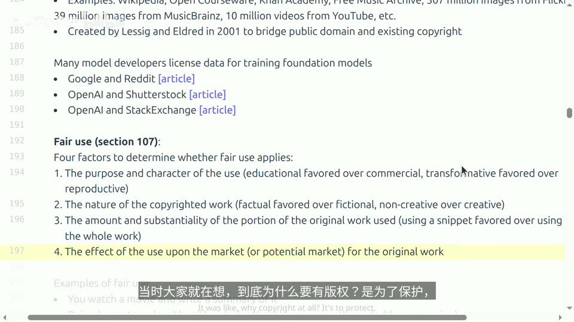 |
| 这里举几个合理使用的例子：看一部电影、然后写一篇摘要；你可以重新实现一个想法、比如算法，但别直接抄代码；然后就是那场著名的官司——作者协会告谷歌，所以你去 Google Books 看看，就能看到各种有版权的书的片段。这事儿当时闹得挺大，当时有个争议焦点在于：这算不算合理使用？ [【跳转到 18:27】](https://www.bilibili.com/video/BV11LEA6eEuj/?p=13&t=1107) | 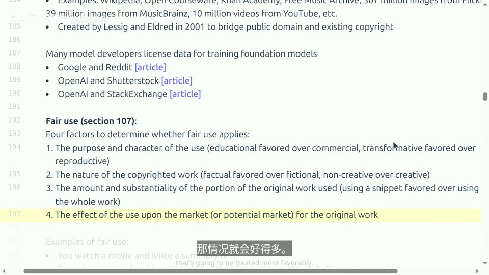 |
| 毕竟你在某种程度上是在重新分发内容、涉及其他受版权保护的作品。最终、在过了 11 年之后，这场官司以谷歌胜诉收场，这也是为什么会有现在这个产品。这也为思考语言模型训练是否构成合理使用确立了一些先例。有一点需要注意…… [【跳转到 18:52】](https://www.bilibili.com/video/BV11LEA6eEuj/?p=13&t=1132) | 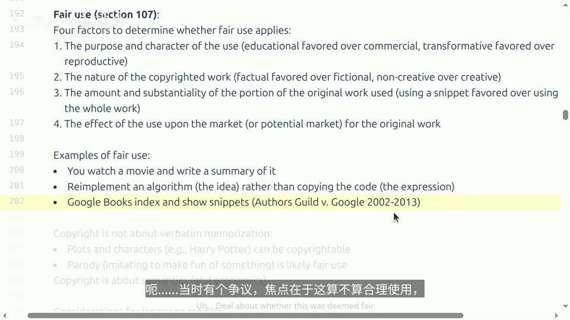 |
| 版权保护并不只是针对逐字记忆，所以我觉得这对机器学习领域的听众来说可能有点新鲜，因为很多论文都聚焦于逐字记忆，但这只是侵犯版权的一种方式、并非唯一方式。比如故事情节和角色设定是可以受版权保护的，也就是说你可以复制哈利波特这个角色，而侵权点不在于某本特定的书或其中的具体内容。 [【跳转到 19:17】](https://www.bilibili.com/video/BV11LEA6eEuj/?p=13&t=1157) | 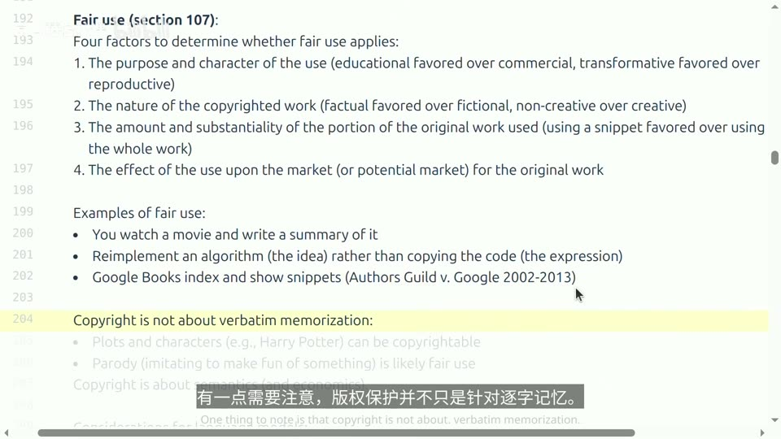 |
| 不过也有例外情况，比如你是在搞戏仿（parody），虽然看起来像是衍生作品，但只要你是在调侃它，反而更可能被算作合理使用。所以你看，很多讨论其实都集中在语义上，这肯定不是看 n-gram 重叠，还涉及经济方面的问题。那么这对语言模型有什么影响呢？ [【跳转到 19:42】](https://www.bilibili.com/video/BV11LEA6eEuj/?p=13&t=1182) | 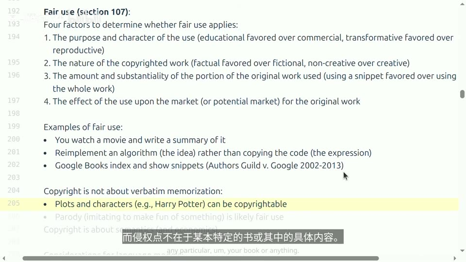 |
| 首先，复制数据——就算你没拿来训练，光是复制这个动作本身，就像 copyright 这个词里就含着 copy——哪怕你什么都没做，光复制这件事可能就已经构成侵权了。训练模型，我猜……让我想想这该怎么说呢，这倒不一定是事实…… [【跳转到 20:07】](https://www.bilibili.com/video/BV11LEA6eEuj/?p=13&t=1207) | 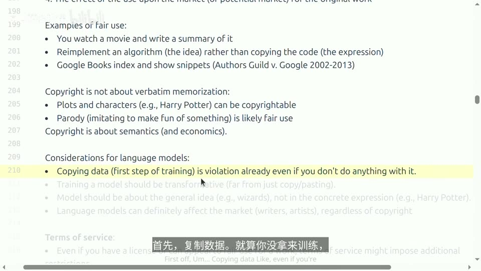 |
| 但直觉上确实有种变革性的味道，对吧？毕竟它看起来和单纯把别人的工作搬过来可不一样，它是在做一些真正具有变革性的事情。还有，某种程度上说，模型训练这些数据只是手段而非目的，你的目标是提取通用概念、去理解世界是怎么运作的…… [【跳转到 20:32】](https://www.bilibili.com/video/BV11LEA6eEuj/?p=13&t=1232) | 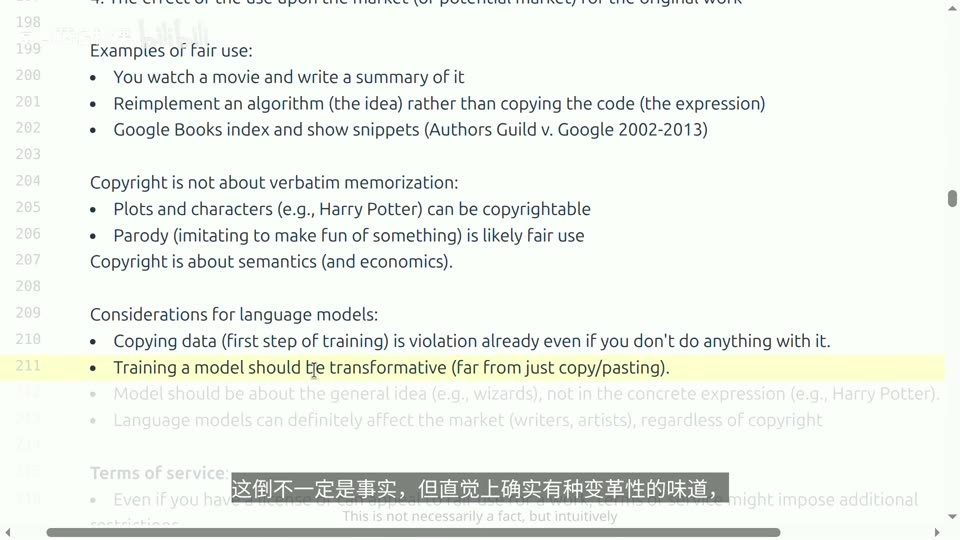 |
| 而不是只盯着那些具体的表达形式。另外，不管版权怎么算，语言模型确实会对市场产生影响。所以我想说的是，别忘了这是关于合理使用的第四点——如果对市场造成了负面影响，就更可能被判定为不属于合理使用。 [【跳转到 20:57】](https://www.bilibili.com/video/BV11LEA6eEuj/?p=13&t=1257) | 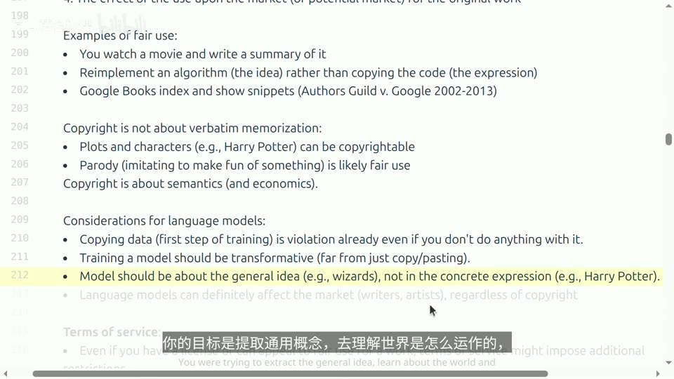 |
| 那么合理使用这个概念其实有点不好把握。假设你要么符合合理使用、要么获得了授权，但别忘了服务条款仍然可能阻止你直接获取某部作品。比如 YouTube 上那些视频，虽然都获得了授权，但服务条款里规定禁止你用机器人程序、像爬虫那样去直接下载视频，这又是另一层。所以这里的限制是分好几层的。 [【跳转到 21:22】](https://www.bilibili.com/video/BV11LEA6eEuj/?p=13&t=1282) | 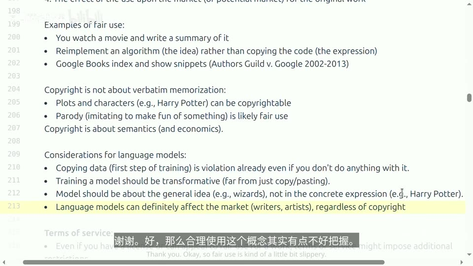 |
| 那我简单说说目前法律层面的情况。2023 年，纽约时报起诉了 OpenAI，说你们拿我们的新闻文章做训练，你看这是证据，我们能提示 ChatGPT 几乎逐字地生成出一篇新闻报道。我觉得这个案子应该已经有结论了。有一起针对 Anthropic 的诉讼，指控是你们盗版了几百万本书、还拿这些书去训练 Claude…… [【跳转到 21:47】](https://www.bilibili.com/video/BV11LEA6eEuj/?p=13&t=1307) |  |
| 就在去年有一项里程碑式的裁决，它实际上是这么说的：这种特定的训练属于合理使用，不过 Anthropic，你们还是有麻烦，因为你们盗版了这些书，而这是绝对不行的。对，你看，这跟训练没关系，仅仅是盗版这件事本身，这也不是什么新鲜事，就是违法的。 [【跳转到 22:12】](https://www.bilibili.com/video/BV11LEA6eEuj/?p=13&t=1332) | 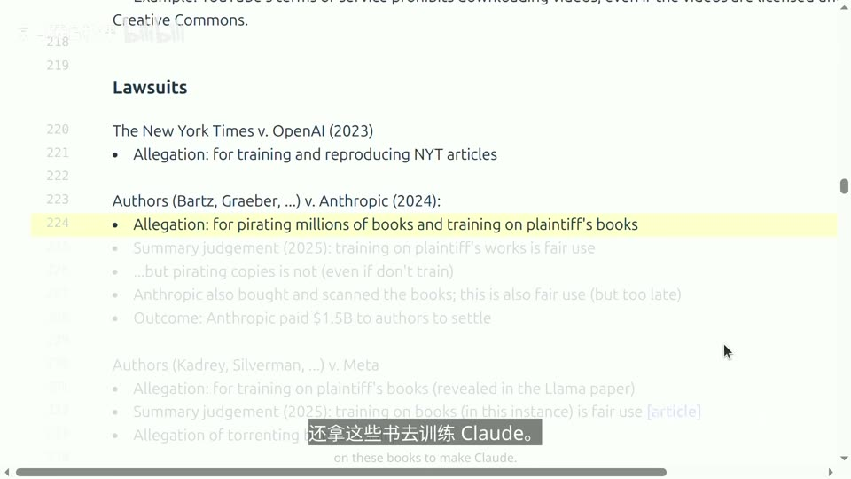 |
| 有意思的是，Anthropic 其实把这些书都买下来扫描了，这其实算合理使用。法院说，你们可以买一堆书、拆掉装订、扫描一下、为了自己用把它数字化，这算合理使用；但这并不能免除你们纯粹盗版的那桩罪过。所以你不能先盗版、回头再去买，然后说"算了，别管我之前先干了什么的"。所以最终结果是 Anthropic 花了 15 亿美元和解…… [【跳转到 22:37】](https://www.bilibili.com/video/BV11LEA6eEuj/?p=13&t=1357) | 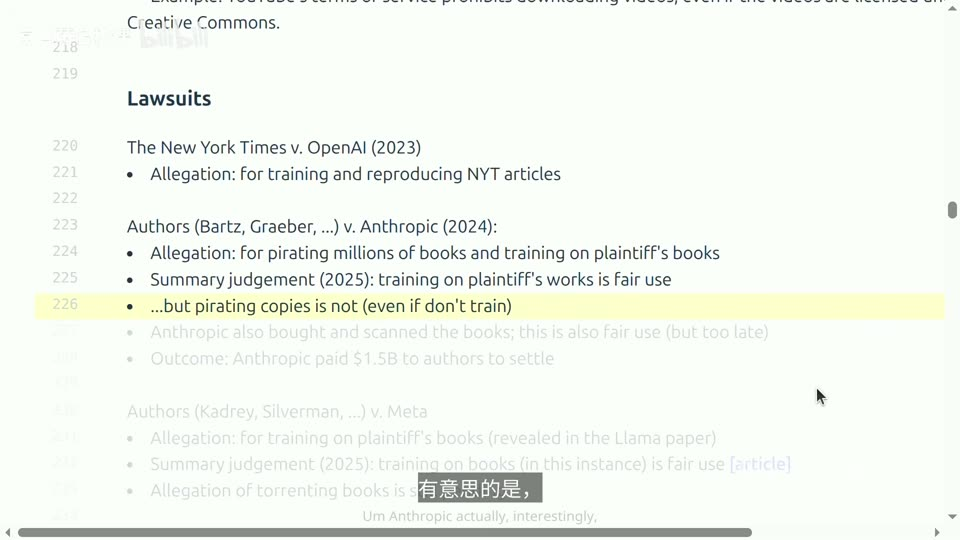 |
| 算下来大概每本书三四美元。另外 Meta 也被告了，指控说你们训练模型时用了我们的书——就像我们后面会看到的，这其实在 Llama 论文里就曝光了。紧跟着 Anthropic 之后，判决结果是训练算合理使用；另外他们还用种子盗版下载了一些书，那个案子还在审。所以照这个先例来看…… [【跳转到 23:02】](https://www.bilibili.com/video/BV11LEA6eEuj/?p=13&t=1382) | 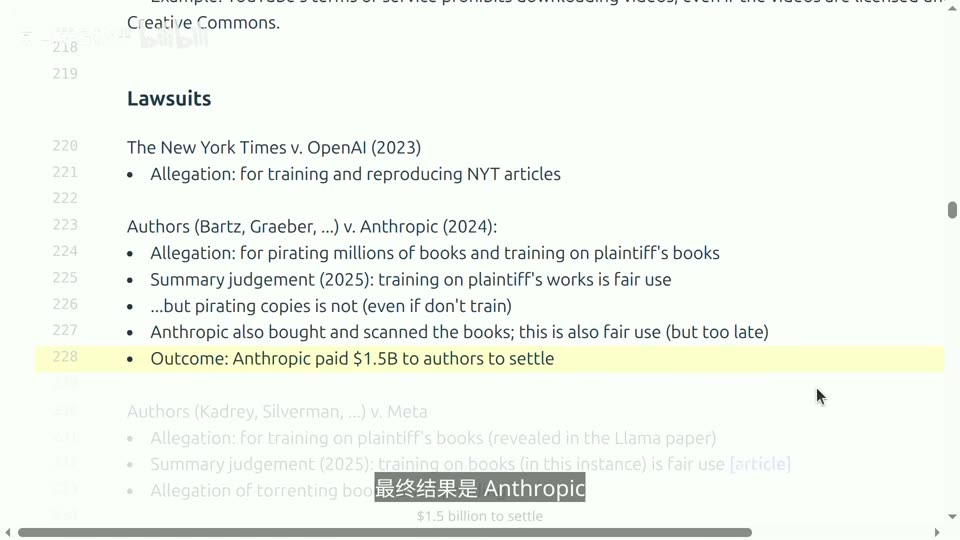 |
| Meta 这边估计也讨不到好。好，那目前总结一下：训练可以这么说，已经被认定为合理使用了，或者至少说没有被认定为不属于合理使用。目前的判决意思是，并不是说对任何版权内容的训练都算合理使用；不过这种情况没问题。盗版书籍明显是违法的，我想咱们之前就已经知道了。 [【跳转到 23:27】](https://www.bilibili.com/video/BV11LEA6eEuj/?p=13&t=1407) | 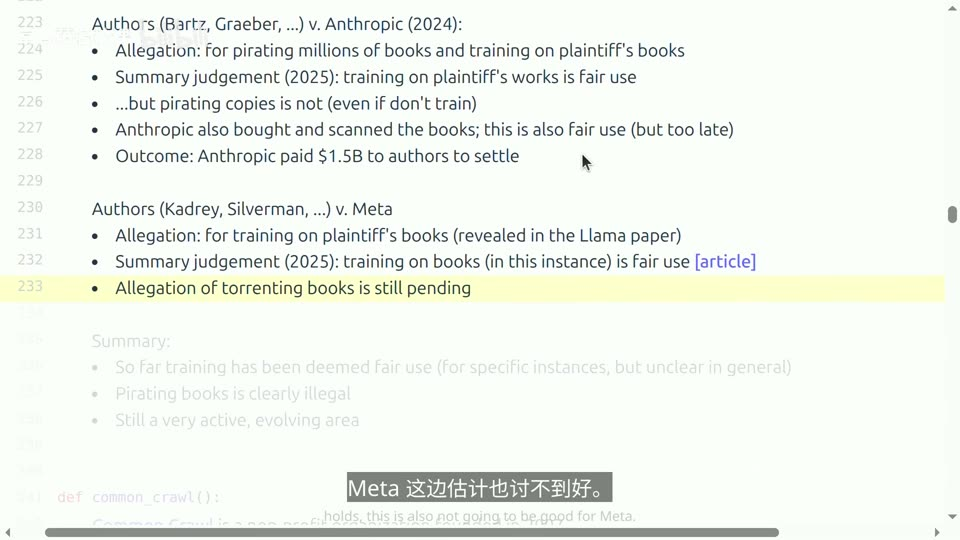 |
| 不过这个领域目前依然非常活跃、而且还在不断演变。好，关于数据来源大家有什么问题吗？我觉得在讲具体的数据集之前…… [【跳转到 23:52】](https://www.bilibili.com/video/BV11LEA6eEuj/?p=13&t=1432) | 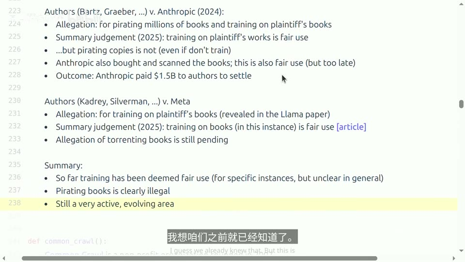 |
| 我想先大致聊几句，想先结合更宏观的社会背景给大家做个铺垫。（课堂问答）你是想问我对 XYLABS 的语音数据怎么看吗？我对那个了解不多，所以也说不上太多，咱们课后私下聊吧。不是可以这么做吗…… [【跳转到 24:01】](https://www.bilibili.com/video/BV11LEA6eEuj/?p=13&t=1441) | 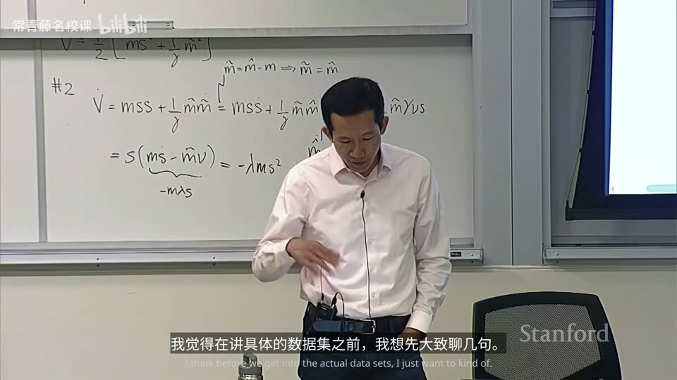 |
| 比如一开始用知识共享协议，但后来更新许可协议、以限制某些特定用途，所以这到底起什么作用？我就像打赌那样，直接在旧版本上训练？对，那咱们来看看时间推移后会发生什么。比如你原本有个许可证、后来它变了，这该怎么办？第一，我不是律师；第二，咱们说说，对于第一个许可证，我觉得你大概还是被允许的，你可以用它来训练。 [【跳转到 24:26】](https://www.bilibili.com/video/BV11LEA6eEuj/?p=13&t=1466) | 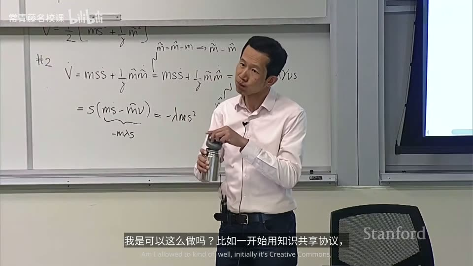 |
| 但许可证通常不只针对固定的文档集，比如……因为新内容一直在产生，许可证一旦变更，你就没法再拿后来的内容去训练了。好，咱们来看看各种数据来源。 [【跳转到 24:51】](https://www.bilibili.com/video/BV11LEA6eEuj/?p=13&t=1491) | 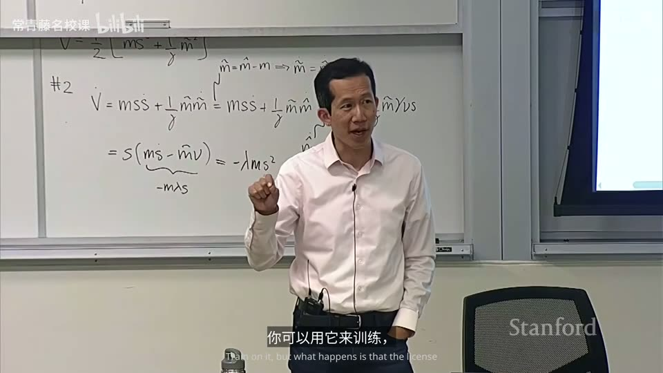 |
| 咱们先回到爬取。大多数模型开发者都有自己的爬虫，因为他们想完全掌控数据是什么样的。幸运的是，咱们其他人要是不想自己搭爬虫的话，有个叫 Common Crawl 的东西已经存在挺长时间了，从 2007 年就有了。他们每个月都会爬一次网，大概能抓到 30 亿到 50 亿个网页，每次爬取和之前会有些重叠。 [【跳转到 25:08】](https://www.bilibili.com/video/BV11LEA6eEuj/?p=13&t=1508) | 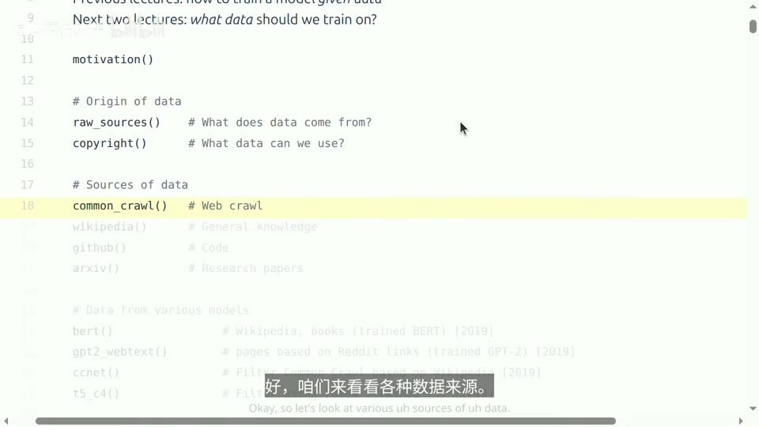 |
| 但他们尽量让内容多样化、多抓些新页面。到现在为止已经有 3000 亿个页面了，这是那个网站上的数据。这数字看着有点大……但人家是这么说的。那么网上到底有多少个 URL 呢？这真的很难估算。据他们所说，Google 的搜索索引规模至少有 100PB。 [【跳转到 25:33】](https://www.bilibili.com/video/BV11LEA6eEuj/?p=13&t=1533) | 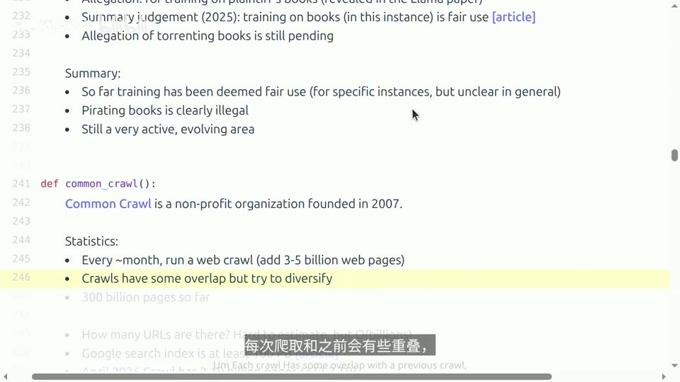 |
| 每次 Common Crawl 的数据转储大约包含 20 亿个网页，也就是 372TB 左右，这里不包括图片，主要关注的是文本内容。所以爬取在概念上很简单，但具体的复杂细节全在实现里。你从一堆 URL 开始，然后不断迭代——这本质上就是图遍历：你从队列里取出一个 URL、下载它、看看页面上有哪些超链接…… [【跳转到 25:58】](https://www.bilibili.com/video/BV11LEA6eEuj/?p=13&t=1558) |  |
| 然后把它们加到队列里。一般来说，这都是在多台机器上并行处理的。这里面涉及很多决策，比如该下载哪些页面、你得遵守 robots 规则、别把服务器压垮了。网站有时候会变，所以你得定个下载策略：页面要是老变你就得下载，但别在那死磕那些根本没变的页面，所以这就得靠策略来管了。 [【跳转到 26:23】](https://www.bilibili.com/video/BV11LEA6eEuj/?p=13&t=1583) | 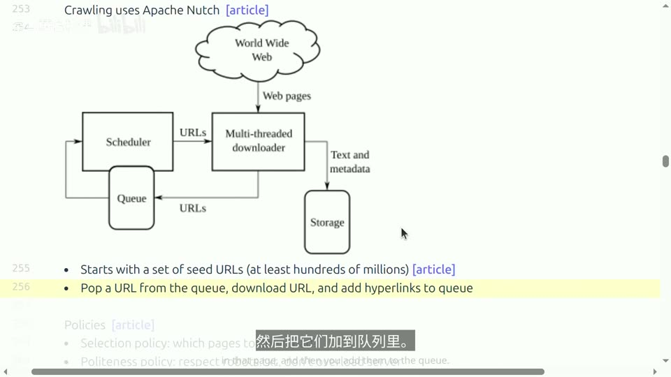 |
| 另外就像我之前说的，URL 是动态的，所以同一个 URL 有时会根据浏览器状态显示不同内容；但反过来，很多 URL 可能都指向同一个内容，所以你要是没留神，重复内容就多了，尤其是镜像站点、那本来就是搞重复的。Common Crawl 发布转储数据时有两种格式，一种是 WARC 文件，也就是原始的 HTTP 响应…… [【跳转到 26:48】](https://www.bilibili.com/video/BV11LEA6eEuj/?p=13&t=1608) | 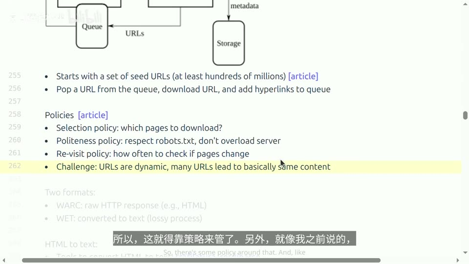 |
| 对，大家记得 HTTP 协议就是你发一个请求、给一个 URL，它就返回一个 HTTP 响应，而 WARC 文件就是这个响应。他们还会做一些处理、把它转换成 WET 文件，而这必然是一个有损的过程，结果发现这未必是利用网络最好的方式。把 HTML 转成文本有很多工具可以用…… [【跳转到 27:13】](https://www.bilibili.com/video/BV11LEA6eEuj/?p=13&t=1633) | 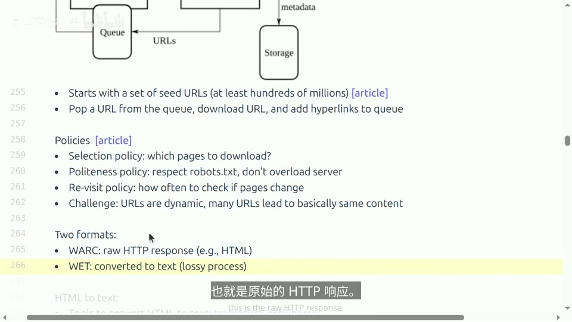 |
| 比如 trafilatura 和 resiliparse。转换方式其实很重要，这出自 DataComp-LM，我们待会儿会稍微讲一下。这是一个消融实验，对比 Common Crawl 发布的网页文件和其他这些文件、也就这些其他工具，看起来 trafilatura 和 resiliparse 更好一些。那你可以做的一件事，就是直接依赖通用的网页爬取数据…… [【跳转到 27:38】](https://www.bilibili.com/video/BV11LEA6eEuj/?p=13&t=1658) | 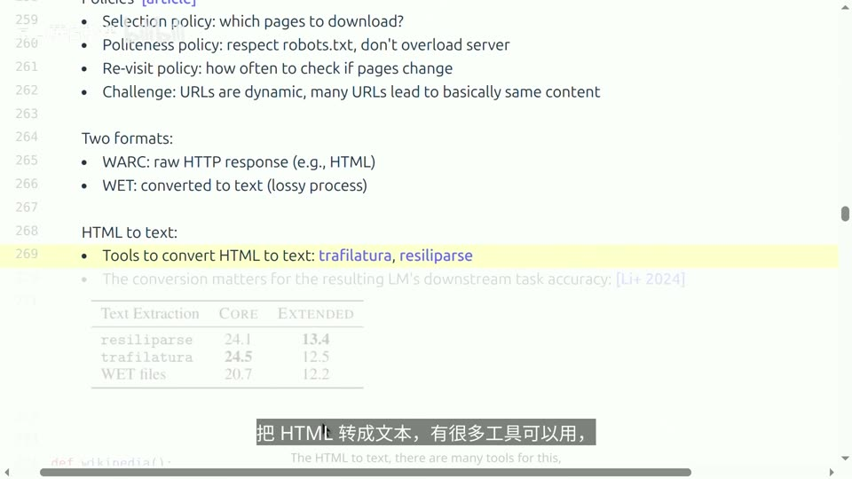 |
| 但网络往往并不均匀，它不像是有一堆网站、你随机抓取其中一小部分就构成了你的数据集。网上有一些特定的区域蕴含着真正有趣的高质量内容，我会讲其中三个：维基百科、GitHub 和互联网档案馆。维基百科大家应该都很熟悉了，它从 2001 年上线至今…… [【跳转到 28:03】](https://www.bilibili.com/video/BV11LEA6eEuj/?p=13&t=1683) |  |
| 如今已有 6700 万篇、涵盖多种语言的文章。而且维基百科绝不是什么内容都有，它不允许包含原创的思想，因为里面所有内容都必须有据可查、注明出处。所以某种意义上可以说，维基百科里其实没有什么新东西，因为那些都是别处已有的信息。嗯，在网上其实它不全对…… [【跳转到 28:28】](https://www.bilibili.com/video/BV11LEA6eEuj/?p=13&t=1708) | 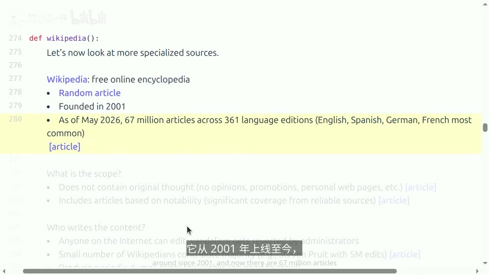 |
| 因为他们还能引用书籍，而这些书可不是谁都能轻易拿到的，所以维基百科做得很好。另外那些文章还得符合显著性的要求，所以不是所有内容都有、也不是谁都能上维基百科。也就是说，网上谁都能写这些内容，这正是 wiki 这种形式激进的地方。 [【跳转到 28:53】](https://www.bilibili.com/video/BV11LEA6eEuj/?p=13&t=1733) | 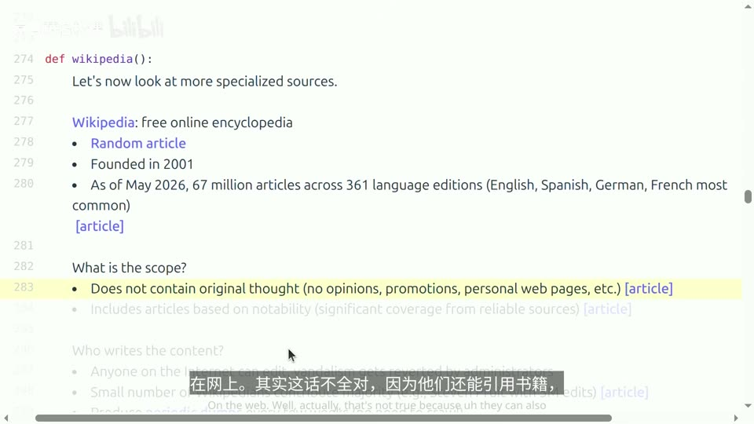 |
| 我觉得它真的能行得通，这在我看来至今仍是个奇迹。现在嘛，任何破坏行为基本都会被管理员或者机器人还原回去。跟其他协同生产系统一样，维基百科里也是少数人干着大部分活儿，比如说某个人的编辑次数大概就有 500 万次。维基百科还有个特点…… [【跳转到 29:18】](https://www.bilibili.com/video/BV11LEA6eEuj/?p=13&t=1758) | 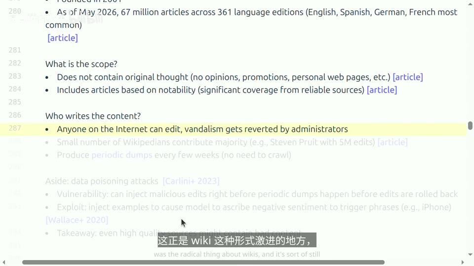 |
| 就是每隔几周就会做一次定期的数据导出，简单来说他们把整个维基百科打包成了一个文件，你直接下载就行。这点很关键，因为咱们没必要自己去爬取维基百科，实际上官方是不鼓励这么做的；如果你打算抓取，他们其实只希望你下载这个文件，这比自己去爬要好得多。这里有个挺有意思的冷知识：有篇论文提到，你其实可以对维基百科进行投毒。 [【跳转到 29:43】](https://www.bilibili.com/video/BV11LEA6eEuj/?p=13&t=1783) | 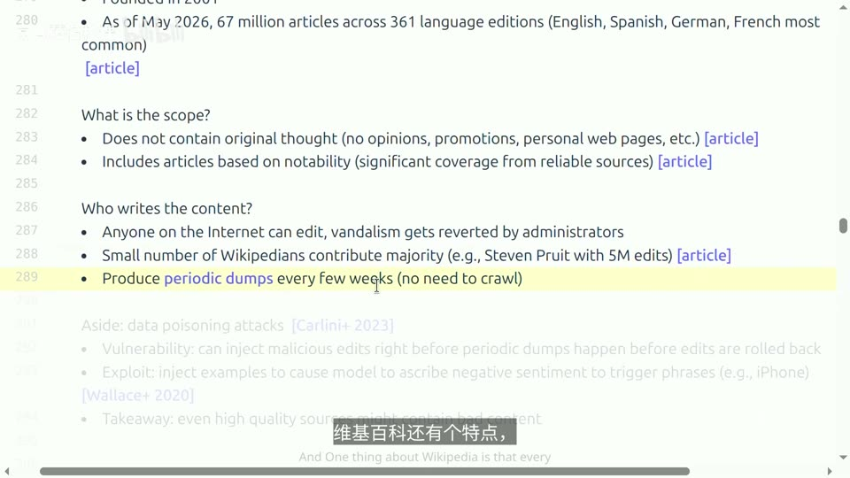 |
| 你大概会觉得这种捣乱行为会被撤销吧？也就是说如果攻击者搞鬼、操作都会被回滚。但 Carlini 发现，这些定期数据导出是按固定频率进行的，所以你可以趁数据导出生成前赶紧进去改一下内容；等数据导出生成后，虽然你的编辑会被撤销，但导出文件里已经留下了恶意内容。如果你能往网页里注入内容…… [【跳转到 30:08】](https://www.bilibili.com/video/BV11LEA6eEuj/?p=13&t=1808) | 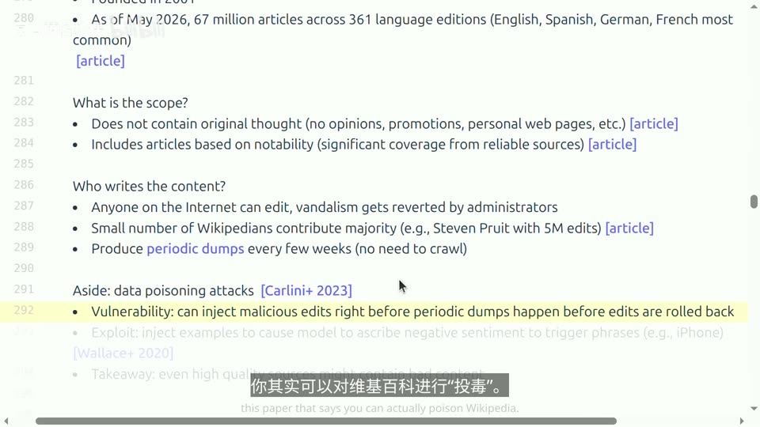 |
| 那就意味着你可以让模型……已经有研究证明了这一点，对任何对象都赋予负面情感，比如 "iPhone" 这种触发短语赋予负面情感。所以我想强调的一点是：考虑到攻击者的存在，哪怕是所谓的高质量内容，里面也可能藏着有害的东西。我觉得这个问题从那以后就已经修复了。 [【跳转到 30:33】](https://www.bilibili.com/video/BV11LEA6eEuj/?p=13&t=1833) | 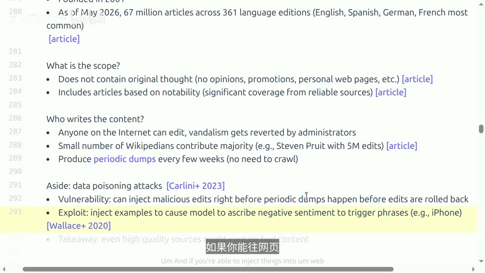 |
| GitHub 是存放代码的好地方。代码很重要，不仅是为了让语言模型学会写代码，更是为了赋予它通用的推理能力。大家肯定都知道 GitHub，它本质上是一个托管代码仓库的在线服务，它从 2008 年就开始运营了，跟 Common Crawl 差不多同龄，它拥有 4 亿 2000 万个仓库。 [【跳转到 30:58】](https://www.bilibili.com/video/BV11LEA6eEuj/?p=13&t=1858) |  |
| 其中 2800 万个是公开的。每个仓库里都包含一些东西，它并不是单个文件，这个目录里包含提交历史、Issue、PR 还有评论。代码里通常有大量重复内容，这主要是因为有人直接复制代码、或者 fork 了代码。另外 GitHub 认为，只要是有宽松许可证的公共仓库…… [【跳转到 31:23】](https://www.bilibili.com/video/BV11LEA6eEuj/?p=13&t=1883) | 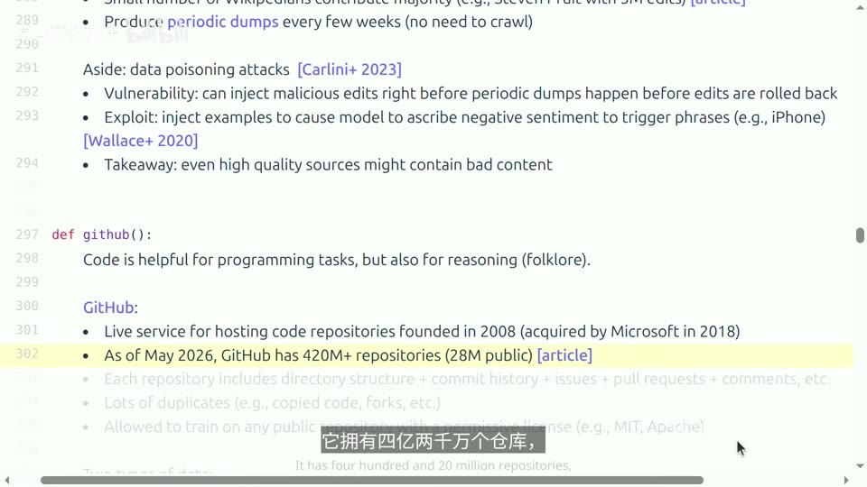 |
| 你就可以拿来训练模型，所以 MIT 或 Apache 许可证都没问题。大家记住，说到 GitHub 数据时其实分两种：一种是仓库数据，你直接通过 GitHub 的 git 协议就能下载——别去爬 GitHub 网站，直接下载仓库就行；另一种是与各个仓库相关的元数据，比如 issue、PR 这些，这些数据其实是通过 GH Archive 获取的，它会按小时给出这个事件流的快照。 [【跳转到 31:48】](https://www.bilibili.com/video/BV11LEA6eEuj/?p=13&t=1908) | 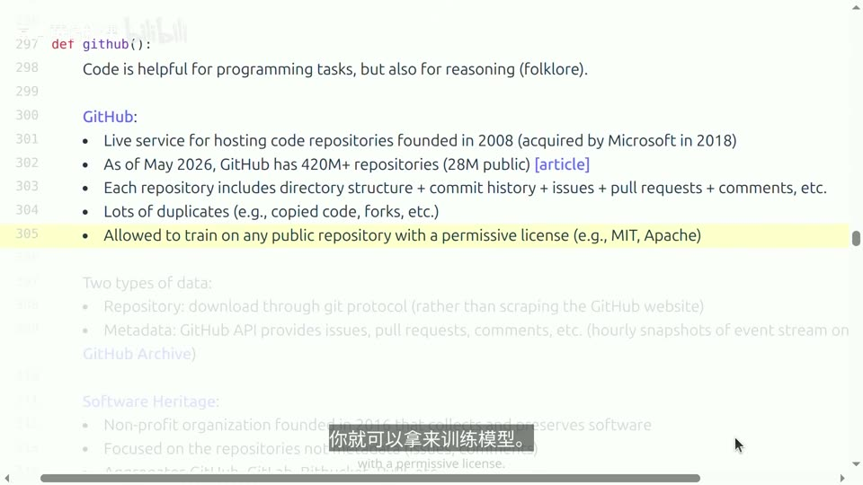 |
| 我觉得这数据挺有意思的，基本上你在 GitHub 上的每一条评论、每一次点赞、star 或者操作都会被记录下来。有个软件遗产基金会（Software Heritage），它主要关注代码仓库本身、而不是元数据，然后把 GitHub 上的内容都聚合起来。你看，代码可不光出现在 GitHub 上，还有不少规模小一点的地方…… [【跳转到 32:13】](https://www.bilibili.com/video/BV11LEA6eEuj/?p=13&t=1933) | 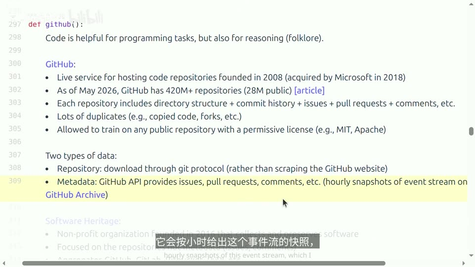 |
| 像 GitLab、Bitbucket 这些平台也会把各种仓库都聚合起来。好，那咱们简单说说 arXiv，这个大家应该都挺熟的，这个站点从 1991 年就开始让人分享论文了，最开始是做物理的，现在里面涵盖了很多其他领域。这 300 万份提交记录，每一份都带着元数据，有 PDF 还有可选的 LaTeX 源文件。 [【跳转到 32:38】](https://www.bilibili.com/video/BV11LEA6eEuj/?p=13&t=1958) | 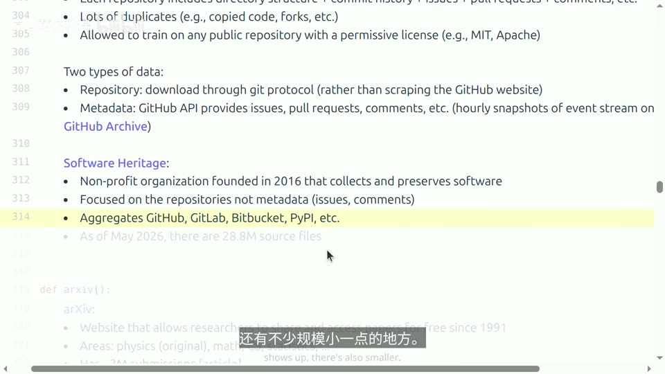 |
| 这时候你脑子里可能就在想：那在 arXiv 上训练到底是指什么呢？这其实不太清楚，因为你得先把 PDF 转成文本、或者用 LaTeX 源文件，那其实是一堆文件。它虽然没经过同行评审，但也有一套审核流程。而且作者可以选择保留版权、或者用知识共享协议，这样所有内容的授权情况都清清楚楚，所有的元数据都是宽松许可的。 [【跳转到 33:03】](https://www.bilibili.com/video/BV11LEA6eEuj/?p=13&t=1983) | 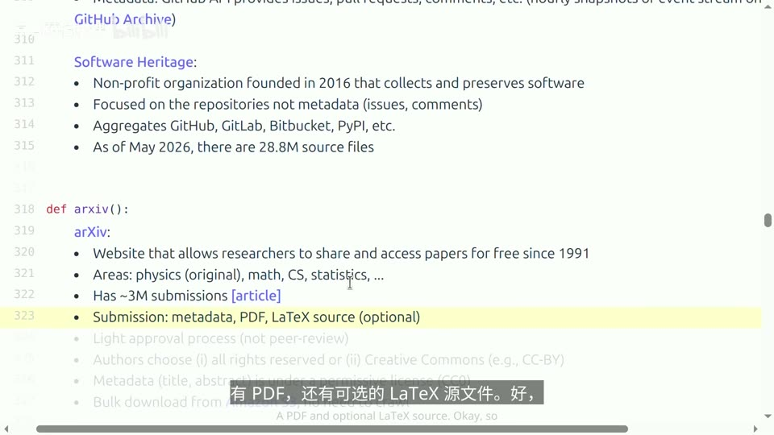 |
| 所以你可以直接用，然后你可以去查那些知识共享的论文，下载下来就能用，我觉得大部分 arXiv 论文都是支持共享的。另外这些数据都能拿到，不用去爬 arXiv，直接去某个网站批量下载就行。好，关于数据来源大家有什么问题吗？（课堂问答）模型生成的数据有什么限制吗？ [【跳转到 33:28】](https://www.bilibili.com/video/BV11LEA6eEuj/?p=13&t=2008) | 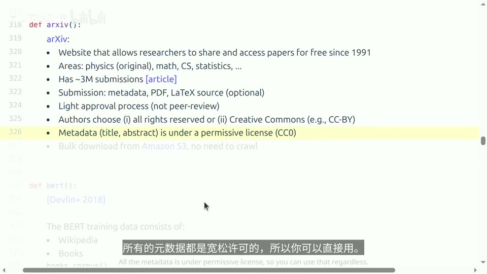 |
| 这些是模型生成的。 [【跳转到 33:51】](https://www.bilibili.com/video/BV11LEA6eEuj/?p=13&t=2031) | 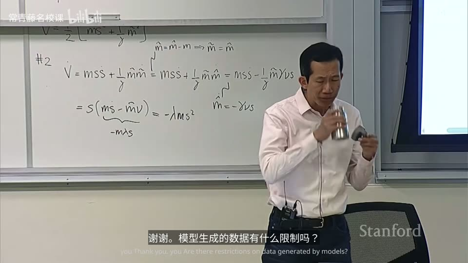 |
| 对，我得先把它调出来。懂了，我们待会再细说。那问题是：模型生成的数据、比如合成数据该怎么办、允许用吗？简单说大概是可以的。就比如用爬虫抓取的时候、像 Common Crawl 之类的……（课堂问答）我想问一下，因为你之前提到有些网站上有很多盗版书，对吧？那你怎么确保那些网站不会出现在你的爬取范围里？对，问题就在于有很多这类网站…… [【跳转到 33:56】](https://www.bilibili.com/video/BV11LEA6eEuj/?p=13&t=2036) | 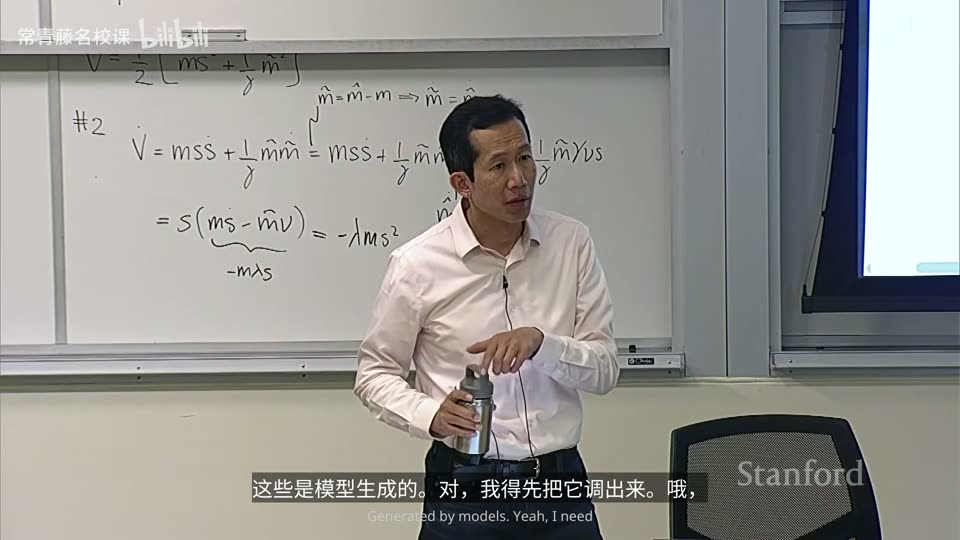 |
| 如果你只是做常规的网页爬取，不可能覆盖所有网站，那你怎么保证所有内容都合规？这正是难点所在，你做不到。Common Crawl 很可能包含受版权保护的书籍和内容，而这些是你本不该使用的。这些训练你可以主张这属于合理使用，但要记住所有内容都是有版权的，书籍和你的网站其实没多大区别。 [【跳转到 34:21】](https://www.bilibili.com/video/BV11LEA6eEuj/?p=13&t=2061) | 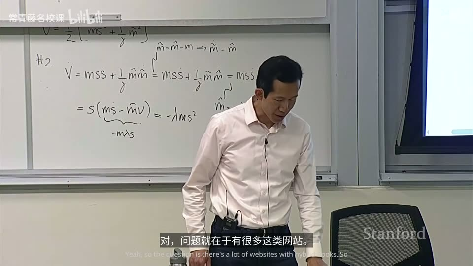 |
| 举个例子，两者都有版权，书的作者拥有的权利可能更多一些，因为他们真要去打官司。不过这个我后面还会再讲一点，如果你真的想稳妥，可以采取别的办法。好，接下来我要讲构建模型时实际用到的各种数据集…… [【跳转到 34:46】](https://www.bilibili.com/video/BV11LEA6eEuj/?p=13&t=2086) | 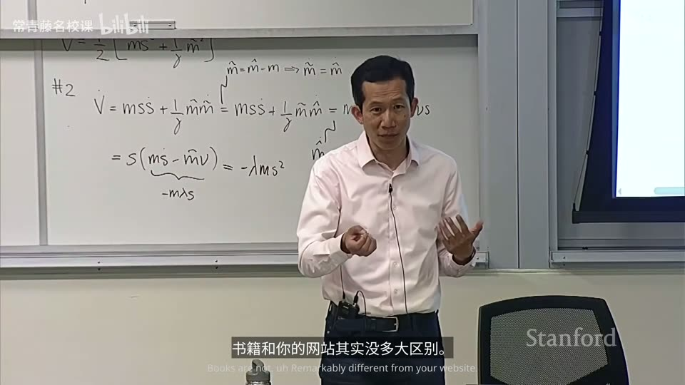 |
| 从 2019 年一路讲起？前面我们聊过数据的起源和来源，所以大家对整体的数据情况应该有点感觉了、也就是数据的全貌。那我们就先从 BERT 讲起。BERT 是 2017 年出来的，那时候训练模型数据源主要就是维基百科和书籍。那这"书"到底是个啥？有个叫 Smashwords 的网站，这网站就是为了让任何人都能上传电子书来出版。 [【跳转到 35:08】](https://www.bilibili.com/video/BV11LEA6eEuj/?p=13&t=2108) | 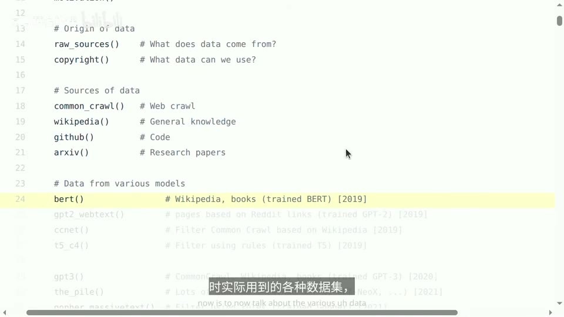 |
| 到了 2024 年上面大概有 50 万本书，但在 2015 年有篇论文……谁去抓了 Smashwords 的数据——不好意思，是抓了那些免费的电子书，然后搞成了一个语料库。那是个学术界还没太在意这些的天真年代，所以这个书籍语料库在学术圈里存在了很多年。 [【跳转到 35:33】](https://www.bilibili.com/video/BV11LEA6eEuj/?p=13&t=2133) | 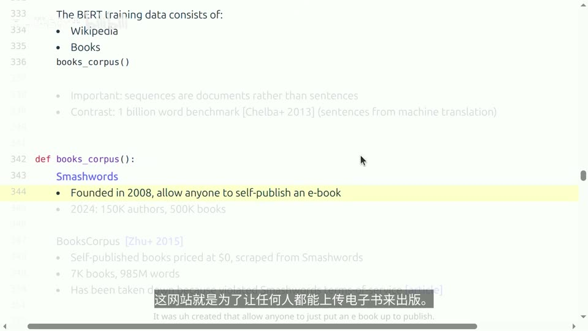 |
| 后来因为违反了服务条款，它就被下架了。免费又能弄到手，并不代表它在法律上就是被允许的。所以关于 BERT 有一点要注意：它的序列是文档而不是句子。在那之前，所有的语言建模研究都只关注句子。好，2019 年 GPT-2 问世了。 [【跳转到 35:58】](https://www.bilibili.com/video/BV11LEA6eEuj/?p=13&t=2158) | 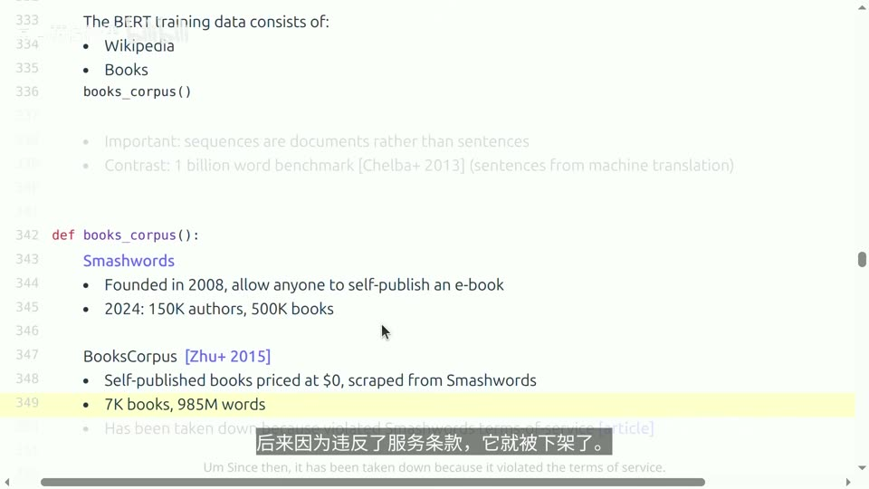 |
| 他们当时是怎么做的呢？他们是想获取高质量的网络内容。那时候大家已经知道 Common Crawl 了，但不知怎么的、它的数据太乱了，所以他们想了个巧妙的办法：你看那些页面，挑出那些来自 Reddit 且 karma 值大于 3 的出站链接——好帖子链接的肯定是好东西、好网站。 [【跳转到 36:23】](https://www.bilibili.com/video/BV11LEA6eEuj/?p=13&t=2183) | 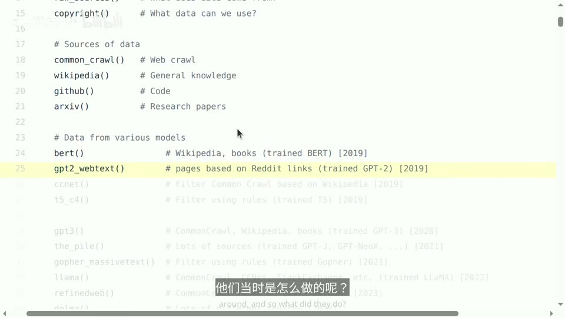 |
| 于是你抓取那些页面，得到 40GB 文本、800 万个页面。他们从没公开过这个数据，不过有一个网络文本的开源复现版用的人相当多。OK，那么这就是 GPT-2。你们看这部分内容的时候，我建议两方面都想一想——过滤和收集数据有很多方法，看看这些设计选择挺有意思的。 [【跳转到 36:48】](https://www.bilibili.com/video/BV11LEA6eEuj/?p=13&t=2208) | 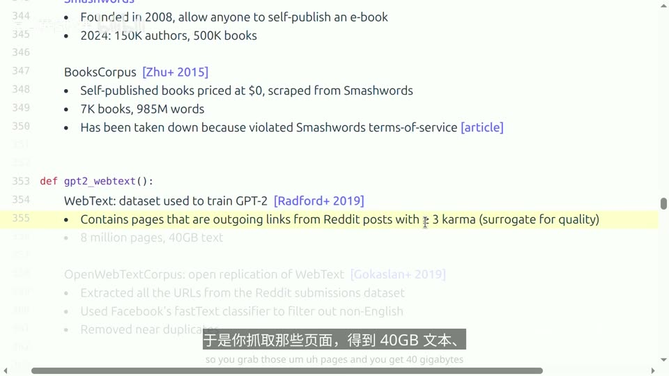 |
| 好，CCNet 呢，是当时的 Facebook 开发的，目标是构建大规模、高质量的 pre-training 数据集。他们尤其关注低资源语言，所以他们不想要那种只适用于英语的纯手动流程。他们做了一系列工作，比如数据去重，还有语言识别——训练一个分类器来检测语言种类、然后保留你想要的那种语言。 [【跳转到 37:13】](https://www.bilibili.com/video/BV11LEA6eEuj/?p=13&t=2233) | 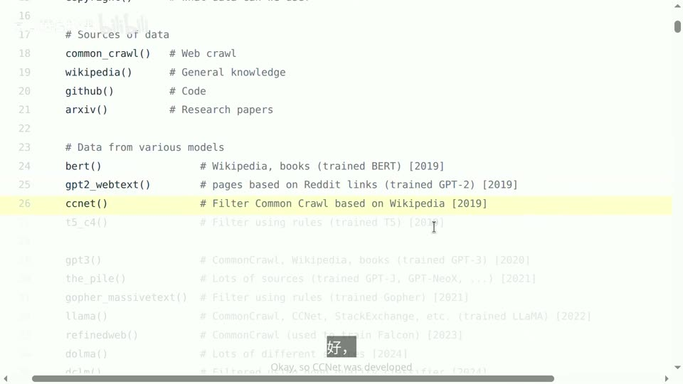 |
| 至于质量过滤，他们的想法是保留那些看起来像维基百科的文档——当时维基百科被认为是优质的高质量内容。于是他们用了一个在维基百科上训练的语言模型，通过给新文档在该模型下的概率打分，来衡量它有多"像维基百科"。 [【跳转到 37:38】](https://www.bilibili.com/video/BV11LEA6eEuj/?p=13&t=2258) | 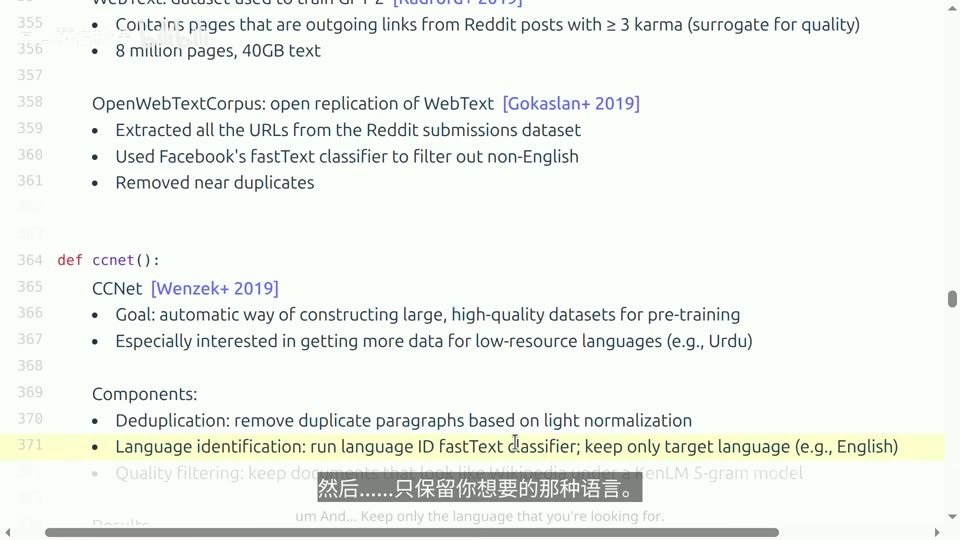 |
| 而是用了语言模型和维基百科。而且他们证明了，因为能拿到多得多的数据，实际效果反而比只在维基百科上训练更好。这个工具后来也出现在其他几篇论文里。那么咱们再来看另一项工作，这是 Google 在 2019 年推出的工作…… [【跳转到 38:03】](https://www.bilibili.com/video/BV11LEA6eEuj/?p=13&t=2283) | 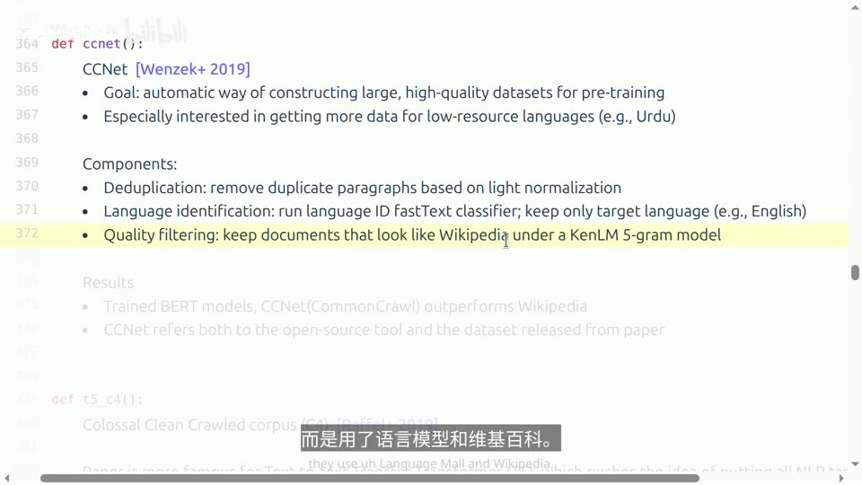 |
| 叫做 C4。这篇论文其实更出名的是 T5 模型，它提出一个观点：把所有自然语言处理任务都当作文本到文本来处理。不过这篇报告篇幅很长，一个重要贡献其实是 C4 数据集。当时大家看得很清楚：Common Crawl 就是这么个情况，对于自然语言来说基本没用。当时大家觉得你手里那些小数据集质量很高…… [【跳转到 38:27】](https://www.bilibili.com/video/BV11LEA6eEuj/?p=13&t=2307) | 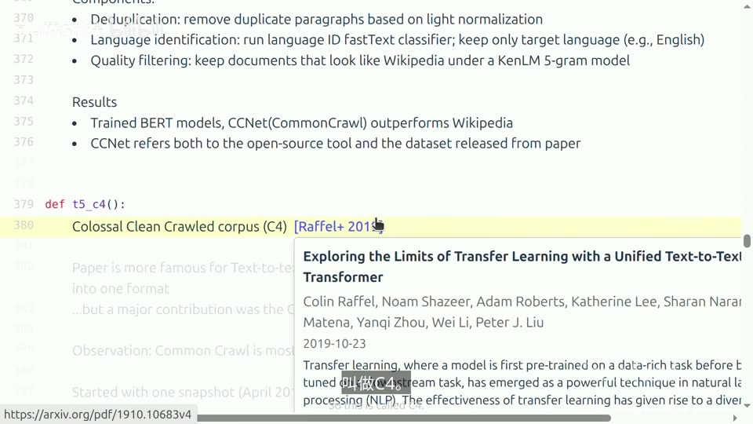 |
| 但 Common Crawl 简直是一团糟，直接在 Common Crawl 上训练只会得到垃圾结果。所以大家都在想：怎么从 Common Crawl 里挑出一个更大但质量更高的子集呢？也看了类似维基百科的语言模型思路，而 C4 用的是另一种思路，就是直接定义一堆规则。事实证明效果挺不错，大体上他们保留那些以标点结尾且超过五个词的行…… [【跳转到 38:52】](https://www.bilibili.com/video/BV11LEA6eEuj/?p=13&t=2332) | 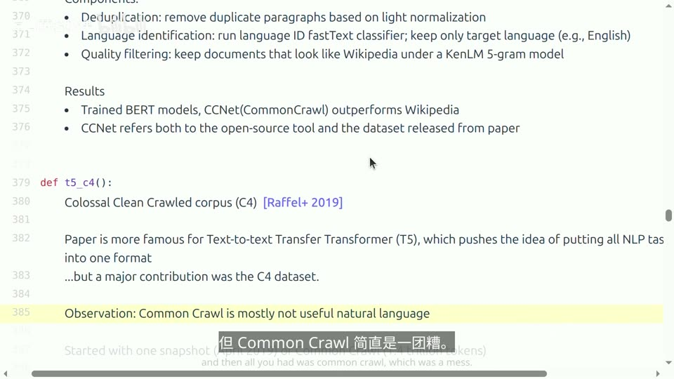 |
| 删掉句子少于三句的页面、删掉含有任何脏话的页面、删掉比如那些使用条款之类的模板文本。有意思的是，他们还去掉了花括号，这就把大量代码给过滤掉了——显然那时候他们压根没想着要做代码模型。而且他们还把非英语的内容全都筛掉了。 [【跳转到 39:17】](https://www.bilibili.com/video/BV11LEA6eEuj/?p=13&t=2357) | 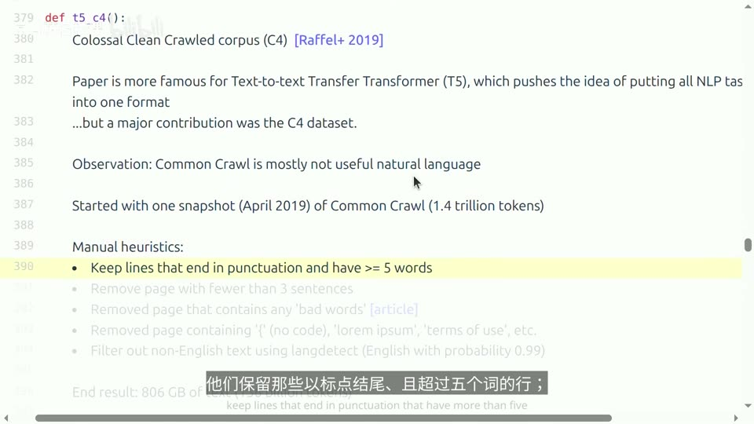 |
| 最后得到的结果是：你有……亿个 token，也就是 800GB 的文本。这比 GPT-2 的数据集大多了，那个数据集只有 40GB 文本。后来 C4 做了一些分析…… [【跳转到 39:42】](https://www.bilibili.com/video/BV11LEA6eEuj/?p=13&t=2382) |  |
| 看看里面都包含了哪些网站。所以你们会用到一堆维基百科数据，专利数据在当时也很常见。他们还发布了一份类似网页文本的文档…… [【跳转到 39:55】](https://www.bilibili.com/video/BV11LEA6eEuj/?p=13&t=2395) | 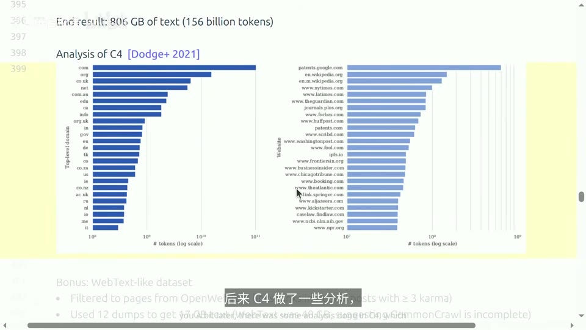 |
| 只筛选出那些 karma 值大于 3 的帖子页面。所以他们用这种方法获取了 17GB 的文本，用了 12 个 Common Crawl 的专属文件。大家记得网页文本有 40GB，这说明 Common Crawl 可能并不完整、或者说没收录所有内容。 [【跳转到 40:05】](https://www.bilibili.com/video/BV11LEA6eEuj/?p=13&t=2405) | 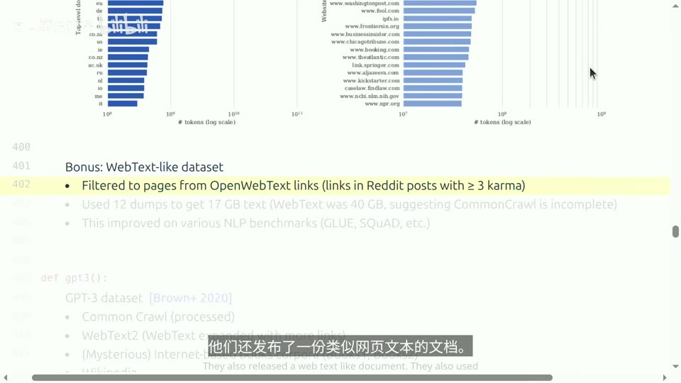 |
| 因为要是全收录了，数据量应该能达到 40GB 吧。他们还展示了当时利用这些数据在一堆 NLP 基准测试上都能取得不错的效果。好，咱们刚才看到了利用规则、比如那些看起来像维基百科、Reddit 链接的数据。接下来啊，咱们聊聊 GPT-3 的数据集。他们用了 Common Crawl、然后做了自己的处理。 [【跳转到 40:30】](https://www.bilibili.com/video/BV11LEA6eEuj/?p=13&t=2430) | 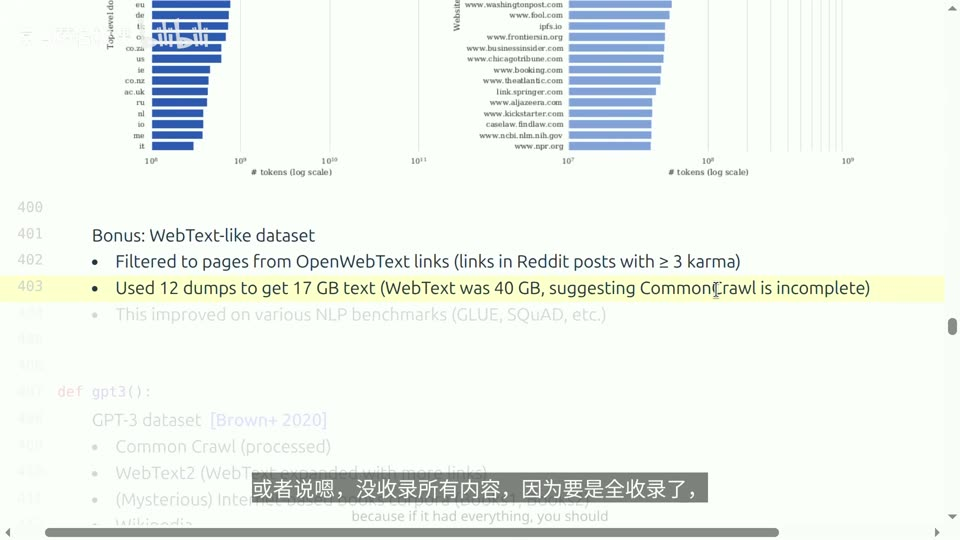 |
| 这里有个网页文本，本质上就是 GPT-2 的数据集、不过做了扩展。大家注意，这里有些重叠：Common Crawl 和这个数据集确实有重合，但换个角度看、这个分布的针对性更强。还有这一项，他们管它叫 Books1 和 Books2，这是一套基于网络的图书语料库，所以它具体是什么至今还是个谜。 [【跳转到 40:55】](https://www.bilibili.com/video/BV11LEA6eEuj/?p=13&t=2455) | 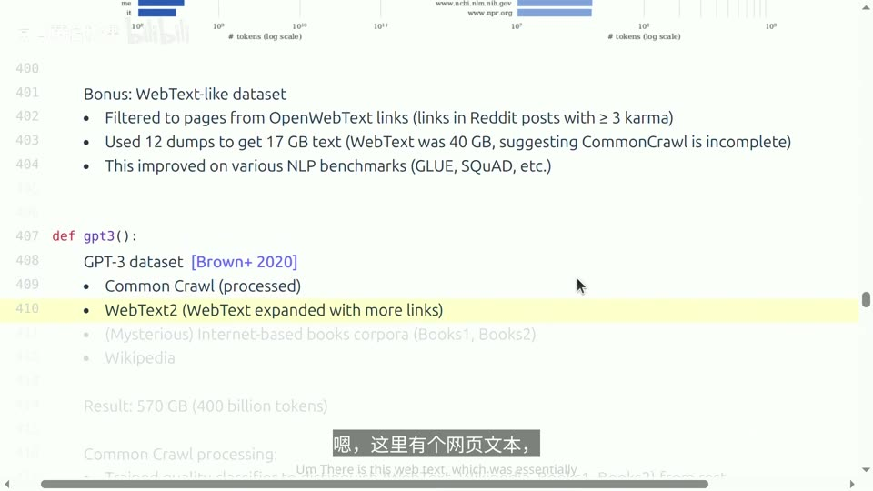 |
| 另外就是维基百科。好，最后得到了大约 500GB 的文本，也就是 4000 亿个 token。而在处理 Common Crawl 时，他们训练了一个质量分类器，把它们判定为高质量的内容、和其余内容区分开来。他们还做了一些模糊去重，因为网页文本和 Common Crawl 都有重复的内容。好，这篇论文沿用了用分类器来做质量筛选的思路。 [【跳转到 41:20】](https://www.bilibili.com/video/BV11LEA6eEuj/?p=13&t=2480) | 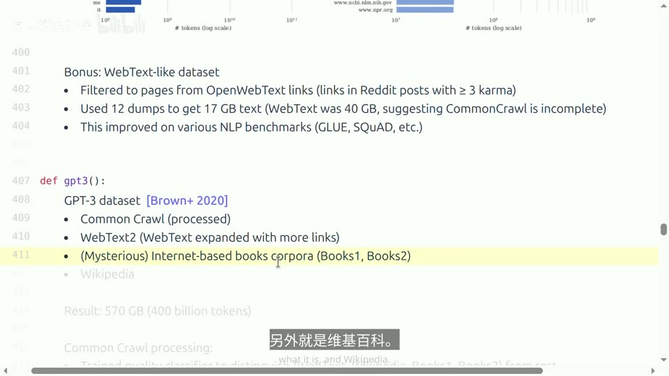 |
| 或者说做分类。GPT-3 出来之后，我觉得这是个大事件，于是很多人开始尝试公开地做这些事。所以早期工作之一就是 The Pile，这是 EleutherAI 发起的一项草根努力，他们聚集了一批人…… [【跳转到 41:45】](https://www.bilibili.com/video/BV11LEA6eEuj/?p=13&t=2505) | 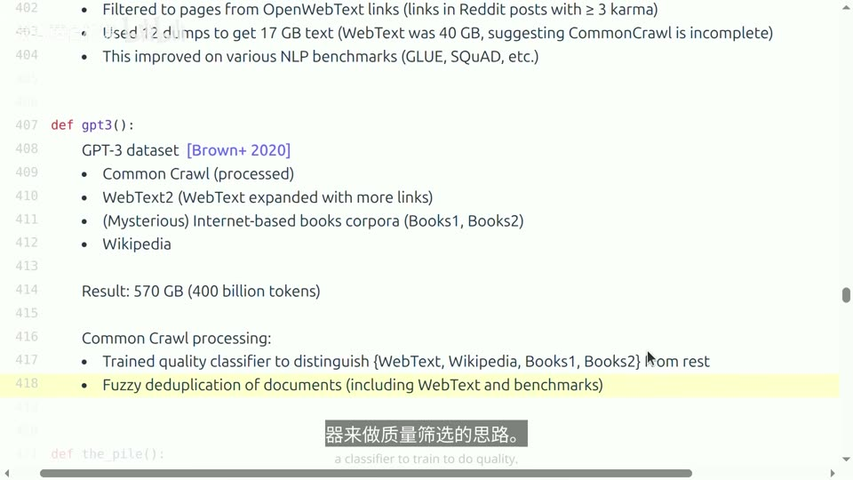 |
| 在这个 Discord 频道里大家一块琢磨、找出高质量的数据源，最后他们整理出了这份清单。直到今天这份清单依然很有意思、也很多样，里面有 Common Crawl、PubMed，还有我们待会要讲的 Books3，以及之前提过的 arXiv、GitHub、像维基百科、某另一套书籍语料库、哲学论文等等。他们还把 Enron 的电子邮件数据集也加了进去。 [【跳转到 42:05】](https://www.bilibili.com/video/BV11LEA6eEuj/?p=13&t=2525) |  |
| Enron 当年破了产，2002 年所有邮件都公开了，这是我们手头少有的几个邮件数据集之一。我觉得邮件数据的分布挺奇怪的，不过没办法，能用的就这些。说到古腾堡计划，咱们稍微聊聊书籍吧。古腾堡计划是 1971 年启动的，里面只收录那些已经通过版权审查的书籍。 [【跳转到 42:30】](https://www.bilibili.com/video/BV11LEA6eEuj/?p=13&t=2550) | 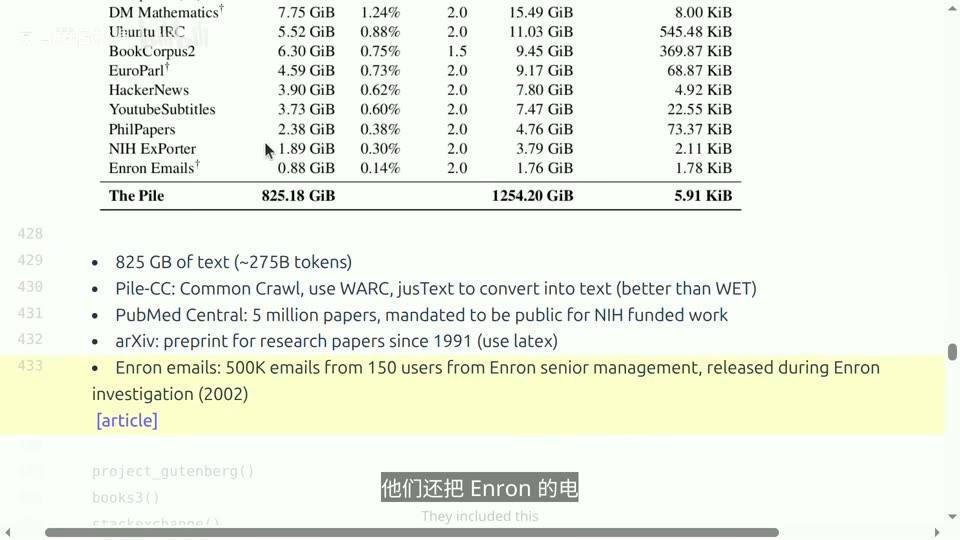 |
| 所以基本上就是公共领域的书。这里有个叫 PG-19 的数据集，就是把 2019 年之前的古腾堡数据打包了一下，我想这占了绝大多数，因为一本书要进入公共领域得等 75 年。然后是 Books3，这个数据集挺有意思的。 [【跳转到 42:55】](https://www.bilibili.com/video/BV11LEA6eEuj/?p=13&t=2575) | 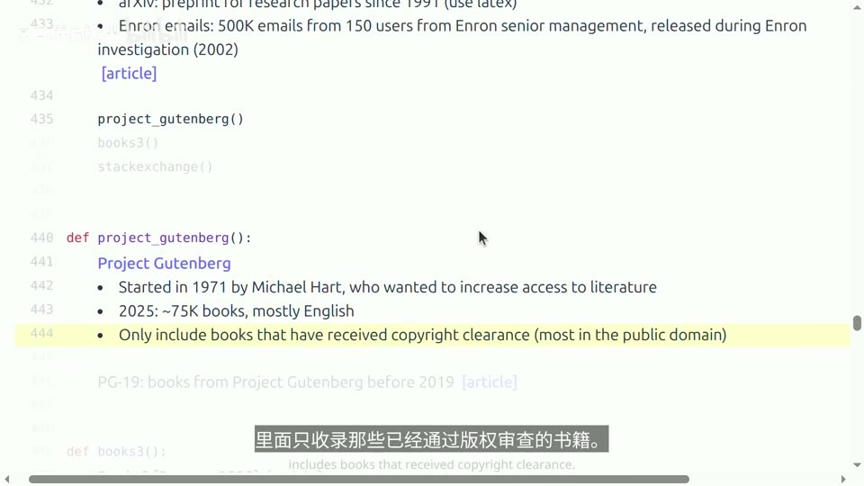 |
| 这是出现在 The Pile 里的一个数据集。实际上它被描述为来自一个名为 Bibliotik 的影子图书馆的 20 万本书，它囊括了你所有喜爱作者的作品。而且在那个时候、也就是 2020 年，没人关注它，它就那样放着，人们用它来训练模型。 [【跳转到 43:20】](https://www.bilibili.com/video/BV11LEA6eEuj/?p=13&t=2600) | 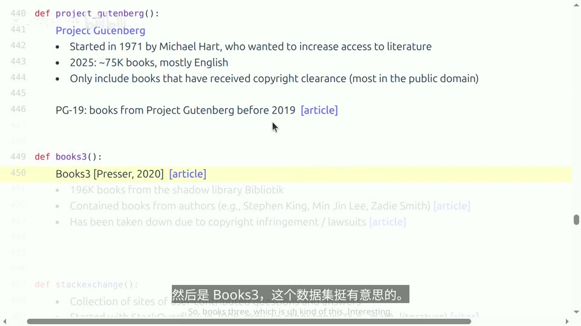 |
| 从那以后它已经被下架了，所以你不能再用、或者说不该再用 Books3 了。我们之后还会再回到 Books3。那么来看 Stack Exchange，你可能没少用它，不过我猜现在因为有了 AI、用的可能少些了。它有大量用户贡献的问答，始于 2008 年。 [【跳转到 43:45】](https://www.bilibili.com/video/BV11LEA6eEuj/?p=13&t=2625) | 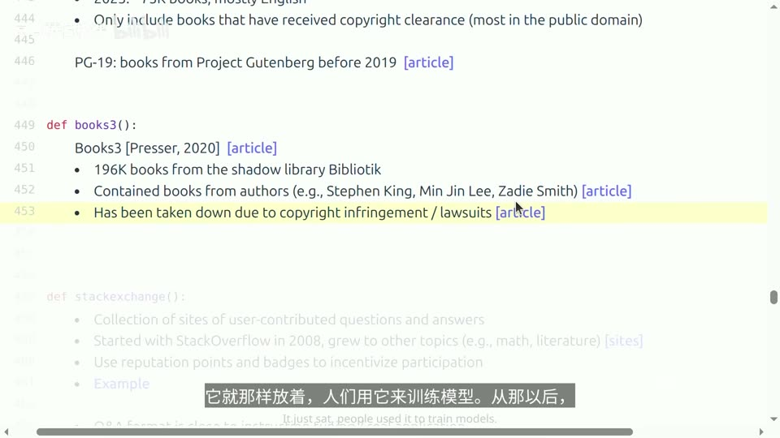 |
| 这个数据集有意思的一点是，它是一种问答格式，这其实已经挺接近实际应用场景了。所以咱们通常把 pre-training 数据想成是维基百科文章这类原始文本，反而网上有些内容其实看起来就像、你知道的、就是监督数据，也就是你平时想问语言模型的那些问题。所以我觉得这大概能帮到模型去学会某些特定的问答模式。 [【跳转到 44:10】](https://www.bilibili.com/video/BV11LEA6eEuj/?p=13&t=2650) | 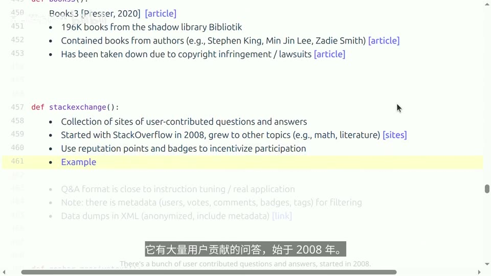 |
| 所以并不是什么能力都是凭空涌现出来的。你看，这类数据在网上本来就是存在的。另外这类数据还带有元数据，比如投票数，这对过滤很有用。还有啊，这些数据是以数据转储的形式发布的，你可以直接下载…… [【跳转到 44:35】](https://www.bilibili.com/video/BV11LEA6eEuj/?p=13&t=2675) | 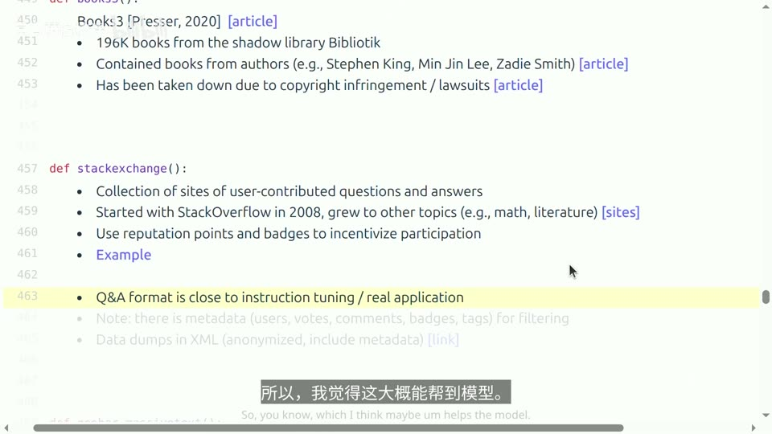 |
| 不用自己去爬取。好，到了 2021 年 DeepMind 又发了一篇论文，他们训练了个叫 Gopher 的模型，不过这模型一直没发布，后来其实被 Chinchilla 给取代了。不过我觉得它的数据描述写得特别好，你们应该读读这篇论文，因为他们讲数据处理那部分写得非常细致——但说了他们没告诉你数据里具体有哪些部分。他们构建了一个叫 MassiveWeb 的数据集。 [【跳转到 45:00】](https://www.bilibili.com/video/BV11LEA6eEuj/?p=13&t=2700) | 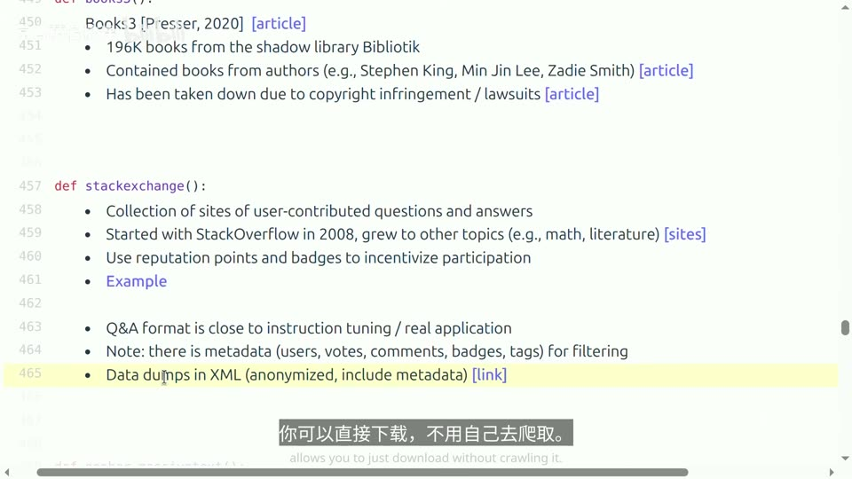 |
| 他们还用了 C4，还记得吧、就是咱们之前看过的那个来自 Google 的数据集。他们在书籍、新闻、GitHub 和维基百科上训练模型，但没说这些数据是怎么弄来的。至于 MassiveWeb，他们只保留了英文、做了去重，质量过滤也是基于人工规则来做的，这其中的一个原因是他们在这方面的掌控力更强。 [【跳转到 45:25】](https://www.bilibili.com/video/BV11LEA6eEuj/?p=13&t=2725) | 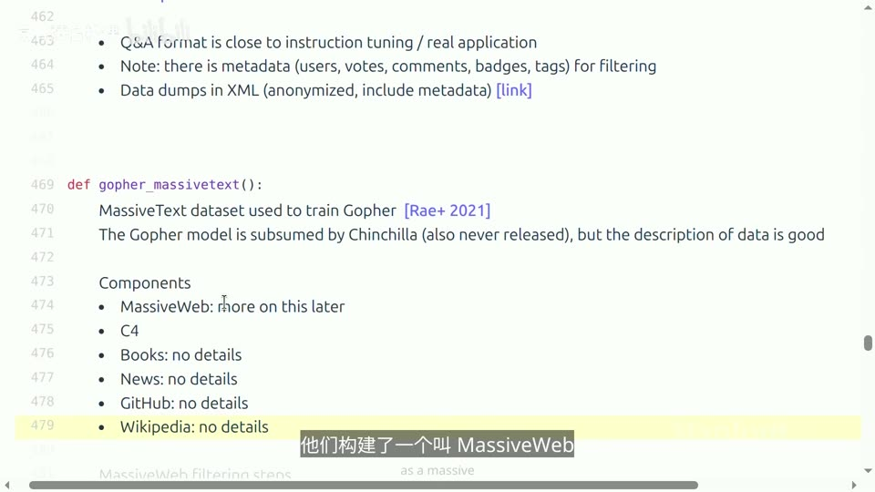 |
| 所以你看，这里其实分成了两派：一派想用规则、另一派想用分类器。所以就像刚才在暗示的那样，他们搞到了巨量的文本数据，不过他们的模型只用了这一数据集中很小一部分来训练。好，那咱们说回 2023 年、Llama 1 出来了。 [【跳转到 45:50】](https://www.bilibili.com/video/BV11LEA6eEuj/?p=13&t=2750) | 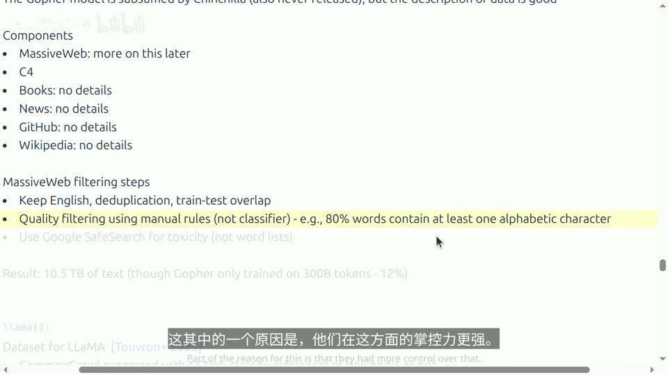 |
| 这篇论文其实写得不错，因为它把他们的做法讲得很细、数据处理。所以这可能是最后一个真正公开谈论数据处理的完全开源模型。他们用 CCNet 处理了 Common Crawl，这个你应该知道。不过这里分类判断的是这个页面引用的是不是维基百科…… [【跳转到 46:15】](https://www.bilibili.com/video/BV11LEA6eEuj/?p=13&t=2775) | 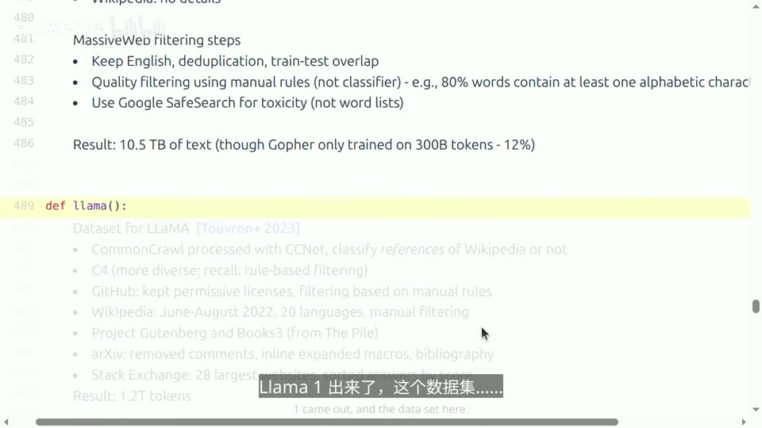 |
| 而不是它本身是不是一篇维基百科文章。所以这个想法是：维基百科的文章可能文风太过雕琢了，我们知道维基百科的文章会引用一大堆其他文章，这些文章想必质量都不错，所以我们就把它们称为"优质网站"。他们有 C4，哦对，GitHub 做了大量处理来筛出宽松许可的部分，还有维基百科。他们用 Books3 和古腾堡计划做了训练。 [【跳转到 46:40】](https://www.bilibili.com/video/BV11LEA6eEuj/?p=13&t=2800) | 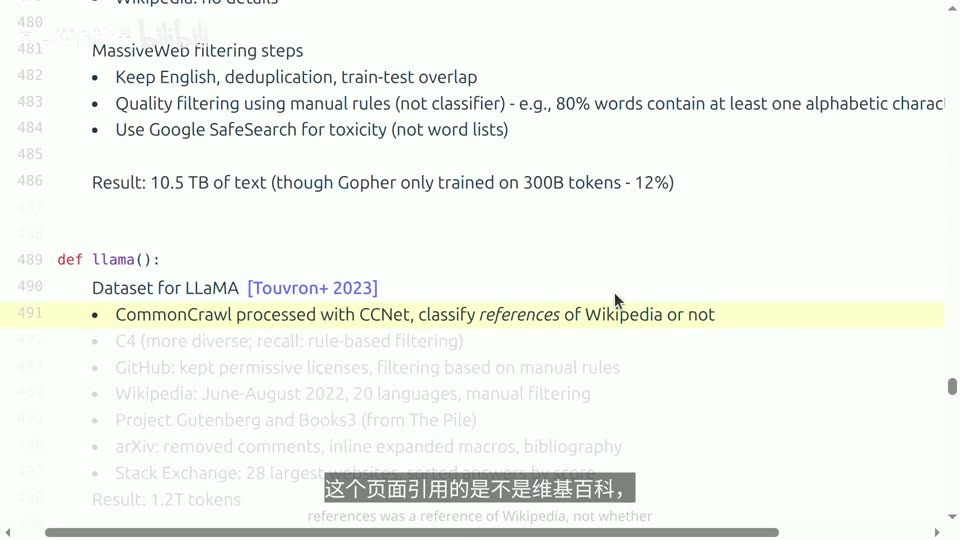 |
| 所以 Books3 给他们惹了不少麻烦，因为他们等于是向全世界宣布"嘿，我用了这个数据集"，然后大家一回头查："哦，这是从哪来的？"来自 The Pile、来自影子图书馆。所以你看，这就是为什么现在大家都不再谈论自己的数据了。他们还用了 arXiv、还用了 LaTeX 做了处理，以及 Stack Exchange，最后得到了大量 token。 [【跳转到 47:05】](https://www.bilibili.com/video/BV11LEA6eEuj/?p=13&t=2825) | 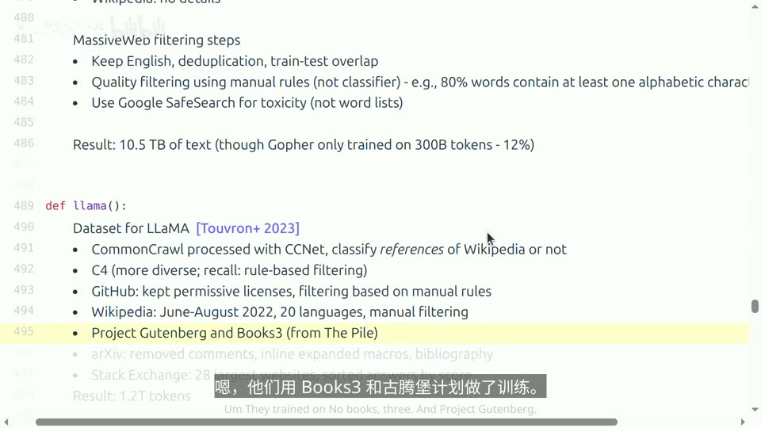 |
| 他们其实没公开这个数据集，不过处理流程描述得挺细。Together 的 RedPajama v1 数据集就是照着这个复现出来的，后来别的来源也用到了它。你看 RedPajama v1 一开始也带着 Books3，不过现在基本把它去掉了。所以你看，早期那些关于版权的决策其实影响挺大的，算是个分水岭。 [【跳转到 47:30】](https://www.bilibili.com/video/BV11LEA6eEuj/?p=13&t=2850) | 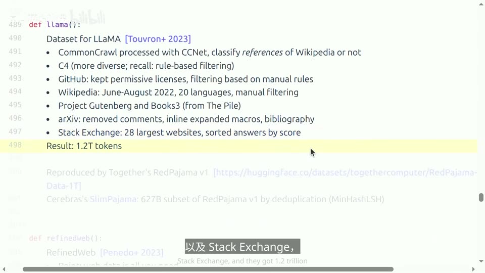 |
| 咱们聊聊 RefinedWeb。这是一篇论文，他想表达的观点是：网络数据就够了，所以某种意义上网络就是一切。然后咱们聊了 GitHub、arXiv 和 Stack Exchange 这些专门的来源，他们就想：要是咱们只盯着网络数据用会咋样？所以他们把 HTML 转成文本，这活干得不错。 [【跳转到 47:55】](https://www.bilibili.com/video/BV11LEA6eEuj/?p=13&t=2875) | 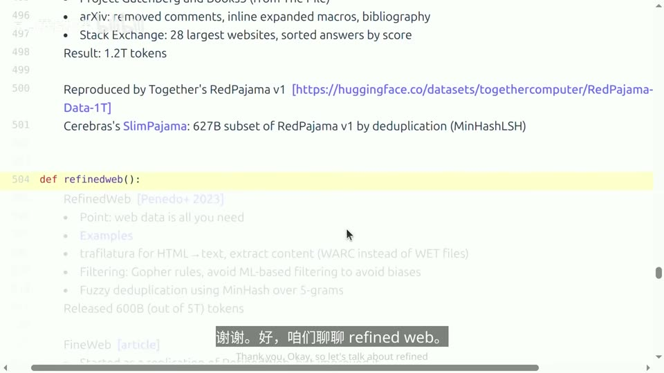 |
| 还做了过滤，用的是 Gopher 那套规则，简单说就是把看着像英语的内容留下来。当时他们还特意强调：为了避免引入偏见，不要用基于机器学习的过滤——"我可不想把范围缩得太窄、只挑出一小部分网页"。他们做了一些去重处理，最后拿到了 5 万亿个 token，他们发布了其中约 6000 亿个。所以 HuggingFace 出的 FineWeb 其实就是对 RefinedWeb 的复刻。 [【跳转到 48:20】](https://www.bilibili.com/video/BV11LEA6eEuj/?p=13&t=2900) | 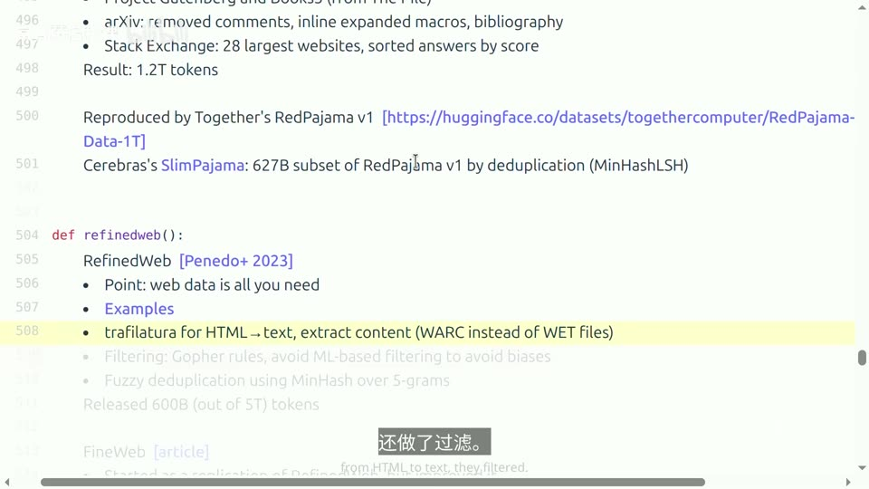 |
| 只不过做了一些改进：于是他们把当时所有的 Common Crawl 数据都拿过来做了一轮过滤，还是靠手动规则，目的还是为了不引入偏见，然后去重、移除隐私信息，最后得到了 15 万亿个 token。所以你看，这些数据集的规模增长得挺快的。 [【跳转到 48:45】](https://www.bilibili.com/video/BV11LEA6eEuj/?p=13&t=2925) | 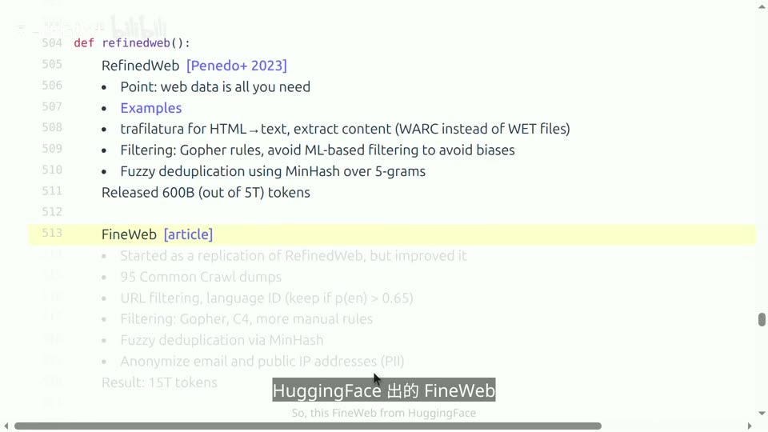 |
| 接着 AI2 那边还搞了个叫 Dolma 的数据集。这个数据集包含了他们对 Common Crawl 的处理结果、之前提过的 The Stack、大家熟悉的 C4、还有一些其他数据。还有那个 Reddit 数据集，它是从一个叫 Pushshift 的项目里来的，那时候你还能拿到这些数据拿来训练模型。 [【跳转到 49:10】](https://www.bilibili.com/video/BV11LEA6eEuj/?p=13&t=2950) | 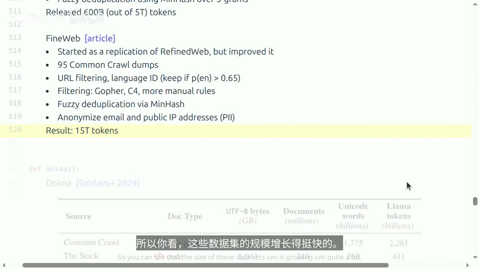 |
| 在那之前 AI2 有自己的学术论文爬取工具叫 Semantic Scholar，所以他们基于这个搞出了一个数据集。咱们来看看他们对 Common Crawl 是怎么处理的。他们用了语言识别，虽然这部分是靠模型做的，但在质量过滤上他们还是避开了那种基于模型的过滤方式。接着他们用规则和一个分类器把那些有毒的内容给剔除了。 [【跳转到 49:35】](https://www.bilibili.com/video/BV11LEA6eEuj/?p=13&t=2975) | 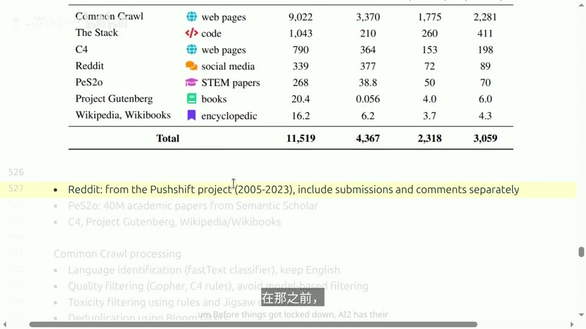 |
| 最后他们从中提取出了 3 万亿个 token。我觉得 DCLM 可能算是个节点——基于模型的质量过滤这个思路差不多就是从这儿开始真正变成主流的。DataComp 最初的动机，是想定义一套流程，让大家可以用标准化的方式去尝试各种不同的数据方法…… [【跳转到 50:00】](https://www.bilibili.com/video/BV11LEA6eEuj/?p=13&t=3000) | 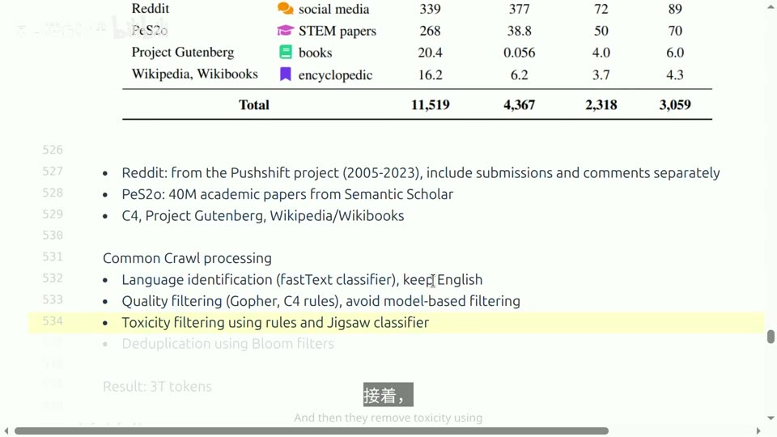 |
| 并展示结果。不过我觉得大家主要的用法其实就是拿他们发布的那个数据集去训练模型、或者做点别的。他们处理了 Common Crawl，得到了 DCLM，这全是没过滤过的。你看数据量足足 240 万亿——不是说 token，这数量估计比任何人实际训练用到的都多，但里头很多质量不高。 [【跳转到 50:25】](https://www.bilibili.com/video/BV11LEA6eEuj/?p=13&t=3025) | 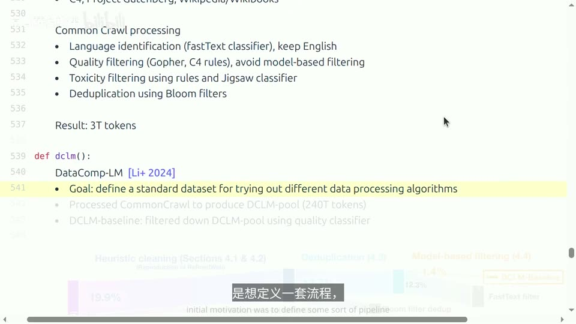 |
| 所以他们有个过滤流程，要是只留英语的话，这些都得过一遍筛。 [【跳转到 50:50】](https://www.bilibili.com/video/BV11LEA6eEuj/?p=13&t=3050) | 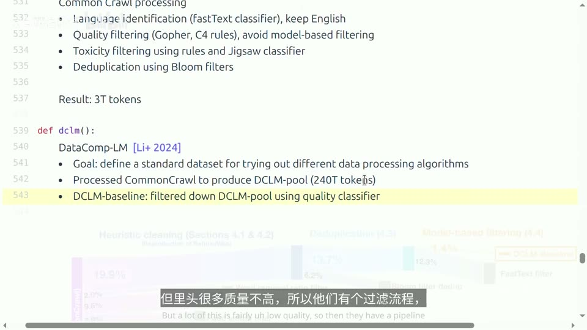 |
| 你得定些规则把范围缩窄，先做去重，然后再做基于模型的过滤，最后得到的是 1.4%。这就是咱们后面会看到、效果其实挺不错的那个数据集。 [【跳转到 50:55】](https://www.bilibili.com/video/BV11LEA6eEuj/?p=13&t=3055) | 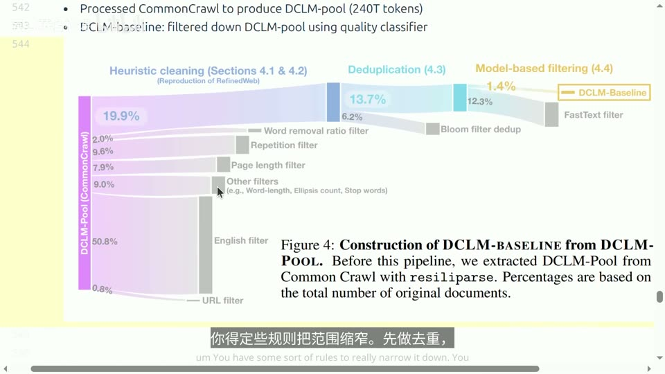 |
| 所以基于模型的过滤这招，说实话效果出奇的好。训练分类器他们用了 OpenHermes，这基本上就是 GPT-4 和……生成的指令数据。ELI5 是个有各种问答的 subreddit 子板块。 [【跳转到 51:09】](https://www.bilibili.com/video/BV11LEA6eEuj/?p=13&t=3069) | 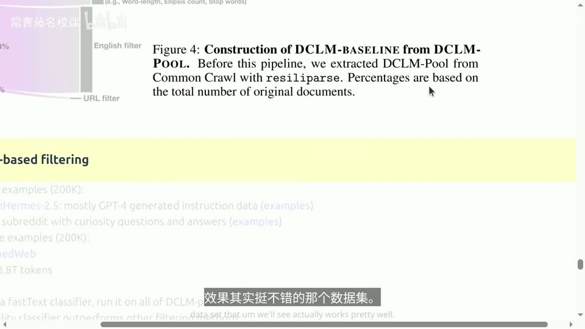 |
| OK，来咱们看看。像这种问题在 ELI5 里很常见。 [【跳转到 51:28】](https://www.bilibili.com/video/BV11LEA6eEuj/?p=13&t=3088) | 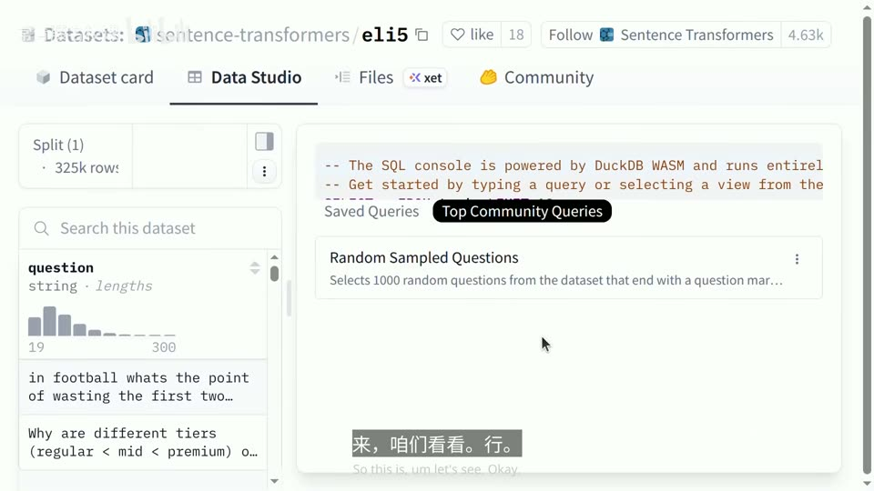 |
| 反正你懂意思了，虽然有点怪，但不知怎么这招还真管用。负样本来自 RefinedWeb 里的任何内容——记得吧，它其实就是那样的东西，这是一个过滤得相当宽松的网页版本，基本上就是整个互联网，而数据量达到了 3.8 万亿个 token。他们训练了一个快速分类器，你可以把它理解为一个线性分类器。 [【跳转到 51:39】](https://www.bilibili.com/video/BV11LEA6eEuj/?p=13&t=3099) | 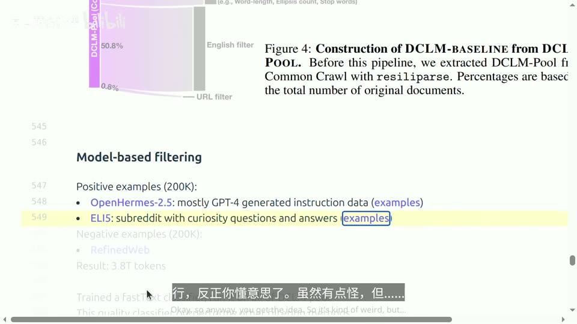 |
| 接着他们证明这个所谓的质量分类器表现优于他们尝试过的其他多种方案。因此 DCLM 曾在一段时间内、特别是在开源社区中被视为质量过滤的黄金标准。接下来我们看 Nemotron，这是 NVIDIA 推出的模型。他们认为 DCLM 的过滤过于激进、剔除了大部分数据。 [【跳转到 52:04】](https://www.bilibili.com/video/BV11LEA6eEuj/?p=13&t=3124) | 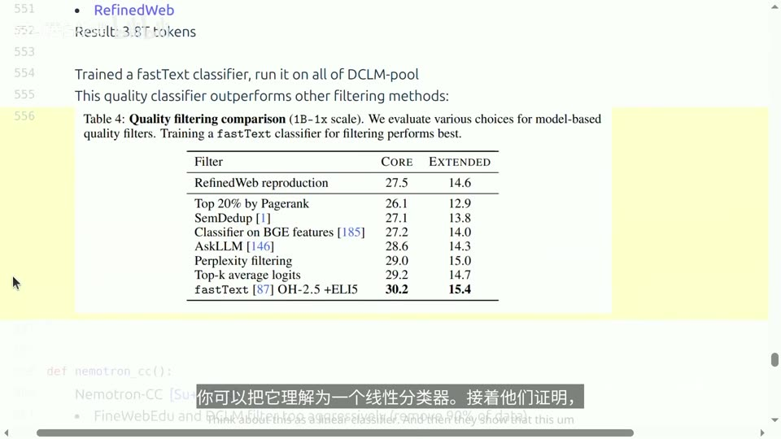 |
| 别忘了他们得到的数据量仅为 3.8 万亿个 token，对吧？所以我们需要更多的 token。那我们该怎么办呢？我们打算做一些更精细、更复杂的处理。我们要给现有的模型一个 prompt、让它根据教育价值给网页文档打分。具体来说，就是给语言模型一个 prompt、问它"这算不算教育内容"。 [【跳转到 52:29】](https://www.bilibili.com/video/BV11LEA6eEuj/?p=13&t=3149) | 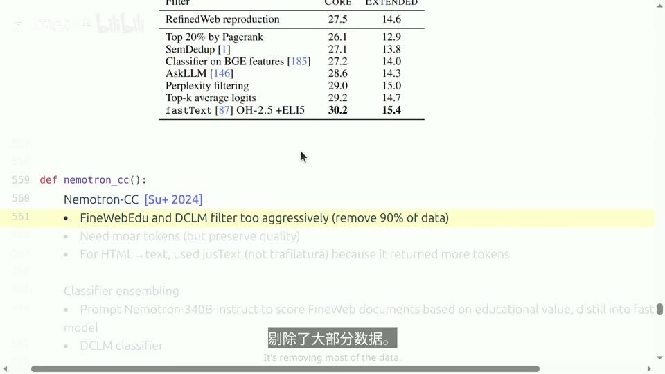 |
| 收集一批标签、再训练一个 fastText 模型，这是第一种分类器；另一种分类器直接复用 DCLM 分类器。我们会用到这些分类器，另外还会用上合成数据——我不确定它大概不是第一个，但它是真正大力投入合成数据来做 pre-training 的主要数据集之一。所以对于那些被分类器判定为低质量的数据…… [【跳转到 52:54】](https://www.bilibili.com/video/BV11LEA6eEuj/?p=13&t=3174) | 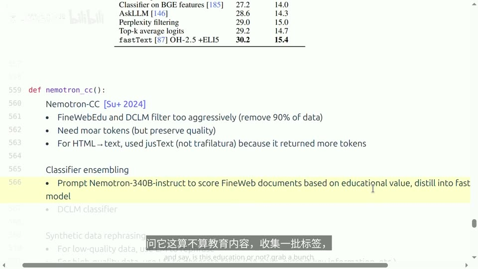 |
| 他们会用语言模型重新表述、让内容看起来更像维基百科的风格；而对于高质量数据，我们会用语言模型来生成各种任务。打个比方，如果有一篇维基百科文章，我可以生成问答、或者生成类似"请总结这篇文章"、"从中提取关键信息"这样的指令。结果就是他们得到了一个包含 6 万亿 token 的数据集，所以这比 DCLM 的数据量要庞大得多。 [【跳转到 53:19】](https://www.bilibili.com/video/BV11LEA6eEuj/?p=13&t=3199) | 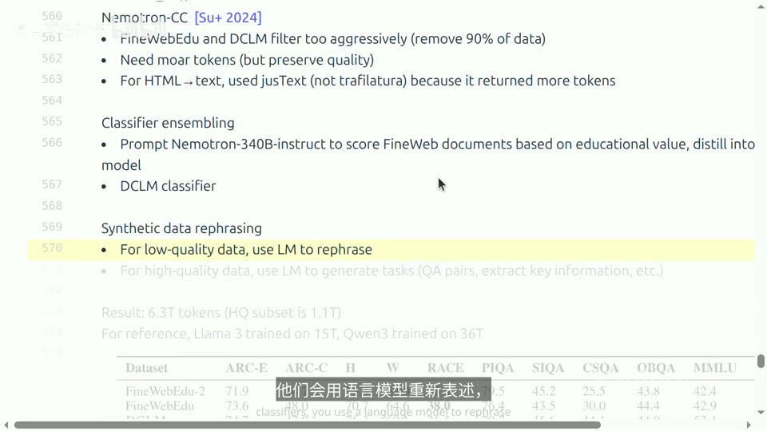 |
| 只是做个参考，这其实从某些角度看还算是比较小的，比如 Llama 3 用了 15 万亿 token 训练，而 Qwen 3 用了 36 万亿。不过这里情况也复杂，这些不重复的 token 到底有多少现在还不太清楚，因为你看语言建模论文里的 token 统计时、会发现里面有不少是重复的。 [【跳转到 53:44】](https://www.bilibili.com/video/BV11LEA6eEuj/?p=13&t=3224) | 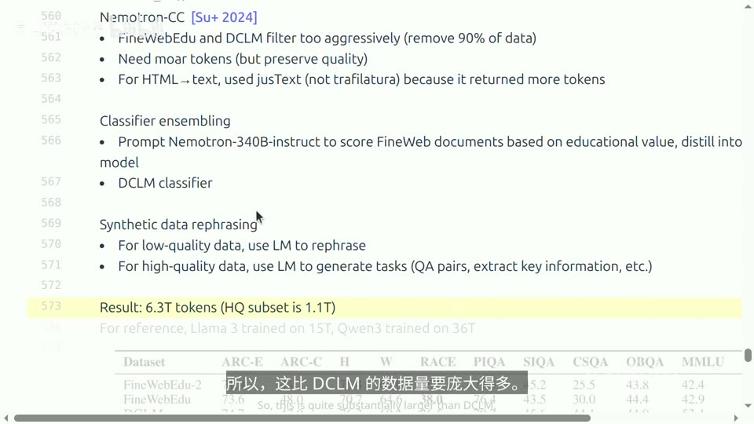 |
| 打个比方，如果你跑了多个 epoch、比如两个 epoch，那 token 的数量就直接翻倍了，所以看这些数据时得小心点。他们也说明了这一点。这个数据集质量更高，它是其中一个高质量的子集，比之前那些数据集表现更好。好，到目前为止咱们已经看了不少不同的方法，都是用来做过滤的方法。 [【跳转到 54:09】](https://www.bilibili.com/video/BV11LEA6eEuj/?p=13&t=3249) | 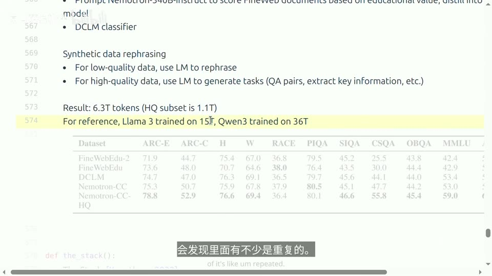 |
| 我觉得这些方法在某种程度上看起来都挺像的。你拿到一个网络爬取的数据后，要么决定用规则来过滤、要么决定用模型来过滤。如果我要用某个模型，就得先确定什么样的数据算好数据，然后试着训练一个分类器、把所有文档分类、挑出有用的。这里其实有个取舍：你可以用海量的公共爬取数据…… [【跳转到 54:34】](https://www.bilibili.com/video/BV11LEA6eEuj/?p=13&t=3274) | 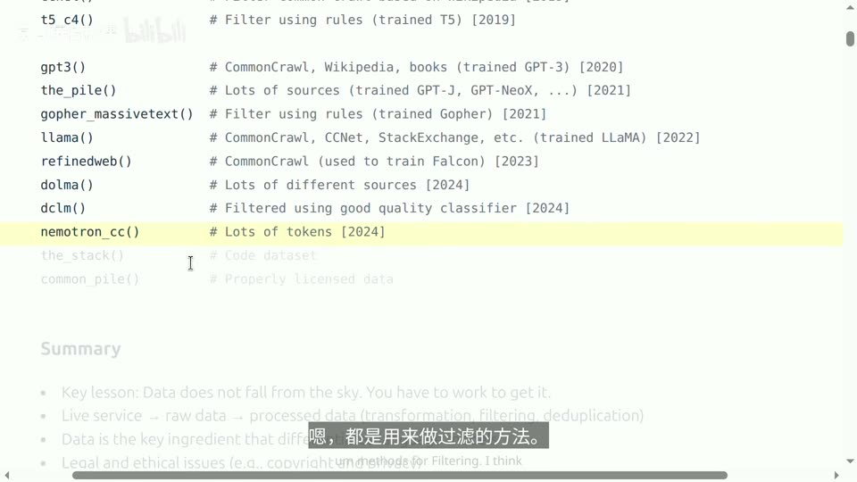 |
| 能拿到、你懂的、240、想要的话能搞到几万亿个 token，但那样质量恐怕会非常差；或者你拿大概 1 万亿个 token，中间其实有个比较合适的平衡点。最后我再聊两点。咱们先说说代码，还有回到刚才那个授权许可的问题。比如 The Stack 这个项目就挺不错的，它当时就是想做这么一件事：做个高质量的代码数据集。 [【跳转到 54:59】](https://www.bilibili.com/video/BV11LEA6eEuj/?p=13&t=3299) | 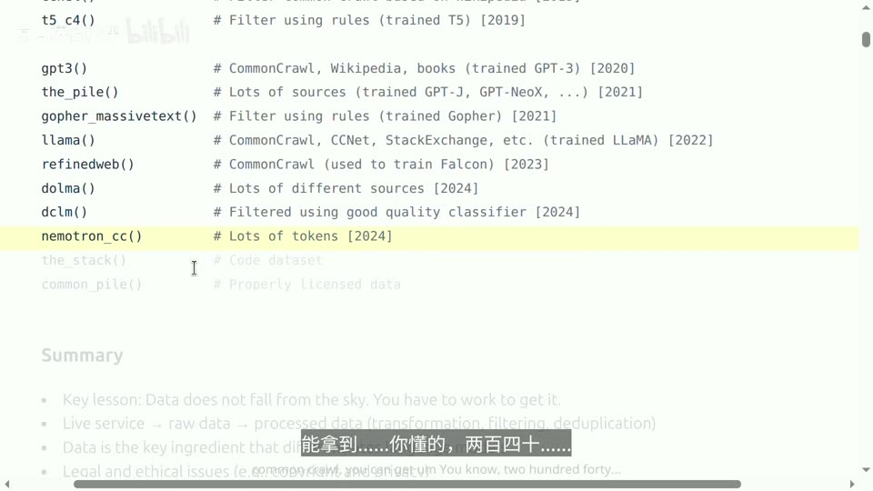 |
| 毕竟到 2022 年，大家都看清楚了：代码以后绝对会是件大事。初始版本的做法是这样：他们克隆了大量代码仓库，只保留采用宽松许可证的那些，再剔除掉示例里的重复内容，最后得到了 3TB 的代码数据。到了 2024 年，他们又做了一次更新，这次他们用了更多的元数据。 [【跳转到 55:24】](https://www.bilibili.com/video/BV11LEA6eEuj/?p=13&t=3324) | 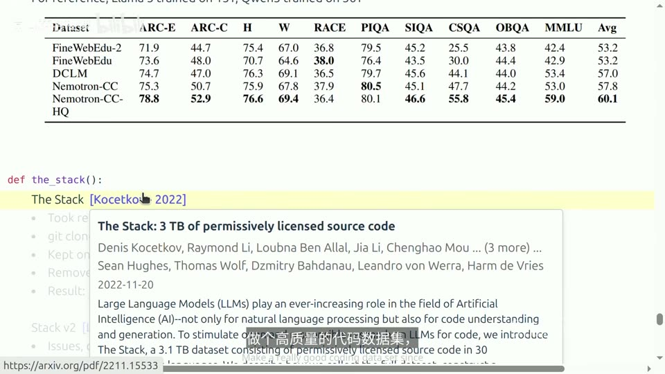 |
| 比如 GitHub 上的 issue、评论和 PR，还有 Software Heritage 里的代码仓库，这个我们之前聊过。他们还爬取了不少网站、把上面的文档都抓了下来。他们做了一大堆数据处理，比如 GitHub 仓库里会有二进制文件、这些一般不适合拿来训练，还有恶意软件也得清理掉，GitHub 上很多内容…… [【跳转到 55:49】](https://www.bilibili.com/video/BV11LEA6eEuj/?p=13&t=3349) | 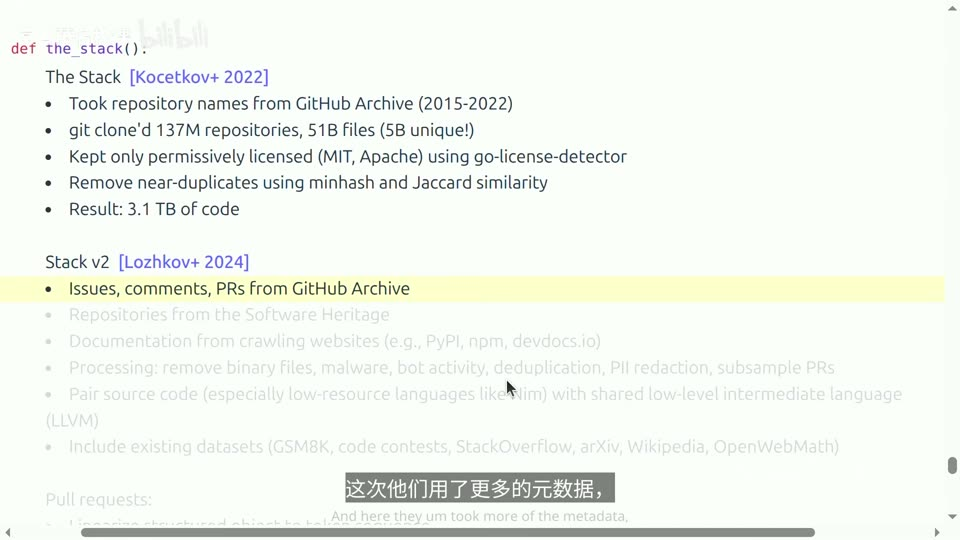 |
| 特别是 PR 都是机器人发的，所以得过滤掉，还要做去重、还要做 PII 脱敏之类的，东西特别多。所以他们做了子采样，既保证数据有代表性、又让数据集规模保持可控。他们还做了件我觉得挺不错的事，就是面对市面上这么多种编程语言——里面有很多 Python 和 C 代码，不过像……这种低资源语言也挺多。 [【跳转到 56:14】](https://www.bilibili.com/video/BV11LEA6eEuj/?p=13&t=3374) | 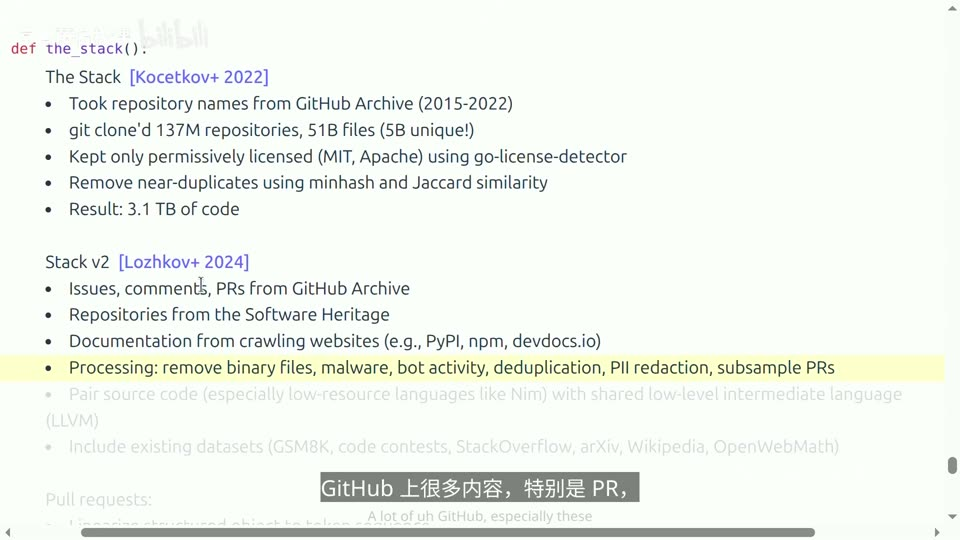 |
| 我之前压根没听过这些语言，它们算不上常见。所以他们的做法是把这些代码编译一下、编译成一种低级中间语言，也就是 LLVM IR。像 C 编译器之类的都能把代码编译成这种形式，他们还把低资源语言和这种中间表示形式放在一起对照。这样一来语言模型就能真正学起来了：它要学的是数据量很大的那个共享…… [【跳转到 56:39】](https://www.bilibili.com/video/BV11LEA6eEuj/?p=13&t=3399) | 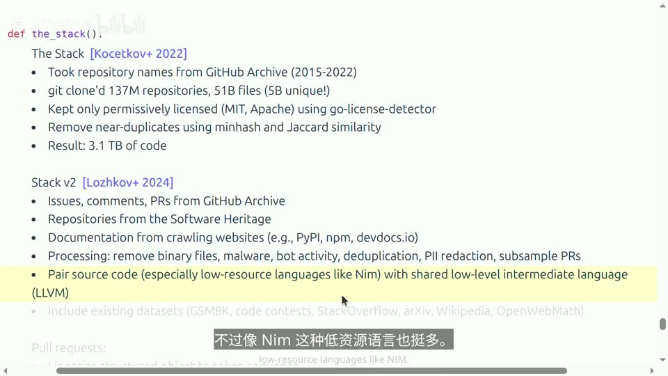 |
| 低级表示形式和数据较少的目标语言之间的映射关系。纯粹是为了好玩儿，你还把其他所有那些你知道的好东西也都加了进去，只要能加的都加进去。所以这个 The Stack v2 基本上就是代码、再加上用来训练他们编码模型的其他东西。关于 pull request 还有一点，就是他们的 pull request 和所有元数据…… [【跳转到 57:04】](https://www.bilibili.com/video/BV11LEA6eEuj/?p=13&t=3424) | 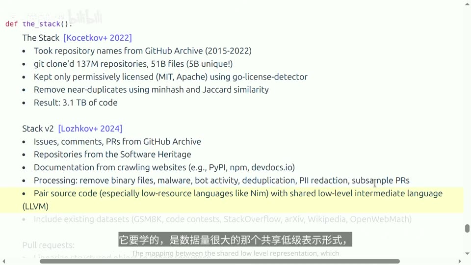 |
| 本质上并不是一个线性化的序列，所以得先做几步处理把它线性化。这里有个关键点：你得决定好给多少上下文。打个比方，某个事件可能只是"我改了一行代码"——虽然只是一行，但为了模型能学到东西，你得给它点上下文，比如它前后的几行、或者这个改动所在的整个文件。 [【跳转到 57:29】](https://www.bilibili.com/video/BV11LEA6eEuj/?p=13&t=3449) | 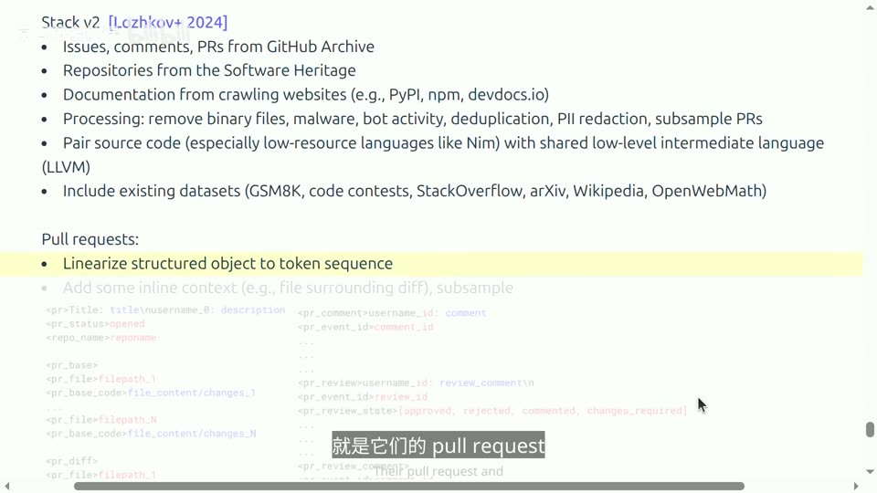 |
| 这些就是你在线性化过程中要做的一些设计选择。所以最后训练用的 token 长这样，这是一种类似 XML 的结构化数据，里面有 PR、还有一堆 diff。至于评论，你基本上会看到类似"评论已发布"的事件，还有那个 PR 当时的审查状态之类的。 [【跳转到 57:54】](https://www.bilibili.com/video/BV11LEA6eEuj/?p=13&t=3474) | 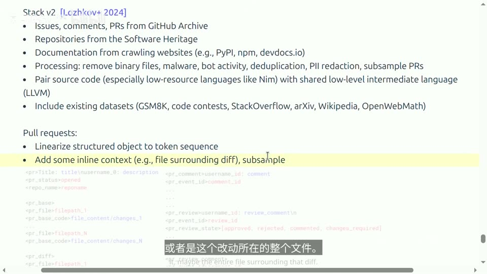 |
| 所以这不只是学怎么生成代码，还得学代码周围那一套软件开发流程。好了，最后咱们聊聊 Common Pile。大家应该还记得，网上几乎所有数据都是有版权的，有些是宽松授权的、还有一些甚至属于公共领域。虽然你可以搬出合理使用这套说法、"说我就是要拿它来训练"…… [【跳转到 58:19】](https://www.bilibili.com/video/BV11LEA6eEuj/?p=13&t=3499) | 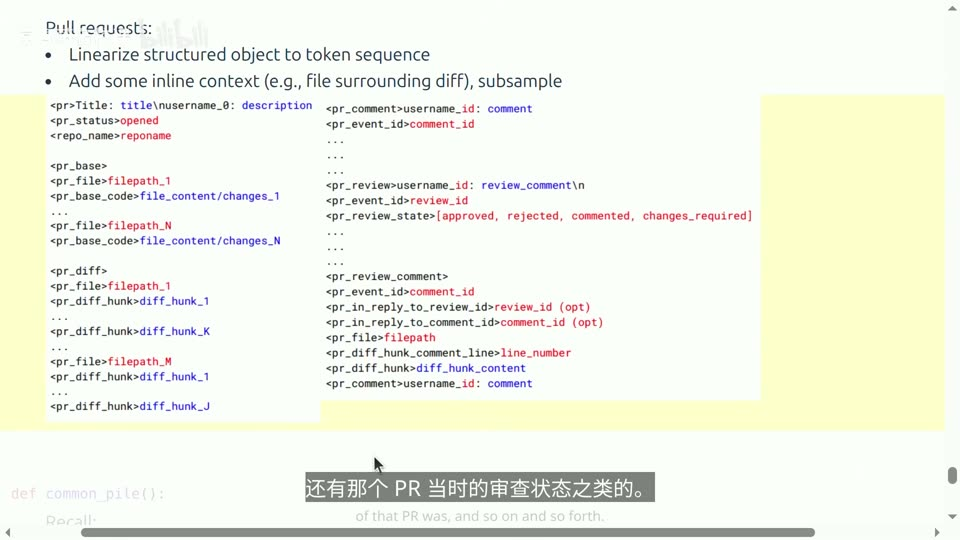 |
| 不过呢，这事到现在也还没有定论。所以要是你非常非常怕担风险，那你就会说：嗯，那咱们就这样吧，只要我拿不准这事行不行、那就直接算不行。如果你抱着这种态度，那 Common Pile 走的就是这条路。那么，只用宽松授权的数据能不能训练出一个好模型呢？说得更准确点…… [【跳转到 58:44】](https://www.bilibili.com/video/BV11LEA6eEuj/?p=13&t=3524) | 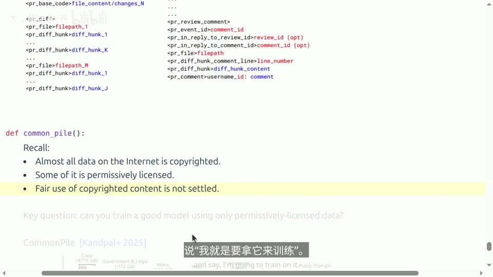 |
| 到底能走到哪一步？这是一个项目，它跑遍整个互联网、去搜罗各种各样的数据…… [【跳转到 59:09】](https://www.bilibili.com/video/BV11LEA6eEuj/?p=13&t=3549) | 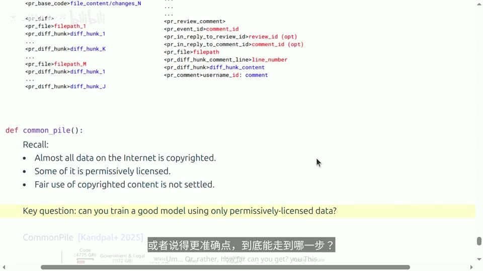 |
| 也就是他们能找到的、值得拿来训练、而且是宽松授权的那些。这里面包含了 The Stack v2 以及代码。结果发现很多政府公开资料其实都是宽松授权的，维基类网站也有一些，网络上的内容、部分新闻网站其实也是宽松授权的，还有学术论文、在线论坛、属于公有领域的资源…… [【跳转到 59:16】](https://www.bilibili.com/video/BV11LEA6eEuj/?p=13&t=3556) |  |
| 教育资源等等。所以到最后我们凑齐了 8TB 的数据，对于宽松授权的数据来说，这其实已经相当不错了。做这个项目其实比乍一听要难多了、没那么简单，不是说你看一眼许可证、觉得"哦 Apache 也行、CC 也行"就完事了，这里有些细节要注意。 [【跳转到 59:41】](https://www.bilibili.com/video/BV11LEA6eEuj/?p=13&t=3581) | 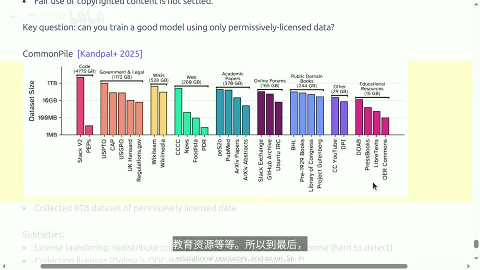 |
| 首先是所谓的许可清洗。大家在许可证这方面挺随意的，有人可能拿一个有版权的作品、直接贴个 CC BY 标签就完事了，网上谁都能写出这种东西，你很难判断这到底是不是真的。还有个常见的做法，拿 DOLMA 来说吧，它是宽松许可的。 [【跳转到 60:00】](https://www.bilibili.com/video/BV11LEA6eEuj/?p=13&t=3600) | 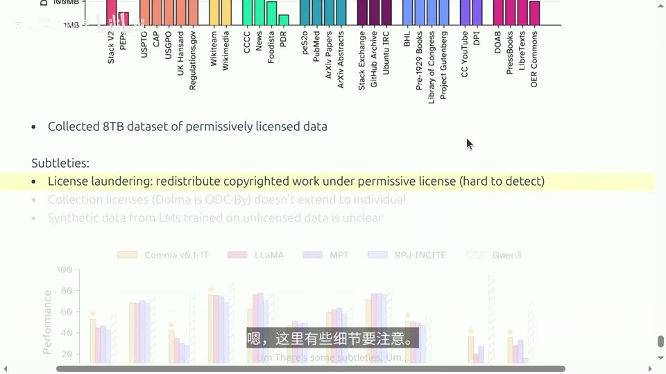 |
| 记得吗，DOLMA 是 AI2 搞的一个合集，不过集合层面的许可并不适用于里面的单个作品。所以关于集合，首先就有个问题：我的集合本身没法申请版权，不过我想你可以给任何东西加个许可协议，但里面的单个作品不一定都那么好。所以别光看 HuggingFace 上的数据集，上面很多数据集你看着都标着宽松许可…… [【跳转到 60:25】](https://www.bilibili.com/video/BV11LEA6eEuj/?p=13&t=3625) | 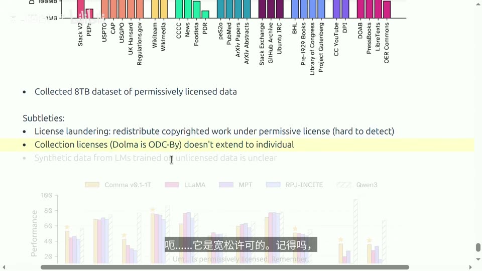 |
| 但要是深挖一下，其实在单个作品层面根本不是宽松许可。另外他们也决定不用合成数据来训练模型，因为用授权数据来训练语言模型这件事在法律上还不明朗。价格没问题，因为严格来说这些是开源权重模型、用的是 MIT 许可证。 [【跳转到 60:50】](https://www.bilibili.com/video/BV11LEA6eEuj/?p=13&t=3650) | 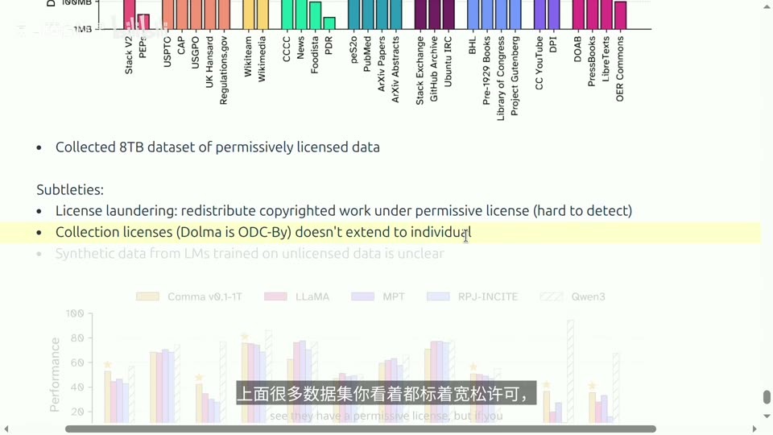 |
| 你可以随便用、想怎么用就怎么用。但这些语言模型其实是另外一回事，我猜他们其实也用了没授权的数据来训练，所以老实讲，这有点像是在给数据洗白。 [【跳转到 61:15】](https://www.bilibili.com/video/BV11LEA6eEuj/?p=13&t=3675) | 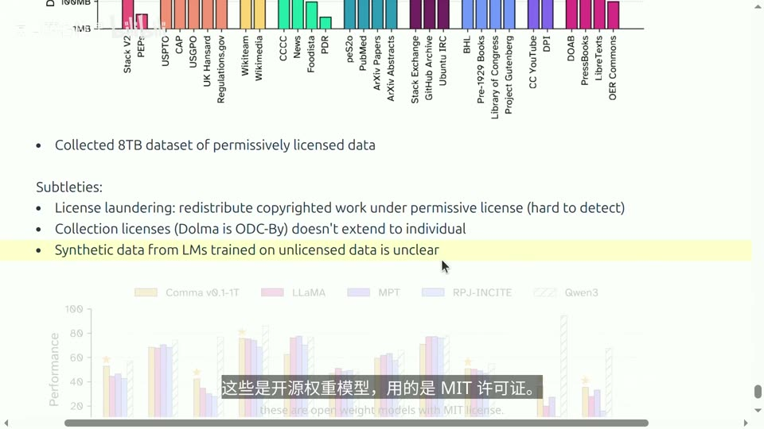 |
| 所以拿这些数据跟其他一些模型做了对比，比如最早的 Llama、还有 Qwen，在一堆 benchmark 上。要我说这表现还不差，它肯定比不上 Qwen 那些模型，但肯定强过最早期的那些模型。这大概是从……2003 年吧。 [【跳转到 61:28】](https://www.bilibili.com/video/BV11LEA6eEuj/?p=13&t=3688) | 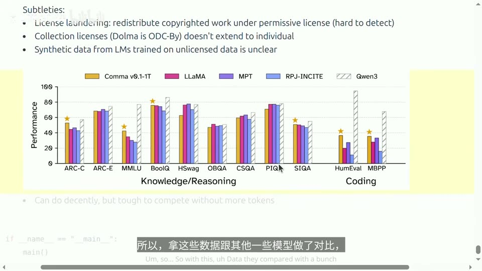 |
| 所以算是比较旧的模型了。我觉得这里的结论是：你能做到尚可，但我认为如果不投入更多 token、想竞争还是相当难。不过我觉得这还不是最终结论，如果你多试试，应该能从公开的宽松许可协议里挖掘出更多东西。 [【跳转到 61:53】](https://www.bilibili.com/video/BV11LEA6eEuj/?p=13&t=3713) | 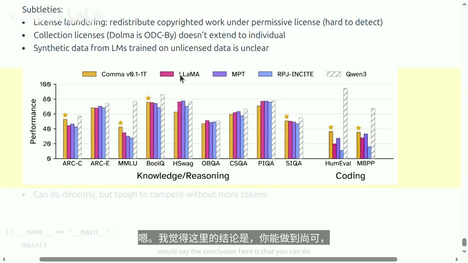 |
| 好，那我们来总结一下这次课。希望现在你们能体会到，数据其实是一个非常丰富的话题。数据可不是从天上掉下来的，也不是你随便去 HuggingFace 下个数据集就完事了。数据总得有个来源，而且数据的产生背后既有技术背景、也有社会背景，因为从根本上说，互联网其实是一堆实时运行的服务。 [【跳转到 62:10】](https://www.bilibili.com/video/BV11LEA6eEuj/?p=13&t=3730) | 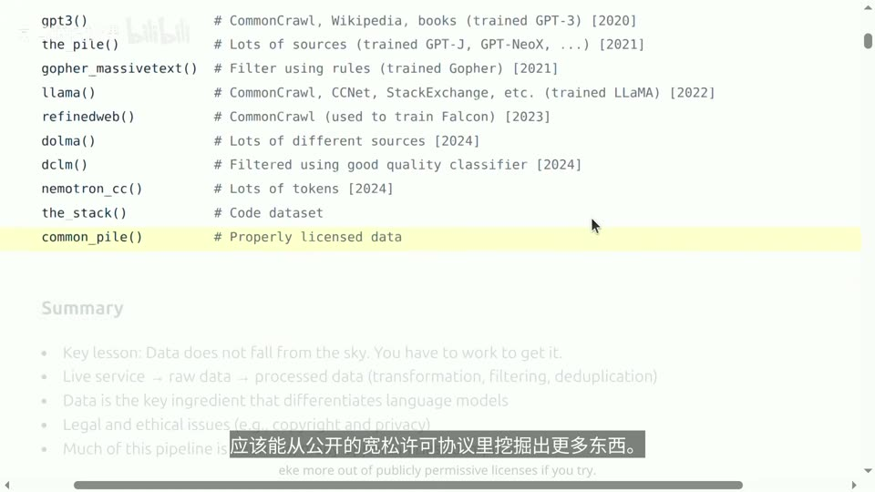 |
| 总得有人来做生产原始数据这件事，不管是提供数据转储的网站、还是得有人去写爬虫或者类似的东西。然后得有人决定怎么把它处理成能用的形式——过滤、转换、去重，这些环节都会直接影响最终语言模型的质量。而且要注意，过滤大概是其中最重要的环节之一：你怎么把海量 token 缩减到、你知道的…… [【跳转到 62:35】](https://www.bilibili.com/video/BV11LEA6eEuj/?p=13&t=3755) | 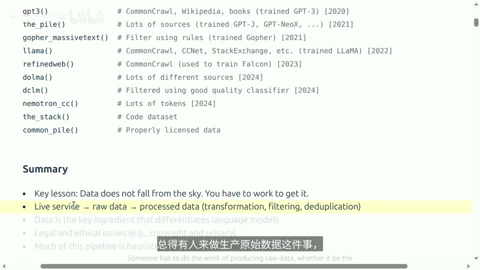 |
| 比如缩减到 3 万亿个 token、比如缩减到 4 万亿个 token，这显然是一个巨大的缩减，我觉得非常值得关注。可以说，数据是区分不同语言模型的关键要素。很多语言模型用的都是差不多的 transformer 架构，但数据这块、看你怎么处理…… [【跳转到 63:00】](https://www.bilibili.com/video/BV11LEA6eEuj/?p=13&t=3780) | 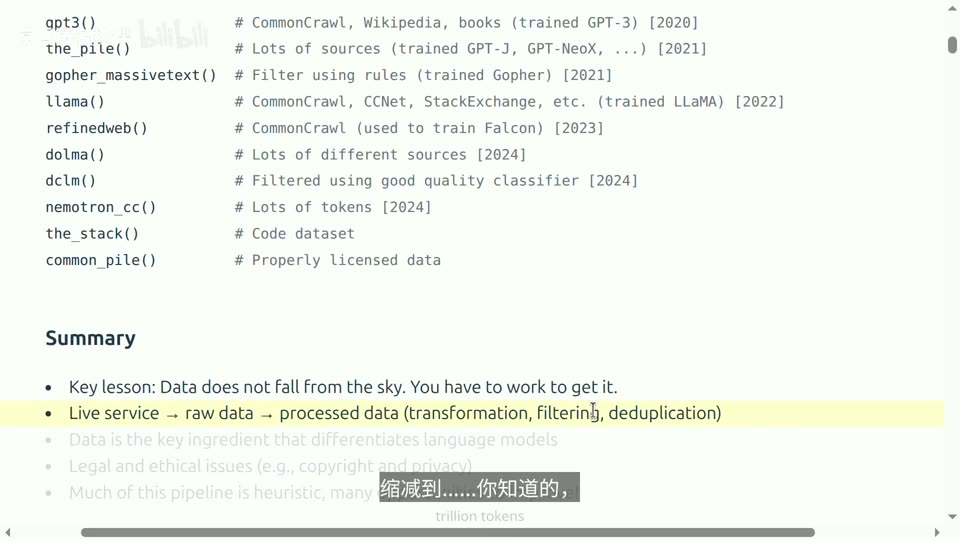 |
| 差别可能非常大。数据这块涉及的法律和伦理问题太多了，我这次课没法一一展开讲，而且这个过程其实挺乱的。咱们这门课的其他部分可能更讲究第一性原理，但这块不太一样。至少现在来说，数据处理很大程度上就是靠一种感觉、或者经验：你搭一套流程、定义一个分类器、定义一条规则…… [【跳转到 63:23】](https://www.bilibili.com/video/BV11LEA6eEuj/?p=13&t=3803) | 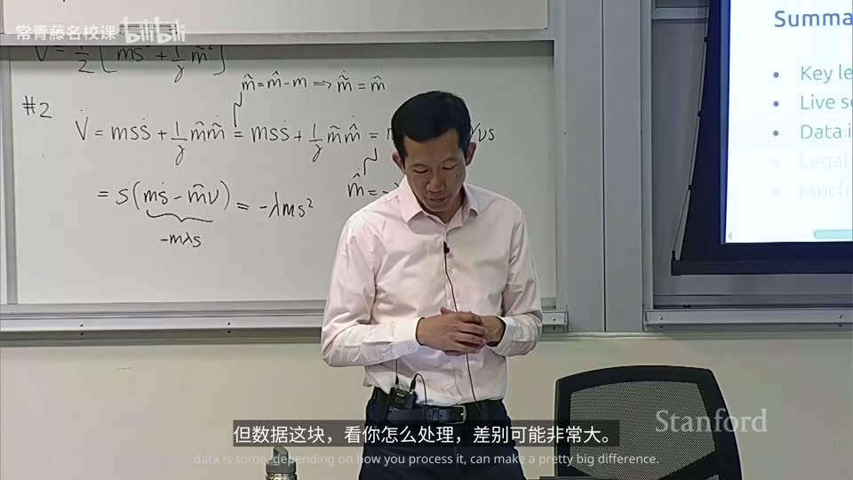 |
| 再设定某个阈值。所以这里有很多可以改进的地方，你们做作业四的时候想想看有没有更好的做法，说不定能成为一个研究方向。好，今天就讲到这里，下次我接着讲数据，我会稍微讲讲 post-training 的数据，再多聊聊过滤这块。 [【跳转到 63:48】](https://www.bilibili.com/video/BV11LEA6eEuj/?p=13&t=3828) | 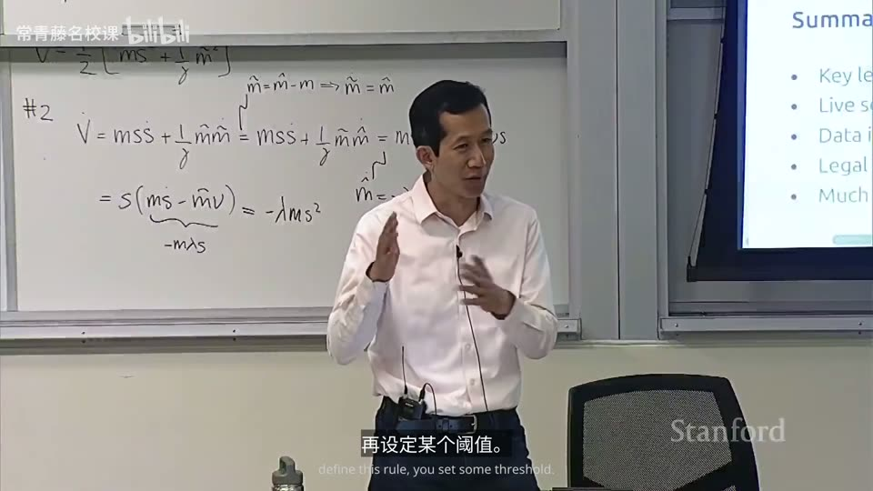 |