# Lecture 14: Data · 原始文稿（图-字幕分栏）

| 字幕文本 | 画面 |
| :--- | ---: |
| 好，咱们开始。今天是数据系列的第二天，上次咱们聊过。 [【跳转到 00:00】](https://www.bilibili.com/video/BV11LEA6eEuj/?p=14&t=0) | 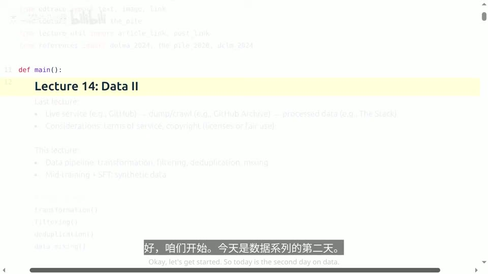 |
| 数据可不是天上掉下来的，你得想想数据从哪来。一般来说，互联网是由实时服务组成的。 [【跳转到 00:05】](https://www.bilibili.com/video/BV11LEA6eEuj/?p=14&t=5) | 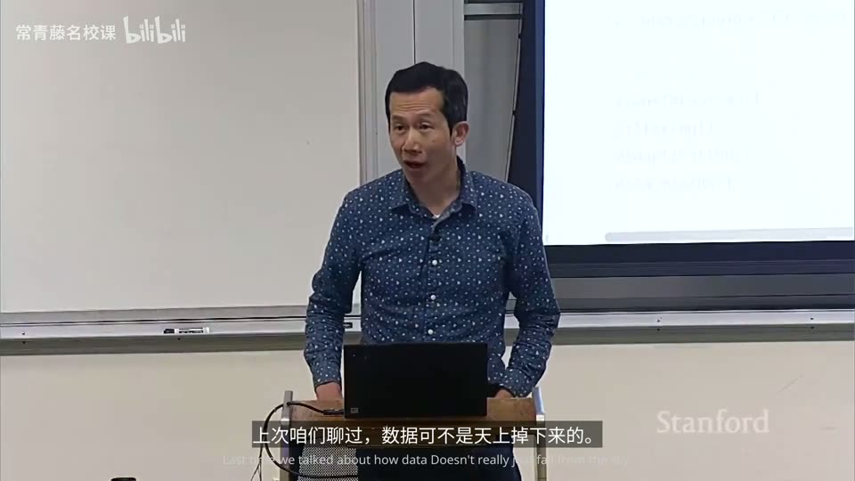 |
| 你得把这些服务里的数据抓取下来或者导出，然后还得做一步数据处理。咱们还聊了社会层面的考量，比如服务条款、版权，你要么拿到授权，要么援引合理使用原则。数据处理这事挺复杂的。今天咱们重点看看 data processing pipeline，也就是怎么转换、过滤、去重和混合数据——就是数据转换、过滤、去重和混合这些环节。 [【跳转到 00:10】](https://www.bilibili.com/video/BV11LEA6eEuj/?p=14&t=10) | 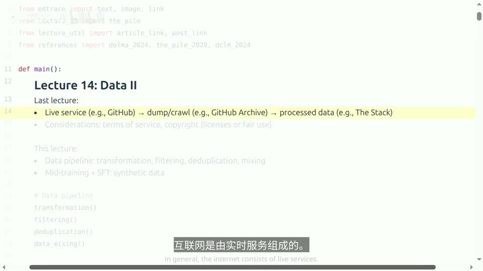 |
| 最后咱们简单聊聊后训练数据，特别是现在大家是怎么用合成数据的。另外，到底什么才算内容？这里面还有一些细微的讲究，一般我们会把页脚、页眉还有菜单这些都删掉，只盯着正文内容提取。你要是看过 Common Crawl 里的东西就会发现，它根本不是文本，要么是 HTML，有时候是 PDF，如果是 GitHub 的数据那就是目录。所以数据转换的重头戏就是处理 HTML。 [【跳转到 00:35】](https://www.bilibili.com/video/BV11LEA6eEuj/?p=14&t=35) | 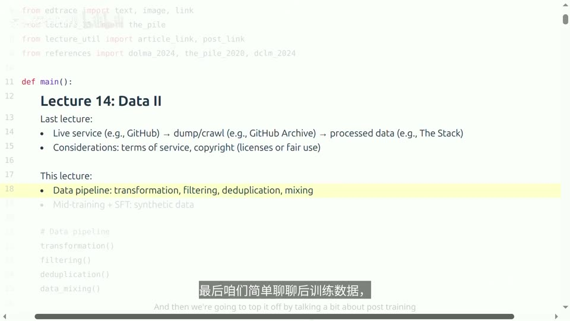 |
| 毕竟网上大部分内容都是 HTML。在这类处理中，许多方法其实相当依赖经验法则，例如移除导航栏、广告等冗余内容，并提取页面的主体内容。此外，关于内容的定义还存在一些细微的差别：通常我们会删除页脚、页眉和菜单，仅提取正文内容；不过在某些场景下，部分导航元素或许有助于理解网页的整体布局。 [【跳转到 01:00】](https://www.bilibili.com/video/BV11LEA6eEuj/?p=14&t=60) | 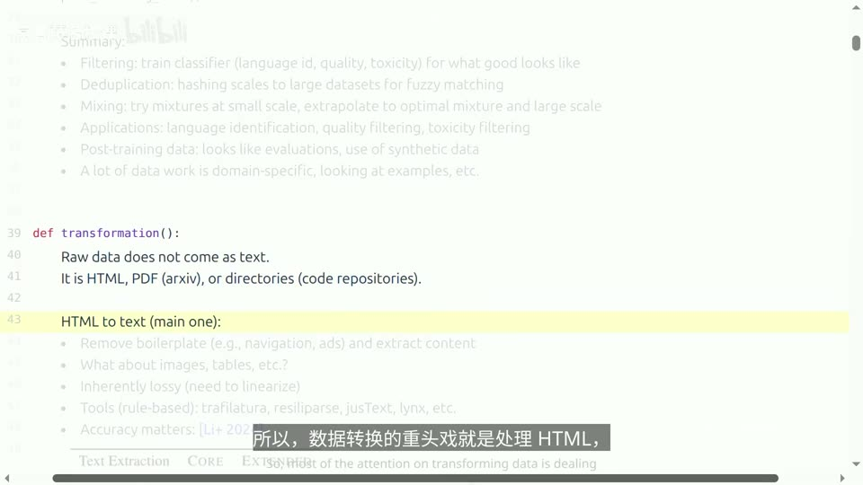 |
| 因此，究竟哪些属于内容、哪些不属于，往往界限模糊。那么网页中的图片和表格又该如何处理呢？本质上这是一个有损过程，因为需要将 HTML 线性化，而 HTML 至少是层级结构的，或者说从渲染后的视觉效果来看它是可视化的，最终还要输出并转换为 token 序列。特别是表格，处理起来较为复杂。 [【跳转到 01:25】](https://www.bilibili.com/video/BV11LEA6eEuj/?p=14&t=85) |  |
| 简单表格可以使用 Markdown 渲染，但遇到嵌套表格时挑战则显著增加，你总需要在某个环节做出妥协或采用近似处理。因此 HTML 转文本的处理通常基于规则，原因在于基于规则的处理方式速度极快。而且你看，在这儿你不用搞得太复杂，不需要太高的智能水平，所以基于规则的方法通常就行得通。 [【跳转到 01:50】](https://www.bilibili.com/video/BV11LEA6eEuj/?p=14&t=110) | 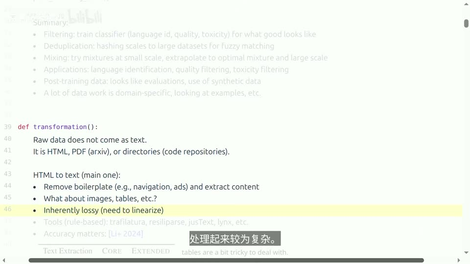 |
| 不过我觉得现在咱们可以考虑用基于模型的方法了，它们得跑得飞快，还得干点儿更智能的活儿。但只要你看看数据就会发现，里面总有些瑕疵，因为基于规则的处理方式难免会出错。就像我们上次讲过的，准确度确实关键，不过这得看你用的是什么工具。比如你用 Resiliparse 或者 Trafilatura 的话，在那些扩展的 DCLM 评估里…… [【跳转到 02:15】](https://www.bilibili.com/video/BV11LEA6eEuj/?p=14&t=135) | 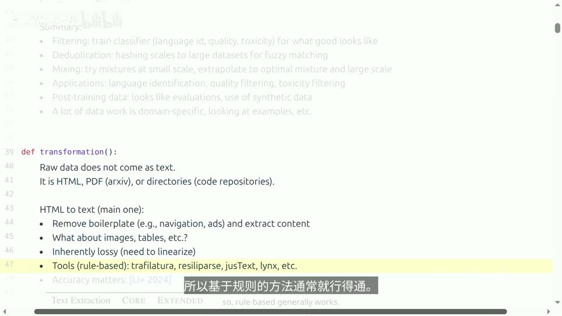 |
| Resiliparse 的效果我觉得是比其他工具都要好的。我还会简要谈谈 PDF——HuggingFace 发布了一个名为 FinePDFs 的数据集。 [【跳转到 02:40】](https://www.bilibili.com/video/BV11LEA6eEuj/?p=14&t=160) | 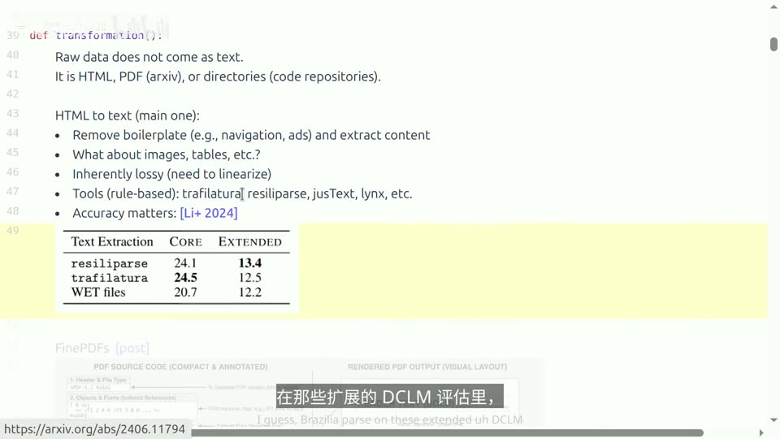 |
| 你看，PDF 文件要是没用专门的阅读器打开，显示出来大概是这个样子的，这些内容得先渲染出来才行。毕竟 PDF 就像网页一样，满互联网都是，Common Crawl 里也有收录。一般来说 Common Crawl 主要抓文本，但有时候光看个链接，要是没后缀，你下载前根本不知道它是不是个 PDF。这篇博文细节很多，我就不一一展开了，感兴趣的朋友可以直接阅读原文。举个例子，Common Crawl 里很多 PDF 因为文件过大被强行截断。 [【跳转到 02:49】](https://www.bilibili.com/video/BV11LEA6eEuj/?p=14&t=169) | 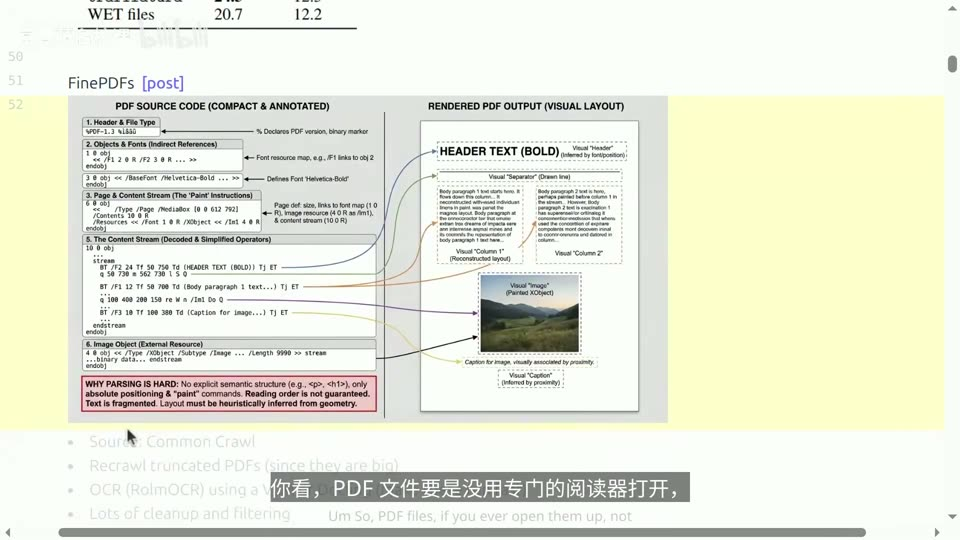 |
| 这就带来了一些麻烦，因此需要重新抓取。此外还有一个问题。 [【跳转到 03:14】](https://www.bilibili.com/video/BV11LEA6eEuj/?p=14&t=194) | 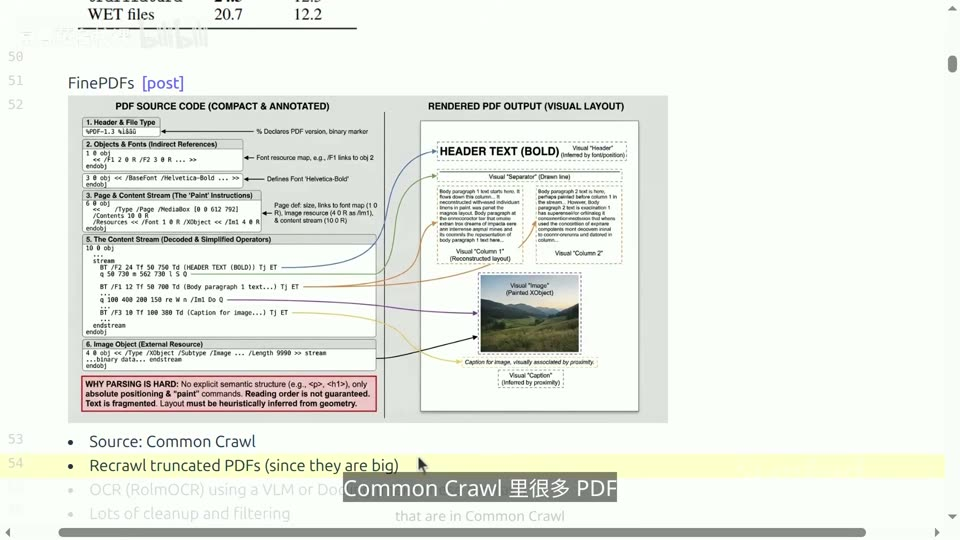 |
| 拿到 PDF 文件后，究竟该如何将其转换为文本呢？另外，有些 PDF 其实只是扫描件。 [【跳转到 03:20】](https://www.bilibili.com/video/BV11LEA6eEuj/?p=14&t=200) | 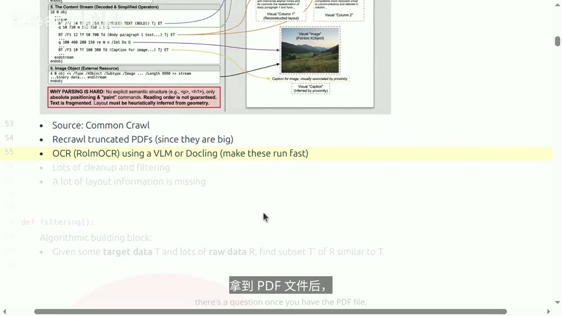 |
| 本质上就是图片。因此需要重新抓取。此外还有一个问题：拿到 PDF 文件后究竟该如何将其转换为文本呢？另外，有些 PDF 其实只是扫描件。 [【跳转到 03:25】](https://www.bilibili.com/video/BV11LEA6eEuj/?p=14&t=205) | 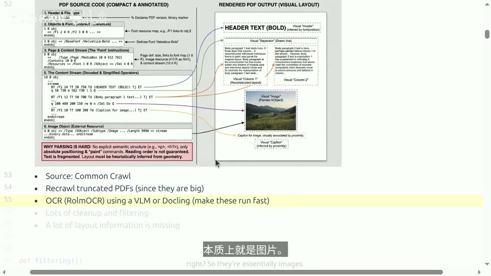 |
| 本质上就是图片。这篇论文测试了多种工具，但核心思路仍是利用视觉语言模型进行 OCR。 [【跳转到 03:36】](https://www.bilibili.com/video/BV11LEA6eEuj/?p=14&t=216) | 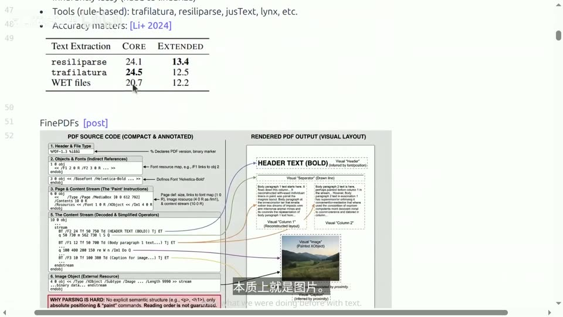 |
| 这肯定比之前处理纯文本的成本高得多。好在——或者说不好在——PDF 在整个互联网中其实只占很小一部分，但它们很有价值，因为通常愿意制作 PDF 意味着内容经过精心整理，不像普通网页那样随意。因此 PDF 的平均质量通常高于 HTML 文件。过滤后的数据和 PDF 需要大量清洗，甚至多于网页数据，因为在 HTML 中各类标签能提供语义信息。 [【跳转到 03:41】](https://www.bilibili.com/video/BV11LEA6eEuj/?p=14&t=221) | 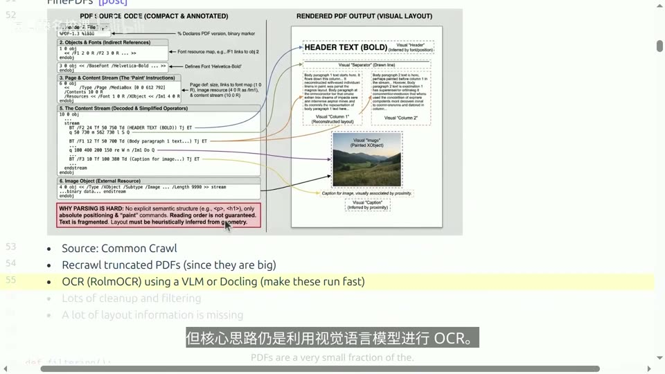 |
| 而在 PDF 中这些信息往往丢失了。现在你手里有了文本，但这还远没结束，咱们还差得远呢。下一步就是过滤。我先稍微抽象地讲讲过滤到底是什么。咱们先看这个基础模块：假设你有一些想要获取的目标数据，这通常包括一小部分高质量数据以及大量的原始数据，这些数据是从上一轮转换过来的。 [【跳转到 04:06】](https://www.bilibili.com/video/BV11LEA6eEuj/?p=14&t=246) | 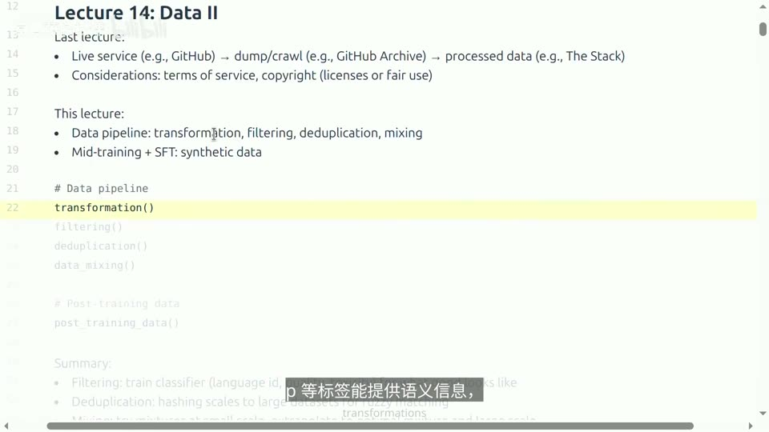 |
| 刚出炉的 token 批次。咱们的目标是从这些原始数据里挑出一个子集，这个子集要和目标数据相似。这就是过滤的一般框架，几乎所有过滤方法都套用这个模式。过滤的原因有很多，比如你在训练英语或德语模型时，得先识别语言，把不匹配的给过滤掉。过滤的核心目的是筛选质量：我们要找的是高质量数据，剔除那些低质量的，咱们不要那些垃圾信息。 [【跳转到 04:31】](https://www.bilibili.com/video/BV11LEA6eEuj/?p=14&t=271) | 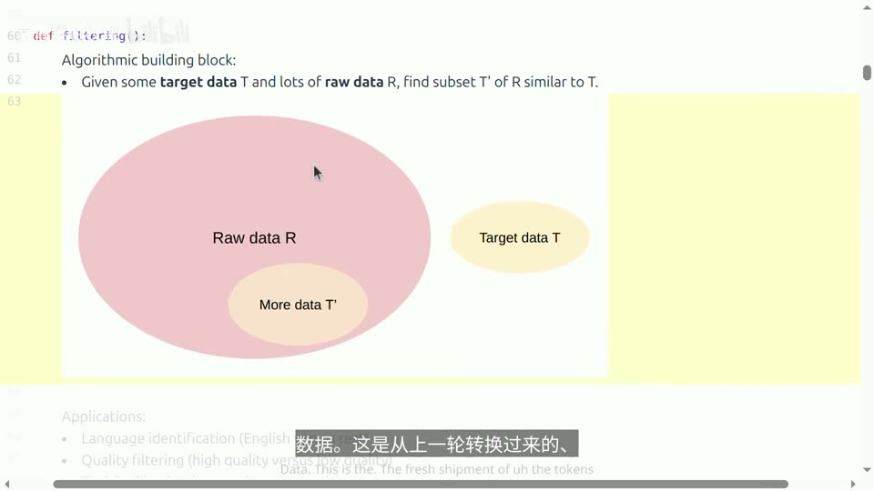 |
| 要的是像百科全书一样有深度的内容。还有另一个应用就是毒性过滤，毕竟网上有很多让人不适的内容，你肯定不想拿这些去训练语言模型。谢谢。好，针对过滤算法我们需要做到上述几点：算法必须能从目标数据中泛化，对吧？毕竟目标数据是一致的。算法不能只盯着目标数据，还得运行高效，因为你需要在全互联网数据上执行一遍。 [【跳转到 04:56】](https://www.bilibili.com/video/BV11LEA6eEuj/?p=14&t=296) |  |
| 这意味着数据量可能高达 10 万亿 token。总体而言，过滤后的数据量极小，仅占原始数据总量的个位数百分比。谢谢。好，让我们回顾一下针对目标数据的通用框架：给定原始数据 R 和目标数据 T，任务是寻找一个子集。基本思路是先根据 R 和 T 训练模型、建立评分标准，然后根据 R 中数据的得分进行筛选。 [【跳转到 05:21】](https://www.bilibili.com/video/BV11LEA6eEuj/?p=14&t=321) | 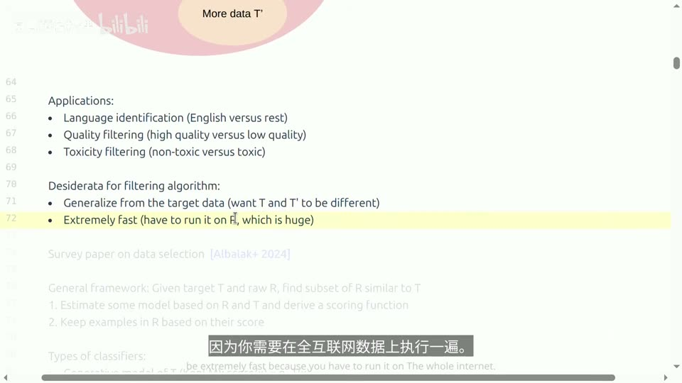 |
| 保留高分数据。因此分类器主要有两种类型。第一种是生成模型：你看，你手头有目标数据，你可以直接基于这些数据来估算模型，注意这一步必须低成本且高效，因此我们通常不会训练大型语言模型。例如 KenLM，基本做法是训练一个五元语法（5-gram）模型。如今更常见的做法——也是咱们最近经常看到的——就是直接训练一个分类器。 [【跳转到 05:46】](https://www.bilibili.com/video/BV11LEA6eEuj/?p=14&t=346) | 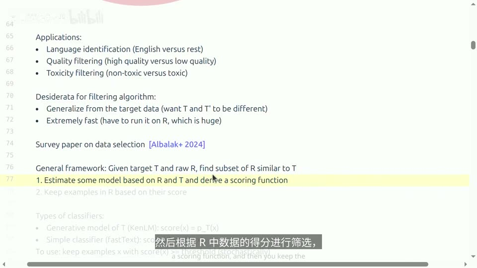 |
| 分类器会给出预测结果，将其标记为正类。对于属于目标集 T 的样本，标签设为负；对于在原始数据 R 中但不在 T 中的样本，标签设为正。所以你看，T 其实就是你的正样本，而从 R 中随机抽取的一部分则是你的负样本，然后再去训练分类器。大家通常使用 fastText。 [【跳转到 06:11】](https://www.bilibili.com/video/BV11LEA6eEuj/?p=14&t=371) | 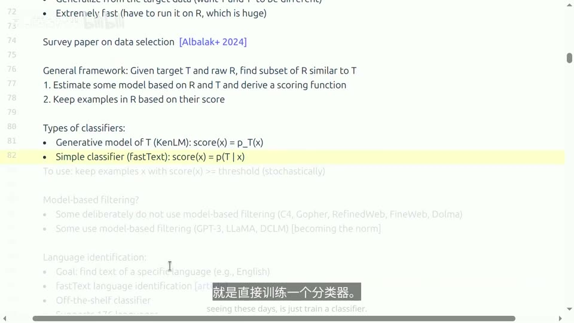 |
| 主要是因为它的运行速度快。它通常是一个线性分类器，采用词袋（bag of words）模型。拿到这个模型后，面对每个文档你都可以给它打一个分数，然后根据你设定的质量标准确定一个阈值，保留符合条件的样本，筛选方式有时是随机的，有时则不是。对，所以你看，这其实是一种基于模型的过滤方法。大家还记得上一节课吗？那时候很多数据集还没有采用这种…… [【跳转到 06:36】](https://www.bilibili.com/video/BV11LEA6eEuj/?p=14&t=396) | 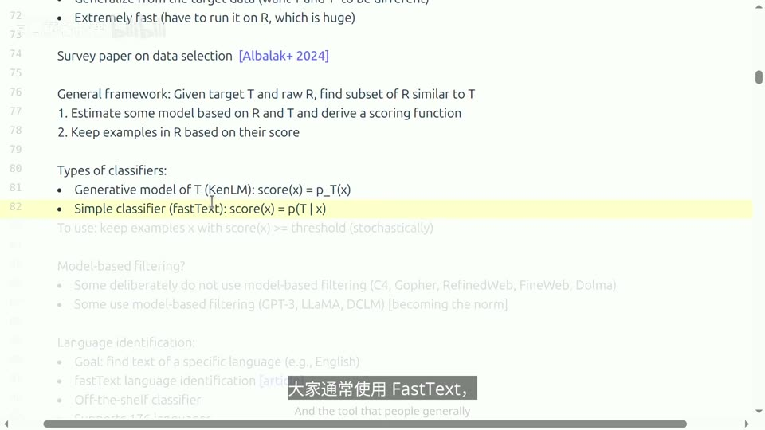 |
| 基于模型的过滤方法，主要是担心引入过多的偏差。现在嘛，我觉得大家基本上都会进行一定程度的基于模型的过滤，因为除非你的算力非常充足，否则可能没必要做那么多过滤。理论上你可以直接用所有数据来训练，但大多数人的算力都不够，必须想清楚过滤策略，否则就是在低质量内容上白白浪费算力。谢谢。接下来我们具体讲讲过滤方法是如何落地的。 [【跳转到 07:01】](https://www.bilibili.com/video/BV11LEA6eEuj/?p=14&t=421) | 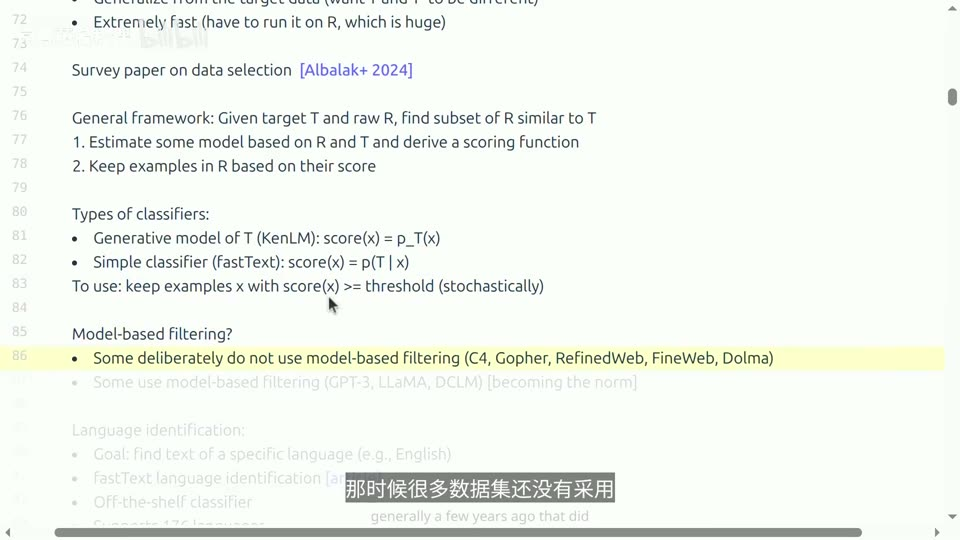 |
| 大家还记得我之前提过的语言识别吗？它的目标很明确：给定一段文本，判断它是否属于某种特定语言。Meta 训练了一套快速的文本语言识别模型，大家通常可以直接拿来用，它支持 176 种语言。训练数据来自多个多语言网站，比如维基百科上有各种语言的内容，还有翻译网站以及各语言专属网站。与其他任务相比…… [【跳转到 07:26】](https://www.bilibili.com/video/BV11LEA6eEuj/?p=14&t=446) | 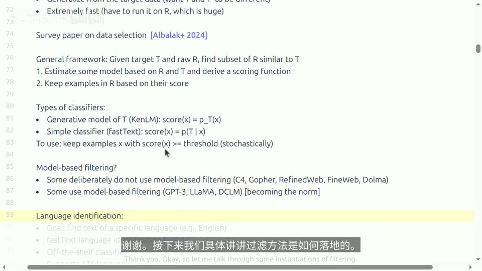 |
| 语言识别其实相对简单，用一个简单的分类器看几个词就能分辨出是西班牙语还是日语。不过由于文本中常存在语言混用和方言情况，细节上还是有点复杂，因此说它已经完全解决可能有些夸张，但这确实不是训练语言模型的关键瓶颈。不过由于文本中存在语码转换现象，且涉及一些方言，细节上较为复杂，因此说它已彻底解决可能言过其实。 [【跳转到 07:51】](https://www.bilibili.com/video/BV11LEA6eEuj/?p=14&t=471) | 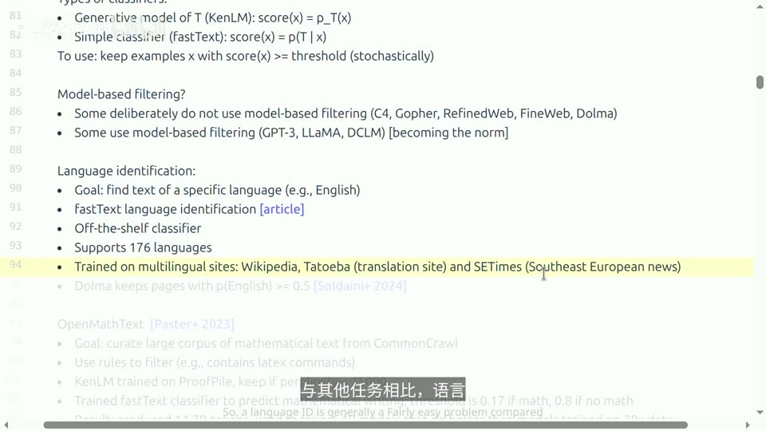 |
| 但这确实并非训练高质量语言模型的关键瓶颈。打个比方，假设你想精通数学，那就需要去搜集大量的数学数据。OpenMathText 是 2023 年发表的一篇论文，其目标是整理一个大规模的数学文本语料库，这个数据处理流程包含几个步骤，它并非仅训练单个分类器。首先你会使用一些基于规则的方法，检查文本是否包含 LaTeX 命令；他们还使用了 KenLM…… [【跳转到 08:16】](https://www.bilibili.com/video/BV11LEA6eEuj/?p=14&t=496) | 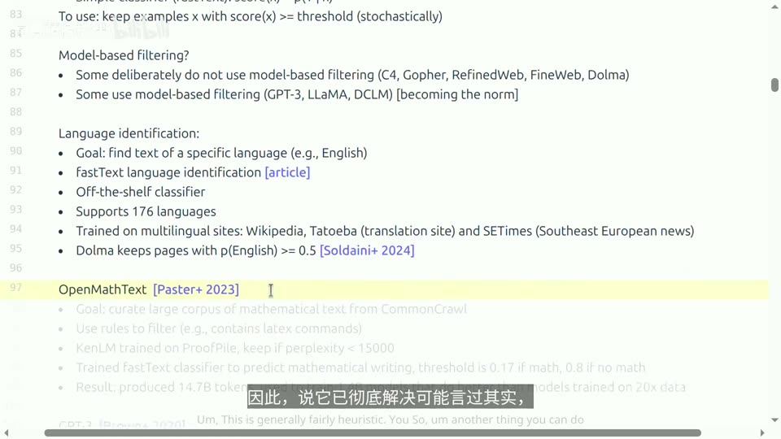 |
| 这是一种生成式方法，他们在 ProofPile——一个已知的数学数据集——上对其进行了训练，若困惑度低于阈值则予以保留。接着你还训练一个 fastText 分类器，用于判断文本是否属于数学写作。此外他们还使用了 KenLM，这是一种生成式方法，他们在 ProofPile 这个已知的数学数据集上对其进行训练，若困惑度低于特定阈值…… [【跳转到 08:41】](https://www.bilibili.com/video/BV11LEA6eEuj/?p=14&t=521) | 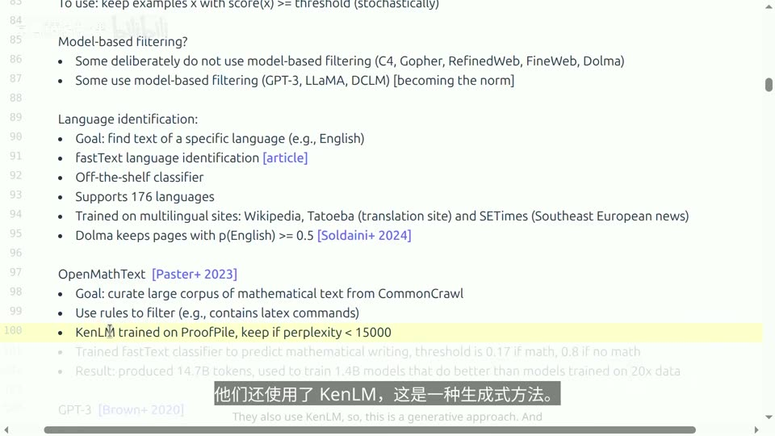 |
| 则予以保留。接着你还训练一个 fastText 分类器，用于判断文本是否属于数学写作。结果他们得到了 150 亿个 token 用来训练模型。论文里显示，这种更有针对性的数据筛选方法能让模型在数学方面表现更好；相比之下，那些在未经过滤、数据量大 20 倍的语料上训练的模型效果就没这么好。因此我们将质量过滤视为一种工具。 [【跳转到 09:06】](https://www.bilibili.com/video/BV11LEA6eEuj/?p=14&t=546) | 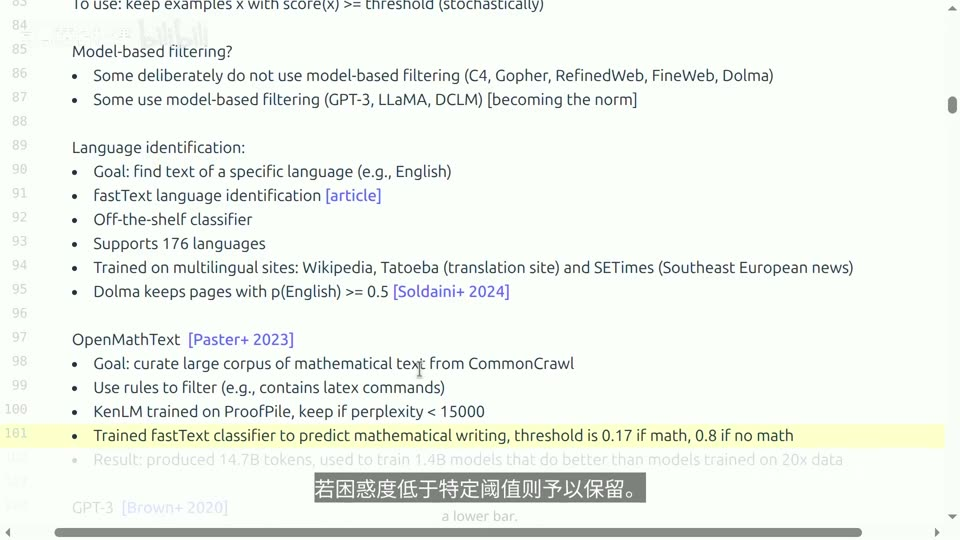 |
| 你可以自行定义何为质量，质量并无统一定义。若将质量定义为数学能力，则收集数学数据即可提升模型在该领域的表现。以 GPT-3 为例，此前虽已提及，但未将其纳入本框架，我们再次简要说明：正样本包括维基百科和网络文本，这些页面源自高权重链接；正样本包括维基百科和网络文本，这些页面源自高权重链接。他们训练了一个线性分类器…… [【跳转到 09:31】](https://www.bilibili.com/video/BV11LEA6eEuj/?p=14&t=571) | 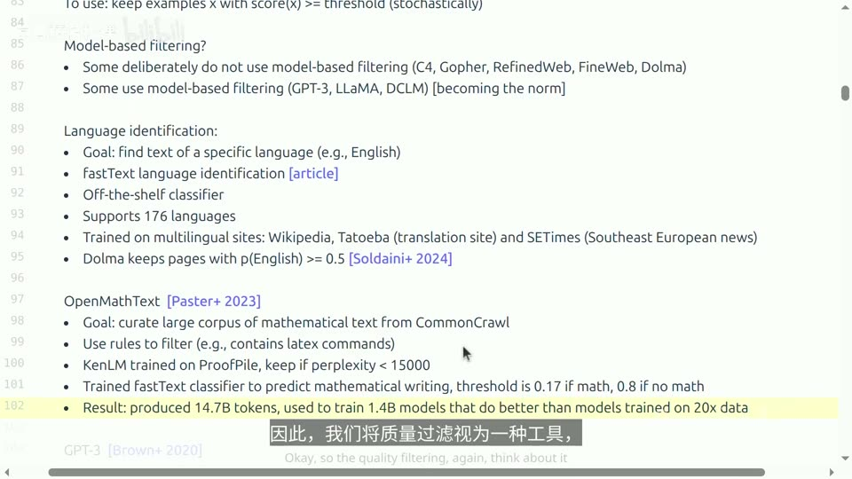 |
| 仅当分类器评分超过阈值时才保留该文档。以早期的 LLaMA 论文为例，其参考的是维基百科引用的页面，而非维基百科文章本身，思路类似。以微软发布的 phi-1 为例，有趣的是其效果相当不错，该方法同样适用于此框架。因此他们原始数据并非预先切分的 StackOverflow Python 子集，而是包含所有代码的完整数据集。 [【跳转到 09:56】](https://www.bilibili.com/video/BV11LEA6eEuj/?p=14&t=596) | 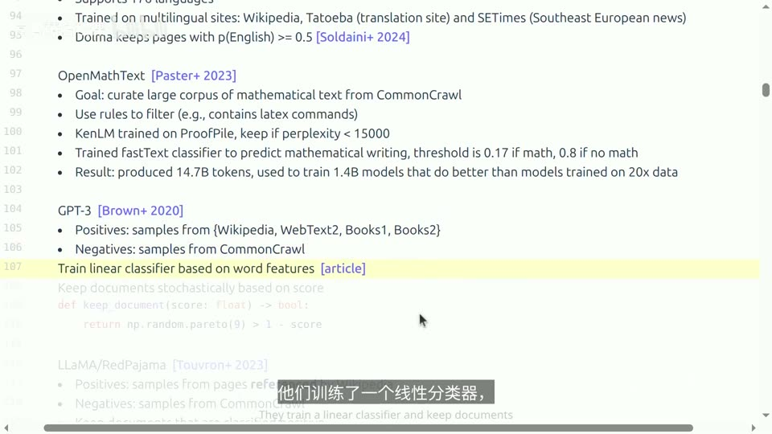 |
| 他们定义了一个 prompt，用于评估数据是否具备教育价值。接着他们使用 GPT-4 配合该提示词，对 R 中的 10 万个样本子集进行分类，以观察结果。那些被判定为正向的样本会被保留并称为目标，因此这里的目标实际上就是高成本分类器的输出结果。 [【跳转到 10:21】](https://www.bilibili.com/video/BV11LEA6eEuj/?p=14&t=621) | 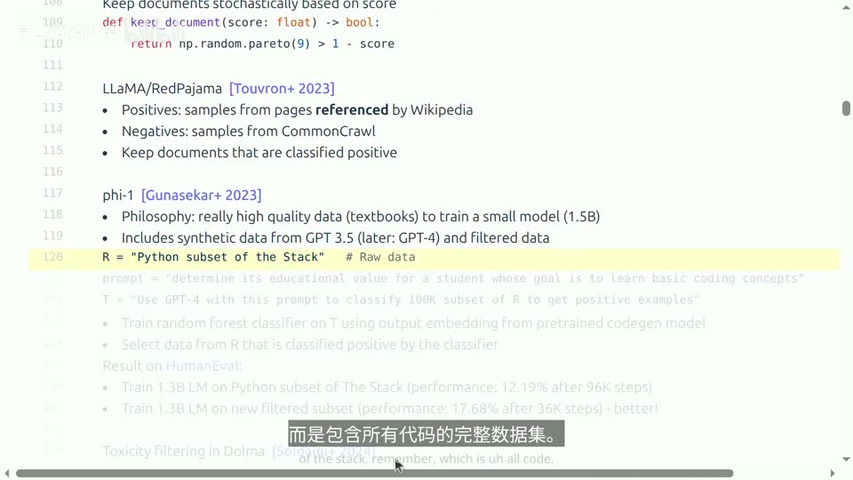 |
| 随后你再去训练一个成本更低的分类器，例如他们使用的随机森林——不过 fastText 也是不错的选择。接着筛选出被该分类器判定为正向的数据。他们还展示了使用该数据集的效果显著提升，远优于直接使用原始数据，这意味着模型能够以更少的训练步数达到更高的性能指标。谢谢。接下来毒性检测的原理也类似。 [【跳转到 10:46】](https://www.bilibili.com/video/BV11LEA6eEuj/?p=14&t=646) | 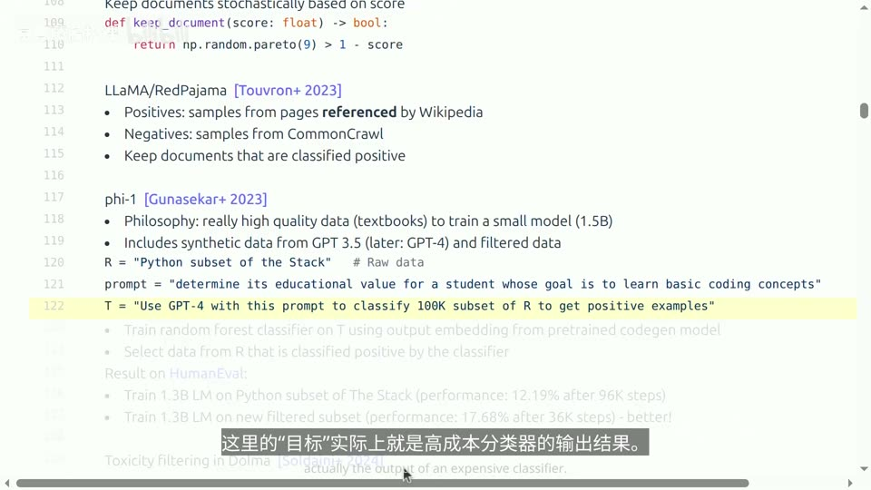 |
| 有一个名为 Jigsaw Toxic Comments 的数据集，它源自一个旨在改善网络交流环境的项目。谢谢。接下来毒性检测的原理也类似：有一个名为 Jigsaw Toxic Comments 的数据集，它源自一个旨在改善网络交流环境的项目。我们也可以采用同样的方法，明确定义正例和负例，然后利用这些数据训练一个分类器。好了。 [【跳转到 11:11】](https://www.bilibili.com/video/BV11LEA6eEuj/?p=14&t=671) | 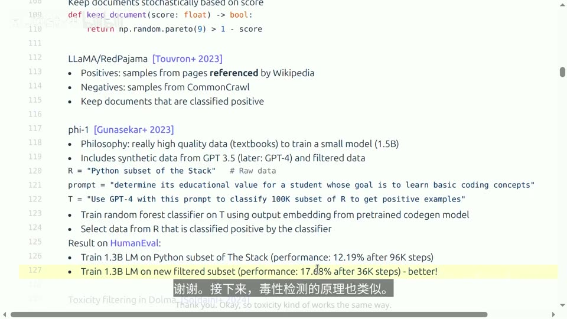 |
| 现在我想你已经掌握了一些工具，案例也获得了一些灵感。确定好目标数据后，构建相应的分类器，即可用它来过滤 Common Crawl 数据集。这里需要补充一个细节，稍微复杂一些。具体来说，所需数据的类型取决于你计划训练的模型类型，这主要取决于训练时使用的 token 数量。因此并不存在所谓的最优阈值。 [【跳转到 11:36】](https://www.bilibili.com/video/BV11LEA6eEuj/?p=14&t=696) | 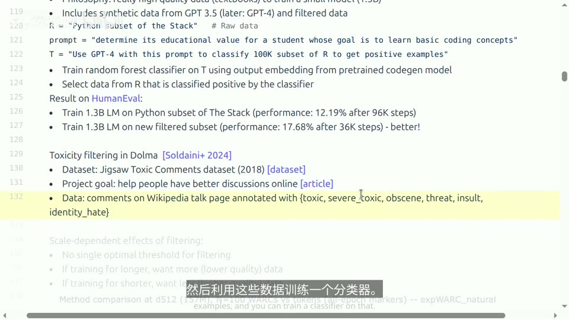 |
| 之前观察分类器时，它会输出一个分数，不能仅凭 0.9 的分数就断定其最优，因为这取决于具体的应用场景。直观来看，如果训练周期较长，可以容忍较低质量的数据；如果训练时间较短，则通常情况下你肯定希望数据质量更高。打个比方，如果训练时间充足，当然更倾向于高质量数据，但这受限于现有的数据。 [【跳转到 12:01】](https://www.bilibili.com/video/BV11LEA6eEuj/?p=14&t=721) | 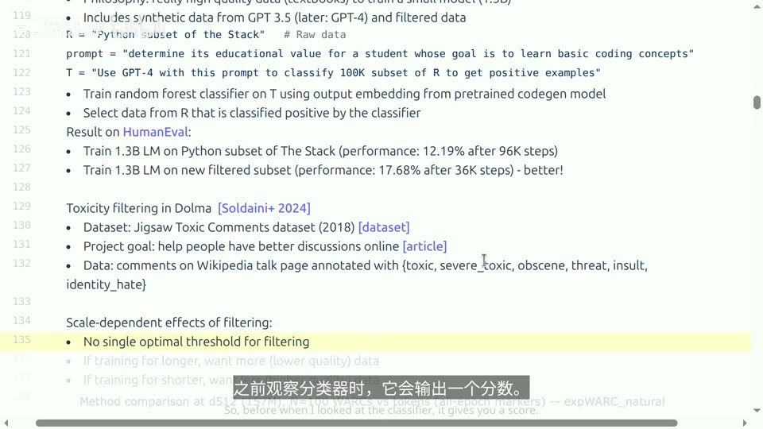 |
| 并非完全由你选择。这里展示了一项初步实验，该实验由 Michael Ryan 完成。基本上这张图展示了：针对一个 1.57 亿参数的模型，我们使用了一个极小的数据池，共 100 个工作单元，这仅占 Common Crawl 的极小部分。接着我们观察训练过程，接下来我们观察训练损失。 [【跳转到 12:26】](https://www.bilibili.com/video/BV11LEA6eEuj/?p=14&t=746) | 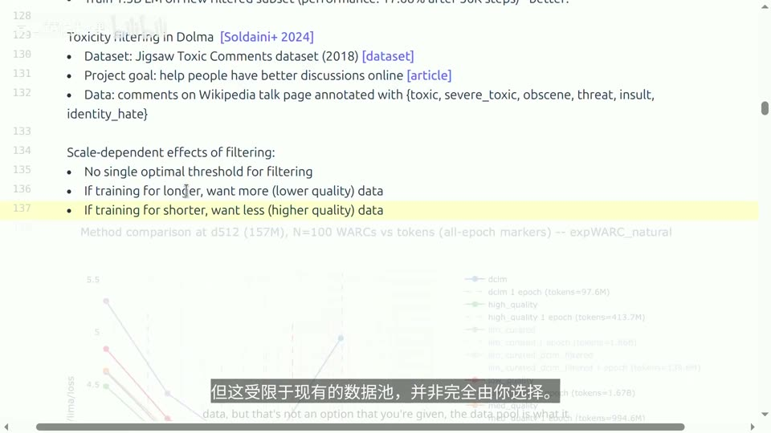 |
| 蓝色曲线代表损失值，从这一位置开始，随后呈现下降趋势。图中的每一条线代表模型完成了一个数据轮次（epoch）的训练，这是第一轮，随后的蓝色线对应第二轮，以此类推。由于数据总量有限，最终只能对数据进行重复使用。损失值仍在下降，是因为模型在重复学习过程中继续获取信息；达到某个临界点后，模型开始出现过拟合。 [【跳转到 12:51】](https://www.bilibili.com/video/BV11LEA6eEuj/?p=14&t=771) | 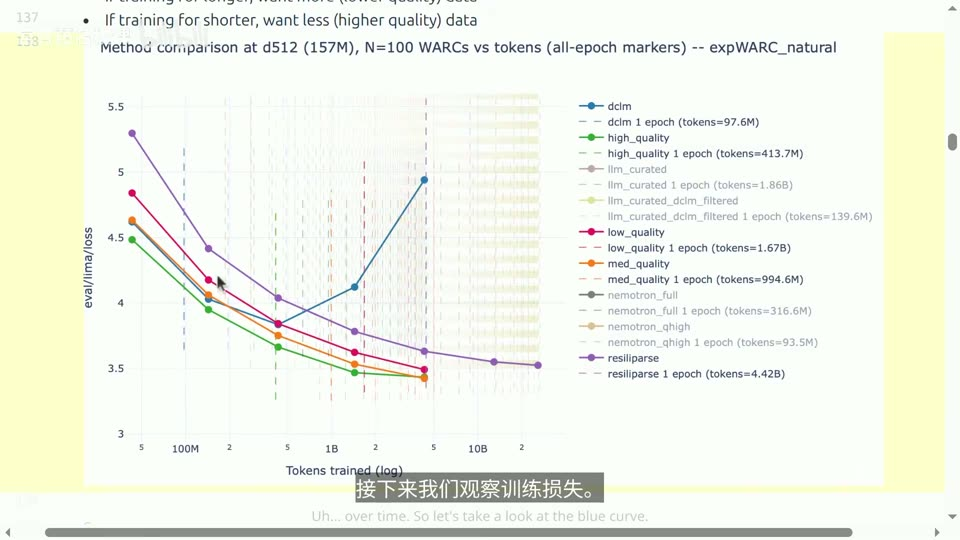 |
| 以 Resiliparse 为例，其数据基本未经过滤，因此其初期表现较差，但随着训练持续、再次遍历数据时，损失值下降的速度会放缓。由此可见这一趋势：若不重复使用数据，高质量数据的效果更为显著。然而当 token 数量达到海量级别时，高质量数据的优势便不再绝对。当然，若数据质量极高…… [【跳转到 13:16】](https://www.bilibili.com/video/BV11LEA6eEuj/?p=14&t=796) | 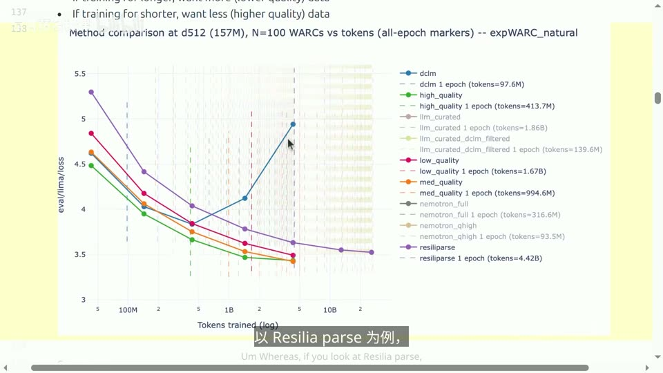 |
| 我们应避免进入此阶段，因为极易导致过拟合，通常在此处停止训练即可。但即便处于这一阶段，其效果仍不如使用低质量数据进行更长时间训练的结果。没错，我们来计算一下指标。 [【跳转到 13:41】](https://www.bilibili.com/video/BV11LEA6eEuj/?p=14&t=821) | 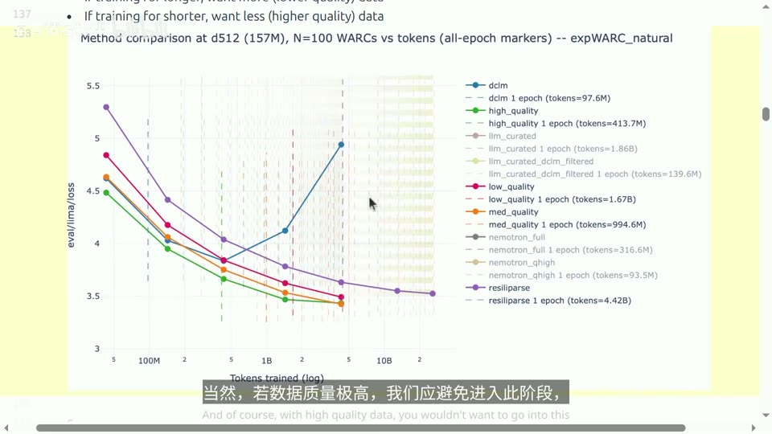 |
| 这不仅仅是看图的问题，图中的每一个点都代表一次独立的训练运行。在做这些预训练实验时，有必要计算置信区间吗？目前我们只看单次结果，也就是说图中的每个点仅代表一次训练运行。是否应该多次重复实验并计算置信区间？理想情况下这确实是更好的做法，但在论文中这类数据往往较少，因为每次训练运行的成本都很高。 [【跳转到 13:55】](https://www.bilibili.com/video/BV11LEA6eEuj/?p=14&t=835) | 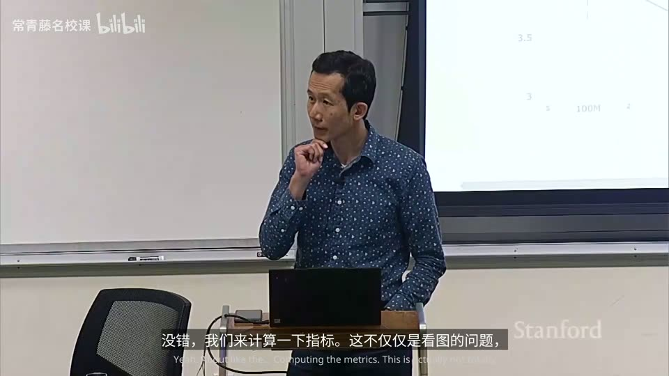 |
| （课堂问答）不过在实际操作中，实验完成后结果通常比较稳定，我是这么认为的，至少在预训练阶段是这样。好，你刚才提到了——我们延长训练时间并结合高质量数据，这并不是我们考虑的方案。例如，如果我们使用这种高质量数据、延长训练时间，效果会出现收益递减吗？延长训练时间就能获得高质量数据。对，所以你的问题是：如果获得更高质量的数据并延长训练时间…… [【跳转到 14:20】](https://www.bilibili.com/video/BV11LEA6eEuj/?p=14&t=860) | 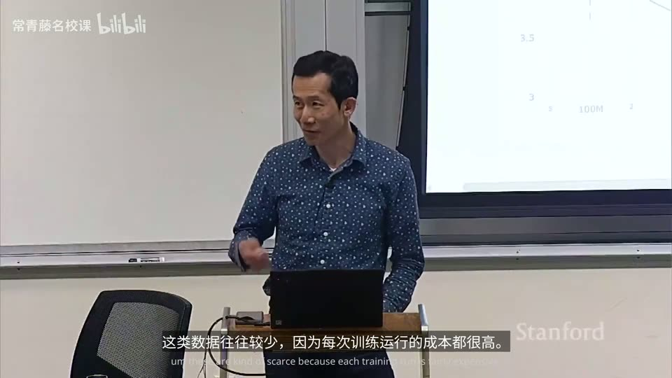 |
| 效果还会出现收益递减吗？任何数据集最终都会出现收益递减，毕竟数据量是有限的，不过曲线可能会在这里趋于平缓。 [【跳转到 14:45】](https://www.bilibili.com/video/BV11LEA6eEuj/?p=14&t=885) | 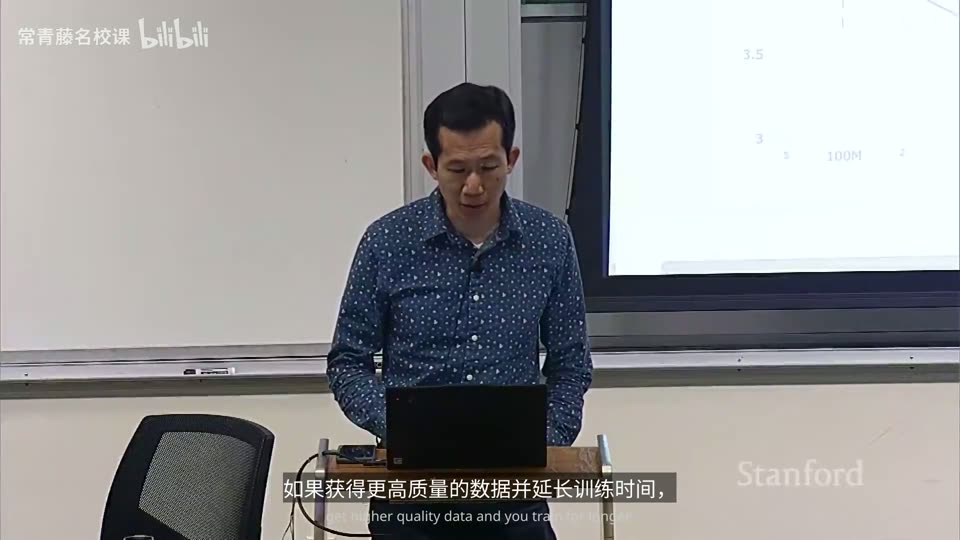 |
| 然后继续缓慢下降。好，不错，我们继续。数据过滤对于构建高质量模型至关重要。不过曲线可能会在这里转折，随后继续缓慢下降。好，我们继续。数据过滤对于构建高质量模型至关重要。从理论上讲，如果你拥有无限的算力，就不需要过滤，可以直接使用全部数据进行训练，从而训练出一个庞大的模型，但在现实中我们必须进行过滤。 [【跳转到 14:53】](https://www.bilibili.com/video/BV11LEA6eEuj/?p=14&t=893) | 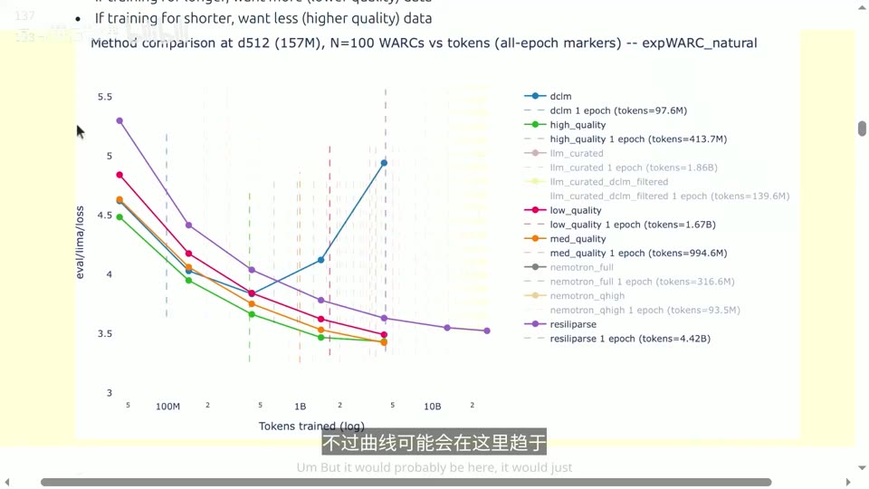 |
| 因此我们需要先明确什么样的数据才算优质数据，接着你可以训练一个分类器，将其应用于其余数据。如何确定什么是好数据呢？一种方法是在现有数据中发现你特别喜欢的部分，然后尽可能多地获取同类数据；或者你可以向语言模型提供提示，让它先对大量数据进行初步筛选，再用这些优质数据训练一个小规模的分类器。 [【跳转到 15:18】](https://www.bilibili.com/video/BV11LEA6eEuj/?p=14&t=918) | 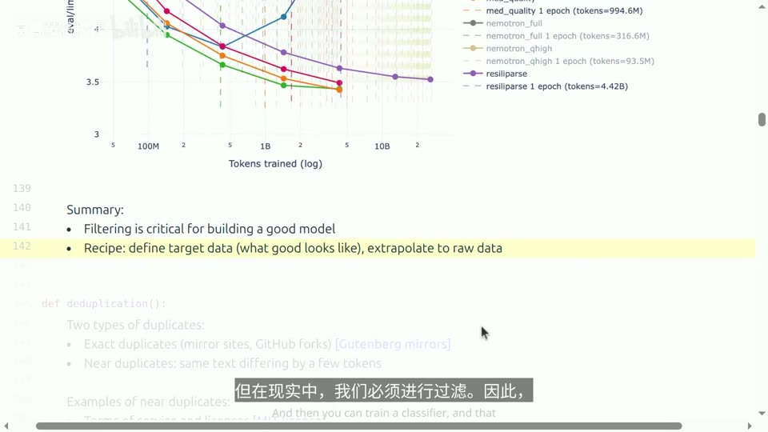 |
| 最后将其推广到剩余数据上。至于其他数据，接下来我们讨论去重。然而数据中往往仍会存在重复内容，重复项主要分为两类：完全重复和近似重复。例如查看镜像站点时，由于镜像站点本身就是为了复制内容而存在的…… [【跳转到 15:43】](https://www.bilibili.com/video/BV11LEA6eEuj/?p=14&t=943) | 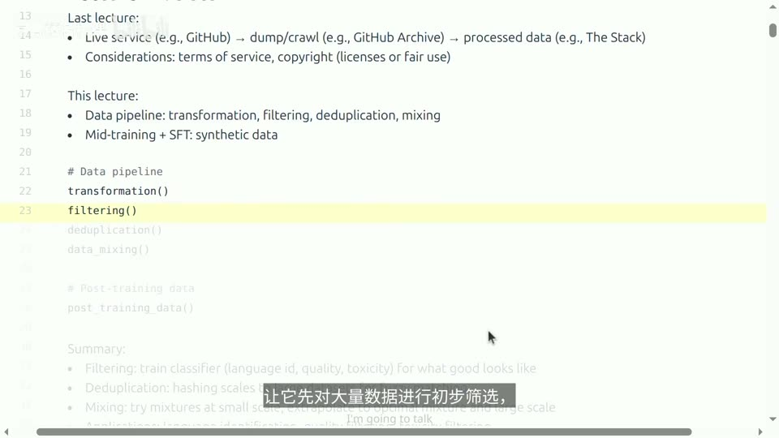 |
| 这就会导致重复。有时爬虫不够智能。 [【跳转到 16:06】](https://www.bilibili.com/video/BV11LEA6eEuj/?p=14&t=966) | 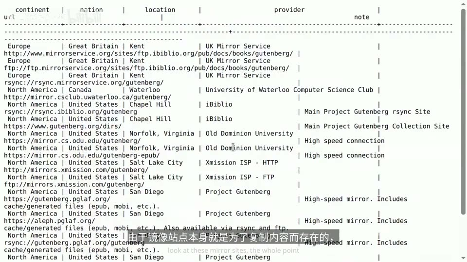 |
| 无法区分镜像站点，与原站内容相同，于是他爬取了多个站点，最终你获得的内容完全一致。 [【跳转到 16:11】](https://www.bilibili.com/video/BV11LEA6eEuj/?p=14&t=971) | 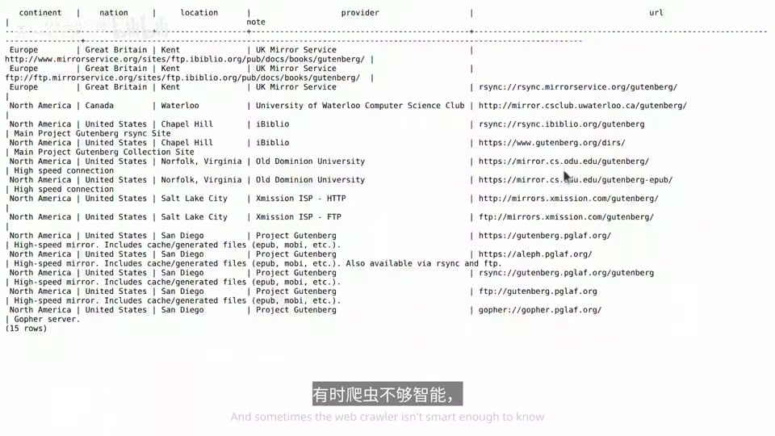 |
| 此外当你 fork 一个仓库时，这也构成了重复，即便你进行了修改，通常也只涉及少数文件，因此该仓库中 99% 的内容可能并未改变。由此可见重复数据无处不在。是的，有时还会出现近似重复，它们既非镜像也非衍生内容，但内容恰好相似、文本相同，仅相差几个 token，这通常源于复制行为或来自共同的来源。 [【跳转到 16:17】](https://www.bilibili.com/video/BV11LEA6eEuj/?p=14&t=977) | 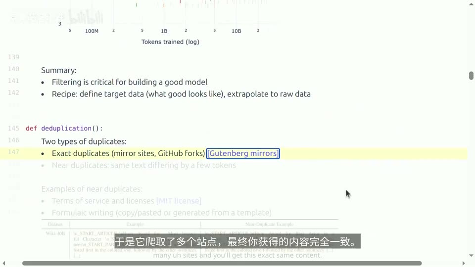 |
| 接下来我们来看几个近似重复数据的例子，例如服务条款和许可证。我想 MIT 许可证应该会频繁出现，它在很多地方都能见到。 [【跳转到 16:42】](https://www.bilibili.com/video/BV11LEA6eEuj/?p=14&t=1002) | 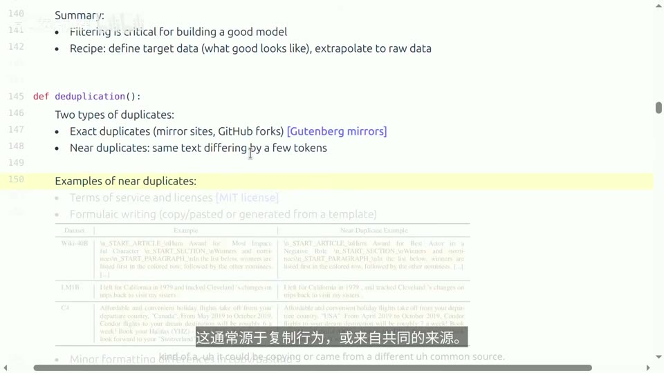 |
| 因此很多时候它其实是完全相同的副本。 [【跳转到 16:54】](https://www.bilibili.com/video/BV11LEA6eEuj/?p=14&t=1014) | 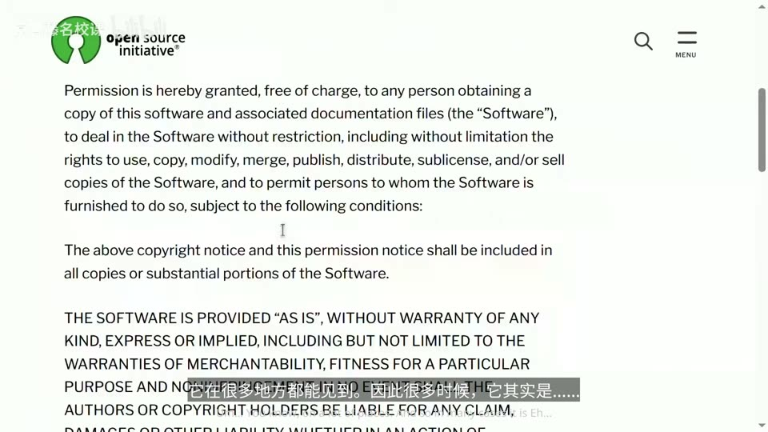 |
| 但仅限于许可证本身，除非有人在复制时打错了字，但页面的其余部分及许可证所在的部分可能各不相同。我们之前讨论过，许多网站的页眉和页脚都是相同的，这些也算重复数据。另外还有一种情况，出于各种原因——这是来自 LM1B，那个 10 亿规模的基准测试——有些文章之间仅存在排版上的细微差别。 [【跳转到 16:59】](https://www.bilibili.com/video/BV11LEA6eEuj/?p=14&t=1019) | 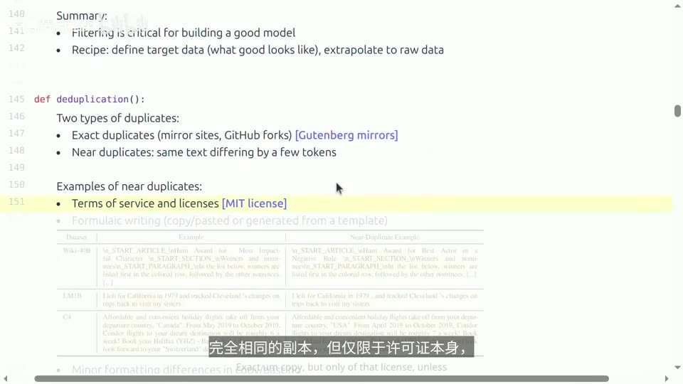 |
| 其中一个版本带了逗号，另一个则没有。我不太清楚具体原因，但这种情况确实存在。有时你会看到这类模板，里面充斥着低质量内容，看起来就像某种广告，有人只是简单套用模板，把加拿大替换成了美国。所以如果你用这类数据来训练模型，而且只是用包含不同实体的不同变体进行训练，那其实是在浪费 GPU 算力。还有更极端的案例，所以仔细检查你的数据是非常有必要的。 [【跳转到 17:24】](https://www.bilibili.com/video/BV11LEA6eEuj/?p=14&t=1044) | 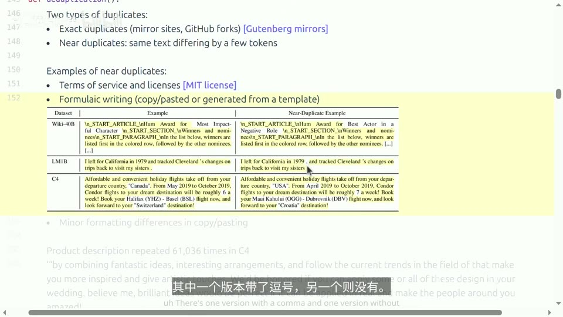 |
| 在对 C4 数据集进行的这项审计中，我们发现某款产品的描述在数据集中出现了 61000 次。追溯起来，这非常奇怪。 [【跳转到 17:49】](https://www.bilibili.com/video/BV11LEA6eEuj/?p=14&t=1069) | 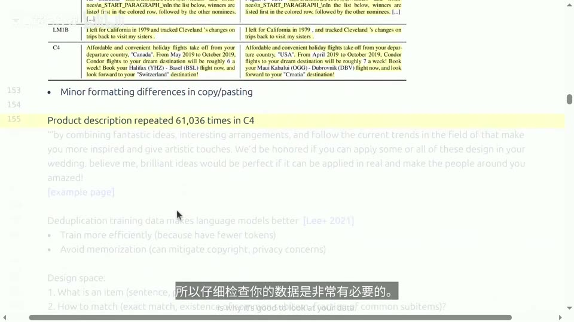 |
| 我也不知道为什么。这是一段关于某种防毒面具的描述，它就这样出现在了数据集中。 [【跳转到 18:00】](https://www.bilibili.com/video/BV11LEA6eEuj/?p=14&t=1080) | 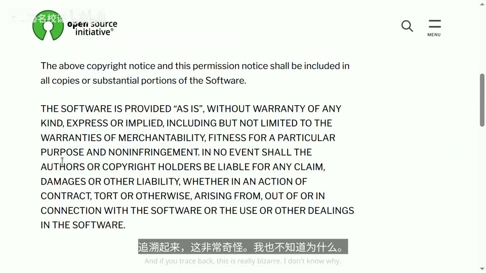 |
| 追溯起来这真的很奇怪，啊，我不知道为什么，这看起来像是对某种防毒面具的描述。 [【跳转到 18:05】](https://www.bilibili.com/video/BV11LEA6eEuj/?p=14&t=1085) |  |
| 它就这样出现在了数据集中。首先，动机很明确：为了更高效地进行训练，去重能在不损失信息的前提下缩减数据集规模，因为你移除的只是重复内容。此外，它还能防止模型记忆训练数据，正如这篇论文所指出的。举个例子，如果大量受版权保护的内容被复制，模型在训练时可能会直接记住这些数据，从而引发隐私问题。 [【跳转到 18:10】](https://www.bilibili.com/video/BV11LEA6eEuj/?p=14&t=1090) | 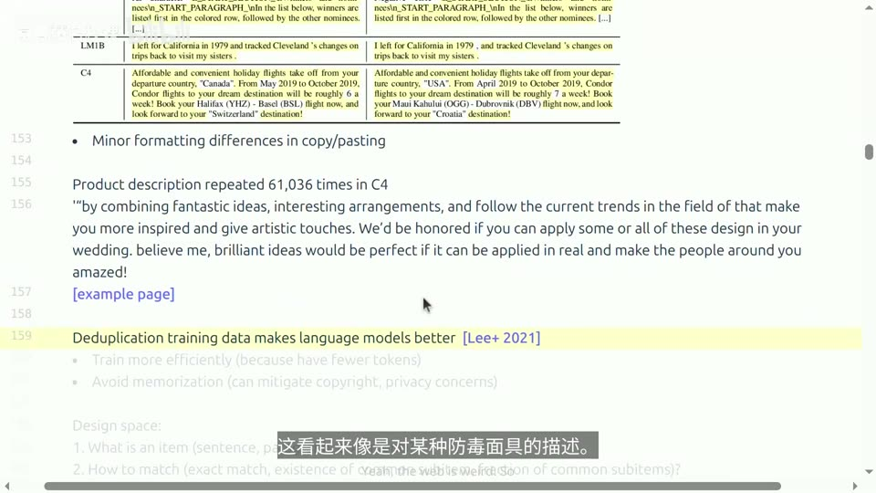 |
| 不过我觉得最主要的原因是为了避免浪费计算资源。与去重相关的是去污染，这甚至可能更重要，原理类似：你要确保测试集的数据没有出现在训练集中。那么具体该怎么进行去重呢？所以咱们得先理清设计空间。首先，你打算对哪些内容进行去重？是看句子、段落还是整篇文档？ [【跳转到 18:35】](https://www.bilibili.com/video/BV11LEA6eEuj/?p=14&t=1115) | 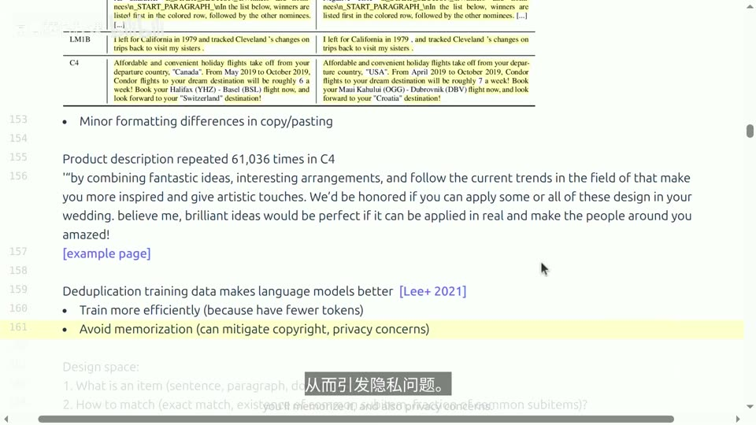 |
| 那你怎么判断两条内容算匹配呢？是要求完全一致，还是只要包含相同的子项就行？如果是做近重复去重，是不是看共同子项占多大比例？那找到重复内容后，你打算怎么处理？是把所有重复的都删掉，还是只保留一份？所以这里有个核心的算法难点：去重本质上就是在做项目间的两两比对。 [【跳转到 19:00】](https://www.bilibili.com/video/BV11LEA6eEuj/?p=14&t=1140) | 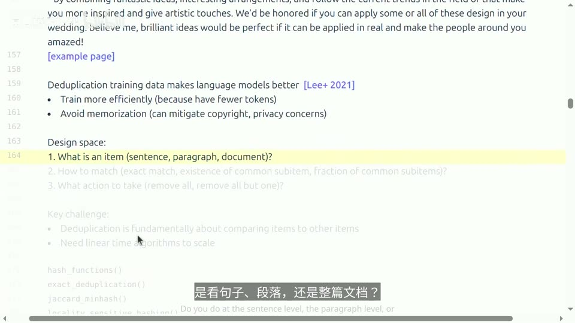 |
| 你看，通常做过滤的时候咱们是针对单个项目处理的；通常做过滤时我们是针对单个项目处理的。即便在线性时间复杂度下，我们也试图利用基于规则的方法或极小的模型来加速处理。但在去重任务中，显然不能采用 O(n²) 的复杂度，也就是要避免将所有数据两两进行比较。为了适应这种网页规模，你需要线性时间复杂度的算法来实现扩展。谢谢。 [【跳转到 19:25】](https://www.bilibili.com/video/BV11LEA6eEuj/?p=14&t=1165) | 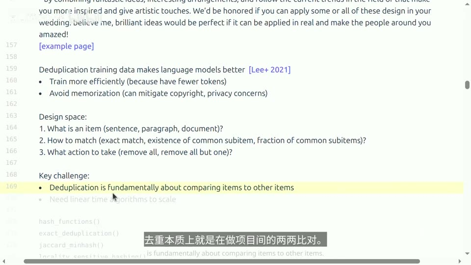 |
| 通常去重领域的文献会使用哈希函数来解决这个问题，因此我们将探讨其中一些思路。这些是非常出色的思路，这要归功于算法社区。我想大家都了解哈希函数是什么：它将某种输入值（如字符串）映射为类似字符串或整数形式的输出，哈希值远小于原始数据项。哈希冲突是指两个不同的数据项映射到了同一个值。好的，大家看，哈希函数里确实有一些比较花哨的…… [【跳转到 19:50】](https://www.bilibili.com/video/BV11LEA6eEuj/?p=14&t=1190) | 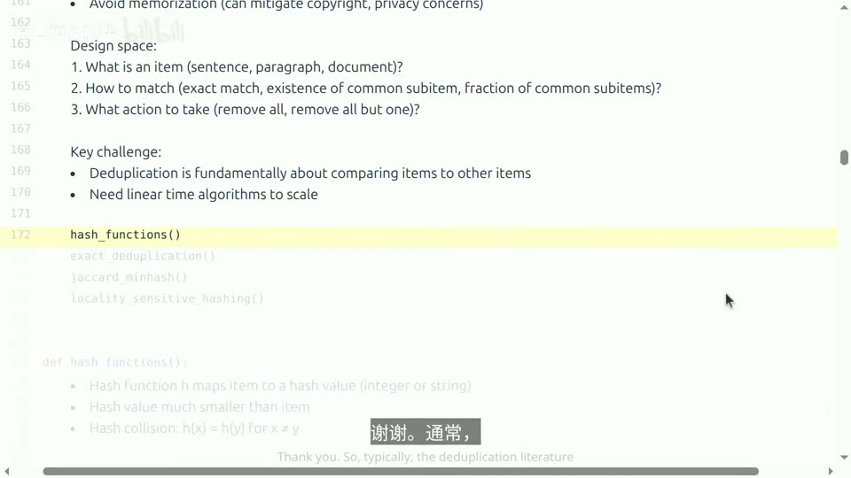 |
| 本质上，适用于密码学的这类函数利用密码学来防止碰撞，比如比特币里就用到了；而另一类是速度更快的哈希函数，用于哈希表，在这些场景中哈希冲突并非不可接受，所以我们用这类函数。打个比方，把字符串映射成一个值，这就是哈希函数的作用。精确去重概念上特别简单：你拿一个字符串，看看有没有完全一样的。 [【跳转到 20:15】](https://www.bilibili.com/video/BV11LEA6eEuj/?p=14&t=1215) | 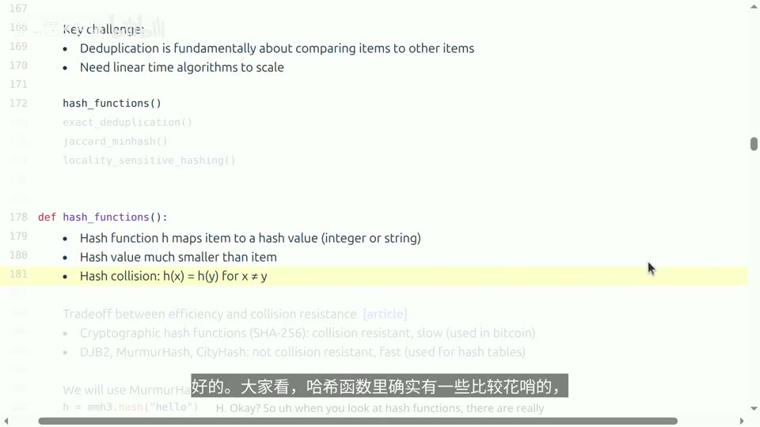 |
| 如果有就只留一个，把其他的都删掉。所以这里有一堆元素，你对它们做哈希处理，然后去重复。所以这是一种精确去重，处理起来非常理想，这里的操作逻辑很清晰，但这对于混乱的真实世界数据来说还不够好，因为通常存在大量近似重复项。需要注意的是，实现这一目标有多种写法。 [【跳转到 20:40】](https://www.bilibili.com/video/BV11LEA6eEuj/?p=14&t=1240) | 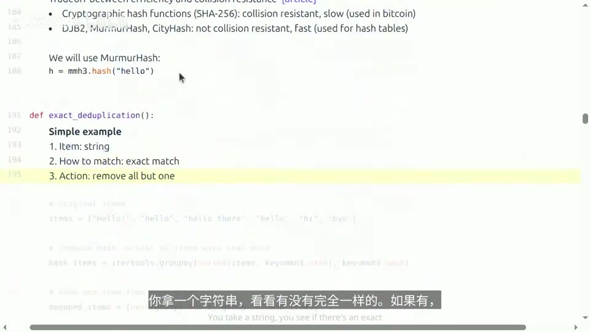 |
| 这段代码采用了一种类似 MapReduce 的风格，这使得它更易于并行化和扩展。接着看 C4，这是来自 T5 论文的那篇文献，该过程对 Common Crawl 执行了精确去重，其操作对象为三个句子的跨度。你们进行精确匹配并保留其中一项，移除其余所有项。所以如果你稍微留意一下，就会意识到这里有点奇怪：你们查看的是三个句子的跨度…… [【跳转到 21:05】](https://www.bilibili.com/video/BV11LEA6eEuj/?p=14&t=1265) |  |
| 如果找到两个包含三个句子跨度的文档，你们会移除所有……但有一种情况比较特殊。如果你只是从文档里删掉三句话，这其实挺奇怪的，因为会破坏文本的连贯性。他们当时就是这么做的。你看，所以这叫精确去重。那我们要怎么做近似去重呢？首先得明确一下，这里的近似匹配具体指什么。 [【跳转到 21:30】](https://www.bilibili.com/video/BV11LEA6eEuj/?p=14&t=1290) | 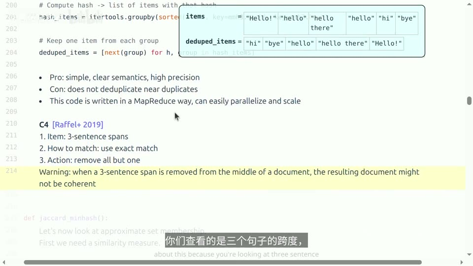 |
| 为此我们引入一个概念，叫做 Jaccard 相似度。这是一个很标准的定义：两个集合的 Jaccard 相似度基本上就是交集的大小除以并集的大小。假设给定这两个集合 {1,2,3,4} 和 {1,2,3,5}，计算 Jaccard 相似度时先取交集，也就是 {1,2,3}，再取并集，即 {1,2,3,4,5}，然后相除，得到的 Jaccard 相似度是 0.6。 [【跳转到 21:55】](https://www.bilibili.com/video/BV11LEA6eEuj/?p=14&t=1315) | 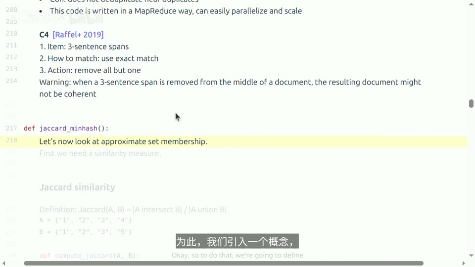 |
| Jaccard 系数的取值范围在 0 到 1 之间，零代表没有交集，一代表完全一致，这个概念很直观。如果两个文档的 Jaccard 相似度超过某个阈值，比如 0.99，我们就认为它们是近似重复的。接下来我们要解决的是如何在线性时间内把它们找出来。好在这是个已经解决的算法问题，解决办法是用最小哈希（MinHash）。因此第一步是应用 MinHash。 [【跳转到 22:20】](https://www.bilibili.com/video/BV11LEA6eEuj/?p=14&t=1340) | 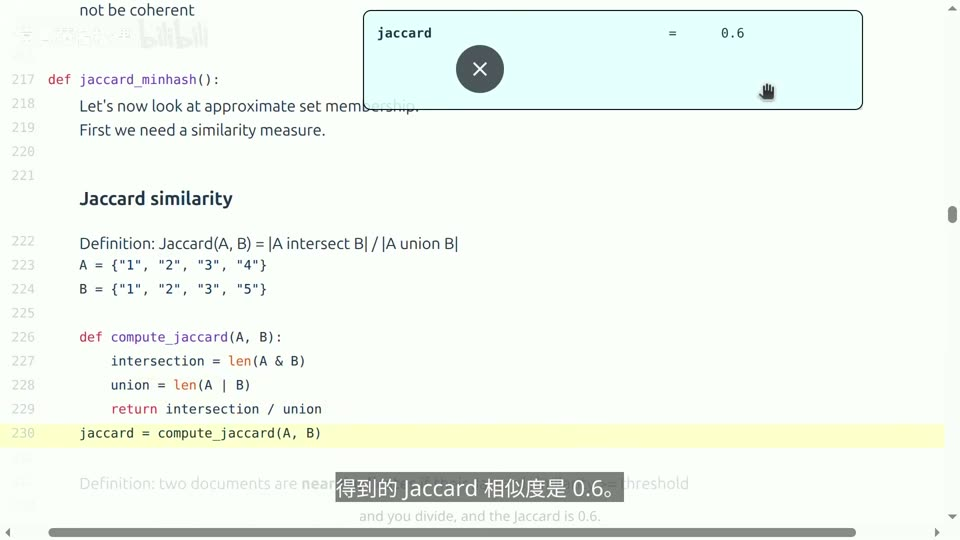 |
| 但这还没完。MinHash 本质上是一种随机哈希函数，它具有一个特性：发生哈希碰撞的概率恰好等于集合 A 和 B 的 Jaccard 相似度。这是一个非常有用的性质，因为哈希函数能将处理复杂度降低至线性时间。Jaccard 是我们使用的指标，我们现在正将两者结合起来，或者更准确地说是期望值。有趣的是，通常情况下我们希望哈希函数…… [【跳转到 22:45】](https://www.bilibili.com/video/BV11LEA6eEuj/?p=14&t=1365) | 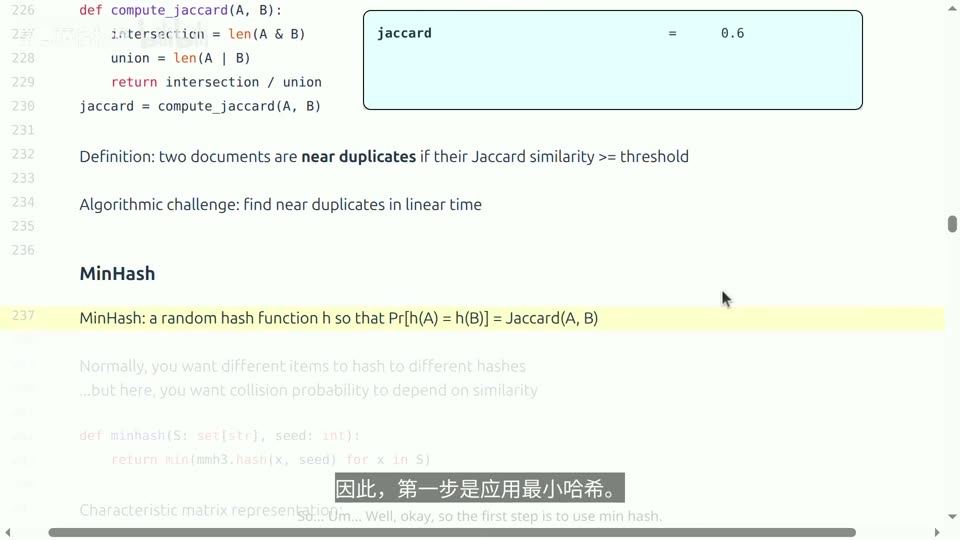 |
| 让每个元素映射到不同且独立的值上，你通常不希望出现碰撞，但在这里你实际上需要碰撞。这种碰撞不是随机的，而是需要以特定方式控制，使其与相似度保持一致，也就是说，相似的元素比差异大的元素更容易产生碰撞。那么 MinHash 本质上是什么？我们来梳理一下。这就是 MinHash，它很简单：你取出这个集合…… [【跳转到 23:10】](https://www.bilibili.com/video/BV11LEA6eEuj/?p=14&t=1390) | 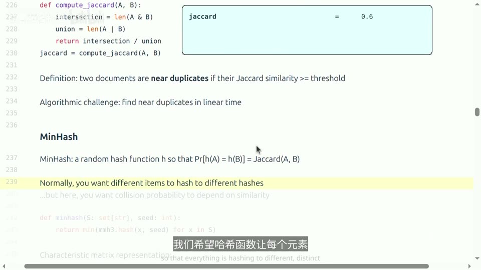 |
| 对其中每个元素进行哈希计算，然后取最小值。如果你是第一次接触，可能会觉得有些奇怪。原理很简单：取出集合中的每个元素进行哈希计算，然后取最小值。好，那么如果是第一次接触，可能会觉得有点奇怪。嗯，A 集合包含 {1,2,3,4}，而 B 集合包含 {1,2,3}，所以这就是这两个集合的特征矩阵表示，对吧？ [【跳转到 23:35】](https://www.bilibili.com/video/BV11LEA6eEuj/?p=14&t=1415) | 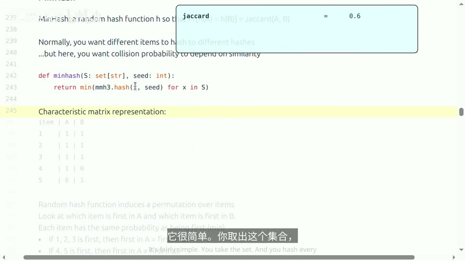 |
| 那么随机哈希函数究竟在做什么？它在元素上诱导出一个排列，比如可能是 4、3、1、5、2 或者其他顺序，然后你看在这个排列下 A 中哪个元素排第一，以及 B 中哪个元素排第一。因此每个元素成为首位的概率是相同的。好，假设随机哈希函数将某个元素排在第一位，呃，那么 A 中的第一个元素…… [【跳转到 24:00】](https://www.bilibili.com/video/BV11LEA6eEuj/?p=14&t=1440) | 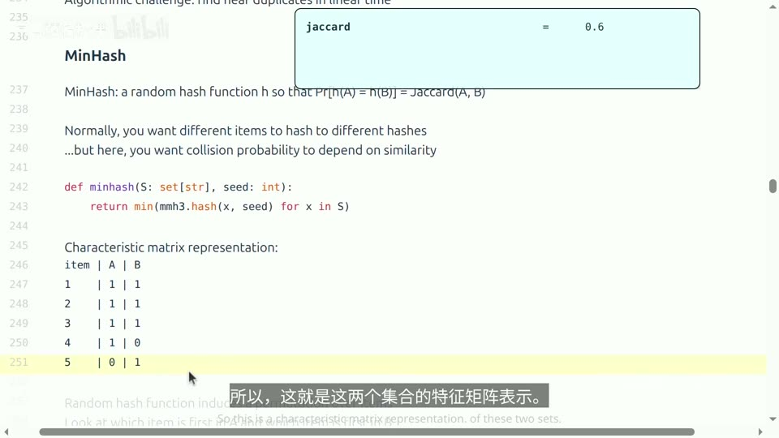 |
| 就等于 B 中的第一个元素。还有，如果是 2 排在第一位，结果也一样；3 排在第一位，结果也一样。但如果随机排列让 4 排在第一位，情况就不一样了，5 同理。接下来我们看这种表示法。简而言之，随机哈希函数的作用就是从这些行中随机选取一行作为首行，接着最小值的作用仅仅是保证 A 的最小值…… [【跳转到 24:25】](https://www.bilibili.com/video/BV11LEA6eEuj/?p=14&t=1465) | 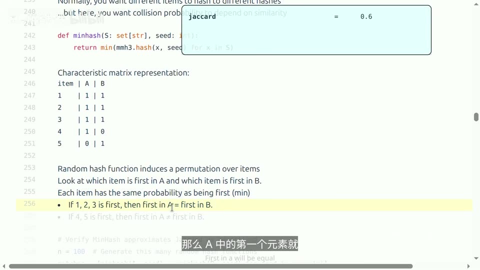 |
| 等于 B 的最小值。这基本上意味着这两行是相同的。这就是 MinHash 的证明，解释了该性质为何成立：即当你拥有一个哈希函数时，你看，无论怎样随机选择哈希函数，其碰撞概率的期望值正是我们所需的相似度度量。好，我们在代码中验证一下，我会生成 100 个不同的哈希函数。 [【跳转到 24:50】](https://www.bilibili.com/video/BV11LEA6eEuj/?p=14&t=1490) | 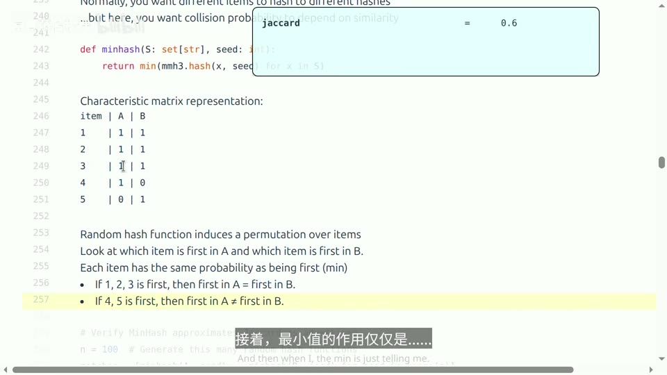 |
| 我只检查最小哈希值是否相等，以及估计的 Jaccard 系数，所以我主要关注看这个比例，结果是 0.6。MinHash 的关键在于我不需要进行 N² 级别的运算，我可以直接计算集合 A 的最小哈希、集合 B 的最小哈希值，还有另一个集合的最小哈希值，我只是在寻找碰撞。谢谢。好的。 [【跳转到 25:15】](https://www.bilibili.com/video/BV11LEA6eEuj/?p=14&t=1515) | 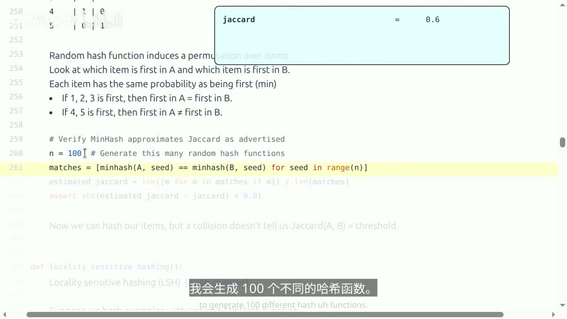 |
| 关于 MinHash 还有什么问题吗？现在我们可以对物品进行哈希处理，但还没完，因为出现碰撞并不意味着 Jaccard 系数超过了某个阈值，这才是我们真正想要的。我们要找出 A 和 B，使他们的 Jaccard 系数大于 0.99。 [【跳转到 25:40】](https://www.bilibili.com/video/BV11LEA6eEuj/?p=14&t=1540) | 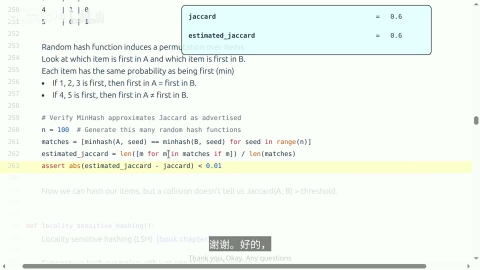 |
| 我们刚才做的只是说明一点：如果发生了碰撞，这两个集合发生碰撞的概率就等于他们的 Jaccard 系数。但光靠这个其实没啥用，因为这是随机的，我没法从中得到任何可靠的结果。对，那咱们接着看下一个。这里有一种叫局部敏感哈希（LSH）的方法，它基本上能解决这个问题。这是理论计算机里很经典的一个思路，挺巧妙的。咱们这么想…… [【跳转到 26:05】](https://www.bilibili.com/video/BV11LEA6eEuj/?p=14&t=1565) | 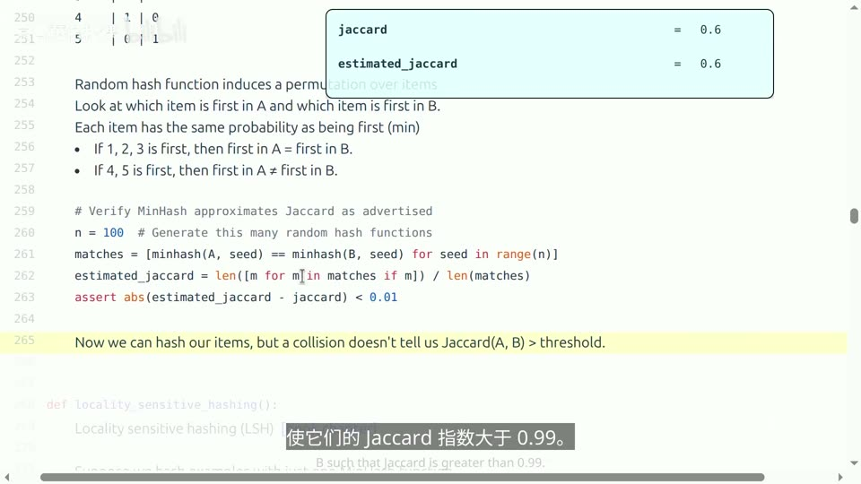 |
| A 和 B 发生碰撞的概率就等于他们的 Jaccard 相似系数。你看，越相似的数据确实越容易撞在一起，不过这种方法随机性很强、方差很大，结果不太稳定。所以我们的目标是：只要 Jaccard 相似系数超过某个阈值，就确保 A 和 B 一定能发生碰撞。因此我们需要想办法把这些概率分布锐化一下，让分布更集中。 [【跳转到 26:30】](https://www.bilibili.com/video/BV11LEA6eEuj/?p=14&t=1590) | 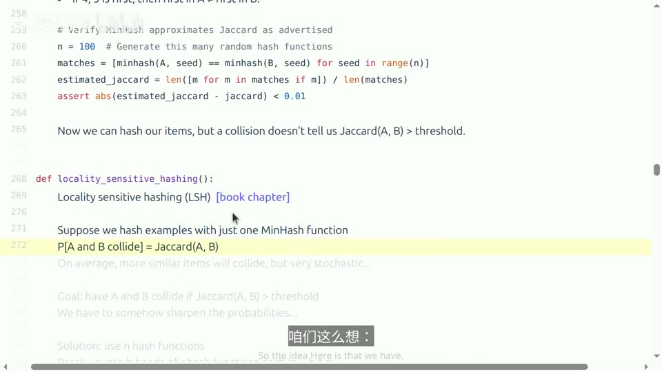 |
| 概率值无法直接等同于 Jaccard 系数，所以解决办法是使用更多的哈希函数，这些哈希函数之间相互独立。这部分稍微有点技术性，咱们一步步来拆解。也就是说，你把 N 个哈希函数分成 B 个 band，每个 band 里包含 R 个哈希函数。比如如果你有 12 个哈希函数，可以分成三个 band，每个 band 包含四个哈希函数。好，这里有一个 band…… [【跳转到 26:55】](https://www.bilibili.com/video/BV11LEA6eEuj/?p=14&t=1615) | 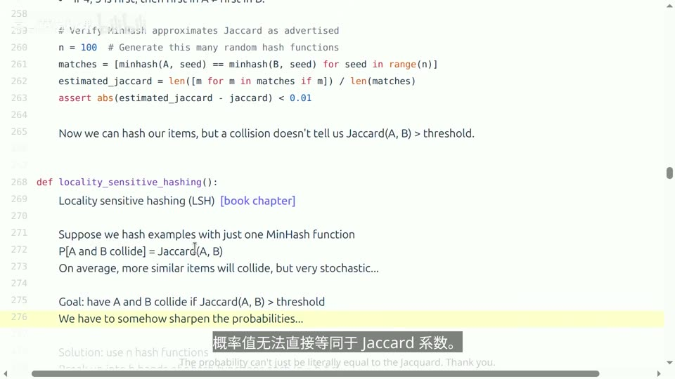 |
| 从 h1 到 h4，这是第二个 band 从 h5 到 h8，第三个 band 从 h9 到 h12。好，接下来我们要尝试做的是——好的。也就是说，每个哈希函数都对应一个特定的概率。记一下，重点在于我们需要计算 A 和 B 发生碰撞的概率：如果一个 band 里的所有哈希函数都返回了相同的值，我们就说 A 和 B 发生了碰撞。 [【跳转到 27:20】](https://www.bilibili.com/video/BV11LEA6eEuj/?p=14&t=1640) |  |
| 比如如果 h5、h6、h7 和 h8 都返回了相同的值——抱歉，我是说如果 A 的 h5 等于 B 的 h5，A 的 h6 等于 B 的 h6，以此类推，那就说明这个 band 被触发了，然后我会说他们发生了碰撞。也就是说，如果这个 band 里的所有哈希函数结果一致，我就认为发生了碰撞。 [【跳转到 27:45】](https://www.bilibili.com/video/BV11LEA6eEuj/?p=14&t=1665) | 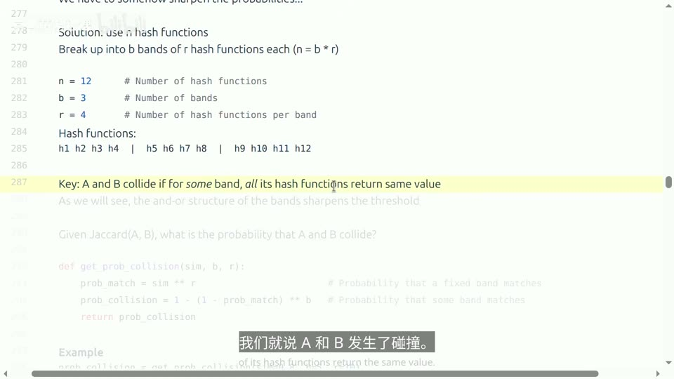 |
| 但你不需要检查所有的哈希函数。然后我会说他们发生了碰撞，也就是说如果这个 band 里的所有哈希函数结果一致，我就认为发生了碰撞，但你不需要检查所有的哈希函数。好，假设你有一个特定的 Jaccard 相似系数……那 B 呢？按这个定义，A 和 B 发生碰撞的概率是多少？好，我们来算一下，假设是这种情况。 [【跳转到 28:10】](https://www.bilibili.com/video/BV11LEA6eEuj/?p=14&t=1690) | 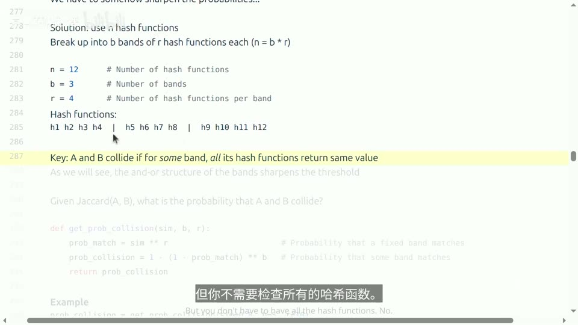 |
| Jaccard 相似系数是 0.8，我们有五个 band，每个 band 里有十个哈希函数，那么我们可以算一下某个固定 band 匹配的概率是多少。因为每个 band 包含 R 个哈希函数，好的，所以某个固定 band 匹配的概率通常非常低，这个概率随 R 呈指数级变化。现在发生碰撞的概率即为…… [【跳转到 28:35】](https://www.bilibili.com/video/BV11LEA6eEuj/?p=14&t=1715) | 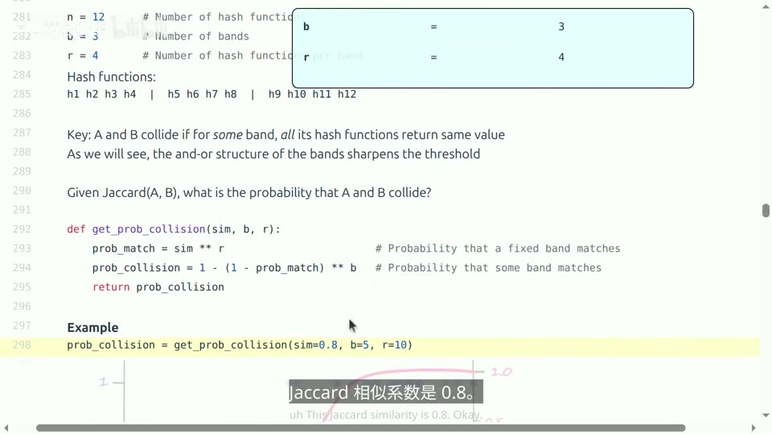 |
| 至少有一个 band 匹配的概率。这等于一减去所有 band 都不匹配的概率。也就是说，先算出一个 band 不匹配的概率（即 1 减去 s 的 R 次方），然后将其自乘 B 次，因为有 B 个 band，得到所有 band 都不匹配的概率。因此用一减去这个数，得到的就是发生匹配的概率。好的，所以碰撞概率是 0.4。 [【跳转到 29:00】](https://www.bilibili.com/video/BV11LEA6eEuj/?p=14&t=1740) | 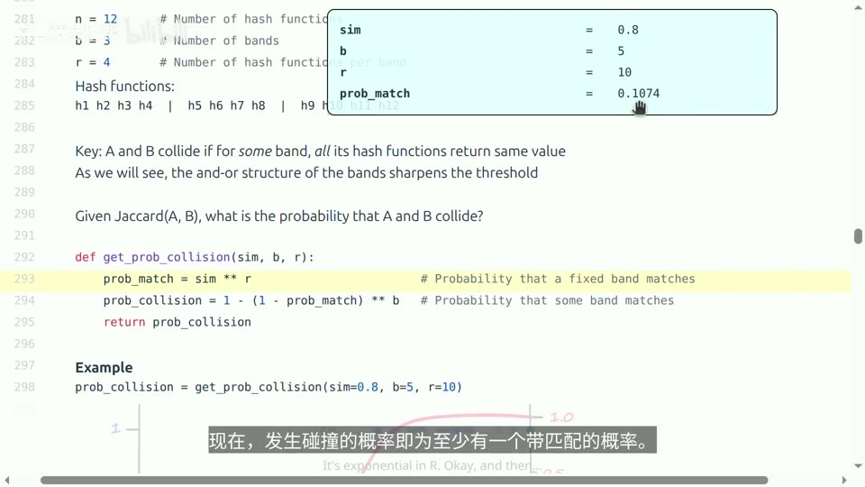 |
| 你的预期值应该更高。好的，谢谢。咱们把它画出来，大概长这样。好的，X 轴代表这里的相似度，我们看的是 0.8，然后你看这儿，这是碰撞概率。所以如果相似度是零，我们预期结果也是零；如果是一，结果就是一。不过大家注意，这个曲线呈现出一种有趣的 S 型，这很好，因为这正是我们想要的效果。 [【跳转到 29:25】](https://www.bilibili.com/video/BV11LEA6eEuj/?p=14&t=1765) | 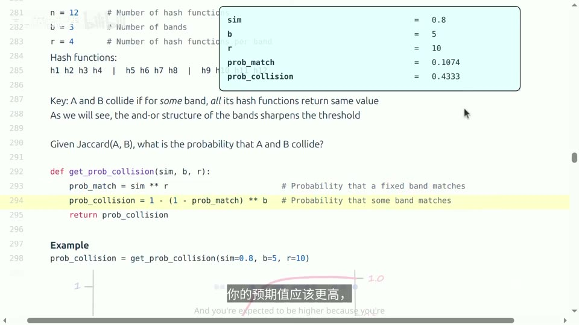 |
| 简单来说，我们的想法是一旦相似度低于某个阈值，匹配概率就要尽可能低；反之，如果相似度高于某个阈值，匹配概率就要尽可能高。所以我们试图让这种变化呈现出类似相变的效果。好，如果你把相似度作为横轴来绘制这个函数，就会得到这样的结果。好，抱歉，我们继续。 [【跳转到 29:50】](https://www.bilibili.com/video/BV11LEA6eEuj/?p=14&t=1790) | 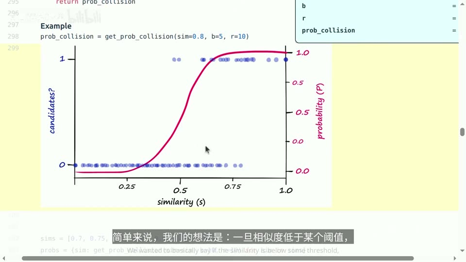 |
| 那我们直接看几个例子。我们具体一点，把相似度范围设定在 0.7 到 0.98 之间。好，我们来看看当 B 等于 10、R 等于 10 时会发生什么。因此我们根据定义来考察碰撞概率，我们发现这给出了一个范围，范围从 0.25 到 1。好的，如果你要设定一个阈值，那么其实这样也行，我们可以把阈值设在这儿。 [【跳转到 30:15】](https://www.bilibili.com/video/BV11LEA6eEuj/?p=14&t=1815) | 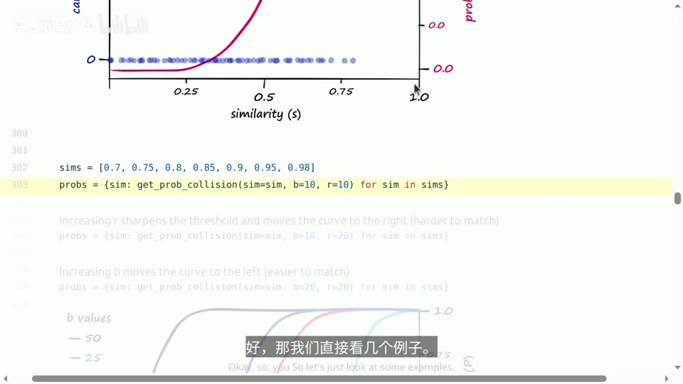 |
| 然后那些有一定概率的仍存在假阳性，因为即使这些值低于阈值，例如 0.9，它们仍可能发生碰撞，但如果我们愿意可以将它们过滤掉，而高于阈值的主要会被保留。那么当你增加 R 时会发生什么？所以 R 代表每个 band 中哈希函数的数量，因此当你增加 R 时，阈值变得更加尖锐。 [【跳转到 30:40】](https://www.bilibili.com/video/BV11LEA6eEuj/?p=14&t=1840) | 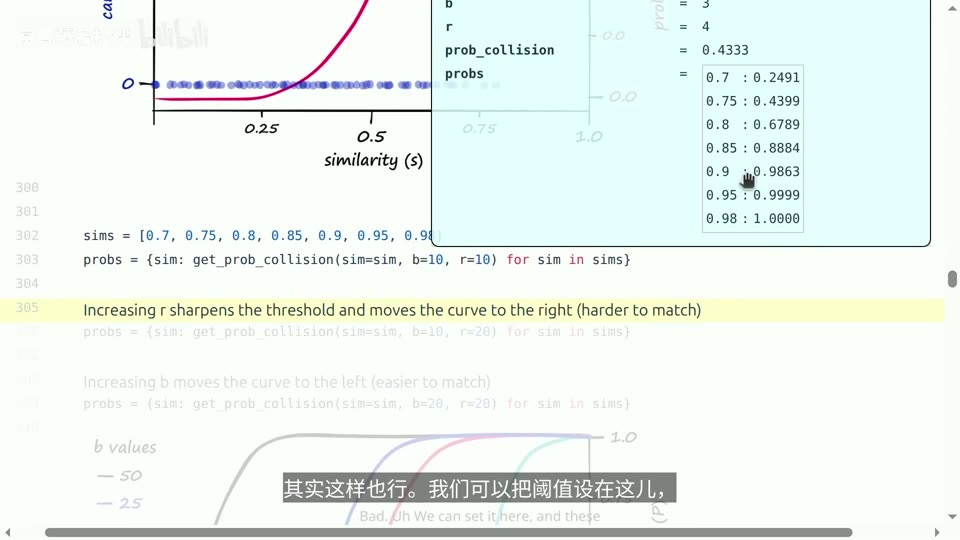 |
| 导致曲线整体向右移动，匹配变得更难了，对吧？因为每个 band 里有更多的哈希函数，这使得指数项变得更陡峭，因此概率分布曲线在这里变得更陡峭，整体向右偏移。也就是说，如果某对数据的 Jaccard 相似度很低，它们被匹配到的概率就微乎其微了，比如概率从之前的 0.25 降到了现在的 0.008。我们是在让概率分布变得更陡峭。好。 [【跳转到 31:05】](https://www.bilibili.com/video/BV11LEA6eEuj/?p=14&t=1865) | 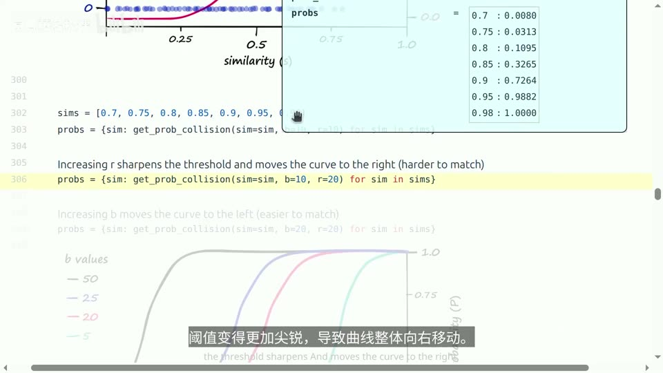 |
| 接下来看增加 B 的情况，这也会使曲线向左移动，从而降低匹配门槛，让匹配更容易。好，接下来看增加 B 的情况，这会使曲线向左移动，从而降低匹配门槛，让匹配更容易。因此观察这一指标，在实施去重之前数值仅为 0.72…… [【跳转到 31:30】](https://www.bilibili.com/video/BV11LEA6eEuj/?p=14&t=1890) | 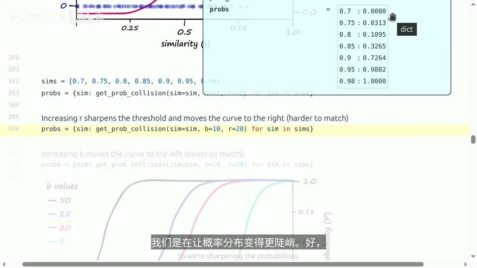 |
| 而目前它已提升至 0.92，当然这也带来了一定的增长，但幅度并不显著。我们可以通过增大 B 和 R 的值让相变过程尽可能陡峭，但要注意，如果 B 和 R 取值过大，可能会导致成本上升。谢谢。接下来我们来看一个更贴近实际应用的场景。在这篇关于去重的论文中，作者提出了……在这篇关于去重的论文中…… [【跳转到 31:55】](https://www.bilibili.com/video/BV11LEA6eEuj/?p=14&t=1915) | 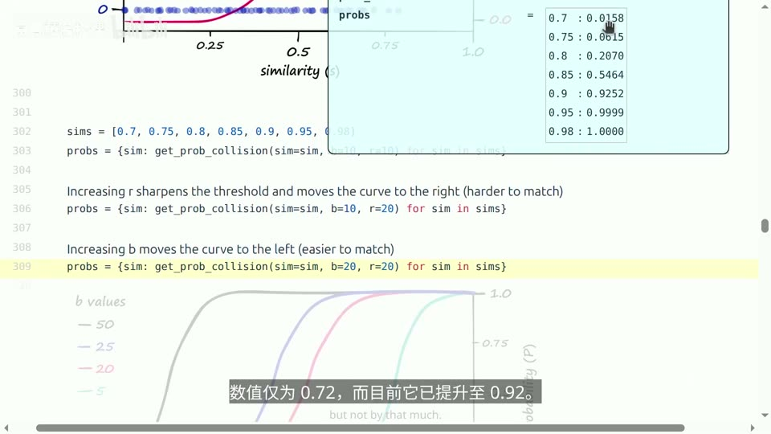 |
| 作者提出了：通常相变发生在临界点，该临界值是 B 的 1/R 次方的倒数，也就是 (1/B)^(1/R)。所以如果你想根据大于 0.9 的 Jaccard 相似度来过滤数据，就需要调整 B 和 R，使阈值恰好为 0.9。接着你可以通过调整 B 和 R，让这种相变现象更加陡峭。 [【跳转到 32:20】](https://www.bilibili.com/video/BV11LEA6eEuj/?p=14&t=1940) | 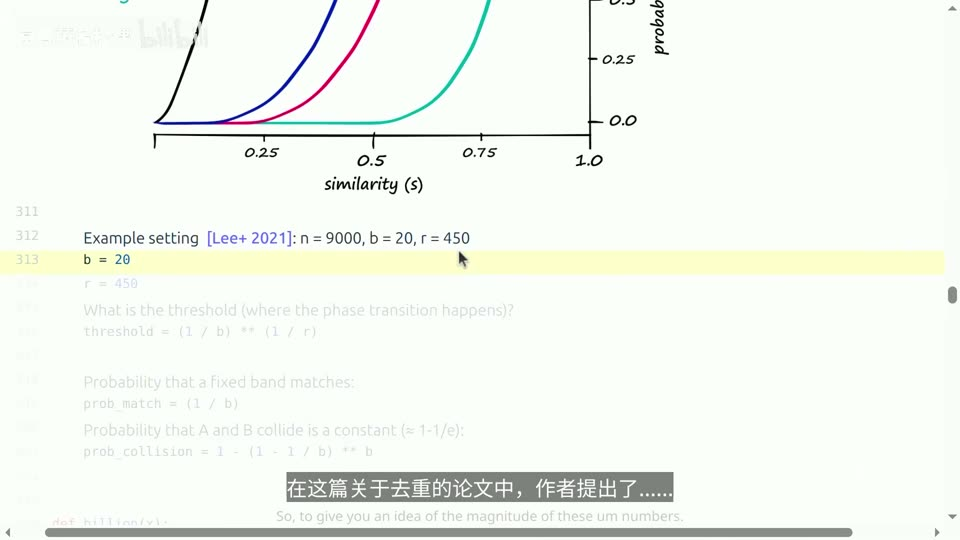 |
| 大家记住，如果固定 band 匹配的概率是 1/B，且你正好处于这个临界点，那么 A 和 B 发生碰撞的概率大概是这个数值，这是一个常数，所以碰撞概率为 0.64。这很合理，基本上相变的中心点就在 0.64 左右，随着 B 和 R 增大，下方的值会趋近于零，上方的值会趋近于一。关于 LSH 大家有什么问题吗？谢谢。 [【跳转到 32:45】](https://www.bilibili.com/video/BV11LEA6eEuj/?p=14&t=1965) | 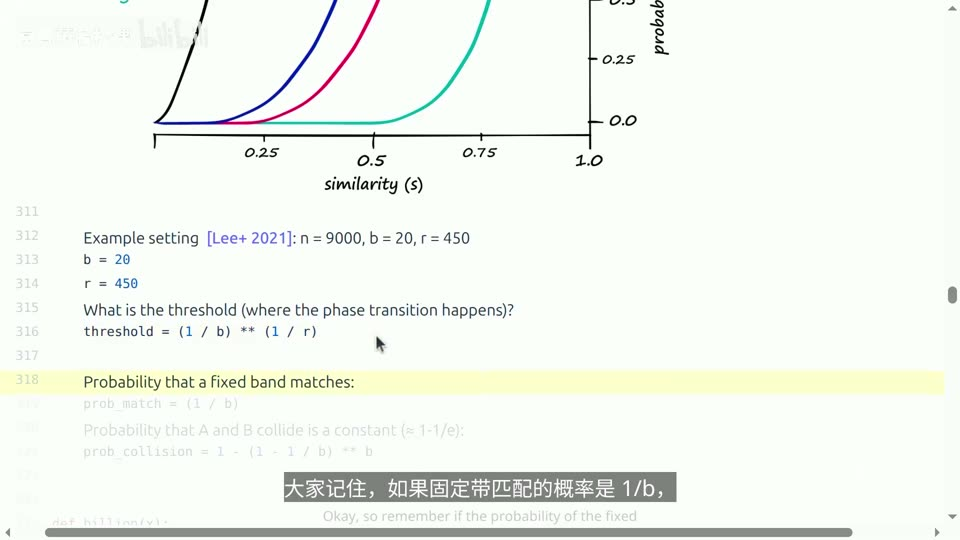 |
| 因此这种方法被称为 MinHash + LSH，因为 LSH 实际上适用于任何哈希函数。在处理原始数据的去重时，我们使用的是 MinHash，它可以近似计算你的 Jaccard 相似度。所以，嗯，基本上这就是你应该在这里使用的方法。关于 LSH 还有问题吗？关于去重…… [【跳转到 33:10】](https://www.bilibili.com/video/BV11LEA6eEuj/?p=14&t=1990) | 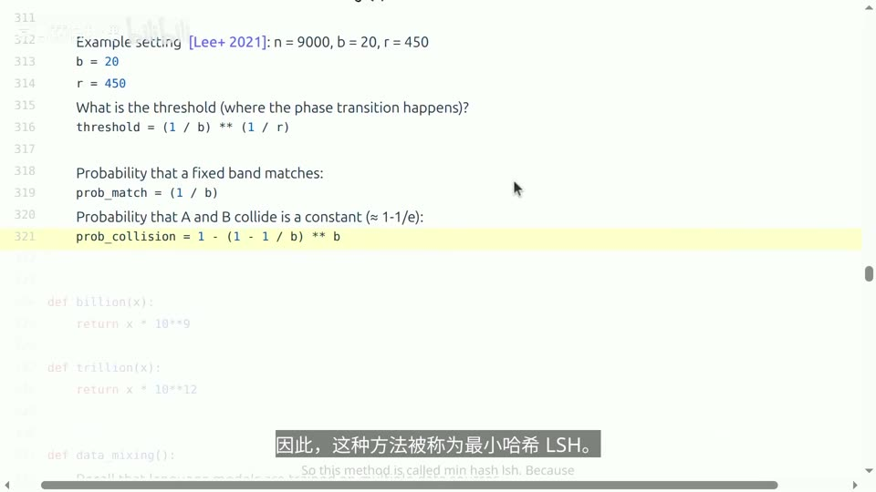 |
| 有一点需要注意。关于 LSH 还有问题吗？关于去重有个点得注意一下，有时候大家会跳过这一步，但其实应该做好。咱们接着看下一个话题：数据混合。到目前为止，我们已经完成了从原始 HTML 或 PDF 到文本的转换，并筛选出了高质量的内容，经过去重处理…… [【跳转到 33:35】](https://www.bilibili.com/video/BV11LEA6eEuj/?p=14&t=2015) | 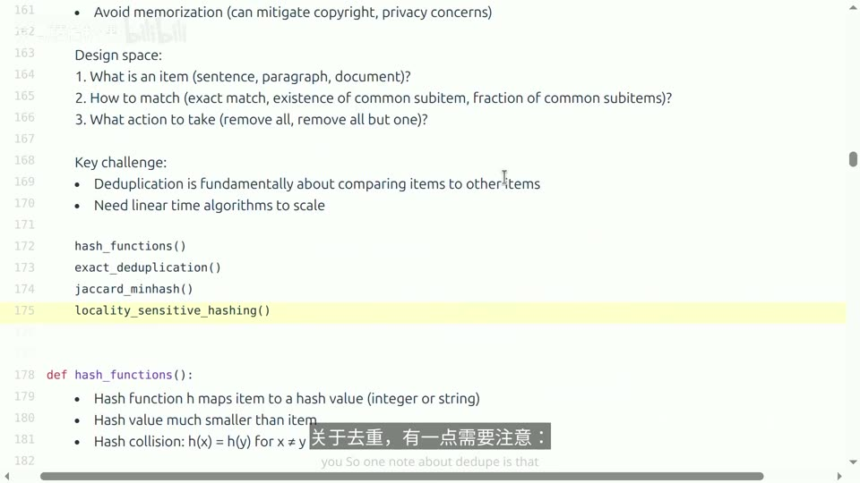 |
| 我们得到了一组规模更小的高质量文档。谢谢，这种情况很常见。经过去重处理，我们得到了一组规模更小的高质量文档。谢谢，这种情况很常见。以 Marin 为例，该网站目前会追踪下一个模型…… [【跳转到 34:00】](https://www.bilibili.com/video/BV11LEA6eEuj/?p=14&t=2040) | 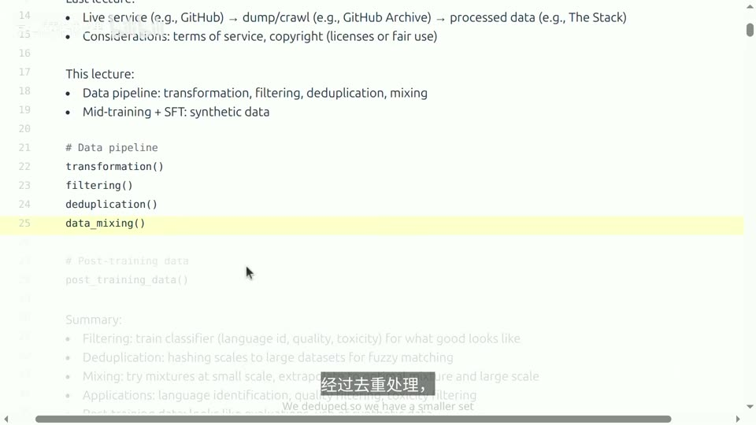 |
| 可能使用的各类数据源。大家可以看到这里涵盖了多种类型。 [【跳转到 34:16】](https://www.bilibili.com/video/BV11LEA6eEuj/?p=14&t=2056) | 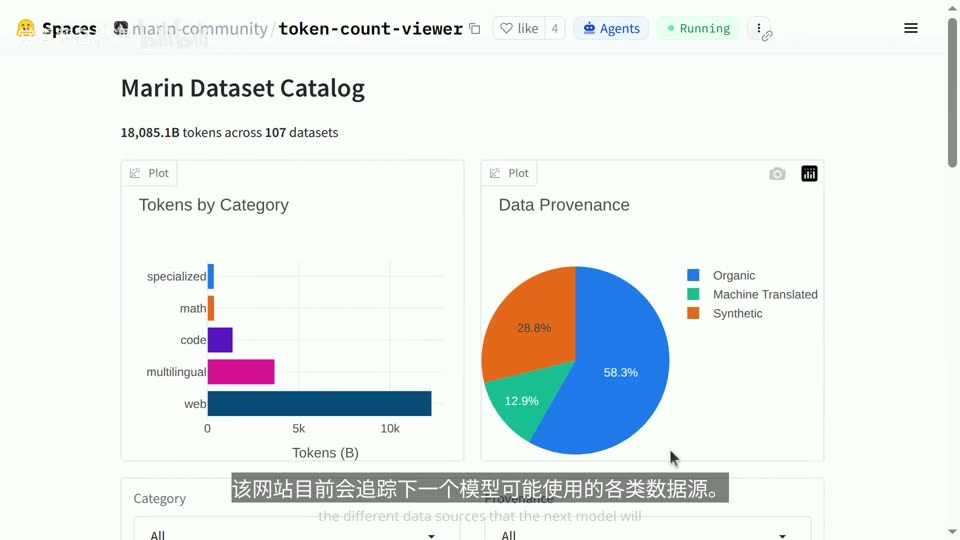 |
| 比如 Nebula，还有我们之前提到的 FinePDFs，以及机构出版的书籍、部分代码等等。面对这些不同的数据源，关键问题在于该如何将它们整合。 [【跳转到 34:21】](https://www.bilibili.com/video/BV11LEA6eEuj/?p=14&t=2061) | 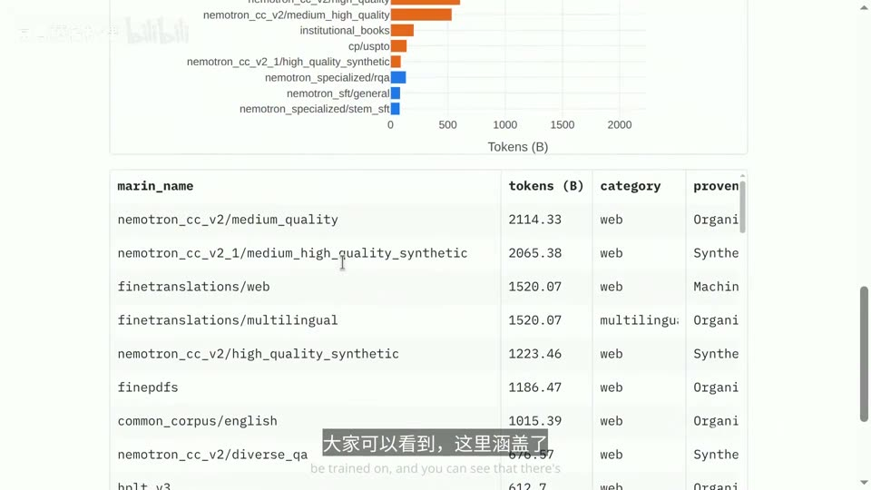 |
| 如果我们回顾一篇较早的论文 The Pile…… [【跳转到 34:35】](https://www.bilibili.com/video/BV11LEA6eEuj/?p=14&t=2075) | 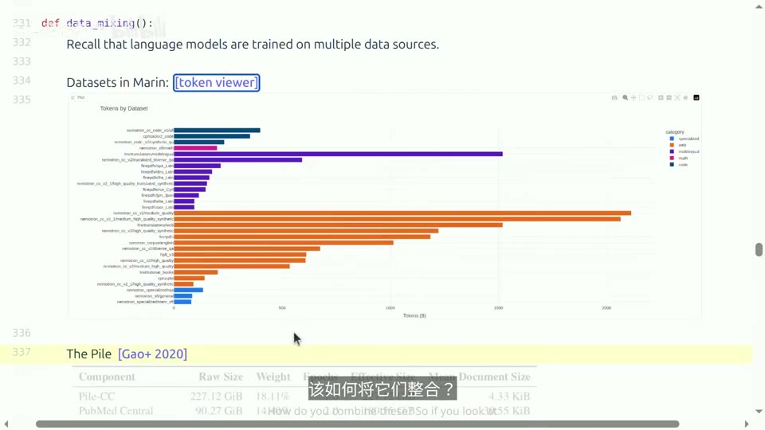 |
| 就能看到当时他们使用的数据源集合，呃，他们基本上是为每个部分分配特定的权重，施加到各个组件上。换句话说，这本质上是一种资源分配。嗯，他们基本上是为每个部分分配特定的权重。谢谢。咱们简化一下，假设你有三个数据源，你需要找到一个数据混合方案。 [【跳转到 34:40】](https://www.bilibili.com/video/BV11LEA6eEuj/?p=14&t=2080) | 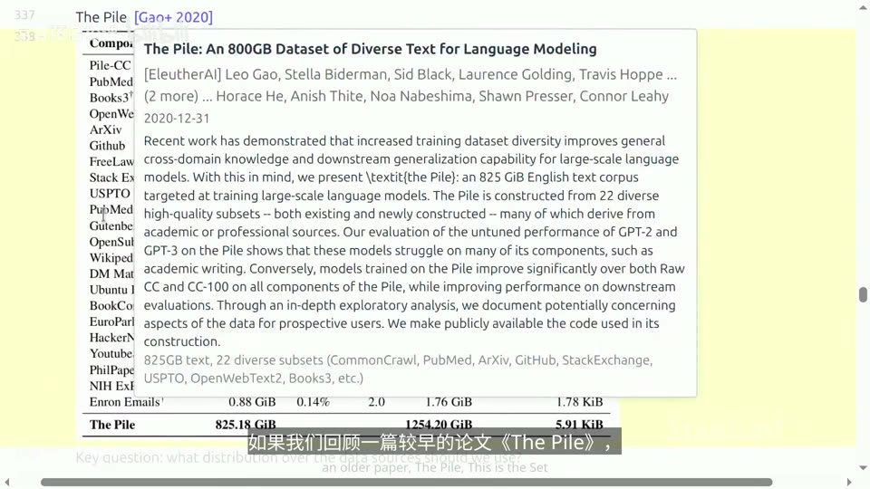 |
| 说白了就是为你那些数据源确定一个分布。好，要是你试着从第一性原理来思考这个问题——嗯，好吧，不算严格的第一性原理——就是你平时可能会怎么做？靠感觉（vibes）。我想这跟第一性原理正好相反，就是你凭某些手动调整一下，凭直觉嘛。这其实挺常见的，大家平时大多就是这么干的。所以我觉得这确实挺靠感觉的，甚至更近期的论文你直接看就行。对。 [【跳转到 35:05】](https://www.bilibili.com/video/BV11LEA6eEuj/?p=14&t=2105) | 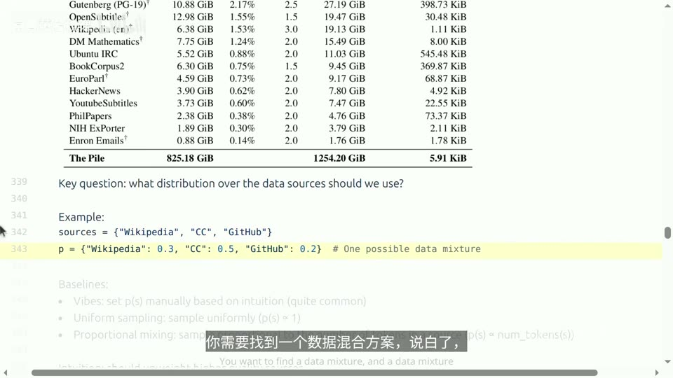 |
| 也许你会用某种方法，然后就像这样微调一下。嗯，你也可以做均匀采样，也就是在你的数据源上应用均匀分布，在你的样本中每获取一个 chunk，你只是采样一个数据源。你也可以做按比例混合，也就是根据原始数据中的 token 数量来采样，所以如果某个数据集包含更多 token，你就给它更高的权重，这通常是个合理的做法。但你可能会担心…… [【跳转到 35:30】](https://www.bilibili.com/video/BV11LEA6eEuj/?p=14&t=2130) | 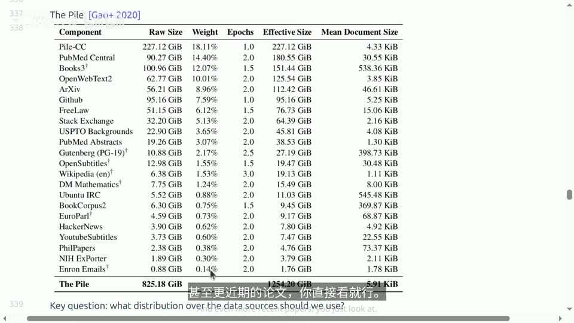 |
| 如果有一个体量巨大但质量低下的数据集，它会消耗掉大量的 token，所以这看起来也不太理想。直觉上你应该给更高质量的数据源更高的权重，所以这看起来也不太理想。第一，你得保证数据具有一定的多样性。你看，很多数据源之间其实没法直接比较，拿文献、代码和论文来说，你很难说某篇论文比某段代码质量更高。 [【跳转到 35:55】](https://www.bilibili.com/video/BV11LEA6eEuj/?p=14&t=2155) | 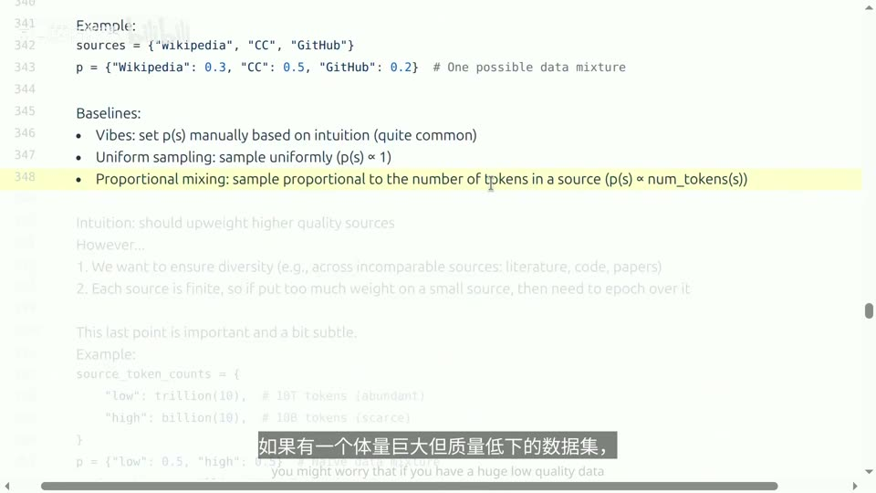 |
| 因为它们根本不是同类的东西，没法直接比。如果你想让语言模型效果好，就不能把所有的质量权重都只压在论文上。谢谢。第二点咱们后面会细说，就是每个数据源的数据量其实都是有限的，所以要是你在一个数据量小的源上分配太多权重，那你很快就会把数据用光，不得不进行多轮训练，也就是在完全相同的 token 上反复训练，这会有负面影响。 [【跳转到 36:20】](https://www.bilibili.com/video/BV11LEA6eEuj/?p=14&t=2180) | 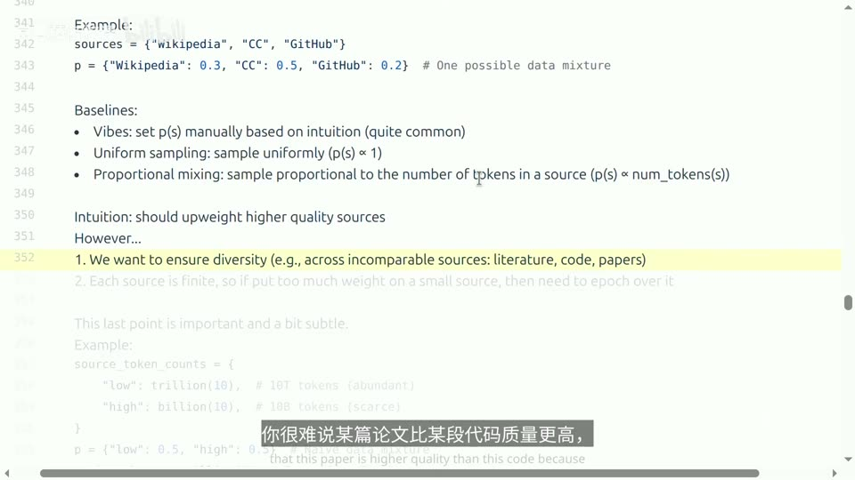 |
| 原因咱们待会看。好，那咱们具体拆解一下最后这一点。打个比方，假设你手头只有两个来源，一个是低质量来源，有 10 万亿个 token；另一个是高质量来源，只有 100 亿个 token。好，那咱们具体拆解一下最后这一点。打个比方，假设你手头只有两个来源，一个是低质量来源，有 10 万亿个 token，另一个是高质量来源只有 100 亿个 token。 [【跳转到 36:45】](https://www.bilibili.com/video/BV11LEA6eEuj/?p=14&t=2205) | 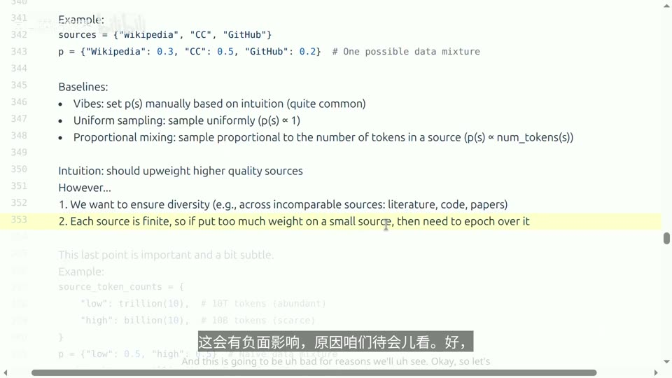 |
| 通常高质量的数据源规模较小。好，那如果我们做个最简单的数据混合，比如均匀采样，也就是各占一半，哦，会训练 1 万亿个 token。嗯，所以当我提到训练 2000000000000 个 token 时，指的并不是唯一 token 的数量，那只是指训练那么多步，呃，这本质上等于总步数除以批次大小，或者说乘以批次大小。嗯，好，那我们来看这个指标。 [【跳转到 37:10】](https://www.bilibili.com/video/BV11LEA6eEuj/?p=14&t=2230) | 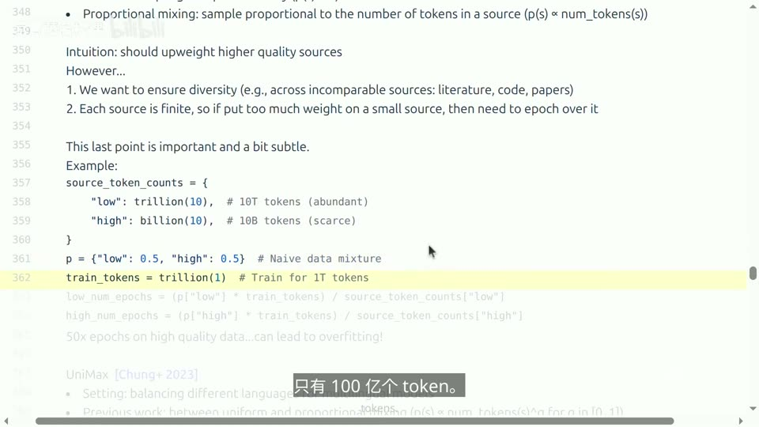 |
| 它表示低质量数据集中的某个特定样本被训练的次数，也就是说这是某个数据点经历的 epoch 数量。简单来说，这意味着在这个低质量数据集中只有 5% 的 token 会被我接触并用于训练。谢谢。接着看高质量数据部分，你会发现 epoch 数是 50，没错，因为我只有 100 亿个 token。 [【跳转到 37:35】](https://www.bilibili.com/video/BV11LEA6eEuj/?p=14&t=2255) | 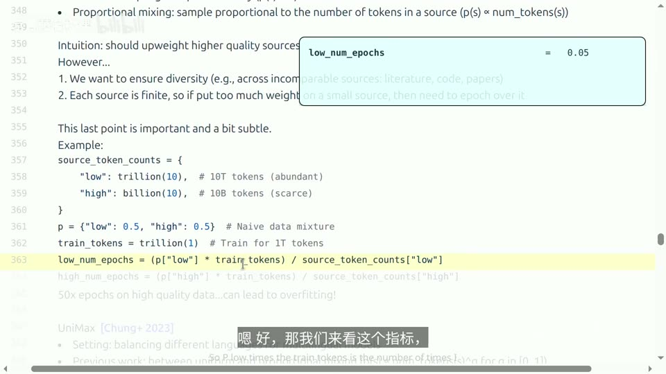 |
| 如果数据量减半，那就是 5000 亿个 token。我需要训练 5000 亿个 token 的高质量数据，但我没有那么多高质量数据，所以每个数据点我得重复使用 50 次。这其实非常关键，你知道有些大模型训练项目在这方面搞砸了。也就是说，你不能简单地查看数据集、定义一个分布然后进行采样，因为如果你只看质量、只看数据…… [【跳转到 38:00】](https://www.bilibili.com/video/BV11LEA6eEuj/?p=14&t=2280) | 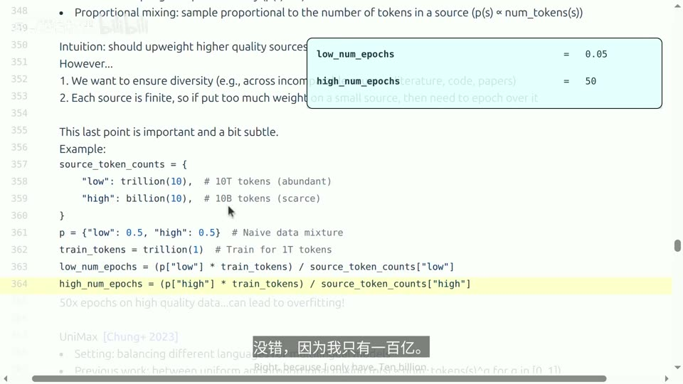 |
| 你实际上忽略了数据点的数量。好，这样讲清楚了吗？大家要是有问题可以暂停一下，这点挺重要的。好，对，嗯，我想是的。谢谢。 [【跳转到 38:25】](https://www.bilibili.com/video/BV11LEA6eEuj/?p=14&t=2305) | 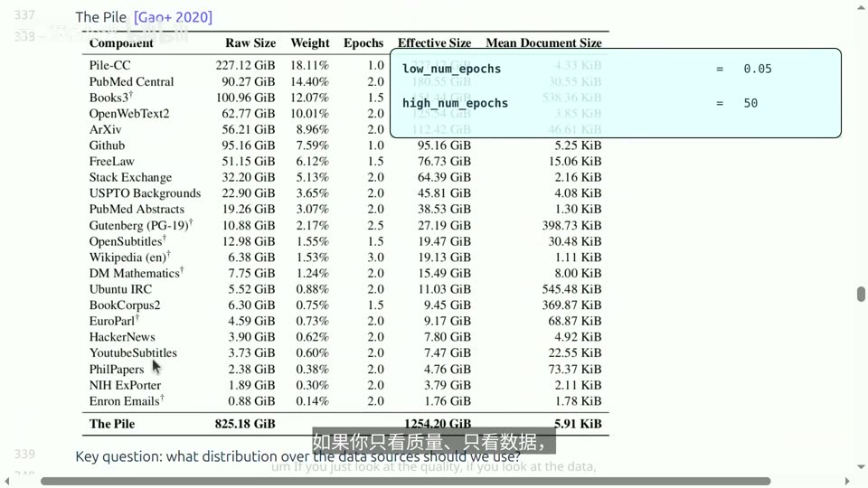 |
| 所以问题是：为什么要跑 50 个 epoch？其实重点是你根本不需要 50 个 epoch，运气好的话只是浪费算力——呃，抱歉，运气好是浪费算力，运气不好就是过拟合了。设为 50 的原因是，如果直接设定数据混合比例，除非全程监控，否则很容易在不知不觉中跑满 50 个 epoch。因此关键在于确认数据实际运行的 epoch 数量。 [【跳转到 38:43】](https://www.bilibili.com/video/BV11LEA6eEuj/?p=14&t=2323) | 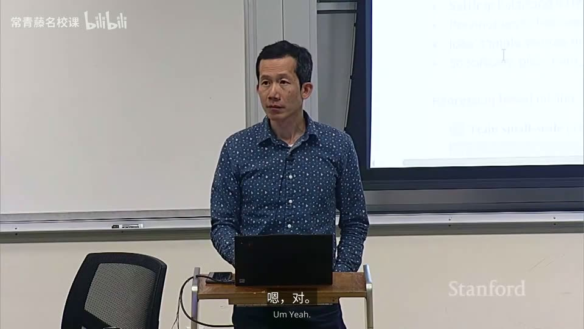 |
| 没错。那么在训练过程中，这些混合比例具体是如何体现的呢？比如如果每步都切换，是像训练时那样，既需要十个 Python 代码样本和十个 C 语言样本吗？我有些疑惑，在做决策时是否有直观的逻辑可循？对，好问题，你的意思是训练时这些混合比例具体是如何落实的？嗯，通常情况是这样的…… [【跳转到 39:08】](https://www.bilibili.com/video/BV11LEA6eEuj/?p=14&t=2348) | 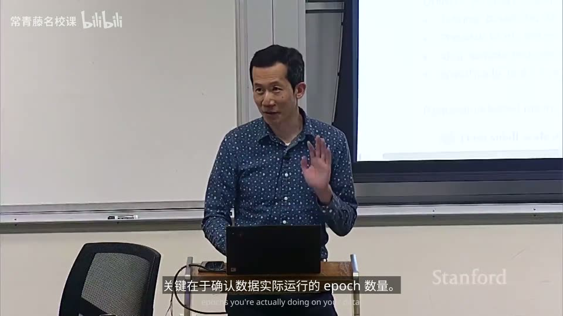 |
| 我们采用的是采样方式，也就是要填满一个 batch。因此你可以对每个元素进行采样，确定其具体来自哪个混合分量，接着用来自该混合分量的序列将整个批次填满。一般来说，每个序列都源自同一个混合分量，我们不是按 token 采样的。所以我认为混合策略是在批次层面设立的，并为此进行权衡。对，通常为了降低方差…… [【跳转到 39:33】](https://www.bilibili.com/video/BV11LEA6eEuj/?p=14&t=2373) | 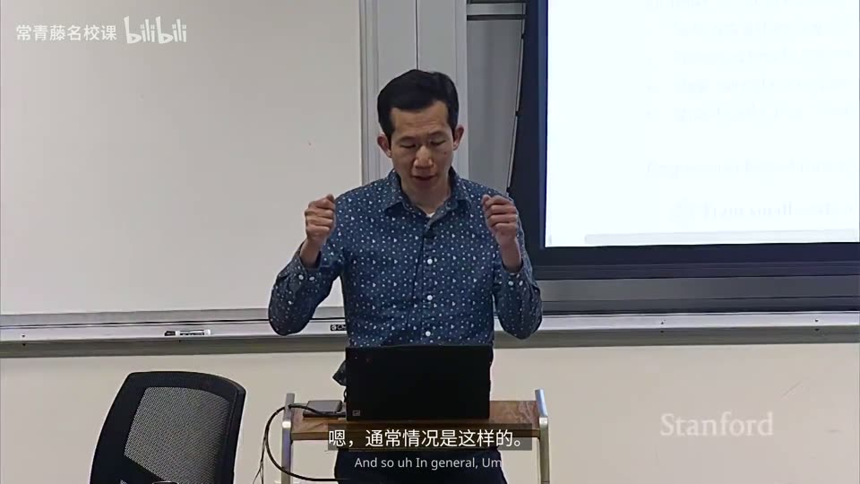 |
| 需要从多个来源进行训练。你看，一个批次里最好还是包含一些混合成分。对，谢谢。好，这个思路或者说这个问题其实早就有人注意到了。 [【跳转到 39:58】](https://www.bilibili.com/video/BV11LEA6eEuj/?p=14&t=2398) |  |
| 所以在那篇论文里，他们提出了 UniMax 这个方法。当时他们正在训练多语言模型，很明显某些语言的数据资源非常稀缺，因此必须想办法解决这个问题。这篇论文指出，以往的一些做法其实是按比例混合数据，然后进行幂次平滑，这样可以让数据分布更加平滑；但这篇论文的思路是把这件事做得更明确一些。 [【跳转到 40:07】](https://www.bilibili.com/video/BV11LEA6eEuj/?p=14&t=2407) | 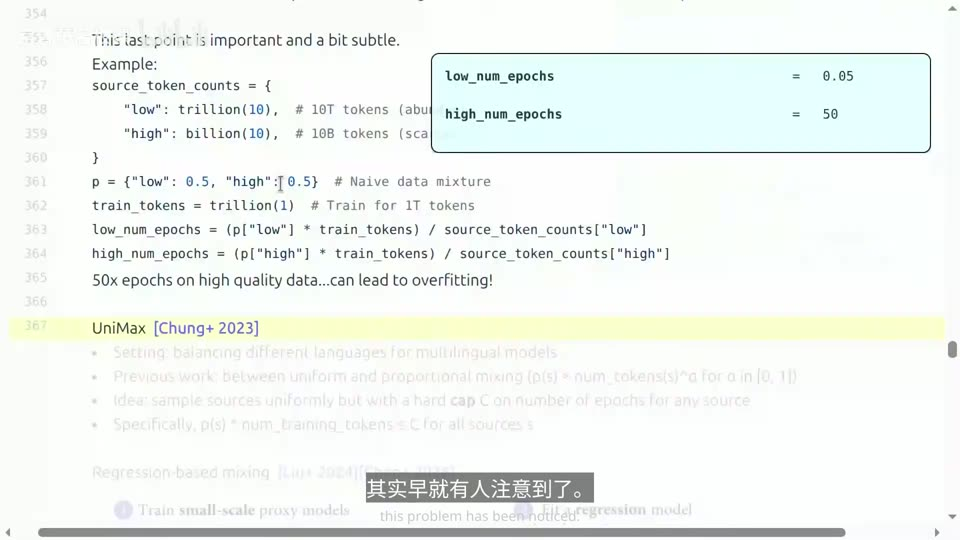 |
| 我们均匀地采样各个数据源，但为每个数据源的 epoch 数设定上限，所以核心思路就是针对某个数据源只训练 20 个 epoch。我们对各数据源进行均匀采样，但为每个数据源的 epoch 数设定上限，因此核心思路是针对特定数据源仅训练 20 个 epoch。从某种意义上说，这涉及网络层面的分配，具体而言，若观察分配给某数据源的概率…… [【跳转到 40:32】](https://www.bilibili.com/video/BV11LEA6eEuj/?p=14&t=2432) | 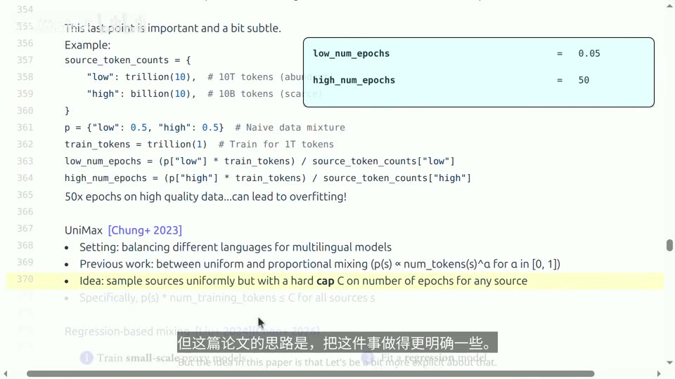 |
| 乘以训练 token 数量这一指标，其值应小于或等于设定上限。此外存在一种简单流程，可在满足该约束的前提下实际确定混合比例。好的，我们稍微换个话题。我们最初是如何定义混合比例的？假设有 50 个数据源，就需要确定 50 个数值。我们发现简单的按比例混合并不足够，或许可以尝试估算某种质量指标…… [【跳转到 40:57】](https://www.bilibili.com/video/BV11LEA6eEuj/?p=14&t=2457) | 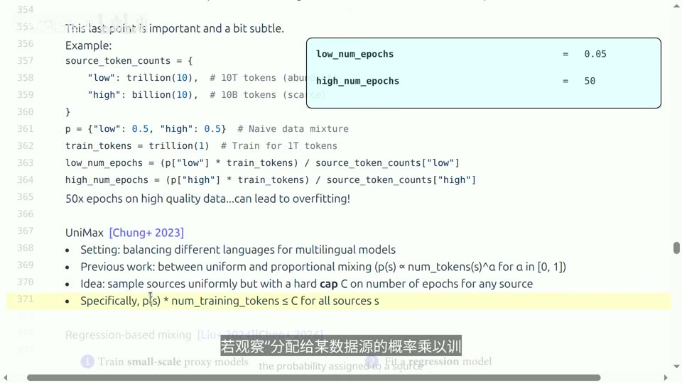 |
| 并据此进行采样，但这依然属于启发式方法。因此最具理论依据且易于理解的方法，既能清晰阐明原理的方法，是基于回归的混合方法，例如 RegMix、Olmix 及其他相关论文，就像这样。 [【跳转到 41:22】](https://www.bilibili.com/video/BV11LEA6eEuj/?p=14&t=2482) | 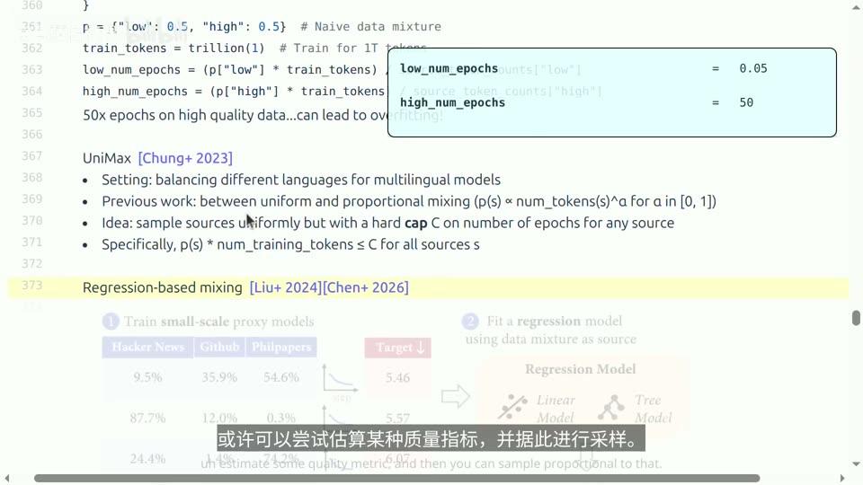 |
| 其核心思路相对简单。首先假设你正在尝试训练大规模模型，我们先缩小规模，假设我们将参数量设定为 3 亿，然后你尝试不同的数据混合比例。假设你有三个组成部分，你可以尝试不同的混合方案，接着你训练这些小型模型，也就是训练一组小型模型，每个模型会在某个目标指标上给出一个损失值。 [【跳转到 41:40】](https://www.bilibili.com/video/BV11LEA6eEuj/?p=14&t=2500) |  |
| 这可能是某些下游评估指标，也可能是困惑度，由你决定。谢谢。好的，简单来说，你是用这些数据点来训练一个回归模型，以数据混合权重作为输入，预测对应的损失值。好的，这样你就有了一个低成本模型，能帮你预估如果用这种数据混合来训练损失会是多少。接着你就可以对这个数据混合方案进行优化…… [【跳转到 42:05】](https://www.bilibili.com/video/BV11LEA6eEuj/?p=14&t=2525) |  |
| 也就是通过优化这个函数，找到最佳的数据混合比例。最后你就用这个数据混合去训练那个大规模模型。谢谢。好的，这就是那个简单的流程，你会发现它和缩放定律有点像，都是先做点低成本计算来探路，然后再大规模扩展。好的，这里涉及几个设计上的选择…… [【跳转到 42:30】](https://www.bilibili.com/video/BV11LEA6eEuj/?p=14&t=2550) | 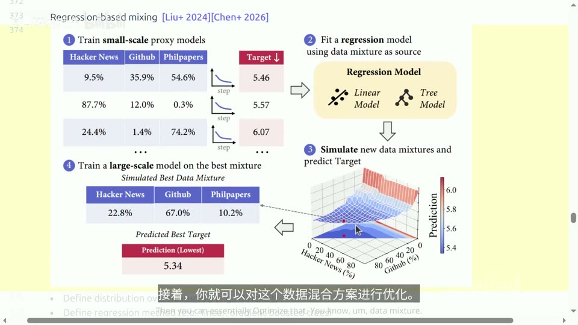 |
| 比如你打算尝试哪些数据混合方案？ [【跳转到 42:50】](https://www.bilibili.com/video/BV11LEA6eEuj/?p=14&t=2570) | 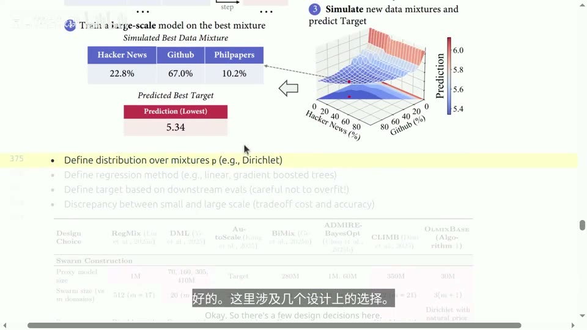 |
| 此时你需要对分布本身进行建模，因此许多人会选择 Dirichlet 分布。此外还需确定回归方法，实践中大家既尝试过线性模型，也尝试过梯度提升决策树。 [【跳转到 42:55】](https://www.bilibili.com/video/BV11LEA6eEuj/?p=14&t=2575) | 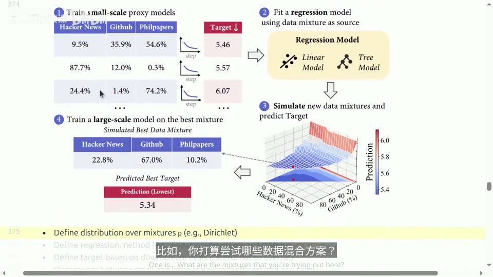 |
| 首先要明确目标，通常参考下游评估指标，但务必警惕过拟合。 [【跳转到 43:06】](https://www.bilibili.com/video/BV11LEA6eEuj/?p=14&t=2586) | 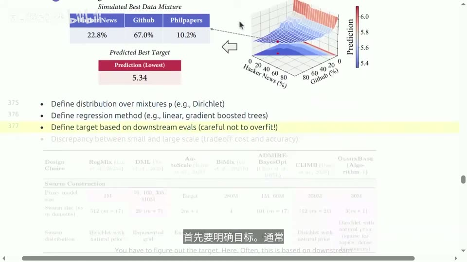 |
| 毕竟我们进行的是预训练，理论上预训练旨在训练通用模型，而非迎合特定的下游任务评估，数据方面需格外谨慎。例如若混入大量代码类评估数据，结果往往不尽如人意：模型会将更高的权重分配给所有代码数据，这一逻辑不难理解，最终当你希望模型创作诗歌时，却发现其已经过拟合。因此这一点需格外注意。按比例混合或均匀混合…… [【跳转到 43:11】](https://www.bilibili.com/video/BV11LEA6eEuj/?p=14&t=2591) | 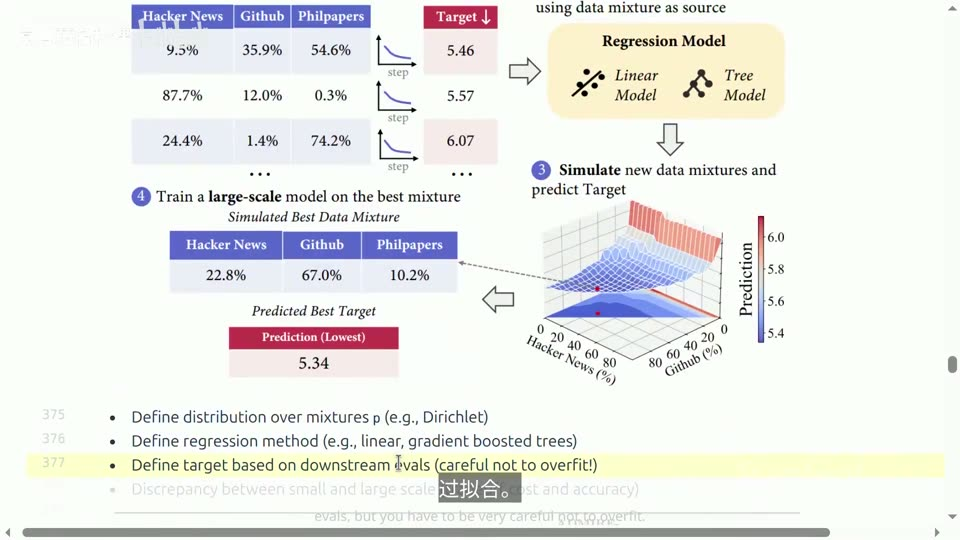 |
| 可避免此问题，因为这些方法不依赖下游评估。最后我们探讨一下小规模模型与大模型之间的差异究竟有多大。这本质上是成本与精度的权衡：训练极小规模模型时结果可能缺乏代表性，若训练大模型则无需采用此类策略，直接进行训练即可，这实质上是在最大规模上进行超参数调整，成本过高。谢谢。这篇数据混合论文做得不错。 [【跳转到 43:36】](https://www.bilibili.com/video/BV11LEA6eEuj/?p=14&t=2616) | 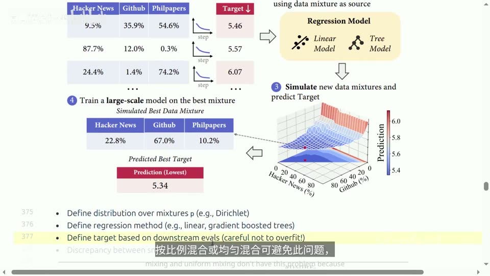 |
| 里面有个表格展示了针对多种不同……那些属于这类框架的方法。代理模型的大小通常都在数千万，或呃，数千万个参数。你采样多少个点、采用多少个混合比例……代理模型的大小通常为数千万或数亿。你可以使用 Dirichlet 分布，也可以使用指数分布。谢谢。接下来是回归模型，你可以拟合一个对数线性模型。 [【跳转到 43:58】](https://www.bilibili.com/video/BV11LEA6eEuj/?p=14&t=2638) | 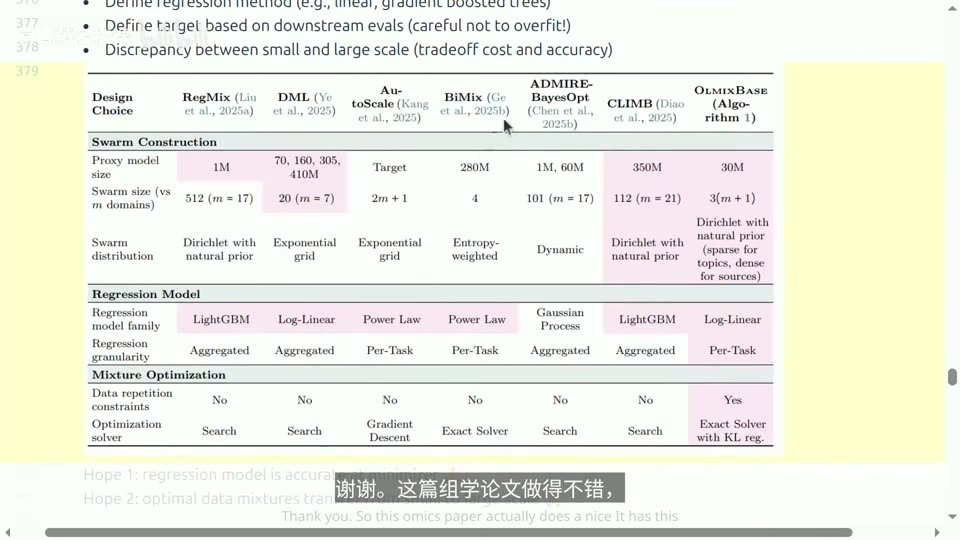 |
| 这通常很有效，啊，效果相当不错。然后你可以用不同的方法来解决这个优化问题。好的，所以这里有两个你需要特别小心的假设前提。也就是说，这个回归模型是在一堆这样的小规模…… [【跳转到 44:23】](https://www.bilibili.com/video/BV11LEA6eEuj/?p=14&t=2663) | 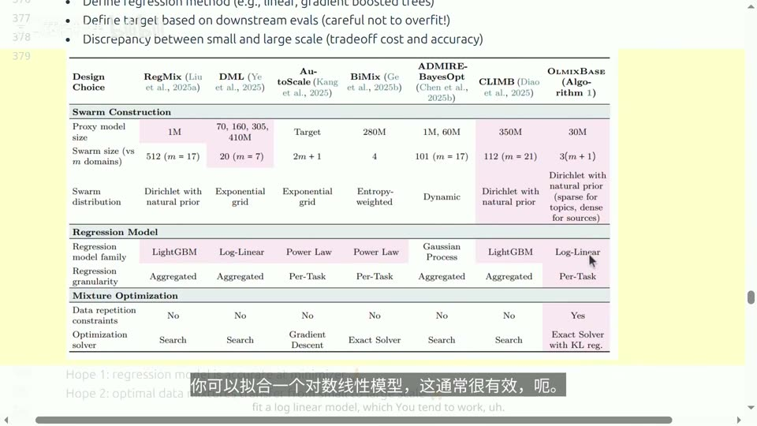 |
| 代理实验上训练出来的，而你正在对它进行优化，因此我们希望该回归模型找到的最优…… [【跳转到 44:37】](https://www.bilibili.com/video/BV11LEA6eEuj/?p=14&t=2677) | 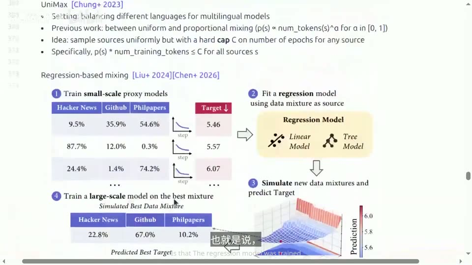 |
| 数据混合方案依然是可靠的。 [【跳转到 44:43】](https://www.bilibili.com/video/BV11LEA6eEuj/?p=14&t=2683) | 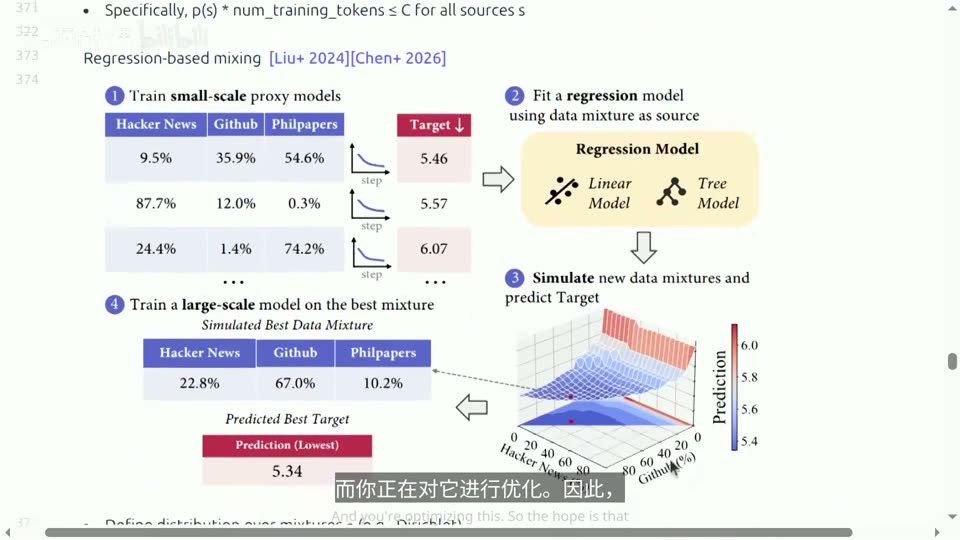 |
| 并且该回归模型本身也是准确的，这有点……而这个回归模型依然有效…… [【跳转到 44:48】](https://www.bilibili.com/video/BV11LEA6eEuj/?p=14&t=2688) | 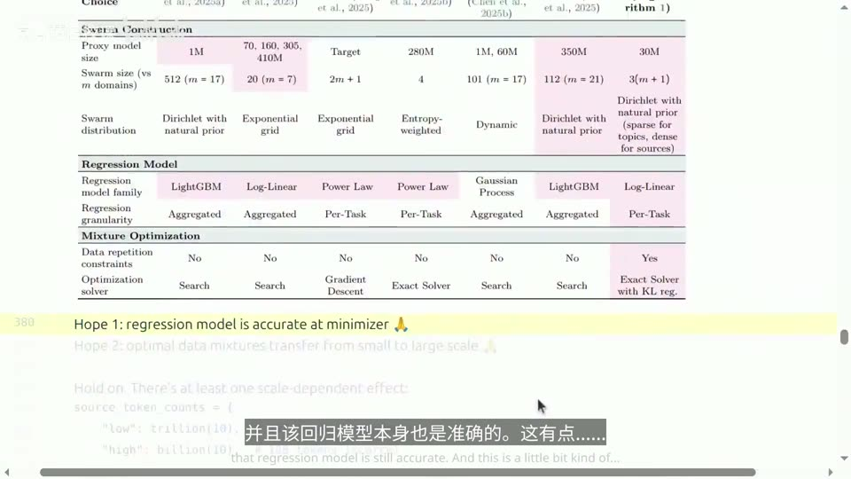 |
| 这有点……通常问题不大，毕竟有经典的泛化能力作为保障。当你采样混合数据并拟合函数时，模型理应能在数据分布范围内做出准确预测；但在优化过程中，你本质上是在逼近某些极端情况，而那里的数据覆盖可能不足。这是一个需要注意的点。 [【跳转到 44:54】](https://www.bilibili.com/video/BV11LEA6eEuj/?p=14&t=2694) | 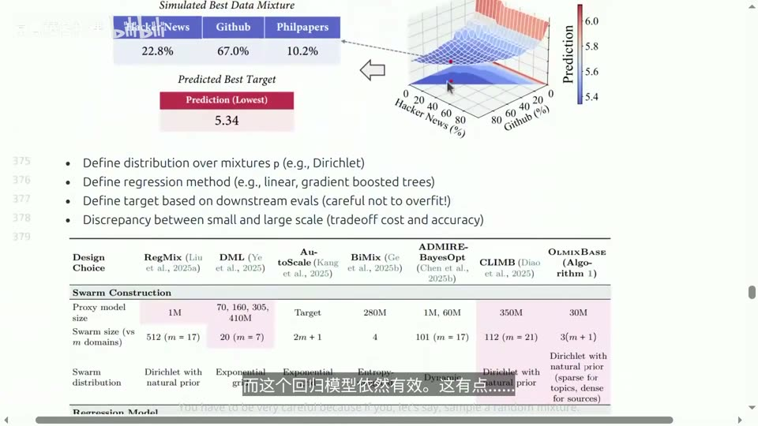 |
| 另外一点是关于最优数据配比，你主要希望这种关系能从小规模迁移到大规模。一般来说，至少在开源社区常用的规模下，这种假设通常是成立的，或者说并不明显错误，但显然存在规模依赖效应。回想一下刚才讲过滤时的那张幻灯片：如果你要训练更多的 token，那么低质量数据或许是可以接受的，显然最优解并不一样，但在这种情况下…… [【跳转到 45:11】](https://www.bilibili.com/video/BV11LEA6eEuj/?p=14&t=2711) | 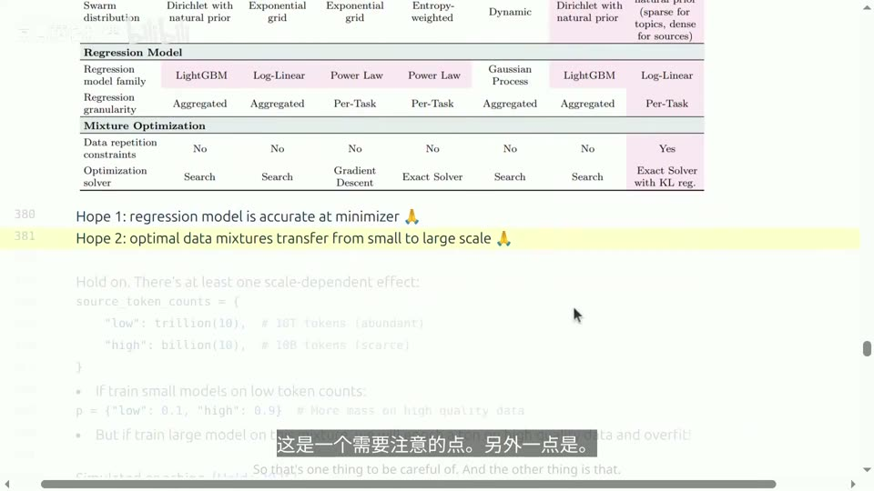 |
| 咱们只能尽量争取最好的结果。谢谢。好，稍等，有个之前聊过的跟规模有关的效应，咱们得在这儿处理一下，咱们得在这解决这个问题，谢谢。打个比方，假设我们有海量的低质量数据，10 万亿 token，但高质量数据很少，只有 100 亿 token。如果咱们用较少的 token 数量去训练一个小模型，大家应该还记得，此时你可能会将大部分注意力…… [【跳转到 45:36】](https://www.bilibili.com/video/BV11LEA6eEuj/?p=14&t=2736) | 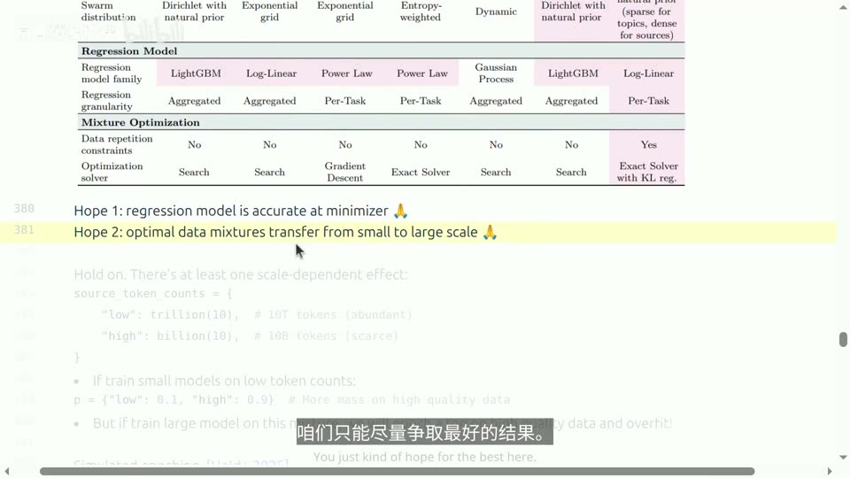 |
| 集中在高质量数据上。这是一个假设性的例子，但……谢谢。因为如果 token 数量较少，模型无法进行多次 epoch 训练，这时模型就会产生一种倾向：哇，维基百科真好。于是我们决定就在维基百科上进行训练。但是如果你继续使用这种混合数据来训练大型模型（large model），你就会对高质量数据进行反复训练，结果就是过拟合。 [【跳转到 46:01】](https://www.bilibili.com/video/BV11LEA6eEuj/?p=14&t=2761) |  |
| 因此一种解决方案，也就是数据混合研究中采用的那种，嗯…… [【跳转到 46:26】](https://www.bilibili.com/video/BV11LEA6eEuj/?p=14&t=2786) | 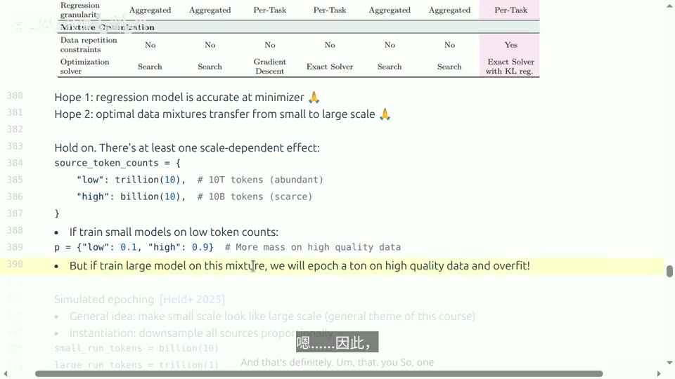 |
| 你可以限制 epoch 的数量。好，这是一种解法。这里还有另一种方法。 [【跳转到 46:32】](https://www.bilibili.com/video/BV11LEA6eEuj/?p=14&t=2792) | 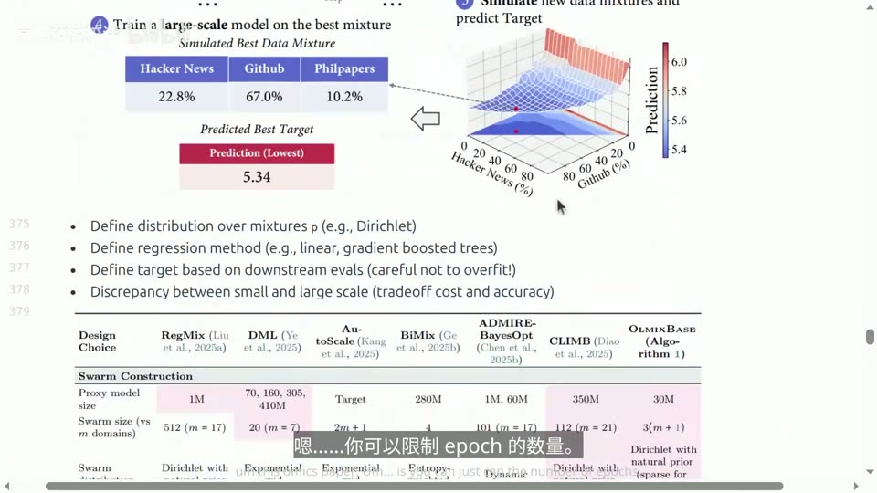 |
| 它可能有多个名称，其中一种叫做模拟 epoch（simulated epoching）。其原理是让你的小规模实验看起来像大规模实验，这算是这门课的一个通用主题，我们之前在讲解 μP 时也见过这个思路：你对模型进行参数化，这样你的超参数就能迁移过去，所以同样的原理在这里也适用。而这种简单粗暴的缩放方法的弊端在于，嗯，你不能在小规模上跑完 epoch，然后在大尺度上又跑一遍。 [【跳转到 46:37】](https://www.bilibili.com/video/BV11LEA6eEuj/?p=14&t=2797) | 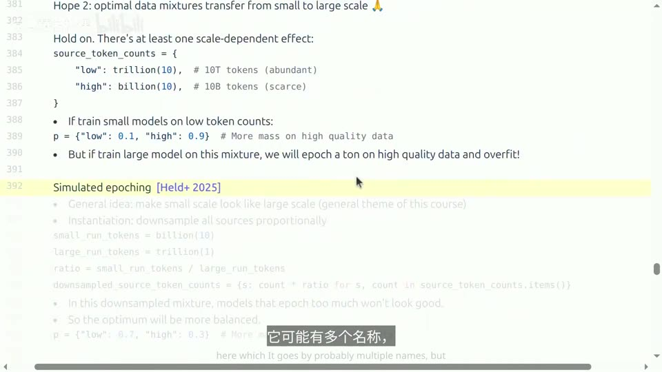 |
| 同样的原理在这里同样适用。但这种简单粗暴的缩放方式存在弊端：你不能先在小规模数据上跑完一个 epoch，再在大尺度数据上重新跑一遍。比如小模型训练使用 100 亿 token，大模型训练使用 1 万亿 token，你就需要进行 1% 的下采样，接着直接使用经过下采样的混合数据。这样做的逻辑是…… [【跳转到 47:02】](https://www.bilibili.com/video/BV11LEA6eEuj/?p=14&t=2822) | 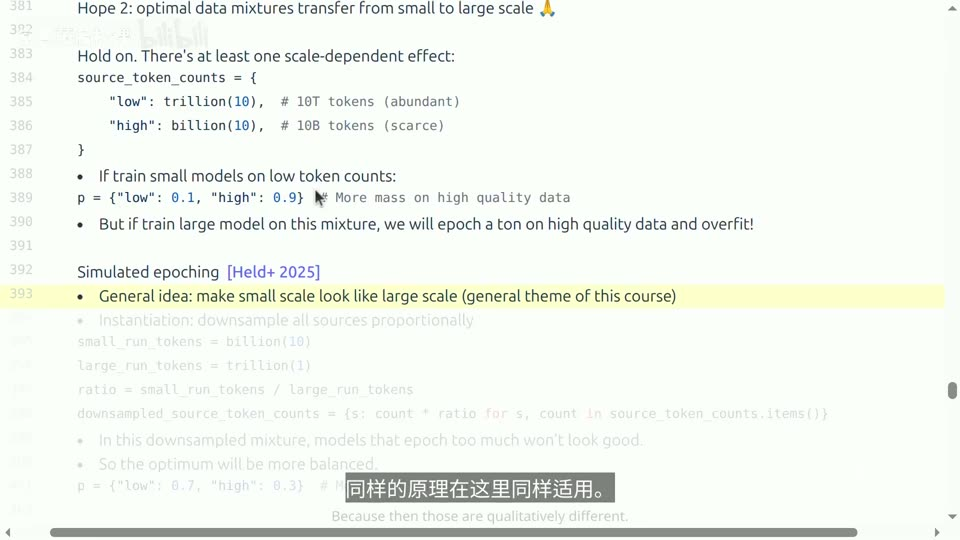 |
| 既然使用了下采样后的数据……那么这种做法不可行，因为你无法使用全量数据进行训练，只能使用维基百科的数据，你只能利用维基百科中极小的一部分数据，届时你会发现必须反复训练很多个 epoch，这会导致损失值居高不下、表现很差。因此在优化过程中，你需要寻找更平衡的方案。因此你实际上是在小规模下模拟大规模高容量阶段会遇到的数据稀缺情况。 [【跳转到 47:27】](https://www.bilibili.com/video/BV11LEA6eEuj/?p=14&t=2847) | 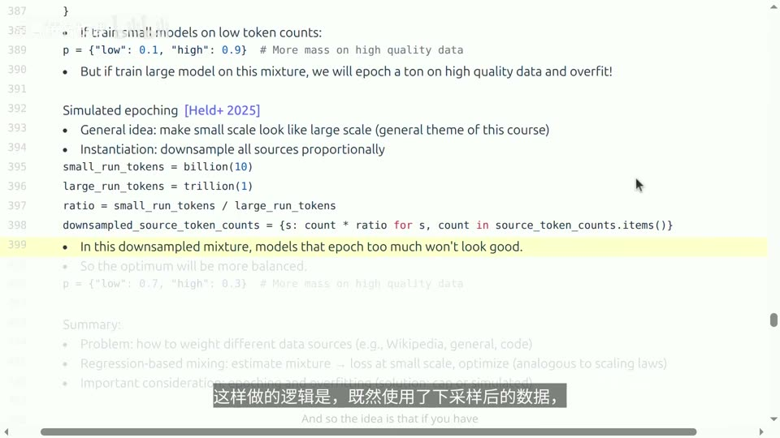 |
| 好，我们来总结一下这部分。核心问题是如何为不同的数据源分配权重，例如你拥有维基百科、Common Crawl、代码数据以及从其他来源爬取的数学数据，那么如何平衡这些来源呢？我认为采用基于回归的混合方法是一个不错的思路：先在小规模数据上拟合一个函数，将混合权重映射到损失值。 [【跳转到 47:52】](https://www.bilibili.com/video/BV11LEA6eEuj/?p=14&t=2872) | 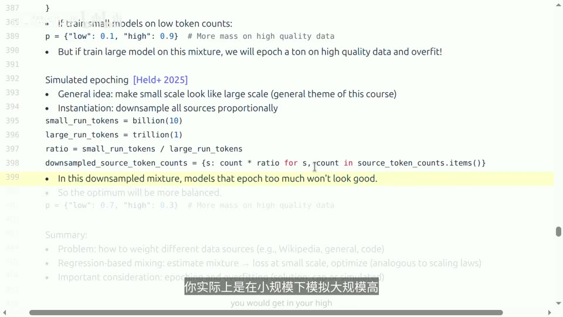 |
| 优化完成后再推广到大规模场景，这一点必须格外谨慎，因为涉及轮次控制和过拟合风险，建议采用截断轮次或模拟轮次。所以这里有一个教训：如果要优化某个目标，务必小心，否则很容易优化到错误的方向。好，在继续之前，关于数据混合大家有什么问题吗？谢谢。没错，确实存在这个风险。 [【跳转到 48:17】](https://www.bilibili.com/video/BV11LEA6eEuj/?p=14&t=2897) | 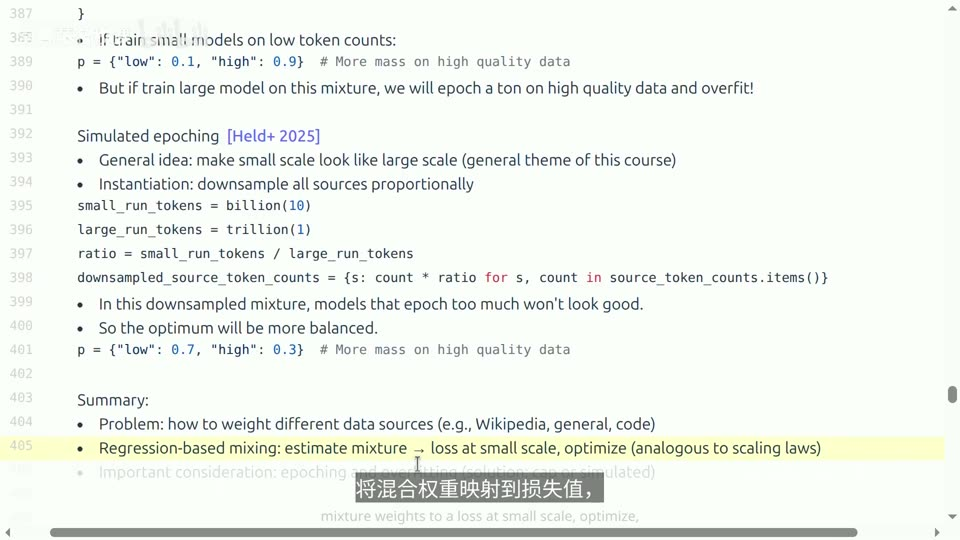 |
| 所以我觉得，对，万一 token 数量极少呢？我觉得到时候最优解基本就不会太关注那些数据了，等你扩大规模后，也许就能凑齐正确的 token 集合了。原则上这事儿能成，但可能会有舍入误差，导致最终结果出现偏差，本来打算在这个数据集上训练一次，结果搞不好一次都没训练成。 [【跳转到 48:41】](https://www.bilibili.com/video/BV11LEA6eEuj/?p=14&t=2921) |  |
| 不过你可以稍微规避这些问题。不过我觉得你反正还是得在这个数据上训练一次。对，行，那就这样。 [【跳转到 49:06】](https://www.bilibili.com/video/BV11LEA6eEuj/?p=14&t=2946) | 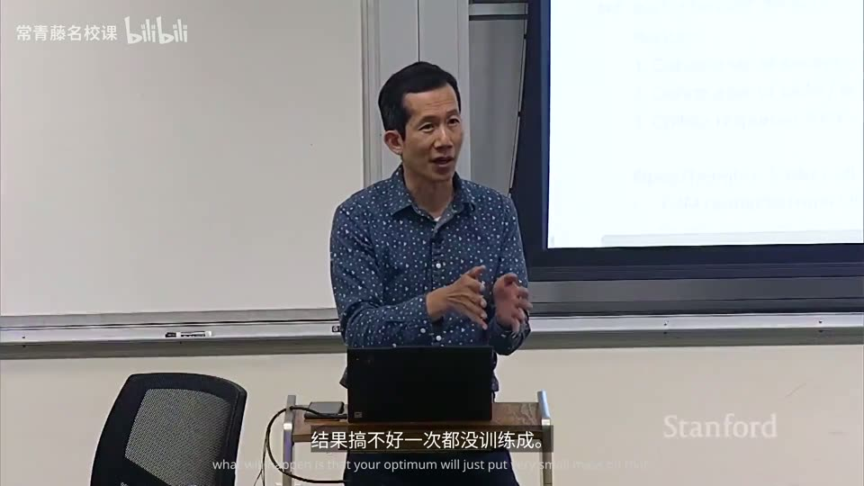 |
| 不过你可以稍微规避这些问题。我想你反正还是得用这份数据训练一次，对，行。 [【跳转到 49:24】](https://www.bilibili.com/video/BV11LEA6eEuj/?p=14&t=2964) | 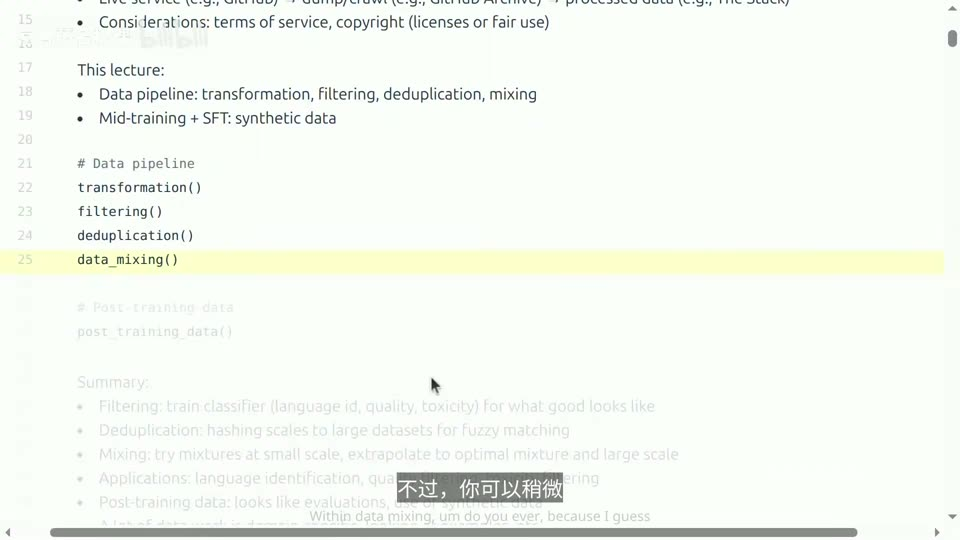 |
| 那就这样。是指不同领域，还是说就在一个数据集内部？这其实是我之前漏讲的，很高兴提出来了。比如在 NLLB 论文里，或者欧盟的一些工作中——你可以这么想：假设我直接给你一堆 Common Crawl 的数据，对，你可以把它拆开，比如按领域分组，像 AI2 团队搞的那个 Web Organizer 就能让你按主题来归类，你也可以做质量过滤。这样一来你就构建了一个二维网格，一边是领域…… [【跳转到 49:29】](https://www.bilibili.com/video/BV11LEA6eEuj/?p=14&t=2969) | 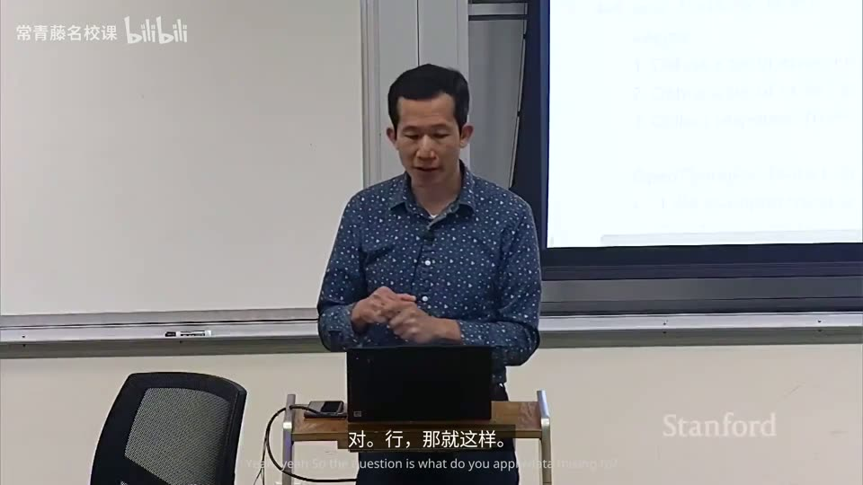 |
| 另一边是质量，而每一个格子里的内容都是你可以用来做数据混合的素材。所以这就是确定领域的一种自动化方式，除此之外你还要加上别人提供的那些数据源。谢谢。好。 [【跳转到 49:54】](https://www.bilibili.com/video/BV11LEA6eEuj/?p=14&t=2994) |  |
| 咱们快速过一下 post-training 数据。到目前为止，这些基本上算是 pretraining 或者 midtraining 数据。 [【跳转到 50:08】](https://www.bilibili.com/video/BV11LEA6eEuj/?p=14&t=3008) | 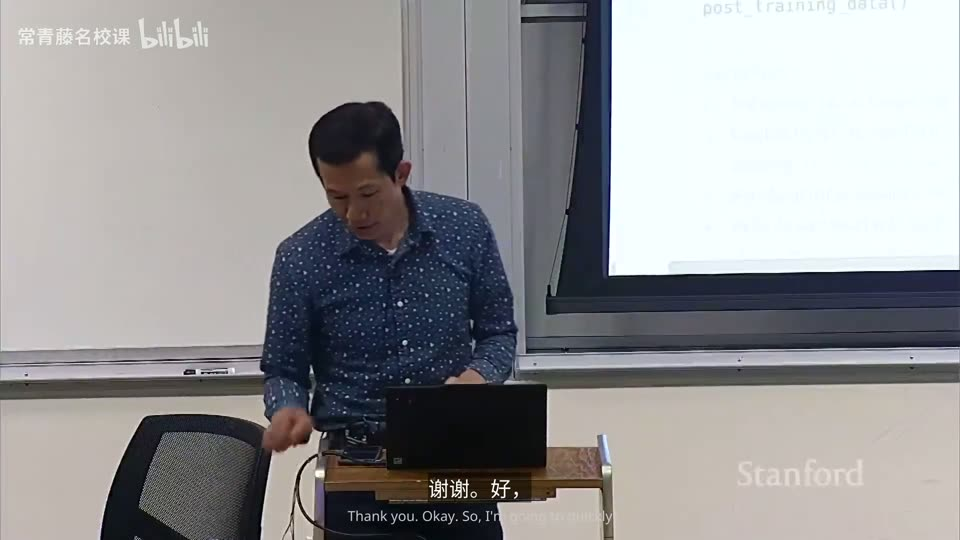 |
| 这些数据通常跟具体任务关系不大，RegMix 除外——虽然 RegMix 是为了最小化损失，但数据本身还是相对任务无关的，主要是为了培养基础技能。所以你看，到了 post-training 阶段，很多数据就变得非常依赖具体任务了。我就不做全面回顾了，只想提几个最近发布的比较有趣的 post-training 数据集，特别是编程领域的，我觉得现在大家对这个都很感兴趣。 [【跳转到 50:13】](https://www.bilibili.com/video/BV11LEA6eEuj/?p=14&t=3013) | 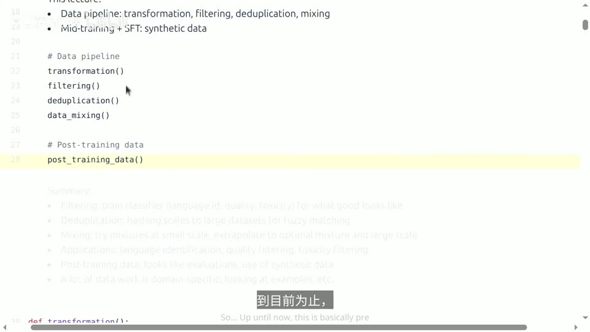 |
| 通用的做法是这样的：即定义一组环境，以代码为例，可能涉及 GitHub 仓库；你定义一组任务或提示；接下来你会从一个强大的模型或教师那里收集回复。所以至少在开源社区中，实际上几乎所有后训练数据（也就是大部分数据）都是合成生成的。此外，你也可以用人类来替代强大的模型。 [【跳转到 50:38】](https://www.bilibili.com/video/BV11LEA6eEuj/?p=14&t=3038) | 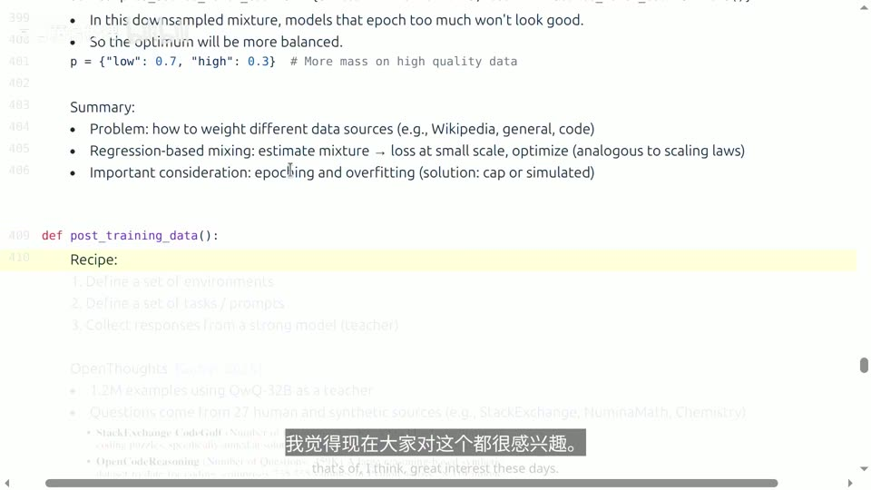 |
| 但那样做既缓慢又昂贵。不过如果你处于技术前沿，我想几年前你确实不得不花大价钱雇佣很多人来提供回复。 [【跳转到 51:03】](https://www.bilibili.com/video/BV11LEA6eEuj/?p=14&t=3063) | 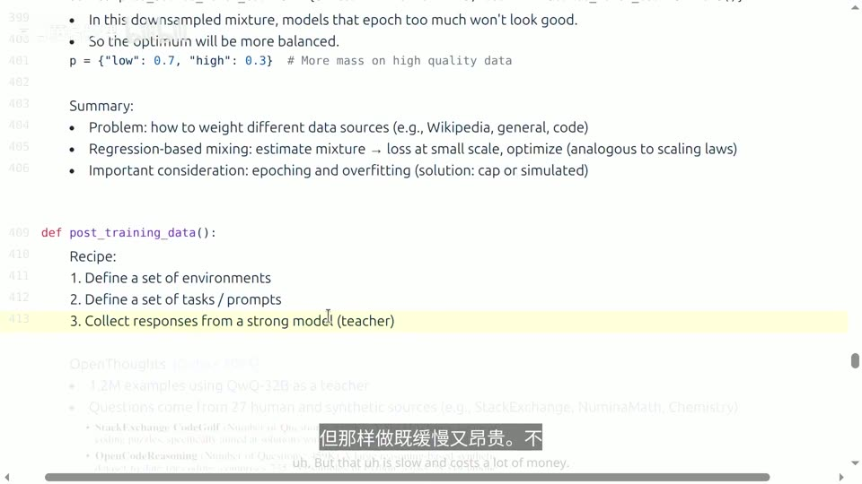 |
| 而且如今即便在技术前沿，你也可以采用人机混合的方式。总之关键在于，那里有一个教师在为你提供回复。好的，那么我只简要介绍几项相关工作，其中一项是名为 OpenThoughts 的工作。 [【跳转到 51:11】](https://www.bilibili.com/video/BV11LEA6eEuj/?p=14&t=3071) |  |
| 接下来简要介绍几项相关工作，其中一项是 OpenThoughts 项目。我们如何为这一目标获取高质量的后训练数据集？它们最终利用该教师模型生成了 120 万个实例。具体步骤如下：首先我们需要明确环境、任务以及提出的问题，他们从多种不同的来源中提取了数据，数据来源包括 Stack Exchange 或 NuminaMath 等人工来源…… [【跳转到 51:25】](https://www.bilibili.com/video/BV11LEA6eEuj/?p=14&t=3085) | 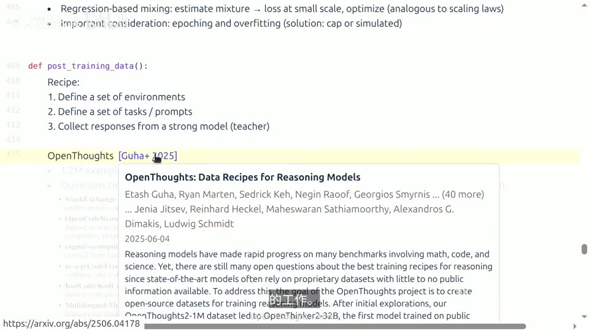 |
| 同时也包含部分合成数据。这里仅展示了编程类数据的一个子集，此外还有数学和化学领域的相关数据。 [【跳转到 51:50】](https://www.bilibili.com/video/BV11LEA6eEuj/?p=14&t=3110) | 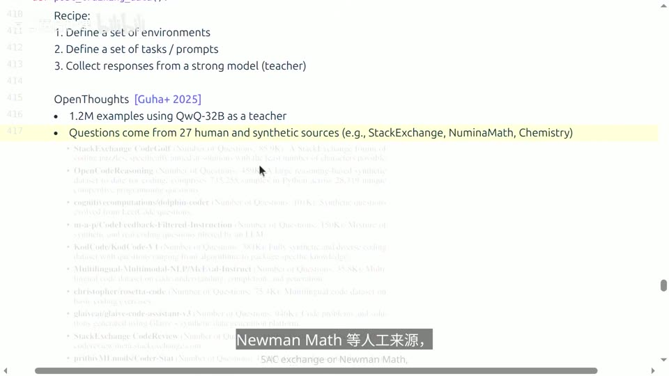 |
| 这是一个大型项目，汇聚了来自多方的大量贡献。大家可以看到，其中一些是编程练习，另一些则是更贴近现实的应用场景，当然像 Code Golf 这类任务可能并不具备现实代表性。这是一个涉及多方贡献的大型项目。他们发现，针对这个数据集到底该怎么生成回复，他们做了一套挺全面的分析，结果显示只用几个来源…… [【跳转到 51:58】](https://www.bilibili.com/video/BV11LEA6eEuj/?p=14&t=3118) | 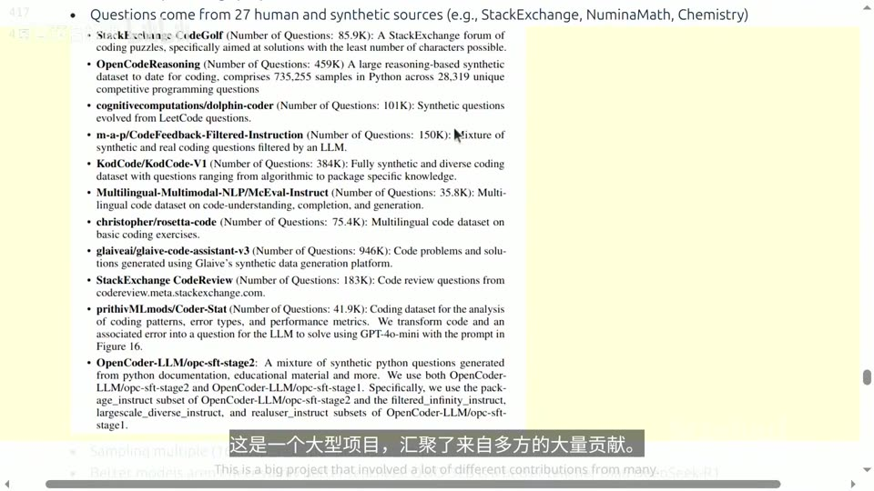 |
| 其实比把所有来源都拿来用效果更好，多采样几组生成结果挺有用，比如采 16 个。一个有趣的发现是，模型的表现更好，这并不一定意味着它是更好的老师。打个比方，QwQ-32B 虽然现在算是一个较老且较小的模型，但它的教学效果比 DeepSeek-R1 更好，而后者大概是当时最强的开源模型之一。此外他们还发现，简单的答案过滤效果有限。 [【跳转到 52:20】](https://www.bilibili.com/video/BV11LEA6eEuj/?p=14&t=3140) | 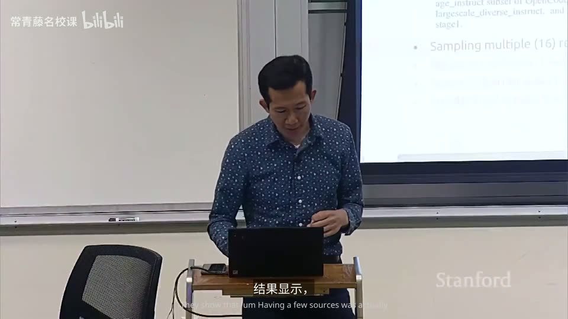 |
| 因此整个流程大致如下：先将这些来源的数据全部输入…… [【跳转到 52:45】](https://www.bilibili.com/video/BV11LEA6eEuj/?p=14&t=3165) |  |
| 然后进行去重和随机采样，大致就是这样。我们对问题进行了下采样，生成多个答案，最后将这些内容整合到最终的数据集中。所以 120 万指的是样本总数，但除以 16 之后才是实际问题的数量。谢谢。接下来还有另一个——刚才讲的是数学、科学以及一些代码相关的内容，我觉得最近大家特别感兴趣的是…… [【跳转到 52:50】](https://www.bilibili.com/video/BV11LEA6eEuj/?p=14&t=3170) |  |
| 开发一种真正的编码模型，也就是说，不只是能生成代码的模型，而是真正能进行软件开发。所以 SWE-smith 这篇论文提出了一个想法。 [【跳转到 53:15】](https://www.bilibili.com/video/BV11LEA6eEuj/?p=14&t=3195) | 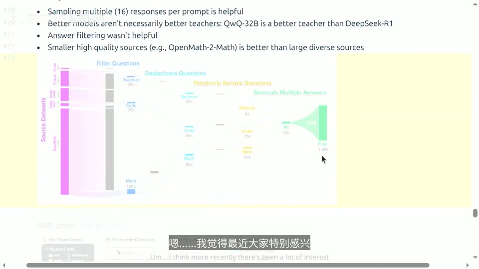 |
| 你拿到一个代码仓库，然后用语言模型自动生成任务。他们设计了一个智能体，专门处理代码仓库，使其具备可运行状态，例如安装各类依赖项，随后生成任务，通常通过修改代码实现，比如故意引入 bug。这些修改经过验证后便成为具体的任务实例，这些属于合成任务。 [【跳转到 53:26】](https://www.bilibili.com/video/BV11LEA6eEuj/?p=14&t=3206) | 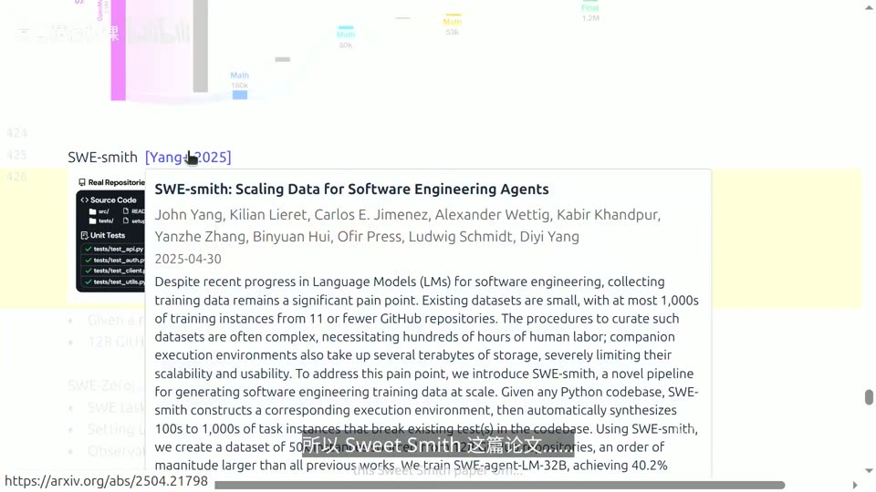 |
| 但你们能获得 5 万个样本，要知道去年这个数量已经相当可观，此后又涌现出一系列其他研究。 [【跳转到 53:51】](https://www.bilibili.com/video/BV11LEA6eEuj/?p=14&t=3231) | 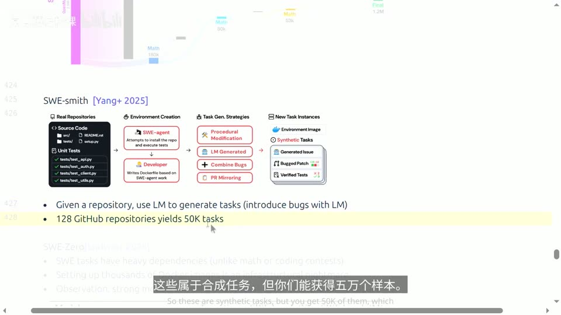 |
| 我接着谈谈刚才提到的英伟达有一篇关于 SWE-Zero 的论文。 [【跳转到 53:58】](https://www.bilibili.com/video/BV11LEA6eEuj/?p=14&t=3238) | 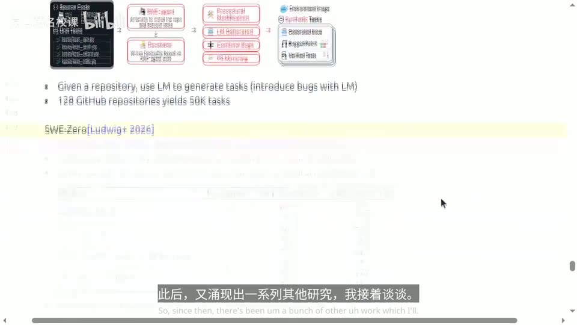 |
| 其中提到了这种……实际上，好的，我也会提及那个，这个想法很有意思。 [【跳转到 54:04】](https://www.bilibili.com/video/BV11LEA6eEuj/?p=14&t=3244) | 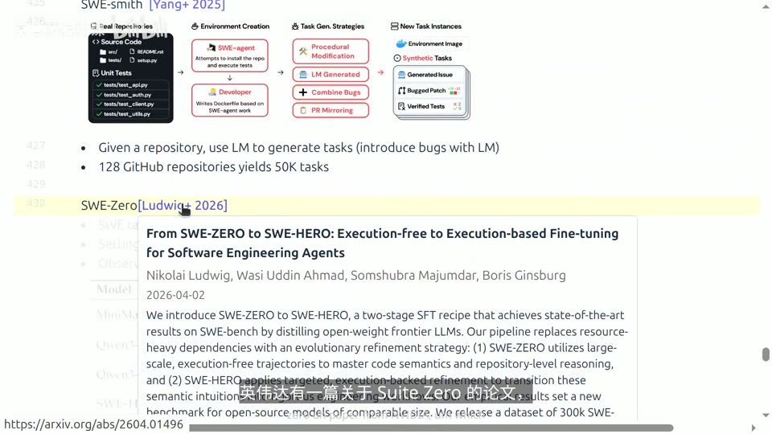 |
| 大家发现与数学题不同，SWE 任务通常包含大量重型依赖项。 [【跳转到 54:09】](https://www.bilibili.com/video/BV11LEA6eEuj/?p=14&t=3249) | 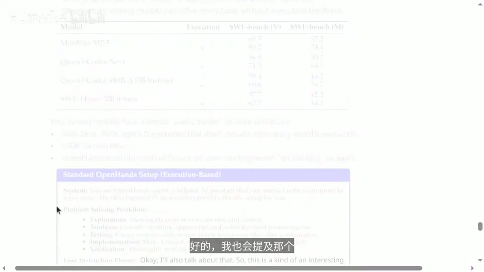 |
| 大多数 GitHub 仓库甚至无法直接运行，你还得安装一堆过时的依赖项，尤其是当你回退到某个基线提交时的状态，这简直是一团糟，啊，这简直是噩梦。所以他们当时就在想…… [【跳转到 54:14】](https://www.bilibili.com/video/BV11LEA6eEuj/?p=14&t=3254) | 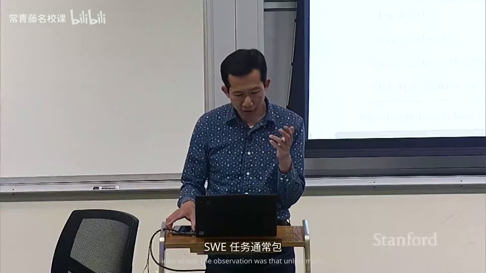 |
| 究竟该如何获取一个数据集，就是那种针对所有代码仓库的？他们发现，与其为每个仓库单独配置 Docker 镜像，不如直接使用模型，因为现在的模型实力强劲，能处理不少这类任务，不需要代码执行反馈。你看，如果允许模型执行代码，得分能有 80 左右；要是禁止执行呢，得分也能接近 70。代码都跑不通，能拿到这个成绩已经很不错了。 [【跳转到 54:29】](https://www.bilibili.com/video/BV11LEA6eEuj/?p=14&t=3269) | 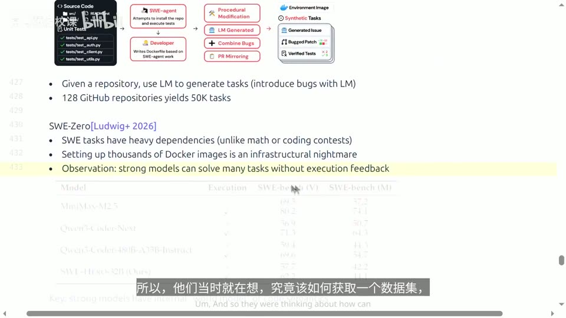 |
| 这说明这些模型对代码的内部语义确实有一定的理解。因此他们成功生成了 30 万个智能体轨迹，这些都是真实的 GitHub PR，非常贴近实战，不像 SWE-smith 那个例子。因此他们成功生成了 30 万个智能体轨迹，这些都是真实的…… [【跳转到 54:54】](https://www.bilibili.com/video/BV11LEA6eEuj/?p=14&t=3294) | 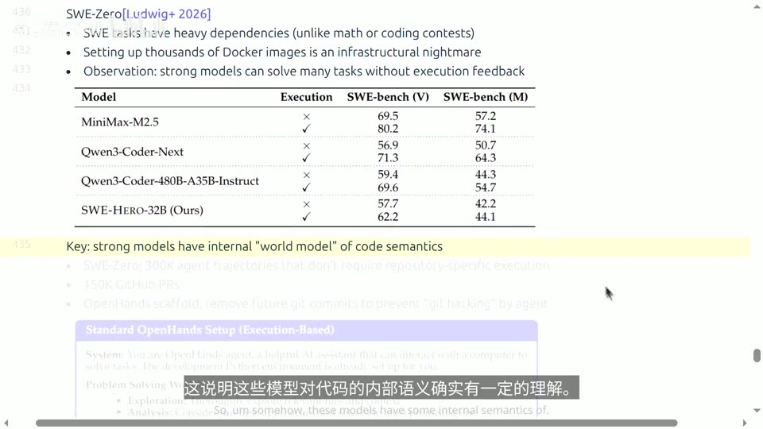 |
| GitHub PR，非常贴近实战，不像 SWE-smith 那个例子，比如 sed 和 grep 这类基础操作。谢谢。好。 [【跳转到 55:09】](https://www.bilibili.com/video/BV11LEA6eEuj/?p=14&t=3309) | 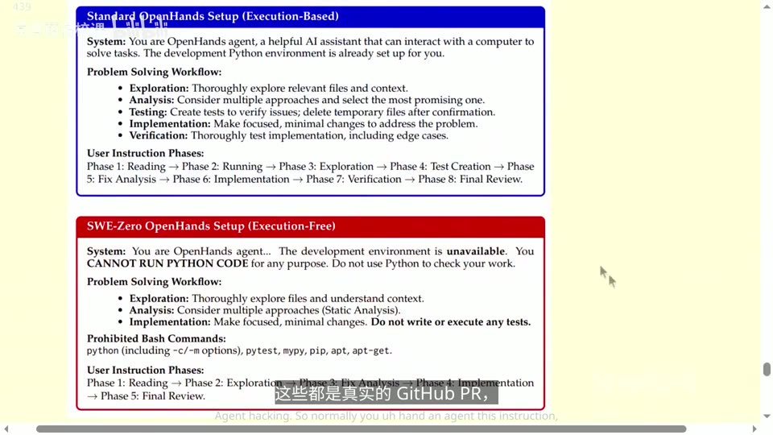 |
| 接下来他们从一个大编码模型中蒸馏并过滤数据，因为有时编码模型会无视指令，强行尝试执行。 [【跳转到 55:19】](https://www.bilibili.com/video/BV11LEA6eEuj/?p=14&t=3319) | 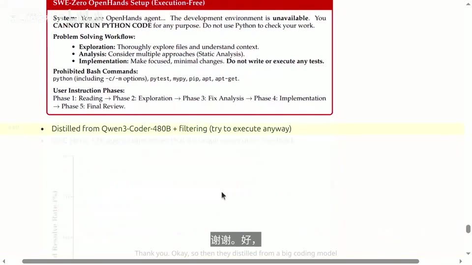 |
| 然后他们展示了这一点。对了，他们还有 1.3 万条需要执行反馈的代理轨迹，所以他们在训练模型时，先在这些 SWE-Hero 样本上做微调，然后再在这些 SWE-bench 样本上微调，他们取得了一些进展，不过我想前沿水平依然很高。我快速过一下 SWE-rebench，这本质上又是另一个试图抓取大量 PR 的尝试，这类方法的核心思路是获取一批 GitHub 仓库。 [【跳转到 55:26】](https://www.bilibili.com/video/BV11LEA6eEuj/?p=14&t=3326) | 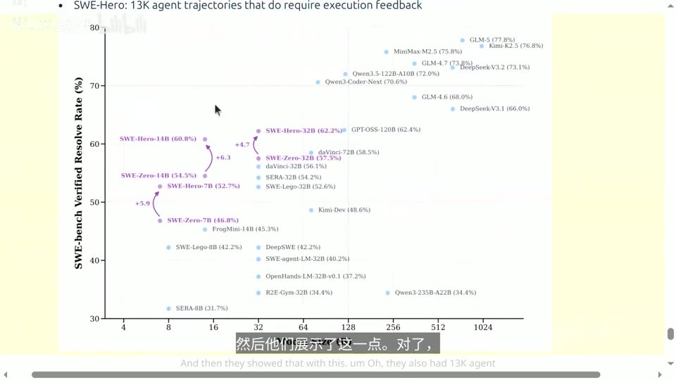 |
| 然后尝试安装，比如大多数尝试可能会失败，这时你会加大尝试力度，或者使用一个用语言模型来生成回复。这项工作实际上今天刚发布，你可以沿用 SWE-Zero 的思路，将规模扩展至 1200 万个智能体轨迹。SWE-Zero 的一个显著优势…… [【跳转到 55:51】](https://www.bilibili.com/video/BV11LEA6eEuj/?p=14&t=3351) | 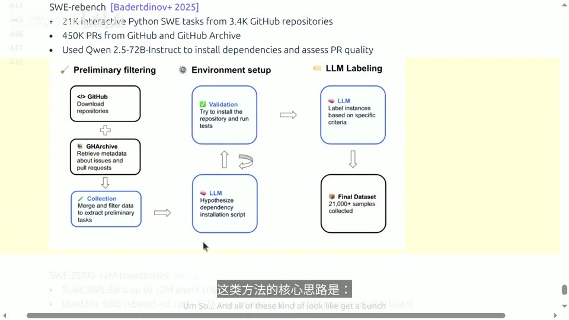 |
| 使它非常轻量。这里他们使用的是 SWE-rebench 中的任务，回顾一下，他们之前尝试让代码执行，最终只有 3.2 万个成功执行，另有 12 万个未能执行。这里他们使用的是 SWE-rebench 中的任务，回顾一下，他们之前尝试让代码执行，最终只有 3.2 万个成功执行，另有 12 万个未能执行。 [【跳转到 56:16】](https://www.bilibili.com/video/BV11LEA6eEuj/?p=14&t=3376) | 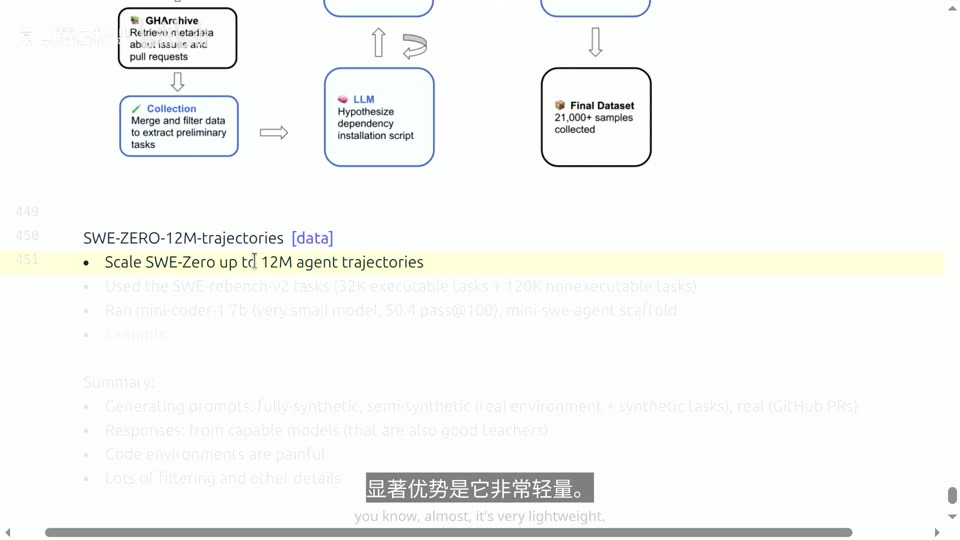 |
| 你看，我们从数学这类无需环境的数据集过渡到了现在的编程领域，而且编程数据集的增长幅度相当大。但总体思路是，你拥有这些提示词…… [【跳转到 56:40】](https://www.bilibili.com/video/BV11LEA6eEuj/?p=14&t=3400) | 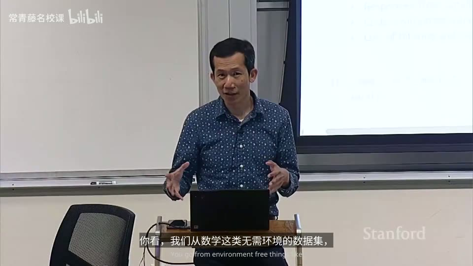 |
| 这其中存在某种权衡：你可以使用完全合成的数据，也可以使用半合成数据，即环境是真实的但任务为合成，或者任务是真实的但环境为合成。这些回复通常来自能力较强的模型。 [【跳转到 56:51】](https://www.bilibili.com/video/BV11LEA6eEuj/?p=14&t=3411) | 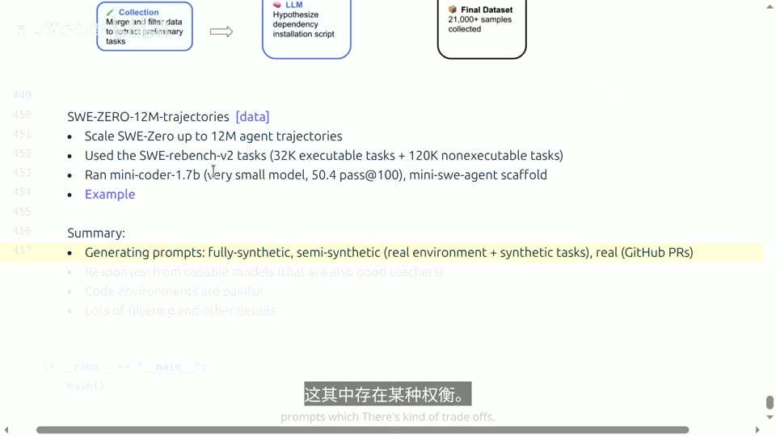 |
| 但它们同时也需要具备良好的教学能力。代码环境处理起来比较麻烦，还涉及很多过滤和其他细节问题，我们没时间一一展开。好的，总结一下本次讲座。我们讨论了过滤，首先定义什么是好的标准…… [【跳转到 57:02】](https://www.bilibili.com/video/BV11LEA6eEuj/?p=14&t=3422) |  |
| 然后训练一个轻量级分类器。代码环境处理起来比较麻烦，还涉及很多过滤和其他细节，我们没时间处理。好的，总结一下这次讲座。我们讨论了过滤，首先定义什么是好的数据，然后训练一个轻量级分类器，接着我们看了一些后训练数据。说实话，很多数据工作挺琐碎的，而且特别依赖具体领域，得盯着具体例子才能做出高质量的数据集。 [【跳转到 57:18】](https://www.bilibili.com/video/BV11LEA6eEuj/?p=14&t=3438) | 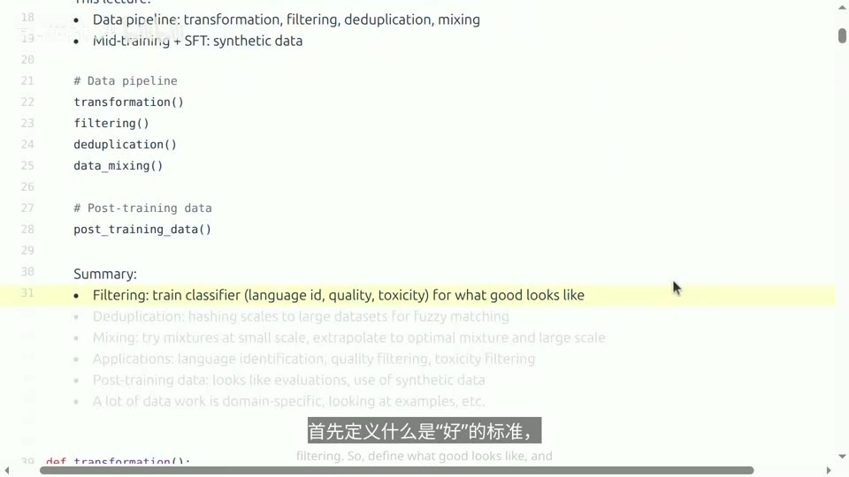 |
| 所以这堂课其实没法完全代表真实世界里的数据工作，但希望能帮大家理清一下上面的数据全貌。好，今天就讲这些。 [【跳转到 57:43】](https://www.bilibili.com/video/BV11LEA6eEuj/?p=14&t=3463) |  |
| （此区间无字幕） [【跳转到 57:52】](https://www.bilibili.com/video/BV11LEA6eEuj/?p=14&t=3472) | 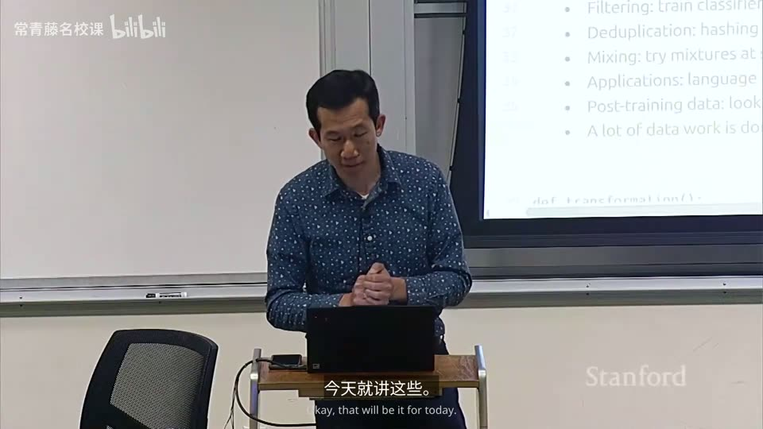 |