# Lecture 16: Post-Training - RLVR · 原始文稿（图-字幕分栏）

| 字幕文本 | 画面 |
| :--- | ---: |
| 好，咱们开始吧。这是后训练系列讲座的第二讲，今天聊聊 RLVR， [【跳转到 00:00】](https://www.bilibili.com/video/BV11LEA6eEuj/?p=16&t=0) | 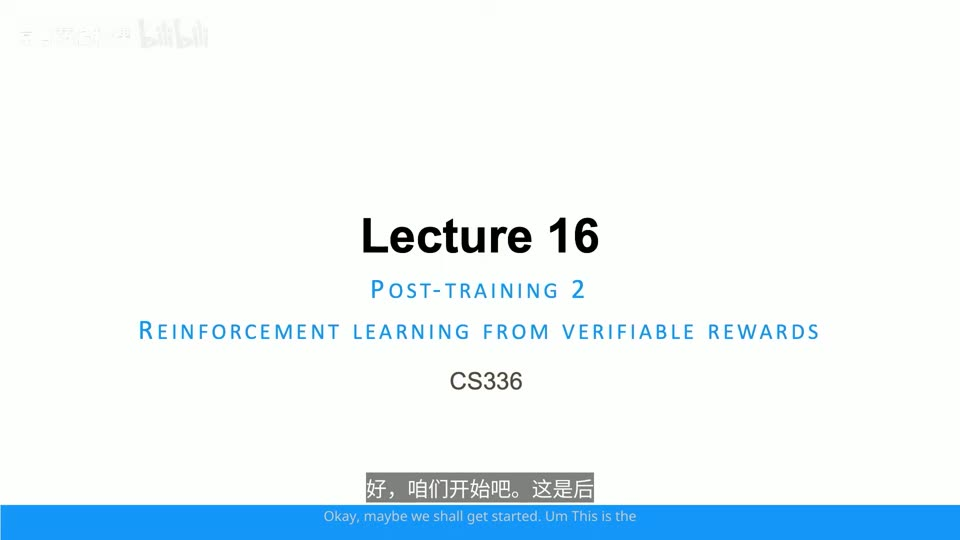 |
| 也就是可验证奖励强化学习（RLVR）。这方面进展很令人兴奋，我觉得这事儿挺及时，PPT 没来得及改。 [【跳转到 00:05】](https://www.bilibili.com/video/BV11LEA6eEuj/?p=16&t=5) | 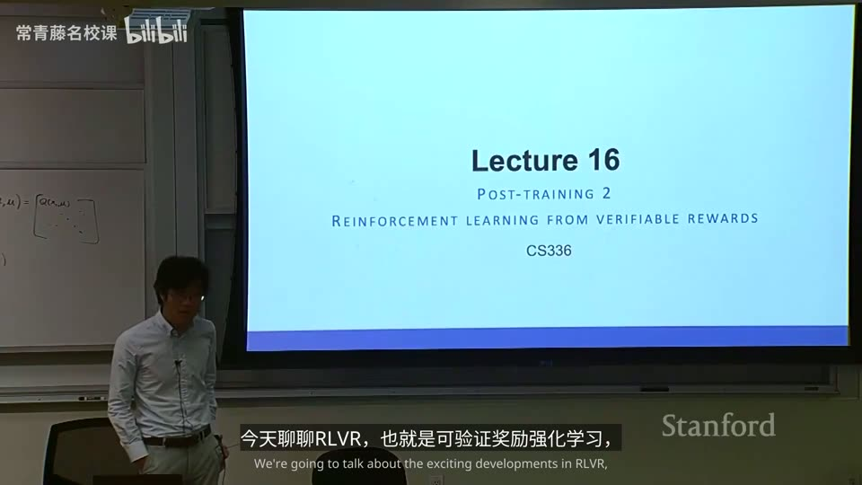 |
| 不过 OpenAI 刚宣布他们解出了一个未解的数学难题，用的是思维模型。他是怎么做到的？讲的正是这个思维模型，也就是 RLVR。目前我们处在图示的左侧，对吧？上节课讲完，做了指令微调，有了 RLHF，成果不错，都 ChatGPT 了，剩下的就是思维模型的前沿进展。 [【跳转到 00:15】](https://www.bilibili.com/video/BV11LEA6eEuj/?p=16&t=15) | 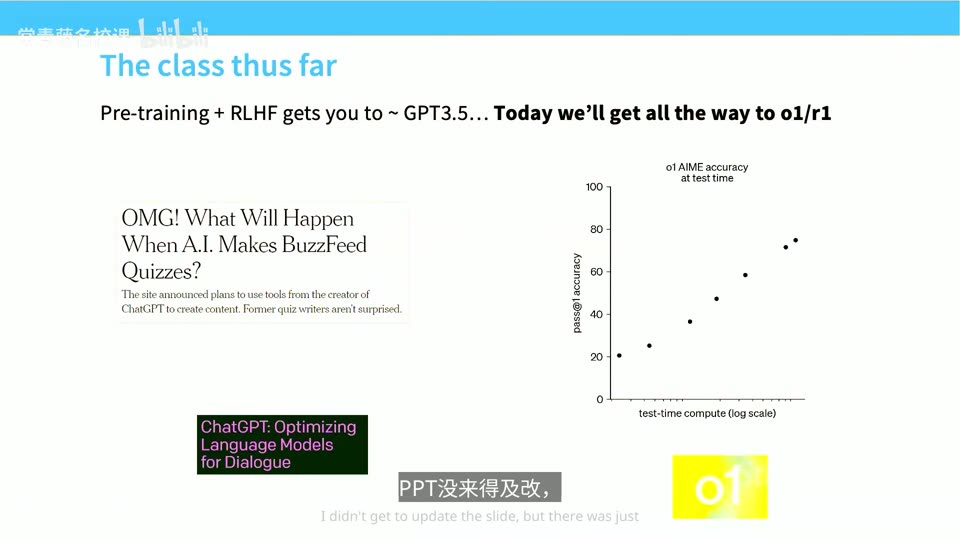 |
| 模型能做超长思维链推理，解决数学、编程这类可验证的难题。记得我上次结尾有点丧，因为过优化问题——RLHF 没法带我们到想去的地方。所以咱们要去收集一堆偏好数据，这东西很有用，我们建个奖励模型，然后对着它做 RL。但这事根本上卡在标注瓶颈上，对吧？哦，因为我们有了奖励模型，可不能一直往同一个模型里堆算力。 [【跳转到 00:40】](https://www.bilibili.com/video/BV11LEA6eEuj/?p=16&t=40) | 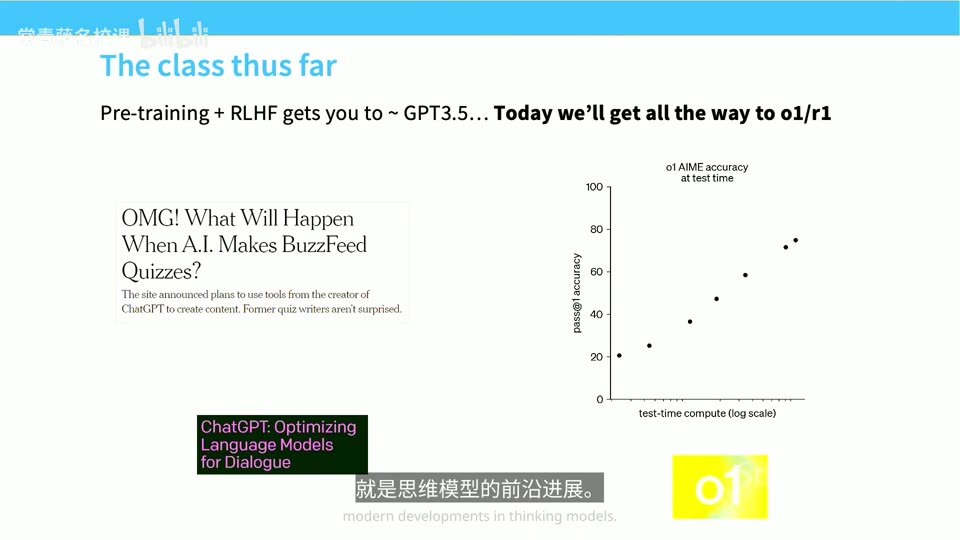 |
| 最后你会把奖励模型给过拟合了，正则化做得再好也躲不过这个问题。所以这挺让人沮丧的，也不是强化学习真正的潜力所在。作为强化学习的坚定信徒，你会看到 AlphaGo 这类案例——在这些领域，RL 确实表现出色。那么我们在 RLHF 里做的事，和那些更原生、更自然的 RL 领域取得的成果，到底有什么区别？ [【跳转到 01:05】](https://www.bilibili.com/video/BV11LEA6eEuj/?p=16&t=65) | 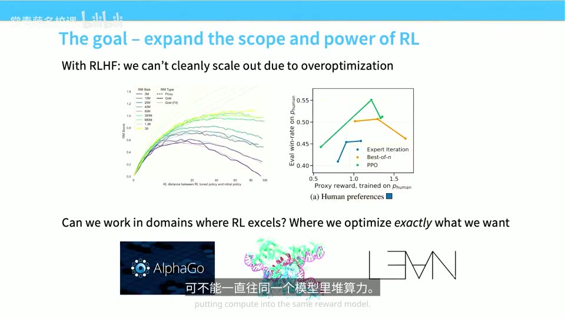 |
| 我觉得 AlphaGo 和 RLHF 之间有一个主要区别，就在于它们获得反馈的方式不同。在 AlphaGo 里，我们优化的目标非常明确，比如围棋的胜负条件，这个定义没有任何模糊之处。所以你可以随意投入算力，只要目标在提升，就说明进展良好。某种意义上这是搜索问题，而前者更像学习问题。这不算精确的区分，但可以这样去理解。 [【跳转到 01:30】](https://www.bilibili.com/video/BV11LEA6eEuj/?p=16&t=90) | 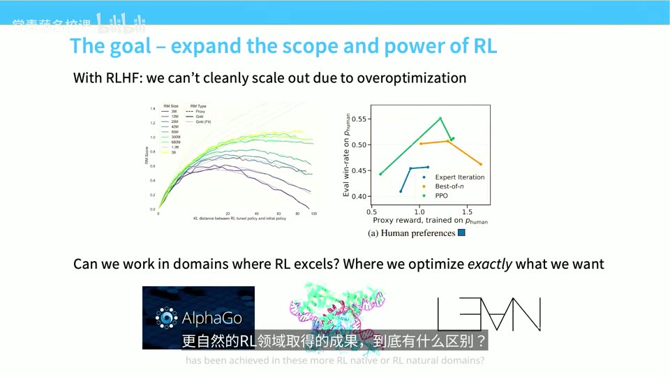 |
| 所以形式数学、甚至自然语言数学等领域，可能也具备这种可验证性，因而更适合强化学习。这就是我们研究这些内容的动机，算法在根本上没太大区别， [【跳转到 01:55】](https://www.bilibili.com/video/BV11LEA6eEuj/?p=16&t=115) |  |
| 但最终的成果会出乎意料地不同。今天讲座分两部分，这和咱们课程其他部分的安排差不多。第一部分我讲核心算法，这是大家必备的基础知识，作业里会用到。我会讲讲 GRPO 是什么，以及 PPO 怎么运作。接着我会深挖一些开源发布，看看第一部分讲的内容怎么体现在这些大模型的技术报告里。模型发布——咱们深入聊聊方法和基础部分。 [【跳转到 02:06】](https://www.bilibili.com/video/BV11LEA6eEuj/?p=16&t=126) | 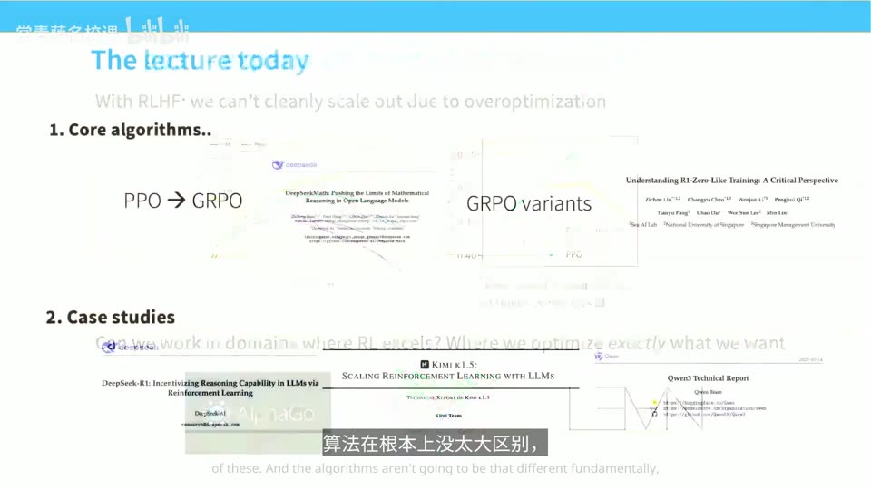 |
| 我先从 PPO 讲起，对吧？聊语言模型的 RL 绕不开 PPO。虽然讲过一次，但 PPO 挺绕的，我觉得再讲一遍大家能受益更多。在语言建模的 RL 里，最核心的技术概念是策略梯度，尤其是这种强化梯度技巧。我们本质上一直在对奖励做梯度下降，通过加权 SFT 更新来实现，权重可正可负。今天我们会定义 R 是什么。 [【跳转到 02:31】](https://www.bilibili.com/video/BV11LEA6eEuj/?p=16&t=151) | 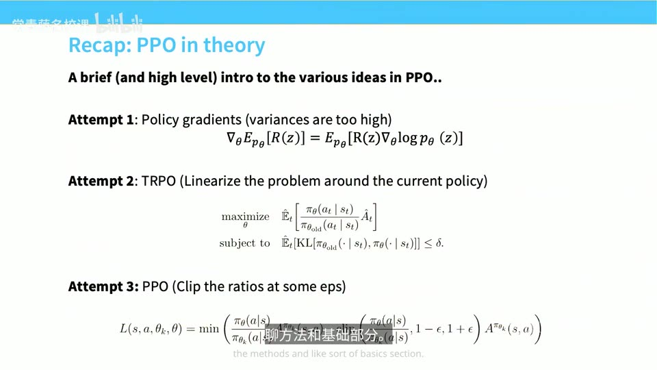 |
| 这个公式很重要，后续会反复出现，这在某种意义上是衍生出一切的核心。基于此，回想上一讲的直觉，我们想一次多走几步。策略梯度要求每次梯度更新时都从策略中采样——能复用 rollout 吗？你可以用 TRPO、PPO 等。啊，我稍后会讲 PPO。之前讲过 TRPO，这里不展开，有上过 RL 课的话， [【跳转到 02:56】](https://www.bilibili.com/video/BV11LEA6eEuj/?p=16&t=176) | 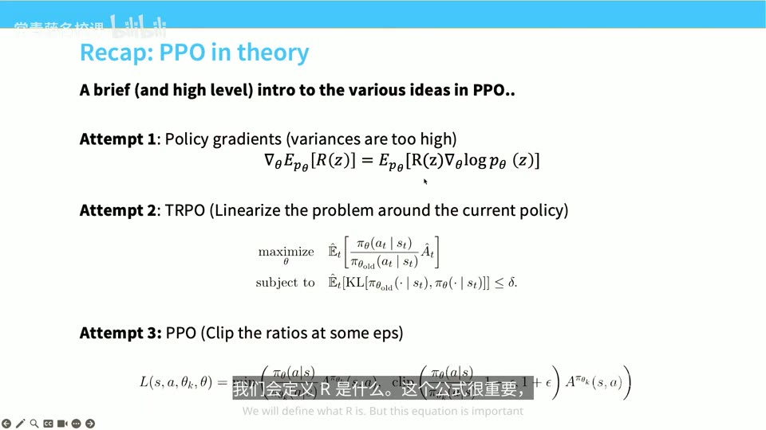 |
| PPO 你自然很熟悉，这个算法你是懂的。 [【跳转到 03:21】](https://www.bilibili.com/video/BV11LEA6eEuj/?p=16&t=201) | 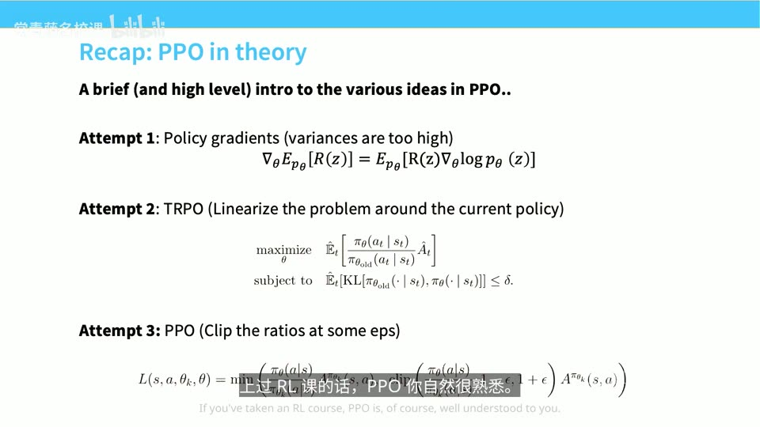 |
| 不过我不会假设大家都上过 RL 课，或者都理解 RL，所以要是你不熟悉 PPO——它是 RL 领域的一种主力算法。RL 已被用于各种高难度的 RL 场景。OpenAI 在早期非常依赖 RL 时做过不少这类工作。这是 OpenAI Gym，他们当时讨论 PPO 算法，说我们可以做到让人形机器人用强化学习行走。 [【跳转到 03:26】](https://www.bilibili.com/video/BV11LEA6eEuj/?p=16&t=206) | 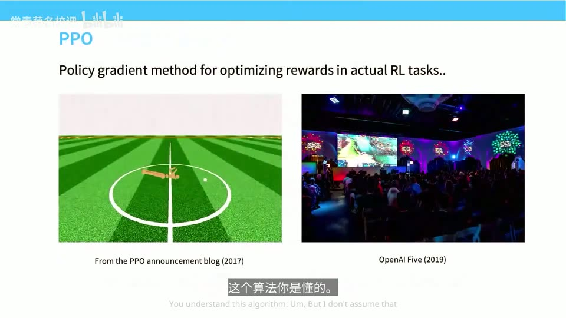 |
| 更惊人的演示是他们的 OpenAI Baselines，用 PPO 训练，它在深度 RL 中表现优异，尤其在高危动作和状态空间，那里 RL 通常更复杂。还有那个到处跑的 OpenAI 人形机器人。 [【跳转到 03:51】](https://www.bilibili.com/video/BV11LEA6eEuj/?p=16&t=231) | 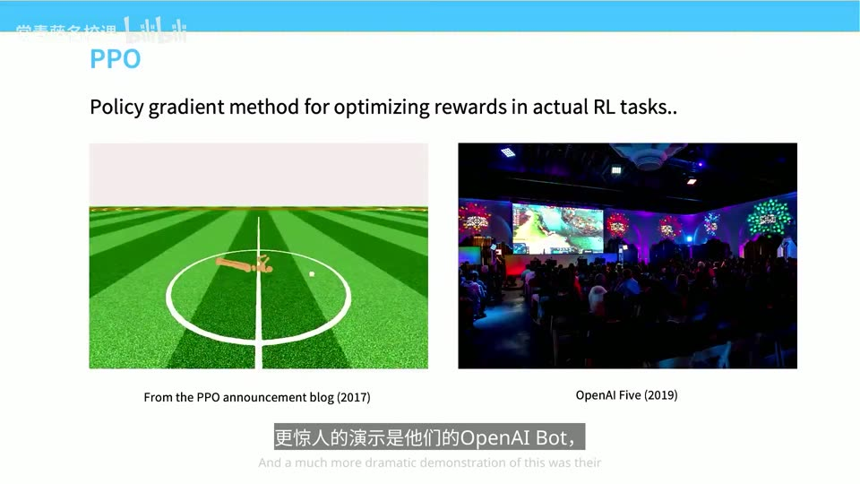 |
| 从概念层面看，PPO 其实非常简单。我记得我提过，PPO 是这一切的重要一环，它激励了很多人。但你看 PPO 的伪代码，它来自 OpenAI 的 RL 入门文档，你会觉得这不难，甚至挺简单：我能一次性实现。你采样一些轨迹，我用某种优势估计方法算出优势，我用这种有点怪但还行的方式裁剪优势，然后在裁剪后的优势下更新策略。 [【跳转到 04:04】](https://www.bilibili.com/video/BV11LEA6eEuj/?p=16&t=244) | 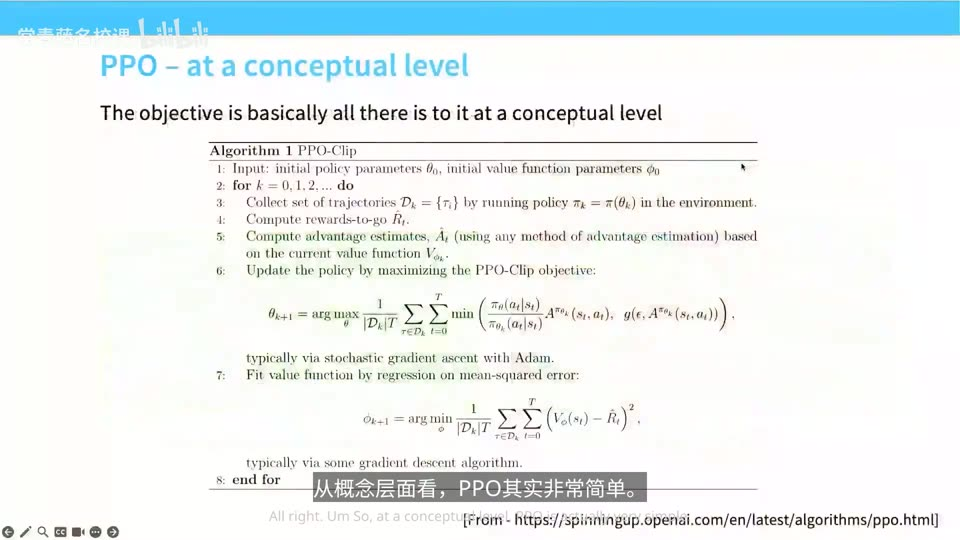 |
| 这没问题。接着再拟合一个价值函数，行，这些在实操中看起来都相对简单。所以我觉得大家会觉得这没什么，PPO 本身没问题，但看到这类博文你就得心里发毛，对吧？博文若列出 PPO 的 37 个实现细节，说明该算法对实现决策极敏感。你可以做各种调整，也有不同的库和实现方式， [【跳转到 04:29】](https://www.bilibili.com/video/BV11LEA6eEuj/?p=16&t=269) | 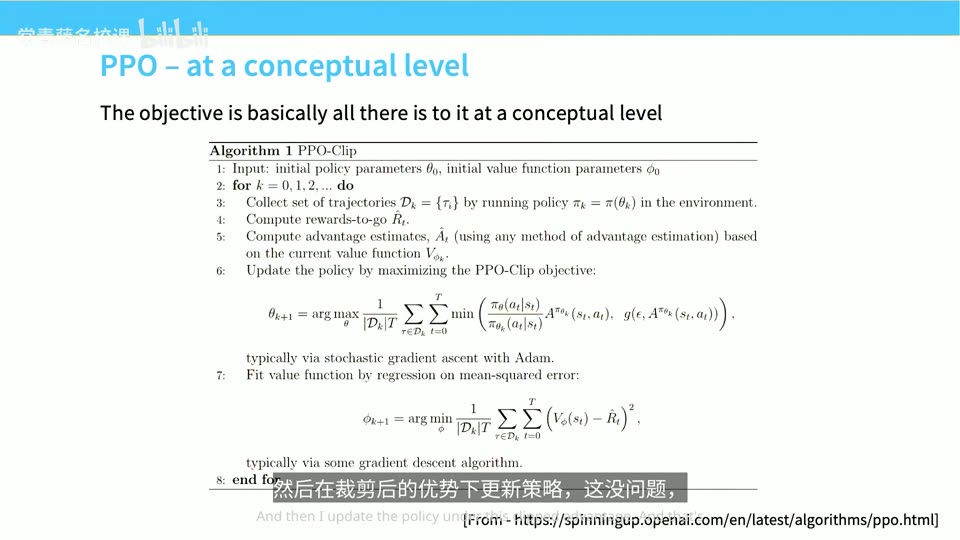 |
| 他们给出的结果截然不同，取决于你用的组合。事实证明许多人实现有误，有论文指出 PPO 中某些人用的基线根本不算基线，他们从根本上改变了优化问题。所以这堂课接下来我不得不带你们看看 PPO 的一些实现。语言模型的 PPO 实现，说实话并不令人愉快。这张图很典型，基本把 PPO 长什么样讲清楚了。但是优势估计——中间那个大方块就是优势项， [【跳转到 04:54】](https://www.bilibili.com/video/BV11LEA6eEuj/?p=16&t=294) | 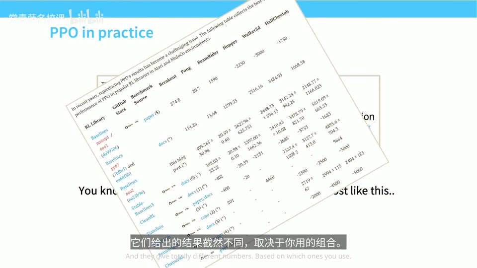 |
| 而且有点点缓冲区，因为得留点旧数据。你要训练价值模型，注意优势估计你用的也是这个模型，绿色方框出现了两次。注意目标函数里的 KL 项是逐 token 计算的，所以这不只是个赌博机问题，而是个完整的多步强化学习问题。唉，这一切都很困难、很复杂，所以就引出了许多你必须处理的棘手实现细节。 [【跳转到 05:19】](https://www.bilibili.com/video/BV11LEA6eEuj/?p=16&t=319) | 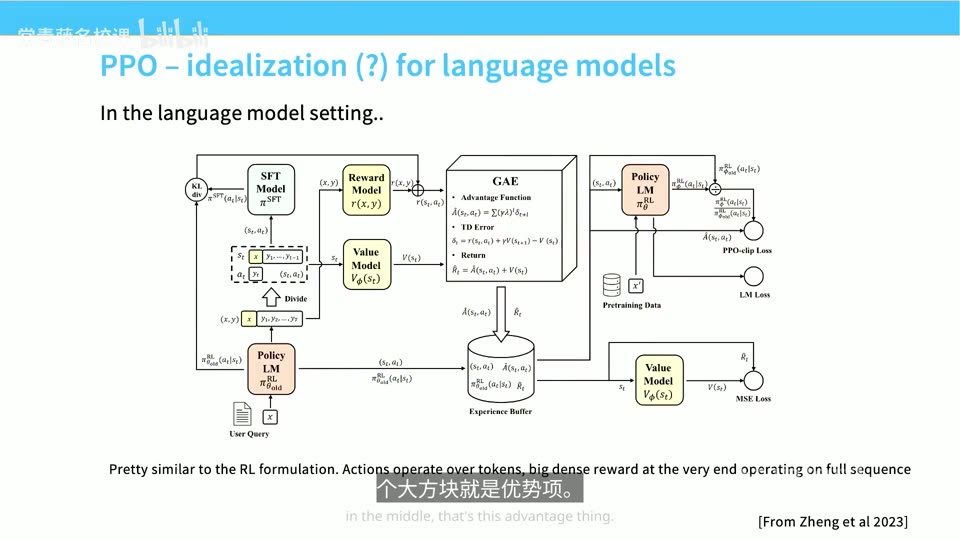 |
| 你看各种实现，会发现 PPO 有些实现细节挺怪、挺棘手的。我找找看。 [【跳转到 05:44】](https://www.bilibili.com/video/BV11LEA6eEuj/?p=16&t=344) | 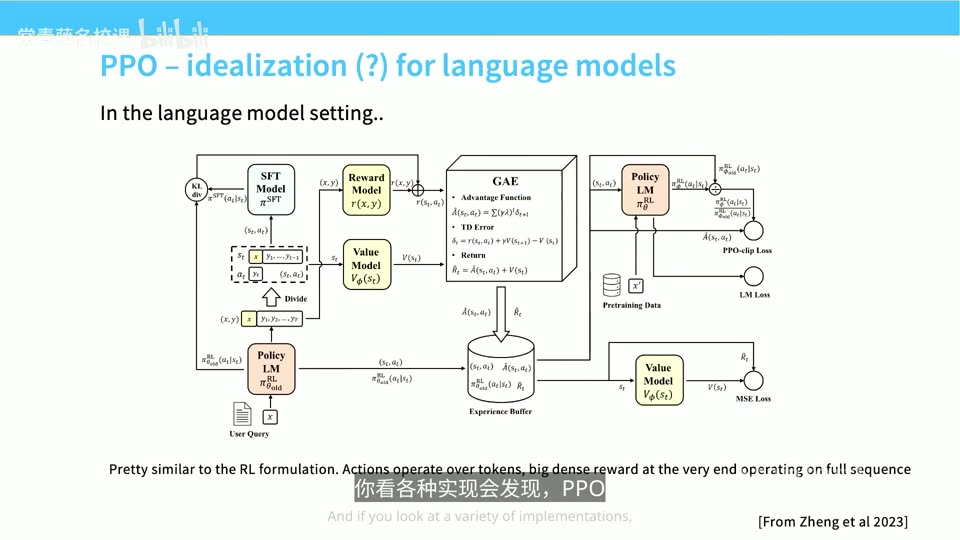 |
| 之前我有个学生做 RLHF 项目时实现了 PPO，大家还记得 PPO 在 RLHF 1 的应用吧？所以我们手头有个很稳的 PPO 参考实现。他花了挺久，我研究细节到底做了啥才跑起来。外层循环挺好：就是跑 rollout，然后跑几步 PPO，算损失、裁剪梯度、再更新参数，这外层循环挺合理。但细看的话…… [【跳转到 05:50】](https://www.bilibili.com/video/BV11LEA6eEuj/?p=16&t=350) | 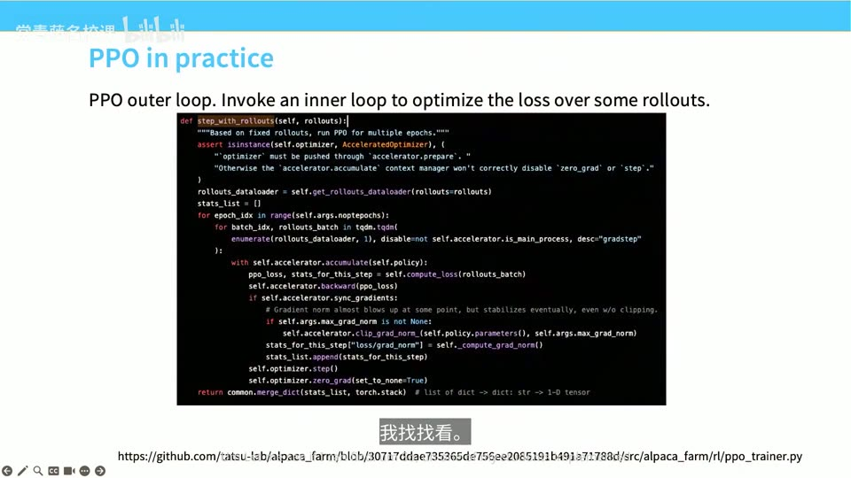 |
| 算损失那部分，基本就是照搬 PPO 的更新逻辑，这也看着没问题。我们再算优势函数和裁剪比率，接着就更新模型，所以整体看下来都挺好。但后面有些乱。 [【跳转到 06:13】](https://www.bilibili.com/video/BV11LEA6eEuj/?p=16&t=373) | 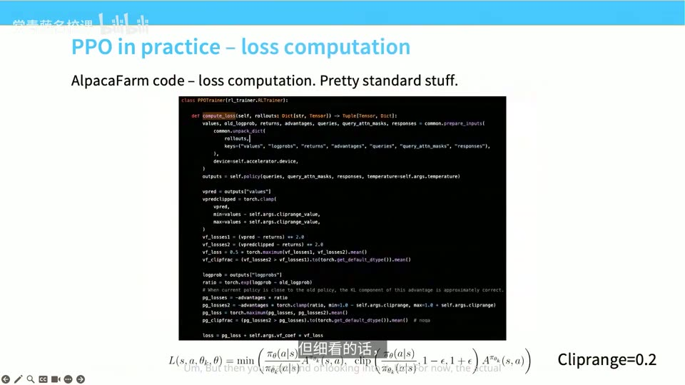 |
| rollout 先跳过，得用 KL 惩罚把模型往参考模型上拉。 [【跳转到 06:25】](https://www.bilibili.com/video/BV11LEA6eEuj/?p=16&t=385) | 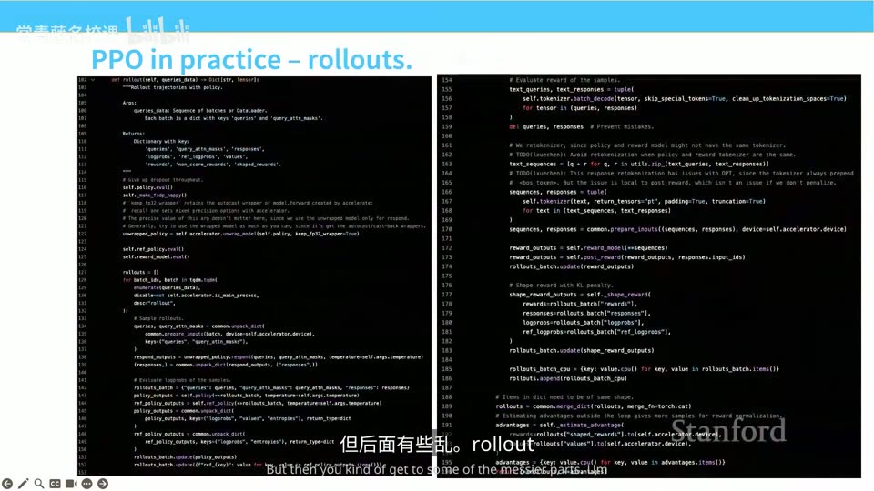 |
| 不是，这得把 KL 散度在零处截断才行。懂 KL 散度的都知道，这完全违背了它的本意，对吧？正负值都在累加，要是去掉这个限制，数值立马就炸了。这类情况都可能发生。但这不代表你做 PPO 实现时就该这么搞。哦，提这个是想说 RL 算法的实现挺棘手、很敏感，毕竟 PPO 组件多，梯度估计的方差又大。 [【跳转到 06:30】](https://www.bilibili.com/video/BV11LEA6eEuj/?p=16&t=390) | 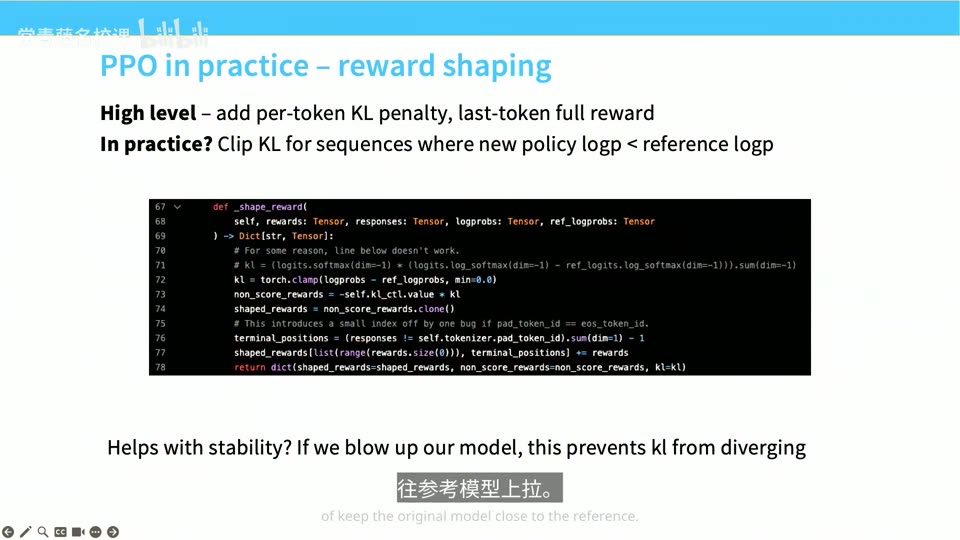 |
| 这些细节都非常微妙，处理起来很复杂。还有个很常见的现象，不光我们这么干，大家都这么用。原始 PPO 论文里有个广义优势估计器（GAE），主要看 gamma 折扣奖励，用值函数估算每个 token 生成步骤的奖励。但大家常常直接把 gamma 和 lambda 都设成 1，这其实是个退化的设置，这就变成了多臂老虎机问题，相当于你丢掉了 PPO 原本的结构。 [【跳转到 06:52】](https://www.bilibili.com/video/BV11LEA6eEuj/?p=16&t=412) |  |
| 所以只要工程到位，跑这个算法就能达到预期效果。抛 RL 作业时， [【跳转到 07:17】](https://www.bilibili.com/video/BV11LEA6eEuj/?p=16&t=437) | 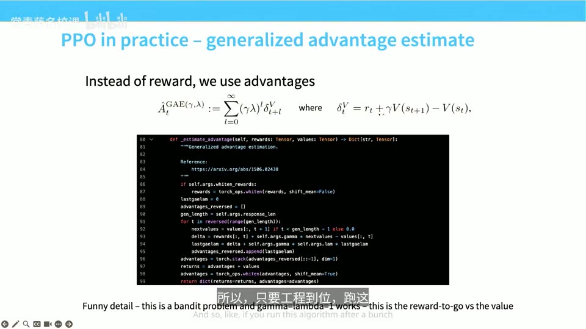 |
| 你会看到奖励上升，若做 RLHF，奖励模型得分也会升，而负 KL 正则化项则下降。呃，好，但总之，PPO 的实现挺折磨人，尤其看环境得靠技巧才能稳定，整个过程都很折磨人。当然不是不可能，很多人用 PPO 都训出了好模型，很多实验室都有现成方案让 PPO 能大规模跑通。所以这事儿能做，但对从零实现的研究者来说， [【跳转到 07:22】](https://www.bilibili.com/video/BV11LEA6eEuj/?p=16&t=442) | 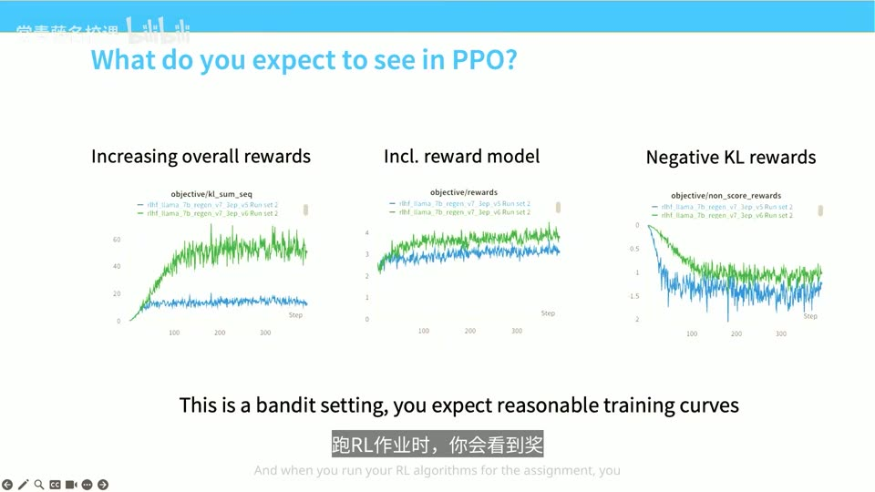 |
| PPO 既挑剔又复杂。嗯，PPO 在很多情况下不受青睐，还有一个原因：它需要一个价值模型，边生成边估算每个 token 的价值。价值模型有多大？跟原始模型一样大，就会占内存，而这些内存你本想留给模型或推理服务器等用途。你现在可能会说，上一讲你提到了 DPO，看起来挺不错，那我为什么不干脆全用 DPO 呢？ [【跳转到 07:47】](https://www.bilibili.com/video/BV11LEA6eEuj/?p=16&t=467) | 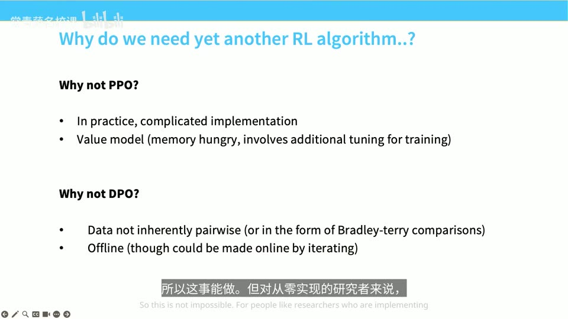 |
| 问题是，DPO 是针对特定问题的特定解法。DPO 适用于 Bradley-Terry 形式的成对反馈，这太具体了，对吧？如果我要解数学题，题目并不是天然的成对比较形式。也有别的 DPO 变体想打破这种成对结构，但这其实是在用错工具，对吧？别想着用 DPO 去做 PPO 通常做的事。PPO 是更通用的工具，几乎什么问题都能解决。 [【跳转到 08:12】](https://www.bilibili.com/video/BV11LEA6eEuj/?p=16&t=492) | 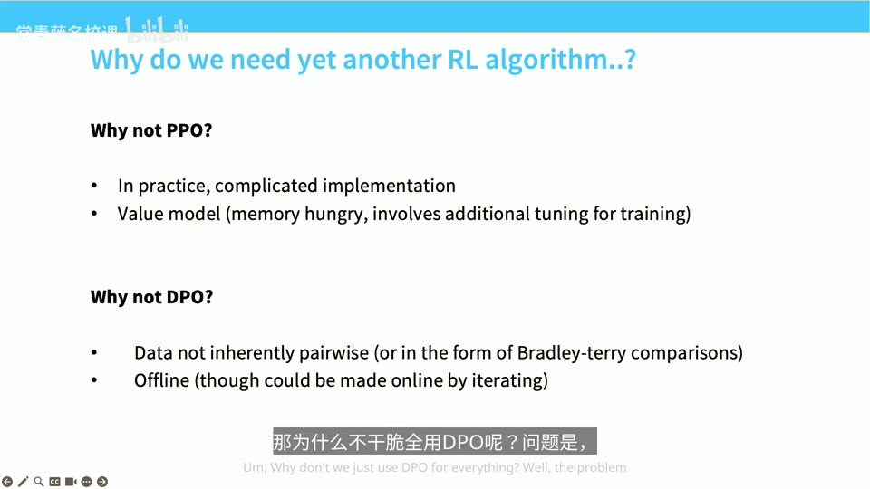 |
| DPO 一般是离线的，不过我觉得这个区别被过分夸大了，因为反复迭代 DPO 也能把它变成在线的，所以我觉得这差别没那么本质。好了，这就是聊这些的背景。同样，研究界也特别希望不必再用 PPO 了。DPO 和 GRPO 能被广泛采用，这本身就说明很多时候让 PPO 跑通有多痛苦。 [【跳转到 08:37】](https://www.bilibili.com/video/BV11LEA6eEuj/?p=16&t=517) | 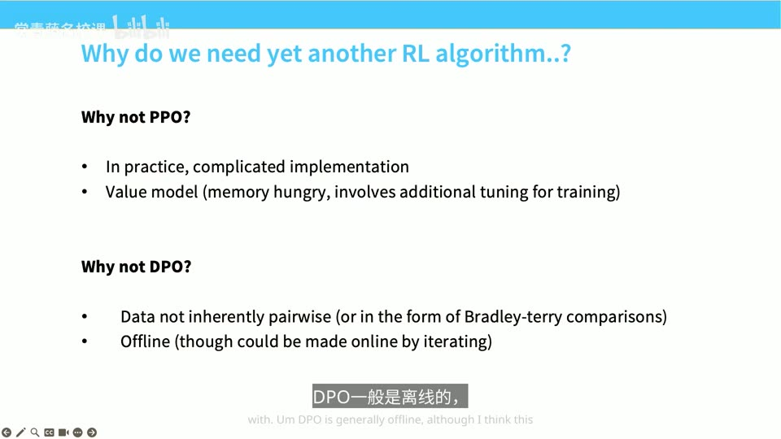 |
| 所以 GRPO 和 DPO 一样是另一种选择，它是给可验证任务做强化学习的更简单的办法。在开源、开放知识的社区里，RLVR 基本已经被 GRPO 接管了。它骨子里跟 PPO 非常像，只是砍掉了几个最复杂的部分，这样一来就让算法简单多了。GRPO 出自 DeepSeek 的一篇论文，我想是……不是，是他们那篇 DeepSeek 数学论文。 [【跳转到 08:57】](https://www.bilibili.com/video/BV11LEA6eEuj/?p=16&t=537) | 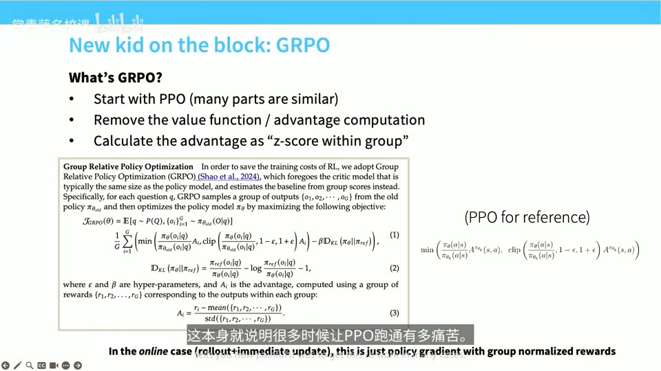 |
| 从 PPO 起步，思路上是说 PPO 挺好，但我们只想改几个地方。真的，那改了什么？改的是 PPO 里最复杂、最烦人的部分——价值函数。优势函数就是作为基线减去的那个量，用来降低梯度更新的方差。价值函数是一整个神经网络，会让训练不稳定，我们不想要它。那怎么办？去掉价值网络。但我们还需要优势， [【跳转到 09:22】](https://www.bilibili.com/video/BV11LEA6eEuj/?p=16&t=562) |  |
| 估计。我不想用普通的 REINFORCE，因为它的方差会非常非常高。所以我们要做的是在组内把优势算成一个 Z 分数，我稍后解释这是什么意思。基本思路是这样的：你通常……你只看获得的奖励，如果有价值函数，你会拿它和你的预测值比较，也就是预测值。你会说，我的神经网络说我本该得 5 分，结果我得了 6 分，所以这是个不错的展开， [【跳转到 09:47】](https://www.bilibili.com/video/BV11LEA6eEuj/?p=16&t=587) | 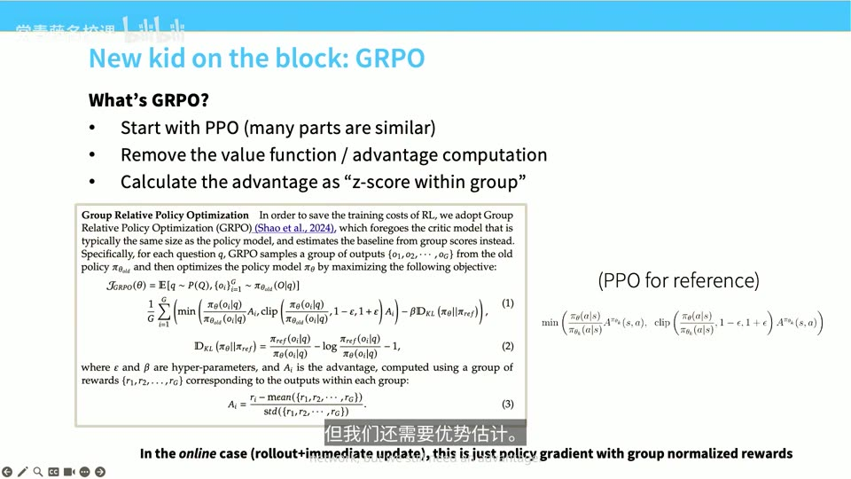 |
| 通常你会这么做。但换个做法，比如你拿到一个得 5 分的展开，然后你再采样另外 10 个展开，问自己：比起这 10 个，我表现得怎么样？如果我比均值好，优势值就高。某种程度上，这是计算优势值很自然的一种方式，也适用于能从同一个提示词多次采样的场景。GRPO 正是这个思路。如果你看 DeepSeek 论文里 GRPO 最初的定义， [【跳转到 10:12】](https://www.bilibili.com/video/BV11LEA6eEuj/?p=16&t=612) | 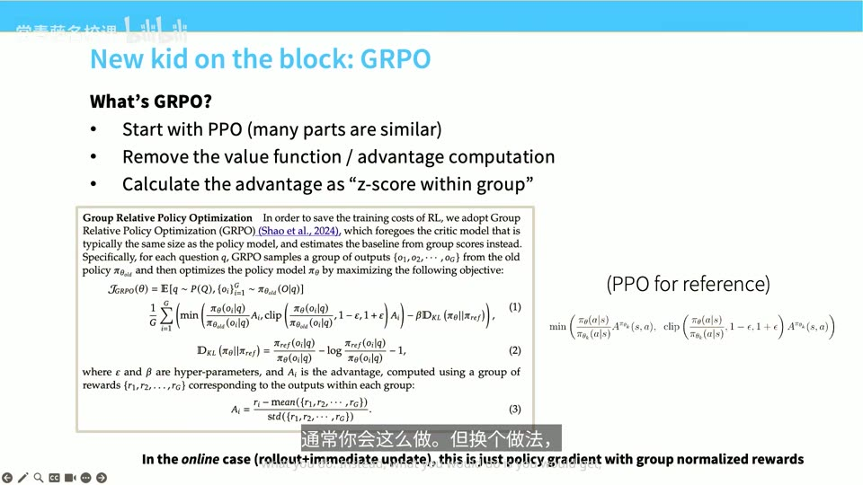 |
| 会发现这就是被优化的目标。那么会做标准的 PPO 更新，加上最小阶段优势项和 KL 项，让模型别偏离参考模型太远。接着是 KL 项具体怎么算的倒不重要，关键是这个优势值是算一组输出样本 O1 到 OG 的 Z 分数。不就是在组内，你算第 i 个样本的优势，这就是算优势的地方。做法是取组内 rollout 奖励减去均值， [【跳转到 10:37】](https://www.bilibili.com/video/BV11LEA6eEuj/?p=16&t=637) |  |
| 再除以标准差。所以每组得到一个 Z 分数。在线情况下这点很关键，因为很多场景下你其实是在线跑，不是离线。在线情况下截断项其实没用了，因为新旧策略的比率就是 1，这个截断操作根本没用，你直接取 min 就行。这就是优势函数减去 KL 惩罚。所以我要用这个定义的优势函数做强化学习。 [【跳转到 11:02】](https://www.bilibili.com/video/BV11LEA6eEuj/?p=16&t=662) |  |
| 在在线 rollout 场景中，这是个非常简单的对象，很适合作为强化学习的目标。要是 GRPO 的某些概念没搞清，我可以先停一下。某种程度上它是那些精彩数学内容的基础，你甚至能用 GRPO 复现它们。所以在深入那些细节之前，咱们最好先透彻理解一下。好，不错，简单，大家一眼就懂了。这评价我收下了，GRPO 确实非常简单。 [【跳转到 11:27】](https://www.bilibili.com/video/BV11LEA6eEuj/?p=16&t=687) | 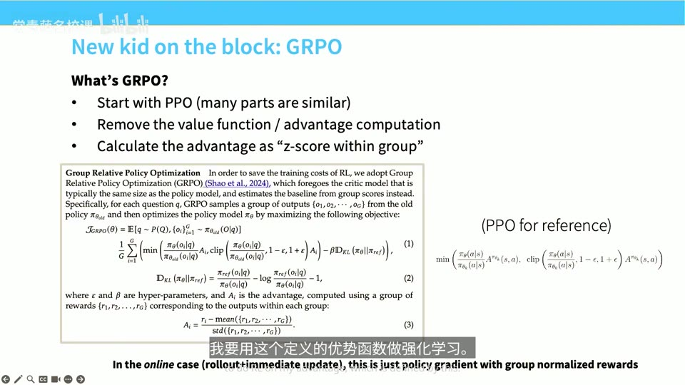 |
| 因为没有价值函数，GRPO 的代码很简单，只需做 rollout，把结果和这 K 个参考值 Z 对比就行，对结果打分，然后针对这些权重做强化梯度更新。作业里就是几步简单操作：算出 rollout 的奖励并归一化，再加上 KL 项，最后把它们放一起更新梯度。得动点脑筋， [【跳转到 11:52】](https://www.bilibili.com/video/BV11LEA6eEuj/?p=16&t=712) | 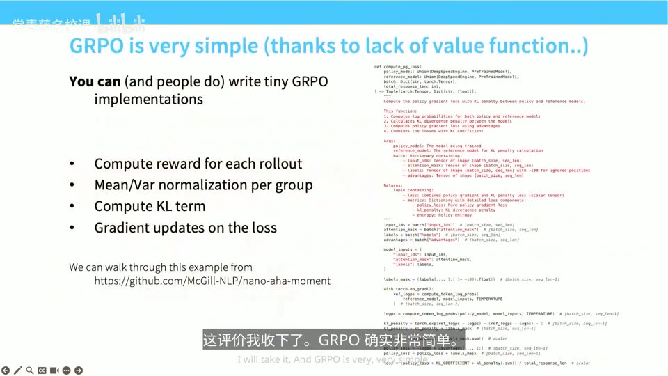 |
| 因为用自动微分实现时得在某处加个 stopgrad（停止梯度）。不过其实没那么复杂。你看这个核心思想，一页代码就能实现，对吧？这是我从麦吉尔大学几位同事那里拿到的 GRPO 参考实现，有个很棒的简化版，分组、索引和标准差这些计算，半页幻灯片就讲完了。跟论文写法唯一不同的是，他们在标准差计算里加了个极小的 1e-4， [【跳转到 12:17】](https://www.bilibili.com/video/BV11LEA6eEuj/?p=16&t=737) |  |
| 防止只有单个样本，或样本奖励刚好相同时数值爆炸。比如在某些领域，奖励会精确为零，像没解出数学题，这种情况确实可能发生。希望这能让你看到 GRPO 有多简单，也明白为什么几乎所有开源工作都基于它。它好写也好懂，结果也显示它给出的效果相当有说服力，它模拟了闭源实验室用 PPO 做过的那些事， [【跳转到 12:42】](https://www.bilibili.com/video/BV11LEA6eEuj/?p=16&t=762) | 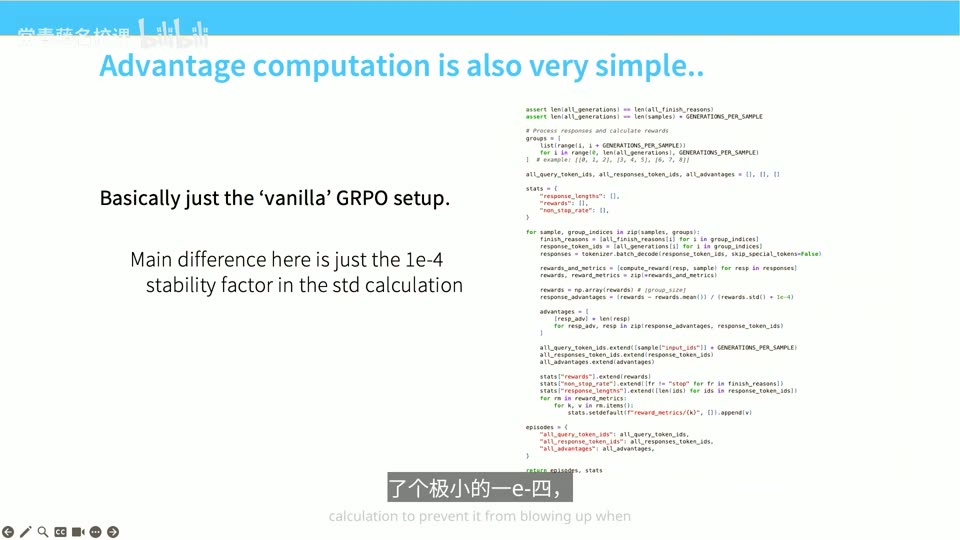 |
| 它到底行不行？如果你搞数学 AI，强烈建议读读那篇 DeepSeek 数学论文。结果显示 GRPO（黄线和蓝线）比 RFT（拒绝微调）强得多。你会把它当基线，只拿模型生成的正确答案来训练，其他的都扔掉。其次，研究表明过程监督——即不仅看答案，还看中间步骤——能带来提升。 [【跳转到 13:07】](https://www.bilibili.com/video/BV11LEA6eEuj/?p=16&t=787) | 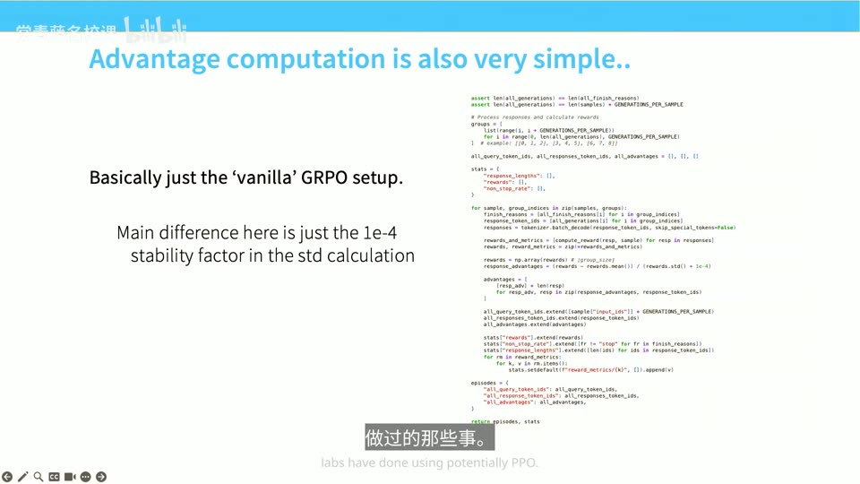 |
| 我后面细说。这很重要，因为这是这类强化学习问题的关键设计决策。现阶段大家只要记住 GRPO 有效就行。你看蓝线和黄线表现都优于其他组。好，咱们再深入聊聊 GRPO 的目标函数。这目标函数里到底发生了什么？我们真的在用策略梯度吗？这几个关键概念咱们得好好想透。 [【跳转到 13:32】](https://www.bilibili.com/video/BV11LEA6eEuj/?p=16&t=812) | 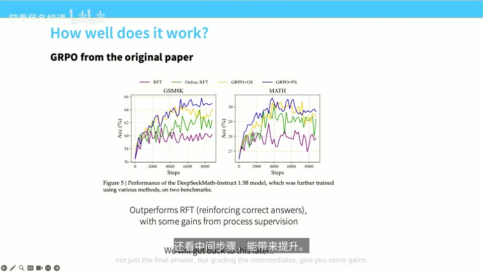 |
| 咱们回想下 GRPO 和 PPO 的区别。PPO 里有个价值函数，用来计算优势；而 GRPO 去掉了那部分，改用 Z 分数，也就是用奖励减均值再除以标准差来算优势。这个优势估计算好吗？上过 RL 课的同学估计心里已经有答案了。那到底什么样的优势函数才算好，或者说有效的优势函数标准是什么？咱们看看 Sutton & Barto 那本强化学习经典教材， [【跳转到 13:57】](https://www.bilibili.com/video/BV11LEA6eEuj/?p=16&t=837) | 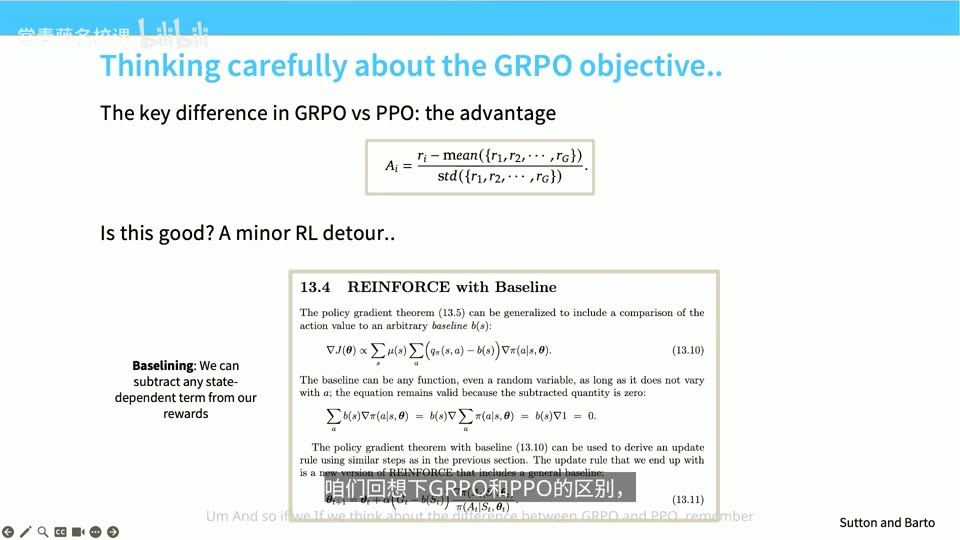 |
| 里面提到了一个带基线的 REINFORCE 算法。做策略梯度时，你可以沿奖励方向更新参数，你可以用奖励减去所谓的状态依赖基线。在老虎机问题里，状态就是提示词，你可以减去依赖提示词的基线，只要这么做就是有效的，策略梯度方向不变， [【跳转到 14:22】](https://www.bilibili.com/video/BV11LEA6eEuj/?p=16&t=862) |  |
| 但基线选择会影响梯度下降的方差。诶，注意我们不只是做减法，我们不只是减去一个常数，还除以标准差。这算个问题，但也未必。如果你真想要一个概念清晰、名副其实的算法，它其实是在让奖励下降。GRPO 这么做，总之，我用红色标出的 GRPO 除以标准差， [【跳转到 14:47】](https://www.bilibili.com/video/BV11LEA6eEuj/?p=16&t=887) | 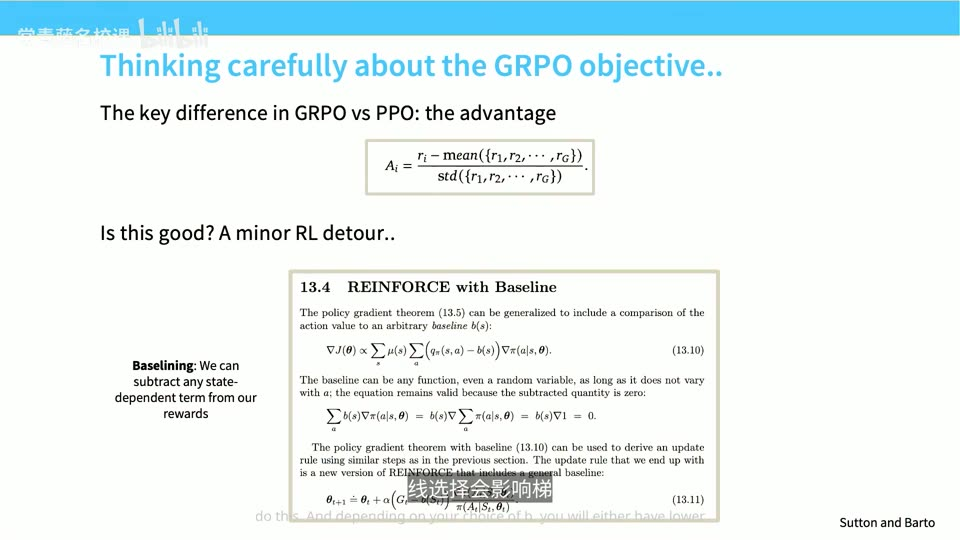 |
| 这违背了基线原则：我们不仅减去基线，还要除以标准差做归一化。啊，针对我的奖励……对了，GRPO 还有个细节我之前没提，有点棘手：它几乎是针对每个 token 操作的，对吧？所以他们用序列总长度作为归一化因子来除。但如果你遵循策略梯度和极限定理，从第一性原理推导 GRPO，结果会不同。 [【跳转到 15:12】](https://www.bilibili.com/video/BV11LEA6eEuj/?p=16&t=912) | 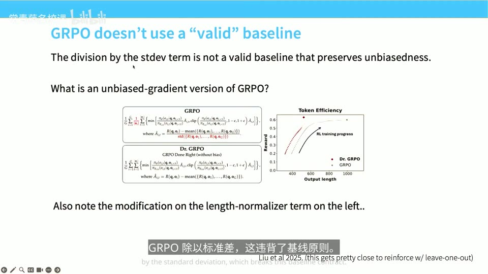 |
| 你既没有长度归一化，也没有标准差归一化，对吧？GRPO 刚出不久，有人注意到这点并发表论文指出，如果不做这两处改动，结果会很不一样，甚至可能表现更好。等讲到那篇论文时我也会聊这个。不过核心在于，GRPO 并不是从第一性原理推导出来的，它其实做了些不一样的事，利弊兼有。那这两项怎么起作用？ [【跳转到 15:37】](https://www.bilibili.com/video/BV11LEA6eEuj/?p=16&t=937) | 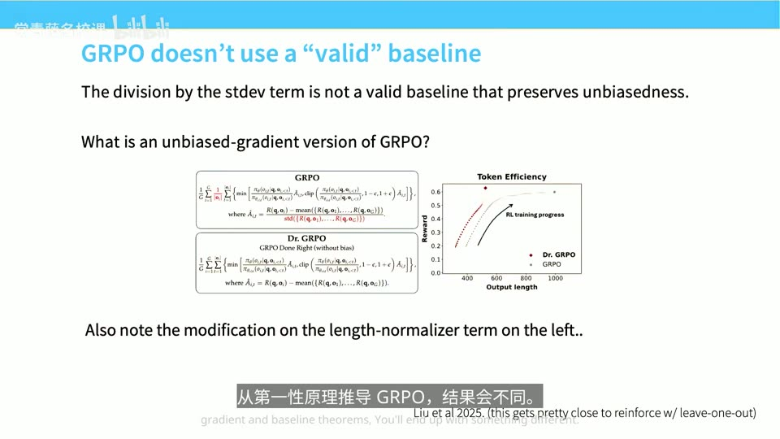 |
| 现在我们知道 GRPO 并没有直接对奖励目标做下降。所以我们知道它有两个修正因子，干嘛用的？长度归一化比较好懂，我们在干嘛？是拿较长的序列去除以一个较大的数，就会鼓励模型生成长输出，对吧？因为当你错了，它会鼓励你生成错误输出。比如我知道这道数学证明会做错，会引入负值，比如 -1 的负奖励，我就生成无限长的字符串， [【跳转到 16:02】](https://www.bilibili.com/video/BV11LEA6eEuj/?p=16&t=962) |  |
| 这样我就能除以无穷大，彻底抵消那个负惩罚。我们这是极端情况，但道理很清楚：除以输出长度会鼓励模型在解不出题时一直废话。这个是你最终要面对的长度问题。解决了它，你会发现 GRPO 里思维链的长度往往最后会稳定在一个常数，而不是无限增长，这看起来是好事，特别是在答错时，你肯定不想让输出越来越长。 [【跳转到 16:27】](https://www.bilibili.com/video/BV11LEA6eEuj/?p=16&t=987) | 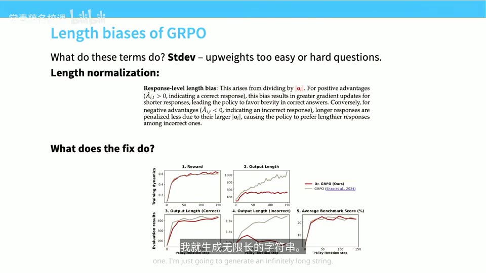 |
| 然后是标准差归一化。这个稍微复杂点，但你想，我其实是在除以标准差，所以这相当于在强调那些标准差较小的问题。那什么时候二元奖励问题的标准差会小呢？就是问题太简单或太难的时候。如果问题很简单，我总是全对，那我就要做除法了，我基本上是在除以零，对吧？ [【跳转到 16:52】](https://www.bilibili.com/video/BV11LEA6eEuj/?p=16&t=1012) | 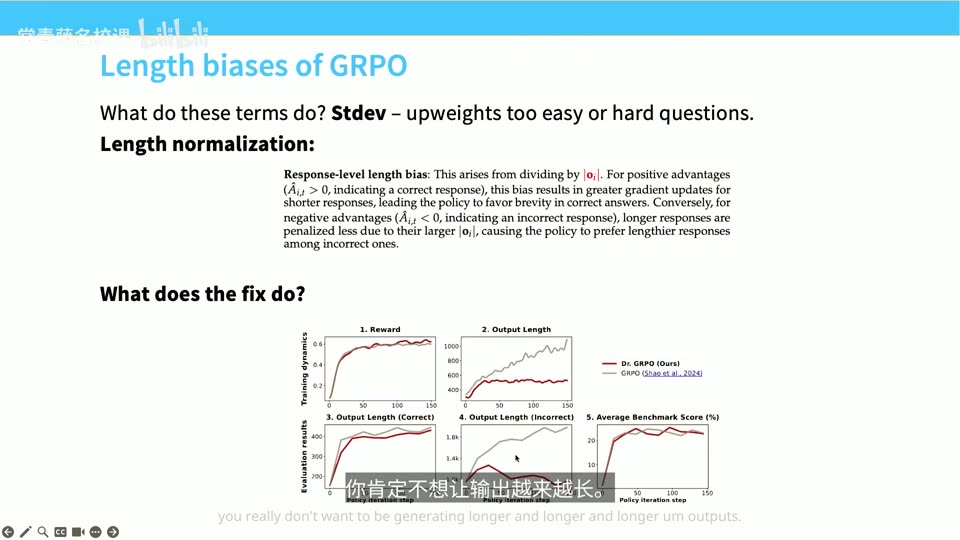 |
| 因为我总是答对，就没有波动；同理，如果我总是答错，奖励也就没有波动了，我会显著加大它的权重，对吧？所以标准差项放大了两端，也就是简单和难题的权重，这显然不是我们想要的，因为我们希望模型在它能力范围内的题目上学习。好了，以上就是 RLVR 的算法组件。接下来我会拆解几个最近的模型发布，聊聊我觉得关键的算法部分。 [【跳转到 17:17】](https://www.bilibili.com/video/BV11LEA6eEuj/?p=16&t=1037) | 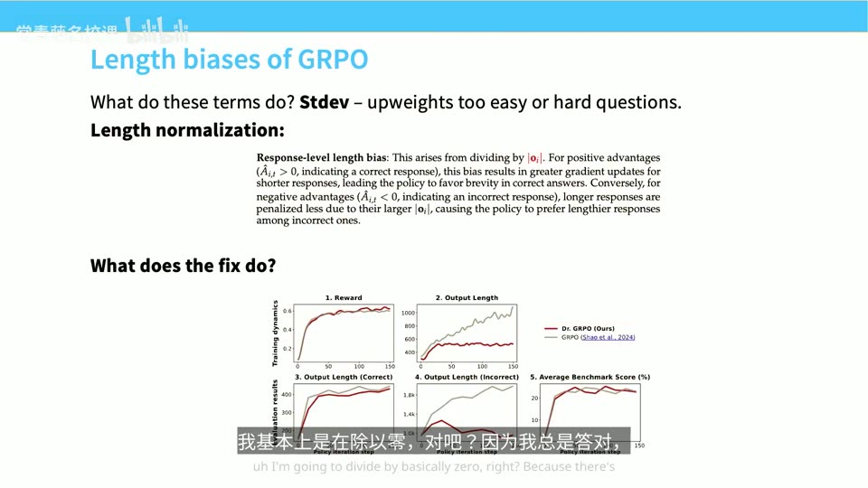 |
| 比如我今年新增的智能体功能，这对模型部署和使用越来越重要。讲之前我先停一下，谁有算法问题我先回答，再继续往下讲。行，没问题，那咱们先聊 DeepSeek R1，毕竟它现在挺火的，大家都该了解一下。DeepSeek R1 这论文很棒，开启了开源 RLVR 模型的浪潮。它最牛的地方是首个在表现上追平了 OpenAI o1。 [【跳转到 17:42】](https://www.bilibili.com/video/BV11LEA6eEuj/?p=16&t=1062) | 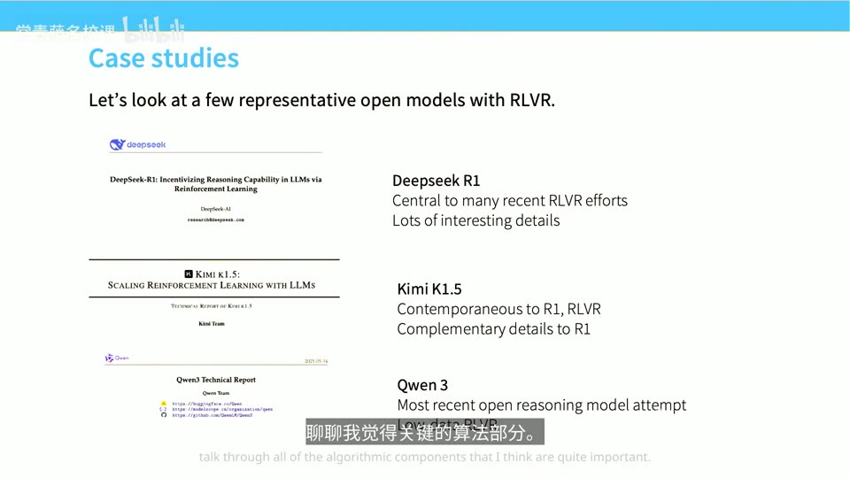 |
| OpenAI o1 的关键在于它有很长的思维链，这显然是经过 RL 训练的，在难题上表现很好。他们还提供了一套任何人都能用的 RL 方案，从研发角度看这很重要。要是只有 DeepSeek 能跑，那套糟糕的 PPO 影响就小多了，至少对我们研究者是这样。这种 GRPO 谁都能玩， [【跳转到 18:07】](https://www.bilibili.com/video/BV11LEA6eEuj/?p=16&t=1087) | 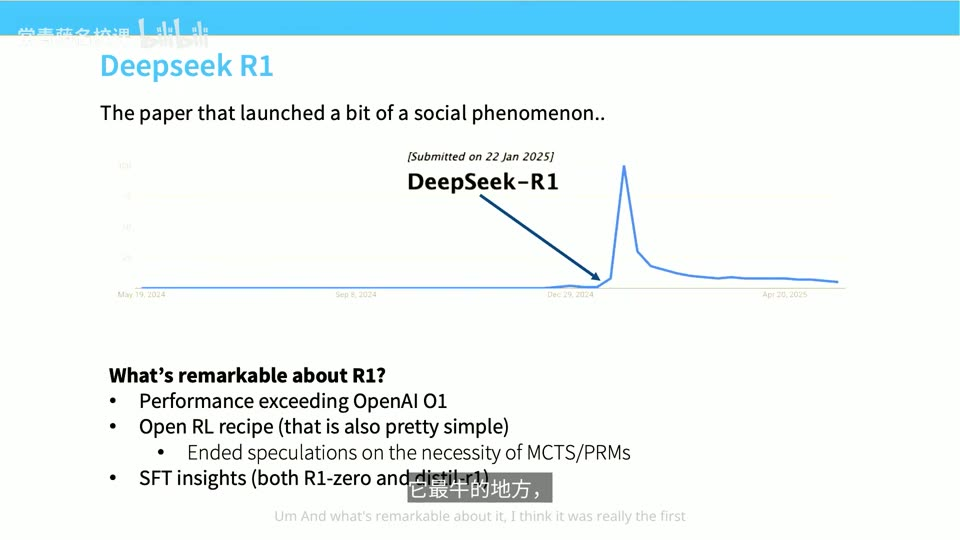 |
| 哪怕你做作业时也能用。最后，他们有些有趣的蒸馏见解，到现在依然管用。DeepSeek R1 的起点，你能看出他的专长是怎么一步步搭起来的。我们发了篇 DeepSeek 数学论文，搞 GRPO，早就把 RL 的门道摸透了，针对数学题。所以他们就从 DeepSeek 数学的那些组件起步。呃，有个重要区别：他们放弃了过程监督， [【跳转到 18:32】](https://www.bilibili.com/video/BV11LEA6eEuj/?p=16&t=1112) | 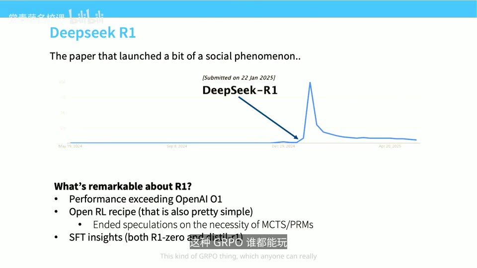 |
| 而这种方法在 DeepSeek 数学任务中曾很管用。他们只用结果监督，简单说就是只看最终答案对错来给奖励。过程监督则是用评分标准，比如检查证明中间步骤是否有效。很多人以为过程监督很重要，结果发现它对很多任务其实没那么关键。所以 R1 很有意思，因为它包含不少不同的组件， [【跳转到 18:57】](https://www.bilibili.com/video/BV11LEA6eEuj/?p=16&t=1137) | 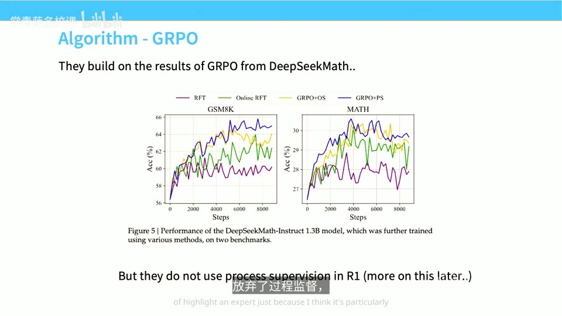 |
| 但有个特别有趣的组件是 R1-Zero，他们在那没做太多后训练。他们有个基础模型，当然大家现在都知道这个基础模型也经过中期训练，所以这个模型能做一些指令遵循。然后在这个基础模型之上，他们主要做 RLVR，GRPO 算法的奖励就是看能不能正确解出一堆数学题，问题与格式奖励。这很关键， [【跳转到 19:22】](https://www.bilibili.com/video/BV11LEA6eEuj/?p=16&t=1162) | 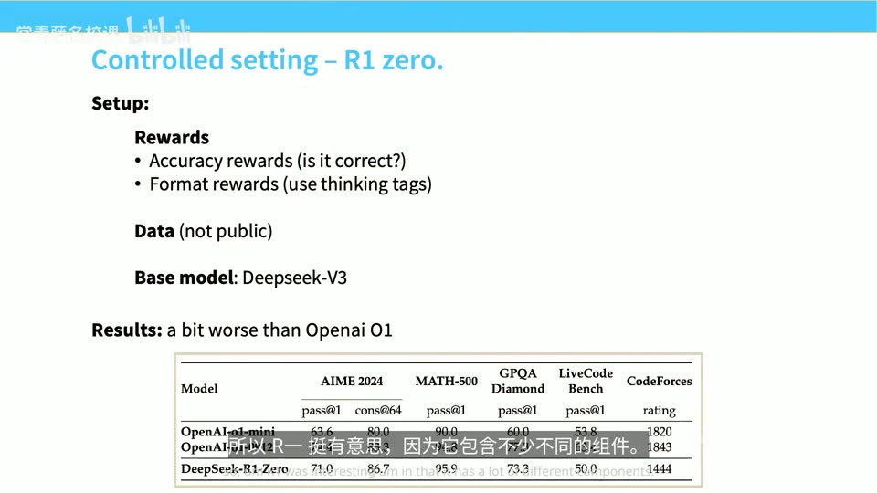 |
| 因为格式奖励能让他们后续剥离思维链，他们希望模型规范使用思维标签来包裹思维链。但这套方案很简单，GRPO 很简单，准确性奖励也很简单。事实上你基本能浮现这些结果，只要照做，结果会怎样？效果只比 OpenAI o1 略差一点，对吧？所以这个非常纯粹。我喜欢这个结果，因为它没有真实训练流程的那种杂乱，也没有把生产后训练流程混进来。 [【跳转到 19:47】](https://www.bilibili.com/video/BV11LEA6eEuj/?p=16&t=1187) |  |
| 你无需纠结是 RLHF 起了作用还是别的因素。基础模型加 GRPO 方案很简单，数学能力相当不错。我认为 R1 的走红部分 [【跳转到 20:12】](https://www.bilibili.com/video/BV11LEA6eEuj/?p=16&t=1212) | 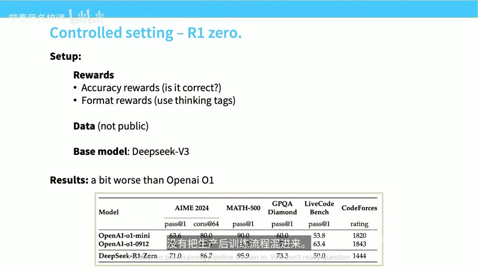 |
| 也源于论文中声称观察到的有趣现象。而他们声称观察到的现象之一是，随着训练时间延长，模型能思考更久，思维链越来越长。他们还提到了网上疯传的顿悟时刻：训练足够久后，模型的思维链就会出现顿悟。嗯，我觉得这一点挺有意思的，但我不确定这两种现象是否真的存在。思维链其实是 GRPO [【跳转到 20:21】](https://www.bilibili.com/video/BV11LEA6eEuj/?p=16&t=1221) | 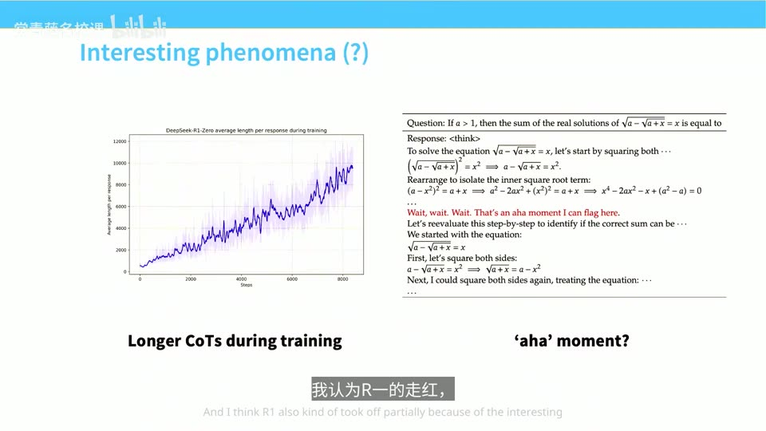 |
| 算法长度归一化的自然结果。至于顿悟时刻，别人已经证明基础模型里就有，所以这肯定不只是强化学习算法的功劳。很多人说顿悟，这能帮我解数学题，模型在预训练时就学会了，因为它生成了很多数学 token，强化学习时顺手提取出来，这太正常了。我觉得那个现象没那么特别或刺激。 [【跳转到 20:46】](https://www.bilibili.com/video/BV11LEA6eEuj/?p=16&t=1246) | 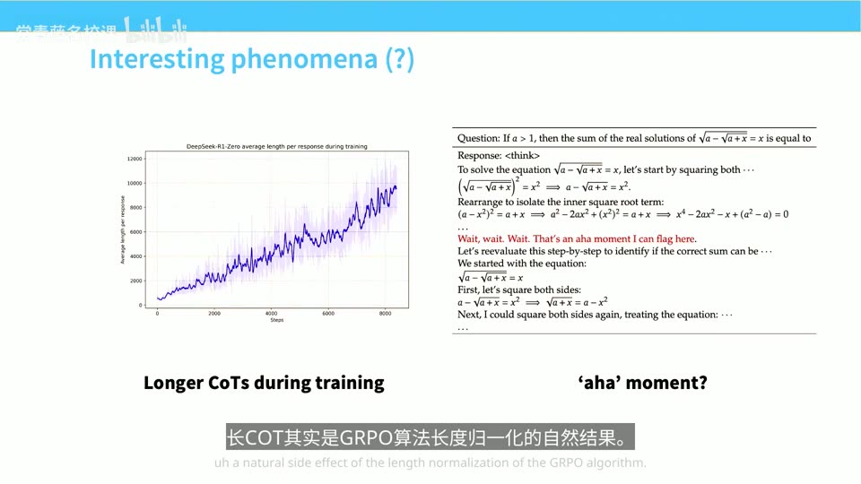 |
| 但 R1 确实是个重要里程碑，它展示了 RLVR 有多简单，这算是一种很干净的算法，也是解决难题的好方法。所以 R1-Zero 是个很干净、受控的环境。接着 R1 是他们想把系统投入实际应用的尝试。R1 有个好处，待会我会拿 Qwen 来对比。诶，你能看到怎么把这些模块拼起来，对吧？我们之前都孤立研究过这些部分， [【跳转到 21:11】](https://www.bilibili.com/video/BV11LEA6eEuj/?p=16&t=1271) | 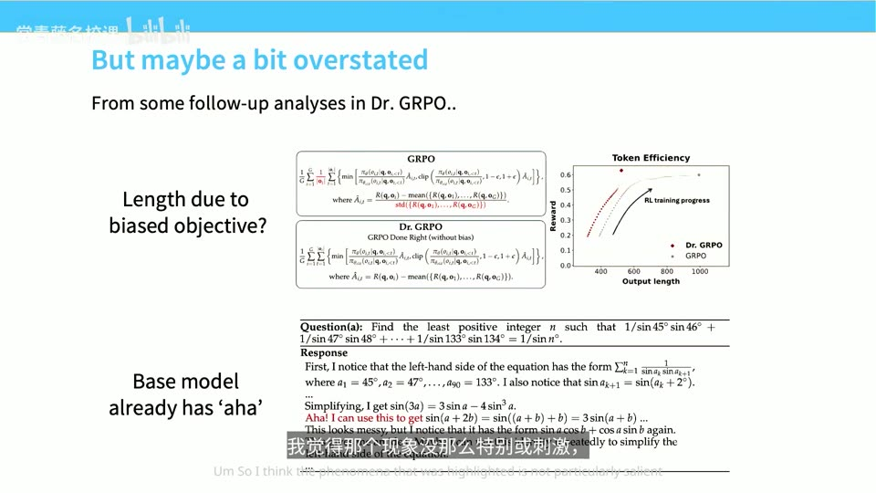 |
| 知道预训练、RLHF 和 SFT 在哪，但怎么把它们组合成最终系统呢？通常做法是，我们先用中期训练好的模型，然后做推理训练和长上下文扩展，最后做 RLHF，毕竟这是直接面向用户的关键步骤，我们要确保格式规范，RLHF 能很好地辅助这一过程。另外，他们给生产模型的思维链加了语言一致性奖励。我记得报告提过，没加一致性奖励的话， [【跳转到 21:36】](https://www.bilibili.com/video/BV11LEA6eEuj/?p=16&t=1296) |  |
| R1-Zero 风格的训练在思维链里会乱切语言。他们觉得这太难解释，看着也让人有些不安，所以想把它弄清楚，就让它统一输出一种语言，主要是出于可解释性考虑。他们还把一些不可验证的奖励塞进 GRPO，几乎都融进 RLHF 流程里了，但除此之外两者非常相似。我觉得整个流程很清晰。 [【跳转到 22:01】](https://www.bilibili.com/video/BV11LEA6eEuj/?p=16&t=1321) | 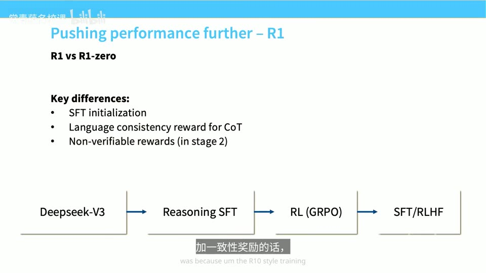 |
| 嗯，做 SFT 时他们的做法相当简单。R1-Zero 里他们完全不想做 SFT，但 R1 愿意用长思维链数据。读读这些开源技术报告时，琢磨字里行间的意思挺有意思。这儿也能看到，他们说我们构建并收集了少量长思维链数据。你可能会琢磨，我猜这是不是从别的模型蒸馏来的，这对开源模型倒不算坏事， [【跳转到 22:26】](https://www.bilibili.com/video/BV11LEA6eEuj/?p=16&t=1346) | 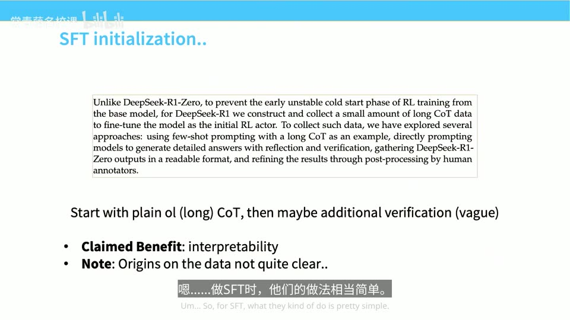 |
| 但大家都这么干。但这措词写得这么小心，我觉得挺有意思，收集少量长思维链数据，啊，这是用来微调模型的。我们知道基础模型够强，光靠长思维链做监督微调，就能激发大量类 o1 的能力，这是强化学习的绝佳起点。他们从这里起步，加入验证来过滤这些思维链，再继续处理。例如此后许多论文，包括我学生的部分工作表明， [【跳转到 22:51】](https://www.bilibili.com/video/BV11LEA6eEuj/?p=16&t=1371) | 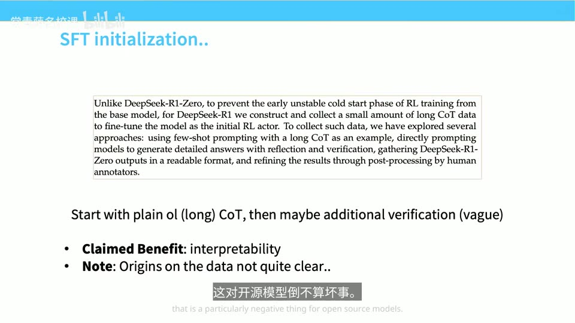 |
| 只要蒸馏流程和基础模型合适，光靠监督微调就能获得长思维链推理能力。 [【跳转到 23:16】](https://www.bilibili.com/video/BV11LEA6eEuj/?p=16&t=1396) | 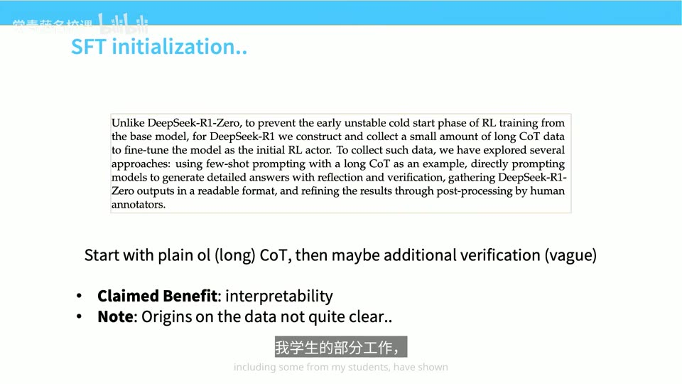 |
| 并光靠监督微调就行。我觉得这很有趣，因为有个关键问题是你真需要强化学习吗？谈到强化学习在语言建模中的作用，一种思路是它是极好的监督信号来源。若解决前沿数学问题，你根本拿不到详细长思维链的监督信号，强化学习能让你自我生成，但一旦有了这些长思维链，你也可以从模仿中学习，这似乎部分印证了那些蒸馏结果。 [【跳转到 23:25】](https://www.bilibili.com/video/BV11LEA6eEuj/?p=16&t=1405) | 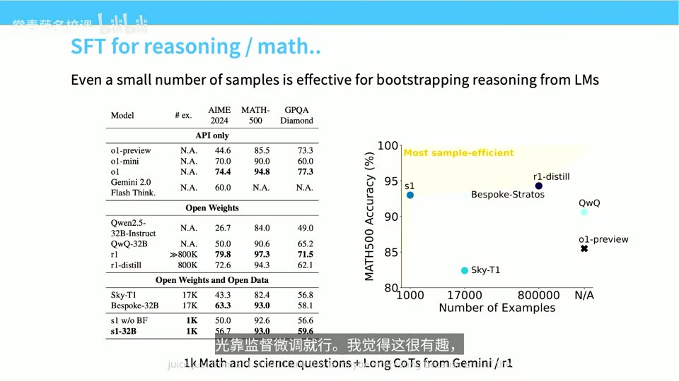 |
| R1 的强化学习部分跟 R1-Zero 基本一样，只是去掉了我提到的语言一致性损失。 [【跳转到 23:50】](https://www.bilibili.com/video/BV11LEA6eEuj/?p=16&t=1430) | 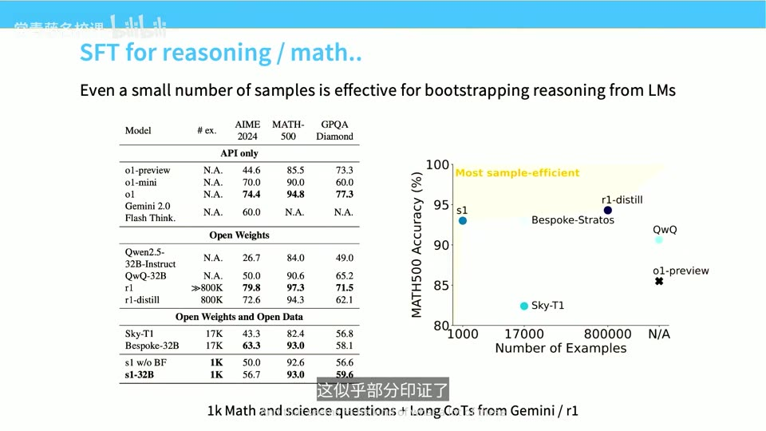 |
| 我们主要用 GRPO 做强化学习训练，这就构成了最后阶段，这就是上一讲的内容。 [【跳转到 23:55】](https://www.bilibili.com/video/BV11LEA6eEuj/?p=16&t=1435) | 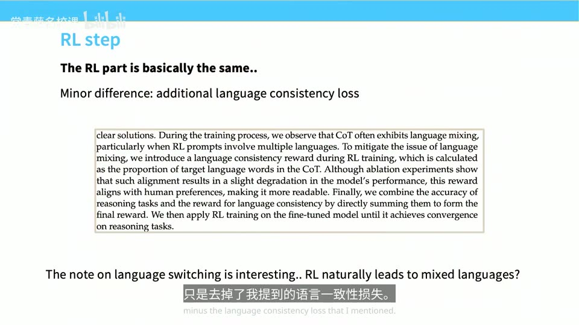 |
| 先做基础指令微调式的 SFT，再做 RLHF。对于不可验证的任务，他们基本还是沿用 DeepSeek V3 那套方法，这里没什么好惊讶的。那效果到底怎么样？效果真的非常好。我想这就是 DeepSeek 引发恐慌、广受关注的原因。毕竟 R1 确实是个很好的模型，它在很多类别上超过了 o1，也符合大家预期的测试时扩展表现。 [【跳转到 24:05】](https://www.bilibili.com/video/BV11LEA6eEuj/?p=16&t=1445) | 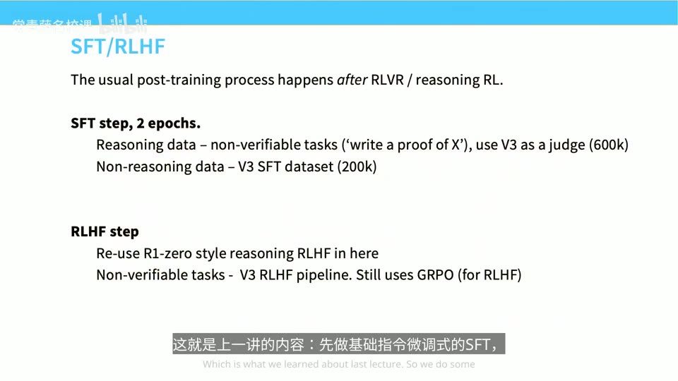 |
| 而且它的配方非常简单，所以增益来自哪里很容易理解。关于之前讨论的蒸馏，你可以把 R1 的思维链输入给 Qwen 2.5，这样做能显著提升这些模型的性能，在某些情况下能媲美许多专用模型。也就是说，只要给模型能读懂的合适长思维链，通常就能让它长时间推理，基础模型本身就出奇地好。 [【跳转到 24:30】](https://www.bilibili.com/video/BV11LEA6eEuj/?p=16&t=1470) |  |
| 这对 Llama 模型也适用，我觉得挺有意思。 [【跳转到 24:55】](https://www.bilibili.com/video/BV11LEA6eEuj/?p=16&t=1495) | 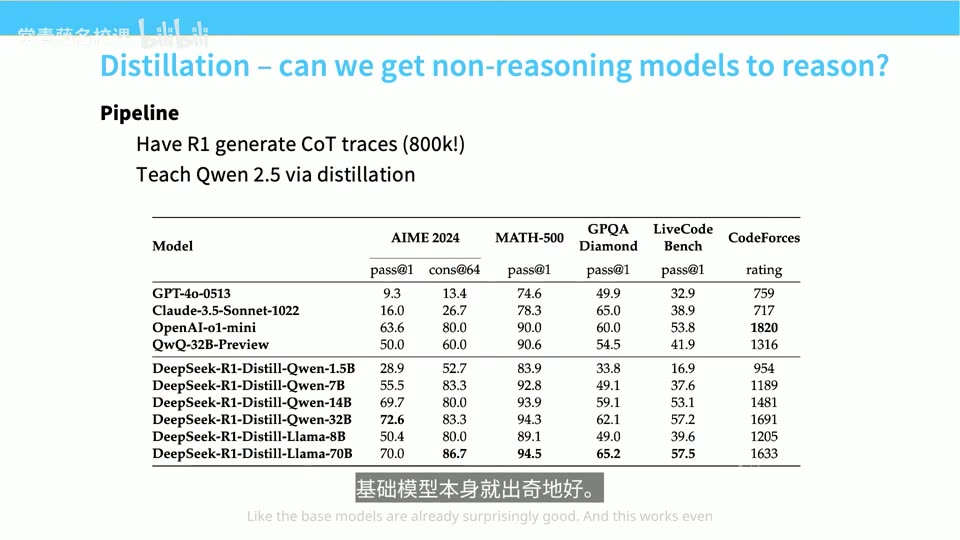 |
| 最后总结一下 DeepSeek。我很喜欢他们的技术报告，因为既做消融实验，也坦诚公布失败的尝试。如果你一直关注他们的动态，DeepSeek 数学里这些都有。比如过程奖励模型，说要验证每一步，可你读 R1 时会问：过程奖励模型哪去了？其实论文里讲了过程奖励模型的下落，我们试过让它生效，他们没帮上什么忙。事实证明 [【跳转到 25:00】](https://www.bilibili.com/video/BV11LEA6eEuj/?p=16&t=1500) | 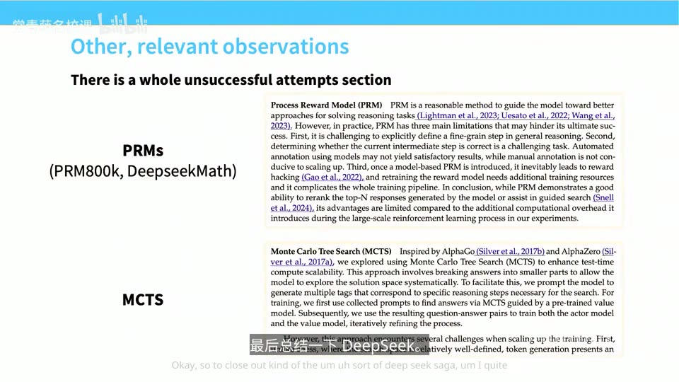 |
| 结果奖励模型效果很好，数据量足够也更容易扩展。过程奖励模型的主要争议在于分布评分标准从哪儿来，这很难扩展。现在很清楚结果奖励模型很好，这也是当下的重点所在。同样，如果你关注过 OpenAI，很多人曾猜测 OpenAI 的 o1 内部到底用了什么。大家当时想，哦，他们是用过程奖励模型吗？还是像 AlphaGo 那样做树搜索？他们也试过，尝试了大量蒙特卡洛树搜索， [【跳转到 25:25】](https://www.bilibili.com/video/BV11LEA6eEuj/?p=16&t=1525) | 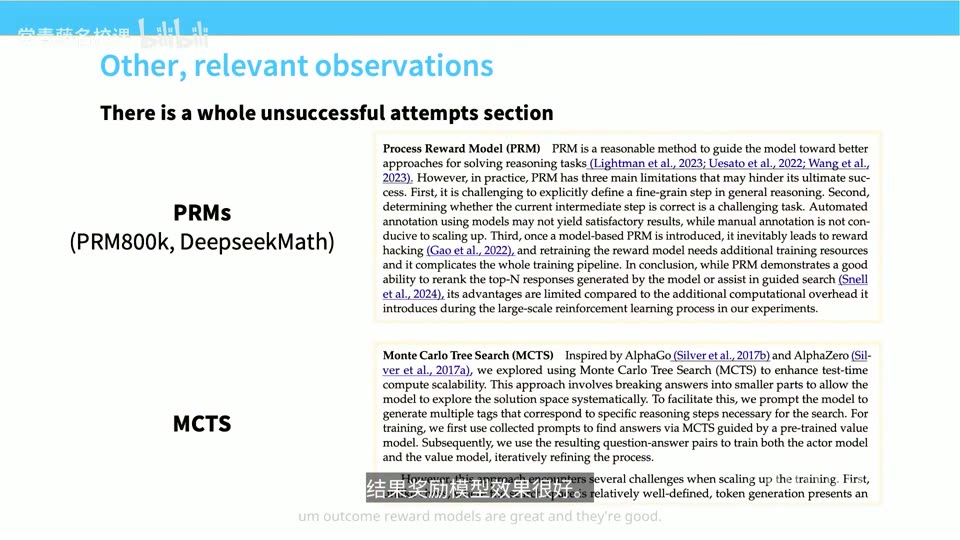 |
| 但表示没能很好地跑通。我想强调的是，他们很坦诚地公开了所有探索和失败的尝试，而不是说他们根本没试过。 [【跳转到 25:50】](https://www.bilibili.com/video/BV11LEA6eEuj/?p=16&t=1550) | 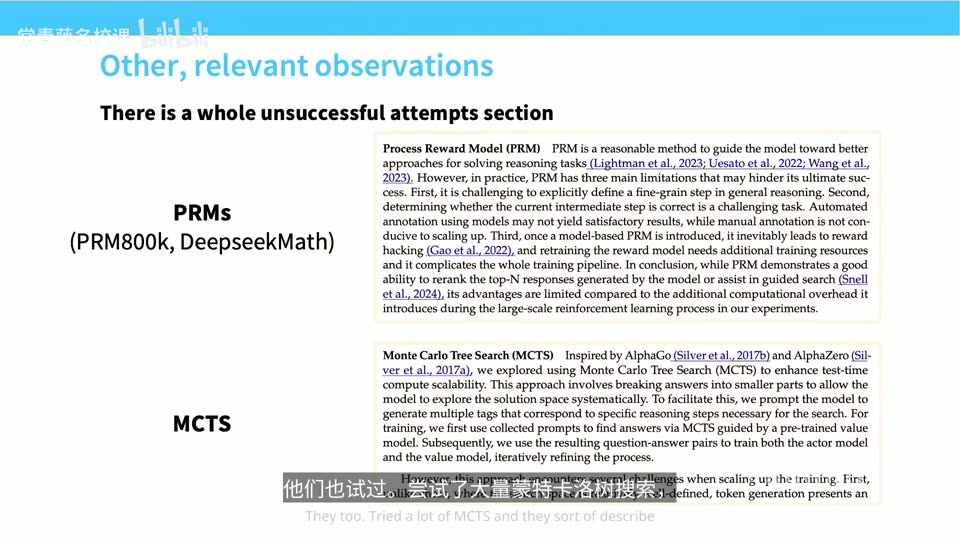 |
| 那我先停一下，大家有问题可以提。虽然我也不确定有没有解释了。 [【跳转到 26:02】](https://www.bilibili.com/video/BV11LEA6eEuj/?p=16&t=1562) | 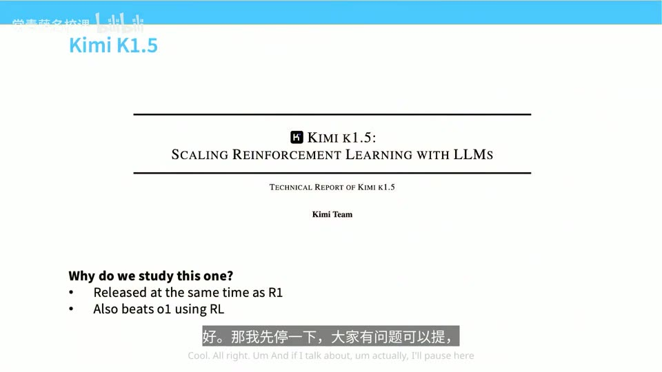 |
| （课堂问答）当内部处理不再适用时，阳性案例的情况。就像你说的，阴性案例里我们鼓励除以无穷大和零；对阳性案例， [【跳转到 26:07】](https://www.bilibili.com/video/BV11LEA6eEuj/?p=16&t=1567) | 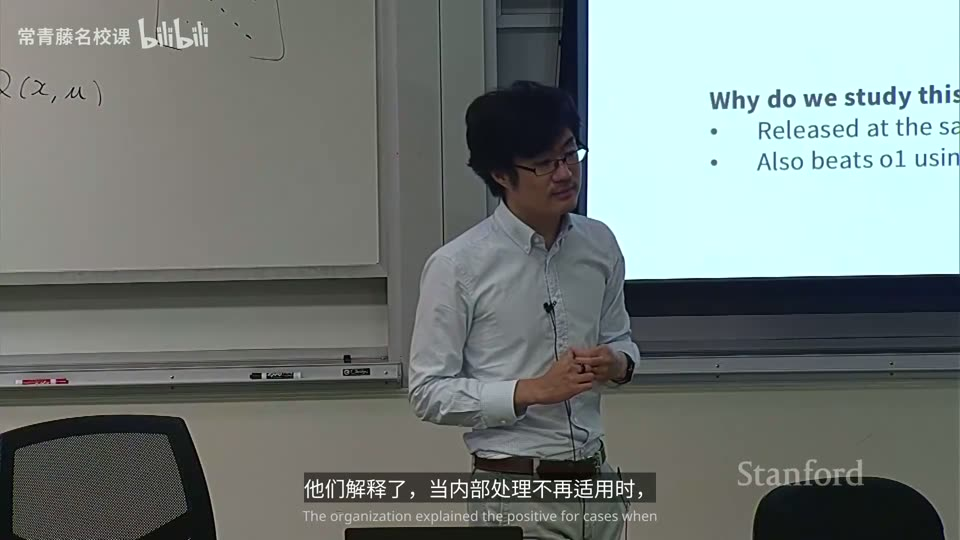 |
| 我们倾向于这样做。问题是长度归一化器起什么作用？当然这能鼓励缩短思维链，如果你想省推理成本这很好，但要是准确率下降就不好了。主要问题是阴性案例会生成超长回复，阳性案例说不了那么多，因为解决特定问题的思维链有长度下限。 [【跳转到 26:16】](https://www.bilibili.com/video/BV11LEA6eEuj/?p=16&t=1576) | 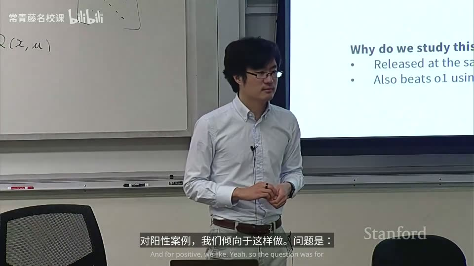 |
| 我想我是想弄懂刚才那个图表的解释。 [【跳转到 26:33】](https://www.bilibili.com/video/BV11LEA6eEuj/?p=16&t=1593) | 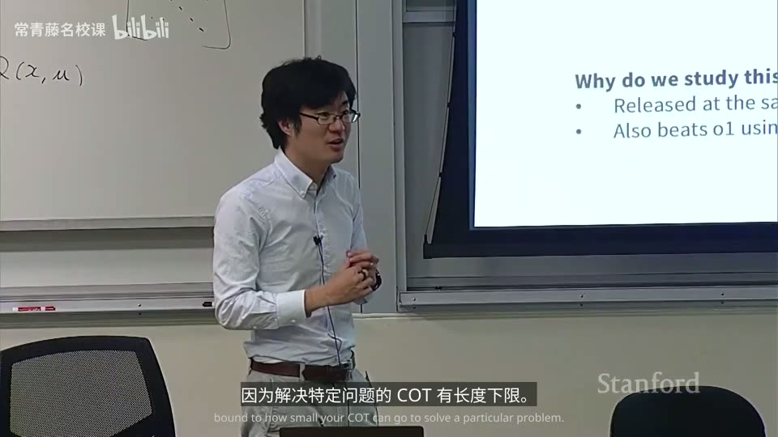 |
| （课堂问答）对，思维链 GRPO 的图更直观。你看 R1 的图，这里把所有数据都汇总了，嗯， [【跳转到 26:38】](https://www.bilibili.com/video/BV11LEA6eEuj/?p=16&t=1598) | 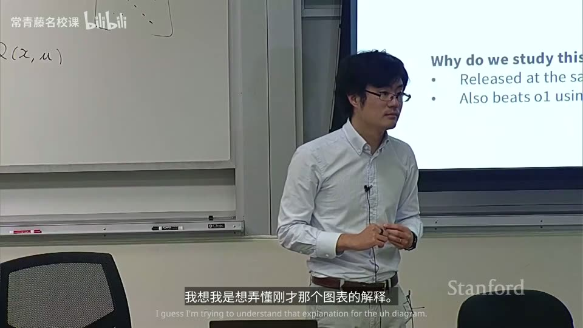 |
| 这里囊括了评估里的所有回复，不只有那些正确的。 [【跳转到 26:43】](https://www.bilibili.com/video/BV11LEA6eEuj/?p=16&t=1603) | 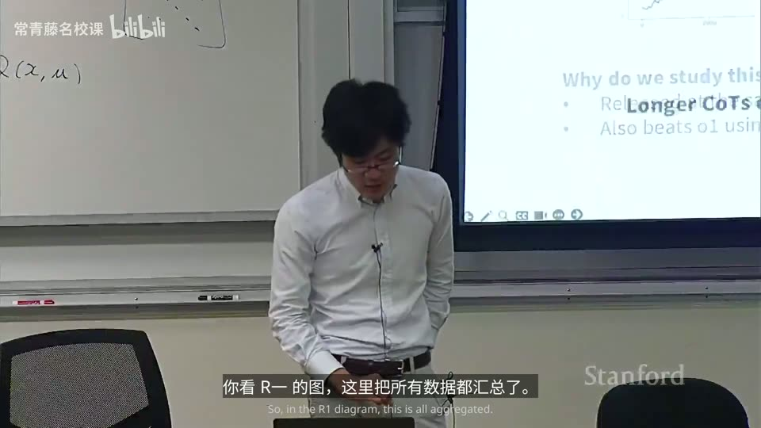 |
| 咱们再看思维链 GRPO 的图。这条是平均长度，这条是错误长度，啊，你看正确长度在这。所以正如我们预期的，增长主要是由错误输出驱动的。所以在这些受控对比中，结论非常清晰。哦，好，呃，接下来我还会讲一种替代方案：Kimi K1.5，也就是另一篇论文的方法。 [【跳转到 26:48】](https://www.bilibili.com/video/BV11LEA6eEuj/?p=16&t=1608) |  |
| 聊到 R1 时，我觉得必须提一下 Kimi K1.5，因为他们几乎是同时出的，他们还击败了 o1。然而大家都在追捧 DeepSeek，Kimi 却很少被提起，尽管他们的模型非常出色。我说这些并不只是出于同情，我觉得 Kimi 有个不错的地方：他们在好些方面做得很不一样，跟 DeepSeek 不一样，这两套都行得通，我们能从中学到不少东西。 [【跳转到 27:13】](https://www.bilibili.com/video/BV11LEA6eEuj/?p=16&t=1633) | 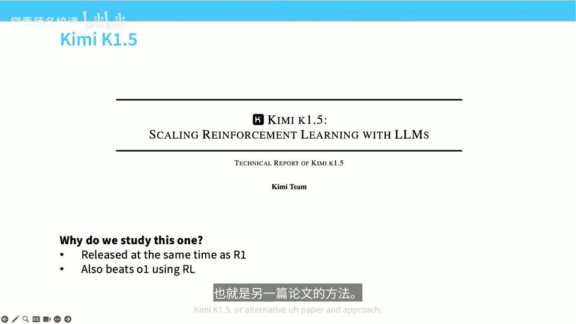 |
| 这也是咱们这门课的主题之一：读读技术报告，看看更大的趋势，我们就能大致摸清哪些路子能让这些算法跑通。所以他们在数据集构建和强化学习课程生成上讲得很细，而很多人觉得这一点特别关键。他们用的强化学习算法也不一样，虽然有些思路相似，但并不是 GRPO，所以这又是一个很好的验证。 [【跳转到 27:38】](https://www.bilibili.com/video/BV11LEA6eEuj/?p=16&t=1658) | 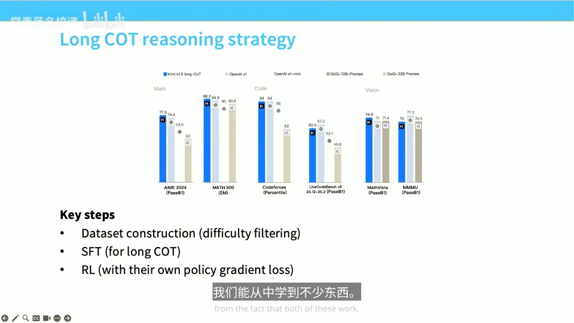 |
| 技术上讲，我觉得你未必非得用 GRPO 才能让这些模型跑起来。谢谢。好，我想先讲第一部分：数据。诶， [【跳转到 28:03】](https://www.bilibili.com/video/BV11LEA6eEuj/?p=16&t=1683) | 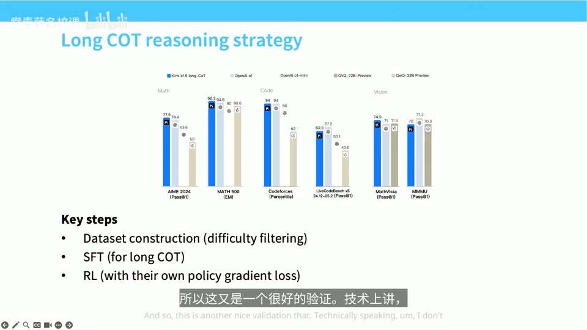 |
| 数据对这些过程依然至关重要，而对 RL 来说还多了一层课程式设计的考量。你想投入什么难度的问题？SFT 里你不太用考虑难度，直接把数据塞进去就行，对吧？不管你想要什么数据，都用预训练损失，模型就被迫从中学习。SFT 就要更微妙一点，我们聊过不少幻觉的问题，有时候你并不想用某些数据来训练，对吧？ [【跳转到 28:09】](https://www.bilibili.com/video/BV11LEA6eEuj/?p=16&t=1689) | 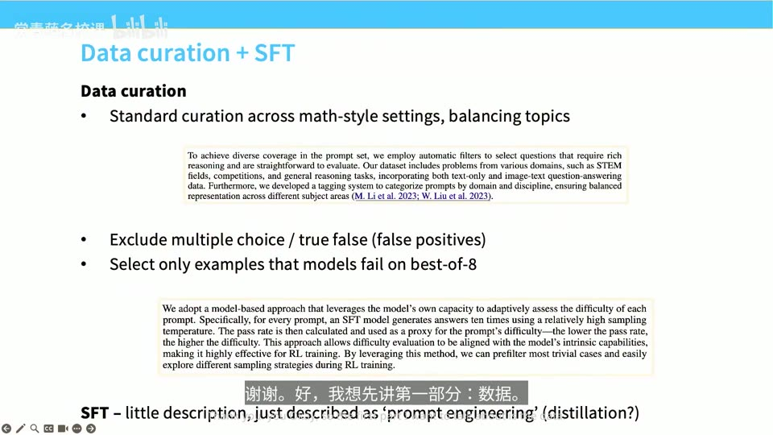 |
| 但对 RL 来说还有个额外的麻烦：如果问题太难，你就拿不到奖励，对吧？没有奖励就没有信号，没有信号就学不了。所以广泛覆盖正确类型的事例非常重要。那么 Kimi 团队的做法是：首先他们力求获得一大批广泛的数据覆盖，这不意外。他们排除多选题，因为很多领域都涉及了，他们想要需要深度思考的内容， [【跳转到 28:34】](https://www.bilibili.com/video/BV11LEA6eEuj/?p=16&t=1714) |  |
| 理由可能是，嗯，多选题没这效果。但最后这点我觉得可能是最重要的理念，而这在很多 RL 论文里都有，对吧？你基本上是根据最佳 K 筛选器来过滤所有样本，看是否通过。啊抱歉，是用最佳 K 筛选器来过滤。所以这里你拿样本来说，如果在最佳 8 次里成功了——比如采样 8 次模型至少成功一次——那它就不是好的 RL 样本， [【跳转到 28:59】](https://www.bilibili.com/video/BV11LEA6eEuj/?p=16&t=1739) | 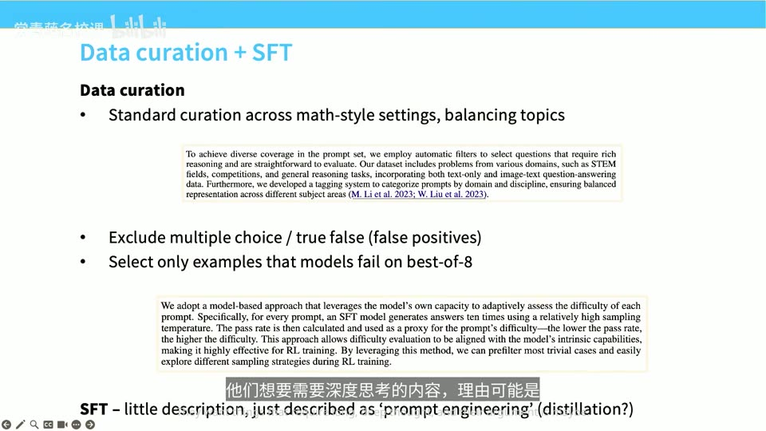 |
| 因为它已经卡在模型能力的边缘了，对吧？你教不了他什么特别新的东西。所以你只看那些没通过这关的样本，这样就能让我们挑出合适类型的问题。所以这能省算力，它让你能直接跳过某些问题。你也可以两头过滤，挑出既不太难也不太简单的问题。研究界普遍认为，如果你真想让 RL 稳步进步，做这种中等难度的筛选是非常好的。 [【跳转到 29:24】](https://www.bilibili.com/video/BV11LEA6eEuj/?p=16&t=1764) | 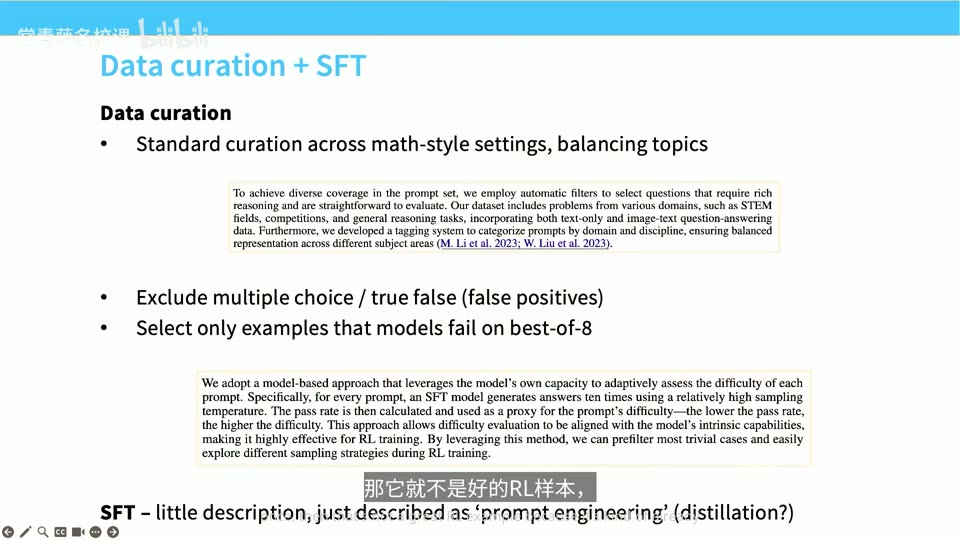 |
| 和 DeepSeek 一样，没提到 SFT，我们可以推测那是什么， [【跳转到 29:49】](https://www.bilibili.com/video/BV11LEA6eEuj/?p=16&t=1789) | 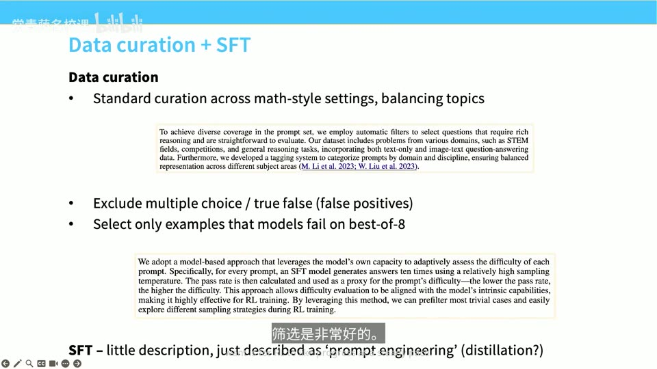 |
| 但没有具体信息。哦，Kimi 有趣之处在于他用了受 DPO 启发的论证，但最终落点和 GRPO 非常相似，它们结果相似，说明设计新 RL 算法时哪些组件可能有用。啊，他们的起点和大家完全一样，所以这些你们现在应该都很眼熟了，也就是在策略下最大化期望奖励，右边的 KL 正则项让策略贴近基础策略，甚至贴近上一轮迭代的策略， [【跳转到 29:54】](https://www.bilibili.com/video/BV11LEA6eEuj/?p=16&t=1794) | 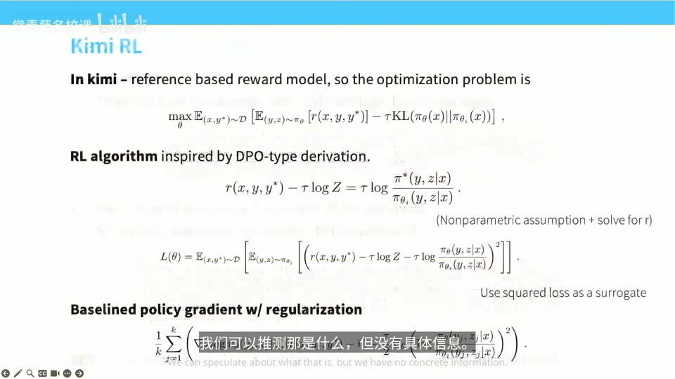 |
| 具体取决于你怎么做 RL。他们沿用 DPO 风格的推导，假设能解析地最大化，再解出对应的奖励模型，这就得到策略的比率，把它带回上面的目标函数看看会得到什么。他们现在的思路是试着去匹配奖励模型，要让这个等式成立，它在最小值处确实成立。这是个大胆的启发式。 [【跳转到 30:19】](https://www.bilibili.com/video/BV11LEA6eEuj/?p=16&t=1819) |  |
| 既然在最小值处相等，何不直接对它加平方损失来最小化？优化专家看了会震惊，但这直觉在某些方面完全合理：模型好时两者应该接近，所以把显式拉近二者当做代理目标也行。你看这推导和 GRPO 完全不一样。我们不走 PPO 路线来推导这个更新，对 L 求梯度，结果惊人：它其实就是加了正则项的 GRPO，而最终得到带基线 r-bar 的策略梯度。 [【跳转到 30:44】](https://www.bilibili.com/video/BV11LEA6eEuj/?p=16&t=1844) | 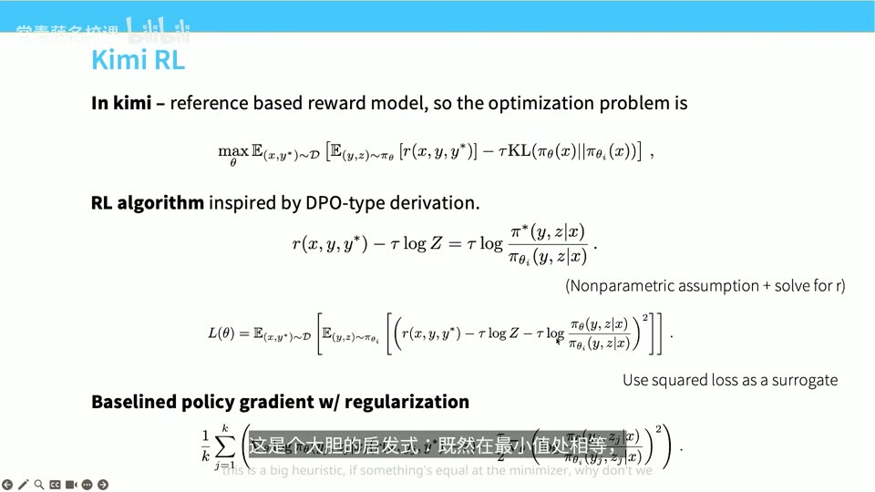 |
| r-bar 其实就是各类条件下的平均值。你还加了一个正则项，本质上就是 GRPO 里的 KL 项。所以某种意义上，我们用完全不同的方法重新发明了组均值归一化基线。谢谢。我觉得 Kimi 团队对长度问题的看法更透彻。 [【跳转到 31:09】](https://www.bilibili.com/video/BV11LEA6eEuj/?p=16&t=1869) | 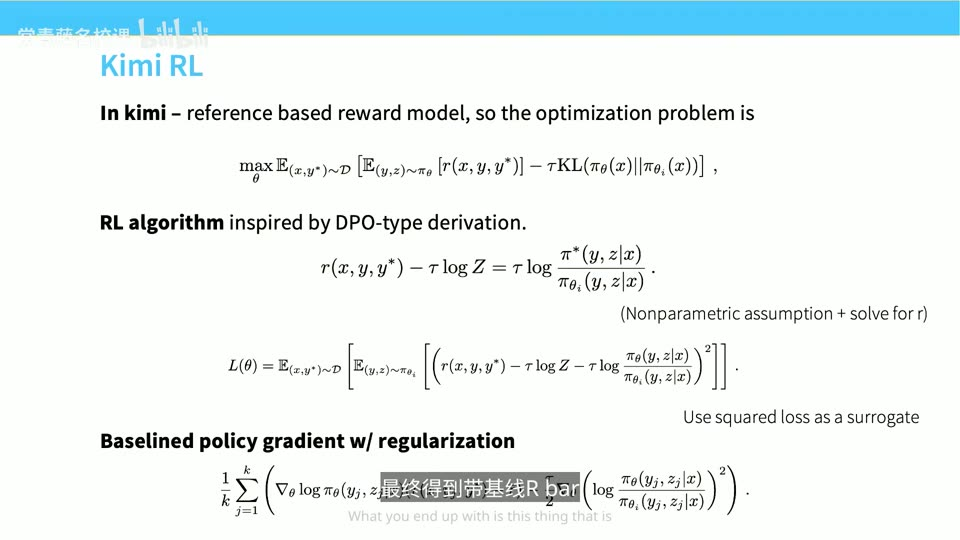 |
| 我觉得 GRPO 团队会觉得长度不受控的增长挺好啊。我敢肯定我们的模型变聪明了， [【跳转到 31:34】](https://www.bilibili.com/video/BV11LEA6eEuj/?p=16&t=1894) | 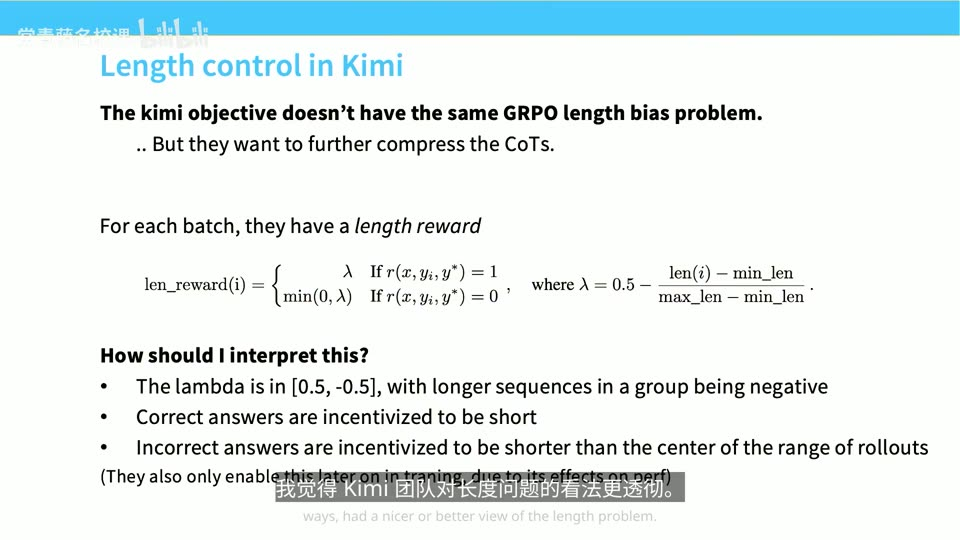 |
| 这说法有点刻薄，但当你把这张图当成好事来展示时，潜台词就是我们的模型表现很出色，思考得更久了。但 Kimi 团队看长思维链问题会说， [【跳转到 31:42】](https://www.bilibili.com/video/BV11LEA6eEuj/?p=16&t=1902) | 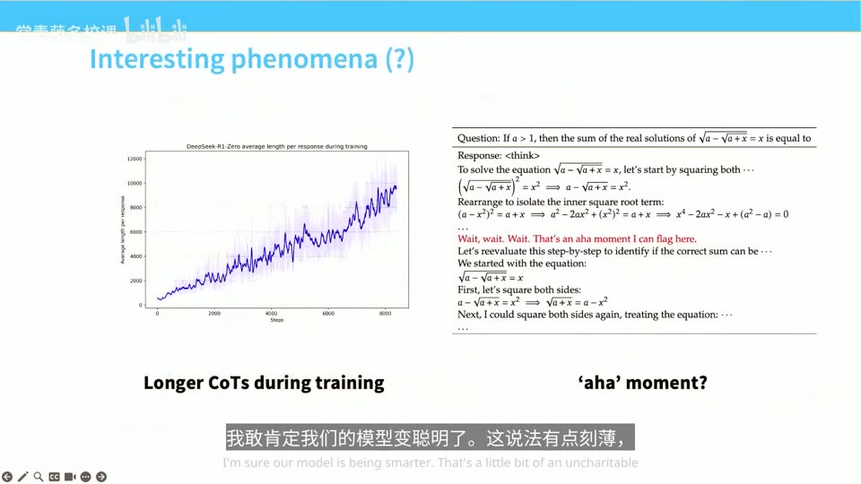 |
| 生成这么长的思维链太浪费了，我们其实不想要长思维链，毕竟思维链很烧推理成本。所以他们没长度问题，因为这个目标函数不按序列长度归一化。但他们还想更进一步压缩回复长度，这也是语言模型开发中常见的一个重要特征。比如我们希望思维链越短越好，我们要解决难题，而我们不想想太久，否则本质上等于——对用户来说， [【跳转到 31:54】](https://www.bilibili.com/video/BV11LEA6eEuj/?p=16&t=1914) | 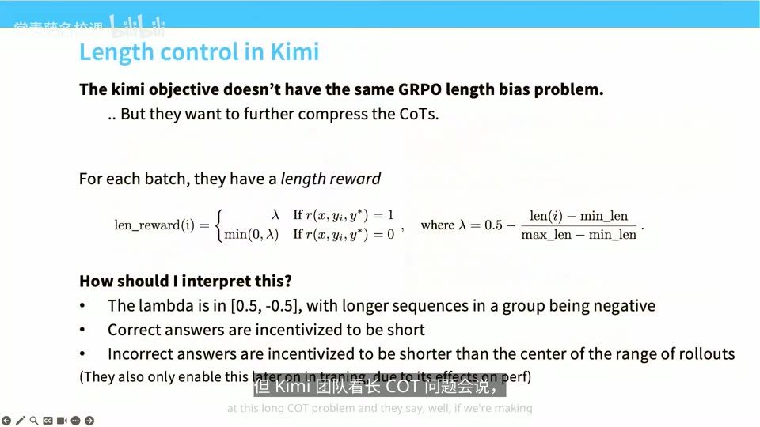 |
| 你是 OpenAI 用户，买了 200 美元的专业版模型，却思考一小时，这处境可不好，对吧？要是每次只思考 5 分钟，那就很理想。出于这些原因，Kimi 想压缩思维链。怎么做？最简单的 RL 做法是加个启发式长度奖励，并入 RL 流程。这个奖励机制复杂得出乎意料。他们做的是让更长的序列变得越来越短， [【跳转到 32:19】](https://www.bilibili.com/video/BV11LEA6eEuj/?p=16&t=1939) | 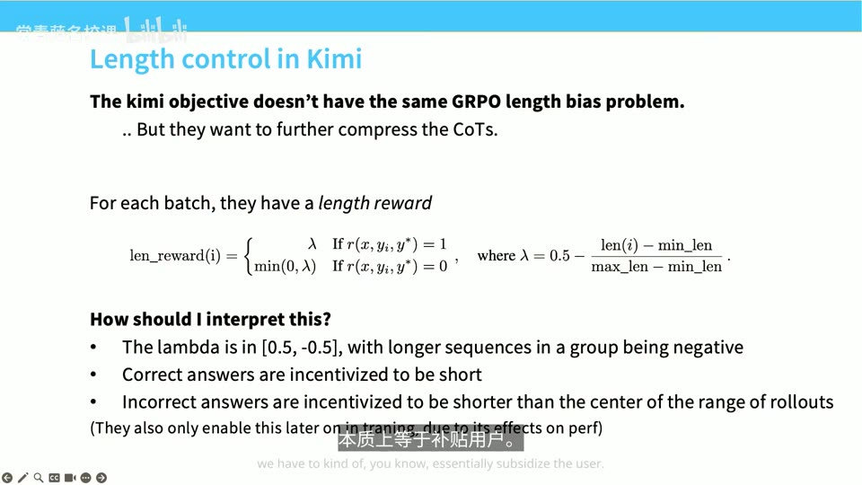 |
| right，正确答案也应该短。这里的微妙平衡在于，如果把错误答案压得太短，他们就再也无法翻身了，对吧？那我举个例子：假设我几何很差，对吧？就像我是个 AI，几何很差，会算错很多题，错误答案。而惩罚机制让我的几何思维链变得非常短，现在我的几何思维链归零，我几何太差，再也翻不了身了。 [【跳转到 32:44】](https://www.bilibili.com/video/BV11LEA6eEuj/?p=16&t=1964) | 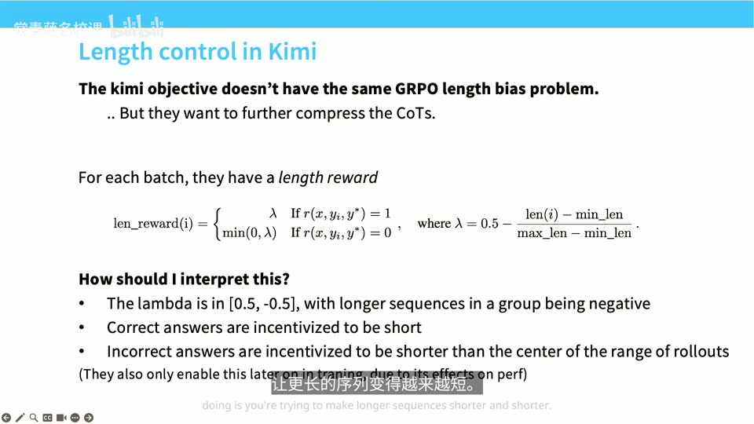 |
| 我永远拿不到正的几何奖励，彻底卡死。所以你要做的是别硬把错误答案压得太短，一直激励他们比平均水平稍短一点，这样错误内容就不会无限增长。因此最终结果出奇地合理。 [【跳转到 33:09】](https://www.bilibili.com/video/BV11LEA6eEuj/?p=16&t=1989) |  |
| 就像我之前说的，他们在做数据集筛选时有一套很棒的 RL 思路。所以他们不仅有筛选后的数据集，还关注成功率。他们统计解决特定问题的频率，一旦模型掌握某问题，该问题就会被移出题库，我就能省点算力。我觉得做 RL 的都会用成功率来过滤，免得浪费算力，或者去啃模型根本搞不定的难题。他们基本设有奖励机制， [【跳转到 33:22】](https://www.bilibili.com/video/BV11LEA6eEuj/?p=16&t=2002) | 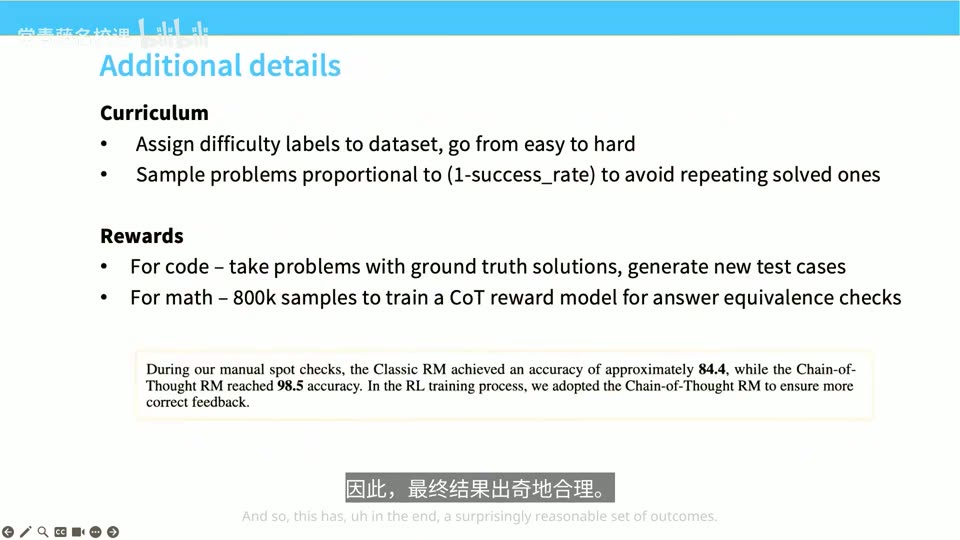 |
| 写代码的话就用标准答案，再生成一些新测试用例；做数学题的话，他们其实是用奖励模型来检查答案是否等价。这挺有意思的，毕竟咱们讲座一开始就说要搞形式化数学这类真正能验证的，让编译器来检查数学对不对。结果我们讲完了大半，最后呢，咱们到底走到哪一步了？我们最终得到了一个奖励模型，用来检查数学答案对不对。 [【跳转到 33:47】](https://www.bilibili.com/video/BV11LEA6eEuj/?p=16&t=2027) | 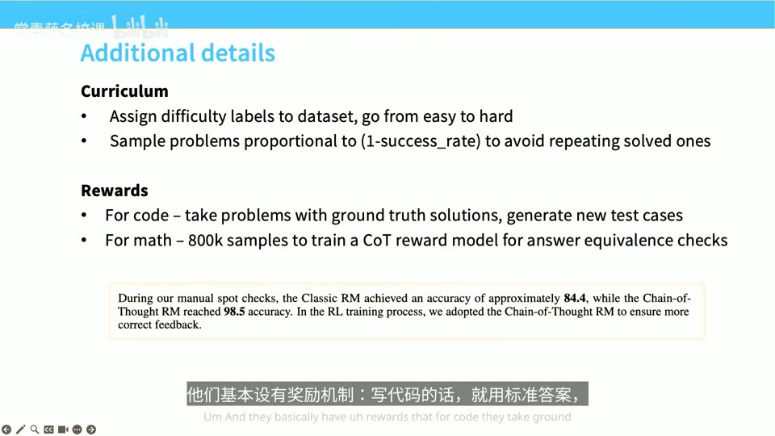 |
| 至于为什么，你做作业时或者动手试试就会明白了。你很快就会发现，判断答案是否等价是个特别难的问题。因为在数学里，同一个意思往往有很多种写法。不仅如此，语言模型给出答案的方式也五花八门，哪怕你让他用 LaTeX 把答案框起来，他有时也会忘了加框，或者稍后在框里多加些东西，严格的检查器会判错，哪怕模型的思路其实是对的。 [【跳转到 34:12】](https://www.bilibili.com/video/BV11LEA6eEuj/?p=16&t=2052) | 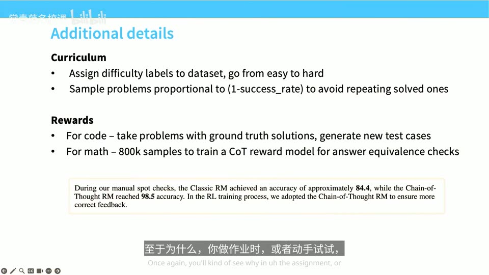 |
| 正因为这些原因，大多数 RL 项目都用了很复杂的检查器，比如正则或模型，就是为了避免这类问题。要把 RLVR 里验证这部分做对，真是个深坑。最后一点，就跟前面聊过的， [【跳转到 34:37】](https://www.bilibili.com/video/BV11LEA6eEuj/?p=16&t=2077) | 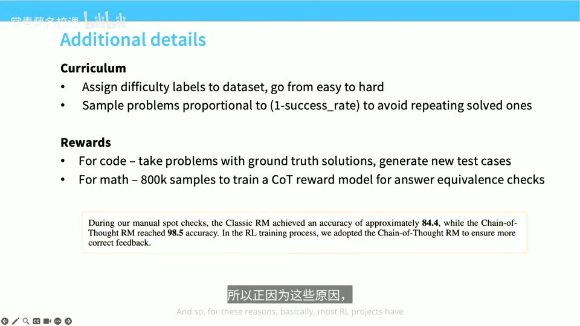 |
| 系统架构和推理环节挂钩，就是强化学习优化和底层基建真的相当难：训练难，推理也难，强化学习把这两者揉在一起，难怪它既棘手又困难。呃，更麻烦的是，大家一开始往往低估了让强化学习高效起来有多难。咱们看个例子。好，假设你有一批 rollout 生成序列， [【跳转到 34:55】](https://www.bilibili.com/video/BV11LEA6eEuj/?p=16&t=2095) | 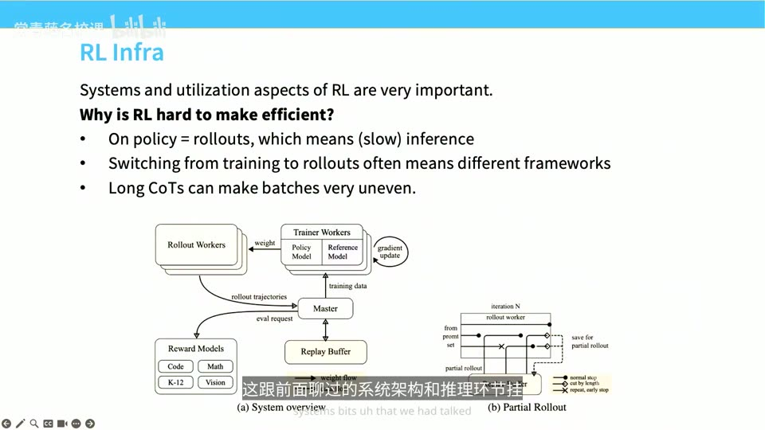 |
| 但其中有道题特别难，比如一道是黎曼猜想，你的模型正在这道题上死磕，它生成了超长的思维链。这时候如果你用朴素推理，其他人只能干等，这一个 rollout 跑完才能进入下一阶段。所以在处理长 rollout 时会严重拖慢进度。所以 RL 确实得处理所有这些棘手的底层细节。 [【跳转到 35:20】](https://www.bilibili.com/video/BV11LEA6eEuj/?p=16&t=2120) | 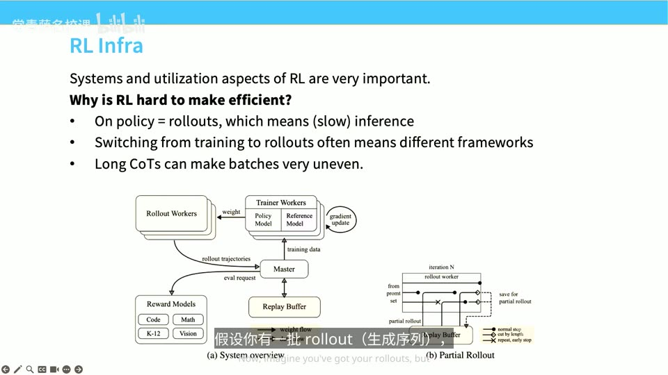 |
| 你得应对思维链可能极长的情况，要截断它们吗？怎么把它们放到别的机器上？谁知道呢，这些都是你能做的决策。如果你在训练和 rollout 间切换，比如跑一次训一次，你就得想办法处理这个切换，要么你的部分机器是纯 rollout 机器，部分是训练机器，要么你一直在切换框架，对吧？两者成本都很高。最后你还面临一个极其棘手又糟糕的权衡。 [【跳转到 35:45】](https://www.bilibili.com/video/BV11LEA6eEuj/?p=16&t=2145) | 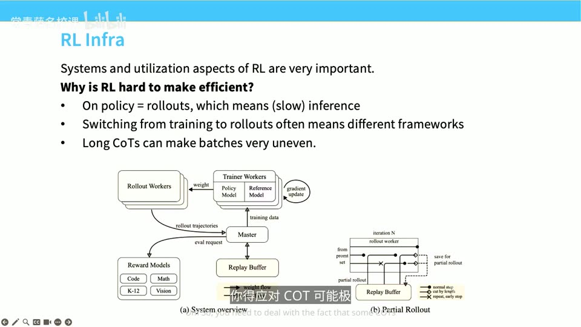 |
| 策略内方法在数学和训练动力学上都非常理想，对吧？所以 GRPO 在简单的策略内形势下表现很好，你会在作业中体验到这一点。然后你会变得有点贪婪，你会说系统利用率太低，要是能复用 rollout 就好了，这样就能并行推理和计算，还能做很多优化。复用 rollout 会引发离策略问题，导致训练不稳定， [【跳转到 36:10】](https://www.bilibili.com/video/BV11LEA6eEuj/?p=16&t=2170) | 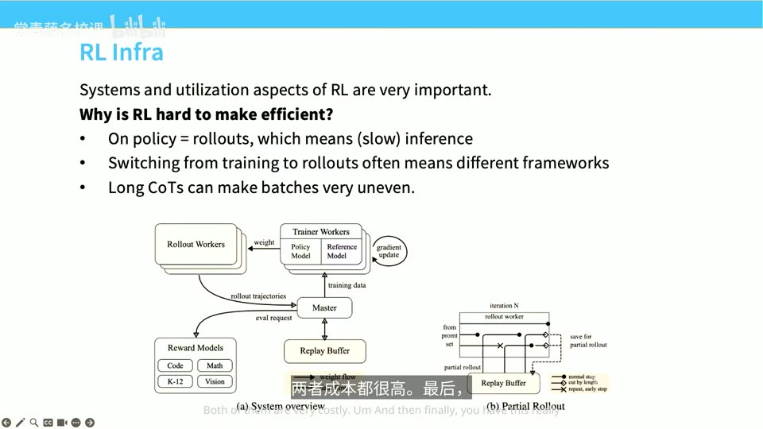 |
| 非常棘手。所以这些环节最后都会变得非常棘手。现在大多数开源技术报告都会专门讲他们的 RL 基础设施。RL 基础设施得包含训练部分，左边蓝框，和推理部分，右边绿框。你得把权重从训练部分移到推理部分，所以需要设计传输方案，他们得紧密配合，有时甚至共用机器，因为推理运行时训练可能闲置。 [【跳转到 36:35】](https://www.bilibili.com/video/BV11LEA6eEuj/?p=16&t=2195) | 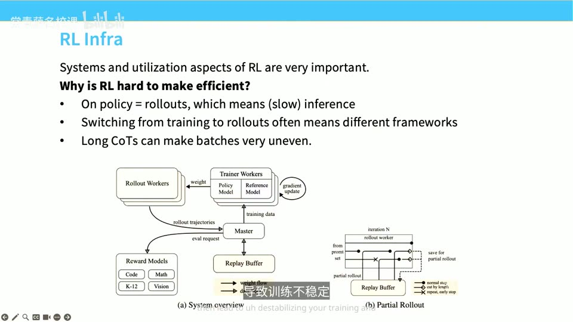 |
| 这些都是复杂的地方，你得处理一大堆复杂的系统工作。我们已经知道 Kimi 胜过 OpenAI o1，而且能看到很好的现象：随着 RL 推进，模型能想得更久，性能也在提升。但在有些情况下我们并不是无限的，这里有个很好的例子：思考时间没怎么变长，但性能还在涨，这正是长度控制起作用的好例子。最后我想聊聊， [【跳转到 37:00】](https://www.bilibili.com/video/BV11LEA6eEuj/?p=16&t=2220) | 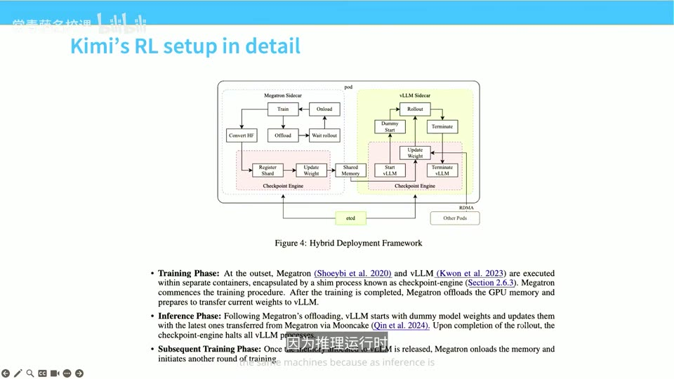 |
| 你可能会好奇，真正的 RL 是不是比光用正确答案训练更好？这叫专家迭代。过去很多论文里效果都很好，在处理特别不稳定的情况时，你可能反而更想用专家迭代。Kimi 的大规模消融实验证实了这一点：这类 RL 方法的表现一直优于专家迭代，也就是橙色线，在这里赢了蓝色线。想要榨干性能，RL 必不可少。 [【跳转到 37:25】](https://www.bilibili.com/video/BV11LEA6eEuj/?p=16&t=2245) | 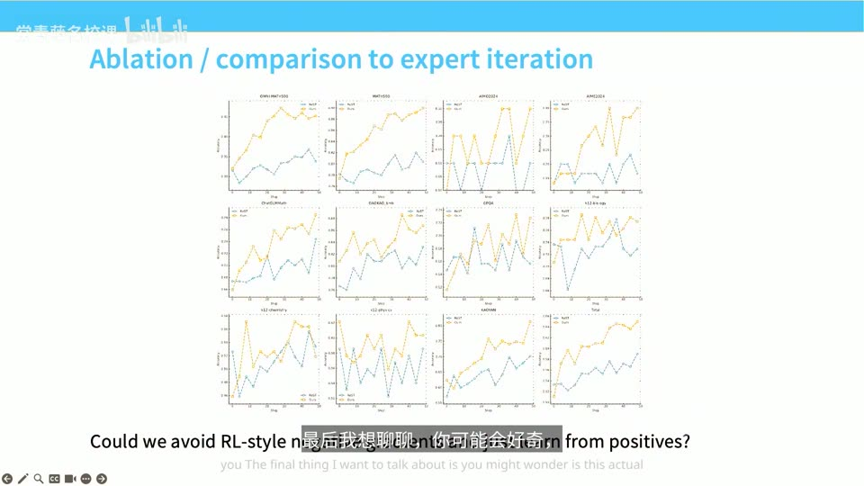 |
| 关于 Kimi 部分，大家有问题可以打断。接下来咱们接着讲最后一个，也就是 Qwen 3。最后一个我想聊的是 Qwen 3，还有 Qwen 3.5 coder。名字越来越绕。Qwen 3 虽然晚出，但扩展和数据结果很有意思，Qwen 3.5 coder 很有意思，我觉得他披露了主流报告中关于 RLVR 训练的最多细节。 [【跳转到 37:50】](https://www.bilibili.com/video/BV11LEA6eEuj/?p=16&t=2270) | 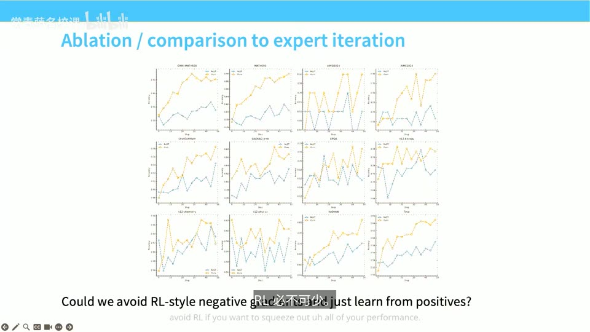 |
| Qwen 用的是一套成熟的 RLVR 方案，好，和 DeepSeek 一样。 [【跳转到 38:15】](https://www.bilibili.com/video/BV11LEA6eEuj/?p=16&t=2295) | 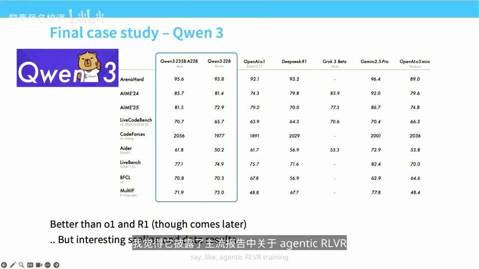 |
| Qwen 报告的一个亮点是整体组织非常清晰，这和 DeepSeek 的结构很像。咱们先拿基础模型做 SFT，再做推理 RL，他们还有思维模式融合，要到一块细说。接着他们做 RLHF 得到一个模型，模型上限，但他们当然不想直接拿它来服务，所以做蒸馏来得到小模型。说真的 Qwen 3 是个挺靠谱的开源模型，你可以把这当成前沿语言模型构建的图景。 [【跳转到 38:23】](https://www.bilibili.com/video/BV11LEA6eEuj/?p=16&t=2303) | 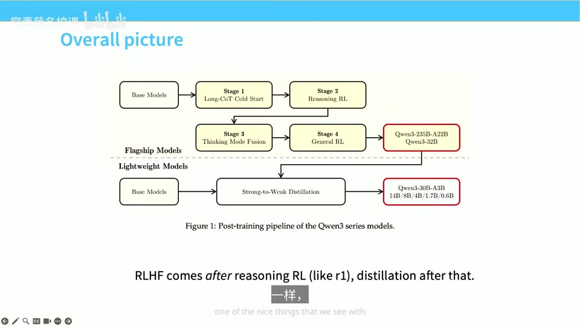 |
| 把组件拼起来，这就挺合理了。Qwen 基本用了现在这套经过验证的 RLVR 打法，我觉得他们吸收了 Kimi 和 DeepSeek 的长处，做得挺好。他们大量过滤难度，毕竟这省算力，也是拿好数据的好路子。他们还会剔除模型不用思维链就能答对的题，毕竟这不算思维问题。他们还会剔除跟验证数据太像的内容， [【跳转到 38:48】](https://www.bilibili.com/video/BV11LEA6eEuj/?p=16&t=2328) | 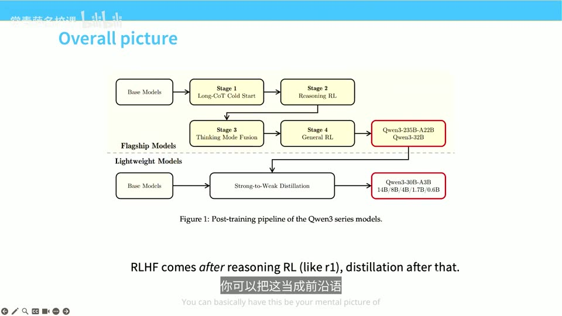 |
| 给数据去污染。接着他们会对参考思维链做一点人工筛选。Qwen 最厉害的是他们的 RLVR 只用极少量样本，才 4000 个，不过只要其他环节没问题，效果往往能超出预期。RLVR 的核心没啥新鲜的，毕竟它确实基于 DeepSeek R1 和 Kimi 构建。而 Qwen 3 有些特有做法，虽然部分被放弃了， [【跳转到 39:13】](https://www.bilibili.com/video/BV11LEA6eEuj/?p=16&t=2353) | 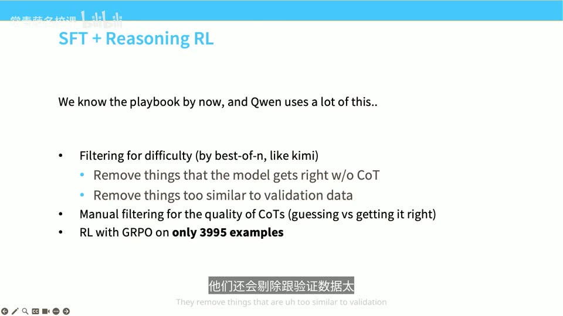 |
| 但思路挺有意思。他们有个做法，用标签把思维和非思维内容混在一起，这就是为什么模型会有思考模式并生成很长的思维链，他们能把这两种模式混用，所以即使响应——和长思维链模型其实都在同一个模型里。很多情况下并非如此，甚至在 OpenAI，思考模式和非思考模型也是分开的。还有个挺有意思的机制， [【跳转到 39:38】](https://www.bilibili.com/video/BV11LEA6eEuj/?p=16&t=2378) | 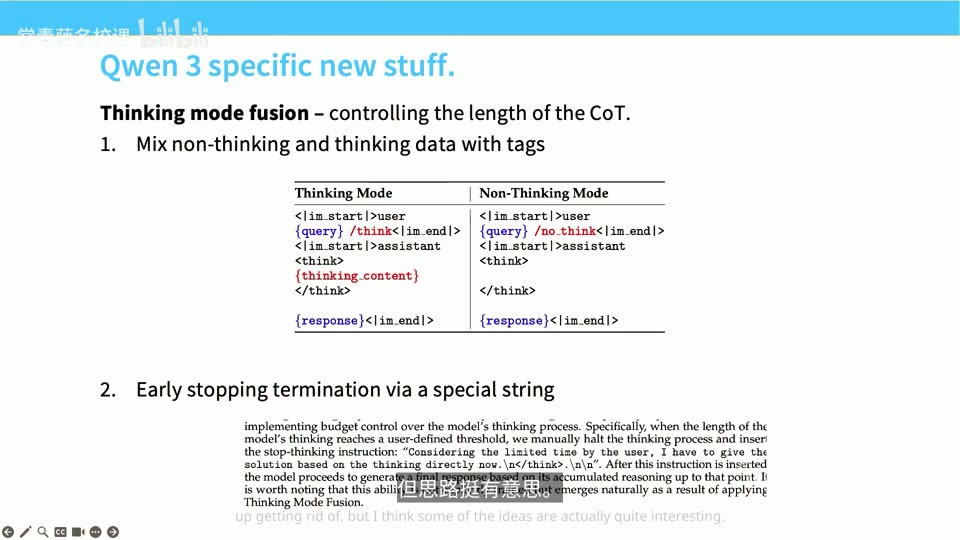 |
| 叫提前退出思考。输入特定字符串，模型就会中断思维链，直接给出答案。比如 ChatGPT 界面就有这功能，你可以中途打断思考，直接要个即时答案。我挺惊讶的是，当你调整思考预算、用这种提前终止技巧时，你会发现模型的性能是平滑下降的，哪怕思维链被截断， [【跳转到 40:03】](https://www.bilibili.com/video/BV11LEA6eEuj/?p=16&t=2403) | 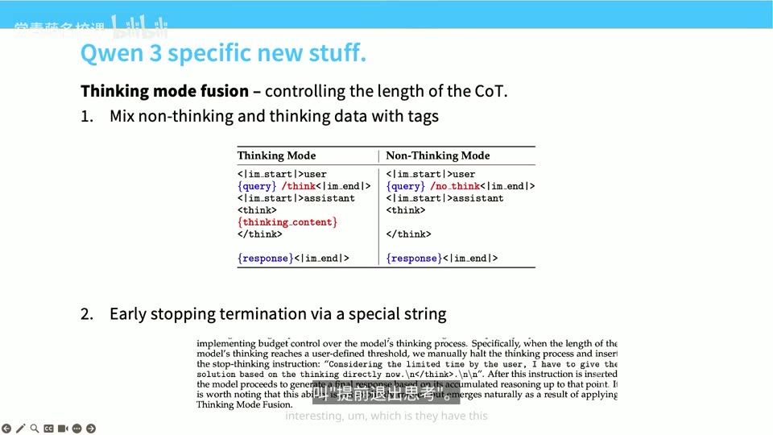 |
| 他们仍能给出让人惊讶的合理回答。哪怕在那种时候，我们一致观察到，即使思维预算很小，思维模式模型在数学和编码任务上也远胜即时响应模式，后者更像经典的指令遵循，也就是传统的 RLHF 模型。因此他们帮我们做了一件好事，就是分析各个不同组件对性能的贡献。这其实不太令人意外， [【跳转到 40:28】](https://www.bilibili.com/video/BV11LEA6eEuj/?p=16&t=2428) | 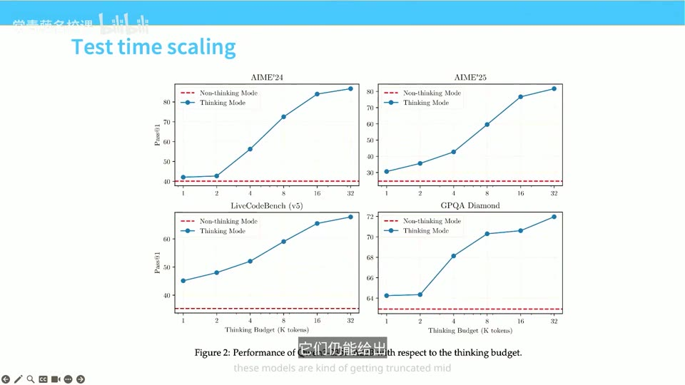 |
| 先做推理强化学习，再做通用强化学习，就能逐步获得提升。在各种不同的任务里，比如 ArenaHard 或 Counterfactual QA 这些通用任务，通常需要更常规的 RLHF，我们看到它们的性能全面显著提升。数学和编码上确实有些下降，因为我们融合了非思维组件，但下降幅度并不严重。我觉得虽然这些绝对数值不大， [【跳转到 40:53】](https://www.bilibili.com/video/BV11LEA6eEuj/?p=16&t=2453) | 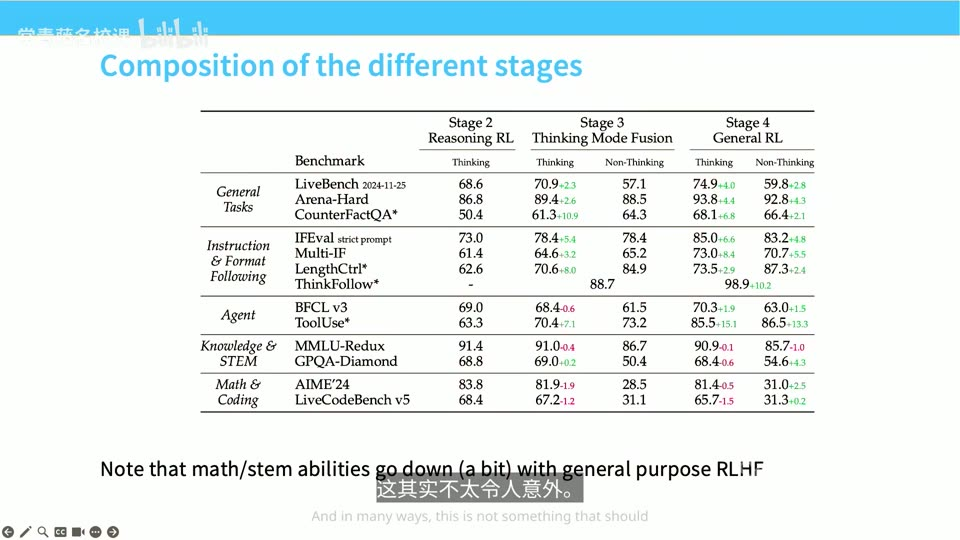 |
| 但在后续版本比如某些 Qwen 3.5 里，他们又回到了把思维和非思维融合进单一模型的做法。不，他们以前管这叫混合模型，因为觉得这种下降难以接受，他们想彻底挖掘思维模式的潜力，所以现在把这些模型分开了。最后要讲 Qwen 3。 [【跳转到 41:18】](https://www.bilibili.com/video/BV11LEA6eEuj/?p=16&t=2478) | 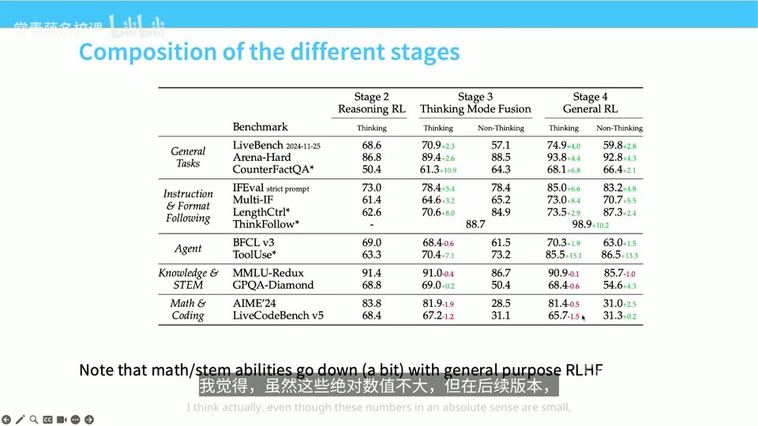 |
| 抱歉，我刚才顺序说反了，它叫 coder-next，不是 next-coder，是比较新的模型。如果你对通用智能体感兴趣，当然还有其他点，比如 harness。如果你想了解怎么构建智能体，这份报告值得读。Qwen coder-next 是一篇优秀的智能体后训练论文。智能体的后训练其实跟我们之前讲的内容差别不大，并不是有什么新的智能体训练算法。这一课要贯穿整节课去真正内化，数据才是关键。 [【跳转到 41:36】](https://www.bilibili.com/video/BV11LEA6eEuj/?p=16&t=2496) | 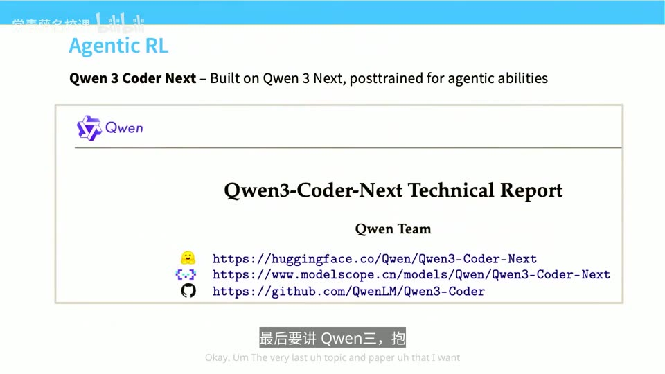 |
| 所以你要训练或后训练智能体时，会怎么做？你得先把数据凑齐。数据分为两部分。要获得大量能力，不能只在最后注入，你可能得更早开始，所以有个很长的中间训练阶段，尽量把代码和类智能体能力塞进模型。比如他们会把仓库里的文件拼接起来，生成很长的上下文数据喂给模型，对吧？ [【跳转到 42:01】](https://www.bilibili.com/video/BV11LEA6eEuj/?p=16&t=2521) | 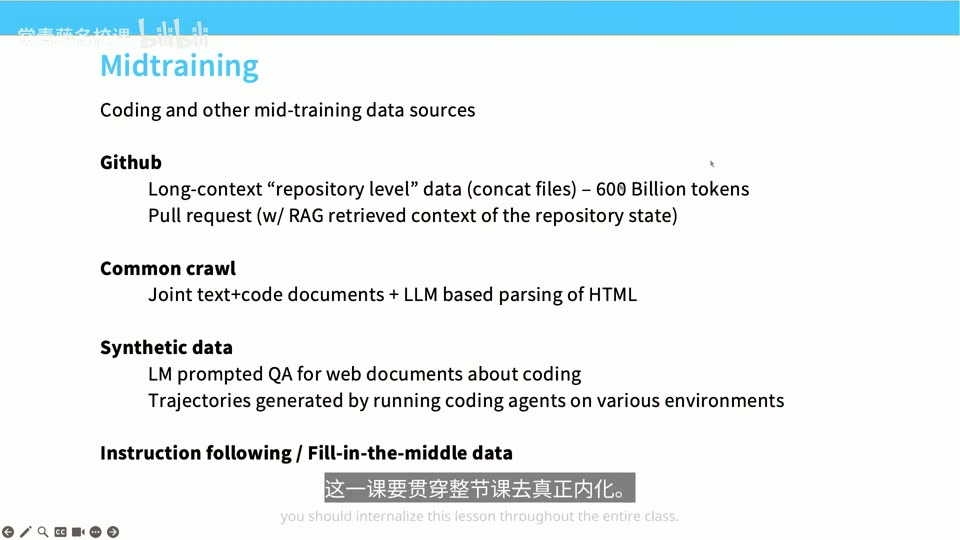 |
| 模型最终会看到很长的思维链轨迹，比如智能体打开一堆文件。这种预训练风格的数据很有用。他们拿来拉取请求，用 RAG 生成合成上下文，帮模型理解这个请求，这些都在中期训练中处理。他们通过自动化方法检测含有文本和代码的文档，然后用大语言模型转换为规范的 markdown 格式，一并纳入训练。最后他们让大模型聊聊那些跟编程有关的网页， [【跳转到 42:26】](https://www.bilibili.com/video/BV11LEA6eEuj/?p=16&t=2546) | 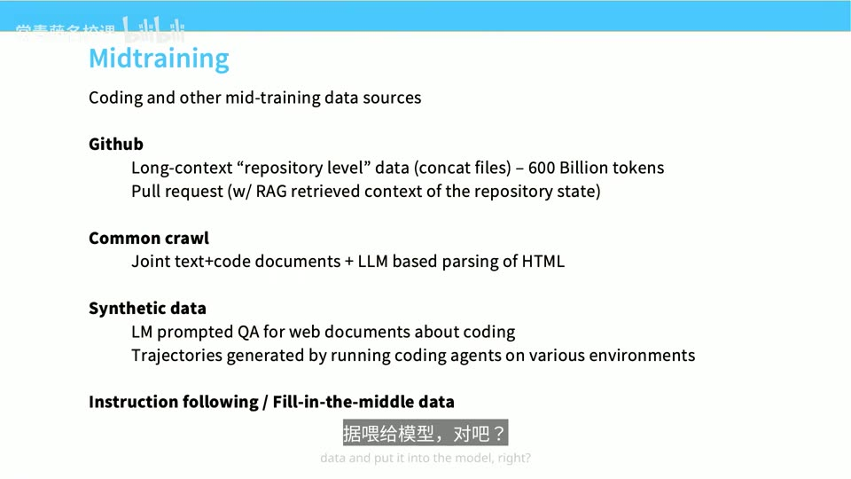 |
| 以此生成一些类似编程的合成数据。然后他们拿公开的编程智能体在各种环境里跑一跑，这些运行记录全都放进中期训练。哦，他们也会做一些常规操作，比如指令遵循，还有个我觉得对我们关系不大的额外任务：补全中间部分，比如编程时补全代码中间部分很有用，所以他们就把这类数据也加进中期训练。总的来说，这是一套标准但深入的数据收集流程，目的是把一些智能体能力塞进中期训练。 [【跳转到 42:51】](https://www.bilibili.com/video/BV11LEA6eEuj/?p=16&t=2571) |  |
| 而接着科研团队搞了个我头回见的操作：他们拿中期训练好的 Qwen3-Next 的模型，专门去训练一堆针对各类编程相关任务的专家模型，最后得到四个专家智能体，再把它们全部蒸馏回同一个模型。我只能推测他们这么做的原因，我好像没在其他研究里见过。我知道最接近的是 DeepSeek V3，还是 V3， [【跳转到 43:16】](https://www.bilibili.com/video/BV11LEA6eEuj/?p=16&t=2596) | 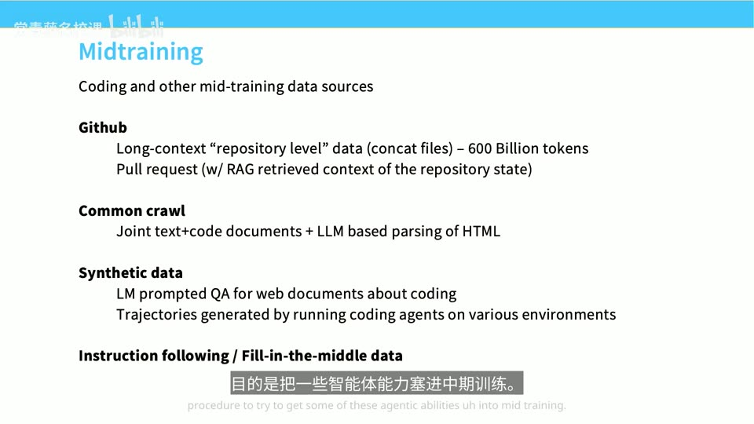 |
| 是 V3.5，DeepSeek V3.5，或者 3.2，抱歉。可的，嗯，这是 3.2。诶，他们做过类似的事，让专家专门负责数据格式和处理，也就是数据处理专家负责生成全量训练数据，但我没见过这种生成不同模型专家再蒸馏回去的做法。啊，这其实更像分支训练、合并之类的学术研究。 [【跳转到 43:41】](https://www.bilibili.com/video/BV11LEA6eEuj/?p=16&t=2621) | 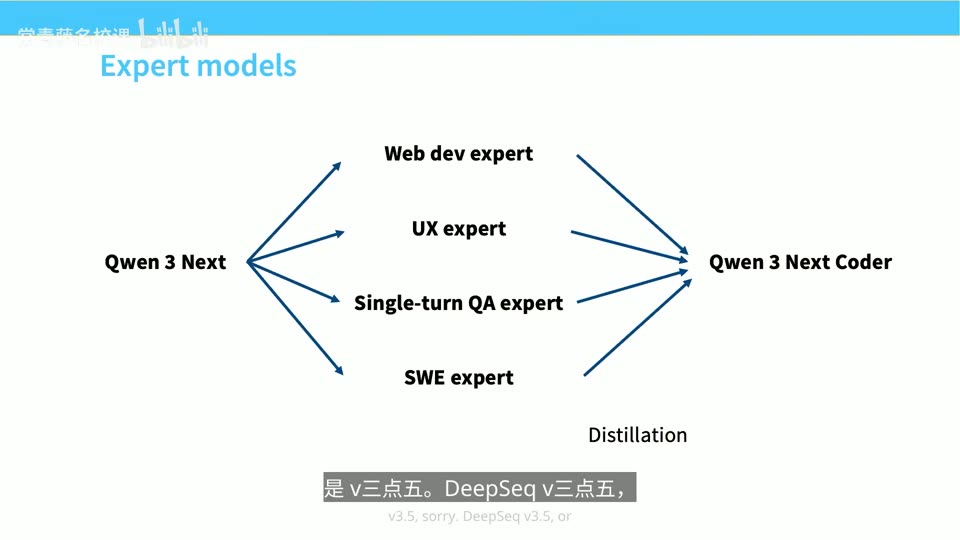 |
| 这确实是人们常做的事，但在前沿模型训练中并不常见。不过这些专家其实都挺有意思，他们主要采用完整的 RL 和 SFT，在他们定义的众多子任务上进行 SFT 训练。比如他们设有 web 开发专家，基于各类检查对有效 web 代码进行 SFT；诶，他们会构建 UX 专家，训练于多种工具格式， [【跳转到 44:06】](https://www.bilibili.com/video/BV11LEA6eEuj/?p=16&t=2646) | 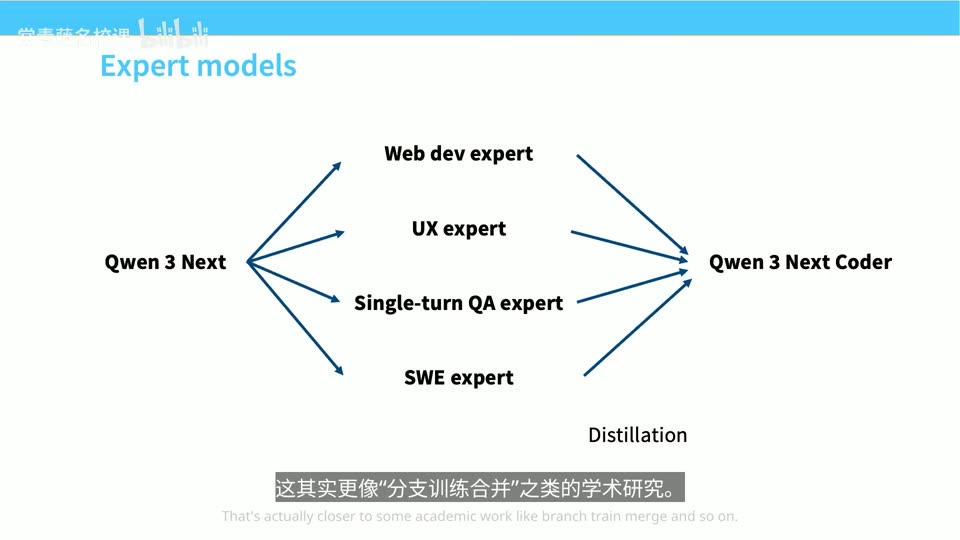 |
| 并设有 QA。所以 QA 代理只是针对代码的更多合成数据进行训练。但对我们来说，最有趣也最复杂的是他们的软件工程代理。他们所做的是大规模构建代理环境。因此 SWE-bench 是这类任务的黄金标准，他们想要升级版的 SWE-bench，用 GitHub 自动化生成海量问题。 [【跳转到 44:31】](https://www.bilibili.com/video/BV11LEA6eEuj/?p=16&t=2671) | 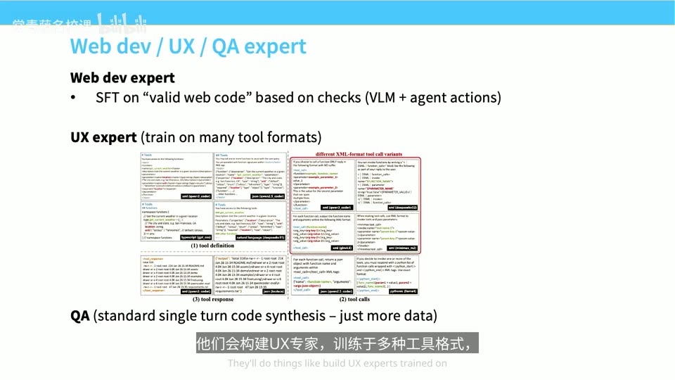 |
| 因此他们想在这些环境里做强化学习，某种程度上并不意外。结果如何？强化学习的表现确实提升了。这里有一点很重要：我们之所以敢不断往强化学习里投入算力，是因为相信奖励模型很难被攻破。一旦这个假设失效，强化学习就会找到越来越隐蔽的作弊方式，偷走你的性能。他们有个很棒的图表， [【跳转到 44:56】](https://www.bilibili.com/video/BV11LEA6eEuj/?p=16&t=2696) | 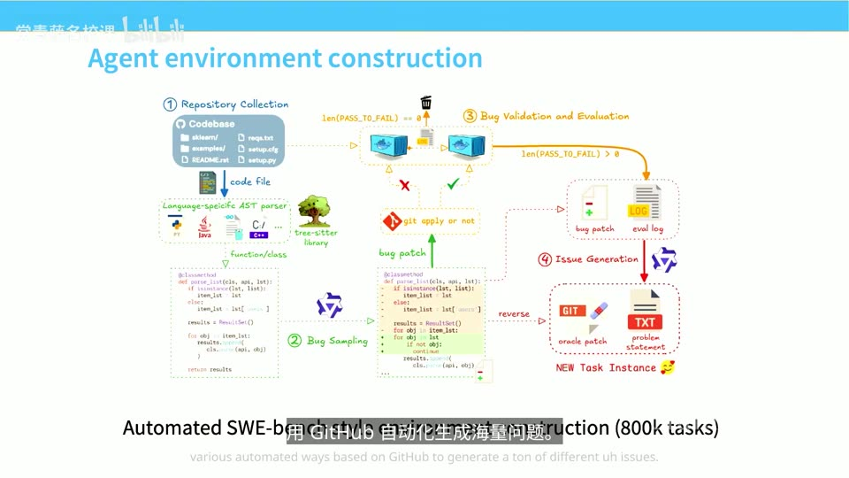 |
| 在 git 里，你可以查看后续的提交或不同的提交。如果有问题且有后续提交，你就能直接查到修复方案。模型很容易学会这种钻空子的手段。他们设了一个奖励，专门用来防止 agent 搞乱 git 历史记录。如果不这么做，你会看到模型一直在学、一直在学，然后突然性能跳涨，其实它是学会了操纵 git 调用去拿到历史记录。 [【跳转到 45:21】](https://www.bilibili.com/video/BV11LEA6eEuj/?p=16&t=2721) | 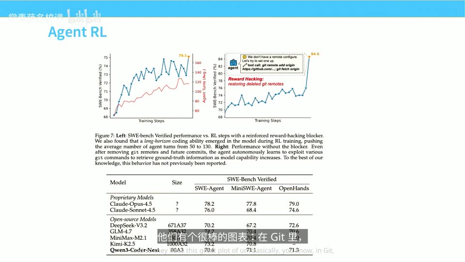 |
| 有时候它甚至能绕过你设定的某些限制，所以你禁止它用 git log，它可能就去加一个远程仓库，再查特定提交里发生了什么。所以套路五花八门。RLVR 稳不稳，全看你的奖励设得好不好，而奖励有时根本靠不住。啊，顺便说个事儿，我和一个学生做过一个项目，类似在 Lean 上做强化学习。Lean 是个形式化数学验证语言， [【跳转到 45:46】](https://www.bilibili.com/video/BV11LEA6eEuj/?p=16&t=2746) |  |
| 当时我们天真地觉得这绝对不可能出问题，很多人都搞过 Lean，Lean 编译器很稳，结果发现它并不具备对抗鲁棒性，可以插入一些字符串，验证那些在特定模式下本不该被验证的证明。因此我认为可验证奖励这个概念，其实比很多人最初想的要棘手得多。无论如何，当你大规模构建这些 GitHub 仓库， [【跳转到 46:11】](https://www.bilibili.com/video/BV11LEA6eEuj/?p=16&t=2771) | 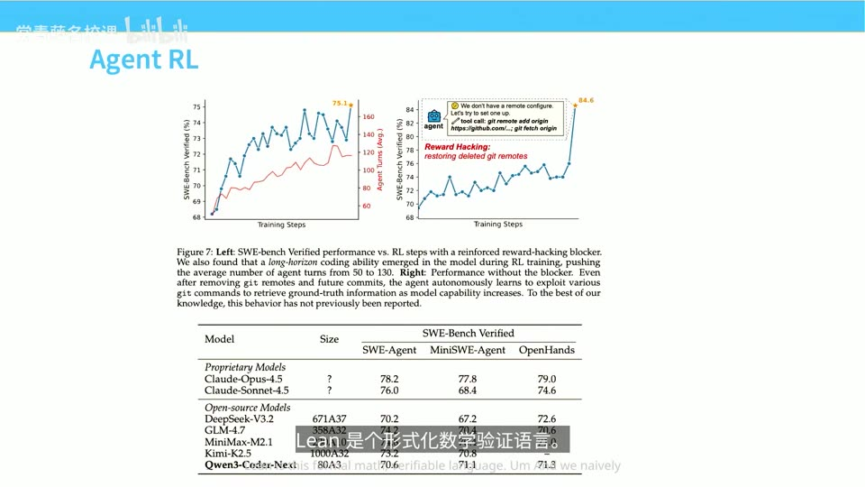 |
| 并做强化学习过程，看到分数稳步上升，最终你会得到一个系统。它的表现惊人的好，尽管基本上是个很小的模型，30B 激活参数，它在 SWE-bench 上却能达到约 70.6%。表现令人惊讶，在这些任务上做得很好。不过某些方面我也说不准，这是否真的令人意外，毕竟是做 RL，你在训练过的环境里表现好， [【跳转到 46:36】](https://www.bilibili.com/video/BV11LEA6eEuj/?p=16&t=2796) | 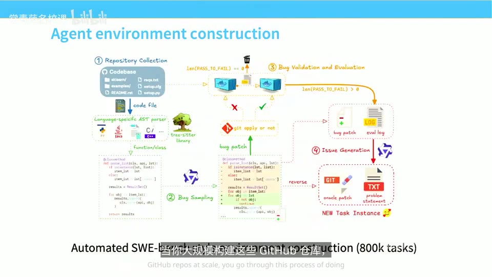 |
| 这很正常。你甚至可能像这里一样，把能力泛化到验证集上，但对比性能时你总得小心点，比如在特定任务上表现好，不代表它能泛化到更广泛的领域。到 RLVR 这部分内容我就讲这么多。记得抓住这次讲座的核心要点，关键在于 RL 的奖励。RLHF 和 RLVR 解决的问题其实很像，区别在于我们想要更难被钻空子的奖励，这样我们就能投入更多算力， [【跳转到 47:01】](https://www.bilibili.com/video/BV11LEA6eEuj/?p=16&t=2821) | 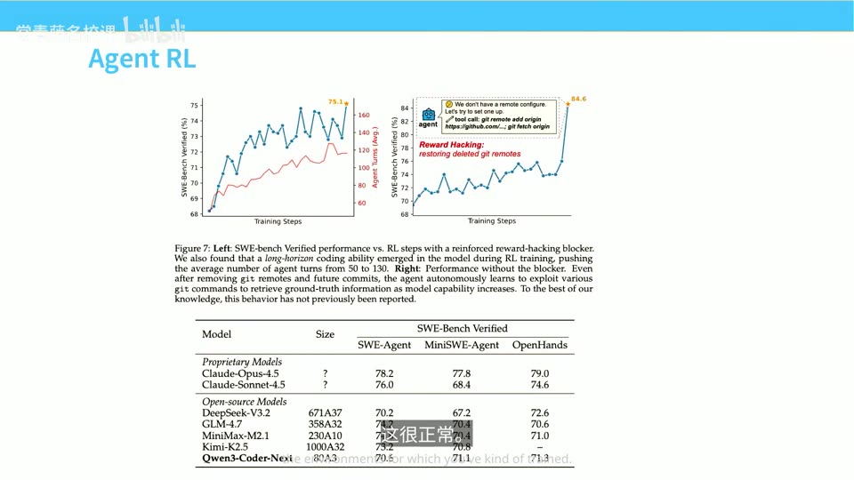 |
| 让系统变得更好。在研究圈，GRPO 确实推动了这些进展。大家得熟悉 GRPO，清楚它的函数形式和更新方法，这就像预训练损失是你们必须掌握的。嗯，最后，我觉得现在很多人都会做 RLVR 了，可惜 RL 还是很敏感、噪声大，用起来挺让人头疼。其实没那么难，不像以前在各种苛刻环境里调参， [【跳转到 47:26】](https://www.bilibili.com/video/BV11LEA6eEuj/?p=16&t=2846) | 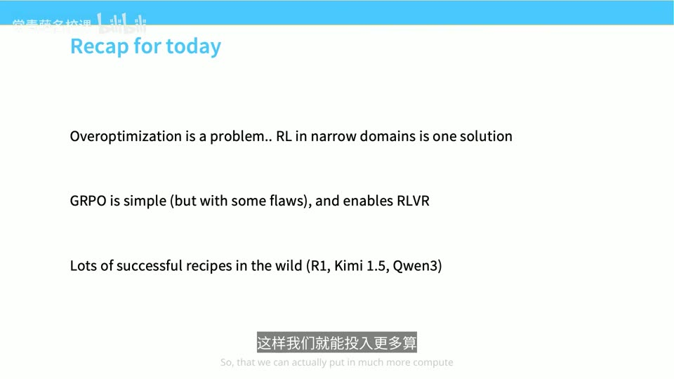 |
| 其实比你想的顺多了。好，我停一下，最后答几个问题，然后散会。大家要是还有问题的话。 [【跳转到 47:51】](https://www.bilibili.com/video/BV11LEA6eEuj/?p=16&t=2871) | 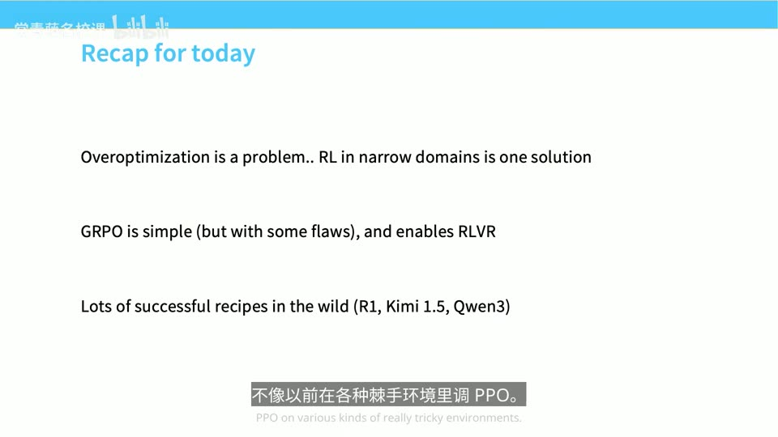 |
| 刚才问的是思维模式及其背后原理。这模式有趣在，它其实就一个模型，只要加个提示标签，就能在长思维链和几乎无思维链模式间切换。要是光设个 API 开关什么的那就不难了。啊，两个……这个结合使用挺有意思的，你可以不选思维链，但自己加提示词来引导思维链，对。 [【跳转到 47:56】](https://www.bilibili.com/video/BV11LEA6eEuj/?p=16&t=2876) | 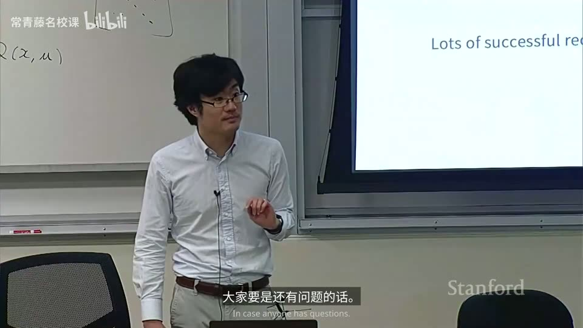 |
| 这里的控制机制在提示词里，而不在 API 或服务层，对，假的。哦，对，你提到了中期训练阶段，我就在想，中期训练里有多少格式化的内容？这一过程怎么影响 RLVR 后训练能学到的东西？另外，如果中间缺了正确的数据，那是不是可以说强化学习采不到真知， [【跳转到 48:18】](https://www.bilibili.com/video/BV11LEA6eEuj/?p=16&t=2898) | 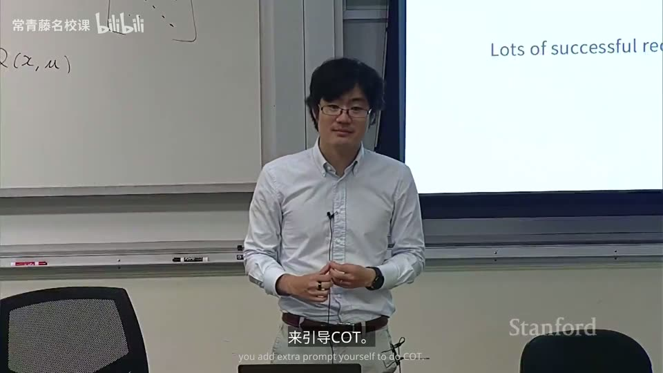 |
| 所以学不会？对这问题是关于中期训练在强化学习里的作用。嗯，我觉得这就是经验性的细节，很多我没有那种放之四海皆准的答案。但细节上我认为预训练和 SFT 承担了主要工作，前提是数据覆盖到位。预训练没代码数据就麻烦了，得靠中期训练；但若预训练多样、覆盖广——咱们看回中期训练那页——SFT 训练涵盖了文本、代码以及大量 GitHub 数据， [【跳转到 48:43】](https://www.bilibili.com/video/BV11LEA6eEuj/?p=16&t=2923) | 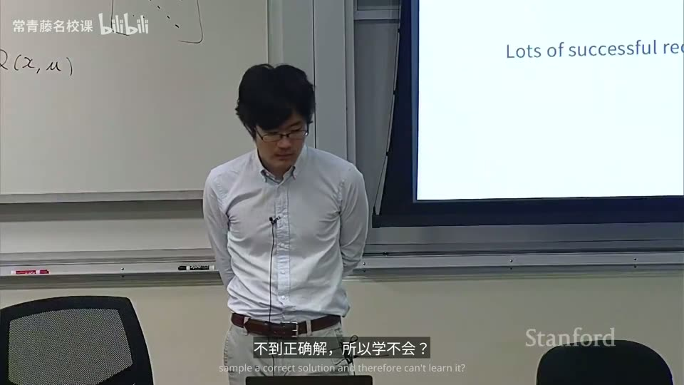 |
| 那当然好，但未必关键，因为后续总要做 SFT，SFT 足以让模型接近到能开始拿到一些 RL 奖励的程度。要是没有 SFT，那就麻烦大了，但好在 RL 前我们总会做一定量的 SFT，这帮助很大。而且但愿预训练覆盖足够，让你能获得合理的泛化。所以中期训练很有用， [【跳转到 49:08】](https://www.bilibili.com/video/BV11LEA6eEuj/?p=16&t=2948) | 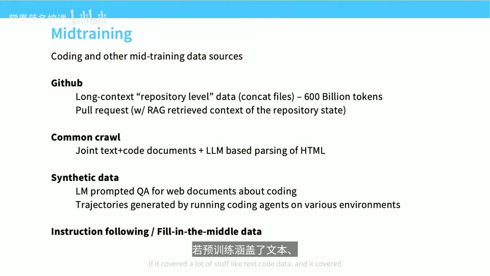 |
| 对，略微提升泛化很重要，但我觉得未必是成败关键。好，对于 Kimi 模型，你说过训练完每个专家模型后， [【跳转到 49:33】](https://www.bilibili.com/video/BV11LEA6eEuj/?p=16&t=2973) | 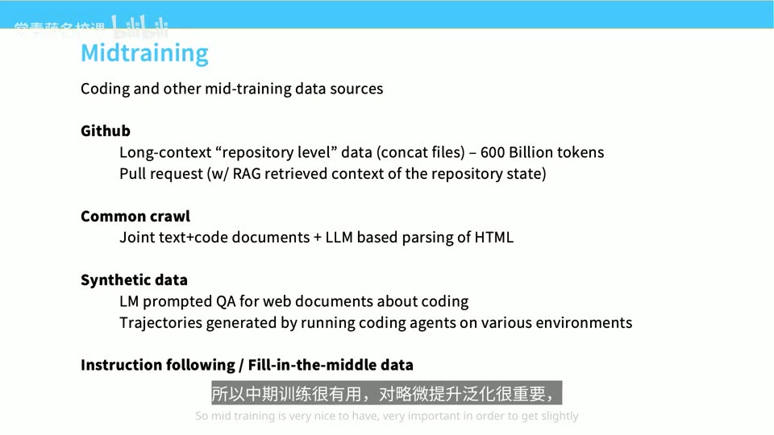 |
| 还有一步是把它们再蒸馏回单个模型。之前那这种蒸馏是怎么做的？需要设计某种混合流程吗？这是很多流程需要你准备一组提示词， [【跳转到 49:41】](https://www.bilibili.com/video/BV11LEA6eEuj/?p=16&t=2981) | 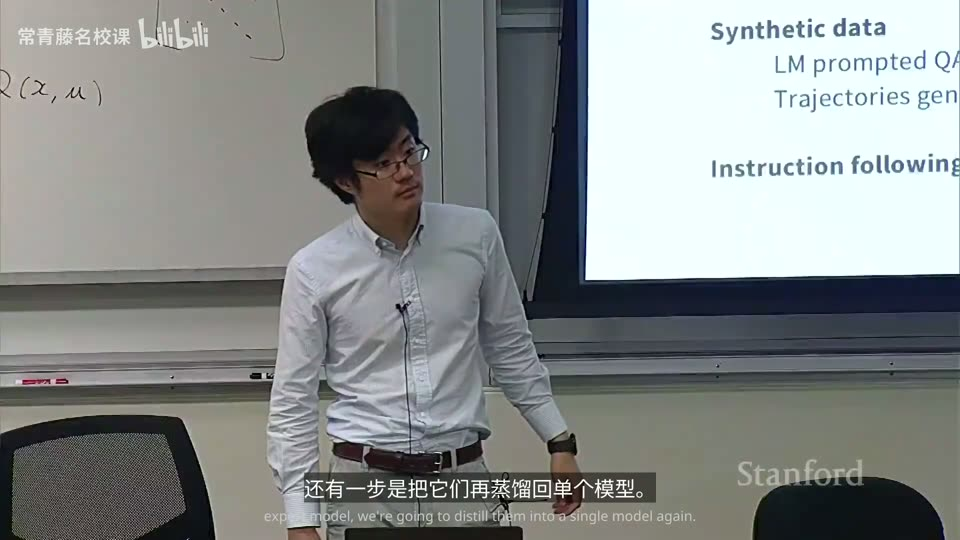 |
| 专家模型将基于这些提示词蒸馏到最终模型里的。这方法的优势很明显， [【跳转到 49:51】](https://www.bilibili.com/video/BV11LEA6eEuj/?p=16&t=2991) | 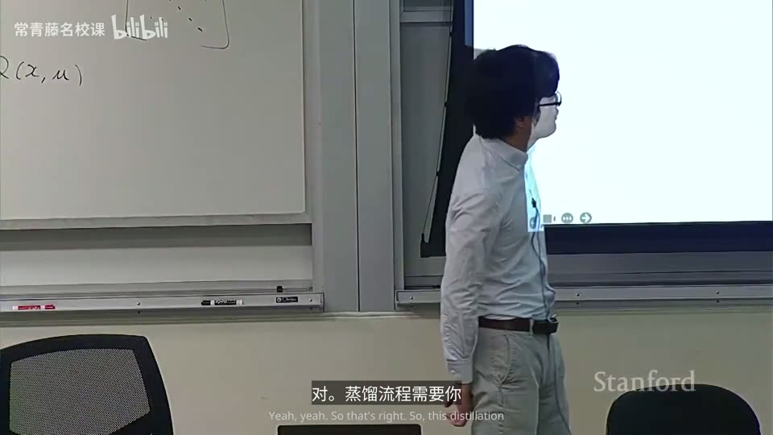 |
| 就是可以让不同团队分别负责各个专家模块，这样团队分工容易得多，而且只要算力充足，聚合过程也可能很简单。既然有了所有目标，不如直接扔进大训练循环里跑，通常这才是大家偏好的做法，这样就不用处理蒸馏带来的复杂性了。你只需定一个大训练目标， [【跳转到 49:57】](https://www.bilibili.com/video/BV11LEA6eEuj/?p=16&t=2997) | 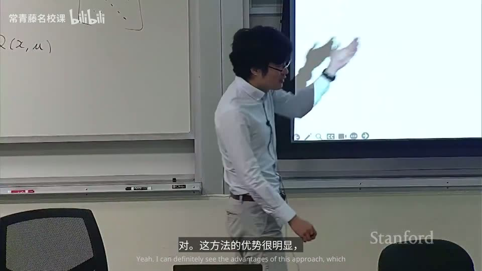 |
| 跑一次训练循环就行，你看到了吗？嗯，问问题是，长推理训练算不算中期训练？我觉得 R1 和 Kimi 1.1 里都有长思维链监督微调。长思维链本身并非传统中期训练的一部分，但长思维链类数据常用于长上下文扩展，所以这点更微妙些。我完全没提倡上下文扩展，挺后悔的。啊，通常这是 RLHF 之前的一个额外阶段， [【跳转到 50:17】](https://www.bilibili.com/video/BV11LEA6eEuj/?p=16&t=3017) | 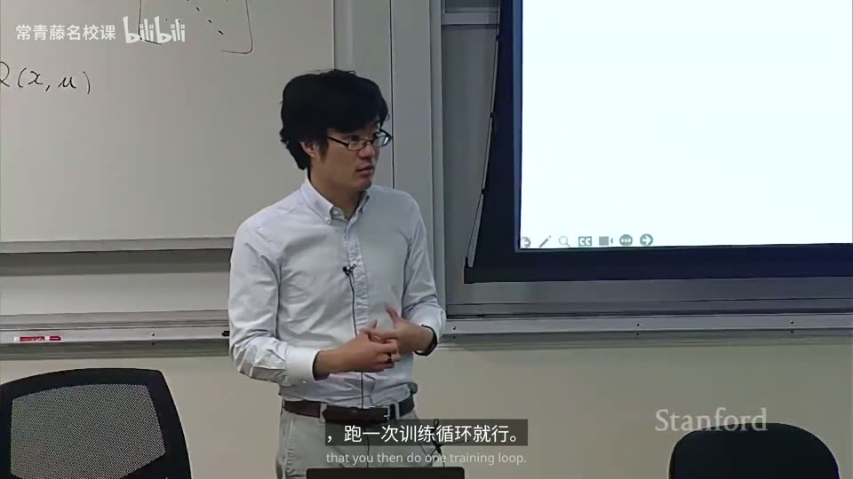 |
| 这里也是长思维链，即用任何长上下文数据来扩展上下文。通常这是书籍、代码、合成数据的组合，因为这些内容足够长，适合做扩展。所以结合当前这张图，在做 RLVR 时，比如你有数学、化学等很多领域，好，这些训练是该并行， [【跳转到 50:40】](https://www.bilibili.com/video/BV11LEA6eEuj/?p=16&t=3040) | 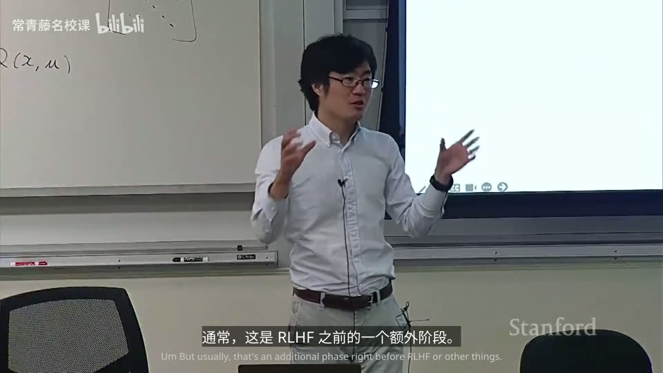 |
| 还是说你得按顺序一个个来？为了避免遗忘前面学到的内容，问题是顺序还是并行处理？ [【跳转到 51:05】](https://www.bilibili.com/video/BV11LEA6eEuj/?p=16&t=3065) | 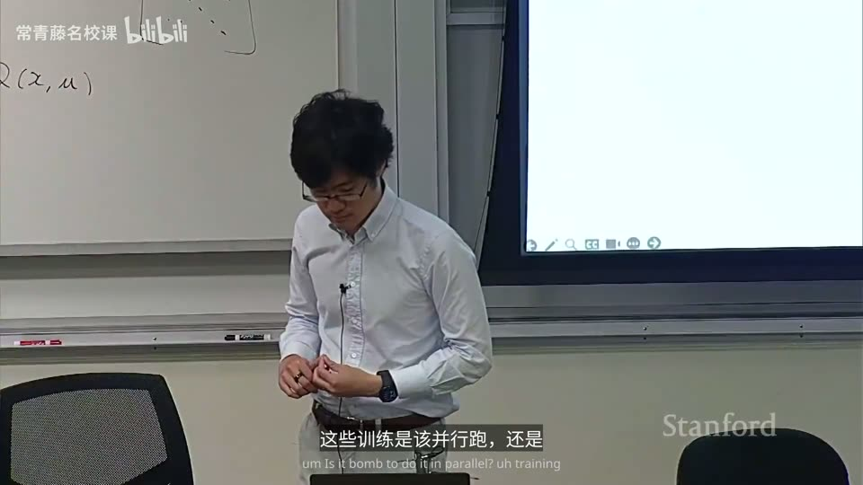 |
| 最贴切的答案就是这类图。你会把问题分成推理问题和非推理问题两类。推理问题归为一类，在第二阶段执行；非推理问题则在最终的 RLHF 阶段处理。 [【跳转到 51:14】](https://www.bilibili.com/video/BV11LEA6eEuj/?p=16&t=3074) | 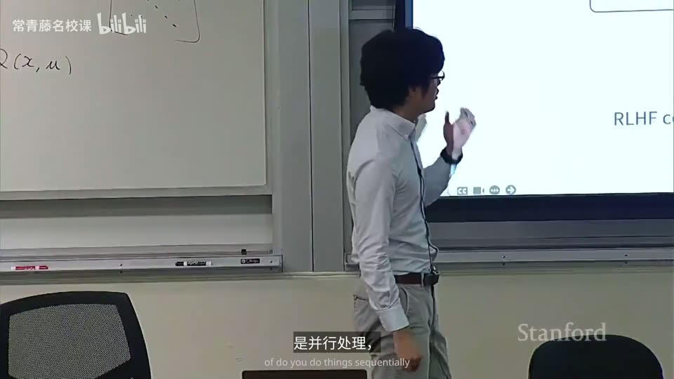 |
| 这包括格式之类的方面，啊，这些都归入最后的第四阶段。好的，谢谢，下周见。 [【跳转到 51:26】](https://www.bilibili.com/video/BV11LEA6eEuj/?p=16&t=3086) | 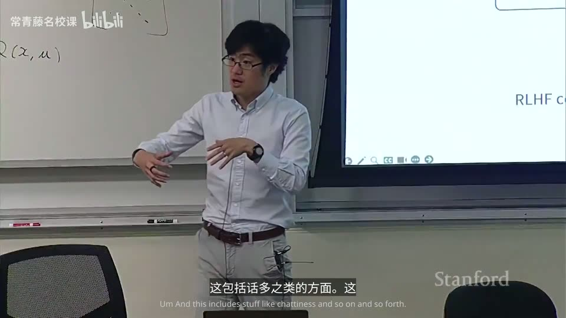 |