# Lecture 17: Alignment - Multimodality · 原始文稿（图-字幕分栏）

| 字幕文本 | 画面 |
| :--- | ---: |
| 原本的计划是深入探讨强化学习，但考虑到课时有限，如果不介绍多模态，这门课就显得不够完整。毕竟如今的主流模型几乎都具备多模态能力，所以今天咱们就大致概览一下多模态模型。这部分内容单开一门课都绰绰有余，但我尽量在这一节课里把能讲的核心内容都涵盖进去。 [【跳转到 00:00】](https://www.bilibili.com/video/BV11LEA6eEuj/?p=17&t=0) | 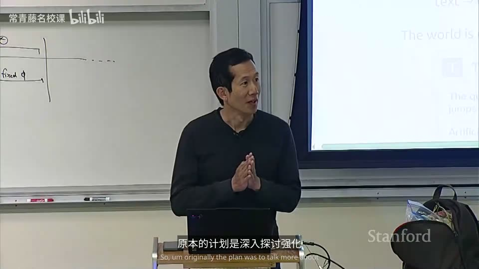 |
| 好，咱们开始深入多模态模型。到目前为止，这门课一直只关注语言模型。 [【跳转到 00:21】](https://www.bilibili.com/video/BV11LEA6eEuj/?p=17&t=21) | 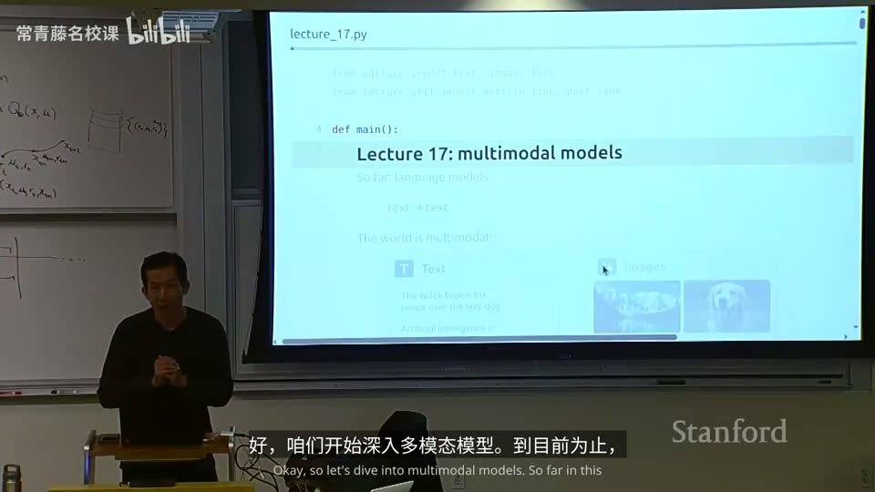 |
| 语言模型其实已经非常通用，它能实现从任意文本到任意文本的转换，比如处理各种语言、代码、诗歌，或者任何你喜欢的文本形式，甚至像 DNA 序列这样的数据。但现实世界是多模态的。 [【跳转到 00:26】](https://www.bilibili.com/video/BV11LEA6eEuj/?p=17&t=26) | 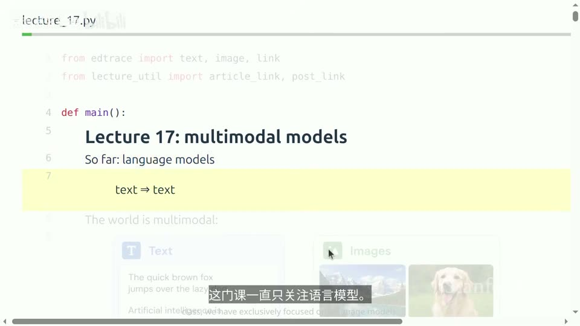 |
| 我们面对的数据包括文本、图像、音频和视频。咱们想想看最终想要达到的北极星目标。 [【跳转到 00:41】](https://www.bilibili.com/video/BV11LEA6eEuj/?p=17&t=41) | 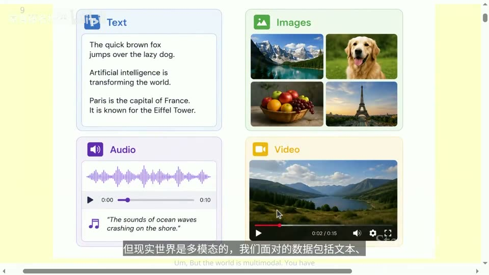 |
| 也就是大家所说的全模态模型，它能接收任意模态组合的输入，也能输出任意模态组合的结果。打个比方，我给你一张图像和一个视频，然后问你关于它们的问题；我也能生成图像，甚至能把音频转换成图像。有了全模态模型，你就能想到各种各样的应用场景。这门课我不会带大家从头搭建一个全模态模型，但我会给你一些关键组件。 [【跳转到 00:47】](https://www.bilibili.com/video/BV11LEA6eEuj/?p=17&t=47) |  |
| 让你至少能上手处理一些数据。以图像数据为例，这也是今天讨论的重点。那么如何构建这样的系统呢？这听起来可能有些抽象，但事实是 Transformer 确实行之有效。尽管人们尝试过许多其他方法，但在处理多模态大规模任务时，它依然是我们目前的最优选择，因此我们需要找到充分发挥其优势的方法。需要注意的是，Transformer 最初是为文本任务设计的。 [【跳转到 01:12】](https://www.bilibili.com/video/BV11LEA6eEuj/?p=17&t=72) | 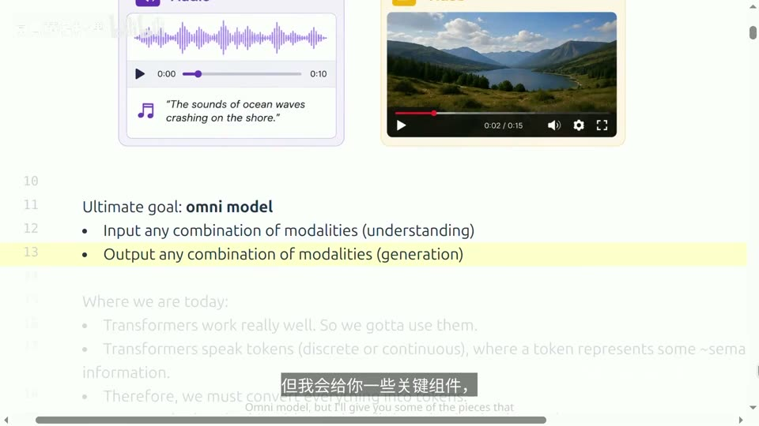 |
| 它具备处理 token 的特性，即输入是一组 token。 [【跳转到 01:37】](https://www.bilibili.com/video/BV11LEA6eEuj/?p=17&t=97) | 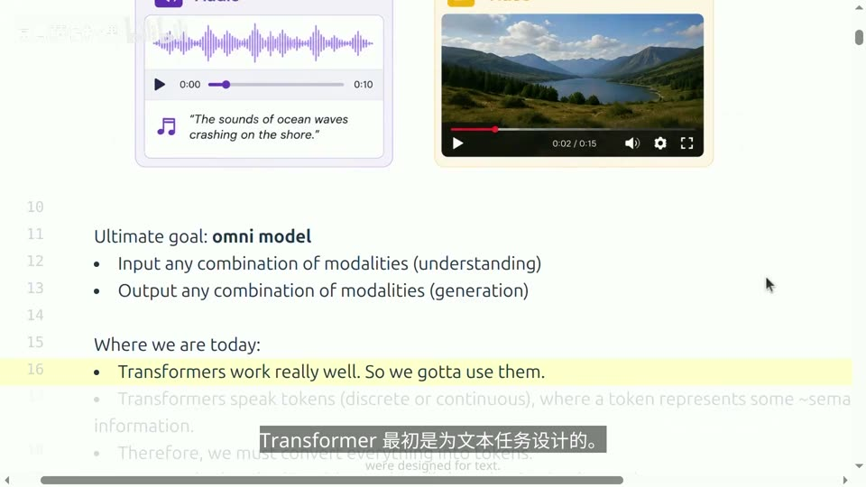 |
| 输出也是若干 token。在此我将 token 的概念进行了扩展，它不再局限于文本中离散的 token，还可能包含连续的 token，你可以将这些视为 token 的嵌入形式。核心在于 token 必须代表某种语义信息单元。例如在自然语言中，token 是子词，具有一定的意义；但像像素这样的元素单独来看是没有意义的。因此我们需要将音频、图像等数据转化为离散或连续的 token。 [【跳转到 01:42】](https://www.bilibili.com/video/BV11LEA6eEuj/?p=17&t=102) | 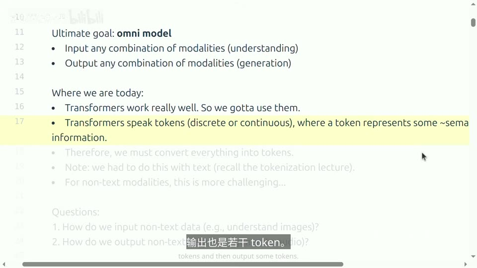 |
| 值得注意的是，对于文本数据我们早已采用这种做法。在第一讲中我们讨论过分词，当时的情况尚可，因为我们使用了 BPE 分词器，并且大家也亲手实现过。这虽然勉强可用，但大家心中或许都期待有更优秀的分词器出现，或者干脆不用分词器，这倒也不是什么大问题。 [【跳转到 02:07】](https://www.bilibili.com/video/BV11LEA6eEuj/?p=17&t=127) | 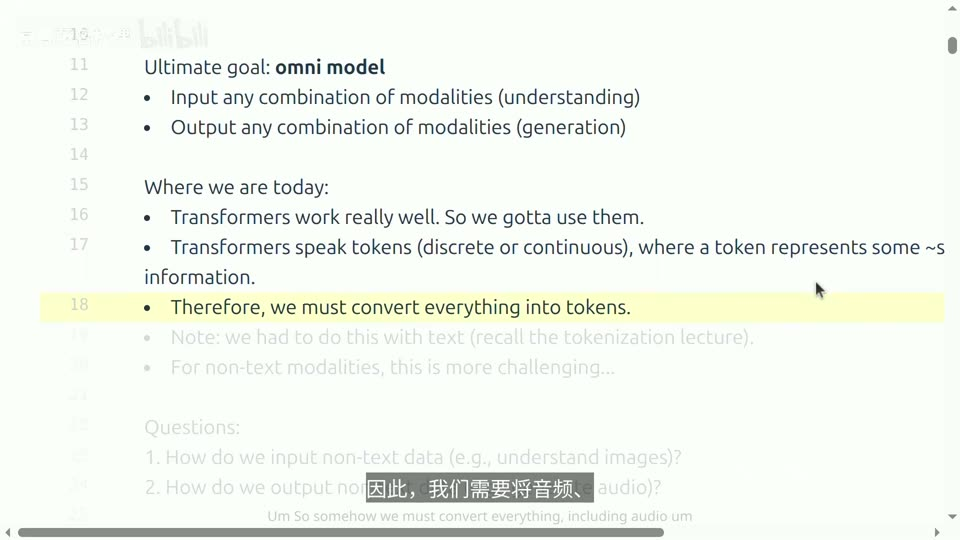 |
| 处理非文本模态时，咱们得费点脑筋，想清楚怎么把 BPE 分词器的逻辑迁移过来，让图像能变成 Transformer 能处理的形式。这里咱们得解决两个问题：第一，面对图像、视频或音频这些非文本数据，咱们该怎么把它们喂给 Transformer；第二，是怎么把它们生成出来。咱们这节课主要先讲第一个问题。好，咱们往回倒带。 [【跳转到 02:32】](https://www.bilibili.com/video/BV11LEA6eEuj/?p=17&t=152) | 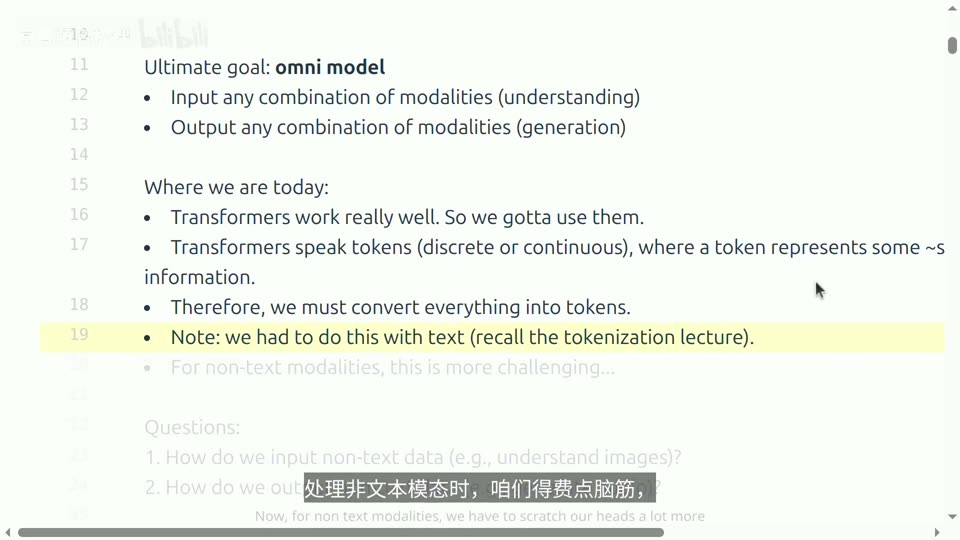 |
| 回到 2021 年的 CLIP 模型。大家可能听说过它，它是现代 VLM 的许多基础。所以咱们可以稍微深入一点来看这个例子。CLIP 的全称是对比语言-图像预训练。稍微回顾一下历史背景：那时候 GPT-3 已经问世，GPT-2 以及所有语言模型都已进入了基础模型时代。不过视觉领域当时还比较落后，有些尝试，但传统做法主要依赖大量标注或数据集。 [【跳转到 02:57】](https://www.bilibili.com/video/BV11LEA6eEuj/?p=17&t=177) | 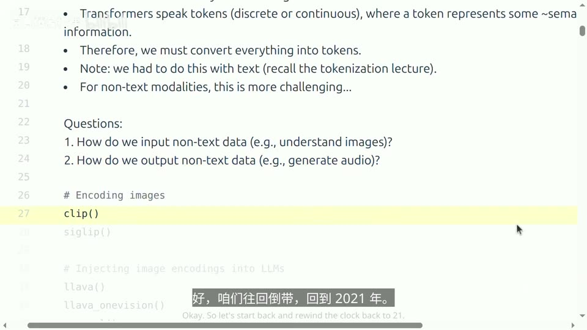 |
| 比如 ImageNet，研究人员在这些数据集上训练 ResNet 等模型，配合数据增强等手段，最终取得了非常出色的性能。因此 OpenAI 的研究人员提出一个问题：能否利用海量的图像及其文本描述？受语言领域这一思路的启发，只需抓取互联网上的文本，尽管数据噪声很大，但只要训练足够大的模型，就能从中提取意义。 [【跳转到 03:22】](https://www.bilibili.com/video/BV11LEA6eEuj/?p=17&t=202) | 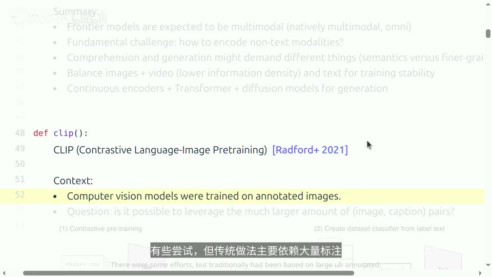 |
| 并生成有用的内容。那么图像领域的等效方案是什么？于是 CLIP 应运而生。 [【跳转到 03:47】](https://www.bilibili.com/video/BV11LEA6eEuj/?p=17&t=227) | 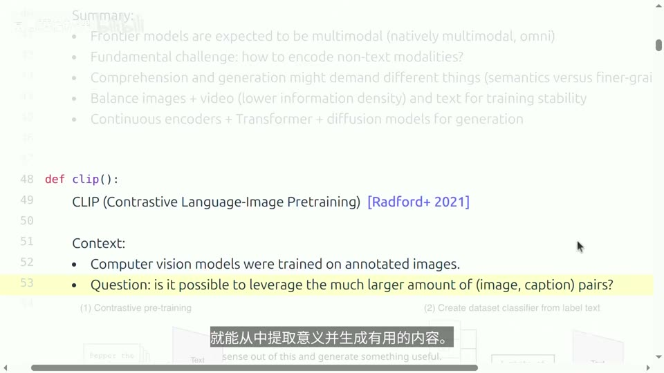 |
| CLIP 的核心思路其实很简单、很直接。那么针对图像对应的做法是什么呢？ [【跳转到 03:53】](https://www.bilibili.com/video/BV11LEA6eEuj/?p=17&t=233) | 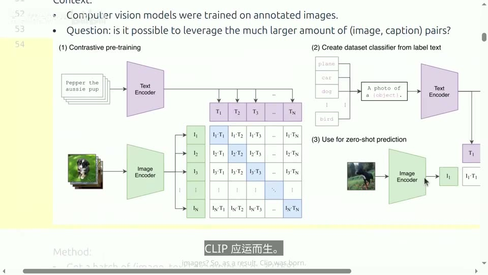 |
| 于是 CLIP 就这样诞生了，它的核心思路其实很简单、很直接。这样一来我就得到了 32000 个图像编码对应的文本，我也会做同样的操作，从而得到 T1 到 TN，这些是文本嵌入，那些则是图像嵌入。接下来我要设定一个目标：以图像 I 为例。 [【跳转到 03:58】](https://www.bilibili.com/video/BV11LEA6eEuj/?p=17&t=238) |  |
| I 和 T1 是配对的，所以我要让这两个嵌入向量的点积远远大于 I 与其他所有文本嵌入的点积。同理，对于这段文本我也希望如此，也就是说这个点积的值要大于 T1 与其余所有图像点积的值。简单总结一下，这就是 CLIP 的目标：你可以把它想象成执行了 2N 次不同的 softmax 分类。来看代码。 [【跳转到 04:19】](https://www.bilibili.com/video/BV11LEA6eEuj/?p=17&t=259) | 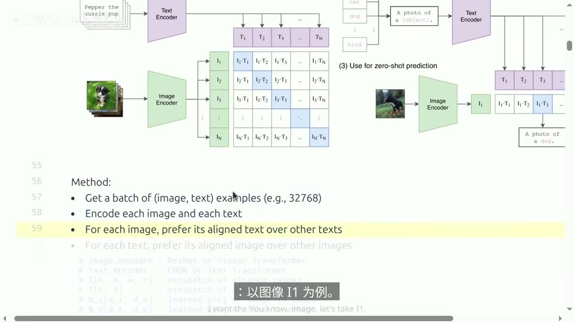 |
| 这里你会得到一个 N 乘 D 的矩阵来表示图像编码，另一个 N 乘 D 的矩阵表示文本嵌入，先做归一化再计算点积，这里会用到温度系数，接着计算交叉熵。好的，所以这基本上就是一个多类分类问题，样本被组织成了 N 乘 N 的矩阵形式。好，大家有什么问题吗？ [【跳转到 04:44】](https://www.bilibili.com/video/BV11LEA6eEuj/?p=17&t=284) | 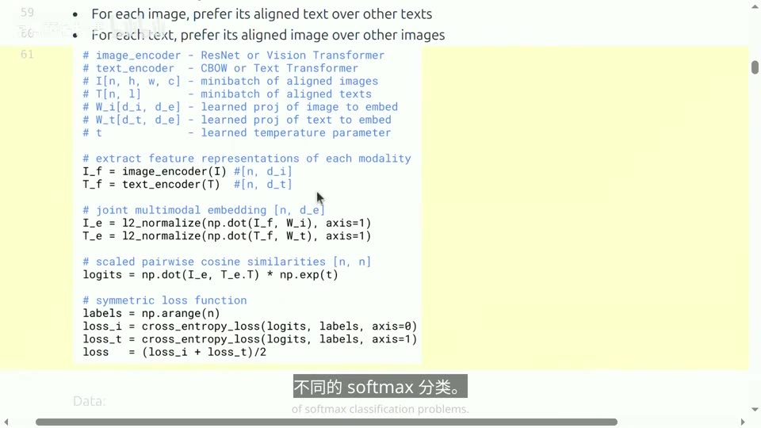 |
| 好，那咱们继续。接下来讲讲 CLIP 构建的一些细节：数据是从哪来的？论文里关于数据部分的细节并不多。简单来说就是先收集一批查询词，从某个来源获取这些查询词后去网上搜索，从中挖掘出大量的图文对，最终得到了 4 亿个图文对。该数据集并未公开，不过有人尝试过复现。 [【跳转到 05:09】](https://www.bilibili.com/video/BV11LEA6eEuj/?p=17&t=309) | 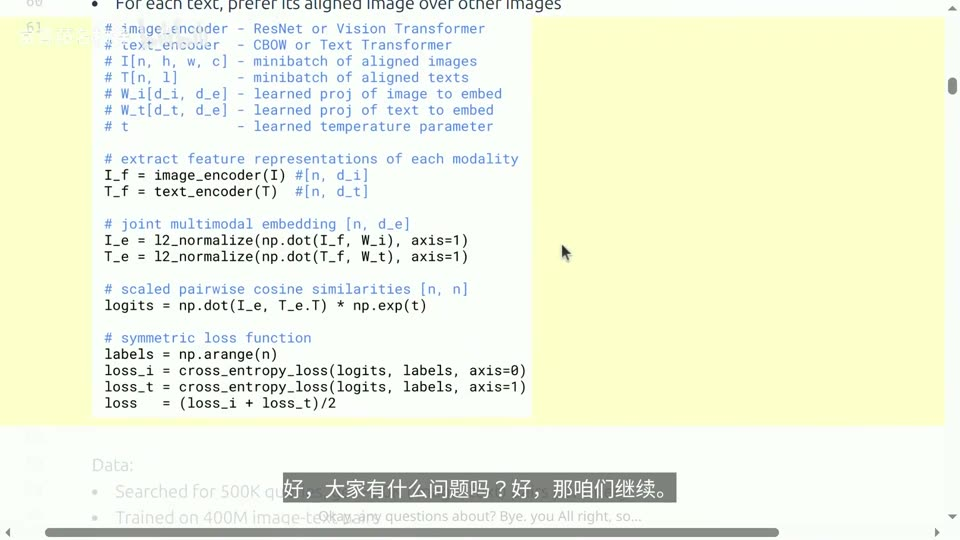 |
| 有一篇名为 OpenCLIP 的论文进行了复现，并进一步扩展了 CLIP 的思路，例如发布了一个名为 LAION-5B 的数据集，包含 50 亿张带文本描述的图像。期间还进行了一些数据处理。有趣的是，他们先用 CLIP 进行数据筛选再训练 OpenCLIP，这里存在一种自举过程，但至少这是一个能明确指明训练数据集的模型。 [【跳转到 05:34】](https://www.bilibili.com/video/BV11LEA6eEuj/?p=17&t=334) |  |
| 还有代码。好，咱们再补充几个细节。图像分辨率五花八门对吧，网上随便找张图，长宽比可能很不固定，要么细长。 [【跳转到 05:59】](https://www.bilibili.com/video/BV11LEA6eEuj/?p=17&t=359) | 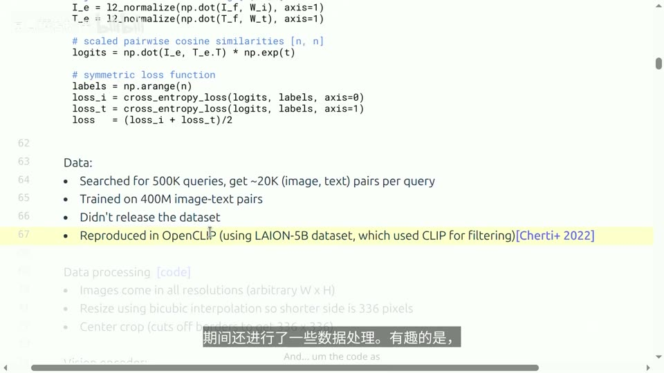 |
| 要么瘦长，尺寸完全随意。另外，学神经网络时你会知道，它们不喜欢动态尺寸，偏好固定大小的输入，所以通常会做个启发式的预处理，把图像缩放让短边变成 336 或者 224 这类目标尺寸，接着做中心裁剪把它变成正方形。通常目标位于画面中央，因此只需裁剪掉背景即可，所以这倒不是问题。好，那视觉编码器到底是什么？ [【跳转到 06:24】](https://www.bilibili.com/video/BV11LEA6eEuj/?p=17&t=384) | 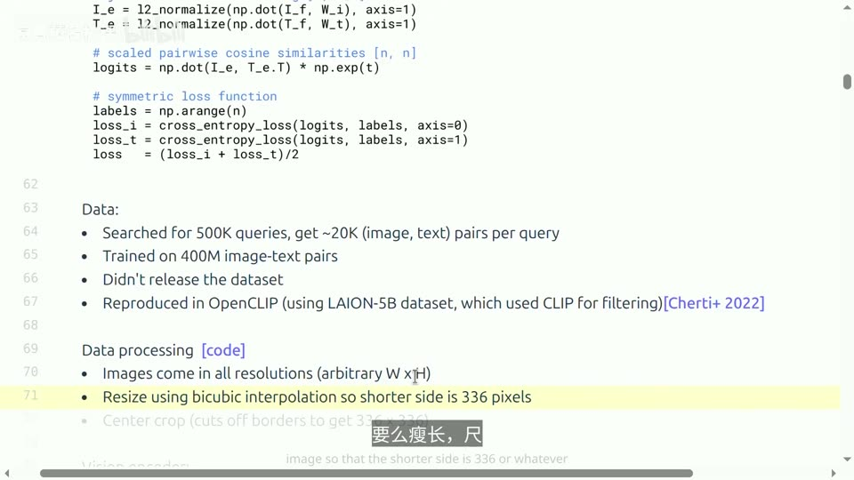 |
| 这是通用算法，但我尚未详细解释图像编码器和文本编码器的具体含义。（此处录音不清） [【跳转到 06:49】](https://www.bilibili.com/video/BV11LEA6eEuj/?p=17&t=409) | 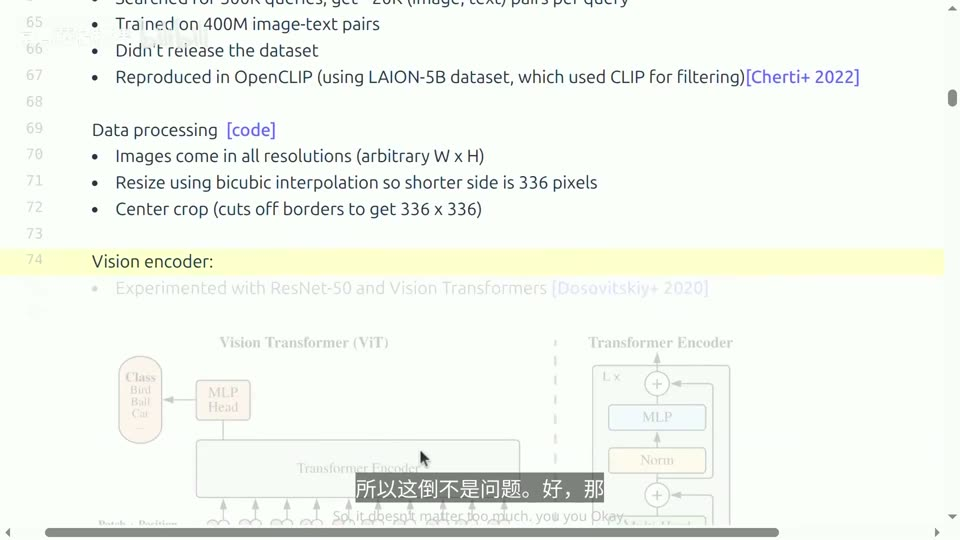 |
| （课堂问答）我认为核心问题在于，为什么他们采用图文对训练，而不是单独使用图片？有一类研究致力于将图像编码为表示形式。 [【跳转到 07:04】](https://www.bilibili.com/video/BV11LEA6eEuj/?p=17&t=424) | 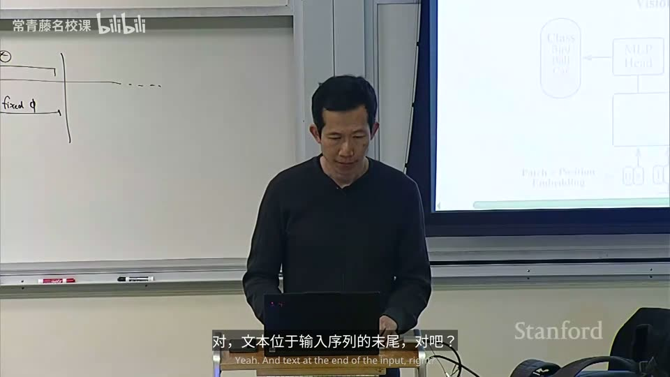 |
| 有一类研究致力于将图像编码为表示形式，它们被视为同一张图像，因此应具有相似的嵌入表示。不过我们接着往下说，这种方法对捕捉低级细节很有用，但问题是仅靠数据增强，你无法将一只狗变成另一种狗，比如从一种狗变成另一种狗。引入文本就能提供更高阶的语义信息，用于表征图像。 [【跳转到 07:29】](https://www.bilibili.com/video/BV11LEA6eEuj/?p=17&t=449) | 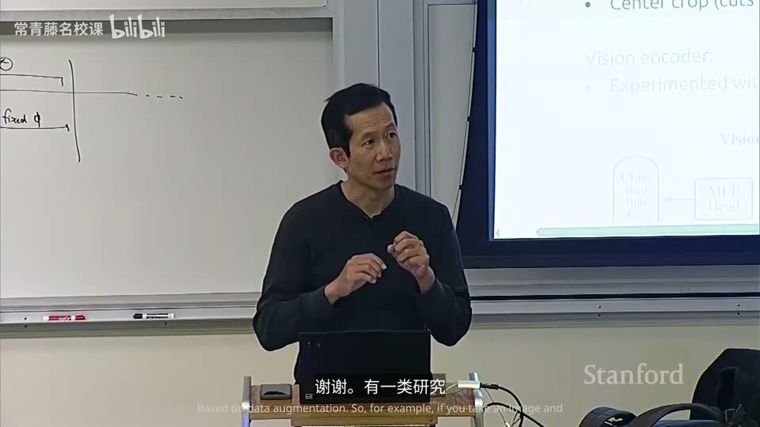 |
| 这是个很好的问题，稍后我们会看到，结合具体任务类型，这些语义表征能发挥多大作用。那么 CLIP 使用的视觉编码器是什么？ [【跳转到 07:54】](https://www.bilibili.com/video/BV11LEA6eEuj/?p=17&t=474) | 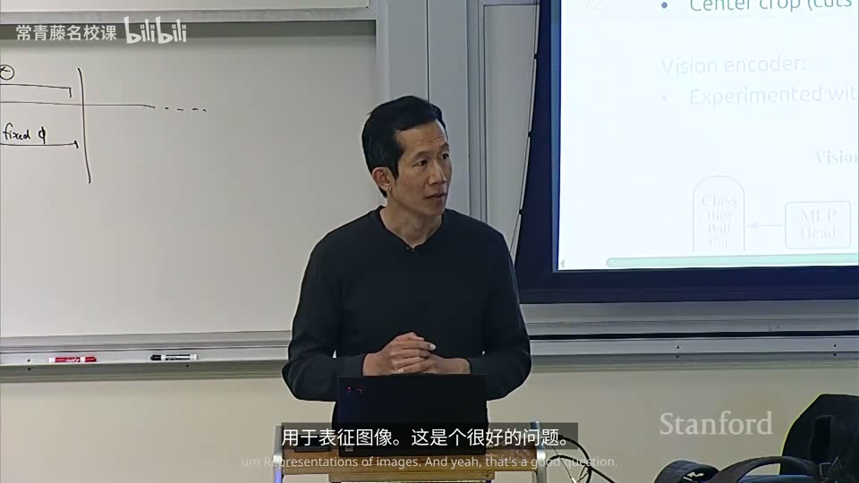 |
| 他们尝试过多种架构，例如 ResNet 和当时刚发布的视觉 Transformer，试验结果表明视觉 Transformer 的效果最佳。因此人们提到 CLIP 时，通常指的就是基于 ViT 的那个版本。视觉 Transformer 的处理流程如下。 [【跳转到 08:02】](https://www.bilibili.com/video/BV11LEA6eEuj/?p=17&t=482) | 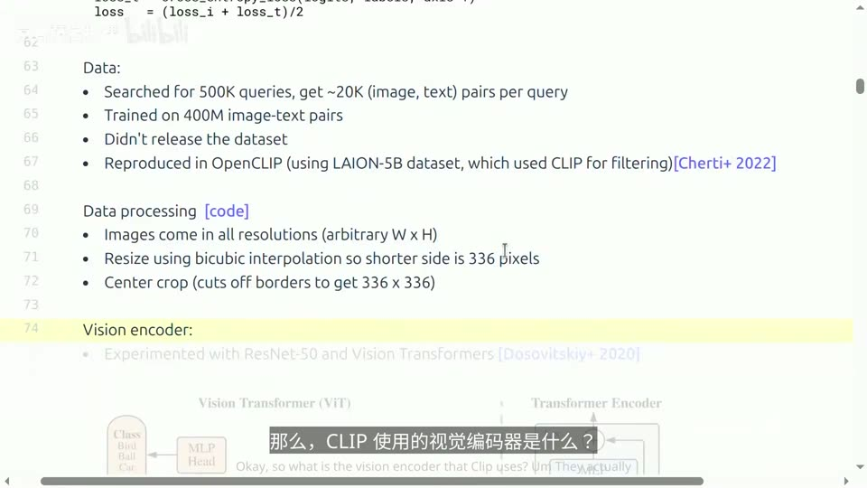 |
| 我们先取一张图像，然后将其切分为小块。原始论文中采用的是 16×16 的块大小，而 CLIP 使用的是 14×14。无论尺寸如何，这些小块本质上都是向量，因此每个小块在某种程度上就是它的 token。对于视觉 Transformer，你会像训练语言模型那样加入位置嵌入。 [【跳转到 08:15】](https://www.bilibili.com/video/BV11LEA6eEuj/?p=17&t=495) |  |
| 然后将其输入到一个标准的 Transformer 中。以 Transformer 为例，如果你要做分类任务，通常会取出序列的第一个 token 作为分类表示；Transformer 编码器会输出一个向量序列。具体来说，先对所有激活值做全局平均。 [【跳转到 08:40】](https://www.bilibili.com/video/BV11LEA6eEuj/?p=17&t=520) | 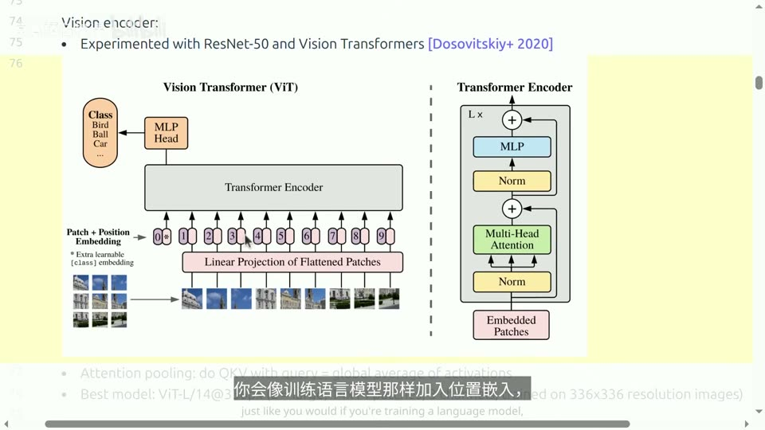 |
| 再用这个查询向量与每个位置的键和值进行一轮注意力计算，这样得到的向量可能比直接求平均包含更多信息。好，这就是……研究发现效果最好的模型是 ViT-L/14。 [【跳转到 09:05】](https://www.bilibili.com/video/BV11LEA6eEuj/?p=17&t=545) | 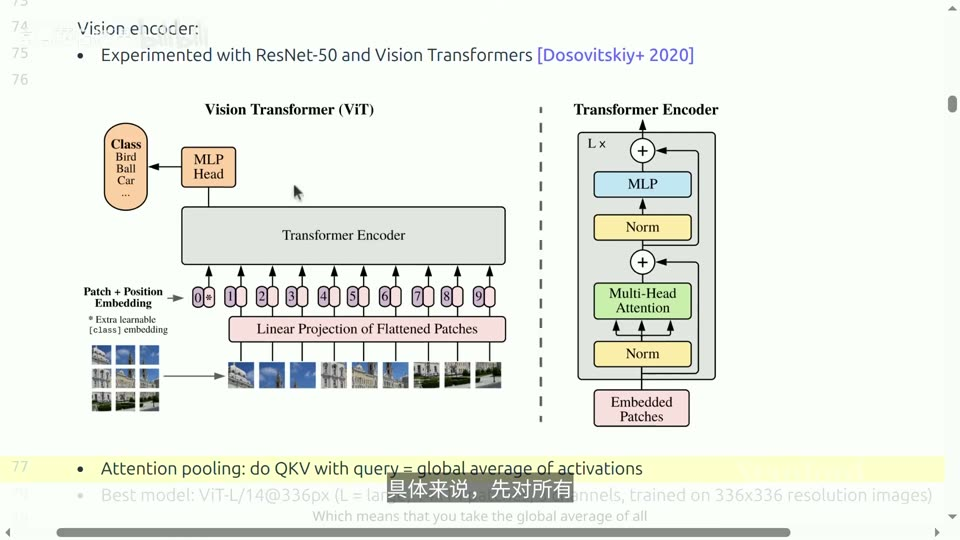 |
| 这个名称的意思是，这是一个大型的 ViT。 [【跳转到 09:20】](https://www.bilibili.com/video/BV11LEA6eEuj/?p=17&t=560) | 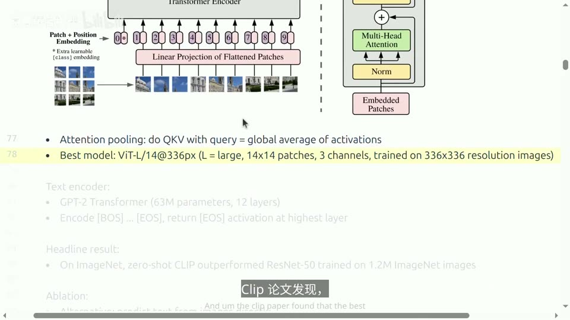 |
| 我估计它大概有 24 层，不太确定。使用的是 14×14 的 patch，每个 patch 都是 RGB 的，所以有三个通道。他们使用 336×336 分辨率的图片进行训练，实际上他们先用低分辨率图片训练，然后再放大分辨率，这主要是为了提速，毕竟高分辨率图片太耗时，在后续训练阶段他们才使用高分辨率图片。那么位置编码在文本处理中是否会更复杂一些？ [【跳转到 09:25】](https://www.bilibili.com/video/BV11LEA6eEuj/?p=17&t=565) | 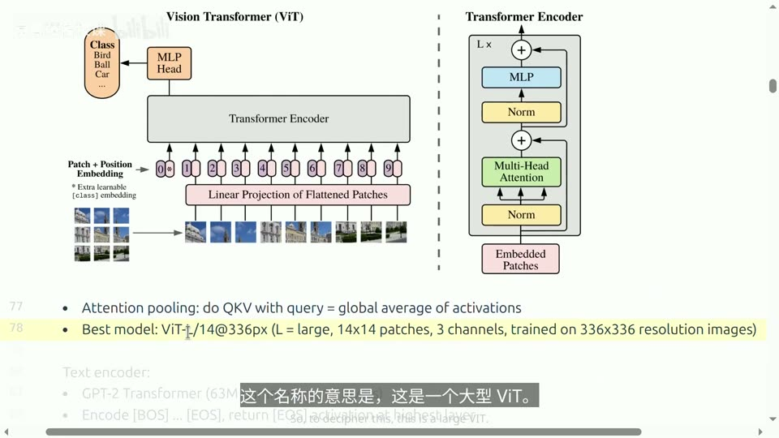 |
| 比如图像本身包含上下左右等方向信息？没错。所以核心问题在于能否设计更智能的位置嵌入方法，因为目前采用的只是 0 到 9 的线性编码。我认为 CLIP 这篇论文其实尝试过该方法的二维和一维版本，结果显示两者差异并不显著。在解读这些结果时需要意识到，它们主要属于有趣的分类实验。 [【跳转到 09:49】](https://www.bilibili.com/video/BV11LEA6eEuj/?p=17&t=589) | 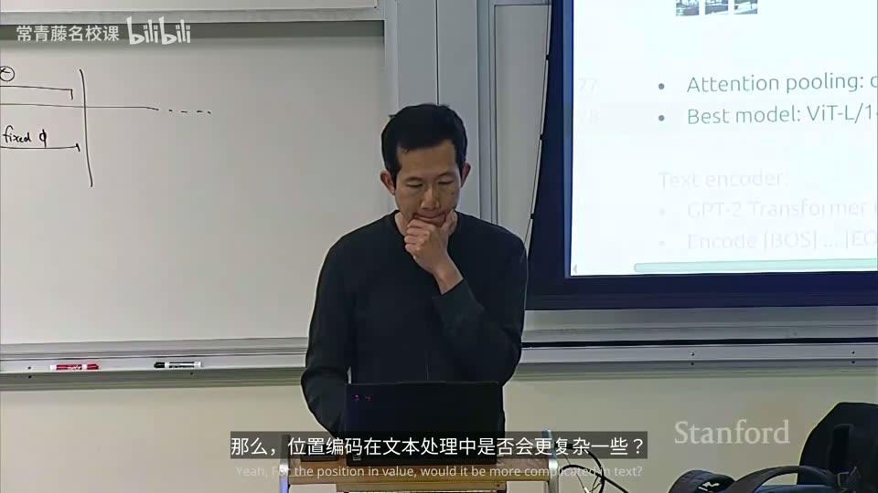 |
| 因此对于分类任务而言，这一点或许并不关键。稍后我们会介绍更高级的位置嵌入方法，这些方法会考虑空间结构。接下来我们来看文本编码器。它采用标准的 Transformer 架构，由于开发团队相同，这里使用的是 GPT-2 风格的 Transformer。为了从序列中提取一个向量，他们在序列开头添加 BOS、结尾添加 EOS。 [【跳转到 10:14】](https://www.bilibili.com/video/BV11LEA6eEuj/?p=17&t=614) | 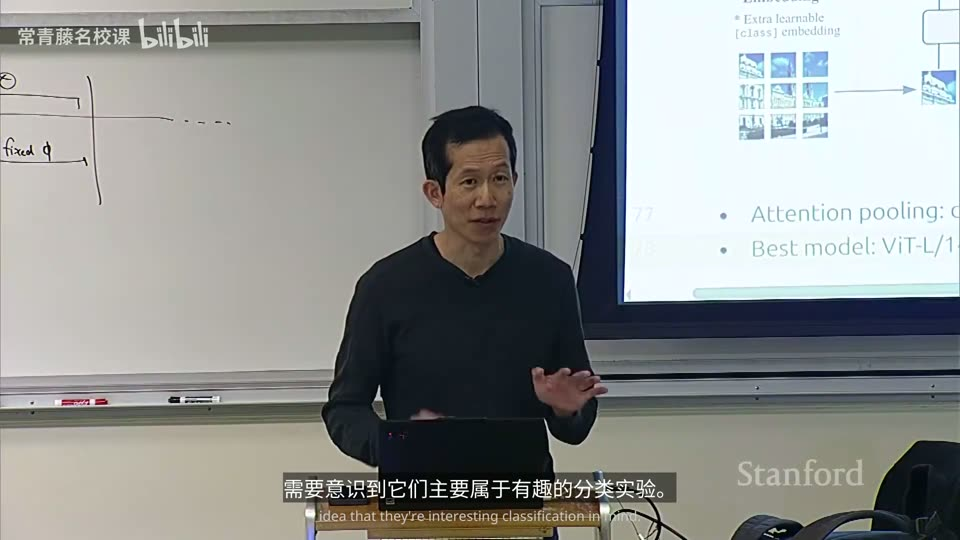 |
| 然后取最后一层中 EOS 位置的激活值。现在我们拥有了视觉编码器和文本编码器，随后即可利用这一流程来训练模型。它代表了整个序列，现在我们有了视觉编码器和文本编码器。明白了吗？因此 CLIP 在 2021 年引发广泛关注的关键成果是： [【跳转到 10:39】](https://www.bilibili.com/video/BV11LEA6eEuj/?p=17&t=639) | 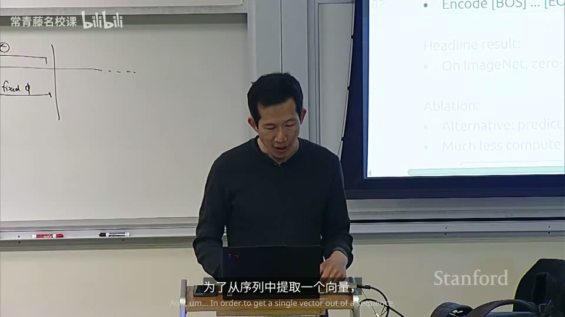 |
| 在 ImageNet 基准测试中实现了零样本分类，它的表现超越了在 120 万张图像上训练的模型。注意是图像而非图片。我们可以想一下，处理 120 万张图像需要亚马逊机械土耳其（Amazon Mechanical Turk）的工人投入大量工时进行数据清洗，而现在你使用的是在更自然的网络数据上训练的 CLIP。诚然，这确实利用了网络上众人的劳动。 [【跳转到 11:04】](https://www.bilibili.com/video/BV11LEA6eEuj/?p=17&t=664) | 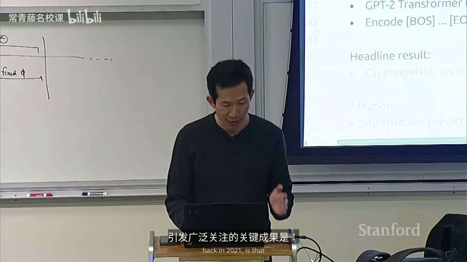 |
| 但既然能直接利用这些现成数据，就能直接进行零样本推理。零样本技术的基本原理是——虽然这里没有幻灯片展示，但逻辑很简单：你拿一张图，再准备一堆文本，然后计算它们与各个标签的点积，看谁的得分最高。我们继续。 [【跳转到 11:29】](https://www.bilibili.com/video/BV11LEA6eEuj/?p=17&t=689) | 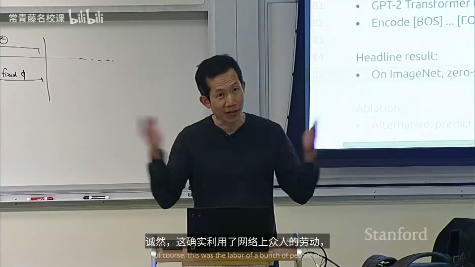 |
| 对，确实是这样。抱歉，这部分在侧面。好问题，所以这是零样本预测。 [【跳转到 11:54】](https://www.bilibili.com/video/BV11LEA6eEuj/?p=17&t=714) | 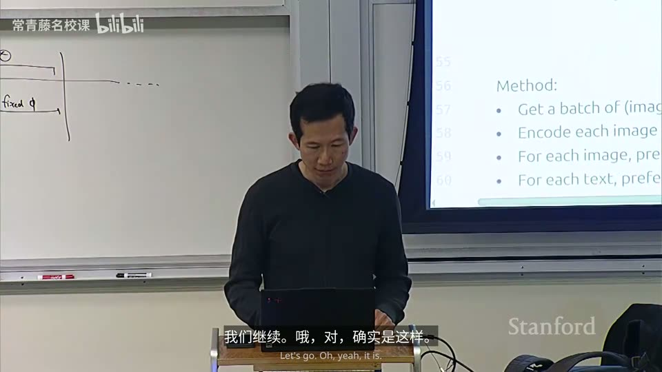 |
| 就是你拿一张图片，然后你对……就像我之前说的。有问题吗？（此处录音不清） [【跳转到 11:59】](https://www.bilibili.com/video/BV11LEA6eEuj/?p=17&t=719) | 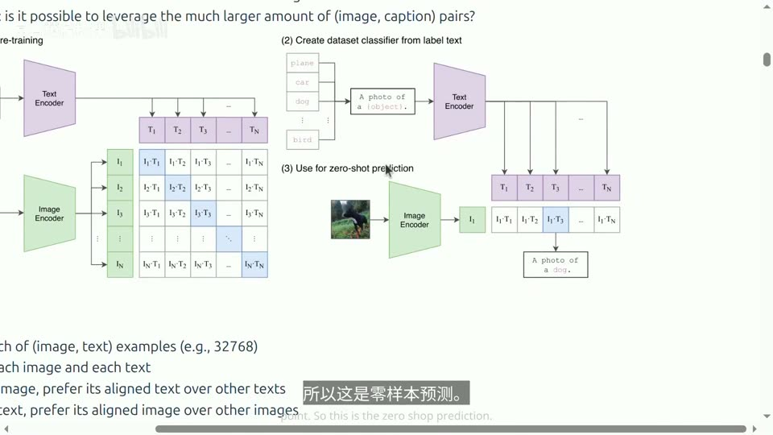 |
| 我们遇到了一个问题：比如这里有一张狗的图片，对于所有的标题——也不只是这个简单的标题——这只狗也许其他标题也和狗有关，这会让模型产生混淆吗？没错，所以问题是：如果你有一只狗，也许还有其他标题也提到狗，这会混淆模型吗？一般来说这个过程是有噪声的，如果有另一只狗也没关系，因为平均来看不太可能总是出现狗。 [【跳转到 12:11】](https://www.bilibili.com/video/BV11LEA6eEuj/?p=17&t=731) | 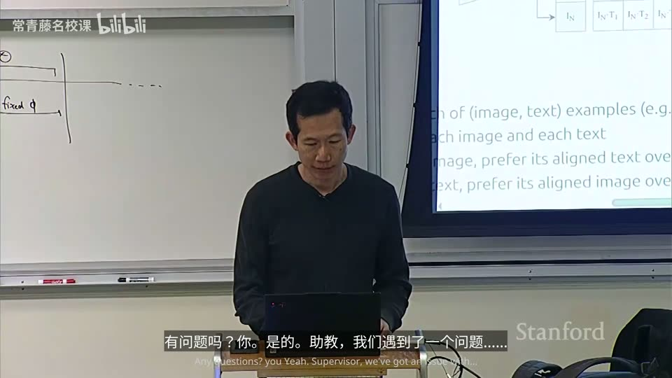 |
| 有时会是苹果或猫之类的东西。啊，还有一点是，这些图片是……如果有另一只狗也没关系，因为平均来看不太可能总是出现狗。还有一点是，这些图片并不一定只是如实描述图像内容。没错，因为如果图像是一只狗，你就不需要特意说明这只狗。因此这一过程噪声很大，也许令人有些意外。 [【跳转到 12:36】](https://www.bilibili.com/video/BV11LEA6eEuj/?p=17&t=756) | 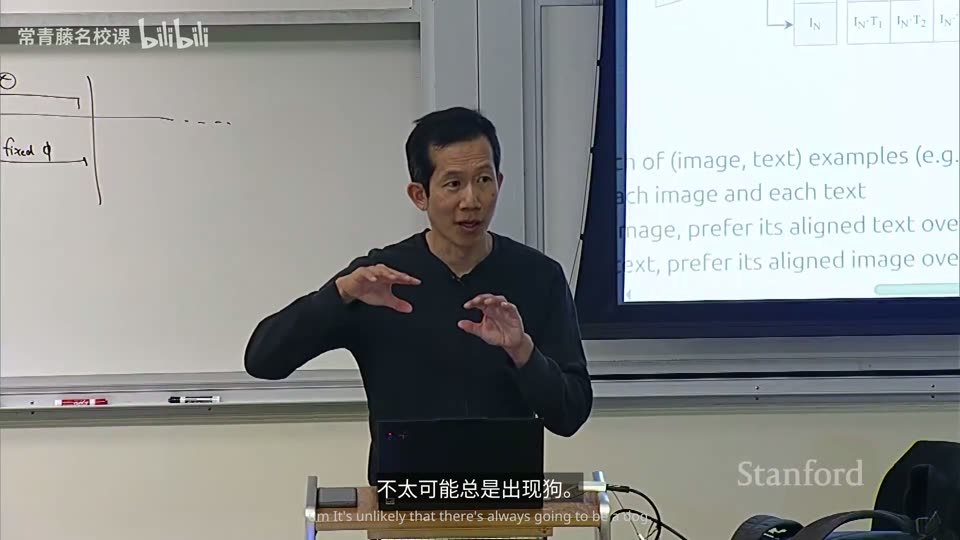 |
| 但有趣的是它确实有效。我的意思是，需要进行大量的数据过滤，因此如果随意选取网络上的图像和文本，噪声可能会过大。还有一点需要注意。 [【跳转到 13:01】](https://www.bilibili.com/video/BV11LEA6eEuj/?p=17&t=781) | 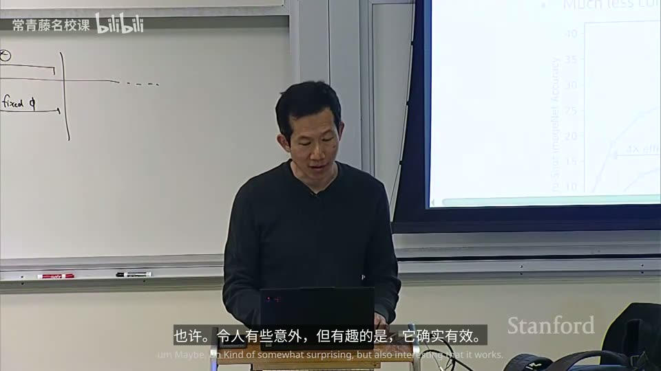 |
| 这与我最后会回到的一点有关。他们还尝试了另一种替代方案：既不进行这种排序，而是从图像中预测文本。因此他们可以设定一个目标，尝试从图像中预测文本，既可以作为词袋（bag-of-words）形式，也可以放弃排序，改为让模型根据图像直接预测文本。 [【跳转到 13:12】](https://www.bilibili.com/video/BV11LEA6eEuj/?p=17&t=792) | 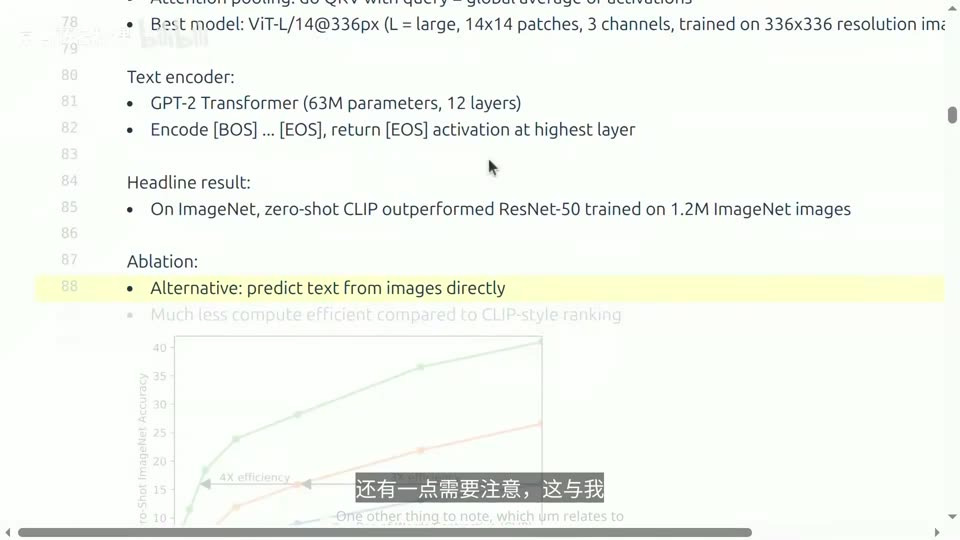 |
| 比如把文本当做词袋来处理，这和 CLIP 使用的方法不同。所以我的观点是，对于你真正想学习的表示，或者说看 ImageNet 的准确率，也就是分类任务的表现，实际上精确建模字幕的 token 序列，对于获取图像的粗略表示来说并没有那么关键。好，我们稍后再回到这一点。 [【跳转到 13:37】](https://www.bilibili.com/video/BV11LEA6eEuj/?p=17&t=817) | 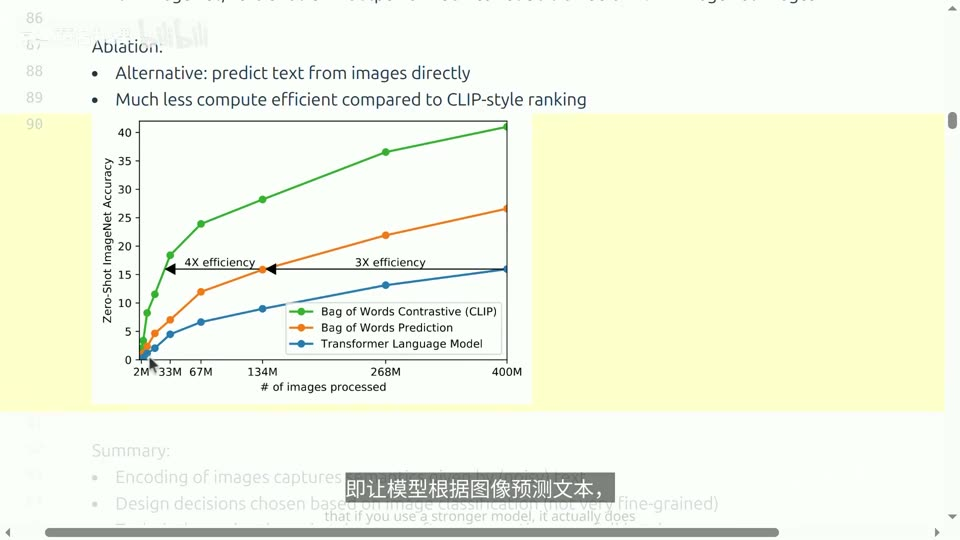 |
| 那么到目前为止我们学到了什么？我们已经对图像进行了编码，使用 CLIP，它能捕捉图像的语义，因为它与文本配对，而文本通常描述的正是语义。需要指出的是，这里的设计决策是基于图像分类的，因此它的力度并不十分精细，但正如我们将要提到的，它仍然为我们后续要做的所有事情提供了一个稳健的起点。 [【跳转到 14:02】](https://www.bilibili.com/video/BV11LEA6eEuj/?p=17&t=842) | 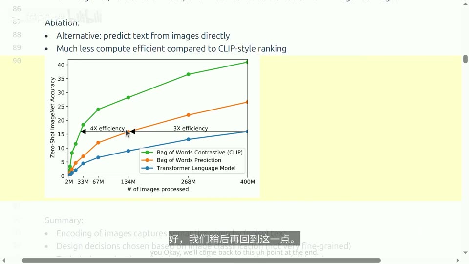 |
| CLIP 在技术上的一个缺点是它需要较大的批量大小，比如 32000。如果你的批量大小仅为一，显然它无法工作，即使是十也不行。此外 softmax 操作是在整个批量上进行的，因此它缺乏良好的可分解性。相比之下，在常规语言模型训练中，一批样本中的所有序列会被并行处理，最后只需进行聚合。这一问题将由谷歌发布的另一篇名为 SigLIP 的论文来解决。 [【跳转到 14:27】](https://www.bilibili.com/video/BV11LEA6eEuj/?p=17&t=867) | 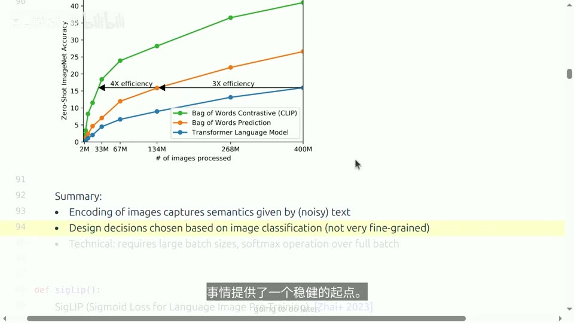 |
| 因此你可以将其基本视为 CLIP 的改进版本，它代表用于语言-图像预训练的 sigmoid 损失。这里的主要区别在于，CLIP 执行的是多类别分类，其逻辑是：既然拥有匹配的文本和图像对，就将这一对视为正样本，与其他所有不匹配的图像或文本进行对比。从某种意义上说，SigLIP 简单得多。 [【跳转到 14:52】](https://www.bilibili.com/video/BV11LEA6eEuj/?p=17&t=892) |  |
| 它基本只问：对于任意给定的图文对，它们是否对齐？没错。大家看上面这张图，这其实是个二分类问题，对角线上的元素是正样本，对角线外的就是负样本，就这么简单。咱们来看算法流程：拿到嵌入向量后先做归一化，然后照常计算点积，不过现在咱们是在计算相似度。咱们来设定标签：非对角线位置标为负一。 [【跳转到 15:17】](https://www.bilibili.com/video/BV11LEA6eEuj/?p=17&t=917) | 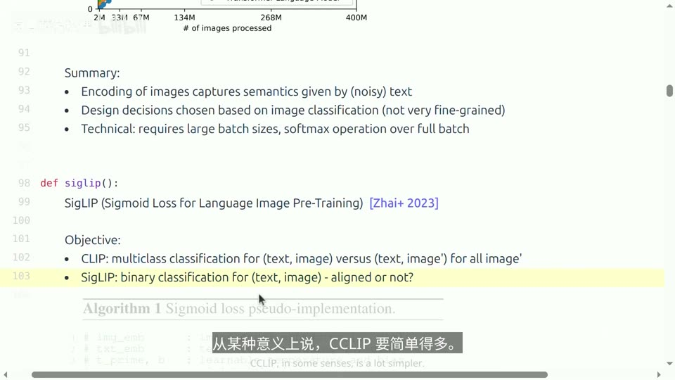 |
| 对角线位置标为正一，接着执行交叉熵损失计算，也就是对数 Sigmoid。所以这个目标函数非常简单。咱们来定义一下标签，所以对角线位置标记为一。 [【跳转到 15:42】](https://www.bilibili.com/video/BV11LEA6eEuj/?p=17&t=942) | 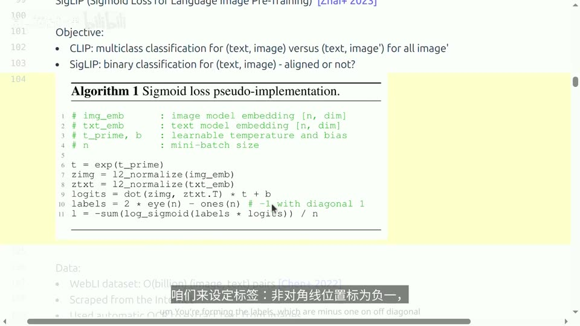 |
| 对角线位置标记为正一，然后实行交叉熵损失计算，也是对数 Sigmoid。因此这个目标还是非常简单。那问题来了：这需要采用复杂的采样策略吗？呃，在最早的那篇论文里，他们直接操作的是同一种类型的矩阵。我猜你大概在想：一般情况下，在进行这种对比学习时，负样本该怎么处理，比如是否需要平衡正负样本。 [【跳转到 15:56】](https://www.bilibili.com/video/BV11LEA6eEuj/?p=17&t=956) | 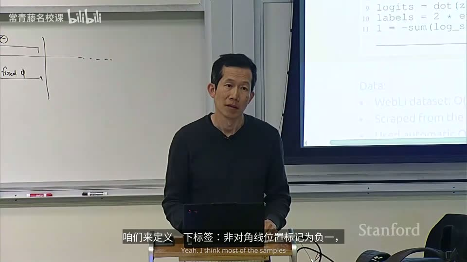 |
| 或者让负样本选得更紧一些，以避免模型学到错误的关联、产生偏差？不过在最初版本里，这其实挺简单的。所以咱们来聊聊数据。 [【跳转到 16:21】](https://www.bilibili.com/video/BV11LEA6eEuj/?p=17&t=981) | 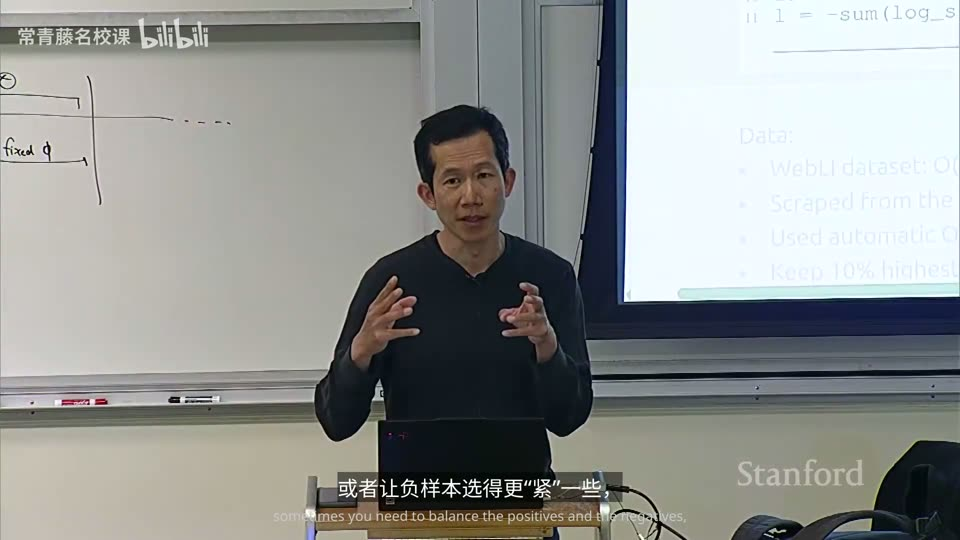 |
| 你知道这是谷歌做的，这是一个数据集。他们参考了另一篇论文，即 2022 年左右出现的一款语言-图像模型，该模型使用了 WebLI 类数据集，其中包含 110 亿的图像-文本对。他们还做了一些额外处理，比如针对图片中包含文字的情况，他们使用了 OCR 技术，这也是构建图像-文本对的一种方法。他们还进行了一些过滤，这个数据集是多语言的。 [【跳转到 16:32】](https://www.bilibili.com/video/BV11LEA6eEuj/?p=17&t=992) | 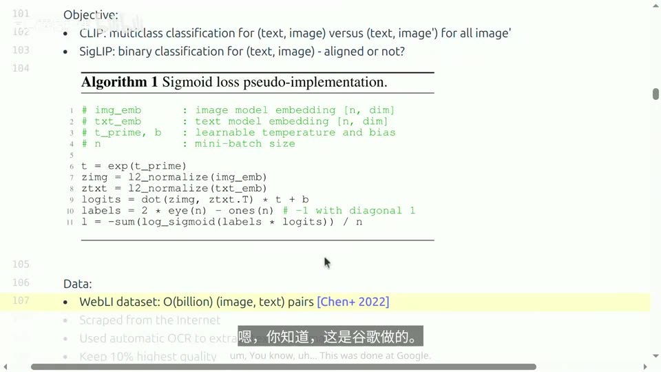 |
| 这篇论文的核心观点是其训练效率远高于 CLIP。CLIP 是在 256 个 TPU 上训练了十天，而 SigLIP 仅用了 32 块 V100 显卡训练了五天。单看每秒浮点运算次数，他们其实并不更快，优势在于你可以在一个 pod 中部署更多设备，且互联性能更好。但在这个规模下，实际情况是效果非常显著。 [【跳转到 16:57】](https://www.bilibili.com/video/BV11LEA6eEuj/?p=17&t=1017) | 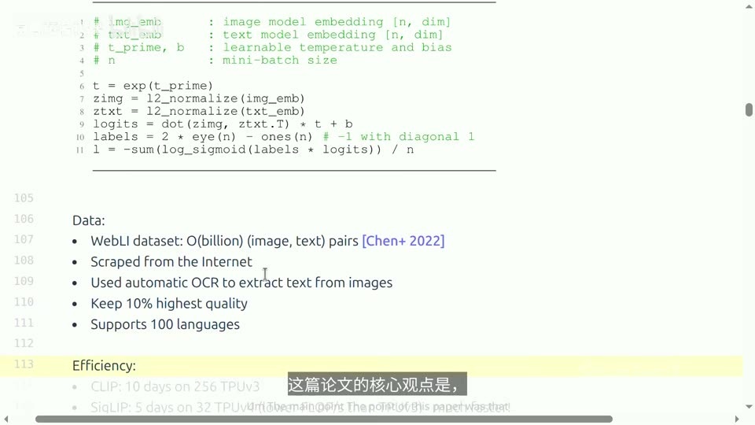 |
| 你知道并没有更快，实际上速度慢了大约 60%。所以这种方式之所以更快——我认为 CLIP 可能并未针对最大吞吐量优化代码，当时只是想先把模型跑通——不过 SigLIP 论文展示了我们可以这样进行并行化。所以大家可以回想一下之前的系统课。 [【跳转到 17:22】](https://www.bilibili.com/video/BV11LEA6eEuj/?p=17&t=1042) | 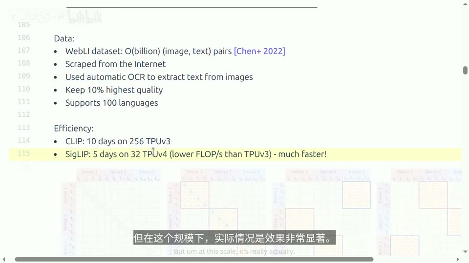 |
| 把它看作……也就是 DDP：每个设备各自存储一部分图像-文本对。不过这里样本之间存在交互，不像语言模型训练那样各项完全独立。所以在第一轮中，每个设备只计算它手头那些图像-文本对的损失。接着输入文本，这样设备一就能拿到 T5 到 T8。 [【跳转到 17:39】](https://www.bilibili.com/video/BV11LEA6eEuj/?p=17&t=1059) |  |
| 并据此计算这里的负样本，接着获取 T9 到 T12，以此类推，不断轮换，直到覆盖所有非对角线块中的条目。好，SigLIP 的一个优势在于，它有效地将批量大小与损失解耦了。 [【跳转到 18:04】](https://www.bilibili.com/video/BV11LEA6eEuj/?p=17&t=1084) | 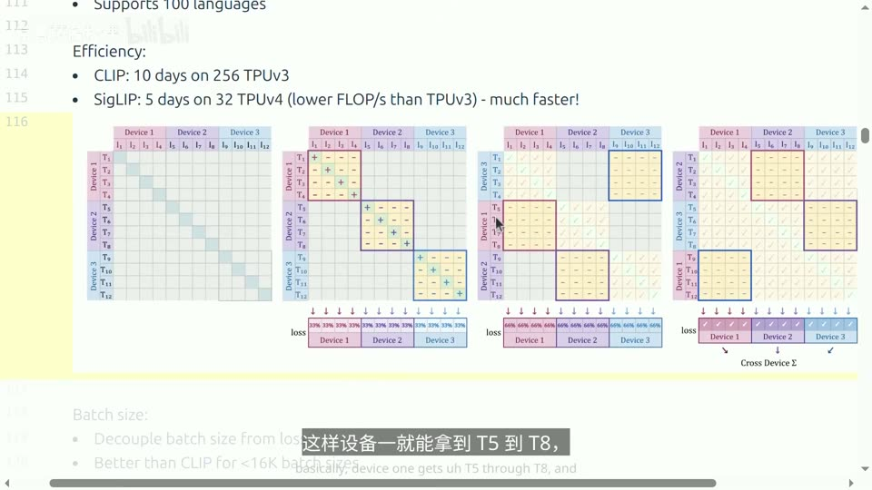 |
| 相比之下，在 CLIP 中损失是依赖于批量大小的。 [【跳转到 18:20】](https://www.bilibili.com/video/BV11LEA6eEuj/?p=17&t=1100) | 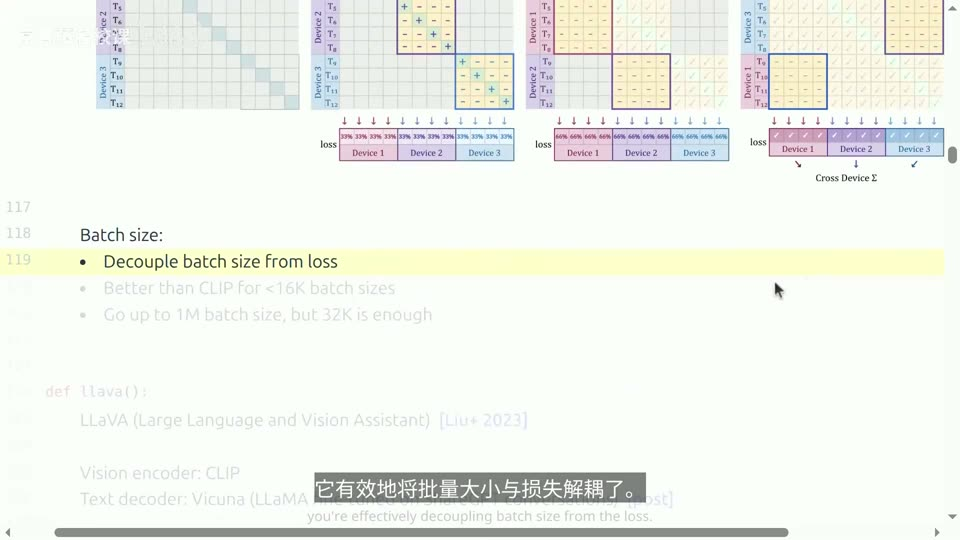 |
| 如果你改变了批量大小，损失函数也就变了。所以他们得以用更小的批量大小做实验。 [【跳转到 18:25】](https://www.bilibili.com/video/BV11LEA6eEuj/?p=17&t=1105) | 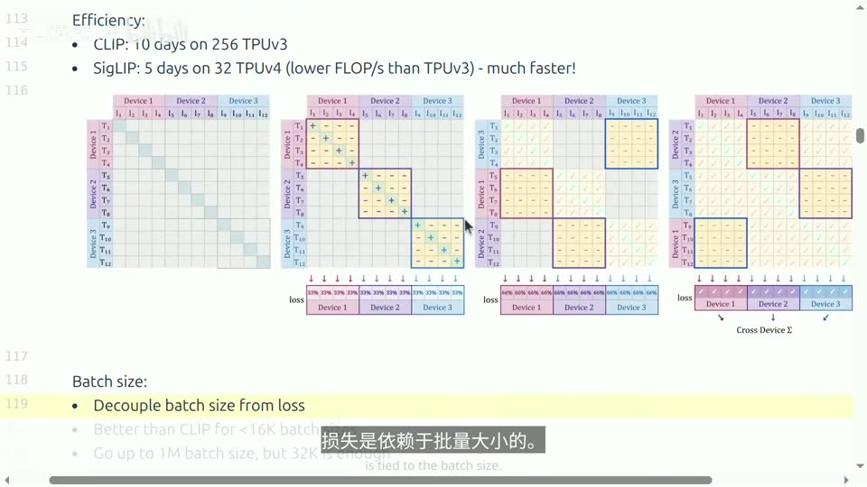 |
| 比如小于 16K，在这种设置下它的表现远优于 CLIP。 [【跳转到 18:30】](https://www.bilibili.com/video/BV11LEA6eEuj/?p=17&t=1110) | 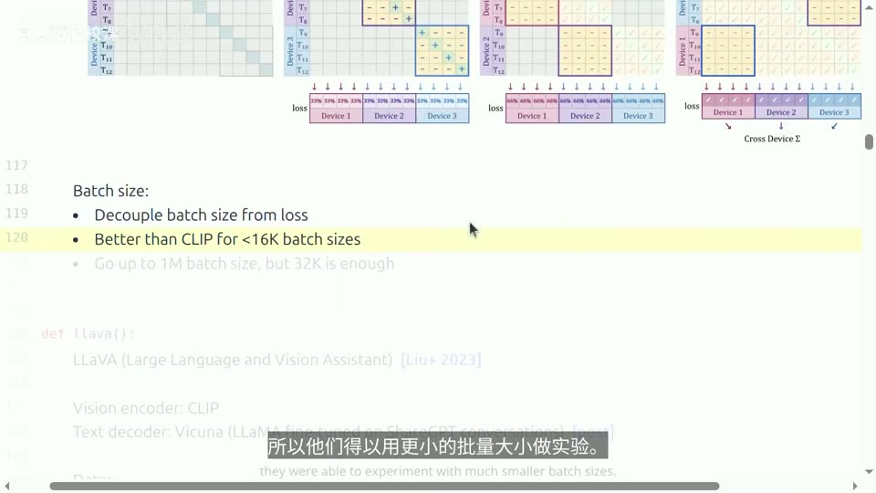 |
| 因为在 CLIP 中，如果批量大小过小，损失函数就会退化；而对于 SigLIP，即使批量较小会导致方差较大，但其期望值与标准损失是一致的。他们还提到。 [【跳转到 18:35】](https://www.bilibili.com/video/BV11LEA6eEuj/?p=17&t=1115) | 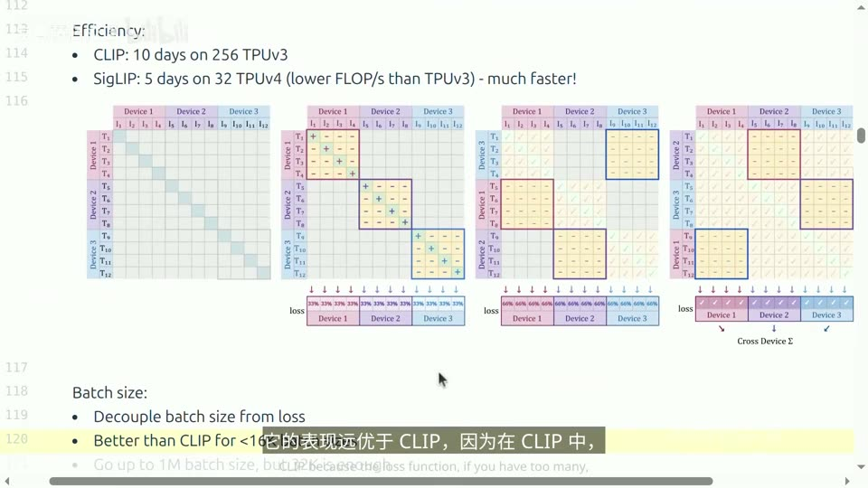 |
| 虽然可以使用更大的批量大小，但这其实并没有带来实质性的帮助。好，接下来我们看看 CLIP 和 SigLIP。这些是图像编码器，负责接收图像，在这个版本中是固定尺寸，例如 336×336 的图像，并将其映射为向量。这个向量里包含了一些语义信息。好，接下来我们开始构建视觉语言模型。 [【跳转到 18:48】](https://www.bilibili.com/video/BV11LEA6eEuj/?p=17&t=1128) | 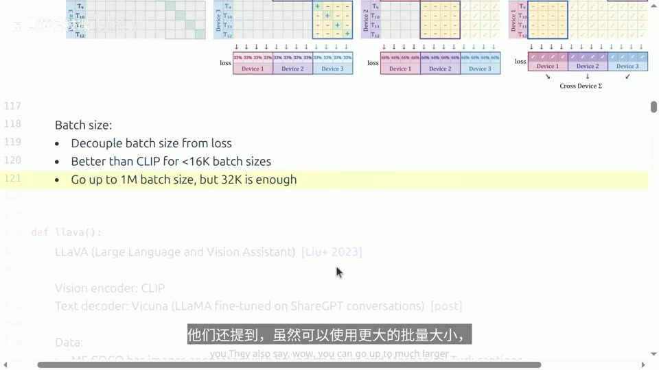 |
| 也就是 VLM。我要介绍两类模型：LLaVA 和 Qwen。这两类模型在整体架构模板上非常相似，具体细节上会有些不同，我们稍后展开。其基本思路是将这些嵌入向量注入到语言模型中，而不是从零开始训练。好的，LLaVA 论文发表于 2023 年，这让大家很兴奋，因为那时候像 GPT 这样的闭源模型。 [【跳转到 19:13】](https://www.bilibili.com/video/BV11LEA6eEuj/?p=17&t=1153) | 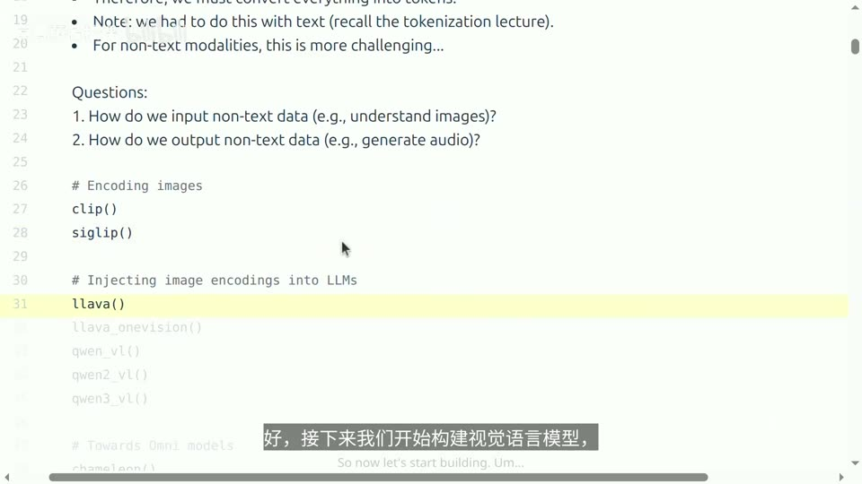 |
| 我觉得是 GPT-4 已经能做视觉推理了，而且他们展示了自己确实能做视觉推理，当然效果不如 GPT-4，但这是个开源模型，大家得以看到它的内部运作机制，所以它展示了多模态能力的提升。本质上它主要分几块：一个是视觉编码器，他们用的是 CLIP；文本解码器部分，他们用了一个叫 Vicuna 的语言模型。 [【跳转到 19:38】](https://www.bilibili.com/video/BV11LEA6eEuj/?p=17&t=1178) | 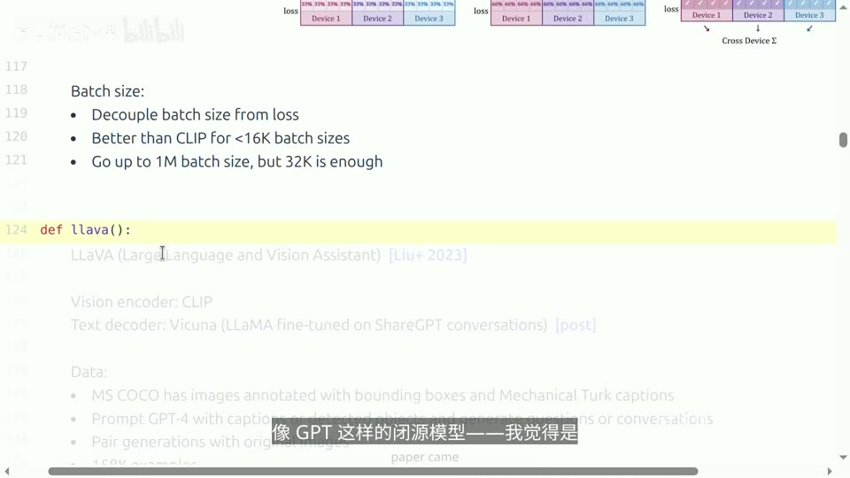 |
| 这是首个在共享 GPT 对话数据上微调过的 LLaMA 模型。本质上它主要由几个部分构成：首先是视觉编码器，他们使用的是 CLIP；对于文本解码器，他们采用了一个名为 Vicuna 的语言模型，这是首个在共享 GPT 对话数据上进行微调的 LM 模型。 [【跳转到 20:03】](https://www.bilibili.com/video/BV11LEA6eEuj/?p=17&t=1203) | 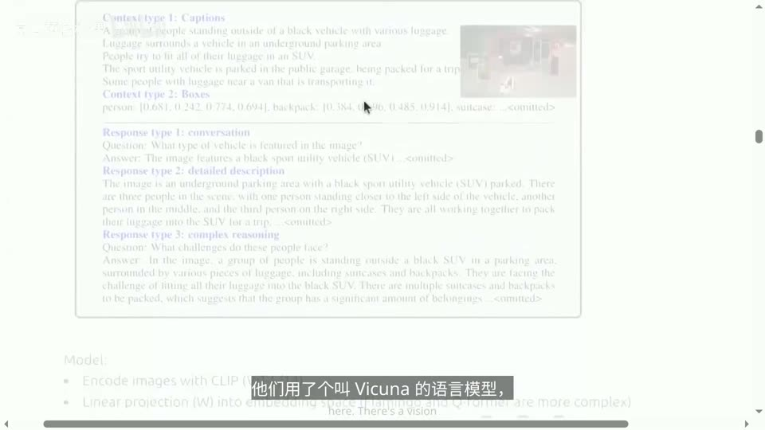 |
| 数据集是 MS COCO，这是一个经过标注的数据集，研究人员雇佣了 Mechanical Turk 上的工人对大量图像进行标注，包括边界框以及描述图像内容的标题。他们基本上为模型合成了一套数据集，因此他们将标题或检测到的物体作为 prompt 输入给 GPT-4，并要求 GPT-4 生成问题或对话。 [【跳转到 20:28】](https://www.bilibili.com/video/BV11LEA6eEuj/?p=17&t=1228) | 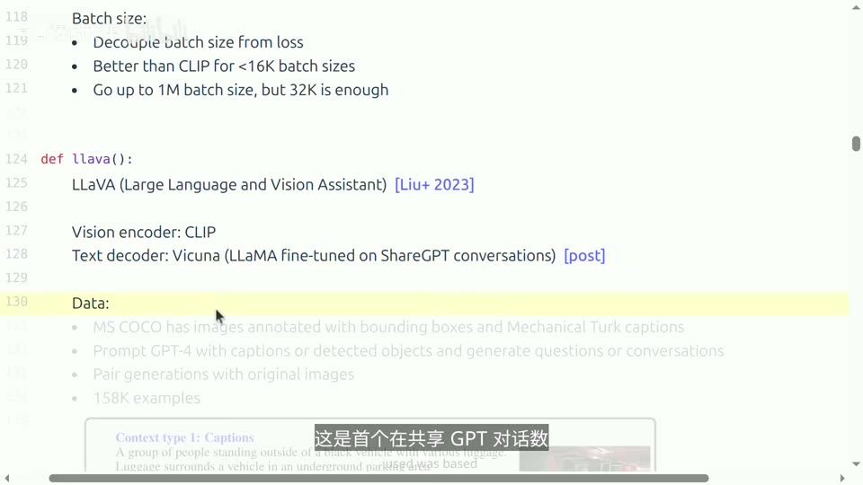 |
| 例如这是 MS COCO 数据集中的一张图像，这是由人工标注的标题。 [【跳转到 20:53】](https://www.bilibili.com/video/BV11LEA6eEuj/?p=17&t=1253) | 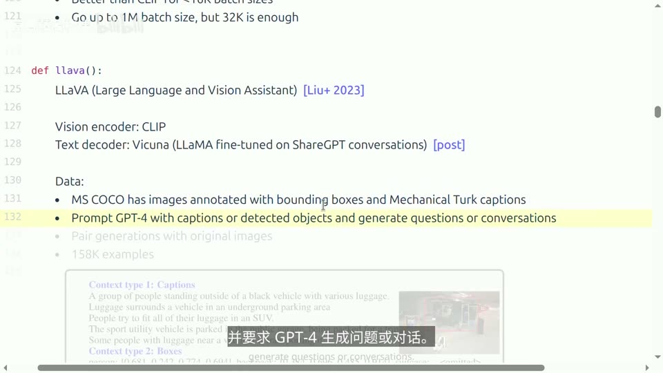 |
| 此外这里也是有人工标注的，然后你让 GPT-4 生成一段对话，你可能会得到一个问题及其对应的答案。你可以向 GPT-4 提问让它生成一段详细描述，它大概会生成类似 caption 的内容；然后你可以让 GPT-4 做复杂推理，它也能搞定。好，这是合成数据，共 15 万 8000 个样本。呃，然后他们拿这些数据训练了一个模型。 [【跳转到 20:58】](https://www.bilibili.com/video/BV11LEA6eEuj/?p=17&t=1258) | 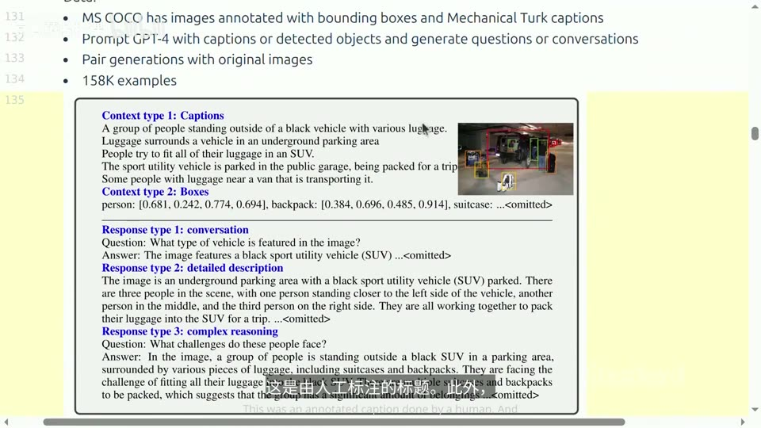 |
| 所以这个模型用的是 CLIP，具体来说是表现最好的那个版本。 [【跳转到 21:23】](https://www.bilibili.com/video/BV11LEA6eEuj/?p=17&t=1283) | 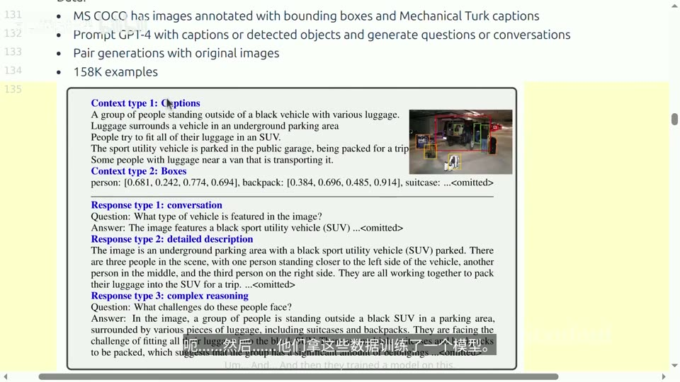 |
| 也就是 ViT-L/14，14×14 的 patch。咱们直接看这张图：把图像输入视觉编码器 CLIP 就能得到一个向量；对于文本，直接用标准的嵌入生成向量即可。 [【跳转到 21:28】](https://www.bilibili.com/video/BV11LEA6eEuj/?p=17&t=1288) | 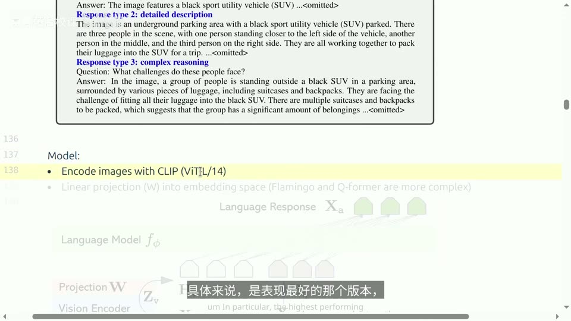 |
| 简单来说，文本和图像都被编码成向量，然后这一串向量序列直接送入标准的 Transformer，然后输出结果。从某种意义上说，我们把这些图像转换成了文本 token，因此我们可以利用预训练的语言模型。为了训练这个模型，他们分两个阶段进行。第一阶段，冻结视觉编码器和语言模型。 [【跳转到 21:53】](https://www.bilibili.com/video/BV11LEA6eEuj/?p=17&t=1313) | 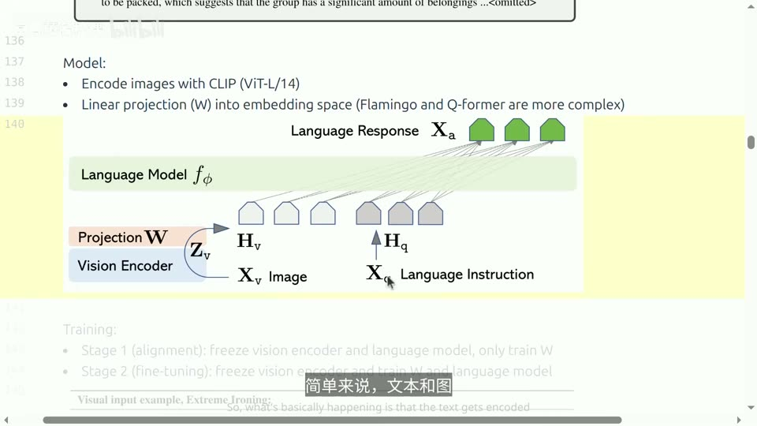 |
| 只训练这个矩阵 W，他们称之为对齐阶段。本质上就是确保图像被映射到大致相同的空间。如果直接使用随机的 W，这些图像根本无法生成，也就是说它们的输出肯定不是能表示自然语言 token 的嵌入向量。因此训练 W 的目的就是让它的输出尽可能接近自然语言 token 的嵌入向量。第二阶段则是冻结视觉编码器。 [【跳转到 22:18】](https://www.bilibili.com/video/BV11LEA6eEuj/?p=17&t=1338) | 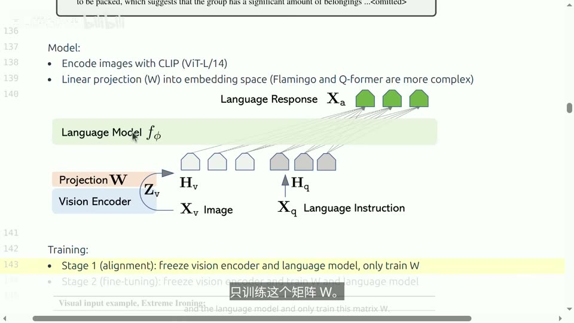 |
| 随后训练 W 和语言模型，也就是说他们是在用自己的数据对语言模型进行微调。 [【跳转到 22:43】](https://www.bilibili.com/video/BV11LEA6eEuj/?p=17&t=1363) | 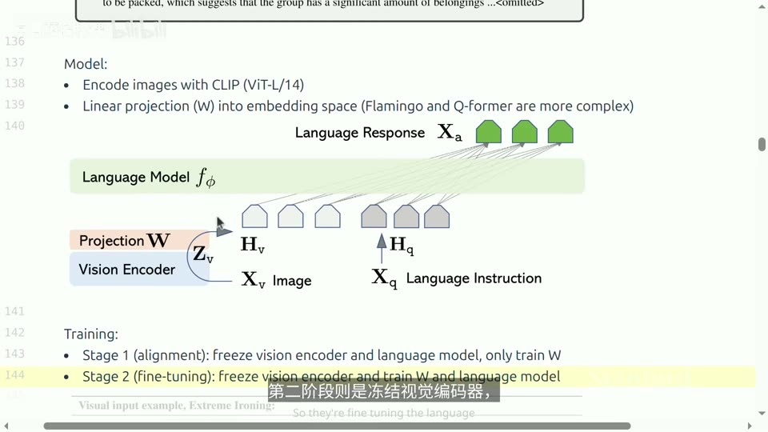 |
| 大家还记得吧，他们的数据主要是图像，并配有对话描述或复杂的推理示例。 [【跳转到 22:48】](https://www.bilibili.com/video/BV11LEA6eEuj/?p=17&t=1368) | 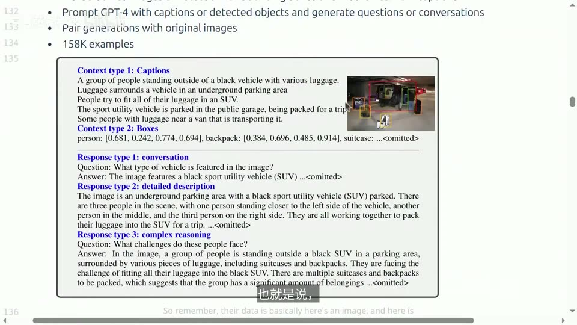 |
| 因此这完全属于图像加文本到文本的任务。 [【跳转到 22:54】](https://www.bilibili.com/video/BV11LEA6eEuj/?p=17&t=1374) | 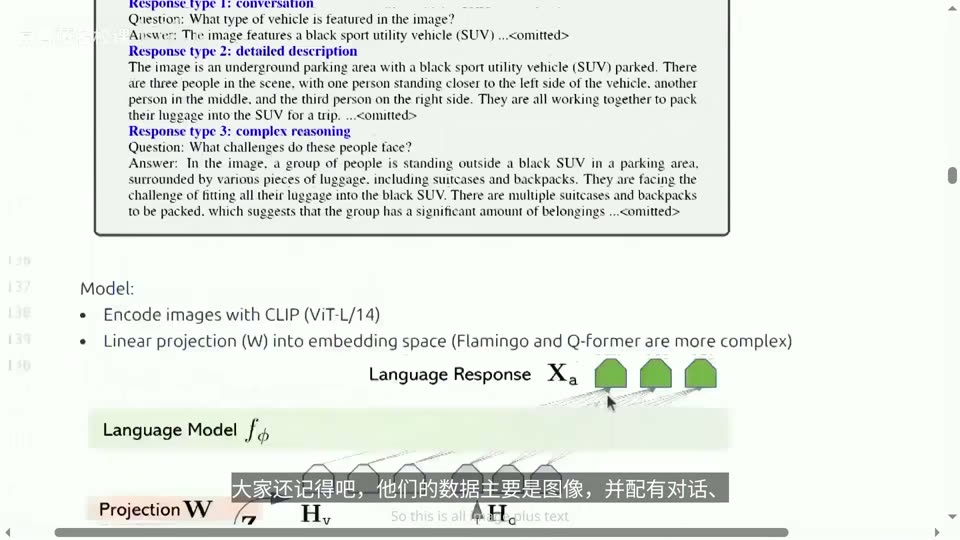 |
| 这是他们论文中的一个例子，很有意思。他们还特别指出，即便用户的提示词不够清晰。 [【跳转到 22:59】](https://www.bilibili.com/video/BV11LEA6eEuj/?p=17&t=1379) | 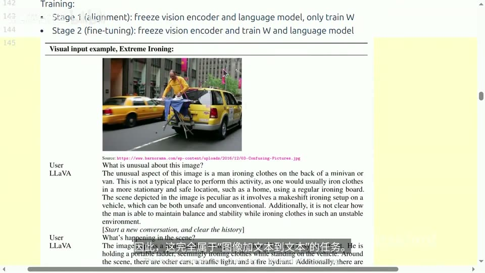 |
| 该模型也能表现出色，即使你没有直接问哪里出了问题，他也能给出合理的解释。GPT-4 显然能做到这一点，但当时的其他模型却不行。关于 LLaVA 还有问题吗？ [【跳转到 23:04】](https://www.bilibili.com/video/BV11LEA6eEuj/?p=17&t=1384) | 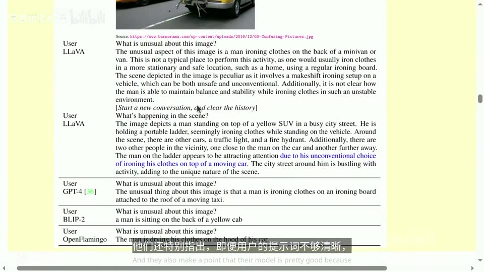 |
| 好，那我们先回到 2023 年。接下来我们直接看 2024 年的 LLaVA-OneVision。LLaVA 论文发表后又涌现出许多后续工作，比如 LLaVA-1.5、LLaVA-NeXT 等。不过我认为我接下来要讲的内容基本涵盖了这些创新，其核心思路并未改变，仍沿用那套技术架构，但他们旨在拓展更多种类的多模态应用，因此该系统现在能够处理多张图片及视频。 [【跳转到 23:17】](https://www.bilibili.com/video/BV11LEA6eEuj/?p=17&t=1397) | 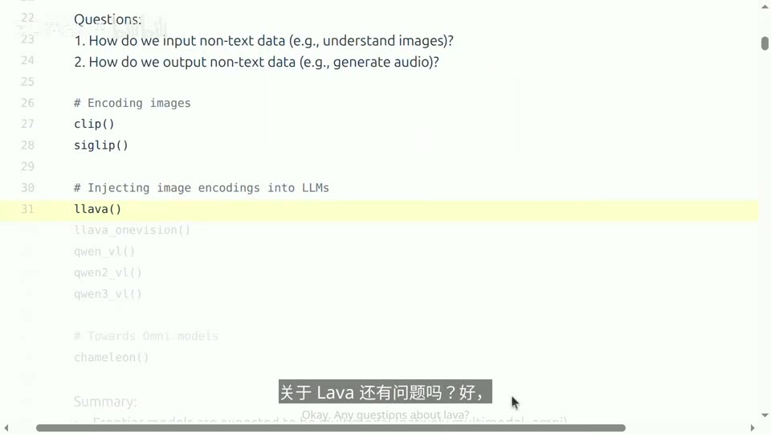 |
| 我们来看下面的例子，请看这张示意图。 [【跳转到 23:42】](https://www.bilibili.com/video/BV11LEA6eEuj/?p=17&t=1422) | 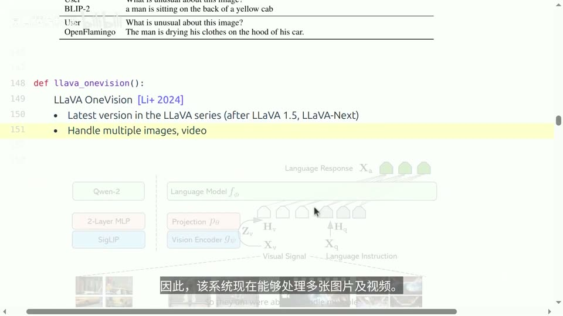 |
| 系统现已支持图像输入，例如单张图片输入，也可以是多张图片，或者是视频，而视频本质上就是一系列连续的图像帧，这对应于对视频帧进行采样。在此视觉编码器被替换为 SigLIP，在文本解码器方面他们采用了 Qwen2，这大概是当时性能最强的语言模型了。 [【跳转到 23:47】](https://www.bilibili.com/video/BV11LEA6eEuj/?p=17&t=1427) | 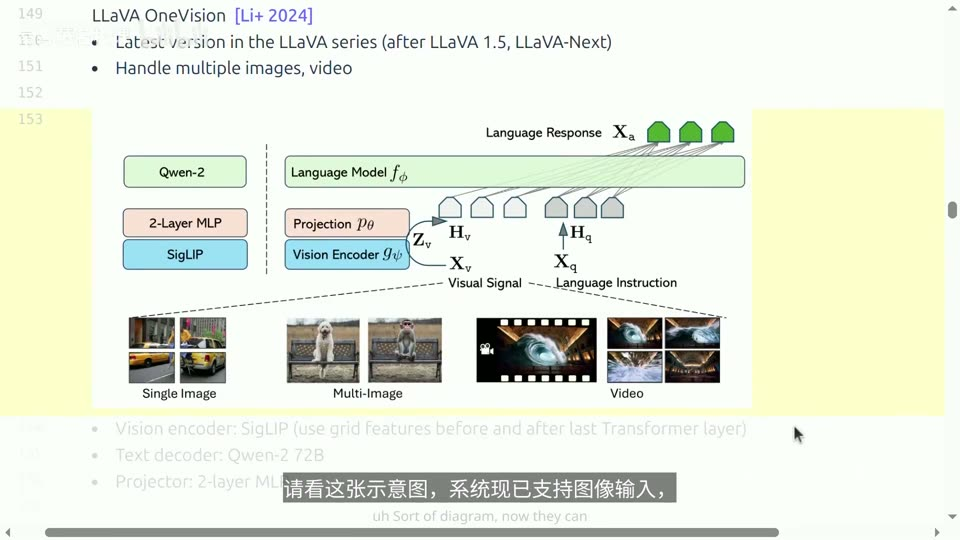 |
| 接着是投影器，也就是适配器，负责将视觉编码器的输出转换为语言模型的输入。 [【跳转到 24:07】](https://www.bilibili.com/video/BV11LEA6eEuj/?p=17&t=1447) | 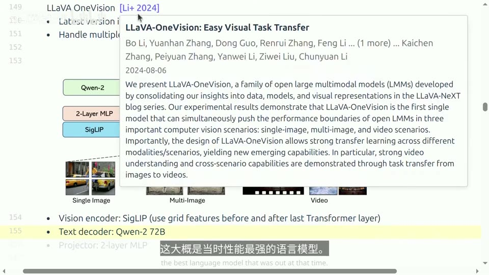 |
| 这里使用了一个两层的 MLP（多层感知机）而非简单的线性投影。综上所述，这些细微改动就好比你升级了系统内部的组件，但整体架构仍保持大致相同。好了。 [【跳转到 24:12】](https://www.bilibili.com/video/BV11LEA6eEuj/?p=17&t=1452) | 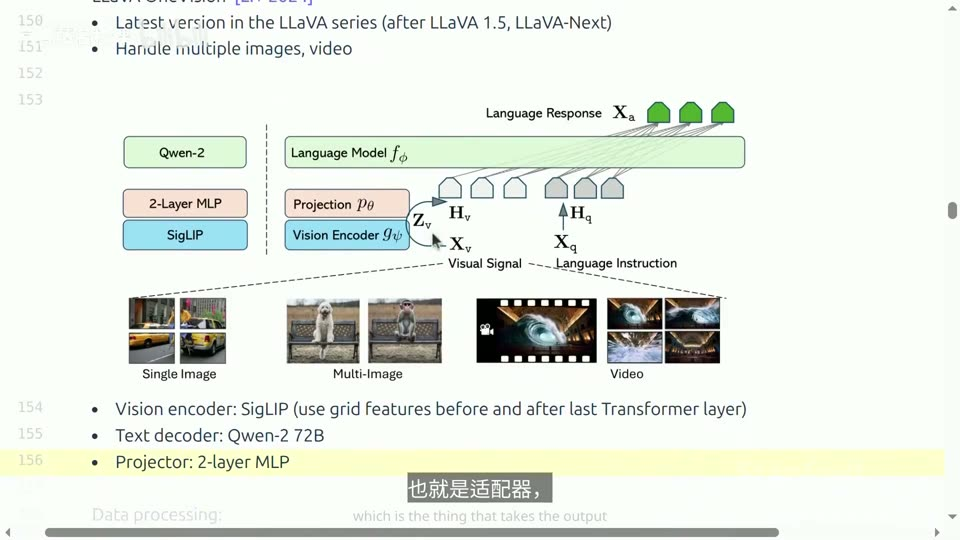 |
| 嗯，OCR 的关键在于保留细粒度的信息，不然的话 J 看着就像 I，这就麻烦了。大家记得 CLIP 会把图缩放到 336×336，你看这是一份文档，要是直接裁成 336×336…… [【跳转到 24:29】](https://www.bilibili.com/video/BV11LEA6eEuj/?p=17&t=1469) | 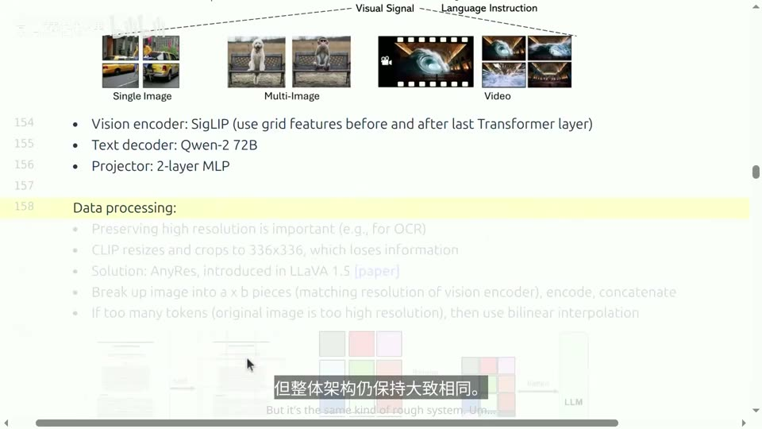 |
| 你就没法读了。这其实是 LLaVA-1.5 论文里提过的。 [【跳转到 24:54】](https://www.bilibili.com/video/BV11LEA6eEuj/?p=17&t=1494) | 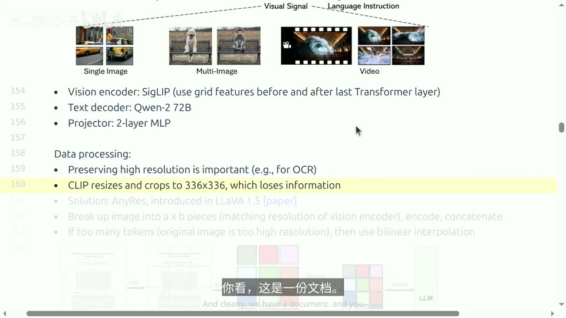 |
| 这个思路其实挺简单的，我是说很直接。你把一张图拆成好几块，简单来说，每一块的大小就是视觉编码器要处理的那个分辨率，比如 336×336，所以咱们要把所有这些块都编码成向量，然后把它们拼在一起。说白了，这就是为了解决视觉编码器搞不定高分辨率的问题。所以咱们不直接做下采样，而是直接裁剪图像去观察不同的局部区域。 [【跳转到 25:02】](https://www.bilibili.com/video/BV11LEA6eEuj/?p=17&t=1502) | 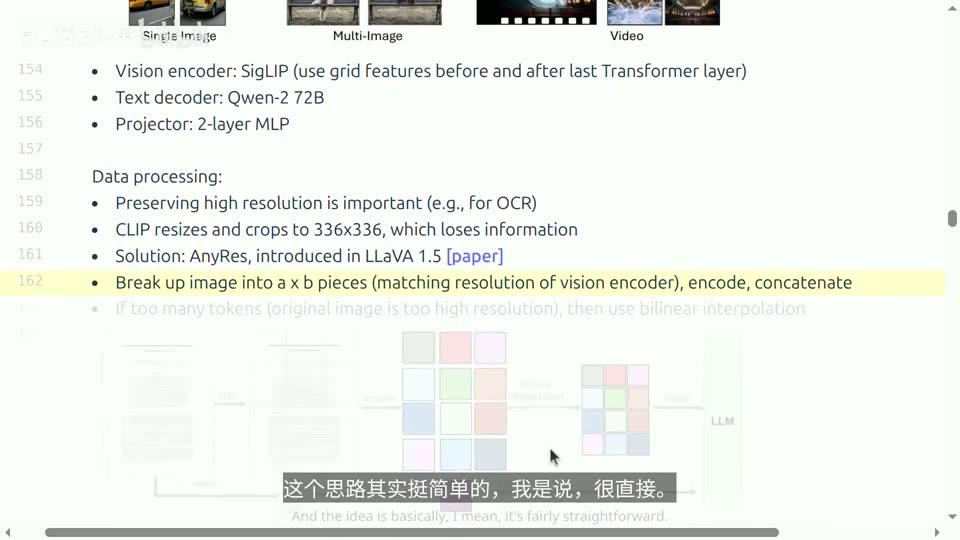 |
| 如果输入的是超高分辨率的图片或视频，生成的 token 数量会非常多，因此需要对这些 token 进行下采样处理。不过无论采用哪种分辨率调整方法，核心思路都是自适应，这一点非常关键。这很好，因为 Transformer 本身就具备这种灵活性，无论序列长度如何，Transformer 都能很好地处理。这意味着图像也能支持任意分辨率，再次体现了这种动态适应能力。 [【跳转到 25:27】](https://www.bilibili.com/video/BV11LEA6eEuj/?p=17&t=1527) | 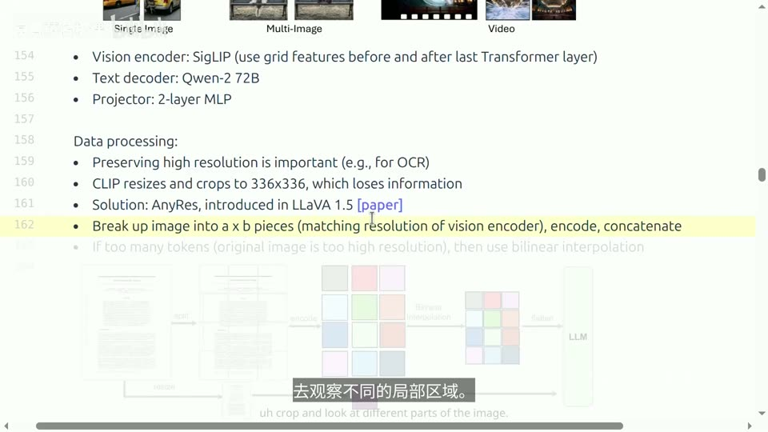 |
| 这就是他们在处理图像时实际采用的方法。假设你有一张论文截图，系统会先对其进行下采样，同时保留一条路径——这本质上是对整篇论文进行下采样后的编码；接着将其分割成若干块，每块的分辨率都符合视觉编码器的要求，然后分别对每个块进行编码，随后将所有图像块拼接起来。 [【跳转到 25:51】](https://www.bilibili.com/video/BV11LEA6eEuj/?p=17&t=1551) |  |
| 如果数量过多，则通过插值方法减少图像块的数量。这样一来，他们就能处理单张图像、多张图像以及视频了。你可以这样理解：虽然从技术上讲，所有这些都可以还原为图像，但他们还是稍微调整了权重，因为视频数据有其特殊性，他们希望确保所有模态之间大致具有可比性。 [【跳转到 26:16】](https://www.bilibili.com/video/BV11LEA6eEuj/?p=17&t=1576) | 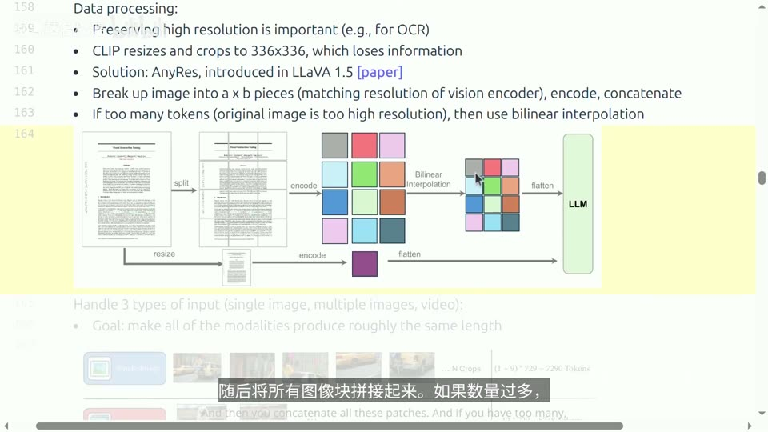 |
| 但系统还是对它们进行了权重调整，因为视频数据量巨大，目的是确保不同模态之间的数据大致具备可比性。好，如果有多张图片。 [【跳转到 26:41】](https://www.bilibili.com/video/BV11LEA6eEuj/?p=17&t=1601) | 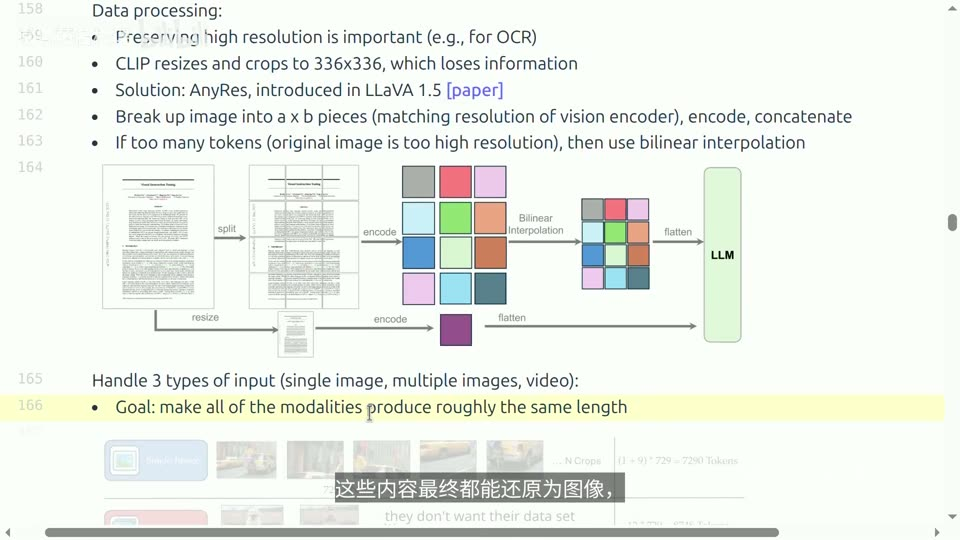 |
| 就直接用基础分辨率处理。也就是说，只有一张图时我能看得更细致，图多了就只能粗略浏览。处理视频时，我们会用更低的分辨率或更少的 token 来表示每一帧，毕竟视频数据量很大，需要节省计算资源。他们最多只取 32 帧，但这样做会面临上下文长度限制的问题。 [【跳转到 26:46】](https://www.bilibili.com/video/BV11LEA6eEuj/?p=17&t=1606) | 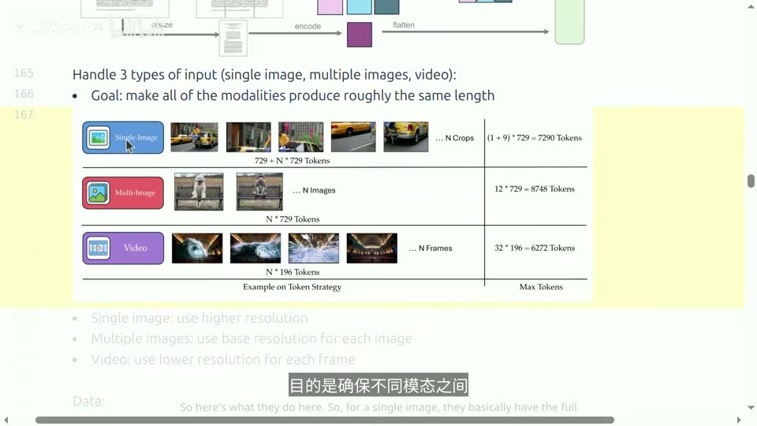 |
| 稍后我们会看到，解决多模态问题的关键之一就在于如何处理长上下文。好，那么关于这组数据。 [【跳转到 27:11】](https://www.bilibili.com/video/BV11LEA6eEuj/?p=17&t=1631) | 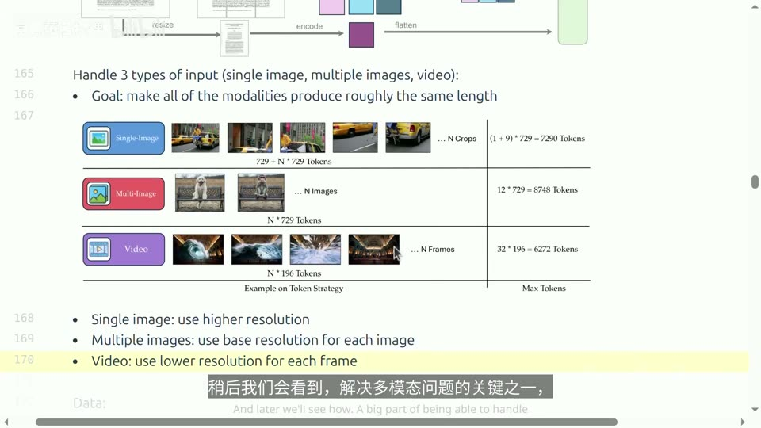 |
| 我认为他们阐述的核心理念是既要保证数据的高质量。 [【跳转到 27:19】](https://www.bilibili.com/video/BV11LEA6eEuj/?p=17&t=1639) | 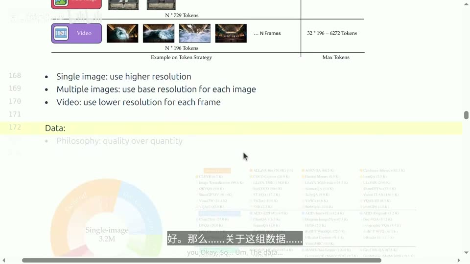 |
| 也要保证数据的数量。换一个角度说，这些数据具有极强的针对性，你会发现他们大多是为特定任务定制的，比如视觉问答，或是回答关于表格的问题。因此这显然属于后训练阶段，其目标是让模型更好地对齐人的意图。为了让模型执行这些任务，你会专门构建一批对应的任务数据，这项工作也毫不掩饰其目的。 [【跳转到 27:24】](https://www.bilibili.com/video/BV11LEA6eEuj/?p=17&t=1644) | 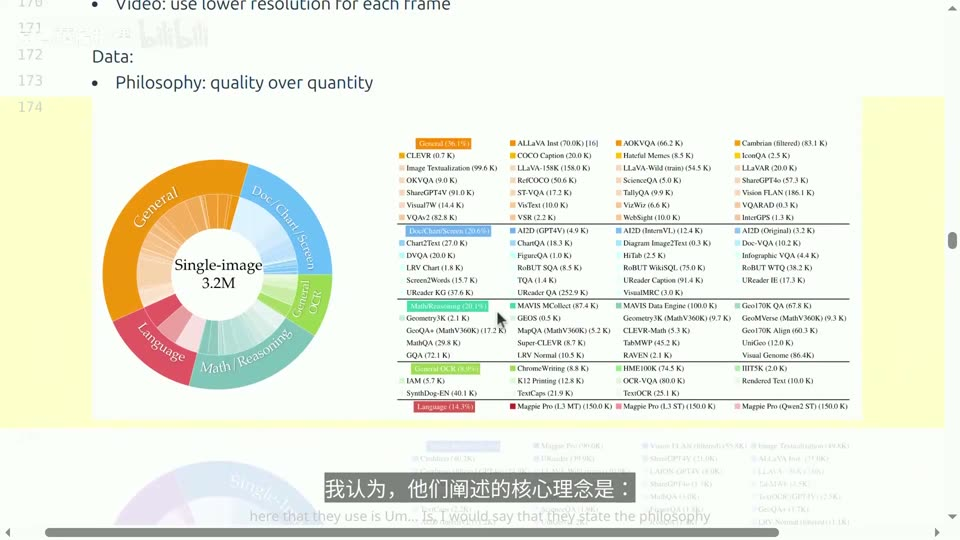 |
| 本质上这是在蒸馏 GPT-4 模型以获取最佳性能，虽然这或许并非最理想的做法。 [【跳转到 27:49】](https://www.bilibili.com/video/BV11LEA6eEuj/?p=17&t=1669) | 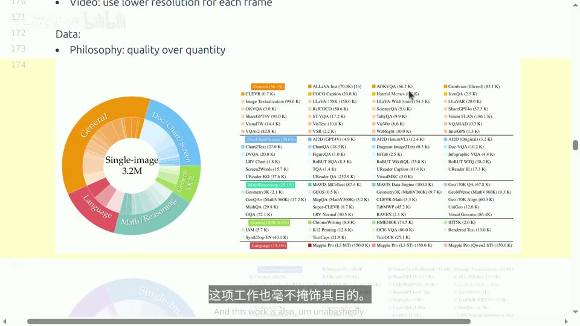 |
| 但现实如此，如果没有标注预算，你只能这么做。此外他们使用的数据涵盖单张图片、多张图片以及视频。 [【跳转到 27:57】](https://www.bilibili.com/video/BV11LEA6eEuj/?p=17&t=1677) | 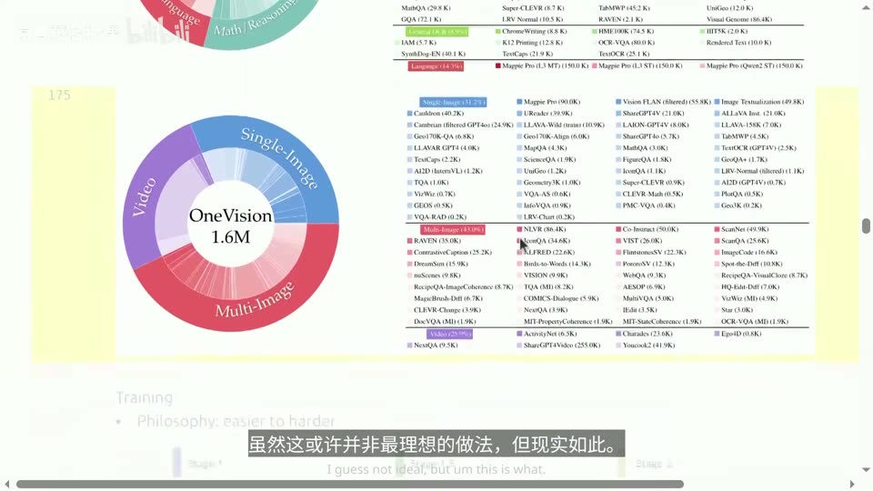 |
| 训练思路与之前类似。 [【跳转到 28:10】](https://www.bilibili.com/video/BV11LEA6eEuj/?p=17&t=1690) | 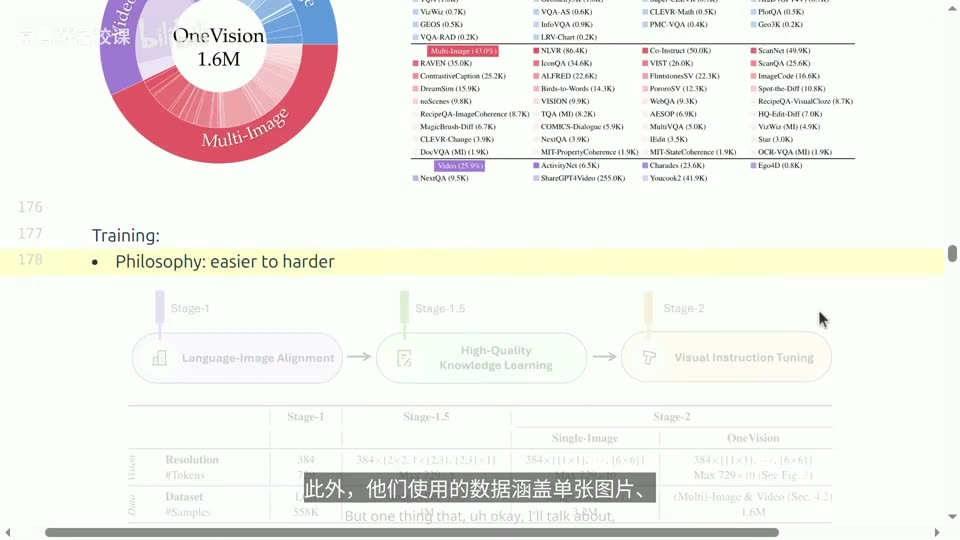 |
| 第一阶段主要进行对齐，具体来说你只训练投影器，也就是那个适配器；接着进行第二阶段训练；第三阶段则训练整个模型。以前是两个阶段，现在变成了三个。我不确定这背后有什么特别的原则，除了第二阶段似乎是想进一步提升模型的推理能力，使用高质量数据但更侧重知识，最后阶段则侧重那些类似下游任务的示例。 [【跳转到 28:15】](https://www.bilibili.com/video/BV11LEA6eEuj/?p=17&t=1695) |  |
| 好，这篇论文里发现了一个挺有意思的现象，就是不同模态之间可以迁移。 [【跳转到 28:40】](https://www.bilibili.com/video/BV11LEA6eEuj/?p=17&t=1720) | 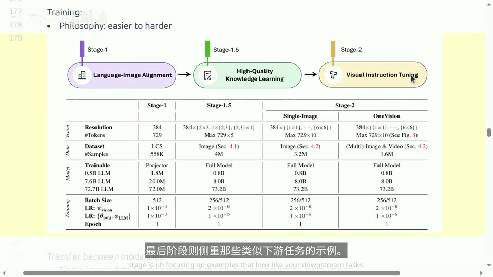 |
| 你会问他一些问题，但在测试时，你会看到一张图里既有表格也有图表，然后就能跟他聊聊天。训练的时候你只用单张图上的 OCR 数据。 [【跳转到 28:54】](https://www.bilibili.com/video/BV11LEA6eEuj/?p=17&t=1734) | 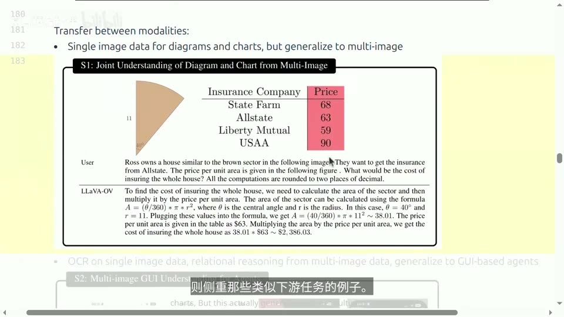 |
| 而且只在多张图之间做关系推理。 [【跳转到 29:07】](https://www.bilibili.com/video/BV11LEA6eEuj/?p=17&t=1747) | 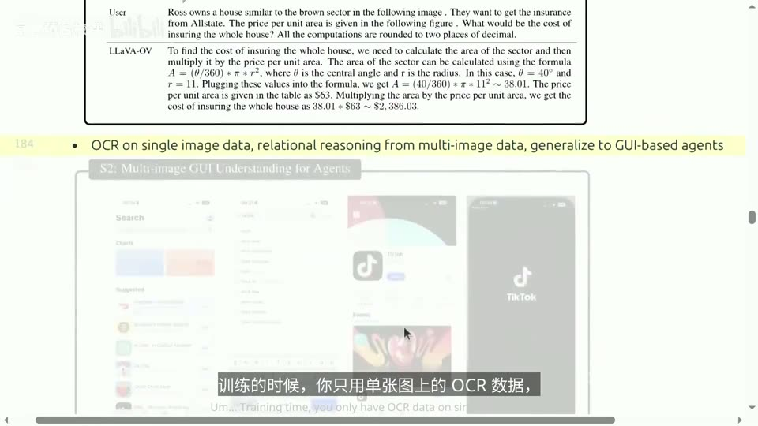 |
| 但这能帮你搞定那些很有用的情况，比如用来驱动 GUI agent：给他看一堆截图。 [【跳转到 29:13】](https://www.bilibili.com/video/BV11LEA6eEuj/?p=17&t=1753) | 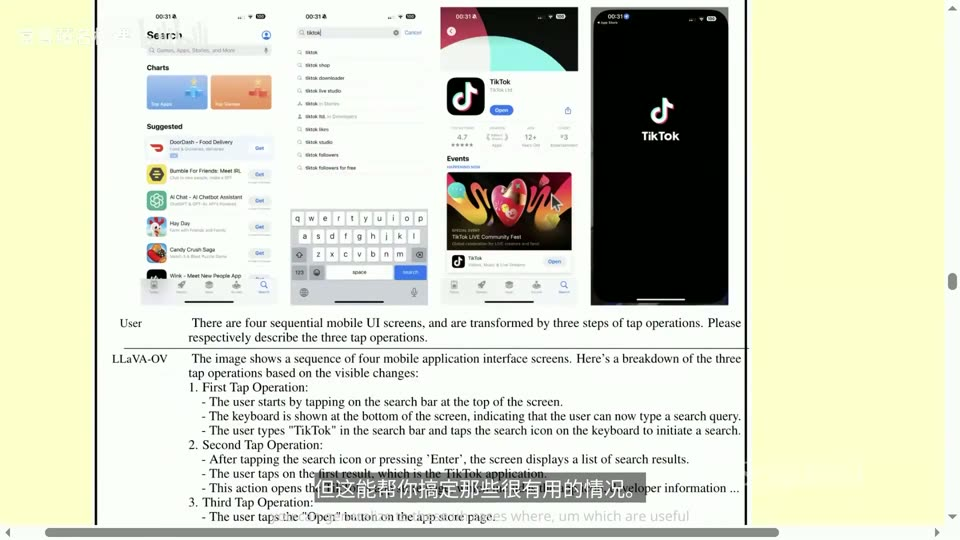 |
| 也就是多张图，它就能生成描述这些截图的文字。再举个例子。 [【跳转到 29:18】](https://www.bilibili.com/video/BV11LEA6eEuj/?p=17&t=1758) | 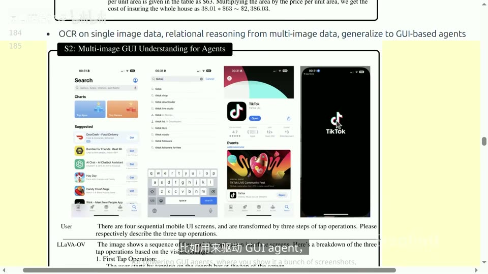 |
| 有个叫视觉提示（visual prompting）的想法，就是图里有个圆圈，这个圆圈是图的一部分。 [【跳转到 29:23】](https://www.bilibili.com/video/BV11LEA6eEuj/?p=17&t=1763) | 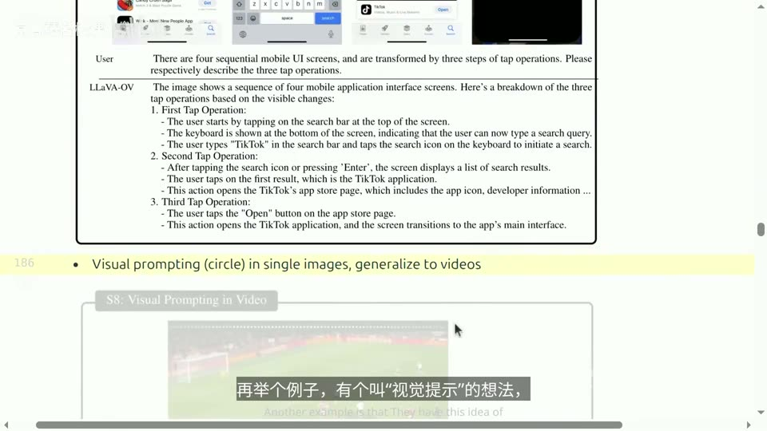 |
| 它的作用是标出你需要对它做点什么的那块区域。再举个例子。 [【跳转到 29:28】](https://www.bilibili.com/video/BV11LEA6eEuj/?p=17&t=1768) | 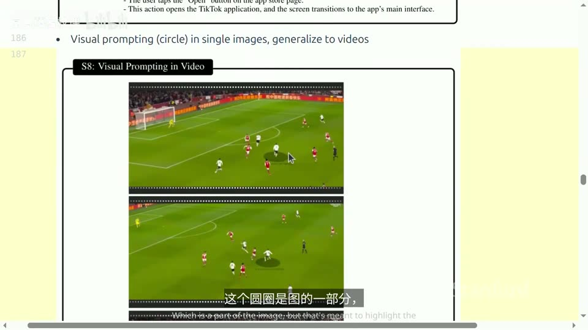 |
| 有一种叫视觉提示的方法，就是在图中画一个圆圈，这个圆圈是图像的一部分，它的作用是标出你需要对其执行操作的那块区域。 [【跳转到 29:36】](https://www.bilibili.com/video/BV11LEA6eEuj/?p=17&t=1776) | 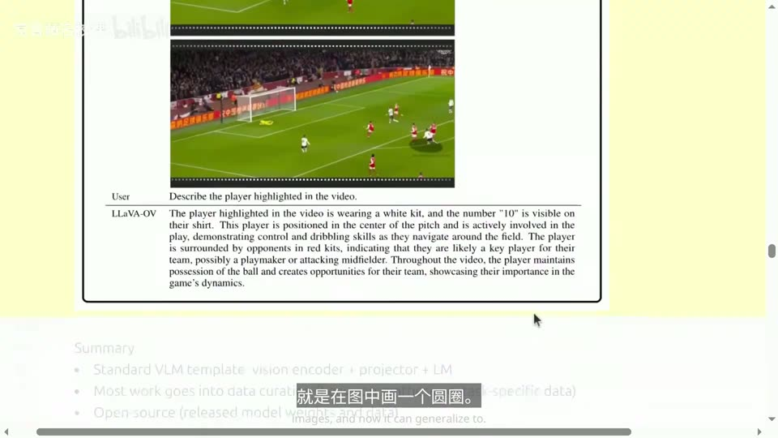 |
| 所以我第一次看到这心想，唉哟，你这是在针对每一个任务下手。 [【跳转到 29:41】](https://www.bilibili.com/video/BV11LEA6eEuj/?p=17&t=1781) | 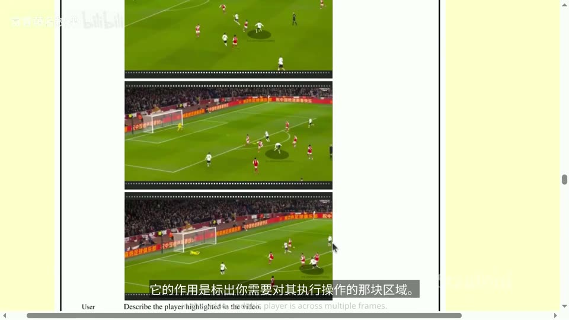 |
| 这有点像监督学习，不过如果你有足够多的任务，这些模型似乎能实现某种迁移。啊，这算是个让人安心的消息。好。 [【跳转到 29:46】](https://www.bilibili.com/video/BV11LEA6eEuj/?p=17&t=1786) | 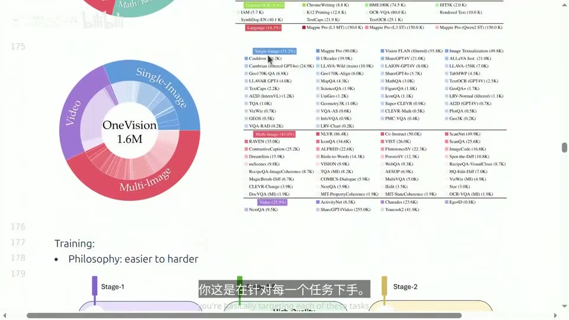 |
| 所以再说一次，这是一个相当标准的 VLM 架构：视觉编码器加上投影层。 [【跳转到 29:55】](https://www.bilibili.com/video/BV11LEA6eEuj/?p=17&t=1795) | 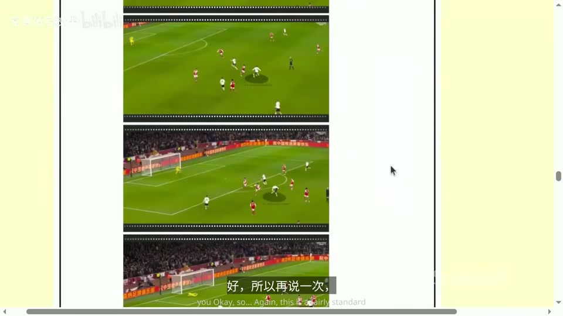 |
| 再接入语言模型。数据策展工作投入了大量精力，他们很大程度上依赖于合成的特定任务数据。LLaVA 系列的一个优势在于，它是少数几个能做到这一点的模型之一。好，接下来咱们聊聊 Qwen 模型。所以 Qwen 也是从 2023 年开始训练多模态模型的。 [【跳转到 30:00】](https://www.bilibili.com/video/BV11LEA6eEuj/?p=17&t=1800) | 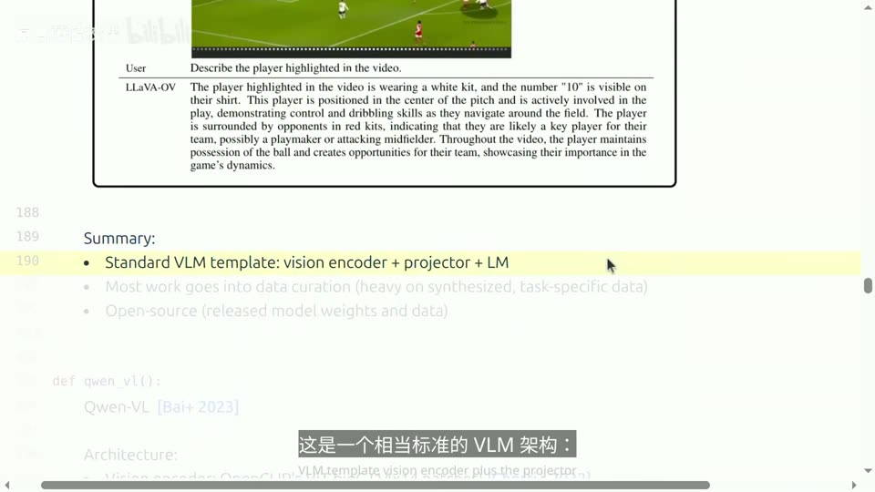 |
| 首个版本是 Qwen-VL。Qwen 从 2023 年开始训练多模态模型。视觉编码器方面，他们用了 OpenCLIP，记得吧，OpenCLIP 就是 CLIP 模型的开源复现版，所以它本质上就是个 CLIP 编码器。至于适配器…… [【跳转到 30:16】](https://www.bilibili.com/video/BV11LEA6eEuj/?p=17&t=1816) |  |
| 他们通过一层交叉注意力机制，结合 2D 位置嵌入，将视觉特征映射到固定大小。 [【跳转到 30:41】](https://www.bilibili.com/video/BV11LEA6eEuj/?p=17&t=1841) | 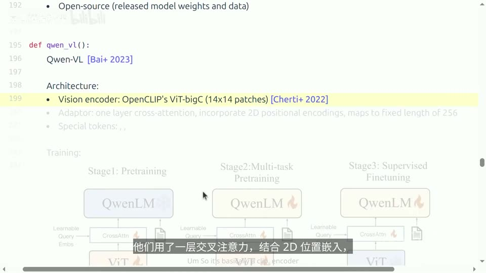 |
| 固定尺寸比如 256。这部分可能被略过了，但特殊 token 包含了图像标签、边界框标签（box tag）以及参考标签（ref tag）。这就是幻灯片导出为 HTML 格式时的效果。训练分为三个阶段，这与 LLaVA 模型的做法类似，第一阶段也就是他们所谓的预训练。 [【跳转到 31:06】](https://www.bilibili.com/video/BV11LEA6eEuj/?p=17&t=1866) | 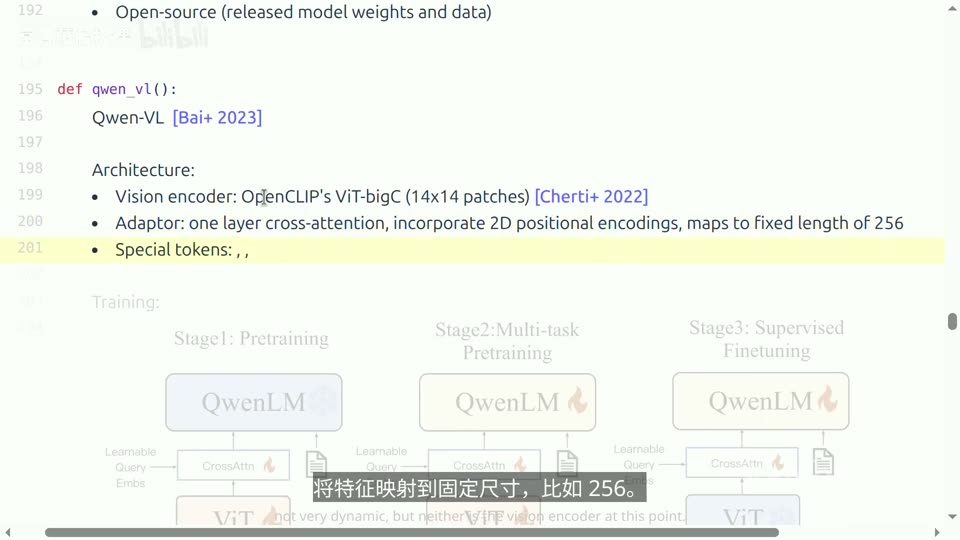 |
| 其实我们并非从零开始预训练，这里使用的是大规模但质量较低的数据。具体做法是冻结语言模型，然后训练视觉编码器和适配器。这与 LLaVA 模型略有不同，因为 LLaVA 模型在此阶段并不训练视觉编码器和适配器。大家可以看到，他们训练所用的一部分数据集规模达到了 14 亿个样本。到了第二阶段。 [【跳转到 31:23】](https://www.bilibili.com/video/BV11LEA6eEuj/?p=17&t=1883) | 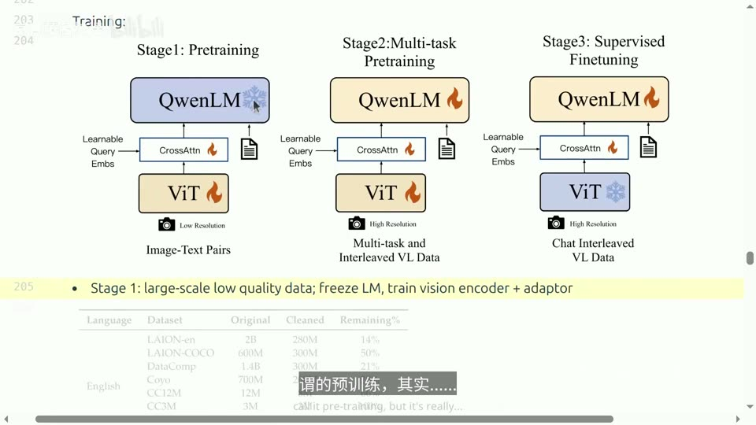 |
| 他们换用了质量更高、针对特定任务的数据，这里能看到一些 VQA 数据集中常见的来源，比如图表问答之类。接着他们在这里训练所有参数。最后是第三阶段，使用的是指令微调数据。 [【跳转到 31:48】](https://www.bilibili.com/video/BV11LEA6eEuj/?p=17&t=1908) | 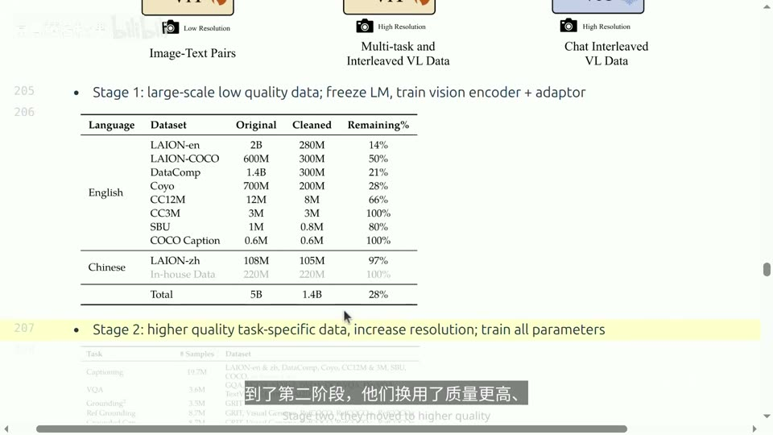 |
| 我们冻结视觉编码器。 [【跳转到 31:59】](https://www.bilibili.com/video/BV11LEA6eEuj/?p=17&t=1919) | 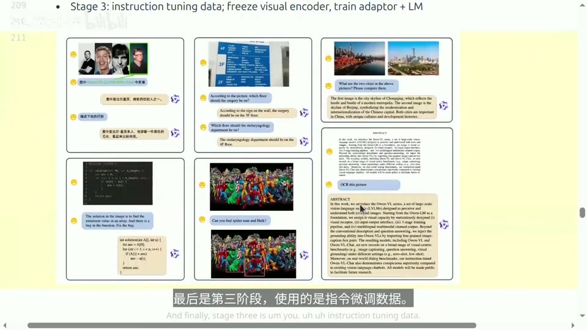 |
| 然后训练适配器和语言模型。这里举几个他们能做到的例子。 [【跳转到 32:04】](https://www.bilibili.com/video/BV11LEA6eEuj/?p=17&t=1924) | 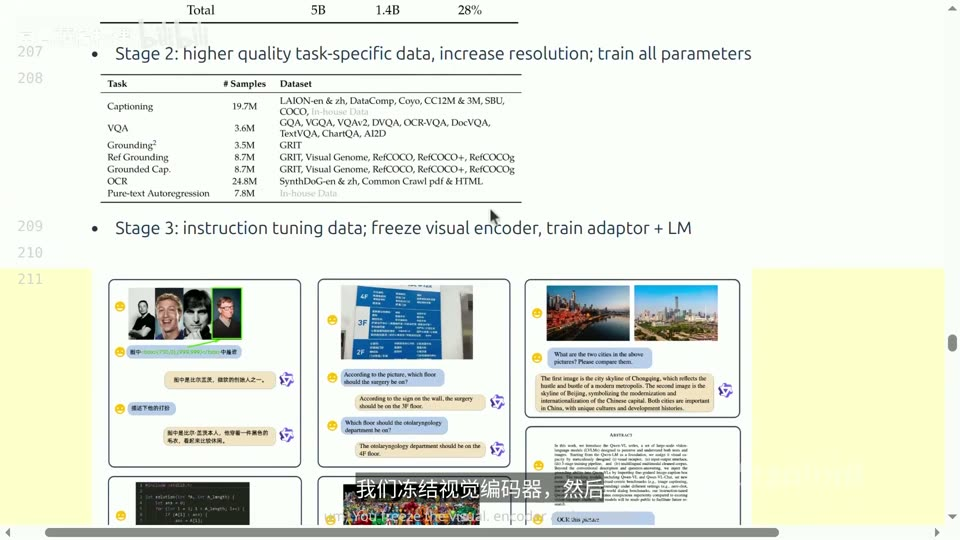 |
| 当然因为这是 Qwen，所以有些例子是中文的。我们还希望打造一个能涵盖语言模型能力的模型。既然语言模型能写代码，我们也希望视觉模型在代码方面同样出色。咱们看个例子，如果你能看见的话，这是一张包含金霸王、蜘蛛侠和绿巨人的图像，它还能输出边界框，它其实不生成图像，只是输出边界框，接着咱们可以做 OCR。 [【跳转到 32:09】](https://www.bilibili.com/video/BV11LEA6eEuj/?p=17&t=1929) | 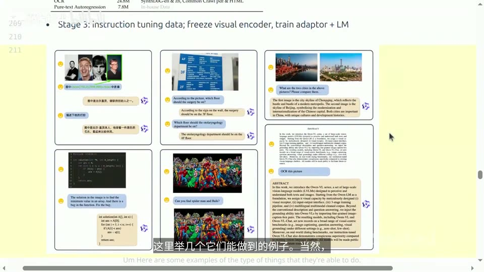 |
| 也就是文字识别，然后对比一下。 [【跳转到 32:34】](https://www.bilibili.com/video/BV11LEA6eEuj/?p=17&t=1954) | 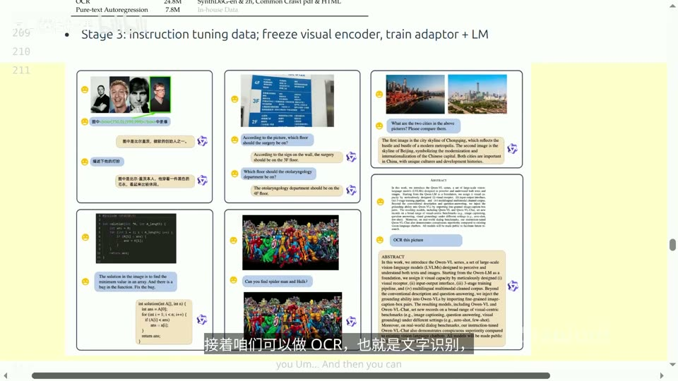 |
| 所以咱们就用咱们自己的东西。好，那 Qwen2 算是又一次升级，这里有些新点子，我接下来会过一遍，比如用更大的视觉编码器。 [【跳转到 32:39】](https://www.bilibili.com/video/BV11LEA6eEuj/?p=17&t=1959) | 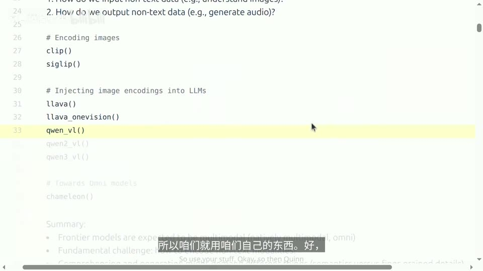 |
| 他们还开始搞动态分辨率了，我觉得这是最关键的一点。大家还记得咱们从 LLaVA 到 LLaVA-OneVision 的时候吧，那时候他们意识到得能处理不同尺寸的图像。你要是想搞视频，那就很明显了，你得需要某种动态分辨率。 [【跳转到 32:48】](https://www.bilibili.com/video/BV11LEA6eEuj/?p=17&t=1968) | 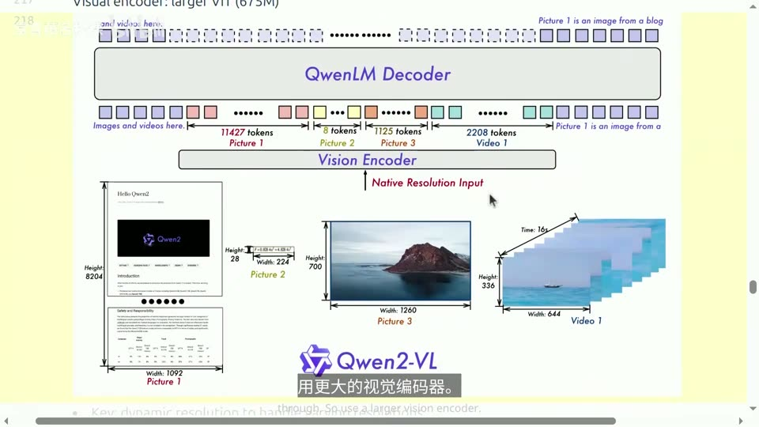 |
| 你需要一种动态分辨率机制。这个模型的基本逻辑是这样的：假设你有一张这样的图片，它可能会被编码为 1 万 1000 个 token。 [【跳转到 33:13】](https://www.bilibili.com/video/BV11LEA6eEuj/?p=17&t=1993) | 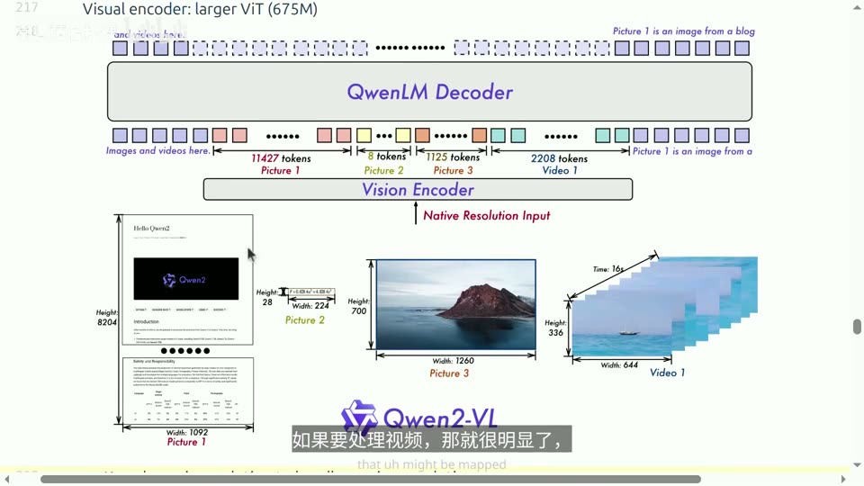 |
| 而这张包含公式的小图可能只被映射为八个 token。 [【跳转到 33:22】](https://www.bilibili.com/video/BV11LEA6eEuj/?p=17&t=2002) | 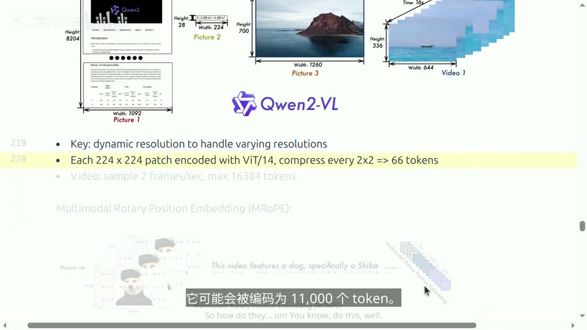 |
| 以此类推。那么他们具体是如何实现这一点的呢？ [【跳转到 33:27】](https://www.bilibili.com/video/BV11LEA6eEuj/?p=17&t=2007) | 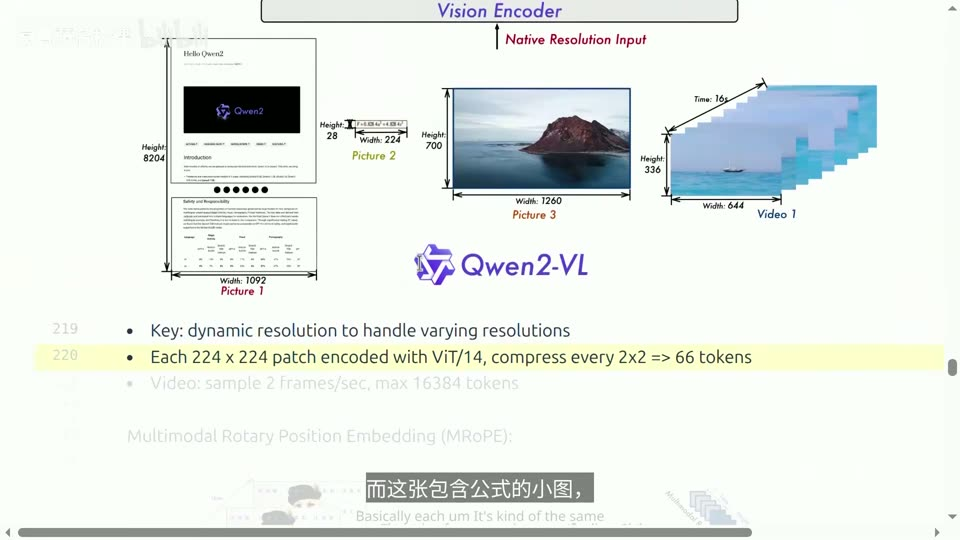 |
| 基本思路是，这与 LLaVA 中的任意分辨率概念是一致的。具体来说。 [【跳转到 33:33】](https://www.bilibili.com/video/BV11LEA6eEuj/?p=17&t=2013) | 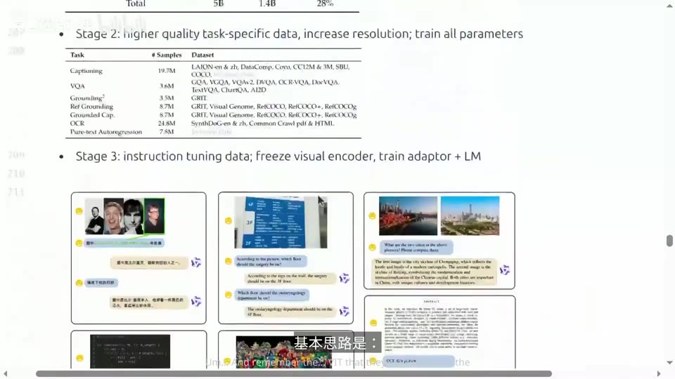 |
| 每个 224×224 的图像块都会通过 ViT 进行编码。此外他们最初使用的是 OpenCLIP 的 ViT，但随后对其进行了微调。接着他们尝试压缩上下文长度。 [【跳转到 33:38】](https://www.bilibili.com/video/BV11LEA6eEuj/?p=17&t=2018) | 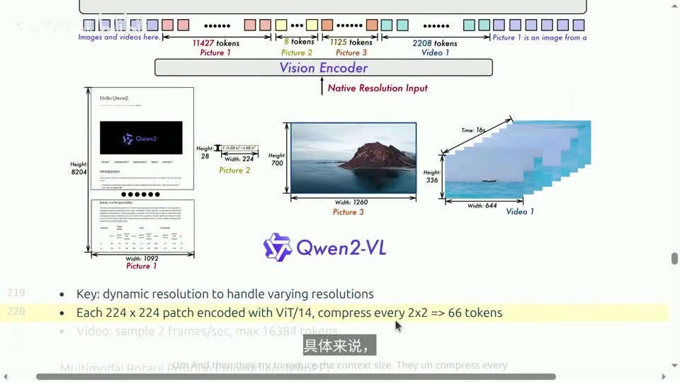 |
| 将每两个图像块合并为一个，从而减少每个图像的 token 数量。嗯，所以 Qwen2 在这里采取了一些不同的做法，因此他们引入了一种称为多模态旋转位置编码（multimodal RoPE）的方法。大家还记得 RoPE 吗？它的核心思想是，嵌入向量具备这样的特性：向量间的内积仅取决于相对距离，在一维情况下距离即为两个 token 之间的间隔数。 [【跳转到 33:50】](https://www.bilibili.com/video/BV11LEA6eEuj/?p=17&t=2030) | 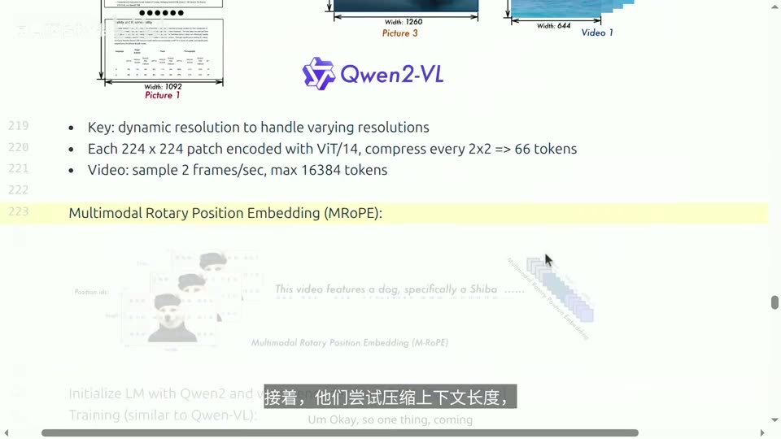 |
| 推广到多维版本时原理基本一致，只是维度扩展到了三维，这三个维度分别是高度、宽度和时间。因此每个位置或图像块现在由一个三元组来表示。 [【跳转到 34:15】](https://www.bilibili.com/video/BV11LEA6eEuj/?p=17&t=2055) | 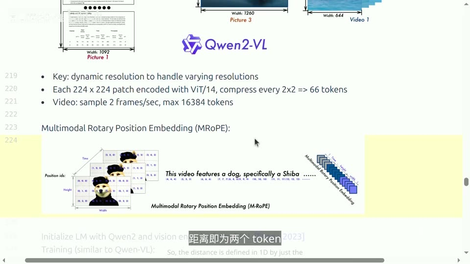 |
| 不过后来当我们审视 Qwen3 时会发现，这其实并非最优解。于是他们用此来初始化语言模型，这是 Qwen2-VL 模型，自然是以 Qwen 为基础进行初始化的。接着他们进行了三阶段训练，这与我们之前的做法非常相似。 [【跳转到 34:40】](https://www.bilibili.com/video/BV11LEA6eEuj/?p=17&t=2080) | 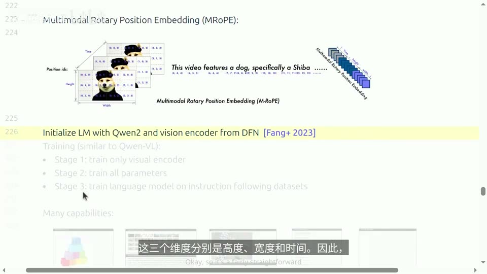 |
| 随后他们展示了一系列不同能力，例如视频理解，它既能处理数学和代码，也能进行函数调用等等。 [【跳转到 35:02】](https://www.bilibili.com/video/BV11LEA6eEuj/?p=17&t=2102) | 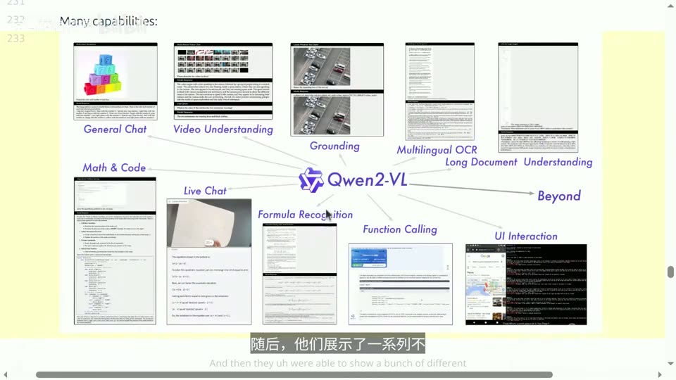 |
| 好的，那我快速介绍一下 Qwen3。嗯，所以再说一遍，这里有一些改动，我不认为这是结构上的重大变动，但它们确实会影响模型的质量。这是 Qwen3-VL 报告里的图。 [【跳转到 35:10】](https://www.bilibili.com/video/BV11LEA6eEuj/?p=17&t=2110) | 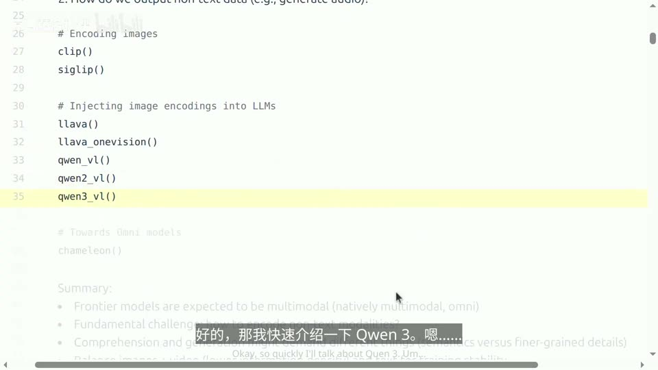 |
| 所以这里的图表基本没变，我提一下，也许后面我会再回到这张图。 [【跳转到 35:21】](https://www.bilibili.com/video/BV11LEA6eEuj/?p=17&t=2121) | 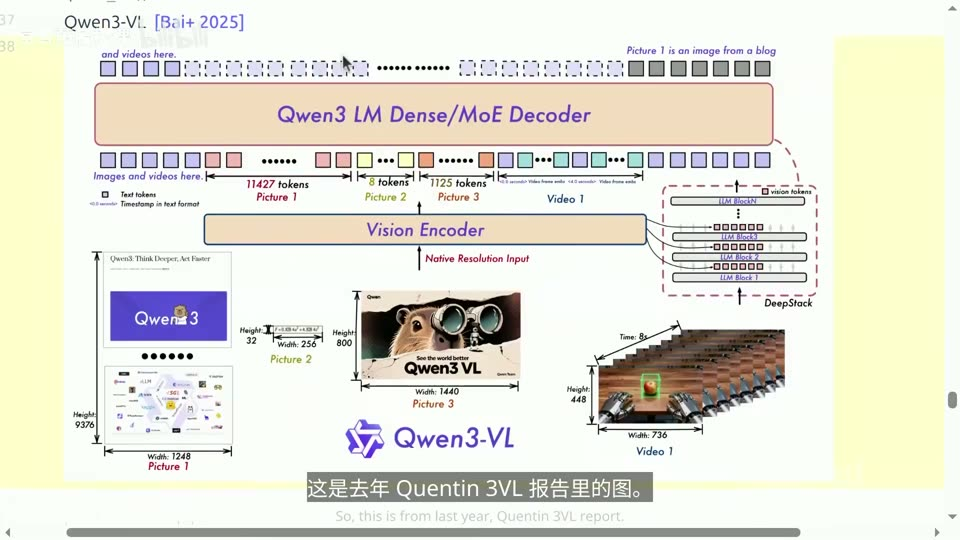 |
| 我来梳理一下这些变化。首先，现在他们用的是 Qwen3 模型，他们有一系列 Dense 和 MoE 模型，Qwen3 模型效果非常出色，这对提升最终模型的质量帮助很大。他们重点投入的是长上下文理解能力，上下文长度最高可达 256K，这一点非常重要，尤其是当你试图处理长视频时。咱们来谈谈视觉编码器，他们用的是 SigLIP2。 [【跳转到 35:26】](https://www.bilibili.com/video/BV11LEA6eEuj/?p=17&t=2126) | 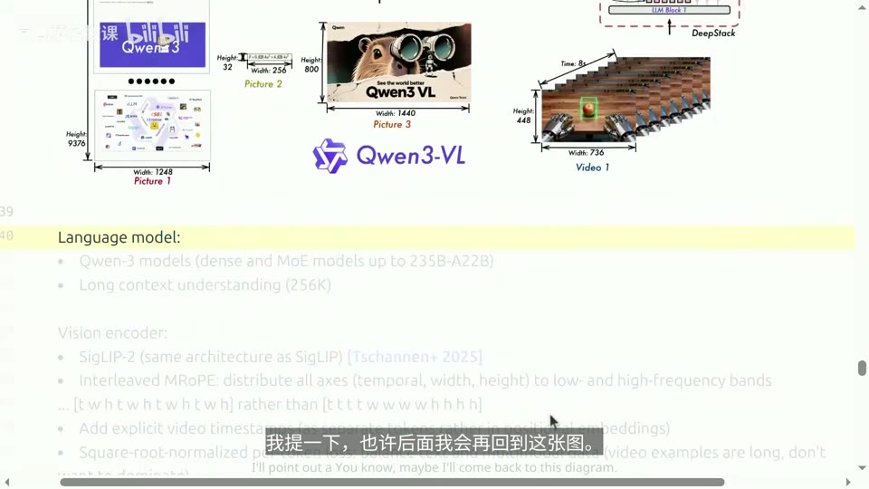 |
| 这基本上是对 SigLIP 的改进版本，实际上这是完全相同的架构，其设计旨在向后兼容。随后他们改进了 RoPE。 [【跳转到 35:51】](https://www.bilibili.com/video/BV11LEA6eEuj/?p=17&t=2151) | 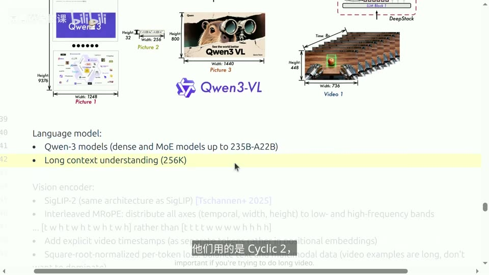 |
| 咱们先回顾一下，以前只有三个维度：时间、宽度和高度。简单来说，他们把第一块维度空间留给了时间，接着给宽度维度，再给高度维度。如果你记得 RoPE，问题就出在这：每个组件其实代表不同的频率，这就导致一个问题——时间维度可能全是低频，而高度维度全是高频。 [【跳转到 35:59】](https://www.bilibili.com/video/BV11LEA6eEuj/?p=17&t=2159) |  |
| 所以他们把这些维度交错排列了，意识到这点后，现在的每个轴都能同时接触到低频和高频信息。另外他们还做了一件事，直接引入显式的视频时间戳。 [【跳转到 36:24】](https://www.bilibili.com/video/BV11LEA6eEuj/?p=17&t=2184) | 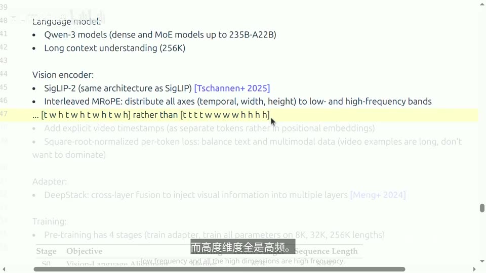 |
| 意识到了这一点后，现在每个轴都能同时接触到低频和高频信息。 [【跳转到 36:42】](https://www.bilibili.com/video/BV11LEA6eEuj/?p=17&t=2202) | 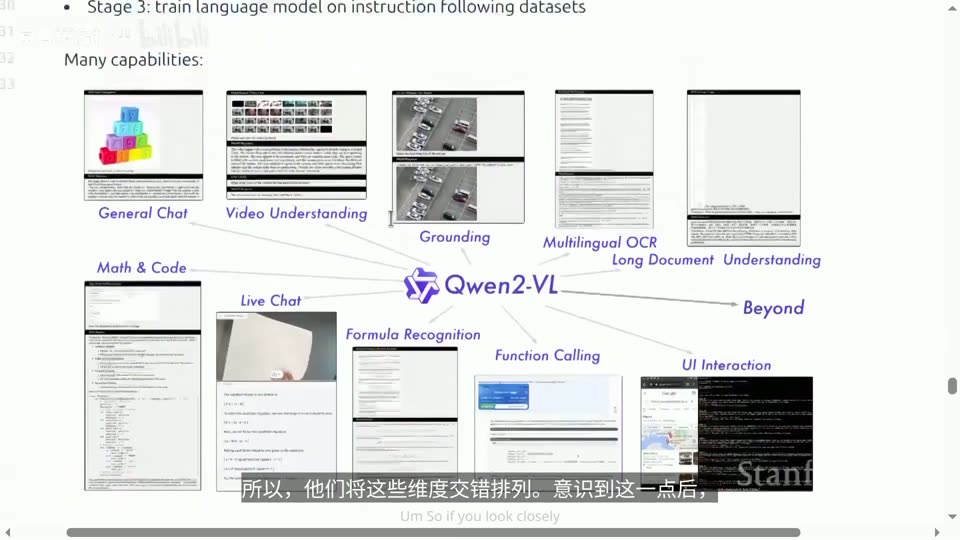 |
| 另外他们还做了一件事，直接引入显式的视频时间戳。 [【跳转到 36:47】](https://www.bilibili.com/video/BV11LEA6eEuj/?p=17&t=2207) | 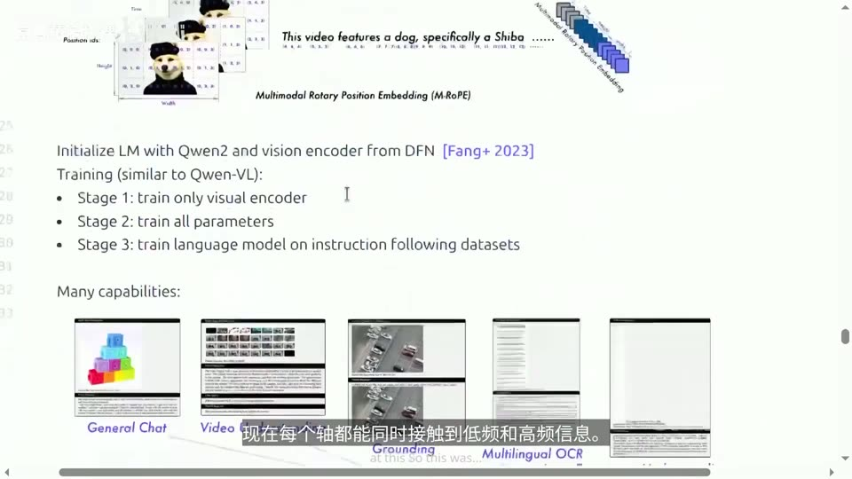 |
| 哎呀，嗯，你看，呃，这个可能有点小。 [【跳转到 36:52】](https://www.bilibili.com/video/BV11LEA6eEuj/?p=17&t=2212) | 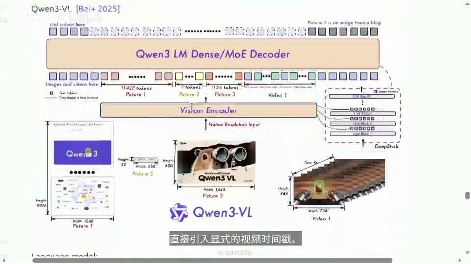 |
| 不过之前我们讨论过位置嵌入的问题。时间戳在位置编码里是隐含的，视频里的每一帧天生就带着不同的时间信息，之所以有时间概念，纯粹是因为它们位置不同。嗯，但在这里他们把时间显式化了。所以这些其实是一个特殊的 token，现在你有了一个代表时间的 token。啊，他们发现这挺有用的，大概是因为你可以直接引用它，比如两秒后发生了什么。 [【跳转到 36:57】](https://www.bilibili.com/video/BV11LEA6eEuj/?p=17&t=2217) |  |
| 从而增强时间感知。现在你拥有了一个代表时间的 token。 [【跳转到 37:22】](https://www.bilibili.com/video/BV11LEA6eEuj/?p=17&t=2242) | 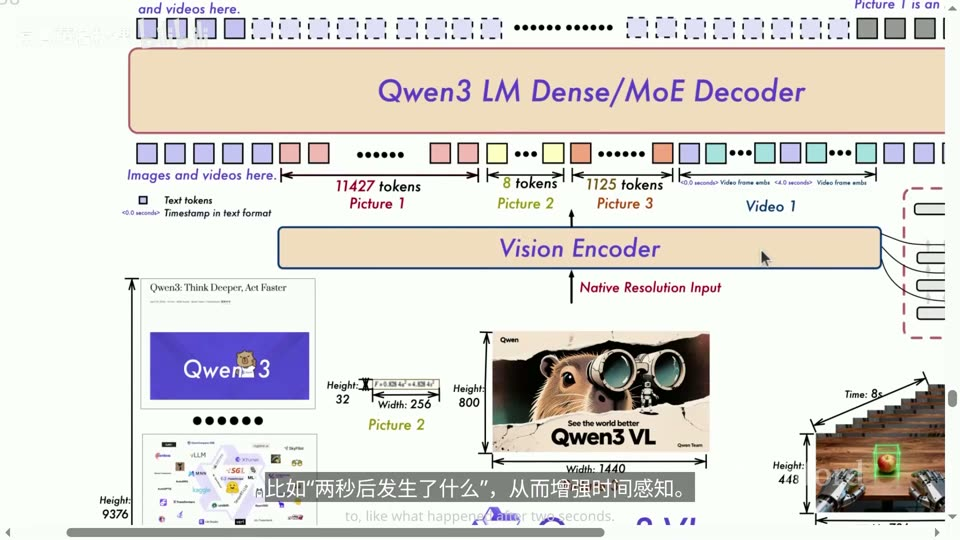 |
| 他们发现这挺有用的大概是因为你可以直接引用它。 [【跳转到 37:27】](https://www.bilibili.com/video/BV11LEA6eEuj/?p=17&t=2247) | 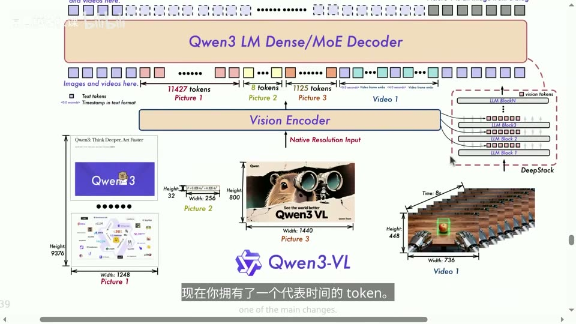 |
| 比如两秒后发生了什么。咱们得这么想：带视频的例子通常很长，但带单张图片的例子就很短，通常的做法是把每个 token 一视同仁，这样一来视频样本就会占据主导地位。所以嘛，他们大概是……具体细节我不太确定，但我猜他们是用序列长度的平方根做了归一化，主要是为了压低那些特别长样本的影响力。最后还有个挺有意思的点。 [【跳转到 37:32】](https://www.bilibili.com/video/BV11LEA6eEuj/?p=17&t=2252) | 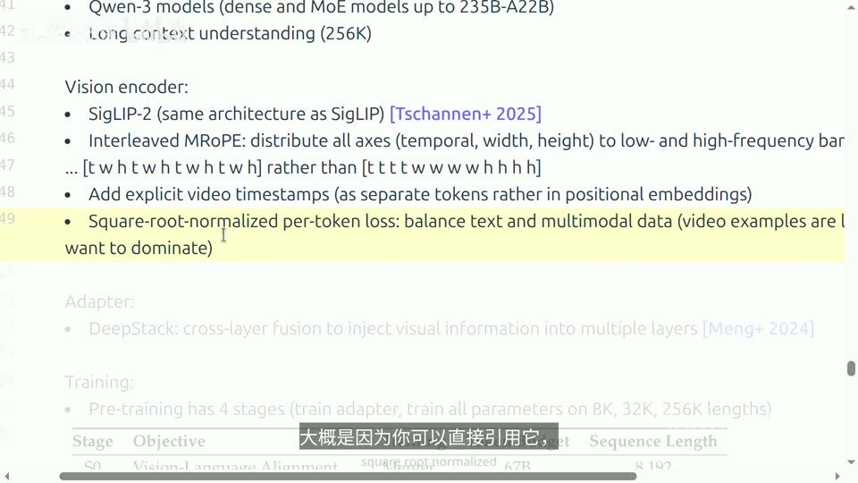 |
| 就是他们在 adapter 上搞了点新花样。咱们回想一下，adapter 就是负责把视觉编码器和语言模型连起来的那个部件。 [【跳转到 37:57】](https://www.bilibili.com/video/BV11LEA6eEuj/?p=17&t=2277) | 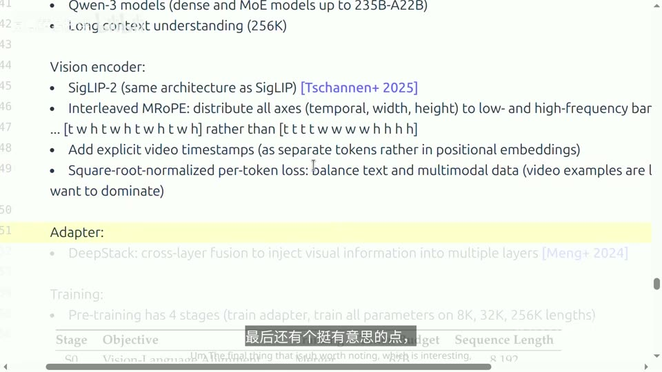 |
| LLaVA 最简单就是个线性投影。 [【跳转到 38:14】](https://www.bilibili.com/video/BV11LEA6eEuj/?p=17&t=2294) | 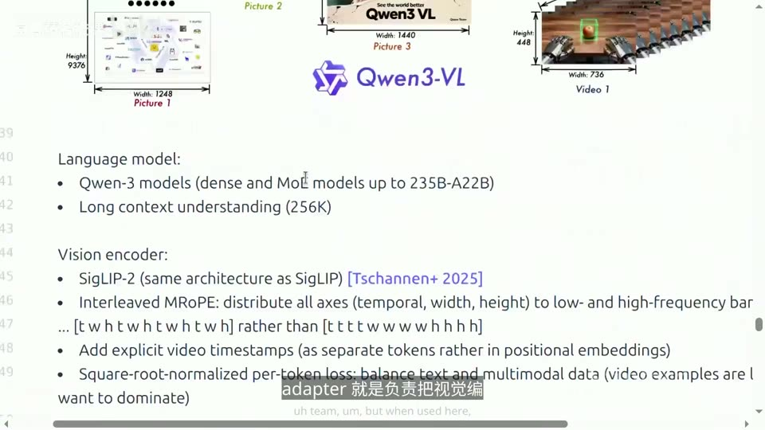 |
| 后来咱们又加了 MLP，还搞了种交叉注意力机制，咱们基本上就是把它们直接加到语言模型的残差流里。所以这算是把视觉编码器和语言模型做了一种深度融合，这与仅输出向量序列的黑盒视觉编码器不同。训练过程分为两个阶段。 [【跳转到 38:19】](https://www.bilibili.com/video/BV11LEA6eEuj/?p=17&t=2299) | 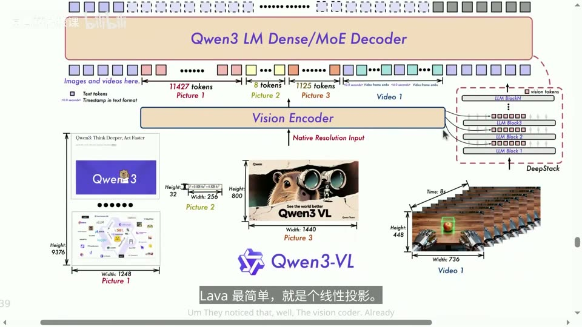 |
| 预训练包含四个阶段，后训练包含三个阶段。随后逐步在更长的序列上进行训练，序列长度从 8K 增加至 32K，再增至 256K。大部分 token 集中在第二和第三阶段。之后进入后训练阶段，团队会使用长链思维数据进行监督微调（SFT）和知识蒸馏。 [【跳转到 38:44】](https://www.bilibili.com/video/BV11LEA6eEuj/?p=17&t=2324) | 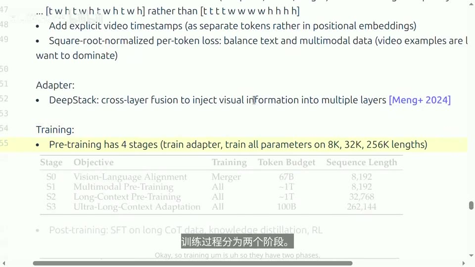 |
| 并辅以强化学习。严格来说。 [【跳转到 39:09】](https://www.bilibili.com/video/BV11LEA6eEuj/?p=17&t=2349) | 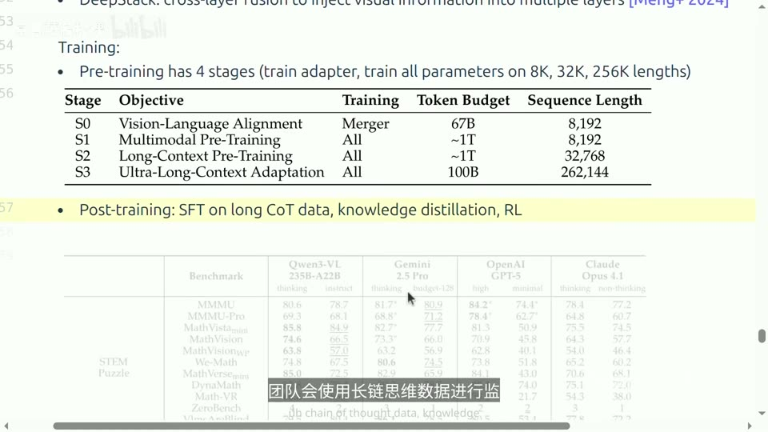 |
| 这是一篇侧重系统实现的论文，我标注了一些核心创新点，但文中仍存在不少细节差异。从最终结果来看，这是一个相当出色的模型，也就是说，若将这些基准测试成绩与 Gemini、GPT-5、Claude Opus 4.1 等模型进行对比——从最终结果来看，这是一个相当不错的模型，所以你看 Qwen 模型的实力其实很强。嗯，有同学提问，好。 [【跳转到 39:15】](https://www.bilibili.com/video/BV11LEA6eEuj/?p=17&t=2355) | 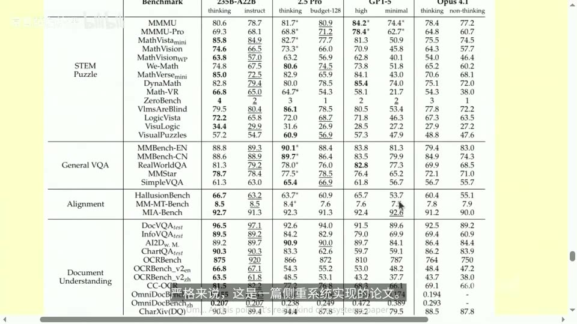 |
| 下一位受害者。 [【跳转到 39:40】](https://www.bilibili.com/video/BV11LEA6eEuj/?p=17&t=2380) | 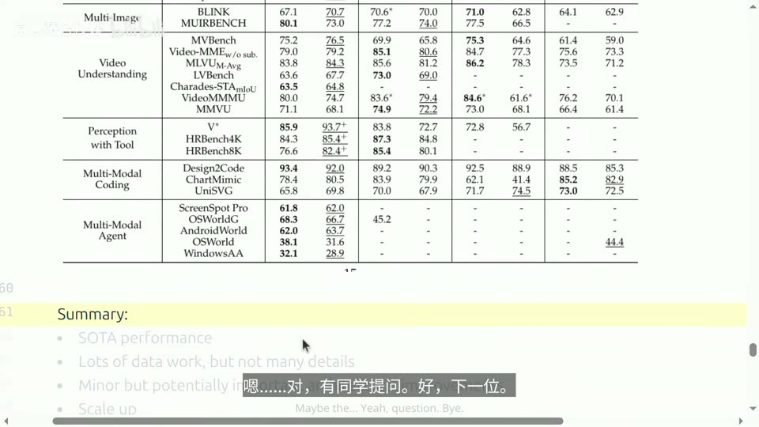 |
| 以及谢谢。所以问题是：在视频生成方面，你怎么判断输出应该是视频还是文本？首先得明确，这些模型其实并不生成视频或图片，视频或者说所有多模态内容都只存在于输入端。 [【跳转到 39:45】](https://www.bilibili.com/video/BV11LEA6eEuj/?p=17&t=2385) | 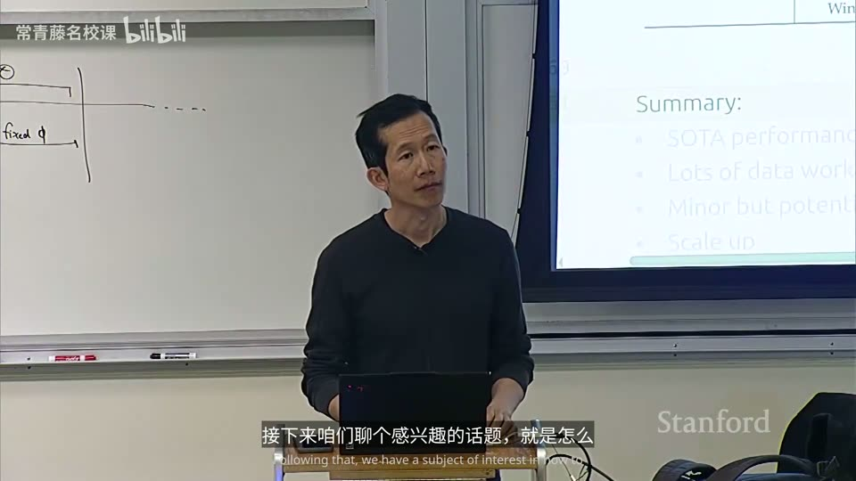 |
| 你们生成的始终是文本。在这些阶段里，除了 RL 之外，你基本上是对每一个 token 进行监督，所以不存在比如用语言模型当裁判或者评估描述质量的情况，这主要取决于数据集中的内容。 [【跳转到 40:10】](https://www.bilibili.com/video/BV11LEA6eEuj/?p=17&t=2410) | 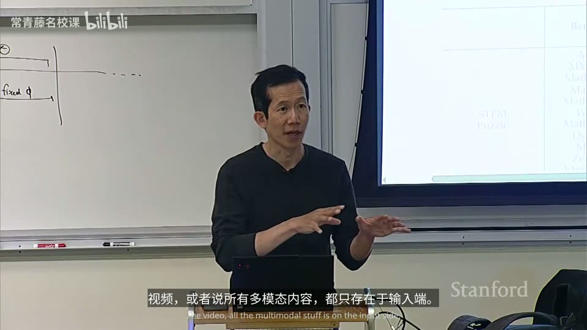 |
| （课堂问答）不过有了强化学习，你可以尝试不同的反馈机制。我想确认一下，这是否属于多模态模型的训练？从系统角度来看…… [【跳转到 40:35】](https://www.bilibili.com/video/BV11LEA6eEuj/?p=17&t=2435) | 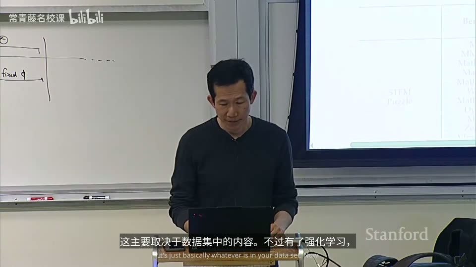 |
| （课堂问答）从系统角度来看，某些模型家族可以在某个地方使用视频进行测试；从算法方面来说，我更专注于……（此处录音不清） [【跳转到 41:00】](https://www.bilibili.com/video/BV11LEA6eEuj/?p=17&t=2460) | 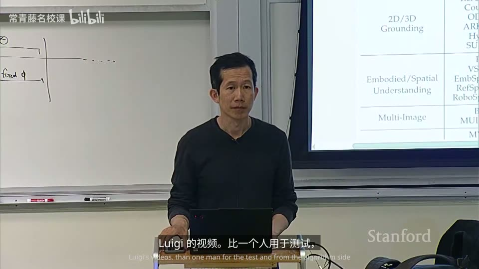 |
| 我的意思是，肯定没那么简单。就像你提到的，数据集规模更大了，视频数据嘛，你知道的，光是加载它就可能让人头大。通常我们没怎么特意讨论语言模型的数据加载问题，因为它通常不是主要的瓶颈，成本非常低，所以这点得考虑进去。同时，确保数据加载与实际计算异步进行的那些原则也都适用。第二部分嘛……抱歉，刚才说到哪了？ [【跳转到 41:25】](https://www.bilibili.com/video/BV11LEA6eEuj/?p=17&t=2485) | 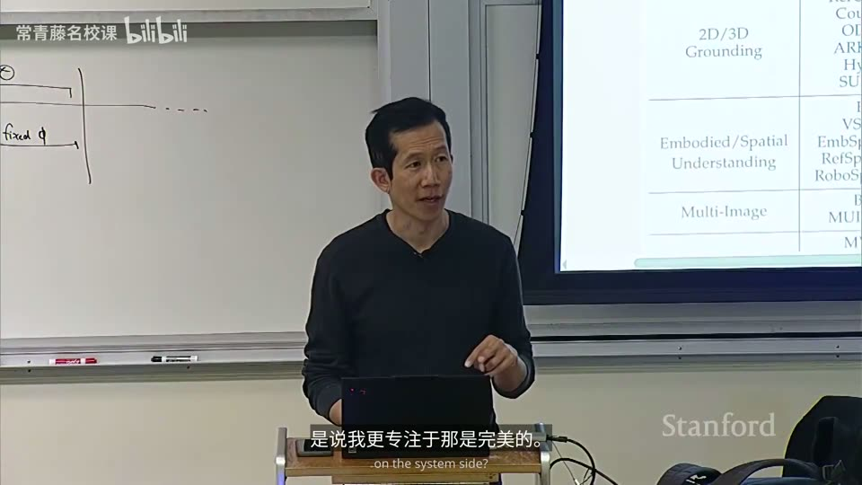 |
| 第二个问题咱们知道了。哦对，视频和图像包含的 token 更多，尤其是视频。主要是为了防止视频在模型中占比过大，你看你可以直接调低权重，比如 token 数量太多觉得不合适，就把权重降下来。咱们上次，或者说是两周前聊过数据混合的问题，所以具体怎么加权，只要合理都可以灵活调整。不过文本 token 的数量其实也非常庞大。 [【跳转到 41:50】](https://www.bilibili.com/video/BV11LEA6eEuj/?p=17&t=2510) | 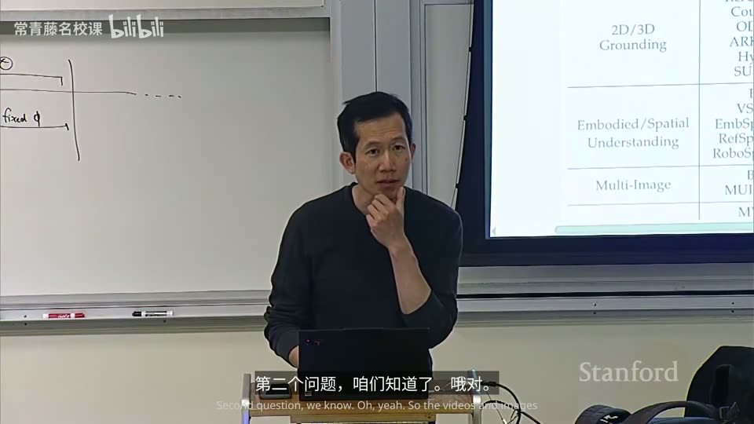 |
| 所以总的来说，这些模型都是在数万亿个 token 上训练出来的，我觉得多模态 token 的数量并没有远远超过文本 token。对，好，你先问。 [【跳转到 42:15】](https://www.bilibili.com/video/BV11LEA6eEuj/?p=17&t=2535) | 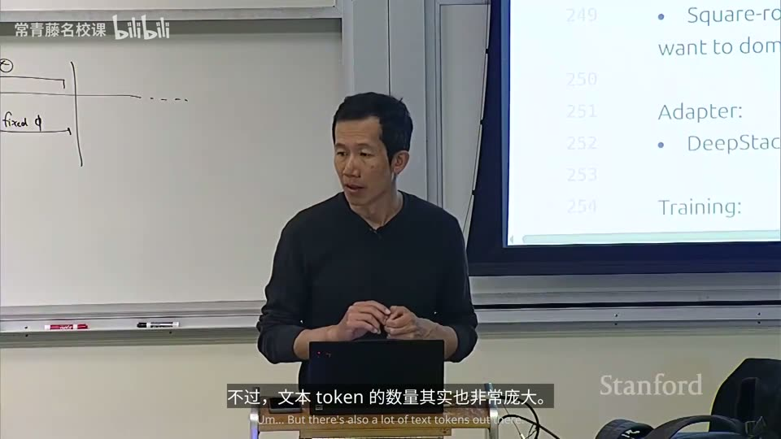 |
| （课堂问答）关于适配器的变更，我也有个问题：它怎么识别什么是语言？语言模型必须经过预训练，不然就没法对齐，也就没意义了。所以语言模型是冻结的，我们只训练适配器，把给定的视觉编码器和给定的语言模型连接起来，训练方法很简单。 [【跳转到 42:40】](https://www.bilibili.com/video/BV11LEA6eEuj/?p=17&t=2560) | 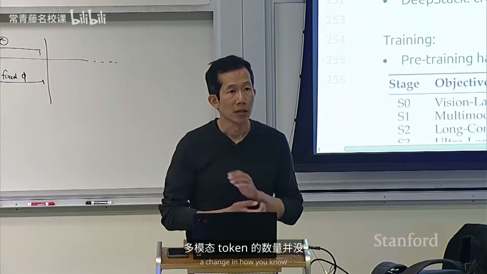 |
| 你先设定一个 token 预算，比如 671，对，就是 token，然后开始训练。这里没有自适应阈值。没错。你可以接着跟数量做个对比。（此处录音不清）这个观点很有意思。 [【跳转到 43:05】](https://www.bilibili.com/video/BV11LEA6eEuj/?p=17&t=2585) | 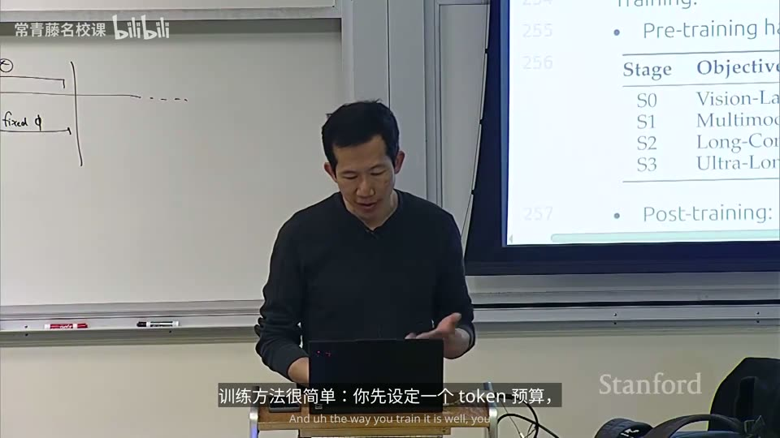 |
| （课堂问答）所以问题来了：视觉编码器中的参数量要小得多，答案通常是肯定的。我在想还有什么不同之处……我……不在这儿。 [【跳转到 43:30】](https://www.bilibili.com/video/BV11LEA6eEuj/?p=17&t=2610) | 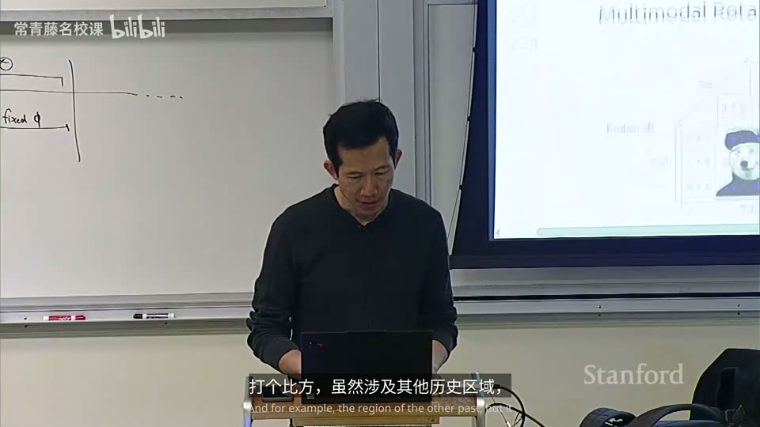 |
| 好的，原因在于，从某种意义上说，视觉编码器执行的是非常局部的操作，针对的是一个个小块（patch），小块非常小，它只是试图理解这些小块。由于缺乏足够的知识，我们无法对这些小块进行推理，因此该模型的核心能力主要仍源于语言模型。我确认一下，找到了大致位置，在这里，我们来看一下。 [【跳转到 43:55】](https://www.bilibili.com/video/BV11LEA6eEuj/?p=17&t=2635) | 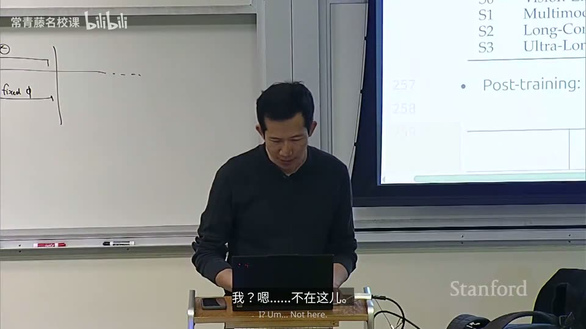 |
| 你看这个 LLaVA 模型，也就是完整版，它拥有 72 亿参数，是一个语言模型。 [【跳转到 44:20】](https://www.bilibili.com/video/BV11LEA6eEuj/?p=17&t=2660) | 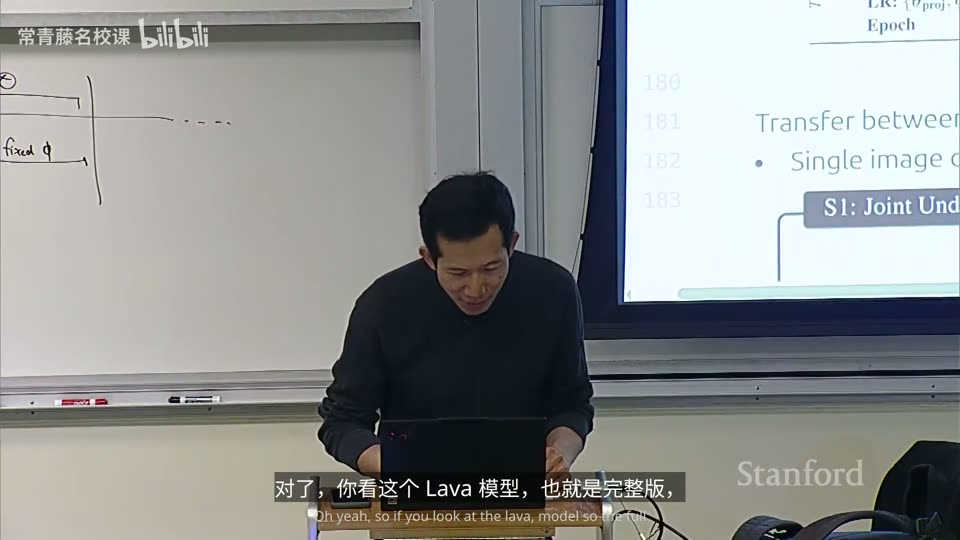 |
| 还有……呃，抱歉，你刚才说什么？好的，我不太确定这个数字。 [【跳转到 44:25】](https://www.bilibili.com/video/BV11LEA6eEuj/?p=17&t=2665) | 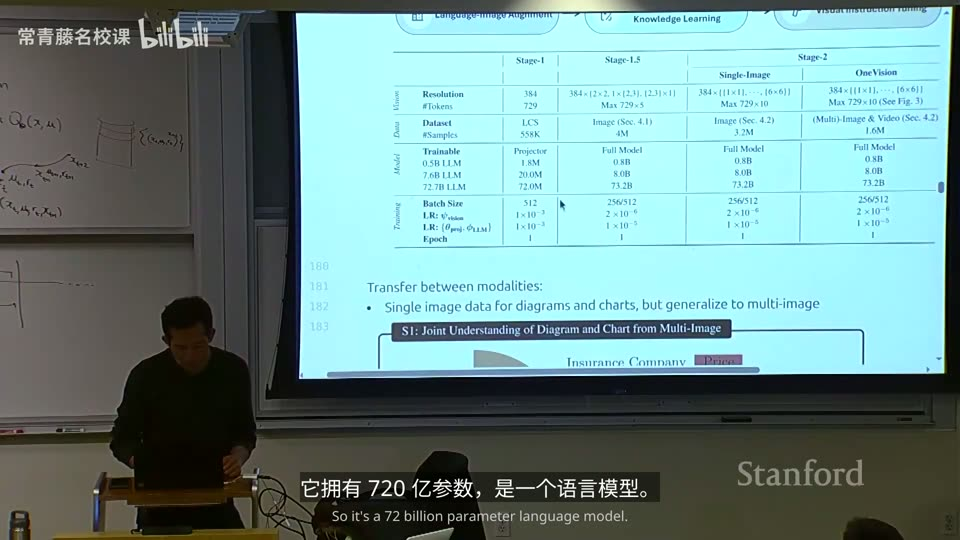 |
| 可能是个笔误。啊抱歉，这是 7200 万。好吧，那确实少得多。投影器参数量小得多。 [【跳转到 44:30】](https://www.bilibili.com/video/BV11LEA6eEuj/?p=17&t=2670) | 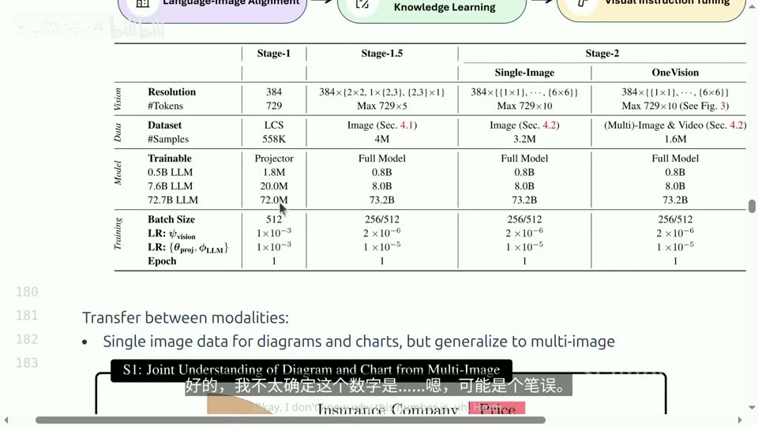 |
| 视觉编码器通常不到 10 亿参数。嗯对，我想主要是因为它是局部操作，作用范围有限。 [【跳转到 44:39】](https://www.bilibili.com/video/BV11LEA6eEuj/?p=17&t=2679) | 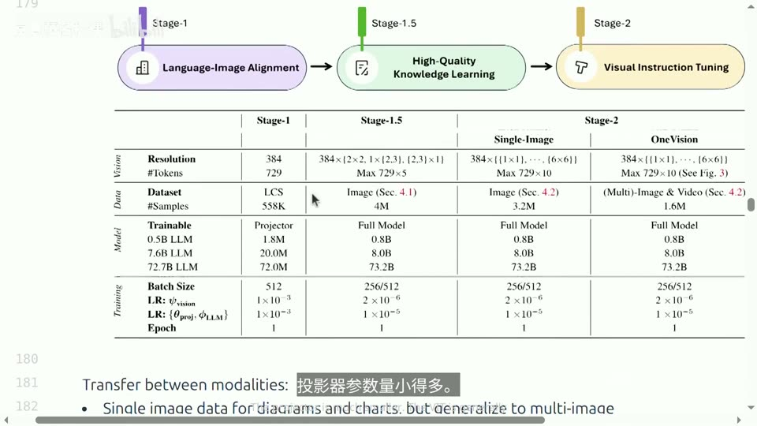 |
| 好，这些内容我们继续。嗯，所以 Qwen3 是我接下来要讲的最后一个视觉语言模型。 [【跳转到 44:47】](https://www.bilibili.com/video/BV11LEA6eEuj/?p=17&t=2687) | 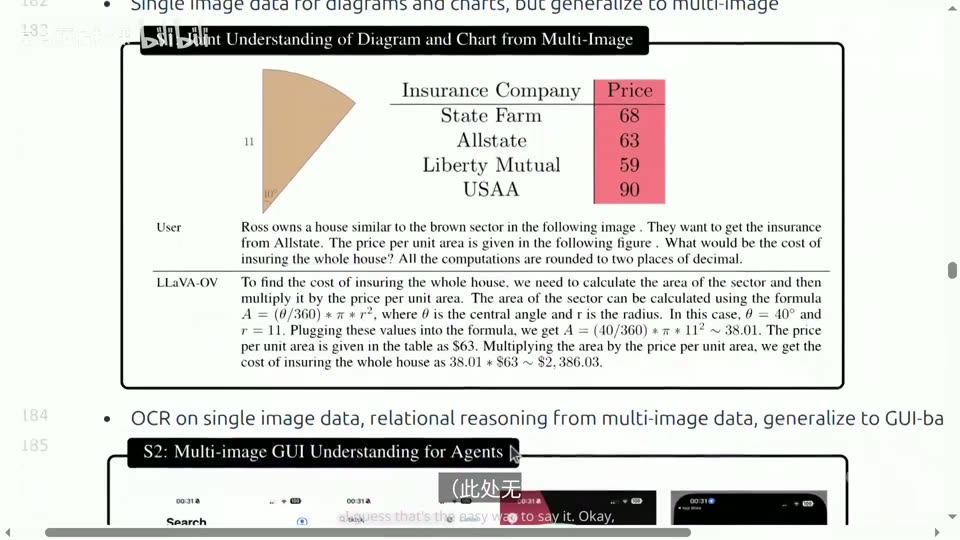 |
| 他提出了一种名为……的方法。嗯，这背后涉及大量数据方面的工作。在后续的 Qwen 模型中，关于数据和数据混合的细节就不再那么详细了，所以建议大家去读一下 LLaVA 的论文，或者 AI2 发布的那篇关于移动端的论文，我之前没来得及细讲，那篇里面的细节更丰富。 [【跳转到 44:52】](https://www.bilibili.com/video/BV11LEA6eEuj/?p=17&t=2692) | 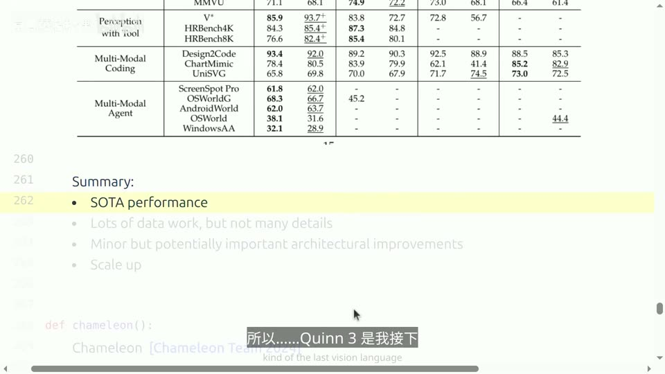 |
| 从 Qwen 到 Qwen2 再到 Qwen3，这些迭代中的许多变化都旨在提升模型性能，主要是发生了一些规模上的转变，但整体框架保持不变：主要是规模上的扩展，整理更多的数据集，意识到必须处理好长上下文，以及可能优化图像处理，诸如此类。好，接下来咱们聊点不一样的，差别很大。咱们来看一篇 Meta 在 2024 年发布的论文。 [【跳转到 45:17】](https://www.bilibili.com/video/BV11LEA6eEuj/?p=17&t=2717) | 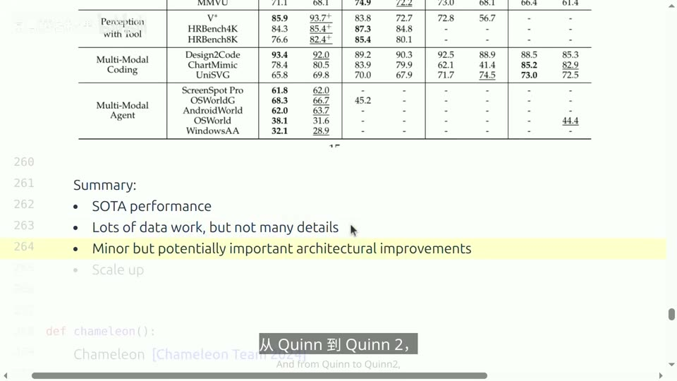 |
| 叫 Chameleon。到目前为止，VLM 的做法是把图像编码成向量再输入到语言模型里，毕竟它是语言模型，所以只能生成文本，没法生成图像。要解决这个问题其实有很多路径，你可以直接拿一个 VLM 再挂载一个扩散头，这样就能生成图像了。但我想聊聊这个思路。 [【跳转到 45:42】](https://www.bilibili.com/video/BV11LEA6eEuj/?p=17&t=2742) | 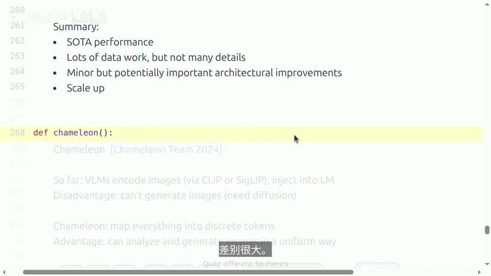 |
| Chameleon 的想法是，要是我们把所有内容都映射成离散的 token……从某种意义上看，呃，好吧，也许这说明我是个搞语言的，更关注文本部分。这很有吸引力，因为现在你可以用同一种方式分析和生成图像。 [【跳转到 46:07】](https://www.bilibili.com/video/BV11LEA6eEuj/?p=17&t=2767) | 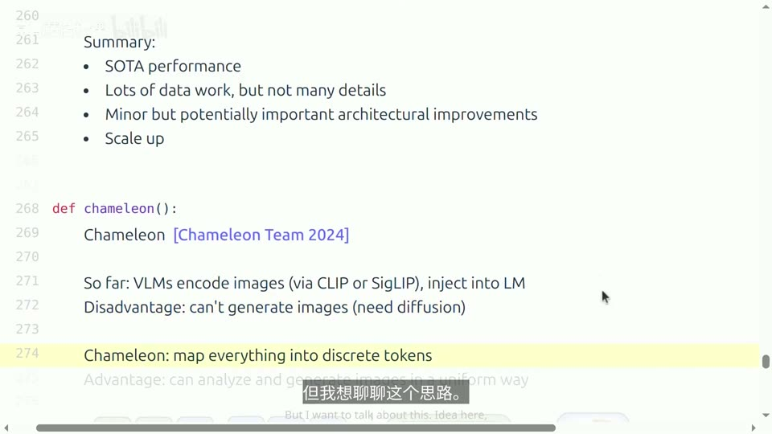 |
| 一切都被离散化为 token。打个比方，假设你想生成图像，你可以输入一个文本提示，然后系统会生成更多的 token；或者你也可以反过来，把语言和文本的顺序调换一下。 [【跳转到 46:22】](https://www.bilibili.com/video/BV11LEA6eEuj/?p=17&t=2782) | 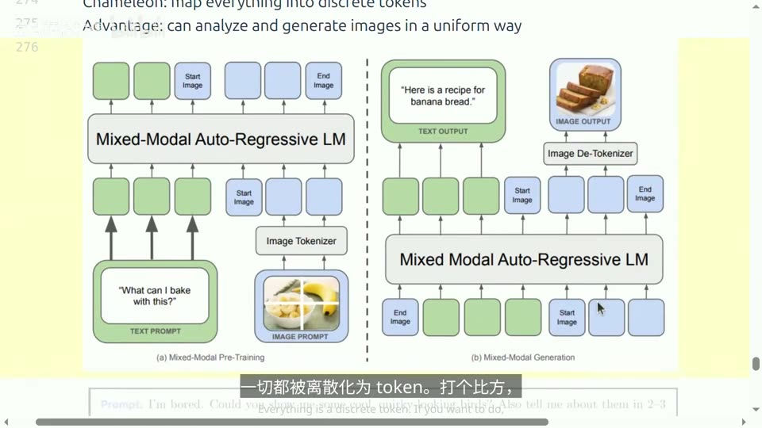 |
| 这里有个来自论文的示例，你可以试着给它发个提示，比如输入「我无聊了」。 [【跳转到 46:37】](https://www.bilibili.com/video/BV11LEA6eEuj/?p=17&t=2797) | 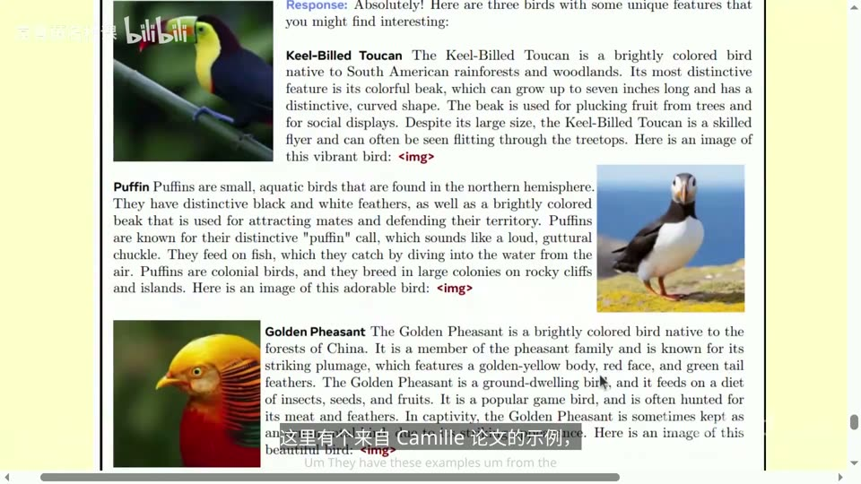 |
| 给我看点鸟的照片。接着它会输出文本，再输出图像，然后再是文本和图像。 [【跳转到 46:42】](https://www.bilibili.com/video/BV11LEA6eEuj/?p=17&t=2802) | 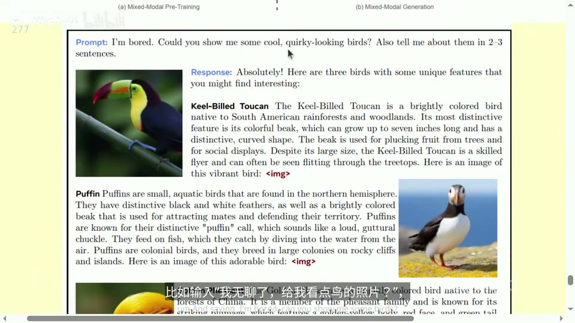 |
| 所以文本和图像是交替出现的。某种意义上，全模态（omni-model）的设计理念正是如此：文本和图像真正处于同一个空间，这是通过让所有数据都表现为文本形式来实现的。这是一种可行的方法。谢谢，好。 [【跳转到 46:47】](https://www.bilibili.com/video/BV11LEA6eEuj/?p=17&t=2807) | 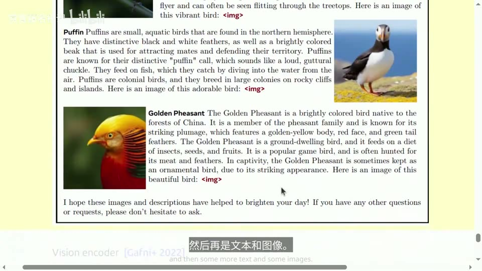 |
| 接下来我简要讲讲具体是如何实现的。那么你现在需要做的事情是，嗯，是将图像映射为离散的 token。这个想法源自 2017 年 Oord 等人的研究，虽然由来已久，它叫向量量化变分自编码器（VQ-VAE）。 [【跳转到 47:01】](https://www.bilibili.com/video/BV11LEA6eEuj/?p=17&t=2821) | 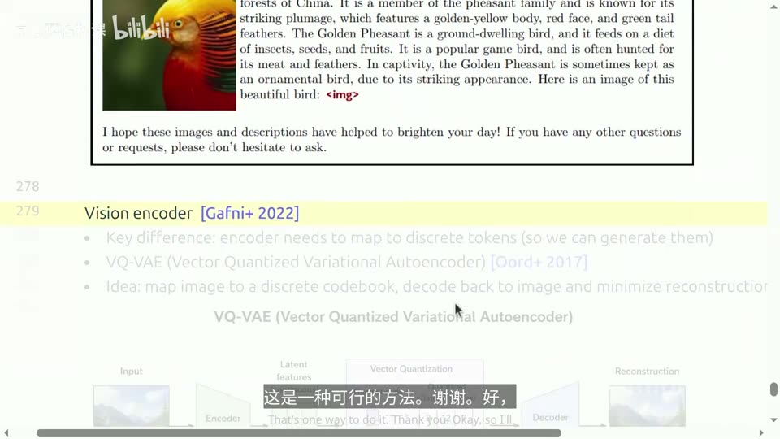 |
| 核心思路是把图像映射成离散码字。你需要学的是一个映射。 [【跳转到 47:19】](https://www.bilibili.com/video/BV11LEA6eEuj/?p=17&t=2839) | 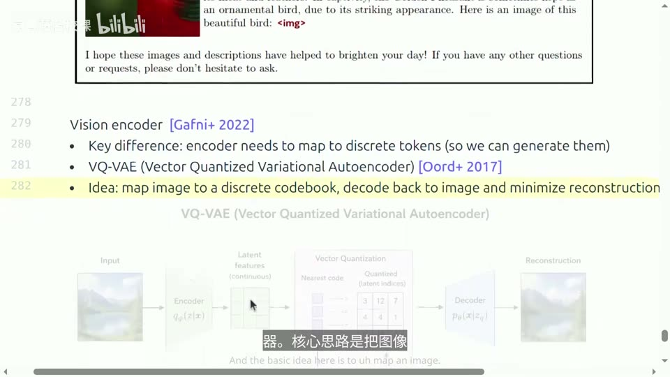 |
| 把它转成连续向量，然后把它舍入到最近的码字，所以你会得到一个码本，假设里面有 8000 个码字，这些就像原型向量，对应着图像块。接着解码器的工作就是拿到这个码字。 [【跳转到 47:24】](https://www.bilibili.com/video/BV11LEA6eEuj/?p=17&t=2844) |  |
| 试着重建图像，然后你训练这个 VQ-VAE，基本就是这么回事，主要是最小化重建损失，因为这里不可微，所以还得加一些其他项。不过我没时间细讲。好了，总之最后的结果是 512×512 的图像。 [【跳转到 47:49】](https://www.bilibili.com/video/BV11LEA6eEuj/?p=17&t=2869) |  |
| 被转换成了 1024 个 token，每个 token 都来自一个大小为 8000 的词汇表。好，现在你手头基本上既有文本也有图像了，这些基本上就是相关代码。接下来我们需要训练一个新的分词器，因为情况发生了变化，现在的数据与以往仅处理纯文本时有所不同，即自然语言数据。 [【跳转到 48:03】](https://www.bilibili.com/video/BV11LEA6eEuj/?p=17&t=2883) | 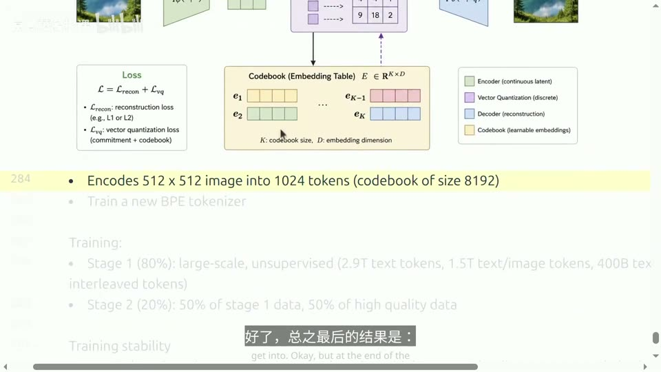 |
| 接下来进入训练阶段，这一步其实非常直观，就是标准的语言模型训练。这里不需要适配器，也无需调整视觉编码器，仅使用语言模型即可。这部分设计颇具吸引力。尽管仍分为两个阶段，但即便是语言模型训练通常也包含两个或更多阶段。第一阶段是训练的主体，规模庞大且为无监督学习，模型中同时包含文本和图像数据。 [【跳转到 48:28】](https://www.bilibili.com/video/BV11LEA6eEuj/?p=17&t=2908) | 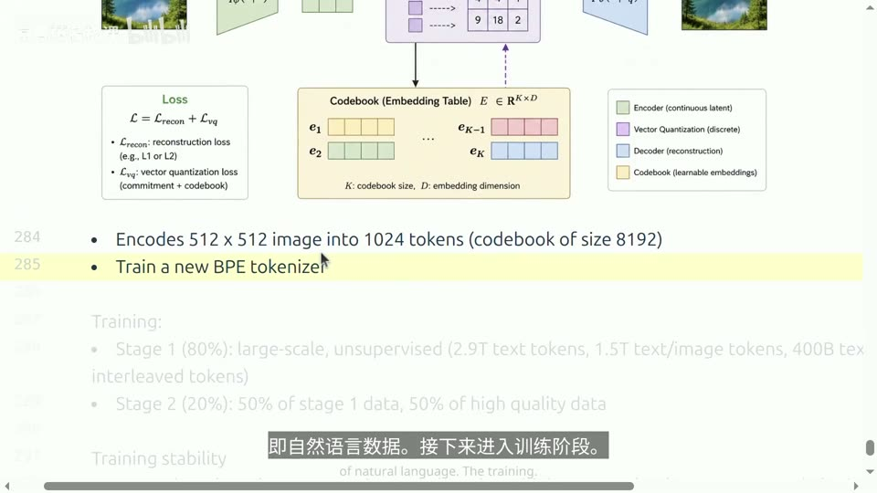 |
| 随后进入第二阶段，我们引入高质量数据。这一设计确实十分优雅，但其中存在几个问题。首先他们发现训练过程不太稳定，原因在于尽管文本和图像处于同一空间，但两者的表现差异显著，所以仅仅把图像数据也称作离散的 token，并不能掩盖图像本身依然存在的本质差异，尤其是文本 token。你想想看，要预测下一个词。 [【跳转到 48:53】](https://www.bilibili.com/video/BV11LEA6eEuj/?p=17&t=2933) | 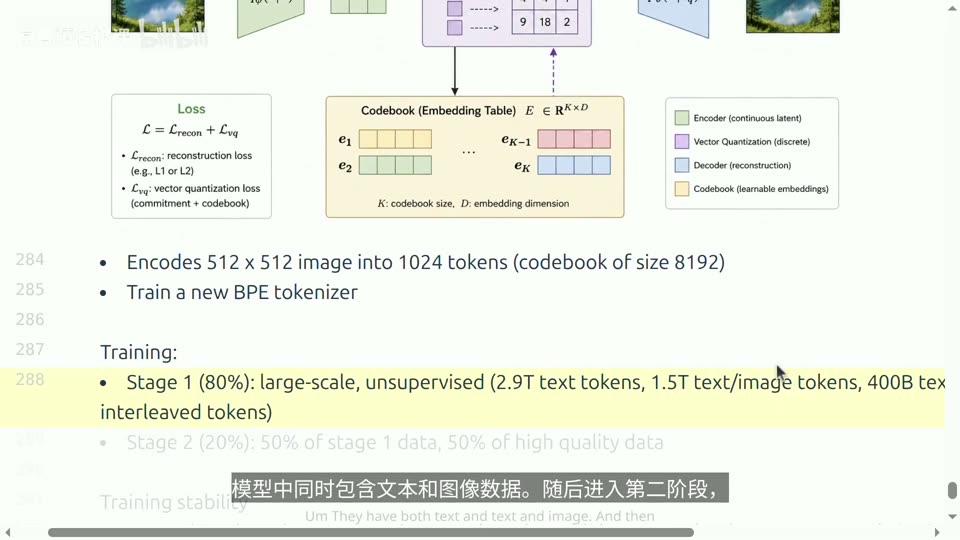 |
| 它的熵值其实是比较低的，大部分词多少都能猜到；但图像 token 的熵非常高，我根本没法确定这个 token 具体会呈现什么蓝色。结果就是，这种混合训练引发了一系列范数方面的问题，参数会不断增大，进而导致损失值不稳定。他们利用 QK-Norm 和 z-loss 正则化在一定程度上缓解了这一问题。 [【跳转到 49:18】](https://www.bilibili.com/video/BV11LEA6eEuj/?p=17&t=2958) | 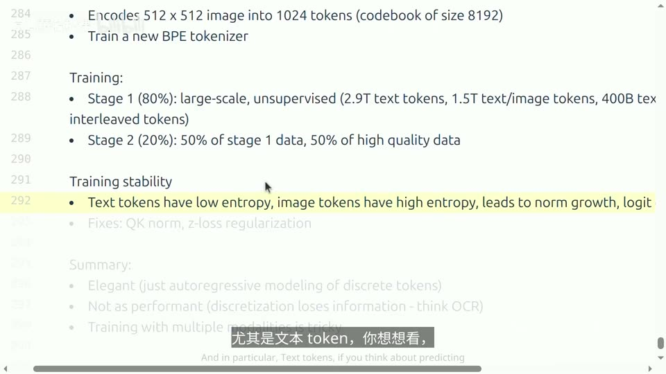 |
| 其中 z-loss 正则化用于控制范数的增长。具体的实验结果我就不展示了。我想重点介绍这项工作，因为它有一种简洁之美：它仅用一个模型就同等对待所有模态，但是缺点在于，事实证明该模型的性能并不理想。此外，离散化过程必然会导致信息丢失，我们可以 OCR 为例，如果对极小的印刷文字进行离散化。 [【跳转到 49:43】](https://www.bilibili.com/video/BV11LEA6eEuj/?p=17&t=2983) | 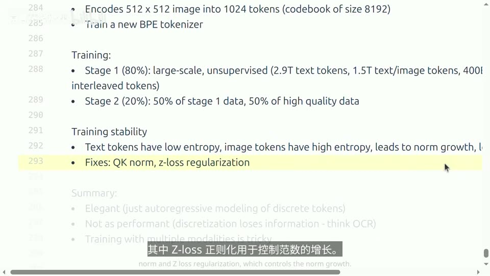 |
| 你将无法再识别它们。最后，多模态训练也颇具挑战性，我们在 Qwen 模型中已略见端倪，当时需要反复调整权重，而在此处这一问题更为显著。VQ-VAE 曾经非常流行。 [【跳转到 50:08】](https://www.bilibili.com/video/BV11LEA6eEuj/?p=17&t=3008) | 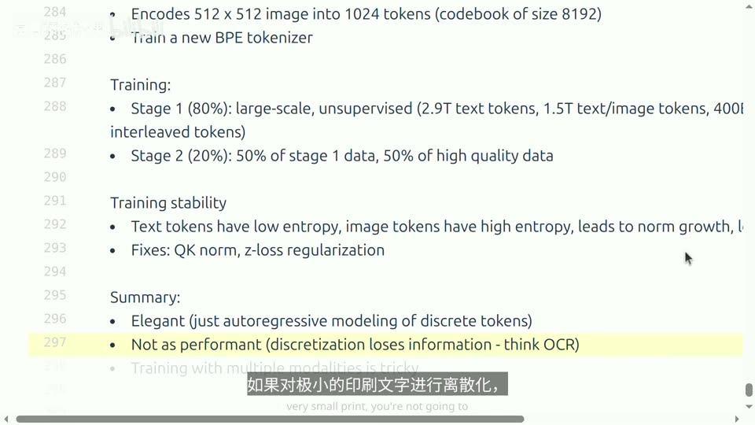 |
| 当时许多人将其用于图像生成，主要原因在于，如果你手头有一个 Transformer，该如何让它生成内容？你需要生成离散数据，即将所有数据转化为离散形式。后来扩散模型兴起，成为了一种可行的生成方案，因此这类方法如今已不如从前流行。 [【跳转到 50:21】](https://www.bilibili.com/video/BV11LEA6eEuj/?p=17&t=3021) | 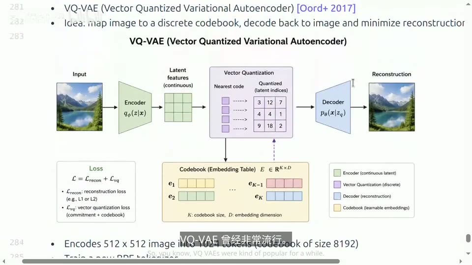 |
| 我们在此简要回顾并总结。当前的前沿模型预计都将具备多模态能力，尤其是原生多模态或全模态模型。遗憾的是，Gemini 和 GPT 发布时被宣传为原生多模态且能处理所有模态，事实也确实如此，但具体的架构细节并未公开。我推测可能采用了某种……例如保留信息不丢失，可能使用了连续编码器。 [【跳转到 50:39】](https://www.bilibili.com/video/BV11LEA6eEuj/?p=17&t=3039) | 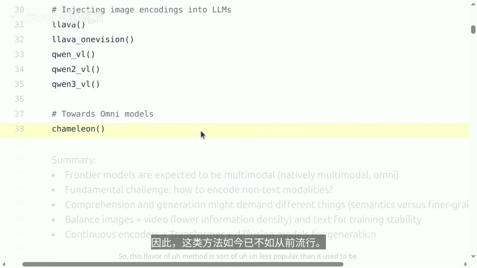 |
| 生成部分则采用了扩散模型。当然这仅是推测。我认为多模态最大的难点在于如何处理非文本模态。还有一个有趣的现象，理解模态和生成模态之间存在一种对称关系，而且具体情况各不相同。也就是说，并不存在一种通用的编码器。以 CLIP 为例，你主要关注分类，目的是提取高层语义，因此这些向量可以做得很小，同时仍能捕捉到高层语义。相反，如果你要做光学字符识别或图像生成。 [【跳转到 51:04】](https://www.bilibili.com/video/BV11LEA6eEuj/?p=17&t=3064) | 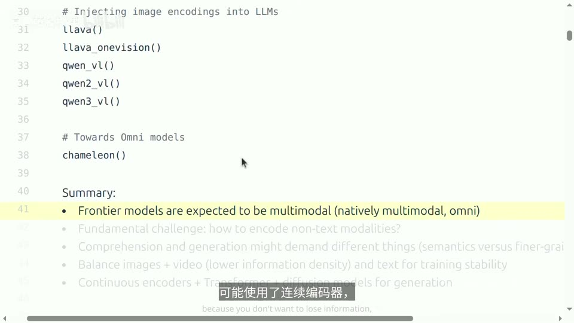 |
| 就需要非常精细的细节。这正是扩散模型表现优异的原因，因为它能对高低频信息进行微调。谢谢。我觉得在处理多模态问题时，我们需要仔细思考要把它们平衡好。打个比方，视频的信息密度通常低于文本，所以你不想让视频淹没文本。就像我之前提到的，也许目前最好的做法是使用连续编码器。 [【跳转到 51:29】](https://www.bilibili.com/video/BV11LEA6eEuj/?p=17&t=3089) | 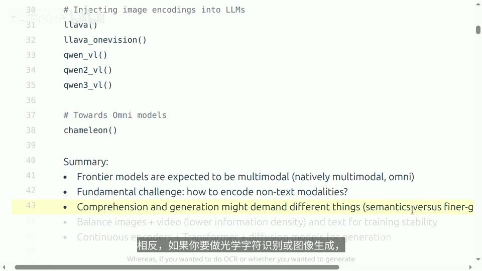 |
| 看起来即使 CLIP 已经是 5 年前的技术，类似的思路现在仍是捕捉图像语义的首选方案，并且仍在广泛使用。至于扩散模型，我刚才没有详细展开，它在生成方面非常出色。好，我就讲到这里。 [【跳转到 51:54】](https://www.bilibili.com/video/BV11LEA6eEuj/?p=17&t=3114) | 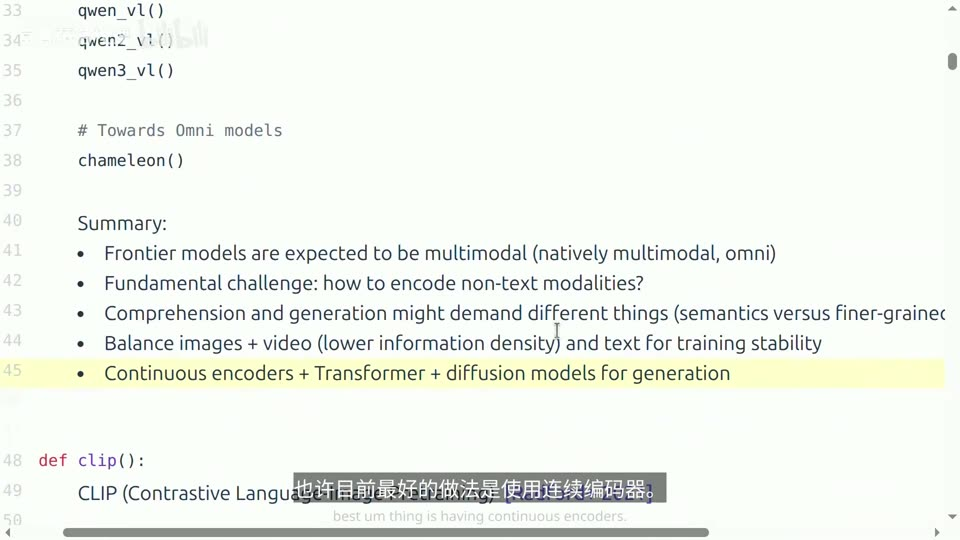 |
| 关于多模态的讲座就讲到这里。这部分没有实操作业，但如果你感兴趣，我鼓励你去动手试试，比如训练这些模型。 [【跳转到 52:12】](https://www.bilibili.com/video/BV11LEA6eEuj/?p=17&t=3132) | 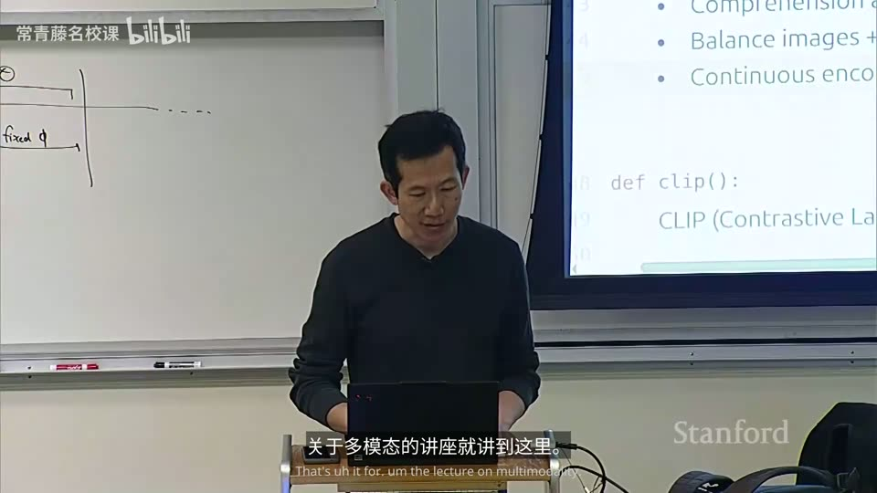 |