# Lecture 18: Guest Lecture Dan Fu · 原始文稿（图-字幕分栏）

| 字幕文本 | 画面 |
| :--- | ---: |
| 大家好，非常感谢各位前来。我觉得你们这门课很棒，也谢谢 Percy 邀请我来做这个演讲。 [【跳转到 00:00】](https://www.bilibili.com/video/BV11LEA6eEuj/?p=18&t=0) | 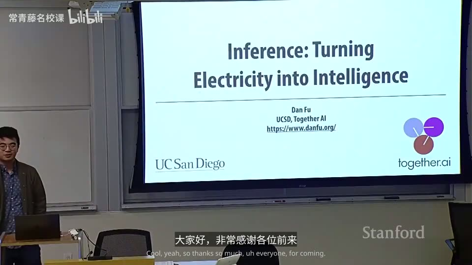 |
| 我想这门课主要讲的是训练，也就是怎么训练语言模型。 [【跳转到 00:05】](https://www.bilibili.com/video/BV11LEA6eEuj/?p=18&t=5) | 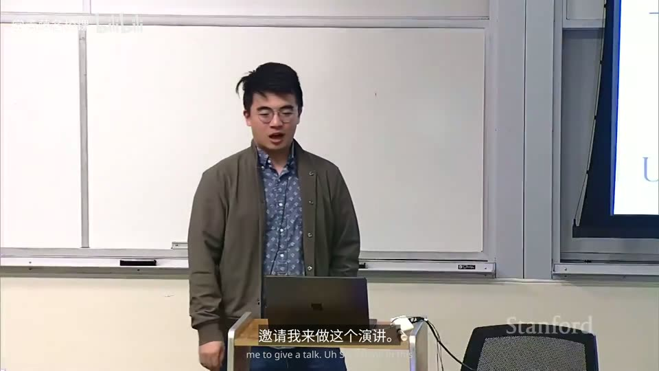 |
| 最终做出这些东西。今天我想讲讲，当你有了这样一个模型之后，从另一面看是什么样的，也就是真正去部署这些模型、做推理是什么样的。 [【跳转到 00:10】](https://www.bilibili.com/video/BV11LEA6eEuj/?p=18&t=10) | 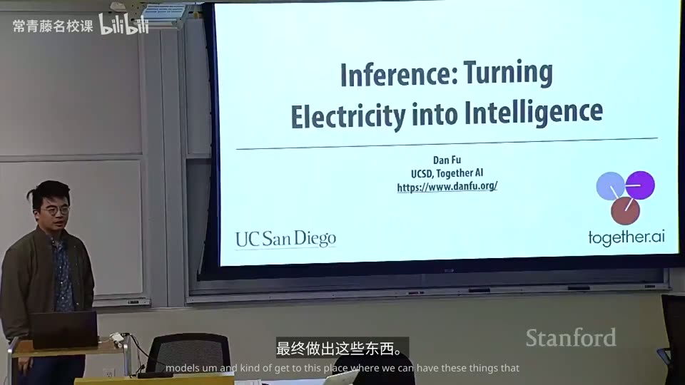 |
| 比如说从电力变成 token，再变成智能，以及从这个角度看有哪些有意思的研究问题和研究方向。好。 [【跳转到 00:23】](https://www.bilibili.com/video/BV11LEA6eEuj/?p=18&t=23) | 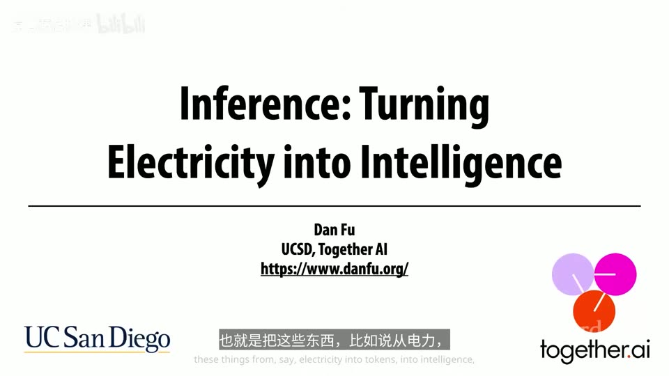 |
| 我先从一些宏观的动机讲起。我想有一点我们都已经看得非常清楚， [【跳转到 00:29】](https://www.bilibili.com/video/BV11LEA6eEuj/?p=18&t=29) | 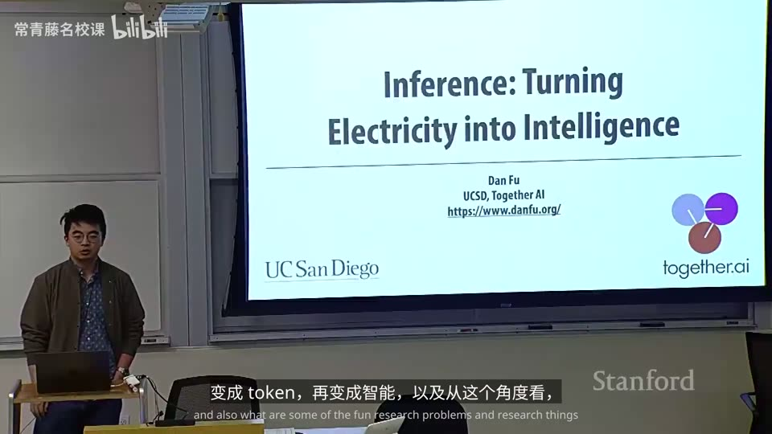 |
| 那就是这些模型和它们的能力。这些幻灯片是我两年前求职演讲时做的，所以具体的例子已经有点旧了。 [【跳转到 00:35】](https://www.bilibili.com/video/BV11LEA6eEuj/?p=18&t=35) |  |
| 但你可以做到人类水平的文本生成、代码生成，比如 Cursor、Claude Code、GPT-5.5，而不只是 GPT-4。 [【跳转到 00:49】](https://www.bilibili.com/video/BV11LEA6eEuj/?p=18&t=49) | 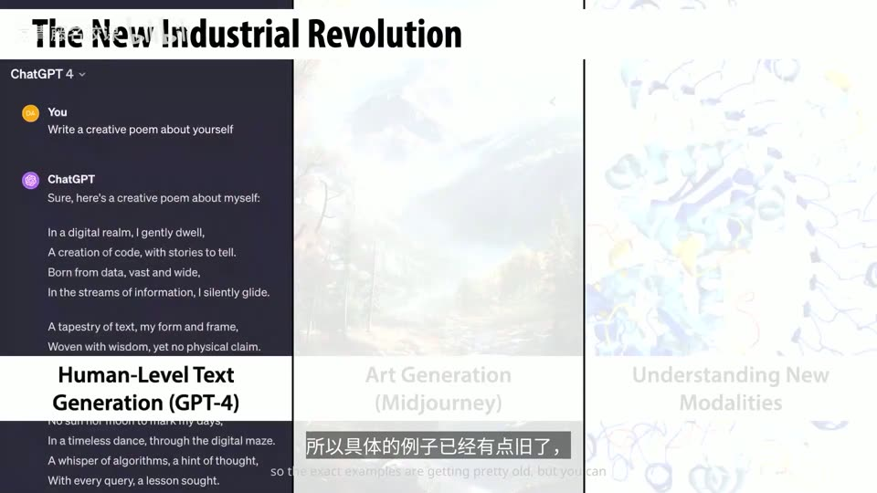 |
| 你既能生成也能理解，处理图像和视频，开始理解新模态。 [【跳转到 00:58】](https://www.bilibili.com/video/BV11LEA6eEuj/?p=18&t=58) | 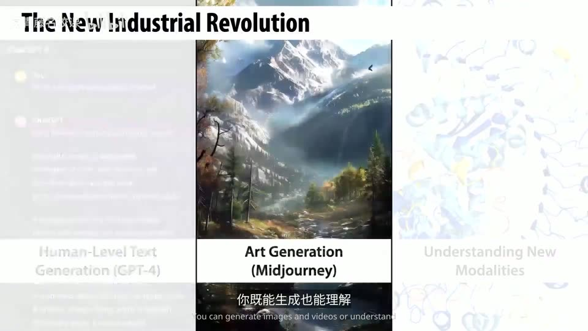 |
| 在生物健康领域就出现了 DNA 模型这类应用。我一直很关心一个问题： [【跳转到 01:03】](https://www.bilibili.com/video/BV11LEA6eEuj/?p=18&t=63) | 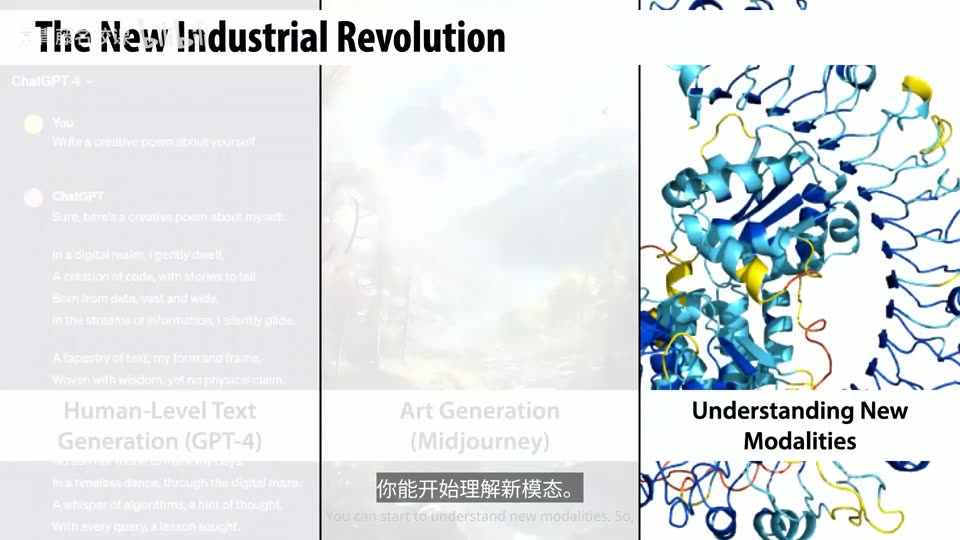 |
| 这些突破是怎么做到的？下一代又能怎么改进？ [【跳转到 01:08】](https://www.bilibili.com/video/BV11LEA6eEuj/?p=18&t=68) | 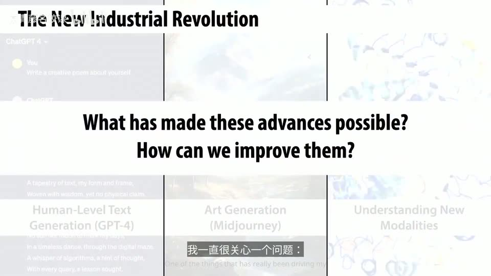 |
| 规模是这些能力的主要驱动力。看这张旧图，模型规模已经大幅扩展。2018 年我刚开始读博，那时最大的模型才 1 亿参数，我们都觉得太疯狂了。到 2019 年，我们觉得它太危险不敢发布，这就是 GPT-2。这门课你们应该能训出 GPT-2 水平的模型，不知道做到没，努力的话你们肯定能。如今开源模型都有万亿参数甚至更多。 [【跳转到 01:13】](https://www.bilibili.com/video/BV11LEA6eEuj/?p=18&t=73) | 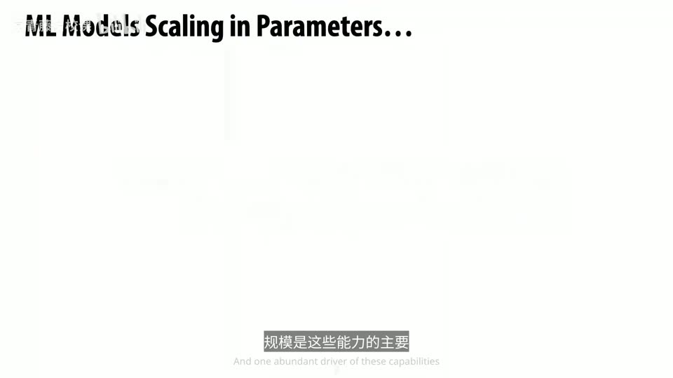 |
| 前沿模型参数大概五到 10 万亿。挺让人兴奋的，有了这些你就能对话、写代码、分析复杂文本，还能帮你做作业等等。 [【跳转到 01:38】](https://www.bilibili.com/video/BV11LEA6eEuj/?p=18&t=98) | 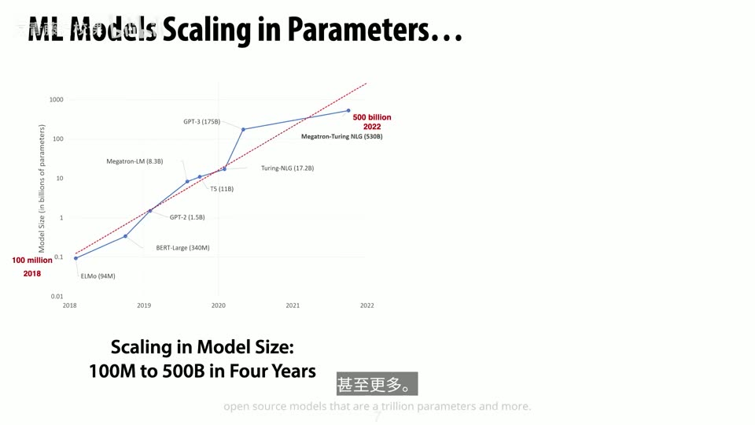 |
| 真正了不起的是，这一转变比我们想象的更快，也比我几年前读博初期预想的快得多。我觉得有个比喻很贴切，而且日期也很有意思地吻合。1902 年曼哈顿有 13 万匹马，它们不是养着玩的，而是承担着关键作用。每匹马每天产生好几磅粪便，乘以 13 万匹，数量惊人，这也成了严重的粪便问题。事实上还真开过专门的学术会议， [【跳转到 01:52】](https://www.bilibili.com/video/BV11LEA6eEuj/?p=18&t=112) |  |
| 讨论怎么处理这些麻烦。1898 年纽约就开过一次这样的会，结论是马粪问题没辙，只能捏着鼻子忍着。10 年后，到 1912 年， [【跳转到 02:17】](https://www.bilibili.com/video/BV11LEA6eEuj/?p=18&t=137) |  |
| 曼哈顿的汽车数量已经超过马匹。所以在这 10 年的过渡期里，你看那些存在了几个世纪的东西开始被汽车取代了。我觉得对咱们做语言模型的人来说，那个 1912 时刻大概就是去年。所以至少对我来说，去年我开始用这些语言模型来写大部分代码了，嗯，我团队里大多数人都这么干。 [【跳转到 02:29】](https://www.bilibili.com/video/BV11LEA6eEuj/?p=18&t=149) | 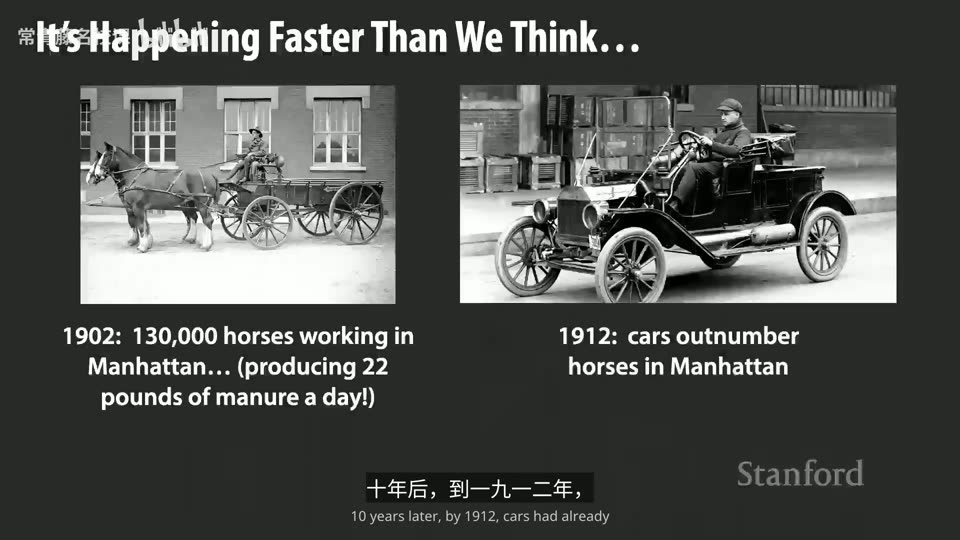 |
| 我也让所有学生都这么干，除了做作业的时候。这确实是个令人兴奋的过渡期，咱们正身处其中。 [【跳转到 02:54】](https://www.bilibili.com/video/BV11LEA6eEuj/?p=18&t=174) | 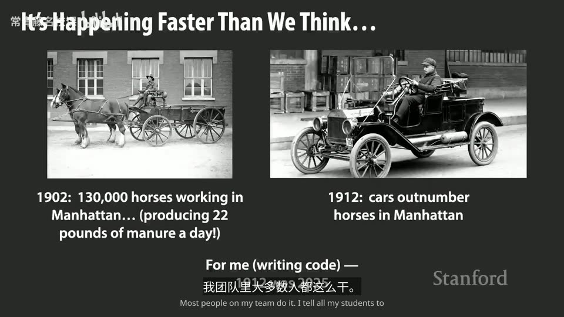 |
| 推动这一切的一个关键因素是，很多规模效应都由 GPU 驱动。所以说真的，你可以把 GPU 看作新的石油。虽然这是较早的消息，但能看到数千亿美元甚至更多资金投入 GPU。 [【跳转到 03:04】](https://www.bilibili.com/video/BV11LEA6eEuj/?p=18&t=184) | 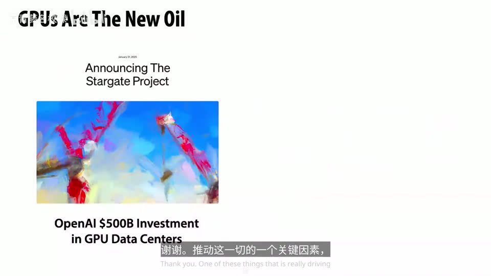 |
| 历史总是惊人的相似，各国主权基金正把这类投资作为国家资产的重头戏。 [【跳转到 03:21】](https://www.bilibili.com/video/BV11LEA6eEuj/?p=18&t=201) | 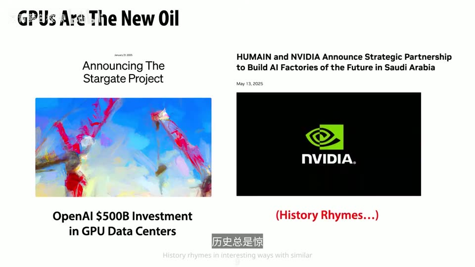 |
| 有一点非常清楚：推理才是关键。你可以把它看作把电力转化为智能的引擎。就像没有引擎石油无法转化为动能一样，推理引擎也至关重要。GPU 内核让 GPU 从沙子变成今天我们能用的东西。 [【跳转到 03:30】](https://www.bilibili.com/video/BV11LEA6eEuj/?p=18&t=210) | 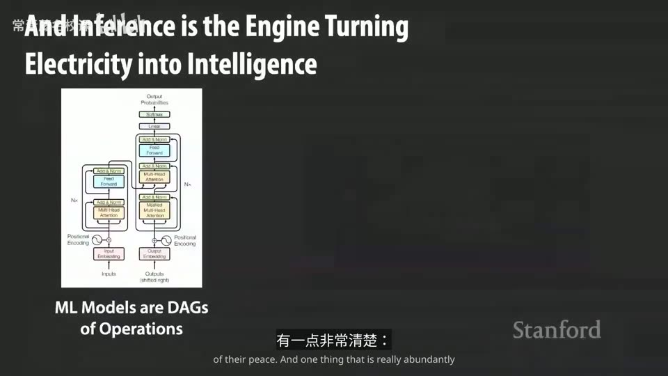 |
| 机器学习模型其实就是些存在于抽象空间的运算， [【跳转到 03:49】](https://www.bilibili.com/video/BV11LEA6eEuj/?p=18&t=229) | 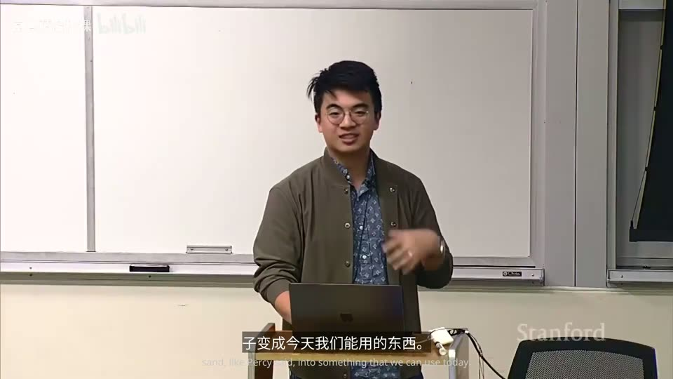 |
| 有向无环图。推理引擎和 GPU 内核就是要把模型映射到机器学习运算的关键。 [【跳转到 03:54】](https://www.bilibili.com/video/BV11LEA6eEuj/?p=18&t=234) |  |
| 这门课会涉及部分实现，比如 FlashAttention。不过在推理这一侧其实藏着巨大的复杂性，所以哪怕今天的内容你都忘了， [【跳转到 03:59】](https://www.bilibili.com/video/BV11LEA6eEuj/?p=18&t=239) | 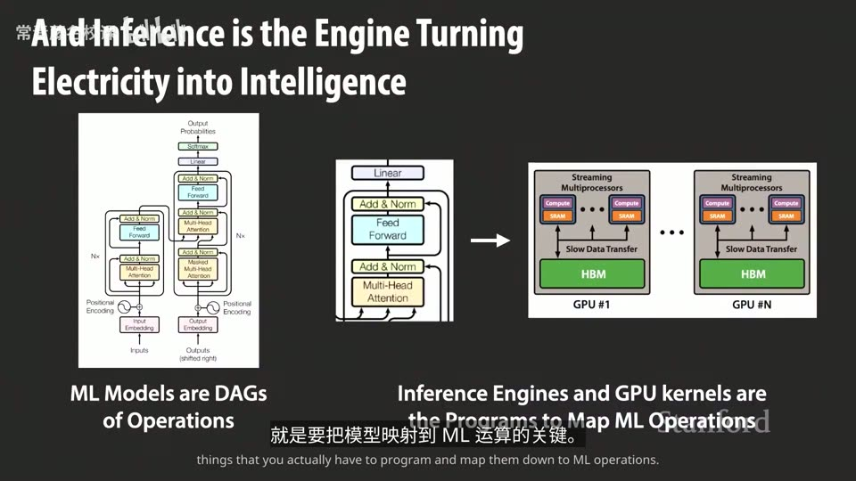 |
| 也请记住一点：只要搞懂推理、推理引擎和底层的 GPU 内核，你就能推动它，从而在机器学习算法上实现全栈创新。今天我先给大家宏观讲讲 token 的生命周期。 [【跳转到 04:08】](https://www.bilibili.com/video/BV11LEA6eEuj/?p=18&t=248) | 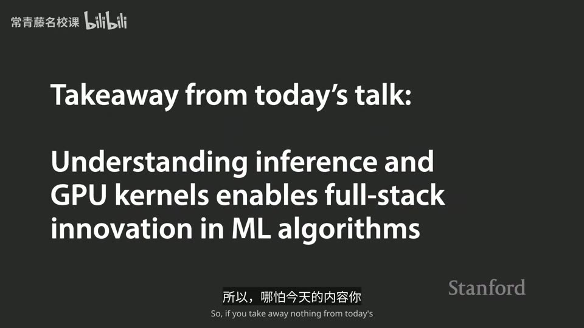 |
| 比如当你向模型发出请求时，请求会经历什么，它如何贯穿整个推理服务，你会面临哪些有趣的选择。稍后我会深入讲两个偏研究性的项目：如果你抽取这个系统的某些部分，你能提出哪些问题又能做些什么。在讲技术细节前， [【跳转到 04:21】](https://www.bilibili.com/video/BV11LEA6eEuj/?p=18&t=261) | 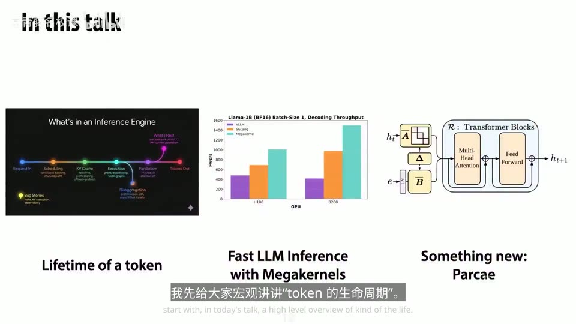 |
| 我先简单做个推介。今天我代表两个机构来到这里：一个是 UCSD，我在那儿有个小实验室，今天演讲里也涵盖了他们的一些工作；另一个是 Together，他们做了很多其他工作，今天也会一并介绍。Together 是个 AI 云平台，涵盖 GPU 推理、微调等全套服务。 [【跳转到 04:40】](https://www.bilibili.com/video/BV11LEA6eEuj/?p=18&t=280) | 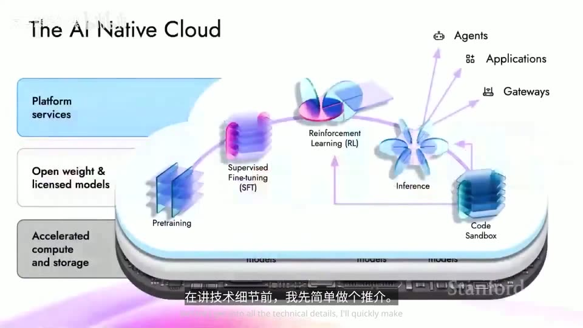 |
| 研究背景很强，比如 Percy，他可能看不见我的鼠标，但就在屏幕上。 [【跳转到 05:01】](https://www.bilibili.com/video/BV11LEA6eEuj/?p=18&t=301) | 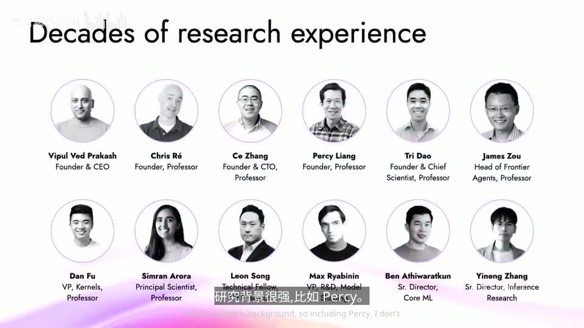 |
| 背后还有强大的研究团队支撑你接下来在演讲中看到的各项内容。 [【跳转到 05:06】](https://www.bilibili.com/video/BV11LEA6eEuj/?p=18&t=306) | 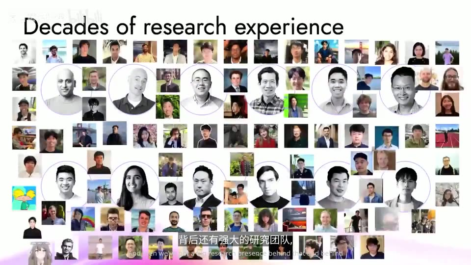 |
| 我先大致讲讲一个 token 的完整生命周期。当你向推理系统发请求时，数据会经过哪些环节。这些幻灯片参考了我学生 Austin 的演示以及他在 Together 的经历。 [【跳转到 05:11】](https://www.bilibili.com/video/BV11LEA6eEuj/?p=18&t=311) |  |
| 顺便说下，幻灯片全是 Nano Banana Pro 生成的。只要别盯着文字细看，效果其实不错，大体上没错，但要是细看就会发现不少地方错得离谱。（此处录音不清） [【跳转到 05:26】](https://www.bilibili.com/video/BV11LEA6eEuj/?p=18&t=326) |  |
| 好，咱们来看看推理引擎主要由哪些部分组成。简单说下它怎么运作：请求进来之后，第一步系统会把请求分配给不同的 GPU，预填充和解码阶段可能跑在不同的机器上；接着拿请求去查 KV 缓存，看以前是否处理过，看看能不能省点算力；然后就开始跑核心机器学习代码。 [【跳转到 05:38】](https://www.bilibili.com/video/BV11LEA6eEuj/?p=18&t=338) |  |
| token 和算子优化手段包括跨机器拆分、多节点并行或节点内 GPU 并行，具体取决于模型大小和拆分方式。随着硬件发展，我们会看到更多可选方案。选好跑完代码，最后就能拿到 token 了。你可以问：“嘿模型，Percy 说的线性回归是什么意思？因为我那节课缺了。”所以你能体验整个全流程。 [【跳转到 06:03】](https://www.bilibili.com/video/BV11LEA6eEuj/?p=18&t=363) | 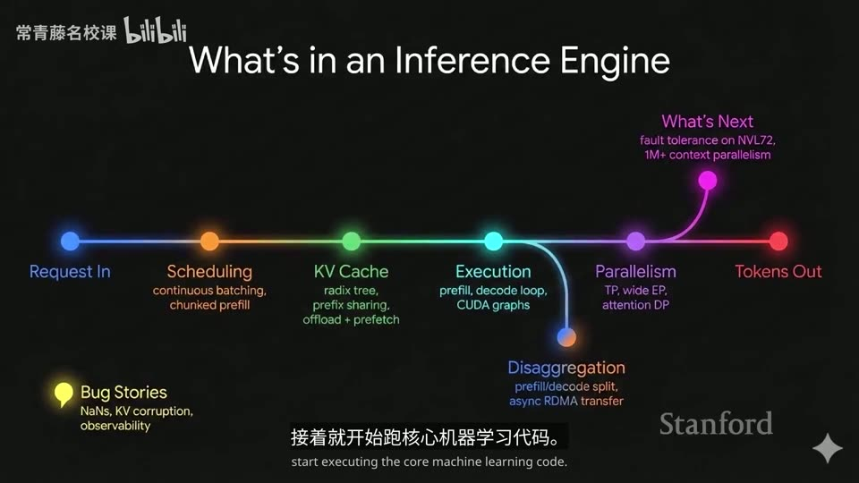 |
| 值得我们开始思考的是，这些不同的负载到底长什么样，情况多种多样。这张图你要是看得太细，有些地方看着就像 S 了，但你要想到，真正跑生产流量时未必也肯定不像你现在做的这样，不像训练时看到的那种 token，也不太像你在脑子里凭空编出来的负载。那我们通常会看到什么？特定负载下， [【跳转到 06:27】](https://www.bilibili.com/video/BV11LEA6eEuj/?p=18&t=387) | 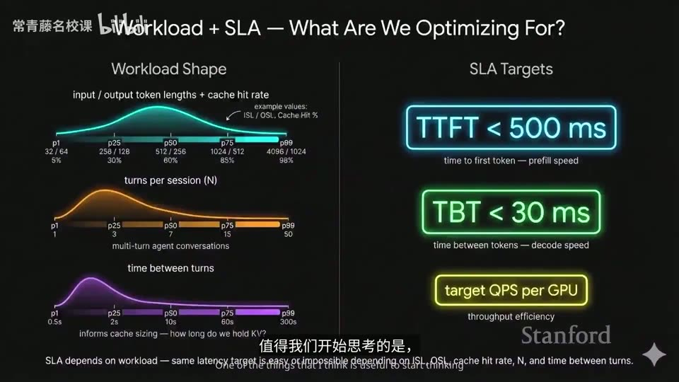 |
| 输入和输出 token 会呈现特定的分布。拿代码生成来说，比如你用 Cursor 智能体能访问你的代码库，你只管提问。一般情况是输入量很大，得有上万个输入 token；接着看模型怎么训练的，它可能输出一些思考 token，也可能只给简短回复。另外还要取决于工作负载和模型。 [【跳转到 06:52】](https://www.bilibili.com/video/BV11LEA6eEuj/?p=18&t=412) |  |
| 比如代码生成跟摘要生成差别就很大。要是你把整本书贴进对话框来回聊，那跟普通对话完全不一样。要是你直接问“给我讲讲一阶微积分”，负载形态就完全不同了。现在用语言模型大多是这种一问一答的智能体工作流，写代码时你和代码 agent 来回沟通：“做这个”“不，不是这意思”“或者做那个”，代码 agent [【跳转到 07:17】](https://www.bilibili.com/video/BV11LEA6eEuj/?p=18&t=437) | 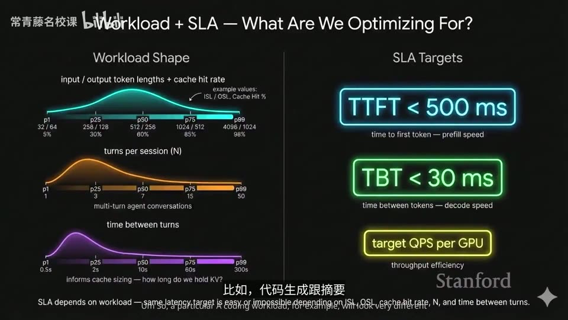 |
| 本身就能对语言模型做不少迭代，比如我调用工具让 grep 在代码库里搜点东西， [【跳转到 07:42】](https://www.bilibili.com/video/BV11LEA6eEuj/?p=18&t=462) | 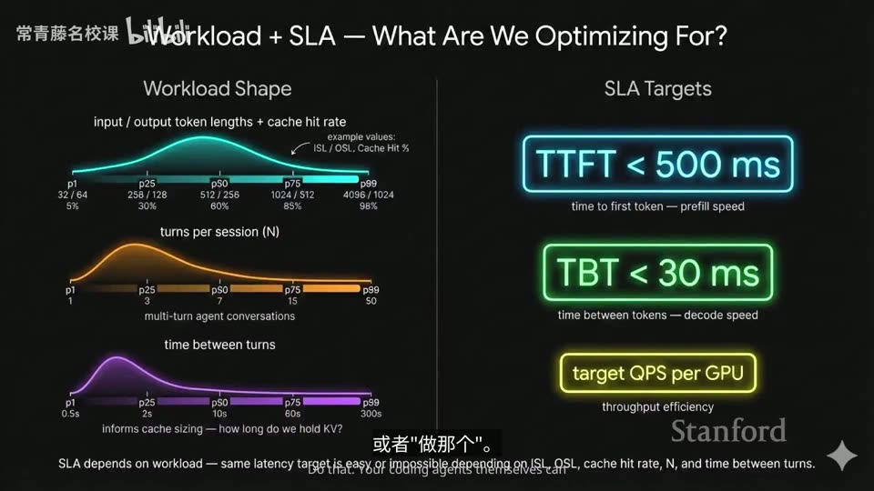 |
| 再把结果喂回模型。我也可能上网搜一下用户问的东西， [【跳转到 07:49】](https://www.bilibili.com/video/BV11LEA6eEuj/?p=18&t=469) |  |
| 所以对话通常会有好几个来回。 [【跳转到 07:54】](https://www.bilibili.com/video/BV11LEA6eEuj/?p=18&t=474) | 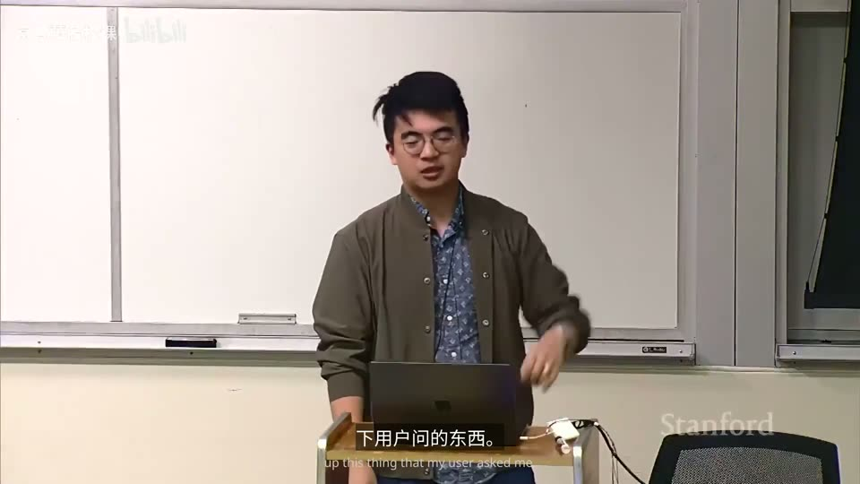 |
| 另一个有趣的点是，不同应用的节奏各不相同。比如你在快速对话循环里或用语音模式跟 ChatGPT 聊天，响应通常很快。反之如果你让 agent 自己跑流程，“替我做这个，我不打扰你自己迭代”，节奏就不同了。要是代理卡住喊“帮帮我”，我得问问，你却没注意到，回合间可能又有多个空档。 [【跳转到 07:59】](https://www.bilibili.com/video/BV11LEA6eEuj/?p=18&t=479) | 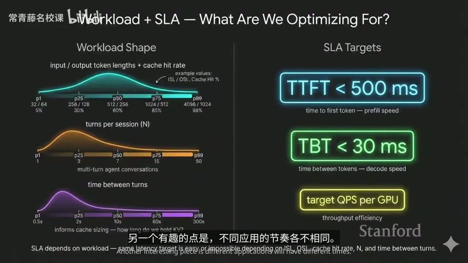 |
| 所以这些就决定了你的工作负载是什么样的，每次能拿到多少新 token，你要生成多少 token，对话有多长。我是那种反复跟代码代理来回聊的年轻用户吗？还是我只问个问题就走，第二天再回来。还有回合间隔，比如我曾用 ChatGPT 代理聊怎么安排每周的锻炼，我大概每两周才聊一次，这跟其他流量模式差别很大。 [【跳转到 08:24】](https://www.bilibili.com/video/BV11LEA6eEuj/?p=18&t=504) | 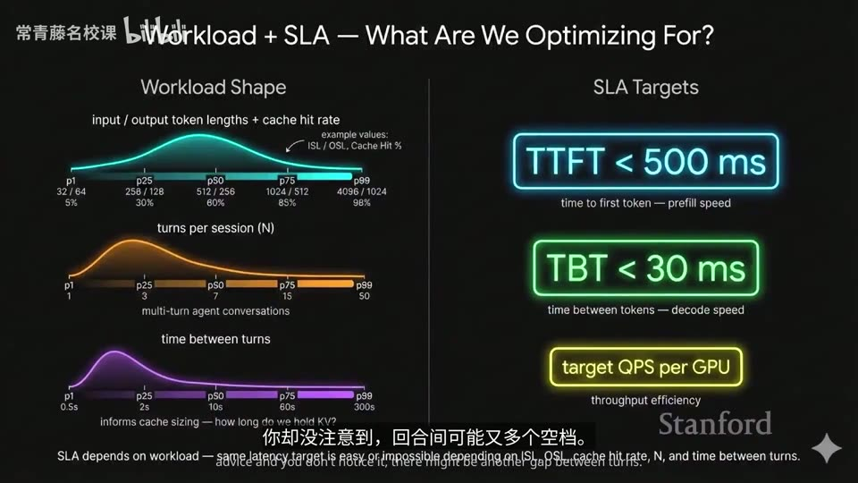 |
| 还有要看你的应用。交互式应用可能要求一秒内返回首个 token，让代理能提示“我正在想”，或者“我知道要生成 500 个 token，希望整个响应在规定时间内返回”，让用户能快—— [【跳转到 08:49】](https://www.bilibili.com/video/BV11LEA6eEuj/?p=18&t=529) | 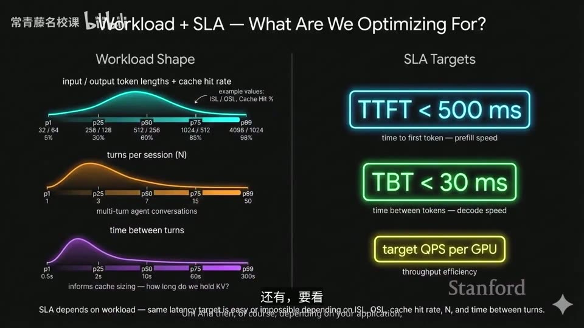 |
| 谢谢。请求进来时包含几个基本部分，稍后详述，预填充和解码。假设输入一些文本，第一步是分词，我想大家都熟悉。然后进入复杂的调度机制，比如是否见过这些 token、能否从缓存直接查找激活值。这是机器学习计算的两个主要部分，叫预填充和解码，节奏差别很大。 [【跳转到 09:03】](https://www.bilibili.com/video/BV11LEA6eEuj/?p=18&t=543) |  |
| 预填充是说，假设你手上有这样一段东西，你喂它 1 万个从未见过的 token，得算出激活值和 logits，即输入 10000 token 输出一个 token，这是计算密集型操作。这和你们训练时看的指标差不多，训练时你处理大量 token，写好 FlashAttention 内核跑训练循环，差不多，只是不反向传播。 [【跳转到 09:28】](https://www.bilibili.com/video/BV11LEA6eEuj/?p=18&t=568) | 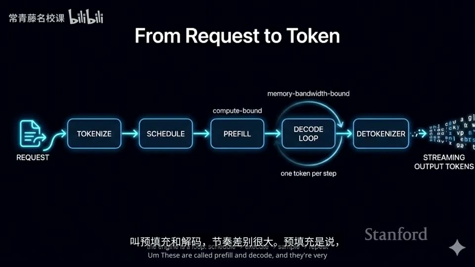 |
| 然后是 decode，逐步逐个生成 token。比如输入 10000 token，问“ABC 函数是干什么的”，模型处理完 prompt 就开始逐个生成。用了推测解码的话一次能出三四个。每生成一个新 token 都得重新过一遍模型，算一算就知道其实需要计算的浮点运算并不多，就是计算量不大，但瓶颈在内存带宽。也就是说每次生成一个 token 都要重新加载模型。 [【跳转到 09:53】](https://www.bilibili.com/video/BV11LEA6eEuj/?p=18&t=593) | 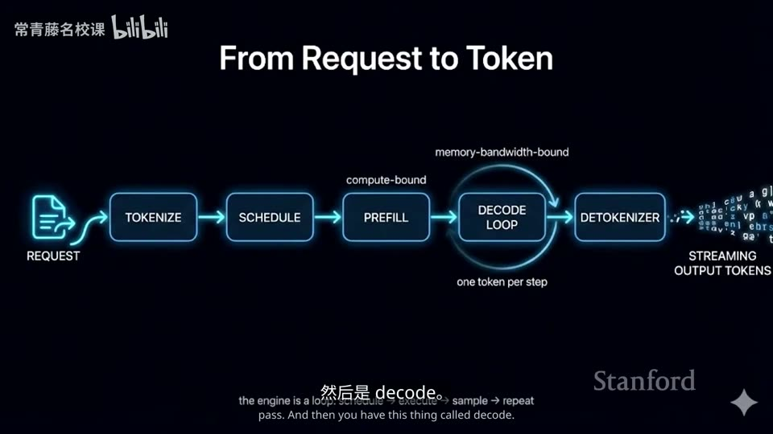 |
| 模型跑完后你会得到一个代表该 token 的数值，再转成字符串。接着你会做点处理，比如检查停止 token，或做安全检查，看用户是不是想恶意入侵系统之类的。最后输出 token。推理引擎就在这一循环里运行，等着接受请求，它就在调度、执行和 token 采样的循环里不断重复。 [【跳转到 10:18】](https://www.bilibili.com/video/BV11LEA6eEuj/?p=18&t=618) | 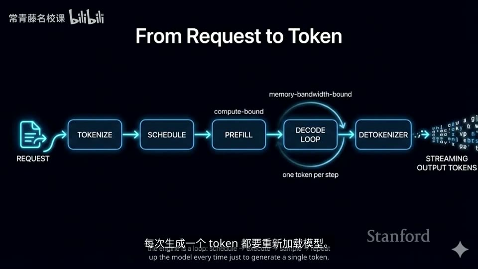 |
| 咱们再深入一步，看看系统同时处理多个请求时是什么样。这里有个技术叫连续批处理。看这张图，时间是从上往下走的。往下走会有新请求进来，比如到第一步你有一些长请求，有用户让你分析一份很长的文档，引擎就一直生成一大堆 token，可能还有另一个请求进来开始占用资源。 [【跳转到 10:43】](https://www.bilibili.com/video/BV11LEA6eEuj/?p=18&t=643) | 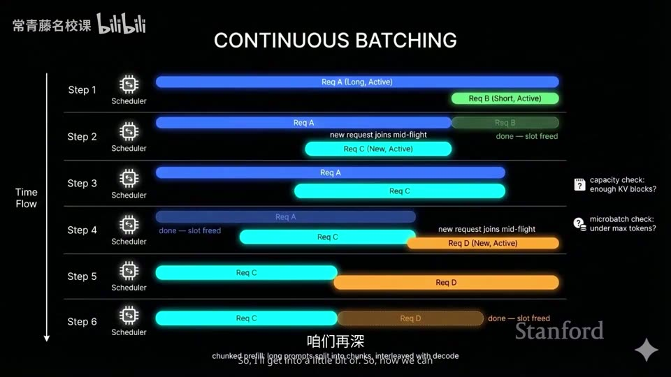 |
| 这些资源首先是计算资源，你得同时跑多个请求。如果你在填 KV 缓存，那就是内存资源。你会看到多个请求同时进行，走一步后那个短请求可能结束了，又来个新请求，可能要跑好几步才来新请求，比如又是个特别长的，就是第四步里那个橙色的。但显存不够就得把全部 KV 缓存存到 GPU 上。 [【跳转到 11:08】](https://www.bilibili.com/video/BV11LEA6eEuj/?p=18&t=668) |  |
| 那显存耗尽时请求可能会开始排队，等那个场景跑完就能启动新请求，以此类推。你可以看着它运行。所以你看，系统里有一堆不同请求时，运行起来就已经挺复杂了。 [【跳转到 11:33】](https://www.bilibili.com/video/BV11LEA6eEuj/?p=18&t=693) | 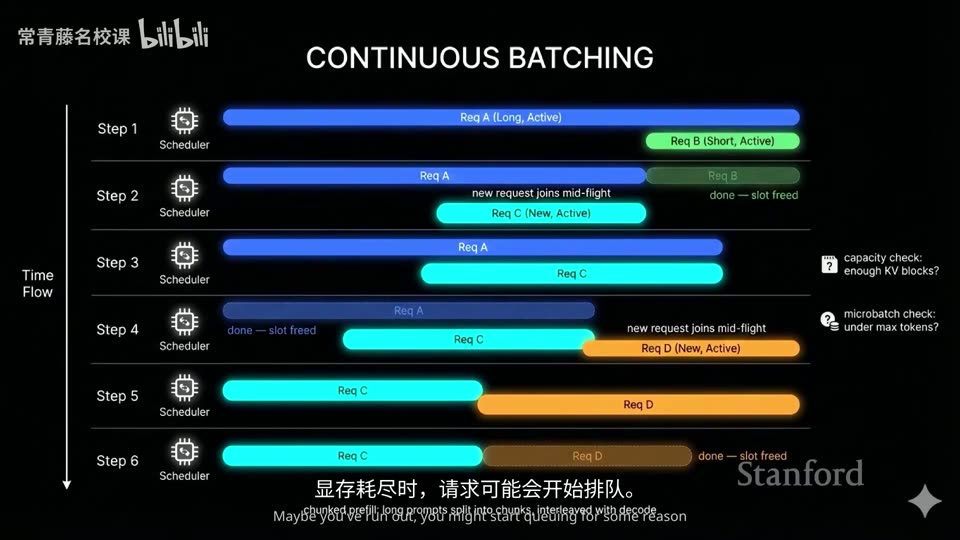 |
| 其中一个挺重要的部分叫做 KV 缓存。你可以这么想，很多用户可能都在说“hi ChatGPT”或“hi Claude”，理论上不用重新计算激活值，不用给每个用户都再跑一遍。要是用户输入了长文本，只需对它做一次 prefill；下一轮对话里再追加内容时，你不用把整个东西重新算一遍。所以有了叫 KV 缓存的机制，利用前缀共享新来一组 token。 [【跳转到 11:47】](https://www.bilibili.com/video/BV11LEA6eEuj/?p=18&t=707) | 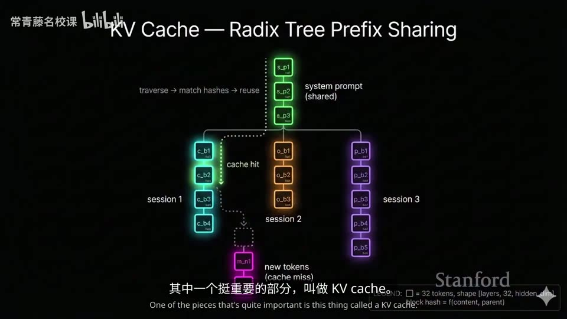 |
| 用基数树这种很传统的数据结构，看看哪些 token 见过、哪些是新的。 [【跳转到 12:12】](https://www.bilibili.com/video/BV11LEA6eEuj/?p=18&t=732) | 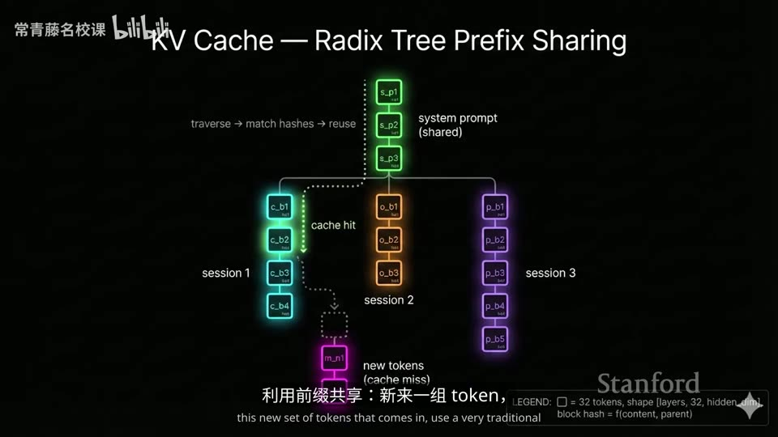 |
| 然后查一下这些激活值大概长什么样。 [【跳转到 12:17】](https://www.bilibili.com/video/BV11LEA6eEuj/?p=18&t=737) | 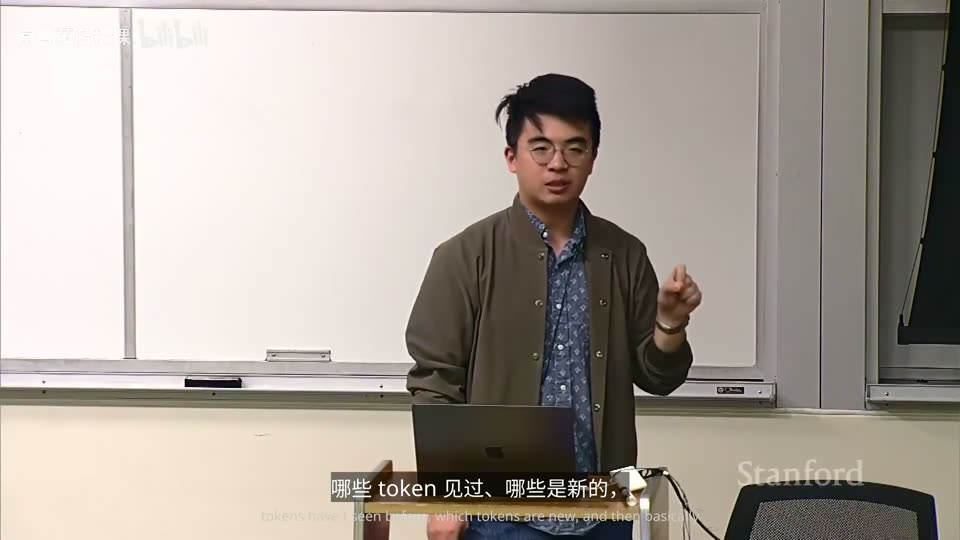 |
| 算力到了 GPU 上，拆分的方式就有很多种。假设你有一个万亿参数的模型跑在 280GB 显存的 GPU 上，单个 GPU 根本装不下整个模型。拆分方式有好几种，比如把每个 tensor 拆成四份分给四个 GPU，或者叫 tensor parallel；还有现在很多 SOTA 模型是 mixture of experts，这些独立的 expert 会根据不同的 token [【跳转到 12:22】](https://www.bilibili.com/video/BV11LEA6eEuj/?p=18&t=742) | 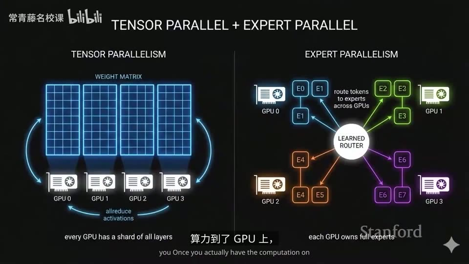 |
| 被选择性激活，你可以把它们分到不同 GPU。这些选择决定了瓶颈在哪、需要多少 GPU、能同时服务多少 session 等等。一个常见做法是 [【跳转到 12:47】](https://www.bilibili.com/video/BV11LEA6eEuj/?p=18&t=767) | 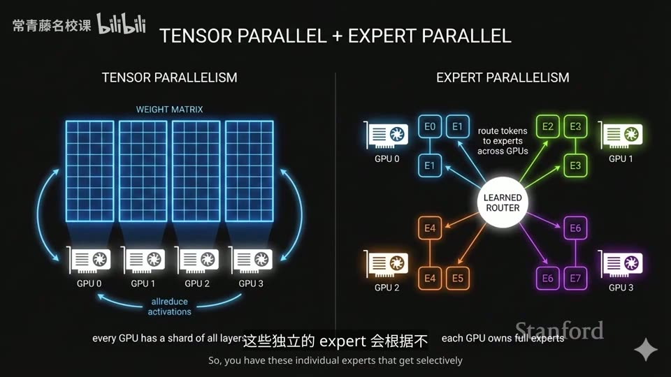 |
| 把 prefill 和 decode 分到不同的 GPU、不同的机器组上。因为它们的计算瓶颈和计算特性截然不同。预填充很像你们训练时做的事，直接运行非常消耗算力，你能充分利用 GPU；而另一方面它极度依赖内存带宽，因为计算量不大却得同时加载所有模型权重。耗时也各不相同，预填充通常比单次解码久得多。 [【跳转到 12:59】](https://www.bilibili.com/video/BV11LEA6eEuj/?p=18&t=779) | 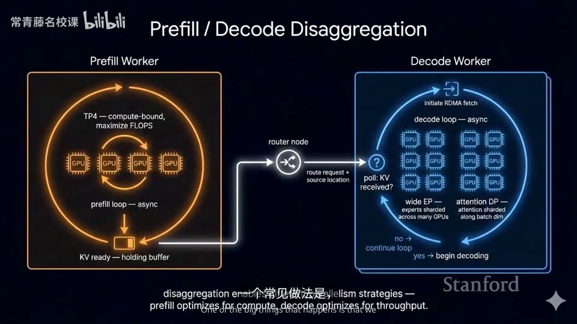 |
| 但解码步骤多得多，因为提示词只预填充一次，每生成一个 token 就解码一次。一个基础优化是我们都开始采用的：让不同的 worker 组分别处理预填充和解码，从而针对计算的不同环节做专门优化。事实证明，有了这种拆分可以做很多创新。比如你可能听说过 NVIDIA 收购 Groq， [【跳转到 13:24】](https://www.bilibili.com/video/BV11LEA6eEuj/?p=18&t=804) | 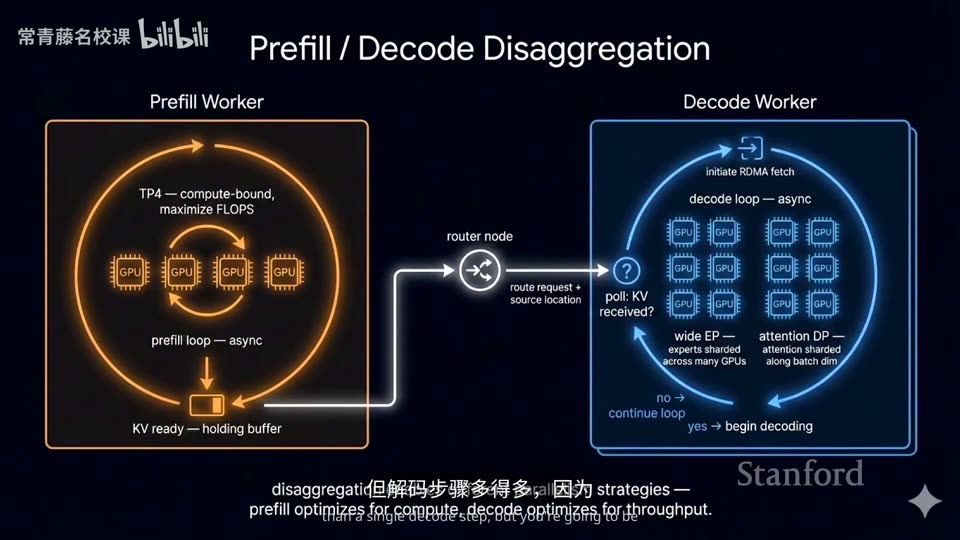 |
| 也就是 GPU 之王 NVIDIA 买下了这种新型推理芯片。 [【跳转到 13:45】](https://www.bilibili.com/video/BV11LEA6eEuj/?p=18&t=825) | 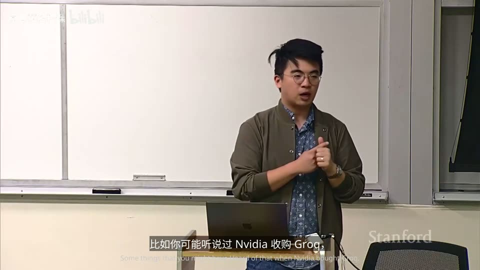 |
| 原因之一是解码负载和预填充负载差异巨大，针对解码你可以使用完全不同的芯片，比如下一代硬件。 [【跳转到 13:50】](https://www.bilibili.com/video/BV11LEA6eEuj/?p=18&t=830) | 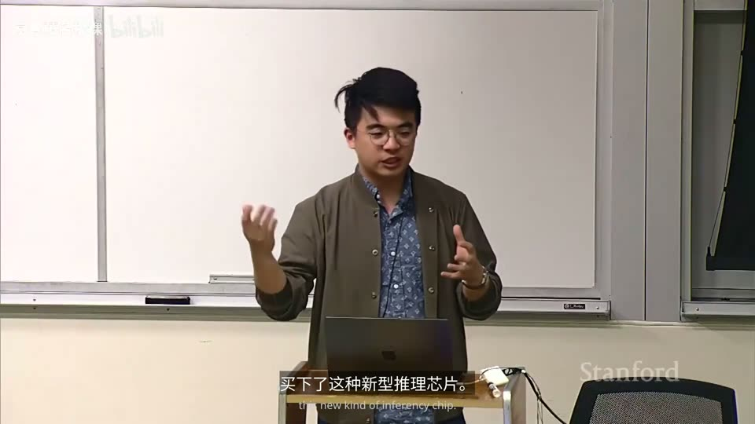 |
| NVIDIA 打算用 GPU 处理预填充，用 Groq 的 LPU 芯片做解码。Cerebras 也与 OpenAI 有算力合作，它解码更强。SambaNova 这些公司也在这一领域的不同环节下注。 [【跳转到 13:59】](https://www.bilibili.com/video/BV11LEA6eEuj/?p=18&t=839) | 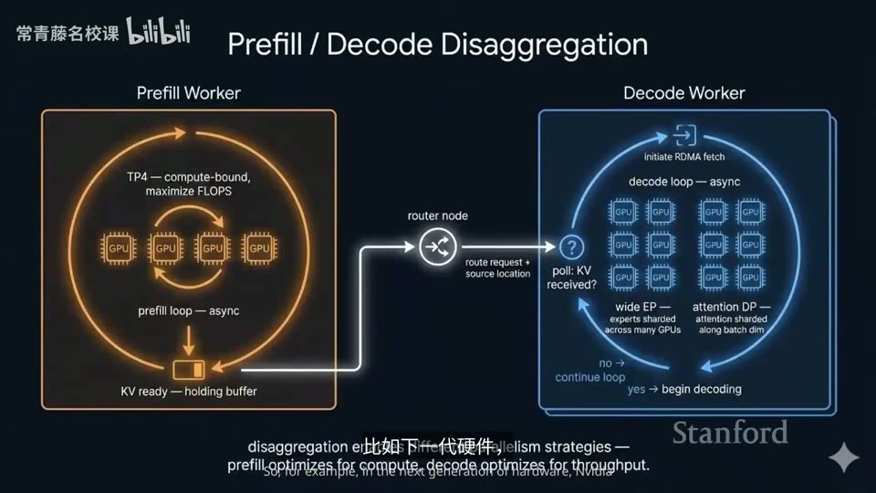 |
| 当你真正大规模部署这些推理引擎，每天处理上万亿 token 甚至更多时，就会遇到一些相当棘手的 bug。这组 bug 大多发生在去年年底，涉及一些开源推理引擎。大规模系统有个特点：小规模下正常，大规模下必然出错。我们说的是发生概率低于 0.001% 的事件。有些 bug 极细微， [【跳转到 14:14】](https://www.bilibili.com/video/BV11LEA6eEuj/?p=18&t=854) | 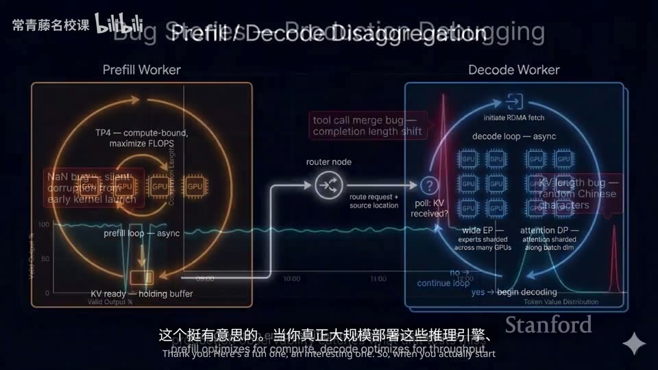 |
| 内核略有错误但触发条件极罕见，算到一半部分 logits 就会变成 NaN，这时模型就开始反复输出同一个 token，有个模型后来只输出“hihihi”或感叹号，陷入死循环。有些模型有人改了处理工具调用的逻辑，工具调用就是模型说“嘿，我要搜个网”之类的，模型说完去搜一下， [【跳转到 14:39】](https://www.bilibili.com/video/BV11LEA6eEuj/?p=18&t=879) | 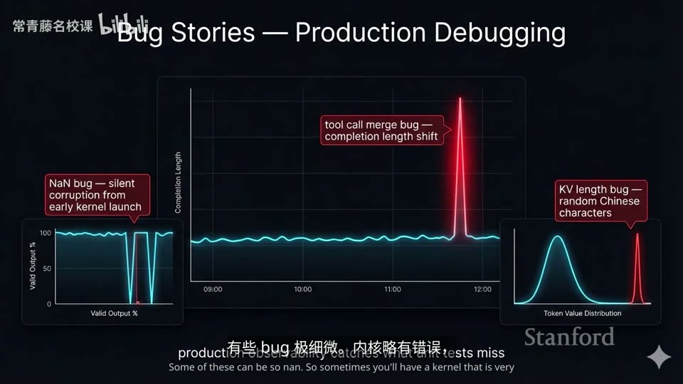 |
| 后端就得用老代码去执行。后来某个引擎处理工具调用出了错，变成输出变长，模型一直喊“去搜一下”。模型正常时通常会说“嘿，去搜一下”“我搞定了，去回复用户吧”，但这回它没正确返回，它会一直说“去搜一下、去搜一下、怎么还没搜”，陷入死循环，跑上数万个 token。 [【跳转到 15:04】](https://www.bilibili.com/video/BV11LEA6eEuj/?p=18&t=904) | 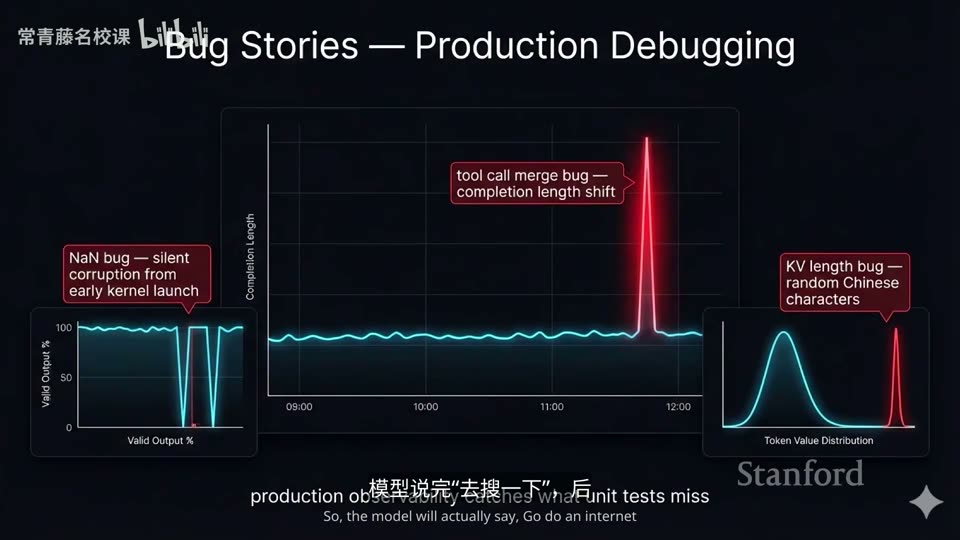 |
| 还有个案例很有趣，它同时搞挂了多个推理提供商，还被赖在量化问题上。其实是个更微妙的 bug：模型没理由地突然开始蹦出中文字。有人猜模型可能用中文微调过，因为问它英文它却回中文；其实是某个 kernel 里的一个差异错误。这是个很微妙的 bug，有时候你会从 GPU 里读到一些没初始化的内存数据， [【跳转到 15:29】](https://www.bilibili.com/video/BV11LEA6eEuj/?p=18&t=929) |  |
| 经过注意力机制最后会得到一个随机的中文字，模型会纳闷怎么突然开始想中文了，以为你在问中文问题，结果就顺着聊到中文去了。有时候这是因为模型确实被训练过让它能想中文，有时候只是别人的代码里有个 off-by-one 的小 bug。 [【跳转到 15:54】](https://www.bilibili.com/video/BV11LEA6eEuj/?p=18&t=954) | 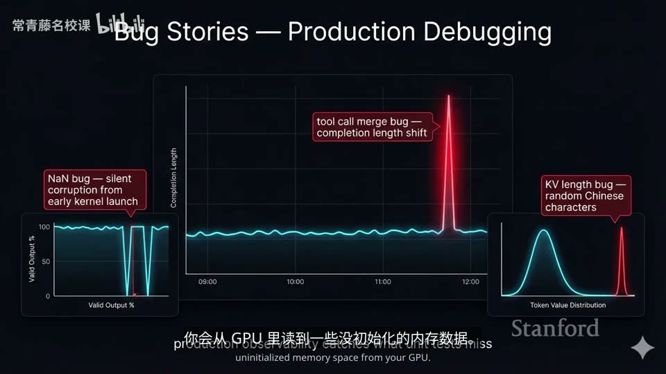 |
| 在一些更高级的推理框架里，最近开始冒出一些挺有意思的现象。跑大型生产系统时关键的一点就是 KV 缓存越大越好，最好能把不同用户或者同一用户在不同会话里的请求都缓存起来，这样能跑的任务就更多。为了处理更多会话，先把 KV 缓存存到 GPU 上，结果 GPU 内存很快就不够了。接着你可以开始存到 CPU 内存里。 [【跳转到 16:12】](https://www.bilibili.com/video/BV11LEA6eEuj/?p=18&t=972) |  |
| 如果你留意 Jensen 的主题演讲，会发现他最近特别看重 CPU 性能。原因之一在于上一代 CPU 其实很慢，结果成了很多重要任务的瓶颈。于是你开始关注，因为如果你 50 万美元的机器被你配的 1000 美元 CPU 拖了后腿，那就很糟糕了。原因之一是你可能把 KV 缓存存在了 CPU 内存里。 [【跳转到 16:37】](https://www.bilibili.com/video/BV11LEA6eEuj/?p=18&t=997) |  |
| 所以你会很在意把 KV 缓存读回来的速度。再往后你可能把更多 KV 缓存放到磁盘上，这时就得关注 SSD 和它的空间了。再说你大概听过 OpenAI 抢购全球 SSD 和内存的传闻，原因之一就是为了这种场景，你得在 KV 缓存里尽可能多地存数据。 [【跳转到 17:02】](https://www.bilibili.com/video/BV11LEA6eEuj/?p=18&t=1022) |  |
| 当然真正构建引擎时你得处理各种复杂情况，比如这些 token 我好久没见了，我可能会把它踢出去，转到 CPU、磁盘或其他全局存储里；等请求一来我得去查、去等，再把它们取回来，加载进系统里，这事就妥了。这感觉有点儿…… [【跳转到 17:27】](https://www.bilibili.com/video/BV11LEA6eEuj/?p=18&t=1047) |  |
| CSD 卸载，不是指把某种特定负载卸下来。 [【跳转到 17:48】](https://www.bilibili.com/video/BV11LEA6eEuj/?p=18&t=1068) | 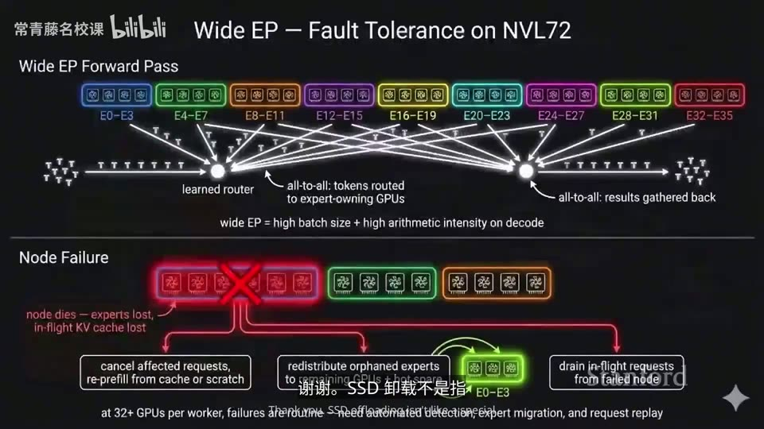 |
| 比如要快的时候你肯定不想这么干，对吧，毕竟读 SSD 太慢了。能再问一遍吗？行，你是问这种卸载 [【跳转到 17:54】](https://www.bilibili.com/video/BV11LEA6eEuj/?p=18&t=1074) | 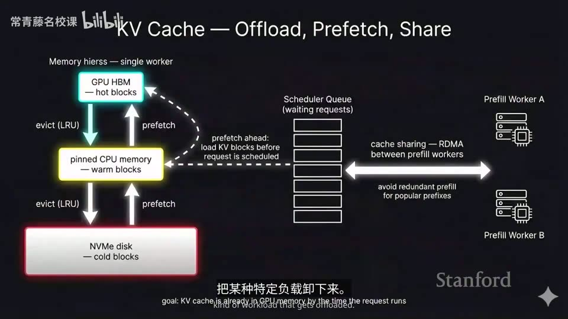 |
| 是不是只针对某类特定的工作负载？嗯，咱们聊聊这个。 [【跳转到 18:02】](https://www.bilibili.com/video/BV11LEA6eEuj/?p=18&t=1082) | 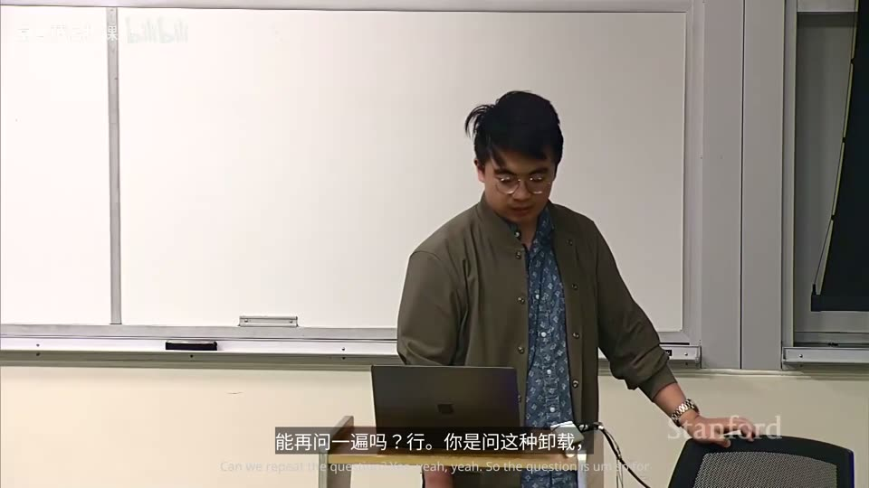 |
| 我知道你们可能没修过操作系统课，但我强烈建议你们去上，这里涉及很经典的调度逻辑。 [【跳转到 18:07】](https://www.bilibili.com/video/BV11LEA6eEuj/?p=18&t=1087) |  |
| 除了右边 GPU 那块，这张图看着就跟七八十年代操作系统课的图 [【跳转到 18:12】](https://www.bilibili.com/video/BV11LEA6eEuj/?p=18&t=1092) | 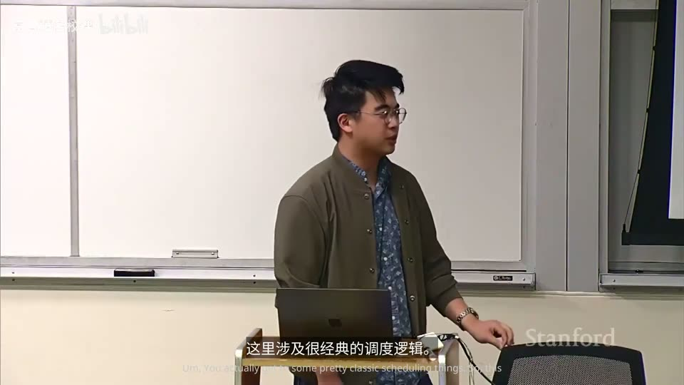 |
| 一模一样。以前咱们也遇到过这问题，电脑里开太多应用、CPU 内存已满，你就得想办法应对，把这些应用挪到磁盘里。 [【跳转到 18:17】](https://www.bilibili.com/video/BV11LEA6eEuj/?p=18&t=1097) | 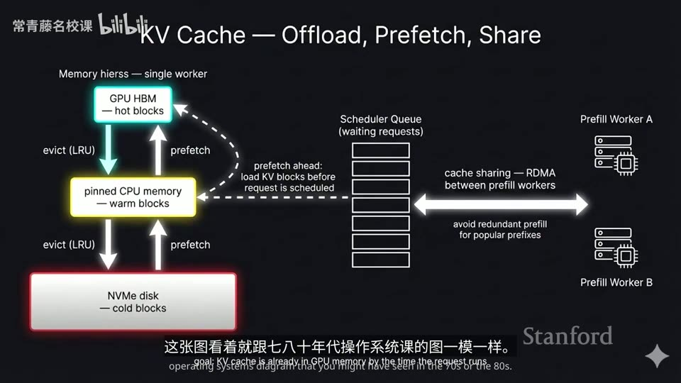 |
| 这工作负载其实是一回事。理想状态下，左边那个 Nano Banana 模拟了 LRU 驱逐。 [【跳转到 18:27】](https://www.bilibili.com/video/BV11LEA6eEuj/?p=18&t=1107) | 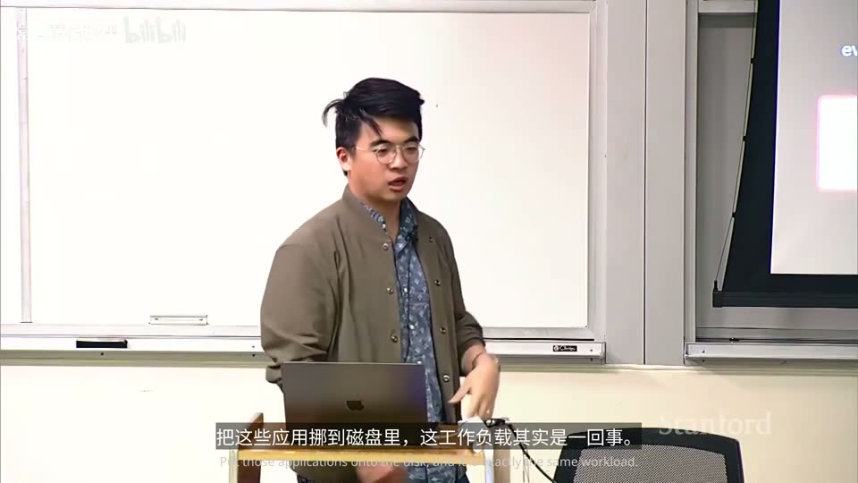 |
| 这启发式策略其实挺靠谱的，估计有篇操作系统论文说过，LRU 的效果最多也就比最优解差两倍，那才是最优解。当然如果你能预知未来，知道马上会有特定请求进来， [【跳转到 18:32】](https://www.bilibili.com/video/BV11LEA6eEuj/?p=18&t=1112) | 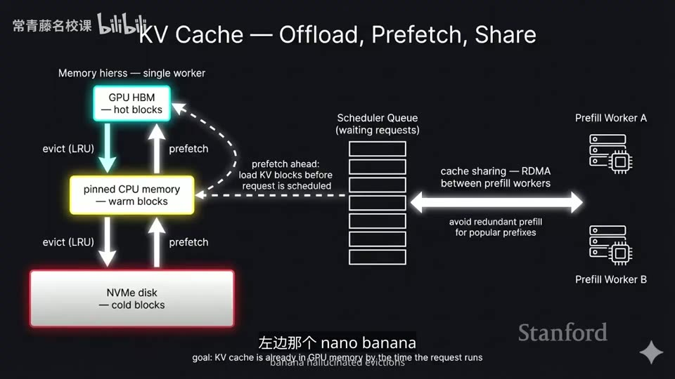 |
| 那就完美了。这是我先预取一下内存。其实预测未来是有可能的，比如你打开聊天应用翻出一个月前的旧对话，这说明你大概率要针对它提问，接着你可能得把它加载到 GPU 上。理想情况下你能预测未来，若不能就靠各种启发式策略。这其实是个问题：你要把多少流量压到 GPU 上？ [【跳转到 18:45】](https://www.bilibili.com/video/BV11LEA6eEuj/?p=18&t=1125) | 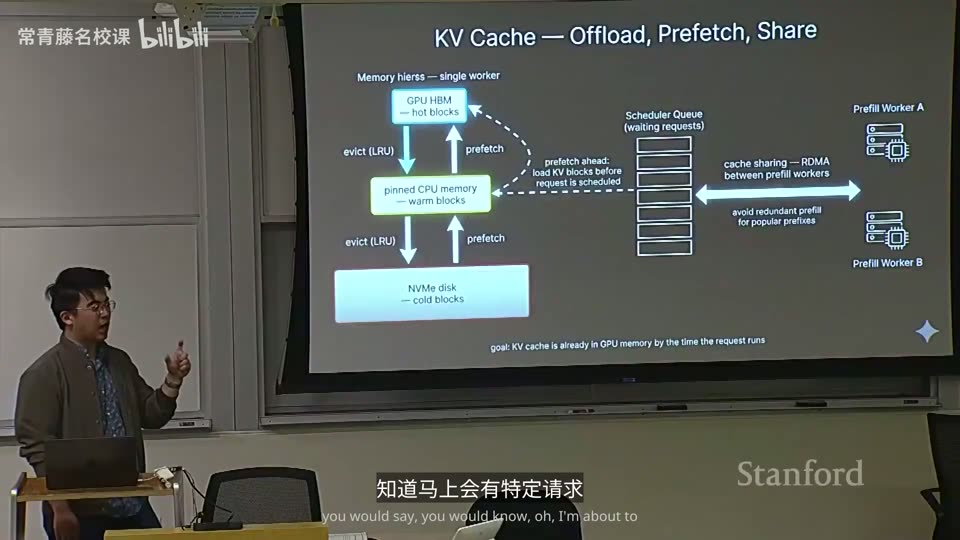 |
| 我没见过谁想把更少的流量压给 GPU，所以只要满足咱们开头提的那些 SLA，你肯定想尽可能多地承载流量。 [【跳转到 19:10】](https://www.bilibili.com/video/BV11LEA6eEuj/?p=18&t=1150) | 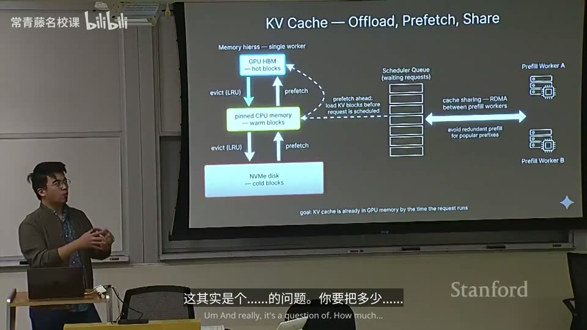 |
| 有些有趣的事开始了。在上一代 Blackwell GPU 中，NVIDIA 开始打造新的 GPU，即 NVL72，GB200 这类 Blackwell 芯片。这就是 72 块 GPU 通过高速互联连接起来。于是你开始考虑怎么把万亿参数的模型分摊到 72 块 GPU 上，这有意义吗？能带来什么？会发生什么？怎么考虑容错呢？这些设备常因各种原因出故障。 [【跳转到 19:23】](https://www.bilibili.com/video/BV11LEA6eEuj/?p=18&t=1163) | 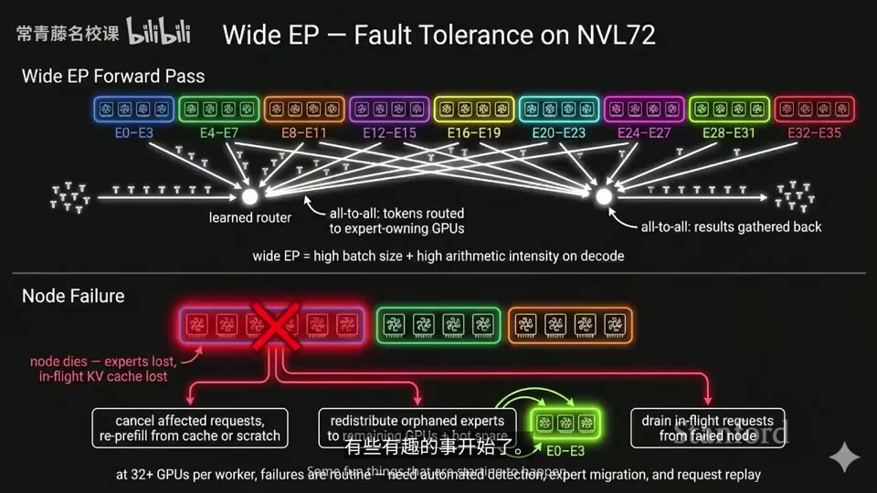 |
| 比如连接器很脆，是塑料做的不是金属，插太紧了 NVL 链接就变得不稳定，这本身就很麻烦。这是 AI 时代，所以给芯片加了风扇和散热片。如果把模型分到 64 块 GPU 上，为数百万用户、数万亿 token 提供生产流量，当某一块 GPU 出故障时该怎么办？有办法做到容错吗？这里有很多有趣的问题值得琢磨。 [【跳转到 19:48】](https://www.bilibili.com/video/BV11LEA6eEuj/?p=18&t=1188) | 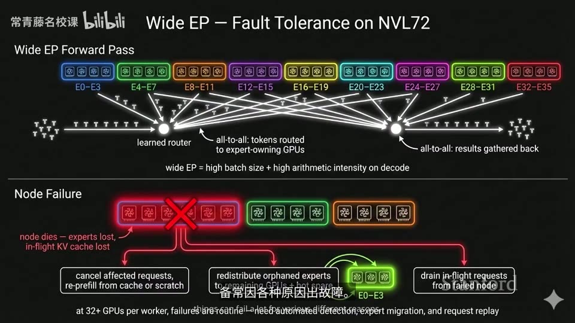 |
| 接着你会发现这些模型的上下文已经达到百万级甚至更多，那具体怎么处理？是把上下文拆分到多个 GPU 上吗？具体怎么做？ [【跳转到 20:13】](https://www.bilibili.com/video/BV11LEA6eEuj/?p=18&t=1213) | 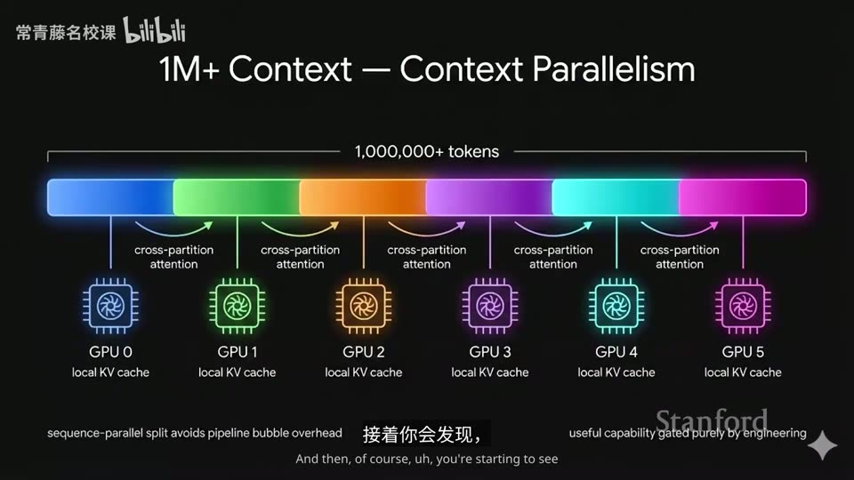 |
| 谢谢。我想简要提一种优化方案，当你从系统层面审视整个流程时就可以着手实施。 [【跳转到 20:24】](https://www.bilibili.com/video/BV11LEA6eEuj/?p=18&t=1224) | 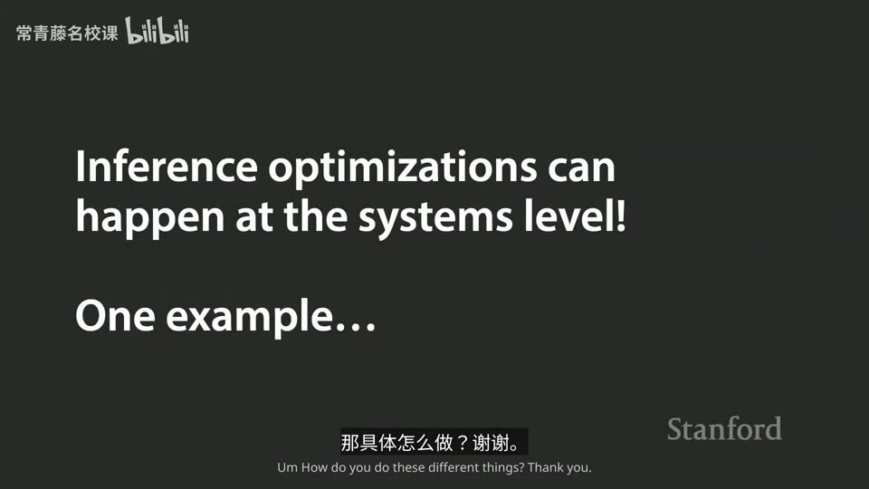 |
| 这是我们几个月前一起发布的一项工作，叫做 prefill-decode 分离（disaggregation）。这优化很简单，路由层只需改两行代码，但效果显著。基本思路是：近来大量请求都是多轮对话里的逐轮交互，用户已经开启了对话，假设平均一段对话持续十轮，随后用户离开，这意味着 10% 的请求是全新的请求，新请求包含数千 token， [【跳转到 20:31】](https://www.bilibili.com/video/BV11LEA6eEuj/?p=18&t=1231) | 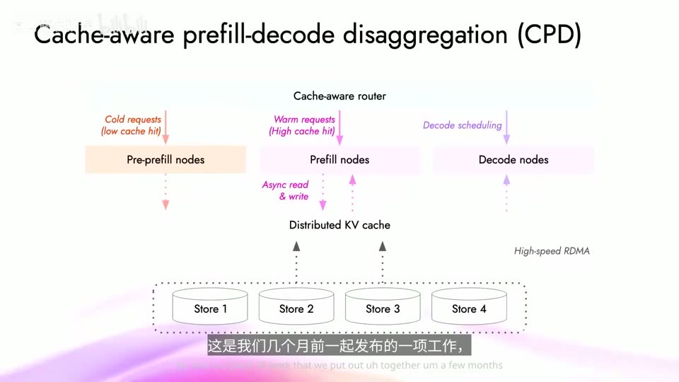 |
| 看起来很不一样，计算成本也高得多。你也不想把这种预填充放在一个进行到一半的短对话上。比如有人贴一本书说“跟我聊聊这本书”，你不想让他和另一个人同时跑，而那个人正聊到一半、比如问“为什么 1+1=2”，对方答“1+1=2，因为数字之类的”。你说“我没懂”。你不会想让这种很短的问答和那个很长的请求 [【跳转到 20:56】](https://www.bilibili.com/video/BV11LEA6eEuj/?p=18&t=1256) | 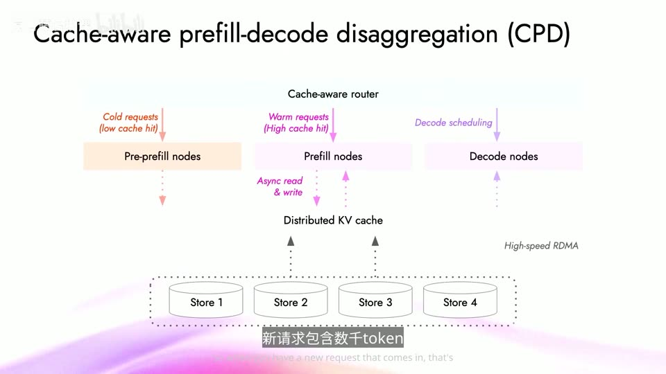 |
| 同时跑在同一批 GPU 上。谢谢。所以你可以做一个很简单的路由：新请求进来缓存命中率很低，就发到一组 GPU 上去处理，把这些内容合并，再把其他预热请求发给另一组预填充节点。 [【跳转到 21:21】](https://www.bilibili.com/video/BV11LEA6eEuj/?p=18&t=1281) |  |
| 事实证明，用这种简单的优化，服务速度最高能提升 40%。这是第一组内容。我觉得咱们在研究和这些技术上的现状可以用非常早期来形容。这就是那种事：十到 20 年后人们回头看可能会想“当时他们为啥聊这个，这难道不是显而易见的吗？”其实是因为我们开始在生产环境中 [【跳转到 21:37】](https://www.bilibili.com/video/BV11LEA6eEuj/?p=18&t=1297) |  |
| 用新方式运行这些东西，看到了新方式下的新流量模式。 [【跳转到 22:02】](https://www.bilibili.com/video/BV11LEA6eEuj/?p=18&t=1322) | 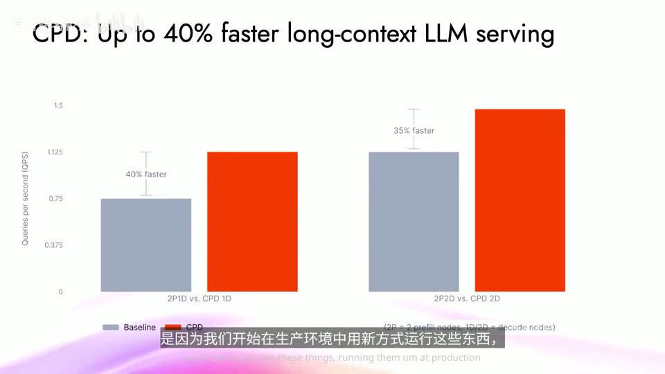 |
| 好了，刚才大致介绍了内核推理的生命周期。接下来我要讲两个有趣的研究项目，它们深受我们推理服务中一些现象的启发。第一个咱们聊聊语言模型解码，以及怎么用所谓的 megakernel 想让它快得多。这是斯坦福和 Together 的合作。运行解码时根本难点在于你得先处理 prompt，再逐个生成 token，难点在于生成一个 token 就得跑完整个模型。 [【跳转到 22:07】](https://www.bilibili.com/video/BV11LEA6eEuj/?p=18&t=1327) |  |
| 这意味着你没法像预填充或训练时那样， [【跳转到 22:30】](https://www.bilibili.com/video/BV11LEA6eEuj/?p=18&t=1350) |  |
| 利用 GPU 的大规模并行能力，反而把这套高性能系统变成了单纯的内存读取工具。 [【跳转到 22:35】](https://www.bilibili.com/video/BV11LEA6eEuj/?p=18&t=1355) | 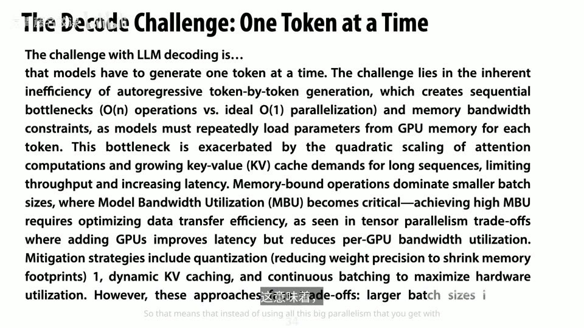 |
| 难点还在于，我们写内核和跑模型时通常是一次只写一个操作。大家大概能理解为什么了，毕竟写内核挺难的，我猜大家写 FlashAttention 是肯定没少折腾。所以通常的做法是看看语言模型里有哪些操作，然后一次只跑一个操作对应的内核，这样编程就简单多了，你只需要写好归一化内核、映射内核和注意力内核就行。 [【跳转到 22:44】](https://www.bilibili.com/video/BV11LEA6eEuj/?p=18&t=1364) | 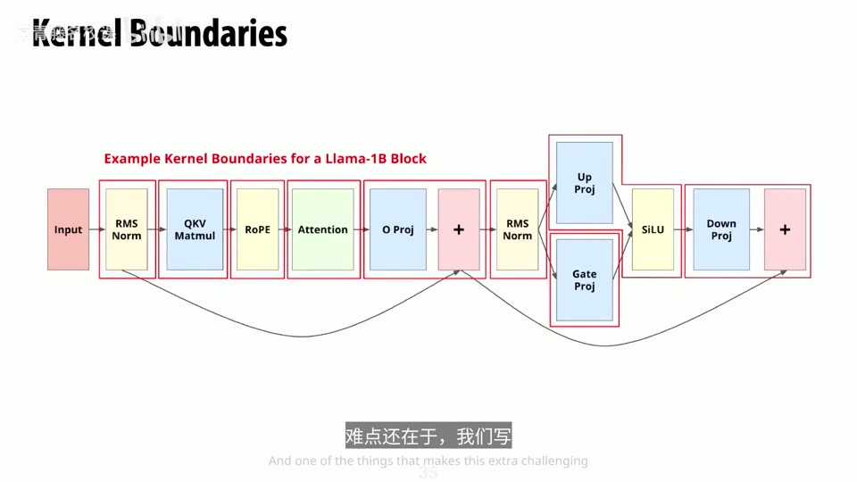 |
| 但你会发现这最终会给系统引入大量停机时间。 [【跳转到 23:09】](https://www.bilibili.com/video/BV11LEA6eEuj/?p=18&t=1389) | 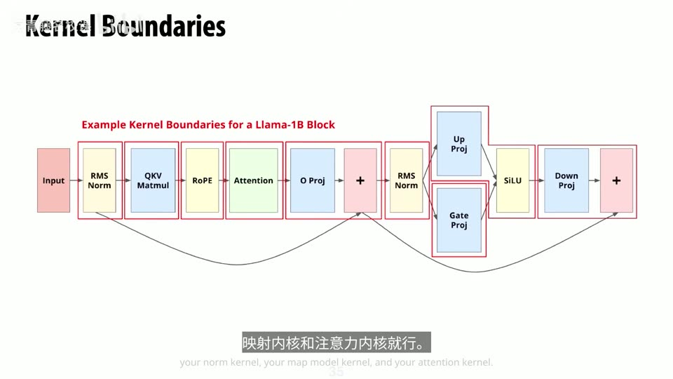 |
| 所以这是你在两个内核上运行推理时的一个示例。这显然是个示意图，但例子取自某个特定的注意力推理内核。读图的方法是横轴是时间，时间从左向右流动，纵轴是 GPU 上所有不同的流式多处理器，H100 上有 132 个，B200 上我记得是 148 个， [【跳转到 23:14】](https://www.bilibili.com/video/BV11LEA6eEuj/?p=18&t=1394) |  |
| 以此类推。有色部分代表有效工作，有色时就说明 GPU 上的某个处理器正在干活，空白处则是在等待，也就是等其他操作做完好接着干别的。 [【跳转到 23:39】](https://www.bilibili.com/video/BV11LEA6eEuj/?p=18&t=1419) | 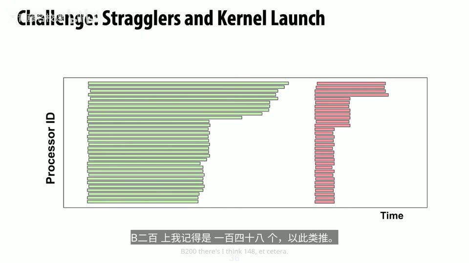 |
| 所以你会发现，不管内核写得再好，GPU 总有停摆的时候，比如内核启动和拆卸处的那些大空隙，这叫尾部效应。就像短 prompt 和很长的 prompt 一起处理时一样，这影响会一直传到最基础的注意力操作。处理一批输入时如果有长有短，你就得等那个最长的处理完，而且因为跨多个内核运行，这些内核之间的间隙会慢慢叠加起来。 [【跳转到 23:52】](https://www.bilibili.com/video/BV11LEA6eEuj/?p=18&t=1432) | 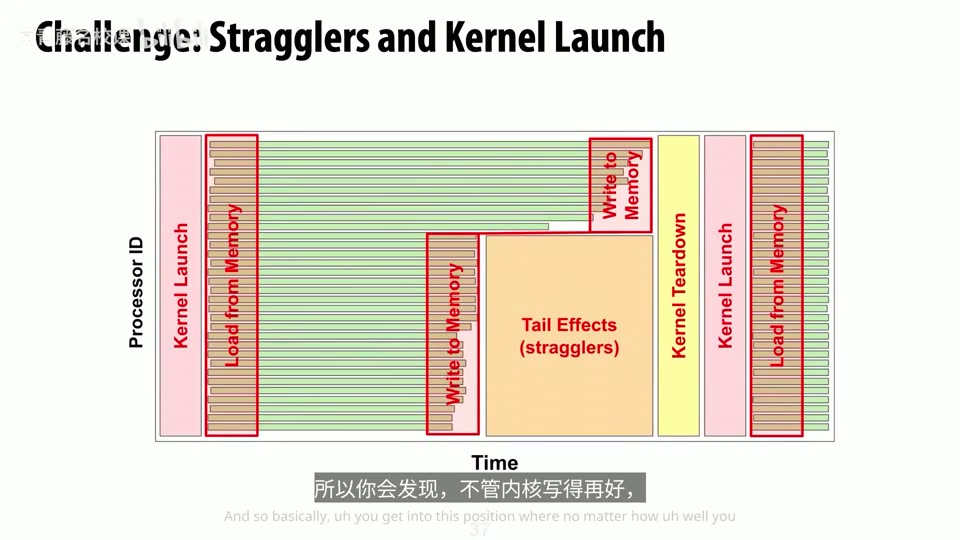 |
| 为了解决这个问题，我们做了个叫 megakernel 的东西，也就是不单独为每个操作写内核，而是用一个内核一次搞定多个操作。这有点像 FlashAttention 里的融合，只是覆盖更广、更激进。具体来说，它让 GPU 不再只是单一设备执行单一操作，你要开始把 GPU 看作一个庞大的分布式系统，形象地说就是“好吧，我有大量工作要处理”。 [【跳转到 24:17】](https://www.bilibili.com/video/BV11LEA6eEuj/?p=18&t=1457) | 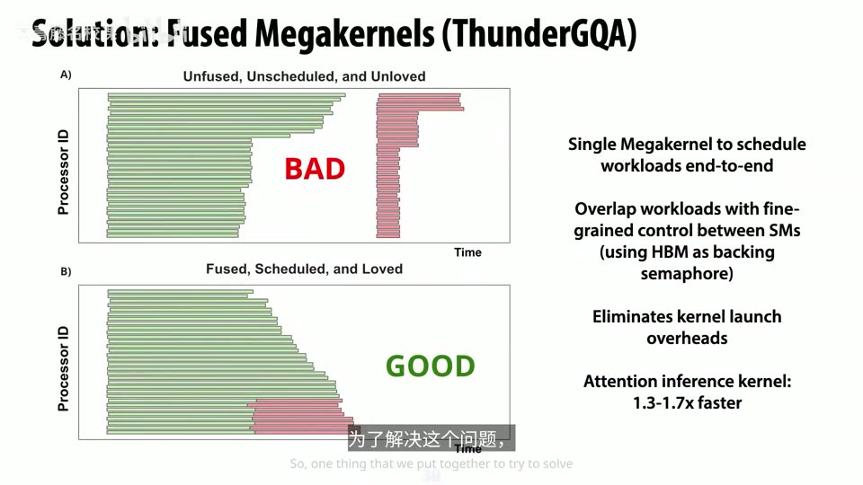 |
| 有些任务存在依赖关系，比如这些红色部分依赖于某些绿色任务，该怎么调度、怎么分配任务才能最大化 GPU 利用率？如果只对注意力推理内核这样做，能获得 30% 到 70% 的加速。 [【跳转到 24:42】](https://www.bilibili.com/video/BV11LEA6eEuj/?p=18&t=1482) | 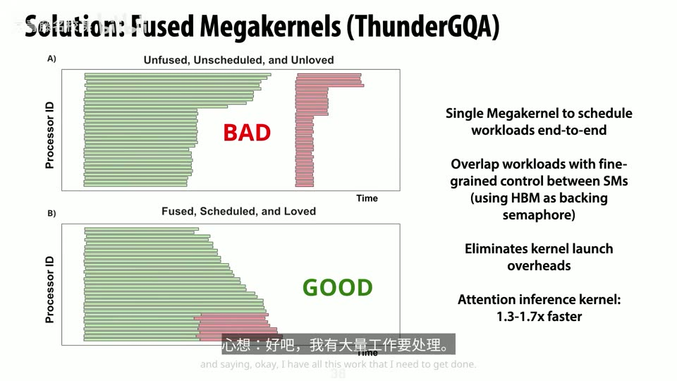 |
| 好处是这能应用到整个模型。比如这是 Llama 模型的一层，这里我们基本上把整个层合并成了一个内核，你看这些不同的条它们以非常奇怪的方式重叠在一起，才开始让前一层的权重加载与注意力机制重叠，或者说在注意力操作结束前就开始执行部分规约。 [【跳转到 25:00】](https://www.bilibili.com/video/BV11LEA6eEuj/?p=18&t=1500) | 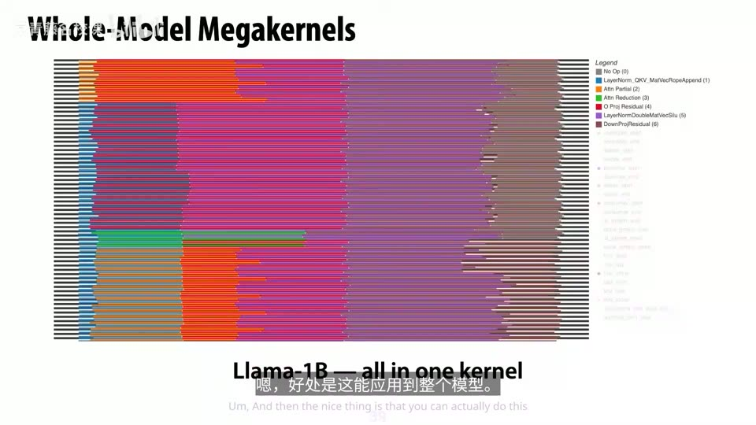 |
| 举个有趣的例子，在现代大语言模型中有注意力层还有 QKV 投影，你会给它加入一些 RoPE scaling，也就是这些蓝线，这些蓝线就是 QKV 加 RoPE，橙色线是注意力的开始。一个关键认识是，在 QKV 完成前你就能把 KV 缓存加载进注意力，尤其是在 decode 阶段，带圆圈的这些橙色条表示 QKV 加 RoPE 还在跑时你就开始加载 KV 缓存了。 [【跳转到 25:22】](https://www.bilibili.com/video/BV11LEA6eEuj/?p=18&t=1522) | 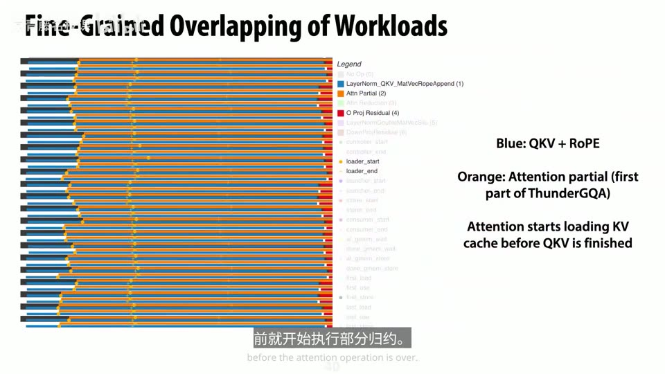 |
| QKV 完成后你拿到新的 query tokens，就能跑完注意力操作的剩余部分。基本上当你能这样精细控制 GPU 时，就可以在其他操作结束前启动某些操作。 [【跳转到 25:47】](https://www.bilibili.com/video/BV11LEA6eEuj/?p=18&t=1547) | 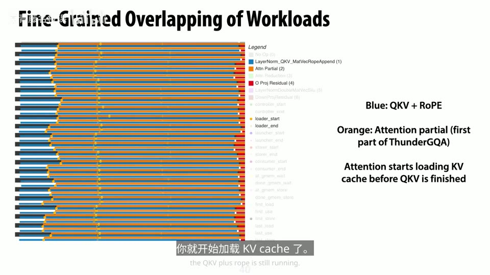 |
| 再看一个例子，这里的橙色同样代表注意力计算的第一部分，红色是注意力之后的 O 投影。在注意力运算结束前，O 投影就已经开始加载权重了。 [【跳转到 26:01】](https://www.bilibili.com/video/BV11LEA6eEuj/?p=18&t=1561) | 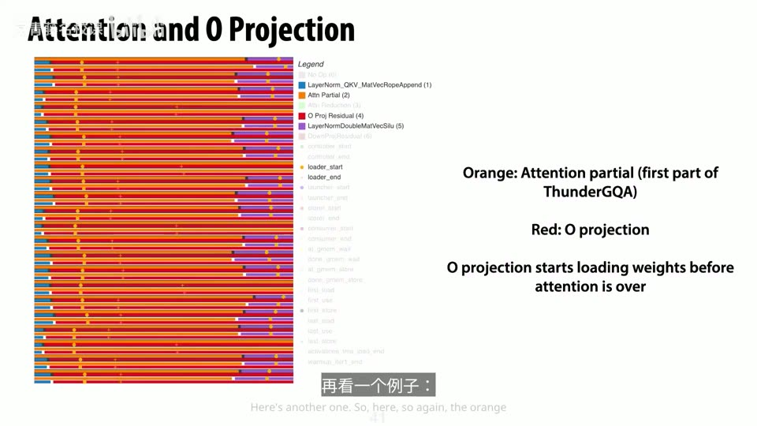 |
| 我们把这一切整合进一个相对复杂的代码框架，用基于指令的抽象让每个子内核都能独立写进各自的文件里，再搭建一个大型虚拟化共享内存系统来协调这些操作的运行。 [【跳转到 26:12】](https://www.bilibili.com/video/BV11LEA6eEuj/?p=18&t=1572) | 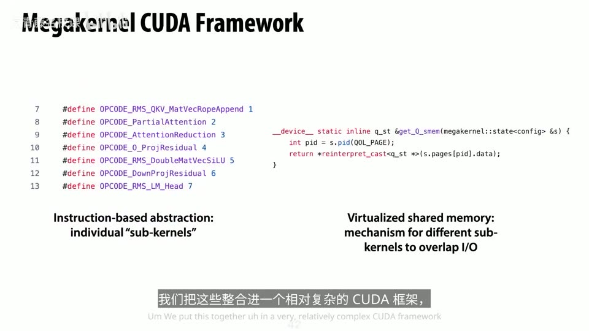 |
| 为此我们做了一个叫 ThunderKittens 的 CUDA DSL，它属于编写内核的那类库，你也可以把它想成更底层的 Triton，对细节的控制要精细得多，就是推理解码速度接近光速。 [【跳转到 26:28】](https://www.bilibili.com/video/BV11LEA6eEuj/?p=18&t=1588) | 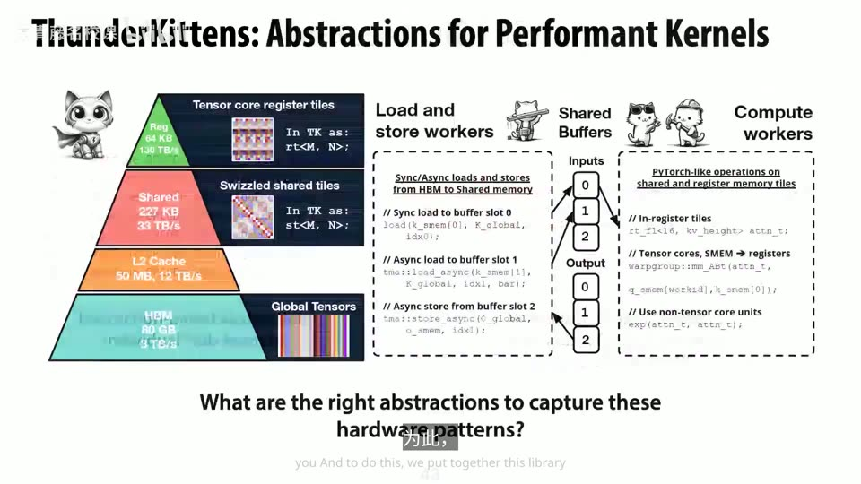 |
| 现在这数据已经好多了，青色这根柱子就是 megakernel 的表现。你看它比其他一些顶尖引擎跑得快多了，在 H100 上带宽利用率达到 72%，几乎跑满了 GPU 的物理极限。抛开我们这里做的所有复杂处理，只看 GPU 执行这个操作的物理极限速度，我们已经接近那个极限的 72% 了。 [【跳转到 26:38】](https://www.bilibili.com/video/BV11LEA6eEuj/?p=18&t=1598) | 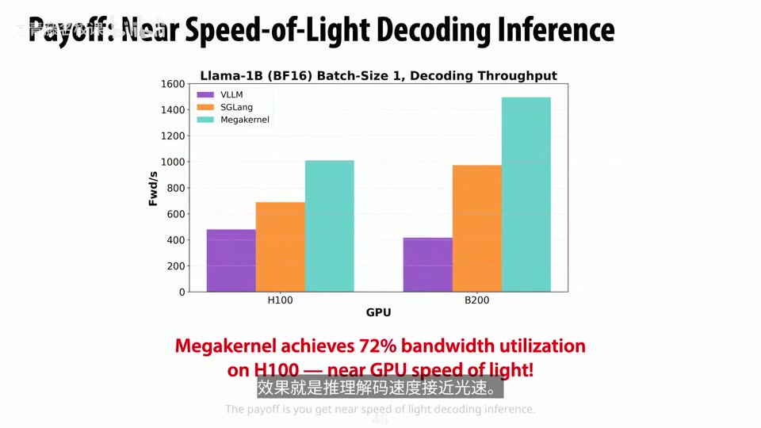 |
| 这部分的一个启示是，如果你能深度掌控内核、 [【跳转到 27:03】](https://www.bilibili.com/video/BV11LEA6eEuj/?p=18&t=1623) | 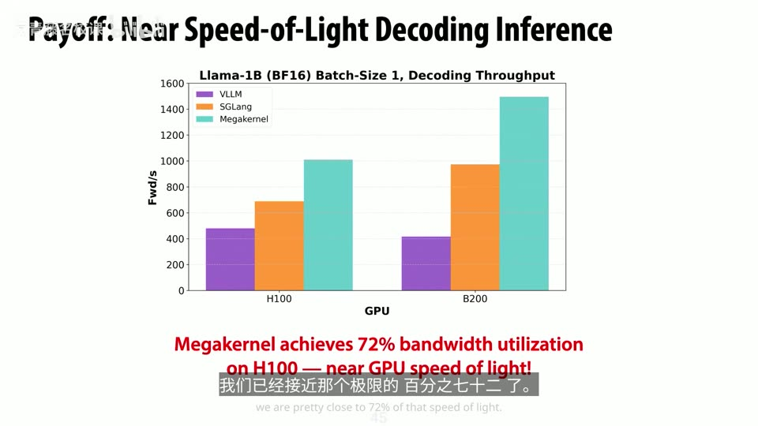 |
| 理解硬件，就能解锁全然不同的计算范式，这些细节只有当你深入到推理的底层去摸索时 [【跳转到 27:08】](https://www.bilibili.com/video/BV11LEA6eEuj/?p=18&t=1628) | 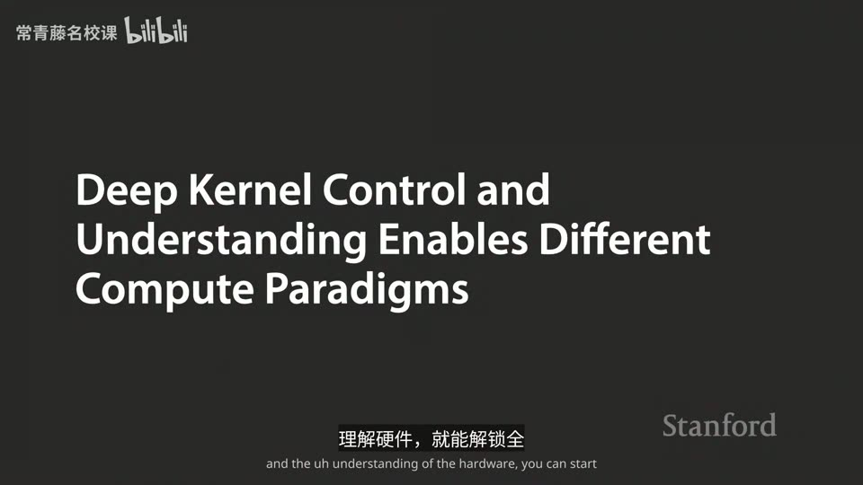 |
| 才会发现。那下面我要讲点新东西。 [【跳转到 27:13】](https://www.bilibili.com/video/BV11LEA6eEuj/?p=18&t=1633) | 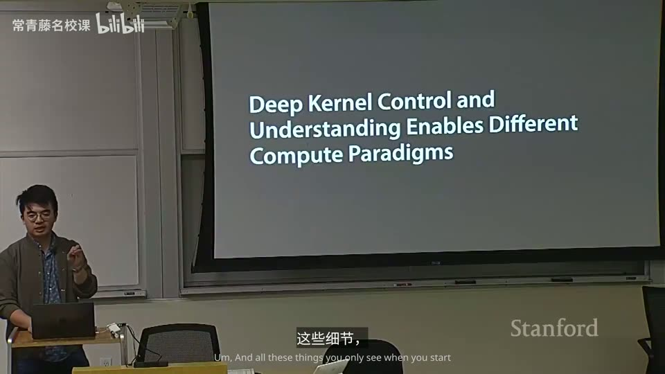 |
| 这就进入新架构的领域了。我要介绍一个新模型叫 Parcae，这是我 UCSD 实验室的成果，由 Hidde 主导，还和 Zachary Taylor 合作完成，我待会再回到这点。 [【跳转到 27:18】](https://www.bilibili.com/video/BV11LEA6eEuj/?p=18&t=1638) | 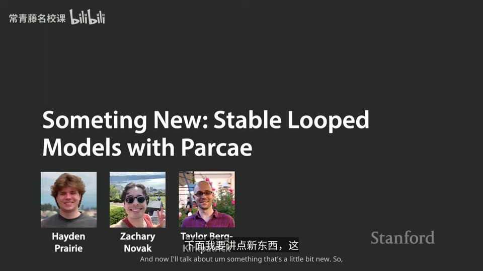 |
| 开场时我讲过，这些新能力之所以出现，是因为你开始扩大模型参数和数据的规模。在 Parcae 这个工作里我们想问另一个问题：规模扩张是唯一的路吗？还是说有没有别的办法能达到同样的质量？ [【跳转到 27:30】](https://www.bilibili.com/video/BV11LEA6eEuj/?p=18&t=1650) | 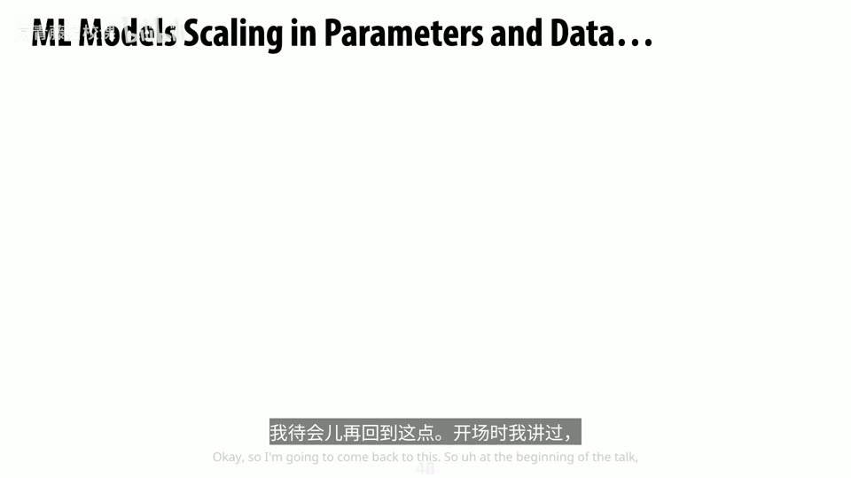 |
| 做 Parcae 时我们想试试循环 transformer 技术，就是把 transformer 的某些模块拿出来循环跑。所以与其让 token 一层层过模型，不如让它们在处理过程中反复在循环里跑。Parcae 里有几块内容：首先我们用了一些状态空间模型理论还有 SSM 理论，主要是为了稳住这个操作。要是直接跑、直接训， [【跳转到 27:48】](https://www.bilibili.com/video/BV11LEA6eEuj/?p=18&t=1668) | 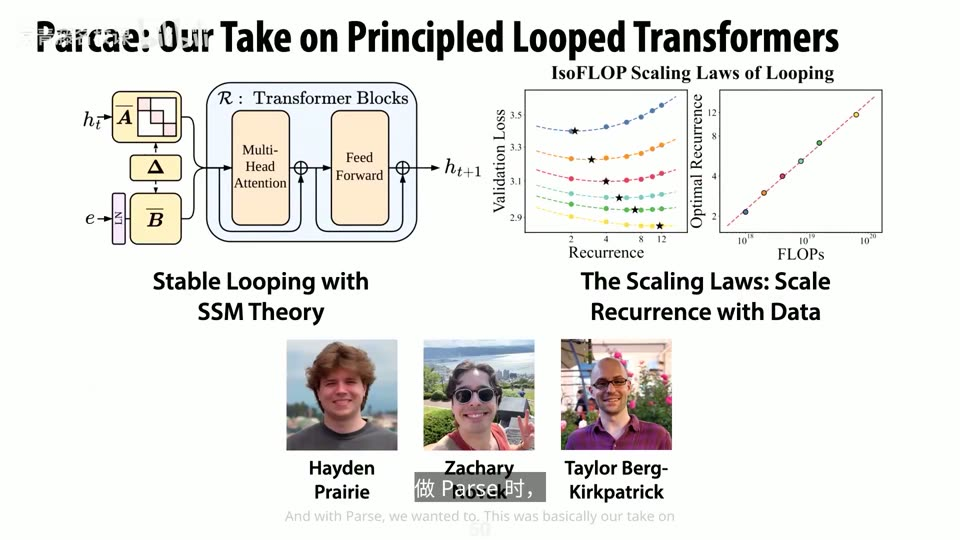 |
| 我们发现模型会直接崩掉。另外我们发现一些有趣的缩放定律，说明数据多了得增加这些循环模型的循环次数，所以为了把 Parcae 用好，你得在一定程度上复用它们。 [【跳转到 28:13】](https://www.bilibili.com/video/BV11LEA6eEuj/?p=18&t=1693) | 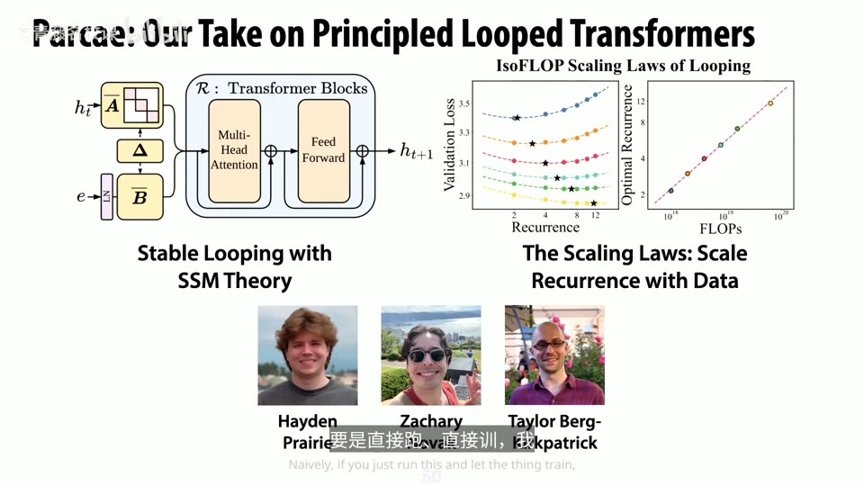 |
| 先说说动机，为什么我们觉得这个循环问题很有意思。简单来说， [【跳转到 28:28】](https://www.bilibili.com/video/BV11LEA6eEuj/?p=18&t=1708) | 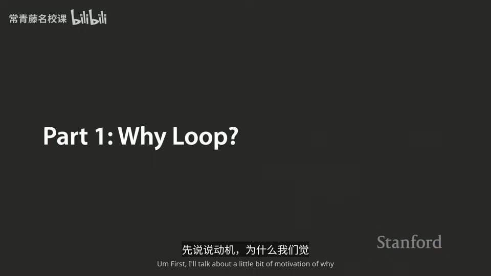 |
| 假设有个激活值穿过模型的一部分 M，它会碰到循环块，反复穿过该层，多次运行相同的激活值，紫色块是循环块，最后会返回结果。这有好处：参数保持不变，却能调高 FLOPs。如果觉得 FLOPs 越多质量越高，这就能不增加参数成本来提升质量。虽然还有几年前的旧作，相对地表明实际能获得更高表达能力。 [【跳转到 28:33】](https://www.bilibili.com/video/BV11LEA6eEuj/?p=18&t=1713) |  |
| 有些东西用相同参数数表达不了，而这些循环模型却能表达。我们一直在思考怎样让每个参数发挥最大价值，也就是在数据里这些模型能展现出怎样的智能水平。 [【跳转到 28:58】](https://www.bilibili.com/video/BV11LEA6eEuj/?p=18&t=1738) | 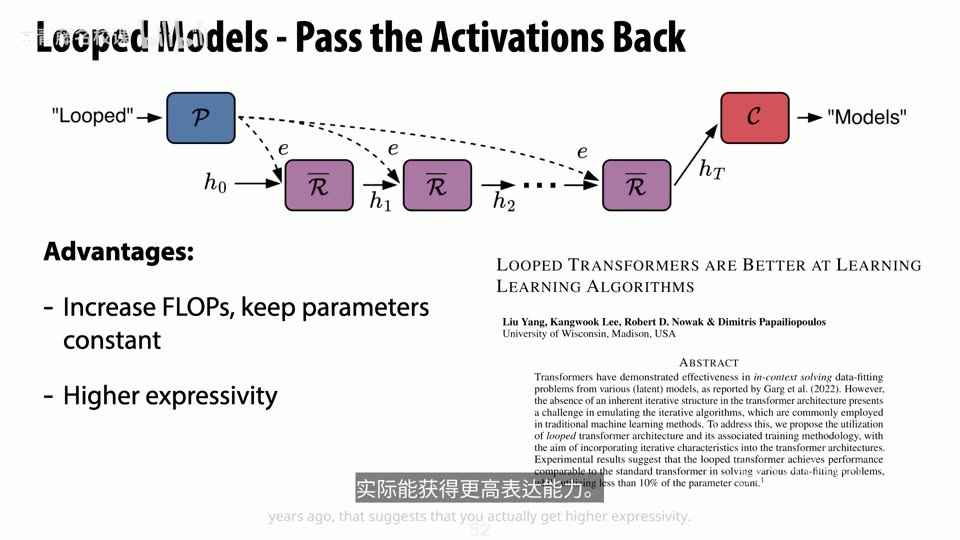 |
| 起初有些不错的结果。马里兰大学 Tom Goldstein 团队有篇论文说这东西说不定比 transformer 更强，这是在一些任务上的结果，Twitter 上也有不少热议。 [【跳转到 29:15】](https://www.bilibili.com/video/BV11LEA6eEuj/?p=18&t=1755) | 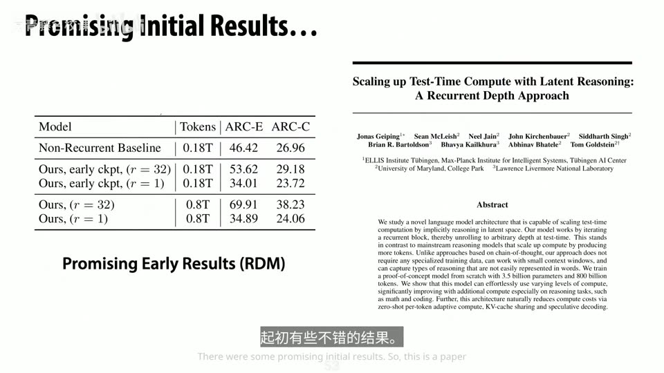 |
| 因为发布 Parcae 前一周，OpenAI 有人说 cloudmatos 是个循环语言模型。嗯，我觉得他说得不对，他就是在瞎编。结果那会儿 Twitter 上全是各种猜测，闹得沸沸扬扬，最后他只能发博文认错，说那都是他瞎编的，这些都不是真的。但我们觉得挺有意思，所以早在那波 Twitter 热议之前就开始研究了。 [【跳转到 29:25】](https://www.bilibili.com/video/BV11LEA6eEuj/?p=18&t=1765) | 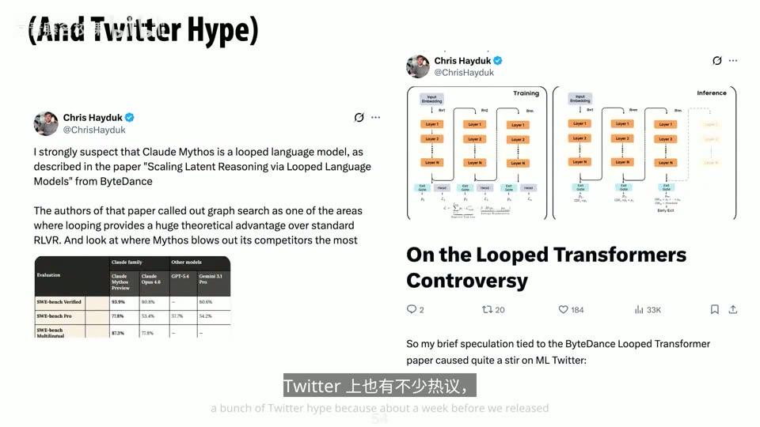 |
| 不过我觉得这里有些地方挺值得琢磨的。这类循环模型有个问题： [【跳转到 29:50】](https://www.bilibili.com/video/BV11LEA6eEuj/?p=18&t=1790) | 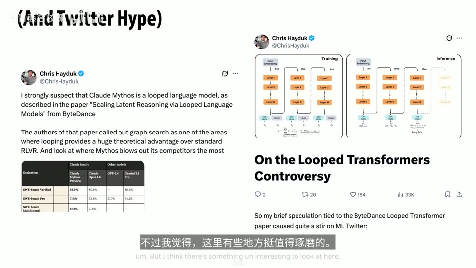 |
| 你训练它们的时候，只要稍微改动一下训练算法，比如把学习率调一点点，模型就会突然开始崩掉。比如我做学习率扫描，十次有九次这模型都会不收敛、会爆掉，冒出 NaN 或损失激增。训练大模型时若见损失暴涨，说明训练出问题。深究到底是怎么回事，以前靠土办法，比如每层都加归一化来看情况，或者干脆只用 2e-4 的学习率， [【跳转到 29:55】](https://www.bilibili.com/video/BV11LEA6eEuj/?p=18&t=1795) | 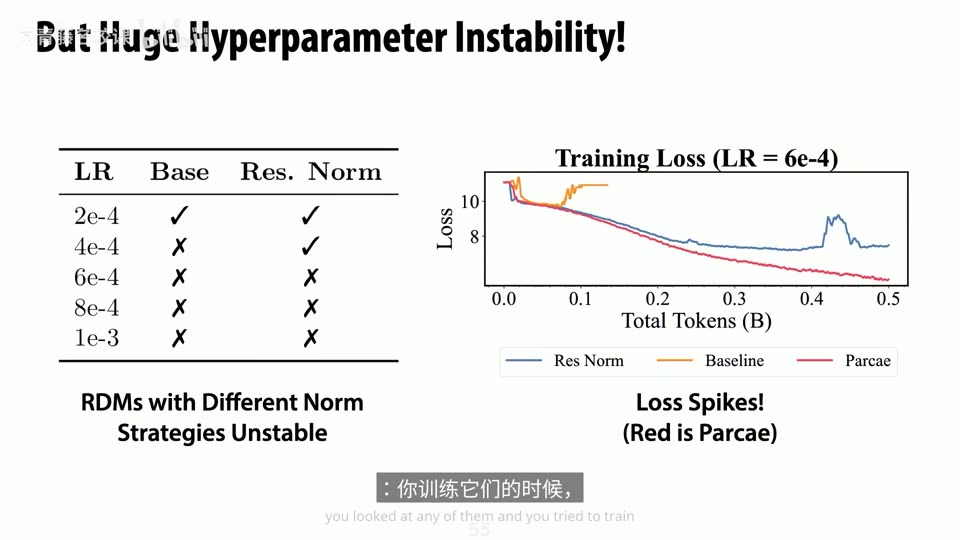 |
| 别的都不改。这损失暴涨说明底下还有更深层的原因。 [【跳转到 30:20】](https://www.bilibili.com/video/BV11LEA6eEuj/?p=18&t=1820) | 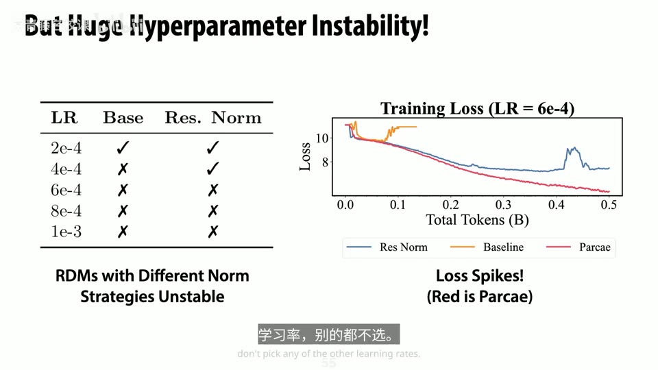 |
| 我们用类似状态空间模型的思路来解决稳定性问题。 [【跳转到 30:25】](https://www.bilibili.com/video/BV11LEA6eEuj/?p=18&t=1825) | 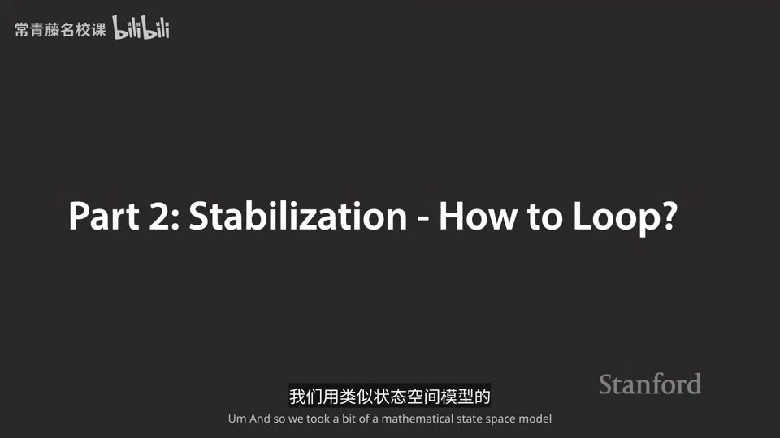 |
| 我们的核心发现是，这个过程是可以分析的。直接硬算太复杂，因为循环模块参数实在太多，模型里有很多非线性操作，比如 softmax、GLU 和 RoPE，太复杂了。我们的思路是直接看看这个残差到底在发生什么，就那激活值在各模块之间变化其实不大，这是我们第一个发现，这些残差块只是微调向量， [【跳转到 30:30】](https://www.bilibili.com/video/BV11LEA6eEuj/?p=18&t=1830) | 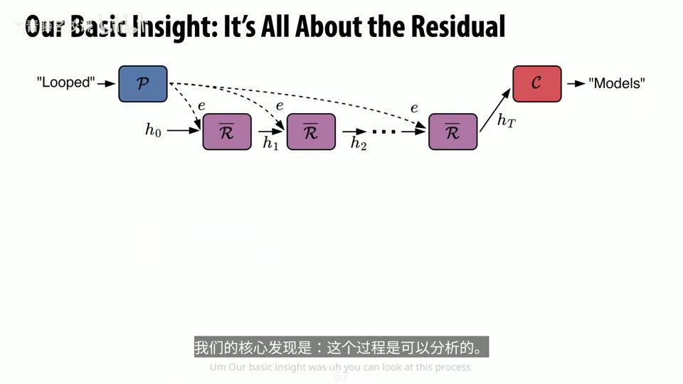 |
| 影响其实没那么大。那么我们接下来该怎么做呢？我们试着建个模型深挖一下里面的细节，我们基于这个残差建立了一个动态系统模型。这么做之后，我们发现模型里有几个部分，写出来看着不起眼，实际上却影响巨大。我们把这些非线性组件，比如注意力机制、GLU 和带中间层的大前馈网络， [【跳转到 30:55】](https://www.bilibili.com/video/BV11LEA6eEuj/?p=18&t=1855) | 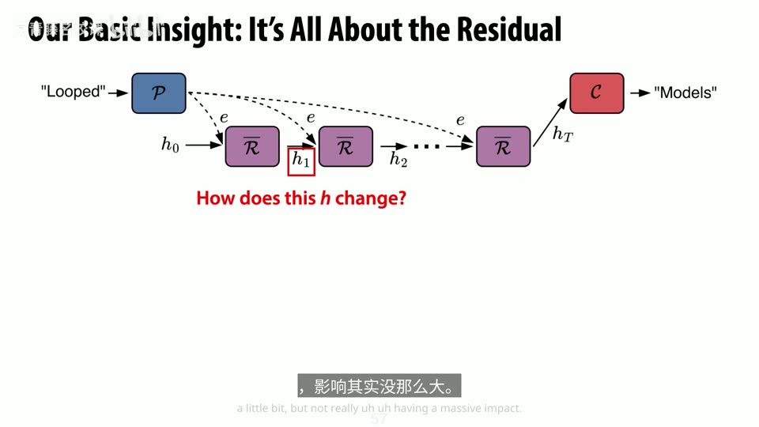 |
| 先打包处理，我们把它们装进一个盒子，叫做 RR，是某种复杂的非线性结构。把它放到一边，剩下的就是 A 和 B 矩阵。B 矩阵负责对你初始的向量做某种变换，循环开始前初始向量是什么；而 A 矩阵决定了如何在每次循环中变换这个残差。我们把 transformer 的复杂性都放到一边， [【跳转到 31:20】](https://www.bilibili.com/video/BV11LEA6eEuj/?p=18&t=1880) | 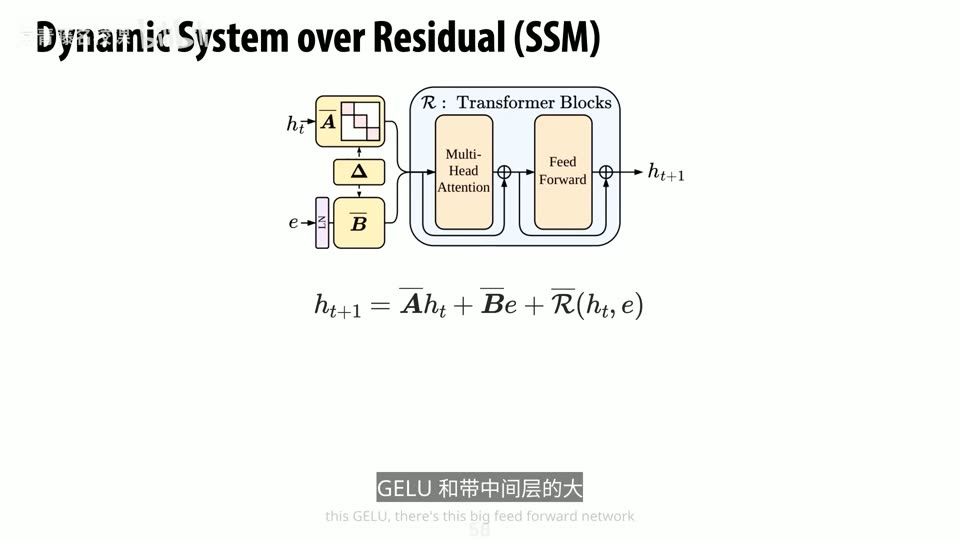 |
| 就能用一种相对简单的方式来看待之前的循环。在以前的案例里，你确实会做一些挺常规的决定，比如一种情况你直接把它当成恒等变换，就是简单相加；另一种情况它是一个完全可学习的矩阵。我们接着想，要是直接……经验显示 A 和 B 矩阵其实主导了方程的量级，直接去掉那个复杂的非线性部分 [【跳转到 31:45】](https://www.bilibili.com/video/BV11LEA6eEuj/?p=18&t=1905) | 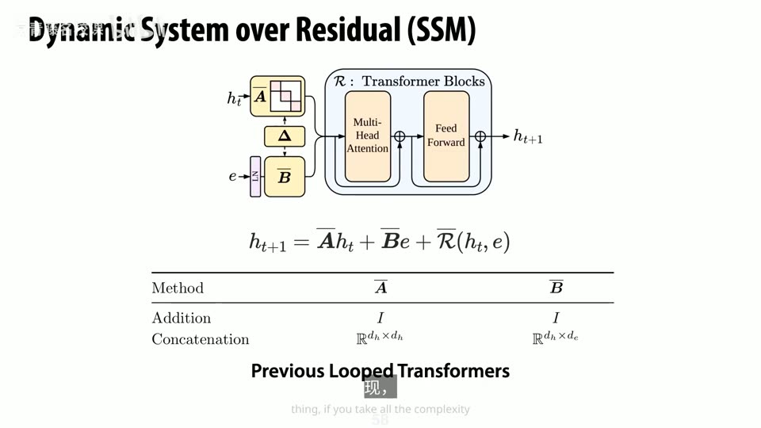 |
| 结果会怎样？结果呢，你会得到一个很简单的系统，用微积分就能解出答案。你可以算出给定初始激活和初始注入，你甚至可以直接经验性地算出 t+1 时的激活状态。你会注意到几点：这由 A 矩阵主导，尤其是被大幅幂次的 A 矩阵。由此我们意识到有个量叫 A 的谱半径， [【跳转到 32:10】](https://www.bilibili.com/video/BV11LEA6eEuj/?p=18&t=1930) |  |
| 谱半径基本等同于范数。一种看法是你把矩阵大幅幂次，咱们打个比方，假设这个矩阵就是个标量 2，做 16 次幂，你把数值放大到 2 的 16 次方，数值变得巨大。这解释了为何损失值会剧烈波动。我们发现前人论文里 A 和 B 矩阵的选择要么稳定要么就不稳定， [【跳转到 32:35】](https://www.bilibili.com/video/BV11LEA6eEuj/?p=18&t=1955) | 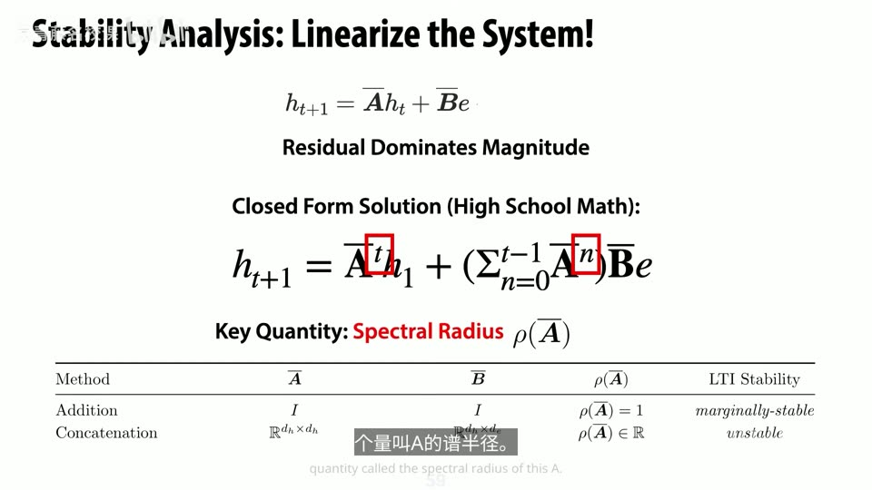 |
| 这样会让系统不稳定。所以在 Parcae 里我们想：如果让 A 和 B 随便怎么变系统就会爆炸，那咱们约束一下 A 和 B，让它们在数学上不会爆炸呢？对于 A 我们直接把它设成负对角矩阵，这样它的幂次项最终会趋于零，不会发散；对于 B 矩阵我们加了个简单的线性范数约束，因为它只应用一次，不会发散。 [【跳转到 33:00】](https://www.bilibili.com/video/BV11LEA6eEuj/?p=18&t=1980) |  |
| 只要谱半径小于一，系统就稳定了。训练时你会发现损失曲线很稳定。 [【跳转到 33:25】](https://www.bilibili.com/video/BV11LEA6eEuj/?p=18&t=2005) | 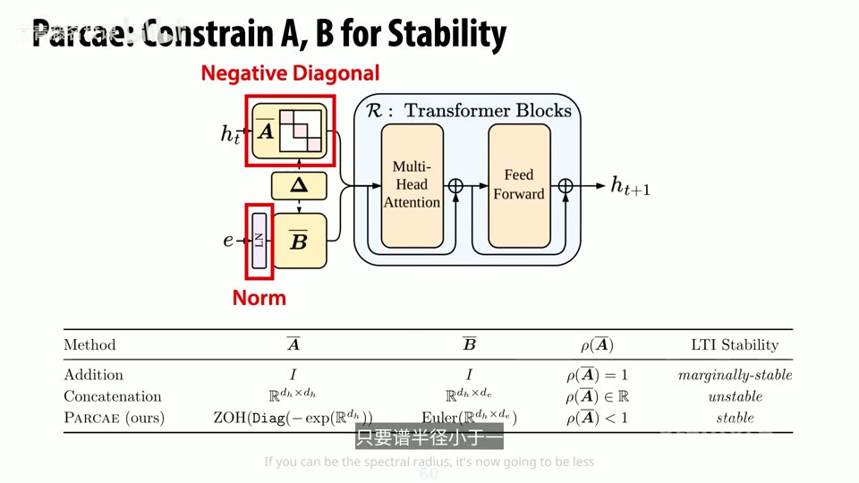 |
| Parcae 就是我们对 A 和 B 重新参数化后的稳定版。哪怕用 6e-4 这种让别的模型崩掉的学习率，最后模型还是稳的。这样就能自然约束激活值的状态范数。那条橙色基线就是完全没加约束的模型，它直接炸到 10 的 19 次方；蓝色线则是加了范数约束的模型。模型想扩张激活值， [【跳转到 33:30】](https://www.bilibili.com/video/BV11LEA6eEuj/?p=18&t=2010) | 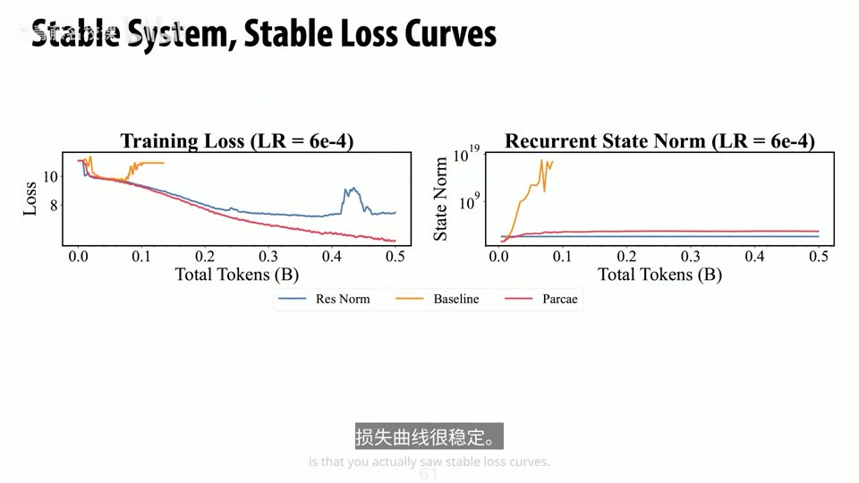 |
| 因为它觉得空间越大表示效果越好。咱们把这些概念尽量拉开距离，再用范数约束把想膨胀的数值压回到一，这两种力量互相拉扯，导致损失出现剧烈波动。虽然右侧范数控制得很好，激活没炸，但损失值确实出现了很糟糕的波动。所以激活值稍微改一下就能稳定训练和这些循环过程。 [【跳转到 33:55】](https://www.bilibili.com/video/BV11LEA6eEuj/?p=18&t=2035) | 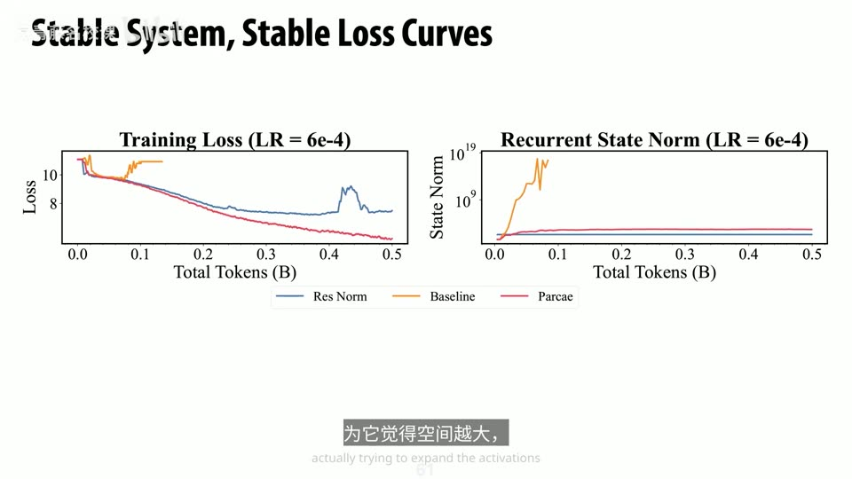 |
| 系统不仅更稳了，模型质量也更高。这张表对比了 Parcae 模型和之前的循环 [【跳转到 34:20】](https://www.bilibili.com/video/BV11LEA6eEuj/?p=18&t=2060) | 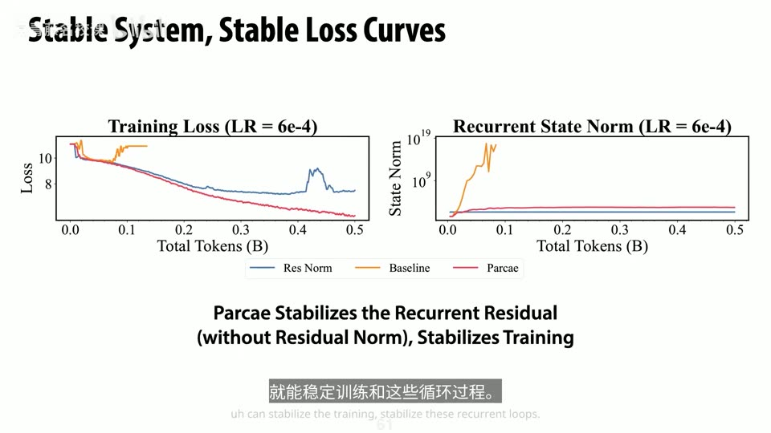 |
| transformer 模型（recurrent depth models）。可以看到它在各种应用里表现都更好。Parcae 不仅胜过上一代循环模型，还强于那些很强的 transformer 极限。这种 transformer 就像那些微型对话模型，一群人都想让它尽快学会。拿这种模型来说，用同样的基础 transformer 架构做循环并稳住它， [【跳转到 34:25】](https://www.bilibili.com/video/BV11LEA6eEuj/?p=18&t=2065) | 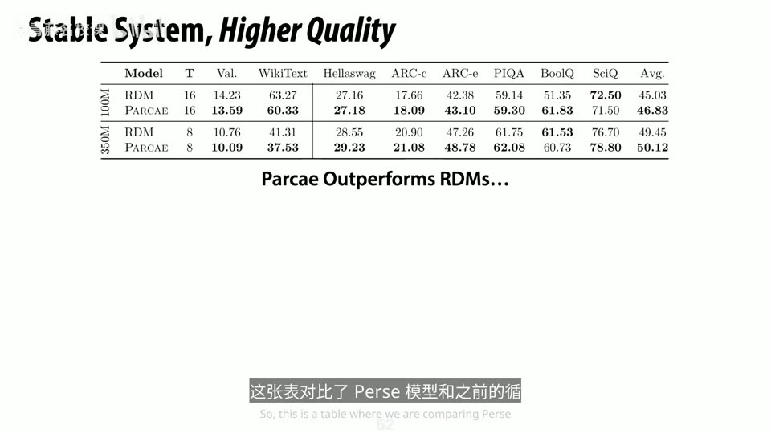 |
| 困惑度会更低，端到端质量也更好。接着我们跑了一些基础的扩展定律。 [【跳转到 34:50】](https://www.bilibili.com/video/BV11LEA6eEuj/?p=18&t=2090) | 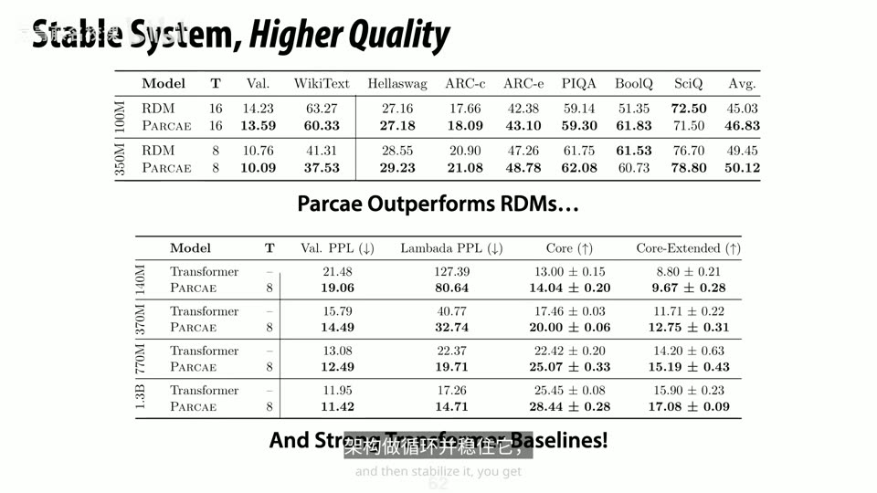 |
| 我就在想，这事儿挺有意思，循环操作确实能提升效果。但咱们得想想，有没有证据显示我们应该更激进地这么干？ [【跳转到 34:55】](https://www.bilibili.com/video/BV11LEA6eEuj/?p=18&t=2095) | 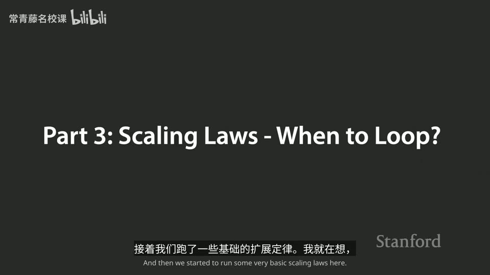 |
| 先退一步说，几年前当我们开始大规模扩展这些模型时， [【跳转到 35:05】](https://www.bilibili.com/video/BV11LEA6eEuj/?p=18&t=2105) | 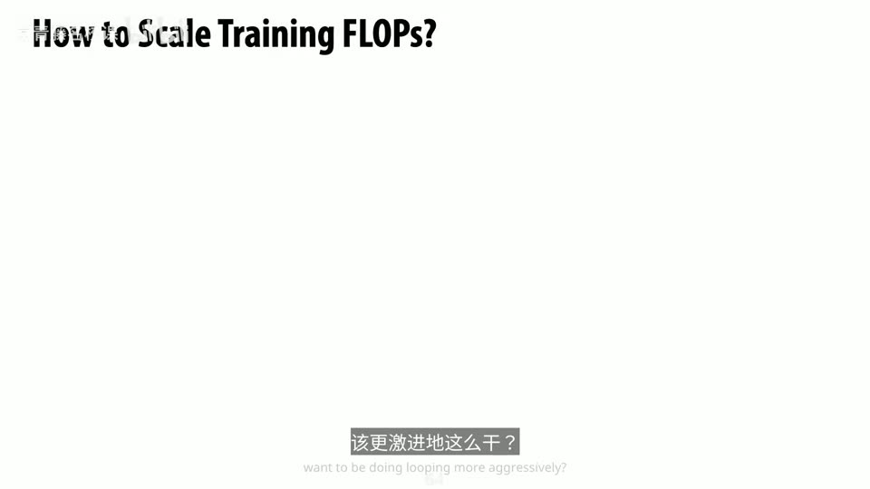 |
| 一个自然的问题是：是该把模型做大，还是只是多训练些数据？几年前大家就开始琢磨 [【跳转到 35:10】](https://www.bilibili.com/video/BV11LEA6eEuj/?p=18&t=2110) | 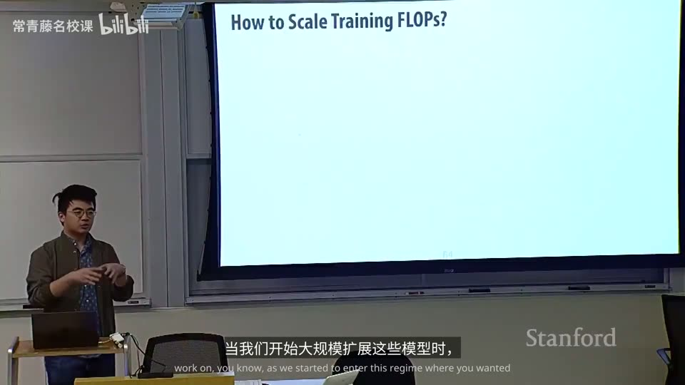 |
| 这两个量该怎么一起扩展：该扩参数还是扩数据。咱们搞出了一堆复杂的幂律曲线，都长这样。这些图挺漂亮颜色也多，咱们主要得看的是……抱歉，你要注意的是曲线向右下倾斜，就说明要同时扩展数据和参数；如果曲线垂直向下，那就只要增加训练数据，不用加参数； [【跳转到 35:17】](https://www.bilibili.com/video/BV11LEA6eEuj/?p=18&t=2117) | 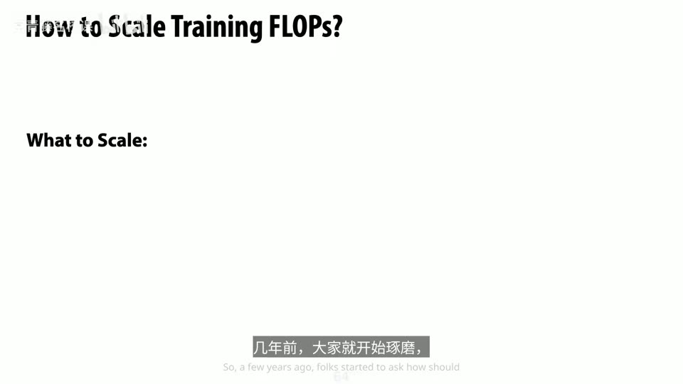 |
| 如果曲线水平向右，那就完全别加数据，只加参数。曲线向右下倾斜说明要同步扩展数据和参数。还用 35 万亿 token 训练万亿参数模型，效果更好。我们想问循环机制怎么融入其中，有几种可能。向右下倾斜 [【跳转到 35:42】](https://www.bilibili.com/video/BV11LEA6eEuj/?p=18&t=2142) | 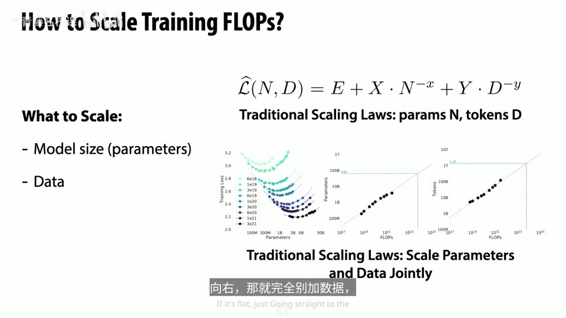 |
| 意味着要扩展数据和参数、结合循环机制。有几种可能：你可能会觉得根本不该用循环机制；要么最好还是用同一个循环模型；你可能会觉得要么多做循环，要么只对一小部分做循环。我们这里展示的是，至少在初步的缩放定律里，这些曲线都保持计算量和参数规模不变，所以那条曲线就是一个模型。 [【跳转到 36:00】](https://www.bilibili.com/video/BV11LEA6eEuj/?p=18&t=2160) | 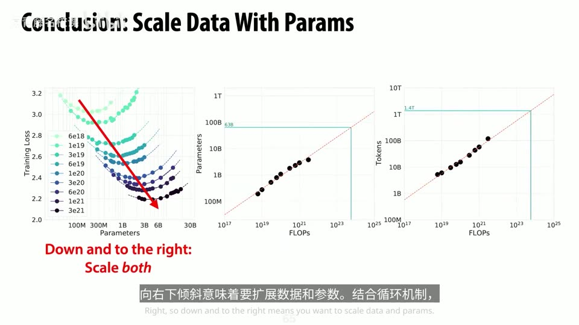 |
| 左右两边的参数数量是一样的，往下走颜色变化意味着我们通过增加数据量来提升训练模型的算力，所以这里我们在调整数据量和循环次数。我们发现这两种模型都再次呈现出右下倾斜的趋势，这说明对于这些固定参数的训练，随着数据量增加你也应该相应增加循环计算的量。我们发现这些循环遵循经典的幂律关系。 [【跳转到 36:25】](https://www.bilibili.com/video/BV11LEA6eEuj/?p=18&t=2185) | 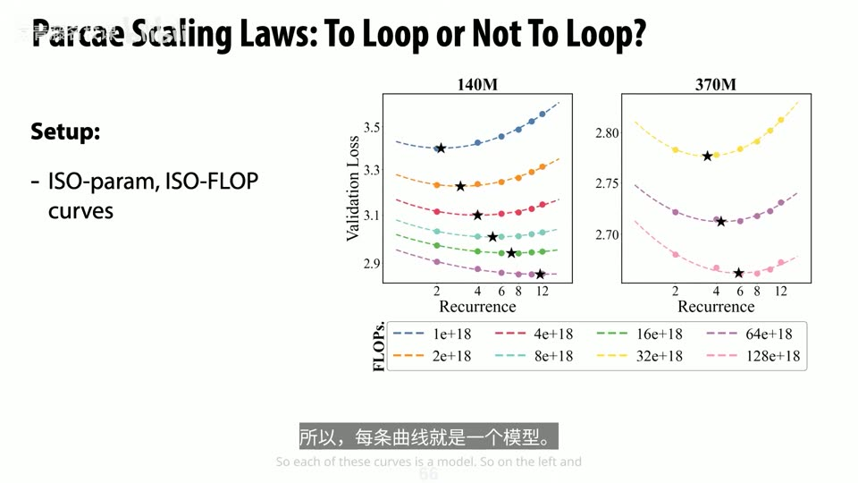 |
| 现在你其实可以开始预测了，随着循环和 token 同步扩展，这些缩放定律就能预测质量。（课堂问答：对循环、对底部缩放的联合权重是什么？）我们之前有个很复杂的 3D 图展示了不少东西，比如循环、数据和参数 [【跳转到 36:50】](https://www.bilibili.com/video/BV11LEA6eEuj/?p=18&t=2210) | 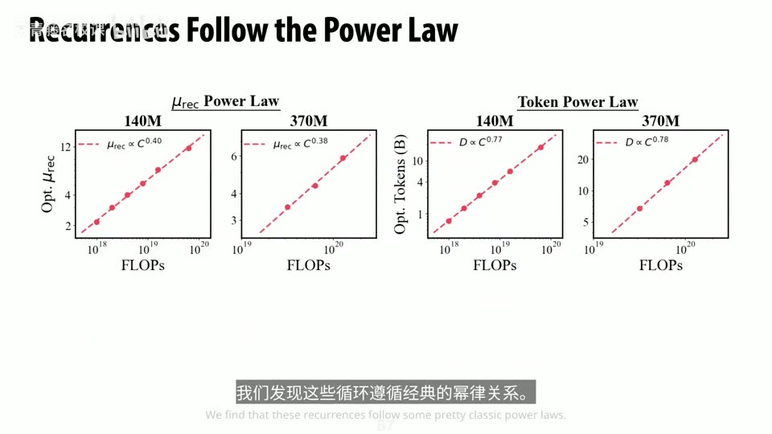 |
| 它大致指向右下方，同时也指向那个方向。所以如果你相信这个图， [【跳转到 37:12】](https://www.bilibili.com/video/BV11LEA6eEuj/?p=18&t=2232) |  |
| 它表明你应该同时扩展这三者。对，但这个图真的很难看，因为它是 3D 的，有点怪。这些幂律表明增加数据时你应该增加循环， [【跳转到 37:17】](https://www.bilibili.com/video/BV11LEA6eEuj/?p=18&t=2237) | 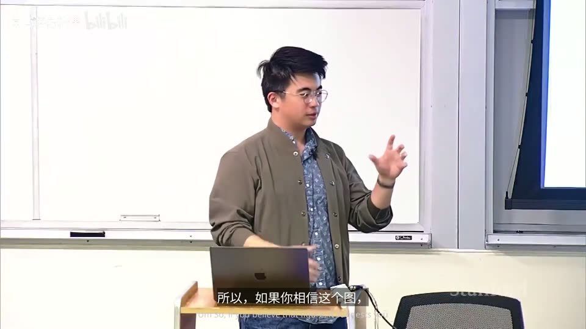 |
| 还有其他幂律表明增加数据时 [【跳转到 37:25】](https://www.bilibili.com/video/BV11LEA6eEuj/?p=18&t=2245) | 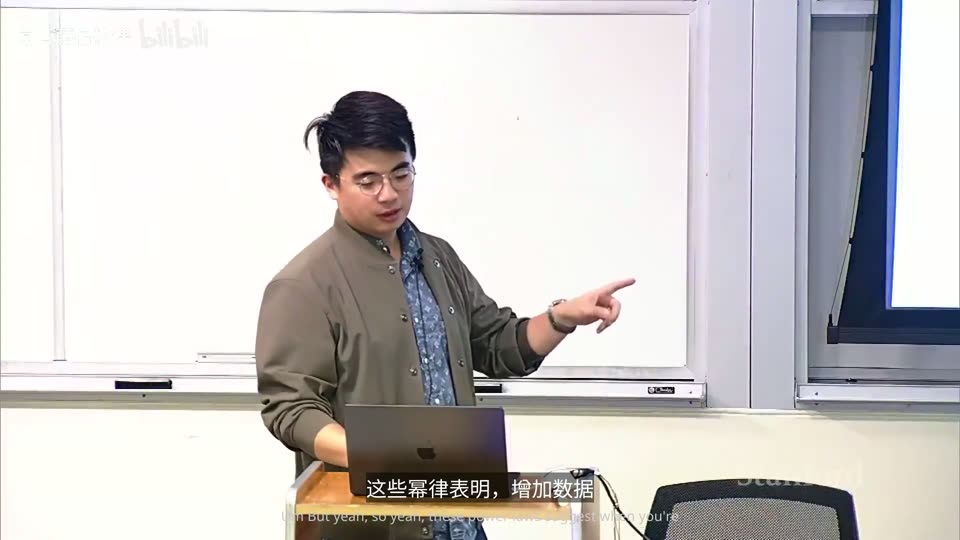 |
| 你应该增加参数。嗯，显然条件允许的话这三项最好都提上去。但有一点：如果你固定模型大小同时增加数据量，你也得增加 recurrence（循环次数）。这挺有意思，因为据我所知现在的模型都不带 recurrence，所以它们都在曲线最左边。数据量巨大，说明训练时我们或许能做得更好。 [【跳转到 37:30】](https://www.bilibili.com/video/BV11LEA6eEuj/?p=18&t=2250) | 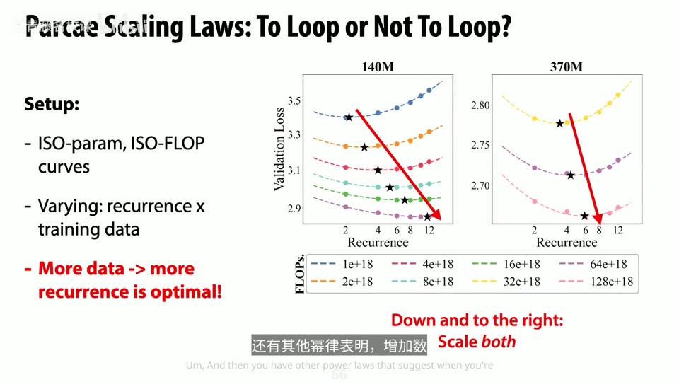 |
| 都没错，这只是换个角度展示这个实验。看橙色曲线， [【跳转到 37:55】](https://www.bilibili.com/video/BV11LEA6eEuj/?p=18&t=2275) | 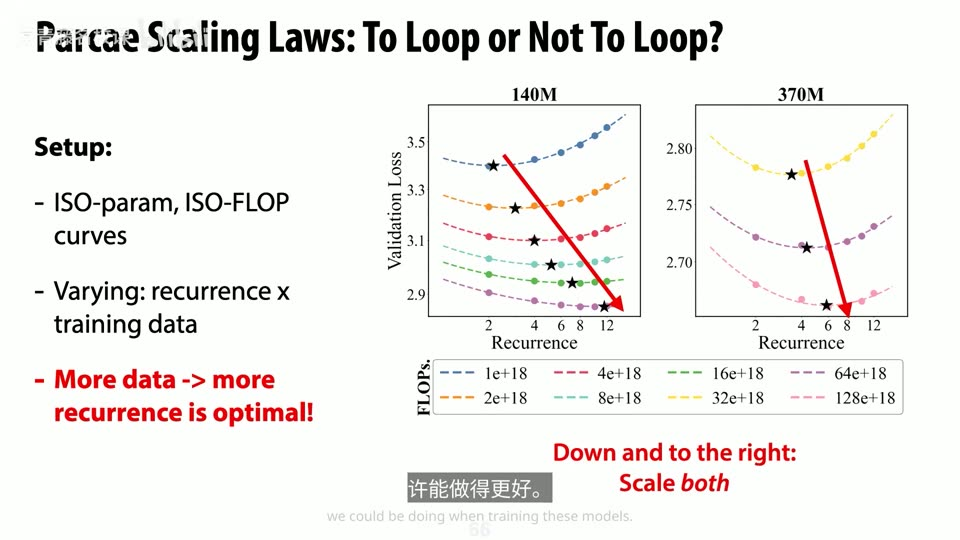 |
| 这里我们固定了模型规模，橙色曲线代表固定深度的模型，也就是传统的 transformer 模型；蓝色曲线是固定 FLOP 预算的情况，looping 模型在曲线上该取哪个点。这里橙色和蓝色的点训练用的算力相同，但数据量不同，模型大小是一样的。如果是靠增加循环次数而不是只堆数据来达到这个算力，验证损失会更低。这说明我们或许应该 [【跳转到 38:00】](https://www.bilibili.com/video/BV11LEA6eEuj/?p=18&t=2280) |  |
| 让所有大规模预训练都循环起来。 [【跳转到 38:25】](https://www.bilibili.com/video/BV11LEA6eEuj/?p=18&t=2305) | 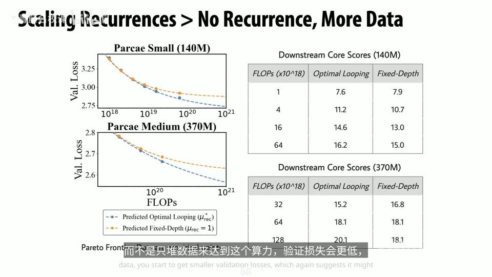 |
| 我稍微退一步，回到这次演讲的核心要点。希望今天我让大家多少明白了：如果你理解推理、理解这些模型、理解 GPU 内核、理解构成它们的每一个部分， [【跳转到 38:30】](https://www.bilibili.com/video/BV11LEA6eEuj/?p=18&t=2310) | 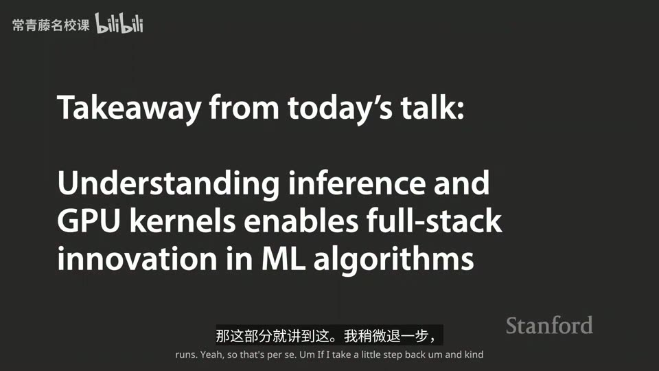 |
| 你就真的能在机器学习算法上实现全栈创新。无论是通过新的路由算法来处理更多流量或换种方式分配流量，还是用新的内核让系统的一部分跑得快得多，又或是用新架构让参数少很多时也能装进去，让它们以不同方式装进部分 GPU 减少通信量。 [【跳转到 38:41】](https://www.bilibili.com/video/BV11LEA6eEuj/?p=18&t=2321) | 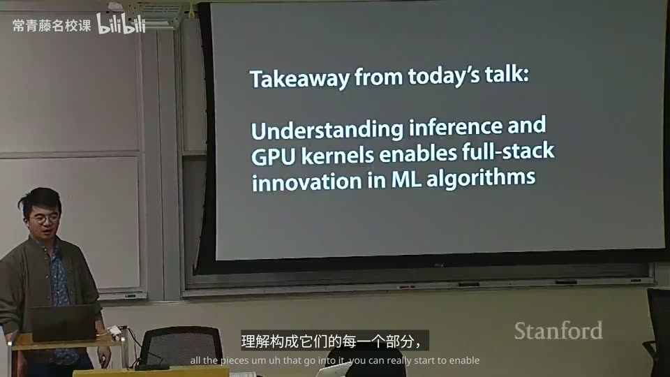 |
| 这些都是这个问题，也就是我们今天看到的这个研究 [【跳转到 39:02】](https://www.bilibili.com/video/BV11LEA6eEuj/?p=18&t=2342) | 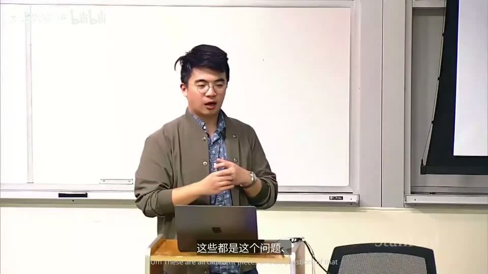 |
| 难题的不同侧面。也希望今天我至少能激发在座的一位 [【跳转到 39:07】](https://www.bilibili.com/video/BV11LEA6eEuj/?p=18&t=2347) | 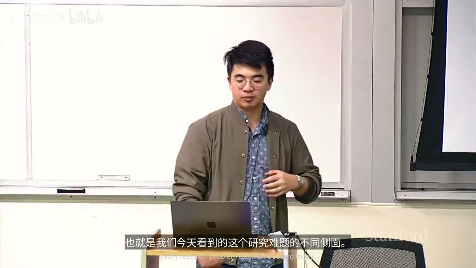 |
| 去更深入地探究其中一些内容。好了，谢谢。 [【跳转到 39:12】](https://www.bilibili.com/video/BV11LEA6eEuj/?p=18&t=2352) | 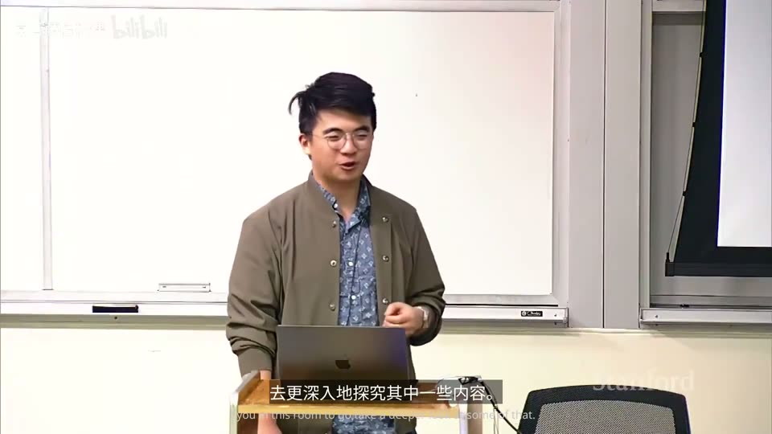 |
| 很高兴回答几个问题。我们有大约五到 10 分钟的提问时间，有问题的请举手。我想第一天……比如你是……好的。 [【跳转到 39:18】](https://www.bilibili.com/video/BV11LEA6eEuj/?p=18&t=2358) | 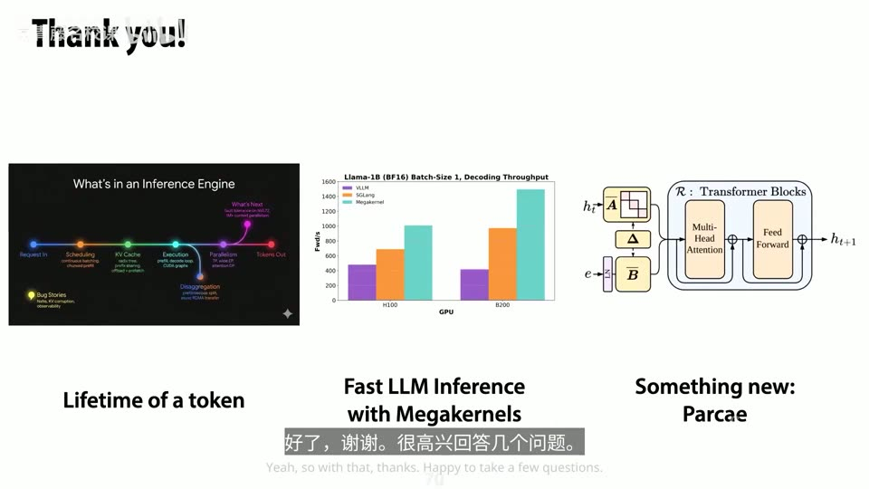 |
| 从头开始在步子上训练，我想知道你能不能展示一下其中的一些内容。 [【跳转到 39:26】](https://www.bilibili.com/video/BV11LEA6eEuj/?p=18&t=2366) | 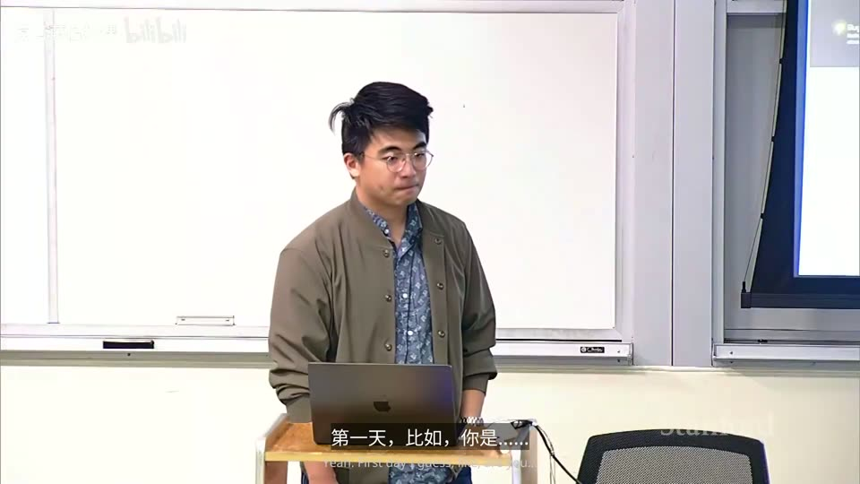 |
| 好的，好问题。问题是关于 Parcae，我们是不是从头开始训练， [【跳转到 39:32】](https://www.bilibili.com/video/BV11LEA6eEuj/?p=18&t=2372) | 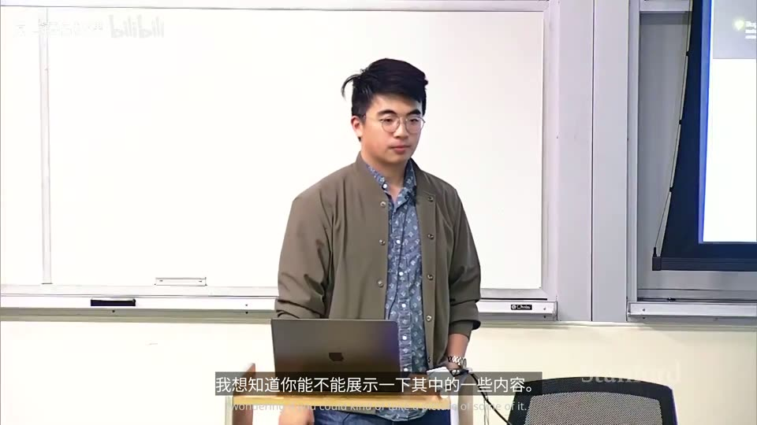 |
| 你能用预训练模型做什么？嗯，几个月前有人发了篇很恶搞的博客， [【跳转到 39:37】](https://www.bilibili.com/video/BV11LEA6eEuj/?p=18&t=2377) | 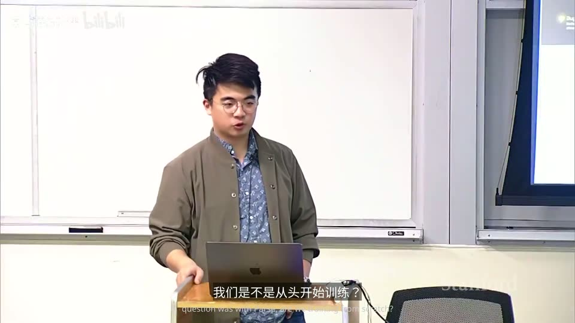 |
| 他说“嘿，我没训练任何东西就赢了一个排行榜比赛”，他其实是在一个 Qwen 模型里循环了两三层， [【跳转到 39:42】](https://www.bilibili.com/video/BV11LEA6eEuj/?p=18&t=2382) | 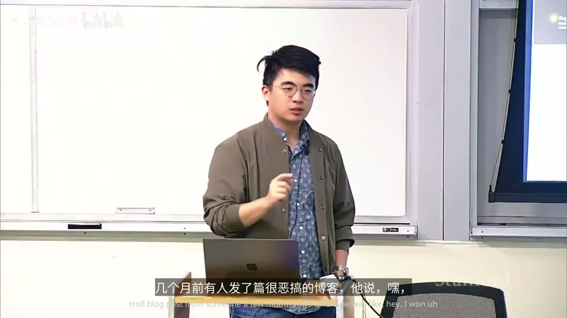 |
| 然后发现在一些数学问题上它的质量开始变高。我们有一些相关研究在做，可能很快就会发布，但有些模型只要对预训练模型做一点循环迭代就能得到更高质量的结果。嗯，这真挺怪的，有点让我想不通。 [【跳转到 39:47】](https://www.bilibili.com/video/BV11LEA6eEuj/?p=18&t=2387) | 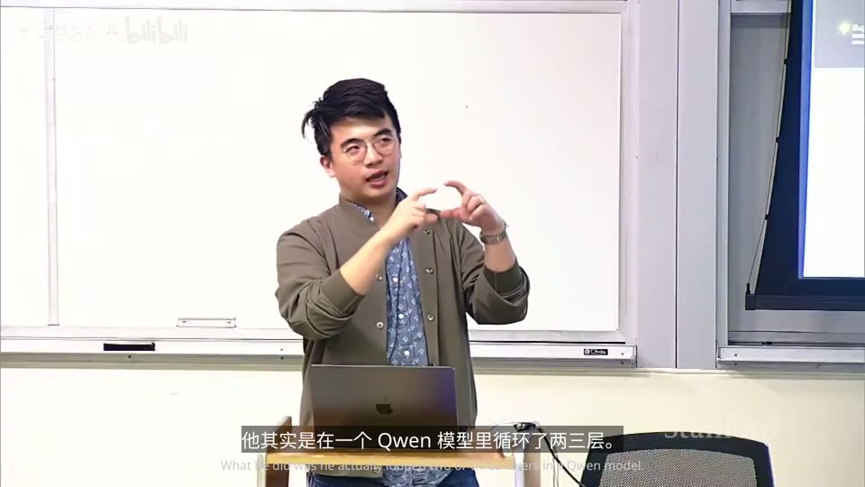 |
| 不知道为啥会这样，我们对这个挺感兴趣的。要是能说服 Hidde，他会去盯着激活值和实际的权重，看看循环为啥能让效果变好。 [【跳转到 40:06】](https://www.bilibili.com/video/BV11LEA6eEuj/?p=18&t=2406) | 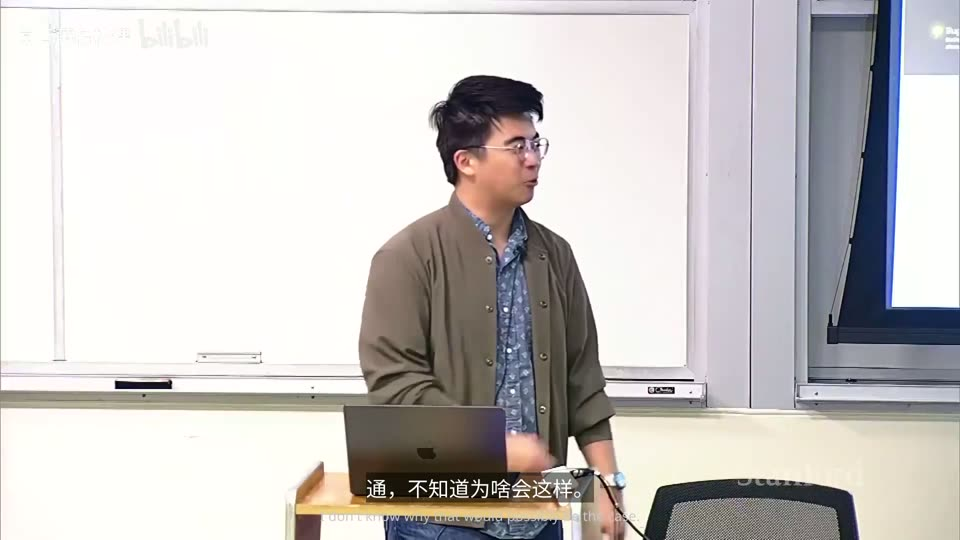 |
| 顺着刚才说的，你提到了循环模型在算力上的最优性，能聊聊推理方面的影响和显存吗？ [【跳转到 40:16】](https://www.bilibili.com/video/BV11LEA6eEuj/?p=18&t=2416) | 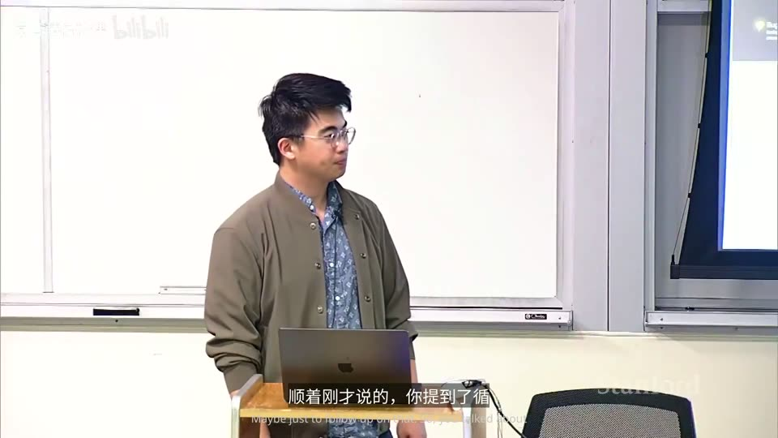 |
| 这怎么帮你跑得更快？我对这些循环方法特别兴奋的一点是， [【跳转到 40:21】](https://www.bilibili.com/video/BV11LEA6eEuj/?p=18&t=2421) | 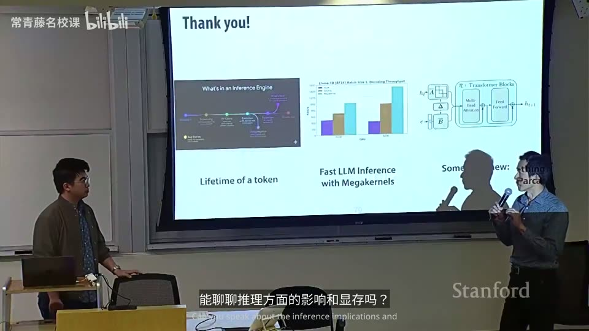 |
| 高效跑推理的主要瓶颈往往是 GPU 显存，参数少了就能塞进更多 KV 缓存， [【跳转到 40:27】](https://www.bilibili.com/video/BV11LEA6eEuj/?p=18&t=2427) |  |
| 或者减少跨 GPU 拆分带来的通信开销，所以小模型能带来很大的灵活性。我有个想法：要是把循环块缩得足够小，就能写个微型巨型内核， [【跳转到 40:34】](https://www.bilibili.com/video/BV11LEA6eEuj/?p=18&t=2434) | 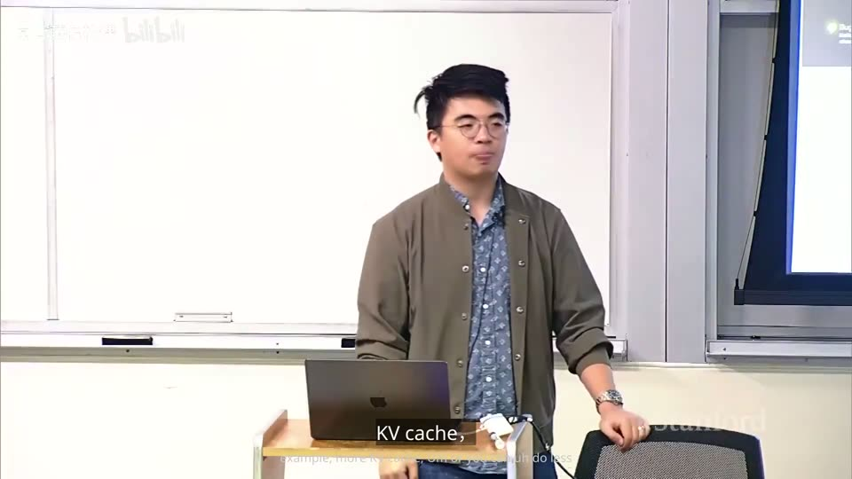 |
| 用超快循环跑这些计算。嗯，目前还没法把块儿做得那么小。 [【跳转到 40:45】](https://www.bilibili.com/video/BV11LEA6eEuj/?p=18&t=2445) | 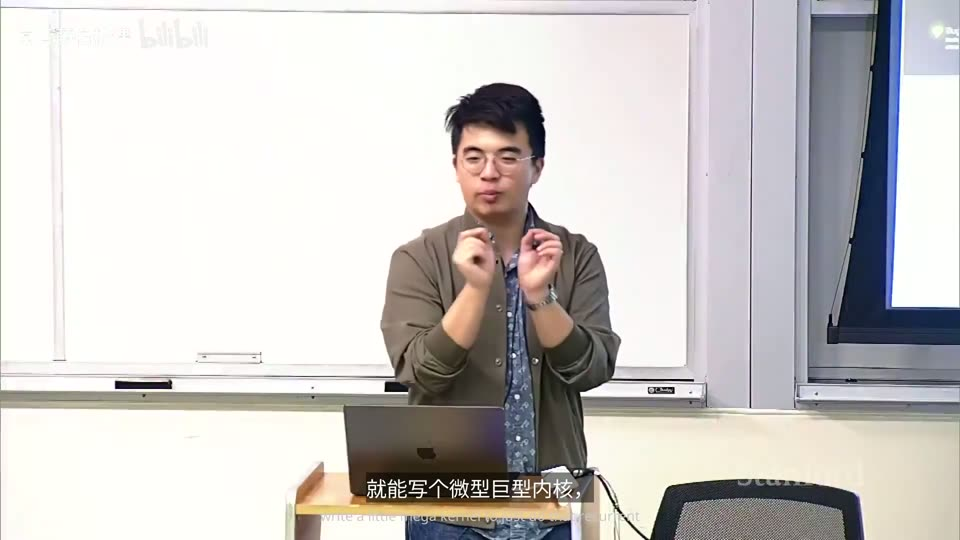 |
| 但这挺有意思。当然下一代 LPU 来了，Groq 芯片会结合 NVIDIA 的技术，他们大概有 250MB 内存， [【跳转到 40:50】](https://www.bilibili.com/video/BV11LEA6eEuj/?p=18&t=2450) |  |
| 所以能塞进去的东西极少。不过可以设计适配方案， [【跳转到 40:57】](https://www.bilibili.com/video/BV11LEA6eEuj/?p=18&t=2457) | 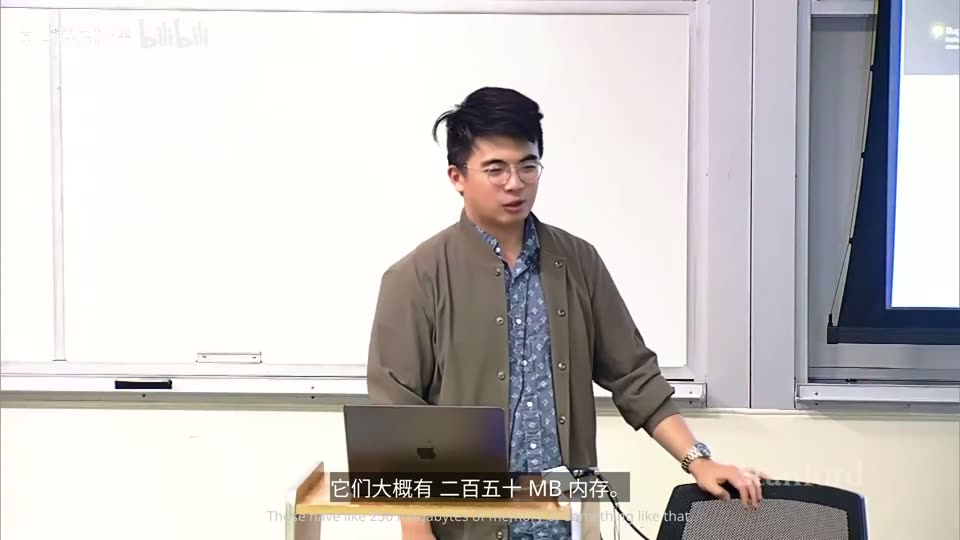 |
| 让权重常驻内存，极速跑激活值，跨过这些阈值会有非线性收益。 [【跳转到 41:02】](https://www.bilibili.com/video/BV11LEA6eEuj/?p=18&t=2462) |  |
| 希望我们很快能做到。对，在那边你刚才提到的……（此处录音不清） [【跳转到 41:08】](https://www.bilibili.com/video/BV11LEA6eEuj/?p=18&t=2468) | 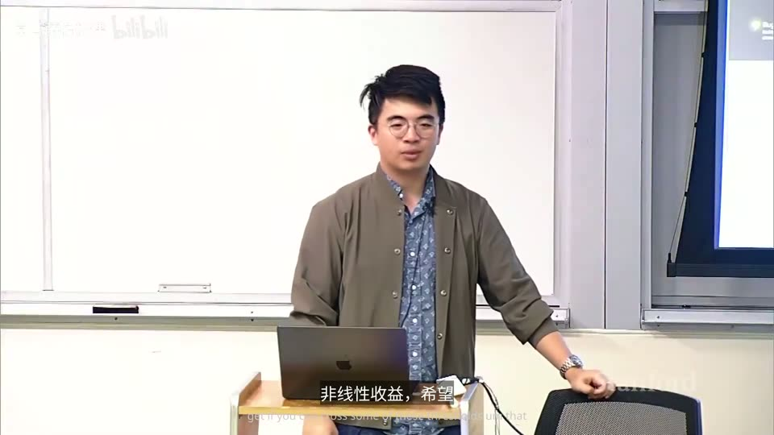 |
| 我想把所有东西融合进一个内核总是严格最优的，但人们不会直接那么做。超大内核的代价是什么？是工程师的血汗啊。 [【跳转到 41:14】](https://www.bilibili.com/video/BV11LEA6eEuj/?p=18&t=2474) | 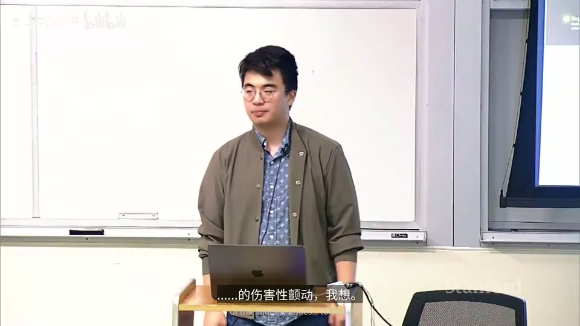 |
| 事实证明，编写超大内核非常耗费人力。打个比方，顶尖工程师一年可能也就为一种硬件 [【跳转到 41:25】](https://www.bilibili.com/video/BV11LEA6eEuj/?p=18&t=2485) | 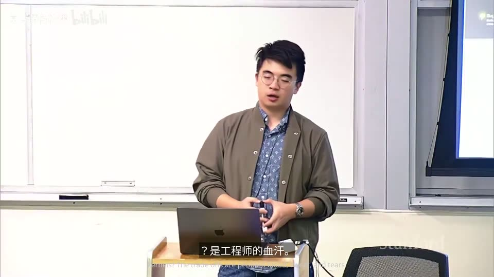 |
| 做出两三个模型的超大内核。批量大小 1 到 16 还行， [【跳转到 41:33】](https://www.bilibili.com/video/BV11LEA6eEuj/?p=18&t=2493) | 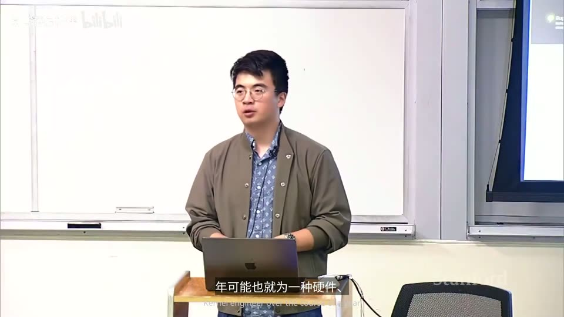 |
| 一旦到 17 就得推倒重来，编写难度极大。我们正试着用编译器把其中一些工作自动化，这个过程做起来确实很难。 [【跳转到 41:40】](https://www.bilibili.com/video/BV11LEA6eEuj/?p=18&t=2500) | 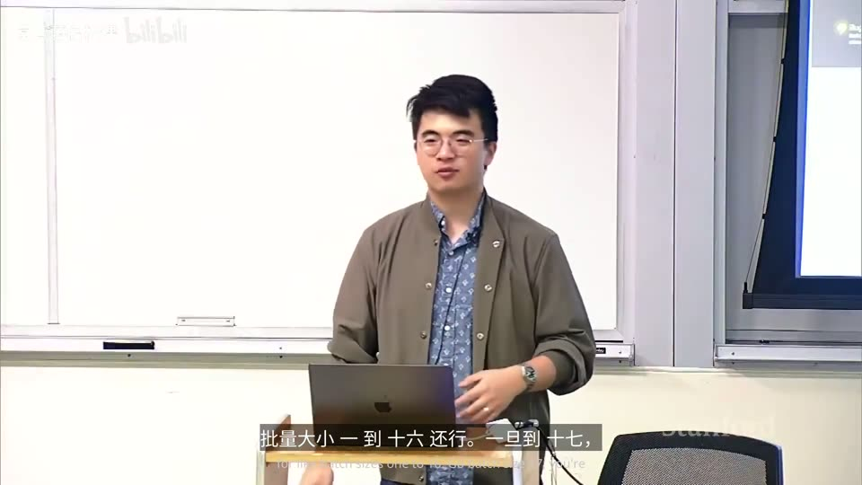 |
| 在 GPU 编程里，超大内核这个概念过去几十年一直起起落落， [【跳转到 41:49】](https://www.bilibili.com/video/BV11LEA6eEuj/?p=18&t=2509) | 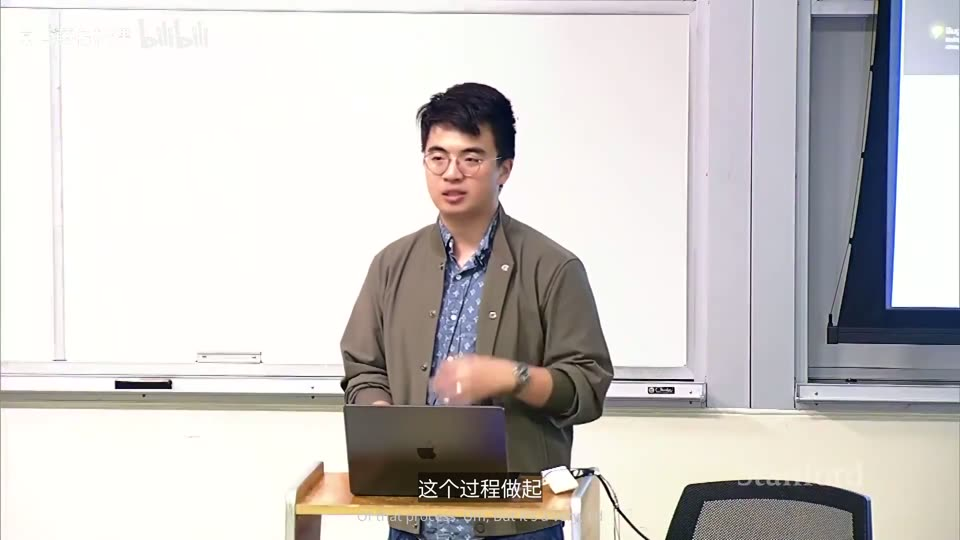 |
| 但一旦搞定速度就顶天了，再也快不了。但这确实得耗费大量精力。行啊。 [【跳转到 41:56】](https://www.bilibili.com/video/BV11LEA6eEuj/?p=18&t=2516) | 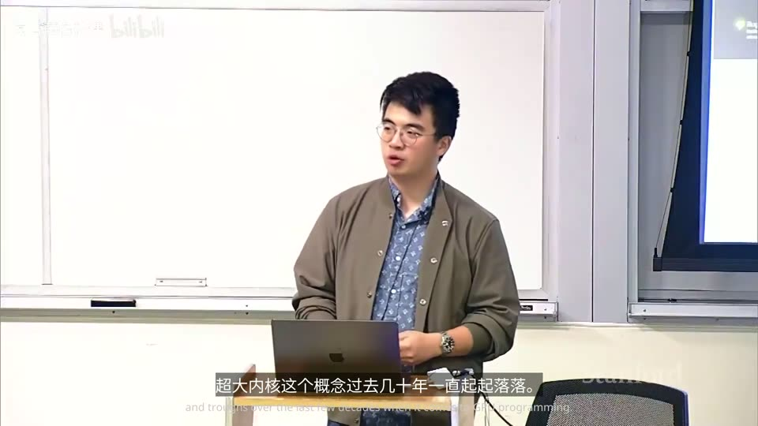 |
| 我能问个问题吗？好，咱们能多聊聊协同设计吗？比如你提到的 Groq 和 Cerebras [【跳转到 42:03】](https://www.bilibili.com/video/BV11LEA6eEuj/?p=18&t=2523) | 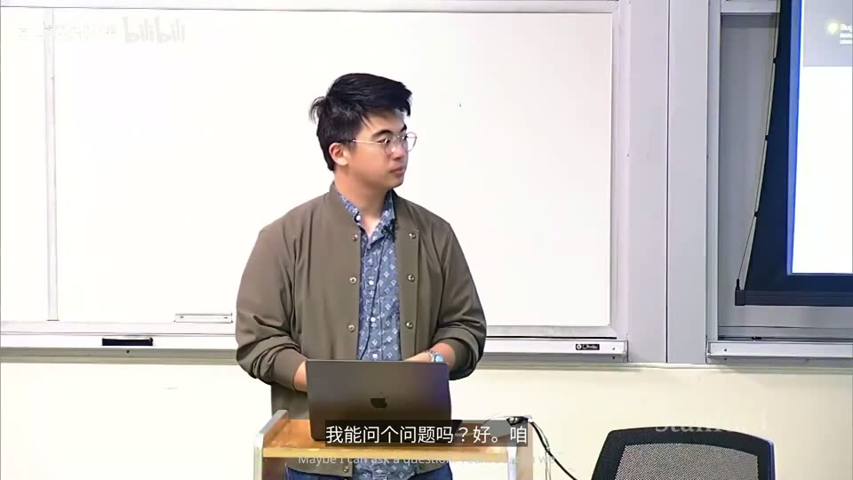 |
| 这些推理新硬件。如果你设计模型且知道它要在特定平台服务，该怎么调架构？ [【跳转到 42:08】](https://www.bilibili.com/video/BV11LEA6eEuj/?p=18&t=2528) |  |
| 对，有几件事得注意。首先内存是主要瓶颈，在特定 Cerebras 芯片上服务得看晶圆、算内存， [【跳转到 42:17】](https://www.bilibili.com/video/BV11LEA6eEuj/?p=18&t=2537) | 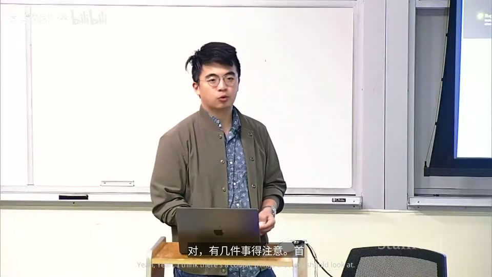 |
| 调整模型大小以容纳 KV 缓存，得留点余量。 [【跳转到 42:22】](https://www.bilibili.com/video/BV11LEA6eEuj/?p=18&t=2542) | 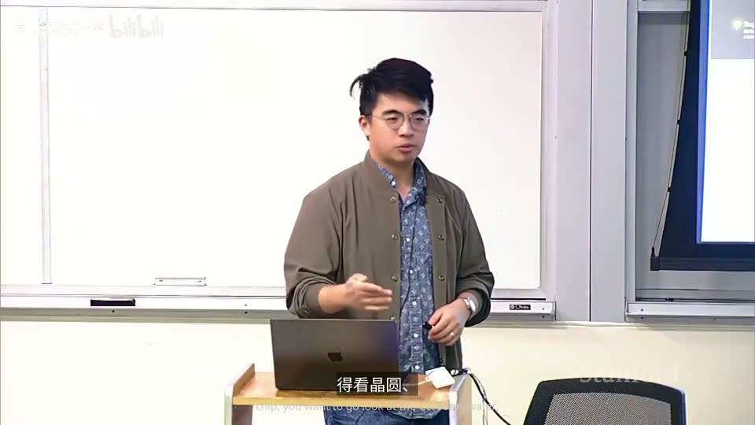 |
| 看最近的中国模型，他们的一些选择暗示他们可能在考虑华为的新芯片。你会看到一些量化选择，比如你要在英伟达显卡上跑模型，像他们的 Nemotron 就得用 NVFP4 格式来训练。 [【跳转到 42:27】](https://www.bilibili.com/video/BV11LEA6eEuj/?p=18&t=2547) | 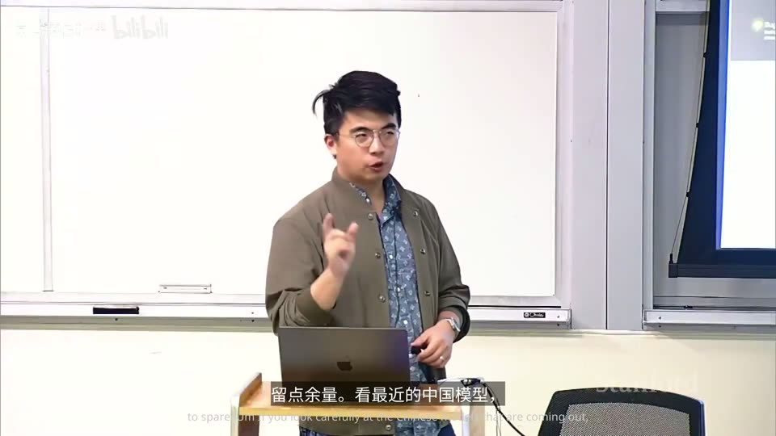 |
| 这是英伟达芯片专有的 FP4 格式。如果你不用英伟达比如用 AMD，就得用另一种叫 MXFP4 的格式，它们各有优劣。所以 [【跳转到 42:42】](https://www.bilibili.com/video/BV11LEA6eEuj/?p=18&t=2562) | 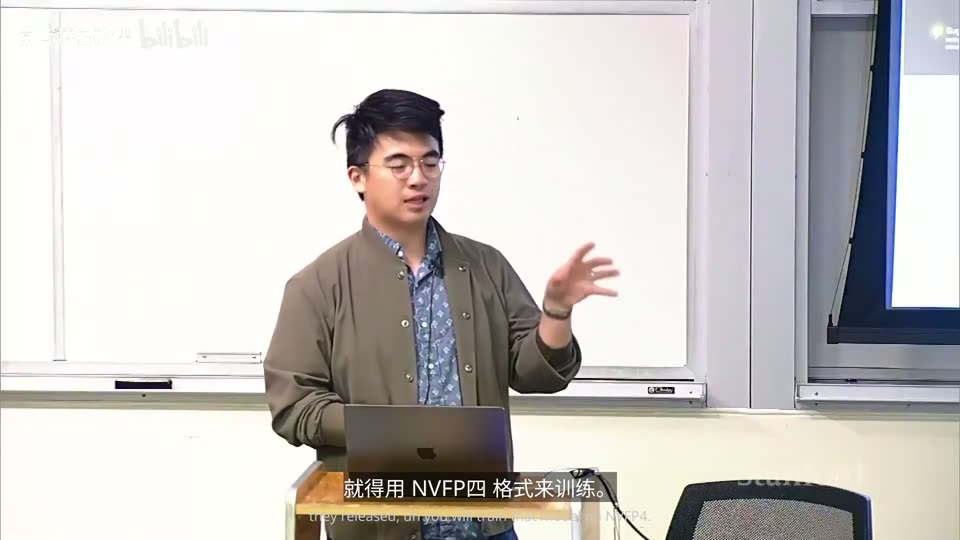 |
| 你得根据选用的硬件来做这些细微的选择。谢谢。想问如果只在乎计算最优训练， [【跳转到 42:53】](https://www.bilibili.com/video/BV11LEA6eEuj/?p=18&t=2573) | 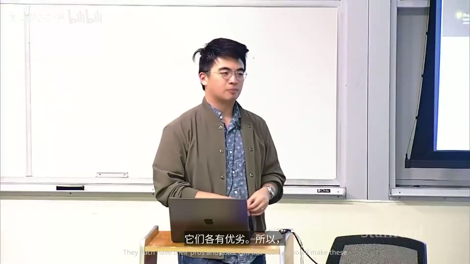 |
| 循环迭代是不是比增加参数更好，还是说这主要是为了降低推理成本的技巧？ [【跳转到 43:01】](https://www.bilibili.com/video/BV11LEA6eEuj/?p=18&t=2581) | 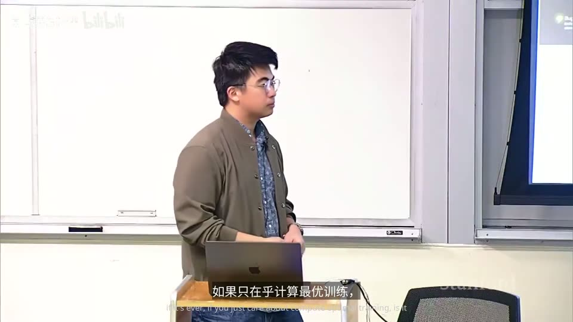 |
| 关于计算最优训练：计算最优通常是指给定 FLOP 预算。麻烦重复一下问题，抱歉。问题是，在 Parcae 里你会选择循环迭代而不是增加参数吗？计算最优的技巧就是在给定 FLOP 预算下 [【跳转到 43:06】](https://www.bilibili.com/video/BV11LEA6eEuj/?p=18&t=2586) | 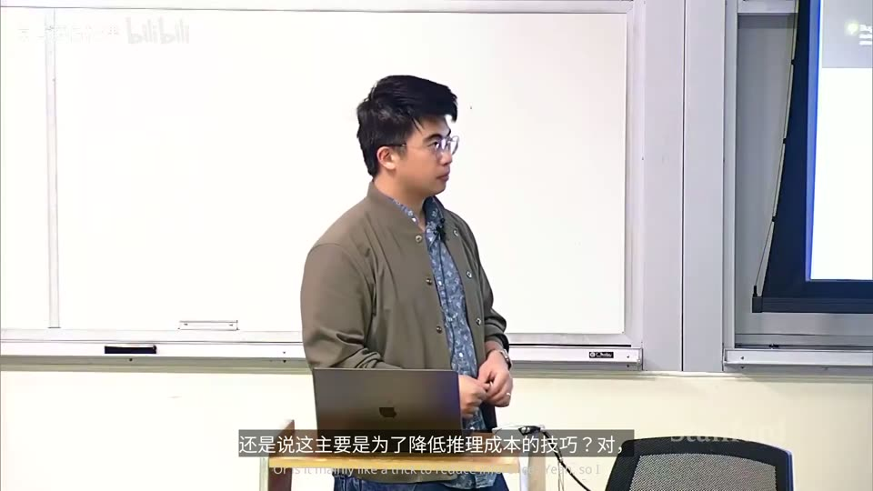 |
| 搞清楚你想达到什么目标。这么说有点牵强，毕竟想提升模型质量直接增加 FLOP 预算就行，定好模型规模后就拉长训练时长；要是规模受限那就多跑几轮循环；数据用完了就挑个你觉得合适的模型规模，在选定规模下尽量练好。 [【跳转到 43:23】](https://www.bilibili.com/video/BV11LEA6eEuj/?p=18&t=2603) | 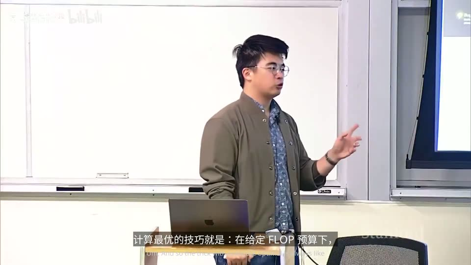 |
| 我觉得选择很多，当然得看这东西到底能不能被采纳、我该怎么部署它。 [【跳转到 43:47】](https://www.bilibili.com/video/BV11LEA6eEuj/?p=18&t=2627) | 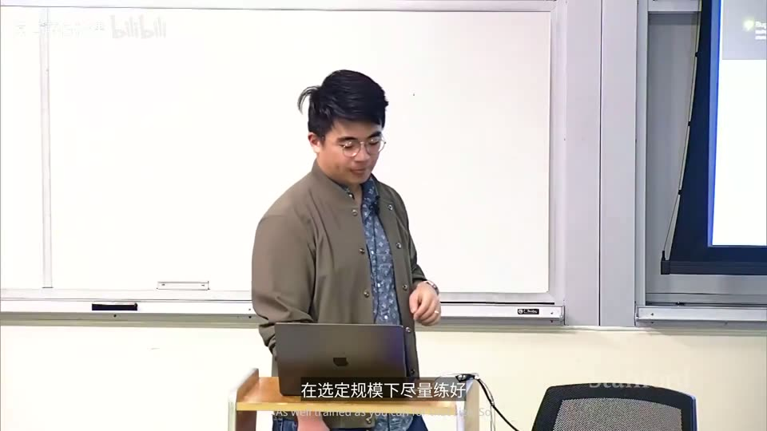 |
| 真要搞开源，现在大家笔记本上跑得动多大的模型？我觉得这些考量最终都归结为一个决定：你打算训练多大的模型。嗯，我觉得只要模型更大、数据更多，性能肯定更好。对，我觉得这主要看那些设计细节。 [【跳转到 43:52】](https://www.bilibili.com/video/BV11LEA6eEuj/?p=18&t=2632) | 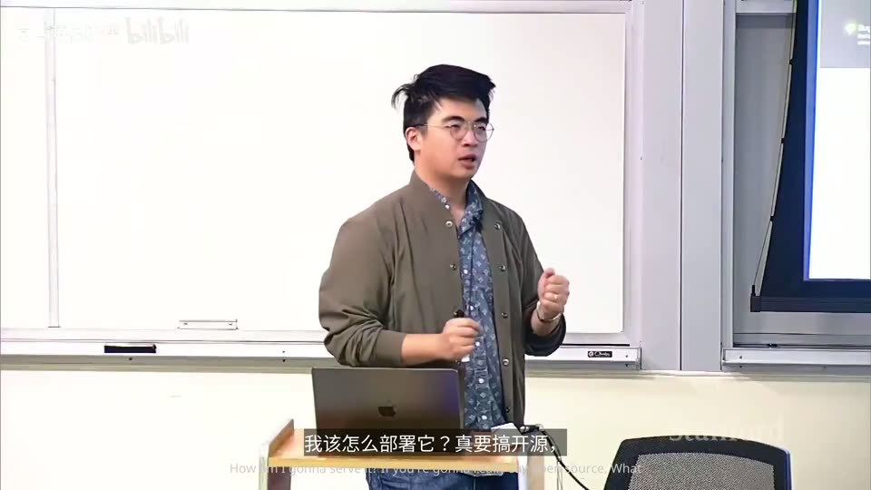 |
| 谢谢。 [【跳转到 44:07】](https://www.bilibili.com/video/BV11LEA6eEuj/?p=18&t=2647) | 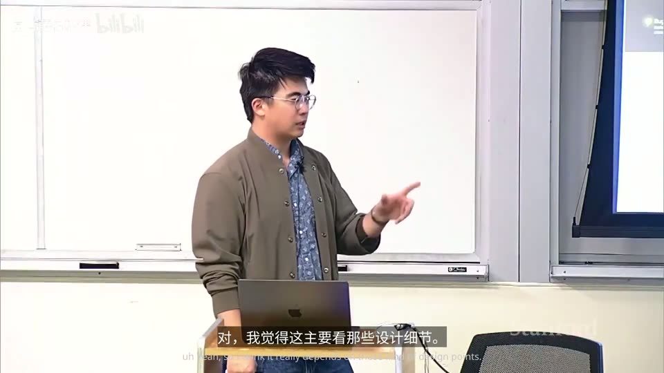 |
| 也许还有一个关于协同设计的问题。你开头提到了不同的用例，比如代理式代码生成还有批量数据处理，那么不同用例之间你看到的最佳架构最显著的区别是什么？ [【跳转到 44:12】](https://www.bilibili.com/video/BV11LEA6eEuj/?p=18&t=2652) | 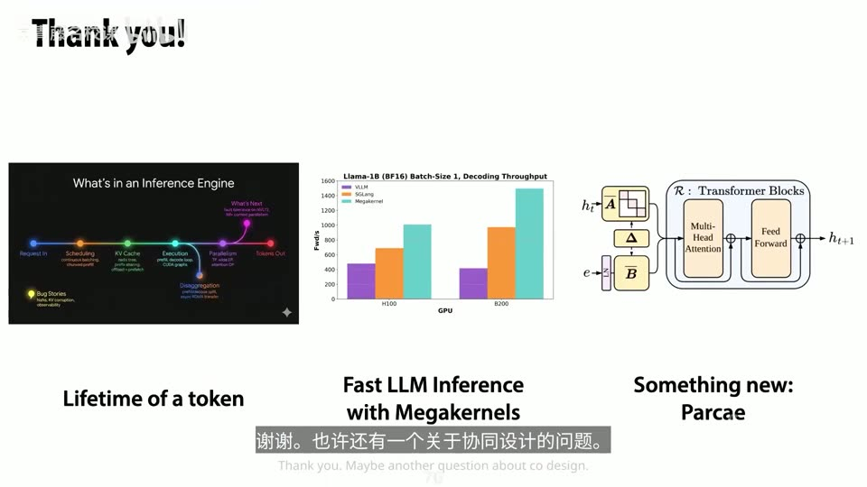 |
| 归根结底模型开发者得选一个，还得尽量做到合理，其中有很多是……好问题。我认为一个巨大的区别在于，在这些代理循环工作流里，有一点很重要，就是要让你的 KV 缓存尽量保持 in memory，越热越好。所以如果你做的是大规模批量处理，每个文档只看一次然后就翻译，KV 缓存就没那么重要了。比如 DeepSeek 的 MLA [【跳转到 44:36】](https://www.bilibili.com/video/BV11LEA6eEuj/?p=18&t=2676) | 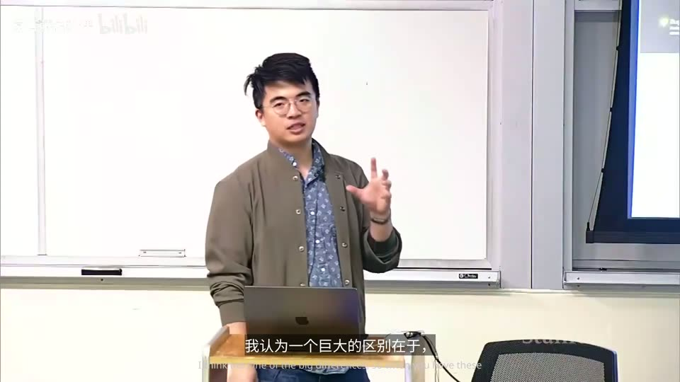 |
| 注意力机制，相比其他模型它对 KV 缓存做了激进的压缩。 [【跳转到 44:53】](https://www.bilibili.com/video/BV11LEA6eEuj/?p=18&t=2693) |  |
| 或者如果模型能在 FP8 或者 FP4 下处理 KV 缓存，这在缓存大小上都是相当大的差异。如果你关注智能体工作流就会注意到这点。当然最关键的是因果注意力还是非因果注意力， [【跳转到 44:58】](https://www.bilibili.com/video/BV11LEA6eEuj/?p=18&t=2698) | 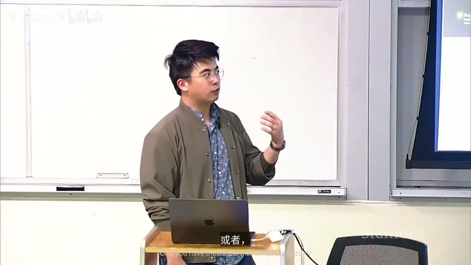 |
| 对吧。嗯，所以如果只是做大批量处理，比如谷歌过去长期只用 BERT 模型， [【跳转到 45:10】](https://www.bilibili.com/video/BV11LEA6eEuj/?p=18&t=2710) | 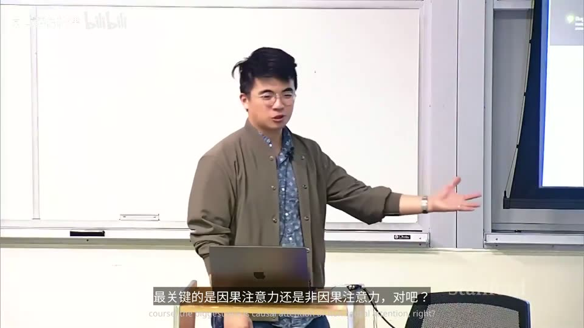 |
| 我想搜索里现在可能还在用，但因为另一端其实不需要生成大量 token。 [【跳转到 45:15】](https://www.bilibili.com/video/BV11LEA6eEuj/?p=18&t=2715) | 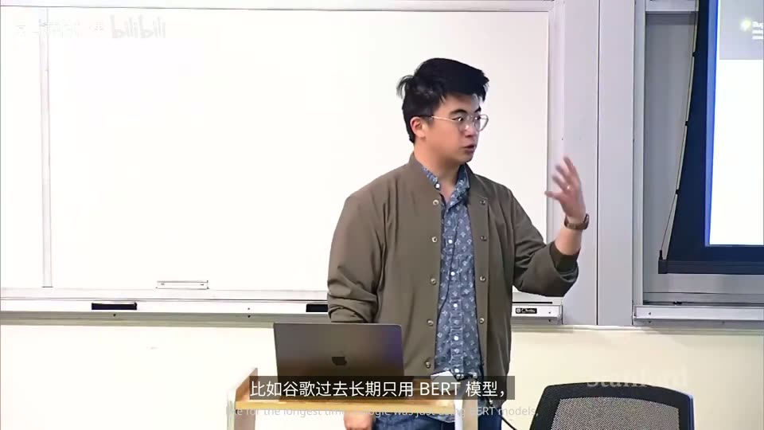 |
| 所以做一次大的双向注意力就能得到向量输出，结果存入数据库随你怎么用；但对话工作流的处理总会包含解码这部分， [【跳转到 45:20】](https://www.bilibili.com/video/BV11LEA6eEuj/?p=18&t=2720) | 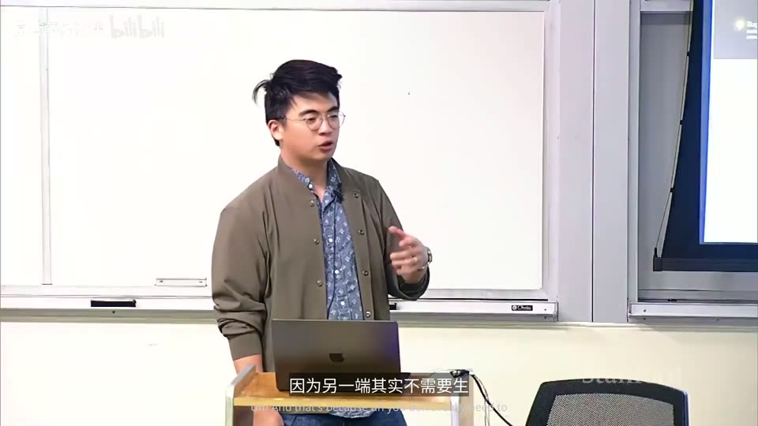 |
| 比如 T5 这类这种方案。嗯，人们曾选择用它先做双向处理 [【跳转到 45:32】](https://www.bilibili.com/video/BV11LEA6eEuj/?p=18&t=2732) | 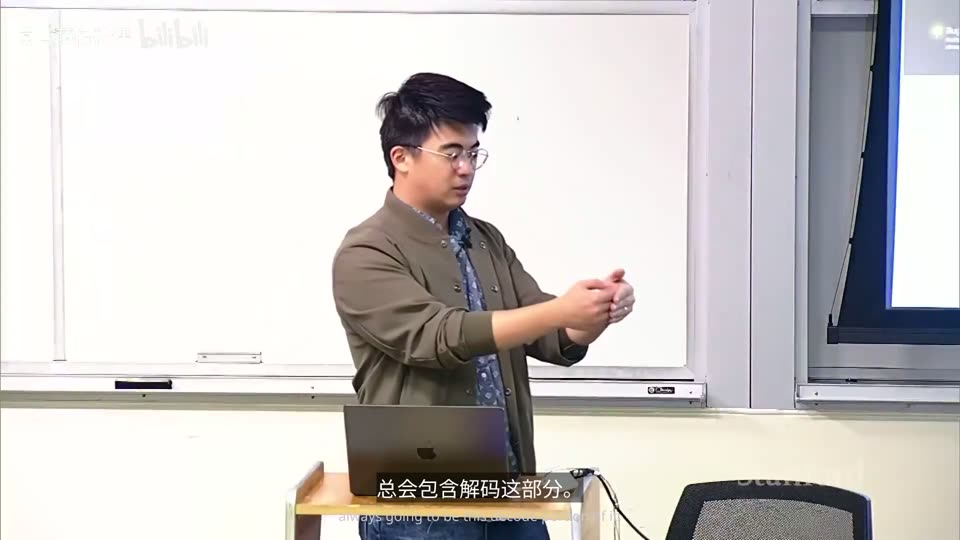 |
| 再做生成。谢谢。好，最后再问一个问题。哦对，我主要想问关于 megakernels 的问题。 [【跳转到 45:37】](https://www.bilibili.com/video/BV11LEA6eEuj/?p=18&t=2737) |  |
| 当时是想把所有东西融进一个内核，但说到可移植性，其实你做的是训练芯片。好嘞，就是想问问这些超大内核怎么跨多台机器通信，还是说必须扩展到训练环节？问得好。你是问当多个 GPU 在循环里通信时 [【跳转到 45:42】](https://www.bilibili.com/video/BV11LEA6eEuj/?p=18&t=2742) |  |
| 超大内核怎么运作，对吧？ [【跳转到 46:02】](https://www.bilibili.com/video/BV11LEA6eEuj/?p=18&t=2762) | 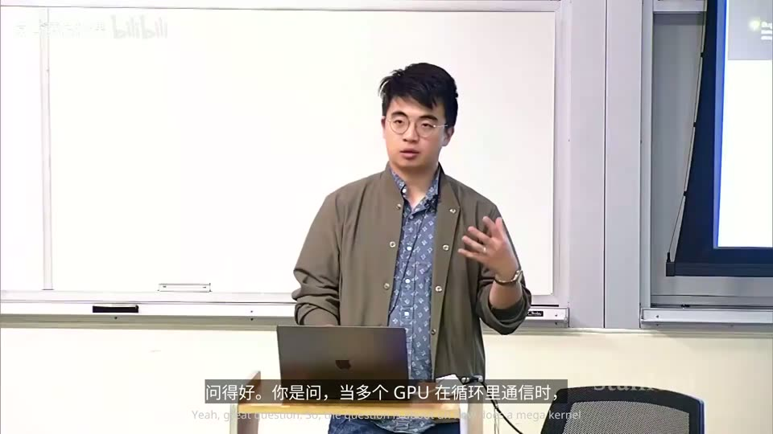 |
| 我们早期做过一些初步研究，发现只要设置得当，也能把 NCCL 调用融进超大内核。我觉得还没找到特别好的杀手级应用场景，有时候瓶颈就在 NCCL 调用本身的延迟上。我觉得这些也能融合。DeepSeek 出来时他们为 MoE 推理层做了个超大内核，专门跑这一块，还真把部分通信也融了进去。 [【跳转到 46:09】](https://www.bilibili.com/video/BV11LEA6eEuj/?p=18&t=2769) | 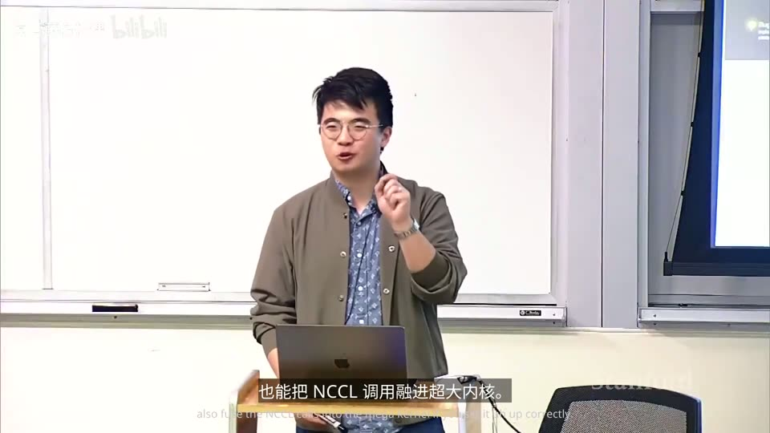 |
| 我觉得现在越来越能看到的趋势是： [【跳转到 46:27】](https://www.bilibili.com/video/BV11LEA6eEuj/?p=18&t=2787) | 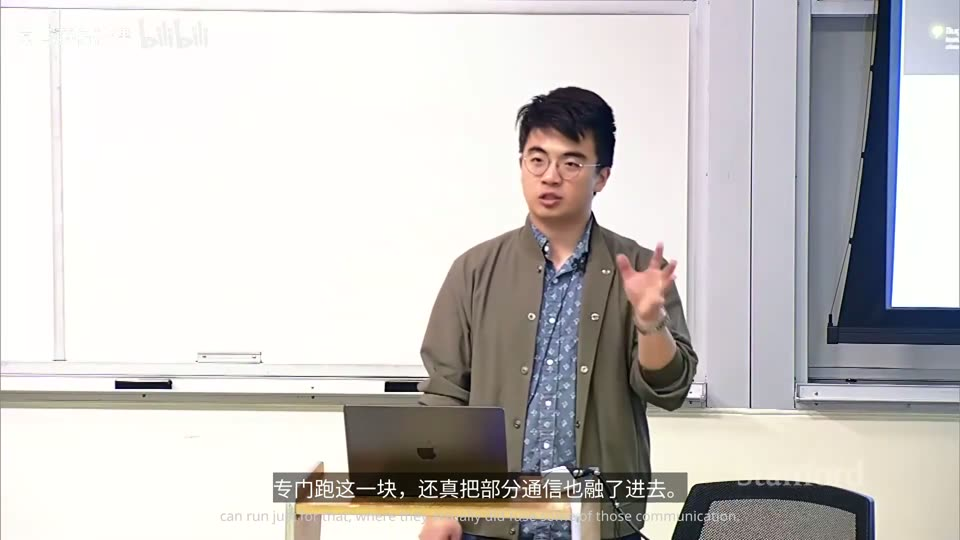 |
| 模型越来越多时，你会为一部分计算做个小的超大内核，但不一定为整个模型做。除非你愿意拼尽全力把整套真正跑起来。好，时间差不多了，再次感谢 Dan。 [【跳转到 46:32】](https://www.bilibili.com/video/BV11LEA6eEuj/?p=18&t=2792) | 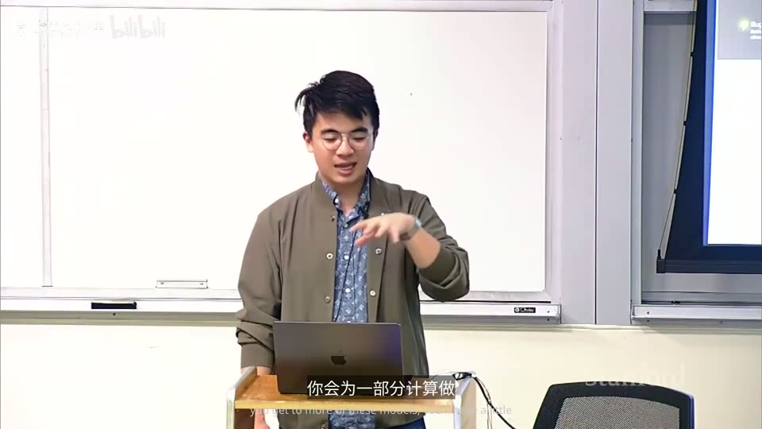 |
| 谢谢邀请。 [【跳转到 46:48】](https://www.bilibili.com/video/BV11LEA6eEuj/?p=18&t=2808) | 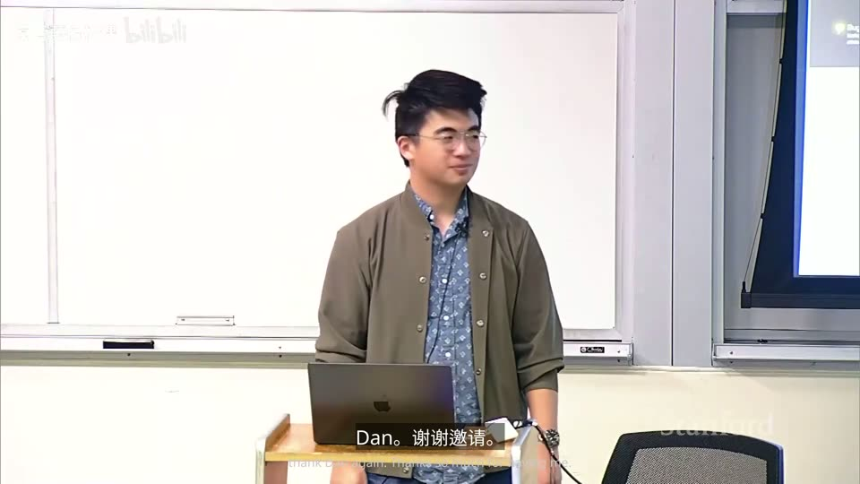 |