# Lecture 2: PyTorch(einops) · 原始文稿（图-字幕分栏）

| 字幕文本 | 画面 |
| :--- | ---: |
| 希望大家都没淋雨——我倒是淋湿了。上次说过，OLMO 项目有一次约 1.2e23（1.2×10^23） [【跳转到 00:00】](https://www.bilibili.com/video/BV11LEA6eEuj/?p=2&t=0) |  |
| 次浮点运算的训练之前在跑，现在跑完了，结果其实和预测的一样。大家记得我们跑的这些：每条曲线代表本质上是一条"等浮点运算次数"曲线，也就是一批小规模模型的运行，你要从中找到"计算最优"的那个点，拟合出缩放定律。这就是我们预测损失、然后实际跑出损失的那个点模型： [【跳转到 00:05】](https://www.bilibili.com/video/BV11LEA6eEuj/?p=2&t=5) | 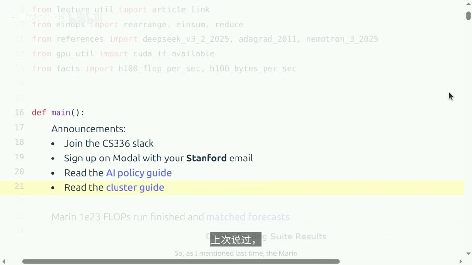 |
| 跑出来的损失在 0.079 以内（原字幕"0.0 瓦"应为损失值小数），我觉得这挺酷的。如果外推到 GPT-5 的性能水平，这就是你会得到的损失值——当然，具体结果可能因这些缩放定律的具体情况而异。好，简单分享一下这个消息。上一讲中我概述了整门课程，谈到了分词——这将是第一次作业的内容。今天我想谈谈资源核算，这部分更偏系统层面。 [【跳转到 00:30】](https://www.bilibili.com/video/BV11LEA6eEuj/?p=2&t=30) | 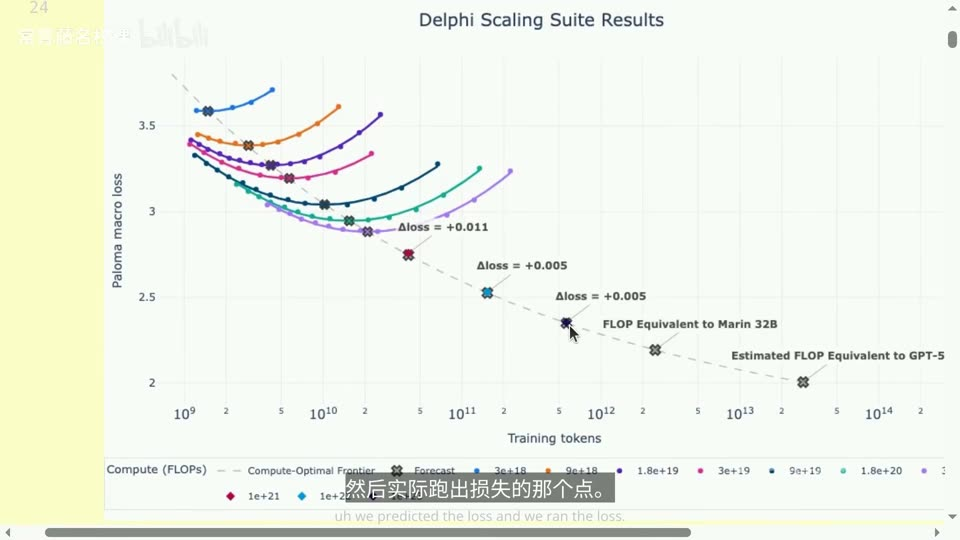 |
| 先回顾一下我们的核心目标：在有限资源下训练出尽可能好的模型。资源包括算力、内存，有时也包括数据——不过数据在本课中不会成为限制因素，我们的目标就是单纯地最大化训练的计算效率。所以在优化计算效率之前，我们需要理解某一具体计算的效率；为此需要理解其算力和内存特征。 [【跳转到 00:55】](https://www.bilibili.com/video/BV11LEA6eEuj/?p=2&t=55) | 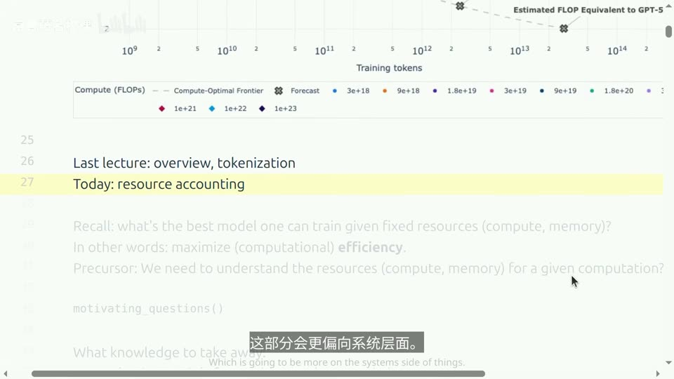 |
| 先让大家感受一下：到课程结束时，你们有望能回答哪类问题？"在 H100 上用 24 万亿个 token 训练一个 700 亿参数的模型需要多长时间？"（原字幕若干 honehundred 均为 H100。）那要怎么回答这个问题呢？这里有个公式：浮点运算次数是参数量的 6 倍再乘以 token 数。我们可以查一下 H100 的规格表，看看它有多快； [【跳转到 01:20】](https://www.bilibili.com/video/BV11LEA6eEuj/?p=2&t=80) | 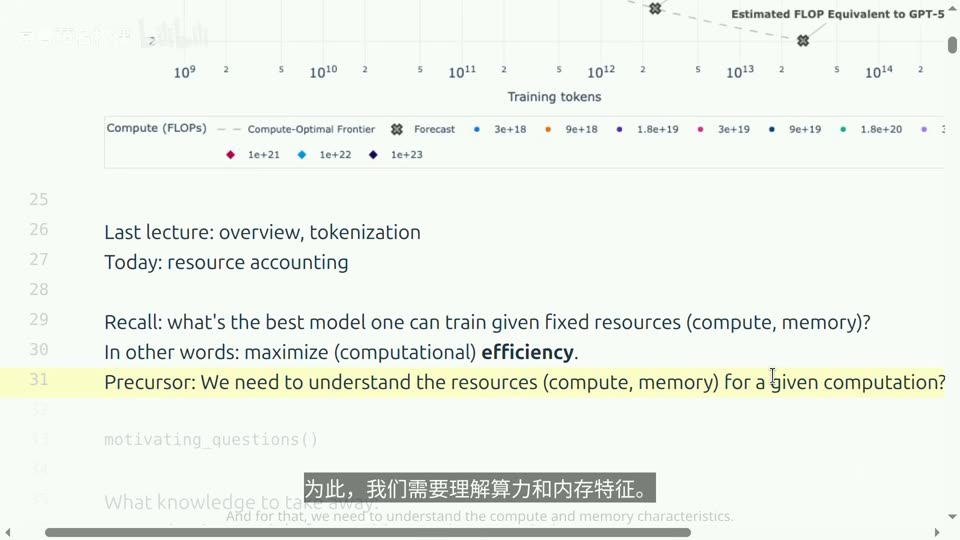 |
| 我们有个叫 MFU（模型算术利用率）的指标，取值 0.5；然后你就能估算出需要多少浮点运算次数、硬件每天能提供多少，最后算出需要多少天——所以总共需要安排大约 3 天。好，再看另一个问题：如果用八块 H100 配合 AdamW，你能训练的最大模型有多大？已知 H100 配有 80 GB 左右的 HBM 内存； [【跳转到 01:45】](https://www.bilibili.com/video/BV11LEA6eEuj/?p=2&t=105) | 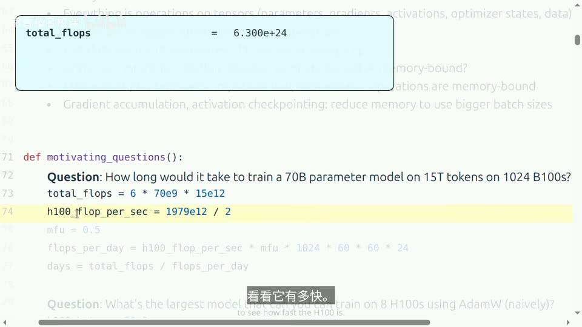 |
| 每个参数占用的字节数加起来是 2+2+4+4——我们稍后解释这些数字怎么来的。参数总数大约是 530 亿。这里有个注意点：我们不计算激活值，因为它取决于批次大小和序列长度。所以这些都是非常粗略的估算；但希望上完这门课，你们能明白这些数字是从哪儿来的。 [【跳转到 02:10】](https://www.bilibili.com/video/BV11LEA6eEuj/?p=2&t=130) | 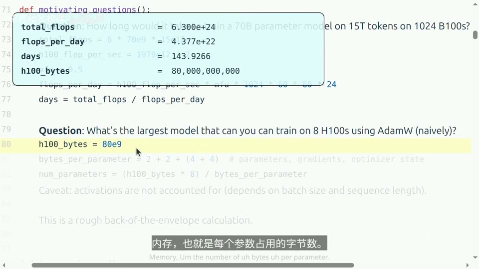 |
| 重点不是要把每个数字都算得精确，而是大概搞清楚整体情况。谢谢。上次我讲了知识以及你们能从这门课里学到什么——机制，也就是系统是怎么运行的。今天的内容会很简单直接：原理就是 PyTorch 和张量是怎么工作的，没什么花哨的。 [【跳转到 02:35】](https://www.bilibili.com/video/BV11LEA6eEuj/?p=2&t=155) | 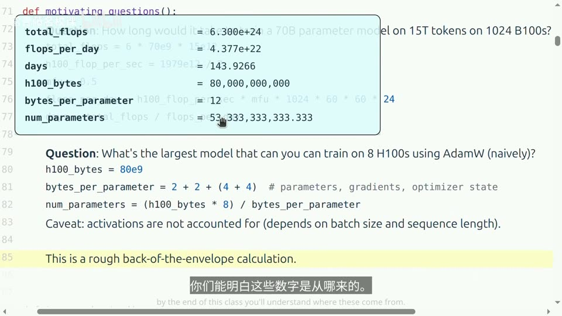 |
| 很直接。我想让大家建立一种思维：资源核算非常关键，希望大家养成习惯，每写一行代码都想想性能特性。最后是直觉：我们要大致了解资源有多少、它们是怎么被消耗的。我们不会讲机器学习里的"魔法"——这部分留给 Tatsu 下次课讲。好，咱们开始吧。从底层入手、层层往上搭建。底层是什么？ [【跳转到 03:00】](https://www.bilibili.com/video/BV11LEA6eEuj/?p=2&t=180) | 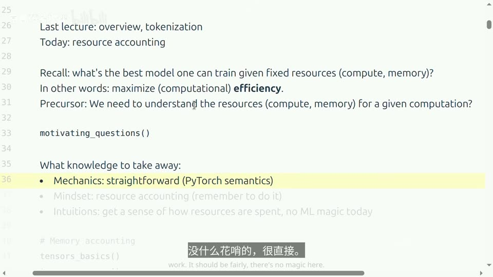 |
| 是张量。张量是存储一切的基础单元：参数、梯度、优化器状态、数据、激活值，本质上都是张量。比如大家可以看看 DeepSeek-V3 模型： [【跳转到 03:25】](https://www.bilibili.com/video/BV11LEA6eEuj/?p=2&t=205) | 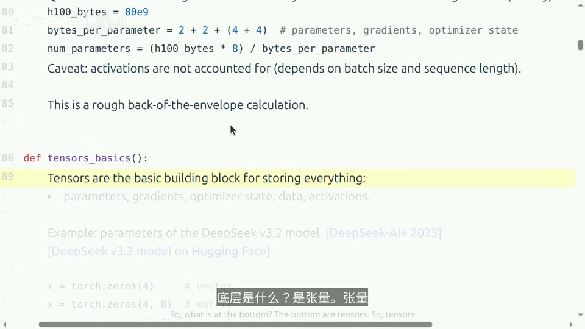 |
| 你会看到模型本身其实是一堆不同的张量，每个张量都有各自的形状和精度（dtype），我后面会讲。 [【跳转到 03:36】](https://www.bilibili.com/video/BV11LEA6eEuj/?p=2&t=216) | 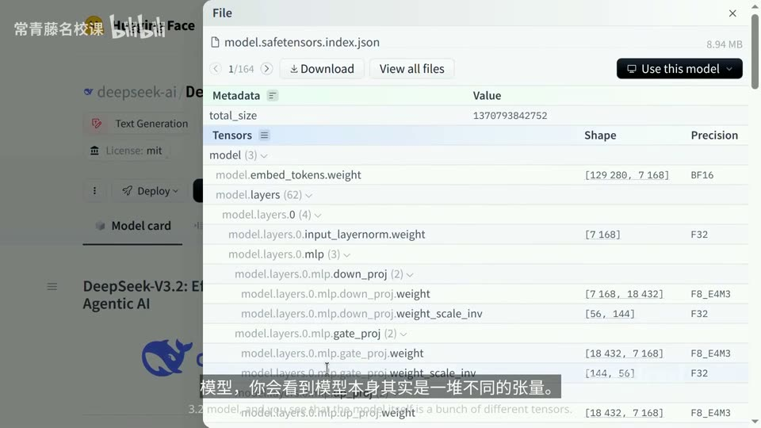 |
| 张量包含了向量和矩阵，并能推广到任意维度。好，那我们来聊聊存储张量需要占用多少空间——这得看张量的类型（dtype）。一般来说，我们处理的是存储浮点数的张量，不过张量也能存整数或其他类型。说到浮点数，通常你提到 float，我想大家指的都是标准的 float32。 [【跳转到 03:44】](https://www.bilibili.com/video/BV11LEA6eEuj/?p=2&t=224) |  |
| float32 拆开来看有 32 位：其中 1 位是符号位，8 位是指数位，用来表示动态范围；剩下的是尾数（小数部分），用来表示数值的细微变化。这也被称为 fp32 或"单精度"。"单精度"这个词的由来是早期做科学计算时 float32 算是一种基准；正如你预期的那样，如果有人给你一个浮点数，你会默认它至少是单精度。 [【跳转到 04:09】](https://www.bilibili.com/video/BV11LEA6eEuj/?p=2&t=249) | 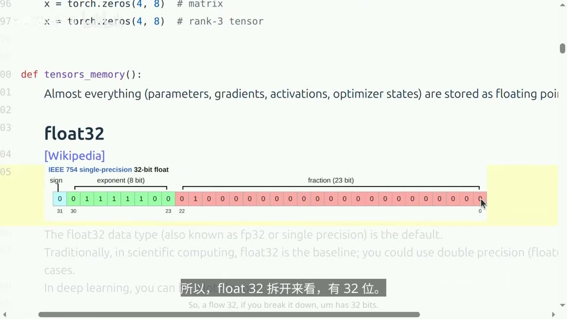 |
| 如果想要更高的精度，可以用双精度（float64）。但在深度学习中，我们走的方向恰恰相反：即便是 32 位精度也已经很高了，我们要做的这类计算并不需要像某些数值模拟那样的高精度。好，在介绍其他类型之前，我们先来看 float16。 [【跳转到 04:34】](https://www.bilibili.com/video/BV11LEA6eEuj/?p=2&t=274) | 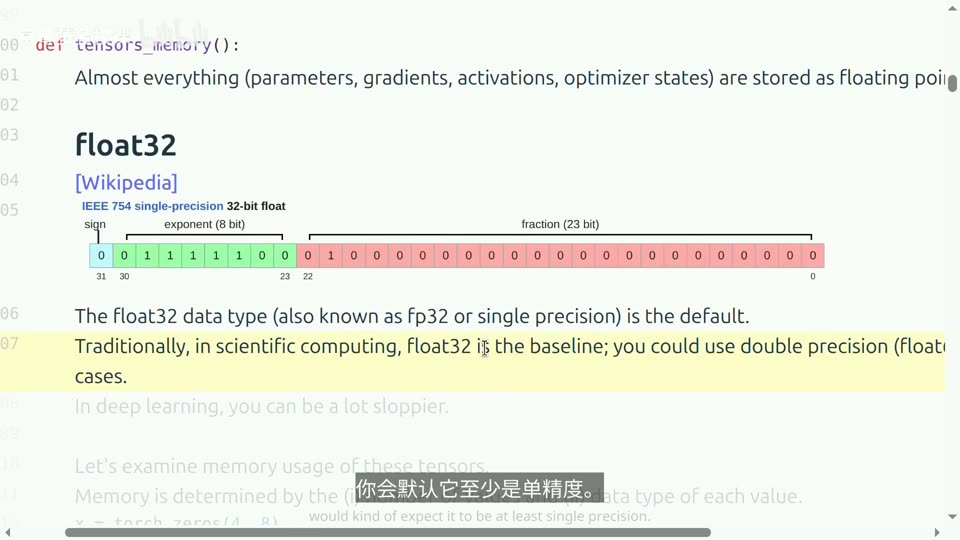 |
| 好的，我们构建一个 4×8 的矩阵。默认情况下，你创建的张量类型是 float32；所以如果你需要其他类型，应当显式声明。内存占用就是元素数量乘以元素大小：这里 32 位浮点数的元素大小为 4 字节，因此总共是 128 字节。给你一个直观的概念：在 GPT-3 这个相对较旧的模型中，前馈层中的一个矩阵 [【跳转到 04:55】](https://www.bilibili.com/video/BV11LEA6eEuj/?p=2&t=295) | 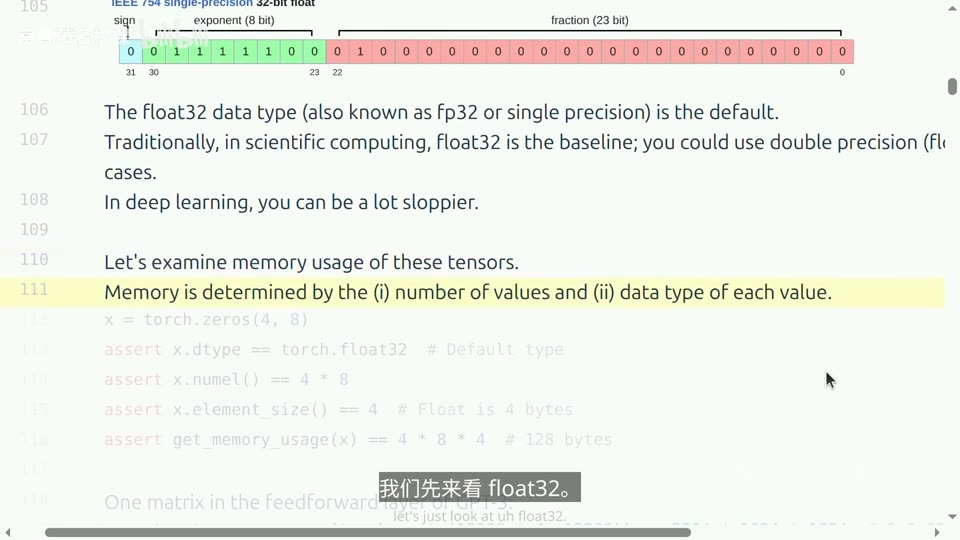 |
| 大约是 12288×49152 这样规模的矩阵（原字幕乱码，意即非常大）。这些张量可能变得相当大，而这甚至还不是人们能想象到的最大尺寸。好，既然我们关注效率，通常我们希望减少存储量。我们将看到：随着精度降低，你实际上既节省了内存也节省了时间——因为在低位（较小编数）上进行运算会更快；假设速度能快一倍，不过这不总是成立， [【跳转到 05:20】](https://www.bilibili.com/video/BV11LEA6eEuj/?p=2&t=320) | 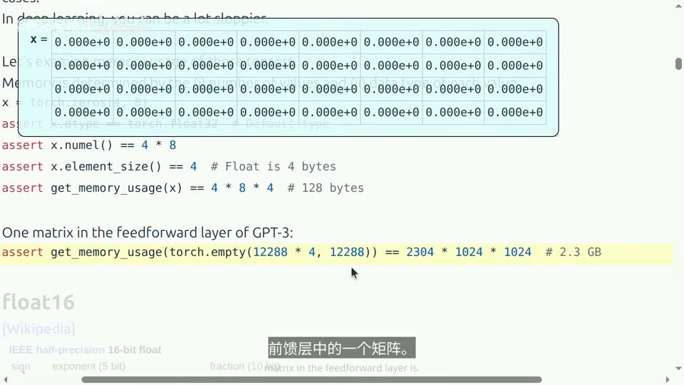 |
| 具体还得看情况。另外，通过降低内存需求——我们后面会看到——其实也能节省时间，这点可能没那么明显，但希望后面能讲清楚。好，最直观的做法就是把位数砍掉一半：现在你用的是 float16，它的格式是 1 位符号位、5 位指数，剩下的全是尾数。所以好吧，float16 还不错， [【跳转到 05:45】](https://www.bilibili.com/video/BV11LEA6eEuj/?p=2&t=345) | 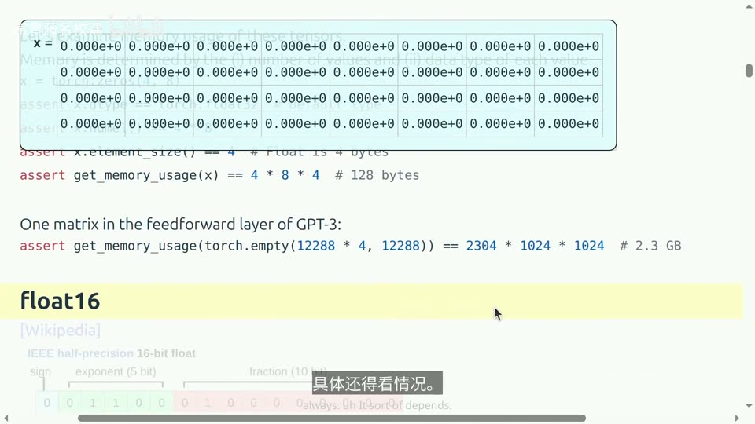 |
| 除了一点：它的动态范围比较差。如果你试着构造一个非常大的数，它的表示结果实际上就是零——所以没法表示特别大的数，也没法表示特别小的数。原因在于指数总共就这么多位 [【跳转到 06:10】](https://www.bilibili.com/video/BV11LEA6eEuj/?p=2&t=370) | 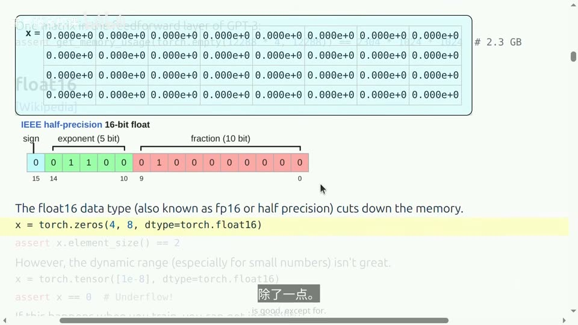 |
| （你知道，指数位只有 5 位，相比之下 fp32 是 8 位）。所以如果你用 fp16 训练——以前大家确实这么做——就会遇到不稳定性，出现下溢、上溢和 NaN，这相当让人头疼。谢谢。于是 bfloat16 被发明出来，它实际上是在 2017 年左右开发的，就是为了解决这个问题。当时的思路是： [【跳转到 06:25】](https://www.bilibili.com/video/BV11LEA6eEuj/?p=2&t=385) | 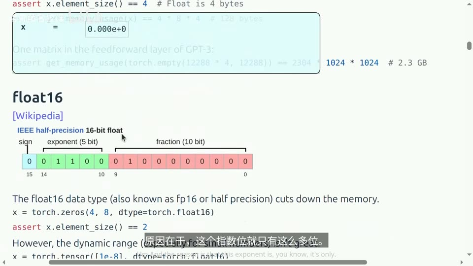 |
| 我们不在总位数上妥协——总位数和 fp16 保持一致——但把一部分位从尾数挪到指数（在尾数和指数间重新划分）。也就是说，它的动态范围比 fp16 大得多：比如 bfloat16 的动态范围其实和 fp32 是一样的，但分辨率确实更差了——毕竟天下没有免费的午餐。但事实证明，在很多深度学习应用里， [【跳转到 06:50】](https://www.bilibili.com/video/BV11LEA6eEuj/?p=2&t=410) | 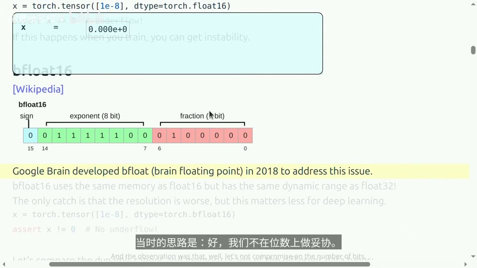 |
| 这种取舍是值得的：你需要确保动态范围不会溢出或下溢；而且因为数据本身就比较粗糙、带有随机性，你并不需要那么高的分辨率。好（这部分我直接跳过）。总结一下这对训练有什么影响：用 32 位精度训练完全没问题——如果你训练的是个小模型，也不想操心这事， [【跳转到 07:15】](https://www.bilibili.com/video/BV11LEA6eEuj/?p=2&t=435) | 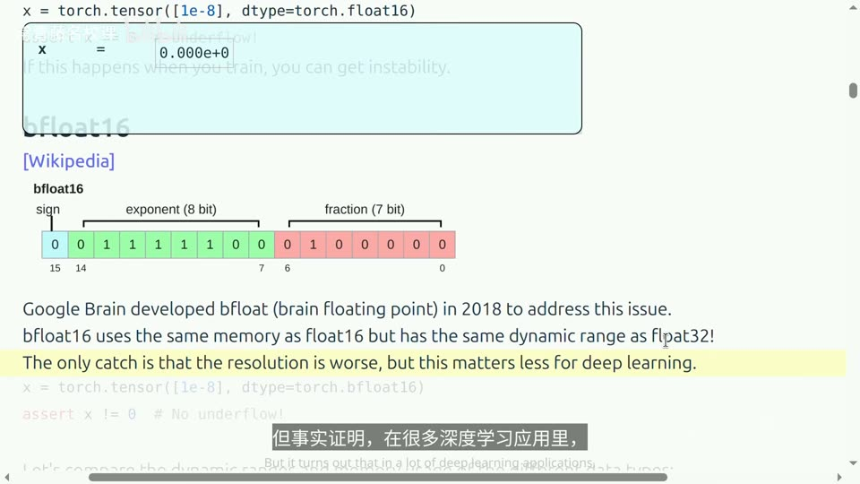 |
| 直接用 float32 就行，不过每个参数得占 4 字节内存，这挺占内存的。而用 fp16 训练风险有点大，所以 bfloat16 算是个比较平衡的选择（哪怕 bfloat16 也有点风险，我们待会儿就知道）。谢谢。现在大家普遍的做法是用混合精度训练。让我整理一下这些点。 [【跳转到 07:40】](https://www.bilibili.com/video/BV11LEA6eEuj/?p=2&t=460) | 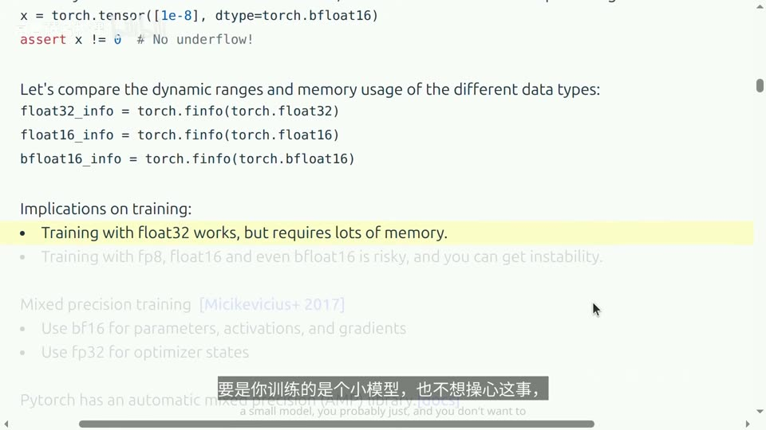 |
| 我再重新编译一次——这些看起来是旧版本。 [【跳转到 08:04】](https://www.bilibili.com/video/BV11LEA6eEuj/?p=2&t=484) | 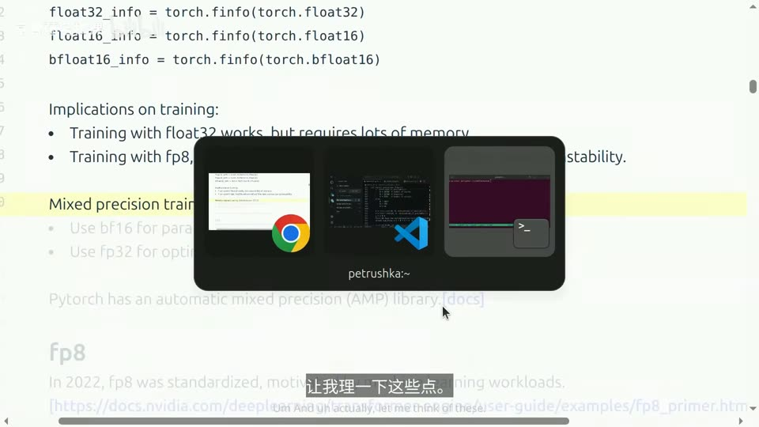 |
| 所谓混合精度训练，就是让一部分计算用一种精度、另一部分计算用另一种精度。一般来说，bfloat16 用于参数、激活值和梯度，而优化器状态则使用 fp32——这点我们后面详细讲。要启用混合精度训练，PyTorch 提供了一个 AMP 库。我们不会过多讨论这一点：你基本上只需把代码包装一下，PyTorch 库会自动处理。 [【跳转到 08:09】](https://www.bilibili.com/video/BV11LEA6eEuj/?p=2&t=489) | 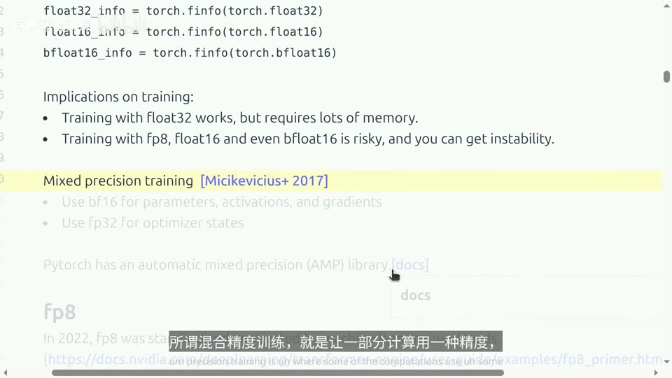 |
| 在安全的情况下，它会把数据转成 bf16——例如矩阵乘法通常安全；但如果你做指数运算，它会把数据保留为 fp32。好，用 bf16 我想这门课大概就讲到这里了；但如果你想更深入探索，可以再往下走。FP8 是 4 年前推出的，目前已实现标准化。FP8 其实有两个版本， [【跳转到 08:34】](https://www.bilibili.com/video/BV11LEA6eEuj/?p=2&t=514) |  |
| 具体取决于你更需要动态范围还是更高的精度，我们就不深入讨论这两个版本了。NVIDIA 的某些 Transformer 引擎支持 FP8；最近甚至可以用到 FP4——去年 NVIDIA 推出了 NVFP4，每个数值仅占 4 位。大家基本达成共识：4 位的数据量很少。我可以在一行里列出从 -6 到 +6 的所有值，所以精度并不高。 [【跳转到 08:59】](https://www.bilibili.com/video/BV11LEA6eEuj/?p=2&t=539) | 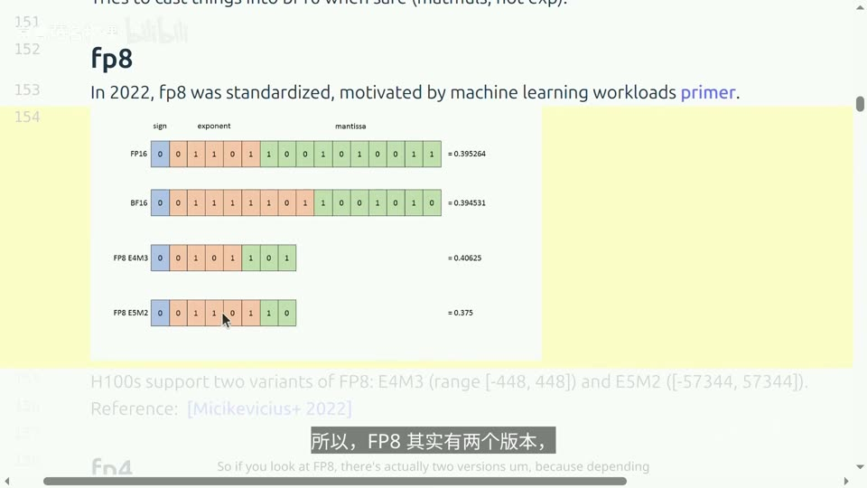 |
| 不过这里其实有个技巧：如果你只是机械地直接使用这些值，模型是没法训练好的。也就是说，虽然每个值只有 4 位，但数据是按"块"组织的，每个块可以相应地向上或向下缩放——所以虽然能表示的数值变多了，但每个数值都无法覆盖完整的动态范围。今年刚发布了一个叫三一 45 超大模型（原字幕 neotrthreesuper，应指某 FP4 训练模型）， [【跳转到 09:24】](https://www.bilibili.com/video/BV11LEA6eEuj/?p=2&t=564) | 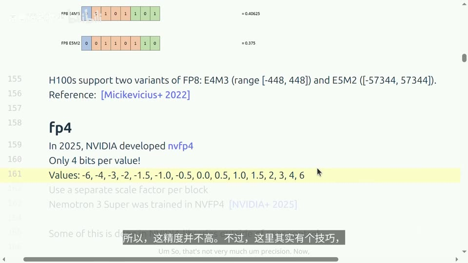 |
| 它是用 FP4 训练的，我觉得挺酷的。有些内容你大概了解一下就行，还有些你根本碰不到——它不像你建一个张量、调用接口说"这是 FP4"它就真的变成 FP4；这些底层工作大多是由 NVIDIA 的软件栈完成的。好，刚才稍微扯远了，但这或许有助于你理解精度里的门道。在我继续之前有什么问题吗？请说。不好意思—— [【跳转到 09:49】](https://www.bilibili.com/video/BV11LEA6eEuj/?p=2&t=589) | 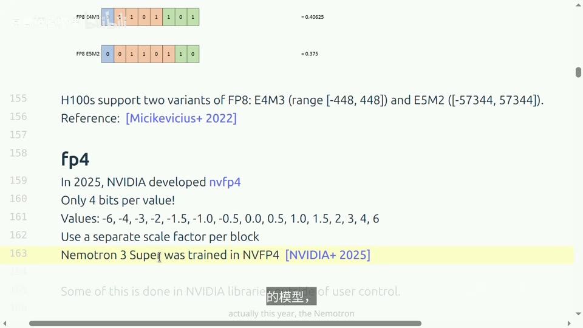 |
| "这是个提问：比如当你处理一个块时，你会对该块涉及的所有数值进行同样的缩放吗？" [【跳转到 10:14】](https://www.bilibili.com/video/BV11LEA6eEuj/?p=2&t=614) | 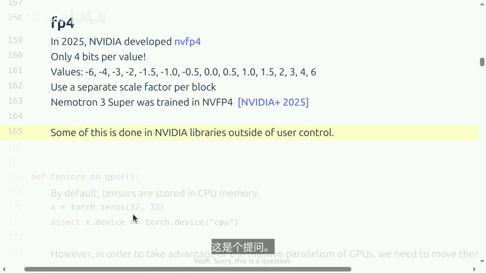 |
| "所以这些数值之间的比例关系在 FP4 下依然保持不变？""对。这么做就是为了填入最大值，从而获得更高的精度。""这个问题问得好。那我再解释一下这个块：假设你有一个块，在这个块里你可以在四位的范围内变化；另外所有这些值都可以根据缩放因子的倍数进行上下缩放。所以如果你看单个数值…… [【跳转到 10:19】](https://www.bilibili.com/video/BV11LEA6eEuj/?p=2&t=619) | 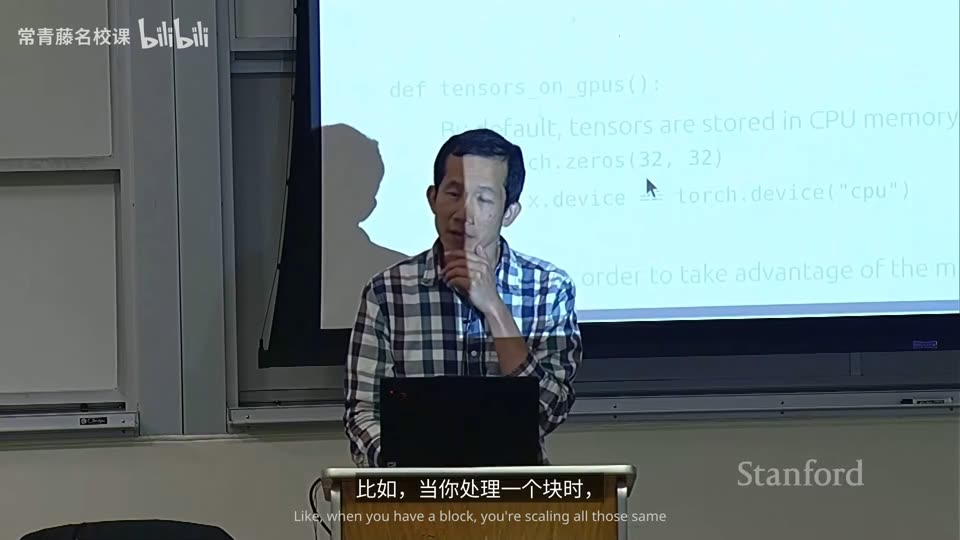 |
| 实际上得到的动态范围超过了 4 位，但问题是你不能让这个值极大而相邻的值极小。"好，这关于缩放的问题。嗯，那如果是一位呢？"训练显然有一条单独的路径。""对，所以这可能正好是个切入点。"问题在于 1-bit 精度——因为实际上无法再低于它了。这里需要区分训练和推理场景：很多低位精度的内容， [【跳转到 10:44】](https://www.bilibili.com/video/BV11LEA6eEuj/?p=2&t=644) | 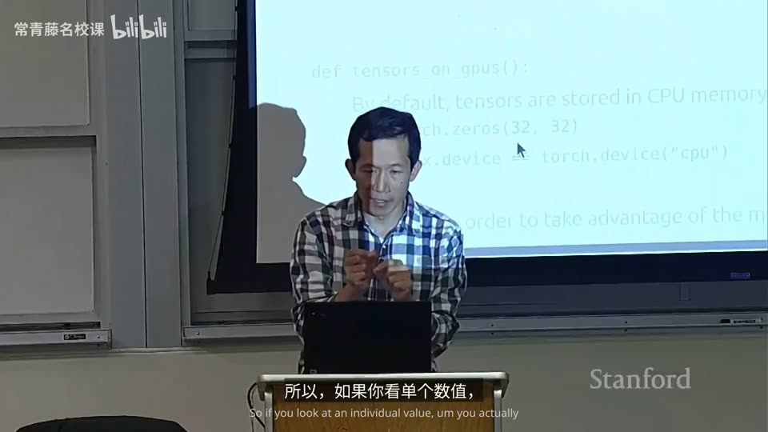 |
| 如果谈到量化——我想我们之后会讲到——量化是指：你先以某个精度（甚至是 bf16）训练模型，然后将其量化到 1 位或 2 位等低位，这比训练一个 1-bit 语言模型要容易得多。而直接训练 1-bit 模型，我认为还没有人做过；也许这是可能的，但还没有人训练出可信的成果。好，那我们继续。我们讨论了张量。 [【跳转到 11:09】](https://www.bilibili.com/video/BV11LEA6eEuj/?p=2&t=669) | 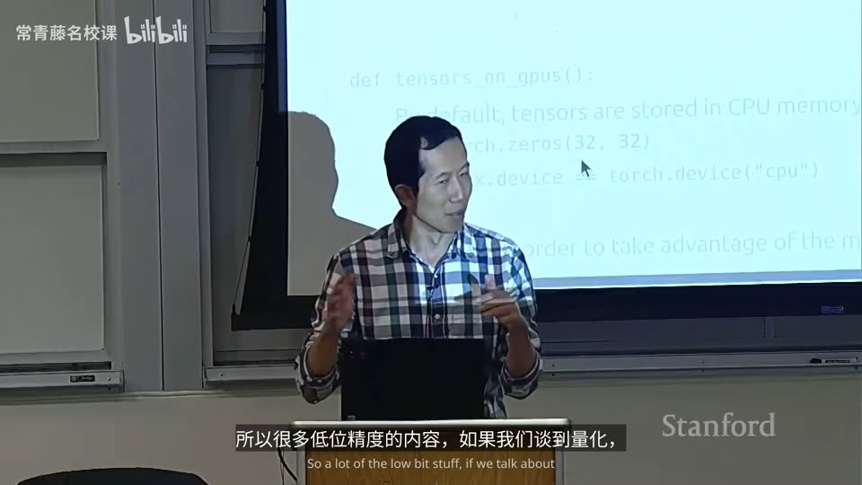 |
| 内存计算相当简单，就是元素数量乘以每个元素占用的内存。默认情况下，你在 PyTorch 中创建的张量会放在 CPU 上；当然，如果你希望运行速度快，就需要把张量移到 GPU 上。其实这里有个小问题： [【跳转到 11:33】](https://www.bilibili.com/video/BV11LEA6eEuj/?p=2&t=693) | 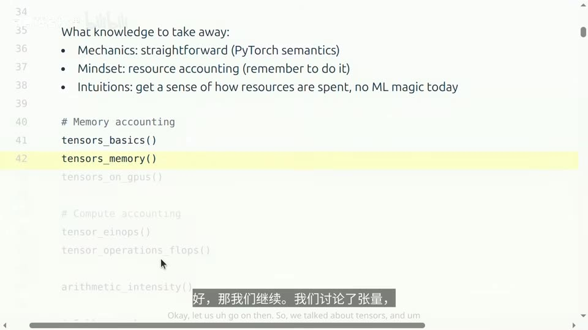 |
| 这些幻灯片是在我的笔记本上跑的，所以没有 GPU，因此有些代码我只展示、不实际运行。好， [【跳转到 11:50】](https://www.bilibili.com/video/BV11LEA6eEuj/?p=2&t=710) | 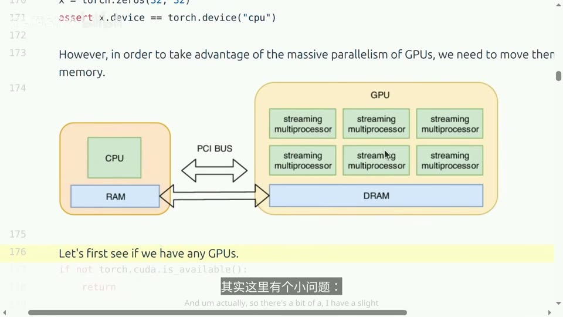 |
| 我们来看看。 [【跳转到 11:55】](https://www.bilibili.com/video/BV11LEA6eEuj/?p=2&t=715) | 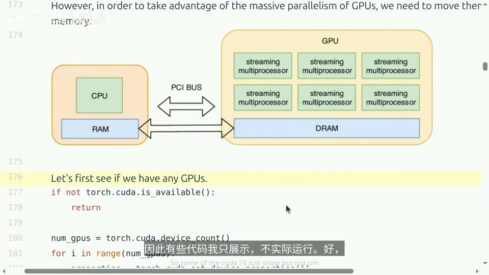 |
| 这部分可能没那么有意思，但我想大家都知道怎么操作： [【跳转到 12:00】](https://www.bilibili.com/video/BV11LEA6eEuj/?p=2&t=720) | 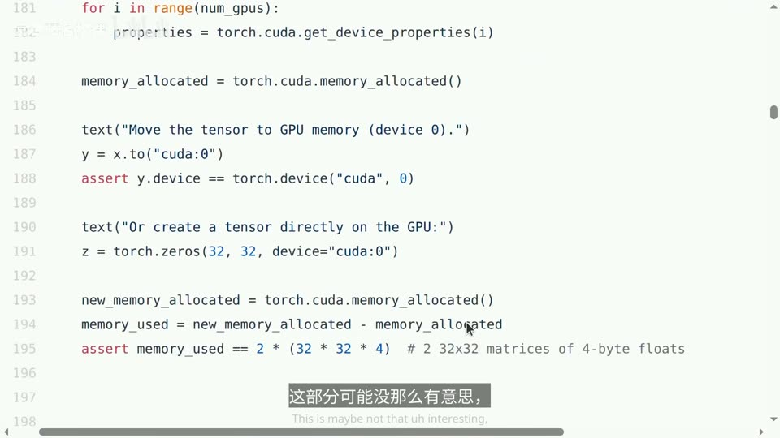 |
| 把张量移到 GPU 上。但一定要记得这么做，否则就拿不到加速效果。好，刚才我们讨论了张量的内存—— [【跳转到 12:05】](https://www.bilibili.com/video/BV11LEA6eEuj/?p=2&t=725) | 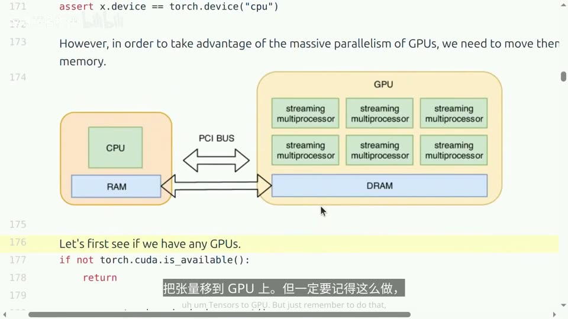 |
| 这部分很直接。现在我们来谈谈用张量做计算。在讨论张量操作的浮点运算次数之前，先稍微岔开一下，聊聊 einops。在座有多少人熟悉或用过 einops？ [【跳转到 12:10】](https://www.bilibili.com/video/BV11LEA6eEuj/?p=2&t=730) | 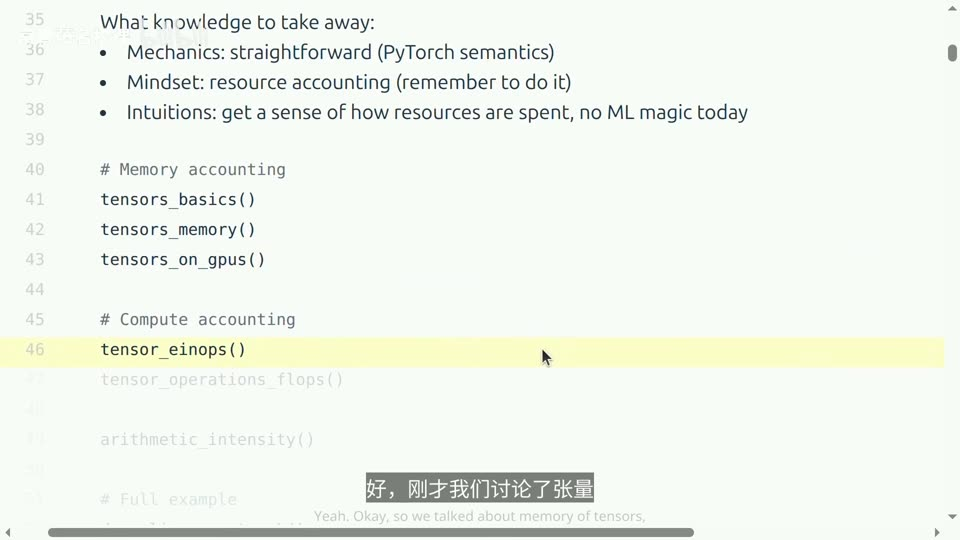 |
| 大概三分之二啊。好的。einops 的初衷是——对还没用过它的人—— [【跳转到 12:23】](https://www.bilibili.com/video/BV11LEA6eEuj/?p=2&t=743) | 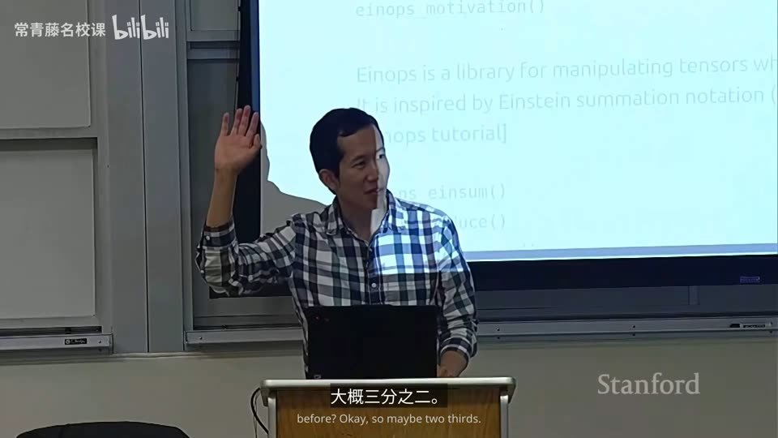 |
| 原生操作很容易出错，而且这种代码很难看懂：看到 X 和 Y，接着是 transpose 里的 2 和 -1，你根本搞不清这两个负数代表什么。所以这就是使用变量名而非索引的动机。einops 是一个用来处理"维度带有名称"的张量的库，灵感来自爱因斯坦求和约定。有个不错的教程。 [【跳转到 12:28】](https://www.bilibili.com/video/BV11LEA6eEuj/?p=2&t=748) | 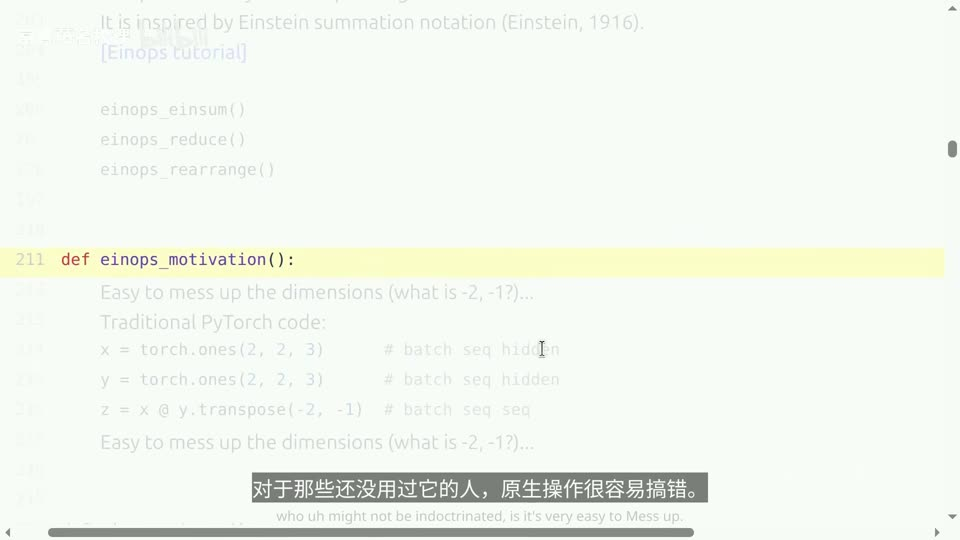 |
| 大家可以看看。我只讲一些基础：基本上可以把 einsum 理解为一种带有良好索引管理的广义矩阵乘法。举个例子：我有一个 3×4 的矩阵，还有一个 4×3（原字幕"速乘三"）的矩阵，如果做矩阵乘法——这其实相当不错，很容易理解。在 einops 中，基本上你可以说 X 有两个维度——行和列——我将它们命名为 seq_one 和 hidden； [【跳转到 12:53】](https://www.bilibili.com/video/BV11LEA6eEuj/?p=2&t=773) | 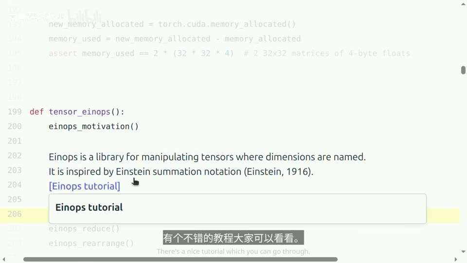 |
| 然后我会有一个 Y，它也是矩阵，包含所有行和列，我将它们命名为 hidden 和 seq_two；我将生成一个张量，其维度为 seq_one 和 seq_two。索引中任何未在此处提及的维度（比如 hidden）将被求和消去。它的工作原理是：我会遍历此处出现的所有变量（seq_one、hidden 和 seq_two）的所有可能取值， [【跳转到 13:18】](https://www.bilibili.com/video/BV11LEA6eEuj/?p=2&t=798) |  |
| 并求和：我基本上会对 X 和 Y 进行索引，将它们相乘，然后累加到结果 Z 的 (seq_one, seq_two) 位置上。好，所以你说"这可比刚才简单多了，对吧"。来，我们看个更复杂的例子。还是类似刚才的例子，现在我们有一个张量，形状是 2×3×4，另一个张量也是 2（原字幕 RX）×3×4。 [【跳转到 13:43】](https://www.bilibili.com/video/BV11LEA6eEuj/?p=2&t=823) | 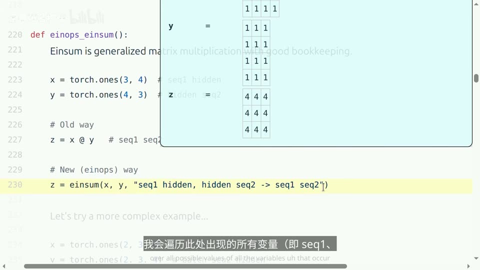 |
| 如果我采用旧式做法：基本上是对最后两个维度做转置，然后由于 einsum 已对非矩阵乘法的维度进行了批处理，你就得到了结果。懂了吗？你得稍微推理一下。einops 让这一点变得非常清晰：它明确标出了批处理维度 batch，以及 seq_one、hidden、seq_one（应为 seq_two）、hidden；而我只需要输出 batch、 [【跳转到 14:08】](https://www.bilibili.com/video/BV11LEA6eEuj/?p=2&t=848) | 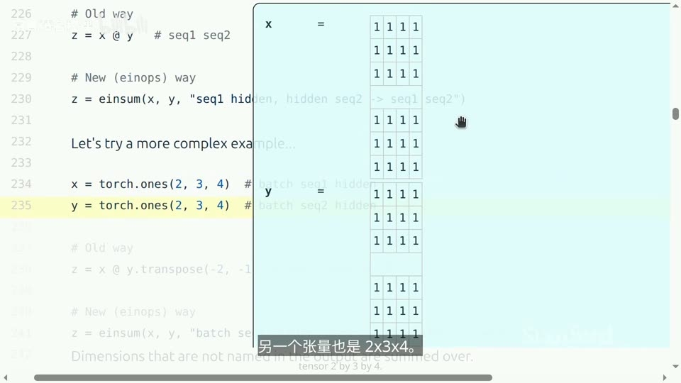 |
| seq_two。懂了吗？注意这里没有转置操作：因为某种意义上我通过命名就实现了转置——假如命名顺序写反（比如 hidden 在 seq_two 前面），也无需转置。我老是被转置搞糊涂，所以"不用考虑转置"这件事让我很开心。好，如果你想写得精简点，可以这么说：对于批，我就用省略号代替——也就是说，假设我有一个秩为 10 的张量， [【跳转到 14:33】](https://www.bilibili.com/video/BV11LEA6eEuj/?p=2&t=873) | 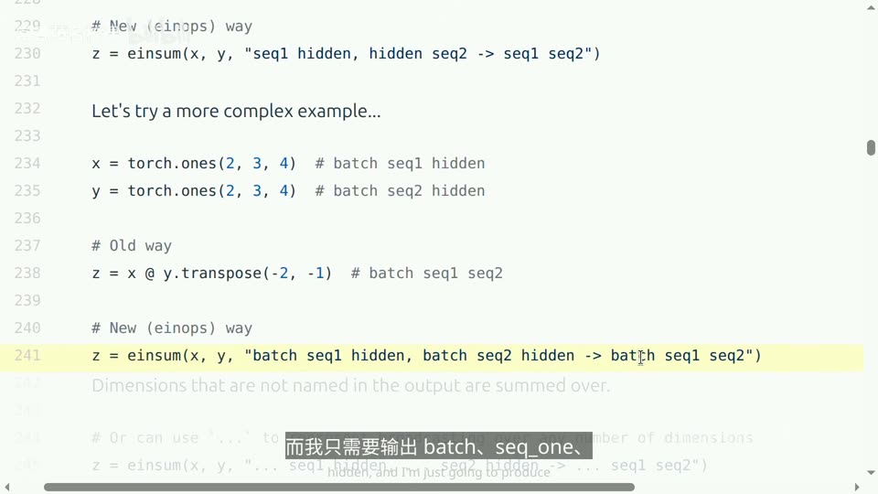 |
| 有八个不同的批处理维度，我只要写省略号就行，不用一个个列出来。这在语言建模里很常见：你可能有批处理维度、序列维度、头维度，然后你想对这些维度都做矩阵运算，那你肯定不想光为这个发愁。好在你可以写模块化代码——用省略号表示，连输入张量的形状都不用管。好，这就是 einops 的一部分。它还有一个 reduce 操作： [【跳转到 14:58】](https://www.bilibili.com/video/BV11LEA6eEuj/?p=2&t=898) | 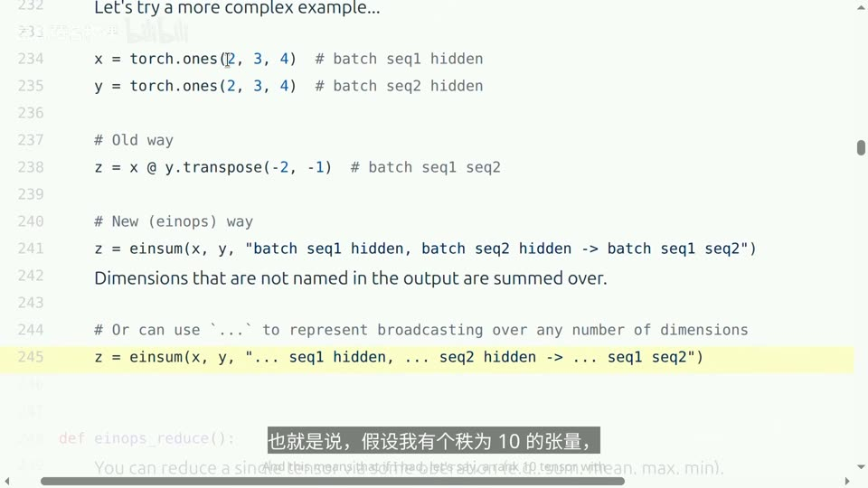 |
| 简单来说，它是求和（sum）、均值（mean）、最大值和最小值这些操作的通用形式。比如假设你有这个张量，想对它求和，依据 dim=1 这个维度——也就是说在这里沿着（某）维度求和。我再次强调，我不太喜欢这种写法，但你可以使用一种叫做 reduce 的操作。简单来说，这里存在某些批处理维度 [【跳转到 15:23】](https://www.bilibili.com/video/BV11LEA6eEuj/?p=2&t=923) | 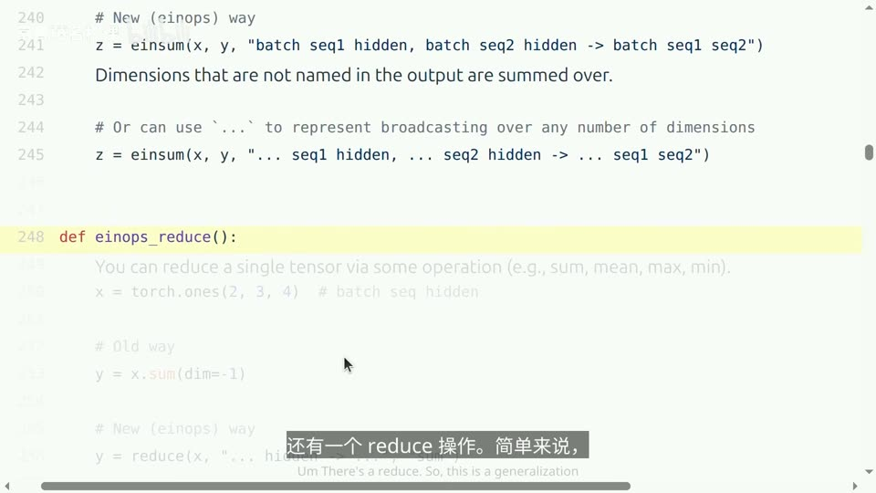 |
| （在这个例子中就是前两个维度），然后还有一些隐藏维度——它们不出现在等式右边，这意味着它们会被求和掉。这里我用了 sum 表示聚合；规约操作可以是求和，但你也可以换成 mean、max 或 min。问："这样做能带来加速吗？" [【跳转到 15:48】](https://www.bilibili.com/video/BV11LEA6eEuj/?p=2&t=948) | 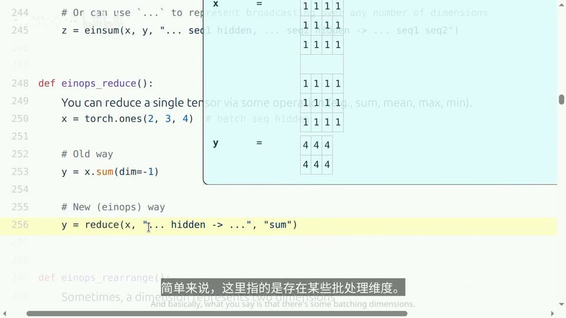 |
| 这本质上归结为同一种基本操作，你可以把它仅仅看作一种语法糖，所以性能应该是一样的。谢谢。最后我要讲的操作是 rearrange： [【跳转到 16:04】](https://www.bilibili.com/video/BV11LEA6eEuj/?p=2&t=964) | 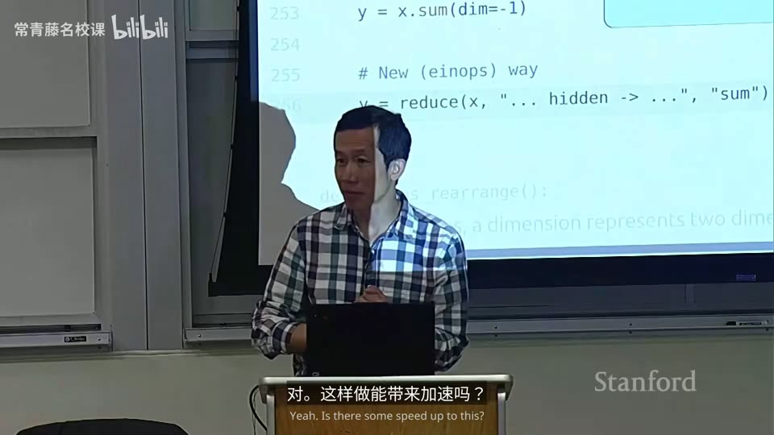 |
| 我觉得这个工具相当强大，作业里应该会考到。有时候某个维度其实包含了两个维度的信息，你需要拆开来处理其中某一个。之所以会出现这种情况，是因为我们有时会把矩阵展平，之后你可能需要将其还原或再次展平。它的原理是这样的：假设我有一个矩阵，但这里的这个维度——那个大小为 8 的维度—— [【跳转到 16:14】](https://www.bilibili.com/video/BV11LEA6eEuj/?p=2&t=974) | 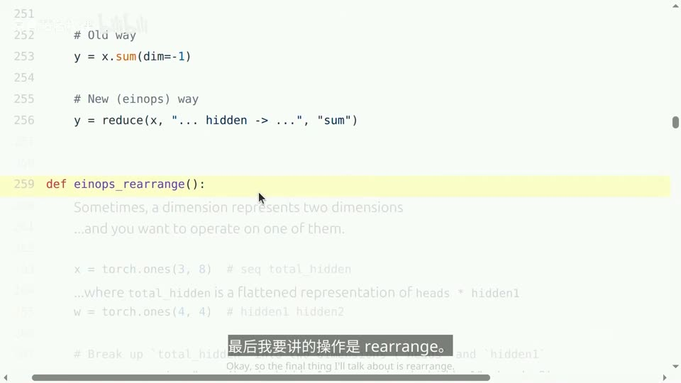 |
| 其实代表的是一个 2×4 的矩阵，所以我想把这个 2×4 的矩阵和那个 4×4 的矩阵相乘。我要做的其实是调用 rearrange，我在这里的操作是声明：这里（比如 dim w）是若干批处理维度，在这里就对应第一个元素，然后我用括号来标记这一点。这里的 h（即 H*H）其实是 head 和 hidden 维度的乘积。 [【跳转到 16:39】](https://www.bilibili.com/video/BV11LEA6eEuj/?p=2&t=999) |  |
| 显然分解方式有很多种，比如 1×4 或者 2×4，所以我设 head 数量为 2，这意味着 hidden 维度是 4；然后我可以把它拆分成 head 和 hidden 这两个维度。好，这就得到了这种结果：在此之前 X 的形状是这样的，而现在 X 变成了这样。我想这可能有点难看清。然后你就可以对 W 做乘法了。 [【跳转到 17:04】](https://www.bilibili.com/video/BV11LEA6eEuj/?p=2&t=1024) | 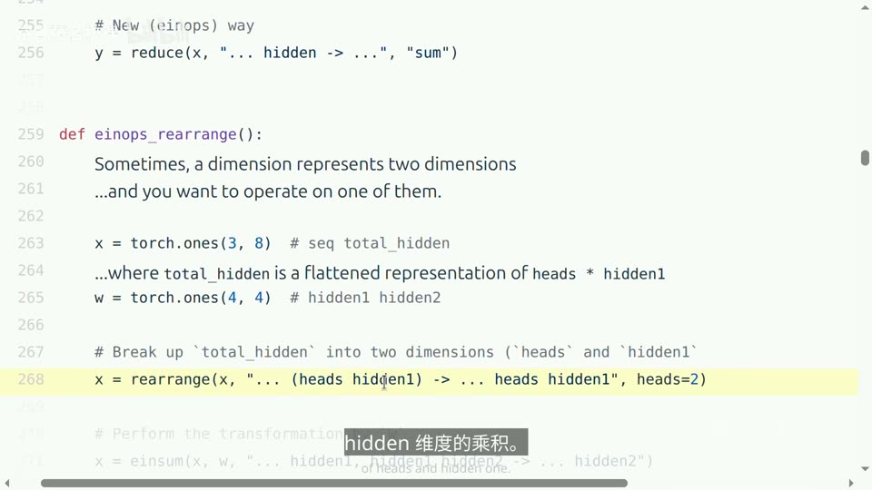 |
| 这就是我们之前见过的情况：执行标准矩阵乘法，其中 X 带有一些批处理维度，即 (head, hidden) 乘以 (hidden, hidden2)。接着完成变换后，你就能把它重新排回去——这很直接，你主要看两个维度，然后把它们合并成一个维度。问："那你是能把二维的东西转成一维——这里有几种做法？" [【跳转到 17:29】](https://www.bilibili.com/video/BV11LEA6eEuj/?p=2&t=1049) | 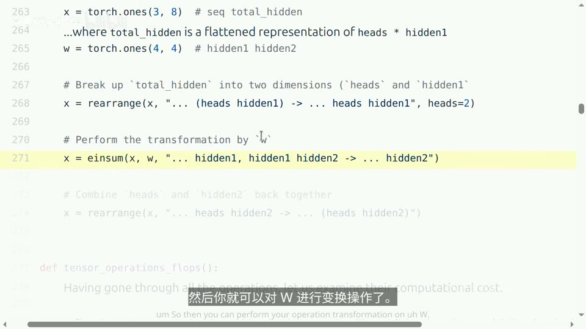 |
| 我觉得有：你可以按行优先或列优先来做。对。所以问题是你有一个二维的东西并把它转换为一维，你按哪种方式做？执行顺序由这里的 order 指定。好的。我是说，刚开始适应它确实要花点时间，但很值得，因为一旦用上 einops，你的思维方式就会变得不一样：还有那些转置和规约操作， [【跳转到 17:54】](https://www.bilibili.com/video/BV11LEA6eEuj/?p=2&t=1074) |  |
| 所有这些处理起来都会变得更顺畅。对吧？你得深入思考这类更"定制化"的 einsum（原字幕"机缘"应为 einsum）。好的，那我们接下来要用 einops…… [【跳转到 18:19】](https://www.bilibili.com/video/BV11LEA6eEuj/?p=2&t=1099) | 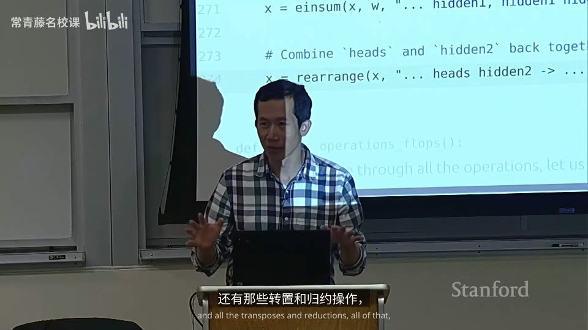 |
| 我们稍后再细看。现在让我们回到资源核算的问题上：我们已经有了张量、讨论过它们如何占用内存，那么它们需要多少计算量呢？好，我们将用来衡量计算成本的指标是浮点运算次数（FLOPs）：一次浮点运算就是一次浮点操作，我们假设它是加法或乘法这样的基本运算——那 GPU 还能做其他一些操作， [【跳转到 18:27】](https://www.bilibili.com/video/BV11LEA6eEuj/?p=2&t=1107) | 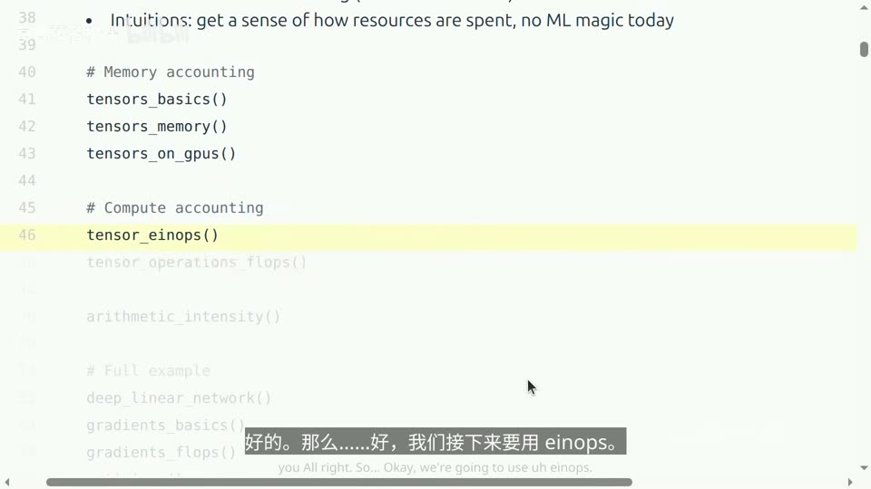 |
| 但在大多数情况下我们将忽略它们，因为加法和乘法才是核心，会占用你大部分时间。有件事让我有点介意：如果我说"FLOPS"这个词，它的含义其实有歧义。一种是指浮点运算次数（flops，小写 s），这是衡量计算量的指标；另一种也是 flops， [【跳转到 18:52】](https://www.bilibili.com/video/BV11LEA6eEuj/?p=2&t=1132) | 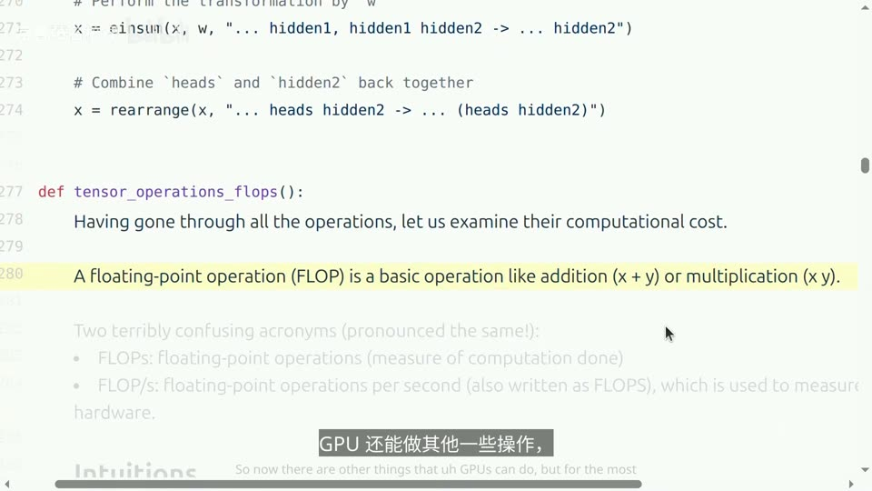 |
| 指每秒浮点运算次数（FLOPS，大写 S）——有时它也会被混淆地写作。但我会一律写成特定的大小写，以明确表示这是在衡量硬件速度。所以如果你去查会发现：H100 有 989 每秒太拉（tera）FLOPs。而当我说 GPT-3 消耗了 3e+25 这样数量的 flops 级别的计算时，指的是前者——浮点运算次数（小写 s）。先把这个讲清楚。 [【跳转到 19:17】](https://www.bilibili.com/video/BV11LEA6eEuj/?p=2&t=1157) | 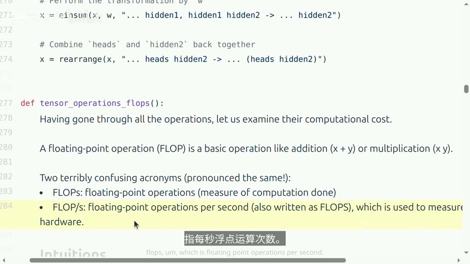 |
| 给你一个数量级的概念：当我提到 1e18、3 次或 25 次方级的 flops 时，这些隐含指的是计算量，或者这些模型的规模。好，如果你看 H100——如果你查看这份精美的规格说明书—— [【跳转到 19:42】](https://www.bilibili.com/video/BV11LEA6eEuj/?p=2&t=1182) | 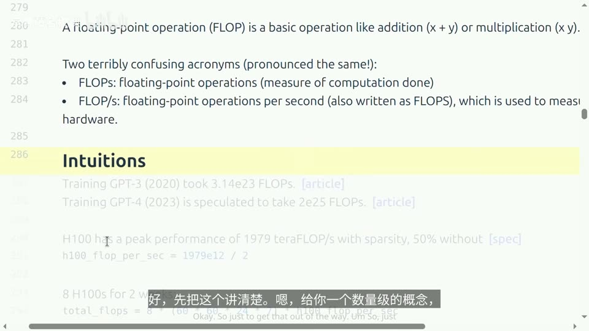 |
| 实际上它并不在这一页，呃好吧，算了。这里有一份规格说明书 [【跳转到 19:59】](https://www.bilibili.com/video/BV11LEA6eEuj/?p=2&t=1199) |  |
| 它会告诉你 bf16 下每秒的浮点运算次数是多少：989 大约每秒太拉级。然后你去进行基准测试，结果发现"等等，这和我实际得到的数据不符"。然后你去阅读细则，会看到一条脚注说："这是基于稀疏性（sparsity）的"，即对稀疏矩阵而言；稠密矩阵则要除以 2。好，所以你必须总是将这些数值除以 2——这就是为什么你会看到这些"除以二"的情况。 [【跳转到 20:04】](https://www.bilibili.com/video/BV11LEA6eEuj/?p=2&t=1204) | 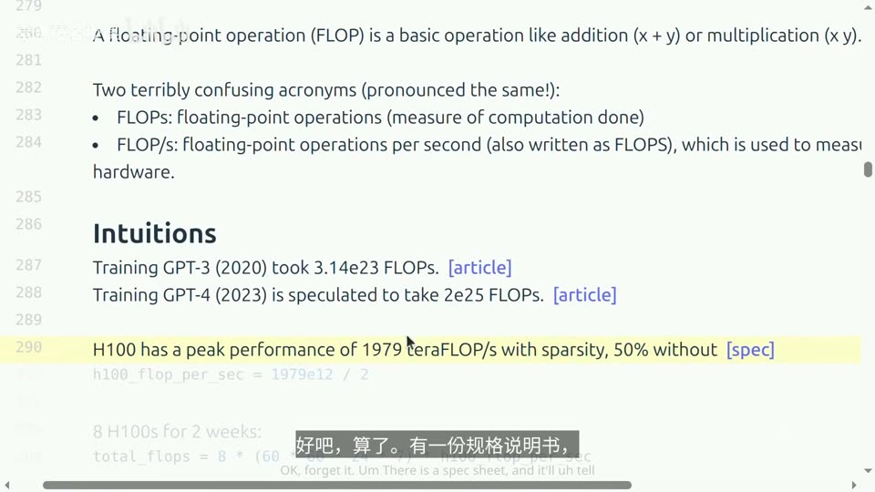 |
| 好，这有助于我们建立一种直觉：如果你有 8 张 H100（即一个节点），持续跑两周——那就是（8 台 H100）× 2 周的浮点运算能力。实际上，这算下来大约是一周（具体时间略）；也就是天数乘以每张每秒的浮点运算次数，再乘以数量，大约是 5e+21 量级： [【跳转到 20:29】](https://www.bilibili.com/video/BV11LEA6eEuj/?p=2&t=1229) | 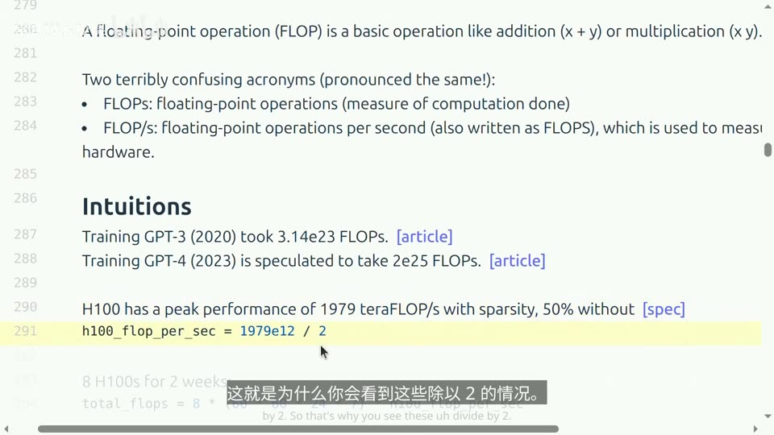 |
| 这主要是为了帮你建立一种直觉——了解特定硬件能提供多少浮点运算、特定模型需要消耗多少浮点运算。没什么复杂的，就是数学粗略估算。好，那现在我们来做一些更机械的计算。假设你有一个线性模型——事实证明，很多关于浮点运算次数的计算，核心上其实就是线性（矩阵）乘法。 [【跳转到 20:54】](https://www.bilibili.com/video/BV11LEA6eEuj/?p=2&t=1254) | 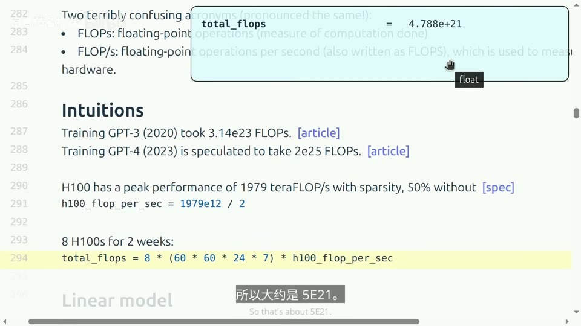 |
| 所以这其实并不失一般性：这里有若干"端点"（个点），每个点都是 D 维的；我们要进行映射，把这些 D 维向量中的每一个映射成 K 维的输出。B 是点的数量，D 是输入的维度数，K 是输出的维度数。好，我们来构建一个 X（数据矩阵），维度是 B×D；权重矩阵是 D×K。当你做矩阵乘法时，关键问题是：这涉及多少浮点运算？ [【跳转到 21:19】](https://www.bilibili.com/video/BV11LEA6eEuj/?p=2&t=1279) |  |
| 结果发现这其实是两倍那么多：基本上就是这三个维度相乘。要理解这一点可以这样看：对每个三元组都要做一次乘法，然后再做一次加法。（这里有个细节：因为如果不加某种修正项你就得想到要额外加上类似的东西，这种情况下是 D−1 之类——不过咱们先忽略它。）如果觉得讲得太快，我会再回来讲。 [【跳转到 21:44】](https://www.bilibili.com/video/BV11LEA6eEuj/?p=2&t=1304) | 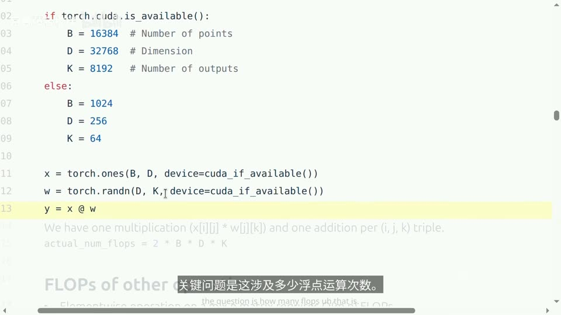 |
| 我觉得还有另一种推导方式。谢谢。那其他操作的浮点运算次数是多少呢？逐元素操作的浮点运算次数就等于矩阵的大小——我想这很清楚：所以逐元素加法也需要 BDK 次浮点运算（与乘法同级）。所以一般来说，对于"足够大"的矩阵，你遇到的任何其他操作，开销都不如矩阵乘法大。 [【跳转到 22:09】](https://www.bilibili.com/video/BV11LEA6eEuj/?p=2&t=1329) | 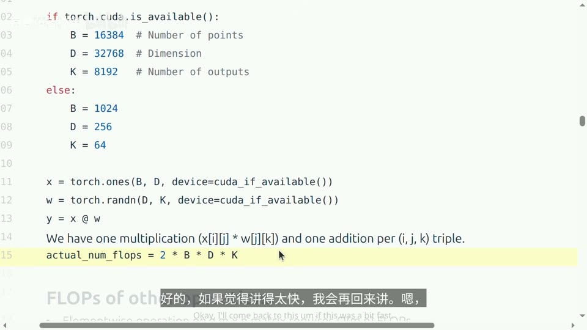 |
| 所以一般来说我们只关注矩阵乘法在做什么。但在讨论内存时，有一个重要的例外。问："纯粹出于兴趣：其实还有一些其他算法可以用来做矩阵乘法，对吧？这是否只适用于你知道的常规做法？" [【跳转到 22:34】](https://www.bilibili.com/video/BV11LEA6eEuj/?p=2&t=1354) | 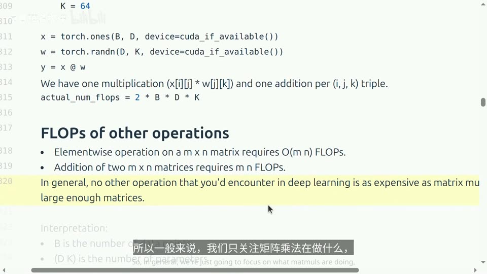 |
| "我的意思是，存在其他进行矩阵乘法的算法，比如 Strassen（原字幕'磁立方'）那样的算法。"回答："对，一般来说人们会从矩阵乘法的常规实现中做优化，而不是这些更激进（渐近更好）的算法。"另一个问题："如果把加法和乘法同等看待，难道硬件不能更高效地执行加法吗？" [【跳转到 22:47】](https://www.bilibili.com/video/BV11LEA6eEuj/?p=2&t=1367) | 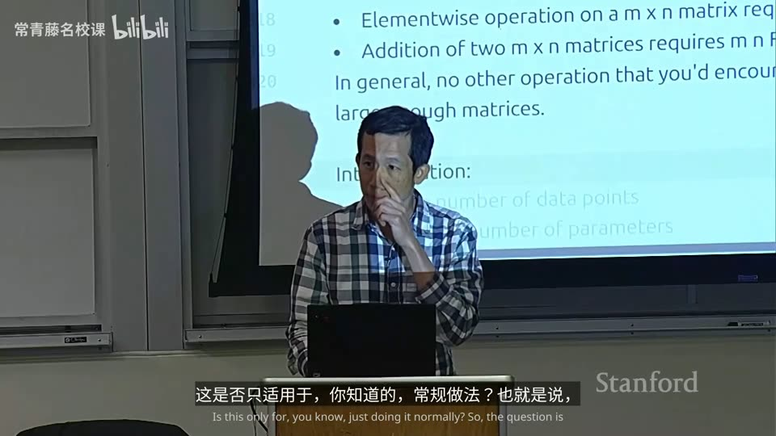 |
| 回答："对——我认为从硬件构建的方式来看，两者基本上是一样的。确实直觉上感觉加法应该比乘法更快，但从硬件构建的方式来看，它们的计算开销是一样的。"好。 [【跳转到 23:12】](https://www.bilibili.com/video/BV11LEA6eEuj/?p=2&t=1392) | 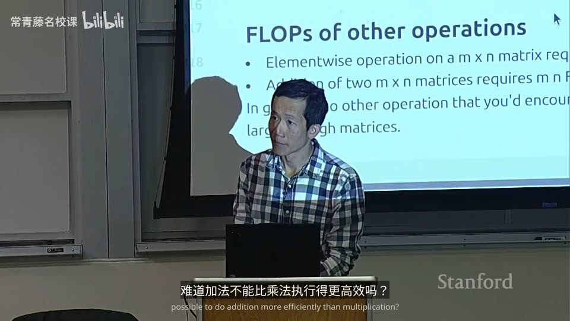 |
| 你可以把这次矩阵乘法理解为：B 是数据点的数量，而 DK 就是参数的数量（X 是 B×D，W 是 D×K）。所以理解这个公式的另一种方式是：完成这个线性层前向传播所需的浮点运算次数，实际上是 token 数量（数据点数量）乘以参数量—— [【跳转到 23:29】](https://www.bilibili.com/video/BV11LEA6eEuj/?p=2&t=1409) | 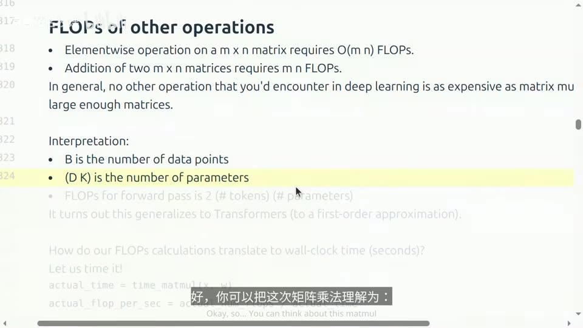 |
| 事实上，这一结论可以推广到 Transformer：如果你还记得 6ND 公式，就能看出其结构是如何形成的。好，遗憾的是这些计算结果的意义不大，因为我是在 CPU 上跑的，不过我还是把代码过一遍。到目前为止，我们测量的是浮点运算次数（FLOPs）——这与硬件无关，它就是你的模型需要完成的实际计算量。谢谢。 [【跳转到 23:54】](https://www.bilibili.com/video/BV11LEA6eEuj/?p=2&t=1434) | 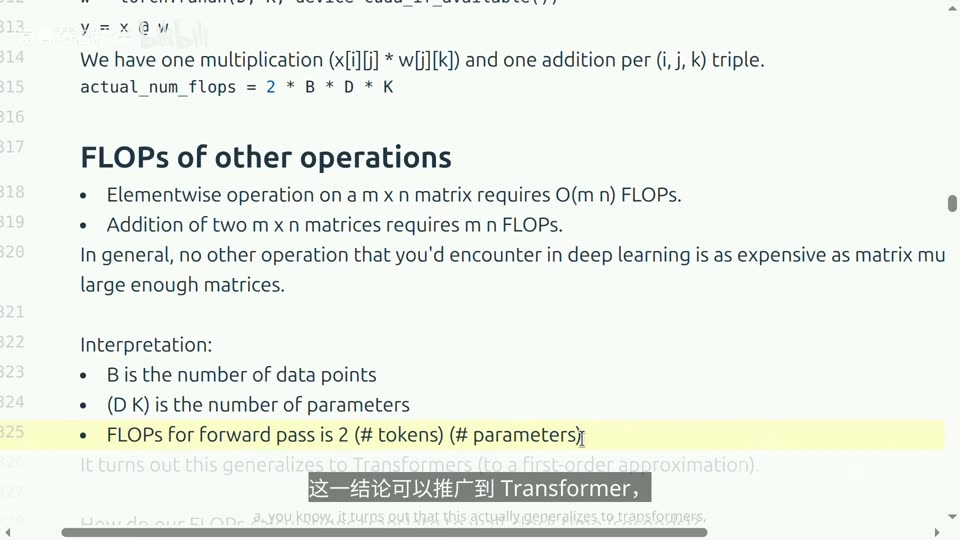 |
| 那么现在的问题是：在硬件上实际跑一次需要多长时间？办法之一就是直接计时。在这门课里我想我们会（用 pytorch CUDA events）来深入讨论基准测试。先做个小预告：通常计时时，尤其是在 GPU 上，你得调用 torch.cuda.synchronize（原字幕 quersynchronize），因为 GPU 是异步运行的，要确保有这种同步点； [【跳转到 24:19】](https://www.bilibili.com/video/BV11LEA6eEuj/?p=2&t=1459) | 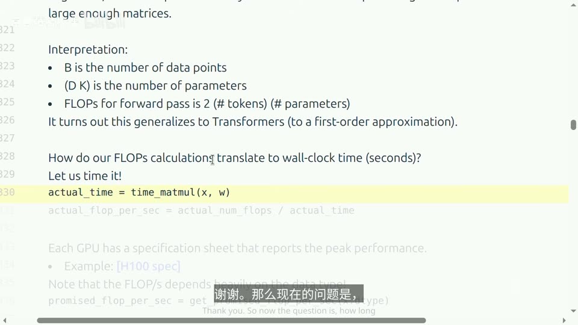 |
| 之后执行操作、操作之后你也必须设置同步屏障。如果省略这一步，你会发现"哇，计时结果快得离谱"，因为这是非阻塞调用，直接返回了。通常来说，多跑几次取平均值是个好习惯。好，所以实际"每秒 FLOPs"基本上就是：你执行的浮点运算次数，除以你在硬件上记录的时间。 [【跳转到 24:44】](https://www.bilibili.com/video/BV11LEA6eEuj/?p=2&t=1484) | 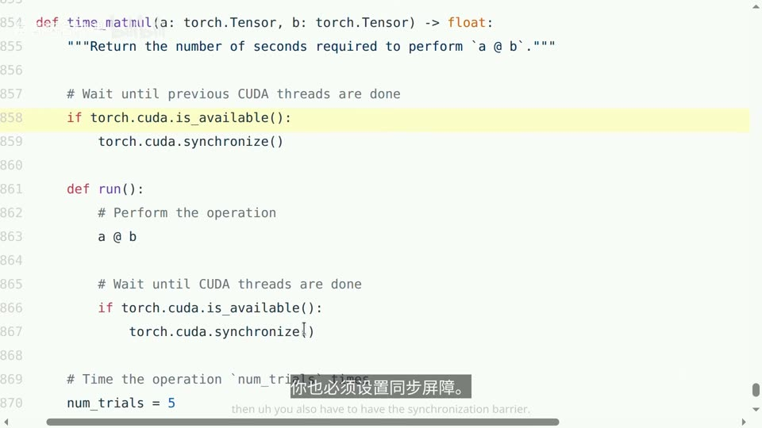 |
| 所以别忘了还有个数据：在 GPU 规格表里，我试试能不能把链接调出来。 [【跳转到 25:09】](https://www.bilibili.com/video/BV11LEA6eEuj/?p=2&t=1509) | 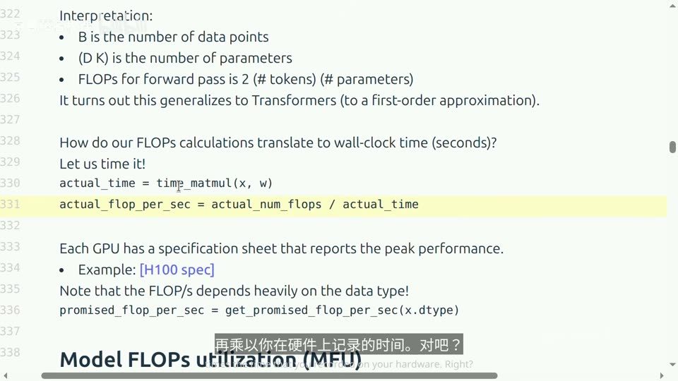 |
| 你看，我好像放错链接了，课后再改一下。 [【跳转到 25:16】](https://www.bilibili.com/video/BV11LEA6eEuj/?p=2&t=1516) |  |
| 它本来会给出这个数字：一次浮点运算……哎不对，989 teraflops。所以实际"每秒浮点运算次数"通常和标称值不一样。好。这里，理解这种差异的一个概念叫"模型浮点利用率"，简称 MFU。MFU 的定义： [【跳转到 25:21】](https://www.bilibili.com/video/BV11LEA6eEuj/?p=2&t=1521) | 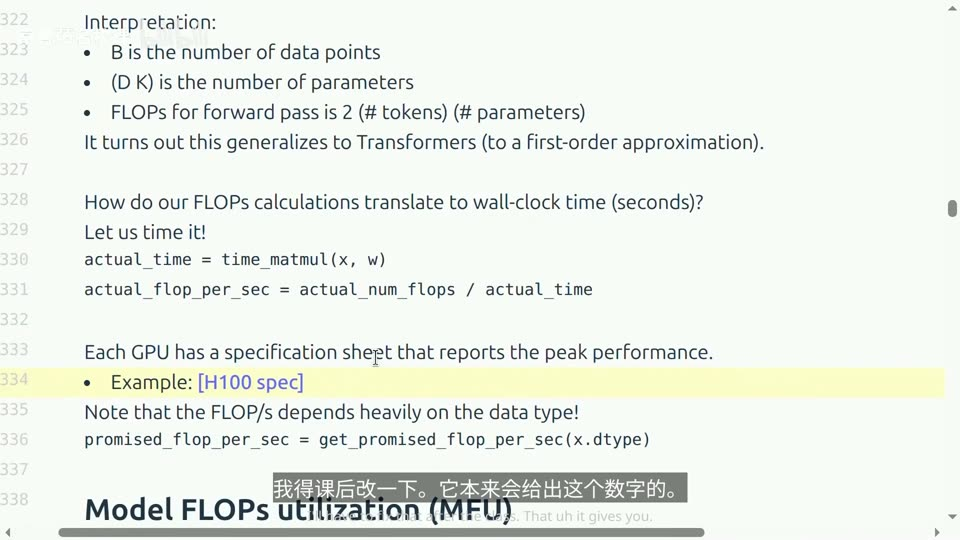 |
| 它就是为了衡量"实际每秒浮点运算次数 ÷ 标称的每秒浮点运算次数"——这我们暂且忽略通信和其他开销。简单来说，就是用实际值除以标称值。一般来说你很少能超过标称值——我是说，就是这样，没错：你不可能超过标称值，通常结果会更低。一般来说，如果现代模型的 MFU 能达到 0.5 左右， [【跳转到 25:46】](https://www.bilibili.com/video/BV11LEA6eEuj/?p=2&t=1546) | 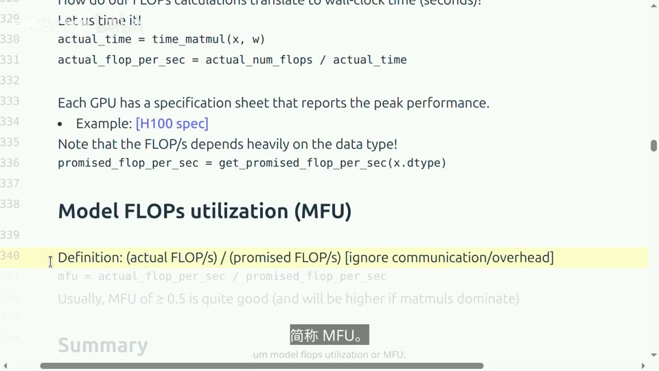 |
| 你就该挺满意了。如果你只做纯粹的矩阵乘法，可能能达到 0.8 甚至更高，但通常达不到那么高；有时候如果真出了大问题，你只能拿到 0.1 左右——这就说明你得做点什么了。好，写下来。所以每当你编写模型时，你都可以计算 MFU：你已经知道如何统计模型所需的逻辑浮点运算次数， [【跳转到 26:11】](https://www.bilibili.com/video/BV11LEA6eEuj/?p=2&t=1571) | 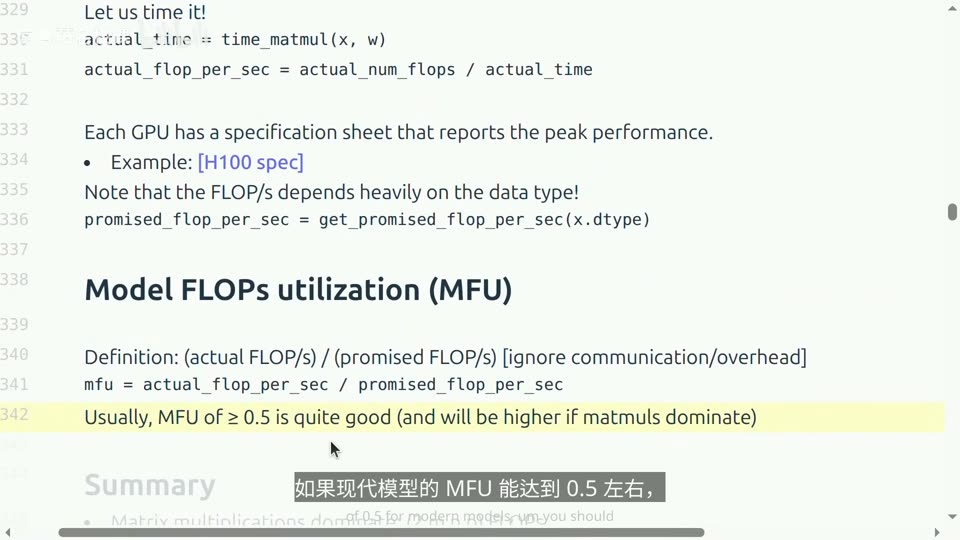 |
| 然后查看实际耗时，本质上就是做个除法。还有几批老板？（此处字幕混乱，疑为"还有几页幻灯片要过"）（有人提问吗？） [【跳转到 26:36】](https://www.bilibili.com/video/BV11LEA6eEuj/?p=2&t=1596) | 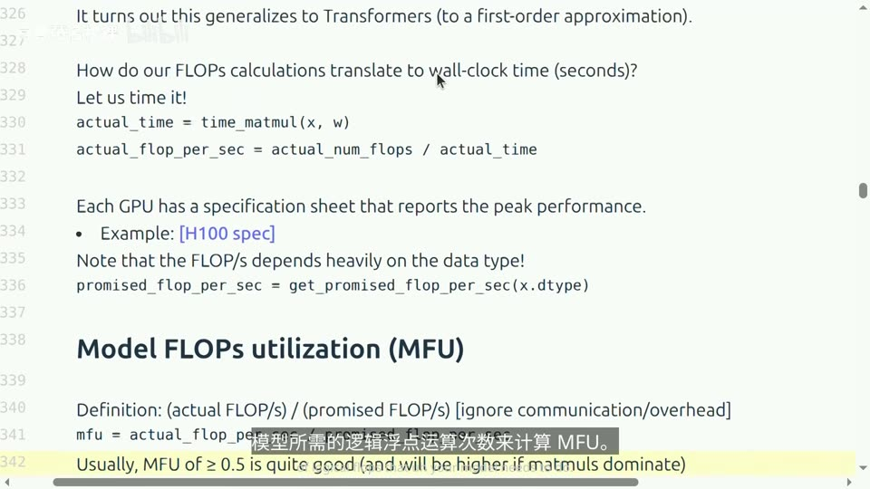 |
| 问："哦，你要翻到下一页幻灯片呀——所谓的'承诺浮点运算次数'，是不是规格表里 989（nineteendh9）这个数除以二之后的结果？"回答："此外，通常你也只能拿到其中约一半，具体取决于你的计算。"追问："你得到的是 50%，对吗？"答："是的。"那么为什么只能得到 50% 的 MFU？"嗯，这确实是个好问题。当说到（应级到）内存瓶颈时， [【跳转到 26:50】](https://www.bilibili.com/video/BV11LEA6eEuj/?p=2&t=1610) | 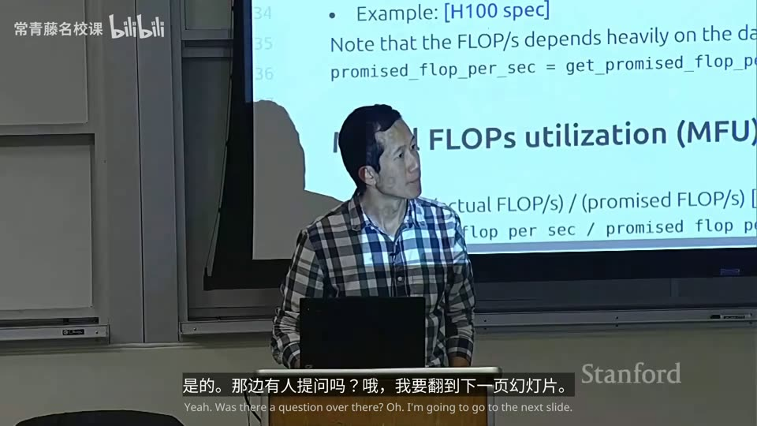 |
| 我会再提这一点。"好，总结一下：矩阵乘法通常是计算的主力， [【跳转到 27:15】](https://www.bilibili.com/video/BV11LEA6eEuj/?p=2&t=1635) | 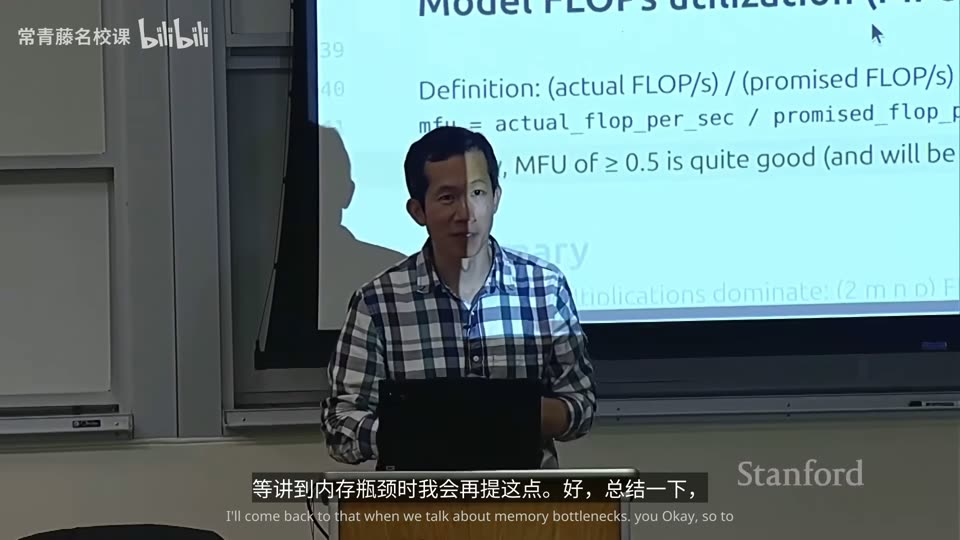 |
| 这其实是特意设计的。所以每秒能跑多少浮点运算次数取决于硬件：硬件越好，浮点运算次数越高；但这还取决于数据类型（dtype）——如果你看规格表，会发现不同数据类型的浮点运算次数是不一样的：要是现在还用 float32，速度会非常慢，因为厂商根本没针对这种负载做优化； [【跳转到 27:20】](https://www.bilibili.com/video/BV11LEA6eEuj/?p=2&t=1640) | 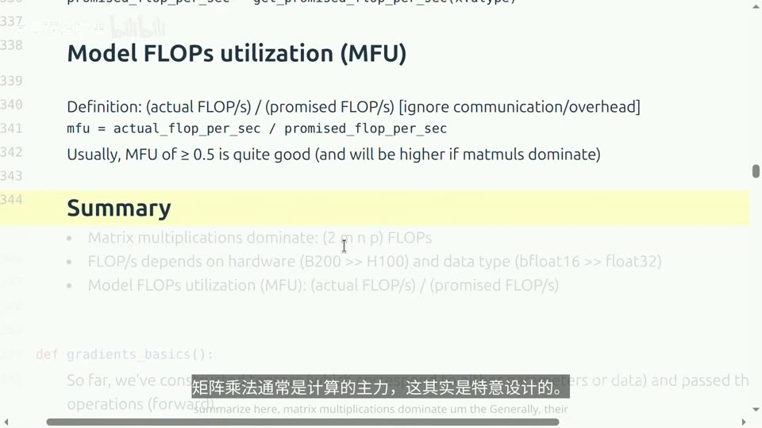 |
| 而现在用 bf16 或 FP8 会快得多。好，现在你该知道 MFU 是什么了：它就是实际浮点运算次数除以理论承诺的浮点运算次数。谢谢。好，我们回到"MFU 为什么是 0.5"这个问题。要理解这一点，我得先引入"算术强度"（arithmetic intensity）这个概念——原因在于：事情没那么简单，不只是做一堆矩阵乘法就完事， [【跳转到 27:45】](https://www.bilibili.com/video/BV11LEA6eEuj/?p=2&t=1665) | 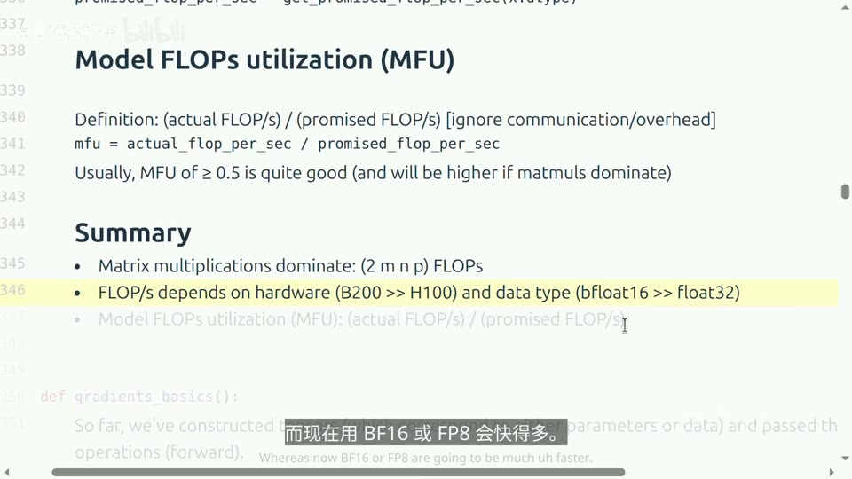 |
| 然后看看矩阵乘法花了多长时间。这是我画的一个非常简化的硬件示意图：你有 HBM，然后是计算核心所在的位置（也就是加速器芯片的位置）。那么计算是怎么进行的呢？你得自己动手算：你的输入矩阵和张量都待在这里（内存），从内存流向加速器，你做完计算，再把结果传回去。好，那么如果想衡量这要花多久， [【跳转到 28:10】](https://www.bilibili.com/video/BV11LEA6eEuj/?p=2&t=1690) | 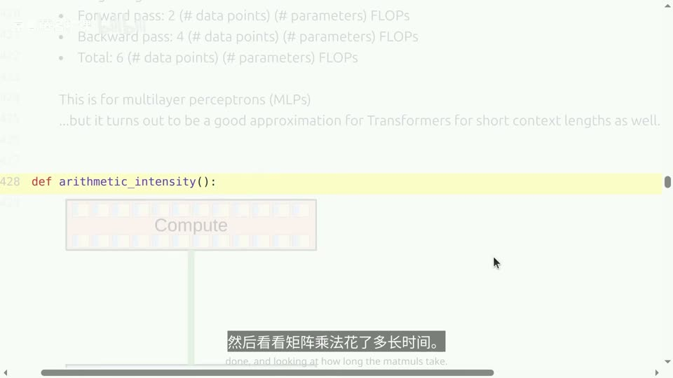 |
| 主要取决于两点：第一是加速器的速度，也就是我们刚才聊过的（你知道具体指什么）；但另一个关键因素是硬件的内存带宽——这点我们还没聊过。如果你看规格表：之前提过每秒浮点运算次数是 989e12 除以二（即对稀疏标注折半后的 1.97e12÷2）；再看每秒字节数（就是内存带宽），这是每秒 3.3 TB。 [【跳转到 28:35】](https://www.bilibili.com/video/BV11LEA6eEuj/?p=2&t=1715) | 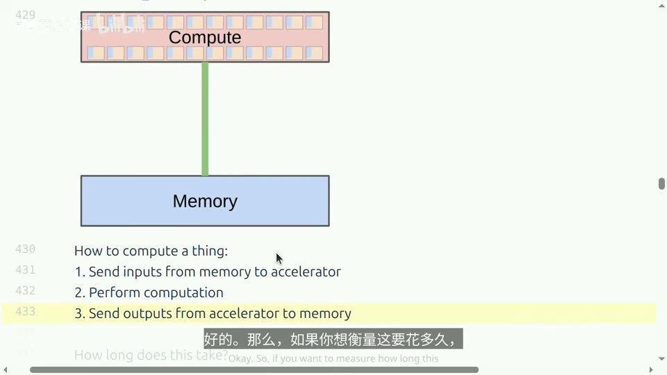 |
| 好，还要记住我们为什么要关注内存：其一，存储这些数据需要多少空间？最明显的一点是，如果你的模型太大，它就放不进你的内存——那可不是什么愉快的体验；而且事实证明，内存这边也有讲究：你需要移动这些数据，这需要时间。因此实际上，数据规模的大小也会影响速度。 [【跳转到 29:00】](https://www.bilibili.com/video/BV11LEA6eEuj/?p=2&t=1740) | 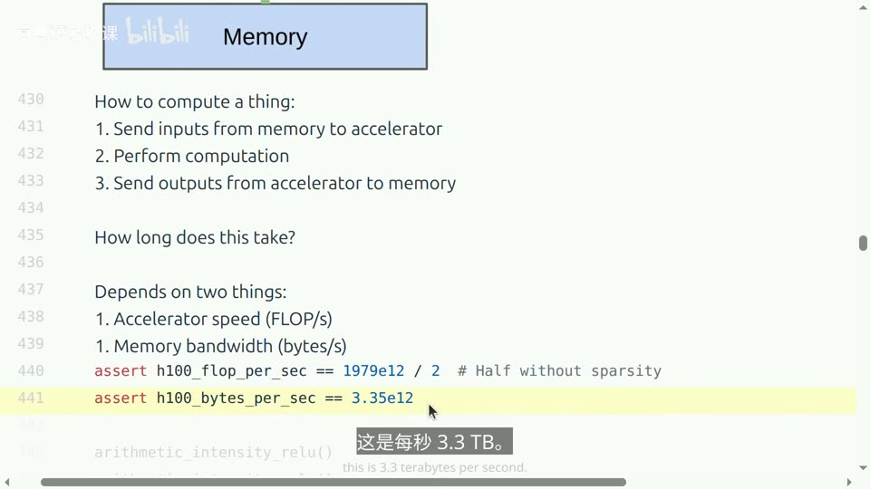 |
| 好，接下来我来讲一些运算：我基本上会计算所需的时间，并引入算术强度这一概念。假设我有一个 100 万维的 bf16 向量，我将对其执行 ReLU 计算。记住，ReLU 就是对整个向量逐元素进行"与 0 的最大值"运算。所以我要算两件事。第一是移动了多少字节——我用（板书）写中文记一下：我得先读取 X，然后把它拷贝到加速器里。 [【跳转到 29:25】](https://www.bilibili.com/video/BV11LEA6eEuj/?p=2&t=1765) | 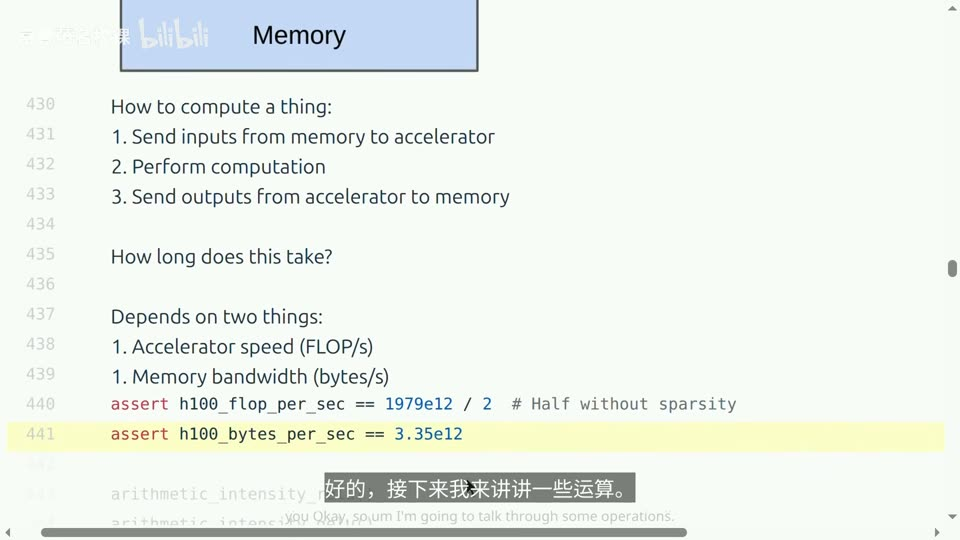 |
| 加速器每小时（每份）都是 2 字节（因为 bf16 每个浮点数占 2 字节），再乘以 N 个浮点数，所以这部分是 2N。接下来我要把 Y 写回去，所以这里又是 2N。好，这就是需要移动的字节数量。那么完成了多少浮点运算次数？对于其中的每个元素，我只是把它和 0 做个比较—— [【跳转到 29:50】](https://www.bilibili.com/video/BV11LEA6eEuj/?p=2&t=1790) | 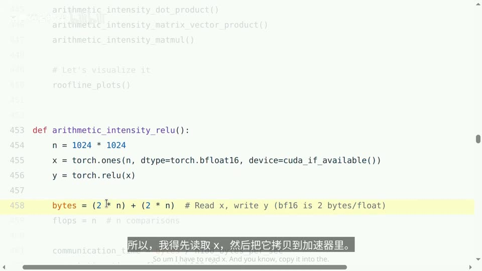 |
| 就这些，所以这是 N 次比较（N 次 ReLU）。好，现在来看通信时间：也就是字节数量，除以移动速度，这样算出来的时间是（若干）微秒。那计算时间呢？用浮点运算次数除以每秒浮点运算次数，所以是若干纳秒。好，此外还有一个重要假设，我们通常会尽量满足它： [【跳转到 30:15】](https://www.bilibili.com/video/BV11LEA6eEuj/?p=2&t=1815) | 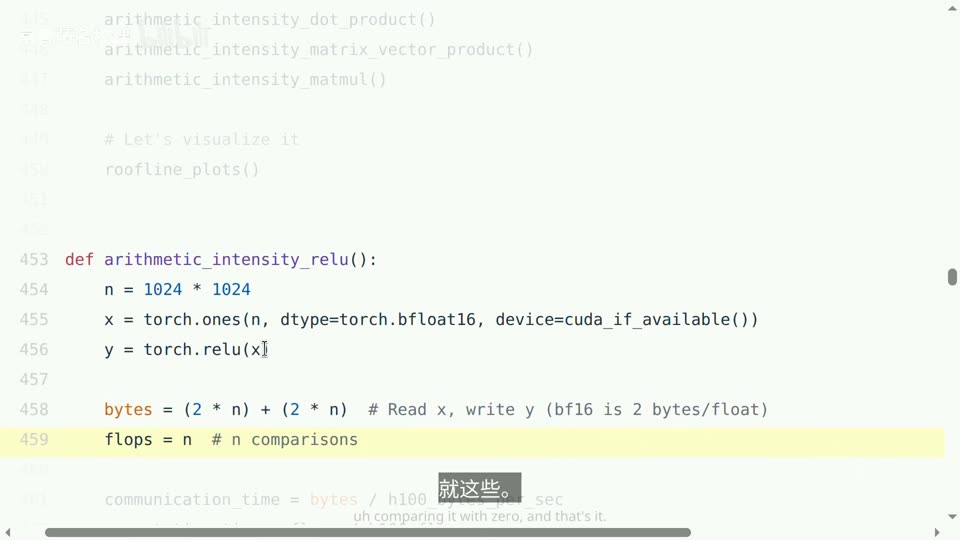 |
| 就是我们让通信和计算重叠进行——等后面深入讲 GPU 时再详细讨论。其核心思想是：在这种情况下我们不会坐等数据传输完成，数据一到就开始计算，紧接着继续往下走，再把结果传回去——这样数据传输和计算就同时进行了。所以从数学上讲，我们假设总时间取两者的最大值， [【跳转到 30:40】](https://www.bilibili.com/video/BV11LEA6eEuj/?p=2&t=1840) | 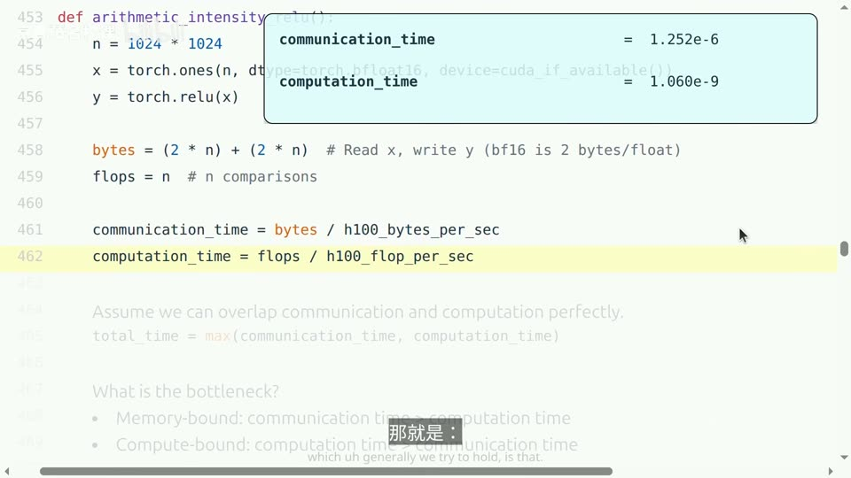 |
| 因为我们假设这两部分可以完美重叠；但在实际中重叠不可能那么完美，会有一些开销。不过目前这样已经够用了。好，所以总时间大家看，这里是 11e-6（微秒级）。那如果问"瓶颈在哪"：当通信时间大于计算时间时，我们称之为"内存受限"（这是算法层面的说法），因为你大部分时间都在等数据过来；而当计算时间大于通信时间时，那就是"计算受限"。 [【跳转到 31:05】](https://www.bilibili.com/video/BV11LEA6eEuj/?p=2&t=1865) | 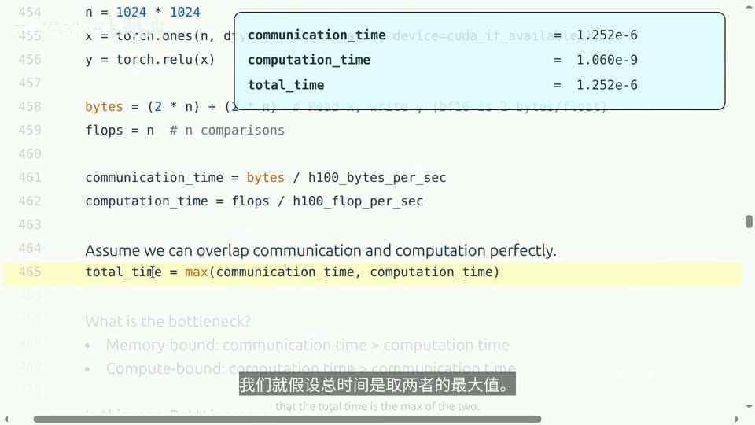 |
| 因为这时候你的瓶颈其实就在于做计算。问："那么在这种情况下，ReLU 是哪种？"回答（老师正面回应）："抱歉，是内存受限（memory-bound），而不是计算受限——内存受限。对，这很明显，对吧？因为计算量远远小于通信量。"好，换个角度来看，这里我要定义"强度"。那么"加速器的强度"是什么？它本质上是指：加速器每传输一个字节， [【跳转到 31:30】](https://www.bilibili.com/video/BV11LEA6eEuj/?p=2&t=1890) | 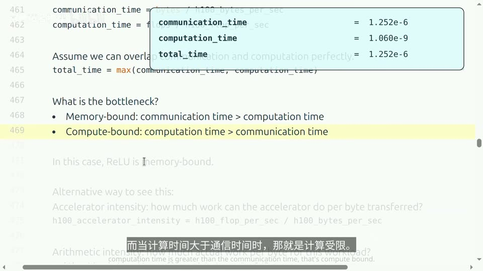 |
| 能完成多少工作量。对于任何加速器，从规格表上你基本上能拿到"每秒浮点运算次数 ÷ 每秒传输的字节数"。好，那么"每搬运一个字节你能做多少有用的计算"，对于 H100 这个数值是 295（原字幕"二小五"）：也就是说每传输一个字节的数据，可以执行 [【跳转到 31:55】](https://www.bilibili.com/video/BV11LEA6eEuj/?p=2&t=1915) | 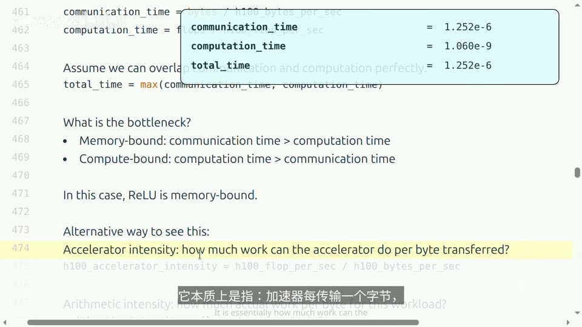 |
| 295 次浮点运算。好的，这是个让你心里有数的直观数字——大概 300 左右。好，接下来讲"算术强度"：衡量算法在处理这项任务时，每字节数据背后实际做了多少计算。以 ReLU 计算为例，它的算术强度就是浮点运算次数除以字节数——实际上这个数值我想是 1/4， [【跳转到 32:20】](https://www.bilibili.com/video/BV11LEA6eEuj/?p=2&t=1940) | 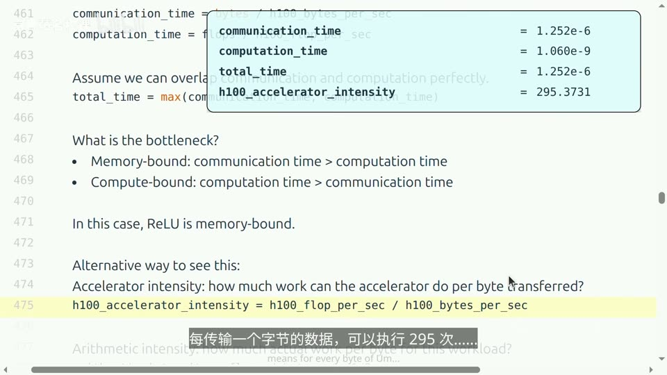 |
| 而不是 1/2。所以关键在于它非常小，只有 0.25（原字幕"浓缩圈"应为该记号）。好，现在我们可以用"强度"这个概念来讨论瓶颈问题：如果算术强度低于加速器的临界值，就是内存受限；如果高于这个值，就是计算受限。所以这两者（两种判断方式）是等价的：你看一下代数推导，其实就是两个分数通过乘除把项的位置换一换。好，那么这种情况呢？——你知道，我们是内存受限的。 [【跳转到 32:45】](https://www.bilibili.com/video/BV11LEA6eEuj/?p=2&t=1965) | 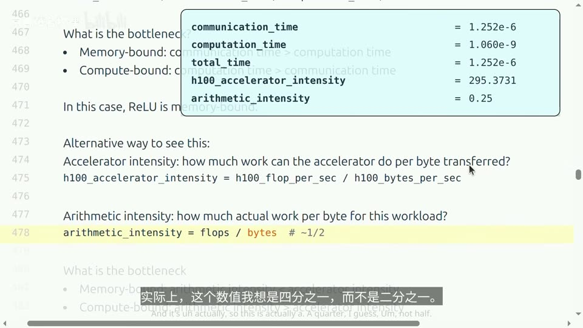 |
| 所以一般来说我们会发现自己处于内存受限（低显存/数据搬运代价高）的状态，因为数据搬运的代价很高。所以如果能提高算术强度，那就更好了。好，所以 0.25：如果你看到这个数，或者别人告诉你"你的算术强度是 0.25"，你就该意识到：这真的很糟糕。那"典型的算术强度"大概是多少呢？ [【跳转到 33:10】](https://www.bilibili.com/video/BV11LEA6eEuj/?p=2&t=1990) | 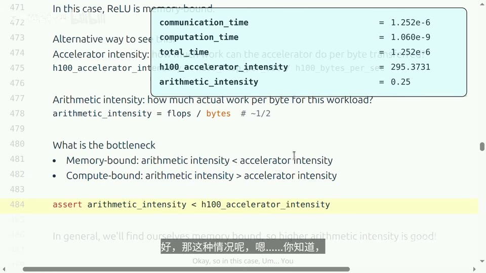 |
| 对——我们待会儿会讲到。好，那么提升算术强度的一种思路是：我们试着在每搬运一个字节的数据时，多做一些计算。GELU 是另一种激活函数，它的公式大概长这样，看起来更复杂一些，里面不是和 0 比较（原字幕"里面没有零"）。要算一下的话：来回搬运的字节数还是 2N 加 2N；再算浮点运算次数——对于 GELU（原字幕 U 型运算）这种逐元素运算， [【跳转到 33:35】](https://www.bilibili.com/video/BV11LEA6eEuj/?p=2&t=2015) | 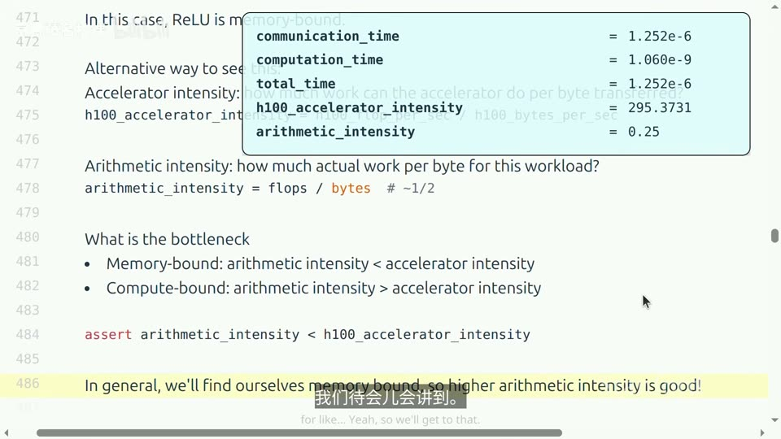 |
| 每个元素大概要 20 次浮点运算，所以总共是 20N。所以算术强度大概是 5——这只是一个粗略的估算。好，在这种情况下，我们是内存受限还是计算受限？对——因为 5 还是比 295 小得多。所以虽然 GELU 做的计算比 ReLU 多得多，但按目前（这种逐元素）的结构来看，它仍然是内存受限的。对。 [【跳转到 34:00】](https://www.bilibili.com/video/BV11LEA6eEuj/?p=2&t=2040) | 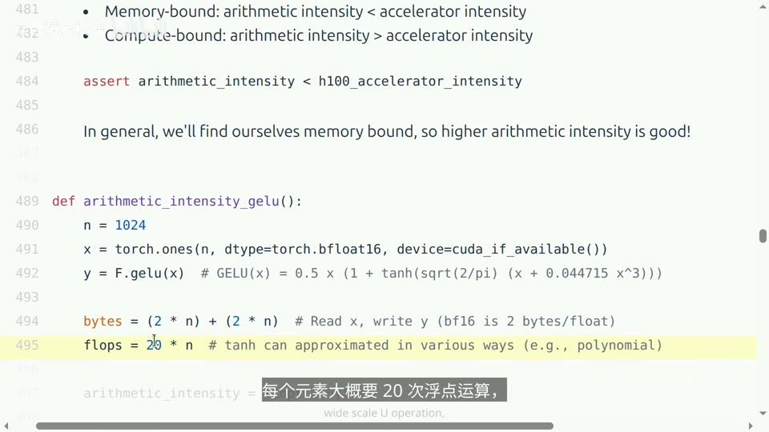 |
| 也就是说，如果你只看 ReLU 和 GELU（原字幕 value/value），你可能会觉得 GELU 那么复杂、开销一定很大；但实际上（在自己的瓶颈下）两者开销完全一样。谢谢。（学生）"对，因为瓶颈并不是计算"。谢谢。好，接下来我们看几个线性运算，比如点积（而非"点击"）。点积：假设你有一个向量 X 和一个大小为 N 的向量 W，然后计算它们的点积。那么数据移动量是多少？ [【跳转到 34:25】](https://www.bilibili.com/video/BV11LEA6eEuj/?p=2&t=2065) | 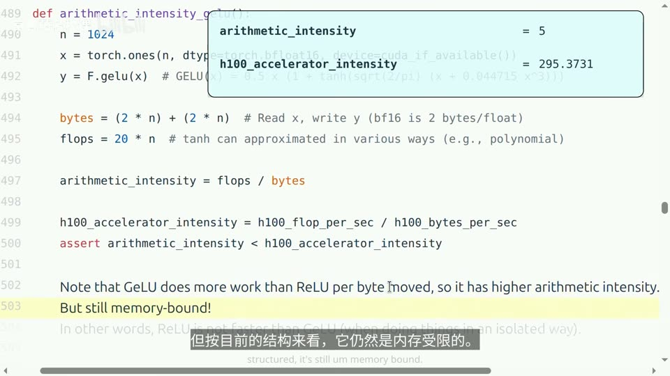 |
| 读取 X 是 2N 字节，读取 W 是 2N 字节，然后写入 Y（一个标量）是 1 个标量（2 字节）。那浮点运算次数呢？你做了 N 次乘法和 N−1 次加法，总共是 2N−1。好，那算术强度是多少？大约是 0.5（原字幕"精秒五"）——这相当低。希望你明白了：它属于内存受限型计算。谢谢。 [【跳转到 34:50】](https://www.bilibili.com/video/BV11LEA6eEuj/?p=2&t=2090) | 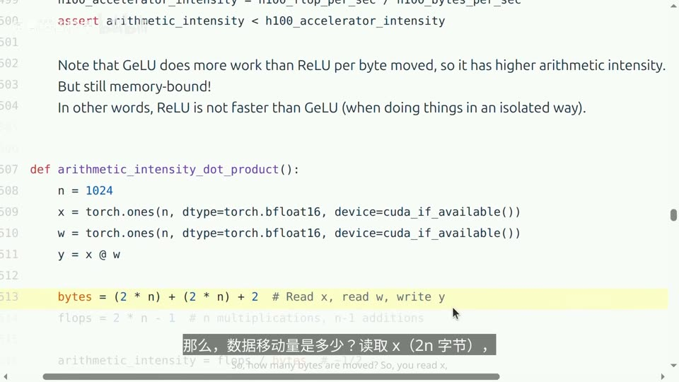 |
| 好，那矩阵向量乘法呢？Y = X 与 W 的乘积，其中 X 是（大小 N 的）向量，W 是一个 N×N 的矩阵，然后你计算这个乘积。大家觉得这会是计算瓶颈还是内存瓶颈？ [【跳转到 35:15】](https://www.bilibili.com/video/BV11LEA6eEuj/?p=2&t=2115) | 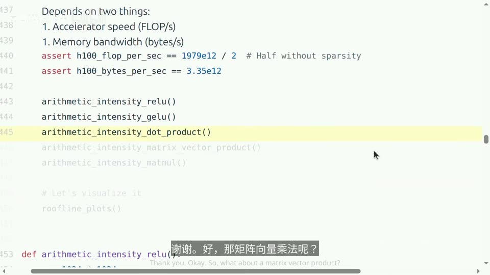 |
| 举手示意一下。好，我们来看：要读取 X，大小 2N [【跳转到 35:30】](https://www.bilibili.com/video/BV11LEA6eEuj/?p=2&t=2130) | 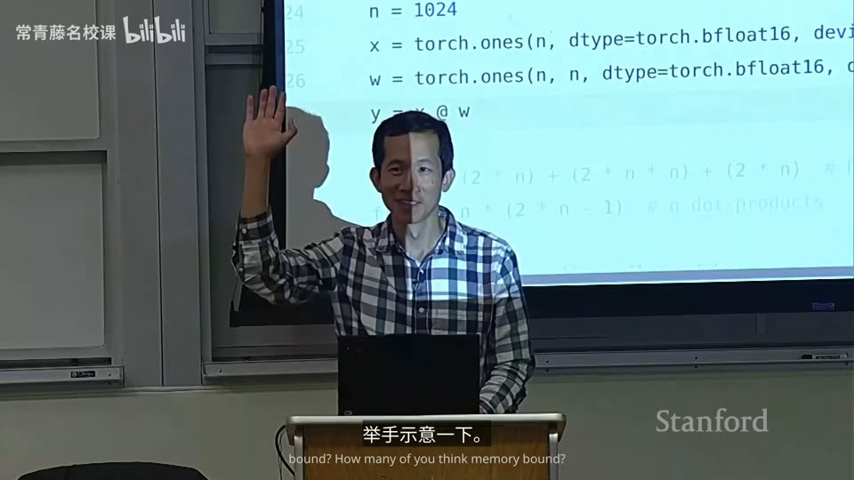 |
| ；读取 W，大小 2N²；然后写入 Y，大小 2N。浮点运算次数基本上就是 N 次点积的开销，所以总成本是 N 乘以一次点积的开销——算术强度也只是略高一点。好，所以这同样是内存瓶颈。好，现在我们来讨论矩阵乘法——这才是有意思的地方。我有一个 N×N 的矩阵， [【跳转到 35:35】](https://www.bilibili.com/video/BV11LEA6eEuj/?p=2&t=2135) | 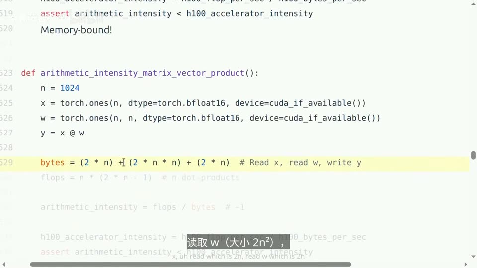 |
| 再乘以另一个 N×N 的矩阵：传输的数据量大约是 2N² 加上 2N² 字节，然后我必须把 2N² 字节写回 Y。浮点运算次数是 N² 次点积。那算术强度是多少？学生："是 300（应为 N）——合试 300 级。"好，"所以是 2N²/2N²——一般来说它大约是 N 级，直觉上这很合理： [【跳转到 36:00】](https://www.bilibili.com/video/BV11LEA6eEuj/?p=2&t=2160) |  |
| 因为你传输的是 N² 量级的数据，但运算量却是 N³，所以计算量相对于传输量的比例是 N 的量级。谢谢。而且矩阵越大、（算术强度/比值）越大越好。"然后要满足 roofline 的 termination（阶梯曲线）……"（旁白转录乱码，参见下一窗口）……要增大批量或使用更大的矩阵，原因就在这里：如果你低于加速器的"临界算术强度"，那么缩小规模实际上并不能加速运算； [【跳转到 36:25】](https://www.bilibili.com/video/BV11LEA6eEuj/?p=2&t=2185) | 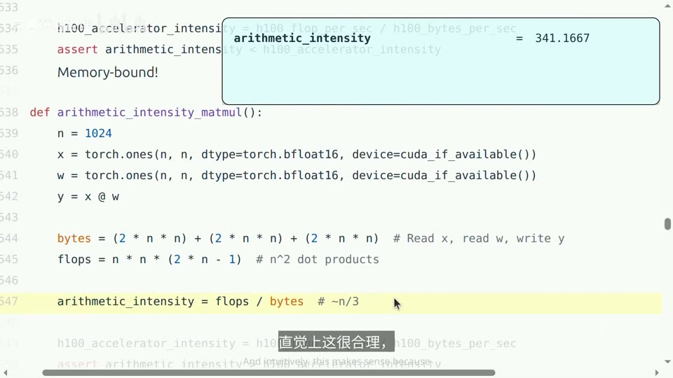 |
| （数值在临界点以下）情况都差不多（性能是平的）。但一旦你超过这个点，你实际上就已经处于饱和状态（加速器满载）了。好（板书：matvec 还是 matmul），所以到这一步终于是计算密集型了。所以只要有大型矩阵，我们的效率其实挺高：我们处于计算密集型状态，加速器已经满载。那之前提到的 Transformer 呢？事实证明（你们在作业和下一讲中都会看到）： [【跳转到 36:50】](https://www.bilibili.com/video/BV11LEA6eEuj/?p=2&t=2210) | 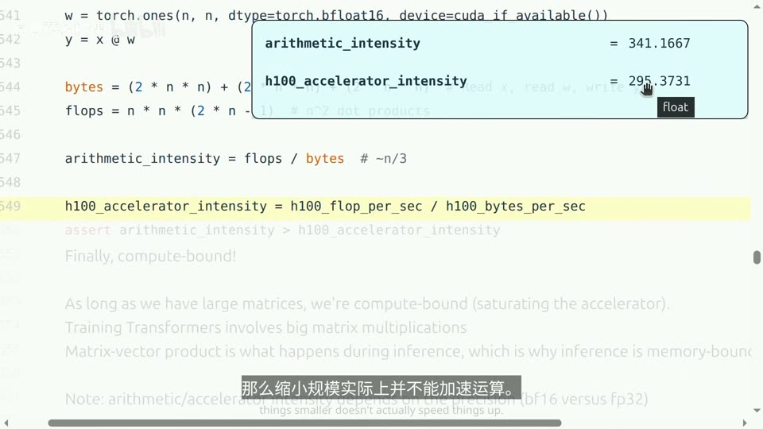 |
| Transformer 实际上本质上就是大型矩阵乘法，中间穿插了一些其他操作。所以从算术强度来看，这是个好消息：这是经过刻意设计的——Transformer 的结构经过特定设计以实现高算术强度。这里插一句，为接下来的推理讲座做个铺垫：矩阵向量乘法，本质上大致就是你做 Transformer 推理时发生的事情——因为推理（生成）时你是一次生成一个 token, [【跳转到 37:15】](https://www.bilibili.com/video/BV11LEA6eEuj/?p=2&t=2235) | 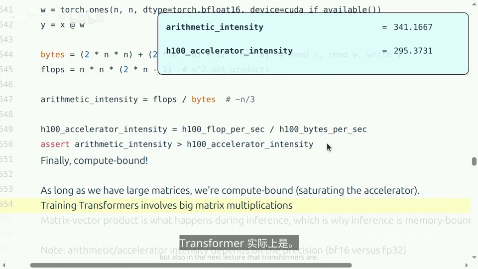 |
| 所以这就像是用一个向量与（权重）矩阵做乘法——正如我们所见，这受限于内存带宽。而在训练时，你会拿到整个序列并一次性进行处理。好，此外请注意：计算强度取决于精度，因此这里我们默认使用的都是 bf16。好，那么把这一点和之前关于 MFU 的问题联系起来： [【跳转到 37:40】](https://www.bilibili.com/video/BV11LEA6eEuj/?p=2&t=2260) | 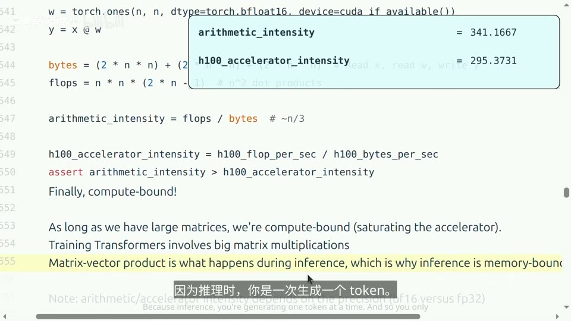 |
| 你的 MFU 较低的原因可能是：虽然你看似在做事——MFU 是"承诺浮点运算次数""（学生/老师更正）：抱歉，是"实际值 ÷ 承诺值"。对，对，对。因此如果你存在严重的内存带宽瓶颈，那么实际上你无法获得理想的（理论满额）吞吐量，尽管"承诺"的前提是：如果没有内存瓶颈，你本来能一路把所有这些都做完。谢谢。谈模型的计算…… [【跳转到 38:05】](https://www.bilibili.com/video/BV11LEA6eEuj/?p=2&t=2285) | 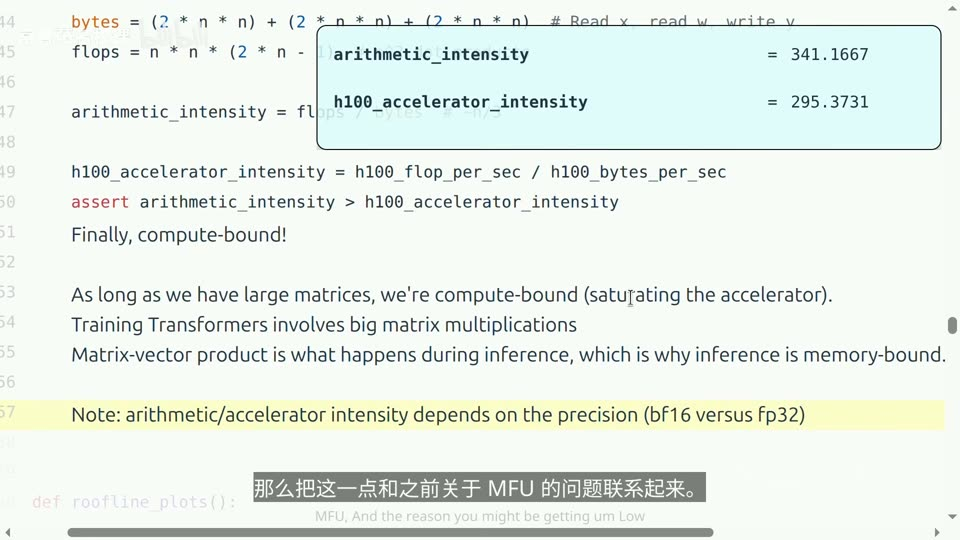 |
| 谢谢，谢谢。好，关于算术强度，最后讲一下屋顶线图（roofline plot）——这是个挺好的办法，我再重复一遍： [【跳转到 38:30】](https://www.bilibili.com/video/BV11LEA6eEuj/?p=2&t=2310) | 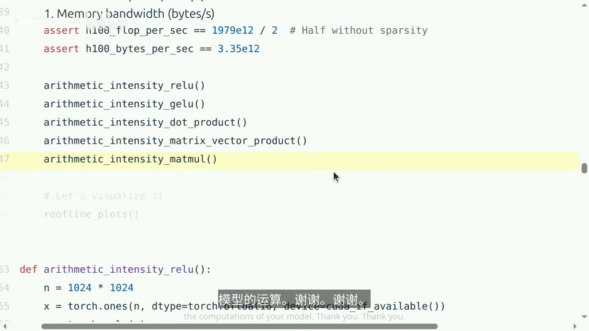 |
| 一般来说，正如大家所说，这些模型在大部分计算中都是受内存限制的；不过如果加速器利用率只有 50% 甚至更低（原字幕"50分三"），那就不太理想；要是能到 70% 甚至 80%，那就相当不错了。嗯，这里的意思是：加速器的算力规模相对于内存（带宽）来说过大了。我待会儿会再讲这个问题。为什么会这样？为什么这些加速器做得这么大， [【跳转到 38:38】](https://www.bilibili.com/video/BV11LEA6eEuj/?p=2&t=2318) |  |
| 结果只是在那闲置或等待内存？所以问题是：我们能不能设计出特性更好的加速器？也许等我们讨论完 GPU、对其工作原理有更多了解之后，就能解释为什么会这样了。如果你有答案，不妨告诉 Jensen Huang（英伟达 CEO），说不定你还能设计出更好的硬件。好，我们直观地看一下算术强度和性能之间的关系： [【跳转到 39:03】](https://www.bilibili.com/video/BV11LEA6eEuj/?p=2&t=2343) |  |
| 这个图基本上是把算术强度画在了 X 轴上， [【跳转到 39:25】](https://www.bilibili.com/video/BV11LEA6eEuj/?p=2&t=2365) | 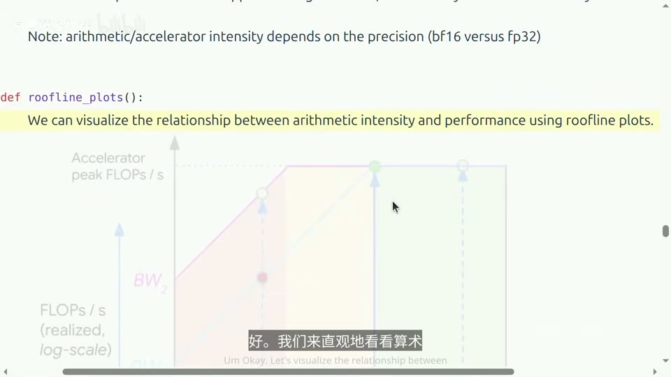 |
| 所以这里每一个垂直切片都对应着比如说某一种算法；然后我们有这些"线"，每条线对应一种特定的加速器——比如 H100（原字幕 honeitob）。所以它展示的是：在 Y 轴上，实际达到的每秒浮点运算次数。所以如果你的算法算术强度较低， [【跳转到 39:30】](https://www.bilibili.com/video/BV11LEA6eEuj/?p=2&t=2370) |  |
| 比如 ReLU 或点积，你就处在这个区域，这意味着实际达到的每秒浮点运算次数会低于加速器的峰值性能；而当你提升内存带宽、增大算术强度时，情况会逐步好转；在达到某个临界点之前，随着算术强度提高你都能充分利用硬件性能，超过那个点之后计算就成为瓶颈——显然你无法超过峰值浮点运算次数。好，那我们继续往下讲。好。 [【跳转到 39:55】](https://www.bilibili.com/video/BV11LEA6eEuj/?p=2&t=2395) | 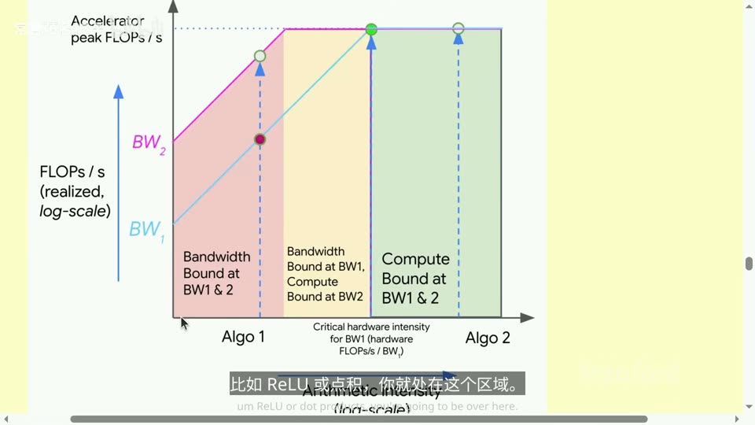 |
| 谢谢。接下来我要回过头来谈谈内存和计算，也就是我们在训练中需要的那些操作。到目前为止，我们做的是张量操作，基本上就是矩阵乘法——我们看到了它需要多少内存、多少计算，以及两者之间的相互作用。现在我们来具体看看训练到底需要什么。 [【跳转到 40:20】](https://www.bilibili.com/video/BV11LEA6eEuj/?p=2&t=2420) | 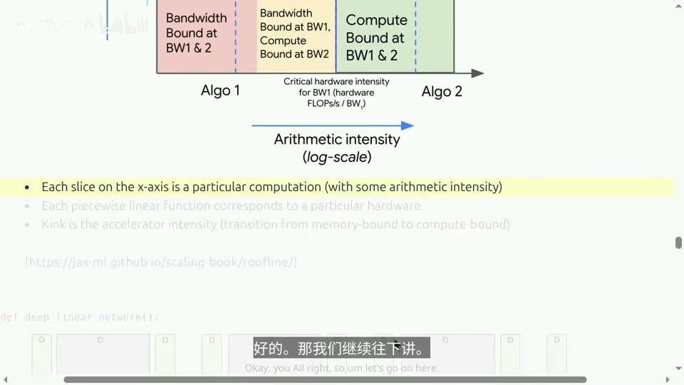 |
| 就拿我们刚才那个例子来说吧。其实这不是线性（单层）网络，而是深度（多层）网络： [【跳转到 40:44】](https://www.bilibili.com/video/BV11LEA6eEuj/?p=2&t=2444) | 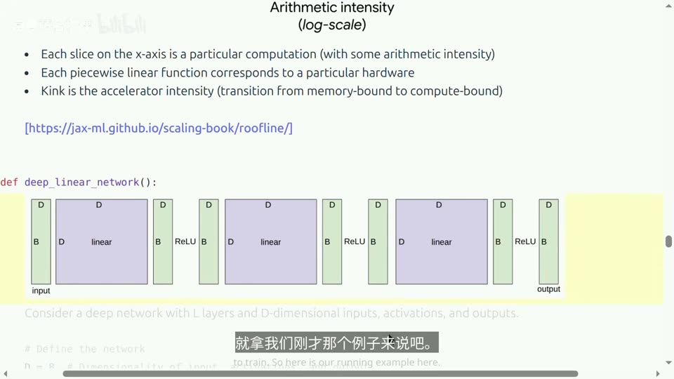 |
| 我设想这样一个场景：输入是 B×D 的矩阵，然后经过若干层——每一层都做 D×D 的矩阵乘法，路径（并生成一些 B×D 预激活值），接着做逐元素的 ReLU 运算，得到（第一层的）激活值，然后这个过程不断重复，输出尺寸保持不变。好，所以这个深度网络…… [【跳转到 40:49】](https://www.bilibili.com/video/BV11LEA6eEuj/?p=2&t=2449) | 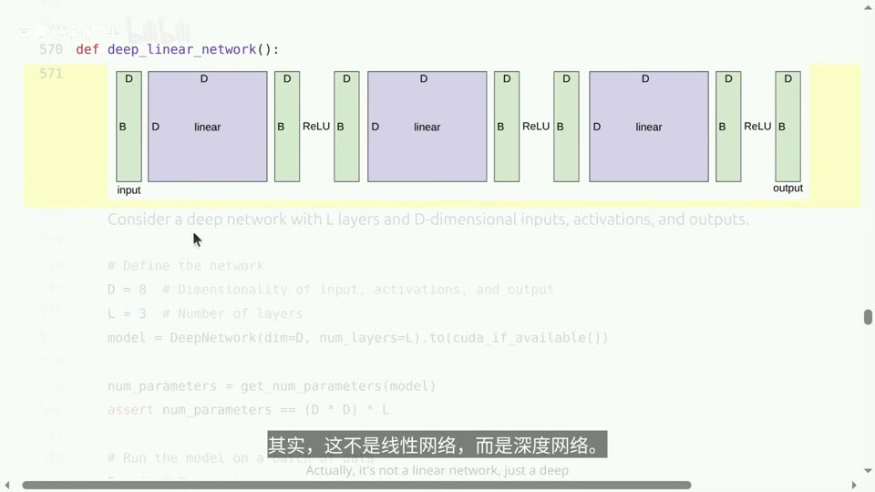 |
| 为了看看它在 PyTorch 里长什么样：基本上就是一组模块（modules），每个模块都有一个与之关联的权重向量——抱歉，是权重矩阵。所以这里的参数量是 D² 乘以层数 L。帮你在（一个数据批次上）运行模型时，我们做的是逐层处理：每一层，我们基本上先做线性变换，然后再做一个逐点运算—— [【跳转到 41:14】](https://www.bilibili.com/video/BV11LEA6eEuj/?p=2&t=2474) | 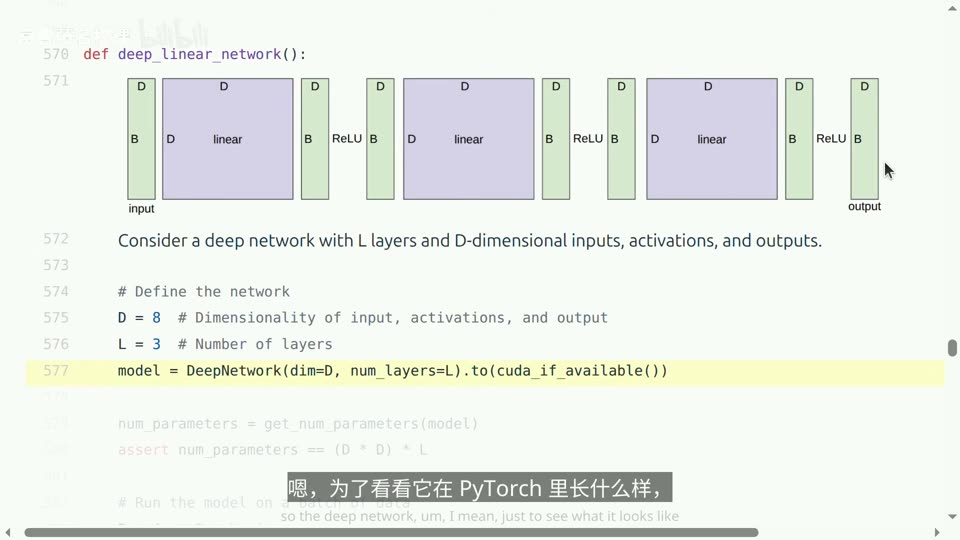 |
| 使用 ReLU 激活函数——然后对所有层都这么做好。希望这也很清楚：这是一个非常简单的模型。好，现在我们来谈谈梯度。我们用一个更简单的例子：这是一个简单的线性回归模型，我们有一个向量 [1,2,3]、一个权重向量 [1,1,1]，我们计算点积，然后构建这个均方误差（MSE）损失。 [【跳转到 41:39】](https://www.bilibili.com/video/BV11LEA6eEuj/?p=2&t=2499) | 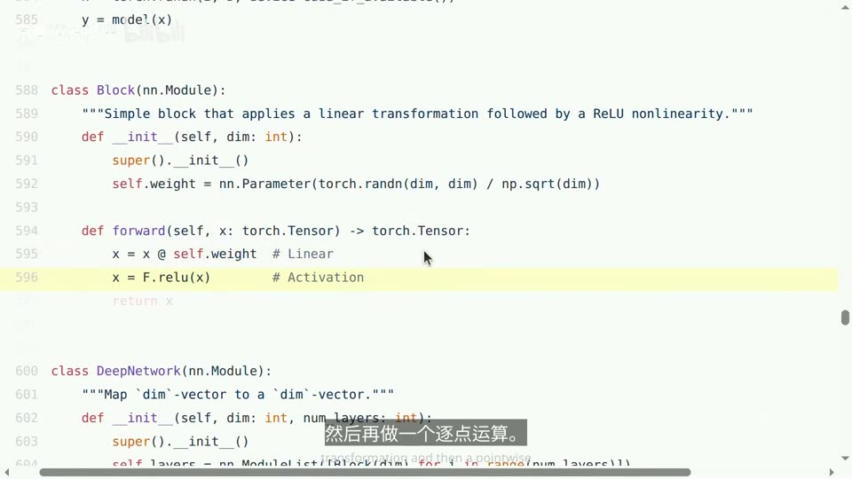 |
| （板书 MSE 损失公式。）当我们执行反向传播（backward）时，计算图中涉及的每个变量，它的梯度要么被赋值，要么没被赋值：所以 W 的梯度被赋值为 [1,2,3]（即 X 的值）。好，这只是 PyTorch 的基本机制，对大家来说应该都很熟悉。那么现在的问题是：计算梯度需要多少浮点运算次数？好，我们来计算梯度所需的浮点运算次数。我们考虑一个简化模型： [【跳转到 42:04】](https://www.bilibili.com/video/BV11LEA6eEuj/?p=2&t=2524) | 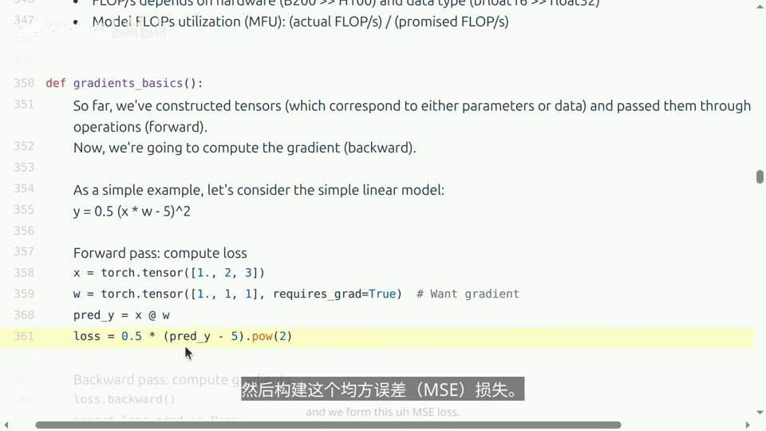 |
| 其中你有 X（B×D）乘以 W1（矩阵，为简化起见我们暂时忽略 ReLU），再乘以 W2（一个形状相同的 D×D 矩阵）。出于后面会讲清楚的原因，这里我使用 einsum（原字幕 iesome）。在这个线性网络中，你做的第一件事是取出 X 和 W：X 是 batch 大小乘输入维度，W1 是输入维度乘输出维度。 [【跳转到 42:29】](https://www.bilibili.com/video/BV11LEA6eEuj/?p=2&t=2549) | 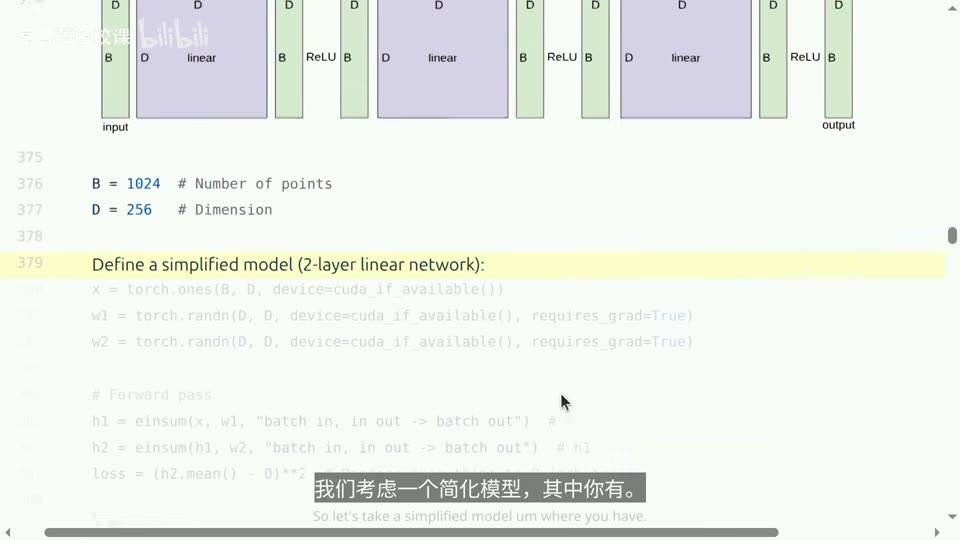 |
| 得到的是（批次大小 × 输出维度）H2；取 W1 和 W2，情况大致相同——这些只是矩阵乘法。然后你形成一个损失，我只是把它传给某个任意操作，以便得到一个数值。好，那么在反向传播过程中会发生什么？为了调试方便， [【跳转到 42:54】](https://www.bilibili.com/video/BV11LEA6eEuj/?p=2&t=2574) | 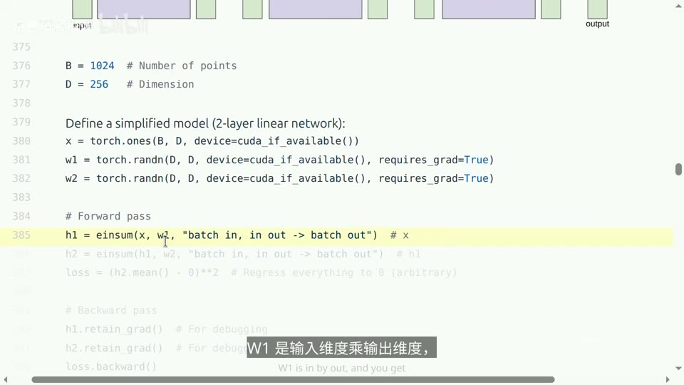 |
| 我把这些（中间量）叫做 retain_grad（保留梯度），你后面会看到。你对损失执行 backward（反向传播）。问题是：那做了多少工作？也就是说，那是多少浮点运算次数？好，让我们放大、查看一层——我们专注于这里的第二层（layer 2）：第二层接收 H1，然后直接乘以矩阵 W2，得到 H2，就这样。所以如果你看前向传播里的浮点运算次数，这仅仅是个矩阵乘法： [【跳转到 43:19】](https://www.bilibili.com/video/BV11LEA6eEuj/?p=2&t=2599) | 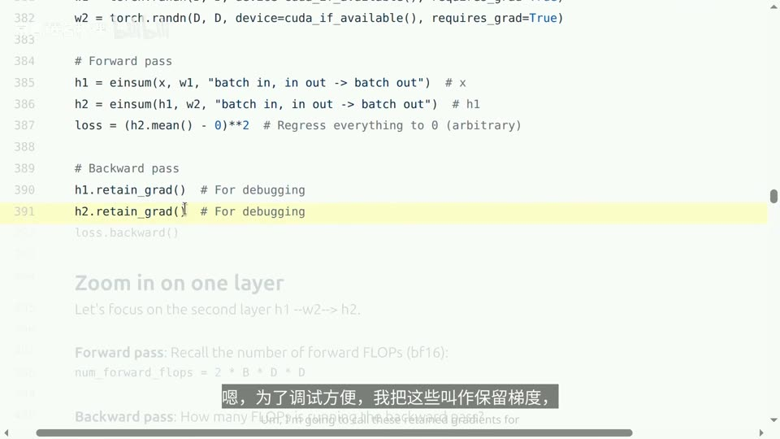 |
| 我们只需要把这三个维度乘在一起（bf16 占 2 个字节——抱歉，这个细节这里不重要）；这里要乘 2，是因为包含一次乘法和一次加法。好，那反向传播阶段是怎样的呢？好，在反向传播中，如果你还记得链式法则和反向传播算法，你需要计算两个量：一是"反向信号"，也就是损失函数相对于（该层）输入的梯度； [【跳转到 43:44】](https://www.bilibili.com/video/BV11LEA6eEuj/?p=2&t=2624) | 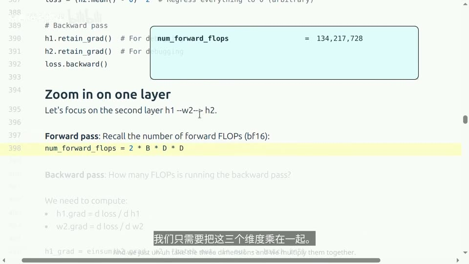 |
| 同时你还需要计算相对于参数的梯度。清楚吗？这些梯度的具体形式是什么？它直接由定义得出：这其实就是用爱因斯坦求和（einsum）符号写出的链式法则。你计算损失对 H2 的导数（dL/dH2，即 H2 的梯度），这是一个 batch 大小 × 输出维度的矩阵；然后你把它乘以 W—— [【跳转到 44:09】](https://www.bilibili.com/video/BV11LEA6eEuj/?p=2&t=2649) | 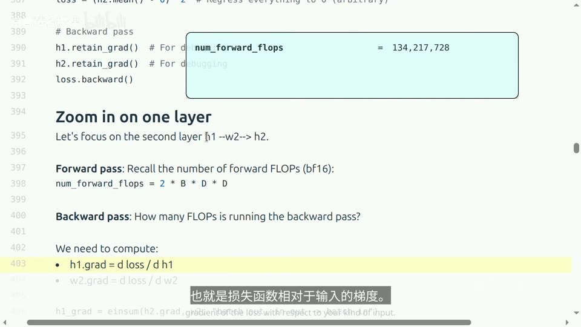 |
| W2 是输入维度 × 输出维度——接着这就得到了 H1 的梯度（即损失对 H1 的导数 dL/dH1），维度是 batch 大小 × 输入维度。好，我每次看到这个，总会搞混：如果学过微积分，里面会出现一个转置，我总是记不清它们该按什么顺序排。我觉得爱因斯坦求和把这件事讲得很清楚：因为只要你记得"在标量情形下，它应该是什么样子"， [【跳转到 44:34】](https://www.bilibili.com/video/BV11LEA6eEuj/?p=2&t=2674) | 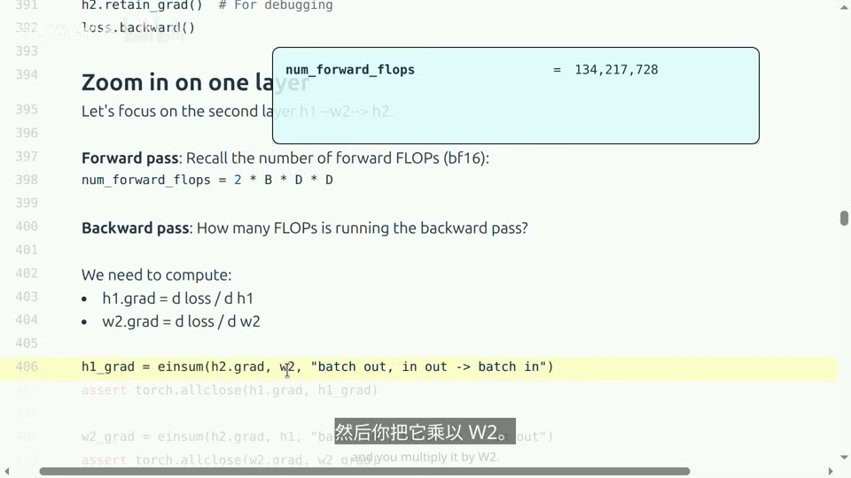 |
| 就知道必须长成那样——H1 的梯度就是 H2 的梯度乘以 W2。唯一的问题是怎么给这些元素加索引：你基本上是通过看这些张量的形状、命名维度来给它们加索引的；这种情况下它就是一个矩阵乘法，你在输出维度上做求和（contract 的是那一维）。照这么操作的话，我们就能验证一下：比如某个 grad 是从 loss.backward() 里自动算出来的， [【跳转到 44:59】](https://www.bilibili.com/video/BV11LEA6eEuj/?p=2&t=2699) | 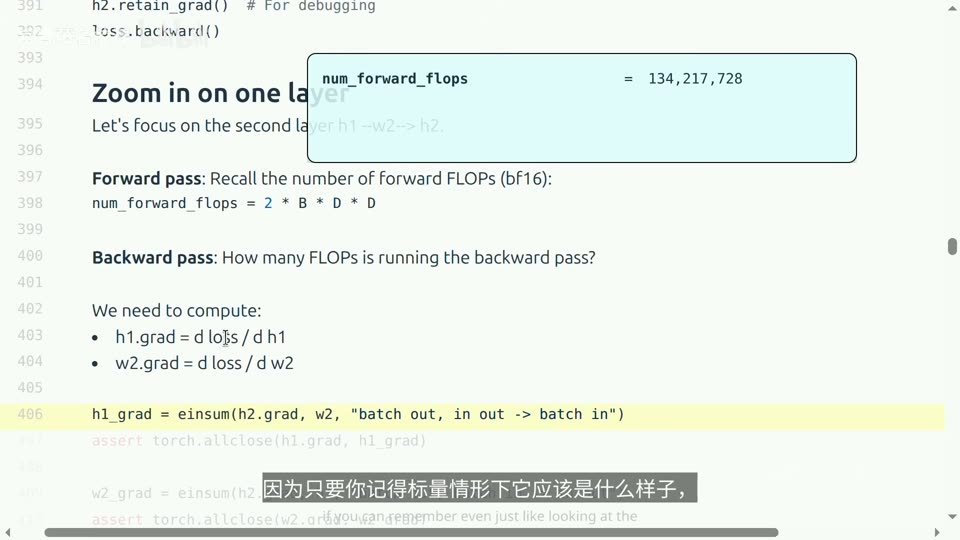 |
| 这跟我在这儿手推的结果是一样的——就当做个 sanity check 吧。好，那你还得算另一件事：对参数的梯度，也就是 dL/dH2 乘以 H1（或对应的激活 H）。所以这其实是同一种"反向传播信号"，只不过它是乘上了你没求导的那部分——你知道，就是对应的（另一方的）梯度；你直接把维度列出就行。 [【跳转到 45:24】](https://www.bilibili.com/video/BV11LEA6eEuj/?p=2&t=2724) | 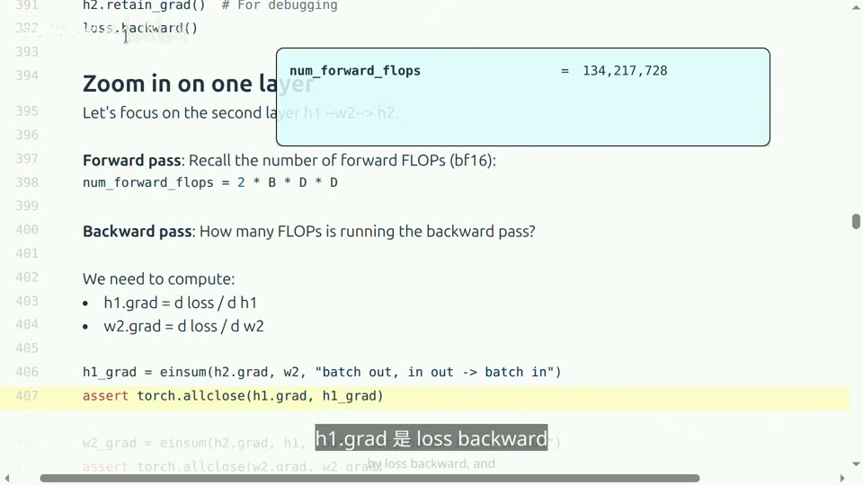 |
| 这里你要对 batch 维度求和。谢谢。好，那么好处在于：如果你只看这里，我们就知道它的计算成本了——浮点运算次数基本上就是所有维度相乘的结果（带 batch 也一样）。不管你有没有做 batch，这都不影响：本质上你就是在遍历 i、j、k 并进行聚合；聚合方式不同，但浮点运算次数是相同的。请注意： [【跳转到 45:49】](https://www.bilibili.com/video/BV11LEA6eEuj/?p=2&t=2749) | 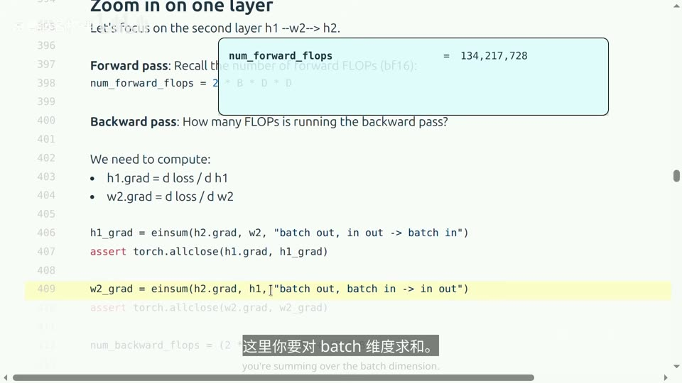 |
| 反向传播的开销恰好是前向传播的 2 倍。原因在于：你需要计算两类梯度——一类是针对每个参数的梯度，另一类是关于输入的梯度（即那个非参数的部分）。好，也许我该停一下，看看有没有问题。 [【跳转到 46:14】](https://www.bilibili.com/video/BV11LEA6eEuj/?p=2&t=2774) | 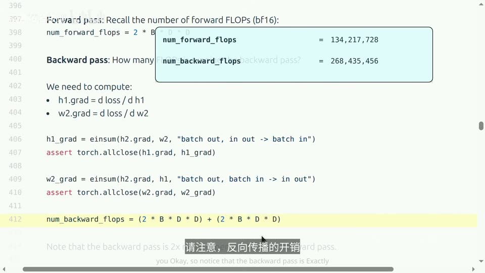 |
| （冷场）"天哪——谢谢。"好。那么刚才讲的只是针对 W2 的情况； [【跳转到 46:32】](https://www.bilibili.com/video/BV11LEA6eEuj/?p=2&t=2792) | 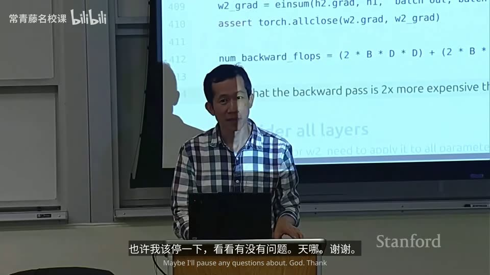 |
| 你只需要把这套方法应用到网络中所有参数上，然后汇总起来就行。你会发现：对于该网络，前向传播的计算量是 2 倍——即（数据点数量 B × 参数量的）2 倍浮点运算次数；反向传播的计算量是前向传播的 2 倍——即数据点数量 × 参数数量的 4 倍浮点运算次数。因此总计算量为 2+4=6（个单位），即—— [【跳转到 46:38】](https://www.bilibili.com/video/BV11LEA6eEuj/?p=2&t=2798) | 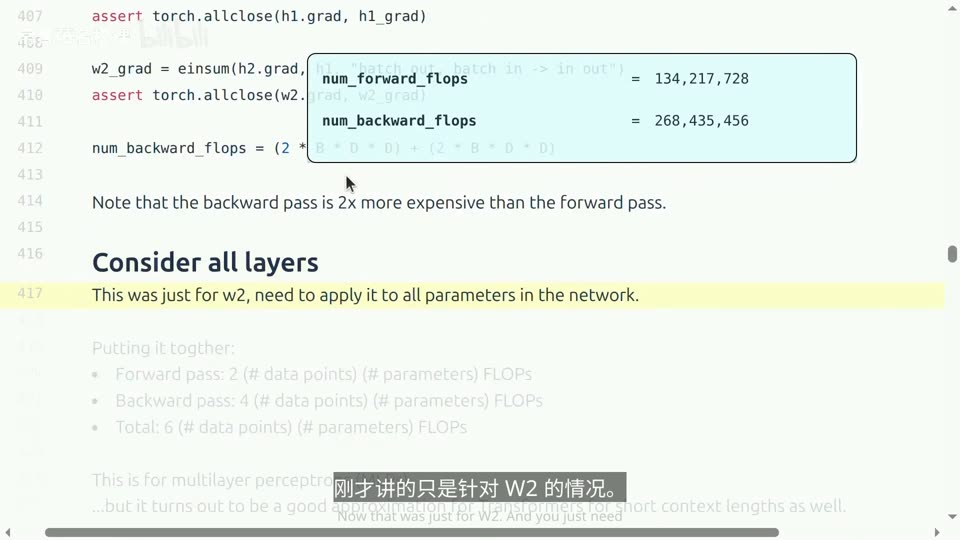 |
| 即"数据点数量 × 参数数量"的 6 倍——这就是你在各种地方可能见过的 6ND 这一说法的来源，它仅仅是通过统计前向传播和反向传播得出的。因此，我们仅针对这些"线性层堆叠的深网络"进行了上述计算；事实证明，只要上下文长度不太大，这对 Transformer 来说也是一个良好的近似；如果上下文长度过大，就会出现"上下文长度的平方"项， [【跳转到 47:03】](https://www.bilibili.com/video/BV11LEA6eEuj/?p=2&t=2823) |  |
| 这属于此类估算中未包含的额外浮点运算次数。好，那么我们就稍微聊一聊吧。现在我们有了梯度；接下来，在训练过程中另一项必要工作是执行优化。因此这里展示的是我们的深度网络。为了避免只是重复作业一里的内容，我打算使用 Adagrad 优化器——该优化器来自 2011 [【跳转到 47:28】](https://www.bilibili.com/video/BV11LEA6eEuj/?p=2&t=2848) | 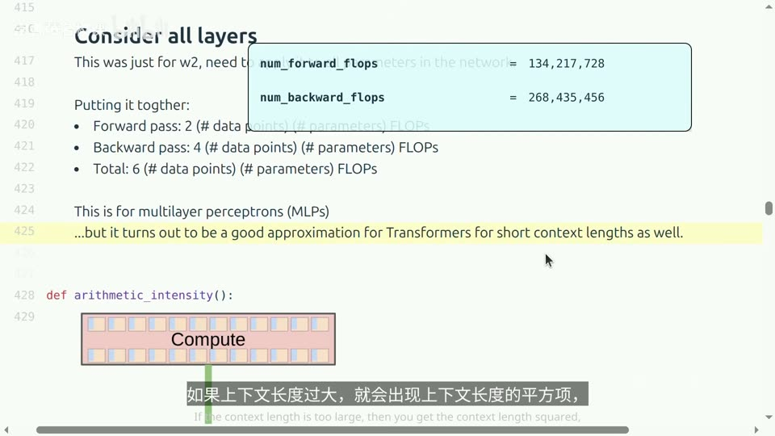 |
| 年（published in JMLR 2011），比 Adam 还早。你可以把它理解为介于 SGD 和 Adam 之间的方法：基本上，它是在 SGD 基础上考察梯度的二阶矩（原字幕'二阶局'应为矩），动量（momentum）考察的是梯度的一阶矩，而 Adam 则是把两者结合起来。由于我们主要关注使用方法，因此这里不展开优化器的具体细节。我们可以定义一个优化器， [【跳转到 47:53】](https://www.bilibili.com/video/BV11LEA6eEuj/?p=2&t=2873) | 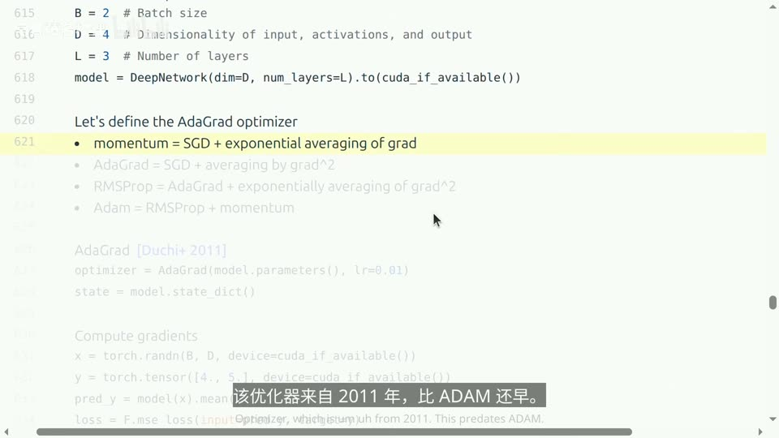 |
| 给出所有参数，然后当你计算梯度时，接下来执行梯度计算，再进行优化器的一步（step）更新。如果你要自定义优化器（比如在第一次作业里你需要实现 Adam），针对每个参数组——比如这里的 W1 或 W2——我们要看一个叫"优化器状态"（optimizer state）的东西：它本质上是一种存储，优化器在运行时就会用到这种存储。 [【跳转到 48:18】](https://www.bilibili.com/video/BV11LEA6eEuj/?p=2&t=2898) | 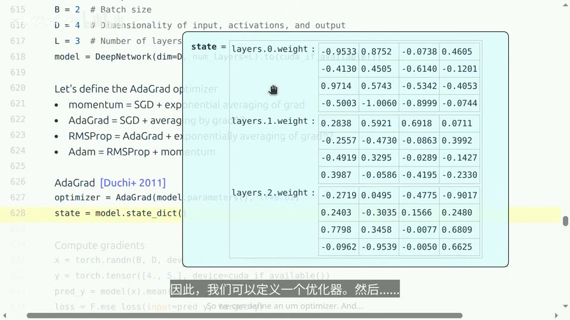 |
| 在 Adagrad 里，我们算的是梯度的平方（也就是所有梯度平方的累积）。这里我们从优化器状态里取出这个值，我们用当前的梯度去更新它，然后再存回去。接着，更新完这个状态之后，你就去更新参数，懂了吗？在 Adagrad 中，你基本上是用梯度平方的均值或总和的平方根来做除法。谢谢。你——哎，好，呃…… [【跳转到 48:43】](https://www.bilibili.com/video/BV11LEA6eEuj/?p=2&t=2923) | 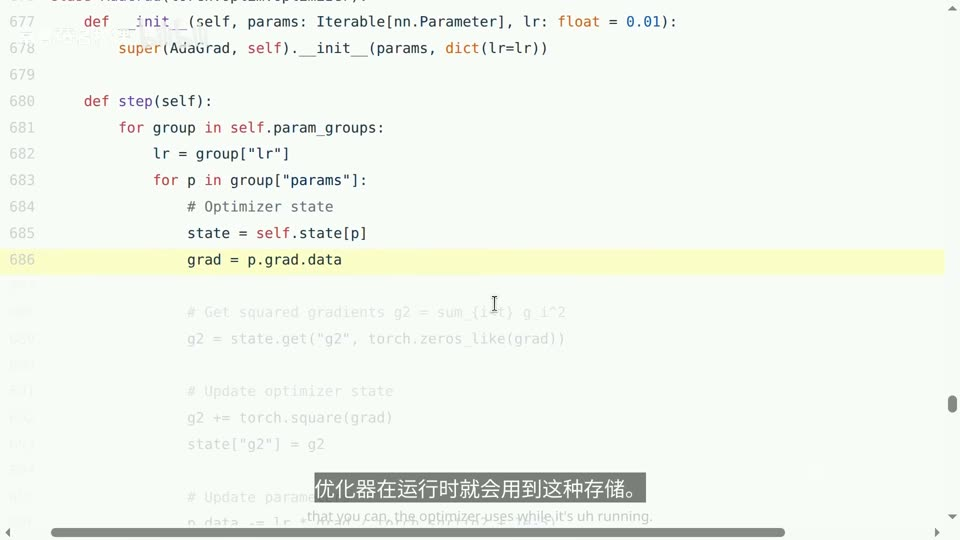 |
| 谢谢你。让我看看，我可能得跳过前面那部分了——你知道的，就是（跳过 simulate）训练那块儿。看，其实等一下，我想我好像漏讲了一点，不是故意的：好，刚才说的是优化器状态，现在来看看优化器占用了多少显存？更一般地说，（这种）内存用量是多少？ [【跳转到 49:08】](https://www.bilibili.com/video/BV11LEA6eEuj/?p=2&t=2948) | 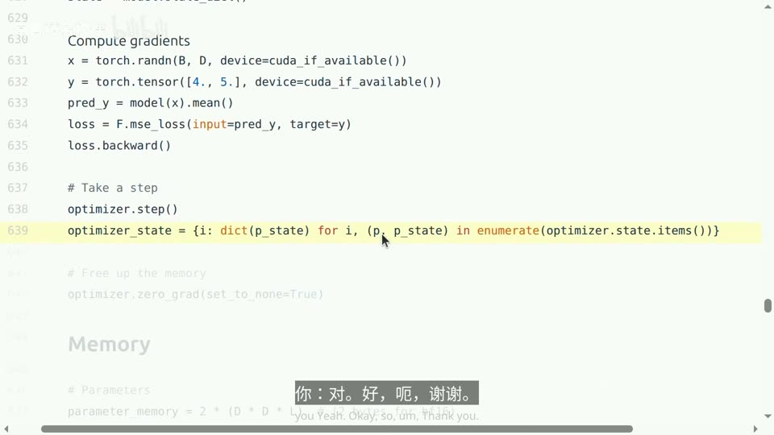 |
| 以参数为例：在这个网络中，L 层，每层有 D² 个参数；如果我们用 bf16 存储，每个参数占 2 字节——这就是参数的总量。激活值（activations）……这个嘛，你知道的：大约是 2 倍（bf16 下，即批次大小 × D × L，每一层都有自己的激活值）。然后是梯度， [【跳转到 49:33】](https://www.bilibili.com/video/BV11LEA6eEuj/?p=2&t=2973) |  |
| 它基本上是所有参数的（另一份）副本，也都是 bf16。优化器状态则是针对每一项保存的：噢，实际上这里写错了，抱歉，我会修正这个笔误——这里指的应该是"参数数量"，而不是"参数内存"：所以是（梯度）参数数量的 2 倍， 然后（优化器状态）是参数数量的 4 倍。原因在于：为了保持稳定， [【跳转到 49:58】](https://www.bilibili.com/video/BV11LEA6eEuj/?p=2&t=2998) | 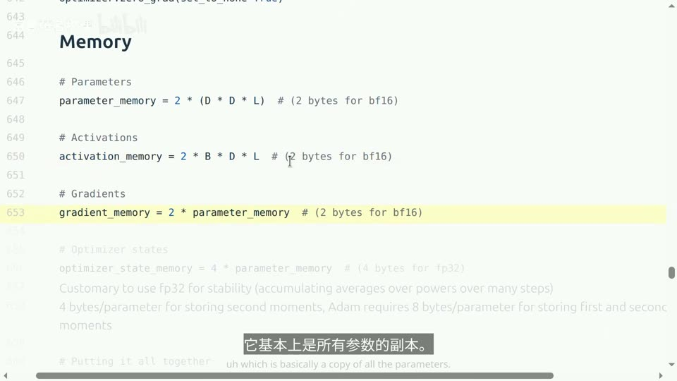 |
| 惯例上会使用 fp32 来存储优化器状态——显然有人试过用 bf16，结果发现因为涉及平方运算和跨步平均（cross-chunk averaging），这样并不太稳定。嗯，并且以 Adagrad 为例：这里每个参数需要 4 字节来存储优化器状态，Adam 优化器需要存储一阶矩和二阶矩，因此占用 8 字节。 [【跳转到 50:23】](https://www.bilibili.com/video/BV11LEA6eEuj/?p=2&t=3023) | 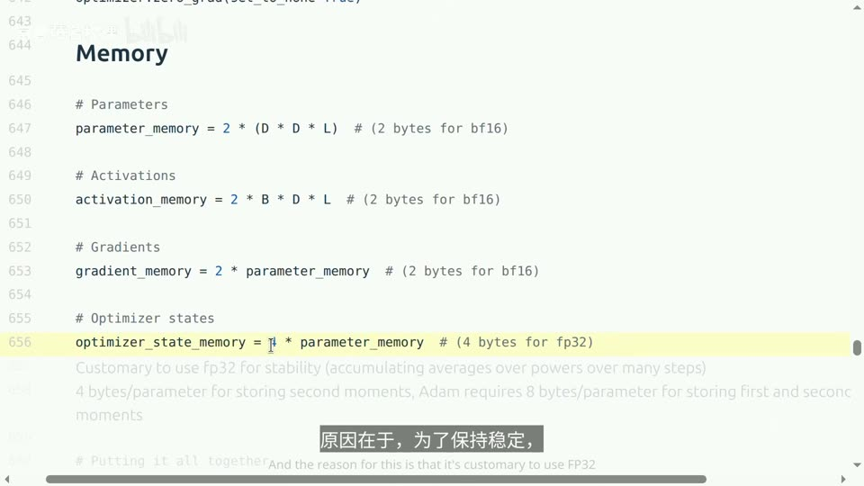 |
| 因此优化器状态实际上占用了大量内存。好，这里有一个注意事项：请记住，内存主要承担两种功能：一是你需要在 HBM 中存储这些数据；二是这些数据必须传输到加速器。总体而言，优化器状态通常不是计算的瓶颈，因此这里的内存量对于速度方面的性能并非至关重要。 [【跳转到 50:48】](https://www.bilibili.com/video/BV11LEA6eEuj/?p=2&t=3048) | 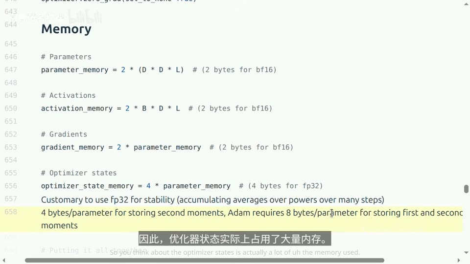 |
| 但它意味着你无法在内存中容纳大型模型。好的，综上所述，如前所述：参数数量为 D²×L，浮点运算次数为 6×token 数量（或数据点数量）×参数数量；对于 Transformer 架构情况会稍显复杂，但这将在作业一中涉及，且你会进行更细致的推导。好，咱们跳过训练循环，这算是一个总体回顾。Thank you。 [【跳转到 51:13】](https://www.bilibili.com/video/BV11LEA6eEuj/?p=2&t=3073) | 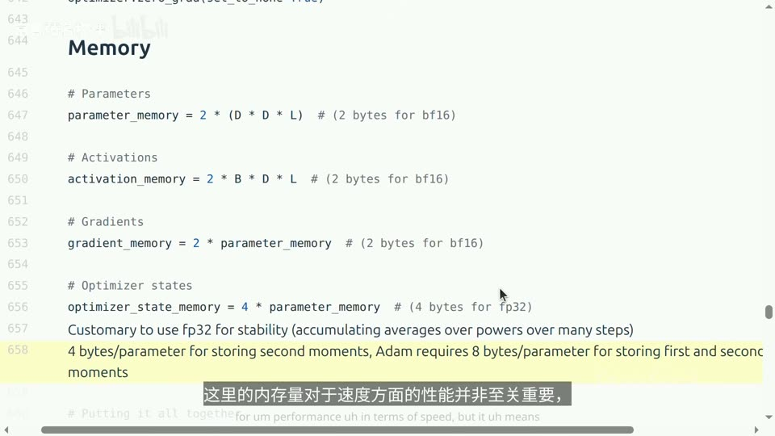 |
| 结束前，我想快速提两点。第一点（正如所见）：显存不仅影响"能否存下大模型"，有时还影响速度，所以一般要尽量减少显存占用。大家常做的两件事里，一项叫梯度累积（gradient accumulation）：一般来说，批次大小要足够大以提高稳定性（直到达到临界批次大小，我们后面会讲）；正如我们所看到的，激活显存会随批次大小增加。 [【跳转到 51:38】](https://www.bilibili.com/video/BV11LEA6eEuj/?p=2&t=3098) | 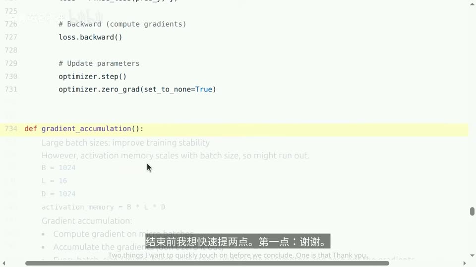 |
| 所以，在某些情况下，你可能显存不够（如果批次大小太大）。梯度累积的做法是：把一个大批次拆成若干个微批次，在每个微批次上计算梯度，然后把梯度累加起来（不用把梯度清零）；每隔（总批次大小 ÷ 微批次大小）才更新参数并清零梯度。因此，这其实是一个非常简单的代码改动，就能节省显存。好，另外我快速提一下激活检查点 [【跳转到 52:03】](https://www.bilibili.com/video/BV11LEA6eEuj/?p=2&t=3123) | 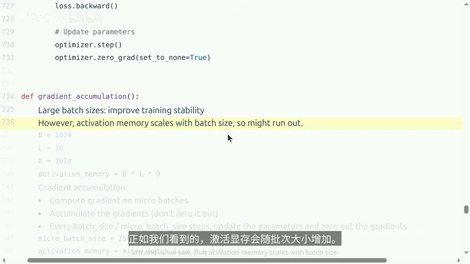 |
| （Activation Checkpoint）。在训练时，我们需要存储——一般来说是存储所有层的激活值，默认就是这么做的。有意思的是：在推理时我们不需要计算梯度，所以只需存储当前层的激活值；但在训练时，内存占用是 B×D×2×L（这么多）。那么问题是：能不能把这个降下来？所以激活检查点也叫梯度检查点或重计算 [【跳转到 52:28】](https://www.bilibili.com/video/BV11LEA6eEuj/?p=2&t=3148) | 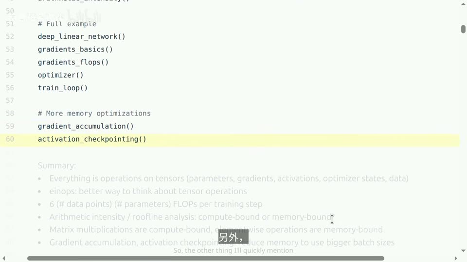 |
| （Rematerialization）。其核心思想是：在前向传播中，你只保留其中一部分层的激活值；反向传播时，再从最近的检查点重新计算缺失的激活值——这就是它被称为"检查点"的原因。这是系统中常见的通用技巧，本质就是一种"权衡"：你想减少内存，那就重新计算（用计算换内存）。 [【跳转到 52:53】](https://www.bilibili.com/video/BV11LEA6eEuj/?p=2&t=3173) | 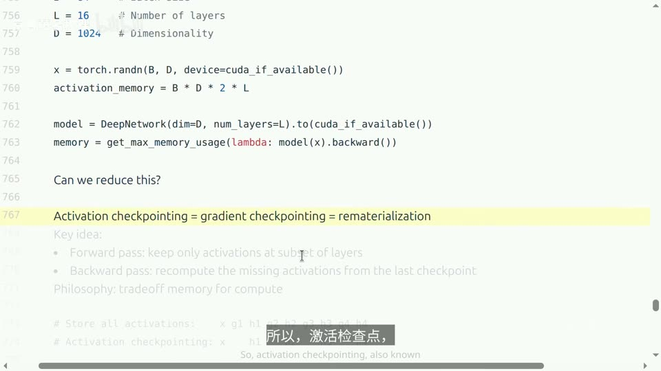 |
| 所以我们要把这个想法具体实现出来。这其实相当简单——可能是我没看到那部分。好，基本上你在这里做的是：用同一个模型，只是有一处不同：你只需在某一层上加上 torch.utils.checkpoint（原字幕 torch util 的 checkpoint）意思就是执行这个计算，但不存储任何中间的激活值，只存储需要的部分。 [【跳转到 53:18】](https://www.bilibili.com/video/BV11LEA6eEuj/?p=2&t=3198) | 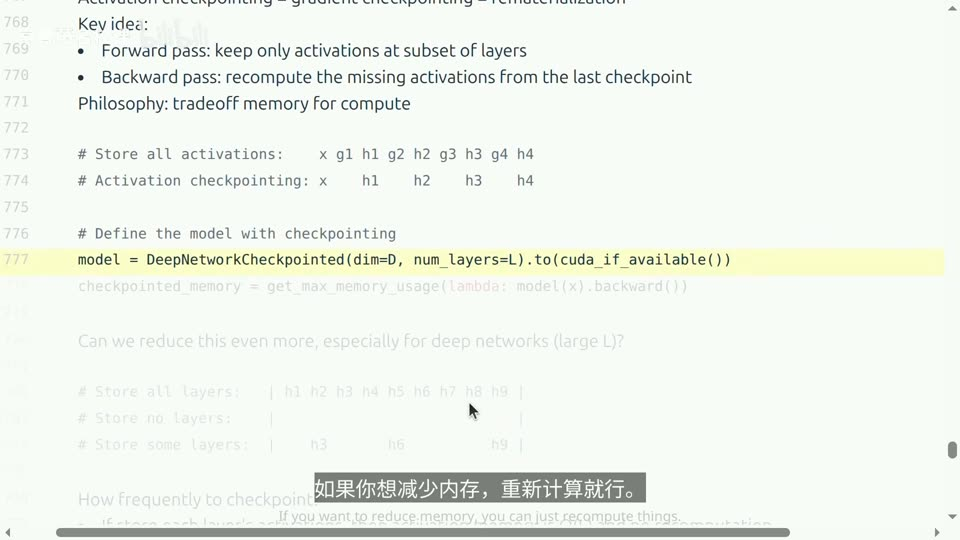 |
| 所以这意味着——如果你存储所有激活值——记住，在深度网络（这类块）里有 ReLU 之前的值和 ReLU 之后的值，这就占用了大量存储。换个做法：在这些由"线性层 + ReLU"组成的块上使用激活检查点、不保存 ReLU 之前的激活值，基本上就能省下一半内存——这样内存就能省下一半。 [【跳转到 53:43】](https://www.bilibili.com/video/BV11LEA6eEuj/?p=2&t=3223) | 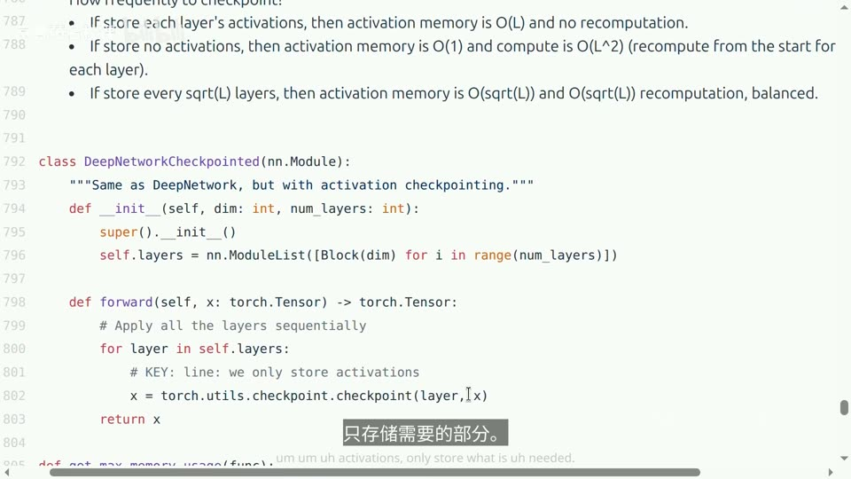 |
| 然后做反向传播时，虽然需要（ReLU 前的）梯度（grad），但你可以很容易地从 H2（ReLU 后）算出它。谢谢。好，你还可以做得更彻底：你可以说"好吧，我可以把所有层都存下来；但在极端情况下，我也可以一层都不存"，这样内存利用率就达到最高。唯一的问题是计算量会变成 L²（层数的平方）——因为每一层都得从头开始（重新）算起。也许一个折中方案是在 √L 层设置检查点： [【跳转到 54:08】](https://www.bilibili.com/video/BV11LEA6eEuj/?p=2&t=3248) | 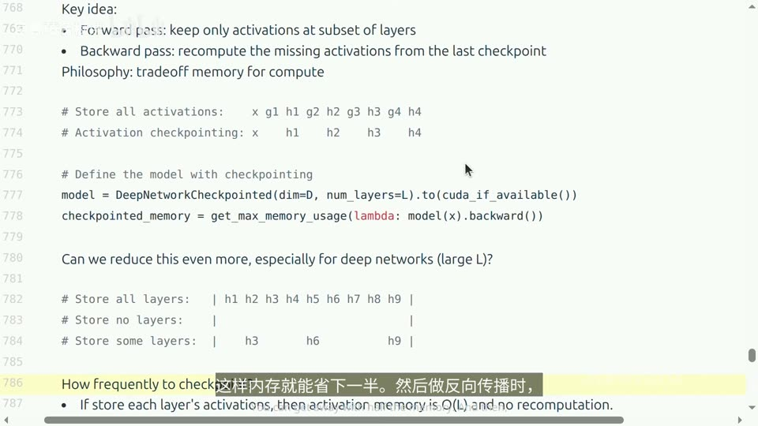 |
| 这样"激活值占用的内存"是 √L 级别，"重新计算的开销"也是 √L 级别，这样就平衡了。谢谢。好，总结一下这节课：所有操作都是在张量上进行的——参数、梯度、激活值、优化器状态、数据；我们介绍了 einops，希望大家能把它当作理解张量运算的一种思路。"6 ×（数据点数 × 参数数）"这个公式我们现在已经搞清楚 [【跳转到 54:33】](https://www.bilibili.com/video/BV11LEA6eEuj/?p=2&t=3273) | 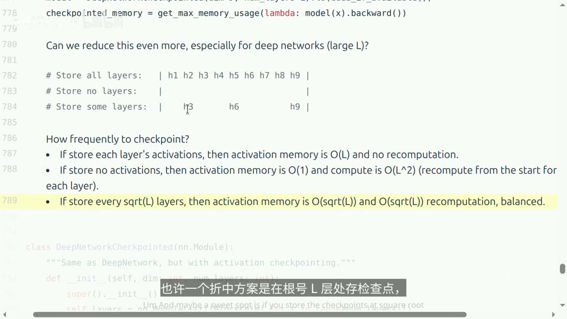 |
| 它代表的是每步的浮点运算次数——如果是训练步骤的话，这里的变量应该是指批次大小。然后我们讲了算术强度和屋顶线分析，借此我们可以判断计算瓶颈是在内存上还是在算力上：矩阵乘（matmul）属于计算受限，而基本上其他情况都是内存受限。最后，梯度累积和激活值检查点技术都是用来节省内存的方法—— [【跳转到 54:58】](https://www.bilibili.com/video/BV11LEA6eEuj/?p=2&t=3298) | 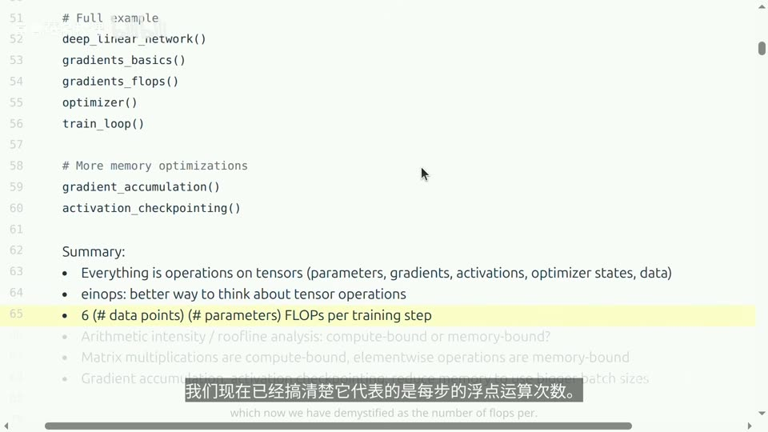 |
| 节省了内存，你就能够使用更大的批次大小。好，今天的课就讲到这里。 [【跳转到 55:23】](https://www.bilibili.com/video/BV11LEA6eEuj/?p=2&t=3323) | 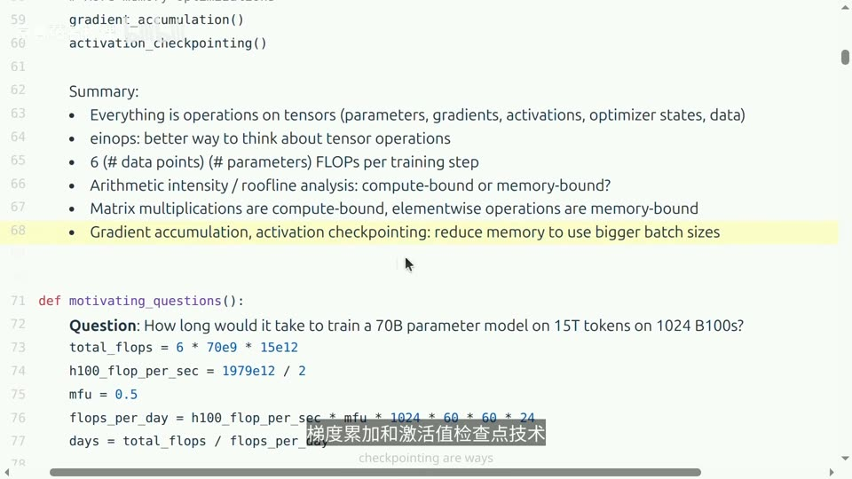 |
| 下周 Tatsu 会讲架构相关的内容。 [【跳转到 55:30】](https://www.bilibili.com/video/BV11LEA6eEuj/?p=2&t=3330) | 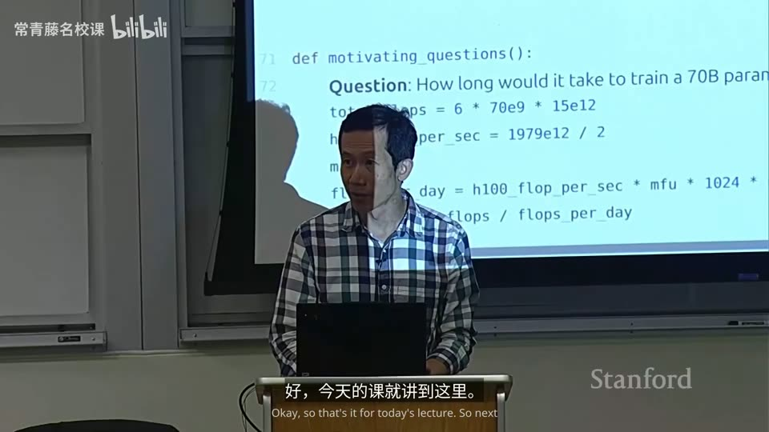 |