# Lecture 3: Architectures · 原始文稿（图-字幕分栏）

| 字幕文本 | 画面 |
| :--- | ---: |
| 所以今天咱们来聊聊架构（architecture）。至少在我眼里，这东西一直挺让人摸不着头脑，所以我打算采取一种"全盘托出"的策略： [【跳转到 00:00】](https://www.bilibili.com/video/BV11LEA6eEuj/?p=3&t=0) | 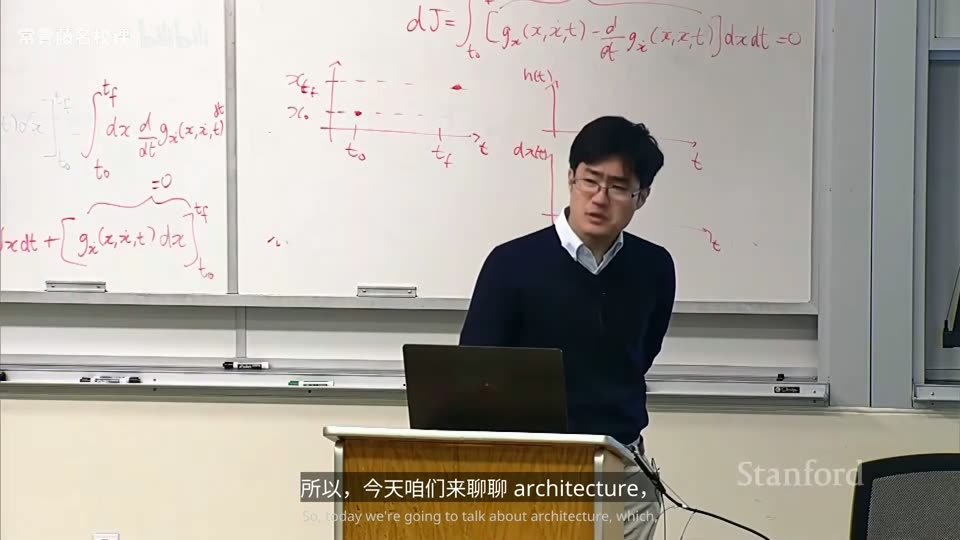 |
| 把能讲的都讲给你听。我会过一遍所有最新的论文， [【跳转到 00:06】](https://www.bilibili.com/video/BV11LEA6eEuj/?p=3&t=6) | 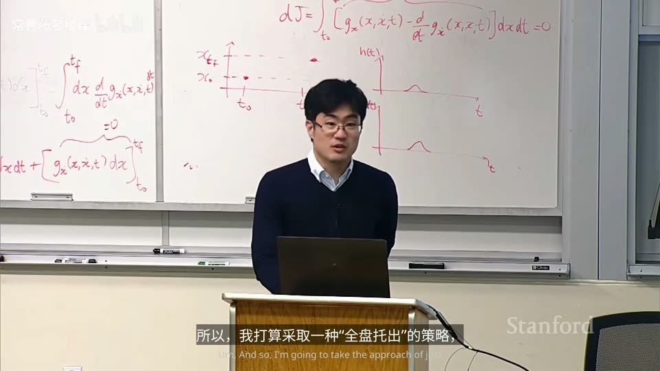 |
| 咱们一起看看大家都做了些什么。主题是"架构与超参数——你本不想知道的一切"。因为我觉得，咱们都曾经幻想过：要是只需懂点像 VC 维之类的 [【跳转到 00:13】](https://www.bilibili.com/video/BV11LEA6eEuj/?p=3&t=13) | 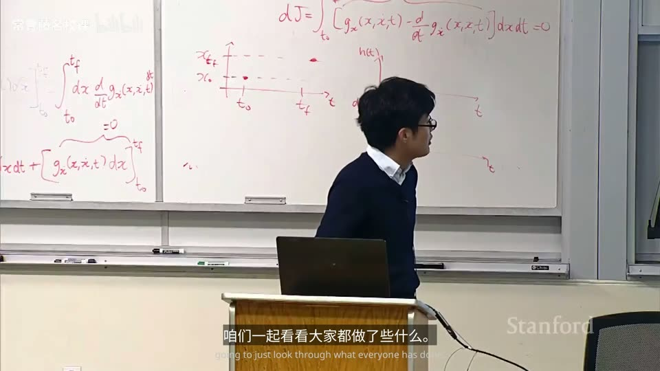 |
| 简单理论工具就好了，对吧？比如那些非常简单的理论工具（就能指导一切选择）。 [【跳转到 00:23】](https://www.bilibili.com/video/BV11LEA6eEuj/?p=3&t=23) | 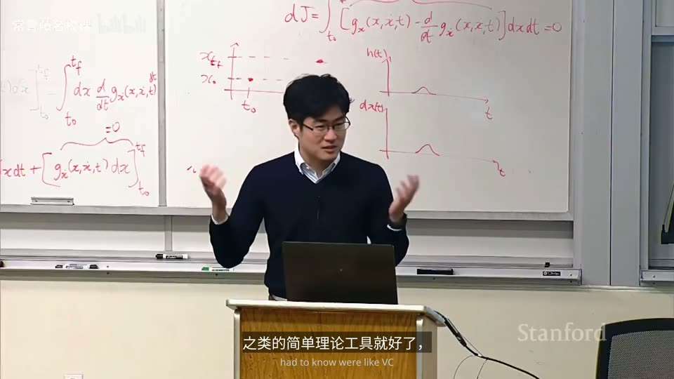 |
| 但现实并非如此。所以咱们接下来要做的，是从综述的角度来理解架构。 [【跳转到 00:28】](https://www.bilibili.com/video/BV11LEA6eEuj/?p=3&t=28) | 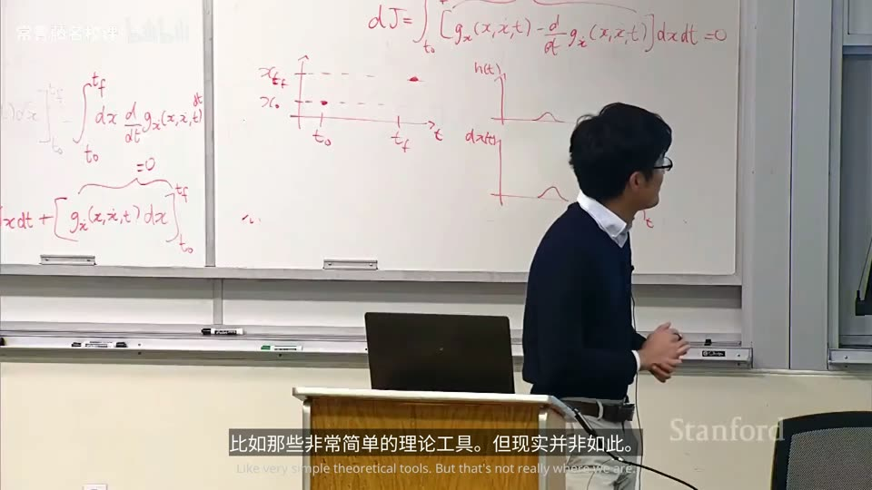 |
| 最好的办法——甚至胜过听这堂课——是你自己去训练模型、尝试不同的架构，对吧？这绝对是最好的办法， [【跳转到 00:34】](https://www.bilibili.com/video/BV11LEA6eEuj/?p=3&t=34) | 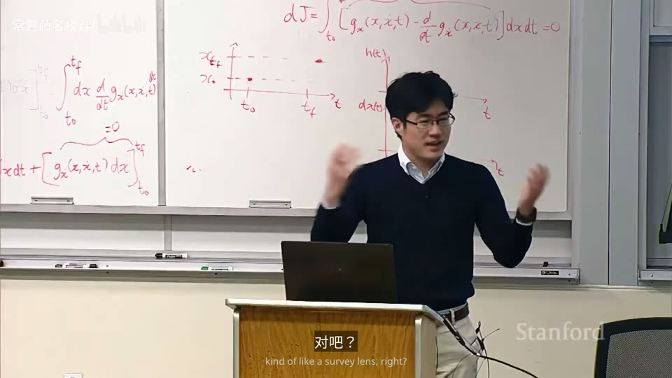 |
| 也是本课程理念的一部分。但我们不可能把现有所有不同架构的整个设计空间都覆盖到： [【跳转到 00:41】](https://www.bilibili.com/video/BV11LEA6eEuj/?p=3&t=41) | 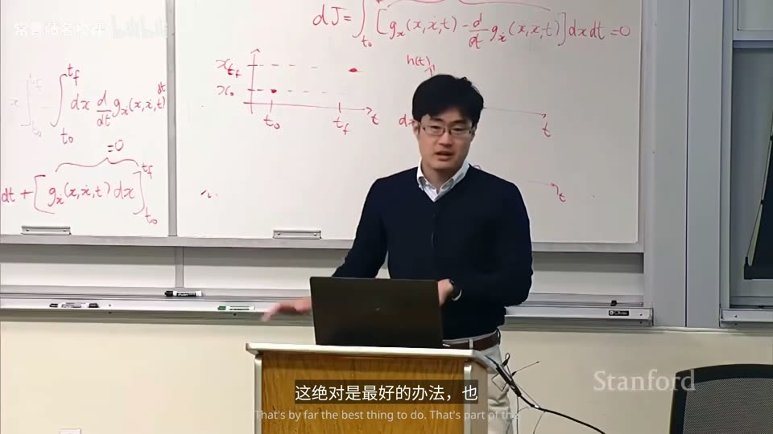 |
| 哎，我们没有足够的算力或时间去做这件事。所以我认为次优解就是从别人的经验中学习：看看大家都做了什么、做了哪些选择。把视角拉远一点、从更宏观的角度去看， [【跳转到 00:46】](https://www.bilibili.com/video/BV11LEA6eEuj/?p=3&t=46) | 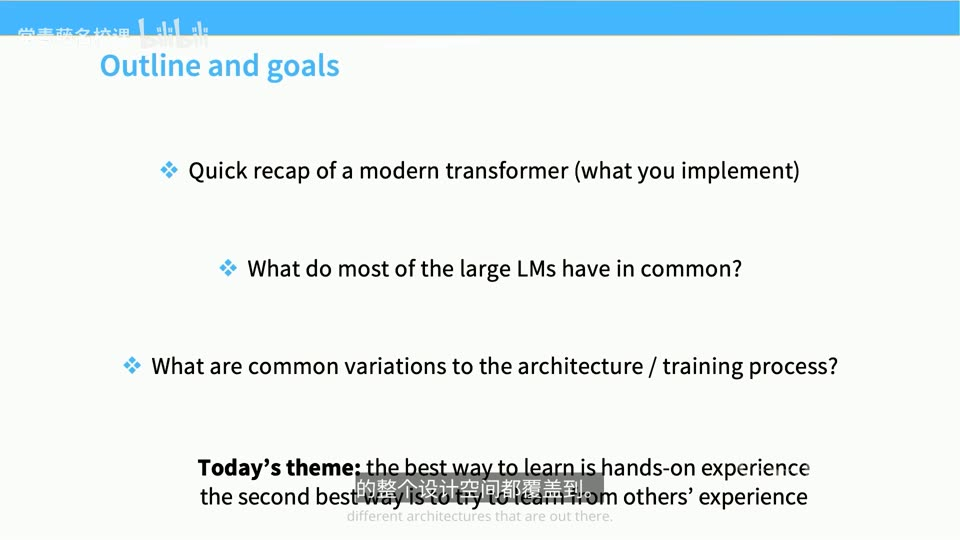 |
| 也许我们就能开始理解：有些参数和选择在所有"有效的"架构中都是固定的，而另一些则可以随意调整 [【跳转到 01:03】](https://www.bilibili.com/video/BV11LEA6eEuj/?p=3&t=63) | 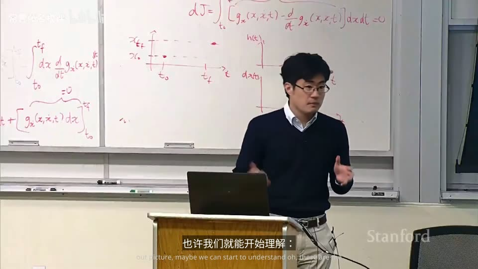 |
| 而不会影响模型的表现。好，接下来我要讲的，基本上就是 Transformer 的"变体"： [【跳转到 01:10】](https://www.bilibili.com/video/BV11LEA6eEuj/?p=3&t=70) | 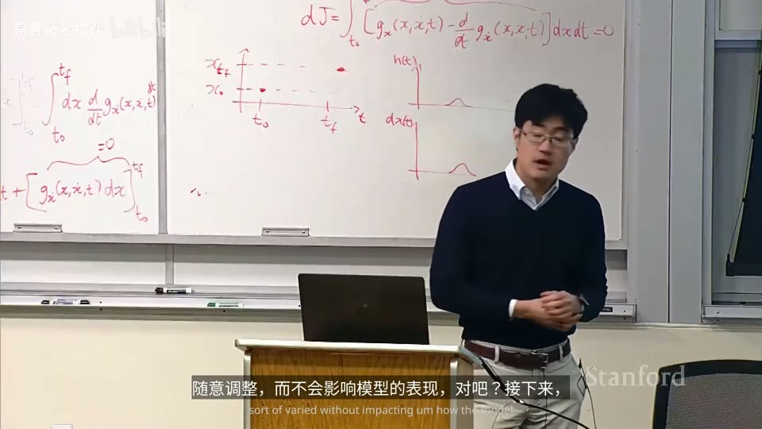 |
| 从 Vaswani（原字幕 VERswani）的论文出发的现代 Transformer 是什么样子；然后当我们转向更现代、更近期的架构时，它们有什么共同点；那么我们可以调整哪些部分，或者说不允许调整哪些，又或者人们在这个过程中实际调整了哪些部分。 [【跳转到 01:15】](https://www.bilibili.com/video/BV11LEA6eEuj/?p=3&t=75) | 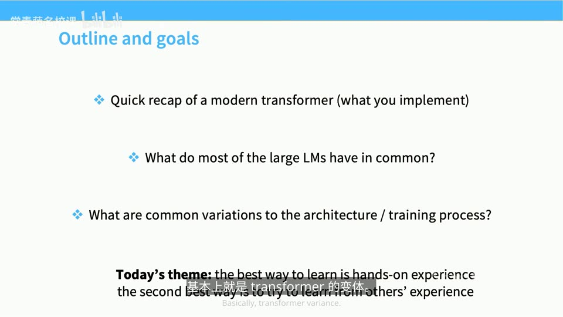 |
| 我想在座的许多人都上过某种 NLP 课程，或者至少见过 Transformer。所以你们大概都见过 Vaswani 等人提出的那种最基础的 Transformer，这里有一些相当标准的架构选择：因为 Transformer 本身不具备位置感知能力，所以我们要加入位置嵌入（position embedding），具体实现上我们会加入正弦和余弦信号， [【跳转到 01:29】](https://www.bilibili.com/video/BV11LEA6eEuj/?p=3&t=89) | 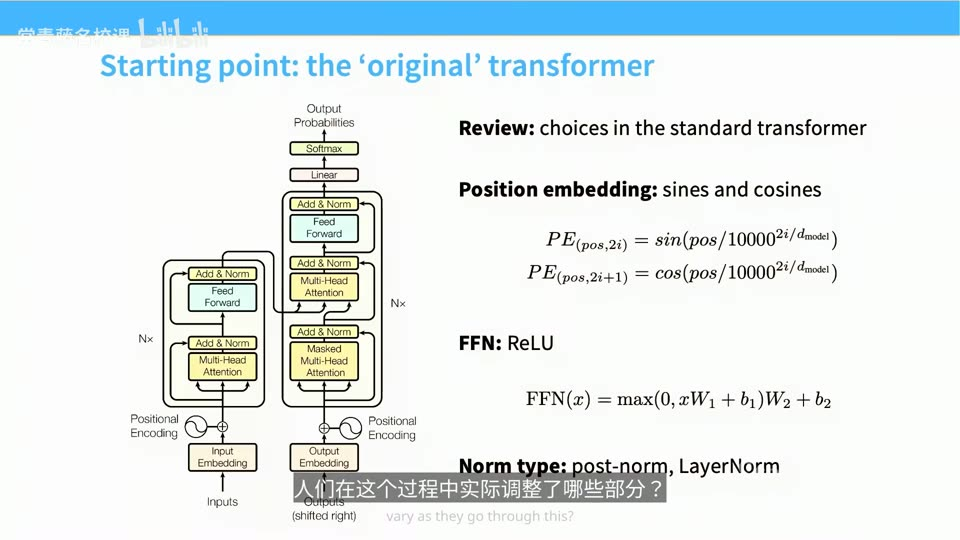 |
| 并利用 ReLU 进行（激活）处理。接下来我们会用到 post-norm，具体含义我稍后详述。 [【跳转到 01:54】](https://www.bilibili.com/video/BV11LEA6eEuj/?p=3&t=114) | 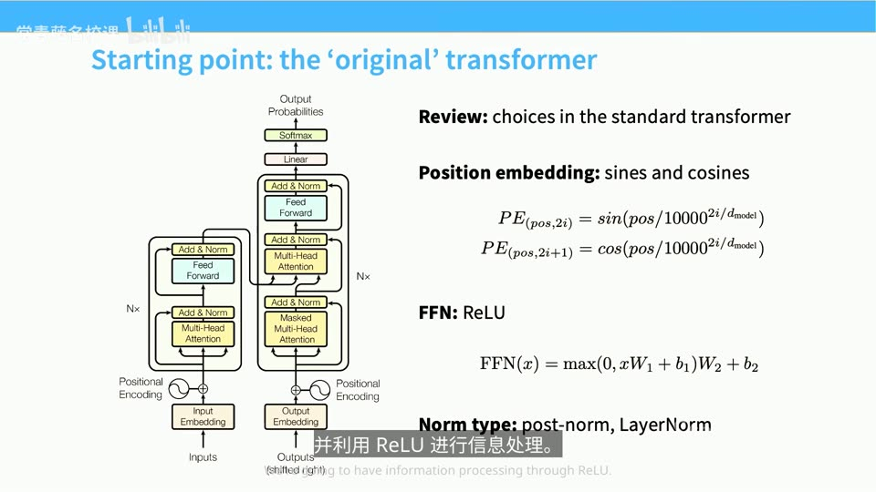 |
| 当你查看作业 A1 时，你会发现标准"香草" transformer 与我们要求你实现的结构有所不同：我们会要求你把 LayerNorm 移到每个 Transformer 块的"前面"，也就是非残差路径上；我们会要求你实现一种叫做 RoPE（旋转位置编码）的东西，并用 SwiGLU 替代 ReLU。我们为什么选这些？一个原因是，我们大量沿用了 LLaMA 的设计——不过其他人也都是这么做的。实际上我认为，如果你要训练自己的语言模型， [【跳转到 02:01】](https://www.bilibili.com/video/BV11LEA6eEuj/?p=3&t=121) | 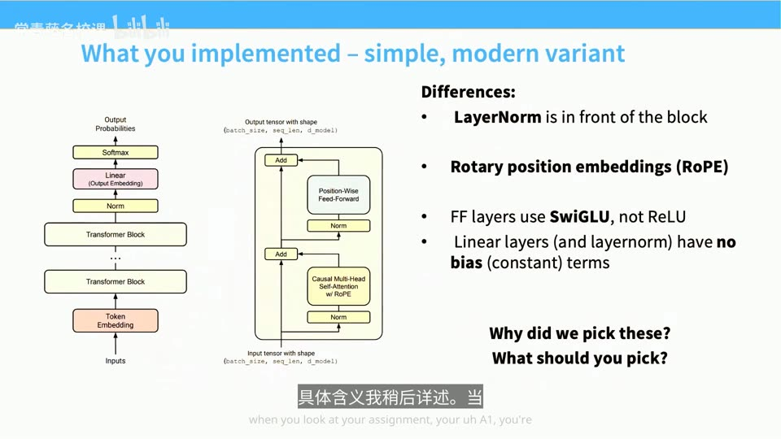 |
| 你很快就会遇到这样一个问题：可选项实在太多了，这么多东西到底该怎么选？所以接下来让我们逐一梳理这些不同的模型。我对架构的思考方式是：审视人们所做的各种不同工作，并问：人们究竟做了哪些事情？我们能否从中挑选、组合？Percy 常为此调侃我，但我会努力梳理每年发布的各种新模型 [【跳转到 02:26】](https://www.bilibili.com/video/BV11LEA6eEuj/?p=3&t=146) | 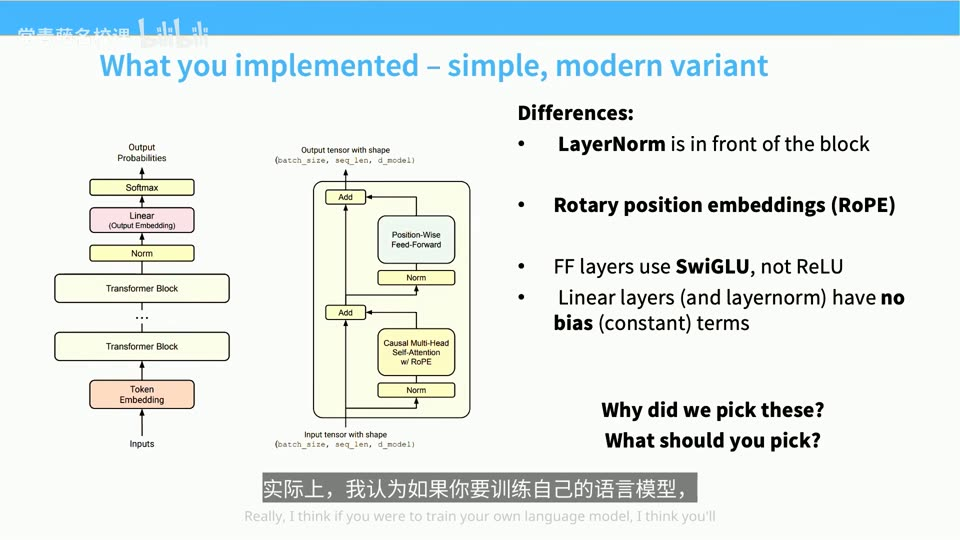 |
| 以准备这门讲座。哎，去年我想："哦，只有几篇论文，应该没问题、应该没问题。"然后我通读了所有内容，发现论文数量众多：包括 Qwen2 和 Gemma，然后还有 internlm，然后还有更多，比如 Neo 和 Reka——天哪，有十几（nineteen）个新的密集模型。因此去年我的工作非常繁重。 [【跳转到 02:47】](https://www.bilibili.com/video/BV11LEA6eEuj/?p=3&t=167) |  |
| 然后今年我想："嗯，不会有那么多新的语言模型发布吧？增长速度总该放缓了吧？人们不可能每年都持续训练 20 个密集语言模型。"严格来说，这话没错——密集语言模型（kmeans 密集，非 MoE）其实没那么多。刚开始我还想："哦，有 Qwen3、Gemma——上周四才刚出来，我就把它加进去了——还有 OLMO3，也就那么几个。"当然我得特别提一下：感 Personal（应为 Paperclip/Maren 咱们 Marin 训练）的一个（紧凑规模）模型。我当时以为"咱们就讲几个就够了"，但事实证明，一旦你开始细看，会发现模型种类多得很。所以既然有这么多不同的模型， [【跳转到 03:08】](https://www.bilibili.com/video/BV11LEA6eEuj/?p=3&t=188) |  |
| 但事实证明，一旦你开始细看，会发现模型种类多得很。所以既然有这么多不同的模型， [【跳转到 03:33】](https://www.bilibili.com/video/BV11LEA6eEuj/?p=3&t=213) |  |
| 其中大多数其实是"密集/注意力混合的 MoE 模型"——这部分我明天讲，今天先不讲。正因为模型种类如此丰富，我们其实能相当清楚地看到各种可选方案， [【跳转到 03:38】](https://www.bilibili.com/video/BV11LEA6eEuj/?p=3&t=218) |  |
| 今天先不讲正因为模型种类如此丰富我们其实能相当清楚地看到各种可选方案 [【跳转到 03:43】](https://www.bilibili.com/video/BV11LEA6eEuj/?p=3&t=223) | 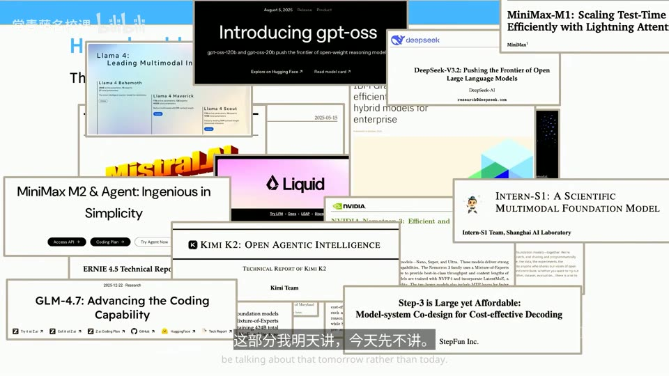 |
| 所以我做了这张小表，咱们讲座结束时还会再回到这张表。但大体上，从最初的 Transformer 开始，实际上已经有相当多的自回归语言模型在同类数据上训练过。你可以问一些类似"词汇表大小有哪些不同的选择？"又或者"我们用的是哪种 LayerNorm？大家又常用哪种位置嵌入？"——我们会观察到一些相当清晰的趋势，后面讲到相关内容时 [【跳转到 03:49】](https://www.bilibili.com/video/BV11LEA6eEuj/?p=3&t=229) | 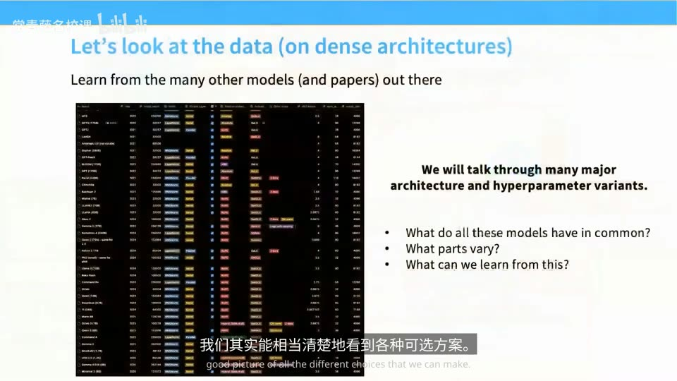 |
| 我会展开说明。好，谢谢。我们这次要讲的内容主要有几个方面。 [【跳转到 04:14】](https://www.bilibili.com/video/BV11LEA6eEuj/?p=3&t=254) |  |
| 我们会介绍常见的架构变体，也就是 Transformer 的不同构建模块。在确定了标准构建模块（比如非线性激活函数和位置嵌入）各用什么之后，我们接下来会讨论超参数：嗯，我们会再往下深入一点，看看 FFN 的隐藏维（d_ff）到底是什么——我们是该把它设为 D 的整数倍，还是把隐藏层维度乘以某倍数来得到 FFN 维度；以及词汇表（vocabulary）应该包含多少个词元（token）。之后， [【跳转到 04:19】](https://www.bilibili.com/video/BV11LEA6eEuj/?p=3&t=259) | 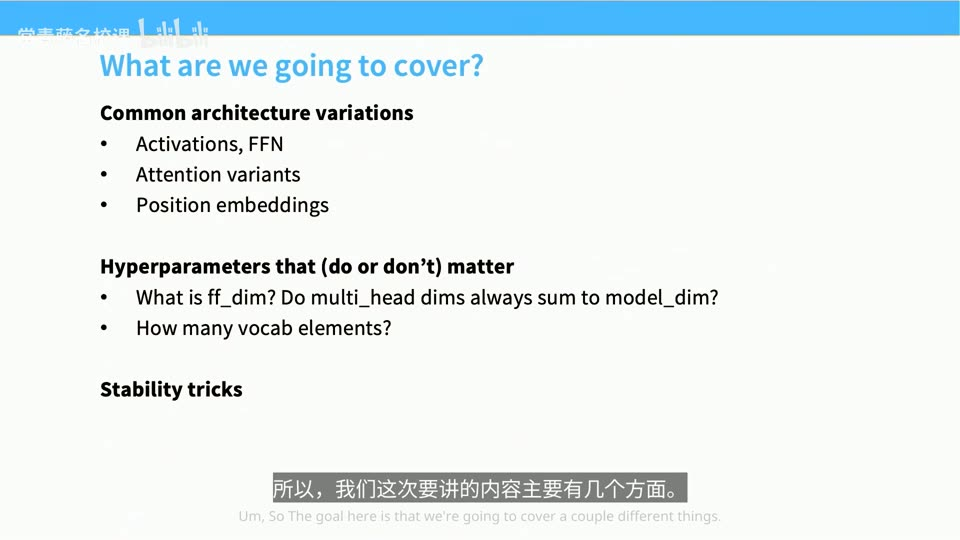 |
| 我们会讨论一些底层技巧，看看怎么让模型稳定地训练。我之所以在这节课讲这个，是因为这些稳定性技巧与架构改动关系非常密切。我想在较高层面让你们理解的一点是：架构实际上是一组非常复杂的权衡。架构需要做什么？它必须从数据中学习（因此必须具备泛化能力），它必须在 GPU 上高效训练， [【跳转到 04:44】](https://www.bilibili.com/video/BV11LEA6eEuj/?p=3&t=284) | 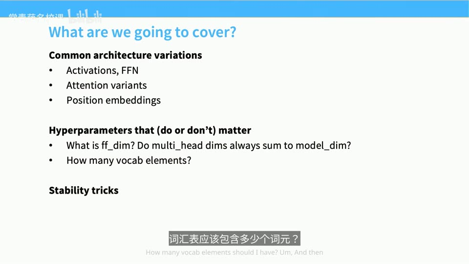 |
| 并且不能崩溃：比如训练到一半训练损失一直正常下降、然后突然爆炸——那完全不行。所以所有这些不同的需求，最终都被直接固化到了架构之中。这就是为什么这些东西有点杂乱、有点复杂；但大家要记住这一点—— [【跳转到 05:09】](https://www.bilibili.com/video/BV11LEA6eEuj/?p=3&t=309) | 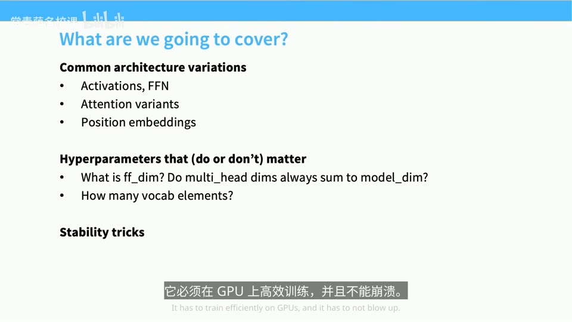 |
| 这也是为什么很多方面并不那么"优雅"。好，咱们先从核心的架构讲起。宏观来看，如果回顾历史：从 Transformer 刚出现到 GPT-3 左右，这期间大家做了大量实验， [【跳转到 05:23】](https://www.bilibili.com/video/BV11LEA6eEuj/?p=3&t=323) | 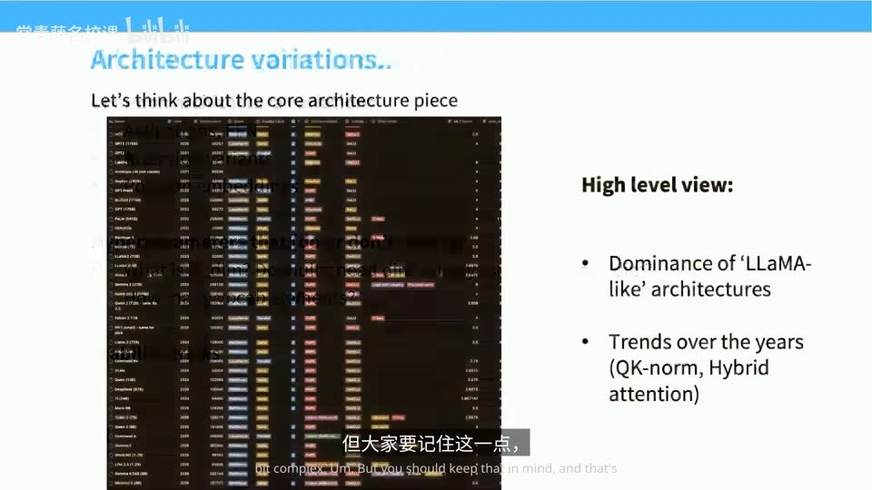 |
| 大家尝试了各种方案，当时还没有一个公认的"黄金标准"。接着 LLaMA 2 出来了，大家都说："哇，LLaMA 2 真棒，我也想要一个自己的。"于是大家开始训练各种和 LLaMA 2 类似、只带一些细微改动的模型。去年我们看到了很大变化，或者说出现了一种趋势：通过修改架构让训练更稳定；今年则出现了许多（新）趋势，即通过架构变体来支持更长的上下文依赖。 [【跳转到 05:36】](https://www.bilibili.com/video/BV11LEA6eEuj/?p=3&t=336) | 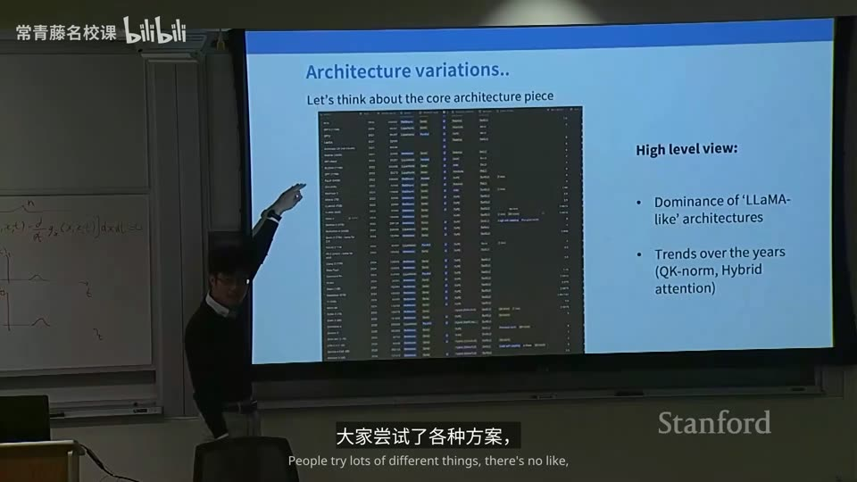 |
| 虽然有这么些大主题， [【跳转到 06:01】](https://www.bilibili.com/video/BV11LEA6eEuj/?p=3&t=361) | 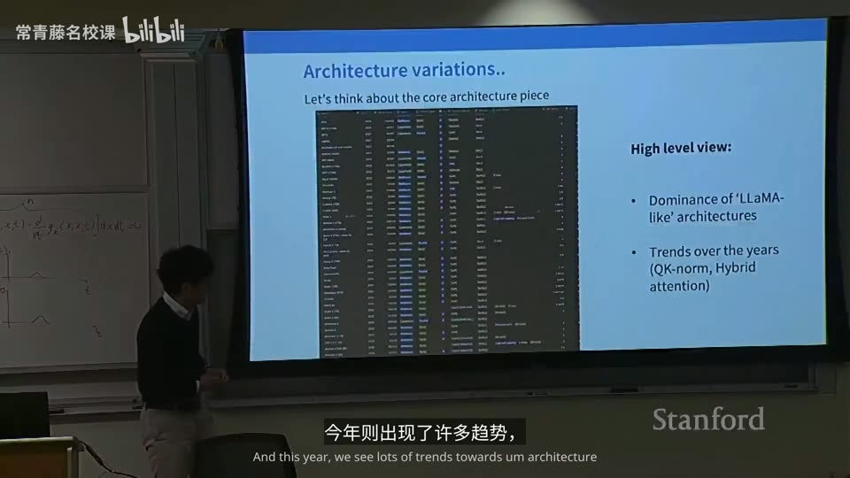 |
| 但我觉得真正的关键点还是 LLaMA 发布（应为 LLaMA-2 发布）时大家都说"哇，我也想要训练一个那样的模型"，然后突然——也不算突然，而是在那之后——人们又开始重新探索。呃，看到这些不同的变化挺有意思的。好。 [【跳转到 06:06】](https://www.bilibili.com/video/BV11LEA6eEuj/?p=3&t=366) | 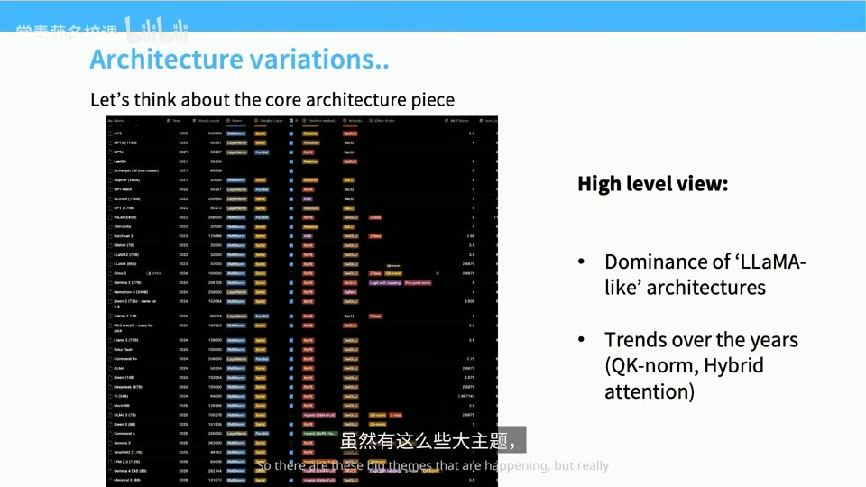 |
| 关于架构，人们可能在很多方面有分歧，但有一件事是大家都认同的。如果回顾 Transformer 论文，很多人会说："除了这一点，Transformer 团队在其他方面都做对了。"而他们真正没做对的——或者说大多数人都认为没做对的——那个地方就是 LayerNorm 的位置。在最初的 Transformer 论文中，LayerNorm 放在所谓的"残差路径"上： [【跳转到 06:17】](https://www.bilibili.com/video/BV11LEA6eEuj/?p=3&t=377) | 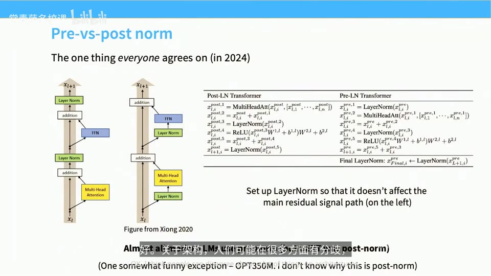 |
| 在 Transformer 中，你有一个"残差流"，即这个 x：它贯穿整个网络。然后你会应用注意力机制，它进行一些计算，并将某种"增量"加回——加回到这个残差流中。然后为了确保这些梯度在各层之间保持稳定，在每个组件的"末尾"都会放置一个 LayerNorm。好，现在，除了把 LayerNorm 放在残差流里，还有一种替代做法 [【跳转到 06:42】](https://www.bilibili.com/video/BV11LEA6eEuj/?p=3&t=402) | 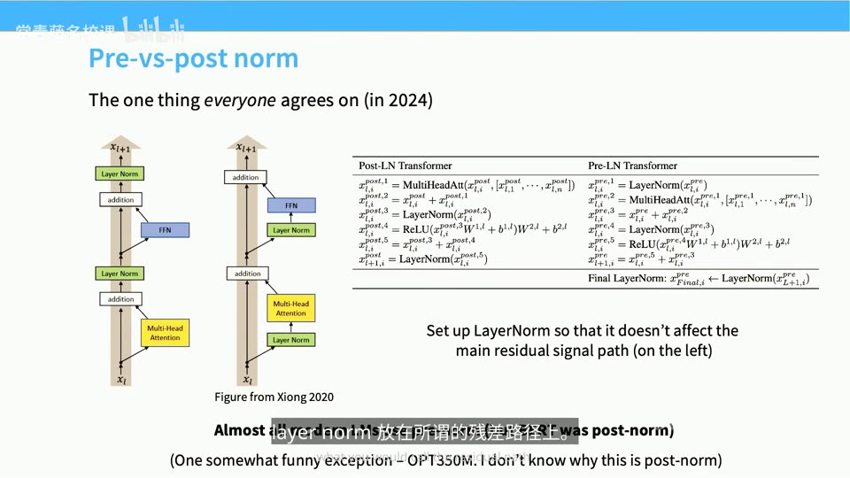 |
| 神我们把这个叫做PRENORM也就是把layernorm放在残差流外面但在每项计算之前所以你可以把它放在多头注意力之前也可以放在FFN之前我们管这个叫PRENORM术语可能有点让人困惑现在你可以叫它postnorm但我们最好叫它residualnorm那你是把norm放在残差层里的基本上所有现代语言模型都把layernorm放在残差留外面这就像是一种大家基本都会做的操作 [【跳转到 07:07】](https://www.bilibili.com/video/BV11LEA6eEuj/?p=3&t=427) | 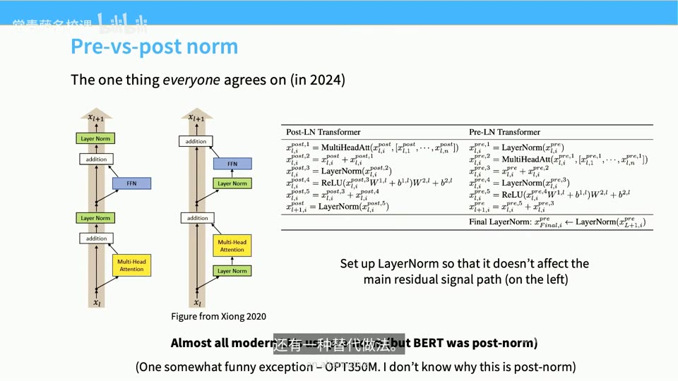 |
| 有个有趣的例外就是 OPT-35B。——你们对语言模型（OPT）熟悉吗？（学生）"哎……我们大概知道。"OPT 总体上是个挺"乱"的语言模型，OPT-35B 更是这样，因为我不明白为什么只有这个模型在残差流里用了 post-norm。好的，这是大家普遍认同的一点。你可能会好奇：为什么在所有不同的模型中，这一点如此统一？如果你回顾一些早期研究， [【跳转到 07:32】](https://www.bilibili.com/video/BV11LEA6eEuj/?p=3&t=452) | 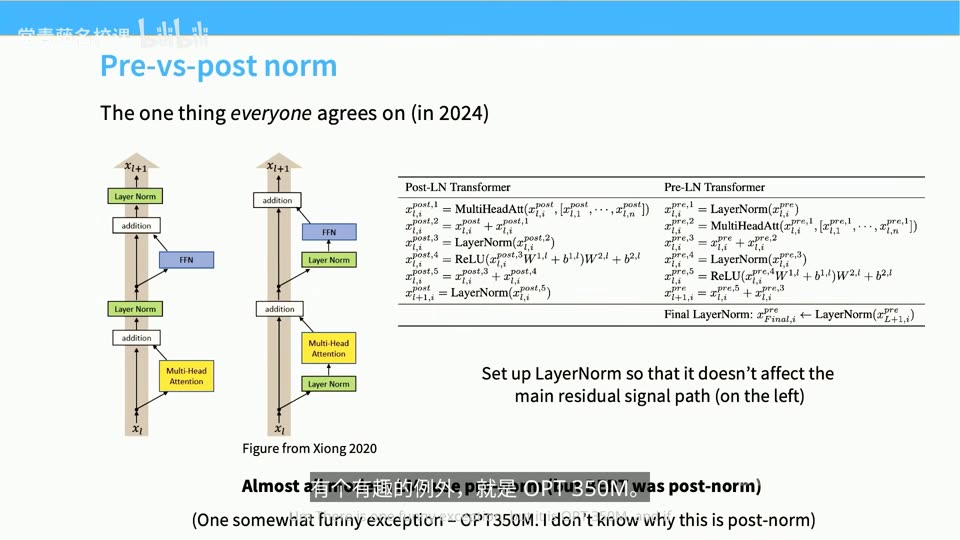 |
| 比如关于 LayerNorm 放置位置的研究，你会发现许多此类研究的早期动机是训练 Transformer 时你需要做"预热"（warmup）。实际上，现代 Transformer 训练仍然要做预热；但训练时你肯定（如今）仍需要它。那么"如果我们能去掉预热那不是很好吗？"（这么想当然很好，非一言堂）——所以这是许多此类研究的初始动机。但人们很快意识到，去掉预热 [【跳转到 07:57】](https://www.bilibili.com/video/BV11LEA6eEuj/?p=3&t=477) | 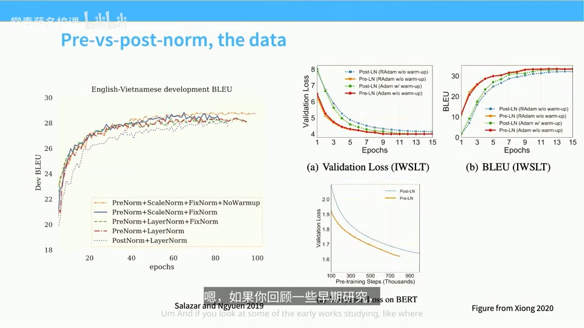 |
| 在稳定性和收敛性方面会带来非常严重的问题。哎，所以如果你用 post-norm + LayerNorm（也就是最原始的 Transformer 做法），你会得到这条紫色虚线——与采用 pre-norm 之类的做法相比，收敛效果就是没那么好。其他项可以先忽略。 [【跳转到 08:22】](https://www.bilibili.com/video/BV11LEA6eEuj/?p=3&t=502) |  |
| 即使不做预热，你也能获得好得多的收敛效果。所以这就是最初的动机；但大家很快发现，把 LayerNorm 移到 residual stream 外面 [【跳转到 08:36】](https://www.bilibili.com/video/BV11LEA6eEuj/?p=3&t=516) | 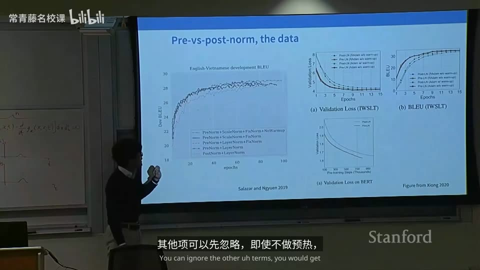 |
| 会带来一些相当重要的影响。当你把网络加深、开始处理稳定性问题的时候，在我看来，"梯度衰减"的问题是最直观的。当你跟那些做架构设计的人聊的时候——我自己并不算真正在做这一行的人之一， [【跳转到 08:47】](https://www.bilibili.com/video/BV11LEA6eEuj/?p=3&t=527) | 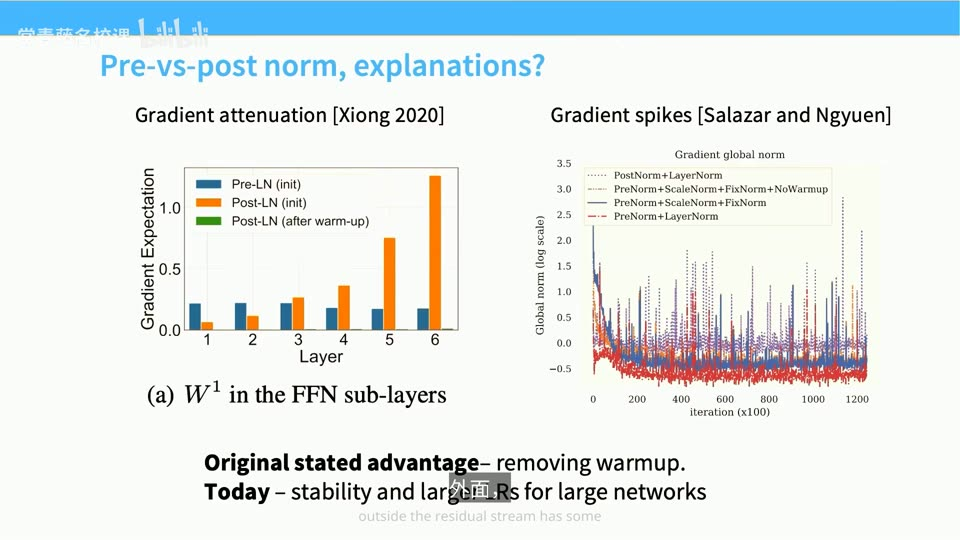 |
| 也就是说我不是深入钻研这个的那种人——但大家常说的一点是："保持你的 residual stream 干净。"这是一种直觉。所以在这种情况下，pre-norm 这种做法（蓝色侧）的 x 从底部进来，一路传播到顶部、 [【跳转到 09:00】](https://www.bilibili.com/video/BV11LEA6eEuj/?p=3&t=540) | 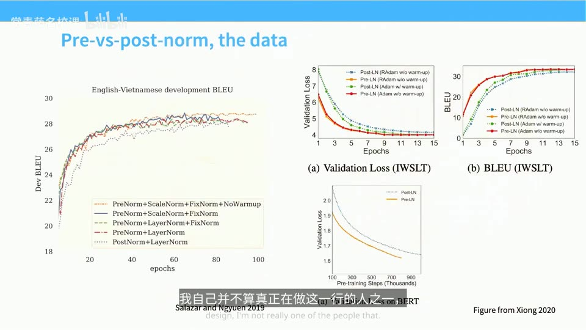 |
| 直达最终输出。这就让梯度在反向传播时能直接沿着这条路径传过去，这让梯度传播变得非常简单，从而同时提升了稳定性和信号传播。诶，这也是大家很快就意识到的：如果在初始化时采用（蓝色部分）这种 pre-norm 做法， [【跳转到 09:14】](https://www.bilibili.com/video/BV11LEA6eEuj/?p=3&t=554) | 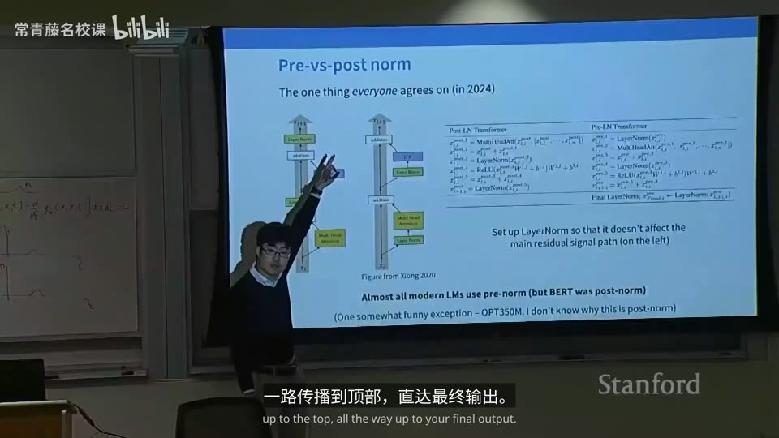 |
| 这也是大家很快就意识到的如果在初始化时采用蓝色部分这种PRENORM做法 [【跳转到 09:23】](https://www.bilibili.com/video/BV11LEA6eEuj/?p=3&t=563) | 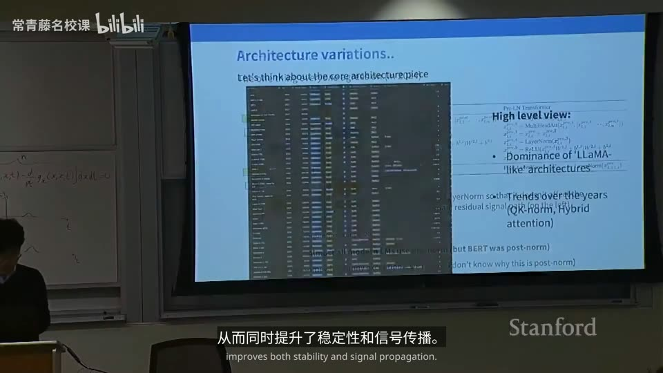 |
| 梯度的规模基本保持不变——对吧？因为反向传播中存在这种良好的"直通"路径。反之，如果采用 post-norm，每次经过 Transformer 模块时都要进行 LayerNorm；这不一定会带来坏处，但（原字幕有些绕）每次经过都会改变梯度的范数。因此可以看出，从"保持残差流干净"这一原则来看，pre-norm 非常合理。人们还通过实验发现： [【跳转到 09:28】](https://www.bilibili.com/video/BV11LEA6eEuj/?p=3&t=568) | 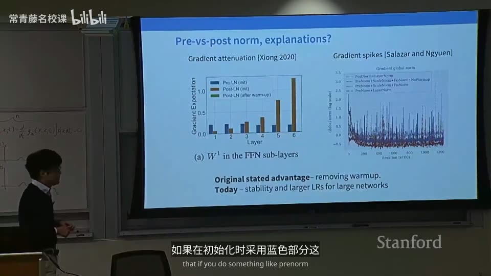 |
| 这总体上提升了稳定性：相比 post-norm，pre-norm 下梯度尖峰的幅度和频率都有所改善。这是 XXX、XXX（原字幕 SAZR 等）的这张图；我认为他们是最早仔细研究这一现象的研究者之一。我想这就是它能够沿用至今的原因：稳定性和构建深层网络的能力， [【跳转到 09:53】](https://www.bilibili.com/video/BV11LEA6eEuj/?p=3&t=593) | 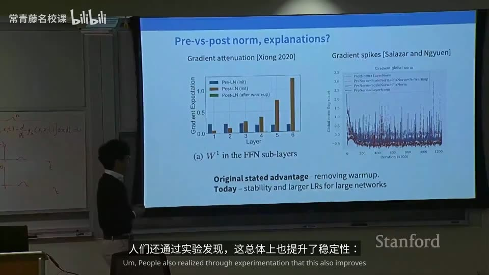 |
| 对现代大型语言模型而言都至关重要。因此，将 LayerNorm 移出残差流的这一思路，基本上被所有人采纳了。 [【跳转到 10:10】](https://www.bilibili.com/video/BV11LEA6eEuj/?p=3&t=610) | 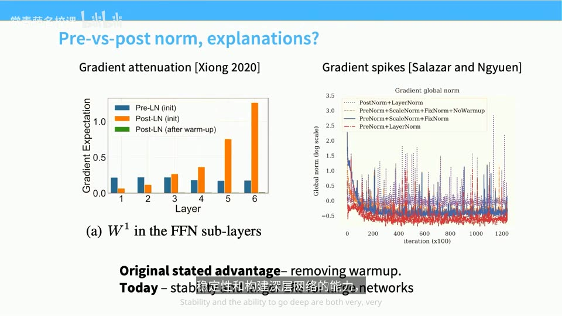 |
| 好，那么现在：如果把 LayerNorm 放在残差流里不好，为什么 LayerNorm 一定要放在开头呢？（哇）当然，我们有 pre-norm——即在计算之前进行归一化；但我们也可以把它放在计算之后。啊哈，那样也同样可行—— [【跳转到 10:18】](https://www.bilibili.com/video/BV11LEA6eEuj/?p=3&t=618) | 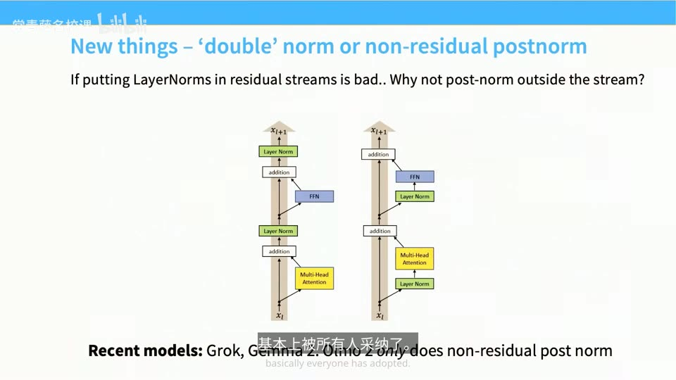 |
| 至少按这个逻辑是通的。嗯，确实如此：许多近期模型（比如 GRPO（应为 GrEvol 类某某）、XX 或 OLMO 等）都采用了这种结构，把 LayerNorm 移到了计算之后（并不是一成不变的）。所以这在某种程度上算是一种 post-norm——但它位于残差流之外；而其他模型实际上仍然是在各处都放 LayerNorm：他们在这里放一个 LayerNorm，之后再放一个，稍后我们讨论稳定性时会讲到这一点。但另一条似乎相当成立的经验是： [【跳转到 10:34】](https://www.bilibili.com/video/BV11LEA6eEuj/?p=3&t=634) | 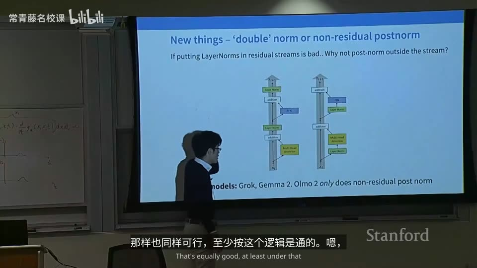 |
| 如果遇到稳定性问题，可以在各处多加一些 LayerNorm——这通常能提升稳定性。说出这话几乎有些怪异，因为它听上去太荒谬了；然而这一说法实际上已被证明是正确的：每当人们遇到稳定性问题，都会想"那如果我们干脆在注意力机制里加一个 LayerNorm 呢"，事实证明这也管用。我们待会儿会细说。好，所以这就是 post-norm，或者说在这种情况下的"double norm"——也就是你这里用了两个 LayerNorm。好，另一种做法是：在原始的 Transformer 中，你使用的是 LayerNorm——就是这里显示的这个操作。所以你拿到激活值 X 后， [【跳转到 10:59】](https://www.bilibili.com/video/BV11LEA6eEuj/?p=3&t=659) | 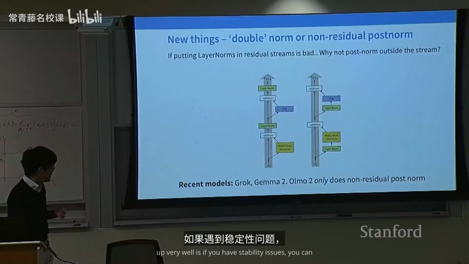 |
| 然而这一说法实际上已被证明是正确的每当人们遇到稳定性问题都会想那如果我们干脆在注意力机制里加一个layernorm呢事实证明这也管用我们待会儿会细说所以这就是postnorm或者说在这种情况下的doublenorm也就是你这里用了两个layernorm好的另一种做法是在原始的transformer中你使用的是layernorm就是这里显示的这个操作所以你拿到激活值X后 [【跳转到 11:07】](https://www.bilibili.com/video/BV11LEA6eEuj/?p=3&t=667) | 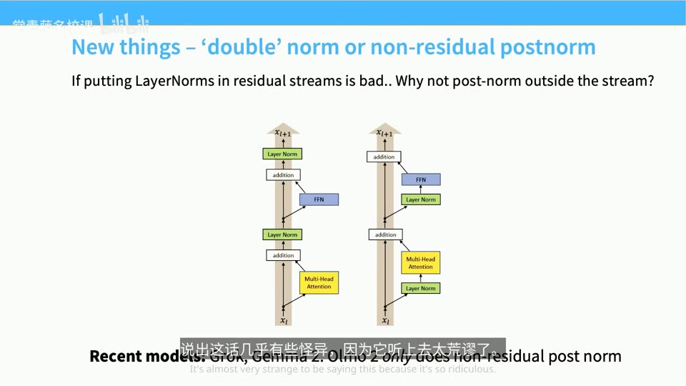 |
| 要减去均值、除以方差（然后再缩放回来）。这完全没问题——这并不意味着它是错的：很多模型都成功用这种方式训练过。不过基本上，我认为大多数或所有现代模型用的都是 RMSNorm：它不做减法——它不减去均值，也不加偏置（bias）项；所以它只是单纯的"缩小再放大回去"，你可以在公式里看到这一点。而且实际上， [【跳转到 11:32】](https://www.bilibili.com/video/BV11LEA6eEuj/?p=3&t=692) |  |
| LayerNorm 的表达能力比 RMSNorm 更强，所以从表示能力的角度说，其实没有非用 RMSNorm 不可的理由。 [【跳转到 11:57】](https://www.bilibili.com/video/BV11LEA6eEuj/?p=3&t=717) | 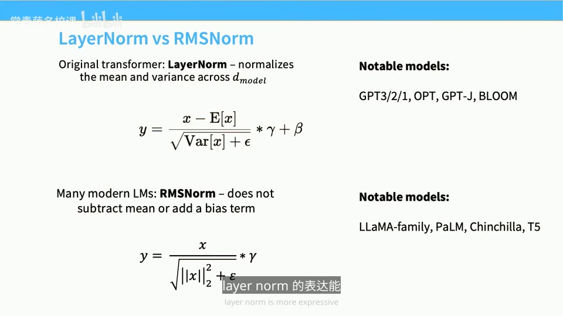 |
| 不过 RMSNorm 的好处在于：在实践中其实并没有表达能力上的损失——RMSNorm 的建模效果和 LayerNorm 一样好；但更重要的是，它运行更快。这里就涉及到"系统和架构的协同设计"（结合前一堂课的内容）：Percy 前一堂课中提到了算术强度这个概念。我们要让 GPU 保持"高负载"，方法就是做矩阵乘法和其他高强度的计算； [【跳转到 12:05】](https://www.bilibili.com/video/BV11LEA6eEuj/?p=3&t=725) | 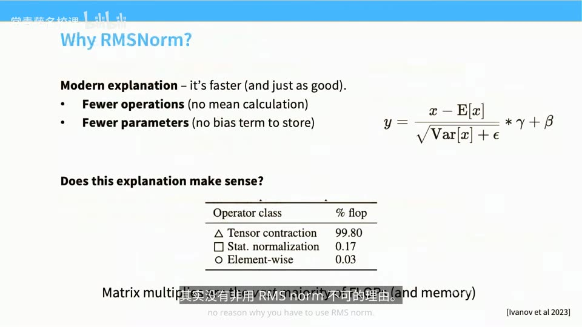 |
| 我们不想让 GPU 浪费在来回搬运那些微不足道的内存数据上——那对我们这么强大的 GPU 是极低效的使用。所以我们要去掉那些"规模小、涉及内存搬运，却对表达能力贡献不大"的操作。哎，因此从这个角度看：如果"均值减法"和"偏置加法"对我们帮助不大，那就直接去掉它。你可能会问："这有什么好纠结的？ [【跳转到 12:30】](https://www.bilibili.com/video/BV11LEA6eEuj/?p=3&t=750) | 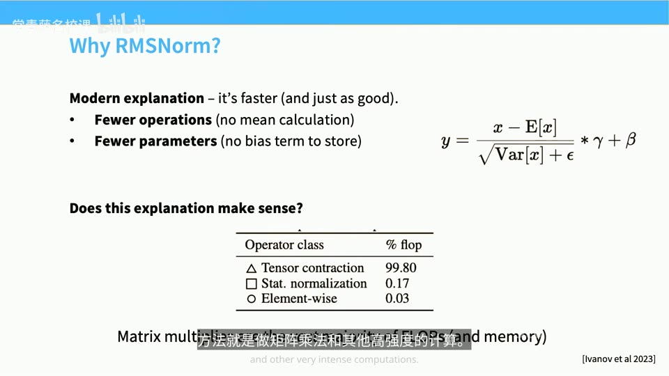 |
| 我们只不过是在优化一个极小的操作：在这个例子里，它只占系统总浮点运算量的 0.17% 左右。唉，那就像 Percy 说的，重点其实不在浮点运算量，对吧 [【跳转到 12:55】](https://www.bilibili.com/video/BV11LEA6eEuj/?p=3&t=775) | 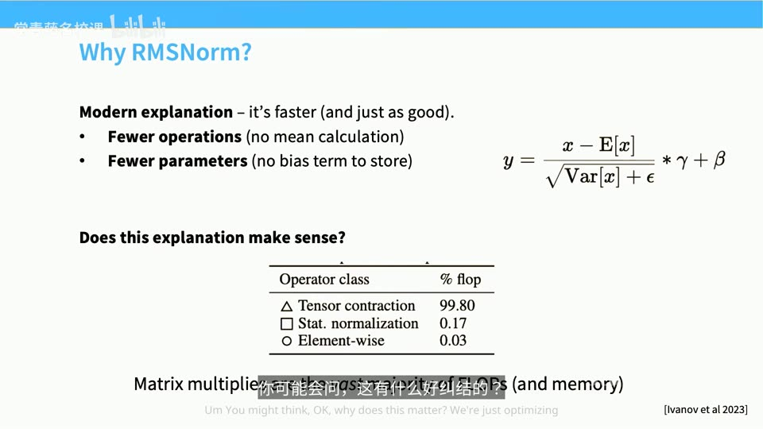 |
| ？浮点运算量是指我们做的浮点运算（主要是矩阵乘法），但这并不直接对应实际运行时间，对吧？（percentage 在 div 里）运行时间要复杂得多：像 LayerNorm 这样的统计归一化操作，虽然只占浮点运算量的 B/N 分之一（原字幕 B 分之 N 期），但根据你的工作负载和具体设置，它们可能占到运行时间的 25%（占运行时间的百分比——这简直不可思议）。在小型模型上 [【跳转到 13:06】](https://www.bilibili.com/video/BV11LEA6eEuj/?p=3&t=786) |  |
| 这个比例会非常大，因为执行这些操作时你仍然需要把这些参数在（快慢）内存之间来回搬运——所以数据搬运非常关键，这也正是 RMSNorm 依然重要的原因。你可以看到这里的区别：白色表示算术强度，黑色表示涉及的浮点运算量。你会发现 LayerNorm 的算术强度非常低，而这正是我们希望尽可能去掉的操作。以 am 的 [【跳转到 13:31】](https://www.bilibili.com/video/BV11LEA6eEuj/?p=3&t=811) |  |
| 表示（原字幕 Amtheine）为例，算术强度降低的情况，比如矩阵乘法，其主要计算开销在于乘法运算；相比之下 [【跳转到 13:56】](https://www.bilibili.com/video/BV11LEA6eEuj/?p=3&t=836) | 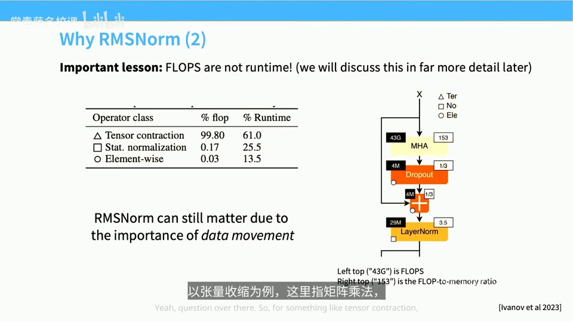 |
| 统计运算的主要开销在于内存搬运（memory），但内存搬运很慢。啊，试想一下，如果搬运数据的时间几乎占用了所有计算时间，那你在这部分付出的代价依然很高，对吧？嗯， [【跳转到 14:01】](https://www.bilibili.com/video/BV11LEA6eEuj/?p=3&t=841) | 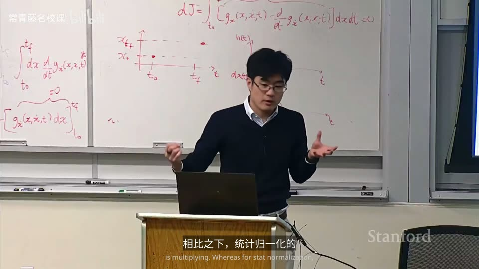 |
| 因为激活值的体量可能很大。没错。这种情况下，这部分操作占用的运行时间比例确实非常极端—— [【跳转到 14:13】](https://www.bilibili.com/video/BV11LEA6eEuj/?p=3&t=853) | 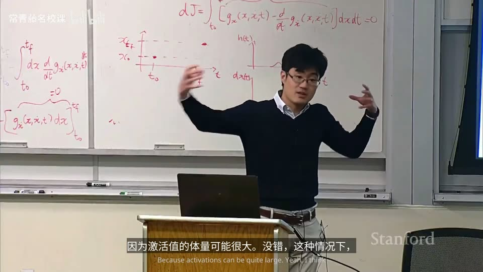 |
| 这就像那些"矩阵极小"的模型一样：在现代工作负载中通常没有实际意义，但这能帮你理解为什么这是一种"零成本优化"。 [【跳转到 14:18】](https://www.bilibili.com/video/BV11LEA6eEuj/?p=3&t=858) | 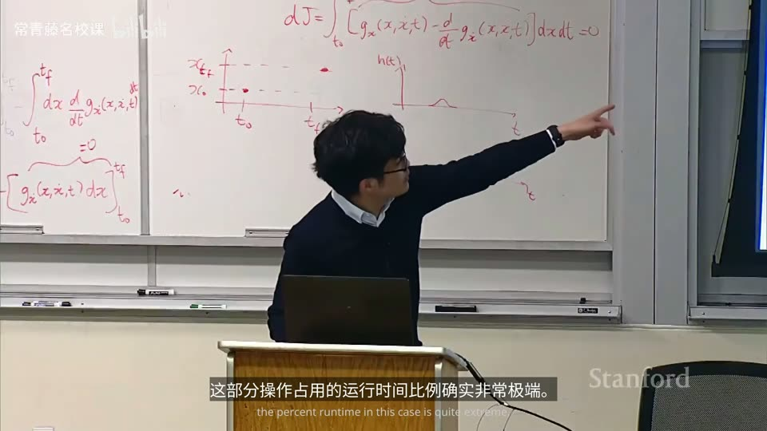 |
| （原字幕 Tense 误写）这一点你确实能观察到，对吧。这是另一篇论文，其中评估了不同的架构改动方案（The Profit page dog，2020——应为某 2020 年论文）。我认为这是一篇 Google 的论文：他们展示了对于仅有 XY 参数量的经典 transformer，切换到 RMSNorm 后（第三列数据）性能实际上提升了——而这通常不是必然发生的；不过不管怎样，这都算是个不错的额外收获，对吧？ [【跳转到 14:28】](https://www.bilibili.com/video/BV11LEA6eEuj/?p=3&t=868) | 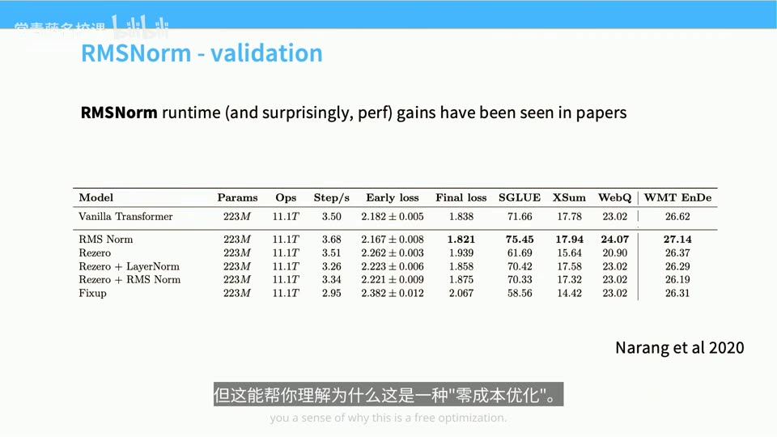 |
| 所以，只要改用 RMSNorm，你就能"白赚"一个系统层面的优化，所以基本上大家都已经转向使用它了。此外，通常来说，这个概念有一个更通用的版本：常说这些并不保证绝对正确，但在 Transformer 和神经网络中，"偏置项（bias）通常没那么有用"。偏置项"是有用的"——在最初的 Transformer 设计中，线性层都带有偏置项 bias；不过，大多数实现实际上直接把偏置项完全去掉了。 [【跳转到 14:53】](https://www.bilibili.com/video/BV11LEA6eEuj/?p=3&t=893) | 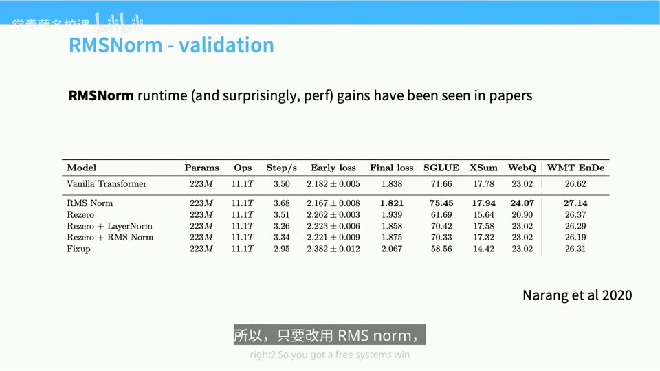 |
| 同样，这也是一个"算术运算强度不高，但相对更吃内存"的例子，所以你不如直接去掉它们，从而获得"免费的系统优化"。顺便提一句：在某些情况下，偏置项还可能引发稳定性问题；所以它们在其他方面确实有用，但在我看来，去掉它们的主要原因纯粹是为了从系统层面简化设计。好，那么关于 LayerNorm，其原理相当简单。之所以说"简单"， [【跳转到 15:18】](https://www.bilibili.com/video/BV11LEA6eEuj/?p=3&t=918) | 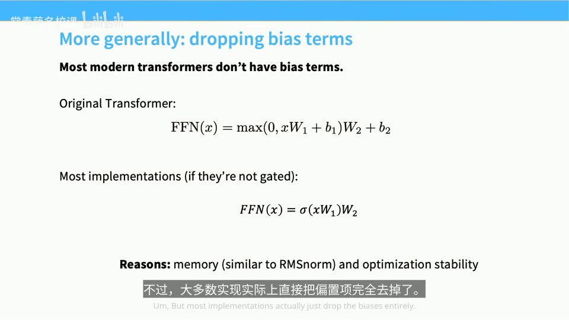 |
| 是因为业界的做法相当标准化：我们对其深层理论虽无深入理解，但对 LayerNorm 的作用机制已有相当清晰的认知。业界普遍将 LayerNorm 移至残差流之外，常采用 pre-norm 形式；我认为这在一定程度上是因为 LLaMA 2 采用了该做法。我们大致掌握了如何利用 LayerNorm 来控制梯度尖峰等现象、并保持信号传播的稳定性；与此相关， [【跳转到 15:43】](https://www.bilibili.com/video/BV11LEA6eEuj/?p=3&t=943) | 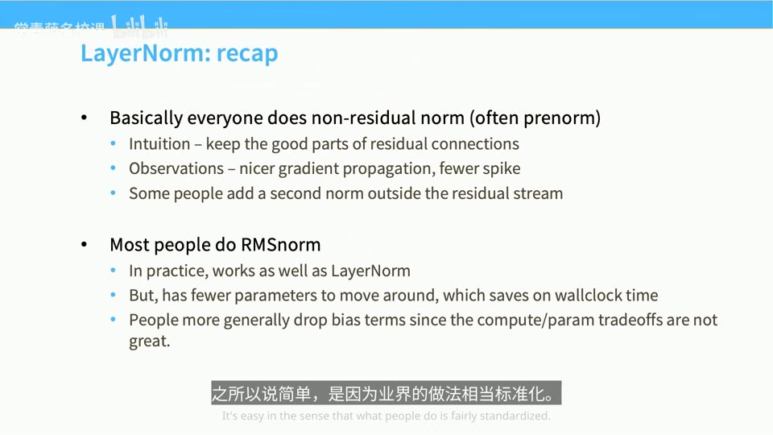 |
| 我们现在基本都使用 RMSNorm。希望你理解这里的基本原则：以及去除偏置项，这使得我们在"保持表达能力不变"的同时，能够提高系统的算术强度。而且我认为，许多架构"令人不满意之处"在于：你无法事前对此进行推理——我们事前并不知道"去除偏置项"是可行的；但基于大量实验及目前集体积累的知识，我们大致知道，对于典型的语言建模任务， [【跳转到 16:08】](https://www.bilibili.com/video/BV11LEA6eEuj/?p=3&t=968) | 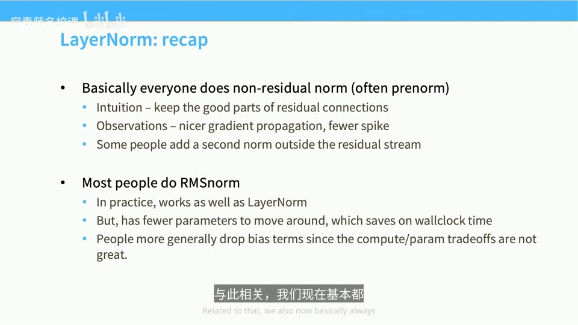 |
| 在线性层和 RMSNorm 上，去除偏置项是可行的。基于我们对多种不同模型的研究，我们可以得出这样的结论。好，关于 LayerNorm 还有问题吗？很好。好，接下来我们谈谈激活函数。激活函数的种类非常多：确实很多，对吧？比如 ReLU、softmax、GeLU、Swish、GLU、SwiGLU……这些到底是什么？ [【跳转到 16:33】](https://www.bilibili.com/video/BV11LEA6eEuj/?p=3&t=993) |  |
| 我记得在我早期接受统计机器学习训练的时候，我曾经想："我这辈子都学不会这些"，我甚至要以"永远不知道 SwiGLU 是什么"为荣。但现在，我们其实非常有必要对这些东西有一个大致的了解，并知道这些名字里哪些部分真正会影响性能。 [【跳转到 16:58】](https://www.bilibili.com/video/BV11LEA6eEuj/?p=3&t=1018) |  |
| 其实，你用一个相当朴素的激活函数就能构建和训练语言模型。（诶，点）：Chinchilla 大概是这一组里表现最好的模型。但哪怕你只是想试一下，光用这种激活函数，你也能训练出一个性能相当不错的语言模型——这没有任何问题。如果我们转向 GeLU（Gaussian Error Linear Unit，高斯误差线性单位），真正的区别仅在于底部这里有一个微小的凹陷，这对于大部分激活区间不会有任何影响， [【跳转到 17:16】](https://www.bilibili.com/video/BV11LEA6eEuj/?p=3&t=1036) | 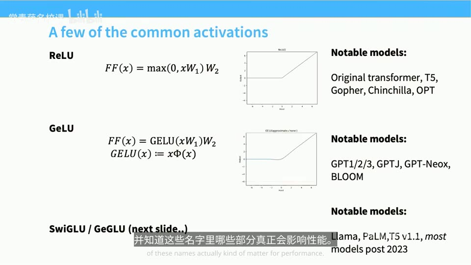 |
| 但会改变零附近的梯度。那么你就只能训练出像 GPT-2/3 这样的模型（原字幕 GPTT）——那是一个非常好的大型语言模型，按当今的标准来看已不算最新，但完全没问题、完全够用。然后我们看门控线性单元（GLU）：比如 SwiGLU 和 GeGLU——这才是目前真正的关键所在.这与 LayerNorm 非常相似，因为我认为几乎所有靠谱的现代语言模型都会采用某种形式的门控线性单元， [【跳转到 17:41】](https://www.bilibili.com/video/BV11LEA6eEuj/?p=3&t=1061) | 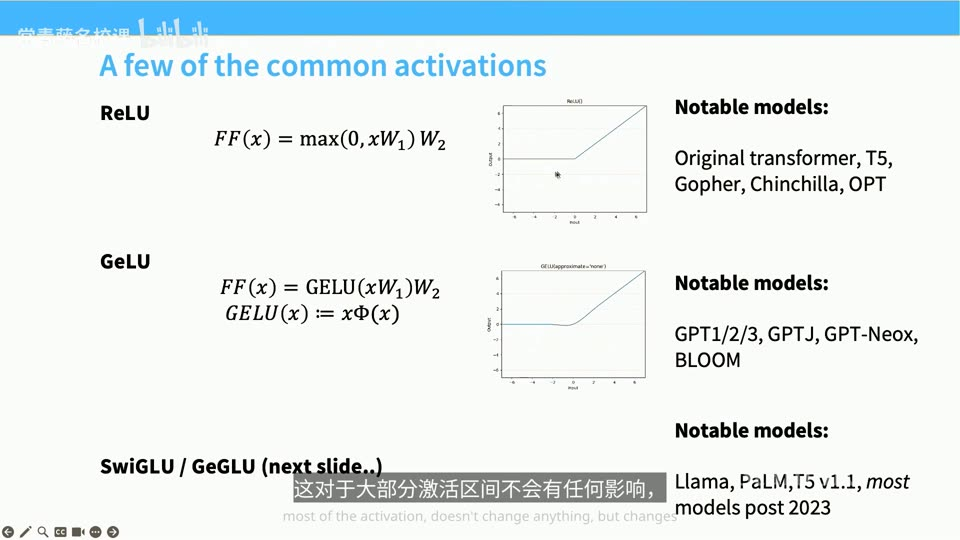 |
| 好的。那么什么是门控线性单元？简单来说，这是一类"门控激活函数"。好，如果我们想看看前馈层（FFN）这样的结构，可以先聚焦于这一部分：诶，这是一个非常标准的 ReLU 前馈网络。输入 X，先用 W1 做线性变换，在 0 处做 ReLU 阈值处理，再用 W2 做一次线性变换，就得到输出——哦，这是一个非常直观的 ReLU 网络。另外，虽然这不是我个人的经验之谈， [【跳转到 18:06】](https://www.bilibili.com/video/BV11LEA6eEuj/?p=3&t=1086) | 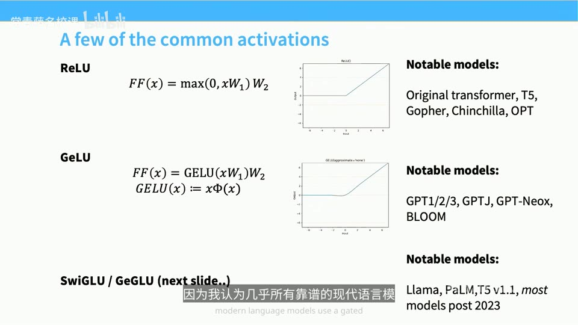 |
| 但在架构设计中，大家常说"引入 gate（门控）机制通常很有帮助"。所以如果应用这一通用的启发式原则，你可能会想到：与其只用这种逐元素的 ReLU，不如再加入一个 gate——这里的第二个（乘法门），作用是与 ReLU 的输出相乘（同样是逐元素操作）。我再引入一个矩阵 V， [【跳转到 18:31】](https://www.bilibili.com/video/BV11LEA6eEuj/?p=3&t=1111) |  |
| 它的作用是"调节" ReLU 的输出，使（原先）部分保持不变：也就是说，原本只有 X、W1、Y、W2，现在我用（XV）对 W1 的输出进行 gating——这是一个与该层尺寸相同的 activation；随后我用 W2 将其投影回原始维度。诶，那么"这是什么"？——这是一个 recurrent（原字幕为 regular）命名（规则）：将第一个 activation（此处为 ReLU）与 GLU 结合，对吧。 [【跳转到 18:56】](https://www.bilibili.com/video/BV11LEA6eEuj/?p=3&t=1136) |  |
| 即 ReLU 门控线性单元（gated linear unit）。（板书 GLU 公式）门控（gating）一直是 architecture 设计中非常有效的另一种 primitive； [【跳转到 19:21】](https://www.bilibili.com/video/BV11LEA6eEuj/?p=3&t=1161) | 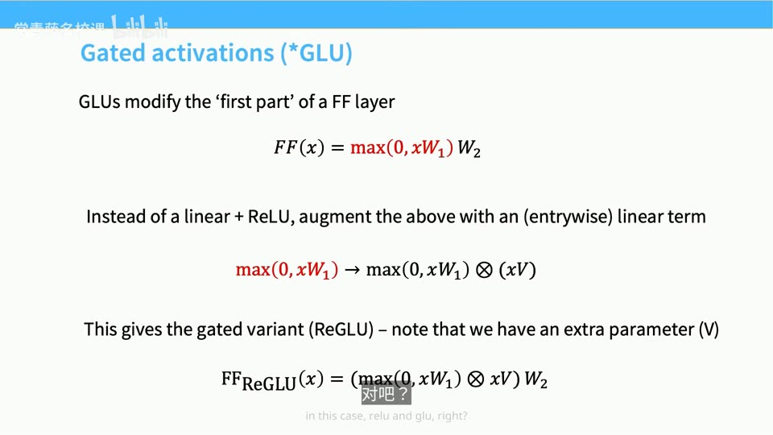 |
| 事实证明，它在语言建模中同样非常有效。Right，所以如果你考虑像 GeLU 这样的 activation——我们之前已经讨论过，对吧？它就像 ReLU，只是在底部有个小凹陷——这样你就得到了 GeGLU；如果你用 Swish 函数（也就是 x × sigmoid(x)），那你就会得到 SwiGLU，所以这就是 Swish 乘以剩下的部分。这确实涵盖了很多现代模型，对吧。一般来说，Google 那边用的是 GeGLU： [【跳转到 19:30】](https://www.bilibili.com/video/BV11LEA6eEuj/?p=3&t=1170) | 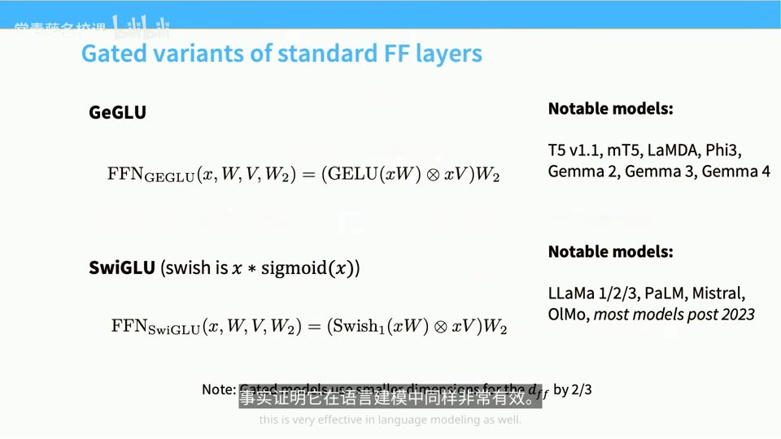 |
| 像 Gemma 模型、T5 模型都属于这类；而所有类似 LLaMA 后代的模型都使用 SwiGLU。所以 PaLM 和 LLaMA 的后代都是 SwiGLU 模型。我会说 SwiGLU 可能是更主流的一个，但说实话，在（这些）门控单元中，这其实没什么区别。这里插播一个知识点，它在后面会是一个比较重要的"冷知识"：如果你看上面这部分，你会注意到门控模型的参数更多， [【跳转到 19:55】](https://www.bilibili.com/video/BV11LEA6eEuj/?p=3&t=1195) | 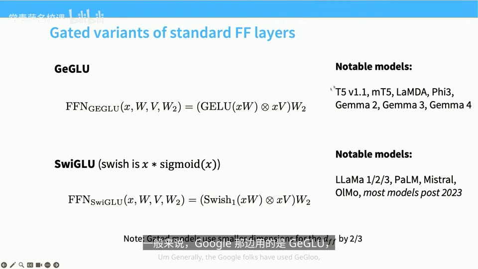 |
| 因为我引入了参数 V，所以稍微算一下就知道：我现在有三个矩阵，而不是两个。 [【跳转到 20:20】](https://www.bilibili.com/video/BV11LEA6eEuj/?p=3&t=1220) | 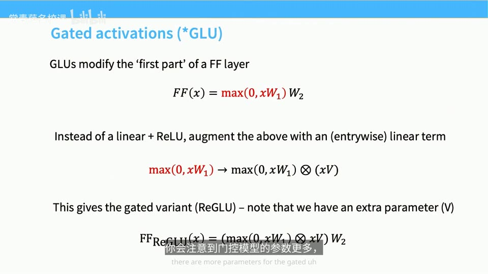 |
| 为了保持总参数量不变，你可能需要把前馈维度缩小到原来的 2/3（法：FFN 维度 *= 2/3）。（原字幕 Roywestmz 无对应）所以我的大致思路是：总参数量要和原来的 MLP 保持一致，也就是我原来的 MLP；但现在我想给它加上门控机制，所以我会把前馈维度（也就是 W 的输出维度）缩小到原来的 2/3，这是大家遵循的一条经验法则，但并不是绝对不可打破的铁律。 [【跳转到 20:27】](https://www.bilibili.com/video/BV11LEA6eEuj/?p=3&t=1227) | 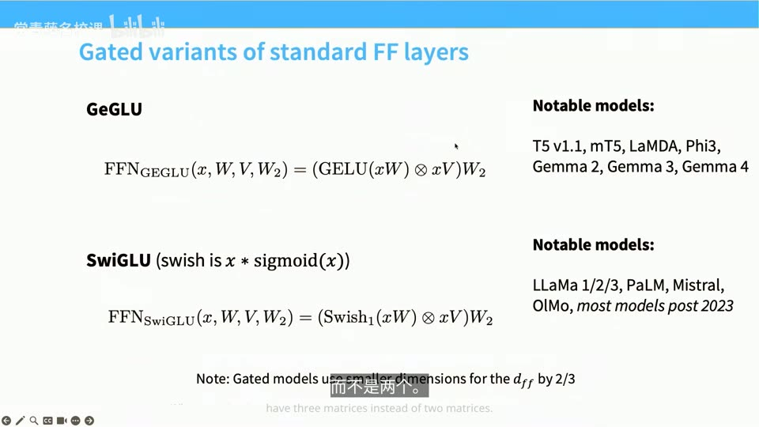 |
| 最初提出这一机制的（细看）Shazeer 的论文里有一些结果：最初的增量非常小，但这些增量是一致的。说句公道话，他很多论文里都有这种"误差棒"（error bar）分析，通过多次重复训练来验证模型是否真的更好—— [【跳转到 20:52】](https://www.bilibili.com/video/BV11LEA6eEuj/?p=3&t=1252) | 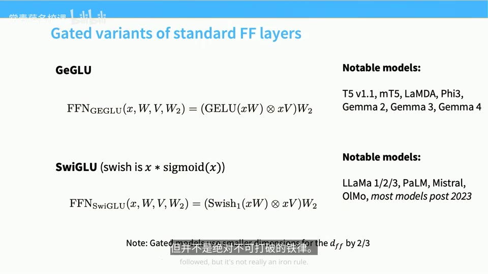 |
| 这样，你看，GLU 变体几乎总是一致地优于非 GLU 变体（这是参数对齐的比较，因为 Shazeer 总会做 2/3 的调整——原字幕 NOMSHAZER 为人名）， [【跳转到 21:09】](https://www.bilibili.com/video/BV11LEA6eEuj/?p=3&t=1269) | 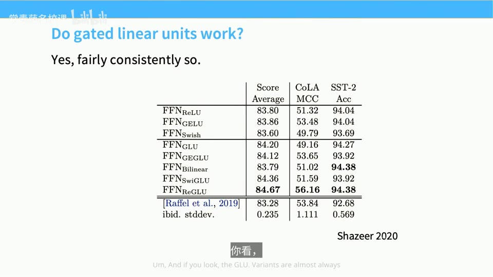 |
| 保证所有模型的总参数量一致。哟，所以这相当不错，某种程度上算是"白捡的收益"：几乎所有人都在用 GLU。此外，（在）这里还有（原先）一些控制更严密的系统性对比——就是我之前提过那篇论文（Narang 等人，2020）；那是 2020 年左右的事：Google 在 2020 年年代确实发了不少很好的大规模 architecture 对比论文，不过用的是 T5 architecture，不是自回归语言模型。 [【跳转到 21:16】](https://www.bilibili.com/video/BV11LEA6eEuj/?p=3&t=1276) | 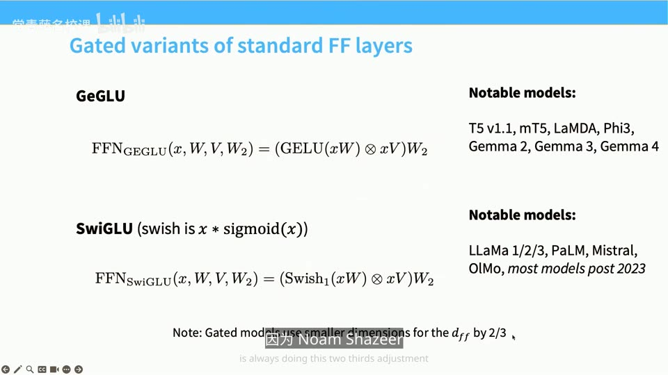 |
| 再说一遍，他们基本上全面对比了 GLU 这一类组件。你看，再一次，如果我们看 SwiGLU、GLU，或者一般的 GLU，他们在 loss 和其他下游指标上都显著更好。好。这些论文很有说服力，从如今的大量研究中也能清楚看出这一点：那些证明 SwiGLU 和 GLU 有效的模型训练案例 [【跳转到 21:41】](https://www.bilibili.com/video/BV11LEA6eEuj/?p=3&t=1301) | 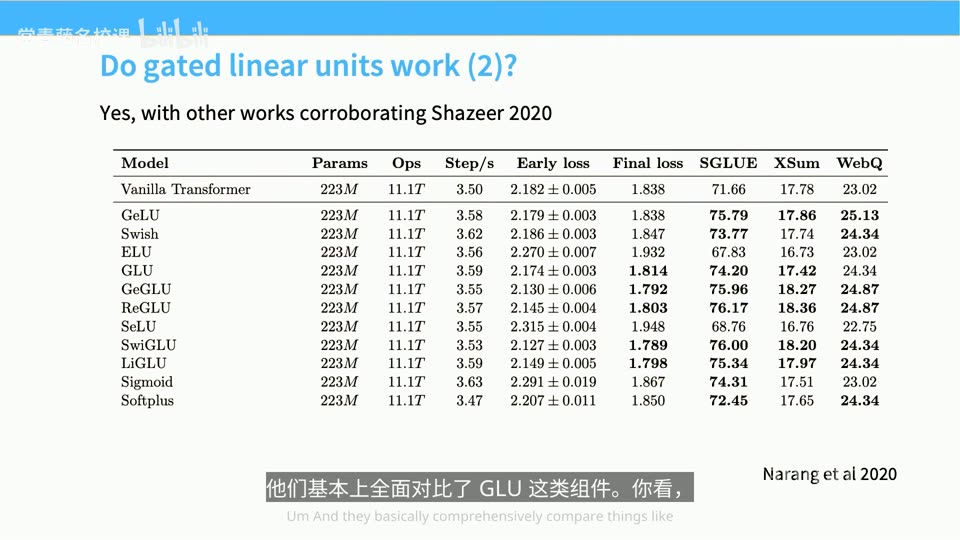 |
| （板书 continued）。因此，门控机制存在许多变体，但真正需要掌握的关键维度是：对这些非线性激活函数而言，"门控"其实非常重要，能在几乎不增加计算成本的前提下带来明显的性能提升。但话虽如此，这并不意味着必须使用门控线性单元——我的意思是，GPT-3 虽就没有使用门控线性单元；我记得（其他）某个 3 直 B（原字幕 neutronthreefortyb，应为 KF 三十 B？）模型使用了平方 ReLU， [【跳转到 22:01】](https://www.bilibili.com/video/BV11LEA6eEuj/?p=3&t=1321) | 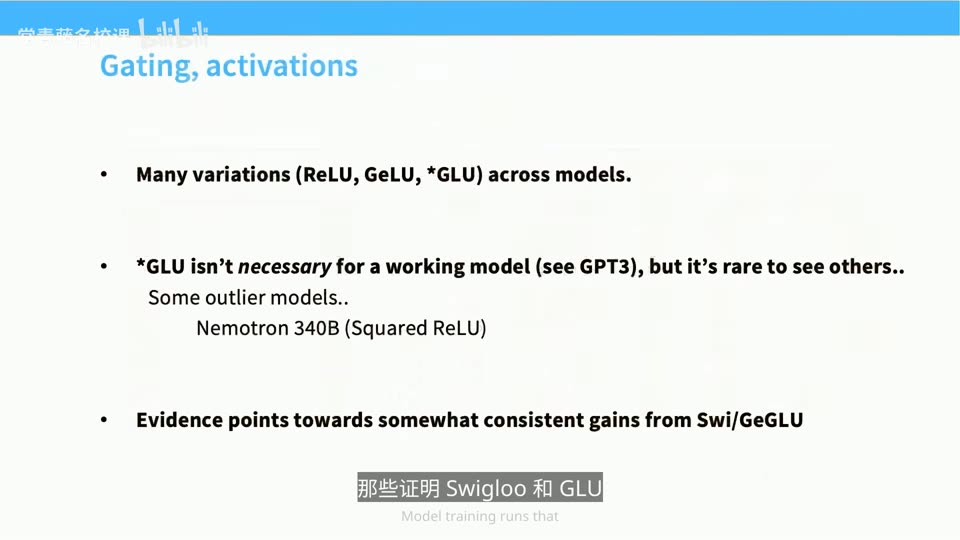 |
| 这是个相当"疯狂"的选择，但同样有效——这两个模型的性能都完全没问题。但实际上，很少见到不基于门控线性单元训练的模型，因此证据表明：使用这些门控技巧能带来一致的性能增益。好的，我认为这些（清单）就是我们在架构设计中较有共识的选择。接下来这一个，我认为是个非常有趣的想法，但时间的检验表明它可能并没有那么好， [【跳转到 22:26】](https://www.bilibili.com/video/BV11LEA6eEuj/?p=3&t=1346) | 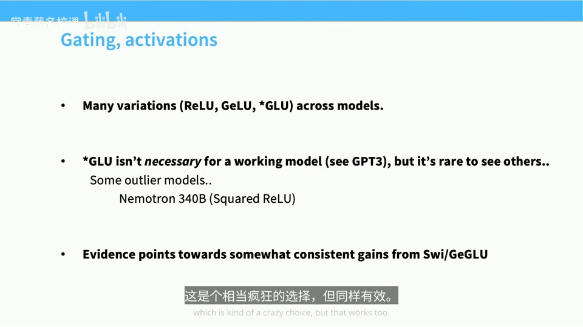 |
| 或者说没有那么流行。一般来说，我们是"串行"运行 Transformer 模块的，对吧？先计算注意力，还会再计算 MLP，对吧？一个接一个。嗯，如果你从系统角度考虑，可能会说这引入了一个瓶颈，对吧："我必须等前一个算完才能算下一个；如果它们能并行，我或许就能引入一些新颖而酷的系统优化。"对吧？所以你可能会问："我们能否把 Transformer 模块'并行化'？"嗯，这个想法最早出现在 GPT-J 里， [【跳转到 22:51】](https://www.bilibili.com/video/BV11LEA6eEuj/?p=3&t=1371) |  |
| 它是对 GPT-3 的一个开源复现尝试。而且很有意思的是，我认为 GPT-J 在"传播许多想法"方面影响力出乎意料地大，我想 PaLM 也是如此。嗯，他们在架构设计上其实相当大胆：PaLM 中的描述，你可以在他们的报告里看到，大致如下：不像上面那样"嵌套"（及顺序形式），你直接把 MLP 的输出和注意力层的输出"相加"， [【跳转到 23:16】](https://www.bilibili.com/video/BV11LEA6eEuj/?p=3&t=1396) | 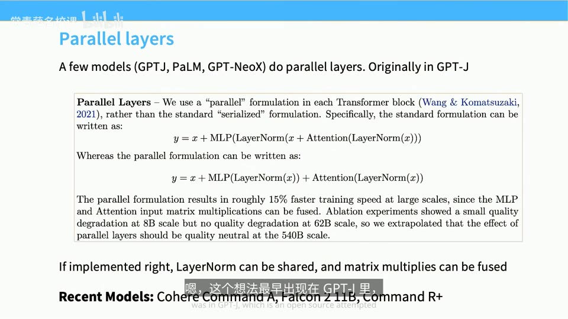 |
| 然后一起加回残差流里。只要实现得当，很多组件是可以复用的：比如 LayerNorm 可以共享，矩阵乘法也可以进行融合——可以让你有机会做进一步的系统优化。像 Cohere 这样的公司（其创始人曾是 Transformer 的作者之一）深受 Google 影响，做了不少借鉴 Google 思路的优化，他们采用了这种架构；但效仿者寥寥。我想，过去两年里，"这种方法"确实已经不再流行了。 [【跳转到 23:41】](https://www.bilibili.com/video/BV11LEA6eEuj/?p=3&t=1421) | 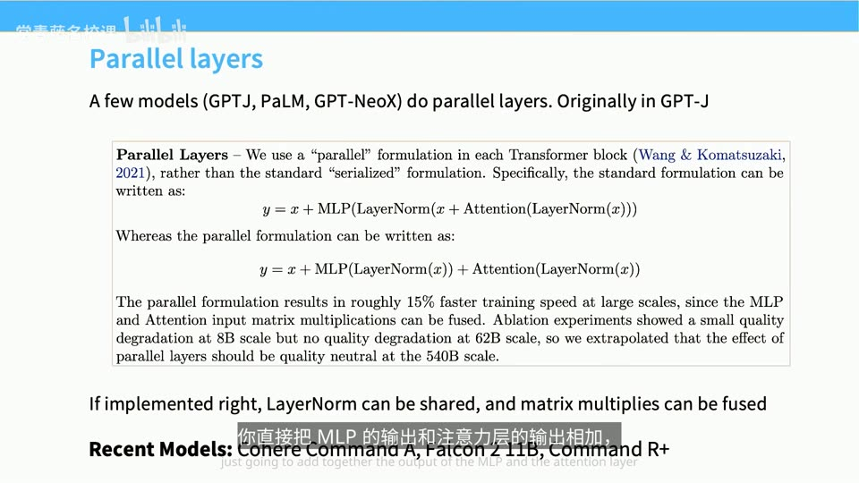 |
| 我想主要是因为"串行形式"的优化已经做得足够好了：为了这点系统收益而牺牲一些表示能力（从并行转回串行并不划算）。换句话说，这相当于你的模型深度减半了，这对模型（表示能力）来说可能是有害的。 [【跳转到 24:06】](https://www.bilibili.com/video/BV11LEA6eEuj/?p=3&t=1446) | 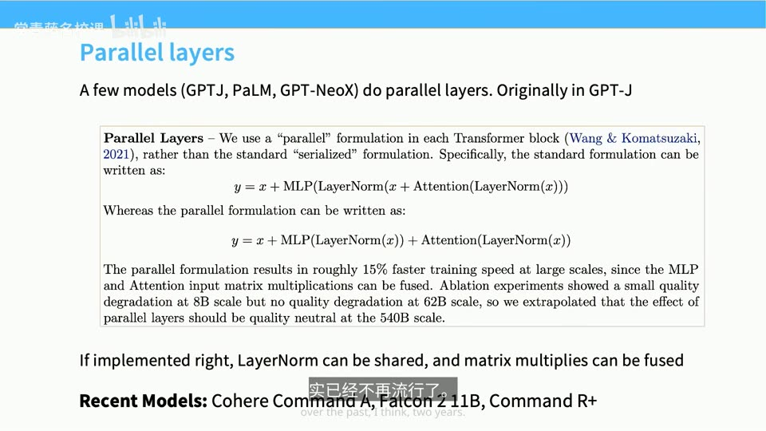 |
| 对 Transformer 架构而言，其实这部分内容非常简短。诶，这应该足以说明：原始的 Transformer 公式在很大程度上是经得起时间考验的。对吧？（朋友）我真正想讨论的改动，无非是"norm 放在哪里、有没有偏置项、或者是否对 MLP 加门控"——但相较于你可以做的所有改进，这些实际上只是非常微小的变动。啊，现在大家如果听得仔细，可能会问："等等， [【跳转到 24:21】](https://www.bilibili.com/video/BV11LEA6eEuj/?p=3&t=1461) | 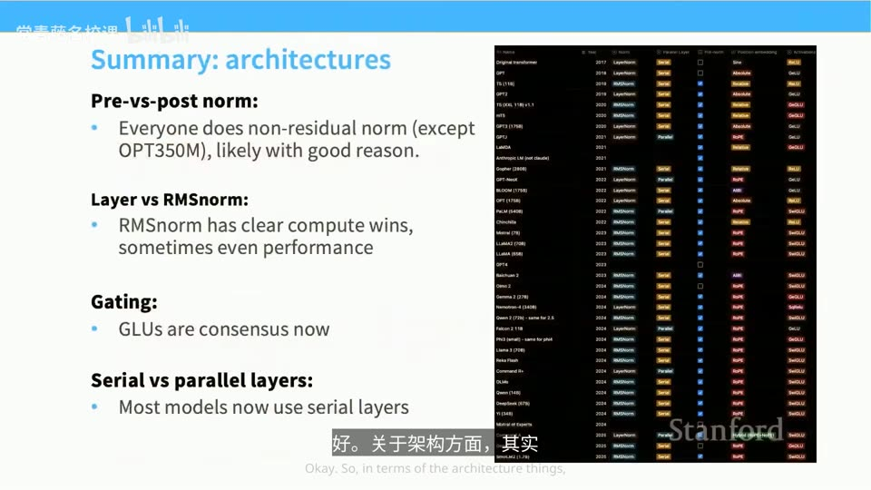 |
| 不是有很多'修改了注意力机制'的 Transformer 替代方案吗？"没错，这个问题留到下一讲再讲，因为今天我只讲基于"核心注意力机制"的方法；下一讲我会稍微讲讲状态空间模型。但只要还在"密集注意力"这个范畴里，原始 Transformer 论文里的架构，其实跟我们现在的做法已经很接近了。所以你们会看到挺多这种情况的。好，刚才，回到这张图：蓝色代表 RMSNorm，黑色代表 LayerNorm。嗯，你会发现大多数现代模型基本上都是 RMS [【跳转到 24:46】](https://www.bilibili.com/video/BV11LEA6eEuj/?p=3&t=1486) | 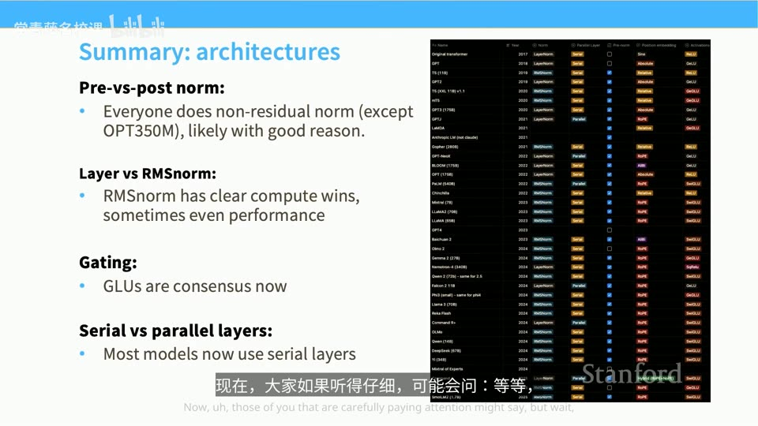 |
| Norm 模型。"涉及串行层与并行层的区别"：蓝色的是并行结构，其余的是串行结构；可以看到大多数都是串行分块。接下来"看 pre-norm 与 post-norm"：我标记为 post-norm 的一些模型 [【跳转到 25:11】](https://www.bilibili.com/video/BV11LEA6eEuj/?p=3&t=1511) | 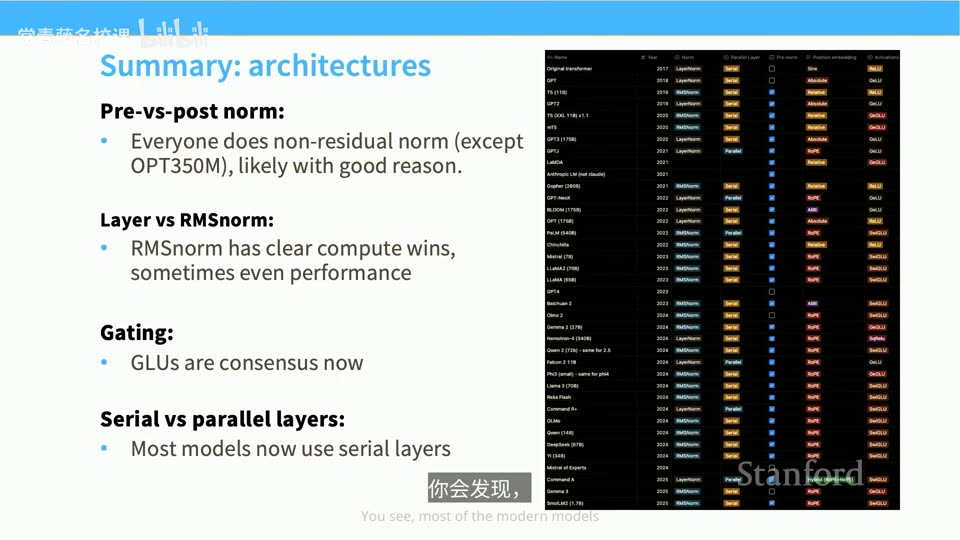 |
| 实际上同时使用了 pre-norm 和 post-norm。然后，右侧的这些几乎都是 GLU（例外是像 Falcon 这类使用的是门控线性单元 GLU）；但对于现代模型而言，绝大多数确实都是门控线性单元。因此，你可以从我刚才的讲解中，直观地看到这些趋势。 [【跳转到 25:26】](https://www.bilibili.com/video/BV11LEA6eEuj/?p=3&t=1526) | 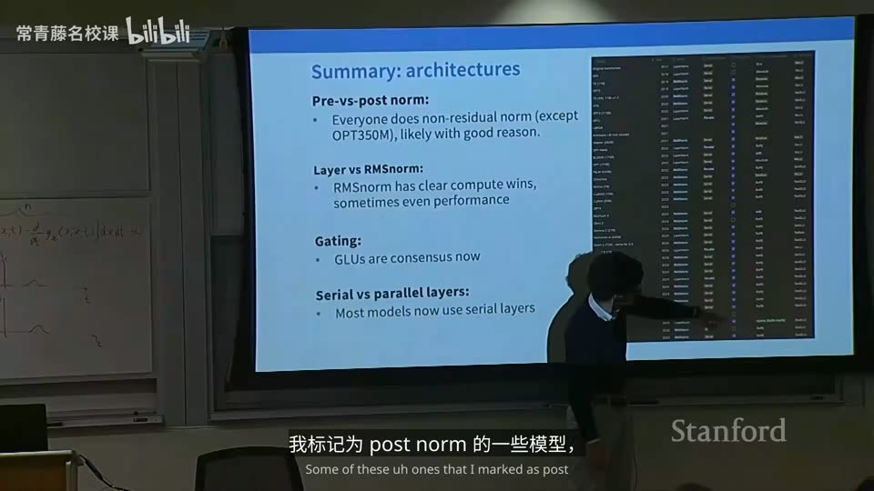 |
| 那么，不同实现之间差异最大的地方——我认为也是 architecture 中"仍在不断演变的部分"—— [【跳转到 25:44】](https://www.bilibili.com/video/BV11LEA6eEuj/?p=3&t=1544) | 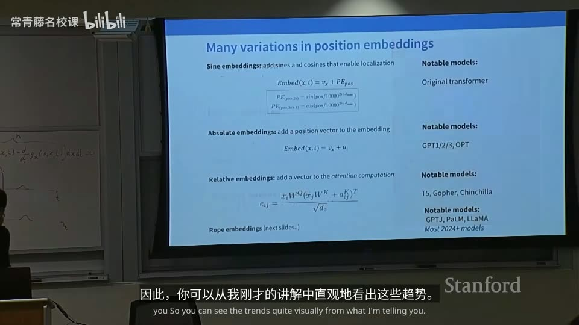 |
| 在于如何处理"位置依赖性"，以及如何整合来自其他位置的信息。从某种意义上说，这是核心的注意力组件。因此，有多种不同的方法可以将位置信息编码进 Transformer 中。好，提醒一下：这一点非常重要，因为注意力机制本身是"位置无关"的——它们仅仅是内积运算，因此如果没有位置嵌入， [【跳转到 25:49】](https://www.bilibili.com/video/BV11LEA6eEuj/?p=3&t=1549) |  |
| 你可以随意打乱顺序，注意力机制的结果将保持不变。原始的 Transformer 使用了正弦和余弦嵌入，其直觉类似于傅里叶变换：只要有了正弦和余弦函数，无论具体情况如何，你都能从中恢复出位置信息。随后，出现了许多其他大模型，它们都采用了"绝对位置嵌入"——即每个位置对应一个独立的嵌入向量。好，接着，Google 的其他几个模型则倾向于使用"相对位置嵌入"： [【跳转到 26:14】](https://www.bilibili.com/video/BV11LEA6eEuj/?p=3&t=1574) | 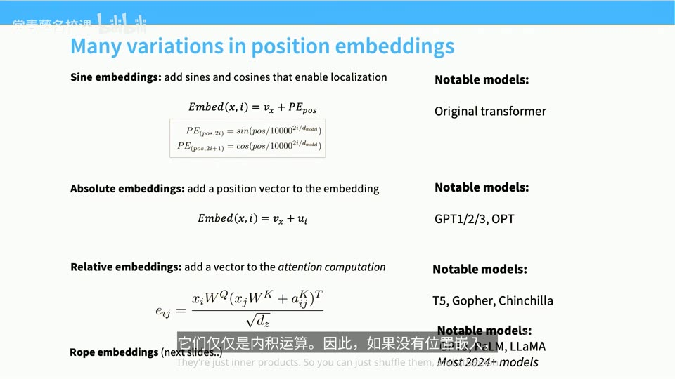 |
| 这里的做法并不是把嵌入加到 K（query/key）向量上，而是把向量加到注意力计算本身——因此，如果两个位置相差三个（单位），注意力矩阵就会被加上一个相应的偏移量。T5 和 Chinchilla 的模型采用了这种方案。而在位置嵌入方面，真正占据主导地位的是 RoPE（旋转位置编码）这一类方法——那你们中有些人可能对它已经比较熟悉了。 [【跳转到 26:39】](https://www.bilibili.com/video/BV11LEA6eEuj/?p=3&t=1599) | 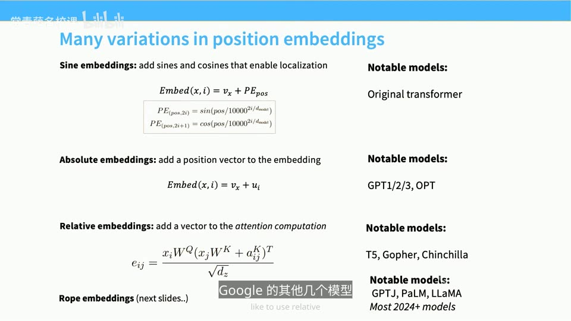 |
| 嗯，2024 年之后的绝大多数模型都使用这种位置嵌入。考虑到 RoPE 的来历，这一点其实相当引人注目：从某种意义上说，它的出现有点"凭空冒出来"的味道。最初，我记得这也是 GPT-J 的一项创新，来自一位中国（研究员）发布的一篇不太知名的博客文章和一篇配套论文；不过他确实提出了一些非常有意思的想法，解释了为什么要采用 RoPE 这样的方案：RoPE 是一种相对位置嵌入。 [【跳转到 27:04】](https://www.bilibili.com/video/BV11LEA6eEuj/?p=3&t=1624) |  |
| 关于相对位置嵌入，我主张一种明确的观点：我们无需在意单词的"绝对位置"。所以，只要 A 和 apple 同时出现（不管是在句首还是句尾），RoPE 嵌入都会让它们产生相似的结果。都——啊，我们确实知道这一点，并且希望以这种方式来表示它，对吧？所以，我定义了一个嵌入函数 F， [【跳转到 27:29】](https://www.bilibili.com/video/BV11LEA6eEuj/?p=3&t=1649) | 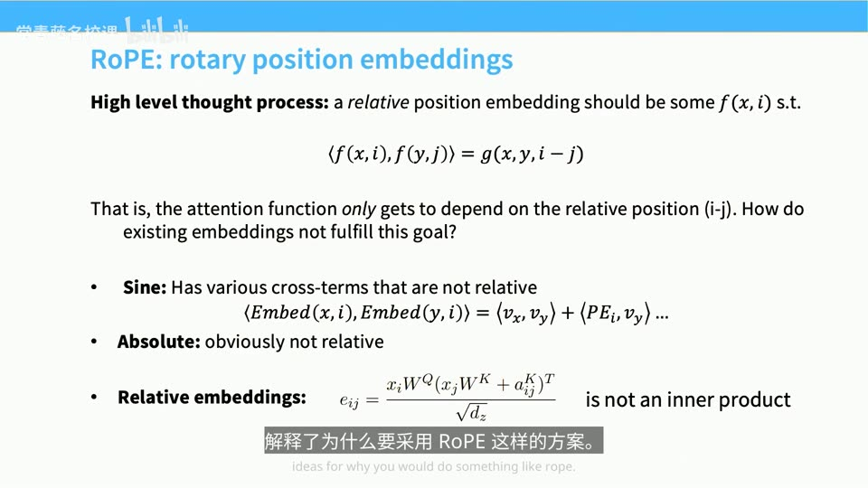 |
| 以及另一个嵌入函数 F'，它们分别接收单词标识 X 和 Y 以及绝对位置 I 和 J 作为输入。我希望：如果计算这些嵌入的内积，其结果等于一个"仅依赖于相对差值"的函数（g(i-j)）。在此之前，现有的嵌入方法并未真正满足这一等式：比如正弦函数就不具备相对性，因为它包含那些非相对的绝对交叉项；绝对位置嵌入 [【跳转到 27:54】](https://www.bilibili.com/video/BV11LEA6eEuj/?p=3&t=1674) | 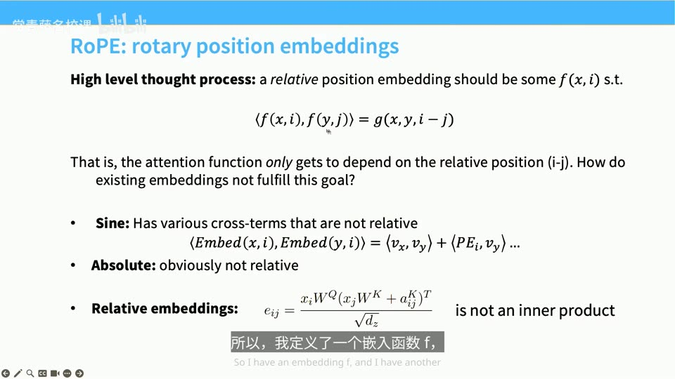 |
| 顾名思义，显然不具备相对性。诶，接下来是相对嵌入：严格来说，它们确实具有相对性，但算不上真正的"嵌入"，因为它们只是直接加到注意力矩阵里，对吧——所以你没法从这个机制里拆解出内机（embedding）结构。所以，考虑到这一点，你可能会问： [【跳转到 28:19】](https://www.bilibili.com/video/BV11LEA6eEuj/?p=3&t=1699) | 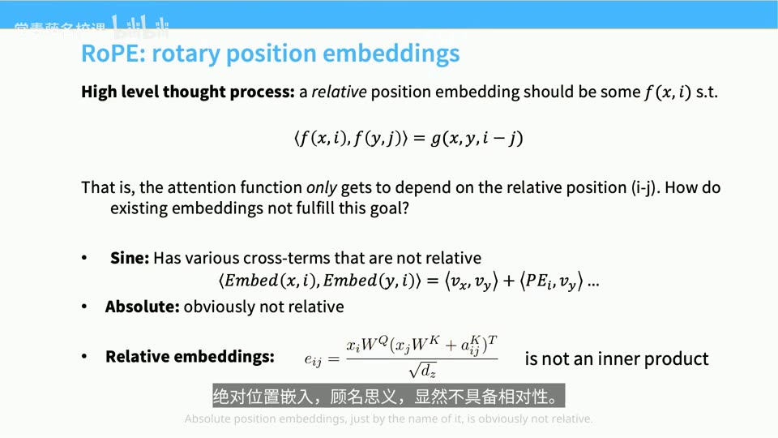 |
| 有没有什么巧妙的方法，能让我们真正实现这种相对嵌入？这个想法很妙。嗯，其实主要是利用"角度和余弦"的一些特性。所以我们希望嵌入向量对绝对位置具有不变性；我们知道，任何内积对于任意旋转都是不变的。所以，思路是这样的：我取用我的语义词向量——也就是那些与任何位置都无关的向量—— [【跳转到 28:39】](https://www.bilibili.com/video/BV11LEA6eEuj/?p=3&t=1719) | 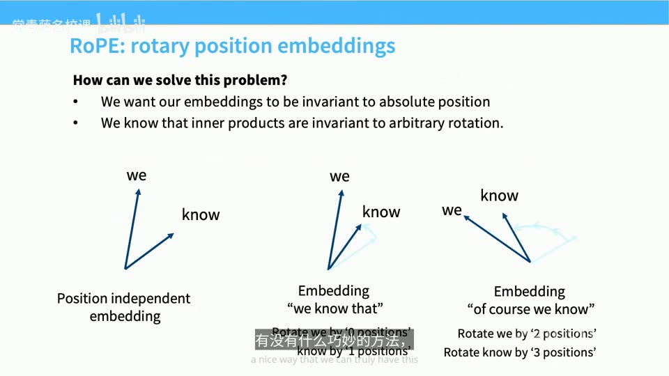 |
| 这就是我的起点。然后，我会根据词语出现的位置对这些向量进行旋转（rotate）。在本例中，是在二维平面上（一个简单的例子）。假设我们有一个句子，我们知道 we 出现在位置 0，所以（这部分）我完全不懂（原字幕口误）就要让它保持原样；"no"这个词在位置 1，所以我把它旋转一个特定的角度。对吧？这就是我的单步位置旋转（旋转单位角度）。那么，如果我把同样的思路应用到下面的序列 [【跳转到 29:04】](https://www.bilibili.com/video/BV11LEA6eEuj/?p=3&t=1744) |  |
| 会发生什么呢？应用到下面的序列，当然我们知道在这种情况下，we 和 no 依然是相邻的（它们还是紧挨着的），但绝对位置变了。Of course，现在"we"跑到了（"we know"的）前面（Rebeca's monaruse 原字幕为一串无关转写）。这种情况下，我要把"we"这个词旋转两个位置（因为它的索引是 0、1、2——w 在第二个位置，即位置 2，所以我旋转两个单位）；"no"在位置 3，所以我把它旋转三个单位。 [【跳转到 29:29】](https://www.bilibili.com/video/BV11LEA6eEuj/?p=3&t=1769) |  |
| 结果呢，这两个词之间的相对角度依然相差一个单位。所以这就是一个非常简单的思路：仅仅用"旋转"来表示位置。如果我们这样做，那么每次进行内积运算时，结果都将与绝对位置无关。 [【跳转到 29:54】](https://www.bilibili.com/video/BV11LEA6eEuj/?p=3&t=1794) | 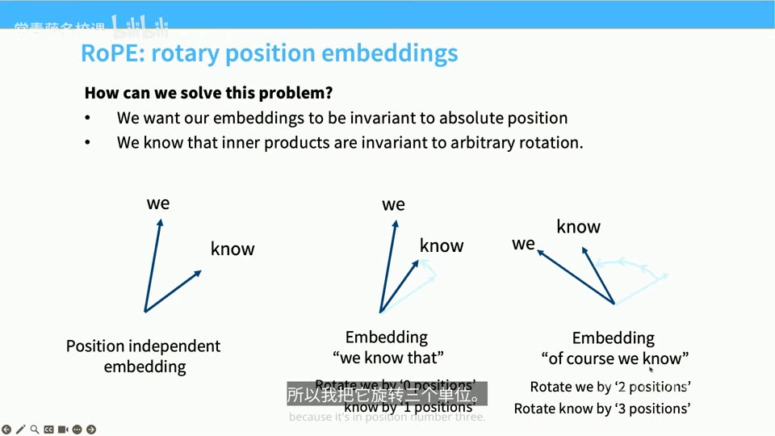 |
| 你可能会说，"在二维情况下这很容易，因为你实际上只有一种选择（原字幕 earth 误写）你只有顺时针和逆时针两种选择（旋转角度）"——而在高维空间中该怎么做呢？嗯，做最简单的事情就行，而且这招管用：最简单的办法就是把它反复"化归"为二维情形。也就是说，对于一个高维（原字幕"低维"误写）向量， [【跳转到 30:07】](https://www.bilibili.com/video/BV11LEA6eEuj/?p=3&t=1807) |  |
| 把它切分成每两个（分量）一组：每一对二维分量都进行旋转，而这些分量旋转所用的 θ 各不相同。 [【跳转到 30:32】](https://www.bilibili.com/video/BV11LEA6eEuj/?p=3&t=1832) |  |
| 有些频率很低、旋转非常缓慢，因此能够捕捉长程依赖（原字幕"长城依赖"）；有些旋转得非常快，因此能够捕捉诸如"彼此是否相邻"这类信息。嗯，最后，当我把每一对向量都旋转完毕后，就得到了最终的嵌入表示。这就是 RoPE 方法。这篇论文如果你去读，会发现它给出了一套关于复数的非常复杂的"动机"解释； [【跳转到 30:40】](https://www.bilibili.com/video/BV11LEA6eEuj/?p=3&t=1840) | 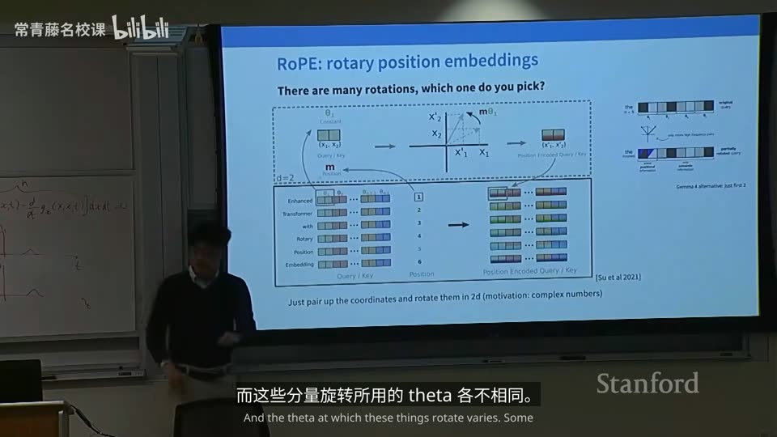 |
| 不过说实话，我觉得至少对我来说，最直观的理解方式就是把它简化成二维情况，也就是"只旋转每一对坐标"（原字幕 Anothernumberfour 无对应）。 [【跳转到 31:05】](https://www.bilibili.com/video/BV11LEA6eEuj/?p=3&t=1865) | 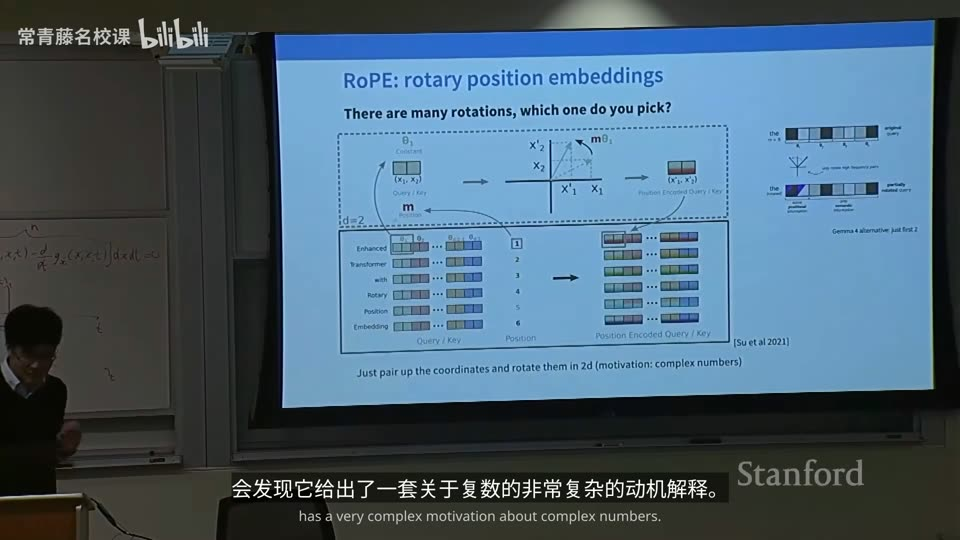 |
| Neo 4（上周四刚发布）他们还有另一种不同的有趣做法，称为"proportional RoPE"（prope）——这其实是一种很奇怪的说法，意思就是它们只旋转（前）两个坐标；不过这也是另一种可行的方案。所以在这个领域里，你可以尝试很多不同的做法，最后都能跑通。好的，在实际操作中，你最终会做的事是：把你的向量与正弦和余弦做一次（逐对）乘法—— [【跳转到 31:13】](https://www.bilibili.com/video/BV11LEA6eEuj/?p=3&t=1873) |  |
| 这样就能为你提供一种"旋转输入向量 X"的方法。所以，X 乘以 W 乘以 R(X)（旋转矩阵），这就是你最终得到的嵌入。好的，最后这是正弦和余弦：看上去有点像正弦嵌入（原始 Transformer 那种），但我必须强调：我是把它们用来"相乘"，而不是直接当做嵌入使用。这点非常重要，因为这意味着（原字幕如此）没有交叉项。 [【跳转到 31:38】](https://www.bilibili.com/video/BV11LEA6eEuj/?p=3&t=1898) | 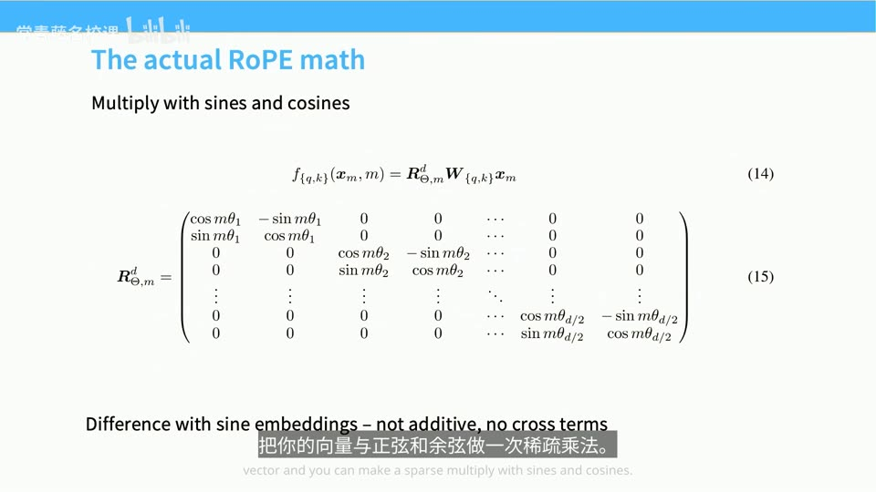 |
| 而且这完全是相对的，对吧？你从点积中得不到任何绝对位置信息。嗯嗯。如果我们真想深入到底层细节，你可能会问"我到底该怎么实现这个东西"，你得那样做：首先是你熟悉的注意力机制部分；然后你要做的是根据序列所在的"位置 id"生成余弦和正弦角度， [【跳转到 32:03】](https://www.bilibili.com/video/BV11LEA6eEuj/?p=3&t=1923) | 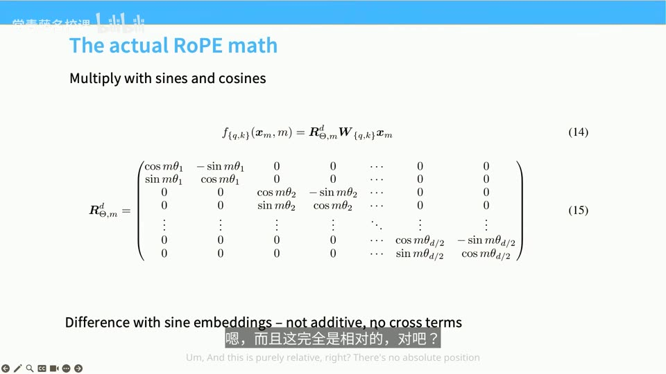 |
| 接着把这些余弦和正弦值应用到查询（query）和键（key）上，用于注意力计算。你可以用矩阵乘法来实现，也可以手动逐个应用，把它当做一种旋转——相当直接的一步。你会在注意力层面（而不是在最底层）做这件事，从而在每次执行注意力计算时强制实现"位置不变性"。好的，以上就是 RoPE。 [【跳转到 32:21】](https://www.bilibili.com/video/BV11LEA6eEuj/?p=3&t=1941) | 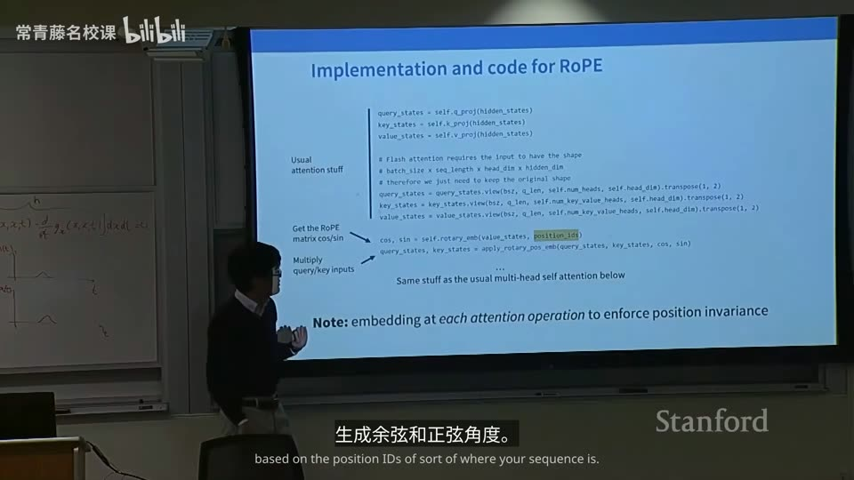 |
| 它有点让人困惑，但一旦你理解了旋转的几何原理，其实就相当直接了。好的，我在这里暂停一下，以防有人对架构的各个部分有疑问。接下来我们聊聊超参数——那些更底层的细节，是好（原字幕"是好"呼应前面"genes"）。 [【跳转到 32:42】](https://www.bilibili.com/video/BV11LEA6eEuj/?p=3&t=1962) | 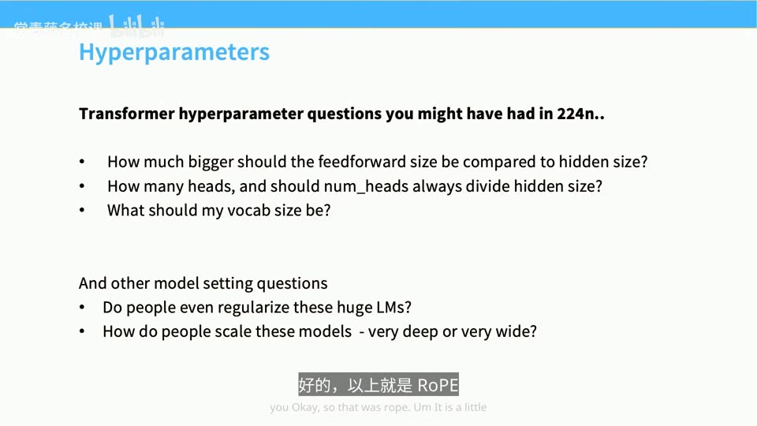 |
| 谢谢你。问："有没有看过研究高维旋转（关系）的论文？so 高维旋转。"（答）这是个不错的讨论点。我想没有。呃，所谓"高维旋转"——其实空间里的任何二维旋转 [【跳转到 32:56】](https://www.bilibili.com/video/BV11LEA6eEuj/?p=3&t=1976) | 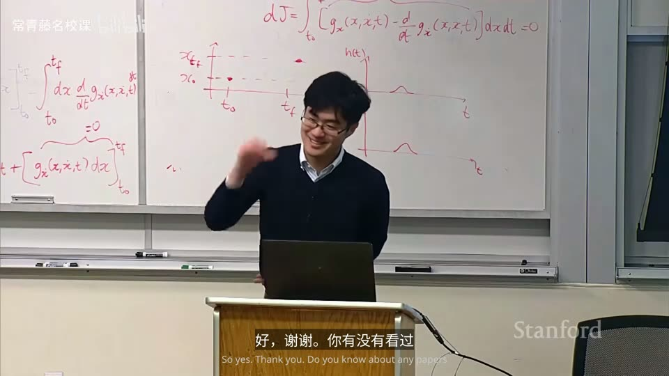 |
| 都可以看作是它的一种变体；你当然可以对任何闭合流形（原字幕"闭合回路的流行"）进行操作，但我没看过这方面的研究。 [【跳转到 33:05】](https://www.bilibili.com/video/BV11LEA6eEuj/?p=3&t=1985) | 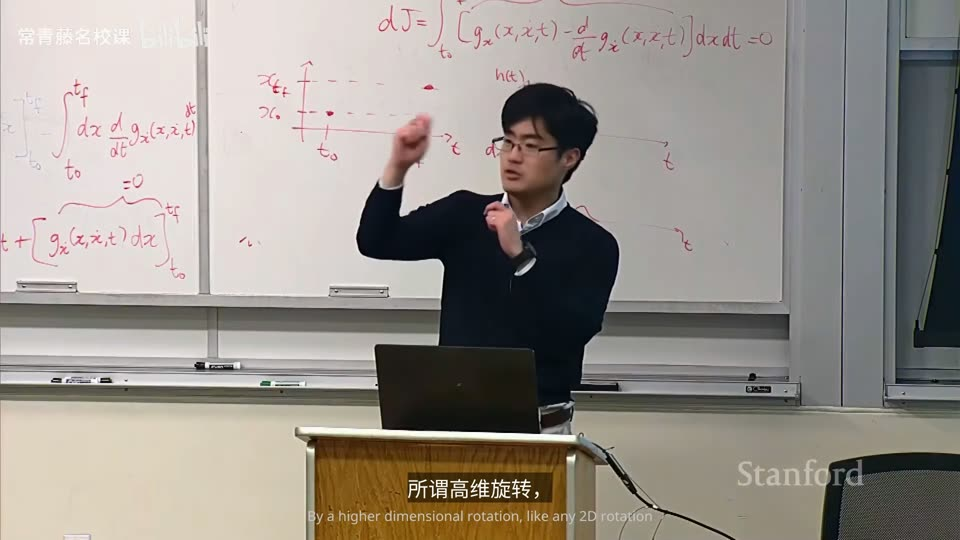 |
| 谢谢。"那你觉得，从这些论文里提炼这类知识，最好的办法是什么？"好问题。我不确定有没有比"广泛观察、寻找模式"更好的办法，而这正是我在这堂课里想做的事。另一种方法是亲自上手试试——哪怕规模小得多——从而建立起对这些机制如何协同工作的直觉和理论。我认为这两种方法确实都是正确的。如今想孤立地读懂任何一篇论文都非常困难，因为现在似乎没有哪篇论文 [【跳转到 33:13】](https://www.bilibili.com/video/BV11LEA6eEuj/?p=3&t=1993) | 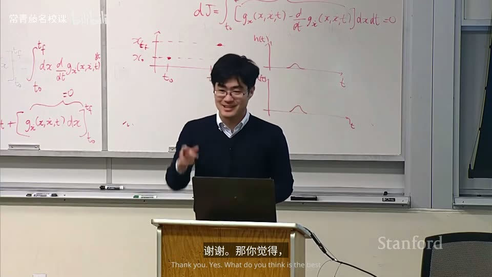 |
| 能为某（一个）语言模型提供完整的细节。哦，现在问题很多。好的，很好，我们继续。问："我有一个关于并行层的问题：……我理解现代模型注重资源效率，所以会使用并行层；但这两种模式（并行/串行）在准确性上是有差异的，对吧？ [【跳转到 33:38】](https://www.bilibili.com/video/BV11LEA6eEuj/?p=3&t=2018) | 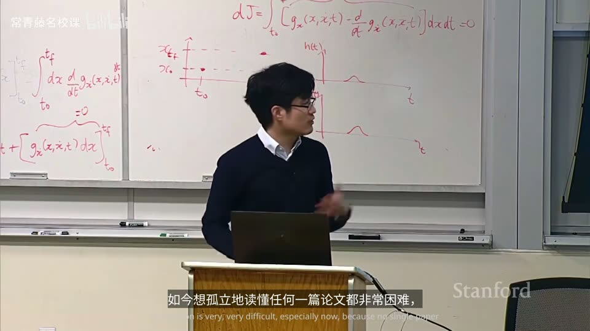 |
| 差异有多大？这个差异是大到不可忽视，还是小到当前模型可以忽略它，或者还有别的情况？"回答："是的，我觉得这一点其实相当复杂。如果你读最初那篇 PaLM 论文，他们对使用并行层非常有信心， [【跳转到 34:03】](https://www.bilibili.com/video/BV11LEA6eEuj/?p=3&t=2043) | 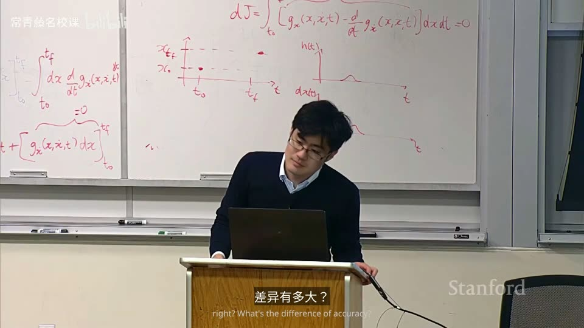 |
| （PaLM）声称没有性能下降、系统利用率还提升了 15%；所以只看那篇论文，你会觉得效果是一样的。但后来谷歌的许多模型已经不再使用这种方法： [【跳转到 34:19】](https://www.bilibili.com/video/BV11LEA6eEuj/?p=3&t=2059) | 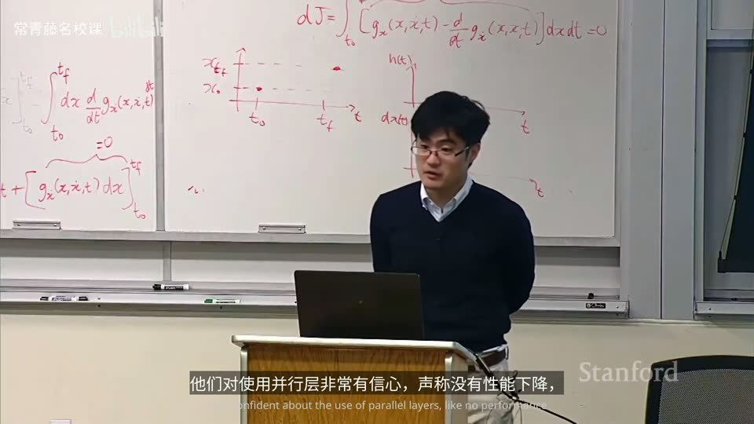 |
| 你可以把这视为一个隐含信号，说明实际上可能存在一些性能损失。同样，这一点很难给出精确的数字，因为据我所知，没有人做过"并行 vs 串行"的消融实验； [【跳转到 34:30】](https://www.bilibili.com/video/BV11LEA6eEuj/?p=3&t=2070) | 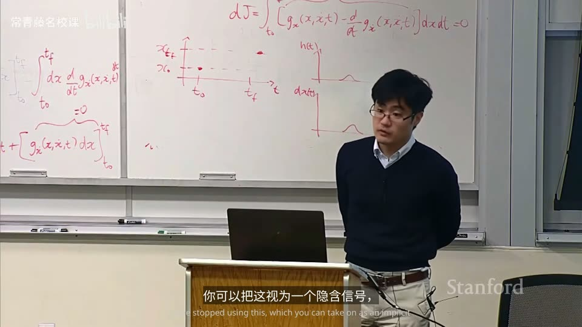 |
| 至少这些消融实验控制得不错。问："RoPE 和'省掉部分坐标的 RoPE'有什么区别？如果你发现有个断裂点，就不能排除这种可能性对我的意思是：这个差别其实就在于你旋转了哪些坐标，比如你并没有旋转大部分坐标。" [【跳转到 34:41】](https://www.bilibili.com/video/BV11LEA6eEuj/?p=3&t=2081) | 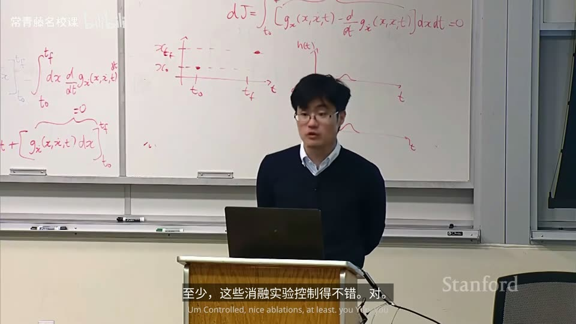 |
| 答："因为我的理解是：最初的论点认为，低频部分的旋转（幅度）很小，所以如果你确实（显存）空间紧张，就可以把它们去掉——这主要是针对极小模型的优化，因为这类模型的隐藏维度很少、能用于存储 [【跳转到 34:57】](https://www.bilibili.com/video/BV11LEA6eEuj/?p=3&t=2097) | 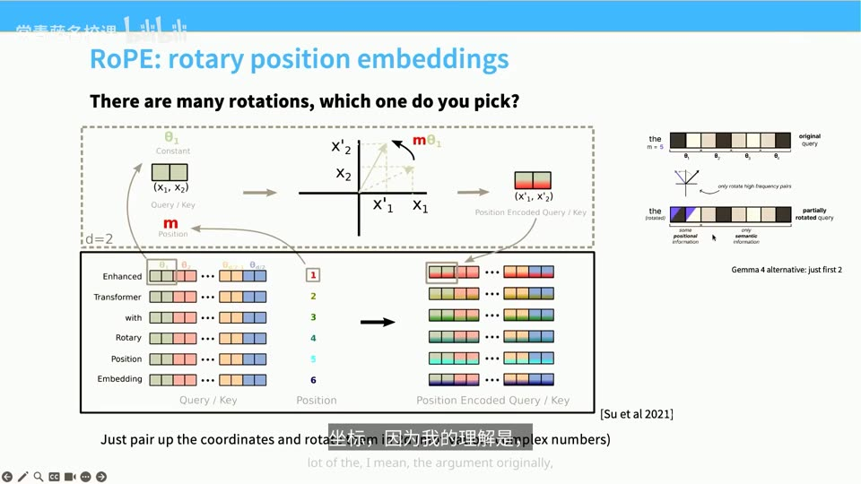 |
| 激活值的空间有限。"好。问："对于相对位置嵌入，这里没有点积运算，是因为它基本上只作用于 Q？"回答："我刚才一直在琢磨——对，它同时作用于键和值（原字幕'键和值'），这也是为什么你能从当前位置获得'相对效果'的原因，不像出现交叉项。"对吧。所以，看看正弦和余弦嵌入的话：你拿到的不只是原始向量， [【跳转到 35:12】](https://www.bilibili.com/video/BV11LEA6eEuj/?p=3&t=2112) | 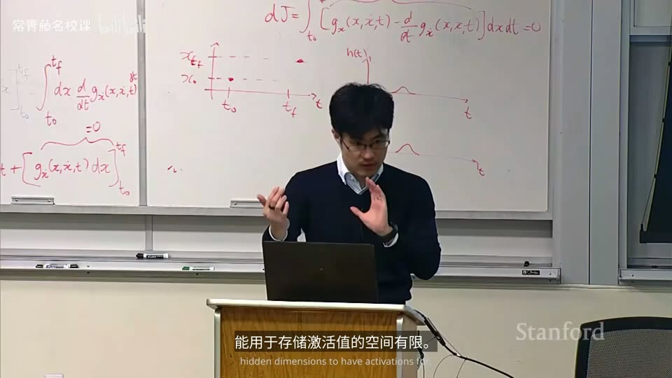 |
| 还会有"位置嵌入和词嵌入之间的那些奇怪的交叉项"诸如此类，接着你就能反推出绝对位置。所以，即便是正弦和余弦嵌入，也不算是那种"纯粹的相对位置嵌入"——你得先接受"相对嵌入才是你真正想要的"这一前提，呀——但一旦你接受了这点，RoPE 方案就会自然而然地浮现出来。 [【跳转到 35:33】](https://www.bilibili.com/video/BV11LEA6eEuj/?p=3&t=2133) | 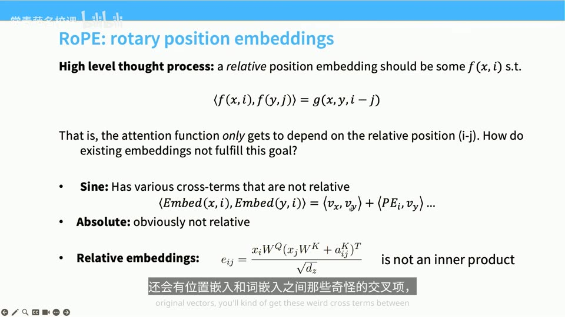 |
| 对，对，对。那问题出在哪呢？问题在于它无法分解为"乘积（f(i)·g(j)）"的形式。 [【跳转到 35:52】](https://www.bilibili.com/video/BV11LEA6eEuj/?p=3&t=2152) | 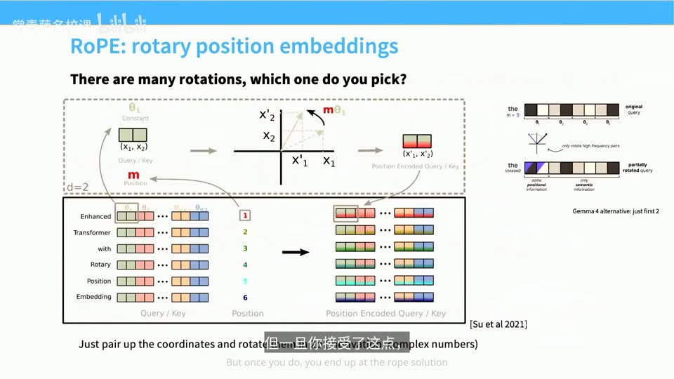 |
| 这更多的是个"美观性"问题，对吧？比如，如果你的约束是"它必须是相对的"， [【跳转到 35:57】](https://www.bilibili.com/video/BV11LEA6eEuj/?p=3&t=2157) | 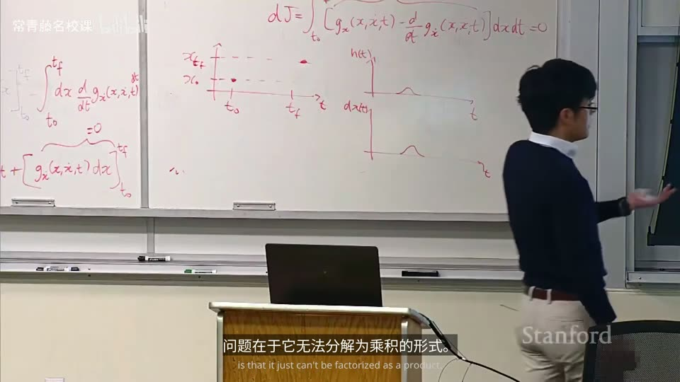 |
| 而且必须能分解为 f(x_i) 和 f(y_j) 的乘积， [【跳转到 36:02】](https://www.bilibili.com/video/BV11LEA6eEuj/?p=3&t=2162) | 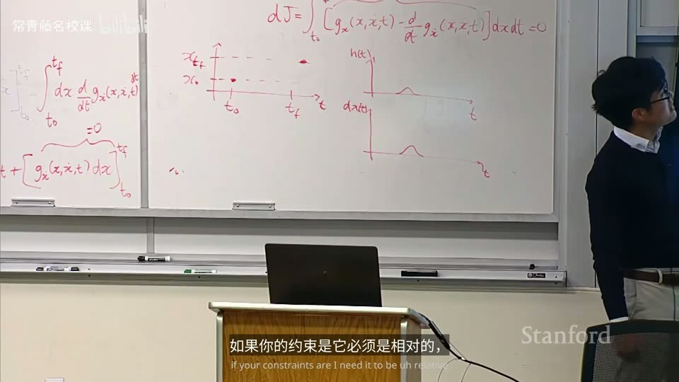 |
| 那它就不属于这一类解。话说回来，确实有不少这类嵌入是"管用"的，比如 ALiBi 和其他类似方法：它们注入到注意力矩阵里，效果也相当不错。它未必就是现在的主流方案，我可以这么讲。辛苦，好，没问题。 [【跳转到 36:07】](https://www.bilibili.com/video/BV11LEA6eEuj/?p=3&t=2167) | 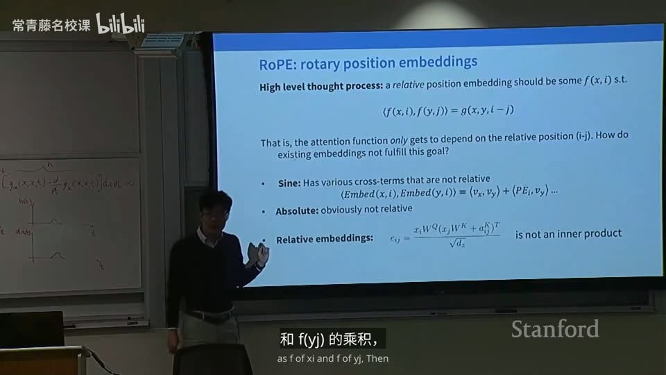 |
| 很棒。好，接下来我们聊聊超参数。我觉得，只有当你真正开始训练模型时 [【跳转到 36:23】](https://www.bilibili.com/video/BV11LEA6eEuj/?p=3&t=2183) | 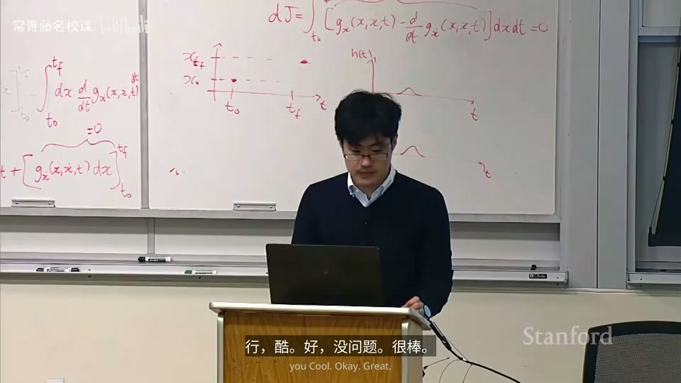 |
| 才会去深入理解超参数；如果你对语言模型的理解还比较抽象，那其实不用操心这些细节。但当你真正要"实例化"模型时，就会开始思考：前馈层（feed-forward）的维度该设多大？嗯，注意力头数该设多少？词汇表大小又该设多少？另外你还会问：权重衰减（weight decay）或 dropout 该设多少？我到底需不需要做正则化？（我要处理）的 token 很多（对吧）—— [【跳转到 36:28】](https://www.bilibili.com/video/BV11LEA6eEuj/?p=3&t=2188) | 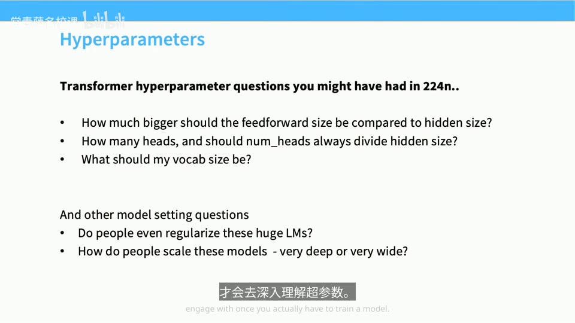 |
| 那我还需要正则化吗？我应该用非常深的模型，还是特别宽的模型？啊比如这里到底该怎么做？如果你毫无基础，这其实非常令人望而生畏；但人们实际尝试过的"方案空间"其实相当小。由此你或许可以开始思考更聪明的搜索方式——确定该在哪些地方做调整。好，超参数里有一个大家相当有共识的设定。诶， [【跳转到 36:53】](https://www.bilibili.com/video/BV11LEA6eEuj/?p=3&t=2213) | 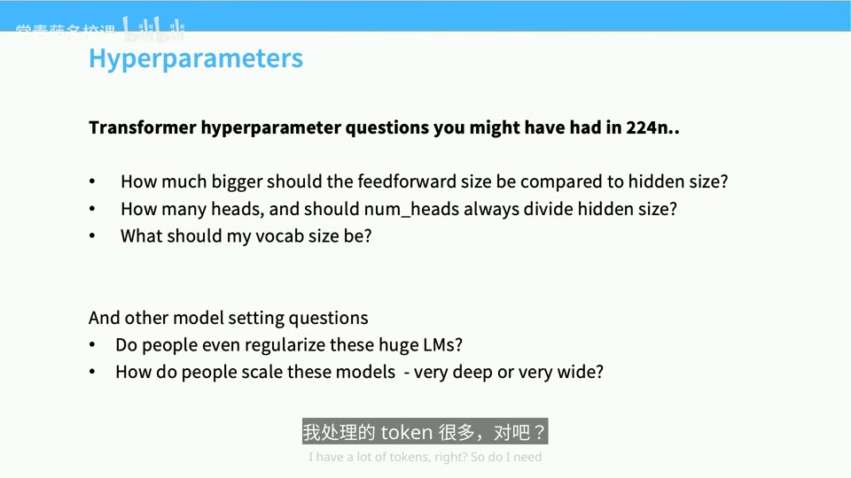 |
| 即"前馈层大小"——也就是 MLP 中第一次矩阵乘法的输出与模型（隐藏）维度之间的比例。所以这其实就是 W1 和 W2 这两个矩阵（对应）维度之间的比例。这看起来是个非常重要的因素：它控制着 MLP 的"丰富程度"。那么它应该设为多少呢？不管出于什么原因，它大概应该是隐藏维度的 4 倍。哦，这是一个经验法则，效果出奇得好。我会用一些数据来说明： [【跳转到 37:18】](https://www.bilibili.com/video/BV11LEA6eEuj/?p=3&t=2238) | 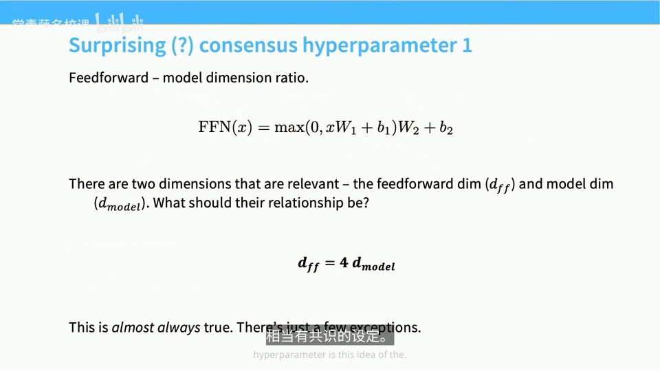 |
| 为什么选择这个数值是合适的。当然，也有几个例外；有意思的是，那些极端的例外反而印证了这一点。 [【跳转到 37:43】](https://www.bilibili.com/video/BV11LEA6eEuj/?p=3&t=2263) | 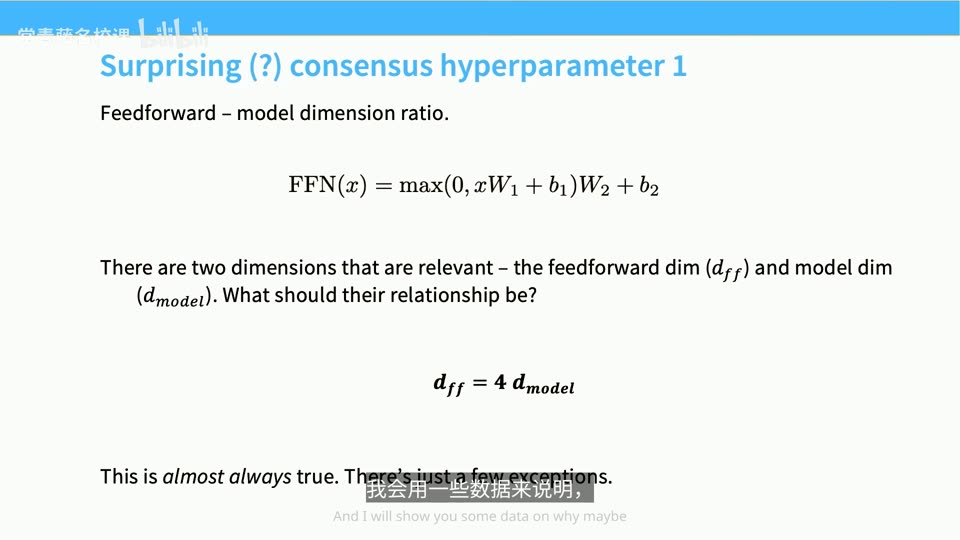 |
| 哎——第一个例外是门控线性单元（GLU）的"参数量"问题。这个我之前讲过：如果你之前想过这个问题，脑子里应该已经有印象了。OK。D 维度不变的情况下，GLU 的参数更多，对吧？所以如果你想让 MLP 的参数总量保持不变，就得做个缩放调整：缩小 2/3。所以大多数 GLU 变体最终得到的数值大约是 2.67：啊，所以处在 2.67≈(2.7) 或 25 [【跳转到 37:51】](https://www.bilibili.com/video/BV11LEA6eEuj/?p=3&t=2271) | 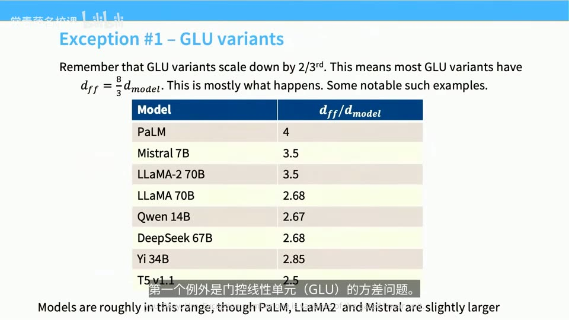 |
| 这个区间的基本上都是应用了这种 2/3 的修正。然后，不知出于什么原因，LLaMA 2 团队觉得"我们用的注意力头其实很高效（比如 MQA，这个我后面会讲），因此我们可以把这个比率乘以一个'随意选的' 1.33"——得到的结果，大概是 3.5（三点五）。所以 LLaMA 团队基本上是随意选了一个略有不同的比率，这实际上让他们更侧重 MLP 一些。不过，如果你真的去翻遍所有论文…… [【跳转到 38:16】](https://www.bilibili.com/video/BV11LEA6eEuj/?p=3&t=2296) | 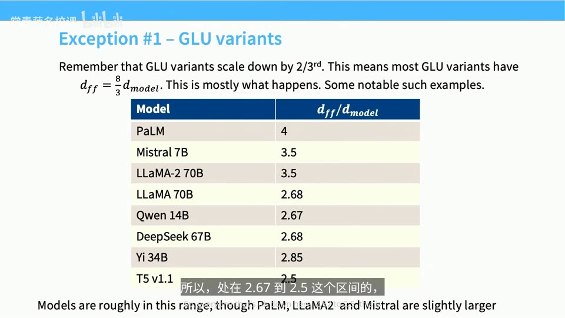 |
| 你会发现，GLU 的数值要么是 2.67 左右， [【跳转到 38:41】](https://www.bilibili.com/video/BV11LEA6eEuj/?p=3&t=2321) | 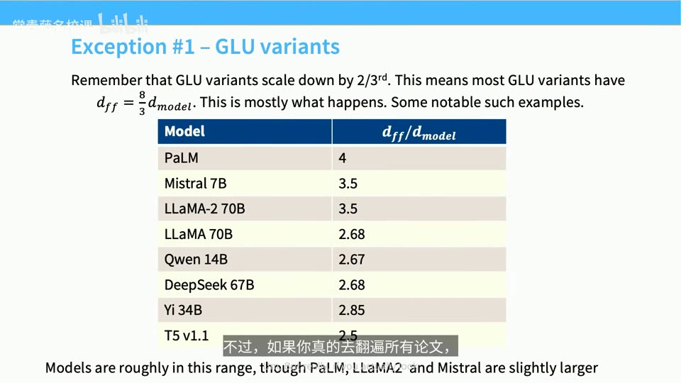 |
| 要么是 3.5；如果是非 GeGLU 模型，那就是 4。好的，还有另一个例外， [【跳转到 38:47】](https://www.bilibili.com/video/BV11LEA6eEuj/?p=3&t=2327) | 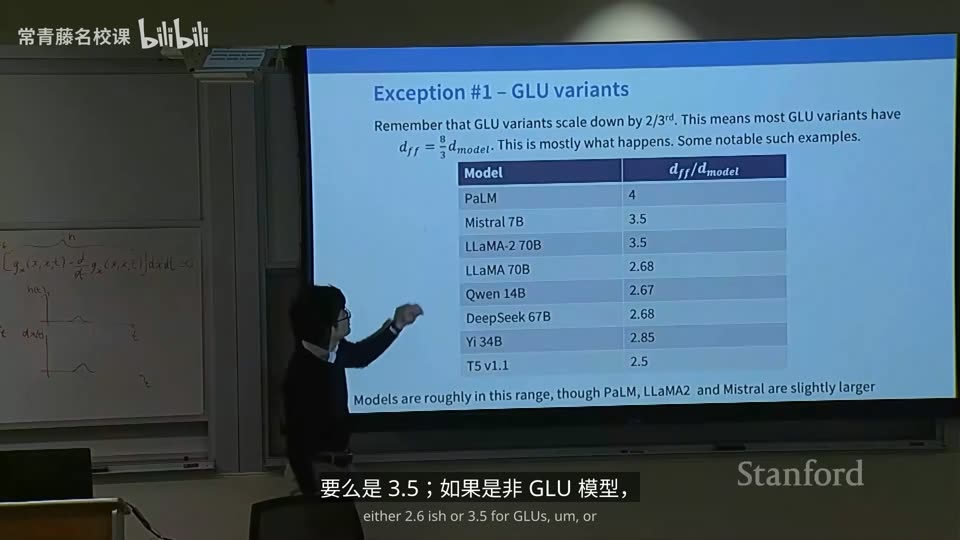 |
| 我觉得非常有趣、同时也非常酷。在阅读这些技术报告时，你会发现大多数人在架构选择上都非常保守，他们通常会说"我们做的是 LLaMA，但改了一个地方"。不过 Google 的人非常大胆（有时候确实如此）：T5（原字幕 tfive）是我最喜欢的案例之一，因为他们采用了一些非常大胆的设定。他们决定不遵循"四倍"这个经验法则，而是采用 64 倍的乘数——这比 4 大得多，啊， [【跳转到 38:54】](https://www.bilibili.com/video/BV11LEA6eEuj/?p=3&t=2334) | 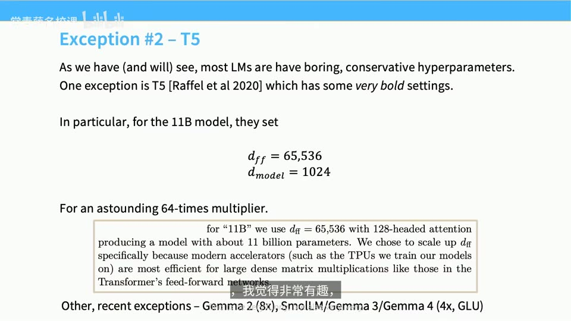 |
| 他们为此也给出了合理的论证。这是另一个基于系统层面的论证：他们的观点是"矩阵乘法做得越大，硬件利用率就能越高"。喂，哎呀（口误/笑场）——所以如果把这个乘数设得很大，矩阵乘法的（计算）效率就能得到更充分的利用。另外，像 Gemma-2 这样的模型也试着把这一指标往上推一些。这个数值（64）确实是个惊人的例外；我认为没有其他模型 [【跳转到 39:19】](https://www.bilibili.com/video/BV11LEA6eEuj/?p=3&t=2359) | 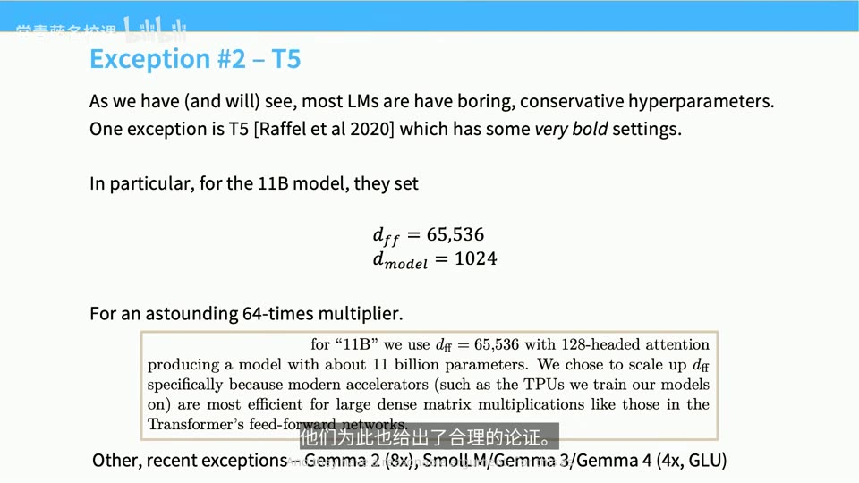 |
| 在前馈乘数上做到过这么高。（哦，还有）（回头再看 3.5 的那类）——从实证角度来看，如果你看看其他试图对这一比例做"更受控比较"的研究：我这里选取了 Kaplan 等 2020 年的这篇论文，啊嗯，这是那篇经典的"神经缩放定律"论文，里面做了各种受控实验（这是关于语言模型的研究，你会发现这并不是该研究的重点，有点像缩放定律研究），但你会在其中一个子图里看到：他们其实做了一个消融或"扫描"实验， [【跳转到 39:44】](https://www.bilibili.com/video/BV11LEA6eEuj/?p=3&t=2384) | 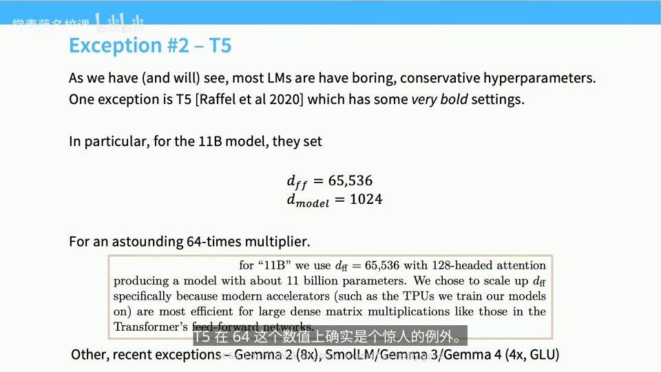 |
| 改变前馈比例并观察损失。这里针对的是一个非常小的模型。哎，这篇论文发现存在一个"盆地"：你从约 1 开始，最终落在大约 10 的位置——此时该超参数表现相当好且非常平坦；在这个区域，相对于最优损失，你的损失增加微乎其微（原字幕为"减少"，按语义应为增加）；然后，如果你选的完全错误——比如（乘数）超过 10~100 之类的数值——你的损失就会开始呈（某种较快的）方式急剧上升。 [【跳转到 40:09】](https://www.bilibili.com/video/BV11LEA6eEuj/?p=3&t=2409) | 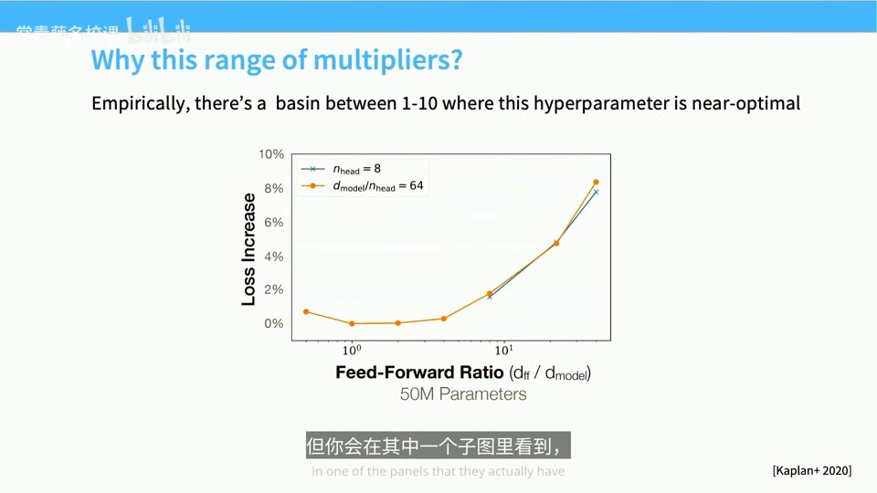 |
| 因此，这些在 2.67 或 4 之间变化的选择，大多都落入了这个相对理想的"盆地"，所以选择这些数值是没问题的。好的，那么关于这个超参数我们能得出什么结论？啊，默认选择在几乎所有现代语言模型中都表现良好，因此你可以放心地选用该默认值。嗯，T5 是一个不错的模型（或者说 T5 版本的一个）——是一个不错的模型，对吧，它并不是一个糟糕的模型； [【跳转到 40:34】](https://www.bilibili.com/video/BV11LEA6eEuj/?p=3&t=2434) | 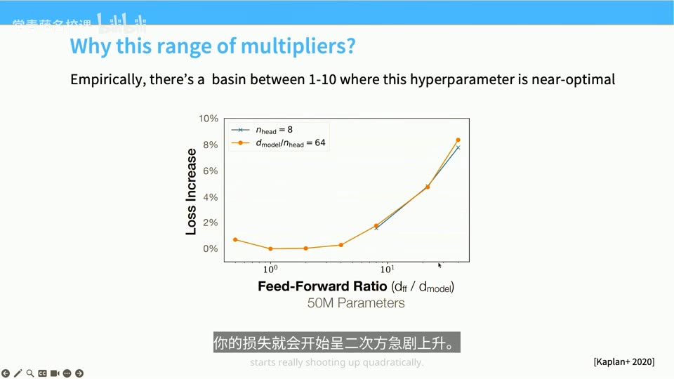 |
| 因此，即使是激进的选择在技术上也能奏效，但计算效率可能会很低。（哦）：因为这张幻灯片最有趣的部分——在我看来也是 T5 故事的点睛之笔——就是他们有一个后续模型 T5.1（或类似版本），本应是 T5 的改进版本，但他们又回到了标准的 3 倍（原字幕 2.5，或后面的版本）乘数。这里没有明确说明；但显然，当他们尝试更新 T5 时，决定回归更标准的做法。 [【跳转到 40:59】](https://www.bilibili.com/video/BV11LEA6eEuj/?p=3&t=2459) | 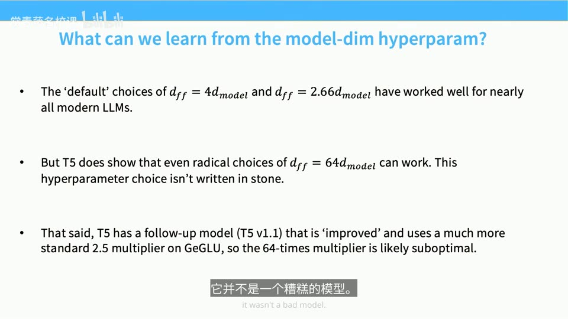 |
| 我觉得这有点意思。谢谢。好的，这就是前馈比率；现在你对它的大致数量级有了概念。而现在让我们讨论一个"不同的共识超参数"。我在（教授这门课），以及向学生讲解这一点时，总是觉得这很奇怪：如果你使用多头注意力机制（其中）你有多个注意力头，Transformer 的"标准做法"——也就是几乎所有人都会做的做法——是：如果你有多个头，你要确保"这些头的大小"（即头维度） [【跳转到 41:24】](https://www.bilibili.com/video/BV11LEA6eEuj/?p=3&t=2484) | 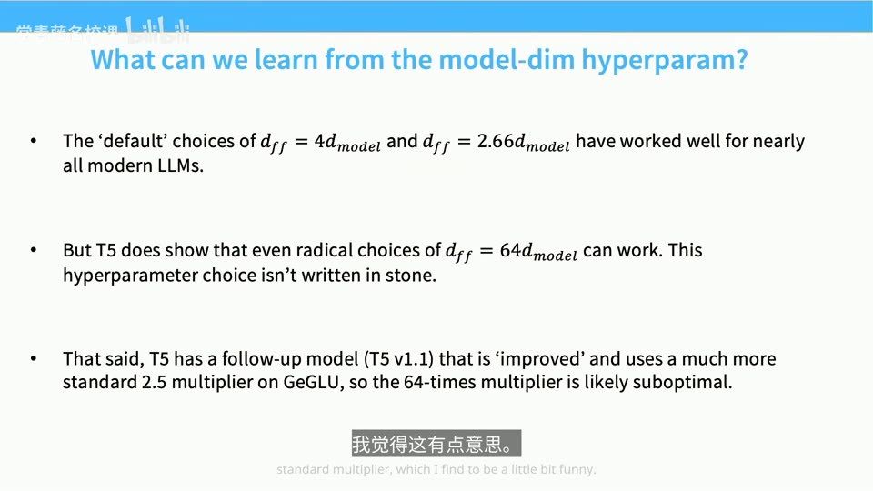 |
| 使得你大致拥有与"单个大注意力头"相同的维度，对吧？所以你总是确保你大致将隐藏维度基本上"除以 H"。所以在这种情况下，H 是头的数量，每个头的维度是 D/H；两者相乘就得到 D（原字幕 'd t r u e'）。不知为何，这有点像经验法则；当然这并非必须如此：我们可以任意改变"头维度与模型维度"之间的比例。但大多数模型都遵循这一准则。 [【跳转到 41:49】](https://www.bilibili.com/video/BV11LEA6eEuj/?p=3&t=2509) | 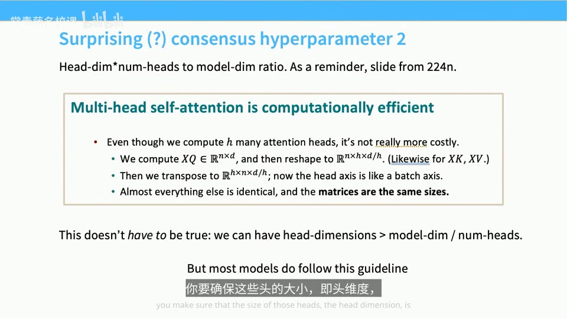 |
| 事实证明效果相当不错。我们可以看看各种各样的模型—— [【跳转到 42:14】](https://www.bilibili.com/video/BV11LEA6eEuj/?p=3&t=2534) | 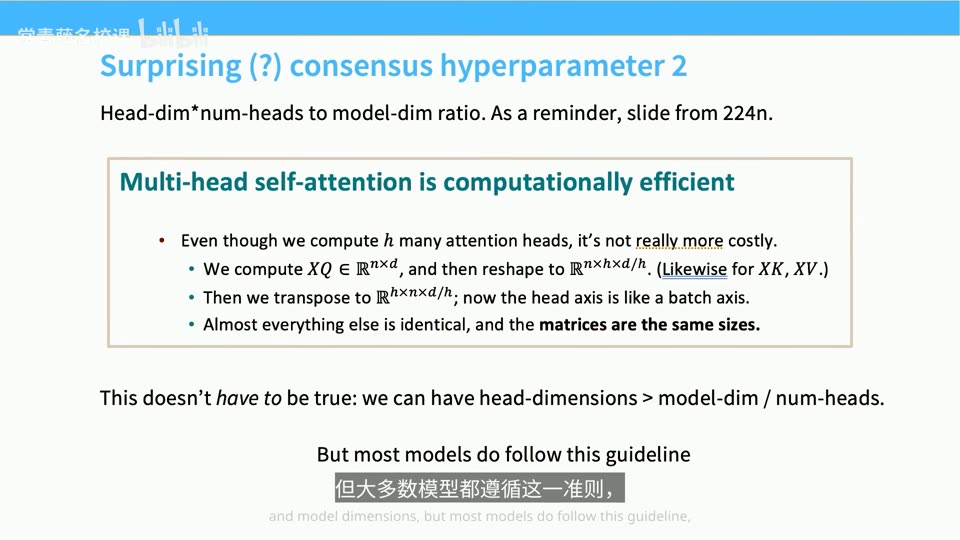 |
| 既有经典的也有最新的，我这里也有"最新最强"的款；你会发现：是的，比例大致都在"1"附近；"头维度"大致等于"模型维度 ÷ 头数"。不过有个显著的例外是 T5，还有（另一个）——那是 Google 的另一个模型。但总的来说，大家都保持在 1 附近。 [【跳转到 42:19】](https://www.bilibili.com/video/BV11LEA6eEuj/?p=3&t=2539) | 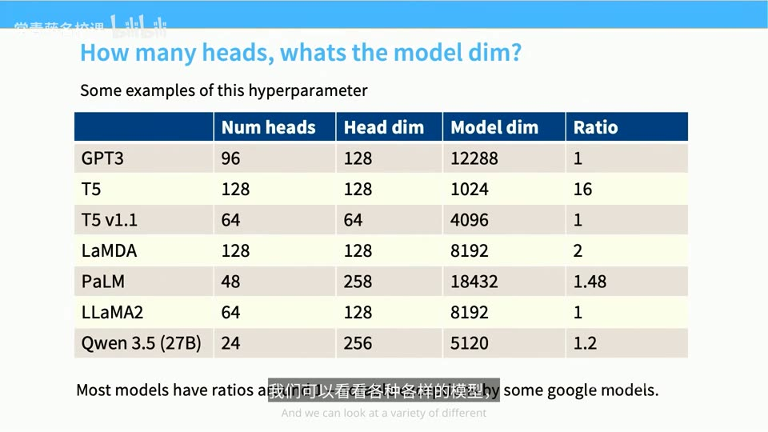 |
| 我觉得这挺有意思的。关于头维度，我想最后说的是：我觉得这又是一个"容错率很高"的超参数。 [【跳转到 42:36】](https://www.bilibili.com/video/BV11LEA6eEuj/?p=3&t=2556) | 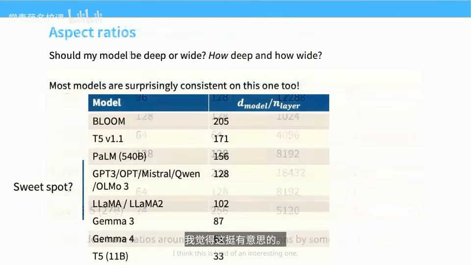 |
| 大家做过一些消融实验。同样的，在 1 附近有一个相当宽的"缓冲区间"：稍微偏离一点也没关系。好的， [【跳转到 42:41】](https://www.bilibili.com/video/BV11LEA6eEuj/?p=3&t=2561) | 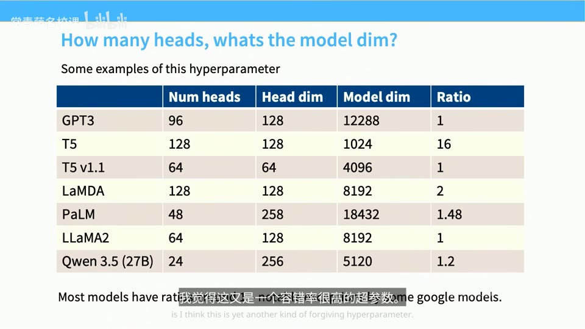 |
| 但这可能不是最关键的超参数。我觉得从概念上讲，最关键也最有趣的超参数之一就是"纵横比"（aspect ratio）这个概念，对吧？嗯，此外想补充一点：当你把模型进行缩放（放大或缩小）时，通常的做法是固定一个纵横比，即"模型的宽度与深度之比"，然后整体扩大模型规模。因此，从某种意义上说，纵横比决定了在扩大模型规模时 [【跳转到 42:48】](https://www.bilibili.com/video/BV11LEA6eEuj/?p=3&t=2568) | 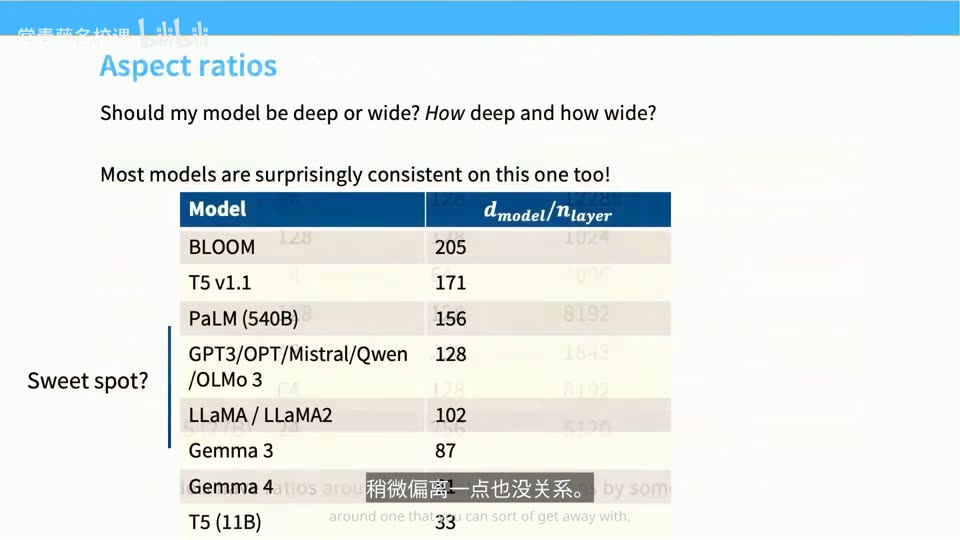 |
| "深度与宽度"之间的权衡关系。你可能会想："模型到底该做多深？"比如，如果你一直在关注推理（推理算力消耗）这方面的内容，你可能会觉得"想要系统利用率高，要么需要一个非常深的模型，要么需要一个非常浅的模型"，你可能觉得这里变化空间很大——确实变化很大，比其他超参数的变化还要大得多。但实际上，大多数现代模型都落在一个相当明确的"最佳区间"内： [【跳转到 43:13】](https://www.bilibili.com/video/BV11LEA6eEuj/?p=3&t=2593) | 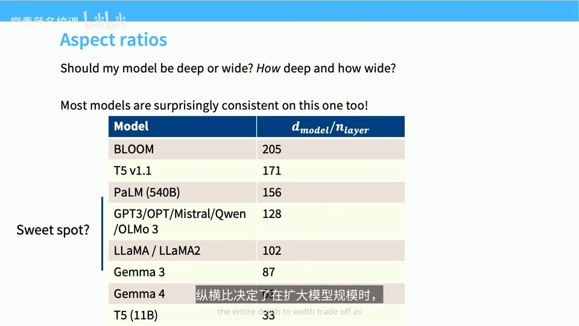 |
| 你很少看到模型做得特别深（D 特别大），你也很少看到模型在任意方向上变得过宽。嗯，你会发现大多数模型的隐藏维度与层数之比大约是 100，所以每层的宽度大概在 D/100 米（原字幕如下）。也就是说，GPT-3、LLaMA，或这类模型都符合这一情况。 [【跳转到 43:38】](https://www.bilibili.com/video/BV11LEA6eEuj/?p=3&t=2618) |  |
| 好，实际上，我认为这主要是"表达能力与硬件之间的一种权衡"：意思（1）如果你的模型极深，从系统层面来看处理起来会非常棘手。模型越深，你有哪些并行化的方法呢？你可能得把层拆开。如果你拆分这些层（这点我们会在系统课上讲到），从深度方向拆分层，会在并行化上带来非常严重的问题——流水线并行 [【跳转到 43:59】](https://www.bilibili.com/video/BV11LEA6eEuj/?p=3&t=2639) | 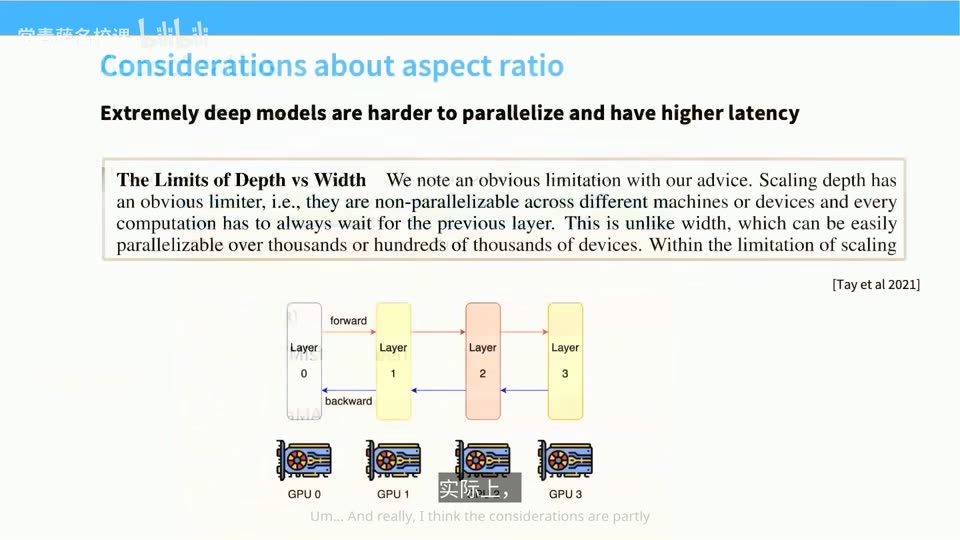 |
| （pipeline parallel，也就是我们说的这种方式）是大多数人极力避免采用的，而"宽度"则更容易并行化：如果你的模型非常宽，你可以很容易的在 GPU 上对它进行拆分，啊，也就是所谓的张量并行（tensor parallel）——处理起来简单多了。所以从某种意义上说，"系统层面的原因"促使我们选择宽架构，而"表达能力层面的原因"可能促使我们选择深架构； [【跳转到 44:24】](https://www.bilibili.com/video/BV11LEA6eEuj/?p=3&t=2664) | 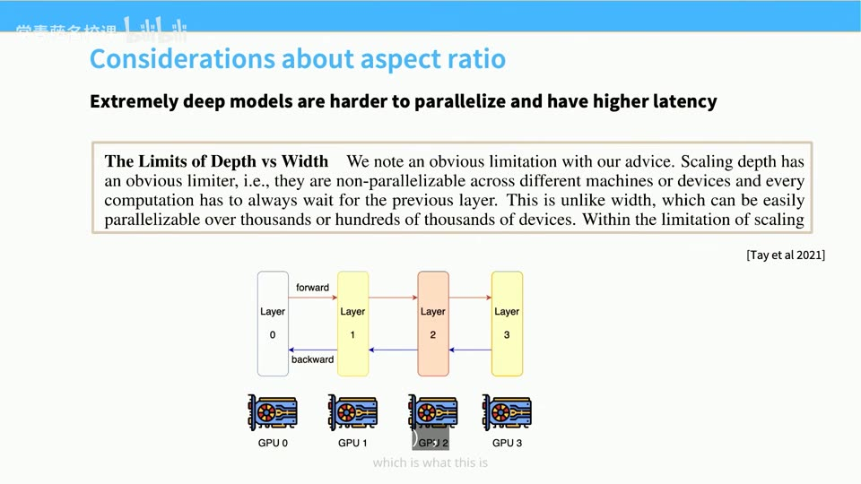 |
| 最终得到的数值大约在 100 左右。嗯，我认为 Transformer 超参数有一个非常有趣的现象：许多"看似至关重要"的超参数，其实容错率相当高，而人们已大致收敛到了某个区间（最低限度）。这是 Kaplan 等人论文中的另一张图，展示了针对不同规模模型的超参数扫描结果。同样，可以看到：无论模型规模如何，大致而言最佳纵横比都相当接近——它们大约位于 100 附近，可能略小一些， [【跳转到 44:48】](https://www.bilibili.com/video/BV11LEA6eEuj/?p=3&t=2688) | 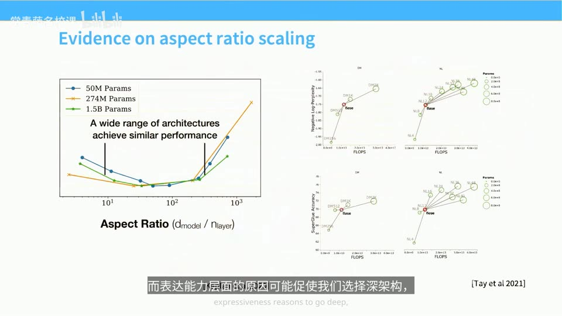 |
| 具体取决于你怎么核算。但实际上，纵横比只要在 100 附近，都是相当稳妥的选择。（另外）XXX 等人做了一系列非常有趣的 architecture 变体实验：他们对此得出的总体结论是（我们来看上面这幅图）：在"深度与宽度"的权衡方面，你有多种不同类型的模型可以选择；但当你扫过"深度与宽度的各种权衡"时，你会发现，从某种意义上说， [【跳转到 45:13】](https://www.bilibili.com/video/BV11LEA6eEuj/?p=3&t=2713) | 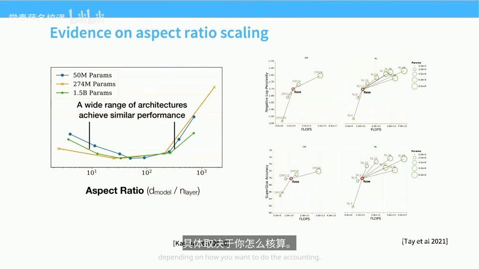 |
| 唯一重要的是"FLOPs 随着计算量增加不断增加，模型性能随之提升"——这才是主导大多数效果的因素，而不一定是纵横比。所以我觉得由此得出的结论是：超参数有一个比较宽泛的"安全区"，大家通常都在这个区里选， [【跳转到 45:38】](https://www.bilibili.com/video/BV11LEA6eEuj/?p=3&t=2738) | 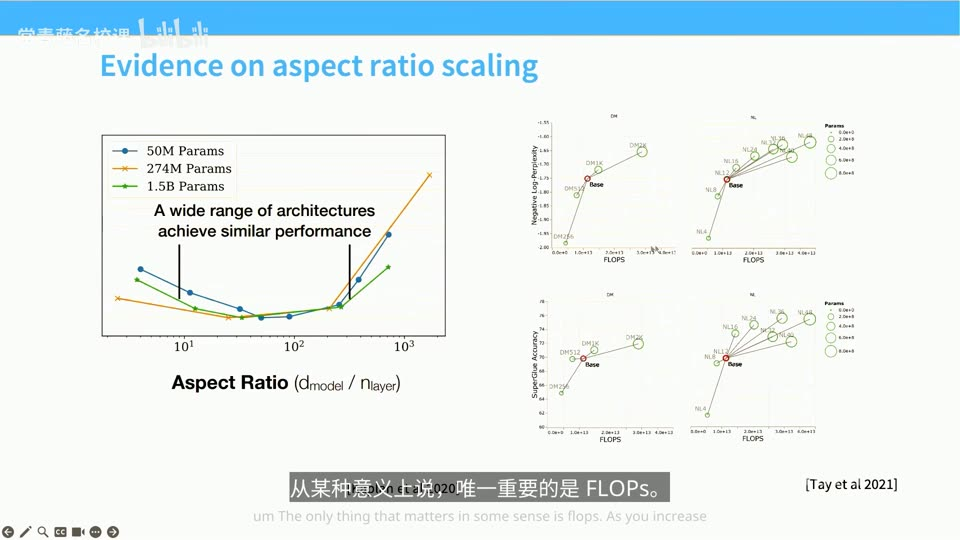 |
| 这样一来你主要该关心的是"系统利用率"，而不是那些难以量化推理的"表达能力"问题。好，嗯，最后一个我想提的超参数是"词汇表大小"。嗯， [【跳转到 45:52】](https://www.bilibili.com/video/BV11LEA6eEuj/?p=3&t=2752) | 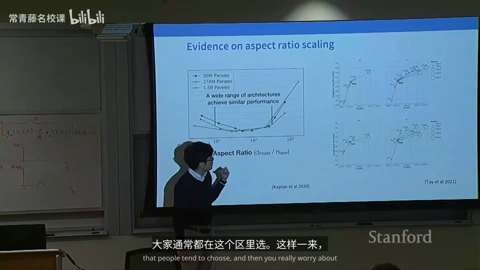 |
| 这个对我来说挺有意思，因为两类模型之间有非常明显的区别。啊嗯，我觉得在早期，很多开源模型训练里有很多都是"单语（monolingual）模型"——这些模型唯一的目标就是把英语做好，对于这类模型，词汇表要小得多，在 3 万左右。嗯，此后 LLaMA 问世，大家开始对"多语言"或"生产级系统"非常感兴趣： [【跳转到 46:02】](https://www.bilibili.com/video/BV11LEA6eEuj/?p=3&t=2762) | 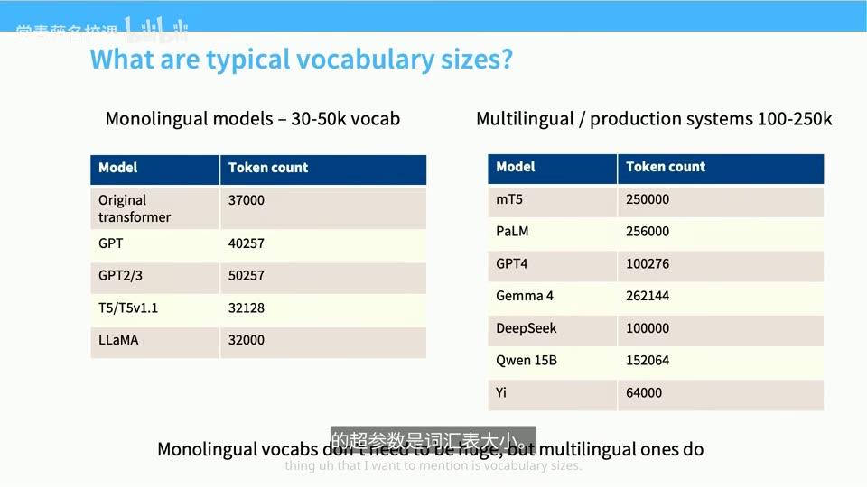 |
| 比如 GPT-4 这类（原字幕 gbdfour）前沿模型，它们的词表规模要大得多：它们的词表规模通常在 10 万到 20 万之间，你会发现 Google 模型的词表要大得多，而 LLaMA 衍生模型的词表大约在 10 万个 token 左右。相比之下，单语模型的词表规模约为 3 万。这一点相当明确：多语言模型确实需要更大的词表来覆盖整个语言空间。 [【跳转到 46:25】](https://www.bilibili.com/video/BV11LEA6eEuj/?p=3&t=2785) | 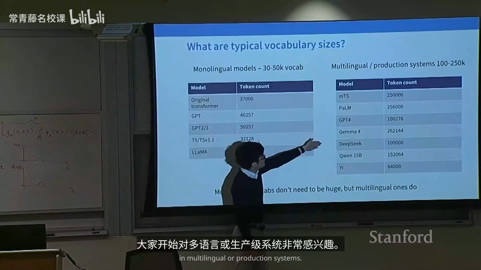 |
| 通常，右侧的模型规模也更大。已有的缩放定律研究（原字幕 skillinglaw）表明：模型越大，能处理的词表也就越大，因此这也部分受现代模型规模趋势的影响：右侧的模型通常更大。现在没人再训练那种"大型单语预模型"了。 [【跳转到 46:50】](https://www.bilibili.com/video/BV11LEA6eEuj/?p=3&t=2810) | 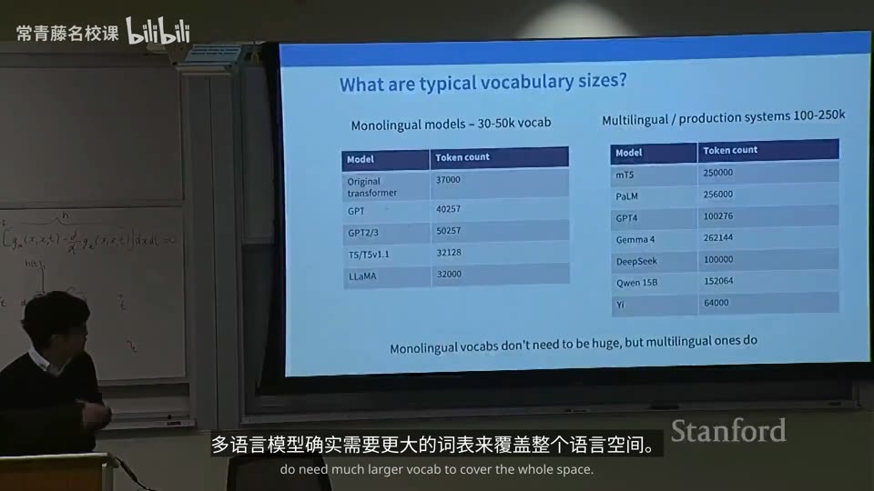 |
| 谢谢。（学生）好——嗯，对，哦， [【跳转到 47:02】](https://www.bilibili.com/video/BV11LEA6eEuj/?p=3&t=2822) | 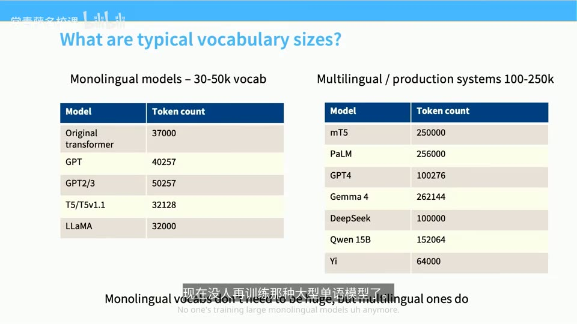 |
| "您海量的参数……还有 GPT 那一套，比如怎么把这些词表当成主要的改动点？" [【跳转到 47:07】](https://www.bilibili.com/video/BV11LEA6eEuj/?p=3&t=2827) | 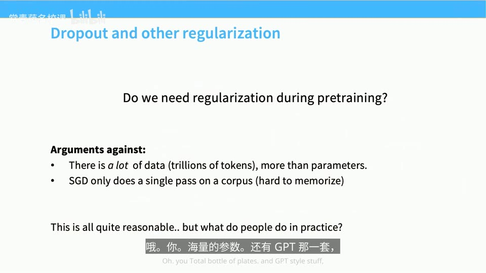 |
| （讲师）"抱歉，问题大概是：K线（口误）——抱歉，是'多语言模型'还是'多模态模型'？"对。 [【跳转到 47:12】](https://www.bilibili.com/video/BV11LEA6eEuj/?p=3&t=2832) | 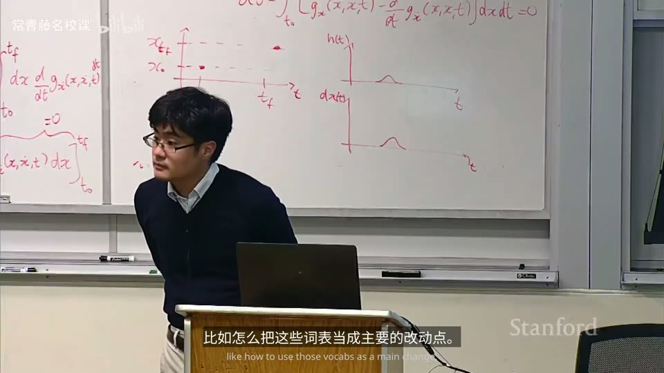 |
| "所以我想这取决于你的 token 编码方式：但如果你要对图像之类的内容做分词（tokenization）， [【跳转到 47:17】](https://www.bilibili.com/video/BV11LEA6eEuj/?p=3&t=2837) | 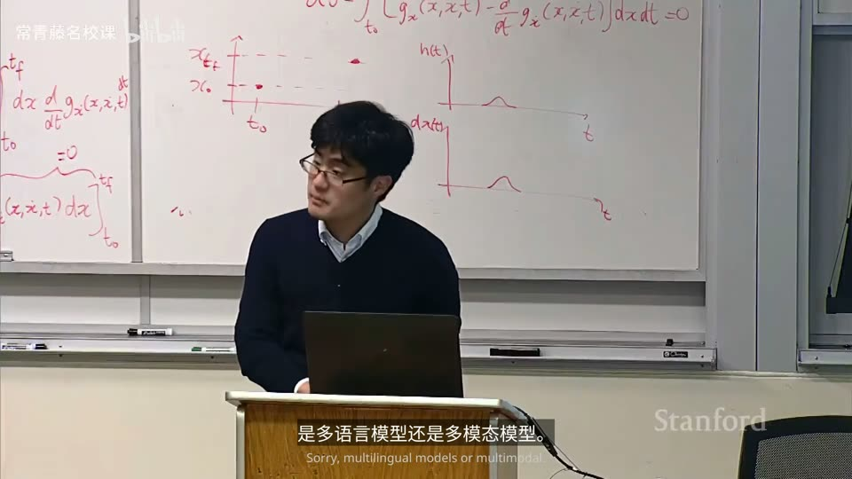 |
| 那就需要多得多的 token 才能覆盖啊。" [【跳转到 47:22】](https://www.bilibili.com/video/BV11LEA6eEuj/?p=3&t=2842) | 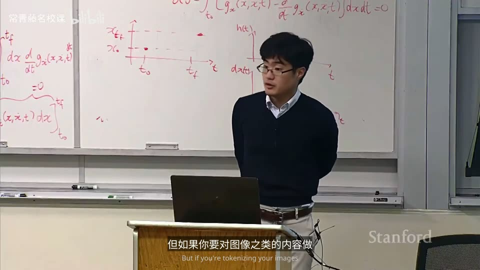 |
| （讲师）"如果看看各种开源发布，他们都会有不同的图像分词器（image tokenizer），自带的词表也相当大。你可以去 XXX 那边看看 BS（原字幕'去新配对那边看看'）。"——嗯，反正是把词汇表扩得很大。大家："我觉得这相当于把公式拆成四（个）人（讨论）"…… [【跳转到 47:27】](https://www.bilibili.com/video/BV11LEA6eEuj/?p=3&t=2847) | 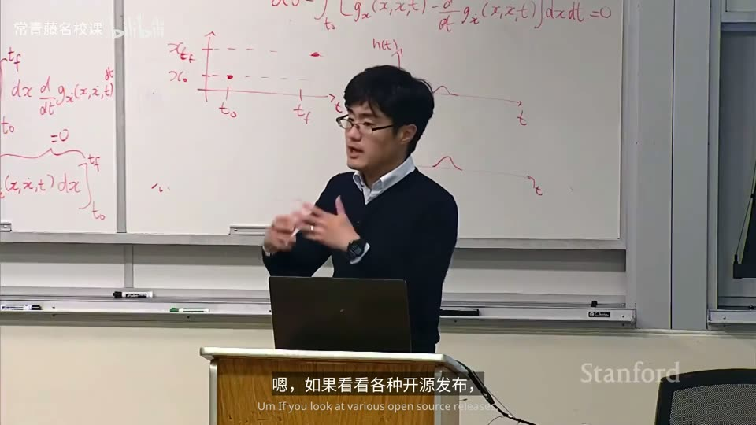 |
| "各自的部分嗯，拿 WebUI/Byte 比对（原字幕 WEBITS 来比）有多大意义？"哦，这是个很好的问题。好的，没错。 [【跳转到 47:37】](https://www.bilibili.com/video/BV11LEA6eEuj/?p=3&t=2857) | 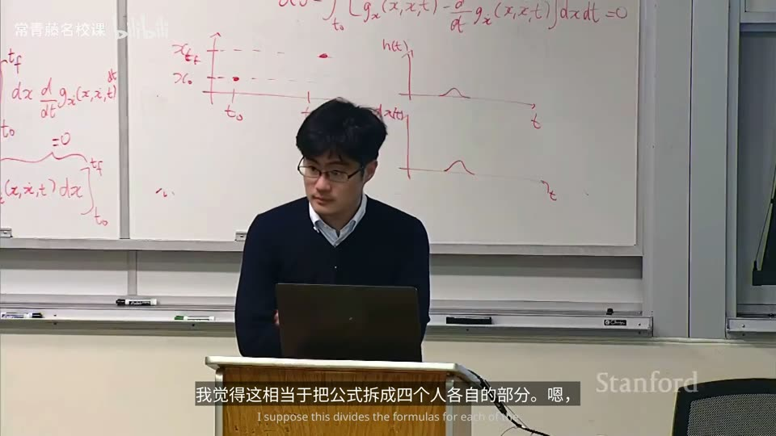 |
| 这不算超级入门的问题，但确实是个好问题。嗯，"那么正确的方法是什么呢？" [【跳转到 47:44】](https://www.bilibili.com/video/BV11LEA6eEuj/?p=3&t=2864) | 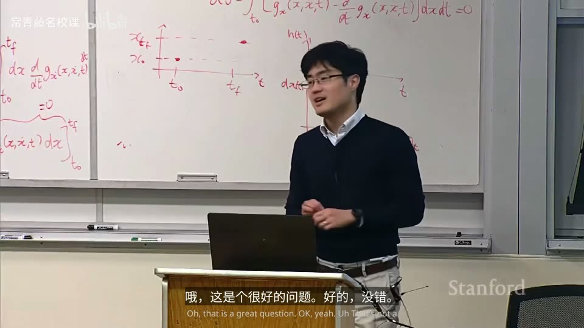 |
| 好，让我先退一步，把我们带入正确的思维框架。所以，如果我们思考语言模型——语言建模是一项生成式建模任务，我们是在对一个（token）序列的概率进行建模； [【跳转到 47:49】](https://www.bilibili.com/video/BV11LEA6eEuj/?p=3&t=2869) | 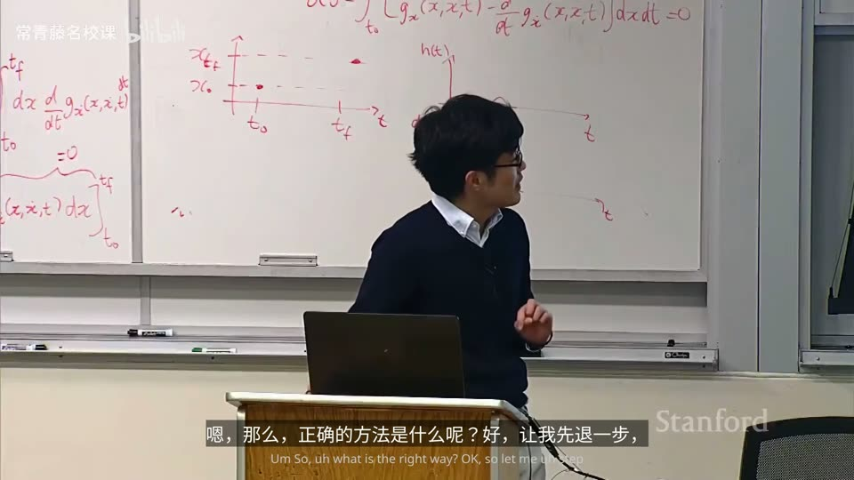 |
| 那么只要你的序列是固定的、保持不变——你没有以任何方式篡改它——并且你给定了所有字符串上的概率分布，这种比较就始终是有效的。在那个层面上，它始终是有效的。 [【跳转到 48:00】](https://www.bilibili.com/video/BV11LEA6eEuj/?p=3&t=2880) | 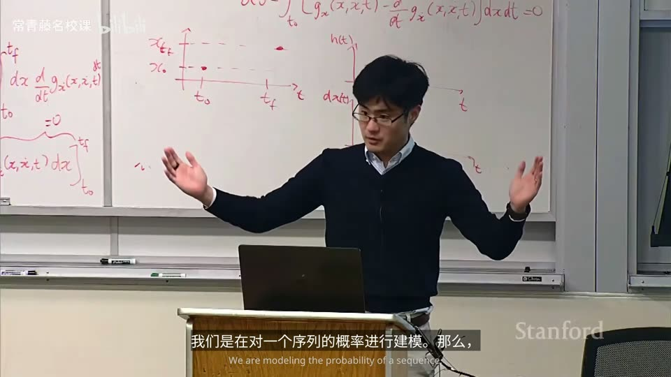 |
| 那么当你问"比较任意两个分词器的 bits-per-byte 是否有效"时，实际上这里有两件事在起作用。第一件事是：你有没有改动这个序列？如果你看过去的一些分词器——在子词（subs word）分词器出现之前，它们会丢弃一些 token 或丢弃一些"单词"， [【跳转到 48:13】](https://www.bilibili.com/video/BV11LEA6eEuj/?p=3&t=2893) | 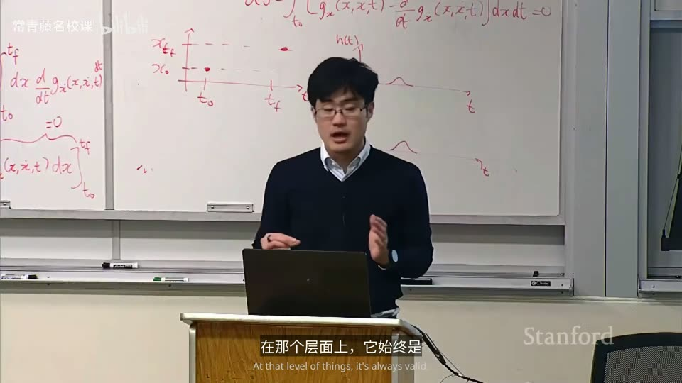 |
| 那样会改变序列，会使比较失效。但现代的分词器是"完整"的：它们可以建模任意序列，所以这点不必担心。另外你需要留意的是：我们是否进行了某种"长度归一化"。对于字节比特率（bits-per-byte），你总是用同一个数（即字节总数）来归一化， [【跳转到 48:30】](https://www.bilibili.com/video/BV11LEA6eEuj/?p=3&t=2910) | 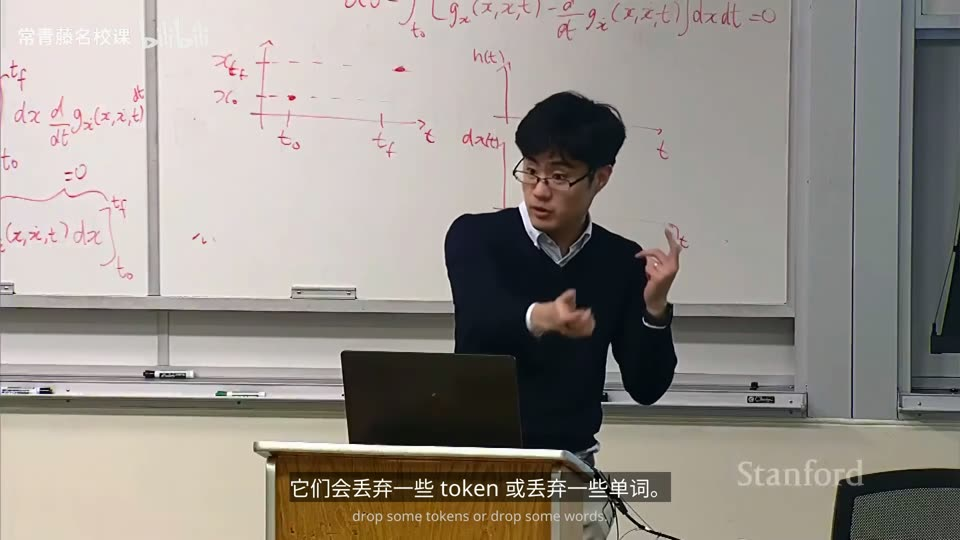 |
| 所以这始终是一个有效的比较——这就是思考分词器之间对比的方式。 [【跳转到 48:47】](https://www.bilibili.com/video/BV11LEA6eEuj/?p=3&t=2927) | 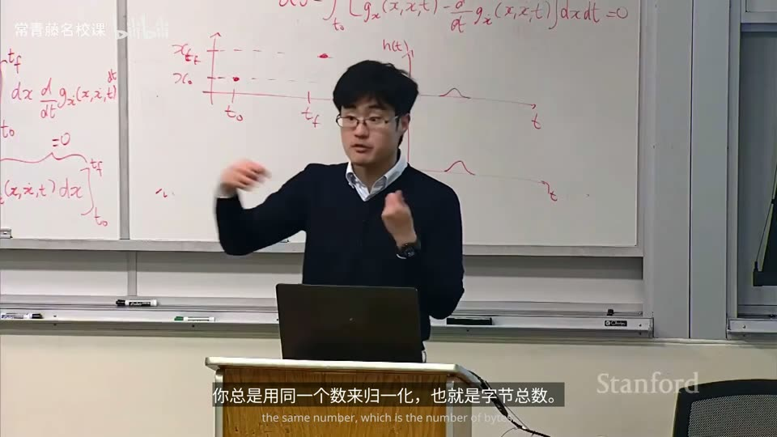 |
| 呃，有意思。对于固定的（外部）度量，比较其复杂度是有差别的（原字幕乱）。具体来说："……" [【跳转到 48:52】](https://www.bilibili.com/video/BV11LEA6eEuj/?p=3&t=2932) | 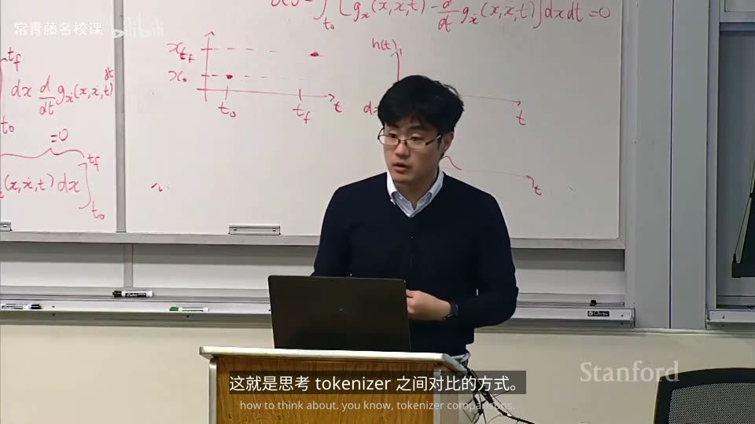 |
| （讲师）"（补一句）对，总是能带来更好的下游叶（应为'文本'）新闻中的困惑度和字节比特率 BPB 互为对偶。所以如果你问的是'（这两者是）等价的吗？'——答案是：肯定（但限定范围内）——这既算是'是'也算是否：因为这要看你怎么比较，你可以构建可比的困惑度，但你改变的是不同的（参数、序列长度等）变量。" [【跳转到 48:57】](https://www.bilibili.com/video/BV11LEA6eEuj/?p=3&t=2937) | 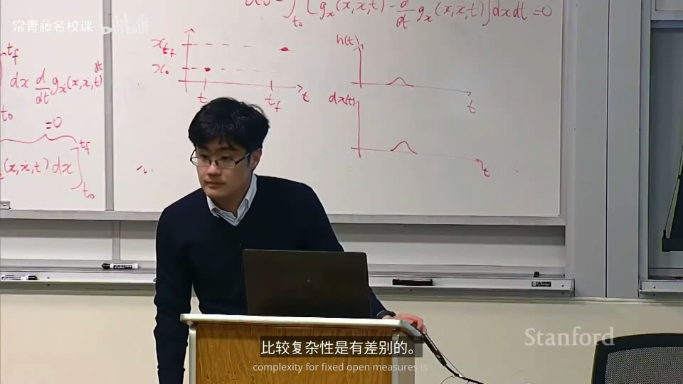 |
| 好，我们稍后再谈；因为我不太确定是否理解了这个问题。 [【跳转到 49:14】](https://www.bilibili.com/video/BV11LEA6eEuj/?p=3&t=2954) | 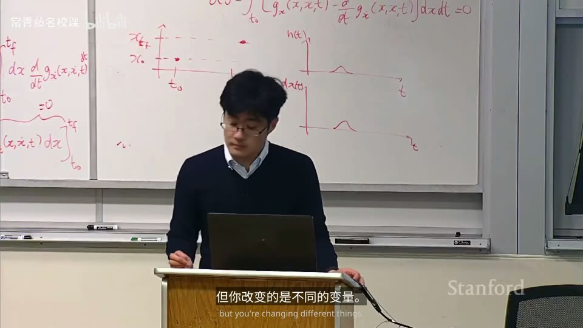 |
| 不过我认为这是一组很有意思的问题。OK。啊，很不错。行，那么我们正在深入梳理语言建模最底层的细节。 [【跳转到 49:19】](https://www.bilibili.com/video/BV11LEA6eEuj/?p=3&t=2959) | 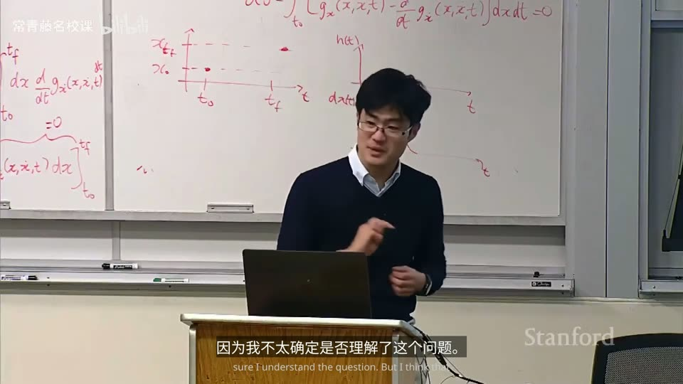 |
| 我觉得在我们这样讨论的过程中，引出了不少有趣的观点：我认为 dropout 是其中之一，而正则化是另一类非常有趣的思路；而且我觉得，这个观点从机器学习入门课的直觉来看是非常反直觉的。那么我们来梳理一下。我认为关于正则化的标准论证是："假设我在做语言建模，我手头有大量数据——大多数时候，数据量远超我能处理的范围 [【跳转到 49:25】](https://www.bilibili.com/video/BV11LEA6eEuj/?p=3&t=2965) | 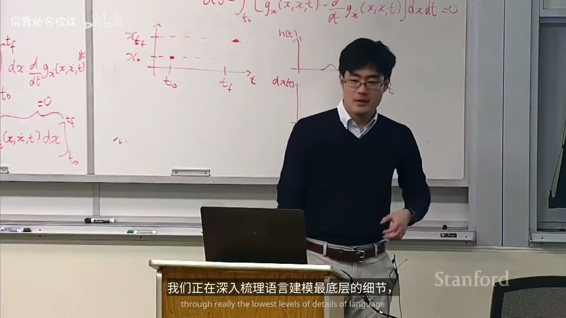 |
| 我认为dropout是其中之一而正则化是另一类非常有趣的思路而且我觉得这个观点从机器学习入门课的直觉来看是非常反直觉的那么我们来梳理一下我认为关于正则化的标准论证假设我在做语言建模我手头有大量数据大多数时候数据量远超我能处理的范围 [【跳转到 49:30】](https://www.bilibili.com/video/BV11LEA6eEuj/?p=3&t=2970) | 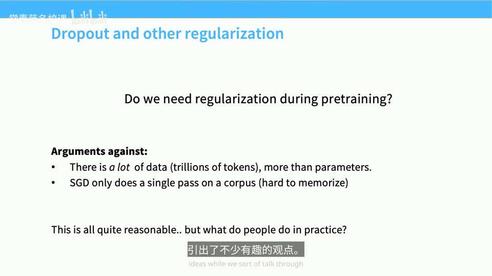 |
| （除非你在谷歌；但即使在谷歌，互联网数据的量也超过了可用的浮点运算次数）。所以我可能根本不会看到同一份数据两次——因此我只会对语料库进行一次遍历。"并且，有充分的理由和论证表明：SGD 或其他优化器的单次遍历，根本不会真正"记住"我的数据。这意味着，在计算受限的语言建模中， [【跳转到 49:55】](https://www.bilibili.com/video/BV11LEA6eEuj/?p=3&t=2995) | 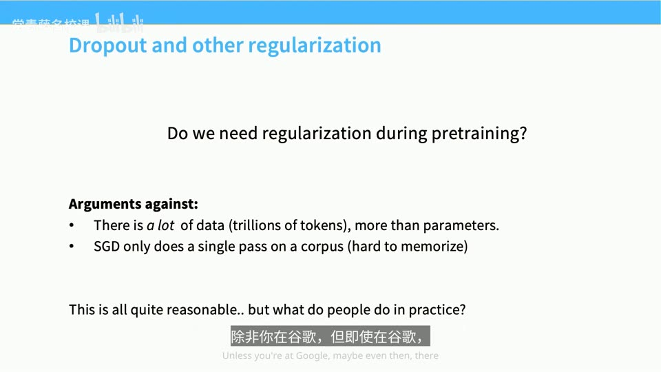 |
| 过拟合几乎从来不是问题。现在，有些人甚至只关注训练损失，因为他们坚信"在单次遍历的随机梯度下降（SGD）中不会发生过拟合"。基于此，你可以思考一下："在语言模型训练中，我应该使用 dropout 还是权重衰减（weight decay）？"——停顿，[板书 shuffle：可稍作讨论；停一小会儿]——好，大家可以稍微想一想。 [【跳转到 50:20】](https://www.bilibili.com/video/BV11LEA6eEuj/?p=3&t=3020) |  |
| 谢谢。一个遗憾之处（笔记：许多近期模型完全没有提及这些内容，这属于技术报告不愿披露的更底层细节；但如果你去查看，实际上会发现许多模型同时使用了这两种方法，尤其是"权重衰减"；实际上，权重衰减是一种相当常用的干预手段，即使对于现代的高性能语言模型也是如此——这非常非常令人惊讶： [【跳转到 50:41】](https://www.bilibili.com/video/BV11LEA6eEuj/?p=3&t=3041) |  |
| 我是说，也许有些 dropout 机制正则化（ular 原字幕如此）已经不再流行了，但权重衰减（VDEK 原字幕应为 W. decay）实际上还是相当常用的——啊，这非常令人费解。 [【跳转到 51:06】](https://www.bilibili.com/video/BV11LEA6eEuj/?p=3&t=3066) | 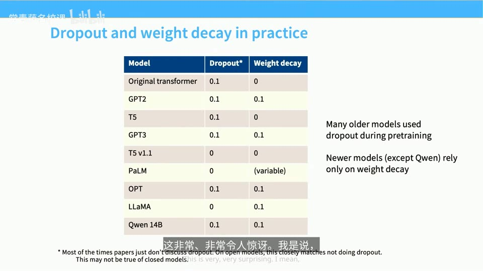 |
| 比如，为什么会这样？嗯，这也是我认为"深度学习很难"的原因之一，而且这节 architecture 课非常奇怪、也很难讲，这是因为这些因素之间会以非常奇怪的方式相互作用。因此，已有论文（详尽论证）并给出了很好的证据表明："权重衰减（weight decay）有时实际上并不是一个'正则化器'——它实际上是在与优化器相互作用，本质上是让'优化'变得更好。"所以，如果你查看"在单（epoch）遍历 SGD 的语言模型训练中， [【跳转到 51:14】](https://www.bilibili.com/video/BV11LEA6eEuj/?p=3&t=3074) | 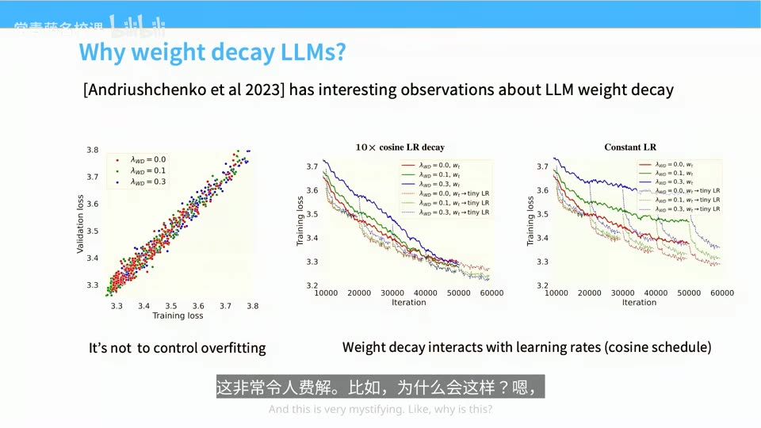 |
| 不同 weight decay 设置下的训练损失与验证损失"—— [【跳转到 51:39】](https://www.bilibili.com/video/BV11LEA6eEuj/?p=3&t=3099) | 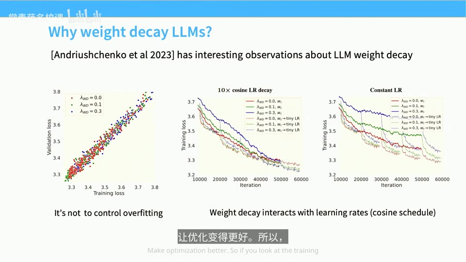 |
| 你其实看不到任何差异。确定。也就是说 weight decay 并没有让情况发生变化，所以验证损失也并没有变得更好——本来就不存在过拟合，我们这里就处在 X=Y 的直线上（训练损失=验证损失），对吧。所以它并不控制过拟合。但是，如果我们看"不同强度的权重衰减"，不只是不同强度的权重衰减，还包括"权重衰减与学习率衰减的结合"：会发现权重衰减更强的那些运行（底部）—— [【跳转到 51:44】](https://www.bilibili.com/video/BV11LEA6eEuj/?p=3&t=3104) |  |
| 这些蓝色的（底部虚线）表现明显更好：因为虽然起步慢，但最终能收敛到更好的极小值。这在"衰减学习率"时通常成立，但在"固定学习率"下不一定成立；而你的直觉可能更多来自"固定学习率"的情况。所以，很难凭空或从头去推断这些不同选择的效果。这也是 Percy 和我设计这门课的原因： [【跳转到 52:09】](https://www.bilibili.com/video/BV11LEA6eEuj/?p=3&t=3129) | 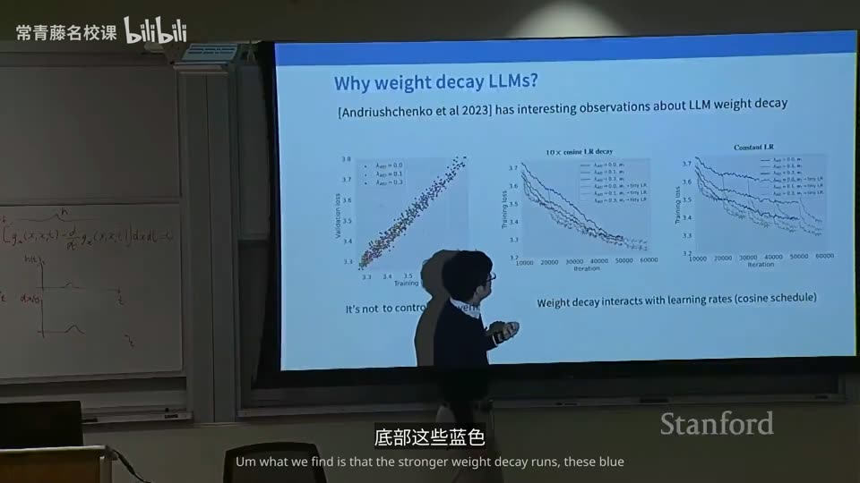 |
| 让你们通过实际操作来理解。你可能会发现，权重衰减其实是一种"优化"手段，而不一定是"正则化"手段，这和你原本的预期不太一样。所以要记住：在这些设置下，确实会出现这类意想不到的效果。 [【跳转到 52:34】](https://www.bilibili.com/video/BV11LEA6eEuj/?p=3&t=3154) | 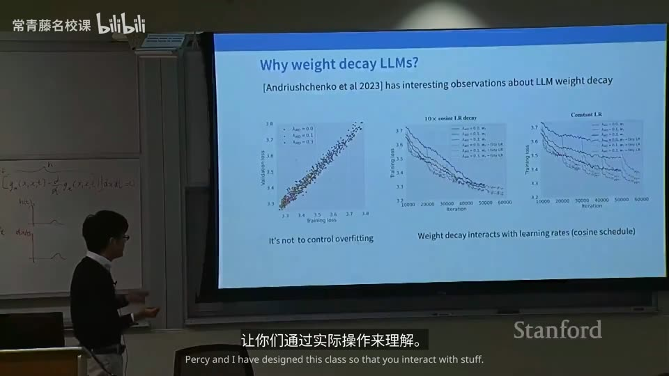 |
| 好，谢谢。接下来把超参数总结一下：对于那些看起来比较复杂的超参数，其实有一些通用的标准选择： [【跳转到 52:49】](https://www.bilibili.com/video/BV11LEA6eEuj/?p=3&t=3169) | 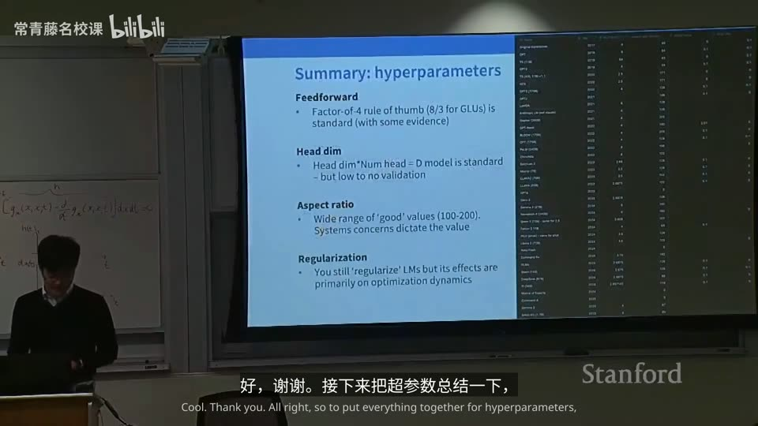 |
| 大家都用的（或者效果）很好。哦，天哪（板书大字）——"四倍"的经验法则、让"头维度 × 头数量都等于模型维度"，并选一个合适的纵横比——大约在 （原字幕"往汉字左右"，应指 100 左右）。"如果你问到正则化：你可能需要尝试几种方法，因为正则化与优化器之间的相互作用方式往往相当反直觉，所以尽管实际上完全不需要正则化，仍有人沿用这种做法"—— [【跳转到 52:56】](https://www.bilibili.com/video/BV11LEA6eEuj/?p=3&t=3176) | 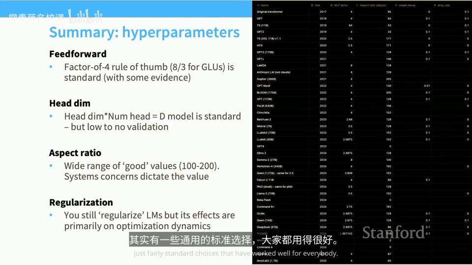 |
| 其实我就说到这儿吧，以防万一。对， [【跳转到 53:20】](https://www.bilibili.com/video/BV11LEA6eEuj/?p=3&t=3200) | 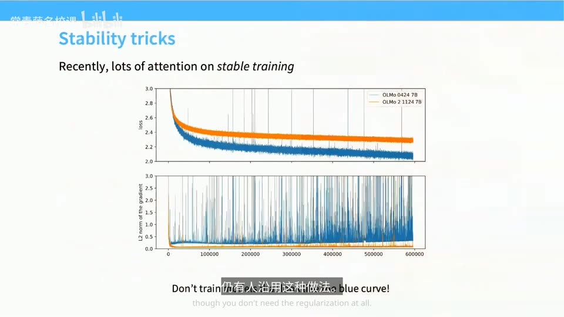 |
| 嗯，还有那个关于（学生问）"扩散模型（那个的未来）"的回答： [【跳转到 53:25】](https://www.bilibili.com/video/BV11LEA6eEuj/?p=3&t=3205) | 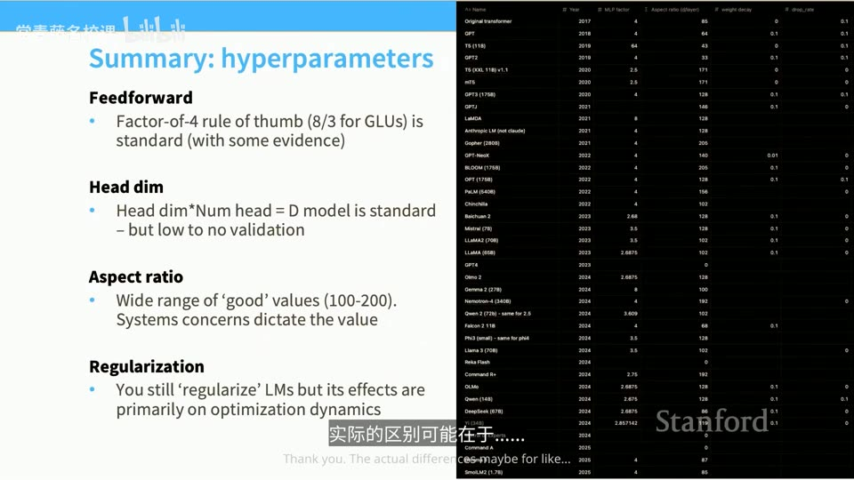 |
| "扩散模型——说实话我对此研究得还不够深入。嗯，一个问题在于：真正去'从头训练'大型扩散模型的人并不多，而且很多已训练的模型是（已有大模型）后期改造过的。所以我认为其 architecture 其实跟 LLaMA 这类模型是一样的；但如果你问的是'从头开始训练'的最优 architecture 是什么，我一时还真想不起来具体是什么。"对。 [【跳转到 53:30】](https://www.bilibili.com/video/BV11LEA6eEuj/?p=3&t=3210) | 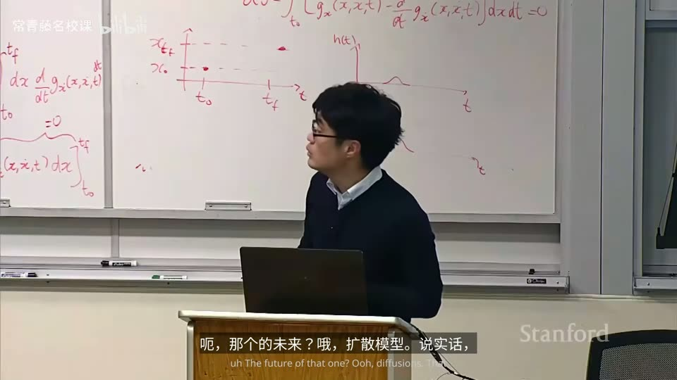 |
| 而"至于为什么提到正则化：我们大多数人信息量都很大。嗯，我想并不是说正则化（总体上会影响优化）"——我认为人们不再使用 dropout 了， [【跳转到 53:54】](https://www.bilibili.com/video/BV11LEA6eEuj/?p=3&t=3234) | 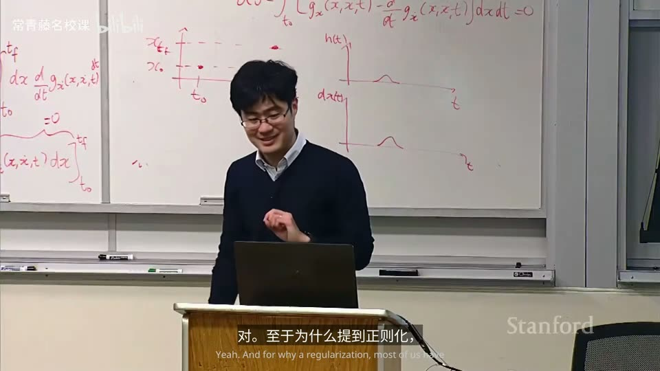 |
| 因为它与优化过程配合得并不好；不过像 weight decay 这种"向零收缩"的方法， [【跳转到 54:02】](https://www.bilibili.com/video/BV11LEA6eEuj/?p=3&t=3242) | 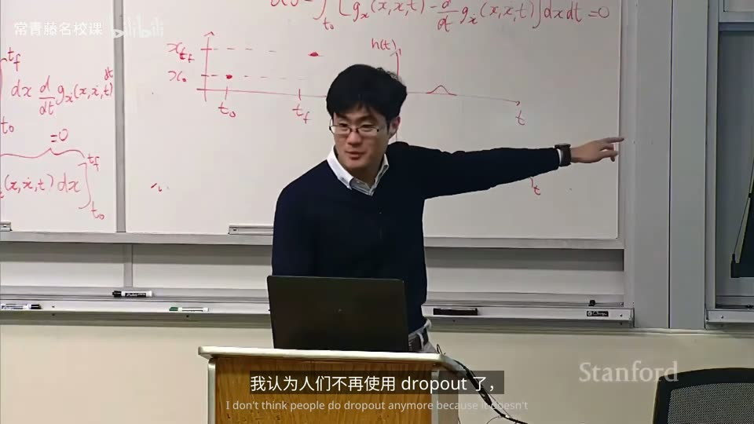 |
| 可能让你能用更高的学习率、或者衰减得更快。（板书 note）这些术语之间有很多相互关联的地方。好了。好的，谢谢。刚才我讲了很多 [【跳转到 54:07】](https://www.bilibili.com/video/BV11LEA6eEuj/?p=3&t=3247) | 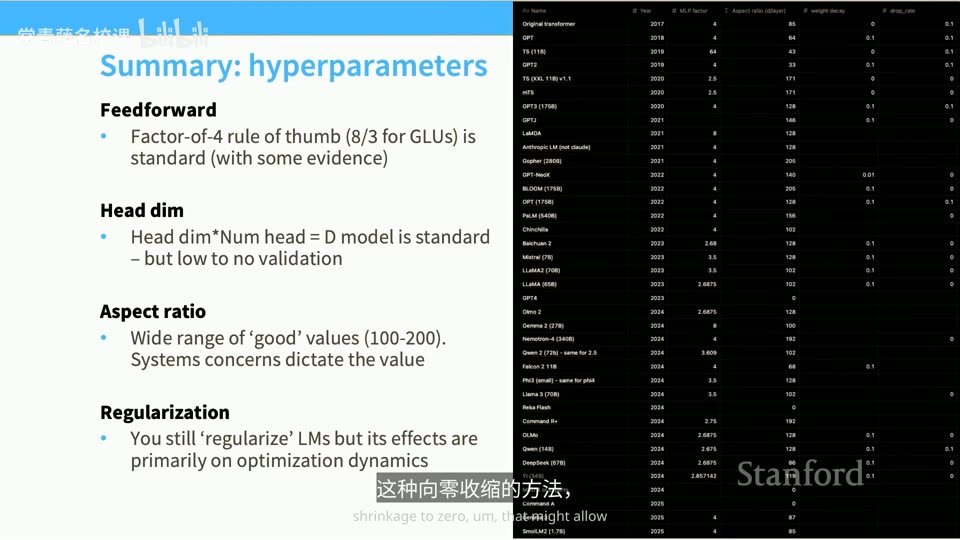 |
| 关于"怎么通过看看其他训练好的模型来设计出（表达能力更强的、valid）模型"。我现在想强调一点：过去几年里，大家关注的重点不只是性能，更是"稳定性"。随着模型训练成本越来越高，这一"问题"变得日益重要。某种程度上，我们把这些选择（batch 大小、正则化、超参）视为有"容错性"的： [【跳转到 54:15】](https://www.bilibili.com/video/BV11LEA6eEuj/?p=3&t=3255) | 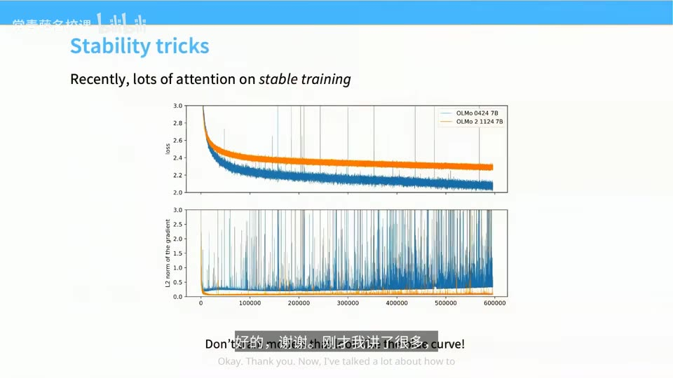 |
| 大家做的都类似，因此你可以调整这些参数，但不会带来显著的性能差异—— [【跳转到 54:34】](https://www.bilibili.com/video/BV11LEA6eEuj/?p=3&t=3274) | 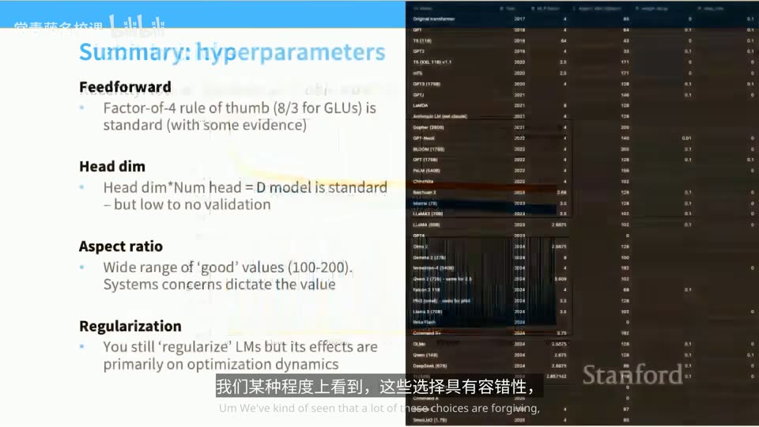 |
| 这没问题。这……但如果你的模型在训练过程中突然有某部分崩掉——比如到处出现这种很难看的尖峰（loss spike）——那你最后得到的模型就会出问题： [【跳转到 54:39】](https://www.bilibili.com/video/BV11LEA6eEuj/?p=3&t=3279) | 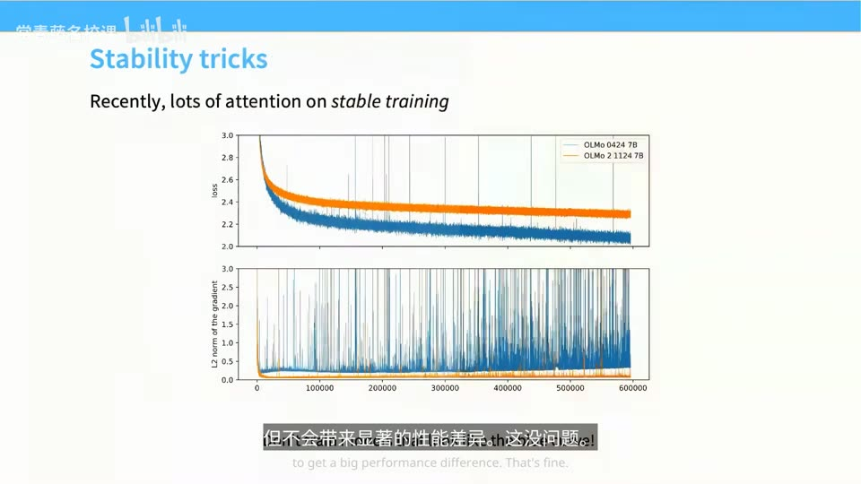 |
| 这段其实并不好，或者它可能已经无法恢复；你可能在（训练）上花了数百万美元，却到了模型再也无法继续训练下去的地步。如果（你）有大量算力想要投入，这会是非常糟糕的事情。所以，我们不希望训练出像这条蓝色曲线那样"到处是尖峰、梯度范数还很大"的模型。那么我们该如何解决这些稳定性问题？我得说，这真的是一个"非常核心"的问题： [【跳转到 54:48】](https://www.bilibili.com/video/BV11LEA6eEuj/?p=3&t=3288) | 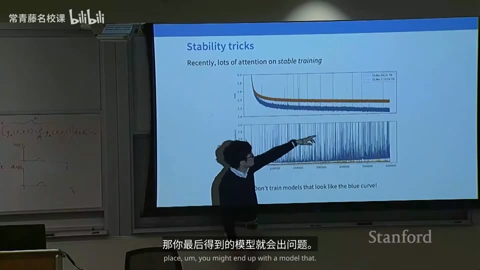 |
| 如果（包含）DUBI（应为 Nubia 或类似凡俗）的语言模型或一般神经网络出现了稳定性问题，会有几种情况 [【跳转到 55:13】](https://www.bilibili.com/video/BV11LEA6eEuj/?p=3&t=3313) | 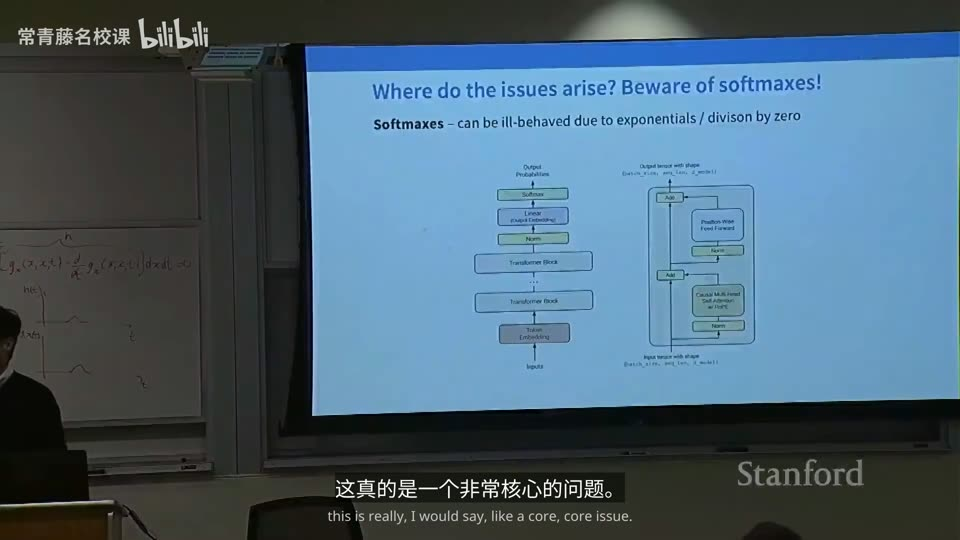 |
| （常见的排查对象，你得开始去看）。其中之一就是 softmax：softmax 有两个特性都会严重影响稳定性——一个是指数运算，对吧，你可以看到它很快就会爆炸；此外你还要做两个数的除法，这也是一个潜在的危险操作。对吧，所以 softmax 是一个需要格外小心的地方。那语言模型里的 softmax 都在哪呢？有两个：一个在输出端（尤其是我们输出概率分布的时候）， [【跳转到 55:18】](https://www.bilibili.com/video/BV11LEA6eEuj/?p=3&t=3318) | 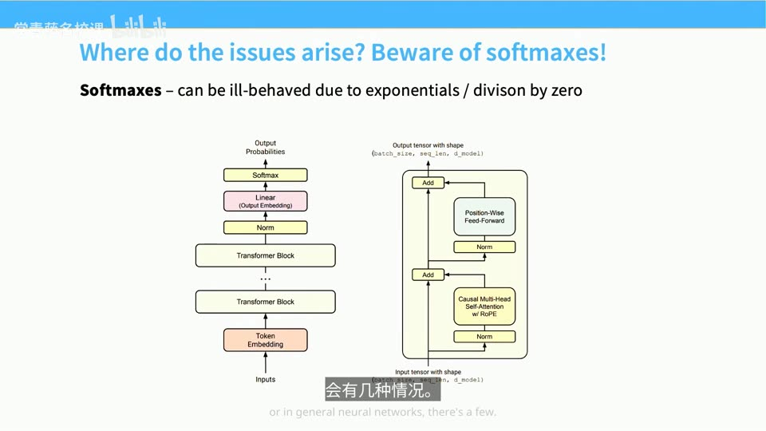 |
| 然后在注意力机制里，当我们对注意力"做规划"（归一化）时， [【跳转到 55:43】](https://www.bilibili.com/video/BV11LEA6eEuj/?p=3&t=3343) | 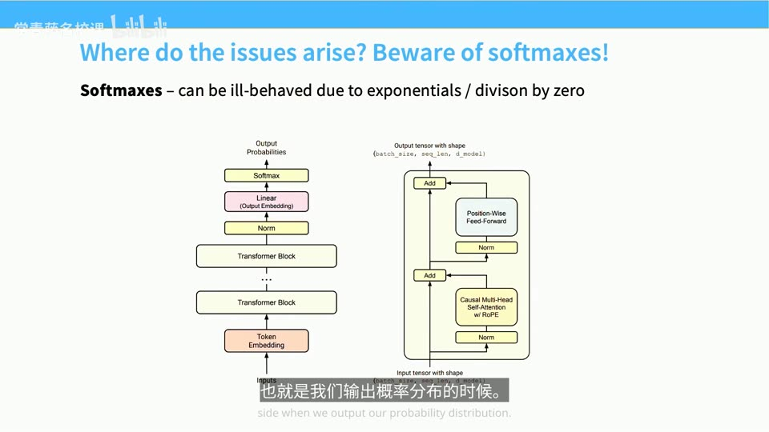 |
| 会有另一个 softmax。所以我们可以把这两处都看作模型的"危险区"，尤其是"注意力极值"。嗯，好的。 [【跳转到 55:48】](https://www.bilibili.com/video/BV11LEA6eEuj/?p=3&t=3348) | 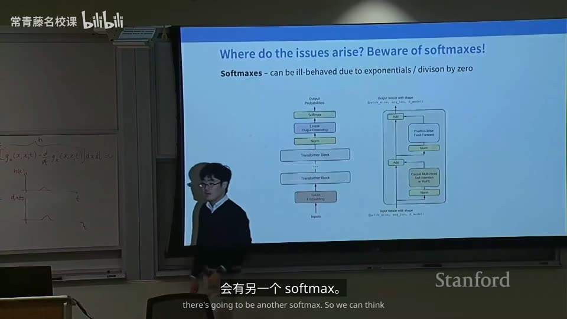 |
| 我们先来看看"输出端的 softmax"。输出端的 softmax 可能会爆炸；我们可以做的一件事是：尝试控制"归一化因子（normalizer）"带来的问题。所以，我们来想一想 softmax 的计算过程：我们要计算 log 概率（对数概率）以求出损失。那么什么是对数概率？它是你模型的输出 u，接着还有一个 log 归一化项（logz）。这个 U 表现良好， [【跳转到 55:55】](https://www.bilibili.com/video/BV11LEA6eEuj/?p=3&t=3355) | 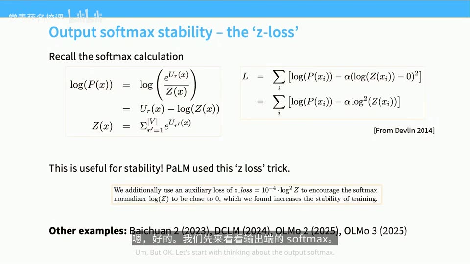 |
| 因为从某种意义上说它是你模型的输出：它只是残差流的输出，叠加了所有被加入的部分。所以如果 U 表现良好（且模型状态正常），那么 log p(x) 这一项也就没问题。诶，现在看第二项，也就是这个 logZ（log-log Z 原字幕写作 logz）——这可能就不太理想了（rename 的 z 项上）。如果 Z 极大或极小，即使你模型的输出还算稳定，它也可能出现数值爆炸。 [【跳转到 56:16】](https://www.bilibili.com/video/BV11LEA6eEuj/?p=3&t=3376) |  |
| 你当然知道 Z 是什么：它是一个指数项，所以它可能会迅速发散；或者如果这个值为零，它也可能发散。所以这两种情况都非常糟糕。理想情况下，我们希望 Z 的值接近 1，对吧？或者让 logZ 接近 0。我们能做什么呢？如果你思考过 softmax 的作用方式，就会注意到一件事：整个表达式是"过参数化"的（over-parameterized），对吧？你可以把一些项加进去再抵消掉。所以，如果我给 U 加上一个常数 c，我可以在不真正影响 softmax 输出的情况下 [【跳转到 56:41】](https://www.bilibili.com/video/BV11LEA6eEuj/?p=3&t=3401) | 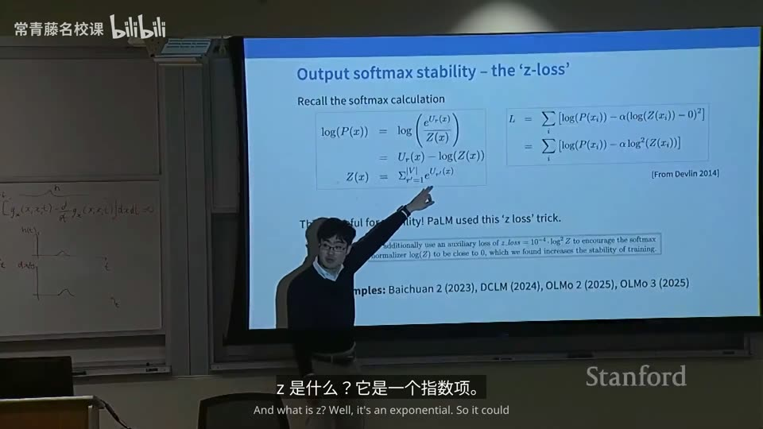 |
| "操纵 Z 的值"，对吧？它会在归一化因子和模型输出之间相互抵消。所以，基于这个性质，我可以做的一件事是加上一个"正则化项"（惩罚 Z 的 logz²）。这个项是来自 Devlin 等 2014 年的论文（原字幕 devilin，twenty fourteen 年）：他在其中加入了这个 logz² 项。哦，它的作用就是"惩罚 logZ 偏离 0 的程度"： [【跳转到 57:06】](https://www.bilibili.com/video/BV11LEA6eEuj/?p=3&t=3426) | 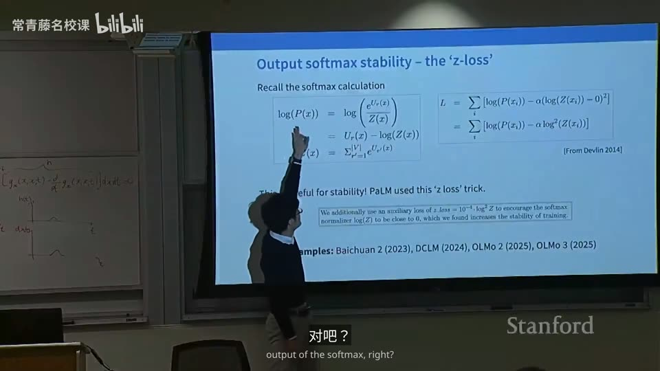 |
| 如果 logZ 接近 0，那就很好，因为整个表达式在数值上是稳定的。这招叫"z-loss"技巧，不少论文都在用。像 XXX（原字幕 models 乱）——嗯，Jacob Devlin 等人早在 2014 年就率先使用了这一方法，后来通过许多开源模型又流行起来：比如 XXX（原字幕 bytran，可对应"XX"正式思考，或略）。嗯，我认为是第一个采用这一方法的开源模型；后来（DeepSeek 等）model 也用这一技巧来稳定输出 softmax。 [【跳转到 57:23】](https://www.bilibili.com/video/BV11LEA6eEuj/?p=3&t=3443) | 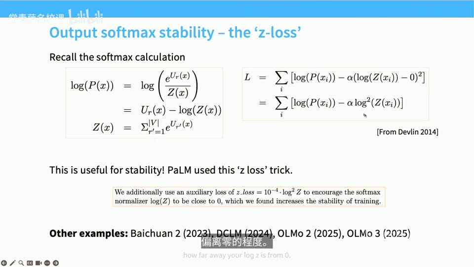 |
| 好——所以这一技巧出乎意料的有效。好了，假设我们已经解决了输出 softmax 上的不稳定性问题：现在我们要把注意力转向另一个潜在问题，也就是 attention，对吧。这里是大量"退化"现象发生的地方，人们已经开发许多技术来控制 attention 操作所产生的不稳定性。嗯，我想先说一个高层面的观点： [【跳转到 57:48】](https://www.bilibili.com/video/BV11LEA6eEuj/?p=3&t=3468) | 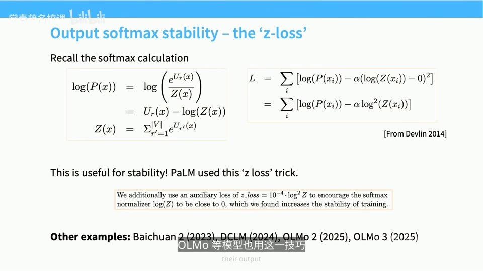 |
| 如果遇到不稳定性，如果（你）能设法在其中加入一个 LayerNorm，或许就能"加以控制"。在某种意义上，这正是"QK-norm"这一想法背后的设计理念。所以你要记住：我们会把 Q 和 K 相乘，然后送入 softmax。所以，在标准的注意力机制里，我会先做 pre-LayerNorm：经过 QKV 变换后，我会得到 Q 和 K；然后通过矩阵乘法将它们相乘， [【跳转到 58:13】](https://www.bilibili.com/video/BV11LEA6eEuj/?p=3&t=3493) | 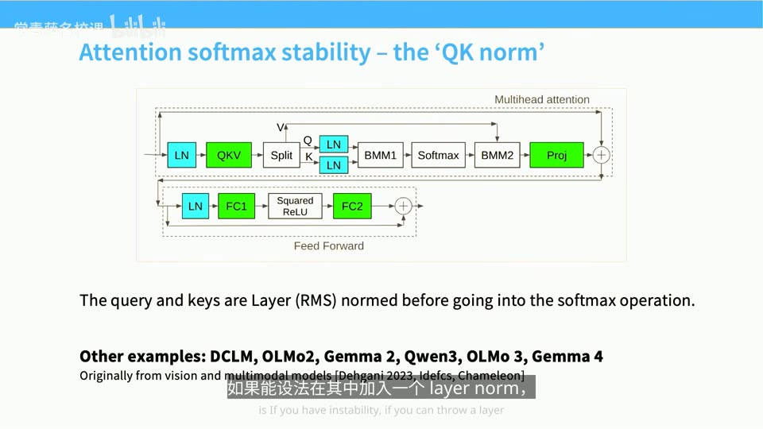 |
| 对结果做 softmax，再与 V 相乘得到加权平均值，最后输出后续内容——这就是我们常规的注意力机制。那如果我们在"Q 和 K 相乘之前"先用 LayerNorm（normalize）处理它们呢？如果这么做，我们就知道"矩阵乘法的输入"（也就是 softmax 的输入）大致处于相同的尺度：它们的尺度将始终大致为一， [【跳转到 58:38】](https://www.bilibili.com/video/BV11LEA6eEuj/?p=3&t=3518) | 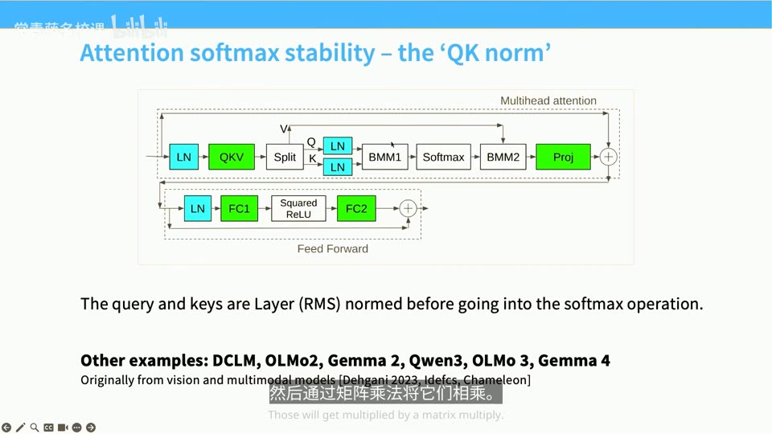 |
| 因为我们用了 RMSNorm 对 Q 和 K 的大小进行了"控制"。好的，如果这么做，就能让这个 softmax 操作保持稳定。大量不同的模型都采用了这一做法：它最初源自"多模态"领域——一些最初开发多模态模型的研究人员（ViT 的一些论文中）发现 XXX（原字幕 qk-norm X XXX 和 chameleon）确实使用了这一方法，并验证了其有效性。随后，许多其他开源语言模型意识到：同样的技巧完全适用于"稳定语言模型的注意力机制"。 [【跳转到 59:03】](https://www.bilibili.com/video/BV11LEA6eEuj/?p=3&t=3543) |  |
| 我认为现在这已经非常普遍了：QK-norm 实际上已成为一种非常标准的干预手段，目前大多数大模型都引入了它。从多次不同的训练运行来看，它似乎并未（明显）影响性能，但它确实能有效防止注意力"退化"现象（attention entropy collapse）。好。（有果……字幕为 XXX and deep）我观察到的一种演变路径是：我们最初在 pre-norm 中使用 LayerNorm，后来在每个模块的"非线性激活函数之后"添加它们…… [【跳转到 59:28】](https://www.bilibili.com/video/BV11LEA6eEuj/?p=3&t=3568) | 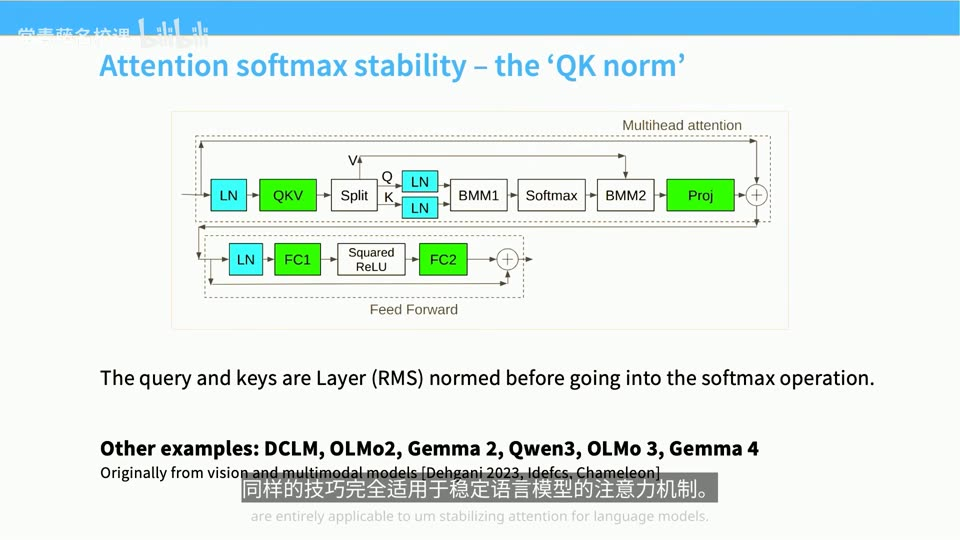 |
| 现在我们又将其应用于 Q 和 K——我认为这实际上触及了人们在此类工作中应用的"稳定性技巧"的核心。好，现在我要讲的最后一组稳定性干预措施：坦率地说，这一项并不那么流行；更多是我所见过的"Google 特有的技巧"。唉，不过 logit soft-capping 是一种更强硬的干预手段——有些人会采用 it。所以，在 QK-norm 中，我们做的是"控制输入"： [【跳转到 59:53】](https://www.bilibili.com/video/BV11LEA6eEuj/?p=3&t=3593) | 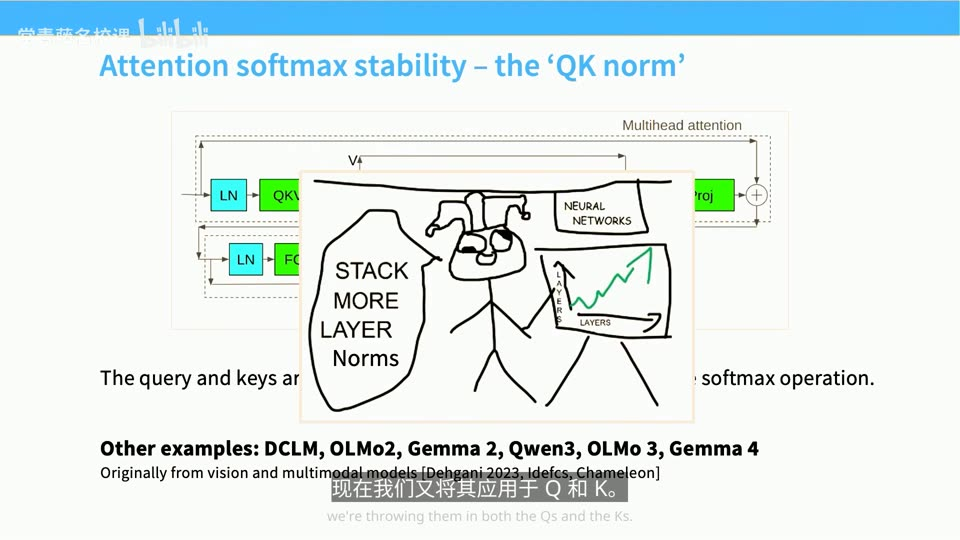 |
| 把输入喂给 softmax，然后指望输出能表现良好。哦，但如果我们真的想"强制"输出表现良好，可以把 logits（也就是直接进 softmax 的那些值）做一个"截断（cap）"——让它们永远不会太大或太小。这几乎是一种"硬约束"：当然它叫 soft-cap，但 tanh 本身就是有界的（所以它其实并未让 logits 完全失控）。啊，这就用在 Gemma 模型里：我记得 Gemma 2、Gemma 3 和 Gemma 4 都用了，他们都用了 logit soft-cap 这个技巧。具体做法是：把"注意力层的所有 logits"拿出来， [【跳转到 60:18】](https://www.bilibili.com/video/BV11LEA6eEuj/?p=3&t=3618) | 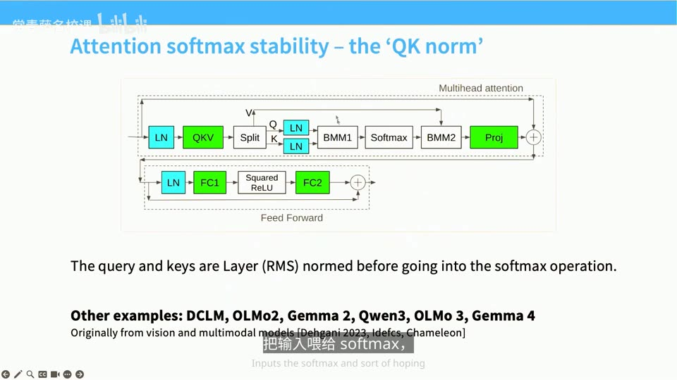 |
| 在某个值处做 soft cap（做一个 tanh 有界压缩），哎。英伟达（NVIDIA）的一些研究人员在"系统性比较这些稳定性干预手段"方面，其实做了相当不错的工作：他们的发现是，如果从一个"机械模型"（baseline）出发，你可以尝试各种不同的干预手段。这里展示了 QK-norm：它的表现略好，因为你可以把学习率稍微调高一些。所以如果只做 soft-cap—— [【跳转到 60:43】](https://www.bilibili.com/video/BV11LEA6eEuj/?p=3&t=3643) | 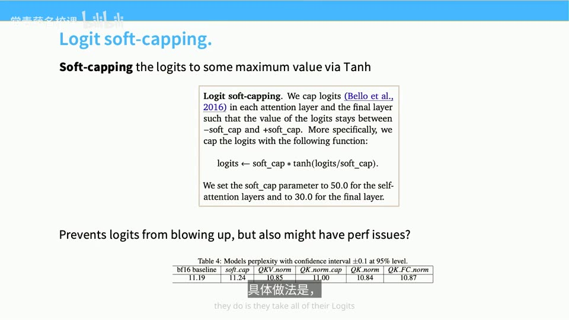 |
| 仅仅进行"截断"（tanh cap），实际上反而会导致性能下降，所以会出现"质量下降"。这是一种非常强烈的干预手段：一旦超过某个点，你就无法在 softmax 中表达出"非常确定的信号"（logits 无法大）；所以它确实有一些负面影响。但这是一种非常安全的方式，可以稳定"注意力的输出"——抱歉，是稳定"注意力的输入"，也就是进入 softmax 的 logits。好的，稳定性部分就讲到这里，我可以稍作停顿，之后 [【跳转到 61:08】](https://www.bilibili.com/video/BV11LEA6eEuj/?p=3&t=3668) | 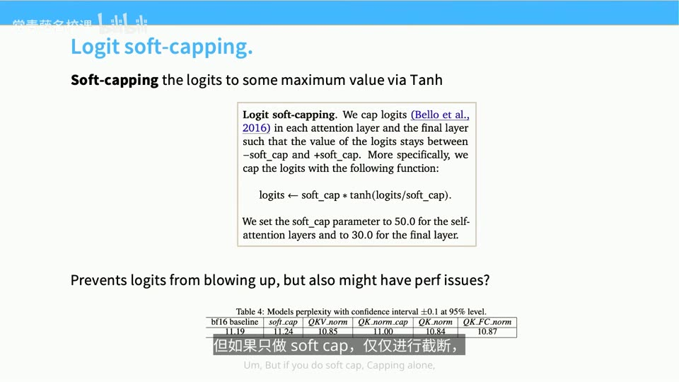 |
| 再谈谈各种注意力机制相关的内容。谢谢（Ohde人——应为学生提问/致谢）。好的，那么我今天想讲的最后一部分是：你可以对注意力机制实施的"各种干预"。正如我在本次讲座开头所说，今天我只讨论针对"密集全注意力"（dense all-by-all attention，原字幕 Dance all by your attention）的各种优化手段；啊，所以如果你对状态空间模型（SSM）或线性时间注意力感兴趣，很遗憾，今天不是讨论这些的日子。但是我真正想讨论的是， [【跳转到 61:33】](https://www.bilibili.com/video/BV11LEA6eEuj/?p=3&t=3693) | 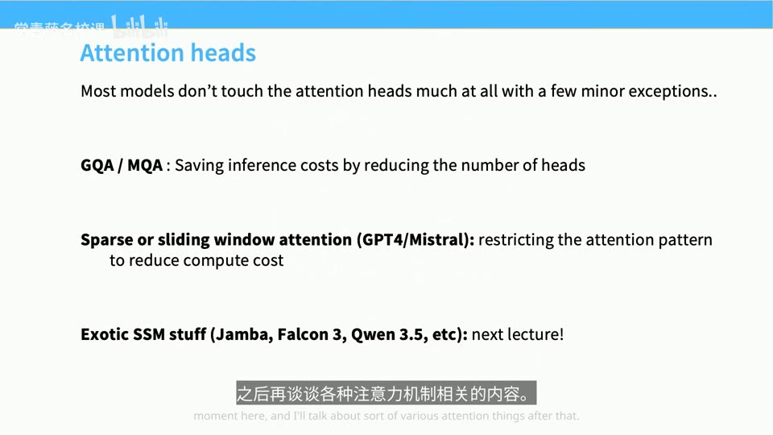 |
| 当前广泛实现的注意力干预措施：① 组查询注意力（Grouped Query Attention，GQA——它通过减少头数，显著降低"推理成本"）；以及 ② 更稀疏的"滑动窗口注意力"。滑动窗口注意力最初源自 GPT-3 模型，但如今已被大多数"只关注处理长上下文的模型"广泛采用（除非他们采用特殊的 SSM 技术）。那么，我将从"组查询注意力" [【跳转到 61:58】](https://www.bilibili.com/video/BV11LEA6eEuj/?p=3&t=3718) | 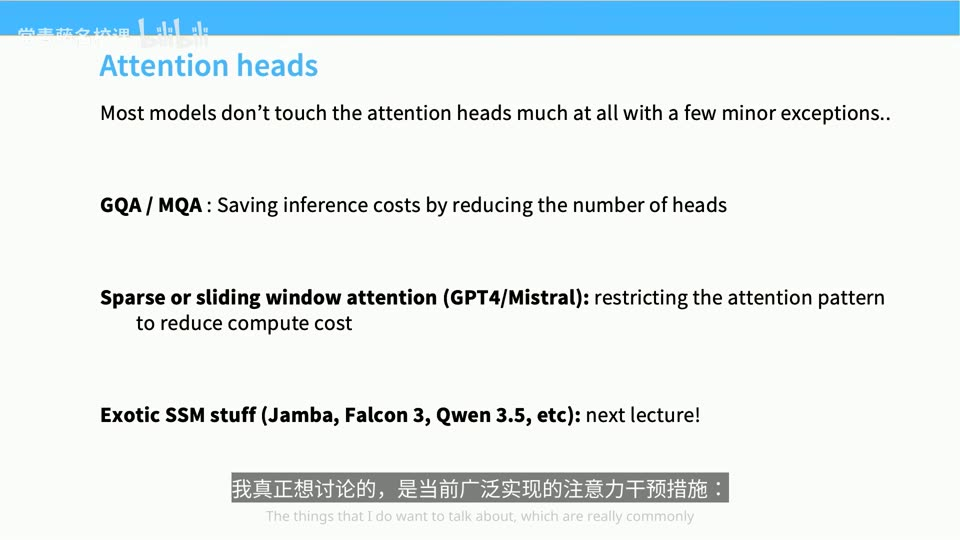 |
| （GQA 或多查询注意力 MQA）开始讲起：先阐述引入这类机制的必要性，然后你就能看到核心技巧、并理解它为何相当自然。到目前为止，我们一直在讨论"训练和建模"等内容；现在让我们暂停一下——嗯……现在，让我们思考"部署"问题。你（已经）训练好了一个非常大的模型，现在需要将其提供给大量用户使用，而服务过程会产生成本： [【跳转到 62:23】](https://www.bilibili.com/video/BV11LEA6eEuj/?p=3&t=3743) | 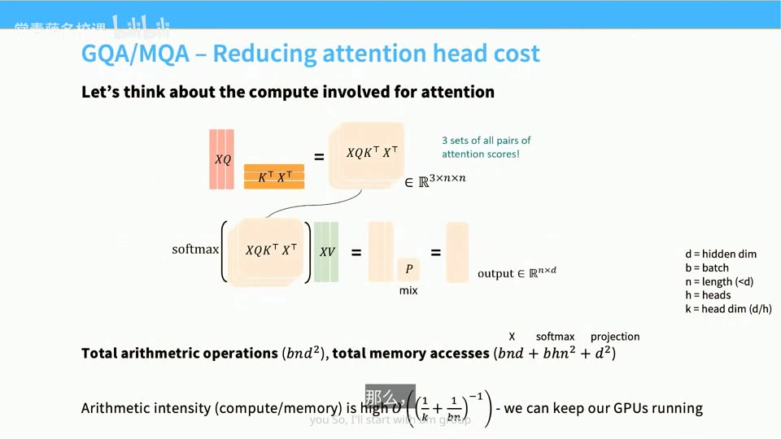 |
| 从抽象意义上讲，你需要为两种不同的资源付费。问题一：需要为你的 FLOPs（浮点运算次数）付费，即你所执行的计算量；但你还需要为另一件事付费：内存访问（memory bandwidth），因为内存访问也会影响系统的特性（比如延迟和利用率）。因此，你希望这两者都尽可能小。现在，让我们思考一下在"训练"或"预填充（prefill）"期间会发生什么： [【跳转到 62:48】](https://www.bilibili.com/video/BV11LEA6eEuj/?p=3&t=3768) |  |
| 当你查看提示词（prompt，即有人提供这些信息作为输入）时——在这种情况下，总浮点运算量的数量级为"批次大小 × 序列长度 × 隐藏维度的平方"，这大致就是你得到的（总计算量）规模（当然我们使用的是二次注意力机制，因此涉及 D 的平方）。还有："总的内存访问量"——那么我们这里的内存访问量是多少？我们有"批次大小 × 序列长度 × 隐藏维度"， [【跳转到 63:13】](https://www.bilibili.com/video/BV11LEA6eEuj/?p=3&t=3793) | 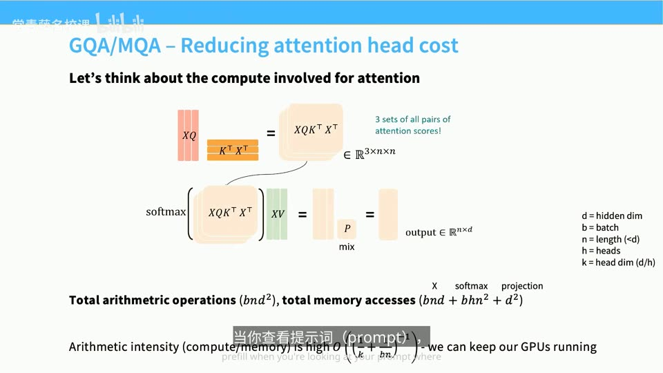 |
| 加上 softmax 的成本——其中包含 N 项平方的部分（原字幕"N 的音色方"应为 N 头方/平方）；然后投影部分有一个 O(D²) 量级。所以这里的算术强度相当不错：它近似于 K 这是头的数量——所以你需要有……（凹的板书）。啊，抱歉：是 head-dim：你的 head-dim 需要足够大，这样你相乘的（行×列）矩阵规模才合理；而且还有一个 O(1)×b×m：所以你的序列（长度）需要足够长，或者批次大小需要足够大， [【跳转到 63:38】](https://www.bilibili.com/video/BV11LEA6eEuj/?p=3&t=3818) | 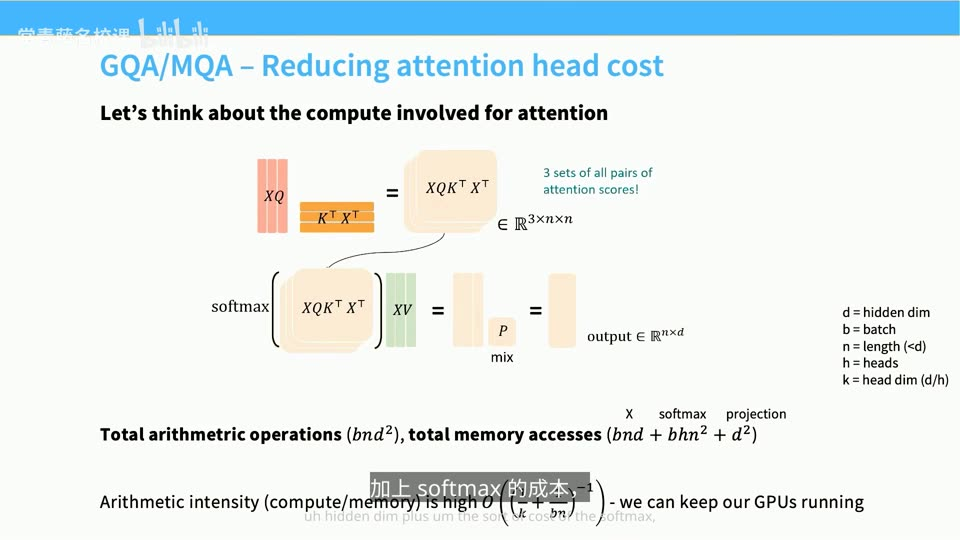 |
| 只要这两点都满足，你的 GPU 就能得到充分利用：很好，你就把所有资源都用上了。谢谢。 [【跳转到 64:03】](https://www.bilibili.com/video/BV11LEA6eEuj/?p=3&t=3843) | 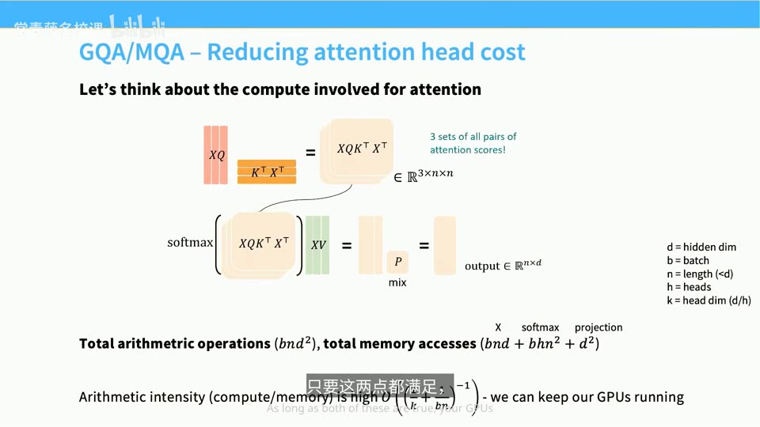 |
| 现在，我们已经完成了"训练"，要开始为用户提供（推理）服务。我们要如何为用户提供服务呢？我们要生成 token 并发送给用户。如果这么做——嗯，我就无法"并行化"生成过程；我的做法是：先生成一个 token，以此作为条件，再生成下一个 token（原字幕"逐各种复制过程"，应为"递归式的自回归过程"）。这可以说是自回归语言建模的"固有局限"—— [【跳转到 64:28】](https://www.bilibili.com/video/BV11LEA6eEuj/?p=3&t=3868) | 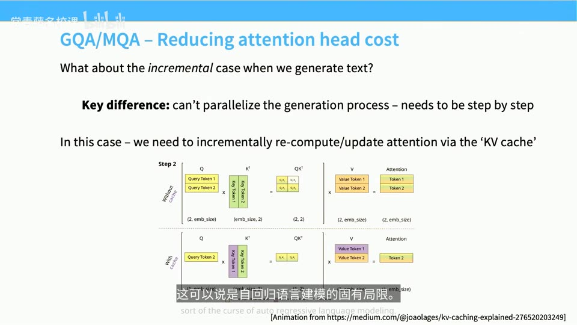 |
| 这是必须做的。为了高效完成，我们需要把过去所有的"键 K 和值 V"（原字幕"件和查询"）存起来，也就是所谓的"KV cache（KV 缓存）"。所以 KV cache 负责保存 [【跳转到 64:40】](https://www.bilibili.com/video/BV11LEA6eEuj/?p=3&t=3880) | 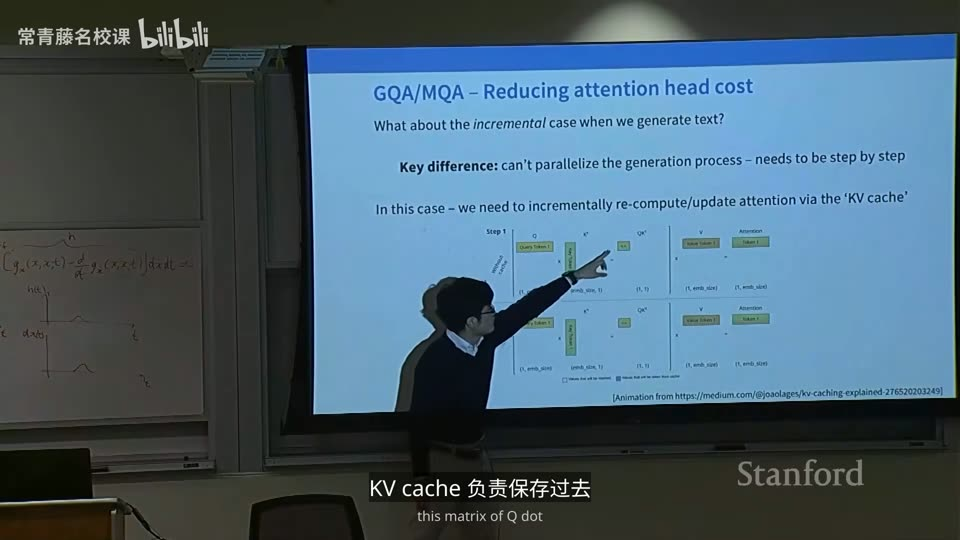 |
| ……（跳过部分重复内容——指算术强度部分）——你就能猜到"这种 KV cache 方法会一直读取参数"：每到一个新步骤，我都得重新读取参数，还得算这些点积；每个步骤我都会做一次。那么现在情况怎样？你知道的：我的总内存操作——啊抱歉，是总计算量（FLOPs）其实没变，我还是在乘那些相同的矩阵，对吧，只是"分步"做而不是一次性做完（因为是增量执行）。但现在的"内存访问"模式变成了：batch × seq_len × head-dim（原字幕 hiddendam）， [【跳转到 65:05】](https://www.bilibili.com/video/BV11LEA6eEuj/?p=3&t=3905) | 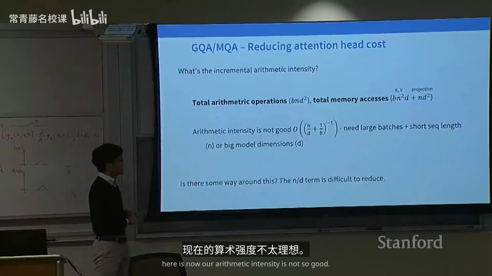 |
| 每到一个新步骤我都得重新读取参数还得算这些电极每个步骤我都会做一次那现在情况怎样你知道我的总内存操作抱歉总计算量其实没变我还是在乘那些相同的矩阵对吧只是分步做而不是一次性做完因为是增量执行现在的内存访问模式变成了batch乘以seek的平方乘以hiddendam [【跳转到 65:10】](https://www.bilibili.com/video/BV11LEA6eEuj/?p=3&t=3910) | 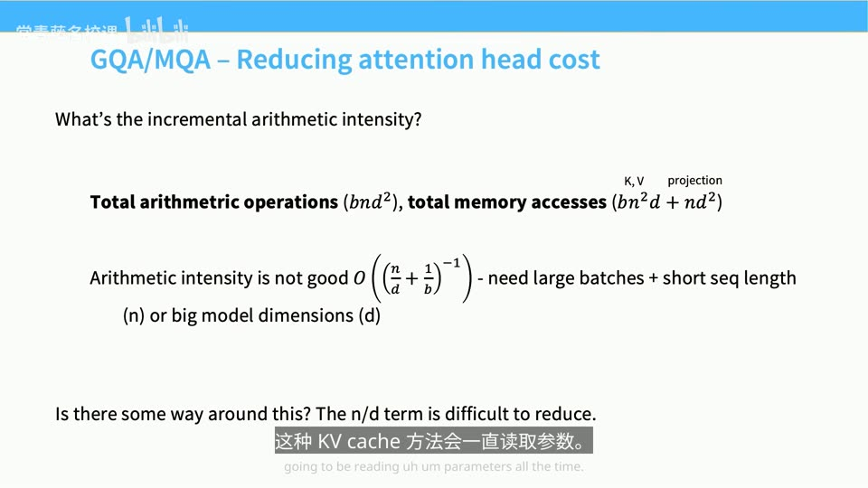 |
| 加上……（原字幕 ShesexeccrhchinHiddendamn 为乱码）。好，"第二项"就不那么理想了，对吧——以前（预填充阶段）只是 O(D²) 量级的内存访问，但现在变成了（序列长度 N 乘以）N×D²。我们来算一下算术强度，也就是这两个量的比值：结果是（约）D 比（N 加 1/b）——因此，要实现"高算术强度"，我们需要"大批量 + 短序列"，或者使用极大的（隐藏/admin）维度。好， [【跳转到 65:35】](https://www.bilibili.com/video/BV11LEA6eEuj/?p=3&t=3935) | 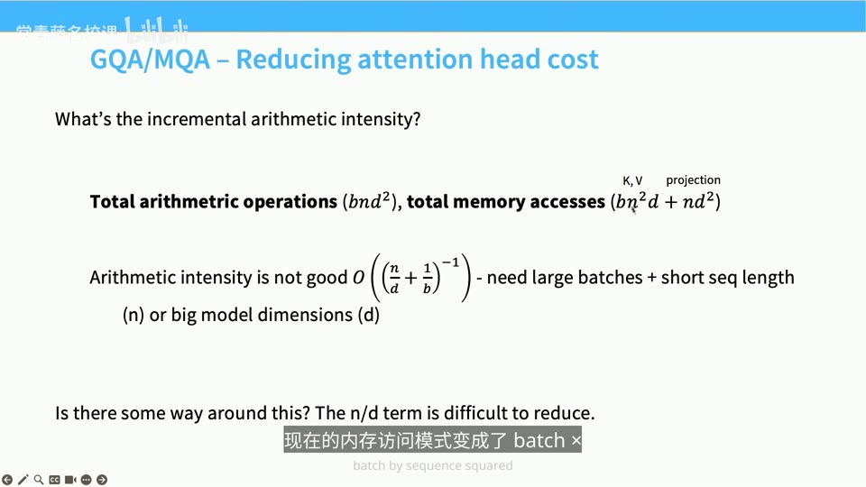 |
| 因此，若想高效部署小模型，"这种方法"就不太合适——这真的很难处理：这里的 ND 项（即"序列长度 ÷ 隐藏维度"）如果我们在做这种增量计算，这一项是很难降低的，这确实是个棘手的问题。 [【跳转到 66:00】](https://www.bilibili.com/video/BV11LEA6eEuj/?p=3&t=3960) | 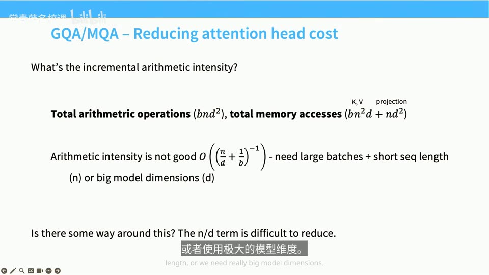 |
| 谢谢。所以，这就引出了 MQA——也就是"多查询注意力"（multi-query attention）的想法。意思是：在标准的注意力机制中，通常有多个头，每个头都有各自的 keys、values 和 queries——这是常规做法。但我们可以尝试让所有头共享相同的 K 和 V，仅在查询（query）上有所区别。这样做的话，能大幅减少需要在内存中读写的数据量，对吧： [【跳转到 66:18】](https://www.bilibili.com/video/BV11LEA6eEuj/?p=3&t=3978) | 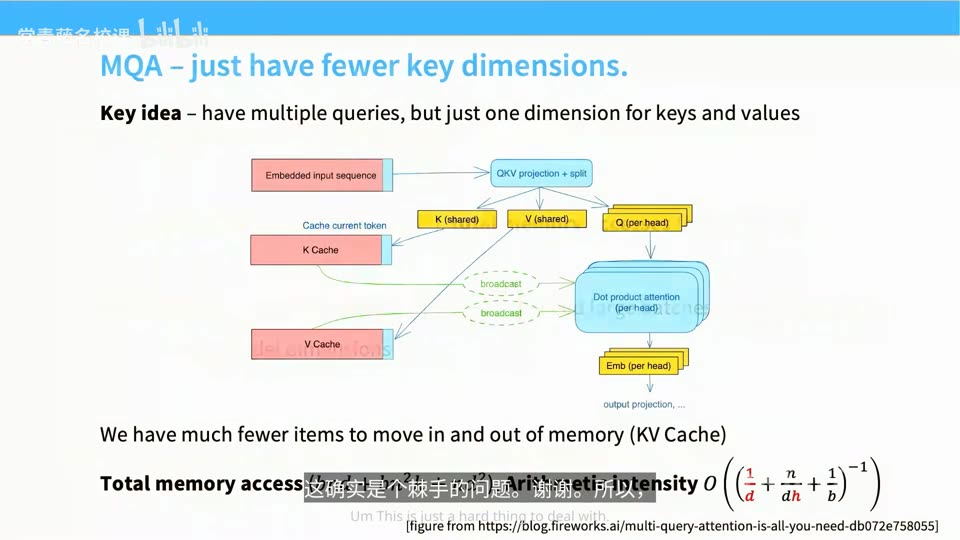 |
| 因为 KV cache 现在显著变小了，而且这些缓存是在所有 head 之间共享的——这大大减少了总的内存访问量，同时也提升了 arithmetic intensity。这就是我们这里讨论的关键项：之前我们有"ND 分之一（N 分之 D）"这一项，哎，那么现在这一项变成了"1/H × ND"对吧。所以如果我们有很多 head，这个 H 分之一（原字幕 H 项）能让我们显著降低——抱歉，是显著"提升" arithmetic intensity。这比之前的（做法）有显著优势： [【跳转到 66:43】](https://www.bilibili.com/video/BV11LEA6eEuj/?p=3&t=4003) |  |
| 因此带来了明显的效率提升。好，但 MQA 的问题在于"右边指出的这一点"——也就是说，所有这些 query 只共用一个 key 和一个 value。事实上，这样做会损失大量的"表达能力"。所以这就需要在"系统效率"和"表达能力"之间进行权衡。你可能会想：是否存在一个"折中点"，让我们既能避免大幅牺牲表达能力， [【跳转到 67:08】](https://www.bilibili.com/video/BV11LEA6eEuj/?p=3&t=4028) | 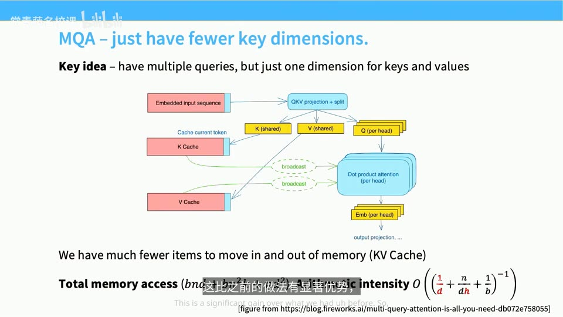 |
| 又能兼顾计算效率？这就是 GQA——分组查询注意力——派上用场的地方。回顾一下：原始的 Transformer 采用"多头"架构，在多头架构中每个 head 都有各自的 query 和 key；而在"多查询机制"中，所有 head 共享同一个 key 和 value。好，这种情况下，在"分组查询"中，我们减少了 key/value head 的"数量"但保留了（原字幕"大"应为）q head 的总数 H；因此我们获得了一个"可调的比例"（参数）： [【跳转到 67:33】](https://www.bilibili.com/video/BV11LEA6eEuj/?p=3&t=4053) | 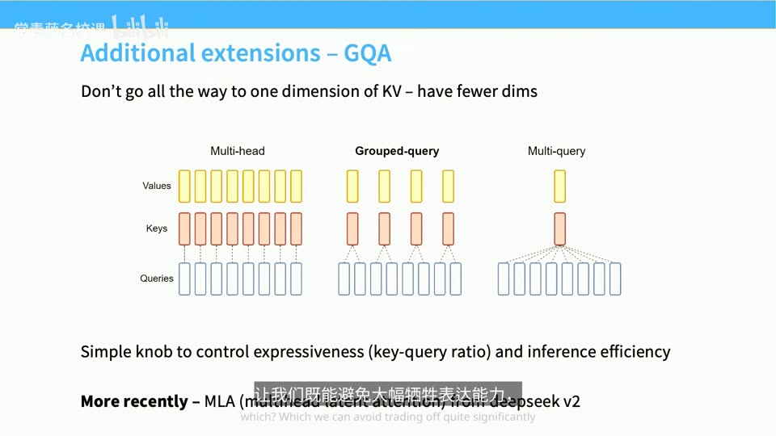 |
| "key head 或 value head 的数量"，同时保持 head 总数远大于这个数量——这样我们就能非常简单地控制"表达能力与推理效率"之间的权衡。另外，DeepSeek-V2 中还有一些其他技巧（比如"多头潜在注意力" MLA），我下次会简要提及；它们具有不同的因子分解结构和不同的权衡取舍（turb）。但 GQA 的真正优势在于："在实际应用中"，这种权衡是非常有利的。 [【跳转到 67:58】](https://www.bilibili.com/video/BV11LEA6eEuj/?p=3&t=4078) | 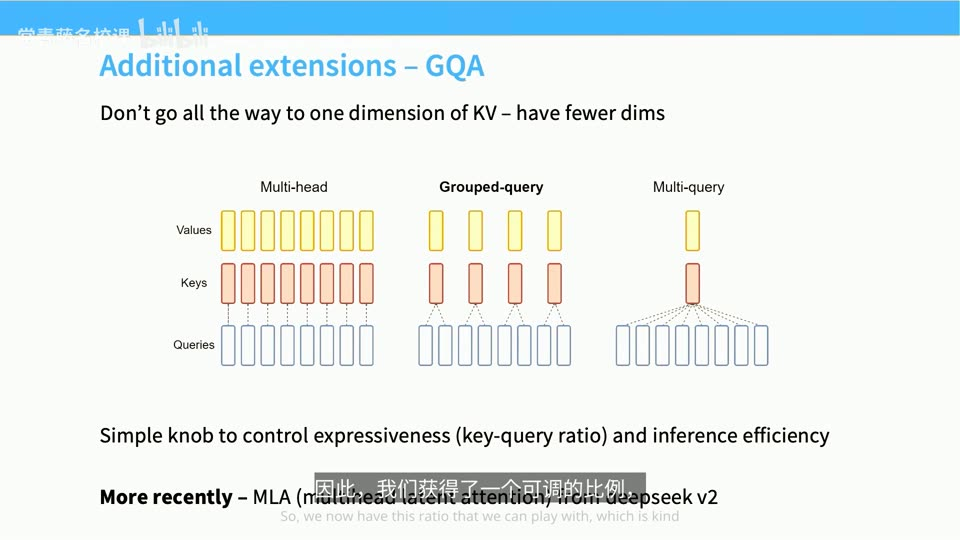 |
| （板书：）因此使用"多头（MHA）"机制时，你的性能就是这样——这是 T5 时期的情况（如果我没记错的话）：这是你的下游模型性能，这是每个样本的处理时间——你应尽可能降低（后者）。使用"多头注意力"，你能获得最佳性能，但成本非常高（服务时间最长）；使用 MQA：成本较低，但性能显著下降（同样，如果你缩小模型规模以试图达到性能目标， [【跳转到 68:23】](https://www.bilibili.com/video/BV11LEA6eEuj/?p=3&t=4103) | 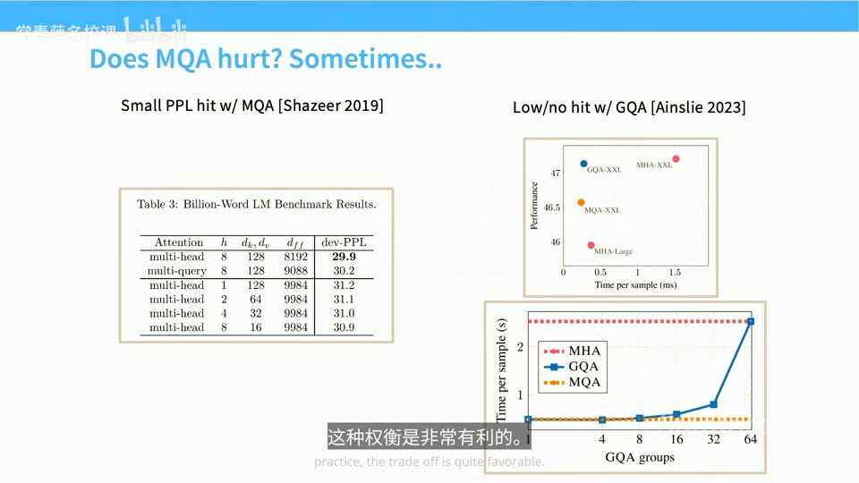 |
| 结果往往会导致性能大幅恶化）。而 GQA 确实能"兼顾两者优势"：它的（服务）成本极低，且性能几乎与完整的多头机制相同。可以看到：GQA 这种分组结构的特点是——只要小幅减少 key/value head 的数量，基本上就能保留绝大部分的性能，从而允许你在保持"大部分表达能力"的同时，换取显著的"推理效率"提升。另外，后面我们会更详细地讨论具体的推理机制； [【跳转到 68:48】](https://www.bilibili.com/video/BV11LEA6eEuj/?p=3&t=4128) | 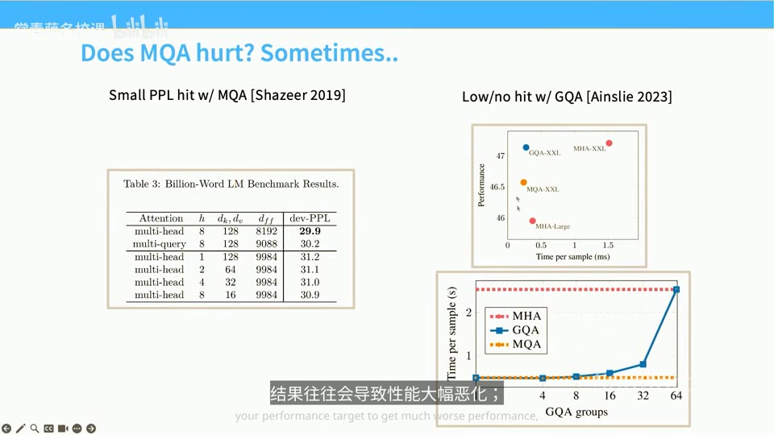 |
| 这大概能解释为什么现在的模型几乎都采用 GQA：它能在"大幅降低推理成本"（这点很关键）的同时，几乎不牺牲表达能力。啊，好，关于 GQA 或 KV cache， [【跳转到 69:13】](https://www.bilibili.com/video/BV11LEA6eEuj/?p=3&t=4153) | 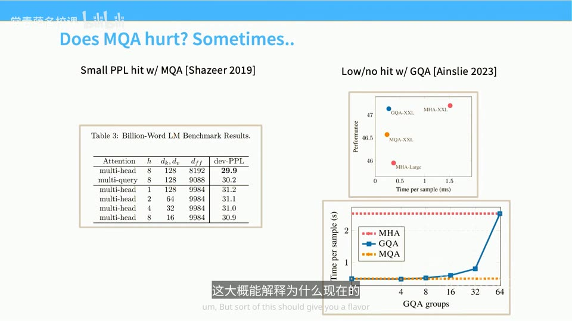 |
| 有什么想问的吗？没有吗？ [【跳转到 69:24】](https://www.bilibili.com/video/BV11LEA6eEuj/?p=3&t=4164) | 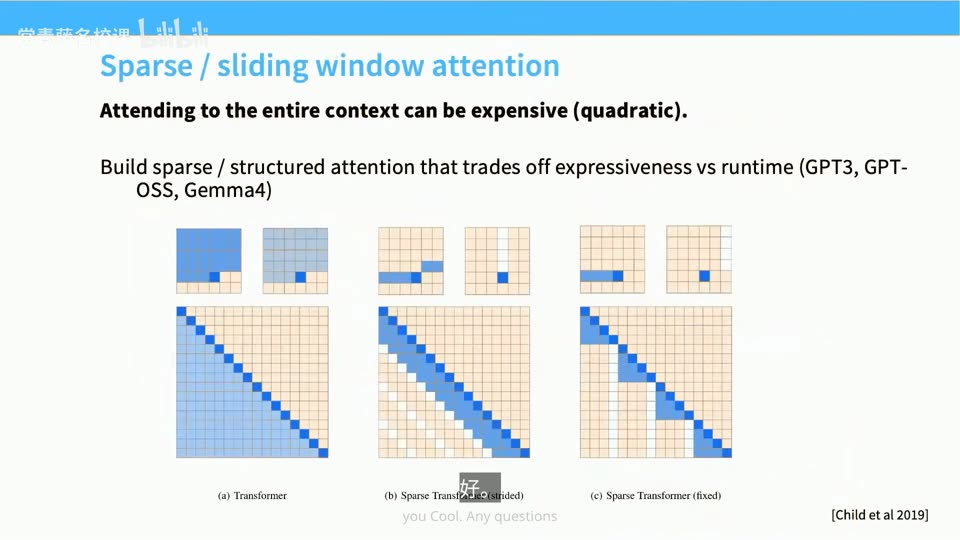 |
| （学生）"我有点懵——祝你好运。"（笑）来吧，你们还有（这么）多（问题）——比如，关于"哪些超参数表现良好"的经验法则： [【跳转到 69:30】](https://www.bilibili.com/video/BV11LEA6eEuj/?p=3&t=4170) | 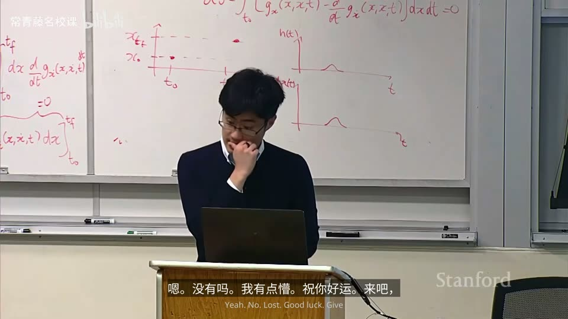 |
| "也就是说，你们仍在多大程度上搜索超参数？又在多大程度上利用这些已有的经验法则？"（答）我觉得是"两者结合"： [【跳转到 69:35】](https://www.bilibili.com/video/BV11LEA6eEuj/?p=3&t=4175) | 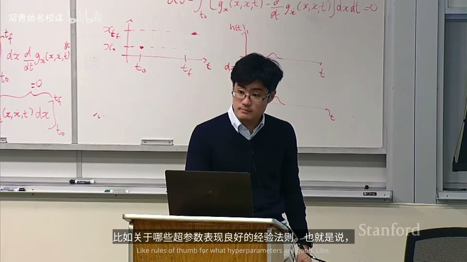 |
| 我觉得每次训练模型时，都会有一些关于"可调参数"的假设——所以你在很多报告里都能看到这一点：我觉得在这些报告里，大家通常不会太多改动"超参数"；但是在这些报告里，你通常会看到"architecture 是逐个调整的"，一次性全改的情况很少见。 [【跳转到 69:44】](https://www.bilibili.com/video/BV11LEA6eEuj/?p=3&t=4184) | 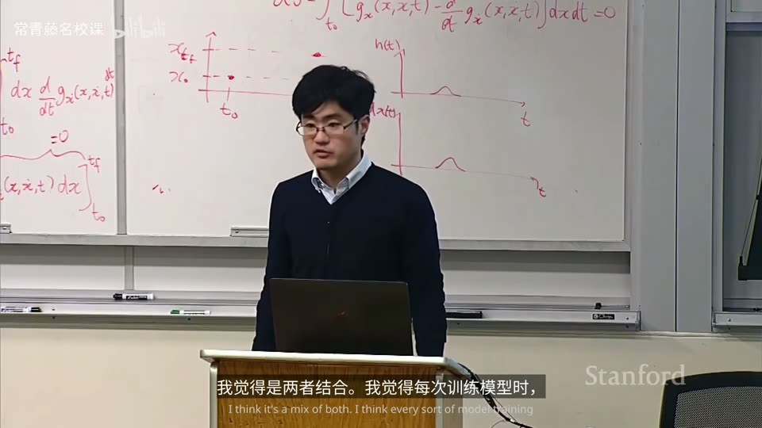 |
| 谷歌是为数不多真正"大刀阔斧调整"的机构之一。啊，（自己做的）系列做了一些相当有意思的尝试：比如最新发布的 Gemma 4，现在为每一层都配备了独立的 embedding（嵌入因子）—— [【跳转到 70:01】](https://www.bilibili.com/video/BV11LEA6eEuj/?p=3&t=4201) | 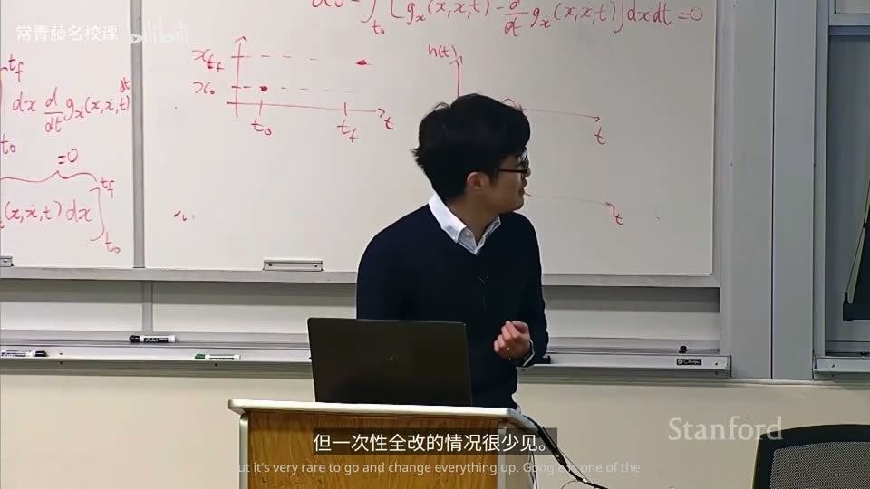 |
| 以此在"内存占用"和"浮点运算量（FLOPs）"之间做权衡。 [【跳转到 70:11】](https://www.bilibili.com/video/BV11LEA6eEuj/?p=3&t=4211) | 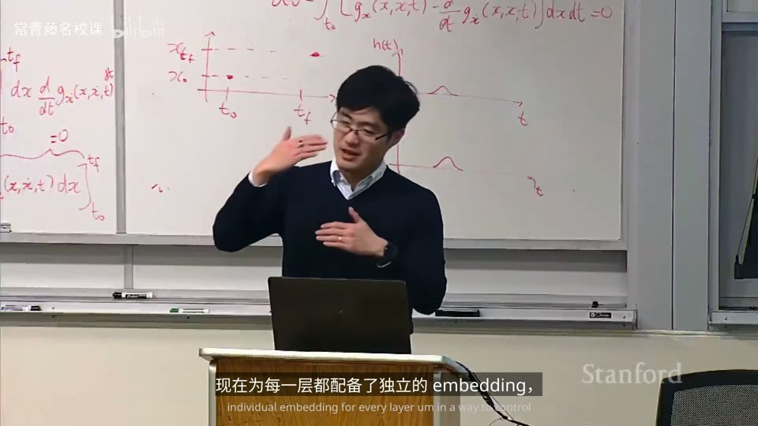 |
| 他们所做的一系列工作非常有趣。谢谢。问：哦，好的，后面那位——有没有人尝试过"在训练过程中动态调整"？ [【跳转到 70:17】](https://www.bilibili.com/video/BV11LEA6eEuj/?p=3&t=4217) | 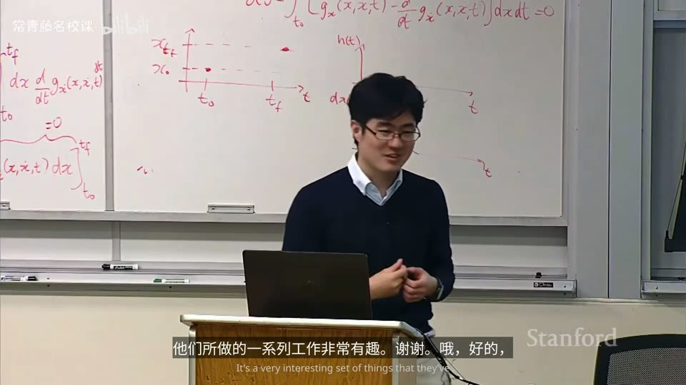 |
| "……某些参数？"（答）"训练过程中……啊我想想：权重衰减（Weight decay）？有的：权重衰减大家通常会让它和学习率协同调整——这其实是一种很常用的启发式做法，效果也很好。除此之外，我不太确定还有多少超参数是大家会在训练过程中改动的——尤其是 architecture 相关的那些：一改（架构）训练就完全不兼容了，所以训练时基本动不了它们。嗯， [【跳转到 70:22】](https://www.bilibili.com/video/BV11LEA6eEuj/?p=3&t=4222) | 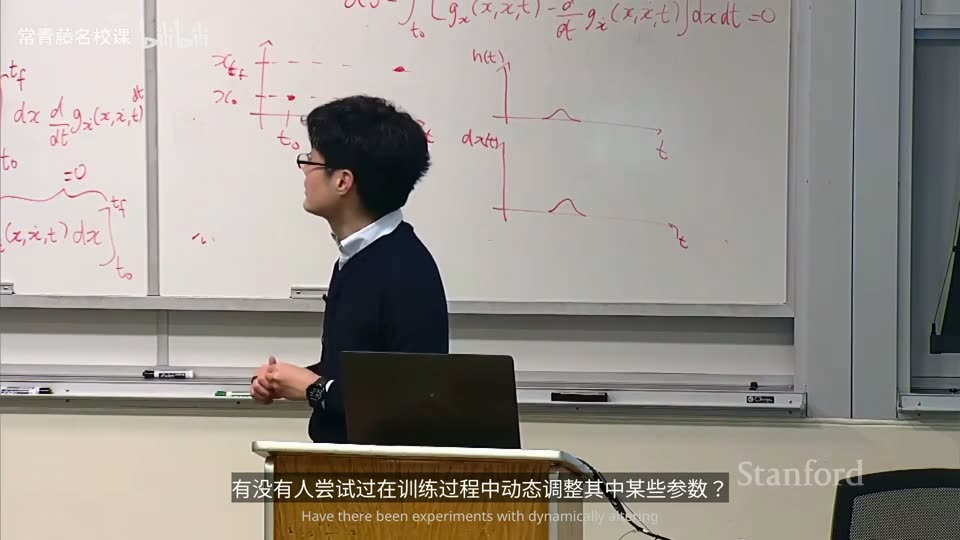 |
| 所以我能想到的大概就是权重衰减这一个。"（学生："Yeah I'm curious。"）"其他参数通常都是固定的。" [【跳转到 70:47】](https://www.bilibili.com/video/BV11LEA6eEuj/?p=3&t=4247) | 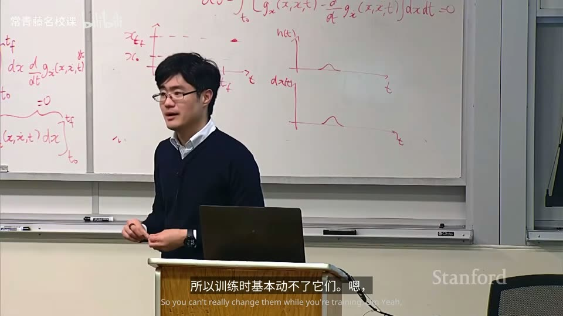 |
| 对，谢谢。（说明：有几位同学在传纸条？嗯……）问："嗯我有个问题：这不仅仅是'推理时间'的问题（吧）？" [【跳转到 70:53】](https://www.bilibili.com/video/BV11LEA6eEuj/?p=3&t=4253) | 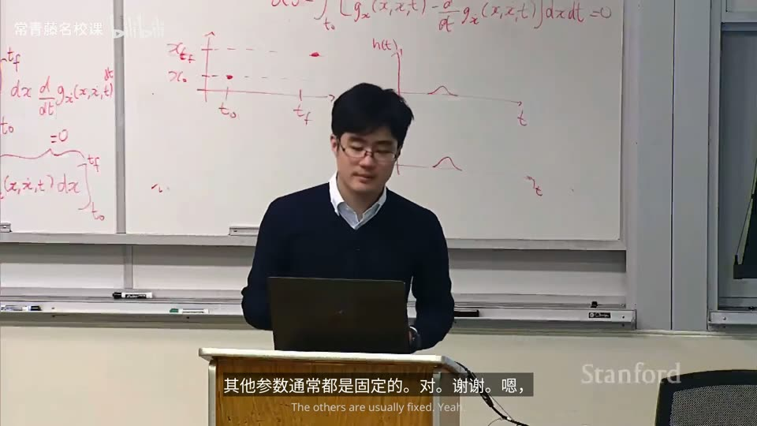 |
| "不客气，没问题。没错，是的：你用固定数量的 K/V head（注意力头）来训练（原字幕'固定数量的减'）；对，对，有——哦哦。"好，最后我要讲的是"滑动窗口注意力（sliding window attention）"： [【跳转到 70:58】](https://www.bilibili.com/video/BV11LEA6eEuj/?p=3&t=4258) | 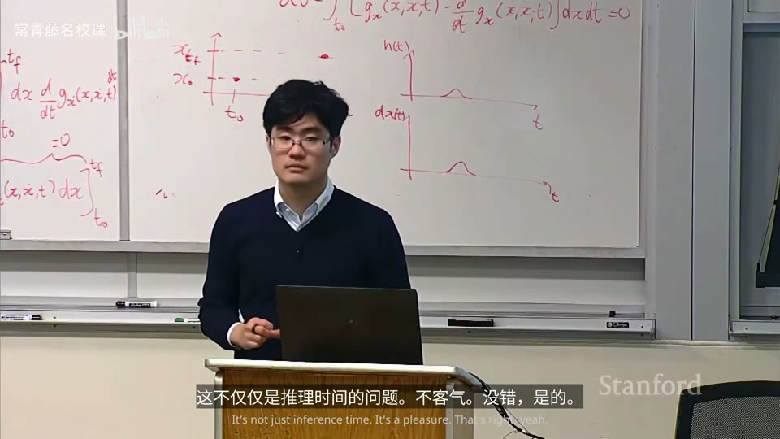 |
| 这是一个很老的概念了：此前 Longformer（原字幕 Bmoredbtthree 之类）已提出。Bert（原字幕 btthree） [【跳转到 71:04】](https://www.bilibili.com/video/BV11LEA6eEuj/?p=3&t=4264) | 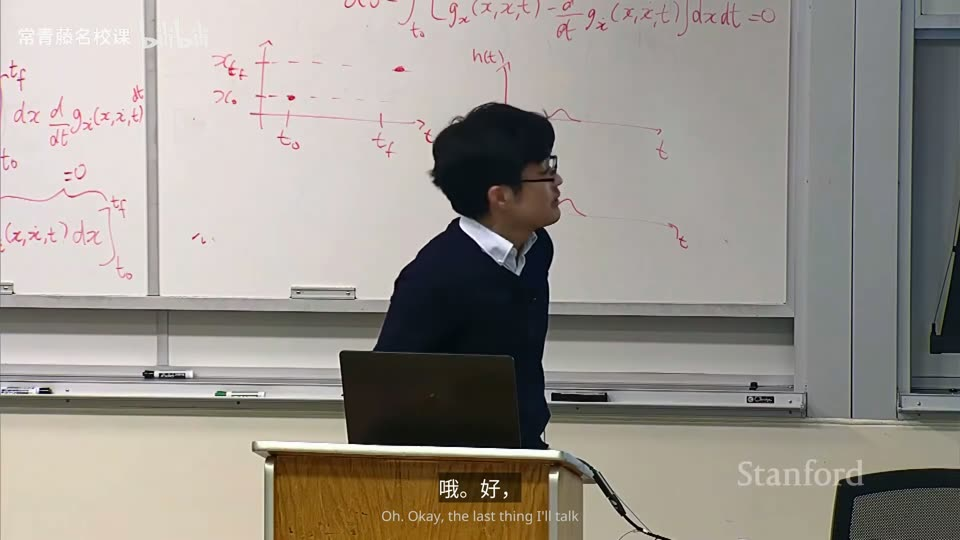 |
| 其实就用过这个。读论文的话，你会看到他们会在"全注意力（full attention）"和"带状矩阵式注意力（banded/blocked attention）"之间交替：在 full attention 中，每个位置都能关注过去的所有位置；而在"带状/窗口式"注意力中，你只能关注一个固定窗口内的位置。OpenAI 在这方面有一些早期工作，研究过各种可用的注意力模式。不过，过去这一年里，这个做法真的变得非常流行： [【跳转到 71:09】](https://www.bilibili.com/video/BV11LEA6eEuj/?p=3&t=4269) | 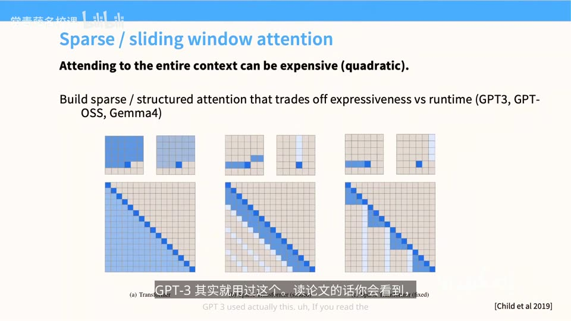 |
| 这种"在大的 full attention 和更局部的注意力之间交替"的思路，其实是在"长上下文性能"与"推理开销"之间找到了一个很好的平衡， [【跳转到 71:34】](https://www.bilibili.com/video/BV11LEA6eEuj/?p=3&t=4294) | 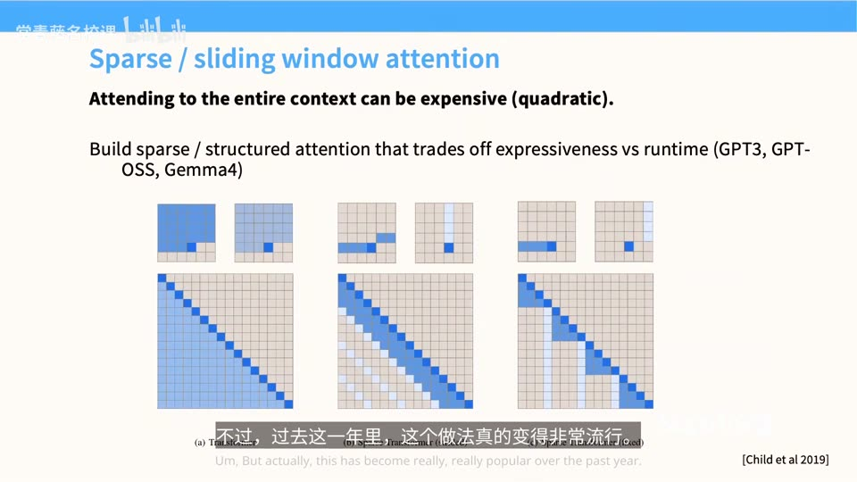 |
| 最近在开源模型里又流行起来了。我记得最早这么做的应该是 xxx（原字幕 coherentcommanda，应指 Cohere Command-R 类模型）：它的结构是"每四层里有一层 full attention（关注所有位置），这中间那三层则使用 sliding window attention（只能看到局部结构）"。呃，当然，顺着层级往上走——呃，抱歉，在这个案例里是"往下走"（因为他们的图表是反着画的）——随着你沿着这些模块往下推进，"局部信息会被聚合为全局信息"： [【跳转到 71:43】](https://www.bilibili.com/video/BV11LEA6eEuj/?p=3&t=4303) |  |
| 末尾的局部注意力当然能访问更多全局信息。但这让你能控制"超长上下文"的成本，而不必去采用状态空间模型这类"更花哨"的方案，效果相当不错。不过，（做讲座重要）有一些创新做法：人们改变了"长程信息的嵌入"（方式），不再使用 RoPE 这类东西（所以这里完全没有位置嵌入）——你实际上几乎是在处理"无序集合 + 短程信息"， [【跳转到 72:08】](https://www.bilibili.com/video/BV11LEA6eEuj/?p=3&t=4328) | 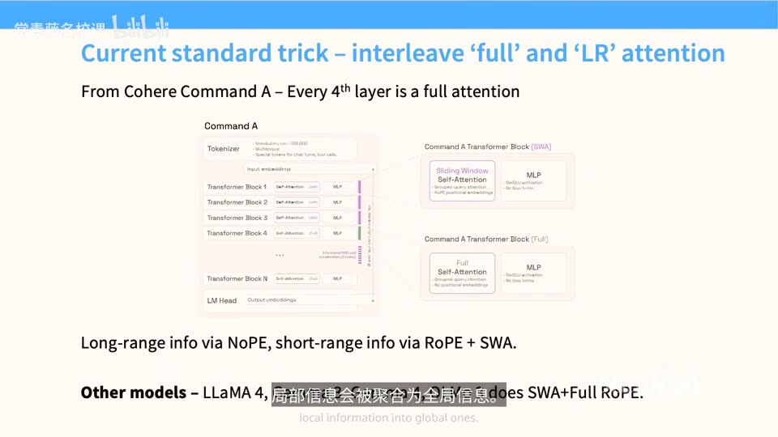 |
| 还保留着位置信息。所以，人们尝试了各种干预手段：既涉及这些"嵌入"，也涉及"局部和全局结构"的交替。我要说的是，关于"注意力"以及总体而言"如何平衡超长上下文与它的成本和性能"，这仍然是一个"活跃的研究领域"——这里仍然是 architecture 工作和变更最活跃的地方。我们看到其实有很多其他模型也采用了这一思路，比如 XXX（原字幕 lamafour，应为 Llama 4 等）， [【跳转到 72:33】](https://www.bilibili.com/video/BV11LEA6eEuj/?p=3&t=4353) | 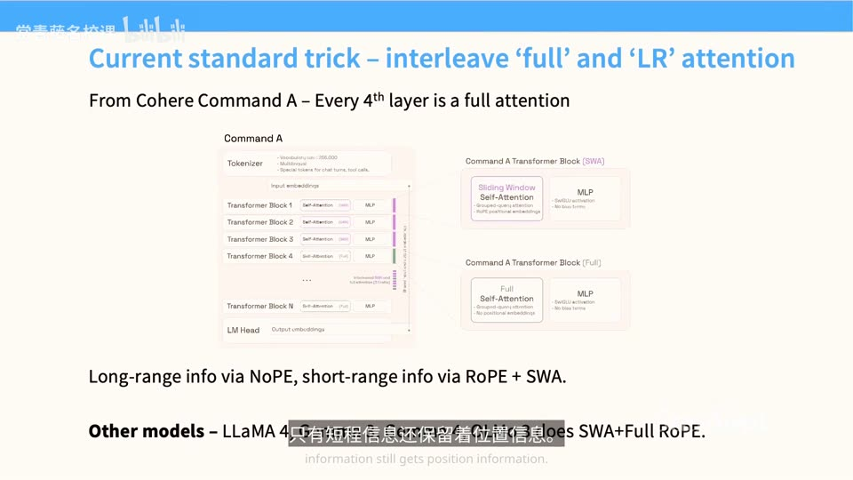 |
| 以及最近的 xxx，还有 xxx（原字幕 oamos）——right，他们都采用了"滑动窗口注意力与全注意力相结合"的方式；在他们的（原字幕）情况下，是用"全 RoPE"（而不是 NoPE）来做 embedding。嗯，所以正如我所说，这种做法正变得非常非常流行。比如我放在右边的 xxx（原字幕 killhansfriend，应为 Qwen3-480B 之类/或 Qwen3-NEXT 类混合模型）：他们其实稍有不同——因为他们交替使用一种叫做"门控 Delta 网络（gated delta net）"的状态空间模型和"全注意力"（大致是每 4 层里有一层是全注意力）——所以这是同样的"交替结构"； [【跳转到 72:58】](https://www.bilibili.com/video/BV11LEA6eEuj/?p=3&t=4378) | 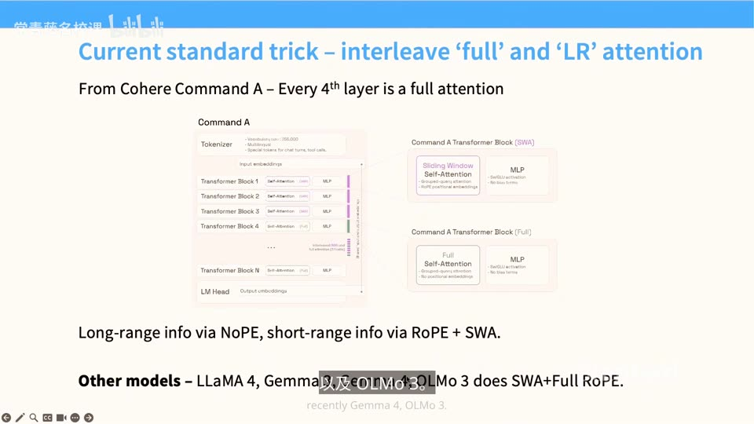 |
| 但他们用的"廉价层"（原字幕 YOR）在他们这里用的是"状态空间模型"（SSM）而不是"滑动窗口式的局部注意力"（下一节课我会讲它是什么）。但你可以看到，我认为这是"过去一年的一个新主题"：开源模型正在认真应对"长上下文性能"问题。实现这一点的方法（原字幕 PROSARS）——至少到目前为止——是构建这些"混合模型"：它们既不是单纯的"全局注意力"， [【跳转到 73:23】](https://www.bilibili.com/video/BV11LEA6eEuj/?p=3&t=4403) | 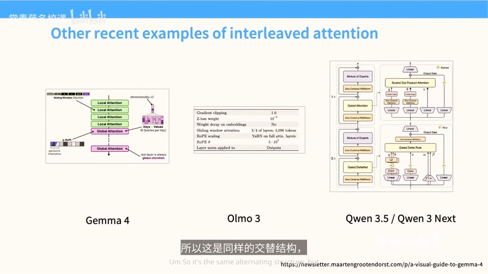 |
| 也不是单纯的"廉价注意力"，而是存在某种介于两者之间的"混合方案"。到目前为止，这种方案在许多模型中都表现得很好。好的， [【跳转到 73:48】](https://www.bilibili.com/video/BV11LEA6eEuj/?p=3&t=4428) | 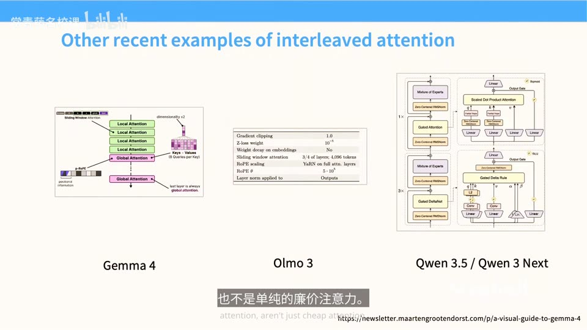 |
| 正如我刚才强调的：当你纵观所有这些模型，会发现许多共同的模式 [【跳转到 73:57】](https://www.bilibili.com/video/BV11LEA6eEuj/?p=3&t=4437) | 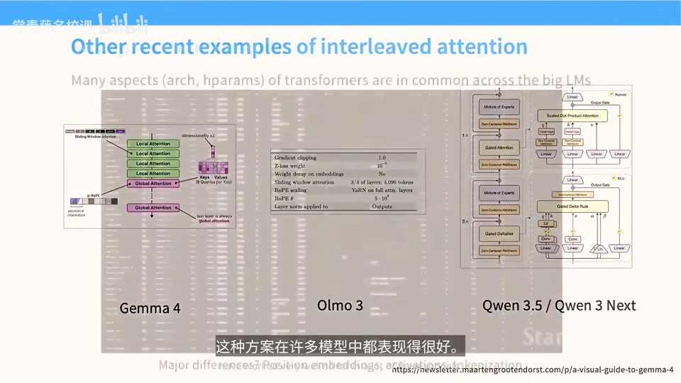 |
| 希望这能帮你建立起一种通用的理解哪些做法可行哪些是良好的默认选择此外我们在处理上下文和位置嵌入positionembedding的方式上也看到了许多差异甚至在分词TOIIZATION上也存在一些差异对吧所以这些模型之间既有差异也有共性希望这些共性能为你提供一些直觉帮助你在完成作业尝试冲击排行榜 [【跳转到 74:02】](https://www.bilibili.com/video/BV11LEA6eEuj/?p=3&t=4442) | 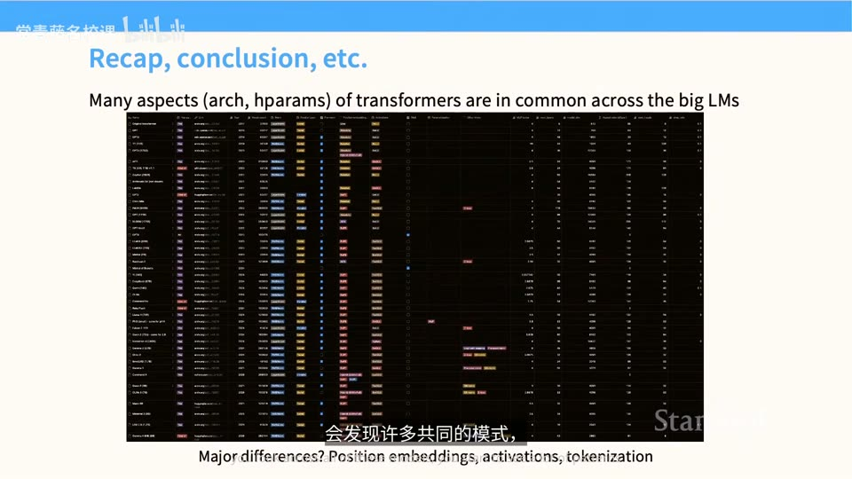 |
| （leaderboard）等任务时有所参考。谢谢（鞠躬，讲座结束）。 [【跳转到 74:27】](https://www.bilibili.com/video/BV11LEA6eEuj/?p=3&t=4467) | 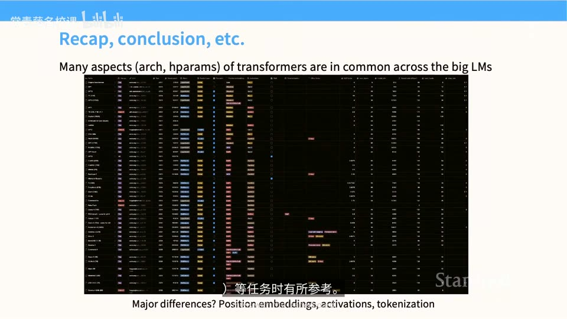 |