# Lecture 4: Attention Alternatives · 原始文稿（图-字幕分栏）

| 字幕文本 | 画面 |
| :--- | ---: |
| 好，我们开始。抱歉，今天的课件之前没挂出来，现在已经上传了；如果你想随时翻看， [【跳转到 00:00】](https://www.bilibili.com/video/BV11LEA6eEuj/?p=4&t=0) | 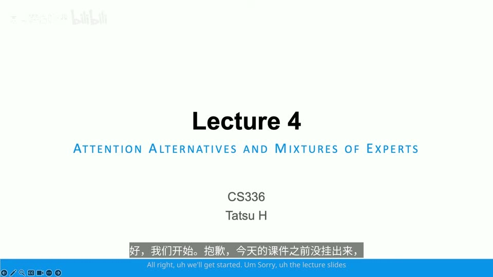 |
| 可以通过课程网站获取；如果课程网站上没有，GitHub 上肯定有。今天我们要聊的是 [【跳转到 00:05】](https://www.bilibili.com/video/BV11LEA6eEuj/?p=4&t=5) | 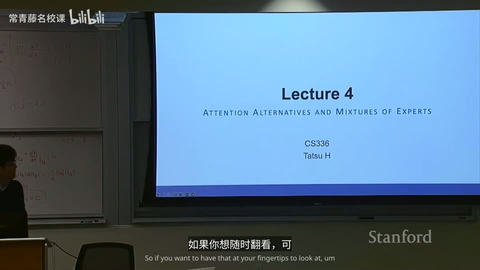 |
| 我认为"更高级"的架构思路。上一讲主要讲"基础 Transformer"，以及如何调整基础 Transformer 的不同部分来构建现代语言模型；现在我想谈谈我认为更进阶、更复杂的内容——也就是在常规 Transformer 之上的新进展。今天我要讲两件事。第一件是"注意力的替代方案"（attention 替代），也就是通过架构改动来支持更长的 context（上下文）—— [【跳转到 00:10】](https://www.bilibili.com/video/BV11LEA6eEuj/?p=4&t=10) |  |
| 这些改动在大多数情况下能让时间复杂度随序列长度成"线性时间依赖"（linear time dependence），而不是"二次方"（quadratic so）；第二件我想谈的是"混合专家（Mixture of Experts, MoE）"的概念，对吧。所以，第一部分是修改"注意力模块"，第二部分是修改"MLP 部分"——those（）用 expert（专家）能显著提升硬件利用率，并在给定计算（computer）预算下支持更多的参数量。这就是今天要讲的两个部分和两个核心想法。 [【跳转到 00:35】](https://www.bilibili.com/video/BV11LEA6eEuj/?p=4&t=35) |  |
| 所以我先从 attention 讲起。啊，先把背景铺一下：现在很清楚，大家需要更长的 context length。你希望把大量内容塞进 context，让模型拥有更多知识；也可能它是一个 agent，需要处理很多东西。如果你看这张图：横轴是"随时间推移的不同模型"，纵轴是"context window 大小"（采用对数尺度），可以明显看到：许多顶级 LM 厂商都在竞相提供 [【跳转到 00:58】](https://www.bilibili.com/video/BV11LEA6eEuj/?p=4&t=58) | 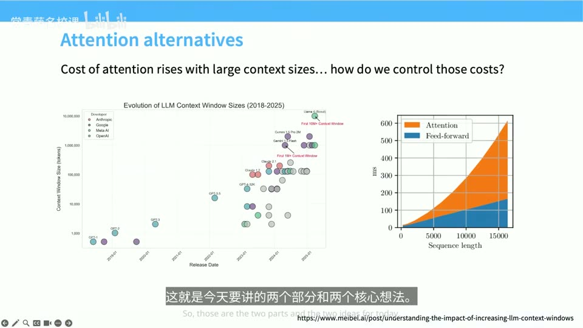 |
| 越来越大的 context 规模，以支持这类更复杂的工作负载。啊，那么我们该如何控制这些成本呢？目前还没有答案。右边这张图还展示了：随着序列长度增加，"网络中 feedforward 部分"与"attention 部分"各自消耗的计算成本之比。可以看到，feedforward 在（序列较短）初期占比较大，但呈线性增长；attention 是所有位置之间的 all-to-all 连接，复杂度是二次方（quadratic）： [【跳转到 01:23】](https://www.bilibili.com/video/BV11LEA6eEuj/?p=4&t=83) | 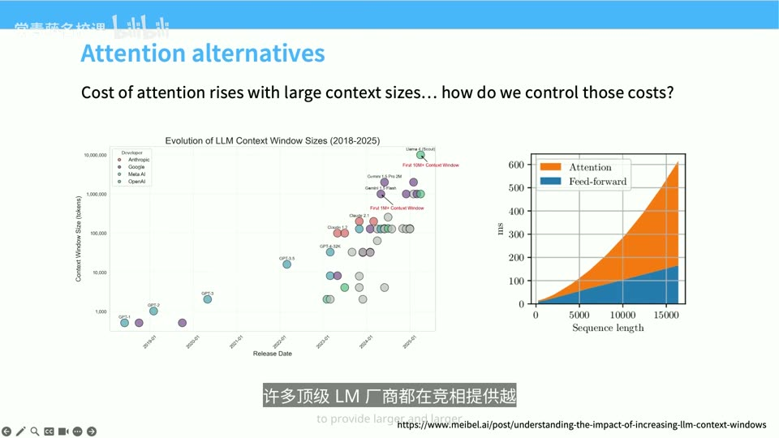 |
| 因此，随着序列长度增加，attention 会"迅速超过" feedforward 的开销。过去，对于序列长度较短的大模型，feedforward 是主要的开销；随着序列长度增加，attention 的开销问题日益凸显。谢谢。那么，我们可以用来控制这些开销的 [【跳转到 01:48】](https://www.bilibili.com/video/BV11LEA6eEuj/?p=4&t=108) |  |
| 基本工具有哪些？我们已经讨论过这些工具（或者说讨论过其中之一），并将讨论另一个。基本上，我们可以采用诸如"局部注意力（local attention）"这样的方法，并将它们以不同"混合方式"组合，以控制 global attention 的极高开销：如果你每 8 层采用一次全局注意力（global attention，原字幕 GB attention），其余层都只用这种"高度局部的" local attention，成本就能得到很好的控制。 [【跳转到 02:03】](https://www.bilibili.com/video/BV11LEA6eEuj/?p=4&t=123) | 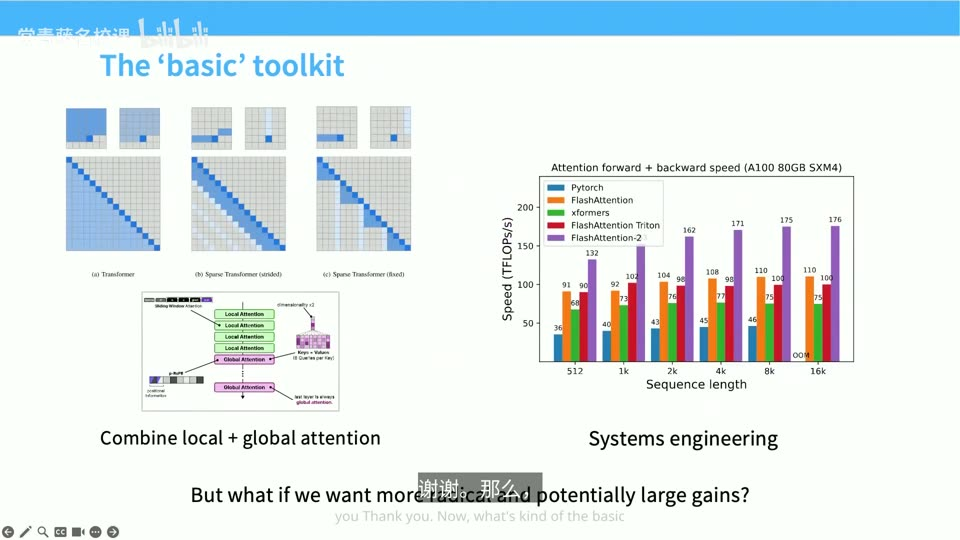 |
| 嗯，另一条路是"系统工程"。很多人低估了一个事实："常数因子（constant factors）其实至关重要"。这门课的主题之一就是你需要关注细节：受过传统理论导向计算机科学训练的人，很容易觉得"啊对，重要的是 O 记号——是 linear 还是 quadratic"。不过我认为，对"context 和 attention 成本"影响最大的进展之一，就是 FlashAttention。关于 FlashAttention， [【跳转到 02:28】](https://www.bilibili.com/video/BV11LEA6eEuj/?p=4&t=148) | 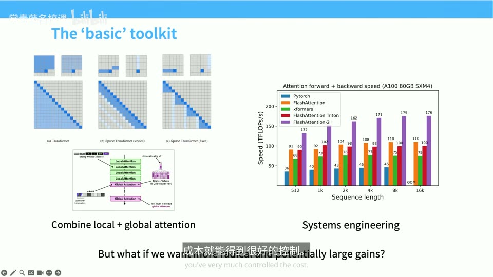 |
| 我们在后面的系统课程和系统作业中会更详细地讨论。但 FlashAttention 其实就是一种非常巧妙的做法：把 attention 运算重新组织成对系统更友好的形式，从而"最小化 memory transfer 开销"（原字幕有 Overheadjoin 乱码），这能为 attention 的性能带来"真正、真正惊人"的提升。所以，原生 PyTorch 是蓝色这条线：你可以看看那些序列长度较短的情况，那我们大概能做到"每秒 30~40 teraFLOPs"； [【跳转到 02:53】](https://www.bilibili.com/video/BV11LEA6eEuj/?p=4&t=173) | 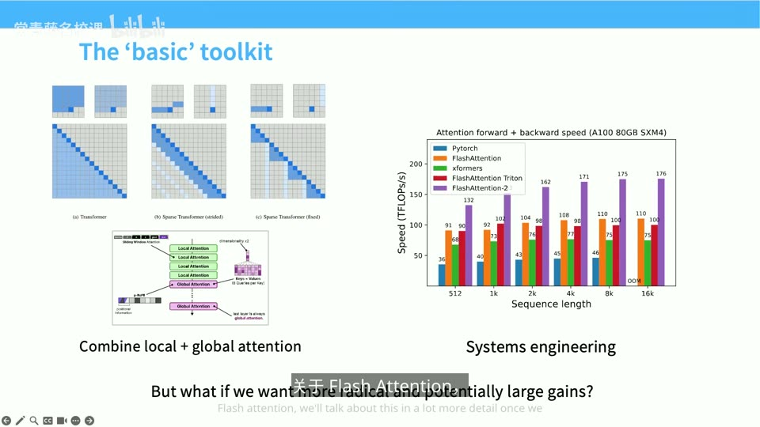 |
| 接着你用 FlashAttention——这本质上是"常数因子层面的系统改进"——你能获得巨大的提升：比如性能"翻倍"。到了某些规模，你甚至没法把它塞进内存里（原生 PyTorch 会报错），但有了 FlashAttention，由于不再显式生成这些"大型 attention 矩阵"，你还能继续跑（只是会稍慢一些）。这并不能解决 quadratic 成本的问题；但常数因子的优化非常强大。啊，不过话说回来，如果要处理 50 万（five hundred thousand）——不，到 10 多万个 token（原字幕 fivehundredone~1000 多万：「500k-1000 万」）， [【跳转到 03:18】](https://www.bilibili.com/video/BV11LEA6eEuj/?p=4&t=198) | 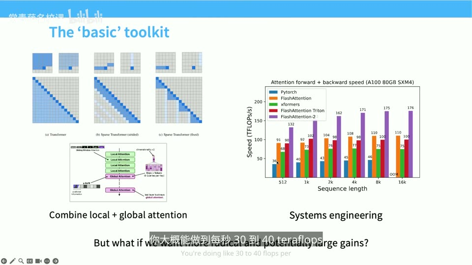 |
| 这些技巧可能就不够用了：嗯，我们需要在"长上下文处理能力"上获得更激进、更大幅度的提升。所以这就引出了一个问题："有没有办法让我们对'序列长度'实现线性时间复杂度（或线性依赖）？"Thank you。"那那些方法具体是什么样的？"谢谢。好的。 [【跳转到 03:43】](https://www.bilibili.com/video/BV11LEA6eEuj/?p=4&t=223) | 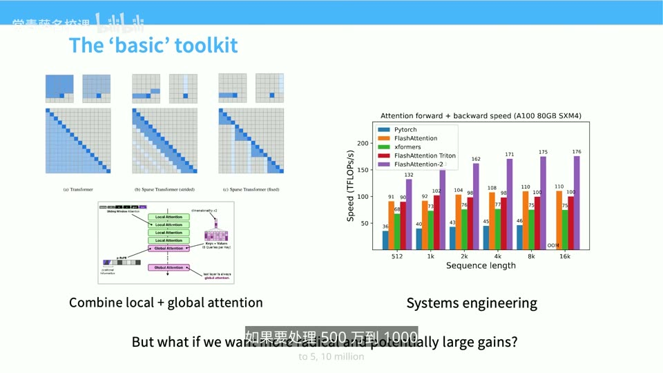 |
| 请看。事实证明，多年来许多人尝试过各种各样的方法，因此我认为其中有一些走了弯路；但近几年——大概过去两年左右——开始出现了一些新的进展，出现了一套在"线性时间注意力（linear time attention）"上相当有效的方案。这些方案如今已在大规模场景下经过实战检验。啊，这也是为什么"今年是我第一次讲线性时间注意力"的原因：因为现在已经很清楚，这些方法在大规模部署和生产环境中 [【跳转到 04:01】](https://www.bilibili.com/video/BV11LEA6eEuj/?p=4&t=241) | 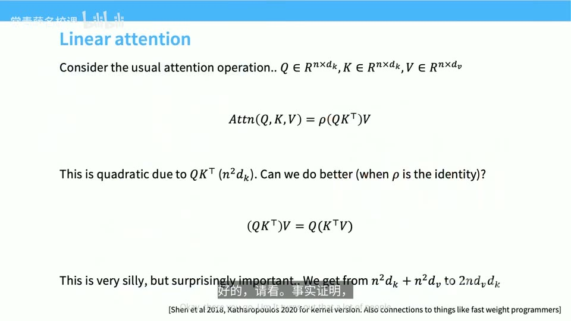 |
| 确实行之有效。要真正解释所有这些行之有效的方法，我认为你只需要先理解一个核心思想，然后我们会在此基础上展开和深入；而这个"起点性的"核心思想，就是"乘法的结合律"。那么我们来思考一下 attention 是如何工作的：我们可以用这种紧凑的记法来表示 attention 操作——由 Q、K 和 V 组成，对吧；其矩阵维度如上（旁）方所示 [【跳转到 04:26】](https://www.bilibili.com/video/BV11LEA6eEuj/?p=4&t=266) | 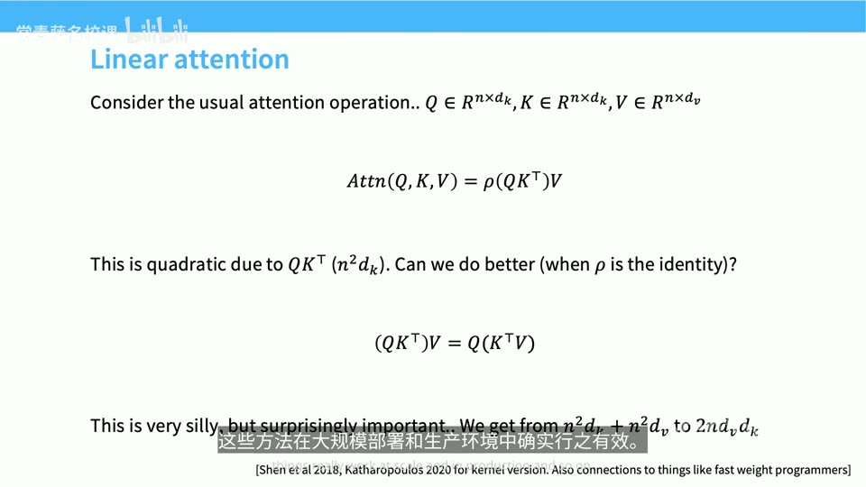 |
| （对应幻灯片上的维度标记）。接下来，我会把 Q 和 K 拿出来，让他们做 all-to-all 交互，对吧：所有的位置（token 位置）都会通过矩阵乘法（QK^T）相互"作用"。然后我会通过这一行，用 softmax 进行归一化；接下来，我会把它和值 V 相乘，得到 attention 的输出。对，啊，这就是经典的 self attention（或类似的 attention 操作）。啊，现在，我们先暂时"忘掉" attention 里有一个 softmax，我直接把这一行去掉： [【跳转到 04:51】](https://www.bilibili.com/video/BV11LEA6eEuj/?p=4&t=291) | 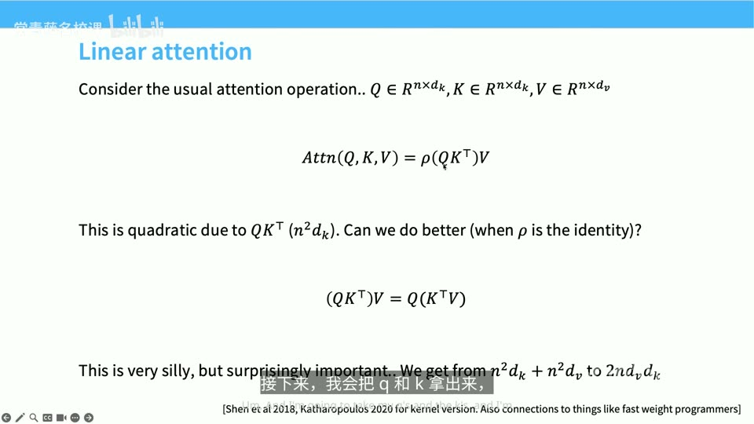 |
| 先把它放一边。如果没有这一行（softmax），我们（或许可以）真的可以改变这个操作的复杂度。所以你看 attention 的复杂度之所以是二次的，是因为我们做了这个 QK^T：这个 QK 转置乘法（的矩阵大小是 N×N）。但如果这一行是"单位矩阵"，我只要稍微调整一下括号的位置就行：简单来说，原本要做 QK^T→再 V，现在实际上就是（右结合）"先算 K^T 与 V 相乘，再与 Q 相乘"。经过这种"重排序（括号移动）"之后，嗯—— [【跳转到 05:16】](https://www.bilibili.com/video/BV11LEA6eEuj/?p=4&t=316) |  |
| 二次复杂度的部分就发生了变化：我们不再需要 N² 项了，因为那太糟糕了（N 的值动辄数百万，也就是 context length）。啊，取而代之的是，计算量将取决于（维度）D、head 维（d_k）和 V 的 d_v 维——FYJ（原字幕无对应）：现在，我们本质上是在对"键和值"的维度做乘法，理论上这些维度可以很大、模型也可以很大，但它们通常只在几千到几万的量级：没人会在"隐藏/头维度"里设置百万级的坐标（维度）。 [【跳转到 05:41】](https://www.bilibili.com/video/BV11LEA6eEuj/?p=4&t=341) | 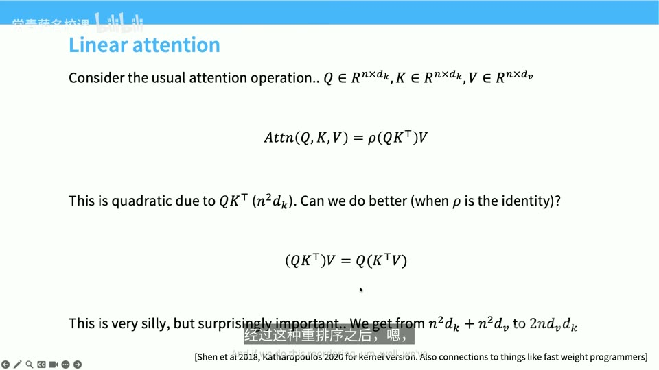 |
| 所以相比原始 attention 操作中的 N² 项，这一项的依赖关系要"友好得多"。所以，这是你首先要了解的一点：乘法的结合律，让我们得以改变对序列长度的依赖关系。好，接下来我们可以做的另一件事是——如果我们考虑这种重排序（也就是类似 Q(K^T V) 的形式），我认为它更棒的一点在于：它促成了大量研究。 [【跳转到 06:06】](https://www.bilibili.com/video/BV11LEA6eEuj/?p=4&t=366) | 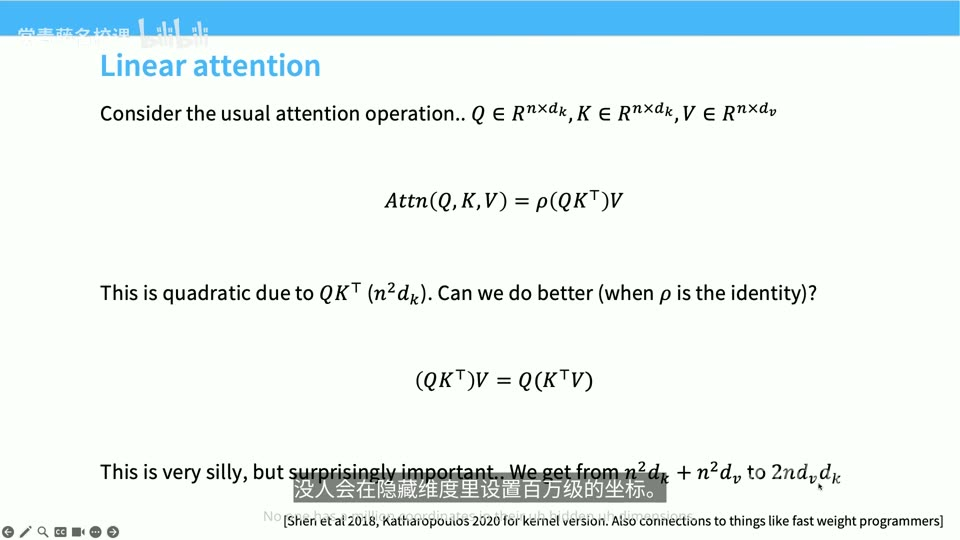 |
| 我将在接下来几张幻灯片中提到的是：在（考虑去掉 softmax 的）这类 attention 场景下，右侧的这个矩阵乘法（S=K^T V）看起来就像一个 RNN：我不必像上面那样写成这种"密集"形式，而是可以在从左到右遍历 context 时，以"增量方式"逐步书写：我可以对 K 和 V 进行相乘，更新这个"状态 S"，并将其累加到之前的状态上， [【跳转到 06:31】](https://www.bilibili.com/video/BV11LEA6eEuj/?p=4&t=391) |  |
| 这类似于（对 KV 进行）增量式的"乘决策"（原乱码）；然后我可以将其与 Q 相乘，以得到输出。上面这种"密集形式"的操作和这种 RNN 形式，在某种程度上是"等价"的。那么我们做了什么？我们从左上角的 linear attention 开始，嗯，然后我们以某种方式得到了一个看起来非常像 RNN 的结构。那么"RNN 的优点是什么"？ [【跳转到 06:56】](https://www.bilibili.com/video/BV11LEA6eEuj/?p=4&t=416) | 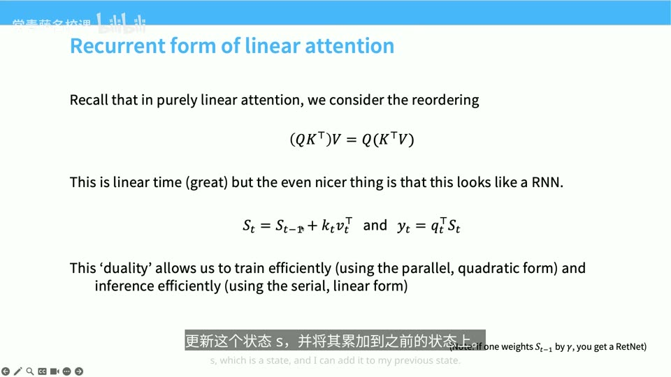 |
| RNN 相当不错：因为在推理时，我有这个 S——也就是我的状态，它的大小是固定的，我只是不断地将其向前传递；因此，出于"推理"方面的考虑，RNN 非常理想。但就训练而言，它们并不理想。好，但 linear attention 的好处在于：你可以用"两种方式中的任意一种"。你可以采用这种"密集（并行）形式"，这对训练非常有利——它是并行的； [【跳转到 07:21】](https://www.bilibili.com/video/BV11LEA6eEuj/?p=4&t=441) | 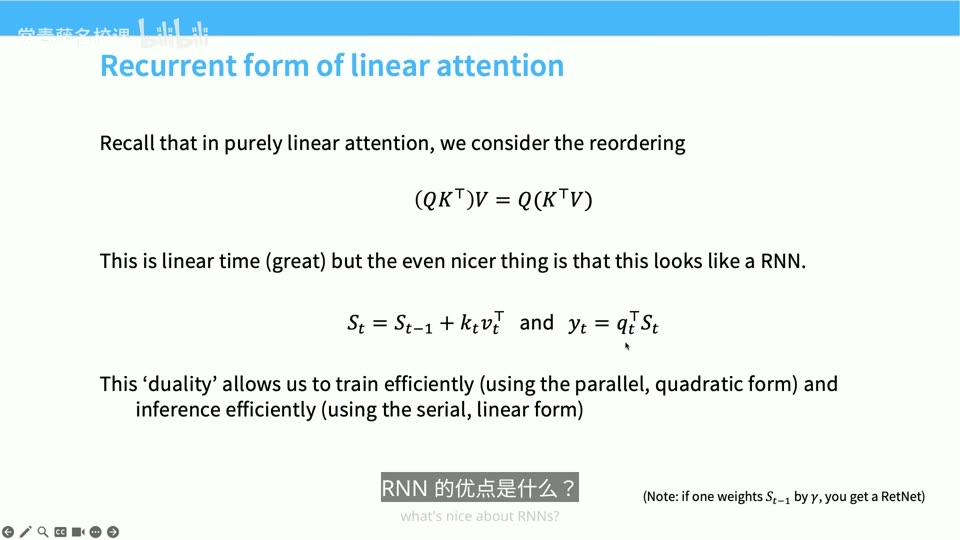 |
| 或者你可以采用这种"类似 RNN 的串行形式"，这对推理非常有利。这——因此你可以兼得两者之长。现在，嗯，（至少在）所有这些"（依赖）关系"方面，这非常棒、这很好。嗯，不幸的是，"这是线性的"——这（听起来）不太理想。嗯，这基本上就是我们讨论的起点。嗯，目前有什么问题吗？（这确实是基础内容。）有个挺有意思的点是：有人把这种 linear attention [【跳转到 07:46】](https://www.bilibili.com/video/BV11LEA6eEuj/?p=4&t=466) | 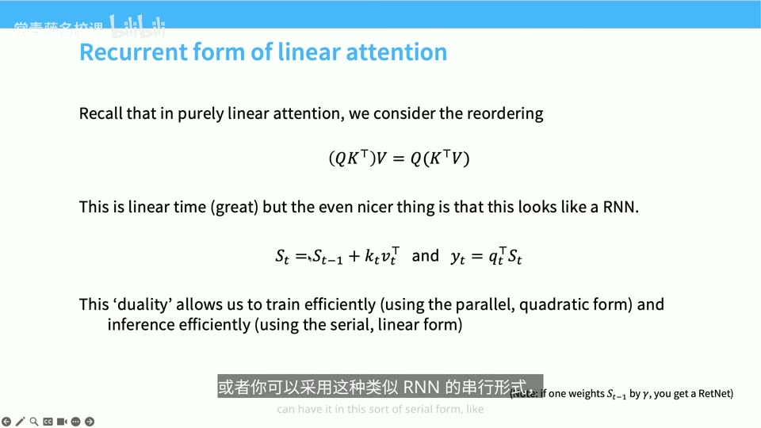 |
| 用进了他们的 attention 机制里，啊，比如 MiniMax-M1：这是一个规模相当大、性能相当强的（中文）开源模型；它采用了"七比一的混合方案"——也就是 7 个 linear attention 层再加上 1 个完整的 softmax attention 层（每 7 层 linear 配 1 层 softmax），性能整体很强：你可以拿它和 XXX 或 XXX（原字幕 openasothree 或 dpcgardone，应指 OpenAI o3 或 DeepSeek-R1）这类强模型比较，竞争力相当不错。而且由于它是 linear attention，对 context length 的依赖大部分是（准）线性的。 [【跳转到 08:11】](https://www.bilibili.com/video/BV11LEA6eEuj/?p=4&t=491) | 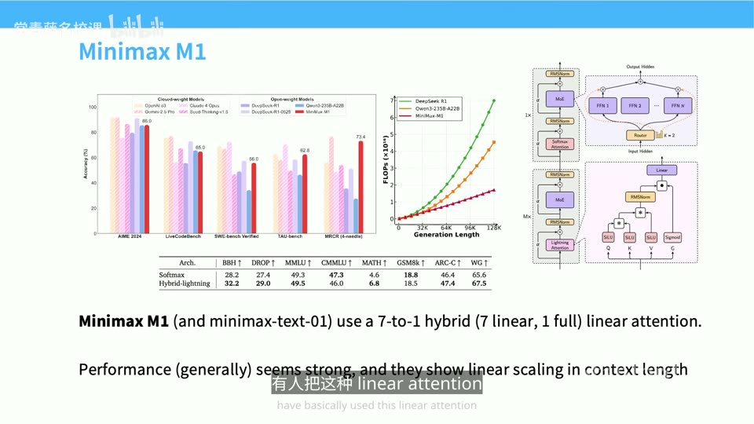 |
| 它并不是完全"线性"的，因为里面还有这些（softmax 层）；但这种依赖要温和得多。对，要举几个例子：表明即使是这种非常容易理解的 basic linear attention， [【跳转到 08:36】](https://www.bilibili.com/video/BV11LEA6eEuj/?p=4&t=516) | 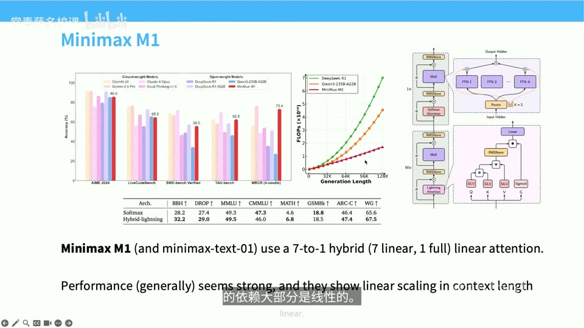 |
| 只要配合某种完整的"（二次方连接）"（原字幕 dotquerraticconnections，即不时穿插的二次注意力层）， [【跳转到 08:45】](https://www.bilibili.com/video/BV11LEA6eEuj/?p=4&t=525) | 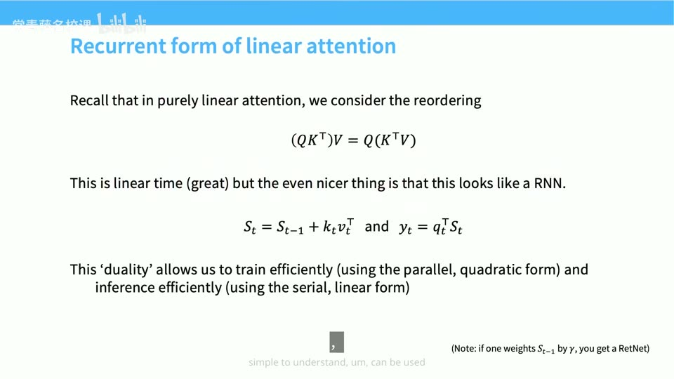 |
| 也可以在大规模下相当有效地使用。到目前为止，还没有人在大规模上真正验证"完全（fully）线性时间注意力机制"——接下来几页要讲的内容，都是"混合架构"。诶，我们已经讲过 linear attention，但你可能会觉得"linear attention 对你来说太'天真'、太'简单'了，这不是我想要的；我希望看到更严肃、更复杂的神经网络机制"。 [【跳转到 08:50】](https://www.bilibili.com/video/BV11LEA6eEuj/?p=4&t=530) | 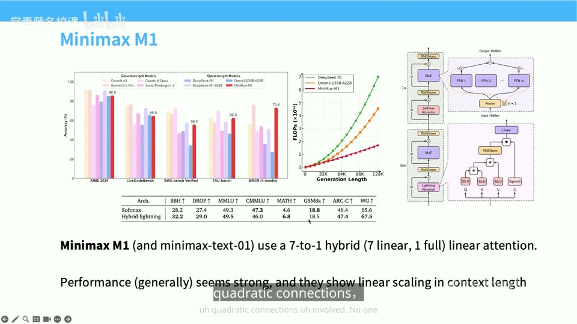 |
| 那么你现在能做的是……（呃哦，抱歉，走（讲）得有点远了）。我们来看 linear attention 的 RNN 形式。我把 linear attention 的方程放在这里，这样你就不用来回翻看了。我们可以对 linear attention 做一点扩展，从而获得表达力更强的"更新"（方式）：这就是 Mamba-2 的由来。你们中有些人可能听说过 Mamba——现在也听说过 Mamba-2 和 Mamba-3 了：这些是由 Albert Gu（原字幕 albertgutreatout）及其合作者提出的一类"状态空间模型"（SSM）： [【跳转到 09:13】](https://www.bilibili.com/video/BV11LEA6eEuj/?p=4&t=553) | 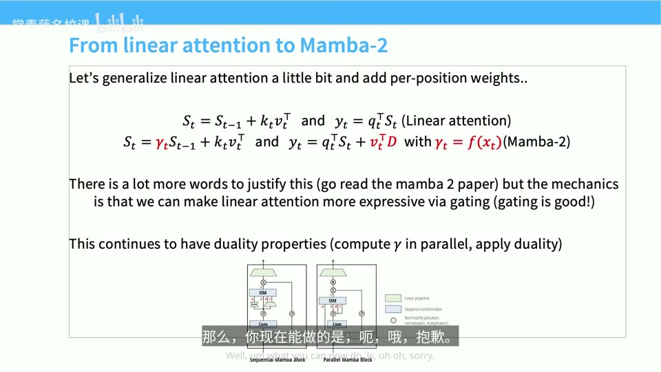 |
| 就嗯，他们最初是从"状态空间理论"的视角推导出来的；但**实际上**，如果你审视（他们）所执行操作的机制，你会发现它实际上可以视为"线性 attention 机制"的一种非常简单的扩展。你的思路是这样的：我们从 linear attention 开始。你可能会说："linear attention 最大的问题在于，它总是把状态一直往后传（不遗忘）"： [【跳转到 09:38】](https://www.bilibili.com/video/BV11LEA6eEuj/?p=4&t=578) | 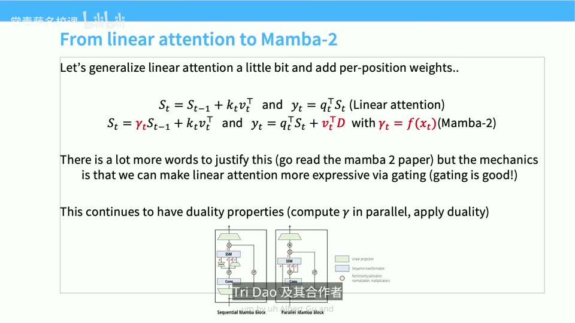 |
| 从早期的 LSTM 时代我们就知道，关键在于：知道什么时候该把信息往后传、什么时候不该传（也就是把信息"忘掉"、直接归零）。我们要做的是，受此启发，加入一个门控 γ（gamma）：也就是"γ_t（衰减因子）"。γ^X（即 γ_term）本身没有状态，它只取决于我当前的输入 x_t；γ_t 用来"调节"我会把"多少状态信息"传递到未来： [【跳转到 10:03】](https://www.bilibili.com/video/BV11LEA6eEuj/?p=4&t=603) | 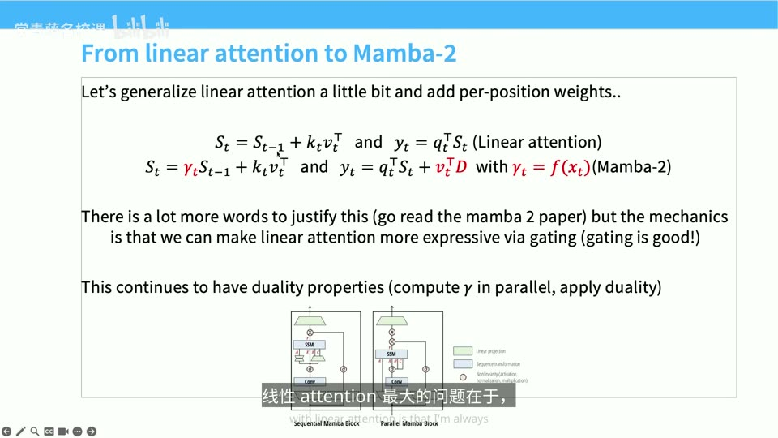 |
| 现在，如果你仔细想想，状态依赖项就是所有这些 S；嗯，这个 γ 完全不依赖状态——因此这意味着计算非常简单。这里仍然存在某种"二元性"：你可以将 Mamba-2 计算（处理）为"大型稠密矩阵乘法"，或在推理时使用这种"循环形式"（RNN 形式），从而获得良好的推理性能提升——这就是其核心思路。 [【跳转到 10:28】](https://www.bilibili.com/video/BV11LEA6eEuj/?p=4&t=628) | 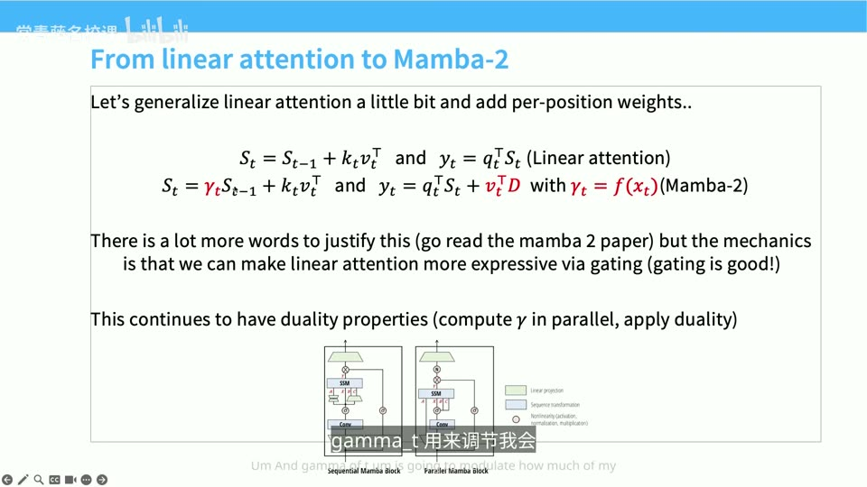 |
| 你可以像 linear attention 那样，在"并行或序列"模式下使用它。啊，如今，人们已在大规模场景中应用了这一方法，啊 [【跳转到 10:53】](https://www.bilibili.com/video/BV11LEA6eEuj/?p=4&t=653) | 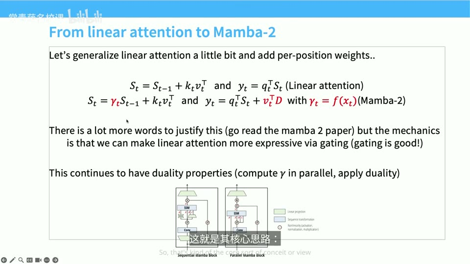 |
| 比如 XXX（Neuro）3（原字幕 neotronthree 应为 nvidia Nemotron 类模型）：我在上一讲中简单提过，他把 Mamba-2 用作"轻量级层"（原字幕 TurfincurseSuppliedinwashing 为乱码），与 softmax attention 以各种方式"交替使用"，以管理"推理成本与表达能力"之间的权衡；与 XX（原字幕 quenthreethinking 和 gptissneutronthree，应指 Qwen3-Thinking 类）这些"模型"相比，XXX 性能表现相当不错。嗯，（原字幕 nebecalledtheanwerafeverstouringthatyoubythecontextlink 即"即便保持较大 context 长度"）， [【跳转到 11:00】](https://www.bilibili.com/video/BV11LEA6eEuj/?p=4&t=660) | 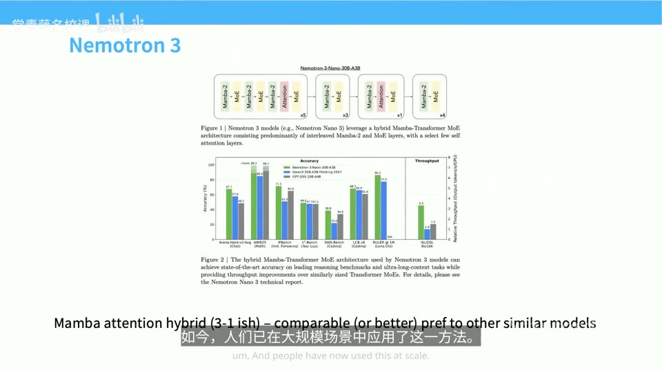 |
| 也能保持较高的 throughput（吞吐量）。所以你可以看到：它确实奏效了。虽然这些只是"小型前沿模型"，不是那种真正的大型前沿模型，但他们是"开源的小型前沿模型"——哎，你你太棒了（对提同学）。谢谢。好，所以现在我们基于这种"门控"思想进行了构建，这很不错；但你可能会想："我们能不能把这个想法继续推得更远？让这种递归结构变得越来越复杂？"嗯，从某种意义上说，关于"你能在这里做的操作"， [【跳转到 11:25】](https://www.bilibili.com/video/BV11LEA6eEuj/?p=4&t=685) | 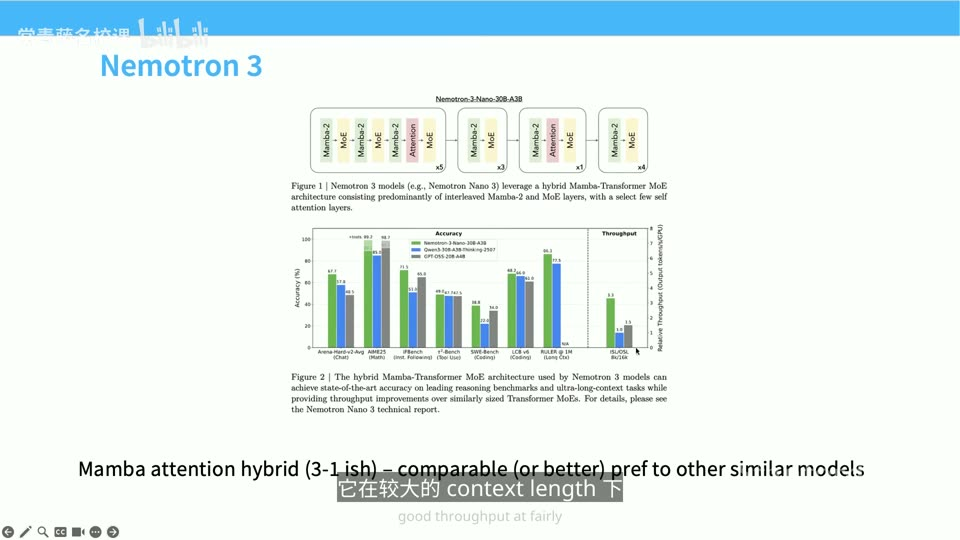 |
| 有一个经验法则：只要你对 RNN 中的各项进行"门控"处理，……（补充：更好的说法是）——如果只包含"依赖输入的项"、而不依赖"状态"，那么你依然能在"并行操作（用于训练）"和"串行操作（用于推理）"之间保持"相当好的对偶关系"。（原字幕 Used). 好。所以，gated delta net（原字幕 getadultconnect，应为 gated delt**a）可能是目前应用最广泛的（线性时间）模型之一——我会说它属于"现在所用的状态空间模型"，它已经在相当多的论文中得到了验证； [【跳转到 11:50】](https://www.bilibili.com/video/BV11LEA6eEuj/?p=4&t=710) |  |
| 而且 XX 公司（原字幕无对应）针对这类模型在 3.5 版本（对应 scaling 版本）中进行了非常出色的大规模扩展。那么让我来讲解一下"DeltaNet 是什么"，并将其与 Mamba-2 做个对比。所以，Mamba-2 的情况是：在上面所示的"线性递归形式"（即 S_t = γ_t·S_{t-1} + k_t v_t），而我（再）用它做（乘上一堆门）对它进行门控（原字幕"用 gamma 对它进行门控"，即衰减），对吧。那——哦，我忘了解释这个 V_t 了。抱歉：嗯，我加上 V 是为了保持内容的完整性： [【跳转到 12:15】](https://www.bilibili.com/video/BV11LEA6eEuj/?p=4&t=735) | 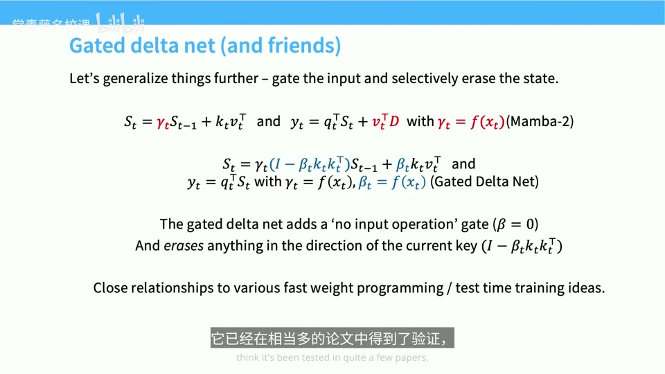 |
| Mamba-2 还做了一处"修改"：他们在 V_t（值）更新中加入了本质上算是一个"残差层"的东西（即对 V 做"修饰"）。这并不是"状态更新"的核心、也不是他们主张"这一做法是好主意"的核心论据；但我把它加进来，是为了"完整性"，确保我给出的是真正完整的 Mamba-2 更新公式（而不是只传达核心思想的简化版本）。嗯，好的。不过你现在可以先忽略 V_t：这其实只是一种架构上的（细节）改进，并不是状态更新的核心部分。 [【跳转到 12:40】](https://www.bilibili.com/video/BV11LEA6eEuj/?p=4&t=760) | 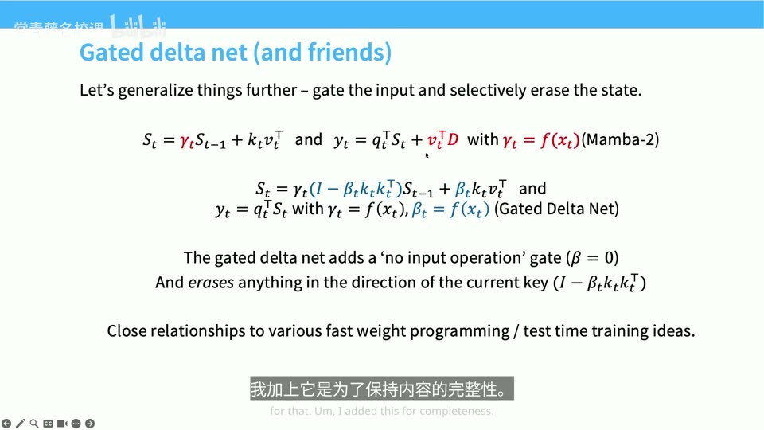 |
| Gated DeltaNet（原字幕 getadultnet）在某种意义上借鉴了这个思路，并加入了"第二个门控" β_t（betat）。那么 β_t 的作用是什么？啊，我把 β_t 看作是一个"（不对状态 操作）的门控"。如果 β_t 为零，那基本上就意味着"不要采用我当前的任何信息、不要把它加入到我的状态中"。even（原字幕"即使"口语）。嗯，我想大家应该都对 LSTM 比较熟悉：这让人想起 LSTM 的思路——它通过门控机制来决定"是否遗忘"、 [【跳转到 13:05】](https://www.bilibili.com/video/BV11LEA6eEuj/?p=4&t=785) | 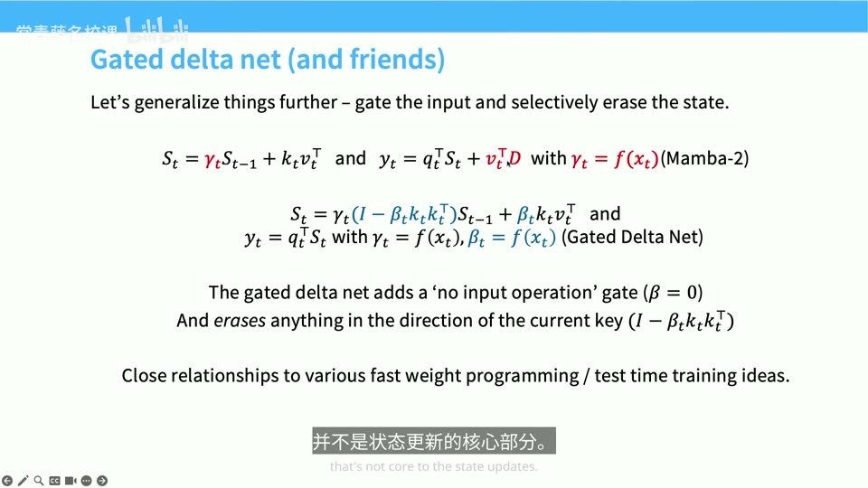 |
| 以及"是否从当前时间步输入信息"。所以而它遵循的原则非常相似（尽管我认为其最初的"推导方式"截然不同）。另另外，Gated DeltaNet 有意思的一点在于：这个"更新方向"（即"投影掉当前 key"）这个特性，其实来自"DeltaNet"而不是"Gated DeltaNet"。所以，与其只做"门控"（比如你也可以直接把 S 更新里的 β_t 设为 1−β_t），这——他们的做法是：当你要进行包含这个 β 的更新时（，即 更新 S_t = (I − β_t k_t k_t^T) S_{t-1} + β_t k_t v_t）， [【跳转到 13:30】](https://www.bilibili.com/video/BV11LEA6eEuj/?p=4&t=810) | 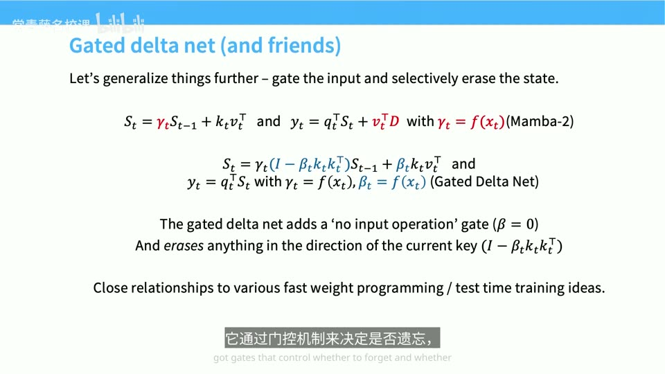 |
| 你会尝试以某种方式将"当前的 key 方向"投影出去。所以这里的直观理解是："我要为当前的 key（也就是 k_t 当前）写入信息"；而在做这件事时，我不仅想写入新信息，还想"擦除之前已经写入的（locked 中）当前 key 方向上的信息"。这，对"更新"的一种视角：不仅仅是"写入新信息"，我还要"清除已经写入的当前 key（方向）"。 [【跳转到 13:55】](https://www.bilibili.com/video/BV11LEA6eEuj/?p=4&t=835) |  |
| 这就是那个蓝色方框(Instrument、「单位矩阵 − β_t·k_t k_t^T」)（原字幕"单位矩阵 − β_state·KTKT 的转置"）的作用：它本质上是个"投影器"——用来投影掉 k_t（key 维度）上的内容。这并不完全精确（因为你并没有做单位归一化之类的操作），但大致的直观理解是对的。嗯，在继续往下讲之前，我要再提一件事：哎呀（抱歉），（重新。我这里有个蓝色方框），我接着讲：Gated DeltaNet 他在（历史）不同场景下，其实被"重新发明"过好几次： [【跳转到 14:20】](https://www.bilibili.com/video/BV11LEA6eEuj/?p=4&t=860) |  |
| 如果你试图解决某些"在线最小二乘"问题，就会出现这种更新（律）这种"投影器"。所以他在"快速权重编程"或"测试时训练"（fast weight programmers / test-time training）中，以其他形式被重新发明过：那些领域的研究人员基于"完全不同的设计原则"，最终得出了几乎完全相同的解决方案。啊，谢谢。我想说的是，嗯—— [【跳转到 14:45】](https://www.bilibili.com/video/BV11LEA6eEuj/?p=4&t=885) | 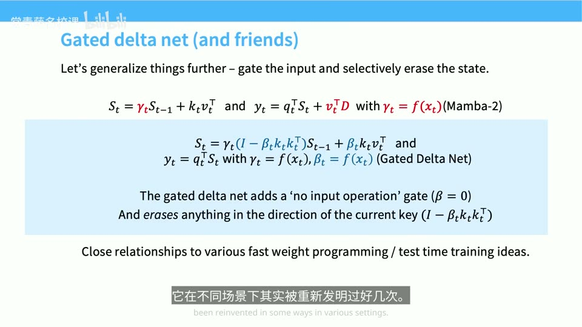 |
| "Qwen 3.5（原字幕 quthreepointfive，应为 Qwen3.5 或 Qwen3-Next）"以及作为其前身的 Qwen-Next（模型），是目前最优秀的开源模型之一。嗯，他们正式采用了这种架构：使用的是"三比一的门控 DeltaNet-注意力混合架构"（即全注意力做（注意力）计算）……啊，性能非常优秀，且合理；"推理特性出色"：呃，如右侧所示，随着 context length 不断增加，Qwen-Next 的（解码吞吐量 decoding throughput）远高于 Qwen3。中间面板展示了该模型与各种闭源模型（以及上一代模型）的 [【跳转到 15:04】](https://www.bilibili.com/video/BV11LEA6eEuj/?p=4&t=904) |  |
| 性能对比：（从中可以看到）这种"混合架构"似乎对性能几乎没有任何损害。好，最后我要说的是： [【跳转到 15:29】](https://www.bilibili.com/video/BV11LEA6eEuj/?p=4&t=929) | 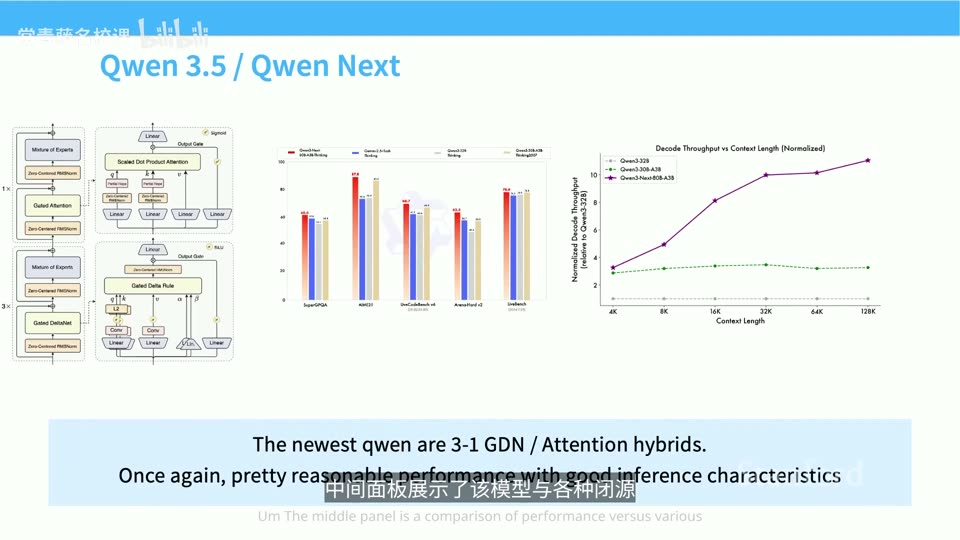 |
| 目前，关于"混合架构性能"的高质量对照研究并不多。字节跳动 Seed 和（加州大学圣克鲁兹分校）的研究人员或许做过一项（研究）：他们比较了"MoE（应为 Mamba）-2""gated DeltaNet"以及其他架构在"不同混合层数"下的表现。啊，部分结果我认为有些杂乱；但我想指出的是："右侧（应为左侧）面板上的这条虚线"，这条线是 full attention 的性能。从左往右看，"非 full attention 层"的数量在逐渐增加： [【跳转到 15:36】](https://www.bilibili.com/video/BV11LEA6eEuj/?p=4&t=936) | 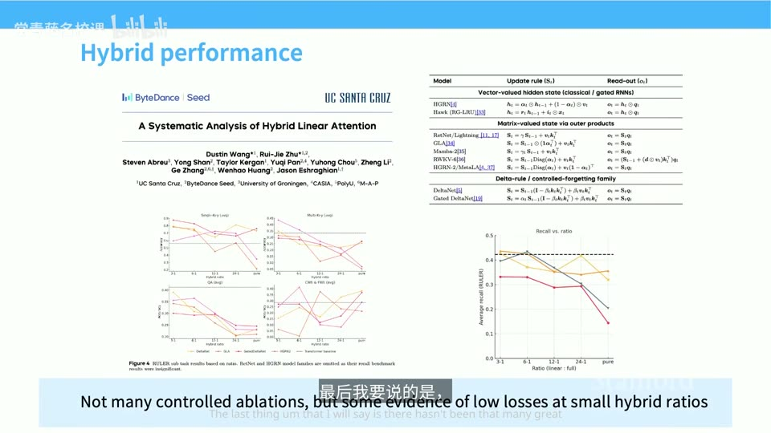 |
| 我们把这些（非 full attention 厚）称为 RNN 层——从左往右，RNN 层越来越多，性能也随之（开始）下降。但需要注意的是：对于一些表现最好的架构，比如黄色、橙色、蓝色这些（类似 gated DeltaNet 和其他各种变体），在"低比例（小 RNN 占比）"下基本上没有性能损失；但一旦超过某个"临界点"，就会出现更明显的性能下降（本例中是 long-context 性能）。最后，完全切换到（纯）RNN 时 [【跳转到 16:01】](https://www.bilibili.com/video/BV11LEA6eEuj/?p=4&t=961) | 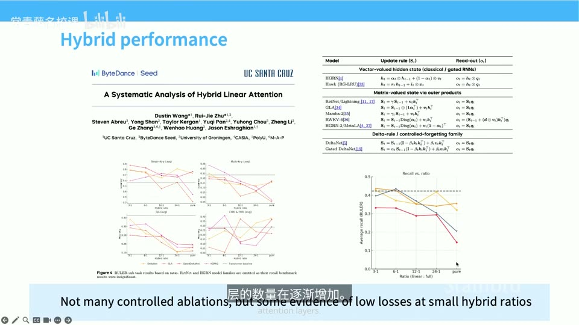 |
| 性能下降会变得非常明显——所有这些架构都是如此；在其他各种评估中，情况也一样。哦，我认为其中一些指标，其（任务）架构本身就已经针对它们做了优化：比如"单键检索（needle-in-a-haystack 单针检索）"这种任务（原字幕'单键检索'），我认为所有这些 long-context 架构都明确针对它做了优化。但如果查看 QA 性能，我们会看到类似的情况：随着"混合比例"的增加，性能呈现出相当稳定且清晰的下降趋势—— [【跳转到 16:26】](https://www.bilibili.com/video/BV11LEA6eEuj/?p=4&t=986) |  |
| 最终到达"这一纯线性（纯 RNN）点"。好，关于线性时间注意力大家还有问题吗？我还有最后一个"高效注意力"的话题要讲。不过请讲——（学生问）"回到最初的问题：你是否比较过 attention 的'并行形式'与'线性形式'？" [【跳转到 16:51】](https://www.bilibili.com/video/BV11LEA6eEuj/?p=4&t=1011) | 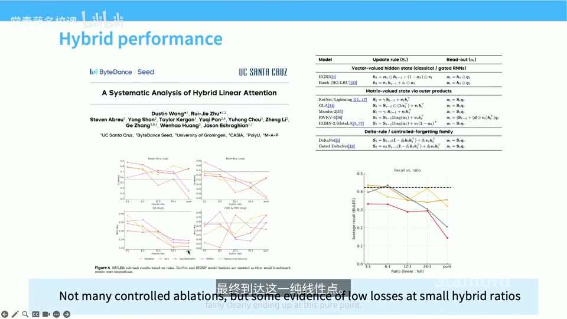 |
| （讲师）"说实话， [【跳转到 17:02】](https://www.bilibili.com/video/BV11LEA6eEuj/?p=4&t=1022) | 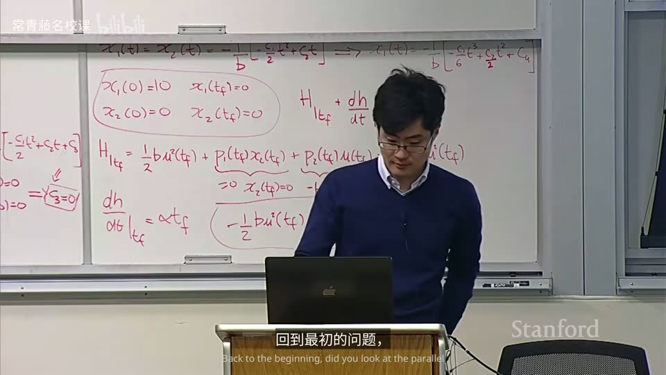 |
| （讲师回答）"他们难道不应该'自动就等价'吗？……（神）嗯，抱歉，我所说的'循环（recurrent）'——是指你知道的，我泛指 RNN，即任何'循环结构'。（The one.）因此，门控 DeltaNet 属于一种循环结构；但这与上面那一个（原版 softmax attention）并不等价。上面那个是"带有行规约的全 softmax attention"：第一步是"有损"的——我们在此丢弃了 softmax（原字幕'形'应为 softmax），随后便变为"线性形式"。这是所有这些方法最初始的一步，因此这部分（从 softmax → 一个线性近似）是有损的； [【跳转到 17:07】](https://www.bilibili.com/video/BV11LEA6eEuj/?p=4&t=1027) | 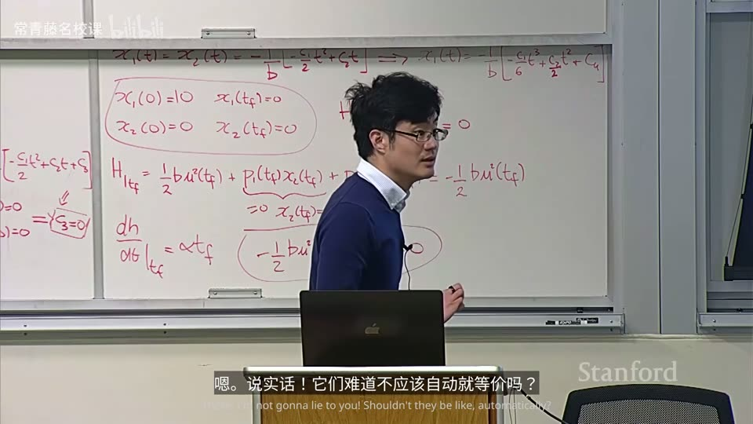 |
| 而在此之后，从这种"线性形式"到这种"循环形式"的等价性，则是"精确（无损）"的。 [【跳转到 17:32】](https://www.bilibili.com/video/BV11LEA6eEuj/?p=4&t=1052) | 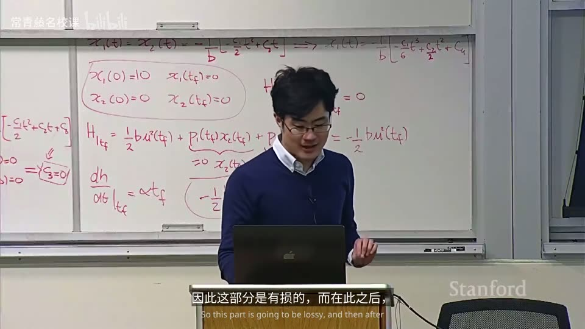 |
| 感谢我们的（同学），谢谢你，做得很好。对。谢谢。谢谢。谢谢。哦—— [【跳转到 17:39】](https://www.bilibili.com/video/BV11LEA6eEuj/?p=4&t=1059) | 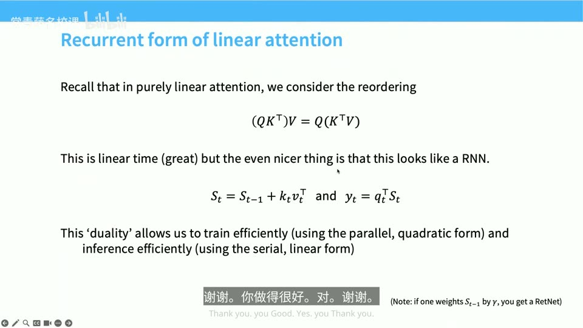 |
| 哦哦，对，对，就是这个词，对吧。嗯，所以，嗯，在"线性的 attention 形式"中 [【跳转到 17:44】](https://www.bilibili.com/video/BV11LEA6eEuj/?p=4&t=1064) | 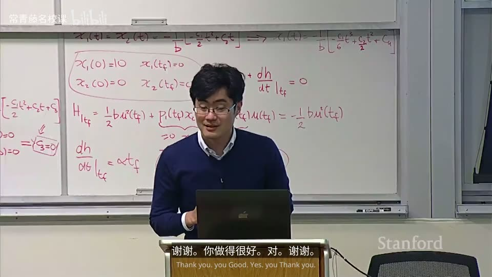 |
| 我们真正做的是"把这些 KV 和 Q 累加起来"；在"（串行/RNN）形式"中，大致就是这样运作的。 [【跳转到 17:49】](https://www.bilibili.com/video/BV11LEA6eEuj/?p=4&t=1069) | 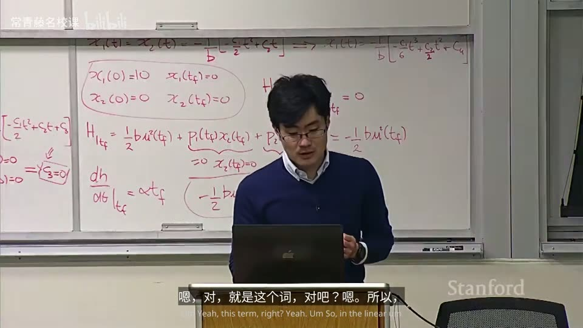 |
| 但你可能希望"输出里也包含当前时间步的一些值"；那可能会像"哦，我当前时间步这个 token 的值，对下游的各种任务其实挺有用的"——所以这有点像"残差连接"：我当前输入的值会直接传到 attention 的（输出）里。Z 则是另一个"值控门控"（调值门控）：你可以用它控制"直通量的大小"。（真）谢谢，很好。好，所以这就是"线性时间 [【跳转到 17:56】](https://www.bilibili.com/video/BV11LEA6eEuj/?p=4&t=1076) | 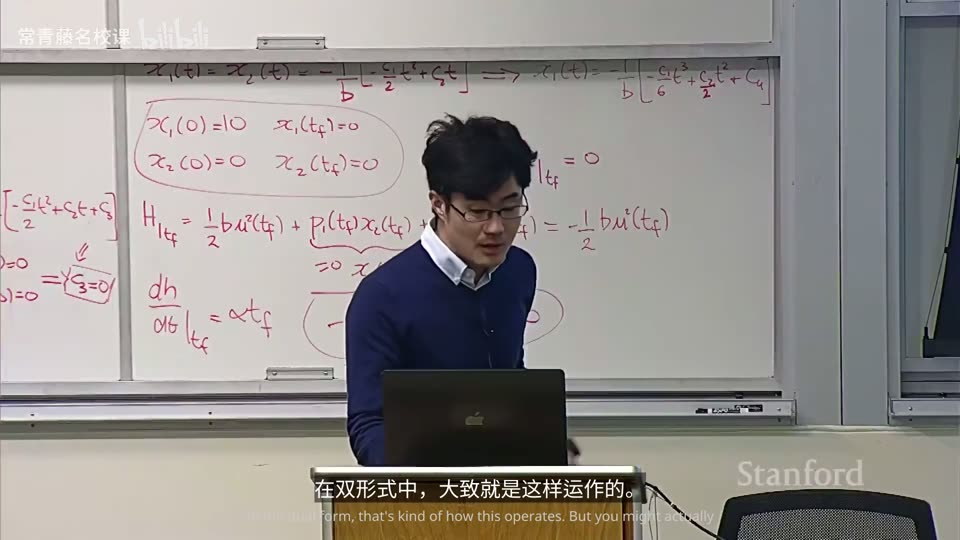 |
| attention"。有很多非常有意思的东西；同样有意思的是："很多被测试过的方法 [【跳转到 18:15】](https://www.bilibili.com/video/BV11LEA6eEuj/?p=4&t=1095) | 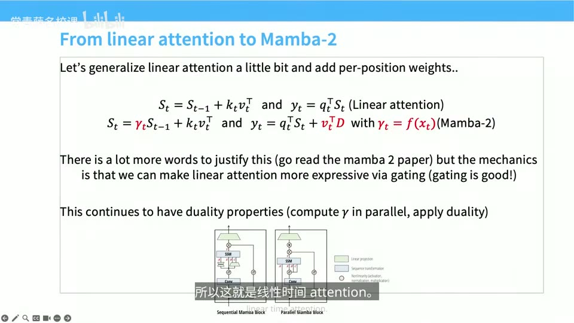 |
| 最终都呈现出这种简洁的 linear-attention 风格的循环形式"。尽管有少数例外，但大部分方案最终都收敛成了"非常类似 LSTM 的结构"。好的，嗯。（你想说什么啊？对。）好的，所以还有另一种选择：我之前讲的是 linear attention——它具有非常好的复杂度理论特性；我想讨论另一种 attention 优化方法——之前没有提到过，但它属于这一类"重要的、高效注意力的"方法： [【跳转到 18:21】](https://www.bilibili.com/video/BV11LEA6eEuj/?p=4&t=1101) | 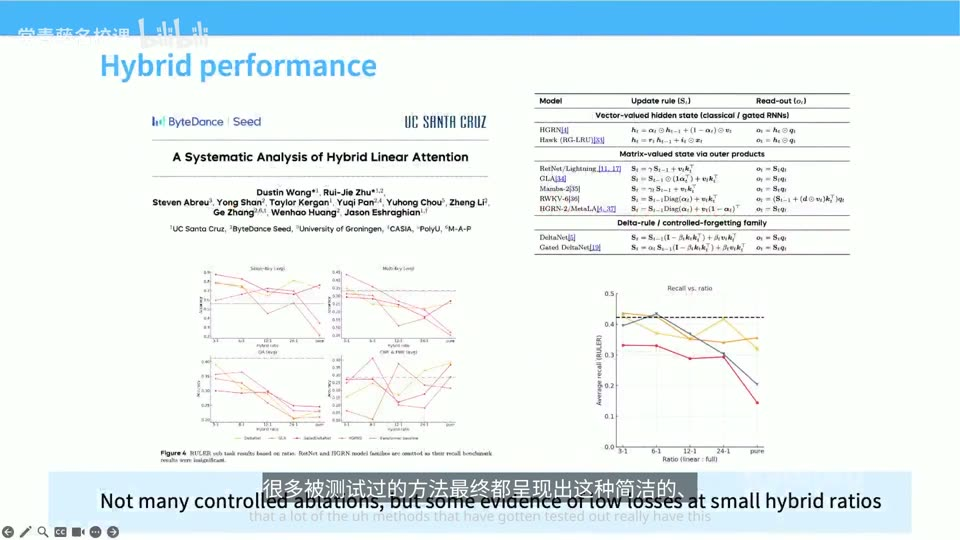 |
| 所以 DeepSeek 在 DeepSeek 3.2（原字幕 deepsixthreepointtwo）中，我记得，引入了 DSA——不是"dot sparse attention"，而是"DeepSeek 稀疏注意力（deepseek sparse attention）"。他们的做法是：**不去**对所有 token 计算 attention——嗯，不算"不是"，你要做的是：先用一个"轻量级的索引器（lightning indexer）"，从大量 token 中筛选出一个子集：你面对的是非常长的上下文，索引器会从中挑选出一个子集（这个子集远小于完整序列）； [【跳转到 18:46】](https://www.bilibili.com/video/BV11LEA6eEuj/?p=4&t=1126) | 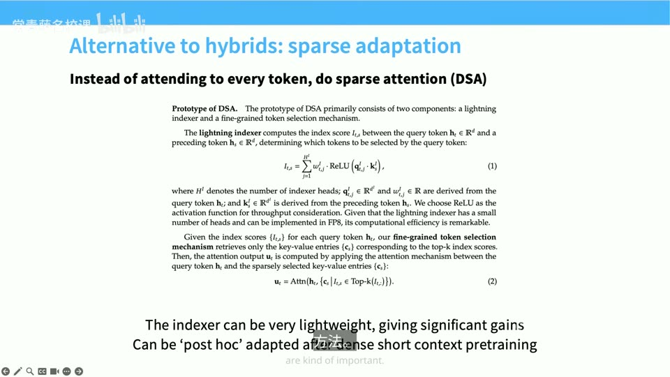 |
| 接着，你会对这个较小的子集做"全注意力"计算。机制其实很简单（至少前向传播这一步是这样的）：做法是"你照常生成 Q 和 K"，然后把他们送入这个索引器；啊，索引器会先算 Q 和 K 的内积，过一遍 V（值），然后利用前面 token 的信息生成权重，最后给出结果：这样，你就得到了"每个位置的激活值"（近似在最终输出之前所有位置上的重要性分数）。 [【跳转到 19:11】](https://www.bilibili.com/video/BV11LEA6eEuj/?p=4&t=1151) | 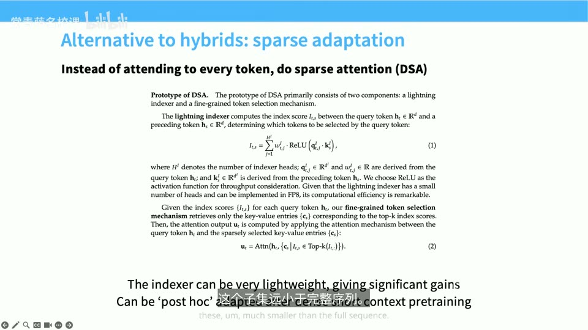 |
| 然后（原字幕 NANOSCRATCHUTION 乱码）可对其进行"Top-k 筛选"：将其中"若干个排名靠前的位置"纳入注意力计算。然后我照常做 attention 计算（输出键值对）。这样做的好处是：它"非常非常稀疏"；如果这个索引器足够轻量，那么执行"全注意力"的这部分，就可以在一个"非常小的子集"上完成。我印象中（原字幕 GOM 乱码），DeepSeek 还共同表明了一点： [【跳转到 19:36】](https://www.bilibili.com/video/BV11LEA6eEuj/?p=4&t=1176) | 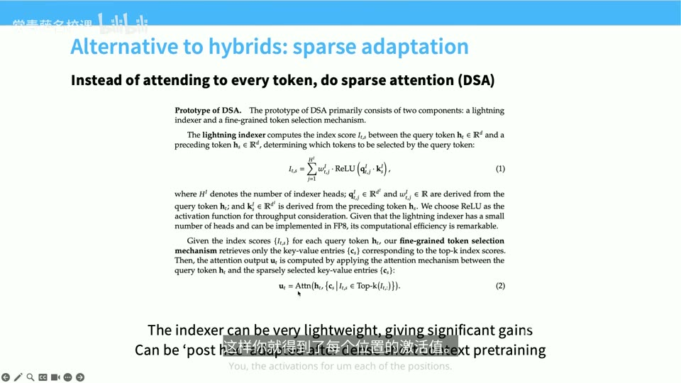 |
| 你其实不必"从零"用这个索引器训练模型：因为"用这个索引器训练本身就够了"（那句话）。那个"索引器机制"可能挺让人头疼、而且非常复杂；做法是："先训练一个普通的 Transformer，然后再做长 context 扩展时，把这个'闪电索引器（lightning indexer）'嵌入进去"——在"预训练的扩展阶段中"训练模型去适应这个索引器。所以这么做的"实际计算成本"其实相当低。 [【跳转到 20:01】](https://www.bilibili.com/video/BV11LEA6eEuj/?p=4&t=1201) | 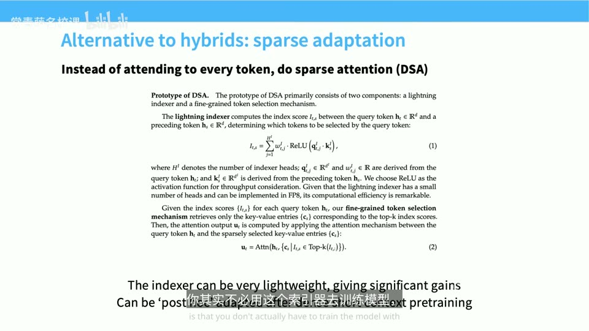 |
| 我想强调一下 DeepSeek 的 3.2（原字幕 visapointtwo）：他们在那儿提出了 DSA；这个模型相当出色——它（V3.2）在当时跟其他所有前沿模型表现相当：比如 XXX 或 Gemini（原字幕 cloudfourpoint5sonnet 或 Gemini three 他们）。他们还放了一张非常直观的图，展示了"我们的预填充阶段（即对输入做 attention）"以及"解码阶段（即实际生成内容）的过程"——与"上一代没有使用稀疏 attention 的 [【跳转到 20:26】](https://www.bilibili.com/video/BV11LEA6eEuj/?p=4&t=1226) | 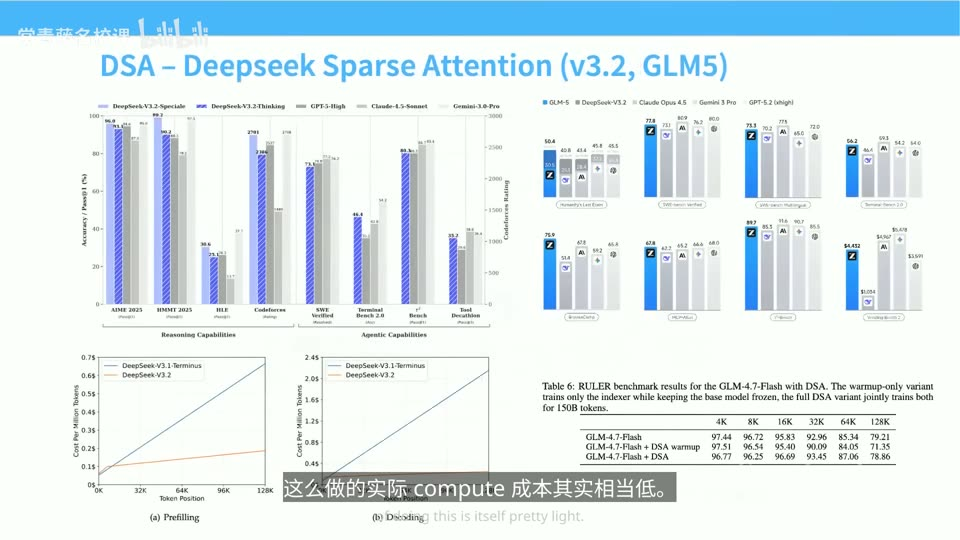 |
| DeepSeek 模型"相比，这两者（预填充和解码）的扩展性都非常"有利"。所以，很合理，对吧：如果你只"关注"极小部分（token），就能大幅降低 attention 的计算开销。（再举个例子）我想 XXX（原字幕 gonfive，应为 GLM-5 类）是另一个很好的佐证：呃，它是"去年发布的"；我觉得它算是（其中之一）：（原字幕 usual 性）目前能拿到的"最好的开源模型之一"。他们也用了这种 DSA 方法。如果你感兴趣，他们的论文里有不错的"消融实验"： [【跳转到 20:51】](https://www.bilibili.com/video/BV11LEA6eEuj/?p=4&t=1251) | 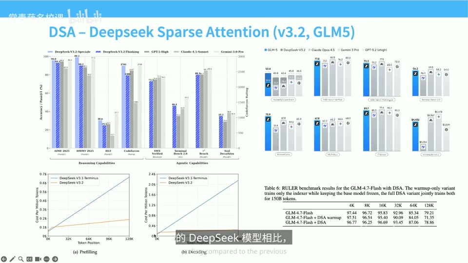 |
| 对比了"带预热的 DSA""纯 DSA"以及"完全不用 DSA"的情况。他们主要想说明的是："只要进行完整的 DSA 训练，你就不必（担心 loss spike 等）（原字幕 Donned），性能损失很小"；即便是在"长 context 检索"这种用 RNN 架构很难处理的任务上，表现也接近完整的 attention。所以，这提供了一种"降低 attention 成本"的完全不同的思路。注意，我翻回上一页…… [【跳转到 21:16】](https://www.bilibili.com/video/BV11LEA6eEuj/?p=4&t=1276) |  |
| "这里'不是线性'的：时间索引器仍需处理完整的 O(N²)（原字幕 autoorattention），因为那些 QK 内积的计算成本并非线性增长。不过你可以大幅降低'该索引器'的成本：比如降低其维度、或让 W 非常小——这样就能显著节省开销。" [【跳转到 21:40】](https://www.bilibili.com/video/BV11LEA6eEuj/?p=4&t=1300) | 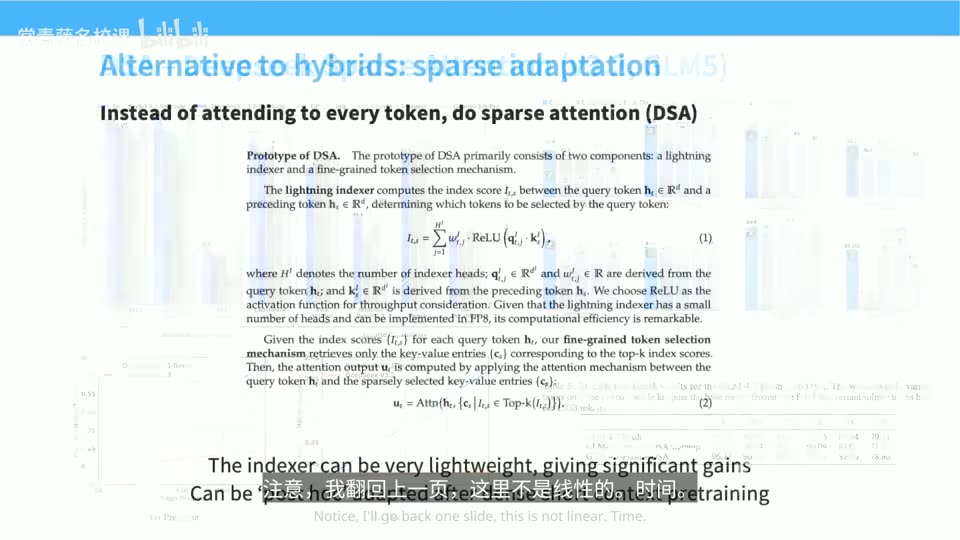 |
| "是、好的。"（讲师）"这是一种完全不同的视角，而且非常有效。我不打算深入展开；但事实证明，'Top-k 选择'（top-k selection）将成为接下来（MoE）讲座内容的核心。 [【跳转到 21:56】](https://www.bilibili.com/video/BV11LEA6eEuj/?p=4&t=1316) |  |
| 在我进入 Mixture of Experts 部分之前，关于"高效 attention 的提问"就到这里。" [【跳转到 22:04】](https://www.bilibili.com/video/BV11LEA6eEuj/?p=4&t=1324) | 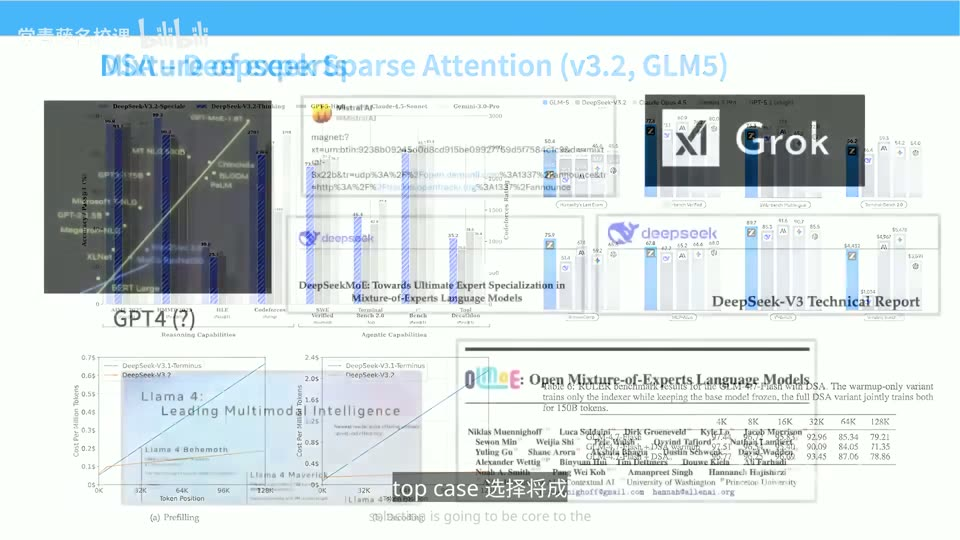 |
| （学生）"请讲：那么，索引器的时间复杂度是平方级的，也就是 quadratic 吗？" [【跳转到 22:09】](https://www.bilibili.com/video/BV11LEA6eEuj/?p=4&t=1329) | 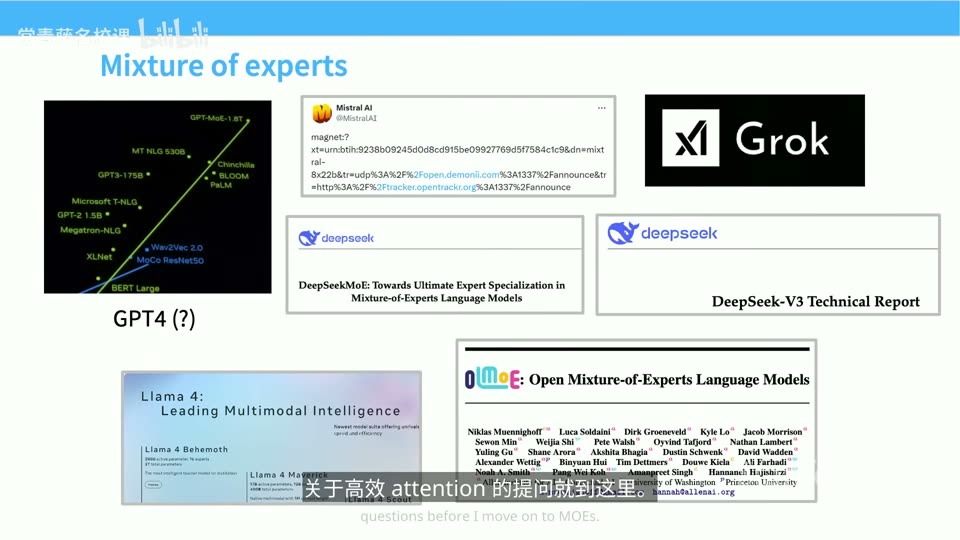 |
| （讲师）"对——因为它必须如此：要知道该选什么，它确实得'遍历'所有内容，对吧。好的：这里没有什么'巧妙的状态转换'机制， [【跳转到 22:14】](https://www.bilibili.com/video/BV11LEA6eEuj/?p=4&t=1334) | 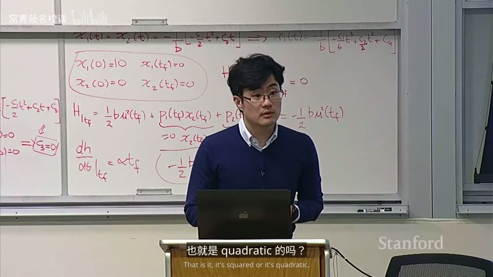 |
| 就是纯粹的暴力（bruteforce）内积计算。所以如果你要遍历所有内容…… [【跳转到 22:21】](https://www.bilibili.com/video/BV11LEA6eEuj/?p=4&t=1341) | 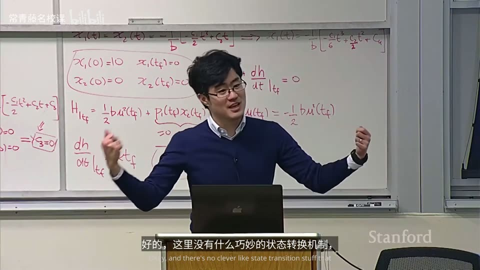 |
| （学生追问）而之后的步骤（全注意力那部分）也是 O(平方) 的。我们是怎么在'时间'上取得优势的呢？" [【跳转到 22:26】](https://www.bilibili.com/video/BV11LEA6eEuj/?p=4&t=1346) | 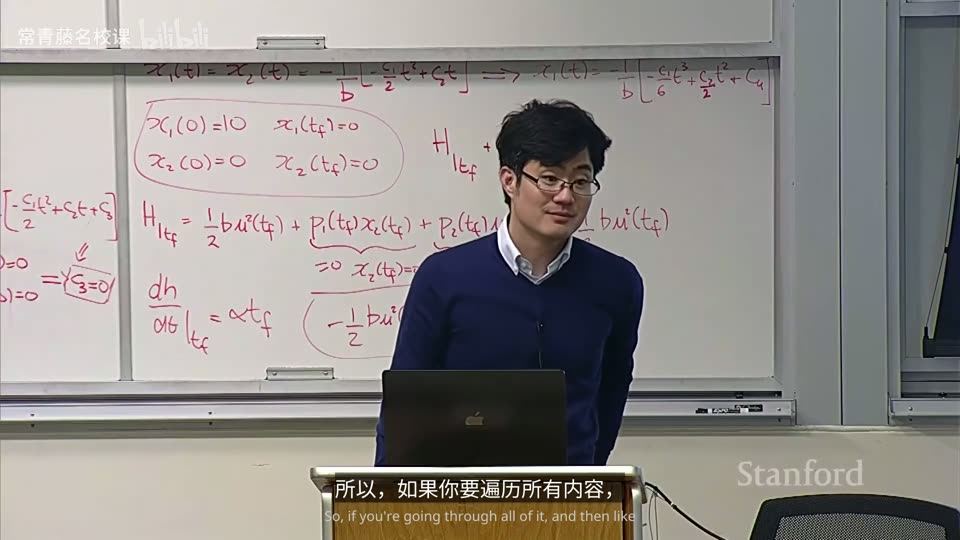 |
| （讲师）"来，（解释）这更像是一种系统层面的技巧： [【跳转到 22:33】](https://www.bilibili.com/video/BV11LEA6eEuj/?p=4&t=1353) | 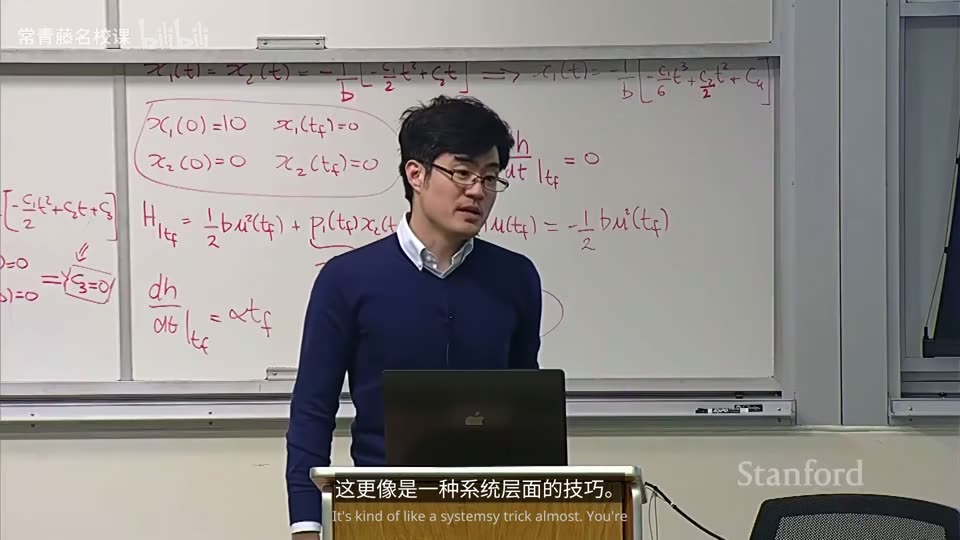 |
| 你会让'索引器'非常"轻（calm）（原字幕 '清亮'应为轻量）"。实现这一点的方法有很多： [【跳转到 22:38】](https://www.bilibili.com/video/BV11LEA6eEuj/?p=4&t=1358) | 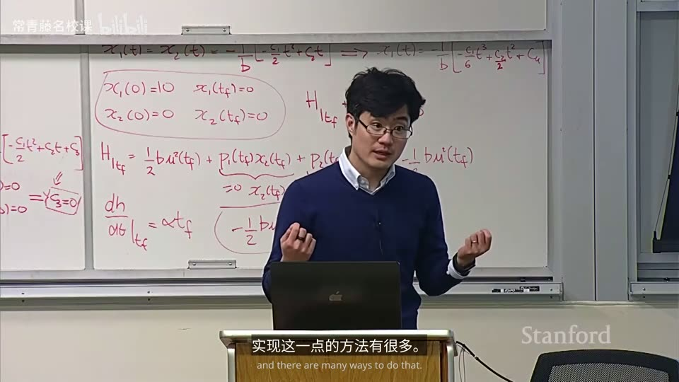 |
| （上一行末尾与该行可合并；保留）"还有一个问题？" [【跳转到 23:03】](https://www.bilibili.com/video/BV11LEA6eEuj/?p=4&t=1383) | 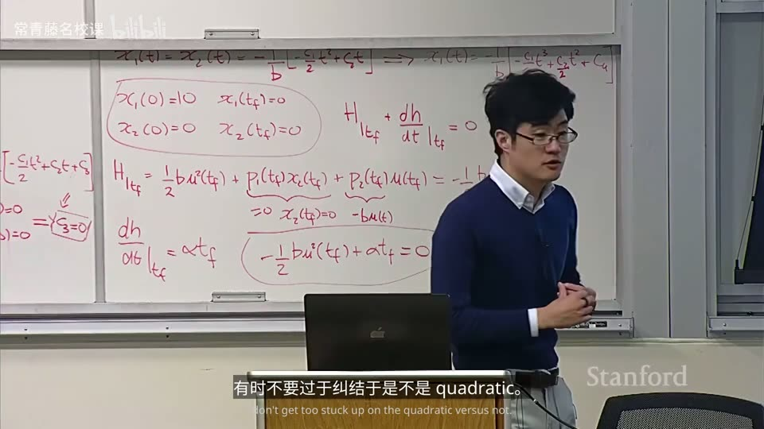 |
| "好的，谢谢，谢谢。"——"没错没错，这也可以看作是一种'持续/继续预训练'策略 [【跳转到 23:09】](https://www.bilibili.com/video/BV11LEA6eEuj/?p=4&t=1389) | 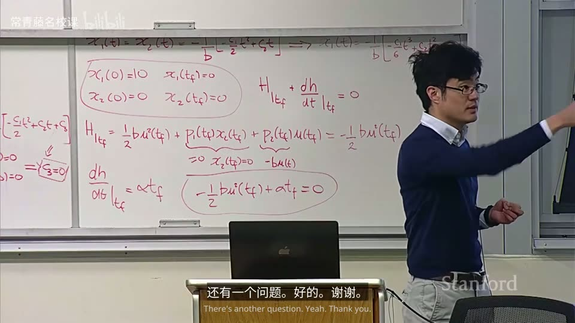 |
| 。毕竟出于计算成本和其他原因，我们不会'从零开始'训练长 context 模型： [【跳转到 23:14】](https://www.bilibili.com/video/BV11LEA6eEuj/?p=4&t=1394) | 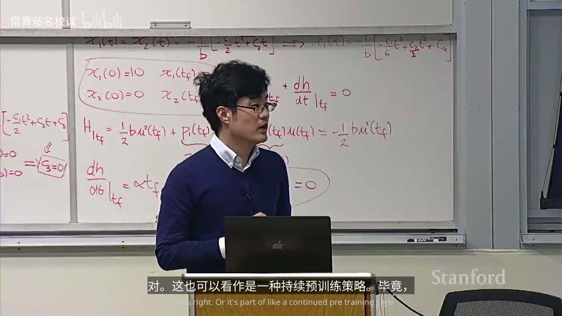 |
| 通常的做法是先训练一个'短 context 的模型'，然后再进行"长 context 扩展阶段"。所以这里的巧妙之处在于："既然我们无论如何都要做第二阶段， [【跳转到 23:19】](https://www.bilibili.com/video/BV11LEA6eEuj/?p=4&t=1399) | 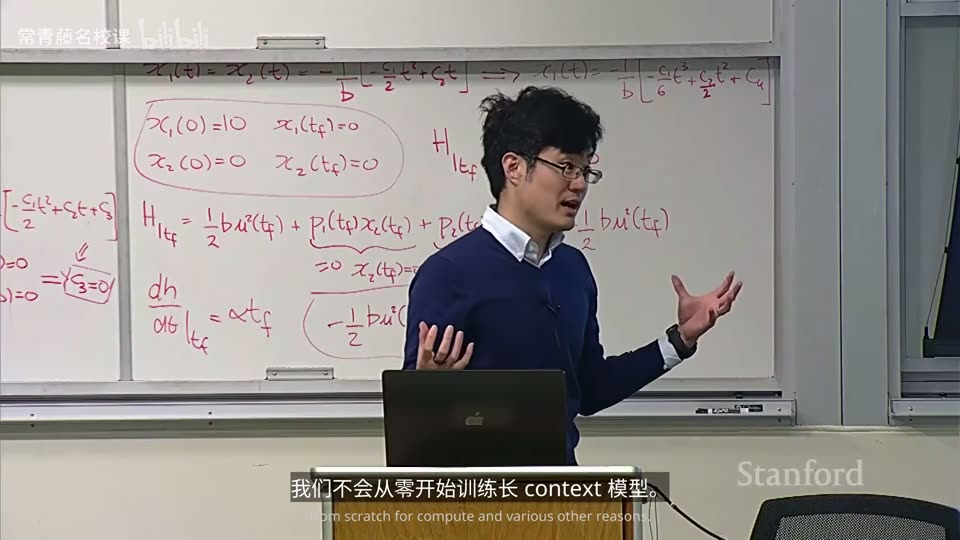 |
| 为何不在同一阶段把'长 context 的成本优化'（sparse attention）一并加上？"不令人惊讶的是，它确实有效； [【跳转到 23:32】](https://www.bilibili.com/video/BV11LEA6eEuj/?p=4&t=1412) | 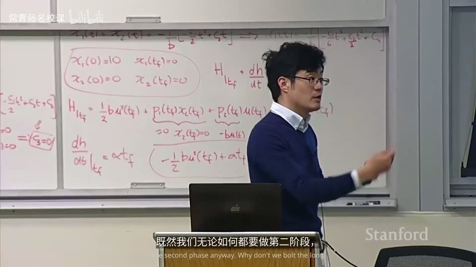 |
| 坦白说，那个看起来挺吓人的"top-k（非口味/排序）模块"，他们居然也能"直接集成进去"。但正如你在下一部分将看到的， [【跳转到 23:38】](https://www.bilibili.com/video/BV11LEA6eEuj/?p=4&t=1418) | 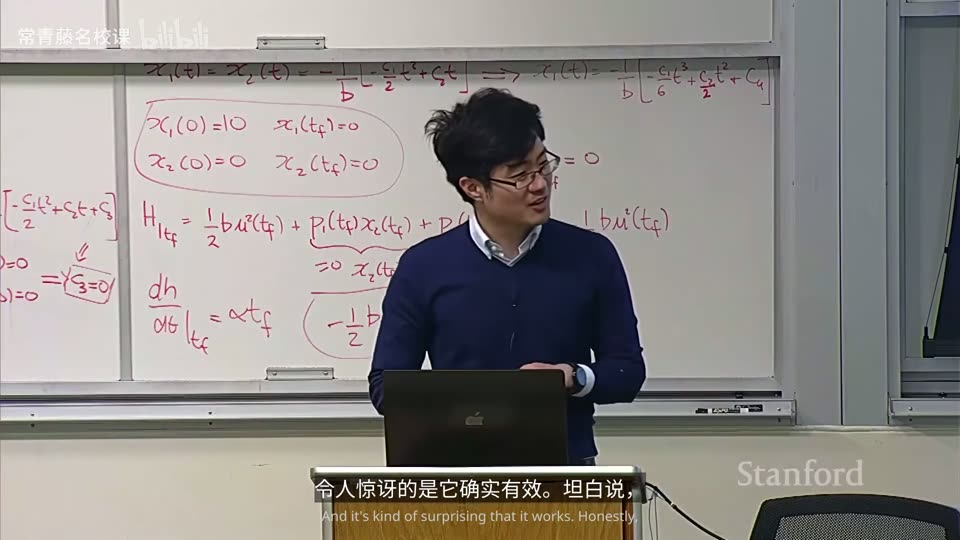 |
| 也许你（并不真正需要"专门强调"它）——"也许你不必对 Top-k 选择如此'为（担忧）'。""那这个过程呢？它也是'后训练'步骤的一部分吗？" [【跳转到 23:44】](https://www.bilibili.com/video/BV11LEA6eEuj/?p=4&t=1424) | 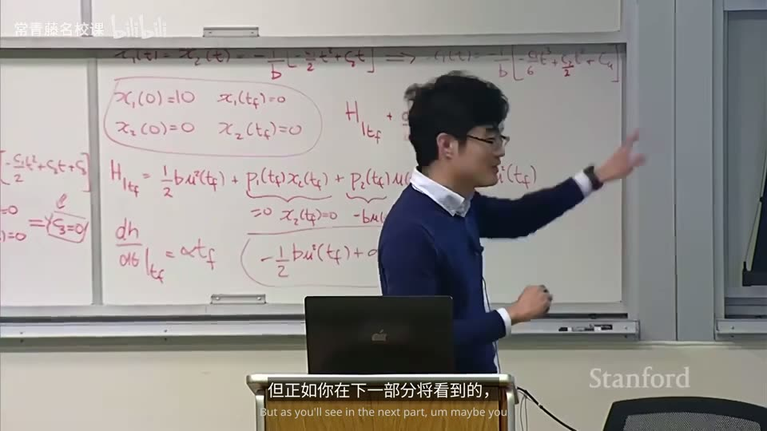 |
| （讲师回答）"是的。据我所知，大多数开源模型的"常规流程"是： [【跳转到 23:49】](https://www.bilibili.com/video/BV11LEA6eEuj/?p=4&t=1429) | 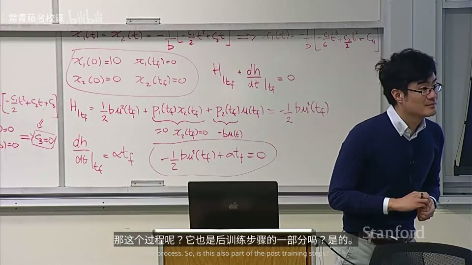 |
| 先做"短 context 预训练"，再做"长 context 扩展"， [【跳转到 23:54】](https://www.bilibili.com/video/BV11LEA6eEuj/?p=4&t=1434) | 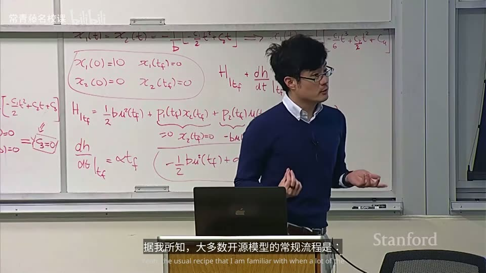 |
| 最后进行"后训练"。"谢谢。"（另一学生问）"是的，这里的 K（top-k 的长度）是否与短 context 相近？诶……" [【跳转到 23:59】](https://www.bilibili.com/video/BV11LEA6eEuj/?p=4&t=1439) | 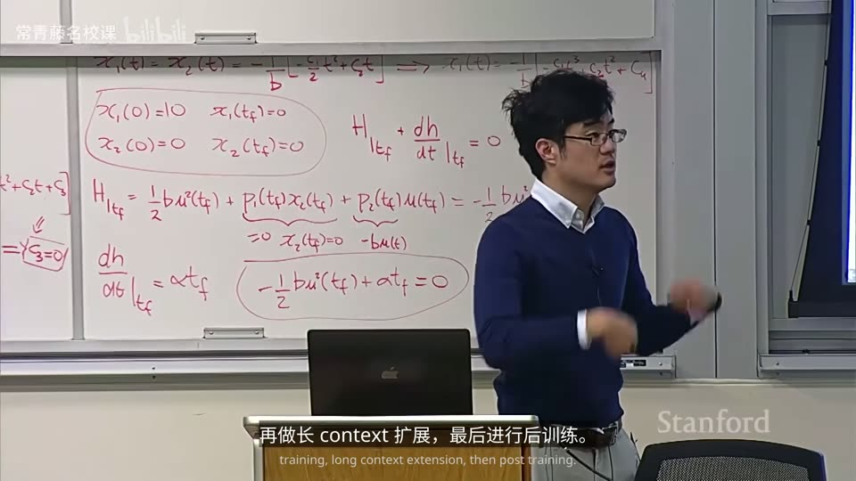 |
| （讲师）"嗯（DM 原字幕），我们会选取那些性能更接近'端/完整'（原字幕端 context）的数值，并且（对选出的 K 个 token）会对其设定约束，对吧。 [【跳转到 24:04】](https://www.bilibili.com/video/BV11LEA6eEuj/?p=4&t=1444) | 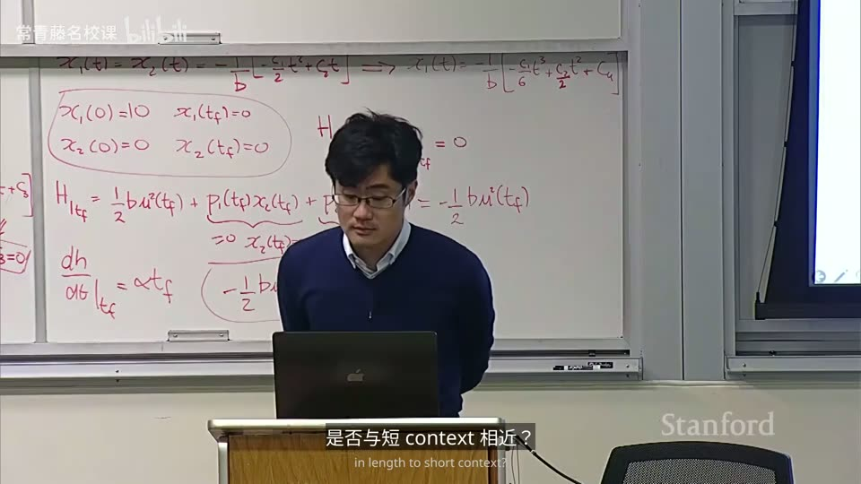 |
| 并且会对其设定约束对吧 [【跳转到 24:09】](https://www.bilibili.com/video/BV11LEA6eEuj/?p=4&t=1449) | 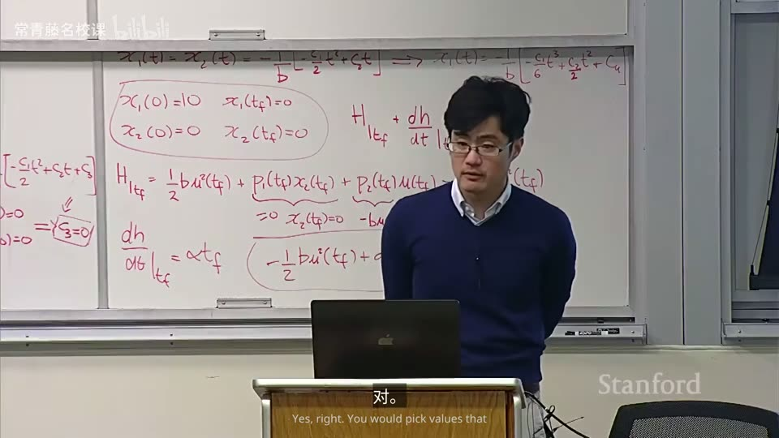 |
| 所以无论输入规模如何，他们（top-k 的数量）都是'受限（固定上限）'的。对。"嗯，其实问题还挺多。（某个同学笑场）"后三位的保存（原字幕乱）……" [【跳转到 24:14】](https://www.bilibili.com/video/BV11LEA6eEuj/?p=4&t=1454) | 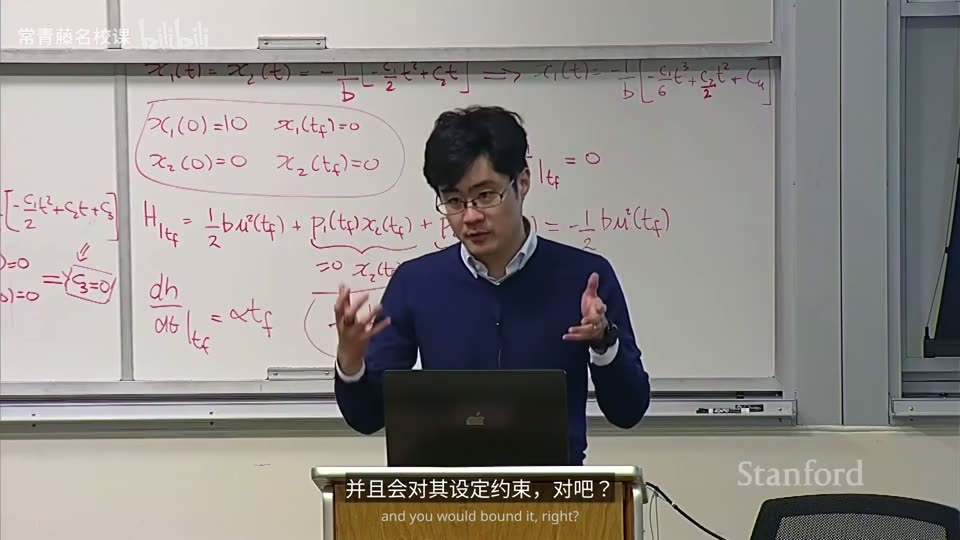 |
| （讲师）"哦，完全（complete）（CH 运行： 某 OCR 乱）……你（你们）……" [【跳转到 24:20】](https://www.bilibili.com/video/BV11LEA6eEuj/?p=4&t=1460) | 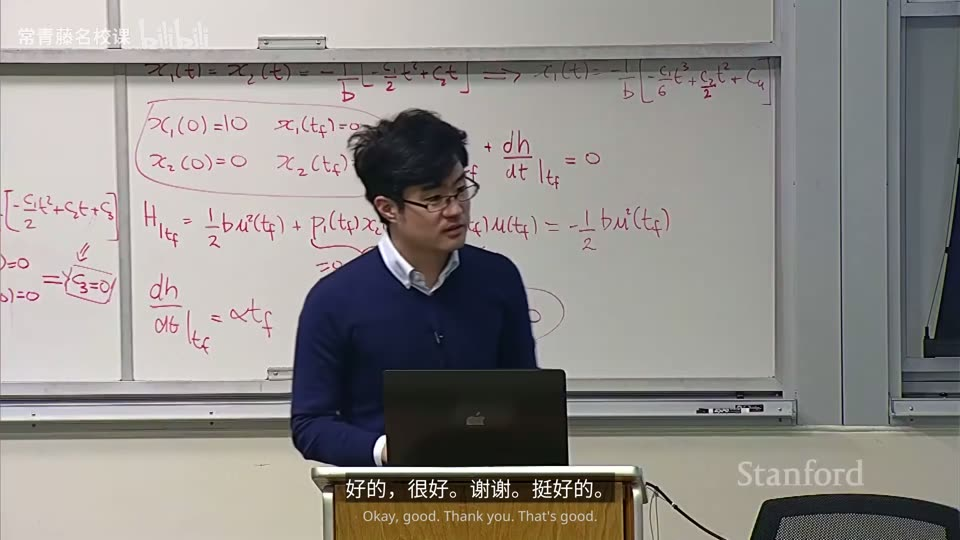 |
| （讲师）"OK，good，thank you；that's good——好的，很好，谢谢。 [【跳转到 24:25】](https://www.bilibili.com/video/BV11LEA6eEuj/?p=4&t=1465) | 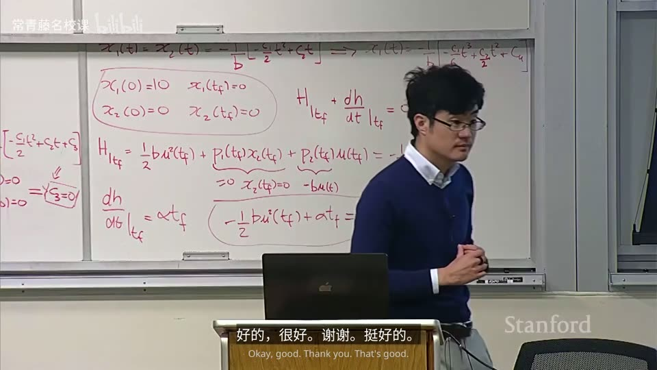 |
| 挺好的。（继续）（接过学生递的下一个问题？）"关于'训练稳定性'方面的问题？"——问得好。嗯，"（回答：）我觉得（线性注意的 softmax 部分）不会（造成不稳定）。据我所知，没有文献记载说'线性 softmax 会对 attention 造成大量问题'；嗯，反过来说，由于各种原因，softmax 往往才是问题所在。嗯，所以，我认为这实际上会"改善"这种架构的稳定性。 [【跳转到 24:30】](https://www.bilibili.com/video/BV11LEA6eEuj/?p=4&t=1470) | 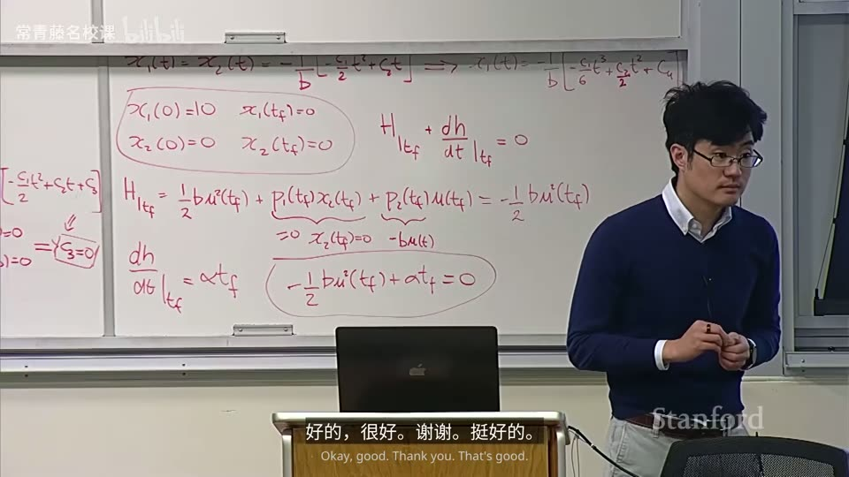 |
| 线性softmax会对attention造成大量问题嗯反过来说由于各种原因softmax往往才是问题所在嗯所以我认为这实际上会改善这种架构的稳定性 [【跳转到 24:35】](https://www.bilibili.com/video/BV11LEA6eEuj/?p=4&t=1475) | 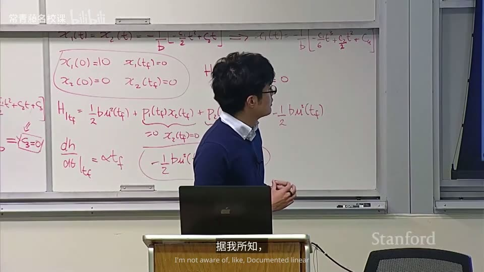 |
| Thank you。 [【跳转到 24:44】](https://www.bilibili.com/video/BV11LEA6eEuj/?p=4&t=1484) | 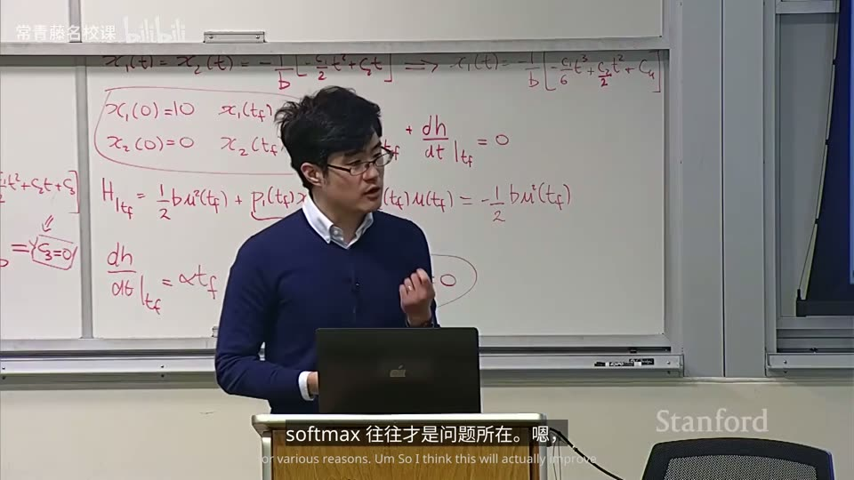 |
| "谢谢。"对。（下一个问题）关于"人类政治（原字幕乱；应为'研究大致'）"——关于"业界接下来想考虑的另一种 attention 替代方案"： [【跳转到 24:49】](https://www.bilibili.com/video/BV11LEA6eEuj/?p=4&t=1489) | 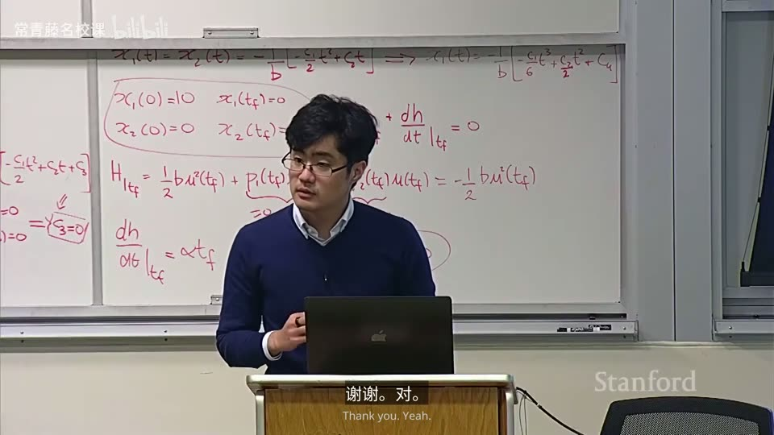 |
| "是需要一种'更好的 attention'机制——因为（原字幕'社区成本低空缺少'）对当前[各种 attention 方案]还有那些'亮点'（你刚才简略提到的那种）……" [【跳转到 24:55】](https://www.bilibili.com/video/BV11LEA6eEuj/?p=4&t=1495) | 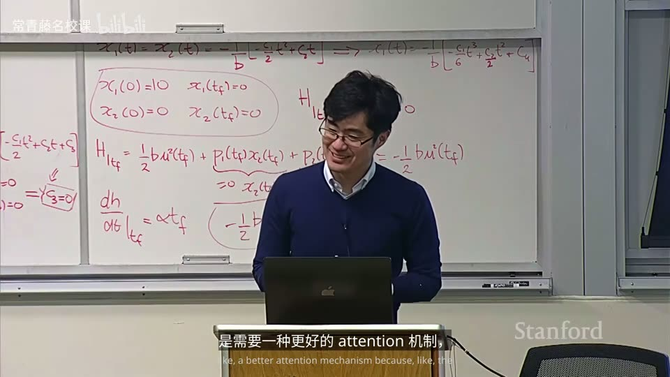 |
| "我是说：各种特性或方向上的亮点？""对（对讽刺应答）。那——嗯，"那是为了展示用的（原字幕）"。（讲师）"嗯，对于'未来 attention 架构会是什么样子'，我其实也没啥特别准的预测。Right，我这么说可能有点'打太极'（原字幕如此——应为"玩笑"）：但我认为，很多情况下，我们会把这些技巧"全都用上"—— [【跳转到 25:02】](https://www.bilibili.com/video/BV11LEA6eEuj/?p=4&t=1502) | 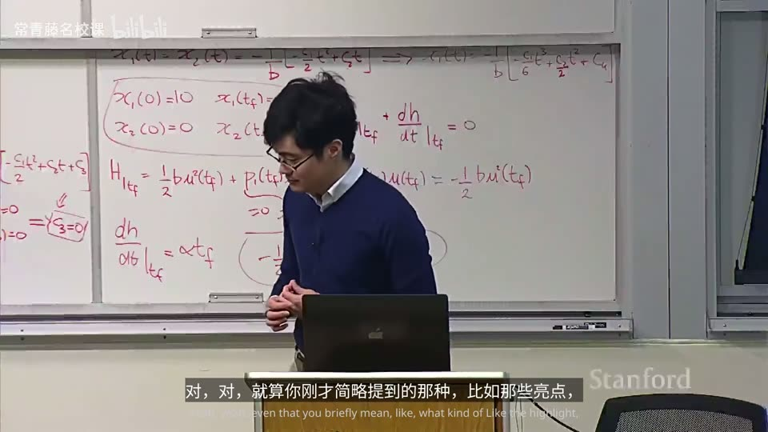 |
| 这就好比"架构通过整合各种成功的'配方'，变得越来越复杂"。 [【跳转到 25:18】](https://www.bilibili.com/video/BV11LEA6eEuj/?p=4&t=1518) | 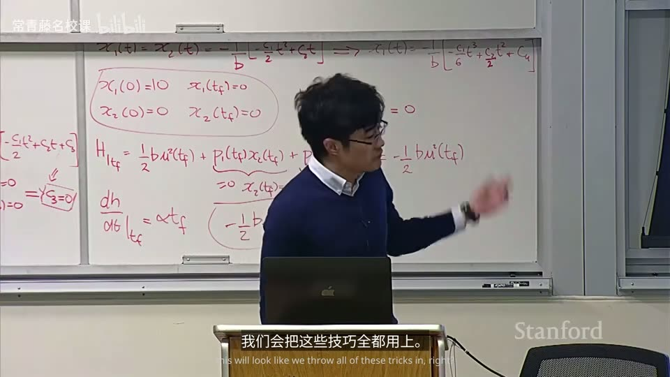 |
| 我觉得还有一个更宏观、更高层面的方向：主要是"利用后训练（post-train），让模型'自己来管理 context'"—— [【跳转到 25:23】](https://www.bilibili.com/video/BV11LEA6eEuj/?p=4&t=1523) | 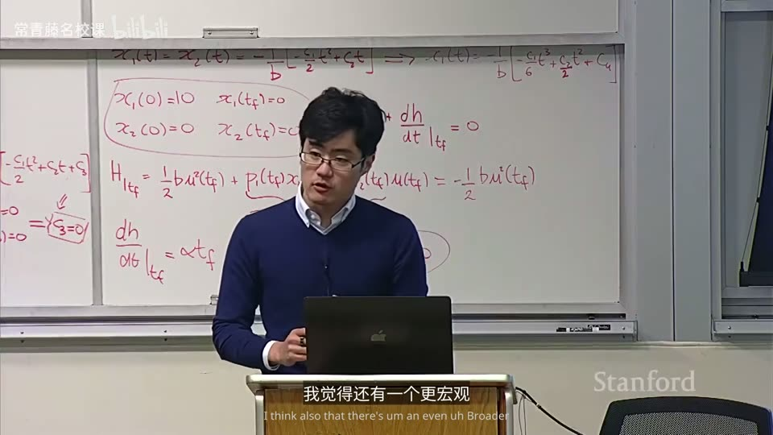 |
| 像"压缩""检索"这些东西，本质上都是"在最外层加的一层（离线额外机制）"。我认为，很多接下来的工作会是"把这些不同层级整合起来"；因为我们已经看到了：至少"线性实践（应为'线性时间'）attention"这一块，已经很大程度上收敛成了"类似 LSTM 或 linear attention 的架构"。 [【跳转到 25:28】](https://www.bilibili.com/video/BV11LEA6eEuj/?p=4&t=1528) | 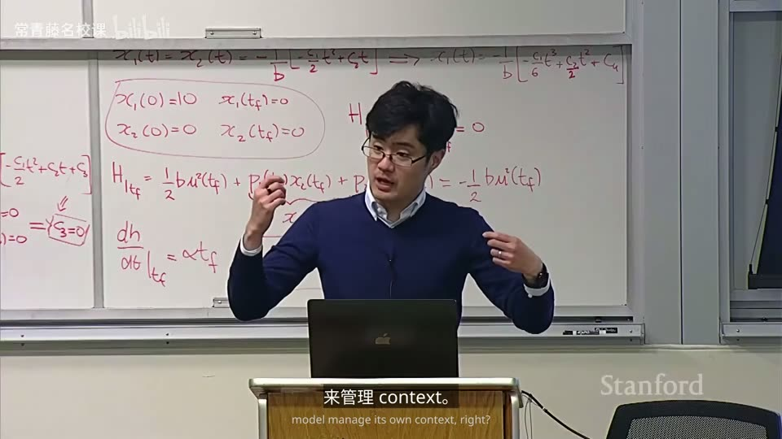 |
| Thank you。"短期内我觉得这不会有大变化。"谢谢。好的。哦对，最后一个问题："能聊聊'低精度 attention'吗—— [【跳转到 25:48】](https://www.bilibili.com/video/BV11LEA6eEuj/?p=4&t=1548) | 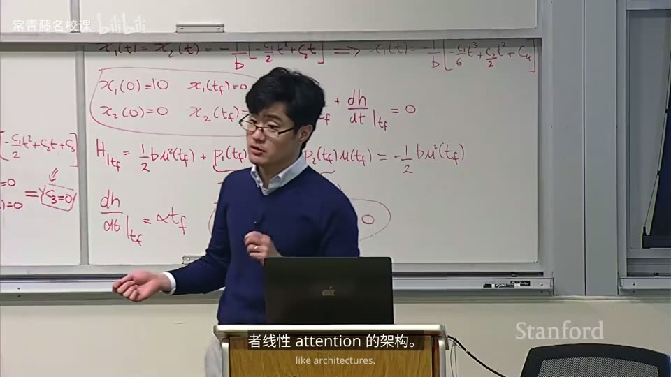 |
| 我懂 FP4 attention 可行吗？嗯……"（答）"我觉得'索引器'的提出部分就是受这类问题启发 （原字幕 indexor）； [【跳转到 25:54】](https://www.bilibili.com/video/BV11LEA6eEuj/?p=4&t=1554) | 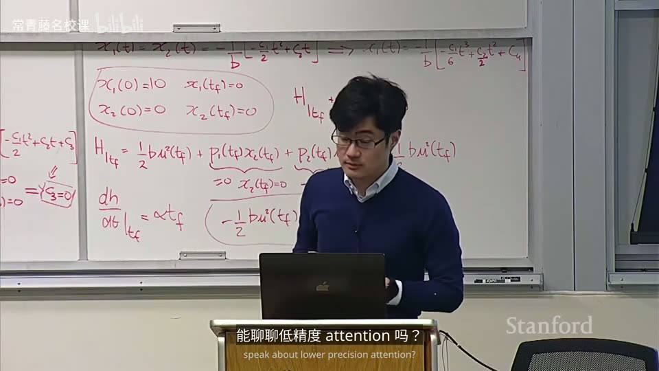 |
| but, uh，FP4 attention 肯定可行。嗯，我觉得'缺点'在于：像 softmax 这类操作，（对）精度非常敏感（损失）：比如'微小的下溢/上溢'可能会真的开始变得很关键——有时挺麻烦的。所以，我觉得'这种思路'的动机是："先用低精度做'选择'（routing），然后再做'全精度'计算（最后那步 attention）——因为这样'value 向量'就能更精细地'相加与加权'。这思路是合理的； [【跳转到 26:01】](https://www.bilibili.com/video/BV11LEA6eEuj/?p=4&t=1561) | 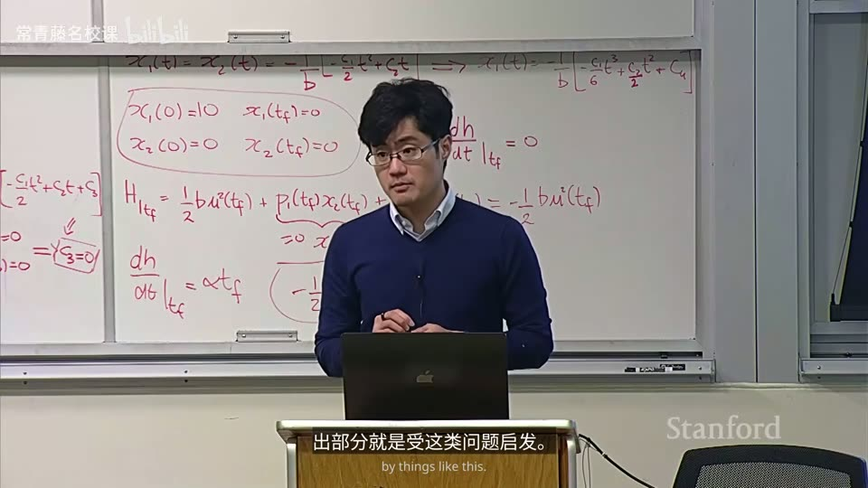 |
| 然后再做全精度计算因为这样valuevector就能更精细的相加和加权这思路是合理的 [【跳转到 26:18】](https://www.bilibili.com/video/BV11LEA6eEuj/?p=4&t=1578) | 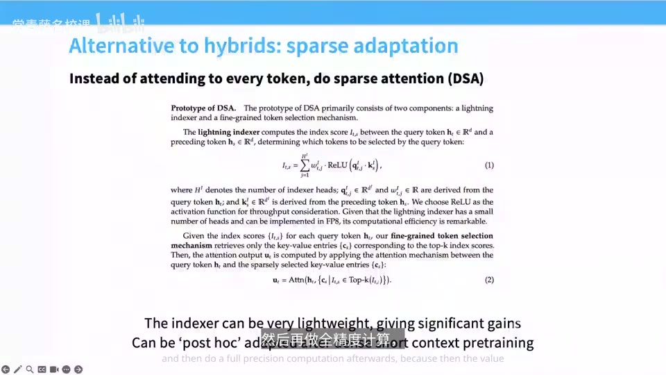 |
| 我不确定有没有真正好的方法，能在 FP8 甚至更低精度下做'完整的 attention'（by 原字幕）……谢谢。"（好，行，可以；最后一个问题，然后我就继续。）谢谢。 [【跳转到 26:25】](https://www.bilibili.com/video/BV11LEA6eEuj/?p=4&t=1585) | 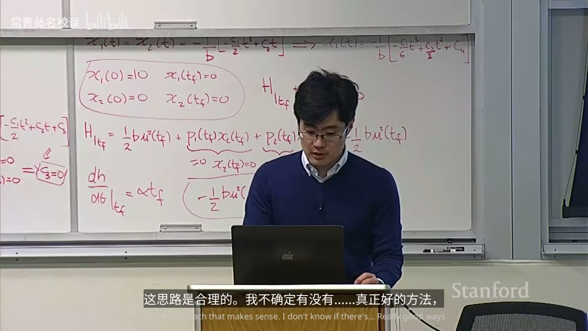 |
| 谢谢好行可以最后一个问题然后我就继续谢谢 [【跳转到 26:31】](https://www.bilibili.com/video/BV11LEA6eEuj/?p=4&t=1591) | 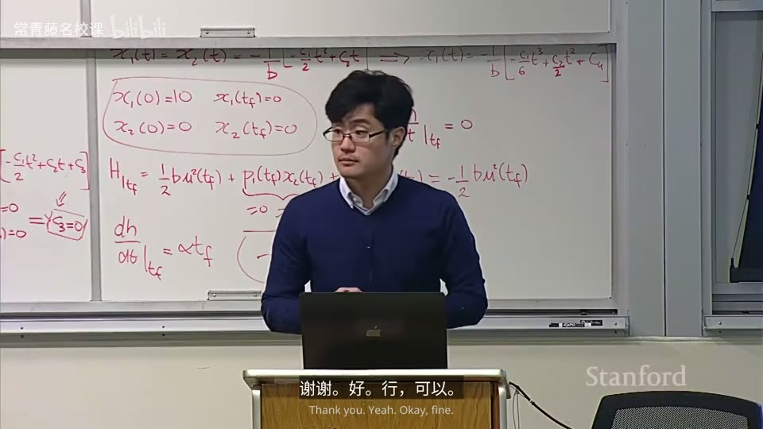 |
| （学生）"请讲：跟 Transformer 相比，'新方法'的缺点是什么？训练是不是比状态空间模型更复杂？" [【跳转到 26:36】](https://www.bilibili.com/video/BV11LEA6eEuj/?p=4&t=1596) | 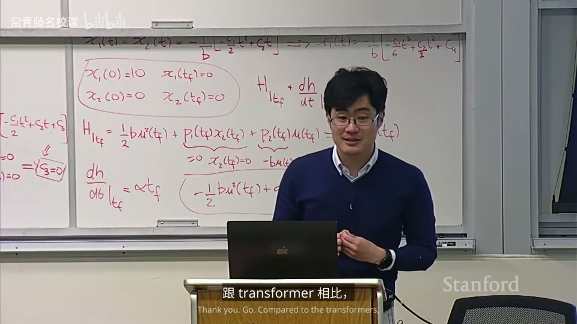 |
| （讲师）"问得好。嗯，'总得有点缺点吧，不然大家都（.firstName）用了'（原字幕如此）。我觉得'缺点'就是'表达能力的问题'，对吧——你知道的：softmax attention 里的 all-to-all 连接非常强大，它也很好训练，对吧。嗯，我觉得跟 LSTM 比，attention 以前有个很大的优势就是"硬件效率高"（对吧——NIKI 原字幕应为 GPU 并行/可并行）：嗯，我觉得这些"状态空间模型"之所以流行——虽然他们跟 LSTM 很像、 [【跳转到 26:44】](https://www.bilibili.com/video/BV11LEA6eEuj/?p=4&t=1604) | 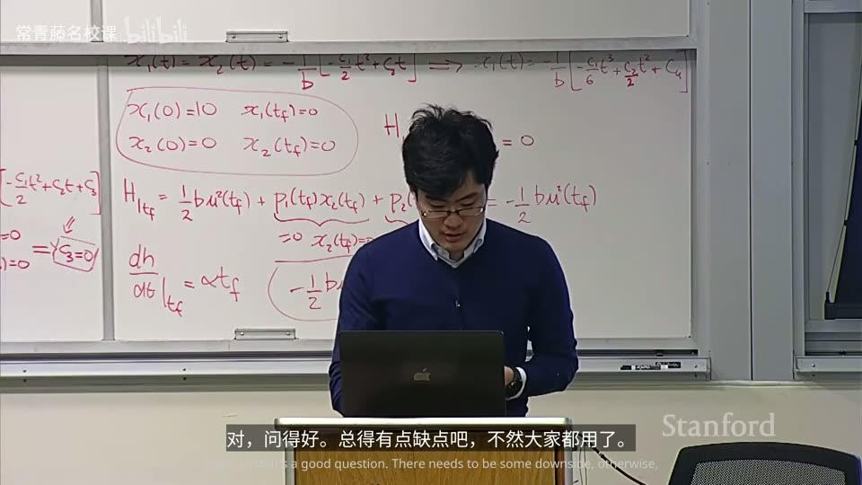 |
| 而且在表示能力上也有类似的短板——是因为现在有了这种"清晰的二重性（duality）"；得益于我提到的"线性 attention" [【跳转到 27:01】](https://www.bilibili.com/video/BV11LEA6eEuj/?p=4&t=1621) | 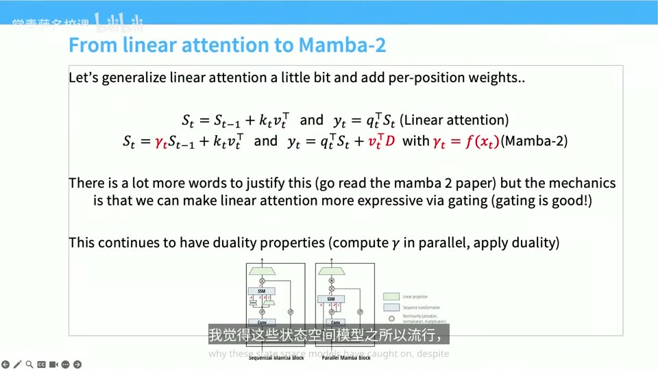 |
| 这类方法，你可以从 RNN 形式切换到"更密集的矩阵乘法形式"——XX（原字幕 um2）那种矩阵乘法形式带来了（硬件/整体）计算效率； [【跳转到 27:09】](https://www.bilibili.com/video/BV11LEA6eEuj/?p=4&t=1629) | 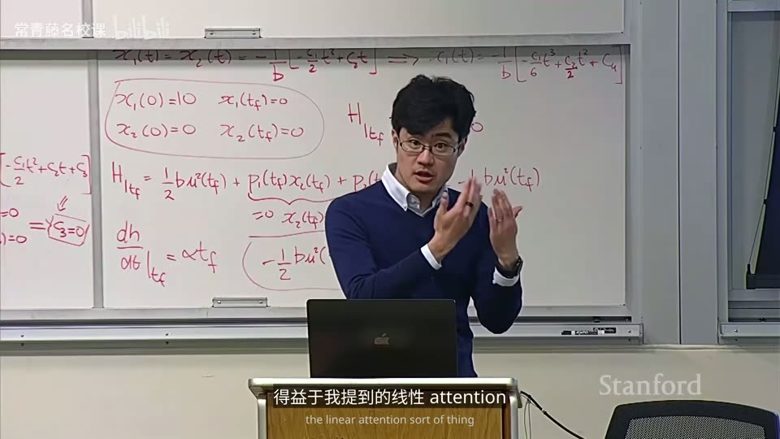 |
| 所以这种"权衡"现在似乎已经"改善"了，但你还是得"面对"这个权衡： [【跳转到 27:17】](https://www.bilibili.com/video/BV11LEA6eEuj/?p=4&t=1637) | 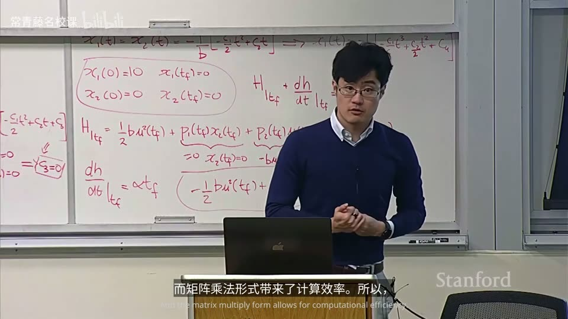 |
| 如果你状态有限，还得把所有信息都"传过去"——跟（softmax 注意力那种）"直接传递所有信息"相比，你会丢失一些信息。（学生）"对。在类似的状态空间里（原字幕乱）……抱歉我是说：相比 context length，状态空间里是不是还有'更多内容'（能装）？" [【跳转到 27:22】](https://www.bilibili.com/video/BV11LEA6eEuj/?p=4&t=1642) | 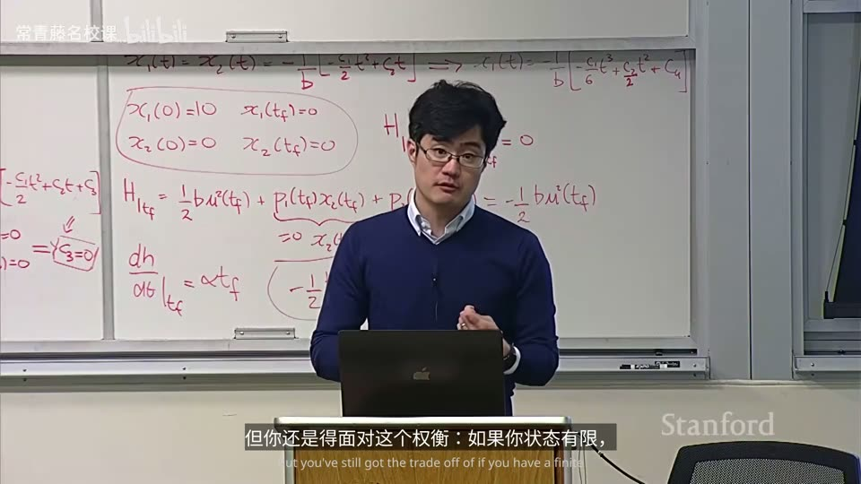 |
| （讲师）"在状态空间模型里，你基本上得考虑'上下文长度相对于状态规模'的比例；对吧—— [【跳转到 27:36】](https://www.bilibili.com/video/BV11LEA6eEuj/?p=4&t=1656) | 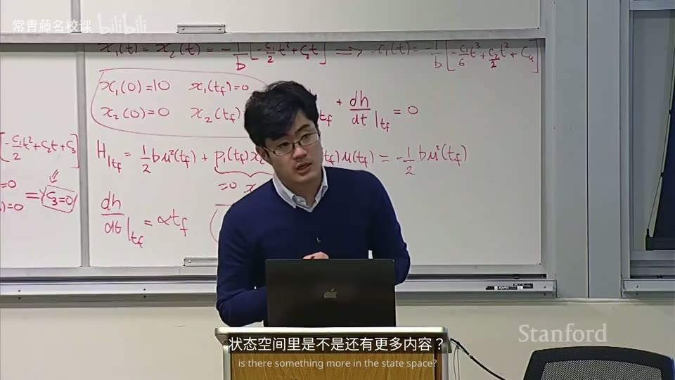 |
| 我的意思是：如果状态规模和上下文一样大，那确实（能装下）可行； [【跳转到 27:41】](https://www.bilibili.com/video/BV11LEA6eEuj/?p=4&t=1661) | 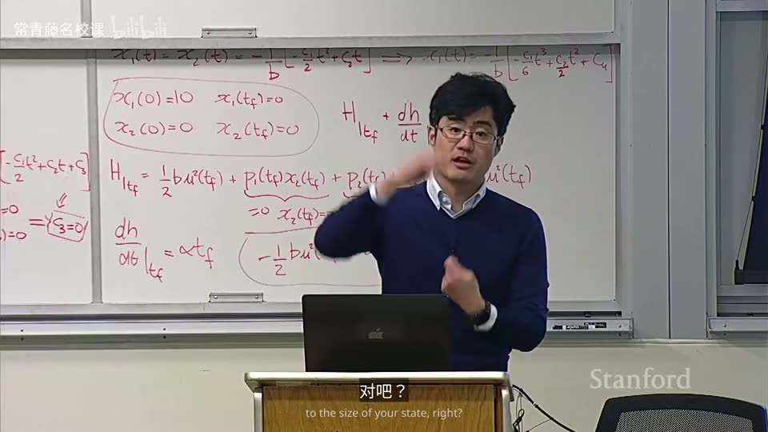 |
| 但代价是'计算开销'会非常大。所以核心问题是：如果你想要一个"极小的状态"，就很难把"大 context 里的所有信息"都压缩进去。这没有"免费的午餐"；也许未来某天我们能做到"无需权衡"，但目前来看，权衡点就出在这里。谢谢。"（好啊）很好。那么现在我来讲讲 Mixture of Experts（MoE）。呃， [【跳转到 27:46】](https://www.bilibili.com/video/BV11LEA6eEuj/?p=4&t=1666) | 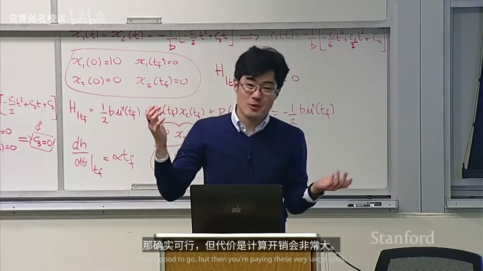 |
| 我觉得 MoE 值得展开讲一讲。从概念上讲，他们并没有真正"改变（时间/复杂度）格局"；一种理解 MoE 的方式是：他们只是"更高效的 MLP"，对吧——也就是说你原本有一个 MLP，然后不知怎么的，有人给了你一个"更高效的 MLP"，这大致就是 Mixture of Experts 的含义。但我认为你需要理解其中的原理：某某（原字幕 amixtureofexperts）之所以重要，主要有两个原因： [【跳转到 28:04】](https://www.bilibili.com/video/BV11LEA6eEuj/?p=4&t=1684) | 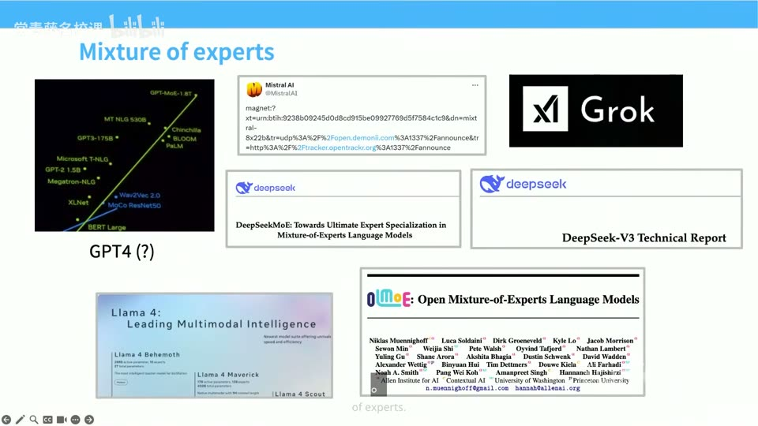 |
| 其一，就像某张幻灯片所显示的：如今大家都在做 Mixture of Experts、都在部署 MoE——如果你希望成为"深入理解语言模型及其工作原理"的人，你就应该明白它是什么，对吧。这是第一个原因。另一个原因是：Mixture of Experts [【跳转到 28:29】](https://www.bilibili.com/video/BV11LEA6eEuj/?p=4&t=1709) | 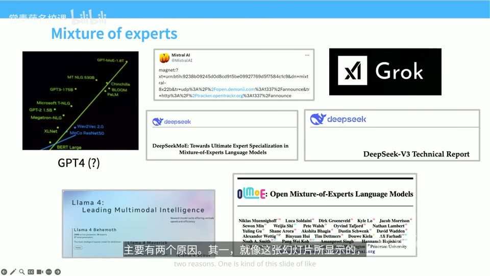 |
| 其实有一些"非常有意思"的特性：嗯，一些"机制性的组件"。如果你观察 MoE 是怎么搭建的 [【跳转到 28:44】](https://www.bilibili.com/video/BV11LEA6eEuj/?p=4&t=1724) | 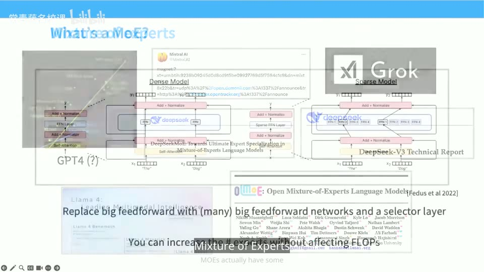 |
| 、用了哪些基本原语（primitives），你会很快在很多"（其他）地方"看到类似（与）MoE 的原语；然后你会意识到"哇，我可以用神经网络做更多'有趣的事情'"。所以，我认为 MoE 既有趣又"酷"——这是一个更宏观的理由，你应该去了解它们。好，那么"什么是 Mixture of Experts"？在某些方面，MoE 是非常"简单"的东西：他们其实就是你"MLP 的替代品"。左边是 Transformer 中 [【跳转到 28:49】](https://www.bilibili.com/video/BV11LEA6eEuj/?p=4&t=1729) |  |
| 你通常使用的××（应为 MLP）（原字幕 mpinattention）：（有）一些归一化，然后紧接着是一个 feedforward（FFN），这里就是大量"密集信息处理"发生的地方；现在换个思路：假设我把那个"大的前馈网络（FFN）"拆成几个"小的 FFN"——这样我就有了 4 个前馈网络；假设我不把他们切得更碎，而是让其保持"和原来一个 FFN 一样大"，并且通过"某种机制"，我有一个系统（router）能告诉我："针对每个输入（token），该选择哪个前馈网络？"——好， [【跳转到 29:14】](https://www.bilibili.com/video/BV11LEA6eEuj/?p=4&t=1754) |  |
| 这样一来，我的"参数量"变成了原来的"四倍"（至少对于 FFE 部分是"如此"）；虽然我有"四个 FFN 的参数量"，但在任何一次前向或反向传播中，我"只需承担一个 FFN 的计算成本"。很好。所以，从某种意义上说：如果你读过 Mixture of Experts 的原始论文（XY 1991 等），会发现"它最初的动机"是一种"以参数为中心的视角"： [【跳转到 29:39】](https://www.bilibili.com/video/BV11LEA6eEuj/?p=4&t=1779) | 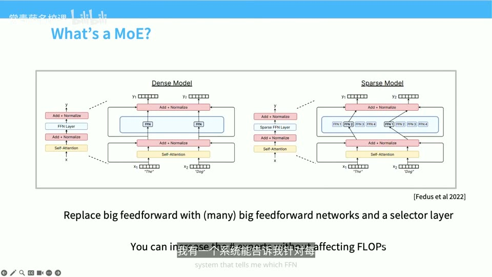 |
| 他的出发点大概是这样：假设你只是想要"更多参数"，因为你相信"参数越多越好"——情况大致是这样。好，很好：如果我们想要更多参数，又不想为更多参数付出"计算（computer → compute）"的代价，那就需要类似"右侧（滑动）所示"的这种结构。因此，这就是你对 Mixture of Experts（MoE）应有的"心智模型"：你希望"在不影响总 FLOPs（原字幕 foo BP）的前提下'增加参数量'。（A 原字幕应为 FFWD 或类似词）"。 [【跳转到 30:04】](https://www.bilibili.com/video/BV11LEA6eEuj/?p=4&t=1804) | 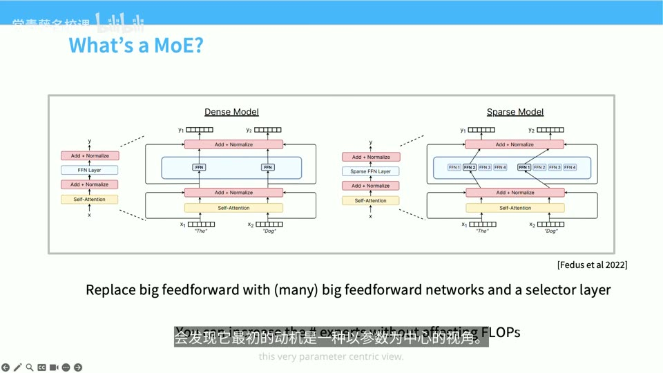 |
| 那么，他们为何如此流行？"如今你在 HuggingFace 等平台上获取的任何模型：只要超过一定规模，都是'MoE'。"超过一定规模后，你拿到的模型似乎都是"某某（原字幕）"，原因在于："不知出于何故，如果保持'总 compute 不变'、而仅增加'稀疏参数'的数量，那么模型的性能通常都会变得更好。"因此，这或许佐证了一种观点： [【跳转到 30:29】](https://www.bilibili.com/video/BV11LEA6eEuj/?p=4&t=1829) | 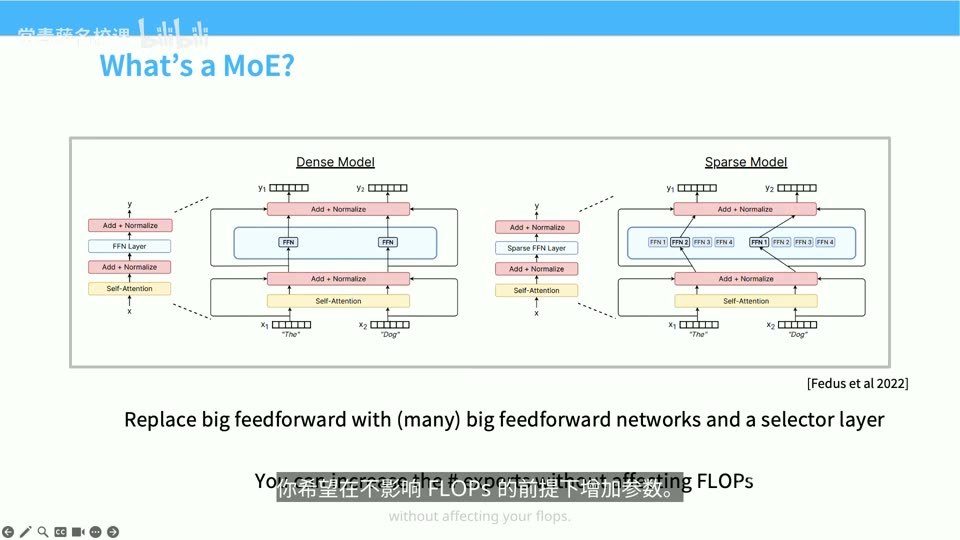 |
| "更多的参数总体上确实是有益的——即使同一时刻只有其中一部分处于激活状态。而在本讲座中，我将大量引用 Google 的一些原始论文：这是 Fedus（原字幕 FERRIS）等人 2022 年发表的论文；我记得里面讨论的是 Switch Transformer。他们展示出"随着专家数量的增加"（对吧，也就是说"激活参数量保持不变"，专家数量增加），语言建模的验证损失就在"持续下降， [【跳转到 30:54】](https://www.bilibili.com/video/BV11LEA6eEuj/?p=4&t=1854) | 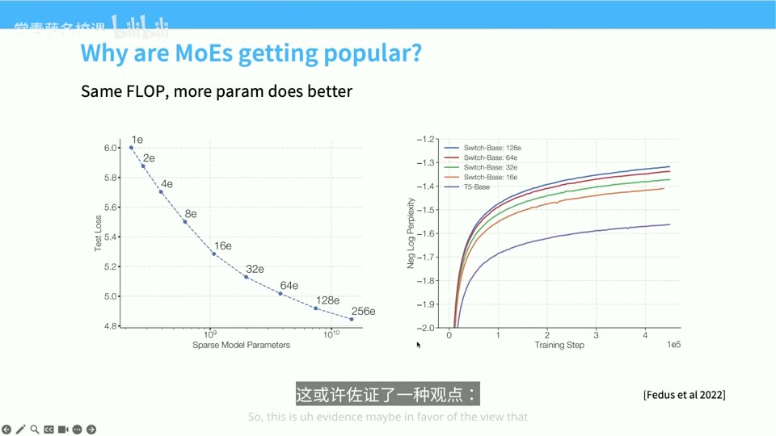 |
| 下降、再下降"。所以嗯，如果你只在意'前向传播的 FLOPs'，那确实很棒。嗯，右边展示的是"随着训练（FLOPs）增加出现的类似情况"：当你在 X 轴上增加训练 FLOPs 时，如果在相同的计算预算下使用更多的 Experts，性能就会提升。所以，在"训练和推理"阶段，MoE 都能让你"轻松取胜"。这确实很棒、非常好。（某某某原字幕）啊： [【跳转到 31:19】](https://www.bilibili.com/video/BV11LEA6eEuj/?p=4&t=1879) | 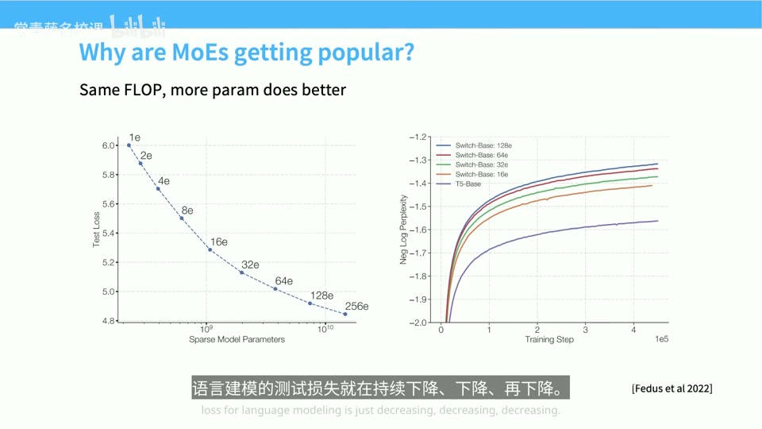 |
| 这种情况其实已经被反复观察到：左边这张图（和之前一样）来自 Fedus 的论文。去年，AI2（原字幕 AIT 育团队：AI2 研究团队）发表了 OLMO 论文——这是他们关于"开源 Mixture of Experts 的分析"与"（训练）研究"；他们也观察到了同样的现象：无论是看"训练 loss""验证 loss 才（应为或）"下游基准测试表现，你都会发现：在"训练阶段"，这些 MoE 模型相比其"稠密对应模型" [【跳转到 31:44】](https://www.bilibili.com/video/BV11LEA6eEuj/?p=4&t=1904) | 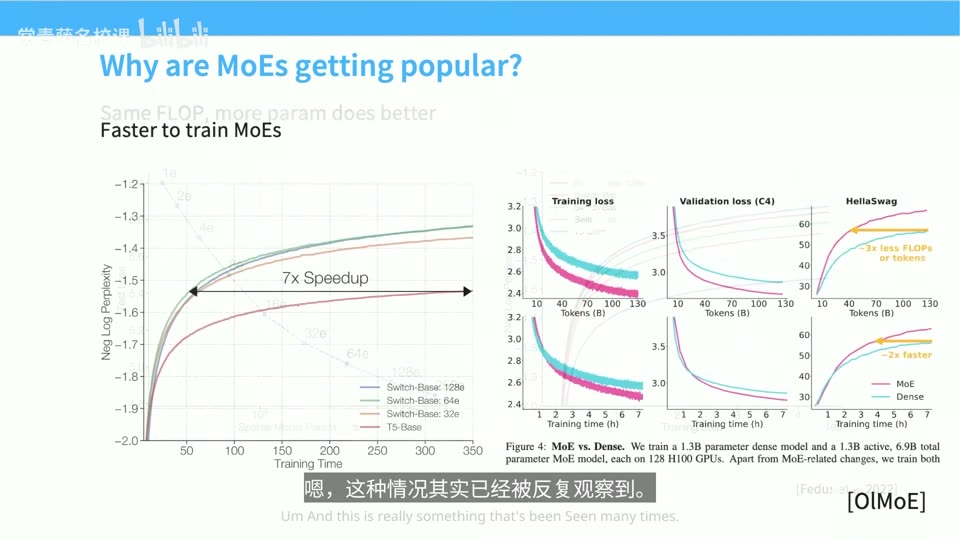 |
| 表现要好得多。也就是说："训练一个 MoE 模型，比稠密模型大约快 2 倍"。（原字幕 AlidistancingyourselfC 乱码。）"稀疏性"在这里带来的好处——我认为"事实胜于雄辩"；看看"所有发布的 MoE"，就"激活参数而言"，它们比稠密模型"强得多"。这正是（大家想要的）right——这很关键，毕竟你肯定得考虑"推理时的（有效）浮点运算量"，或者更广泛地说，"训练和部署这些系统的成本"，对吧。 [【跳转到 32:09】](https://www.bilibili.com/video/BV11LEA6eEuj/?p=4&t=1929) | 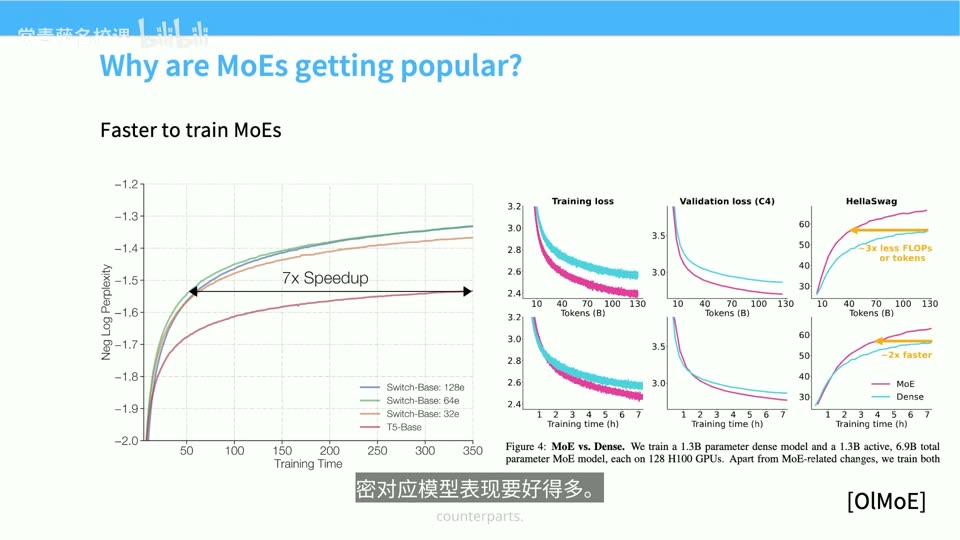 |
| DeepSeek-V2 和早期的 DeepSeek（原字幕 deepckme）问世时，跟当时大家都在训练的那些"稠密模型"相比，确实带来了深刻的转变：你会看到"哇，我们的激活参数少得多，但 MMXX（应为 benchmark/ML 类）表现却跟别人一样好、甚至更好"。所以 MoE 领域确实发生了一些很棒的进展。好，好的。（那么）希望我已经让你相信："MoE。是个有趣的方向，值得你花时间去思考和研究。"哦对，最后我想补充一点， [【跳转到 32:34】](https://www.bilibili.com/video/BV11LEA6eEuj/?p=4&t=1954) | 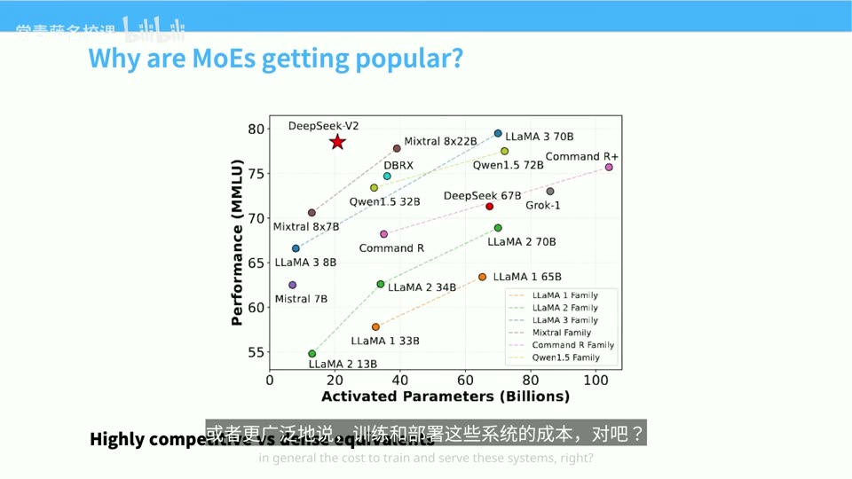 |
| 说明"为什么这很重要"：MoE 为你提供了另一个"并行化"的维度——啊，我想我们还有（两）节课会专门讲"并行化和系统"："并行化"确实确实是 LLM 中非常关键的一环："语言模型非常庞大——无论是训练还是推理，都无法装入单个设备；因此你需要多种不同的'模型切分方式'，以高效地服务（serving）或训练他们。"（原字幕"四啊"）而 Mixture of Experts 还有个"意外的好处"："每个 feedforward 里的 expert，天然就是'分块'的"—— [【跳转到 32:59】](https://www.bilibili.com/video/BV11LEA6eEuj/?p=4&t=1979) | 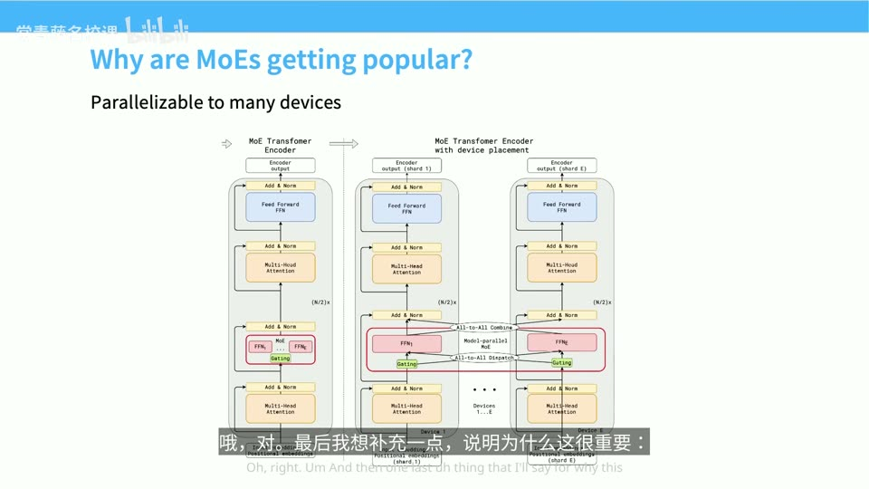 |
| 每个 expert 本身就是一个"自然的块"；你可以把它们放在不同的设备上，然后将"激活值路由（route）"到不同的设备。（我们在稍后）会讲"c====（Expert Parallel）"：指的就是这个——"就为你提供了一个额外的系统优化空间，如果你想优化服务器就会非常有用"。 [【跳转到 33:24】](https://www.bilibili.com/video/BV11LEA6eEuj/?p=4&t=2004) | 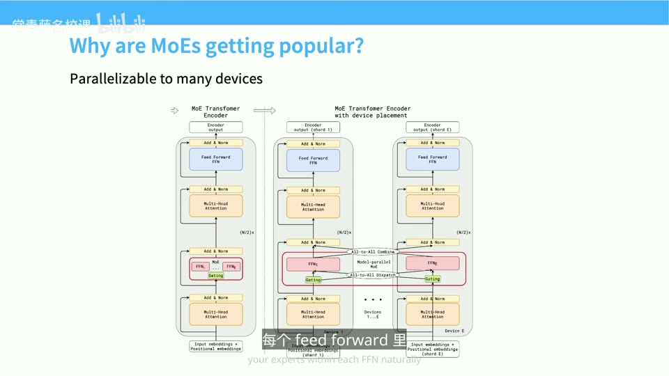 |
| 好在西方（欧美），我认为已经发布过几个"体量大、能力强的 MoE 开源模型"：在大模型方面有 xxx（原字幕 lamfour，应为 Llama-4）和 OpenAI 推出的 GPT-OSS。不幸的是，西方的开源模型发布"在很大程度上已经停滞了"：啊，现在虽然发布的（模型）没那么多了，但这里有两个很好的例子：他们各自都是"顶级模型"。不过，我认为 MoE "研究和训练的主要进展" [【跳转到 33:41】](https://www.bilibili.com/video/BV11LEA6eEuj/?p=4&t=2021) | 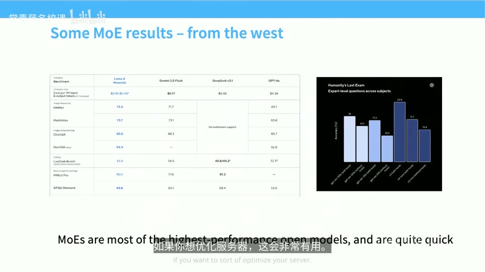 |
| 都发生在中国":"Qwen、DeepSeek 以及 MiniCPM 等，做了些 MoE 的早期训练工作、并推动了它的普及；他们在"某一方面"继续做着非常棒的工作。比如你看看早期的"Qwen MoE 模型"（也就是 Qwen1.5-MoE——原字幕 QNWO 点 5OE，凑合）：他们展示了其"2.7B 活跃参数"的小型模型，表现优于当时许多 7B（模型）。我觉得 DeepSeek 和 Qwen 的这些早期（原字幕"时政"应为）工作 [【跳转到 34:02】](https://www.bilibili.com/video/BV11LEA6eEuj/?p=4&t=2042) | 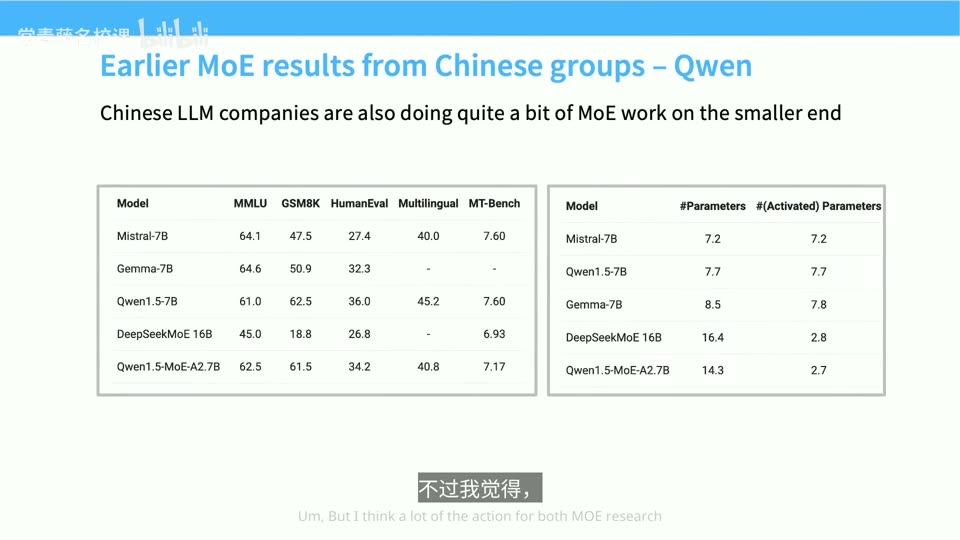 |
| 真的让开源社区（中的其他研究者）都确信："这是正确的方向"。说到 DeepSeek（原字幕 deepsick）……哦，有人提问吗？是的："嗯，我对'专家并行（expert parallel）'有个问题 [【跳转到 34:27】](https://www.bilibili.com/video/BV11LEA6eEuj/?p=4&t=2067) | 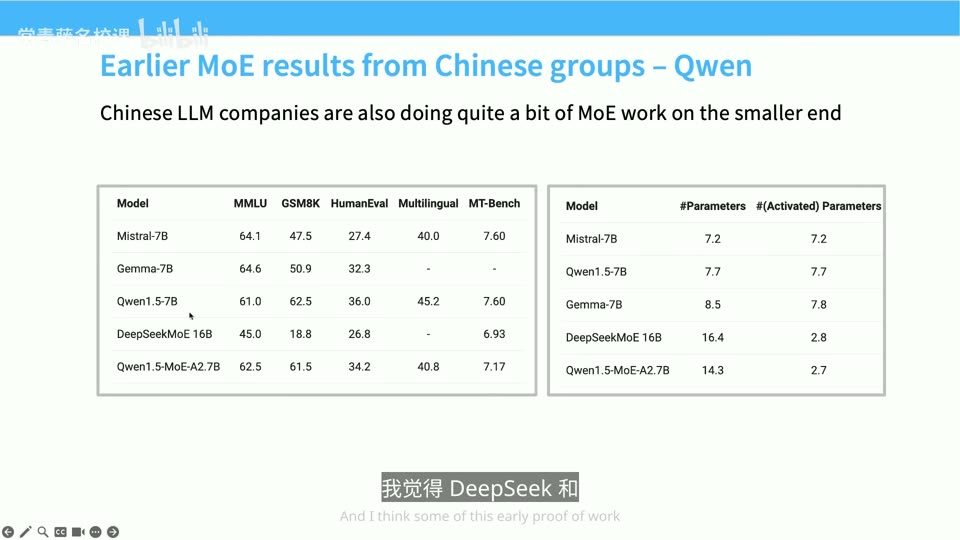 |
| ——这些 expert 之间互相'通信'，难道不会形成通信瓶颈吗？"哈，是的。嗯，从某种意义上说，"你得承担'传输激活值'的通信开销"——我就不细说了； [【跳转到 34:38】](https://www.bilibili.com/video/BV11LEA6eEuj/?p=4&t=2078) | 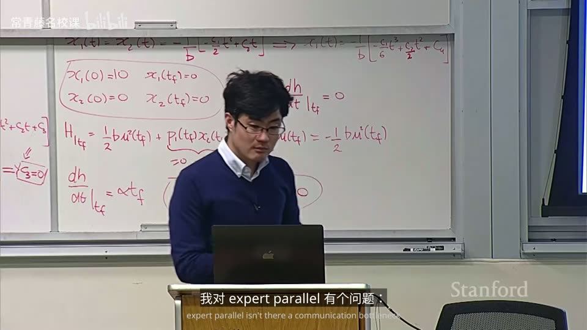 |
| 但我会演示一个"降低这一成本"的技巧。不过总的来说，这其实是一种"权衡"："你换来了'更多的聚合浮点运算次数'和'更低的内存占用'；但需要为'通信成本'买单。" [【跳转到 34:49】](https://www.bilibili.com/video/BV11LEA6eEuj/?p=4&t=2089) | 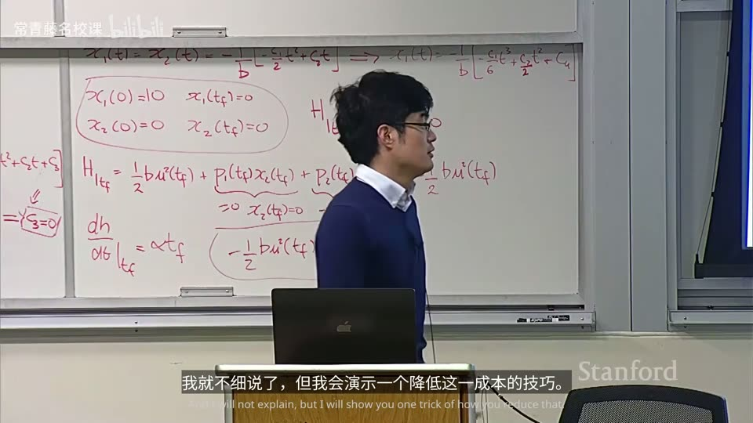 |
| 嗯，LUCY（人名应为 XXX）——"这到底是不是一笔划算的交易？"很大程度上取决于你的"拓扑结构"以及其他各种因素。谢谢，不错。（好）嗯，对，这部分很关键（下面另一条）： [【跳转到 35:00】](https://www.bilibili.com/video/BV11LEA6eEuj/?p=4&t=2100) | 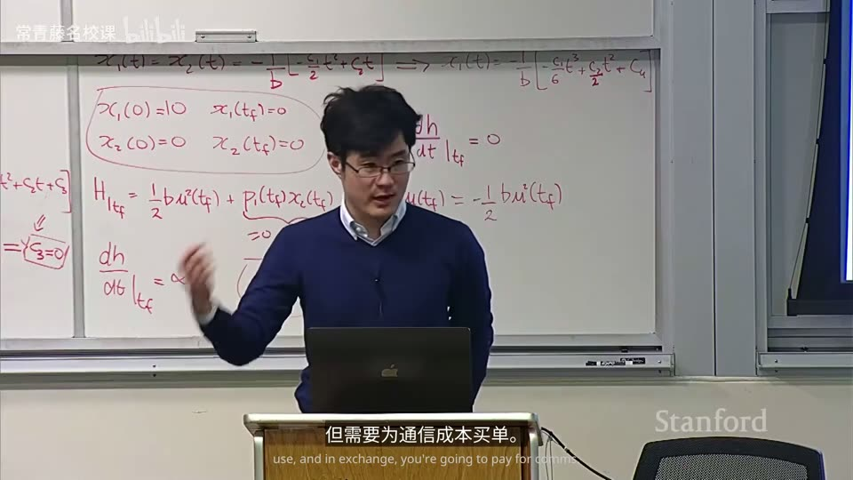 |
| （注意）"在训练阶段，他们也是稀疏的。这正是 Mixture of Experts 难以处理的核心原因。"我这么说有点"剧透了几页之后的核心思路"：但如果我们在训练时"激活所有 expert"，那就简单多了：嗯——"那我就能看出哪个 expert 最适合处理我的输入，从而学会如何进行路由分配。"对（好）；对 Mixture of Experts [【跳转到 35:12】](https://www.bilibili.com/video/BV11LEA6eEuj/?p=4&t=2112) | 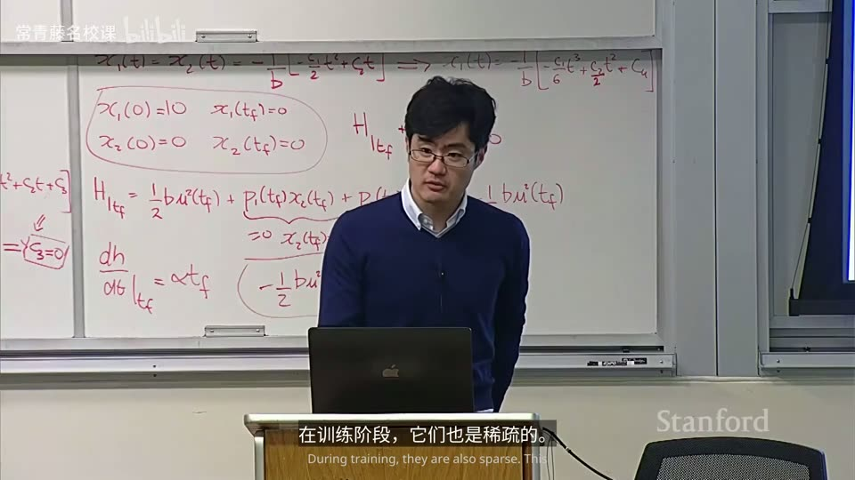 |
| 来说，难点在于："训练时你只能激活一个或 K 个 expert，所以你并不知道'其他那些专家'发生了什么"； [【跳转到 35:29】](https://www.bilibili.com/video/BV11LEA6eEuj/?p=4&t=2129) | 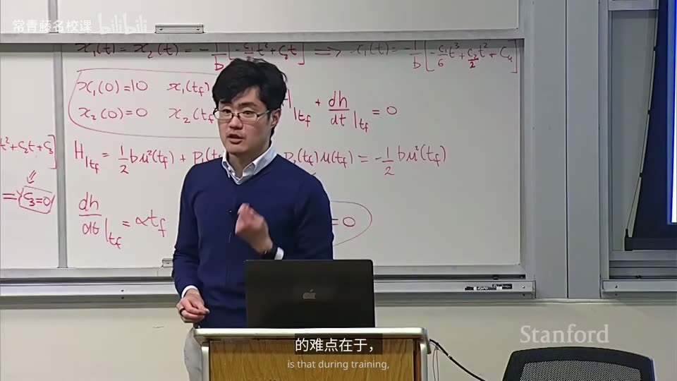 |
| 你只知道"哪些被激活了"。尽管如此，你必须设法（弄明白怎么）学会"路由（routing）"：所以，这个问题带有"强化学习中'多臂老虎机问题'"的色彩。嗯， [【跳转到 35:34】](https://www.bilibili.com/video/BV11LEA6eEuj/?p=4&t=2134) | 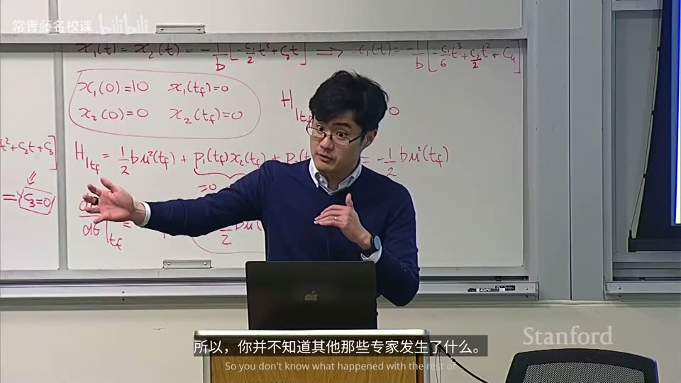 |
| 但我们既不用强化学习、也不用"多臂老虎机（算法）"来解决，我们要靠"启发式方法和深度学习的魔力" [【跳转到 35:43】](https://www.bilibili.com/video/BV11LEA6eEuj/?p=4&t=2143) | 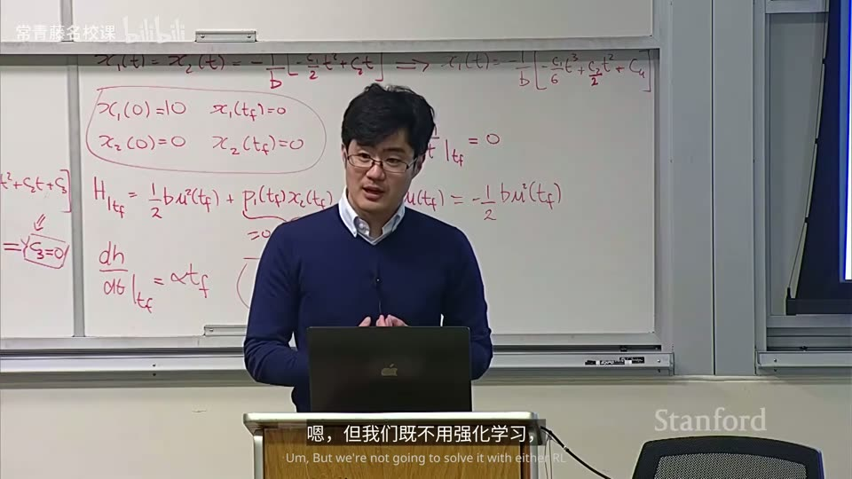 |
| 来解决。好，（学生）"请讲：在'专家之间切换'的'力度/粒度'是什么？"啊—— [【跳转到 35:51】](https://www.bilibili.com/video/BV11LEA6eEuj/?p=4&t=2151) | 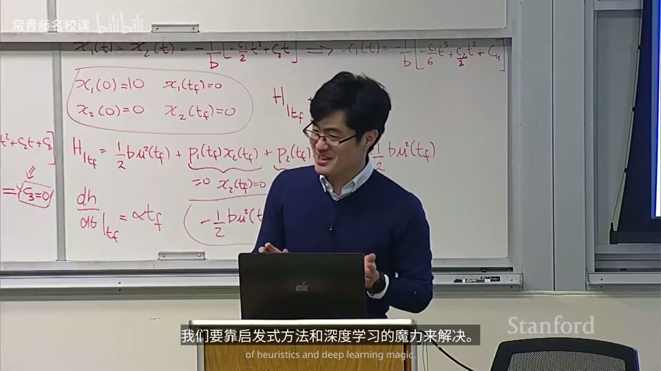 |
| "这个'力度'，也就是我们路由专家的尺度"——嗯，"就是 'token 级路由'（token routing）？我不知道是不是这个意思。"（讲师）好，"对，就是这个问题：是的，就在'token 层级（原字幕 token 曾记）'： [【跳转到 35:56】](https://www.bilibili.com/video/BV11LEA6eEuj/?p=4&t=2156) | 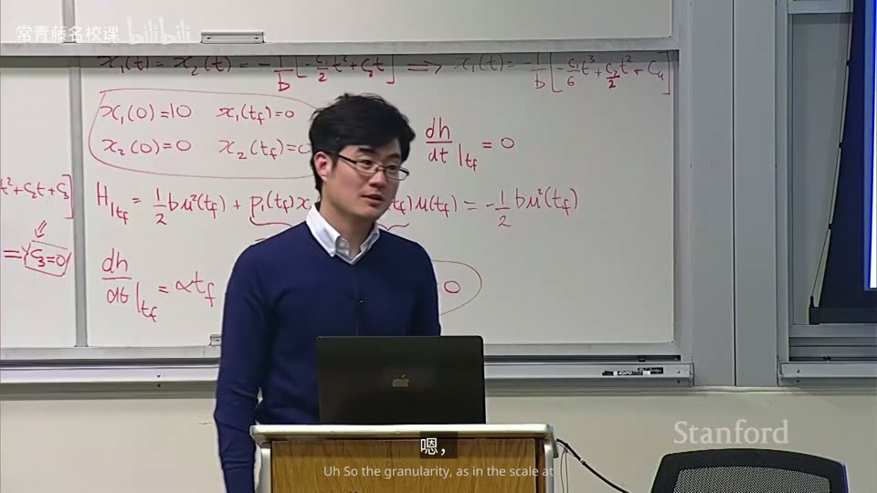 |
| 所以每个 token 都会分到一个专家。"那么"路由器（router）"——为了让你建立正确的"心智模型"，其实非常简单：一天（原字幕乱），嗯"，它们就像是在'你的输入'和'另一端的（某个权重矩阵）'之间做一次'矩阵乘法'"：所以你不会做任何"复杂的事"。嗯，"你并不会知道'这是不是一个医学问题'——你只会觉得'哦，这个 token 看起来像是日语'，那就把它路由到'专家 X'"（原字幕应为"专家 某某数字'）"对，对。 [【跳转到 36:03】](https://www.bilibili.com/video/BV11LEA6eEuj/?p=4&t=2163) | 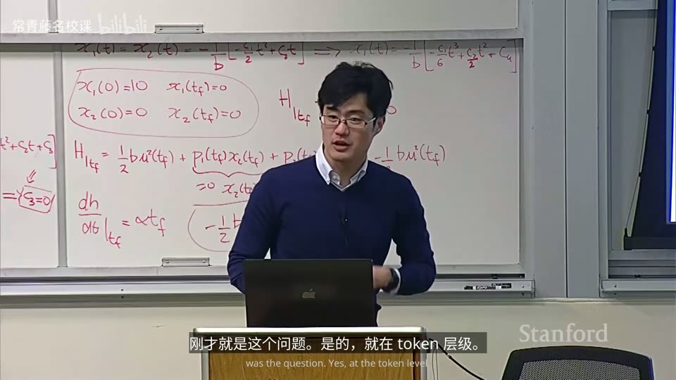 |
| （学生）"那么问题来了：在'训练或推理'阶段，'并行化这些 MoE 模型'有上限吗？它是不是也是存在限制的？" [【跳转到 36:24】](https://www.bilibili.com/video/BV11LEA6eEuj/?p=4&t=2184) | 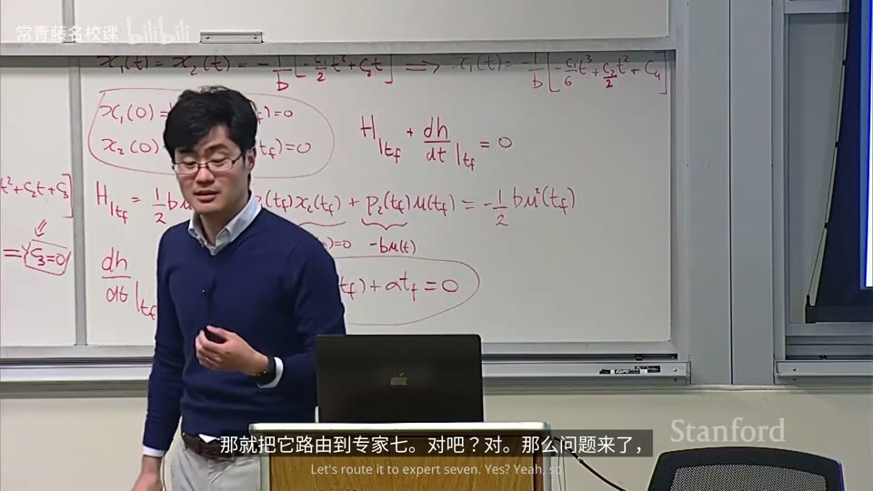 |
| （讲师）"一般来说，（模型）并行化是有上限的：因为随着你在越来越多的设备上做'分片'， [【跳转到 36:29】](https://www.bilibili.com/video/BV11LEA6eEuj/?p=4&t=2189) | 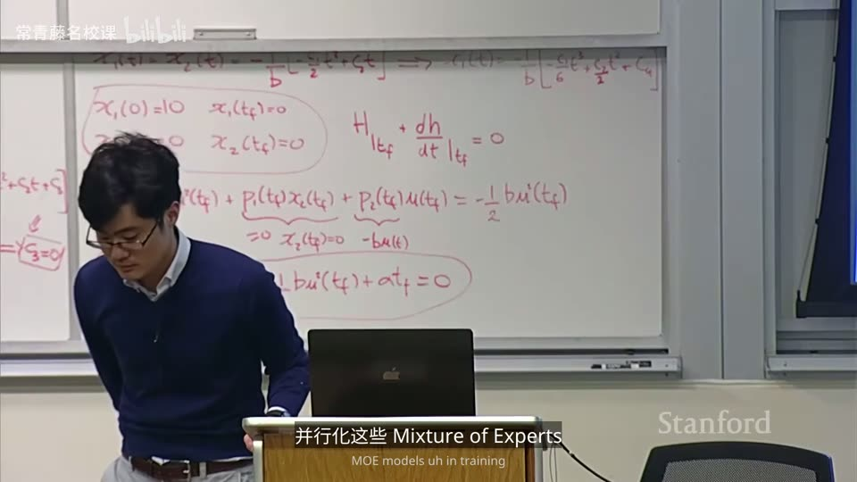 |
| 通信开销会激增，对吧——你们会（发现）。嗯，只要我们把作业设计得当， [【跳转到 36:34】](https://www.bilibili.com/video/BV11LEA6eEuj/?p=4&t=2194) | 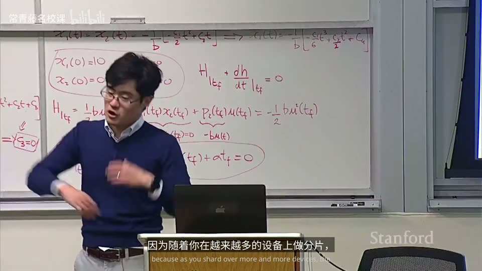 |
| 你们在作业里就得处理其中一些问题：我们会要求你们去"设计网络拓扑"之类的东西 [【跳转到 36:39】](https://www.bilibili.com/video/BV11LEA6eEuj/?p=4&t=2199) | 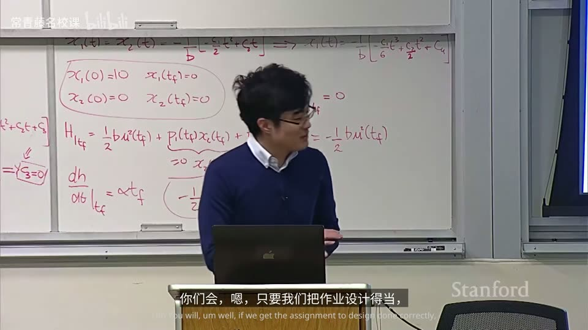 |
| （比如）让'分片'变得合理；或者反过来——"给定一个网络拓扑， [【跳转到 36:44】](https://www.bilibili.com/video/BV11LEA6eEuj/?p=4&t=2204) | 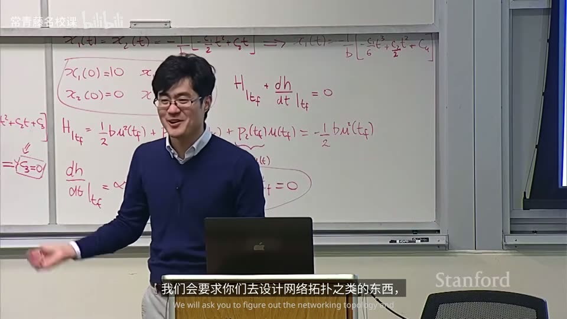 |
| 你们得想办法如何对模型进行'分片'之类的"。啊对，很好。（嗯，某某）好，没错。 [【跳转到 36:49】](https://www.bilibili.com/video/BV11LEA6eEuj/?p=4&t=2209) | 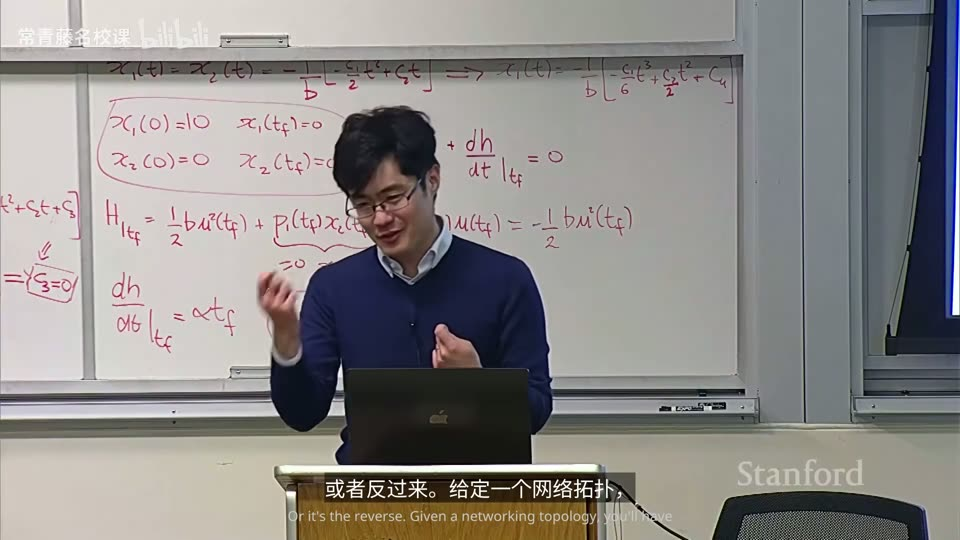 |
| DeepSeek 以其（XX 等）而闻名（原字幕 Deepseekorgintraindeepseekareone，即 DeepSeek-R1 类模型闻名）。但我真正欣赏 DeepSeek 的一点是："这堂课最初的版本，本来就是打算（逐篇）讲解 DeepSeek 的论文"：他们在"架构和语言模型研究"方面，确实做得非常扎实：这项工作持续了很长时间。啊。"DeepSeek 算是比较早入局的（玩家之一）"；他们通过研究"阐明了 MoE 的优势"并做了大量"消融实验"：比如探讨"如果使用'密集层'会怎样"、 [【跳转到 36:54】](https://www.bilibili.com/video/BV11LEA6eEuj/?p=4&t=2214) | 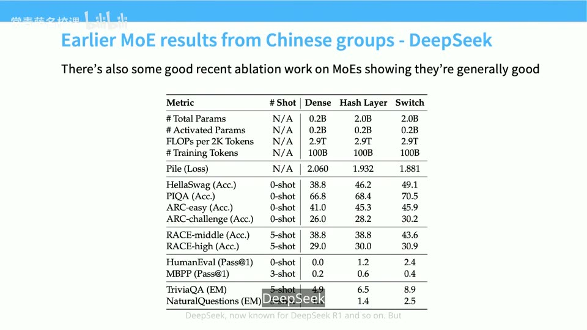 |
| "如果用哈希路由会怎样、如果用 Switch router 会怎样"——所有这些不同的设计决策，你都可以在他们早期的一些"DeepSeek MoE 论文"（原字幕 three）中看到。如果你对这些问题感兴趣（比如"架构设计"之类），我建议你去读读他们早期的 DeepSeek 论文（原字幕 deepsk 论文）： [【跳转到 37:19】](https://www.bilibili.com/video/BV11LEA6eEuj/?p=4&t=2239) | 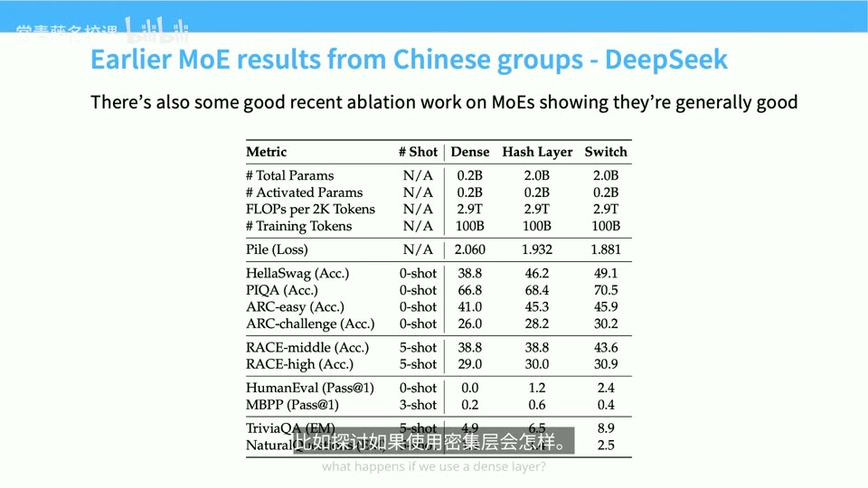 |
| 从这些里面能学到很多东西，对吧。当然，进展也没停过：DeepSeek-V3、V3.2 以及 GLM（原字幕 GOM）等等，都已经构建出了非常出色、且强大的 MoE 模型。嗯，"很明显，在可预见的未来，这就是这些大模型的发展方向——至少在未来几年，我想会是 MoE 的天下"。 [【跳转到 37:36】](https://www.bilibili.com/video/BV11LEA6eEuj/?p=4&t=2256) | 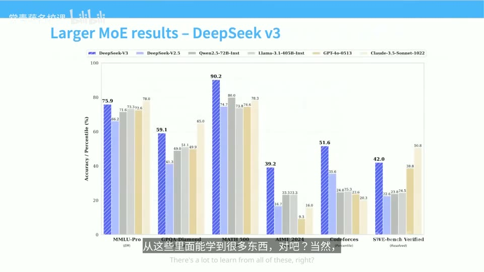 |
| 好，那么"问题来了"：为什么他们（之前）没有（更早）流行起来呢？嗯，这体现在"很多方面"：我觉得 MoE "普及的挺慢的"：啊，你看一些论文，比如 2017 年，Google 就在研究、并努力推动 MoE；嗯，但（原字幕 then says in the mixture of experts 等）大致要到 2024 年以后，MoE 才真正"流行/普及"。为什么？另（外），"如果你在做各类语言模型研究，那你大概率主要是在用'稠密模型'"： [【跳转到 37:55】](https://www.bilibili.com/video/BV11LEA6eEuj/?p=4&t=2275) | 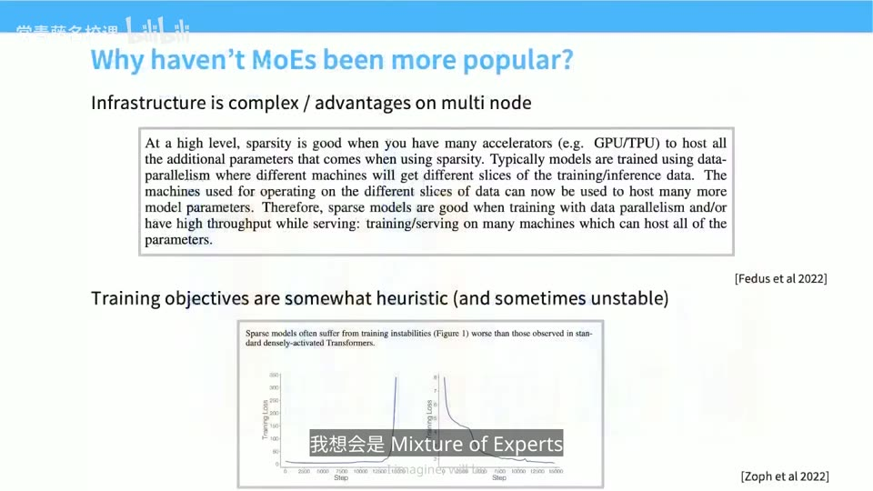 |
| "既然 MoE 模型这么好，为什么不用呢？我们能省下 compute"……"Mixture of Experts 带来了很多复杂性：训练 MoE 也好、使用 MoE 也好，或者要做"的其他很多事都不容易。诶。嗯，"基础设施非常复杂"：我是说，刚才有几个关于并行化的提问，但总体上（结论）是对的："很难以'高利用率'的方式来并行化 experts/MoE"："MoE 的参数量很大（稀疏参数量巨大的参数量）…… [【跳转到 38:20】](https://www.bilibili.com/video/BV11LEA6eEuj/?p=4&t=2300) | 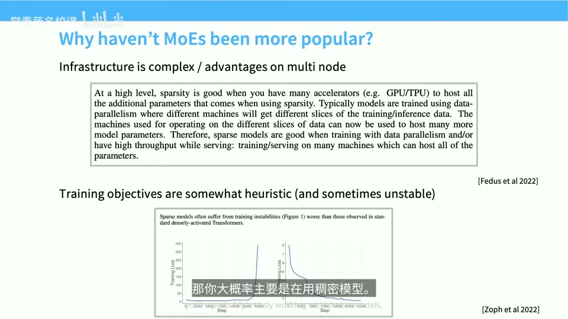 |
| 很难塞进"单个设备"里，而且训练它们时真的可能会"出大问题"：在后面的几页幻灯片里，你就会看到"MoE 为什么真的很难处理"——不过他们（MoE）是不是"容易处理的对象"（原字幕如此；应为"并不容易处理"），对吧：现在，确实有一些"经验法则"， [【跳转到 38:45】](https://www.bilibili.com/video/BV11LEA6eEuj/?p=4&t=2325) | 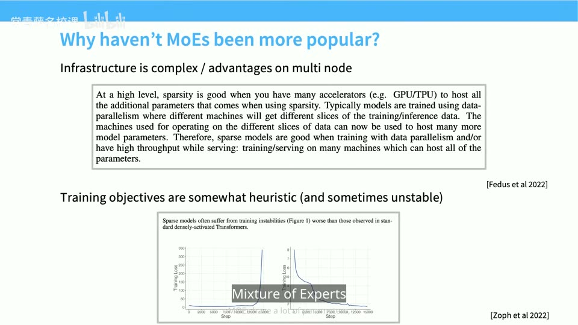 |
| 但依然不容易。好的，我用一张幻灯片简要提一下：也有人把 Mixture of Experts 应用到 Transformer 的"tension 块（应为 attention）"里：已经有几篇相关论文；但这种做法并不常见。据我所见，与"仅替换 FEEDFORWARD/MLP 层"相比，这种做法并不那么容易"驯服"、也不那么容易让它"正常工作"。啊，所以我只讲"左边"这部分：这基本上就是（几乎）所有大模型的做法——在大多数情况下， [【跳转到 39:00】](https://www.bilibili.com/video/BV11LEA6eEuj/?p=4&t=2340) | 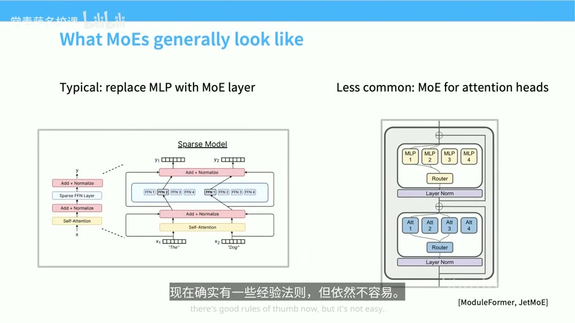 |
| 人们并不会把"注意力头（attention heads）"分片或拆分成 experts。啊，好的，以上就是关于 Mixture of Experts 的"产业概况和现状"。接下来我们谈谈："如何设计一个 MoE""如何思考 MoE"——为此，我将介绍三种"不同的变化维度"：（原字幕'某一'应为 MoE）：（回答）"MoE 当中有哪些部分可以调整"：（1）"你可以修改'路由函数/路由器'"（我们知道 MoE 的核心机制在于 [【跳转到 39:25】](https://www.bilibili.com/video/BV11LEA6eEuj/?p=4&t=2365) | 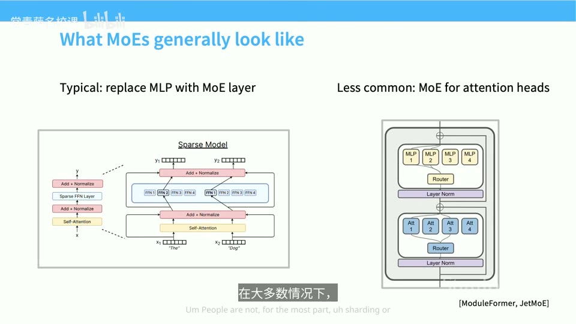 |
| 路由器需要把 token 分发给各个专家）——所以这部分是可以调整的；（2）"我们可以调整不同专家的规模/大小"：在给定预算下，你可以选择"更多但参数较少的专家"，或者"更少但参数较多的专家"；(3) 最后，我们要谈谈"训练"：因为训练会非常棘手。一旦你真正理解 MoE 的工作原理，你就会发现："要训练一个'把 token 路由到不同位置'的系统， [【跳转到 39:50】](https://www.bilibili.com/video/BV11LEA6eEuj/?p=4&t=2390) |  |
| 并不容易"。诶，谢谢。好。 [【跳转到 40:15】](https://www.bilibili.com/video/BV11LEA6eEuj/?p=4&t=2415) |  |
| 那么，在"所有情况下"（对，之前的板书），我们都不希望"激活全部专家"，对吧？我们只希望"激活其中一部分专家"。因此，我们总是要选择"top-k"：这里有不同的"选择方式"：（某某某回到之前的问题）"：你可以'让 token 来选择专家'，或者'由 expert 来选择 token"'（each expert 挑选自己偏好的 token），或者"由每个 token 来选择自己偏好的 expert"，或者采用"某种非常复杂的 router"从"全局"上决定"哪些 token 应分配给哪个 expert" [【跳转到 40:20】](https://www.bilibili.com/video/BV11LEA6eEuj/?p=4&t=2420) | 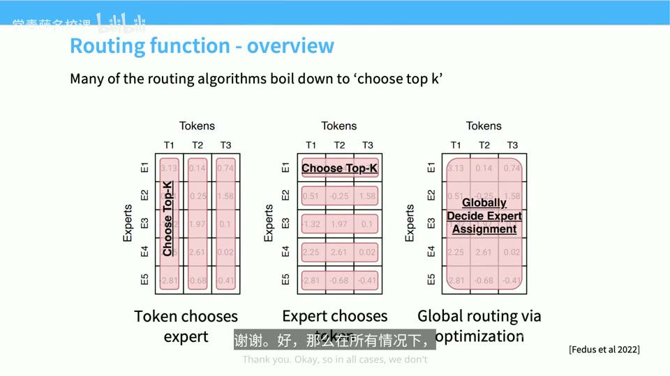 |
| 以实现"分配的全局最优"。因此：基本上所有的 MoE 模型都采用 'token 选择'； [【跳转到 40:45】](https://www.bilibili.com/video/BV11LEA6eEuj/?p=4&t=2445) | 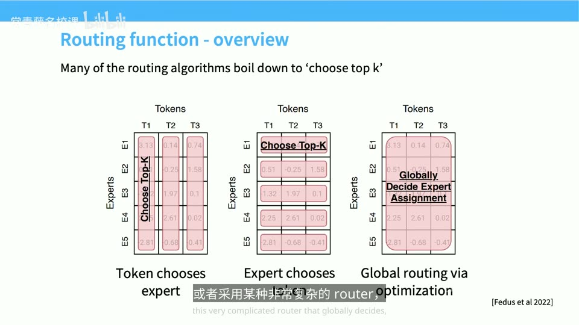 |
| "即由'token 来选择' expert（然后会有 K 个不同的 expert 被选中）。"（进入候选池？嗯，好。）你可以看一下这张图：它来自 OO 论文（原字幕 OO 论文，可能指"某某 MoE"论文），展示了"token 选择"与"expert 选择"之间的差异。你会发现：与"expert 选择"相比，"token 选择"通常能获得"更低的验证损失和更高的下游基准测试分数"。确实存在"成功的 expert 选择模型"： [【跳转到 40:53】](https://www.bilibili.com/video/BV11LEA6eEuj/?p=4&t=2453) | 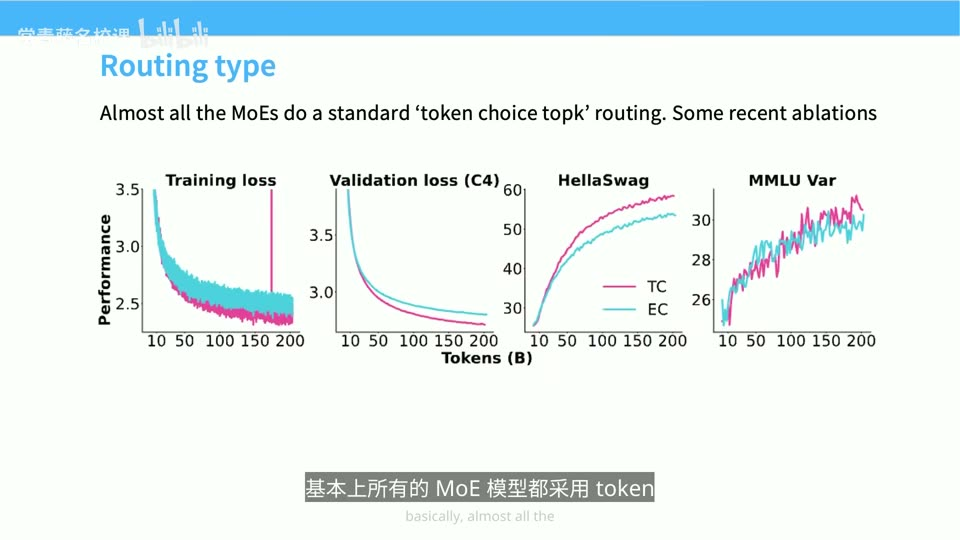 |
| 他们也能训练得很好；但 token 选择通常"更容易跑通"也更稳定：它已经基本成为"我们如今所见所有模型的标准做法"。（嗯）我记得 LLaMA 4 系列里有一个模型，可能采用了 "expert 选择"，但我觉得这并不算什么"强有力的背书"（对吧）： [【跳转到 41:18】](https://www.bilibili.com/video/BV11LEA6eEuj/?p=4&t=2478) | 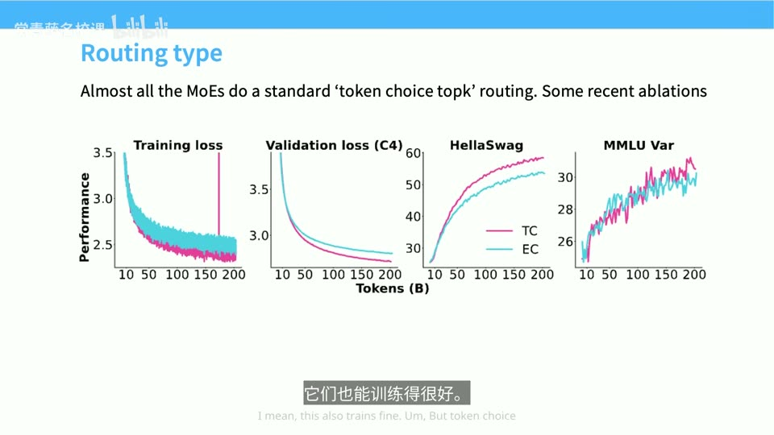 |
| （替我辩解一下：）"我记得那是一个'还没发布的 LLaMA 4 模型'"。（嗯）"好，我们的'路由 routing'其实有好几种做法。比如其中一种做法：用一个'极小的线性投影（linear projection）'来'处理（计算路由）'——也就是先拿到输入，路由器会计算'这个内积（原字幕 for 内基）'：每个 expert 都有一个（对应的）向量（原型/质心），在内积（空间）里'最接近'的那个就会被选中。**迄今为止，这是最常见的路由器**：它被用于经典的"Switch Transformer"和"GSshard" [【跳转到 41:30】](https://www.bilibili.com/video/BV11LEA6eEuj/?p=4&t=2490) | 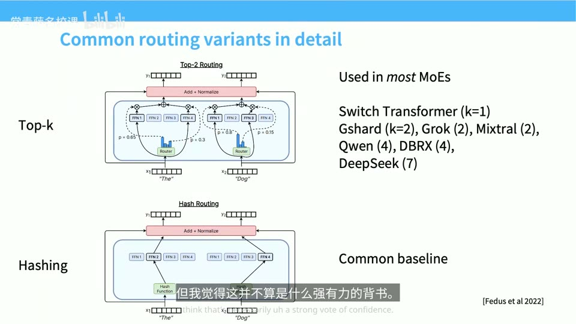 |
| 虽然不如 'topk' 那么多。但'基于哈希的专家路由'也确实有人在用：这是（论文里常见的）基线；但出于诸多'实际原因'，并不会用于'真实部署'。"嗯，"你可以用强化学习来'学习路由策略'：本质上就是一个基于'内积'的路由器；你可以用强化学习把这个路由器当作一种"策略'来'学习'（就是说因为你是'偏经典学习理论'那类的）…… [【跳转到 41:55】](https://www.bilibili.com/video/BV11LEA6eEuj/?p=4&t=2515) | 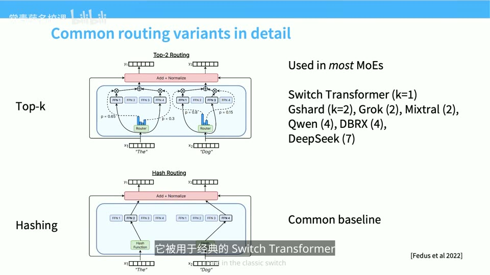 |
| 虽然不如topk那么多但基于哈希的专家路由也确实有人在用啊这是论文里常见的基线但出于诸多实际原因并不会用于真实部署嗯你可以用强化学习来学习路由策略本质上就是一个基于内基的路由器你可以用强化学习把这个路由器当作一种策略来学习就是说因为你是偏经典学习理论那类的 [【跳转到 42:20】](https://www.bilibili.com/video/BV11LEA6eEuj/?p=4&t=2540) | 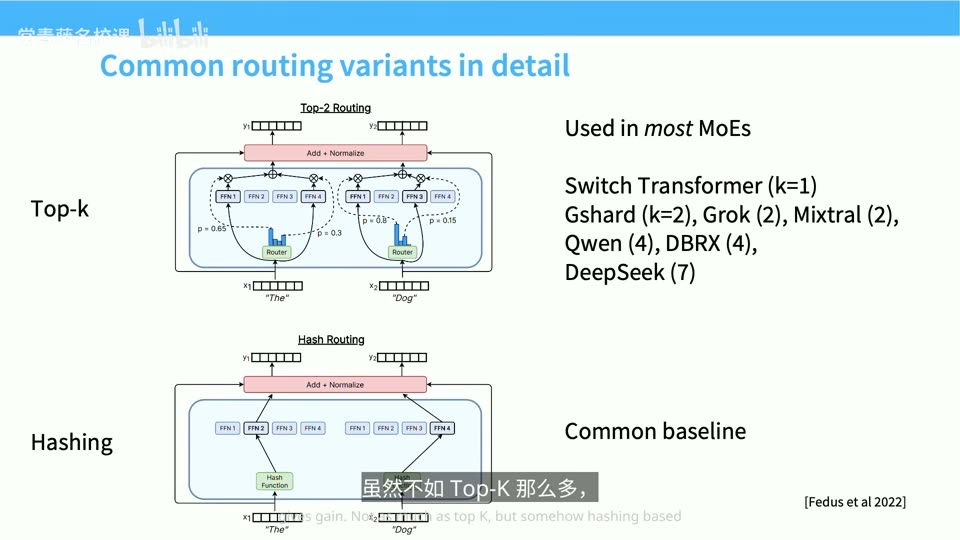 |
| （讲师）"……机器学习研究者：我觉得这应该是'思考这个问题的自然方式'……嗯没想好：'好吧，我在做什么'？这有点像'赌博机（bandit）问题'：我要从'K 个里选一个'，或者从'N 个里选 K 个'，而且我'没法观察到所有结果'——这就是个'赌博机问题'；我会用'赌博机算法或强化学习算法'。（板书）一些'最早期的工作'里用过这种方法，因为这是'思考这个问题'的自然方式：比如 Bengio 在 2013 年（原字幕 twentythirteen）的工作（噪声门控单元等）；但它'并不是常见做法'。我觉得它不常见的原因在于："做 RL 所需的各种方法 [【跳转到 42:45】](https://www.bilibili.com/video/BV11LEA6eEuj/?p=4&t=2565) | 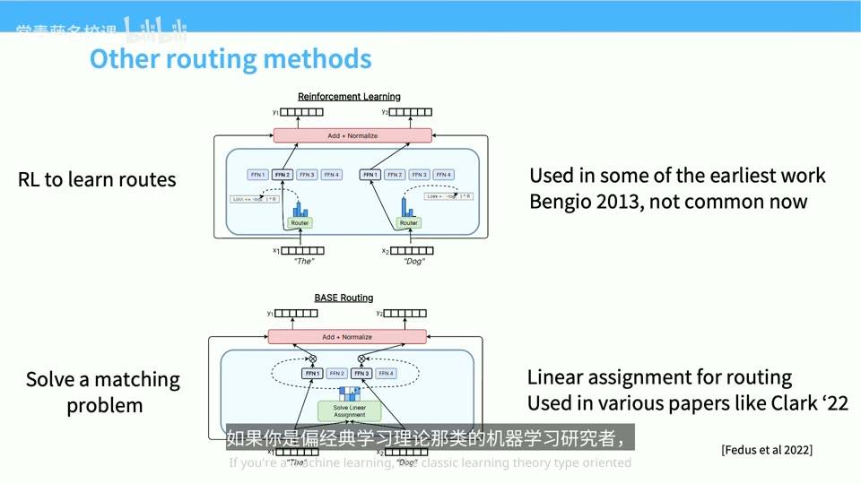 |
| 在'RL 算法'和'随机性'两方面都引入了'大量开销'"（原字幕'就F6'应为不停止时的那个"开销"）。而人们发现：有一套"不错的启发式方法"——就像（对）"Rx 法"的"配方"——可以套用在'这个非常简单、经典的 top-k 路由方案'上，基本上就能让它跑起来，对吧；所以没必要去做'更复杂'的东西。啊，最后，我想提一个我觉得非常"酷"的想法——作为一个喜欢"有道理的（数学、算法上的 clamp）东西"的人， [【跳转到 43:10】](https://www.bilibili.com/video/BV11LEA6eEuj/?p=4&t=2590) | 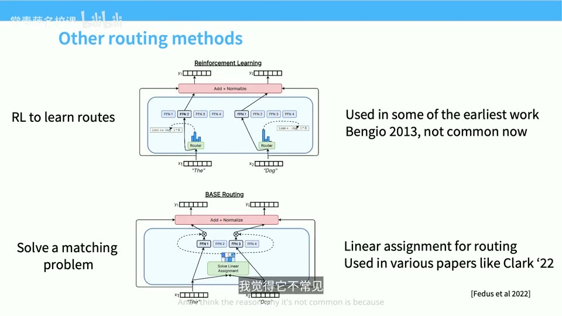 |
| 我很喜欢它。诶："你可以求解一个'线性指派问题（linear assignment problem）'：也就是说，我在'全局'上计算一个'分数"（矩阵）"：告诉你'把这个 token 分给哪个专家'会有多合适，对吧。所以你"计算'所有配对'的分数，衡量'这些分配'有多好；然后你可以用'线性指派'来'精确求解'：从'专家到 token'的最优分配。"（原字幕）"它被用过，也在某些情况下被证明效果不错；不过实际上它（确实）完全没（深入）在'大规模场景'下出现过，因为相对其他方法来说， [【跳转到 43:35】](https://www.bilibili.com/video/BV11LEA6eEuj/?p=4&t=2615) | 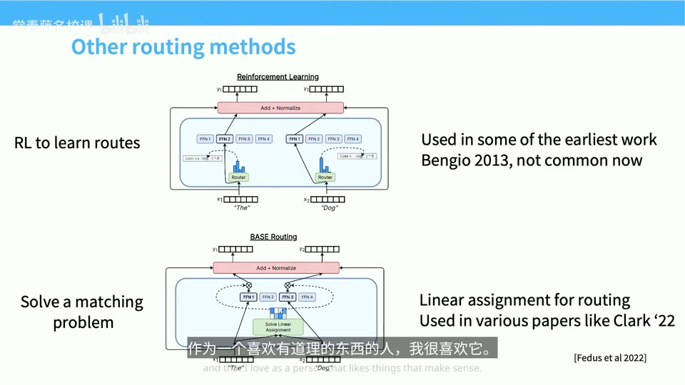 |
| 让它'跑起来'代价极高。（原字幕 himbs 呃）好，正如刚才提到的：'Top-K 路由'基本上就是一种"共识"路由机制。 [【跳转到 44:00】](https://www.bilibili.com/video/BV11LEA6eEuj/?p=4&t=2640) | 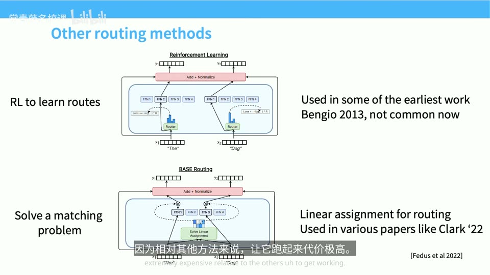 |
| 它是怎么运作的？非常、非常简单。（诶，）如果你之前看"DSA 那张幻灯片"时留意了，会发现：它跟"DSA 那套非常像"（原字幕 DCA/DSA），对吧？如果你读过"（Selectors 或 ssM）-net"或其他类似论文，你也会注意到这一点. 好，一个不错的观察是："这种'重模式（repeating pattern）"'在很多地方都会出现；所以"学会识别它"很有好处（：诶）具体操作是：把'输入（激活值）'拿进来然后让它经过一个"前向映射（上面那个 feedforward 部分）"，让它'有一个经过 FFN 之前的激活值'；然后我会（先）算出一些分数（让 FFN "先"拿一个分数）： [【跳转到 44:05】](https://www.bilibili.com/video/BV11LEA6eEuj/?p=4&t=2645) |  |
| 这些分数就是"专家和我的输入 X（原字幕 U）之间的 softmax 值"——S 就是（routing）分数（原字幕'先分数'应为 routing logit）；然后我会从中挑出"得分最高的 K 个"（这就是"控制每个专家'是否进参'"的门控）；所以这里是"输入 x"、这是"残差项"、这是"FFN"，这里有"门控"，而"门控由 top-k（软件）控制"。好，这大致就是你所设想的 top-k 路由器的"公式形式"。这里"你可能唯一需要弄明白的细节"是："怎么'训练门控'？ [【跳转到 44:30】](https://www.bilibili.com/video/BV11LEA6eEuj/?p=4&t=2670) | 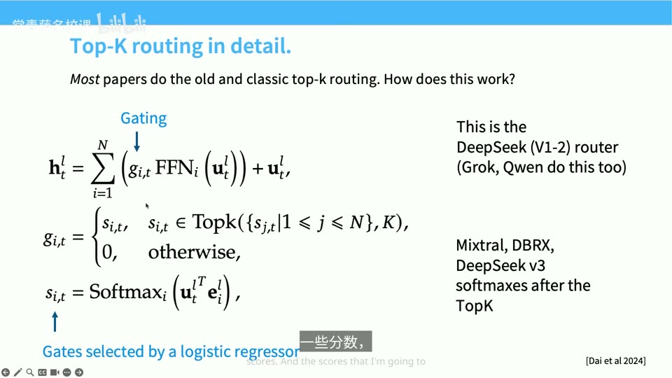 |
| 门控就是（通过）计算'每个 expert 的权重（即路由向量）与（当前）输入之间的内积'来选择/作出决策，计算开销极低，所以我选择门控的方式并不复杂：嗯，即便是在"这个简单机制中"，…… [【跳转到 44:55】](https://www.bilibili.com/video/BV11LEA6eEuj/?p=4&t=2695) | 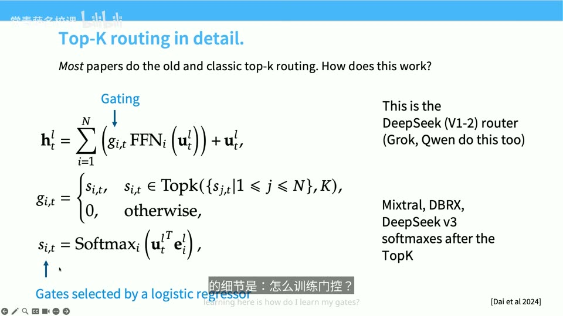 |
| （讲师补充例）："DeepSeek（原字幕 deepsick/deepckmoe）等团队也做了一些'创新和变体'：DeepSeek-MoE 首创了这一理念——也就是如今被广泛采用的'共享 expert（shared expert）机制'。"嗯，"这个想法非常直观：在经典的'topk 路由器'中，通常会有'N 个大的不同 expert'（大于 K）——你需要从这些 expert 中进行'选择'。但有时你会想：'有一些处理步骤——一些非常"通用"的处理 [【跳转到 45:06】](https://www.bilibili.com/video/BV11LEA6eEuj/?p=4&t=2706) | 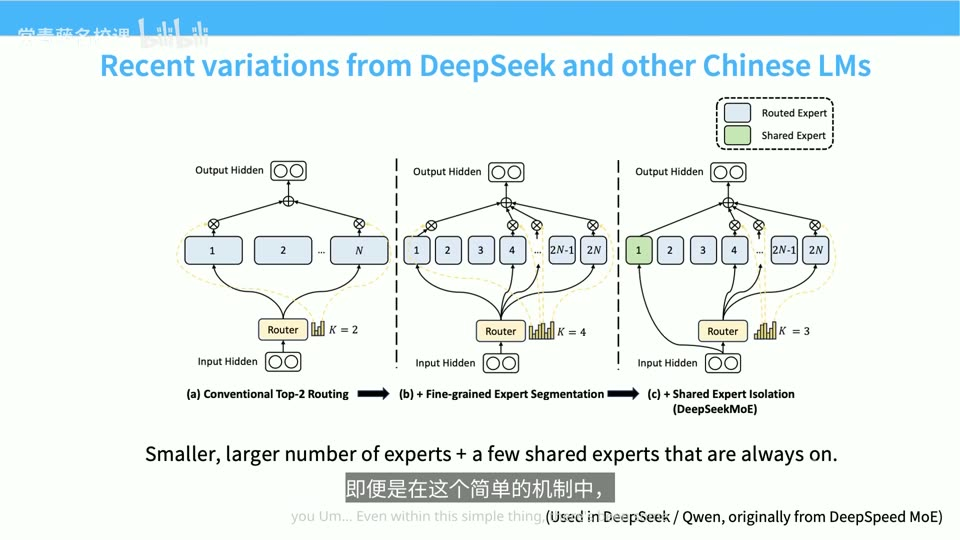 |
| ——我想对'所有 token'都应用'：也许你并不希望'（被路由的）专家每次都不同'——你希望"有些专家'始终启用'（always on），另一些专家则'按需启用'（mixed）"。那么，DeepSeek-MoE 是怎么做的呢？他们沿用了'最初'的专家设计（原字幕'最初'），（即）把"专家拆成更小、更细粒度的单元"，并将其中"一部分细粒度专家"设定为"始终启用的共享 expert（shared expert）"，对吧：这些共享专家会"绕过路由器"、始终处理我们的输入， [【跳转到 45:31】](https://www.bilibili.com/video/BV11LEA6eEuj/?p=4&t=2731) |  |
| 再把（其结果）汇回"输出端"。哦抱歉（原字幕'哦培训（应该是"哦，还有一点"）这个想法很不错：因为"事实证明，如果采用这种'经典的专家设计'，你其实只是在反复使用'大量权重'来做'通用建模'；因此你可以把这部分'通用处理'卸载到'那一个共享专家'上，让其余专家'更加专门化'"。啊——， [【跳转到 45:56】](https://www.bilibili.com/video/BV11LEA6eEuj/?p=4&t=2756) | 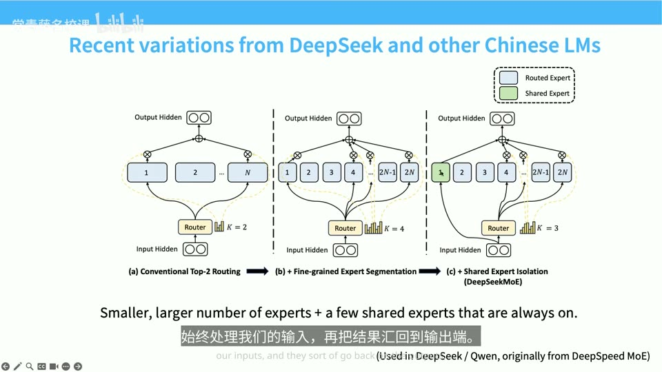 |
| 正如我刚才所说：DeepSeek 很出色的一点是，他们在许多论文中都做了"细致的消融实验"。因此，他们做了一个"非常漂亮的消融实验"：（一种配置是）"0 个共享专家 + 1 个（原字幕 16 个）大型（单expert 大 division）路由专家"——这其实就是"Google 就有的 'GGX'（原型）设计"（原字幕 G12）；与之相比的另一种配置是："专家划分得非常细粒度，并在其中加入（一个/多个）共享专家"。当把"专家做得越来越小"并加入"一个共享专家"时， [【跳转到 46:13】](https://www.bilibili.com/video/BV11LEA6eEuj/?p=4&t=2773) | 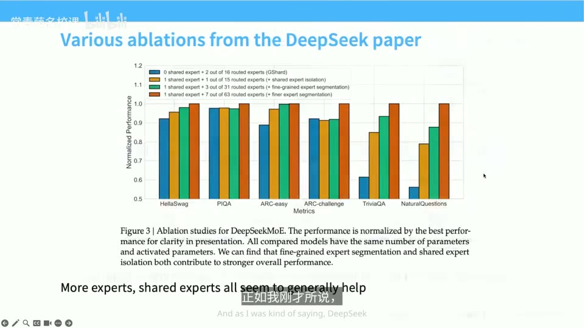 |
| 你会发现："这两项改动都带来了'明显的性能提升'；在某些任务上，'共享专家'的效果提升尤为明显"（比如 triviaqa 和 natural questions——原字幕如此）；"哦，蓝（有/）黄（无）之间的差距代表'是否使用了共享专家'"。总的来说："增加'专家数量'和使用'共享专家'似乎都有帮助"。（学生）"好，如果你想进一步验证这些说法和观点…… [【跳转到 46:38】](https://www.bilibili.com/video/BV11LEA6eEuj/?p=4&t=2798) | 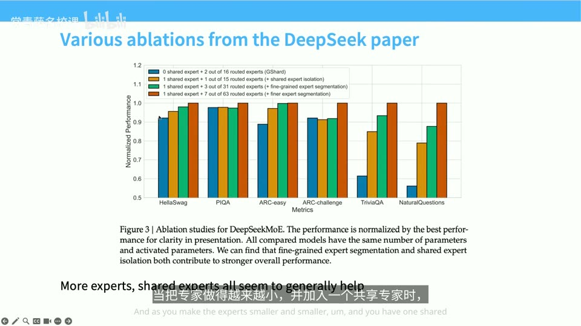 |
| OLMO（原字幕"欧盟"，应为 AI2 的 OLMoE）的研究也提供了佐证：我认为 OLMoE 是一项在西方语境下"精心控制的 MoE 研究"；他们探讨了诸如'共享专家是否有效'等问题，并得出结论：'共享专家的作用并不显著'（【在他们的设定下】）；还探讨了'专家数量'：他们证明"使用'大量细粒度专家'是有益的"。尽管他们在"共享专家的问题上略有分歧"，但他们也进行了"非常严谨、控制良好的消融实验"。（好）嗯， [【跳转到 46:58】](https://www.bilibili.com/video/BV11LEA6eEuj/?p=4&t=2818) | 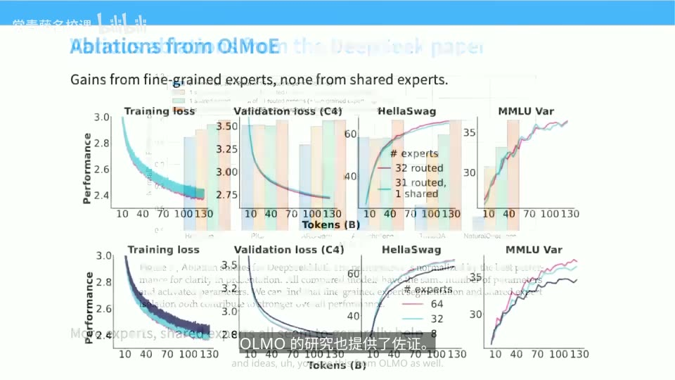 |
| 许多近期的 MoE 模型，本质上都遵循了 DeepSeek（原字幕 deepsk）的设计。在此之前，曾出现过几个"早期的 MoE 模型"：前三个模型——我之所以反复称赞 Google，是因为他们做了许多"有趣的工作"——前三个都来自 Google：（原字幕 mixtro、DBrx 和 rock：应为 Mixtral、DBRX、Grok 等）它们是西方早期（贸易 MoE）的一些尝试。啊，DeepSeek-V1 提出了"细粒度专家"和"共享专家"的设计； [【跳转到 47:21】](https://www.bilibili.com/video/BV11LEA6eEuj/?p=4&t=2841) | 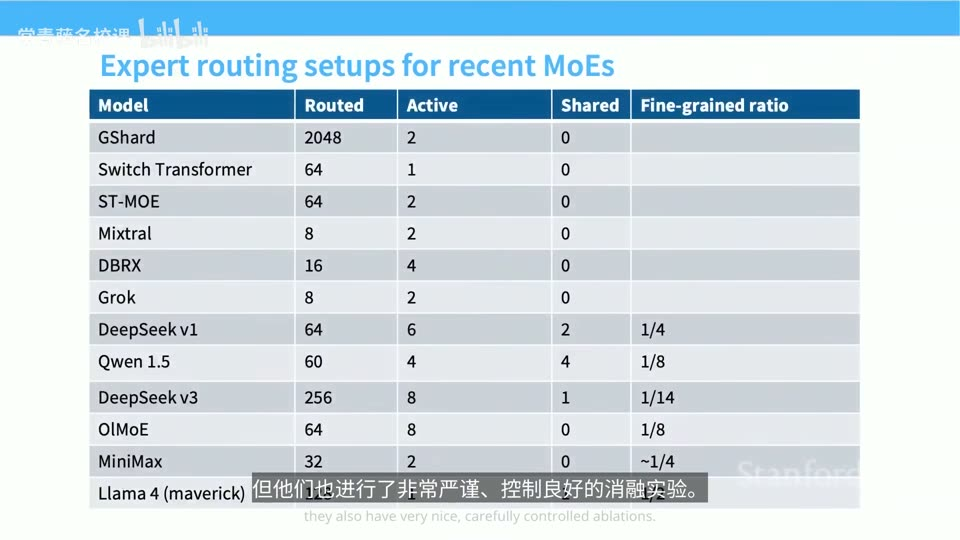 |
| 随后，这种设计开始流行，其他人也"大致跟随了 DeepSeek 的路径"；我的意思是，"这类似于 LLaMA 设计在'密集 Transformer'中的现象：基本上成为了'标准'"："DeepSeek-MoE 和 DeepSeek-V3，基本上就是大家在 'MoE 这一侧'所复制的'标准设计'"。如果你看（原字幕 pointthreepointfive：Qwen3.5、GLM）或任何这些现代模型，你会发现："共享专家和细粒度专家"在这些模型中都被广泛采用（原字幕 action）。 [【跳转到 47:46】](https://www.bilibili.com/video/BV11LEA6eEuj/?p=4&t=2866) | 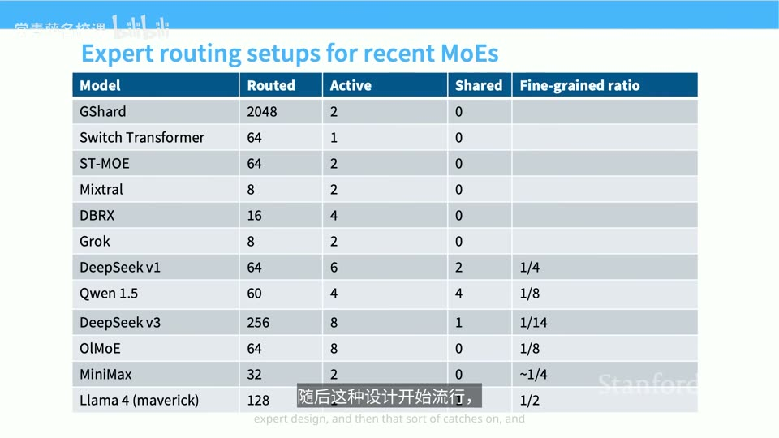 |
| 所以，这是一种"经过充分实战检验的设计"。好，有问题吗？ [【跳转到 48:11】](https://www.bilibili.com/video/BV11LEA6eEuj/?p=4&t=2891) | 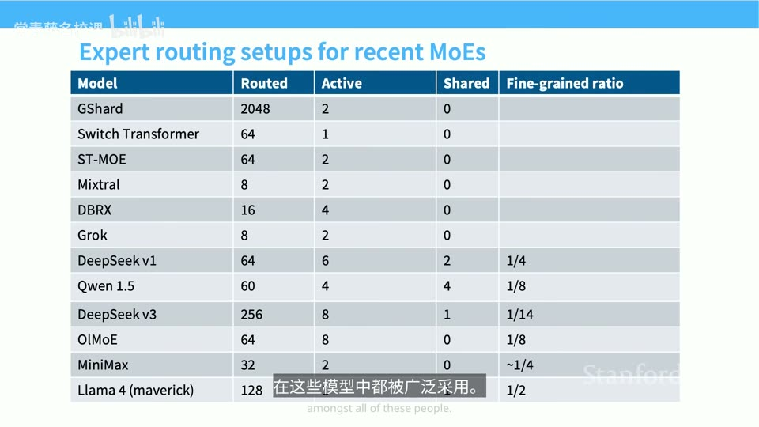 |
| （学生）"哦，好问题：如果有一个'共享专家'或者有几个共享专家（对吧）， [【跳转到 48:16】](https://www.bilibili.com/video/BV11LEA6eEuj/?p=4&t=2896) | 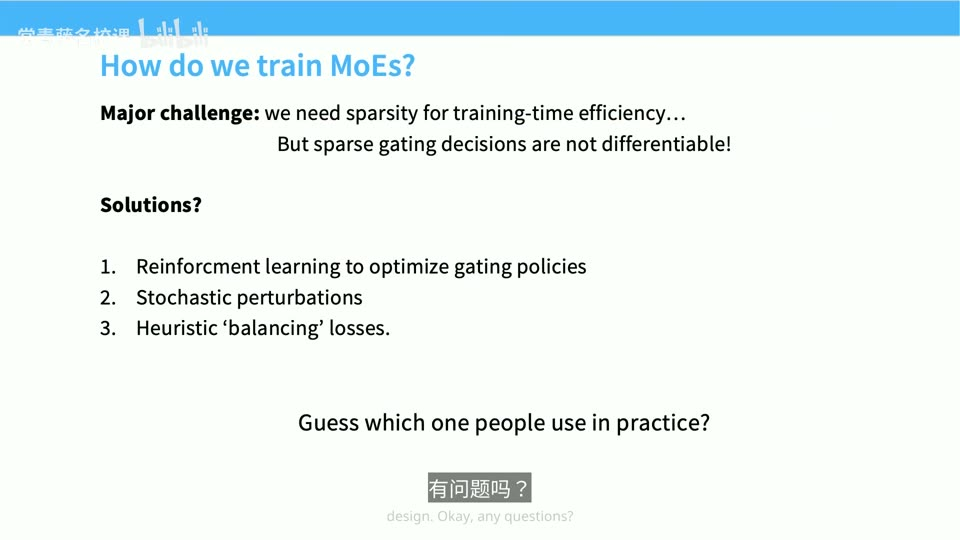 |
| 在'没有（额外并行）'的情况下，并行化要怎么工作？" [【跳转到 48:21】](https://www.bilibili.com/video/BV11LEA6eEuj/?p=4&t=2901) | 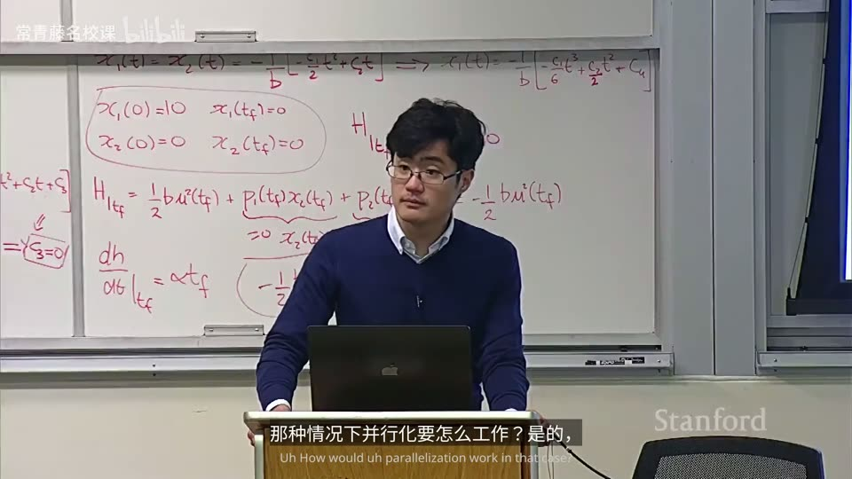 |
| （讲师）"是的：在'共享专家'的情况下，你不会得到（任何）'并行化'带来的节省：'每次激活都必须经过那些共享专家'；不过，你可以把"共享专家"复制（replicate）一份： [【跳转到 48:27】](https://www.bilibili.com/video/BV11LEA6eEuj/?p=4&t=2907) | 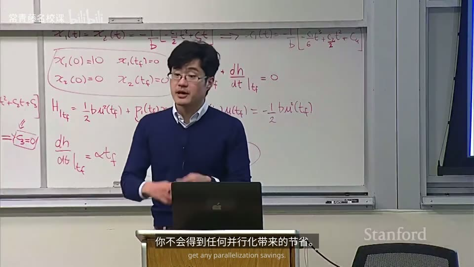 |
| 基本上，是用"更多内存"来换取"更低的通信成本"。好，那这就是"路由器的设计空间"。啊， [【跳转到 48:32】](https://www.bilibili.com/video/BV11LEA6eEuj/?p=4&t=2912) | 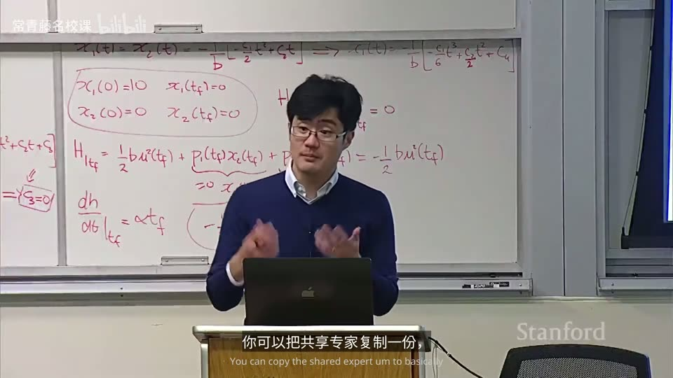 |
| 现在我想谈谈 MoE 的训练。这里会涉及到一些"非常令人意外"的—— [【跳转到 48:38】](https://www.bilibili.com/video/BV11LEA6eEuj/?p=4&t=2918) | 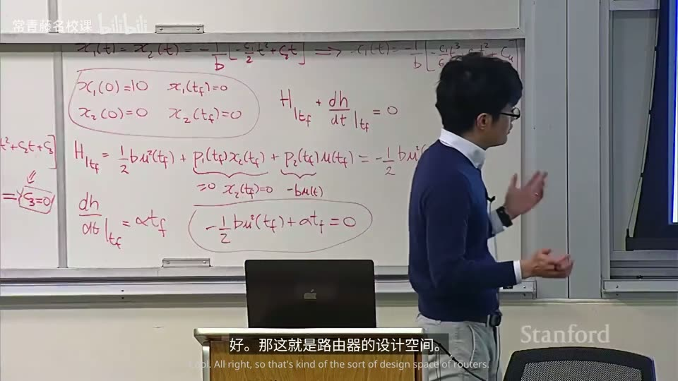 |
| 我会说是非常"深度学习式的"东西。嗯，"我记得最初在学习 MoE 的时候，我以为我们根本没办法把这些东西训练好（或者说训练的合理）；但事实证明：有很多技巧组合在一起之后，效果就是非常好；并且不知为何，这种'鲁棒性'表现得很'稳健'。正如我们在前一个问题中会提到的，对吧："我们在训练时，不希望激活"所有的 expert"，对吧，因为如果那样做 [【跳转到 48:43】](https://www.bilibili.com/video/BV11LEA6eEuj/?p=4&t=2923) | 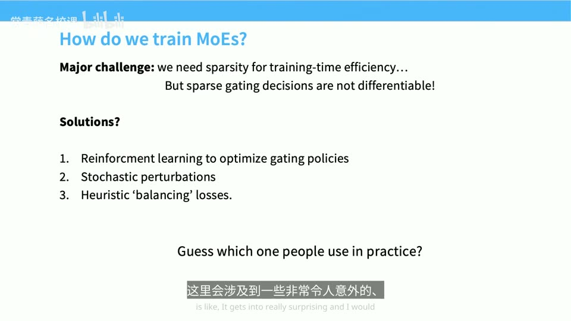 |
| 我们就要为"所有 expert"支付"全部的 FLOPs 开销"，而我们的 expert 数量（通常）非常多。所以，为了"训练时的效率"，我们需要"稀疏性"。但一旦引入稀疏性，"门控决策"就"不可微（原字幕'不再可危'应为不可微）"了；而且，我们也看不到"所有本可以选择的替代 expert"，所以，这两个都是"大问题"。嗯，"解决办法有好几种：（1）我们可以用'强化学习'来优化'门控策略'——我之前提过这一点，但并不太流行；（2）嗯，你可以采用'随机扰动'之类的方法 [【跳转到 49:08】](https://www.bilibili.com/video/BV11LEA6eEuj/?p=4&t=2948) | 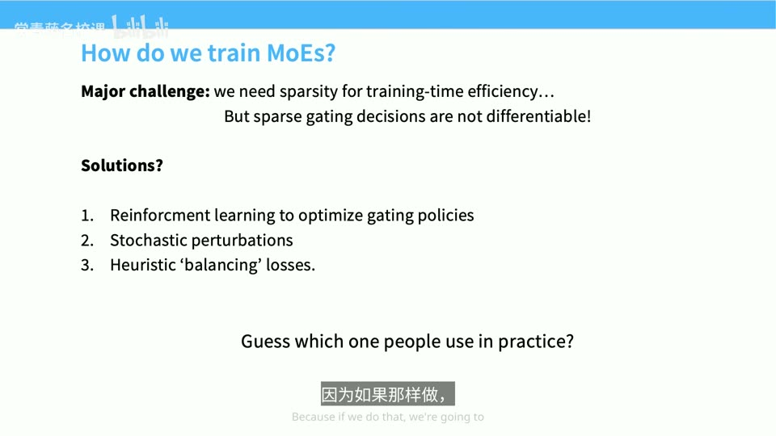 |
| （如果你熟悉'探索与利用''老虎机'风格的那一套，可以试试其中一些方法）；（3）第三种方法是使用一大堆'奇怪的启发式规则'，来处理'门控决策稀疏'这一事实、从而'平衡各个 expert 的分配'。""猜猜实践中大家用的是哪一种？"——我之前一直在暗示："就是第三种"，对吧。嗯，"这是一套很有趣的启发式方法，而且最终都奏效了。我先讲讲"另外两个（他们用得不多）；我会从这里开始讲，不过我觉得"知道这一点"很有用：比如 XXX（原字幕 CLARK，应为 Clark 等）在某年的研究（原字幕'托尼换那'年华：应为 2018 年/相近）就探讨了"能不能用强化学习来'训练路由器'"——这确实管用：你可以用强化学习（就是图上这条绿线：这是一种基线方法）；有效果（不错）但"由于梯度方差和复杂度问题"，它其实'不是最优解'；甚至"这篇论文里提出的一些方法也'顺手用了 reinforce 梯度'来做'路由决策'"； [【跳转到 49:33】](https://www.bilibili.com/video/BV11LEA6eEuj/?p=4&t=2973) | 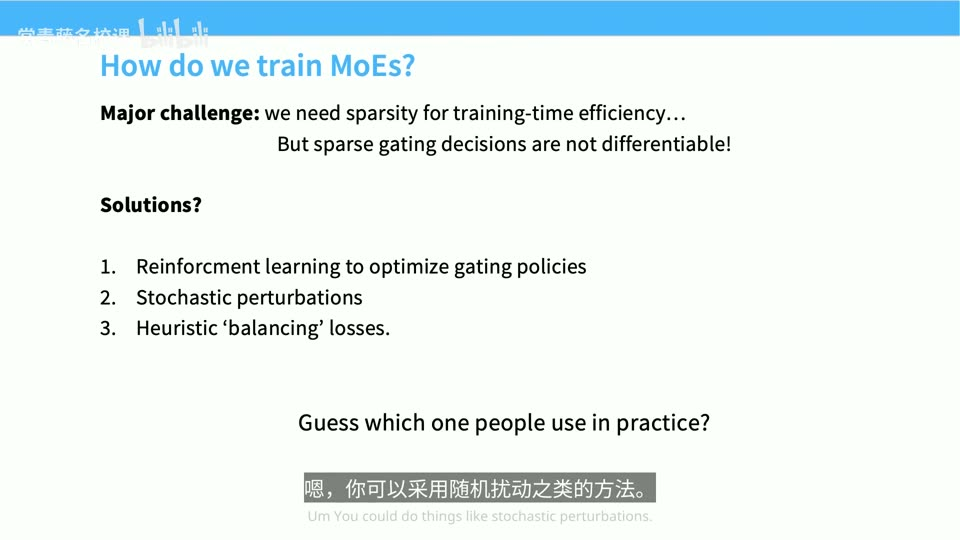 |
| 他们用的不多啊我会从这里开始讲不过我觉得知道这一点很有用比如CLARK在托尼换那年的研究就探讨了能不能用强化学习来训练路由器这确实管用你可以用强化学习就是图上这条绿线这是一种基线方法有效果不错但由于梯度方差和复杂度问题它其实不是最优解甚至这篇论文里提出的一些方法也顺手用了reinforce梯度来做路由决策 [【跳转到 49:58】](https://www.bilibili.com/video/BV11LEA6eEuj/?p=4&t=2998) | 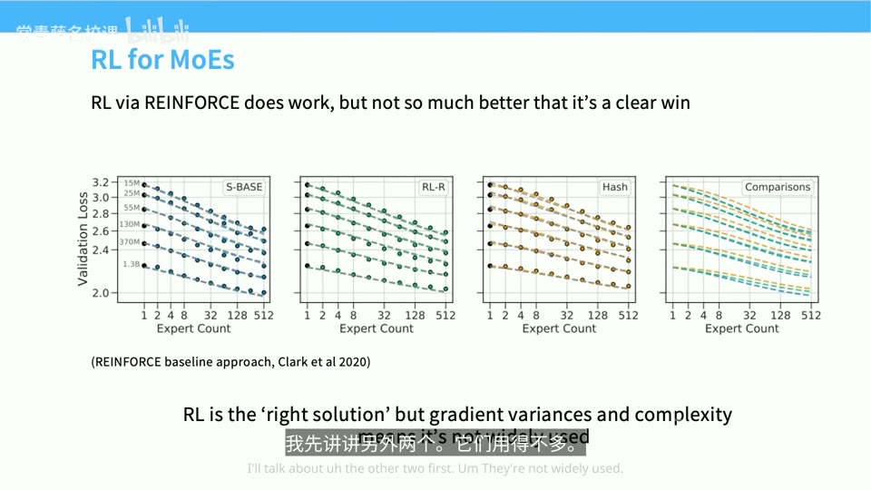 |
| （Roweis 等年的（原字幕 paper）：另一类方法）现在，有一种想法"跟强化学习很接近，但开始更偏向'启发式'思路——也就是'写下目标、然后去尝试'。这就是"随机近似（stochastic approximation）"的思路"（原字幕 paper）：它来自"最早那篇关于 Mixture of Experts 的论文"——来自 XXX（原字幕 normalzia 等：应为 Jacobs 等）的工作。其核心在于："训练过程中，你并不做'硬性决策'，你做的是'随机决策'。因此你依然保留（可以）这种'路由（设置）'"。所以，这个 H 大致就是"参数和输入的内积"： [【跳转到 50:23】](https://www.bilibili.com/video/BV11LEA6eEuj/?p=4&t=3023) | 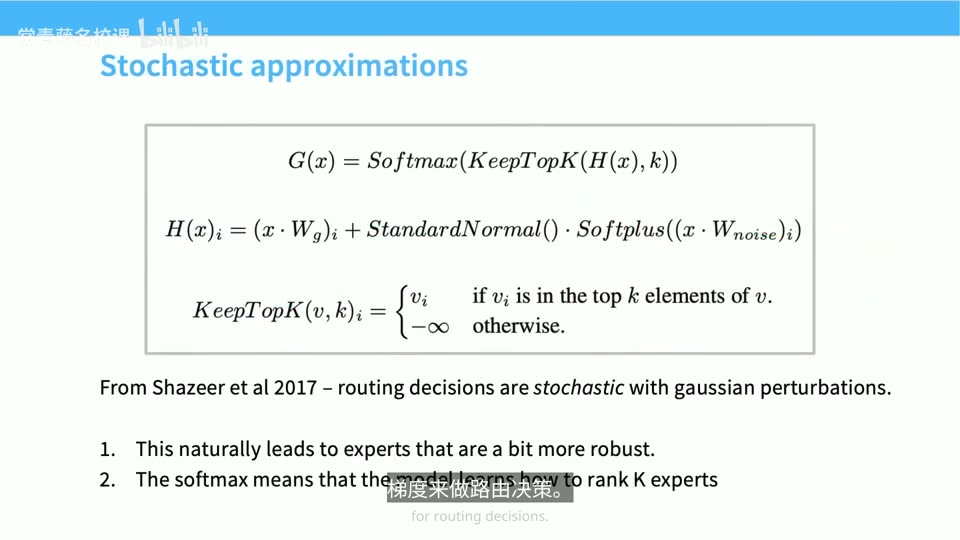 |
| 这是标准的"路由内积（原字幕路由内机）"。接下来："我不直接用它，而是'注入一种与输入规模相关的噪声'"（即"给 H 加噪（加输入尺度的噪声）"）；然后这就成为"我的 H'。现在，我会像之前讲"top-k"那样在 softmax 中保留 top-k；随后，这就作为"输出"进入我的"top-k 函数"。那么，"这是在做什么？其实就是说，如果'两个 expert 得分非常接近' [【跳转到 50:48】](https://www.bilibili.com/video/BV11LEA6eEuj/?p=4&t=3048) | 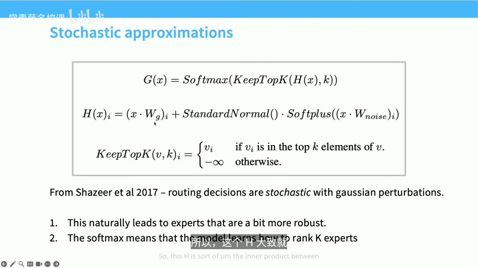 |
| "（这两个 expert 得分非常接近/几乎打平），那么你会'随机'选其中一个（不选另一个）。"在反向传播过程中，"反传的方式会使'有用的 expert'获得更高的权重：所以这种'扰动'能帮你'打破僵局、多做一些探索'；希望梯度结构能这样运作：'如果一个 expert 有用，系统会更侧重它、让它的权重总体上越来越高。所以，这是一种"可行的做法"，能让 experts 更具"鲁棒性"；而 softmax 让你能"学会 [【跳转到 51:13】](https://www.bilibili.com/video/BV11LEA6eEuj/?p=4&t=3073) | 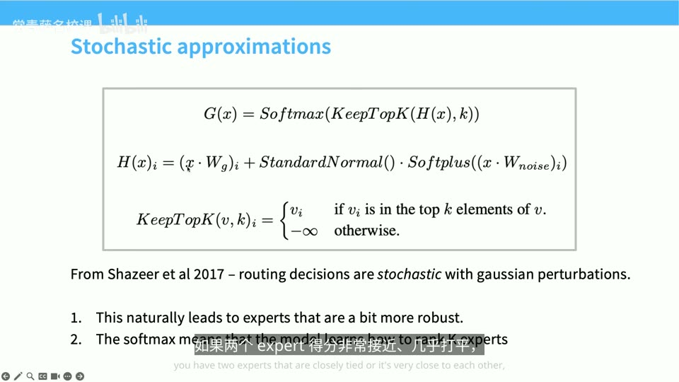 |
| 如何对'这多余的 expert'进行排序"，而不是只对"前 K 个"做硬性选择：你是用"这些元素（softmax 概率）"来"加权"（即 加权的 top-k 而非绝对 top-k）。好。然后，还有另一种"非常相关"的方案，由 XXX 等人在"某年（原字幕 twintur2 初）"提出：该方案采用一种"均匀的乘法扰动"："他们这样做是为了'强化 experts'（让它们更具鲁棒性）"；这种做法"以前挺有用"，但在后来那些做路由的"Google 论文"里已经被"去掉"了。嗯，"到底是不是非这么做不可 [【跳转到 51:38】](https://www.bilibili.com/video/BV11LEA6eEuj/?p=4&t=3098) | 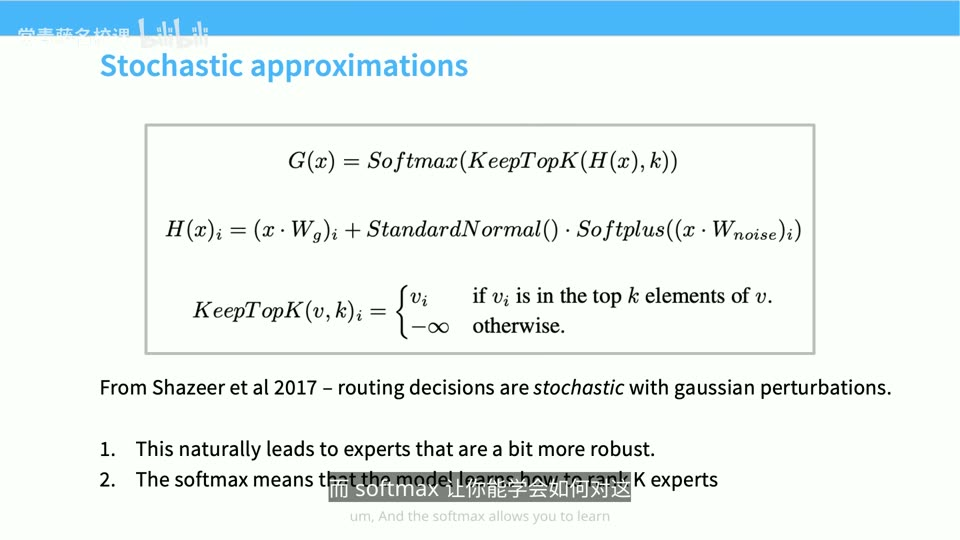 |
| ？目前还说不清楚。后来的消融实验显示：'不用这些随机鲁棒性技巧'反而有助于'训练的稳定性'和'整体最终训练出的 MoE 的质量'——这说明，你其实不一定非得用这些'随机探索项'。"谢谢。好，这就带出了你们（大多数实际采用）的做法——也就是"一系列'启发式策略'（最终能给我们一个'可用的 MoE'）"；这些策略里，很多本质上都是为了做"平衡"： [【跳转到 52:03】](https://www.bilibili.com/video/BV11LEA6eEuj/?p=4&t=3123) | 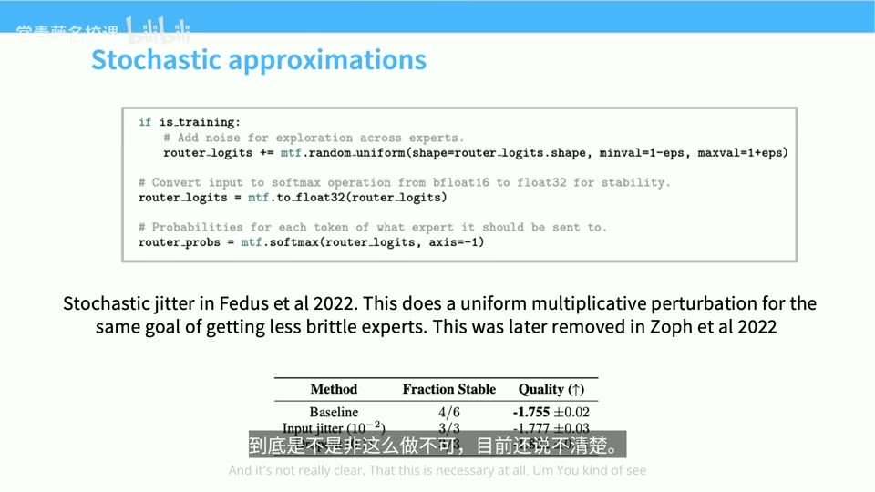 |
| 那么，如果你"忽略这些探索与利用方面的顾虑"、直接跑"常规的梯度下降"，会出现什么问题？会发生的情况是：你（路由器）会先"路由到前 K 个 experts"，然后这些 experts 中"最强的那个"会获得"更多的信号"：反向传播会告诉你"那个 expert 表现不错"，于是就把"他的权重"调高，对吧——把这个参数"往那边调一调"。这样就会产生一种"越用越强"的效应： [【跳转到 52:28】](https://www.bilibili.com/video/BV11LEA6eEuj/?p=4&t=3148) | 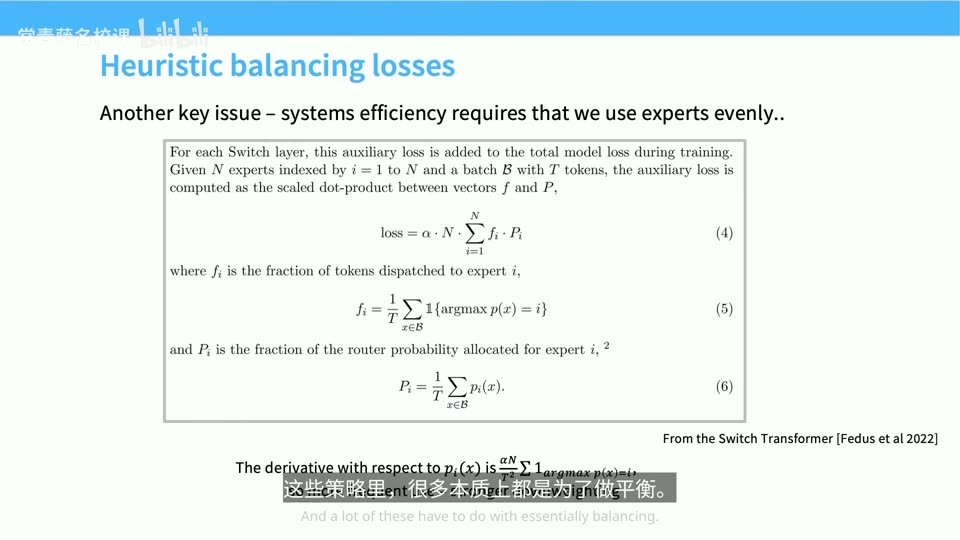 |
| "被选中的专家"会获得"非常大的权重"'（原字幕 thank），权重大意味着"他们被选中的频率更高"；结果就是："他们几乎包揽了所有工作"。所以，这种"专家坍缩（expert collapse）"或者说"专家饥饿（expert starvation）现象"，是一个非常"现实的问题"。嗯（原字幕 human），某种意义上，这就是"你在用启发式方法训练时"必须解决的"核心问题"——也就是"MoE 的启发式训练"。那么该怎么做呢？做法是："在'总的建模损失'之外 [【跳转到 52:53】](https://www.bilibili.com/video/BV11LEA6eEuj/?p=4&t=3173) | 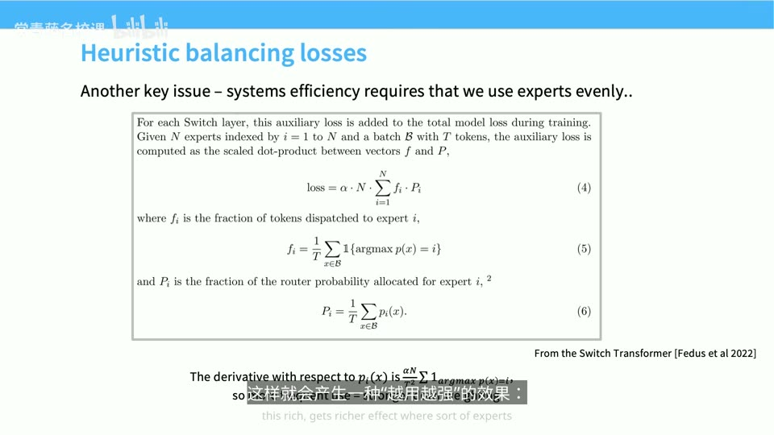 |
| 再加一项'启发式损失（auxiliary/balancing loss）'"。这项损失的作用是："让'流向不同专家的 token 分布'更加均衡。"比如，这里（用）"Switch Transformer 采用的一种方法"：你可以看看它具体是怎么做的情况是这样的：你有"从 1 到 N 的不同专家"，还有"一批 token"；哦，你想做的是"确保'这两个（量 F_i 和 p_i）'的内积尽可能小"（again 原字幕）。好的，那么这里发生了什么？F（i）是"被分发到任意单个 expert 的 token 比例"（也就是"单个 expert"的负载），而 p_i 则是"它的一种更平滑的版本（概率质量）"——这不再只是判断"token 是否被分发给某个 expert"，而是指"路由分配给该 expert 的总概率质量"。自己把这两项相乘……嗯，至少对我来说，这不太像是能从"第一性原理"推导出来的东西（原字幕 Ject）； [【跳转到 53:18】](https://www.bilibili.com/video/BV11LEA6eEuj/?p=4&t=3198) |  |
| 我认为理解这个式子作用的"最简单方法"，是"对它求导"。呃—— [【跳转到 53:43】](https://www.bilibili.com/video/BV11LEA6eEuj/?p=4&t=3223) | 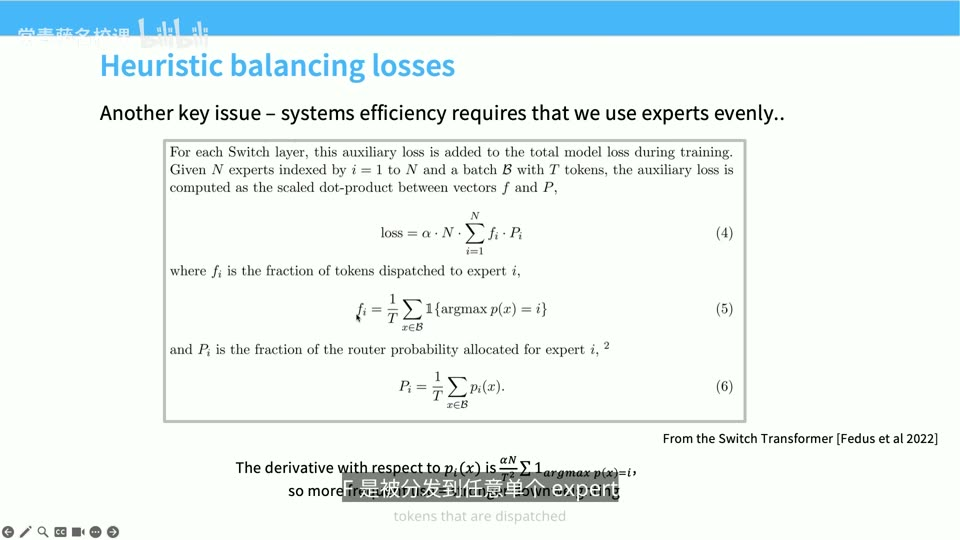 |
| "所以如果你对 p_i 求导——记住，p_i 是'分配给某个 expert 的概率质量'——其导数就是'被分配的 token 比例'（也就是被分配的 token 比例 F_i）。"所以在某种意义上，你可以把它看作"梯度空间中的一种'惩罚'"：你获得的 token 越多，（该 expert 的）梯度就越'富'（原字幕'梯度就越富'）——所以，这是在"按比例压低那些'热门 expert'的概率质量"。这就是这个损失函数的作用： [【跳转到 54:08】](https://www.bilibili.com/video/BV11LEA6eEuj/?p=4&t=3248) | 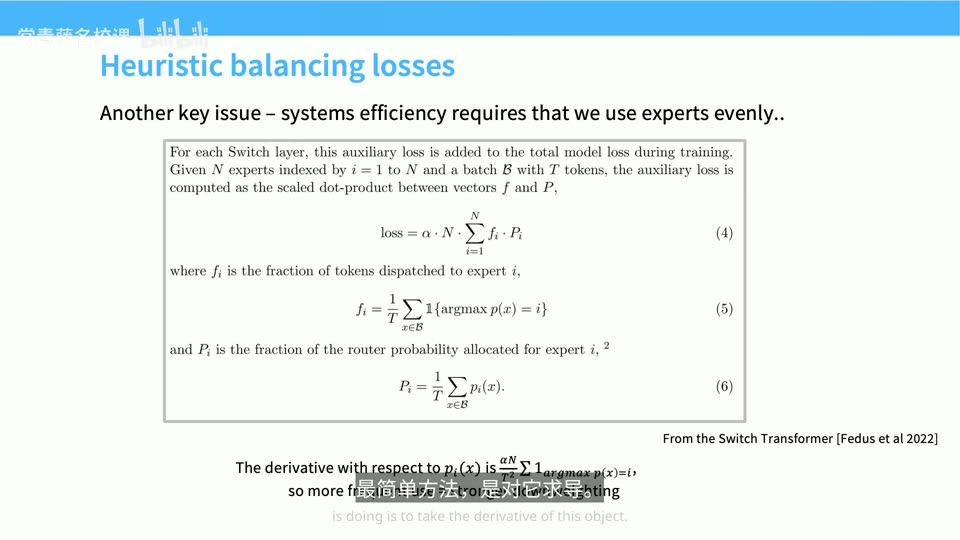 |
| 你可以这样理解它："公式四中的目标函数，一开始可能不太直观；但一旦你理清'梯度的作用'，就会明白他想做什么。"（原字幕'也就是去推动的'应为"想让各专家负载均衡"。）所以，我们可以把这些想法拿过来，基本上重构出 "DeepSeek V1 和 V2 的 MoE 系统"。那怎么构建 DeepSeek 的 MoE 呢？你照常"计算损失"，直接"穿过 expert 做反向传播"不用管那些"不可微性"和"探索性"方面的顾虑； [【跳转到 54:33】](https://www.bilibili.com/video/BV11LEA6eEuj/?p=4&t=3273) | 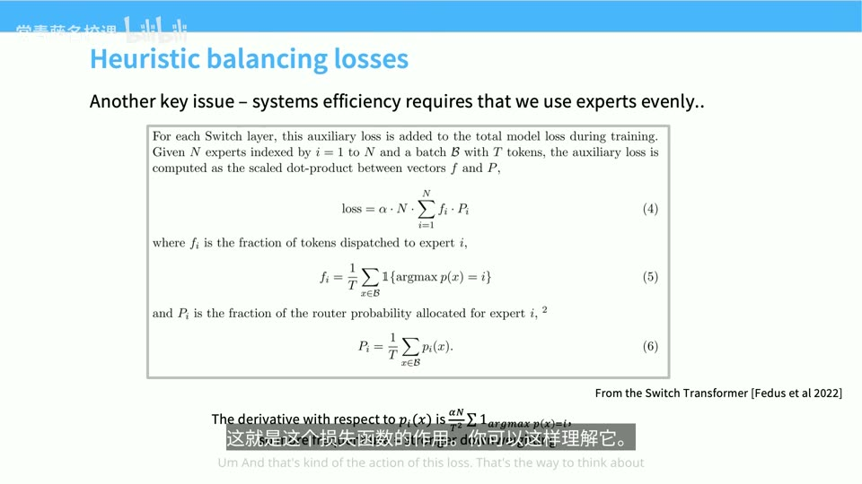 |
| 但你会"加上'和 Switch Transformer 一样的、针对每个 expert 的平衡机制'"（就是我刚才给你看的那种），对吧。所以你会用到"这样一个损失函数：它等于'比例 F' 乘以 '总概率质量 P'（原字幕 fourexperts）……不过（嗯），DeepSeek 的团队在'系统设计'上很老练：所以他们"不只是'平衡 expert'（原字幕 fourexperts）"；他们还想"按'设备'来做平衡"：比如，如果你的 expert 被分配到"不同设备"上…… [【跳转到 54:58】](https://www.bilibili.com/video/BV11LEA6eEuj/?p=4&t=3298) | 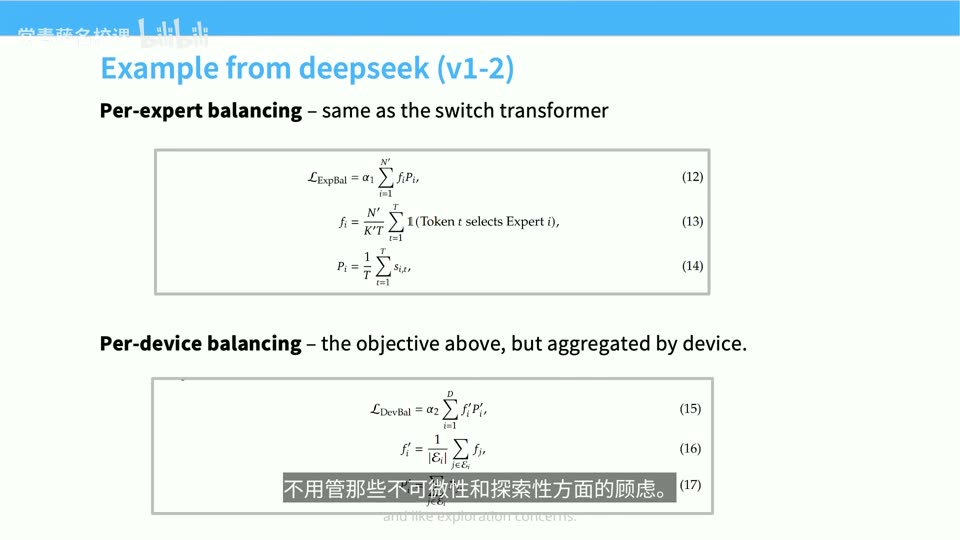 |
| 假设"我这边的机器上有 4 个 expert""那台机器上也有 4 个 expert"，诶嗯，"接下来还有另外 4 个专家"——你希望"这两台机器保持平衡，让他们都以接近满负荷的状态运行，对吧 right"。所以，你不仅希望"专家分布均匀"，还要确保"设备之间的负载均匀"，对吧——这是一个"次要目标"，其运作方式（数学形式）完全相同：如果你看"这里的函数"，它"不再针对'专家' [【跳转到 55:23】](https://www.bilibili.com/video/BV11LEA6eEuj/?p=4&t=3323) | 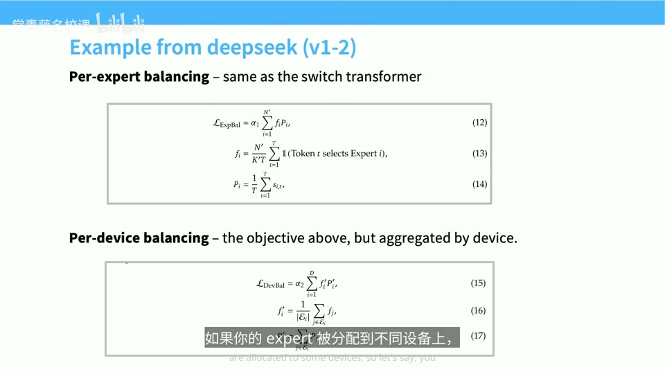 |
| 而是针对"每个设备"的负载占比进行操作：你引入"次要的设备平衡损失"，仅仅是出于"（机器）利用率"的考虑。（原字幕在啊 depsvthree 中：）DeepSeek-V3（原字幕 depsvthree）中，他们"使用了一种'美（每）专家'偏置项"，并采用了一种"在线学习技巧来平衡专家"、从而（部分）摆脱了"辅助损失"；但归根结底，我们仍需添加一些"辅助损失"，以确保不会出现"极端的不平衡"。我把这一点作为补充说明： [【跳转到 55:48】](https://www.bilibili.com/video/BV11LEA6eEuj/?p=4&t=3348) |  |
| DeepSeek-V3 等模型已经开始摒弃一些我认为"不够优雅的辅助损失"；但截至目前，尚无能够"完全摆脱他们"（辅助损失）的方案。好，关于"负载平衡损失"，我要讲的最后一点是：你可能会问"'我需要处理这个问题吗'？这全是一堆复杂的启发式规则——我真希望能直接'去掉负载均衡损失'。"但如果你去掉负载均衡损失，"后果相当灾难性"。这些结果都来自"OLMo 论文"（原字幕"欧盟论文"，应为 OLMoE 论文）： [【跳转到 56:13】](https://www.bilibili.com/video/BV11LEA6eEuj/?p=4&t=3373) | 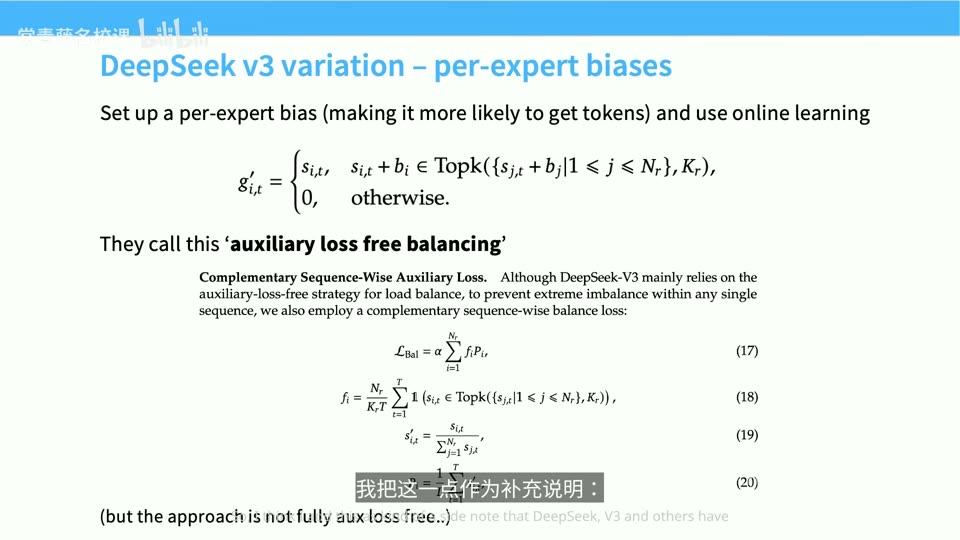 |
| 他们在其中做了一个很好的"消融实验"（原字幕"笑容实验"）：（比较）"完全去掉了负载均衡损失"。如果你保留负载均衡损失，你会得到"顶部这条粉色曲线"——是非常正常的（收敛）曲线；"去掉负载均衡损失后"，损失会显著上升，训练损失的表现也不好。也许更能说明问题的是：看看"有负载均衡和没有负载均衡"时，"哪些专家"在做什么——也就是下方这些面板。你会看到"非常鲜明的差异"： [【跳转到 56:38】](https://www.bilibili.com/video/BV11LEA6eEuj/?p=4&t=3398) |  |
| 没有负载均衡时，几乎"所有 token 都流向'两个专家'"，对吧（tokens？）：也就是这里看到的"黄色专家和粉红色专家"；而如果加上负载均衡损失——尽管我们用的是这种"启发式方法"——所有这些专家都被 token "利用起来了"；所以，我们实现了这种"均匀的利用率"，对吧。可以看到，负载均衡损失确实起到了我们预期的作用："如果没有它，我们就浪费了大量参数 [【跳转到 57:03】](https://www.bilibili.com/video/BV11LEA6eEuj/?p=4&t=3423) | 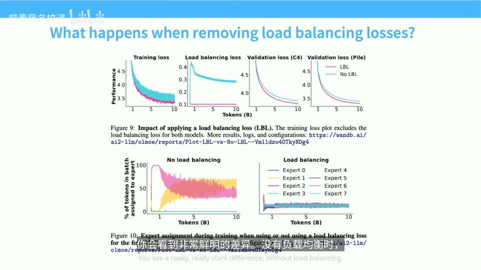 |
| ——在'大部分训练过程中'，那些'专家模块'完全没有发挥任何作用"。谢谢。好，所以这大致就是"Mixture of Experts 的训练方式"。嗯，我想说回这一点：我觉得"这相当令人意外"：因为你有一个"本质上不可微"的操作——你做的是这种"top-k 选择"；还有"这一项"，说实话是一个"相当复杂的对象"。嗯，"你真正需要做的只是：加上这个'均衡损失'、让各个专家模块的'负载均匀一些'；然后其余部分，你就'当做梯度 [【跳转到 57:28】](https://www.bilibili.com/video/BV11LEA6eEuj/?p=4&t=3448) | 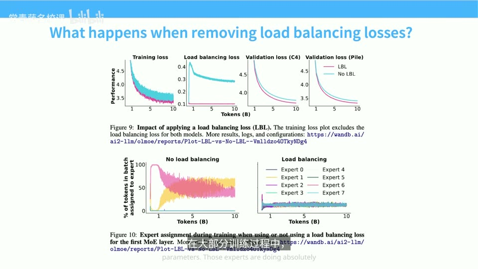 |
| 可以直接在系统中传递'"——模型就能训练得非常好。啊，我觉得"其中很重要的一点在于：这种'动态机制'：如果一个专家模块有用，你就会'强化'它——这是一种'正向强化循环'；而通过'均衡负载'，这一循环又得到了很好的平衡"：（原字幕 cool）"这两种动态机制互相抵消了，挺好"。（原字幕 say 哦） 最后我要说的是： [【跳转到 57:53】](https://www.bilibili.com/video/BV11LEA6eEuj/?p=4&t=3473) | 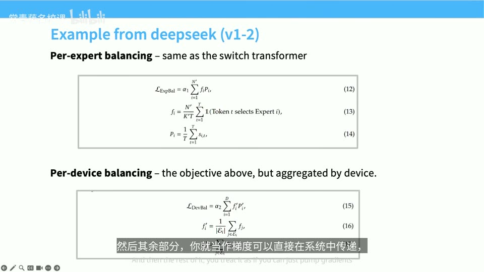 |
| 同样的技巧也被用在了"DSA 里"（原字幕 DC）哦——我们之前已经看过"top-k"了；如果你了解"xx-net"（原字幕 hnet，应为 H-Net）的话就知道："他也用在那种结构里"；"波西斯试图去掉 'tokenizer'的常识（应为'static 静态分词'）"。所以我觉得"以后你会更常看到这种技巧：'用 top-k 选择+再配合负载均衡或其他辅助损失来处理不可微的问题'——这会成为'未来架构设计'的一个常规要素"。问："旋转（原字幕）的 mixture（应为 routing）空间，看起来像是一种'系统层面的优化'……不过你能'看看他们吗'？他们在'不同领域（element level）'里，实际上是在做'同样的事情'吗？""（讲师回答）'是的，有些论文可视化了'哪些 token 被哪些专家激活' [【跳转到 58:14】](https://www.bilibili.com/video/BV11LEA6eEuj/?p=4&t=3494) | 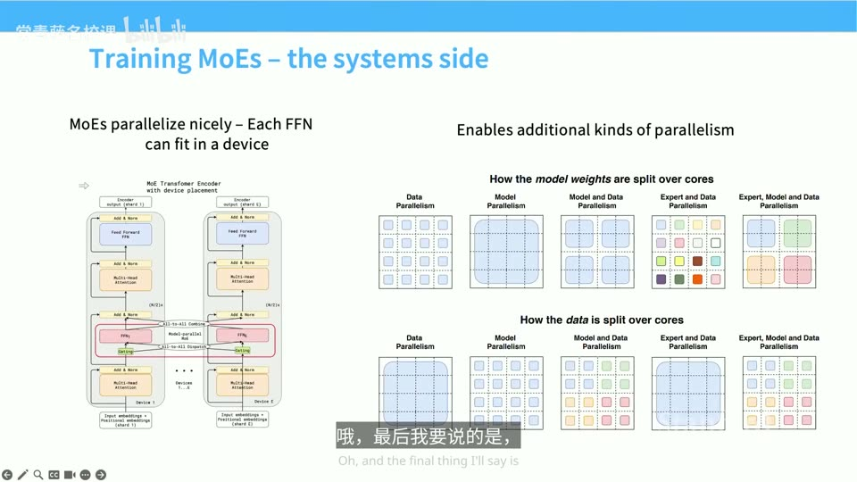 |
| 不过你能看看他们吗他们在不同领域里实际上是在做同样的事情吗 [【跳转到 58:37】](https://www.bilibili.com/video/BV11LEA6eEuj/?p=4&t=3517) | 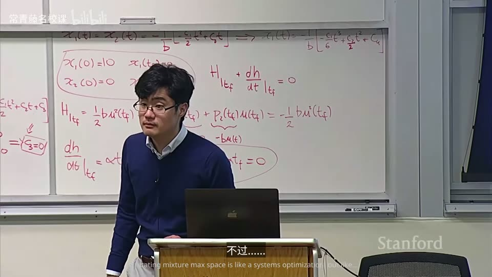 |
| 是的有些论文可视化了哪些token被哪些专家激活 [【跳转到 58:42】](https://www.bilibili.com/video/BV11LEA6eEuj/?p=4&t=3522) | 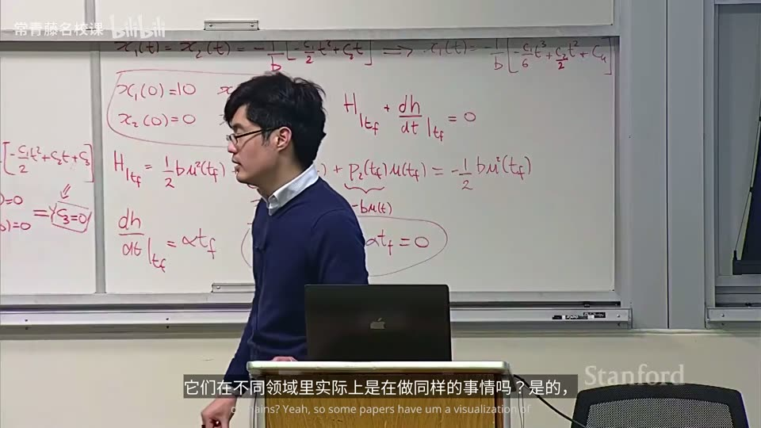 |
| 。嗯，你都（可看到）——而且因为'路由器非常简单'、啊，这些专家'并不是那种"聪明的专家"'——他们并不是什么"医学专家 [【跳转到 58:47】](https://www.bilibili.com/video/BV11LEA6eEuj/?p=4&t=3527) | 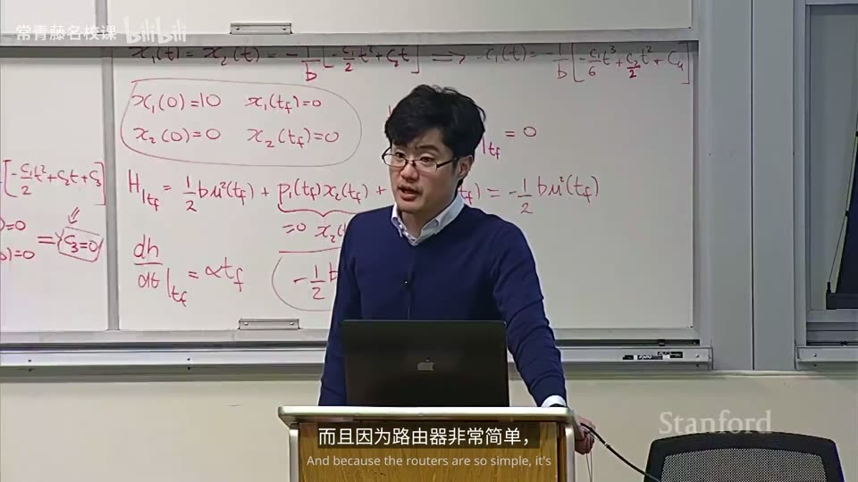 |
| ""法律专家之类的'。"（讲师继续）"你确实会看到'某些 token'会被'路由到不同的方向'： [【跳转到 58:54】](https://www.bilibili.com/video/BV11LEA6eEuj/?p=4&t=3534) | 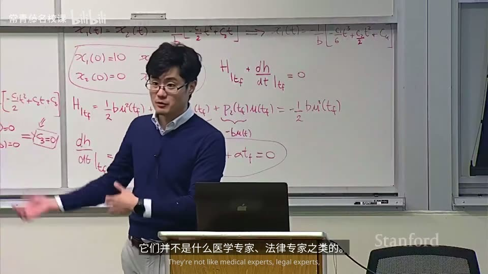 |
| 比如'标点符号'可能会被路由到'某个专家；其他符号'则可能被路由到'另一个专家''（原字幕"背景英语字符机可能会被陆游到另一个专家"，应为"西里尔等其他语系字符可能会被路由到另一个专家"）。"但这并不是那种'你一看就能说'哦，这是'华尔街日报专家'之类的情况"，对吧。 [【跳转到 58:59】](https://www.bilibili.com/video/BV11LEA6eEuj/?p=4&t=3539) | 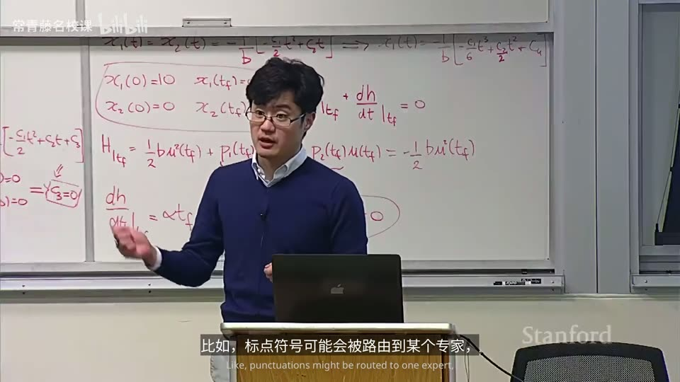 |
| （学生）"Nice，完全不是那样：这里不涉及'语义'，也许可以这么说？""对，对，对。"好。原则上，"如果 per-expert loss 被'严格执行'，它也会'强制实现' per-device 平衡——前提是你的'专家是均匀划分的'，对吧。"但我认为，"至少我的理解是：你'不希望'把'per-expert loss'调得'过高'以致'真正达到完全均匀'——因为那会对'训练动态'产生'不利影响'。但 'per-device（原字幕 PERADVICE）平衡'足够'重要'，所以你愿意'增加一点额外的损失'来鼓励实现 per-device 平衡，而不是'其他方面的平衡'。"谢谢。 [【跳转到 59:12】](https://www.bilibili.com/video/BV11LEA6eEuj/?p=4&t=3552) | 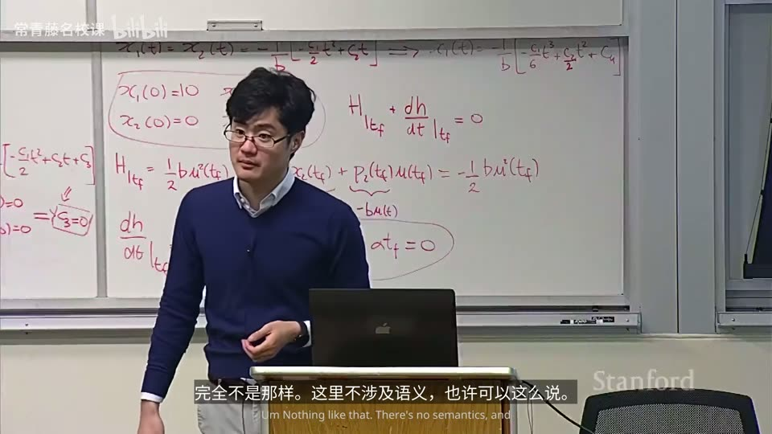 |
| 原则上如果perexpertloss被严格执行它也会强制实现perdevice平衡前提是你的专家是均匀划分的对吧但我认为至少我的理解是你不希望把perexpertloss调得过高以致真正达到完全均匀因为那会对训练动态产生不利影响但PERADVICE平衡足够重要所以你愿意增加一点额外的损失来鼓励实现PERADVICE平衡而不是其他方面的平衡 [【跳转到 59:17】](https://www.bilibili.com/video/BV11LEA6eEuj/?p=4&t=3557) | 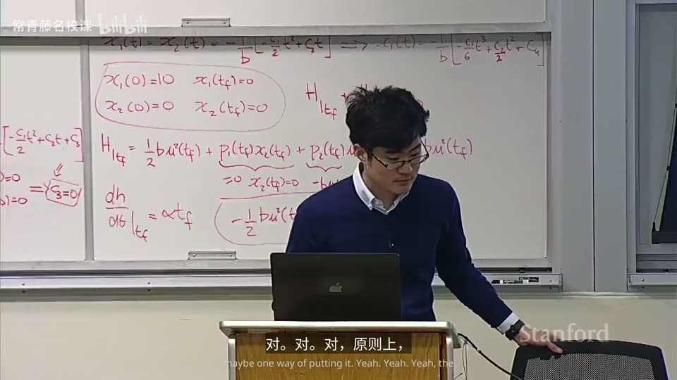 |
| "好，那么在'结束之前'，我再稍微谈谈'系统层面的内容'——训练……" [【跳转到 59:42】](https://www.bilibili.com/video/BV11LEA6eEuj/?p=4&t=3582) | 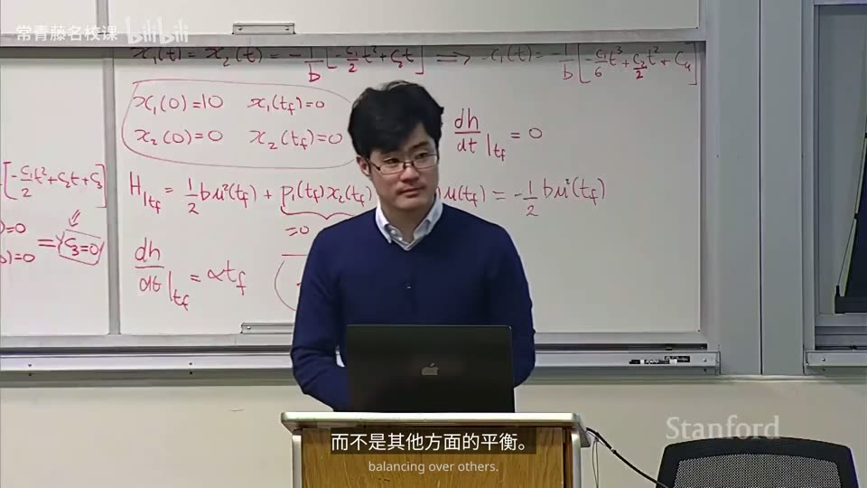 |
| （讲师）"……Mixture of Experts 会引入一些"额外的、有趣的系统层面的动态"。当我谈到"并行（parallel，原字幕 PARALLEM）"时，主要指的是"标准的、我们姑且称之为'并行'的几种形式"啊："你可以把'数据'切分成很多小块——或者说把'数据集'分散到'多台机器'上（数据并行）；你可以做'模型并行'，即把'模型'拆分并分布到'不同的机器'上（模型并行）；嗯，你可以用'各种方式'把这两者结合起来"。 [【跳转到 59:47】](https://www.bilibili.com/video/BV11LEA6eEuj/?p=4&t=3587) | 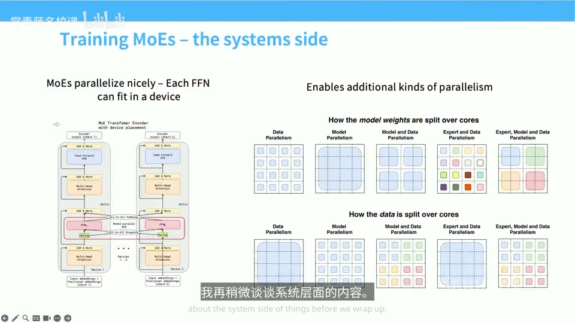 |
| 当然可以这么做啊，但我想我们意识到的是："每一种'并行技术'都有某种'极限'，对吧"（"数据并行：你知道，你的'批次大小'已经达到上限，对吧？一旦达到'批次大小上限'，你就不能再通过'数据'来并行了。'模型大小'：存在一些'天然的切分点'，你可以在这些点切分模型；一旦用尽这些'切分点'，你就无法再并行了）。**如果把它（标准并行）和'专家并行'结合起来，你就'多出一个很好的并行维度'**——啊。 [【跳转到 60:12】](https://www.bilibili.com/video/BV11LEA6eEuj/?p=4&t=3612) | 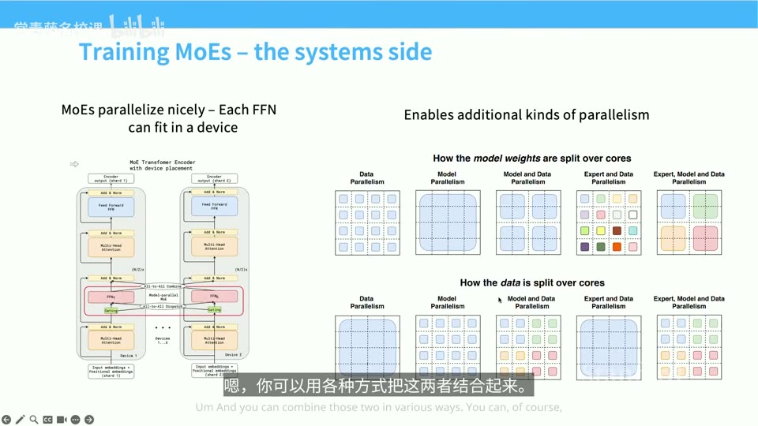 |
| 当你这样做时，"许多'底层实现'允许你利用'已内置于 GPU 中的'稀疏矩阵乘法"，（原字幕嗯）。 [【跳转到 60:37】](https://www.bilibili.com/video/BV11LEA6eEuj/?p=4&t=3637) | 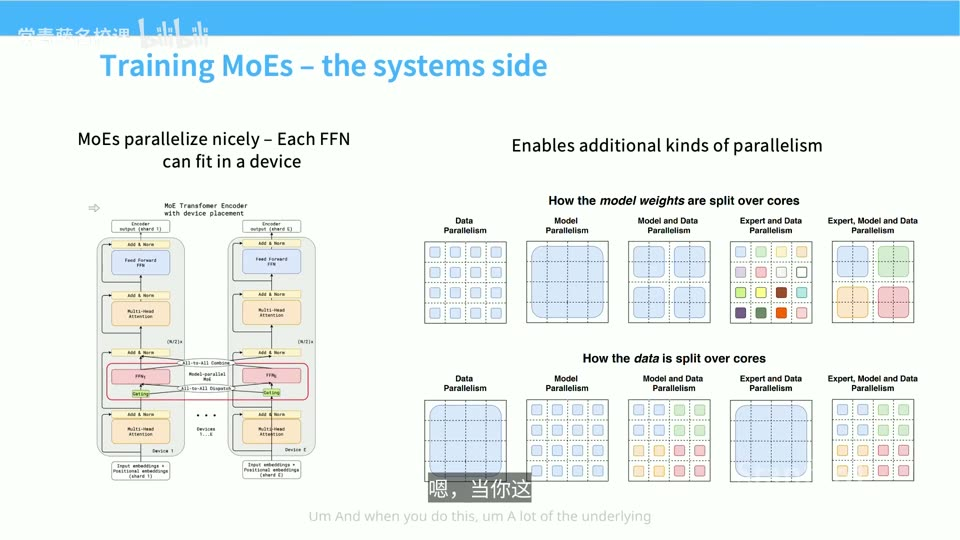 |
| 所以我要提到的另一件事是："如果你有多个专家（比如说在一个 GPU 上），一种'思考方式'是'我将进行多个小型矩阵乘法'——但这不太好：因为'理想状态下'你更希望进行'大规模矩阵乘法'，这样就能复用'缓存（cache）'做各种优化"。所以，**更好的做法是"利用'稀疏性'"：用"块对角矩阵（block diagonal matrix）"**——当然只是"最基础的形式"；但**你其实可以用"更复杂的'结构化系数（structured sparsity）'形式"**： [【跳转到 60:43】](https://www.bilibili.com/video/BV11LEA6eEuj/?p=4&t=3643) | 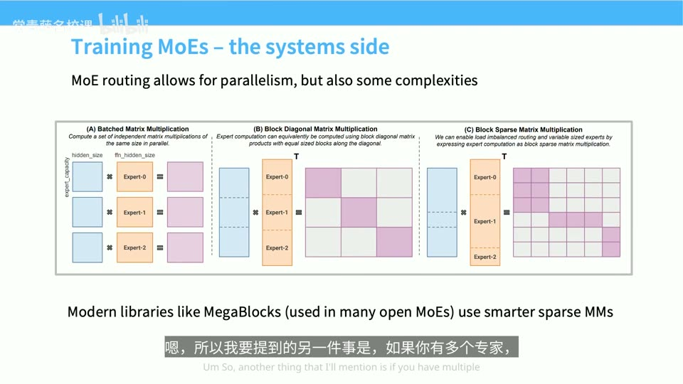 |
| "这些形式'硬件原生支持'，能让你'高效地完成乘法计算'，以'非常清晰、极快'的方式处理 experts 和 inputs"。好，**所以这也是 MoE "好的"另一个原因：想想 MoE 的"计算模式"，它们几乎对应于那些"在硬件中很容易、很高效就能支持"的"结构化矩阵乘法"**。（原字幕 featuremoe）"这个……MoE 的发展出现了一种'硬件架构协同设计'的趋势"。 [【跳转到 61:08】](https://www.bilibili.com/video/BV11LEA6eEuj/?p=4&t=3668) | 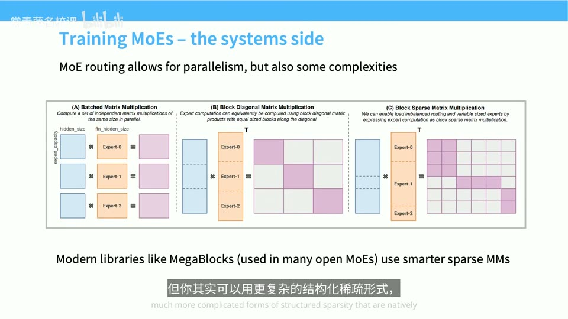 |
| 关于"并行性"，我要提的一点是："这是最近才有的新发展"（啊，这来自"某 recent 模型"，原字幕 neutronthree，不记得是谁问的这个问题了）："当我们进行'专家并行'时，必须在'设备之间传输激活值'（以告知你属于哪个 expert、需要把你传过去）——这会导致'显著的通信开销'。"因此，"人们开始考虑的一种方案是（原字幕的一段）："**'共享专家'无需通信，可以保持'较大的（隐藏）维度'；而'需要传输激活值的'那些（被路由的）专家，我希望其使用'较小的、更低维的向量'（对吧）**—— [【跳转到 61:31】](https://www.bilibili.com/video/BV11LEA6eEuj/?p=4&t=3691) |  |
| 因此，你可以"先将'残差流（hidden state）'进行'降维投影'"，然后再执行"发送该激活值的集体通信调用（all-to-all）"——这将"显著节省'通信开销'"；而无需完全承受"'隐藏维度尺寸较小'的缺点（即在'发送前投影、接收后升维'：相当于'只传输降维后的信号'）"。**因此，你实际上可以通过这类"投影技巧"，很好地控制"通信开销与 MoE 并行化"之间的权衡**。 [【跳转到 61:56】](https://www.bilibili.com/video/BV11LEA6eEuj/?p=4&t=3716) | 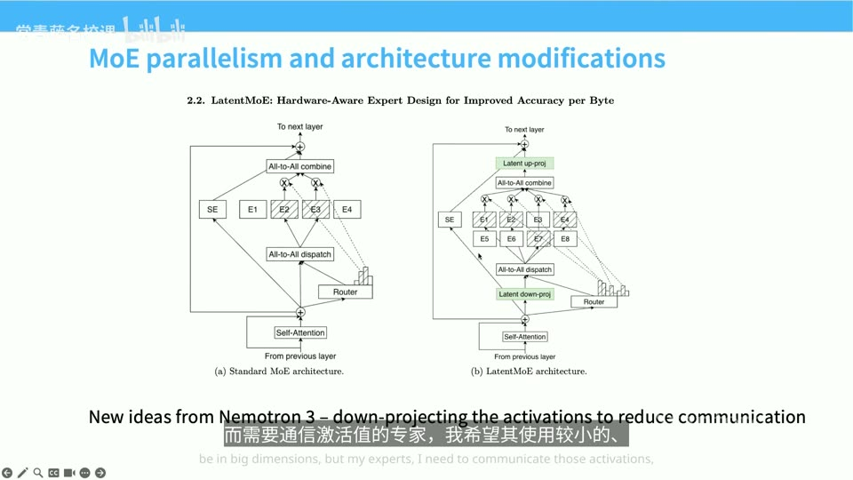 |
| 谢谢。好。最后一个关于 MoE 的"趣闻"（细节），我觉得"很有意思"；不过"近年来已经解决了"：那就是"随机性（nondeterminism）"。"如果你'朴素地'实现 MoE 的（推理）基础设施，你会发现：除非'专家在输入分布上完美平衡'，否则某些专家可能'比其他专家更受青睐'。如果某个专家（比如这里的'专家零'）特别"受欢迎"，你就会遇到"该专家对应的 token 队列不断堆积"的情况；最终，你会觉得'"队列太长了 [【跳转到 62:21】](https://www.bilibili.com/video/BV11LEA6eEuj/?p=4&t=3741) | 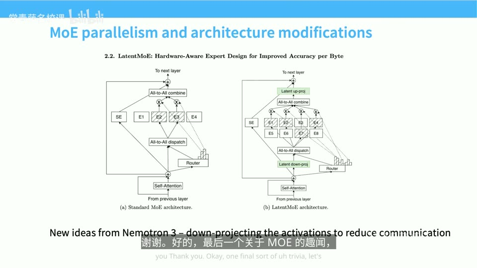 |
| ，不得不开始丢弃一些 token"'。也就是"在早期的 MoE 推理代码和基础设施里，常见做法是'直接静默丢弃该（超长队列）专家的 token'，然后照常继续计算"，"假装无事发生（即假装队列零 token）"。"这就导致了一些'奇怪的随机性'情况：如果"其他用户的查询正好命中了'你正在用的专家'，那么你的结果可能反而会'变差'（因为他们可能会把你从'专家队列'里'挤出去'）—— [【跳转到 62:46】](https://www.bilibili.com/video/BV11LEA6eEuj/?p=4&t=3766) | 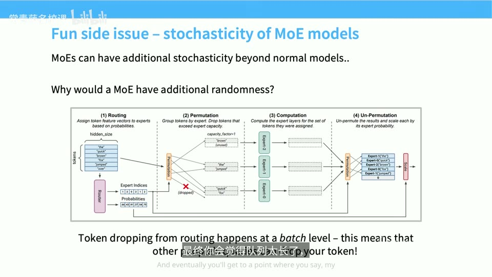 |
| 这种非常奇怪的事情确实会发生。但现在"无丢弃架构（no-drop architecture）已经解决了"大部分这类问题，所以就不再是问题了—— [【跳转到 63:11】](https://www.bilibili.com/video/BV11LEA6eEuj/?p=4&t=3791) | 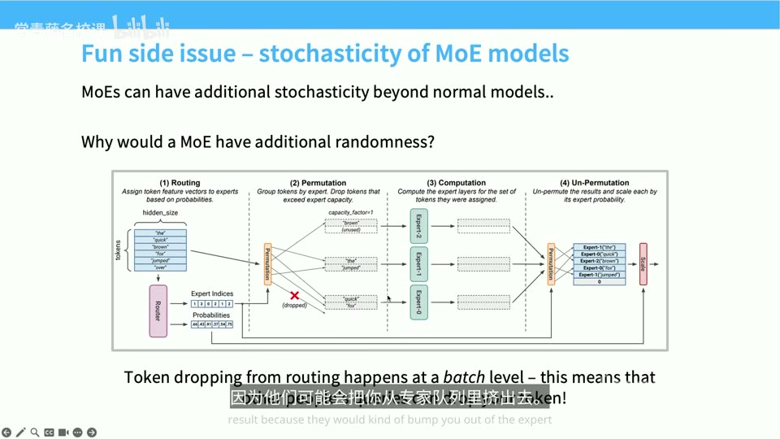 |
| 像 MegaBlocks（原字幕 megabloks）和其他主流的"开源 MoE 推理框架（原字幕 NEOE 框架）"都"不再有这个问题"。（哦，）好，关于 MoE 设计的"最后一部分"，我要谈谈"稳定性问题"。啊，"我们在上一讲中已经讨论过'架构设计中的稳定性问题'：如果你还记得我当时说过的，'指数运算是危险的、除法也是危险的'——这意味着 softmax 是'稳定性问题的危险区域'。那么我们在 Mixture of Experts 中做了什么？我们在'路由机制'中又"引入了一个 softmax"（对吧）： [【跳转到 63:21】](https://www.bilibili.com/video/BV11LEA6eEuj/?p=4&t=3801) | 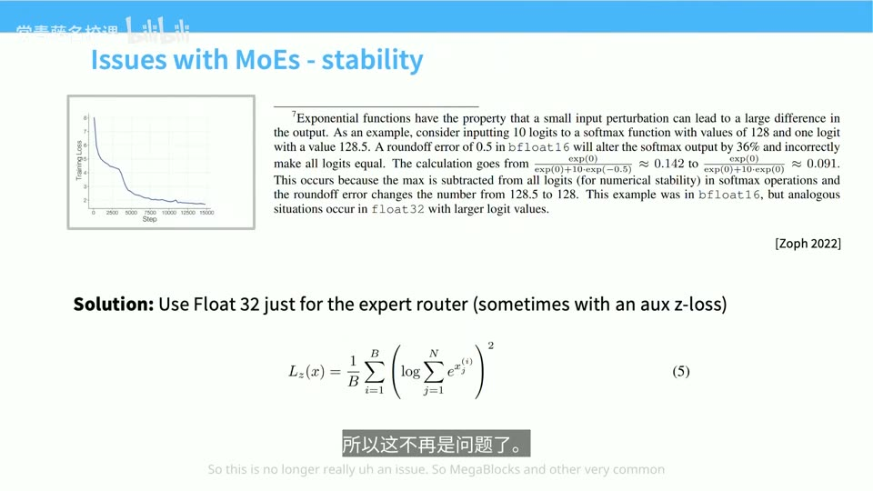 |
| 因为我们要做 top-k 选择（上面一层用的是 softmax），"这就是我们把'token 路由到专家'的方式。嗯，（原字幕 redicant to added that as i'm serialexperts 应为"像 Margins 等作者会补充说：'MoE（experts=[?]）中的 softmax 操作潜在地非常非常危险'"）。（原字幕 bearissoft 等）好，XXX 等人在"Google MoE 设计的早期阶段"就已经有所涉及、发表了一篇专门讨论"MoE 稳定性"的论文——这就是"他们注意到的问题之一"： [【跳转到 63:46】](https://www.bilibili.com/video/BV11LEA6eEuj/?p=4&t=3826) | 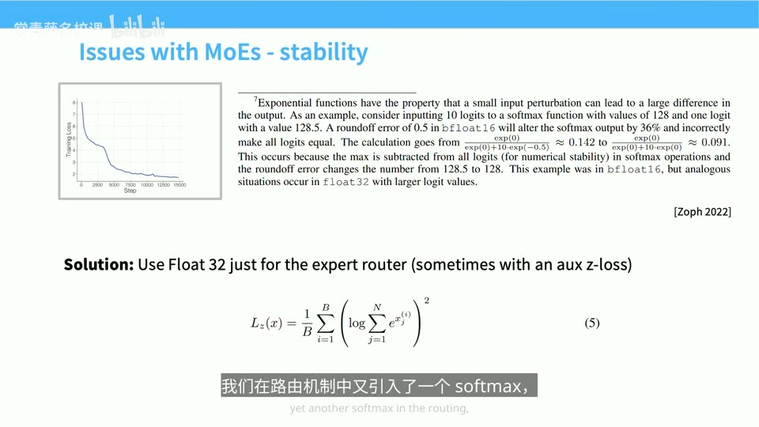 |
| （讲师）"我会讲（一点点）细节：在那些更敏感、更棘手的部分，你会经常看到'这个解决方案'："你可能最终（在 router 部分）只使用"类似 float32 的精度"来处理 expert router；此外，这里可能还会有"Z loss"——我们之前讨论过 z-loss："目的是控制我们观察到的 softmax 稳定性问题。 [【跳转到 64:11】](https://www.bilibili.com/video/BV11LEA6eEuj/?p=4&t=3851) | 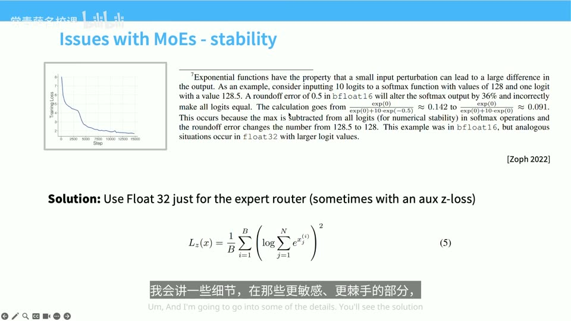 |
| 我认为 z-loss 其实相当流行：早期就被用来'提升 router 的稳定性'。我一直在深入讨论的'OLMoE（原字幕 OO）'已经对'添加或移除 z-loss'做过消融实验；从这些'波动剧烈的训练损失曲线'可以清楚地看出：'在 router 上使用 z-loss'相当有帮助。"嗯，"MoE [【跳转到 64:27】](https://www.bilibili.com/video/BV11LEA6eEuj/?p=4&t=3867) | 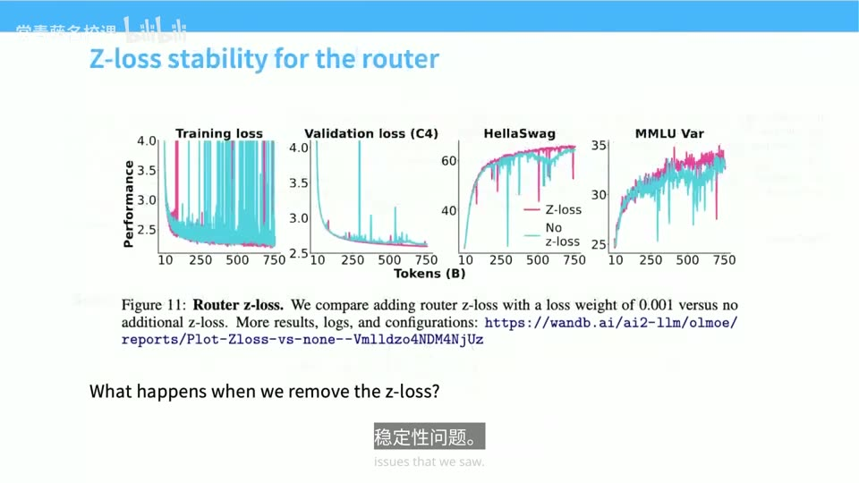 |
| 还存在其他一些问题"："如果你最近使用过语言模型，你可能已经体会到了：'MoE 微调起来相当令人头疼'：他们'参数数量众多'，因此'如果你尝试微调 experts，实际上会出现非常严重的过拟合问题'。嗯：因此你可以看到，对于"密集模型"，"训练集和验证集的损失相当接近"（它们不会出现严重的过拟合）；不过，如果你看看"稀疏模型 [【跳转到 64:44】](https://www.bilibili.com/video/BV11LEA6eEuj/?p=4&t=3884) | 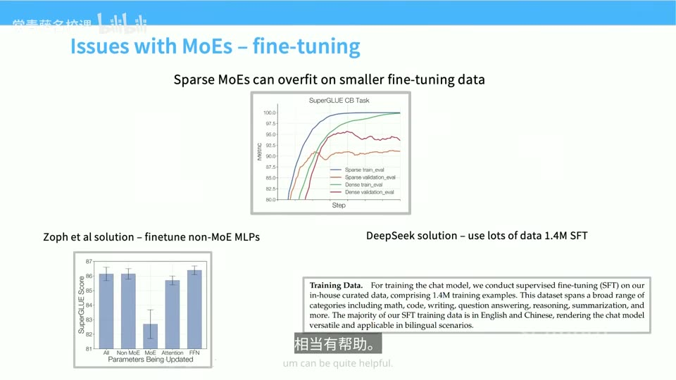 |
| 在微调这些模型用于下游任务时"，"训练集和验证集之间的差距会非常大"（我想的是 xxx——原字幕 GEOUE 基准测试里的一个任务）。嗯，"你也可以选择'只微调非 MoE 的 feedforward/attention 部分'（即'只微调他们'——注意选择性：比如 "只微调非 mixture of experts"的部分（原字幕 FEEDFORWARD 或 MOP 层），啊，你也可以"只微调 attention"——这些是比较常见的（微调）干预方式，尤其是 attention：我最近在很多 MoE 的研究中 [【跳转到 65:09】](https://www.bilibili.com/video/BV11LEA6eEuj/?p=4&t=3909) | 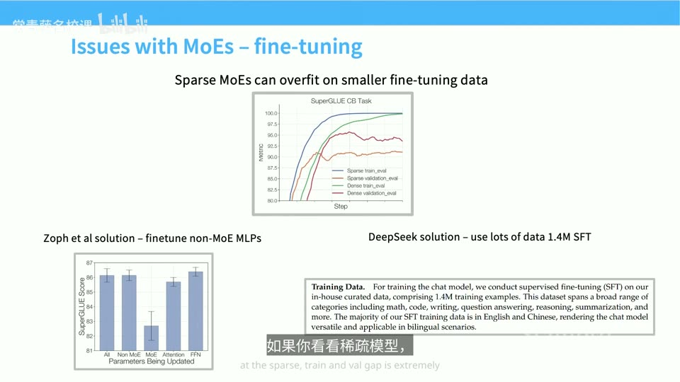 |
| 经常看到 those（原字幕如此）"。嗯，"如果你的模型里有'非 MoE 层'，那当然也可以只微调那些层（原字幕 beerissoft 等人曾支持这种做法'某'）。当然，这也有"苦涩教训式的版本"："也许你应该直接用'140 万个样本'，而不是你手头现有的（少得多的）数据量——如果你有足够多的数据，你可以在'微调阶段'几乎完全"重新训练 Mixture of Experts"：这样'泛化差距'就没那么大了"。 [【跳转到 65:34】](https://www.bilibili.com/video/BV11LEA6eEuj/?p=4&t=3934) | 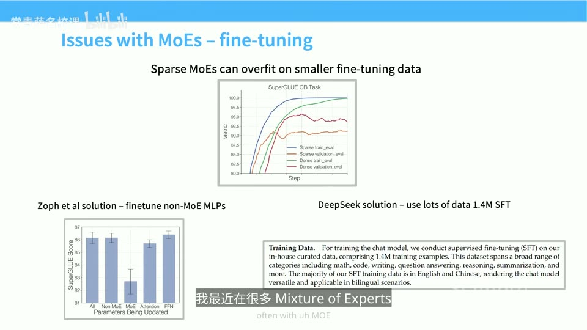 |
| 好，我要提到的"最后一个 (MoE) 专属技巧"是"升级复用（Upcycling）"这个概念。实际上，"这个方法在过去一年里没那么流行了；我觉得今年我都没见过'经过升级复用'的模型"；但这确实是个"很酷的想法"，而且"早期有一些非常优秀的模型也使用了这种技巧"。好，所以我想提一下：所谓"升级复用（upcycling）"，其理念是：**"如果你想构建一个 MoE，或许可以直接采用一个'已训练好的稠密模型'，并基于该稠密模型'实例化'一个 MoE"**：其做法是："直接复制所有参数，包括 MLP：你只需生成'大量这些 MLP 的副本'；你还需要一个'路由器'（其参数为'随机初始化'）——随后你只需"训练这个模型"；"由于'输入分配到不同 MLP 的过程'具有'随机性'，你会（逐渐）得到开始具备'专门化能力'的专家， [【跳转到 65:59】](https://www.bilibili.com/video/BV11LEA6eEuj/?p=4&t=3959) | 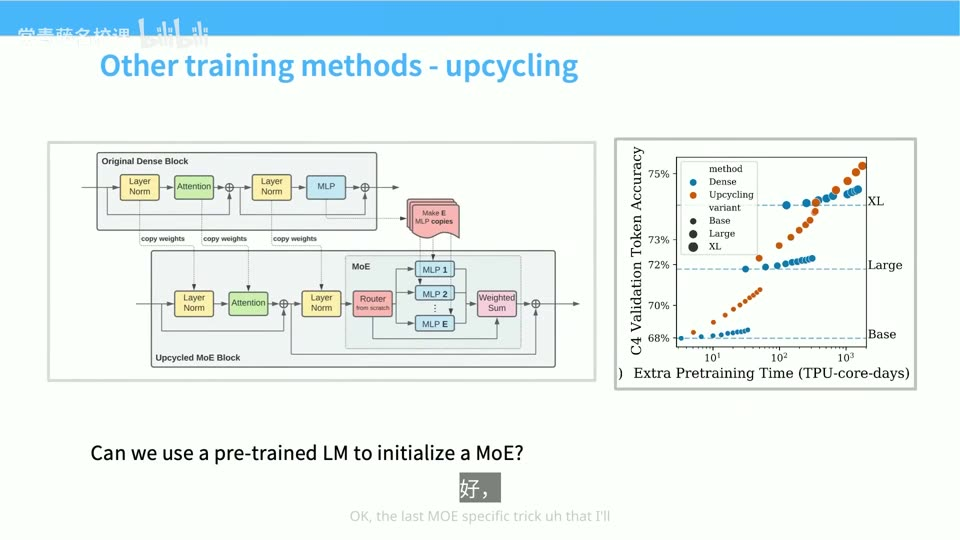 |
| 或许可以直接采用一个已训练好的稠密模型并基于该稠密模型实例化一个mixtureofexperts其做法是直接复制所有参数包括MLP你只需生成大量这些MLP的副本你还需要一个路由器其参数为随机初始化随后你只需训练这个模型由于输入分配到不同mp的过程具有随机性你会得到开始具备专门化能力的专家 [【跳转到 66:24】](https://www.bilibili.com/video/BV11LEA6eEuj/?p=4&t=3984) | 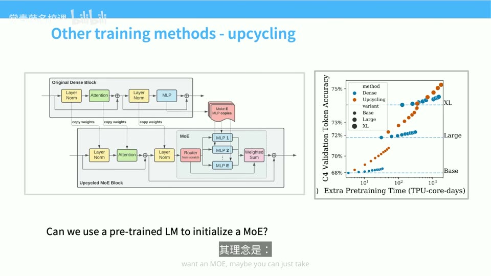 |
| ……（嗯）最终你实际上会得到一个 Mixture of Experts"；"在一些最早提出'升级复用方法'的论文中，他们表明：'在此处能显著提升语言建模的精度和性能'——相较于'继续训练同一（稠密）模型"，"对稠密模型进行升级复用能带来更好的表现"：这确实是一个"值得展示的效果"（原字幕 BA）。人们已在"多种场景下 [【跳转到 66:49】](https://www.bilibili.com/video/BV11LEA6eEuj/?p=4&t=4009) | 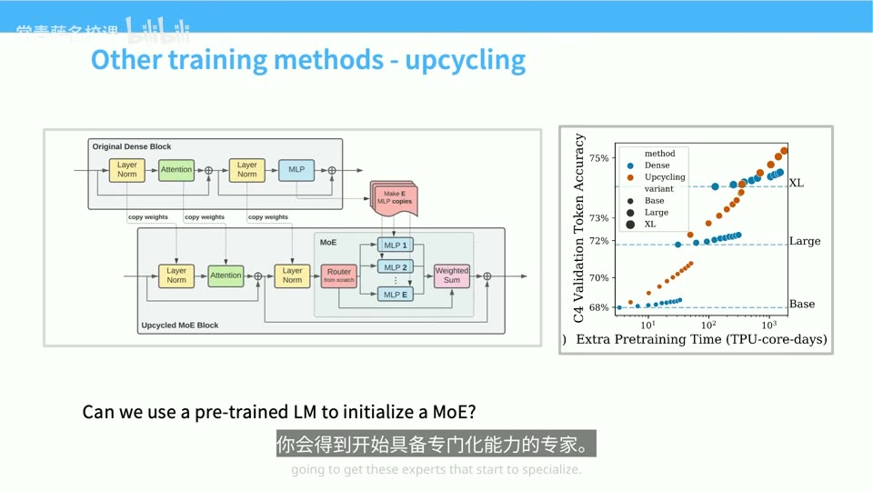 |
| 通过大规模实验验证了这一方法"。“所以，MiniCPM 是另一个我很喜欢的（中文）模型，因为他们做了很多'精心控制的消融实验'：他们有一个 MoE 模型：把"MiniCPM-2.4B（原字幕 twopointfourb）模型 UPCYCLING 成 XXX（原字幕 hundredandthirtyfourE 参数的：应为 142B 总参量、4B 激活？）的模型"，"结果得到了一堆（几乎）'白捡'的性能提升"。"还有 Qwen，他们在做 'Qwen MoE'时，也是从"1.8B 左右（原字幕 one 点 8B）的 XXX 模型初始化开始的'；他们把它 UPCYCLING 成"Qwen 1.5-MoE [【跳转到 67:14】](https://www.bilibili.com/video/BV11LEA6eEuj/?p=4&t=4034) | 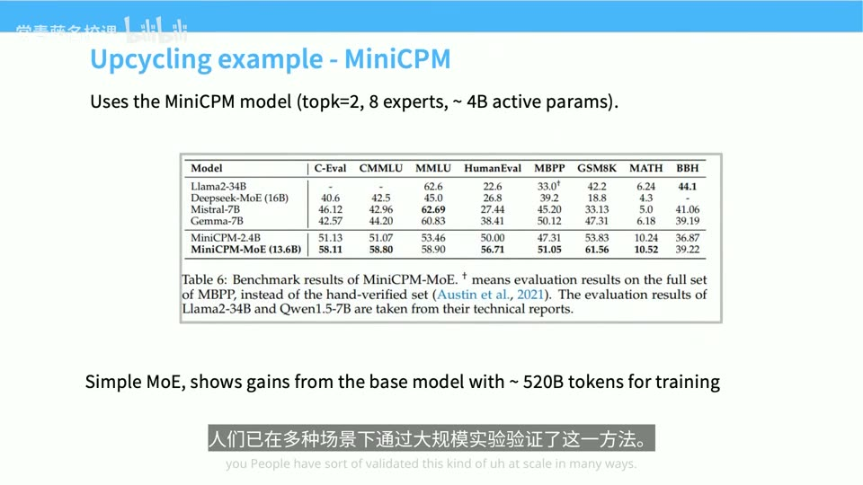 |
| 的一批（A2.7B/0.8B 激活等那个）模型（原字幕 quinonepointfivea twopointsevenb）"，"最后做出来的是'首批高性能 MoE 模型'之一；我觉得这是'较早的大规模 UPCYCLING 成功案例'之一。不过， [【跳转到 67:39】](https://www.bilibili.com/video/BV11LEA6eEuj/?p=4&t=4059) | 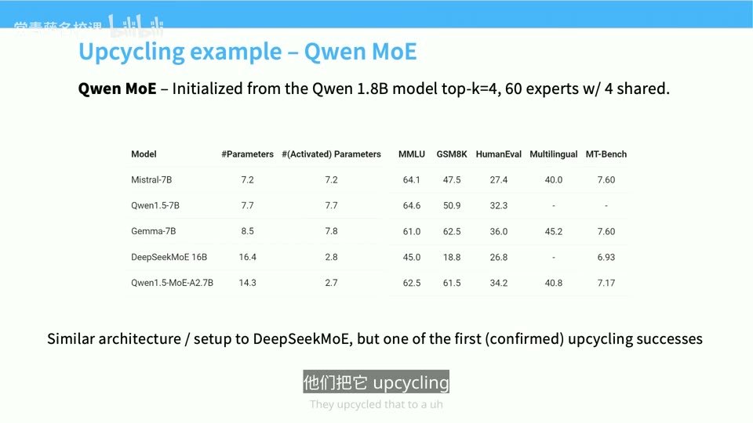 |
| 这是个'重要的知识点'"。好，最后，我想带大家过一下 "DeepSeek 的 V2 和 V3 模型"（原字幕 voneVA 和 V3）；我/', "我觉得"DeepSeek 模型的演进过程很有参考价值；另外，如果你对 'MoE 或架构设计'感兴趣，我建议你读读 DeepSeek 的论文（原字幕 deepsick）：我觉得"这些论文写得很好，里面有很多值得深究的细节"。那么先看 "DeepSeek MoE 架构的 V1（橡胶时代）： [【跳转到 68:04】](https://www.bilibili.com/video/BV11LEA6eEuj/?p=4&t=4084) | 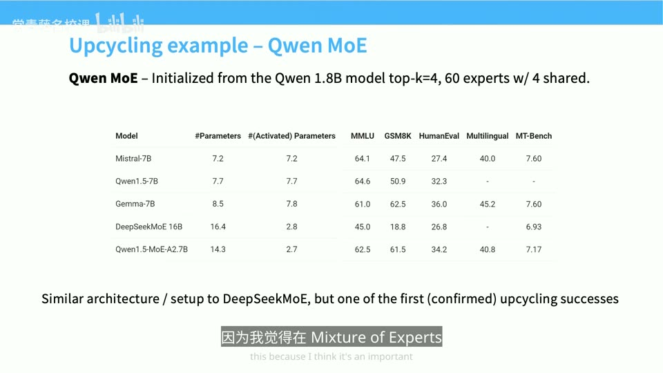 |
| 它实际上已经是"许多现代 MoE 的'原型'"了：它采用了"共享专家"和"细粒度专家"的结构、"使用标准的 token 路由"、并"配合辅助损失来做平衡"。怎么说呢，("一块需要交代的")在某种程度上可以说："这就是'MoE 模型的'标准范式，或者说那种'理想化的原型'"。"DeepSeek MoE V2（原字幕 Deepseekmixtureofexpertsvtwo）"，基本上就是"把这个模型'放大'，对吧：所以你有'两个共享专家'嗯 [【跳转到 68:29】](https://www.bilibili.com/video/BV11LEA6eEuj/?p=4&t=4109) | 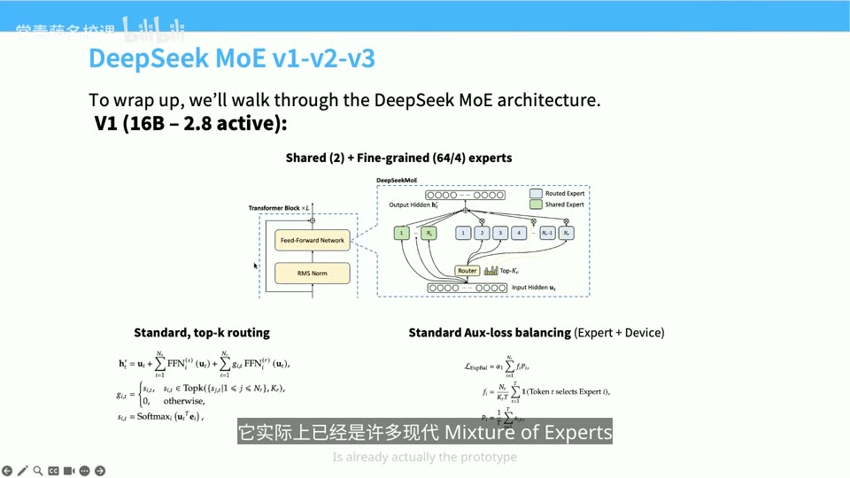 |
| ，然后是'更多的细粒度专家'，还有一个'设备（设备辅助）路由/平衡组件'，以及一个'通信平衡组件'；嗯，这两者（设备级平衡、通信量平衡）本质上都是'通过引入辅助损失来优化系统'"。（板书）（原字幕 Ams） 我认为"重要的是要认识到：成功的语言模型训练，不仅关乎深度学习，也关乎真正'重视系统本身'"；因此，"DeepSeek-V2 在我看来，正是这一理念的体现"。而在"DeepSeek-V3（原字幕 deepcgamoEVthree）"中： [【跳转到 68:54】](https://www.bilibili.com/video/BV11LEA6eEuj/?p=4&t=4134) | 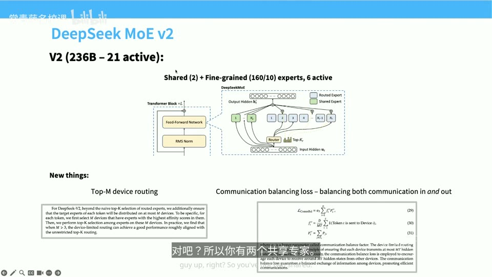 |
| "他们保留了'共享专家和细粒度专家'的设计，但在'平衡机制'上采用了不同的方法：啊，他们采用了'无需辅助损失的（原字幕 OLOS）方式'来平衡不同的专家（其实改用了'per-sequence 辅助 + 偏置在线调整'那套）；此外，他们转而使用 'sigmoid + （原字幕 SIGMOID 加 softmax[应为"sigmoid"而非 softmax]）的组合'；这是一种'不同的专家加权方式'，但'本质上非常相似'"。嗯，（好，）最后，既然我们已经谈到这里，不妨"继续梳理 DeepSeek MoE V3 的其余部分"： [【跳转到 69:19】](https://www.bilibili.com/video/BV11LEA6eEuj/?p=4&t=4159) | 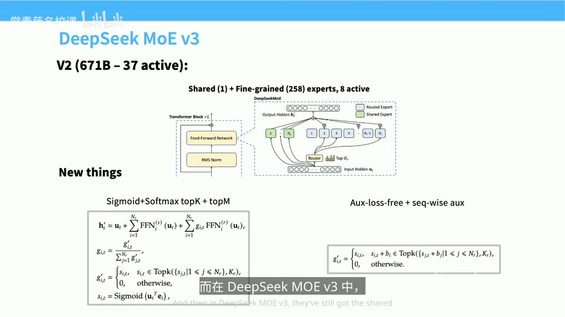 |
| "他们还有许多其他有趣的设计。嗯，我非常欣赏他们'思考系统的方式'：比如（比，原字幕）、他们采用了'多头潜在注意力（MLA，原字幕 multiheadlightandattention）'：即"不直接进行 QKV 操作，而是将 K/V 表示为'低维潜在表示'"："所以你现在（有）'隐藏输入'：接下来，'你不再直接生成 Q、K 和 V'，而是'首先（先）产生 C（压缩后的 KV 的共享潜在 token 状态 C_kv）'然后你将基于 C 来（再）生成 Q、K 和 V（投影升维）"。 [【跳转到 69:44】](https://www.bilibili.com/video/BV11LEA6eEuj/?p=4&t=4184) |  |
| "这能让你获得'相当可观的（KV 缓存与）计算节省'"：'我（在解码阶段）不需要对'所有的 K 和 V 都做 KV 缓存'；我只需存储'这些 C'"（对吧）；"而且 C 的维度应该'更低'，对吧。**这就是它叫 'MLA（Multi-head Latent Attention）：潜在激活/潜在注意力'的原因：因为这些 'C' 是'潜在的（latents）'：正是你需要保存的'KV 缓存量'**。"嗯，"你可能唯一需要担心的'（与 RoPE 的）复杂性'是：在做'RoPE/KV 缓存（原字幕做 KB 缓存时）'，这可能会'和 RoPE 冲突'——所以你得'稍微小心一点 [【跳转到 70:09】](https://www.bilibili.com/video/BV11LEA6eEuj/?p=4&t=4209) | 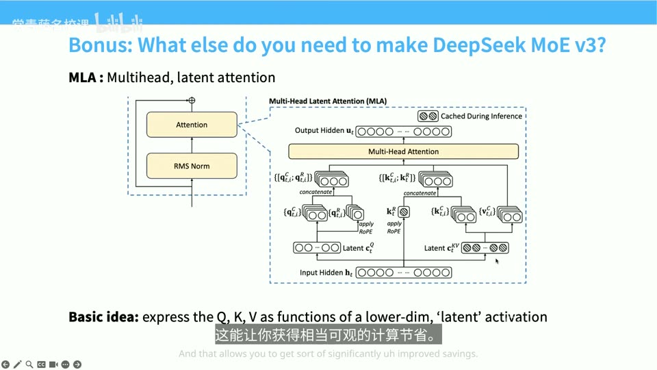 |
| 注意如何旋转'不同的'维度'等等（关于如何处理 RoPE 的部分： 因为 '位置信息（不可压缩）'和'内容信息（可压缩）'纠缠在 KV）"。"啊，这里的技巧是：你有一些'非潜在维度'，它们用于'编码位置信息'（某些 head 部分用 RoPE + 不做压缩）；不过关于这一点我就'不深入展开'了"。**最后，我想提一个"对 MoE 来说很'酷'的想法"**：我之前叫他"DeepSeek MoE V3（原字幕 deepseekmoEVthree，'虽'然他并没有怎么流行起来，那就是"**MTP——也就是'多 token 预测（Multi-Token Prediction）'**：与其只预测'下一个 token'，不如'一次性预测多个；（原字幕）这种做法在统计上是有道理的 [【跳转到 70:34】](https://www.bilibili.com/video/BV11LEA6eEuj/?p=4&t=4234) | 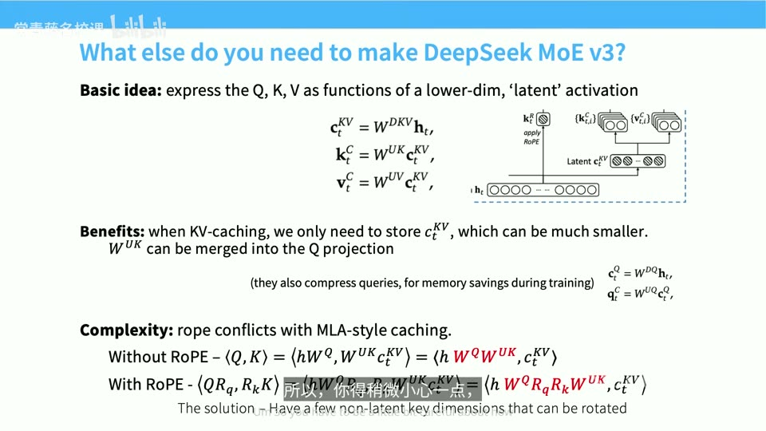 |
| （为什么这是个好主意？'也许它能让你对未来'预测的更准''+ 另外从系统角度看也很棒：**你相当于'内置了一个"投机解码器（speculative decoder）'**: Percy 后面"讲推理的时候会细说；这是一种'可以用来加速模型解码'的技巧。好，（"时间差不多了"，某些页"没有"）总结一下："Mixture of Experts 是一种非常巧妙的思路：它利用'稀疏性'，让你'拥有的参数比'你'实际付出的 computer 成本所对应的要多"，"而（emit 之类）所以在你不必为所有参数的'计算成本'买单的同时，却能'享受到这些参数带来的好处'。"啊，（嗯）"你一开始可能觉得'这种路由问题很难'；但事实证明，'即使在大规模下，非常简单的方法也很管用'。到这里，**"MoE 显然已是大势所趋（已是是"当前主流"，所以"有必要搞清楚'他们是如何运作的、究竟是什么（原字幕"是什么）" [【跳转到 70:59】](https://www.bilibili.com/video/BV11LEA6eEuj/?p=4&t=4259) | 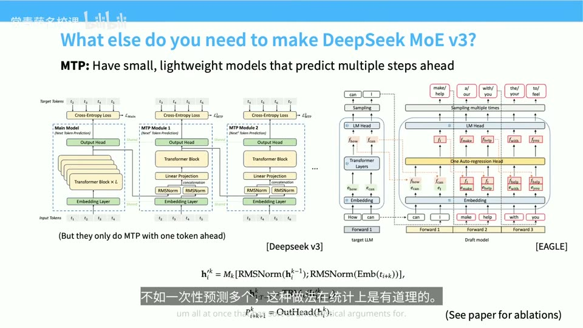 |
| 好时间差不多了总结一下mixtureofexperts是一种非常巧妙的思路它利用稀疏性让你拥有的参数比你实际付出的computer成本所对应的要多对吧而emit所以你不必为所有参数的computer成本买单却能享受到这些参数带来的好处啊你一开始可能觉得这种路由问题很难但事实证明即使在大规模下非常简单的方法也很管用到这里mixtureofexperts显然已是大势所趋 [【跳转到 71:16】](https://www.bilibili.com/video/BV11LEA6eEuj/?p=4&t=4276) | 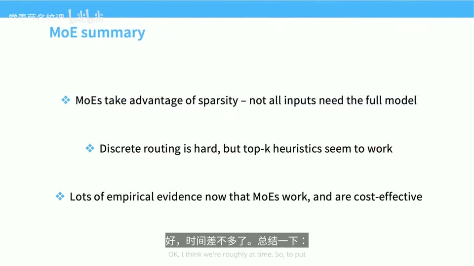 |
| 所以有必要搞清楚他们是如何运作的究竟是什么 [【跳转到 71:41】](https://www.bilibili.com/video/BV11LEA6eEuj/?p=4&t=4301) | 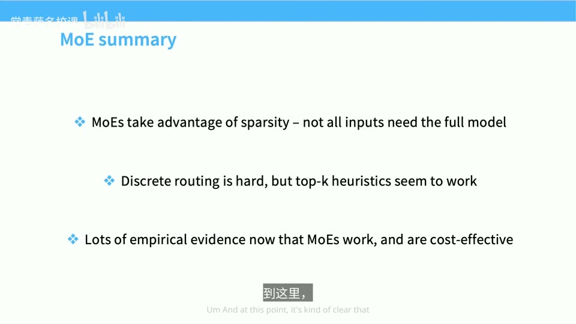 |
| （此区间无字幕） [【跳转到 71:46】](https://www.bilibili.com/video/BV11LEA6eEuj/?p=4&t=4306) | 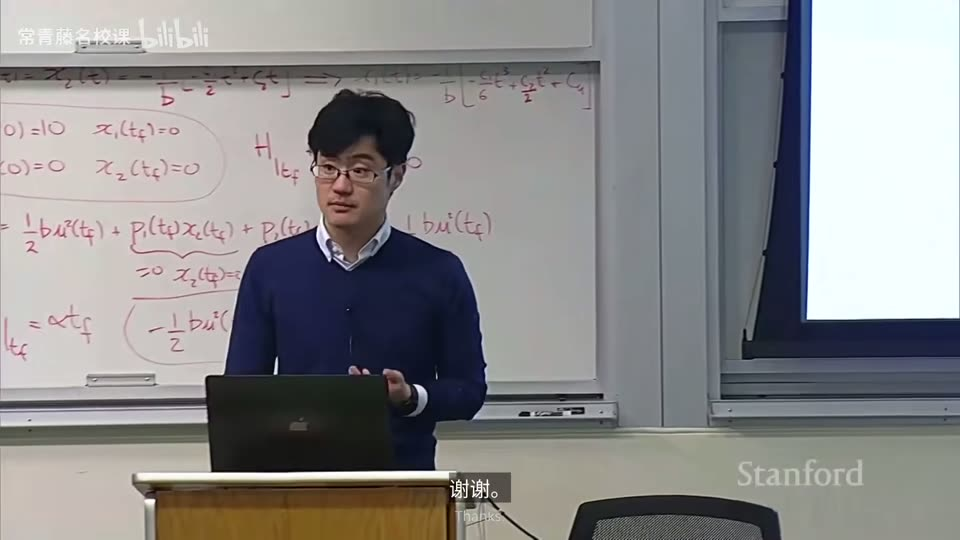 |