# Lecture 5: GPUs, TPUs · 原始文稿（图-字幕分栏）

| 字幕文本 | 画面 |
| :--- | ---: |
| 好的，我们现在开始。接下来我们将进入课程的"系统部分"。在过去的两次讲座中，我们主要讨论了神经网络相关的一些内容。 [【跳转到 00:00】](https://www.bilibili.com/video/BV11LEA6eEuj/?p=5&t=0) | 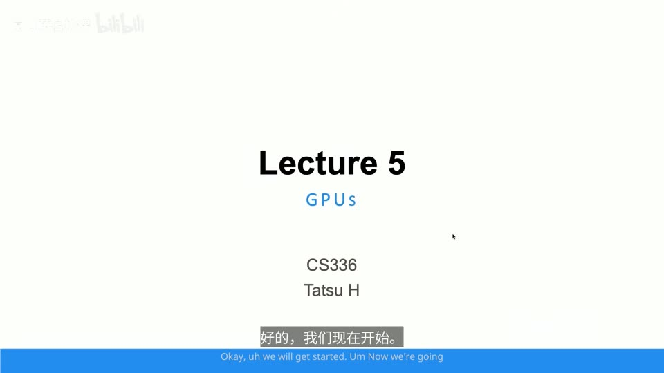 |
| 但现在，我们将开始深入探讨 GPU 以及推理。 [【跳转到 00:08】](https://www.bilibili.com/video/BV11LEA6eEuj/?p=5&t=8) | 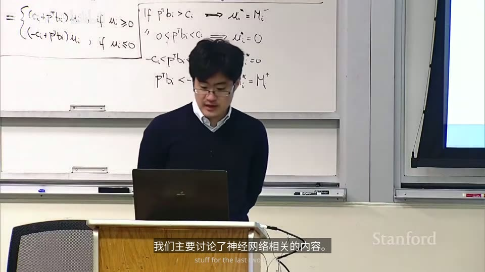 |
| 所以我认为，"系统"在某种程度上是技术栈中最有条理的部分：因为你可以把各个模块逐层读通，各个模块之间存在着逻辑递进的步骤，你可以沿着这些步骤一步步推导出结果。因此，这部分内容与众不同， [【跳转到 00:13】](https://www.bilibili.com/video/BV11LEA6eEuj/?p=5&t=13) | 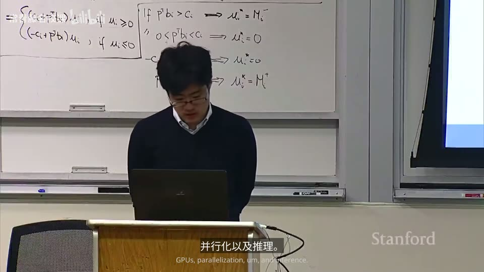 |
| 也很有成就感。但当你初次接触 GPU 时，会觉得它既像魔法，又像一台你正在打交道的、非常陌生的设备。作为一项课堂调查，我不太清楚：你们当中有多少人上过任何形式的 GPU 编程课程？好的，这个比例相当不错。 [【跳转到 00:30】](https://www.bilibili.com/video/BV11LEA6eEuj/?p=5&t=30) | 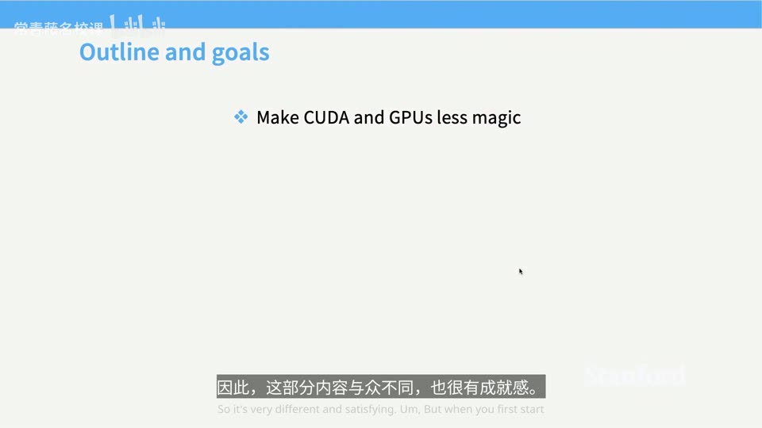 |
| 大约有四分之一，也许略少一点。不过我想，你初次接触这些东西时会觉得它确实有点像魔法。所以，搞懂原理很有好处。 [【跳转到 00:44】](https://www.bilibili.com/video/BV11LEA6eEuj/?p=5&t=44) | 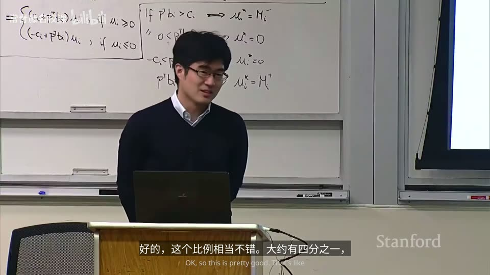 |
| 我觉得深度神经网络让人感觉像魔法，但 GPU 其实也一样。有时候，别人会给你看这样的图。 [【跳转到 00:54】](https://www.bilibili.com/video/BV11LEA6eEuj/?p=5&t=54) | 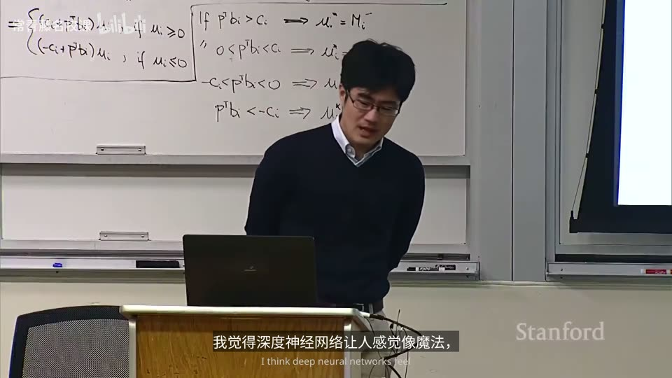 |
| 我想我在这节课里向你保证的是：等课上完，你就能看懂这张图是什么意思，或者明白它为什么是这副样子。这代表你能得到的吞吐量；在矩阵乘法里，横轴就是你的维度。你可能会想： [【跳转到 00:59】](https://www.bilibili.com/video/BV11LEA6eEuj/?p=5&t=59) |  |
| 也许矩阵乘法越大，吞吐量就越高——毕竟要做的事更多。但实际上会出现各种奇怪的模式：在某些尺寸下，你的矩阵乘法会比其他情况慢得多。为什么你需要理解这一点？你还需要了解一些基础知识，知道如何从概念上理解 GPU，这样才能写出高效的算法。就算你不是搞系统的（我想在座可能并非所有人 [【跳转到 01:12】](https://www.bilibili.com/video/BV11LEA6eEuj/?p=5&t=72) | 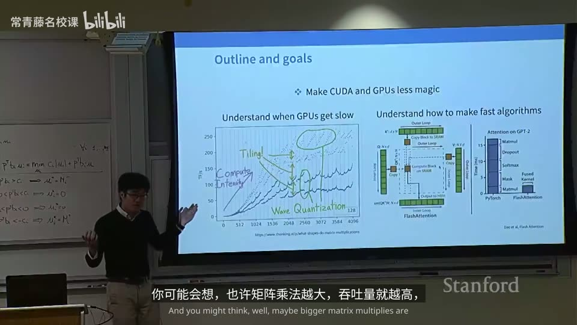 |
| 甚至不是大多数人都搞系统），但如果你要考虑架构，或者只是大体上推理这些问题，你就得理解硬件模型，知道你的模型是怎么执行的，这样才能做出有效的（决策）。回想一下 Percy 最初的讲座：扩展规模很重要的一部分，就是确保你高效地利用资源；如果你不了解系统，就永远没法高效地利用资源。 [【跳转到 01:33】](https://www.bilibili.com/video/BV11LEA6eEuj/?p=5&t=93) | 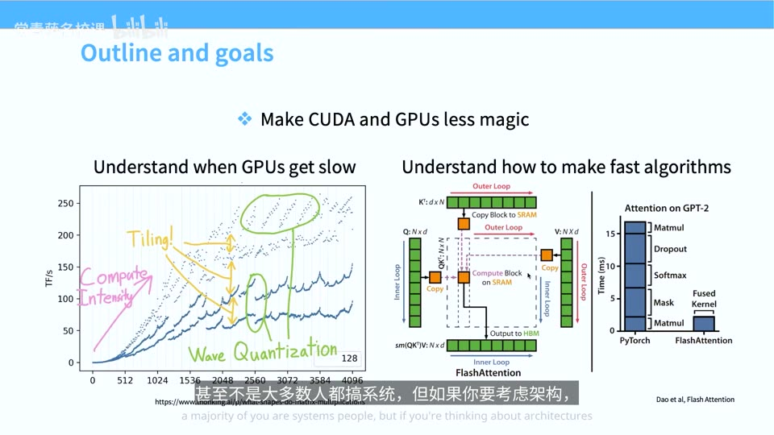 |
| 而你会说："你知道我不是搞系统的"——挺意外的吧？在开始之前，我想先给你推荐一些我觉得特别好、特别有用，而且我在做这期讲座时自己也用过的资源。Horace He 写了一些非常出色的博客和科普文章， [【跳转到 01:52】](https://www.bilibili.com/video/BV11LEA6eEuj/?p=5&t=112) | 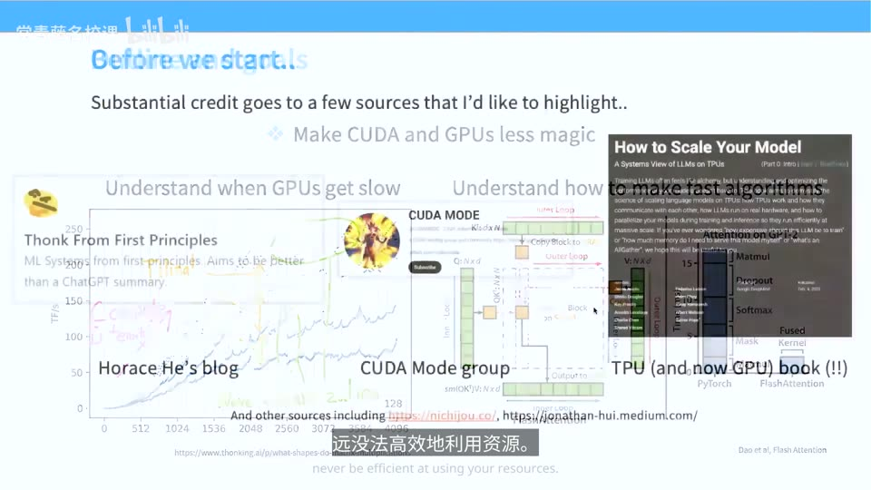 |
| 讲解 GPU 是怎么工作的。有个爱好者社区叫 CUDA MODE（现在改名叫 GPU MODE），特别喜欢聊 GPU 和 CUDA 内核之类的话题；还有那本 TPU 的书——不过现在也由 Google 的人改写成了 GPU 的书，这其实是一份非常宝贵的资源。所以，如果你对我今天讲的任何内容感到兴奋或感兴趣， [【跳转到 02:06】](https://www.bilibili.com/video/BV11LEA6eEuj/?p=5&t=126) |  |
| 我强烈建议你去看看那本书，书里还有练习题可以让你做，你的作业里也会出现跟这些练习题有点像的题目，这样你就能提前看看我们之后会布置什么样的任务。好， [【跳转到 02:31】](https://www.bilibili.com/video/BV11LEA6eEuj/?p=5&t=151) | 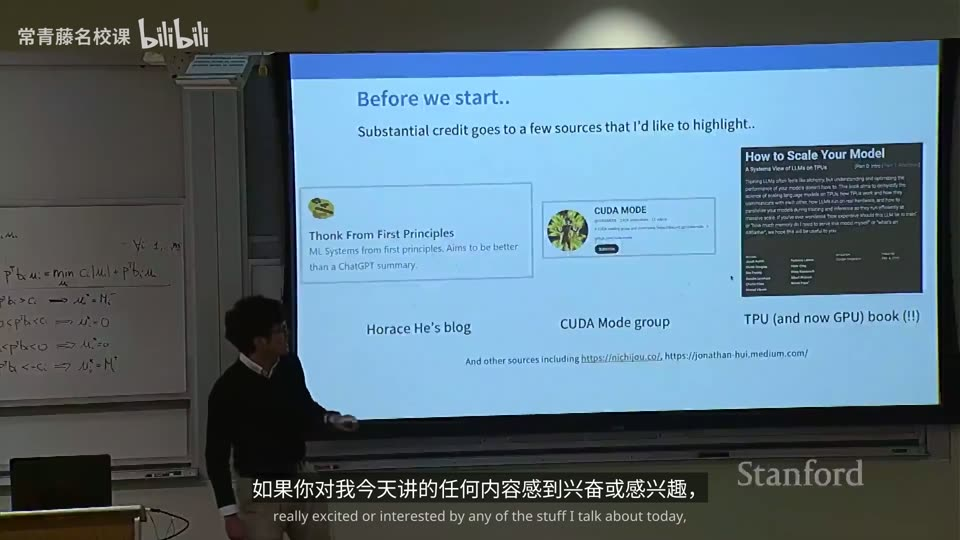 |
| 这次课分三部分。第一部分主要是关于 GPU 的宽泛入门介绍，讲的就是硬件模型以及 GPU 编程大致是怎么回事——因为 GPU 对大家来说是个比较陌生的设备，我希望你们能从本质上理解它和 CPU 有什么不同。在此基础上，我们会讲六种不同的技巧（我想是六种重要的技巧）让 GPU 跑得更快；这些都是一些基础模块，帮你学会怎么开始调整代码，让它在 GPU 上高效运行。最后，在最后一部分， [【跳转到 02:45】](https://www.bilibili.com/video/BV11LEA6eEuj/?p=5&t=165) | 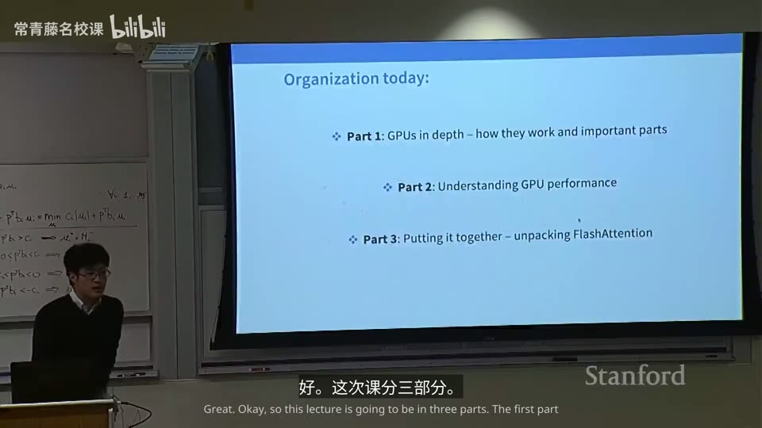 |
| 我们会把这些内容综合起来：我们会逐步讲解 FlashAttention，这算是我们的"庆功环节"。我们会说：其实到这个时候，我们已经掌握了从头实现自己的 FlashAttention、并理解其各个组成部分所需的一切。所以，这就是我们讲座结束时想要逐步实现的目标。好，那么我们还没讲到扩展性；不过从 Percy 的入门讲座（或者通常的语言建模实践）来看，我们大概知道：只要计算资源更充足， [【跳转到 03:10】](https://www.bilibili.com/video/BV11LEA6eEuj/?p=5&t=190) | 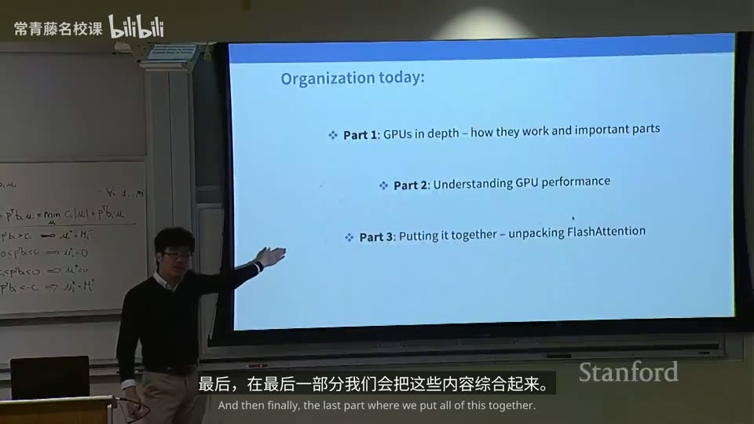 |
| 就能训练出更好的语言模型，这可以说是我们做事所依赖的硬通货。所以，如果硬件更快、利用率更高、芯片更多，或者并行化做得更好，所有这些都能推动进步。所以某种程度上，过去几年我们一直在解决的核心问题，是如何在模型训练阶段投入更多算力；我想在过去的一年左右，重点变成了如何在这些模型的推理阶段投入更多算力。 [【跳转到 03:35】](https://www.bilibili.com/video/BV11LEA6eEuj/?p=5&t=215) | 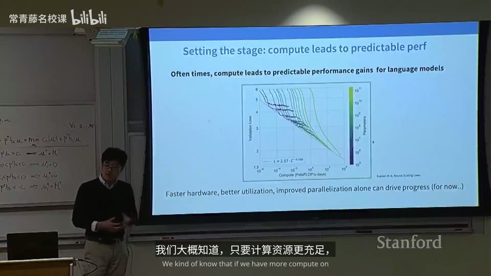 |
| 因此算力极其重要，而系统是其中的一部分。如果我们是在 90 年代讨论这个问题，我认为当时的关注点会是"时钟频率"。我们会这样表述：让计算机变快的方法，是用一个串行执行指令的 CPU，并让指令的执行速度越来越快。我的意思是，这种缩放模式——即晶体管尺寸缩小、时钟频率提高—— [【跳转到 04:00】](https://www.bilibili.com/video/BV11LEA6eEuj/?p=5&t=240) | 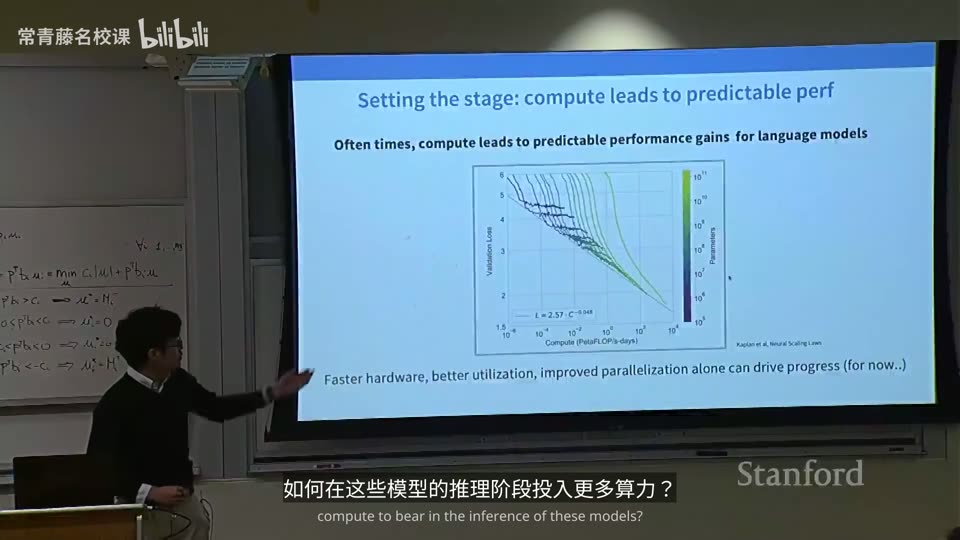 |
| 被称为 Dennard 缩放（登纳德缩放）。它在一段时间内效果相当不错，事实上这种缩放方式大约在 2000 年代达到了瓶颈。顺便提一个有趣的补充：当然，晶体管的数量一直在增加，但缩小晶体管尺寸并不一定意味着晶体管会变快，对吧？它们的时钟频率并不会因此提高。由于基本的物理限制，当缩小到一定程度后，你实际上就无法再从更小的晶体管中继续获益了。因此，这种通过提高时钟频率 [【跳转到 04:25】](https://www.bilibili.com/video/BV11LEA6eEuj/?p=5&t=265) | 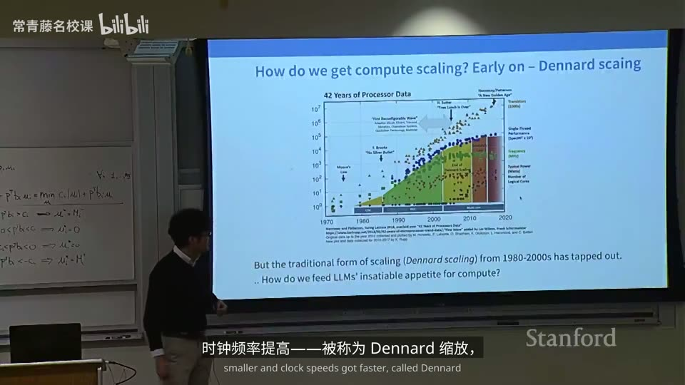 |
| 来加快指令执行速度的旧方法行不通了。那么，既然我们无法单纯靠提高频率来加速，该怎么让大语言模型在这样的世界里继续扩展呢？这正是 GPU 登场之处，也就是更广义上的"并行扩展"。Percy 下节课会讲更进阶的主题，但在那之后我们就要讲并行化了——并行化与 GPU 同属于一种范式：与其通过不断提高时钟频率来串行地提升速度， [【跳转到 04:50】](https://www.bilibili.com/video/BV11LEA6eEuj/?p=5&t=290) | 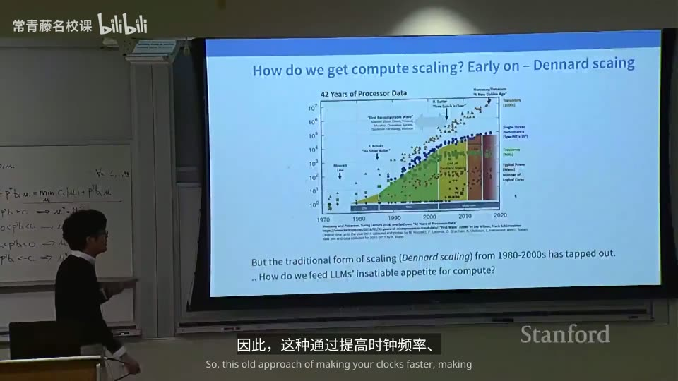 |
| 不如进行水平扩展，让多个单元并行执行你的指令。这就是 GPU 的故事。我觉得一张幻灯片（或者说一张图）就能概括并行扩展的现状：在 K80 和 M40 刚出来的时候，性能虽然还算可以，但用今天的标准看就有点寒酸了；然后突然之间，到了 P100 和 V100 那会儿，这条曲线开始起飞，浮点运算能力几乎逐年呈现超指数级的增长。 [【跳转到 05:15】](https://www.bilibili.com/video/BV11LEA6eEuj/?p=5&t=315) | 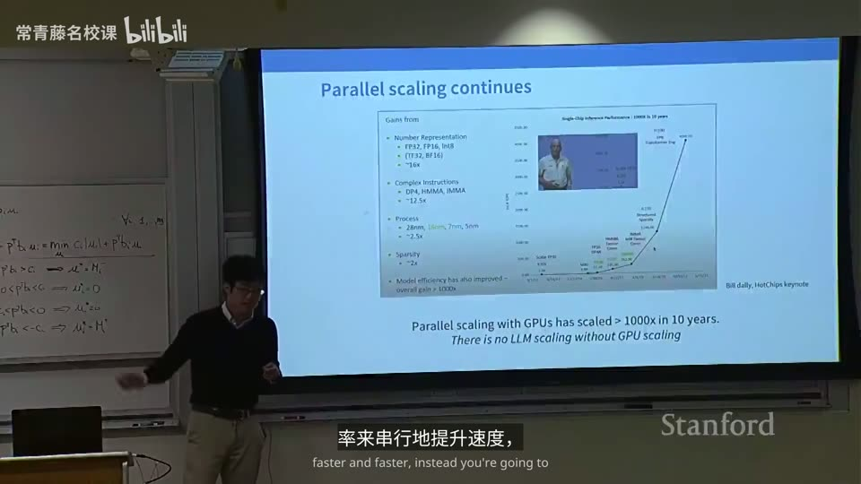 |
| 这张图很好地展示了我们所能调用的计算规模。可以说，GPU 的性能扩展几乎推动了我们所见到的全部算力增长。我们会逐一聊聊这里涉及的各种组件，我先大致梳理一下这个架构，让你心里有个数。我们开始用上了张量核心（Tensor Core）——这是重大的硬件创新之一。 [【跳转到 05:40】](https://www.bilibili.com/video/BV11LEA6eEuj/?p=5&t=340) | 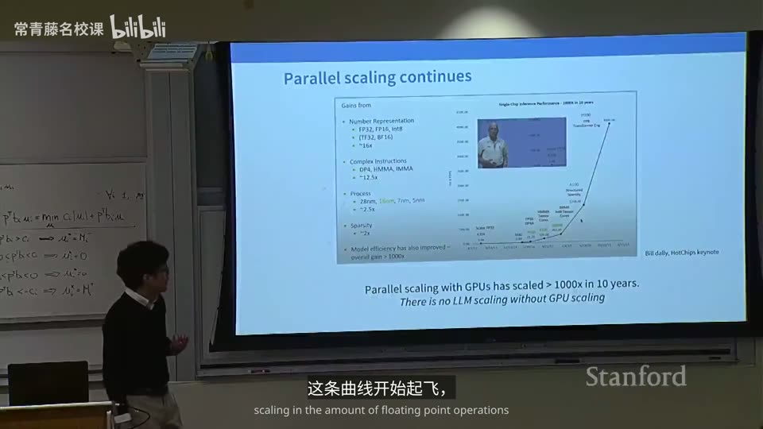 |
| 随后几年里，结构化稀疏性、FP8 以及所有这些低精度格式也都在持续推动浮点运算性能向前发展，我们稍后会详细探讨这在具体层面意味着什么。那么，GPU 与 CPU 有何不同？ [【跳转到 06:05】](https://www.bilibili.com/video/BV11LEA6eEuj/?p=5&t=365) | 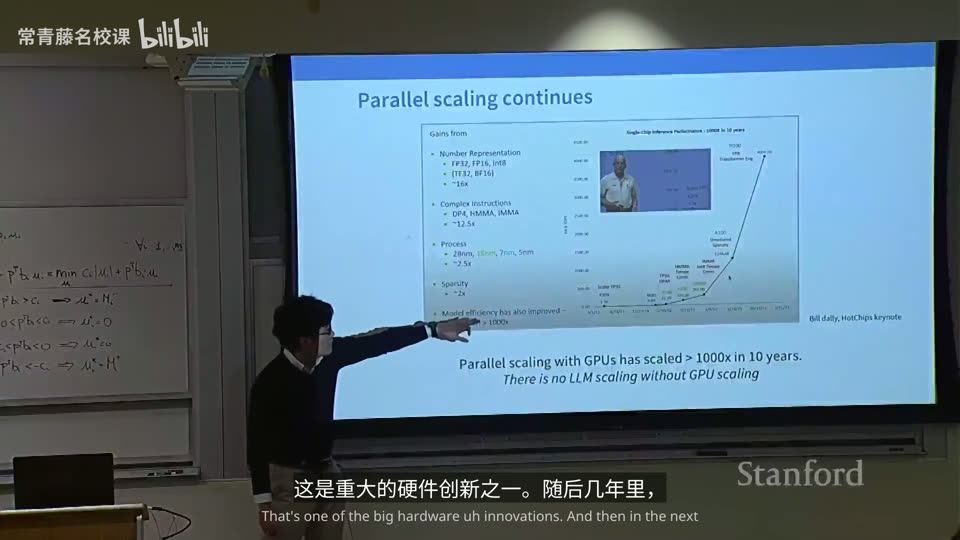 |
| 用过 GPU 的人对此已有了解，我们稍后将进入更高级的内容； [【跳转到 06:19】](https://www.bilibili.com/video/BV11LEA6eEuj/?p=5&t=379) | 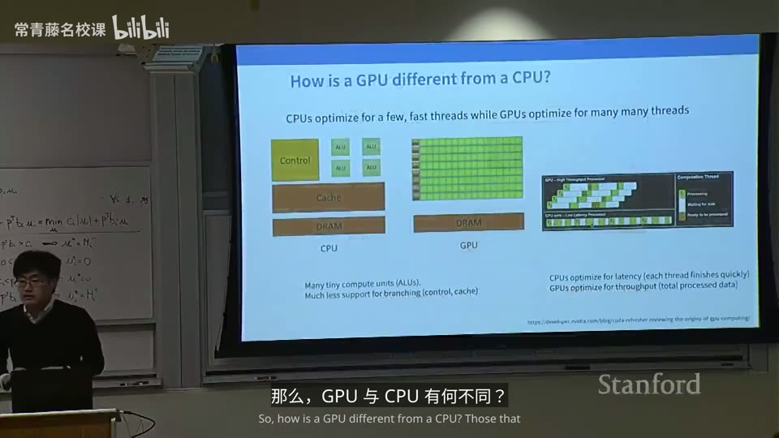 |
| 但对于其余听众，我认为理解二者差异背后的模型（或者说某种意义上的设计理念）至关重要。CPU 旨在实现快速的串行执行，适用于具有复杂分支逻辑、复杂条件判断和复杂控制流的场景。因此一般而言，CPU 拥有庞大的控制单元， [【跳转到 06:24】](https://www.bilibili.com/video/BV11LEA6eEuj/?p=5&t=384) | 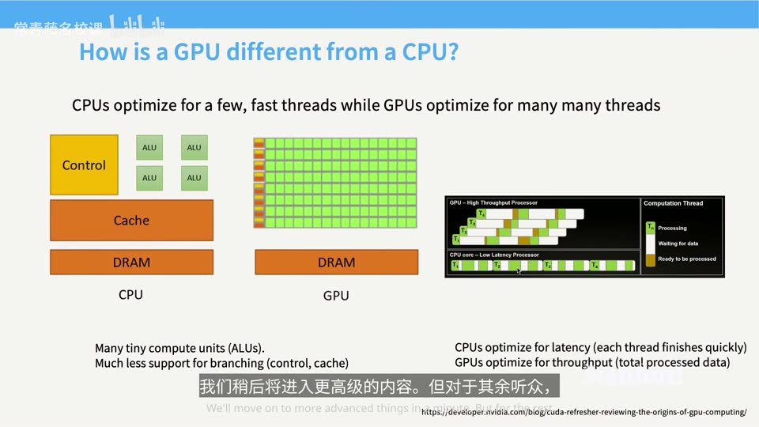 |
| 以及少量能够执行数学或其他运算的算术逻辑单元（ALU），但它旨在实现极快的运行速度，对吧？因此你希望尽可能快，并保持低延迟：从接收指令到完成指令的时间间隔应当非常短。这大致就是 CPU 的设计哲学。相比之下，GPU 的核心在于吞吐量。我认为右侧的图很好地图解了当这些设计理念改变时，最终会得到怎样的结果。 [【跳转到 06:42】](https://www.bilibili.com/video/BV11LEA6eEuj/?p=5&t=402) |  |
| 在 GPU 上，你提交一个任务后，它可能要跑很久才能结束。你可能会处理一个任务然后暂停，接着去处理另一个任务，然后再回到前一个任务继续处理。不过总的来说，虽然单个任务跑得不快，但所有任务加起来的总吞吐量是非常大的。实现这一点的关键在于拥有大量轻量级核心，因此 GPU 的芯片中集成了数百个计算单元，所有这些单元都可以并行执行。与 CPU 相比， [【跳转到 07:07】](https://www.bilibili.com/video/BV11LEA6eEuj/?p=5&t=427) | 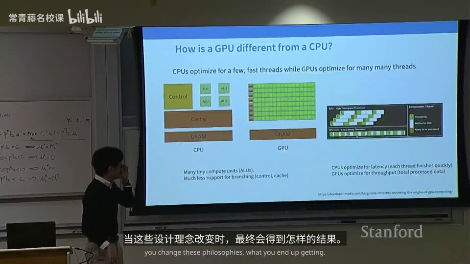 |
| 这是一种截然不同的编程和思维方式。懂了吗？我想让大家对 GPU 不再感到神秘。 [【跳转到 07:32】](https://www.bilibili.com/video/BV11LEA6eEuj/?p=5&t=452) | 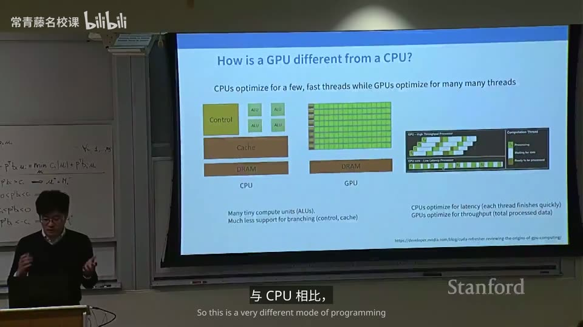 |
| 我不希望你把它仅仅视为 nvidia-smi 上显示的一堆文本数据，我希望你能在脑海中勾勒出 GPU 硬件的大致模样。我觉得这张图常用来直观地解释什么是 GPU，它很清晰地展示了 GPU 内部的工作机制。GPU 的基本组成单元是 SM，也就是流式多处理器；流式多处理器有点像是一个核心，它是一个独立的计算单元， [【跳转到 07:38】](https://www.bilibili.com/video/BV11LEA6eEuj/?p=5&t=458) | 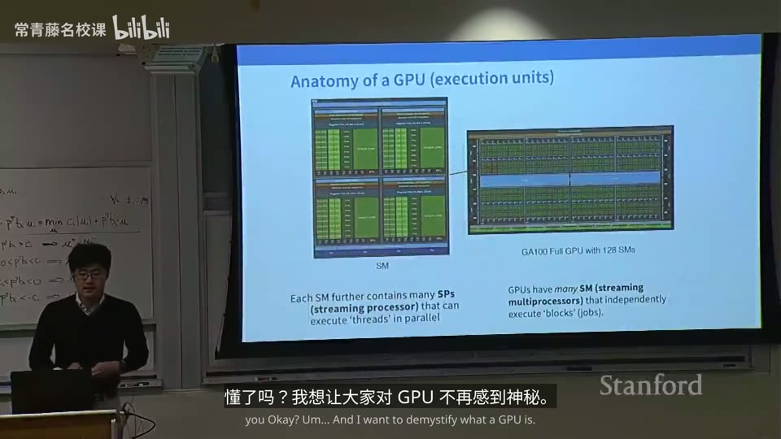 |
| 内部包含一些子组件用于加速计算，它可以连接并访问特定类型的内存。所以每个 SM 基于并行化的理念，并不是一个单一的计算单元，它内部包含流式处理器，能够并行执行不同的线程。不过 SM 是一个独立的计算单元，等到我讲到编程模型时大家就会明白为什么了。你可以把每个 SM 几乎看作一个核心，GPU [【跳转到 08:03】](https://www.bilibili.com/video/BV11LEA6eEuj/?p=5&t=483) | 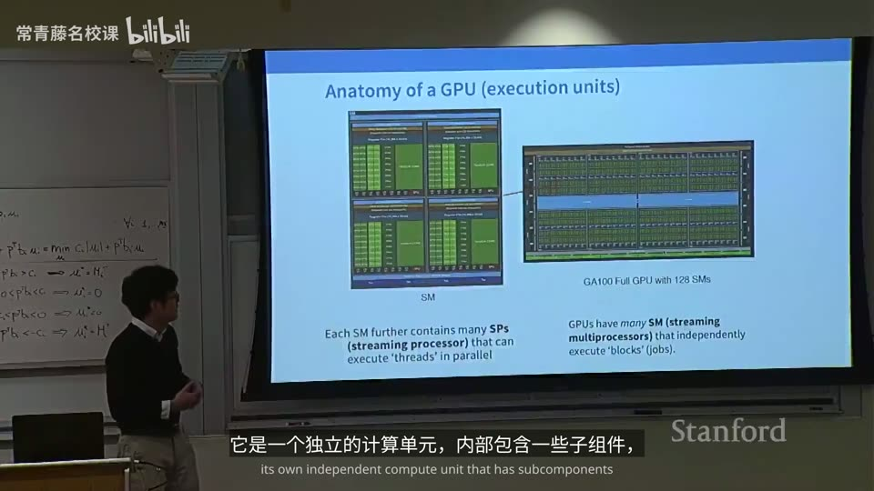 |
| 拥有海量的 SM，比如 H100 就包含 132 个 SM。每个 SM 都可以独立编程并独立执行不同的任务，它们还能访问外部的某种全局内存。 [【跳转到 08:28】](https://www.bilibili.com/video/BV11LEA6eEuj/?p=5&t=508) | 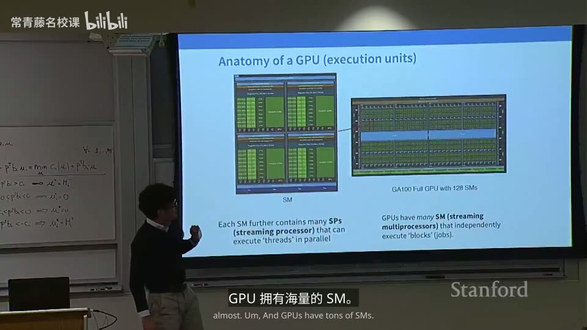 |
| 另外我们会看到，这大致就是 GPU 的计算部分。好， [【跳转到 08:36】](https://www.bilibili.com/video/BV11LEA6eEuj/?p=5&t=516) | 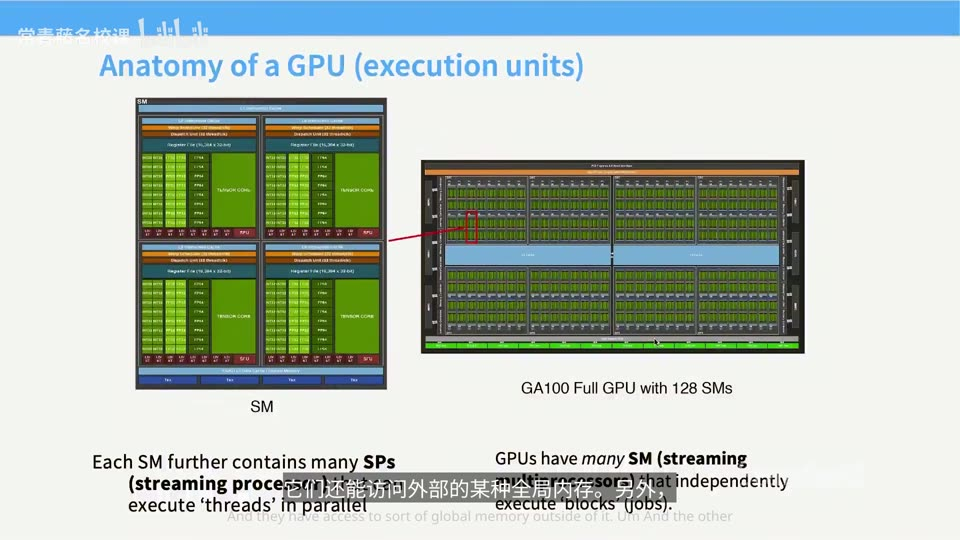 |
| 而且，整堂课我们会看到，这里真正关键的不仅在于计算，更在于内存，对吧？现代硬件和 LLM 优化核心其实都在于内存。所以我们需要搞清楚内存有哪些种类，以及它们分别位于何处。说到内存，其实分好几种：比如有连接到 GPU 的不同层级的缓存，还有寄存器，它容量更有限， [【跳转到 08:41】](https://www.bilibili.com/video/BV11LEA6eEuj/?p=5&t=521) |  |
| 但速度更快；此外还有全局内存或高带宽内存。从这张表里你可以看到，这是有人做的基准测试，我记得是 A100 的延迟数据。L1 和共享内存速度极快，对吧？大概 20~30 个周期就能从中读取并获取数据。如果你访问的是 L2 缓存，就慢得多了；而如果你访问的是全局内存，那会比 L1 缓存慢十倍，这会带来巨大的速度差异。这种全局内存也就是高级程序员通常所说的 GPU 内存。 [【跳转到 09:06】](https://www.bilibili.com/video/BV11LEA6eEuj/?p=5&t=546) | 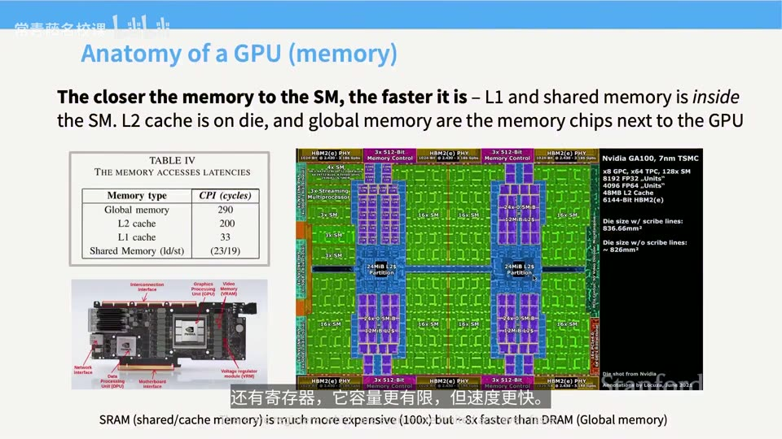 |
| 当 H200 说它有 141GB 显存时，指的就是全局内存，你指的并不是共享内存或 L1 缓存。那么从物理位置上看，它们都在哪儿？全局内存通常位于计算单元外部，是这类内存芯片；而 L2 和 L1 缓存在物理上位于芯片内部。所以这是 GPU 芯片的示意图，你看到的这些绿色方块就是 SM。 [【跳转到 09:31】](https://www.bilibili.com/video/BV11LEA6eEuj/?p=5&t=571) |  |
| 你在这里看到 L2，而 L1 位于每个 SM 内部，所以它们在物理位置上离计算单元更近，这也是延迟显著更低的原因。你可能会想：既然共享内存这么好，那为什么不干脆用共享内存造一整块芯片呢？成本要高得多，大概是几百倍，而且受限于这些存储器的构造方式， [【跳转到 09:56】](https://www.bilibili.com/video/BV11LEA6eEuj/?p=5&t=596) |  |
| 功耗也大得多，对吧？所以这就是为什么在造实用加速器时，通常你不会想只堆砌大量的共享内存，而是想要某种更高层级的东西——内存层级，对吧？然后高效地利用它。我觉得 Groq（就是最近被 NVIDIA 收购的那家）的设计就是纯粹依赖这些海量的 SRAM。对于推理这类特定工作负载， [【跳转到 10:17】](https://www.bilibili.com/video/BV11LEA6eEuj/?p=5&t=617) | 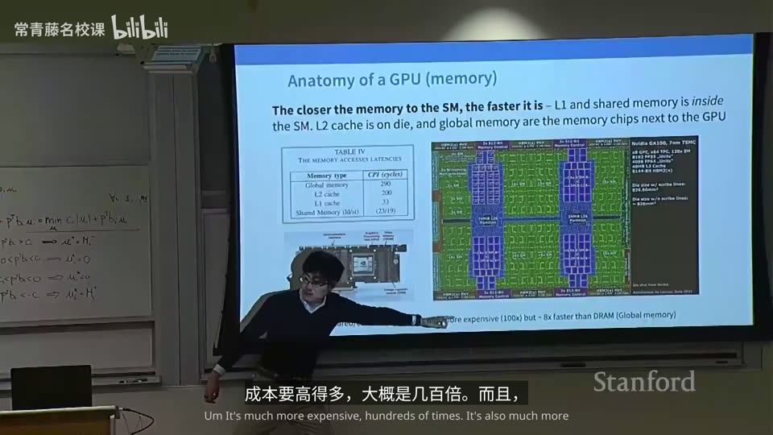 |
| 这确实很有帮助。但即便如此，对于大多数加速器来说，你还是得遵循这种层级结构，这样才能让程序跑得更快。谢谢。 [【跳转到 10:42】](https://www.bilibili.com/video/BV11LEA6eEuj/?p=5&t=642) | 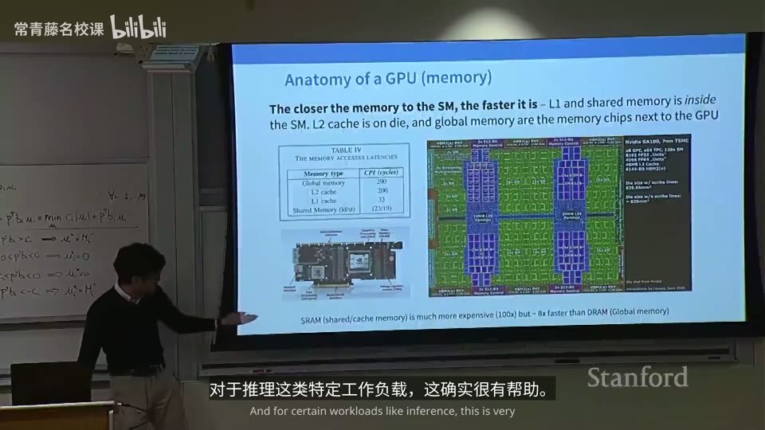 |
| 所以共享内存还有 L1 缓存，我想它们的工作机制其实不太一样：缓存本质上只是一个用于存储最近访问过的数据元素的机制。 [【跳转到 10:52】](https://www.bilibili.com/video/BV11LEA6eEuj/?p=5&t=652) |  |
| 共享内存是一种可编程元素，你会直接与之交互，可以往里读写数据。好的，明白了。 [【跳转到 11:05】](https://www.bilibili.com/video/BV11LEA6eEuj/?p=5&t=665) | 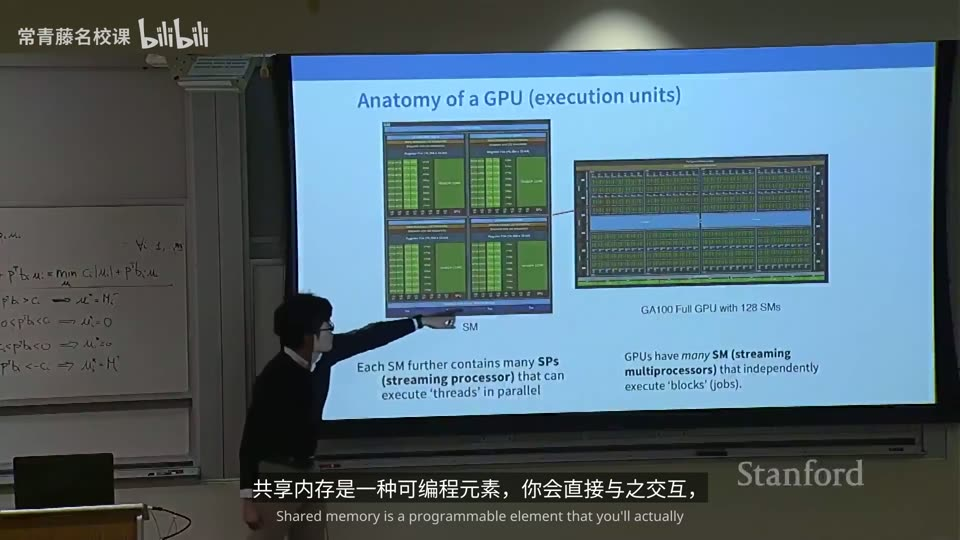 |
| 对，这是关于内存的讨论，请牢记这一点，因为内存层次结构会反复出现，这是一个非常重要的概念。现在，好的，我们已经建立了硬件心智模型，现在我们将开始讨论 GPU 的软件和编程模型。在 GPU 的执行模型中有三个重要的参与者：首先是线程。如果你熟悉任何形式的多线程编程，你就知道线程是什么。在 GPU 中， [【跳转到 11:11】](https://www.bilibili.com/video/BV11LEA6eEuj/?p=5&t=671) | 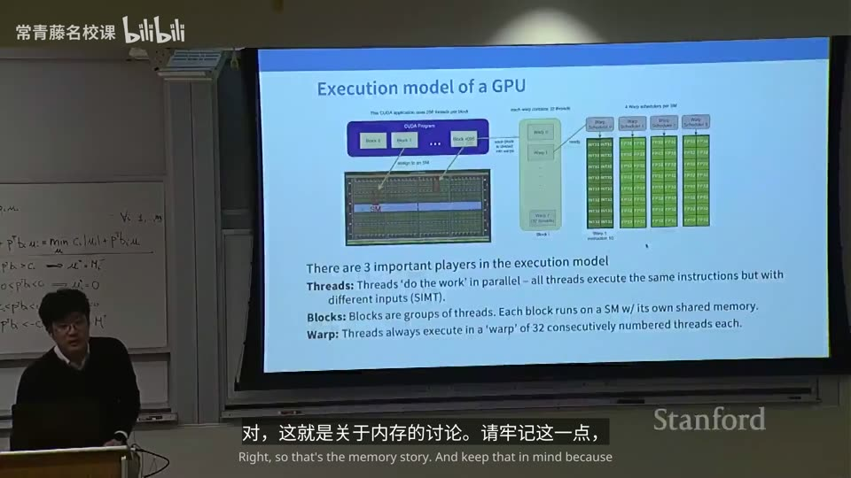 |
| 关于线程的一个重要特点是它们遵循 SIMT 模型，这意味着你所有的线程都在执行完全相同的指令，它们会有不同的输入。这意味着线程实际上可以各自完成不同的有用工作，但它们执行的指令必须完全相同。这对代码效率以及编程模型都有重要影响。如果线程能做的事五花八门，编程就会极其困难；GPU 正是在可编程性和效率之间做出的权衡。 [【跳转到 11:36】](https://www.bilibili.com/video/BV11LEA6eEuj/?p=5&t=696) | 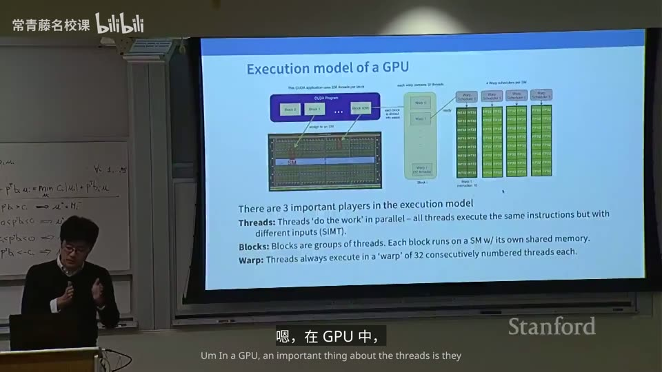 |
| 线程块（thread block）就是一组线程。它之所以重要，是因为它保证运行在同一个 SM 上——请记住，SM 拥有共享内存。因此你可以把线程理解为在并行地执行工作，块可以访问共享的内存池。这在后面讨论分块（tiling）时会变得非常重要，那时这些块会重用相同的内存片段。最后，warp 本质上是 GPU 内部调度的基本单位， [【跳转到 12:01】](https://www.bilibili.com/video/BV11LEA6eEuj/?p=5&t=721) | 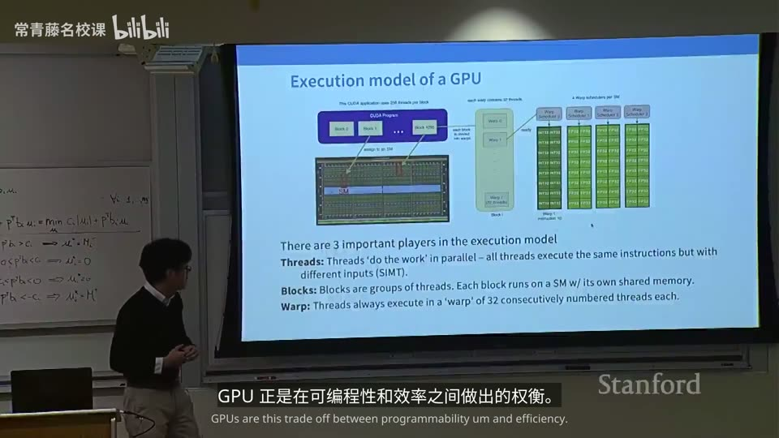 |
| 线程会以连续编号的 32 个线程为一组来执行，这就是一个 warp，对吧？这样能减少调度器在决定运行哪些线程时的开销。不过这些算是 GPU 的三个核心术语。我可能会说，比如会有不同的 warp 在执行，这就是我刚才说的意思：它是 32 个线程协同执行的基本单位。对，你刚才说所有线程都执行相同的指令， [【跳转到 12:26】](https://www.bilibili.com/video/BV11LEA6eEuj/?p=5&t=746) | 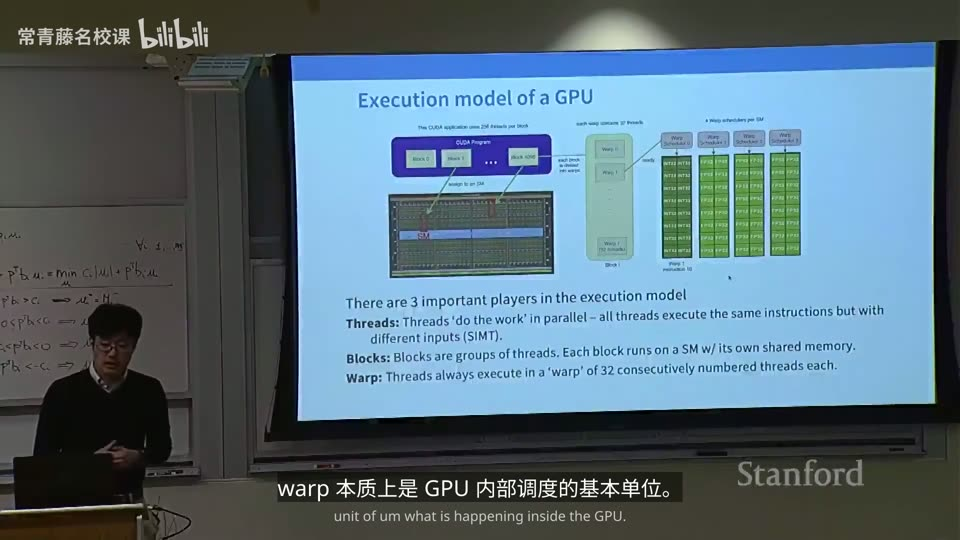 |
| 那是指一个 block 里的所有线程，还是一个 warp 里的所有线程？warp 里的所有线程都会执行。 [【跳转到 12:51】](https://www.bilibili.com/video/BV11LEA6eEuj/?p=5&t=771) | 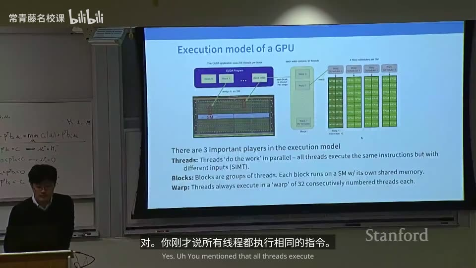 |
| 很好。嗯，对，那调度器是决定下一条指令分配给哪个 warp 吗？对，或者说调度器决定下一个要执行的是哪个 warp， [【跳转到 12:57】](https://www.bilibili.com/video/BV11LEA6eEuj/?p=5&t=777) | 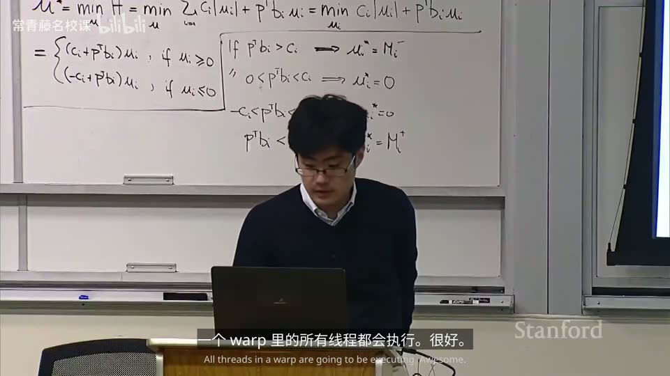 |
| 关于哪个作业之类的。好，好的。在 GPU 的内存模型中， [【跳转到 13:05】](https://www.bilibili.com/video/BV11LEA6eEuj/?p=5&t=785) | 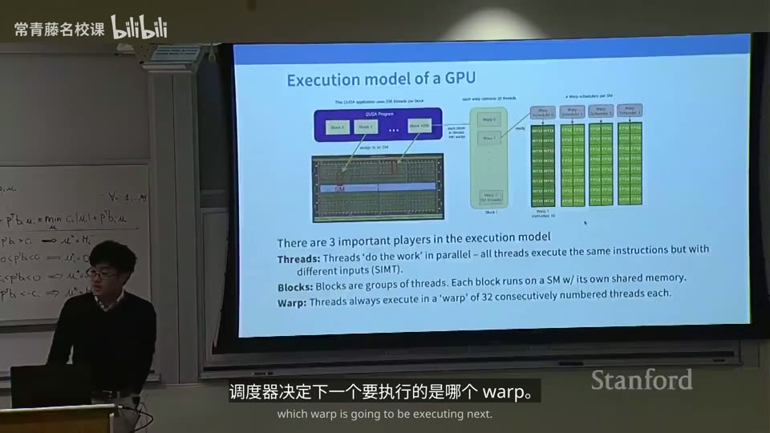 |
| 设备代码可以从寄存器中读取数据。寄存器是速度最快、局部性最强的存储单元之一，通常用于存储诸如起始和结束内存地址等信息，这是寄存器的一种常见用途。此外还有局部内存，局部内存仅限于单个流多处理器（SM）内部使用；共享内存则可以在线程块（block）内部进行访问， [【跳转到 13:10】](https://www.bilibili.com/video/BV11LEA6eEuj/?p=5&t=790) | 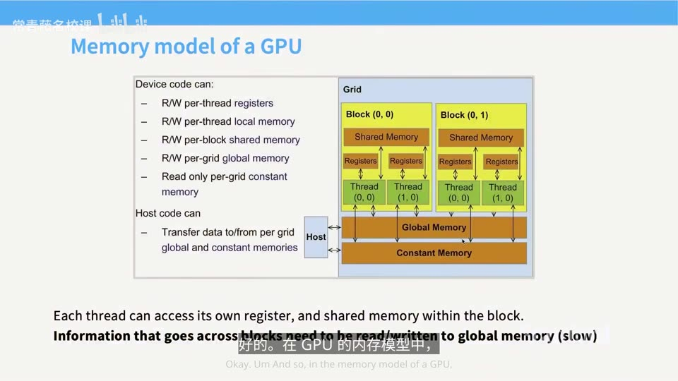 |
| 因此若需在线程间传输数据，或希望在线程间复用信息，这些数据应存储在共享内存中。当然还可以从全局内存及距离较远的 DRAM 读取数据，前提是你能接受因等待数据从全局内存传输而产生的延迟开销。此外还有常量内存，我在各种编程实践中见得不多， [【跳转到 13:35】](https://www.bilibili.com/video/BV11LEA6eEuj/?p=5&t=815) |  |
| 但它也可供使用。现在你甚至可以将数据传输到主机内存，再从主机内存传回来——这里说的主机内存指的是位于机器上的 CPU 内存。如果你的需求超过了 GPU 的容量，就可以进行这种卸载操作。这基本上就是你能在内存里做的一系列事情。其实这种内存模型最核心的一点在于：只要超出共享内存的范围，速度就会变慢。因此把块分组以减少全局内存的读取次数…… [【跳转到 14:00】](https://www.bilibili.com/video/BV11LEA6eEuj/?p=5&t=840) | 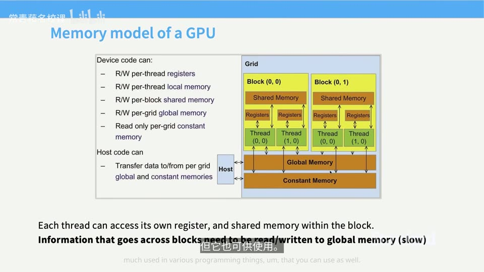 |
| 将是贯穿这堂课的重点。谢谢。好了， [【跳转到 14:25】](https://www.bilibili.com/video/BV11LEA6eEuj/?p=5&t=865) | 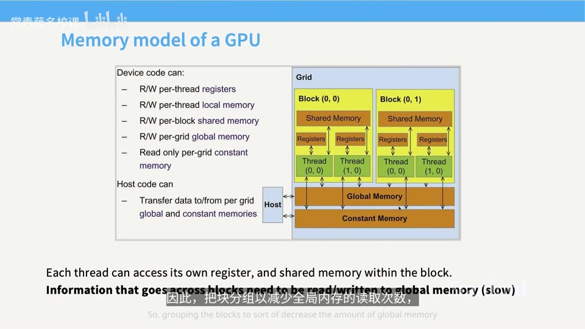 |
| 接下来我用两页幻灯片来讲讲 TPU。这堂课的主要内容是关于 GPU 的，主要是因为我觉得大家以后编写代码、构建模型时大概率用的都是 GPU；但我认为讨论 TPU 也非常重要：一方面是因为我觉得 TPU 很酷，而且正变得越来越流行，另一方面是因为 TPU 算是 GPU 的另一种演进路径，你可以从中看出两者的异同，了解 TPU 是如何工作的， [【跳转到 14:30】](https://www.bilibili.com/video/BV11LEA6eEuj/?p=5&t=870) |  |
| 也非常有趣，对吧？其实有个很有意思的地方：TPU 和 GPU 在宏观层面上非常相似，这有点像趋同进化——如果你想造一个能效高的东西，最后往往会殊途同归。所以你心里要记住，TPU 和 GPU 最核心的区别是：TPU 在某种意义上更简单，它们更专门针对机器学习任务做了优化，控制单元更轻量，矩阵乘法单元则大得多。 [【跳转到 14:55】](https://www.bilibili.com/video/BV11LEA6eEuj/?p=5&t=895) |  |
| 所以它们的基本结构和我接下来要讲的 GPU 是一样的。在 GPU 里，它们有专门的电路来做矩阵乘法，有能并行处理向量运算的组件，还有某种控制系统。它们的内存结构看起来也很相似：都有一种叫高带宽内存的慢速内存，接着还有一种更快的本地内存，叫 SRAM，也就是共享内存，对吧？所以看起来跟 GPU 的架构特别像，其实区别主要在于这些部件的大小以及操作的灵活性。 [【跳转到 15:20】](https://www.bilibili.com/video/BV11LEA6eEuj/?p=5&t=920) | 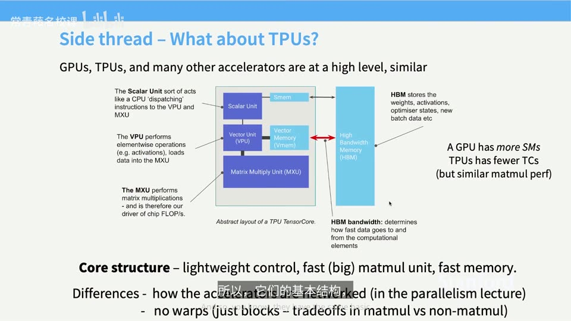 |
| 还有这些细节我今天就不细说了。主要区别在于这些加速器的网络连接。所以如果你在想 TPU 和 GPU 到底差在哪，其实最大的区别在于网络连接，而不是单个芯片本身——因为单说一个芯片就是用来做矩阵乘法的。 [【跳转到 15:45】](https://www.bilibili.com/video/BV11LEA6eEuj/?p=5&t=945) | 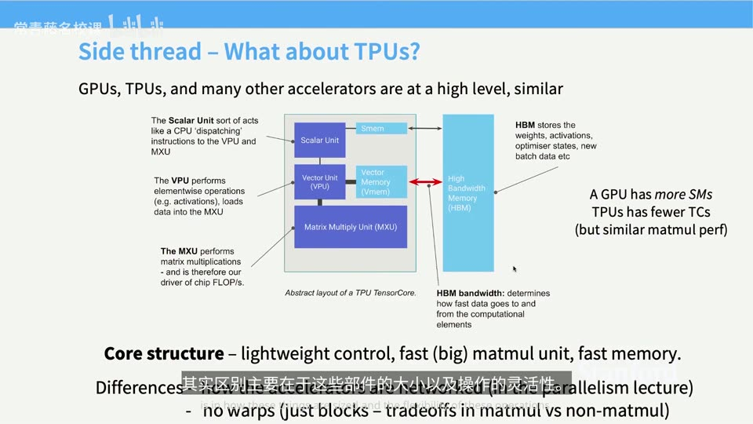 |
| 这是出自那本讲 JAX 的指南书，写得特别好。里面有章节讲 GPU，还有两个表格，主要讲怎么把 GPU 的思路对应到 TPU 上。我们今天讲的左边这些内容， [【跳转到 16:01】](https://www.bilibili.com/video/BV11LEA6eEuj/?p=5&t=961) | 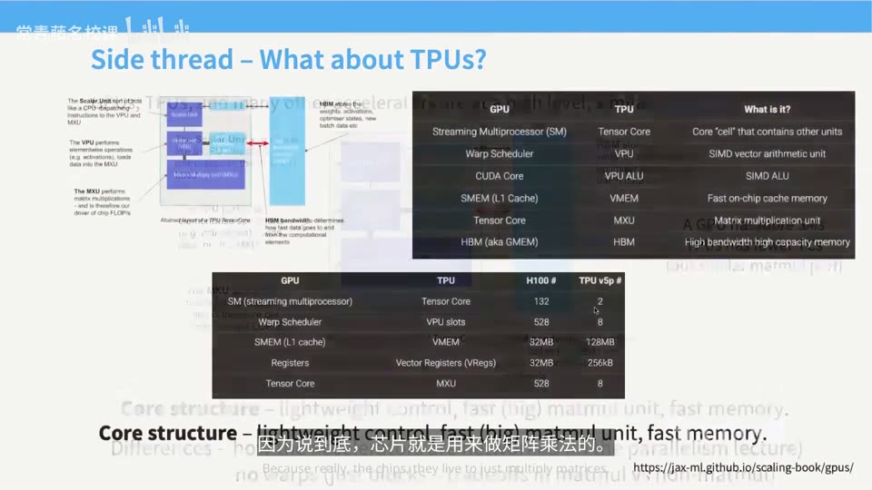 |
| 你都可以直接对应到 TPU 上。不过讲到这儿大家要注意一个重点：GPU 里的每个概念在 TPU 里都能找到对应的概念，这种映射其实相当精确。比如 GPU 里的张量核心（也就是矩阵乘法单元）几乎完全对应 TPU 张量核心里的 MXU，即矩阵乘法单元。如果我们要抠那些极其细微的细节，会发现它们用的其实是同一套底层电路， [【跳转到 16:15】](https://www.bilibili.com/video/BV11LEA6eEuj/?p=5&t=975) | 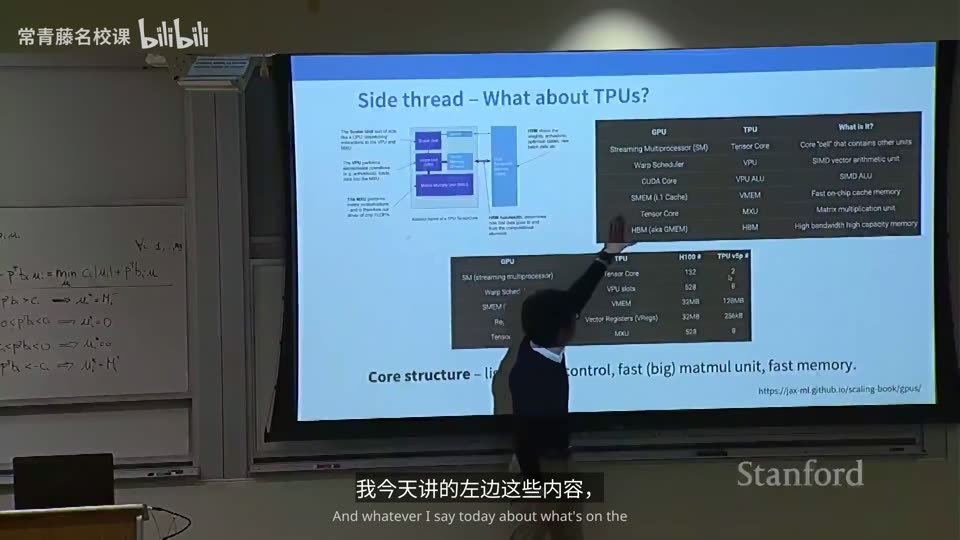 |
| 它们都属于所谓的脉动阵列，也就是通过数据流式进出来完成矩阵乘法的那种结构。（课堂问答）对了，你知道 GPU 和 TPU 的典型服务器规模有多大吗？ [【跳转到 16:40】](https://www.bilibili.com/video/BV11LEA6eEuj/?p=5&t=1000) | 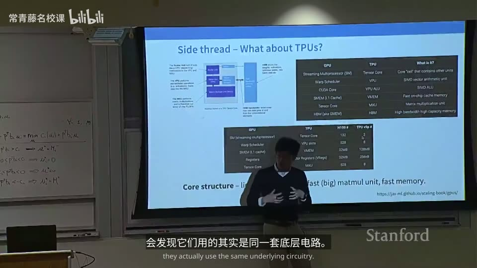 |
| 这个我一下答不上来，抱歉，我得去查一下。行，好的。所以这两者最主要的区别就在于我们所拥有的不同单元的数量。所以如果我们看一下……（课堂问答）对了，在继续往下讲之前，我得先提一件特别特别容易让人搞混的事：TPU 把它的流式多处理器叫做张量核心，而 GPU 把它的矩阵乘法单元也叫张量核心。 [【跳转到 16:51】](https://www.bilibili.com/video/BV11LEA6eEuj/?p=5&t=1011) | 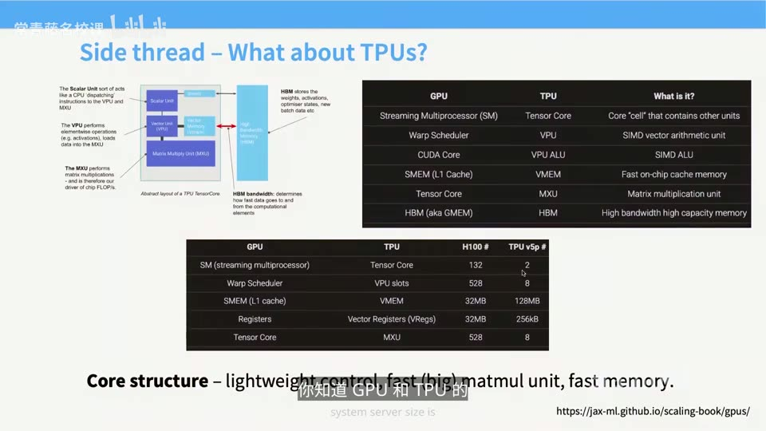 |
| 名字一模一样，所以你得靠上下文来区分：如果说 TPU 的张量核心，那指的是处理器；如果说 GPU 的张量核心，那指的是做矩阵乘法的单元。所以你看 GPU 的话，比如典型的 H100 可能有 132 个左右的流式多处理器，处理器数量很多；而 TPU 只有两个单元，对吧？只有两个独立的单元在并行运行。现在如果我们只看矩阵乘法单元，GPU 有 528 个， [【跳转到 17:16】](https://www.bilibili.com/video/BV11LEA6eEuj/?p=5&t=1036) |  |
| 而 TPU 只有八个——这些单元大致按可比的比例缩放。为什么会这样呢？TPU 靠的是规模更大但数量较少的矩阵乘法单元，而 GPU 靠的是规模较小但数量众多的矩阵乘法单元。你可以这样想象：如果你拥有许多较小的矩阵乘法单元，它就会带给你更高的灵活性，你可以编程让它们执行各种任务；而 TPU 则只能用于大规模矩阵乘法。 [【跳转到 17:41】](https://www.bilibili.com/video/BV11LEA6eEuj/?p=5&t=1061) | 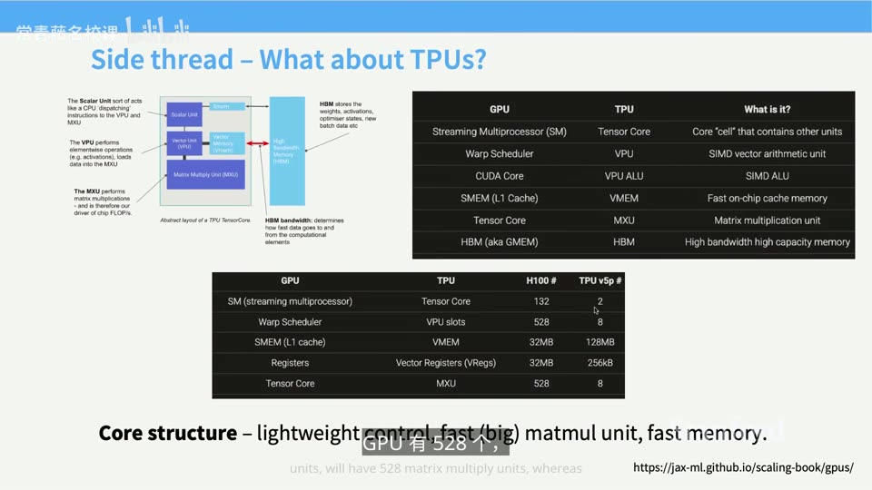 |
| 因此在我最近撰写的一篇论文中出现了有趣的情况：我们做了一遍批量大小的扫描，测试范围一直降到 64 就停在了 64。为什么呢？因为张量核心不接受低于 64 的输入，那必须做大规模矩阵乘法。这就是主要区别。但正如你看到的，GPU 和 TPU 有许多相似之处：它们都依赖快速内存与慢速内存之间的层级结构，并且都有矩阵乘法单元。 [【跳转到 18:06】](https://www.bilibili.com/video/BV11LEA6eEuj/?p=5&t=1086) | 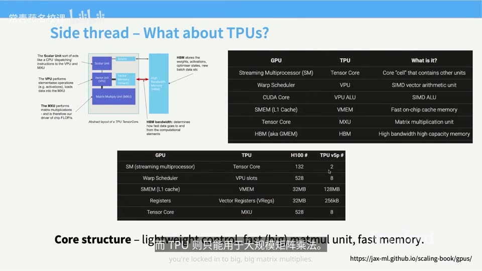 |
| 正因为如此，我今天讲授的核心概念在 GPU 和 TPU 之间是通用的，基本思路始终是一样的。这其实是一种趋同进化：能以高性价比分配内存的方法是有限的，能极快执行矩阵乘法的方法也同样有限。虽然有些涉及决策的地方有所不同，但除此之外，最终结果殊途同归。好的，很好。这就是 GPU。 [【跳转到 18:31】](https://www.bilibili.com/video/BV11LEA6eEuj/?p=5&t=1111) |  |
| 没错，很好。我认为 GPU 取得了巨大成功，因为它让矩阵乘法这类任务的扩展变得很容易：如果你想要更高的吞吐量，只要不断增加流多处理器（SM）就行，只要内存带宽能支撑这些 SM，吞吐量就会越来越高。至于编程这块，我们一般不去多想，但它简单得容易让人掉以轻心。如果你试着去写 PTX 这种底层机器码，其实也是可行的，因为它全都是 SIMT 架构，你并不需要去编程每一个单独的线程， [【跳转到 18:52】](https://www.bilibili.com/video/BV11LEA6eEuj/?p=5&t=1132) | 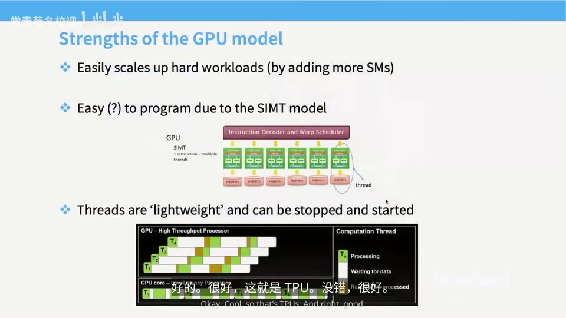 |
| 你只需说："好，这是我的指令，这是我的输入，现在把它们在所有输入上跑一遍。"这可能是大家已经比较熟悉的东西，比如函数式编程之类的。最后说一下线程——我之前没怎么讲，但在做 GPU 编程时，这些线程都非常轻量，它们随时可以暂停或恢复。调度器会判断："好，我有另一个更适合运行的线程"，所以先把你挂起，去跑 [【跳转到 19:17】](https://www.bilibili.com/video/BV11LEA6eEuj/?p=5&t=1157) | 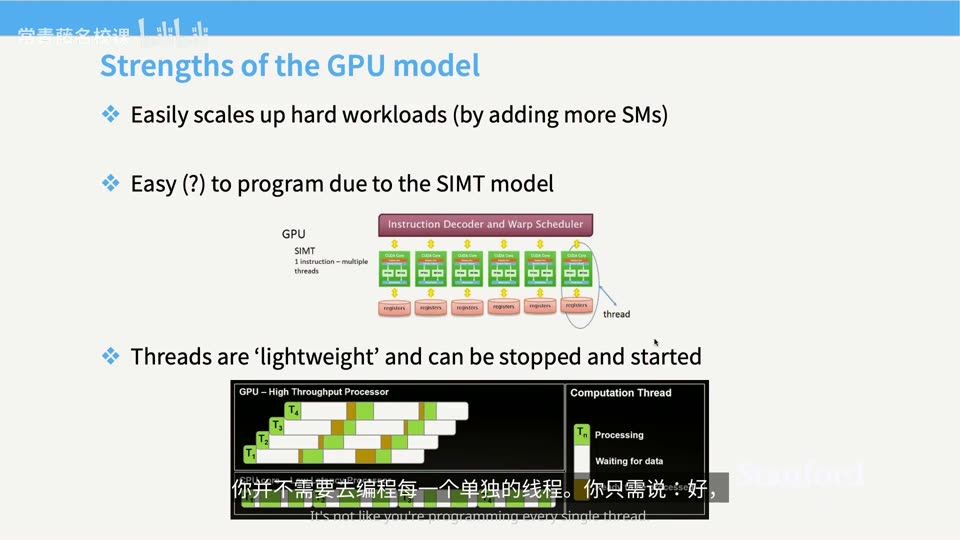 |
| 那个。在这些任务之间切换非常快。如果某些任务停滞，或者存在某种降低吞吐量的特性，这种机制就能带来高得多的吞吐量。 [【跳转到 19:42】](https://www.bilibili.com/video/BV11LEA6eEuj/?p=5&t=1182) | 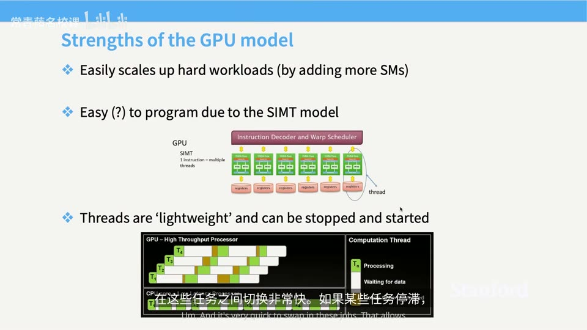 |
| 好了，这就是 GPU 作为硬件模型的优势。它非常成功，而且我认为早在张量核心出现之前，人们就意识到：商用图形硬件所具备的这种大规模并行性对科学计算非常有效。所以这是最早一批探讨用图形硬件做快速矩阵乘法的论文之一。这是一项非常酷的极客式工作：人们发现，虽然已经有现成的着色器， [【跳转到 19:50】](https://www.bilibili.com/video/BV11LEA6eEuj/?p=5&t=1190) | 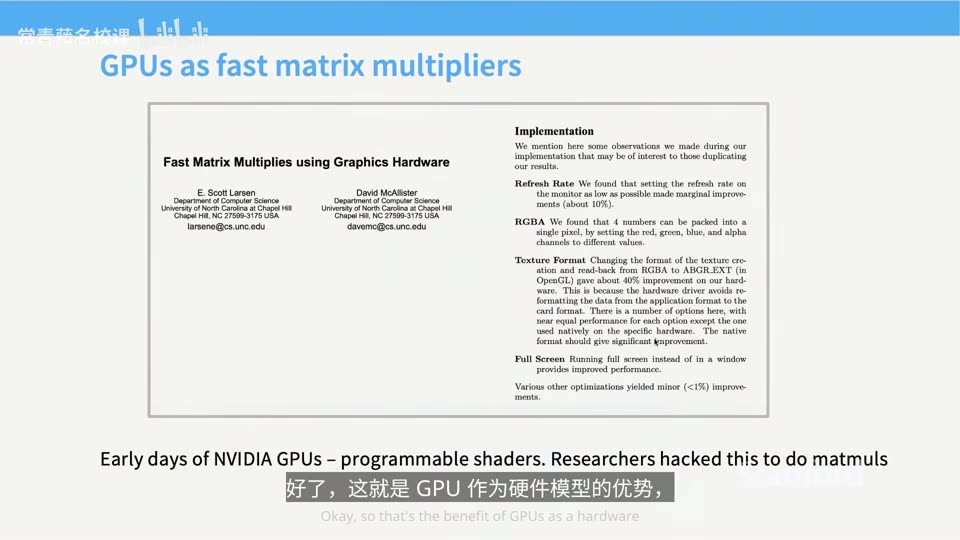 |
| 但我们可以编写特定的着色器来实际实现某种形式的矩阵乘法，不同的渲染设置实际上能带来更快的矩阵乘法。这只是你可以利用的一些非常酷的计算机科学技巧。但如今你不必这样做，也不必手动编程 GPU 来执行矩阵乘法。之所以专门说乘法，是因为从 V100 开始，NVIDIA 决定推出一种专门为你执行矩阵乘法的硬件， [【跳转到 20:15】](https://www.bilibili.com/video/BV11LEA6eEuj/?p=5&t=1215) | 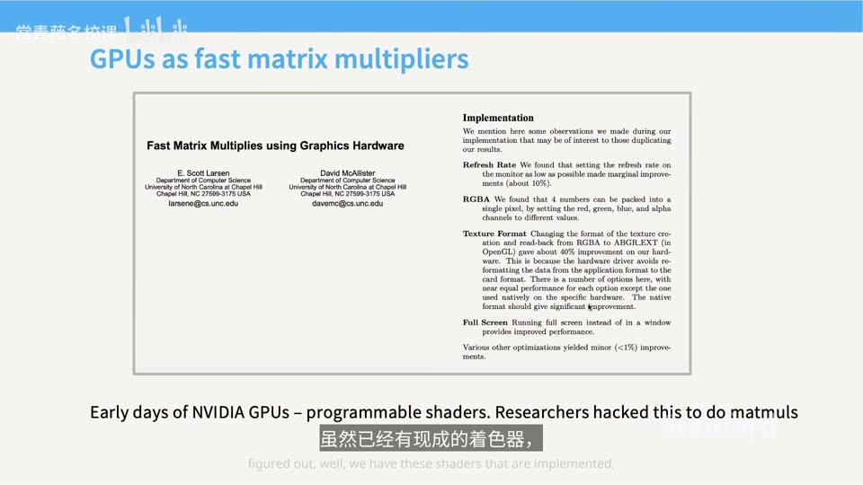 |
| 而一旦这种硬件出现，矩阵乘法便成为机器学习中那个享有特权的操作。所以到了这个阶段，可并行化但非矩阵乘法的操作，与矩阵乘法所能达到的吞吐量之间，存在着巨大差距。因此，这也是为什么我们近期所能看到的任何随算力扩展的机器学习架构，里面都会包含矩阵乘法的原因之一——因为这是你能真正有效获得大量算力吞吐量的唯一途径， [【跳转到 20:40】](https://www.bilibili.com/video/BV11LEA6eEuj/?p=5&t=1240) | 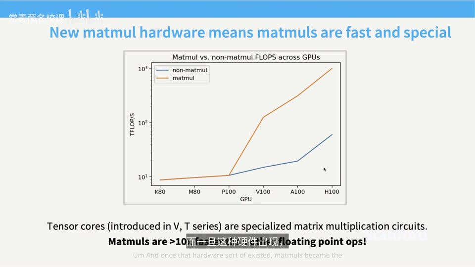 |
| 比你在 GPU 上执行的任何其他浮点运算都要快十倍以上。好，最后我想讲的硬件话题（我想这是本节的最后一张幻灯片）：GPU 的不同组件随时间推移的提升速度各不相同。我们知道 GPU 的速度越来越快，这几乎是个常识，对吧？CPU 也是如此。总体而言，计算吞吐量正变得越来越快， [【跳转到 21:05】](https://www.bilibili.com/video/BV11LEA6eEuj/?p=5&t=1265) | 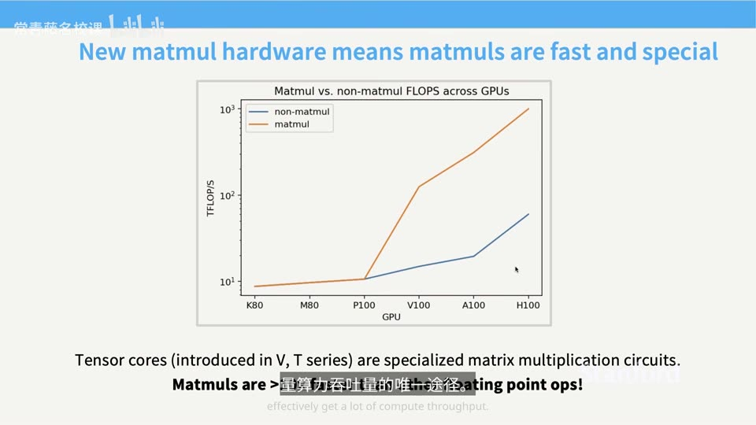 |
| 所以那条灰色线就代表这个，对吧？它增长得相当快，我们在总浮点运算能力上的提升越来越快。绿色代表内存带宽，也就是我们传输数据的速度，它的增长相对缓慢；蓝色代表并行化，也就是我们连接不同 GPU 设备的速度，它的增长也非常缓慢。这意味着什么？这意味着如果你处在 GPU 编程的早期阶段， [【跳转到 21:30】](https://www.bilibili.com/video/BV11LEA6eEuj/?p=5&t=1290) |  |
| 你可能不太会去考虑内存，因为那时计算速度并不比内存传输速度快多少。但现在，随着我们在这张图上越来越往右走，会看到计算与内存之间的差距越来越大。这就是为什么我今天讨论的许多优化都是内存优化。 [【跳转到 21:54】](https://www.bilibili.com/video/BV11LEA6eEuj/?p=5&t=1314) | 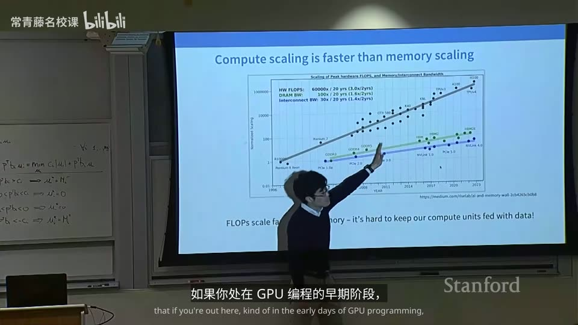 |
| 随着我们在图里越往右走，会越来越多地看到内存和通信瓶颈。因此，要充分利用我们现有的硬件，需要付出越来越多的努力。 [【跳转到 22:08】](https://www.bilibili.com/video/BV11LEA6eEuj/?p=5&t=1328) | 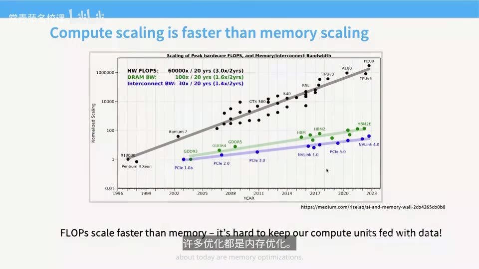 |
| 好了，以上就是我们对 GPU 的一个非常基础的概览。我没法在 21 分钟内让你彻底搞懂 GPU 硬件，但希望你现在对它有了基本的印象，对吧？你可以这样建立心智模型：GPU 是大规模并行的，它们同时执行所有指令；计算能力增长非常快，真的非常非常快，甚至比内存增长得更快。这意味着内存非常重要。既然内存如此重要，我们所做的每件事都必须遵循内存层次结构，对吧？ [【跳转到 22:18】](https://www.bilibili.com/video/BV11LEA6eEuj/?p=5&t=1338) | 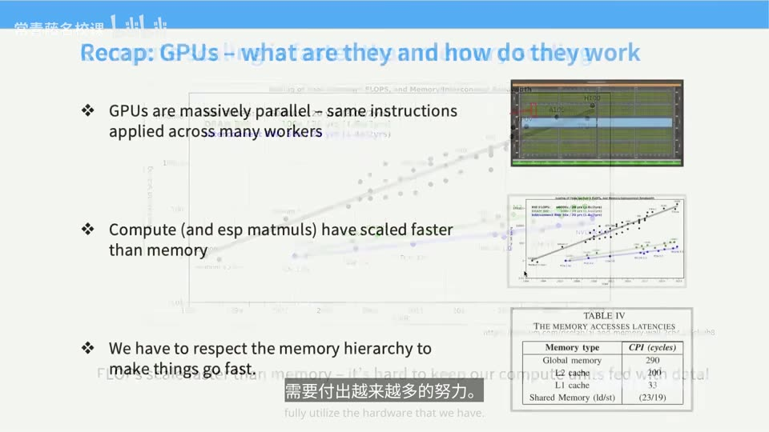 |
| 很多操作都会写入共享内存而非全局内存。所以希望这能帮你建立起对 GPU 的理解；只要有了这个理解，你至少就能掌握消化课程下一部分所需的基础知识。好的，如果大家有关于硬件的问题或其他疑问，我可以先停一下，在进入下一部分之前。请讲。（课堂问答）在 V100 之前是没有矩阵乘法单元的， [【跳转到 22:43】](https://www.bilibili.com/video/BV11LEA6eEuj/?p=5&t=1363) | 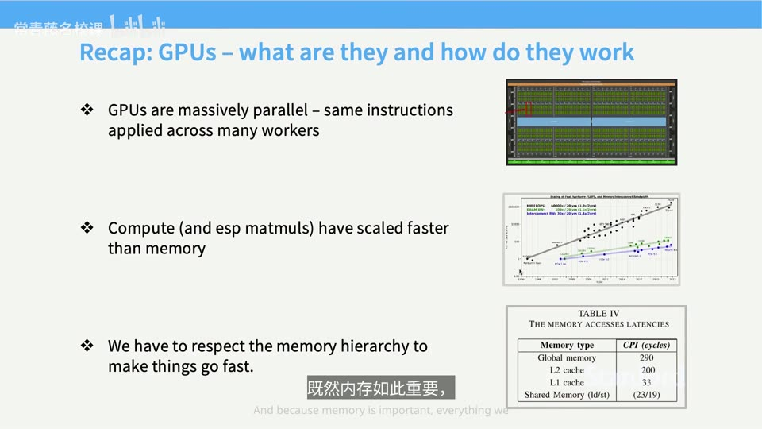 |
| 那时候没有专门做矩阵乘法的 Tensor Core，Tensor Core 是 V100 才有的，在那之前你得自己写代码。 [【跳转到 23:07】](https://www.bilibili.com/video/BV11LEA6eEuj/?p=5&t=1387) | 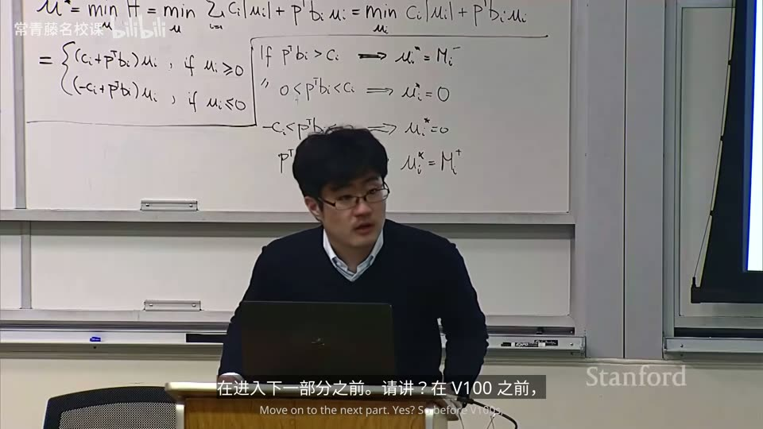 |
| 当然，因为有很多 SM 和 ALU，你依然能跑出不错的吞吐量，但专为矩阵乘法设计的电路确实彻底改变了这一局面。 [【跳转到 23:16】](https://www.bilibili.com/video/BV11LEA6eEuj/?p=5&t=1396) | 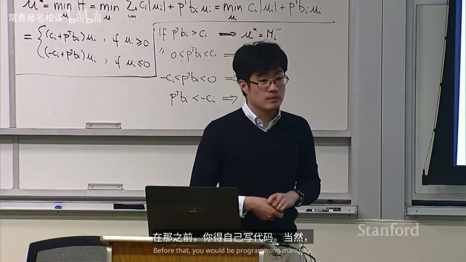 |
| （课堂问答）对，后面那位——共享内存和 L1 缓存有什么区别？ [【跳转到 23:22】](https://www.bilibili.com/video/BV11LEA6eEuj/?p=5&t=1402) | 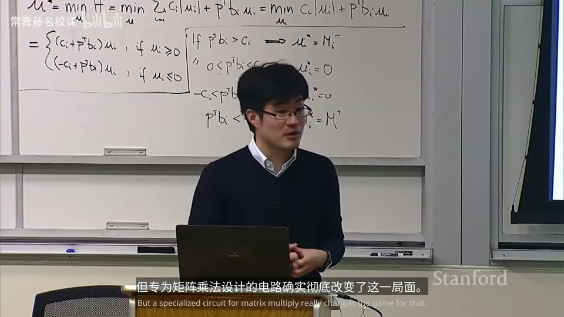 |
| 缓存是独立运作的，你没法直接控制 L1 缓存。谢谢。 [【跳转到 23:27】](https://www.bilibili.com/video/BV11LEA6eEuj/?p=5&t=1407) | 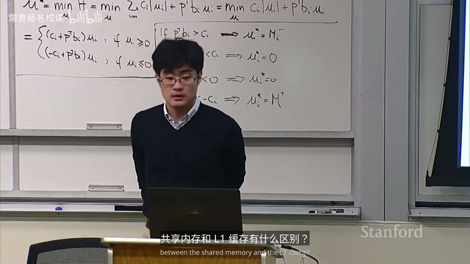 |
| （课堂问答）L2 比 L1 慢，仅仅是因为物理距离更远吗？还是说在其他方面也有区别？对，物理距离确实是很大一部分原因，我记得没错的话， [【跳转到 23:32】](https://www.bilibili.com/video/BV11LEA6eEuj/?p=5&t=1412) | 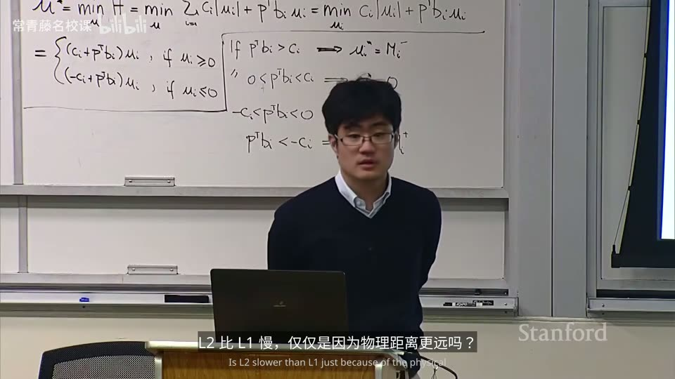 |
| 它们用的都是 SRAM，这也是全局内存慢得多的原因之一；不过物理距离和所用的互联方式才是导致它较慢的原因。 [【跳转到 23:44】](https://www.bilibili.com/video/BV11LEA6eEuj/?p=5&t=1424) | 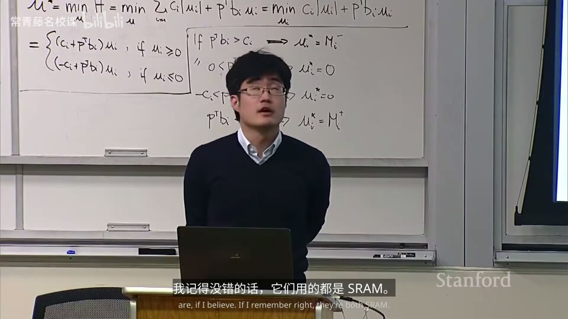 |
| 顺便说一句， [【跳转到 23:49】](https://www.bilibili.com/video/BV11LEA6eEuj/?p=5&t=1429) | 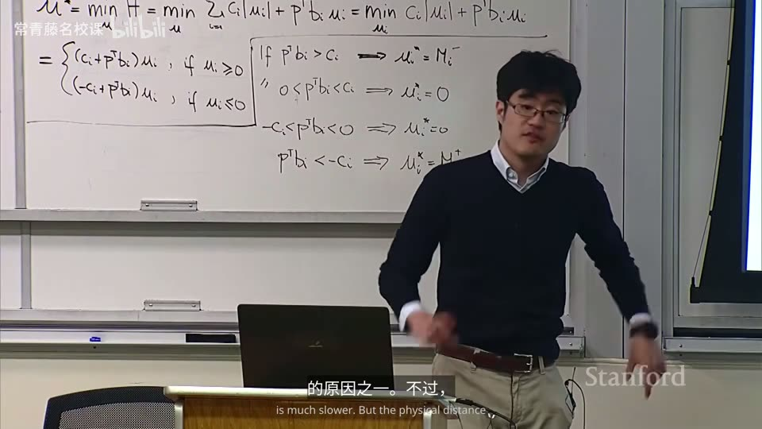 |
| 这并不是固有特性，TPU 中对应的 L2 缓存速度要快得多， [【跳转到 23:54】](https://www.bilibili.com/video/BV11LEA6eEuj/?p=5&t=1434) | 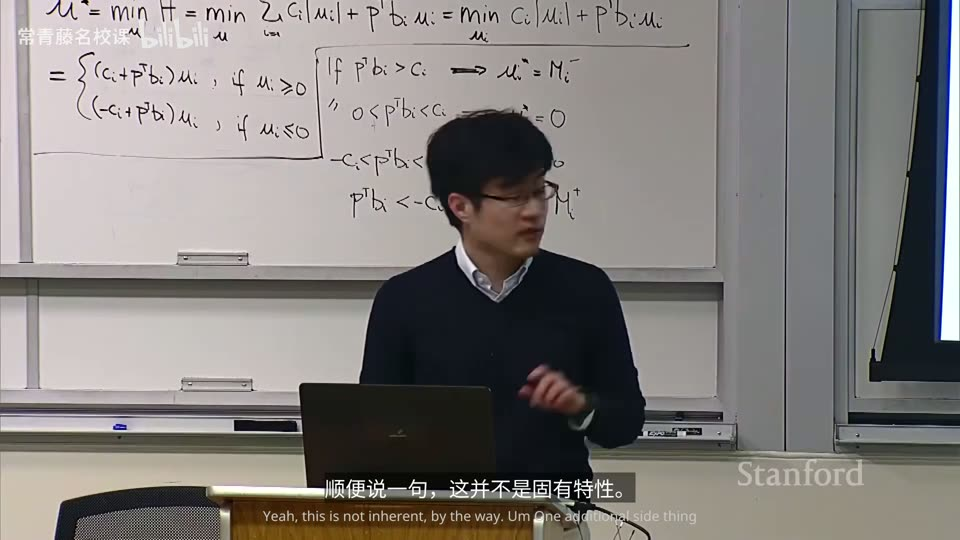 |
| 因为他们在硅片设计上做了不同的权衡来实现这一点，这是他们的卖点之一。如果计算与内存之间的差距持续扩大， [【跳转到 23:59】](https://www.bilibili.com/video/BV11LEA6eEuj/?p=5&t=1439) | 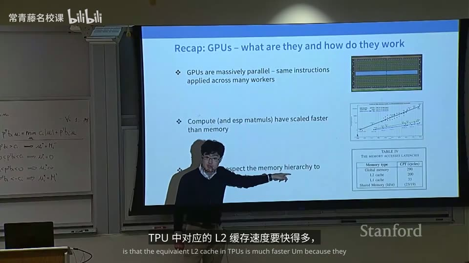 |
| 你认为这会影响未来芯片的布局方式吗？是的， [【跳转到 24:08】](https://www.bilibili.com/video/BV11LEA6eEuj/?p=5&t=1448) | 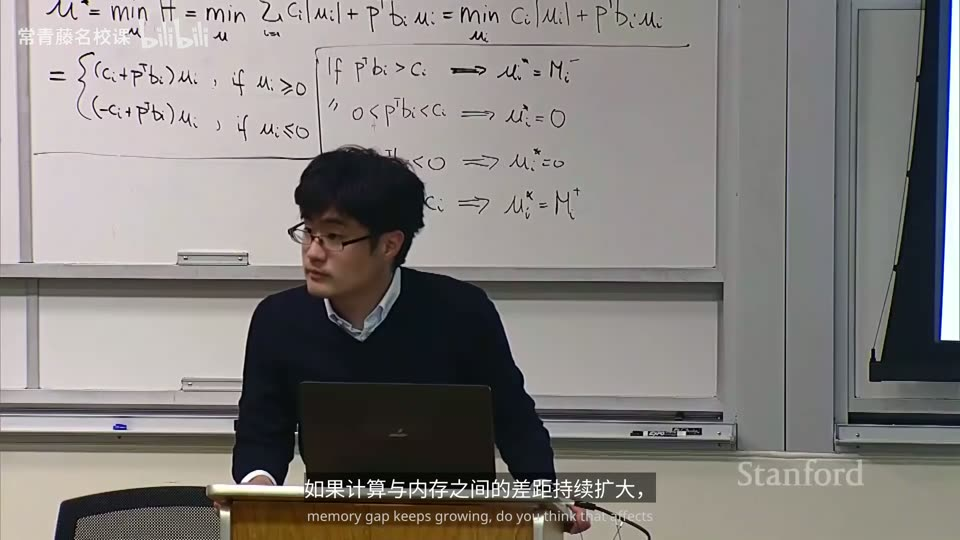 |
| 或者是未来芯片的预算分配方式？有件事我本来真不想谈，但现在你们逼得我不得不谈：那就是硬件在推理方面的情况其实更加疯狂。对， [【跳转到 24:13】](https://www.bilibili.com/video/BV11LEA6eEuj/?p=5&t=1453) | 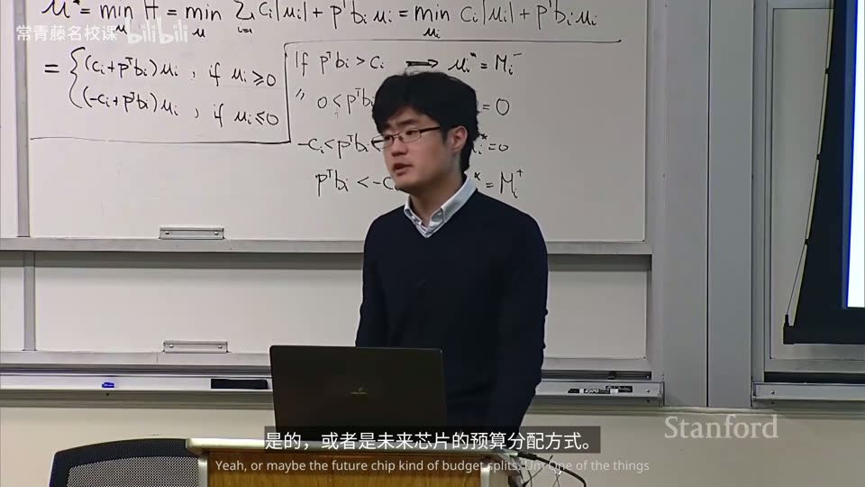 |
| 所以我觉得，人们大概从去年开始做的一件事叫做"预填充与解码解耦"：预填充部分涉及大量矩阵乘法，由一块芯片处理，而推理中的解码部分则更依赖内存带宽。 [【跳转到 24:19】](https://www.bilibili.com/video/BV11LEA6eEuj/?p=5&t=1459) | 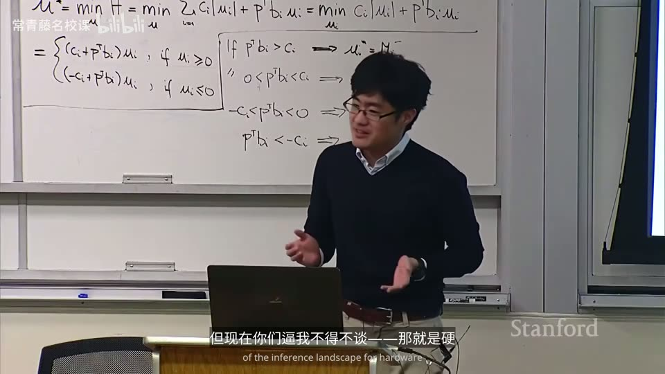 |
| 而那是另一种芯片，对吧？嗯，还有一些模型—— [【跳转到 24:31】](https://www.bilibili.com/video/BV11LEA6eEuj/?p=5&t=1471) | 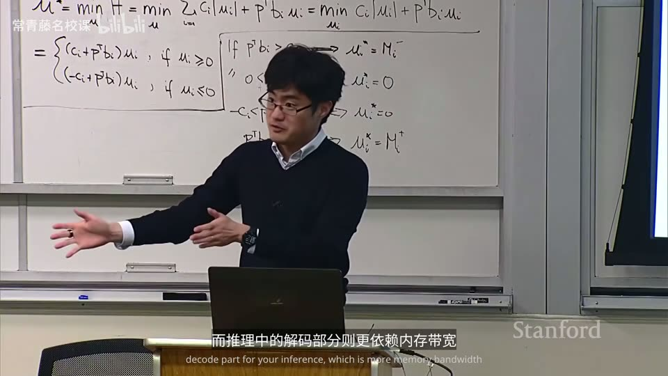 |
| 我想这是某个中国开源模型，他们甚至尝试把不同的层分开处理，所以注意力会被分配到一块专门优化的芯片或加速器上， [【跳转到 24:37】](https://www.bilibili.com/video/BV11LEA6eEuj/?p=5&t=1477) | 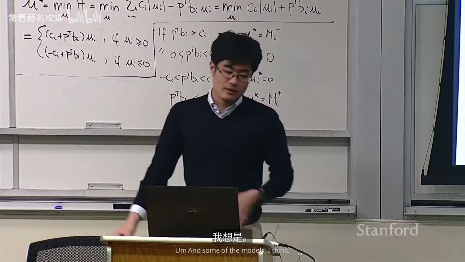 |
| 而 MLP 则分配到另一个加速器。 [【跳转到 24:46】](https://www.bilibili.com/video/BV11LEA6eEuj/?p=5&t=1486) | 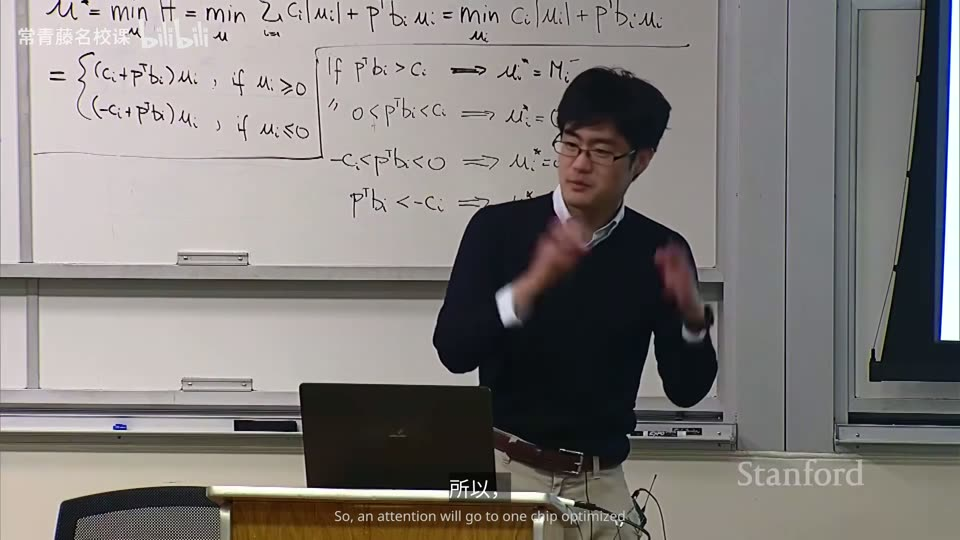 |
| 所以如果这种差距继续扩大，任何能巧妙利用你宝贵高速内存的技巧都会变得极具价值。 [【跳转到 24:51】](https://www.bilibili.com/video/BV11LEA6eEuj/?p=5&t=1491) | 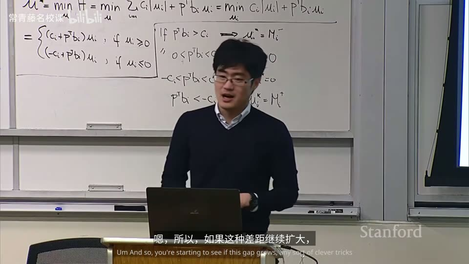 |
| 在推理阶段你会更强烈地感受到这一点，因为推理比训练更受内存的制约。（课堂问答）一个 block 里有多少个 warp？这个我知道……啊，我一时想不起来，我觉得这也取决于硬件。很好。好，那么这就是讲座的第二部分了。现在大家对 GPU 是什么以及它如何工作有了整体认识，接下来我们要讲让 GPU 上的工作负载提速的所有基本技巧。 [【跳转到 24:56】](https://www.bilibili.com/video/BV11LEA6eEuj/?p=5&t=1496) | 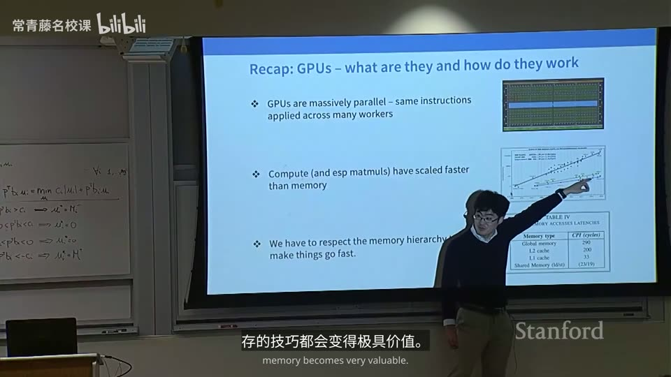 |
| 这些是你可以组合起来实现加速的基本组件。为了让大家保持兴趣，我在本节的一个目标就是在结束时给大家把这张图讲清楚。哎，所以正如我之前说的，这张图很简单：它展示的是我正在相乘的那个方阵的尺寸。我要做的是两个方阵相乘，纵轴表示我每秒处理多少项，所以这是吞吐量；随着横轴向右移动，总体而言吞吐量会上升， [【跳转到 25:21】](https://www.bilibili.com/video/BV11LEA6eEuj/?p=5&t=1521) | 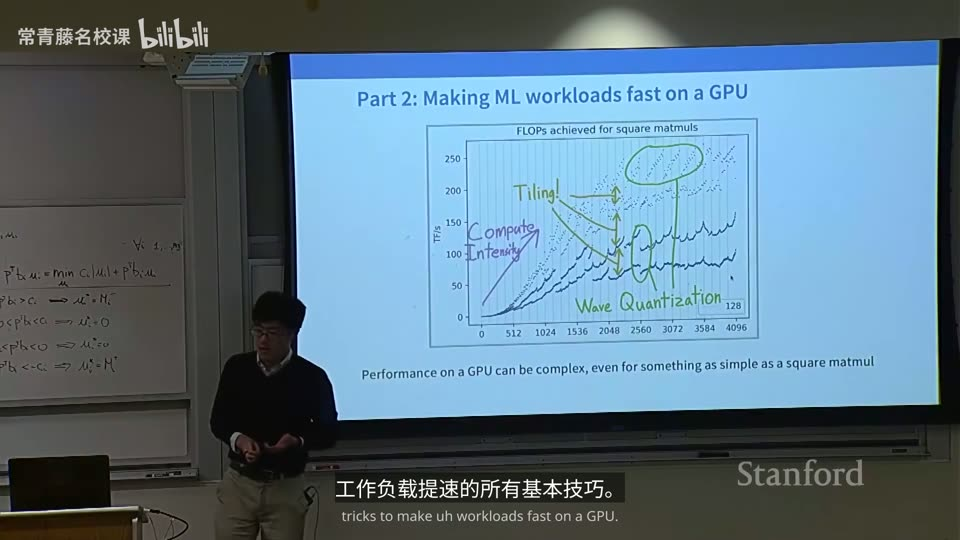 |
| 因为矩阵更大，需要处理的工作量更多，因此如果工作量大幅增加，我就能让硬件保持更高的利用率。但这里存在各种奇怪的规律，我们希望理解为什么会出现这些奇怪的规律，以及我们如何才能处于曲线的顶端而不是底端。这就是我在第二部分要讲的内容。好的，Percy 之前已经提到过这一点， [【跳转到 25:46】](https://www.bilibili.com/video/BV11LEA6eEuj/?p=5&t=1546) | 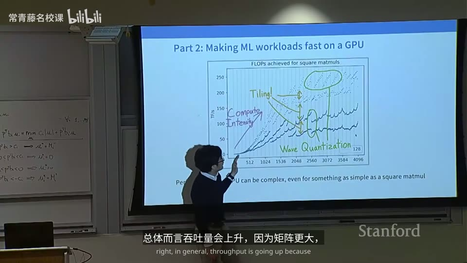 |
| 这就是屋顶线模型。不过我之前展示的那张图跟这个经典的屋顶线模型有点像：看起来有一段斜线部分，然后是一段平坦部分，这正是我们所预期的。屋顶线模型指出，在达到某个点之前，我们都会受限于内存，我们受限于内存，所以无论给我多少算力，吞吐量都不会提升；到了某个时刻，每单位内存搬运所对应的工作量足够多，我就能让计算单元完全饱和， [【跳转到 26:10】](https://www.bilibili.com/video/BV11LEA6eEuj/?p=5&t=1570) | 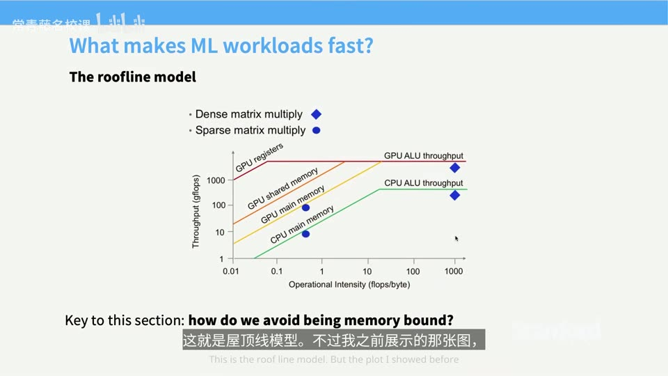 |
| 而过了那个点之后，工作单元越来越大也不再带来帮助了，对吧？无论给我多少额外的工作量都没有帮助，因为我已经被矩阵乘法单元完全占满了。所以这就是经典屋顶线模型所预期的：随着内存变得更快，我们就能把这个上限往上推。不过这里有一个内存受限区呈对角线，还有一个计算受限区是平的，所以基本符合我们的预期。 [【跳转到 26:35】](https://www.bilibili.com/video/BV11LEA6eEuj/?p=5&t=1595) | 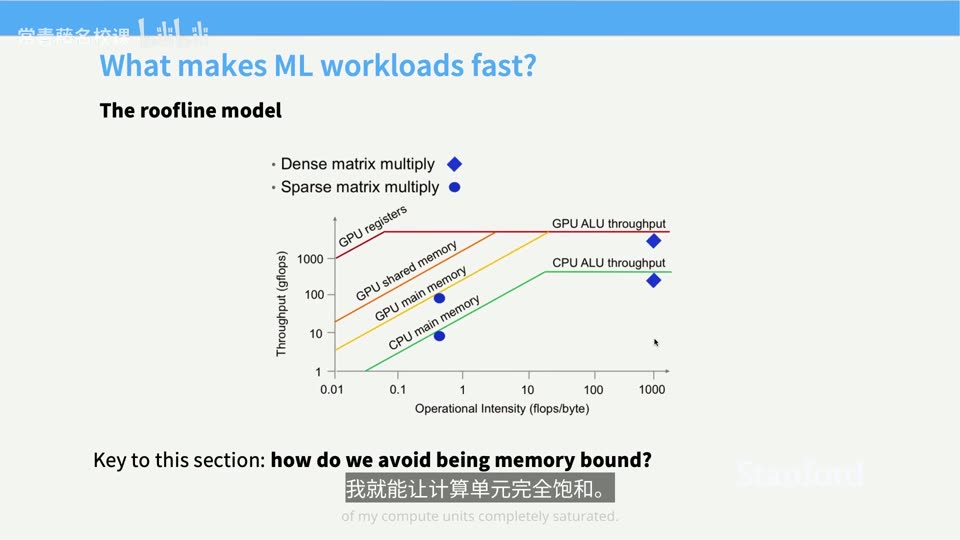 |
| 那么，如果你想让代码在 GPU 上跑得高效，关键就是要落在这个平坦区上。一旦到了这个平坦区就没什么可做的了，我们已经达到最大吞吐量。所以我们要避免落在那个对角线区，也就是说要提高运算强度，也就是说每次读取内存所做的计算量必须足够高。这就是我们要做的事。接下来会讲六种不同的技巧——其实这里面有的并不算内存技巧， [【跳转到 27:00】](https://www.bilibili.com/video/BV11LEA6eEuj/?p=5&t=1620) | 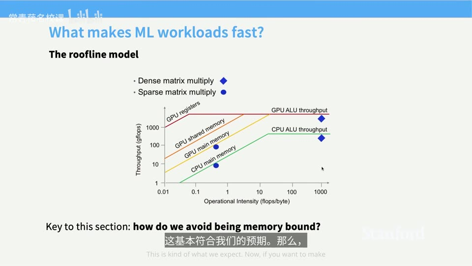 |
| 只有第一个是这样。要想理解如何让 GPU 跑得快，这六种技巧可能都得掌握。第一种在思路上有点不一样，但其余几种都遵循同一个思路：尽可能减少内存移动。 [【跳转到 27:25】](https://www.bilibili.com/video/BV11LEA6eEuj/?p=5&t=1645) | 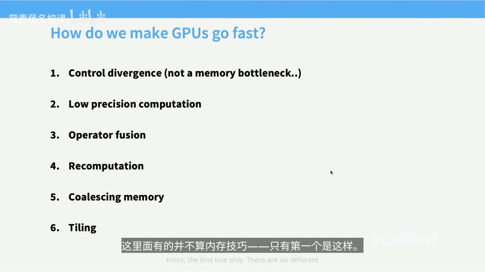 |
| 第一种算是 GPU 特有的东西，它跟我之前提到的 SIMT 模型有关。因为在 GPU 里，每个线程执行的都是一样的东西。那么如果你在一段运行于 GPU 的代码里写了个 if 语句，会发生什么呢？在 CPU 上会发生什么很清楚：你只会选择其中一个分支执行那个分支，然后继续往下走。但在 GPU 上情况其实大不相同，甚至有点反直觉：每个线程都必须执行相同的指令。 [【跳转到 27:37】](https://www.bilibili.com/video/BV11LEA6eEuj/?p=5&t=1657) | 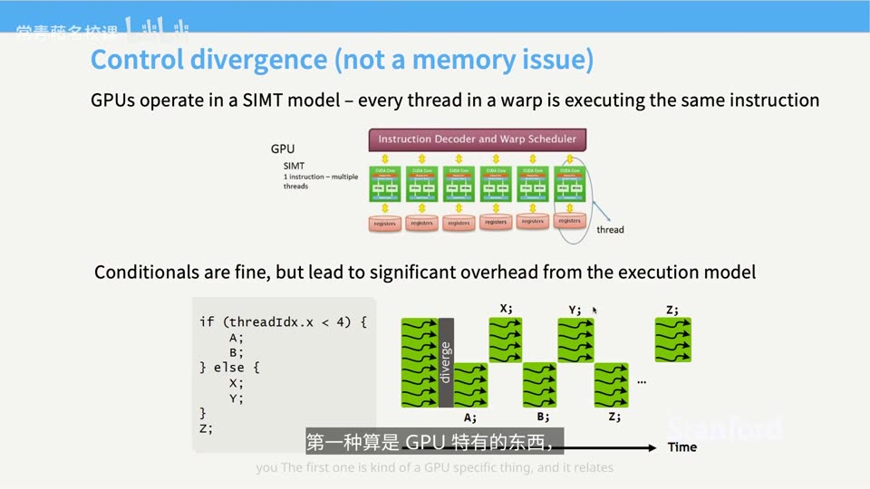 |
| 所以实际上每个线程会把 if 和 else 都执行一遍，但如果你不属于 if 分支，你就只是把那段计算屏蔽掉，你就在那儿闲着，对吧？因此每当遇到条件判断时，你对执行过程的心智模型大概就是这样：你看，一部分线程会根据这个 if 语句发生分化，其中一些走下面那个分支，另一些走上面那个分支， [【跳转到 28:02】](https://www.bilibili.com/video/BV11LEA6eEuj/?p=5&t=1682) |  |
| 底部分支的线程先执行，顶部分支的线程等着；等底部跑完，顶部分支的线程再执行，另一个分支的线程会等着。所以执行 if 语句时，你其实是在两条路径上都走一遍，而那些处在分支错误一侧的线程就只能干等着、什么也不做。这叫做控制发散。它在某些方面是好事，因为它简化了编程；但坏处是现在会出现大段的计算空档， [【跳转到 28:24】](https://www.bilibili.com/video/BV11LEA6eEuj/?p=5&t=1704) | 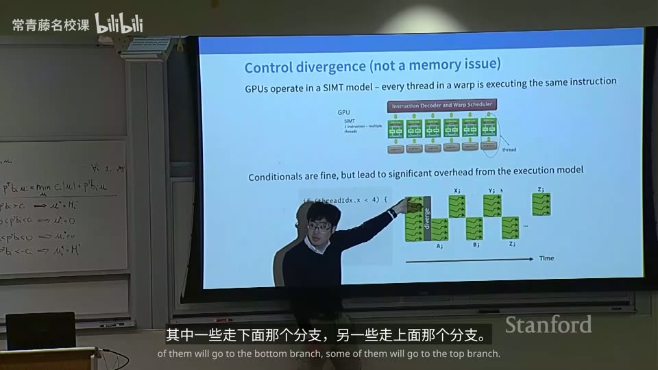 |
| 这时 GPU 闲着什么都不干。这也是你真的最好别写 if 语句的原因之一。 [【跳转到 28:49】](https://www.bilibili.com/video/BV11LEA6eEuj/?p=5&t=1729) | 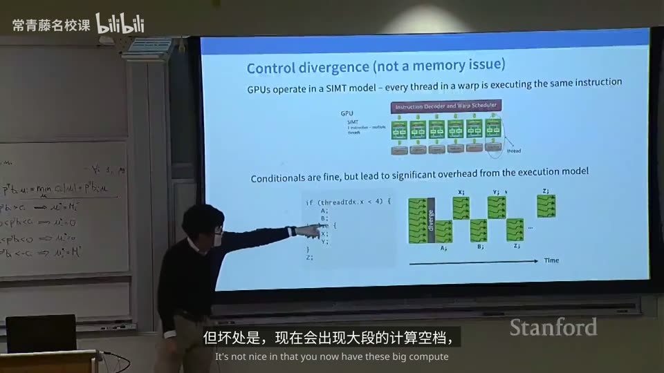 |
| 你看 GPU 代码就会发现，比如实现 ReLU 时，往往是用乘以零或者乘以掩码来做的，而不是写个 if 语句去只更新一半的数据，因为乘法是一下子全部执行的，而 if 语句可能实际上得等两个时钟周期之类的，也就是两次操作。好，这是第一点。不过这和前面那些内存的事儿不是一回事儿，内存才是这部分内容的主线。 [【跳转到 28:54】](https://www.bilibili.com/video/BV11LEA6eEuj/?p=5&t=1734) | 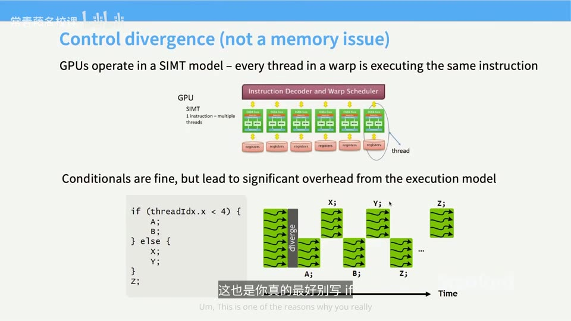 |
| 真正要讲的东西，第一点你其实不用为它花太多功夫，但我认为它是最重要的几点之一，而且在硬件层面我觉得这也是 NVIDIA 投入精力最多的地方，那就是低精度计算。如果你看这张图，我把这个图重新放回了幻灯片。 [【跳转到 29:15】](https://www.bilibili.com/video/BV11LEA6eEuj/?p=5&t=1755) | 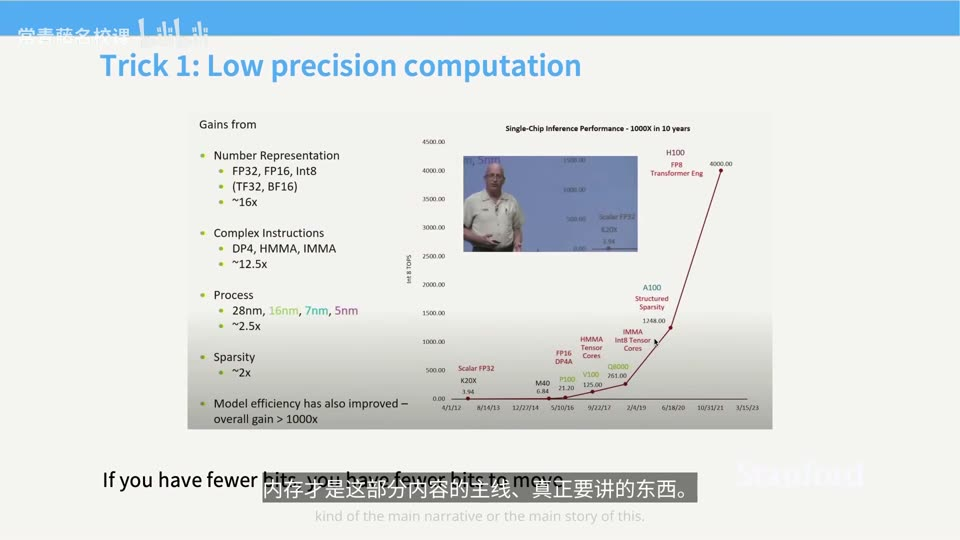 |
| 这种超指数级增长究竟从何而来？其实其中相当重要的一部分在于数值表示法：我们从 FP32 起步，接着用 BF16，再降到 INT8，一步步降低数值精度。当然，位数减半，需要搬运的数据也减半， [【跳转到 29:28】](https://www.bilibili.com/video/BV11LEA6eEuj/?p=5&t=1768) | 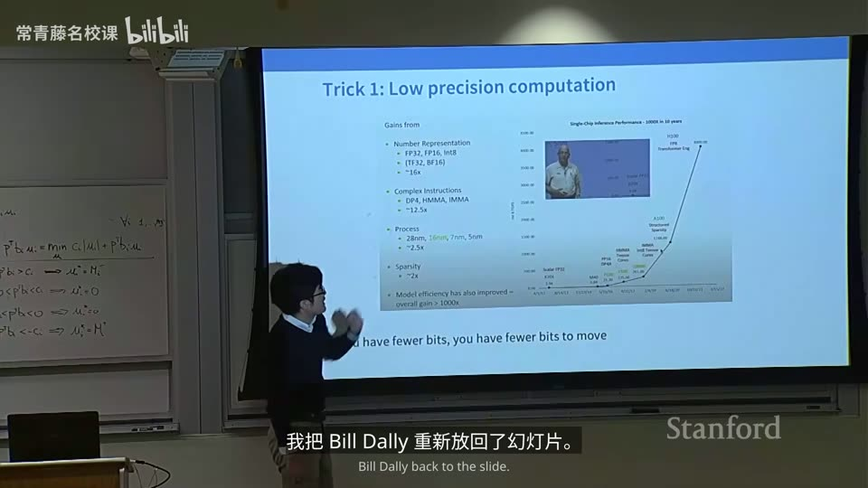 |
| 于是你的内存移动量也减半了，对吧？嗯，所以这在一定程度上缓解了内存瓶颈。 [【跳转到 29:45】](https://www.bilibili.com/video/BV11LEA6eEuj/?p=5&t=1785) | 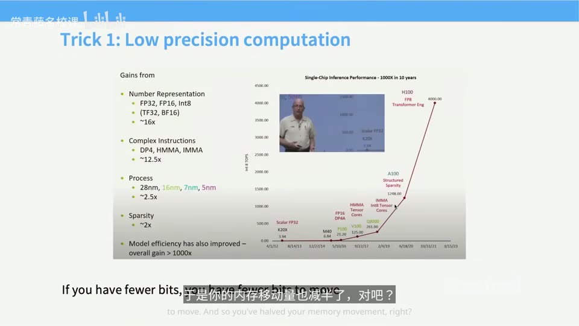 |
| 这个例子很简单，但我就是要把它讲透。假设我对一个大小为 N 的向量做了个 ReLU 运算，如果用 float32，我得读一次来取这个数，算完之后还得写一次，这样每次操作涉及四字节内存访问，总量就是八字节。我这只有一次浮点运算，所以每次运算要搬运八个字节。当然，要是用低精度，每次操作需要搬运的字节数就减半了。 [【跳转到 29:52】](https://www.bilibili.com/video/BV11LEA6eEuj/?p=5&t=1792) | 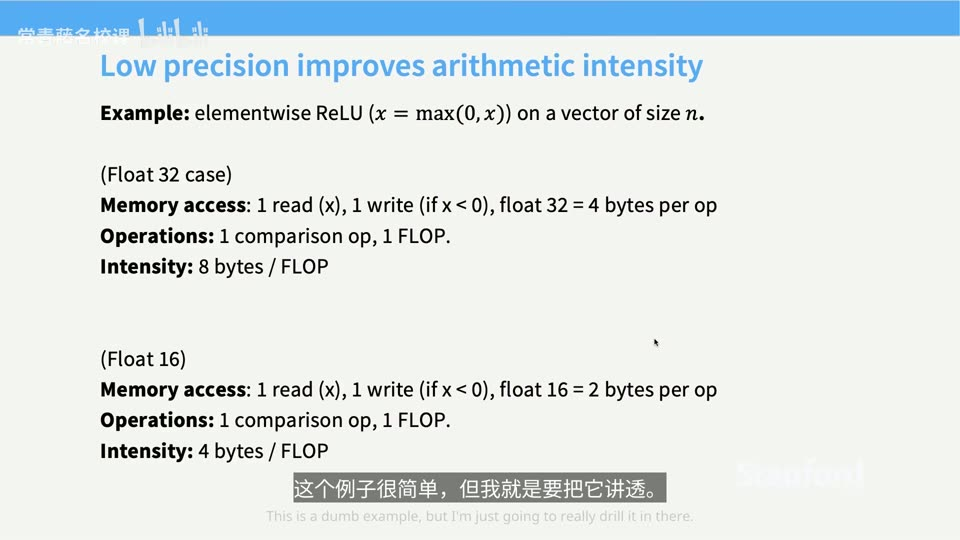 |
| 我把每次浮点运算所需搬运的字节数减半了。抱歉，这是算术强度的倒数——算术强度应该是这个值的倒数，对。现在这是一个非常简单的例子， [【跳转到 30:17】](https://www.bilibili.com/video/BV11LEA6eEuj/?p=5&t=1817) | 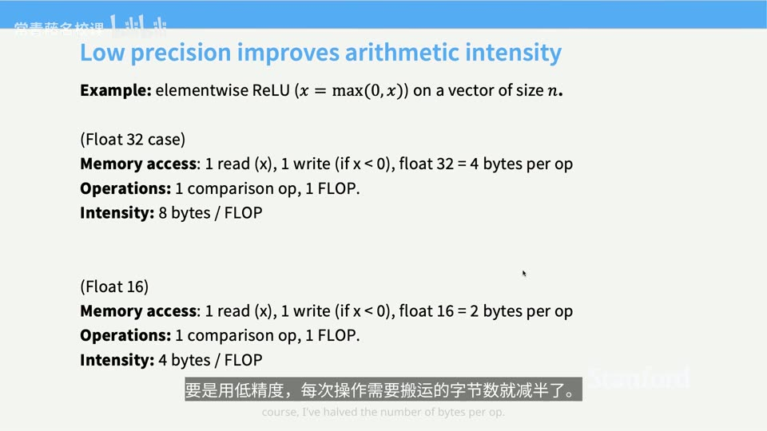 |
| 但实际上现代 GPU 中低精度的工作原理其实非常复杂，要么非常酷，要么非常疯狂，取决于你如何定义。所以当你做矩阵乘法时，假设你有一个以低精度运行的张量核心，那在实践中它究竟是如何工作的呢？其实你并不会把所有东西都保持在低精度，在计算乘积之前你会进行向下转换， [【跳转到 30:28】](https://www.bilibili.com/video/BV11LEA6eEuj/?p=5&t=1828) | 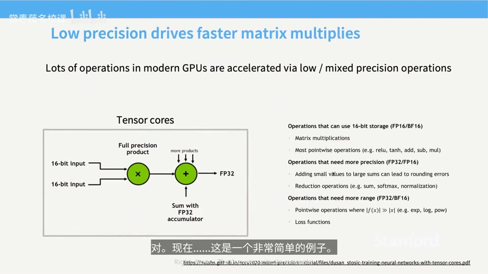 |
| 而在矩阵乘法中对部分和进行累加时，你会以全精度执行此操作，然后你可能会以 FP32 格式输出结果。我认为低精度之所以某种程度上算是一门黑魔法，原因并非仅仅降低精度即可——那任何人都能做到——你必须确定哪些操作需要采用哪种数值格式。例如在矩阵乘法中，你的权重和激活值可能都可以使用低精度。 [【跳转到 30:53】](https://www.bilibili.com/video/BV11LEA6eEuj/?p=5&t=1853) | 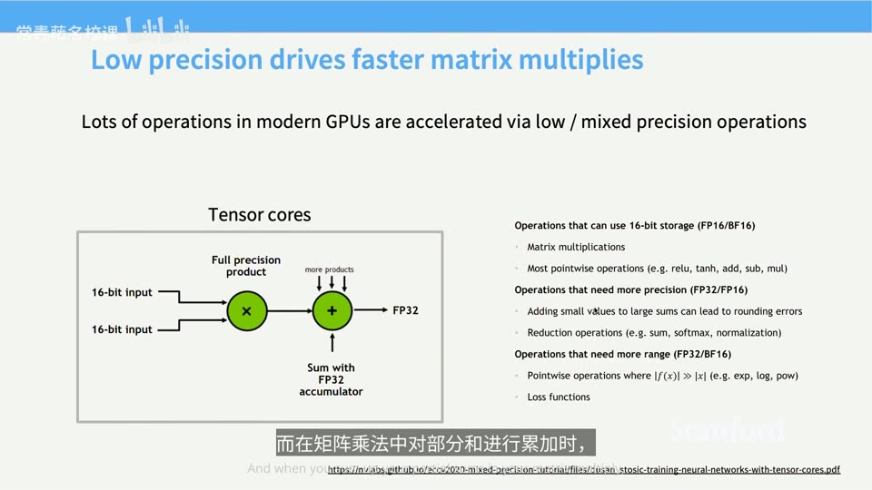 |
| 如果我执行 softmax，也许就需要用 FP32 格式；或者如果我执行指数运算，也许这也需要 FP32 格式；又或者也许用 BF16 就能勉强应付。所以我认为低精度训练能达到如今的水平确实花了好几年时间，其中大量工作进展缓慢，是那种逐步推进的经验性工作：搞清楚哪些操作可以向下转换、如何向下转换， [【跳转到 31:18】](https://www.bilibili.com/video/BV11LEA6eEuj/?p=5&t=1878) | 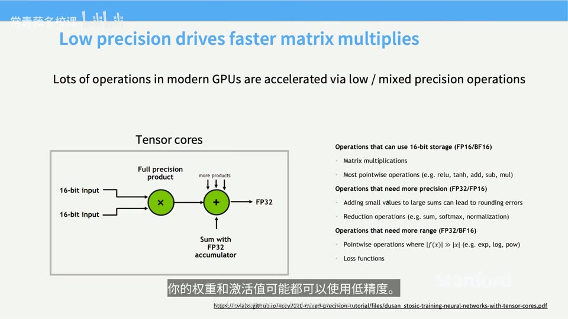 |
| 以及如何在尽可能让训练和推理都采用低精度的同时，保持训练的稳定性，而尽可能低的精度。 [【跳转到 31:43】](https://www.bilibili.com/video/BV11LEA6eEuj/?p=5&t=1903) | 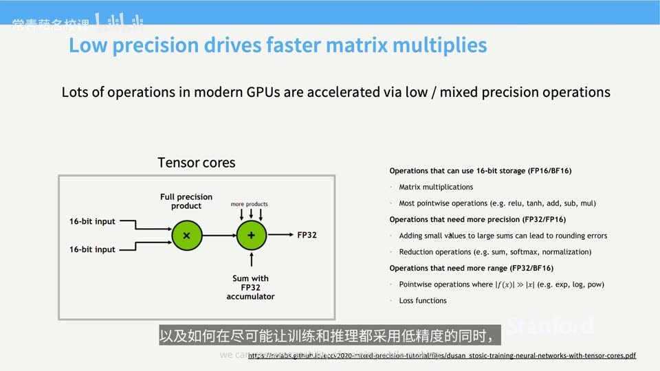 |
| 谢谢。人们一直在把这件事不断往前推进。我觉得一旦你想到高速内存的成本有多高，你就会意识到：要是能把精度再砍掉一半就好了，对吧？非常渴望做到这一点。因此 FP4 可以说是低精度领域的下一个前沿。但一旦进入 FP4，就不再有统一的标准格式了，没有一种格式是所有人都使用的。比如如果你用 16 位在进行大量操作时， [【跳转到 31:51】](https://www.bilibili.com/video/BV11LEA6eEuj/?p=5&t=1911) | 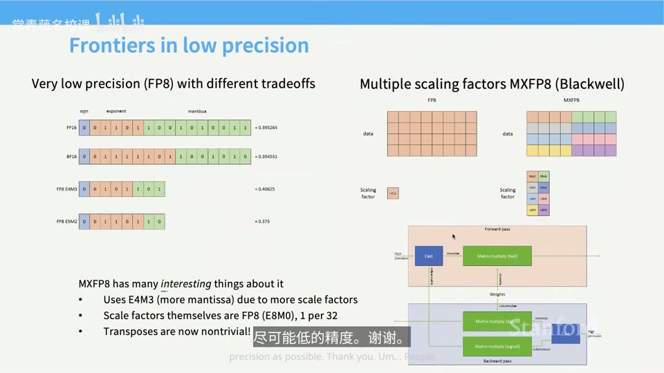 |
| 可能用的是 BF16，但在 FP4 中会有 E4M3，也就是四位指数、三位尾数；或者会有 E5M2，指数位更多、尾数位更少。由于这些格式用于不同的场景，一旦位数少到这种程度，就不存在一种通用的格式了。但我认为真正有趣的是随着新硬件推出而出现的那些更先进的低精度数字格式。所以我简单讲一下 MXFP4， [【跳转到 32:16】](https://www.bilibili.com/video/BV11LEA6eEuj/?p=5&t=1936) |  |
| 因为它既很酷，而且它对训练的影响至少可以说挺奇怪的。哎，在 FP4 这种传统训练方式里情况是这样的：你的所有激活值比方说都是八位，对吧？然后你会用到一个 32 位也就是 FP32 的缩放因子，用来把这些值上下缩放。为什么需要缩放因子？因为指数位只有四位，对吧？所以需要它——指数位这么少，数值很快就会溢出或下溢， [【跳转到 32:41】](https://www.bilibili.com/video/BV11LEA6eEuj/?p=5&t=1961) |  |
| 所以需要缩放因子来把数值控制在合理范围内，从而保留一些信息，对吧？人们意识到这并不是最优的，因为单个矩阵里的数值量级可能差异很大，序列中某一部分的激活值可能比其他部分大得多。所以与其只用一个缩放因子，我们为什么不用多个呢？所以 MXFP4 以及这类多缩放因子格式（也就是现在更先进的格式） [【跳转到 33:06】](https://www.bilibili.com/video/BV11LEA6eEuj/?p=5&t=1986) | 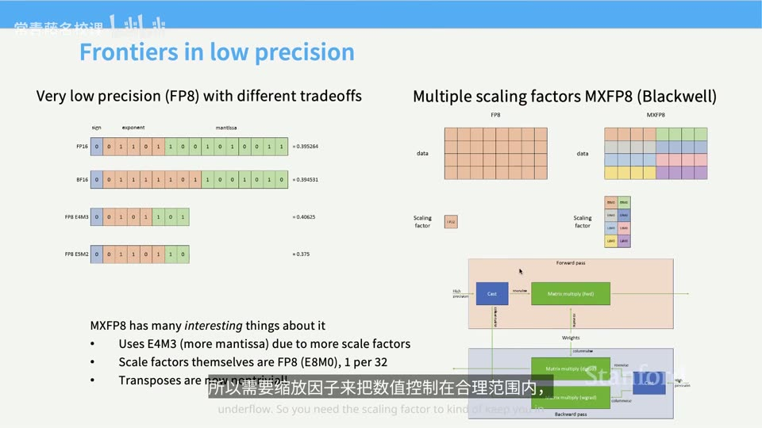 |
| 都使用了多个缩放因子，每一个缩放因子对应相应的彩色子矩阵，因此该矩阵中的前四个元素对应第一个缩放因子，以此类推。现在我有了更多的缩放因子，这些缩放因子实际上会采用较低的精度，它们也将是 E8M0 格式，因此只包含指数位，所以在 8 位表示中它们都是 2 的幂。 [【跳转到 33:31】](https://www.bilibili.com/video/BV11LEA6eEuj/?p=5&t=2011) |  |
| 我原本想说——好，那么 MXFP8 会在元素中使用更多的尾数，缩放因子本身是 FP8 格式，在矩阵中每 32 个元素对应一个缩放因子。好的，我先暂停一下，不要看第三点，现在思考片刻：这种设计的问题是什么？如果你采用如此巧妙的方案，最大的问题在哪里？ [【跳转到 33:56】](https://www.bilibili.com/video/BV11LEA6eEuj/?p=5&t=2036) | 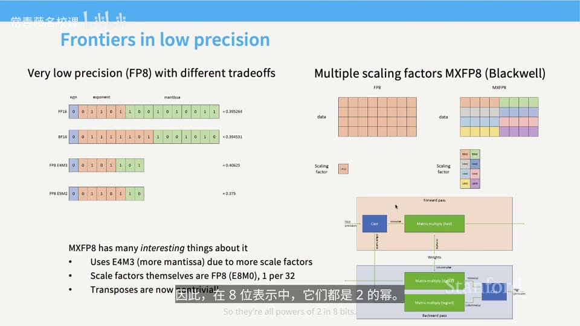 |
| 谢谢。因此这里的主要问题是：假设我要对这个矩阵进行转置，该矩阵的转置可以说并不具备与原矩阵相同的模式，也就是相同的缩放模式，对吧？过去矩阵转置很简单，我只需转置该矩阵，无需重新量化，也无需执行其他操作。转置该矩阵变得非常复杂，因为我现在可能需要对整个矩阵重新量化，以适配我现有的每 32 个元素一组的模式。 [【跳转到 34:15】](https://www.bilibili.com/video/BV11LEA6eEuj/?p=5&t=2055) | 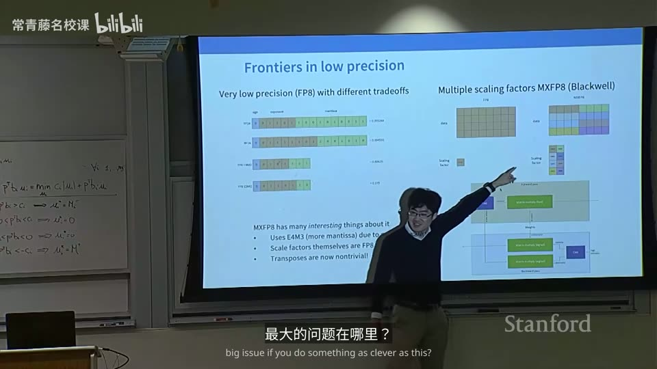 |
| 那么当你实际使用 MXFP4 时内部会发生什么？我发现这既疯狂又有点酷：在使用该方案训练模型时，它实际上会为每个量化矩阵创建两个副本，一个对应原始矩阵，另一个对应转置后的矩阵。因此如果你需要转置，就有现成的转置版本供你使用，对吧？这就是你规避该问题的方法。我认为这既疯狂又挺酷的。嗯，这里的重点也许不在于强调 GPU 的那些琐碎细节， [【跳转到 34:40】](https://www.bilibili.com/video/BV11LEA6eEuj/?p=5&t=2080) | 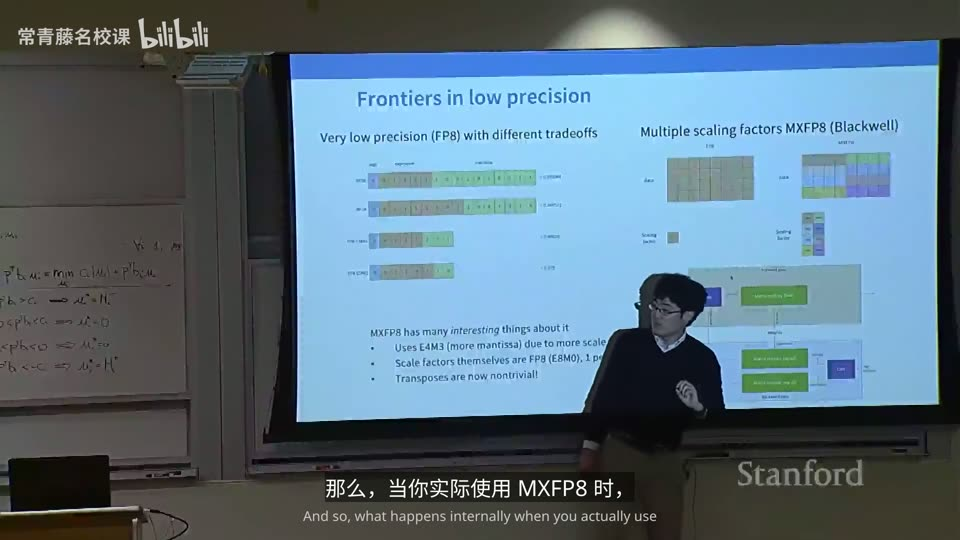 |
| 但重点是一旦你开始涉足 FP8、FP4 这类格式，情况就会变得相当奇特，因为你所面临的指数和尾数损失程度相当极端，所以你得在操作方式上多动脑筋。 [【跳转到 35:04】](https://www.bilibili.com/video/BV11LEA6eEuj/?p=5&t=2104) | 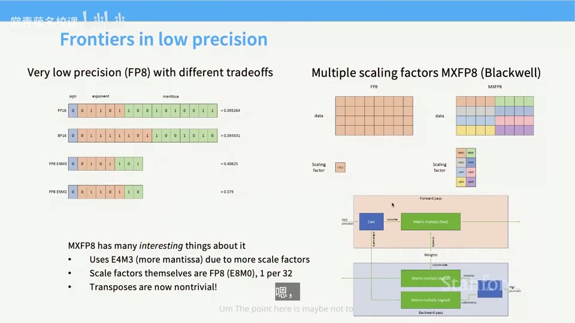 |
| 就像我刚才说的，如果你真要去训练一个 FP4 模型（我觉得不少前沿实验室为了算力上的好处都在这么做），那你必须非常谨慎，对吧？这张图正好印证了我刚才说的，也就是说每次量化时你都会先按一种方式量化，然后再转置并量化一次，这样你就会有两份副本。另外就像我几页幻灯片前提到的， [【跳转到 35:18】](https://www.bilibili.com/video/BV11LEA6eEuj/?p=5&t=2118) | 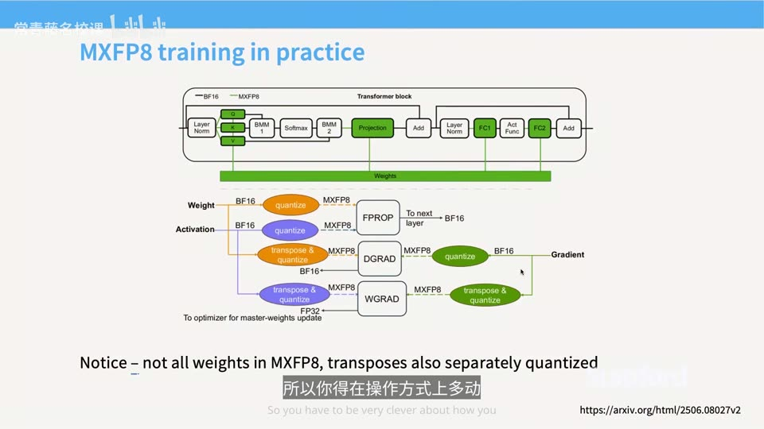 |
| 你只会对那些你认为可以安全量化的特定层进行量化对比，这是一个需要靠试错来摸索的过程。但一旦把这些都整合到一起，你就能获得训练 FP4 的巨大好处：在执行那些矩阵乘法时，你大概能节省 20% 到 30%，甚至更多，具体取决于你的矩阵规模。遗憾的是，这不会带来两倍的提速，因为你得先完成所有这些量化操作，对吧？ [【跳转到 35:43】](https://www.bilibili.com/video/BV11LEA6eEuj/?p=5&t=2143) | 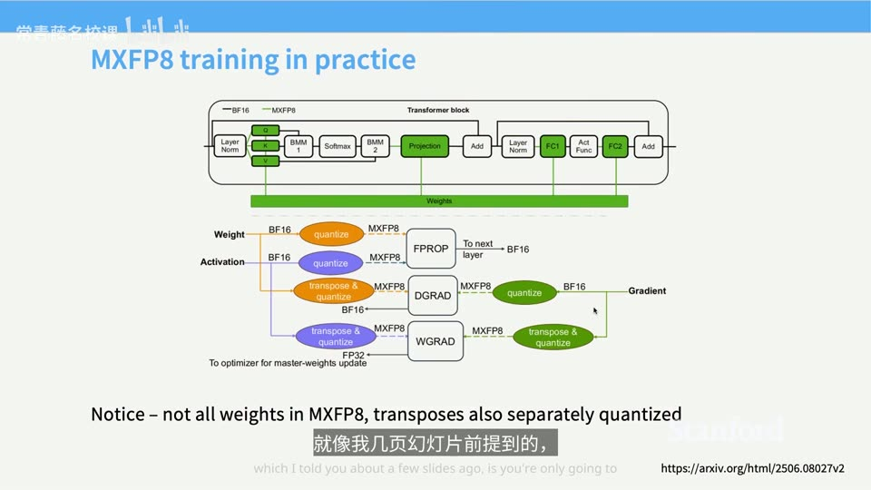 |
| 这样做有很大的开销，所以并非没有代价，是吧？所以记住：通常来说，第一层和最后一层非常难以量化。 [【跳转到 36:08】](https://www.bilibili.com/video/BV11LEA6eEuj/?p=5&t=2168) | 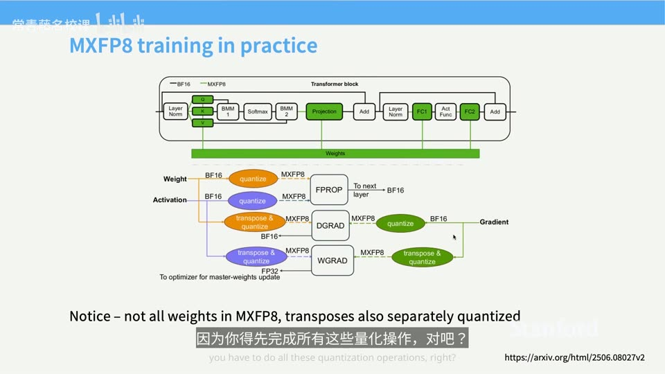 |
| 我不确定自己对第一层有没有直观的理解；而这最后一层我觉得它难以量化，是因为它算是一种异常因素，它主导了很大一部分损失。所以我认为如果你试图量化最后这一层，最终会同时面临不稳定和损失的大幅上升。 [【跳转到 36:20】](https://www.bilibili.com/video/BV11LEA6eEuj/?p=5&t=2180) | 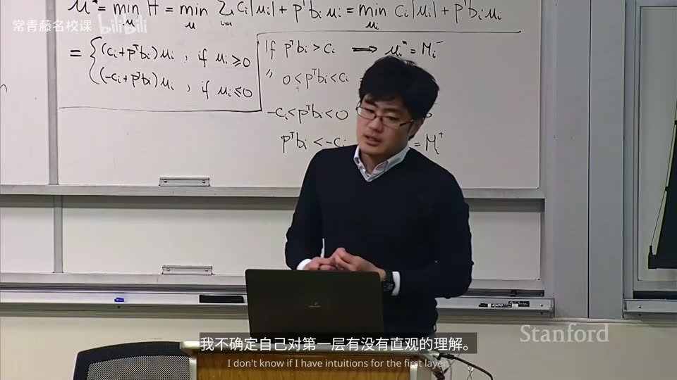 |
| 好的，我把它放上去，几乎可以说就是因为我觉得它太离谱了。 [【跳转到 36:32】](https://www.bilibili.com/video/BV11LEA6eEuj/?p=5&t=2192) | 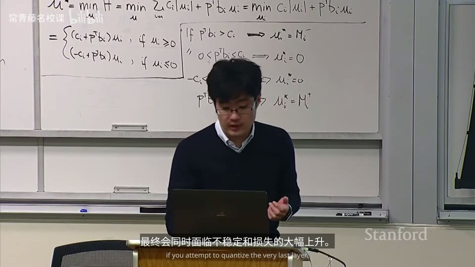 |
| 下一个前沿是 MXFP4——用这一张幻灯片就能把它的全部内容给你讲清楚。 [【跳转到 36:37】](https://www.bilibili.com/video/BV11LEA6eEuj/?p=5&t=2197) | 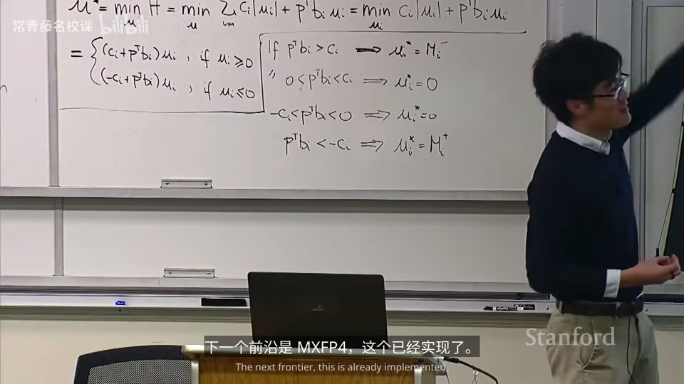 |
| 范围是从 -6 到 6，涵盖了所有可能的取值。既然你搞懂了 MXFP4，那这套机制的原理也就顺理成章了：你会用到结构化块，每个块包含这四个位，每 16 个数里你会配一个缩放因子，这个因子本身是 FP8 格式，这些缩放因子用的是 E4M3 格式。之前有篇论文拿 FP4 做过训练， [【跳转到 36:42】](https://www.bilibili.com/video/BV11LEA6eEuj/?p=5&t=2202) | 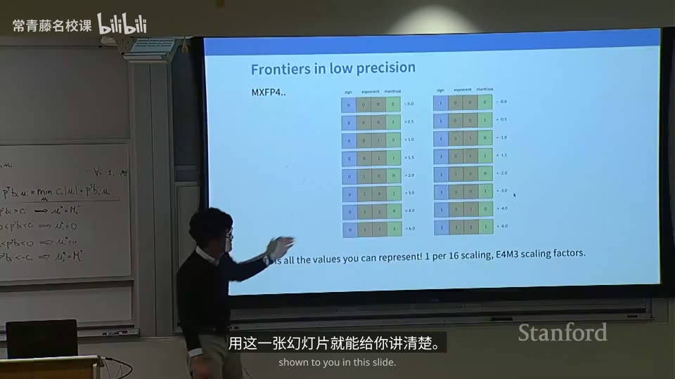 |
| 我觉得还没人真的在实战中成功用 FP4 训练过那种大型严肃模型， [【跳转到 37:07】](https://www.bilibili.com/video/BV11LEA6eEuj/?p=5&t=2227) | 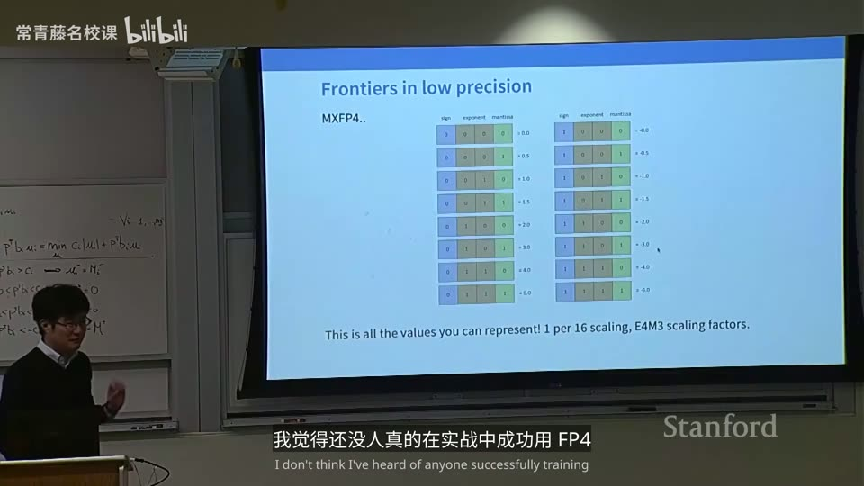 |
| 但我觉得这迟早会来，对吧？下一代模型大概率会用 FP4。好，刚才说的是低精度。我觉得你能把精度极限推到这种地步，最后只剩下那么一点点，这真的很酷——哪怕动态范围只有 +6 到 -6，你照样能在这个精度下对矩阵做些有意思的操作。现在，哦对了，有人问了： [【跳转到 37:12】](https://www.bilibili.com/video/BV11LEA6eEuj/?p=5&t=2232) | 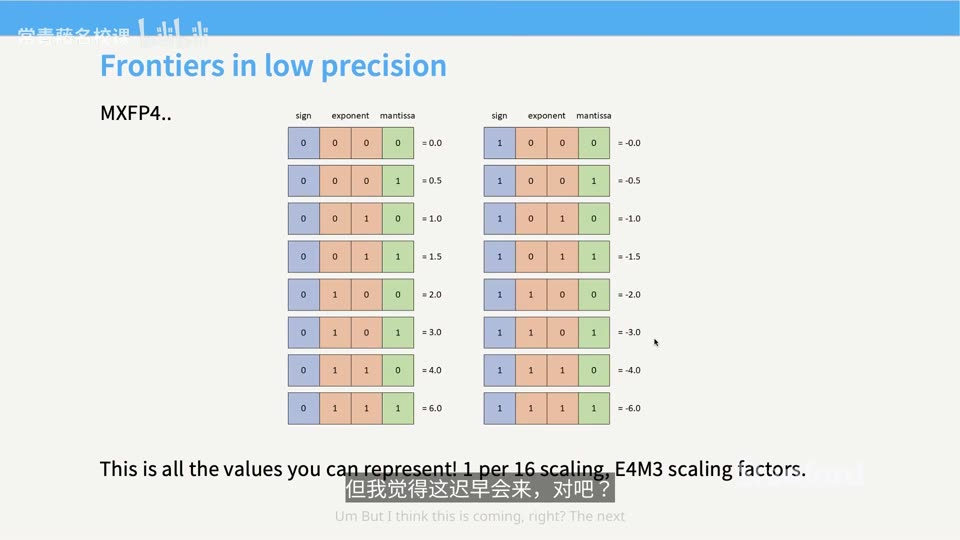 |
| 这是不是只用来……比如你可以把这种方法用在矩阵上，而不是用在这里的符号上？对，所以你可以量化任何东西，比如你可以量化 ReLU 之后的激活值。 [【跳转到 37:31】](https://www.bilibili.com/video/BV11LEA6eEuj/?p=5&t=2251) | 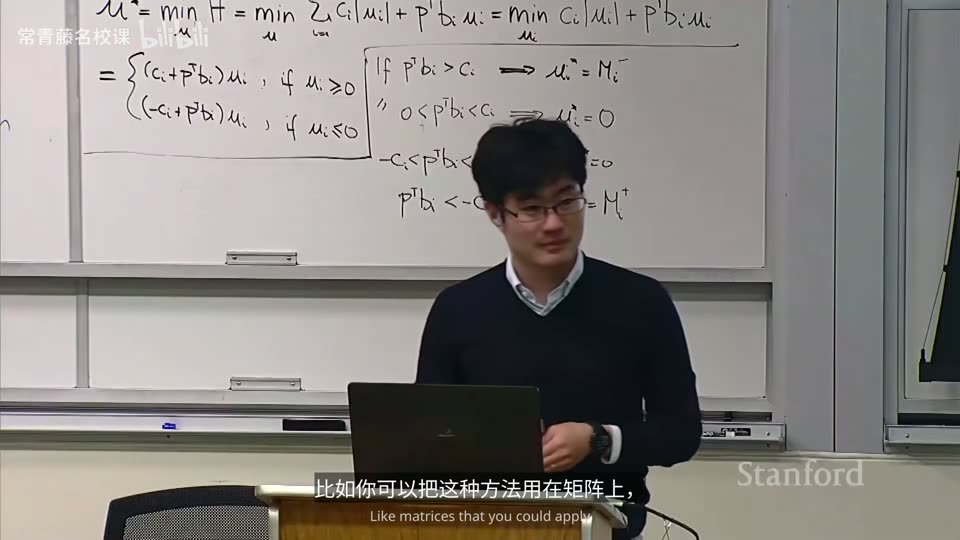 |
| 但一般没那么大的必要。比如矩阵乘法， [【跳转到 37:37】](https://www.bilibili.com/video/BV11LEA6eEuj/?p=5&t=2257) | 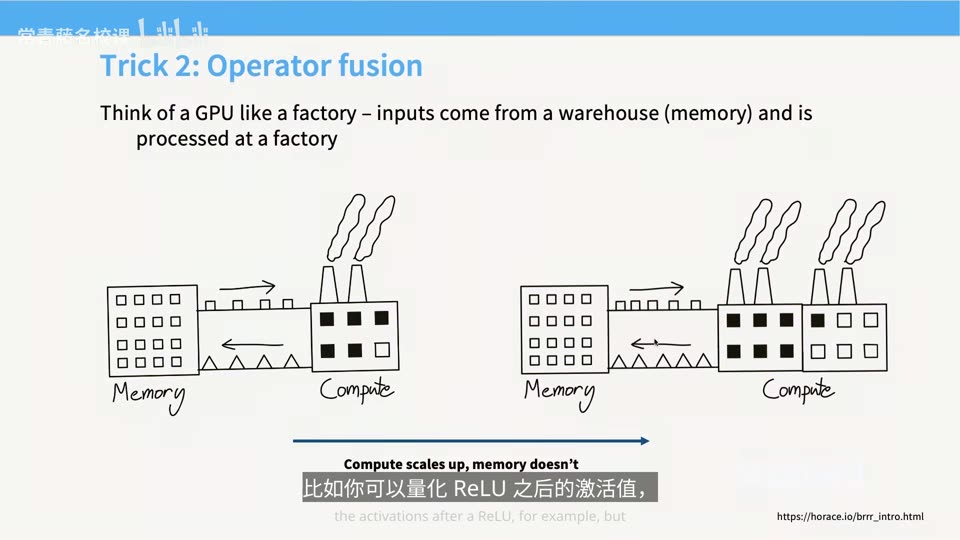 |
| 如果你量化它能大幅提升吞吐量。所以你看 MXFP4 训练方案时会发现，所有做 FP4 量化的都是矩阵乘法。 [【跳转到 37:42】](https://www.bilibili.com/video/BV11LEA6eEuj/?p=5&t=2262) | 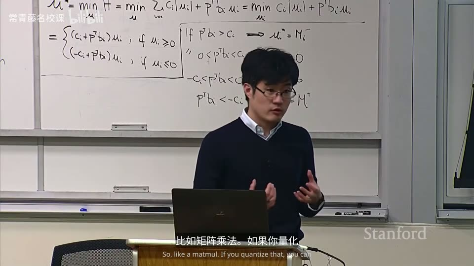 |
| 其他大多数情况的话，开销可能不划算。谢谢。矩阵乘法的硬件部分并不是只做这一件事， [【跳转到 37:52】](https://www.bilibili.com/video/BV11LEA6eEuj/?p=5&t=2272) | 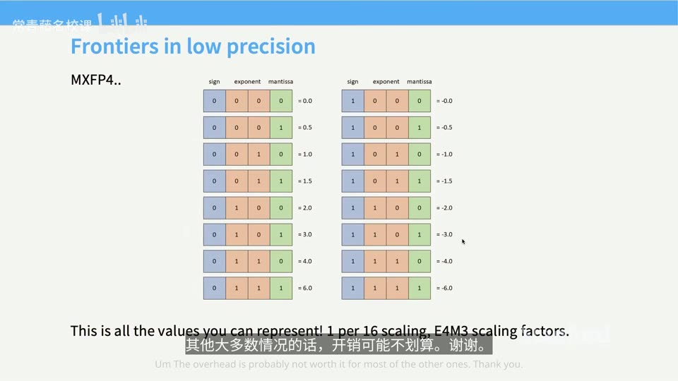 |
| 这也不是说只能这么做。对，比如你总是可以用更低精度的计算，这样就能减少内存搬运——确实如此。但对其他操作来说，这样做就不太合适了。这也不是硬件限制的问题，这不算限制。不过所有这些确实都有硬件支持，对吧？所以很多功能是直接固化在硬件里的，用来加速计算。对，没错，你把这说成是一种能改善内存带宽…… [【跳转到 37:58】](https://www.bilibili.com/video/BV11LEA6eEuj/?p=5&t=2278) | 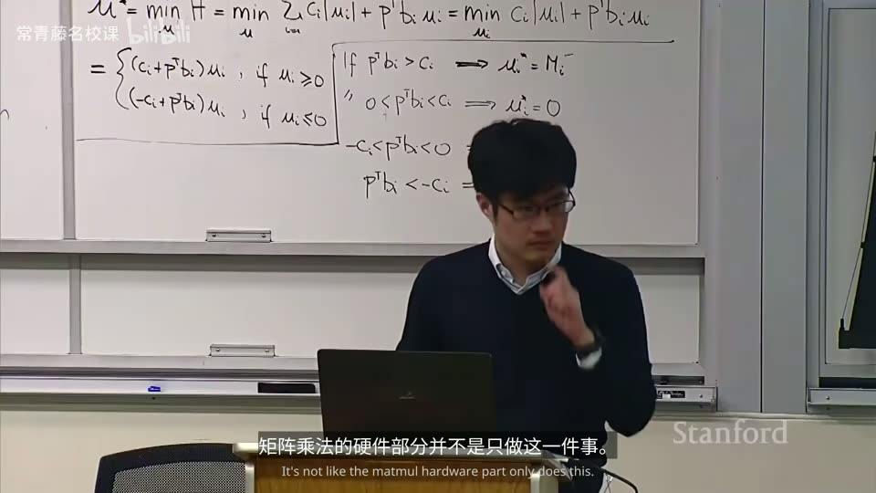 |
| 或者说降低内存带宽需求的方案？那确实有带宽方面的考量。没错，在计算方面你基本能获得线性提升。 [【跳转到 38:19】](https://www.bilibili.com/video/BV11LEA6eEuj/?p=5&t=2299) | 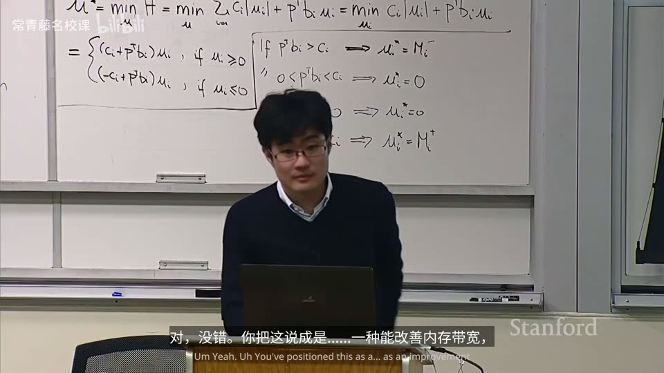 |
| 这仅仅是因为在做量化数值的乘法？但因为你得先量化再反量化，所以实际带来的好处就被打了折扣，是吗？你得去训练那个缩放因子吗？ [【跳转到 38:28】](https://www.bilibili.com/video/BV11LEA6eEuj/?p=5&t=2308) | 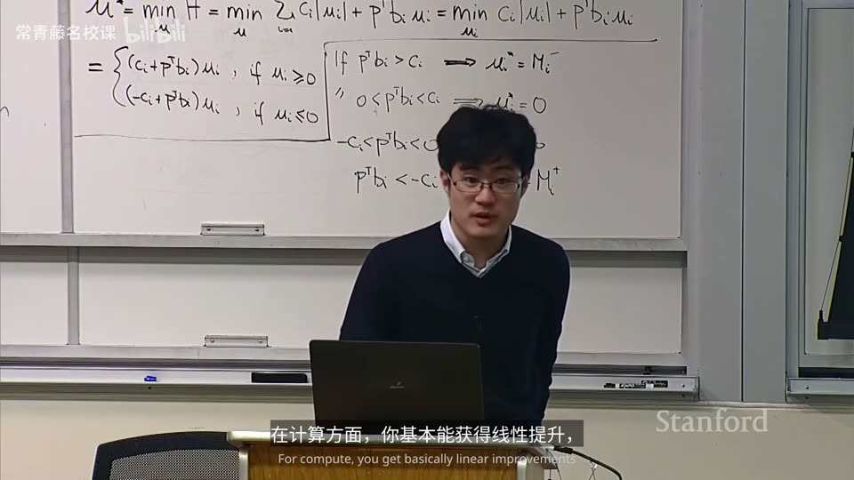 |
| 啊，缩放因子其实取决于具体怎么实现，比如看你用的是什么库，不同的库可能会有不同的量化和反量化方式。说"训练"可能有点过了，但你可能会用一些量化因子来扫描并选出最大最小值，或者用缩放因子去参考历史运行统计数据再加以使用。 [【跳转到 38:37】](https://www.bilibili.com/video/BV11LEA6eEuj/?p=5&t=2317) | 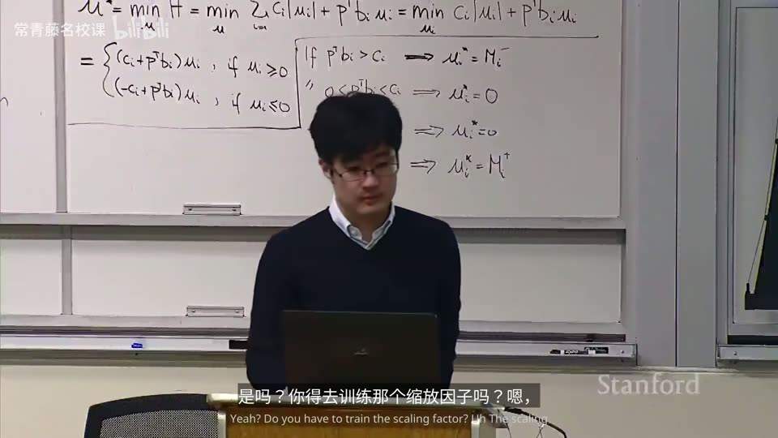 |
| 严格来说，我不太会把它叫做训练。嗯，在推理的时候你可能会更精细地调整它们。那这里面涉及梯度吗？推理时或许会这么做，但训练时不会。对对。哎，结构化稀疏性这块有人研究过吗？对，这方面研究很多。我觉得混合专家模型（MoE）就是人们常用的一种成功的结构化稀疏运算案例，对吧？没错。这方面确实已经做了很多工作，Chris Ré 在这方面做了很多工作， [【跳转到 38:54】](https://www.bilibili.com/video/BV11LEA6eEuj/?p=5&t=2334) | 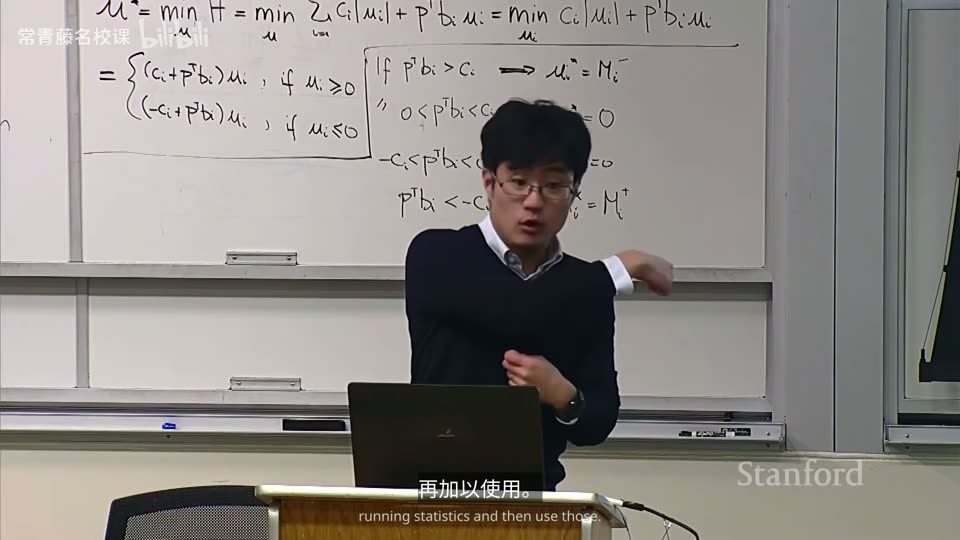 |
| 涉及多种结构化矩阵。我觉得考虑到计算收益和表示损失之间的权衡， [【跳转到 39:19】](https://www.bilibili.com/video/BV11LEA6eEuj/?p=5&t=2359) | 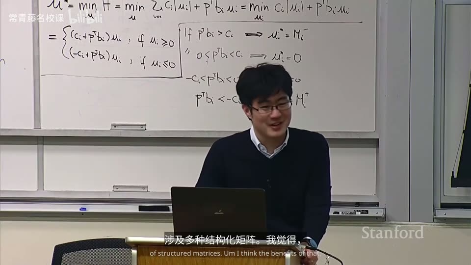 |
| 它的优势其实已经没那么突出了。我觉得这主意不坏，但从实际效果来看， [【跳转到 39:24】](https://www.bilibili.com/video/BV11LEA6eEuj/?p=5&t=2364) | 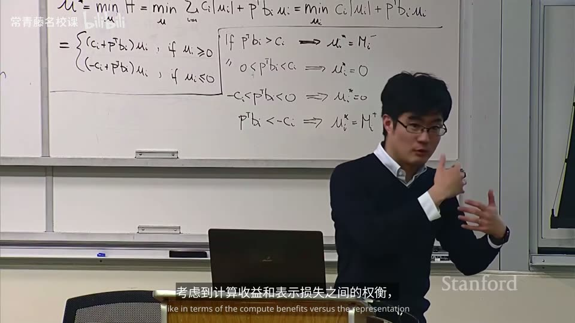 |
| 似乎并没有像预期的那样奏效。啊对。嗯，就像我们之前聊到的那种压缩，现在主流的做法是怎么设置的？通常先以全精度或半精度训练， [【跳转到 39:29】](https://www.bilibili.com/video/BV11LEA6eEuj/?p=5&t=2369) | 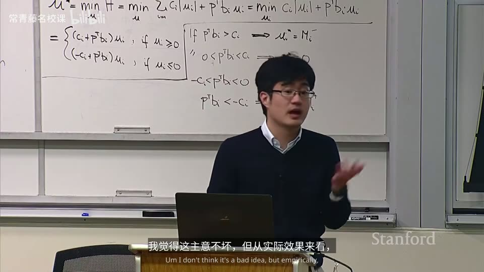 |
| 再转成量化模型， [【跳转到 39:38】](https://www.bilibili.com/video/BV11LEA6eEuj/?p=5&t=2378) | 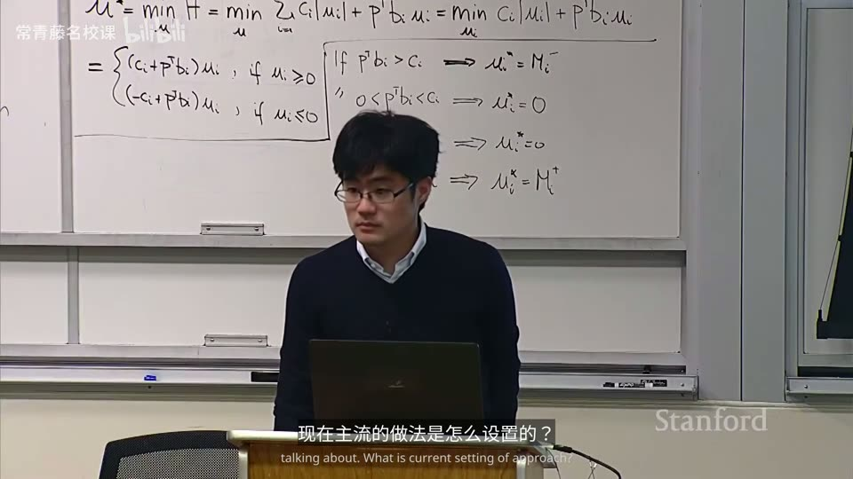 |
| 这样就能在自己的电脑上跑。类似这样的……比如这方面的配置是怎样的？ [【跳转到 39:43】](https://www.bilibili.com/video/BV11LEA6eEuj/?p=5&t=2383) | 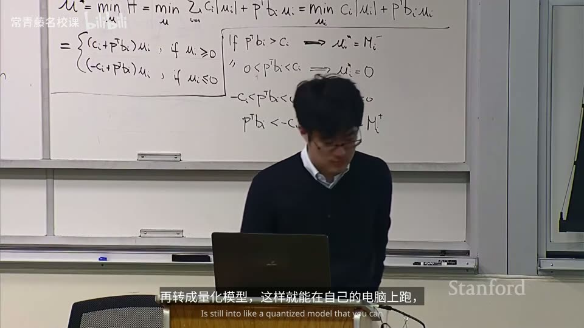 |
| 我的意思是，通常的做法是先训练一个更大的模型，然后再向下量化。啊， [【跳转到 39:48】](https://www.bilibili.com/video/BV11LEA6eEuj/?p=5&t=2388) | 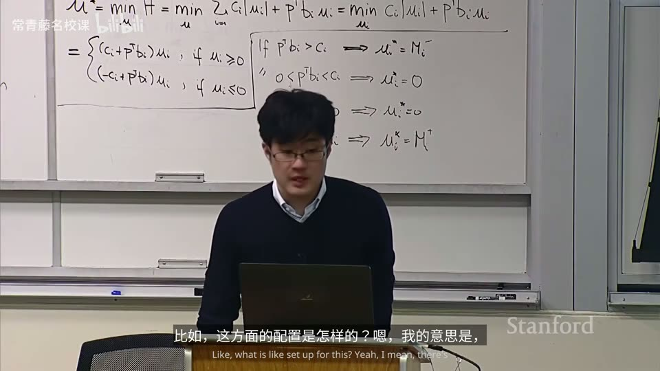 |
| 关于量化的缩放定律，人们已经发表了许多论文，精确地刻画了其中的权衡关系。 [【跳转到 39:53】](https://www.bilibili.com/video/BV11LEA6eEuj/?p=5&t=2393) | 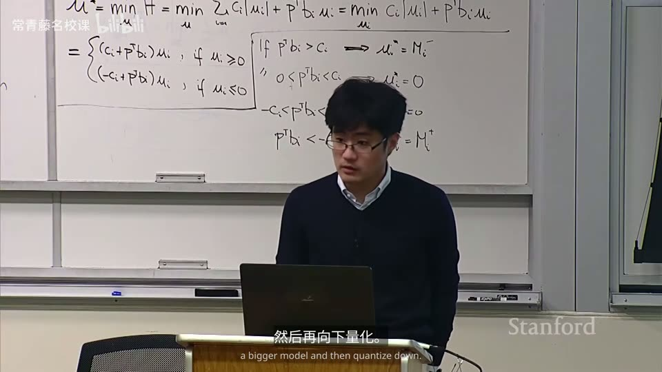 |
| 我认为目前最先进的方法结合了量化感知训练（在一定程度上）以及模型缩放与各种形式的训练后量化。是的，嗯，我认为还有很多方面尚未被充分理解，甚至我交谈过的工业界团队也在说，他们还在做量化科学方面的研究。 [【跳转到 39:58】](https://www.bilibili.com/video/BV11LEA6eEuj/?p=5&t=2398) | 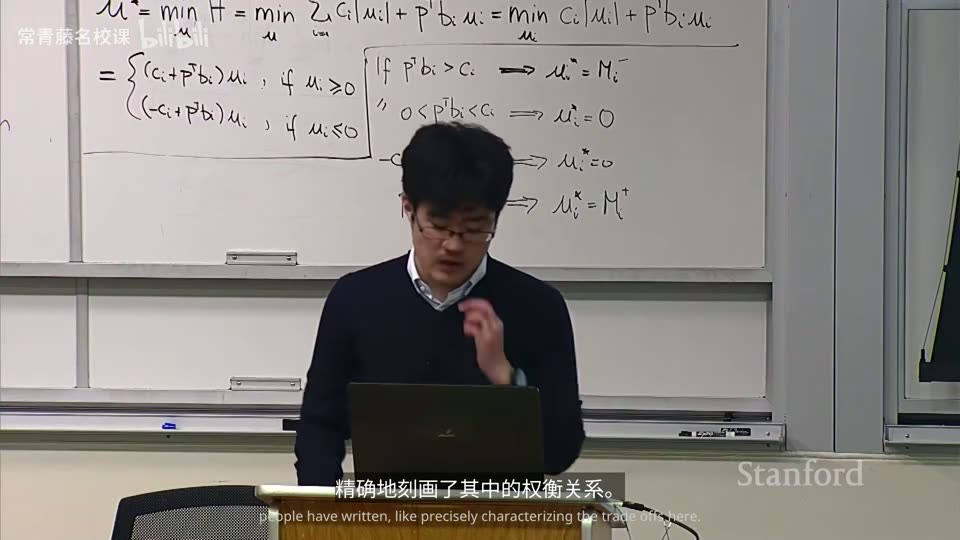 |
| 对啊。好的，那么另一个技巧，嗯，这个更像是概念上的编程问题。 [【跳转到 40:15】](https://www.bilibili.com/video/BV11LEA6eEuj/?p=5&t=2415) | 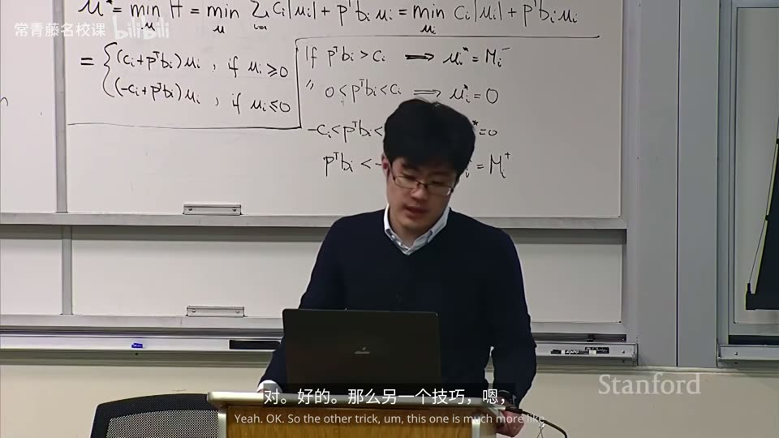 |
| 它叫算子融合，想法相当简单，但你会惊讶居然有这么多地方还没这么做。 [【跳转到 40:20】](https://www.bilibili.com/video/BV11LEA6eEuj/?p=5&t=2420) | 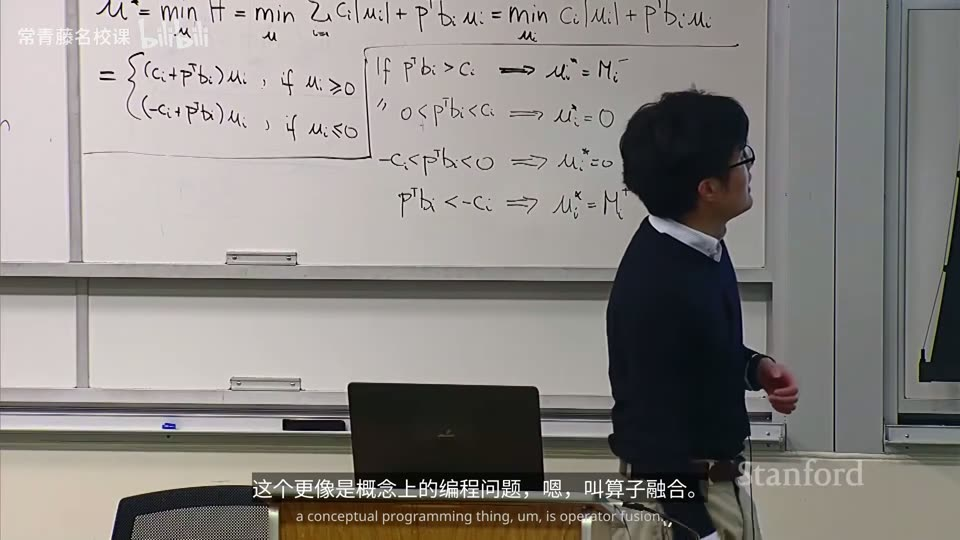 |
| 可以把 GPU 想象成一个工厂：你有存放内存的仓库，有做计算的小工厂，还有来回跑的传送带，对吧？当你扩大计算规模时，那个小工厂就会成为瓶颈，操作越多情况越糟。想象一下，我有大量不同的操作要做，得把原材料运到工厂再运回来，来回折腾，这会产生大量的内存瓶颈，你得为此买单，还需要大量的双向内存带宽。 [【跳转到 40:25】](https://www.bilibili.com/video/BV11LEA6eEuj/?p=5&t=2425) | 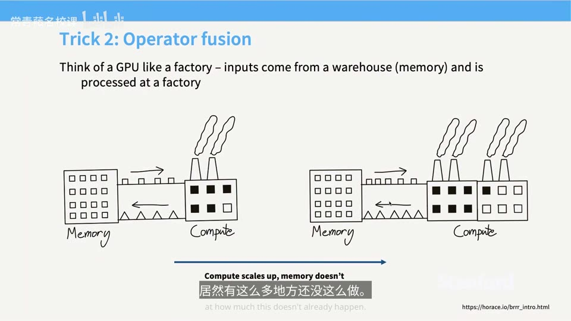 |
| 如果有一个大工厂能接收所有原材料并运回成品，岂不更好？这样我只需支付两次内存带宽的费用。想法很简单，这就是算子融合，对吧？这种情况很常见。如果你写一个很简单的计算，比如正弦平方加余弦平方，这个计算图长什么样？它长这样：你有输入 X，我算正弦，我算余弦，两边分别平方， [【跳转到 40:50】](https://www.bilibili.com/video/BV11LEA6eEuj/?p=5&t=2450) | 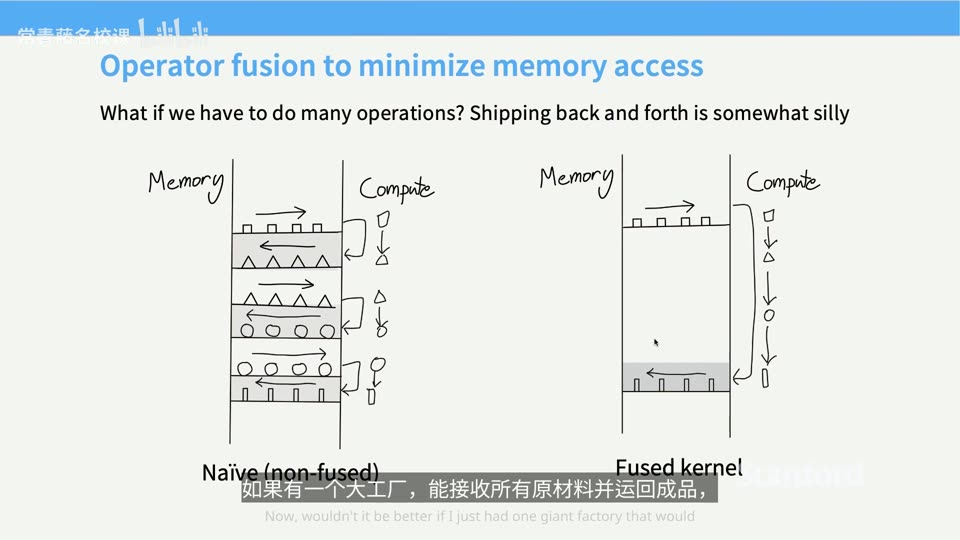 |
| 我将它们相加得到输出。朴素地看，如果你不做任何巧妙的优化，每一个操作在某种意义上都会变成一座独立的工厂，每次调用其中一个操作时，你都要从全局内存中进行读写，因此每次这样做都会产生相当大的内存开销，所以这种方式相当低效。你可以设想，与其这样做，不如编写 GPU 代码让它只从全局内存读取一次， [【跳转到 41:12】](https://www.bilibili.com/video/BV11LEA6eEuj/?p=5&t=2472) | 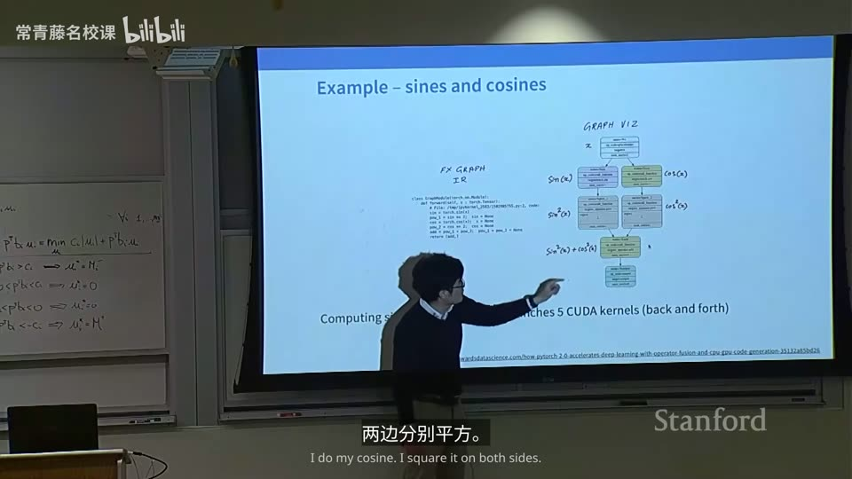 |
| 正如我之前所说的，在 SM（流式多处理器）内部完成全部运算，然后在 SM 内部完成之后再把结果写回全局内存，也就是用一个单一的核函数来执行所有这些操作。 [【跳转到 41:37】](https://www.bilibili.com/video/BV11LEA6eEuj/?p=5&t=2497) | 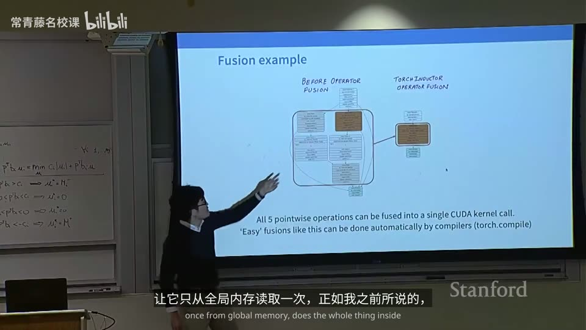 |
| 这被称为算子融合。像这样简单的操作属于非常容易实现的融合。又比如，它就像一张图，我可以把它压缩合并成单个单元，编译器可以自动为你完成这件事，比如 torch.compile（它是 PyTorch 的编译器），或者 JAX 侧的编译器（它与 JAX 集成得更深），这两者都会把这些基础操作融合为单一的核函数调用。 [【跳转到 41:48】](https://www.bilibili.com/video/BV11LEA6eEuj/?p=5&t=2508) | 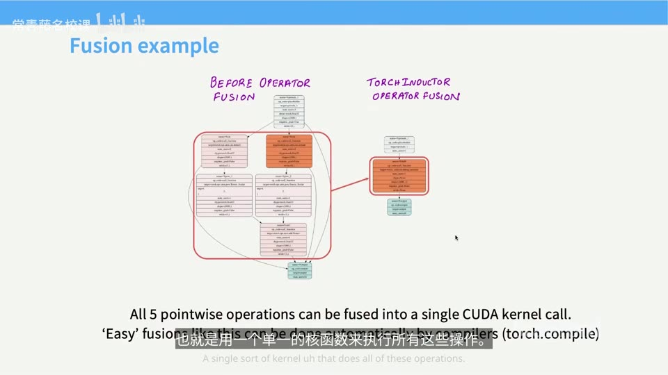 |
| 我待会儿再多讲讲融合技术，不过我觉得高级版有时候得靠人工介入，但简单版你把它当成编译过程就行，能解决你的问题。好，第三个思路是重计算。我们知道在反向传播里该怎么做呢？我们会向前、向上沿着树往上走——这是 Percy 前几节课里的内容——你沿着树往上走，同时记录激活值， [【跳转到 42:13】](https://www.bilibili.com/video/BV11LEA6eEuj/?p=5&t=2533) | 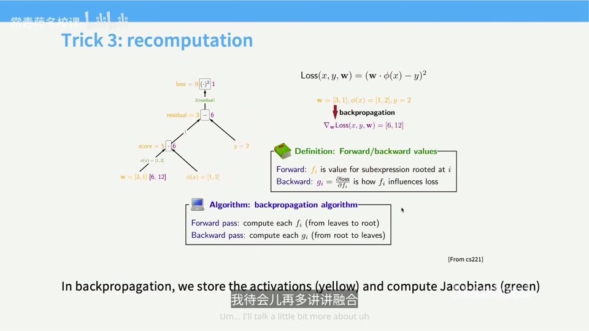 |
| 把这些激活值存下来。然后当我往回走时，我会用存好的激活值算出沿树向下的反向信号。大家都多少了解反向传播， [【跳转到 42:33】](https://www.bilibili.com/video/BV11LEA6eEuj/?p=5&t=2553) | 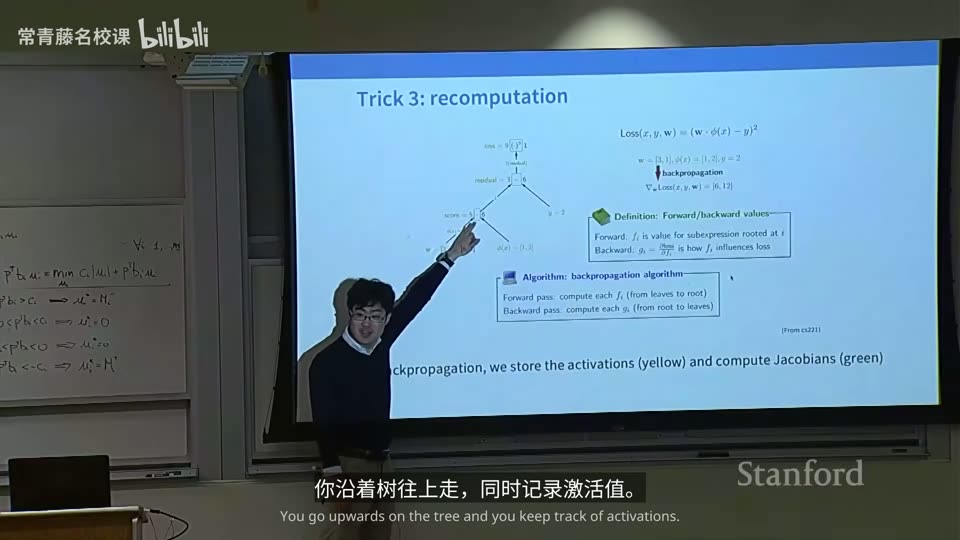 |
| 所以知道它是什么。但现在我们不是从数学角度来考虑怎么算梯度，我们是从系统角度来想怎么把内存占用降到最低。想想正在发生的事：假设有个简单的例子，我有 X 过一个 Sigmoid，再过一个 Sigmoid，最后输出。每个 Sigmoid 都会在计算图里产生某种残差或激活值，我得把它们记录下来，所以第一次运算后得到 S1，第二次得到 S2，做反向传播时会用到 S2 和 S1。 [【跳转到 42:45】](https://www.bilibili.com/video/BV11LEA6eEuj/?p=5&t=2565) | 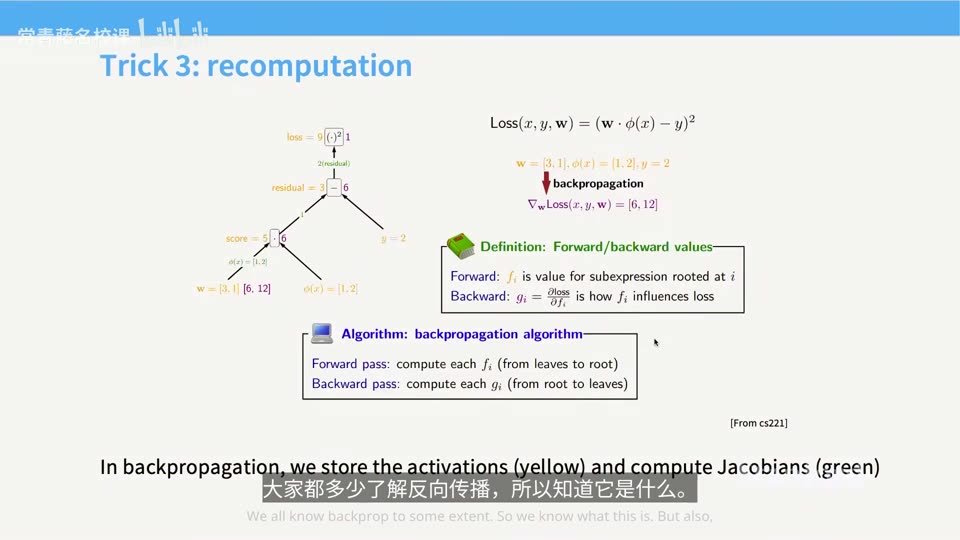 |
| 还有我的输出——不对，是输出端的梯度，我会把这个梯度反向推回输入的导数那里。所以算一下内存读写次数：X 读一次，S1、S2 和输出写三次；反向传播时则大致相反，所以总共八次内存读写，算术强度非常低，因为我只是堆了一堆 Sigmoid。我可以怎么做呢？我可以直接把所有激活值都扔掉， [【跳转到 43:10】](https://www.bilibili.com/video/BV11LEA6eEuj/?p=5&t=2590) | 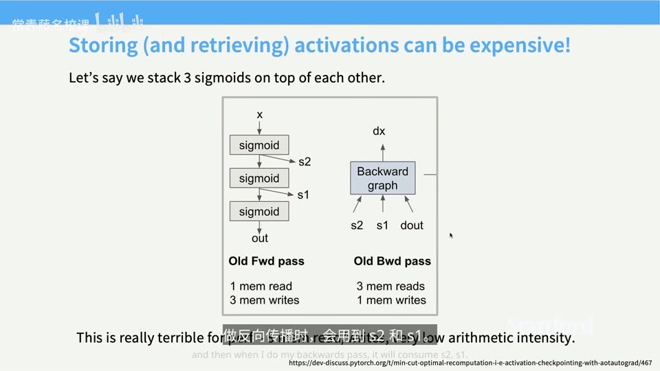 |
| 一般你不会这么做，对吧？毕竟谁会想重新算一遍呢？但假设你身处一个计算极其廉价的世界，你的计算资源充足用不完，计算单元都没跑满，但你的内存成本非常高昂，任何读写都有很大的开销，所以你可能更倾向于这种计算图：先读入 X，然后依次做 Sigmoid、Sigmoid 得到输出。我会把这个输出存起来，因为它是计算图的输出，所以我必须写入它。 [【跳转到 43:35】](https://www.bilibili.com/video/BV11LEA6eEuj/?p=5&t=2615) | 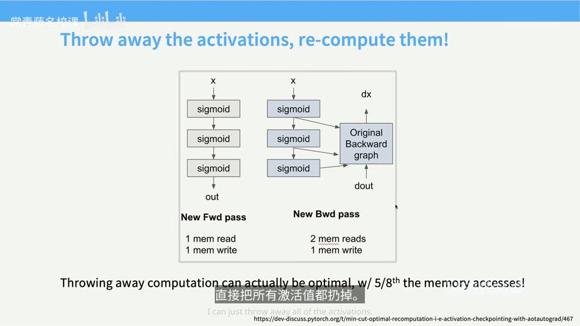 |
| 不过在反向传播时，我的反向图会接收 dout 并及时进行计算，我会重新前向传播 X，然后在真正需要的地方及时算出激活值。所以这里会有两次内存读取（dout 和 X 各一次）和一次内存写入（dX）。这样总内存访问就从八次降到了五次，计算量没变，但内存访问总量只有原来的 5/8 了。我多花了一点计算量，省下了内存。 [【跳转到 44:00】](https://www.bilibili.com/video/BV11LEA6eEuj/?p=5&t=2640) | 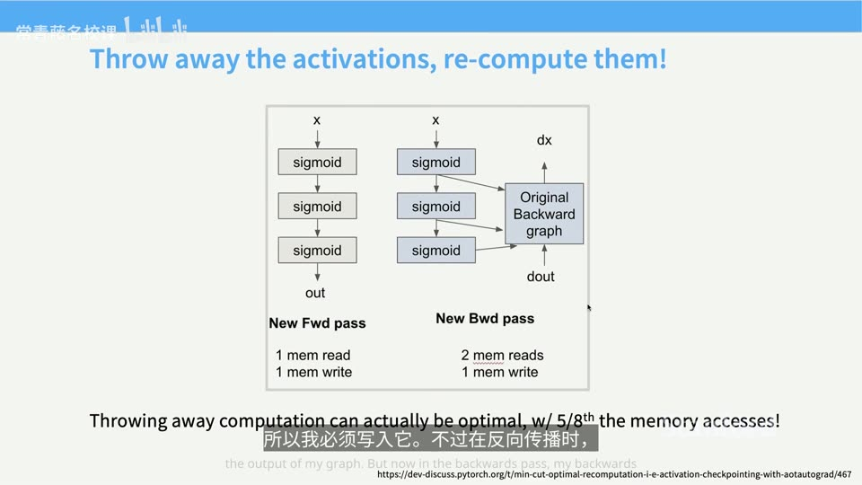 |
| 这是另一个非常重要的技巧。我们平时很少想到这一点，因为我们通常只关心怎么算梯度，但只要你有了系统思维，你就会开始考虑重新计算。好，第四招，嗯， [【跳转到 44:25】](https://www.bilibili.com/video/BV11LEA6eEuj/?p=5&t=2665) | 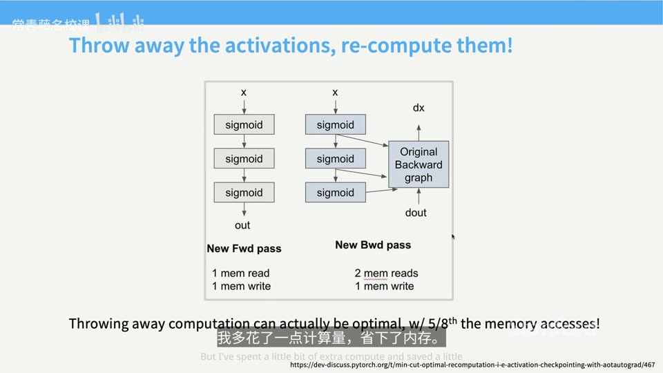 |
| 这又是个关于内存的冷知识，但出乎意料地重要。另外，为什么有时候理解你正在交互的硬件模型很重要？嗯，全局内存，也就是芯片外面的那块大内存，是 DRAM。而 DRAM 嗯，因为它的结构方式，实际上是突发式读取的。也就是说，当我访问比如第一个位置时，我拿到的并不只是第一个值， [【跳转到 44:36】](https://www.bilibili.com/video/BV11LEA6eEuj/?p=5&t=2676) | 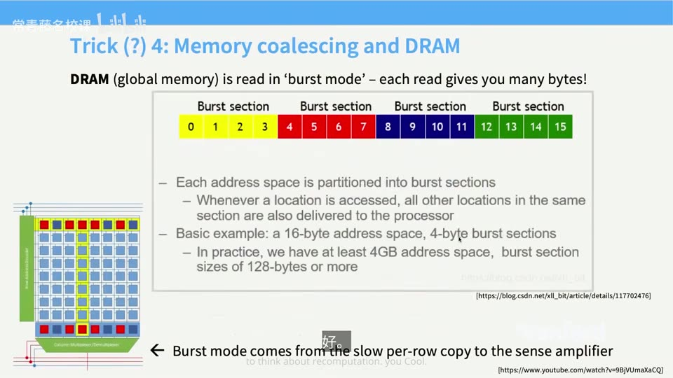 |
| 我可以免费把这前四个值都读出来。这是因为内存单元的排列方式，它们是以块为单位组织的，然后当我激活放大器时，我几乎可以免费读出所有这些，对吧？这种并行结构让我能够读取内存块，作为硬件模型，这听起来很合理，对吧？因此这被称为突发传输段，也就是说每当访问一个段时，其他所有位置的数据也可以免费获取， [【跳转到 45:01】](https://www.bilibili.com/video/BV11LEA6eEuj/?p=5&t=2701) | 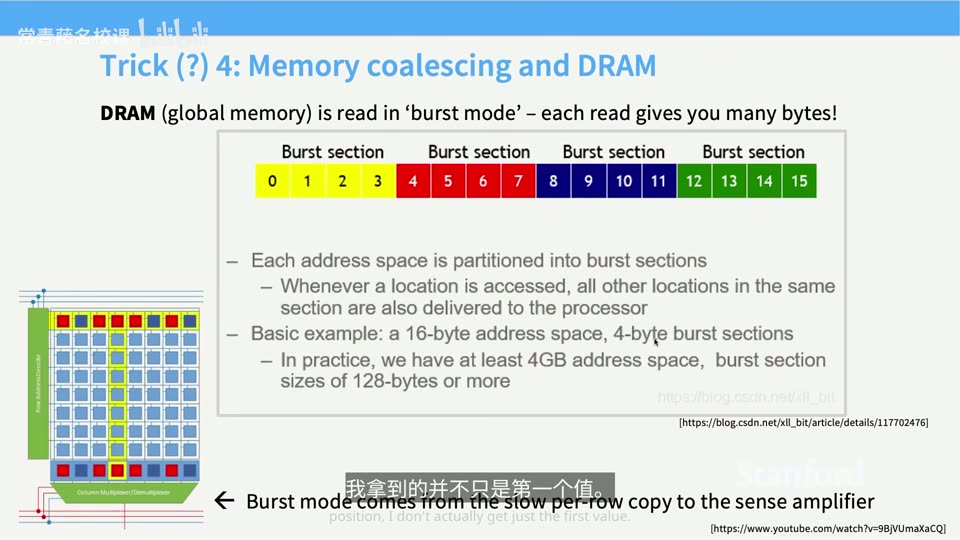 |
| 对吧？换句话说，你不用为这些数据单独付费。比如一次突发传输可能包含 128 字节的数据，这意味着只要数据位于同一个连续块中，单次读取就可能返回相当于 128 字节的数据。因此如果你的读取操作是连续排列的、彼此相邻，那么速度就会快得多。 [【跳转到 45:26】](https://www.bilibili.com/video/BV11LEA6eEuj/?p=5&t=2726) | 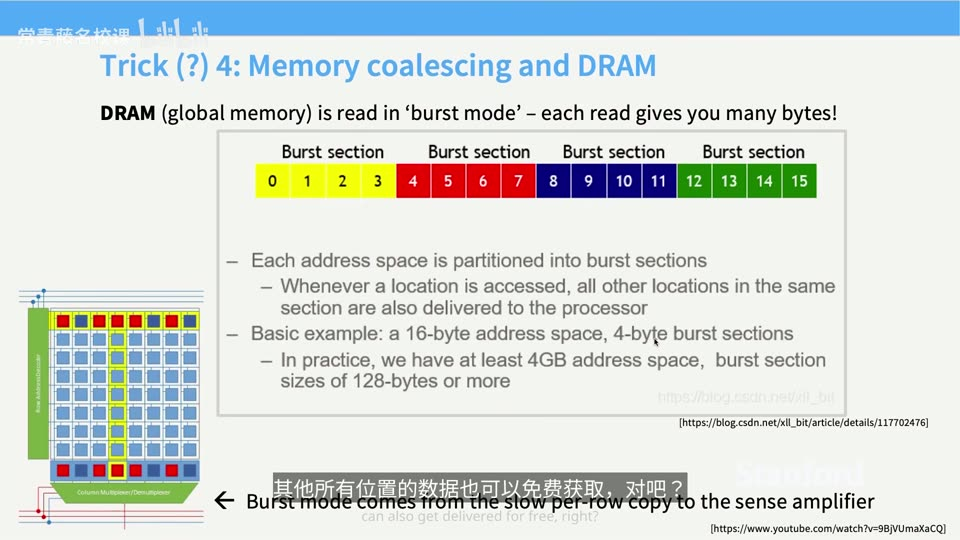 |
| 这里有个术语叫做合并访问（coalesced access），它的意思是：如果一个 warp 中的所有线程都落在同一个突发传输段内。因此这意味着，假设我有三个线程——抱歉，是四个线程——我的这四个线程都位于同一个突发传输段内，对吧？或者它们正在从该突发传输段读取数据，那么这就是合并访问，对吧？因为它们某种程度上用完了整个突发传输段， [【跳转到 45:46】](https://www.bilibili.com/video/BV11LEA6eEuj/?p=5&t=2746) | 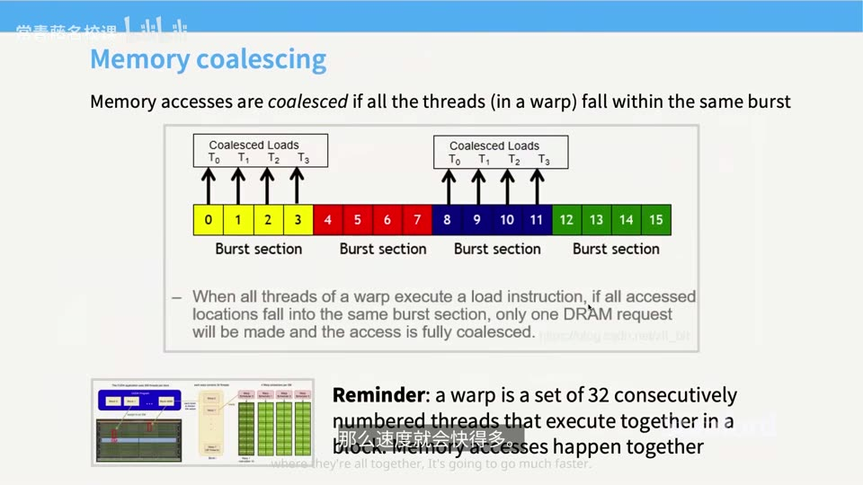 |
| 从而实现了充分利用。DRAM 内存有个很好的特性。所以如果我有多个线程，就会涉及多个不同的突发传输段，但你可以通过把内存读取操作分组来高效地读取内存。为什么会……哦对， [【跳转到 46:11】](https://www.bilibili.com/video/BV11LEA6eEuj/?p=5&t=2771) | 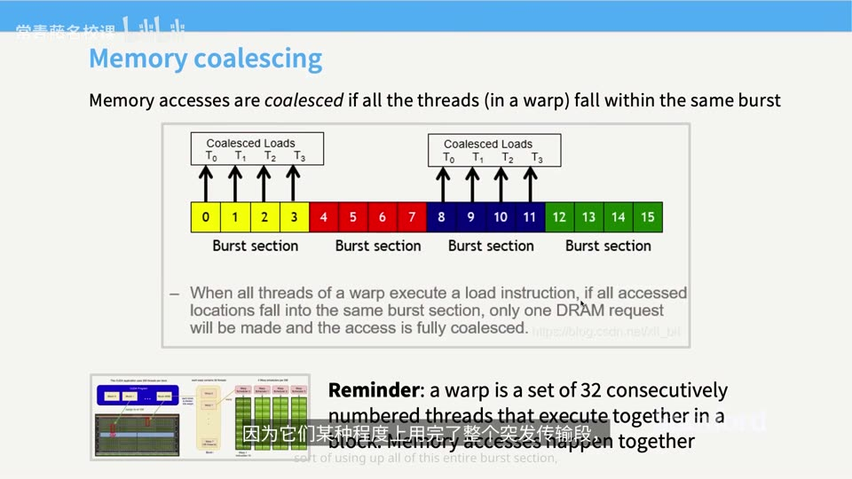 |
| 为什么会有这种模式？就像这种 T 字型的东西，大概像这样。 [【跳转到 46:27】](https://www.bilibili.com/video/BV11LEA6eEuj/?p=5&t=2787) | 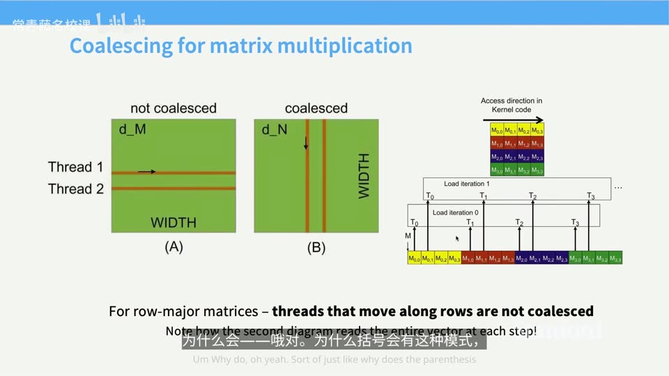 |
| 像这个，对对。据我了解，存储单元是网格状排列的， [【跳转到 46:32】](https://www.bilibili.com/video/BV11LEA6eEuj/?p=5&t=2792) | 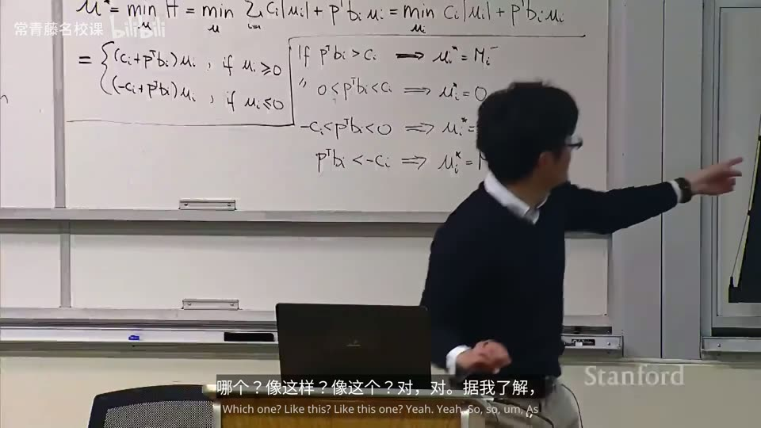 |
| 而用来决定读取哪些单元的放大器是按列来操作的。激活这个电压通常很花时间，所以一旦选定了列， [【跳转到 46:37】](https://www.bilibili.com/video/BV11LEA6eEuj/?p=5&t=2797) | 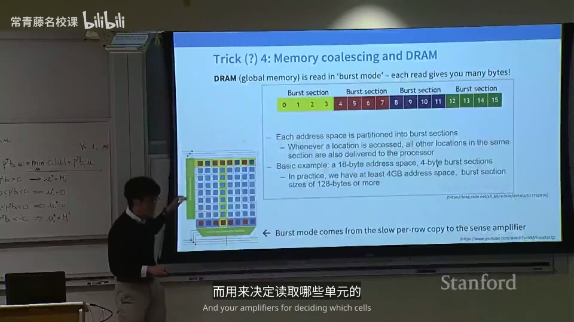 |
| 读取该列中的多个元素成本就相对低多了。 [【跳转到 46:44】](https://www.bilibili.com/video/BV11LEA6eEuj/?p=5&t=2804) | 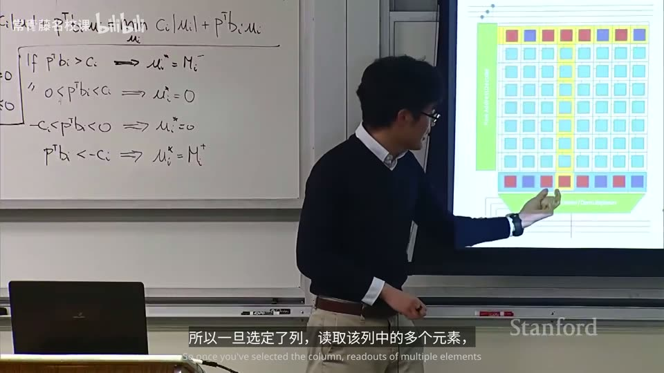 |
| 为了选中并读取上面那个红色单元，对吧？啊，或者……对，没错。 [【跳转到 46:49】](https://www.bilibili.com/video/BV11LEA6eEuj/?p=5&t=2809) | 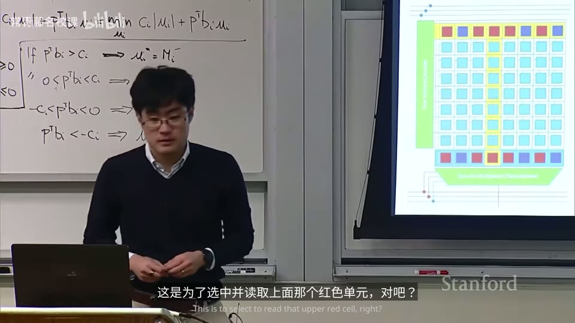 |
| 所以比如我想读这个，对吧？你知道我选了这个，或者至少在这个图里按列读取是比较便宜的。不过你知道，如果我想读取这个，可能就把这一整行都顺带免费拿到了，对吧？因为我已经把这一整行都寻址了。但 T 可不是白给的，对。好，行。嗯，所以你会说：你为什么要跟我讲这些 DRAM 的冷知识？诶，我之所以跟你讲这些 DRAM 的冷知识，是因为你想想矩阵，对吧？ [【跳转到 46:54】](https://www.bilibili.com/video/BV11LEA6eEuj/?p=5&t=2814) | 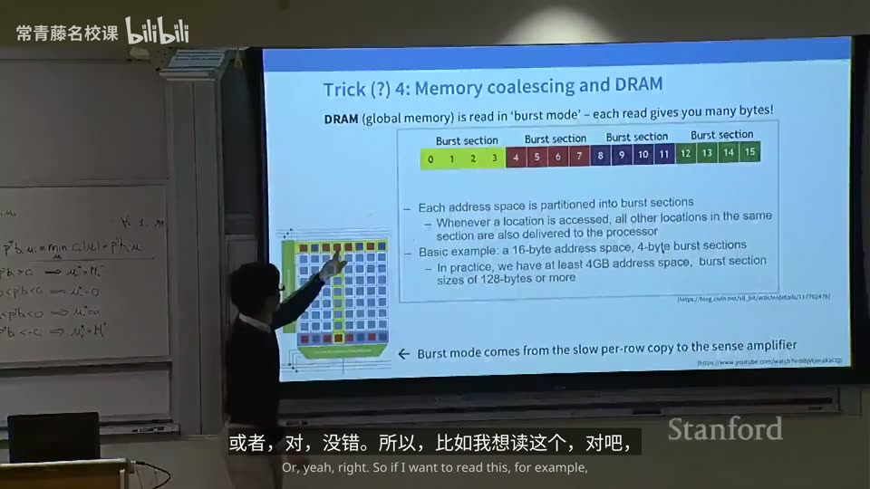 |
| 矩阵你常常想要按大块来读取，对吧？因为你要做矩阵乘法。是。而且在矩阵乘法中，某些类型的内存访问算是有特权的，它们要规整得多，有时你可以利用这一点得到非常非常快的内存读取。所以我用的记忆方法，或者说我记住的方式是：如果你有一个行主序（row-major）矩阵， [【跳转到 47:19】](https://www.bilibili.com/video/BV11LEA6eEuj/?p=5&t=2839) | 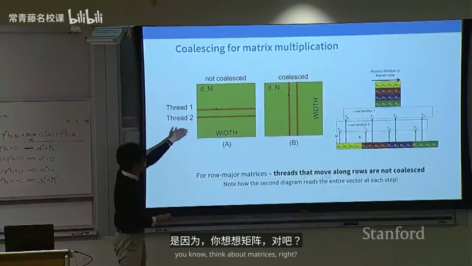 |
| 它是这样排列的：每一行的索引是递增的，那么沿着主轴移动的线程访问就没有合并。为了更直观地说明这一点，我很喜欢右边这张图。假设我有一个 4×4 的矩阵，它是按行存储的，所以它的排列顺序是黄色块在前、红色块在后，以此类推，这是内存地址里的线性排列顺序，也就是我想要存储的那个矩阵。现在假设线程在每个时钟周期去读取每一列， [【跳转到 47:44】](https://www.bilibili.com/video/BV11LEA6eEuj/?p=5&t=2864) | 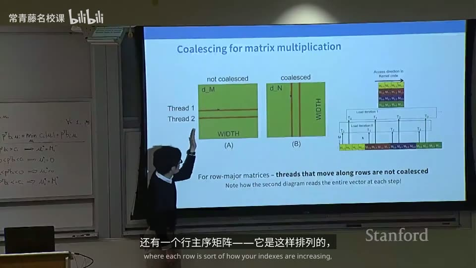 |
| 所以我读一列，向右移动，再读一列，再向右移动。如果是在第一轮迭代，我会碰到这个元素、这个元素、这个元素、这个元素。注意每一个都落在不同的突发窗口里，可以说我读取了整个向量——抱歉，是整个矩阵——尽管我只想要其中一列。现在假设反过来，如果我转置这个矩阵，就能一次性读取整个块，每个线程只需一次内存读取， [【跳转到 48:09】](https://www.bilibili.com/video/BV11LEA6eEuj/?p=5&t=2889) | 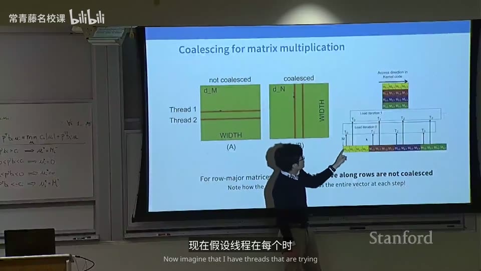 |
| 就能拿到自己的数据。所以合并访问能大幅提升从矩阵这类大型连续结构中读取数据的效率。所以这也是你可能需要稍微考虑该按行、按列还是其他顺序来排列数据的一个原因。 [【跳转到 48:34】](https://www.bilibili.com/video/BV11LEA6eEuj/?p=5&t=2914) | 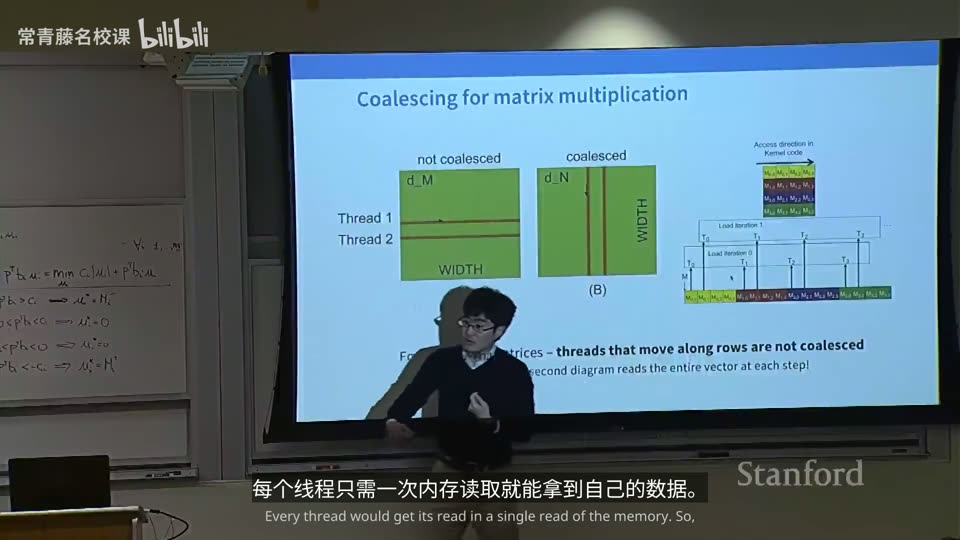 |
| 好的，我想讲的最后一个、也是最大、也许最重要的概念，我把它留到了最后，那就是分块（tiling）的概念。我认为这一点对性能的影响可能是最大的，我认为分块比其他任何概念都更能体现"尽可能利用内存层次结构"这一思路。所以我们要做的就是尽可能把内存访问分组，共享内存访问应当集中进行， [【跳转到 48:46】](https://www.bilibili.com/video/BV11LEA6eEuj/?p=5&t=2926) | 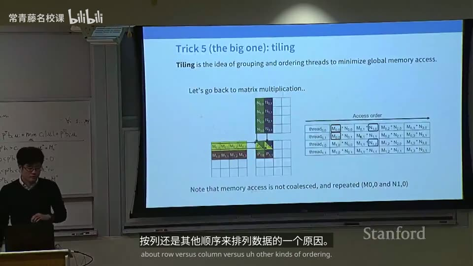 |
| 而且应当在共享内存上完成。之所以叫它分块，是因为我要把需要的数据切分成小块，我要把空间分块，每个分块都会加载到共享内存里；分块一旦加载好，我就会反复读取它，并尽可能多地完成计算。我们来看矩阵乘法的情形：我想把这个矩阵和这个矩阵相乘，右下角这个矩阵是我的输出，也就是我写出结果的地方，是相当标准的表示法。 [【跳转到 49:11】](https://www.bilibili.com/video/BV11LEA6eEuj/?p=5&t=2951) | 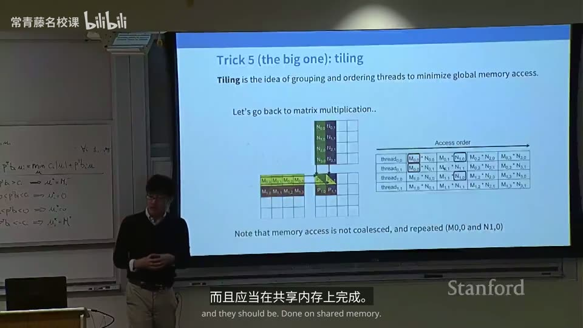 |
| 现在如果我要做这个乘法，随着线程逐个读取，同一个条目会被多次读取。确切地说，在朴素实现的 N×N 矩阵乘法中，每个条目会被读取 N 次。所以你可能会想：如果我要多次读取某个条目，比如某个元素，为什么不把这些内存访问集中起来，而非每次都去访问全局内存呢？ [【跳转到 49:36】](https://www.bilibili.com/video/BV11LEA6eEuj/?p=5&t=2976) | 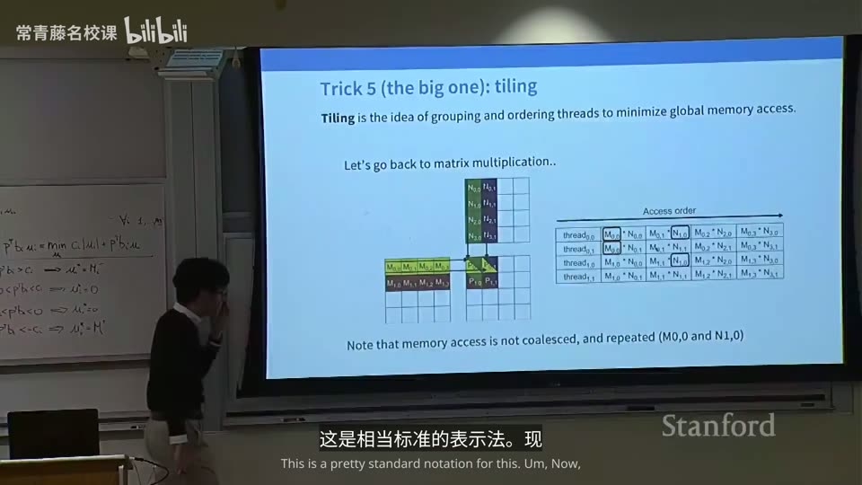 |
| 矩阵的好处在于它有一种非常自然的分组方式，对吧？这本质上就是把矩阵切分成子矩阵加载进来， [【跳转到 49:56】](https://www.bilibili.com/video/BV11LEA6eEuj/?p=5&t=2996) | 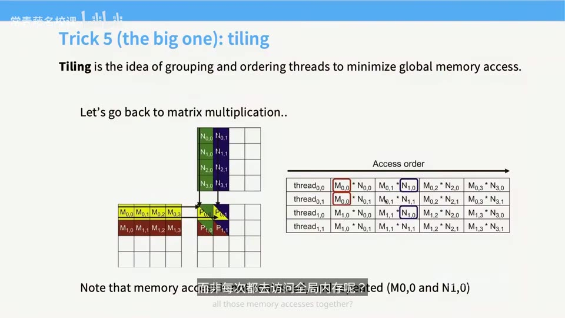 |
| 然后在它们之上做运算，对吧？所以这里有个很简单的算法：我把矩阵切成 2×2 的小块，然后分别加载这些图块。我先加载 M00 图块，也就是左上角那个，接着加载 N00 图块，也就是上面那个矩阵的左上角。我会把它们加载到共享内存里，这样我只需要付一次从全局内存慢速传输数据的代价。 [【跳转到 50:01】](https://www.bilibili.com/video/BV11LEA6eEuj/?p=5&t=3001) | 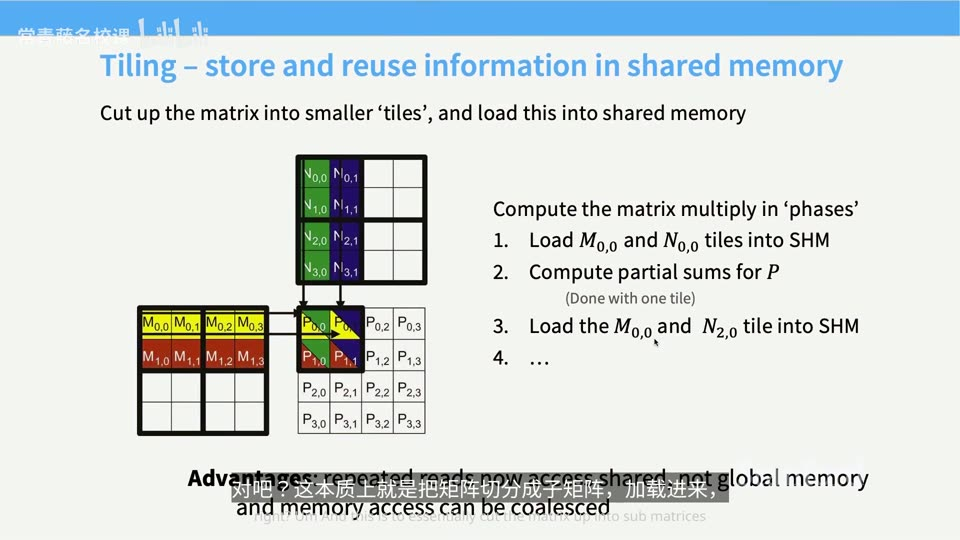 |
| 但一旦进了共享内存，我就能极快地读写这些图块。这里输出图块暂时也放在共享内存里，我将直接在这些子矩阵上进行操作。所以我把这两个子矩阵相乘，把部分和存到输出子矩阵里，这样我就能在快速的共享内存里完成所有读写，最后再写回去。那数学上是怎么算的？ [【跳转到 50:26】](https://www.bilibili.com/video/BV11LEA6eEuj/?p=5&t=3026) | 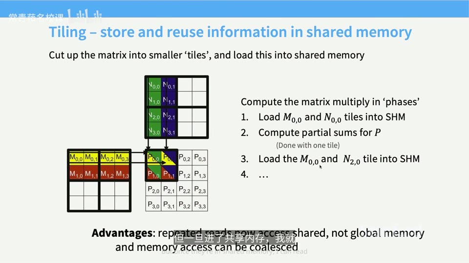 |
| 在非分块的情况下，我之前说过，做这种 N×N 的大矩阵乘法时，输入里的每个元素都得读 N 次。如果我用大小为 T 的图块来分块处理，那每个输入数据得从全局内存读一到 N 次，然后再在共享内存里访问 T 次，主要发生在每个图块内部。这很合理。极端情况是，如果 T 等于 N，我只从全局内存读一次，然后在共享内存里访问 N 次。这很棒，因为全局内存访问减少了 T 倍。 [【跳转到 50:45】](https://www.bilibili.com/video/BV11LEA6eEuj/?p=5&t=3045) | 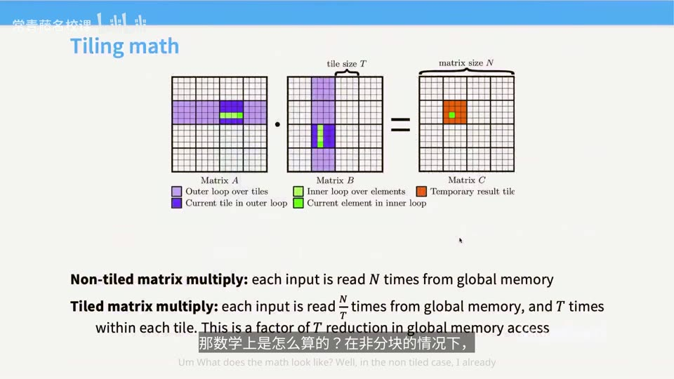 |
| 如果你用很大的共享内存图块，就能大幅减少像矩阵乘法这类操作的全局内存访问。好的，这一点，对。是的， [【跳转到 51:10】](https://www.bilibili.com/video/BV11LEA6eEuj/?p=5&t=3070) | 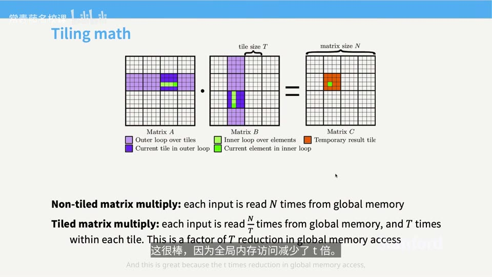 |
| 对对对，没错。但要是你在做像 Groq 那种全是 SRAM 的另类加速器， [【跳转到 51:18】](https://www.bilibili.com/video/BV11LEA6eEuj/?p=5&t=3078) | 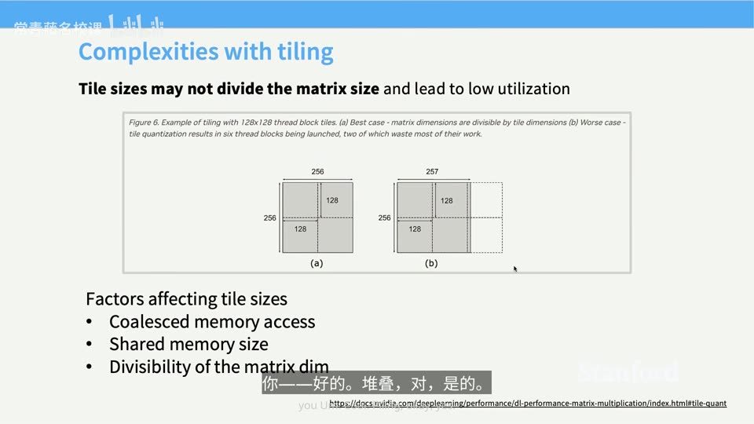 |
| 那确实把整个矩阵放进去，整体速度就会非常快。 [【跳转到 51:23】](https://www.bilibili.com/video/BV11LEA6eEuj/?p=5&t=3083) | 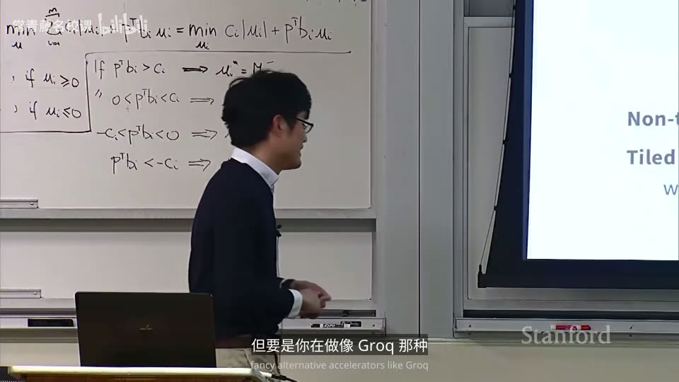 |
| （课堂问答）我感觉这时候…… [【跳转到 51:28】](https://www.bilibili.com/video/BV11LEA6eEuj/?p=5&t=3088) | 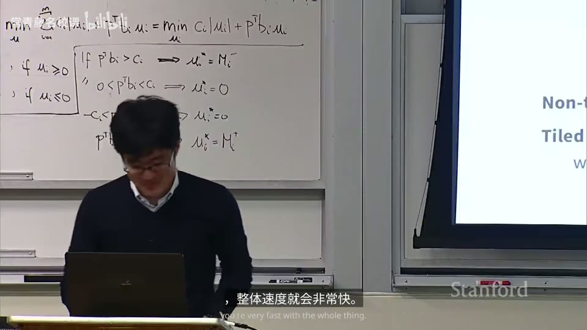 |
| 是，但它代价很高，非常非常贵。是的，而且还有个参数图表， [【跳转到 51:33】](https://www.bilibili.com/video/BV11LEA6eEuj/?p=5&t=3093) | 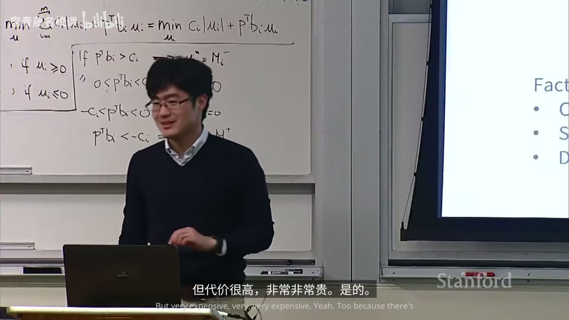 |
| 我甚至都没打算细讲。所以就像这样，然后你就一直重复、添加那个单元格，大概就是这么工作的。你是问这种分割是不是在加速器层面发生的？对，没错，这里会有一个图块划分。嗯，对，没错。所以你可以把数据并行想象成这样： [【跳转到 51:40】](https://www.bilibili.com/video/BV11LEA6eEuj/?p=5&t=3100) | 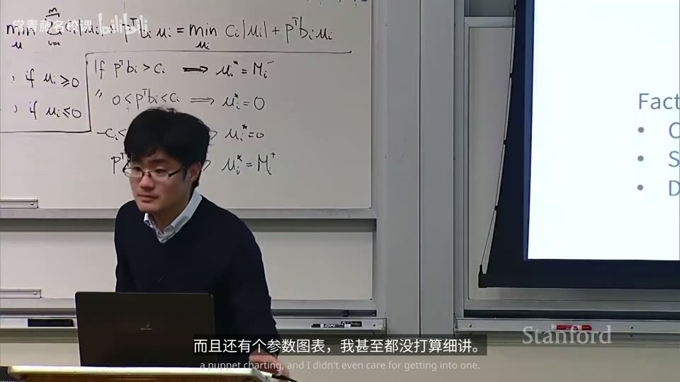 |
| 假设数据在某个轴上，权重在这里，如果你沿其中一个轴切分， [【跳转到 51:56】](https://www.bilibili.com/video/BV11LEA6eEuj/?p=5&t=3116) | 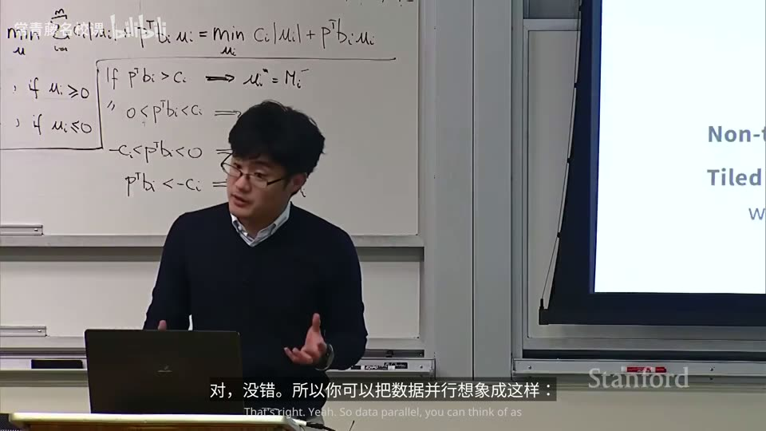 |
| 那就是数据并行。张量并行是另一种并行方式， [【跳转到 52:01】](https://www.bilibili.com/video/BV11LEA6eEuj/?p=5&t=3121) | 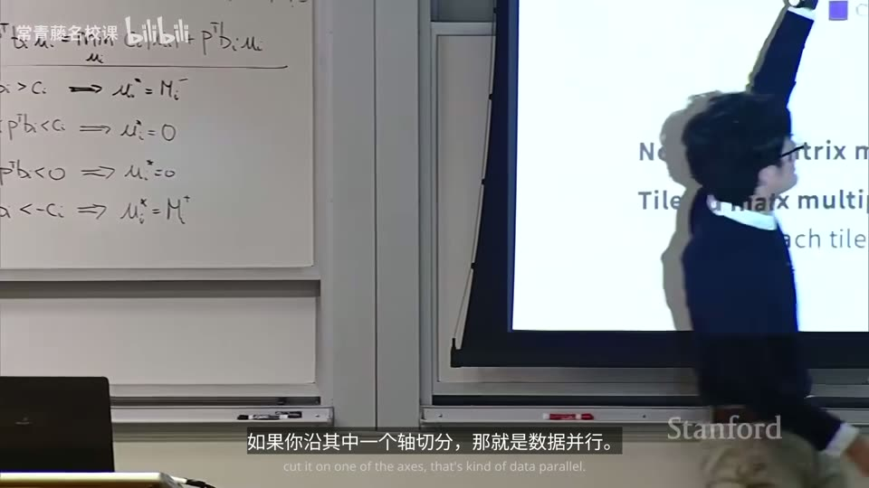 |
| 某种程度上这些并行方式看起来都有点像在做图块划分。对，不错。 [【跳转到 52:06】](https://www.bilibili.com/video/BV11LEA6eEuj/?p=5&t=3126) | 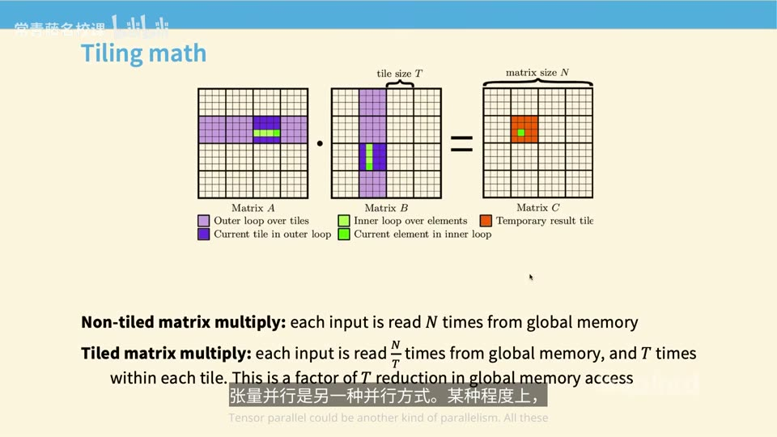 |
| 好的，嗯，哦对，呃，我可以这么假设吗：你知道像 cuBLAS 这样的库会自动搞定这个吗？对对对，没错，所以你调用的任何矩阵乘法内核底层都会做图块划分，对，没错。如果你在做某种特殊的操作，你可能得考虑类似图块划分那样的处理，对吧？你希望能在本地复用读取到的数据。但我要说，即使是 PyTorch 这样的工具也并非完美无缺，因此我们会谈到一些会出现的不完美之处。 [【跳转到 52:12】](https://www.bilibili.com/video/BV11LEA6eEuj/?p=5&t=3132) | 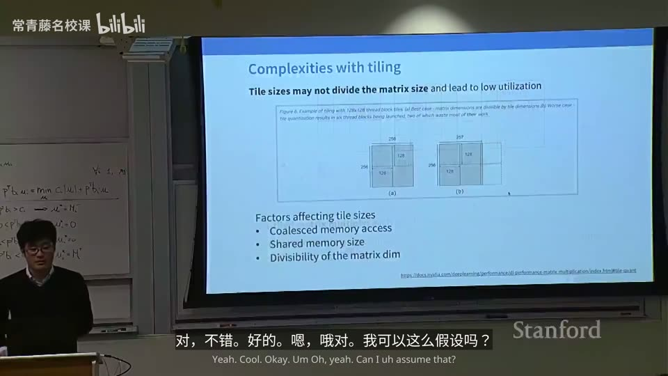 |
| 平铺这个概念非常非常强大，但同时也很复杂。实际上，使用平铺可能会发生一些非常微妙的情况。假设我的平铺大小为 128×128，哎，如果我的矩阵是 256×256，那情况就很理想，我正好有四个平铺块，对吧？完美切分。现在假设我把维度尺寸增加一点，现在我生成了两个非常细长的平铺块。 [【跳转到 52:37】](https://www.bilibili.com/video/BV11LEA6eEuj/?p=5&t=3157) | 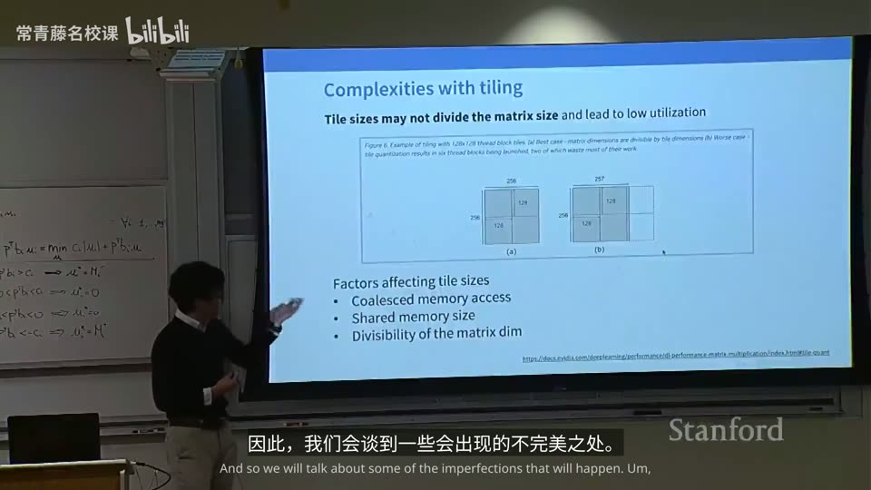 |
| 里面几乎什么都没有。因此你现在大概会意识到，平铺大小的设定其实相当复杂。根据矩阵的情况，我可能需要调整平铺大小，以在内存带宽与这块巨大的空白之间进行某种权衡——那是一块我什么都不做的空白区域。 [【跳转到 53:02】](https://www.bilibili.com/video/BV11LEA6eEuj/?p=5&t=3182) | 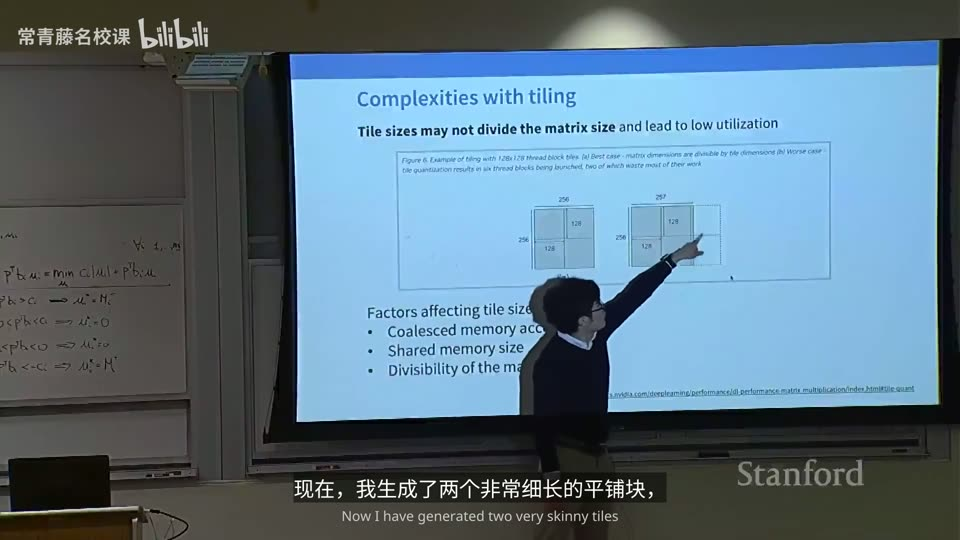 |
| 所以你得明白，平铺大小其实是需要你去优化的东西。比如合并内存访问、加速器里共享内存的大小，还有矩阵的尺寸，都会影响哪一种平铺方案是最优的。如果你了解 PyTorch 里的各种选项，有一个编译器选项叫做 max-autotune。我不知道你们当中有多少人用过或者了解它，你一旦打开这个标志，在接下来的 15 分钟里 PyTorch 就会运行一连串没完没了的基准测试，它会意识到自己其实是在你的矩阵上尝试各种不同大小的平铺， [【跳转到 53:22】](https://www.bilibili.com/video/BV11LEA6eEuj/?p=5&t=3202) | 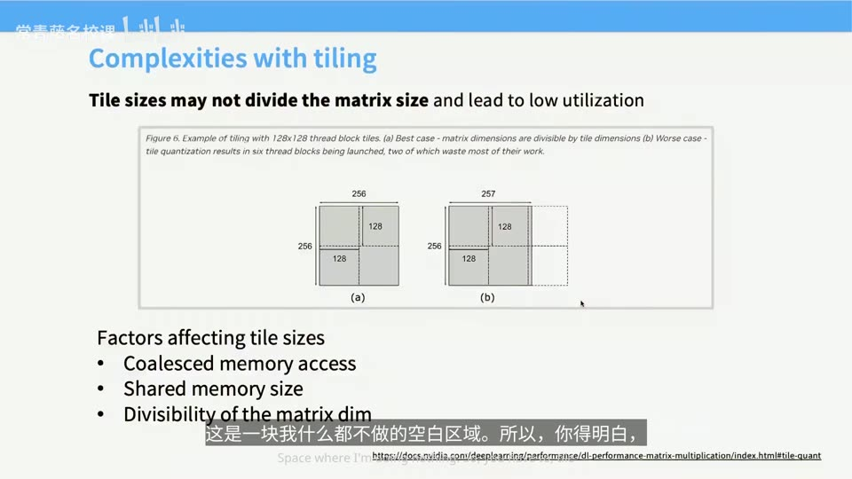 |
| 想找出哪一个实际上是更快的。而且你会发现，认真优化这些东西能带来相当可观的收益。 [【跳转到 53:47】](https://www.bilibili.com/video/BV11LEA6eEuj/?p=5&t=3227) | 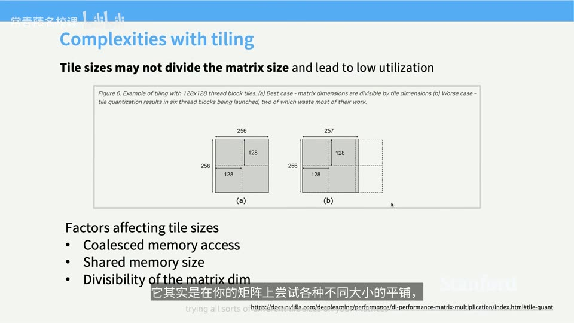 |
| 另一件和合并访问有关的事情是：如果你的平铺或者说矩阵的大小不对，你想读取一个平铺的操作实际上可能会触发大量的内存读取。想象我处在这样一个理想的情况里：假设这个蓝色的是矩阵，我想读取这个漂亮的平铺，而我的突发传输段宽度大致就跟平铺的宽度相当，在这种情况下， [【跳转到 53:55】](https://www.bilibili.com/video/BV11LEA6eEuj/?p=5&t=3235) | 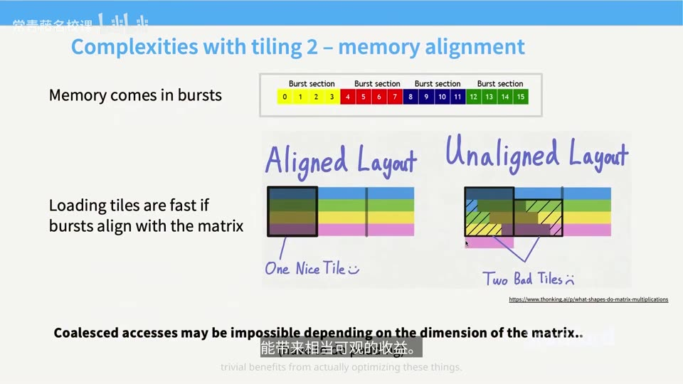 |
| 如果我做四次读取，得益于突发传输，我就能一次性读完整个子矩阵，对吧？所以合并读取能让内存读取很高效。现在想象一下把矩阵尺寸偏移一个位置。现在我把第一行往右挪了，所以这个蓝色方块现在跑到这儿来了。嗯，我实在没办法……我没法把读取合并起来一次性读出单个分块，对吧？因为现在这些东西都变得参差不齐、对不齐了。所以为了读出这一个分块， [【跳转到 54:18】](https://www.bilibili.com/video/BV11LEA6eEuj/?p=5&t=3258) | 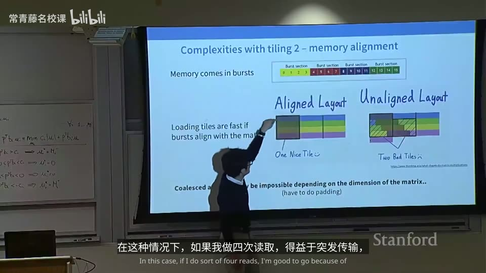 |
| 我至少得做相当于两个分块大小的读取，对吧？所以一旦你开始考虑内存合并以及其他这些因素，优化分块读取其实相当复杂。所以这种情况下你得做填充，好让突发传输段的边界和你的分块尺寸基本对齐。嗯，这就是为什么你最后会得到像这样的结果， [【跳转到 54:43】](https://www.bilibili.com/video/BV11LEA6eEuj/?p=5&t=3283) | 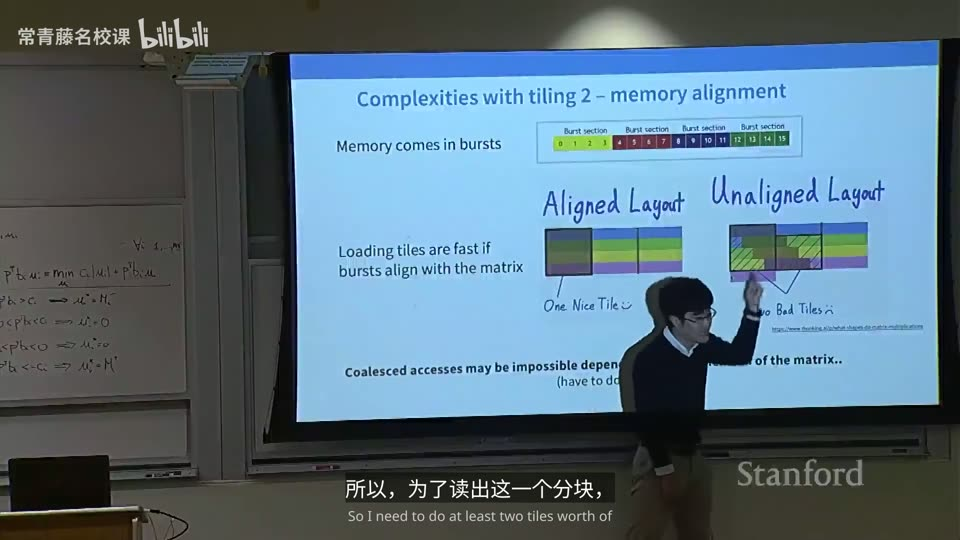 |
| 看起来非常神秘。我觉得这是我最喜欢的一个奇怪例子：Andrej Karpathy 在做 nanoGPT 加速时说过，当我把词表大小从 50257 改成 50304，我得到了 25% 的加速，对吧？为了提速还得特意做填充，这听着有点奇怪，但一旦理解了这类现象， [【跳转到 55:01】](https://www.bilibili.com/video/BV11LEA6eEuj/?p=5&t=3301) | 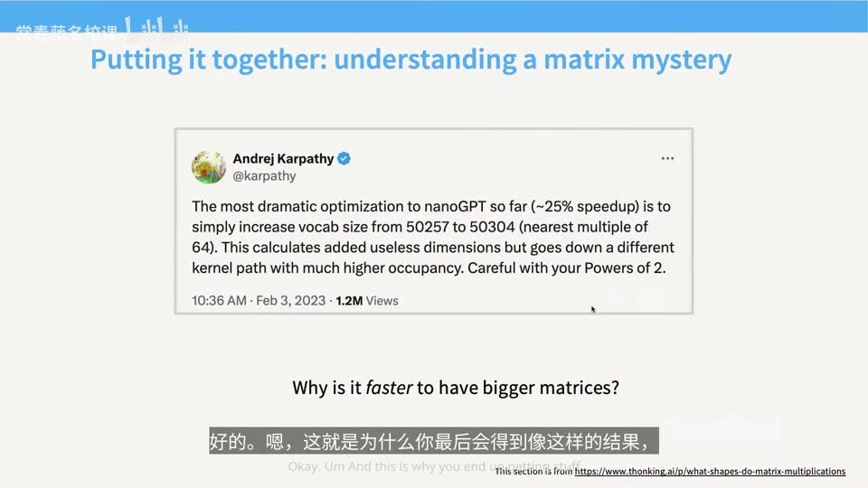 |
| 也就说得通了：填充可以开始移动行和列的位置，让你真正获得非常高效的读取，而其他情况下则不会这样。 [【跳转到 55:20】](https://www.bilibili.com/video/BV11LEA6eEuj/?p=5&t=3320) | 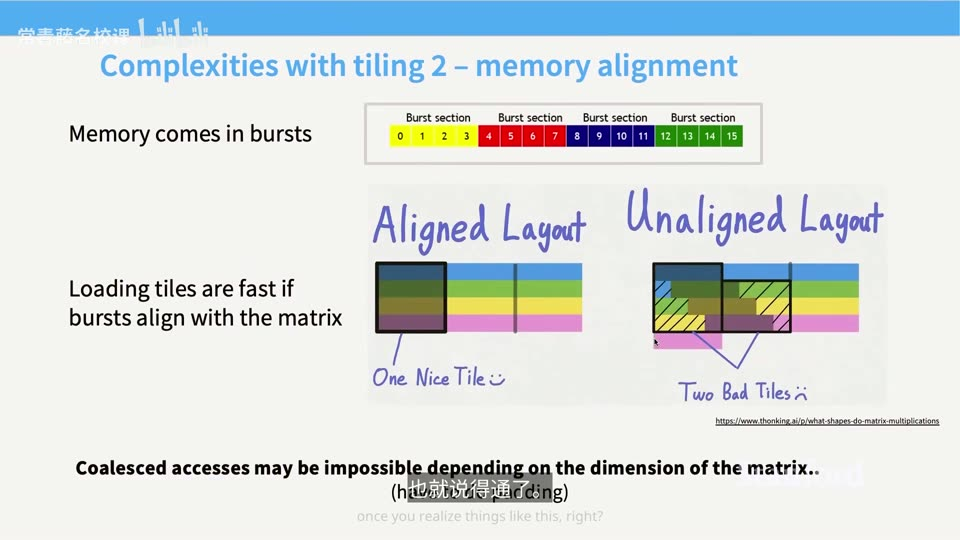 |
| 嗯，对对，你接着说。 [【跳转到 55:27】](https://www.bilibili.com/video/BV11LEA6eEuj/?p=5&t=3327) | 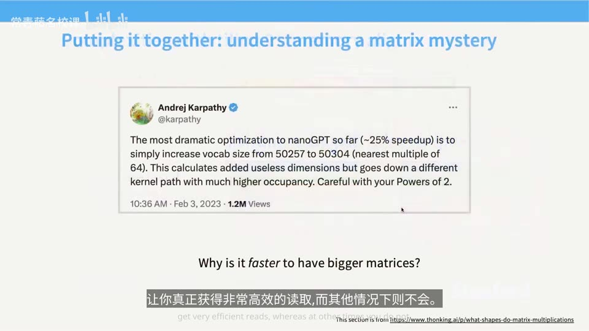 |
| 你不必专门去想图块，通常它应该被看做底层系统层面的东西，除非你在自己写内核。但你确实需要考虑矩阵的尺寸。好，那你是希望矩阵尺寸能被图块大小整除吗？对，你希望能整除，所以你希望它满足这个条件，这点我稍后会讲。不过对，一般是 2 的幂，理想情况下最好也能被 32 整除，对。好，那现在我们就可以来聊聊这边这个矩阵之谜了。 [【跳转到 55:33】](https://www.bilibili.com/video/BV11LEA6eEuj/?p=5&t=3333) | 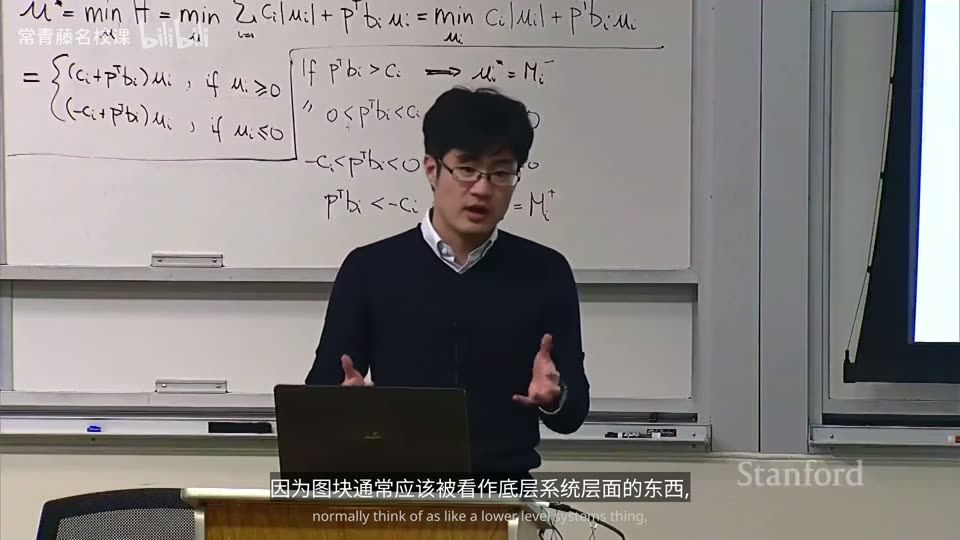 |
| 呃，我们基本上已经具备了理解它所需的所有要素。 [【跳转到 55:53】](https://www.bilibili.com/video/BV11LEA6eEuj/?p=5&t=3353) | 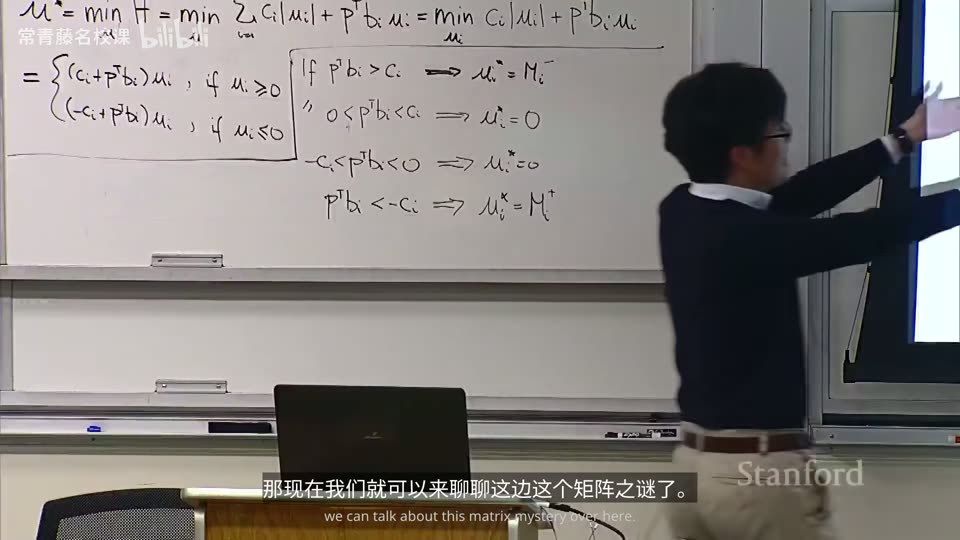 |
| 那我们就逐一来过一遍。之前我们聊过计算强度，也就是屋顶线图：你得让每次内存读取都处理足够多的工作，这样才能把计算单元跑满，这就是为什么曲线会呈现这种对角线向上的趋势。这部分说完了，接下来我们聊聊其他的。首先是分块。如果我们看每一条线， [【跳转到 55:58】](https://www.bilibili.com/video/BV11LEA6eEuj/?p=5&t=3358) | 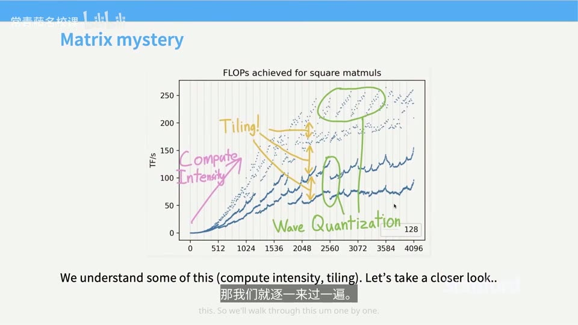 |
| 并按矩阵能否被整除来给它们上色。你会发现蓝色的线基本上只能被 1 整除，它们连偶数都不是——抱歉；橙色的线能被 2 整除，对吧？绿色表示能被 8 整除，红色是 16，紫色是 32。你会发现，那些不能被 1 或 2 整除的矩阵吞吐量表现都很差；但一旦达到更高的倍数，基本上就不会有任何性能损失了。 [【跳转到 56:21】](https://www.bilibili.com/video/BV11LEA6eEuj/?p=5&t=3381) | 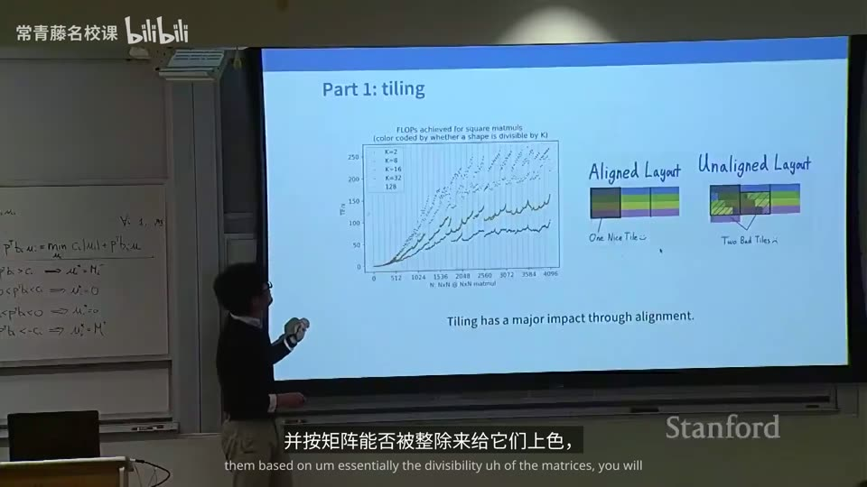 |
| 比如 16 和 32 的表现一样好。这真不是因为 2 的幂次有什么魔力之类的缘故，这是因为 16 和 32 足够大，从而具备了恰当的突发窗口（burst window）特性，它现在差不多能装下整个突发窗口，这样你就能对整个数据块（tile）进行合并读取了。 [【跳转到 56:46】](https://www.bilibili.com/video/BV11LEA6eEuj/?p=5&t=3406) | 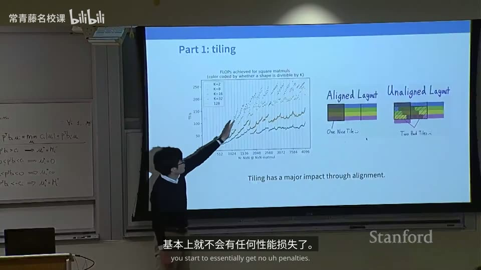 |
| 这对对齐方式有重大影响。谢谢。现在，诶，我们看看剩下的部分，盯着这条曲线，会偶尔看到这种奇怪的周期性现象：性能突然下降，对吧？这非常奇怪，因为我只是在做矩阵乘法，为什么仅仅多加一个维度就会突然让我的吞吐量崩溃？嗯，嗯，我觉得运用我们学到的所有知识走到这一步还挺有意思的。 [【跳转到 57:04】](https://www.bilibili.com/video/BV11LEA6eEuj/?p=5&t=3424) | 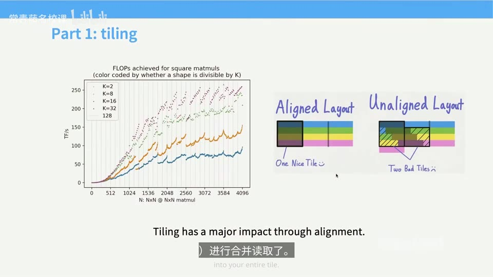 |
| Percy 把这叫做"GPU 冷知识"，我想他可能挺烦这个，但我挺喜欢。那么，为什么从这儿到那儿吞吐量会出现这么大的下降？这发生在 1792 到 1793 之间，为什么会这样？嗯，我用的分块大小是 256×128，那这意味着有多少个分块呢？呃，在 1792 时有 98 个。但我一旦把数值调到 1793，实际上两个维度上的分块数都增加了一， [【跳转到 57:29】](https://www.bilibili.com/video/BV11LEA6eEuj/?p=5&t=3449) | 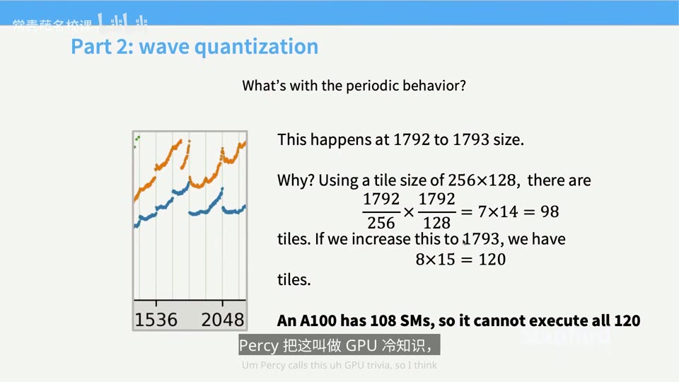 |
| 所以我现在有 120 个分块。好，之前是 98 个，现在是 120 个，这确实不好，但还不至于差到这个地步，对吧？这次性能暴跌太剧烈了。嗯，事实证明，之所以下降得这么剧烈，是因为 A100 有 108 个 SM，对吧？98 个分块能放进这 108 个 SM，但 120 个分块就放不下了，对吧？所以你处理完了那 108 个 SM， [【跳转到 57:54】](https://www.bilibili.com/video/BV11LEA6eEuj/?p=5&t=3474) | 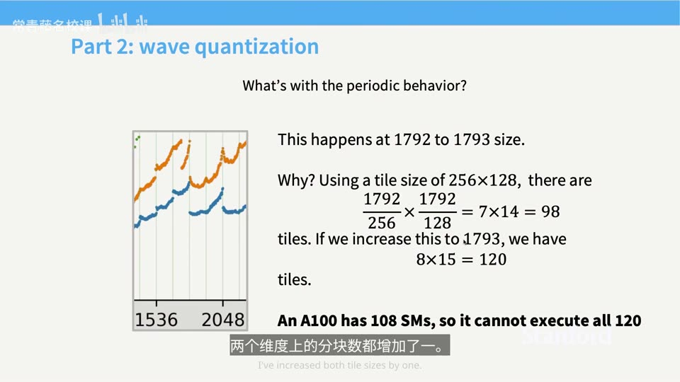 |
| 你会想："嗯，我还剩 12 个这样的分块，我想我还是得处理它们。"而你大部分 GPU 都闲着。所以你会再次遇到这种非常奇怪的现象：仅仅让分块数多了一个，你突然就得再等整整一个周期去处理这一批分块。这叫波量化。 [【跳转到 58:19】](https://www.bilibili.com/video/BV11LEA6eEuj/?p=5&t=3499) |  |
| 第二部分，我们如何让机器学习工作负载在 GPU 上运行得更快？其实这在很大程度上就是关于内存、内存、内存，对吧？那么我们如何减少必须进行的内存访问量？好，我们把内存读取合并起来，把操作融合起来，这样就不必读取那么多数据；对于那些无论如何都必须读取的数据，好，我们就复用内存，对吧？所以共享内存——把数据移至共享内存并尽可能多地复用。 [【跳转到 58:35】](https://www.bilibili.com/video/BV11LEA6eEuj/?p=5&t=3515) | 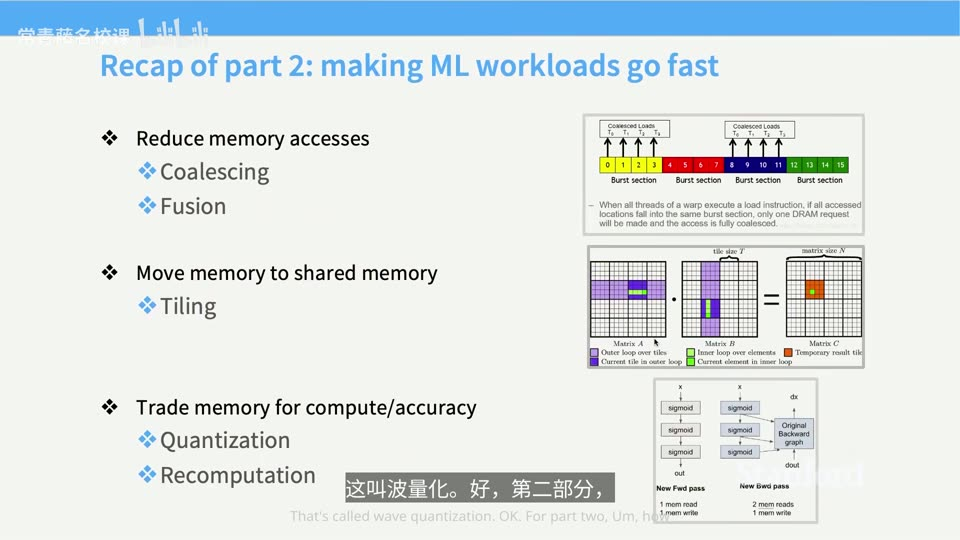 |
| 这就是分块（tiling）。最后，也许你可以用你拥有的其他资源来换取内存，这就是量化和重计算，对吧？所有这些想法都与"内存是我们的瓶颈"这一概念密切相关，我们如何应对这个问题，对吧？好，最后还有问题吗？所以这基本没法实现……唉，太贵了还特别费电，原因有两个：首先 SRAM 制造成本就很高，另外也很难， [【跳转到 59:00】](https://www.bilibili.com/video/BV11LEA6eEuj/?p=5&t=3540) | 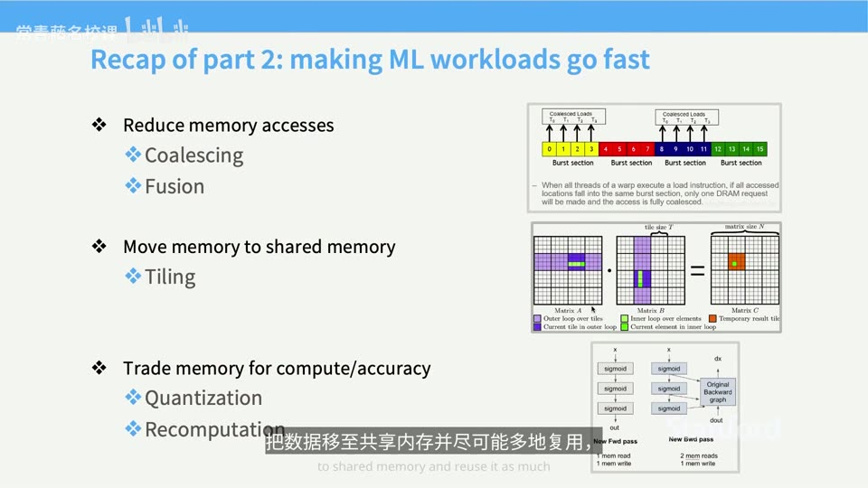 |
| 因为它必须在物理上靠得很近，毕竟信号传输是个难题。嗯，我觉得第三点在于 SRAM 和 DRAM 是两种完全不同的存储机制，比如 SRAM 必须一直通电才能存储数据，特别耗电。所以要是你考虑总拥有成本或者能耗的话，可能就不该用那种巨大的 SRAM 芯片，你确实应该把它用在刀刃上。对，你是说如果我把频率提高会有帮助吗？ [【跳转到 59:25】](https://www.bilibili.com/video/BV11LEA6eEuj/?p=5&t=3565) | 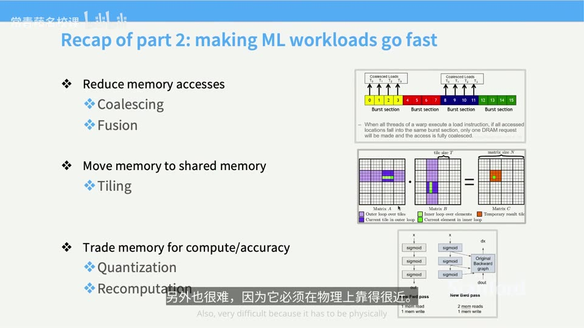 |
| 不行，因为我觉得关键在于—— [【跳转到 59:49】](https://www.bilibili.com/video/BV11LEA6eEuj/?p=5&t=3589) | 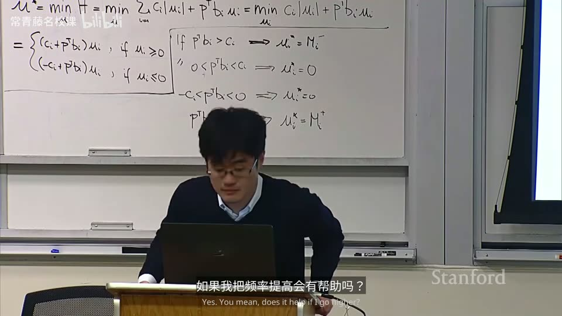 |
| 只要它能被你的突发大小整除那就没问题，对吧？但这是由除数决定的特性。 [【跳转到 59:54】](https://www.bilibili.com/video/BV11LEA6eEuj/?p=5&t=3594) | 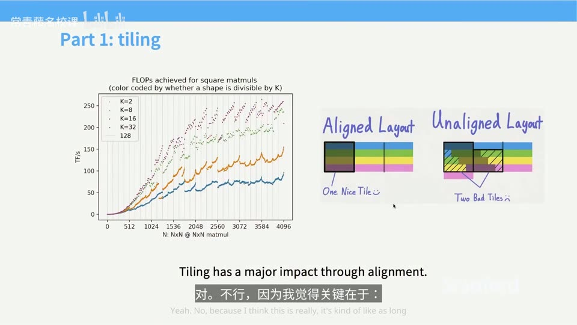 |
| 在其他场景下，更大的除数可能带来好处，但这里并不适用。因此——那只是 SM（流式多处理器）的数量，这个我没法回答你。是的。 [【跳转到 59:59】](https://www.bilibili.com/video/BV11LEA6eEuj/?p=5&t=3599) | 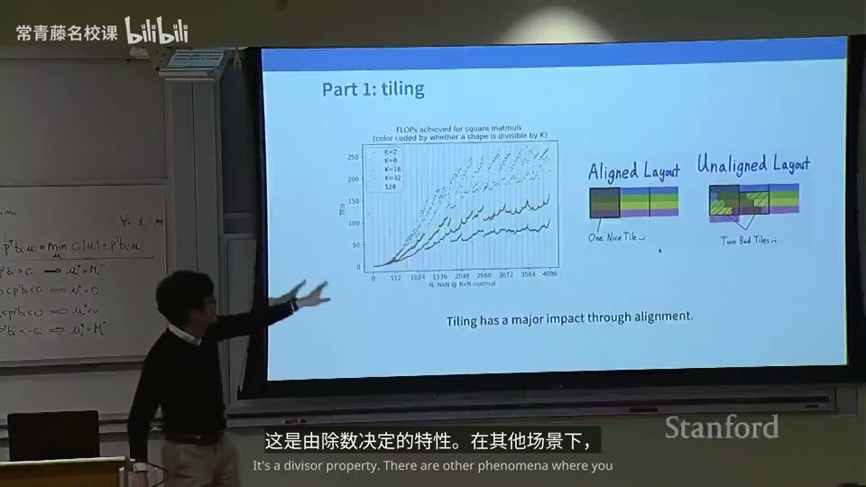 |
| 回到硬件部分——抱歉，不是这个，是我突然想到的。 [【跳转到 60:10】](https://www.bilibili.com/video/BV11LEA6eEuj/?p=5&t=3610) | 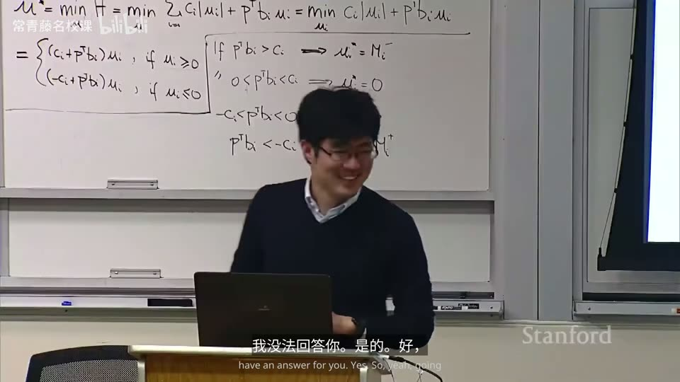 |
| 你们开始对比 GPU 和 Cerebras 的晶圆级引擎了吗？是的，我是说，我觉得坐在那边的人比我更懂晶圆级的东西。 [【跳转到 60:15】](https://www.bilibili.com/video/BV11LEA6eEuj/?p=5&t=3615) | 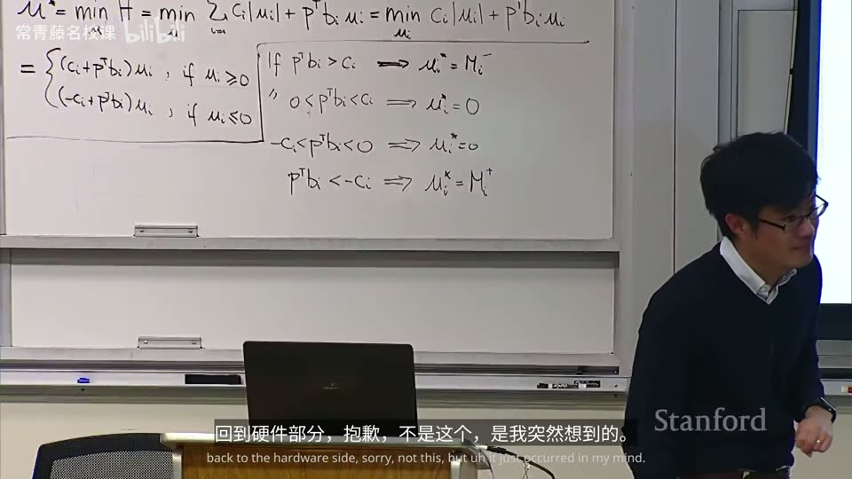 |
| 上次课后我们聊过，编译之所以困难， [【跳转到 60:20】](https://www.bilibili.com/video/BV11LEA6eEuj/?p=5&t=3620) | 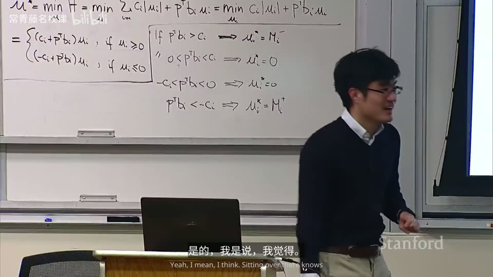 |
| 是因为一旦涉及晶圆级，就会出现波干涉效应等各种棘手的问题。那是个我不熟悉的领域， [【跳转到 60:25】](https://www.bilibili.com/video/BV11LEA6eEuj/?p=5&t=3625) | 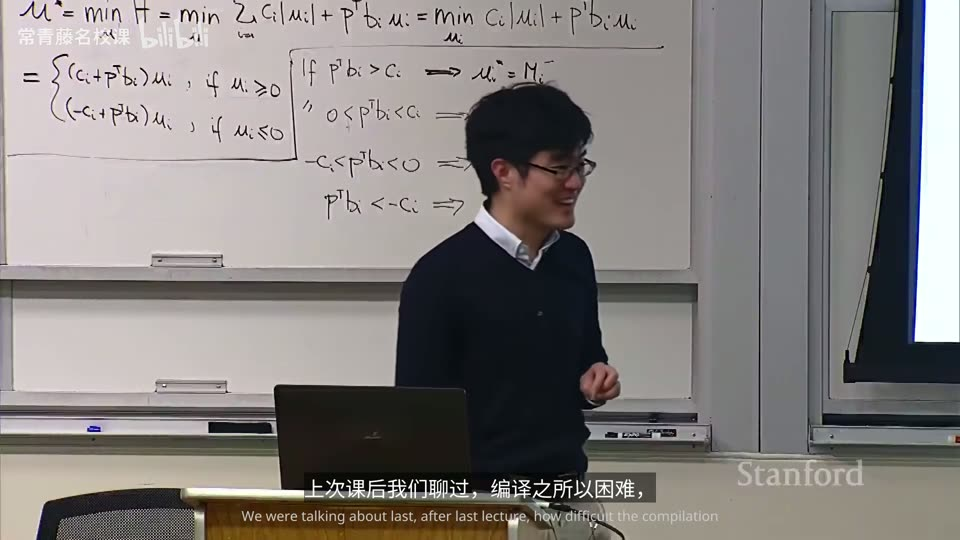 |
| 但我认为它比我们这里讨论的要复杂得多。好，酷。那么现在我们可以进入某种意义上的压轴部分了， [【跳转到 60:31】](https://www.bilibili.com/video/BV11LEA6eEuj/?p=5&t=3631) | 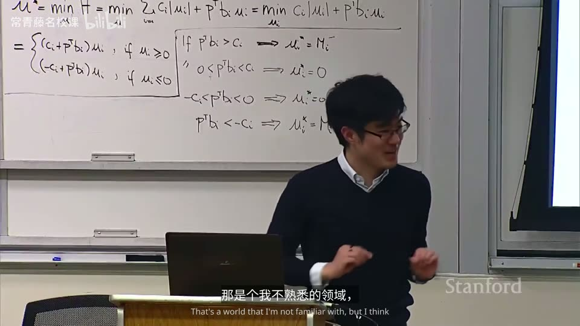 |
| 也就是回顾一下我们学到的关于 GPU 的种种知识。如果我们能把这些都串起来， [【跳转到 60:37】](https://www.bilibili.com/video/BV11LEA6eEuj/?p=5&t=3637) | 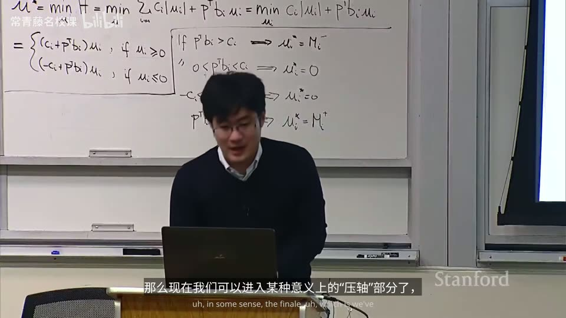 |
| 从而提前复现或理解一个我认为非常重要的东西，那就太好了， [【跳转到 60:42】](https://www.bilibili.com/video/BV11LEA6eEuj/?p=5&t=3642) | 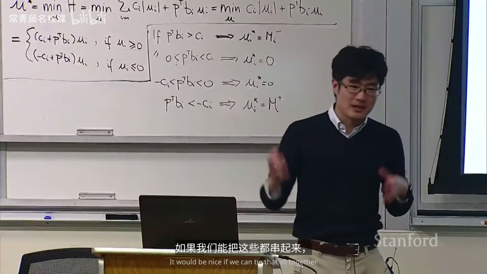 |
| 那就是 FlashAttention。明白了吗？我认为 FlashAttention 是注意力机制能力方面的重大改进之一。稍后再说，这完全是系统层面的事，对吧？就是把 PyTorch 那种朴素的注意力实现改成单个非常巧妙的融合内核（kernel）。这是论文里的数据，但你会看到部署这些模型时的延迟大幅降低了。就像我两次课前提过的， [【跳转到 60:47】](https://www.bilibili.com/video/BV11LEA6eEuj/?p=5&t=3647) | 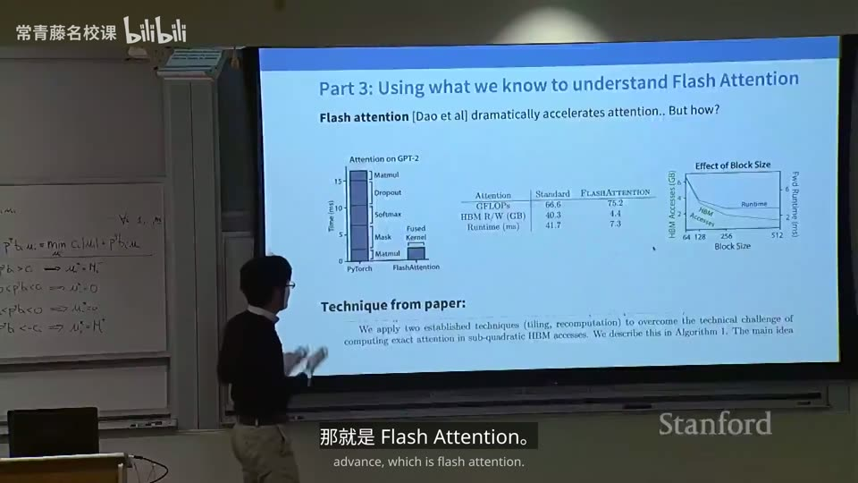 |
| FlashAttention 是一种很省内存的计算方式，所以你能处理越来越大的规模。你会发现很多提升都来自减少了从 HBM（也就是全局内存）传输的数据量。那么他们到底做了什么？如果你阅读论文，他们会说：好吧，我们只做两件事——首先我们用了分块和重计算，而且我们用了某种方式，让内存访问次数不再随序列长度以二次方增长。看来这些组件我们现在都搞懂了。 [【跳转到 61:12】](https://www.bilibili.com/video/BV11LEA6eEuj/?p=5&t=3672) | 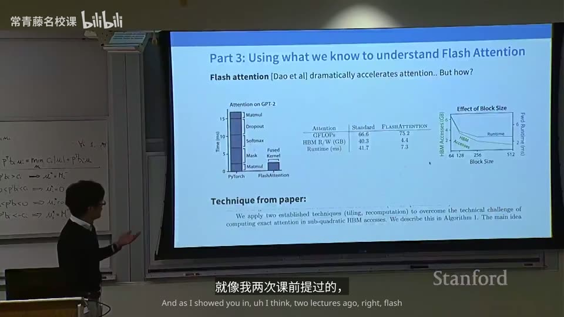 |
| 接下来我们看看具体是怎么运作的。回想一下，注意力计算主要分几步： [【跳转到 61:37】](https://www.bilibili.com/video/BV11LEA6eEuj/?p=5&t=3697) | 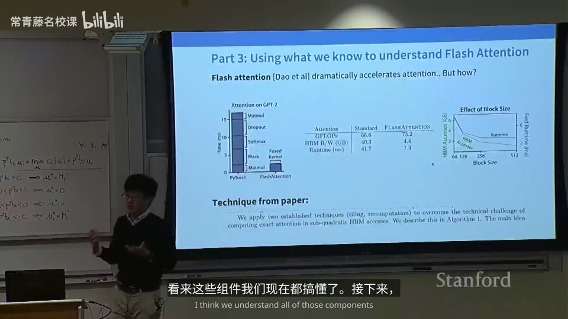 |
| 先算 QKV，把 K 和 Q 做矩阵乘法，最后再和 V 做一次矩阵乘法，中间夹着一个 softmax。所以我们要处理的操作就是三次矩阵乘法和一次 softmax。矩阵乘法 [【跳转到 61:42】](https://www.bilibili.com/video/BV11LEA6eEuj/?p=5&t=3702) | 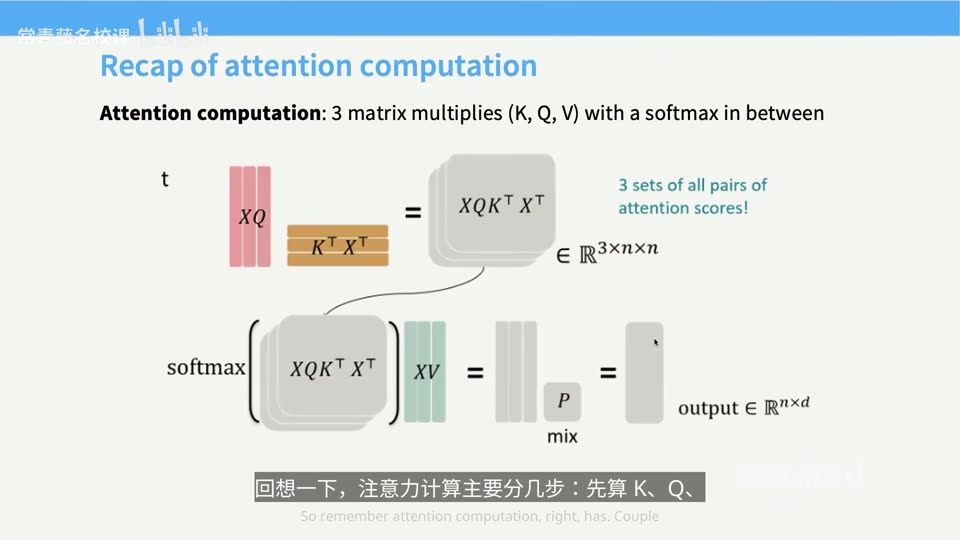 |
| 我们会做了，所以我们要用的是分块矩阵乘法。看第 1 张图，本质上就是分块矩阵乘法，这个我们之前见过：我们把输入，也就是 K 和 Q 切分，然后在各个图块上分块相乘，算完之后把结果写出去，没什么特别的或花哨的操作。FlashAttention 棘手的地方在于（你在作业里会看到）它对整个计算过程使用了一个全局的 softmax。 [【跳转到 61:56】](https://www.bilibili.com/video/BV11LEA6eEuj/?p=5&t=3716) | 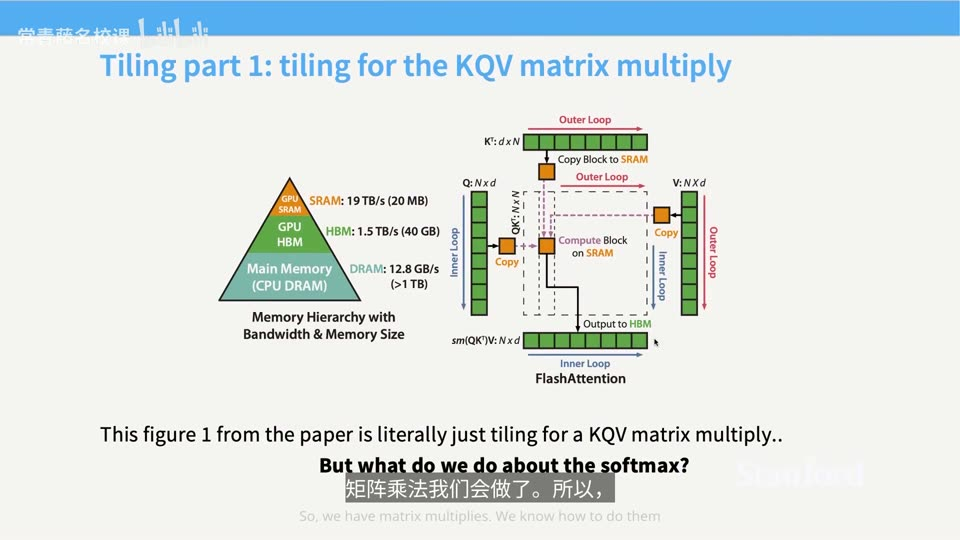 |
| 所以我们不能简单粗暴地直接这么做，因为 softmax 是一个全局操作，它把所有元素都关联在一起，因此它把所有不同的图块连接在了一起。"如何对注意力机制进行图块划分"乍一看可能并不显而易见。 [【跳转到 62:21】](https://www.bilibili.com/video/BV11LEA6eEuj/?p=5&t=3741) | 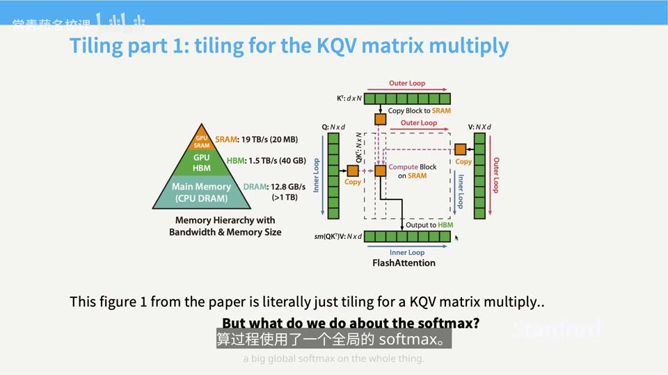 |
| 关键技巧在于——而且一旦你理解了这一点，这其实就是核心思想或者说核心观察——一旦你理解了这一点，其余部分就非常简单了。通常计算 softmax 会按照这里这张图所示的方式进行，也就是说你会对所有元素求指数，出于数值稳定性的考虑减去最大值，然后再做归一化，对吧？这就是标准的 softmax。现在还有一种在线计算它的不同方法。 [【跳转到 62:38】](https://www.bilibili.com/video/BV11LEA6eEuj/?p=5&t=3758) | 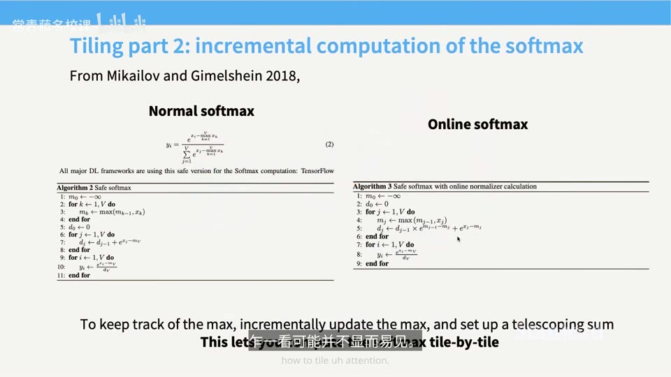 |
| 我觉得一旦你大致领会了，它其实挺简单的：就是随着数据不断到来，逐步计算出归一化后的 softmax；而每当你遇到一个比之前见过的更大的数时，你就会把当前的最大值替换掉。于是你就有了一种随着数据到来逐步计算 softmax 的在线方法。唯一麻烦的当然就是那个最大值，处理它的办法是我们一直追踪最大值， [【跳转到 63:03】](https://www.bilibili.com/video/BV11LEA6eEuj/?p=5&t=3783) |  |
| 每次碰到更大的数就把它换掉并做相应修正。除此之外，这其实就是把我们之前看到的所有数据做指数运算后在线累加起来。当然最后你只需将所有结果除以在线计算得到的累加器即可。现在，在线 softmax 的重点是因为它是在线的，而且是一块一块、一点一点处理的，所以我们可以逐块来算，对吧？我不需要看剩下的图块就能算出当前的， [【跳转到 63:28】](https://www.bilibili.com/video/BV11LEA6eEuj/?p=5&t=3808) |  |
| 所以我可以先算出当前图块的 softmax，把部分结果存起来，比如写回全局内存，然后接着处理后续的工作。所以这让我们现在能把所有这些相互作用的部分拆解成更简单的东西。所以我觉得这是个——呃，但我想这是出自 FlashAttention-2 或者 -3，我想是 -2。我喜欢这个可视化展示，它显示了哪些部分被分块处理了，所以虚线框里的数据是在 SRAM 里分块处理的。 [【跳转到 63:53】](https://www.bilibili.com/video/BV11LEA6eEuj/?p=5&t=3833) | 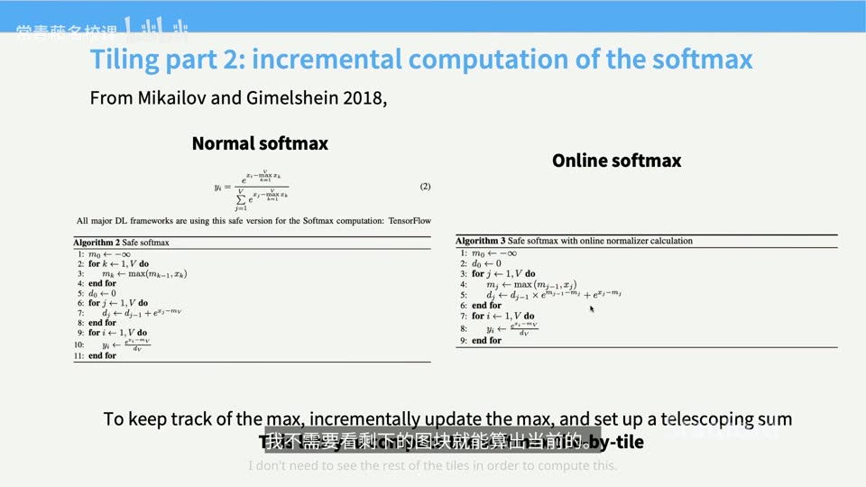 |
| 蓝色框代表那些存在高带宽内存也就是全局内存里的数据。比如我们做 KQ 内积这些分块矩阵乘法的结果都存在 SRAM 里，我们把数据留在 SRAM 里算指数，接着在这个分块里我们要算累积的 softmax。哦，然后我移到下一个分块做同样的事，不过这次我会一边做一边保留 softmax 的部分累积和。我可以把这些部分和存在共享内存、寄存器或者其他地方， [【跳转到 64:18】](https://www.bilibili.com/video/BV11LEA6eEuj/?p=5&t=3858) | 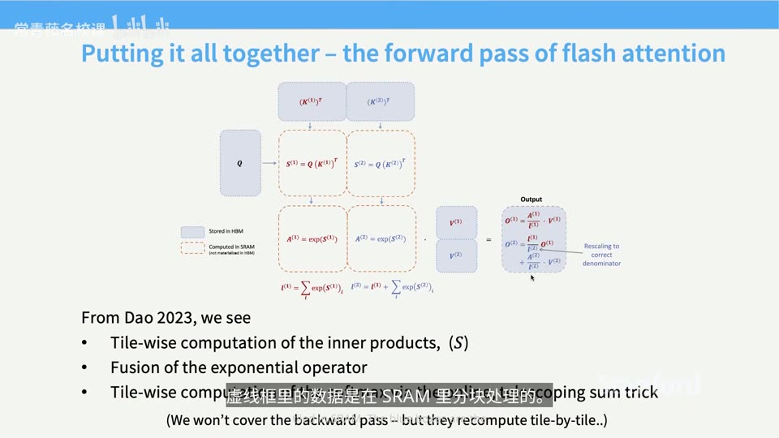 |
| 反正要记的东西很少。最后算完所有指数值和归一化因子后，只要再跟 V 做一次分块乘法，最后除一下就行了。这样我就能把注意力机制的操作拆成这些小块来处理。最后是算子融合：只要可能，你会尽量把这两步合在一起做，别来回切换，这部分我就不展开讲了。不过你可以选择在反向传播时重新计算所有需要的数据。 [【跳转到 64:43】](https://www.bilibili.com/video/BV11LEA6eEuj/?p=5&t=3883) | 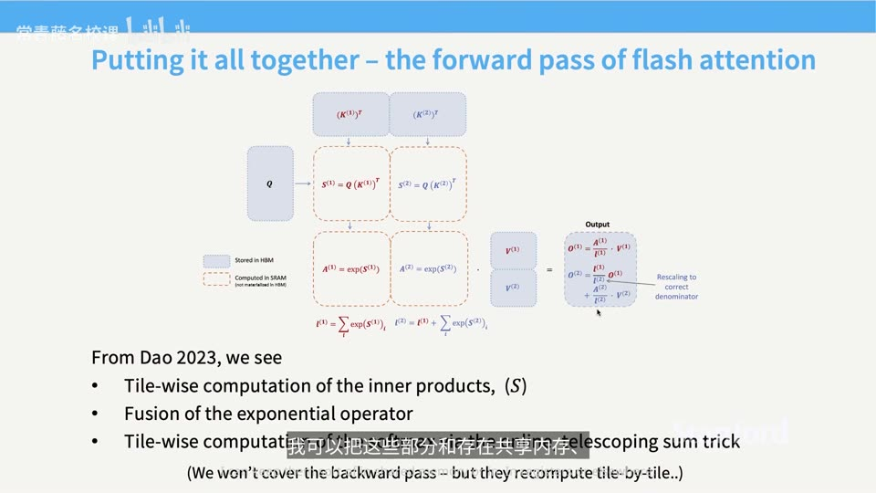 |
| 所以 FlashAttention 的最后一个要点是：即使你保存了激活值，你依然需要为注意力机制保留那个 N² 大小的激活值，我们不如直接丢弃它，在反向传播时分块重新计算所有内容。所以它同时也涉及重新计算的环节。好了，以上就是 FlashAttention 的全部内容。现在我们已经看到了这些技巧的实际应用，基本上核心内容就是这些，对吧？ [【跳转到 65:08】](https://www.bilibili.com/video/BV11LEA6eEuj/?p=5&t=3908) | 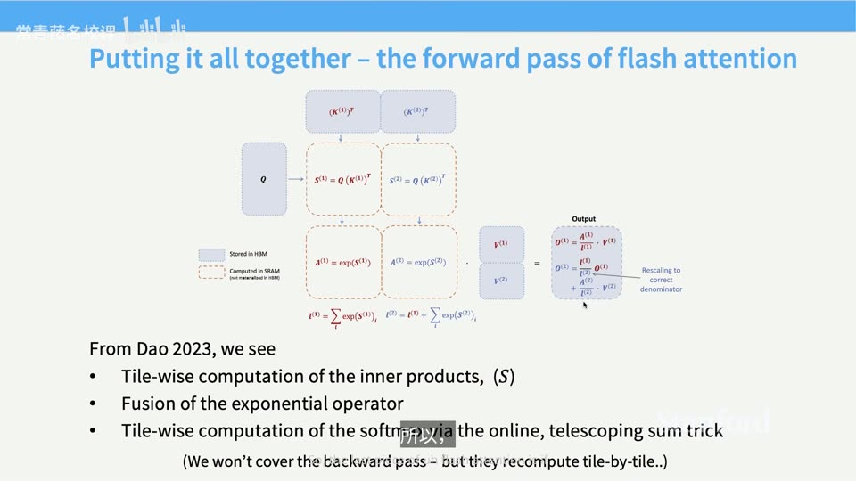 |
| 很多关于高效实现和用好 GPU 的技巧，归根结底都是基于这些思路。因此要把这些整合起来，理解硬件是关键。以我们的情况为例，GPU 提供了规模扩展和算力支持，我们需要深入理解到底层细节，才能完全明白我们为何做出某些决策。我觉得我不希望你们成为那种盲目套用矩阵乘法的人， [【跳转到 65:33】](https://www.bilibili.com/video/BV11LEA6eEuj/?p=5&t=3933) | 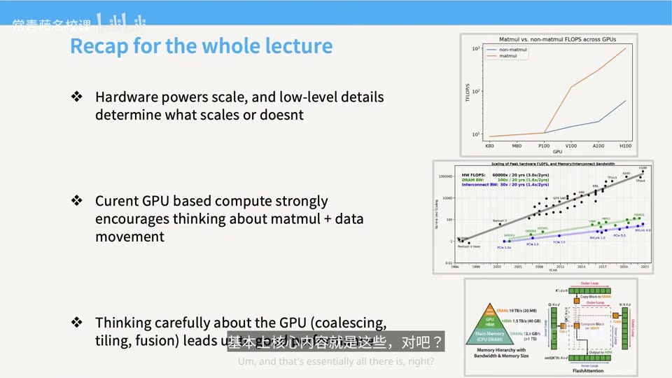 |
| 我希望你们真正理解我们为什么要做这些事，在我看来这种理解需要一直深入到硬件层面。还有一点，考虑到当前算力增长的趋势，我们必须认真考虑：矩阵乘法这些核心操作具有极高的算术密度。鉴于计算和内存之间的速度鸿沟，我们必须仔细斟酌数据的移动方式。呃，最后，像 FlashAttention 这类技术真的很酷，还有一些架构设计工作非常注重硬件特性， [【跳转到 65:58】](https://www.bilibili.com/video/BV11LEA6eEuj/?p=5&t=3958) | 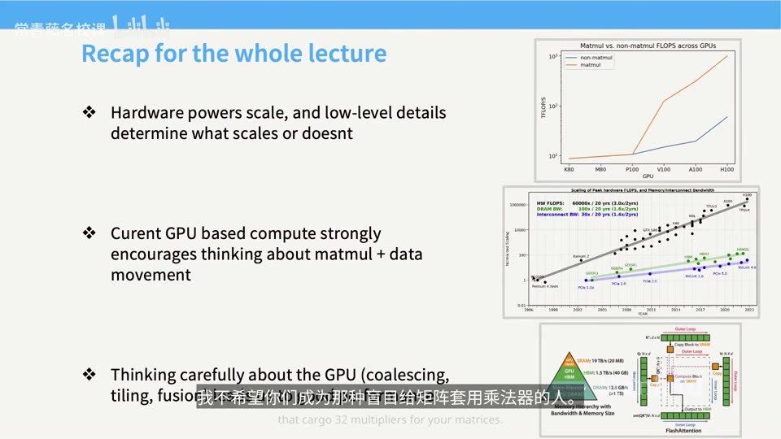 |
| 在设计架构时充分考虑硬件因素，对提升未来系统的性能至关重要。谢谢，谢谢，谢谢。 [【跳转到 66:23】](https://www.bilibili.com/video/BV11LEA6eEuj/?p=5&t=3983) | 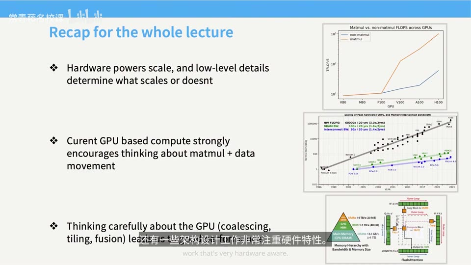 |