# Lecture 6: Kernels, Triton, XLA · 原始文稿（图-字幕分栏）

| 字幕文本 | 画面 |
| :--- | ---: |
| 欢迎大家回来。周一他出色地介绍了 GPU 的整体概况，包括如何理解性能以及 GPU 的各种特性。这次课是上次内容的延续。 [【跳转到 00:00】](https://www.bilibili.com/video/BV11LEA6eEuj/?p=6&t=0) | 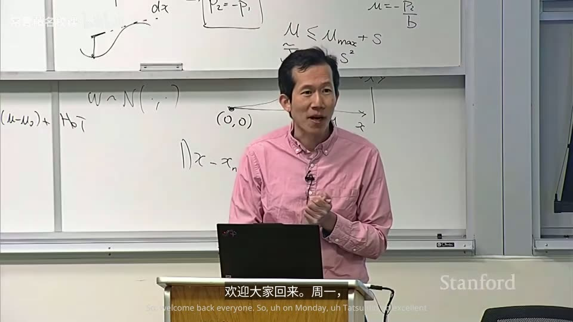 |
| 我们会更深入地进入代码，写一些训练 kernel，同时做一些基准测试和性能分析。呃，首先为了帮大家回顾一下 GPU 的情况，这里有一张典型 GPU 结构的简化示意图。 [【跳转到 00:10】](https://www.bilibili.com/video/BV11LEA6eEuj/?p=6&t=10) | 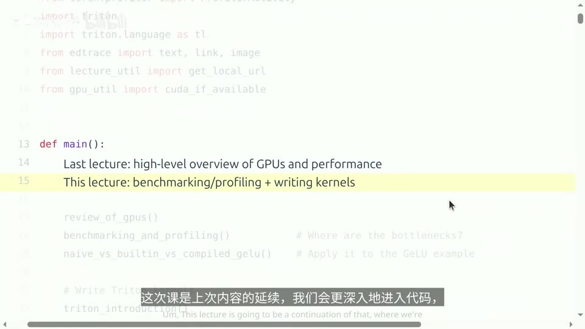 |
| 图中既有内存，也有实际的 GPU 芯片。 [【跳转到 00:21】](https://www.bilibili.com/video/BV11LEA6eEuj/?p=6&t=21) | 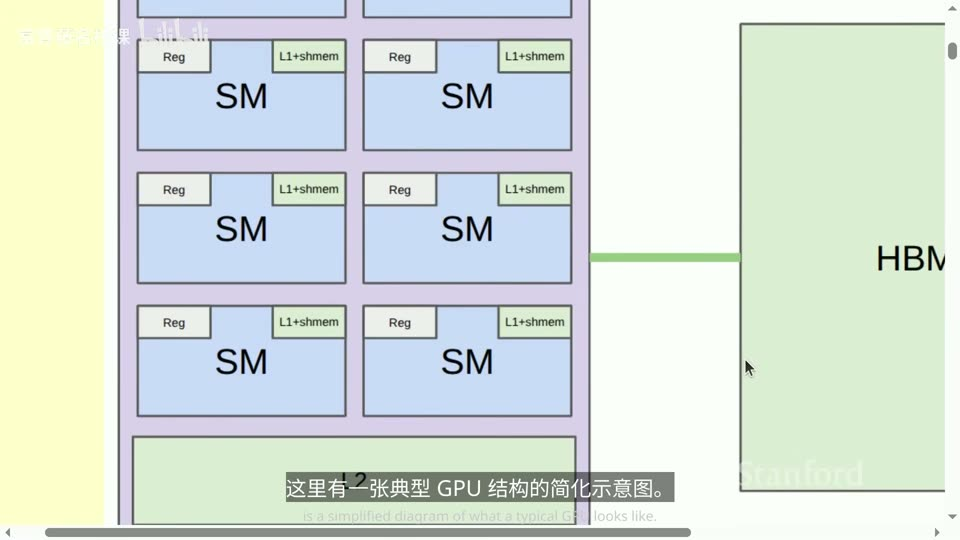 |
| 大家脑子里要记住 GPU 的这几个特征：我们当然是在讲 NVIDIA GPU，但他也提到了 TPU，还有 AMD 等等。呃，不过聚焦于 NVIDIA GPU，我们经历了从 A100 到 H100 再到 B200 的多个代际。每一代 GPU 都包含一定数量的 SM， [【跳转到 00:27】](https://www.bilibili.com/video/BV11LEA6eEuj/?p=6&t=27) | 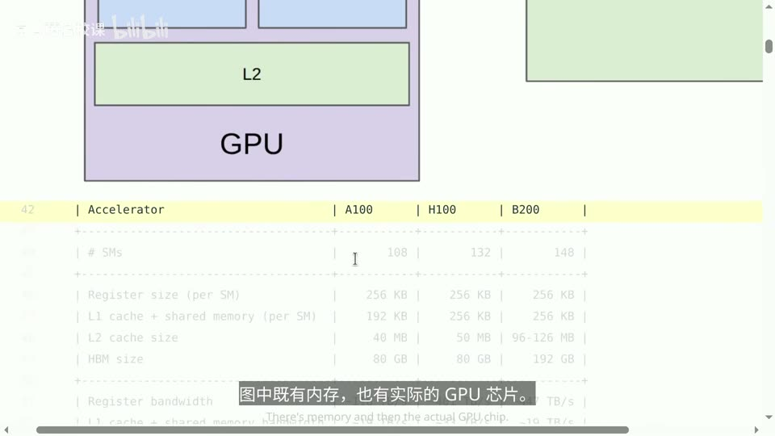 |
| 也就是流式多处理器。SM 的数量大约在 100 到 200 之间，所以这一点变化不大。然后在单个 SM 内部有一组寄存器。嗯， [【跳转到 00:43】](https://www.bilibili.com/video/BV11LEA6eEuj/?p=6&t=43) | 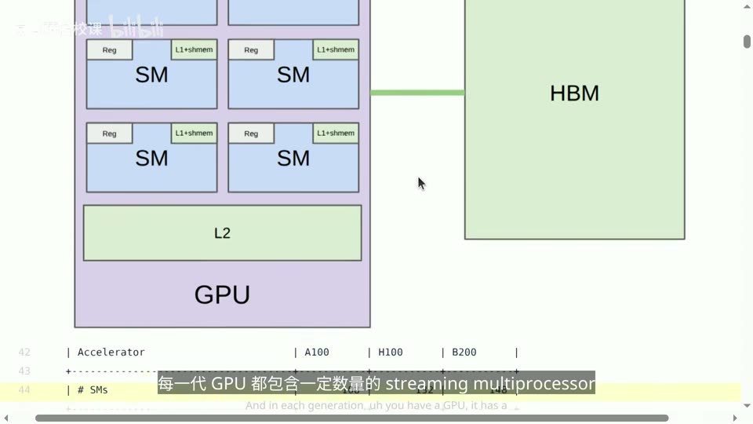 |
| B200 啊，有 65536 个寄存器， [【跳转到 00:55】](https://www.bilibili.com/video/BV11LEA6eEuj/?p=6&t=55) | 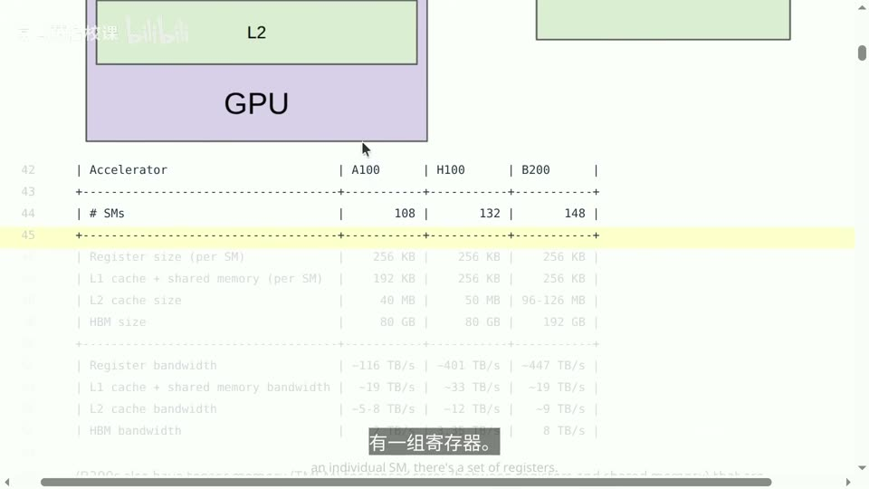 |
| 每个 SM 总共 256KB。这一点同样变化不大。此外还有 L1 cache 以及 shared memory，啊， [【跳转到 01:01】](https://www.bilibili.com/video/BV11LEA6eEuj/?p=6&t=61) | 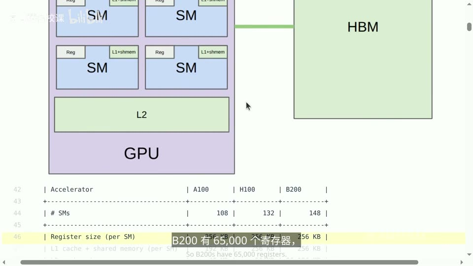 |
| 请记住它们其实是同一种内存：shared memory 你可以控制，而 L1 cache 不行。这是针对每个 SM 而言的，其规模大致处于同一数量级。 [【跳转到 01:08】](https://www.bilibili.com/video/BV11LEA6eEuj/?p=6&t=68) | 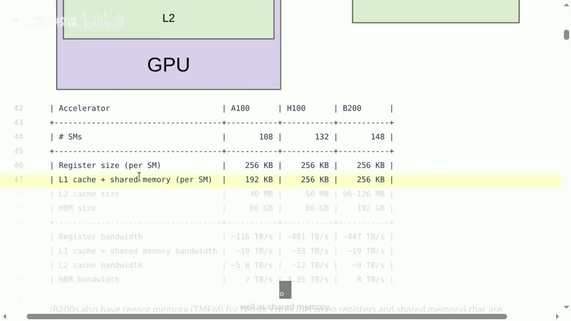 |
| 然后还有 L2 cache，它不是针对每个 SM 的， [【跳转到 01:18】](https://www.bilibili.com/video/BV11LEA6eEuj/?p=6&t=78) | 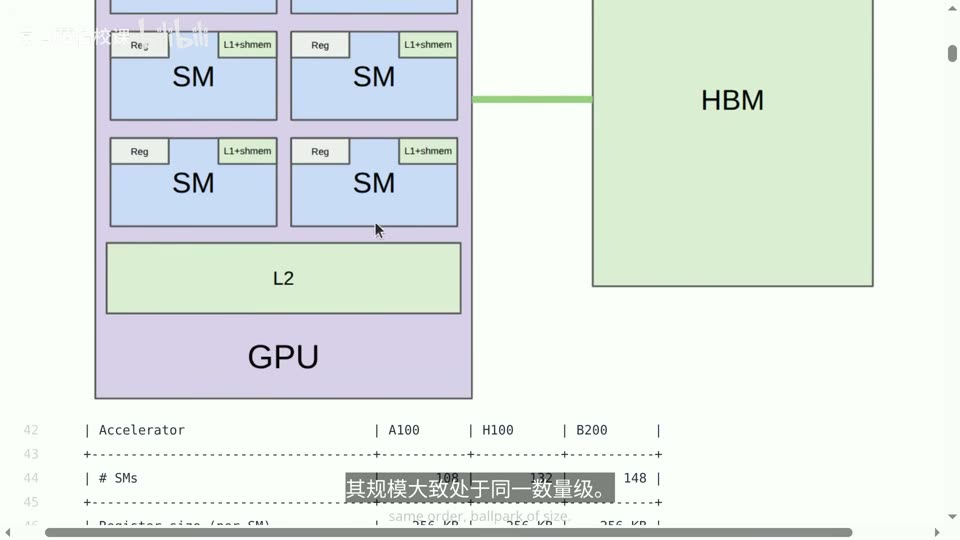 |
| 而是针对整个芯片的，而且这个稍大一些。最后还有高带宽内存（HBM），容量非常大，你可以看到这个数值实际上大幅上升了。然而除了规模，你还可以看看带宽的情况，本质上它们之间大致是负相关的。所以寄存器最快，L1 cache 稍慢，L2 cache 更慢，HBM 是最慢的。不过每秒字节的带宽整体来看其实并不算慢。 [【跳转到 01:23】](https://www.bilibili.com/video/BV11LEA6eEuj/?p=6&t=83) | 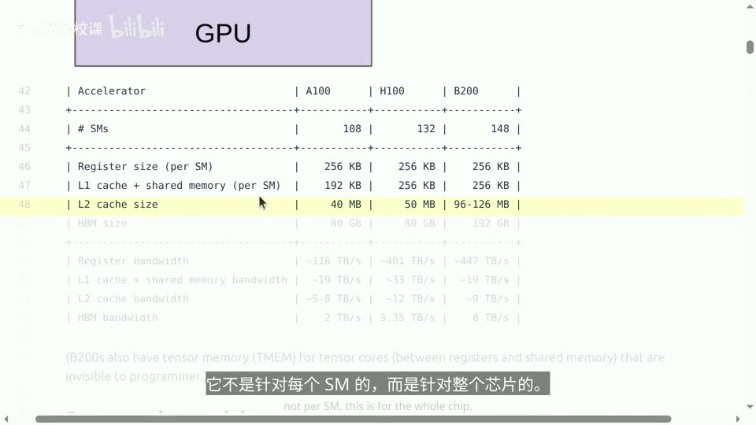 |
| 这就是你需要在脑海中建立的主要层级结构。 [【跳转到 01:48】](https://www.bilibili.com/video/BV11LEA6eEuj/?p=6&t=108) |  |
| 大内存速度慢、距离远，但容量大；而寄存器、L1 cache 等快内存则位于 SM 上，它离得近、速度快，但容量小。好，这就是我们要面对的环境。 [【跳转到 01:53】](https://www.bilibili.com/video/BV11LEA6eEuj/?p=6&t=113) | 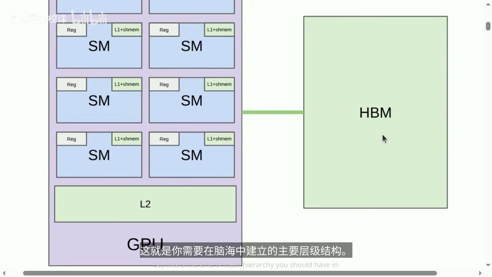 |
| 那么该怎么给 GPU 编程？程序模型如下：所以这里有线程的概念， [【跳转到 02:07】](https://www.bilibili.com/video/BV11LEA6eEuj/?p=6&t=127) | 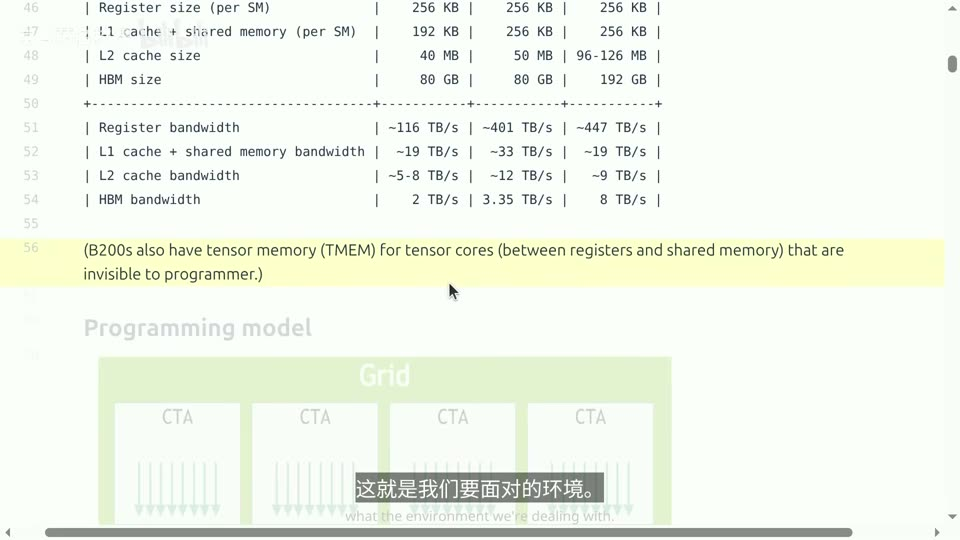 |
| 即每个线程在数据的一小部分上执行一段代码。所以你可以把每一根箭头想象成一个线程。这些线程被组织成 thread block，也叫并发线程数组（concurrent thread array）或 CTA，这就是一组线程。最后你有一组 thread block， [【跳转到 02:12】](https://www.bilibili.com/video/BV11LEA6eEuj/?p=6&t=132) |  |
| 它们构成了 grid。所以当你启动一个 kernel 时，你其实是在启动一个由线程和 thread block 组成的 grid，让它们全部并行同时去做一些计算，应对——好，所以啊，这是简化的说法，其实还有一些别的事情在发生，比如 H100 和 B200 还有 thread block clusters，也就是 thread block 的集群。 [【跳转到 02:29】](https://www.bilibili.com/video/BV11LEA6eEuj/?p=6&t=149) | 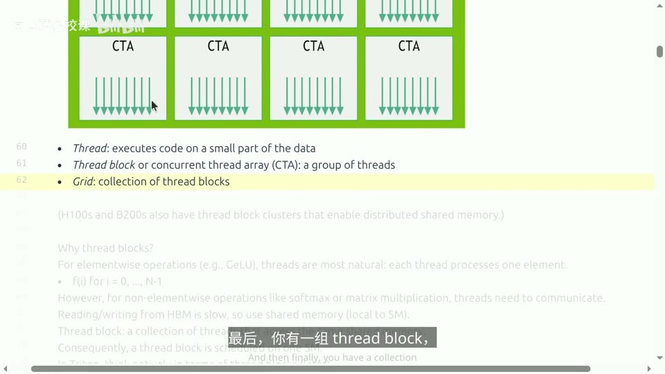 |
| 它们支持一定程度的分布式共享内存（distributed shared memory）。另外，B200 现在有了用于 Tensor Core 的 Tensor Memory（TMEM）， [【跳转到 02:54】](https://www.bilibili.com/video/BV11LEA6eEuj/?p=6&t=174) | 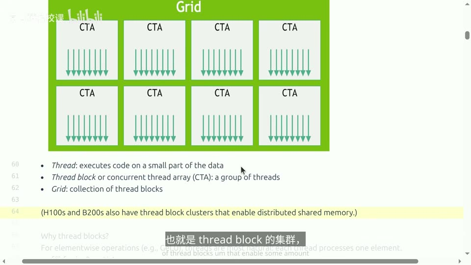 |
| 它介于寄存器和 shared memory 之间。其中一些机制对程序员是不可见的，但它们确实存在于硬件中。 [【跳转到 02:59】](https://www.bilibili.com/video/BV11LEA6eEuj/?p=6&t=179) | 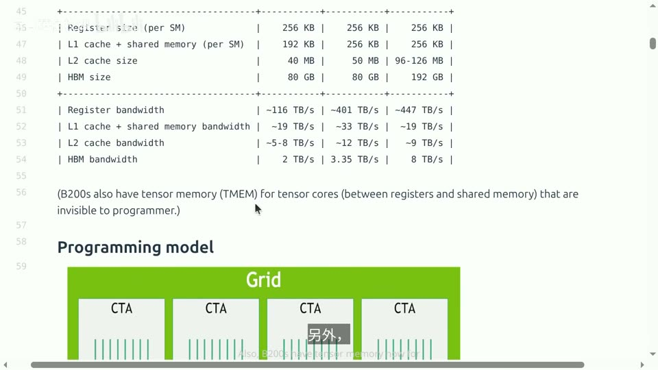 |
| 但在本次导论课程中，我们暂不深入讨论这些细节。 [【跳转到 03:09】](https://www.bilibili.com/video/BV11LEA6eEuj/?p=6&t=189) | 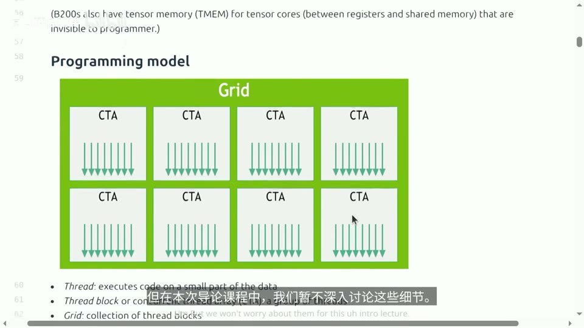 |
| 好的，你可能会问的一个问题是：为什么我们需要 thread block？为什么不能只使用由线程组成的 grid， [【跳转到 03:14】](https://www.bilibili.com/video/BV11LEA6eEuj/?p=6&t=194) | 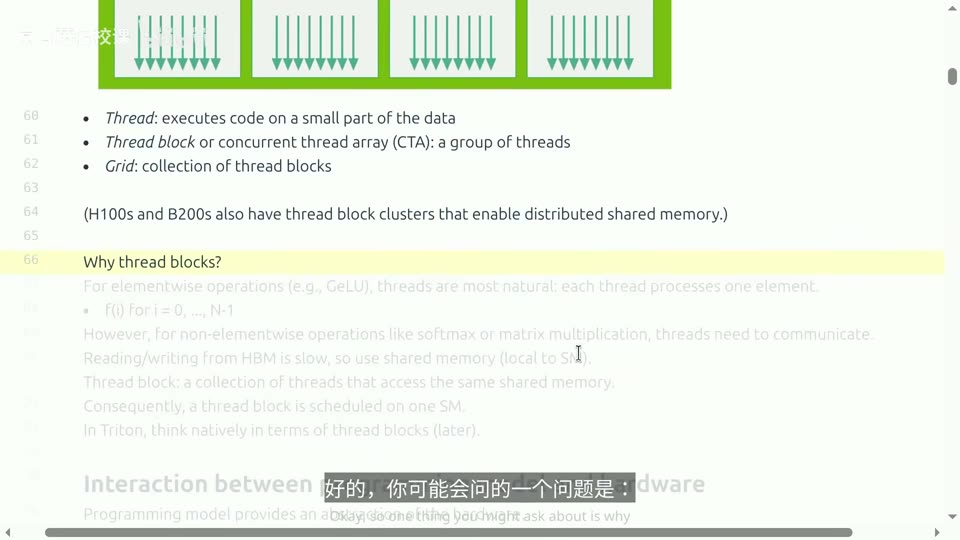 |
| 让每个线程直接获取一部分数据并执行操作？如果你只想执行逐元素（elementwise）操作， [【跳转到 03:19】](https://www.bilibili.com/video/BV11LEA6eEuj/?p=6&t=199) | 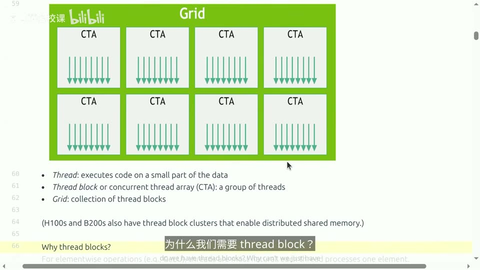 |
| 这种设计通常是可以的。我们稍后会看到，例如 ReLU 是一种按 elementwise 方式应用的激活函数，在这种场景下线程的设计非常自然，每个线程处理一个元素，这就像是对数据集中的每个元素 i 执行函数 f(i)。但对于涉及线程间通信的操作，例如 softmax 或矩阵乘法，这种视角就不够用了，原因在于…… [【跳转到 03:26】](https://www.bilibili.com/video/BV11LEA6eEuj/?p=6&t=206) |  |
| 如果你愿意承担写入和读取 HBM 的开销，这种视角或许还勉强可行，因为那样你仍然能行得通。比如说处理矩阵时（后面会讲到），你可以让每个单元去计算矩阵里对应的那个元素，然后直接读写 HBM。但正如我们所注意到的，HBM 非常慢，因此这并不是一个好策略，所以我们应该改用 shared memory。 [【跳转到 03:51】](https://www.bilibili.com/video/BV11LEA6eEuj/?p=6&t=231) | 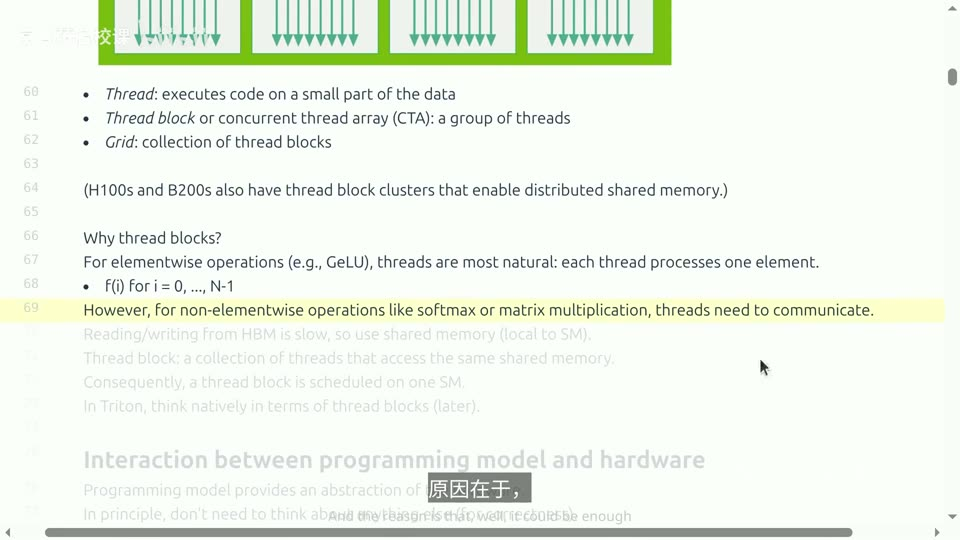 |
| shared memory 是某个 SM 独有的，而 thread block 让你可以把一组线程看作一个整体，这些线程都会去访问 shared memory。啊，谢谢。所以也可以把这样一个 thread block 看作一个整体， [【跳转到 04:16】](https://www.bilibili.com/video/BV11LEA6eEuj/?p=6&t=256) | 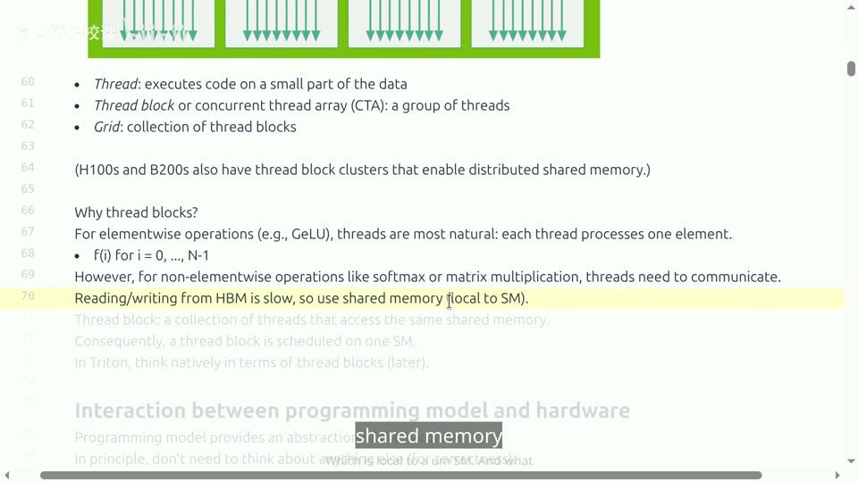 |
| thread block 会被调度到其中某个流式多处理器（SM）上执行它的任务。 [【跳转到 04:31】](https://www.bilibili.com/video/BV11LEA6eEuj/?p=6&t=271) | 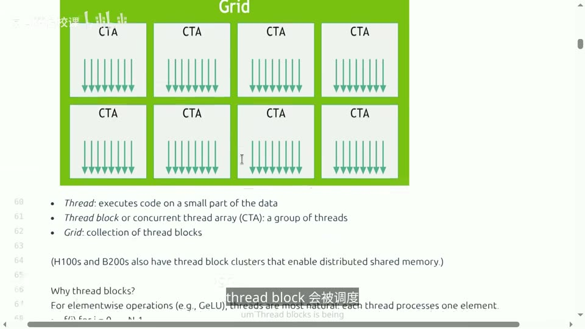 |
| 他会先从 HBM 读取大量数据，然后进行处理，处理过程中线程之间可能通过 shared memory 进行通信，然后再把结果写回去。好的，所以这是后面会讲到的一个关键点。啊，接下来我们要讲分块（tiling）。 [【跳转到 04:36】](https://www.bilibili.com/video/BV11LEA6eEuj/?p=6&t=276) | 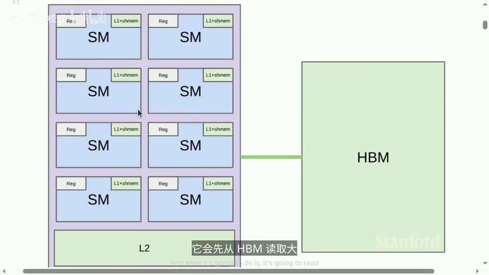 |
| 这是这部分的重头戏。其实在实践中，这也是我们如今编写 kernel 的主要方式，我们会很自然地以 thread block 的视角来思考。我觉得只要你掌握了用 thread block 来思考的方式，一切就会变得很合理，也会让你的工作轻松不少，就像我们接下来会看到的那样。好的，我觉得这个编程模型相当简单：这里有线程、thread block 和 grid。好的， [【跳转到 04:52】](https://www.bilibili.com/video/BV11LEA6eEuj/?p=6&t=292) | 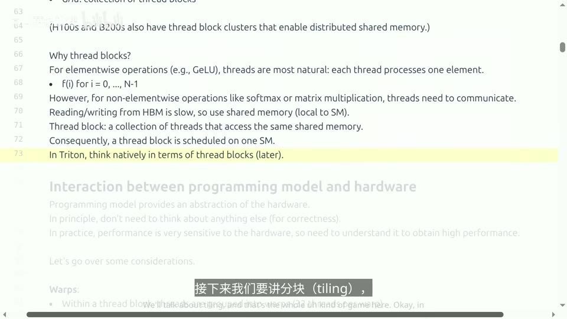 |
| 所以我觉得稍微复杂一点的地方在于编程模型和硬件之间的交互。这个编程模型其实非常好，它提供了对硬件的抽象：当你编写 kernel 时，你只需要知道有一堆 thread block，你定义好它们，然后规定每个线程做什么计算，也就是在 block 或者说 thread block 内部要做的事，写起来就像写 Python 一样，所以这部分其实不难。事实上， [【跳转到 05:17】](https://www.bilibili.com/video/BV11LEA6eEuj/?p=6&t=317) | 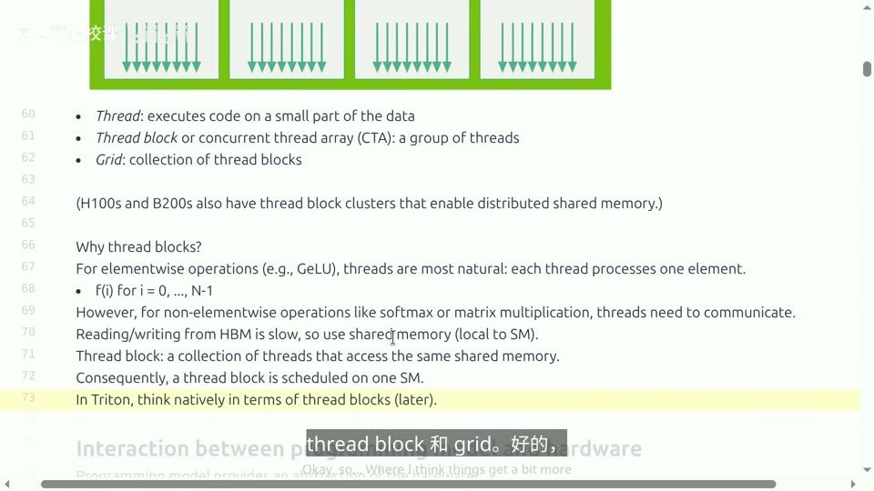 |
| 如果你只关心正确性，那知道这些就够了；但在实践中，性能对硬件非常敏感，因此你需要深入理解硬件才能获得高性能。我们之所以讨论 GPU 和 kernel，根本原因就在于你想尽可能榨取性能。所以这里有两个层面：你试图理解计算过程，而这仅仅是编程模型的一部分；但它运行得有多快，在很大程度上取决于硬件。好的， [【跳转到 05:42】](https://www.bilibili.com/video/BV11LEA6eEuj/?p=6&t=342) | 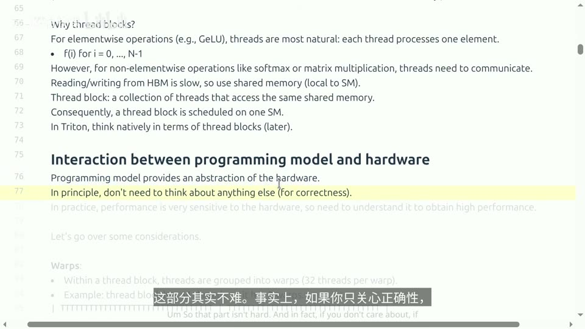 |
| 我会举几个例子说明为什么这很重要，其中一些内容会回顾之前讲过的东西，希望能帮助大家加深对这些概念的理解。啊，我大概会举五个不同的例子，主要是为了让你们有个直观的感受。接下来谈谈一些注意事项：这里有个叫 warp 的东西我之前没提过。哦，简单来说，warp 其实不属于我们刚才描述的那种 [【跳转到 06:07】](https://www.bilibili.com/video/BV11LEA6eEuj/?p=6&t=367) | 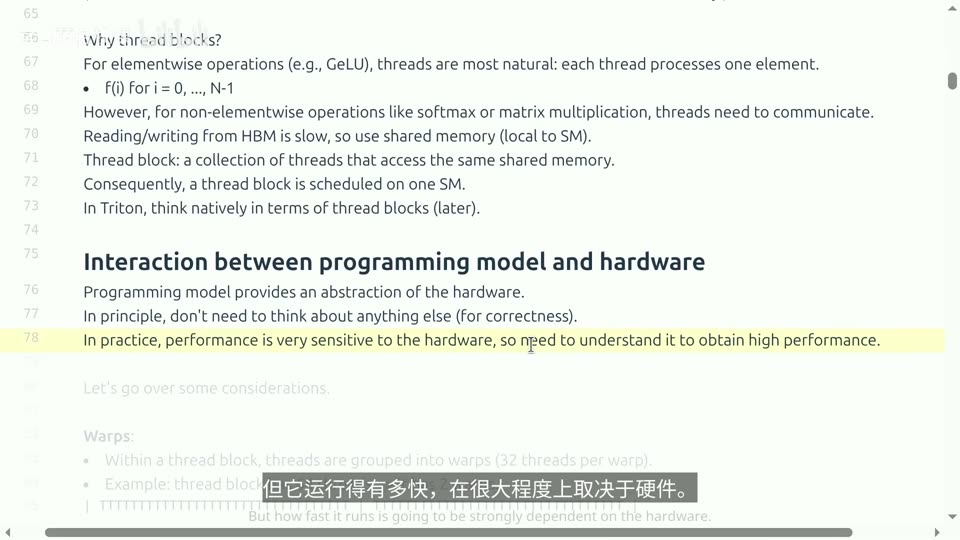 |
| 干净的程序模型范畴。线程、thread block 组成 grid，技术上你也可以用到 warp，但编程时不一定非要用。那 warp 是什么呢？每个 thread block 包含一组线程，但这些线程实际上是按 warp 分组的。啊，每个 warp 通常包含 32 个线程。举个例子，如果一个 thread block 有 64 个线程，那就对应两个 warp：前 32 个和后 32 个。 [【跳转到 06:32】](https://www.bilibili.com/video/BV11LEA6eEuj/?p=6&t=392) |  |
| 没错，正如上次所说，同一个 warp 里的所有线程必须步调一致地执行相同的指令，所以每个时钟周期里它们都得执行一模一样的指令。但控制发散是指 warp 内的不同线程需要执行不同指令的情况。啊，例如假设你有一个分支结构，如果条件 A 成立就执行 A，否则执行 B，接下来的情况是： [【跳转到 06:57】](https://www.bilibili.com/video/BV11LEA6eEuj/?p=6&t=417) | 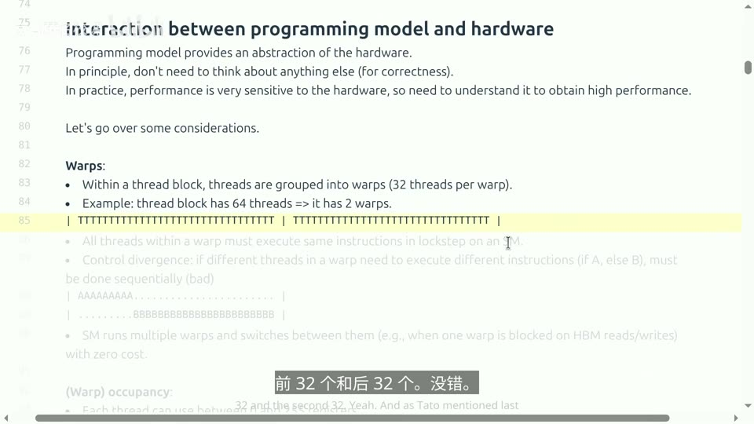 |
| 你只能先执行 warp 中那些走 A 分支的线程，然后再执行走 B 分支的，所以这个过程就被串行化了。这样既不好又低效，所以一般来说分支是你应该尽量避免的东西。我觉得 warp 有个特别酷的地方，那就是 SM 实际上同时在运行多个 warp：这里有一个 warp 调度器，还有一堆即将运行的驻留 warp。 [【跳转到 07:22】](https://www.bilibili.com/video/BV11LEA6eEuj/?p=6&t=442) | 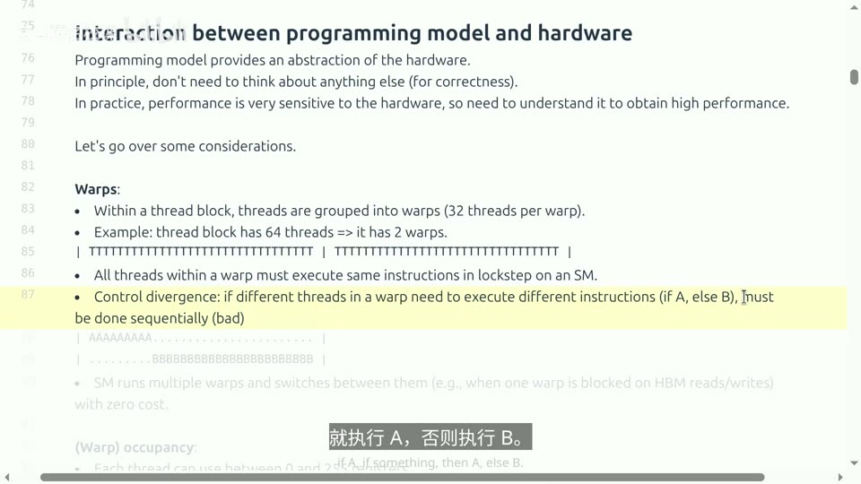 |
| 每个 warp 里有一些东西，而线程则拥有寄存器，而且 SM 可以在它们之间切换，没有任何开销。这在一般情况下并不成立（比如在 CPU 上就不是这样），但它之所以这样设计，正是为了隐藏延迟。所以这一点很重要。因为比如某个 warp 正在从 HBM 读取数据（要记住这代价很高，可能需要大约 100 个周期），你不想干 [【跳转到 07:47】](https://www.bilibili.com/video/BV11LEA6eEuj/?p=6&t=467) | 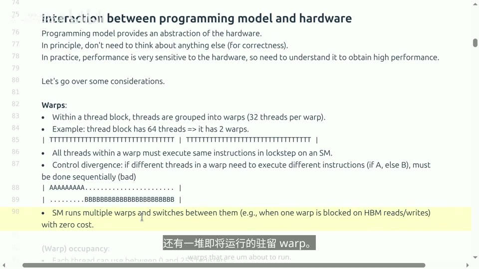 |
| 等着那个 warp 闲着没事做，而是立刻切换到另一个 warp，让他去执行实际的 Tensor Core 运算。好的，这是关于 warp 需要注意的一点。另一个引出 warp 概念的原因是占用率，更准确地说是 warp 占用率。从硬件限制来看，每个线程最多能使用 255 个寄存器，所以 SM 的寄存器总数是固定的；每个线程占用的寄存器越多， [【跳转到 08:12】](https://www.bilibili.com/video/BV11LEA6eEuj/?p=6&t=492) | 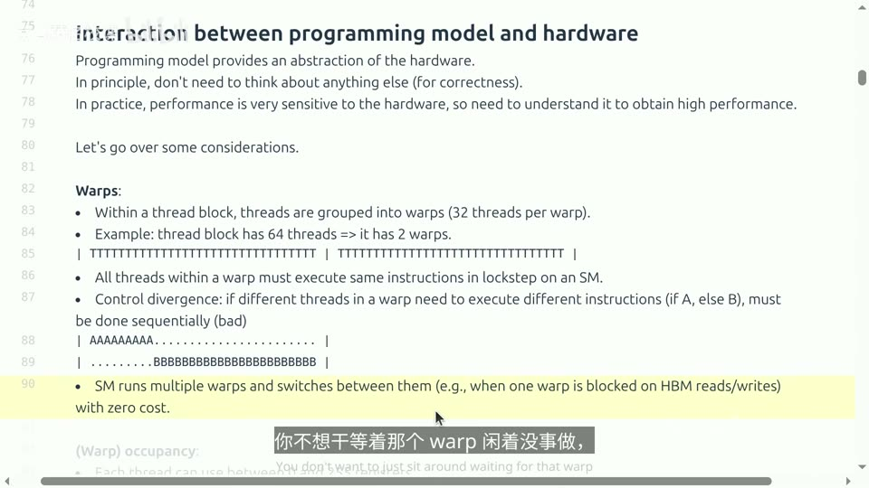 |
| 能容纳的线程就越少，这纯粹是数学问题。这被称为……这可能会降低你的占用率，但这未必是坏事，因为如果线程数量较少而每个线程执行的工作量更大，这实际上可能是有利的。因此占用率是可以测量的指标，但并非越大越好，因为这里还存在其他需要权衡的因素。事实上有一个例子能说明你可能会想这么做： [【跳转到 08:37】](https://www.bilibili.com/video/BV11LEA6eEuj/?p=6&t=517) |  |
| 让线程数量减少，这就是线程粗化（thread coarsening）的思路。假设你有一个逐元素操作，你可以让一个线程只对一个元素执行运算，这样你就会有大量线程；但你也可以让每个线程处理多个元素，比如一个常数，也许是 8，这样线程数量就减少了，使得调度等操作更容易，但每个线程执行的工作量也增加了。 [【跳转到 09:02】](https://www.bilibili.com/video/BV11LEA6eEuj/?p=6&t=542) | 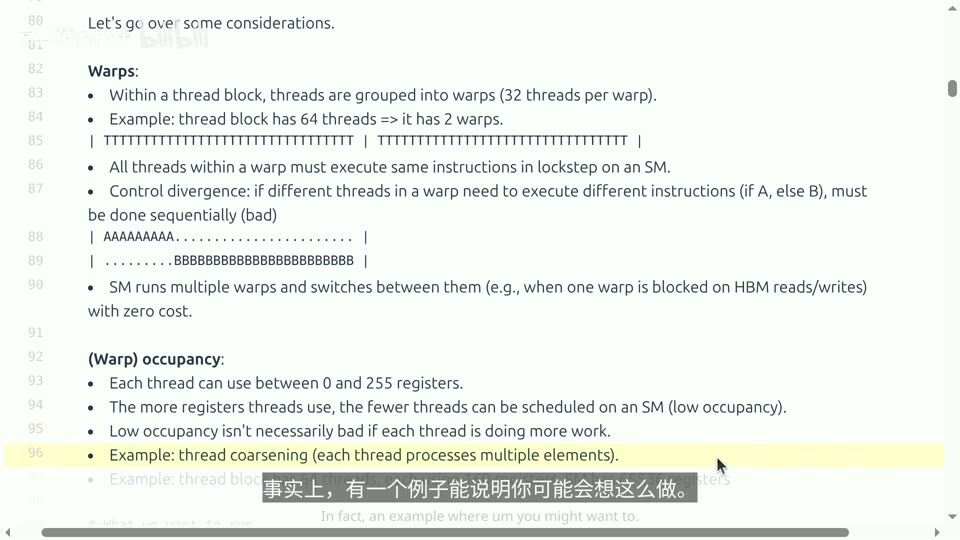 |
| 因此如果你的线程负载非常轻，或许应该稍微增加它们的工作量。好，那么仅以此为例来说明此处可能出现的情况。假设你有一个线程块，里面有 128 个线程，每个线程使用 160 个寄存器。好，这里有个硬件限制，B200 每个 SM 的寄存器总数最多是 65536， [【跳转到 09:27】](https://www.bilibili.com/video/BV11LEA6eEuj/?p=6&t=567) | 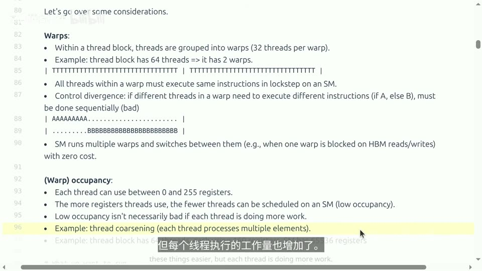 |
| 另外还有个限制：你同时运行的 warp 数不能超过 64。所以你可以做一些简单的计算，看看这里的占用率是多少：每个线程使用的寄存器数都小于 255，这没问题；每个线程块使用的寄存器数就是每块的线程数乘以每个线程的寄存器数，大概是 20480。这意味着你最多能在 SM 上同时运行三个线程块， [【跳转到 09:52】](https://www.bilibili.com/video/BV11LEA6eEuj/?p=6&t=592) | 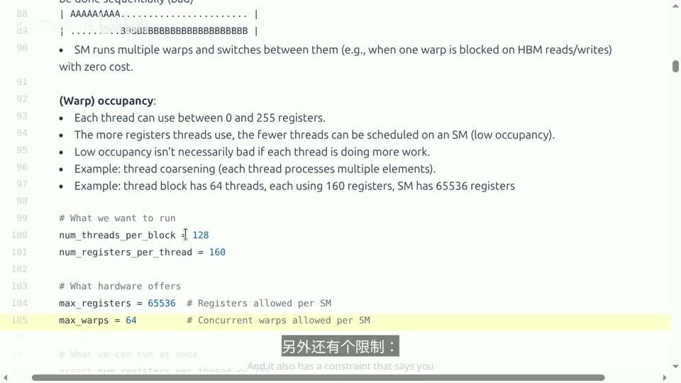 |
| 这就相当于 12 个 warp，因为每个块有 4 个 warp。由于最大 warp 数是 64，这意味着你的占用率约为 18%，也就是说你只跑了你拥有的 warp 总数的约 18%。这是因为每个线程占用的寄存器很多。好吧，这个例子说明内存限制了你能进行的计算规模。好，再看一个例子，叫 bank conflict（存储体冲突）。 [【跳转到 10:17】](https://www.bilibili.com/video/BV11LEA6eEuj/?p=6&t=617) | 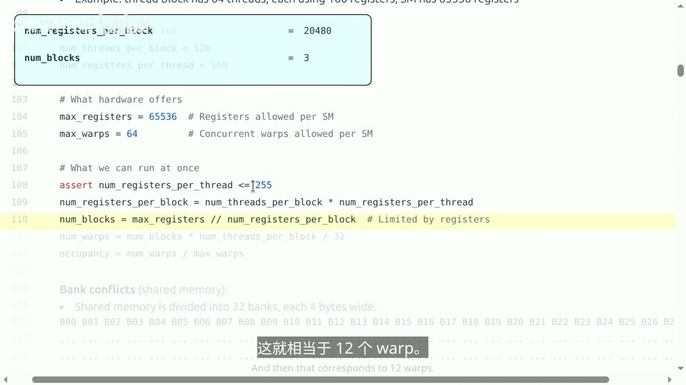 |
| 这适用于 shared memory。记得 shared memory 是和 L1 一样的，它就在 SM 上。硬件的设计就是：shared memory 分成 32 个 bank，每个 bank 宽 4 字节。好，这些是我的 32 个 bank，这就是我的内存，每个 bank 里有很多元素。所以有一个约束条件：每个时钟周期每个 bank 只能被一个线程访问，差不多就一个线程。 [【跳转到 10:42】](https://www.bilibili.com/video/BV11LEA6eEuj/?p=6&t=642) |  |
| 当然，前提是它们访问的不是同一个位置。举个例子，你不能同时访问这两个位置：也就是说，如果有多个线程想访问同一个 bank，这些访问就必须串行执行。这叫 bank 冲突。举个最坏情况的例子：假设矩阵是这样排列的，你做某个操作，32 个线程心想："太好了，32 正好能让我大规模并行。" [【跳转到 11:07】](https://www.bilibili.com/video/BV11LEA6eEuj/?p=6&t=667) | 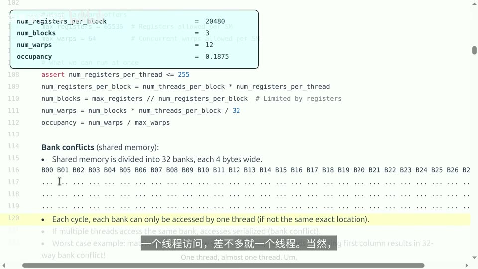 |
| 然后你想让所有线程都去访问第一列，那它们就只能排队等着了，这就是 32 路冲突，是你能遇到的最糟糕的情况。啊，你可能会问：那为什么要这么做呢？当然直接按行访问就好了。但这是不可避免的，例如如果你在执行矩阵乘法，就必须访问一个矩阵的行和另一个矩阵的列，有时还需要进行转置操作，因此你不能总是随意选择便利的顺序。 [【跳转到 11:32】](https://www.bilibili.com/video/BV11LEA6eEuj/?p=6&t=692) | 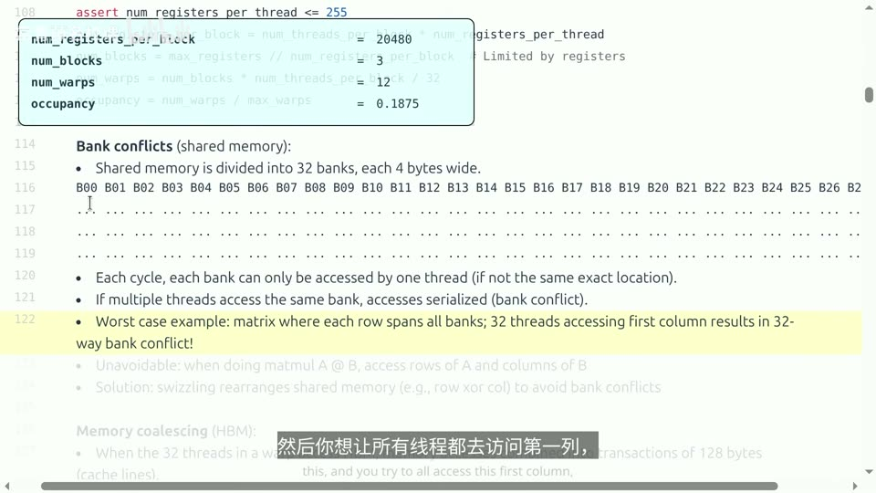 |
| 对于逐元素运算这没有问题，你可以采用任意顺序；但在执行矩阵乘法时，你无法控制每个矩阵到底是按行优先还是列优先存储。这里有一些解决方案，我就不深入展开了，比如一种叫 swizzling 的技术，它会重排你的 shared memory，使得你在遍历时能够避免 bank conflicts。好，这是另一个需要考虑的因素。在做性能分析时， [【跳转到 11:57】](https://www.bilibili.com/video/BV11LEA6eEuj/?p=6&t=717) | 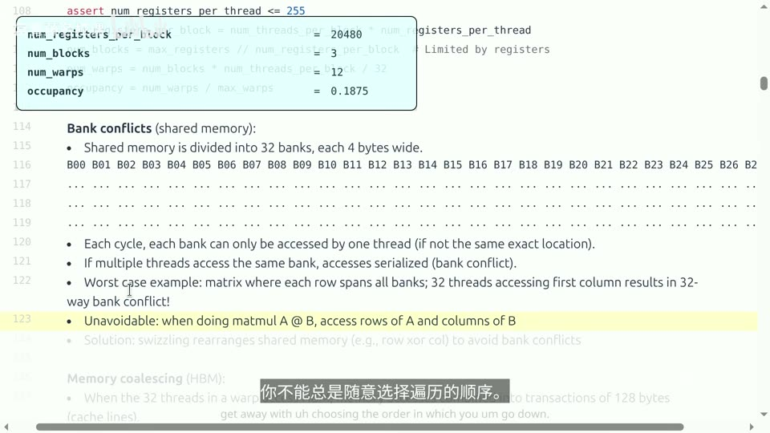 |
| 你可以查看 bank conflicts，可以查看 occupancy，从而大致了解正在发生什么。最后还有几点说明，其实是两件事。首先是内存合并（memory coalescing），他之前讲过，所以我快速给大家回顾一下这是怎么回事儿：当 warp 中的 32 个线程尝试访问 HBM 时，内存访问实际上会被合并成一个 128 字节的事务， [【跳转到 12:22】](https://www.bilibili.com/video/BV11LEA6eEuj/?p=6&t=742) | 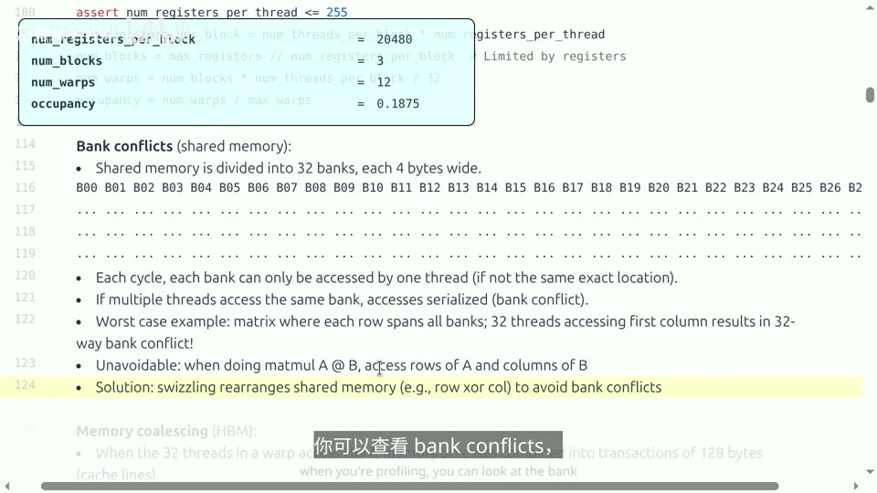 |
| 称为缓存行（cache line），一次性把数据全部取回来。假设内存按这样布局，这是 32 字节宽，在最佳情况下（也就是所谓的完全合并，fully coalesced），所有线程都访问同一个缓存行，于是线程一访问 M00，线程二访问 M01，以此类推，这意味着你会一次性把整个缓存行抓取过来。 [【跳转到 12:47】](https://www.bilibili.com/video/BV11LEA6eEuj/?p=6&t=767) | 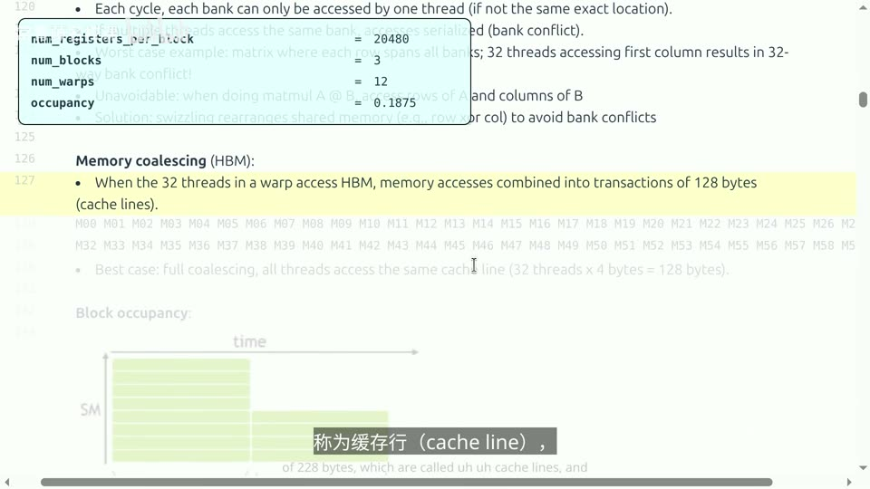 |
| 如果按列访问，那么你会取回大量内存，但其中很多根本用不上，第二行也是如此，以此类推。所以这感觉有点像 bank 冲突，但其实是一种非常不同的约束：前者讲的是 shared memory，而这里讲的是 HBM。好，最后我们来讨论线程块占用率。请记住线程块是被调度到 SM 上的，啊， [【跳转到 13:12】](https://www.bilibili.com/video/BV11LEA6eEuj/?p=6&t=792) | 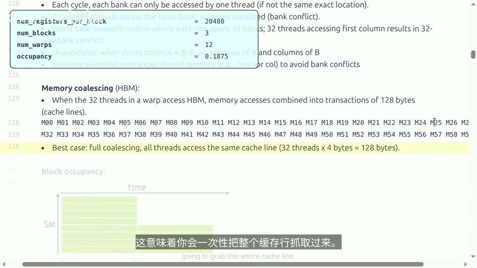 |
| 但我们要意识到物理资源的有限性：逻辑上你可以定义任意数量的线程块，但在芯片物理层面上你只有固定数量的 SM，例如 148 个。因此如果你启动 160 个线程块，就只能调度其中的 148 个，你必须等待它们执行完毕才能调度剩余的 12 个；但如果只调度这 148 个，部分 SM 就会处于空闲状态， [【跳转到 13:37】](https://www.bilibili.com/video/BV11LEA6eEuj/?p=6&t=817) | 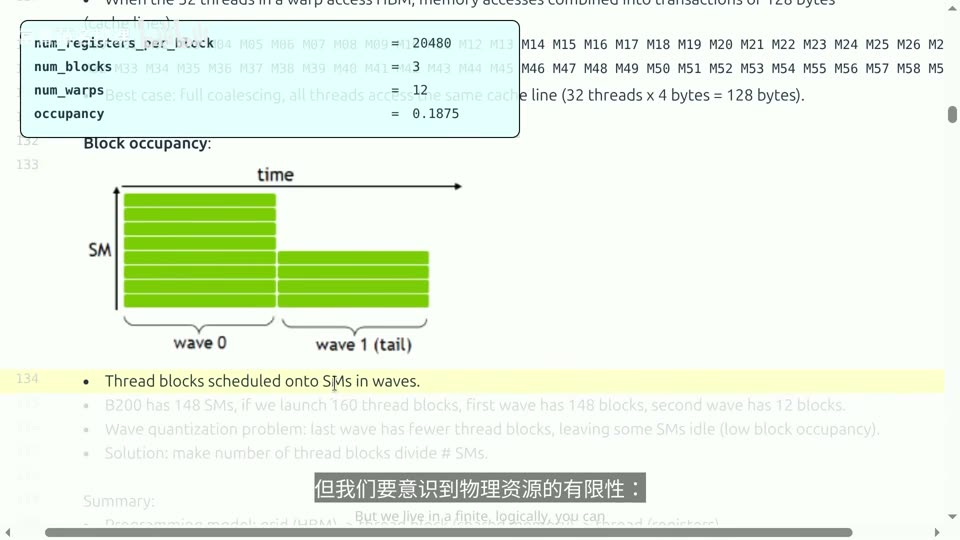 |
| 不执行任何任务。这种现象被称为低占用率，即最后一波线程块的数量少于线程块的最大总数。啊，因此一般来说，让线程块的数量能被 SM 的数量整除或许是个好主意。那么在此总结一下：这里有一种非常优雅的编程模型，有一个由 thread block 组成的 grid， [【跳转到 14:02】](https://www.bilibili.com/video/BV11LEA6eEuj/?p=6&t=842) | 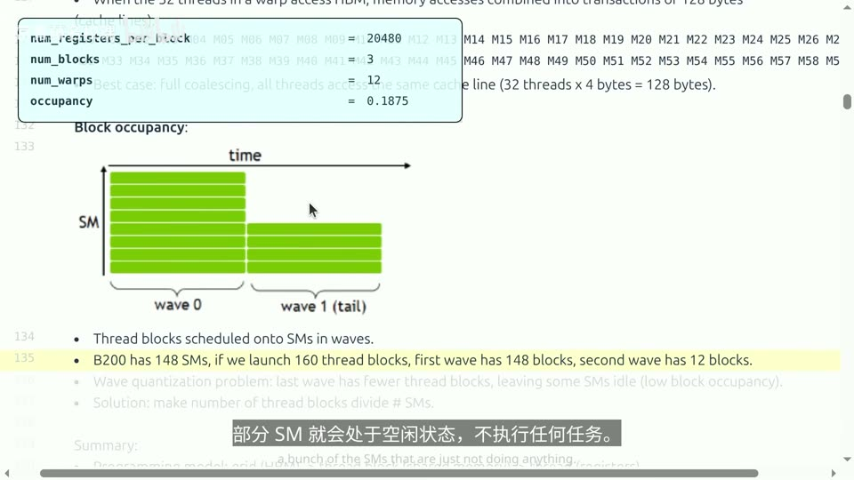 |
| 而每个 thread block 内部包含独立的线程。在内存方面，HBM 是全局共享的，shared memory 仅对单个 thread block 可见，而寄存器则仅对单个线程可见。但同样，硬件层面的所有细节，比如 warp、bank conflicts、memory coalescing 和 occupancy，确实决定了性能。我认为许多这些细节很难掌握，因为 profiling 虽然会告诉你一堆信息，但你必须确切知道有多少个 SM， [【跳转到 14:24】](https://www.bilibili.com/video/BV11LEA6eEuj/?p=6&t=864) | 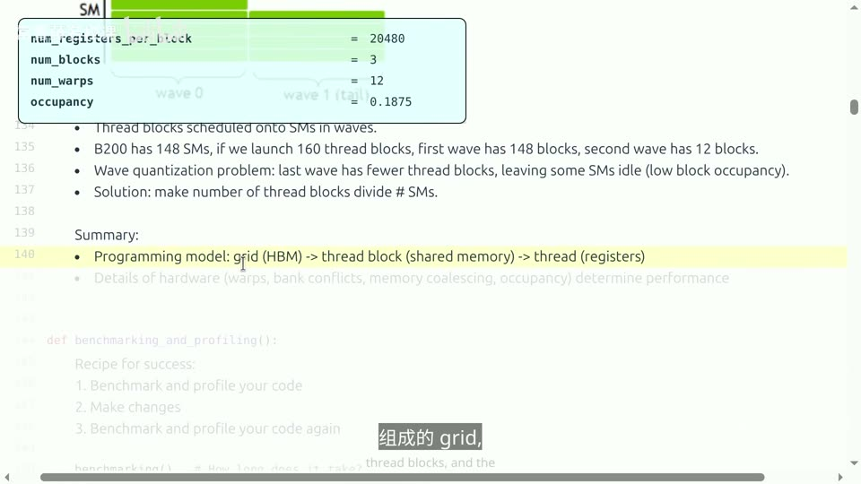 |
| 有多少个 SM，以及所有组件的确切规模。而这一点就变得……你知道，有时调度器会自己做一些事情，而你其实无法控制它的行为。所以它比编程模型要复杂得多。谢谢。yeah，so quick question。好的，我就讲到这里，大家有问题吗？嗯嗯，那我问个简短的问题：那么是否存在某种场景， [【跳转到 14:49】](https://www.bilibili.com/video/BV11LEA6eEuj/?p=6&t=889) | 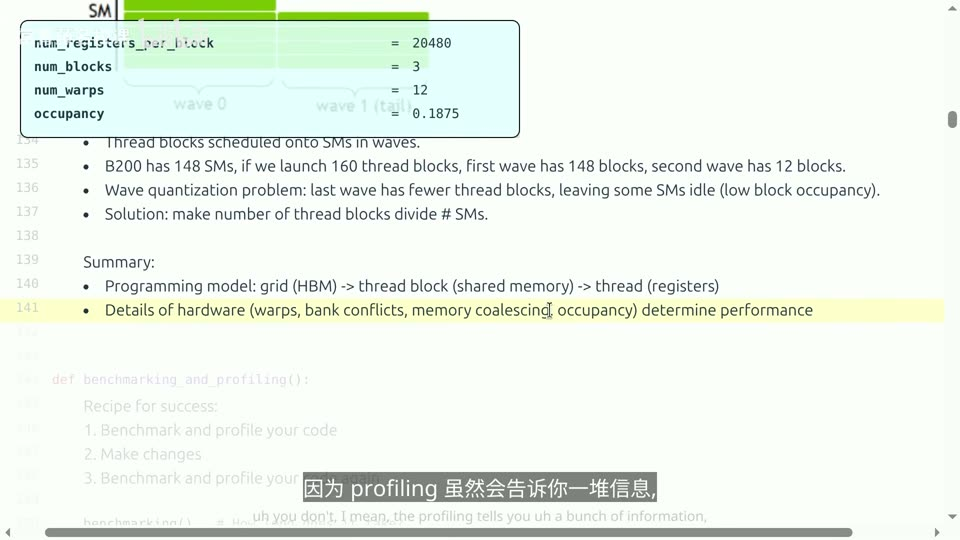 |
| 让第三个块能够共享 SM？比如在我们看到的那个有 148 个 SM 的物理（芯片）上，我们有 160 个 block，对吧？而且我们必须用两种不同的方式来启动。难道就没有办法让一个 block 在某个时刻共享它吗？对，所以问题是：一个 block 能不能共享一个 SM？我觉得问题在于， [【跳转到 15:13】](https://www.bilibili.com/video/BV11LEA6eEuj/?p=6&t=913) |  |
| 如果你操作得当，那么后面这些就都顺了。啊，我想这得看具体的 block，比如如果一个 block 已经占用了 SM 上大部分的 Tensor Core，那再往里放一个 block 其实也加速不了多少。我觉得根本上这里存在一种参差不齐的问题，也就是这种不均匀性，因为 block 必须待在一起，啊，你不能把它拆开分散到那边去。你可以自己来定义它， [【跳转到 15:38】](https://www.bilibili.com/video/BV11LEA6eEuj/?p=6&t=938) |  |
| 我觉得你能做的就是更改 block 的大小，所以你通过改变 block 的数量来避免出现这种尾部。想问其他问题吗？谢谢。好的，那我们继续。啊， [【跳转到 16:03】](https://www.bilibili.com/video/BV11LEA6eEuj/?p=6&t=963) |  |
| 希望大家现在对 GPU 已经越来越熟悉了。那么接下来我要讲基准测试和性能分析。啊，在具体内容上我可能不会展开太多，但我确实想强调这里的核心理念，那就是这里有一个成功的秘诀：你对代码做基准测试和性能分析，做出修改，然后再次对代码做基准测试。啊，之所以先做基准测试和性能剖析， [【跳转到 16:13】](https://www.bilibili.com/video/BV11LEA6eEuj/?p=6&t=973) | 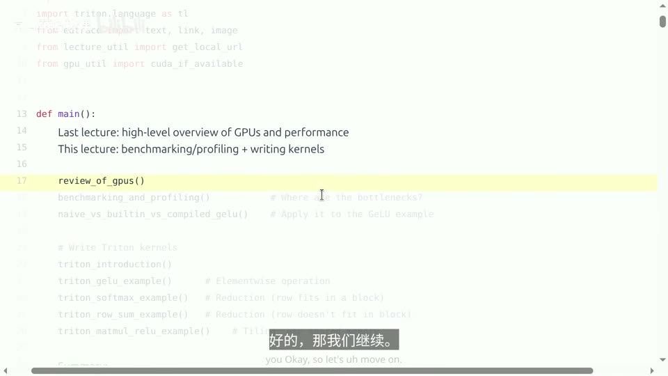 |
| 而不是一上来就教你动手改，是因为你应该始终先测量代码的实际运行情况，找出瓶颈所在，然后再开始编写内核。好的，那么基准测试，啊，基准测试基本上就是衡量各项操作耗费的时间。它给出的是端到端的总耗时，它并不能告诉你时间具体花在了哪里。尽管如此，它仍然很有用，因为归根结底你关心的就是整体运行了多久。 [【跳转到 16:38】](https://www.bilibili.com/video/BV11LEA6eEuj/?p=6&t=998) | 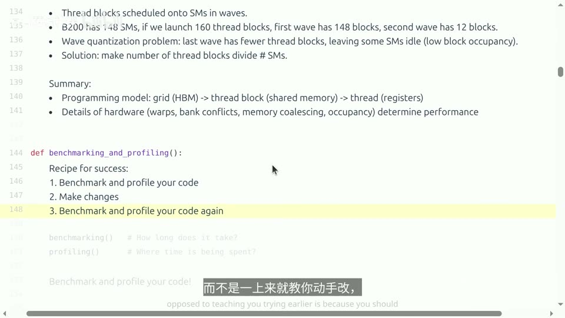 |
| 而且由于它把各项指标浓缩成一个数值，你还能看到性能是如何随着维度变化而扩展的。好，因此虽然有现成的基准测试工具，但由于本课程是从零构建大语言模型，我会自己来实现这一过程。但我这么做主要是为了突出基准测试中的几个常见陷阱。那么假设我们有这样一个操作：矩阵乘法。 [【跳转到 17:03】](https://www.bilibili.com/video/BV11LEA6eEuj/?p=6&t=1023) | 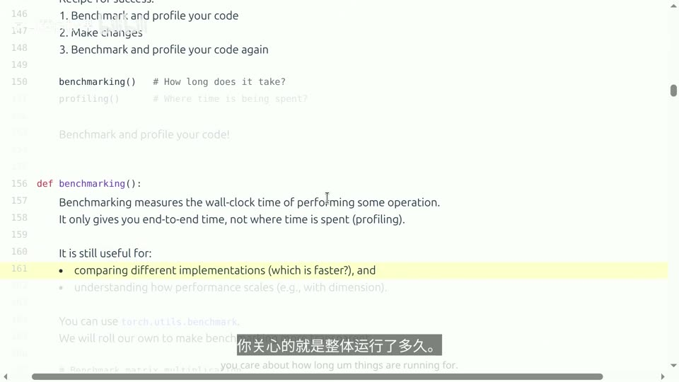 |
| 有一个包装器，它主要做这么几件事：它会生成两个大小为 dimension×dimension 的随机方阵，然后返回一个用于执行该操作的函数。所以如果你调用这个基准函数，实际上就是在对这两个随机矩阵做矩阵乘法——随机矩阵已经生成好了，接下来就是简单地将这两个矩阵相乘。好， [【跳转到 17:28】](https://www.bilibili.com/video/BV11LEA6eEuj/?p=6&t=1048) | 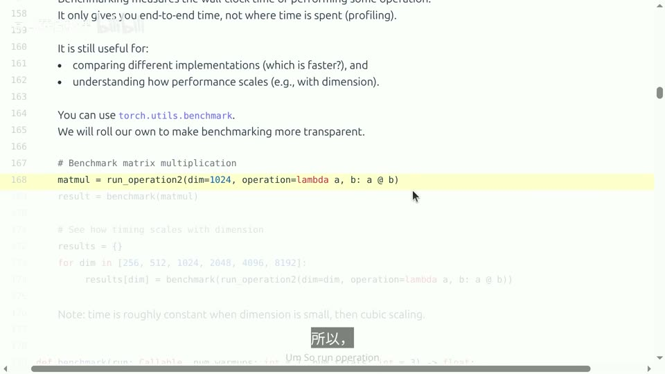 |
| 那怎么进行基准测试呢？最直接的做法就是记下开始时间，运行程序，再记下结束时间。不过有几个要点：第一，一定要记得先做预热——我想我在第二讲中提到过这一点，但我认为这值得强调——这是因为，呃，如果有些代码是延迟编译的，你要确保编译所花的时间不会被计入测试结果，因为大多数时候你关心的是某项操作的执行速度， [【跳转到 17:53】](https://www.bilibili.com/video/BV11LEA6eEuj/?p=6&t=1073) | 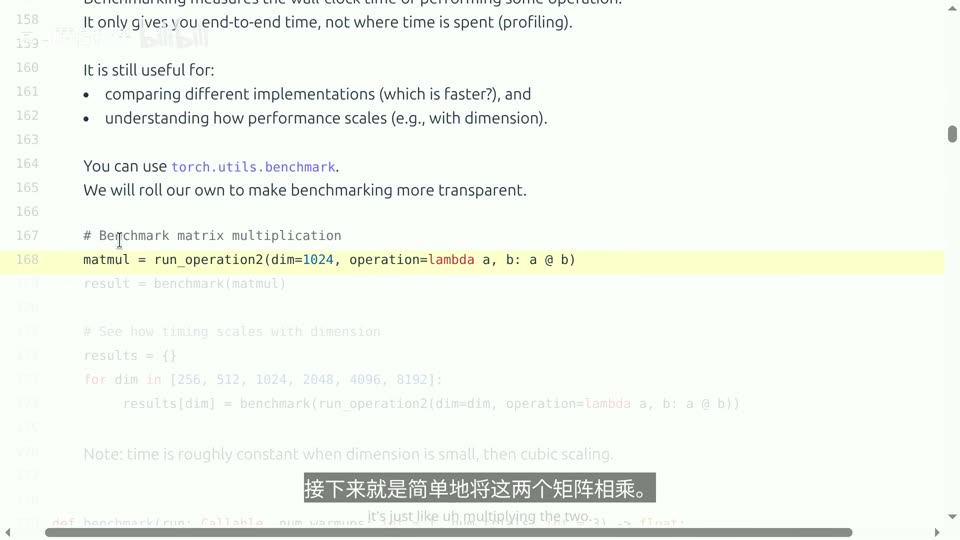 |
| 毕竟你会反复运行它，所以初始条件并不重要。啊，另外还因为结果会有波动，你通常需要多次计时。准确计时的做法是使用 CUDA 事件：先记录一个起始时间，运行计算，再记录一个结束时间，然后记得进行同步，等待 GPU 完成，因为 GPU 上的操作大多是异步的，这是一个同步屏障，然后记下时间。好， [【跳转到 18:18】](https://www.bilibili.com/video/BV11LEA6eEuj/?p=6&t=1098) |  |
| 然后你可以再重复一遍这个过程，再来一次，然后就像这里我们直接取平均值。好，我觉得如果你非常严谨，可能会想查看整个分布，啊，比如 P95、P99 之类的指标，不过我们这里只取平均值。另外做基准测试时可以做的一件事就是扩大矩阵规模，看看耗时如何变化。在这个例子里，你可以看到矩阵乘法的表现，不出所料，它应该呈三次方增长。 [【跳转到 18:43】](https://www.bilibili.com/video/BV11LEA6eEuj/?p=6&t=1123) | 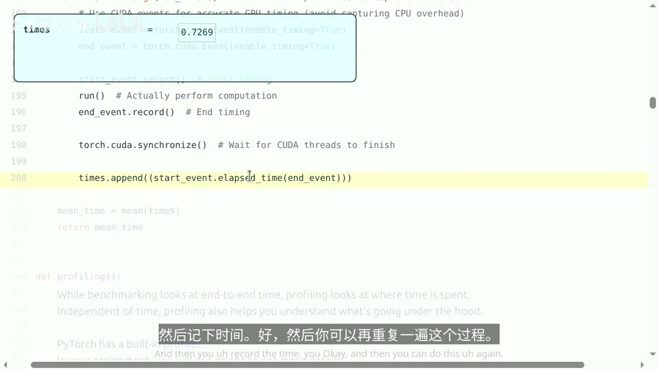 |
| 不过要注意，这里存在一个下限：在矩阵维度接近 2048 之前，耗时基本保持不变。这是因为正如我们之前讨论过的，关键就在于这些矩阵的形状——GPU 专为相当大规模的矩阵乘法设计。那如果换成 2×2 这样的小矩阵，情况就完全不同了，GPU 的效率会非常低。好的，那么我们快速讲一下性能分析。 [【跳转到 19:08】](https://www.bilibili.com/video/BV11LEA6eEuj/?p=6&t=1148) | 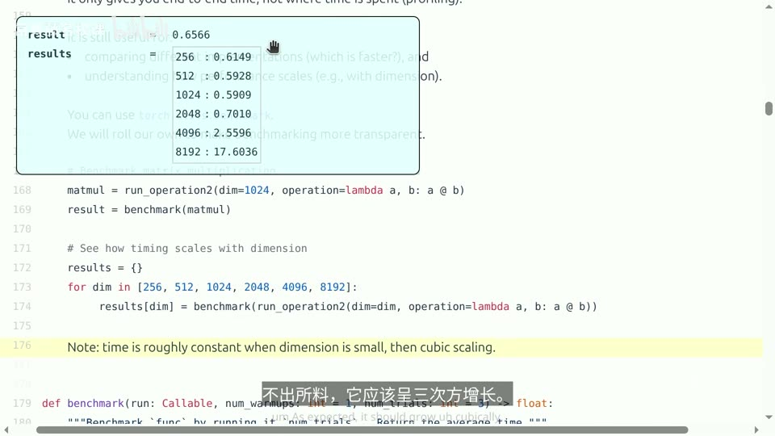 |
| 性能分析（profiling）能告诉你时间究竟花在了哪里。希望大家都已经熟悉并在使用它。也许不那么直观的是，即便你不在意耗时，性能分析也能帮你弄清楚底层到底发生了什么，因为特别是用这些高级语言，你写完代码跑一下就能得到一些结果，有时候能搞清楚背后到底发生了什么是件好事。所以 PyTorch 内置了一个分析器， [【跳转到 19:33】](https://www.bilibili.com/video/BV11LEA6eEuj/?p=6&t=1173) | 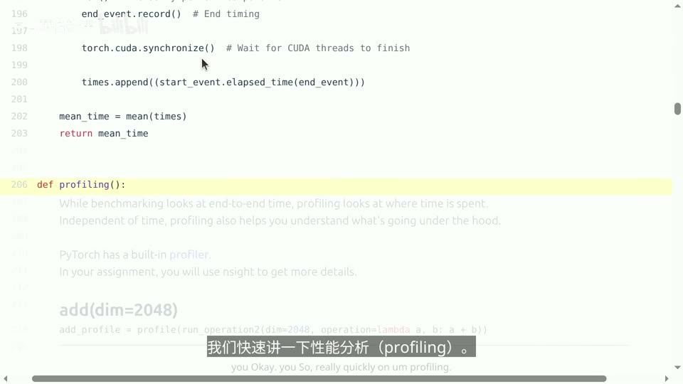 |
| 在作业里你会用到 Nsight，它能提供更详细的信息。啊，但为了节省时间，这部分我们就略过了。嗯，咱们先从一个简单的例子开始，比如你在 PyTorch 里把两个数字或者——抱歉，两个张量相加。啊，同样，运行操作会生成两个随机矩阵，然后执行该操作。所以在分析过程中，我先进行预热， [【跳转到 19:58】](https://www.bilibili.com/video/BV11LEA6eEuj/?p=6&t=1198) | 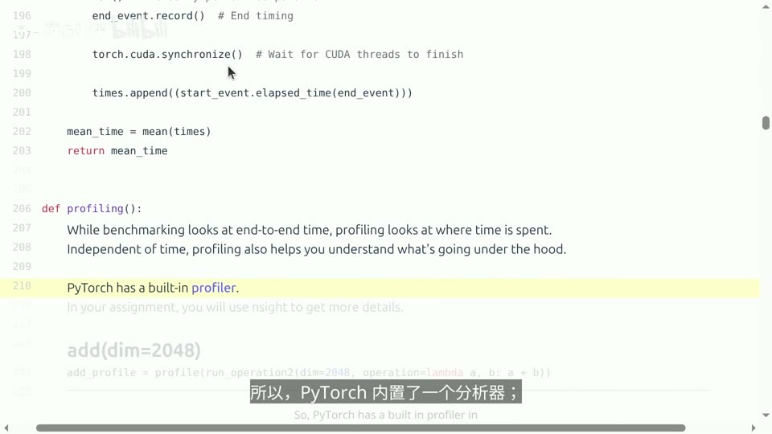 |
| 然后设置好这个上下文，也就是分析上下文，再运行代码。接下来我们看看仅仅做这个操作时分析结果长什么样，也就是 PyTorch 里的 A 加 B。所以通常来说，如果你平时不这么写的话，用 PyTorch 的时候你大概不会去深究这个，差不多就是这两个张量直接相加了，啊，那么底层到底发生了什么？ [【跳转到 20:23】](https://www.bilibili.com/video/BV11LEA6eEuj/?p=6&t=1223) | 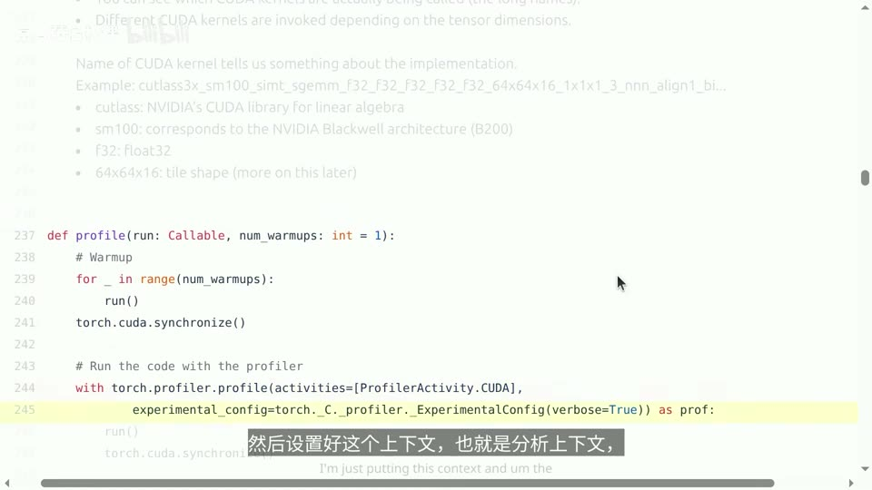 |
| 如果你看看它调用的东西，会发现有这么个名字很长的 cuda 的 add kernel，啊，这基本上就是把两个张量相加的 kernel。而且耗时数据没什么看头，因为我只做加法，所以这一项会占掉 20% 的时间，但这告诉你在底层其实有个叫 ATen 的东西。那矩阵乘法呢？嗯，在 PyTorch 里我做 a@b， [【跳转到 20:48】](https://www.bilibili.com/video/BV11LEA6eEuj/?p=6&t=1248) | 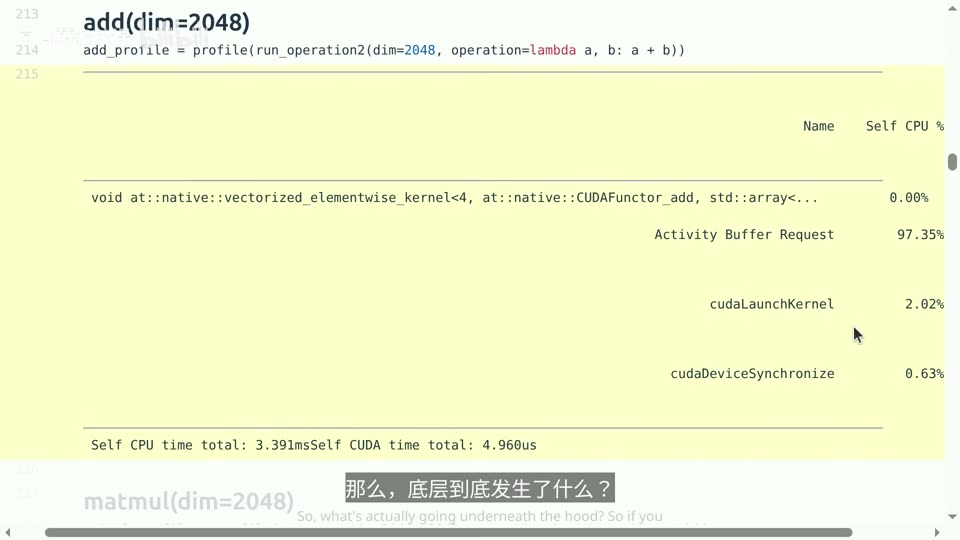 |
| 同样也有这么一个长名字描述了这个特定的矩阵乘法 kernel，cuda 的 32、32、64、64、16 等等。注意，如果你改变维度，比如我现在做一个 128×128 的矩阵乘法，你实际上会得到一个不同的内核。仔细看的话，这里是 64，这里是 32、32、16。 [【跳转到 21:13】](https://www.bilibili.com/video/BV11LEA6eEuj/?p=6&t=1273) | 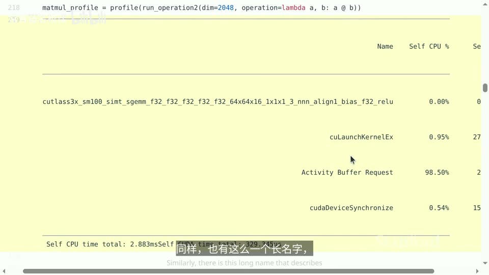 |
| 好的，所以在 PyTorch 底层，表面上看你只是在做加法，但实际上底层会发生各种各样的操作。对，那么观察一下，在这里你可以看到实际被调用了哪些 CUDA 的内核，啊，这些通常名字比较长，具体调用哪个库的内核取决于张量的维度，这个名称本身也透露了一些关于实现方式的信息。所以看这个名字，cuBLAS，NVIDIA 提供的用于线性代数的库， [【跳转到 21:38】](https://www.bilibili.com/video/BV11LEA6eEuj/?p=6&t=1298) | 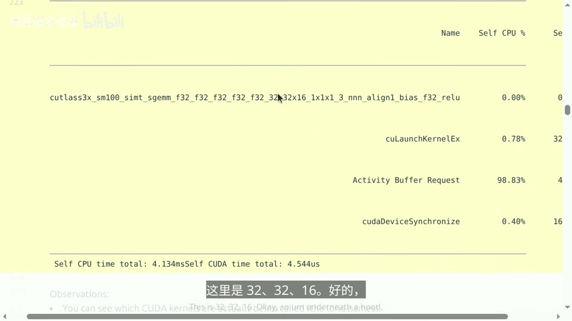 |
| 比如 sm_100，对应的是 Blackwell 架构，所以这是一个专门为 Blackwell 设计的 kernel。这是 FP32，这是 tile 的形状等等，我们后面讲分块时会再详细讨论。好的，这就是基准测试与性能分析，啊，只要记得去做就行了。啊，我想作业里会要求你们做， [【跳转到 22:03】](https://www.bilibili.com/video/BV11LEA6eEuj/?p=6&t=1323) | 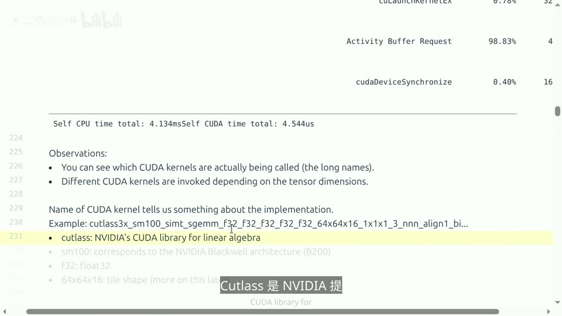 |
| 所以你们没得选。Hello，好的，那我们把这套方法用到这里的另一个例子 GELU 上。所以记住，GELU 激活函数就是这样一个函数，它是一种典型的非线性函数，通常我们会用这个来近似，也就是 tanh 近似，这样计算起来更友好。好的，那么最朴素的，如果你要实现 GELU，可以在 PyTorch 里像这样写， [【跳转到 22:28】](https://www.bilibili.com/video/BV11LEA6eEuj/?p=6&t=1348) | 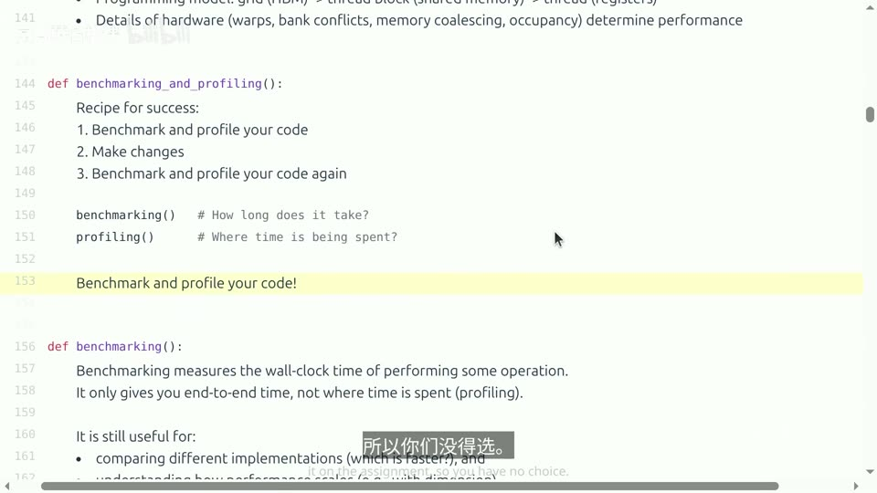 |
| 所以你取一个张量，直接把这个公式放进 PyTorch 就行，这样没问题，你会得到一个具体的数值。啊，PyTorch 里也内置了 GELU，啊，如果你调用 torch.nn.functional 里的 GELU，也能得到那个版本。所以你可以检查一下它们是不是一样的，你可以运行一下，对比这两种 GELU 的实现，确保对于随机输入两者的结果是一样的。 [【跳转到 22:53】](https://www.bilibili.com/video/BV11LEA6eEuj/?p=6&t=1373) | 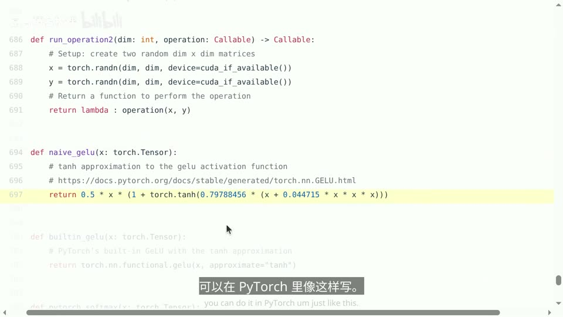 |
| 嗯，还有一点可能大家早就发现了，啊，遇到这种情况，有一点很重要要知道：你可以拿任何一个 PyTorch 函数，对它调用 torch.compile，它就会生成另一个函数，它做的是同样的事情。嗯，好，那么这场比赛里有三个选手：一个是朴素实现，还有内置实现和编译实现。所以我们可以对它们进行基准测试。 [【跳转到 23:18】](https://www.bilibili.com/video/BV11LEA6eEuj/?p=6&t=1398) |  |
| 朴素实现耗时大约 3……嗯嗯，我想这大概是 3.5；啊，内置实现快得多，编译实现也快得多，但可能没内置实现那么快。好，那么这里到底发生了什么？比如为什么它们表现不同？它们算出的结果一样，但性能差异很大。所以我们可以打开分析器，看看底层到底在做什么。啊， [【跳转到 23:43】](https://www.bilibili.com/video/BV11LEA6eEuj/?p=6&t=1423) | 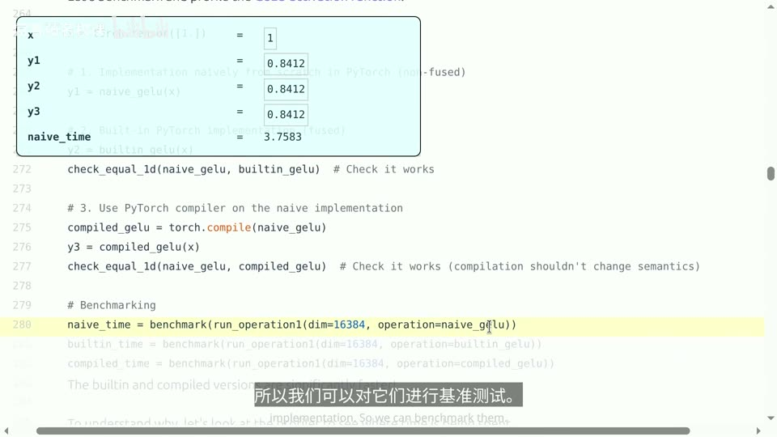 |
| 所以，啊，如果你看看这里的朴素 GELU 实现，跑一下性能剖析，就会发现这个视图有点不对劲。 [【跳转到 24:08】](https://www.bilibili.com/video/BV11LEA6eEuj/?p=6&t=1448) | 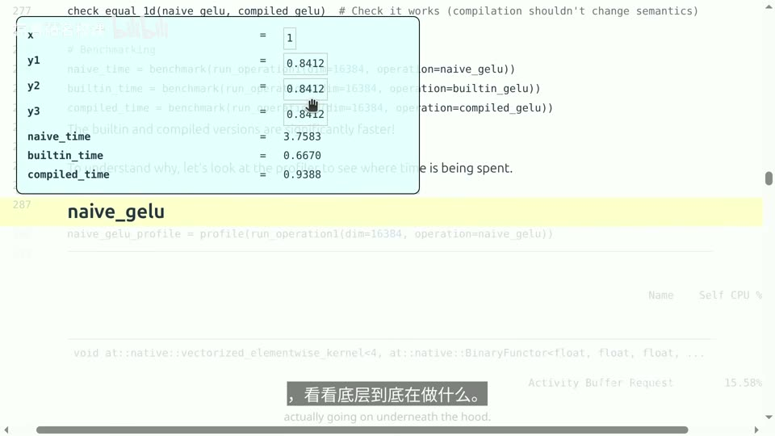 |
| 所以我换个角度看，啊，这样你就能从性能剖析中看到时间都耗在哪儿了。你看，这里有一堆不同的内核，像这个二元函数对象、一元函数加法，还有 tanh，它们都是这里的内核。这对应于一个事实：在 PyTorch 里，当我们写 PyTorch 表达式时，看计算图就会发现，计算图里的每个原语实际上都是由内核来实现的。它慢的原因是，当你启动一个内核时， [【跳转到 24:19】](https://www.bilibili.com/video/BV11LEA6eEuj/?p=6&t=1459) | 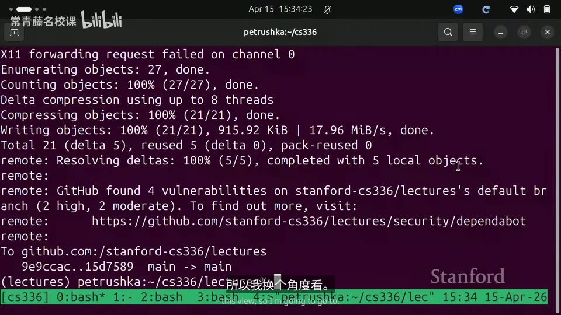 |
| 内核得从 HBM 读数据，把它一路拉到你的 SM 上完成计算，再写回去；然后下一个内核再从 HBM 取走这些数据，再写回去，以此类推。所以因为内核调用之间数据都得回到 HBM，你其实做了很多来回的读写操作。 [【跳转到 24:44】](https://www.bilibili.com/video/BV11LEA6eEuj/?p=6&t=1484) | 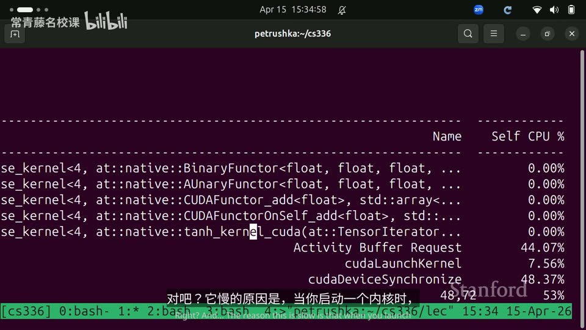 |
| 所以如果你看看内置实现到底在做什么，其实没那么有意思。这里有一个 GELU 的 CUDA kernel 实现，它就是一个单独的 kernel，专门用来实现 GELU。那么为什么会有这个东西呢？因为大家都用 GELU，所以有人为它写了一个 kernel 放进了标准库里，或者说事情就是这样，你懂的，没什么神奇的地方。所以这里的编译过程非常有意思，啊，我不打算太多讲它是怎么工作的， [【跳转到 25:08】](https://www.bilibili.com/video/BV11LEA6eEuj/?p=6&t=1508) | 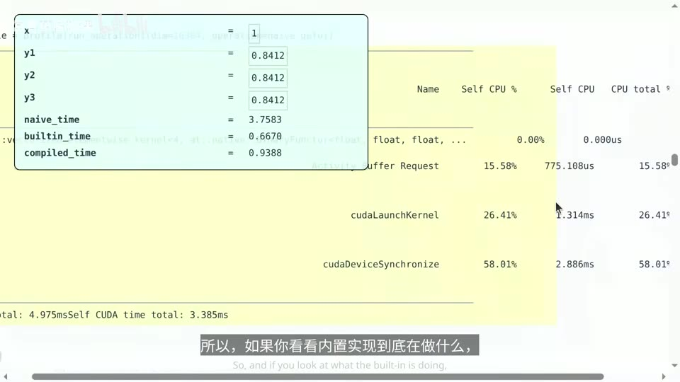 |
| 但我真的觉得这是个很迷人的话题。你知道，在这个话题里，你可以拿一个朴素的实现，你会记得在 PyTorch 里它有一个计算图，然后再跑一个编译器来处理。如果你看看它的底层，其实就只是一个单独的 kernel，这是因为它推断出了……你看一看这个计算图，本质上就是如此，用 Triton 写这个 kernel， [【跳转到 25:33】](https://www.bilibili.com/video/BV11LEA6eEuj/?p=6&t=1533) |  |
| 你可以看到这确实是个 Triton kernel。谢谢。好，朴素实现要用多个 kernel，需要在 HBM 之间反复读写，这里没做 kernel 融合，所以速度很慢；内置编译版只有一个 kernel，基本上 GELU 里的所有操作都融合进了一个 kernel，所以你从 HBM 读一次、每个元素往 HBM 写一次。而且你看到编译后的 kernel 是个 Triton kernel。谢谢，谢谢。好， [【跳转到 25:58】](https://www.bilibili.com/video/BV11LEA6eEuj/?p=6&t=1558) | 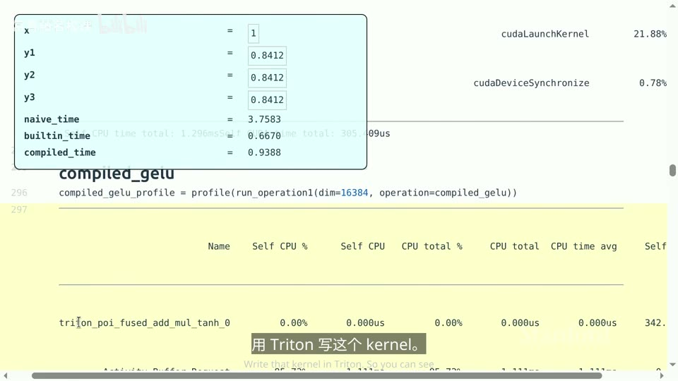 |
| 那我们就顺势聊聊 Triton 到底是怎么回事。嗯，我不是……没有，是指总耗时吗？ [【跳转到 26:23】](https://www.bilibili.com/video/BV11LEA6eEuj/?p=6&t=1583) | 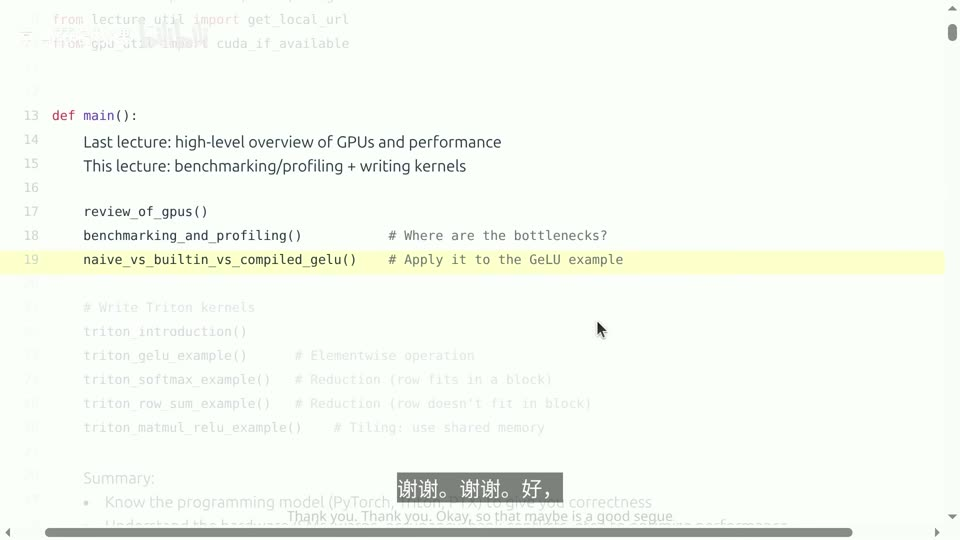 |
| 呃，是指总耗时吗？是说它们直接生成 C 的结果吗？我看看，这里显示的是 CUDA kernel 的实现，所以我猜这是有人用 CUDA 写的。and you, thank you。谢谢，谢谢。好的，还有别的问题吗？有——Triton 比这个快，做得不错。那么为什么 Triton kernel 更快？其实在这个场景下，Triton kernel 并不更快。 [【跳转到 26:31】](https://www.bilibili.com/video/BV11LEA6eEuj/?p=6&t=1591) | 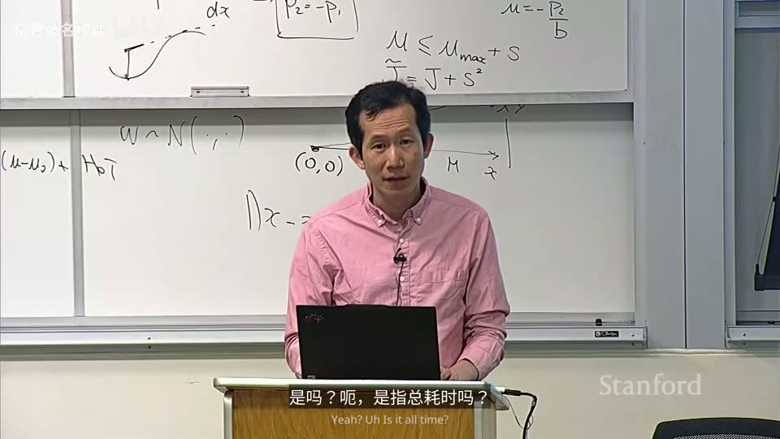 |
| 呃，这种情况……哦抱歉，编译后的 kernel 是一个 Triton kernel，这比内置的慢。对，我记得去年讲这个的时候，其实两者更接近一些。我的看法没有变，而且非常依赖具体硬件。我是这么看的，啊，这里的代码并没有做过极致优化，只是为了让你对整体概念有个大致的了解。好的，那么我们来写几个 Triton kernel。 [【跳转到 26:56】](https://www.bilibili.com/video/BV11LEA6eEuj/?p=6&t=1616) | 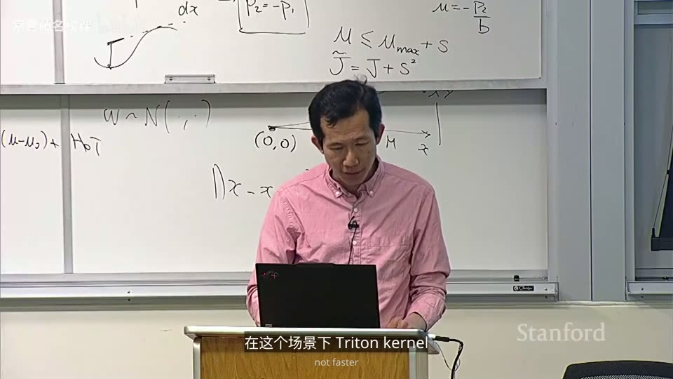 |
| 请记住我们的编程模型：你有一组线程，它们被组织成 thread group， [【跳转到 27:19】](https://www.bilibili.com/video/BV11LEA6eEuj/?p=6&t=1639) | 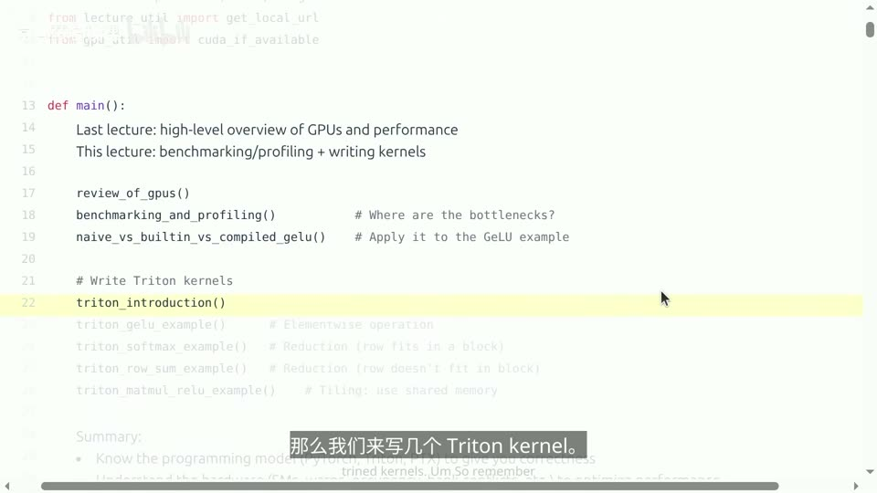 |
| 也就是 thread block，再由这些 thread block 构成一个 grid。好的，如果你用 CUDA 来写，你知道 CUDA 最初由 NVIDIA 开发，多年来编写 kernel 时一直都用它，它的心智模型是"每个线程做什么"，于是你编写一段代码，这段代码本质上包含一个用于标识当前线程的 ID，然后执行该代码。 [【跳转到 27:24】](https://www.bilibili.com/video/BV11LEA6eEuj/?p=6&t=1644) | 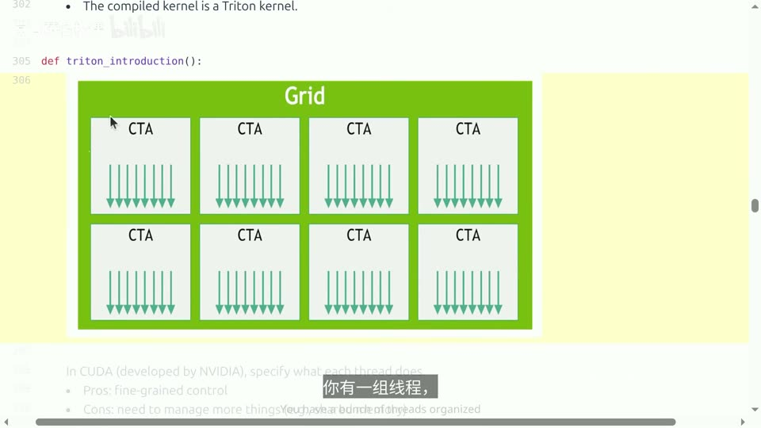 |
| 所以这其中的好处在于，它与底层实际发生的情况密切相关。 [【跳转到 27:49】](https://www.bilibili.com/video/BV11LEA6eEuj/?p=6&t=1669) | 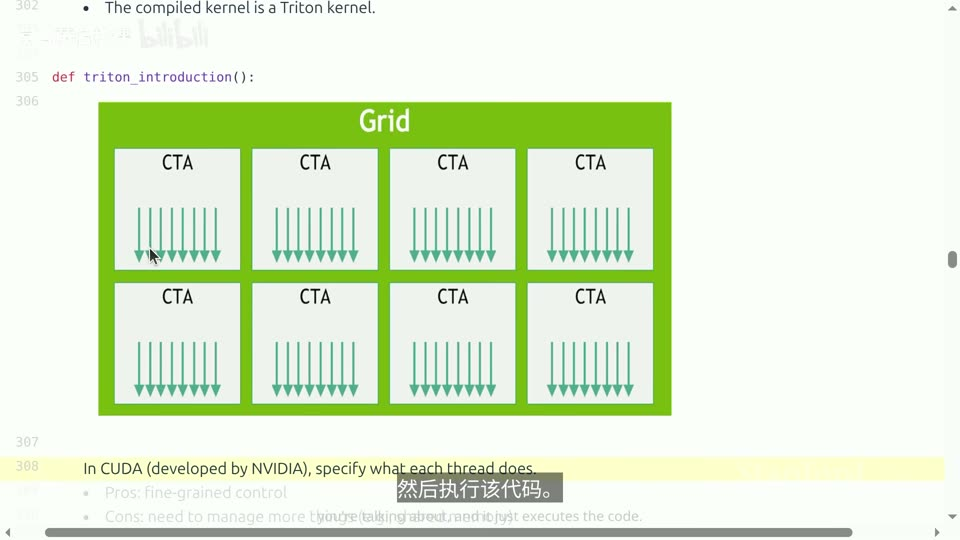 |
| 而且你知道，细粒度能让你获得细粒度的控制，啊，但你知道这里也有缺点，那就是——请记住，所有这些线程都在一个 thread block 里，而且，嗯，有些操作需要它们互相通信，所以必须先让它们同步：一起从 HBM 读取数据，再同步起来执行计算，大概就是这样一个过程。你基本上得做这些同步工作。所以如果你做的全是逐元素操作， [【跳转到 27:55】](https://www.bilibili.com/video/BV11LEA6eEuj/?p=6&t=1675) | 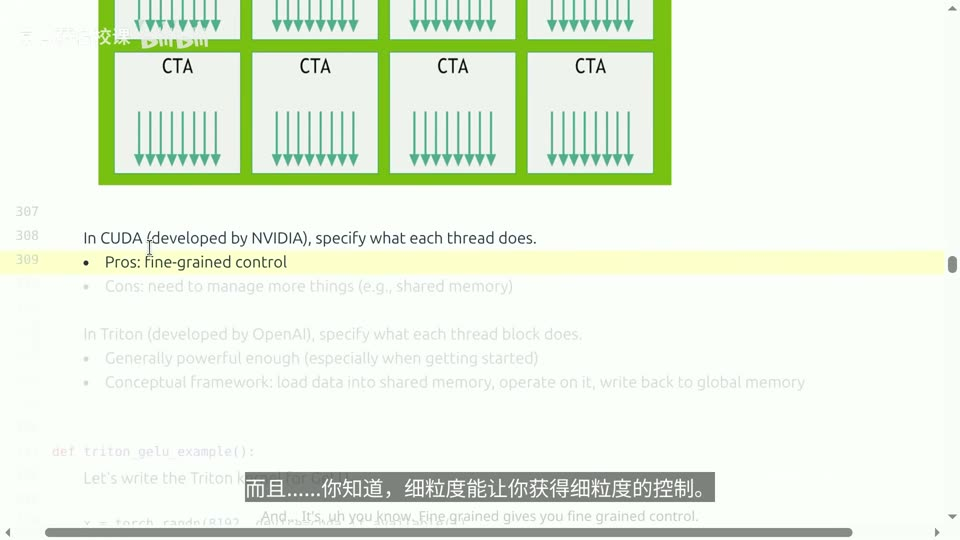 |
| 你知道，用 CUDA 就完全没问题，这其实无所谓；但随着操作变得复杂，Triton 在抽象层面上就体现出价值了。所以 Triton 是 OpenAI 开发的，我觉得到现在它已经挺主流了，基本上就是定义每个 thread block 要做什么。一般来说，这已经足够强大了， [【跳转到 28:20】](https://www.bilibili.com/video/BV11LEA6eEuj/?p=6&t=1700) | 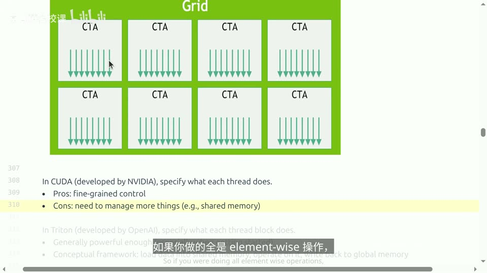 |
| 尤其是对这门课而言，也足以让你上手。啊，如果你真想榨干最新硬件的每一个新特性，它可能没法给你完全的灵活性，啊，不过咱们先别纠结这个。在训练里，你需要建立的概念框架是：你想想一个 block 具体做什么。一个 block 会把数据加载到 shared memory 中，对其进行处理，然后再写回 global memory。 [【跳转到 28:38】](https://www.bilibili.com/video/BV11LEA6eEuj/?p=6&t=1718) | 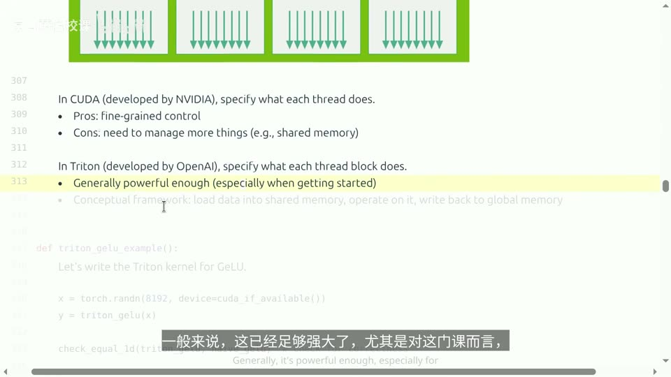 |
| 所以从某种意义上说，这些 block 处于一个中间位置，介于思考单个元素在做什么， [【跳转到 29:03】](https://www.bilibili.com/video/BV11LEA6eEuj/?p=6&t=1743) | 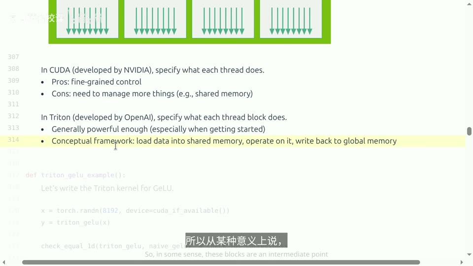 |
| 与思考整体操作之间。所以在 PyTorch 里，你基本上就是定义好那些巨大的矩阵，然后说"把它们乘起来"，这就是一种原子操作，你思考的很多问题是我该怎么把运算都塞进大的矩阵乘法里，对吧？而在某种程度上，Triton 算是介于那种方式和单个元素之间的一种混合体，正如我们稍后会看到的。好， [【跳转到 29:08】](https://www.bilibili.com/video/BV11LEA6eEuj/?p=6&t=1748) | 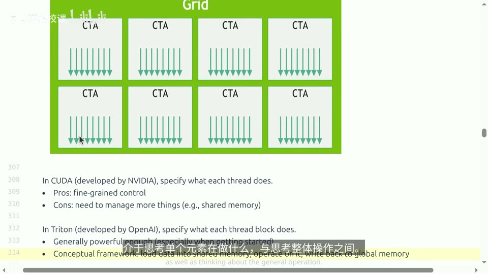 |
| 那我们先从这个例子开始。我们先定义一个 8 元素的向量，然后开始写一些 Triton 代码。好啊，Triton 的基本用法就是，你知道的，你直接写代码。在座有多少人以前写过 Triton？举个手让我看看。好，希望举手的人别太多，这样挺好，免得大家觉得无聊。嗯，好，这是标准的 PyTorch 写法， [【跳转到 29:31】](https://www.bilibili.com/video/BV11LEA6eEuj/?p=6&t=1771) | 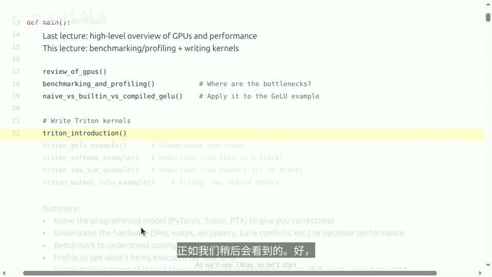 |
| 这里还没用到 Triton。嗯，我只是在做铺垫。啊，接下来我要做的是先取这个张量，OK，然后我会分配一个输出张量，明白了吗？因为在 Triton 里我们不再从函数式的角度思考，而是只关注数据的移动，啊，你必须显式地执行读写操作，因此没有返回值，啊，所以我要分配输出张量，kernel 会向其写入数据。 [【跳转到 29:56】](https://www.bilibili.com/video/BV11LEA6eEuj/?p=6&t=1796) | 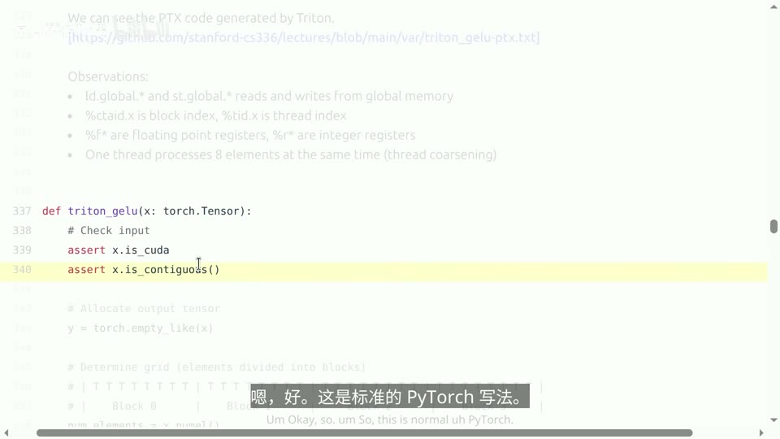 |
| 然后呢，这个张量可以任意大，对吧？而我通常无法把它全部放进一个 SM，因为它太大了，所以我需要把它分解成块。我要做的是——你可以把这个 X 看成一个数组，啊，我会把它切分成块，啊，元素总数是 8000，我现在先把块大小设为 1024，然后我就有了 8 个线程块。好，那么接下来我会用这种有点奇怪的语法 [【跳转到 30:21】](https://www.bilibili.com/video/BV11LEA6eEuj/?p=6&t=1821) | 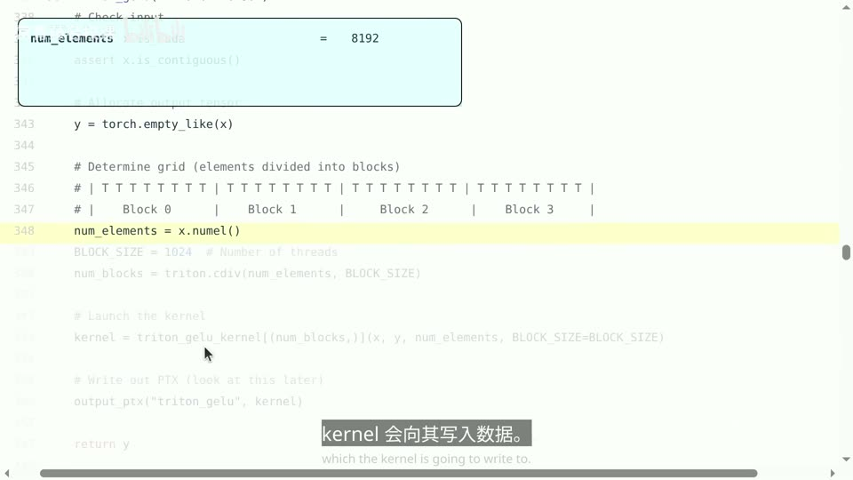 |
| 来调用 kernel。嗯，所以我们来定义一个 Triton kernel，啊，括号里的内容基本上是在指定 grid 的形状，也就是说这行代码表示 grid 有 num_blocks 个线程块，也就是这些线程块。对于每个线程块，我都会调用这个 Triton kernel 函数，我待会会详细讲，我会传入 x、y、num_elements 以及块大小。 [【跳转到 30:46】](https://www.bilibili.com/video/BV11LEA6eEuj/?p=6&t=1846) | 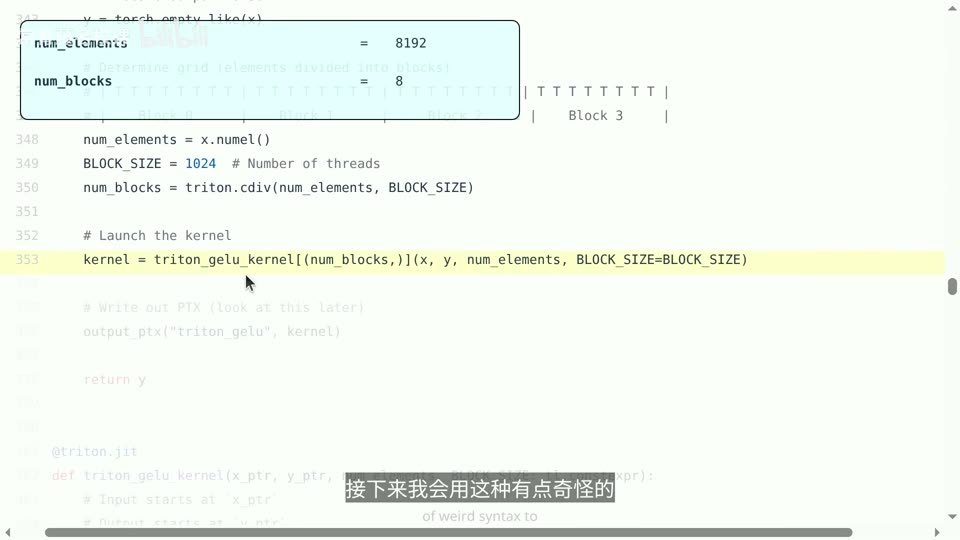 |
| 好，谢谢。好啊，很遗憾我没法一步步演示代码的执行过程，所以只展示一下代码长什么样，在这儿。好，让我把这个删掉。这大概是你所能想到的最简单的内核了。哦，所以当你看着这个 Triton kernel 的时候， [【跳转到 31:11】](https://www.bilibili.com/video/BV11LEA6eEuj/?p=6&t=1871) | 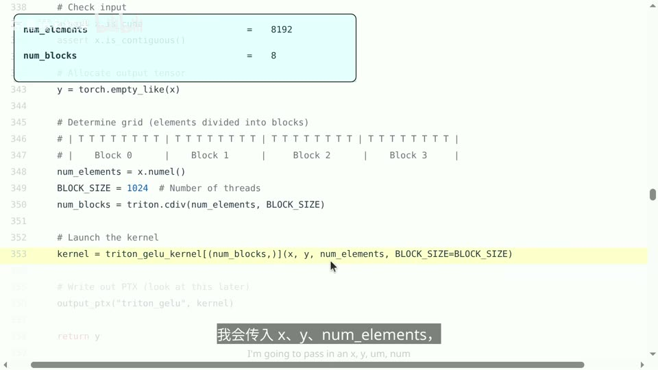 |
| 现在这个嘛，以前我们用的是 X 和 Y，而现在这些都是指针了。你可以把它们简单理解为整数，也就是地址，嗯，所以你得习惯这一点。嗯，接着我们有元素数量和块大小，它们基本上是被传进来的，啊，实际上我是从这儿传进来的。谢谢。好，所以你可以这样想：对于每个块，我们都会调用这个函数，呃， [【跳转到 31:36】](https://www.bilibili.com/video/BV11LEA6eEuj/?p=6&t=1896) | 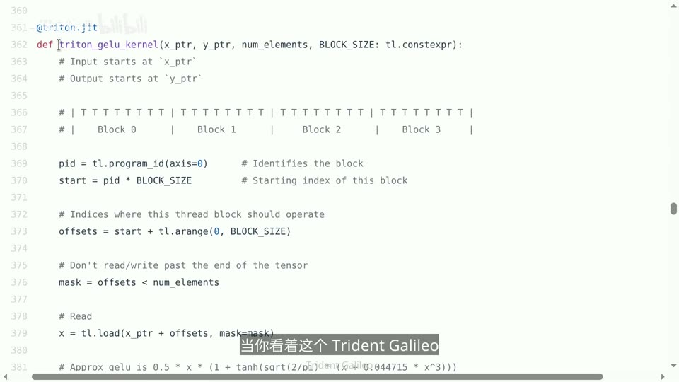 |
| 呃，谢谢。接下来我要做的第一件事就是，这个块醒来后会问"我是谁"。其实程序 ID 就是 pid，本质上就是用来标识这个块的，所以对于这里的块一、二和三，它们的 PID 分别是零、一和二。好，现在我得搞清楚我要处理哪些数据，起始位置就是 PID 乘以块大小， [【跳转到 32:01】](https://www.bilibili.com/video/BV11LEA6eEuj/?p=6&t=1921) | 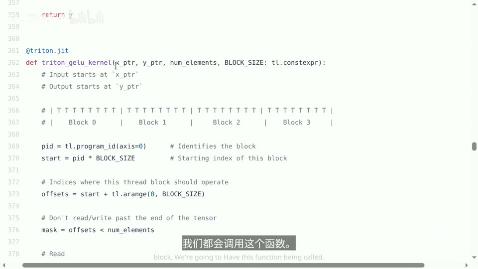 |
| 这就是指向 X 指针的偏移量。什么意思？如果 PID 是 0，起始位置就是 0；如果 PID 是 1，起始位置就是块大小；如果 PID 是 2，起始位置就是块大小的两倍，以此类推。谢谢。啊，现在我得算出我要处理的跨度，偏移量等于起始位置加上一段（arange）。 [【跳转到 32:26】](https://www.bilibili.com/video/BV11LEA6eEuj/?p=6&t=1946) | 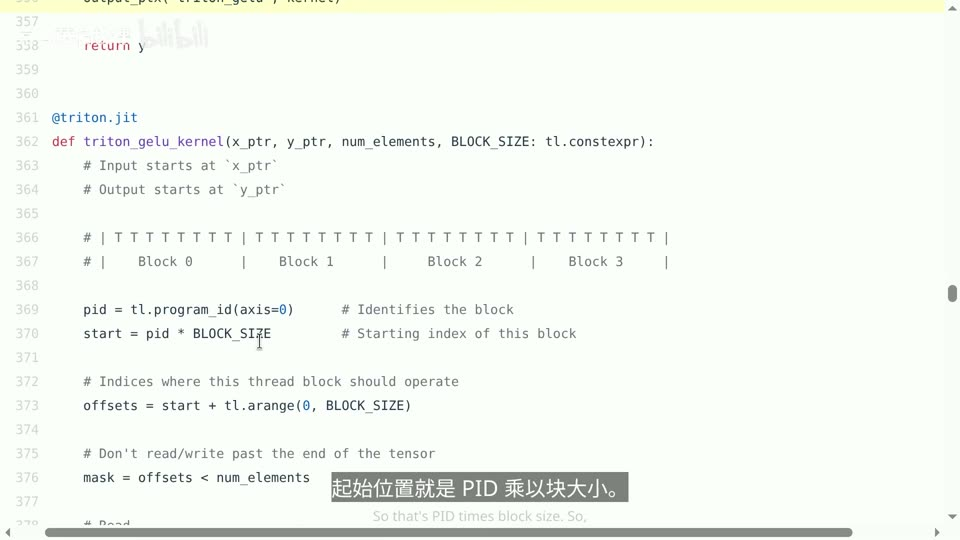 |
| 这就是 Triton 的写法，tl.arange 从零到块大小，概念上对应从零到块大小减一的整数，啊，所以偏移量大致是这样。以块一为例，它会是块大小、块大小加一，一直排到接近二倍块大小的位置。yes，谢谢。好，那么，这里元素数量刚好能被块大小整除，但一般情况并非如此。OK，因此你常会在 Triton 代码里看到这种"掩码"。 [【跳转到 32:51】](https://www.bilibili.com/video/BV11LEA6eEuj/?p=6&t=1971) | 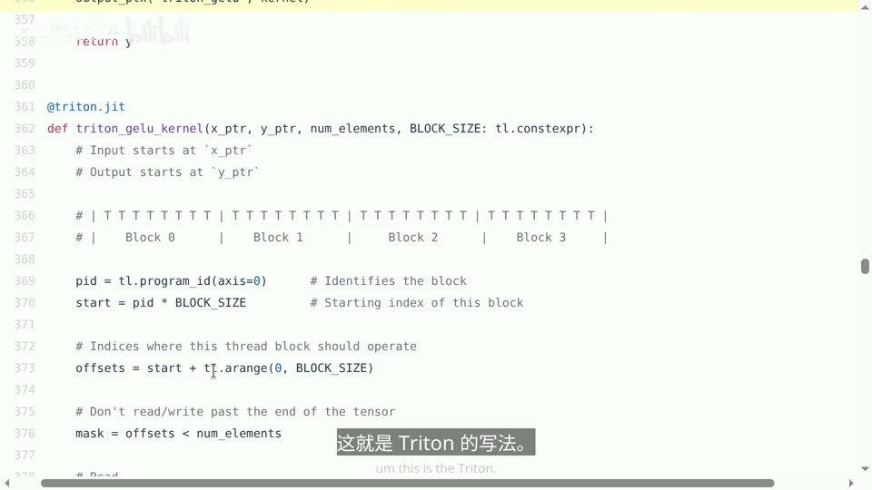 |
| 它表示：有时如果张量只到这里，那么我就构造一个掩码，在这一点之前为真、之后为假；而对于非最后一个块的块，掩码就全为真。谢谢。好，现在设置已经完成，我要做的就是读取，这基本上就是指针运算。所以记住， [【跳转到 33:16】](https://www.bilibili.com/video/BV11LEA6eEuj/?p=6&t=1996) | 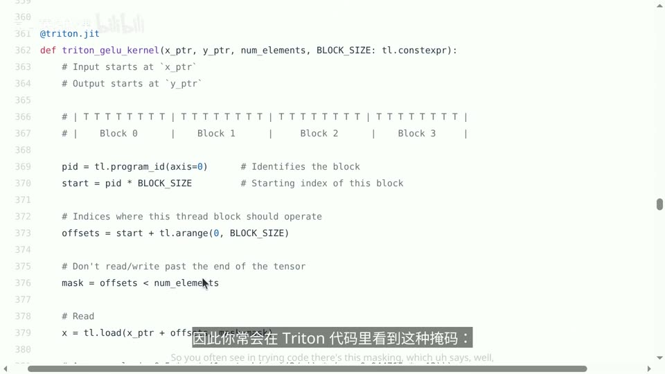 |
| X 指针就是指定 X 所在内存位置的整数，我会在此基础上加上偏移量，这样就得到了前 block size 个元素；根据掩码，如果被屏蔽就不读取它。然后现在你可以把它当做一个向量来看待，然后执行常规计算得到结果。Y 与 X 大小相同，然后执行 tl.store，传入 Y 的指针加上偏移量以及掩码。 [【跳转到 33:41】](https://www.bilibili.com/video/BV11LEA6eEuj/?p=6&t=2021) | 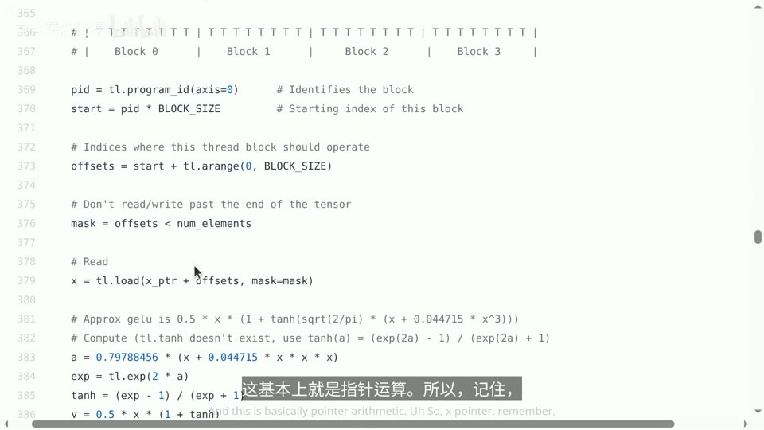 |
| 好的，这次 load 从 HBM 重新加载数据，做一些处理，然后写回 HBM。好的，我就讲到这里，然后回答关于这第一个 Triton kernel 的任何问题。 [【跳转到 34:06】](https://www.bilibili.com/video/BV11LEA6eEuj/?p=6&t=2046) | 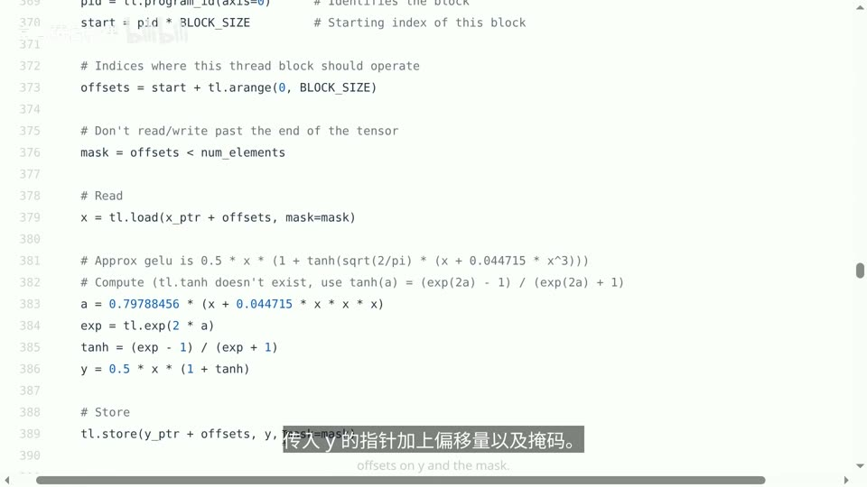 |
| 嗯，对，那区别是什么呢？CUDA 和这个有什么区别？对于这种逐元素操作，看起来几乎是一样的，对吧？事实上我认为 CUDA 甚至更简单，因为它确实就是逐元素的：你启动后确定自己是哪个线程，然后直接对那个元素进行操作。现在唯一不同的是，它有点像向量化版本， [【跳转到 34:18】](https://www.bilibili.com/video/BV11LEA6eEuj/?p=6&t=2058) | 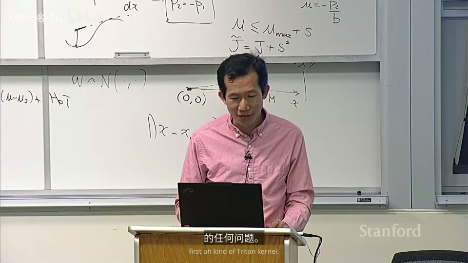 |
| 你有一个 block，并对整个 block 进行操作。稍后我们会看到，如果你做的操作超出了逐元素的范畴，比如对 block 进行操作，那在 CUDA 里用起来就会麻烦得多。后面有几个问题。这跟你想用 Tensor Core 有什么关系？啊，谢谢。那这跟你想用 Tensor Core 有什么关系呢？所以我待会儿会给大家看这段代码实际编译成了什么样，也许我会再回到这个话题。 [【跳转到 34:43】](https://www.bilibili.com/video/BV11LEA6eEuj/?p=6&t=2083) | 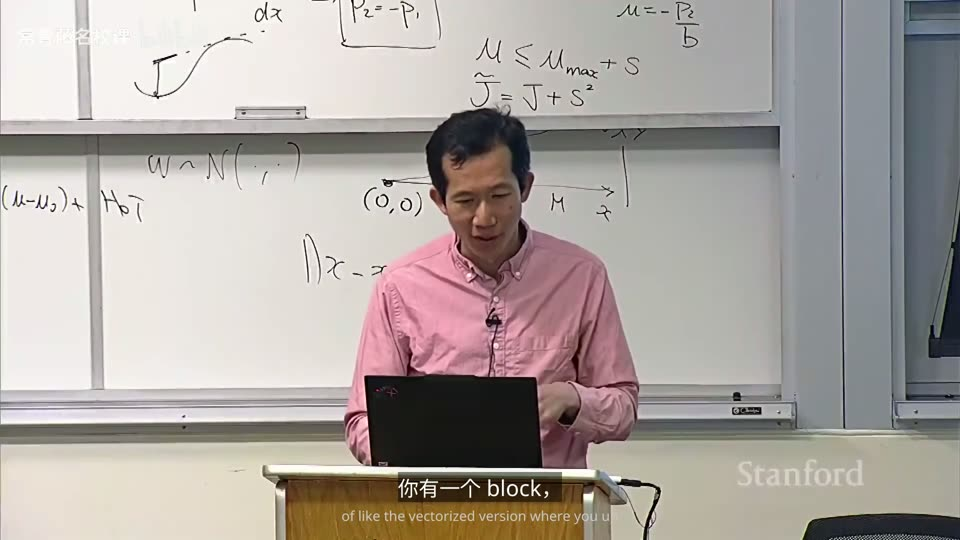 |
| 简单说，这不由你控制，硬件会自动决定把数据放在哪儿。对，那 tl.load 具体是怎么回事？数据从 HBM 到 shared memory 再到寄存器，具体是怎么一步步流动的？对，所以问题是：当这条语句执行时，实际发生了什么？诶，所以简单来说，这在某种程度上是个谎言，对吧？并不是说 GPU 真的调用 Triton 库， [【跳转到 35:08】](https://www.bilibili.com/video/BV11LEA6eEuj/?p=6&t=2108) | 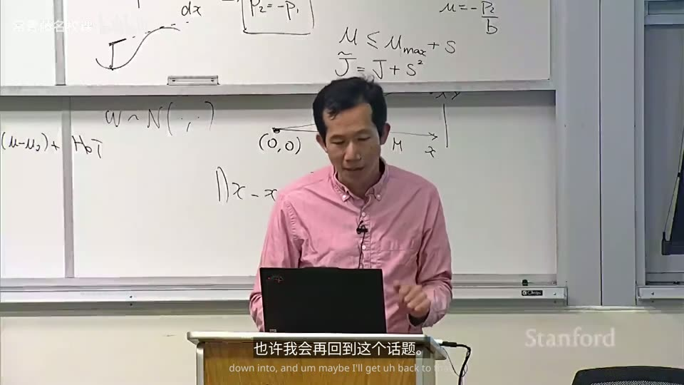 |
| 真的在执行这段代码，这主要是为了方便我们指定要进行的计算。编译器会拿到这个， [【跳转到 35:33】](https://www.bilibili.com/video/BV11LEA6eEuj/?p=6&t=2133) | 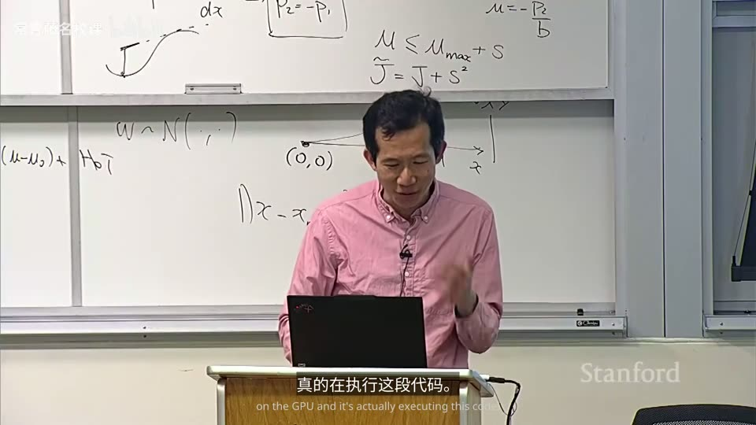 |
| 稍后我们会看到，它把它编译成一个叫 PTX 的东西， [【跳转到 35:38】](https://www.bilibili.com/video/BV11LEA6eEuj/?p=6&t=2138) | 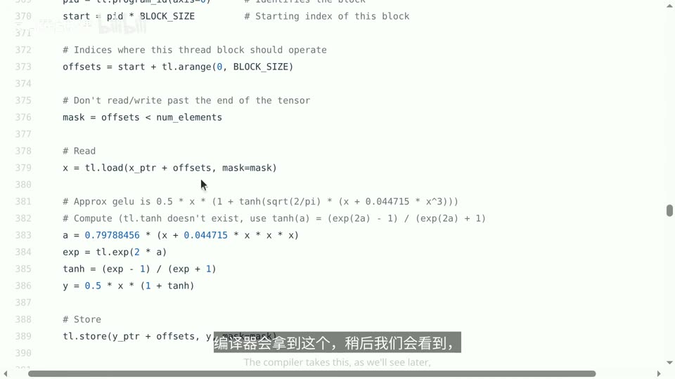 |
| 然后才真正执行工作。不过从概念上讲，这就是它在机械层面运作的原理，我后面会详细说。如果你问的是概念层面的问题，可以这样理解：这个 load 的指针参数指的是 HBM 里的一块内存分配，它大致划定了一段内存地址范围，load 操作会读取这些地址并返回对应的数据。比如这里我定义了一个叫 X 的局部变量， [【跳转到 35:43】](https://www.bilibili.com/video/BV11LEA6eEuj/?p=6&t=2143) | 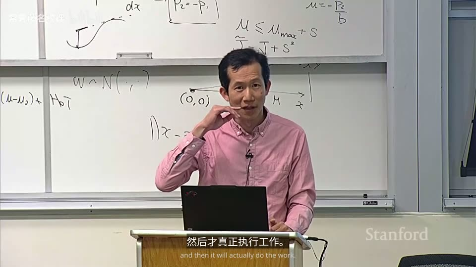 |
| 实际上这通常对应一个寄存器或者是共享内存，实际上你不必操心，Triton 会自动判断在那里该做什么。谢谢。在线程层面上，也就是说当这个函数被调用时，并不清楚我是否对齐了某些内容，它是提前就放在共享内存、放在寄存器层级，还是说现在才发生？ [【跳转到 36:08】](https://www.bilibili.com/video/BV11LEA6eEuj/?p=6&t=2168) | 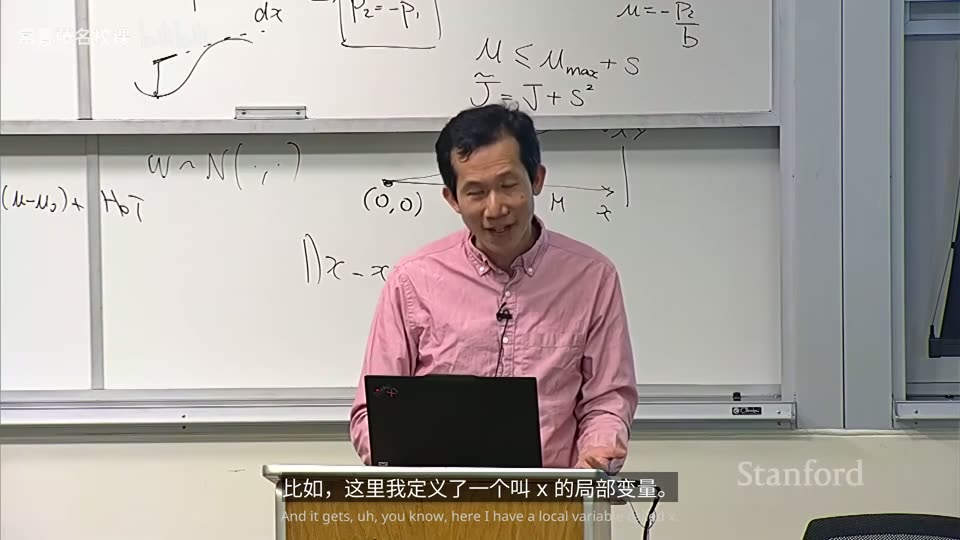 |
| 那样可就太晚了，所以线程都待在那儿闲着等内存刷进来。唉，不，还是执行吧，省得我们干坐着等 HBM 的数据传进来。是的，所以问题是：这究竟何时执行？而且这不会造成阻塞吗？啊，我回头再讲这个问题，我给大家看看 PTX，希望能提供更多背景信息，关于正在发生的事情。好的，还有其他问题吗？ [【跳转到 36:33】](https://www.bilibili.com/video/BV11LEA6eEuj/?p=6&t=2193) |  |
| 好的，所以所有的 kernel 看起来大致都是这样的。我得确保大家都听懂了， [【跳转到 36:58】](https://www.bilibili.com/video/BV11LEA6eEuj/?p=6&t=2218) |  |
| 嗯，就是这种通用的结构，也就是你通常有输入和输出，醒来后确定要看的索引，读数据，做点处理，然后写回 HBM。嗯嗯，谢谢。好。你，好，那我们先简单聊聊 PTX。啊，我们来看看，这是新的吗？这个链接能跑通吗？好，那么当你，你知道的，在写这些的时候， [【跳转到 37:03】](https://www.bilibili.com/video/BV11LEA6eEuj/?p=6&t=2223) | 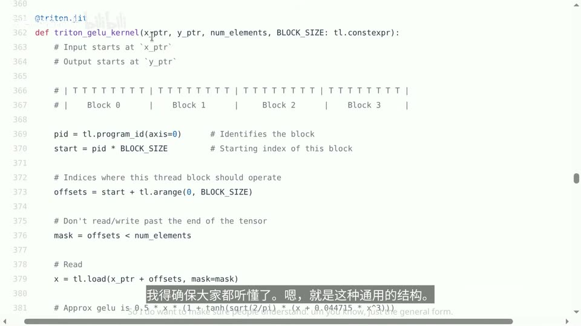 |
| 编译器会生成 PTX 代码，这是一种用于 GPU 的中间汇编语言。我当然不会把所有细节都过一遍，只是想让你对它的样子有个大致概念。嗯哼，你知道，长这样。啊，我先从几个观察点说起。好，有几件事，呃，你知道，现在来看看线程实际在做什么，这里指的不是 thread block， [【跳转到 37:28】](https://www.bilibili.com/video/BV11LEA6eEuj/?p=6&t=2248) | 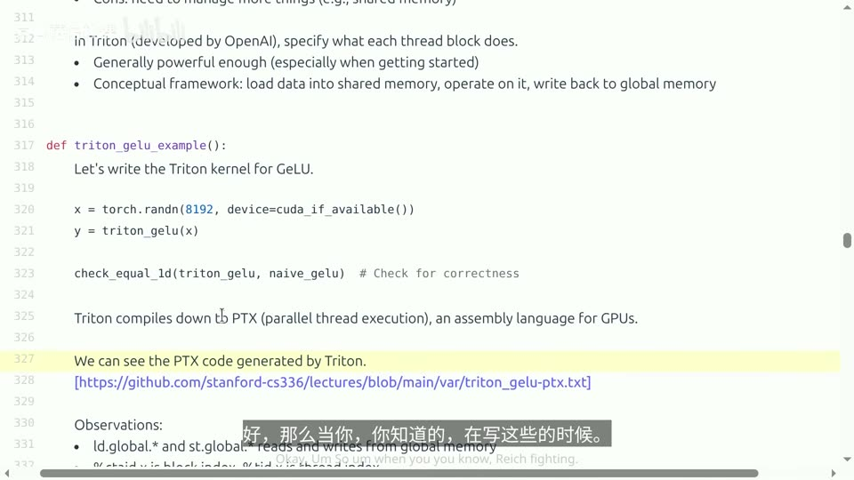 |
| 因为 thread block 已经编译过了，嗯，一种方法，所以，嗯，如果你看看这里的一些笔记，所以这个 ld.global 指令基本上就是从高带宽内存（HBM）加载数据，进入一些寄存器，这些寄存器用 R 来表示，R 代表整数寄存器，F 代表浮点寄存器。接着你会看到类似"将零移动到 R5、 [【跳转到 37:53】](https://www.bilibili.com/video/BV11LEA6eEuj/?p=6&t=2273) | 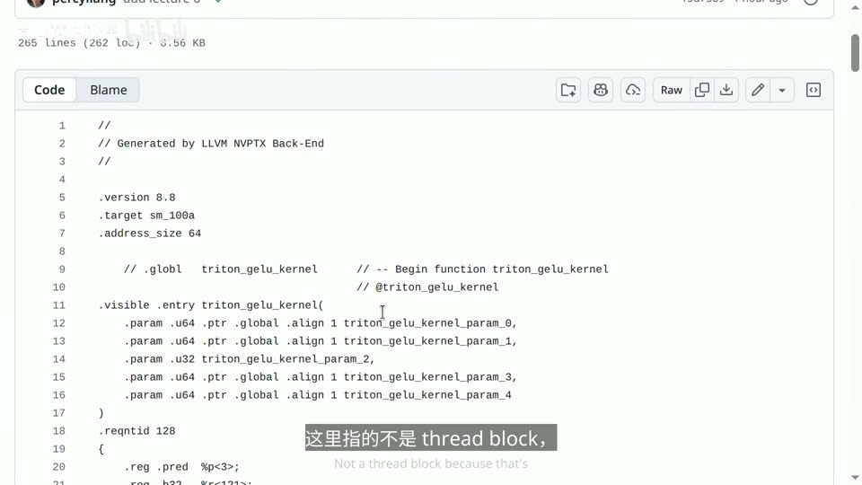 |
| 将零移动到 R6"这样的指令，以此类推。嗯，然后是乘法运算，你会把这个寄存器的值与这个常数相乘，然后把结果存到这里，所以这段代码被执行了。在最底下，你应该会看到全局存储（global store）指令，诶，所以就是在往高带宽内存里写数据。 [【跳转到 38:18】](https://www.bilibili.com/video/BV11LEA6eEuj/?p=6&t=2298) | 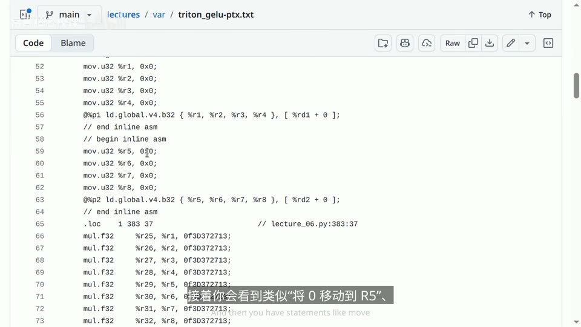 |
| 也就是说，这步操作被执行了，啊，这实际上是在一个线程上运行的代码，啊，而 Triton 基本上是在此之上的一层。啊，还有一点要注意，就是你看这些块里面到底在发生什么。这里发生的情况是，我之前提过线程粗化（thread coarsening），也就是这里其实只有一个线程，但它实际上一次处理了八个元素，而不是只处理单个元素。 [【跳转到 38:43】](https://www.bilibili.com/video/BV11LEA6eEuj/?p=6&t=2323) | 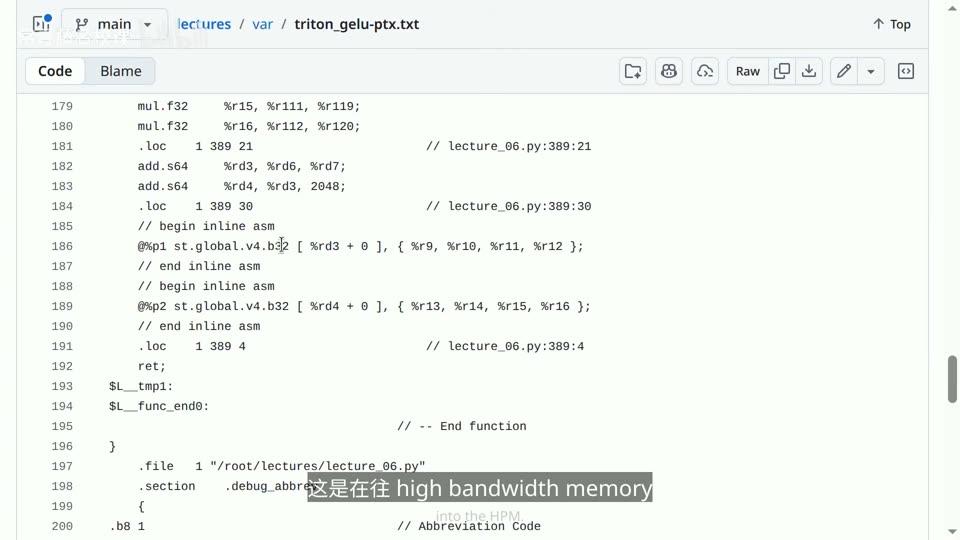 |
| 所以编译器判断这个线程其实很轻量、工作量并不大，于是它就试着把它稍微加厚一点，即粗化。啊，那个，看 PTX 你就能大致明白底层到底在发生什么。对，所以它会为每个线程单独生成—— [【跳转到 39:08】](https://www.bilibili.com/video/BV11LEA6eEuj/?p=6&t=2348) | 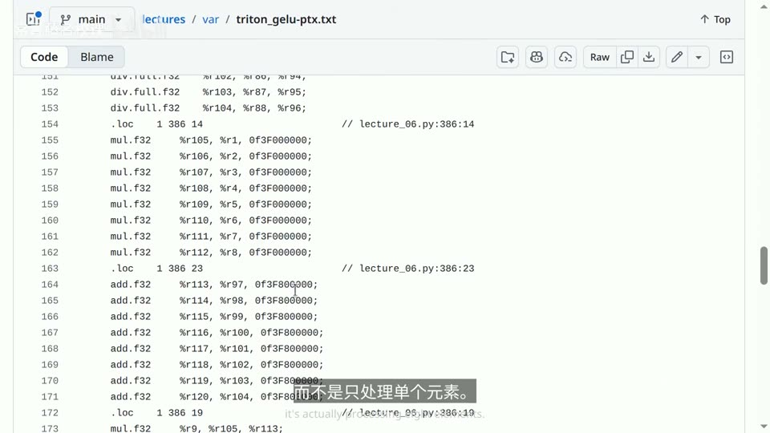 |
| 那，呃，这具体是怎么回事呢？不知为何，那么问题是：它是为每个线程都生成一份吗？所以这段代码只编一次，所有线程跑的都是同一份代码，每个线程都在运行它，而线程区分自身的方式是这段代码会被传入……嗯，基本上就是这个线程。嗯， [【跳转到 39:23】](https://www.bilibili.com/video/BV11LEA6eEuj/?p=6&t=2363) | 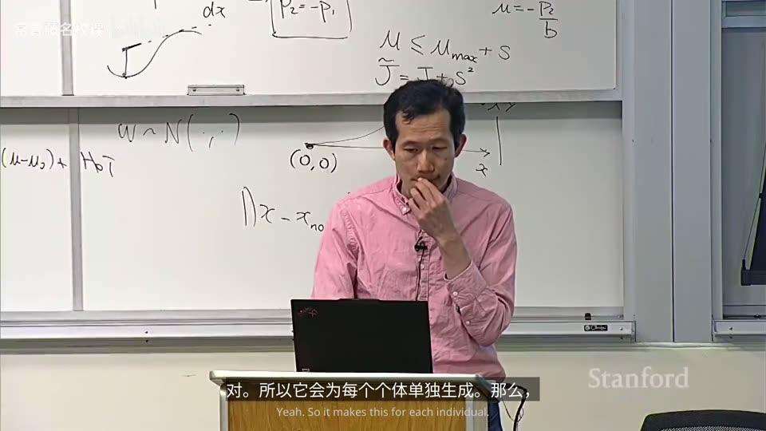 |
| 所以这里 ctaid.x 是块索引，tid 是线程索引，所以基本上如果这段代码正在运行，它就能告诉我当前处于哪个块中，tid.x 告诉你当前线程在该线程块中的索引。诶，好的好的， [【跳转到 39:48】](https://www.bilibili.com/video/BV11LEA6eEuj/?p=6&t=2388) | 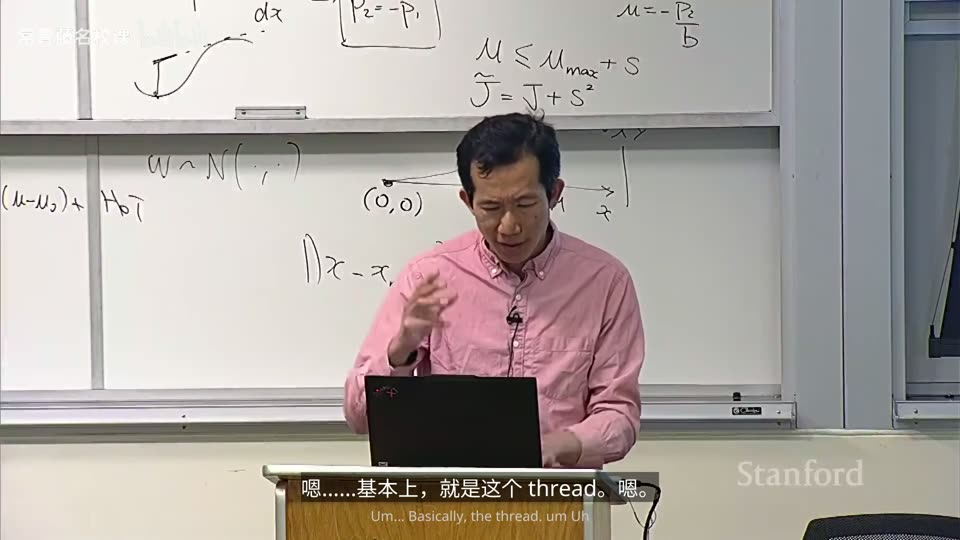 |
| 还有其他问题吗？我正在考虑……好的，谢谢，谢谢。好的，这大体上就是你第一次尝试编写 kernel 的一种形式，从高带宽内存加载数据，计算后直接写回高带宽内存。还有，然后我们看到了 PTX，它有点粗糙，展示了底层实际发生的细节，仍有许多东西在 PTX 中并未指定， [【跳转到 40:06】](https://www.bilibili.com/video/BV11LEA6eEuj/?p=6&t=2406) | 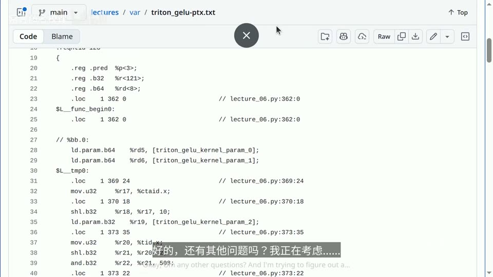 |
| 比如具体是哪些 SM 在运行，还有 warps 之类的东西，啊，很多都是硬件控制的，所以你根本看不到。对，PTX 代码是编译器生成的， [【跳转到 40:31】](https://www.bilibili.com/video/BV11LEA6eEuj/?p=6&t=2431) | 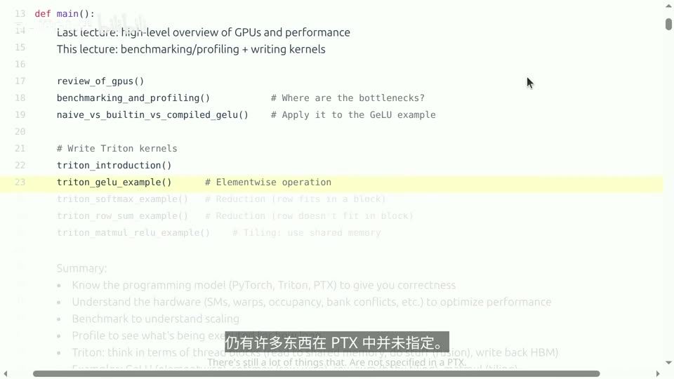 |
| 所以它并不是用常规方法得到的。哇，得了吧，看起来像个……对，所以问题是：PTX 就是编译器生成的，所以确实有人写 PTX 啊，要是你真觉得自己比编译器还厉害的话。嗯，我觉得 NVIDIA 的编译器通常挺成熟的，但其他一些不太成熟的加速器，有时候你不得不重新生成，还得多做一些手动引导。 [【跳转到 40:43】](https://www.bilibili.com/video/BV11LEA6eEuj/?p=6&t=2443) | 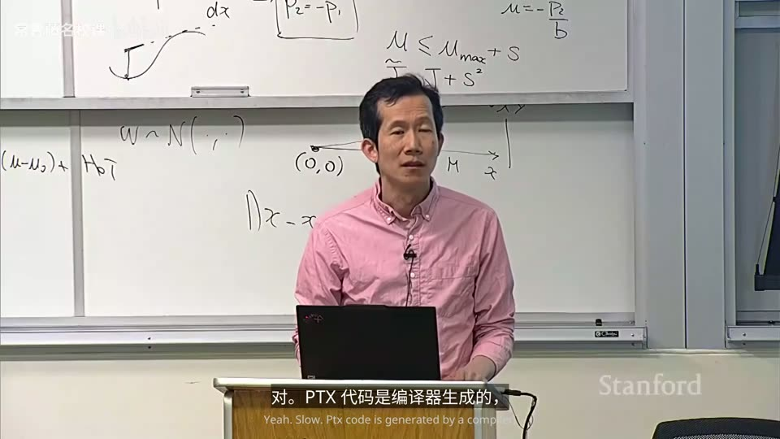 |
| 但一般来说，你不需要这么做。谢谢。我的意思是，我的任务会被调度到某个 SM 上，接下来我会讲 tl.load，这几乎就像个 CPU 的阻塞调用；说白了，我就是在那干等着，你知道，等等某件事发生，现在我就在那干等着，系统会把其他任务都调不过来，然后执行固件（FW），搞定了我就会把那个任务重新调度回来， [【跳转到 41:08】](https://www.bilibili.com/video/BV11LEA6eEuj/?p=6&t=2468) | 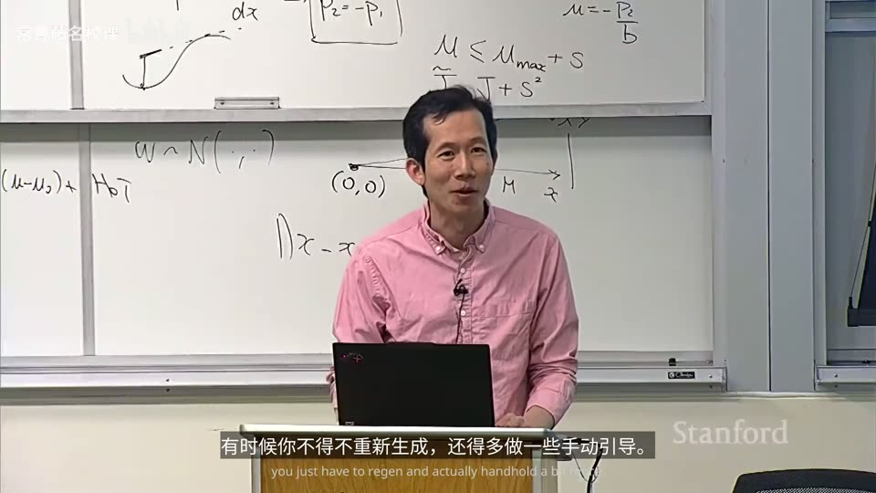 |
| 然后我就继续往下走。你是这个意思吗？对，没错。所以我重复一下这个问题，或者说这个评论：如果你看这一段代码，这些语句比如这个 load，它会阻塞若干个周期。然后，所以这是在某个线程、某个 warp、某个 SM 上运行的。啊，另外要记住，SM 是同时运行多个 warp 的，当你执行到那一步时，它就可以直接找另一个 warp 来运行， [【跳转到 41:33】](https://www.bilibili.com/video/BV11LEA6eEuj/?p=6&t=2493) |  |
| 等这个做完，warp 调度器会回来接管。谢谢，谢谢。不好意思，抱歉，昨晚之后我好像每次都在成长，大概吧，但我当时脑子里全是这些。所以，对，那问题就是：为什么要用 warp 调度？呃，具体原因我也不太清楚。谢谢。好，接下来我们看几个其他的例子。 [【跳转到 41:58】](https://www.bilibili.com/video/BV11LEA6eEuj/?p=6&t=2518) | 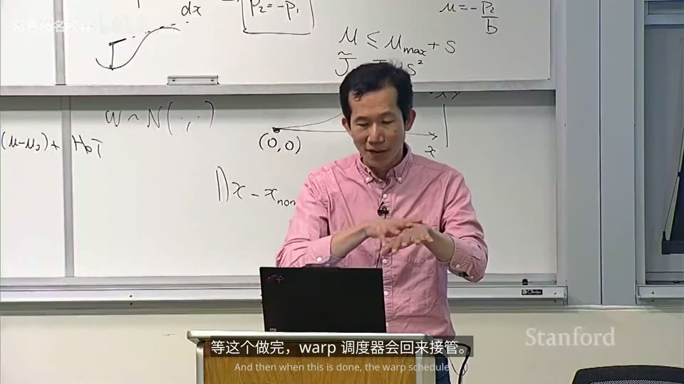 |
| 我们再做三个例子。GELU 用的是最简单的那种，然后虽然计算过程有点杂乱，但形式上它就是逐元素的，所以从概念上讲，在这节课的语境下它其实非常简单。接下来我们看 softmax，这时候你就需要做规约了。啊，不过在这种情况下，我们考虑一行能放进一个 thread block 的情形；接下来我们要讨论行数据放不下一个 block 的情形。 [【跳转到 42:19】](https://www.bilibili.com/video/BV11LEA6eEuj/?p=6&t=2539) | 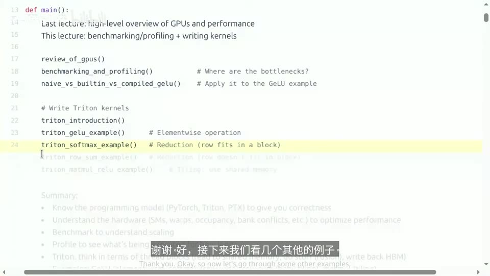 |
| 然后再引入矩阵乘法。希望到那时你已经具备了完成作业、实现 FlashAttention 所需的全部要素。好的，到目前为止我们看的是逐元素操作，现在我们来想想那些对多个值进行聚合的操作。回想一下 softmax 的作用，啊，它接收一个——我们就把它当成一个矩阵来看——你先做指数运算， [【跳转到 42:44】](https://www.bilibili.com/video/BV11LEA6eEuj/?p=6&t=2564) | 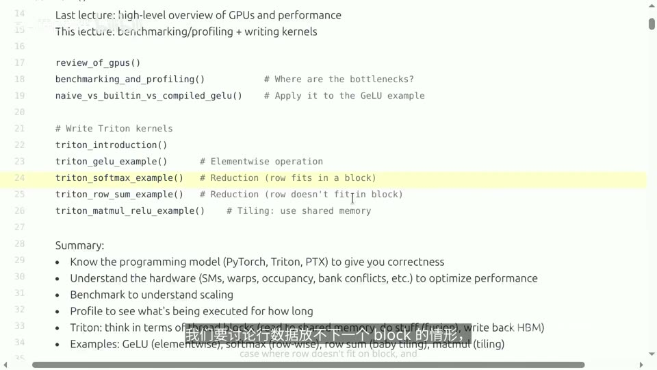 |
| 嗯，对矩阵的每一行做归一化。好的，这在注意力机制中会用到，用于生成输出概率，通常是个不错的做法。嗯，我们先从一个朴素的实现开始，看看里面到底发生了什么。所以这里我再定义这个张量，这是朴素实现，其实我觉得这不算作业一，好吧，不管怎样，这里我有一个 M×N 的矩阵。 [【跳转到 43:09】](https://www.bilibili.com/video/BV11LEA6eEuj/?p=6&t=2589) | 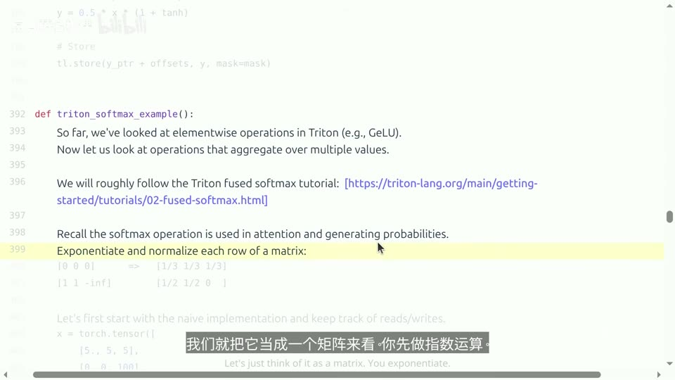 |
| 所以我得对每一行求最大值，这是为了数值稳定性；我要把最大值减掉，啊，接着我逐元素做指数运算，然后对每一行求和，算出归一化常数；对每一行我再做除法，就这些。好了，因此如果你统计读写操作的次数，记住这里用的还是普通的 PyTorch，这是一个 kernel， [【跳转到 43:34】](https://www.bilibili.com/video/BV11LEA6eEuj/?p=6&t=2614) | 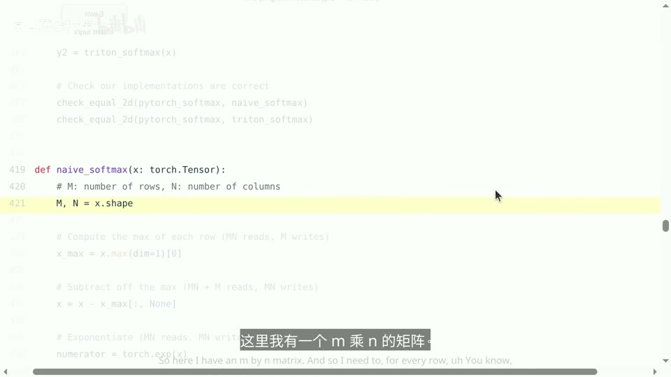 |
| 那是另一个 kernel，除非你调用 torch.compile，否则它们就是各自独立的操作，而每个操作都要从 HBM 读取、再写回 HBM。所以你有五次 MN 规模的读取、三次 MN 规模的写入，而原则上你其实只需要少得多的读写。好的，这就是一段代码，逻辑上说得通，大家应该都熟悉 softmax 在做什么。好， [【跳转到 43:59】](https://www.bilibili.com/video/BV11LEA6eEuj/?p=6&t=2639) | 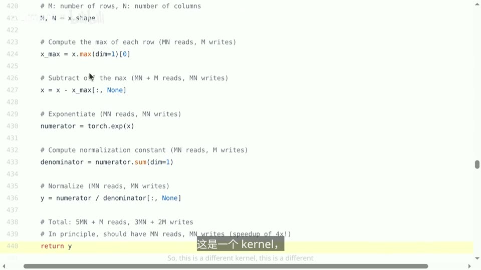 |
| 现在我们来写一个 Triton kernel。从某种意义上说，它的形式会非常相似，就像之前的 GELU 那样，一旦把框架搭好，核心计算看起来就跟朴素版本非常相似。所以我们要做的就是让每一行作为一个 block。好了，那我为什么要把每一行做一个 block 呢？因为记住，每一行都得做归一化和求和，所以这不是逐元素运算，softmax 不是逐元素运算。 [【跳转到 44:24】](https://www.bilibili.com/video/BV11LEA6eEuj/?p=6&t=2664) | 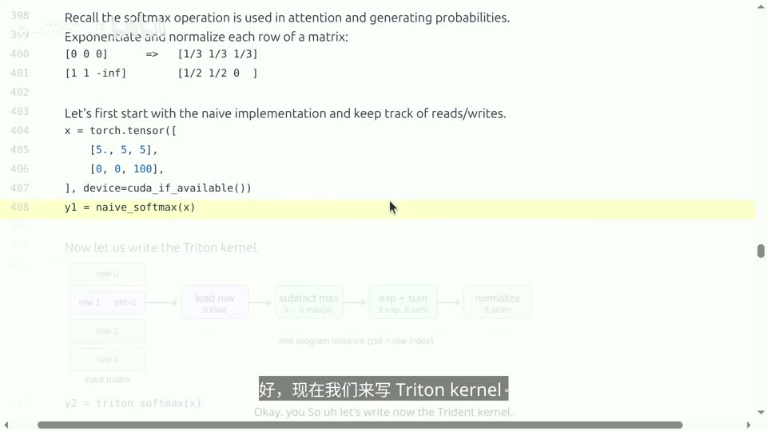 |
| 但它有点像是按行处理，所以 block 之间互不交互。嗯，所以它们不需要……而且 block 之间也没有 shared memory，就没问题，block 之间没有 shared memory。嗯，那接下来我就对每一行做一些处理。好的，我们来看看会发生什么。嗯，再说一次，我要在 Python 里分配输出张量，我有一个 M×N 的矩阵。嗯，我要定义 block 大小，嗯， [【跳转到 44:49】](https://www.bilibili.com/video/BV11LEA6eEuj/?p=6&t=2689) | 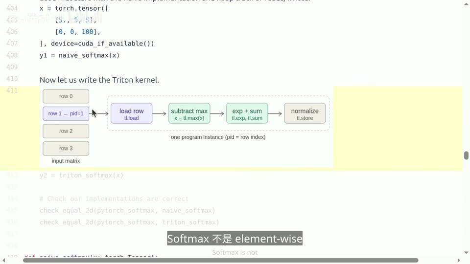 |
| 基本上就是列数，嗯，为了讨个吉利，取下一个 2 的幂，嗯，然后 block 的数量就等于行数。好的，我要调用这个 kernel，那么有多少个块呢？M，对吧？每行一个块。每个块里我要传入输入指针、输出指针，然后我要——另外除了这些，还有步幅（stride），它告诉我要向下移动多远。 [【跳转到 45:14】](https://www.bilibili.com/video/BV11LEA6eEuj/?p=6&t=2714) | 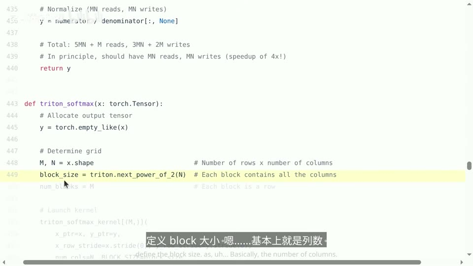 |
| 谢谢。嗯，好的，谢谢。好的，我实际演示一下那个 softmax kernel，好吗？嗯，谢谢。好的，那这里看起来是什么样的？于是，我醒来了，处在某一行上。好的，这样我就拿到了从零到块大小（block size）的所有列，我假设这就是全部列了，用 tl.arange……啊， [【跳转到 45:39】](https://www.bilibili.com/video/BV11LEA6eEuj/?p=6&t=2739) |  |
| 内存的哪个位置读数据，也就是数据的起始地址再加上偏移量。这部分的 row stride 基本上就是用来定位每一行的，啊，谢谢；啊，这基本上就是……列数，也就是告诉我要往下走多远。啊，接下来这些是 X 指针，也就是我需要加载的所有数据的地址，啊，我把它们加载进来，啊，这里有个处理：如果被掩码（mask）了， [【跳转到 46:04】](https://www.bilibili.com/video/BV11LEA6eEuj/?p=6&t=2764) | 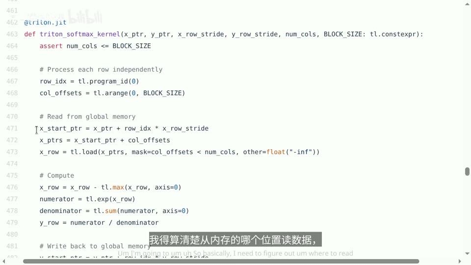 |
| 我就填负无穷大，因为我知道那会是相当于 softmax 操作里的零。然后这部分本质上和朴素的 softmax 是一样的，我只需算出最大值，把它减掉，做指数运算，求和，然后相除，然后我把结果写回去。好了，对啊，谢谢， [【跳转到 46:29】](https://www.bilibili.com/video/BV11LEA6eEuj/?p=6&t=2789) | 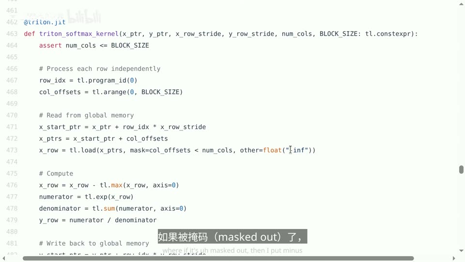 |
| 这就是我们得到这个结果的地方，谢谢。对，所以这是每个 block 可以直接横跨整行的版本。所以，对，这在某种程度上就是你可以看出来——嗯，Triton 让这变得非常简单，对吧？因为这感觉就像你只是在写普通的 PyTorch 代码，一个 block（处理一行），关键是只要放得下，你几乎就能直接写普通的 PyTorch。对，那如果我的列数和行数比 block 尺寸大呢？ [【跳转到 46:49】](https://www.bilibili.com/video/BV11LEA6eEuj/?p=6&t=2809) | 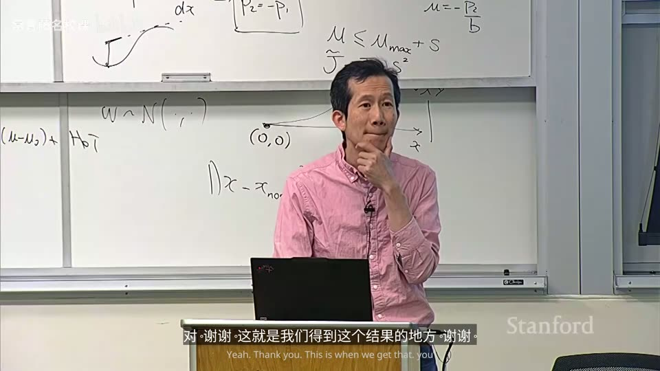 |
| 啊，对，我们会讲到那部分。通常列数和行数都会比 block 尺寸大得多，所以我们稍后会再讨论这个。第二，如果你想按列做 softmax，是不是得反过来处理？问题是，如果要按列做 softmax，我觉得应该没问题，因为我们这里一直在跟踪这些指针，对吧？所以指针可以是任意值，在这儿我觉得你基本上只要改一下这里的步幅就行， [【跳转到 47:14】](https://www.bilibili.com/video/BV11LEA6eEuj/?p=6&t=2834) | 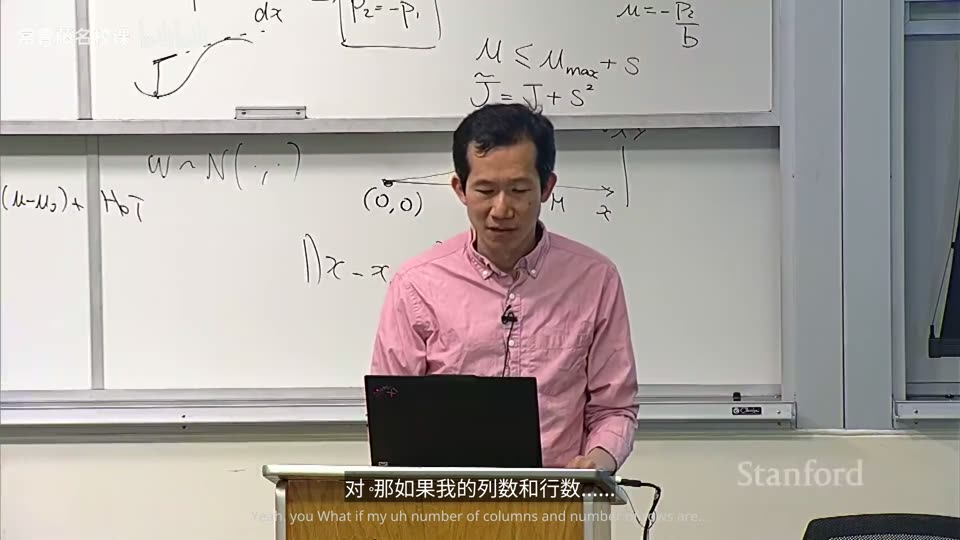 |
| 其实是在这儿。至于列偏移量，你只需要这样来构造，啊，比如把这个乘以行步幅，我觉得行。好，我们继续。好， [【跳转到 47:39】](https://www.bilibili.com/video/BV11LEA6eEuj/?p=6&t=2859) | 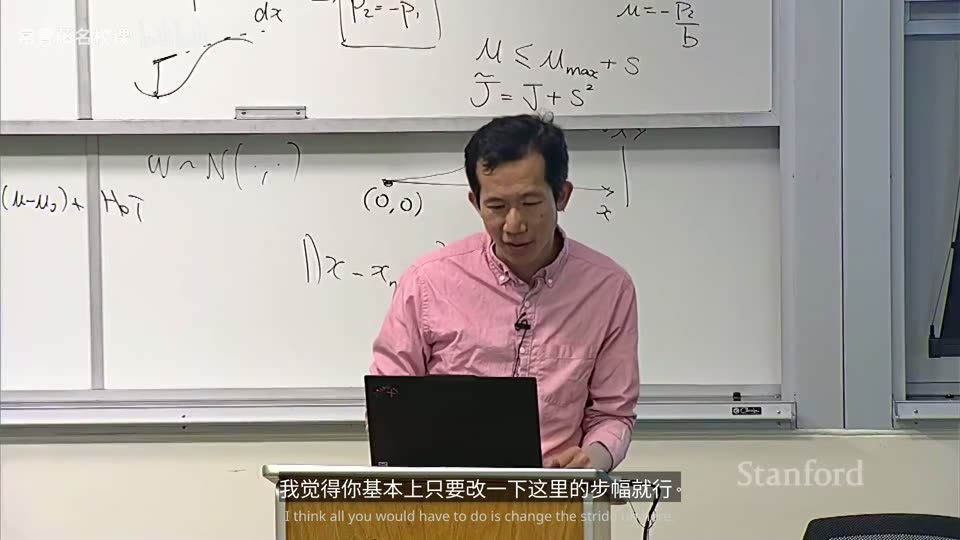 |
| 那么，嗯，现在进入正题。假设你的行太大，塞不进一个 thread block。好，那这种情况下你该怎么办？比如假设你有一行有 4000 列，但 thread block 的大小只有 1024，所以你不能这么做，你知道的，你得在这做点处理。策略是这样的：我们要把这一行拆分成若干图块，所以在这种情况下会有四个图块。 [【跳转到 47:48】](https://www.bilibili.com/video/BV11LEA6eEuj/?p=6&t=2868) | 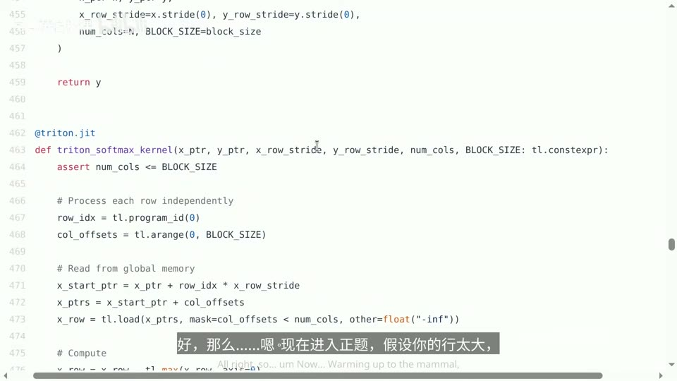 |
| 每个线程会遍历这些图块并累加求和，最后我们要做一个规约操作，也就是把每个线程算出的结果全部加起来。啊，我来给大家举个例子，呃，这里我先从 softmax 换成行求和，因为这样想起来更简单。听好，那么，嗯， [【跳转到 48:13】](https://www.bilibili.com/video/BV11LEA6eEuj/?p=6&t=2893) | 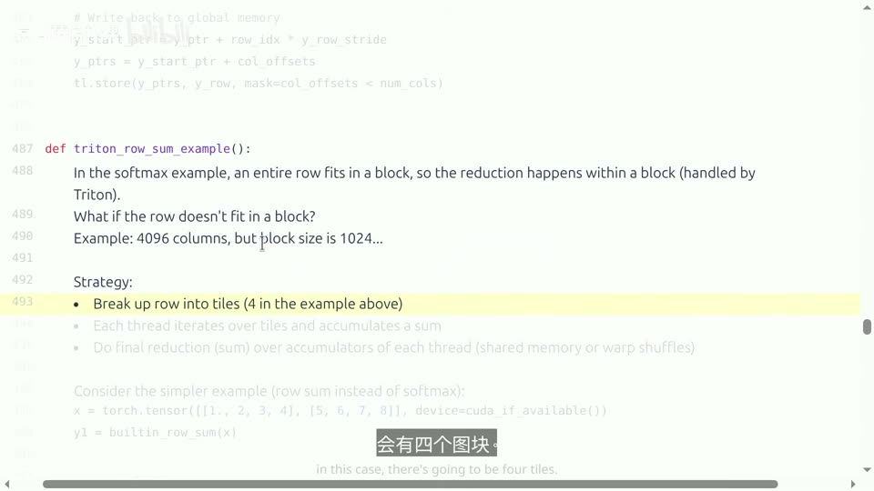 |
| 这个例子没什么意思，你知道，行求和会按你预期的那样工作。行求和运算基本上就是拿一个矩阵，然后算出每一行的总和，所以这里没什么意外。嗯，好，那么从概念上讲，我们的做法如下。好的，所以每个线程块仍然负责一行，这部分没有变。假设我是第一个线程块、第一行，我被唤醒后该做什么？我记住这里有了图块的概念。 [【跳转到 48:38】](https://www.bilibili.com/video/BV11LEA6eEuj/?p=6&t=2918) | 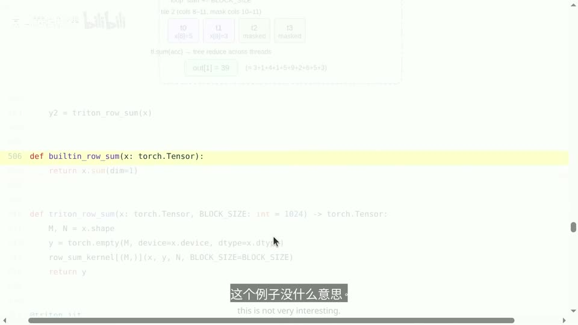 |
| 假设图块零（0）是第 0~3 列，图块一是第 4~7 列，图块二是第 8~11 列，好的。所以我接下来要做的就是进行迭代：首先我基本上要处理所有的线程，基本上每个线程都会维护一个累加器并处理第一个图块，然后它会转到下一个图块并把当前元素加到累加器中。所以这里我放入…… [【跳转到 49:03】](https://www.bilibili.com/video/BV11LEA6eEuj/?p=6&t=2943) | 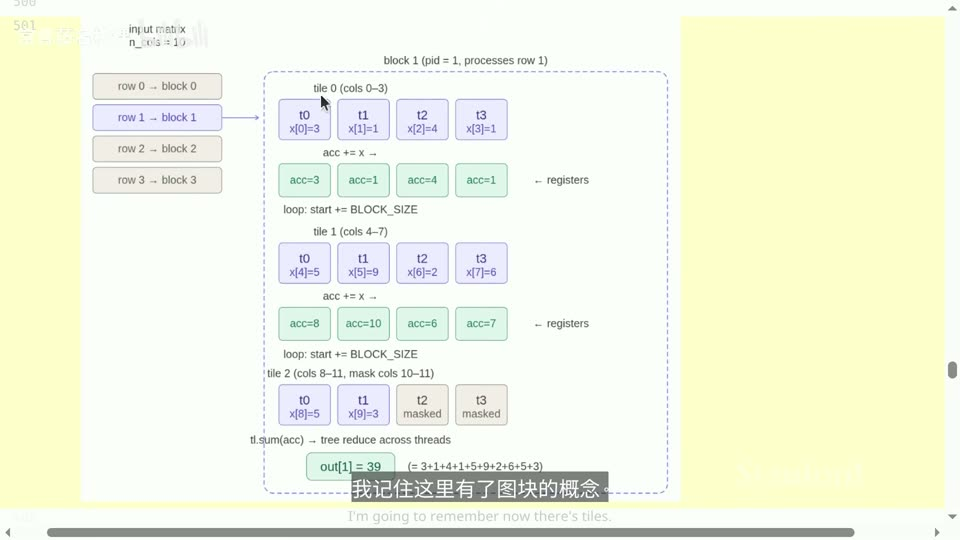 |
| 然后在第二次循环迭代时，我把 5 加进去得到 8，把 3 加到这个数上得到……所以这四个线程各自都在累加他们自己的数据，然后最后在处理第二个 tile 时，我把 5 和 3 分别加到对应的累加器里。所以到最后我就得到了这样一个累加器向量，然后再继续往下做， [【跳转到 49:28】](https://www.bilibili.com/video/BV11LEA6eEuj/?p=6&t=2968) | 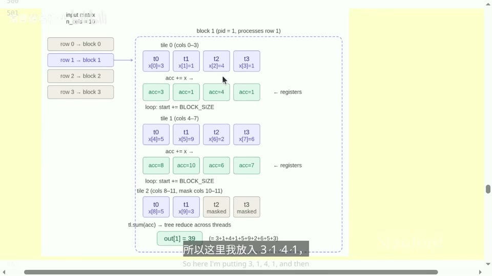 |
| 而它其实就是我可以直接求和的东西，谢谢。好，我们来看看代码长什么样。嗯，所以我就直接调用行求和 kernel，我们来看看。好，它看起来是这样的。嗯，好，现在我处于某一行中，然后，嗯，这就是其中一行的样子：有一个图块、第二个图块、第三个图块，以此类推，所以 N 就是这一行元素的数量。 [【跳转到 49:53】](https://www.bilibili.com/video/BV11LEA6eEuj/?p=6&t=2993) | 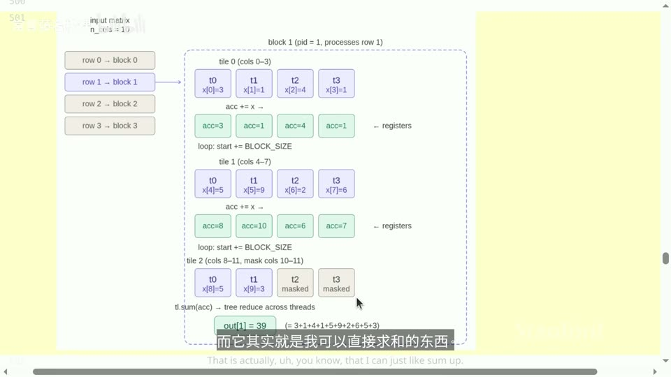 |
| 而块大小就是这个图块的大小。好的，记住块大小就是它的尺寸，而我处理的数据量比块大小要大，所以我现在只需迭代地完成它，因此我会遍历所有图块，所以 start 会从 0 开始，然后到块大小，再到两倍块大小，以此类推，所以每次我跨步时，我基本上是在调用……去获取那个偏移量，在特定的图块上。 [【跳转到 50:18】](https://www.bilibili.com/video/BV11LEA6eEuj/?p=6&t=3018) | 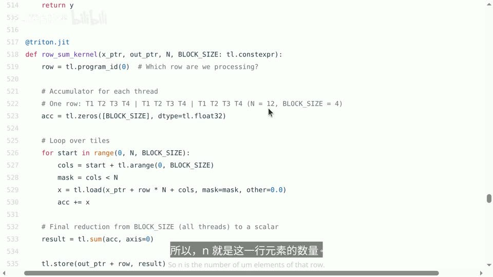 |
| 嗯，接下来我会从 HBM 加载数据，然后把它加到累加器里，所以这个累加器要么在寄存器里，要么在 shared memory 里，清楚了吗？最后当我遍历完所有图块后，我会执行一个规约操作。简单来说，每个线程都有一个累加器，用来记录它收集到的数据， [【跳转到 50:43】](https://www.bilibili.com/video/BV11LEA6eEuj/?p=6&t=3043) | 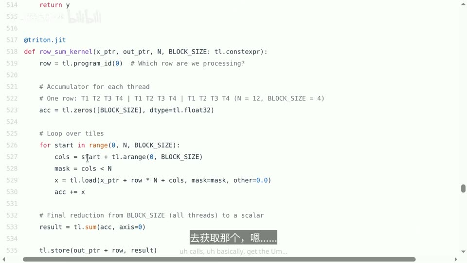 |
| 然后我可以直接对它们求和，从而得到一个标量，然后把它写出去。好，所以这比之前稍微复杂一点，因为现在线程内部嵌套了一个 for 循环，而当你的数据无法塞进一个块时，这种做法就是必要的。对，或者说累加器放在大小合适的寄存器里。 [【跳转到 51:08】](https://www.bilibili.com/video/BV11LEA6eEuj/?p=6&t=3068) | 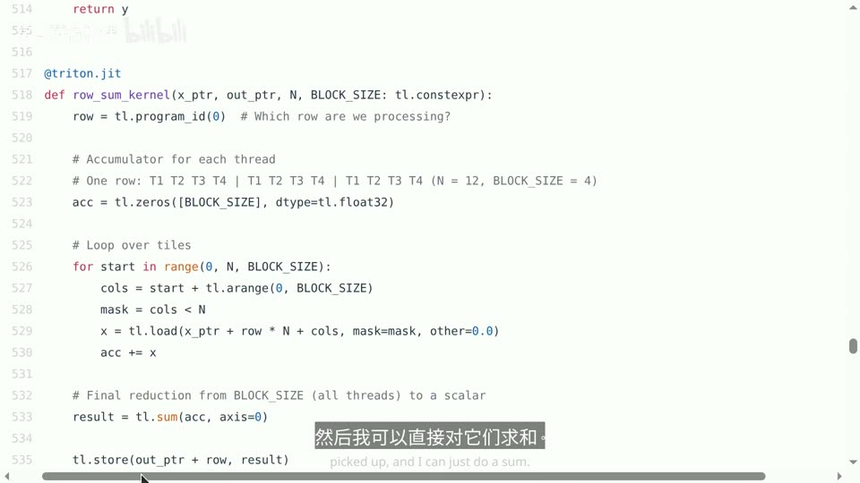 |
| 不过万一寄存器不够用，我们就得把它放到……对，所以我想问的是：如果你能控制累加器放在哪……至少在这个 Triton 程序里，你并没有显式指定具体放哪儿，得由 Triton 编译器来定；不过通常情况下，如果块足够大，它就必须放在 shared memory 里。谢谢。好，那么大家觉得这样讲得通吗？ [【跳转到 51:24】](https://www.bilibili.com/video/BV11LEA6eEuj/?p=6&t=3084) | 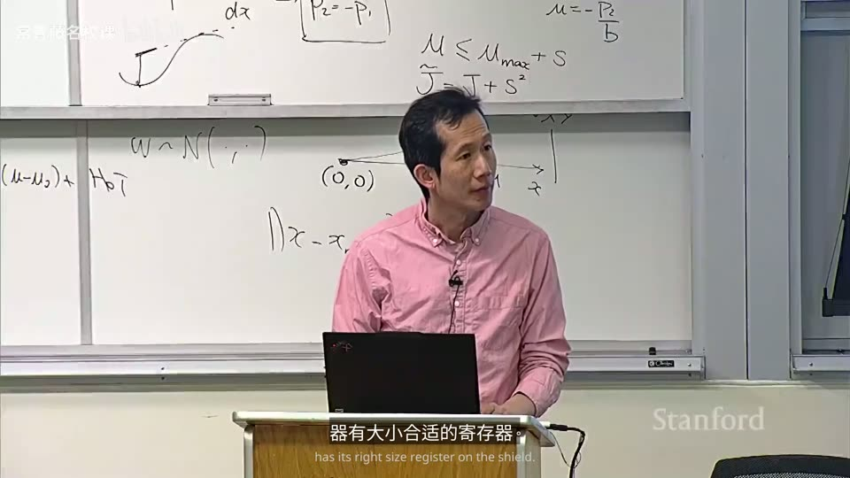 |
| 你可能……我是想说，确保大家思路同步：记得在这里，我们要把一行拆成好几段，不过那些是块，没错。所以每一段都是一个独立处理的块，这些不是 block 而是 tile。这里的 block 对应的是一整行，而这个 block 基本上要处理完所有的图块。所以从这里开始，写法就开始不像 PyTorch 了， [【跳转到 51:49】](https://www.bilibili.com/video/BV11LEA6eEuj/?p=6&t=3109) | 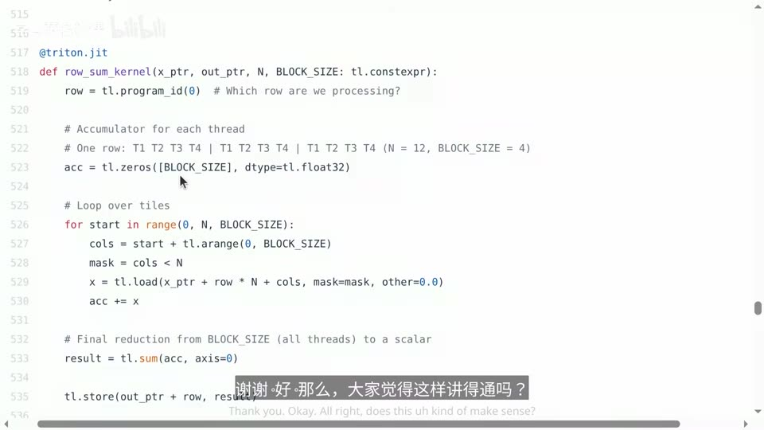 |
| 因为你没法一次性处理所有数据，毕竟不是所有数据都能塞进 shared memory 里。对，谢谢。（课堂问答） [【跳转到 52:14】](https://www.bilibili.com/video/BV11LEA6eEuj/?p=6&t=3134) | 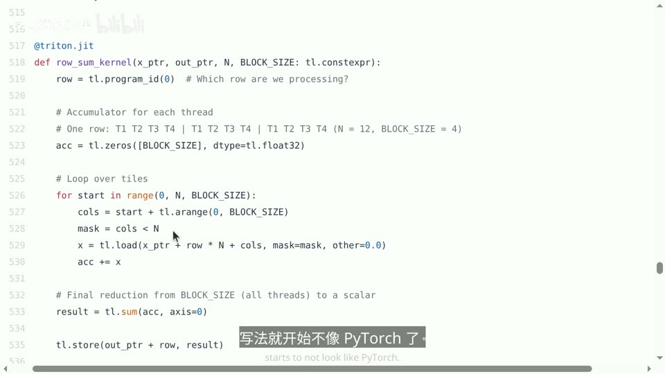 |
| 对，假设 accumulator 存在 shared memory。对，谢谢。你好，那么接下来…… [【跳转到 52:24】](https://www.bilibili.com/video/BV11LEA6eEuj/?p=6&t=3144) | 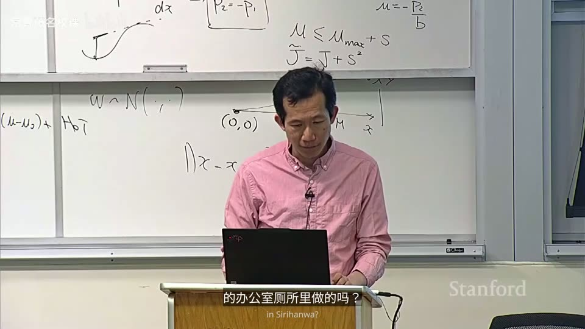 |
| 接下来我们或许可以进入最后一部分，也就是矩阵乘法。好，矩阵乘法当然是深度学习的核心基石，它早就被优化到极致了。啊，而且从某种意义上说，这一点非常突出：最基础的运算就是把两个矩阵乘起来。我这儿稍微加点花样，我打算先做一个矩阵乘法，再接一个 ReLU，纯粹演示一下。 [【跳转到 52:31】](https://www.bilibili.com/video/BV11LEA6eEuj/?p=6&t=3151) | 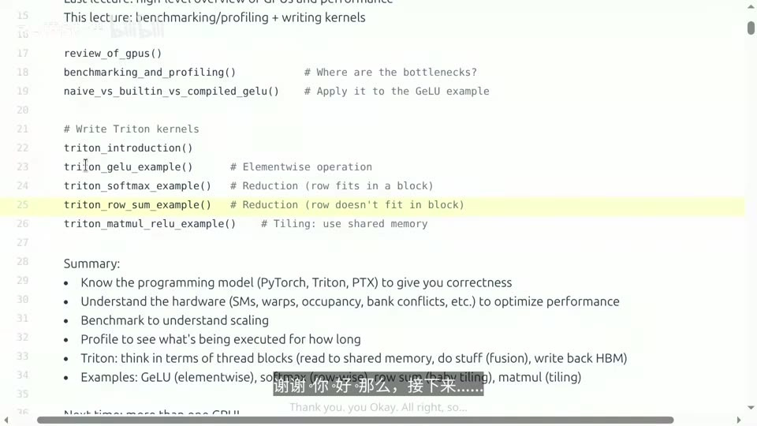 |
| 在实际中很常见，比如你有一个线性层做矩阵乘法，接着用 ReLU 激活，所以这并非凭空而来，我稍后会解释我为什么这样做。好，那怎么构建一个矩阵乘法内核呢？这里是一种朴素的方法：这是我的矩阵，我在计算 A 乘以 B，我要写出矩阵 C，A 是 M×K，B 是 K×N， [【跳转到 52:56】](https://www.bilibili.com/video/BV11LEA6eEuj/?p=6&t=3176) | 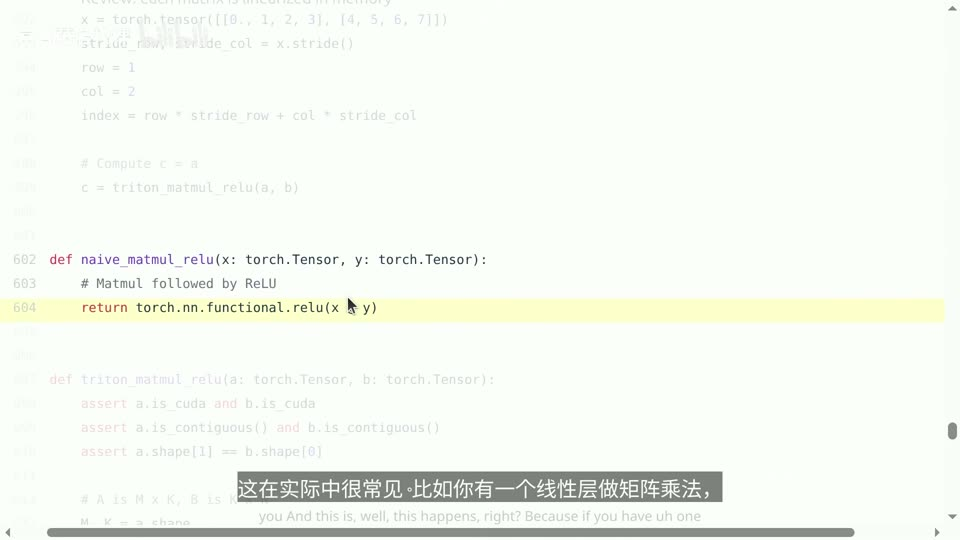 |
| 因此 C 是 M×N。好的，接下来我要固定其中一个元素，好，比如设 M 等于 1、N 等于 2，那我们就再处理……其实我们设 M 等于 1、N 等于 1 吧，这样我就是在算 C 的某个元素。然后基本上针对每一个 K，我要——也就是啊，对，我会遍历 K，也就是 A 的行和 B 的列， [【跳转到 53:21】](https://www.bilibili.com/video/BV11LEA6eEuj/?p=6&t=3201) | 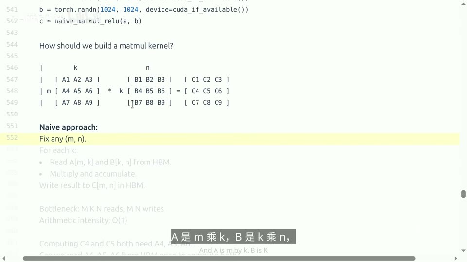 |
| 我会从 HBM 读取数据，做乘法并累加，最后把结果写回这个元素。哦，所以这就是一个有效的矩阵乘法 kernel。谢谢。好吧，那么你有什么问题？它没错，啊，但如果你观察它执行了多少次读写操作，这就很糟糕了，对吧？其实基本上对于每一个 M、N 和 K，我都得从 HBM 中读取数据。 [【跳转到 53:46】](https://www.bilibili.com/video/BV11LEA6eEuj/?p=6&t=3226) | 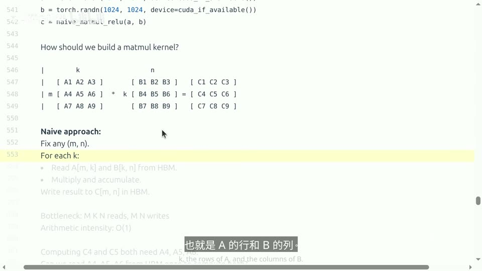 |
| 所以读取量级是 M×K×N。至于写入次数，我的意思是这倒无所谓。但这构成了瓶颈，对吧？如果你还记得第二讲的内容，把你执行的操作数除以传输的字节数，得到的就是算术强度，而你希望它尽可能高。所以操作数量是 M×K×N 量级，而读取量级也是一样的，所以算术强度是个常数，啊，这就不好了。好， [【跳转到 54:11】](https://www.bilibili.com/video/BV11LEA6eEuj/?p=6&t=3251) | 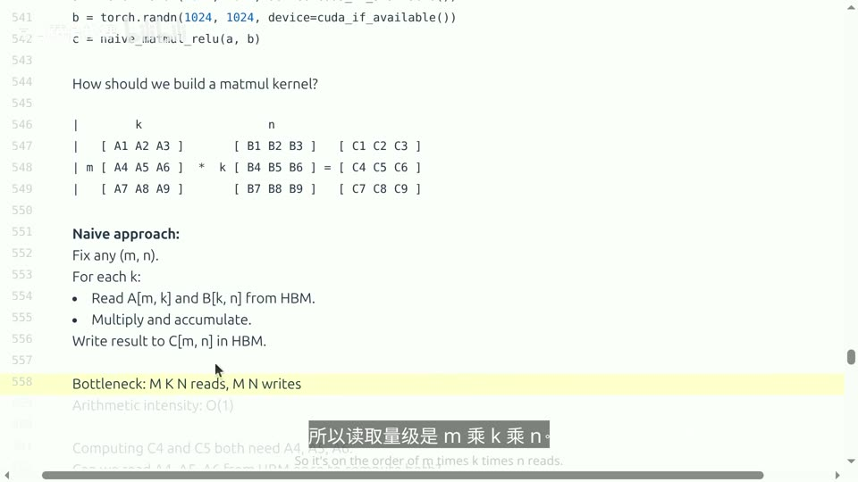 |
| 那么如果你仔细观察，你会注意到存在大量冗余读取：比如计算 C4 时，你需要读取 A4、A5 和 A6；如果你计算 C5，你也必须再次读取这些数据。谢谢。所以，嗯，也就是说，如果你能只读取一次，就能大大节省读取开销，这非常好。所以让我们尝试使用 shared memory 来实现这一点。 [【跳转到 54:36】](https://www.bilibili.com/video/BV11LEA6eEuj/?p=6&t=3276) | 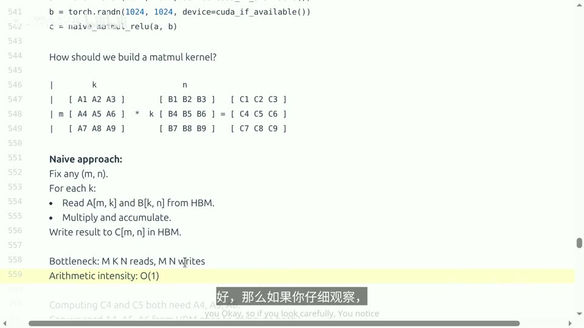 |
| 谢谢。这是理想化的方法：我将把 A 和 B 全部加载到 shared memory 中，然后我只需计算 C。所以如果我能做到这一点，我就能得到——啊，现在读取次数不再是立方级，而只是平方级，啊，这意味着算术强度达到了 N 的量级，这在第二讲中我大致……你说过， [【跳转到 55:01】](https://www.bilibili.com/video/BV11LEA6eEuj/?p=6&t=3301) | 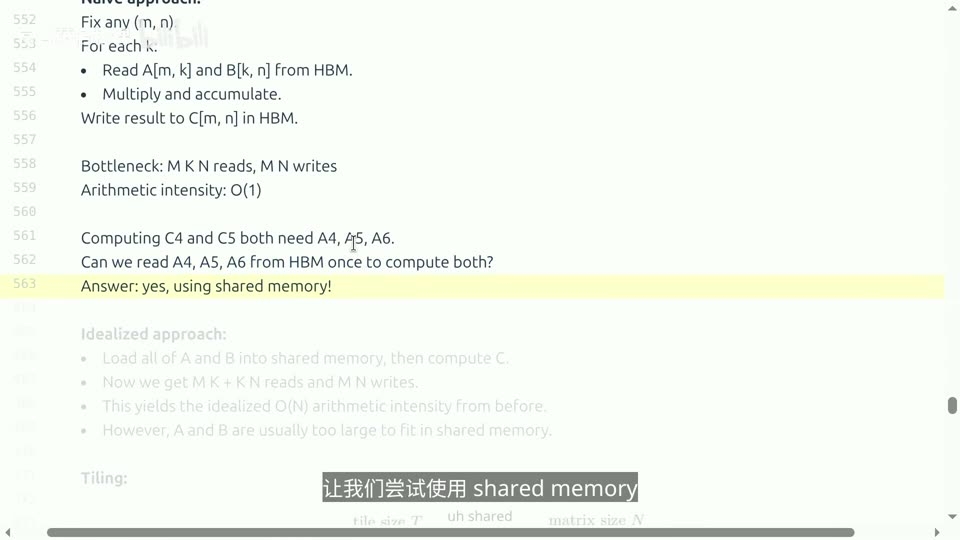 |
| 这是你能期望的一种理想情况。谢谢。好，如果你能做到这一点，那就太好了，因为基本上没有冗余读取，啊，你把所有数据一次性读进 shared memory，做完计算后再写回去。好，但这种理想化的方法有什么问题呢？谢谢，谢谢，谢谢。问题在于 A 和 B 通常太大，无法放进 shared memory，对吧？那现在你该怎么做呢？ [【跳转到 55:26】](https://www.bilibili.com/video/BV11LEA6eEuj/?p=6&t=3326) | 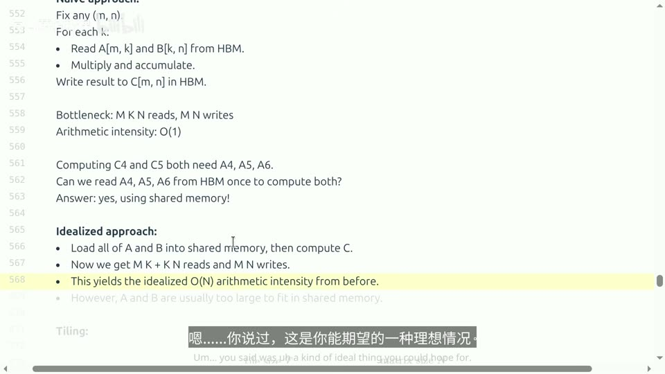 |
| 好，这里的核心思想是非常经典的分块（tiling）概念。呃，其实基本思路就是尽可能多地把数据放进 shared memory，啊，所以从某种意义上说，可以这样理解它：它在全局上看起来像朴素方法，但在局部上看起来像理想化方法。好了， [【跳转到 55:51】](https://www.bilibili.com/video/BV11LEA6eEuj/?p=6&t=3351) | 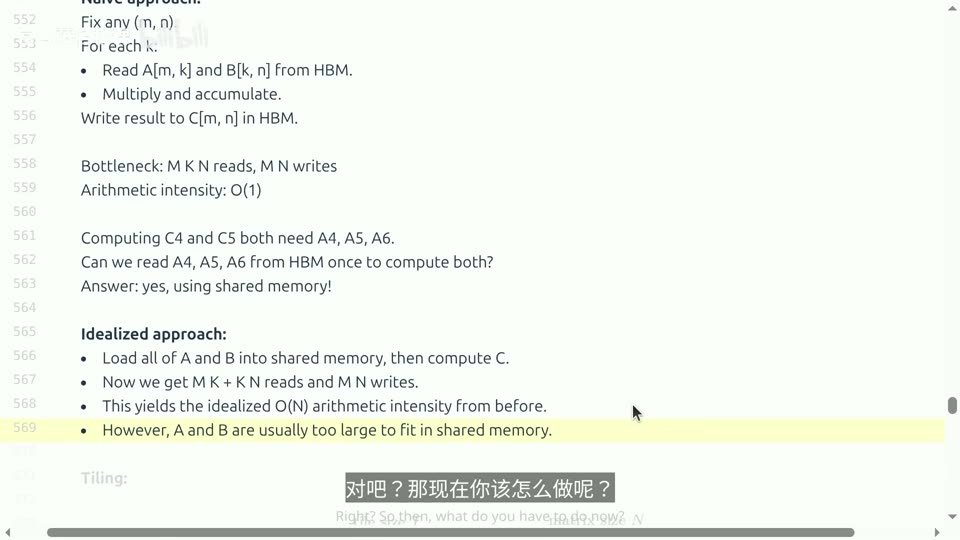 |
| 这就是整体情况，之前也展示过这张图。接下来我们要处理矩阵 C，还记得朴素的做法吗？那就是逐个元素进行计算，但现在我要做的是针对每个图块（tile）执行计算。于是我把它切分成图块，每个图块就是一个 thread block，我们会有一组线程负责执行这个计算，不同的图块将由另一个 thread block 完全独立地计算。 [【跳转到 56:11】](https://www.bilibili.com/video/BV11LEA6eEuj/?p=6&t=3371) | 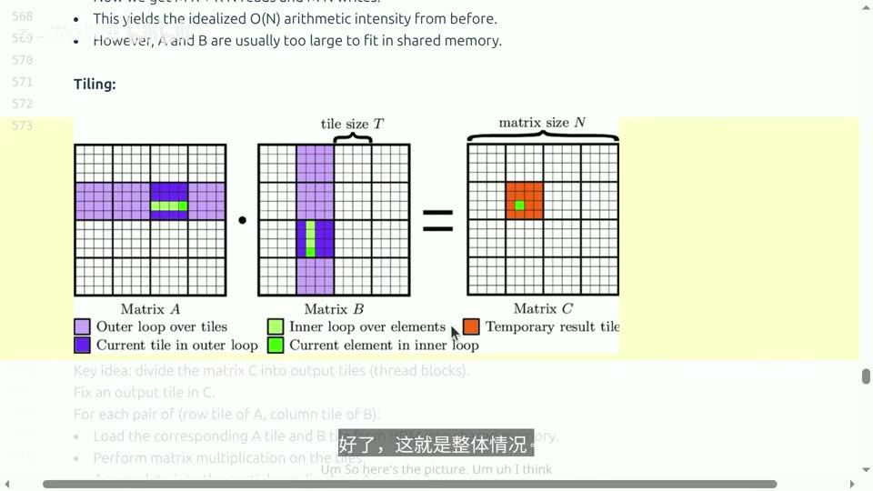 |
| 好的，假设我身处 C 的环境中，醒来后观察这个 thread block，那我该做什么呢？某种程度上这和朴素方法是一样的，啊，对于你知道的，对于 A 的每个行图块，我要沿着行方向进行扫描，针对 B 的每一个列分块， [【跳转到 56:36】](https://www.bilibili.com/video/BV11LEA6eEuj/?p=6&t=3396) | 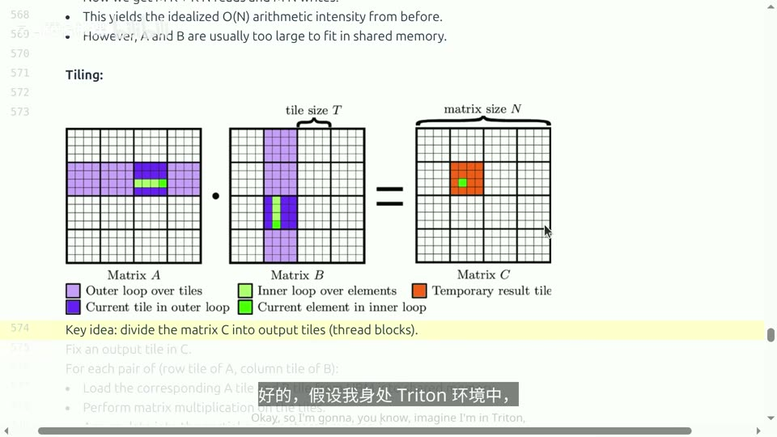 |
| 我会把对应的 A 分块和对应的 B 分块都加载进 shared memory， [【跳转到 56:53】](https://www.bilibili.com/video/BV11LEA6eEuj/?p=6&t=3413) | 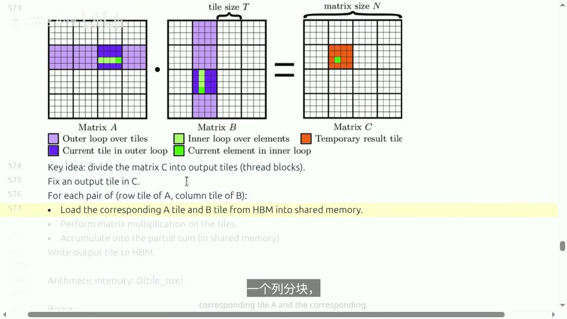 |
| 你要我把这两个分块乘起来，这是一种比较理想的做法，我会把结果累加起来，累加到部分和中，所有这些操作都在 shared memory 里完成。等我把这一行和这一列都扫完之后，最后就可以把这个输出分块写入 HBM。好，这就是概念上正在发生的事情。此时计算强度就提升到了分块大小这个量级，啊， [【跳转到 56:58】](https://www.bilibili.com/video/BV11LEA6eEuj/?p=6&t=3418) | 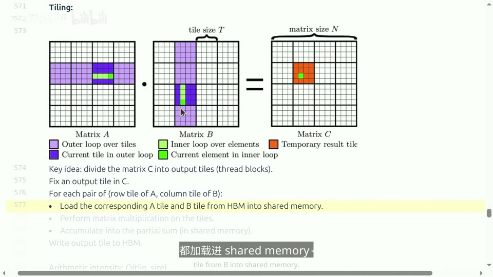 |
| 因此你通常无法达到 O(N) 的复杂度，因为那要求你把所有内容都放进 shared memory，但如果你的分块比较大，那情况仍然可以接受。好，顺便补充一点，呃，反正你已经在为它编写 kernel 了，有时候如果你想加一个逐元素激活函数，直接在最后加上就行，很简单，这就是 kernel 融合。好，咱们快速过一下这里的实现，呃， [【跳转到 57:18】](https://www.bilibili.com/video/BV11LEA6eEuj/?p=6&t=3438) | 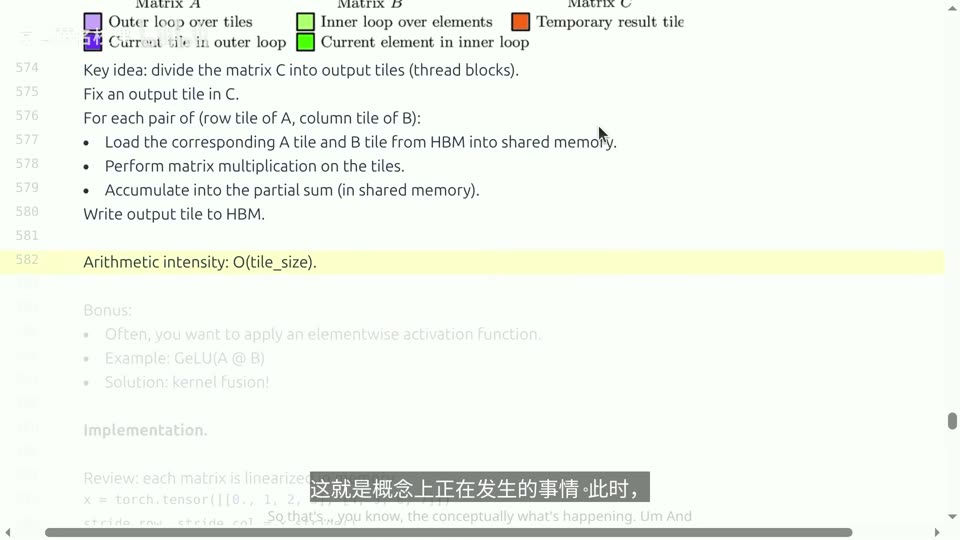 |
| 那个……你你你，哎呀，好，稍微回顾一下步幅，因为马上就会用到。张量就是一个多维数组 X，但在内存里它是线性排列的。张量的步幅基本上就是告诉你怎么把多维索引（比如行列）映射成实际索引，基本上做法就是行乘以行步幅，加上列乘以列步幅。好， [【跳转到 57:43】](https://www.bilibili.com/video/BV11LEA6eEuj/?p=6&t=3463) | 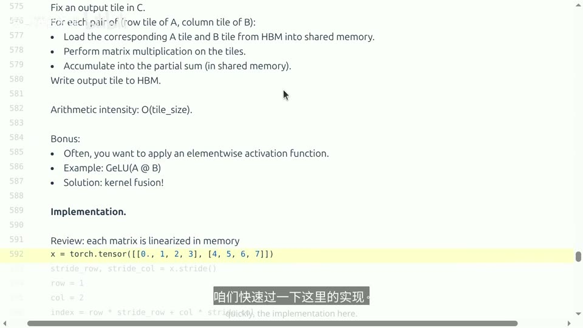 |
| 所以在这种情况下，每当你往下移一行，你在内存里就往后挪四个位置；每当你往右移一列，就前进一个位置。如果是转置，那步幅就反过来。好，那这个 kernel 长什么样呢？所以，嗯，好吧，启动那块没什么好说的，啊，你醒来后发现自己位于某个 M×N 图块上，嗯，所以，嗯，好吧， [【跳转到 58:08】](https://www.bilibili.com/video/BV11LEA6eEuj/?p=6&t=3488) | 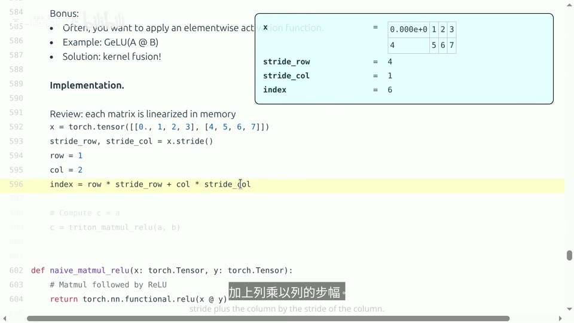 |
| 我的任务是计算 C 矩阵，不过只限于 M、N 图块这部分，也就是这个 M、N 图块。这里有一堆索引处理，我就简单带过吧，虽然挺直接的，但有点麻烦，你知道，你得盯着这些索引。A 索引，所以这基本上告诉你正在看 A 矩阵的哪些行，我正在看的 A 矩阵、我正在看的 B 矩阵的哪些列，然后就是从 1 到 K 了。嗯，接下来我会拿到指向我所在图块位置的…… [【跳转到 58:33】](https://www.bilibili.com/video/BV11LEA6eEuj/?p=6&t=3513) | 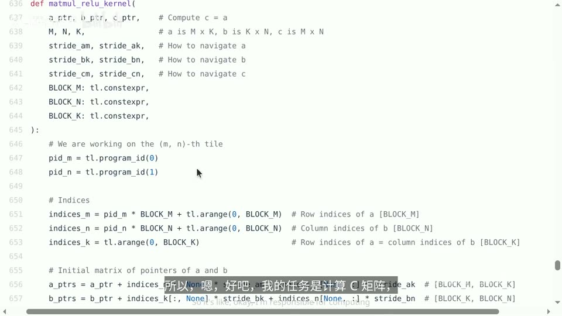 |
| A 和 B 的指针，呃，然后我要建立这个累加器矩阵，把它放在 shared memory 里，它是 M×N 的。这看起来有点像行规约，对吧？你要对所有图块求和，但我不只是横向遍历图块，我现在要同时沿着 A 的行图块和 B 的列图块进行。我加载 A，也就是这个小矩阵，加载 B，也就是这个小 B 图块， [【跳转到 58:58】](https://www.bilibili.com/video/BV11LEA6eEuj/?p=6&t=3538) | 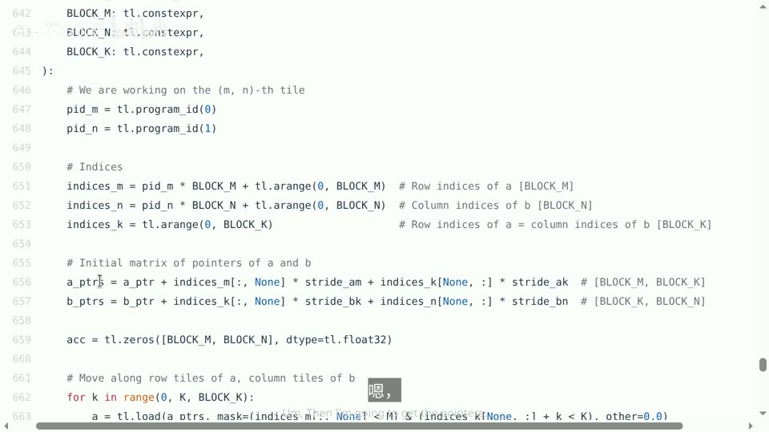 |
| 然后做点积。所以记住，只要东西在 shared memory 里，操作就跟 PyTorch 一样，我直接调用矩阵乘法就行。然后我前进到 A 的下一个行图块和 B 的下一个列图块。而且额外的好处是，如果我想应用 GELU 非线性，不妨就在这里做，在将其写入 HBM 之前，我可以对其执行任意类型的操作，最后我就把它写出去。好的，因此你需要关注某些索引， [【跳转到 59:23】](https://www.bilibili.com/video/BV11LEA6eEuj/?p=6&t=3563) | 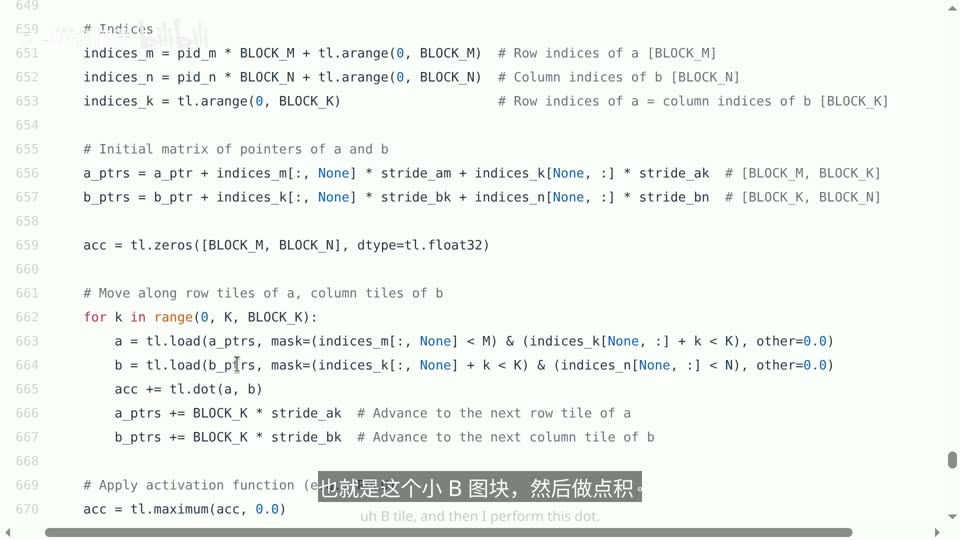 |
| 但希望算法的形式已经清晰明了。关于这一点有什么问题吗？好的，也许我先总结一下，你们稍后再提问。今天我们讨论了编程模型，涉及 PyTorch 或 Triton，甚至是 PTX，啊，这是程序员可以控制的内容，即使是 PTX，你也可以编写 PTX 代码并按需控制每一个特定细节。啊，但这还没讲完，因为代码终究要在硬件上运行， [【跳转到 59:48】](https://www.bilibili.com/video/BV11LEA6eEuj/?p=6&t=3588) | 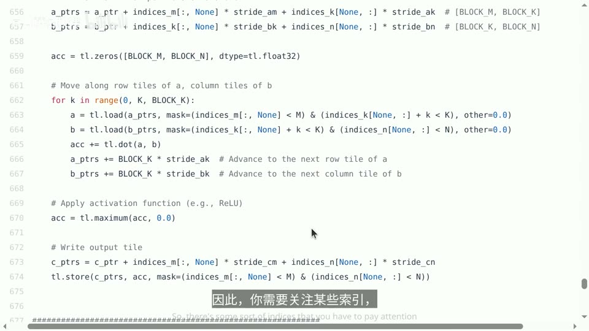 |
| 而 SM 的数量、存储体（bank）的数量和内存大小都是有限的，寄存器数量也是有限的，所以当你带着大型矩阵和 transformer 模型进来时，它们必须契合硬件的约束。这就是为什么基准测试和性能分析如此重要，它们能帮我们理解硬件的复杂性是如何转化为性能表现的。啊，我们之前讲过 Triton， [【跳转到 60:13】](https://www.bilibili.com/video/BV11LEA6eEuj/?p=6&t=3613) | 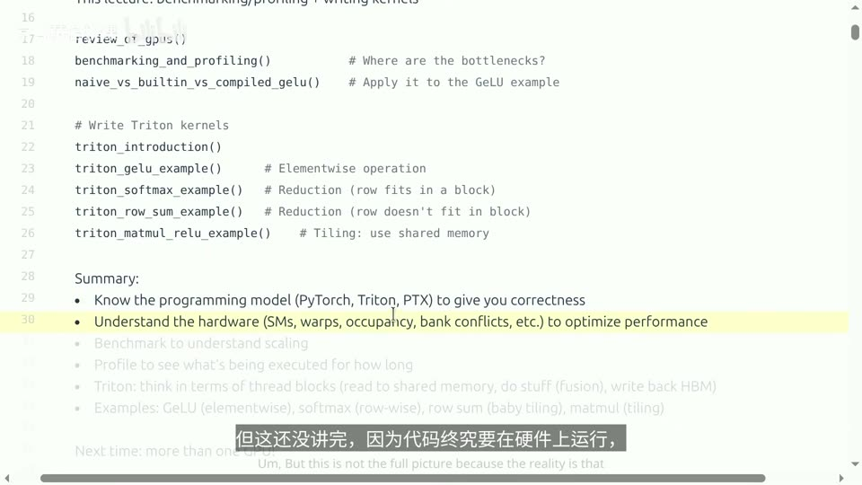 |
| 我觉得用它来思考 thread block 是一种相当简洁清晰的语言，希望到现在你已经能体会到这一点了。啊，思考 thread block 比思考单个线程更容易，因为你不必显式地同步线程，也不用处理 shared memory。具体的思路是：你理清自己的计算任务，把它拆成这些 thread block，你只需要从 shared memory 读取数据，做一些处理，再写回 HBM。 [【跳转到 60:38】](https://www.bilibili.com/video/BV11LEA6eEuj/?p=6&t=3638) | 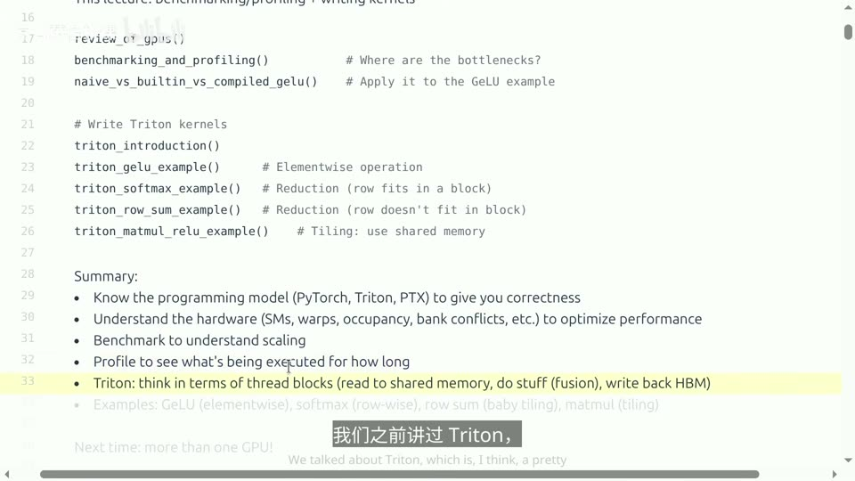 |
| 接着我们看了一些难度递增的例子，逐元素是最简单的，接着是对一行的规约，还有那些放不进一行的规约。那么此前介绍过基础的平铺技术，而矩阵乘法则是实际运用平铺技术的典型范例。好了，关于如何编写单个 GPU 的程序， [【跳转到 61:03】](https://www.bilibili.com/video/BV11LEA6eEuj/?p=6&t=3663) | 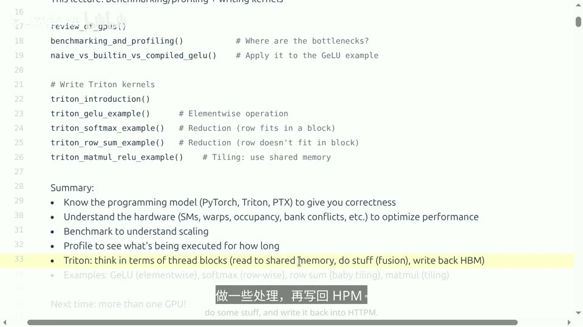 |
| 我就讲到这里。（课堂问答）下次我们会扩展到多个 GPU，讨论多 GPU 编程。对，有个问题：嗯，如果我想写 kernel，我有很多备选方案得去尝试，面对每一个选择，我能离最优性能有多接近？所以问题是：Triton 的替代方案有哪些？嗯，所以这里面有个权衡， [【跳转到 61:19】](https://www.bilibili.com/video/BV11LEA6eEuj/?p=6&t=3679) |  |
| 每种语言都有它自己的归纳偏置，对吧？所以我们做的大部分工作里，Triton 都是由那些训练 transformer 的人打造的，呃，任何设计 transformer 的工作，我觉得都会相对简单些。当然极端情况下你总是可以转用 PTX 来写，但不建议把这作为第一步。而还有一堆其他库，有 ThunderKittens，还有各种 DSL，它们能让你这么做，只是不一定能直接比较。 [【跳转到 61:44】](https://www.bilibili.com/video/BV11LEA6eEuj/?p=6&t=3704) | 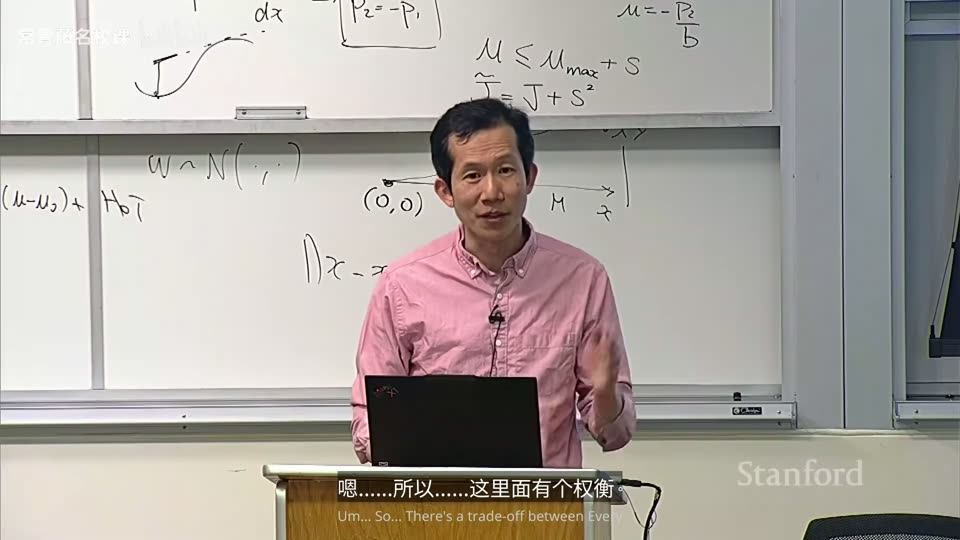 |
| 无论从哪个方向看……谢谢。Yeah，往下看，在技术栈中它们只是带来不同的特性。谢谢。对，这么说吧，你有一个高维张量，对吧？乘法、高维张量或者处理，最佳方法是什么？是不是像我想的那样，我能不能加载、卸载整个张量？两个矩阵同时放到我 GPU 上的一批 thread block 上去计算，或者说这样会不会更好一些呢？ [【跳转到 62:09】](https://www.bilibili.com/video/BV11LEA6eEuj/?p=6&t=3729) |  |
| 你不觉得吗？就是视频里讲的那样，对吧？嗯，呃，把张量的某个特定分量处理之后再写回这里。是的。所以简单概括一下这个问题，我们大概也该收尾了：是一次性全部读出来更好，还是逐个处理单个元素、一次性地更好？是的，嗯，我觉得这个问题很难脱离具体情境来回答，这多少取决于计算本身的性质，也许我们可以私下再聊。 [【跳转到 62:34】](https://www.bilibili.com/video/BV11LEA6eEuj/?p=6&t=3754) |  |
| 好了，好了，下次见。 [【跳转到 62:59】](https://www.bilibili.com/video/BV11LEA6eEuj/?p=6&t=3779) | 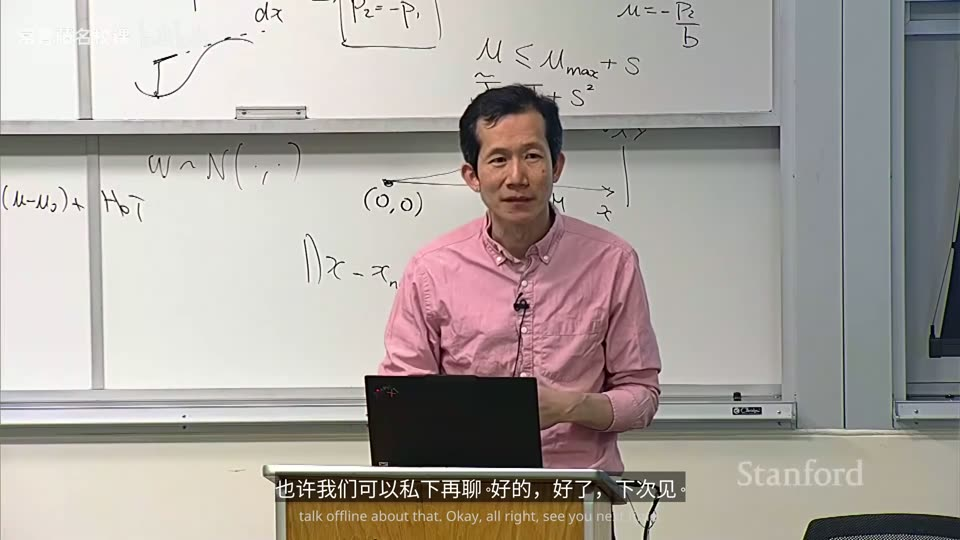 |