# Lecture 8: Parallelism · 原始文稿（图-字幕分栏）

| 字幕文本 | 画面 |
| :--- | ---: |
| 上一节课 Percy 讲了并行的一些底层机制——咱们暂且这么叫它。 [【跳转到 00:00】](https://www.bilibili.com/video/BV11LEA6eEuj/?p=8&t=0) | 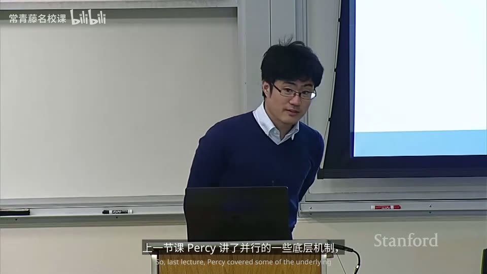 |
| 今天我想做我最爱做的事：聊聊各种你能了解的东西。 [【跳转到 00:04】](https://www.bilibili.com/video/BV11LEA6eEuj/?p=8&t=4) | 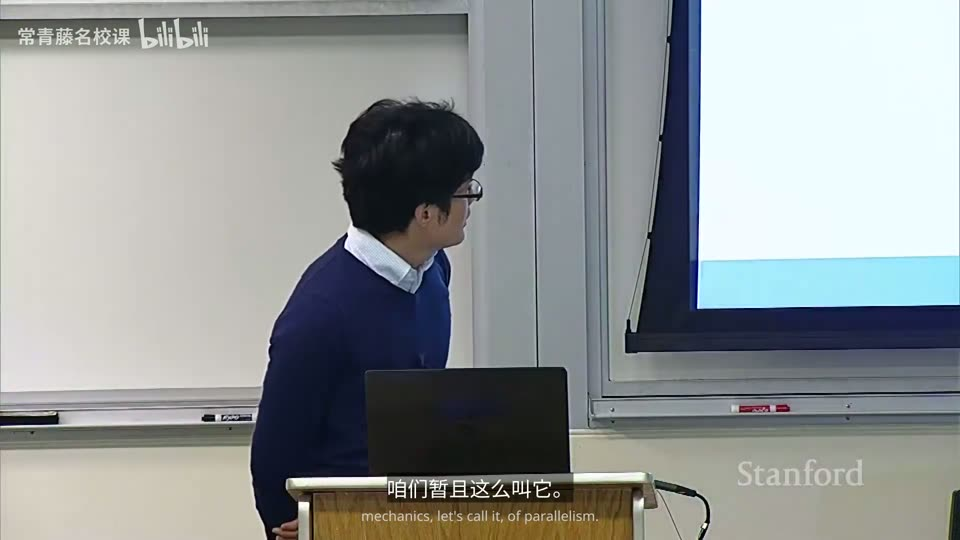 |
| 比如关于现代语言模型训练并行是怎么运作的知识细节，以及各种琐碎冷知识。 [【跳转到 00:08】](https://www.bilibili.com/video/BV11LEA6eEuj/?p=8&t=8) | 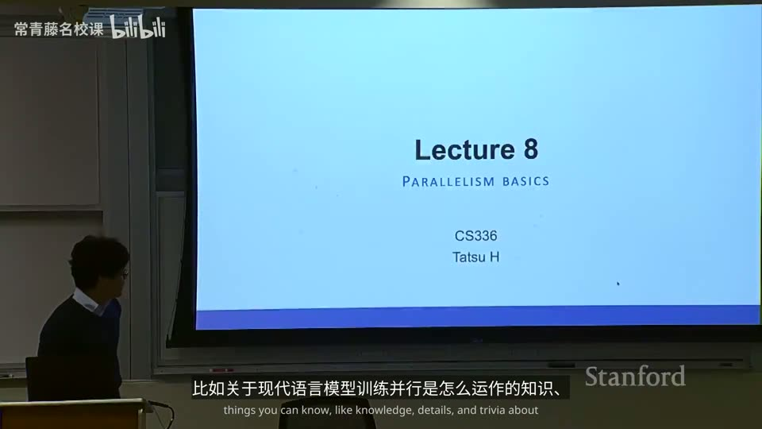 |
| 咱们这次要真正搞懂：当你不得不在超大规模集群上训练超大模型时…… [【跳转到 00:14】](https://www.bilibili.com/video/BV11LEA6eEuj/?p=8&t=14) | 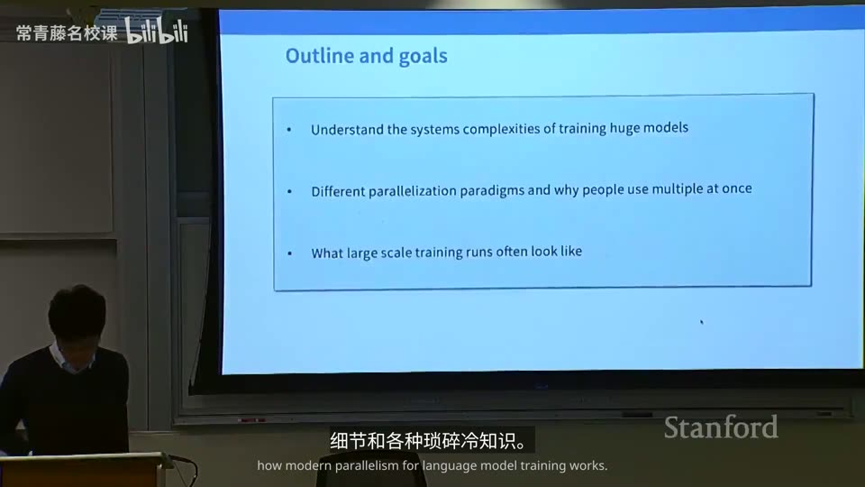 |
| ……会面临哪些复杂的状况。你会发现其实可以同时使用好几种不同的并行策略——最后我们会看到一张幻灯片，上面我会说“4D 并行”，因为你可以同时做四件事，其实我还会讲到更多。你会发现，要在最大规模上实现并行，你几乎得用上所有、或者说大部分这些策略。咱们也会讨论一下为什么你们的作业里有一项，就是根据给定的网络拓扑和某个具体模型，找出最优的并行策略。 [【跳转到 00:18】](https://www.bilibili.com/video/BV11LEA6eEuj/?p=8&t=18) | 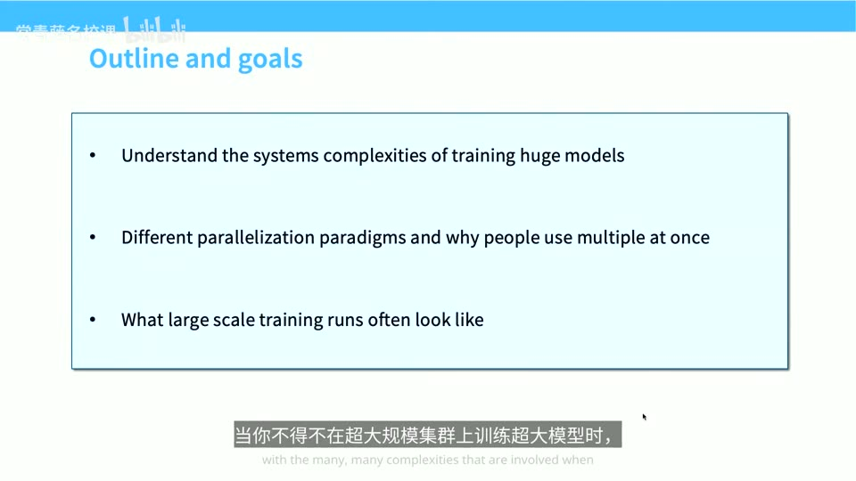 |
| 最后我会结合一些已公开的细节，带大家看几个最近的大规模训练案例，让你们看看这些东西在实际中是怎么用的。谢谢。好，咱们先把第一部分快速过一遍。 [【跳转到 00:48】](https://www.bilibili.com/video/BV11LEA6eEuj/?p=8&t=48) | 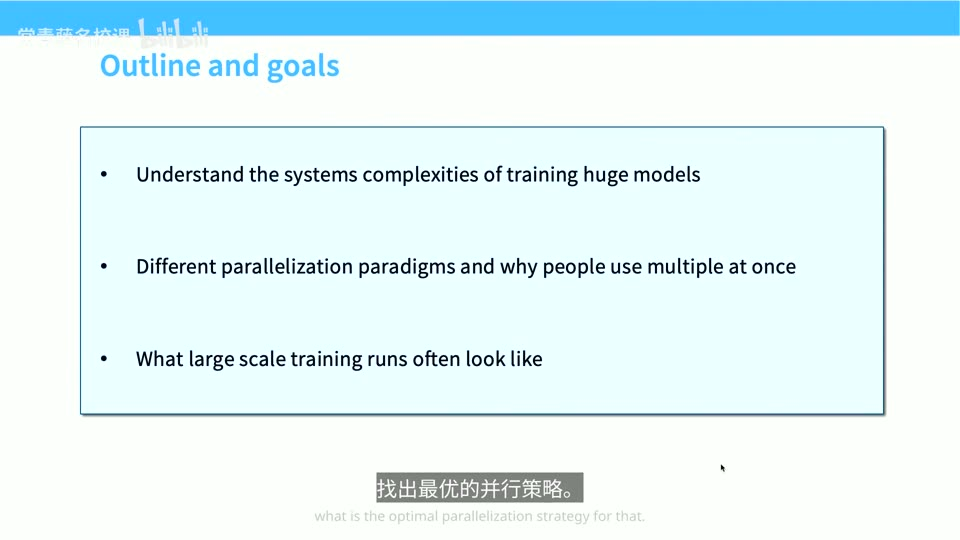 |
| 这部分算是对基础集合操作、基础网络语言的一个复习。咱们之所以需要这些并行技术，是因为要解决两个瓶颈，办法就是扩展到多台机器和多块 GPU：一个是计算能力——单块芯片提供的算力不够，我们需要更多，解决办法就是搞很多机器并把它们连起来（全球最快的超级计算机算力能达到百亿亿次浮点运算的水平，单块 GPU 跟这完全不在一个量级）。 [【跳转到 01:00】](https://www.bilibili.com/video/BV11LEA6eEuj/?p=8&t=60) | 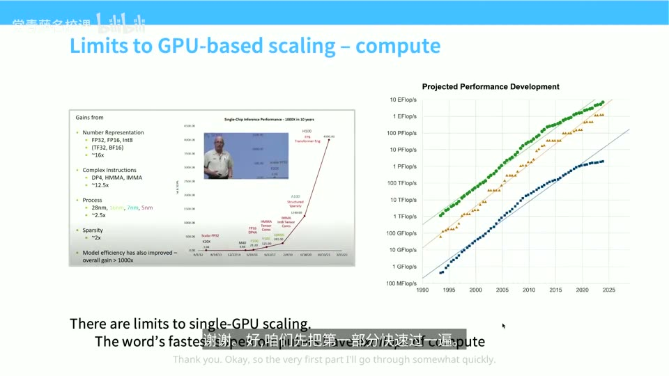 |
| 另一个必须继续并行扩展的原因是内存问题：模型太大了，塞不进一块 GPU，所以咱们得想办法把它们切成小块。 [【跳转到 01:27】](https://www.bilibili.com/video/BV11LEA6eEuj/?p=8&t=87) | 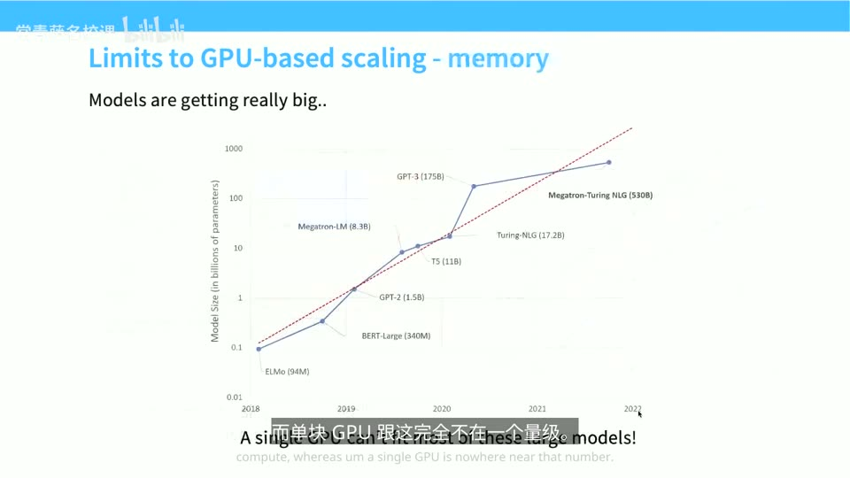 |
| 当我们在多台不同的机器上部署大量 GPU 时，就会面临一些复杂的问题。今天讲座会重点讨论一个核心概念——节点内并行和节点间通信的区别：节点内的连接速度非常快，这意味着你可以执行那些通信开销很大的操作；但节点间的通信速度比较慢，所以必须采用更尊重通道限制的处理方式。 [【跳转到 01:37】](https://www.bilibili.com/video/BV11LEA6eEuj/?p=8&t=97) | 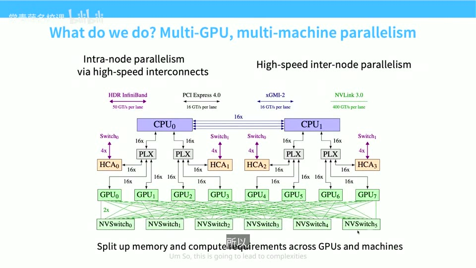 |
| 这两者我们都要处理。请记住，今天讨论的所有内容实际上并不涉及发送数据包之类的操作，我们是在集合通信语言的层面上来处理问题。所以每当要计算通信量时，我可能会说“我们需要执行一次 all-reduce 或 all-gather”；为了高效实现这些操作，你得深入到硬件层面，不过咱们今天主要聊算法。我提到的那些网络语言，都是指集合操作这一层面。 [【跳转到 02:06】](https://www.bilibili.com/video/BV11LEA6eEuj/?p=8&t=126) | 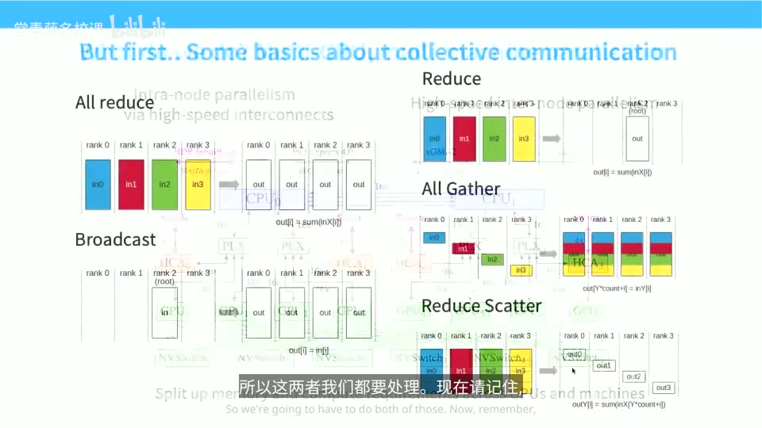 |
| 大家还记得 Percy 提过这个吧——这点很重要，因为后面要讲 all-reduce 和 reduce-scatter 加 all-gather 是等价的。所以会有这样的算法：一边做 all-reduce，另一边分两步走；既然两者在某种意义上的成本一样，右边的算法咱们就算白得了。后面还会再看到，这里快速复习一下，确保你记得 Percy 之前讲的内容。 [【跳转到 02:34】](https://www.bilibili.com/video/BV11LEA6eEuj/?p=8&t=154) | 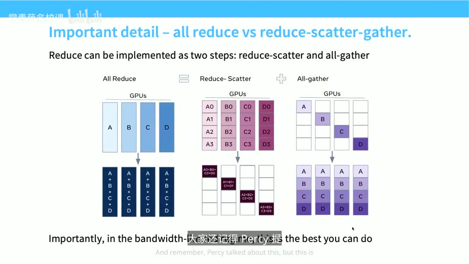 |
| 好，基础回顾就到这里。在进入那些不依赖特定硬件或底层的算法之前，我想简单提一下……（有同学问：你说这个有什么特别的原因吗？） [【跳转到 02:55】](https://www.bilibili.com/video/BV11LEA6eEuj/?p=8&t=175) | 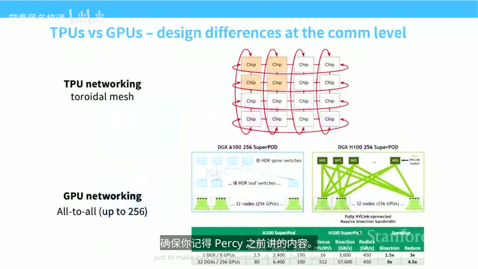 |
| 哪些 reduce 可以拆成 reduce-scatter 之类？ [【跳转到 03:07】](https://www.bilibili.com/video/BV11LEA6eEuj/?p=8&t=187) | 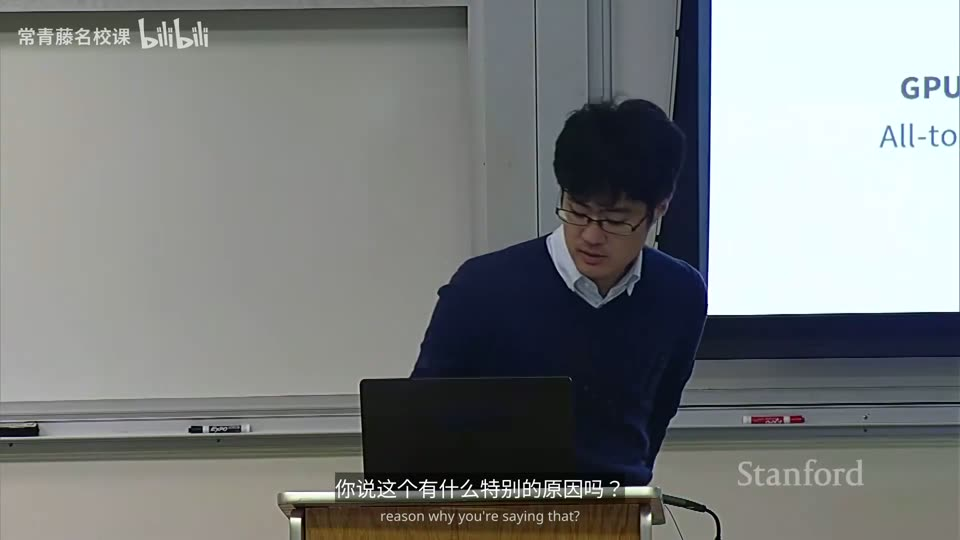 |
| 好问题——我为什么特意讲这个？确实还有其他分解方式，但这一种对某个算法特别有用，所以我才特意强调这种分解。 [【跳转到 03:11】](https://www.bilibili.com/video/BV11LEA6eEuj/?p=8&t=191) | 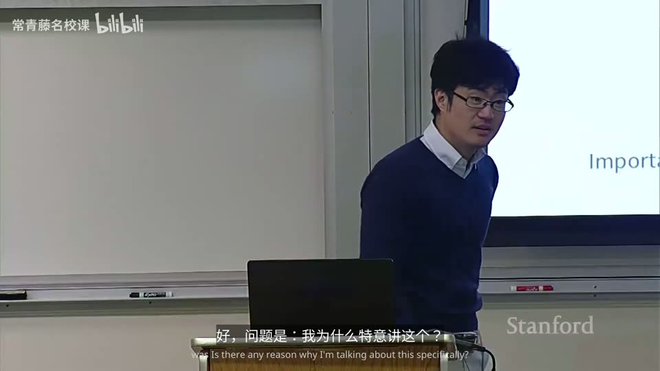 |
| 当然还有其他可行的做法。 [【跳转到 03:18】](https://www.bilibili.com/video/BV11LEA6eEuj/?p=8&t=198) | 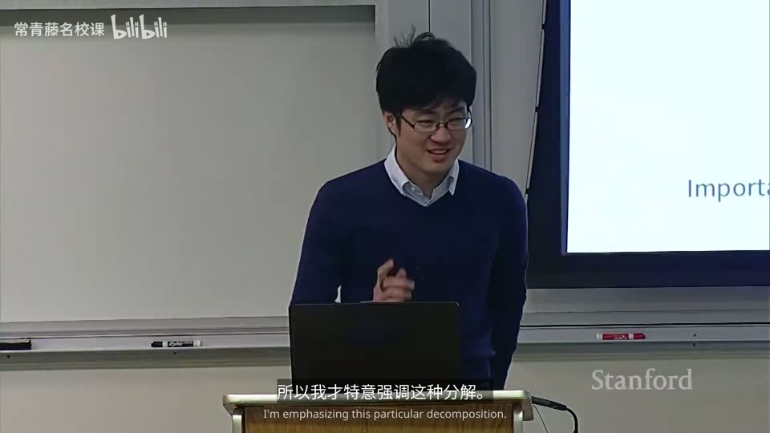 |
| 在正式开始之前还要讲另一件事：我们今天讲的大部分内容跟具体硬件无关——基本上只要理解了这些基本概念，就能把它用到任何硬件平台上。但在正式开始之前，我确实想简单聊一下底层硬件，一方面是因为这本身挺有意思，另一方面也是因为我觉得它会让不同的模型训练公司采用不同的并行策略。大家还记得 TPU 吧？TPU 是 Google 的加速器，我在讲 GPU 那节课时提到过，TPU 有点像轻量级的 GPU。 [【跳转到 03:22】](https://www.bilibili.com/video/BV11LEA6eEuj/?p=8&t=202) |  |
| 但不同之处在于网络。那么网络有什么不同？简单用一页幻灯片来说：TPU 的网络是一种叫环形网格（toroidal mesh）的结构，你可以把它想象成一个网格，让网格的两端能够互相通信——这是个 3D 图，Marcel 那边有可视化效果……你可以忘掉那个更复杂的图，脑子里记住：所有芯片都连向邻居。 [【跳转到 03:52】](https://www.bilibili.com/video/BV11LEA6eEuj/?p=8&t=232) | 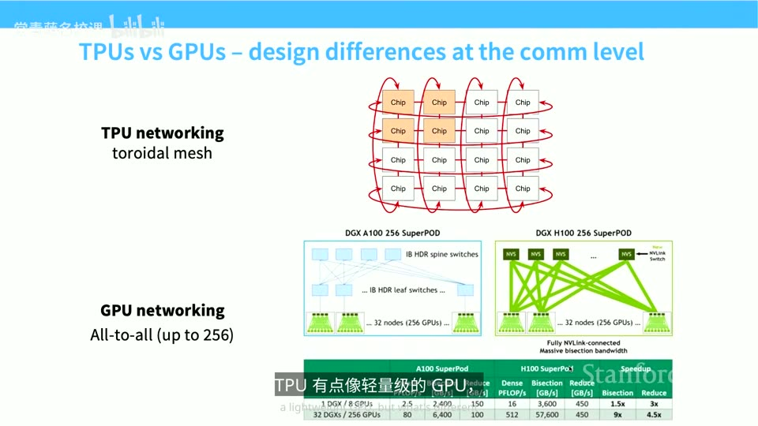 |
| 而且邻居是首尾相接的。这有什么好处？它能让你用一个极简的网络拓扑就非常轻松地无限扩展：不管网络规模多大，你连接的邻居数量基本保持不变。相比之下，GPU 的网络思路就很不一样，它更像一种全对全的模式，连接方式有点像树，通常被称为胖树（fat-tree）：最底层 GPU 之间的连接速度极快，接着 GPU 组成一个个 pod，在 pod 内部连接…… [【跳转到 04:22】](https://www.bilibili.com/video/BV11LEA6eEuj/?p=8&t=262) |  |
| ……随后 pod 之间配备交换机让它们互相通信。这意味着随着节点数量增加，这种树状结构会变得越来越大，把所有节点全互联的通信成本会上升、拓扑也会更复杂。这种设计理念的差异意味着：如果你只跟相邻节点通信，TPU 的表现非常出色——它们性价比高，而且能在相同功耗下让每个连接更强大。 [【跳转到 04:52】](https://www.bilibili.com/video/BV11LEA6eEuj/?p=8&t=292) |  |
| 而 GPU 的网络则更灵活。所以你会看到 GPU 和 TPU 之间有着截然不同的设计理念；在接下来的并行课程中，我会尽量指出这种差异具体体现在哪里。 [【跳转到 05:22】](https://www.bilibili.com/video/BV11LEA6eEuj/?p=8&t=322) |  |
| （有人问这两者有什么区别……）TPU 很适合处理密集模型，它的分区方式非常可预测——我稍后会在讲座中讨论一种叫张量并行（tensor parallelism）的概念；而 GPU 很适合处理像专家混合（MoE）这种通信量较小的任务，因为 token 会路由到不同的专家。所以这些硬件适用于不同的工作负载，这也是我原本打算在讲座里收尾的地方。 [【跳转到 05:35】](https://www.bilibili.com/video/BV11LEA6eEuj/?p=8&t=335) | 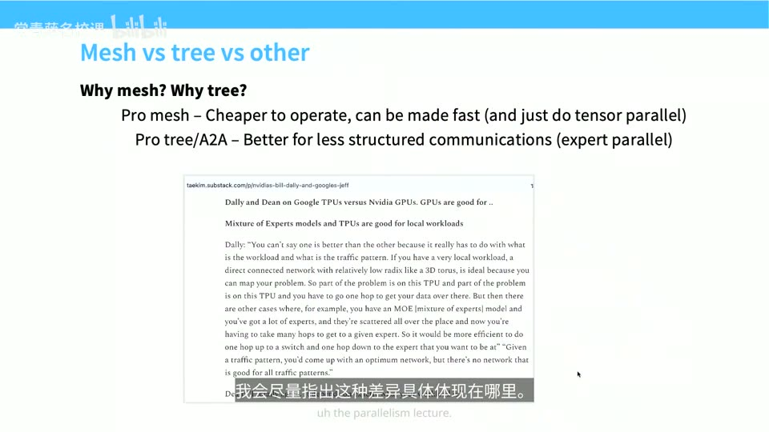 |
| （续）……张量并行的概念。这些硬件适用于不同的工作负载。 [【跳转到 06:05】](https://www.bilibili.com/video/BV11LEA6eEuj/?p=8&t=365) | 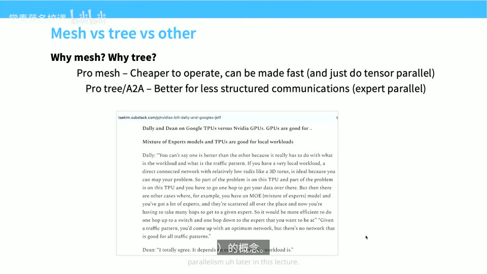 |
| 巧的是今天早上 Google 宣布要发布 TPU v8i，我在备课时查了一下，心想“天哪”。TPU v8i 是一种树状拓扑结构，而他们现在改用了一种更彻底的 all-to-all 连接。仔细想想很合理：现在的语言模型都是 MoE，而跑 MoE 时把 token 路由到不同专家，带宽流量会到处乱窜——推理时这些通信才是真正的瓶颈，所以你可能需要那种更彻底的全互联连接。 [【跳转到 06:14】](https://www.bilibili.com/video/BV11LEA6eEuj/?p=8&t=374) | 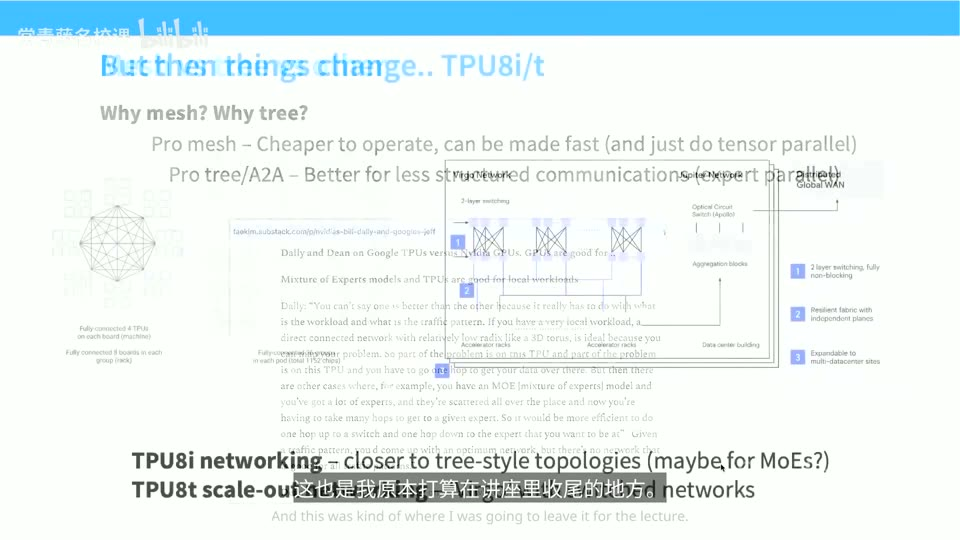 |
| 哪怕是训练时，他们训练芯片的跨机架连接看着也挺像 GPU 的版本——比如他们正在搭建一种更偏向 all-to-all 风格的交换结构，叫做 Virgo 网络，这是更高层的网络协议栈。我觉得现在发生的事挺有意思，这有点像 TPU 和 GPU 的趋同进化。说白了，是负载决定了我们需要什么样的网络。 [【跳转到 06:44】](https://www.bilibili.com/video/BV11LEA6eEuj/?p=8&t=404) | 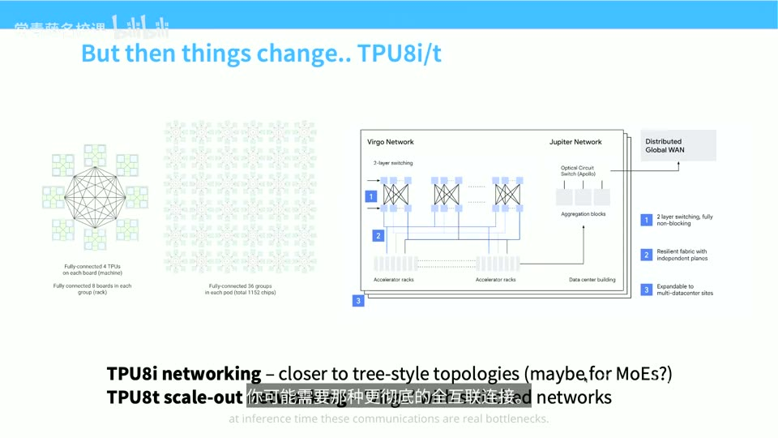 |
| 最后聊聊硬件——我挺喜欢讲讲中国 AI 圈子里的事，有个观点我觉得挺有意思。就像在讲 GPU 的时候有人问过：既然 SRAM 这么好，干嘛不全用它（比如只用 SRAM 芯片，那种就是 ROC……）？效果确实不错。这时候你们可能会想：既然连接性都这么好了，为什么不把所有东西都连起来、用超快的光纤芯片互联呢？这样你就会得到类似华为 CloudMatrix 384 的方案。看看它的规格其实挺有意思：单看芯片，它比 H200 差了不少，比如矩阵乘法速度慢很多…… [【跳转到 07:13】](https://www.bilibili.com/video/BV11LEA6eEuj/?p=8&t=433) | 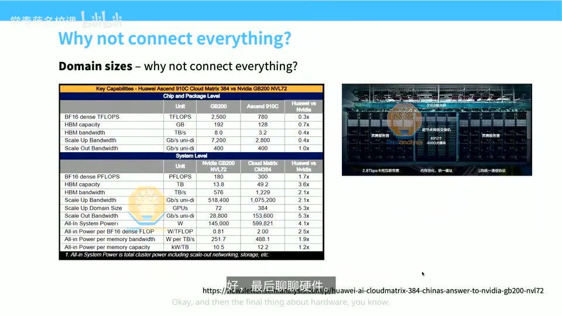 |
| ……很多方面都偏慢。但如果你愿意专门拿一个巨大的机架、装满光纤交换机去连接数量多得多的芯片——就像他们那样，用了 384 颗装在一个大机架上——那也许你就能通过连接多得多的芯片，来弥补单个芯片速度较慢的问题。这给我们展示了一个非常有趣的权衡：一旦审视这种架构，就会发现它的功耗高得离谱，约是英伟达系统的四倍。也就是说，如果你愿意承担电力成本…… [【跳转到 07:43】](https://www.bilibili.com/video/BV11LEA6eEuj/?p=8&t=463) | 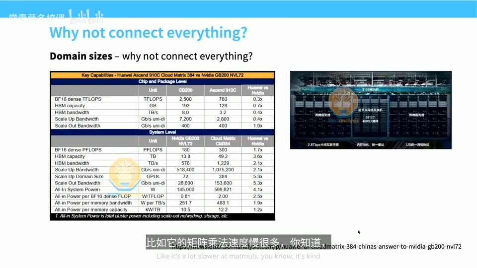 |
| ……就可以用蛮力解决很多通信问题，从而实现横向扩展，比如更激进地扩展到三百多颗芯片，但代价就是功耗。这就好比之前讲的 SRAM 粒子（例子）：如果你想设计一款既省电又好造的硬件，最终就会落到某种特定的结果上；如果你想用蛮力硬解，最终结果就会大不相同。这是个很有意思的例子，能让我们学到硬件设计中的这些权衡。 [【跳转到 08:13】](https://www.bilibili.com/video/BV11LEA6eEuj/?p=8&t=493) | 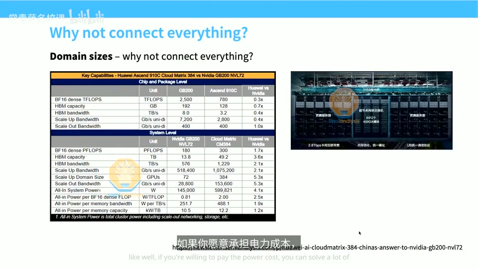 |
| 好，把这些串起来看：你首先得明白，现在的计算单元已经不是 GPU 了。 [【跳转到 08:37】](https://www.bilibili.com/video/BV11LEA6eEuj/?p=8&t=517) | 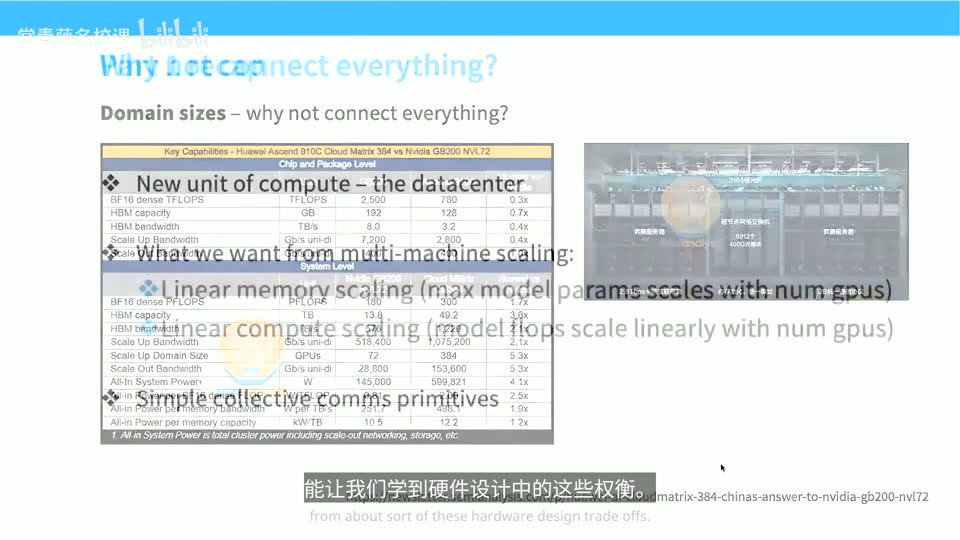 |
| 而是整个数据中心。咱们得搞定几件事：首先得能控制用了多少显存，其次得能控制能调动多少算力，而且希望所有这些环节都是“无损”的——得把现有资源都用上。接下来要讲的就是那些算法，它们能借助这些通信原语组件来实现这一点。 [【跳转到 08:41】](https://www.bilibili.com/video/BV11LEA6eEuj/?p=8&t=521) | 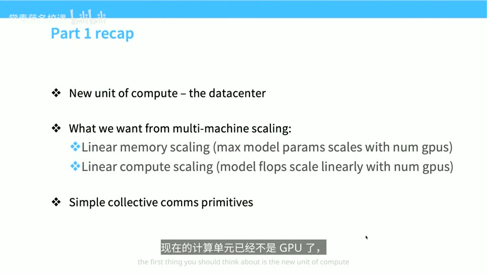 |
| 讲座的第二部分就是今天的重头戏：这些就是咱们用来并行化语言模型的算法。接下来会讲到几个不同的重要概念，这些内容或许可以归为一组：数据并行是一种思路，简单来说就是把要训练的数据分发到不同的 GPU 上，也就是说“流动的是数据”；而模型并行则是把模型拆分成不同部分分散到各处。实际上两者的界限有点模糊…… [【跳转到 09:03】](https://www.bilibili.com/video/BV11LEA6eEuj/?p=8&t=543) | 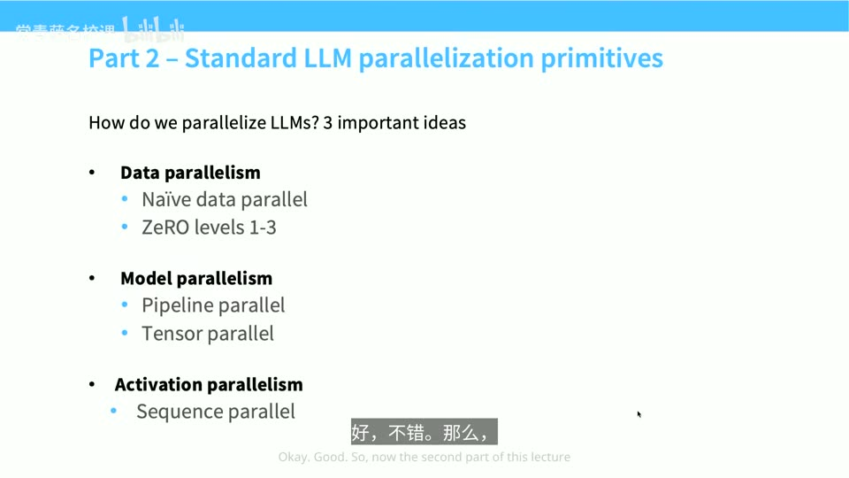 |
| ……因为其中一种算法也会切分参数，大家稍后会明白我为什么这样分类。从概念上说，我们既要扩展计算能力、也要扩展内存，所以才需要这一整套不同的技巧。 [【跳转到 09:33】](https://www.bilibili.com/video/BV11LEA6eEuj/?p=8&t=573) | 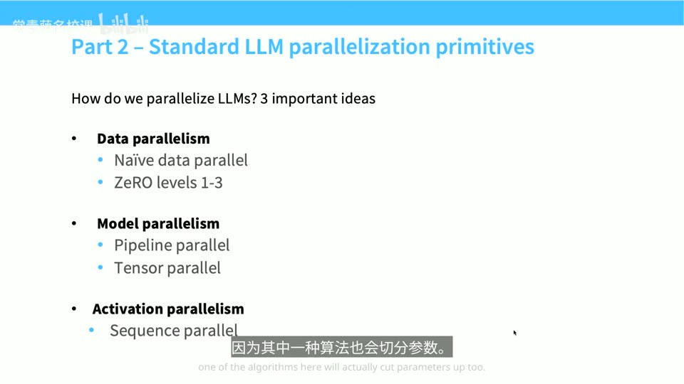 |
| 我觉得数据并行是最容易理解的，概念非常简单，也是并行化语言模型训练的标准做法。先别管 Adam，我们暂时只用最基础的 SGD：有一个批次大小为 B 的 batch，每次更新我都会取 B 个样本、把梯度加起来然后执行更新。最基础的并行做法就是把这个批次 B 分给 M 台机器（如果 B 能被 M 整除）…… [【跳转到 09:45】](https://www.bilibili.com/video/BV11LEA6eEuj/?p=8&t=585) | 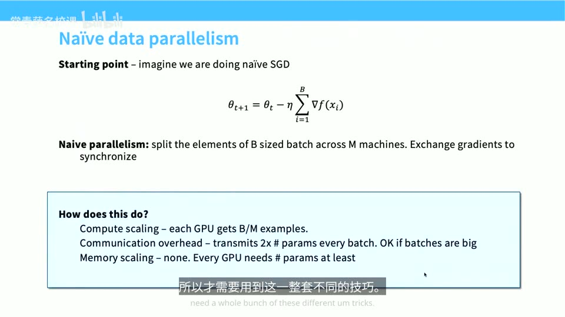 |
| ……每台机器就能分到大小为 B/M 的小批次；接着每台机器分别计算梯度，最后把所有梯度同步起来求和。从计算扩展性的角度看这非常完美，只要每个 GPU 上的样本量足够就没问题。那通信开销呢？每个批次基本上得传输两倍于参数量大小的数据，因为我要把梯度在机器间来回传输。 [【跳转到 10:15】](https://www.bilibili.com/video/BV11LEA6eEuj/?p=8&t=615) | 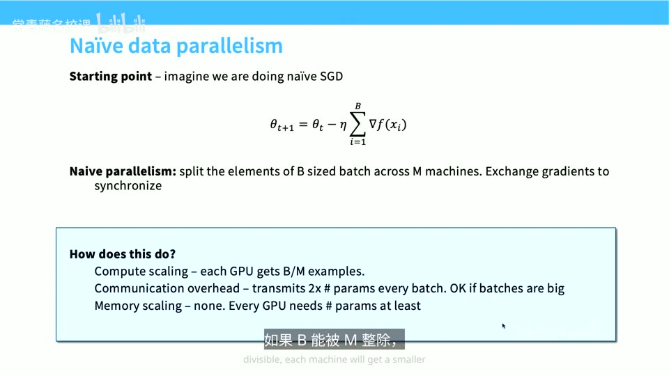 |
| 至于内存扩展性，那完全没有：每个 GPU 都存有模型的相同副本，激活值的大小也得保持一致——所以在这种方案里你一点内存都没省下来。 [【跳转到 10:45】](https://www.bilibili.com/video/BV11LEA6eEuj/?p=8&t=645) | 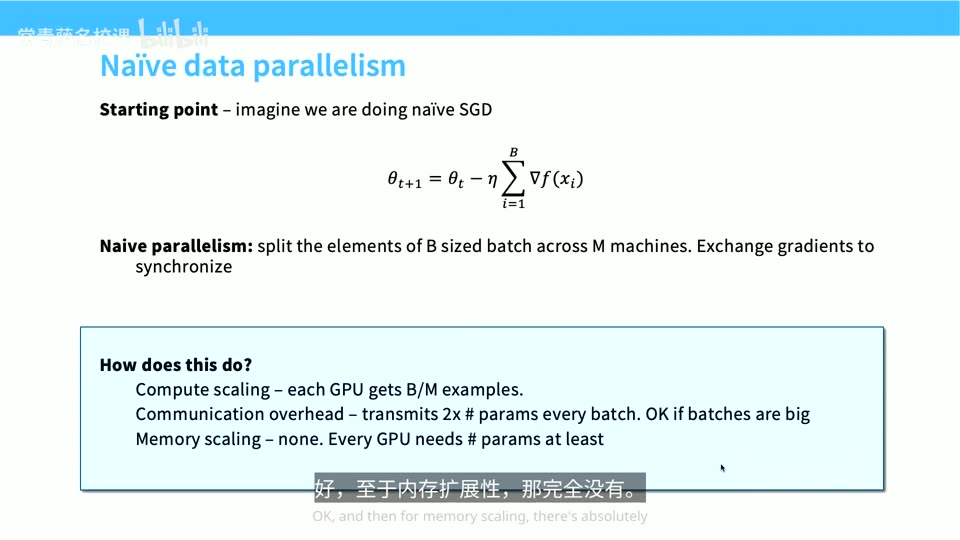 |
| 那现在问题出在哪儿？咱们虽然多少解决了计算问题，但内存问题压根儿没碰。我们来做一点简单的核算。 [【跳转到 10:55】](https://www.bilibili.com/video/BV11LEA6eEuj/?p=8&t=655) | 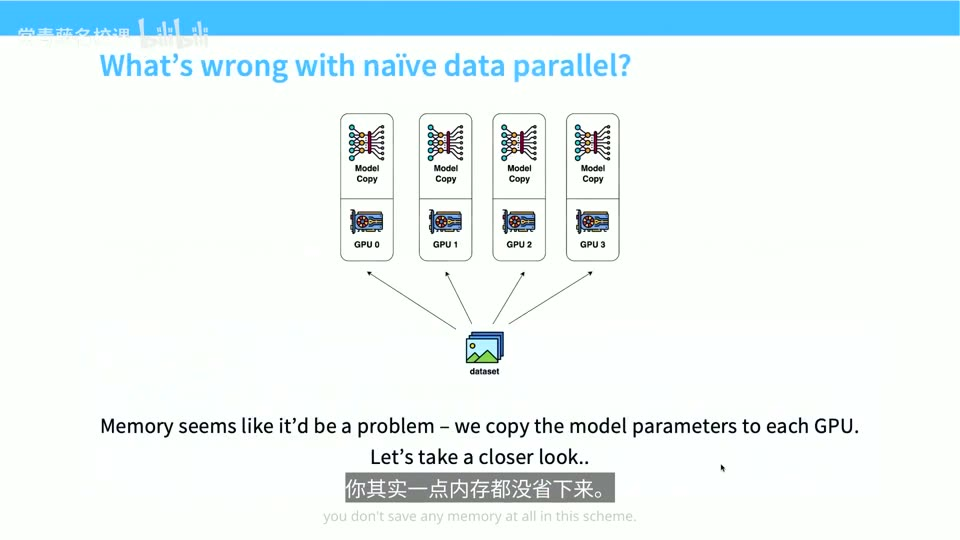 |
| 只要一看内存情况，好像挺糟；但事实是，咱们的内存状况简直糟糕透顶。为什么？你稍微算算参数就知道了——事实证明你得存好多东西，而且要存的东西其实比参数本身还多。按经验法则（具体取决于精度），我们大概需要五份权重副本、每个参数 16 字节来存模型：肯定要存模型参数，还得有个地方放梯度——在把它们累加进模型参数之前…… [【跳转到 11:05】](https://www.bilibili.com/video/BV11LEA6eEuj/?p=8&t=665) | 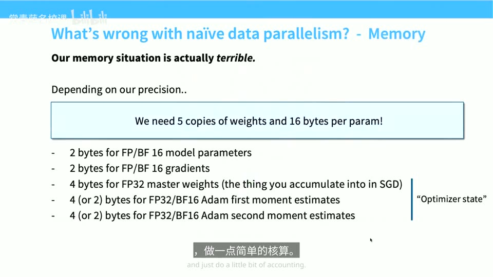 |
| ……这些东西算是某种累加器，所以得存下来。实际上你可能还得存点别的，比如一个更高精度的累加器，用来往 SGD 里累加数据——这可能只是临时的，但你确实得留着。如果你再用 Adam，麻烦正是从这冒出来的：你得同时跟踪梯度的一阶矩和二阶矩，而且得一直跟踪它们，所以得备两份；视稳定性要求，你可能得用高精度来存，这开销可不小。我们一般管这些叫优化器状态（optimizer state）。 [【跳转到 11:35】](https://www.bilibili.com/video/BV11LEA6eEuj/?p=8&t=695) | 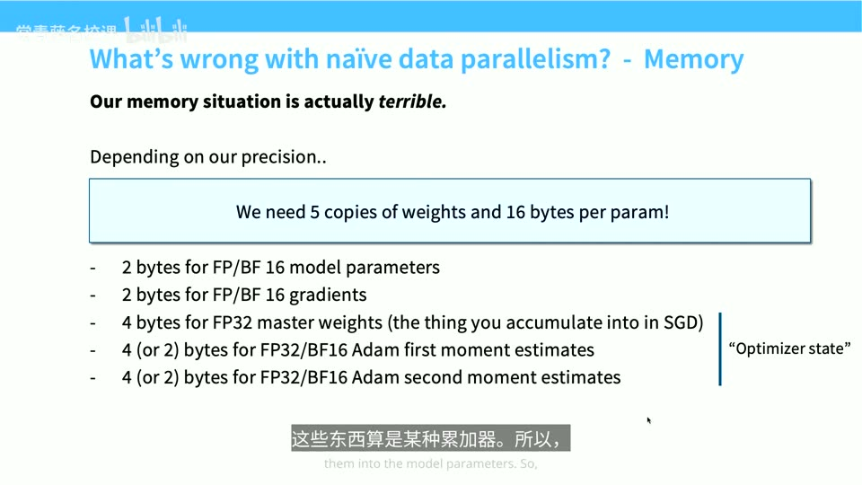 |
| 也就是你用来累加一阶矩和二阶矩的那些数据。这些开销其实挺大——你要是细算一下账，会发现做 SGD 更新时内存成本的大头就在这。 [【跳转到 12:05】](https://www.bilibili.com/video/BV11LEA6eEuj/?p=8&t=725) | 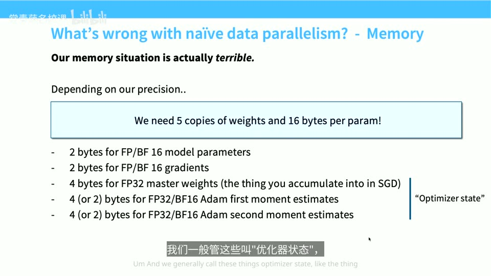 |
| 所以我觉得这里有个特别优雅的做法：想办法省点内存，把它们用一种结构化的方式分散到各个加速器上，这么干你几乎是白捡这些收益。就像上一张幻灯片说的，优化器状态占了绝大部分内存：绿色是优化器状态、占了大头，橙色是梯度，蓝色是参数——参数和梯度一样大，但状态数据更大。而朴素的数据并行就是把这堆东西全复制到每个 GPU 上。 [【跳转到 12:15】](https://www.bilibili.com/video/BV11LEA6eEuj/?p=8&t=735) |  |
| 跨 GPU 复制这不太妙——你占用的显存远超实际需要，而且显存占用会随加速器数量线性增加。我们可以把优化器状态分片放到不同的 GPU 上，这样能省不少空间；如果把其他需要跟踪的部分也分片，还能省更多——比如梯度也可以分片到不同的 GPU，或者极端一点，把所有东西都分配到不同的加速器上。随着分片程度提高，右侧显示的显存节省效果会非常惊人。 [【跳转到 12:45】](https://www.bilibili.com/video/BV11LEA6eEuj/?p=8&t=765) |  |
| 接下来主要研究“这么做代价有多大”。大家可能觉得天下没有免费的午餐——基线方案肯定最快——当我们往下走到这一步时，为了省下这些显存就得付出巨大的通信代价。 [【跳转到 13:15】](https://www.bilibili.com/video/BV11LEA6eEuj/?p=8&t=795) | 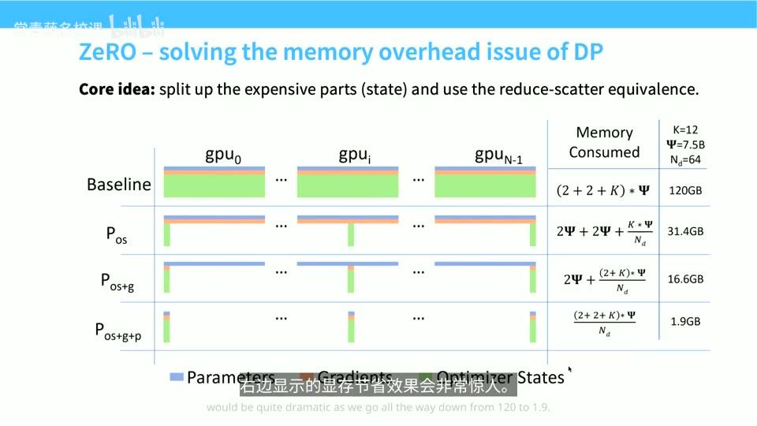 |
| 但我觉得最棒的一点是：很多部分其实是免费的。不过我会一步步带大家过一遍。好，咱们先从大家常说的 ZeRO Stage 1 开始，对应这几个步骤会有三个阶段。 [【跳转到 13:33】](https://www.bilibili.com/video/BV11LEA6eEuj/?p=8&t=813) | 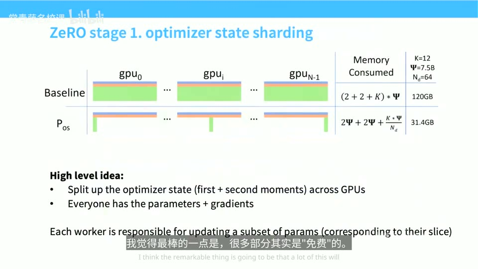 |
| 第一阶段最简单：我只对优化器状态做分片。 [【跳转到 13:43】](https://www.bilibili.com/video/BV11LEA6eEuj/?p=8&t=823) | 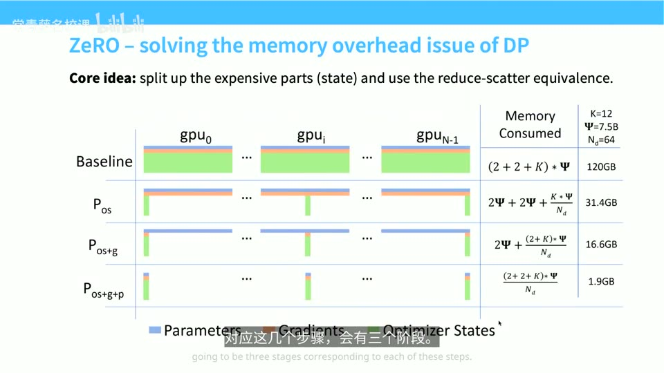 |
| 并把它分散到各个 GPU 上，每个人手里都有参数和梯度。你可以这么想：每个工作进程负责更新参数中的一块——比如我是 0 号 GPU，那我就只管更新最前面的这一块，其他更新跟我没关系。那具体怎么运作呢？ [【跳转到 13:47】](https://www.bilibili.com/video/BV11LEA6eEuj/?p=8&t=827) | 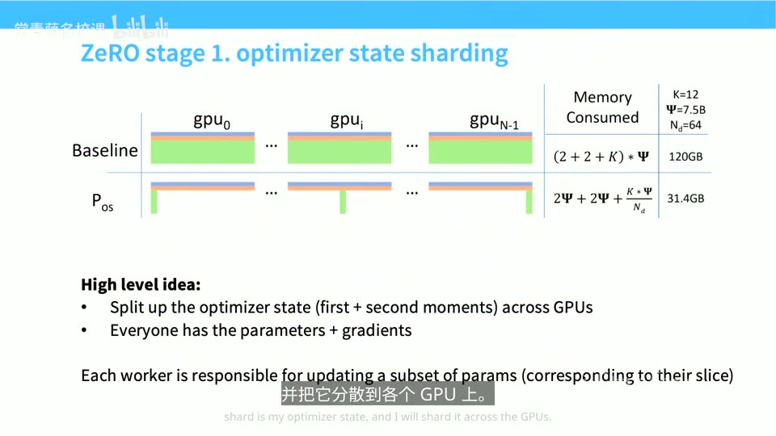 |
| 我们要做的是各自计算，每个人处理不同的数据项。第一步是在各自的数据项上算出完整梯度；接下来我把算好的梯度拿出来，用 reduce-scatter 操作分发给其他所有机器——毕竟大家都需要我的梯度，不过他们不需要全部，只需要那些跟自己参数更新有关的部分。所以每个工作节点会从我这儿拿到梯度，但只拿参数空间里属于它的那一块。这样一来，这部分的通信开销就相当于一整套参数的量级。 [【跳转到 14:02】](https://www.bilibili.com/video/BV11LEA6eEuj/?p=8&t=842) | 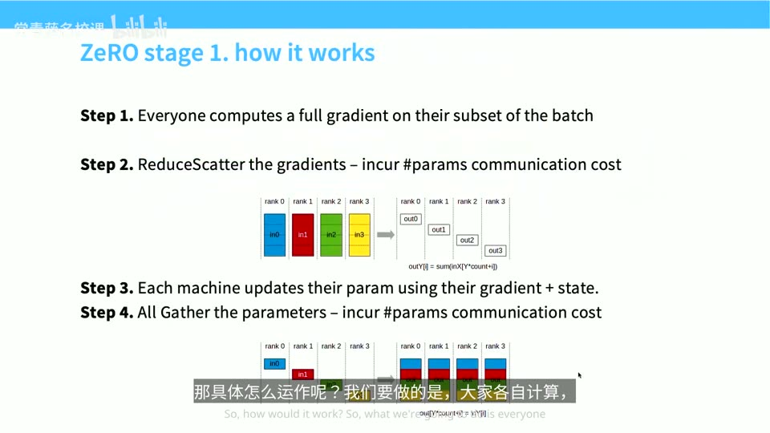 |
| 我虽然发的是完整梯度，但会把它拆开分别发给每个 GPU。现在每台机器都可以进行参数更新了——它手里有自己的参数、从别人那拿到的梯度，还有自己跟踪维护的状态。参数更新完之后，我用 all-gather 把它们收回来：我负责比如 1/4 的参数，所以会把这些更新后的参数发回给其他所有机器。你看，这就是一个 all-gather，这种等价关系其实挺有用的。 [【跳转到 14:32】](https://www.bilibili.com/video/BV11LEA6eEuj/?p=8&t=872) | 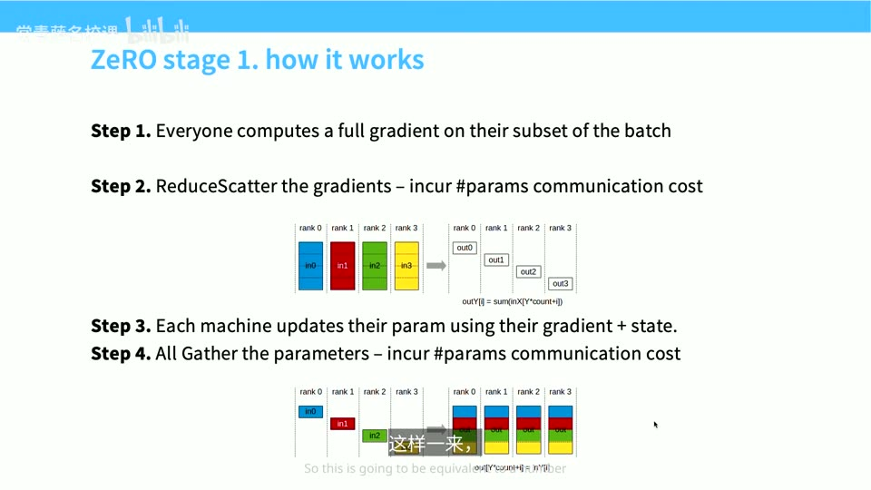 |
| 我到底做了多少操作？在朴素的数据并行方案里…… [【跳转到 15:02】](https://www.bilibili.com/video/BV11LEA6eEuj/?p=8&t=902) | 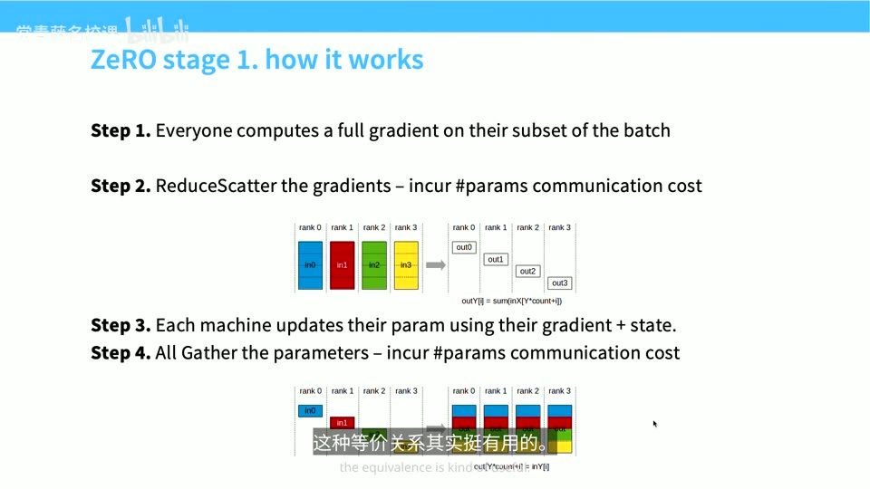 |
| ……我得做一次 all-reduce，跟所有人交换梯度，然后再做更新，所以通信开销是参数量的两倍。在 ZeRO Stage 1 里我做了两个操作：先用 reduce-scatter 把梯度发出去，再用 all-gather 把更新后的参数收回来。不过我们之前提过，reduce-scatter 加上 all-gather 其实就等价于一个 all-reduce——所以 ZeRO Stage 1 的通信特性跟朴素 DDP 一模一样，这意味着我们白捡了一笔内存节省。 [【跳转到 15:06】](https://www.bilibili.com/video/BV11LEA6eEuj/?p=8&t=906) | 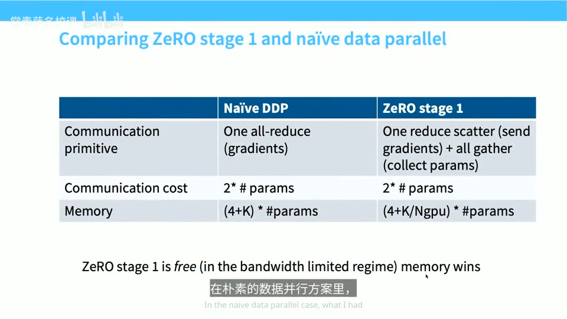 |
| 再看看内存占用：我们基本上把参数以及所有非优化器状态的东西都除以了 GPU 数量 N_gpu。太棒了。那我们还能更进一步吗？ [【跳转到 15:36】](https://www.bilibili.com/video/BV11LEA6eEuj/?p=8&t=936) | 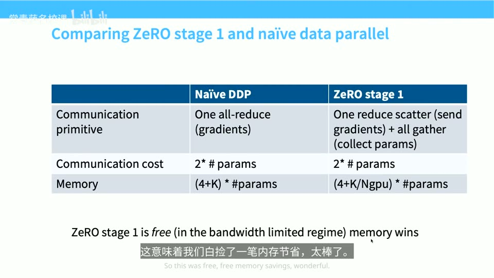 |
| 到了 ZeRO Stage 2，我会把梯度也拆开、同样做分片。这一步更棘手，因为之前我一直依赖一个前提：我能算出完整的梯度；现在我连完整的梯度都没法物化出来。怎么办呢？其实只是个系统层面的小技巧：我在网络里反向遍历的时候，并不需要算出完整的梯度，可以边走边把梯度发给对应的工作节点。关键步骤是…… [【跳转到 15:45】](https://www.bilibili.com/video/BV11LEA6eEuj/?p=8&t=945) | 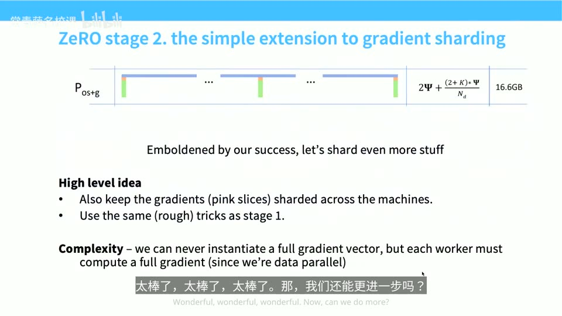 |
| ……不再一次性物化整个梯度向量，而是沿着计算图反向遍历，算完某一层的梯度就马上对它做规约、把结果发给对应的工作节点；当计算图里不再需要某个梯度时，就立刻把它释放掉。也就是说，你现在是边算边发梯度。逐步去做和一次性做完，结果都一样，所以真的没什么区别。最后你可以再次用 all-gather 把参数收集起来。从某种意义上说，我已经把梯度分片了，而且没多花什么额外成本。 [【跳转到 16:12】](https://www.bilibili.com/video/BV11LEA6eEuj/?p=8&t=972) | 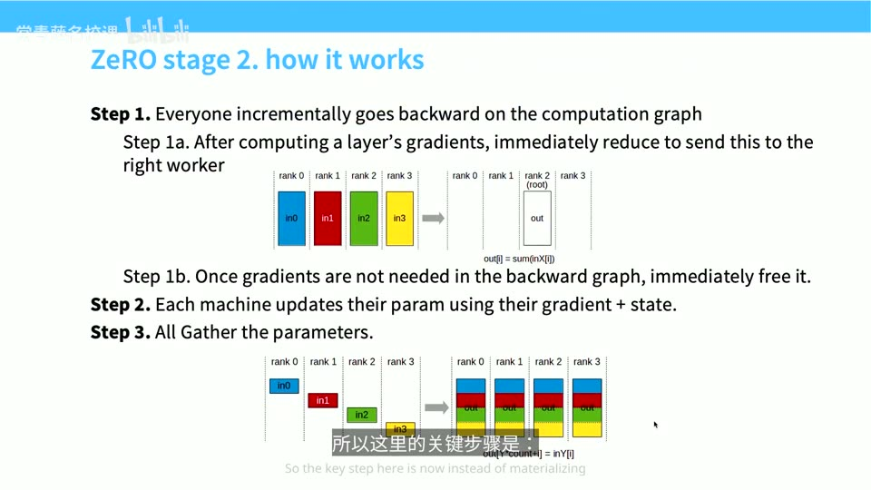 |
| 好，最后一点也是最棘手的一点——我第一次学这个的时候觉得简直像变魔术。到目前为止我们已经免费得到了不少好处，所以继续往下推：我打算把参数也分片，一直横跨到所有状态。还是用之前在 ZeRO Stage 2 里用过的那个思路：一步步来。做法是在遍历计算图的时候按需发送、接收参数。这挺难搞的，因为任何时候每块 GPU 只能看到参数…… [【跳转到 16:42】](https://www.bilibili.com/video/BV11LEA6eEuj/?p=8&t=1002) | 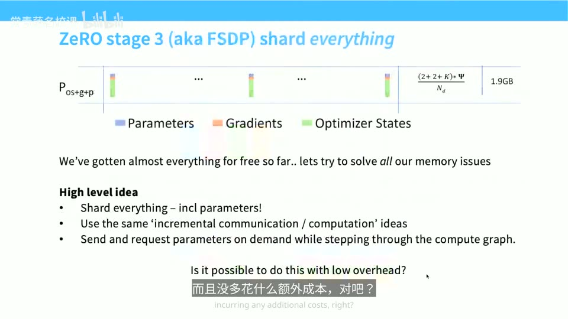 |
| ……梯度和优化器状态的一小块。这就是 ZeRO Stage 3，也叫 FSDP。如果你以前在 PyTorch 里做过并行化…… [【跳转到 17:12】](https://www.bilibili.com/video/BV11LEA6eEuj/?p=8&t=1032) | 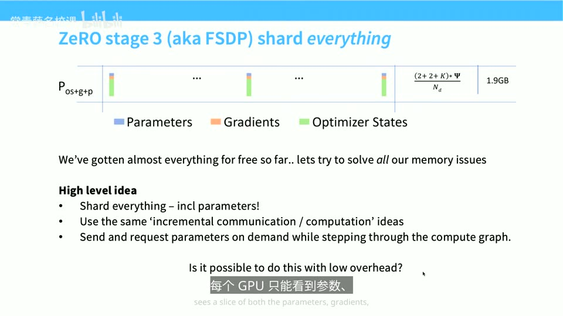 |
| ……那你估计早就打过交道了。它底层是怎么跑的？过程中会做多次 all-gather 和一次 reduce-scatter。咱们从左往右一步步来，这大致就是整个更新流程：首先加载模型（顶部和底部各有一块 GPU），第一步是收集这一层的权重；我先跑一下这一层的前向传播；既然前向做完了，就可以把权重释放掉——这些参数我就不需要了。打个比方，假设我只有一层，那我现在就可以进入反向传播阶段了。 [【跳转到 17:18】](https://www.bilibili.com/video/BV11LEA6eEuj/?p=8&t=1038) |  |
| 做反向传播时，我需要之前保留的激活值，还有这一层的参数；这个参数可以按需通过 all-gather 拿过来。我先 all-gather，做完反向传播后拿到梯度就立刻把它们分散回去：执行 reduce-scatter 把梯度分散出去，接着把权重释放掉（反正也不需要了），然后重复这个过程。所以我是按需抓取参数、算完反向传播把梯度发出去，循环往复，最后再更新权重。那通信成本是多少？ [【跳转到 17:48】](https://www.bilibili.com/video/BV11LEA6eEuj/?p=8&t=1068) | 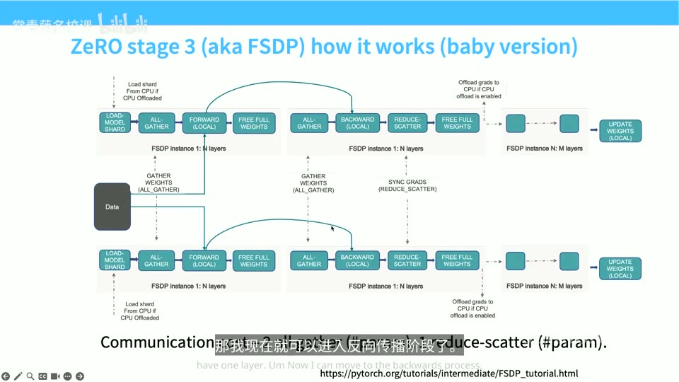 |
| 我们一共做了两次 all-gather 和一次 reduce-scatter——你看，多了一次 all-gather，这看起来不太好。其二是从开销上看这有点夸张，因为每一层咱们都在做这种通信。 [【跳转到 18:18】](https://www.bilibili.com/video/BV11LEA6eEuj/?p=8&t=1098) | 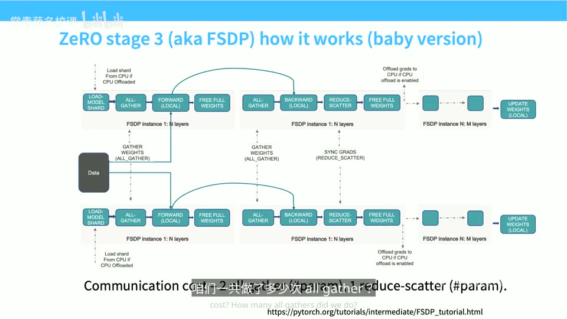 |
| 你可能会觉得这太贵、太糟糕。但有一点既反直觉又很重要：ZeRO Stage 3 用了两个很关键的想法，让这种开销基本上可以忽略不计。第一个想法咱们已经见过了：扫一遍计算图，做完必要的通信然后立马释放内存。第二个我还没讲过的思路是：把通信和计算的开销重叠起来。这一开始挺难解释，所以我从讲 PyTorch FSDP 的论文里拿了这张图。 [【跳转到 18:32】](https://www.bilibili.com/video/BV11LEA6eEuj/?p=8&t=1112) | 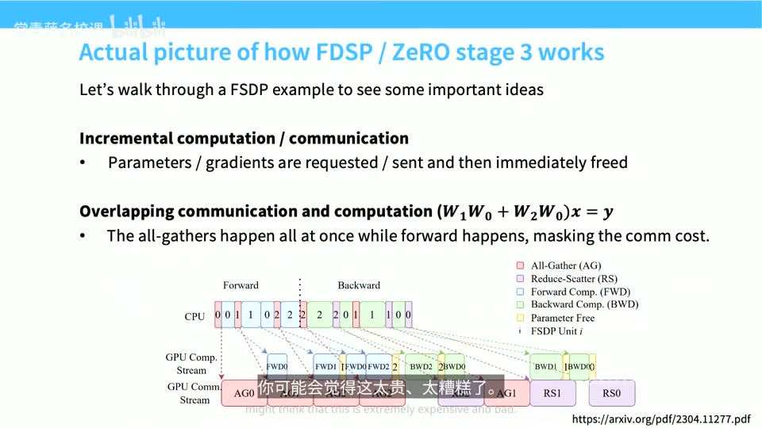 |
| 大概是这样：图里的几条不同的流，最上面大致是 CPU 里发生的事，中间是 GPU 里负责计算的部分，最底下是 GPU 里负责通信的部分。FSDP 是怎么工作的？我得先拿到参数才能开始计算，所以会对第 0 层做 all-gather；一旦搞定我就能开始前向传播。不过在我做前向传播的时候，你看，我正在请求下一层的参数——我在算第 0 层的时候也在对第 1 层做 all-gather。 [【跳转到 19:02】](https://www.bilibili.com/video/BV11LEA6eEuj/?p=8&t=1142) |  |
| 等第 1 层的数据齐了，我就能做第 1 层的前向传播；接着开始这个过程时，就可以去对第 2 层做 all-gather。所以我在做这些操作时，把计算和通信重叠在了一起；可能还得花点时间释放参数，也可能再花点时间做下一次前向传播。这么做的好处是：只要你算力够、网络够快，把通信和计算重叠起来…… [【跳转到 19:32】](https://www.bilibili.com/video/BV11LEA6eEuj/?p=8&t=1172) |  |
| ……FSDP 的成本几乎可以忽略不计。你会看到一些气泡，那是额外开销；但只要通信足够快、计算量足够大，就能明显看出计算可以跑得比通信快——也就是说计算耗时长于通信耗时，通信被藏在了计算背后。这样你就能大幅优化内存占用。 [【跳转到 20:02】](https://www.bilibili.com/video/BV11LEA6eEuj/?p=8&t=1202) | 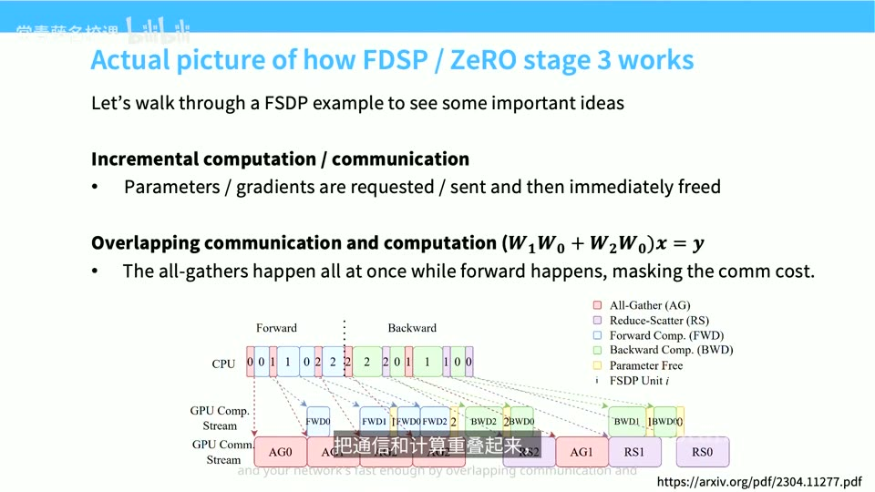 |
| 却几乎不增加额外的通信开销。好，咱们来看看不同 ZeRO 阶段的开销。朴素 DDP（也就是数据并行）的额外通信量是参数量的两倍，因为它只涉及一次 all-reduce。而 ZeRO 阶段一和阶段二——也就是对梯度和优化器状态做分片——在通信上几乎是免费的，因为 all-reduce 本身就等价于 reduce-scatter 加 all-gather 这两个操作，所以通信量和 DDP 完全一样。ZeRO 阶段三在技术上则需要更多通信：你要额外做一次 all-gather，对吧？ [【跳转到 20:22】](https://www.bilibili.com/video/BV11LEA6eEuj/?p=8&t=1222) | 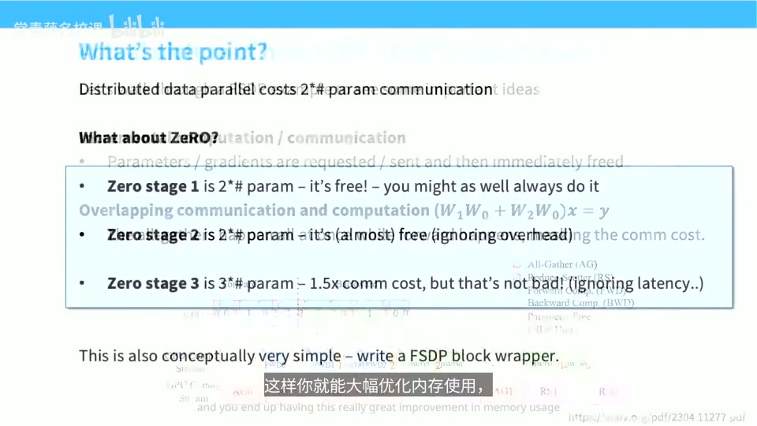 |
| 不过情况没那么糟，因为这些库能用非常巧妙的方式把通信开销藏在计算过程里，所以实际跑起来，FSDP 的 GPU 利用率会非常接近单卡的性能。说实话，FSDP 效果相当出色，概念上也十分简单——顺带一提，你们的作业里就需要实现一个 FSDP：写一个包装器就行，它能把任意模块包起来变成对应的 FSDP 版本。 [【跳转到 20:52】](https://www.bilibili.com/video/BV11LEA6eEuj/?p=8&t=1252) | 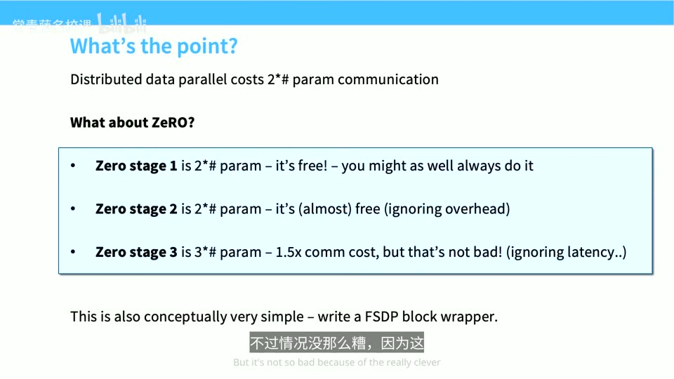 |
| 概念上你要做的就是：做一堆 all-gather，计算，然后释放； [【跳转到 21:17】](https://www.bilibili.com/video/BV11LEA6eEuj/?p=8&t=1277) | 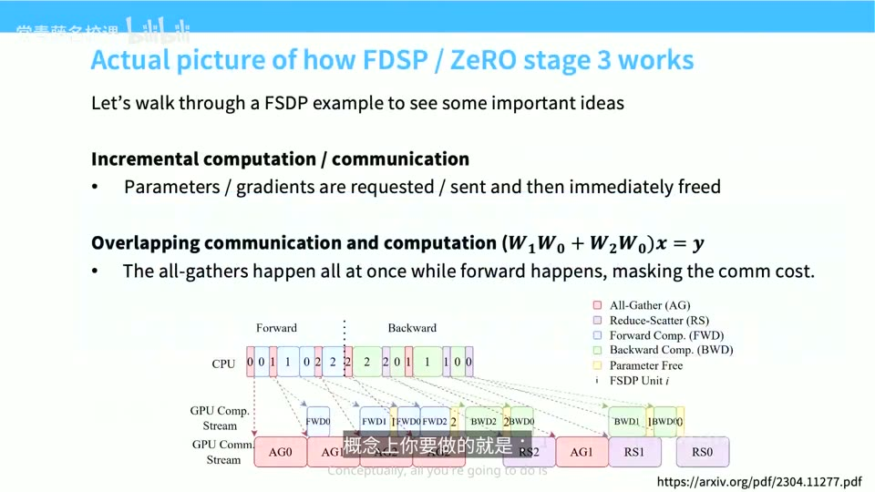 |
| 反向传播时再重复一遍同样的流程。 [【跳转到 21:21】](https://www.bilibili.com/video/BV11LEA6eEuj/?p=8&t=1281) | 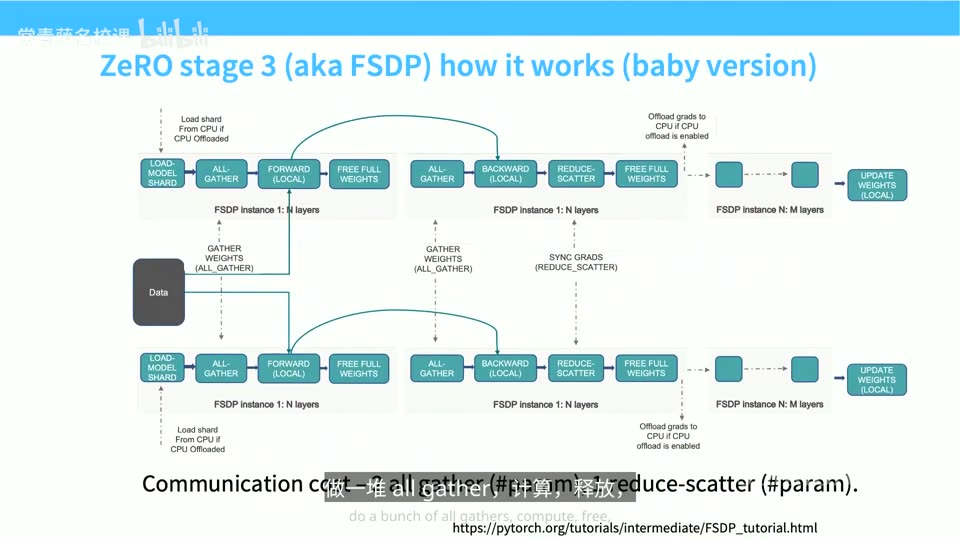 |
| 好的，很好。我的理解是——我们从后一张 GPU 拿梯度来算前一张 GPU 的梯度，对吧？嗯，你说的那个嘛…… [【跳转到 21:25】](https://www.bilibili.com/video/BV11LEA6eEuj/?p=8&t=1285) | 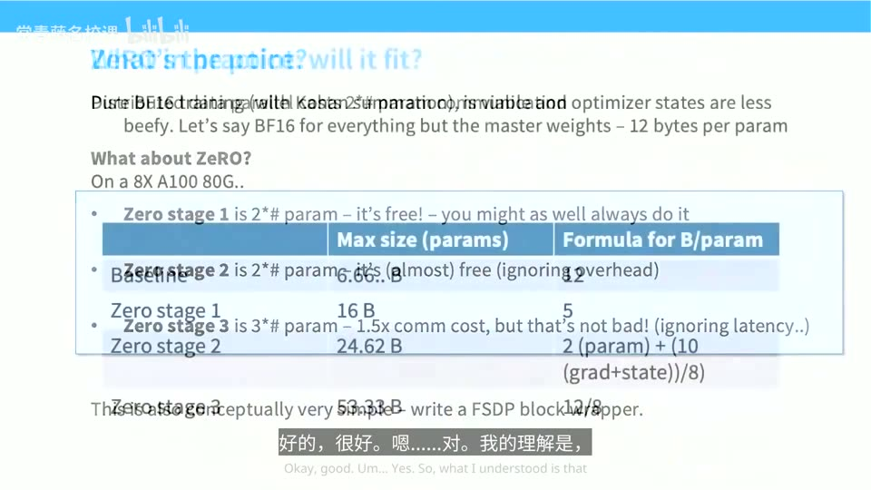 |
| 对吧嗯你说的那个嘛 [【跳转到 21:29】](https://www.bilibili.com/video/BV11LEA6eEuj/?p=8&t=1289) | 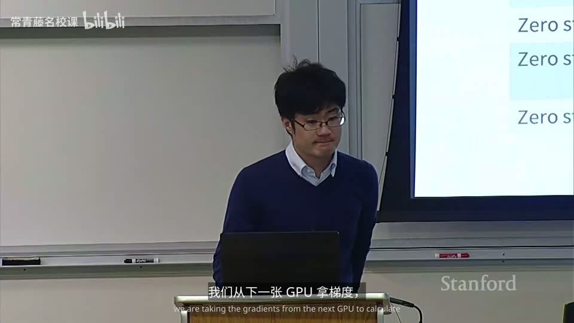 |
| 其实我们不是这样做的。你刚才描述的那种「把梯度从一张 GPU 传给下一张」， [【跳转到 21:33】](https://www.bilibili.com/video/BV11LEA6eEuj/?p=8&t=1293) | 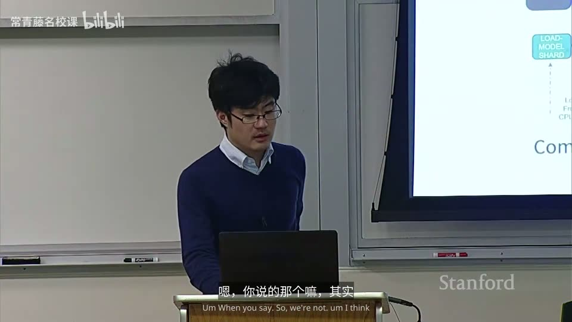 |
| 那叫流水线；流水线并行打个比方，是一个层放在一张 GPU 上， [【跳转到 21:37】](https://www.bilibili.com/video/BV11LEA6eEuj/?p=8&t=1297) | 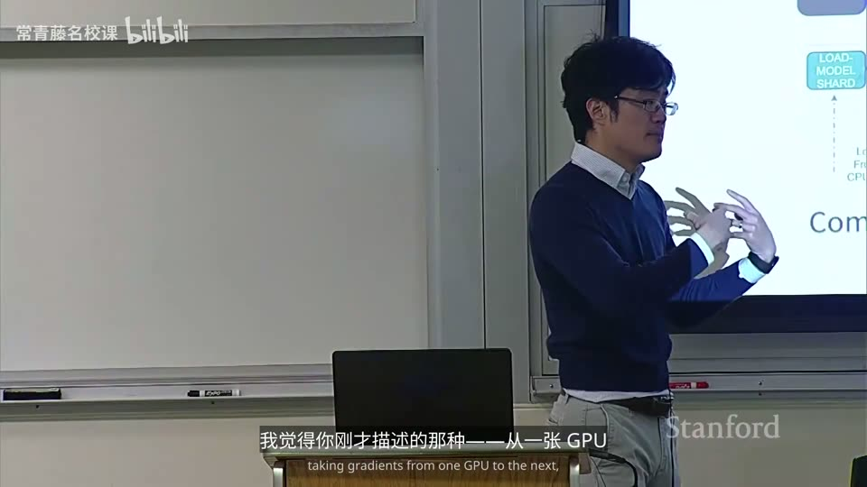 |
| 另一个层放在另一张 GPU 上，并不是这样的。你看，在这些情况下， [【跳转到 21:41】](https://www.bilibili.com/video/BV11LEA6eEuj/?p=8&t=1301) | 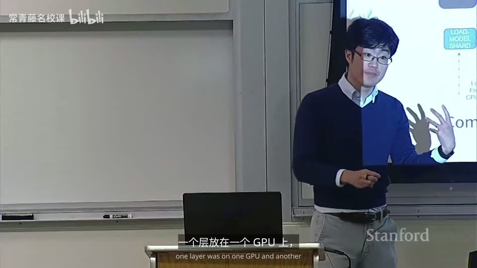 |
| 每张 GPU 都会从头到尾跑完整个模型，但区别在于： [【跳转到 21:46】](https://www.bilibili.com/video/BV11LEA6eEuj/?p=8&t=1306) | 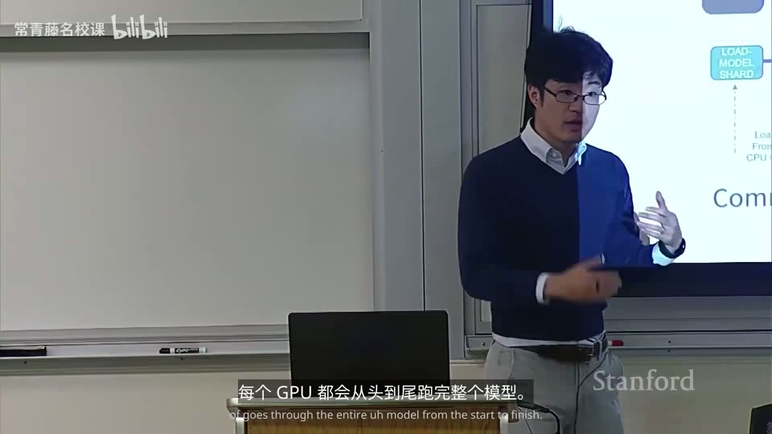 |
| 没有任何一张 GPU 会同时存下全部参数。所以咱们可以这么改： [【跳转到 21:50】](https://www.bilibili.com/video/BV11LEA6eEuj/?p=8&t=1310) | 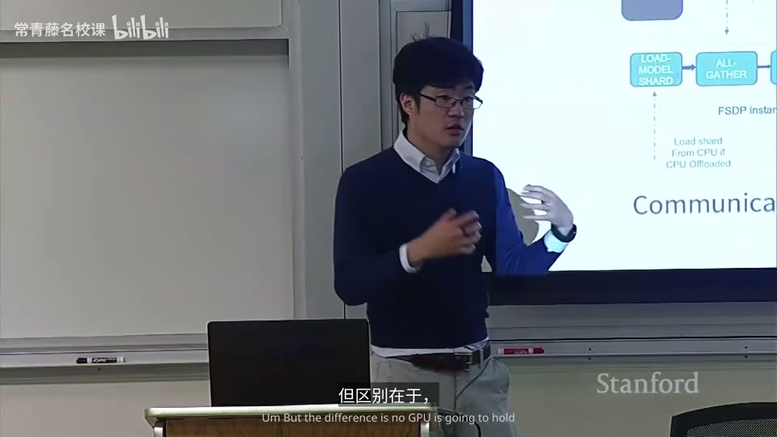 |
| 假如当前要算的网络部分里没有第零层，那我就先把第零层的参数取过来， [【跳转到 21:54】](https://www.bilibili.com/video/BV11LEA6eEuj/?p=8&t=1314) | 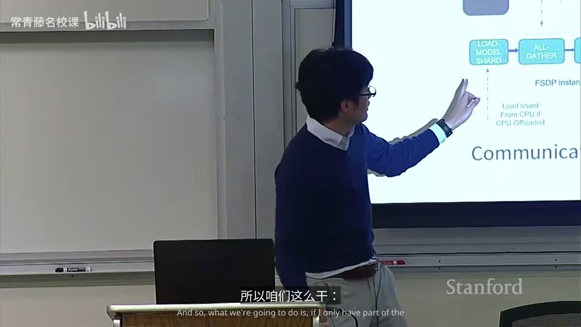 |
| 做完整套计算，再去处理下一层。 [【跳转到 21:58】](https://www.bilibili.com/video/BV11LEA6eEuj/?p=8&t=1318) | 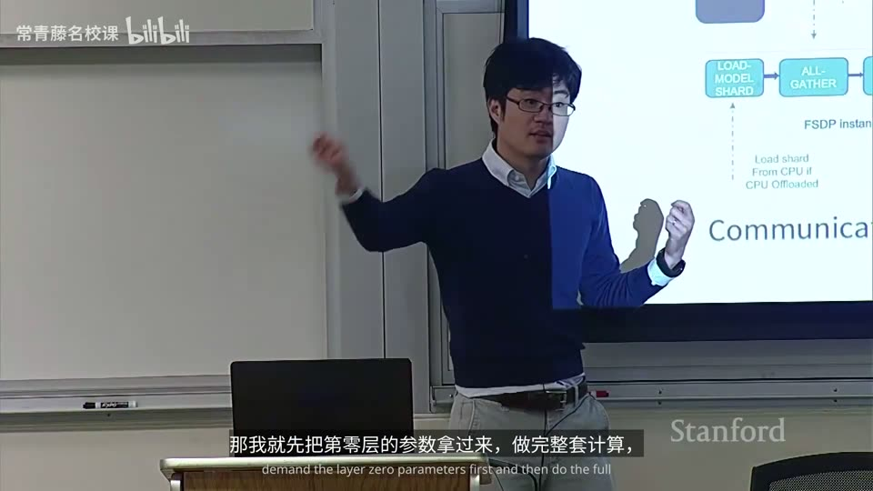 |
| 所以计算本身没变，和朴素数据并行里单 GPU 的计算是一样的， [【跳转到 22:02】](https://www.bilibili.com/video/BV11LEA6eEuj/?p=8&t=1322) | 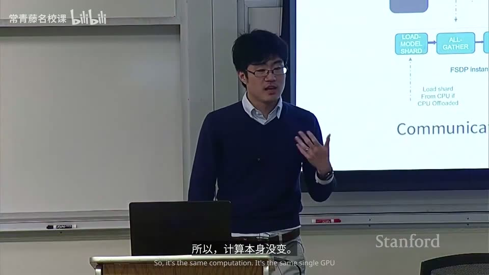 |
| 只不过可以理解为：在每次计算操作之间去「请求」参数， [【跳转到 22:07】](https://www.bilibili.com/video/BV11LEA6eEuj/?p=8&t=1327) | 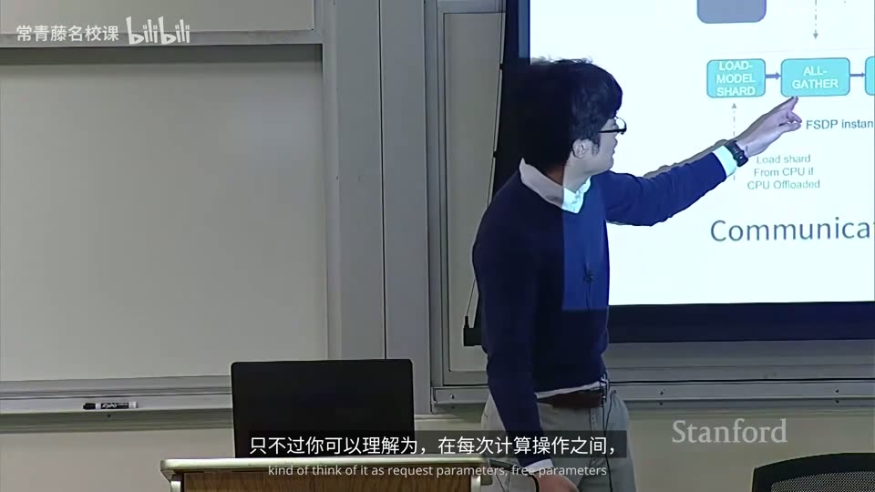 |
| 用完再释放。所以你的意思是，每张 GPU 都只存下每层的一部分？ [【跳转到 22:11】](https://www.bilibili.com/video/BV11LEA6eEuj/?p=8&t=1331) | 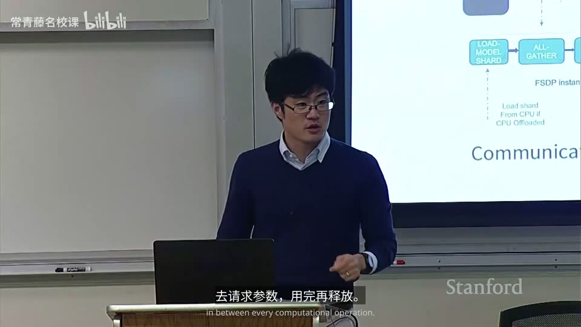 |
| 这就是你们做 all-gather 的原因吗？对，就是这样。 [【跳转到 22:15】](https://www.bilibili.com/video/BV11LEA6eEuj/?p=8&t=1335) | 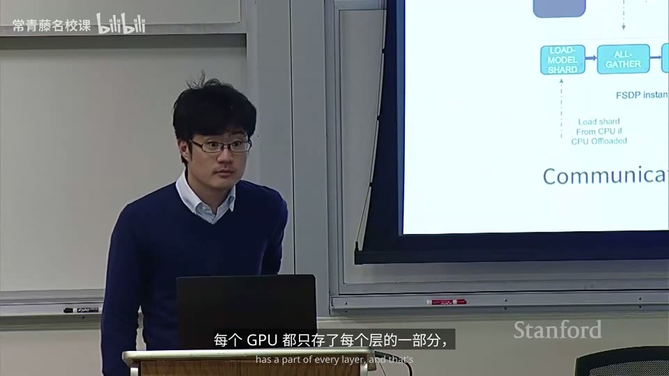 |
| 你看这张图：参数、梯度和优化器状态分散在不同的 GPU 上。 [【跳转到 22:19】](https://www.bilibili.com/video/BV11LEA6eEuj/?p=8&t=1339) | 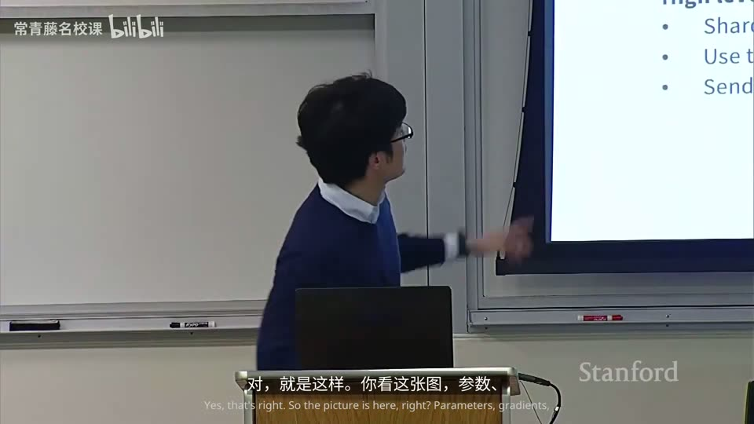 |
| 很好。哦对，那为什么通信开销也没有随层数成倍增加呢？ [【跳转到 22:23】](https://www.bilibili.com/video/BV11LEA6eEuj/?p=8&t=1343) | 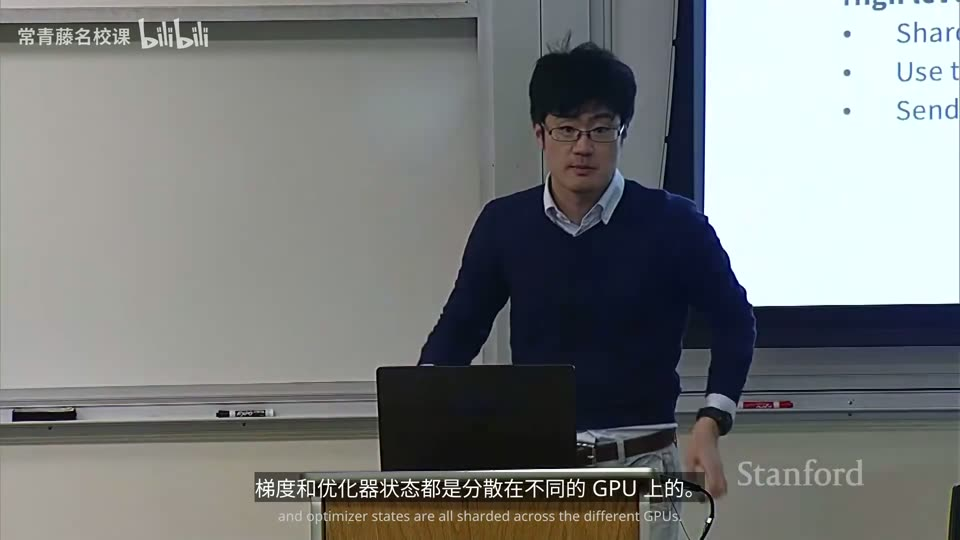 |
| 因为计算量会随层数成倍增加。 [【跳转到 22:27】](https://www.bilibili.com/video/BV11LEA6eEuj/?p=8&t=1347) | 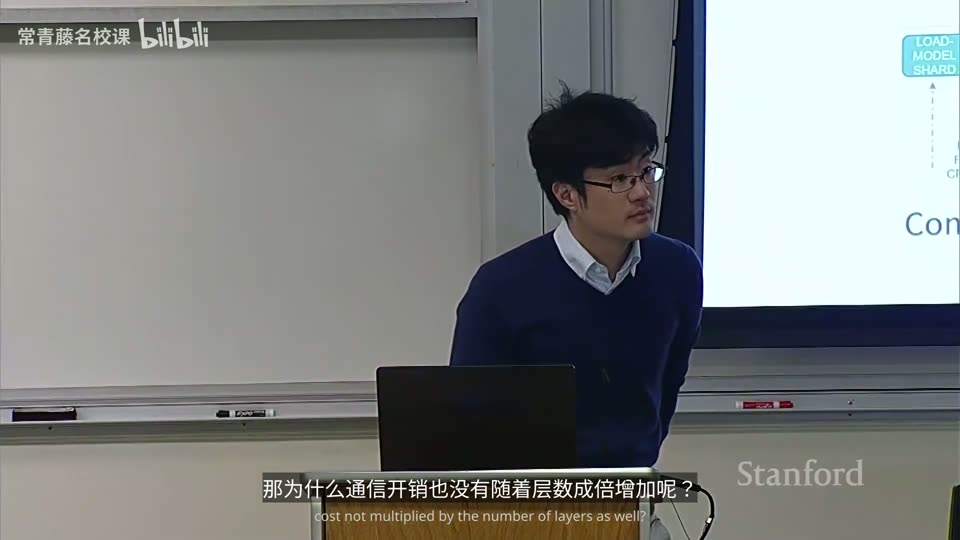 |
| 不过每一块通信的数据量其实更小，对吧？ [【跳转到 22:31】](https://www.bilibili.com/video/BV11LEA6eEuj/?p=8&t=1351) | 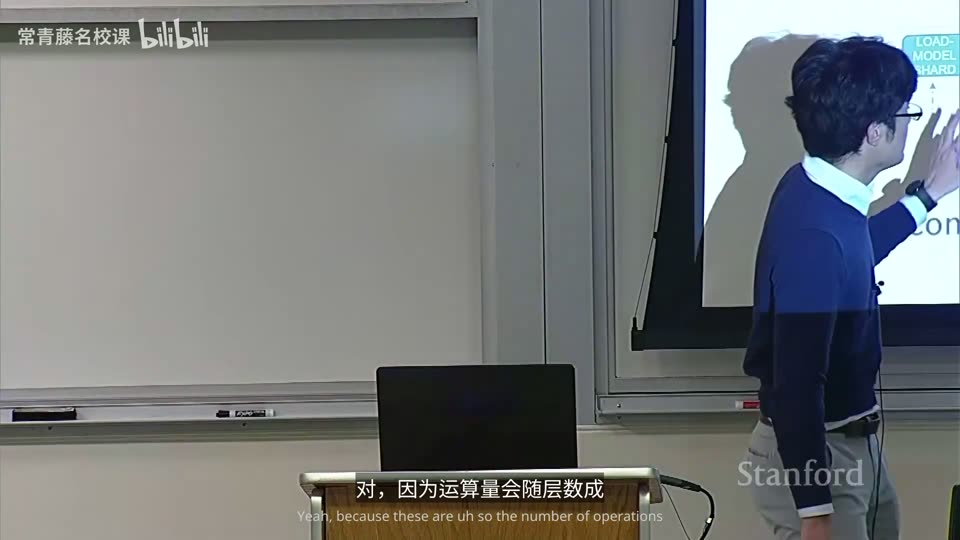 |
| 毕竟这只是某个小的矩阵乘法之类的东西，而不是 [【跳转到 22:35】](https://www.bilibili.com/video/BV11LEA6eEuj/?p=8&t=1355) | 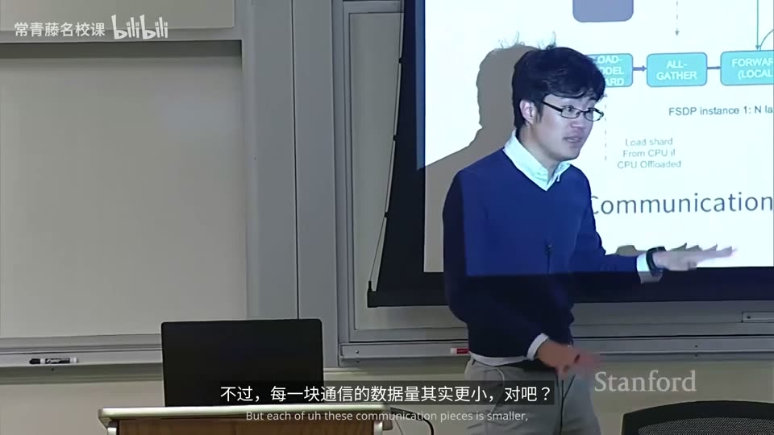 |
| 要拿整个网络去做 all-reduce 的大开销作对比。所以从某种意义上说， [【跳转到 22:39】](https://www.bilibili.com/video/BV11LEA6eEuj/?p=8&t=1359) | 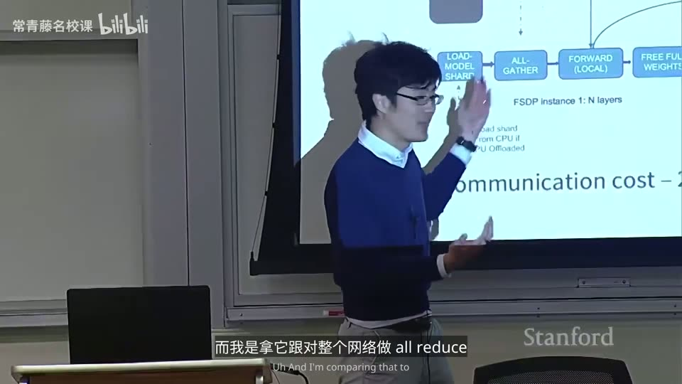 |
| 这些开销都会累加起来。对，很好。嗯，好的。 [【跳转到 22:43】](https://www.bilibili.com/video/BV11LEA6eEuj/?p=8&t=1363) | 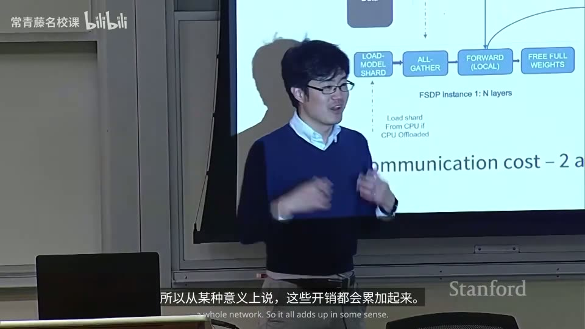 |
| 所以实际应用中，你看比如 1000 张 GPU 能装下的最大模型—— [【跳转到 22:47】](https://www.bilibili.com/video/BV11LEA6eEuj/?p=8&t=1367) | 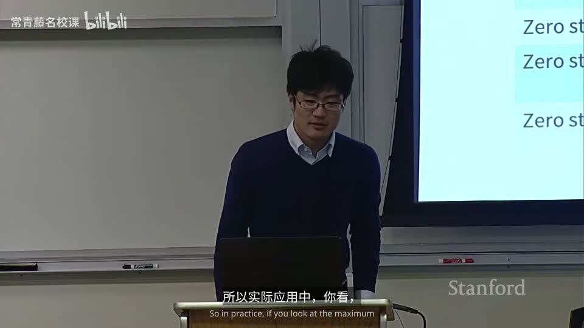 |
| 如果用朴素方法，连 70 亿参数的模型都塞不下；但用 ZeRO 阶段三，现在就能塞进去 5000 亿参数这种规模的模型等等。所以说 FSDP 要装下这些大模型就轻松多了，它在节省内存方面带来的提升非常显著。 [【跳转到 22:51】](https://www.bilibili.com/video/BV11LEA6eEuj/?p=8&t=1371) | 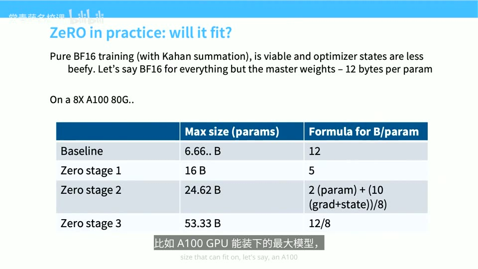 |
| 嗯，能切回上一张幻灯片吗？那么关于 A 和 B 这张图上的情况， [【跳转到 23:07】](https://www.bilibili.com/video/BV11LEA6eEuj/?p=8&t=1387) | 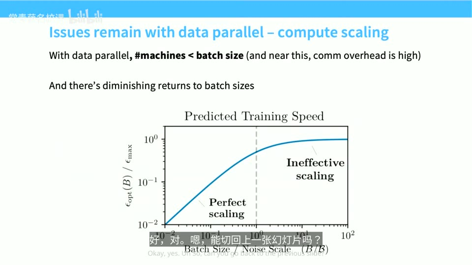 |
| 到了 H500 或 B200 上限制会是什么样？行，我可以先乘以 113 再除以 80；不过 H100 按 2/3 折算对应的就是这个数，后面依次类推——对，是线性的，对吧。也就是说不管换哪个加速器， [【跳转到 23:11】](https://www.bilibili.com/video/BV11LEA6eEuj/?p=8&t=1391) | 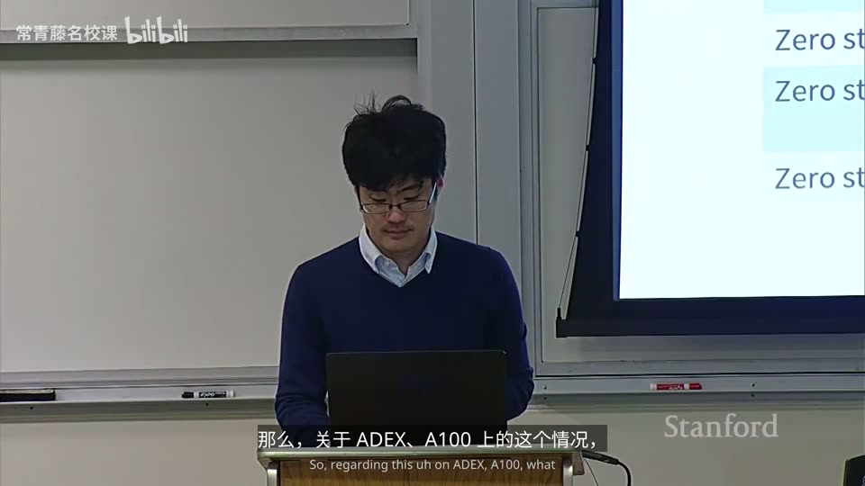 |
| 底层的数学关系其实没怎么变。嗯，好。我觉得 FSDP 设计得很干净， [【跳转到 23:25】](https://www.bilibili.com/video/BV11LEA6eEuj/?p=8&t=1405) | 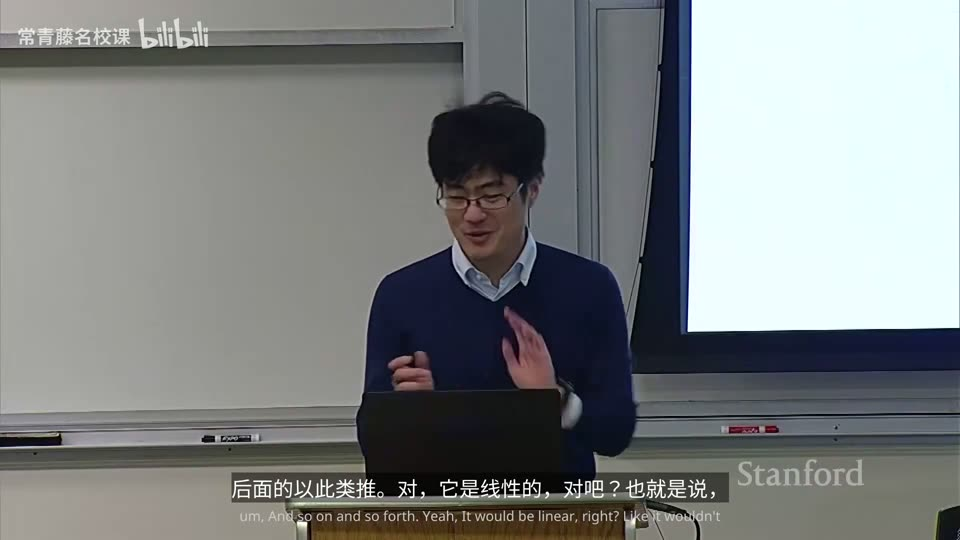 |
| 特别优雅，我个人挺喜欢它的。 [【跳转到 23:29】](https://www.bilibili.com/video/BV11LEA6eEuj/?p=8&t=1409) | 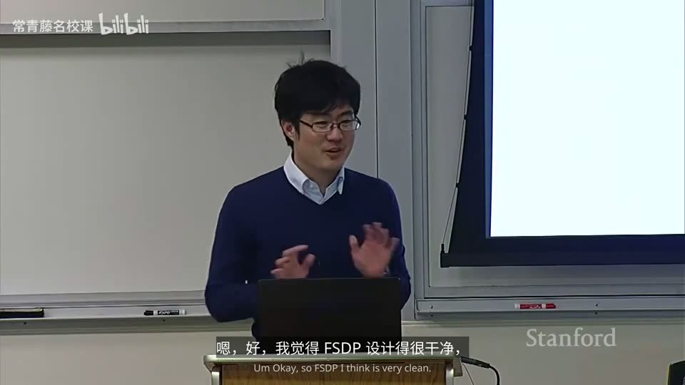 |
| 我真想讲到这里就下课，但不巧咱们还得接着往下走，去碰那些更复杂、更棘手的部分。咱们要这么做主要有两个原因。这里涉及并行化的一个关键概念：某种程度上，数据并行正在消耗一项重要资源——这项资源说白了就是批次大小（batch size）。如果你的批次大小是 8，那你最多就只能用 8 个加速器。你可能会想：既然咱们的加速器越来越多，干脆把批次大小设得越来越大不就行了？但这也行不通，因为到了某个临界点 [【跳转到 23:33】](https://www.bilibili.com/video/BV11LEA6eEuj/?p=8&t=1413) | 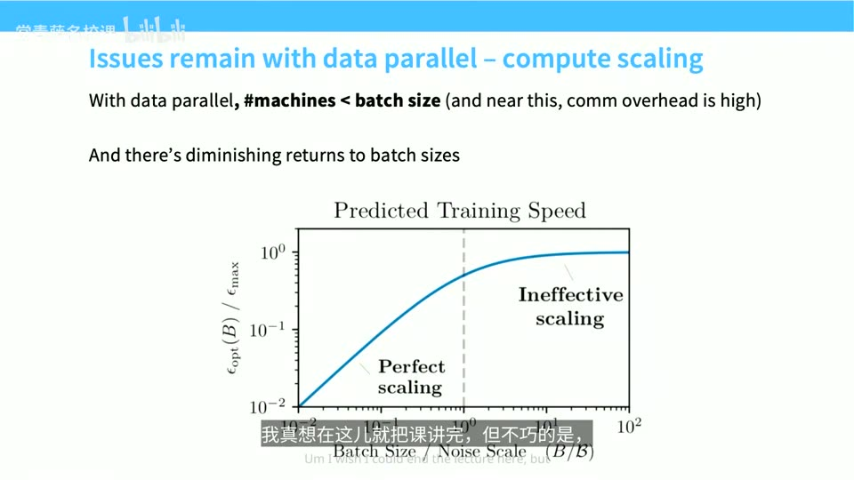 |
| 会出现所谓的「临界批次大小」（critical batch size）。简单来说，到了这个点，你增加批次带来的收益还不如多跑几步 SGD 划算。毕竟对单个样本你还是要各跑一次 SGD 更新，所以在小批次时多加点样本确实很有帮助，这和多跑几步 SGD 是一样的道理；但过了某个点收益就开始递减——批次无限大时，效果并不会比无限次单步更新更好。这就带来一个两难：咱们是想用小批次让 GPU 多歇会儿，还是用大批次但忍受优化上的一些损失？ [【跳转到 24:03】](https://www.bilibili.com/video/BV11LEA6eEuj/?p=8&t=1443) | 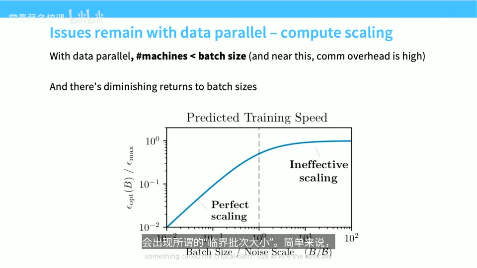 |
| 这确实挺难抉择的，对吧？还有个老问题就是内存：ZeRO 的阶段一和阶段二其实没法真正解决内存扩展问题。阶段二确实能把参数相关的内存切开，但不幸的是，激活值内存和其他内存占用它管不了。所以我们需要更细致的模型切分方法，才能真正突破这些限制，把内存占用进一步压下去。 [【跳转到 24:33】](https://www.bilibili.com/video/BV11LEA6eEuj/?p=8&t=1473) | 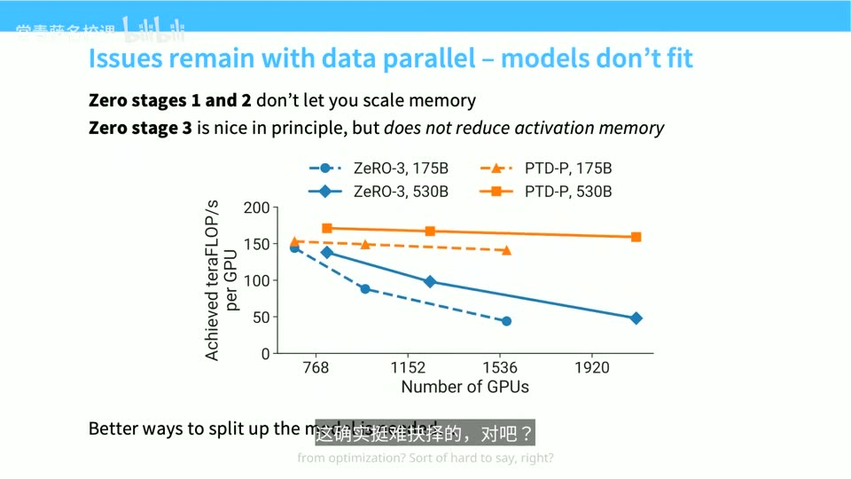 |
| 这就把我们带到了各种「模型并行」的思路上。模型并行其实就像 FSDP 那样把参数拆到各张 GPU 上，不过我觉得我们之前讲的和接下来要讲的有个重要的概念区别：现在我们要开始传激活值了。在 FSDP 里，参数虽然被切开，但某种意义上它只是个包装器——计算过程还是照常进行，我们只是在计算前把参数来回传一下。所以之前飞来飞去的是参数，而现在要改成来回传激活值。 [【跳转到 24:56】](https://www.bilibili.com/video/BV11LEA6eEuj/?p=8&t=1496) | 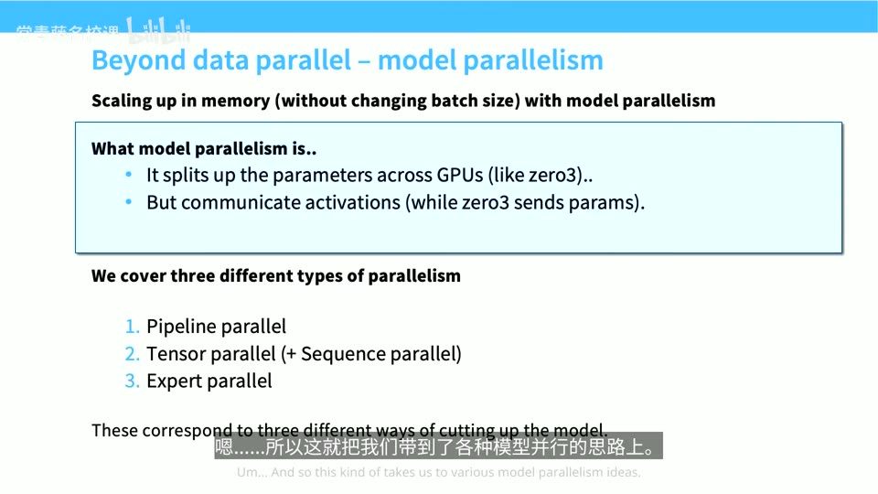 |
| 打个比方：假如一层在 GPU 0 上、下一层在 GPU 1 上，需要传的就是这两层中间的激活值。这就是最大不同。由此出现了流水线并行——把层切开；张量并行——把矩阵切开；还有专家并行——把专家分散到不同设备上。Percy 之前讲过张量并行，所以你应该已有大概概念。 [【跳转到 25:26】](https://www.bilibili.com/video/BV11LEA6eEuj/?p=8&t=1526) | 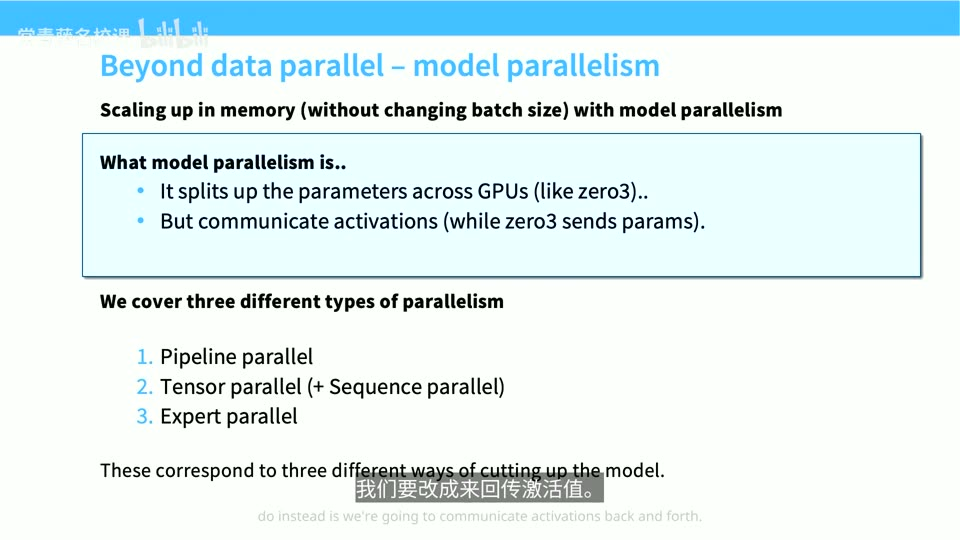 |
| 我先讲流水线并行，也就是逐层并行。我觉得它在概念上挺简单：我刚学并行的时候心想，哦，这多简单——把层切开放到不同 GPU 上，前向传播时把激活值往前传，反向传播时把部分梯度往回传，就好了。 [【跳转到 25:49】](https://www.bilibili.com/video/BV11LEA6eEuj/?p=8&t=1549) | 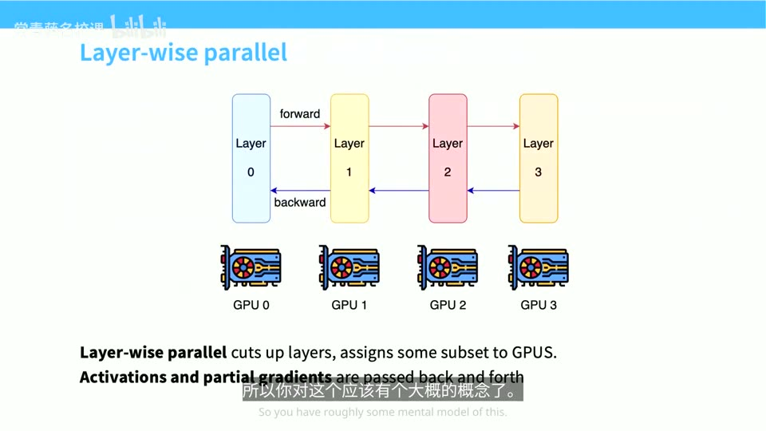 |
| 那如果我真这么干会发生什么？你会得到一张很难看的图，就像这样，特别令人沮丧：每个设备处理模型的 1/4，而计算是随时间变化的——时间从左往右走，不同的加速器就是不同的行。最底下第 0 号加速器（处理第一层）会先算一会儿，然后停下来，把计算任务交给第二个加速器；之后它就一直闲着，直到最后。整个过程基本上就是在来回传数据，同一时刻只有一张 GPU 在工作。 [【跳转到 26:08】](https://www.bilibili.com/video/BV11LEA6eEuj/?p=8&t=1568) | 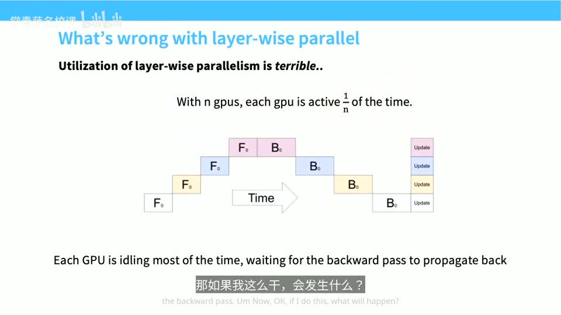 |
| 到了反向传播阶段也是一样，一次只有一张 GPU 在工作。所以大部分时间我的 GPU 都闲着，利用率真的非常低。 [【跳转到 26:38】](https://www.bilibili.com/video/BV11LEA6eEuj/?p=8&t=1598) |  |
| 对，这个空白段就叫「气泡」（bubble）——流水线里你什么都没做的那一段。解决办法其实就是做某种批处理，也就是流水线化：不再是简单地把一层做完再做下一层，而是让各部分元素接连进入流水线。看这张图里的例子：有 4 份微批次要处理，处理完一份紧接着处理下一份，处理完就把结果传给下一层，这样元素就能在层级间上下流动。当然这个方案合理，关键就看气泡时间和有效计算的比值。 [【跳转到 26:49】](https://www.bilibili.com/video/BV11LEA6eEuj/?p=8&t=1609) | 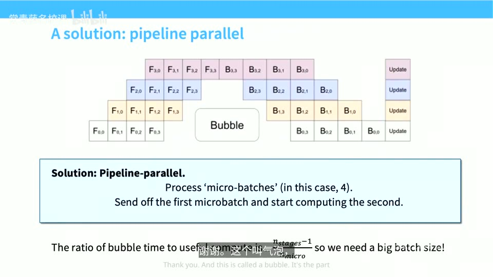 |
| 也就是某种意义上的利用率，它大致等于阶段数除以微批次数量。所以要把气泡时间压到接近零，就得用很大的批次大小——如果希望气泡按流水线阶段数（PP 度）的倒数下降，批次就得相应变大。这就是我之前说批次大小是一项稀缺资源的原因：现在可以把它换个用途，比如通过增加流水线并行度来减少流水线并行中的空闲时间。 [【跳转到 27:19】](https://www.bilibili.com/video/BV11LEA6eEuj/?p=8&t=1639) | 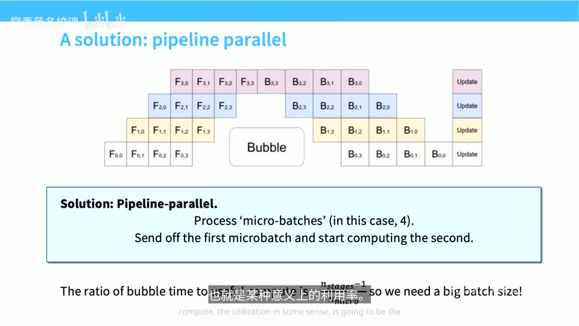 |
| 好。流水线并行确实挺让人头疼的——圈子里常说：并行化代码看着挺合理、大家也都看得懂，直到你真正去实现流水线并行。那咱们为什么还要用它？因为跟 DDP 比它能省内存（咱们把层切开了），还能跟数据并行结合起来用。另外它也是个很重要的概念：你看，在某些网络拓扑里你总得用流水线——因为跟 FSDP 以及其他方法比，它的通信特性非常好，只涉及激活值， [【跳转到 27:42】](https://www.bilibili.com/video/BV11LEA6eEuj/?p=8&t=1662) | 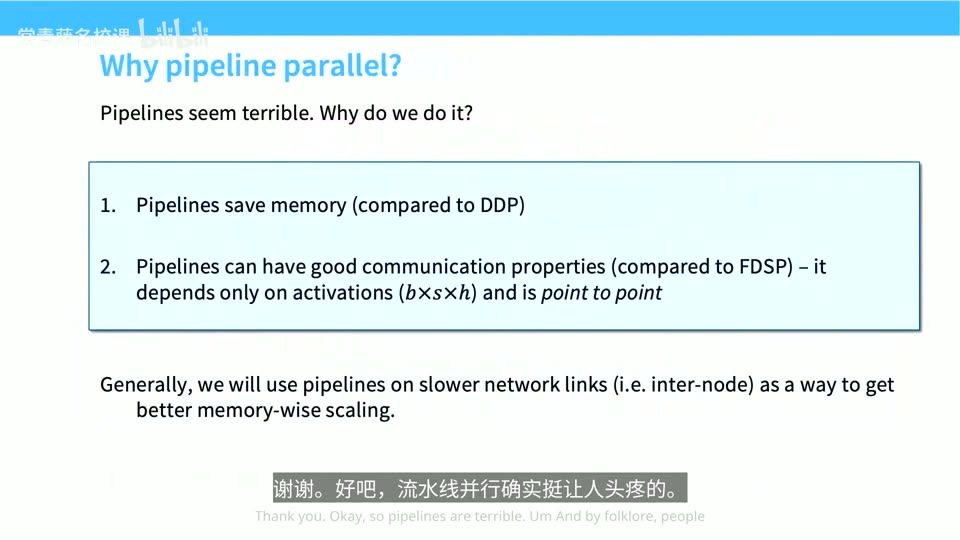 |
| 比如 B×S×H 这样量的点对点通信，一层和另一层之间传数据，不是全对全（all-to-all）的那种。怎么安排这些通信，直接决定它们能不能高效利用你的网络。所以实际操作中，我们会把流水线放在网速最慢的链路上：比如你有好几个数据中心或者几个通信较慢的 pod，就用流水线并行来跨它们做并行，因为这是通信效率最高的并行方式。我刚才说了， [【跳转到 28:12】](https://www.bilibili.com/video/BV11LEA6eEuj/?p=8&t=1692) | 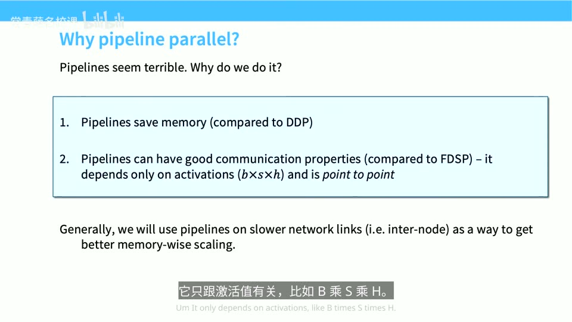 |
| 流水线的性能特别取决于批次大小。接下来我会多次提到这篇论文——NVIDIA 的 Megatron 论文，他们做了一组很漂亮的参数扫描，看在不同配置下利用率会发生什么变化。结论是：如果你用较大的 batch size，再配上较大的流水线并行度，利用率能提得很高，几乎跟完全不做流水线并行差不多。但问题是你得用大 batch size 才能维持住这个利用率，不然的话 [【跳转到 28:40】](https://www.bilibili.com/video/BV11LEA6eEuj/?p=8&t=1720) | 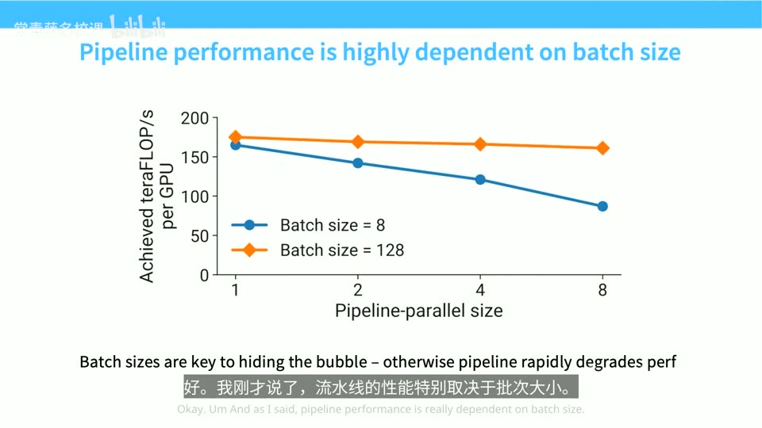 |
| 流水线并行会迅速拉低你的利用率和性能。我先停一下， [【跳转到 29:10】](https://www.bilibili.com/video/BV11LEA6eEuj/?p=8&t=1750) | 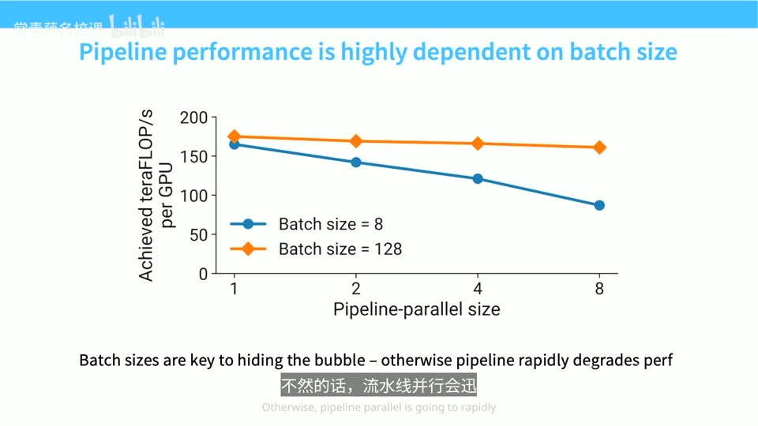 |
| 回答几个问题，因为下一张片子有点复杂。刚才说 FSDP 比流水线的通信开销更小—— [【跳转到 29:14】](https://www.bilibili.com/video/BV11LEA6eEuj/?p=8&t=1754) | 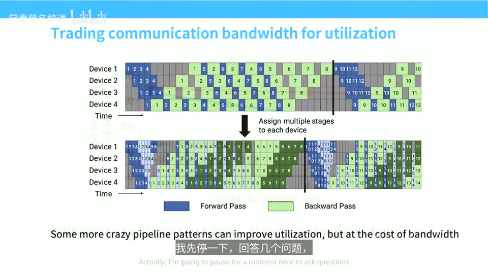 |
| 对，具体是怎么回事？ [【跳转到 29:18】](https://www.bilibili.com/video/BV11LEA6eEuj/?p=8&t=1758) | 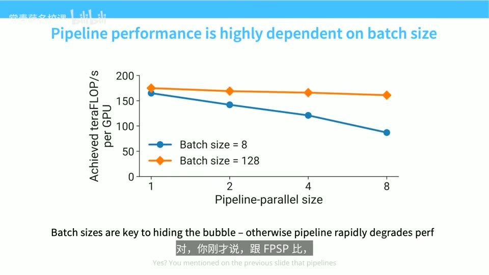 |
| 是因为要传输的数据量更少： [【跳转到 29:22】](https://www.bilibili.com/video/BV11LEA6eEuj/?p=8&t=1762) | 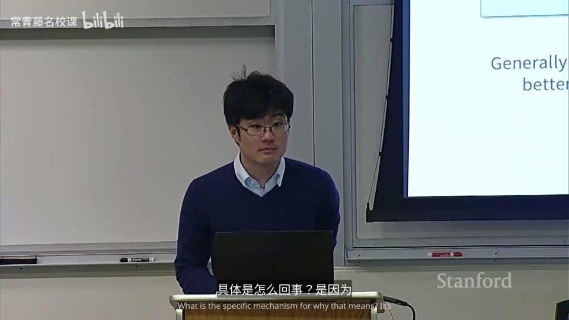 |
| 那个量是批次大小乘以序列长度 [【跳转到 29:26】](https://www.bilibili.com/video/BV11LEA6eEuj/?p=8&t=1766) | 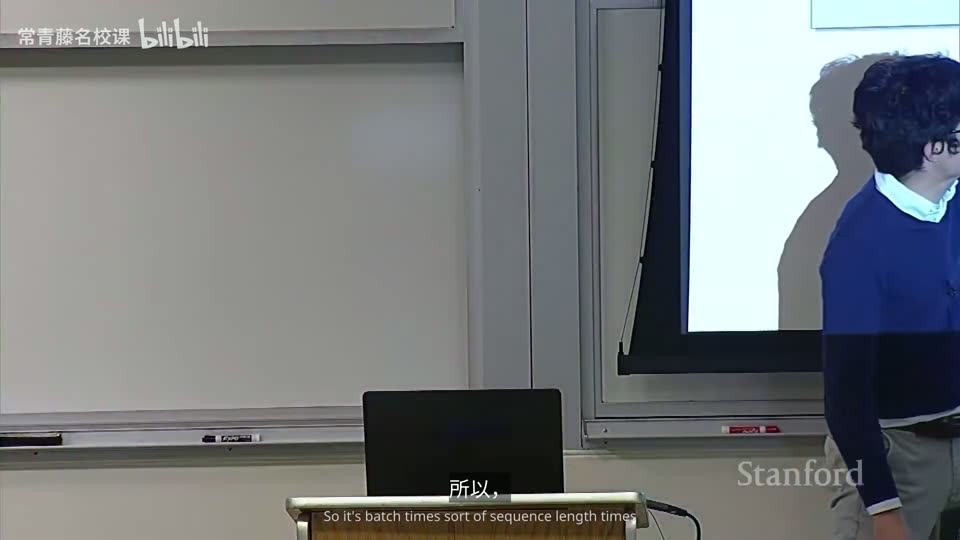 |
| 再乘以隐藏层维度；比起通信整个参数矩阵，这个数据量通常小得多，对吧。 [【跳转到 29:30】](https://www.bilibili.com/video/BV11LEA6eEuj/?p=8&t=1770) | 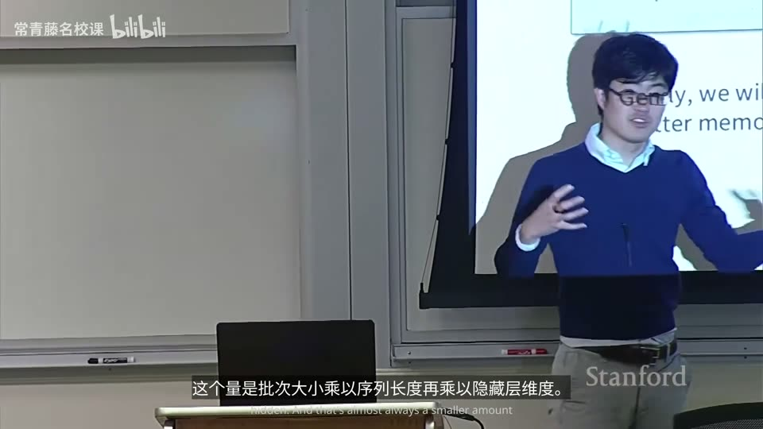 |
| 嗯，好。所以大家一直在想办法 [【跳转到 29:34】](https://www.bilibili.com/video/BV11LEA6eEuj/?p=8&t=1774) | 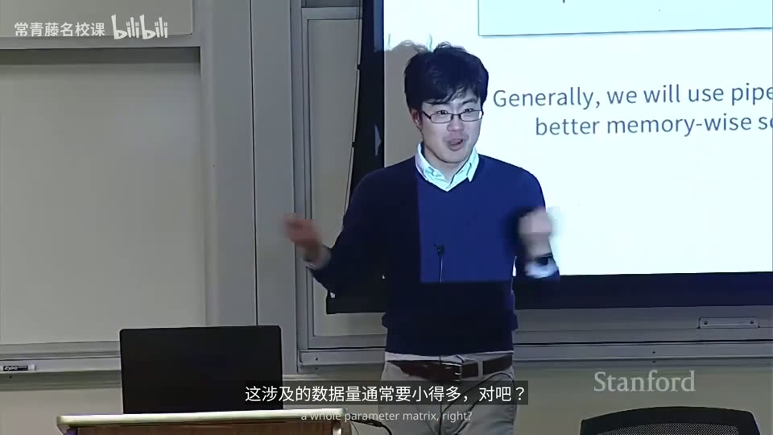 |
| 用更聪明的方式来减小流水线气泡的大小。你可以用一些巧妙的办法把不同层、不同微批次里正在做的各个阶段切分开，把前向传播和反向传播里的不同步骤穿插起来；通过更巧妙的调度安排，还能进一步把气泡压得更小。这张图来自 DeepSeek 的论文：你要是能把前向和反向计算的时机安排得特别巧妙， [【跳转到 29:38】](https://www.bilibili.com/video/BV11LEA6eEuj/?p=8&t=1778) | 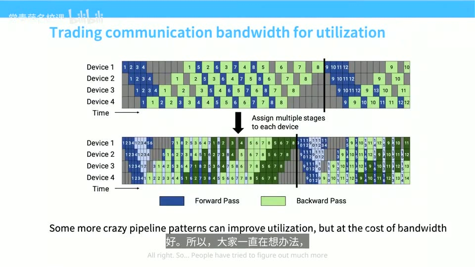 |
| 气泡大小就能再优化一点。不过我觉得还有个更巧妙的做法，叫 [【跳转到 30:08】](https://www.bilibili.com/video/BV11LEA6eEuj/?p=8&t=1808) | 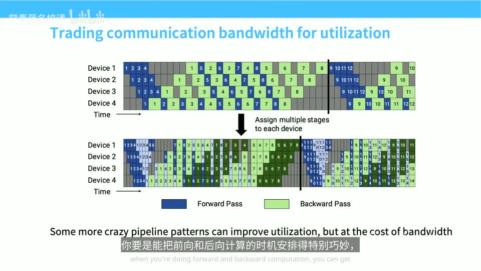 |
| 「零气泡流水线」（zero-bubble pipeline）。它其实不完全是调度的问题，而是要仔细琢磨反向传播的结构。在反向传播里，其实有两件事是必须要做的。你想想看：计算在计算图里是往回走的，这时你要做两件事——第一件，把那些偏导数顺着计算图往下传。回想一下，反向传播就是从最后面开始把这些偏导数往回传，这步必须做；但你还得算当前权重的梯度。 [【跳转到 30:12】](https://www.bilibili.com/video/BV11LEA6eEuj/?p=8&t=1812) |  |
| 所以在计算图的每个节点上，你要做两件事：往回传播偏导数，以及算出权重的导数。这里的重点在于：这两件事里，有一件对流水线特别关键，另一件则什么时候做都行。把偏导数往回传很关键，因为信号没传回去，下一阶段就没法干活；而相对权重的导数，可以说是这个图里的一个叶节点，随时都能做。所以现在比较巧妙的做法是 [【跳转到 30:42】](https://www.bilibili.com/video/BV11LEA6eEuj/?p=8&t=1842) |  |
| 把这两部分拆开：这些 B 是反向传播的偏导数传递，要尽可能快地算出来，这部分现做；这些 W 负责计算权重的导数，可以往后放，等计算出现空隙的时候再处理。这样一来，你基本上就能把流水线几乎完全填满。零气泡流水线技术非常复杂——或者说比大家平时想处理的要复杂得多——但它能让你几乎彻底解决流水线气泡问题，具体取决于 W 和 B 各自的工作负载等等。 [【跳转到 31:12】](https://www.bilibili.com/video/BV11LEA6eEuj/?p=8&t=1872) | 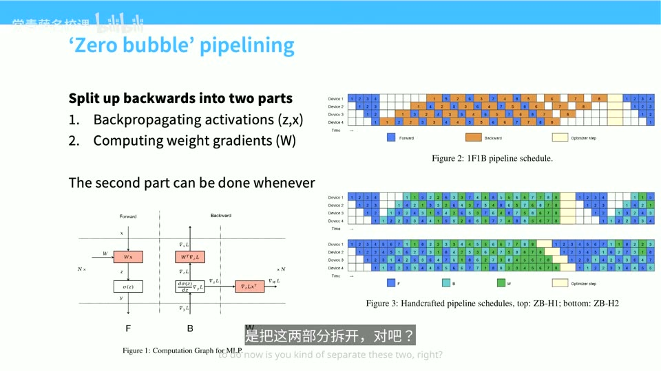 |
| 好了，不过看完这个我就在想：哇，这招真聪明， [【跳转到 31:42】](https://www.bilibili.com/video/BV11LEA6eEuj/?p=8&t=1902) | 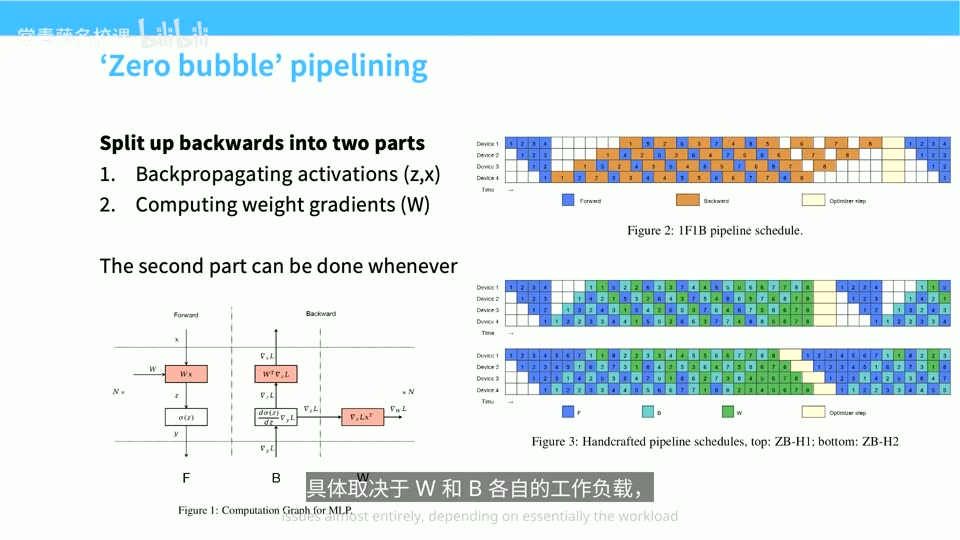 |
| 你能用系统做出这么巧妙的东西。好，刚才讲的就是流水线并行，关于这部分有什么疑问吗？好，谢谢。咱们可以做一个很自然的类比，或者找类似的对应关系：流水线并行就像是沿着「深度」方向切分——你有一个深度维度，沿着这个维度把网络切开。但我们有两种扩展方式：既有深度轴，也有宽度轴。那如果沿着宽度来切分模型呢？这就是 Percy 之前讲过的张量并行。其实这是个很简单的想法： [【跳转到 31:51】](https://www.bilibili.com/video/BV11LEA6eEuj/?p=8&t=1911) | 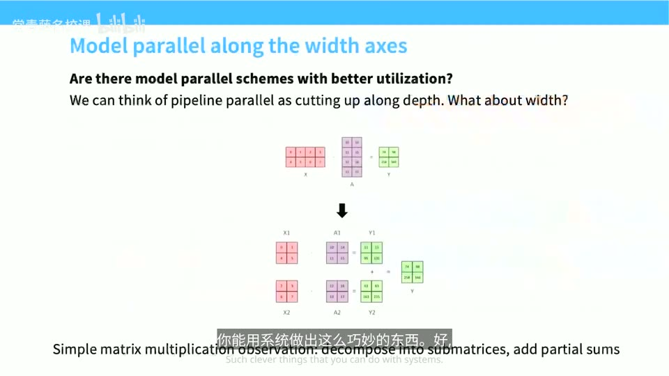 |
| 把矩阵乘法拆成更小的矩阵乘法，最后再把算出来的部分和加回去。这跟分块矩阵乘法（tiling）的思路一样， [【跳转到 32:21】](https://www.bilibili.com/video/BV11LEA6eEuj/?p=8&t=1941) | 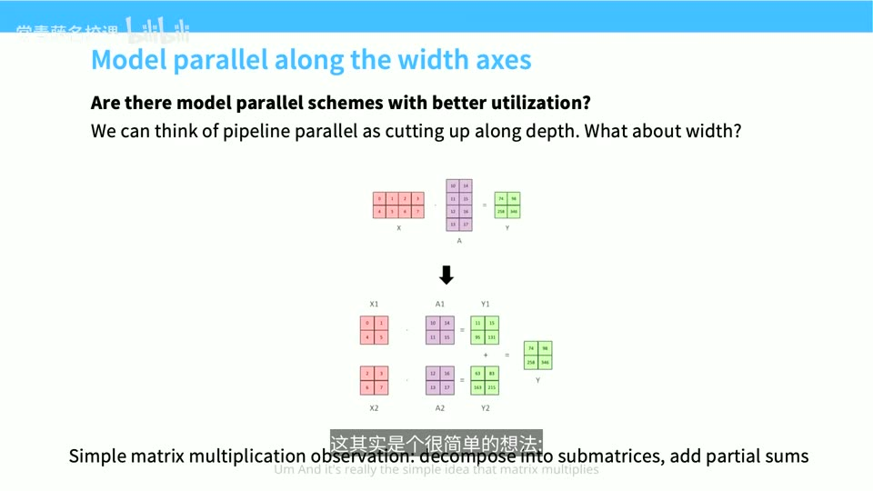 |
| 核心原语只不过是反复出现了很多很多次。那么实际操作中这具体是怎么个流程呢？咱们来看这个矩阵乘法运算：通常输入 X 从幻灯片最右边进来，接着拿矩阵 A 做乘法，先过一遍 GELU 非线性激活，再和 B 相乘做降维投影，最后输出 Z——这是典型的串行计算。但在张量并行中，我会把 A 切成两半、B 也切成两半，并行跑计算，最后再把结果汇总起来。 [【跳转到 32:29】](https://www.bilibili.com/video/BV11LEA6eEuj/?p=8&t=1949) | 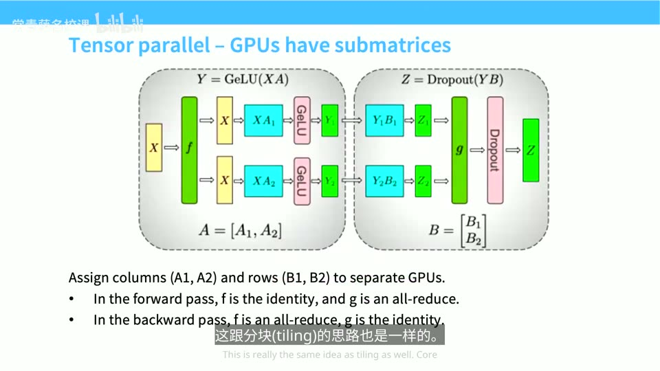 |
| 这里有个关键点：前向传播和反向传播之间存在一种对偶关系。前向传播时，我对 X 做的是复制两份然后往前跑计算，所以 F 是恒等函数；等并行计算结束，G 函数就是一个 all-reduce，把结果聚合回来。反向传播计算梯度时这个过程会反过来：G 变成恒等函数，因为偏导数是直接反向传回来的；而 F 就变成把那些部分梯度加起来，才能得到本模块开头的偏导数。 [【跳转到 32:59】](https://www.bilibili.com/video/BV11LEA6eEuj/?p=8&t=1979) | 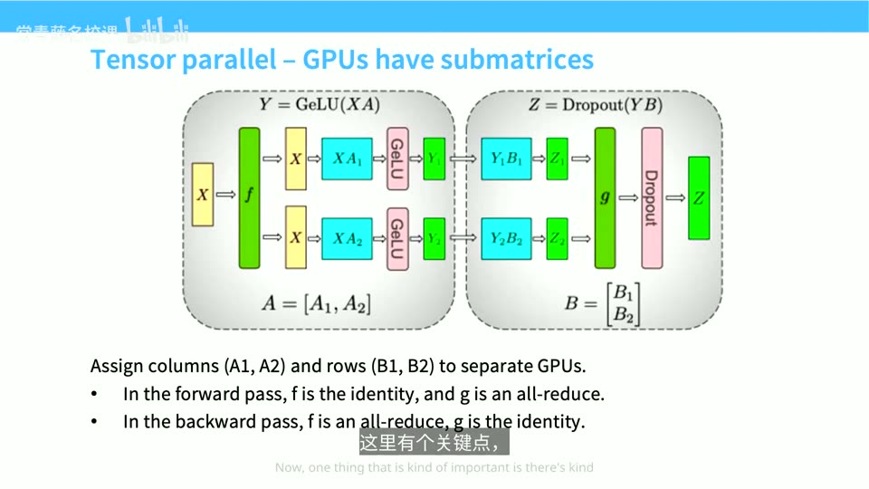 |
| 所以前向和反向会翻转过来。如果你要写张量并行，这种对偶性还挺重要的。 [【跳转到 33:29】](https://www.bilibili.com/video/BV11LEA6eEuj/?p=8&t=2009) | 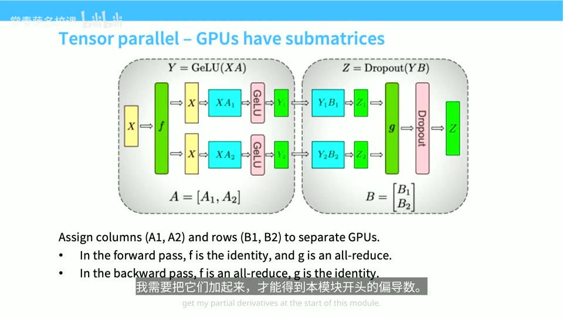 |
| 你可能已经注意到了：拆分内容时，有些切法是按列来的。按列的张量并行发生在输入端——MLP 的输入投影和注意力的投影在每个 Transformer 块里都按列切分；然后在相应的第二阶段是按行切分，也就是 MLP 的下投影和注意力的输出部分。而像层归一化、非线性激活，或者 MoE 里的路由器 [【跳转到 33:34】](https://www.bilibili.com/video/BV11LEA6eEuj/?p=8&t=2014) | 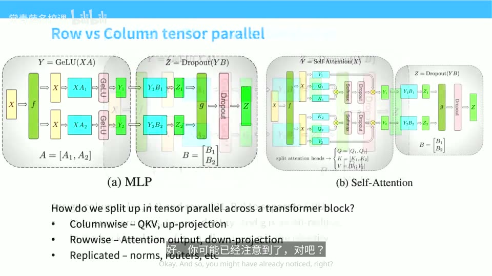 |
| 这些比较小的层，都会在每台机器上完整复制一份。咱们没必要去折腾拆分它们，那些额外开销不值得。 [【跳转到 34:04】](https://www.bilibili.com/video/BV11LEA6eEuj/?p=8&t=2044) | 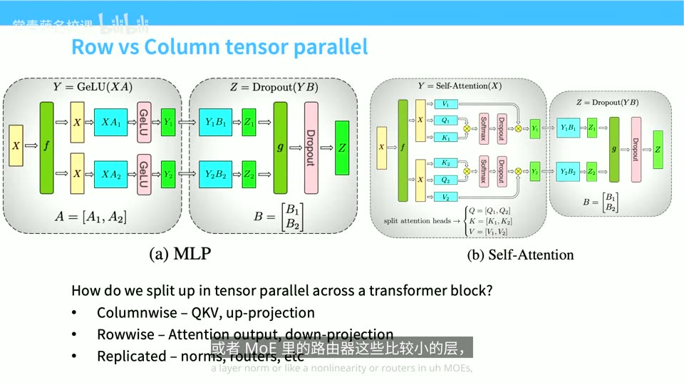 |
| 谢谢。那咱们什么时候用张量并行呢？你看，张量并行特别吃通信。你每次做矩阵乘法 [【跳转到 34:12】](https://www.bilibili.com/video/BV11LEA6eEuj/?p=8&t=2052) |  |
| 都得搞点通信操作，对吧：反向传播时这里得做一个 all-reduce， [【跳转到 34:19】](https://www.bilibili.com/video/BV11LEA6eEuj/?p=8&t=2059) | 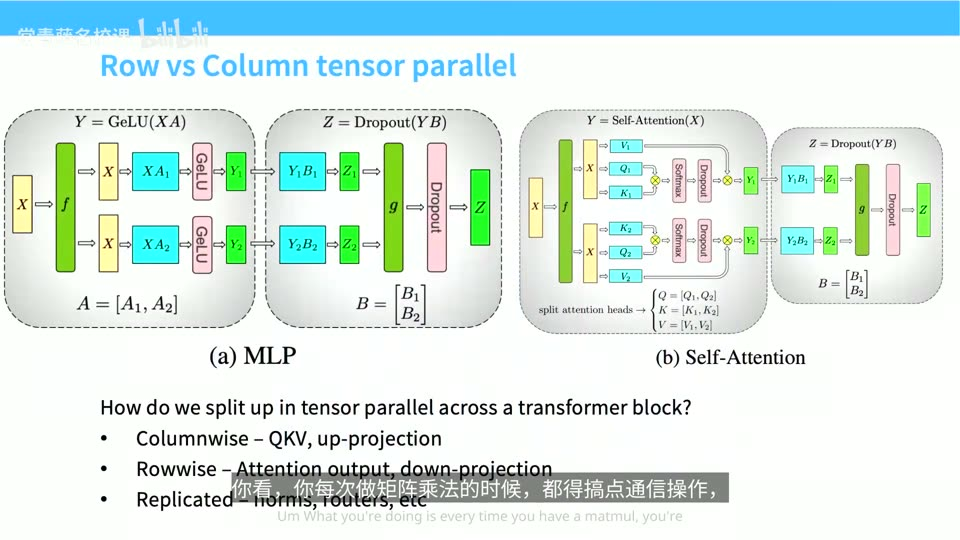 |
| 前向传播时在 all-gather 操作里也得通信。这些操作的数据量跟激活值差不多，而且执行得特别频繁，所以非常耗通信带宽。咱们一般只在节点内部做张量并行：对 GPU 来说，8 张 GPU 通常在一个机箱里通过 NVLink 紧密连在一起，所以最多到 8 路时你可能还愿意搞张量并行；一旦超过这个数，就得跨机箱通信了，节点间互联的速度要慢得多，性能会大幅下跌。所以记住：张量并行非常吃通信带宽，一般把它用在手头最快的互联网络上。 [【跳转到 34:31】](https://www.bilibili.com/video/BV11LEA6eEuj/?p=8&t=2071) | 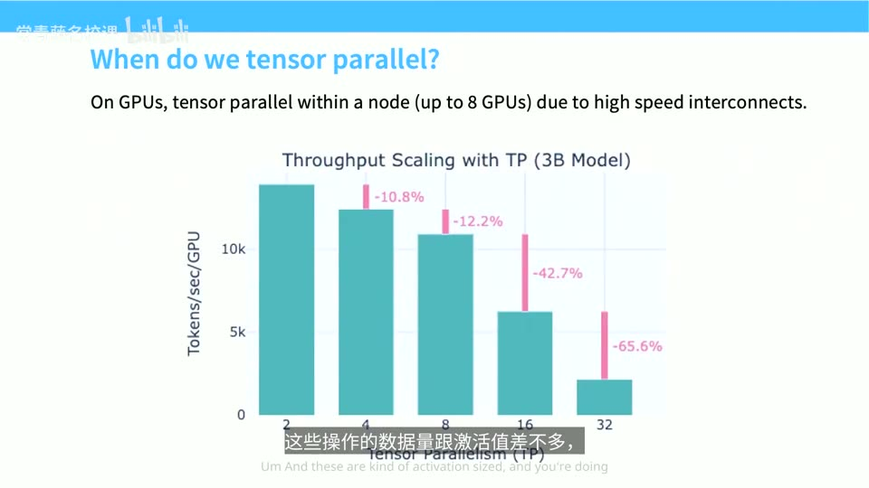 |
| 接下来我想回到之前提到的 TPU 话题。记住，对 TPU 来说，不存在「前 8 张 GPU 很快、跨机器就慢」的区别——它就是一个大的网格结构。所以 TPU 团队常强调的一个优势是：他们能很好地支持张量并行，相比 GPU 能支持大得多的规模，因为在这种网格上，高度规则的通信模式能提供高带宽。 [【跳转到 35:01】](https://www.bilibili.com/video/BV11LEA6eEuj/?p=8&t=2101) | 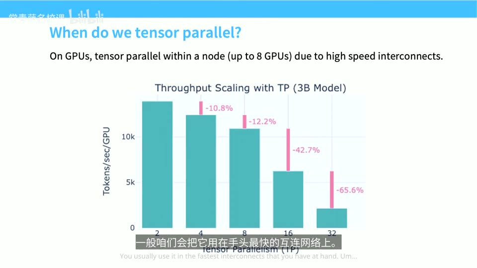 |
| 所以用 TPU 还是 GPU 做并行，差别很大：你分配给张量并行和流水线并行的比例 [【跳转到 35:31】](https://www.bilibili.com/video/BV11LEA6eEuj/?p=8&t=2131) | 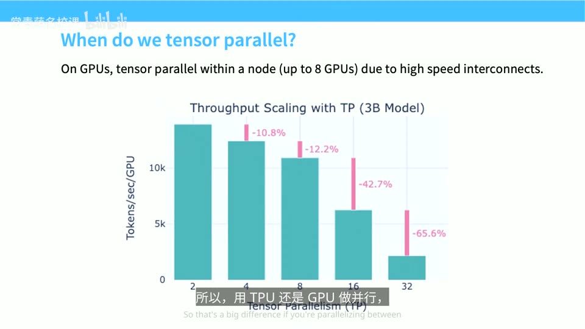 |
| 实际上会截然不同。那么怎么比较这两种方案呢？它们都属于模型切分策略，都能帮咱们节省参数和激活值的开销。张量并行的好处是通常不会出现流水线气泡——只要网络够快，就能实现充分占用；它的复杂度也低，就是把一些矩阵乘法切分一下。但缺点是通信量会大很多：以前做的是 B×S×H 的点对点通信， [【跳转到 35:35】](https://www.bilibili.com/video/BV11LEA6eEuj/?p=8&t=2135) | 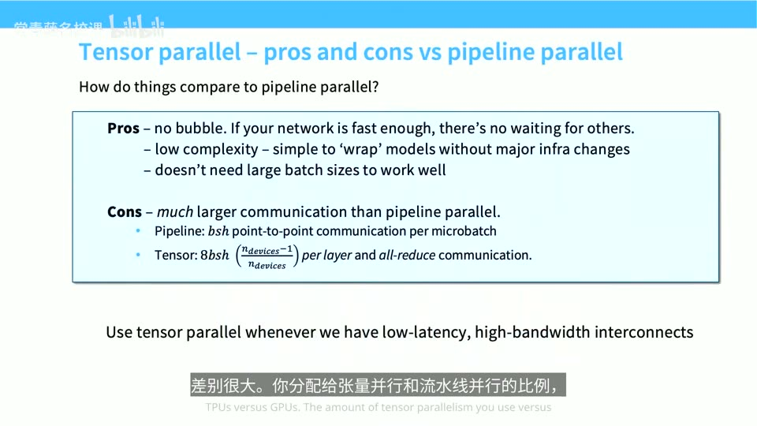 |
| 现在要做的是大约 8×B×S×H 的一次 all-reduce 通信——不只是点对点，还得全对全。所以只要互联速度够快，张量并行就是个很好的方案；其他情况下，咱们大概就得用流水线并行了。 [【跳转到 36:05】](https://www.bilibili.com/video/BV11LEA6eEuj/?p=8&t=2165) | 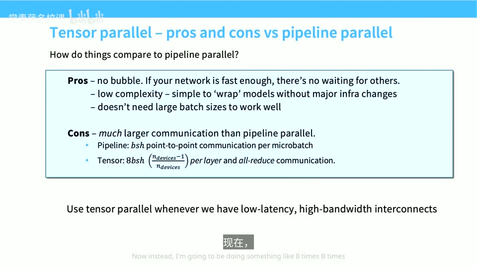 |
| 好，最后我想聊聊内存使用，也就是得再仔细琢磨一下内存。我觉得在深度学习和语言建模里，对内存最天真的理解就是：内存不就是存参数吗？就像图里这块绿色区域，你觉得只要存下参数所需的那些位就行了，完事儿。我之前提过优化器状态，这挺重要，就是图里这个黄色方块。但要是你看这张用某个 PyTorch 分析器测出来的实际内存占用，你会发现事情没那么简单： [【跳转到 36:19】](https://www.bilibili.com/video/BV11LEA6eEuj/?p=8&t=2179) | 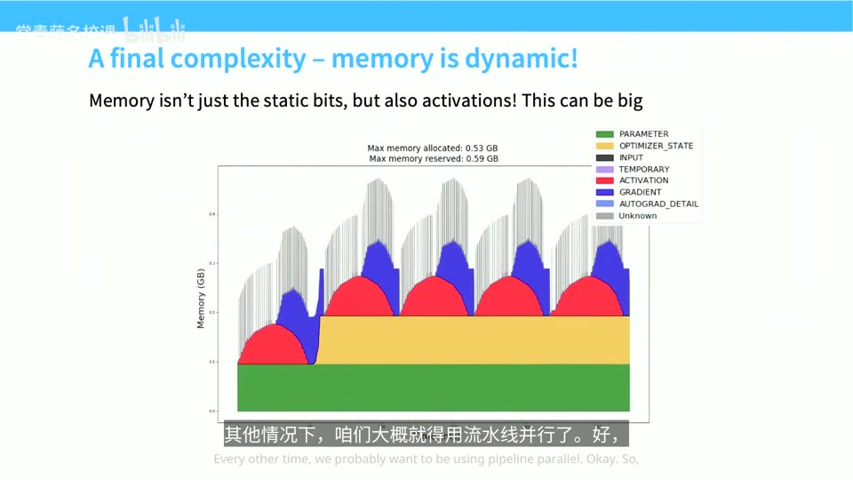 |
| 现啊——计算过程中还得留出不少动态内存，要存下所有激活值，就是图上这些大红峰值。而且算梯度的时候，反向传播阶段也得把它们存着。所以内存占用的峰值往往出现在激活值最大的那个点之后不久：比如当你开始反向传播时，你仍需计算并保存大量激活值，这往往就是内存占用的峰值时刻。所以为了降低内存占用，也许我们得处理这个巨大的红色隆起——也就是激活值。 [【跳转到 36:49】](https://www.bilibili.com/video/BV11LEA6eEuj/?p=8&t=2209) | 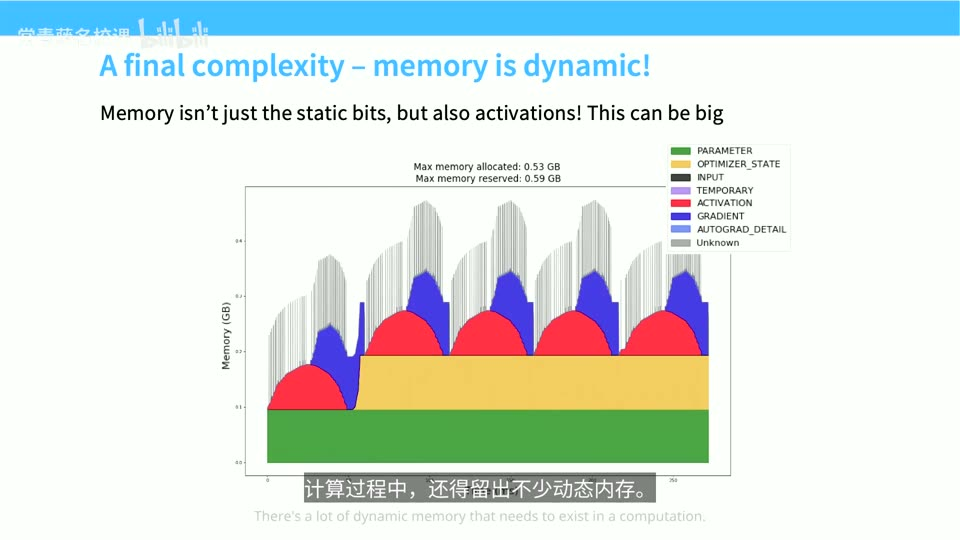 |
| 如果你去看语言模型更现代的一些工作负载：随着参数量越来越大——先别管「标准：当前工作」那一列，我稍后会讲到——只看图里基线的那几列，对中等长度的序列，随着模型越来越大，激活值占用的内存往往会远远超过参数所需的内存。所以任何内存优化策略都必须充分考虑激活值才能真正发挥作用，比如我们不能只处理参数内存，那远远不够。谢谢。 [【跳转到 37:18】](https://www.bilibili.com/video/BV11LEA6eEuj/?p=8&t=2238) |  |
| 那么，如果我们把所有东西都存下来——这其实是个不错的起点，或者说一条通用经验法则：所需存储的激活量大概是 24×S×B×H，其中 S 是序列长度、B 是批次大小、H 是隐藏层维度；再加上 5×a×S÷H，其中 a 是注意力头数。也就是说，24·sbh，再加 5·a·s²/h。 [【跳转到 37:47】](https://www.bilibili.com/video/BV11LEA6eEuj/?p=8&t=2267) | 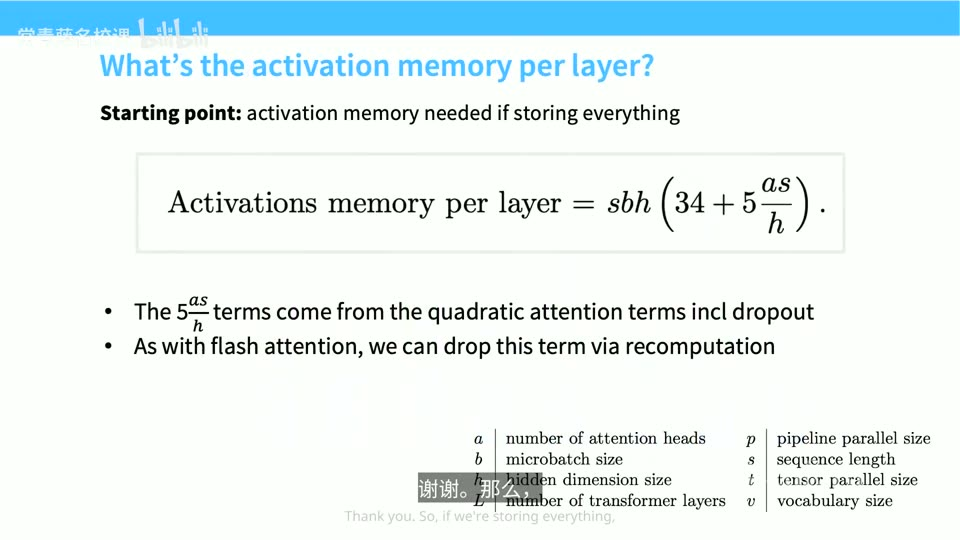 |
| 这个 SBH 依赖关系是根本性的：因为我们预期要为序列中的每个元素存一些内容、为每个批次元素存一些内容、也要为隐藏层维度的每一维存一些内容。所以在我们尝试用不同方法减少激活内存、核算激活内存总量的过程中，会反复看到这个 SBH 项。如果你好奇那个看起来有点怪的 5·a·s²/h 是怎么来的：它来自二次方的注意力项，包括 dropout；而如果使用 FlashAttention，就可以通过重计算把这一项省掉。 [【跳转到 38:17】](https://www.bilibili.com/video/BV11LEA6eEuj/?p=8&t=2297) | 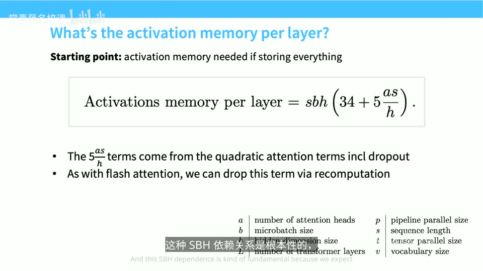 |
| 谢谢。那如果咱们用张量并行呢？ [【跳转到 38:47】](https://www.bilibili.com/video/BV11LEA6eEuj/?p=8&t=2327) | 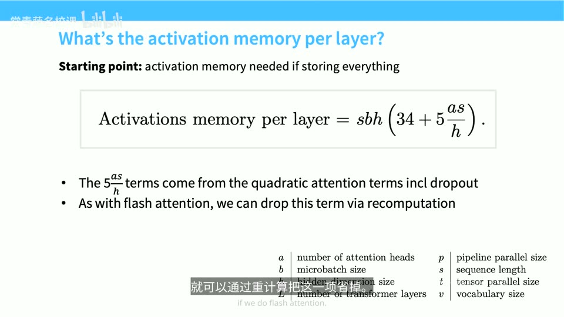 |
| 之前讲模型并行时我跟你们说过，咱们能大幅降低激活值的显存开销。咱们来看看具体会发生什么：张量并行会把注意力机制和 MLP 里的矩阵乘法拆开。具体是哪些部分呢？我之前提过 34·sbh 这个数：其中 24·sbh 是 MLP 和注意力的矩阵乘法部分，那 5·a·s²/h 就是注意力头这部分——就是这里的第二项。现在我可以除以张量并行度 T，把它降下来，这挺不错的。 [【跳转到 38:51】](https://www.bilibili.com/video/BV11LEA6eEuj/?p=8&t=2331) | 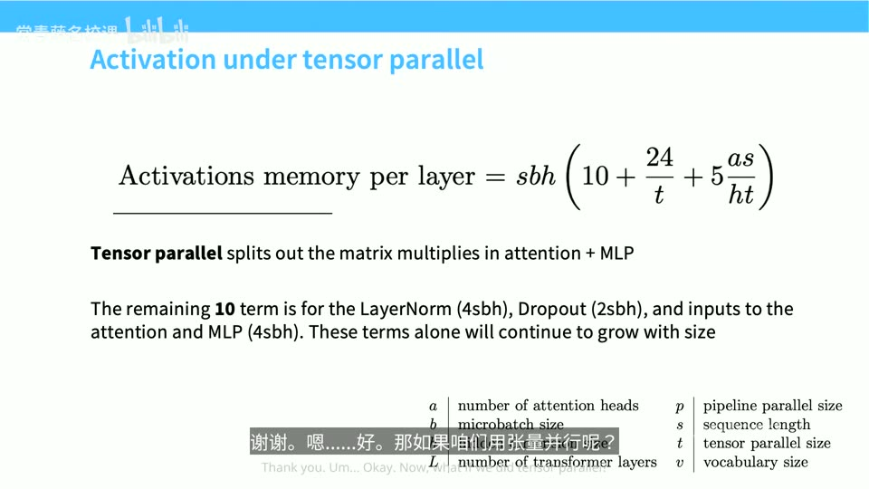 |
| 因为我搞定了大部分显存，让它能随张量并行度 T 线性扩展，这很好。不过事实证明你还会做一些别的操作：比如层归一化或者 dropout，你得把注意力机制和 MLP 的输入存下来——因为每一层的输入都要存成残差，反向传播的时候才能用。不幸的是，这些输入并不会因为张量并行而减少：张量并行没法拆分层归一化，这些模块的激活值也就没法拆分。这就挺让人头疼的：你本来以为像 GPT 那样用上千块 GPU 做张量并行 [【跳转到 39:21】](https://www.bilibili.com/video/BV11LEA6eEuj/?p=8&t=2361) |  |
| 就能把激活值大幅降下来，但现实很骨感——你这么做还是会多付出 10 倍的 SBH 代价。 [【跳转到 39:51】](https://www.bilibili.com/video/BV11LEA6eEuj/?p=8&t=2391) | 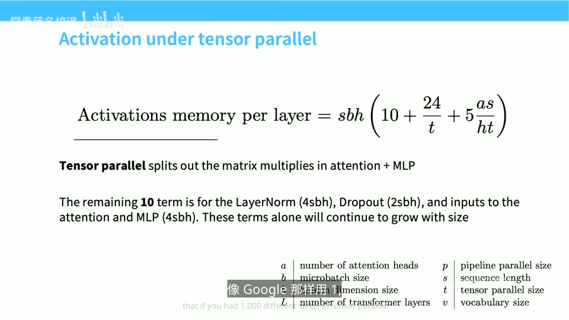 |
| 所以通常跟张量并行搭配使用的最后一个手段就是「序列并行」（sequence parallelism）。这名字起得特别有误导性——其实有个叫「上下文并行」（context parallelism）的概念用在这个名字上更合适。序列并行的核心思路是：处理剩下的那些项，也就是 10·sbh——像层归一化、dropout 这些项计算量都不大，咱们把它们拆开，但不是沿着隐藏轴，而是沿着序列轴拆。这样每次需要用到这些项时， [【跳转到 40:00】](https://www.bilibili.com/video/BV11LEA6eEuj/?p=8&t=2400) |  |
| 在操作之前都得先做 all-gather 和 reduce-scatter。你仔细想想，这其实跟 FSDP 很像：我们有个需要用到的东西——某些时候需要激活值，前向传播要算它们，反向传播求导时也得用；但现在用不上它们，所以先沿序列轴拆开来存，等需要的时候再生成出来。这在概念上和 FSDP 的思路很像：先按分片格式存着，等需要的时候再收集起来。就像我刚才提到的， [【跳转到 40:30】](https://www.bilibili.com/video/BV11LEA6eEuj/?p=8&t=2430) | 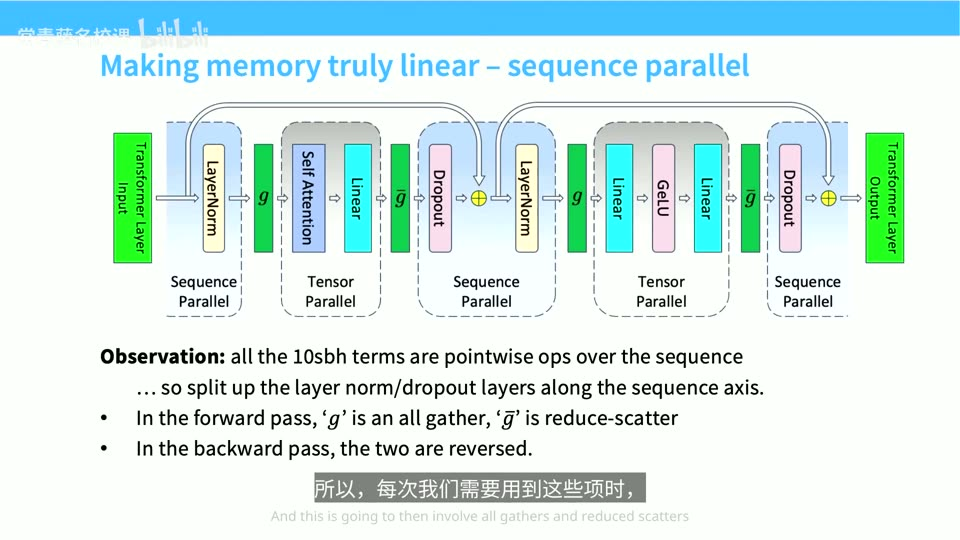 |
| 这里有个对偶关系：前向传播时 G 走 all-gather、G 上走 reduce-scatter；到了反向传播，G 和 G 上的 all-gather 和 reduce-scatter 就互换位置。 [【跳转到 41:00】](https://www.bilibili.com/video/BV11LEA6eEuj/?p=8&t=2460) | 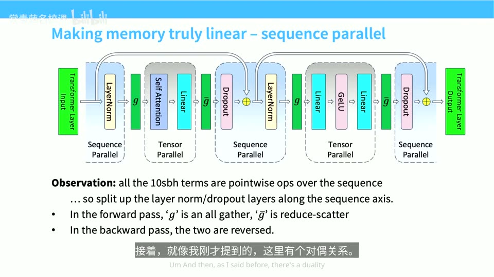 |
| 那咱们现在这么算，结果会怎样？回想一下：没有并行时，第一部分我说过激活内存是 34·sbh，其中包含了注意力头的部分；用了张量并行，MLP 和注意力部分都能除以 T 来分摊，但我手里那些逐元素运算就不行了；要是用序列并行，我也按加速器分了片——只不过是在序列轴上分——这样内存就变成完全线性了；要是做激活重计算，第二项（5·a·s²/h）我甚至能整个省掉，毕竟那只是为了存 softmax 占用的空间。 [【跳转到 41:14】](https://www.bilibili.com/video/BV11LEA6eEuj/?p=8&t=2474) | 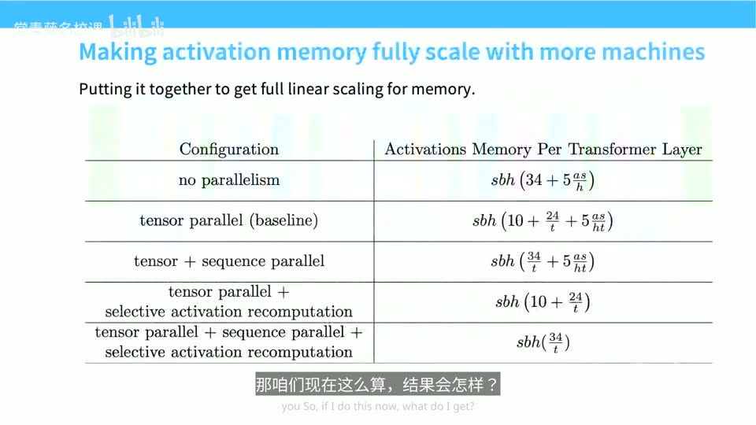 |
| 最后的结果就是 34·sbh÷T——张量并行把大部分项除以 T，序列并行再把剩下的 10·sbh 也沿序列轴分片掉。这一点值得记住：它是正常训练中激活内存需求的合理下限。所以如果你想手动算算模型能不能塞进 GPU，记住这个数很有用：激活内存至少得留这么多；另外你还需要给优化器状态、参数和梯度留点内存。有了这些数，你就能对模型总共需要多少内存有个大概的估计了。 [【跳转到 41:44】](https://www.bilibili.com/video/BV11LEA6eEuj/?p=8&t=2504) | 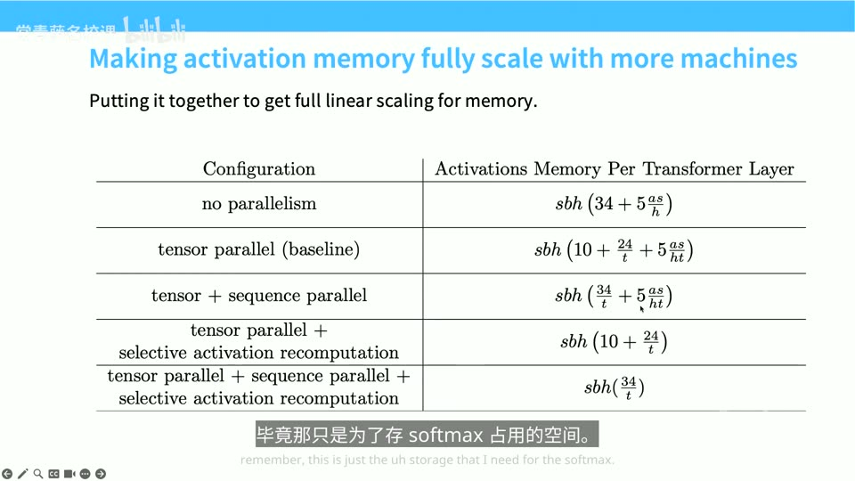 |
| 好，我先停一下。刚才咱们过了一遍流水线并行和张量并行，大家可能会觉得有点乱， [【跳转到 42:11】](https://www.bilibili.com/video/BV11LEA6eEuj/?p=8&t=2531) | 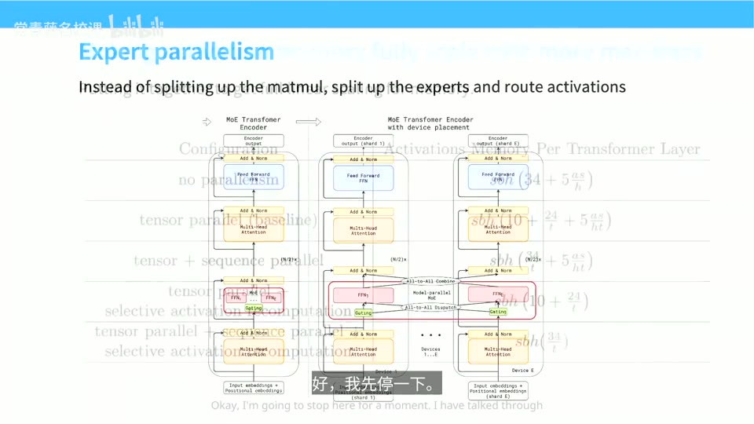 |
| 在讲专家并行之前，先聊几个点。是的，谢谢你。哦是的—— [【跳转到 42:15】](https://www.bilibili.com/video/BV11LEA6eEuj/?p=8&t=2535) | 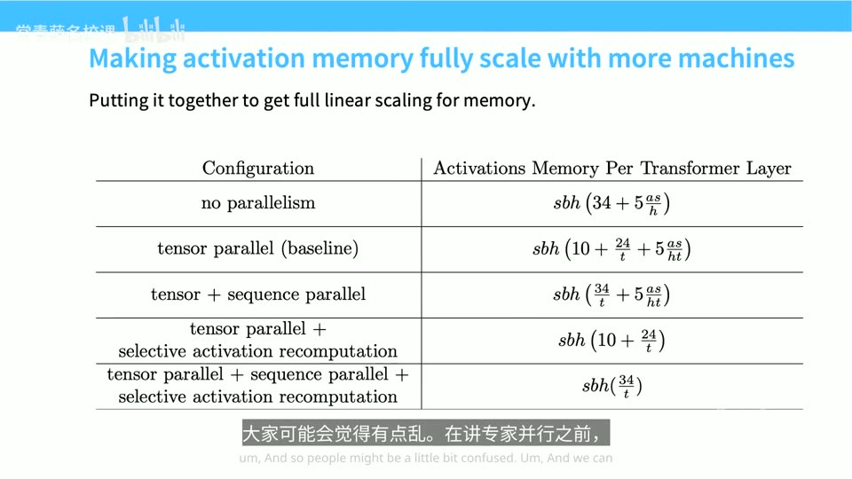 |
| 5·a·s²/h 是注意力那部分；MLP 那部分（24·sbh）能不能重计算？你同样可以做重计算，实际上你能做的重计算远不止这里列出的这些。不过做超出这里列出的那些重计算，开销会非常大：打个比方，MLP 的重计算意味着要在反向传播阶段再跑一遍 MLP，这通常是你不想做的；注意力的重计算通常开销更小，没错——因为你可以按图块（tile）来处理， [【跳转到 42:21】](https://www.bilibili.com/video/BV11LEA6eEuj/?p=8&t=2541) | 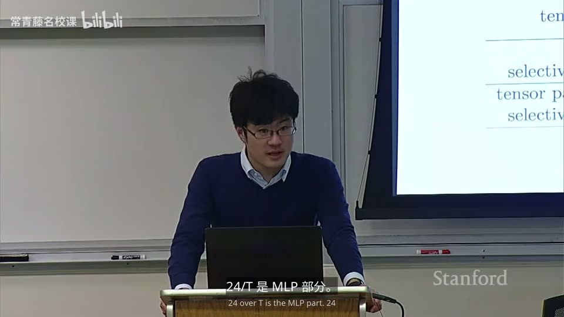 |
| 另外你也得避开二次方复杂度带来的开销—— [【跳转到 42:47】](https://www.bilibili.com/video/BV11LEA6eEuj/?p=8&t=2567) | 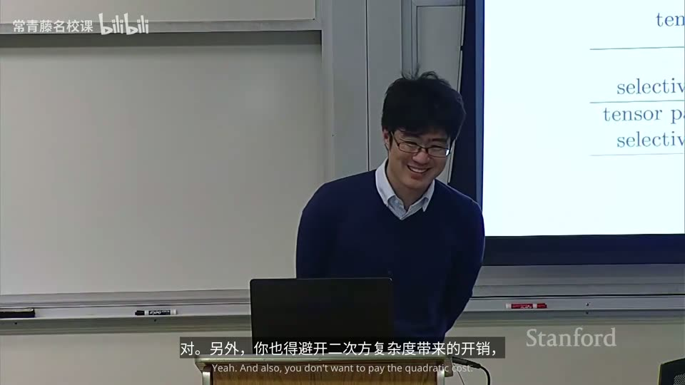 |
| 那个二次方成本确实挺高的，这挺让人头疼的。行，好，明白了。接下来我要讲讲标准并行 [【跳转到 42:51】](https://www.bilibili.com/video/BV11LEA6eEuj/?p=8&t=2571) | 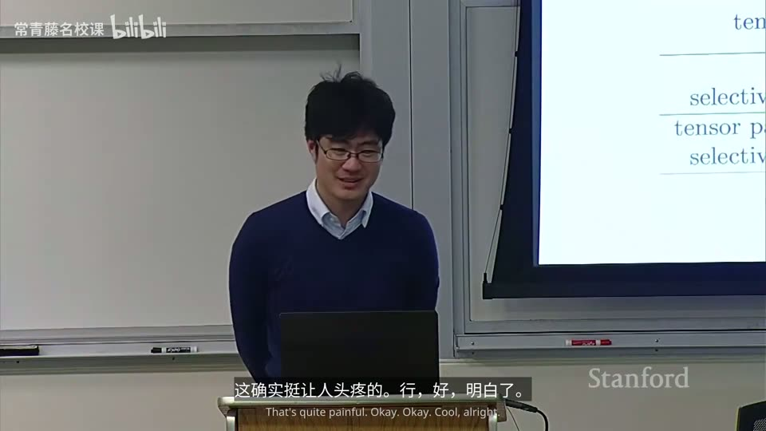 |
| 工具箱里的最后一块拼图，也就是专家并行 [【跳转到 42:55】](https://www.bilibili.com/video/BV11LEA6eEuj/?p=8&t=2575) | 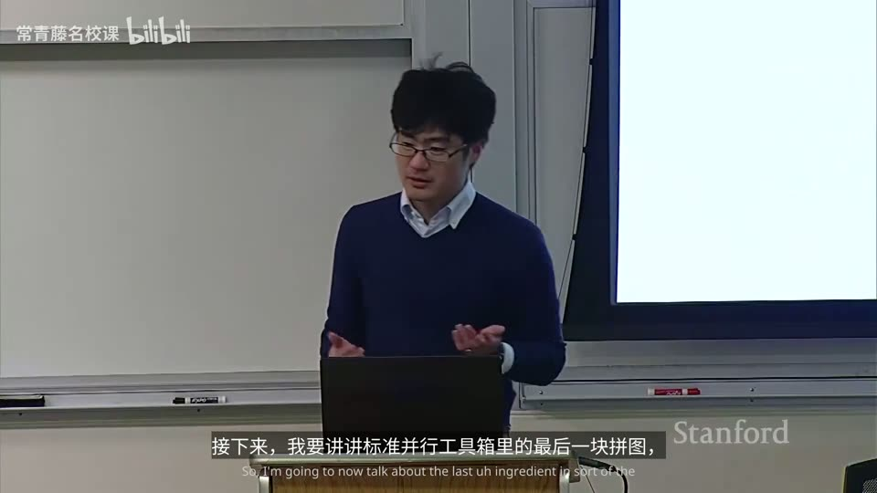 |
| （expert parallelism）。如今 MoE 已经是工具箱里的标配了，大多数大模型都采用了 MoE 架构。这让我们能充分利用其一大优势，也就是专家并行。专家并行我觉得跟张量并行有点像：你把网络里的 MLP（也就是 FFN 组件）用各种方式拆开，这会产生通信开销——就像拆分矩阵那样，只不过这次你是把整个 MLP 拆分到不同的设备上。 [【跳转到 42:59】](https://www.bilibili.com/video/BV11LEA6eEuj/?p=8&t=2579) | 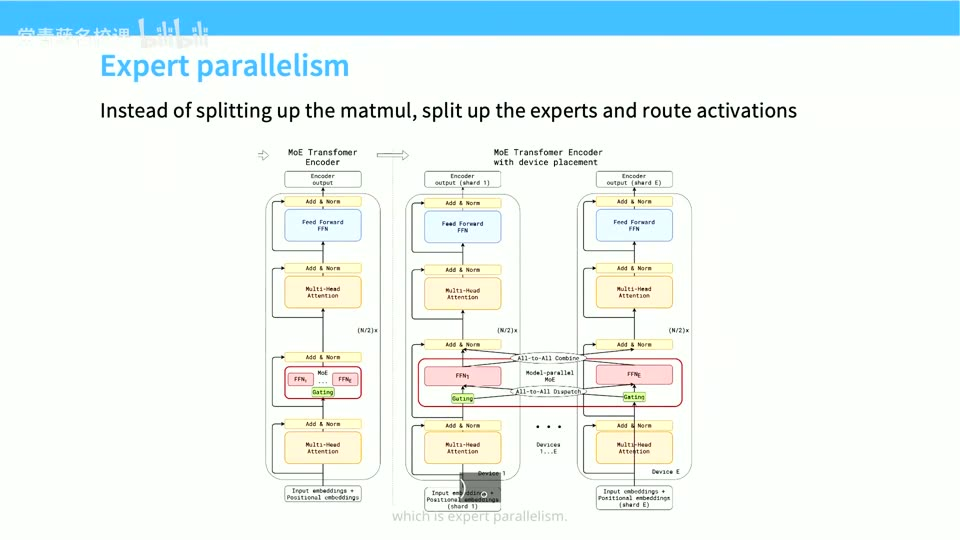 |
| 专家并行的系统表现跟张量并行也差不多：因为这是一种高带宽的并行方式， [【跳转到 43:24】](https://www.bilibili.com/video/BV11LEA6eEuj/?p=8&t=2604) | 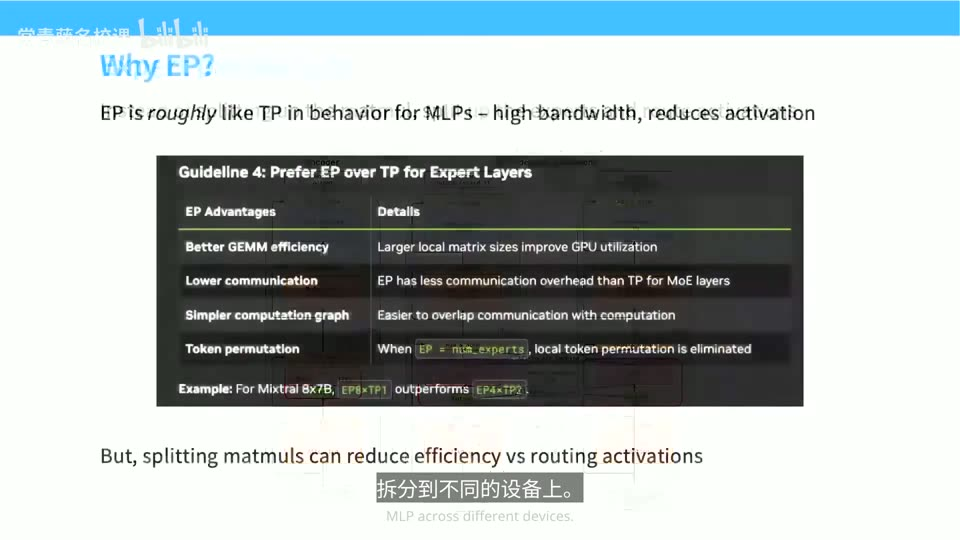 |
| 同时还能减少激活值。不过有一点很重要：如果你在做 MoE，你几乎总是更倾向于用专家并行而不是张量并行来做分片。我截了一段话，来自那个并行指南——Megatron 的文档，这是 NVIDIA 出的并行库，库和文档都做得非常好。其中一条建议说：如果你要做某种并行（不管是 EP 还是 TP），你都该选 EP 而不是 TP。为什么呢？这里列出了张量并行的一些缺点：如果矩阵切分得太碎， [【跳转到 43:28】](https://www.bilibili.com/video/BV11LEA6eEuj/?p=8&t=2608) |  |
| 矩阵维度变小，GPU 利用率就会下降，所以你希望矩阵乘法尽可能大，而张量并行会削弱这一点。而在 MoE 层中，路由稀疏的 token 激活值，远比张量并行那种路由密集又庞大的矩阵乘法激活值容易得多——这样你可以把 token 精确路由到该去的地方，从而跳过一些计算，或者更准确地说，跳过一些开销。既然反正都要用 MoE，不如让专家数量在所有设备上分散开来。 [【跳转到 43:58】](https://www.bilibili.com/video/BV11LEA6eEuj/?p=8&t=2638) | 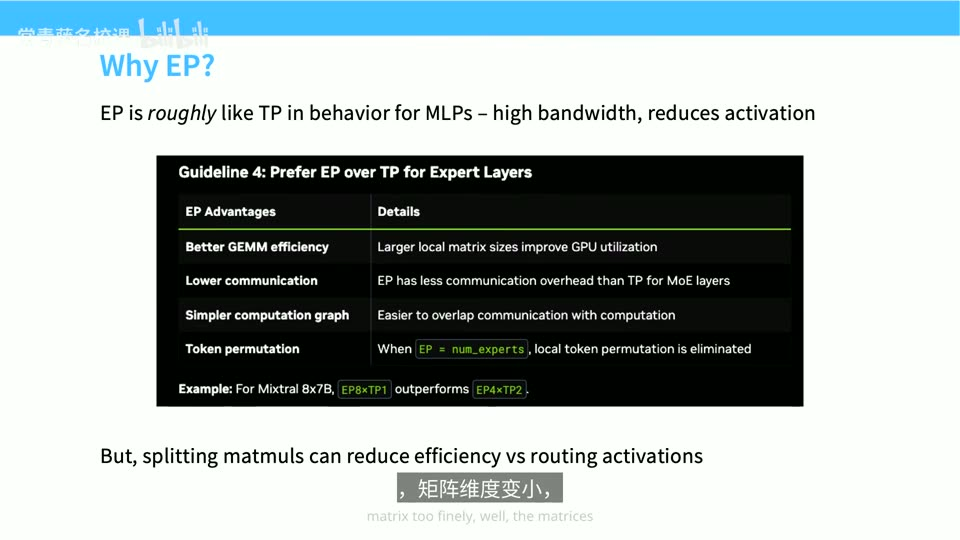 |
| 这可能会让人觉得：好吧，专家并行那么棒，大家都应该一直用它。可惜专家并行依然非常复杂，也很难做好。我觉得讲完 FSDP 之后我提过的张量并行、流水线并行，还有系统层面的那些东西，要想真正跑得好其实挺不容易的。咱们来看两个不同的库，不细讲细节，主要是想让大家知道这活儿有多复杂：DeepSeek 有个库叫 DeepEP——我觉得这是 DeepSeek-V3 时代我最喜欢的东西， [【跳转到 44:27】](https://www.bilibili.com/video/BV11LEA6eEuj/?p=8&t=2667) | 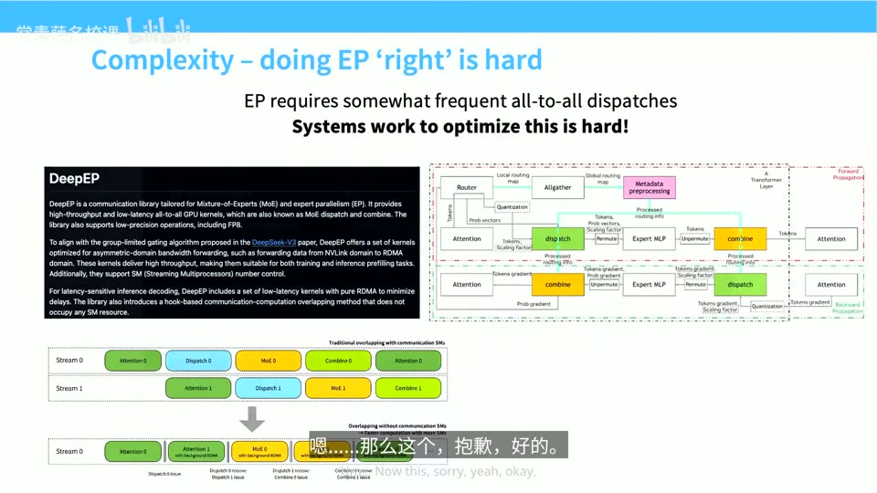 |
| 基本上是他们自研的库，用来做专家并行的路由和分发。他们盯着底层的 GPU 网络原语，想把各种操作结合起来，或者让硬件去处理某些操作，好让 MoE 的路由尽可能高效。类似的，NVIDIA 也有个库，也在做类似的事，用非常高效的底层硬件实现来做专家并行的分发。简单说一下这事儿为什么难：因为你要做大量的 all-to-all 分发—— [【跳转到 44:57】](https://www.bilibili.com/video/BV11LEA6eEuj/?p=8&t=2697) | 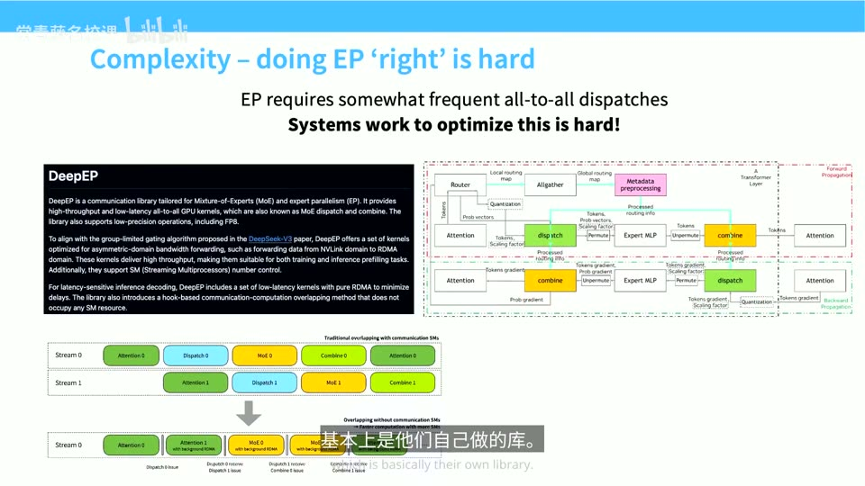 |
| 你看，MoE 的通信模式跟张量并行很像：每次碰到 MLP，你都得把 token 路由到各种各样的地方，而且得特别在意延迟，因为计算得等着 token 到了才能接着跑。 [【跳转到 45:24】](https://www.bilibili.com/video/BV11LEA6eEuj/?p=8&t=2724) | 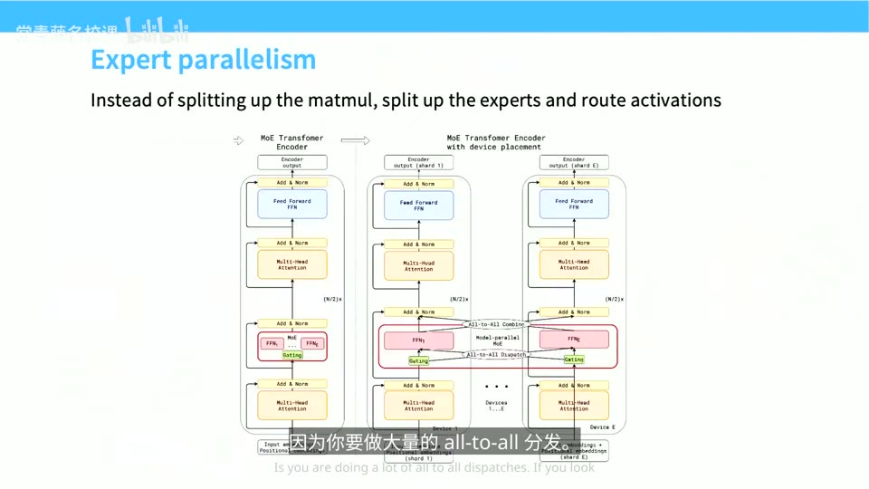 |
| 所以降低这种分发的延迟非常非常关键呃 [【跳转到 45:36】](https://www.bilibili.com/video/BV11LEA6eEuj/?p=8&t=2736) | 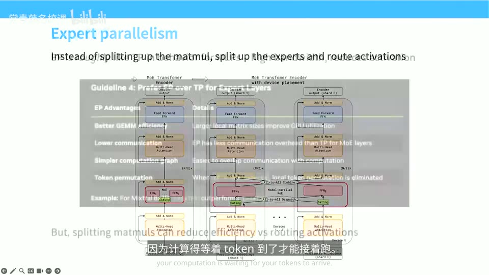 |
| 所以降低这种分发的延迟非常非常关键。另外关于 DeepEP 库还有个挺有意思的冷知识：DeepSeek 那帮人太较真了，为了榨干最后一点性能，他们真的去翻出了一些没写进文档的东西——比如 PTX，也就是 GPU 机器码或类似机器码的东西。他们发现可以用这些没写进文档的指令来进一步加速网络通信。所以这真的就是你要站上并行效率前沿所需要处理的那个层级的工作。 [【跳转到 45:40】](https://www.bilibili.com/video/BV11LEA6eEuj/?p=8&t=2740) | 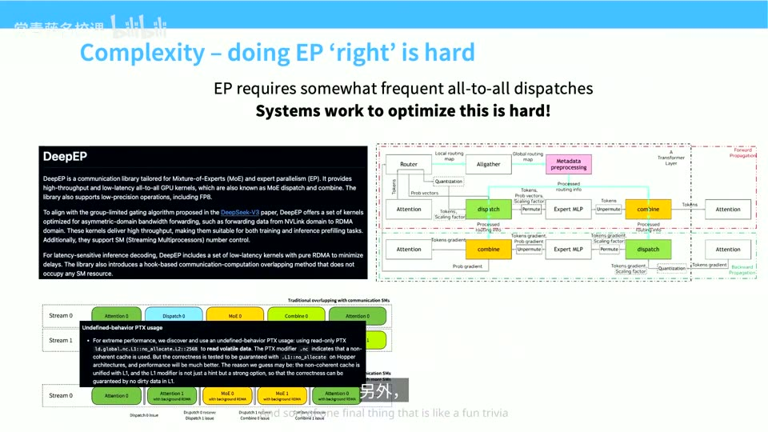 |
| 最后，到现在为止， [【跳转到 46:02】](https://www.bilibili.com/video/BV11LEA6eEuj/?p=8&t=2762) | 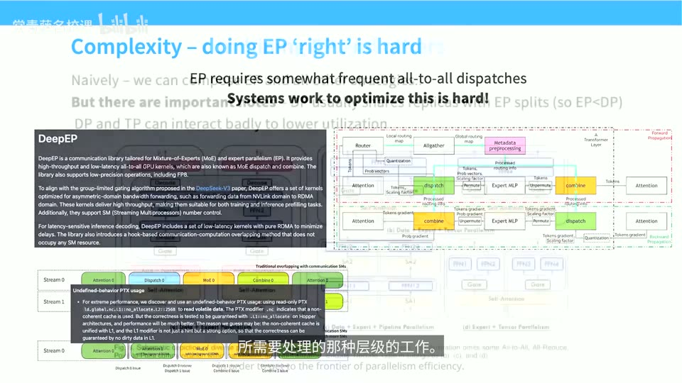 |
| 我一直是在单独讲各种并行原语，比如数据并行之类的，默认你可以像搭乐高一样把它们拼在一起。对于基本上其他所有的并行策略来说，这在大多数情况下都成立——比如把数据并行和张量并行结合起来就非常容易。专家并行则有一些额外的约束，你需要稍微注意一下。通常来说，数据并行和专家并行的朴素做法（我觉得很多旧库里都是这样）是让这两种并行的副本数保持一致： [【跳转到 46:06】](https://www.bilibili.com/video/BV11LEA6eEuj/?p=8&t=2766) | 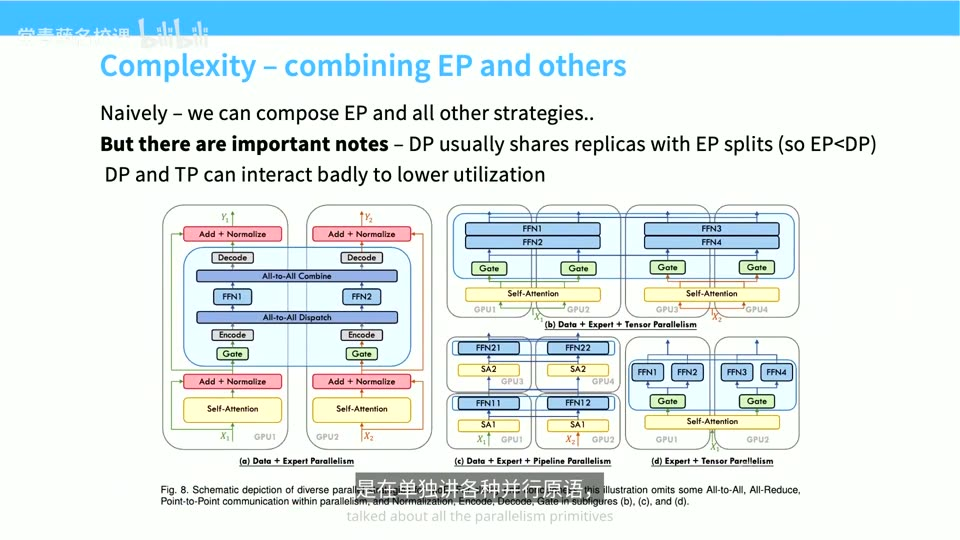 |
| 换句话说，打个比方，假设我的数据并行度是 8，那我就把这 8 个专家做分片，专家分布在这 8 个副本上，数据也在这 8 个副本间分割并以各种方式路由。也就是说，你先按数据并行来划分 GPU，专家并行只是这个划分里的一个子集。这么做很自然，因为你在对 token 做路由；但如果这样做，专家并行能达到的并行程度就有一个上限，而且它会约束数据并行和张量并行之间 [【跳转到 46:36】](https://www.bilibili.com/video/BV11LEA6eEuj/?p=8&t=2796) |  |
| 如何配合。我觉得这就是最后一层复杂性了。 [【跳转到 47:06】](https://www.bilibili.com/video/BV11LEA6eEuj/?p=8&t=2826) | 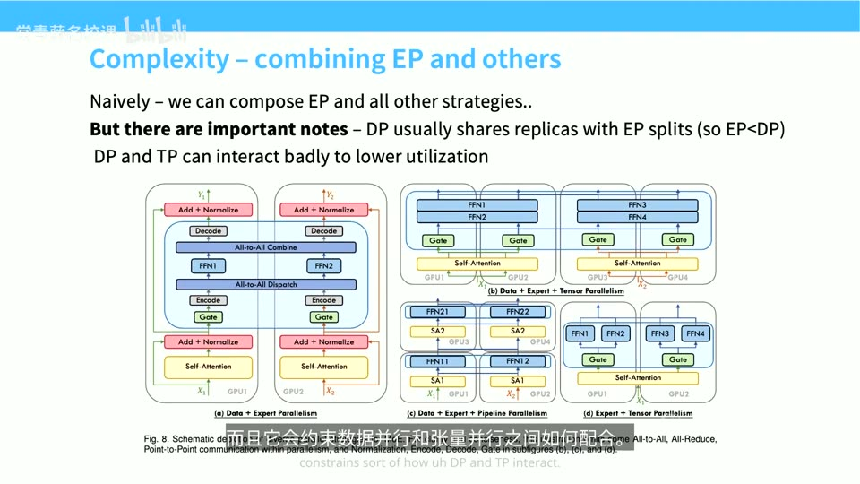 |
| 专家并行在很多方面确实挺乱的，这点我得说声抱歉。不过正因为有这些复杂性，在结束专家并行这个话题之前，我想讲一个有趣的系统层面的事实。记住，混合专家模型只改多层感知机（MLP），对吧？它完全不改变注意力机制——因为我们把多层感知机切开了，但没切注意力机制。所以专家并行在模型上的应用是不均匀的：当我在专家层面做并行时，我并行的是多层感知机， [【跳转到 47:10】](https://www.bilibili.com/video/BV11LEA6eEuj/?p=8&t=2830) | 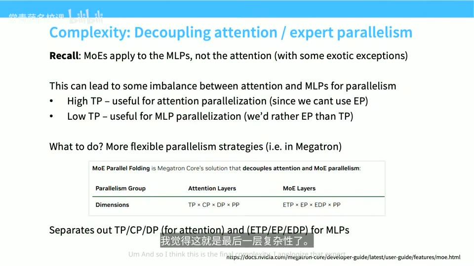 |
| 而不是注意力机制。那为了并行化注意力机制，我可能还得用上张量并行。所以为了切分注意力机制，我需要较高的张量并行度；但这会反过来影响我的多层感知机——因为如果我张量并行和专家并行都设得很高，矩阵就被切得太碎，利用率会非常差。所以这就有个挺别扭的权衡：注意力机制想要高张量并行，但多层感知机又想要低张量并行， [【跳转到 47:40】](https://www.bilibili.com/video/BV11LEA6eEuj/?p=8&t=2860) | 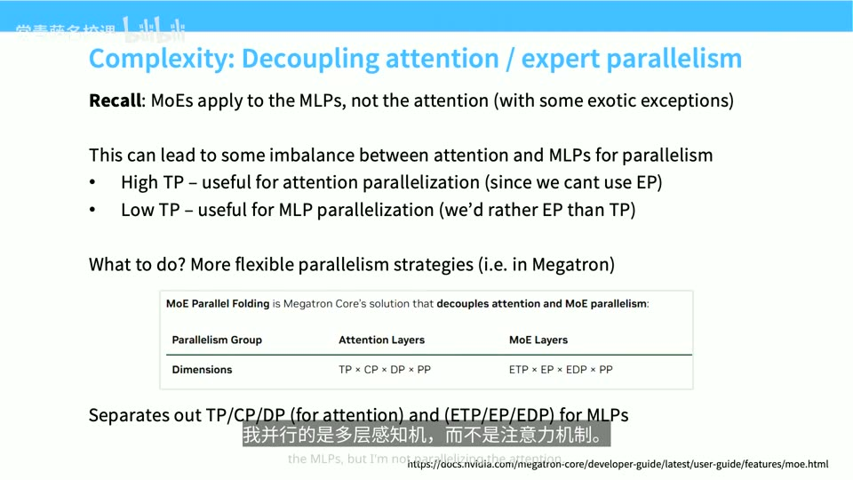 |
| 这就产生了冲突。那咱们该怎么办呢？过去几年里，大家搞出了更复杂的系统方案，把 MLP 里的张量并行和注意力机制里的张量并行解耦开了：注意力层用一种张量并行度，MoE 层用另一种，你可以彻底解耦并行度。这就带来了专家并行、张量并行和数据并行之间更复杂、但也更高效的组合方式。好了。 [【跳转到 48:10】](https://www.bilibili.com/video/BV11LEA6eEuj/?p=8&t=2890) | 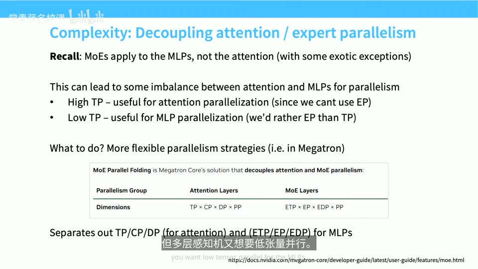 |
| 最后我想在这个部分讲讲上下文并行（context parallelism），也就是环形注意力（ring attention）。基本思想是把超长序列里的激活值分到不同的加速器上，你可以按 TPU 的网格拓扑，用环形的方式把激活值传给需要的设备。环形注意力是最早做这个的论文，显示这在 TPU 上效果特别好；上下文并行就是一种专门干这事儿的标准并行策略。这两种方法都用在长上下文扩展阶段和模型服务里。 [【跳转到 48:34】](https://www.bilibili.com/video/BV11LEA6eEuj/?p=8&t=2914) | 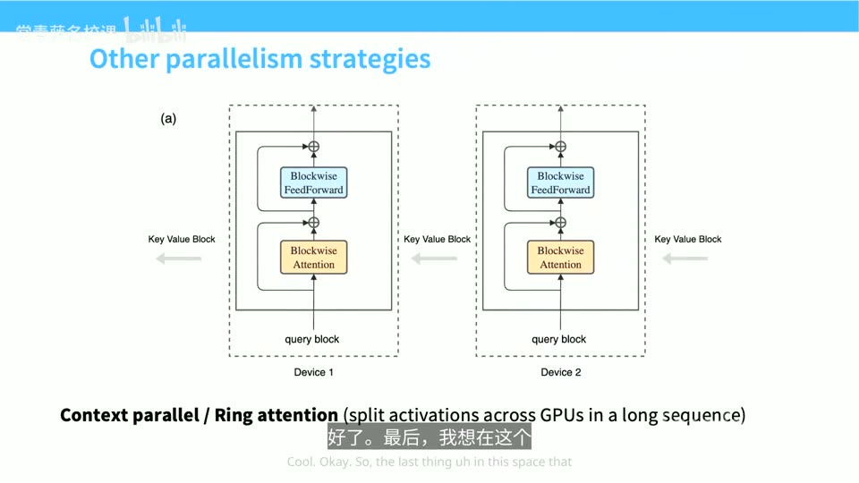 |
| 我就不展开讲了，主要是因为它在概念上和咱们之前聊过的很多内容有重叠。好， [【跳转到 49:04】](https://www.bilibili.com/video/BV11LEA6eEuj/?p=8&t=2944) | 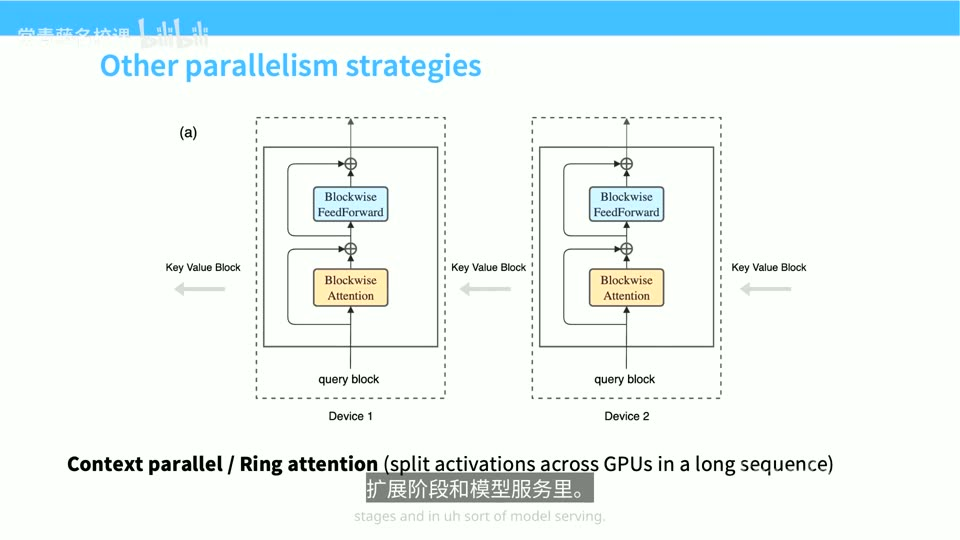 |
| 那么第二部分到这里就结束了。 [【跳转到 49:09】](https://www.bilibili.com/video/BV11LEA6eEuj/?p=8&t=2949) | 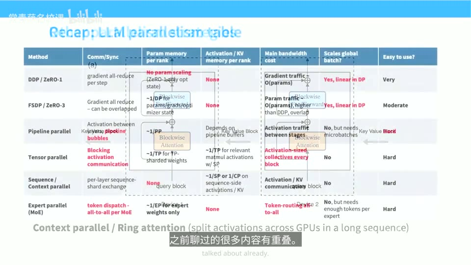 |
| 为了把这些内容都整合到一起，我做了一张并行策略的大表：上面两行是数据并行，下面是各种模型并行策略。我还用红色标出了我主观看法中不同方法的缺点所在。我之所以标红，是想告诉大家：没有哪一种并行策略是绝对占主导地位的——其实就是一大堆权衡取舍，你得巧妙地把它们都处理好才能拿到好结果。举个例子，FSDP 很棒，是一种很好的策略， [【跳转到 49:13】](https://www.bilibili.com/video/BV11LEA6eEuj/?p=8&t=2953) |  |
| 但它对激活值没什么帮助，而且它得靠消耗全局批次大小来实现并行，所以它也有局限。为了解决这些问题，你可能需要把它和手头的其他技巧结合起来用：比如你可能想用张量并行来减少激活内存——这倒不会影响全局批次大小，但这么做你就需要更快的网络和更高的带宽；另外为了利用那些较慢的连接，你可能想采用其他一些并行策略。你可以看到这些不同的优劣表明：每种策略都有其适用场景。虽然并非每种架构都用得上每一种并行策略， [【跳转到 49:43】](https://www.bilibili.com/video/BV11LEA6eEuj/?p=8&t=2983) | 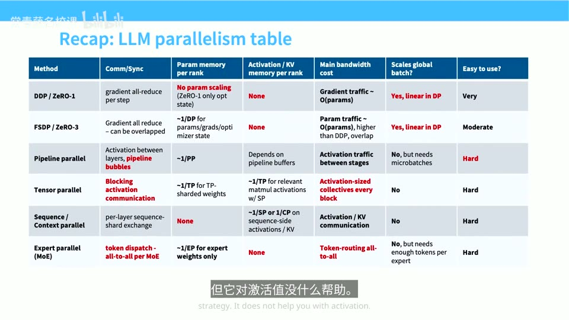 |
| 但在许多大规模架构中，通常会组合使用多种策略。请问这些方法还适用于 MoE 吗？还是说 MoE 有严格限制？ [【跳转到 50:13】](https://www.bilibili.com/video/BV11LEA6eEuj/?p=8&t=3013) | 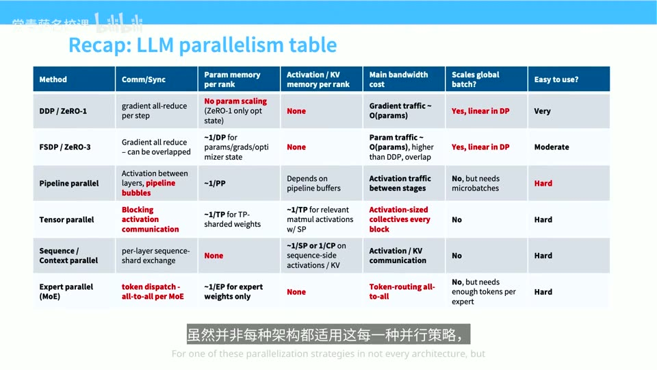 |
| 对。刚才的问题是：流水线并行和…… [【跳转到 50:23】](https://www.bilibili.com/video/BV11LEA6eEuj/?p=8&t=3023) | 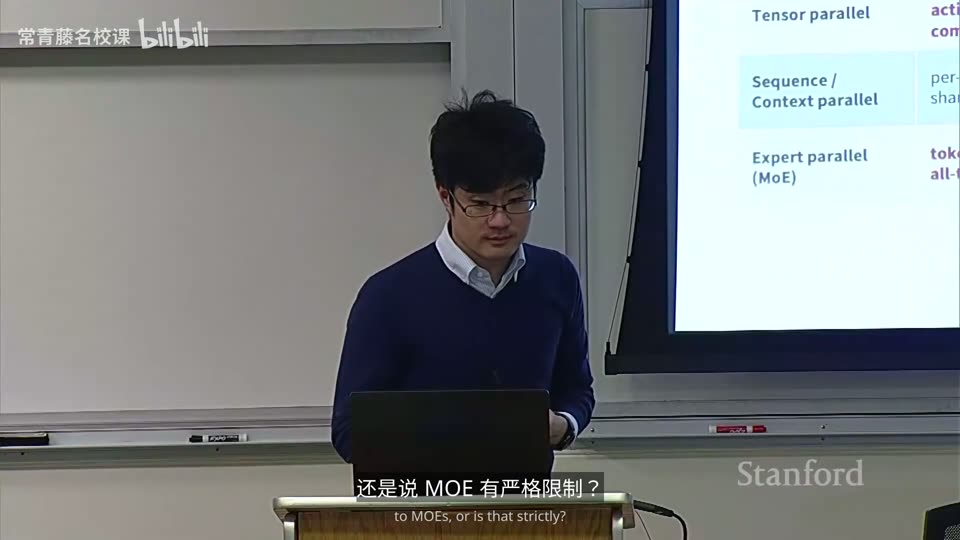 |
| *（此区间无字幕）* [【跳转到 50:27】](https://www.bilibili.com/video/BV11LEA6eEuj/?p=8&t=3027) | 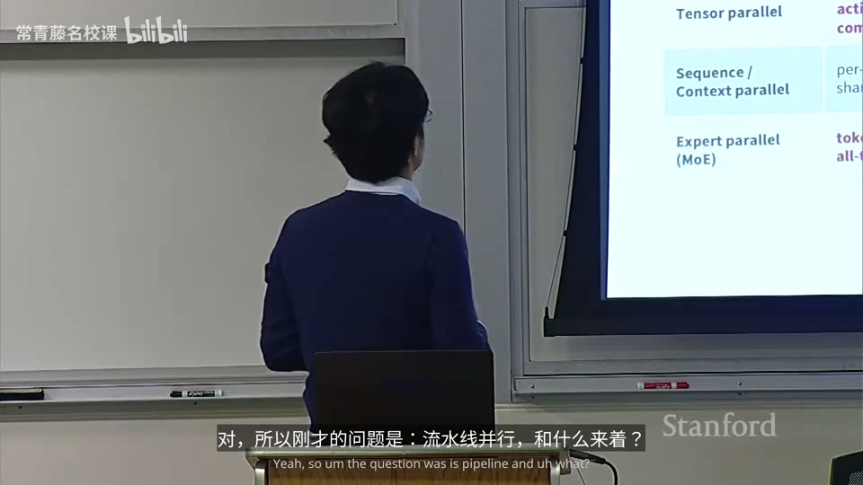 |
| FSDP 适用于 MoE 吗？是的，绝对适用。真要说有什么讲究的话：专家并行有点像张量并行，所以你会想把它扩展到大约 8 路，也就是高速连接的范围内。嗯，不过现在人们不太严格遵循那个建议了。但即便如此，FSDP、数据并行、流水线并行和张量并行在所有前沿模型中都被广泛使用。对，不错。 [【跳转到 50:31】](https://www.bilibili.com/video/BV11LEA6eEuj/?p=8&t=3031) | 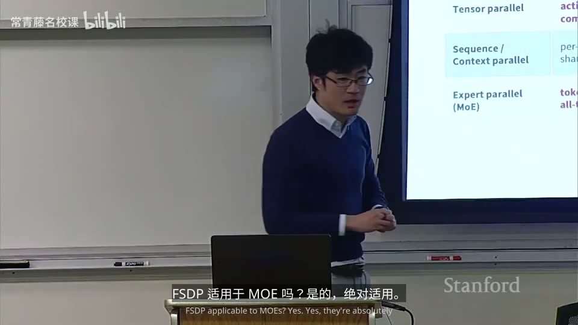 |
| 好，你们会在作业里做这个或者类似的操作。不过并行有个很酷的地方——我觉得也挺好——就是你可以做一些数学推算。你可以这样问：针对我不同的分片策略，每一层需要做多少计算？针对我不同的通信策略，每一层又需要多少通信量？如果把不同的设备分配给不同的通信策略，这些东西的扩展性如何？接着你就能搞清楚这些策略组合在一起时扩展情况是怎样的，可以开始画一些图表了。比如如果我设定了特定的批次大小和特定的并行策略——这里列出了三种不同的并行策略—— [【跳转到 50:51】](https://www.bilibili.com/video/BV11LEA6eEuj/?p=8&t=3051) | 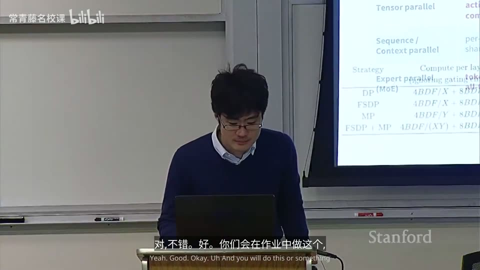 |
| 我觉得也挺好就是你可以做一些数学推算对吧你其实可以这样问好针对我不同的分片策略每一层需要做多少计算针对我不同的通信策略每一层又需要多少通信量如果把不同的设备分配给不同的通信策略这些东西的扩展性如何接着你就能搞清楚这些策略组合在一起时扩展情况是怎样的你可以开始画一些图表了比如如果我设定了特定的批次大小和特定的并行策略这里我列出了三种不同的并行策略 [【跳转到 50:55】](https://www.bilibili.com/video/BV11LEA6eEuj/?p=8&t=3055) |  |
| 看看我的 GPU 利用率是多少，也就是计算时间与通信时间的比率。只要计算耗时比通信耗时更长，原则上你就能把通信开销隐藏在计算过程里。所以你可以画出这样的图：最上面那条虚线大致就是效率的临界点，线以上的区域说明你的计算资源得到了充分利用，线以下则处于「屋顶线」的低效区域，对吧——因为你就得等着通信结束才能继续计算。 [【跳转到 51:25】](https://www.bilibili.com/video/BV11LEA6eEuj/?p=8&t=3085) | 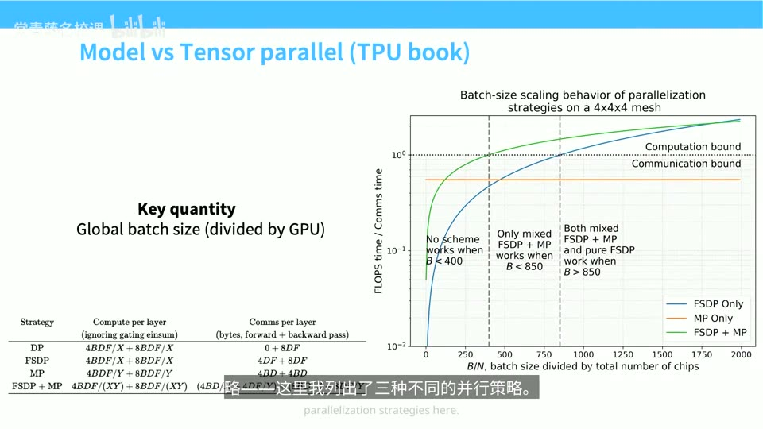 |
| 这地方有个挺有意思的点。结合我之前讲的，这应该很直观：如果批次大小够大，只用 FSDP 就行，对吧？比如要是每个芯片的批次大小足够大，那你能扩展多远呢？这时候 FSDP 表现非常好，你的瓶颈完全在计算上。但关键在于：随着批次大小减小，只用 FSDP 会遇到一个临界点，这时候限制你的就是通信了。那具体该怎么做？为了进一步提升效率， [【跳转到 51:55】](https://www.bilibili.com/video/BV11LEA6eEuj/?p=8&t=3115) | 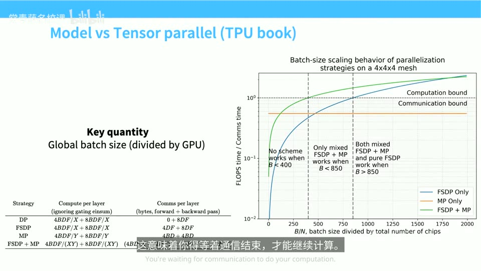 |
| 你得把 TP（也就是 tensor parallelism）加进来，把它和其他策略混用，这样你就能把这条曲线再往外推一点——哪怕 batch size 变小了，依然能保持计算受限。你得不断叠加策略，把这条曲线再往外推， [【跳转到 52:25】](https://www.bilibili.com/video/BV11LEA6eEuj/?p=8&t=3145) | 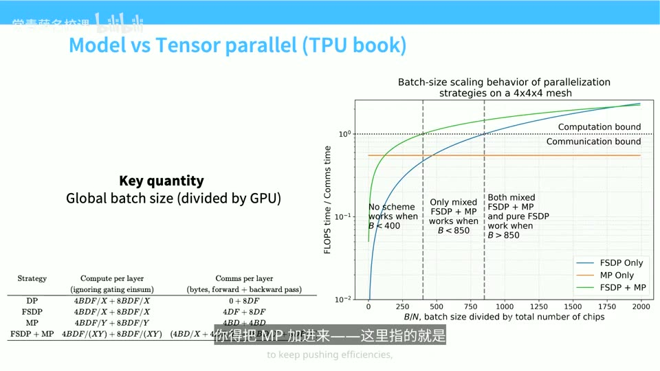 |
| 这样才能拿到更好的效果。这就是大家常说的 4D 并行（4D parallelism）——把这些策略全用上，不管通信拓扑怎么变，都能让计算单元满负荷运转。其实有个很简单的办法。我觉得到目前为止我一直讲得比较笼统，所以你可能觉得挺复杂，但其实并行化策略很简单：只要模型装不进内存，你就得想办法把它切开。怎么切？要么用 tensor parallelism，要么用 expert parallelism——针对高速互联的情况： [【跳转到 52:39】](https://www.bilibili.com/video/BV11LEA6eEuj/?p=8&t=3159) | 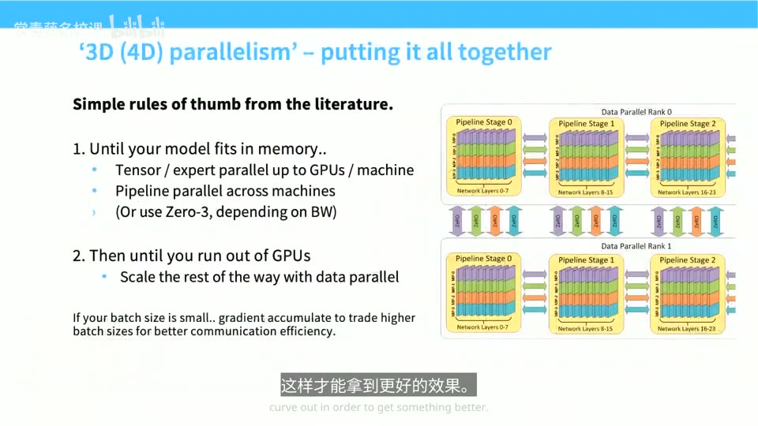 |
| 如果每台机器有 8 张 GPU，你就用 8 路的 tensor parallel 或 expert parallel；剩下的部分再用 pipeline parallel 或者 ZeRO-3（也就是 FSDP）把模型塞进去。模型放得下之后，剩下的部分就全用数据并行搞定——剩下的 GPU 也都拿数据并行填满。如果批次大小实在太小，可以用梯度累积来提升 GPU 利用率。策略很简单， [【跳转到 53:09】](https://www.bilibili.com/video/BV11LEA6eEuj/?p=8&t=3189) | 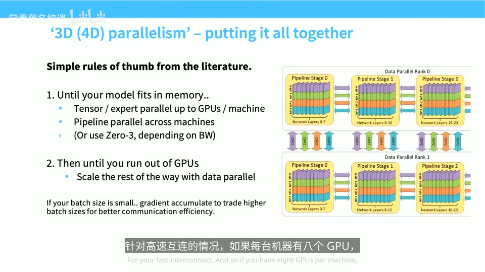 |
| 而且你实际会用到的那些大规模并行训练库也证实了这一点。我把链接放这了：Megatron 关于怎么并行化 MoE 的指南。不过这个思路对稠密模型也适用，你会看到跟我说的完全一样的东西，只是顺序反过来。所以第一条准则就是：能少用模型并行就少用，尽量把数据并行拉满——能用的话，尽量让大部分 GPU 去分片数据。另外如果你在用 GPU，尽量别跨出 NVLink 的范围， [【跳转到 53:30】](https://www.bilibili.com/video/BV11LEA6eEuj/?p=8&t=3210) | 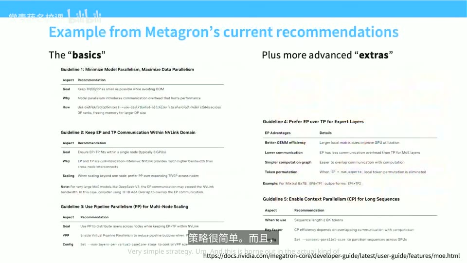 |
| 意思就是一台机器，或者说一个机箱：把 expert parallel 和 tensor parallel 都限制在这个机箱里。然后如果你要扩展到多节点，就用流水线并行来实现。还有，如果是 MoE，那就首选专家并行；最后要是做长序列，就用上下文并行——也就是环形注意力。这其实就是我讲座里一直想跟你们讲透的东西，只不过这里把它变成了实操版。好， [【跳转到 54:00】](https://www.bilibili.com/video/BV11LEA6eEuj/?p=8&t=3240) | 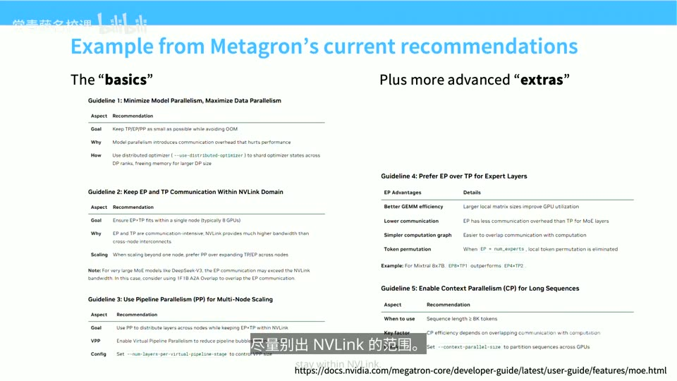 |
| 最后一个部分。我在这儿停一下——万一有人对 4D 并行化那些东西好奇呢？ [【跳转到 54:25】](https://www.bilibili.com/video/BV11LEA6eEuj/?p=8&t=3265) | 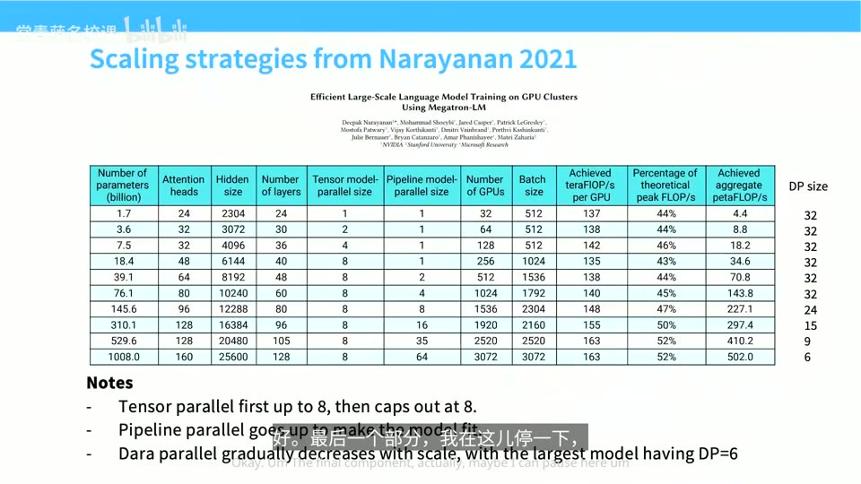 |
| 对，我不那么叫序列并行，其实叫上下文并行更合适。 [【跳转到 54:29】](https://www.bilibili.com/video/BV11LEA6eEuj/?p=8&t=3269) | 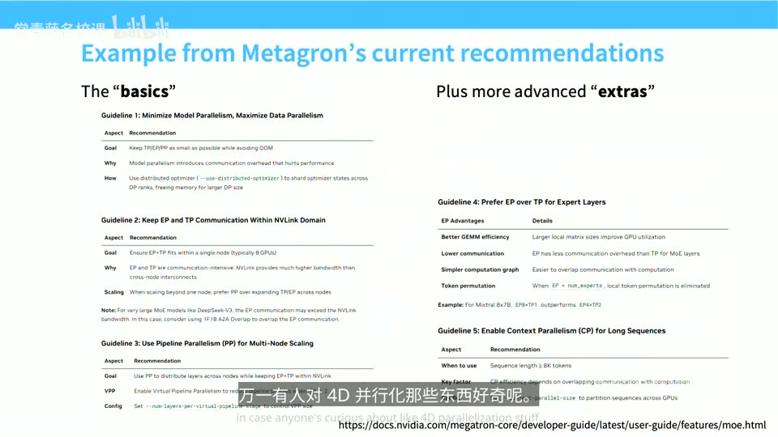 |
| 但我发现序列并行没在这个推荐名单里。 [【跳转到 54:33】](https://www.bilibili.com/video/BV11LEA6eEuj/?p=8&t=3273) | 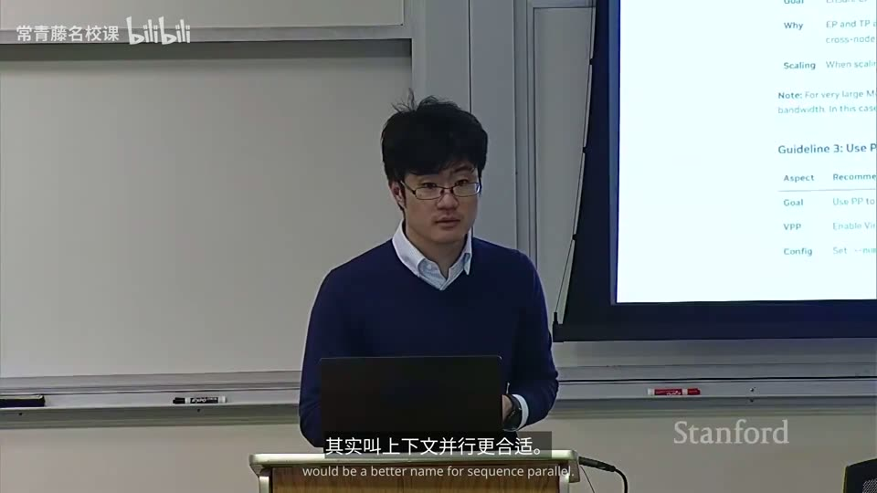 |
| 对，序列并行通常就是跟张量并行一起用、为了减少激活值的那部分， [【跳转到 54:40】](https://www.bilibili.com/video/BV11LEA6eEuj/?p=8&t=3280) | 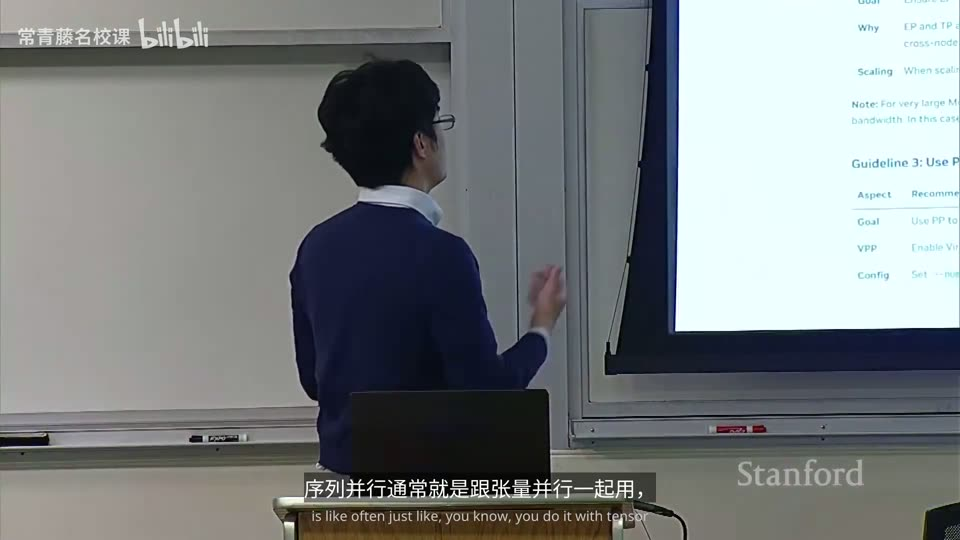 |
| 那更像是一个附加组件，加进去是为了减少激活值。谢谢。很多时候它本身并不是一个独立的东西。 [【跳转到 54:44】](https://www.bilibili.com/video/BV11LEA6eEuj/?p=8&t=3284) | 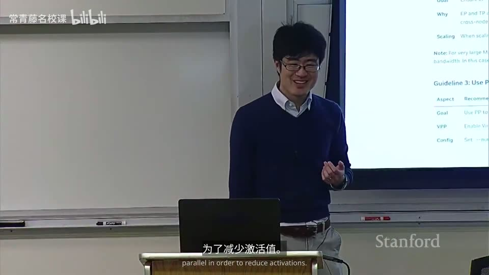 |
| 谢谢，谢谢。对，既然大家猜测 [【跳转到 54:51】](https://www.bilibili.com/video/BV11LEA6eEuj/?p=8&t=3291) | 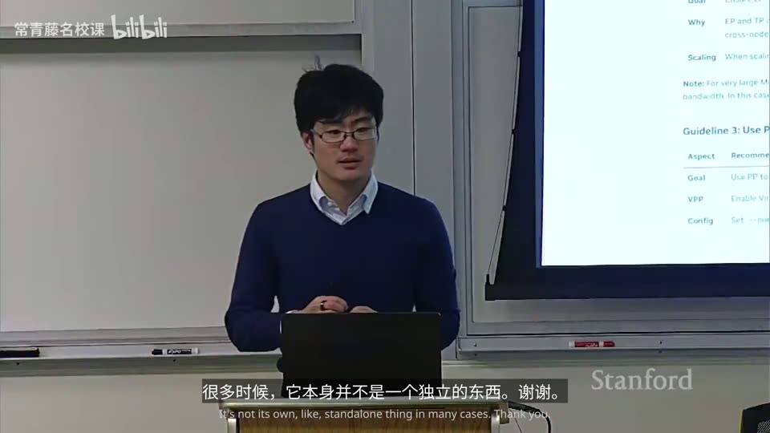 |
| 类似循环 Transformer（recurrent transformer）这类架构—— [【跳转到 54:55】](https://www.bilibili.com/video/BV11LEA6eEuj/?p=8&t=3295) | 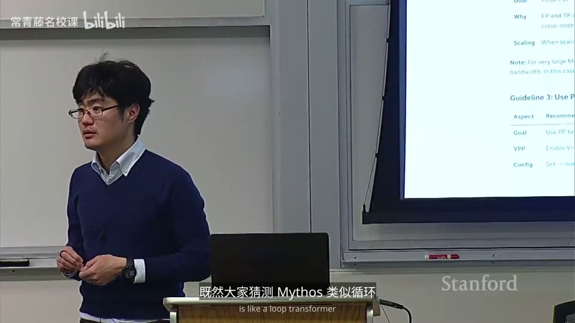 |
| 我不太相信那些关于循环 Transformer 的传闻。 [【跳转到 54:59】](https://www.bilibili.com/video/BV11LEA6eEuj/?p=8&t=3299) | 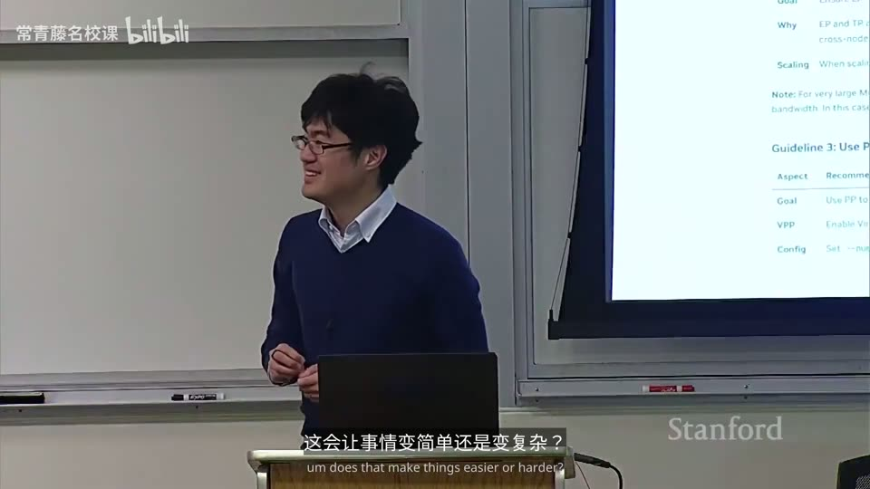 |
| 也许吧，这也挺有意思的。不过回到刚才的问题：系统结构会因此发生什么变化？ [【跳转到 55:03】](https://www.bilibili.com/video/BV11LEA6eEuj/?p=8&t=3303) | 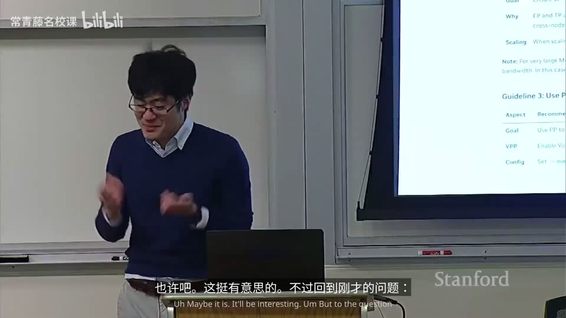 |
| 好问题。我觉得这可能会影响 FSDP 这类机制—— [【跳转到 55:07】](https://www.bilibili.com/video/BV11LEA6eEuj/?p=8&t=3307) | 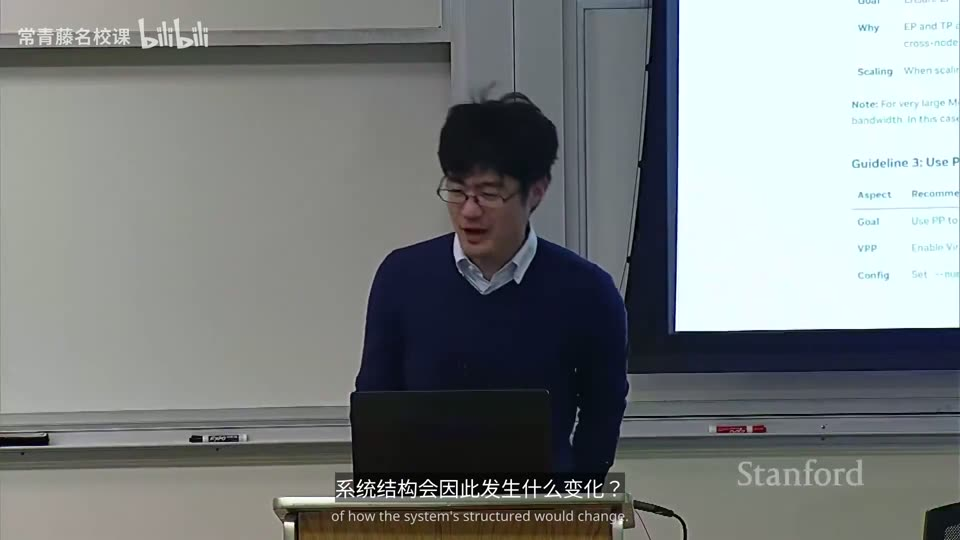 |
| 比如你没法直接丢弃权重，但好处是你不需要反复获取权重，它的参数效率要高得多，所以很多模型并行相关的东西可能就没那么重要了。这挺有意思的。 [【跳转到 55:11】](https://www.bilibili.com/video/BV11LEA6eEuj/?p=8&t=3311) | 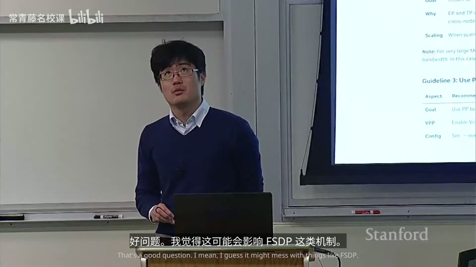 |
| 对 FSDP 相关的很多机制来说，情况肯定会不一样：因为 FSDP 策略本质上依赖于「取权重、丢权重、再取权重、再丢权重」这样一个循环， [【跳转到 55:24】](https://www.bilibili.com/video/BV11LEA6eEuj/?p=8&t=3324) | 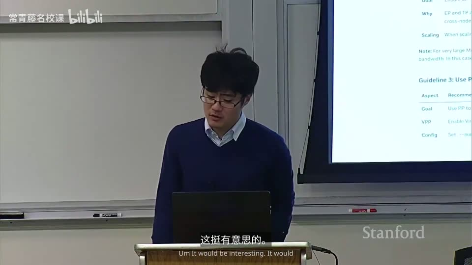 |
| 而在这里你其实什么都不用丢弃。谢谢。好，好的。 [【跳转到 55:33】](https://www.bilibili.com/video/BV11LEA6eEuj/?p=8&t=3333) | 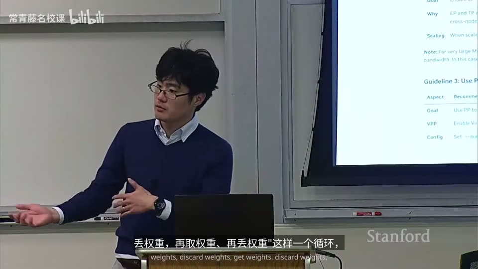 |
| 这篇论文虽然有些年头了，但它其实可能是最好的资源之一—— [【跳转到 55:37】](https://www.bilibili.com/video/BV11LEA6eEuj/?p=8&t=3337) | 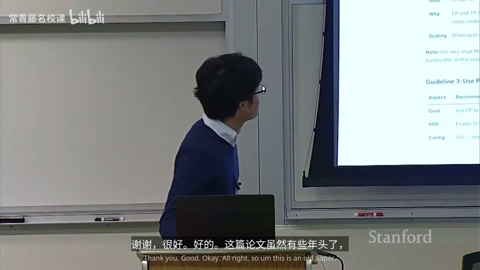 |
| 网络底层的基础原理其实并没有发生太大变化，所以我觉得这篇论文里的经验教训放到今天依然很有参考价值。这是一篇 NVIDIA 的论文，作者里有几位以前是斯坦福的人，他们针对很多种不同配置做了大量大规模并行训练实验，主要想告诉你：随着规模扩大，你的并行策略应该如何相应调整。这正好印证了我之前一直在讲的那套方案：数据并行基本上已经拉满， [【跳转到 55:41】](https://www.bilibili.com/video/BV11LEA6eEuj/?p=8&t=3341) | 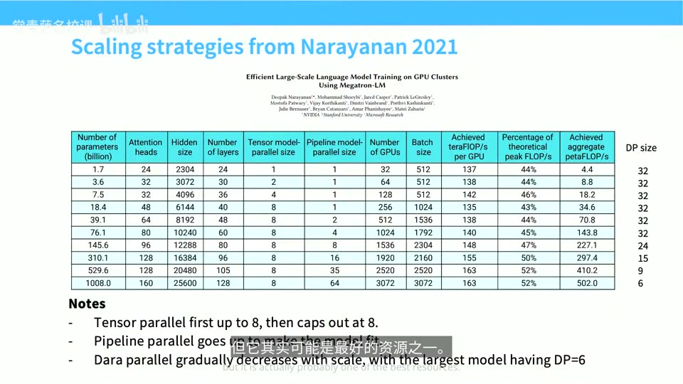 |
| 接下来就是张量并行：张量并行度会逐步增加，直到达到 8，然后就停下来——因为你不想再往上加了。从那以后，流水线并行的规模就一直在往上加。规模够大的时候，数据并行的占比就会降下来，到最后数据并行度可能就只剩 6 了——因为只要用这些张量并行和流水线并行就能把模型塞进去，剩下的预算就全拿去做数据并行了。谢谢。 [【跳转到 56:11】](https://www.bilibili.com/video/BV11LEA6eEuj/?p=8&t=3371) | 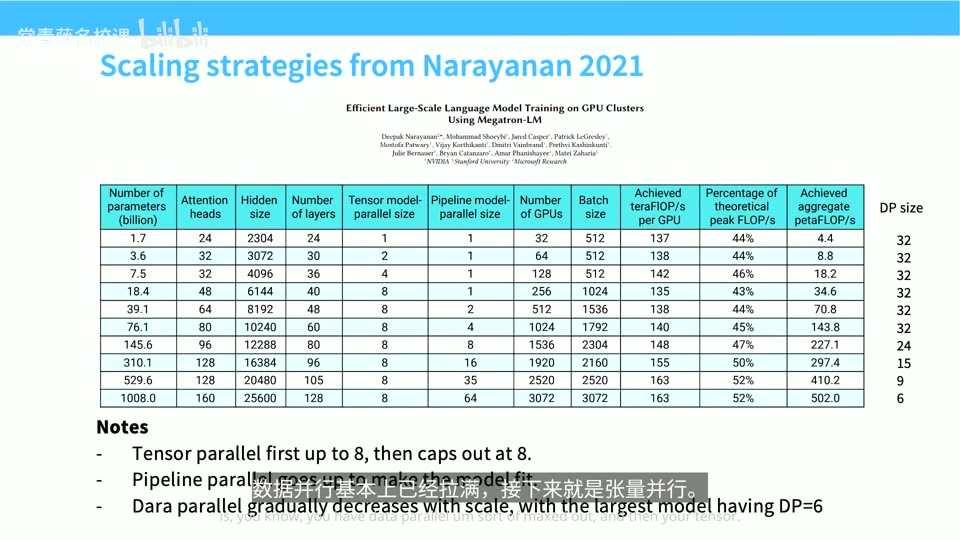 |
| 把这些策略结合起来看，就算 GPU 数量多到离谱，利用率依然能保持得很平稳、很高效。这就是为什么你会看到那么多超大规模的数据中心拔地而起：大家想出来的并行策略特别管用，通信硬件也够好，所以哪怕是在超大规模数据中心、甚至是跨数据中心训练，你在各种不同模式下都能拿到很高的利用率。 [【跳转到 56:33】](https://www.bilibili.com/video/BV11LEA6eEuj/?p=8&t=3393) | 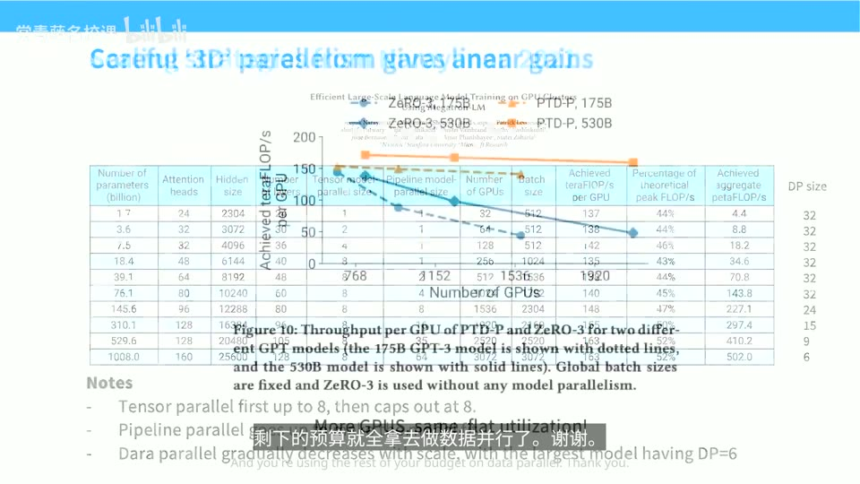 |
| 他们有一些很扎实的定量数据，告诉你针对不同的批量大小，张量并行做到什么程度就该停了——张量并行度就是 8，一旦超过这个数你就会陷入麻烦。在流水线并行里，你同样需要比较大的批量大小才能把机器有效利用起来，这就是橙色和蓝色之间差距的来源：这是流水线并行，而且流水线并行度越大，橙色和蓝色之间的差距就越大。 [【跳转到 56:55】](https://www.bilibili.com/video/BV11LEA6eEuj/?p=8&t=3415) | 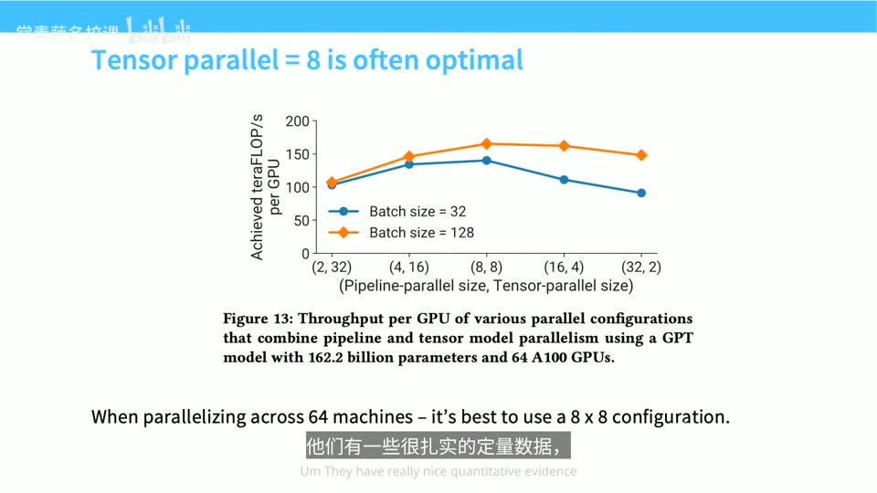 |
| 另外我觉得——你可能已经从 FlashAttention 里学到了这一点，或者还没学到——那就是你应该做大量的激活值重计算。因为如果你把激活值重计算做得足够巧妙，你就能用更大的批量大小，而更大的批量大小又能让你把机器用得更充分。这点起初让我觉得很反直觉：你应该通过重计算多做一些计算，这样反倒能最终获得更好的利用率——因为它能帮你省下内存，而省下的内存又可以转化成批量大小。 [【跳转到 57:21】](https://www.bilibili.com/video/BV11LEA6eEuj/?p=8&t=3441) | 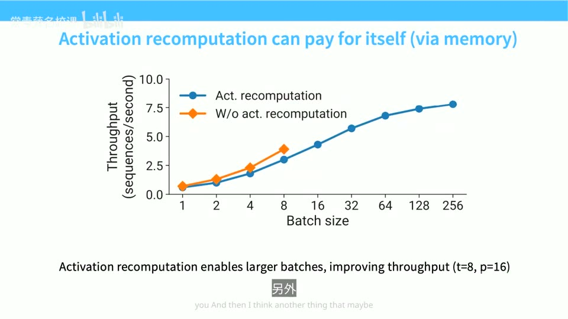 |
| 好，以上就是关于如何选择并行策略的一种更偏定量的视角。最后我想简单看几个训练运行的例子，看看现代并行策略在实际中是怎么用的、又是怎么演进的。比如 AI2 的 OLMo——那是一个 70 亿参数的开源模型，用 Dolma 数据集训练，具体细节大家可以去看 Dolma 那篇论文。这是个 70 亿参数的模型，完全用 FSDP 在一大堆加速器上训练—— [【跳转到 57:50】](https://www.bilibili.com/video/BV11LEA6eEuj/?p=8&t=3470) | 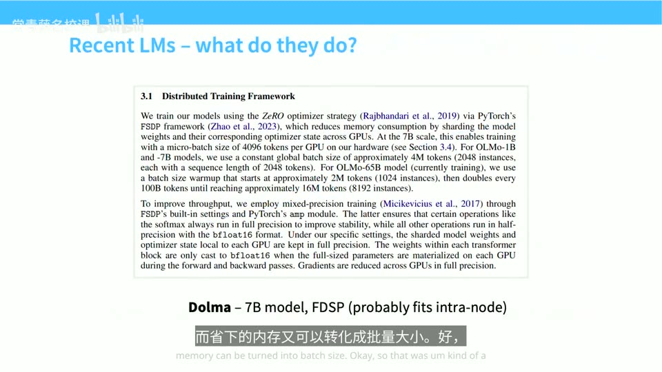 |
| 具体多少我记不太清了，但这就是个例子，说明 FSDP 的扩展性出奇地好，哪怕扩展到非常多的 GPU 也没问题，只要你训练的是小模型。FSDP 其实是个挺不错的并行策略，我觉得很多 70 亿参数左右的模型都是纯靠 FSDP 训练的。DeepSeek 因为系统功底深厚，确实搞出了一些挺独特也挺实用的东西：DeepSeek-V1 的训练只用了数据并行、 [【跳转到 58:20】](https://www.bilibili.com/video/BV11LEA6eEuj/?p=8&t=3500) | 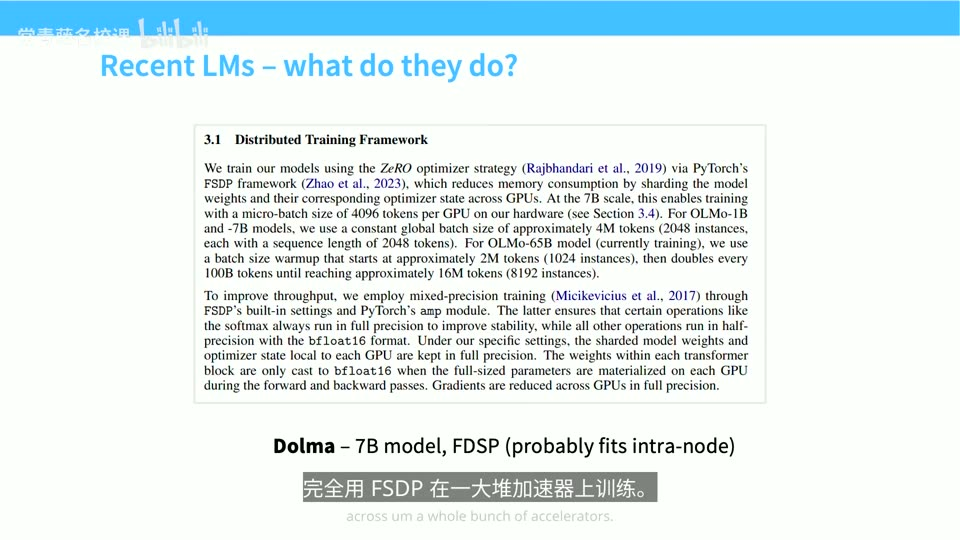 |
| ZeRO 第一阶段、张量并行和流水线并行——这跟我之前跟你们讲过的一样。另外 DeepSeek-V3 是个 MoE 模型——你要是还记得我之前讲过 MoE 的话——他们不仅有流水线并行，还用专家并行取代了张量并行。他们的专家并行其实挺特别的，因为搞了 64 路并行：他们把 8 台不同的机器归为一组，这就构成了专家并行的单元。为了实现这种大规模的专家并行，他们基本上沿用了流水线并行里的那套技巧， [【跳转到 58:45】](https://www.bilibili.com/video/BV11LEA6eEuj/?p=8&t=3525) | 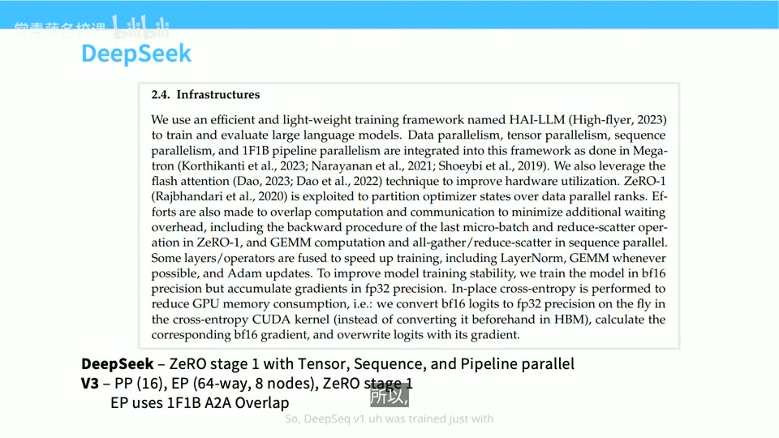 |
| 目的就是尽量保证专家并行不会出现利用率偏低的时段。所以为了搞定这些超大的专家并行划分，他们其实用了挺复杂的一套技巧。 [【跳转到 59:15】](https://www.bilibili.com/video/BV11LEA6eEuj/?p=8&t=3555) |  |
| 再举个例子，比如另一个来自中国的开源权重训练场景的模型——他们又一次用了 ZeRO 阶段一、张量并行和流水线并行，对吧？这很合理，就是经典的数据并行、张量并行、流水线并行的组合。同样，一旦用上 MoE，你就要把张量并行换成专家并行——他们的目标差不多，但专家并行效率稍微高一点。 [【跳转到 59:25】](https://www.bilibili.com/video/BV11LEA6eEuj/?p=8&t=3565) | 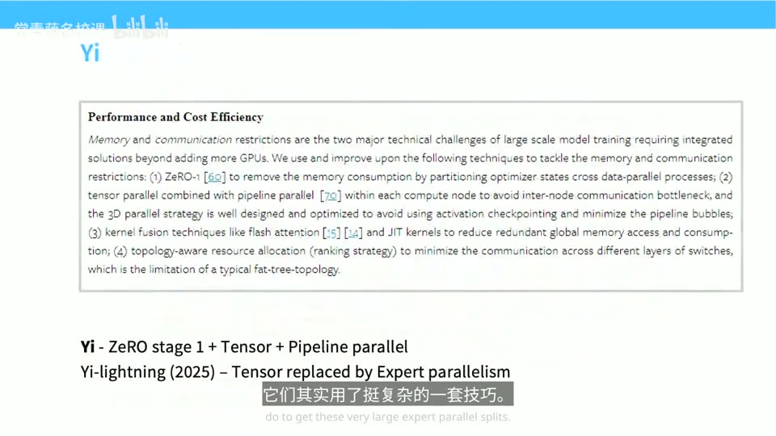 |
| 而在大型稠密模型的另一个极端就是 Llama 3。我挺喜欢 Llama 3 的这份报告，因为它是少数几份真正把并行策略完整拆解出来的报告，不只是泛泛而谈，而是覆盖了各个不同阶段。这里有个有意思的地方：他们有一个预训练之前的阶段，就像在最开始做个小小的预热（第一行可以忽略）；中间这一行展示的才是他们主要的预训练阶段，这是一种非常标准的并行策略：8 路张量并行、一种上下文并行、16 路流水线并行，还有 18 到 28 路 [【跳转到 59:46】](https://www.bilibili.com/video/BV11LEA6eEuj/?p=8&t=3586) | 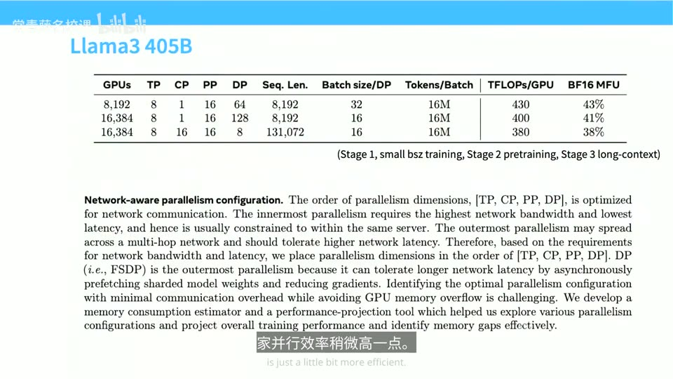 |
| 大规模的数据并行划分。然后在最后，因为他们想要一个长上下文模型，所以做了长上下文扩展。为了这个，他们拉高了上下文并行、降低了数据并行——这就是他们对这个极度吃内存的长上下文扩展阶段做并行的办法。注意一下，我们是在张量并行而不是专家并行，因为 Llama 3 405B 是一个巨大的稠密模型，它不是 MoE 模型。 [【跳转到 60:16】](https://www.bilibili.com/video/BV11LEA6eEuj/?p=8&t=3616) | 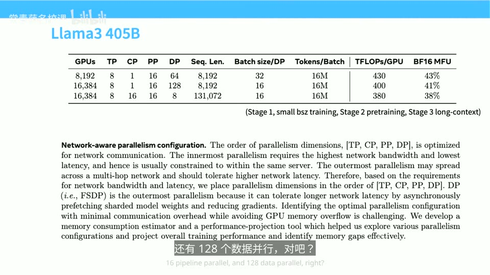 |
| 顺便说一句，有个我没聊到的点：如果你在这些公司里做基础设施工程师，你会发现 GPU 老是坏。显然，在训练 Llama 3 405B 的时候，GPU 每 40 亿 token 就会坏掉一次。所以你需要大量的并行——不只是快并行，还需要冗余，这样才能应对训练中可能出现的各种糟糕状况，所以这也带来了分布式系统的挑战。 [【跳转到 60:40】](https://www.bilibili.com/video/BV11LEA6eEuj/?p=8&t=3640) | 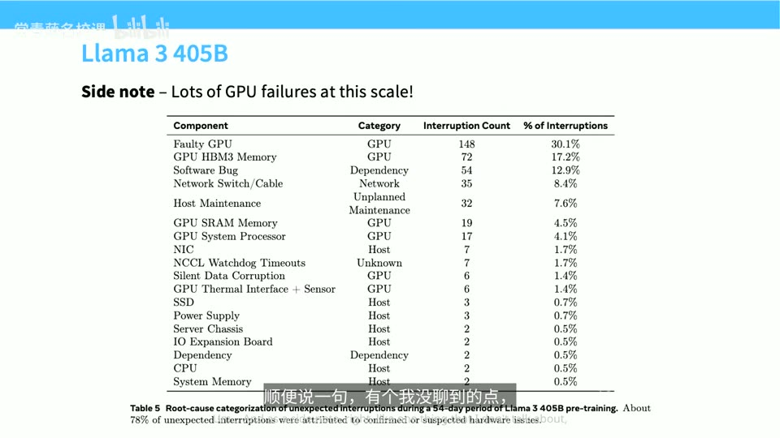 |
| Gemma 是 Google 的一个开源模型，它用了 FSDP 加上张量并行和序列并行，就靠这几种策略。我提一下 Gemma 的原因在于：据我所知，这基本印证了 Google 的观点——在 TPU 上其实根本不需要做流水线并行，你只需要搞一个很大的环形网格，然后在那个大型网格网络上做张量并行。目前还不太清楚这能不能无限扩展，这一点一直都有些含糊，说实话这点对我来说也不太清楚。但在 Gemma 这种规模下， [【跳转到 61:04】](https://www.bilibili.com/video/BV11LEA6eEuj/?p=8&t=3664) | 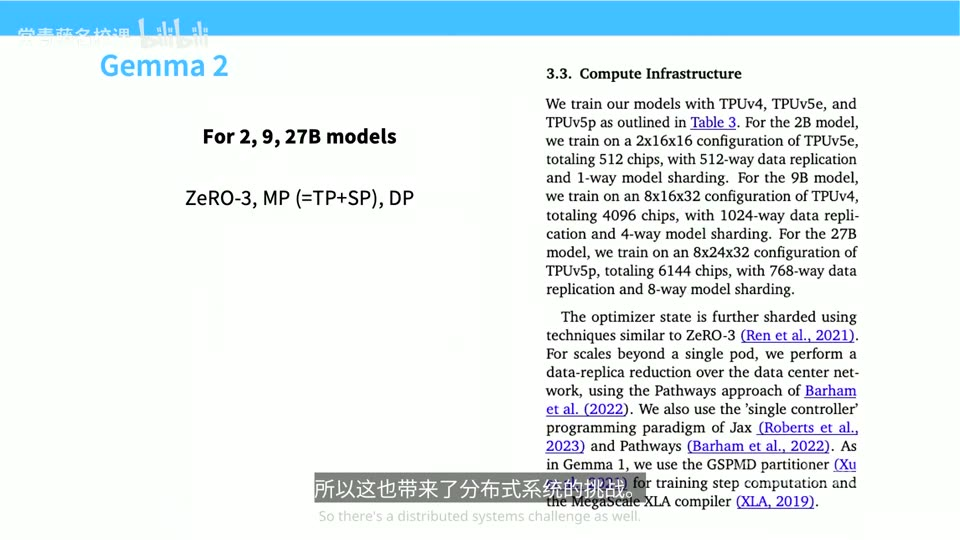 |
| 这肯定是没问题的。嗯，谢谢。最后我看了几个今年训练的模型， [【跳转到 61:34】](https://www.bilibili.com/video/BV11LEA6eEuj/?p=8&t=3694) | 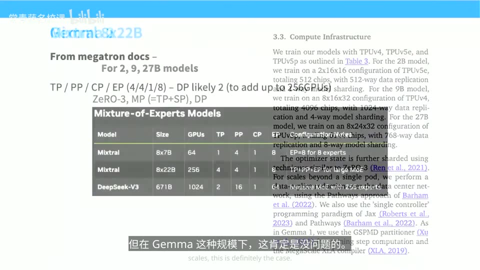 |
| 比如 Mixtral 8×22B。我调查时发现，如果你对实际中的模型训练和并行配置感兴趣，NVIDIA 有个叫 Megatron-Bridge 的代码库，他们在里面发布了不少推荐配置——针对各种不同模型大小和设置的训练配置。你可以看看他们最终推荐的，比如 Qwen3、OLMo 或 DeepSeek-V3 模型的正确配置。所以对于 Mixtral，他们用的是 8 路专家并行、4 路流水线并行，外加 4 路张量并行——这是针对注意力层的。 [【跳转到 61:38】](https://www.bilibili.com/video/BV11LEA6eEuj/?p=8&t=3698) | 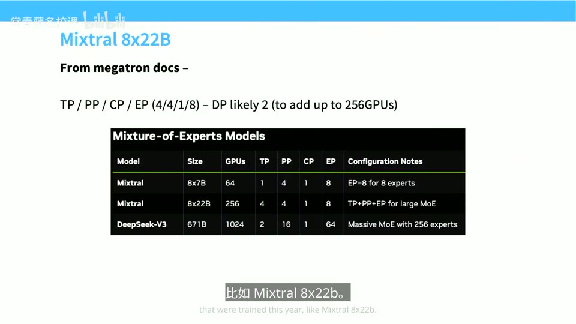 |
| 你可以看到，这遵循了那个建议：把专家并行大致保持在 8 左右。 [【跳转到 62:08】](https://www.bilibili.com/video/BV11LEA6eEuj/?p=8&t=3728) | 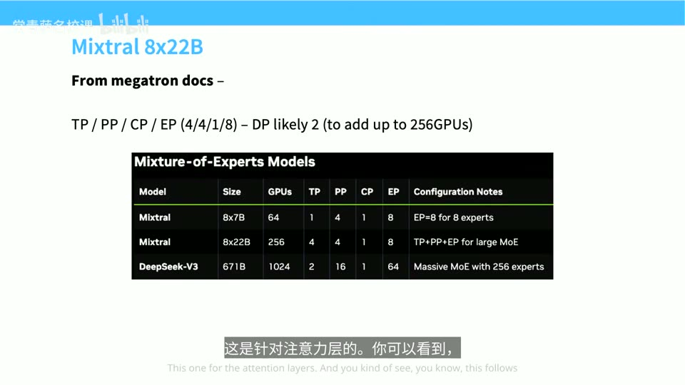 |
| Nemotron-3 Super 大致沿用了 DeepSeek-V3 的模型设计， [【跳转到 62:13】](https://www.bilibili.com/video/BV11LEA6eEuj/?p=8&t=3733) | 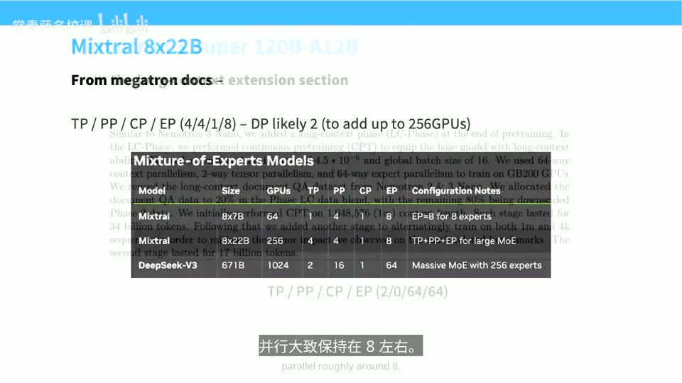 |
| 用了大量专家并行以及上下文并行——因为他们在做长上下文扩展，至少这篇文章里是这样。嗯，最后我想聊的是 Qwen3。 [【跳转到 62:17】](https://www.bilibili.com/video/BV11LEA6eEuj/?p=8&t=3737) | 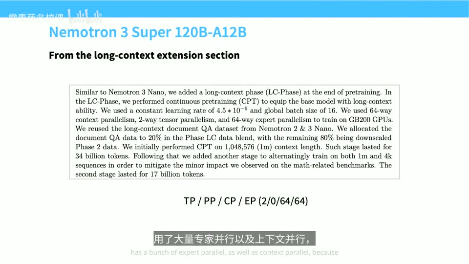 |
| 它沿用了 DeepSeek 的方案，也就是相当大量的专家并行——达到 32；此外他们还用了 8 路流水线并行和 4 路张量并行来拆分注意力矩阵这类东西。另外，看看 NVIDIA 团队针对不同模型并行化所做的各种基准测试其实挺有意思的，细节我就不展开了；如果你想看，可以去 Megatron-Bridge 仓库里找。你可以选择各种子配置，即便是在张量并行内部，这些配置也会显著影响性能。 [【跳转到 62:24】](https://www.bilibili.com/video/BV11LEA6eEuj/?p=8&t=3744) | 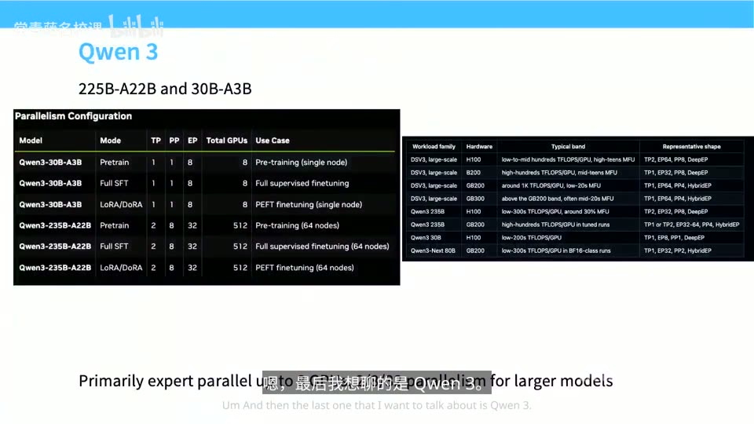 |
| 所以系统集成相当重要。为了把各方面内容串联起来，我就想着也许可以做个整体概览。其实这些模型的共同点是：尽可能多地采用数据并行，把数据并行域扩大到它们所能达到的极限；然后张量并行几乎总是保持在 8 以下；而专家并行现在有时规模可以很大——我想这在一定程度上是因为 DeepSeek-V3，以及他们为大规模专家并行训练构建的大量基础设施。好的。 [【跳转到 62:53】](https://www.bilibili.com/video/BV11LEA6eEuj/?p=8&t=3773) | 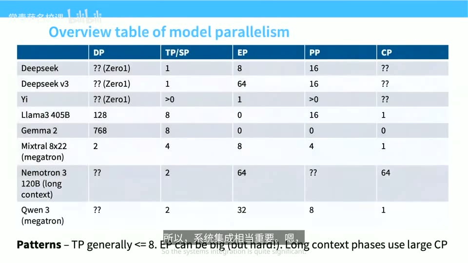 |
| 那么为了把所有内容整合起来——这门课最核心的观点是：我们需要考虑多 GPU、 [【跳转到 63:22】](https://www.bilibili.com/video/BV11LEA6eEuj/?p=8&t=3802) | 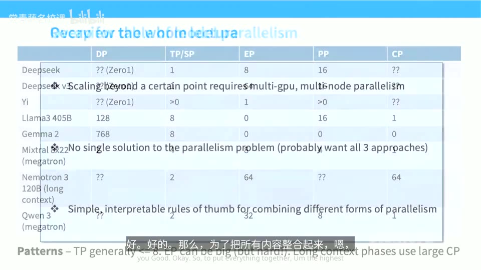 |
| 多节点、甚至多数据中心的并行，而要在这种情形下考虑效率，我们就需要切实调动手头所有的方法。因为你们既有高速链路也有低速链路，还有利用批次大小的各种技术，以及所有这些你们都想用上的不同资源——尽可能多地利用。但鉴于所有这些，事实证明：要把这些不同形式的并行组合起来，其实有一些相当简单的经验法则，最终能实现对计算硬件的有效充分利用。好，接下来下周我们来讲缩放定律。 [【跳转到 63:30】](https://www.bilibili.com/video/BV11LEA6eEuj/?p=8&t=3810) | 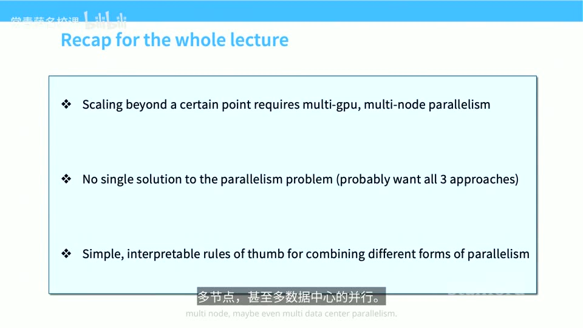 |
| *（此区间无字幕）* [【跳转到 63:58】](https://www.bilibili.com/video/BV11LEA6eEuj/?p=8&t=3838) | 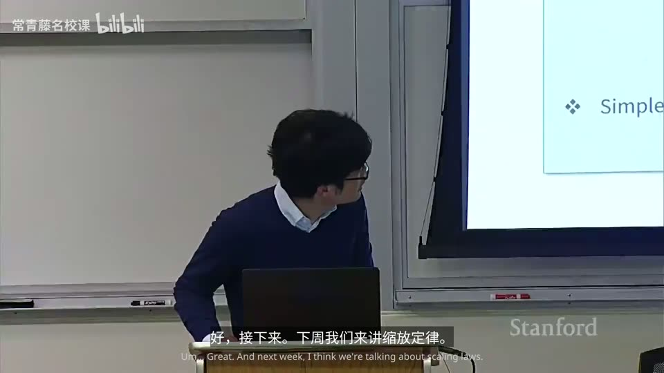 |