# Lecture 9: Scaling Laws · 原始文稿（图-字幕分栏）

| 字幕文本 | 画面 |
| :--- | ---: |
| 好，咱们这就开始。今天先暂时从系统领域抽身，聊聊更偏向深度学习的内容：接下来的两节课我们会专门讲缩放定律（scaling laws） [【跳转到 00:00】](https://www.bilibili.com/video/BV11LEA6eEuj/?p=9&t=0) |  |
| 以及和它相关的一些现象。 [【跳转到 00:08】](https://www.bilibili.com/video/BV11LEA6eEuj/?p=9&t=8) | 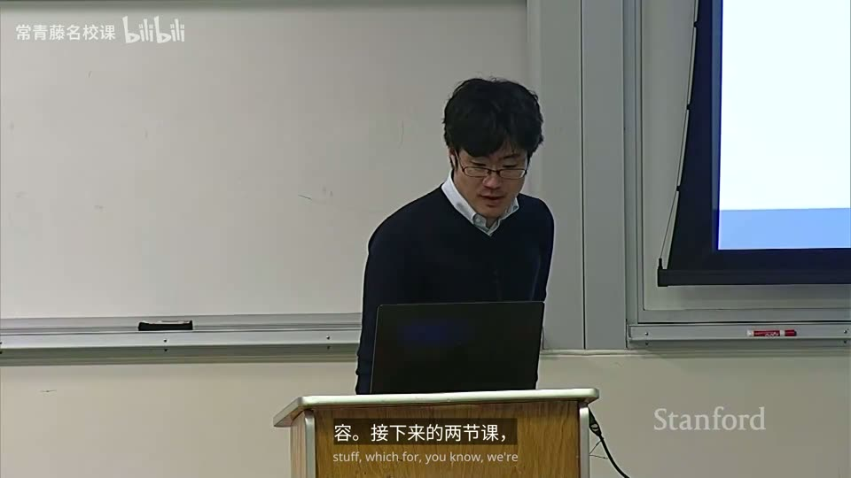 |
| 所以今天咱们先讲基础，主要聊聊缩放定律的基本概念， [【跳转到 00:12】](https://www.bilibili.com/video/BV11LEA6eEuj/?p=9&t=12) | 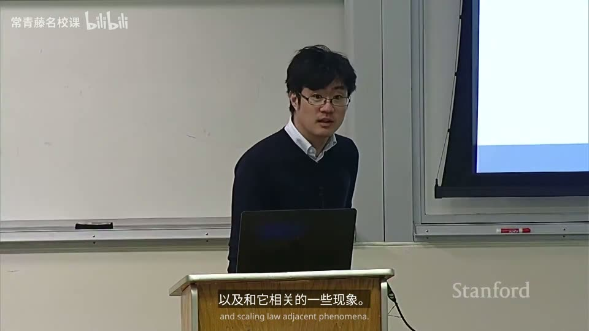 |
| 再回顾几篇经典论文。 [【跳转到 00:16】](https://www.bilibili.com/video/BV11LEA6eEuj/?p=9&t=16) | 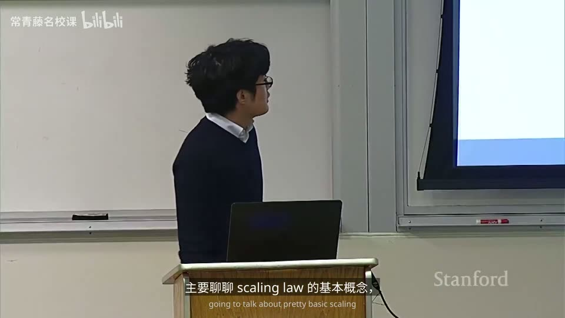 |
| 那么缩放定律的核心思想，和你之前学过的东西有什么联系呢？ [【跳转到 00:20】](https://www.bilibili.com/video/BV11LEA6eEuj/?p=9&t=20) | 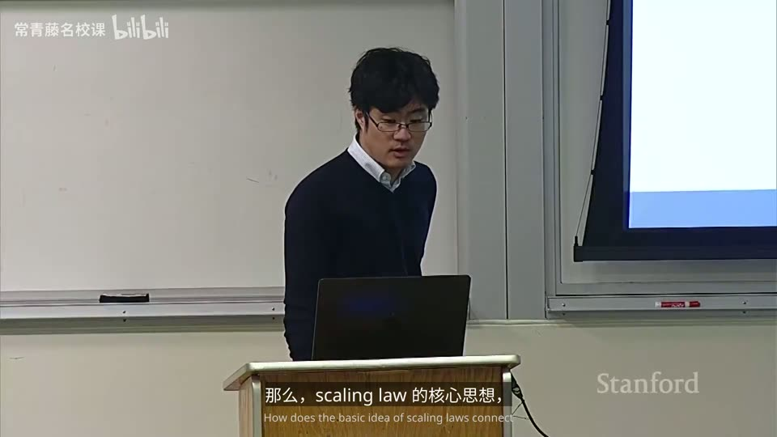 |
| 比如你在机器学习入门课里学到的那些。接下来的两节课， [【跳转到 00:24】](https://www.bilibili.com/video/BV11LEA6eEuj/?p=9&t=24) |  |
| 我们会讲更进阶的缩放定律内容，深入分析一些现代开源模型的技术报告， [【跳转到 00:30】](https://www.bilibili.com/video/BV11LEA6eEuj/?p=9&t=30) | 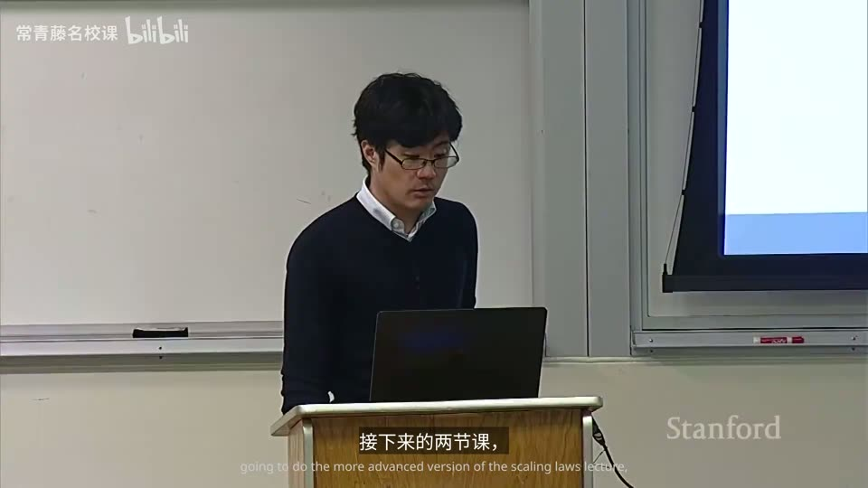 |
| 比如 muP（Maximal Update Parametrization）以及其他参数初始化方法，另外今年我会补充一些关于优化器的新内容，所以后面会有一个进阶版本，争取真正触及最前沿的技术。但今天咱们先从最基础的东西讲起。另外，因为课表安排的原因，下节课我们会讲推理（inference），所以课程会穿插着来：先讲缩放定律， [【跳转到 00:34】](https://www.bilibili.com/video/BV11LEA6eEuj/?p=9&t=34) |  |
| 然后是推理，接着再回到缩放定律。所以，缩放定律其实描述的正是下面这种情况—— [【跳转到 00:59】](https://www.bilibili.com/video/BV11LEA6eEuj/?p=9&t=59) | 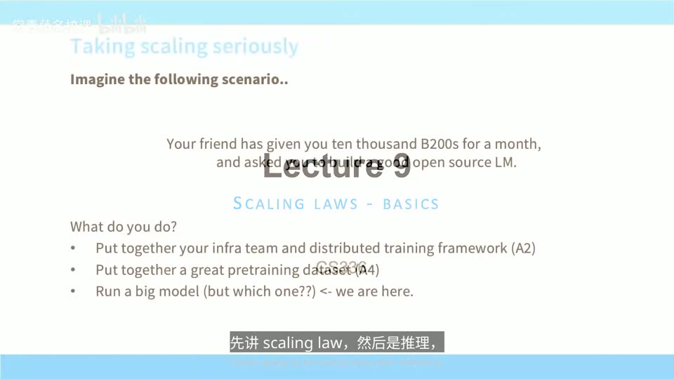 |
| 或者说，只要你一进入这个场景，很快就会遇到它，对吧。想象一下：你有个特别有钱的朋友，借给你一大堆 B200 用一个月，让你去打造一个很棒的开源语言模型。他们肯定希望这些 B200 能产出点东西，所以你已经把基础设施团队组建好了。这就是你交给伙伴们的任务，前提假设是你手头已经有一个质量不错的预训练数据集——这其实是之后才要做的任务，但咱们先假设你已经有数据了。 [【跳转到 01:03】](https://www.bilibili.com/video/BV11LEA6eEuj/?p=9&t=63) | 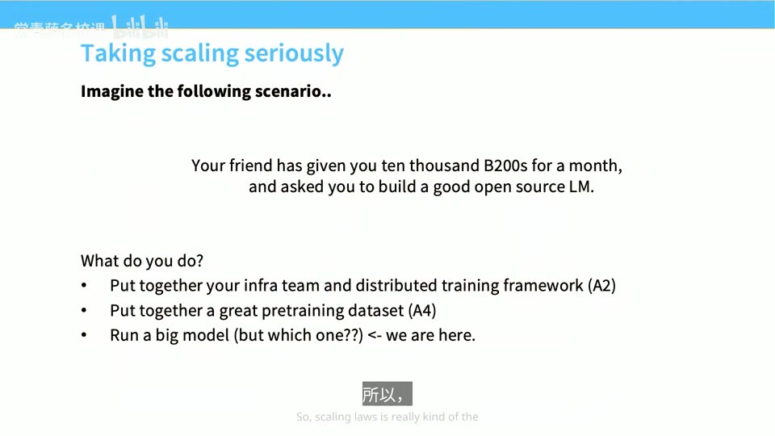 |
| 接下来你就要去训练一个大模型了，对吧。但训练大模型有很多选择，也就是我们之前第二讲里讲过的那些内容。你会遇到这样的问题：我该用什么架构？超参数该怎么设？毕竟跑一次实验可能就要花掉几百万美元，这让人压力很大。那么你怎么才能真正认真地对待扩展规模这件事，怎么确保你这次大规模训练真的能成功？ [【跳转到 01:33】](https://www.bilibili.com/video/BV11LEA6eEuj/?p=9&t=93) | 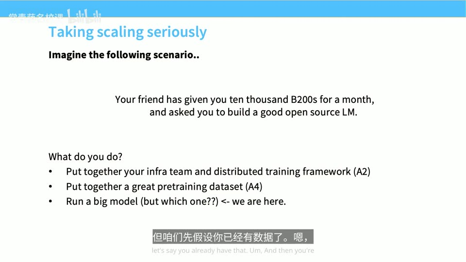 |
| 谢谢。面对这么多选择： [【跳转到 02:00】](https://www.bilibili.com/video/BV11LEA6eEuj/?p=9&t=120) | 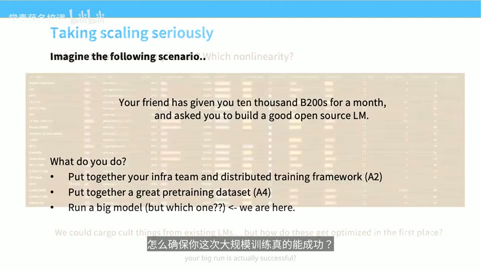 |
| 有些你直接照搬文献里的就行，对吧——我之前讲架构那节课提到的内容，其实就是大家公认的最佳实践，你大概会随便挑几个来用，这没问题。但假如你是在做前沿研究，你想做的是搞出比现在市面上最好的模型还要强的东西，你就得真正开始优化这些了。光照搬别人的选择，是做不出超越 SOTA（state-of-the-art）的东西的。那咱们怎么做到呢？这就得认真研究「扩展」这个思路了。 [【跳转到 02:04】](https://www.bilibili.com/video/BV11LEA6eEuj/?p=9&t=124) | 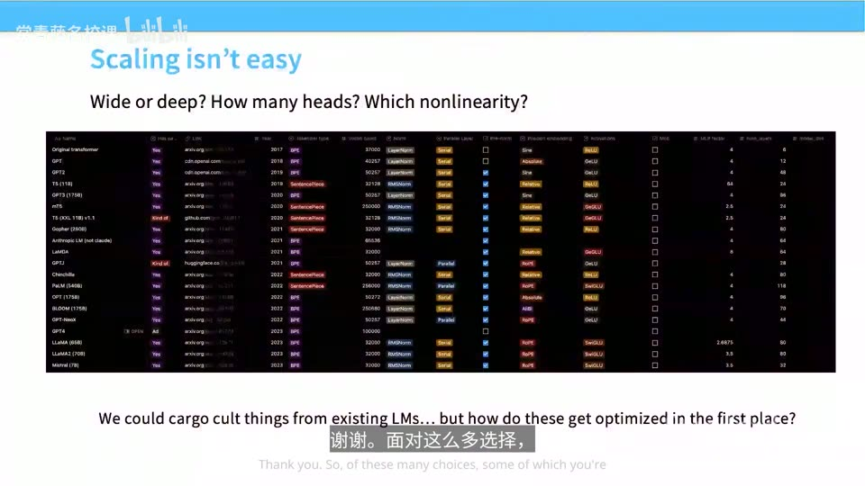 |
| 所以，缩放定律一直是个非常强大的工具。 [【跳转到 02:31】](https://www.bilibili.com/video/BV11LEA6eEuj/?p=9&t=151) | 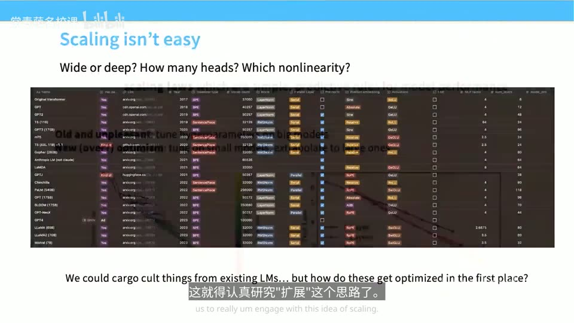 |
| 你也可以叫它一种范式。我觉得你要是问问那些在大型实验室里搞扩展工作的人，缩放定律对他们来说简直就是一种生活方式——他们会说「我们真心信奉缩放定律」，这都快成一种信仰了。你马上就会知道为什么缩放定律有时候挺让人头疼的。但其实，缩放定律就是一组简单的预测规则，帮我们从中小规模模型的表现和行为，去推测大规模下的表现。要训练模型，最直观的做法可能是这样想：我预算充足，我会跑很多次大型训练， [【跳转到 02:35】](https://www.bilibili.com/video/BV11LEA6eEuj/?p=9&t=155) |  |
| 然后在这些大型训练里调优超参数。但这太浪费了。所以我想换种做法：尽量在小规模上完成所有优化，然后靠一条简单的规则把小规模的结果外推到大规模。如果小规模和大规模之间能通过某种简单规则联系起来——比如存在某种稳健的规律——那你就会对这种「用缩放方法来优化系统」的新方式有信心。这也是今天我们要讲的重点：从工程学角度看待缩放定律。 [【跳转到 03:05】](https://www.bilibili.com/video/BV11LEA6eEuj/?p=9&t=185) | 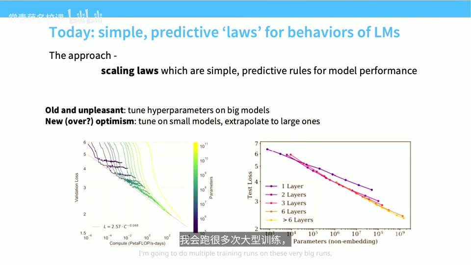 |
| 好，咱们先简单聊聊背景。我觉得缩放定律特别有意思：它不仅是最新的范式，很多模型的设计和思路都是按它来的，而且它们跟那些经典理论联系得很紧。所以如果你是搞机器学习理论的，你会发现有些东西其实挺亲切的——它们有点像经验版的样本复杂度。接下来我讲讲这类缩放定律的历史，你会发现这其实不是什么新鲜事，这东西其实早就有人研究过了， [【跳转到 03:33】](https://www.bilibili.com/video/BV11LEA6eEuj/?p=9&t=213) | 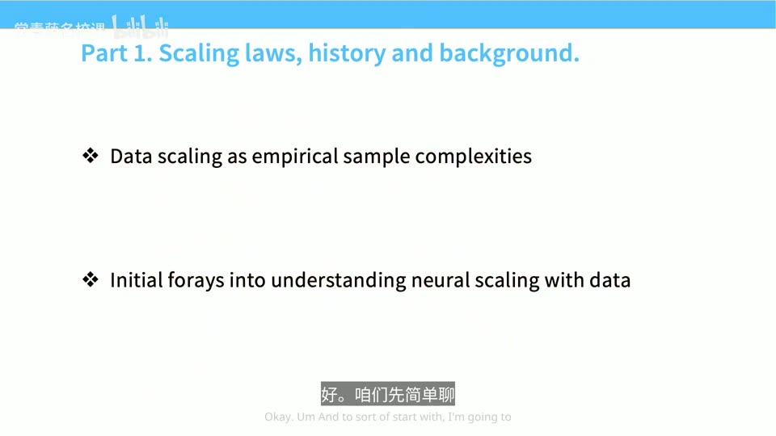 |
| 历史挺久的。所以你们懂得，我不得不在 PPT 里加些数学公式，这确实很有必要。不过我觉得挺有意思的一点是：机器学习长期以来一直在琢磨「模型性能」这件事，对吧？尤其是从理论角度看——就像「我有了这个模型类，它到底能有多好」。泛化界（generalization bound）算是理论研究者对这个问题给出的答案，对吧？你看，对于某个有限假设类，你可以说「我的误差最多就比模型在训练集上的表现差这么多」，对吧？这就是经典的泛化界。 [【跳转到 04:00】](https://www.bilibili.com/video/BV11LEA6eEuj/?p=9&t=240) | 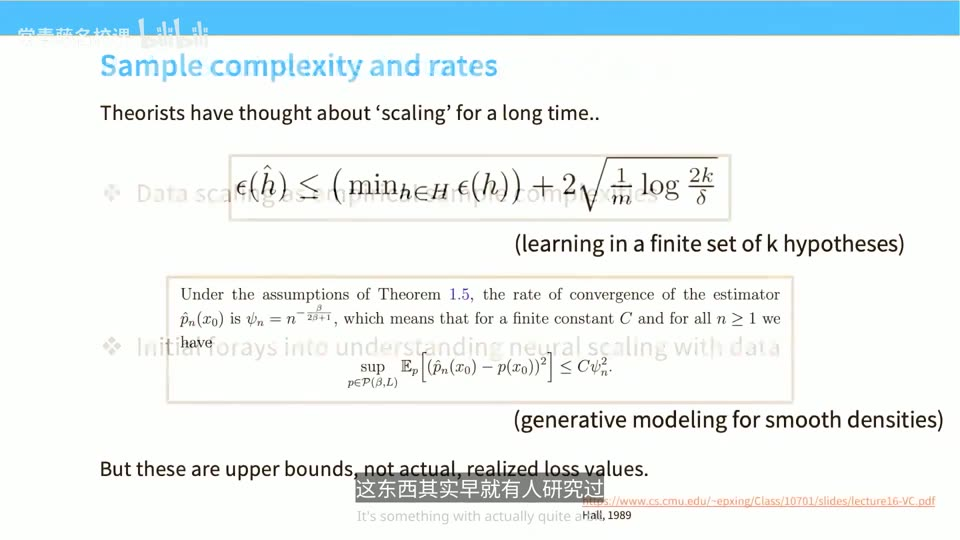 |
| 对于更复杂的类别，比如平滑密度之类的，你也能推导出类似的界限。但关键在于：这些界限不仅告诉你某种性能，还要注意它们往往取决于样本量。所以这实际上是在告诉你：随着训练集规模扩大，我的损失值存在一个理论上限。从某些角度来看，这和「当我扩大数据量时会发生什么」这个思路紧密相关——这些问题是紧密相关的。 [【跳转到 04:30】](https://www.bilibili.com/video/BV11LEA6eEuj/?p=9&t=270) | 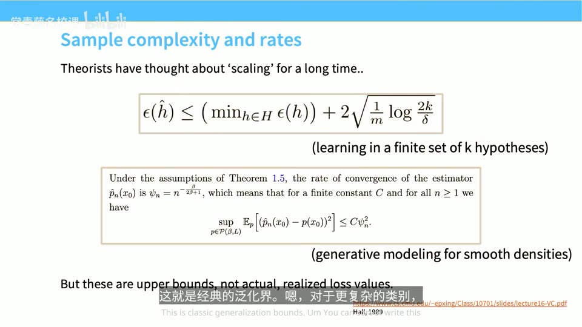 |
| 或者说，你姑且先相信我这是真的。如果你想弄清楚最早的缩放定律论文是哪一篇，会发现可以追溯到相当久远的年代：我可以追溯到贝尔实验室的 Corinna Cortes 和 Vladimir Vapnik 等人。他们当时在机器学习领域做着非常严谨的理论研究，并探讨了这个问题：在非常大的数据集上训练分类器通常成本很高，我们想避免这么做。一种办法是：先在较小的样本上训练分类器， [【跳转到 04:55】](https://www.bilibili.com/video/BV11LEA6eEuj/?p=9&t=295) | 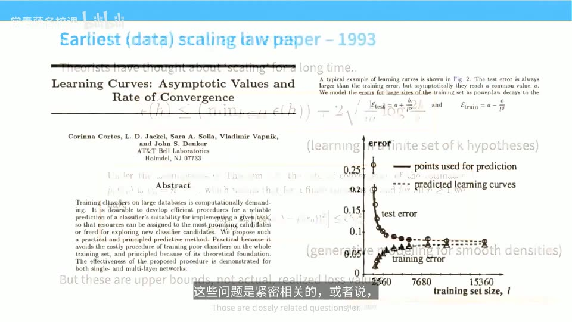 |
| 画出错误率随样本量增加而衰减的曲线， [【跳转到 05:25】](https://www.bilibili.com/video/BV11LEA6eEuj/?p=9&t=325) | 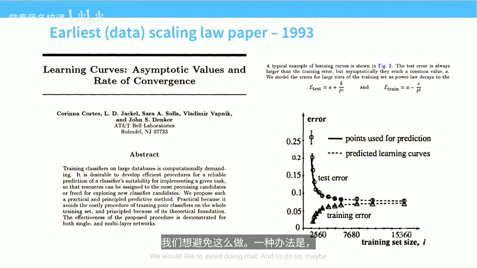 |
| 借此来估算模型的性能。这其实几乎就可以说是「数据缩放定律」了，而且早在 1993 年就出现了。 [【跳转到 05:30】](https://www.bilibili.com/video/BV11LEA6eEuj/?p=9&t=330) | 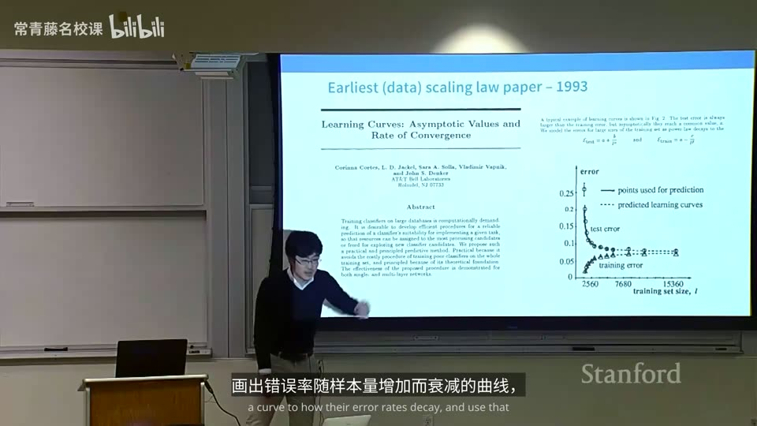 |
| 所以，「至少要考虑模型性能如何随数据量变化」这个思路其实非常经典。支持这种想法的研究其实有很多，我想把它和一些更早的思想联系起来，免得你把缩放定律看成这样一种东西：它是某种非常新、纯粹属于神经网络的东西。 [【跳转到 05:39】](https://www.bilibili.com/video/BV11LEA6eEuj/?p=9&t=339) | 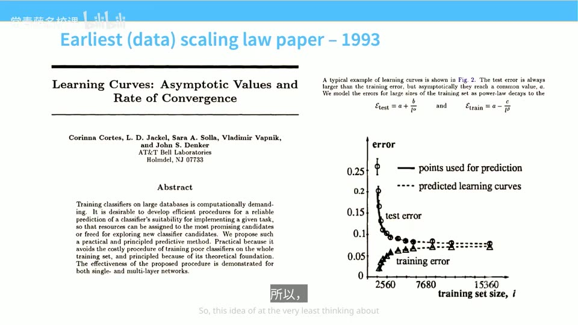 |
| 我觉得这个想法在经验机器学习里根基很深，也和理论机器学习有联系。你稍微回顾一下这段历史就会发现，很多人都提出过：与其把钱花在算法开发上，不如去收集更多数据。因为如果我们把系统性能随数据量增加的变化画出来，会发现它们的表现都在以可预测的方式提升。我觉得 Banko 和 Brill 算是 NLP 领域的经典参考文献之一，它说明了：增加数据量、从扩展的角度去思考，确实是提升系统性能非常有效的途径。 [【跳转到 05:55】](https://www.bilibili.com/video/BV11LEA6eEuj/?p=9&t=355) | 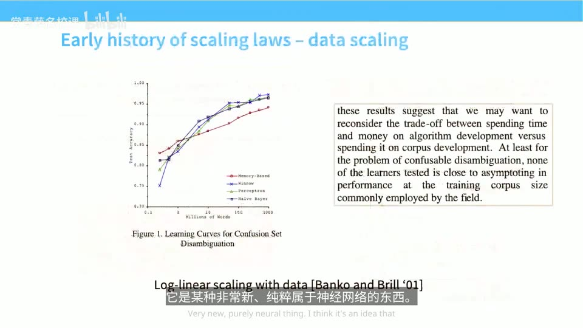 |
| 所以可以从很多角度来思考这个问题。我觉得还有其他 NLP 同行也做过相关工作： [【跳转到 06:25】](https://www.bilibili.com/video/BV11LEA6eEuj/?p=9&t=385) | 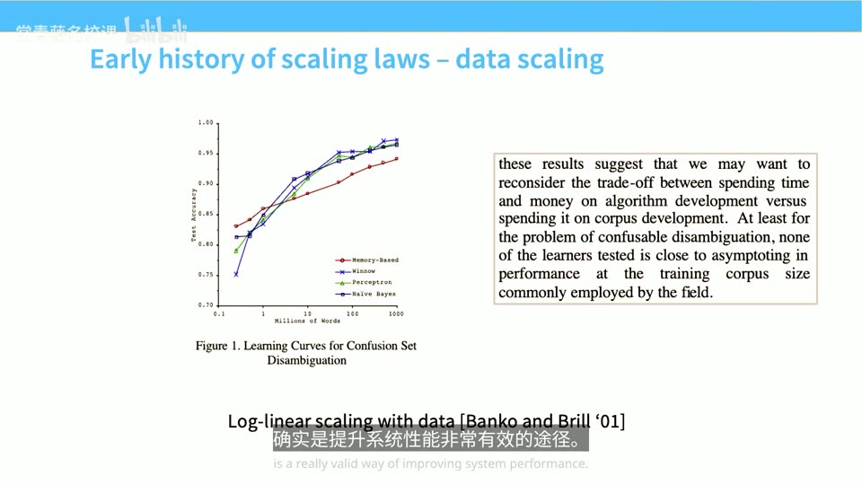 |
| 比如 Gao 等人，那是 2012 年，这是早期探讨缩放定律不同函数形式的工作之一。他们同样也增加了用于训练的数据量——这里指的是机器翻译系统，那就是看 BLEU 分数。他们在研究：当数据量增加时，模型性能的变化应该遵循什么样的函数形式。不管是否出人意料，最后得出的幂率都是一样的：指数是 3 和 4，跟我们今天用的其实没什么两样。接下来的讲座里， [【跳转到 06:29】](https://www.bilibili.com/video/BV11LEA6eEuj/?p=9&t=389) | 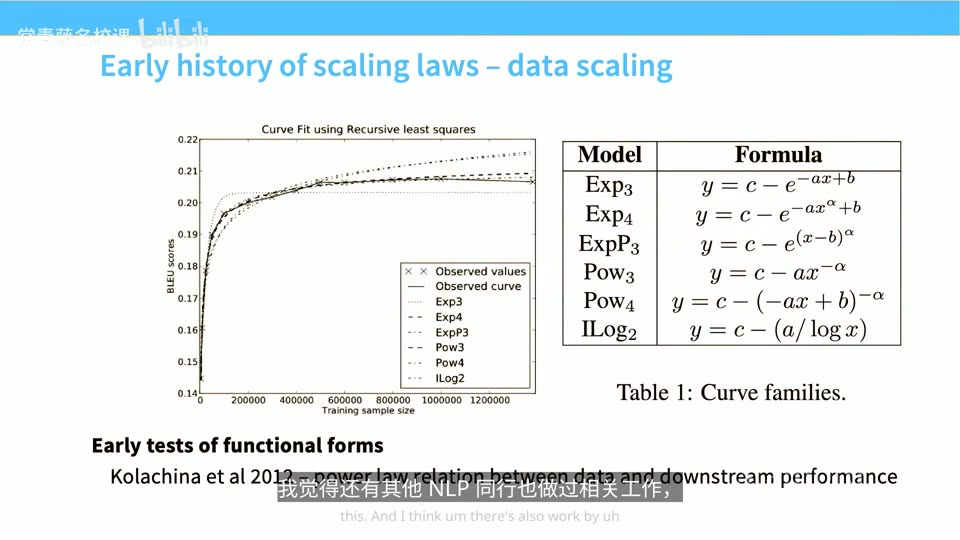 |
| 我讲缩放定律的时候，你们会反复看到这些多项式函数，也就是指数为 3 和 4 的情况。其实早在 2010 年代我们就大概知道这些了，这些函数形式在模型规模扩大时能很好地预测模型的表现。最后我想特别提一下这篇论文： [【跳转到 06:59】](https://www.bilibili.com/video/BV11LEA6eEuj/?p=9&t=419) | 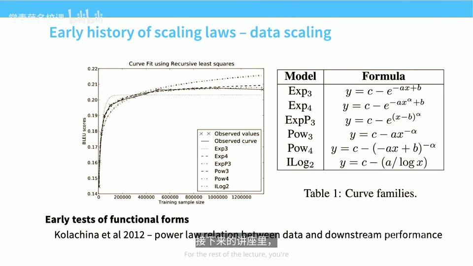 |
| 不管出于什么原因，Hestness 他们这篇工作的引用量其实没达到它应有的水平。我觉得神经网络缩放的起源，最早能追溯到 2017 年 Hestness 的那项工作。这一项工作在很多方面都很有前瞻性：它把缩放定律构建成了数据集规模的函数，涵盖了各种系统——比如不同种类的语音识别系统、机器翻译系统，还有语言模型。他们发现这些系统在大量领域里都呈现出这种漂亮的多项式趋势。 [【跳转到 07:14】](https://www.bilibili.com/video/BV11LEA6eEuj/?p=9&t=434) | 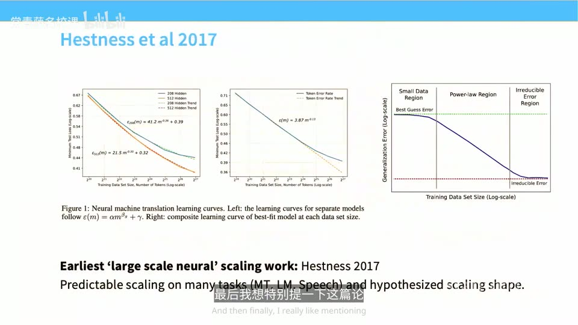 |
| 这确实很有前瞻性，毕竟 2017 年比 OpenAI 那些早期的缩放定律研究早了很多。 [【跳转到 07:44】](https://www.bilibili.com/video/BV11LEA6eEuj/?p=9&t=464) | 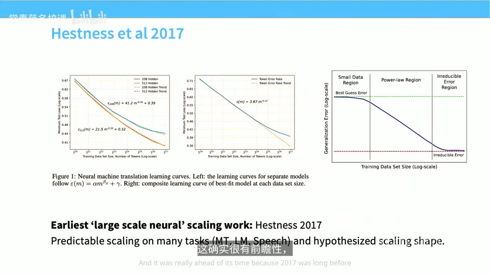 |
| 到了 2020 年代我们还在讨论他们当时就提到的东西：比如语言模型可能会突然展现出某些能力——因为准确率这个指标比损失要不连续得多；还有，既然是靠算力来扩展，如果我们做的系统能随着训练数据量的增加而稳定扩展，那算力就变得特别关键；最后，既然我们是在靠算力扩展，那么提升速度、优化系统，最终都会转化为准确率的提高。所以说，像「系统扩展」这类我们如今常见的现象， [【跳转到 07:48】](https://www.bilibili.com/video/BV11LEA6eEuj/?p=9&t=468) | 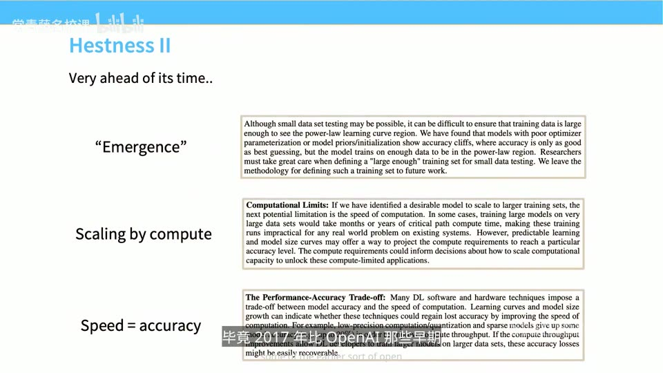 |
| 其实早在 2017 年，只要我那时认真研读 [【跳转到 08:18】](https://www.bilibili.com/video/BV11LEA6eEuj/?p=9&t=498) | 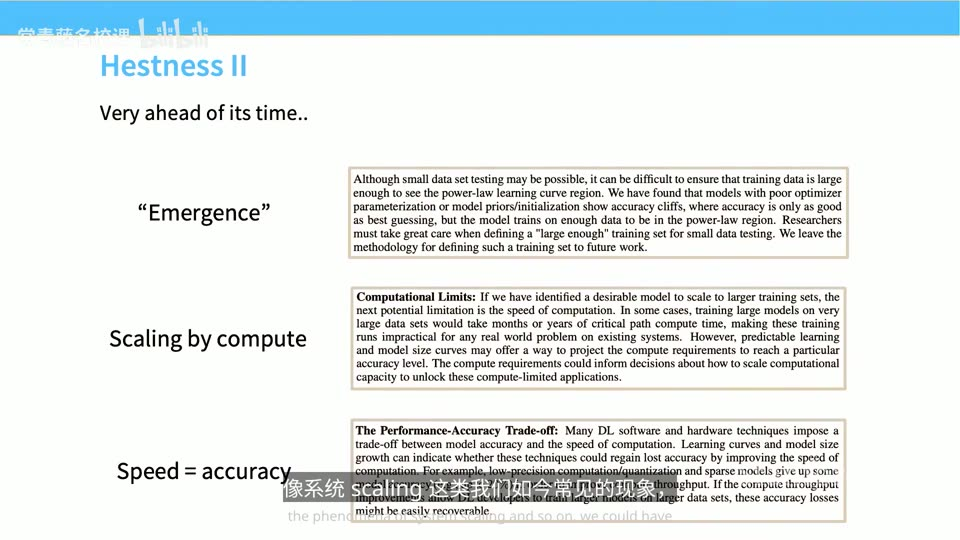 |
| 并深入思考过那些缩放定律相关的论文，我就完全能够预见到如今大语言模型时代的种种现象。 [【跳转到 08:22】](https://www.bilibili.com/video/BV11LEA6eEuj/?p=9&t=502) | 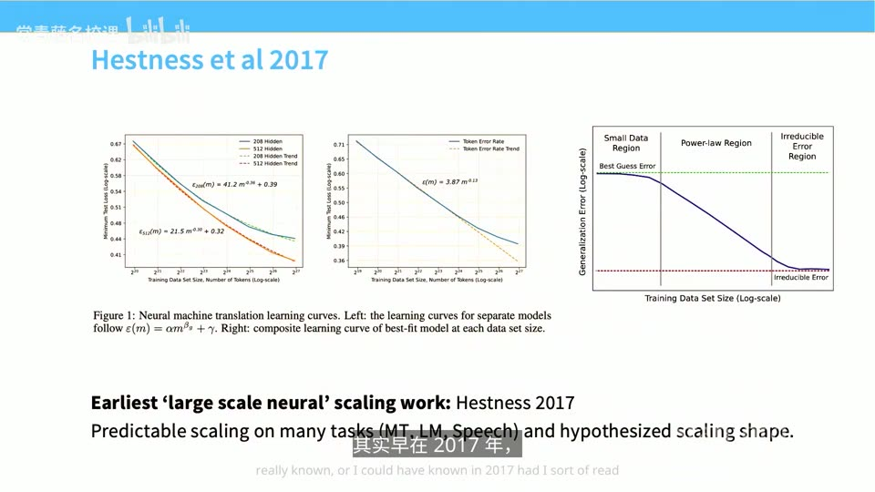 |
| 我特意提一下这篇论文， [【跳转到 08:26】](https://www.bilibili.com/video/BV11LEA6eEuj/?p=9&t=506) | 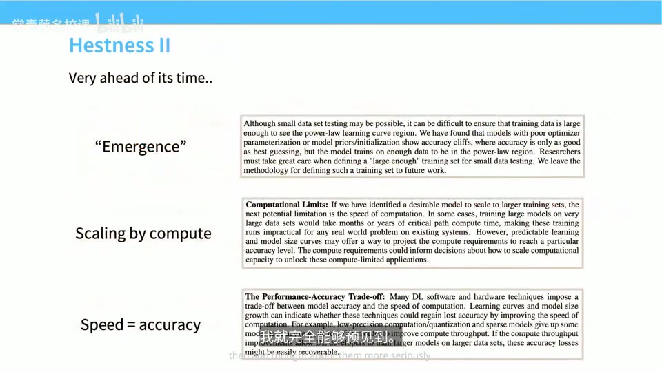 |
| 就是想说明：很多这类现象早在现代之前——或者说现代语言模型时代之前——就已经为人所知了，而且也有可能在见到这些大语言模型之前，我们就已经认清自己当前所处的状态。我觉得这点挺酷的。好，关于这段略带历史背景的内容，大家有什么问题吗？——谢谢。我想问一下：这些缩放定律只是靠经验得出的， [【跳转到 08:30】](https://www.bilibili.com/video/BV11LEA6eEuj/?p=9&t=510) | 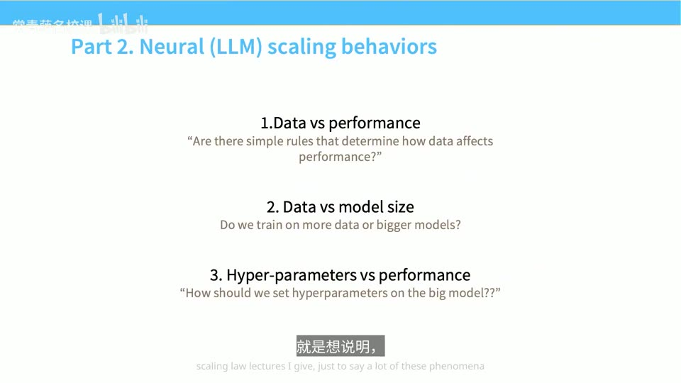 |
| 还是有某种理论依据能解释这一切？——你问的是缩放定律 [【跳转到 08:53】](https://www.bilibili.com/video/BV11LEA6eEuj/?p=9&t=533) | 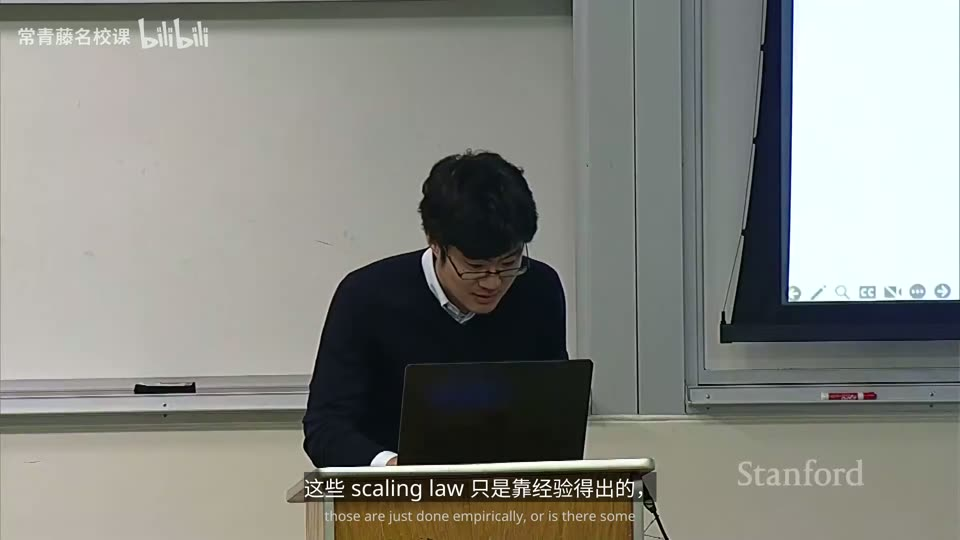 |
| 以及它们是从哪里来的。这些其实算是纯粹的曲线拟合。 [【跳转到 08:59】](https://www.bilibili.com/video/BV11LEA6eEuj/?p=9&t=539) | 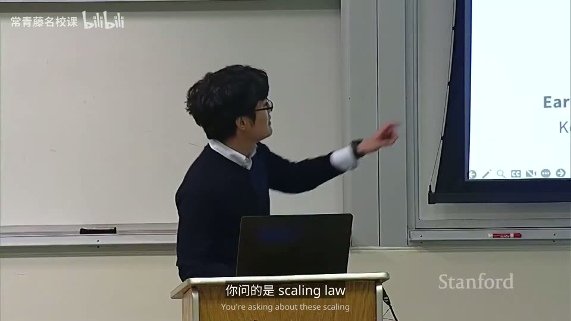 |
| 我接下来会简单讲讲缩放定律的来源， [【跳转到 09:03】](https://www.bilibili.com/video/BV11LEA6eEuj/?p=9&t=543) | 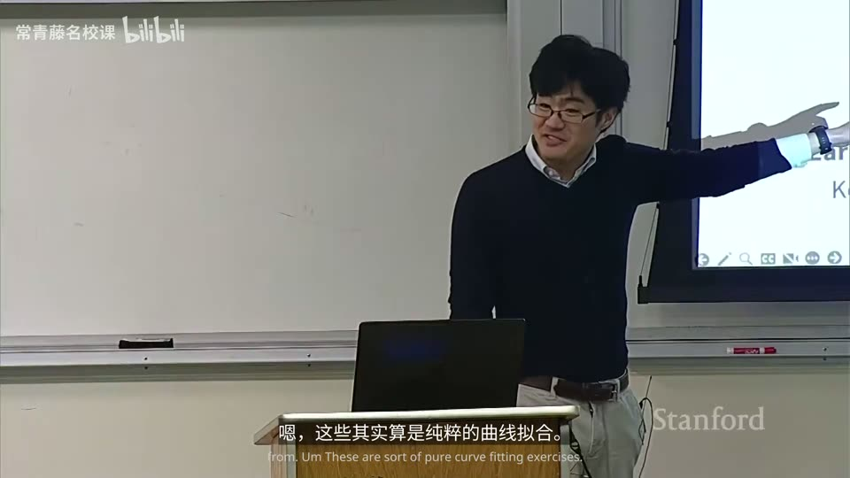 |
| 以及为什么多项式形式可以说是非常自然的一类缩放定律。 [【跳转到 09:07】](https://www.bilibili.com/video/BV11LEA6eEuj/?p=9&t=547) | 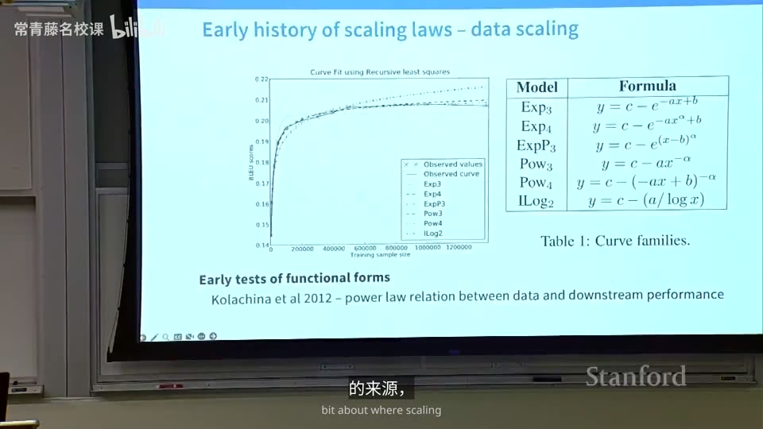 |
| 不过并没有什么黄金法则规定只有这些形式才行。 [【跳转到 09:11】](https://www.bilibili.com/video/BV11LEA6eEuj/?p=9&t=551) | 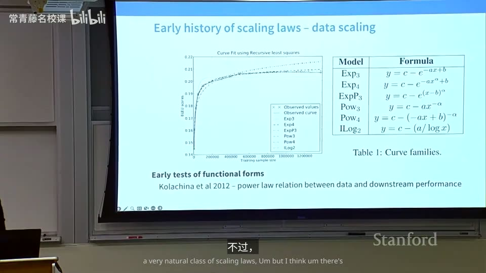 |
| 但我想说的是：理论其实为这些缩放定律的函数形式 [【跳转到 09:15】](https://www.bilibili.com/video/BV11LEA6eEuj/?p=9&t=555) | 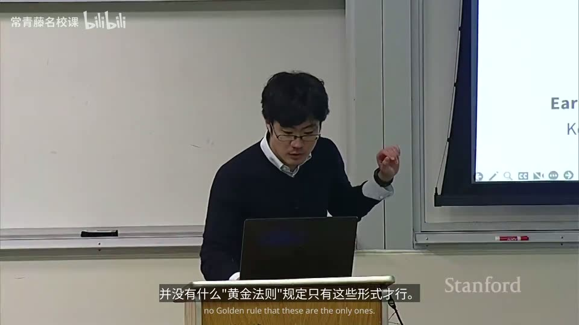 |
| 提供了非常丰富的来源。因为理论研究经常在思考「错误率如何随各种变量衰减」， [【跳转到 09:19】](https://www.bilibili.com/video/BV11LEA6eEuj/?p=9&t=559) | 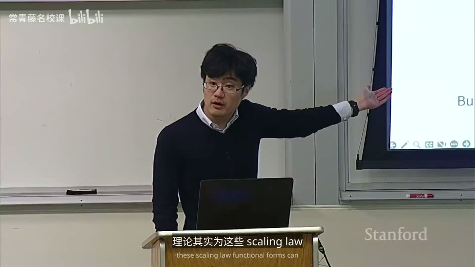 |
| 并由此给出各种各样的候选函数形式。物理学家也很擅长这个，因为他们喜欢思考极限——比如极限是怎么表现的——这就能给出不同的缩放定律函数形式。好了，谢谢。还有别的问题吗？ [【跳转到 09:23】](https://www.bilibili.com/video/BV11LEA6eEuj/?p=9&t=563) | 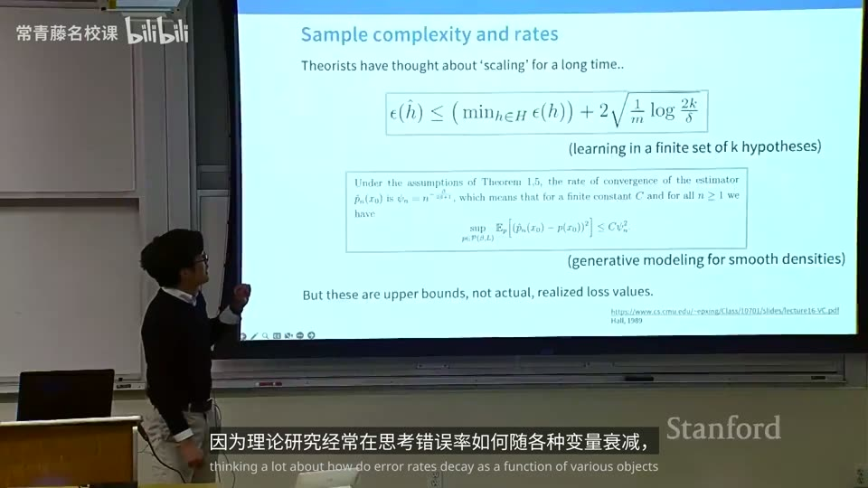 |
| 好，接下来我要讲讲更现代的神经语言模型缩放。我先从数据缩放定律讲起，因为我觉得它们是最简单、最自然的对象。通过讨论数据缩放定律，我可以一步步带你理解：我们是如何推测缩放定律函数形式的，以及为什么多项式形式是一个自然而然的选择。接着我会谈谈超参数、架构，以及其他一些更复杂的要素——虽然从直觉上很难解释它们，但它们依然呈现出非常漂亮的缩放定律行为。 [【跳转到 09:37】](https://www.bilibili.com/video/BV11LEA6eEuj/?p=9&t=577) | 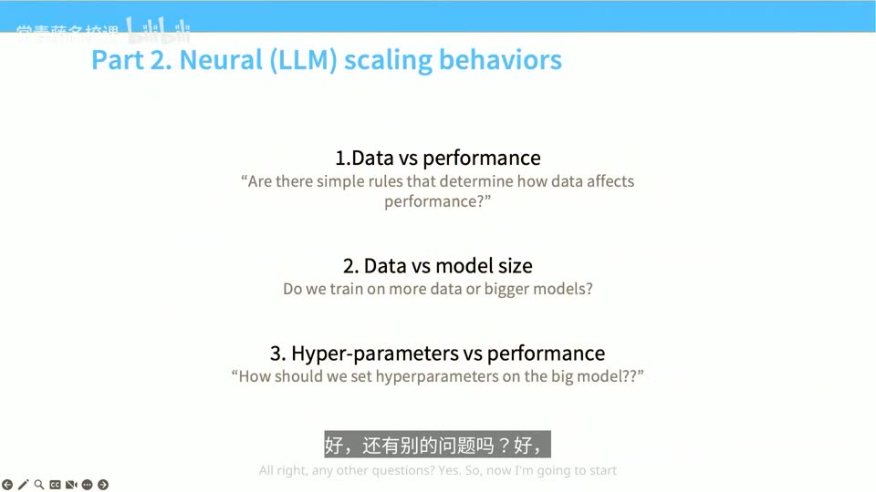 |
| 这种缩放分析方式最引人注目的地方在于：这些幂律关系似乎适用于极其多样的不同因素。所以我们在预训练中看到的基本上就是这些，也就是我今天要讲的内容。咱们平时看到的图，横轴通常是算力——比如横轴是对数算力、纵轴是测试损失的对数；或者横轴是数据集规模的对数、纵轴是损失的对数；再或者横轴是参数量的对数、纵轴依然是损失的对数。 [【跳转到 10:04】](https://www.bilibili.com/video/BV11LEA6eEuj/?p=9&t=604) | 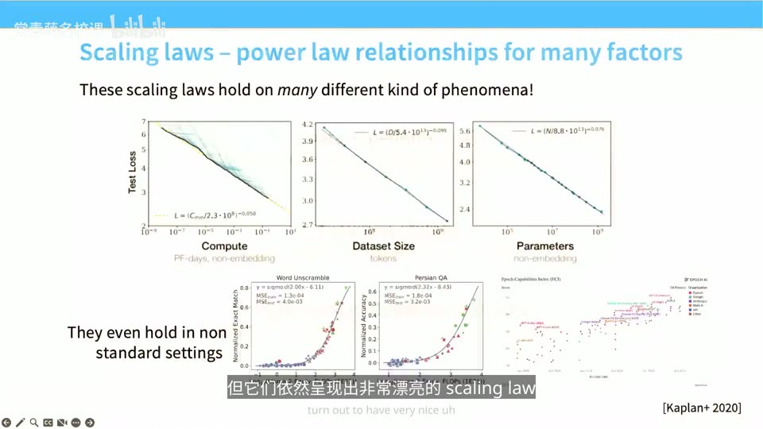 |
| 所以我们会得到各种不同的横轴，你可以把它们看作对数坐标下的资源。这些关系大致上都让测试损失的对数呈线性趋势。你还能看到一些更奇特的缩放定律：你会发现这些缩放定律在下游基准测试中也有对应的等价形式——在这种情况下，你会看到随着算力或类似算力指标的变化，曲线呈现 S 型（sigmoid）函数形态。最近甚至有不少侧重于预测的研究，比如有人直接把日期作为横轴。 [【跳转到 10:34】](https://www.bilibili.com/video/BV11LEA6eEuj/?p=9&t=634) | 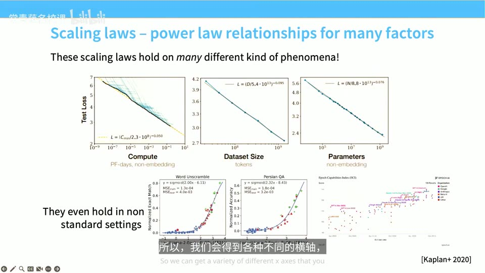 |
| 而且说来奇怪，至少在这些图里，这些曲线的上包络线在各种能力形式上往往呈线性。没有理由认为在这个底部一侧那些更奇特的缩放定律就一定成立，但实际情况是：语言模型的性能随规模和资源的变化，往往比我们一开始以为的要更有规律。 [【跳转到 11:04】](https://www.bilibili.com/video/BV11LEA6eEuj/?p=9&t=664) | 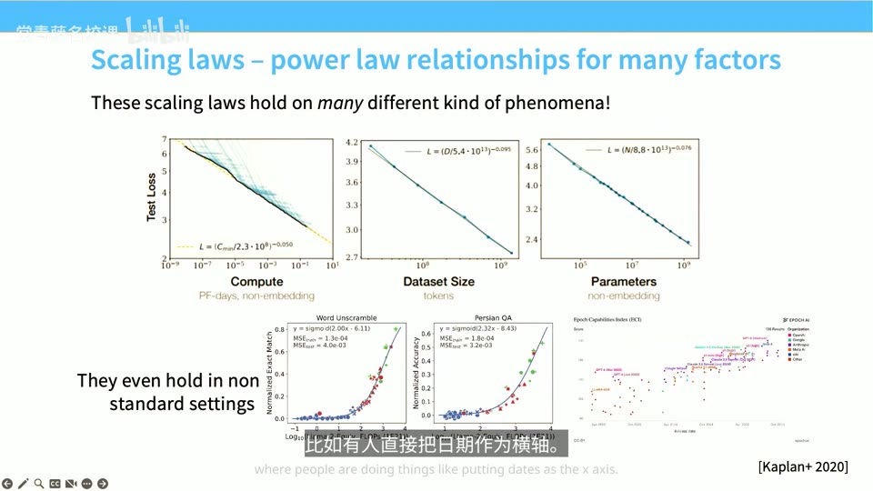 |
| 所以咱们先从数据缩放定律开始讲起。数据缩放定律其实是一种很简单的单变量关系，咱们来分析一下。在这个设定里，咱们先固定模型和训练流程——一般情况下，除非我特别说明，模型的规模都会比数据集大——然后按常规方式增加数据集规模，看看误差是怎么降下来的。那咱们预期这种关系会怎样？只要咱们把超参数调得好，它基本就是单调变化的：因为数据变多了，更多的数据能帮咱们更好地完成任务， [【跳转到 11:22】](https://www.bilibili.com/video/BV11LEA6eEuj/?p=9&t=682) | 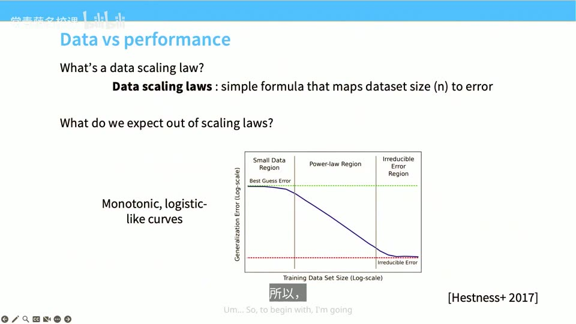 |
| 误差自然就会下降。比如你在做分类，甚至是做下一个 token 预测，你的表现应该从瞎猜开始，慢慢逼近一个极限——这个极限就像某种熵值，是你没法再突破的任务不可约误差，对吧？这就是所谓的噪声底线。所以我们这里会得到一条类似 S 型的曲线。这基本上就是我们对系统的预期。 [【跳转到 11:52】](https://www.bilibili.com/video/BV11LEA6eEuj/?p=9&t=712) | 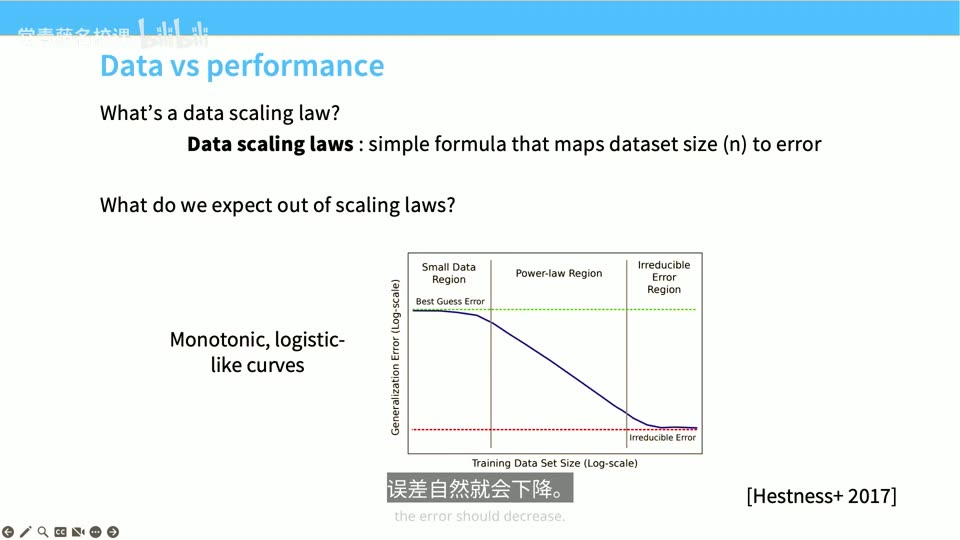 |
| 那咱们先从一个经验观察说起。你们可以、也应该自己动手做一下——在第三次作业的部分内容里，你们会做出大致像这样的结果。也就是说：假设我们有一个特别大的模型，规模远超数据集，然后我们不断增大数据集，把它画在对数轴上，Y 轴还是对数测试损失，你会发现这两者之间是有关联的——你画出来的点会呈现出非常清晰的线性趋势。这张图我引自 Kaplan 2020 年的论文，我后面会反复引用这篇论文： [【跳转到 12:13】](https://www.bilibili.com/video/BV11LEA6eEuj/?p=9&t=733) |  |
| 就是 OpenAI 那篇关于神经网络缩放定律的论文。他们做了很多很棒的消融实验，也有很多很棒的数据。现在我在双对数图上画的这条线，体现的是一种无标度关系，也就是幂律关系。 [【跳转到 12:43】](https://www.bilibili.com/video/BV11LEA6eEuj/?p=9&t=763) | 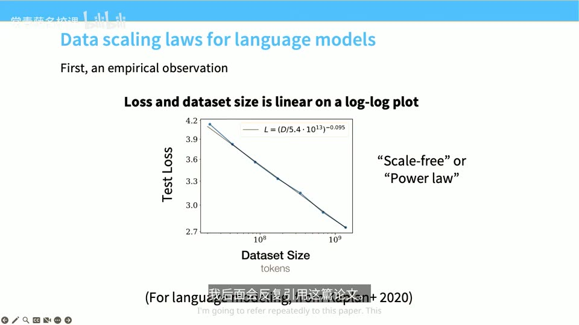 |
| 那这意味着什么呢？如果在双对数图上画出一条直线——这一点对你们很多人来说大概是显而易见的，咱们再强调一下——如果某个东西在双对数图上是线性的，这到底说明什么？这意味着误差是按多项式速度衰减的，而且这通常说明我离渐近线还很远，因为一旦接近渐近线，曲线就会变平缓，而不是保持直线状态。咱们拿个例子看看：缩放定律是怎么在一个特别简单的估计问题里 [【跳转到 12:57】](https://www.bilibili.com/video/BV11LEA6eEuj/?p=9&t=777) | 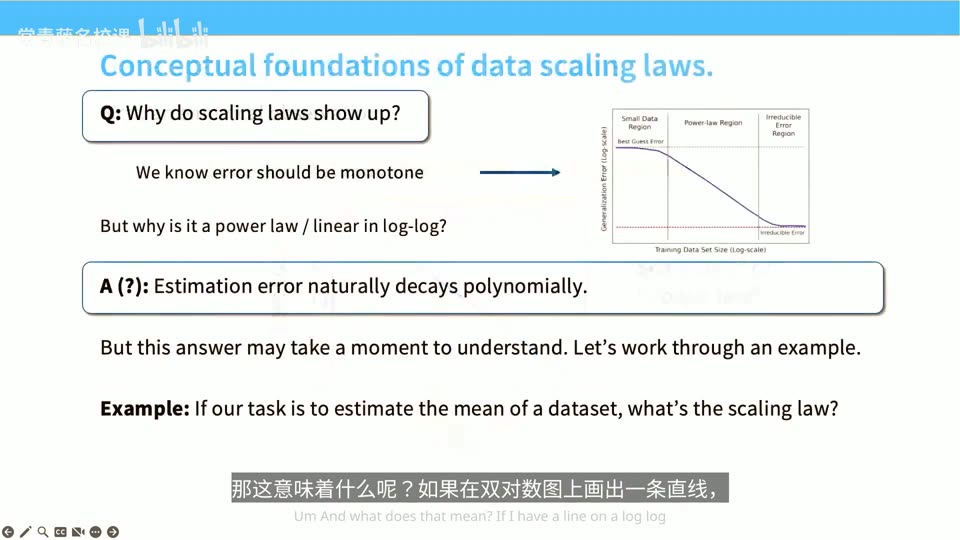 |
| 自然出现的。先别管语言模型了—— [【跳转到 13:27】](https://www.bilibili.com/video/BV11LEA6eEuj/?p=9&t=807) | 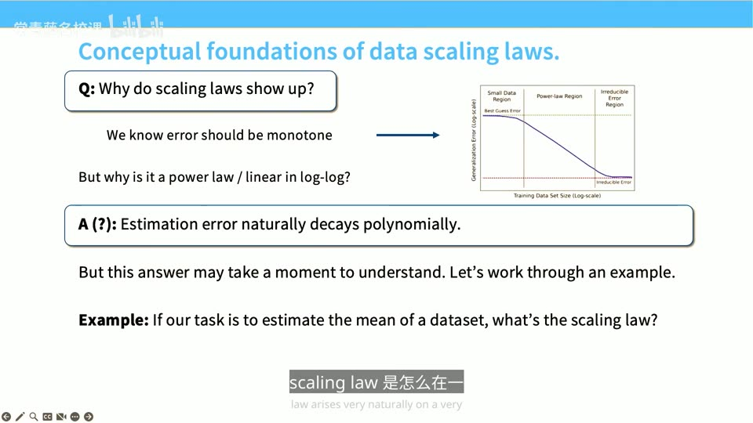 |
| 虽然这是门语言模型课，但接下来这一页，或者说两页——不对，可能是三页——咱们来讲统计学。这种情况下，我想做的是：从一堆数据里估算均值。输入数据服从高斯分布，我要估计这个对象的均值，直接写下经验均值就行。接着你可以把误差写下来：那期望误差是多少呢？你看，每个分量都是高斯分布，均值之差也是高斯分布，所以直接就能写出误差，结果就是 σ²/n 的平方根。你看，这其实就体现了一个缩放定律，对吧？ [【跳转到 13:31】](https://www.bilibili.com/video/BV11LEA6eEuj/?p=9&t=811) | 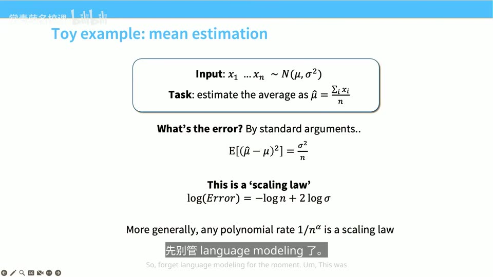 |
| 我已经把误差写出来了，对吧。如果我取对数，误差就是以 10 为底、n 的 -1/2 次方的函数，对吧？横轴是标准差（std），对吧。所以通常来说，如果你能推导出任何本质上形如「1/n 的某次幂再加上一个常数」的东西，当你在双对数图上画出它、并减去常数项后，你就会得到一个缩放定律。所以任何这种「误差呈多项式衰减」的东西，最终都会给你一个缩放定律。当然，在均值估计或回归这类参数估计中， [【跳转到 14:01】](https://www.bilibili.com/video/BV11LEA6eEuj/?p=9&t=841) | 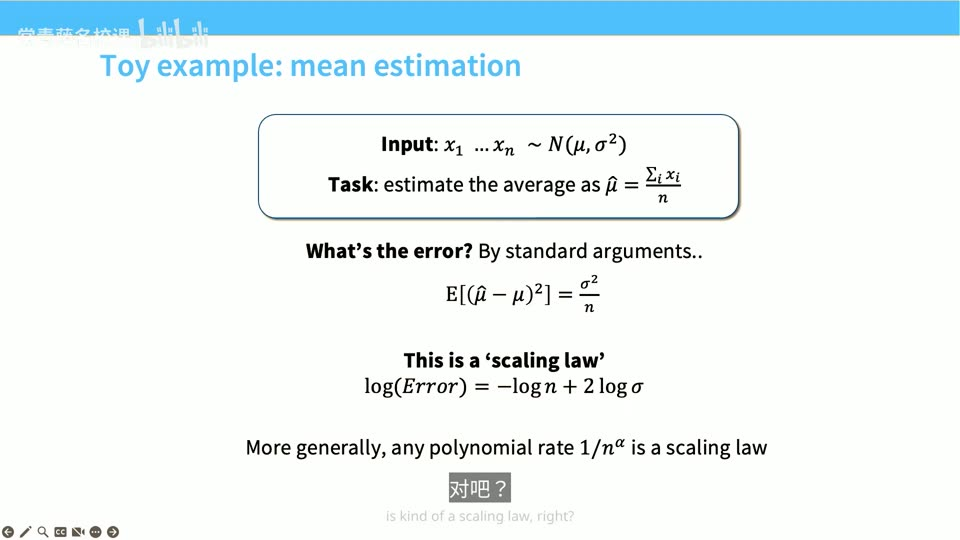 |
| 你自然预期会得到多项式速率，你也不会预期其他情况。嗯，如果你修过统计估计课程， [【跳转到 14:31】](https://www.bilibili.com/video/BV11LEA6eEuj/?p=9&t=871) | 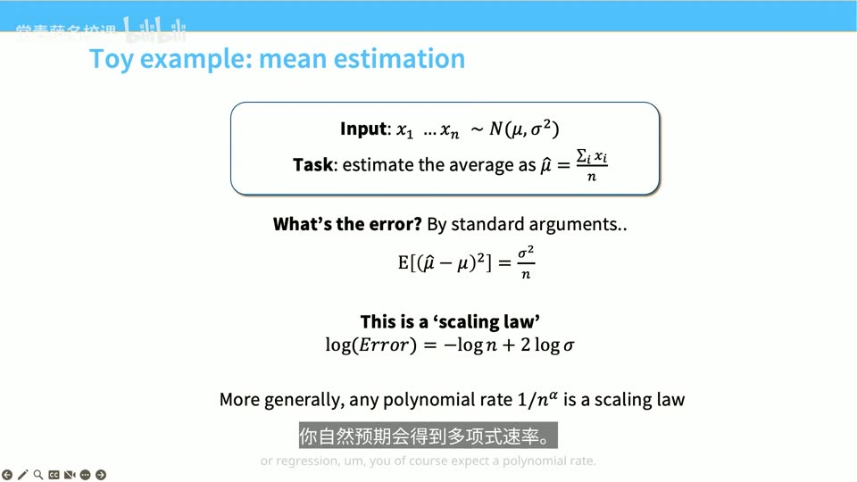 |
| 你就知道：本质上所有经典模型都预期呈现 1/n 的速率；如果你拟合一个回归之类的，可能会得到 1/n² 或者别的指数。如果这是对的，这也是缩放定律的起源。当我们画图时，应该预期看到斜率大约是 1——因为那就是 n 上的指数，也就是 y 控制 log x。而当我们拟合神经缩放定律时会发现，指数截然不同：这些指数，左边两个来自 Hestness， [【跳转到 14:38】](https://www.bilibili.com/video/BV11LEA6eEuj/?p=9&t=878) | 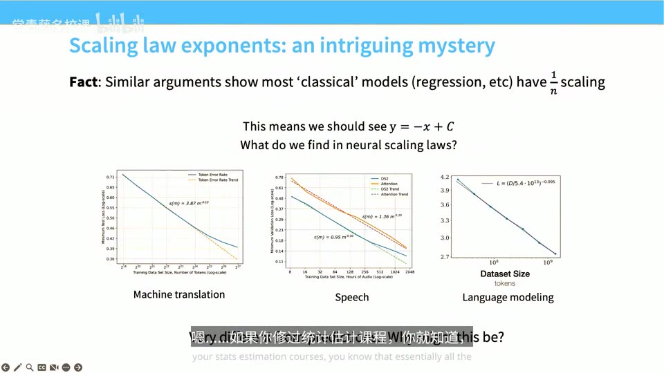 |
| 右边那个来自 Kaplan，粗略来说分别是 -0.7 和 -1.1 左右。这意味着什么？这意味着收敛速度比估计均值或线性回归慢得多——这是一个非常非常慢的收敛速率。虽然仍是多项式级别，但要慢得多。这就挺有意思的：我们确实得到了多项式级别的收敛速率，但指数并不理想，对吧？指数是负的 c 次幂。那你在哪里可能会遇到这种估计速率呢？ [【跳转到 15:08】](https://www.bilibili.com/video/BV11LEA6eEuj/?p=9&t=908) | 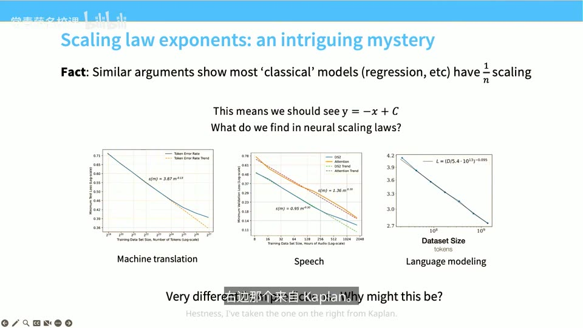 |
| 如果你的模型更偏非参数一些，就会得到这个结果。我保证，这是本节课最后一张统计学幻灯片了。咱们假设一下：现在我想估计的不是均值，而是一个任意的平滑函数。如果我是在做回归问题，我手头有从 x₁ 到 xₙ 这些输入，假设它们都在单位盒子里，有一点高斯噪声，还有一个我想去估计的未知函数 f。对此有个很简单的估计方法：我把空间切分成边长为 n 的 -1/d 次方 [【跳转到 15:35】](https://www.bilibili.com/video/BV11LEA6eEuj/?p=9&t=935) | 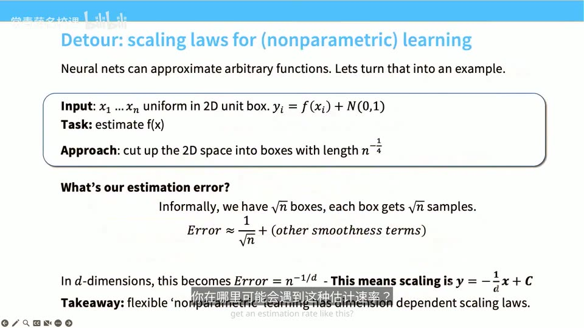 |
| 的 d 维小格子。那咱们的估计误差是多少呢？以 d=2 为例：会有 √n 个盒子，每个盒子分到 √n 个样本，误差大概是 1/√n 左右，对吧？一般来说，如果我想用这种非参数的任意方式来估计一个低维函数，误差大约就是 n^(-1/d)，对吧？所以我的这个缩放关系会是 y = -(1/d)·x。于是现在，这些更灵活的函数——比线性类别更灵活的那些函数——它们的缩放定律就有了速率： [【跳转到 16:05】](https://www.bilibili.com/video/BV11LEA6eEuj/?p=9&t=965) | 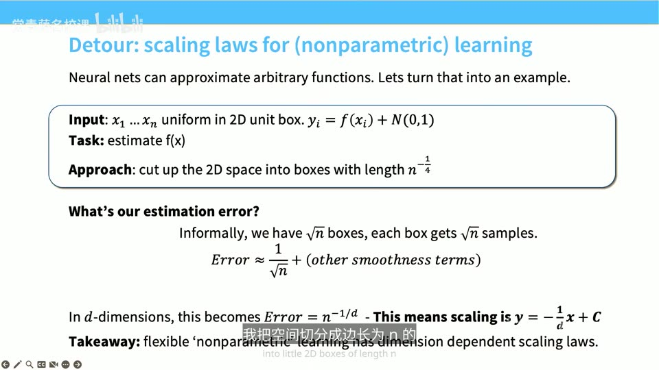 |
| 这些速率不只是 1，而是 1/d。所以你可以建立这样一个心智模型：我在幻灯片里给你们看的那些神经网络， [【跳转到 16:35】](https://www.bilibili.com/video/BV11LEA6eEuj/?p=9&t=995) |  |
| 表现得有点像十维空间里的非参数回归器，对吧——就像 10 维空间里的最近邻或其他类型的估计器。这大致就是它们从数据中学习的速率。 [【跳转到 16:43】](https://www.bilibili.com/video/BV11LEA6eEuj/?p=9&t=1003) | 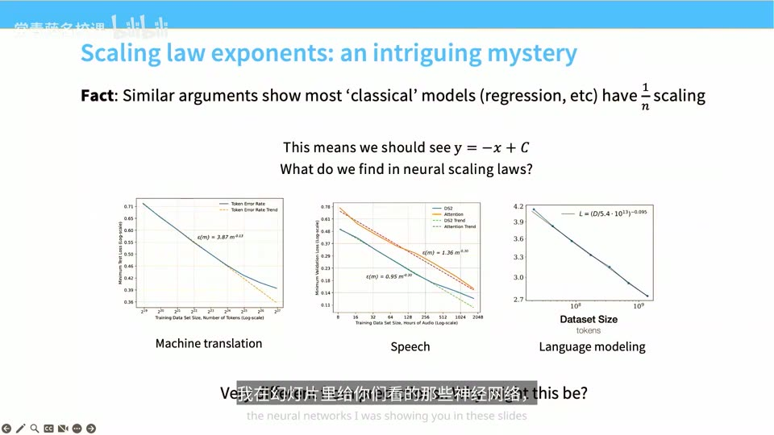 |
| 仅仅通过观察这些缩放定律就能知道这一点，还挺酷的。 [【跳转到 16:54】](https://www.bilibili.com/video/BV11LEA6eEuj/?p=9&t=1014) | 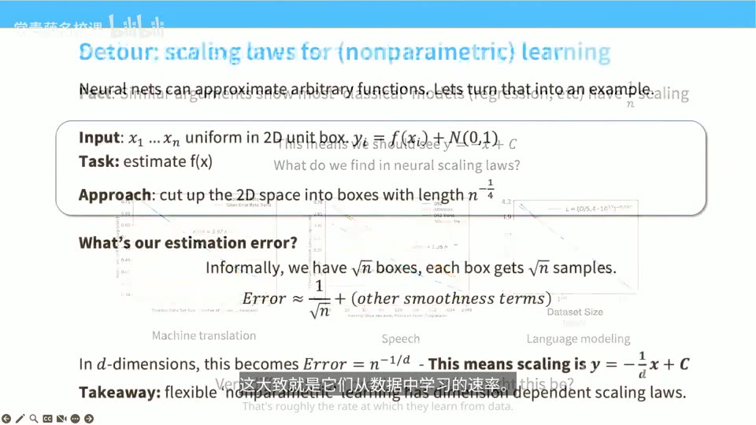 |
| Baker 等人以及其他一些研究缩放定律理论的人认为：缩放定律的指数实际上确确实实在告诉我们，神经网络的行为就像一个非参数平滑器。诸如此类，这是一组有趣的论点。你想在多大程度上接受这种直觉都可以，这我也不太确定自己到底有多相信这个论点——有些证据可能有点站不住脚，它依赖于对内在维度的估计。不过，想到这些指数在某种程度上告诉我们这些神经网络真正的学习速度有多快， [【跳转到 16:59】](https://www.bilibili.com/video/BV11LEA6eEuj/?p=9&t=1019) | 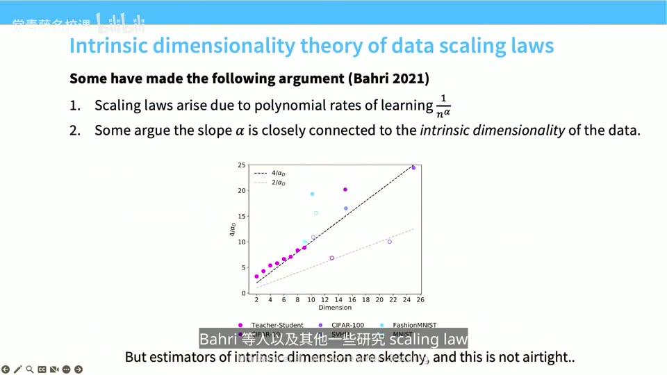 |
| 这还挺有意思的。好，那我先停一下。 [【跳转到 17:29】](https://www.bilibili.com/video/BV11LEA6eEuj/?p=9&t=1049) | 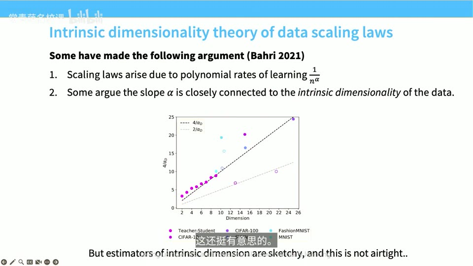 |
| 刚才讲的就是针对单一分布的基本数据缩放定律：你从里面采样，然后基于这些数据进行学习。刚才那些例子大家都清楚了吗？好。诶，有人提问了，啊问得好。 [【跳转到 17:33】](https://www.bilibili.com/video/BV11LEA6eEuj/?p=9&t=1053) | 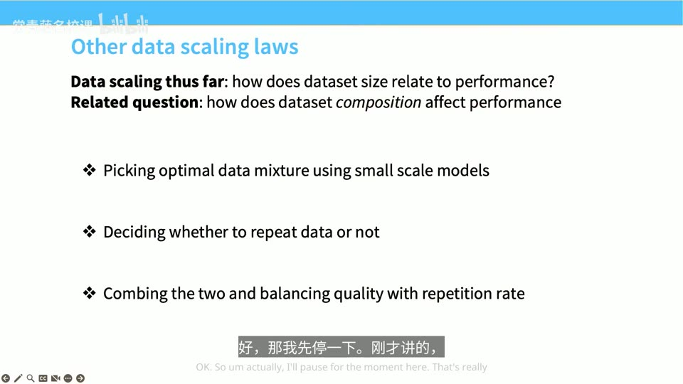 |
| 而问题是：我刚才说「模型规模大于数据集规模」，这具体指什么？——我的意思是：当模型规模相对于数据量较大时—— [【跳转到 17:45】](https://www.bilibili.com/video/BV11LEA6eEuj/?p=9&t=1065) | 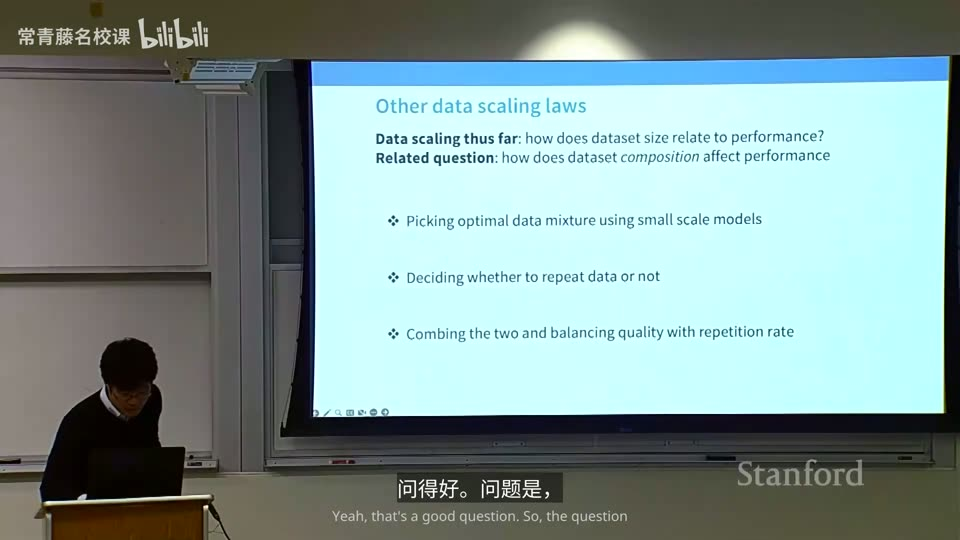 |
| 也就是说，数据量远远小于模型规模—— [【跳转到 17:53】](https://www.bilibili.com/video/BV11LEA6eEuj/?p=9&t=1073) | 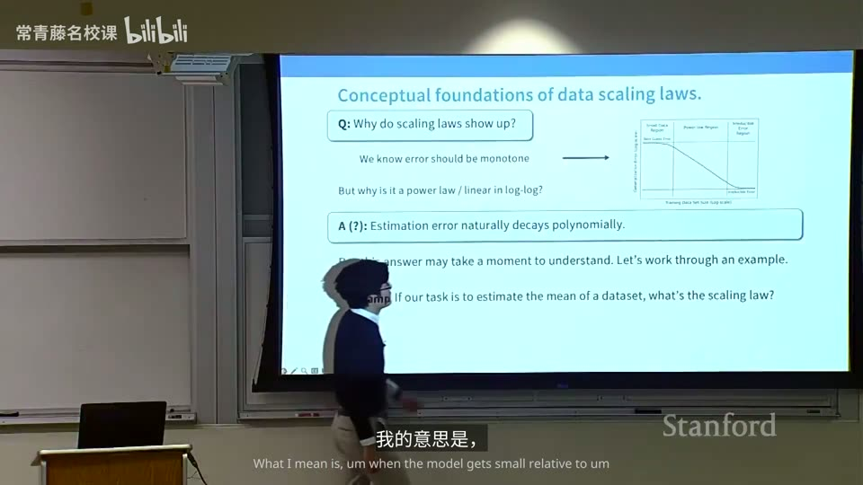 |
| 你就进入了不可约误差区间，对吧？也就是说，针对你选用的模型类别， [【跳转到 17:57】](https://www.bilibili.com/video/BV11LEA6eEuj/?p=9&t=1077) | 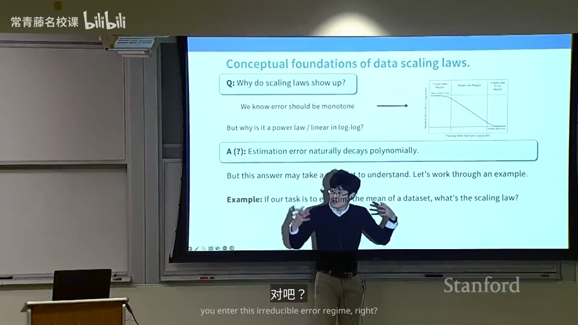 |
| 你已经把数据拟合到了极限，这时候再增加数据量也没法进一步提升效果了。所以我们在讨论缩放定律时，通常关注的是幂律区间，因为那是相对更简单的情况。要么就这样，要么你可以显式地拟合渐近线，然后对其进行校正——这两种就是主要的处理方式。 [【跳转到 18:01】](https://www.bilibili.com/video/BV11LEA6eEuj/?p=9&t=1081) | 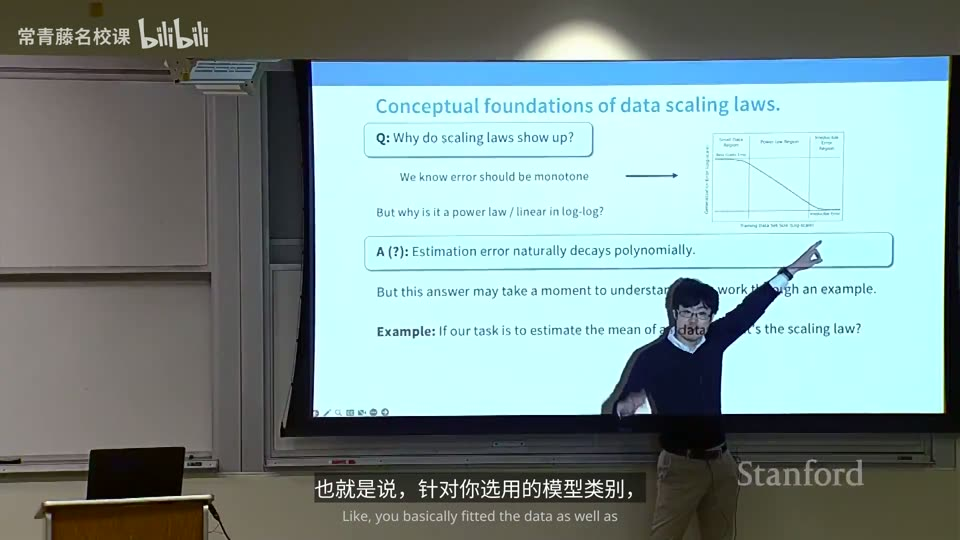 |
| 所以当我提到「模型大于数据」时，具体大多少都可以， [【跳转到 18:19】](https://www.bilibili.com/video/BV11LEA6eEuj/?p=9&t=1099) | 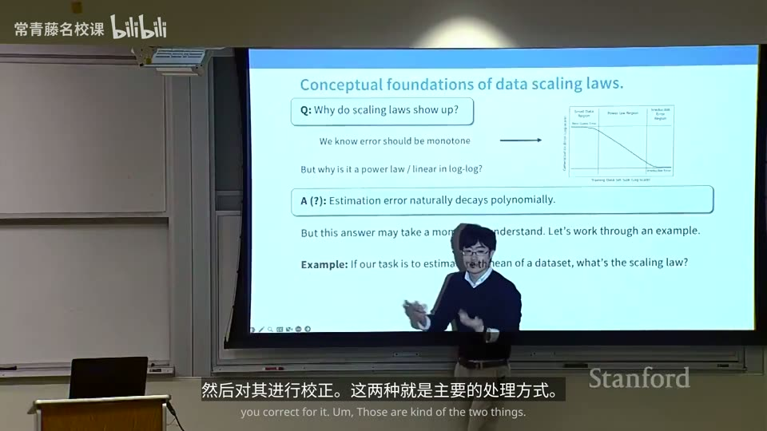 |
| 只要处于幂律区间内。通常来说，模型规模比数据量大十倍左右， [【跳转到 18:24】](https://www.bilibili.com/video/BV11LEA6eEuj/?p=9&t=1104) | 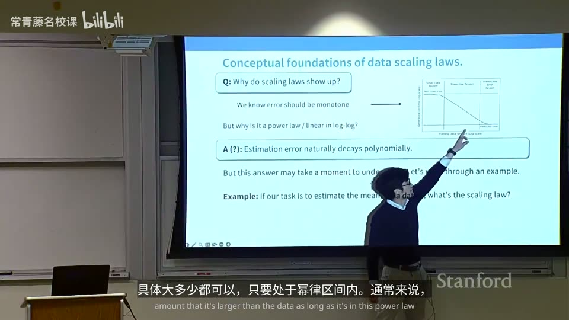 |
| 诸如此类。好，没问题。咱们回到其他数据缩放定律，对吧。 [【跳转到 18:28】](https://www.bilibili.com/video/BV11LEA6eEuj/?p=9&t=1108) | 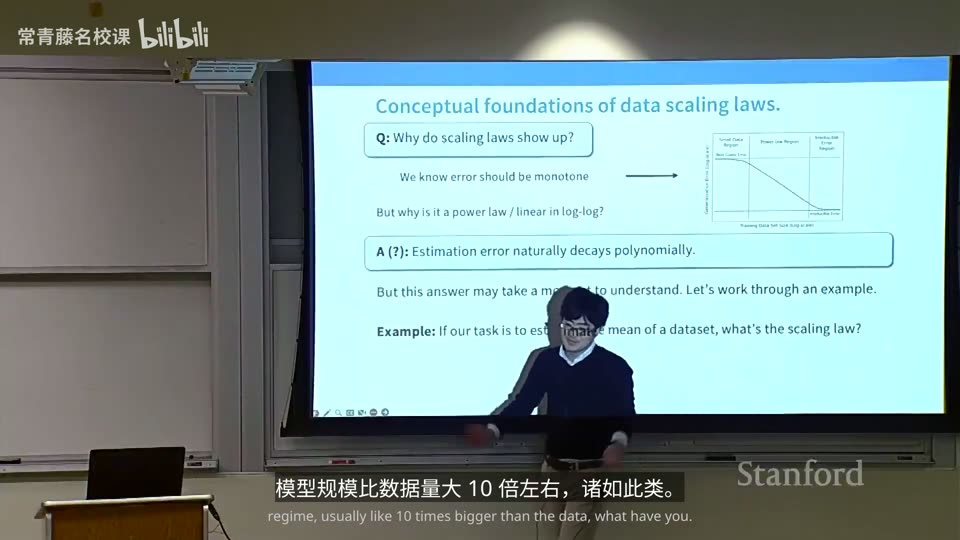 |
| 所以，数据缩放定律本身其实没那么有用， [【跳转到 18:33】](https://www.bilibili.com/video/BV11LEA6eEuj/?p=9&t=1113) | 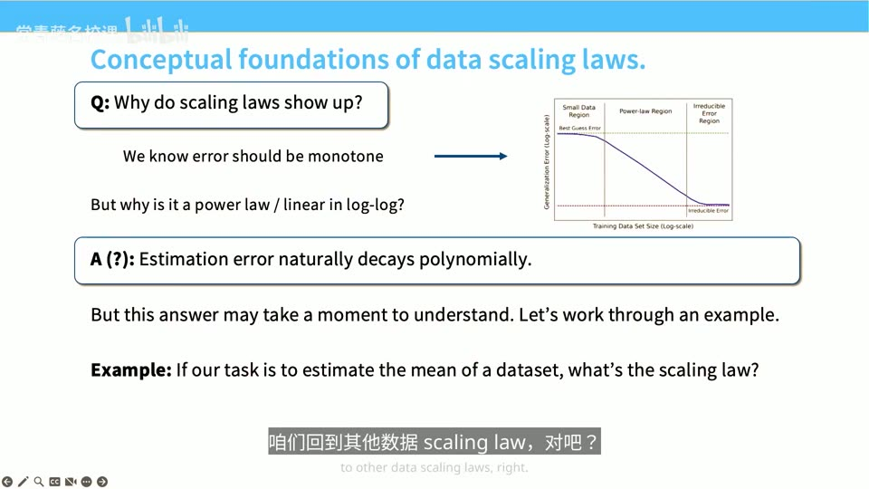 |
| 没大家想的那么理想。它们只是告诉你「模型学得有多快」，对吧？这对做预测有点用，但除此之外就没啥大用了。其实，如果你在做工程，你可能更关心别的问题：比如我的最优数据混合比例该怎么定？比如我该怎么挑训练数据？这是个很实际的工程问题。我是该重复用数据，还是别重复、把算力省下来干点别的？或者也许我该多重复用点高质量数据，低质量的那些就别重复了？在重复用数据这件事上我还能做很多别的操作。数据方面， [【跳转到 18:37】](https://www.bilibili.com/video/BV11LEA6eEuj/?p=9&t=1117) | 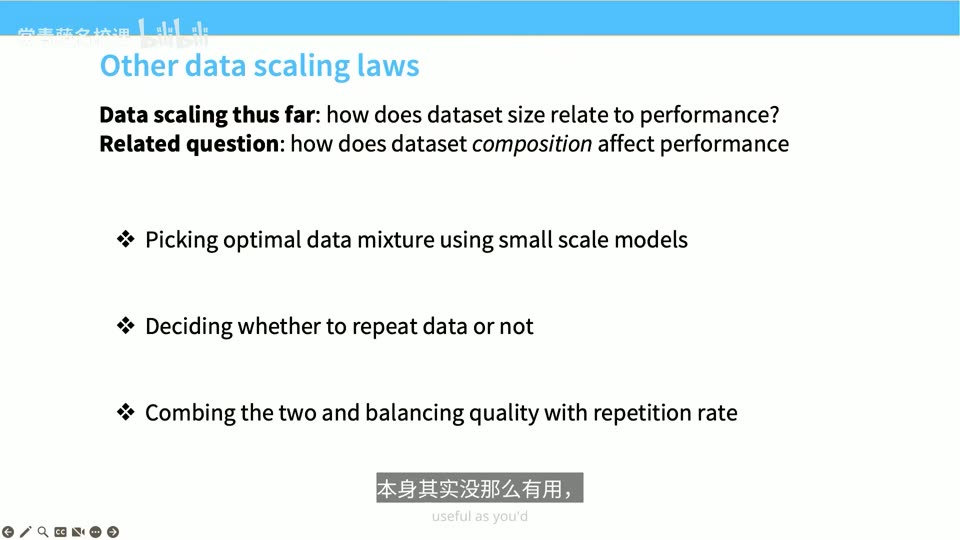 |
| 我能做的工程决策其实很多。那么缩放定律到底怎么帮咱们做这些决策呢？ [【跳转到 19:07】](https://www.bilibili.com/video/BV11LEA6eEuj/?p=9&t=1147) | 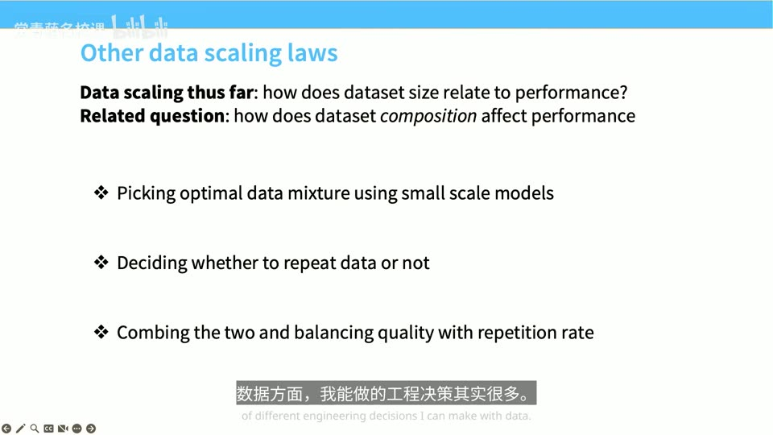 |
| 我觉得有意思的一点是，咱们稍微想想经典模型是怎么运作的，对吧。数据缩放定律——如果咱们把它的由来看作泛化界限的经验版——它大致告诉我们：对很多模型来说，数据集的组成确实会影响这些缩放定律的截距，但斜率其实另有决定因素。确定的是：斜率是由模型类别决定的，并不是由分布本身决定的。所以斜率可能保持不变——保持不变，只有截距会变，而且这个截距的变化其实可能很有意思。 [【跳转到 19:12】](https://www.bilibili.com/video/BV11LEA6eEuj/?p=9&t=1152) | 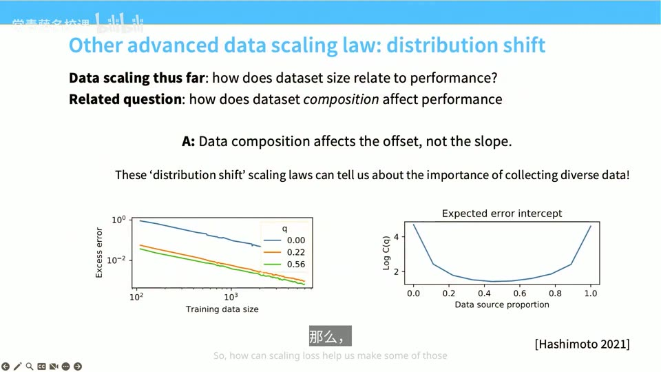 |
| 所以这里有个玩具模型的例子，它做的是线性回归，可以从两种不同的来源里采样。如果你只拿到一种数据，那不管怎样误差都很高；实际上你最好把两种数据混着用。所以如果你把这个截距的变化写下来，你就会得到一些很有意思的见解：明白为什么数据多样性越高越有帮助。但这在实践中到底意味着什么呢？ [【跳转到 19:42】](https://www.bilibili.com/video/BV11LEA6eEuj/?p=9&t=1182) | 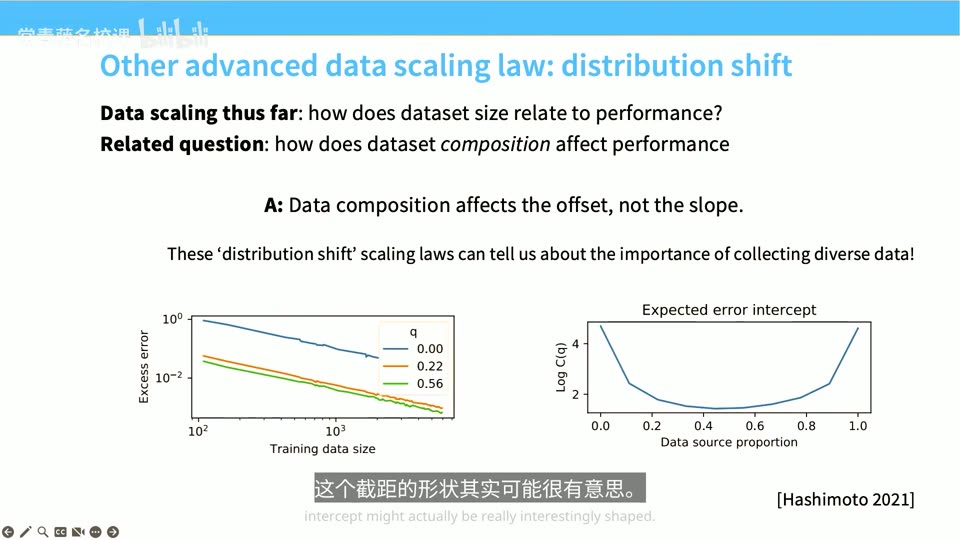 |
| 嗯，从实践角度讲，这意味着你其实可以在混合数据上拟合数据缩放定律，这能帮你优化预训练数据。那么这意味着什么呢？简单起见，假设你有两个数据源：新闻和维基百科。你想知道新闻和维基百科各该用多少——那怎么定这个比例呢？你可以先用极少量的数据训练很小的模型，然后拟合一个函数，看看不同的混合比例会对模型性能产生什么影响。在逐步扩大模型规模的过程中， [【跳转到 20:07】](https://www.bilibili.com/video/BV11LEA6eEuj/?p=9&t=1207) | 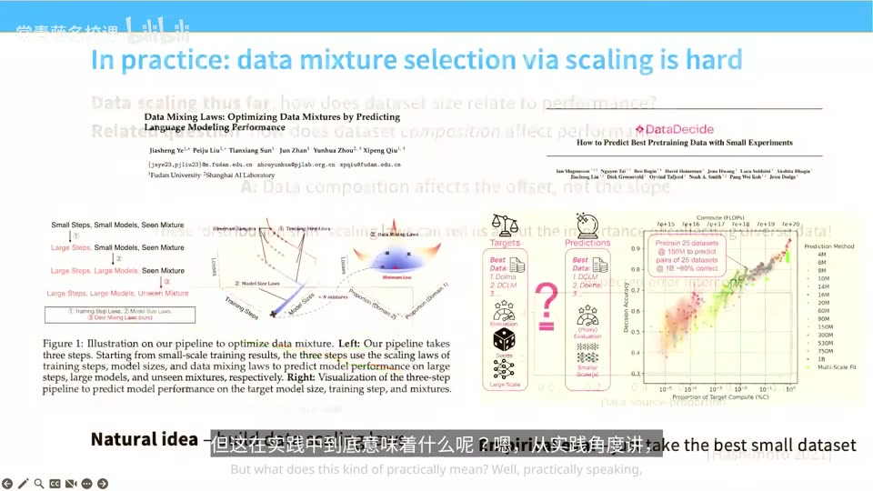 |
| 你可以观察这些趋势如何变化，并尝试据此进行外推——这跟外推数据缩放定律的方法完全一样。接着你可以问：如果我把数据量一直扩展到最终的全量训练，哪一种组合会是最优的？所以这其实是个很简单的思路：先在少量算力下拟合出一个函数关系，找到最优解，再把这个结果扩展到大算力场景。这篇论文讲的是「数据混合定律」。不过说实话，你要是问那些真正做过大量数据混合工作的人， [【跳转到 20:37】](https://www.bilibili.com/video/BV11LEA6eEuj/?p=9&t=1237) | 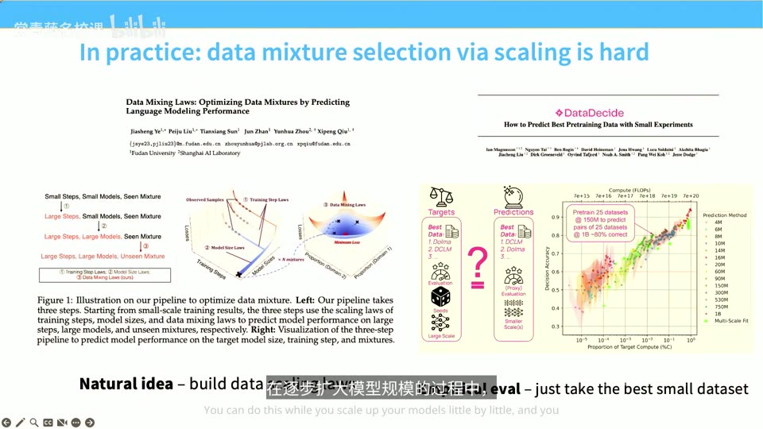 |
| 他们都会告诉你：现实情况的噪声比这种理想模型大得多。事实上，据我所知很多情况下的做法是：先训练一堆小模型，从中选出最好的数据配比，然后直接把这个模型放大，根本不需要什么缩放定律。如果你对这类事感兴趣，数据领域其实有一个很好的大规模实证研究，专门探讨这类数据混合的问题。他们发现：如果你不拟合缩放定律，而是直接在小规模时选出最好的数据配比，效果其实也不错。 [【跳转到 21:07】](https://www.bilibili.com/video/BV11LEA6eEuj/?p=9&t=1267) | 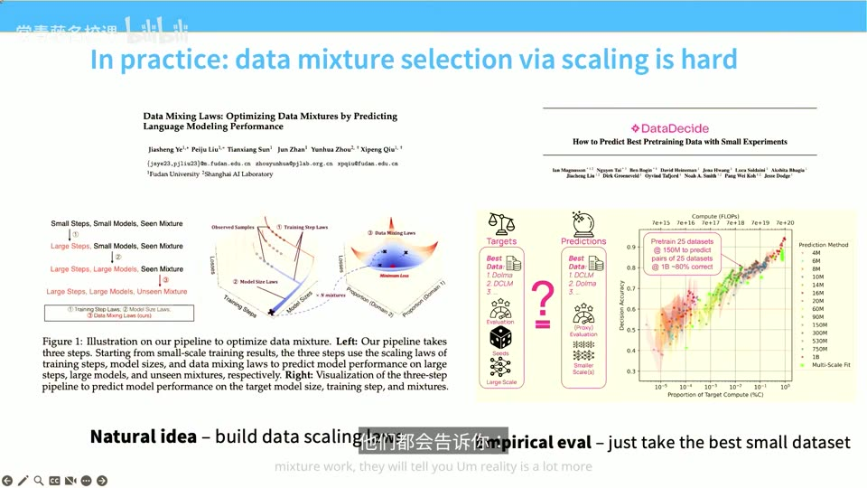 |
| 顺便提一下，这正好印证了那个观点：截距虽然不同， [【跳转到 21:37】](https://www.bilibili.com/video/BV11LEA6eEuj/?p=9&t=1297) |  |
| 但斜率是不变的。因为斜率不变的话，小规模下最好的配比，在大规模下依然是最好的。好。 [【跳转到 21:41】](https://www.bilibili.com/video/BV11LEA6eEuj/?p=9&t=1301) | 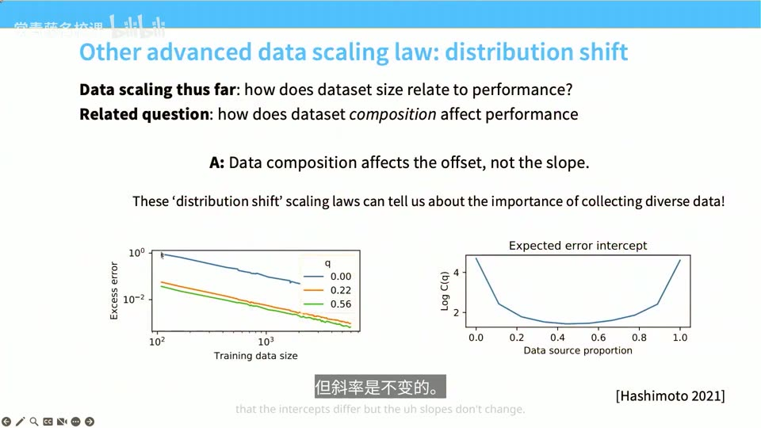 |
| 关于数据，我还想提另一个很有意思的问题：重复（repetition）。我觉得现在的情况是：算力一直在涨，但我们的数据量并没有增加。所以很多人都在研究一个问题：如果数据被反复重复使用，会发生什么？几年前有个很不错的研究叫《Scaling Data-Constrained Language Models》，他们大致说明了这样一个结论：用标准的训练方法，最多跑 4 个 epoch 其实根本不会受影响； [【跳转到 21:48】](https://www.bilibili.com/video/BV11LEA6eEuj/?p=9&t=1308) | 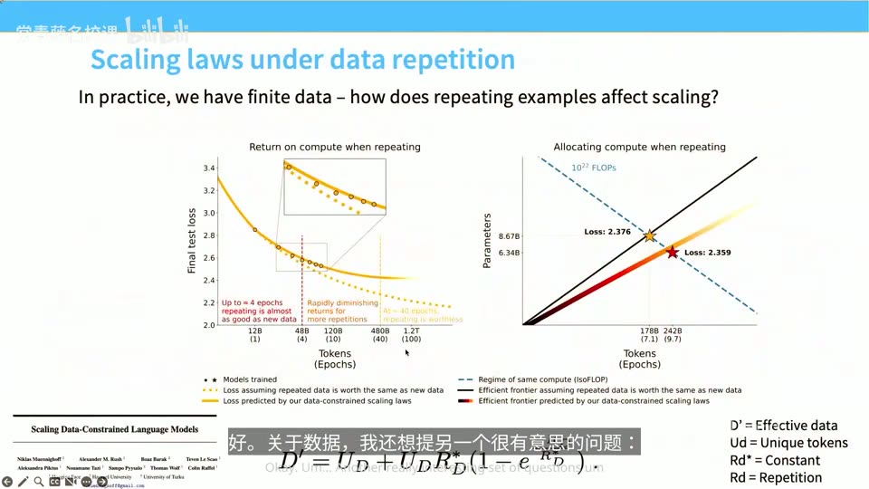 |
| 可一旦过了这个临界点，你实际跑出来的缩放定律就是图上那条深色曲线， [【跳转到 22:18】](https://www.bilibili.com/video/BV11LEA6eEuj/?p=9&t=1338) | 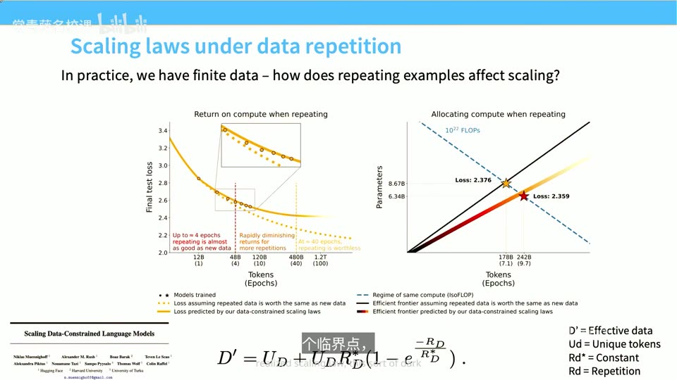 |
| 表现会比用新数据预测出来的缩放定律差很多——就是这里这条虚线。另外，咱们同样可以写出一个修正后的函数形式，用它大致预测在重复训练的情况下，这个缩放定律会怎么变化。咱们还能把这个思路推得更极端一点： [【跳转到 22:22】](https://www.bilibili.com/video/BV11LEA6eEuj/?p=9&t=1342) | 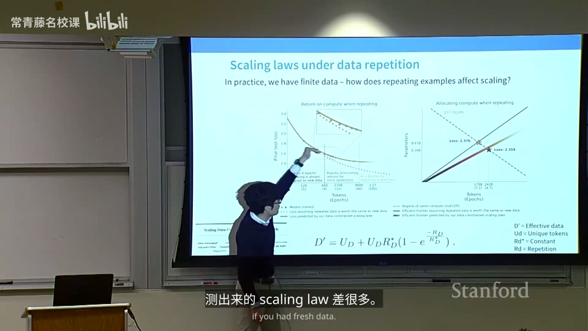 |
| 这是最近刚做的一项工作，是我和 Percy、还有我们一起带的一个学生做的。我们当时就在想：要是把这个思路推到极致，假设算力是无限的，那会怎样？有了无限算力，你想跑多少个 epoch 就跑多少——比如无限次——那从这套系统里你能得到的最好结果是什么？但事实证明，光靠反复遍历数据是不行的， [【跳转到 22:33】](https://www.bilibili.com/video/BV11LEA6eEuj/?p=9&t=1353) |  |
| 你也不能一味地把模型做大，因为这两条路都有收益递减的问题。 [【跳转到 22:59】](https://www.bilibili.com/video/BV11LEA6eEuj/?p=9&t=1379) | 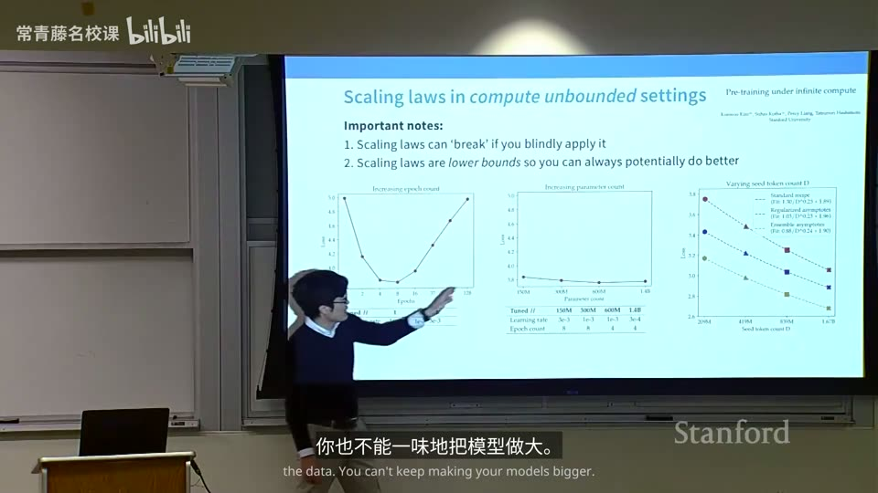 |
| 所以你最后只能另辟蹊径，比如把多个模型集成起来， [【跳转到 23:03】](https://www.bilibili.com/video/BV11LEA6eEuj/?p=9&t=1383) | 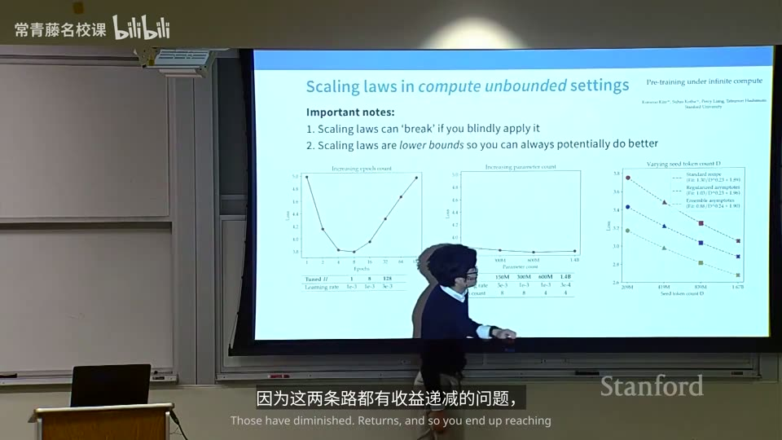 |
| 想办法从数据里再多榨出一些东西。不过说真的，我觉得最有趣的一点是：你提到的标准数据缩放定律就在这儿——也就是那条红线。你看，随着数据量增加，性能提升非常可观，而且这种提升是可以预测的。我们做了各种干预，比如自回归蒸馏（policy distillation）和集成学习，性能确实提高了，但斜率看起来却出奇地相似。 [【跳转到 23:07】](https://www.bilibili.com/video/BV11LEA6eEuj/?p=9&t=1387) | 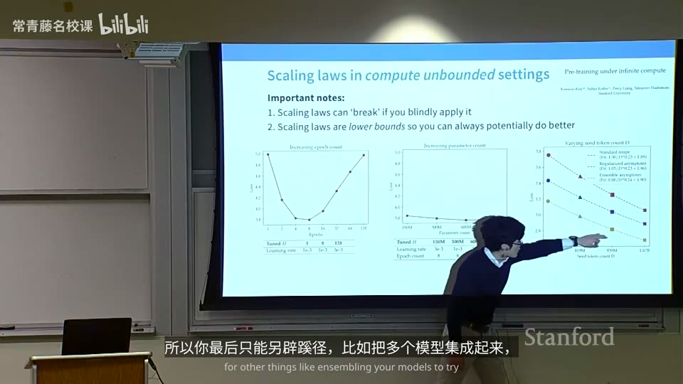 |
| 这是个经验之谈：一旦你开始拟合自己的缩放定律，就会发现斜率通常是不变的。很多时候你做的这些干预，其实只是改变了缩放定律的截距而已。 [【跳转到 23:29】](https://www.bilibili.com/video/BV11LEA6eEuj/?p=9&t=1409) | 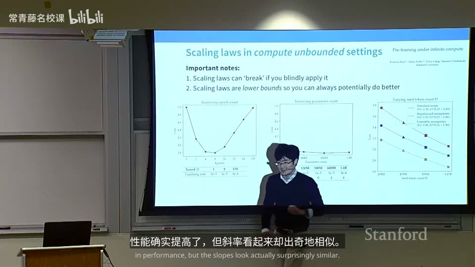 |
| 谢谢。最后我想多提一句，因为我觉得这篇论文在缩放定律和扩展性方面 [【跳转到 23:40】](https://www.bilibili.com/video/BV11LEA6eEuj/?p=9&t=1420) | 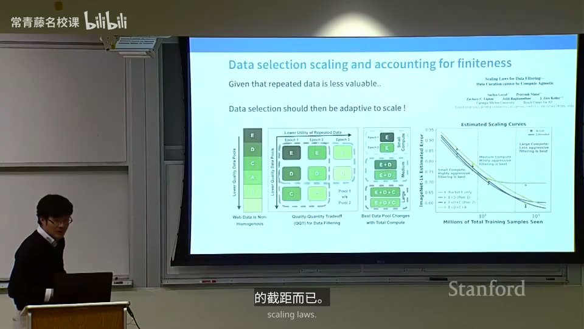 |
| 很有启发性：我们在数据上关注的很多现象，其实都高度依赖于规模。举个例子，比如数据过滤。如果我明天决定对我们正在训练的模型数据做过滤，我们可能会下手非常狠——我们只留最高质量的数据。毕竟咱们的算力都不多，所以咱们反正没法拿整个互联网来训练模型，不如干脆把数据过滤一下，只挑那些质量最高的。反过来说，要是你算力充足，那就会想用越来越多的数据来训练， [【跳转到 23:44】](https://www.bilibili.com/video/BV11LEA6eEuj/?p=9&t=1424) | 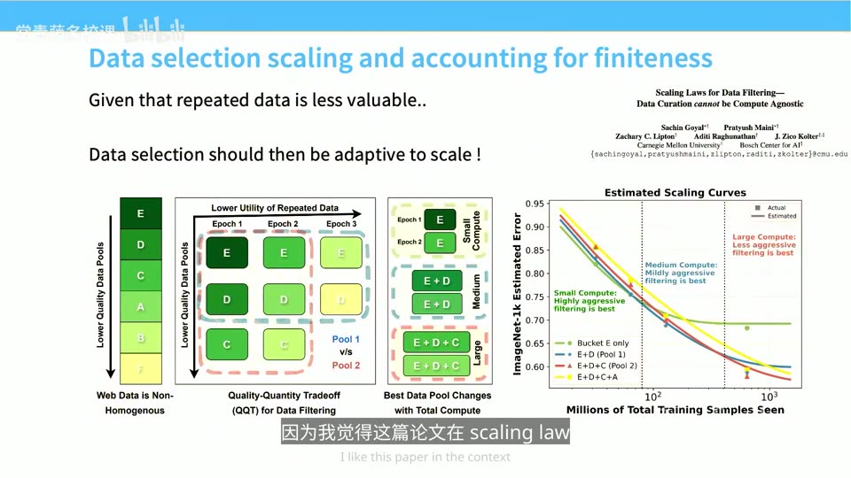 |
| 因为你不想反复使用这些高质量数据。所以随着算力越来越强，过滤条件也会慢慢放宽，最后可能就开始用一些质量没那么高的数据了。你看，像数据过滤或者数据质量这些咱们平时觉得固定不变的东西，其实都在动态变化：规模一上去，你就得琢磨剩下的数据去哪儿找，过滤规则不能一成不变。而且很显然，最优的过滤策略也不是固定的，它会随着规模变化。 [【跳转到 24:14】](https://www.bilibili.com/video/BV11LEA6eEuj/?p=9&t=1454) | 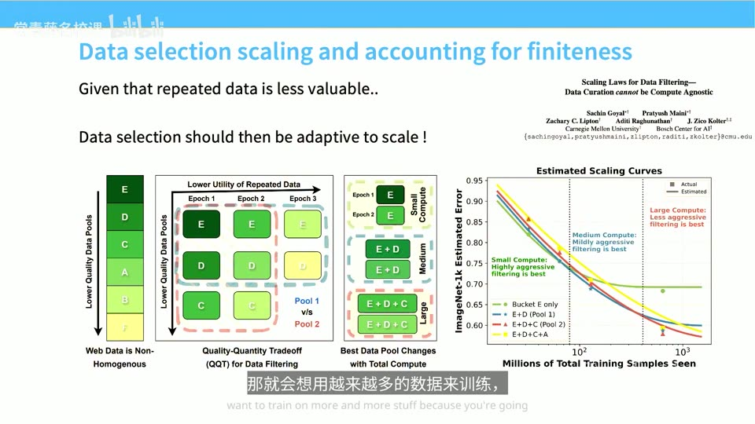 |
| 谢谢。好，关于数据缩放定律的部分就讲到这里。我觉得这部分最好懂：就算从一个搞统计机器学习的人的角度看，这些东西对我来说也都非常简单直接——你增加数据量，性能就会以一种非常可预测的方式提升，这一点没什么争议。模型这么大，它还能按多项式规律变好，这挺酷的，但也没到离谱的程度。所以希望大家都觉得「增加数据量有这么强的可预测性」是挺合理的。哦对，看这张图——这是在算力无限的情况下做预训练的结果。 [【跳转到 24:41】](https://www.bilibili.com/video/BV11LEA6eEuj/?p=9&t=1481) | 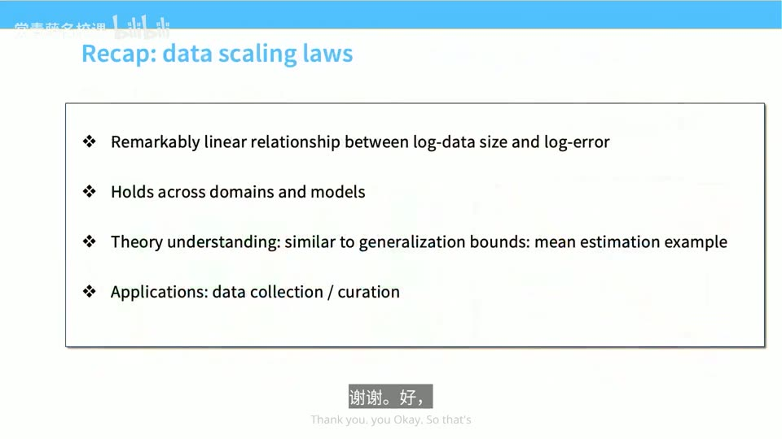 |
| 右边这张图，损失和数据集大小都是线性的， [【跳转到 25:11】](https://www.bilibili.com/video/BV11LEA6eEuj/?p=9&t=1511) | 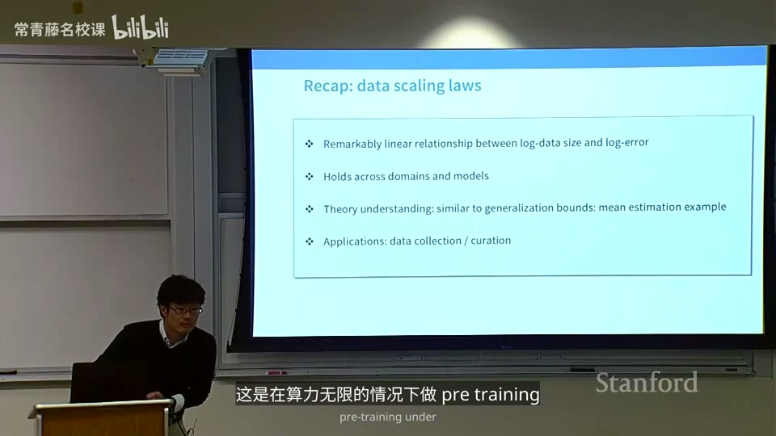 |
| 而我之前举的例子是双对数坐标。 [【跳转到 25:18】](https://www.bilibili.com/video/BV11LEA6eEuj/?p=9&t=1518) | 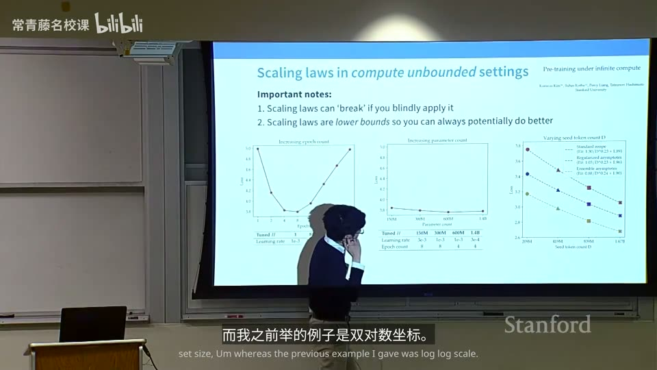 |
| 我刚才在想为什么它是线性的——还加粗了。哦，这坐标轴有问题：和我刚聊过这种有问题的坐标轴——这其实是翻倍（对数刻度），对吧， [【跳转到 25:22】](https://www.bilibili.com/video/BV11LEA6eEuj/?p=9&t=1522) | 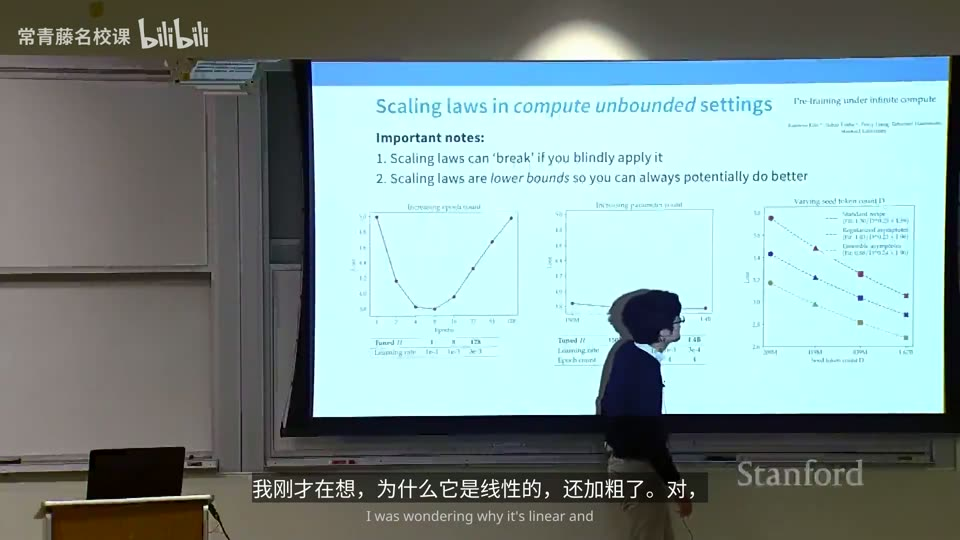 |
| 所以看着像线性，其实是对数刻度。你现在改过来了？改过来了。哈，再看纵轴：虽然它看起来不是对数刻度，但因为范围极小，线性刻度和对数刻度其实差不多。 [【跳转到 25:31】](https://www.bilibili.com/video/BV11LEA6eEuj/?p=9&t=1531) | 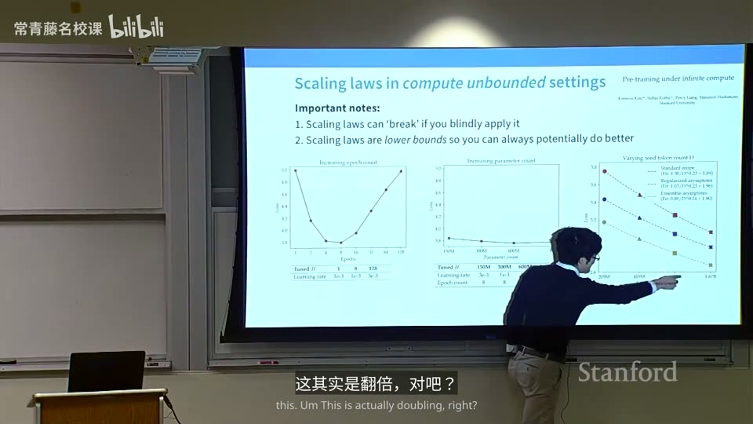 |
| 看看这里拟合出来的函数形式： [【跳转到 25:40】](https://www.bilibili.com/video/BV11LEA6eEuj/?p=9&t=1540) | 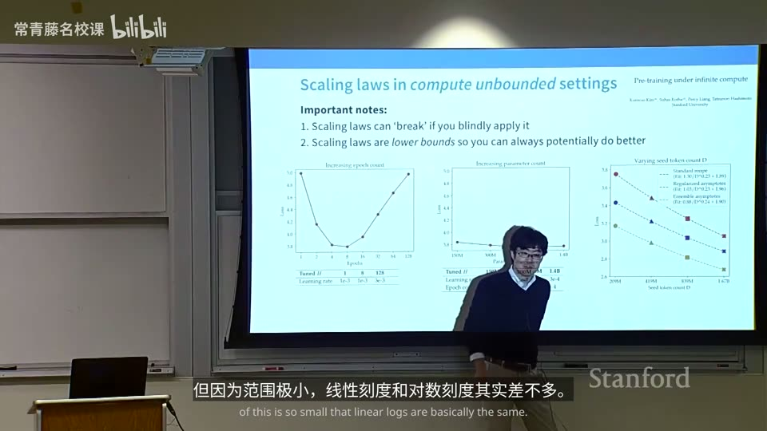 |
| 它们依然是多项式。我们用的就是这一套函数形式，也就是图上画出来的这些。 [【跳转到 25:44】](https://www.bilibili.com/video/BV11LEA6eEuj/?p=9&t=1544) | 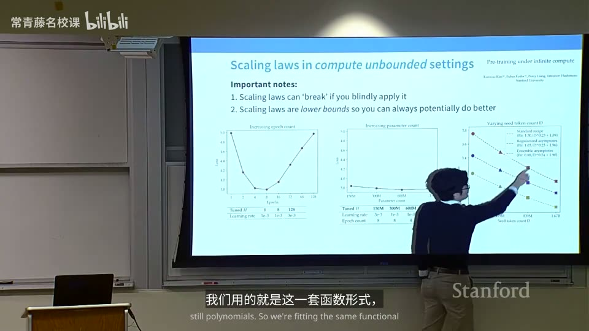 |
| 这点也很关键，我最后再细说：如果你只掌握计算资源范围里很小的一段， [【跳转到 25:48】](https://www.bilibili.com/video/BV11LEA6eEuj/?p=9&t=1548) | 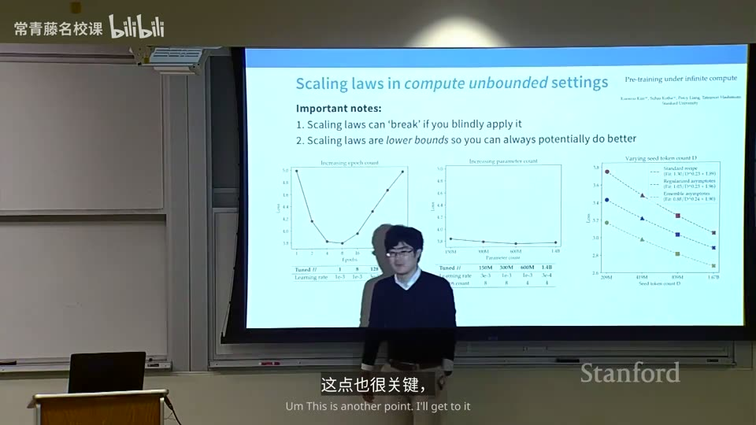 |
| 就非常非常难判断它到底是多项式增长还是指数增长——毕竟泰勒近似摆在那儿，只要你把局部放大的足够多，什么看起来都像线性的。所以不管它是多项式还是别的什么函数形式，你心里都得留个心眼，保持点怀疑。谢谢，不错。好，没问题。刚才聊的是数据扩展带来的损失，这部分在很多层面上挺直观的。接下来我想聊聊那些更复杂的扩展形式，还有各种模型工程层面的扩展损失。所以，咱们接下来要试着去设计大型语言模型。也许你是个激进派，觉得 LSTM 才是未来——凭什么我不能用 LSTM，非得用 Transformer？我就想把我的 B200 算力全砸在 LSTM 上。又或者你是另一种激进派，想用 SGD 来训练——我就用 SGD 训练。 [【跳转到 25:52】](https://www.bilibili.com/video/BV11LEA6eEuj/?p=9&t=1552) | 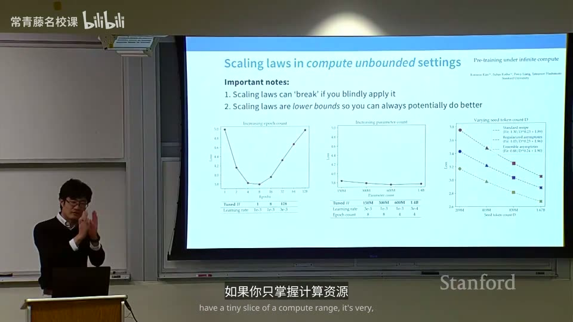 |
| 这部分在很多层面上挺直观的。接下来我想聊聊那些更复杂的扩展形式，还有各种模型工程层面的扩展损失。所以，咱们接下来要试着去设计大型语言模型。也许你是个激进派，觉得 LSTM 才是未来——凭什么我不能用 LSTM，非得用 Transformer？我就想把我的 B200 算力全砸在 LSTM 上。又或者你是另一种激进派，想用 SGD 来训练——我就用 SGD 训练。 [【跳转到 26:10】](https://www.bilibili.com/video/BV11LEA6eEuj/?p=9&t=1570) | 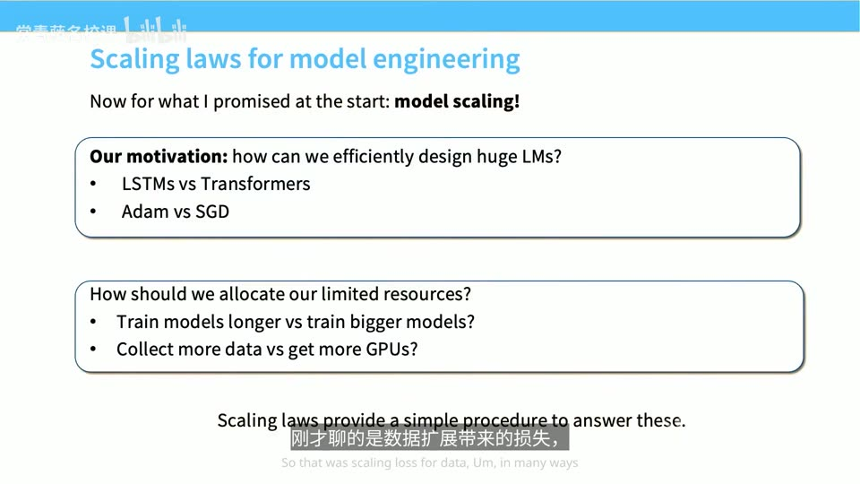 |
| 你可能还会想：如果资源有限，你有不同的方式来分配它们。也许你该把模型训练得更久？也许你该训练更大的模型？也许我该去收集更多数据？这里总存在各种各样的权衡，而缩放定律能帮我们用量化的方式去做这些取舍——但愿如此。 [【跳转到 26:40】](https://www.bilibili.com/video/BV11LEA6eEuj/?p=9&t=1600) | 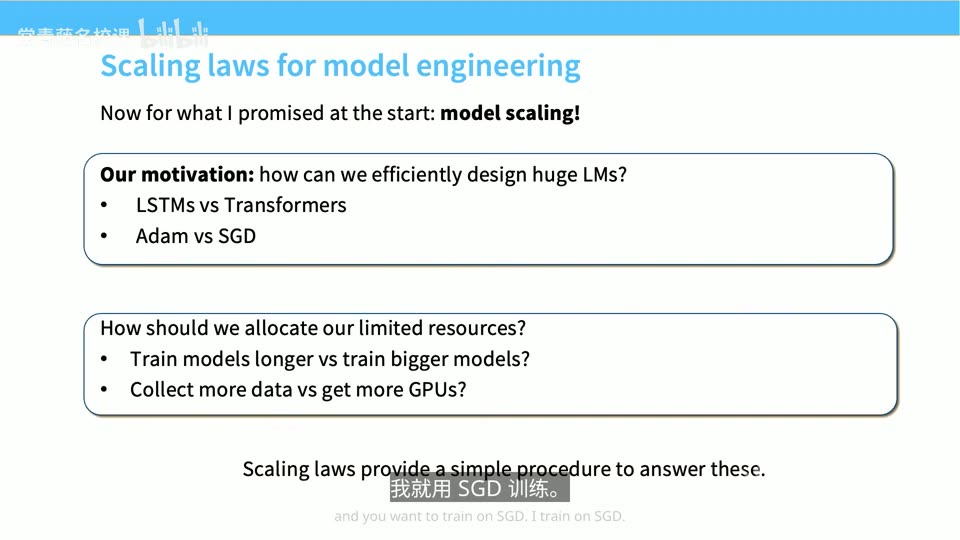 |
| 谢谢。咱们先从几个简单的超参数问题聊起：比如架构和优化器该怎么选——这些都是我在第二讲里讲过的内容。刚才我给了大家一个思路：也许你可以去研究一下别人是怎么做的，大家确实都这么干。接下来我想用第一性原理来回答这些问题。不过我会换一组不太一样的权衡取舍。所以听这节课，你得先相信缩放定律——但只要你信了，就可以自己动手试试看，去验证一下。那么我们不妨从第一个问题问起：Transformer 真的比 LSTM 更好吗？ [【跳转到 26:58】](https://www.bilibili.com/video/BV11LEA6eEuj/?p=9&t=1618) | 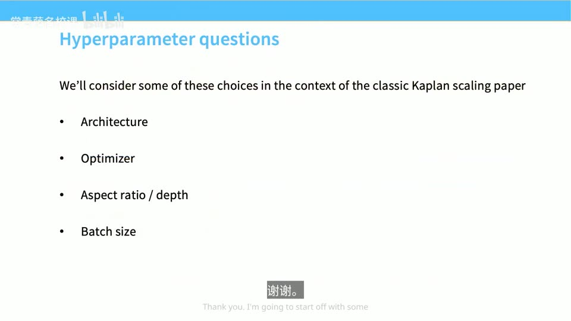 |
| 你看，LSTM 其实也能用——比如它们能拟合分布。你看随着 Mamba 这类模型的出现，我们就知道状态空间模型（SSM）也行得通。那它们到底好不好呢？最笨的办法就是训练一个大型 LSTM，做到 GPT-2 甚至更大的规模。而缩放定律的思路是：先训练一批较小的模型——也就是说，我要在不同的算力范围内训练我的 Transformer；同样的，我会在不同的算力区间里训练不同层数的 LSTM。那这说明了什么？你看，LSTM 的截距肯定不一样， [【跳转到 27:28】](https://www.bilibili.com/video/BV11LEA6eEuj/?p=9&t=1648) | 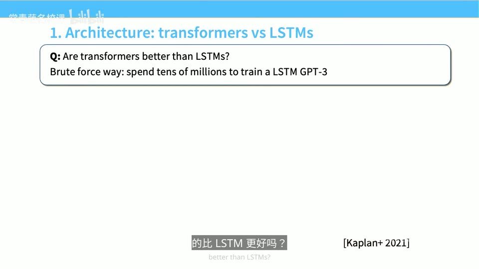 |
| 斜率可能也和 Transformer 不同，所以咱们可能就不选 LSTM 了。这张图也说明了咱们该去扩大 Transformer 的规模，而不是 LSTM。你看现在的架构论文，像 Mamba 或者 Griffin 那篇，里面基本都有这种图：一边是 vanilla Transformer，另一边是咱们那个很牛的模型。咱们那个很牛的模型通常要么在上面、要么在下面——因为只有这样才能证明你的模型确实更厉害。你肯定不想看到斜率更差的情况，因为这意味着随着规模越做越大， [【跳转到 27:58】](https://www.bilibili.com/video/BV11LEA6eEuj/?p=9&t=1678) | 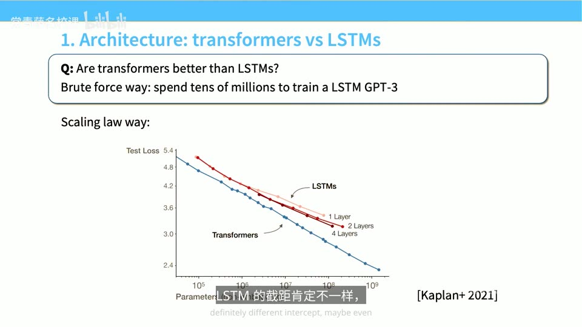 |
| 你的模型最后反而表现更差。所以这是一种不用训练巨型模型，就能好好分析架构的方法。 [【跳转到 28:28】](https://www.bilibili.com/video/BV11LEA6eEuj/?p=9&t=1708) | 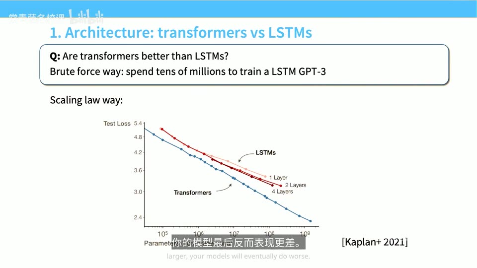 |
| 我觉得最近关于架构缩放定律的好论文好像没那么多，而我觉得最近的一项我很喜欢的研究来自 Google 的 EK 等人。当时他们发表这类工作时，对 Transformer 风格的模型做了一整套缩放研究， [【跳转到 28:37】](https://www.bilibili.com/video/BV11LEA6eEuj/?p=9&t=1717) | 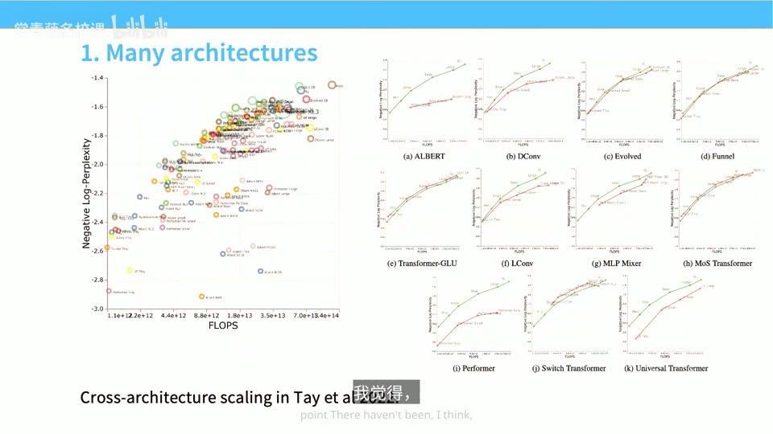 |
| 训练了在不同架构上不断扩大的 Transformer 模型变体。 [【跳转到 28:50】](https://www.bilibili.com/video/BV11LEA6eEuj/?p=9&t=1730) | 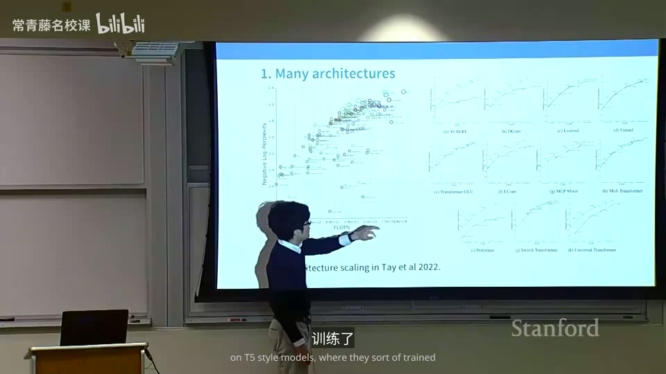 |
| 我觉得特别棒的一点——也是我还常提这篇论文的原因——是他们精准地捕捉到了我们现在前沿模型里用的那些架构改动。比如 Performer，这是一种高效的注意力机制替代方案，因为标准注意力的扩展性不太好——那些我们没做；我们做的是门控线性单元（GLU）。从所有扩展趋势来看，红线表现都优于绿线；还有 Switch Transformer—— [【跳转到 28:54】](https://www.bilibili.com/video/BV11LEA6eEuj/?p=9&t=1734) | 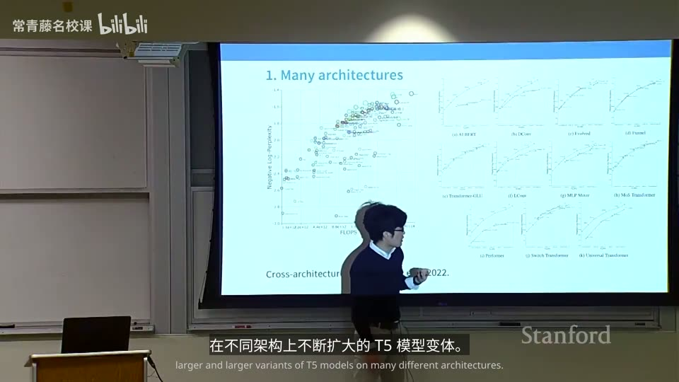 |
| 我不清楚他们最大规模运行的具体情况，但总的来说它的缩放趋势不错。还有我想起来了：softmax 混合（softmax mixing）—— [【跳转到 29:19】](https://www.bilibili.com/video/BV11LEA6eEuj/?p=9&t=1759) | 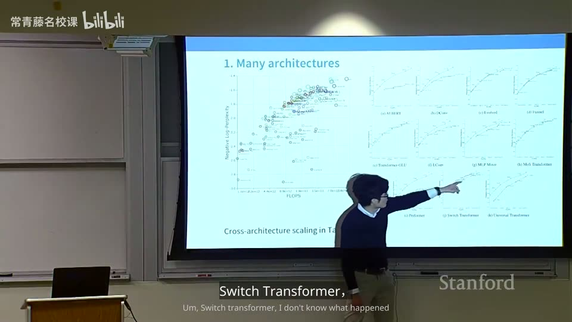 |
| 其实我们现在不用这个了，但看缩放趋势，这应该是个有效的改进手段。 [【跳转到 29:25】](https://www.bilibili.com/video/BV11LEA6eEuj/?p=9&t=1765) | 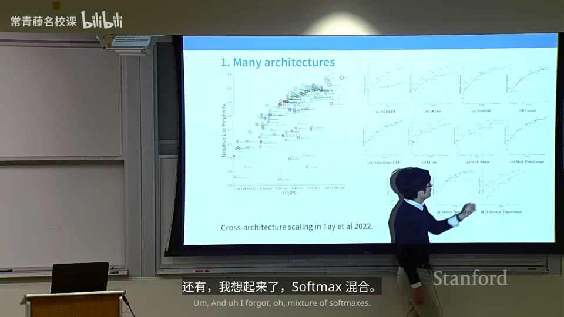 |
| 所以看，通过这些缩放趋势——尽管这些论文里的实验用的算力 [【跳转到 29:29】](https://www.bilibili.com/video/BV11LEA6eEuj/?p=9&t=1769) | 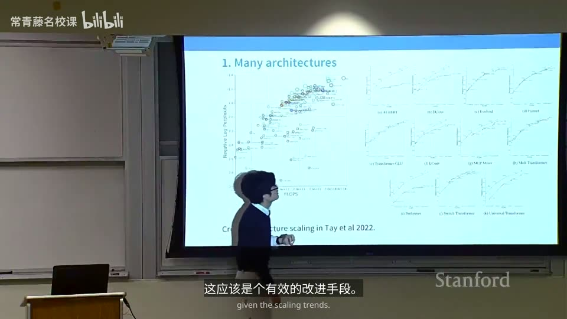 |
| 远小于我们今天用的——他们还是观察到了 [【跳转到 29:34】](https://www.bilibili.com/video/BV11LEA6eEuj/?p=9&t=1774) | 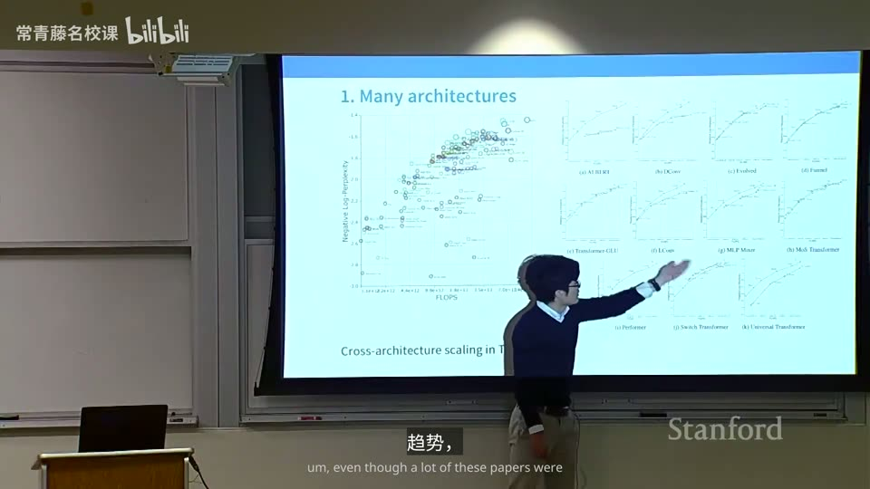 |
| 推动前沿模型发展的架构趋势，当时是这样的，对吧。 [【跳转到 29:39】](https://www.bilibili.com/video/BV11LEA6eEuj/?p=9&t=1779) | 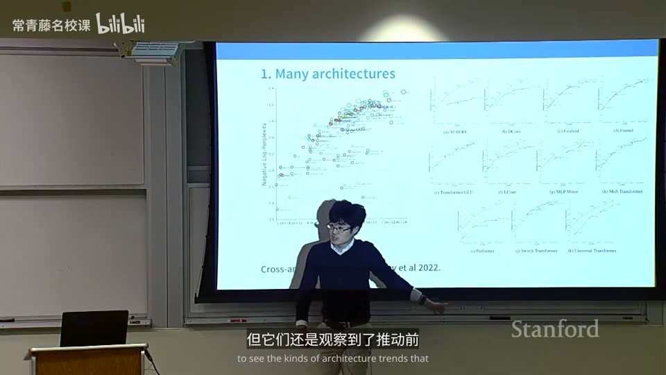 |
| 我觉得这也是为什么很多人几乎把缩放定律当作一种范式化的判断标准：如果某个改动没在缩放定律里体现出来，那它就不是个好的改动。因为在某种程度上，很多过去的研究其实已经反映了我们今天看到的现象。谢谢。好，行。除了架构之外，我们还可以把这种分析拓展到其他各种我们想理解的方面。我们可以问：SGD 到底比 Adam 好还是差？如果你做一下缩放定律分析——这项是 Hestness 做的——你会看到非常清晰的趋势。这又是那个很神秘的现象： [【跳转到 29:43】](https://www.bilibili.com/video/BV11LEA6eEuj/?p=9&t=1783) | 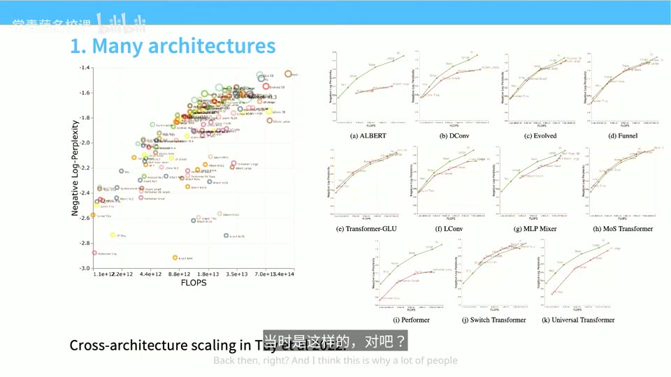 |
| 截距不一样，但斜率却非常接近——只要你固定住数据和模型，斜率往往会非常非常接近。每次看到我都觉得很惊讶，但它确实是真的：即使是像从 SGD 换到 Adam 这么大的改动，斜率也很少会变得不一样。如果你是亲自用 SGD 或者 Adam 来训练的人，你会觉得这是个巨大的变化，但缩放趋势大致还是一样的。这个例子里我们用的是循环高速公路网络（recurrent highway networks）来做语言模型。同样的，我在第二讲里跟大家提过纵横比（aspect ratio）——比如咱们怎么平衡深度和宽度。 [【跳转到 30:13】](https://www.bilibili.com/video/BV11LEA6eEuj/?p=9&t=1813) | 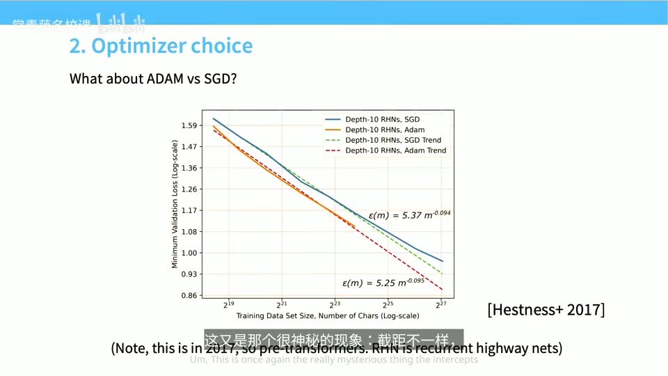 |
| 我之前说过，你可以随便挑个大概合理的数，大概是合理倍数的 4 倍。不过如果你做这种缩放分析，就能更清楚地知道到底发生了什么。所以咱们可以先看看缩放趋势是怎么随层数变化的。你会马上看出来：层数太少对模型非常不利。打个比方，如果你只有一层，那根本没戏，这缩放趋势糟透了；只要层数超过一层，表现其实出人意料地有竞争力—— [【跳转到 30:43】](https://www.bilibili.com/video/BV11LEA6eEuj/?p=9&t=1843) |  |
| 虽然你会看到，在每个算力水平下，层数越多（至少在这个例子里）效果越好。你可以做一项更细致的研究，Kaplan 他们就是这么做的。 [【跳转到 31:13】](https://www.bilibili.com/video/BV11LEA6eEuj/?p=9&t=1873) | 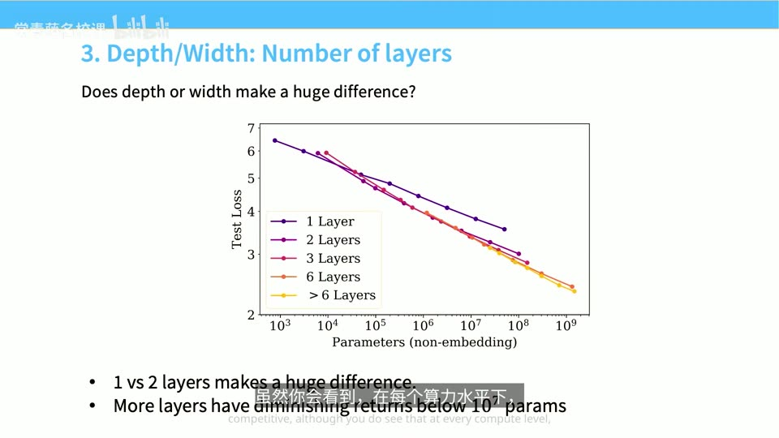 |
| 在这种研究里，你会尝试识别一些可以称为「尺度不变量」的量。比如纵横比：层数不是尺度不变量——模型越大，你确实需要更多的层；但模型变大时，最佳的那个纵横比也许应该保持不变——这一项是尺度不变的。所以如果我们看纵横比，会发现在不同的模型规模下得到的最小值基本相同：大约是每层对应 100 维的模型维度， [【跳转到 31:22】](https://www.bilibili.com/video/BV11LEA6eEuj/?p=9&t=1882) | 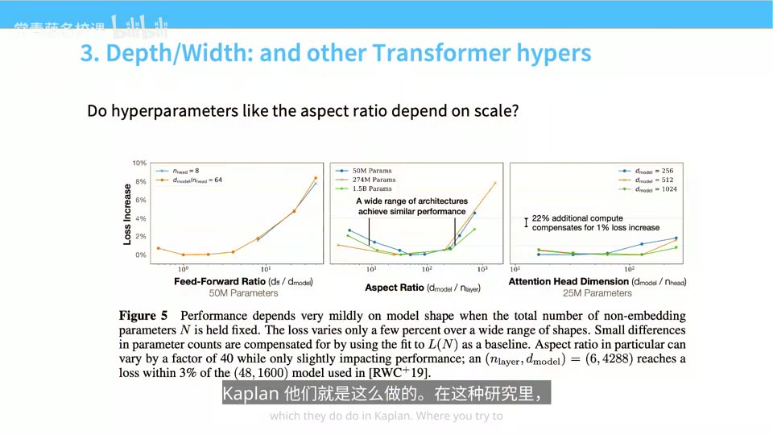 |
| 或者稍微少一点。它确实会有点偏移，对吧，比如对更深的模型来说， [【跳转到 31:47】](https://www.bilibili.com/video/BV11LEA6eEuj/?p=9&t=1907) | 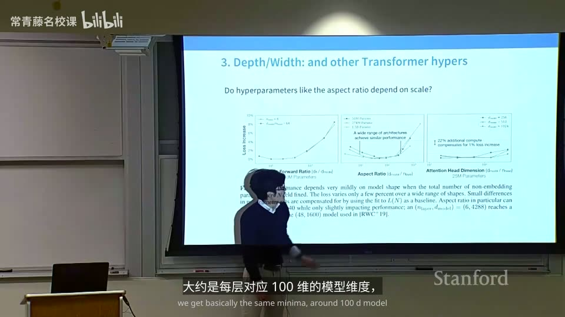 |
| 纵横比会偏小一些，但在大多数情况下最小值还是大致相同。对于注意力头位数等其他量，你也可以做类似的分析。如果你去看 Kaplan 那篇论文，他们这些分析做得相当出色。 [【跳转到 31:53】](https://www.bilibili.com/video/BV11LEA6eEuj/?p=9&t=1913) | 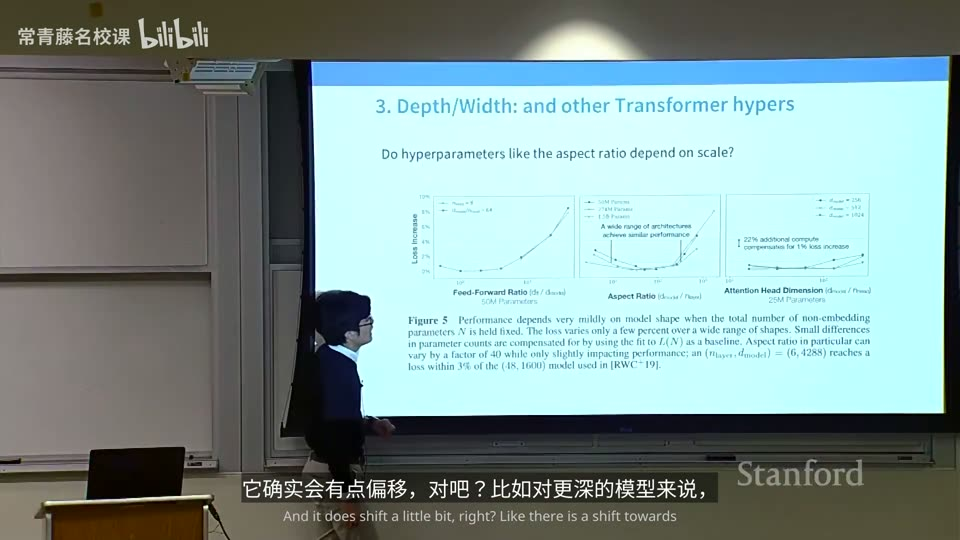 |
| 所以如果你的扩展策略是固定纵横比、然后扩大规模，你就可以画出这样的图，让自己确信我们大概没问题——因为随着模型越来越大，我们的优化点并没有偏移太多。唉，还有越来越大的模型。 [【跳转到 32:06】](https://www.bilibili.com/video/BV11LEA6eEuj/?p=9&t=1926) | 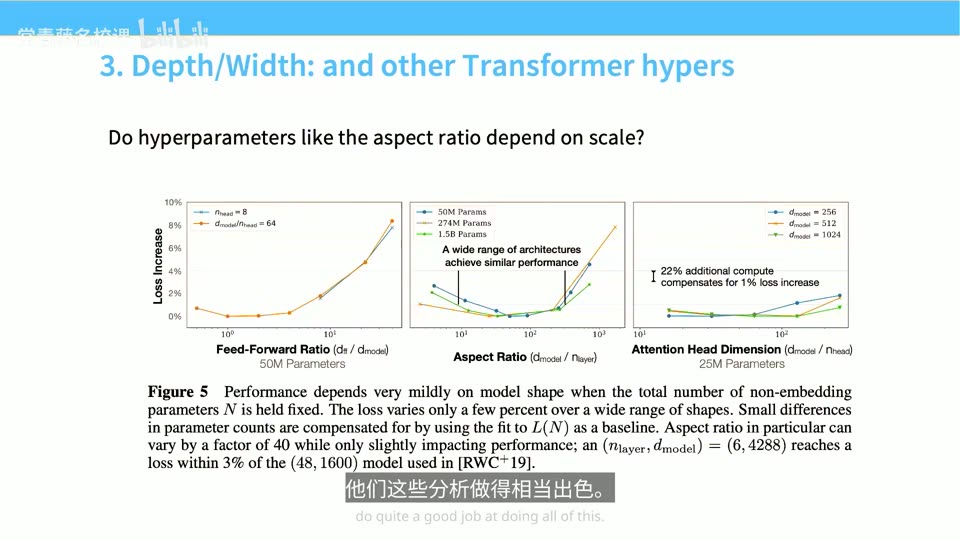 |
| 有一点很重要，这是个相当棘手的问题，棘手到我得用不止一张幻灯片来讲，这些问题后面还会再回来讲：并不是所有参数都同等重要。正因为并非所有参数都同等重要，你的缩放定律看起来是好是坏，取决于你怎么定义参数。在 Kaplan 那篇论文里，他们观察到：如果把 embedding 参数算进去，画出深度方向的缩放定律，得到的曲线形状会非常古怪——哦，这完全不行， [【跳转到 32:22】](https://www.bilibili.com/video/BV11LEA6eEuj/?p=9&t=1942) | 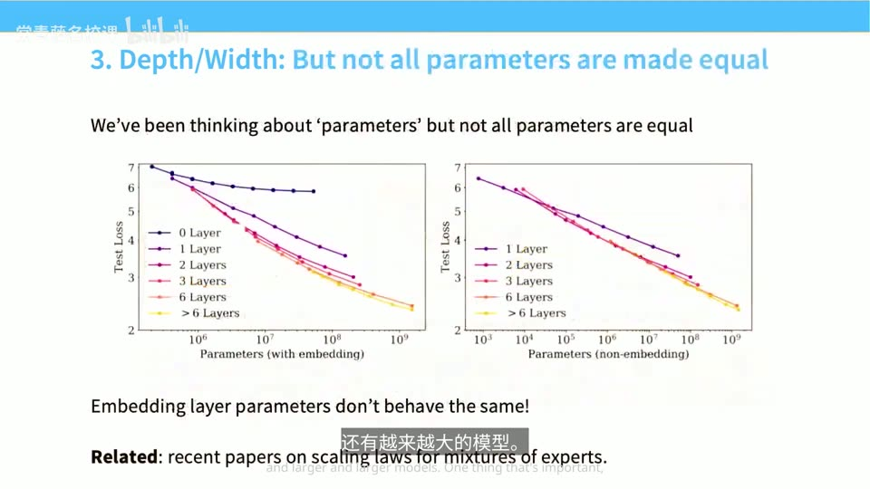 |
| 根本不行。既然完全不行，他们就决定把所有 embedding 参数都排除掉，只统计非 embedding 参数——因为你可以这样说服自己：这些才是真正在做计算的参数，或者别的什么理由吧。我们后面会看到，这会对某些结果的有效性产生不小的影响。但关键在于：缩放定律并不是什么魔法。我记得 Percy 喜欢强调这一点：缩放定律以及这种跨尺度的可预测性，其实都是人为设计出来的。这些效果不会自动出现，咱们得下功夫选对该看的横轴指标， [【跳转到 32:52】](https://www.bilibili.com/video/BV11LEA6eEuj/?p=9&t=1972) | 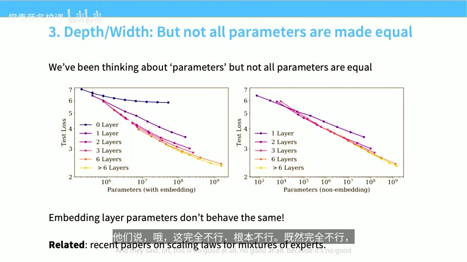 |
| 还得确保这些东西的超参数不掉队。只有满足这些条件，才能在跨越多个数量级的算力下实现可预测的缩放。所以这大概就是很多缩放定律研究人员在做的事：琢磨怎么才能让缩放变得高度可预测。说到这个， [【跳转到 33:22】](https://www.bilibili.com/video/BV11LEA6eEuj/?p=9&t=2002) | 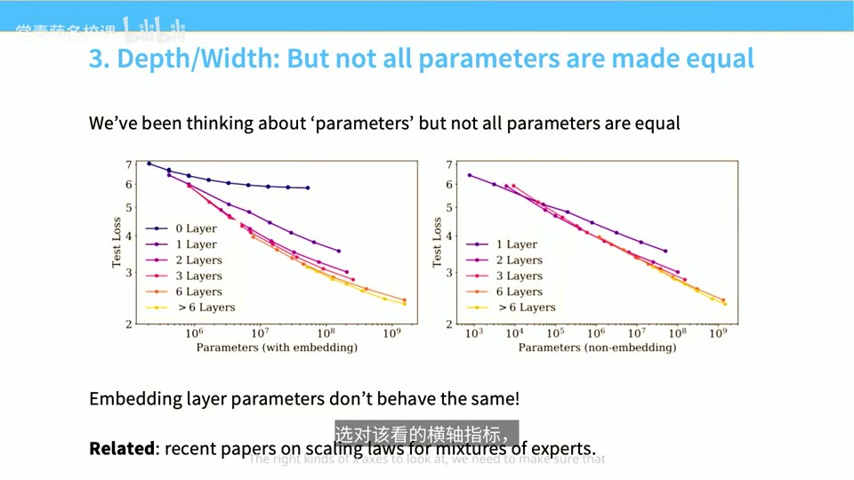 |
| 我觉得咱们最近那几篇关于混合专家（Mixture of Experts）缩放研究的论文挺有意思的。现在混合专家基本成了训练大模型的主流方式，既然参数总量和激活参数数量解耦了，那咱们就得好好想想：在这个新世界里，价值——或者说参数——到底指什么？苹果和 MIT 的一些人做了一份很漂亮的分析，展示了缩放趋势是如何随变量变化的：它既取决于参数，也取决于激活参数。这里有个挺有意思的现象： [【跳转到 33:39】](https://www.bilibili.com/video/BV11LEA6eEuj/?p=9&t=2019) |  |
| 当你开始训练越来越大的模型——比如增加横轴上的总参数数量并试图最小化损失时——你最终得到的模型会越来越稀疏，你看颜色是不是变得越来越深了。同理，你看激活参数的数量会随着 MoE 稀疏度的提高而下降。这里有一个结果我觉得挺直观的：你可以为不同的计算量画出这些曲面，针对每种计算量，你可以问自己：我是更愿意把算力花在激活参数上吗？或者你想要多大的稀疏度呢？ [【跳转到 34:09】](https://www.bilibili.com/video/BV11LEA6eEuj/?p=9&t=2049) | 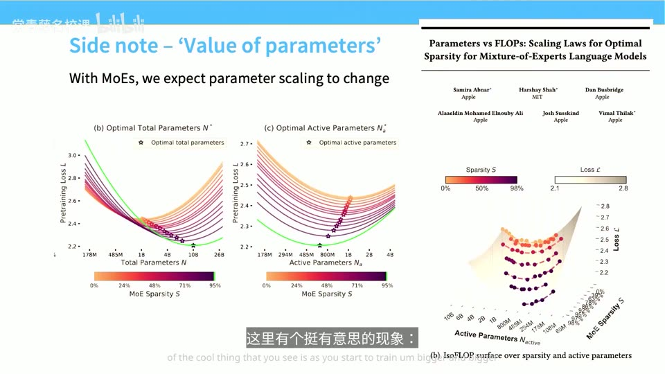 |
| 对吧？你完全可以在几乎不改变算力的前提下灵活调整稀疏度。那么基于此，咱们可以问：如果我增加更多空置参数会发生什么？激活参数不变，但总参数变多了。你看，随着视角从图表后方移到前方， [【跳转到 34:39】](https://www.bilibili.com/video/BV11LEA6eEuj/?p=9&t=2079) | 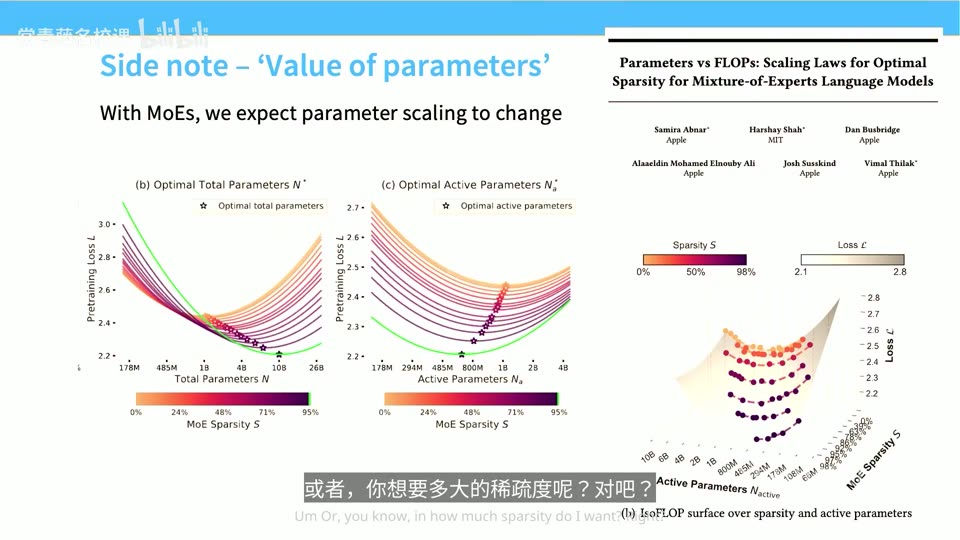 |
| 损失值在下降，对吧。换句话说，这表明在 MoE 架构中， [【跳转到 34:55】](https://www.bilibili.com/video/BV11LEA6eEuj/?p=9&t=2095) | 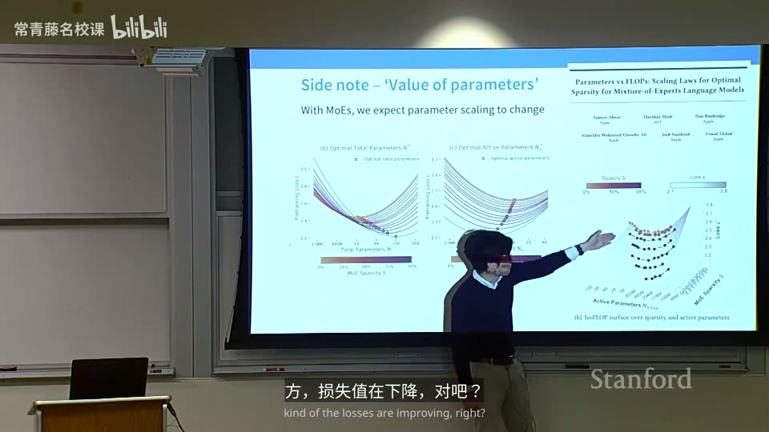 |
| 那些未激活的参数仍在帮你降低损失。这挺有意思的，而且你可以把它的函数形式写出来——这部分细节我就不多展开了。重点是：我们在优化 MoE 时关注的这些量， [【跳转到 34:59】](https://www.bilibili.com/video/BV11LEA6eEuj/?p=9&t=2099) | 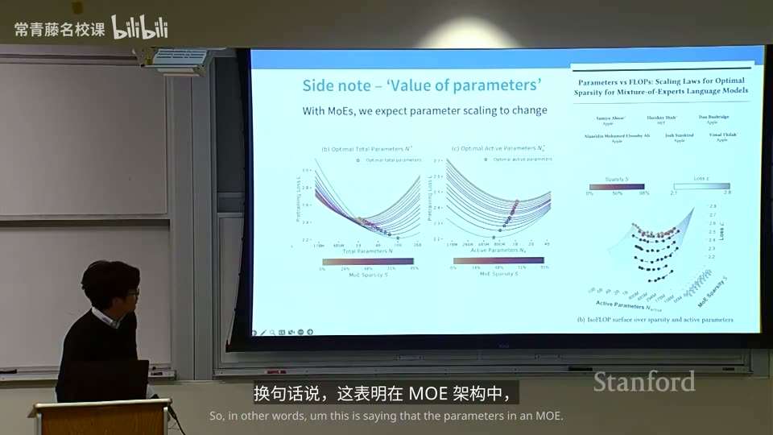 |
| 其实都遵循可预测的缩放规律。 [【跳转到 35:11】](https://www.bilibili.com/video/BV11LEA6eEuj/?p=9&t=2111) |  |
| 好，接下来我想聊的两件事其实都很重要，就是我现在想讲的这两件事。当你准备训练一个新的大模型时，其实我讲的大部分东西都是固定的，对吧。你们大概还没激进到要换用 LSTM 的地步，你们大概率会选——比如我也说不好——受 DeepSeek 启发的 MoE 架构之类的，对吧？你们大概率会选那些经过验证的架构方案， [【跳转到 35:16】](https://www.bilibili.com/video/BV11LEA6eEuj/?p=9&t=2116) | 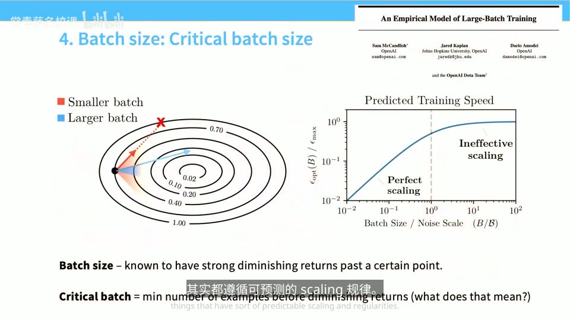 |
| 你不可能把一切都推翻重来。但在某种意义上，你确实得重新琢磨两件事：batch size 和 learning rate。如果你训练过深度学习模型，你就知道必须谨慎处理 batch size 和 learning rate 的搭配：改一个，另一个就得跟着改。而 batch size——我们从上一讲知道，出于另一个原因——它其实很棘手：我们希望 batch size 越大越好，因为大的 batch size 给了我们做并行化的机会，记住，数据并行需要大的 batch size。所以说了这么多，我们真正想知道的是： [【跳转到 35:46】](https://www.bilibili.com/video/BV11LEA6eEuj/?p=9&t=2146) | 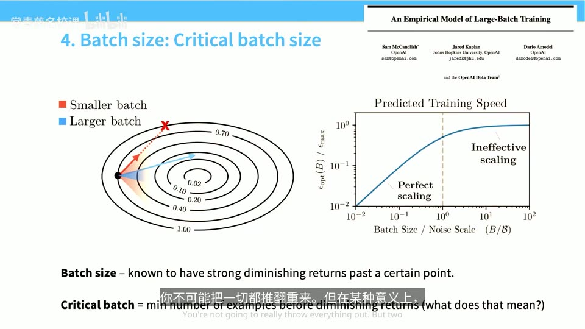 |
| 在性能开始变差之前，batch size 最大能开到多少？这就是相关的系统问题。另外你还想知道：它是怎么随着模型规模变化的？铺垫了这么多，这里有个特别重要的概念，很多论文都在用，也经常被提到，叫做「临界批次大小」（critical batch size）。所谓 critical batch size，简单来说就是：在某个临界点之前，你增加 batch size 收益是成正比的；过了这个点，回报就开始打折扣了。 [【跳转到 36:16】](https://www.bilibili.com/video/BV11LEA6eEuj/?p=9&t=2176) | 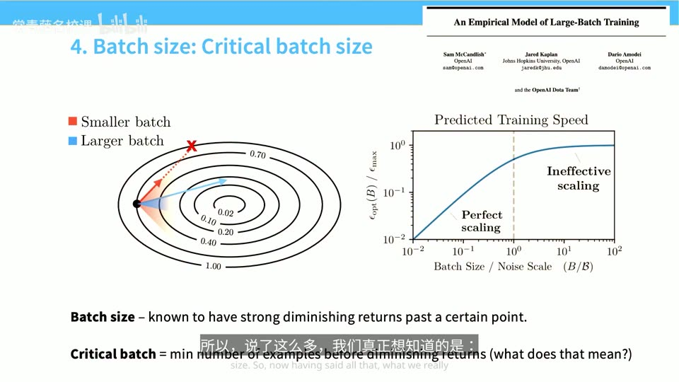 |
| 所以我把这个阶段叫做「噪声受限阶段」。在这个阶段里，你往 batch 里每多加一个样本，就能降低 SGD 里的梯度噪声，对吧？因为这时候主要是方差在限制你，所以方差一降下来，效果提升就特别明显，对吧？这带来的提升是巨大的。所以在这个阶段，缩放是完美的：也就是说，在你处理这些额外样本的前提下，你的表现已经做到了极致。当你逐渐到达梯度噪声尺度的那个点时，你就进入了一个不再受方差限制的阶段—— [【跳转到 36:46】](https://www.bilibili.com/video/BV11LEA6eEuj/?p=9&t=2206) | 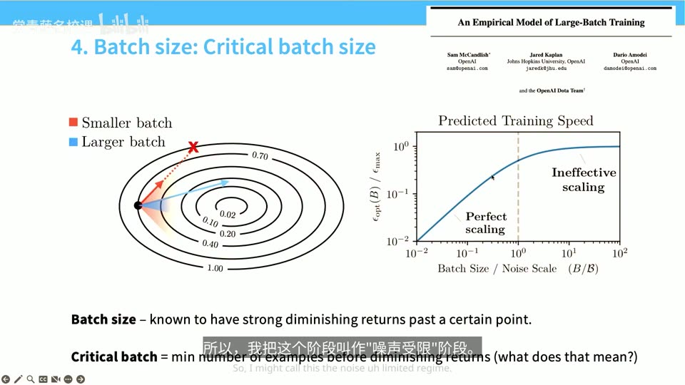 |
| 那么你受限于偏差了。这是什么意思呢？咱们回想一下：做梯度下降时，你看到的只是目标函数的局部结构，没法从全局看清最小值到底在哪儿。所以哪怕我把噪声压得再低，我的方向也只会指向这边这个浅蓝色区域，我找的这个局部下降方向跟真正的全局最优解之间总归是有差距的。所以到了某个节点，我就开始面临收益递减了，因为这时候限制我的不再是方差， [【跳转到 37:16】](https://www.bilibili.com/video/BV11LEA6eEuj/?p=9&t=2236) | 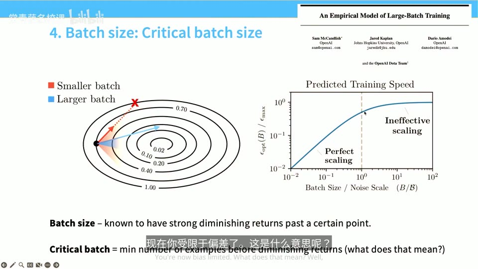 |
| 而是受限于这个偏差项。所以过了这儿，我就变成偏差受限了。所以临界批次大小（critical batch size）算是个经验法则，或者说是一个折中点：到了这儿，咱们就开始从那种完美的缩放区间过渡到低效缩放了。这就给了你一个不错的经验法则，告诉你批次大小该设成多少：如果你想让批次大小尽可能大，又不想承受那些巨大的效率损失，就该这么设。 [【跳转到 37:46】](https://www.bilibili.com/video/BV11LEA6eEuj/?p=9&t=2266) | 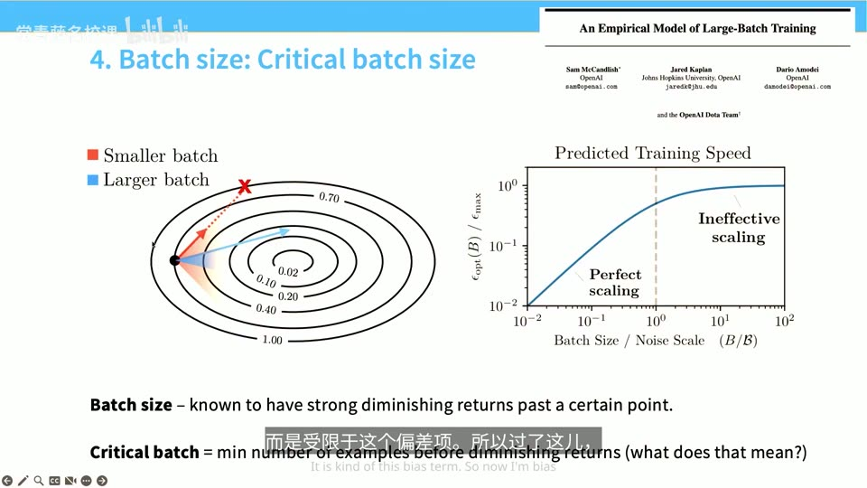 |
| 希望这个想法很清楚。嗯，现在临界批次大小这个概念有点奇怪： [【跳转到 38:16】](https://www.bilibili.com/video/BV11LEA6eEuj/?p=9&t=2296) | 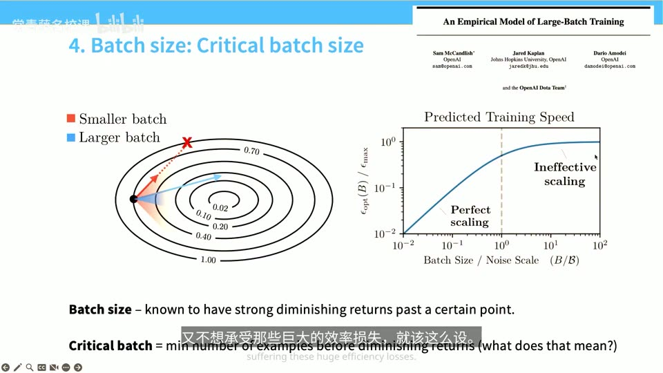 |
| 它是从一系列复杂的计算中推导出来的， [【跳转到 38:20】](https://www.bilibili.com/video/BV11LEA6eEuj/?p=9&t=2300) | 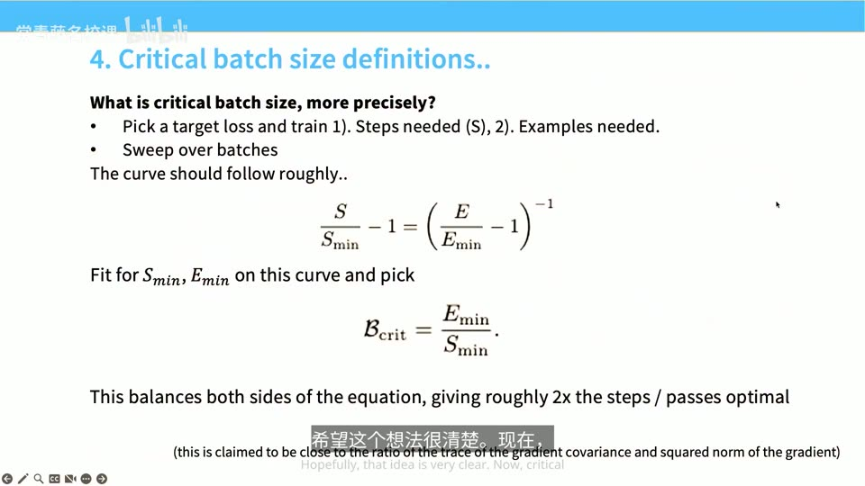 |
| 这些计算涉及对目标函数的局部二次近似。 [【跳转到 38:30】](https://www.bilibili.com/video/BV11LEA6eEuj/?p=9&t=2310) | 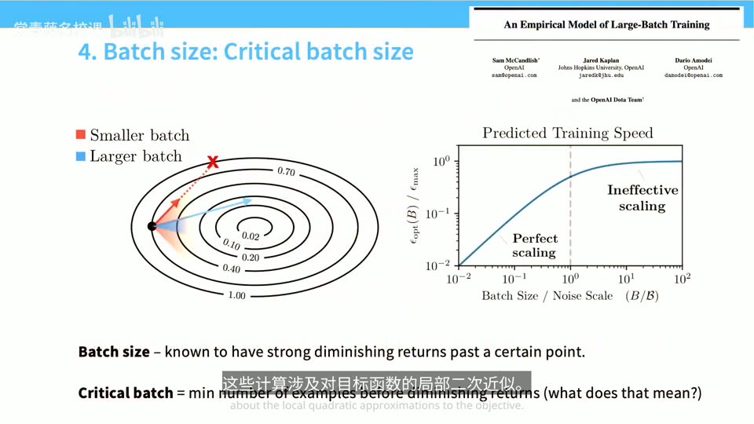 |
| 不过我可以给你讲讲实际用来估算这个量的具体步骤。第一步是选一个目标损失值。目标损失就是你想达到的某个数值，你的目标是尽可能快地达到这个损失值。这就是我现在要做的：我会遍历不同的批次大小，然后记下达到目标损失所需的步数，以及达到该目标损失所需的样本总数。当然，第一条和第二条之间差了一个 batch size 的倍数，对吧——也就是说，训练步数乘以 batch size 就等于样本总量。 [【跳转到 38:34】](https://www.bilibili.com/video/BV11LEA6eEuj/?p=9&t=2314) |  |
| 经过一些计算，OpenAI 的 McCandlish 等人提出： [【跳转到 39:04】](https://www.bilibili.com/video/BV11LEA6eEuj/?p=9&t=2344) |  |
| 这大概就是我们该遵循的函数形式——你需要的步数和样本数与 S_min [【跳转到 39:09】](https://www.bilibili.com/video/BV11LEA6eEuj/?p=9&t=2349) | 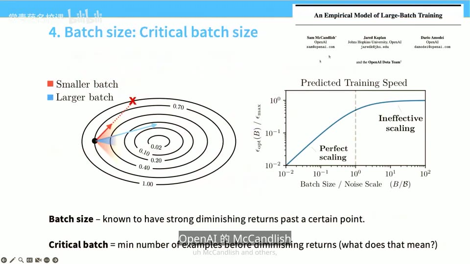 |
| （即理论上可能的最小步数）成反比，这里用最小样本数对这两个量做了归一化处理。所以这两者之间有个权衡，对吧：如果你想减少样本量，就得增加步数；反之，如果你想减少步数，就得用更多的样本。这是个很自然的权衡。如果你调大或调小 batch size，这个权衡就会向某一边倾斜。现在他们认为当下的目标应该是平衡这两方面：我要确保步数项和样本数项大致平衡。 [【跳转到 39:13】](https://www.bilibili.com/video/BV11LEA6eEuj/?p=9&t=2353) |  |
| 解这个方程，你会得到这个特定解：临界 batch size 等于所需最小样本数除以所需最小步数。这两个参数是通过你和我现有的观测数据来估算的。这能平衡方程两边：给出的步数会比最优值稍多一点，需要的样本也比最优值稍多，但这实现了两方面的平衡。你可以把它看作是 [【跳转到 39:43】](https://www.bilibili.com/video/BV11LEA6eEuj/?p=9&t=2383) | 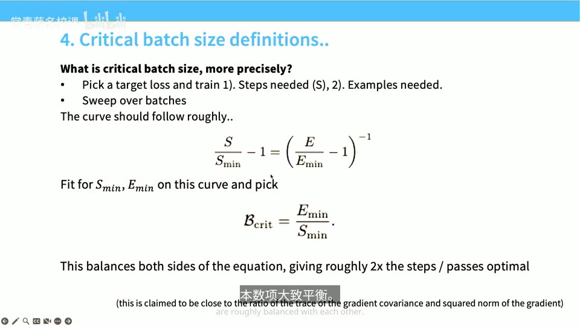 |
| 在不显著增加所需步数的情况下，优化收敛速率。 [【跳转到 40:05】](https://www.bilibili.com/video/BV11LEA6eEuj/?p=9&t=2405) | 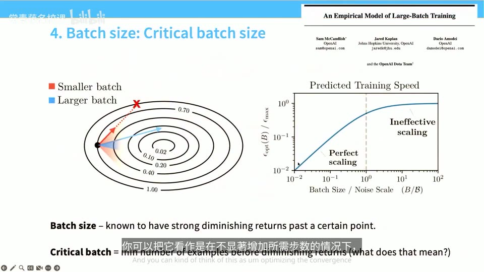 |
| 还有个补充观点，我就不展开说了，因为这会涉及更琐碎的细节。如果你对这方面感兴趣，建议你去读读那篇关于临界 batch size 的论文。他们其中一个观点是：估算这个参数相当复杂——你只需要看看梯度协方差和梯度平方范数的比值就行。那为什么这会在讲缩放定律的课里提到呢？ [【跳转到 40:09】](https://www.bilibili.com/video/BV11LEA6eEuj/?p=9&t=2409) | 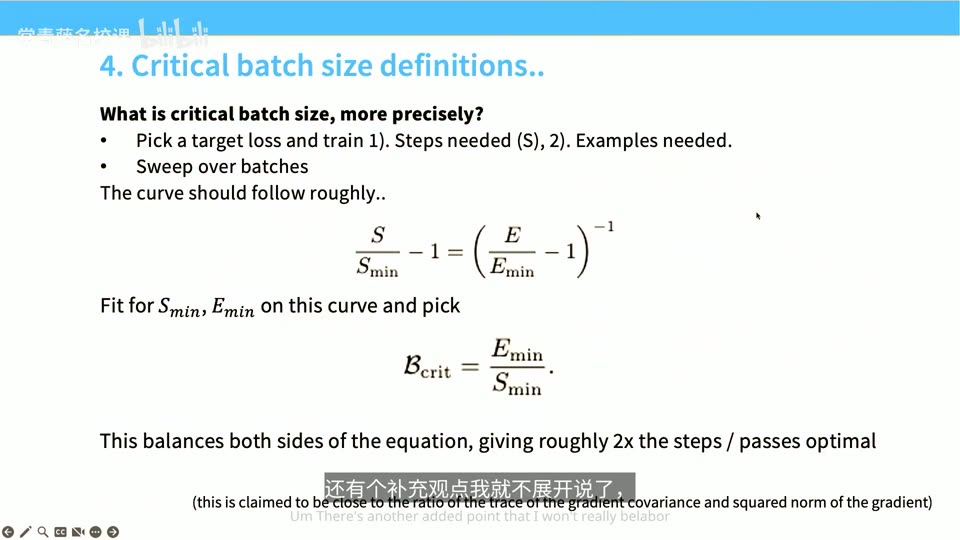 |
| 其实到现在为止，这跟缩放定律没什么直接关系。把它放在缩放定律讲座里，首先是因为临界 batch size 是个挺合理的 batch size 选择——这个 batch size 能在收敛速度和 batch size 大小之间取得平衡。所以如果我想把 batch size 设为临界 batch size，你可能会问：随着目标 loss 的变化，这个数值会怎么变？你可以把目标 loss 看作计算量： [【跳转到 40:28】](https://www.bilibili.com/video/BV11LEA6eEuj/?p=9&t=2428) | 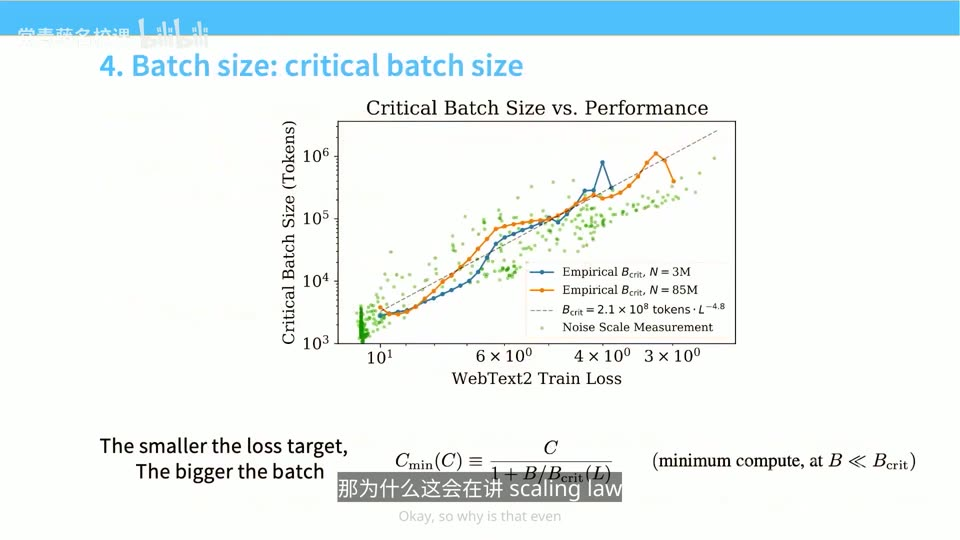 |
| 如果我想让模型越来越好，我该用多大的 batch size？把它放进缩放定律讲座里，是因为随着 loss 降低——也就是你的 loss 变好了——临界 batch size 的量会增加，而且它以一种非常可预测的方式增长。这又是个幂律，对吧。所以他们论证的这个关系，大致上是反多项式形式的，在 batch size 这方面。鉴于此，这其实挺不错的，因为它意味着：如果你进行超大规模训练、一直跑到图表的最右侧，batch size 可以设得很大。 [【跳转到 40:58】](https://www.bilibili.com/video/BV11LEA6eEuj/?p=9&t=2458) | 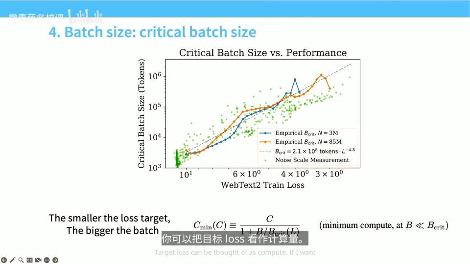 |
| 这很合理：当你越来越接近最小值时，方差减少的收益会变大，因为你正在优化越来越细微的目标——当你开始最小化那些极其微小的差异时，噪声的影响就大得多了。好，batch size 这边就讲完了。 [【跳转到 41:28】](https://www.bilibili.com/video/BV11LEA6eEuj/?p=9&t=2488) | 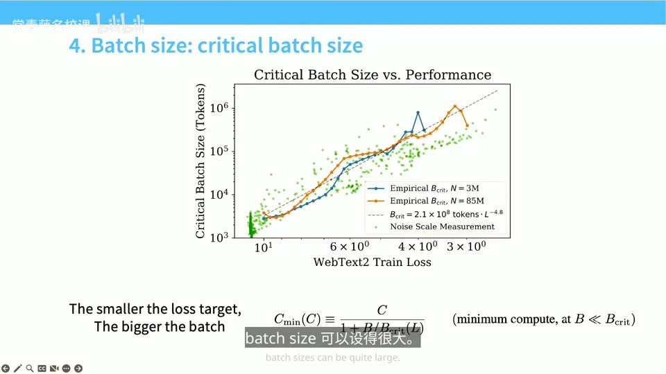 |
| 那另一边呢？所以你要记住，你始终需要调的两个量就是 batch size 和 learning rate。learning rate 这边也稍微有点复杂，关于这点我会在进阶的缩放课程里详细展开。不过学习率通常会变动，我觉得用这个思路来理解标准场景下的学习率很直观：假设你用的是个多层感知机（MLP），对吧，就像某种标准的神经网络。我不做深度缩放，只做宽度缩放。如果我做宽度缩放：模型越大， [【跳转到 41:43】](https://www.bilibili.com/video/BV11LEA6eEuj/?p=9&t=2503) | 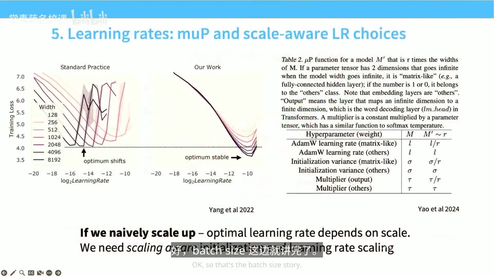 |
| 学习率就得设得越小。学习率得设小点，是因为参数更多、规模更大了，我一次性改动的东西更多了，也许步子该迈小点，这逻辑挺通顺的。事实上有个经验法则：你可以试着按宽度的倒数来调整——这是个很常见的经验法则，随着网络变宽，要相应地调低学习率。 [【跳转到 42:13】](https://www.bilibili.com/video/BV11LEA6eEuj/?p=9&t=2533) | 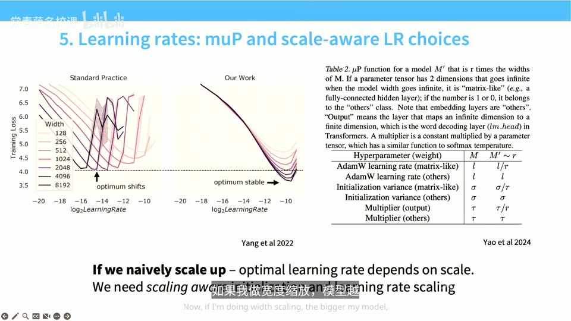 |
| 这样你就有了缩放学习率的依据。不过还有另一派思路、另一套技巧：人们还会用各种方式对网络本身进行重新缩放（reparametrize）。他们会改变初始化的大小，还会针对网络的不同部分调整优化器的步长，目的是迫使模型在不同规模下都保持相同的 [【跳转到 42:35】](https://www.bilibili.com/video/BV11LEA6eEuj/?p=9&t=2555) | 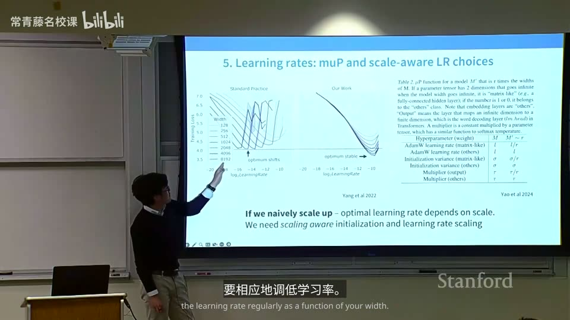 |
| 最优学习率。这种思路被称为 muP（Maximal Update Parametrization）， [【跳转到 42:55】](https://www.bilibili.com/video/BV11LEA6eEuj/?p=9&t=2575) | 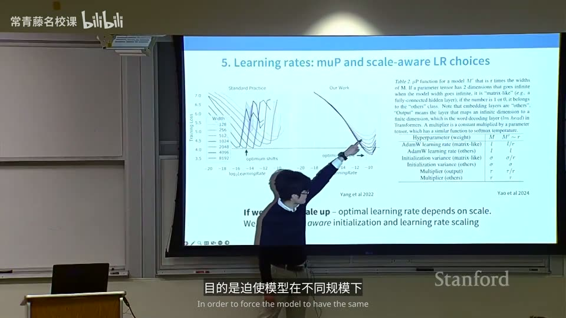 |
| 还有其他类似的方法。有人报告说这类方法效果显著，也有人报告说效果没那么好。这张图基本上涵盖了大规模训练设置学习率的两种主要方式：一种方式是去估算这些最优点，并预测你的最优点会落在哪里——而且最优点的变化规律相当可预测，所以这思路并不离谱；或者你可以对模型重新参数化，让最优学习率保持不变， [【跳转到 42:59】](https://www.bilibili.com/video/BV11LEA6eEuj/?p=9&t=2579) | 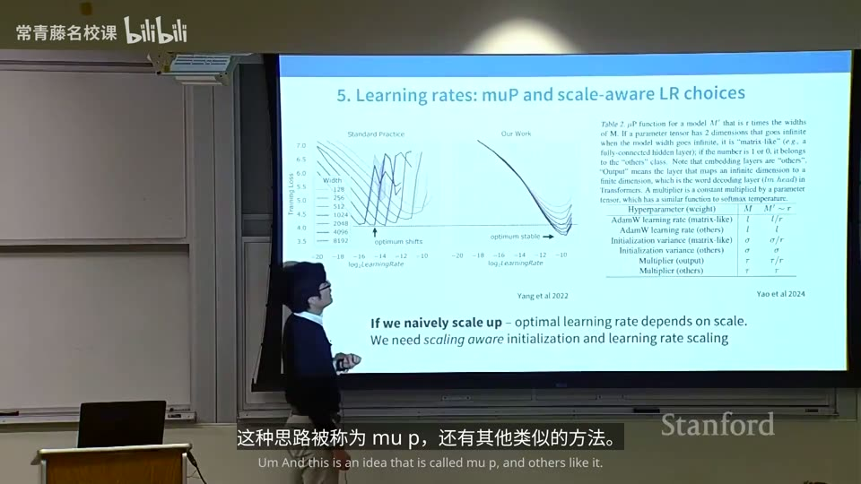 |
| 然后直接选定最佳学习率开跑。这就是选 learning rate 的两种思路： [【跳转到 43:21】](https://www.bilibili.com/video/BV11LEA6eEuj/?p=9&t=2601) | 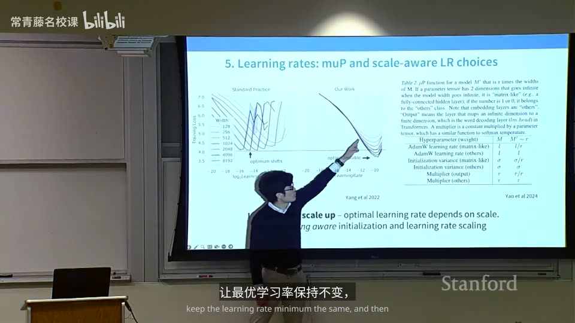 |
| 两种方法都已在大规模实践中成功应用。 [【跳转到 43:25】](https://www.bilibili.com/video/BV11LEA6eEuj/?p=9&t=2605) | 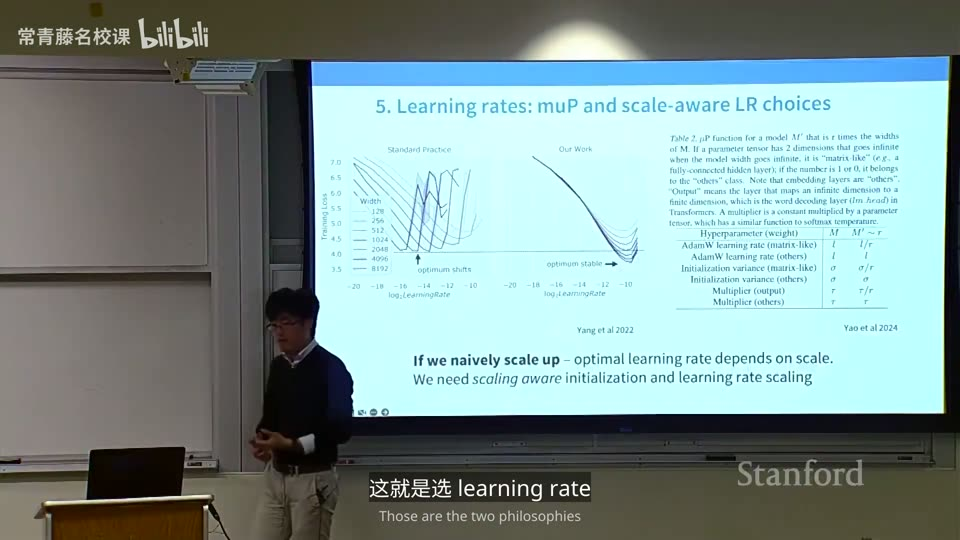 |
| 确实有大规模训练用过这两种方法。我个人感觉现在好像更多人偏向缩放定律那套，不过两种思路肯定都行得通。关于这两种方法的具体细节，我们下次课再细聊。好。 [【跳转到 43:29】](https://www.bilibili.com/video/BV11LEA6eEuj/?p=9&t=2609) | 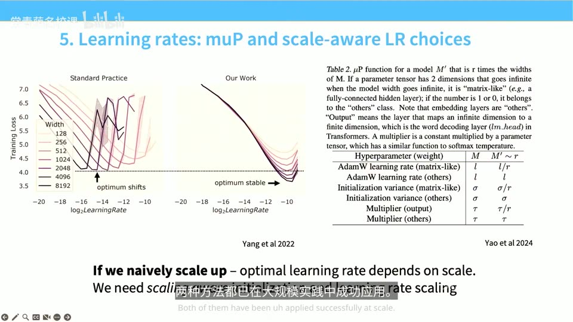 |
| 在讲这节课最后一部分之前，我想先说几句——不算什么坑，主要是缩放定律相关的一些具体细节。这一节最后我想强调一点：upstream（上游）和 downstream（下游）的性能表现可能大不相同。比如你看 log-likelihood 这类指标——像 EK 那篇架构论文里展示的那样——perplexity（困惑度）跟参数量是高度相关的：你看参数量越多，模型效果越好，非常符合预期，这是一条非常漂亮的线性趋势。这时候你可能会觉得：行，这挺好。 [【跳转到 43:41】](https://www.bilibili.com/video/BV11LEA6eEuj/?p=9&t=2621) | 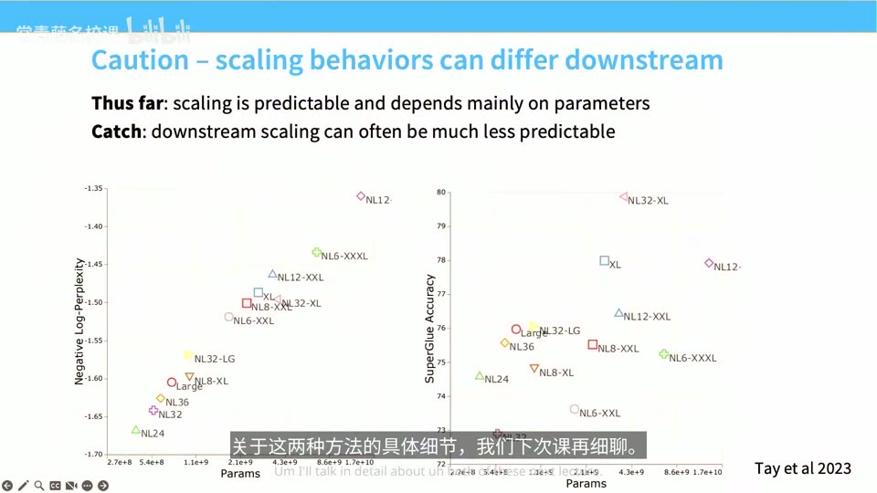 |
| 接下来咱们准备上线最强的模型 1.2B，结果发现 1.2B 并不是你最好的模型——真正最好的其实是 1B XL，虽然它的 perplexity 反而更差。这种情况在上下游之间很常见，这两者往往是相关的，这大概是我见过的上下游之间最差的一种相关性了。但我觉得很重要的一点是要记住：缩放定律一般来说是用在 perplexity 这一侧的，它们非常干净、规律、可预测；但从 perplexity 迁移到下游， [【跳转到 44:11】](https://www.bilibili.com/video/BV11LEA6eEuj/?p=9&t=2651) | 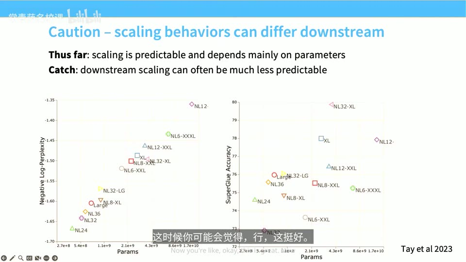 |
| 其实远没有一开始看上去那么确定。记得你得特别小心。说个小插曲：我以前有学生去各家做 post-training，他们回来总在抱怨说：那些搞 pre-training 的人把模型甩给你，说「perplexity 挺好看」，剩下的就都是你的问题了。可问题其实往往在 pre-training 阶段就已经埋下了。所以你别做那种人，你得认真考虑迁移这件事，不能光盯着 perplexity。好。 [【跳转到 44:41】](https://www.bilibili.com/video/BV11LEA6eEuj/?p=9&t=2681) | 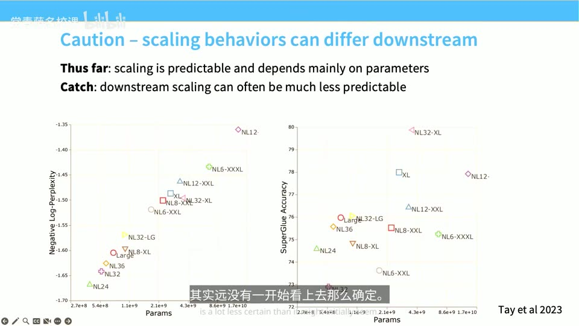 |
| 这可能出乎意料，也可能在情理之中。我想强调的是：在跑大规模训练之前，你得先对结果有个大概的预期，别只问它能不能跑通。如果你参考缩放定律，你应该能相当精确地预测出数值，几乎能预判出这次训练的效果有多好——比如像「这个优化器还是那个能带来多少提升」这个，你应该能预判。所以基于缩放定律的做法是：先训练一批小模型，然后在双对数图上拟合出这些直线，从而确立某种缩放定律。 [【跳转到 45:05】](https://www.bilibili.com/video/BV11LEA6eEuj/?p=9&t=2705) | 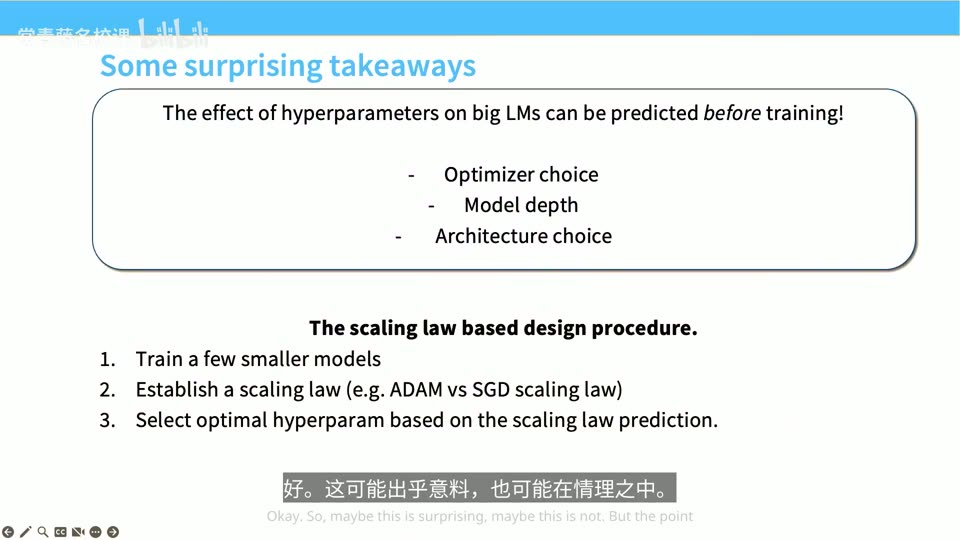 |
| 只要你拟合效果足够好，我就有理由相信这种差距会一直存在；接着我就把这个缩放定律直接应用到大规模训练中。这是缩放定律流程的朴素版本，但我认为这在实践操作中是足够准确的。你还能怎么做呢？凭空搞个训练出来不太可能好。那我先停一下——在讲最后这部分之前，大家有什么问题吗？问得好。 [【跳转到 45:35】](https://www.bilibili.com/video/BV11LEA6eEuj/?p=9&t=2735) | 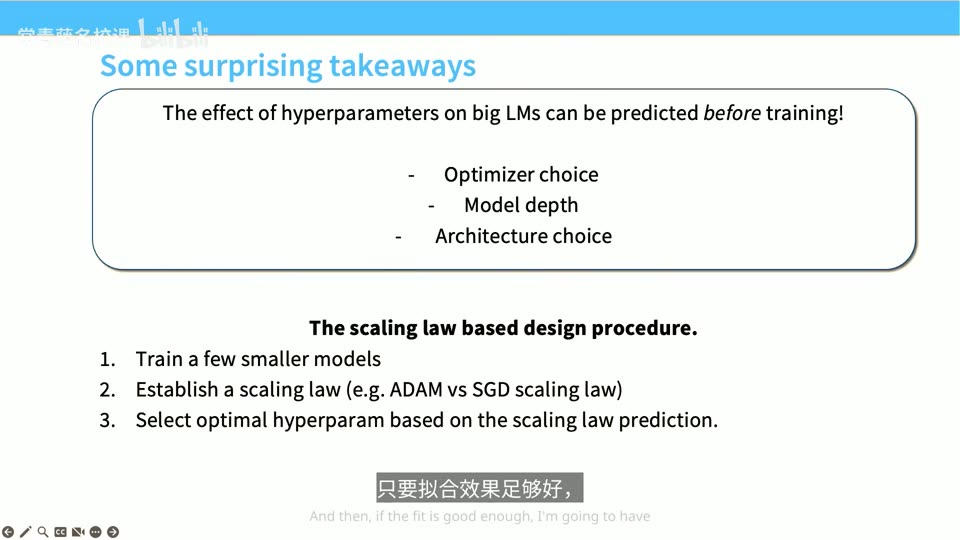 |
| 对于缩放模型里的每个数据点，您觉得方差情况如何？你们一般跑多少次？最后聚合数据时是取平均还是看中位数？——据我所知， [【跳转到 45:58】](https://www.bilibili.com/video/BV11LEA6eEuj/?p=9&t=2758) | 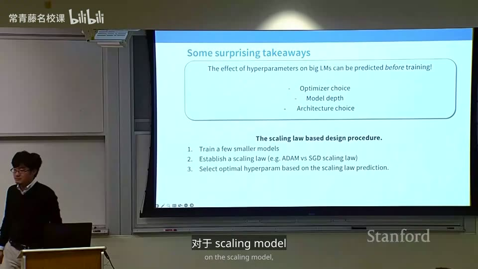 |
| 几乎所有情况都是单次（single run）。之所以是单次，是因为你看 perplexity 的时候，它们非常稳定，对吧。比如这些指标，如果重新跑一遍， [【跳转到 46:09】](https://www.bilibili.com/video/BV11LEA6eEuj/?p=9&t=2769) | 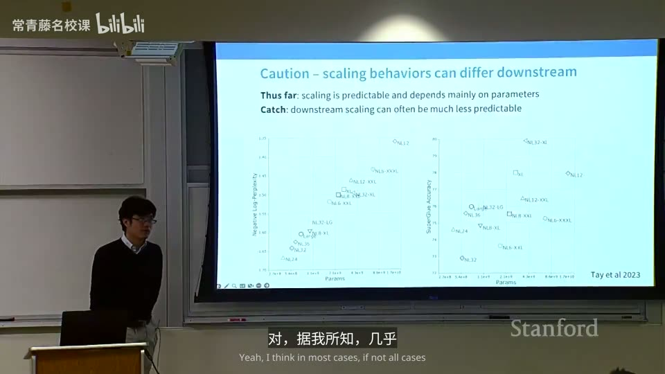 |
| 方差可能也就在小数点后第二位左右，因为训练数据很同质、数据量很大、batch 也很大，所以这些指标的方差被压得非常低。但如果你是在研究 learning rate 或 critical batch size 的缩放定律， [【跳转到 46:20】](https://www.bilibili.com/video/BV11LEA6eEuj/?p=9&t=2780) | 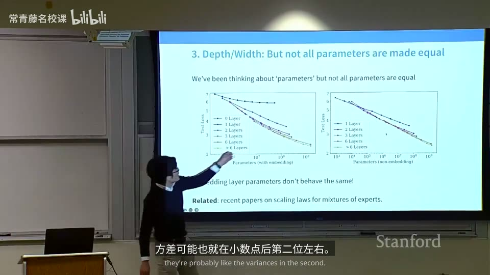 |
| 那你可能会看到一些非常剧烈的波动。我觉得大家确实会做点方差缩减，但这事儿其实没那么普遍，按理说应该更常见才对。大多数人都是直接用 benchmark 指标，而不是用 perplexity——对，大家确实会直接在下游指标上做缩放定律，但这也有同样的毛病。所以我觉得可以这么理解： [【跳转到 46:30】](https://www.bilibili.com/video/BV11LEA6eEuj/?p=9&t=2790) | 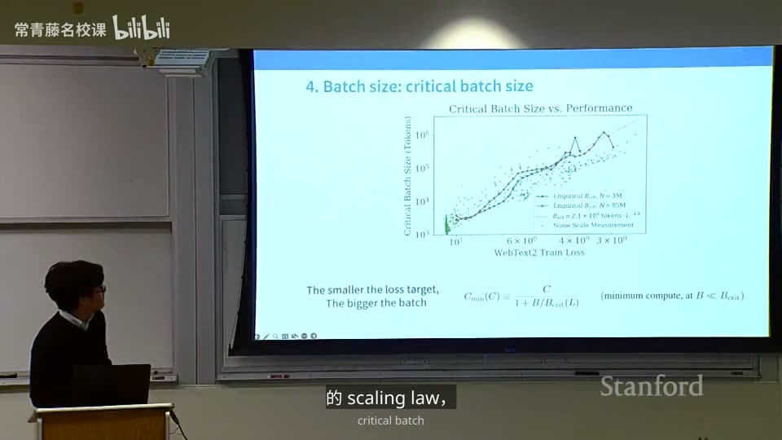 |
| 缩放定律的核心在于：可靠地确立至少一件事。 [【跳转到 46:49】](https://www.bilibili.com/video/BV11LEA6eEuj/?p=9&t=2809) | 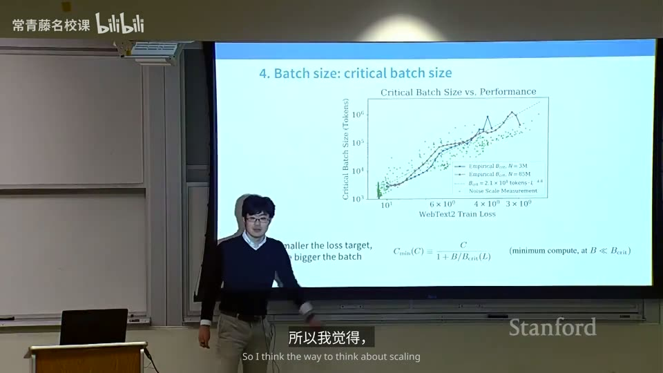 |
| 所以咱们这么想：假设我观察到这种趋势，对吧，我心里有数，或者说我强烈相信 [【跳转到 46:53】](https://www.bilibili.com/video/BV11LEA6eEuj/?p=9&t=2813) | 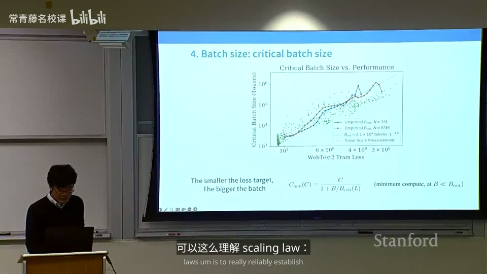 |
| 这条 Transformer 曲线会一直延续下去——这趋势非常规律，对吧， [【跳转到 47:00】](https://www.bilibili.com/video/BV11LEA6eEuj/?p=9&t=2820) | 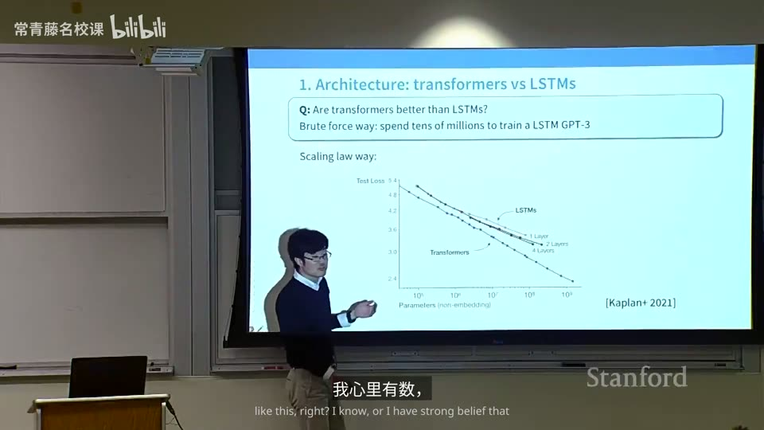 |
| 虽然可能会有点弯曲，但我们确实觉得这里头是有规律可循的，对吧。但反过来想，如果这是一条非常嘈杂、锯齿状的曲线，你就根本搞不清到底是怎么回事了。比如你会想：我虽然觉得它可能会继续，但它到底是直线还是曲线呢？对吧。所以如果让我来解释这套东西背后的理念， [【跳转到 47:04】](https://www.bilibili.com/video/BV11LEA6eEuj/?p=9&t=2824) | 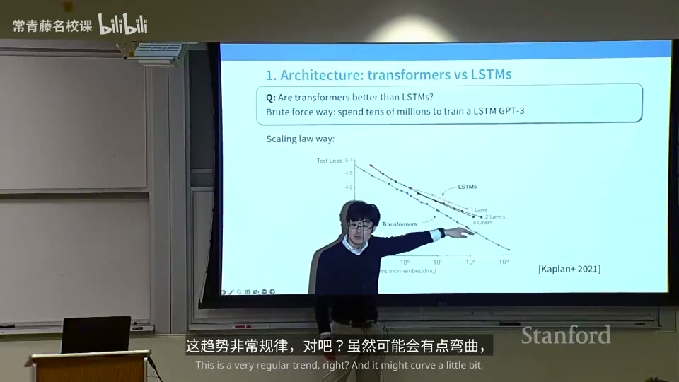 |
| 我的总体思路是：咱们先从低方差的度量开始， [【跳转到 47:23】](https://www.bilibili.com/video/BV11LEA6eEuj/?p=9&t=2843) | 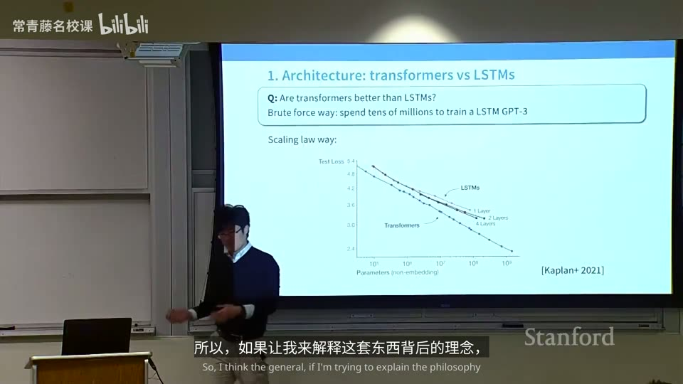 |
| 在那里把缩放规律立住，然后再靠某种关于迁移的信念——或者在别处确立迁移能力—— [【跳转到 47:28】](https://www.bilibili.com/video/BV11LEA6eEuj/?p=9&t=2848) | 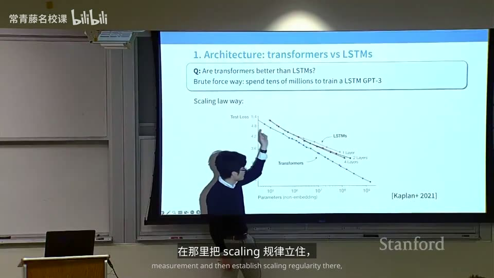 |
| 以此来证明它能迁移到下游任务。 [【跳转到 47:34】](https://www.bilibili.com/video/BV11LEA6eEuj/?p=9&t=2854) | 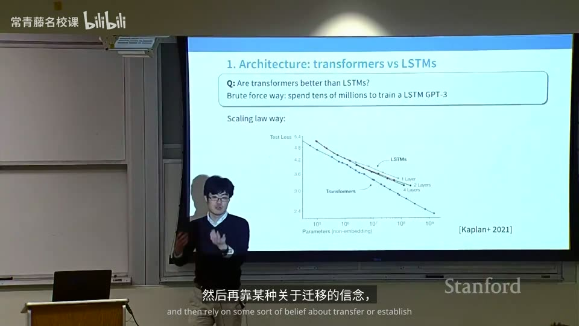 |
| 对，没错，所以这就是那三点。不好意思，我明白了。对，像 Kaplan 2020 那种严谨的科学实践用的其实是多次重复的测试损失，但现实情况是：除了极少数模型——比如无限算力那个，还有重复数据那一类——除非你特意用那些方法，否则大家基本都只做一遍 SGD。所以这些模型的泛化差距都非常非常小，训练集和验证集的结果几乎一样。甚至我见过一些预训练的代码库里面 [【跳转到 47:38】](https://www.bilibili.com/video/BV11LEA6eEuj/?p=9&t=2858) | 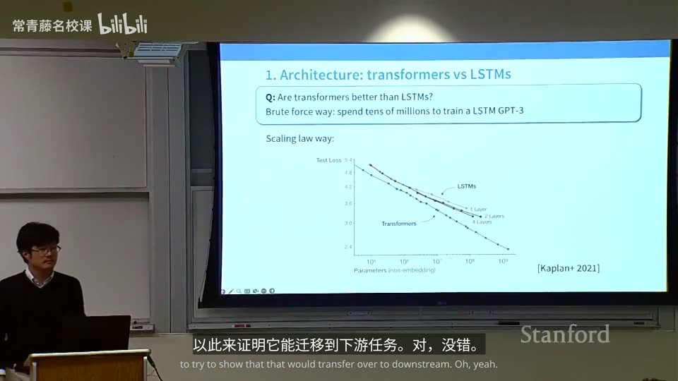 |
| 连验证损失都没有，因为如果是单遍训练，训练集和验证集的结果很可能非常接近。这也是为什么很多这类图表会把这两个指标互换，因为它们都处在单遍训练的模式下。嗯，不过问得好。行，咱们接着往下讲。不好意思，我刚才跳得太远了。好，接下来我要讲讲缩放定律最知名的一个应用场景。就算你自己没直接用过它，但你肯定在某个时候用过这个经验法则。 [【跳转到 48:08】](https://www.bilibili.com/video/BV11LEA6eEuj/?p=9&t=2888) | 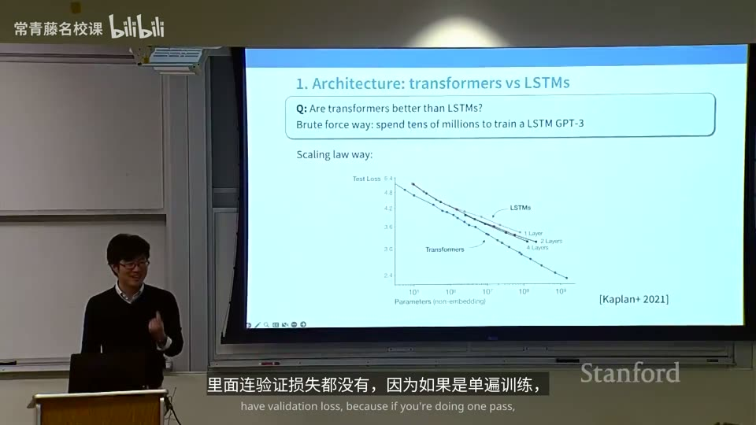 |
| 而且我觉得因为这组内容能让我们看到一些非常重要的东西、有趣的地方——关于缩放定律的实际落地。核心问题是：我是该要更多数据，还是更大的模型？所以你拥有的、必须投入的资源是算力。打个比方： [【跳转到 48:38】](https://www.bilibili.com/video/BV11LEA6eEuj/?p=9&t=2918) | 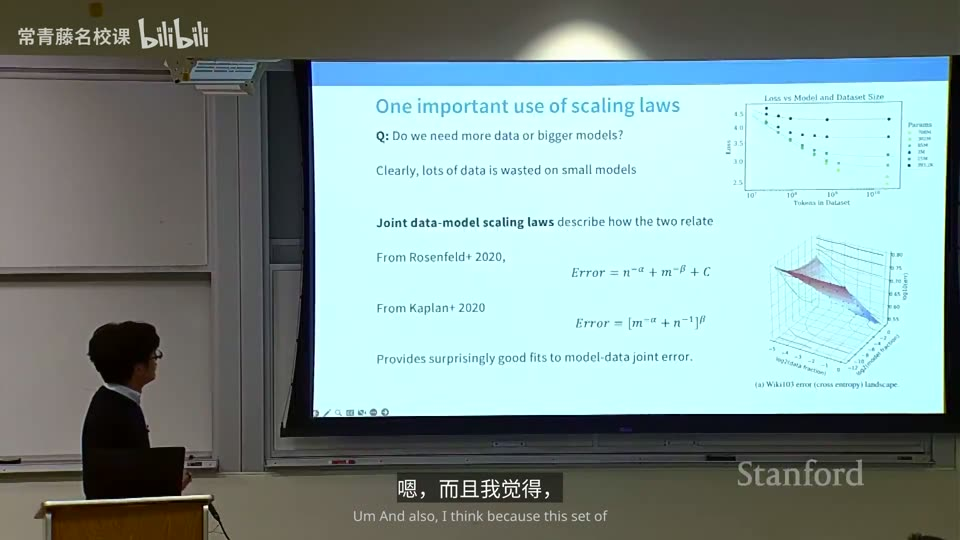 |
| 有人会把一定数量的 FLOPs 交给你，你得把这些 FLOPs 划分出去。如果你还记得 Percy 的第一堂课，那里说过：数据量乘以参数量大致等于 FLOPs，二者呈线性关系。所以我是该要更多数据还是更大的模型？我们知道，如果拿一个极小的模型往里灌入海量数据，那纯属浪费——这大概就是最上面那条深紫色的线：我拿了一个极小的语言模型往里灌进海量数据，结果它的表现在很长一段时间里都没什么起色，这完全是浪费算力。同样的算力， [【跳转到 48:56】](https://www.bilibili.com/video/BV11LEA6eEuj/?p=9&t=2936) |  |
| 你还不如拿来训练那个大的黄色模型，训到同样的 token 量、甚至更早就够了。只要你能搞懂数据量和模型大小是怎么结合起来影响性能的，理解了这层关系，你就能把这件事优化得非常精准。所以还有一些更高级的缩放定律，讲的是多个变量是怎么共同作用的。差不多同时，Kaplan 和 Rosenfeld 都提出了这些函数形式，它们大体上是等价的，用来描述模型大小和数据量与误差之间有怎样的关系。 [【跳转到 49:26】](https://www.bilibili.com/video/BV11LEA6eEuj/?p=9&t=2966) | 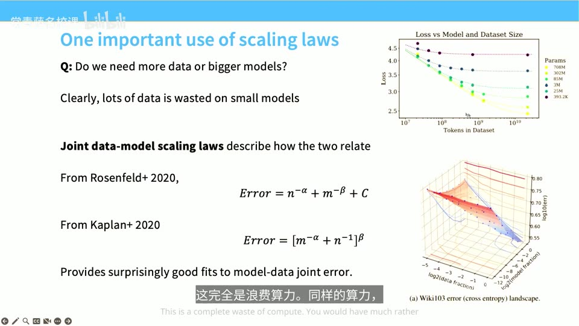 |
| Rosenfeld 的那个特别简单：就是两个倒数项加起来，相当于把两个缩放定律叠在一起。Kaplan 的那个稍微复杂点，但核心思路是一样的，对吧。咱们想想极限情况，这很直观，对吧：要是数据量无限大，那会怎样？这时候误差就趋近于一个由模型规模决定的下限，主要瓶颈在模型规模，这就变成了纯粹的模型规模缩放定律。反过来，要是把模型规模无限放大，限制你的就是数据了，这就变成了纯粹的数据缩放定律。所以对这两个变量分别取极限是很合理的。 [【跳转到 49:56】](https://www.bilibili.com/video/BV11LEA6eEuj/?p=9&t=2996) |  |
| 以后有人给你讲某个缩放定律，建议你试试对所有变量取极限，这样能帮你更好地理解系统的行为。 [【跳转到 50:26】](https://www.bilibili.com/video/BV11LEA6eEuj/?p=9&t=3026) | 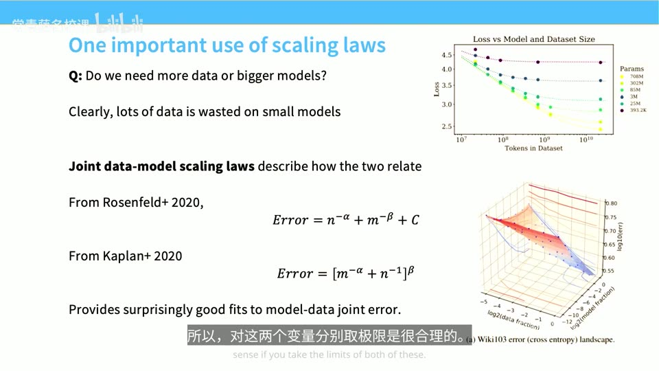 |
| 有意思的是，Rosenfeld 还有很多提出这种联合缩放定律的人都发现：哪怕你往外推，这些规律也拟合得相当好。所以你要做的就是在这些绿色点上做拟合——这些点对应的是低计算量和低数据量的情况——再看看那些数据量大或者模型规模大的情况，对吧。接着你可以拿这儿这些小规模实验的结果做外推，基本上就能推算出高算力、大数据量或大模型规模下的情况， [【跳转到 50:34】](https://www.bilibili.com/video/BV11LEA6eEuj/?p=9&t=3034) | 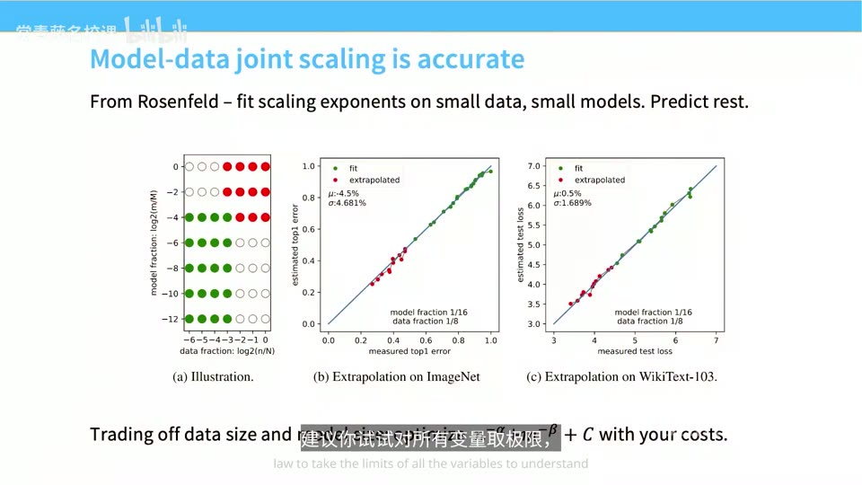 |
| 而且你能根据预测结果非常精准地算出误差，这预测挺准的。所以一旦有了这个，你现在能做的就是：说我有固定数量的 FLOPs，在 FLOPs 约束下最小化这个指标——这就是个简单的非线性优化问题，解一下就能得到答案。现在 Kaplan 和 Rosenfeld [【跳转到 51:04】](https://www.bilibili.com/video/BV11LEA6eEuj/?p=9&t=3064) | 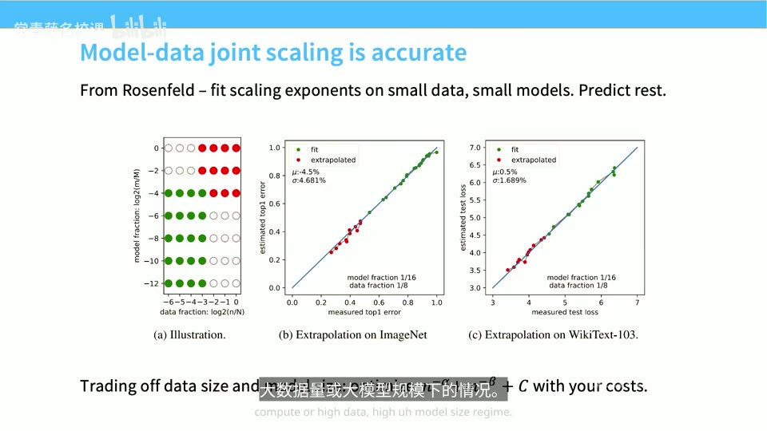 |
| 都给出了这种形式的方程。不知道他们具体说了啥——你看，如果你去查 Kaplan 的研究、 [【跳转到 51:26】](https://www.bilibili.com/video/BV11LEA6eEuj/?p=9&t=3086) | 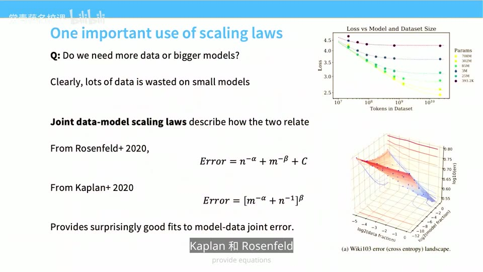 |
| 解那个方程，他们会这么讲：数据量这块他们老是把它倒过来，搞得我有点晕。数据量得是 C 的 0.73 次方，模型规模则是 C 的 0.27 次方。顺序反了吗？我觉得是反的。抱歉，N 应该是参数数量，D 应该是数据量。所以每个参数分配到的 token 数会随着 C 下降。这意味着随着算力投入增加，Kaplan 的这套建议就是让你去训练越来越大、越来越大的模型。如果你经历过 GPT-3 那个年代—— [【跳转到 51:30】](https://www.bilibili.com/video/BV11LEA6eEuj/?p=9&t=3090) | 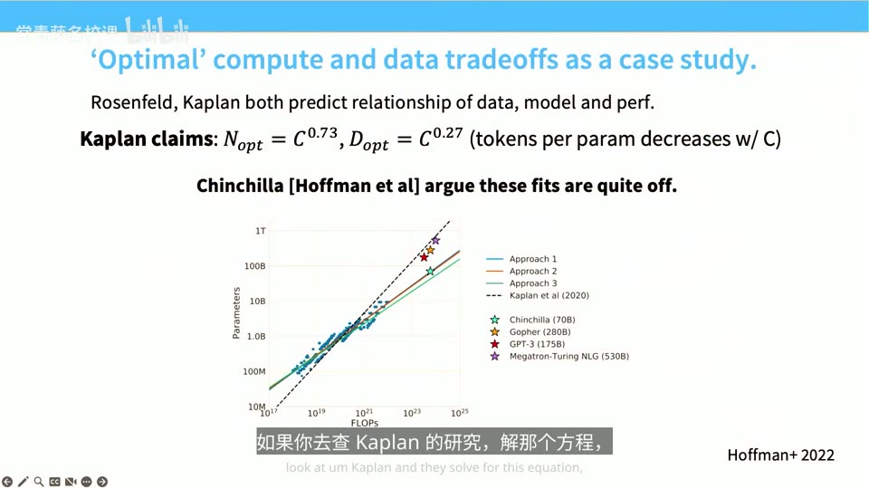 |
| 一想到居然有人没经历过我还挺吃惊的——你就会知道曾经有过那么一段时期，当时大家都在训练这些巨型模型，对吧，动辄数千亿参数、甚至万亿参数的稠密模型，诸如此类。而这种趋势部分也正是被这个推动的，对吧：大家看到了 GPT-3，看到了 Kaplan 的那些预测，就想：哇，我要用这些超大规模的模型来跑我的大型训练。但几年后的 2022 年，DeepMind 的一些人—— [【跳转到 52:00】](https://www.bilibili.com/video/BV11LEA6eEuj/?p=9&t=3120) | 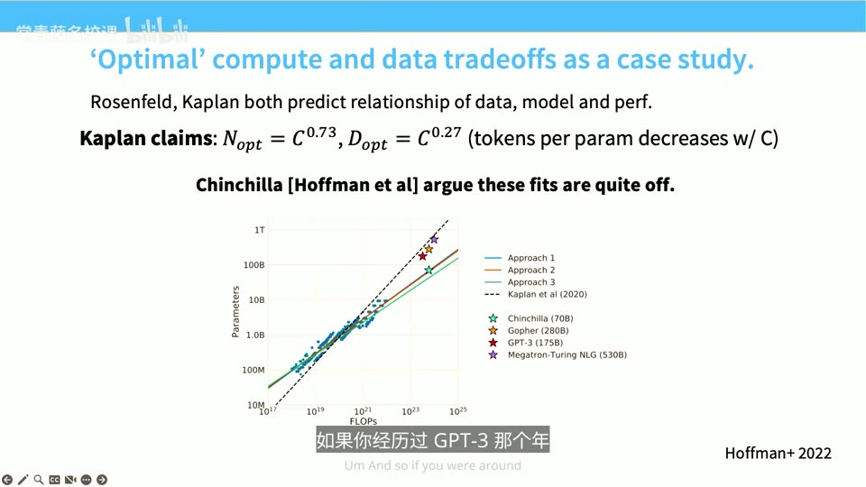 |
| 也就是 Hoffmann 等人——站出来说：其实这些预测全都偏差很大。你们之前一直在训练那些巨型模型，也就是图上的这三个星号，但实际上那些规模太大了。我们真正该训练的是另一条完全不同的趋势，也就是这边这条蓝色的线，我们应该训练的是这个青色星号所代表的模型，它要好得多。这就是 Chinchilla。他们的观点是：我们应该训练比这小得多的模型。我想大家应该都看过 Chinchilla 论文，知道那个 token 计数是多少，对吧： [【跳转到 52:30】](https://www.bilibili.com/video/BV11LEA6eEuj/?p=9&t=3150) | 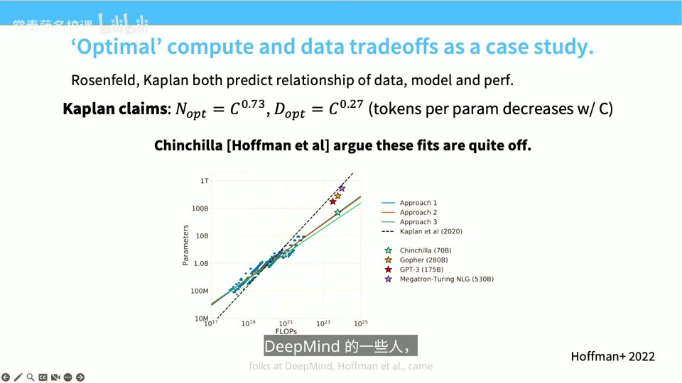 |
| 也就是每个参数对应 20 个 token。不过我觉得深入细节很有必要，因为 Chinchilla 和 Kaplan 论文之间的分歧，以及这一切能告诉我们一些关于「如何思考缩放定律」的重要信息，对吧。这不是那种你随便转一下曲柄就能出结果的事， [【跳转到 53:00】](https://www.bilibili.com/video/BV11LEA6eEuj/?p=9&t=3180) | 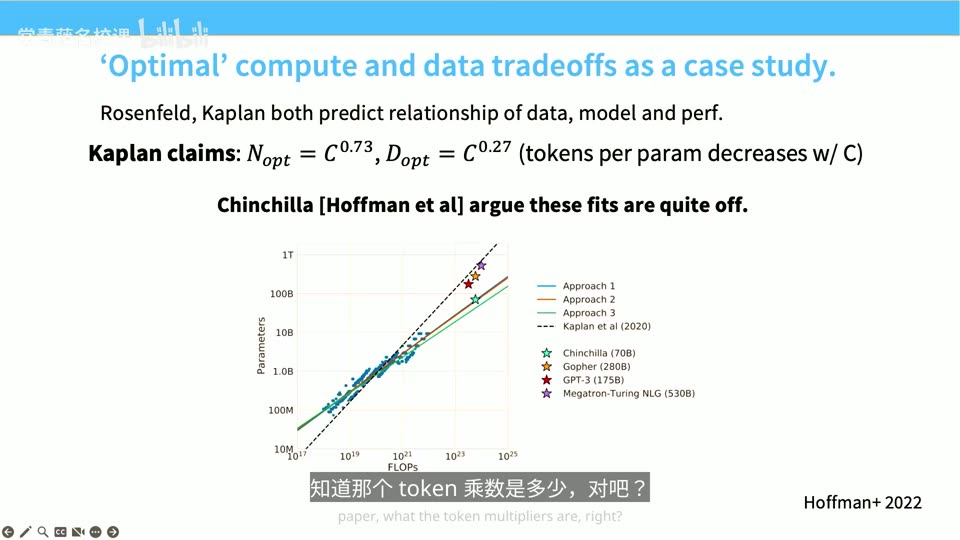 |
| 它需要谨慎而细致地处理，我们必须尊重这个过程。好，接下来我带大家过一遍 Chinchilla 论文。讲完这篇论文后，我会解释为什么 Kaplan 和 Chinchilla 论文的观点不一致，以及这对你意味着什么。Chinchilla 的作者提出了三种拟合缩放定律的不同方法。我很喜欢这一点，因为它能让你的方法更稳健，从而抵御你可能做出的那些建模假设带来的风险。而且每一种方法在估算模型大小和数据 [【跳转到 53:15】](https://www.bilibili.com/video/BV11LEA6eEuj/?p=9&t=3195) | 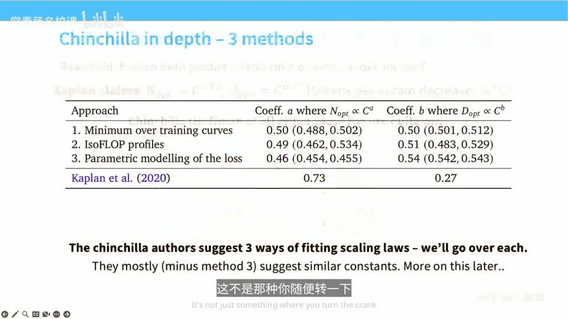 |
| 之间的权衡时，采用的思路都大不相同。除了第三种方法略有不同外，它们大体上是一致的：就像方法一和方法二都一致显示的那样，数据量和模型规模的系数基本相同——大约是 0.5：0.5（准确说是 0.49 和 0.51）。方法三确实有些不同，系数是 0.46 和 0.54，不过我们后面会讲为什么。当然，Kaplan 等人的研究里这两者差别很大，对吧，这也是他们为什么要在巨大的算力下训练大型模型的原因。 [【跳转到 53:45】](https://www.bilibili.com/video/BV11LEA6eEuj/?p=9&t=3225) | 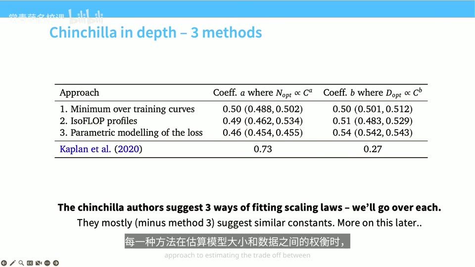 |
| 谢谢。Chinchilla 提出的方法一，我管它叫「下包络线方法」。Kaplan 之前也部分用了这个方法，想搞清楚什么样的缩放才是对的。咱们这么做：把所有训练运行的数据都拿来——你看，每条彩色线就是一条训练曲线，对吧——你要做的就是把这些训练曲线的下包络线给提取出来。因为训练曲线上的下包络线点意味着： [【跳转到 54:15】](https://www.bilibili.com/video/BV11LEA6eEuj/?p=9&t=3255) | 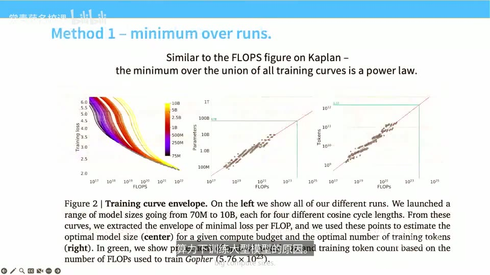 |
| 对于给定的 FLOPs，这是我在任何一次训练里能达到的最低损失值。所以我可以把这里高算力区间最底部的所有下包络点都取出来，然后把这些点画出来，看看每个 FLOPs 点对应的模型规模到底有多大。 [【跳转到 54:40】](https://www.bilibili.com/video/BV11LEA6eEuj/?p=9&t=3280) | 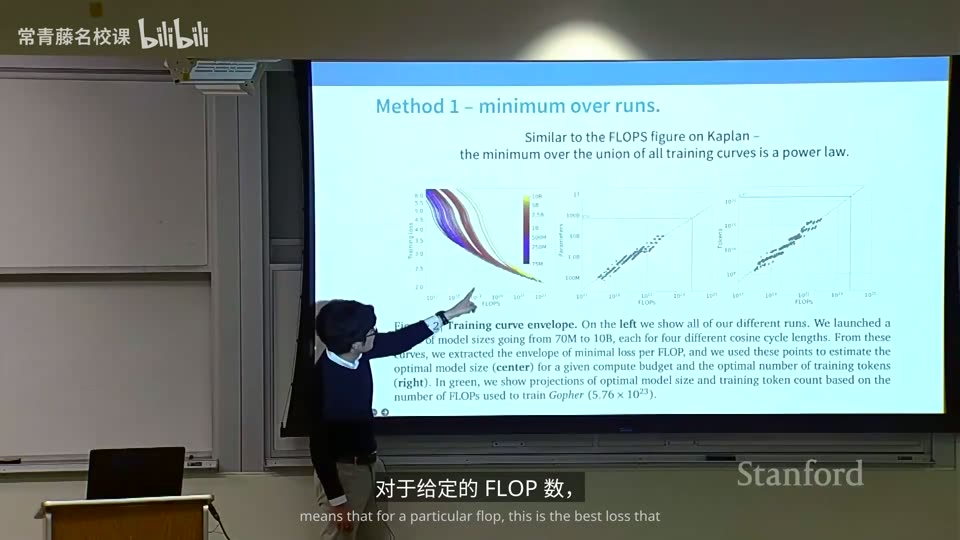 |
| 因为每个点都是一次训练运行、对应一个模型规模，如果我把它画成散点图，就能得到一条漂亮的线性趋势。 [【跳转到 54:53】](https://www.bilibili.com/video/BV11LEA6eEuj/?p=9&t=3293) | 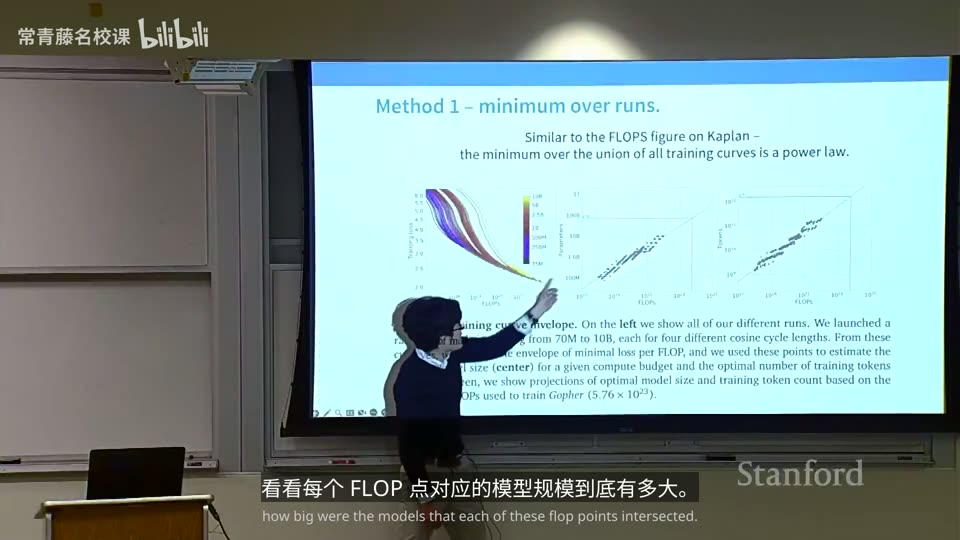 |
| 这就给了我一种估算 FLOPs 与参数之间最优权衡的方法，这就给出了一个答案：按照他们的算力预算，他们应该训练一个 670 亿参数的模型。这种方法简单明了，但要定义「下包络」之类的概念其实很棘手，诸如此类，确实有些棘手的地方。第二种方法是等 FLOPs 法（IsoFLOP）。这种方法现在非常流行，它既简单又非常稳健，可能是我个人最喜欢的方法。具体怎么做呢？你要选一组不同的 FLOPs 预算—— [【跳转到 55:03】](https://www.bilibili.com/video/BV11LEA6eEuj/?p=9&t=3303) | 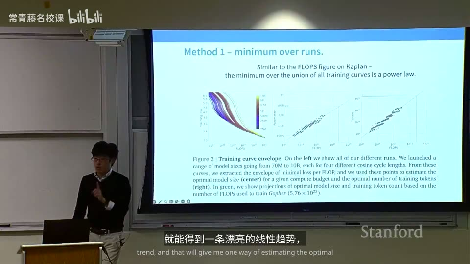 |
| 所以我设定了一组不同的 FLOPs 预算范围，在这个例子里是按 3 的倍数递增的：1、3、6……针对每个 FLOPs 预算，你基本上都要把整个空间扫一遍。所以这儿有个变量，就是参数和数据之间的权衡。针对每个 FLOPs 预算，我把 FLOPs 固定住，然后在「参数和数据」这个权衡维度上扫一遍：比如我把数据量加倍、模型规模减半，以此类推。这样会生成一系列训练运行， [【跳转到 55:33】](https://www.bilibili.com/video/BV11LEA6eEuj/?p=9&t=3333) | 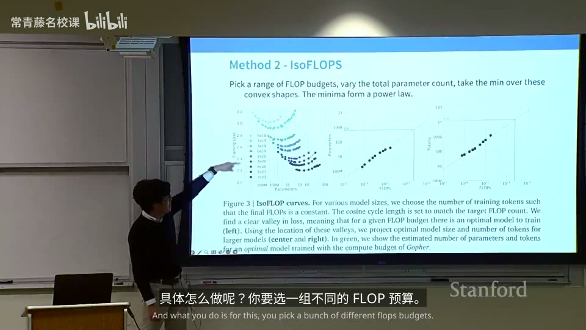 |
| 它们的最终损失会描绘出一条曲线。所以每一组彩色点代表一次固定 FLOPs 的运行，每个点都在不同的参数设置下扫描，当然这也隐含地涵盖了数据的变化。现在的好处是：我可以取每次运行的最小值，或者拟合一个二次函数、然后取那个二次函数的最小值。然后我可以画一条穿过所有二次函数最低点的线，或者把这些最低点作为 FLOPs 与参数关系的函数画出来。 [【跳转到 56:03】](https://www.bilibili.com/video/BV11LEA6eEuj/?p=9&t=3363) | 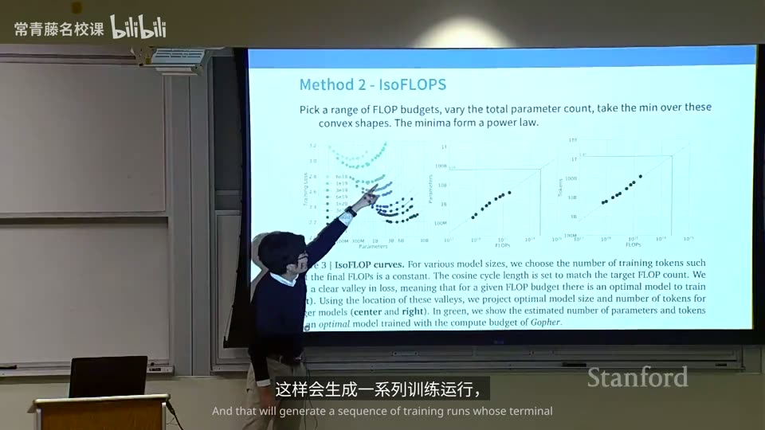 |
| 这给了我另一个预测，跟之前的吻合度很高：我的计算预算对应 630 亿参数。谢谢。好， [【跳转到 56:33】](https://www.bilibili.com/video/BV11LEA6eEuj/?p=9&t=3393) | 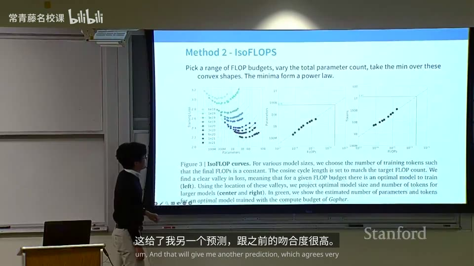 |
| 现在咱们能做的最后一种方法，其实可能是最自然的一种，就像 Rosenfeld 论文和 Kaplan 论文里建议的那样—— [【跳转到 56:42】](https://www.bilibili.com/video/BV11LEA6eEuj/?p=9&t=3402) | 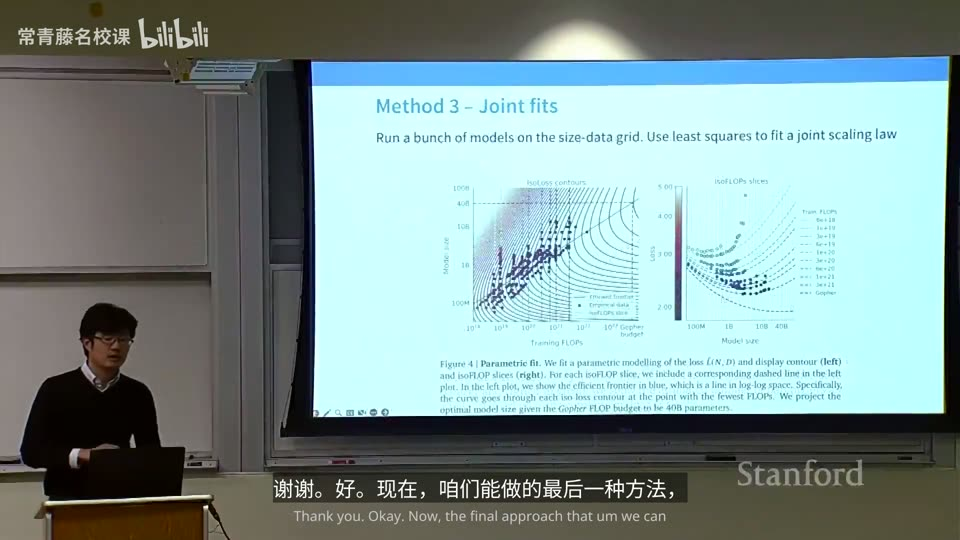 |
| 因为他们俩其实都提出了这样的思路：一种假设的函数形式，用来描述模型大小和数据量是如何影响损失的。所谓方法三就是：如果你有了这样一个联合函数形式，你就可以把之前做过的很多训练数据拿来，拟合你的损失景观——也就是你假设的那个函数形式——然后通过曲线拟合来估算缩放定律里的系数。这是最笨的办法：你假设损失、数据规模和模型规模之间存在某种关系，训练一堆模型，然后做曲线拟合。 [【跳转到 56:47】](https://www.bilibili.com/video/BV11LEA6eEuj/?p=9&t=3407) | 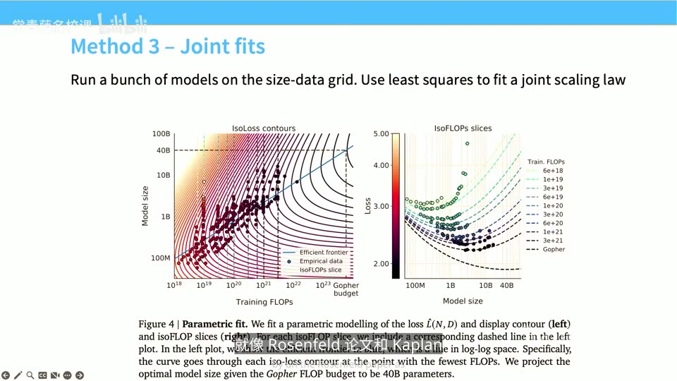 |
| 你希望这挺直观的——也就是你具体怎么操作。当然，如果你用这种方法，曲线拟合怎么做就非常关键，毕竟你现在是在拟合这些曲面，变量那么多，挺棘手的。嗯，这事儿也有点麻烦，跟方法一差不多，所以这不算一种直接的方法， [【跳转到 57:17】](https://www.bilibili.com/video/BV11LEA6eEuj/?p=9&t=3437) | 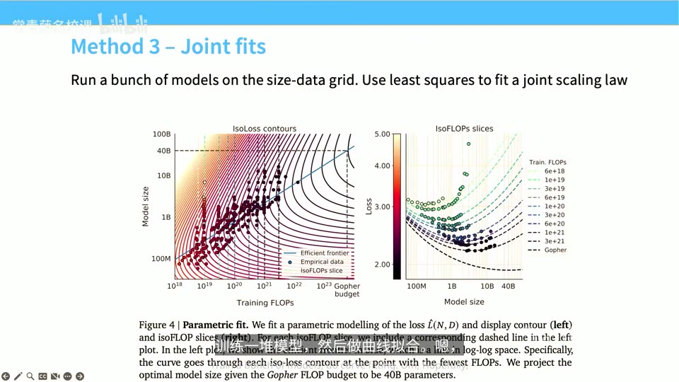 |
| 不像 IsoFLOP 那样直接。所以 Chinchilla 的作者是这么做的——它看起来跟 Kaplan 的做法没什么本质区别。并不是说 Kaplan 只是搞了个疯狂的实验、而 Chinchilla 的作者们更聪明，让你惊呼「早干嘛去了」——其实他们俩做的事都挺合理的。但要是看看他们的缩放预测，差别可就大了。回过头看，大家普遍觉得 Chinchilla 那帮人搞出的缩放更靠谱；你要是自己按 Chinchilla 的风格做个分析，大概率会发现缩放跟 Chinchilla 差不多。 [【跳转到 57:33】](https://www.bilibili.com/video/BV11LEA6eEuj/?p=9&t=3453) | 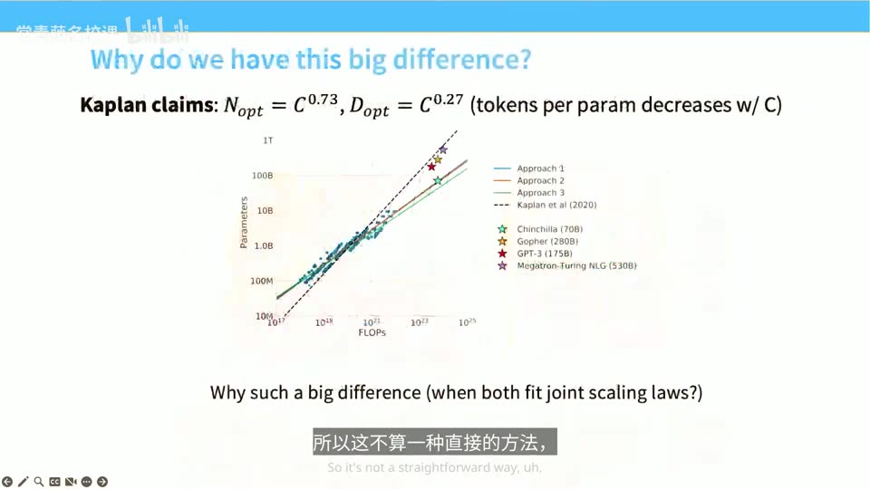 |
| 既然大家都拟合的是这些联合缩放定律，那为什么结果会有这么大的差别呢？ [【跳转到 58:03】](https://www.bilibili.com/video/BV11LEA6eEuj/?p=9&t=3483) | 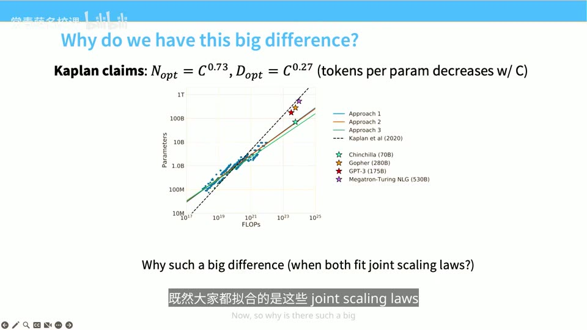 |
| 好，我觉得咱们现在得聊聊缩放定律制定过程中那些「混乱的现实情况」了，对吧。缩放定律其实挺看细节的：你具体怎么实施、用的超参数怎么设，甚至连 X 轴怎么画，都会让它大变样。有篇论文写得特别棒——哎呀，我把作者名挡住了，行，我待会儿把这篇叫《解析语言模型计算最优缩放的差异》的论文贴到课程网站上。最后一位作者他以前也是这儿的学生。嗯，他们展示的内容大致是这样： [【跳转到 58:07】](https://www.bilibili.com/video/BV11LEA6eEuj/?p=9&t=3487) | 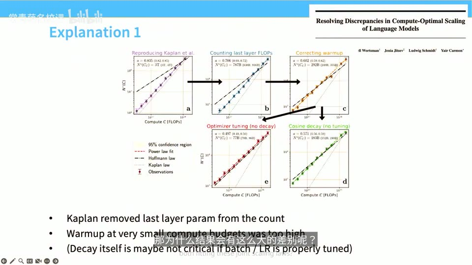 |
| 首先，他们用和 Kaplan 差不多的设置复现了 Kaplan 的结果。接着他们说：行，咱们换个方式算参数量——这么一改，曲线稍微有点变动。然后他们说：行，咱们调整一下 learning rate warmup 的做法——这么一来，曲线又稍微偏了一点。诶，接着他们再把 optimizer 多调一调，结果就完全吻合 Chinchilla 的结果了。所以他们的核心观点是：这一连串看似微不足道的决定，最终造成了 Kaplan 缩放定律和 Chinchilla [【跳转到 58:37】](https://www.bilibili.com/video/BV11LEA6eEuj/?p=9&t=3517) | 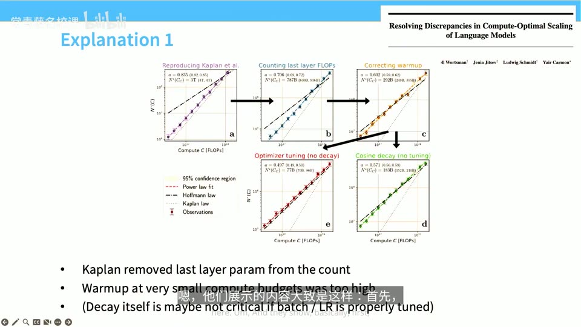 |
| 缩放定律之间巨大的差距。我来解释一下每一步具体指什么。这倒不是说这是唯一最重要的因素，而是想让大家意识到：这里的细节其实非常关键，对吧。所以最开始那个从 Kaplan 指向蓝线的箭头，指的就是「我们怎么算参数」的问题。还记得在讲 Kaplan 时我说过吗？如果算上 embedding 参数，他们看到了一些奇怪的现象，对吧，所以他们把 embedding 参数给排除了。这倒也没什么大问题，但他们有个操作确实搞砸了： [【跳转到 59:07】](https://www.bilibili.com/video/BV11LEA6eEuj/?p=9&t=3547) | 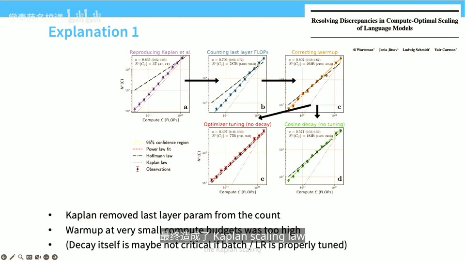 |
| 他们连最后一层的参数也没算进去，就是那个 softmax 层的参数。因为在很多模型里，embedding 层和最后一层线性层其实是互为对偶的：输入矩阵的形状是词表大小乘隐藏维度，输出矩阵则是隐藏维度乘词表大小。因为它们形状一样，他们心想：那干脆两个都排除算了。结果发现，包不包括这些参数，对缩放定律的形状影响巨大，对吧。哦，他们还发现：这与其说是观点不同，不如说是个疏忽—— [【跳转到 59:37】](https://www.bilibili.com/video/BV11LEA6eEuj/?p=9&t=3577) | 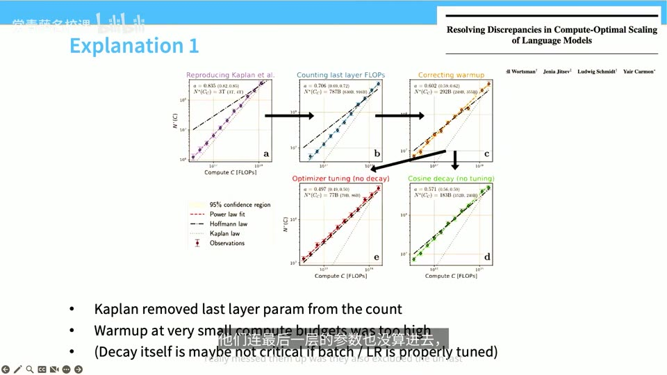 |
| Kaplan 那篇论文里训练的模型其实都特别小。事实上它们小到了什么程度呢？等 learning rate warmup 做完的时候，模型其实还没收敛呢。所以他们的学习率设得特别不理想，这也导致模型没能完全收敛。最后他们发现，Kaplan 那群人用了一个固定的、较大的 batch size——那些大的 batch size 对小模型来说并不是最优选择。所以如果你能正确调整、采用变化的 batch size，最终得到的结果就会和 Chinchilla 完全吻合。 [【跳转到 60:07】](https://www.bilibili.com/video/BV11LEA6eEuj/?p=9&t=3607) | 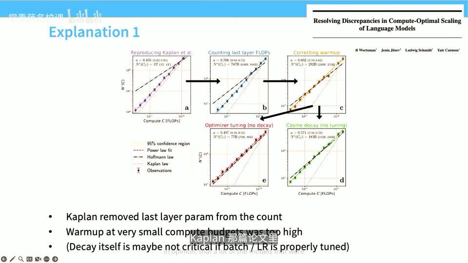 |
| 所以我觉得，这些差异中的每一项看起来可能都很微小，但如果你把这些非常细微的差异调整一下，就可能带来缩放定律上的巨大变化。我想强调的一点是：缩放定律在某种意义上其实算是一种「下界」。他们的意思是：如果我沿用这套配方并扩大规模，那么得到的结果就是这样。但如果你去扩大一个本不该扩大的配方——比如你的 warmup 设置得离谱， [【跳转到 60:37】](https://www.bilibili.com/video/BV11LEA6eEuj/?p=9&t=3637) | 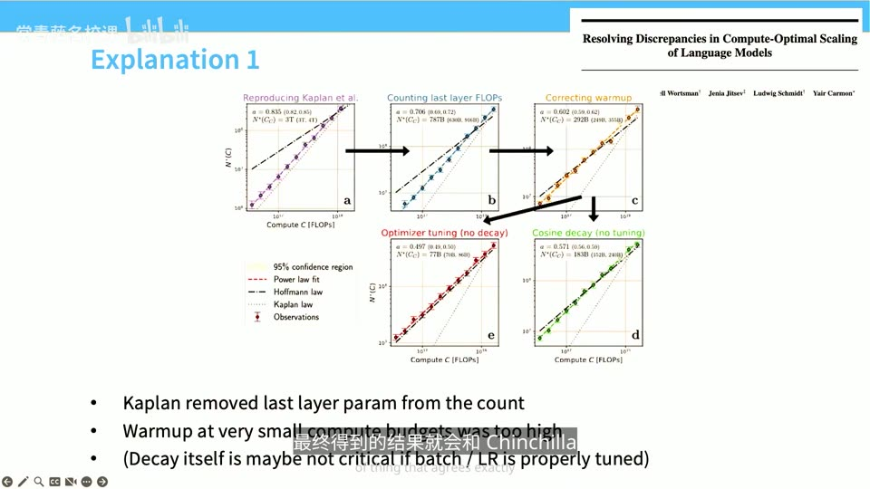 |
| 或者 batch size 很不合理——那你得到的缩放定律就会很差。所以你要尽可能接近那种标准的完整训练流程。嗯，谢谢。 [【跳转到 61:07】](https://www.bilibili.com/video/BV11LEA6eEuj/?p=9&t=3667) |  |
| 还有一篇论文做了一件非常有趣的事，试图研究 Kaplan 和 Chinchilla 缩放定律之间的差异。这篇论文由 Pearce 等人撰写，我觉得他们的做法非常巧妙：他们直接拿 Chinchilla 的训练曲线——或者说 Chinchilla 训练曲线隐含的函数形式——画出来，然后说：基于这些纯从 Chinchilla 推导出的模拟隐含训练曲线，他们模拟了「如果忽略 embedding 参数并大幅缩减规模，Kaplan 的隐含训练曲线会怎样」， [【跳转到 61:16】](https://www.bilibili.com/video/BV11LEA6eEuj/?p=9&t=3676) | 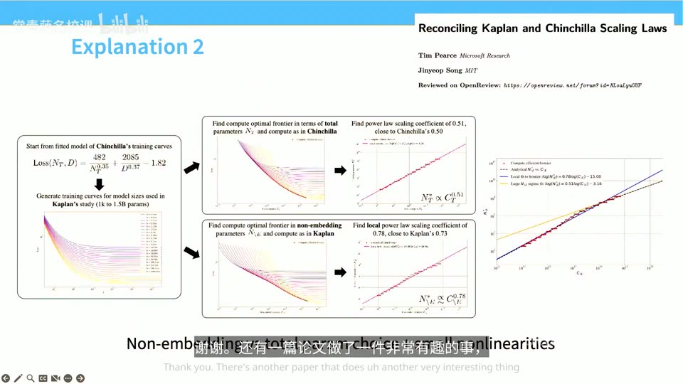 |
| 以及「如果改用总参数量会发生什么」。他们发现主要有两个效应：一个是 Kaplan 在低得多的计算规模下运行，所以对微小变化非常敏感——实际上忽略非 embedding 参数这个改动足够大，会导致结果与 Chinchilla 相比出现偏差。所以他们的论点跟前面那篇不太一样，认为这里其实是「计算规模的大小」加上「非 embedding 参数引起的轻微非线性」导致了这种不一致。好吧，这确实开始有点钻进细节里了，但我希望大家能体会到关注细节的重要性。 [【跳转到 61:46】](https://www.bilibili.com/video/BV11LEA6eEuj/?p=9&t=3706) | 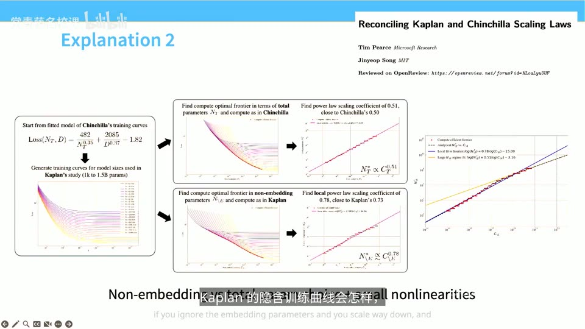 |
| 我觉得在确立可靠的缩放定律方面，很多工作其实是在找对正确的运行区间，这样你在不同计算规模下才能获得可靠的缩放。好。 [【跳转到 62:16】](https://www.bilibili.com/video/BV11LEA6eEuj/?p=9&t=3736) | 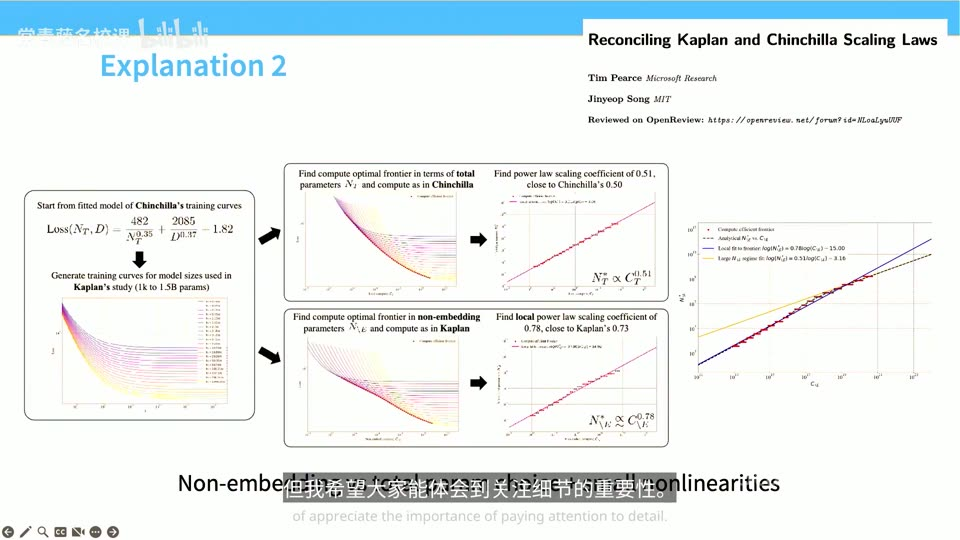 |
| 最后一点——嗯，这其实更多是我觉得挺有意思的一点：Chinchilla 这篇论文某种程度上算是把 Kaplan 的论文给推翻了，对吧，他们说「哦，你们大错特错了」。但还剩下一个谜团：那就是 Chinchilla 的方法三从来都和 Chinchilla 的方法一、方法二对不上，对吧。这些数字看起来很小，作者们对此也显得毫不在意，对吧。但我觉得这背后的含义其实相当重要。 [【跳转到 62:28】](https://www.bilibili.com/video/BV11LEA6eEuj/?p=9&t=3748) | 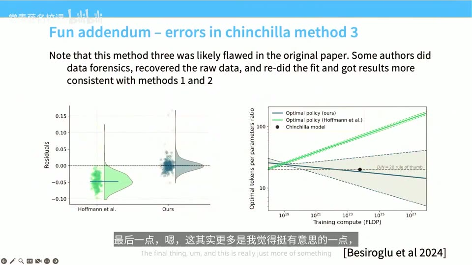 |
| 你看，方法一和方法二基本上是说：参数量和 token 数应该同步扩展，对吧，所以两者之间应该有一个固定的比例——Chinchilla 那个 20 倍的系数大致就是这么来的。而你要是看方法三，指数就不一样了：这意味着如果你扩大计算规模，最终在这个例子里其实是你的 token 数会远远多于参数量。所以从渐进的角度看，它得出的缩放结论其实和另外两种很不一样。 [【跳转到 62:52】](https://www.bilibili.com/video/BV11LEA6eEuj/?p=9&t=3772) | 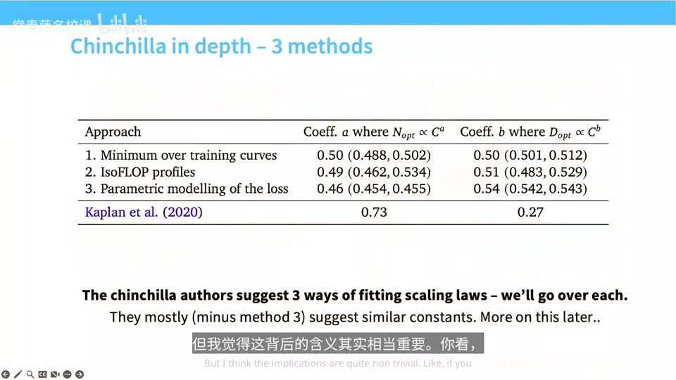 |
| 结果发现，嗯，对此感到不安的肯定不止我一个，只不过 EPFL 的几个人真的为此动手做了点事。他们既拿不到原始数据，也拿不到代码，所以他们的做法是：从论文的图表里把数据提取出来，重新拟合了方法三的回归。他们把论文里的数据提取出来，然后基于这些数据做了拟合——拟合所提出的那个三维曲面。然后他们展示的结果其实表明：原论文当初一定是对原始数据欠拟合了。 [【跳转到 63:22】](https://www.bilibili.com/video/BV11LEA6eEuj/?p=9&t=3802) | 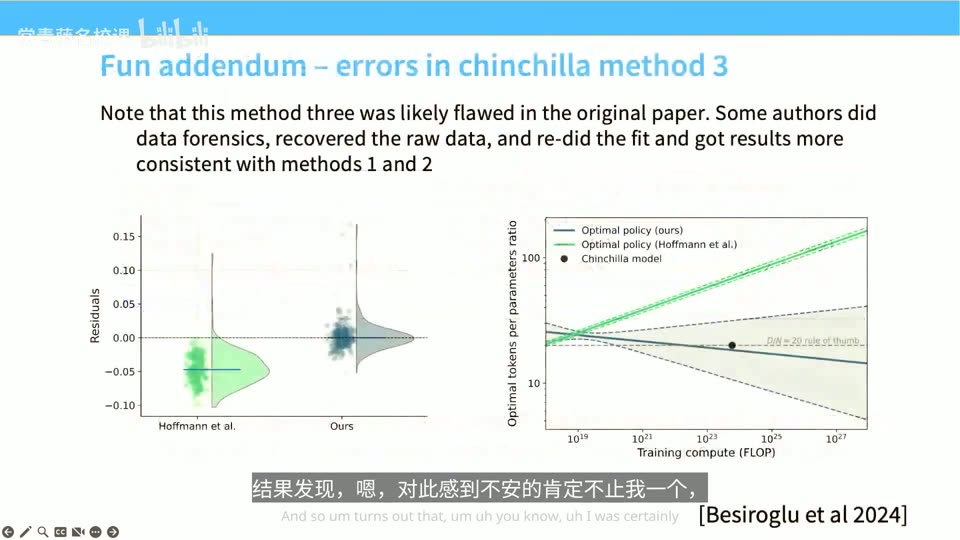 |
| 要是重新做一遍曲线拟合，跟 Chinchilla 论文里提出的那个缩放定律相比，他们的损失值能低得多。实际上，你要是跟着重新拟合后的模型走，会发现结果几乎完全吻合——就是 Chinchilla 论文里那条「D÷N = 20」的经验法则。我觉得这对 Chinchilla 论文来说是个挺有意思的结论：到最后发现，作者其实比他们自己以为的更正确。其实他们当时犯了个错，而这正是方法三跟方法一、方法二对不上的唯一原因。 [【跳转到 63:52】](https://www.bilibili.com/video/BV11LEA6eEuj/?p=9&t=3832) | 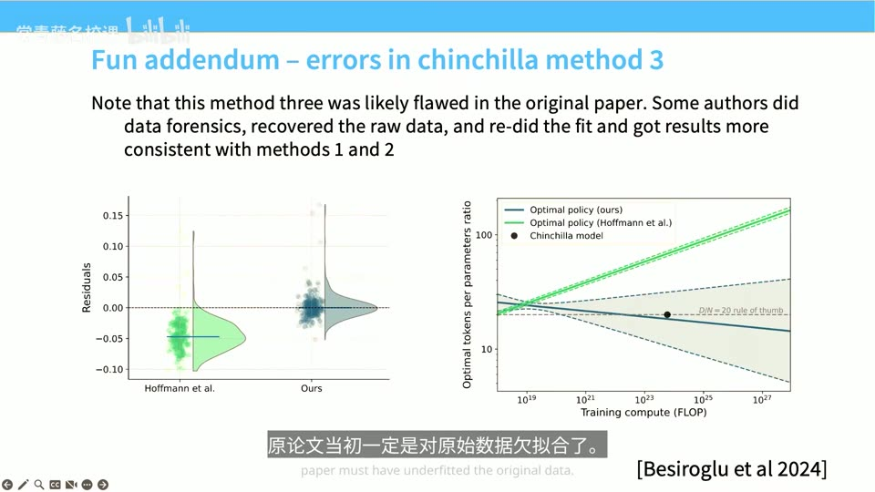 |
| 所以得知这个方法最终其实挺稳健的，这结论挺让人欣慰。 [【跳转到 64:22】](https://www.bilibili.com/video/BV11LEA6eEuj/?p=9&t=3862) | 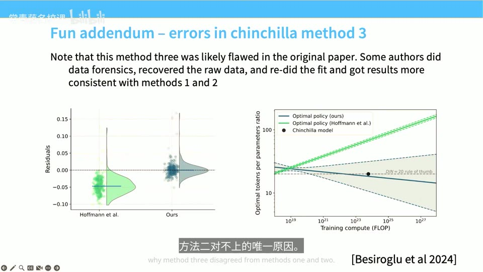 |
| 好，从某种程度上说，Chinchilla 这事儿就算告一段落了。最后我想用一句话来结束这一节：你可能并不真的需要那个 Chinchilla 系数。现在这应该算是常识了，不过如果你是在训练一个生产用的模型，多数情况下你并不太在乎能不能省下训练算力。你可以去看看各种外部调研——就是大家做的关于这些前沿实验室是怎么花算力的调研——大部分算力其实并没有花在训练上，而是花在了研发和推理服务上。 [【跳转到 64:27】](https://www.bilibili.com/video/BV11LEA6eEuj/?p=9&t=3867) | 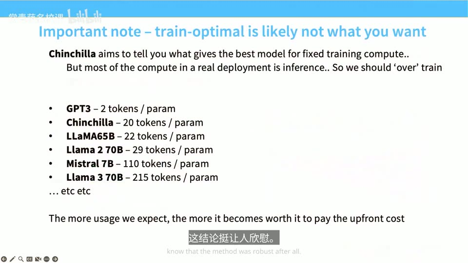 |
| 正因如此，尤其是为了做推理服务，你想要的其实是那种能力够用的小模型。你不会想要那种又大又臃肿、部署起来很贵的模型，哪怕它能把训练成本压到最低。所以你真正想要的其实是那种你可以称之为「过度训练」的东西——我之所以加引号，是因为过度训练其实正是我们想要的，这才是训练量刚刚好。咱们看看早期发布的那些模型：像 GPT-3 那肯定属于欠训练的状态，对吧， [【跳转到 64:57】](https://www.bilibili.com/video/BV11LEA6eEuj/?p=9&t=3897) |  |
| 那时候是每参数 3 个 token；而 Chinchilla 达到了现在每参数 20 个 token 的现代比例。后来有一阵子大家都维持在每参数 7 个 token 左右——我觉得那是个模型服务化还没那么普遍的时代，模型确实很酷，但还没做到大规模服务。后来随着服务变得切实可行，你们开始过度训练这些模型，转向 MoE，并做出各种权衡来优化推理服务，对吧。所以我觉得 Chinchilla 重要，并不是因为我认定「20 比 1」就是那个唯一的黄金比例。 [【跳转到 65:27】](https://www.bilibili.com/video/BV11LEA6eEuj/?p=9&t=3927) | 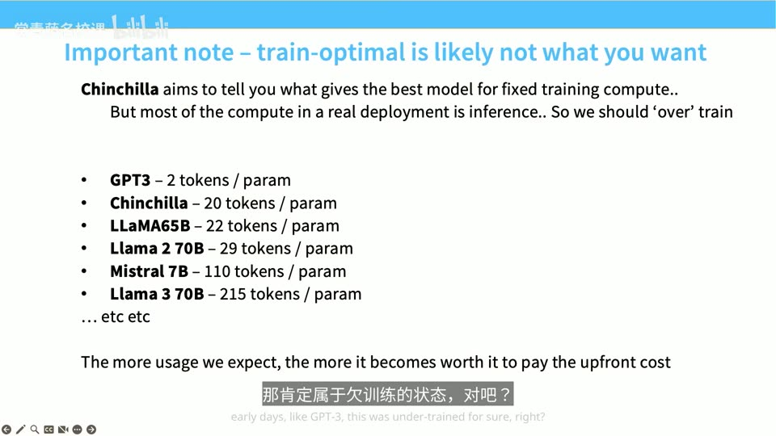 |
| 如果你是在做研究，那可能适用；但我觉得它重要的原因在于：它告诉了我们很多关于如何拟合缩放定律、以及如何思考缩放定律的东西。好。 [【跳转到 65:57】](https://www.bilibili.com/video/BV11LEA6eEuj/?p=9&t=3957) | 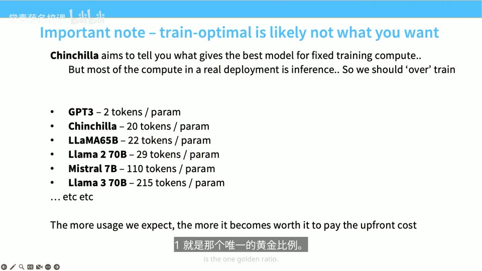 |
| 关于 Chinchilla 和扩展方面，我想用最后一点收尾。我觉得 IsoFLOP 作为一个研究工具一直经久不衰。IsoFLOP 很好执行，对吧：你定好一个 FLOPs 预算，然后扫一遍其他所有自由度，看看那个曲面大概长什么样。这样一来，你通常就能得到相当可靠的读数，看出差异有多大。大家做过这类研究——其实我有个学生就做过， [【跳转到 66:06】](https://www.bilibili.com/video/BV11LEA6eEuj/?p=9&t=3966) | 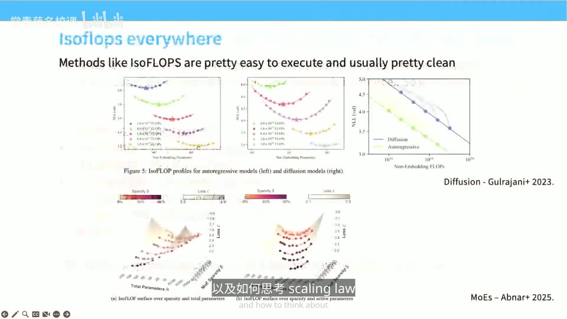 |
| 针对的是扩散模型；我之前提到的 MoE 研究采用的是 IsoFLOP 风格的设计。当你需要权衡各种因素时，IsoFLOP 始终是个不错的默认选择。 [【跳转到 66:36】](https://www.bilibili.com/video/BV11LEA6eEuj/?p=9&t=3996) | 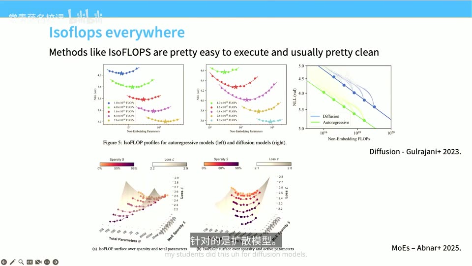 |
| 好，咱们来总结一下今天的内容。这里有个观点：我们投入的资源量和最终得到的性能之间存在一种对数线性规律，对吧。这一规律适用于很多方面，比如模型参数、计算量，还有你的 MoE 的稀疏度。这让你能把之前提到的那些拍脑袋做出的选择，转化为更多基于证据的决策——希望如此。所以这让我们不必真去跑大规模的模型训练， [【跳转到 66:46】](https://www.bilibili.com/video/BV11LEA6eEuj/?p=9&t=4006) | 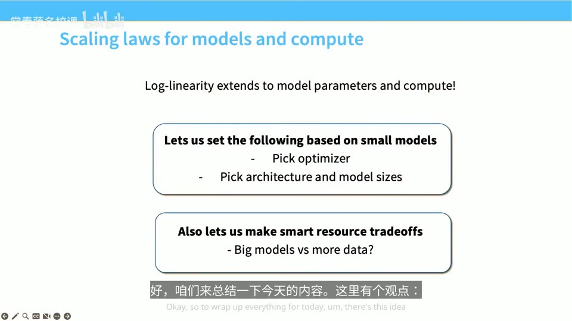 |
| 就能实现规模化工程。希望大家还记得这里提到的各个组成部分：数据缩放本身是个很自然的东西，只是那个指数有点奇怪；模型缩放能让你做各种很酷的工程操作；最后，缩放是一个很酷又稳健的预测工具，可以说它能预测如何在大规模上开展工程。谢谢！谢谢。我想下一讲是 Percy 来讲推理，之后我们再回到那些更进阶的小众缩放话题。 [【跳转到 67:12】](https://www.bilibili.com/video/BV11LEA6eEuj/?p=9&t=4032) |  |
| 谢谢，谢谢。 [【跳转到 67:37】](https://www.bilibili.com/video/BV11LEA6eEuj/?p=9&t=4057) | 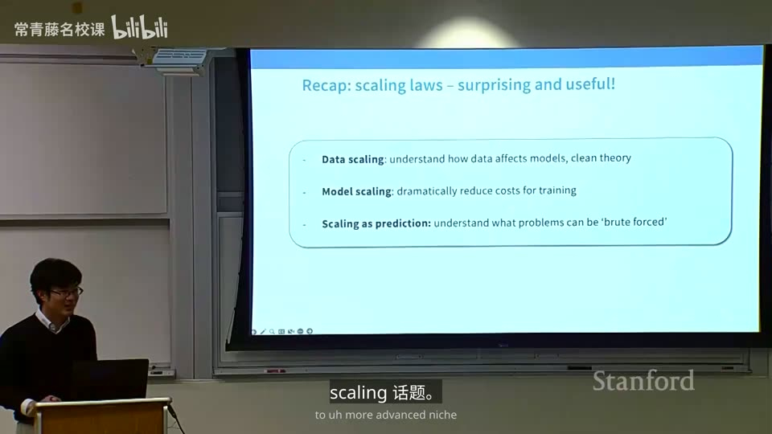 |