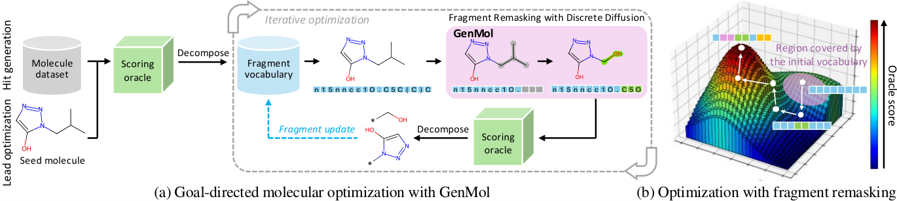
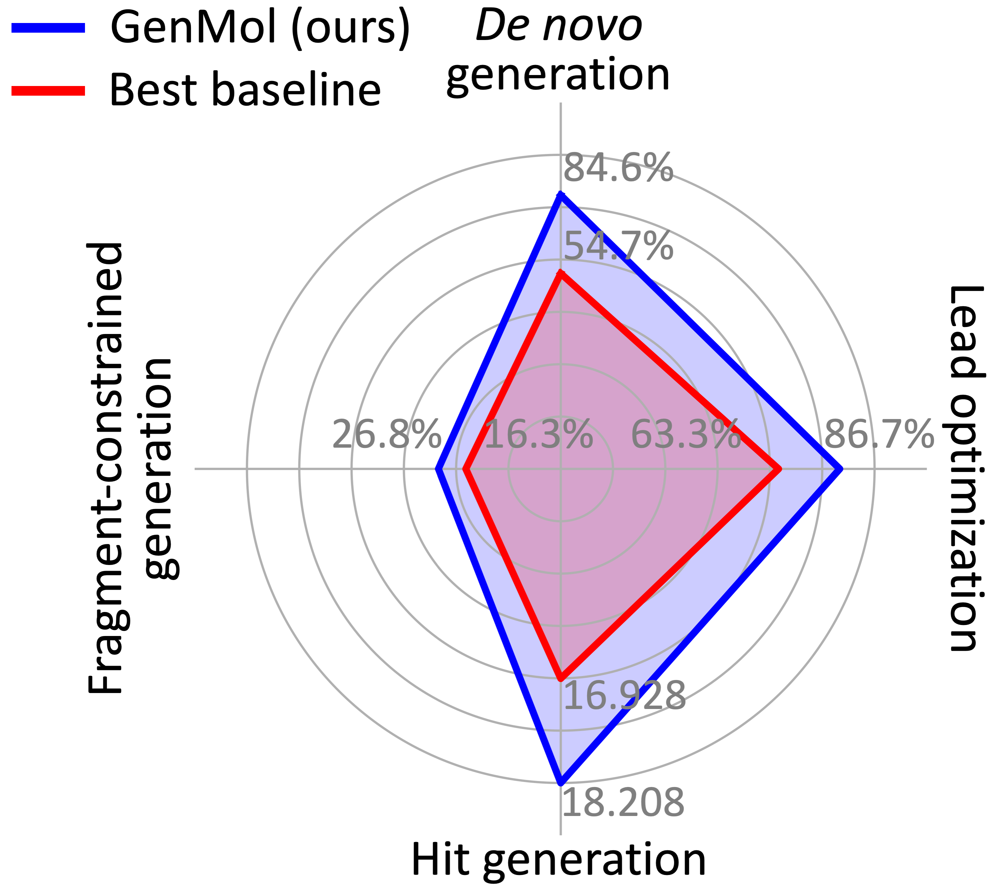
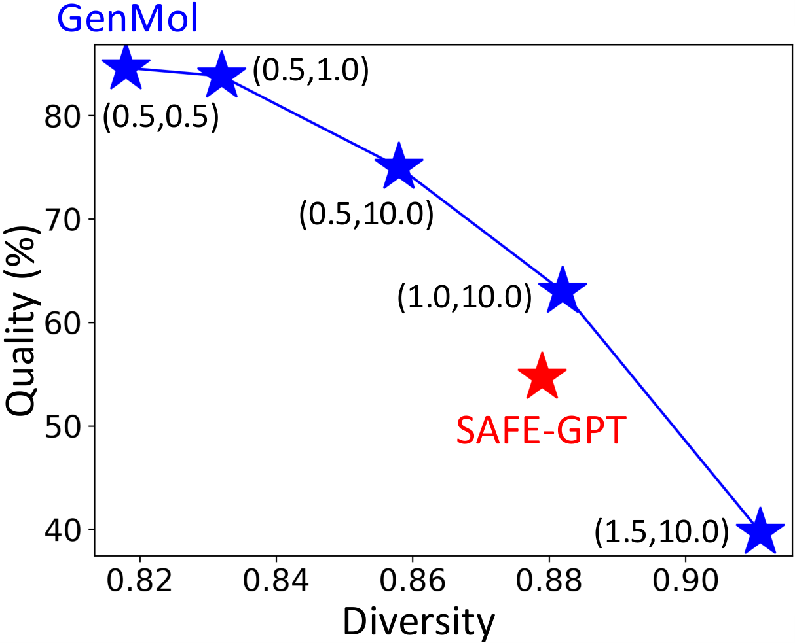

# GenMol：用离散扩散打造药物发现「通用模型」

> 本文整理的视频：[《Revolutionizing Drug Discovery with GenMol's Discrete Diffusion》](https://www.youtube.com/watch?v=QnCABenp3YE)（TalkTensors，YouTube，11:23）。
> 视频围绕论文 **《GenMol: A Drug Discovery Generalist with Discrete Diffusion》**（NVIDIA 与 KAIST，ICML 2025，arXiv:[2501.06158](https://arxiv.org/abs/2501.06158)）展开，代码开源于 [NVIDIA-Digital-Bio/genmol](https://github.com/NVIDIA-Digital-Bio/genmol)。
> 说明：该视频是一档 AI 生成的对谈节目，画面自始至终是同一张插画，没有可读的幻灯片；因此下文以视频字幕为骨架，并补入原论文中视频一带而过的关键细节，补充处均已标注，便于读者真正理解这个模型。

## 本篇要解决的核心问题（SCQA）

**背景**：药物发现是一条很长的流水线——先要能「造出分子」，还要能做「片段约束下的分子设计」，再到找出有潜力的「苗头（hit）」，最后把苗头优化成更安全、更有效的「先导化合物（lead）」。

**冲突**：过去这几步常常「一个任务配一个模型」：连接子设计一个模型、骨架改造一个模型、苗头生成再上一套强化学习……成本高，而且彼此不通用。更早的分子生成模型大多用 GPT 式从左到右逐字符生成，既受「分子字符顺序」的束缚，采样效率也低。

**疑问**：能不能**只用一个模型**，就把药物发现流程里的多种分子生成任务统一起来？它靠什么做到既通用又快？

**回答（中心思想）**：**GenMol 用「掩码离散扩散 + SAFE 片段表示」把多个任务统一进了一个模型**。这一点可以拆成三句话：SAFE 把分子看成「无序的片段积木」，离散扩散像「从模糊到清晰」那样并行补全分子，而「整块替换片段」的操作又恰好契合化学里的构效关系（SAR）。正因如此，它在从头生成、片段约束生成、苗头生成、先导优化四类任务上全面领先。

---

## 一、GenMol 是什么：一个模型覆盖药物发现的多个阶段

**GenMol 是一个「通用（generalist）分子生成模型」——不再是某个任务专用，而是试图用一个模型覆盖药物发现里的多个阶段。** 视频开头就把这层意思讲得很直白：它不局限于某一个特定任务，而能应用于药物发现的各个环节；于是「不必为每个步骤分别准备一个 AI 模型」，整个流程因此被简化。[【跳转到 00:00】](https://www.youtube.com/watch?v=QnCABenp3YE&t=0)

这一点是理解 GenMol 的起点。传统做法里，片段约束生成、苗头生成、先导优化往往是各自独立的模型（甚至要用强化学习单独微调）；GenMol 想回答的问题是：**能不能用同一个模型、同一套权重，把这些问题一起解决？**

## 二、基石之一：SAFE 表示——把分子当成「无序的片段积木」

要生成分子，先要决定「用什么方式描述分子」。**GenMol 用的是 SAFE 表示（Sequential Attachment-based Fragment Embedding，基于顺序连接的片段嵌入）**。[【跳转到 00:25】](https://www.youtube.com/watch?v=QnCABenp3YE&t=25)

- 传统做法（如 SMILES）把分子写成一长串原子字符，是有先后顺序的；
- **SAFE 则把分子表示成一组「片段块」，而且这个片段集合是无序的**——就像用一盒预制积木去搭乐高，用哪些块、怎样拼接，才是分子的本质，而「先写哪个块」只是个编码习惯。

**为什么这很重要？** 因为「无序」意味着模型不必假装自己是从左到右、一个原子一个原子地"写"分子的。它可以像看一张整体图景那样，一次性看到分子的全貌——这正好为下面的「离散扩散」和「并行解码」铺好了路。

## 三、基石之二：掩码离散扩散——像「从模糊到清晰」地补全分子

**离散扩散（discrete diffusion）是 GenMol 的生成机制。** 视频给了个很直观的类比：想象你手里有一张「模糊」的分子图，然后一步步把它变清晰、把缺失的细节补回来。[【跳转到 00:50】](https://www.youtube.com/watch?v=QnCABenp3YE&t=50)

具体到 GenMol 上，这个过程是围绕 SAFE 序列做的：把序列里的一些片段"打上掩码（mask）"，再让模型不断预测被掩住的位置，直到所有掩码都被补全。它**不是随机地把原子堆在一起**，而是在多轮迭代中逐步精修分子结构。

> **补充（论文细节）**：GenMol 采用**掩码离散扩散**（masked discrete diffusion，训练框架沿用 MDLM），去噪网络用的是 **BERT 架构**。训练时在扩散时间步上随机掩码 SAFE 序列并学习恢复，因此它天生适合"填空"式生成。模型在 **ZINC + UniChem 合并得到的 SAFE 数据集**上训练。

## 四、双向并行解码——一次看全局，而不是从左到右

在上述机制之上，GenMol 有一个很关键的性质：**双向并行解码（bidirectional parallel decoding）**。[【跳转到 01:15】](https://www.youtube.com/watch?v=QnCABenp3YE&t=75)

它的意思是：**模型在精修时同时考虑分子的所有部分**，而不是像 GPT 那样"从左到右、一次只盯一个位置"。由于 SAFE 本身是「片段顺序无关」的，这种"看全局"的方式与表示天然合拍——模型可以同时向前向后看，一边补空一边兼顾整体。

这带来两个好处：

1. **质量更好**：解码时利用的是整个分子的上下文，而不是被某个固定书写顺序牵着走；
2. **速度更快**：非自回归的并行解码可以**一步同时预测多个 token**，采样效率明显提高（论文报告可把采样时间成倍缩短）。

> **补充（论文细节）**：与它对照的是同类的 GPT 式自回归模型 **SAFE-GPT**——用离散扩散替换自回归，是 GenMol 最核心的设计转变。论文实测，GenMol 在保持甚至超过其质量的同时，采样更快。

## 五、片段级操作——为什么「换一整块」比「换一个原子」更聪明

**GenMol 最"懂化学"的一点，是它以「片段」而不是「原子」为单位来修改分子。** 视频用厨师做菜打比方：与其一点点调整调味，不如直接换掉菜肴里的一整套"风味组合"来创造新菜。[【跳转到 01:40】](https://www.youtube.com/watch?v=QnCABenp3YE&t=100)

**为什么片段级更合理？** 因为化学里有个基本认识——**结构决定活性，即构效关系（SAR, Structure-Activity Relationship）**：决定分子性质的，是官能团/片段这一层级，而不是单个原子或单个化学键。所以：

- 在单个原子键上做微小改动，往往只是"局部、低效"的探索；
- 而以**片段**为探索单位，才更符合化学家的直觉，也更容易在广阔的化学空间里找到更优解。

这也解释了 GenMol 的**片段重掩码（fragment remasking）**思路：先随机选中分子里的某个片段，把它整段替换为掩码，再让模型重新生成一个新片段。视频里说的"替换整个片段"，对应的正是这个操作。[【跳转到 02:05】](https://www.youtube.com/watch?v=QnCABenp3YE&t=125)

> **补充（论文细节）**：片段重掩码可以看作遗传算法里的"变异"操作——只不过变异发生在**片段级**而非原子级。它让 GenMol 能在分子附近做"大步跳跃"式的化学空间探索，是它在苗头生成与先导优化上表现出色的关键。此外，论文还提出 **MCG（molecular context guidance，分子上下文引导）**：无需额外训练，只要把输入额外掩码一部分得到"较差的预测"，再与正常预测做外推，就能更好地利用给定的分子语境。

## 六、GenMol 能做的四类任务

视频逐一介绍了 GenMol 覆盖的四类任务，这也是它被称作"通用模型"的原因。[【跳转到 04:35】](https://www.youtube.com/watch?v=QnCABenp3YE&t=275)

**1）从头生成（de novo generation）**：没有任何现成"蓝图"，从零创造出全新的分子。[【跳转到 02:30】](https://www.youtube.com/watch?v=QnCABenp3YE&t=150)

**2）片段约束生成（fragment-constrained generation）**：像做拼图，给定几个片段，让 GenMol 补全整个分子。典型子任务包括**连接子设计（linker design）**、**骨架跃迁/装饰（scaffold morphing/decoration）**等。[【跳转到 03:20】](https://www.youtube.com/watch?v=QnCABenp3YE&t=200)

**3）目标导向的苗头生成（goal-directed hit generation）**：不再是随便生成分子，而是**寻找有特定性质、真正有机会成药的分子**——这些"苗头"有望与疾病相关的生物靶点（通常是蛋白质）相互作用。[【跳转到 05:00】](https://www.youtube.com/watch?v=QnCABenp3YE&t=300)

**4）目标导向的先导化合物优化（lead optimization）**：拿到一个苗头后，还要调整它以提升疗效、降低副作用。GenMol 能持续改进现有分子，让它们**更好地与靶点结合**，而且这种改进不是随机的，而是有针对性的——靠的正是上面「替换片段」的能力。[【跳转到 05:25】](https://www.youtube.com/watch?v=QnCABenp3YE&t=325)

> **补充（论文细节）**：片段约束生成在论文中还包含**基序扩展（motif extension）**与**超结构生成（superstructure generation）**；苗头生成在标准的 **PMO（Practical Molecular Optimization）基准**上评测，共 23 个优化任务；先导优化则在多个靶蛋白、多个目标属性组合下评测。**同一个 GenMol 权重无需针对各任务单独微调**，这正是"通用"二字的含义。

## 七、实测表现：四类任务全面领先

视频强调，GenMol 不只是"能做"，而是**同时做到了质量和速度的领先**。[【跳转到 02:55】](https://www.youtube.com/watch?v=QnCABenp3YE&t=175)

- 在**从头生成**上，它生成的有效分子不仅多样，速度和质量都超过此前模型；
- 在**片段约束生成**上，基于片段的方法让它表现更优；
- 在**苗头生成**上，研究者在包含 **23 个不同优化任务**的基准上测试，它在"找到高质量苗头"方面优于其他方法；[【跳转到 05:00】](https://www.youtube.com/watch?v=QnCABenp3YE&t=300)
- 在**先导优化**上，它能持续改进现有分子的结合表现。

> **补充（论文细节）**：这里的"质量（quality）"通常指分子既**类药**（QED ≥ 0.6）又**可合成**（SA ≤ 4）；苗头生成用的是 PMO 基准的 Sum AUC top-10 指标。此外，GenMol 通过调节采样温度与随机性，还能在"质量"与"多样性"之间连续地做权衡。

## 八、视频的展望：个性化医疗只是一次「思想实验」

视频后半段（约 06:15 起）把话题延伸到一个更宏大的设想：**把 GenMol 与个性化基因组数据结合**——输入某位患者的基因图谱和期望的治疗效果，让模型为"这一个人"设计理想的分子，从而减少副作用、提高疗效，甚至跳过漫长昂贵的试错阶段。[【跳转到 06:15】](https://www.youtube.com/watch?v=QnCABenp3YE&t=375)

**但请务必注意视频自己的声明**：这一部分被明确标注为「新概念（Novel Notions）」环节，**只是一次思想实验**。要让这种系统落地，还需要重大的技术进步，也必须认真考虑伦理问题。视频作者的态度是"保持平衡"：既拥抱可能性，也正视复杂性与挑战。[【跳转到 09:10】](https://www.youtube.com/watch?v=QnCABenp3YE&t=550)

换句话说，**这一段属于前景畅想，不是论文已经验证的结论**；把它与前面"模型本身已经做到的事"区分开，才是对 GenMol 的准确理解。

## 九、想真正理解 GenMol，再记住这几点

把视频和原论文合起来看，理解 GenMol 只需再把握几个要点：

1. **它本质上是"分子填空机"**：SAFE 序列 → 掩码 → 迭代去掩码（去噪）→ 得到新分子。所谓"生成"，就是反复做填空题。
2. **"扩散"替换"自回归"是它的灵魂**：BERT 式双向注意力 + 非自回归并行解码，让它在利用分子整体语境的同时更快采样。
3. **片段重掩码让它会"优化"**：以片段为探索单位，一步步把分子改得更好，这是它做苗头生成与先导优化的核心武器。
4. **MCG 让它更会用"已知条件"**：在片段约束、目标导向任务中，通过"好输入 vs 被破坏的输入"做对比外推，从而更充分地利用给定语境。
5. **它已经是一个可用的服务/代码**：作为 NVIDIA BioNeMo 的模型（NIM）对外提供；2025 年 10 月还发布了 **GenMol V2**，用尖括号扩展 SAFE 语法来区分片段内/片段间连接点，显著改善了"一步连接子设计"（有效性从 16.7% 提升到 81.8%）。

## 小结

- **GenMol 是"通用"分子生成模型**：单个模型覆盖从头生成、片段约束生成、苗头生成、先导优化四类药物发现任务，无需逐任务微调。
- **它的两大地基是 SAFE 与掩码离散扩散**：SAFE 把分子变成"无序片段积木"，掩码离散扩散像"从模糊到清晰"地补全分子。
- **双向并行解码让它又快又好**：同时看分子全局、一次预测多个 token，兼顾质量与效率。
- **片段级操作契合化学直觉**：以片段（而非原子）为修改单位，符合构效关系（SAR），也是它做优化的关键。
- **实测四类任务全面领先**：如从头生成质量 84.6%、先导优化成功率 86.7%，均大幅超过最佳基线。
- **视频结尾的个性化医疗属于思想实验**：是前景畅想，不等于已验证的结论。

## 关键术语速查

| 术语 | 一句话解释 |
| --- | --- |
| GenMol | NVIDIA/KAIST 提出的通用分子生成模型，用离散扩散生成 SAFE 序列，覆盖药物发现多类任务 |
| SAFE | Sequential Attachment-based Fragment Embedding：把分子表示成"无序的片段序列"的分子表示法 |
| 离散扩散 / 掩码扩散 | 在离散 token 上做扩散：逐渐把 token 掩码、再逐步还原，生成时就是反复"填空" |
| 双向并行解码 | BERT 式双向注意力下，所有位置同时解码、一次预测多个 token，而非从左到右逐字生成 |
| 片段重掩码 | 随机选中分子里的一个片段、整段置为掩码再重新生成，用于探索/优化分子（片段级"变异"） |
| MCG（分子上下文引导） | 一种针对掩码离散扩散的引导方法，用"较好输入 vs 被破坏输入"做外推，更充分利用给定语境 |
| 构效关系（SAR） | Structure-Activity Relationship：分子的结构（尤其官能团/片段）决定其活性/性质 |
| 从头生成 / 片段约束生成 | 不依赖既有结构、从零生成分子 / 给定若干片段、补全整个分子 |
| 苗头（hit）生成 / 先导（lead）优化 | 找到有潜力成药、能与靶点作用的分子 / 把苗头改造成更安全有效的先导化合物 |
| PMO 基准 | Practical Molecular Optimization：评测目标导向分子优化的常用基准，含 23 个任务 |
| SAFE-GPT | 同样基于 SAFE 表示、但用 GPT 自回归生成的前身模型，是 GenMol 的主要对照 |

## 参考

- 配套视频：[《Revolutionizing Drug Discovery with GenMol's Discrete Diffusion》](https://www.youtube.com/watch?v=QnCABenp3YE)（TalkTensors，YouTube）
- 论文：Seul Lee et al. *GenMol: A Drug Discovery Generalist with Discrete Diffusion*, ICML 2025，[arXiv:2501.06158](https://arxiv.org/abs/2501.06158)
- 代码与模型卡：[NVIDIA-Digital-Bio/genmol](https://github.com/NVIDIA-Digital-Bio/genmol)；NVIDIA BioNeMo GenMol NIM

