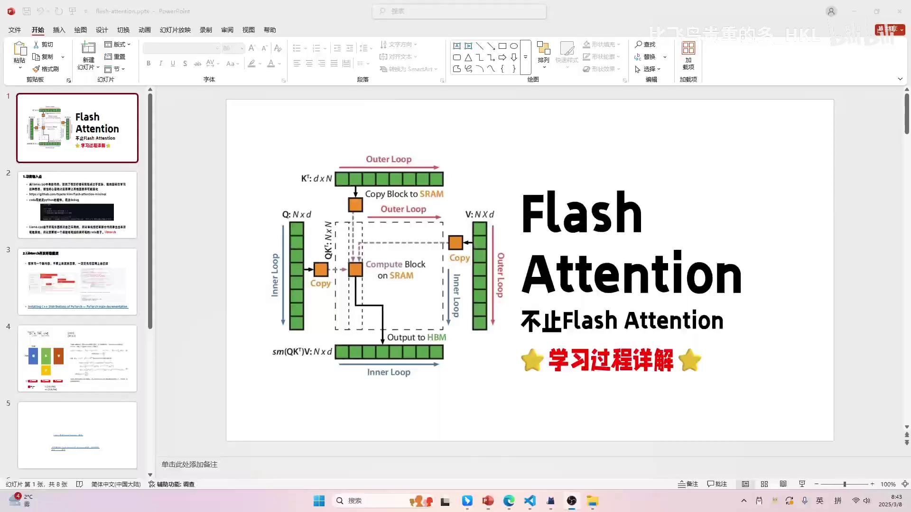
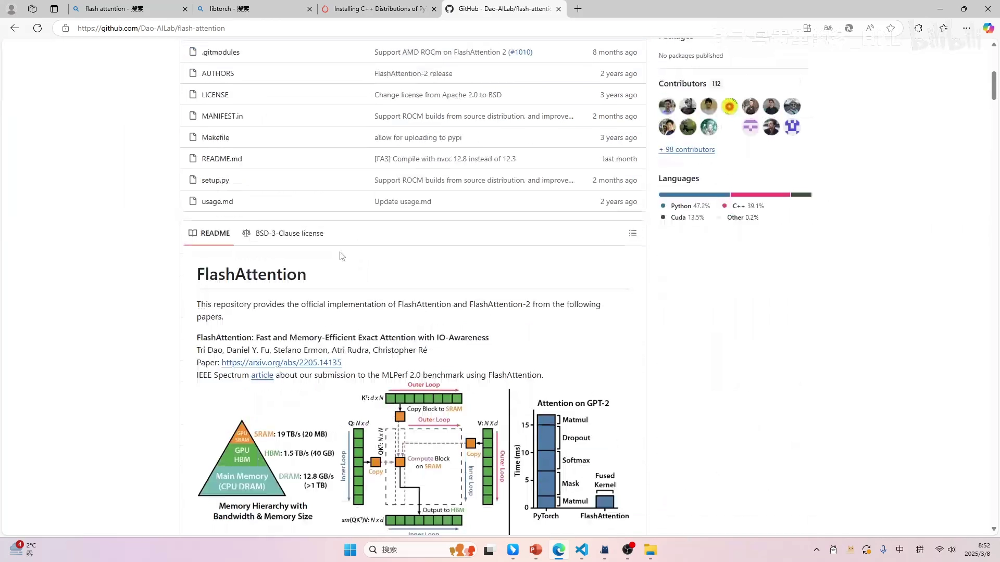
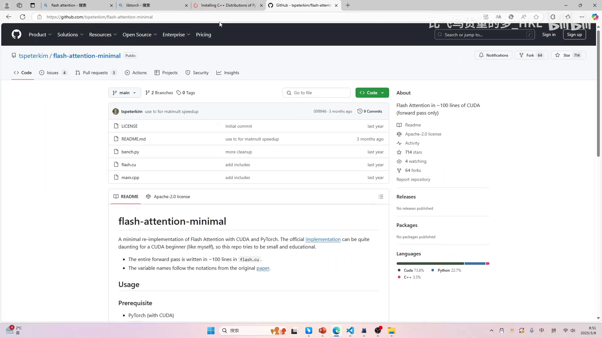
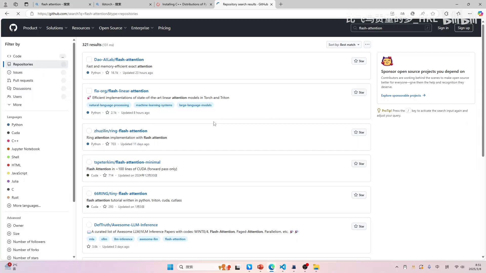
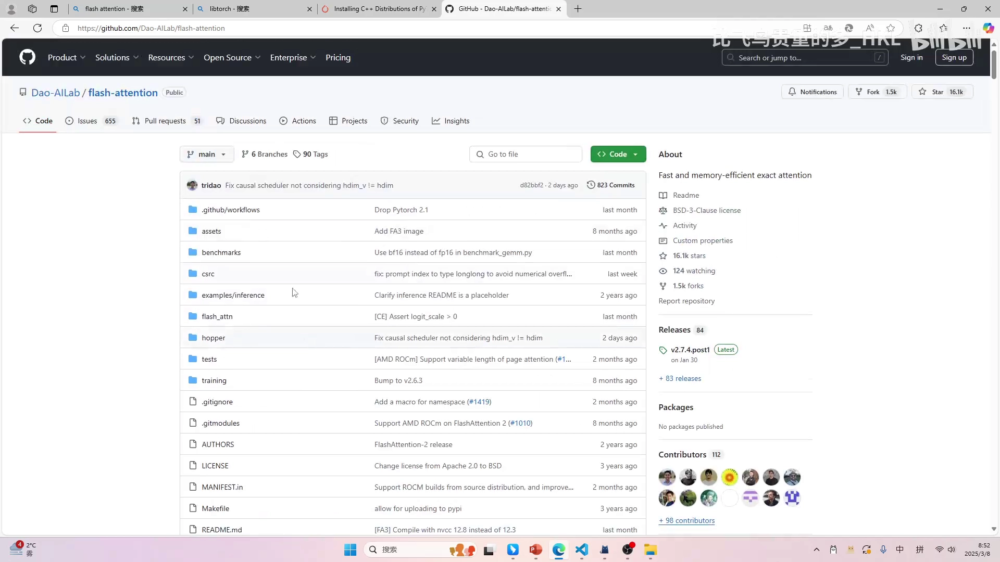
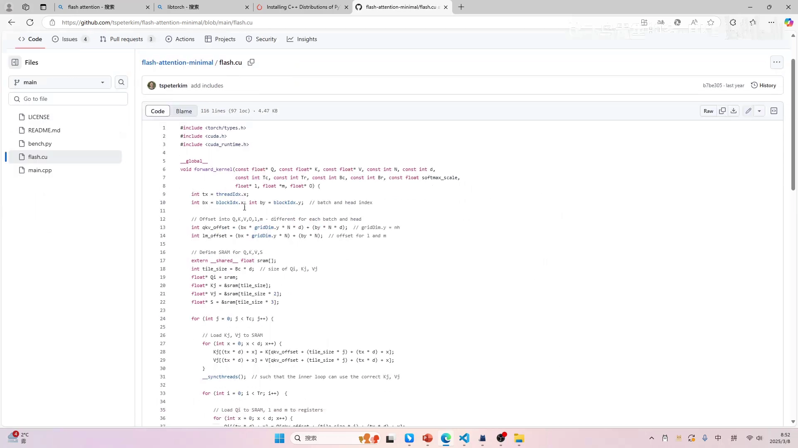

# 第02讲：FlashAttention 学习过程详解——如何找到学习复杂算子的切入点

> 视频来源：[【Flash Atten】1.寻找切入点](https://www.bilibili.com/video/BV1FM9XYoEQ5/?p=2)（B 站 UP 主「比飞鸟贵重的多_HKL」）

## 本讲要解决的核心问题（SCQA）

**背景**：FlashAttention 是当前大模型（Transformer）训练与推理中最关键的算子优化之一。它要处理的 attention 计算，本质是「Q 乘 K 的转置 → softmax → 乘 V」这三步，其中穿插着大量显存读写。

**冲突**：想真正学懂它并不容易。网上的视频和文章反复强调「访存很慢、FlashAttention 就是算子融合」，公式也贴得到处都是，但很多人（包括本讲作者）看完仍然一头雾水；而一旦去读现成源码——llama.cpp 里的实现、官方的 flash-attention——又会被庞大的工程结构、强耦合的数据结构和各个版本（V1/V2/V3）淹没，既抓不住核心，也没法调试。

**疑问**：面对一个复杂算子，怎样才能既理解它的核心思想、又能亲手把代码跑起来调通，而不是被工程细节拖垮？

**回答（中心思想）**：把「寻找切入点」作为学习的第一步——先搞清 FlashAttention 要解决的本质问题（访存瓶颈与算子融合），再刻意把与核心无关的因素全部简化，选一个**足够小、能无缝衔接 CUDA 算子、且可以单步调试**的实现作为学习载体。本讲作者最终选定的载体，是 GitHub 上的 `tspeterkim/flash-attention-minimal`（约 100 行 CUDA）配合 **LibTorch**，从而摆脱 Python 绑定、直接在 C++ 里调试 FlashAttention 的 CUDA 代码。

> **前置说明**：本系列是循序渐进的，预期读者已经学过作者之前的内容——CUDA 编程、CUDA 调优（NCU）以及 llama.cpp 的算子开发；不建议零基础直接上手。[【跳转到 00:32】](https://www.bilibili.com/video/BV1FM9XYoEQ5/?p=2&t=32)

---

## 一、先认清 FlashAttention 要解决的本质：attention 是访存瓶颈

### 1.1 attention 的三步计算，以及它为什么慢

attention 的核心计算可以概括为三步（先不谈 mask 和 dropout）：[【跳转到 00:57】](https://www.bilibili.com/video/BV1FM9XYoEQ5/?p=2&t=57)

1. `S = Q · Kᵀ` —— 每个 query 与所有 key 做点积，得到注意力分数；
2. `P = softmax(S)` —— 对分数按行做归一化；
3. `O = P · V` —— 用归一化后的权重对 value 加权求和。

这三步本身计算量并不夸张，问题出在**访存**：每一步算完，中间结果都要**写回显存（HBM）**，下一步再**从显存读回来**。于是整个 attention 就变成了「读 → 写 → 读 → 写 → 读 → 写」，读写次数极多。

本讲反复强调的一个判断是：**大部分这类计算都是 memory bound（访存受限）**——瓶颈不在显卡的算力，而在数据搬运的次数太多，导致算力根本没被喂饱。原文形象地说，时间都花在访存上了。[【跳转到 03:02】](https://www.bilibili.com/video/BV1FM9XYoEQ5/?p=2&t=182)



### 1.2 类比矩阵乘法：减少从显存读数的次数

这个思路其实作者在之前的 CUDA 课里已经讲过：**为什么矩阵乘法要用 shared memory（共享内存）优化？** 答案就是——把数据搬到离计算单元更近、带宽更高的小容量存储里重复使用，从而减少从显存读取的次数。

作者给出的官方 README 里的存储层级图也印证了这一点：GPU 上的 **SRAM 带宽约 19 TB/s**，而 **HBM（显存）只有约 1.5 TB/s**（再往下的 DRAM 更低），两者相差一个数量级。谁读写显存更多，谁就更慢。



FlashAttention 的直观理解就是**算子融合（operator fusion）**：原本「乘法 → softmax → 乘法」是三个独立算子，正常要三次读取、三次写回；如果把它们融合成一个算子，就能**只读一次、写回一次**，中间结果全程留在片上（SRAM）算完。这样省掉了两次读、两次写，性能自然大幅提升。[【跳转到 02:12】](https://www.bilibili.com/video/BV1FM9XYoEQ5/?p=2&t=132)

> 作者也提醒：这是「更直观的理解」，实现细节未必完全如此；但核心目的就是这个。对于已经看过作者 CUDA 课程的同学，这一点应该很容易接受。

---

## 二、学习复杂算子的第一原则：先锁定核心目标，再简化一切非核心因素

### 2.1 核心目标有两个

作者把自己学 FlashAttention 的目标明确成两点：[【跳转到 03:27】](https://www.bilibili.com/video/BV1FM9XYoEQ5/?p=2&t=207)

1. **理解思想**：它的公式是怎么推出来的，以及结合公式，代码到底是怎么实现的；
2. **读懂代码**：能读一份现成的实现，甚至自己写一遍。

一旦目标明确，判断标准就清晰了：**凡是不服务于这两个目标的东西，都应该被简化掉**——也就是原文的「抓住核心目的之后，让其他因素尽可能简化」。

### 2.2 个人习惯：搭一个能调试的环境，结合代码看公式

作者坦言自己看不懂纯公式，所以学习方式是**结合代码去看公式**。为此，他会在看懂基础讲解、仍然卡壳时，**先把开发环境搭起来**。他提醒：这种方式适合自己的习惯，不一定适合所有人。[【跳转到 03:52】](https://www.bilibili.com/video/BV1FM9XYoEQ5/?p=2&t=232)

这一步的产物，就是一个「**适合当前项目的最小系统**」——不需要大而全，只要能跑、能改、能调试。


---

## 三、第一次尝试：从 llama.cpp 里找 FlashAttention，然后放弃了

### 3.1 怎么找

既然之前讲过 llama.cpp，作者的第一反应是：llama.cpp 里会不会已经有 FlashAttention？他打开 llama.cpp 源码，直接搜索 `FlashAttention`。由于实现不一定叫这个名字，他多试了几种写法，最后定位到 `FATTN`——这就是 flash attention，旁边还分成 FP16、FP32 等版本。[【跳转到 04:41】](https://www.bilibili.com/video/BV1FM9XYoEQ5/?p=2&t=281)


打开后看到实现大约有 **300 多行**。[【跳转到 05:06】](https://www.bilibili.com/video/BV1FM9XYoEQ5/?p=2&t=306) 作者又看了几处底层代码，例如 `ggml-cuda.cu` 里用 shared memory 暂存部分和、再用 warp reduce 求和的段落：


以及 `fattn-tile-f32.cu` 里 K、Q、V 分块与 `sum += K * Q` 的 tile 计算：


### 3.2 为什么放弃：太复杂、耦合太重、会偏离主线

300 多行本身不算多，但作者放弃它有几个明确理由：[【跳转到 07:39】](https://www.bilibili.com/video/BV1FM9XYoEQ5/?p=2&t=459)

- **实现过于完整、复杂**：要考虑的东西很多，还夹杂量化等实现细节；而且 flash 有 V1/V2/V3 多个版本，光看代码很难对上「现在讲的是哪一版」。
- **数据结构强耦合**：这份实现依赖 llama.cpp 自己的 `ggml tensor`。想把某段代码单独摘出来，会牵出大量耦合变量，还得搞清楚 `ggml tensor` 在哪个 `.so` 文件里、再链接进来才能用。
- **需要维护额外对象**：想让代码跑起来，要么找一个带 FlashAttention 的模型，要么把代码复制出来自己维护一个 tensor 变量；而作者不会（也不想花时间）把之前学的模型改成 FlashAttention 版本。
- **框架并不真正熟悉**：虽然作者带大家解读过 GGML / llama.cpp 的代码，但那只是「执行过的路径」，框架本身很复杂，作者判断还会有很多坑。

结论：**用 llama.cpp 学 FlashAttention，会在「FlashAttention 之外」的东西上耗费太多时间和精力，偏离了学习主线。**

---

## 四、第二次尝试：去 GitHub 找「最小实现」

### 4.1 先排除官方实现

作者在 GitHub 搜索 FlashAttention，搜索结果里排在最前、star 最多的是官方仓库 `Dao-AILab/flash-attention`。[【跳转到 07:59】](https://www.bilibili.com/video/BV1FM9XYoEQ5/?p=2&t=479) 但一看它的目录（有 `csrc`、`hopper` 等），结构庞大、内容复杂，而且针对 Hopper 架构——作者的显卡也不是 Hopper。结论：官方实现虽然权威，但**太重，不适合入门**。







### 4.2 选定最小实现：flash-attention-minimal

紧接着作者发现了一个名字里带 **minimal** 的仓库：`tspeterkim/flash-attention-minimal`。[【跳转到 08:50】](https://www.bilibili.com/video/BV1FM9XYoEQ5/?p=2&t=530) 它的 `flash.cu` 只有一个 **forward kernel**，整体约 100 行，非常轻量。它只做最基本的 `QKᵀ → softmax → V`，**没有**处理 mask、softmax 缩放、dropout 这些额外情况。

作者认为：**对于学习 FlashAttention 的思想，这就够了**——反而正因为简单，才更容易把核心逻辑看清楚。



---

## 五、最小实现带来的新问题：Python 绑定挡住了调试，于是想到 LibTorch

### 5.1 这个最小实现的调用方式：Python 绑定

`flash-attention-minimal` 除了 `flash.cu`，还有一个 `main.cpp` 和一个 `bench.py`。作者发现它是通过 **C++ 扩展（Python 绑定）**把 CUDA 库包装起来，供 Python 调用：[【跳转到 09:36】](https://www.bilibili.com/video/BV1FM9XYoEQ5/?p=2&t=576)

```python
# bench.py
from torch.utils.cpp_extension import load
minimal_attn = load(name='minimal_attn', sources=['main.cpp', 'flash.cu'], extra_cuda_cflags=['-O2'])
```


### 5.2 问题：无法 debug 进 C++/CUDA

作者的痛点很直接：**通过 Python 绑定调用，就只能「调用」，进不去 C++/CUDA 内部**。[【跳转到 10:22】](https://www.bilibili.com/video/BV1FM9XYoEQ5/?p=2&t=622) 你看不到里面到底怎么做的，也就无法单步调试、无法在程序里跟着逻辑思考。对自认「调试区 up 主」的作者来说，这跟单纯看代码没有区别，不能接受。

### 5.3 转机：flash.cu 用的就是 LibTorch 的 `torch::Tensor`

作者重新审视 `flash.cu`，发现它的 `forward` 函数和内部运算用的都是 **LibTorch（`torch::Tensor`）**：[【跳转到 10:39】](https://www.bilibili.com/video/BV1FM9XYoEQ5/?p=2&t=639)

```cpp
torch::Tensor forward(torch::Tensor Q, torch::Tensor K, torch::Tensor V);
```

虽然这是 C++ 代码，但函数形式和 Python 端几乎一模一样——比如把 tensor 放到 GPU 上，C++ 里直接写 `tensor.to(device)`，和 Python 的写法高度一致。


由此作者产生了一个关键想法：**我的 `main` 函数不去「包装」forward，而是直接调用 forward**。[【跳转到 11:24】](https://www.bilibili.com/video/BV1FM9XYoEQ5/?p=2&t=684) 这样就能脱离 Python，直接在 C++ 里跑、在 C++ 里调试，同时对照学习 `flash.cu`。而实现这一点，只需要引入 **LibTorch**。


> 剩下的问题：LibTorch 环境怎么搭？作者把它留到下一讲。

---

## 六、复盘：为什么最终是 LibTorch，以及「为了一碟醋包一顿饺子」

至此，本讲的学习路径已经闭环，作者也做了一段有价值的复盘：[【跳转到 11:58】](https://www.bilibili.com/video/BV1FM9XYoEQ5/?p=2&t=718)

**为什么选 LibTorch？** 因为它同时满足了两个苛刻条件：

- **无缝衔接 CUDA 算子**：LibTorch 提供了和 PyTorch 一致的数据结构（`torch::Tensor`）和 API，不用自己造一套 tensor，也不用去链接 GGML 的库；
- **可调试**：直接在 C++ 里调用 forward，可以单步进入 CUDA 代码。

反过来看，这正是 llama.cpp 的死穴：**它所有东西都自己实现，所以想把某一部分单独取出来是有难度的**。

**「为了一碟醋，包了一顿饺子」。** 作者反思：如果当初先想到用 LibTorch 去讲大模型算子，可能就不会花那么长的篇幅先讲 llama.cpp 了。[【跳转到 13:38】](https://www.bilibili.com/video/BV1FM9XYoEQ5/?p=2&t=818)「我本质是想学大模型算子，却要先学完 llama.cpp」——这件事本身就不太合理。不过他也表示，现在想到也不晚，后续会把这个更轻的方式分享出来，并鼓励大家「技多不压身」。

**本讲的真正价值**，不在于讲了某个知识点，而在于示范了一套**面对复杂系统时的学习方法**：

1. 先找整体认知（看视频/资料，知道它大概在干什么）；
2. 明确核心目标（理解思想 + 读懂代码），并据此**把非核心因素简化**；
3. 亲手搭一个**最小、可调试**的系统；
4. 结合代码去理解公式与思想。

下一讲，作者将从 LibTorch 环境的搭建开始，正式进入代码。

---

## 小结

- **FlashAttention 的本质**是解决 attention 的访存瓶颈：`QKᵀ → softmax → V` 三步会产生大量显存读写，属于 memory bound；通过**算子融合**把它从「三次读、三次写」压缩成「读一次、写一次」，中间结果留在 SRAM。
- 学复杂算子的第一原则：**先锁定核心目标（理解思想 + 读懂代码），再把一切非核心因素简化掉**；判断标准就是「它是否服务于核心目标」。
- **llama.cpp 路线被放弃**：实现完整且复杂、依赖 GGML tensor、强耦合、需要额外维护对象，会在主线之外耗费大量精力。
- **GitHub 路线胜出**：官方 `Dao-AILab/flash-attention` 太重；最终选择约 100 行、只做基础的 `tspeterkim/flash-attention-minimal`。
- **最小实现的新问题是 Python 绑定无法调试**；而 `flash.cu` 本身用 `torch::Tensor`，于是改用 **LibTorch** 直接在 C++ 里调用/调试 forward，并准备搭建 LibTorch 环境。
- 方法论层面：**遇到现有教程解决不了的问题时，自己设计解决方案**；「先搭一个最小可调试的系统」往往比「一口吃下完整框架」更高效。
- 教训：先想清楚用什么轻量工具，可能就避免了「为了一碟醋包一顿饺子」。

## 关键术语速查

| 术语 | 一句话解释 |
| --- | --- |
| Attention | Transformer 的核心运算：`QKᵀ → softmax → V`，让每个 token 按相关性聚合其他 token 的信息 |
| Q / K / V | 由输入线性变换得到的查询（Query）、键（Key）、值（Value）三组张量 |
| softmax | 把一组分数归一化成概率分布（此处按行对注意力分数归一化） |
| 访存 / 显存（HBM） | 数据在计算单元与显存之间搬运；搬运次数过多会让计算变慢 |
| memory bound（访存受限） | 性能瓶颈在数据搬运而非计算本身的状态 |
| 算子融合 | 把多个连续算子合并成一个，减少中间结果写回/读取显存的次数 |
| shared memory / SRAM | GPU 片上高速缓存，带宽远高于 HBM，用于暂存复用的数据 |
| kernel | 在 GPU 上并行执行的函数 |
| llama.cpp / GGML | 一个用 C/C++ 从零实现的 LLM 推理框架，自带数据结构 ggml tensor；实现完整但耦合较重 |
| CUDA | NVIDIA 的 GPU 并行计算平台与编程模型 |
| LibTorch | PyTorch 的 C++ 前端，提供 `torch::Tensor` 等与 Python 一致的 API |
| Python 绑定（pybind） | 把 C++/CUDA 函数暴露给 Python 调用的封装层；方便调用但不易调试进底层 |
| debug（调试） | 单步进入程序、观察内部状态，以理解代码行为 |
| 最小系统 | 只包含当前学习目标所必需部分的、可运行可调试的小工程 |
