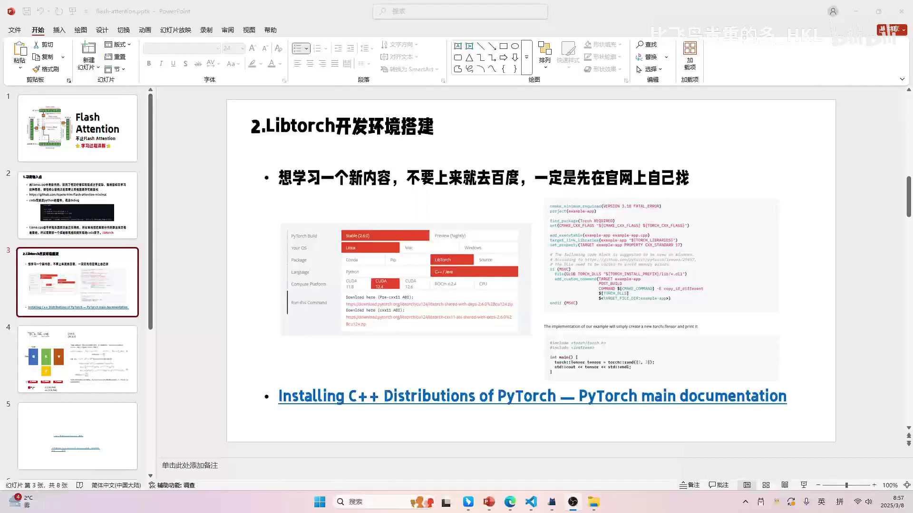
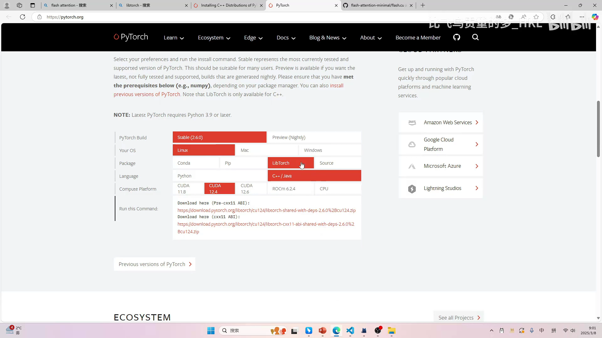
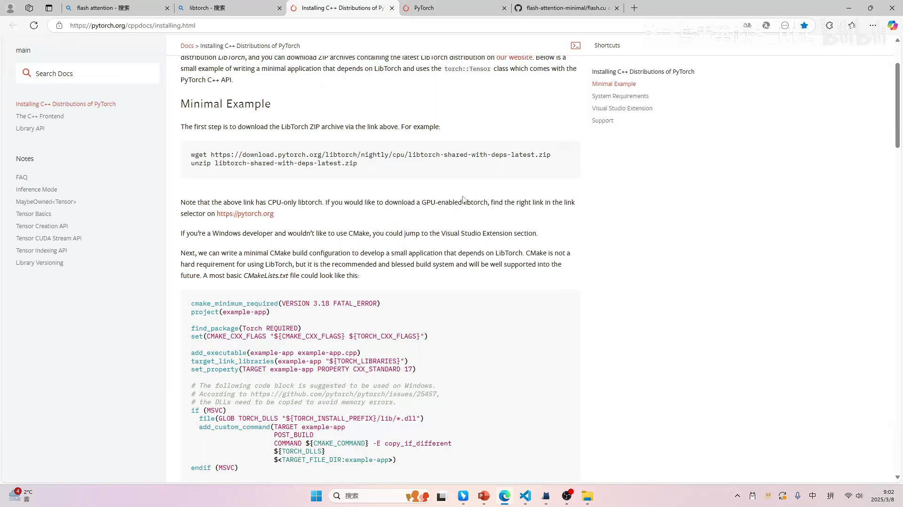
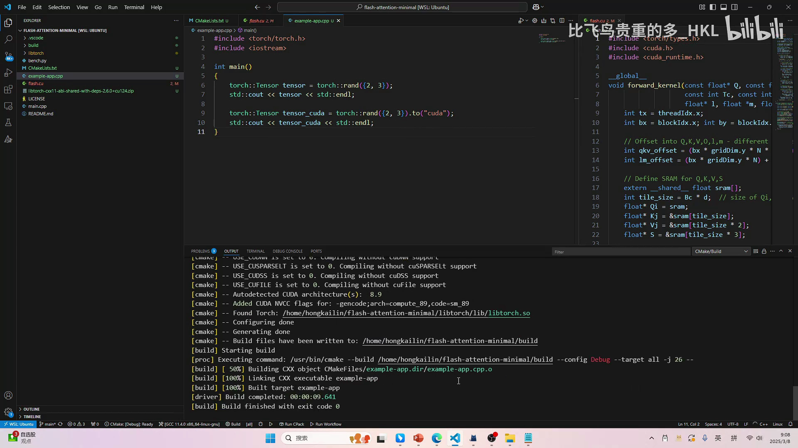

# 第03讲：LibTorch 环境搭建——用「会 PyTorch」直接打通 C++ 调试

> 视频来源：[【Flash Atten】2.libtorch 环境搭建](https://www.bilibili.com/video/BV1FM9XYoEQ5/?p=3)（B 站 UP 主「比飞鸟贵重的多_HKL」）

## 本讲要解决的核心问题（SCQA）

**背景**：上一讲（[第02讲](第02讲_寻找切入点.md)）已经确定了学习路线——不啃庞大的工程代码，而是选用约 100 行的 `flash-attention-minimal`，并借助 **LibTorch** 直接在 C++ 里调试它的 CUDA kernel。

**冲突**：理想很丰满，但 LibTorch 这个 C++ 环境到底怎么搭？它的下载选项一堆（CPU/GPU、Windows/Linux、多个 CUDA 版本、两种 ABI），CMake 又找不到 `Torch`，再加上从 Python 代码「翻译」到 C++，很容易在第一步就卡住。

**疑问**：怎样才能快速、可复现地把 LibTorch 环境搭起来，并把 `flash.cu` 接进一个可断点调试的 C++ 工程？

**回答（中心思想）**：LibTorch 本质上就是 **PyTorch 的 C++ 前端**，它的 API 与 Python 几乎一一对应。所以搭环境只需要三步——**去官网照抄、用 CMake 的 `CMAKE_PREFIX_PATH` 指路、把 Python 代码照抄成 C++**；Launcher 配上 `cuda-gdb` 后，就能单步进入 CUDA kernel。会 PyTorch 的话，学 LibTorch「真的分分钟」。[【跳转到 00:00】](https://www.bilibili.com/video/BV1FM9XYoEQ5/?p=3&t=0)

---

## 一、搭环境的第一原则：先看官网，不要先百度

作者开场就给了整节课最重要的一条准则：**想学习一个新内容，不要上来就去百度，一定要先在官网上自己找**。



原因很实在：**网上所有的博客都是基于官网改的**，与其看被转述、可能过时的二手教程，不如直接看一手文档。尤其是 C++ 第三方库的管理本来就很复杂，更要认准官网。作者也顺手提到，C++/CUDA 的工程都用 **CMake** 来构建（他还没学更现代的工具，开源项目大多也是 CMake），并推荐了自己 B 站主页的 CMake 教程。[【跳转到 01:16】](https://www.bilibili.com/video/BV1FM9XYoEQ5/?p=3&t=76)

---

## 二、选对下载项：Linux + C++11 ABI + 匹配 CUDA

作者在官网一步步演示了下载过程，几个关键选择：

1. **先区分用途**：首页默认入口是**纯 CPU** 的 tensor 库；要用 GPU，得进到 **PyTorch 官网的安装页**。
2. **选 CUDA 版本**：安装页有 LibTorch + C++ 的选项，需要选择 CUDA 版本。作者的 WSL 里是 CUDA 12.2，于是选了接近的 **12.4**；他强调不必严格一致，装 12.6 应该也行（不确定，可以自己试）。
3. **不能选 Windows，要选 Linux**：Windows 版要区分 **Debug / Release** 两个版本（调试尽量用 Debug）；Linux 版则把两者编在一起。作者这里用 Linux（WSL），因为上一讲的项目本来就在 WSL 里。
4. **选 C++11 之后的 ABI**：下载项里，前面是 C++11 之前的、后面是 C++11 之后的（即 `Pre-cxx11 ABI` 与 `cxx11 ABI`），选后者。[【跳转到 03:46】](https://www.bilibili.com/video/BV1FM9XYoEQ5/?p=3&t=226)



下载完把压缩包拖进 WSL 解压即可。官网同时给了一段 **Minimal Example** 的 `CMakeLists.txt` 和一个简单的 `main`——作者的做法就是「无脑抄」，删掉 Windows/MSVC 的部分，其余照搬。



[【跳转到 04:46】](https://www.bilibili.com/video/BV1FM9XYoEQ5/?p=3&t=286)

---

## 三、CMake 工程：用 `CMAKE_PREFIX_PATH` 让 `find_package(Torch)` 找到包

CMake 里最关键的一句是 `find_package(Torch REQUIRED)`。它会去找一个 **`TorchConfig.cmake`** 文件。问题在于：CMake 怎么知道去哪儿找？作者给了两条路：

- 把 `TorchConfig.cmake` 加到系统环境变量；或
- **在 CMakeLists 里直接告诉它路径**（作者选这条，因为改系统环境变量比较费劲）。

具体做法是设置 `CMAKE_PREFIX_PATH`，指向解压出来的 LibTorch 目录，例如：

```cmake
set(CMAKE_PREFIX_PATH "/home/<user>/flash-attention-minimal/libtorch")
find_package(Torch REQUIRED)
```

只要路径写对，`find_package` 时就会去这个目录找 `TorchConfig.cmake`，找到就通过了。[【跳转到 05:34】](https://www.bilibili.com/video/BV1FM9XYoEQ5/?p=3&t=334)


随后把官网给的 `main` 复制成 `example_app.cpp`，用 CMake 构建。作者预测「`tensor.to("cuda")`」应该和 Python 一样能用——结果验证果然如此，程序成功在 GPU 上创建并打印了 tensor。



[【跳转到 10:27】](https://www.bilibili.com/video/BV1FM9XYoEQ5/?p=3&t=627)

---

## 四、从 demo 到 FlashAttention：把 Python 代码「照着抄」成 C++

环境通了，接下来就是把 `bench.py` 里的调用逻辑移植到 C++：

1. 新建 `flash_attention_main.cpp`，使用 `torch/torch.h` 等头文件；
2. 把 Python 里的变量定义照着写，并补上 C++ 需要的**类型**（`const int`）；[【跳转到 12:07】](https://www.bilibili.com/video/BV1FM9XYoEQ5/?p=3&t=727)
3. `device` 这类临时对象直接用 `auto`；
4. `torch::` 是**命名空间**，所以在 C++ 里要写全 `torch::Tensor`、`torch::rand(...)`；
5. 初始化用大括号形式 `{...}`。


然后在 `CMakeLists.txt` 里再建一个可执行目标，把 `flash_attention_main.cpp` 和 `flash.cu` 一起编进来：


调用 forward 时，可以直接把函数声明写在文件里（省得加头文件），然后把 Q、K、V 传进去，Build 一次就能过。[【跳转到 14:27】](https://www.bilibili.com/video/BV1FM9XYoEQ5/?p=3&t=867) 作者反复强调：**这些都不是「学会了」才会，而是照着 demo + Python 代码抄出来的**——因为 LibTorch 和 PyTorch 本是同源。[【跳转到 17:09】](https://www.bilibili.com/video/BV1FM9XYoEQ5/?p=3&t=1029)

---

## 五、让 kernel 可调试：launch.json 配合 cuda-gdb

程序能跑不等于能调试。作者用 VS Code 的 Debug 流程打通了最后一步：

- 在 `flash_attention_main.cpp` 里打断点，运行时就能停住；
- 想**进入 CUDA kernel**，需要在 `launch.json` 里配置调试器为 **`cuda-gdb`**，并把可执行文件路径填进 `program` 字段；
- 配好后 F5，就能单步进入 kernel。


[【跳转到 15:42】](https://www.bilibili.com/video/BV1FM9XYoEQ5/?p=3&t=942)

至此，上一讲「Python 绑定无法调试」的问题被彻底解决：同样的 `flash.cu`，换由 C++ 的 `main` 直接调 forward，就能断点进 kernel 了。

---

## 六、复盘：LibTorch 让算子教学摆脱 llama.cpp 的重包袱

课程末尾，作者用一个具体例子兑现了上一讲的承诺——**把之前 llama.cpp 里的算子改用 LibTorch 重写**。以 `rms_norm` 为例：

```cpp
torch::Tensor forward(torch::Tensor in, torch::Tensor out) {
    auto nrows = in.size(1);                 // 从 tensor 直接取维度
    const dim3 block_dims(32, 1, 1);
    rms_norm_f32<1024><<<nrows, block_dims, 0, stream>>>(
        in.data_ptr<float>(), out.data_ptr<float>(), 1024, 0.56);
}
```

要点都在细节里：

- **维度直接从 tensor 拿**：用 `in.size()`，不必再依赖 llama.cpp 的 `ne` 数组；
- **模板参数**（如 `1024`）照写，`stream` 可以不给；
- **指针**用 `.data_ptr<float>()` 得到；
- `eps` 等标量随需求给即可。


就这么十几行，一个算子就讲清楚了，**完全脱离了 llama.cpp 那套沉重的数据结构与依赖**。作者由此再次感慨：如果早点想到用 LibTorch，前一个系列可能根本不用花那么长篇幅讲 llama.cpp。[【跳转到 18:51】](https://www.bilibili.com/video/BV1FM9XYoEQ5/?p=3&t=1131)

> 下节课开始，正式讲解 FlashAttention 的内容。

---

## 小结

- **搭环境第一原则**：先看官网，不要先百度——网上博客都是官网的二道贩子。
- **下载 LibTorch 的三个选择**：选 **Linux**（WSL）、选 **C++11 之后的 ABI**（cxx11）、选与本机**匹配的 CUDA 版本**；Windows 版才需要区分 Debug/Release。
- **CMake 找包**：`find_package(Torch REQUIRED)` 依赖 `TorchConfig.cmake`，用 `CMAKE_PREFIX_PATH` 指到 libtorch 目录即可，无需改系统环境变量。
- **LibTorch = PyTorch 的 C++ 前端**：API 几乎一一对应（`torch::Tensor`、`.to("cuda")`、`.size()`、`.data_ptr<float>()`），会 PyTorch 就能照着把 Python 抄成 C++，AI 也能直接帮忙翻译。
- **可调试**：用 VS Code 的 `launch.json` 配置 `cuda-gdb` 并填好可执行文件路径，就能断点进入 CUDA kernel，解决了 Python 绑定「只能调用、无法调试」的痛点。
- **意义**：搭好这套最小工程后，讲解任意 CUDA 算子都能脱离 llama.cpp 的重包袱，代码量小、可读、可调。

## 关键术语速查

| 术语 | 一句话解释 |
| --- | --- |
| LibTorch | PyTorch 的 C++ 前端，提供与 Python 一致的 `torch::Tensor` 等 API |
| PyTorch | 主流深度学习框架；LibTorch 是它的 C++ 版本 |
| ABI（cxx11 / pre-cxx11） | C++ 二进制接口约定；PyTorch 提供两种预编译版本，需与工程的编译器约定一致 |
| CUDA 版本 | GPU 计算平台版本；LibTorch 需选择与驱动/CUDA 对应的构建 |
| CMake | C/C++ 常用的构建系统；用 `CMakeLists.txt` 描述如何编译工程 |
| `find_package(Torch REQUIRED)` | CMake 指令：查找并引入 LibTorch |
| `TorchConfig.cmake` | LibTorch 提供的 CMake 配置文件，`find_package` 靠它定位库 |
| `CMAKE_PREFIX_PATH` | 告诉 CMake 去哪个前缀目录查找依赖包 |
| `launch.json` / `cuda-gdb` | VS Code 调试配置 / NVIDIA 的 CUDA 调试器，用于单步进入 GPU kernel |
| WSL | Windows Subsystem for Linux，在 Windows 上运行 Linux 环境 |
| `data_ptr<float>()` | 取出 tensor 底层数据指针，供 CUDA kernel 使用 |
| Debug / Release | 调试版 / 发布版编译配置；调试用 Debug |
