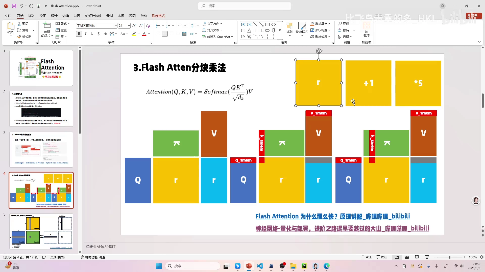

# 第04讲：三个矩阵相乘合并——FlashAttention 的分块乘法与「消灭 R 矩阵」

> 视频来源：[【Flash Atten】3.三个矩阵相乘合并](https://www.bilibili.com/video/BV1FM9XYoEQ5/?p=4)（B 站 UP 主「比飞鸟贵重的多_HKL」）

## 本讲要解决的核心问题（SCQA）

**背景**：attention 的核心计算是 `QKᵀ → softmax → V`。前面已经知道，FlashAttention 靠**算子融合**把「多次读写显存」压成「一次读写」。

**冲突**：但 attention 到底能不能融合？古早的普遍看法是「不行」——因为中间的 softmax 需要先算出**一整行**才能归一化，这似乎打断了融合的可能。于是常规实现只能老老实实分两步算，中间产生一个巨大的中间矩阵。

**疑问**：在不考虑 softmax 的前提下，`QKᵀ` 和 `V` 这两个乘法能不能真正融合成一个算子、省掉中间结果？

**回答（中心思想）**：可以。**三个矩阵可以「一起乘」，而不必先两个相乘再乘第三个**。做法是把矩阵分块放入 shared memory，算完一块 QK 结果后立刻和 V 的对应块相乘，**中间结果始终保持片上、不写回显存**——于是那个又大又占带宽的中间矩阵 R 被彻底「消灭」，显存和速度双双受益，且**精度没有任何损失**。剩下的硬骨头，是 softmax。

---

## 一、从算子融合说起：为什么「加一乘五」可以只读一次、写一次

作者先用一个极简例子讲清「算子融合」：对一个矩阵，先**加一**、再**乘五**。[【跳转到 00:50】](https://www.bilibili.com/video/BV1FM9XYoEQ5/?p=4&t=50)

- **常规做法**：读取矩阵 → 每个元素加一 → **写回**；再读取 → 每个元素乘五 → **写回**。也就是 **2 次读 + 2 次写**。
- **融合做法**：读取一次，每个元素当场「加一再乘五」，**写回一次**。也就是 **1 次读 + 1 次写**。[【跳转到 01:40】](https://www.bilibili.com/video/BV1FM9XYoEQ5/?p=4&t=100)



为什么能这么干？关键在于：**加一和乘五之间没有依赖**——不需要先完整得到「加一后的矩阵」才能乘五，对每个元素「先加一、再乘五」就能得到正确结果。这种「逐元素独立、可合并」的性质，就是算子融合的基础。

> 作者推荐了一个 8 小时的「神经网络-量化与部署」视频作为入门（商汤一位作者，2022 年），称它是自己做量化与部署的入门材料。本讲不展开。[【跳转到 02:30】](https://www.bilibili.com/video/BV1FM9XYoEQ5/?p=4&t=150)

---

## 二、attention 为什么一度被认为无法融合：softmax 是拦路虎

attention 的计算是：

```
Attention(Q,K,V) = softmax(QKᵀ / √d_k) · V
```

其中除 `√d_k` 很简单、很容易融合，可以暂时忽略。剩下的部分可以拆成三个算子：**QKᵀ**、**softmax**、**再乘 V**。

问题出在 **softmax**：要算某一行的 softmax，必须把这一行**所有**的数都求出来（因为有求和，还有求最大值），才能归一化。[【跳转到 04:04】](https://www.bilibili.com/video/BV1FM9XYoEQ5/?p=4&t=244) 也就是说，`V` 必须等 softmax **完整做完**才能乘——不像「加一乘五」那样可以逐元素独立处理。正因如此，古早的观点认为 attention 无法融合，只能三个算子分别做。


三个算子分别做，就意味着 **3 次访存 + 3 次写回**；如果能融合成一个算子，就只剩 **1 次访存 + 1 次写回**，省下两次读写。而作者反复强调：**访存（读写显存）才是这类计算最耗时的部分**，这里的优化空间非常大。[【跳转到 03:39】](https://www.bilibili.com/video/BV1FM9XYoEQ5/?p=4&t=219)

本讲先跳过 softmax，聚焦 `QKᵀ` 与 `V`。

---

## 三、常规做法的问题：R 矩阵又大又费

不考虑 softmax 时，常规做法是两步：

1. `Q · Kᵀ = R`（attention 权重矩阵）；
2. `R · V = O`（输出）。

这是**两个算子**：算完 R 要**写回**显存，下一步再把它**读**出来乘 V。于是 R 被「存一遍、读一遍」，两次大开销。[【跳转到 06:52】](https://www.bilibili.com/video/BV1FM9XYoEQ5/?p=4&t=412)


为什么 R 的代价特别大？作者做了维度分析：

- K 的维度（即 **feature/特征维度**，对应矩阵乘法里的 `K`）通常很小，比如 **128**；
- 但**序列长度**可以很大——后来的大模型动辄 4K，甚至 128K 上下文。序列一长，**Q 就特别长**，于是 `R` 是一个 **N×N** 的矩阵；
- N×N 的矩阵非常**占显存**；再考虑到 llama.cpp 这类框架通常**运行期不申请/释放显存、需要提前分配**，R 的存在就更难受；
- 同时 R 还要被读写一遍。[【跳转到 08:17】](https://www.bilibili.com/video/BV1FM9XYoEQ5/?p=4&t=497)

所以这是**显存和速度的双重打击**。而 FlashAttention 最「神奇」的地方，就是同时把速度提上来、把显存降下去。[【跳转到 09:32】](https://www.bilibili.com/video/BV1FM9XYoEQ5/?p=4&t=572)

---

## 四、FlashAttention 的分块乘法：让 R 不落显存

思路直接来自作者之前讲过的 **SGEMM 分块 + shared memory**：把矩阵分块，搬进带宽更高的片上 shared memory 再算。


[【跳转到 10:11】](https://www.bilibili.com/video/BV1FM9XYoEQ5/?p=4&t=611)

具体到 attention：

1. 把 Q 的一块和 K 的一块先读到 **shared memory**；
2. 算出这一块的 `QKᵀ` 结果，**但它不写回显存，而是继续留在 shared memory**；
3. 立刻读取 V 的对应块，和这块中间结果做矩阵乘法，得到输出的一块；
4. 移动 Q 到下一块，重复以上过程。

因为 K 的 feature 维度通常很小，FlashAttention **没有**再对它继续分块，直接把整条 K 放到 shared memory 即可。


关键就在于第 2 步：**中间结果 R 从不写回显存**。这块共享内存用完就可以立刻被下一块复用——相当于整个算法**根本不需要为 R 分配存储**。既然不需要存储，自然也就不需要写入和读取，显存与速度的优化就来自这里。[【跳转到 11:26】](https://www.bilibili.com/video/BV1FM9XYoEQ5/?p=4&t=686)

---

## 五、正确性：累加得到与常规完全一致的结果

一个自然的问题是：这样「边算边乘」的结果对吗？作者解释了累加机制：

- 当前 Q 块与 K 块相乘得到一块 R，再与 V 块相乘得到一块输出；
- 当 Q 继续下移、与后面的 K 块相乘时，结果会**累加**到已有输出上（`+=`）；
- 也就是说，输出块由多个「R 块 × V 块」的结果逐步累加得到。

这与常规的「先完整算 R，再乘 V」在数学上完全等价。作者由此给出结论：**在精度没有任何损失的情况下，三个矩阵相乘是可以用这种方式做的**，不必先两个相乘再乘另一个。[【跳转到 12:16】](https://www.bilibili.com/video/BV1FM9XYoEQ5/?p=4&t=736)

对比一下 llama.cpp 的实现：那里是**一个算子一个算子**地做（先 QK、再 softmax、再乘 V），中间结果 R 确实有存储。所以 FlashAttention 在「省显存、提速度」这两点上优势明显。

---

## 六、遗留的硬骨头：softmax

到这一步，FlashAttention 在**不考虑 softmax** 时的分块乘法就讲通了。但 softmax 仍然是最大的障碍：

- softmax 需要**一整行**都算完才能归一化；
- 而分块计算时，当前块后面的数还没算出来；
- 于是「这一行 × 这一列得到该位置结果」在分块下无法直接完成。

这就是 FlashAttention（乃至 attention 算子融合）的**核心难点**。作者明确说，后面会花很多篇幅讲 softmax 如何演变成「可以迭代、可以融合」的形式——这条路走通后，attention 的融合才真正「皆大欢喜」。[【跳转到 13:56】](https://www.bilibili.com/video/BV1FM9XYoEQ5/?p=4&t=836)

---

## 小结

- **算子融合的本质**：若相邻算子之间**逐元素独立、无依赖**（如「加一 → 乘五」），就能合并成一个算子，把「2 读 2 写」压成「1 读 1 写」。
- **attention 的融合难点是 softmax**：它必须拿到一整行才能归一化，破坏了逐块融合的可能；除 `√d_k` 则很容易融合。
- **常规做法的问题**：`QKᵀ` 产生 N×N 的中间矩阵 R，它又大又占带宽，还要「写回再读出」，是显存与速度的双重打击。
- **FlashAttention 分块乘法**：Q、K、V 分块进 shared memory，算完一块 `QKᵀ` 后立刻乘 V 的对应块，**中间结果不写回显存**，用完即被复用——R 矩阵被彻底「消灭」。
- **结果正确**：输出由多个「R 块 × V 块」**累加**得到，与常规算法数学等价，**无精度损失**。
- **下一讲的硬骨头**：如何让 softmax 也能「迭代地、分块地」计算，从而实现 attention 的完整融合。

## 关键术语速查

| 术语 | 一句话解释 |
| --- | --- |
| 算子融合（operator fusion） | 把多个逐元素独立的算子合并成一个，减少显存读写次数 |
| attention | Transformer 的核心运算 `softmax(QKᵀ/√d_k)·V` |
| Q / K / V | 查询、键、值三组张量；K 的维度即特征维度（如 128） |
| softmax | 按行把分数归一化成概率；需整行数据才能计算，是融合的难点 |
| 中间矩阵 R（attention weight） | `QKᵀ` 的结果，形状 N×N；常规做法需存回显存，FlashAttention 则不落盘 |
| shared memory / SRAM | GPU 片上高速缓存，带宽远高于显存，用于分块后复用数据 |
| 分块（tiling / blocking） | 把大矩阵切成小块逐一计算，是 GEMM/FlashAttention 的通用手段 |
| 访存 | 数据在显存与计算单元间的搬运；本类算子的主要瓶颈 |
| 累加（+=） | 分块时把各块的矩阵乘结果逐步加到输出上，保证结果与整块计算等价 |
| √d_k | 缩放因子，除以它很简单、易融合，本讲暂忽略 |
