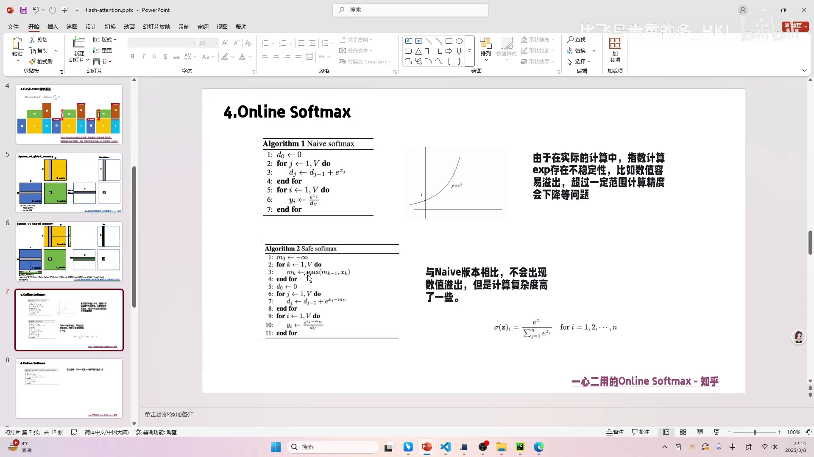

# 第05讲：Naive Softmax 与 Safe Softmax——三次遍历的由来

> 视频来源：[【Flash Atten】4.naive & safe softmax](https://www.bilibili.com/video/BV1FM9XYoEQ5/?p=5)（B 站 UP 主「比飞鸟贵重的多_HKL」）

## 本讲要解决的核心问题（SCQA）

**背景**：前面几讲已经确认，attention 算子融合最大的拦路虎是 **softmax**——它需要拿到一整行的数据才能归一化，导致中间矩阵无法避免地被写入/读出显存。

**冲突**：要攻克软 max，得先搞清楚它自己是怎么算的、有哪些实现方式、各自代价如何。最直白的写法会产生**数值溢出**；为了安全加一个「减去最大值」的步骤，却又把计算从**两次遍历变成了三次遍历**。

**疑问**：softmax 到底分几趟算？为什么减最大值能防溢出？两个版本的结果一样吗？这跟 FlashAttention 又有什么关系？

**回答（中心思想）**：softmax 有两种传统实现——**naive softmax** 直接算 `e^{x_i}` 再归一化，只有两次遍历，但 `exp` 极易溢出；**safe softmax** 先求最大值 `M`，用 `e^{x_i − M}` 计算，数值安全，但要**三次遍历**。两者在naive 不溢出的情况下结果完全相同（因为分子分母同时约掉 `e^{−M}`）。这个「三次遍历」正是 online softmax（下一讲）要压缩的对象。[【跳转到 00:00】](https://www.bilibili.com/video/BV1FM9XYoEQ5/?p=5&t=0)

---

## 一、naive softmax：两次遍历，但有溢出风险

softmax 最常见的公式是：

```
softmax(x_i) = e^{x_i} / Σ_j e^{x_j}
```

**在部署算法（C++ 实现）的视角里**，它并不是「一个公式」，而是**两次遍历**：

1. **第一次遍历**：对每个数求 `exp(src[i])` 并累加得到分母 `sum`；
2. **第二次遍历**：每个数用 `exp(src[i]) / sum` 算出结果。

```cpp
// naive softmax：两次遍历
std::vector<float> naiveSoftmax(std::vector<float>& src) {
    std::vector<float> dst(src.size());
    float sum = 0.f;
    for (int i = 0; i < src.size(); i++) {   // 第 1 次遍历：求和
        sum += std::exp(src[i]);
    }
    for (int i = 0; i < src.size(); i++) {   // 第 2 次遍历：归一化
        dst[i] = std::exp(src[i]) / sum;
    }
    return dst;
}
```

为什么要强调「遍历次数」？因为对 GPU 来说，遍历意味着把数据从显存读进寄存器，是访存开销。**每多一次遍历，就多一轮读显存。**[【跳转到 01:12】](https://www.bilibili.com/video/BV1FM9XYoEQ5/?p=5&t=72)


### naive 版本的问题：exp 不稳定

`e^x` 增长极快。作者贴出 `y = e^x` 的曲线：随着 x 增大，y 会迅速变得非常大。


对大模型推理尤其如此——模型动不动就**量化**（用更低位宽表示数），能表示的数据范围更小，x 稍大一点 `e^x` 就直接**溢出**（变成 `inf`），进而导致结果出现很大的精度损失。

---

## 二、safe softmax：先减最大值，三次遍历

为了解决溢出，提出了 **safe softmax**：在求和之前，**先遍历一次求出最大值 `M`**，然后所有指数都减去它：

```
softmax(x_i) = e^{x_i − M} / Σ_j e^{x_j − M},   M = max_j x_j
```

因为 `x_i − M ≤ 0`，所以 `e^{x_i − M} ≤ 1`，绝不会溢出。

```cpp
// safe softmax：三次遍历
std::vector<float> safeSoftmax(std::vector<float>& src) {
    std::vector<float> dst(src.size());
    float max_value = -99999.f;              // 相当于 -inf
    for (int i = 0; i < src.size(); i++) {   // 第 1 次遍历：求最大值
        if (src[i] > max_value) max_value = src[i];
    }
    float sum = 0.f;
    for (int i = 0; i < src.size(); i++) {   // 第 2 次遍历：求和
        sum += std::exp(src[i] - max_value);
    }
    for (int i = 0; i < src.size(); i++) {   // 第 3 次遍历：归一化
        dst[i] = std::exp(src[i] - max_value) / sum;
    }
    return dst;
}
```


作者坦言，他之前在 llama.cpp 的课程里讲 softmax 时就疑惑过：**为什么要减去向量中的最大值？** 当时甚至以为自己记错了公式。现在明白了——就是为了**防止数据溢出、避免浮点精度损失**。[【跳转到 04:07】](https://www.bilibili.com/video/BV1FM9XYoEQ5/?p=5&t=247)

注意：求最大值本身也是个 **O(N) 的算法**，必须把所有数遍历一遍才能得到。[【跳转到 05:15】](https://www.bilibili.com/video/BV1FM9XYoEQ5/?p=5&t=315)

---

## 三、两个版本结果等价，区别只在安全性与速度

可能有人担心：减去 `M` 会不会改变结果？不会。因为分子、分母的指数**同时减去了同一个数** `M`：

```
e^{x_i − M}              e^{x_i} · e^{−M}     e^{x_i}
────────────  =  ────────────────────  =  ────────
Σ_j e^{x_j − M}       Σ_j e^{x_j} · e^{−M}    Σ_j e^{x_j}
```

`e^{−M}` 在分子分母上完全约掉了。所以在 naive 版本不溢出的情况下，**两个版本的结果一模一样**。[【跳转到 06:30】](https://www.bilibili.com/video/BV1FM9XYoEQ5/?p=5&t=390)



总结一下取舍：

| 版本 | 遍历次数 | 数值安全 | 结果 |
| --- | --- | --- | --- |
| naive softmax | 2 | ❌ 易溢出 | 基准 |
| safe softmax | 3 | ✅ 不溢出 | 与 naive 完全一致 |

---

## 四、为什么要数「遍历次数」：这正是 FlashAttention 的切入点

作者把 softmax 和前面讲的矩阵乘法类比：

- 矩阵乘法之所以要分块、优化，是因为要减少对显存的读写；
- softmax 也是一样——**如果能把这「三次遍历」合并起来，就能省去写回和重复读取**。

而 safe softmax 之所以要三次遍历，是因为：[【跳转到 07:35】](https://www.bilibili.com/video/BV1FM9XYoEQ5/?p=5&t=455)

1. 求最大值 `M` 需要看一遍所有数；
2. 求分母 `D` 需要看一遍所有数；
3. 算输出需要看一遍所有数。

如果我们能把**「求最大值」和「求和」这两件事合并到一次遍历里**，就只需两次遍历（甚至在与 V 相乘时只需一次，见后续）。这个「在线」版本的算法，就是 **online softmax（safe softmax with online normalizer）**——它正是本系列后面几讲的核心。

> 作者特意说，他没在这节课贴 online softmax 的细节，而是准备在下一讲用 pad 投屏**手推**，因为把公式密密麻麻写出来反而不利于理解。

---

## 小结

- **naive softmax**：`e^{x_i} / Σ e^{x_j}`，在部署视角下是**两次遍历**（先求和、再归一化），但 `exp` 易溢出。
- **溢出风险**在大模型量化场景下被放大：能表示的数值范围更小，更容易 `inf`。
- **safe softmax**：先求最大值 `M`，用 `e^{x_i − M}` 计算，**数值安全**；代价是需要**三次遍历**（求最大值、求和、归一化）。
- **两者等价**：减去同一个 `M` 在分子分母上约掉，结果与 naive 完全一致。
- **关键动机**：softmax 的多次遍历和矩阵乘法一样是访存开销；把「求最大值」和「求和」合并到一次遍历，就是 **online softmax** 要解决的问题——也是 FlashAttention 分块在线计算的前提。

## 关键术语速查

| 术语 | 一句话解释 |
| --- | --- |
| softmax | `e^{x_i} / Σ e^{x_j}`，把一组分数变成概率分布 |
| 遍历（pass） | 完整扫过一遍数据；对 GPU 意味着多一轮读显存的开销 |
| naive softmax | 最直接的 softmax，两次遍历，数值易溢出 |
| safe softmax | 先减最大值再算的 softmax，三次遍历，数值安全 |
| 最大值 M | 一组数中的最大元素，用于把指数压到 `≤ 0` 防溢出 |
| 溢出（overflow） | 数值超过浮点类型可表示范围，变成 `inf`，导致精度丢失 |
| 量化 | 用更低精度表示数值；范围更小，更易溢出 |
| O(N) | 线性复杂度；求最大值、求和都必须扫一遍，无法只靠局部信息得到 |
| online softmax | safe softmax 的合并遍历版本（下一讲）；把求最大值与求和并成一次遍历 |
