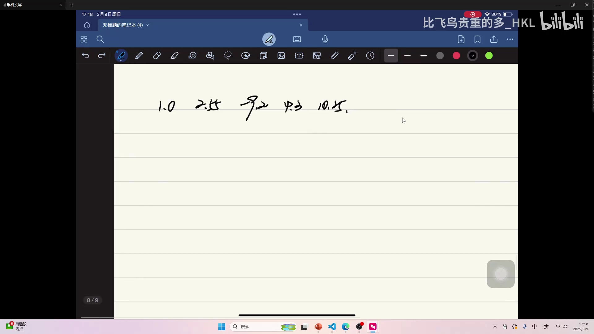
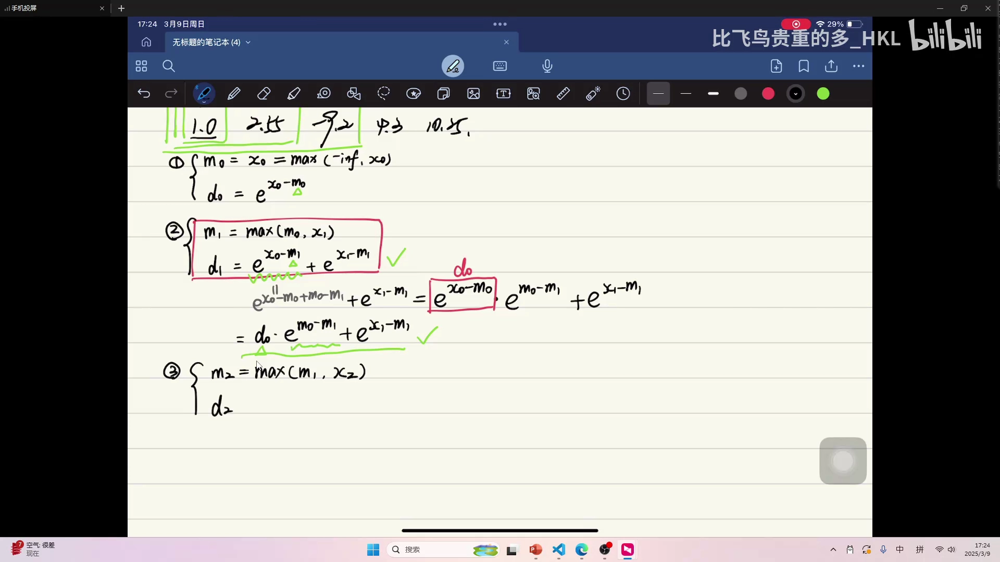
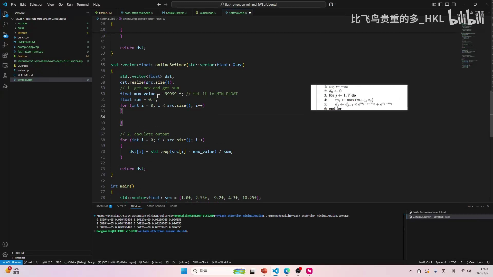

# 第06讲：Online Softmax——把「求最大值」和「求和」合并到一次遍历

> 视频来源：[【Flash Atten】5.online softmax（重制版）](https://www.bilibili.com/video/BV1FM9XYoEQ5/?p=6)（B 站 UP 主「比飞鸟贵重的多_HKL」）
>
> 前置：本讲承接上一讲「naive & safe softmax」（本系列 p=5）。为便于阅读，下文会先简要回顾 safe softmax，再展开 online softmax 的推导。

## 本讲要解决的核心问题（SCQA）

**背景**：softmax 的数值安全实现（safe softmax）会分三次遍历数据：第一次求最大值 `M`，第二次求指数之和 `D`（分母），第三次才算每个元素的 `e^{x_i − M} / D`。这虽然避免了溢出，但三次遍历对访存密集的算子来说代价不小。

**冲突**：能不能少遍历一次？难点在于：要算 `D`，似乎必须先把所有数看一遍求出 `M`；要算 `M`，又似乎必须先看一遍所有数。两个「全局统计量」看起来互相依赖，只能各走一趟。

**疑问**：有没有办法在**一次遍历**里，同时把最大值 `M` 和指数和 `D` 都求出来？

**回答（中心思想）**：有。用**迭代（online）**的方式处理：每来一个新数 `x_j`，就用「当前最大值」和「当前指数和」去更新。核心公式是

```
M_j = max(M_{j-1}, x_j)
D_j = D_{j-1} · e^{M_{j-1} − M_j} + e^{x_j − M_j}
```

第二条是用「加减同一个数 + 指数拆分」这一数学技巧推出来的。它让 `D_j` 由上一步的 `D_{j-1}` 乘一个修正因子再加一项即可，于是 `M`、`D` 的求解被合并进同一个循环。这正是 FlashAttention 能做到「在线」计算的基石。[【跳转到 00:00】](https://www.bilibili.com/video/BV1FM9XYoEQ5/?p=6&t=0)

---

## 一、回顾：从 naive softmax 到 safe softmax 的多趟遍历

softmax 对一组数 `x_1…x_N` 的定义是：

```
softmax(x_i) = e^{x_i} / Σ_j e^{x_j}
```

**naive softmax** 直接算 `e^{x_i}`。缺点是当 `x_i` 很大时 `e^{x_i}` 会溢出成 `inf`。

**safe softmax** 为了数值安全，先减去最大值 `M`：

```
softmax(x_i) = e^{x_i − M} / Σ_j e^{x_j − M},   M = max_j x_j
```

因为指数最多是 0，就不会溢出了。但代价是：需要先遍历一遍求 `M`，再遍历一遍求分母 `D = Σ_j e^{x_j − M}`，最后再遍历一遍写结果——**三次遍历**。

本讲的目标就是把这三次压成两次（乃至让后续与 V 相乘时只需一次，见第07讲）。[【跳转到 00:39】](https://www.bilibili.com/video/BV1FM9XYoEQ5/?p=6&t=39)


---

## 二、符号与目标

和视频保持一致，定义：

- `M`：当前看到的所有数里的最大值；
- `D`：当前看到的所有数相对 `M` 的指数和，即 `Σ e^{x_i − M}`。

我们要做的是：**不先看完整组数，而是一个一个地看**，每看一个就更新 `M` 和 `D`，最终得到正确的全局 `M`、`D`。因为是逐个迭代，每次的状态只依赖上一个状态，所以能塞进同一个循环。

---

## 三、推导：从 1 个数、2 个数、3 个数看迭代

### 3.1 只看到第一个数 x₀

```
M₀ = max(−inf, x₀) = x₀
D₀ = e^{x₀ − M₀}
```

只有一个数时，它既是最大值，指数和也只有它自己这一项。[【跳转到 03:25】](https://www.bilibili.com/video/BV1FM9XYoEQ5/?p=6&t=205)



### 3.2 看到第二个数 x₁

要求这两个数的 softmax，公式一定是

```
M₁ = max(M₀, x₁)
D₁ = e^{x₀ − M₁} + e^{x₁ − M₁}
```

注意：`D₁` 的形式（相对新的最大值 `M₁`）**不可能改变**，否则结果就不对。但如果我们直接用这个式子，就等于把 `D₀` 白算了——完全没有用到上一轮的结果，也就失去了「迭代」的意义。

**关键目标：把 `D₁` 改写成由 `D₀` 表达。**

### 3.3 关键技巧：加减同一个数 + 指数拆分

对 `e^{x₀ − M₁}` 做一个小变换——**给它加上 `M₀` 再减掉 `M₀`**（等价于没变）：

```
e^{x₀ − M₁} = e^{x₀ − M₀ + M₀ − M₁}
```

再把指数拆成两项相乘（`e^{a+b} = e^a · e^b`）：[【跳转到 06:20】](https://www.bilibili.com/video/BV1FM9XYoEQ5/?p=6&t=380)

```
e^{x₀ − M₀ + M₀ − M₁} = e^{x₀ − M₀} · e^{M₀ − M₁}
```

其中 `e^{x₀ − M₀}` 恰好就是 `D₀`！于是：

```
D₁ = D₀ · e^{M₀ − M₁} + e^{x₁ − M₁}
```

这就是迭代式的雏形：**新的 `D` = 旧的 `D` 乘一个修正因子 + 新数贡献的一项**。


### 3.4 看到第三个数 x₂：模式重复

同样写出

```
M₂ = max(M₁, x₂)
D₂ = e^{x₀ − M₂} + e^{x₁ − M₂} + e^{x₂ − M₂}
```

对前两项各做一次「加 `M₁` 减 `M₁`」，再拆指数：

```
D₂ = (e^{x₀ − M₁} + e^{x₁ − M₁}) · e^{M₁ − M₂} + e^{x₂ − M₂}
   = D₁ · e^{M₁ − M₂} + e^{x₂ − M₂}
```

和 `D₁` 的式子**结构完全一样**！只是下标从 0→1 变成了 1→2。由此得到通用公式。[【跳转到 09:15】](https://www.bilibili.com/video/BV1FM9XYoEQ5/?p=6&t=555)



### 3.5 通用迭代公式

```
M_j = max(M_{j-1}, x_j)
D_j = D_{j-1} · e^{M_{j-1} − M_j} + e^{x_j − M_j}
```

作者说，这是他当初看明白时觉得「挺 nice」的地方：用一个很朴素的数学技巧，就让两个全局统计量可以在一次遍历里一起求出。**而且因为是等号一路推下来的，结果与 safe softmax 完全一致。**[【跳转到 11:50】](https://www.bilibili.com/video/BV1FM9XYoEQ5/?p=6&t=710)

---

## 四、写成代码：一个循环同时维护 M 和 D

有了迭代公式，代码就非常直观。作者把原来「先求 max、再求 sum、最后写输出」的两段，合并成：[【跳转到 12:29】](https://www.bilibili.com/video/BV1FM9XYoEQ5/?p=6&t=749)

```cpp
// 1. 一次遍历：同时求 max_value 和 sum
float max_value = -99999.f;   // 相当于 -inf
float pre_max_value;          // 保存上一次的最大值（即 M_{j-1}）
float sum = 0.f;              // 相当于 D
for (int i = 0; i < src.size(); i++) {
    max_value = std::max(max_value, src[i]);                       // M_j = max(M_{j-1}, x_j)
    sum = sum * std::exp(pre_max_value - max_value)                // D_{j-1} · e^{M_{j-1} − M_j}
        + std::exp(src[i] - max_value);                            // + e^{x_j − M_j}
    pre_max_value = max_value;                                     // 保存本轮最大值供下一轮用
}

// 2. 再一遍：算输出
for (int i = 0; i < src.size(); i++) {
    dst[i] = std::exp(src[i] - max_value) / sum;
}
```

要点：

- `pre_max_value` 就是公式里的 `M_{j-1}`——必须用变量**保存上一轮的最大值**，否则算修正因子时拿不到它；
- `max_value` 更新后要赋给 `pre_max_value`，供下一轮使用；
- `sum` 初始为 0，`max_value` 初始为一个远小于所有输入的数（如 `-99999.f`）。


至此，`M` 和 `D` 的求解从两次遍历变成一次。

---

## 五、调试实录：忘记初始化 sum，结果全是 NaN

作者写完后先跑了一遍，结果输出全是 `NaN`。排查过程也很有代表性：[【跳转到 15:44】](https://www.bilibili.com/video/BV1FM9XYoEQ5/?p=6&t=944)

- 断点观察：`max_value` 更新正常，但 `sum` 变成了 `NaN`；
- 原因：`sum` **没有初始化**（或者说第一次迭代时它不该是一个随机值）。在 C++ 里，未初始化的 `float` 是**随机值**，用它去乘 `e^{...}` 就会把 `NaN`/异常值带进来；
- 修复：让 `sum` 从 0 开始。第一次迭代时 `0 × 修正因子 = 0`，再加 `e^{x₀ − M₀}`，正是我们想要的 `D₀`。



这个小坑提醒我们：**迭代式算法里「零号状态」的初始化非常关键**。

---

## 小结

- **safe softmax 的代价**：为数值安全需要先求 `M`、再求 `D`，共三次遍历。
- **online softmax 的目标**：把求 `M` 和求 `D` 合并到**一次遍历**。
- **数学技巧**：`e^{x_j − M_j} = e^{x_j − M_{j-1} + M_{j-1} − M_j} = e^{x_j − M_{j-1}} · e^{M_{j-1} − M_j}`；把「减 `M_{j-1}`」的部分凑成上一轮的 `D`。
- **核心迭代式**：`M_j = max(M_{j-1}, x_j)`，`D_j = D_{j-1} · e^{M_{j-1} − M_j} + e^{x_j − M_j}`。
- **代码要点**：一个循环内更新 `max_value` 与 `sum`，用 `pre_max_value` 保存上一轮最大值；`sum` 必须初始化为 0。
- **意义**：这是 FlashAttention「在线、可迭代」计算的关键一步；但此时 softmax 的结果仍需逐个算出并存储，要彻底消除中间矩阵，还需要下一讲——把 online softmax 与 V 的点积也合并进来。

## 关键术语速查

| 术语 | 一句话解释 |
| --- | --- |
| softmax | `e^{x_i} / Σ e^{x_j}`，把一组分数变成概率分布 |
| naive softmax | 直接算 `e^{x_i}`，数值上容易溢出 |
| safe softmax | 先减最大值 `M` 再算，避免溢出，但需三次遍历 |
| 最大值 M | 这一组数的最大元素（用于数值安全） |
| 分母 D | `Σ e^{x_i − M}`，归一分母，即指数和 |
| online softmax | 用迭代方式在一次遍历中同时求出 M 和 D |
| 迭代/递推 | 每一步基于上一步的结果更新，而非重新全局计算 |
| 指数拆分 | `e^{a+b} = e^a · e^b`，本讲推导的关键代数性质 |
| pre_max_value | 保存上一轮的最大值 `M_{j-1}`，用于计算修正因子 |
| NaN | Not a Number，非法浮点结果，常由未初始化变量或 0×inf 引起 |
