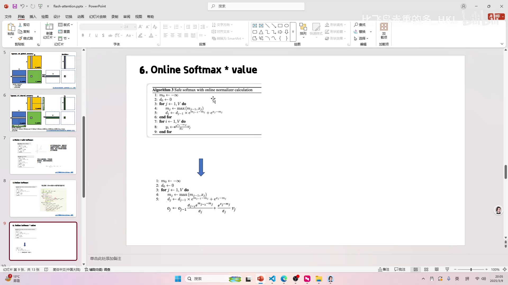
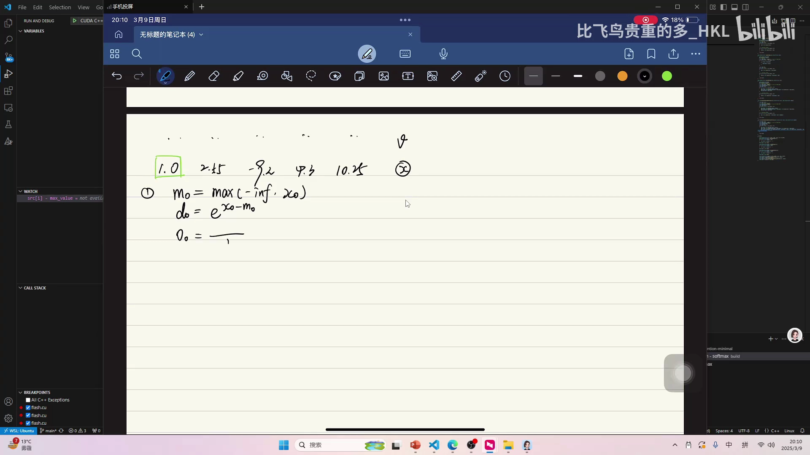
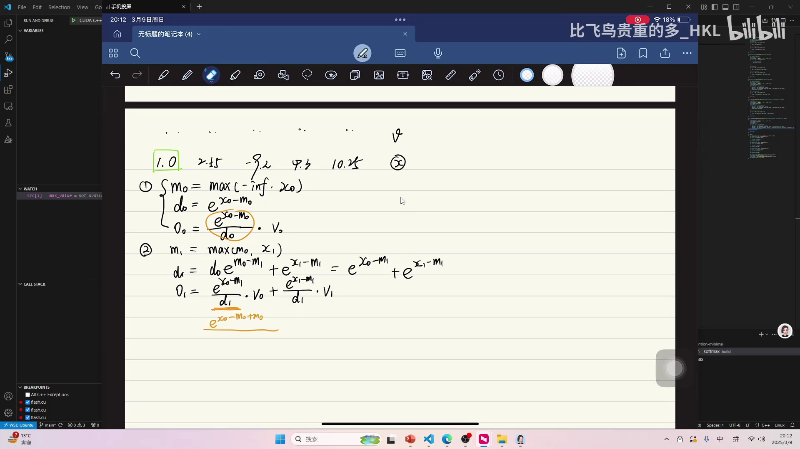

# 第07讲：Online Softmax 与 Value 的点积优化——FlashAttention 最核心的一步

> 视频来源：[【Flash Atten】6.online softmax 与 value 的点积优化](https://www.bilibili.com/video/BV1FM9XYoEQ5/?p=7)（B 站 UP 主「比飞鸟贵重的多_HKL」）

## 本讲要解决的核心问题（SCQA）

**背景**：上一讲（[第06讲](第06讲_online_softmax（重制版）.md)）用 online softmax 把「求最大值」和「求和」合并成了一次遍历。但 attention 的完整计算是 `softmax(QKᵀ) · V`——我们最终要的是 softmax 结果与 **V 的点积**。

**冲突**：即使 online softmax 只遍历两次，它仍然需要**对每一个元素算出 softmax 值并把它存起来**，因为要拿这些值去和 V 相乘。换句话说，中间那个巨大的权重矩阵（R）依然省不掉，第04讲「消灭 R 矩阵」的目标还没达成。

**疑问**：能不能把 online softmax 和「乘 V」也合并起来，做到**来一个数就把它对最终输出的贡献累加进去**，从而彻底不需要存储/读取整个 softmax 矩阵？

**回答（中心思想）**：能。沿用 online softmax 的迭代思想，把**输出向量 O** 也做成在线更新：

```
O_j = O_{j-1} · (D_{j-1} / D_j) · e^{M_{j-1} − M_j}  +  (e^{x_j − M_j} / D_j) · V_j
```

这样一来，不需要先得到整行的 softmax 结果，也能一步步算出 `softmax(x)·V`。**这正是 FlashAttention 能被「分块、在线」计算的最核心思想**——分块矩阵的中间结果无需落盘，整条 attention 链路得以融合。[【跳转到 00:00】](https://www.bilibili.com/video/BV1FM9XYoEQ5/?p=7&t=0)

---

## 一、先看现状：online softmax 还不够

回顾一下我们的进展：

- 第04讲证明了：**没有 softmax** 时，Q、K、V 可以用分块矩阵的方式融合计算，省掉中间矩阵 R 的存储与读写。
- 但 softmax 是拦路虎：它要求先拿到整行（求最大值、求和），才能归一化，进而才能和 V 相乘。


第06讲的 online softmax 把「求最大值」和「求和」合并到一次遍历，但**每个元素的 softmax 值仍要算出来并保存**，后续才能拿它们去乘 V。如果这两步（算 softmax、乘 V）不能合并，那中间结果还是要存、要读、要写——优化就还没完成。[【跳转到 00:54】](https://www.bilibili.com/video/BV1FM9XYoEQ5/?p=7&t=54)

---

## 二、把问题简化：一行 softmax 与 V 的点积

为了避免被整个矩阵的复杂度干扰，作者把问题**简化到一行**：

- 有一行注意力分数 `x_0, x_1, …, x_n`（softmax 的输入）；
- 有一列对应的 `V_0, V_1, …, V_n`；
- 我们要算的是 `softmax(x) · V`：先把这一行 softmax 求出来，再和这一列做**点积**，得到输出。

在完整的 attention 里，这一行对一列的点积，正对应输出矩阵中的一个元素。**只要这个「softmax · V」能做成在线迭代，整个 FlashAttention 就能省掉 R 的存储。**[【跳转到 02:15】](https://www.bilibili.com/video/BV1FM9XYoEQ5/?p=7&t=135)



---

## 三、不做优化 vs 优化：结果相同，但只有一个循环

作者先给出「不做优化」的版本 `online_softmax_with_dot_product`：前面求 `max`、`sum` 的部分与普通 online softmax 一样，只是第二段循环里**先算出每个 softmax 值，再乘 V 并累加**：[【跳转到 03:22】](https://www.bilibili.com/video/BV1FM9XYoEQ5/?p=7&t=202)

```cpp
// 不做优化：先求 max/sum，再逐个算 softmax 并乘 V 累加
float max_value = -99999.f, pre_max_value = 0.f, sum = 0.f;
for (int i = 0; i < src.size(); i++) {
    max_value = std::max(max_value, src[i]);
    sum = sum * std::exp(pre_max_value - max_value) + std::exp(src[i] - max_value);
    pre_max_value = max_value;
}

float dst = 0.f;
for (int i = 0; i < src.size(); i++) {
    dst += std::exp(src[i] - max_value) / sum * value[i];   // 用到整行 softmax，依赖两次循环
}
```

它依然有一个完整的循环来「算 softmax 并乘 V」——这就意味着中间值必须被算出、被保存。


而优化版本（视频里叫 `..._perfect`）**只有一个循环**，来一个数就迭代地更新结果，输出与上面**完全一致**：


关键就在于把「乘 V 的累加」也纳入迭代。下面来推导它。[【跳转到 04:17】](https://www.bilibili.com/video/BV1FM9XYoEQ5/?p=7&t=257)

---

## 四、推导：让 O_j 由 O_{j-1} 递推

直观上，`softmax(x)·V` 的正确结果可以写成「**带权（归一化后的）V 之和**」：

```
O_j = ( Σ_{i≤j} e^{x_i − M_j} · V_i ) / D_j
```

其中 `D_j = Σ_{i≤j} e^{x_i − M_j}`，`M_j` 是当前最大值。注意分子分母都用**当前**的最大值 `M_j`，这样数值是安全的。

### 4.1 第一组

```
M₀ = max(−inf, x₀)
D₀ = e^{x₀ − M₀}
O₀ = ( e^{x₀ − M₀} / D₀ ) · V₀
```

因为只有一个数，`O₀` 就是 `V₀` 本身（softmax 只有一个元素时权重为 1）。[【跳转到 07:30】](https://www.bilibili.com/video/BV1FM9XYoEQ5/?p=7&t=450)



### 4.2 第二组：常规写法

按定义直接写：

```
M₁ = max(M₀, x₁)
D₁ = e^{x₀ − M₁} + e^{x₁ − M₁}
O₁ = ( e^{x₀ − M₁} / D₁ ) · V₀  +  ( e^{x₁ − M₁} / D₁ ) · V₁
```

这是「正确但不迭代」的形式——和上一讲一样，我们要把它改写成由 `O₀` 表达。

### 4.3 用同样的技巧把 O₁ 凑出 O₀

对第一项 `e^{x₀ − M₁}` 做「加 `M₀` 减 `M₀`」再拆指数：

```
e^{x₀ − M₁} = e^{x₀ − M₀} · e^{M₀ − M₁}
```

代入 `O₁` 的第一项，并**分子分母同乘 `D₀`**，把它凑成 `O₀` 的形状：

```
第一项 = ( e^{x₀ − M₀} / D₀ ) · V₀ · ( D₀ / D₁ ) · e^{M₀ − M₁}
       = O₀ · ( D₀ / D₁ ) · e^{M₀ − M₁}
```

第二项保持不变。于是：

```
O₁ = O₀ · ( D₀ / D₁ ) · e^{M₀ − M₁}  +  ( e^{x₁ − M₁} / D₁ ) · V₁
```

`O₁` 成功由 `O₀` 表达出来了！[【跳转到 10:00】](https://www.bilibili.com/video/BV1FM9XYoEQ5/?p=7&t=600)



### 4.4 通用迭代公式

重复同样的过程，得到通用的在线更新式：

```
O_j = O_{j-1} · ( D_{j-1} / D_j ) · e^{M_{j-1} − M_j}  +  ( e^{x_j − M_j} / D_j ) · V_j
```

它和上一讲 `D_j` 的递推**结构完全一致**：

- `D`、`M` 的在线更新（第06讲）继续沿用；
- 复制一份 `D` 的「乘修正因子再加新项」模式，作用到 `O` 上，新项还要**乘上 `V_j`**。

作者说，念起来这些符号可能觉得复杂，但**推导流程其实和上一讲一模一样**，没有想象中那么难。[【跳转到 11:40】](https://www.bilibili.com/video/BV1FM9XYoEQ5/?p=7&t=700)

---

## 五、意义：这就是 FlashAttention 最核心的思想

把这段「online softmax × value」的流程放回 attention：

- 对于 C×N 的注意力分数，我们**不需要**先把整行 softmax 算完、存下来，再和 V 相乘；
- 而是可以**一边扫过每个分数、一边把它对输出向量的贡献累加**；
- 于是 FlashAttention 在**分块**计算时，块与块之间只需传递 `M`、`D` 和输出 `O` 这几个小的状态量，而**不必存储整块中间矩阵 R**。

作者明确说：**FlashAttention 最底层、也最难理解的点就在这里**。理解了第06、07两讲的推导，再去看代码，如果具备 CUDA 编程基础，应该能看懂它在做什么。后续课程会带大家看（甚至从头写）FlashAttention 的程序。[【跳转到 14:27】](https://www.bilibili.com/video/BV1FM9XYoEQ5/?p=7&t=867)

---

## 小结

- **动机**：online softmax 虽合并了 max/sum，但仍要逐元素算并保存 softmax 值；要彻底消除中间矩阵，必须把「乘 V」也融合进来。
- **简化**：把注意力集中到「一行 softmax 与一列 V 的点积」。
- **推导手法**：沿用第06讲的「加减同一个数 + 指数拆分 + 分子分母同乘 D₀」，把 `O₁` 凑成由 `O₀` 表达的迭代式。
- **核心公式**：
  `M_j = max(M_{j-1}, x_j)`，
  `D_j = D_{j-1} · e^{M_{j-1} − M_j} + e^{x_j − M_j}`，
  `O_j = O_{j-1} · (D_{j-1}/D_j) · e^{M_{j-1} − M_j} + (e^{x_j − M_j}/D_j) · V_j`。
- **意义**：attention 可以「边扫分数边累加输出」，块间只传递 `M、D、O` 等小状态量，**无需存储中间权重矩阵 R**——这就是 FlashAttention 的分块在线计算之所以成立的根本。
- **下一步**：把核心思想落到 FlashAttention 的 CUDA 程序实现。

## 关键术语速查

| 术语 | 一句话解释 |
| --- | --- |
| attention weight | `softmax(QKᵀ/√d_k)` 得到的权重矩阵，也就是待消除的中间矩阵 R |
| online softmax | 用迭代方式一次遍历求出最大值 M 与指数和 D（见第06讲） |
| 点积（dot product） | 两个向量对应元素相乘再求和；softmax 行与 V 列的点积即输出元素 |
| M（最大值） | 当前处理范围内分数最大值，保证数值安全 |
| D（分母） | 当前范围相对 M 的指数和 |
| O（输出） | 当前范围内 `softmax(x)·V` 的累积结果，在线更新 |
| 在线更新/迭代 | 每来一个数就更新 M、D、O，而非等全部算完再处理 |
| 中间矩阵 R | `QKᵀ` 的完整结果；本讲的优化目标就是让它不被存储 |
| FlashAttention | 通过分块与在线 softmax，把 attention 融合成一个不落盘中间结果的算子 |
| 修正因子 | 迭代式中形如 `e^{M_{j-1} − M_j}` 的缩放项，用于用旧状态修正出新状态 |
