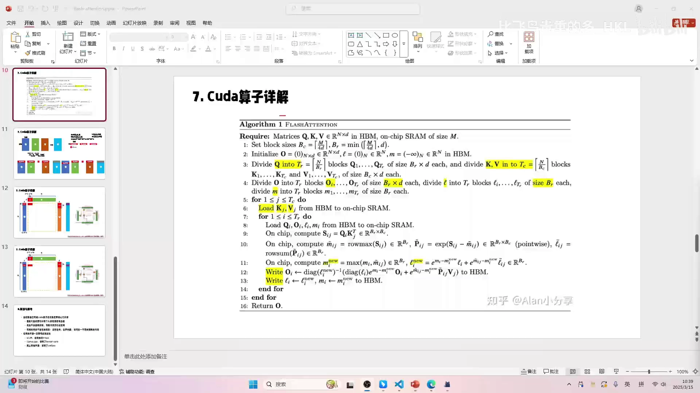

# 第08讲：CUDA 算子解析——把在线 softmax 落到 FlashAttention kernel

> 视频来源：[【Flash Atten】7.cuda 算子解析](https://www.bilibili.com/video/BV1FM9XYoEQ5/?p=8)（B 站 UP 主「比飞鸟贵重的多_HKL」）

## 本讲要解决的核心问题（SCQA）

**背景**：第06、07讲推导出了 online softmax 与 value 点积的在线更新公式，理论上证明了 attention 可以不存储中间矩阵 R。现在要把这套「纸上公式」落成一个真正的 CUDA kernel。

**冲突**：作者本以为「最难的原理都讲完了，写代码应该简单」，结果自己从头写了一遍才发现**很痛苦**——维度、分块、循环顺序、寄存器里的局部最大值、L/M 的读写与同步，处处容易想不明白。他甚至明确说：**自己重写的这份代码没跑过，大概率结果不对**。

**疑问**：FlashAttention 的 CUDA 算子到底怎么组织？每个 block 干什么、两层循环谁快谁慢、分块多大、每一步在算什么？

**回答（中心思想）**：以论文伪代码（Algorithm 1）为主线，按「**分配 → 搬块 → 算 QKᵀ → 行内 max/exp/sum → 在线更新 O 与 L/M → 写回**」的顺序拆解内核：grid 按 (batch, head) 分成 16 个 block、每块 32 线程；**外层循环 K/V（慢）、内层循环 Q（快）**；中间分数块只放 shared memory，不落显存；每处理完一个 K/V 块，就用 online softmax 公式更新输出 O 与统计量 L、M。[【跳转到 00:00】](https://www.bilibili.com/video/BV1FM9XYoEQ5/?p=8&t=0)

---

## 一、先把维度与并行划分讲清楚

作者先画出 tensor 维度（按论文，而非参考代码的 `flash.cu`）：

- 把 **Q、K、V 视为同一套主维度**（实际实现里 V 的维度可以更长，Q、K 必须相同，这属于题外话）；
- 示例维度：`[batch=2, n_head=8, seq_len=256, head_embd=128]`；
- **grid = [2, 8, 1]**，即 batch × head = 16 个 block，这 16 组的计算互不影响，可以各算各的；
- **block = [32, 1, 1]**，每个 block 只分配 32 个线程（一个 warp）；
- 维护两个量：**L（求和，也叫 ℓ）** 和 **M（行最大值，也叫 m）**，形状 `[2, 8, 256]`，存在 HBM 里。


关键理解：**中间矩阵 R 不需要存**（用小块、用 shared memory 即可），但 **L 和 M 必须存下来**——它们是跨 block 迭代的状态量。这正是 FlashAttention「用小块共享内存 + 只落少量状态」的核心。[【跳转到 02:47】](https://www.bilibili.com/video/BV1FM9XYoEQ5/?p=8&t=167)

先回顾一下论文给出的算法骨架（Algorithm 1 FlashAttention）：

```
Require: Q, K, V ∈ R^{N×d} 在 HBM；片上 SRAM 大小 M
1: 设定分块大小 Bc = ⌈M/(4d)⌉, Br = min(⌈M/(4d)⌉, d)
2: 初始化 O = 0, ℓ = 0, m = -∞（均在 HBM）
3: 把 Q 分成 Tr = ⌈N/Br⌉ 块；把 K、V 分成 Tc = ⌈N/Bc⌉ 块
4: 把 O、ℓ、m 也按 Br 分块
5: for j = 1..Tc do
6:   从 HBM 载入 Kj、Vj 到 SRAM
7:   for i = 1..Tr do
8:     从 HBM 载入 Qi、Oi、ℓi、mi 到 SRAM
9:     在片上算 Sij = Qi · Kjᵀ
10:    算行最大值 mij = rowmax(Sij)；Pij = exp(Sij − mij)；ℓ̃ij = rowsum(Pij)
11:    在线更新 m_new、ℓ_new
12:    写回 Oi（用 Pij·Vj 与缩放系数更新）
13:    写回 ℓi、mi
14:   end for
15: end for
16: 返回 O
```



---

## 二、两层循环：外层 K/V（慢），内层 Q（快）

内核有两层循环，顺序很关键：

- **外层循环遍历 K 和 V**（j），所以 K、V 的移动是**慢**的；
- **内层循环遍历 Q**（i），所以 Q 的移动是**快**的。

执行过程是：

1. Q 从头到尾走一遍（内层循环）；
2. Q 回到起始位置；
3. K 和 V **一起**往下挪一个块；
4. Q 再走一遍；
5. 重复，直到 K、V 也走完。


作者特别更正了一个之前讲错的地方：**K 和 V 是一起移动的**（并非 K 单独动、V 不动）。有观众在弹幕/评论区指出过，他说对方是对的。

这个分块思路，和前面第04讲的「三个矩阵相乘合并」是一致的——只是现在把在线 softmax 融了进来。[【跳转到 06:18】](https://www.bilibili.com/video/BV1FM9XYoEQ5/?p=8&t=378)


---

## 三、分块大小 BR/BC 与 SRAM 分配

分块大小从 SRAM 容量反推：

- `Bc = ⌈M / (4d)⌉`
- `Br = min(⌈M / (4d)⌉, d)`

其中 `M` 是片上 SRAM 大小，`d` 是 head 维度。因为 `Br` 跟 `d` 取最小值，所以：

- 当 **d 较大**时，`Bc` 和 `Br` 相等；
- 当 **d 较小**时，`Br = d`，而 `Bc` 会比 `Br` 大。

`BR`/`BC` 的命名来自 **R = row（行）、C = column（列）**。

在参考代码 `flash.cu` 里，为了简单，**BC 和 BR 都取了 32**，于是 `Tc = N/BC`、`Tr = N/BR` 也相等。

**SRAM 大小**的算法两者不同但结果一致：

- 原代码：`3 · Bc · d + Bc · Br`（当 Bc=Br 时）；
- 作者版本：`2 · d · Br + d · Bc + Br · Bc`。

在 `BC=BR` 的假设下二者相等；作者的写法是为了照顾 `BC ≠ BR` 的一般情况。[【跳转到 07:33】](https://www.bilibili.com/video/BV1FM9XYoEQ5/?p=8&t=453)

---

## 四、逐步解析 kernel 的每一步

### 4.1 为每个 block 做 QKV 偏移

不同 block 处理不同的 (batch, head)，作者喜欢**在入口处就对 Q/K/V 的指针做好偏移**（原始代码是在内部边用边加）。这样每个 block 进来就直接对着自己那份 QKV 算，不容易乱。shared memory 也只需申请一组，各 block 互相独立。[【跳转到 10:16】](https://www.bilibili.com/video/BV1FM9XYoEQ5/?p=8&t=616)

### 4.2 搬 K、V 到 shared memory

外层循环里，先把 K、V 的一块搬到 SRAM。这里要注意：线程只有 32 个，但要搬 `D × BC` 个数，**一次搬不完，必须再套一层循环**，让每个线程搬多个数。

搬运后通常会 `__syncthreads()`。作者对此提出疑问：既然一个 block 只有一个 warp（32 线程），**它天生就是同步的**，这个同步其实可加可不加；而且原始代码在有的地方加了同步、有的地方又没加，他觉得不太一致（但实际影响应该不大）。[【跳转到 12:39】](https://www.bilibili.com/video/BV1FM9XYoEQ5/?p=8&t=759)

### 4.3 算 QKᵀ（不做转置）

搬完 QKV，就计算 `S = Q · Kᵀ`。这里有个细节：**代码里不需要真的把 K 转置**。因为标准矩阵乘法里，按行加载 K 本身就相当于「转置后的访问」；而且「一行乘一行」反而更利于**合并访存（coalescing）**。

算完乘上 `softmax_scale`（即 `1/√d`），把分数块存到 shared memory 里的 `S`。

### 4.4 行内最大值、指数、求和

接下来对分数块做 online softmax 所需的统计：

- **行最大值**：每个线程有一个寄存器，算完后相当于得到一行里的若干局部最大值，再做归约得到该行最大值 `row_m`；
- **指数**：`exp(S − row_m)`，写回 `S`；
- **行和**：把指数结果累加得到 `row_l`。

### 4.5 在线更新 O 与 L、M

然后取出上一步存在全局内存里的 `L`、`M`（初始为 0 和 −∞），用第06、07讲的 online softmax 公式更新：

```
row_m_new = max(row_m_prev, row_m)
row_l_new = row_l_prev · exp(row_m_prev − row_m_new) + row_l · exp(row_m − row_m_new)
O         = O_prev · (row_l_prev / row_l_new) · exp(row_m_prev − row_m_new)
          + (1 / row_l_new) · exp(row_m − row_m_new) · (S · V)
```

接着算 `S · V`，代入上面的公式更新输出 O；最后把更新后的 `L`、`M` **写回全局内存**，供下一个 K/V 块使用。[【跳转到 16:29】](https://www.bilibili.com/video/BV1FM9XYoEQ5/?p=8&t=989)


---

## 五、代码里的风格选择与几处疑问

作者在讲解中穿插了几点自己的观察，也很有价值：

- **偏移风格**：把 Q/K/V 偏移放在每个 block 入口，而不是内部零散地加，更不易出错；
- **同步位置**：一个 warp 时同步「天生成立」，加不加影响不大，但原代码加得不太一致；
- **BC 与 BR**：原代码用同一个数 32，导致 `Tc = Tr`，有些地方本该用 `BR` 却写成 `BC`；作者在自己的版本里区分了 `BC` 与 `BR`（虽然最后发现很多地方其实还是 BC）；
- **DST 更新公式**：作者坦言那段很长的输出更新公式，他直接照搬了原代码、只调了索引，「现在都不太确定写得对不对」。

作者再一次强调：**他重写的这份代码没有验证过，大概率/约 90% 结果是错的**，写它的过程本身就很痛苦。为什么痛苦？——留到下一讲。[【跳转到 17:42】](https://www.bilibili.com/video/BV1FM9XYoEQ5/?p=8&t=1062)

---

## 小结

- **并行划分**：grid = [batch, head]，每 block 32 线程（一个 warp）；Q/K/V/O、L、M 的维度与形状要一一对应。
- **状态量**：中间矩阵 R 不存，只把 **L（行和）、M（行最大值）、O（输出）** 存 HBM，跨 block 迭代。
- **两层循环**：外层 K/V（慢）、内层 Q（快）；K 和 V 是**一起**移动的。
- **分块**：`Bc = ⌈M/(4d)⌉`，`Br = min(⌈M/(4d)⌉, d)`；参考代码里 BC=BR=32。
- **kernel 步骤**：QKV 偏移 → 搬 K/V 到 SRAM → 算 QKᵀ（不转置、利于合并访存） → 乘 `1/√d` → 行 max/exp/sum → 用 online softmax 公式更新 O 与 L/M → 写回 L/M。
- **工程疑点**：一个 warp 下的同步可加可不加、原代码 BC/BR 混用、输出更新公式很长且难核对。
- **感悟**：即使原理讲通了，真正写 CUDA kernel 依然困难——这也是作者不建议「照抄一遍就完事」的原因。

## 关键术语速查

| 术语 | 一句话解释 |
| --- | --- |
| CUDA kernel | 在 GPU 上并行执行的函数 |
| grid / block / thread | CUDA 的三级并行划分；本讲 grid=[batch, head]，每 block 32 线程 |
| warp | 32 个线程组成的执行单元；一个 block 只有一个 warp 时天生同步 |
| shared memory（SRAM） | GPU 片上高速缓存，用来暂存 Q/K/V 块与分数块 |
| HBM | 显存；中间结果尽量不落 HBM 是 FlashAttention 的优化目标 |
| Bc / Br | K/V 块与 Q 块的列/行分块大小 |
| QKᵀ | 注意力分数矩阵；实现中通过按行加载 K 免去显式转置 |
| rowmax / rowsum | 对分数矩阵按行求最大值 / 求和，供 softmax 使用 |
| softmax_scale | `1/√d`，对分数做缩放，常直接融进 QKᵀ 乘法 |
| L / M | 每行的指数和（ℓ）与最大值（m），跨 K/V 块迭代、需存 HBM |
| online 更新 | 每处理一个 K/V 块就用第06、07讲公式更新 O、L、M |
| `__syncthreads()` | block 内线程同步；单 warp 时可省略 |
| 合并访存（coalescing） | 相邻线程访问相邻内存，提高显存带宽利用率 |
