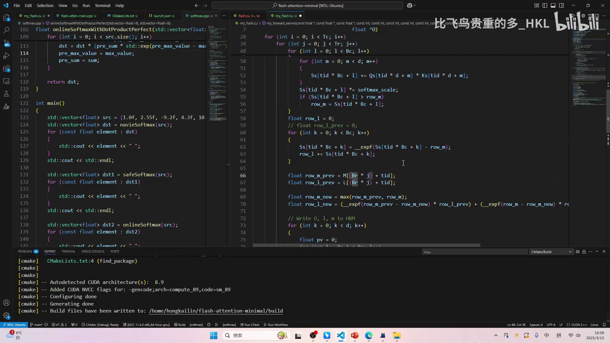
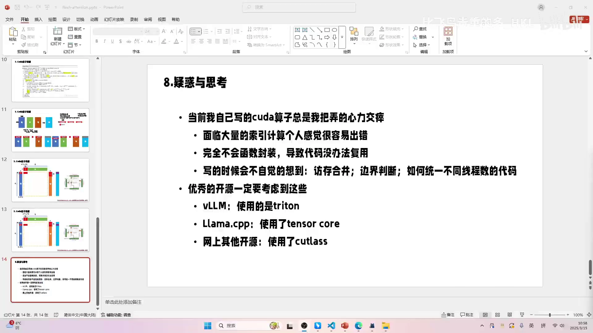
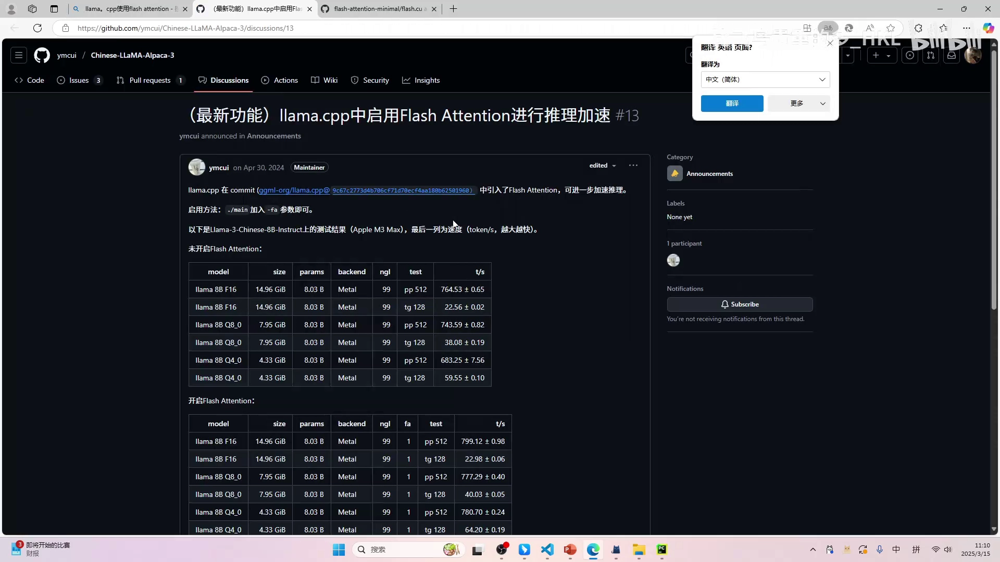
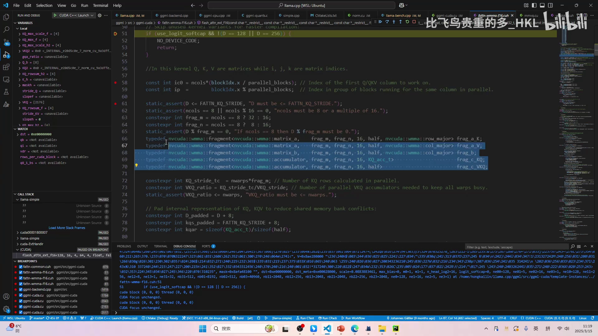

# 第09讲：疑惑与思考——写 CUDA 算子为何让人心力交瘁，以及「不止 FlashAttention」

> 视频来源：[【Flash Atten】8.疑惑与思考（请认真听很关键！）](https://www.bilibili.com/video/BV1FM9XYoEQ5/?p=9)（B 站 UP 主「比飞鸟贵重的多_HKL」）

## 本讲要解决的核心问题（SCQA）

**背景**：前面八讲把 FlashAttention 的原理与 CUDA 实现都过了一遍。但作者在亲手写这份算子的过程中，反复感到「很痛苦」「心力交瘁」。

**冲突**：痛苦不是因为他不会原理，而是**手写 CUDA 算子本身的工程性难题**：索引太多易错、不会函数封装导致无法复用、写的时候还要时刻惦记访存合并、边界判断、线程数统一……他参考的开源 `flash.cu` 甚至**把线程数写死成 32**，改一下就跑不起来，只能算教学 demo，登不上大雅之堂。

**疑问**：一份「优秀、能用于生产」的 FlashAttention 到底该长什么样？手写 CUDA 的这些坑，业界是怎么绕过的？

**回答（中心思想）**：作者带着这些疑惑去**验证三家真实实现**，得到的结论是——**不要什么都手撸**：vLLM 用 **Triton**（把很多事交给编译器）、llama.cpp 用 **Tensor Core（WMMA）**、还有的开源用 **CUTLASS**。真正值得学的不是某个算子本身，而是「**发现问题 → 明确需求 → 学习相应工具**」的研究思路——这也是系列标题「**不止 FlashAttention**」的含义。[【跳转到 00:00】](https://www.bilibili.com/video/BV1FM9XYoEQ5/?p=9&t=0)

---

## 一、疑惑：手写 CUDA 算子为什么让我心力交瘁

作者把痛苦归纳成四点，句句都是真实感受。

### 1.1 面对大量索引计算，非常容易出错

```cpp
// my_flash.cu 里满屏都是索引
for (int i = 0; i < Tr; i++)
  for (int j = 0; j < Tc; j++)
    for (int l = 0; l < Bc; l++) {
      for (int m = 0; m < d; m++)
        Ss[tid * Bc + l] += Qs[tid * d + m] * Ks[tid * d + m];
      Ss[tid * Bc + l] *= softmax_scale;
      if (Ss[tid * Bc + l] > row_m) row_m = Ss[tid * Bc + l];
    }
```

写的时候要不断想：哪个地方是连续的？第一组加第二组再加第三组？每个线程对应哪个位置？**大量都在做索引操作**，只要一个很小的索引写错，整体就运行不出来，而且还**很难检查**。他觉得这不合理。[【跳转到 01:06】](https://www.bilibili.com/video/BV1FM9XYoEQ5/?p=9&t=66)



### 1.2 完全不会函数封装，导致代码无法复用

回忆 llama.cpp，它里面有很多封装：求最大值封装了、求和封装了……但作者自己写程序时，**感觉没有能力对 CUDA 算子做封装**，于是代码永远无法复用——写矩阵乘、又写一个矩阵乘，每次都要从头想，而且每个矩阵乘还不一样，非常痛苦。[【跳转到 02:01】](https://www.bilibili.com/video/BV1FM9XYoEQ5/?p=9&t=121)

### 1.3 写的时候会不自觉惦记访存合并、边界判断、线程数统一

- **访存合并**：自从学完访存合并，写代码就不自觉想「这里到底合没合并」，这本身也成了心理负担；
- **边界判断**：demo 可以不管边界，但真实输入 token 数**不可能整除**（比如输入 110 个 token），生产代码必须处理；
- **统一不同线程数**：怎么让同一份代码适配不同线程数，是需要设计的。[【跳转到 02:51】](https://www.bilibili.com/video/BV1FM9XYoEQ5/?p=9&t=171)

### 1.4 参考实现「写死」了线程数，只能当教学 demo

作者指出开源 `flash.cu` 最大的问题：它**把线程数设为 32、把块数 BC 和 BR 也设成 32**，整个程序就基于这两个 32 编死了。结果：

- 把它改成 2，**代码直接跑不起来**；
- 而他平时做性能调优的方式，恰恰就是「改线程数、改分块，看效率会不会更高」——这个代码做不了；
- 一旦在开头定义了 block 数量，程序就跟着定死了。所以他写的这份、以及这份参考实现，**只能作教学和 demo，不具备开源/生产价值**。[【跳转到 04:48】](https://www.bilibili.com/video/BV1FM9XYoEQ5/?p=9&t=288)



作者坦言，他为此至少思考了两天，想「怎么才能让程序统一管理不同线程数」，也有了一点眉目，但**不确定自己的方案对不对**——如果对，它就该是行业统一规范。于是他决定去看**真实、能被大家使用的 FlashAttention** 是怎么写的。

---

## 二、思考：一份优秀的开源应该具备什么

作者先立下「优秀开源」的几条标准，作为验证参考实现的尺子：[【跳转到 07:35】](https://www.bilibili.com/video/BV1FM9XYoEQ5/?p=9&t=455)

1. **不能有大量的索引计算**（不然作者自己也写得累）；
2. **要有函数封装**，让代码能复用；
3. **要考虑访存合并**，这样才能快；
4. **要处理边界**（N 不一定能被整除）；
5. **要能统一不同线程数**（不能像自己那样把数写死）。

带着这把尺子，他参考了三个实现。

---

## 三、验证：三种真实实现分别怎么做的

### 3.1 vLLM：用 Triton，而非手写 CUDA

vLLM 的 FlashAttention 用的是 **Triton**（一种更高层的 GPU 编程语言），而不是 CUDA。作者认为这可能是**大势所趋**：Triton 把很多优化交给**编译器**处理，效果可能比自己手写 CUDA 还好——编译器虽比不上顶尖大佬，但一定会比新手写得强。不过他也说，Triton 其实是**绕开了**他的问题，而不是真正解决。[【跳转到 09:20】](https://www.bilibili.com/video/BV1FM9XYoEQ5/?p=9&t=560)

### 3.2 llama.cpp：通过 `-FA` 启用，进去发现用了 Tensor Core

作者一开始以为 llama.cpp 转 GGUF 时就会处理 FlashAttention，结果在 Python 代码里**根本没搜到相关内容**。后来百度到：运行 llama.cpp 时加一个 `-FA` 参数即可启用 FlashAttention。[【跳转到 10:58】](https://www.bilibili.com/video/BV1FM9XYoEQ5/?p=9&t=658)



顺着他展示了完整的排查路径：

1. `simple.cpp` 里没有 `-FA` 入口 → 往下找参数；
2. 在 `common/arg.cpp` 看到 `-fa` / `--flash-attn` 的解析；
3. 最终在 `llama.h` 里找到 `llama_context_params` 结构体中的布尔字段 **`bool flash_attn;`**；
4. 在 `simple.cpp` 里把该参数赋为 `true`，运行——**真的进到了 FlashAttention 的 kernel 里**。[【跳转到 13:45】](https://www.bilibili.com/video/BV1FM9XYoEQ5/?p=9&t=825)


作者说：「只要代码能进去，我就一定能读明白。」他 debug 进 kernel 后观察到：

- 它用的是 **F16**；
- `ne` 是 feature 维度（D），在这些大模型里 D 通常是 64/80/96/112/128/256 这几种；
- 传给 dst kernel 的输入有四个（Q、K、V 再加上与 mask/softmax 相关的），这很合理；
- 最终看到 `nvcc::wmma` 命名空间与 `fragment` 类型——**WMMA 就是 tensor core（张量核心）**。



整体感受：**真实实现更复杂，但比自己的代码「少了很多索引」**——很多功能交给第三方库/封装做掉了；它考虑得更多，却没有像自己那样左一个索引右一个索引。同时它也印证了「循环顺序」等细节：FlashAttention **V1 与 V2 的差别只在于调换了循环顺序**（V3 作者还没看）。[【跳转到 14:35】](https://www.bilibili.com/video/BV1FM9XYoEQ5/?p=9&t=875)

### 3.3 网上其他开源：用 CUTLASS

作者还看到不少开源用了 **CUTLASS**（NVIDIA 的 CUDA 模板库），包括 DeepSeek 的一些优化。他不会读 CUTLASS，但判断这应该也是需要学习的内容。

---

## 四、下一步：按需学习 Tensor Core 与 CUTLASS

由此，作者确定了下一阶段的方向：

- **Tensor Core（WMMA）**：因为 llama.cpp 的 FlashAttention 用到了它；
- **CUTLASS**：因为很多 FlashAttention 实现用到它。

他强调一个学习原则：**先明确为什么学，再学**。无论是 Tensor Core 还是 CUTLASS，用它们的目的都是「要么让代码写得更好、要么让编程更方便」。如果一上来就学第三方库，你会不明白它为什么这么设计、意义是什么，只会觉得累。**只有自己先遇到问题，才能体会到某些库用起来为什么更方便。**[【跳转到 23:14】](https://www.bilibili.com/video/BV1FM9XYoEQ5/?p=9&t=1394)

---

## 五、结语：不止 FlashAttention

这个系列到此完结。作者承认最后两讲讲得有点乱——主要是写 FlashAttention 让自己太烦躁了。

课程名字叫「**FlashAttention，但不只 FlashAttention**」，他想传递的其实是一种**学习和研究的思路**：「原理我讲了，也讲得不够好、遇到了很多问题，后面的内容会基于这些问题去分析。」

他也提醒：如果早看到某篇讲得非常好的博客，softmax 那部分应该能讲得更清楚。最后他提到，下一系列原本想讲 vLLM，但决定先放一放——他想先**精进自己写 CUDA / kernel 的能力**（甚至之后写写 cuBLAS 之类的库），目标是让写代码更得心应手，**不要什么都手撸**。[【跳转到 25:11】](https://www.bilibili.com/video/BV1FM9XYoEQ5/?p=9&t=1511)

---

## 小结

- **手写 CUDA 的四大痛点**：索引计算多且易错；缺乏函数封装、无法复用；要惦记访存合并/边界判断/线程数统一；参考实现**写死线程数**，只能当教学 demo。
- **优秀开源的标准**：少索引、有封装、考虑访存合并、处理边界、统一不同线程数。
- **三种真实实现**：vLLM → **Triton**（编译器帮忙，绕开了问题）；llama.cpp → **Tensor Core（WMMA）**，用 `-FA` 启用、debug 进 kernel 可见；其他开源 → **CUTLASS**。
- **重要认知**：FlashAttention 的工程实现远比手写 demo 复杂，但少了大量索引、多了封装与第三方库。
- **V1/V2 差异**：仅调换循环顺序以提升并行性（V2）。
- **方法论**：**按需学习**——先遇到问题、明确「为什么要学」，再去学 Tensor Core / CUTLASS / Triton，否则只会越学越累。
- **系列主旨**：「不止 FlashAttention」——真正要掌握的是发现问题、明确需求、选择工具的研究与学习思路。

## 关键术语速查

| 术语 | 一句话解释 |
| --- | --- |
| CUDA 算子 | 用 CUDA 手写的 GPU kernel；本讲讨论其工程性难点 |
| 索引计算 | 手工推算每个线程对应的数据位置，多且易错 |
| 函数封装 | 把通用逻辑（如求最大值/求和）抽成可复用函数 |
| 访存合并（coalescing） | 相邻线程访问相邻内存以提升带宽利用率 |
| 边界判断 | 处理输入长度不能被分块整除的情况（如 N=110） |
| 统一不同线程数 | 让同一份代码适配不同 block/线程配置，便于调优 |
| Triton | OpenAI 的高层 GPU 编程语言，很多优化交给编译器；vLLM 用它写 FlashAttention |
| Tensor Core / WMMA | NVIDIA GPU 上的矩阵乘加速单元；WMMA 是其编程接口 |
| CUTLASS | NVIDIA 的 CUDA C++ 模板库，用于高性能 GEMM/算子 |
| `flash_attn` 参数 | llama.cpp 中启用 FlashAttention 的开关（命令行 `-FA`） |
| FlashAttention V2 | 相对 V1 调换循环顺序，提升并行性 |
| 按需学习 | 先有问题与需求，再学对应工具，避免为学而学 |
