# 第02讲_寻找切入点 原始文稿（图-字幕分栏）

| 字幕文本 | 画面 |
| :--- | ---: |
| 好的，我们这节课就正式进入 FlashAttention 的学习。这是这个系列课程的第一节——第一节呢，是"寻找切入点"。 [【跳转到 00:00】](https://www.bilibili.com/video/BV1FM9XYoEQ5/?p=2&t=0) |  |
| 大家可以先看下我这个系列课程的风格：不太像之前那样直接讲知识点，而是想给大家讲一个完整的学习流程。第一个环节就是"寻找切入点"，这很关键——我感觉学习任何东西都要先找到切入点。我个人的整体思路是这样的：先直接去找视频，我一般都是在 B 站上找，看看有没有讲得比较好的。看完一圈之后，我大概就对 FlashAttention 有一个整体的了解了。 [【跳转到 00:07】](https://www.bilibili.com/video/BV1FM9XYoEQ5/?p=2&t=7) |  |
| 不至于完全不懂、也不知道它干嘛——我在网上已经看过很多视频讲过了，大家也可以先看一看。那些视频都讲到：在 attention 的计算里，访存操作耗费的时间是很长的。不过要注意，我这个系列课程是基于你已经学过我之前的内容：CUDA 编程、CUDA 调优（NCU）、以及 llama.cpp 的一些算子开发。 [【跳转到 00:32】](https://www.bilibili.com/video/BV1FM9XYoEQ5/?p=2&t=32) |  |
| 这些都是循序渐进的，你不要一上来就看我这门课。就我在网上看的视频而言，我发现它们都在反复强调一件事：attention 这个操作，先有一个 Q 和 K 的转置相乘，然后走一个 softmax，再乘个 V，对吧？我们先略去加 mask 的那个流程。 [【跳转到 00:57】](https://www.bilibili.com/video/BV1FM9XYoEQ5/?p=2&t=57) |  |
| 还有 dropout。很多人，或者说一些大牛，都觉得这个很耗费时间，为什么呢？因为这里有大量的访存操作：Q 和 K 乘完要写回显存，然后再读出来做 softmax，再写回，再读出来乘 V，整体是这个思路。所以 FlashAttention 就想解决这个问题。其实这个问题，如果你已经看过我之前的 CUDA 课程—— [【跳转到 01:22】](https://www.bilibili.com/video/BV1FM9XYoEQ5/?p=2&t=82) |  |
| 都看过了：在矩阵乘法里，我们为什么要用 shared memory 去优化矩阵乘法？其实就是减少从显存里读取数据的次数，对吧？我们在做的就是这一件事。所以对 FlashAttention 来讲，它的思路其实很直观：我们之前讲矩阵乘法—— [【跳转到 01:47】](https://www.bilibili.com/video/BV1FM9XYoEQ5/?p=2&t=107) |  |
| 就是这一个算子、两个矩阵相乘，我应该如何让它更快、减少访存。而我们的 attention 是多步计算，其实你可以把它理解为算子融合：我现在有一个乘法、一个 softmax、还有一个乘法，这三个算子正常来看就要有三次读取和写入，对不对？但如果我把这三个算子融合成一个算子，能不能一个算子就完成？ [【跳转到 02:12】](https://www.bilibili.com/video/BV1FM9XYoEQ5/?p=2&t=132) |  |
| 我只读取一次，就能把这三个都做完，然后写回一次。这是更直观的理解，可能细节并不完全这样，但你看：两种方式，第一种是三次读取、三次写回；新的方式是读一次、写回一次，中间一起算出来，那肯定就省去了两次读、两次写，这个一定有很大的性能提升。因为我们之前也说过—— [【跳转到 02:37】](https://www.bilibili.com/video/BV1FM9XYoEQ5/?p=2&t=157) |  |
| 对于我们大部分计算而言，它都属于 memory bound，也就是读写次数过多导致整体性能变慢，相当于根本没有发挥出显卡的全部算力，时间都花在访存上。这其实就是 FlashAttention 最核心的点，它想解决的就是这个问题。当然，这个点其实很容易理解。 [【跳转到 03:02】](https://www.bilibili.com/video/BV1FM9XYoEQ5/?p=2&t=182) |  |
| 尤其是如果你已经把我之前的 CUDA 讲解学完了，应该很清楚就能明白这一点。但对于这一点"如何实现"、它"如何把问题解决"，才是我们要学习的：这是第一点。第二点，我们要学习如何写这个代码，或者说如何读一个现成的代码。所以当我完全理解它的本质思想之后，我想的就是——我要看代码。 [【跳转到 03:27】](https://www.bilibili.com/video/BV1FM9XYoEQ5/?p=2&t=207) |  |
| 因为网上很多公式我看了都没看懂，所以我之前想的是结合代码去看公式。所以我就觉得，应该先赶紧把开发环境搭出来。这是我个人的习惯：我学什么，一般都是在看完一些基础讲解、发现自己看不懂的时候，一定要想办法把环境搭起来，这样就能结合代码去学习。我觉得这样适合我。 [【跳转到 03:52】](https://www.bilibili.com/video/BV1FM9XYoEQ5/?p=2&t=232) | 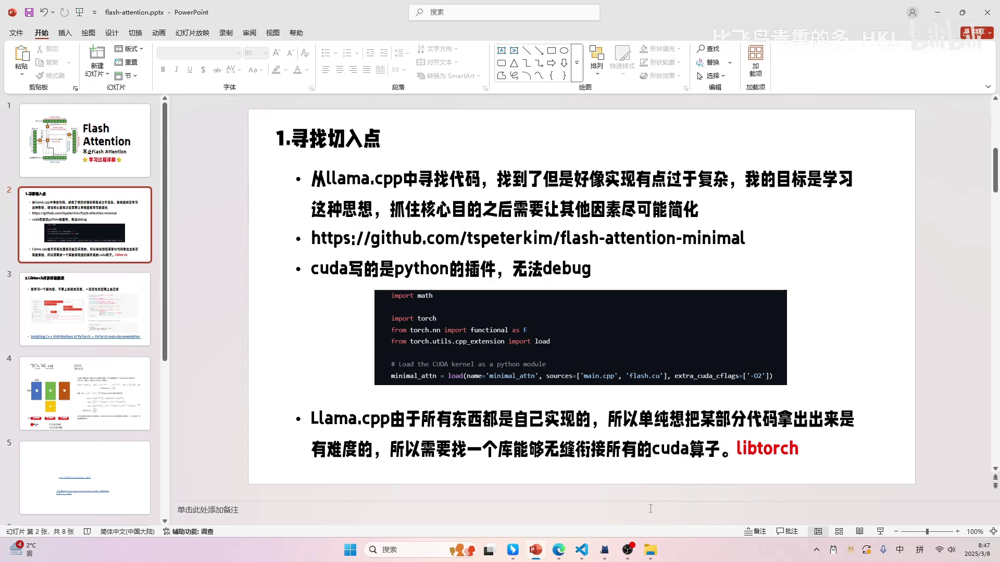 |
| 但不一定适合所有人，反正至少适合我。好，所以第一点就是寻找切入点。然后我就在想：我们之前讲过 llama.cpp，llama.cpp 里面会不会有 FlashAttention 的代码呢？然后我就去找了。 [【跳转到 04:17】](https://www.bilibili.com/video/BV1FM9XYoEQ5/?p=2&t=257) | 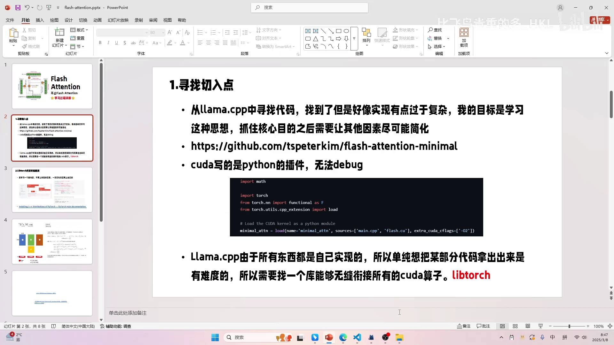 |
| 我就给大家讲得细致一点。我最开始就打开了 llama.cpp。 [【跳转到 04:31】](https://www.bilibili.com/video/BV1FM9XYoEQ5/?p=2&t=271) | 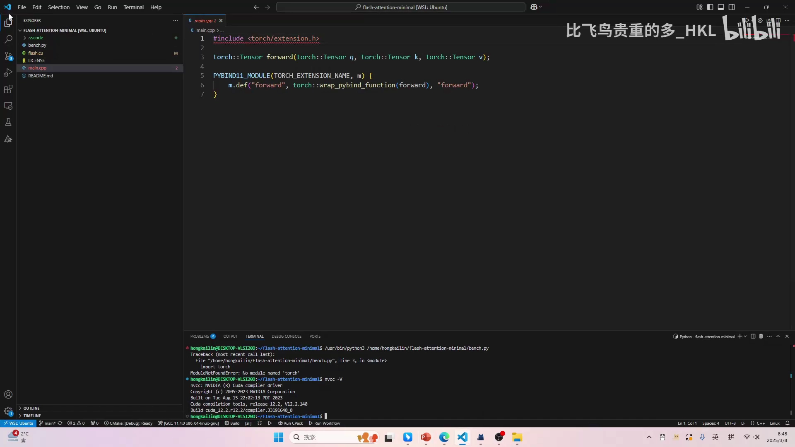 |
| 我觉得像这样一个算子，它应该会有吧。所以我就去搜了一下 FlashAttention。 [【跳转到 04:36】](https://www.bilibili.com/video/BV1FM9XYoEQ5/?p=2&t=276) | 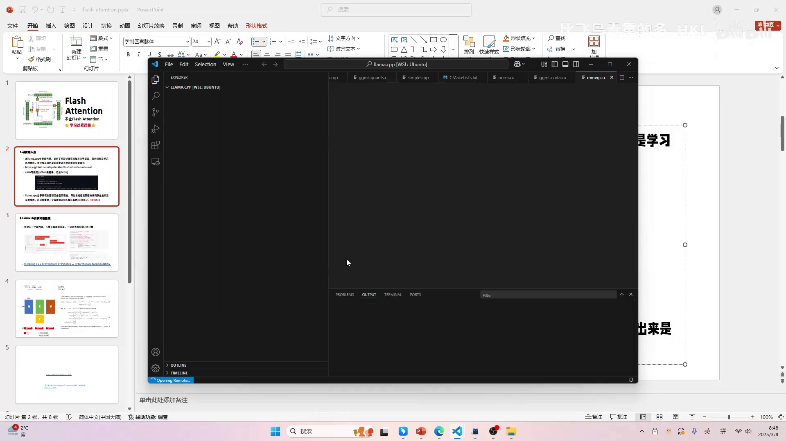 |
| 但它可能不叫这个名字，所以一定要多试几种写法。然后我们就看到这个位置有个 FATTN，那这个很明显对吧，这就是 FlashAttention。名字是 flash_attn，这个是 FP16 的，那个是 FP32 的。然后我就打开了，看了一下里面的代码，大概有 300 多行。 [【跳转到 04:41】](https://www.bilibili.com/video/BV1FM9XYoEQ5/?p=2&t=281) | 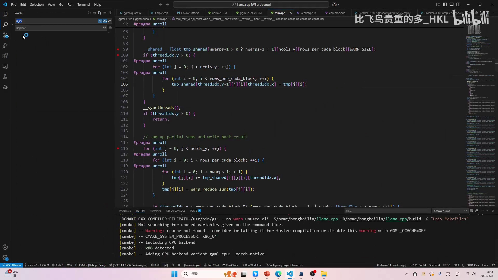 |
| 有 300 多行，其实也不算特别多，但整体给我的感觉是有点复杂。你看，它有很多东西——我猜测，因为这个代码是比较完整的。到这儿、到这个位置，这些是因为它是一个比较完整的实现，而且 flash 有三个版本——当然我现在还不知道 V2、V3 到底在讲啥，我现在只看了 V1。所以我猜测这里面实现的会不会…… [【跳转到 05:06】](https://www.bilibili.com/video/BV1FM9XYoEQ5/?p=2&t=306) | 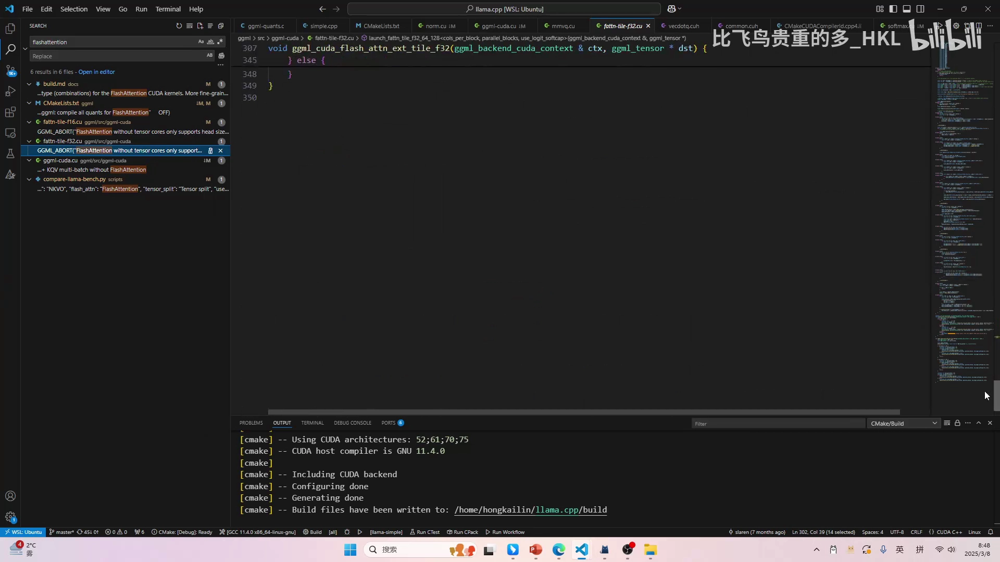 |
| 我猜测实现肯定会复杂一点，因为它要考虑的东西很多，可能还要考虑很多量化。这个点是我个人不喜欢的。为什么呢？虽然我之前一直在给大家讲 llama.cpp，因为那个时候是希望学里面的一些算子是怎么写的，但我现在其实更多不是想学 llama.cpp 这个架构，而是—— [【跳转到 05:31】](https://www.bilibili.com/video/BV1FM9XYoEQ5/?p=2&t=331) | 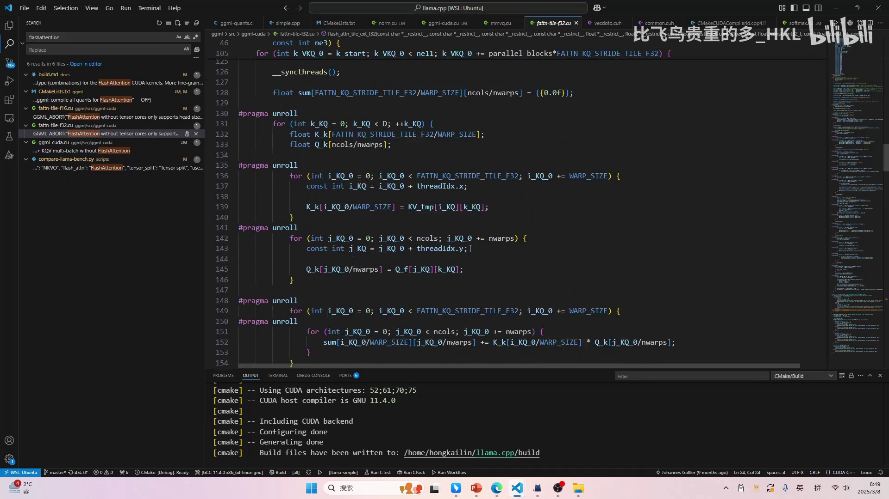 |
| 而是我现在就想学 FlashAttention。所以我在里面给大家提到的一点，就是从 llama.cpp 当中寻找代码，然后找到了。但好像实现得有点过于复杂。我的目标是学习这种思想——什么意思呢？我就想学习 FlashAttention 这个思想、它的公式是怎么推出来的，以及结合这个公式到底怎么实现。所以我想抓住核心目的，让其他因素尽可能简化。 [【跳转到 05:54】](https://www.bilibili.com/video/BV1FM9XYoEQ5/?p=2&t=354) | 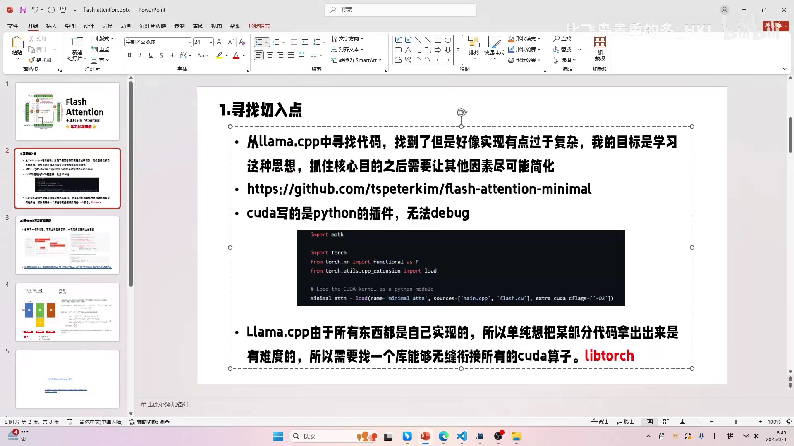 |
| 如果我要是选用 llama.cpp 里面的 FlashAttention—— [【跳转到 06:19】](https://www.bilibili.com/video/BV1FM9XYoEQ5/?p=2&t=379) |  |
| 首先我要把代码都移植出来，对吧？因为如果我要直接去调试，我就需要找一个带 FlashAttention 的模型，或者得能把之前学的 InternLM2 改成 FlashAttention 的版本——我不会啊。最直观的就是我不会、我也不想去研究这个事情，因为这就跟我学它的主线偏离了。这是第一点。第二点，如果你不去找那个模型，那我就得把这段代码复制出来。 [【跳转到 06:24】](https://www.bilibili.com/video/BV1FM9XYoEQ5/?p=2&t=384) | 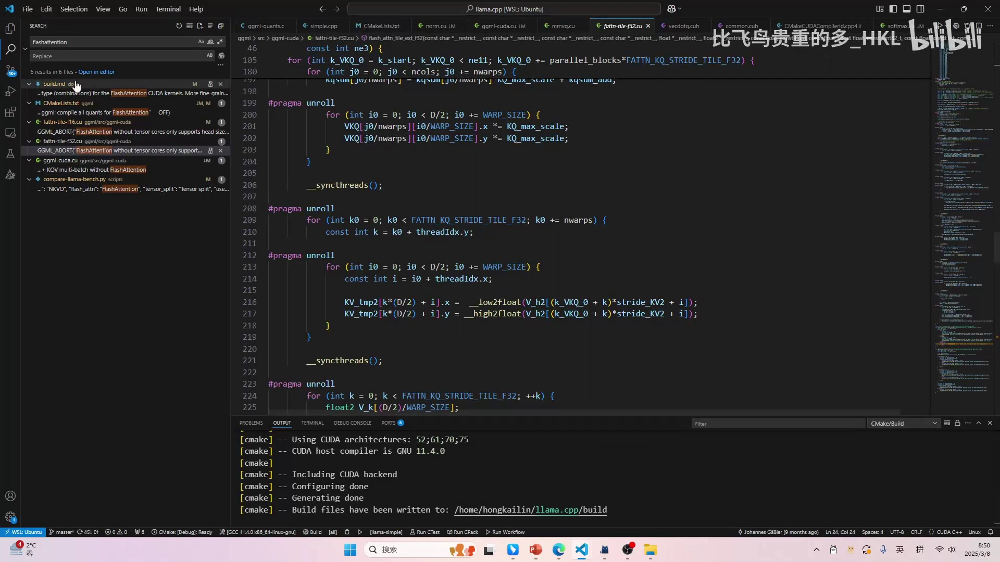 |
| 复制出来之后，我还要维护一个 tensor。大家想想是不是这回事：这里面有一个 tensor 变量，我需要维护它，然后再把东西拿出来结合。而且这里面很多变量是耦合的。所以如果单纯把这段代码、还有上面那段代码摘出来，肯定会有很多耦合。然后我还要去看 ggml tensor 在哪个 .so 文件里依赖，还要去链接那个文件，才能用上 GGML 的 tensor，对吧？再加上，虽然我已经带大家完整解读了 GGML / llama.cpp 的代码，但我仍然不能说我对这个框架很熟悉，因为这个框架很复杂，我只是解读了执行过的代码，我猜测还会有很多坑。 [【跳转到 06:49】](https://www.bilibili.com/video/BV1FM9XYoEQ5/?p=2&t=409) | 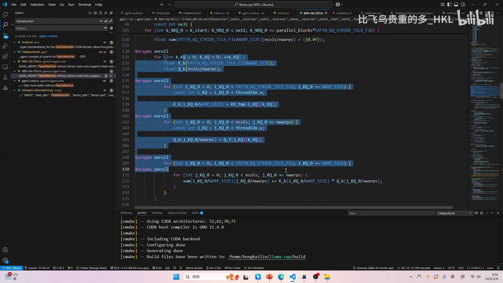 |
| 这些无疑—— [【跳转到 07:14】](https://www.bilibili.com/video/BV1FM9XYoEQ5/?p=2&t=434) | 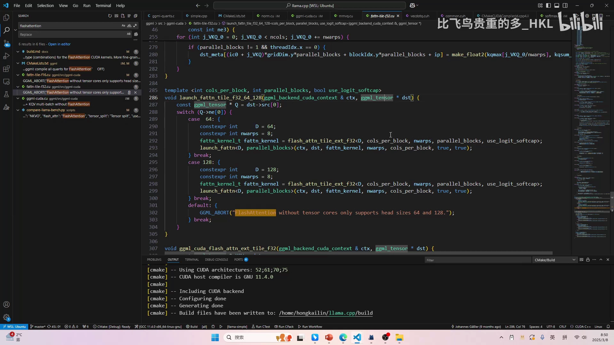 |
| 如果我选用 llama.cpp 学 FlashAttention，都会让我的学习变得很困难，因为我需要在 FlashAttention 之外的内容上花费很多时间和精力。我得想怎么办、怎么把这段代码摘出来、怎么看，而且这段代码还很复杂，对吧？这就是我最开始遇到的问题。 [【跳转到 07:39】](https://www.bilibili.com/video/BV1FM9XYoEQ5/?p=2&t=459) |  |
| 然后我就想：我不应该这么搞，应该让这个东西尽可能简化。所以我就在 GitHub 上找。 [【跳转到 07:59】](https://www.bilibili.com/video/BV1FM9XYoEQ5/?p=2&t=479) |  |
| 这真的就是我的学习过程。我去找 FlashAttention，其实是希望找一个—— [【跳转到 08:06】](https://www.bilibili.com/video/BV1FM9XYoEQ5/?p=2&t=486) |  |
| 我就想有没有人能实现一个比较简单的版本。所以我直接这么搜了。然后我看第一个人—— [【跳转到 08:11】](https://www.bilibili.com/video/BV1FM9XYoEQ5/?p=2&t=491) |  |
| 第一个呢是最高的（star 最多），所以这个应该就是这个原始的—— [【跳转到 08:16】](https://www.bilibili.com/video/BV1FM9XYoEQ5/?p=2&t=496) |  |
| 原始的（官方实现）。然后我看到这个 Hopper，就想：这跟我的显卡也没关系，我也没有这个显卡，而且这看起来还挺复杂的。 [【跳转到 08:22】](https://www.bilibili.com/video/BV1FM9XYoEQ5/?p=2&t=502) |  |
| 然后这个 csrc 里面你看这么复杂，我觉得这好像也有点复杂，那就再看看吧。但我之前想的是，如果找不到我就用它。然后我发现——哎，有一个 minimal，这很明显对不对？很明显这就是一个非常小的、非常轻量级的代码。然后我看到这个 flash.cu 里面，就是有我要的 FlashAttention 代码。 [【跳转到 08:27】](https://www.bilibili.com/video/BV1FM9XYoEQ5/?p=2&t=507) |  |
| 然后它特别简单，看到吗？就这么点。因为它可能没有考虑比如如何加 mask、如何加 softmax、加 dropout，它这里没考虑这些，它只是 Q 乘 K、softmax、再乘 V，只有这些。但我觉得这个对于我学 FlashAttention 的思想已经足够了。所以我就觉得，哎，那这个不错。 [【跳转到 08:50】](https://www.bilibili.com/video/BV1FM9XYoEQ5/?p=2&t=530) |  |
| 我就觉得应该基于这个代码来学，对吧？这个代码就已经很轻了——如果我用 llama.cpp 就会很重，用它就比较轻量。但我发现它另外一个问题，就是它有一个 bindings.py。你看这个位置，就是用 C++ 的扩展——相当于我这里面虽然写了一个 flash.cu，还写了一个 main.cpp，但你看这个 main.cpp 里面…… [【跳转到 09:11】](https://www.bilibili.com/video/BV1FM9XYoEQ5/?p=2&t=551) | 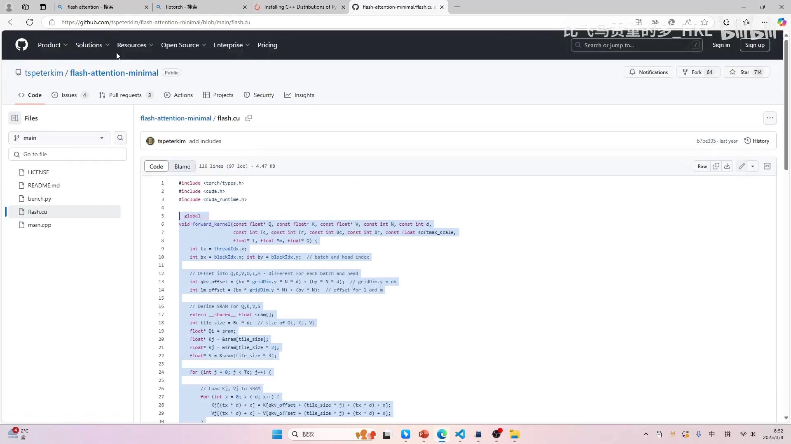 |
| 哎呀我靠，居然卡了。这个里面其实就是对我们刚才用的、把 flash.cu 这个库包装了一下，让 Python 可以调用。你就可以通过这种方式，通过 load 的方式去载入我用 CUDA 写的那个函数，我就可以去做了，对吧？但这也有问题：如果我单纯用这种方式，也是有问题的。 [【跳转到 09:36】](https://www.bilibili.com/video/BV1FM9XYoEQ5/?p=2&t=576) | 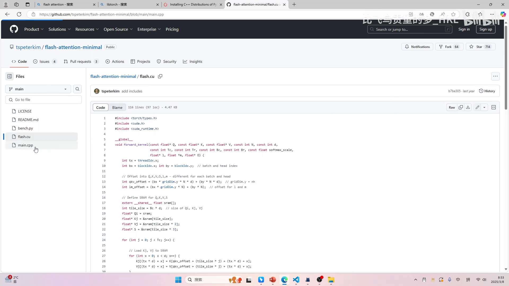 |
| 为什么呢？你看我这里已经写了，但写的是 Python 的绑定。 [【跳转到 10:01】](https://www.bilibili.com/video/BV1FM9XYoEQ5/?p=2&t=601) |  |
| 我没有办法 debug，对吧？我们之前一直在讲 debug。并且你没有办法调试，你就只能——如果我们直接用这个代码的话， [【跳转到 10:06】](https://www.bilibili.com/video/BV1FM9XYoEQ5/?p=2&t=606) |  |
| 你就会发现我只能是调用，在这儿就调用完了，你里面它怎么做的…… [【跳转到 10:17】](https://www.bilibili.com/video/BV1FM9XYoEQ5/?p=2&t=617) | 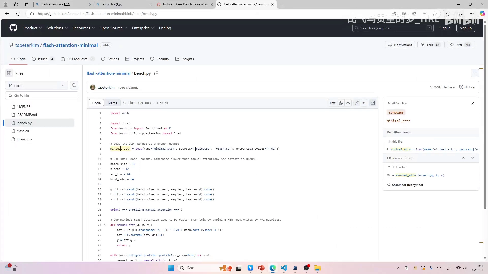 |
| 你什么都看不到。所以这样的话，其实就和我单纯看代码没有区别了：我没有办法调试，没有办法进到程序里面思考。这个对我来讲是不能接受的，因为我（作为一个）调试区 up 主，就是很喜欢 debug 代码，这样我才能更好地理解这个程序。那我觉得这个也不行。 [【跳转到 10:22】](https://www.bilibili.com/video/BV1FM9XYoEQ5/?p=2&t=622) | 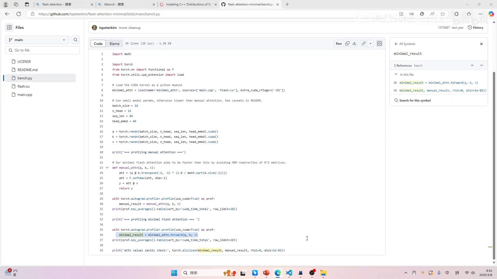 |
| 所以呢，我就想到——llama.cpp 由于所有东西都自己实现，单纯想把某部分代码拿出来是很有难度的，所以需要找一个库能够无缝衔接所有的 CUDA 算子。诶，我就突然想到可以用 LibTorch。为什么我想到 LibTorch 呢？我们还是要看这个代码。 [【跳转到 10:39】](https://www.bilibili.com/video/BV1FM9XYoEQ5/?p=2&t=639) | 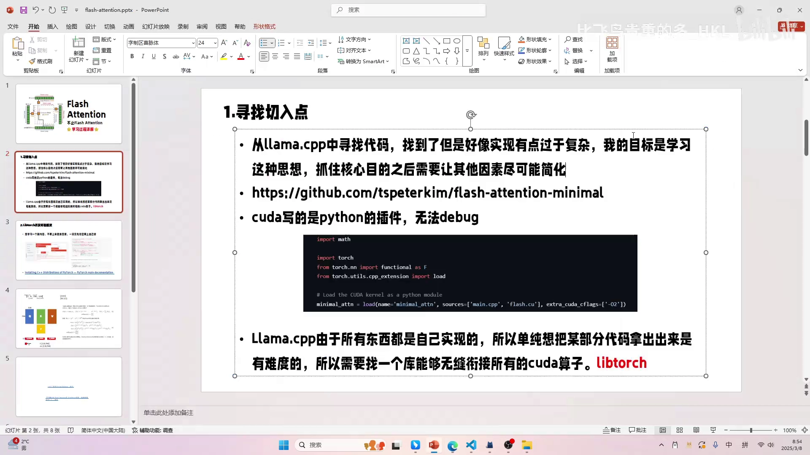 |
| 就是 flash.cu 里面，你看这个是 kernel，对吧？然后你看下面这个 forward，你看 torch::Tensor、torch::Tensor，然后这里面用的全都是……虽然说它是 C++ 代码，但实际上跟 Python 端没有特别大的区别，函数的形式都很像，看到了吗？比如说我现在想把这个 tensor 放到 GPU 上—— [【跳转到 10:59】](https://www.bilibili.com/video/BV1FM9XYoEQ5/?p=2&t=659) | 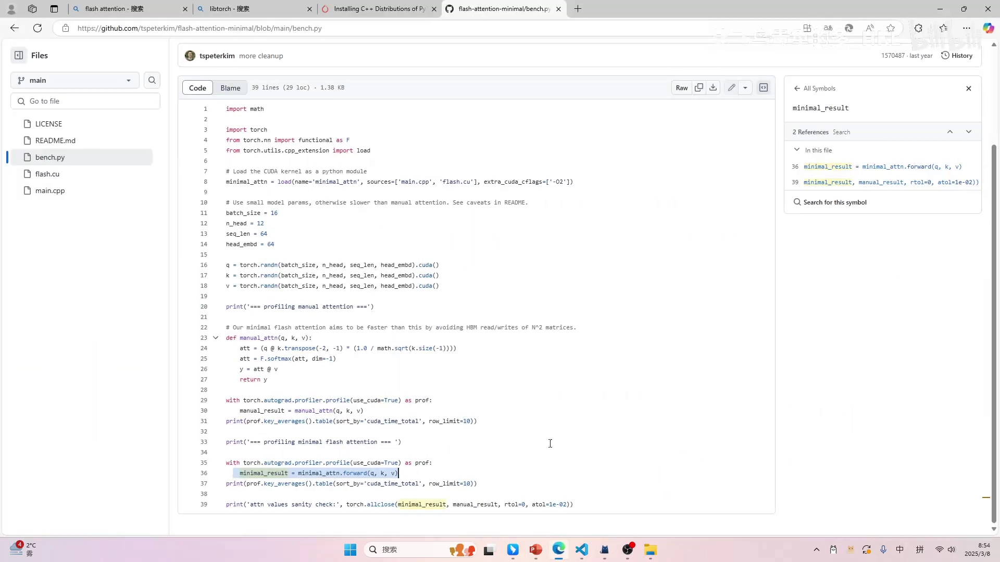 |
| 我直接 .to(device) 就可以了，直接 .to(device) 就可以。所以我就突然想到：如果我现在直接用这个程序，我的 main 函数不去对 forward 函数进行包装，而是直接调用这个 forward 函数，那我是不是就可以脱离 Python，直接用 C++ 的代码？然后我既能调试，又能更好地学习 flash.cu，对吧？ [【跳转到 11:24】](https://www.bilibili.com/video/BV1FM9XYoEQ5/?p=2&t=684) | 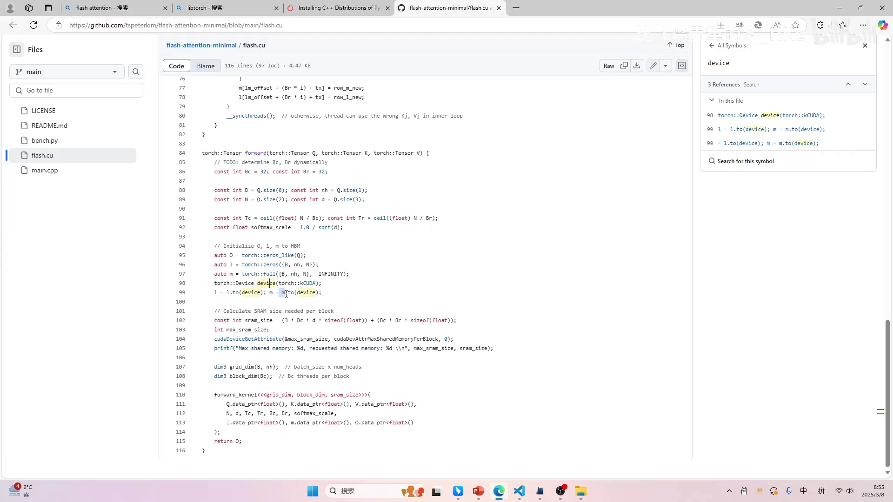 |
| 哎，我觉得这个方法是可以的。然后就面临下一个问题：LibTorch 这个环境我应该如何搭建？这个我下节课会讲。所以我想跟大家讲—— [【跳转到 11:49】](https://www.bilibili.com/video/BV1FM9XYoEQ5/?p=2&t=709) | 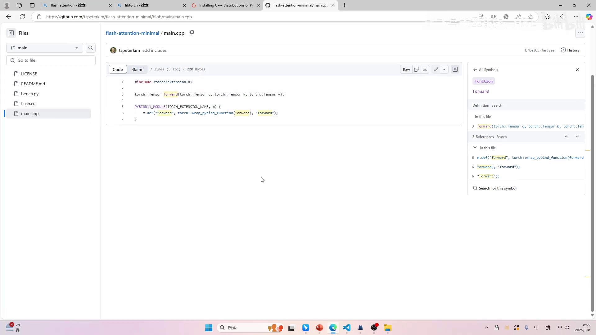 |
| 这一节课虽然没讲什么知识点，但我觉得这也是挺关键的：这个学习的流程。当你发现现有的教程已经没有办法解决你实际问题的时候，你应该做的事情就是自己去想解决方案。按照我这个思路，就是找到适合你自己的方式——我就喜欢看代码，然后再结合代码去看公式。 [【跳转到 11:58】](https://www.bilibili.com/video/BV1FM9XYoEQ5/?p=2&t=718) | 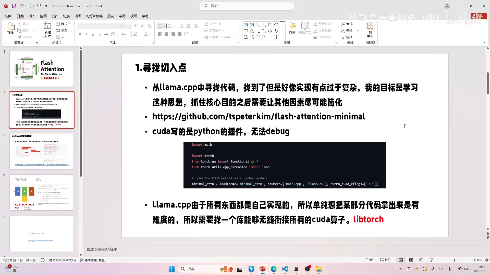 |
| 那如果是这样，我肯定得先搭出一个调试环境，这是第一点。第二点，至少对于我来讲，哪怕网上有教程、我能看懂，我也需要自己把代码写一遍、或者说读一遍，这样才能让我更好地理解。你光看理论上的讲解，有些东西是体会不到的，所以一定要看代码。所以这一步对于我来讲—— [【跳转到 12:23】](https://www.bilibili.com/video/BV1FM9XYoEQ5/?p=2&t=743) |  |
| 当前这一步对于我来讲是非常有必要的。我必须要把代码拿到、去学习、去读，那你肯定要学习如何搭建一个适合你当前项目的最小系统。这就是我的思考流程。包括这个 LibTorch，我在这儿看到 LibTorch 之后，突然意识到一件事情—— [【跳转到 12:48】](https://www.bilibili.com/video/BV1FM9XYoEQ5/?p=2&t=768) |  |
| 其实我之前如果先想到可以用 LibTorch 去讲解大模型的算子，我可能就不会给大家讲 llama.cpp 了。为什么呢？因为 llama.cpp 有自己的数据结构，它当然是一个完整的项目，但对很多人来讲，"先把 llama.cpp 学了"这件事——我本质是希望学大模型算子，却为了学大模型算子—— [【跳转到 13:13】](https://www.bilibili.com/video/BV1FM9XYoEQ5/?p=2&t=793) |  |
| 要先学 llama.cpp，这件事就有点像"为了一碟醋包一顿饺子"。你看我的视频也会发现，我其实花了那么长时间去讲 llama.cpp 底层的原理是怎么做的。我相信这其实不太合理，但我之前没想到可以用 LibTorch 来解决，现在才想到。不过我觉得也不晚，所以我后面也会把 LibTorch 这种方式分享给大家。 [【跳转到 13:38】](https://www.bilibili.com/video/BV1FM9XYoEQ5/?p=2&t=818) |  |
| 反正技多不压身，大家多学一点哈。好了，我们这个切入点就找到了。通过这样的方式，我们下节课就开始看 LibTorch 是如何在我电脑上搭建开发的。 [【跳转到 14:03】](https://www.bilibili.com/video/BV1FM9XYoEQ5/?p=2&t=843) |  |