# 第03讲_libtorch环境搭建 原始文稿（图-字幕分栏）

| 字幕文本 | 画面 |
| :--- | ---: |
| 好，我们现在到了 LibTorch 开发环境的搭建。我之前用过 LibTorch，所以这件事对我来讲很简单——我之前写过 LibTorch。而且 LibTorch 本身也很简单：如果你对 PyTorch 很熟悉，上手 LibTorch 就是分分钟的事情。 [【跳转到 00:00】](https://www.bilibili.com/video/BV1FM9XYoEQ5/?p=3&t=0) |  |
| 不过我这里会尽可能以一个新手的角度来讲，因为我当初是新手的时候，其实也是用这个套路才学会的。我希望后面所有的内容都站在新手角度讲解。现在我们要搭建 LibTorch 环境，希望搭出这个最小的开发环境。 [【跳转到 00:25】](https://www.bilibili.com/video/BV1FM9XYoEQ5/?p=3&t=25) | 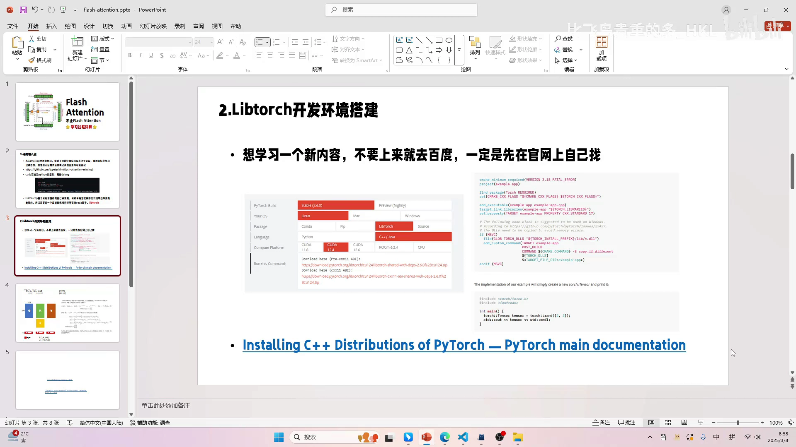 |
| 我们要用到 LibTorch，那好，现在想搭建它要怎么办呢？ [【跳转到 00:46】](https://www.bilibili.com/video/BV1FM9XYoEQ5/?p=3&t=46) | 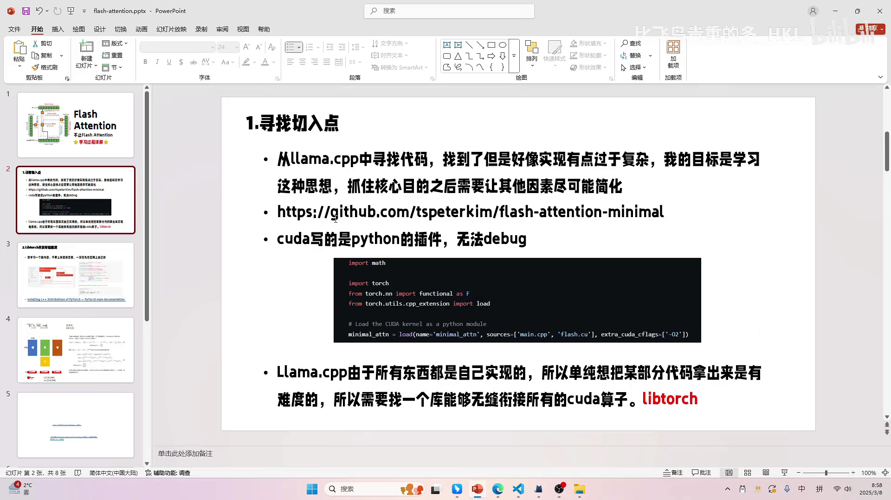 |
| 我这里也给大家写了一句话（虽然不太准确）：想学习一个新内容——尤其是在搭建环境这个层面上，就默认大家之前没用过 LibTorch，它对大家来讲是一个新的库、新的环境。 [【跳转到 00:51】](https://www.bilibili.com/video/BV1FM9XYoEQ5/?p=3&t=51) | 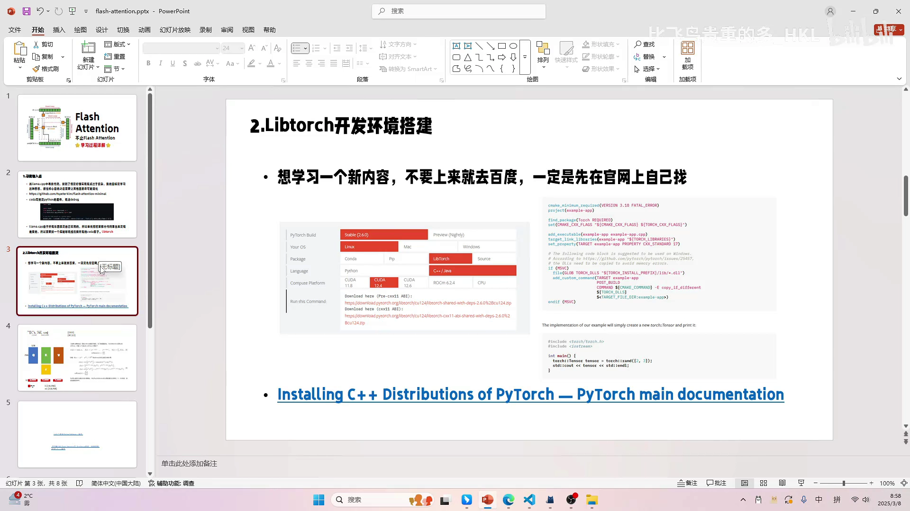 |
| **不要上来就去百度，一定要先在官网上自己找**，这件事非常重要。我发现很多人面对 C++ 这种第三方库管理很复杂的情况，上来就先百度"这玩意怎么用、怎么装到自己电脑上"——不要这么做。大家尽可能的是什么呢？ [【跳转到 01:16】](https://www.bilibili.com/video/BV1FM9XYoEQ5/?p=3&t=76) | 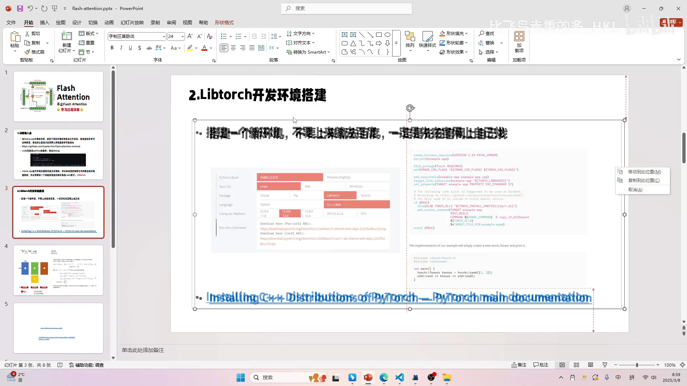 |
| 尽可能先去看官网，因为你一定要相信：网上所有博客都是基于官网改的，那我直接看官网肯定是最方便的。其次，后面的 C++（包括我之前讲的 CUDA 相关）都是用 CMake 来做的。我知道肯定有更好的工具，但我现在还不会，我用 CMake 比较多，因为我看的开源项目人家写的都是 CMake，所以我这里也用 CMake 来讲。 [【跳转到 01:41】](https://www.bilibili.com/video/BV1FM9XYoEQ5/?p=3&t=101) |  |
| 如果大家不会 CMake，我 B 站主页里是有 CMake 教程的，我自认为讲得还不错，相比于其他讲 CMake 的，我那个讲得应该还可以。看完之后你对这些东西应该都了解了，就不会很疑惑。好，我们就来看怎么做——首先肯定是去找官网，对吧？ [【跳转到 02:06】](https://www.bilibili.com/video/BV1FM9XYoEQ5/?p=3&t=126) |  |
| 这里面你可以直接去搜 LibTorch。 [【跳转到 02:29】](https://www.bilibili.com/video/BV1FM9XYoEQ5/?p=3&t=149) | 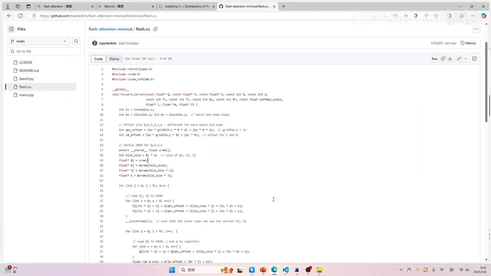 |
| 然后直接找官网，一定要找官网，不要去找这些乱七八糟的什么"系列教程""一个丝滑的 C++ Tensor"…… [【跳转到 02:34】](https://www.bilibili.com/video/BV1FM9XYoEQ5/?p=3&t=154) | 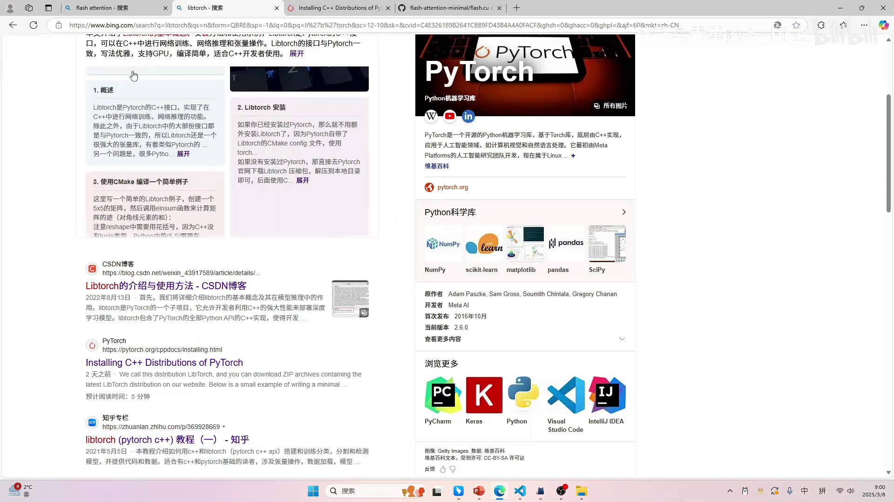 |
| 这种东西你没有必要看。 [【跳转到 02:39】](https://www.bilibili.com/video/BV1FM9XYoEQ5/?p=3&t=159) | 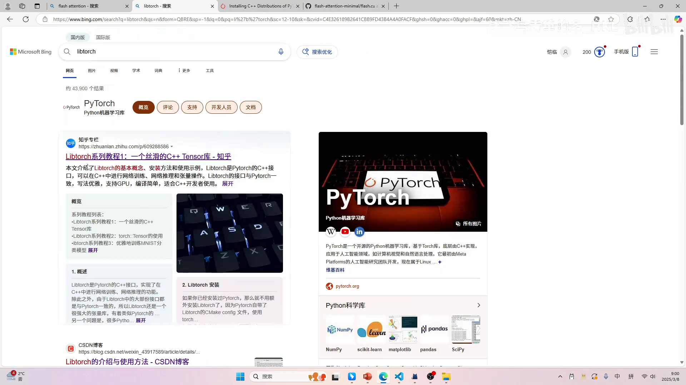 |
| 你直接看官网就可以了。点它进去之后，这里告诉你：如果你只想做纯 CPU 的—— [【跳转到 02:44】](https://www.bilibili.com/video/BV1FM9XYoEQ5/?p=3&t=164) | 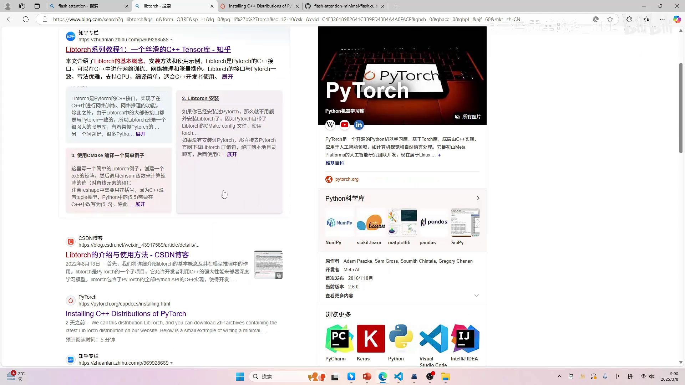 |
| 所以你现在如果想做一个 CPU 的 tensor 开发、想要一个 tensor 库，可以直接下它。但我们希望用 GPU，对吧？所以它告诉你要去到这个网站——其实就是 PyTorch 的官网。 [【跳转到 02:49】](https://www.bilibili.com/video/BV1FM9XYoEQ5/?p=3&t=169) | 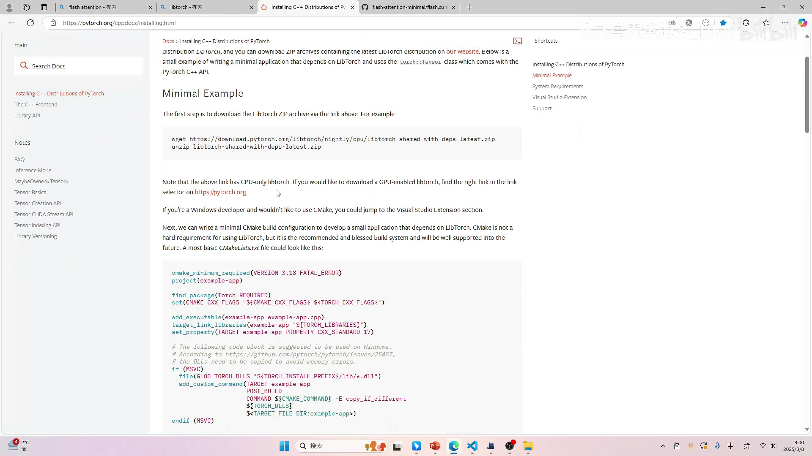 |
| 然后我们看安装，在这里。其实这里你仔细看一眼—— [【跳转到 03:02】](https://www.bilibili.com/video/BV1FM9XYoEQ5/?p=3&t=182) |  |
| 就看到了这里有 LibTorch、C++ 相关，你需要选择一个 CUDA 版本。我现在的电脑——我还是在 WSL 里面给大家讲—— [【跳转到 03:07】](https://www.bilibili.com/video/BV1FM9XYoEQ5/?p=3&t=187) | 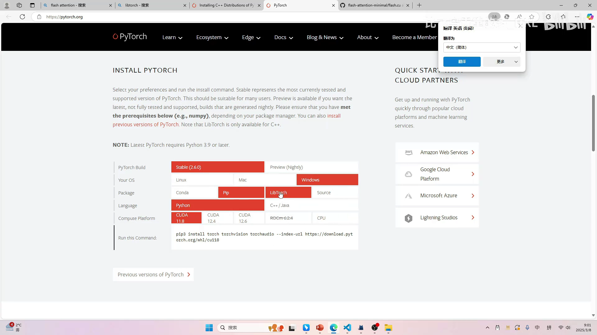 |
| 我这里的 CUDA 是 12.2，所以我选了 12.4。 [【跳转到 03:16】](https://www.bilibili.com/video/BV1FM9XYoEQ5/?p=3&t=196) | 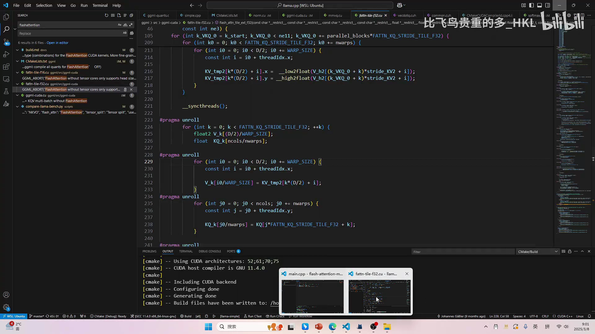 |
| 选一个比较接近的就行，你不一定非得按这个来。比如我觉得现在装 12.6 应该也没什么大问题，我不确定，大家可以试一试。我先演示 12.4。这里是下载链接。诶，这个位置怎么跟我刚才看的还不太一样？哦对，**不能选 Windows，要选 Linux**。 [【跳转到 03:21】](https://www.bilibili.com/video/BV1FM9XYoEQ5/?p=3&t=201) | 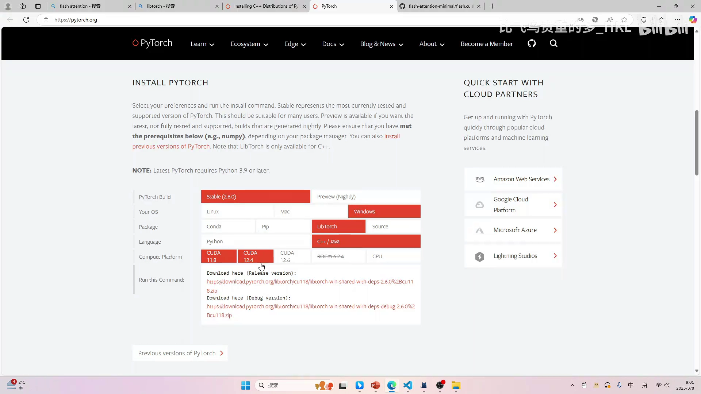 |
| 如果选 Windows 也可以——我之前就是在 Windows 上做的 PyTorch/LibTorch 开发；但 Windows 要选 Debug 版本和 Release 版本，这是两个不同的版本，大家注意：调试的时候尽可能用 Debug 版本。但我们这里仍然不用 Windows，用 Linux。Linux 版本不分 Debug/Release，两个版本都被编在一起了。另外，前面这个是 C++11 之前的，后面这个是 C++11 之后的，所以我们选下面那个。 [【跳转到 03:46】](https://www.bilibili.com/video/BV1FM9XYoEQ5/?p=3&t=226) |  |
| 选下面这个，点它就可以下载了。然后呢，我已经下载完了。 [【跳转到 04:11】](https://www.bilibili.com/video/BV1FM9XYoEQ5/?p=3&t=251) | 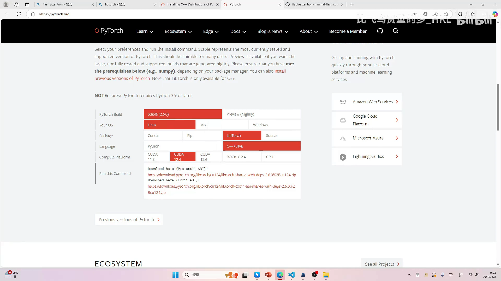 |
| 我现在已经把它下载完了。 [【跳转到 04:20】](https://www.bilibili.com/video/BV1FM9XYoEQ5/?p=3&t=260) | 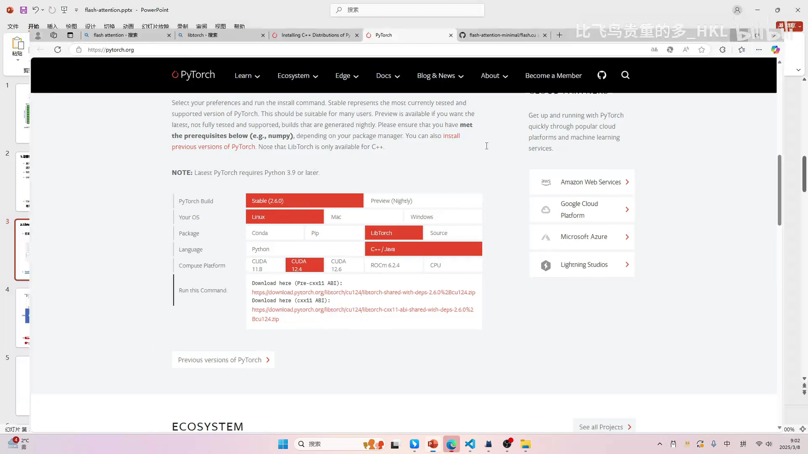 |
| 在这里，对吧？下载完之后我们要做的事情是什么呢？就是把它拖到我们的 WSL—— [【跳转到 04:25】](https://www.bilibili.com/video/BV1FM9XYoEQ5/?p=3&t=265) | 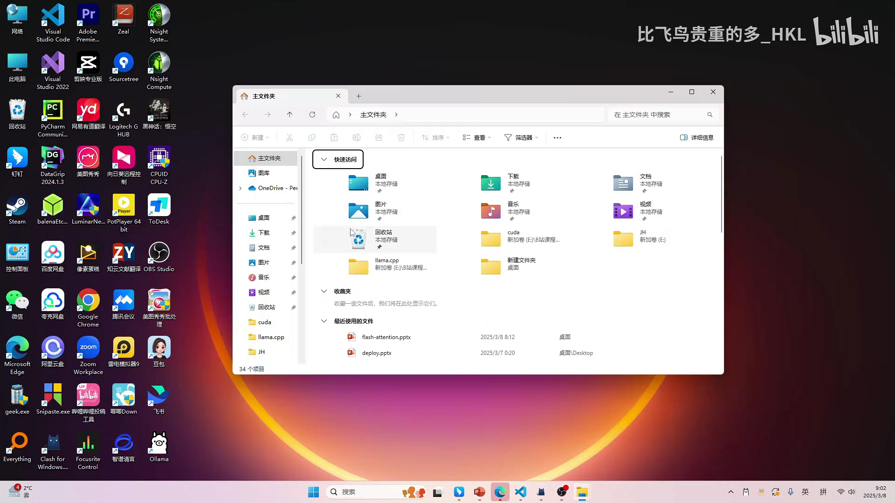 |
| 拖到我们的 WSL 里面。 [【跳转到 04:30】](https://www.bilibili.com/video/BV1FM9XYoEQ5/?p=3&t=270) | 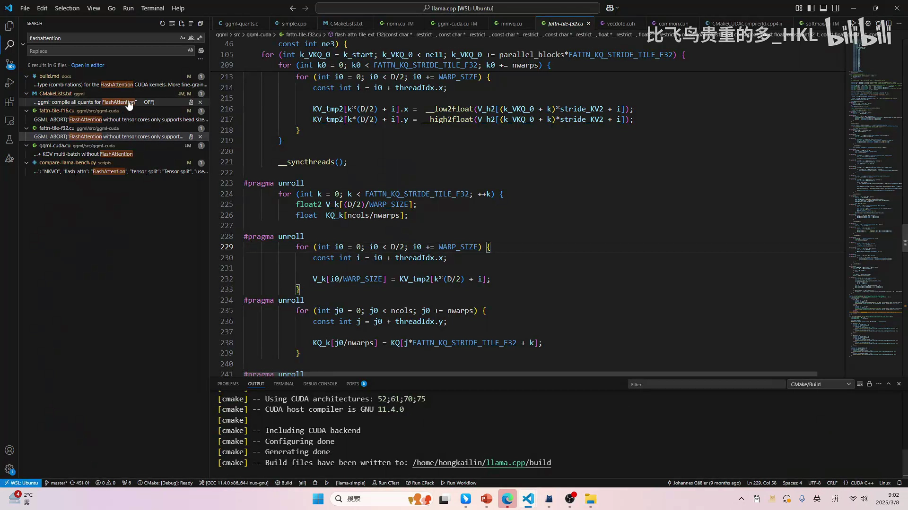 |
| 直接这么拖一下就可以了，然后它现在要传输，就等它传一阵子。 [【跳转到 04:35】](https://www.bilibili.com/video/BV1FM9XYoEQ5/?p=3&t=275) | 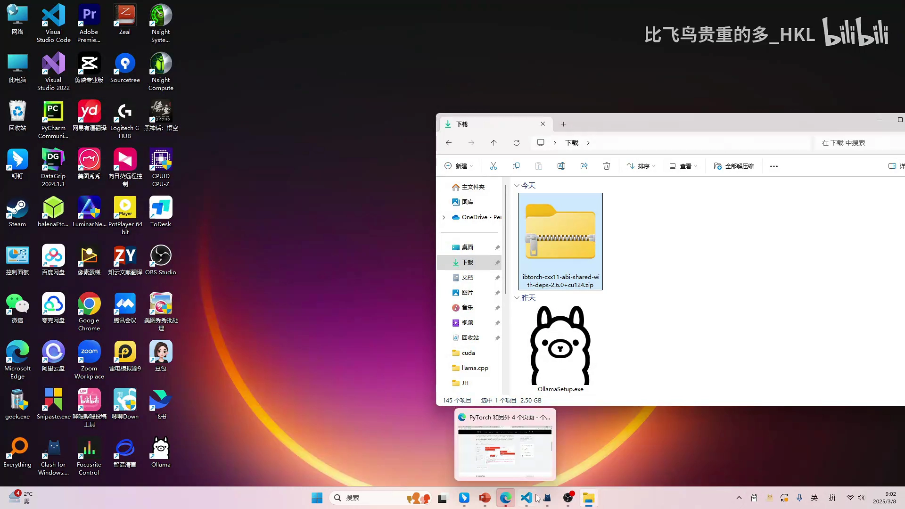 |
| 然后我们来看一下，这相当于这个包已经下载好了，对吧？我们就来看这个东西到底怎么用起来。 [【跳转到 04:41】](https://www.bilibili.com/video/BV1FM9XYoEQ5/?p=3&t=281) | 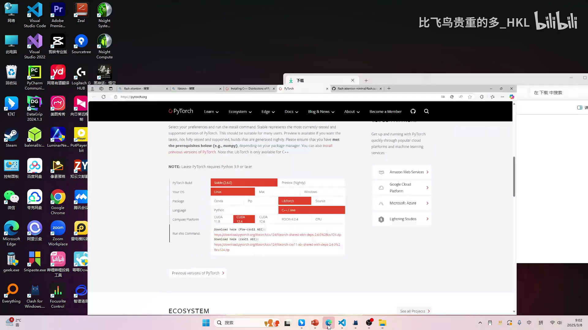 |
| 我们可以看到这里有一些 CMake 的命令，所以我们就无脑抄它就可以了，真的就是无脑抄。然后 MSVC——这是 Windows 版本，我在 CMake 课里讲过，所以直接把它删掉，把上面的抄下来就 OK。然后它还给了我们一个 main 函数，你看 main 函数都给我们了，有一个简单的 demo。 [【跳转到 04:46】](https://www.bilibili.com/video/BV1FM9XYoEQ5/?p=3&t=286) |  |
| 我们现在趁着它还在传输，去搭建一下这个环境。 [【跳转到 05:11】](https://www.bilibili.com/video/BV1FM9XYoEQ5/?p=3&t=311) | 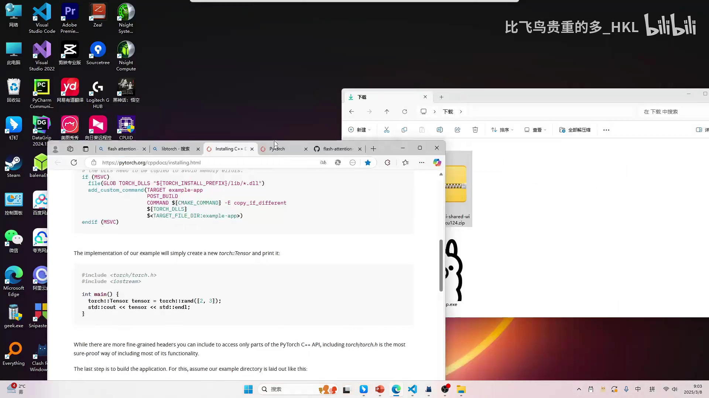 |
| 首先我需要新建一个 `CMakeLists.txt`，然后把这个内容无脑复制过来。 [【跳转到 05:16】](https://www.bilibili.com/video/BV1FM9XYoEQ5/?p=3&t=316) | 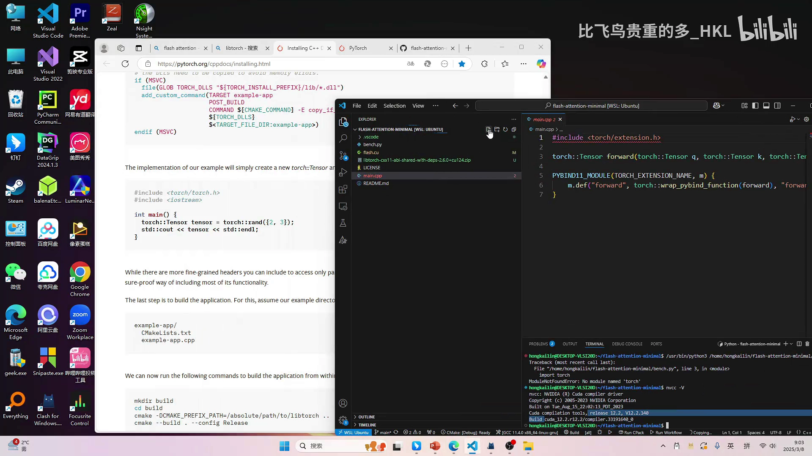 |
| 首先我们可以先忽略它到底是什么含义，无脑复制；然后把下面的东西（MSVC/Windows 部分）注释掉。 [【跳转到 05:29】](https://www.bilibili.com/video/BV1FM9XYoEQ5/?p=3&t=329) | 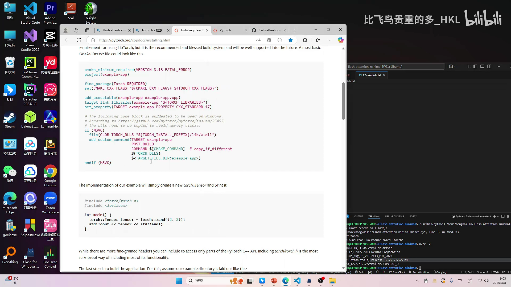 |
| 对，我们把这个东西注释掉，因为我们现在不考虑 Windows 系统。然后这里面我们注意几个地方：首先 `find_package(Torch REQUIRED)`——这个事情我在 CMake 课里都详细讲过，说明什么呢？说明大概率有一个 `TorchConfig.cmake` 文件，它通过那个去找到它，然后你就可以用了。 [【跳转到 05:34】](https://www.bilibili.com/video/BV1FM9XYoEQ5/?p=3&t=334) | 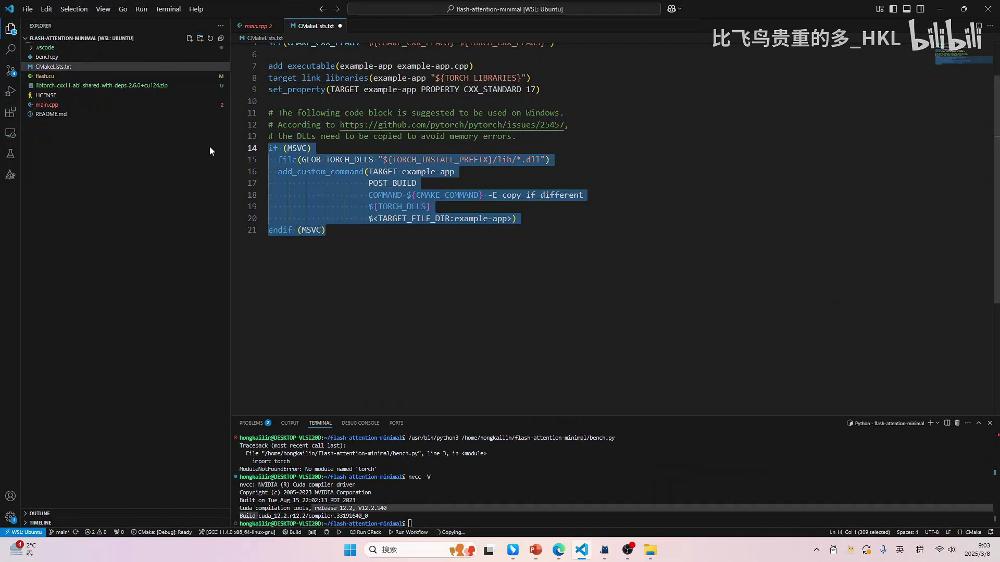 |
| 但是你想让它找到，有两个办法：要么把那个 `TorchConfig.cmake` 文件放到系统环境变量里；要么你在 CMake 文件里告诉它路径在哪。我们选用第二种方法——因为我懒得去改系统环境变量，觉得比较费劲。所以我们有这样一条命令。 [【跳转到 05:59】](https://www.bilibili.com/video/BV1FM9XYoEQ5/?p=3&t=359) | 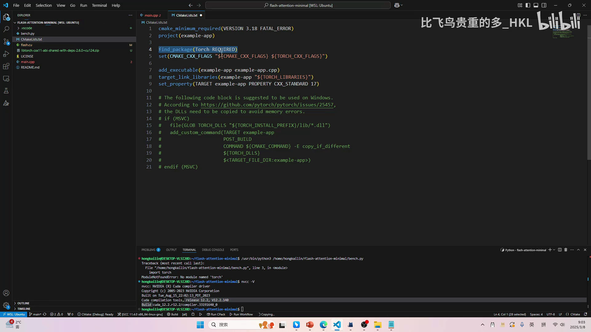 |
| 我直接给大家复制过来，在这儿：这条命令。这个路径我们一会儿改成对应的路径——把 XX 改成对应的路径，因为现在还没传过来，等传完之后我解压一下再给大家改。就是这样，我们加完这句话之后…… [【跳转到 06:24】](https://www.bilibili.com/video/BV1FM9XYoEQ5/?p=3&t=384) | 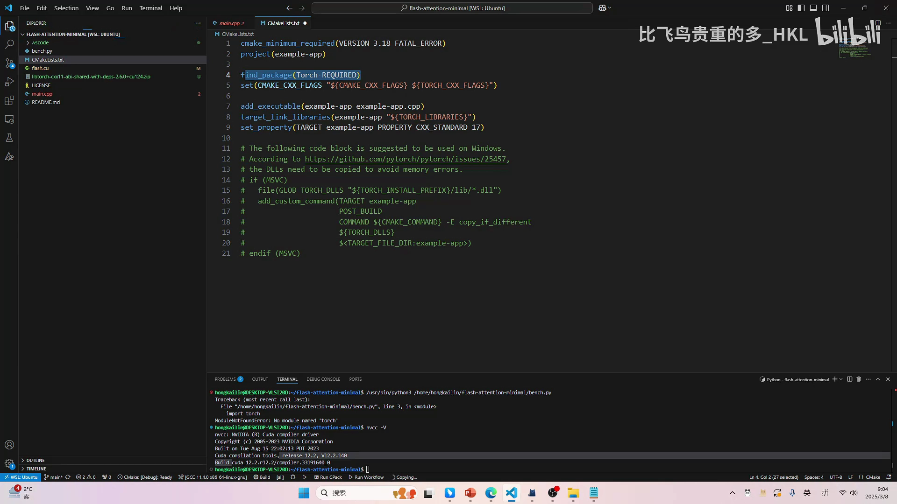 |
| 反正就是要把这样一个路径加到 `CMAKE_PREFIX_PATH` 里。加到这里之后，它在 `find_package` 的时候就会去你这个路径找 `TorchConfig.cmake` 文件；如果找到了，这句话就过了。如果你不写这句话，你就得在系统环境变量（Windows 是 .bashrc 那个文件）里把 `TorchConfig.cmake` 的路径写进去。 [【跳转到 06:49】](https://www.bilibili.com/video/BV1FM9XYoEQ5/?p=3&t=409) | 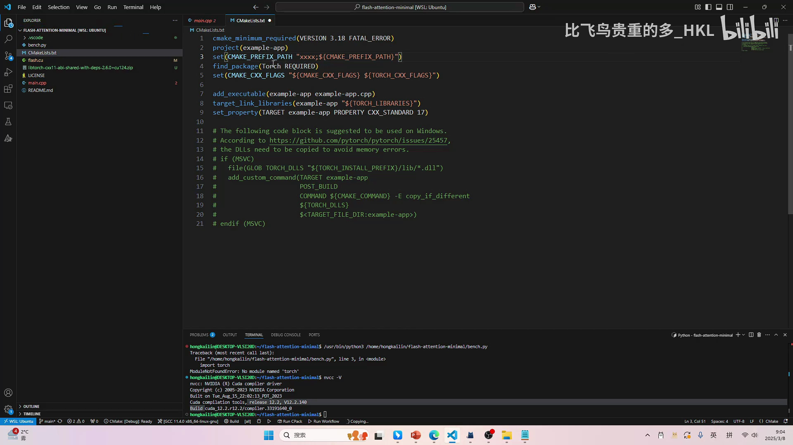 |
| 反正这两种方法都行。然后我们等一会儿等它弄完就 OK。下面我们再来看一下：它这里还给我们提供了一个 demo。 [【跳转到 07:14】](https://www.bilibili.com/video/BV1FM9XYoEQ5/?p=3&t=434) | 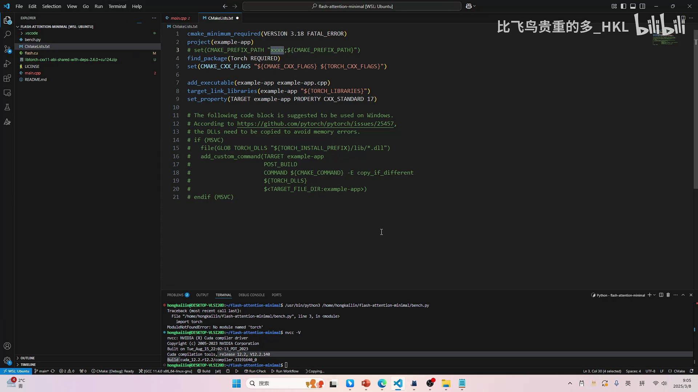 |
| 还提供了一个非常简单的 main 函数，对吧？这里已经有 main 了，那我们就叫它 `example_app` 吧。 [【跳转到 07:27】](https://www.bilibili.com/video/BV1FM9XYoEQ5/?p=3&t=447) | 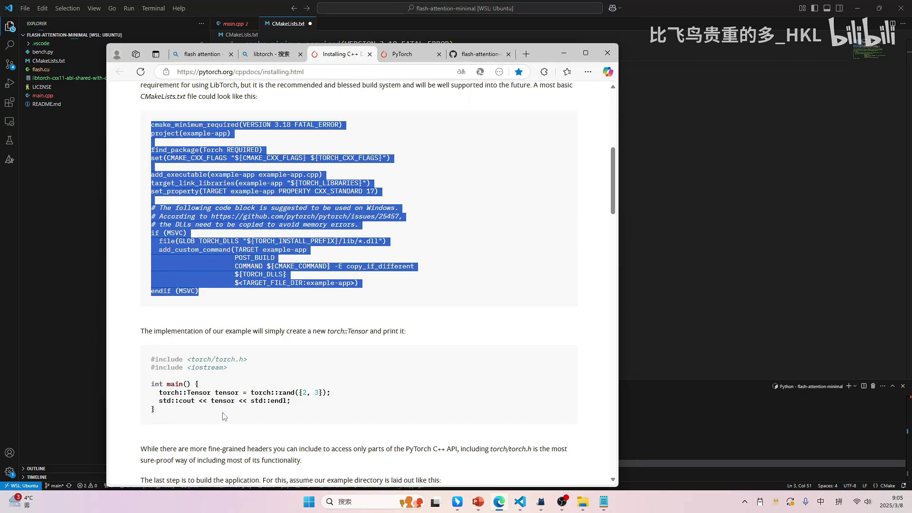 |
| `example_app.cpp`（笔误，是 `.cpp`）。我们把这个复制过来。所以一会儿我们就用它来做测试——如果这些东西都拷贝过来、也解压了、这句话也写对了，那这个程序应该能执行出来；能执行出来就说明环境搭建完了。其实肯定能执行出来，就是这么简单。 [【跳转到 07:32】](https://www.bilibili.com/video/BV1FM9XYoEQ5/?p=3&t=452) | 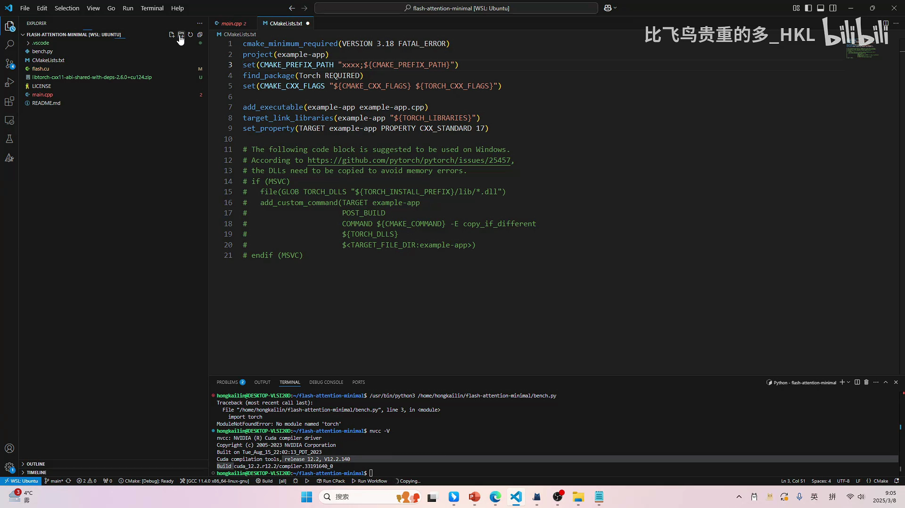 |
| 很多人会说：哎呀，我没用过 LibTorch，我只用过 PyTorch，那怎么办呢？其实也非常简单。为什么呢？你可以想象一下：PyTorch 绝对是包装了 LibTorch，对吧？所以它的函数形式应该是一样的，不可能 C++ 叫一个名、PyTorch 叫另一个名，那很蠢。所以很明显，对于 C++ 的 LibTorch—— [【跳转到 07:57】](https://www.bilibili.com/video/BV1FM9XYoEQ5/?p=3&t=477) | 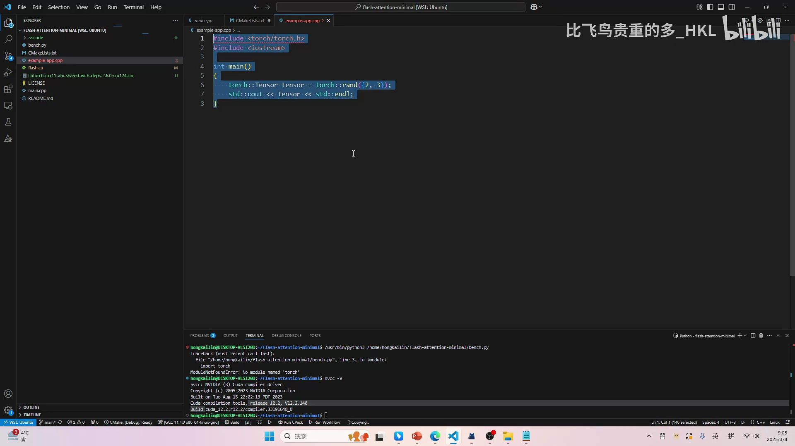 |
| 来讲，我们其实可以直接套用：Python 怎么写，你就怎么写，按 C++ 的语法写就可以了，对吧？所以我现在做一个简单的猜测：如果我想把它放到 GPU 上、放到 CUDA 上，大概率就是用同样的调用方式——点 `.to()`。我已经复制过来了。 [【跳转到 08:22】](https://www.bilibili.com/video/BV1FM9XYoEQ5/?p=3&t=502) | 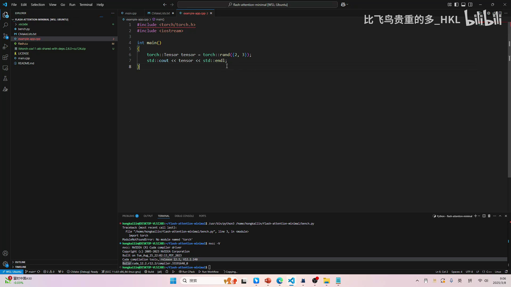 |
| 我猜就是点 `.to`，我之前初学的时候也是这么猜的。这里写一个 CUDA，我猜是这样。我们一会儿可以看一下。好，我们这个已经复制过来了，复制过来之后我们先把它解压…… [【跳转到 08:47】](https://www.bilibili.com/video/BV1FM9XYoEQ5/?p=3&t=527) | 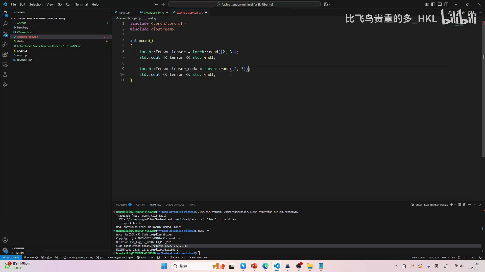 |
| 好，我们先按这个（命令）来，然后再给它解压。你看这里面已经开始解压了。我们打开，你就看到现在有很多的 lib，反正内容肯定挺多，解压也得一段时间。那我们就继续看这个代码——这里面有一个 `example.cpp`。 [【跳转到 09:12】](https://www.bilibili.com/video/BV1FM9XYoEQ5/?p=3&t=552) | 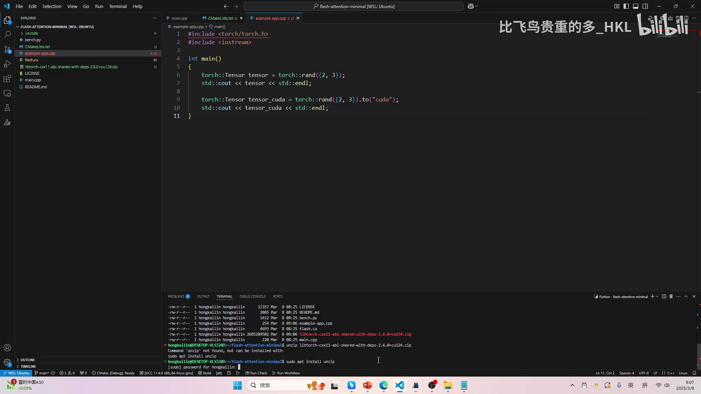 |
| 然后我们后面期待的是把这个代码移植到 C++ 端，对吧？它弄完了，我们一会儿再看。我们现在来试验一下：首先找到这个 torch，肯定有一个 `TorchConfig.cmake`，我们就拷贝一下它的路径，然后去找到这个 CMake，把它加一下。 [【跳转到 09:37】](https://www.bilibili.com/video/BV1FM9XYoEQ5/?p=3&t=577) | 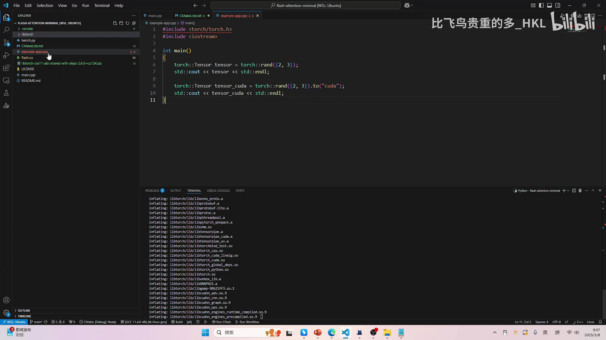 |
| 这样就完成了。我们来试一下，看看当前这些配置能不能编译出来——build 一下。我觉得 LibTorch 可能编译起来有点慢。 [【跳转到 10:02】](https://www.bilibili.com/video/BV1FM9XYoEQ5/?p=3&t=602) | 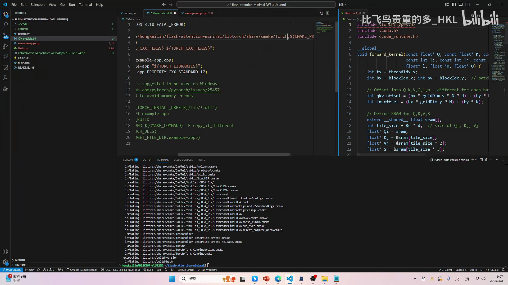 |
| 哎，还可以。然后现在这里面应该有一个可执行文件了，对吧？`example_app`，我们运行——你看，成功了。而且我刚才的猜测也是对的。这真不是我会，我再给大家强调：这么猜就行，它跟 Python 端真的没有任何区别。所以现在，你看我们的 LibTorch 环境就搭好了。下一步我们要干嘛呢？ [【跳转到 10:27】](https://www.bilibili.com/video/BV1FM9XYoEQ5/?p=3&t=627) |  |
| 下一步我们要做的事情，就是把这个代码——不是这个，是这个代码——移植到 C++ 端，也非常简单。我们来看怎么做。我们另起一个，新建一个，就叫 `flash_attention_main.cpp`。我们来看一下这个怎么写，我们把这个这么弄过来。 [【跳转到 10:52】](https://www.bilibili.com/video/BV1FM9XYoEQ5/?p=3&t=652) | 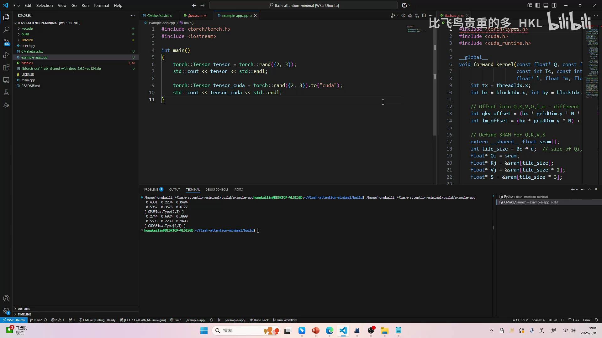 |
| 当然你也可以让 AI 直接帮你翻译，但我就不用了。然后加括号，对吧？我们先把这个里面的头文件拿过来——它用到了这两个头文件，我们也试着用这两个。下一步，这些变量我们先定义一下，跟它保持一致。然后只是你要加一个 `const int`。 [【跳转到 11:17】](https://www.bilibili.com/video/BV1FM9XYoEQ5/?p=3&t=677) | 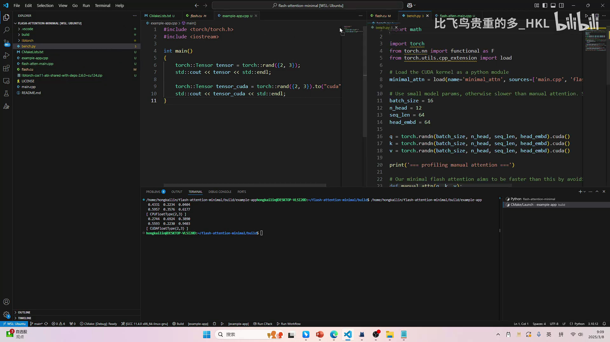 |
| `const int`，加一个它，`const int`，加一个它。好，现在变量都定义完了。下面就是这个函数，对吧？我们直接 copy 过来。然后这个（device 变量）我们可以直接用 `auto`。 [【跳转到 11:42】](https://www.bilibili.com/video/BV1FM9XYoEQ5/?p=3&t=702) | 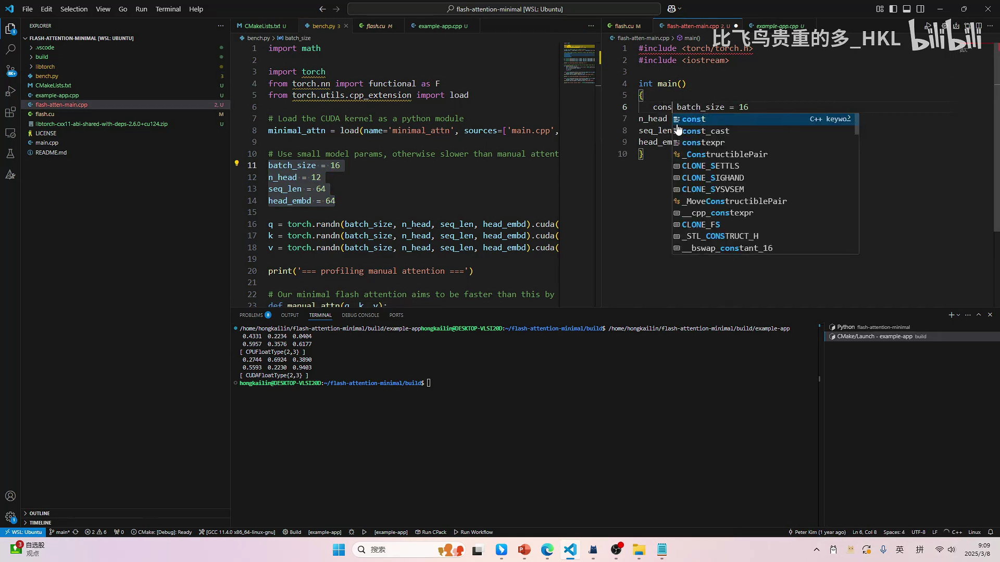 |
| 好，这个我们也弄完了。弄完之后——哦对，没有分号。这样。现在这样就做完了，对吧？然后我们来看一下：这个 `torch` 这里可以（直接写 `torch::`），但很明显我们这个 C++ 里肯定不能（只写 tensor）。你可以看一眼，它是 `torch::`——这个 `torch` 是个命名空间，对吧？ [【跳转到 12:07】](https://www.bilibili.com/video/BV1FM9XYoEQ5/?p=3&t=727) | 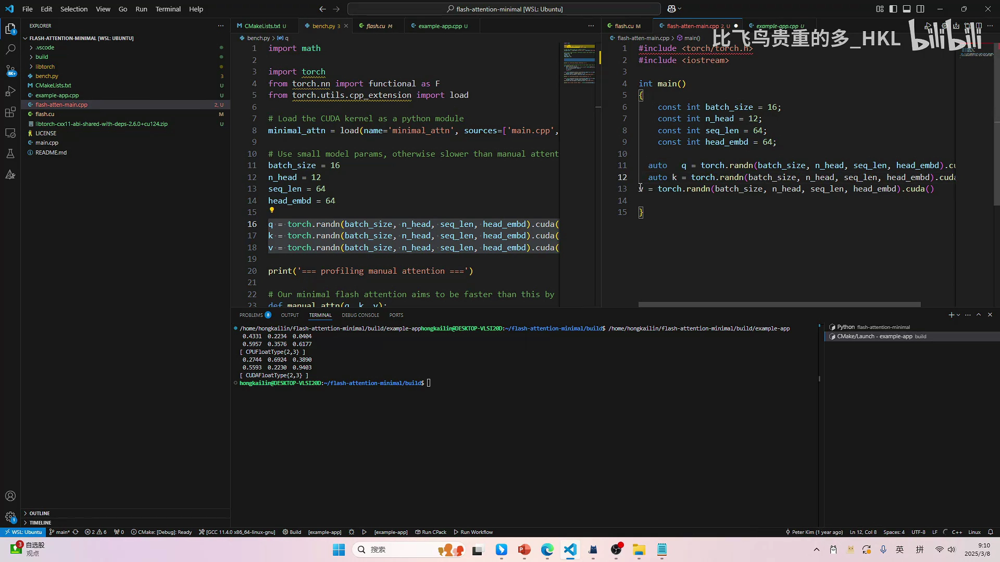 |
| 所以你看这里其实就是这么做。然后这里面你可以看一眼，它用的是大括号的形式去做的，那我们也加个大括号。所以就照抄一下。你看我们其实真的没有刻意去学它，就基于这么一个 demo，加上 C++ 里、Python 里的代码，很多都可以直接做出来。好，这样—— [【跳转到 12:32】](https://www.bilibili.com/video/BV1FM9XYoEQ5/?p=3&t=752) | 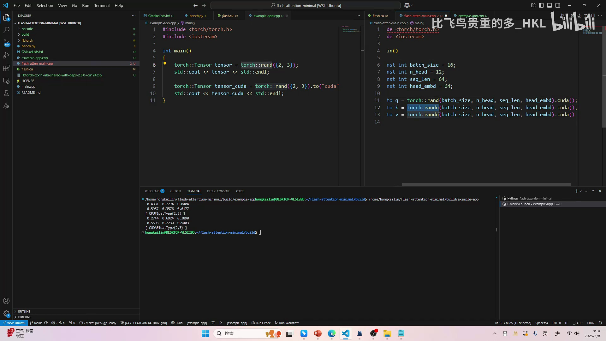 |
| 然后我们来看一眼，我们现在先这样，然后再写一个可执行文件。 [【跳转到 12:57】](https://www.bilibili.com/video/BV1FM9XYoEQ5/?p=3&t=777) | 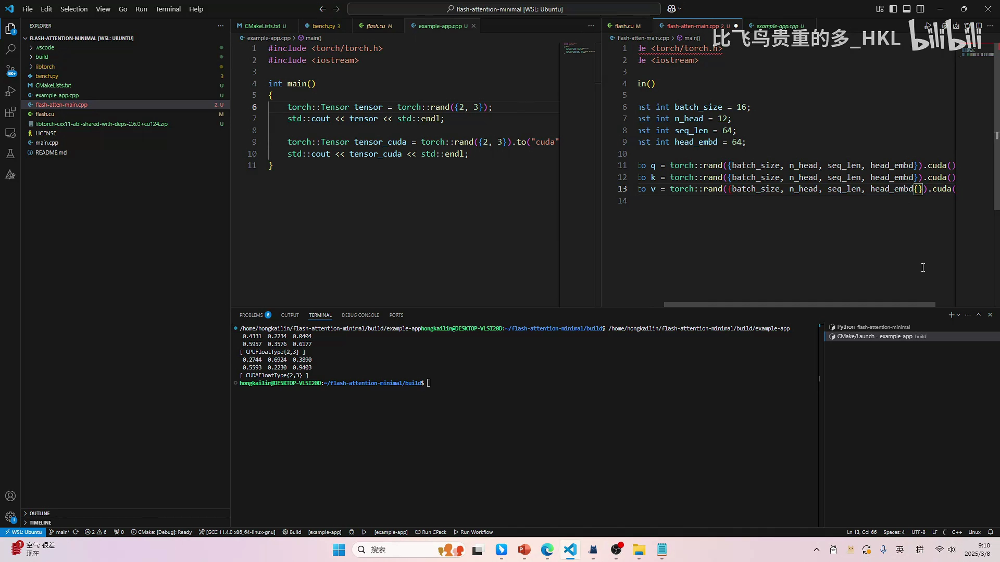 |
| 然后我们把这个叫—— [【跳转到 13:07】](https://www.bilibili.com/video/BV1FM9XYoEQ5/?p=3&t=787) | 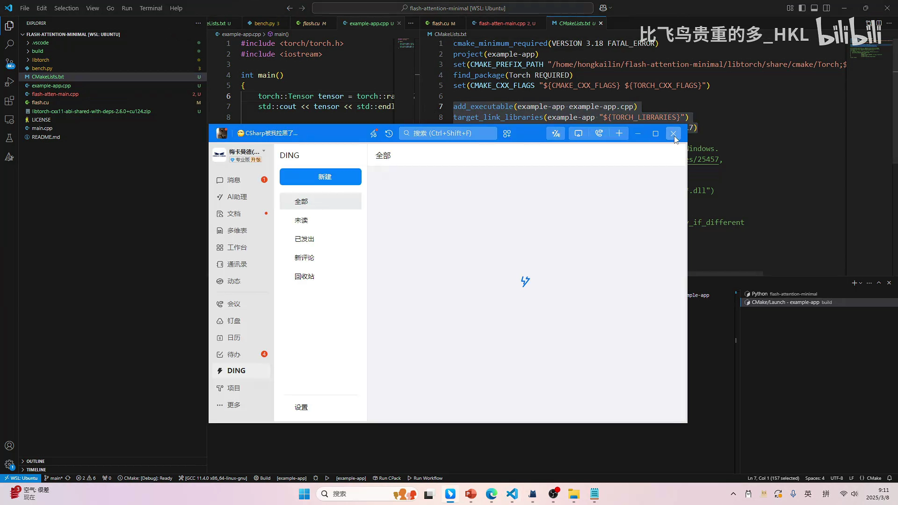 |
| 叫 `flash_attention`……然后这个你既要用到这样一个 cpp，而后面还需要调用 `flash.cu`，肯定得要他俩。 [【跳转到 13:12】](https://www.bilibili.com/video/BV1FM9XYoEQ5/?p=3&t=792) | 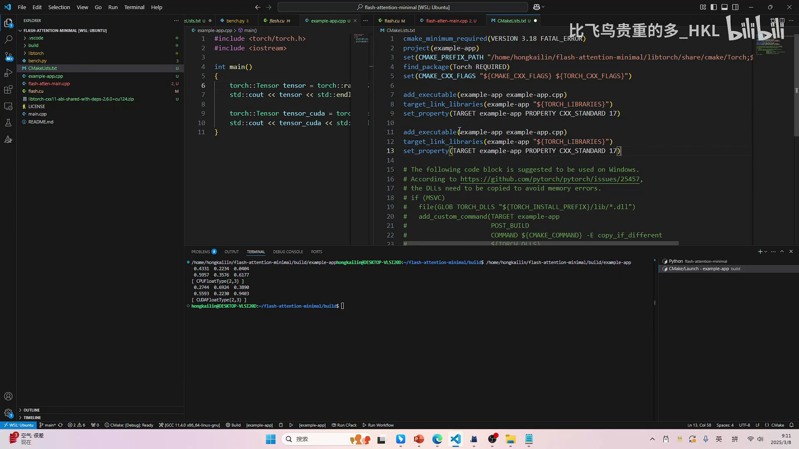 |
| 然后我们把这个写在这儿，这个写在这儿。你看这样我们又完成了一个可执行文件的搭建。然后这个就不看了，直接把它拖过来。我们先已经有两个（cpp），先编译一下，应该没什么问题。 [【跳转到 13:37】](https://www.bilibili.com/video/BV1FM9XYoEQ5/?p=3&t=817) | 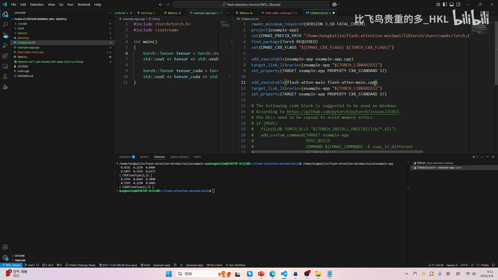 |
| 哎呀，这里好像……（改一下）再加个优化选项吧。嗯 OK，这个改完就没什么问题了。然后下一步，这个 Q、K、V 就要调用了，对吧？其实调用的函数就在这儿，特别简单，就是这个函数，看 Q、K、V，它接收三个参数。 [【跳转到 14:02】](https://www.bilibili.com/video/BV1FM9XYoEQ5/?p=3&t=842) | 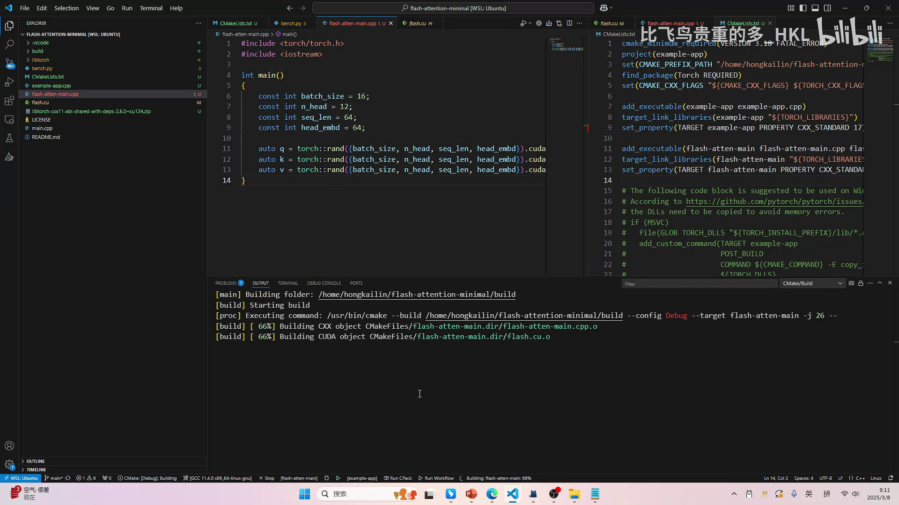 |
| 所以我们就直接调就可以了。直接调的话，你要么加头文件——但我懒得加了，所以怎么做呢？CMake 里都讲过：我们直接把它的声明写在这儿就完事了。然后这回这个 forward 我们就 Q、K、V 传进去，好，完事了，Build。 [【跳转到 14:27】](https://www.bilibili.com/video/BV1FM9XYoEQ5/?p=3&t=867) | 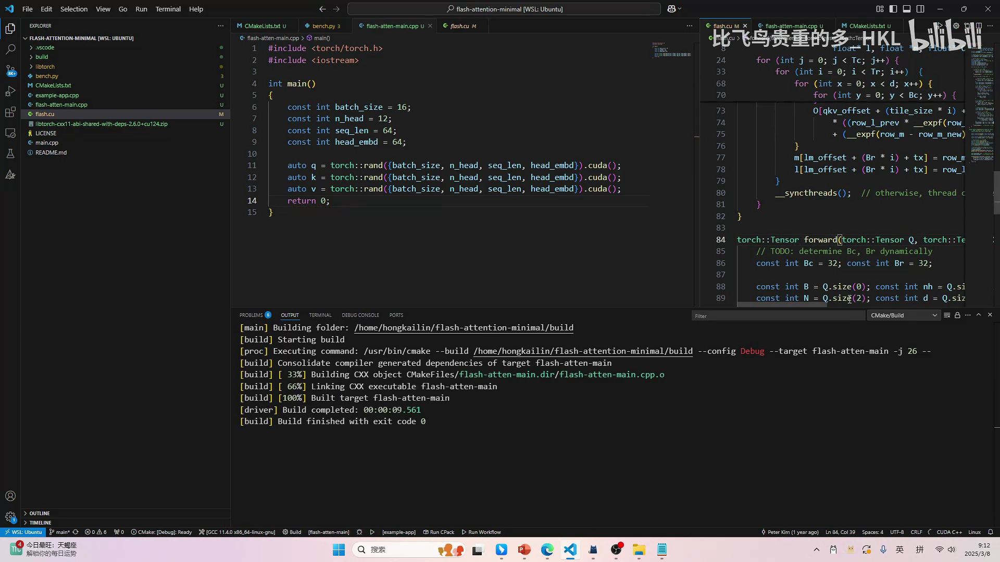 |
| 好了，这个也完成了，对吧？然后我们来试一试，看看这个代码可不可以执行。怎么试呢？再打断点执行——哎不对不对不对。 [【跳转到 14:52】](https://www.bilibili.com/video/BV1FM9XYoEQ5/?p=3&t=892) | 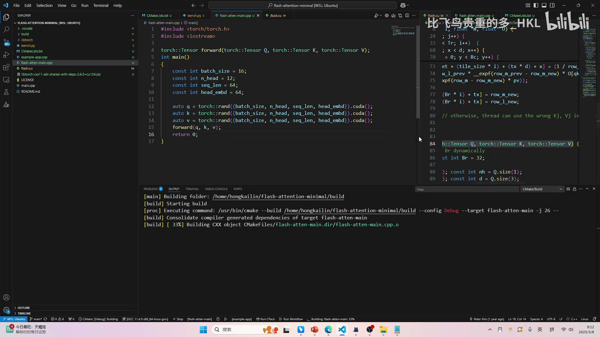 |
| 不好意思，应该是这样。好，你看断点也进来了，对吧？然后这样我们就可以愉快地 debug 程序了。还有，这个地方你想进去现在进不去，为什么呢？因为我们需要加上之前一直所说的那几个地方——就这儿。但这些地方之前都讲过。 [【跳转到 15:17】](https://www.bilibili.com/video/BV1FM9XYoEQ5/?p=3&t=917) | 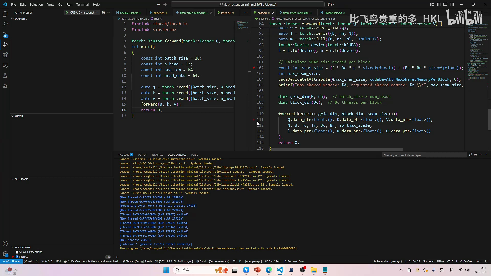 |
| 我们想调试，对吧？那你一定要加上这句话。另外就是要把可执行文件写到 launch.json 里面，写到这里面有一个（program 配置）。然后记得把这个可执行文件写过来，在哪儿呢？在这儿，复制文件地址。 [【跳转到 15:42】](https://www.bilibili.com/video/BV1FM9XYoEQ5/?p=3&t=942) | 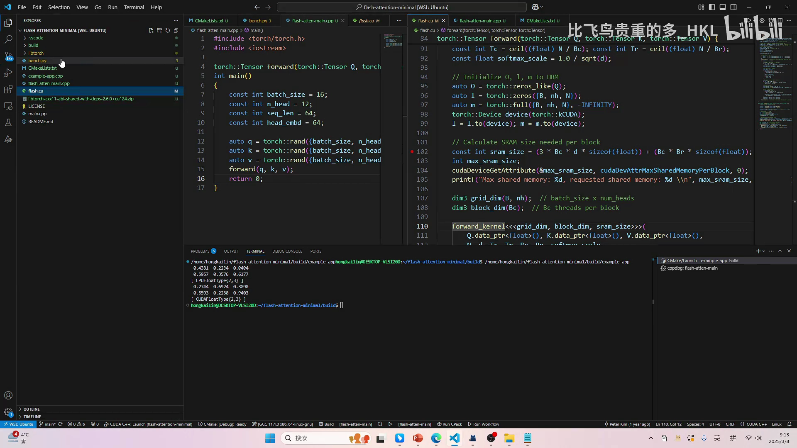 |
| copy 路径，然后我们也写到这里，直接粘过来。好，这样就可以了。这样我们现在就可以 debug 到 kernel 里面了，我们试一试——F5。哎呀哎呀…… [【跳转到 16:07】](https://www.bilibili.com/video/BV1FM9XYoEQ5/?p=3&t=967) | 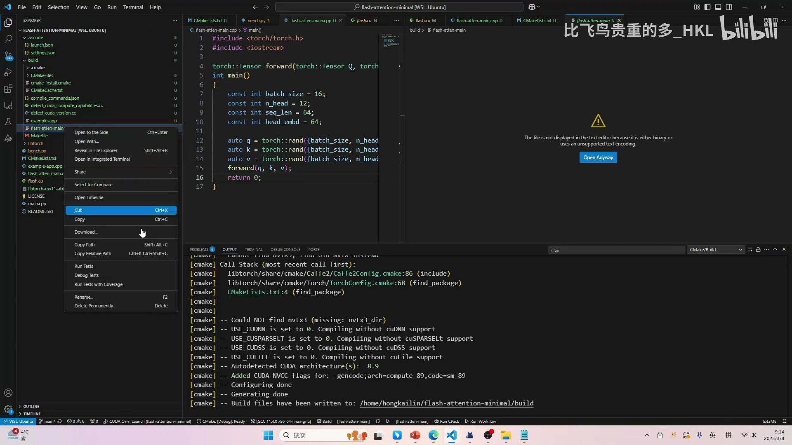 |
| 我这是不是有点着急了，怎么还没编译好？重来重来。嗯，你看这回就很（顺），对吧？你看就已经进来了。所以你看，我们就通过这样的方式—— [【跳转到 16:32】](https://www.bilibili.com/video/BV1FM9XYoEQ5/?p=3&t=992) | 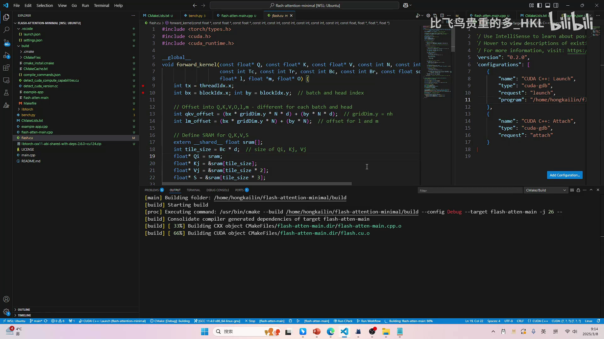 |
| 就把之前没有办法调试的 Python 程序，改成了 C++ 程序，还可以调试。这样我们就可以很方便地去看里面的代码了，对吧？所以你看，这个整体的流程我们就介绍完了。 [【跳转到 16:57】](https://www.bilibili.com/video/BV1FM9XYoEQ5/?p=3&t=1017) | 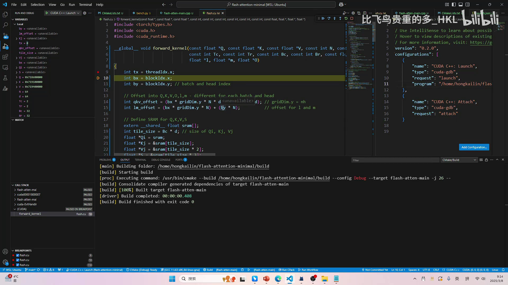 |
| 如果你想学 LibTorch，其实一点都不难——如果你会 PyTorch 的话。 [【跳转到 17:09】](https://www.bilibili.com/video/BV1FM9XYoEQ5/?p=3&t=1029) | 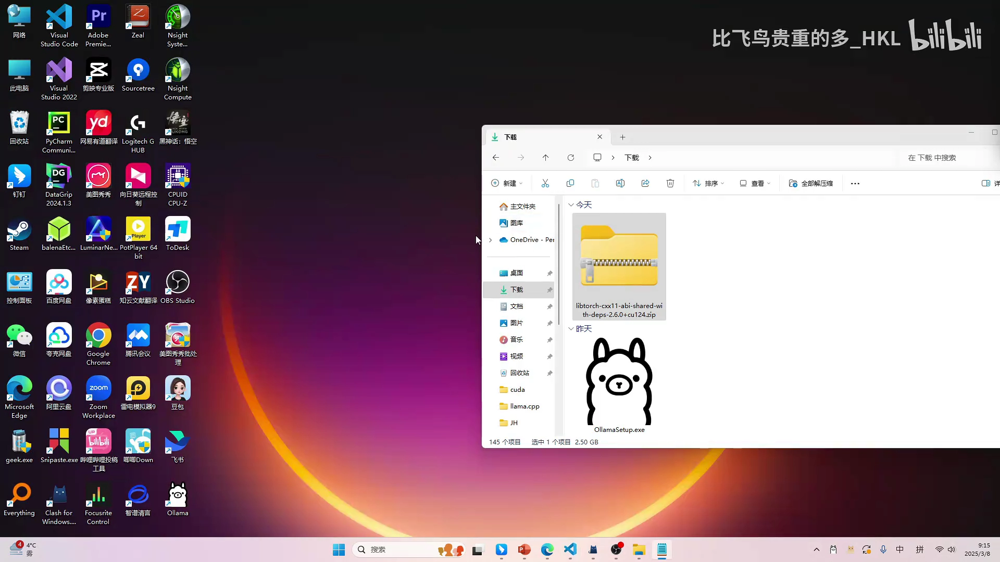 |
| 你明确想用它来干嘛，你就会发现这玩意真的太简单了。 [【跳转到 17:14】](https://www.bilibili.com/video/BV1FM9XYoEQ5/?p=3&t=1034) | 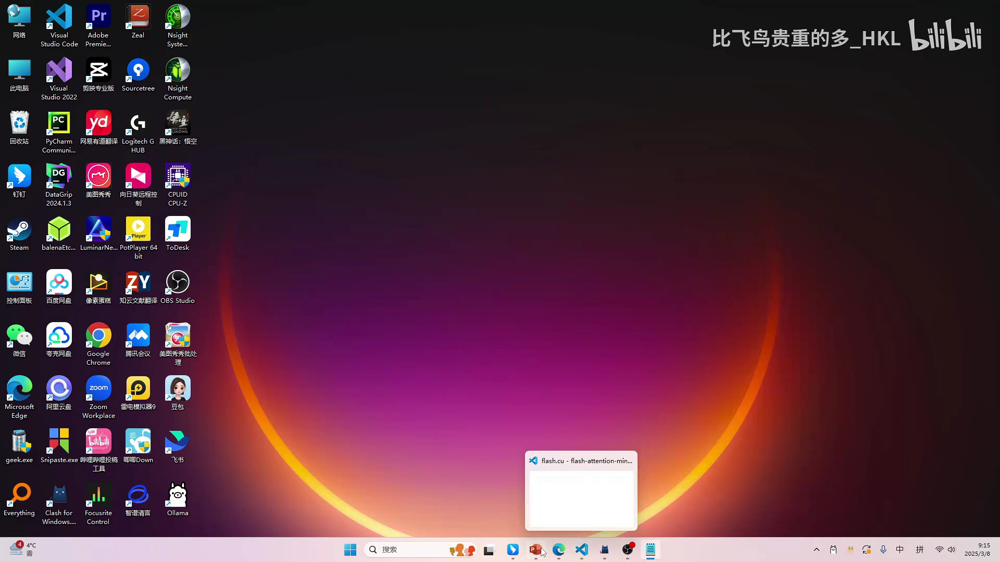 |
| 基本上不用学。尤其是现在有 AI，你用 Python 写一段代码，然后丢给 AI「给我翻译成 LibTorch」，它就给你翻译成了，非常简单。所以这就不是什么难点。我们这节课也就讲完了。 [【跳转到 17:19】](https://www.bilibili.com/video/BV1FM9XYoEQ5/?p=3&t=1039) | 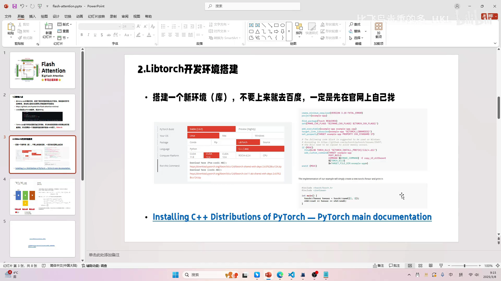 |
| 简单说一下：之前为什么我说「如果早点想到用 LibTorch 来讲，可能会更方便一点」。你看，我们以后再想学 llama.cpp 里某一个算子—— [【跳转到 17:41】](https://www.bilibili.com/video/BV1FM9XYoEQ5/?p=3&t=1061) | 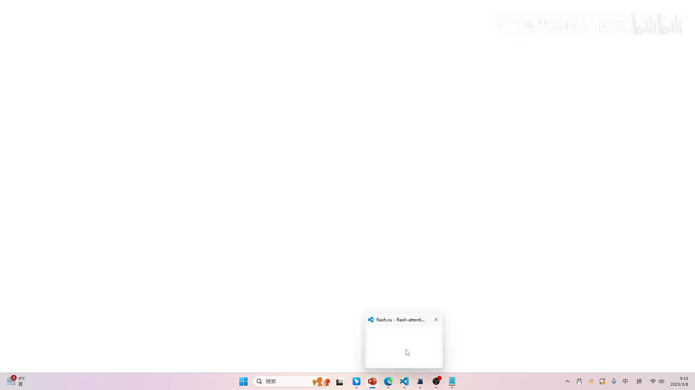 |
| 你如果能搞清楚它传入参数的维度，你是不是就可以直接……怎么做呢？ [【跳转到 17:46】](https://www.bilibili.com/video/BV1FM9XYoEQ5/?p=3&t=1066) | 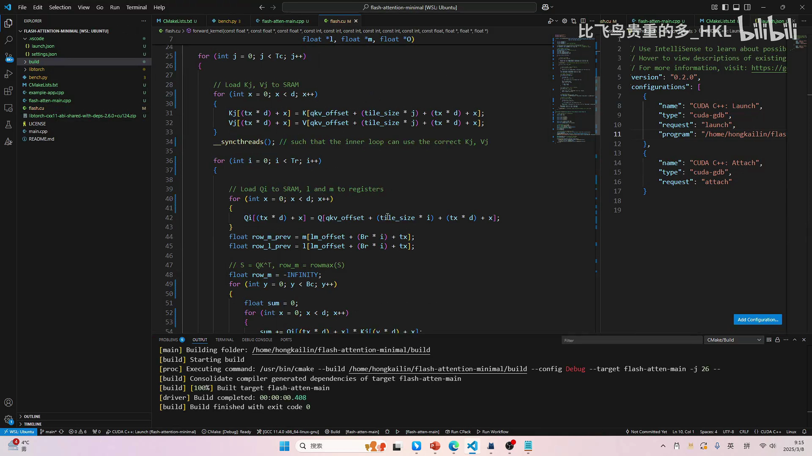 |
| 你就可以直接把那个……哎哟我这代码还关了。 [【跳转到 17:54】](https://www.bilibili.com/video/BV1FM9XYoEQ5/?p=3&t=1074) | 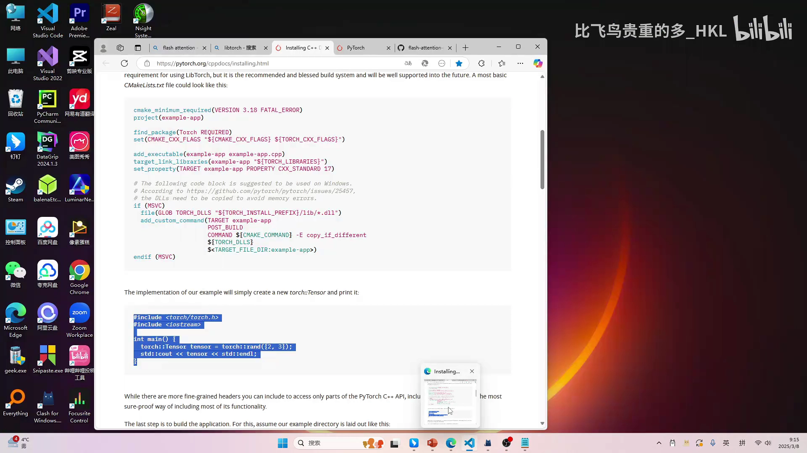 |
| 我先打开一个。举个例子：比如我们之前讲的那个 `norm`，你可以直接把（llama.cpp 的）代码粘过来，粘到（C++ 文件里）——这就是我们的 CUDA 算子。然后下一步要怎么做？ [【跳转到 17:59】](https://www.bilibili.com/video/BV1FM9XYoEQ5/?p=3&t=1079) | 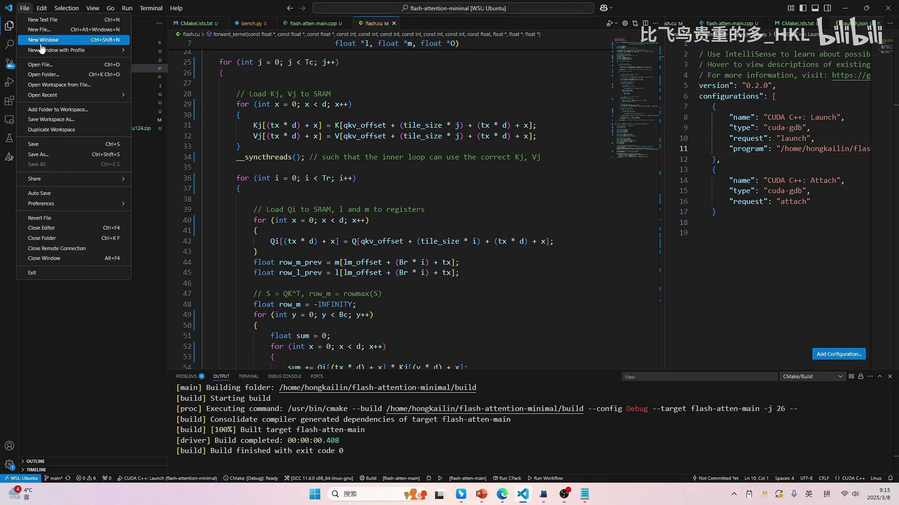 |
| 下一步要做的就是把它之前的这个函数改写成—— [【跳转到 18:21】](https://www.bilibili.com/video/BV1FM9XYoEQ5/?p=3&t=1101) | 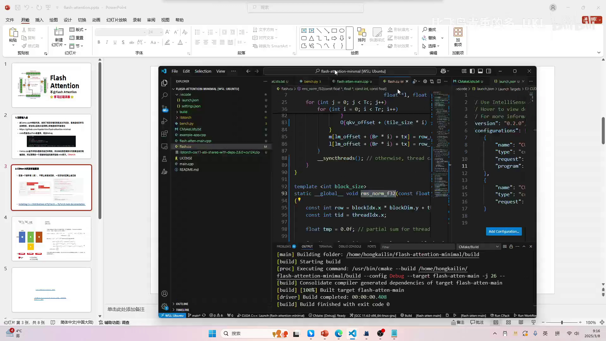 |
| 用 LibTorch 改写。要不要给大家写一个？我们试着写一个吧，这样。然后这里面不就调它了吗？我就随便改啊。 [【跳转到 18:26】](https://www.bilibili.com/video/BV1FM9XYoEQ5/?p=3&t=1106) | 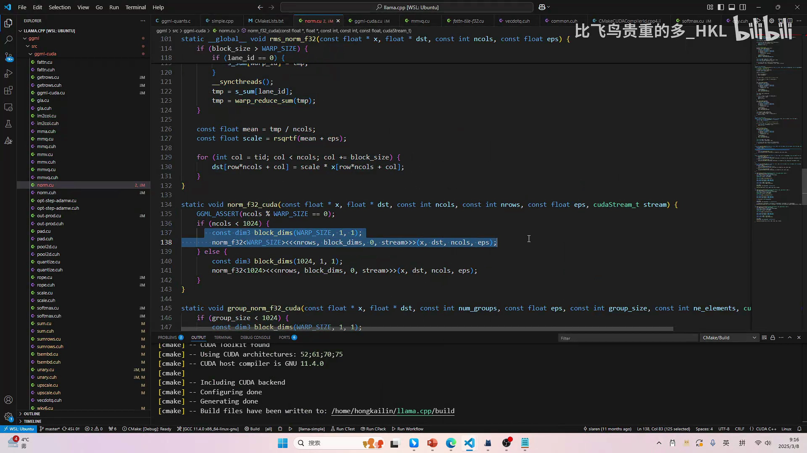 |
| 调它了嘛，对吧？然后这里面你怎么分配……它的输入、输出，对吧？那你现在应该有一个比如叫 `in`，再写一个叫 `out`。然后你这个 `in` 和 `out` 的维度——之前 llama.cpp 用的是 `ne`，对吧？你就可以直接这样拿到它的维度。 [【跳转到 18:51】](https://www.bilibili.com/video/BV1FM9XYoEQ5/?p=3&t=1131) | 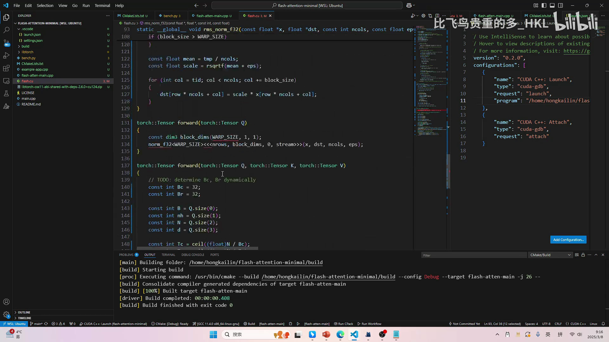 |
| 然后你就可以去分。比如说它是 32，对吧？然后你有多少行，那就是它，`.size()`（我忘了是几了）。比如说它是一，举个例子，那你就这样等于……然后你前面加个 `auto` 就完事了，就这么简单。这怎么还乱套了？这样，对吧？ [【跳转到 19:16】](https://www.bilibili.com/video/BV1FM9XYoEQ5/?p=3&t=1156) | 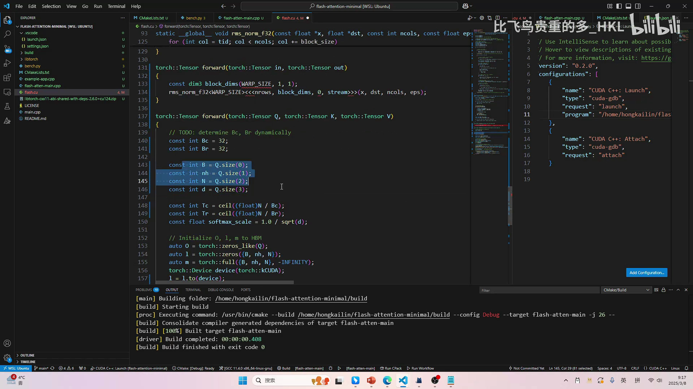 |
| 你看你也传过来了。然后这是个模板参数，我记得是 1024，对吧？下面这个 `stream` 其实你可以不给。然后这个 `X` 和这个 `dst` 我随便给，比如它也是 1024，这个 `eps` 比如是 0.5、0.56 也行。那这个 `X` 就是它输入的指针，对吧？那你就看这里面这个指针怎么给——`.data_ptr<float>()`。 [【跳转到 19:41】](https://www.bilibili.com/video/BV1FM9XYoEQ5/?p=3&t=1181) | 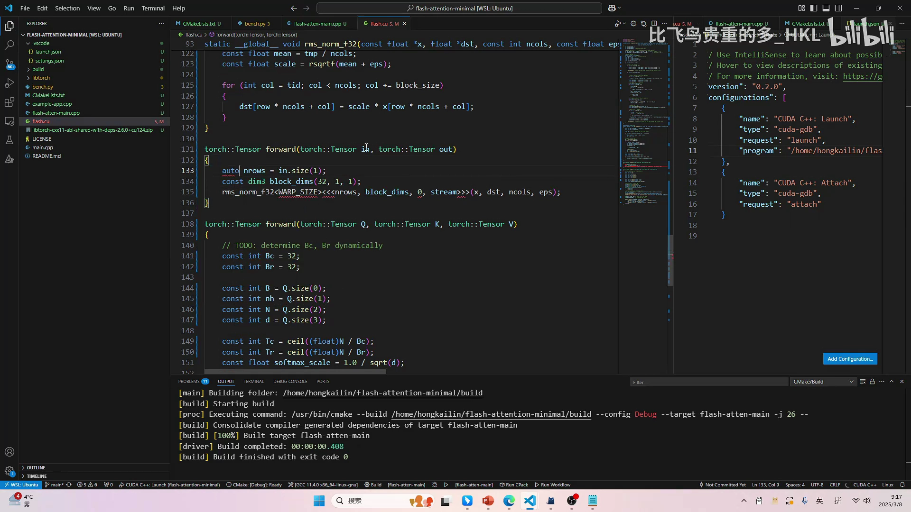 |
| 那你就也这么写呗，然后你用 `in`，这个用 `out`，它的……诶，他现在为什么给我报错呢？少了一个括号是吧？应该还有个括号——啊我说的嘛，他是个可调用的函数。 [【跳转到 20:06】](https://www.bilibili.com/video/BV1FM9XYoEQ5/?p=3&t=1206) | 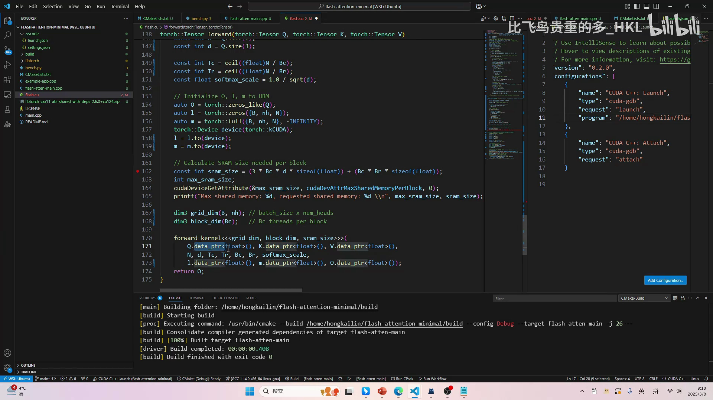 |
| 如果我当时能想到用这种方式给大家讲这个算子，可能就不用花那么长篇幅讲 llama.cpp 了。你看，这样其实就完成了，你下面要做的就是基于这个……就这么短的代码，就可以把这个算子给大家讲清楚了。所以大家自己学的时候，我不知道大家看到这儿还能不能回去看那个 llama.cpp—— [【跳转到 20:31】](https://www.bilibili.com/video/BV1FM9XYoEQ5/?p=3&t=1231) | 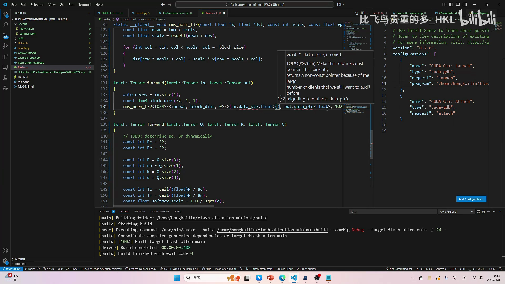 |
| 反正你用这种方式更方便、特别方便，你就脱离了 llama.cpp 那么重的包袱了，不用看那些了，直接这么写完事。好，我们这个就是一个简单的 demo，我就删掉吧。后面有各种各样的算子，我可能会用这种方式给大家讲，我觉得这种方式实在太棒了、特别 nice。好，这节课就先到这，我们已经把环境搭建完了，下节课开始正式讲解 FlashAttention。 [【跳转到 20:56】](https://www.bilibili.com/video/BV1FM9XYoEQ5/?p=3&t=1256) | 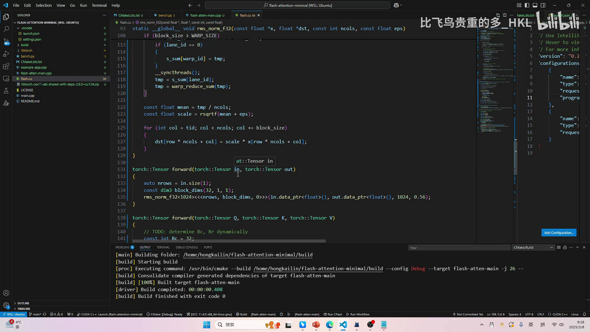 |
| （此区间无字幕） [【跳转到 21:21】](https://www.bilibili.com/video/BV1FM9XYoEQ5/?p=3&t=1281) | 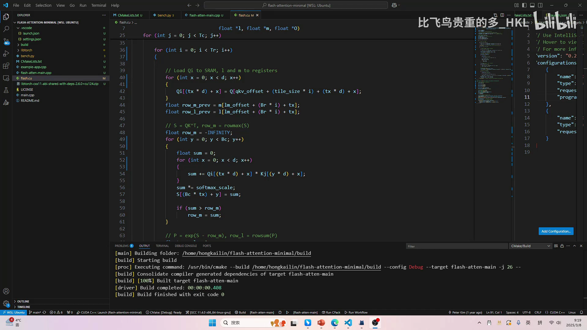 |