# 第04讲_三个矩阵相乘合并 原始文稿（图-字幕分栏）

| 字幕文本 | 画面 |
| :--- | ---: |
| 嗯，hello 大家好，我们这节课来看 FlashAttention 第三讲的内容。这节课我们来讲 FlashAttention 的分块乘法。我们之前提到过，FlashAttention 最核心的点——或者说这个算法做的一件事——是什么呢？就是**算子融合**。什么叫算子融合呢？给大家举几个简单的例子。比如我现在有一个矩阵。 [【跳转到 00:00】](https://www.bilibili.com/video/BV1FM9XYoEQ5/?p=4&t=0) | 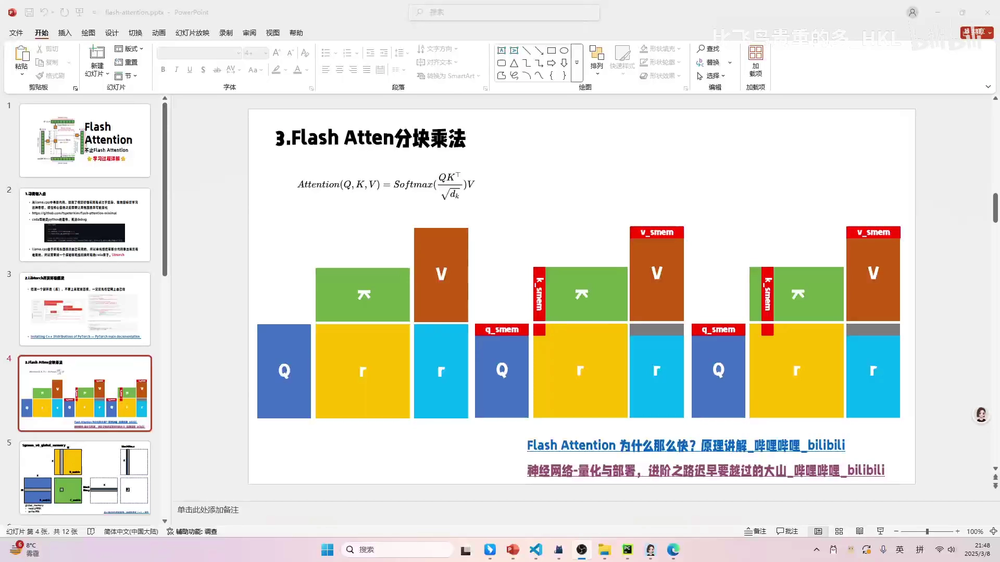 |
| 这个矩阵要把所有的数全都乘 0.5，这是第一步；然后呢再把所有的数全都加上 0.1。就这么一个需求。我给大家画个示意图：比如这个 R 矩阵是我的输入矩阵，我希望你第一步把这个矩阵全都加上一—— [【跳转到 00:25】](https://www.bilibili.com/video/BV1FM9XYoEQ5/?p=4&t=25) |  |
| 就加一，加完一之后我再希望把这个矩阵全都乘上——这样吧，乘上五。就这么个过程：先加一、再乘五。如果我们正常去做，那我就要先读取这个矩阵，然后把每个元素都加一，再写回显存，对吧？ [【跳转到 00:50】](https://www.bilibili.com/video/BV1FM9XYoEQ5/?p=4&t=50) |  |
| 然后我再去读一下——把刚才写回的那个矩阵再读进来，然后再乘上五、再写回去。你会发现这里面涉及到什么呢？涉及到两次写回、两次读取：先读取它、写回它，再读取它、再写回它。这就是一个正常的算子计算流程。 [【跳转到 01:15】](https://www.bilibili.com/video/BV1FM9XYoEQ5/?p=4&t=75) |  |
| 但如果我们能对这个算子进行合并，就很明显会发现：其实我只需要先加一、再乘五，就把这个矩阵变成了「读一次、写一次」。因为你会发现，每个元素加一和乘五——我是不需要先得到加一的结果才能去计算的。 [【跳转到 01:40】](https://www.bilibili.com/video/BV1FM9XYoEQ5/?p=4&t=100) | 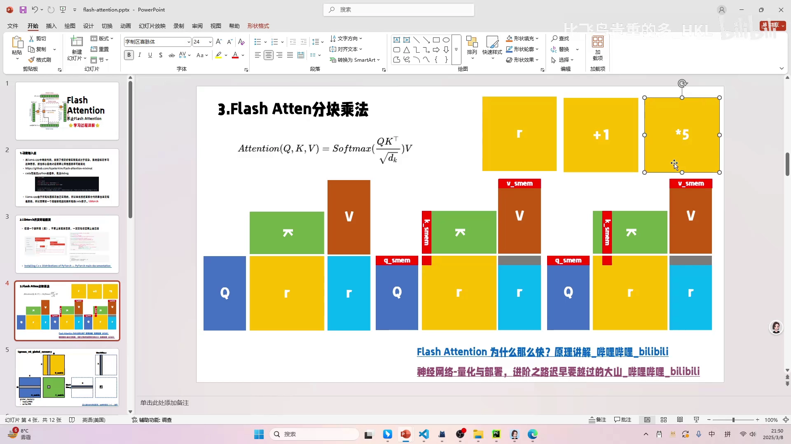 |
| 这就是算子融合的一个核心：我现在有两个算子，一个加法、一个乘法，这两个算子之间不是「必须先得到前者的完整结果，才能做后者的乘法」。不是的，你哪怕直接先加一、再乘五，仍然能正常执行出正确结果。 [【跳转到 02:05】](https://www.bilibili.com/video/BV1FM9XYoEQ5/?p=4&t=125) | 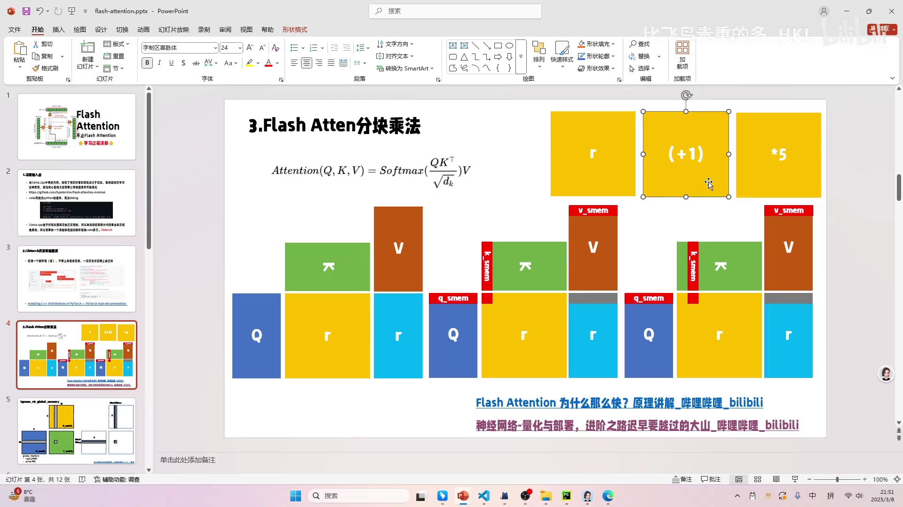 |
| 这个就叫算子融合。如果大家想对算子融合有更深入的了解，建议大家看下面这个视频——这个视频是商汤的一位作者分享的。 [【跳转到 02:30】](https://www.bilibili.com/video/BV1FM9XYoEQ5/?p=4&t=150) | 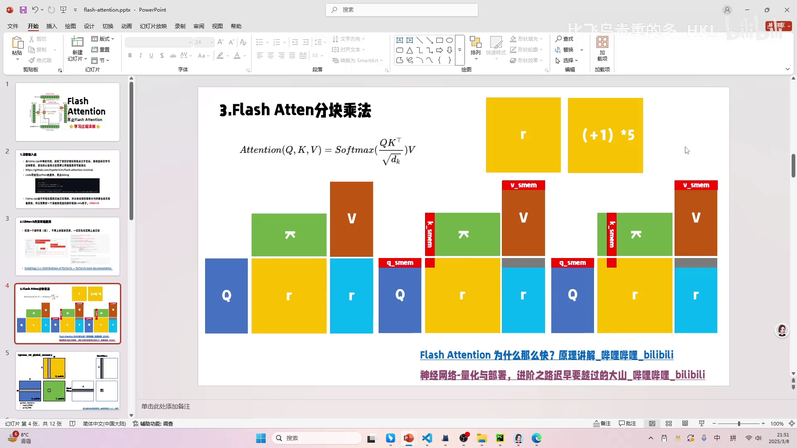 |
| 这个视频有八个小时，非常精髓。 [【跳转到 02:39】](https://www.bilibili.com/video/BV1FM9XYoEQ5/?p=4&t=159) |  |
| 你看，这是 22 年的视频，那个时候大模型可能还没火起来。但我就是在他刚发的时候就看过了，看完收获非常非常多。或者说我这么说吧：这个视频是我做量化和部署的入门视频。这八个小时我其实看了好几遍，特别好，里面有很多非常关键的知识。 [【跳转到 02:44】](https://www.bilibili.com/video/BV1FM9XYoEQ5/?p=4&t=164) |  |
| 所以推荐大家看一下，那里面有很系统地讲—— [【跳转到 03:09】](https://www.bilibili.com/video/BV1FM9XYoEQ5/?p=4&t=189) |  |
| 怎么做算子融合、以及到底什么是算子融合。它讲得很系统。好，我们就不多说了。现在再来看我们要聊的这个 attention 算子。它应该是谷歌 2017 年提出来的，大家一直都用这种方法。古早的时候—— [【跳转到 03:14】](https://www.bilibili.com/video/BV1FM9XYoEQ5/?p=4&t=194) | 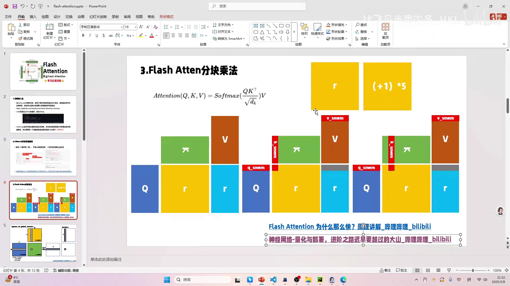 |
| 大家都觉得这个算子没有办法融合。为什么没办法融合呢？给大家看一眼：Q 和 K 相乘是一个算子（Q 和 K 的转置相乘，这其实是很基础的算子），然后下一步要做 softmax。而 softmax 这一步，就是阻碍我们融合 attention 算子的一个非常大的问题。为什么呢？我们想一想：Q 乘 K 做完了—— [【跳转到 03:39】](https://www.bilibili.com/video/BV1FM9XYoEQ5/?p=4&t=219) |  |
| 得到了 R，然后我们希望对它求 softmax。如果你想对 R 求 softmax，你需要（先得到）每一行——这一行的数都求出来，才能计算这一行的 softmax，对吧？因为它有一个求和，还有一个求极值，这些都需要这一行的数都计算完之后—— [【跳转到 04:04】](https://www.bilibili.com/video/BV1FM9XYoEQ5/?p=4&t=244) |  |
| 才能求出 R 经过 softmax 之后的结果，对吧？所以之前大家都觉得这没办法融合：你这个 V 必须等我的 softmax 完整做完之后（才能乘）——它不能像刚才举的例子那样「直接加一、乘五」就行。它必须得是 Q 和 K 做完、拿到 R 之后，才能对 R 做 softmax。 [【跳转到 04:29】](https://www.bilibili.com/video/BV1FM9XYoEQ5/?p=4&t=269) |  |
| 做完 softmax 再乘以 V，这是之前大家的想法，觉得它不能融合。所以这就相当于三个算子：Q 乘 K 是一个算子，softmax 是一个算子，再乘 V 是一个算子。三个算子很大程度上就意味着—— [【跳转到 04:54】](https://www.bilibili.com/video/BV1FM9XYoEQ5/?p=4&t=294) |  |
| 三次访存和三次写回，对吧？如果我能把它融合成一个算子，那就只有一次访存和一次写回，会节省两次访存和写回的时间。大家不要小看这个访存和写回——我们之前讲了很多 CUDA 编程，你会发现，读取显存比读取内存要耗时得多，对吧？ [【跳转到 05:19】](https://www.bilibili.com/video/BV1FM9XYoEQ5/?p=4&t=319) |  |
| 所以如果我们真能把这个算子合并——把 softmax、QK，然后再乘上 V 一起做出来，不用一个算子一个算子地做——那将会对程序有非常大的性能提升。具体的做法，我这里先做一个简单的讲解，因为我先不讲 softmax，因为 softmax 才是这里的难点。我们先讲这个 QK 和 V 相乘。 [【跳转到 05:44】](https://www.bilibili.com/video/BV1FM9XYoEQ5/?p=4&t=344) | 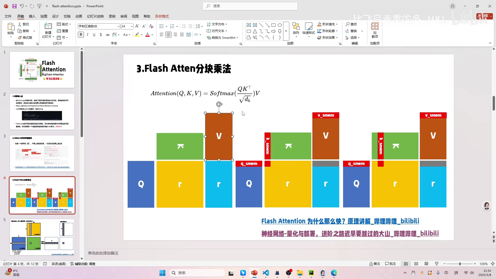 |
| 这部分内容大家可以参考这个视频——「FlashAttention 为什么那么快」，我觉得这是 B 站里讲 FlashAttention 讲得相对比较清晰的一个视频。 [【跳转到 06:09】](https://www.bilibili.com/video/BV1FM9XYoEQ5/?p=4&t=369) |  |
| 就给大家推荐这个视频。然后我们还是——我们现在不考虑 softmax。 [【跳转到 06:17】](https://www.bilibili.com/video/BV1FM9XYoEQ5/?p=4&t=377) |  |
| 就给大家推荐这个视频然后呢我们还是啊我们来看一眼就是我们现在我们不考虑softmax [【跳转到 06:22】](https://www.bilibili.com/video/BV1FM9XYoEQ5/?p=4&t=382) | 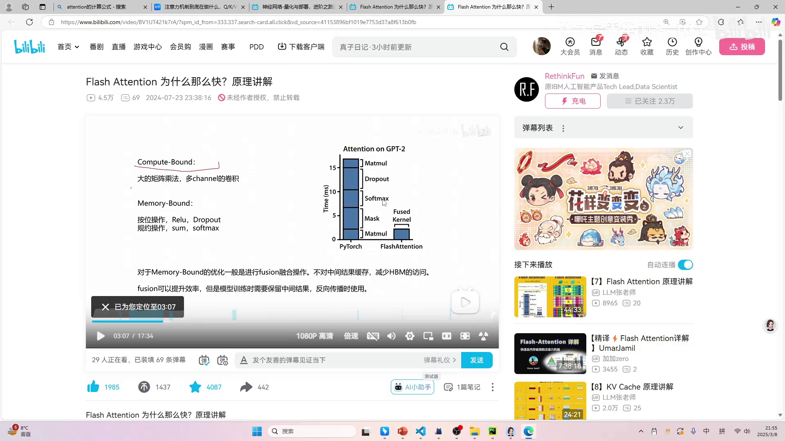 |
| 因为 softmax 很难，我后面可能要花很长时间给大家讲 softmax 到底如何变成一个可以迭代、可以融合的方式，它有一个演变流程。所以这节课先不看 softmax，只看 QK 和 V。我们先忽略 softmax 和除根号 d——因为除根号 d 本身很简单，很容易融合进来。好，我们来看一下 QK 转置再乘 V 这步要怎么做。 [【跳转到 06:27】](https://www.bilibili.com/video/BV1FM9XYoEQ5/?p=4&t=387) |  |
| 常规的做法是什么呢？我已经给大家画出来了：Q 乘 K 拿到一个 R，然后 R 再乘上 V，再拿到一个最后的 R（反正我都叫 R 了，大家理解一下）。所以如果是这样的话，这其实是两个算子——大家有没有发现？因为我要读取它、读取它，然后把这个 R 做一个写回操作，对吧？我们已经算出来结果了。 [【跳转到 06:52】](https://www.bilibili.com/video/BV1FM9XYoEQ5/?p=4&t=412) |  |
| 然后下一次要读取它、读取它，再把这个 R 做一个写回操作。这样做涉及两个问题：这个 R 你会发现它要存一遍、还要再读一遍，这就是两次很大的开销。为什么开销很大？你可以想一想：对于 attention 或者大模型来讲，一般情况下，Q 和 K 矩阵里面的—— [【跳转到 07:17】](https://www.bilibili.com/video/BV1FM9XYoEQ5/?p=4&t=437) | 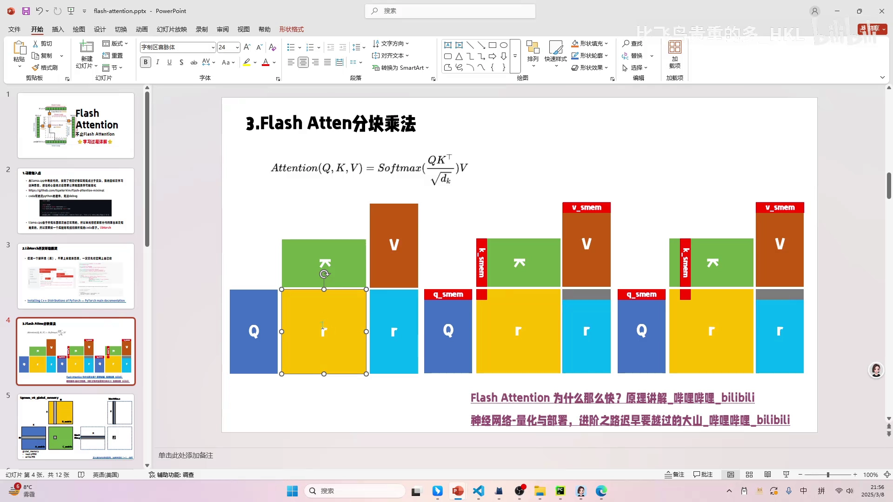 |
| 那个 K 的维度，就是我们之前讲的 M、K、N，对吧？ [【跳转到 07:42】](https://www.bilibili.com/video/BV1FM9XYoEQ5/?p=4&t=462) |  |
| 这个 K 的维度一般情况下是比较小的。为什么呢？因为这个维度其实相当于编码—— [【跳转到 07:47】](https://www.bilibili.com/video/BV1FM9XYoEQ5/?p=4&t=467) | 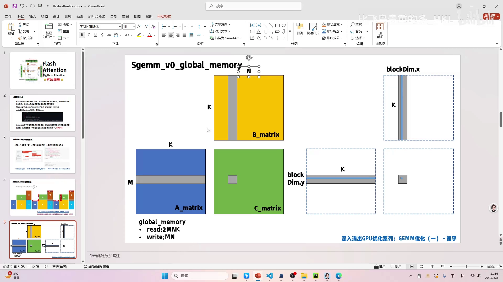 |
| 就是那个 feature（特征）的维度，正常来讲比如是 128。但是我们的序列长度呢？你看，后面很多大模型都支持几 K（4096），甚至有非常长的上下文 128K。如果上下文长度一旦很大，那就说明 Q 会变得特别长；一旦变得很长—— [【跳转到 07:52】](https://www.bilibili.com/video/BV1FM9XYoEQ5/?p=4&t=472) |  |
| 求出来的这个 R（attention weight 矩阵）就会变得特别大。它变得特别大就会有两个问题：第一，它很占显存。我们之前学 llama.cpp 的时候，那个框架标榜的是「运行期间不申请和释放显存，需要提前把显存都申请好」。所以当你面对比如一千个 token 的上下文时—— [【跳转到 08:17】](https://www.bilibili.com/video/BV1FM9XYoEQ5/?p=4&t=497) |  |
| 这个 R 就是一个 1000×1000 的矩阵，有这么多个数。然后每个数如果你用单精度（32 位），你可以想象 1000×1000×32，它应该是一个非常大的矩阵，非常占显存。其次呢，它又要被读一遍。它要先写一遍、再读一遍。 [【跳转到 08:42】](https://www.bilibili.com/video/BV1FM9XYoEQ5/?p=4&t=522) | 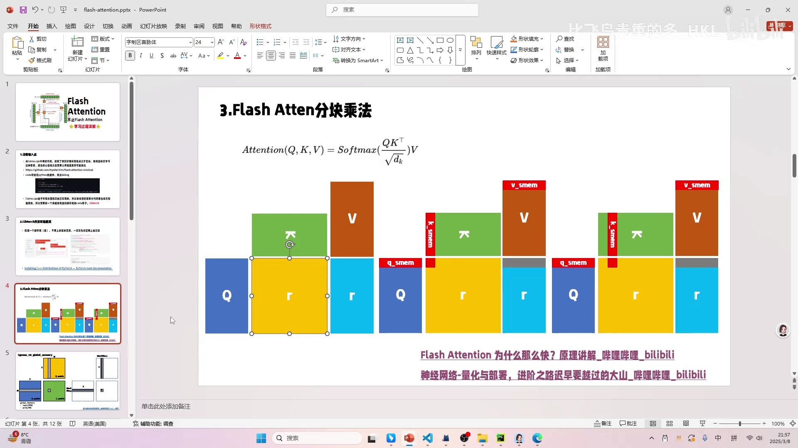 |
| 因为你下一个算子是 R 乘 V，这个 R 还要被再读一遍。所以这就相当于**显存和速度的双重打击**，对吧？如果这个算子不合并——如果 FlashAttention 没有出现——我们就会面临这样的问题。而 FlashAttention 非常强的一点就是：它既把速度提上来了，又把显存降下来了。 [【跳转到 09:07】](https://www.bilibili.com/video/BV1FM9XYoEQ5/?p=4&t=547) |  |
| 这就是它非常神奇的一点。我们来看它是怎么做的。还是不考虑 softmax，只考虑 QK 和 V。其实这里面——如果你之前听过我讲的矩阵乘法，我相信理解起来应该不难。我们 Q 和 K 做矩阵乘法的时候，给它分块，这就（对应）之前（讲过的）——我其实已经把这个图给大家画出来了。 [【跳转到 09:32】](https://www.bilibili.com/video/BV1FM9XYoEQ5/?p=4&t=572) |  |
| 就是我们之前讲 SGEMM 的 V1 版本，用 shared memory 去做。我之前说要把这一坨全都放到 shared memory 里。我的 V2 版本其实是还可以继续分块，对吧？但是在 FlashAttention 里—— [【跳转到 09:55】](https://www.bilibili.com/video/BV1FM9XYoEQ5/?p=4&t=595) | 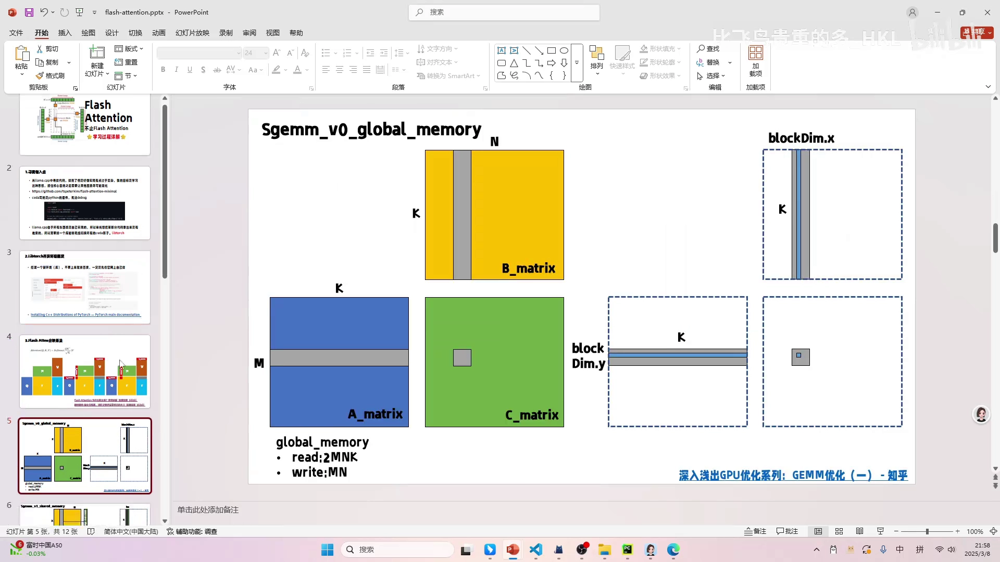 |
| 因为这个 K 的维度一般情况下很小，所以正常来讲，FlashAttention 里就没有在这个基础上再分块了，直接把（这一坨）读到 shared memory 里面。我们来看：它把这一坨和这一坨先读到 shared memory 里，然后求出来之后，这个结果仍然存在 shared memory——你看，这个结果它就没有写回到内存。 [【跳转到 10:11】](https://www.bilibili.com/video/BV1FM9XYoEQ5/?p=4&t=611) |  |
| 大家一定要注意这一点：它没有写回到内存。然后这个结果算完，我就立刻读取这个 V，把它和它做矩阵乘法，得到这一块。你看，这就相当于这三个矩阵一起算了，放到一起算。然后这一步算完之后，你可能 Q 再往下挪一下—— [【跳转到 10:36】](https://www.bilibili.com/video/BV1FM9XYoEQ5/?p=4&t=636) | 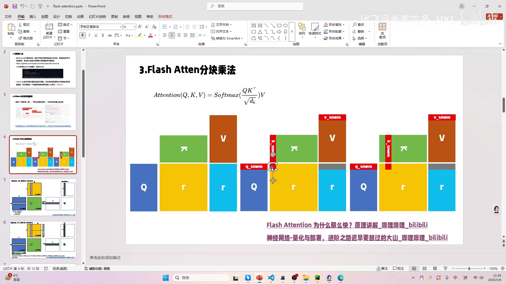 |
| 比如 Q 我再往下挪一下，Q 和 K 算完之后就算到这儿，再乘上这个 V（在 shared memory 里），就拿到了（结果）。以此类推，你会发现这个 R 完全不需要存储。为什么呢？因为这个块我已经算到了、算完了，它和 shared memory 里的 V 做完之后—— [【跳转到 11:01】](https://www.bilibili.com/video/BV1FM9XYoEQ5/?p=4&t=661) | 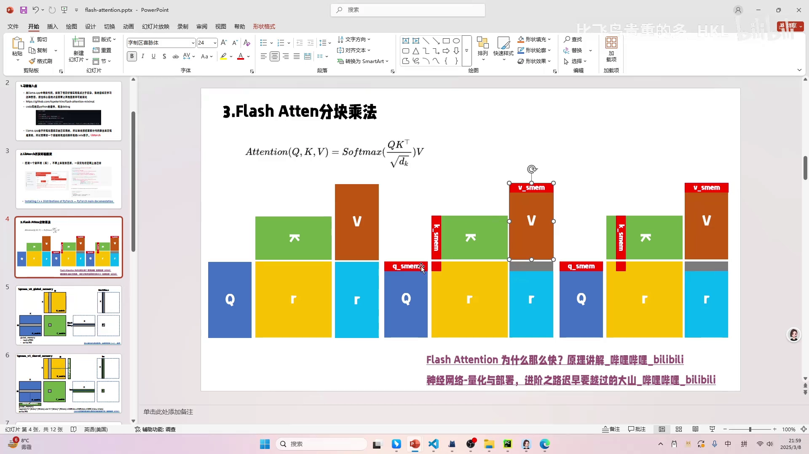 |
| 它俩做完矩阵乘之后，这一块就没用了，所以这块空间可以用来存另外一块。所以说白了：用 FlashAttention 这个算法，如果我们不考虑 softmax，其实是没有这个 R 矩阵的存储空间的——你不需要了。你不需要存储，那就是说不需要写进去。 [【跳转到 11:26】](https://www.bilibili.com/video/BV1FM9XYoEQ5/?p=4&t=686) |  |
| 也不需要读取。你就可以想象它对显存的优化和速度的优化有多么大。这就是核心。然后大家可以思考一下：我们这么做会不会得到正确的结果？其实是会的。你看，我们刚才讲的是 Q 和 K 乘完得到（R 块），它和 V 做完得到（输出块）。如果这个 Q 和 K 做完—— [【跳转到 11:51】](https://www.bilibili.com/video/BV1FM9XYoEQ5/?p=4&t=711) |  |
| 做到之后，它还会和（下一个）乘，乘完之后会加上——就是这两个做完矩阵乘的结果会累加：因为你最开始这个位置已经有一部分数据了，所以这一部分和它做完之后加上就好了，加进去就可以了。所以你会发现，还是那句话：这里面最核心的点就是这个 R 不需要存储，那自然而然也不需要写入和读取。所以显存和速度的优化就体现在这。 [【跳转到 12:16】](https://www.bilibili.com/video/BV1FM9XYoEQ5/?p=4&t=736) |  |
| 然后你会发现，如果你能想清楚「这么算的结果和（常规做法）一样、没有区别」，那我相信你就能明白 FlashAttention 为什么有它吹的那么强——而且是在精度没有任何损失的情况下。三个矩阵相乘，你是可以用这种方式来做的，不用两个相乘再两个相乘。 [【跳转到 12:41】](https://www.bilibili.com/video/BV1FM9XYoEQ5/?p=4&t=761) |  |
| 而我们上一个系列的课程里讲的 llama.cpp，那里可是一个算子一个算子（做的）：先 Q 和 K 做完，再做 softmax，再乘上 V，那个就相当于我这个 R 要存储——之前大家应该也看到了，它是有存储的。所以整体来讲，FlashAttention（不考虑 softmax 时）—— [【跳转到 13:06】](https://www.bilibili.com/video/BV1FM9XYoEQ5/?p=4&t=786) |  |
| 思路就是这样，你应该会很清晰地发现：它可以降低显存、提升速度，其实很直观。好了，当这个地方明白之后，我们就要去啃 FlashAttention 最难啃的那块骨头——softmax。我之前讲过，你看，基于这个（分块方式）：如果我们直接拿它和 V 做乘法，一旦有 softmax 就会有问题。为什么？ [【跳转到 13:31】](https://www.bilibili.com/video/BV1FM9XYoEQ5/?p=4&t=811) |  |
| 因为对于 softmax 来讲，你要把这一行所有的数都求完才能求 softmax；然后这一行和这一列相乘，才能拿到这一行第一列的结果。那很明显，到这儿你是不可能求出这几个数的 softmax 值的，因为你后面的数还没算。这就是 FlashAttention（或者说 attention）做算子融合的难点。 [【跳转到 13:56】](https://www.bilibili.com/video/BV1FM9XYoEQ5/?p=4&t=836) |  |
| 这个点非常复杂，我们后面会讲很多内容来讲这个地方。所以如果我们能把 softmax 解决，那就皆大欢喜，会优化得非常好——实际最后也确实解决了，我们后面再讲。所以这节课主要让大家明白：当三个矩阵相乘时，我们不需要先两个相乘、结果再乘另外一个，可以直接把三个一起乘了。 [【跳转到 14:21】](https://www.bilibili.com/video/BV1FM9XYoEQ5/?p=4&t=861) |  |
| 它就会节省很大的显存，也会让速度有一些提升。OK，我们这节课看到这，下节课就来啃这个 softmax。 [【跳转到 14:46】](https://www.bilibili.com/video/BV1FM9XYoEQ5/?p=4&t=886) |  |