# 第05讲_naive&safe_softmax 原始文稿（图-字幕分栏）

| 字幕文本 | 画面 |
| :--- | ---: |
| 好，我们继续来看。我们上节课已经说过：attention 算子融合最难的点其实在于 softmax——我们没办法对 softmax 做一个比较好的融合。之前很长时间，大家都是正常求 Q 乘 K，求完把矩阵存下来，再求 softmax，最后再乘 V。 [【跳转到 00:00】](https://www.bilibili.com/video/BV1FM9XYoEQ5/?p=5&t=0) | 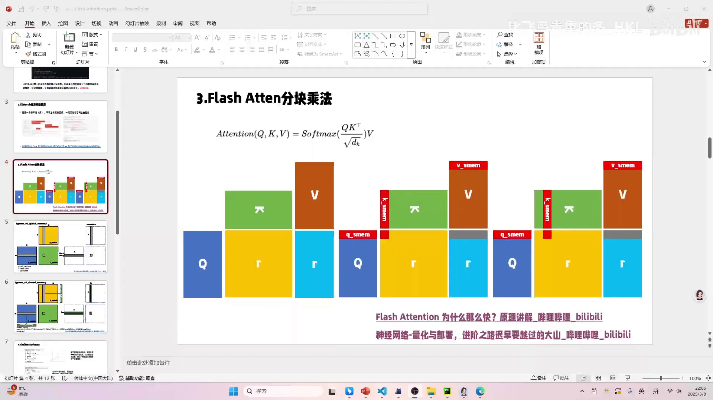 |
| 就是因为 softmax 不容易融进来，对吧？好，我们现在来看一个算法。 [【跳转到 00:25】](https://www.bilibili.com/video/BV1FM9XYoEQ5/?p=5&t=25) | 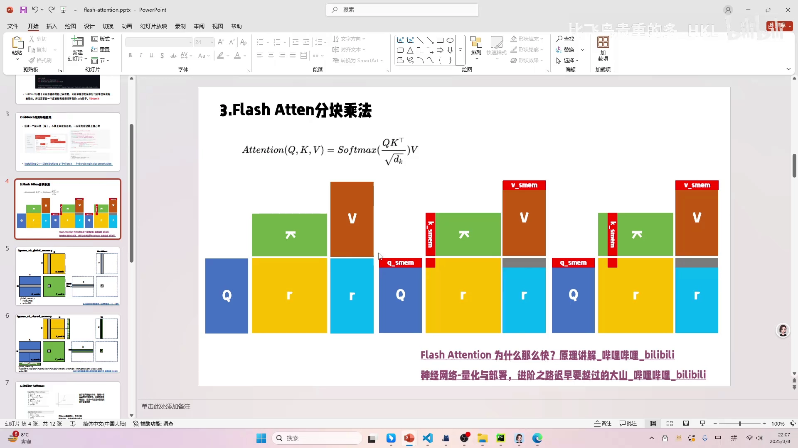 |
| 这个算法叫 online softmax。网上其实有很多讲 FlashAttention 的课，但都不讲这个地方——或者说，不把它当成一个专题来讲，只是给你讲一下 FlashAttention 的公式怎么来的。但我觉得那个公式存在一个问题：它其实不太容易理解。 [【跳转到 00:32】](https://www.bilibili.com/video/BV1FM9XYoEQ5/?p=5&t=32) | 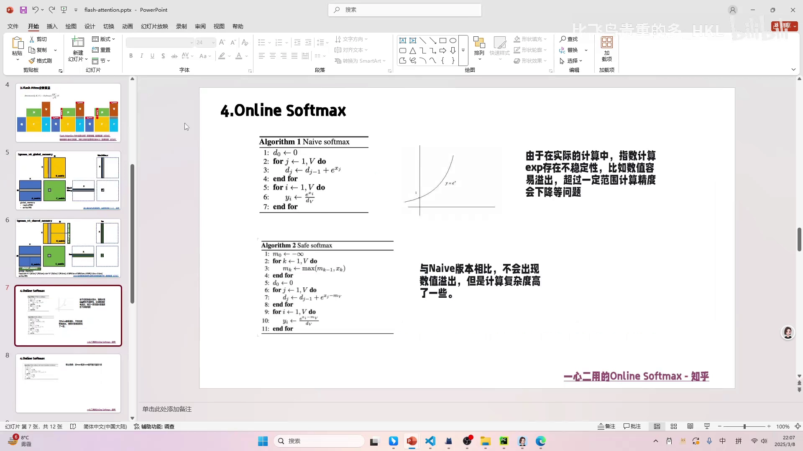 |
| 所以后面我想带大家一点一点推导，希望大家有一个循序渐进的感觉，而不是上来就直接推导整个 attention 的公式。 [【跳转到 00:57】](https://www.bilibili.com/video/BV1FM9XYoEQ5/?p=5&t=57) | 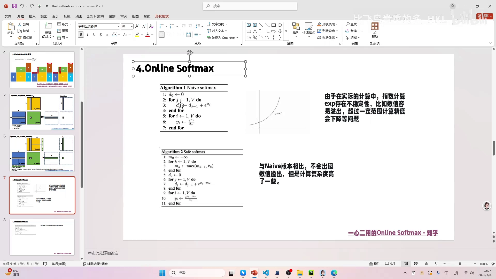 |
| 我就一步一步给大家讲，这样理解起来也比较容易。而且这里面有很多思想都非常值得学习。好，我们这节课来看第四讲——online softmax。但在讲它之前，我需要先铺垫两个比较传统的 softmax 方法。 [【跳转到 01:07】](https://www.bilibili.com/video/BV1FM9XYoEQ5/?p=5&t=67) | 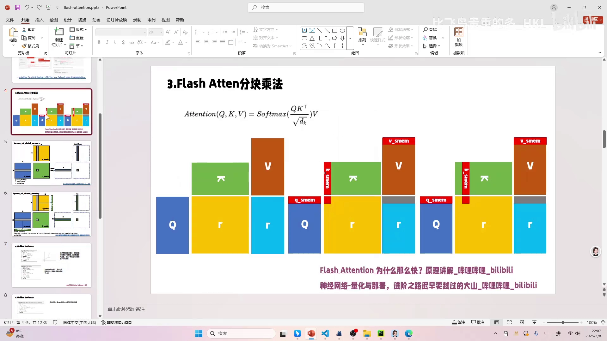 |
| 第一个就是 naive softmax，也就是最常见的那个公式：e 的 x_i 次方，除以 e 的 x 求和。 [【跳转到 01:12】](https://www.bilibili.com/video/BV1FM9XYoEQ5/?p=5&t=72) |  |
| 现在这整个系列课程——我从去年 10 月讲到现在的部署系列——softmax 在部署算法里就不仅仅是以前用 Python 写的那样：先求指数、再求和、再除一下。 [【跳转到 01:37】](https://www.bilibili.com/video/BV1FM9XYoEQ5/?p=5&t=97) | 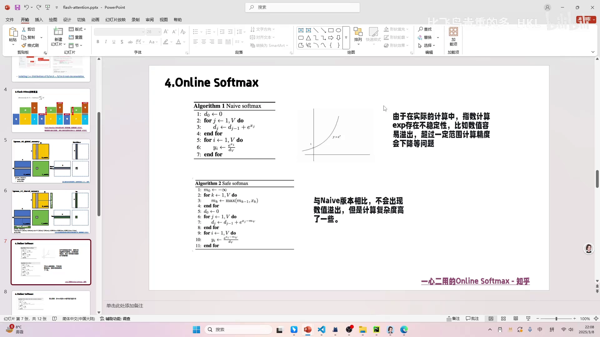 |
| 它并不这么简单。所以我特意拿 C++ 代码写了一下这个 softmax。 [【跳转到 02:02】](https://www.bilibili.com/video/BV1FM9XYoEQ5/?p=5&t=122) | 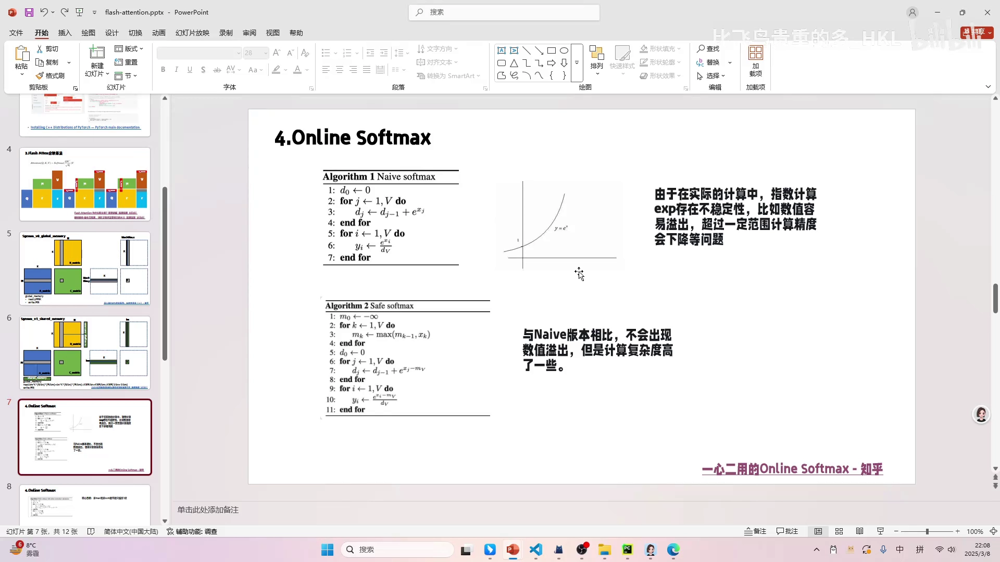 |
| 把这个编辑器关掉。当然这个代码也是参考—— [【跳转到 02:07】](https://www.bilibili.com/video/BV1FM9XYoEQ5/?p=5&t=127) | 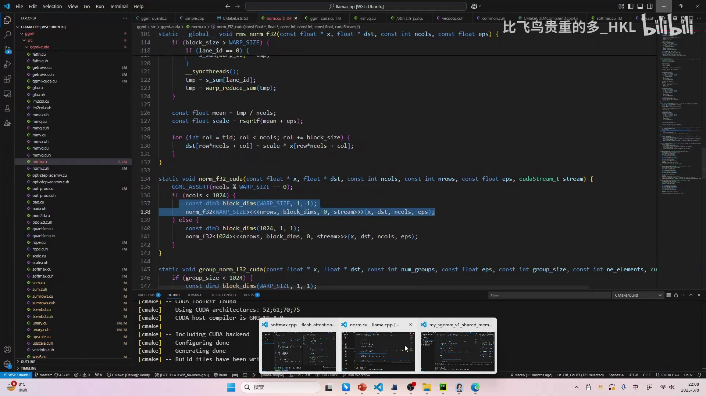 |
| 参考这篇博客，博客里讲的还是 OK 的、挺不错的。 [【跳转到 02:14】](https://www.bilibili.com/video/BV1FM9XYoEQ5/?p=5&t=134) | 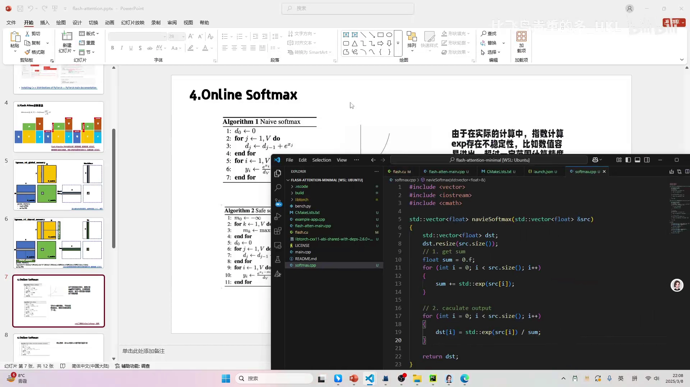 |
| 但我觉得他没有我讲得细，哈哈。我们一点点来看。naive softmax 就是正常的那个版本。 [【跳转到 02:19】](https://www.bilibili.com/video/BV1FM9XYoEQ5/?p=5&t=139) | 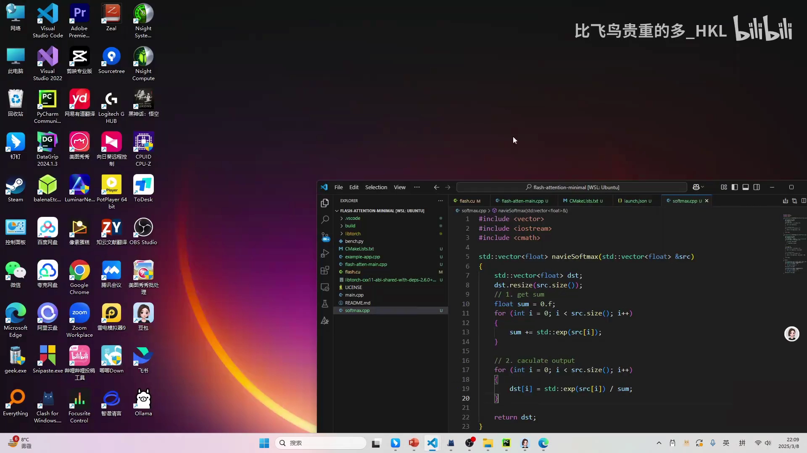 |
| 你正常去搜 softmax 公式，都会告诉你：先对每个数求指数次幂，再求和，然后每个数的指数次幂再除以它。但在部署算法的眼里，这件事是两次遍历。看到了吗？我这个代码里，比如有一组数，src 就是原操作数，经过 naive softmax 得到 dst，它是怎么算的？第一步求和，这是一次遍历——我这里五个数，所以要执行五遍，大家一定要注意，这是一次遍历。你可以理解为当 src 这个数很大时，就要从内存读到寄存器里。 [【跳转到 02:24】](https://www.bilibili.com/video/BV1FM9XYoEQ5/?p=5&t=144) | 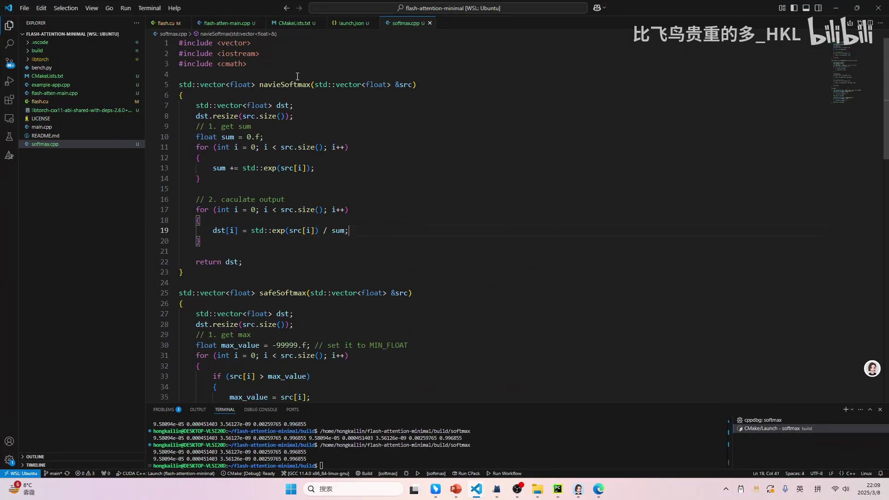 |
| 最后我得到这个数，然后我又要再读一遍——看到了吗，这里面又读了一遍。所以它对 src 做了两次遍历，大家一定要注意。第一步是对每个数求 exp(src) 的和，第二步是这个数除以它，就 OK。这是 naive 版本的 softmax。 [【跳转到 02:49】](https://www.bilibili.com/video/BV1FM9XYoEQ5/?p=5&t=169) | 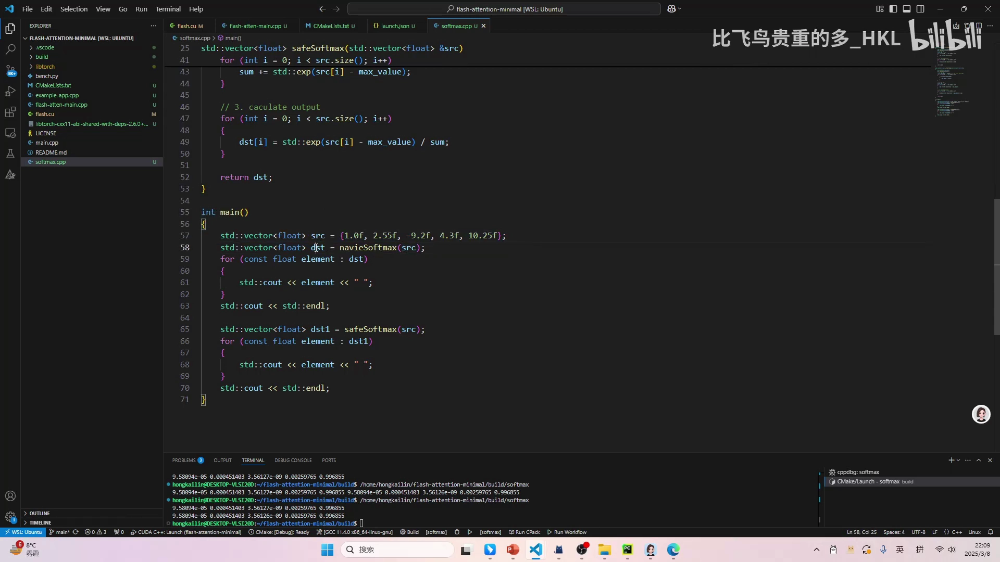 |
| 这个版本的 softmax 有一个很大的问题—— [【跳转到 03:14】](https://www.bilibili.com/video/BV1FM9XYoEQ5/?p=5&t=194) |  |
| 有一个很大的问题。 [【跳转到 03:32】](https://www.bilibili.com/video/BV1FM9XYoEQ5/?p=5&t=212) | 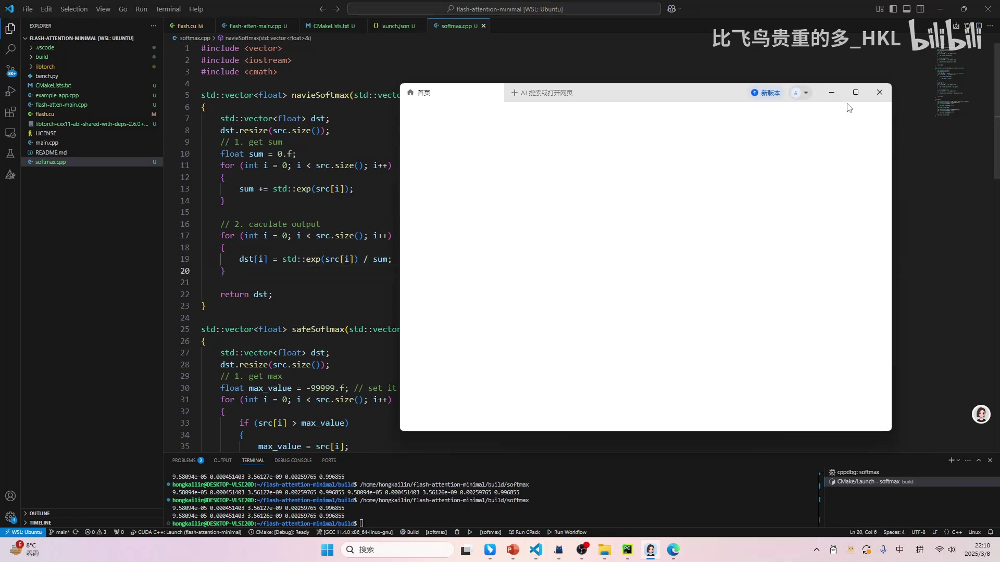 |
| 就是指数计算。 [【跳转到 03:37】](https://www.bilibili.com/video/BV1FM9XYoEQ5/?p=5&t=217) | 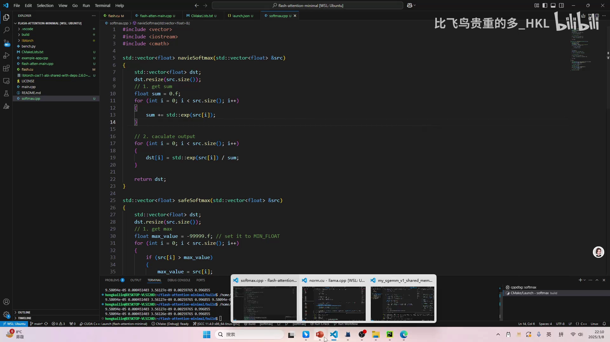 |
| 我们这里做的是 e 的 x 次幂。指数计算 exp 存在不稳定性，比如数值容易溢出、超过一定范围计算精度会下降等问题。我特意把这张图粘上来：随着 x 不断增大，y 的值会变得特别大。而对于大模型推理，动不动就量化了——一旦量化，浮点数（或整数）能表达的数据范围就变得更小，所以非常容易在 x 大到某个程度时，y 直接溢出。溢出可能就导致结果有很大的精度损失。 [【跳转到 03:42】](https://www.bilibili.com/video/BV1FM9XYoEQ5/?p=5&t=222) | 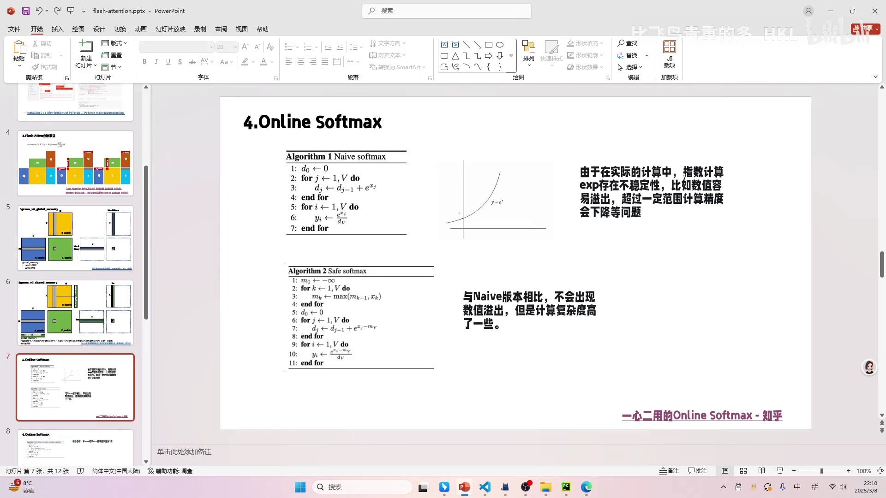 |
| 所以呢，就提出了另一版 safe softmax。这也是我在上一个系列—— [【跳转到 04:07】](https://www.bilibili.com/video/BV1FM9XYoEQ5/?p=5&t=247) |  |
| 在 llama.cpp 那个课程里讲 softmax 的时候—— [【跳转到 04:32】](https://www.bilibili.com/video/BV1FM9XYoEQ5/?p=5&t=272) |  |
| 我当时其实还有点疑惑。 [【跳转到 04:38】](https://www.bilibili.com/video/BV1FM9XYoEQ5/?p=5&t=278) | 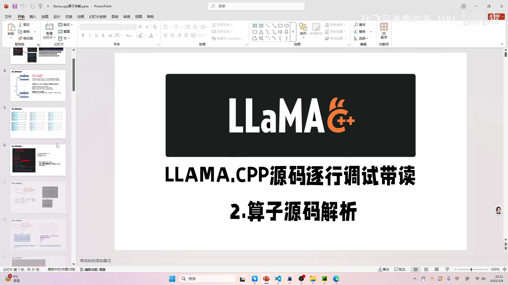 |
| 我为什么要减去向量中的最大值？我最开始还不太清楚，甚至以为我把 softmax 公式记错了。 [【跳转到 04:43】](https://www.bilibili.com/video/BV1FM9XYoEQ5/?p=5&t=283) | 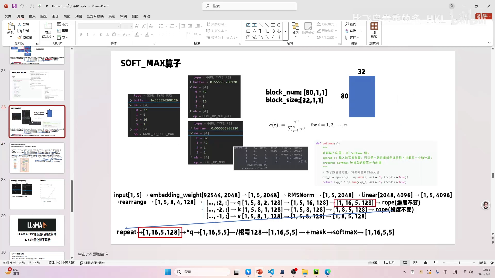 |
| 实际上，我现在知道了：为什么要减去最大值？就是为了防止数据溢出，导致浮点精度的损失。所以有一版 safe softmax，就是在做—— [【跳转到 04:55】](https://www.bilibili.com/video/BV1FM9XYoEQ5/?p=5&t=295) | 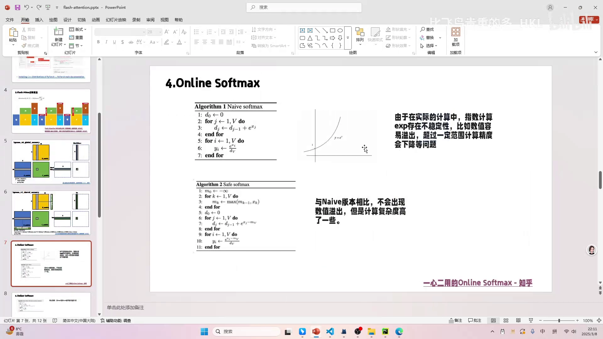 |
| 在做求和之前，先做一次遍历求出最大值。 [【跳转到 05:10】](https://www.bilibili.com/video/BV1FM9XYoEQ5/?p=5&t=310) | 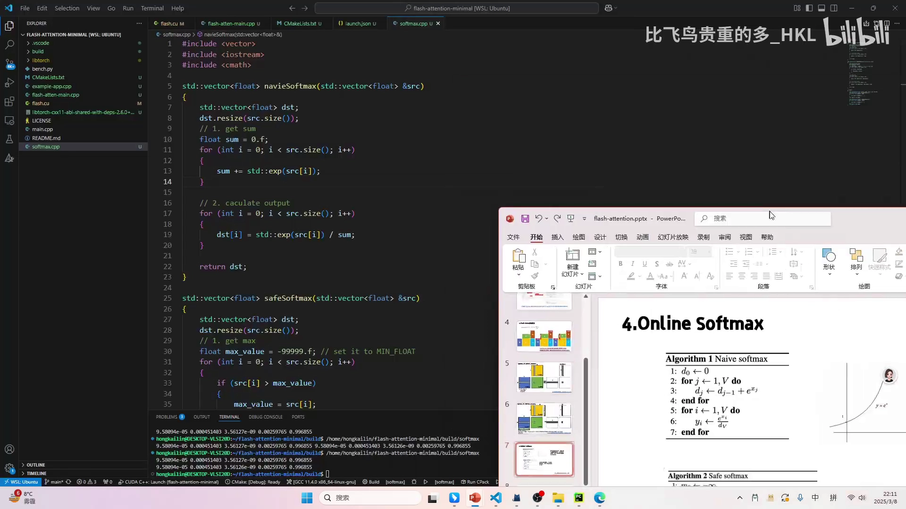 |
| 然后让每个 exp(src) 都减去这个最大值，也就是 src 减最大值；求和也这么做，最后每个数也这么做。其实这么做完，在 naive 版本精度没有溢出的情况下，两个版本的计算结果一模一样。为什么呢？因为指数次幂的相减其实就等于除法。 [【跳转到 05:15】](https://www.bilibili.com/video/BV1FM9XYoEQ5/?p=5&t=315) | 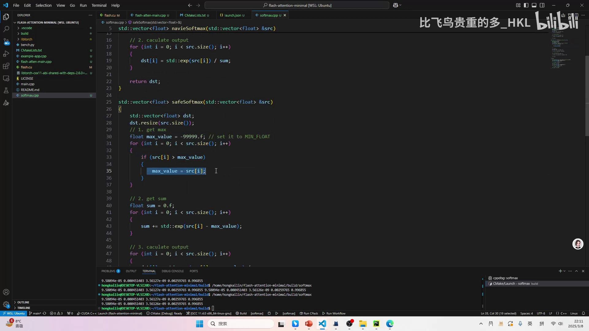 |
| 它其实就是在计算除法，相当于你最后—— [【跳转到 05:40】](https://www.bilibili.com/video/BV1FM9XYoEQ5/?p=5&t=340) | 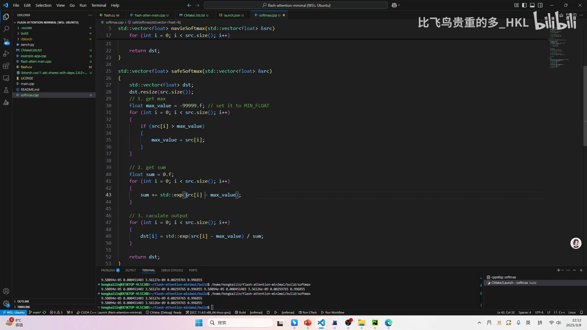 |
| 你最后 softmax 的公式长这样，我应该把它拿出来。 [【跳转到 05:51】](https://www.bilibili.com/video/BV1FM9XYoEQ5/?p=5&t=351) | 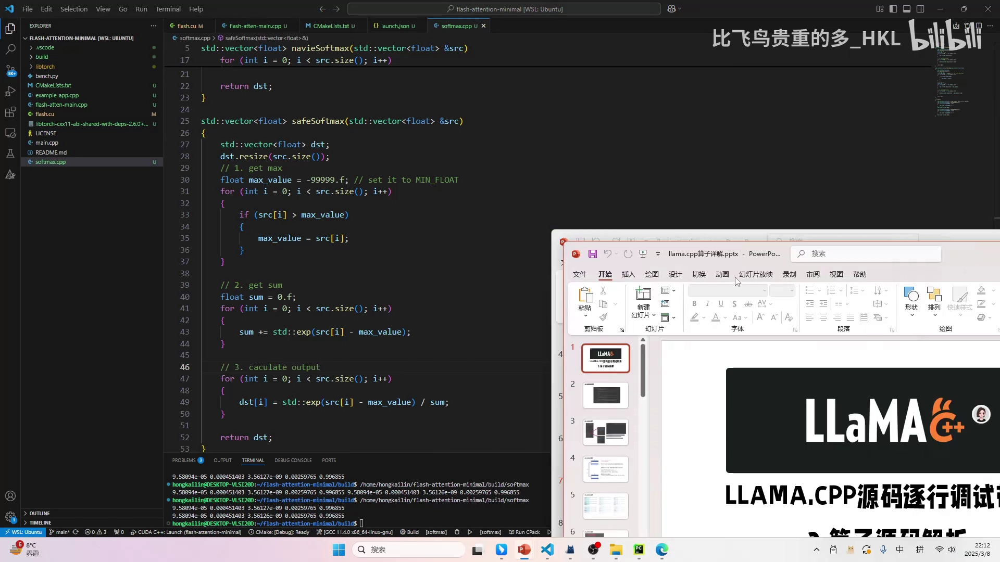 |
| （此区间无字幕） [【跳转到 05:56】](https://www.bilibili.com/video/BV1FM9XYoEQ5/?p=5&t=356) | 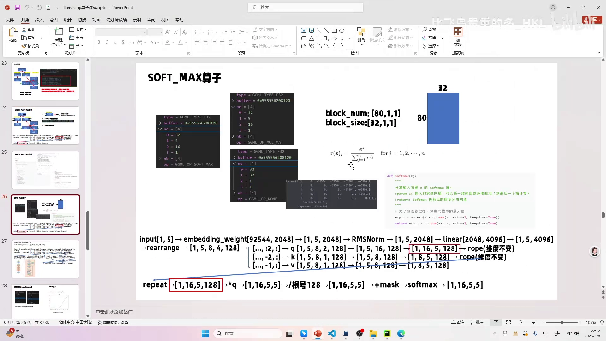 |
| 你最后的 softmax 公式长这样。如果分子、分母的 e 的指数全都减去一个同样的数，那分子分母就全都约掉了，对吧？ [【跳转到 06:01】](https://www.bilibili.com/video/BV1FM9XYoEQ5/?p=5&t=361) | 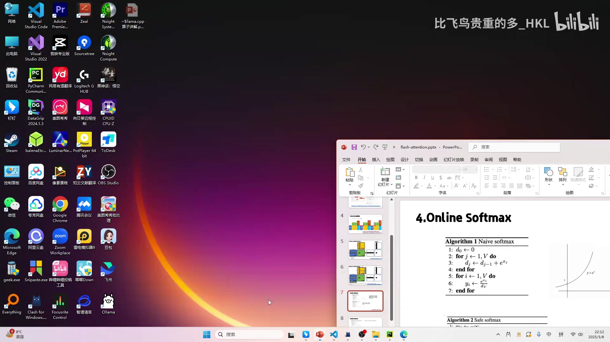 |
| 所以 safe softmax 版本相比 naive softmax，就是更安全。 [【跳转到 06:06】](https://www.bilibili.com/video/BV1FM9XYoEQ5/?p=5&t=366) | 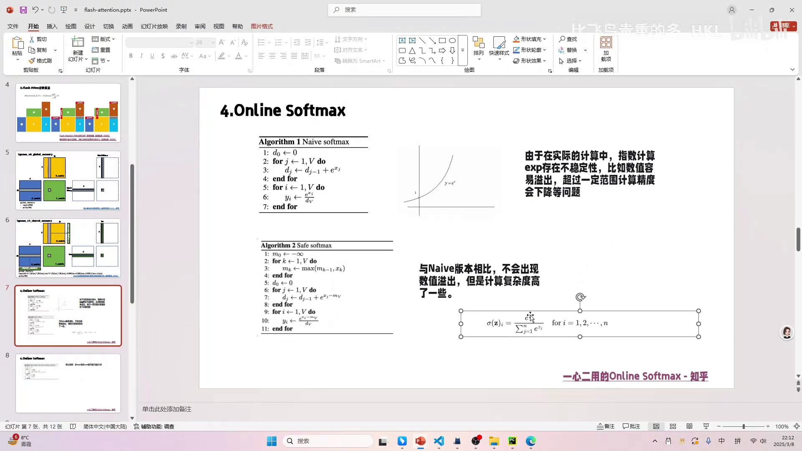 |
| 但是呢，它也会变得更慢。为什么会变慢？我们看这个程序就会发现：我们之前两步可以解决的事情—— [【跳转到 06:25】](https://www.bilibili.com/video/BV1FM9XYoEQ5/?p=5&t=385) |  |
| 遍历两次可以解决的事情，现在要遍历三次。这一次要求最大值——求最大值也是一个 O(N) 的算法，也要把所有数遍历一遍才能求到最大值。所以你会发现，简简单单一个 softmax，居然要遍历 src 三遍才能拿到最终结果。这其实就跟我们刚才说的矩阵乘法—— [【跳转到 06:30】](https://www.bilibili.com/video/BV1FM9XYoEQ5/?p=5&t=390) | 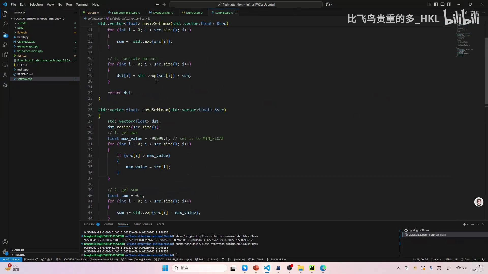 |
| 是类似的：你没办法把它们合并到一起，那就得先算两个再算两个；这里也是，如果我们能把这一坨、这一坨和这一坨合并，那就一次遍历就可以了。一次遍历的好处就是没必要写回、也没必要重复读取。 [【跳转到 06:55】](https://www.bilibili.com/video/BV1FM9XYoEQ5/?p=5&t=415) | 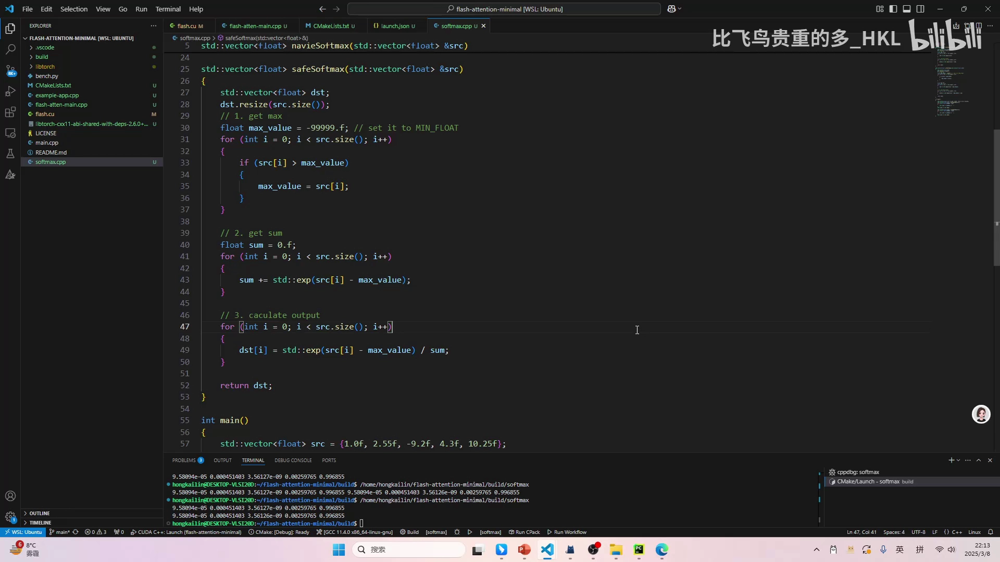 |
| 所以 online softmax 就在解决这个问题。 [【跳转到 07:20】](https://www.bilibili.com/video/BV1FM9XYoEQ5/?p=5&t=440) | 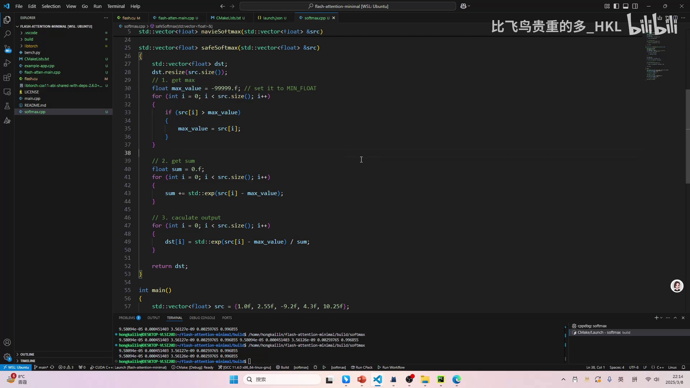 |
| 所以你看，naive 版本两次遍历，但可能有精度损失； [【跳转到 07:30】](https://www.bilibili.com/video/BV1FM9XYoEQ5/?p=5&t=450) |  |
| safe softmax 三次遍历，没有精度损失，但算法复杂度稍微高一点点。所以最后有一个叫 safe softmax with online normalizer 的算法，你可以理解为它希望把 safe softmax 的三次遍历合成两次——也就是把求最大值和求和这两件事—— [【跳转到 07:35】](https://www.bilibili.com/video/BV1FM9XYoEQ5/?p=5&t=455) | 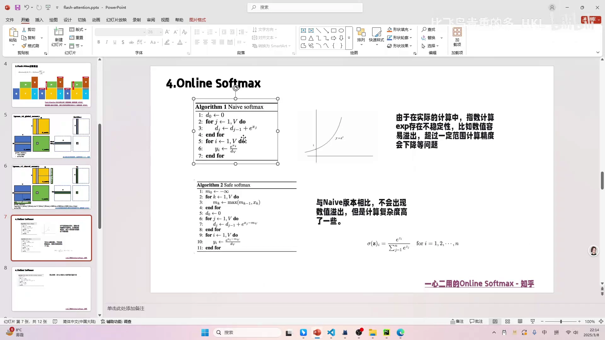 |
| 合起来。这就是 online softmax 的思路。具体我们下节课讲，因为下节课我其实没贴什么内容，我是希望给大家手推，所以准备了一个 pad，可能会投屏手动推导，因为把公式密密麻麻写出来可能反而不利于大家理解。 [【跳转到 08:00】](https://www.bilibili.com/video/BV1FM9XYoEQ5/?p=5&t=480) |  |
| 所以这节课先到这。我们讲了两种 softmax 方法，下节课看第三种——真正的 online softmax 应该怎么写。 [【跳转到 08:25】](https://www.bilibili.com/video/BV1FM9XYoEQ5/?p=5&t=505) | 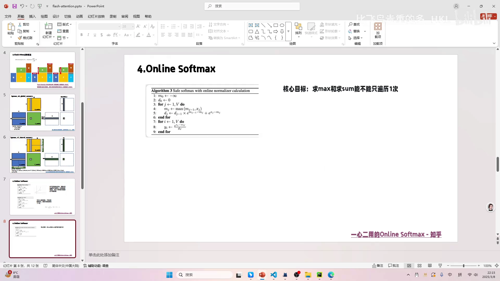 |