# 第06讲_online_softmax（重制版） 原始文稿（图-字幕分栏）

| 字幕文本 | 画面 |
| :--- | ---: |
| 嗯，hello 大家好。我们上节课把 naive softmax 和 safe softmax 讲完了，这节课来看 online softmax。其实这节课我之前已经传过一次了——我现在已经在 B 站发过这个 online softmax 的课了，但我觉得那期讲得不太好。 [【跳转到 00:00】](https://www.bilibili.com/video/BV1FM9XYoEQ5/?p=6&t=0) | 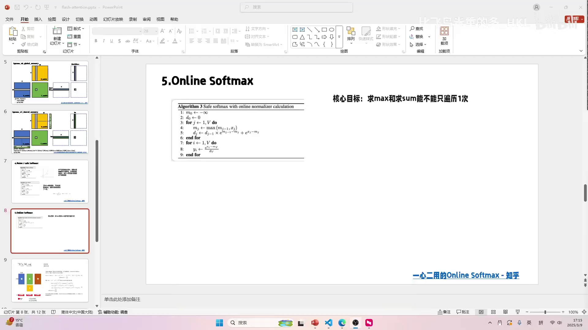 |
| 那个版本有些问题，主要是符号没有和实际公式对应上。 [【跳转到 00:14】](https://www.bilibili.com/video/BV1FM9XYoEQ5/?p=6&t=14) |  |
| 符号对不上，大家往下理解可能就不太方便。所以我决定把这节课重新录一遍。 [【跳转到 00:20】](https://www.bilibili.com/video/BV1FM9XYoEQ5/?p=6&t=20) | 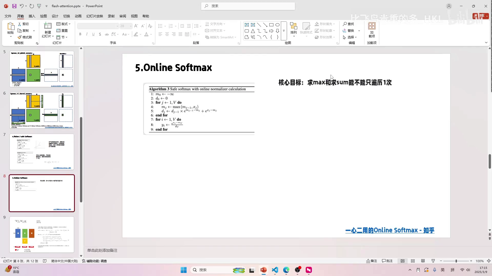 |
| 我后面会把 B 站那期视频换成我新录的这一期，所以大家看这一期应该会更好一点。 [【跳转到 00:34】](https://www.bilibili.com/video/BV1FM9XYoEQ5/?p=6&t=34) |  |
| 我们来看 online softmax。它的核心目标，其实上一节课已经讲过：我们从 naive 过渡到 safe，虽然说更安全了、数值不会溢出，但它存在的问题是复杂度又高了一点——之前是两次循环，现在变成三次循环了。而 online softmax 就希望既保证安全性、数值不溢出，又不要这么多遍历，把这三次变成两次。就是这个公式。 [【跳转到 00:39】](https://www.bilibili.com/video/BV1FM9XYoEQ5/?p=6&t=39) | 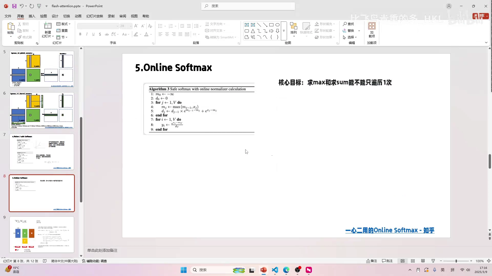 |
| 这个公式这节课我会带大家做推导。我们来看它通过什么手段，把之前 safe softmax 的三次遍历变成两次。这个算法是英伟达的一位工程师设计的，非常值得学习。 [【跳转到 01:04】](https://www.bilibili.com/video/BV1FM9XYoEQ5/?p=6&t=64) | 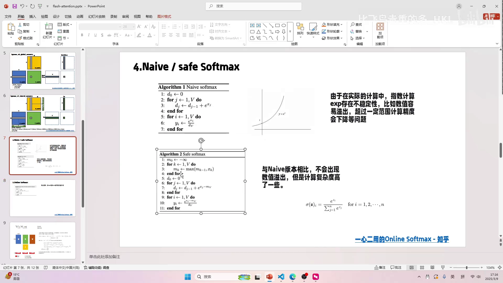 |
| 我们来看这个公式到底怎么推导。网上也有一些讲解，但我觉得讲得都没让我特别明白，所以我决定在自己理解之后，给大家手推一遍。 [【跳转到 01:29】](https://www.bilibili.com/video/BV1FM9XYoEQ5/?p=6&t=89) | 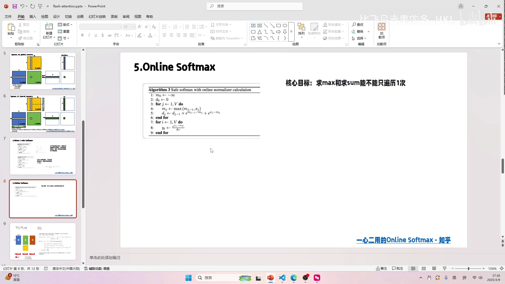 |
| 我给大家准备了一个投屏。 [【跳转到 01:44】](https://www.bilibili.com/video/BV1FM9XYoEQ5/?p=6&t=104) |  |
| 我一边推导，一边带着大家理解：online softmax 到底希望我们怎么把 softmax 做一个简化。我们直接来看。这里面符号的定义跟这个图保持一致。 [【跳转到 01:49】](https://www.bilibili.com/video/BV1FM9XYoEQ5/?p=6&t=109) |  |
| 我们当前的最大值用 M 表示。 [【跳转到 02:05】](https://www.bilibili.com/video/BV1FM9XYoEQ5/?p=6&t=125) |  |
| 求和用 D 表示，而核心目标就是求 max 和 sum。 [【跳转到 02:10】](https://www.bilibili.com/video/BV1FM9XYoEQ5/?p=6&t=130) |  |
| 只放到一次遍历里面。我们之前是有一个遍历专门做 sum—— [【跳转到 02:15】](https://www.bilibili.com/video/BV1FM9XYoEQ5/?p=6&t=135) |  |
| （不对，是这个图）这个图有一个遍历专门做 max，有一个遍历专门做 sum，对吧？ [【跳转到 02:20】](https://www.bilibili.com/video/BV1FM9XYoEQ5/?p=6&t=140) | 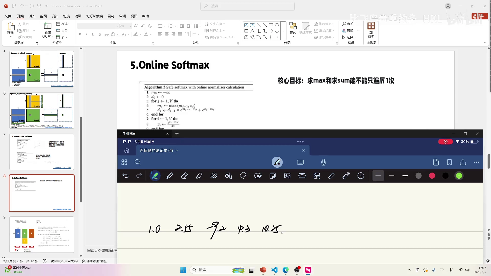 |
| 所以我们现在希望把这两个都放到一起。 [【跳转到 02:25】](https://www.bilibili.com/video/BV1FM9XYoEQ5/?p=6&t=145) | 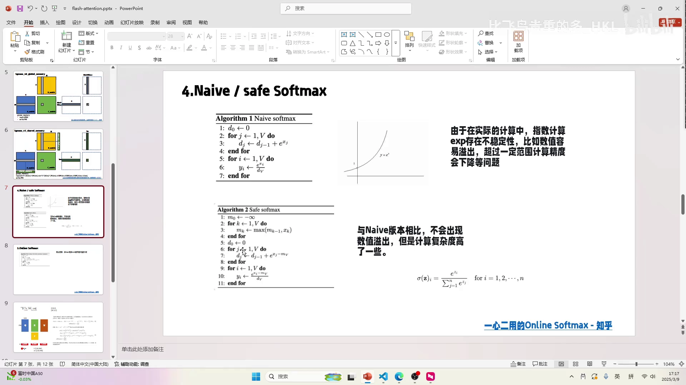 |
| 要怎么做呢？先思考一下，「放到一起」或者说「迭代计算」是什么含义。就是说：我们这里有五个数，比如我想对这五个数求 softmax，但我最开始只能看到一个数，于是我就基于这一个数求一个最大值、再求一个和。这是第一次。 [【跳转到 02:30】](https://www.bilibili.com/video/BV1FM9XYoEQ5/?p=6&t=150) |  |
| 第二次我只能看到这两个数，那我就要基于上一次的结果，再到我们看到的这两个数上重新调整当前的和与最大值。 [【跳转到 02:35】](https://www.bilibili.com/video/BV1FM9XYoEQ5/?p=6&t=155) |  |
| 以此类推，看到三个数、四个数、五个数……就是这样一个流程。相当于如果能实现，我们就把这两个循环合并到一起了。 [【跳转到 03:00】](https://www.bilibili.com/video/BV1FM9XYoEQ5/?p=6&t=180) |  |
| 好，我们分别来看。第一次我们只看到这一个数，把这个数用 X0 表示。用 M 表示最大值，那 M0 等于什么呢？就等于 X0；或者写成负无穷和 X0 的最大值。 [【跳转到 03:25】](https://www.bilibili.com/video/BV1FM9XYoEQ5/?p=6&t=205) |  |
| 那显然 X0 最大。再求 D（用 D 表示求和）。求和也很简单：就是 e 的 (X0 − M0) 次方。因为现在只有一个数。我们看，现在只看到 1.0 这么一个数，没有别的数，所以对一个数求最大值和求和就是这么简单。 [【跳转到 03:50】](https://www.bilibili.com/video/BV1FM9XYoEQ5/?p=6&t=230) | 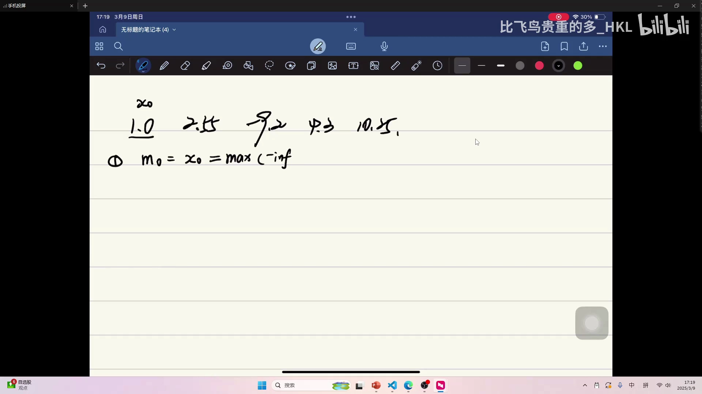 |
| 好，我们已经把这一个数做完了。现在来看两个数：如果我想对这两个数做 softmax，要怎么做？其实都很简单。M1 等于什么呢？等于用 M0 和 X1 求最大值。 [【跳转到 04:15】](https://www.bilibili.com/video/BV1FM9XYoEQ5/?p=6&t=255) | 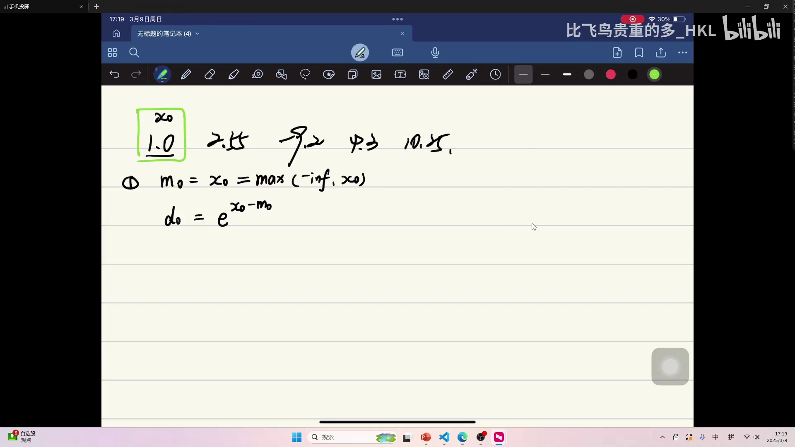 |
| 也就是拿上一步求得的那个最大值和当前值做比较，看谁最大。那 D1 等于什么呢？等于 e 的 (X0 − M1) 次方，加上 e 的 (X1 − M1) 次方。 [【跳转到 04:40】](https://www.bilibili.com/video/BV1FM9XYoEQ5/?p=6&t=280) | 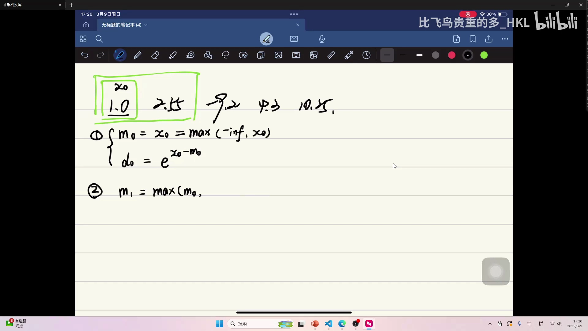 |
| 这里大家要好好理解：我们现在虽然是在做迭代，但核心目标是算这两个数的 softmax，公式一定是这个形式、不可能变——因为公式一变，结果就不对了。所以我们要想：能不能把这个 D1 用 D0 表达出来。这里我刚才其实写错了—— [【跳转到 05:05】](https://www.bilibili.com/video/BV1FM9XYoEQ5/?p=6&t=305) | 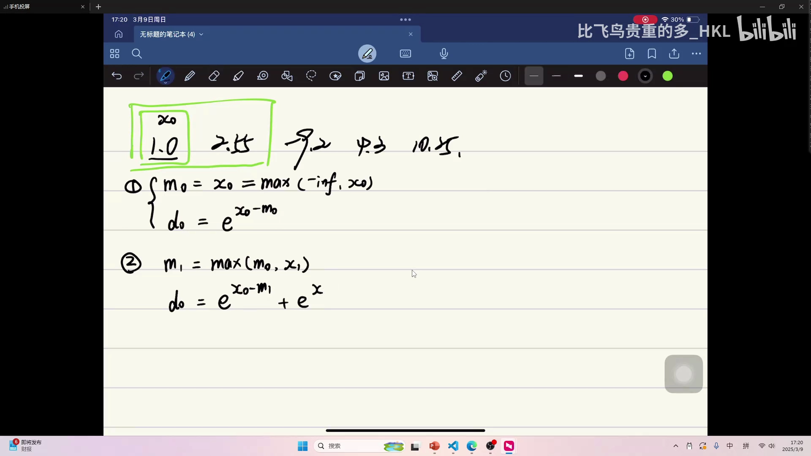 |
| 这应该是 D1。如果直接这么算，那你刚才算的 D0 就没有任何意义了——我们根本没把 D0 代入公式，也就没有「迭代」的思想。 [【跳转到 05:30】](https://www.bilibili.com/video/BV1FM9XYoEQ5/?p=6&t=330) | 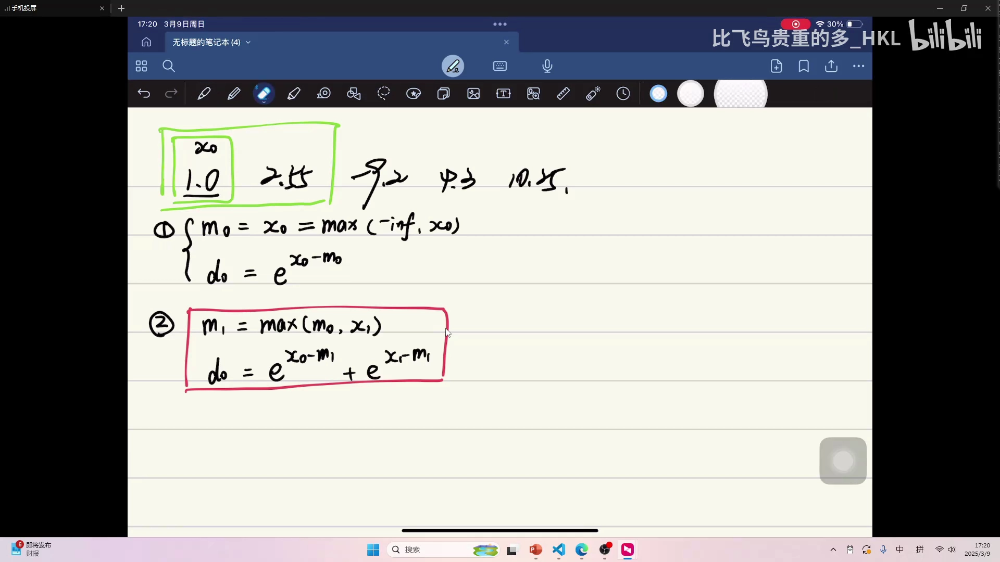 |
| 所以我们要做的事情，一定是把 D1 这个公式改写成由 D0 来表达。怎么改写呢？我们来思考一下。首先，我们刚才减的是 M0，现在减的是 M1——这也好理解，因为看两个数时最大值会调整。那我们如何既让它减 M1、又能让 D1 跟 D0 有关系呢？用一个数学技巧。 [【跳转到 05:55】](https://www.bilibili.com/video/BV1FM9XYoEQ5/?p=6&t=355) | 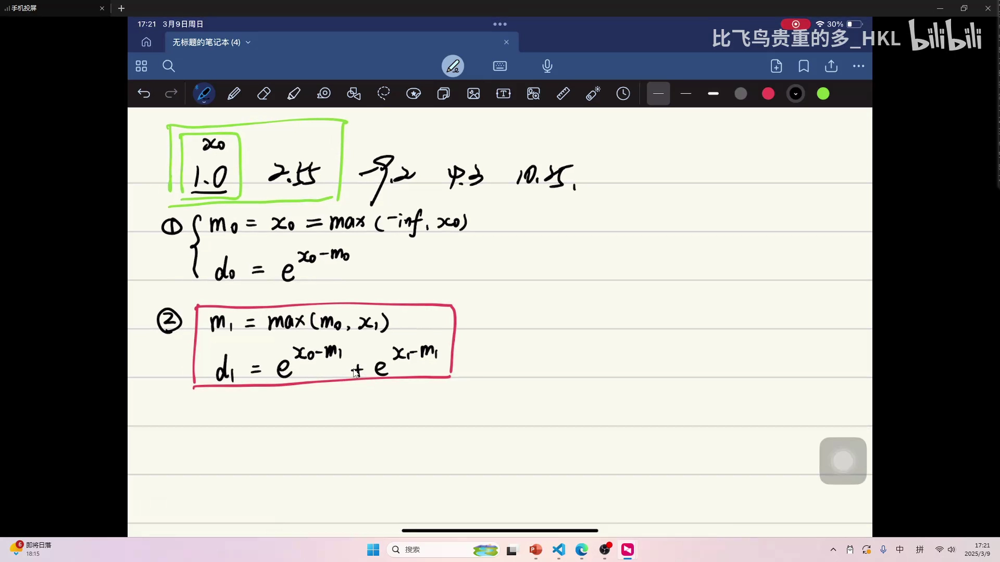 |
| 我们用这个颜色写，帮助区分。这一块等于 e 的 (X0 − M0 + M0 − M1) 次方，就是一个非常简单的数学技巧：加减同一个数（+M0 − M1，等价于 −M1）。 [【跳转到 06:20】](https://www.bilibili.com/video/BV1FM9XYoEQ5/?p=6&t=380) | 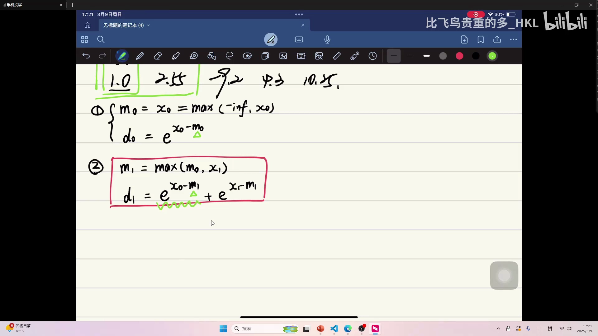 |
| 然后我们把后面一项也写下来。这一套等于 e 的 (X0 − M0) 次方乘上 e 的 (M0 − M1) 次方——因为指数相乘可以把指数拆开相加。然后再加上 e 的 (X1 − M1) 次方。 [【跳转到 06:45】](https://www.bilibili.com/video/BV1FM9XYoEQ5/?p=6&t=405) | 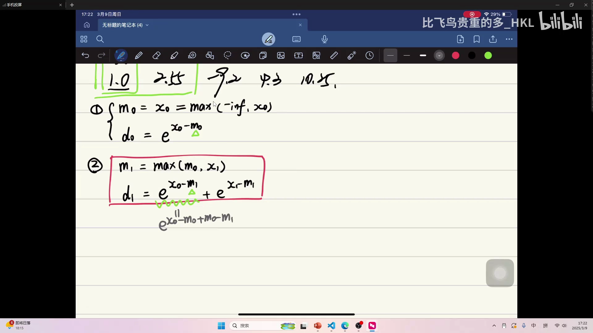 |
| 这样我们就惊喜地发现：这一坨就是 D0。所以最后整体公式就变成 D0 乘 e 的 (M0 − M1) 次方，再加上 e 的 (X1 − M1) 次方。你看这个公式很有意思：首先它保证正确，因为全都是等号下来的。 [【跳转到 07:10】](https://www.bilibili.com/video/BV1FM9XYoEQ5/?p=6&t=430) | 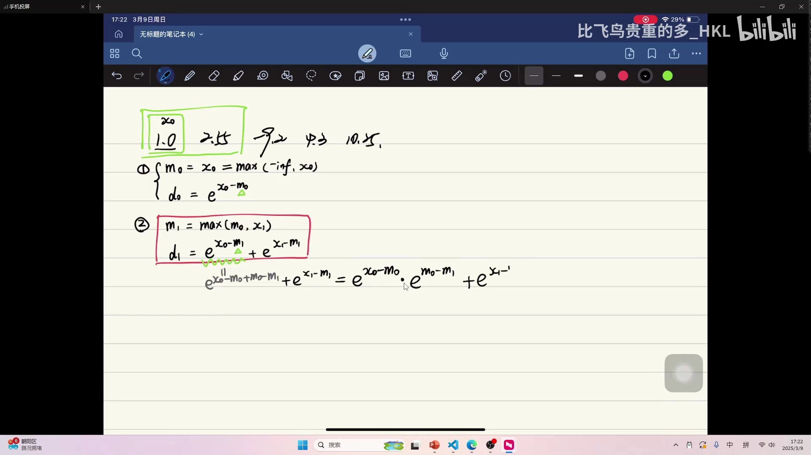 |
| 其次它和 D0 联系起来了——说白了没有重新计算 D0，而是基于 D0 做调整，调整就是乘上 e 的 (M0 − M1) 次方。 [【跳转到 07:35】](https://www.bilibili.com/video/BV1FM9XYoEQ5/?p=6&t=455) |  |
| 通过这样的方式，我把刚才算出的 D0 做一个调整，就得到真实的 D1。这就很棒：用迭代的方式，把 M0→M1、D0→D1 都更新出来，而且都是对的。我们再来看第三个。 [【跳转到 08:00】](https://www.bilibili.com/video/BV1FM9XYoEQ5/?p=6&t=480) | 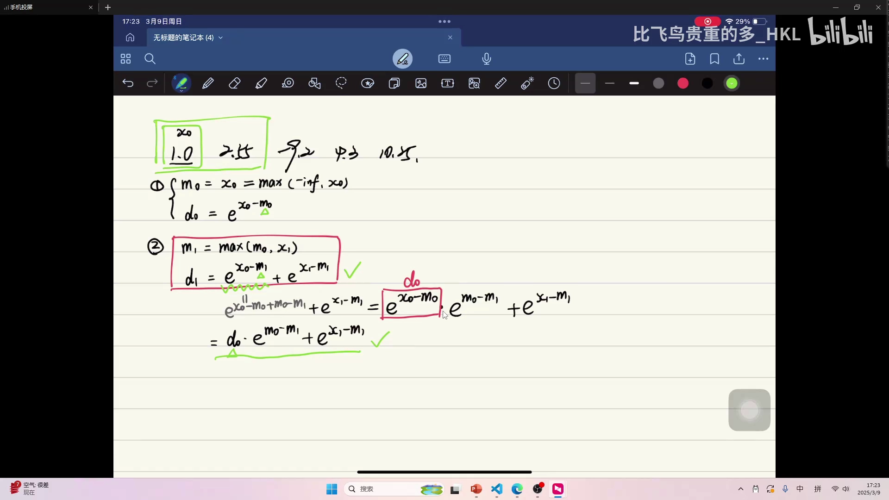 |
| 第三次要考虑这一坨，现在又多了一个数。公式写法没有任何变化：首先 M2 = max(M1, X2)，这没有任何变化。然后 D2 等于什么呢？ [【跳转到 08:25】](https://www.bilibili.com/video/BV1FM9XYoEQ5/?p=6&t=505) | 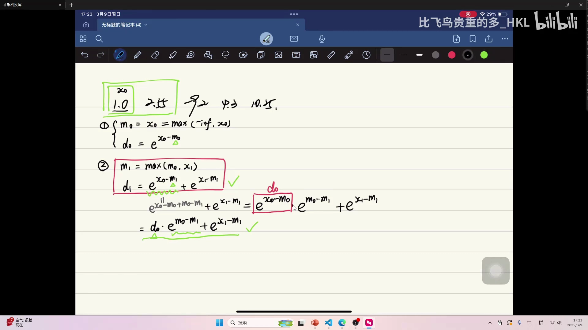 |
| 还是先用正常方式写一下：e 的 (X1 − M2) 次方加上 e 的 (X2 − M2) 次方，它一定等于这个。如果你能凑出一个等式让 D2 和 D1 联系起来并且仍然相等，那就说明也能实现。那怎么凑呢？ [【跳转到 08:50】](https://www.bilibili.com/video/BV1FM9XYoEQ5/?p=6&t=530) |  |
| 我们要把 D2 凑成和 D1 相关。其实也不难，跟刚才思路类似：我们希望把 D2 凑成 D1，那就要对前面这两项入手。前面这两项跟上面 D1 那一段有什么区别？唯一的区别是这里原来是 M1，现在这个地方变成了 M2。 [【跳转到 09:15】](https://www.bilibili.com/video/BV1FM9XYoEQ5/?p=6&t=555) | 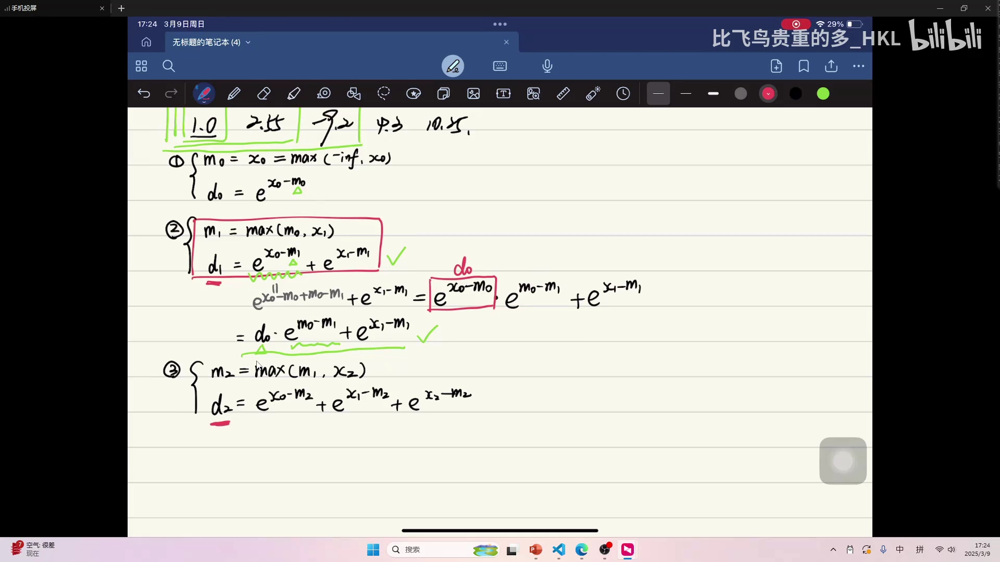 |
| 那就跟刚才一样，用同样的技术手段：e 的 (X0 − M1 + M1 − M2) 次方。后面这一坨等于 e 的 (X1 − M1 + M1 − M2) 次方。然后后面的项直接写下来： [【跳转到 09:40】](https://www.bilibili.com/video/BV1FM9XYoEQ5/?p=6&t=580) | 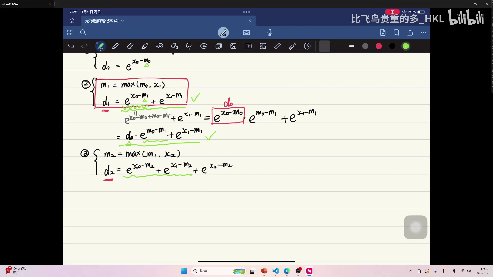 |
| e 的 (X2 − M2) 次方。继续拆分：e 的 (X0 − M1) 乘 e 的 (M1 − M2)，加上 e 的 (X1 − M1) 乘 e 的 (M1 − M2)，加上 e 的 (X2 − M2)。 [【跳转到 10:05】](https://www.bilibili.com/video/BV1FM9XYoEQ5/?p=6&t=605) | 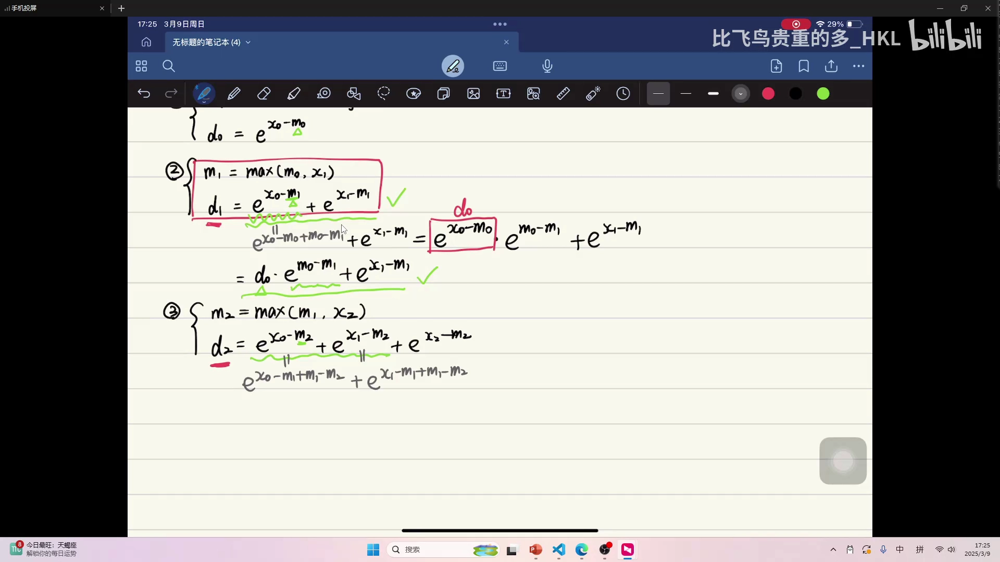 |
| 合并同类项，你会发现前面两项提出来，就变成 [e 的 (X0 − M1) 次方 + e 的 (X1 − M1) 次方] 乘 e 的 (M1 − M2) 次方，再加上 e 的 (X2 − M2) 次方。而前面这一坨就等于 D1。 [【跳转到 10:30】](https://www.bilibili.com/video/BV1FM9XYoEQ5/?p=6&t=630) | 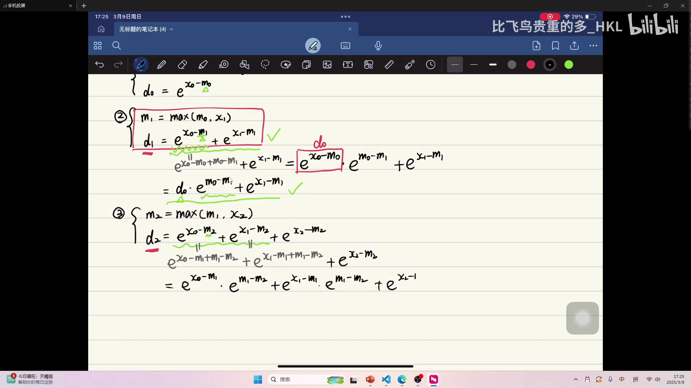 |
| 所以 D2 = D1 乘 e 的 (M1 − M2) 次方，加上 e 的 (X2 − M2) 次方。我不知道大家有没有感觉到——我再换一个颜色——这个公式…… [【跳转到 10:55】](https://www.bilibili.com/video/BV1FM9XYoEQ5/?p=6&t=655) | 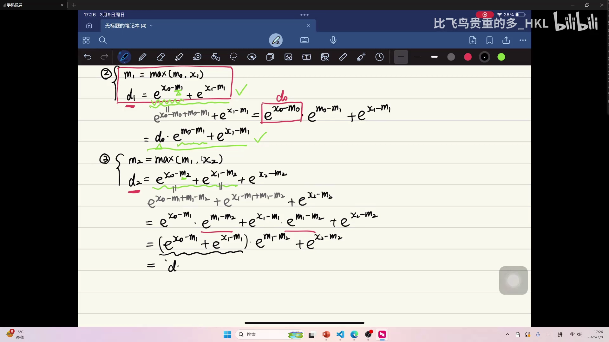 |
| （此区间无字幕） [【跳转到 11:07】](https://www.bilibili.com/video/BV1FM9XYoEQ5/?p=6&t=667) | 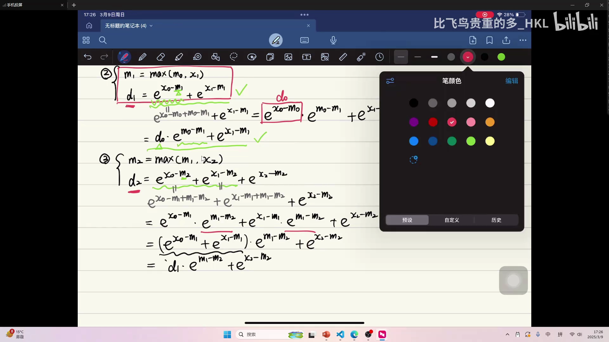 |
| 和这个公式表现形式是一样的，两个公式一模一样。 [【跳转到 11:12】](https://www.bilibili.com/video/BV1FM9XYoEQ5/?p=6&t=672) | 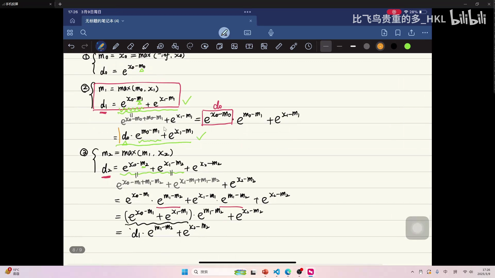 |
| 只不过迭代的时候，这是从 D0、M0、M1 到 D1，再从 D1、M1、M2 到 D2。所以其实就做完了，思路就是这么简单。当你明白这一点，我把它截个图。 [【跳转到 11:20】](https://www.bilibili.com/video/BV1FM9XYoEQ5/?p=6&t=680) | 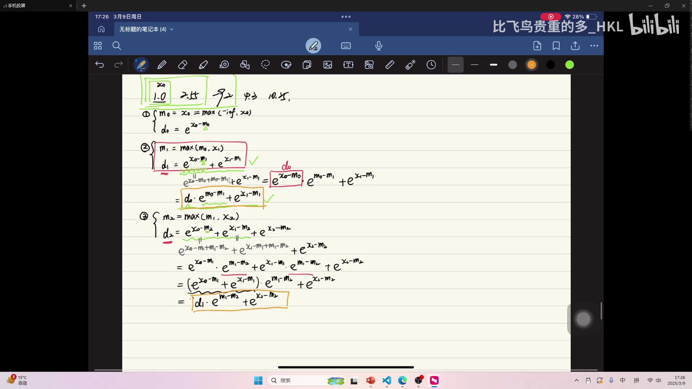 |
| 把这个截个图。当你明白这一点的时候， [【跳转到 11:40】](https://www.bilibili.com/video/BV1FM9XYoEQ5/?p=6&t=700) |  |
| 我相信大家应该就可以看懂这个公式了，把它贴过来。 [【跳转到 11:45】](https://www.bilibili.com/video/BV1FM9XYoEQ5/?p=6&t=705) | 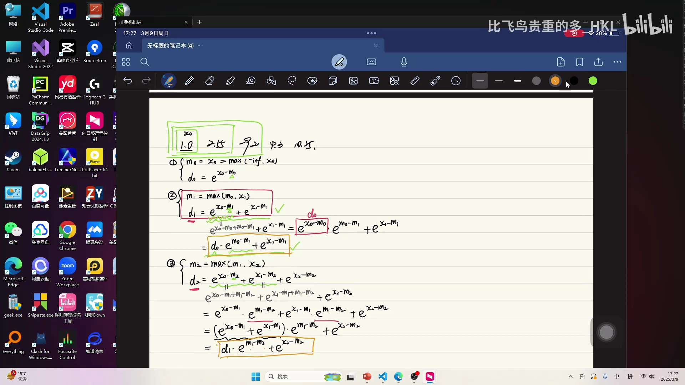 |
| 这时我们就应该很清晰地看到：D_j 是由 D_{j−1} 乘 e 的 (M_{j−1} − M_j) 次方，加上 e 的 (X_j − M_j) 次方得到的。这个公式我已经用橘黄色给大家推导出来了。你看，通过这样一次简化，我们就把问题从之前的三次循环变成了两次循环。 [【跳转到 11:50】](https://www.bilibili.com/video/BV1FM9XYoEQ5/?p=6&t=710) | 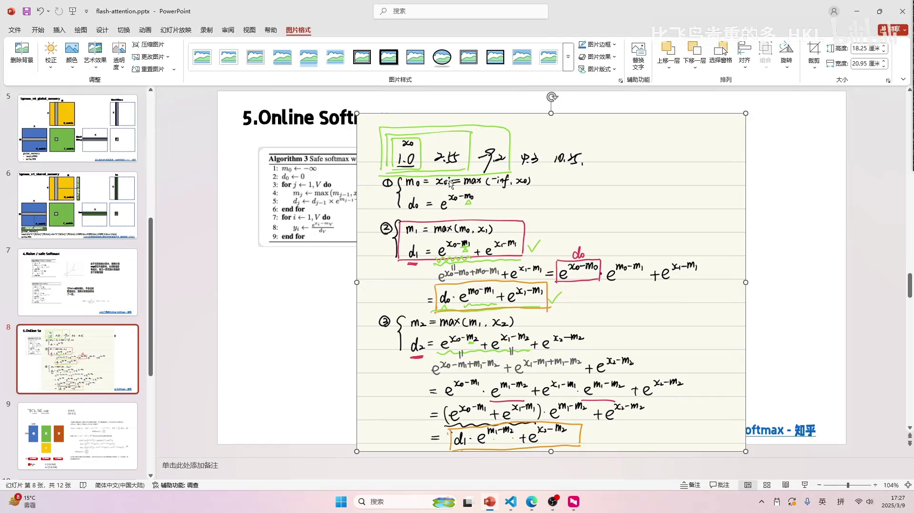 |
| 这是我最开始学、看明白的时候，觉得挺 nice 的，觉得还真是学到了一些东西。下面我们来看代码怎么写。 [【跳转到 12:15】](https://www.bilibili.com/video/BV1FM9XYoEQ5/?p=6&t=735) | 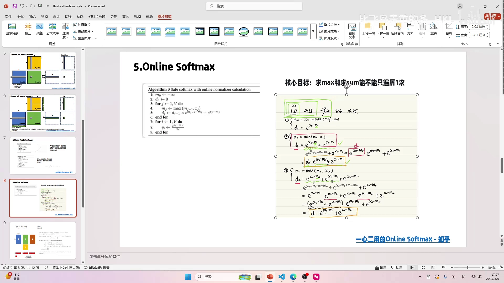 |
| 我直接写。我把这个名字改一下。从现在开始，我们的第一步就变成了：获取最大值，并且求和。 [【跳转到 12:29】](https://www.bilibili.com/video/BV1FM9XYoEQ5/?p=6&t=749) | 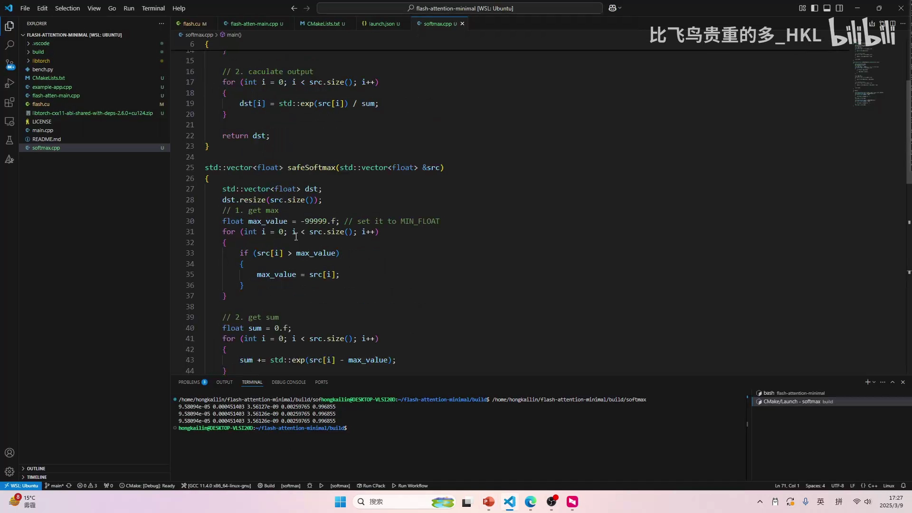 |
| 这样吧，我把求和写到上面来，然后这个（原来的单独求和步骤）就不要了，这一步变成第二步。剩下的就是依据公式。 [【跳转到 12:54】](https://www.bilibili.com/video/BV1FM9XYoEQ5/?p=6&t=774) | 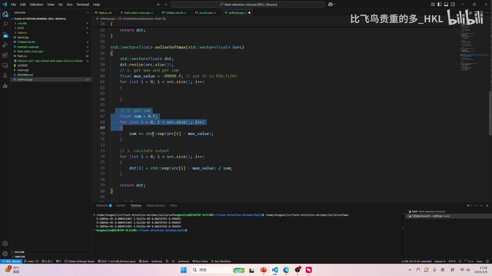 |
| 依据这个公式，我就可以去写这个程序了。 [【跳转到 13:09】](https://www.bilibili.com/video/BV1FM9XYoEQ5/?p=6&t=789) | 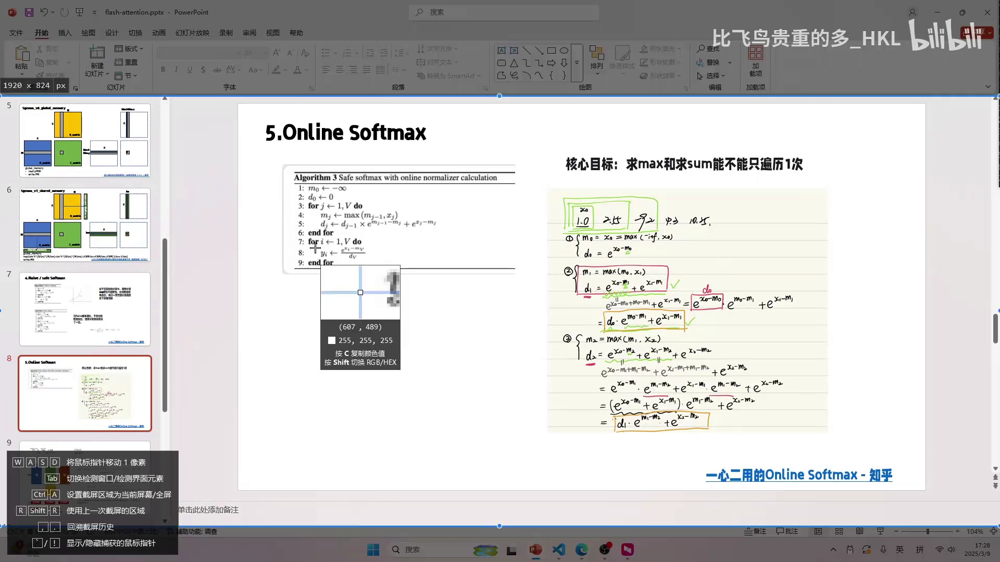 |
| 怎么写呢？先求 max。M（maxvalue）等于 std::max(maxvalue, x)——拿 maxvalue 和 src[i] 求最大值，这就对应第 4、5 行。 [【跳转到 13:14】](https://www.bilibili.com/video/BV1FM9XYoEQ5/?p=6&t=794) |  |
| 然后 sum 等于上一次的和，即 sum 加上……这里应该是乘：乘上 e 的 (M_{j−1} − M_j) 次方，再加上 e 的 (X_j − M_j) 次方。首先 M_j 应该是这个（当前最大）—— [【跳转到 13:39】](https://www.bilibili.com/video/BV1FM9XYoEQ5/?p=6&t=819) | 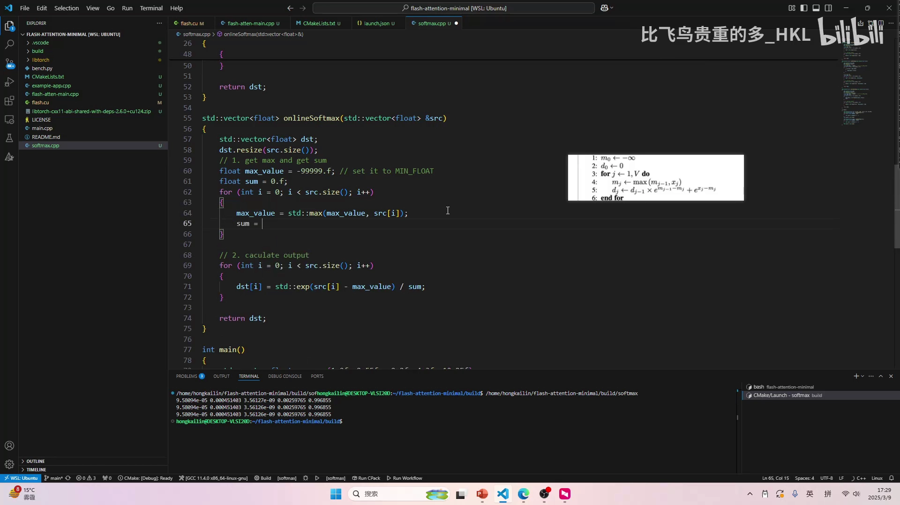 |
| M_j 应该是这个，那 M_{j−1} 就应该是上一次的那个数。所以我们就应该再有一个变量，叫 `float pre`（保存上一次的最大值）。然后用这个数减去它。 [【跳转到 14:04】](https://www.bilibili.com/video/BV1FM9XYoEQ5/?p=6&t=844) | 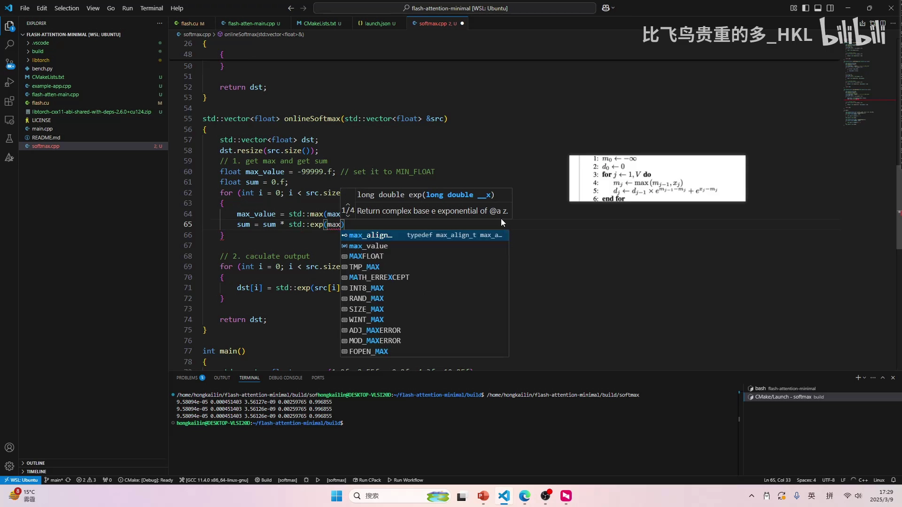 |
| 然后这个数你还需要在每次迭代完之后存一下。这样，前面这半段就写完了。 [【跳转到 14:29】](https://www.bilibili.com/video/BV1FM9XYoEQ5/?p=6&t=869) | 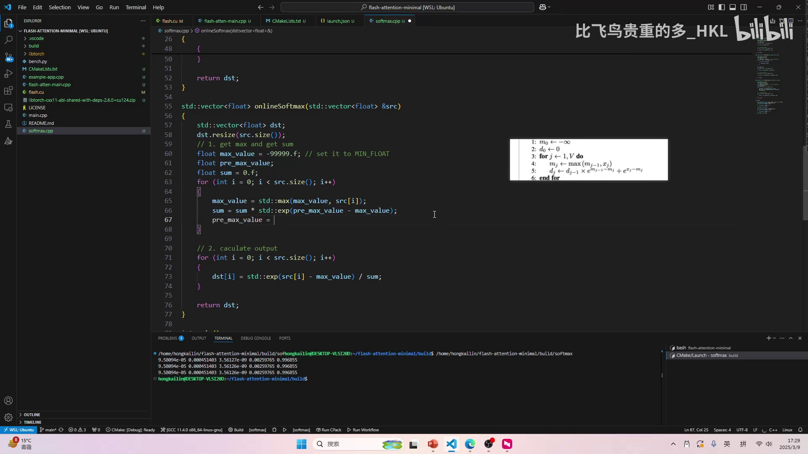 |
| 我们再写后面半段：exp(x[i] − M_j)。M_j 就是它。这样我们代码就写完了。写完我们来验证一下结果对不对：把这一段都复制一下、改成二，编译运行。 [【跳转到 14:54】](https://www.bilibili.com/video/BV1FM9XYoEQ5/?p=6&t=894) | 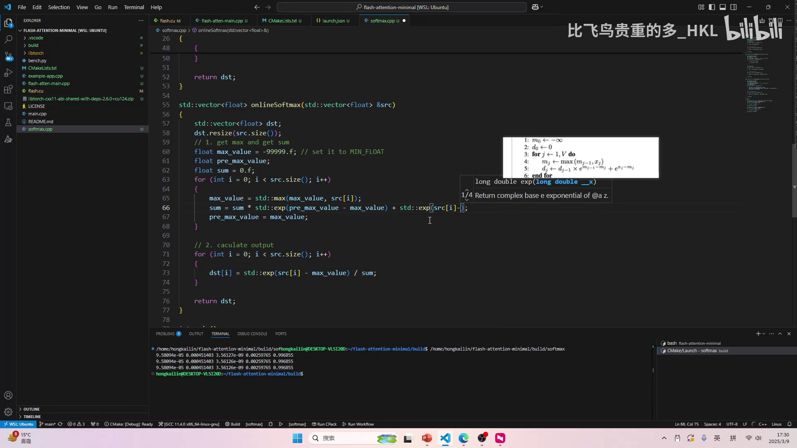 |
| 失败了啊。好吧，我们看一下哪儿失败了。它等于……我哪儿写错了吗？它是 src[i] 求最大值，然后等于它减去它乘……哦对，sum 乘上它减去它，再加上 exp(src[i]) 减去它。 [【跳转到 15:19】](https://www.bilibili.com/video/BV1FM9XYoEQ5/?p=6&t=919) | 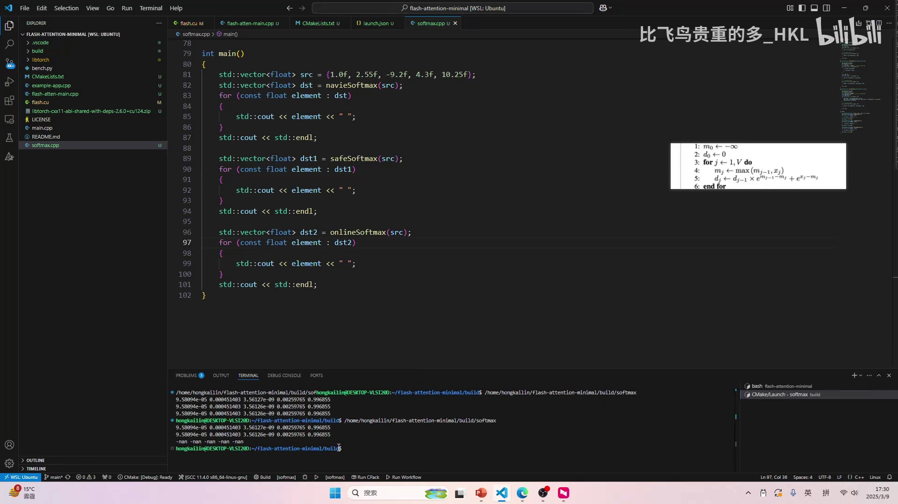 |
| 我感觉这个没错呀，那我们 debug 吧。执行……哎，是不是我底下复制错了？这也没错。好吧，我们看一眼：最大值现在被更新了，然后 sum 变成 NaN 了——那说明你这地方写错了。 [【跳转到 15:44】](https://www.bilibili.com/video/BV1FM9XYoEQ5/?p=6&t=944) | 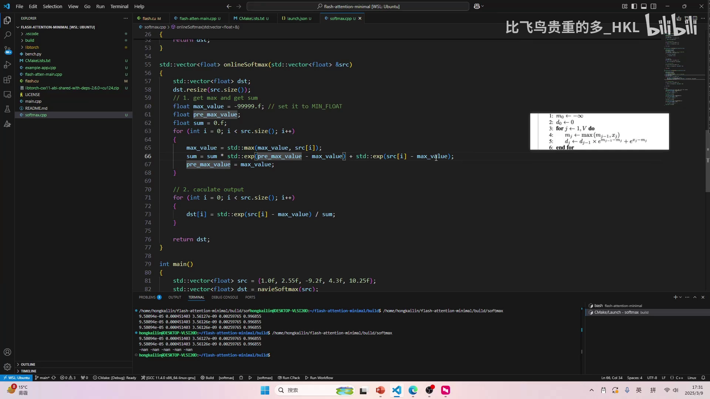 |
| 说明我这地方写错了。我看下哪儿写错了。哦，sum 开始是零，第一次是零，零乘这个数也是零，那就是 exp(它减去最大值)，最大值是一，src 是它这个数。 [【跳转到 16:09】](https://www.bilibili.com/video/BV1FM9XYoEQ5/?p=6&t=969) | 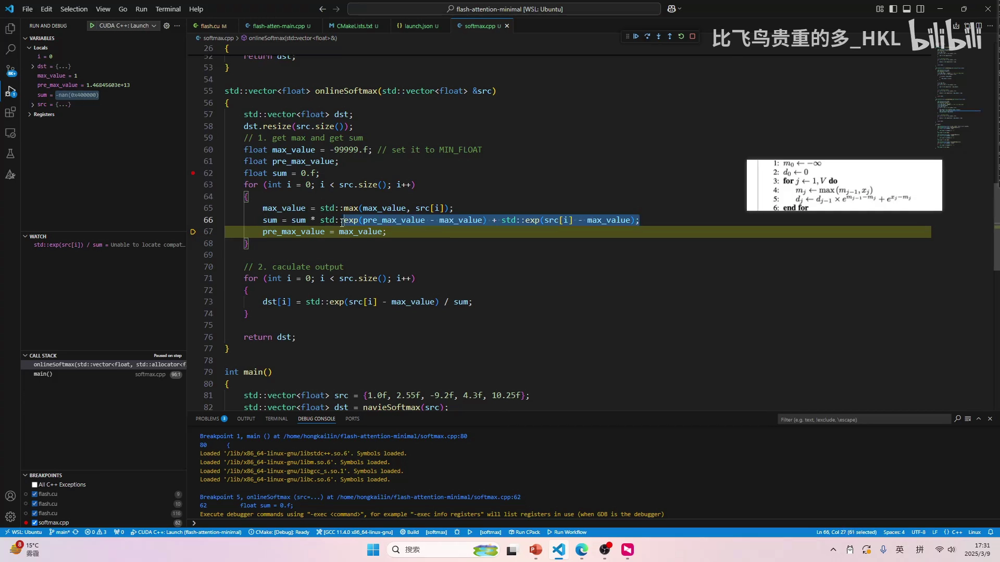 |
| 哎，为什么这个数会是一个 NaN 呢？再看一遍，我哪儿写错了？最大值是一。 [【跳转到 16:34】](https://www.bilibili.com/video/BV1FM9XYoEQ5/?p=6&t=994) | 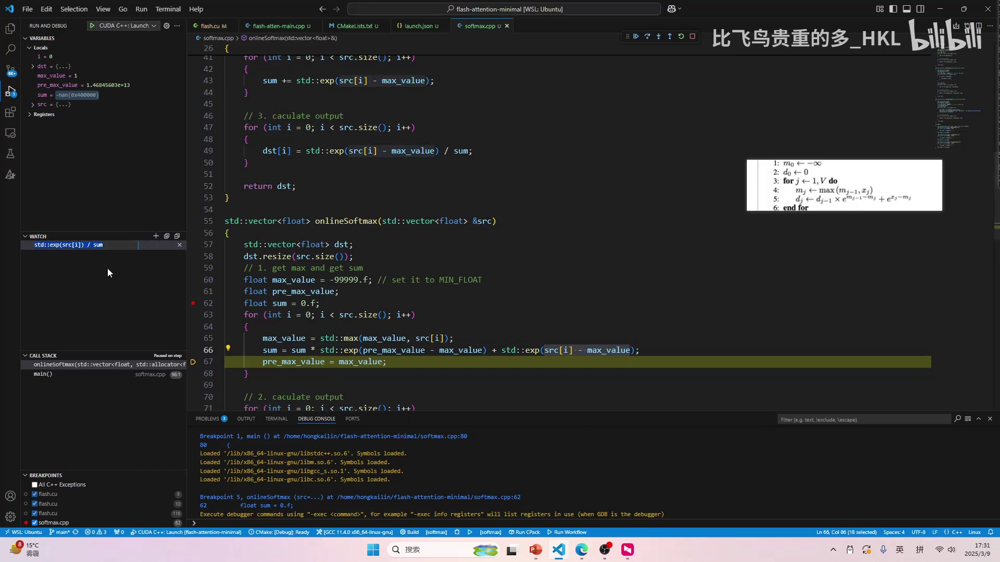 |
| 这个是可以接受的。然后——哦哦哦，我知道了，这应该先等于零。再试一遍，因为如果你这里不初始化它、不让它等于零的话，它就是个随机数。OK，好了，这回就对了，整体就对了。那这个程序我们也写完了——其实它不是特别难，但我觉得这个思想其实还挺关键的。 [【跳转到 16:59】](https://www.bilibili.com/video/BV1FM9XYoEQ5/?p=6&t=1019) | 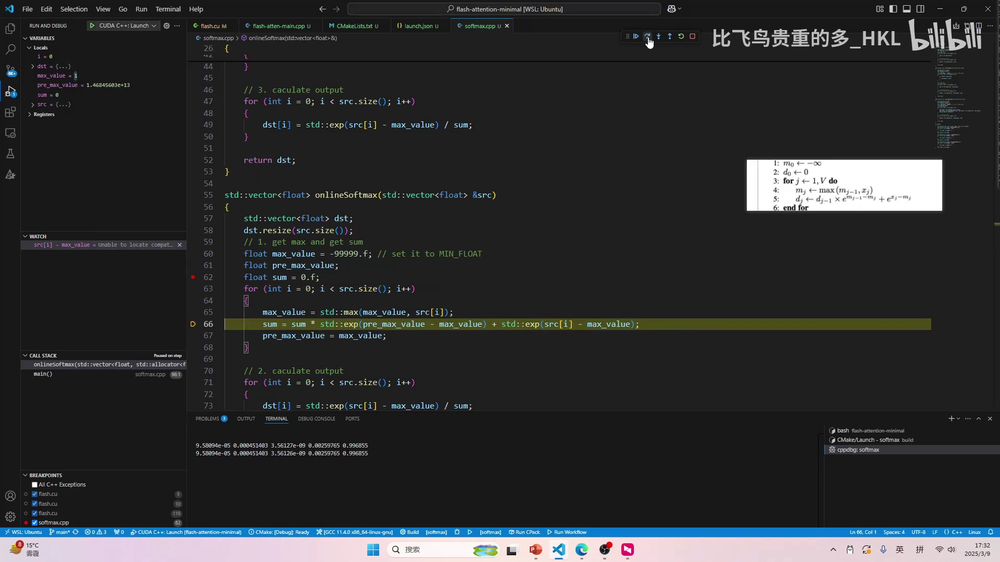 |
| 包括它怎么推导的，以及它怎么就…… [【跳转到 17:24】](https://www.bilibili.com/video/BV1FM9XYoEQ5/?p=6&t=1044) | 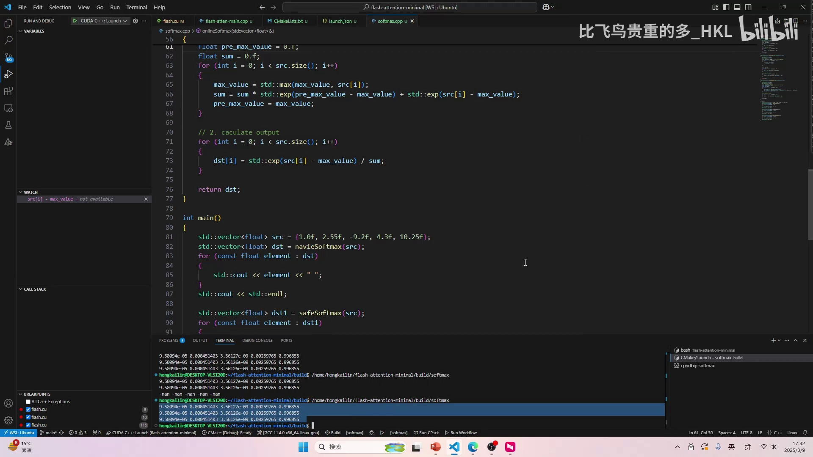 |
| 就这么神奇地让「求最大值」和「求和」变到一步了。这些都是值得我们学习的。好了，这节课就先到这。 [【跳转到 17:29】](https://www.bilibili.com/video/BV1FM9XYoEQ5/?p=6&t=1049) | 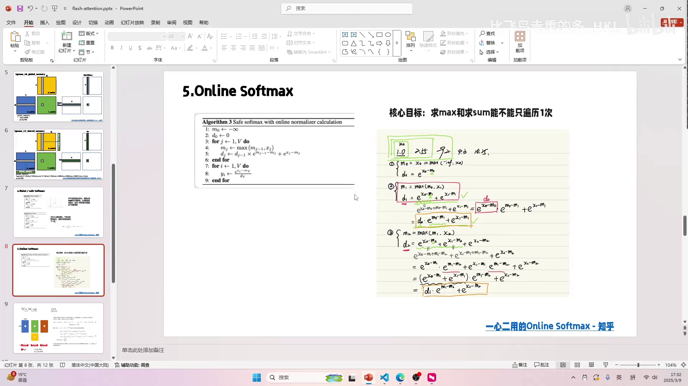 |