# 第07讲_online_softmax与value的点积优化 原始文稿（图-字幕分栏）

| 字幕文本 | 画面 |
| :--- | ---: |
| 好，我们继续来看。上一节课我们已经把 online softmax 讲完了。我们可以回忆一下：优化到现在，能不能解决 FlashAttention 里 attention 的问题呢？ [【跳转到 00:00】](https://www.bilibili.com/video/BV1FM9XYoEQ5/?p=7&t=0) | 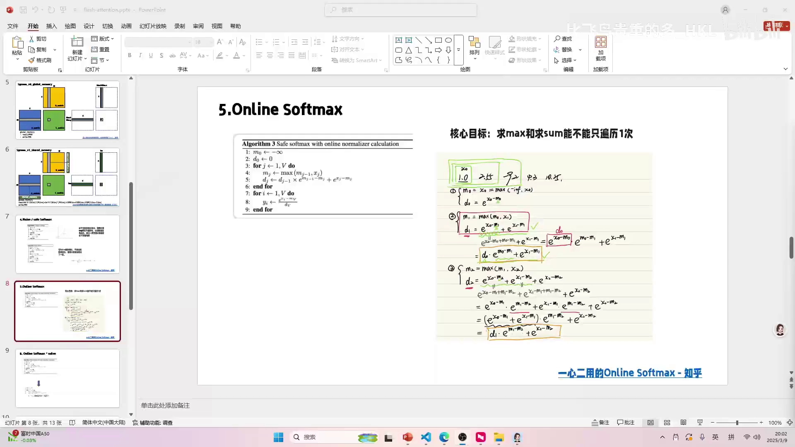 |
| 我们之前说，FlashAttention 里有一个 softmax 操作。如果没有 softmax，整体计算会非常丝滑——用分块矩阵的方式，就能把那个比较大的橘黄色矩阵（R）的读写和存储都省掉，对优化非常有利。但 softmax 恰恰是阻碍 attention 优化的一个很大因素。 [【跳转到 00:11】](https://www.bilibili.com/video/BV1FM9XYoEQ5/?p=7&t=11) |  |
| 为什么呢？因为 softmax 有一个求最大值和求和的操作。如果不把整个矩阵求出来，就没法求 softmax 的值。而我们上节课讲完 online softmax 后你会发现：诶，我不需要像之前那样先遍历一遍求最大值、再遍历一遍求和、再遍历一遍求 softmax 值了。 [【跳转到 00:36】](https://www.bilibili.com/video/BV1FM9XYoEQ5/?p=7&t=36) |  |
| 但我们的优化只是把「求和」和「求最大值」合并到一起了。这时你会发现一个很大的问题：现在这个版本仍然需要对每一个元素求一下 softmax、然后把它存起来。 [【跳转到 00:54】](https://www.bilibili.com/video/BV1FM9XYoEQ5/?p=7&t=54) | 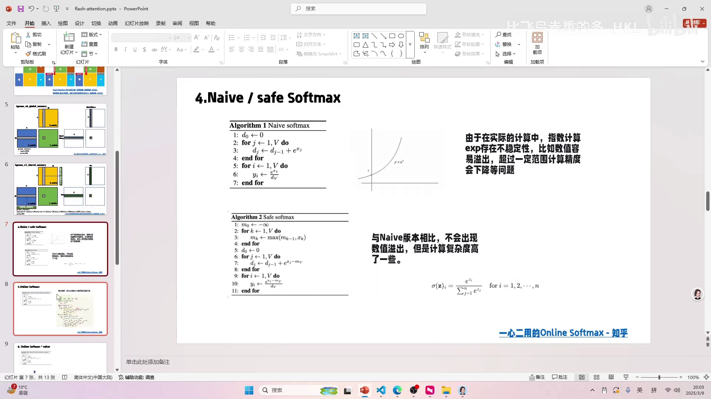 |
| 大家应该能想明白：现在这一步省不了。如果这两行代码省不了，那就说明 softmax 还得做、还得存、还得读、还得写——那就说明我们现在**还没优化完**。大家要思考一下。 [【跳转到 01:19】](https://www.bilibili.com/video/BV1FM9XYoEQ5/?p=7&t=79) | 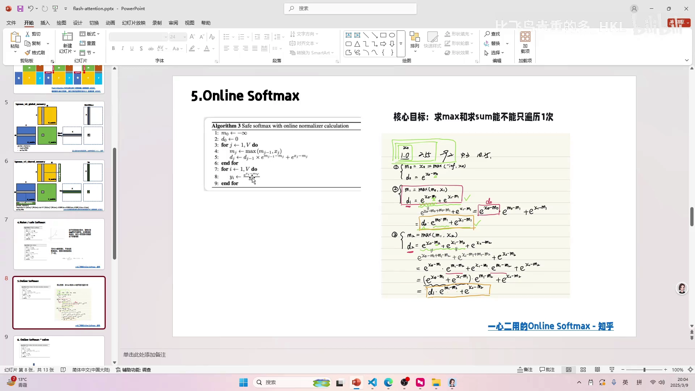 |
| 因为按照之前讲的公式， [【跳转到 01:31】](https://www.bilibili.com/video/BV1FM9XYoEQ5/?p=7&t=91) | 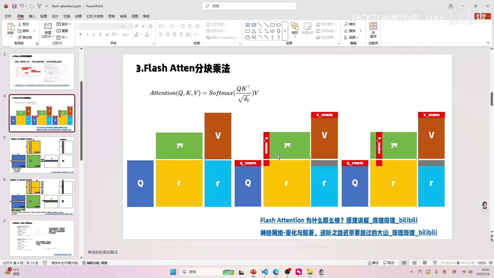 |
| 你求 softmax 仍然需要先把所有的数都得到。我们这个遍历虽然很快就求到了最大值和求和，但我们还是要对所有元素做一次遍历。既然这一步省不了，那这次优化就是不合格的。所以这节课我们还是要—— [【跳转到 01:40】](https://www.bilibili.com/video/BV1FM9XYoEQ5/?p=7&t=100) | 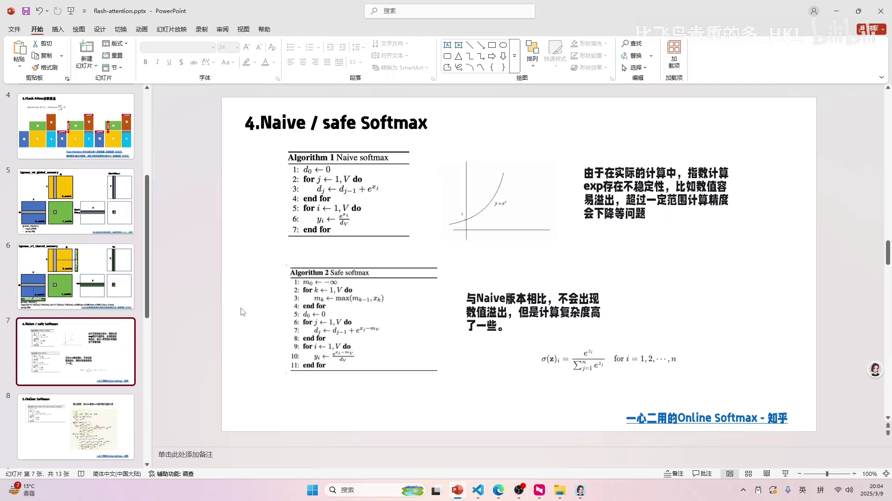 |
| 把这个问题尽可能地简化。 [【跳转到 02:05】](https://www.bilibili.com/video/BV1FM9XYoEQ5/?p=7&t=125) | 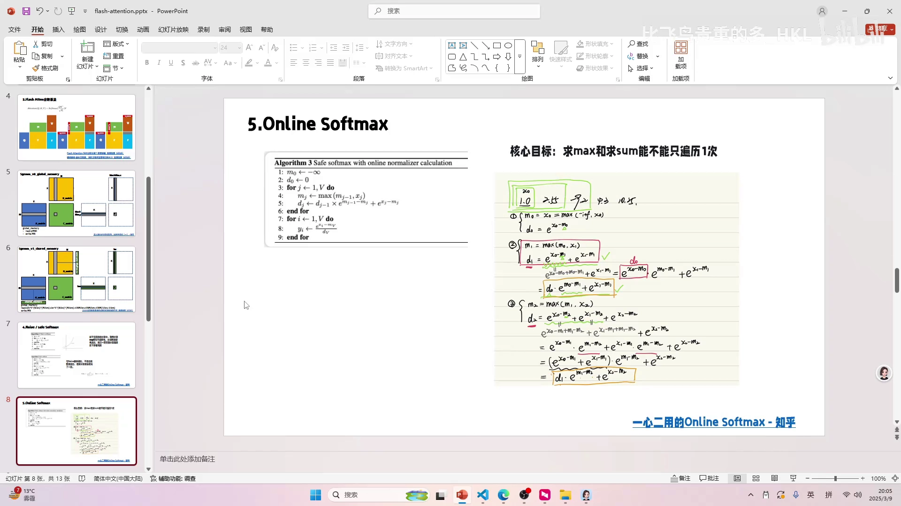 |
| 简化到我们这节课要讲的：online softmax 乘一个 value。 [【跳转到 02:10】](https://www.bilibili.com/video/BV1FM9XYoEQ5/?p=7&t=130) |  |
| 什么意思呢？我先给大家直接看程序。我们现在模拟一个 softmax 的真实场景。 [【跳转到 02:15】](https://www.bilibili.com/video/BV1FM9XYoEQ5/?p=7&t=135) |  |
| 我希望你对这个值——你可以理解为这是一个 attention weight——走一个 softmax，下一步就要乘 V，对吧？我们只考虑一行，不考虑整个序列。比如我们现在有个 value，我通过 softmax 求完之后的值要和这个 value 做点积。这其实就是和图里展示的—— [【跳转到 02:20】](https://www.bilibili.com/video/BV1FM9XYoEQ5/?p=7&t=140) | 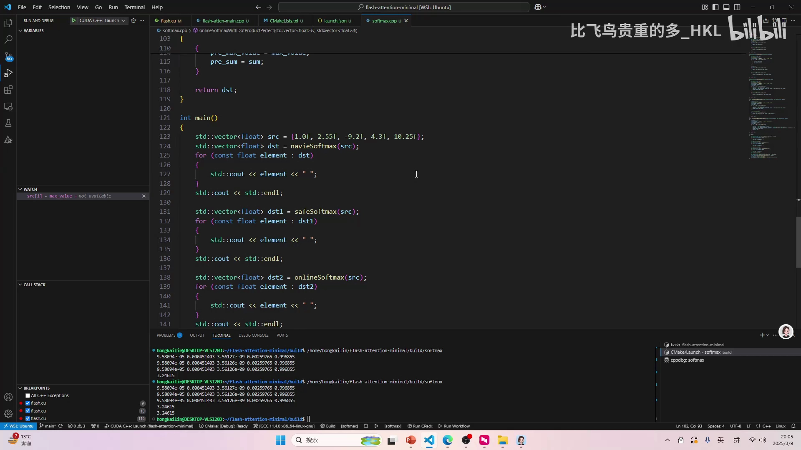 |
| 一样：当我们把这一行的 softmax 求完， [【跳转到 02:45】](https://www.bilibili.com/video/BV1FM9XYoEQ5/?p=7&t=165) | 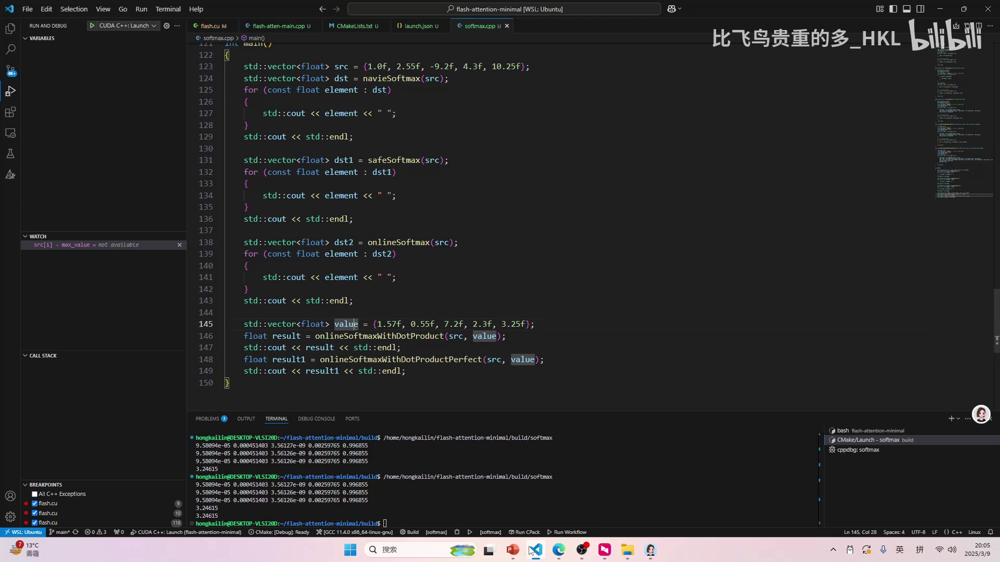 |
| 只需要跟这一列求一个点积，就可以得到第一个数。那我们就要看看：这一行和这一列做点积，能不能跟之前讲的、这两步合到一起？ [【跳转到 02:50】](https://www.bilibili.com/video/BV1FM9XYoEQ5/?p=7&t=170) |  |
| 如果能合到一起，那我们就变成：不需要对这个矩阵进行存储和读取，也不需要对整体都计算出来，对吧？那就达到目的了。所以这节课要看的就是—— [【跳转到 03:01】](https://www.bilibili.com/video/BV1FM9XYoEQ5/?p=7&t=181) | 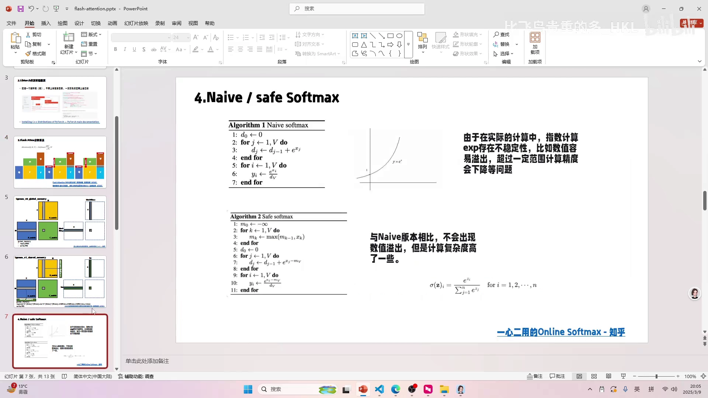 |
| online softmax 与 value 相乘能不能做一个优化。 [【跳转到 03:08】](https://www.bilibili.com/video/BV1FM9XYoEQ5/?p=7&t=188) |  |
| 是能的。我们先说结论：是能的。我们先看不做优化是怎么做的。 [【跳转到 03:17】](https://www.bilibili.com/video/BV1FM9XYoEQ5/?p=7&t=197) |  |
| 是能的。我们先说结论：是能的。我们先看一下不做优化是怎么做的。 [【跳转到 03:22】](https://www.bilibili.com/video/BV1FM9XYoEQ5/?p=7&t=202) | 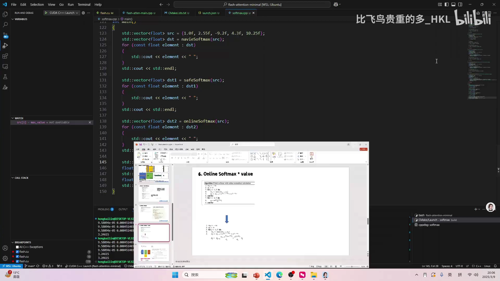 |
| 现在有一个 value。我这里也写了一个 online_softmax_with_dot_product（带点乘的 softmax），我们看一下里面怎么实现。其实特别简单：前面都不变，只是在某个位置再乘一个 V。因为我们现在这一步求完之后，相当于求完了每一个值的 softmax 结果，下一步就要乘 V 再求和，所以这里直接把这个 V 乘过来。 [【跳转到 03:27】](https://www.bilibili.com/video/BV1FM9XYoEQ5/?p=7&t=207) | 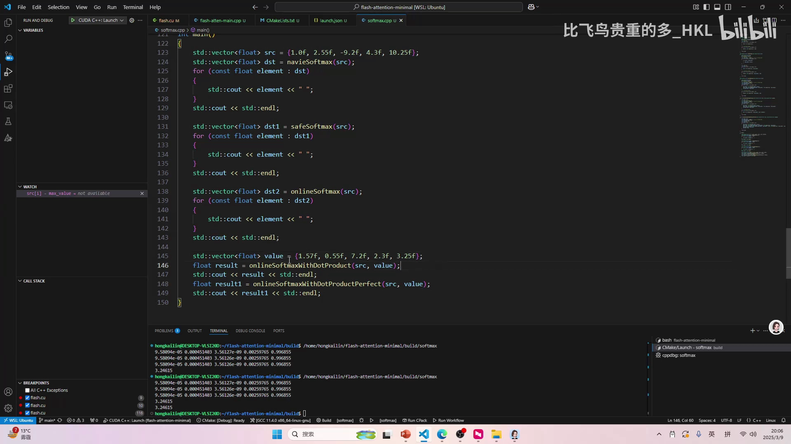 |
| 乘过来然后求和就 OK。这其实就是不做任何优化时的做法。但还是那句话：这个 `for` 如果能打破——如果没有这个 `for`——比如下面这个程序写了个 perfect 版本，它只需要一次遍历，就相当于我做了一个优化。 [【跳转到 03:52】](https://www.bilibili.com/video/BV1FM9XYoEQ5/?p=7&t=232) | 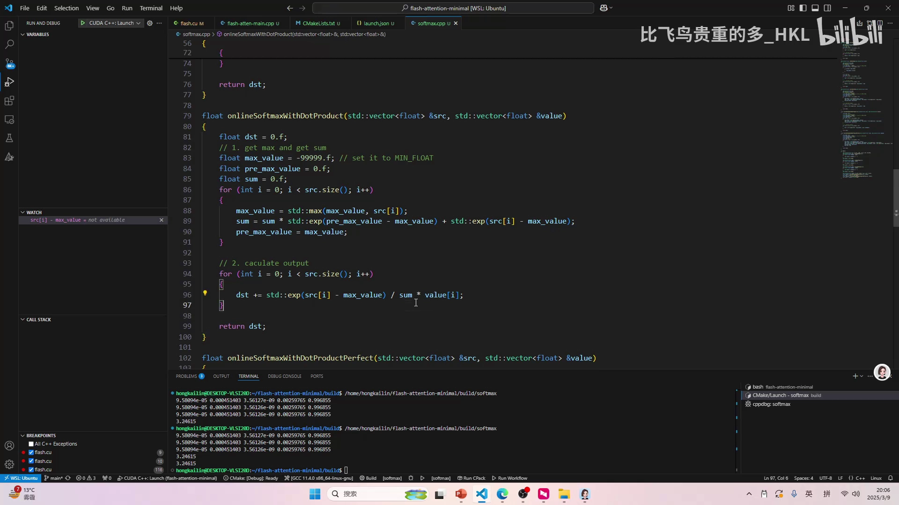 |
| 我把这两步合到一起了。如果能拿到结果，就可以对 FlashAttention、对 attention 做优化了，对吧？其实也是能的。我们先看结果：我给大家运行一下，可以看到用这个方式和那个方式做的结果一模一样，而这个方式里面只有一次循环。 [【跳转到 04:17】](https://www.bilibili.com/video/BV1FM9XYoEQ5/?p=7&t=257) | 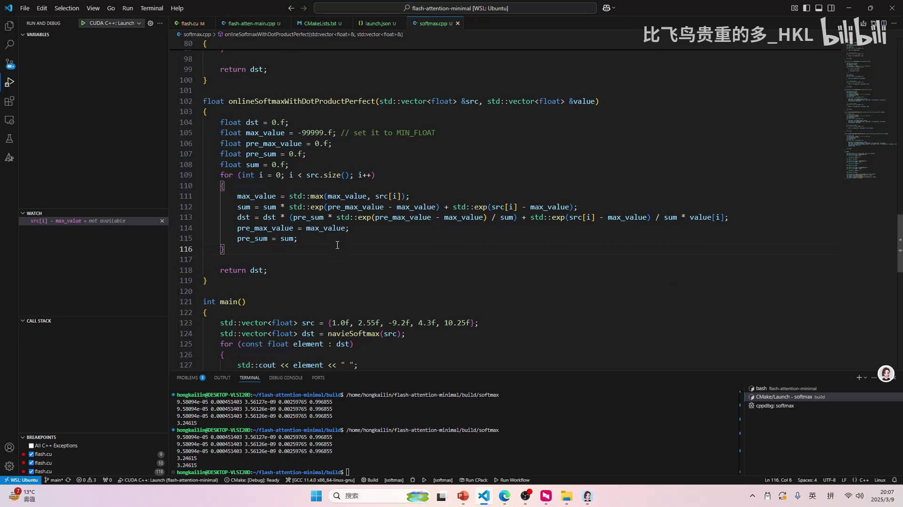 |
| 通过这种迭代的方式，我就不需要把所有的都计算出来了。 [【跳转到 04:42】](https://www.bilibili.com/video/BV1FM9XYoEQ5/?p=7&t=282) | 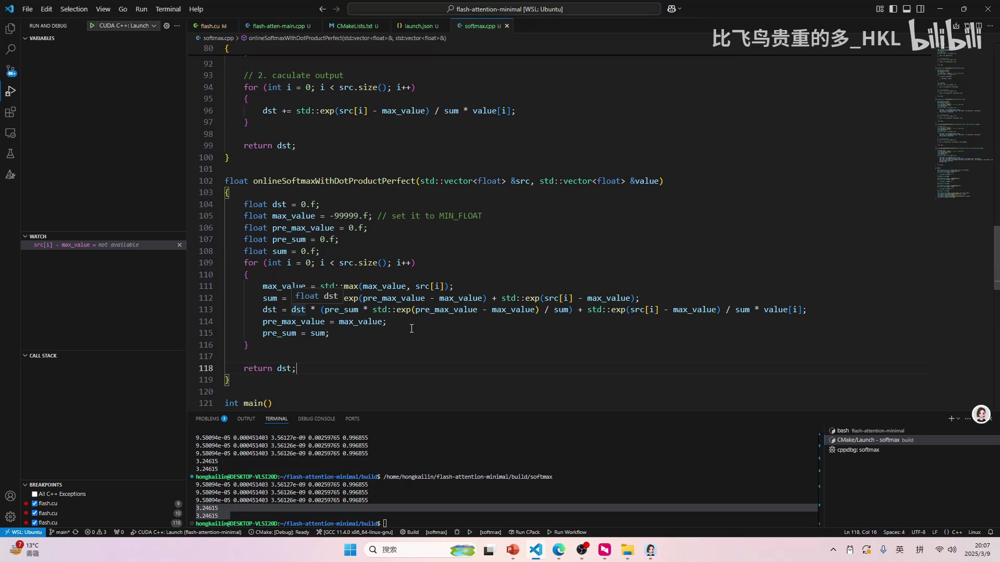 |
| 你不需要像之前一样把所有 softmax 值都算出来再乘，现在就可以—— [【跳转到 04:47】](https://www.bilibili.com/video/BV1FM9XYoEQ5/?p=7&t=287) |  |
| 直接得到。那具体怎么做的、这个公式怎么拿到呢？ [【跳转到 04:55】](https://www.bilibili.com/video/BV1FM9XYoEQ5/?p=7&t=295) | 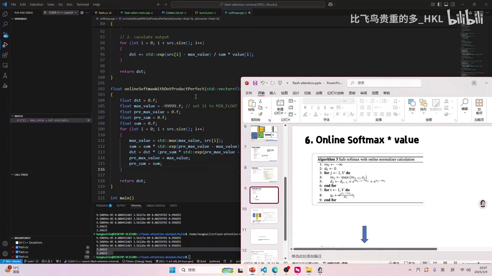 |
| 还是给大家做一个简单的推导。我还是要用投屏的方式讲。我们连上之后来看一下。 [【跳转到 05:00】](https://www.bilibili.com/video/BV1FM9XYoEQ5/?p=7&t=300) | 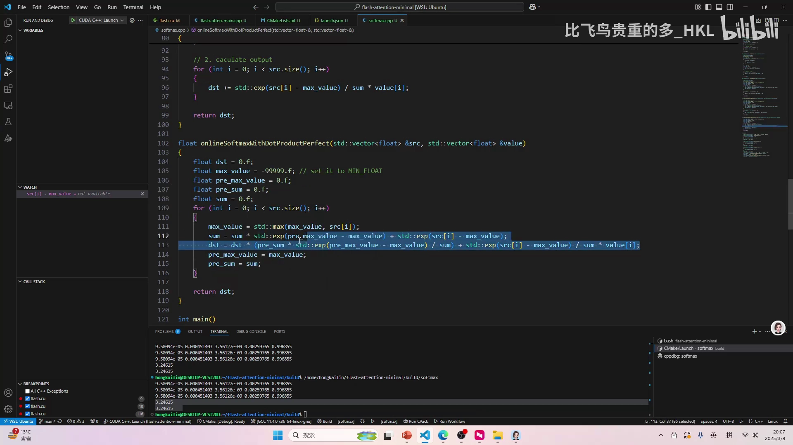 |
| 这个地方到底应该怎么…… [【跳转到 05:25】](https://www.bilibili.com/video/BV1FM9XYoEQ5/?p=7&t=325) |  |
| 好，我们来看这个地方怎么做。 [【跳转到 05:30】](https://www.bilibili.com/video/BV1FM9XYoEQ5/?p=7&t=330) |  |
| 这个怎么还擦不掉……换页。我们来看这节课的目的。我还是重新写一下。我们要做的就是这些值，跟刚才一样：2.55、负的 9.2、4.3，还有一个 10.25，对吧？ [【跳转到 05:35】](https://www.bilibili.com/video/BV1FM9XYoEQ5/?p=7&t=335) | 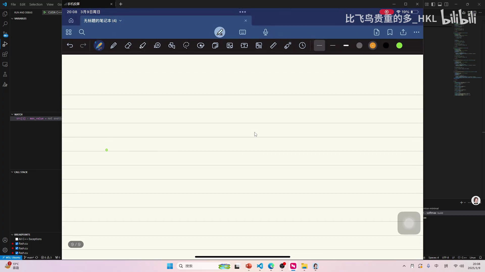 |
| 我们要对这些值做 softmax。之前我们把它叫 X，这是 X。现在还有一个 V（value），这些 V 的值我就不往上写了，因为后面都是用符号表示，具体数不重要。这里就是五个 value 的值。后面我们要对 X 求完 softmax 之后和这些 V 做点积。 [【跳转到 06:00】](https://www.bilibili.com/video/BV1FM9XYoEQ5/?p=7&t=360) | 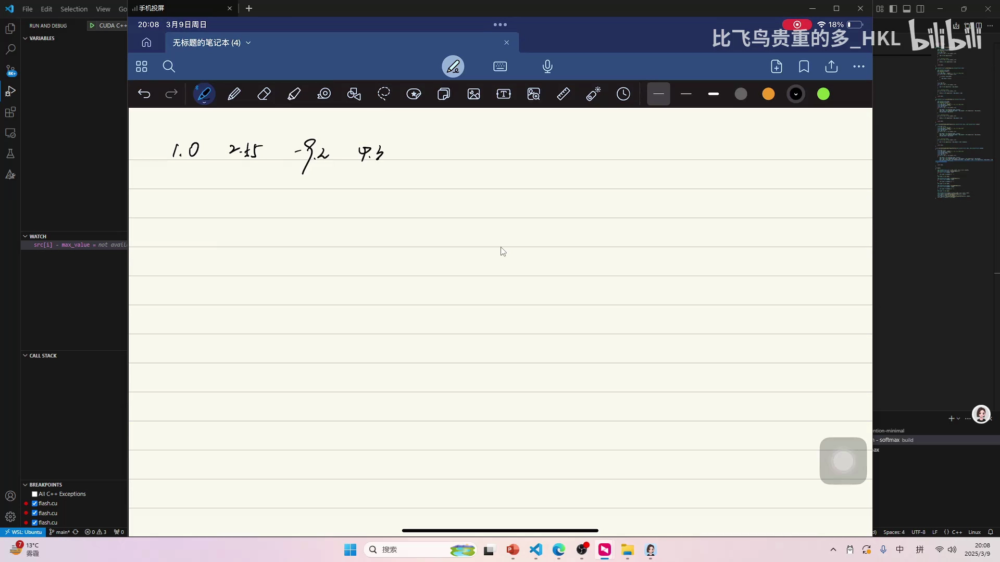 |
| 我们来看怎么做。其实套路和刚才上节课讲的这套完全一样：我要迭代，所以要一个一个看。 [【跳转到 06:25】](https://www.bilibili.com/video/BV1FM9XYoEQ5/?p=7&t=385) | 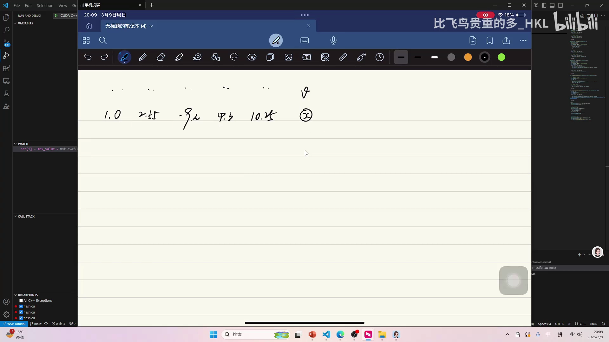 |
| 我要保证每一个计算出的结果都是正确的，然后根据当前公式反推，看怎么才能把这个公式和上一次计算的结果产生联系。 [【跳转到 06:35】](https://www.bilibili.com/video/BV1FM9XYoEQ5/?p=7&t=395) | 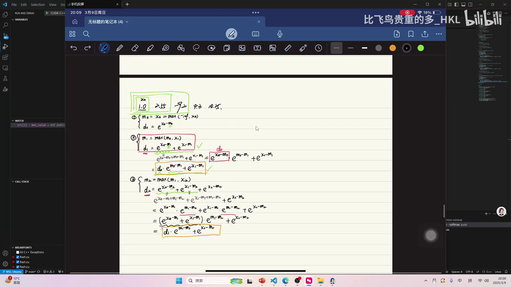 |
| 好，我们就来看一下怎么做。首先还是看第一个数，仍然用之前的符号。 [【跳转到 06:40】](https://www.bilibili.com/video/BV1FM9XYoEQ5/?p=7&t=400) | 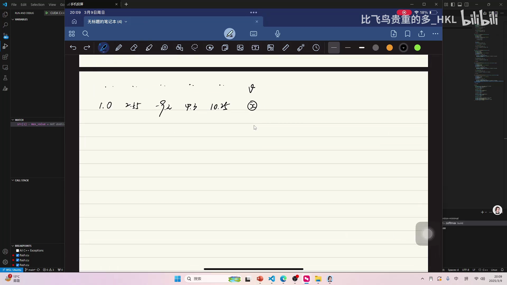 |
| M0 等于 max(负无穷, X0)。这是 M0。然后 D0 = e 的 (X0 − M0) 次方。然后结果用 O 表示：O0 等于 D0 分之 e 的 (X0 − M0) 次方，再乘上 V0。 [【跳转到 07:05】](https://www.bilibili.com/video/BV1FM9XYoEQ5/?p=7&t=425) | 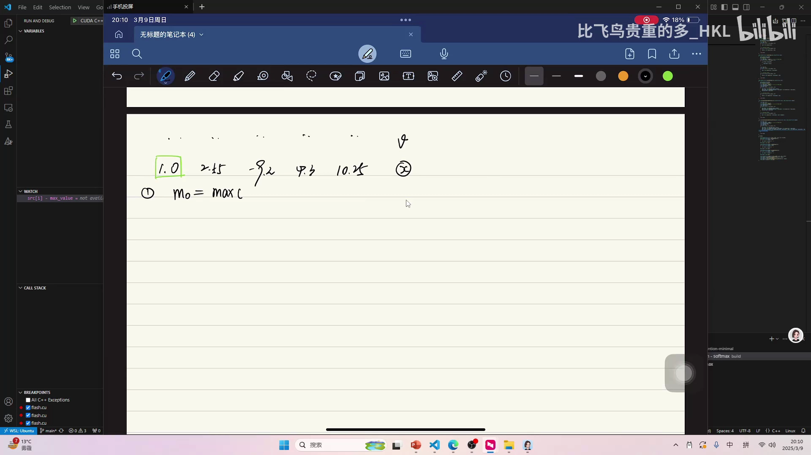 |
| 这个公式大家应该可以理解。这是第一组。然后我们看第二组：M1 = max(M0, X1)。 [【跳转到 07:30】](https://www.bilibili.com/video/BV1FM9XYoEQ5/?p=7&t=450) |  |
| D1 等于什么呢？之前已经把这个公式说过了——D0 乘 e 的 (M0 − M1) 次方，再加上 e 的 (X1 − M1) 次方。 [【跳转到 07:55】](https://www.bilibili.com/video/BV1FM9XYoEQ5/?p=7&t=475) | 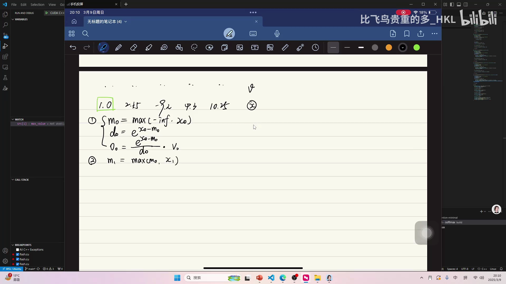 |
| 当然它其实也等于 e 的 (X0 − M1) 次方加上 e 的 (X1 − M1) 次方，这两个一样，上节课讲得很详细了。然后我们看 O1 怎么算。用正常思路：先把它写出来——分子是 D1 分之 e 的 (X0 − M1) 乘 V0，再加上 D1 分之 e 的 (X1 − M1) 乘 V1。 [【跳转到 08:20】](https://www.bilibili.com/video/BV1FM9XYoEQ5/?p=7&t=500) | 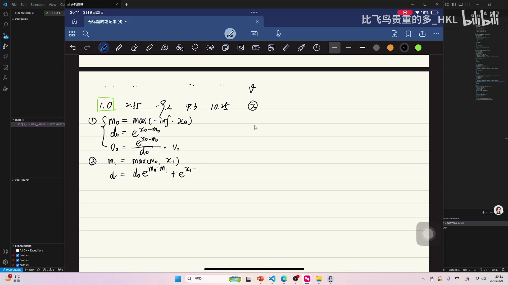 |
| 这是常规情况下公式应该这么写。 [【跳转到 08:45】](https://www.bilibili.com/video/BV1FM9XYoEQ5/?p=7&t=525) | 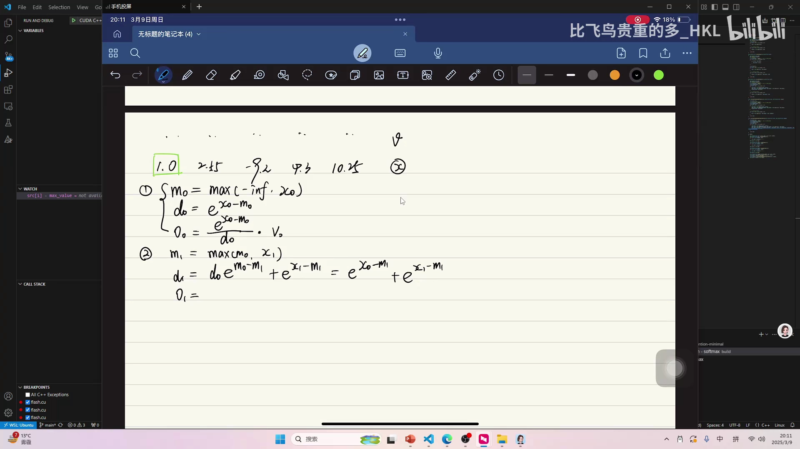 |
| 如果你能把这个东西跟 O1 建立起联系，那这个递推就成立了。所以我们现在要努力把 O1 和 O0 建立联系，那就要对它做一些变换。想一想怎么做。还是用刚才的技巧—— [【跳转到 09:10】](https://www.bilibili.com/video/BV1FM9XYoEQ5/?p=7&t=550) | 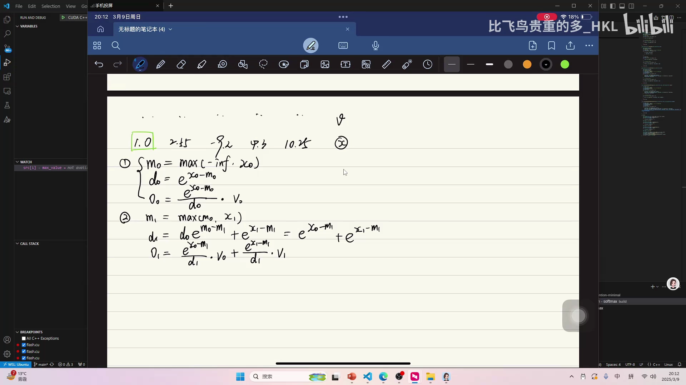 |
| 加一个数再减一个数。我给大家先写出来：e 的 (X0 − M0 + M0 − M1) 次方。这里为什么先减？因为要跟那个公式勾上，所以先减 M0 再加 M0，再减 M1。 [【跳转到 09:35】](https://www.bilibili.com/video/BV1FM9XYoEQ5/?p=7&t=575) |  |
| 然后这是分子部分。分母这里是 D0——所以我们正常应该也给个 D0。如果你这里给 D0，那上面就一定要也乘个 D0 把它消掉，然后再乘个 D1。这就是这一组，可以写成等价的形式。 [【跳转到 10:00】](https://www.bilibili.com/video/BV1FM9XYoEQ5/?p=7&t=600) |  |
| 它再乘个 V0，把 V0 也带上。然后做一个变换：你肯定要往这引导，所以上面肯定是 e 的 (X0 − M0) 次方、底下是 D0——因为这样才能构造出 O0，再乘上 V0。 [【跳转到 10:25】](https://www.bilibili.com/video/BV1FM9XYoEQ5/?p=7&t=625) |  |
| 这一组就是 O0。然后剩下的项再罗列下来：D0 和 D1，以及 e 的 (M0 − M1) 次方，就是这样的情况。所以这个位置就可以写成 O0。然后我们还要把这一块原封不动地抄下来： [【跳转到 10:50】](https://www.bilibili.com/video/BV1FM9XYoEQ5/?p=7&t=650) | 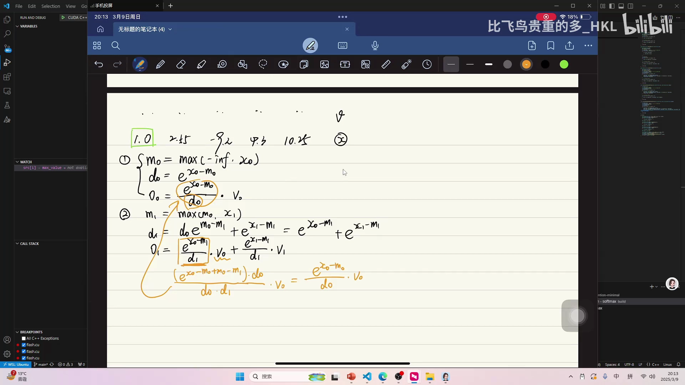 |
| 加上 D1 分之 e 的 (X1 − M1) 乘 V1。整体整理一下，就等于 O0 乘上 D1 分之 D0 乘 e 的 (M0 − M1) 次方，加上 D1 分之 e 的 (X1 − M1) 乘 V1。 [【跳转到 11:15】](https://www.bilibili.com/video/BV1FM9XYoEQ5/?p=7&t=675) | 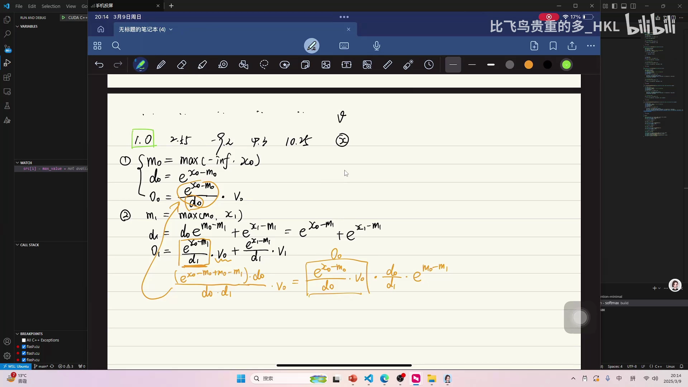 |
| 下面这个公式其实就已经契合我们的需求了：D0、D1 都求出来了，V1 就是那个 value 的值，M0、M1 都知道，D0、D1 也都知道，所以这个公式就推出来了。 [【跳转到 11:40】](https://www.bilibili.com/video/BV1FM9XYoEQ5/?p=7&t=700) | 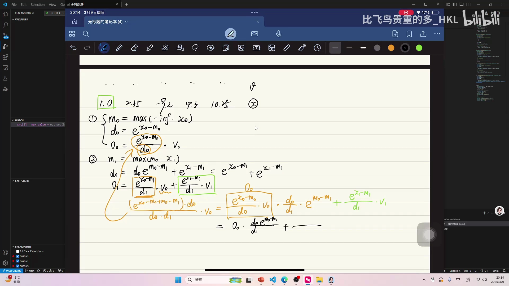 |
| 整体的结果我在这里已经写出来了。 [【跳转到 12:05】](https://www.bilibili.com/video/BV1FM9XYoEQ5/?p=7&t=725) | 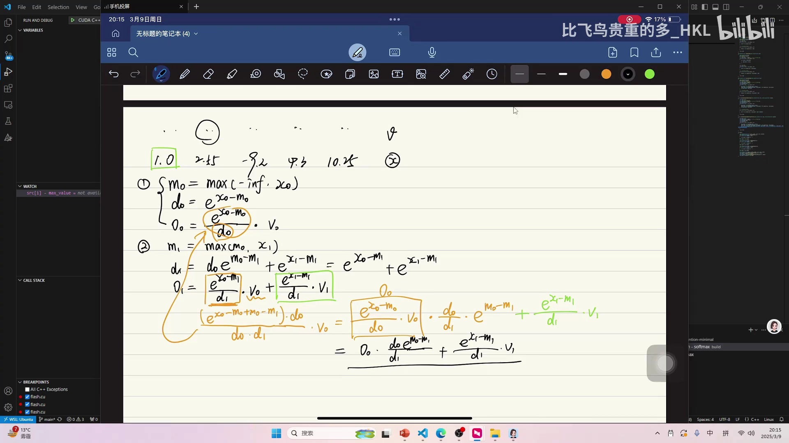 |
| 最后的公式就是这样，我顺着上面这个公式写的：O_j 可以通过 O_{j−1} 递推得到——等于 O_{j−1} 乘上 D_j 分之 D_{j−1} 乘 e 的 (M_{j−1} − M_j) 次方，再加上 D_j 分之 e 的 (X_j − M_j) 乘 V_j。可能我念起来你觉得挺复杂， [【跳转到 12:10】](https://www.bilibili.com/video/BV1FM9XYoEQ5/?p=7&t=730) | 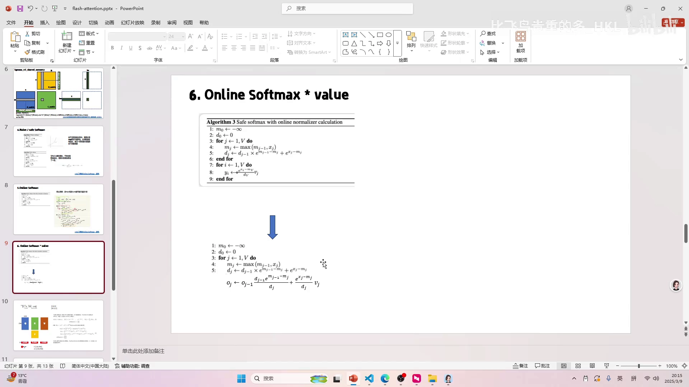 |
| 但大家尽可能去理解。 [【跳转到 12:35】](https://www.bilibili.com/video/BV1FM9XYoEQ5/?p=7&t=755) |  |
| 这个地方整体的推导流程，我是觉得没有想象中那么难。 [【跳转到 12:40】](https://www.bilibili.com/video/BV1FM9XYoEQ5/?p=7&t=760) | 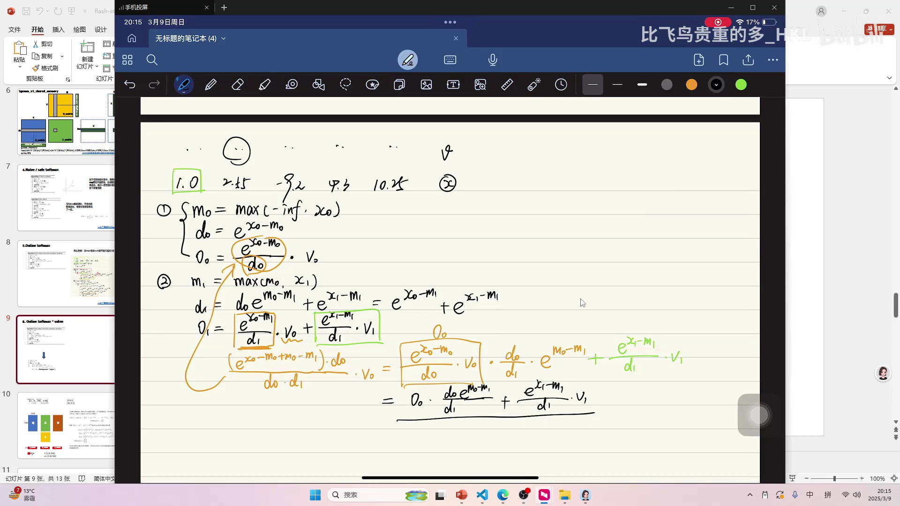 |
| 我把这个截图一下，把它存下来。 [【跳转到 12:45】](https://www.bilibili.com/video/BV1FM9XYoEQ5/?p=7&t=765) | 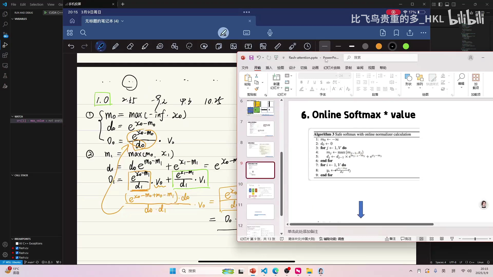 |
| 然后把这个结果给它—— [【跳转到 12:50】](https://www.bilibili.com/video/BV1FM9XYoEQ5/?p=7&t=770) | 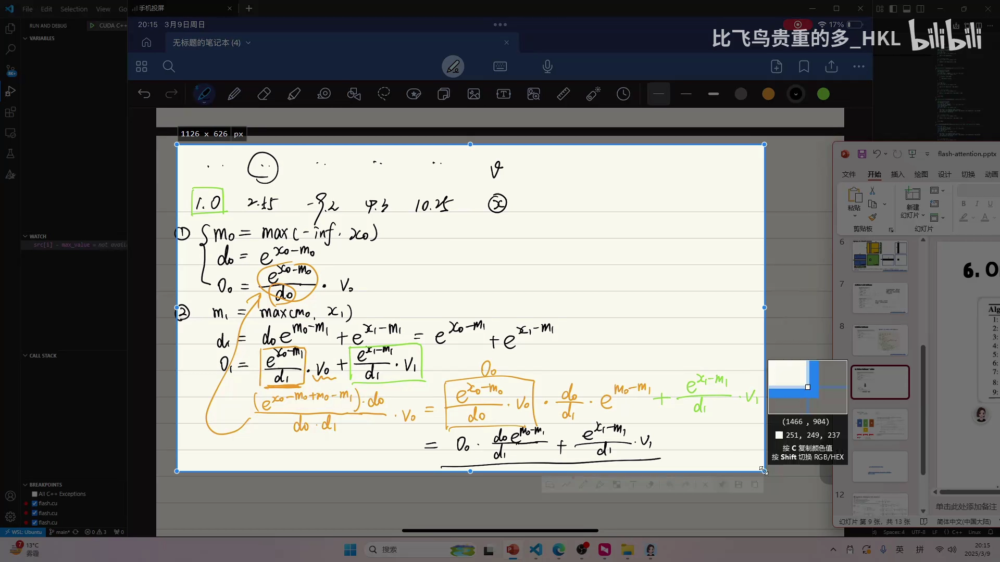 |
| 整体粘上。所以最后我们现在要做的事情就是下面这个公式，这就是手推的过程。这个公式写到程序里其实也特别简单。 [【跳转到 12:55】](https://www.bilibili.com/video/BV1FM9XYoEQ5/?p=7&t=775) | 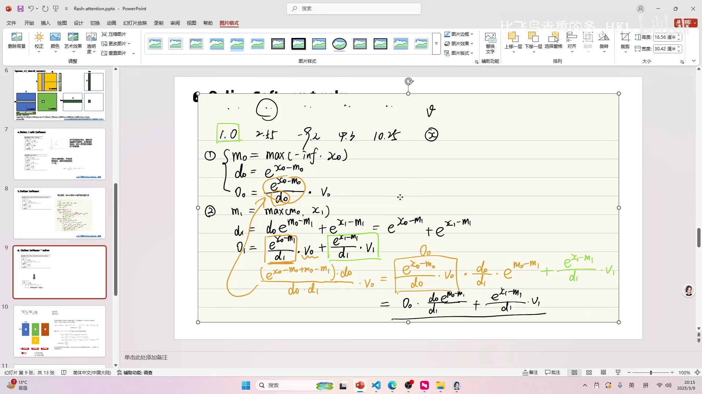 |
| 我就不带大家写了，就是这么一个公式，我们就推出来了。所以你会发现：通过这样一次转换——我们刚才讲完 online softmax， [【跳转到 13:08】](https://www.bilibili.com/video/BV1FM9XYoEQ5/?p=7&t=788) | 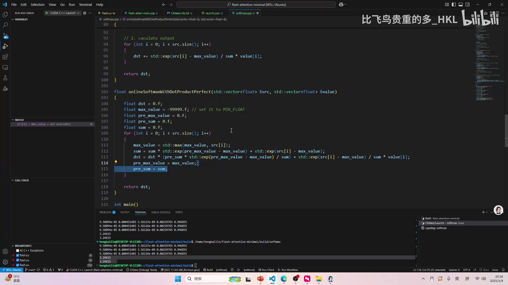 |
| 虽然没有完整解决问题，但 online softmax 的推导思想 [【跳转到 13:19】](https://www.bilibili.com/video/BV1FM9XYoEQ5/?p=7&t=799) | 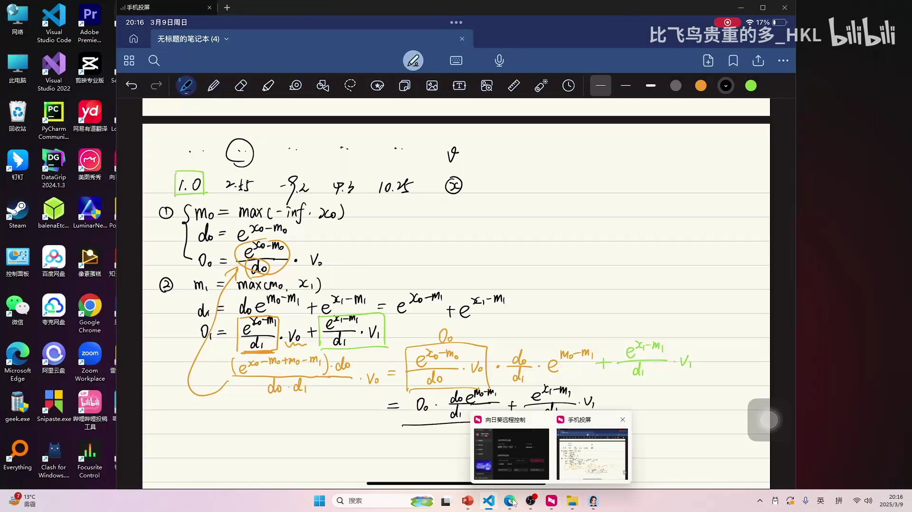 |
| 是沿用的。我们现在这个位置就是沿用同样的思想，通过这种形式推出来。推出来之后你会发现：原本我想求 softmax 和 value 点积的结果，需要先知道整体 softmax 的结果、再和 V 做乘法；但现在发现不用了。 [【跳转到 13:24】](https://www.bilibili.com/video/BV1FM9XYoEQ5/?p=7&t=804) | 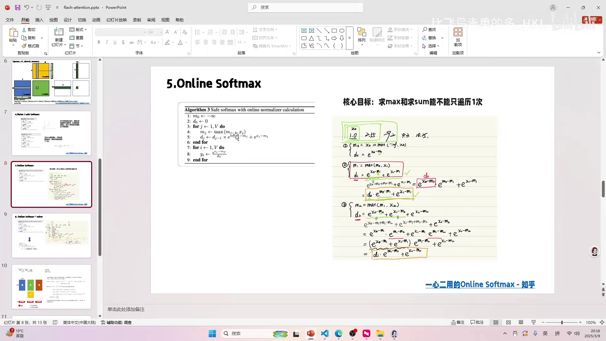 |
| 我现在来一个数就能求、再来一个数就能迭代地求，最后通过这种方式算出结果。这样就非常好，完全符合我们的需求。 [【跳转到 13:49】](https://www.bilibili.com/video/BV1FM9XYoEQ5/?p=7&t=829) | 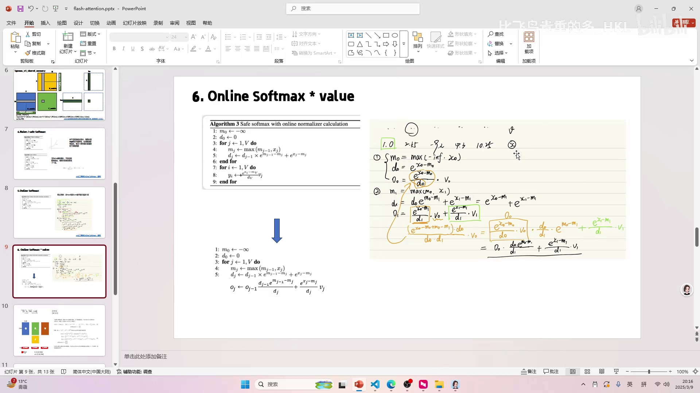 |
| 你可以想象，把我们刚才讲的 online softmax 乘上 value 这个流程放到这里，你就会发现：它真的不需要把 R 完整算出来，我就可以把整个 FlashAttention 计算出来了。这就是 FlashAttention 我个人觉得最核心的思想。 [【跳转到 14:01】](https://www.bilibili.com/video/BV1FM9XYoEQ5/?p=7&t=841) | 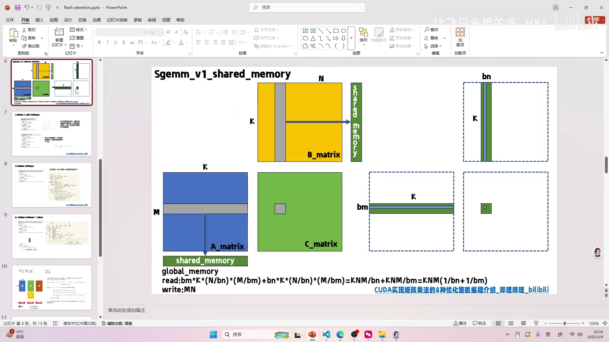 |
| 现在我讲完了——虽然程序没有讲，但通过这两个地方的推导， [【跳转到 14:06】](https://www.bilibili.com/video/BV1FM9XYoEQ5/?p=7&t=846) | 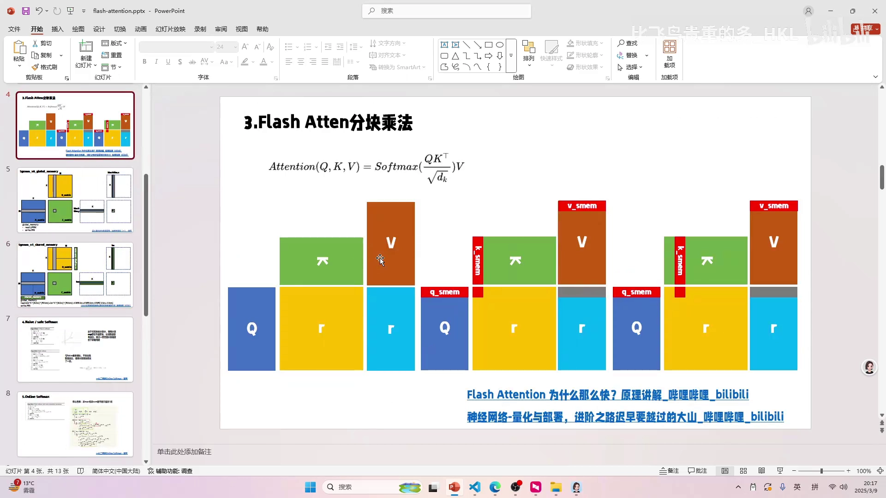 |
| 我已经把 FlashAttention 最底层、或者说里面最难理解的点讲完了。所以我相信，如果你听明白了这两节，自己去看程序，应该是能看懂的——如果你有 CUDA 编程基础的话，应该能看懂它到底在做什么。 [【跳转到 14:27】](https://www.bilibili.com/video/BV1FM9XYoEQ5/?p=7&t=867) | 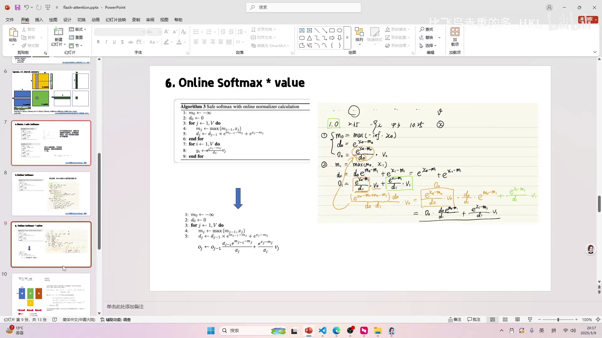 |
| 当然我们后面也会讲这个程序，我甚至会考虑带大家从头按这个程序写一遍，看看能不能让大家有更好的理解。总之我要讲的核心点已经讲完了。 [【跳转到 14:41】](https://www.bilibili.com/video/BV1FM9XYoEQ5/?p=7&t=881) | 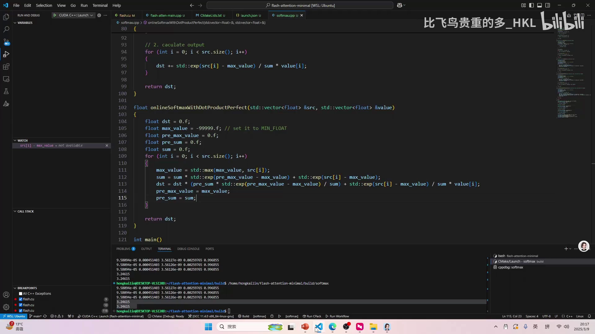 |
| 后面就是实际写代码了。我还是那句话：我一直觉得写代码本身不难，你只要能搞明白你想做什么、第一步第二步第三步要怎么做，剩下的就是写出问题、自己调试、找到问题所在，就没什么了。 [【跳转到 15:03】](https://www.bilibili.com/video/BV1FM9XYoEQ5/?p=7&t=903) | 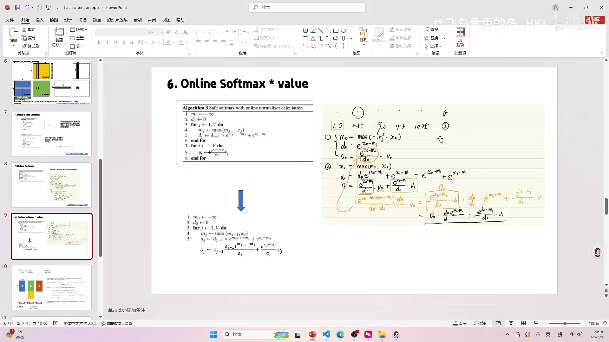 |
| 好，这节课就到这。我们现在已经把这个完整的 softmax 讲完了，下节课就开始讲 FlashAttention 的程序。 [【跳转到 15:28】](https://www.bilibili.com/video/BV1FM9XYoEQ5/?p=7&t=928) | 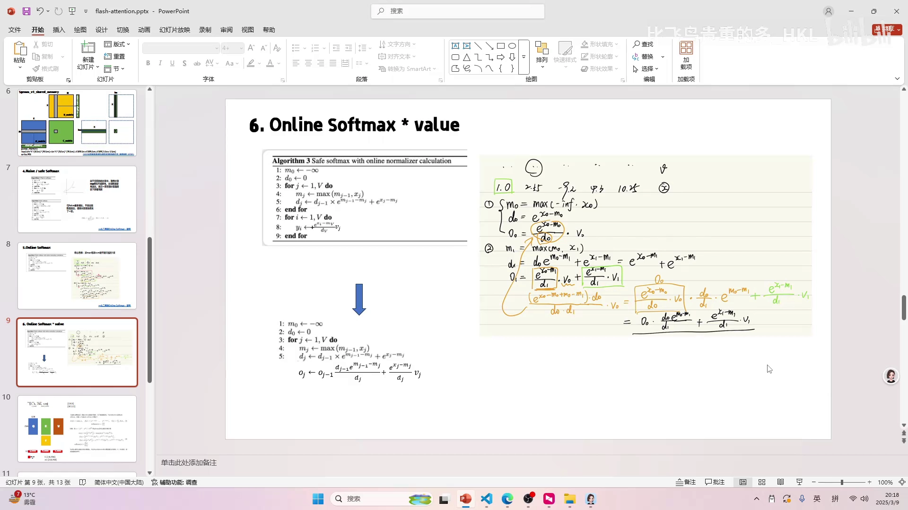 |