# 第08讲_cuda算子解析 原始文稿（图-字幕分栏）

| 字幕文本 | 画面 |
| :--- | ---: |
| 啊，hello 大家好，我们继续来讲 FlashAttention 的部分。其实照比第六课，我这次等了还挺久的。前六课我其实只用一个周末就整理出来了，但第七课——中间我虽然插播了别的视频，但 FlashAttention 我也一直在看。我最初的想法是—— [【跳转到 00:00】](https://www.bilibili.com/video/BV1FM9XYoEQ5/?p=8&t=0) |  |
| 把程序从头到尾给大家写一遍，就像讲矩阵乘法时那样，一点一点写。然后我自己先写了一遍，写的时候说实话，感觉很痛苦。至于原因，我们后面可以一点一点说。正因为写得很痛苦，让我觉得 FlashAttention 不能像讲矩阵乘法、讲 reduce 那样写一遍就完事——因为那样远远不够。 [【跳转到 00:25】](https://www.bilibili.com/video/BV1FM9XYoEQ5/?p=8&t=25) | 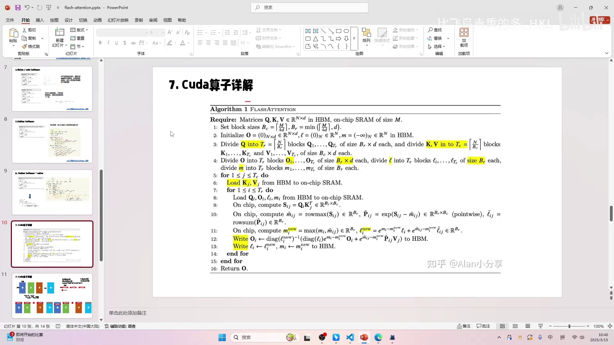 |
| 远远不够。所以我决定放弃给大家写代码的这段时间。我自己写了一份—— [【跳转到 00:50】](https://www.bilibili.com/video/BV1FM9XYoEQ5/?p=8&t=50) |  |
| 我之所以重写一份，是因为我觉得 flash.cu 有一些地方不太好，大家看的时候容易误解，或者理解不了 FlashAttention 更完整、更细节的地方。当然我这份也没考虑所有细节，但比原始的稍微多考虑了一点点。所以我给大家—— [【跳转到 00:55】](https://www.bilibili.com/video/BV1FM9XYoEQ5/?p=8&t=55) | 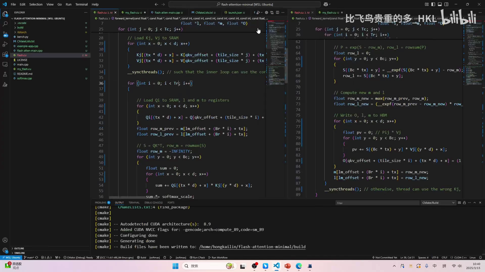 |
| 把我的代码也写出来了。但我这份代码没跑过，所以肯定有问题，大概率、90% 执行结果是不对的。但我也懒得验证了，因为我写的时候本身就很痛苦，后面会讲为什么痛苦。好，我们回到这节课本身。 [【跳转到 01:20】](https://www.bilibili.com/video/BV1FM9XYoEQ5/?p=8&t=80) | 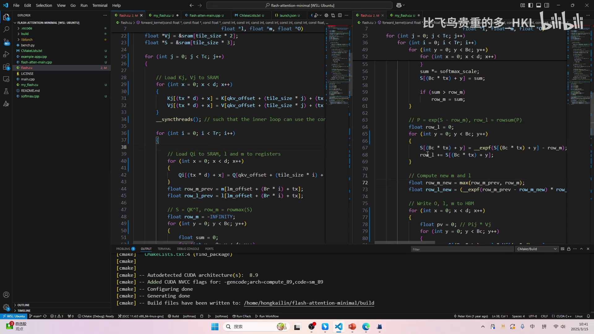 |
| 我们要讲 CUDA 算子详解。这个算子，其实我上节课（第六节）还说过：我们已经把最难的原理讲完了，那应该很简单了吧？错。我再去读 FlashAttention 代码和论文里的伪代码时，觉得还是有很多地方挺不好想的。 [【跳转到 01:37】](https://www.bilibili.com/video/BV1FM9XYoEQ5/?p=8&t=97) | 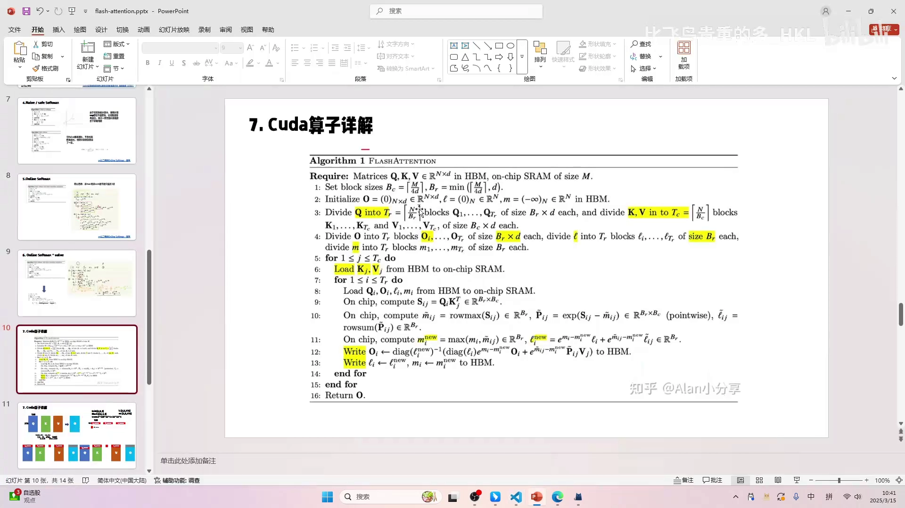 |
| 这节课我就把图都画出来了，给大家简单介绍一下。 [【跳转到 02:02】](https://www.bilibili.com/video/BV1FM9XYoEQ5/?p=8&t=122) | 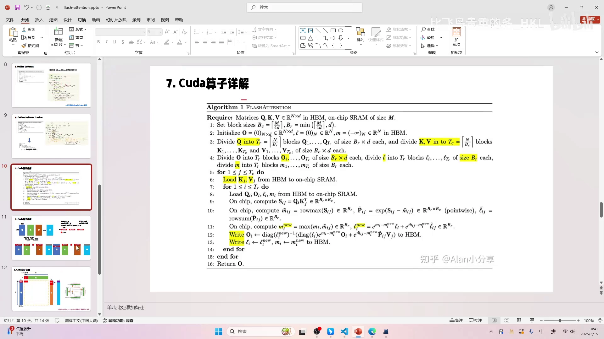 |
| 简单介绍哈。我这个图是按照原始论文画的，不是按照我们参考的那个 flash.cu 代码画的。 [【跳转到 02:07】](https://www.bilibili.com/video/BV1FM9XYoEQ5/?p=8&t=127) |  |
| 我们先来看 tensor 的维度。这里认定 QKV 是一个维度—— [【跳转到 02:17】](https://www.bilibili.com/video/BV1FM9XYoEQ5/?p=8&t=137) | 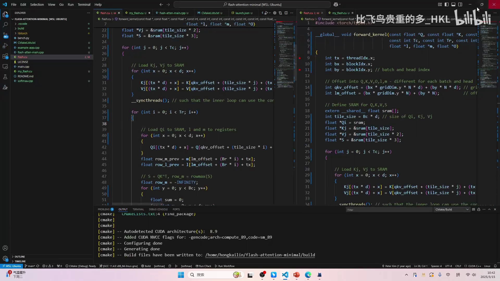 |
| 它们的大小是一样的。我发现好像在大语言模型里 QKV 的维度都一样。但实际上 V 的维度是可以不同的：Q、K 必须相同，但 V 可以再长一点。这是题外话。每个维度代表什么—— [【跳转到 02:22】](https://www.bilibili.com/video/BV1FM9XYoEQ5/?p=8&t=142) | 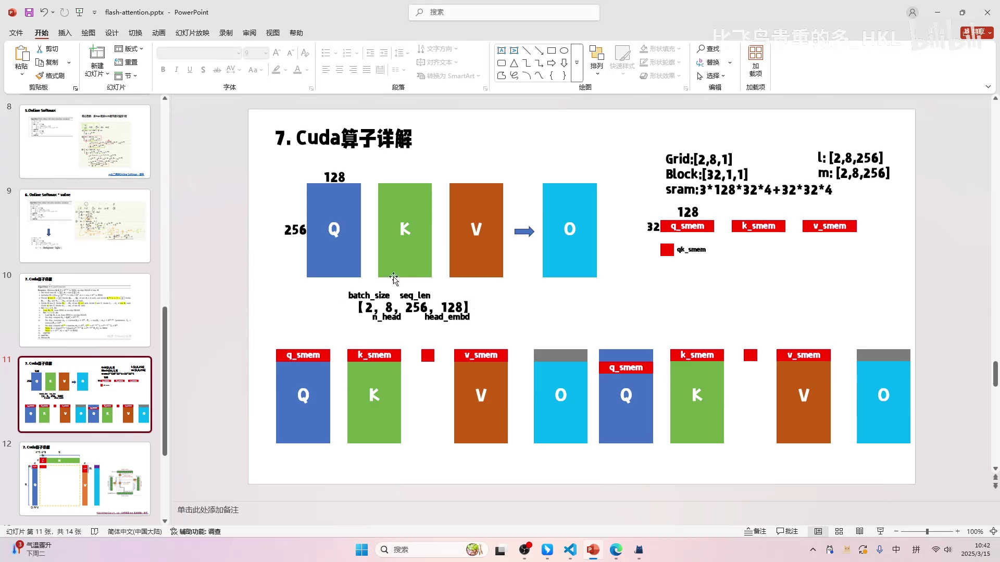 |
| 我也给大家写出来了，就不多讲解了。按照代码里写的，它的 grid 是 2×8：2 和 8 是 batch 和 head 这两个维度。这里一共有 16 组，这 16 组的计算互不影响，可以各算各的，所以就开了 16 个 block，每个 block 只分配 32 个线程——相当于这 32 个线程要完成这个操作。 [【跳转到 02:47】](https://www.bilibili.com/video/BV1FM9XYoEQ5/?p=8&t=167) |  |
| 然后它中间有两个变量 L 和 M，L 代表求和、M 代表最大值。256 代表的是这个维度，你可以怎么理解呢？就是我们之前讲的那个矩阵—— [【跳转到 03:12】](https://www.bilibili.com/video/BV1FM9XYoEQ5/?p=8&t=192) |  |
| 这个矩阵你不需要存下来，但最大值和求和你要存下来，对吧？FlashAttention 主要的优化就是不需要存储（中间矩阵），用小块、用共享内存存储就可以了；但 L 和 M（最大值和求和）你必须存下来，所以它定义了两组数。 [【跳转到 03:27】](https://www.bilibili.com/video/BV1FM9XYoEQ5/?p=8&t=207) |  |
| 然后有一个……我看一眼，这是第一次循环。第一次循环就是这样的。下一次呢，就是 Q 往下挪，再往下、继续往下挪；挪完之后 Q 回到上面，然后 K 和 V 一起往下挪一个，Q 再从上到下走一遍，走到第三个—— [【跳转到 03:48】](https://www.bilibili.com/video/BV1FM9XYoEQ5/?p=8&t=228) | 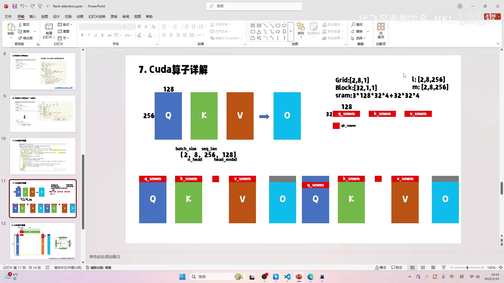 |
| （讲乱套了）我们直接看这个吧。 [【跳转到 04:13】](https://www.bilibili.com/video/BV1FM9XYoEQ5/?p=8&t=253) |  |
| 在 FlashAttention 里有两层循环：第一层循环是 K 和 V 的循环，所以 K、V 的循环是慢的；而 Q 在内层循环，所以 Q 的循环是快的。 [【跳转到 04:20】](https://www.bilibili.com/video/BV1FM9XYoEQ5/?p=8&t=260) | 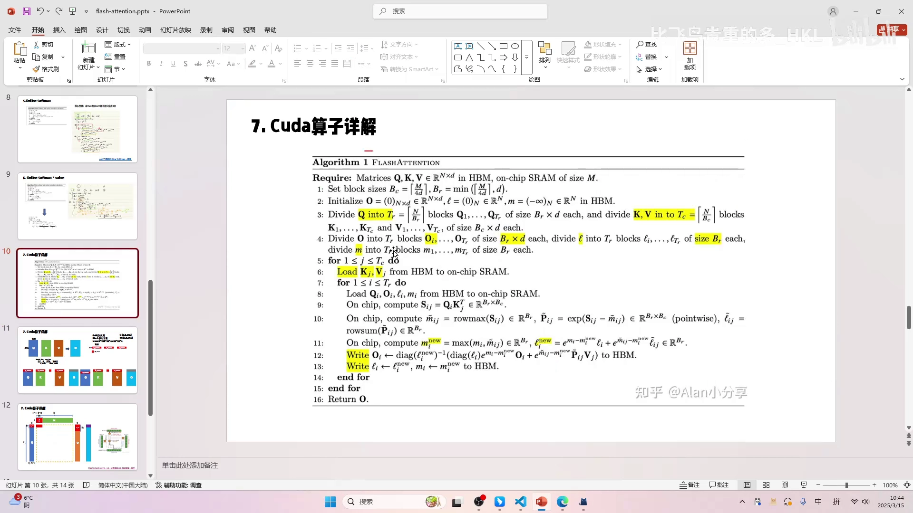 |
| 逻辑应该是这样的：最开始这样，然后 Q 从头执行到尾一遍，回到起始位置；接着 K 和 V 一起往下挪一步，挪完之后 Q 再执行一遍，再回到起始位置；然后 K、V 再往前走一遍。整体思路是这样。 [【跳转到 04:34】](https://www.bilibili.com/video/BV1FM9XYoEQ5/?p=8&t=274) |  |
| 整体思路就是这样。 [【跳转到 04:59】](https://www.bilibili.com/video/BV1FM9XYoEQ5/?p=8&t=299) | 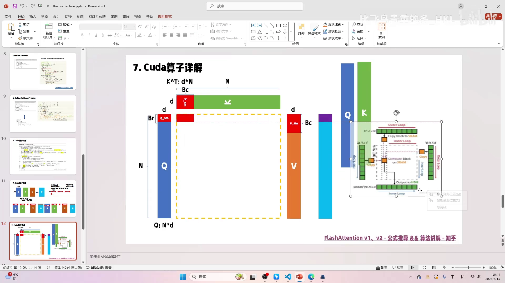 |
| 这里中间隔开：这是前面一次，这是后面一次。这就会导致我之前讲的一个地方是错的——我之前这个位置—— [【跳转到 05:04】](https://www.bilibili.com/video/BV1FM9XYoEQ5/?p=8&t=304) |  |
| 我之前的图是这样画的。我记得有人在评论区或弹幕里发了，说这是错的，应该是这个样子。他说得没错：应该是 K 和 V 一起动。我之前以为 K 单独动、V 不动，那是错的。好，我们继续往下看。 [【跳转到 05:13】](https://www.bilibili.com/video/BV1FM9XYoEQ5/?p=8&t=313) | 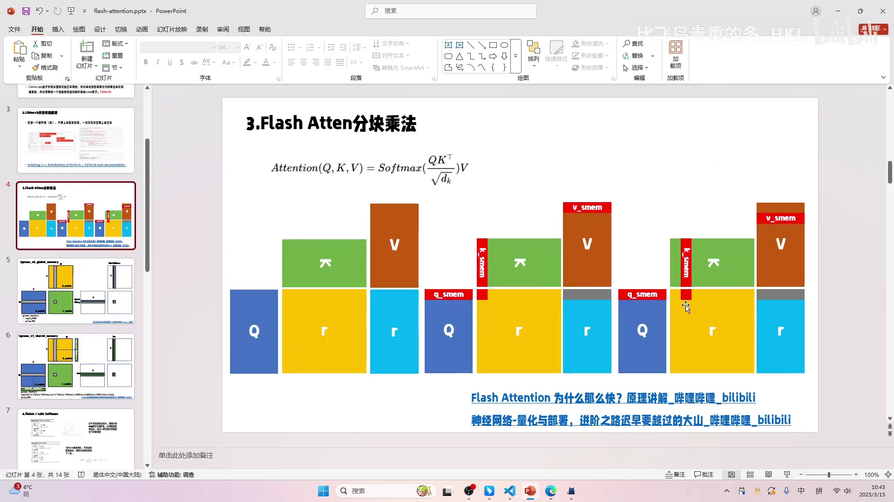 |
| 对于 CUDA 算子，或者说整体的思路是这样的。 [【跳转到 05:35】](https://www.bilibili.com/video/BV1FM9XYoEQ5/?p=8&t=335) | 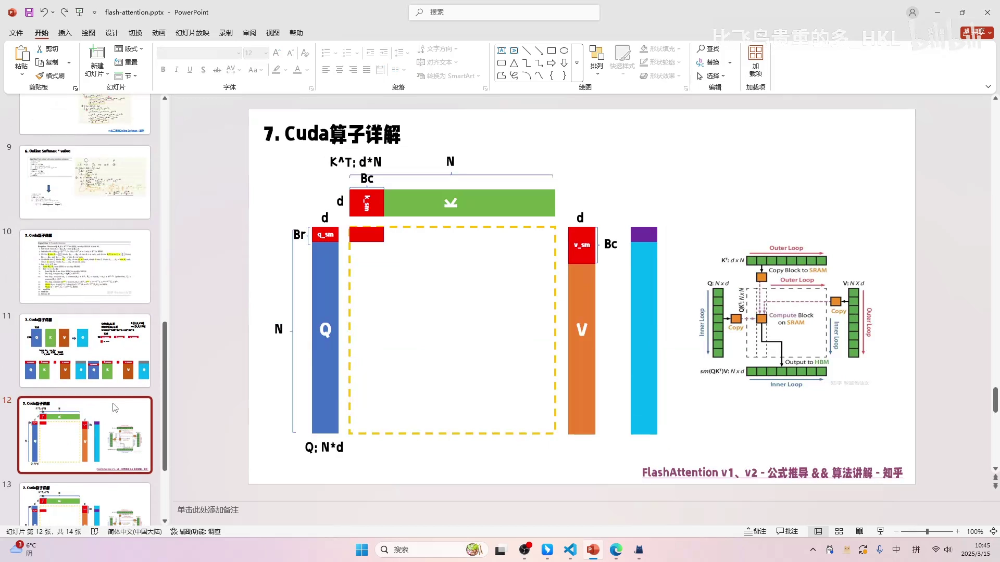 |
| 但我按照这个方式来写程序，发现挺费劲的，有的地方想不明白、容易乱套。所以我就参考了这张图—— [【跳转到 05:40】](https://www.bilibili.com/video/BV1FM9XYoEQ5/?p=8&t=340) | 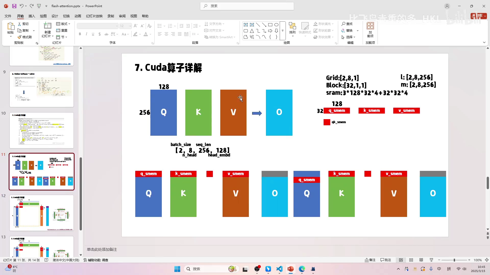 |
| 原始论文的图。我也给大家画了一个类似的图：各个维度都是 N（就是序列长度），D 就是每个 token 的维度。这里的 N 对应刚才的 256，D 对应刚才的 128。然后这里面分了 BR 和 BC——什么意思呢？就是我要把 Q、K、V 的一块—— [【跳转到 05:47】](https://www.bilibili.com/video/BV1FM9XYoEQ5/?p=8&t=347) |  |
| 放到 shared memory 里，先找这一块。那这一块多大、怎么算呢？ [【跳转到 06:08】](https://www.bilibili.com/video/BV1FM9XYoEQ5/?p=8&t=368) |  |
| 按照原始论文，就是用 shared memory 的大小除以 4D 再向上取整来得到；R 呢，是 M 除以 4D 向上取整，再跟 D 求一个最小值。所以理论上 BR 和 BC 应该是——BR 会更小一点，对吧？因为如果它俩相等—— [【跳转到 06:18】](https://www.bilibili.com/video/BV1FM9XYoEQ5/?p=8&t=378) | 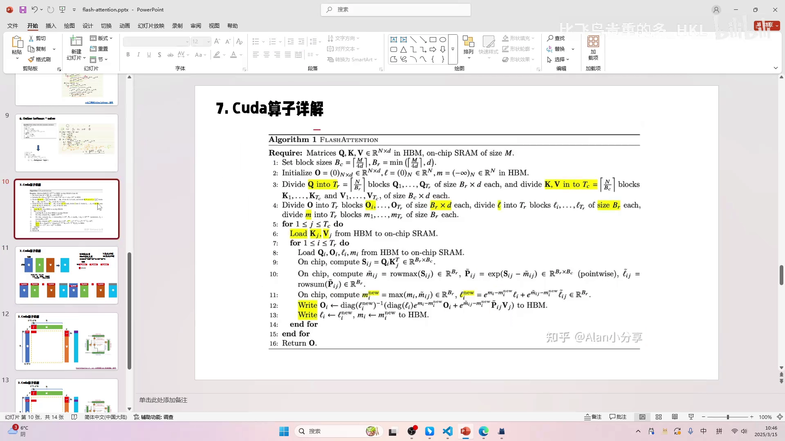 |
| 或者如果 D 比较小，那么 BC 和 BR 是一样的。但如果说 D 比较大——不对，我说反了：如果 D 相对比较大，那 BC 和 BR 相等；如果 D 比较小，那 BR 就等于 D，而 BC 一定会比 BR 大。所以我这个图没有按原始论文那么画，我是实打实按 BR、BC 维度不同画的：假设 BC 比较小、BR 比较大。它为什么叫 BR 和 BC？因为 R 表示行、C 表示列，想表达的是这个矩阵的行和列。另外提一点—— [【跳转到 06:43】](https://www.bilibili.com/video/BV1FM9XYoEQ5/?p=8&t=403) | 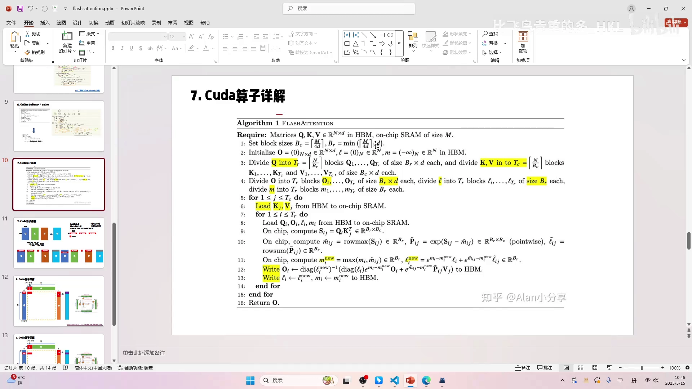 |
| （这一块与上面是同一种情况，画图时按 BC、BR 不同维度处理。） [【跳转到 07:08】](https://www.bilibili.com/video/BV1FM9XYoEQ5/?p=8&t=428) |  |
| 在我们参考的代码里，它把 BC 和 BR 用一个数来表示了。 [【跳转到 07:33】](https://www.bilibili.com/video/BV1FM9XYoEQ5/?p=8&t=453) |  |
| 它们都等于 32，所以导致 TC 和 TR 也是相同的数。TC 和 TR 就是：如果这个位置是 256—— [【跳转到 07:38】](https://www.bilibili.com/video/BV1FM9XYoEQ5/?p=8&t=458) | 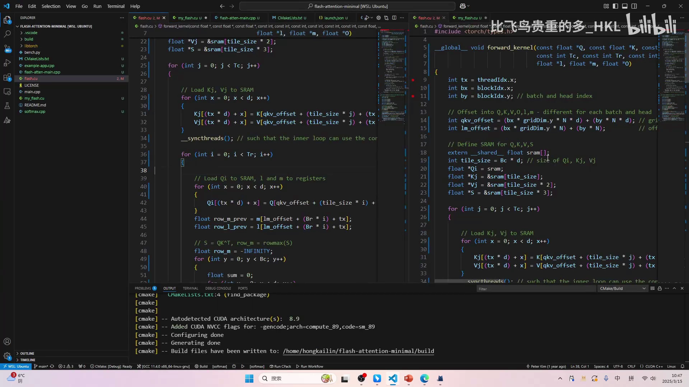 |
| 然后我的 BR 是 32，那 TR 就是 8（256÷32）。TC 就是 N 除以 BC。所以它导致 TC、TR、BC、BR 两两都相同，因此在这个程序里—— [【跳转到 07:46】](https://www.bilibili.com/video/BV1FM9XYoEQ5/?p=8&t=466) |  |
| 比如说有些地方我觉得应该用 BR，但因为 BC、BR 都相同，它就都写了 BC。我觉得这可能不太好，但也有可能是我看错了、人家写的是对的。反正我总觉得，最开始我画的图也是这两个一样，但那样容易误导我，所以我就给大家画了这样一张图。这张图整体的思路就是刚才讲的—— [【跳转到 08:05】](https://www.bilibili.com/video/BV1FM9XYoEQ5/?p=8&t=485) | 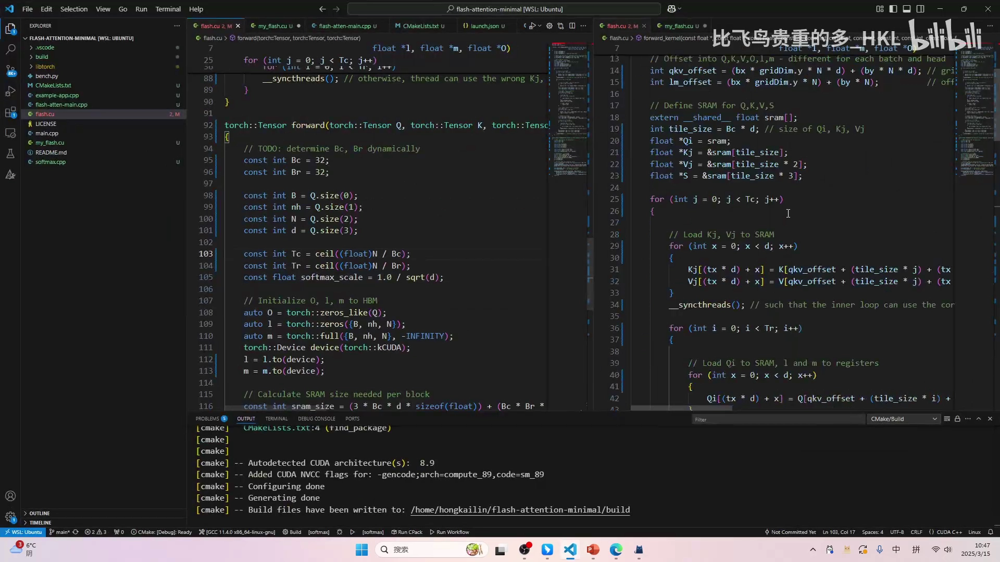 |
| （续上：按这张更严谨的图来理解分块。） [【跳转到 08:25】](https://www.bilibili.com/video/BV1FM9XYoEQ5/?p=8&t=505) |  |
| 我们再讲一遍：Q 在内部循环，所以循环得比较快。 [【跳转到 08:41】](https://www.bilibili.com/video/BV1FM9XYoEQ5/?p=8&t=521) | 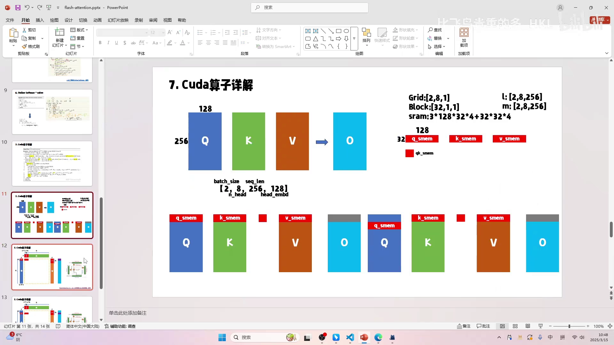 |
| 它不断往下走、往下走、往下走，算完；算完之后回来、回来，然后 K 和 V 挪一下——它挪了一下，它也挪了一下。挪完之后这两个再不断往下走、再算，算完再回来；回来之后还是又是 K 和 V。 [【跳转到 08:46】](https://www.bilibili.com/video/BV1FM9XYoEQ5/?p=8&t=526) | 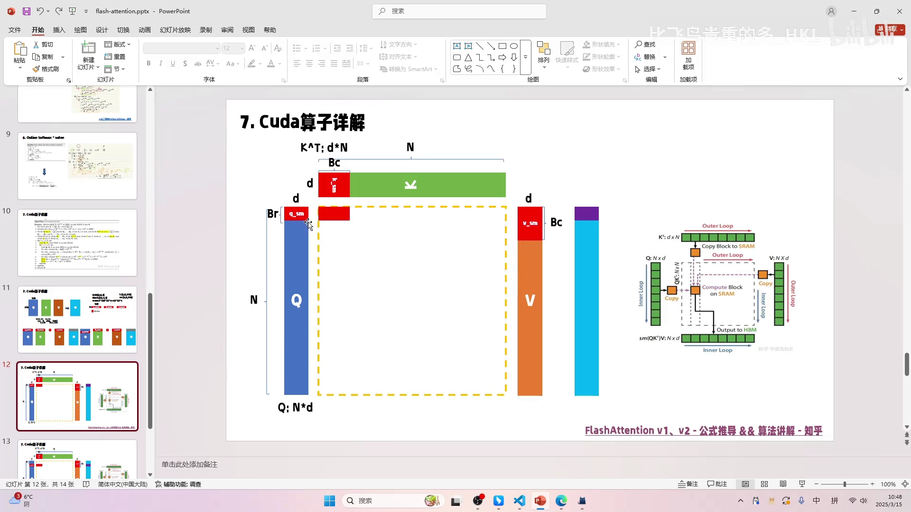 |
| 然后不断往旁边、往下面挪一下，这个也挪一下，再继续算。整体就是这样一个逻辑。代码相关这里写得已经相对比较详细了，每一步怎么做、每个算式怎么算的—— [【跳转到 09:11】](https://www.bilibili.com/video/BV1FM9XYoEQ5/?p=8&t=551) | 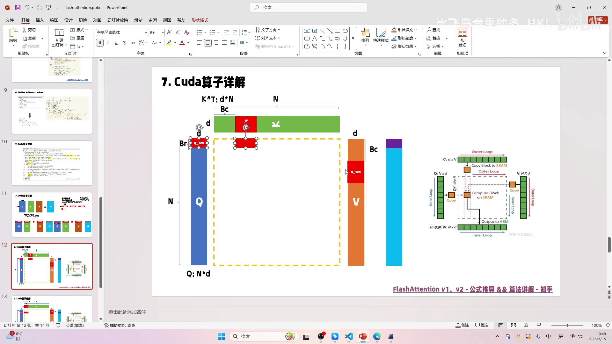 |
| 整体它的结果，我放在这边了。 [【跳转到 09:26】](https://www.bilibili.com/video/BV1FM9XYoEQ5/?p=8&t=566) | 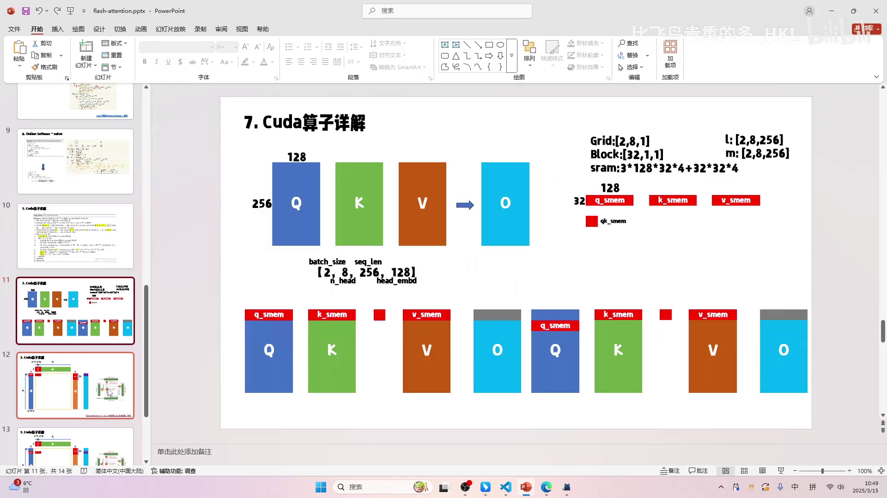 |
| 我没有放到这儿——原始论文是把它放到下面的。整体就是这样一个思路。有一点我要强调：你看这里面是 Q 和 K 的转置，对吧？但实际上我们写代码时不需要把 K 做转置。这个我在讲矩阵乘法时已经详细讲过了：因为我们在做标准矩阵乘法时，这个（K 的排布）天生就是转置过的。 [【跳转到 09:31】](https://www.bilibili.com/video/BV1FM9XYoEQ5/?p=8&t=571) |  |
| （续：所以直接用即可。） [【跳转到 09:56】](https://www.bilibili.com/video/BV1FM9XYoEQ5/?p=8&t=596) | 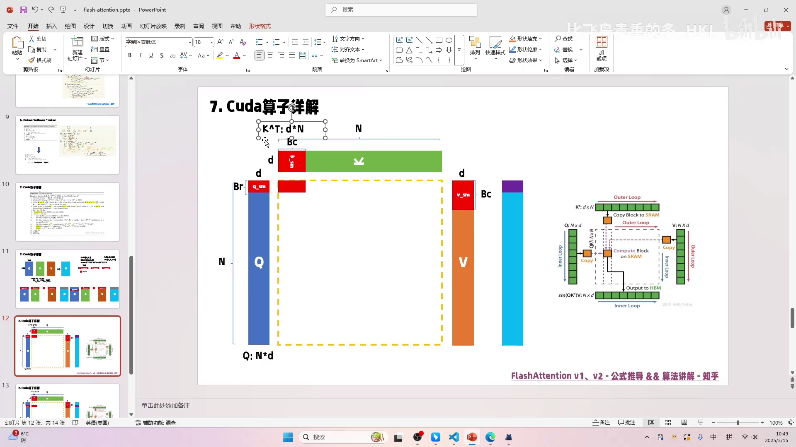 |
| 所以我们不需要把 K 做转置，这样计算起来更方便、代码效率更高。 [【跳转到 10:03】](https://www.bilibili.com/video/BV1FM9XYoEQ5/?p=8&t=603) |  |
| 这个位置讲完之后，我们简单看一下代码。 [【跳转到 10:11】](https://www.bilibili.com/video/BV1FM9XYoEQ5/?p=8&t=611) |  |
| 我就不手敲了，一会儿再讲为什么没手敲。这个代码我完全是按照它写的，但我自己重写了一遍，所以里面有非常多我自己的风格——因为我本来想给大家做一个风格统一的讲解。我说过，我的习惯是对 QKV 先做每个 block 的偏移；而原始的没有这么做，它是在内部自己加的。 [【跳转到 10:16】](https://www.bilibili.com/video/BV1FM9XYoEQ5/?p=8&t=616) | 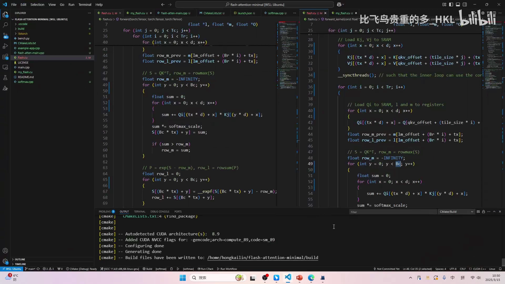 |
| 我觉得那样容易乱，所以我直接做了一个偏移。简单说一下：不同 block 处理不同的 QKV——我们一共有 16 个（2×8），所以我在这个位置直接让每个 block 进来都偏移到对应的 QKV 来做。然后在这个位置，我们先预先申请了一块 SRAM（shared memory）。 [【跳转到 10:41】](https://www.bilibili.com/video/BV1FM9XYoEQ5/?p=8&t=641) | 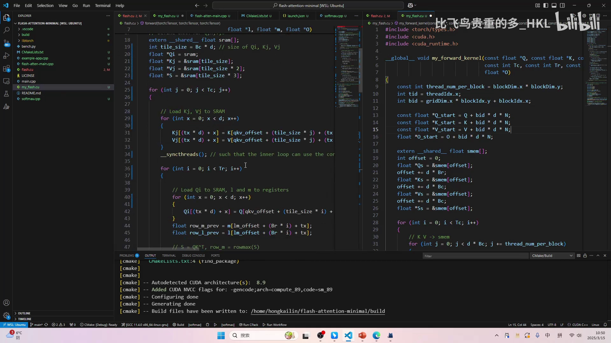 |
| 这个位置我写的跟它也不一样，但结果是相同的：它是用 3×BC×D 再加 BC×BR，而我是两个 BR×D、一个 BC×D、一个 BR×BC，主要也是因为我用的是不同的大小。 [【跳转到 11:06】](https://www.bilibili.com/video/BV1FM9XYoEQ5/?p=8&t=666) | 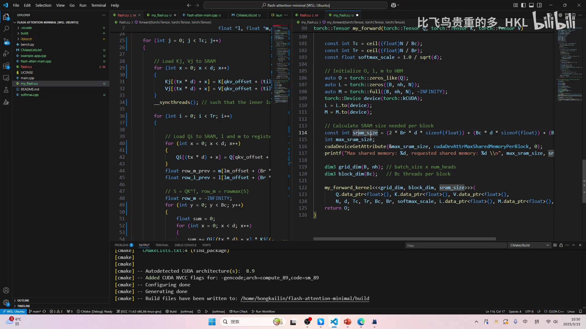 |
| 看到没用的是不同的大小。所以这两个是一样的：2×D×BC 加上 D×BR，再加上 BR×BC。这就是我和它有点区别的地方。 [【跳转到 11:22】](https://www.bilibili.com/video/BV1FM9XYoEQ5/?p=8&t=682) |  |
| 然后我这里也是对每一个做了偏移。不同的 block，它的 shared memory 是不同的，对吧？所以我们不需要为 2×8 这么多 block 都分配一块 shared memory，用一组就行，每个 block 里的 shared memory 都是不同的。我们继续按它的写。 [【跳转到 11:35】](https://www.bilibili.com/video/BV1FM9XYoEQ5/?p=8&t=695) | 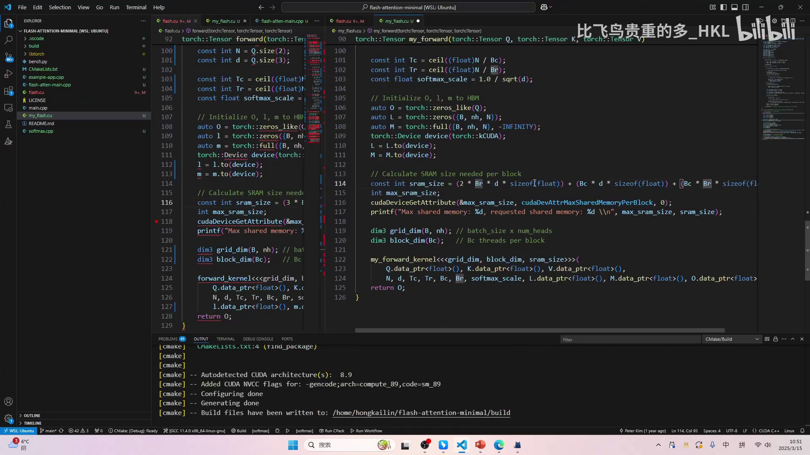 |
| 这就是最外层的大循环。大循环主要是为了搬 Q，以及搬 K 和 V。但 K 和 V 里面为什么还要再套一个循环呢？我们来看—— [【跳转到 12:00】](https://www.bilibili.com/video/BV1FM9XYoEQ5/?p=8&t=720) | 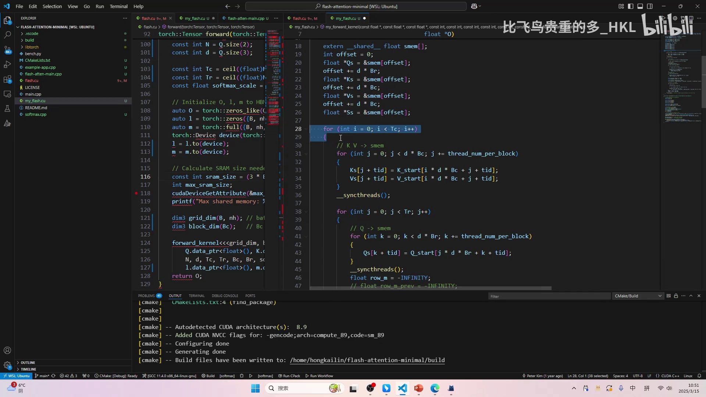 |
| 我们这个里面是 BR×D。如果是 32、D 是 128—— [【跳转到 12:11】](https://www.bilibili.com/video/BV1FM9XYoEQ5/?p=8&t=731) | 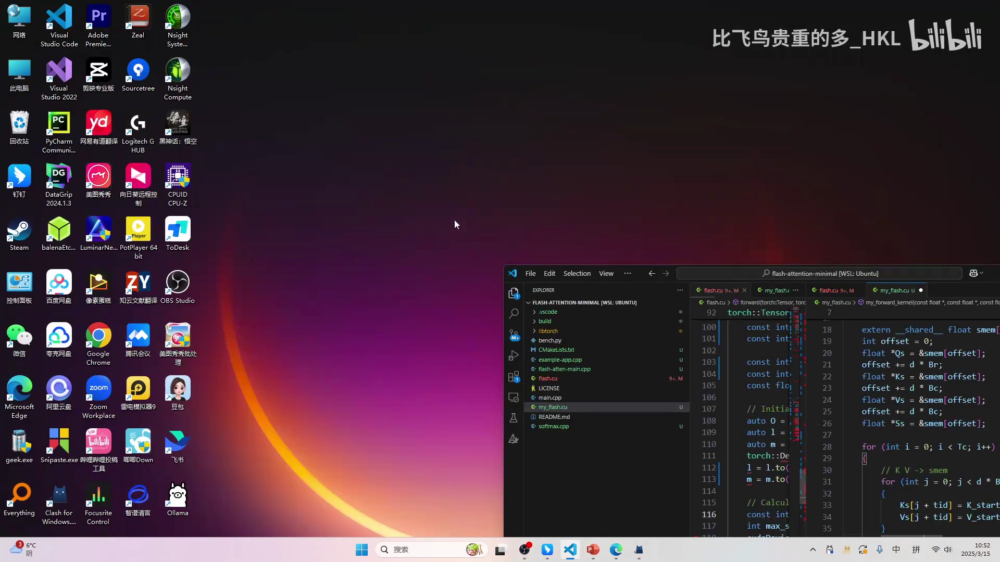 |
| 我只有 32 个线程，对吧？每个 block 里只有 32 个线程。我要搬 K 和 V——我只有 32 个线程，想搬 D×BC 个数，那你不写循环一定做不完，肯定要加一个循环，让每个线程搬很多个数才能完成。 [【跳转到 12:16】](https://www.bilibili.com/video/BV1FM9XYoEQ5/?p=8&t=736) | 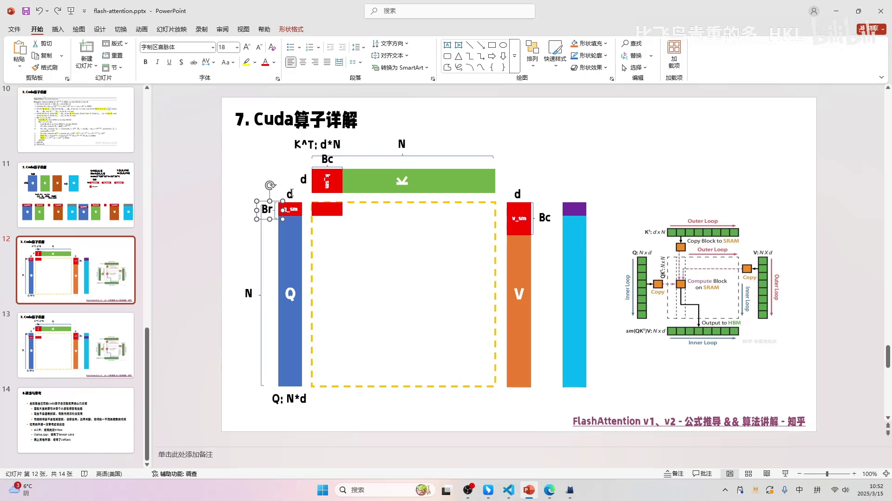 |
| 所以这里面又有一个循环，循环完要同步。但我个人认为—— [【跳转到 12:39】](https://www.bilibili.com/video/BV1FM9XYoEQ5/?p=8&t=759) |  |
| 我个人认为这个同步没必要。为什么呢？因为这是一个 warp——一个 block 里只有一个 warp，只有 32 个线程，所以它天生就是同步的。原始的代码这个地方加了同步，但那个地方却没加同步，我就觉得：如果你这加了同步，那是不是那儿也应该加？它这是加了、那个位置没加。 [【跳转到 12:44】](https://www.bilibili.com/video/BV1FM9XYoEQ5/?p=8&t=764) | 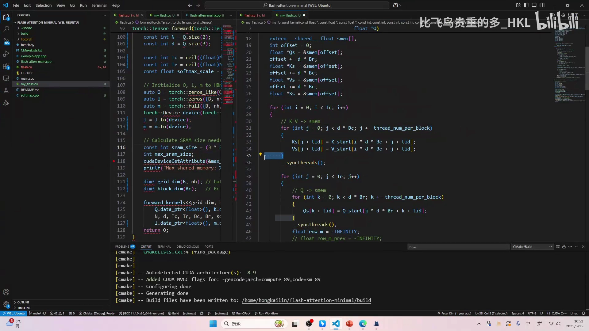 |
| 所以我觉得挺奇怪的，但本身应该没什么问题——因为它的线程设置是 32，所以你都不加、或者都加，影响都应该不大。如果我说错了，大家可以在弹幕或评论区告诉我。然后 KV 搬过来之后再把 Q 搬过来，还是要写个循环，一定得写循环。写完循环之后—— [【跳转到 13:09】](https://www.bilibili.com/video/BV1FM9XYoEQ5/?p=8&t=789) | 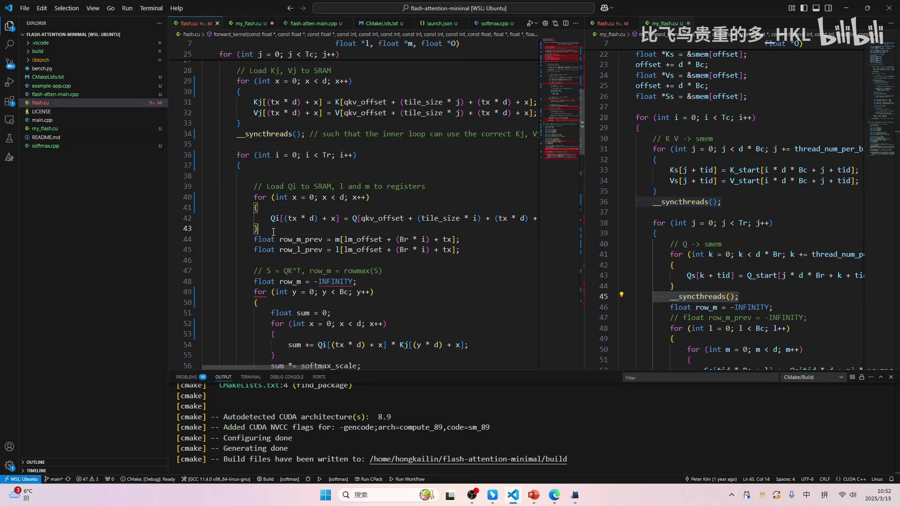 |
| 反正我先同步一下。下面这一坨在做什么呢？我们现在已经搬了 QKV，然后要把 Q 和 K 的转置相乘。为什么这里没转置？就是我之前说的：不转置照样可以做。之前是一行乘一列，你不转置就是一行乘一行，这样反而利于合并访存。所以这个位置我们就通过这样的方式做—— [【跳转到 13:34】](https://www.bilibili.com/video/BV1FM9XYoEQ5/?p=8&t=814) | 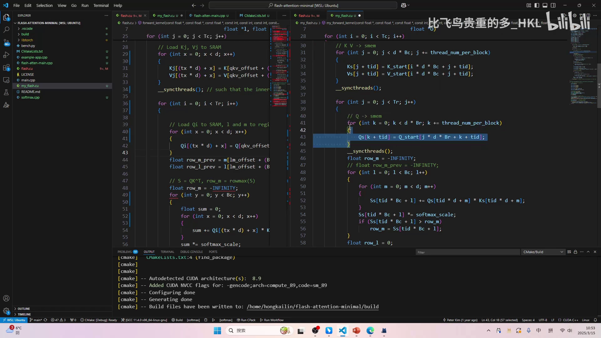 |
| 对它做了一个乘法。乘完之后放到这个 S 里。这个小 S 在我这里都表示它是 shared memory 里的。 [【跳转到 13:59】](https://www.bilibili.com/video/BV1FM9XYoEQ5/?p=8&t=839) | 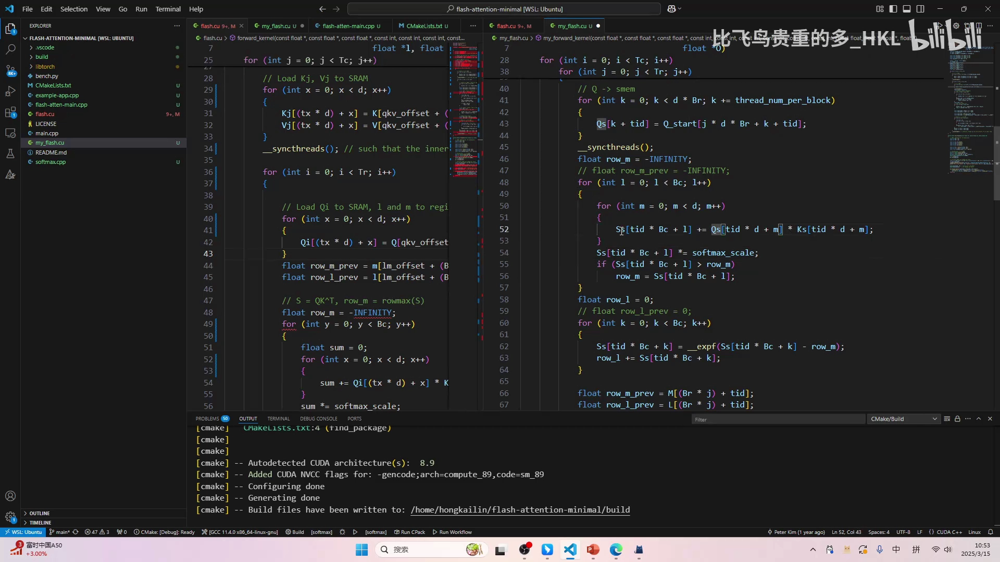 |
| （续：即 scores 暂存在 shared memory 中。） [【跳转到 14:10】](https://www.bilibili.com/video/BV1FM9XYoEQ5/?p=8&t=850) | 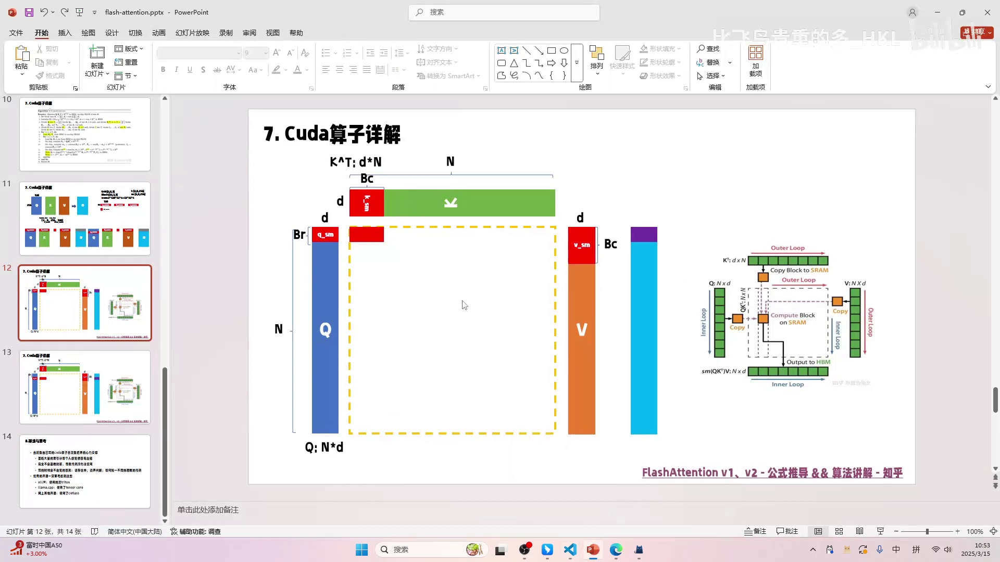 |
| 然后下面再乘上 softmax 的 scale。这个 softmax_scale 就是 Q 乘 K 转置除以根号 D，也就是根号 D 分之一，所以我要把它乘过来。然后在这个计算的时候，我要把最大值算出来——我这里面算最大值是算在一块的。什么意思呢？我们来看一下—— [【跳转到 14:15】](https://www.bilibili.com/video/BV1FM9XYoEQ5/?p=8&t=855) | 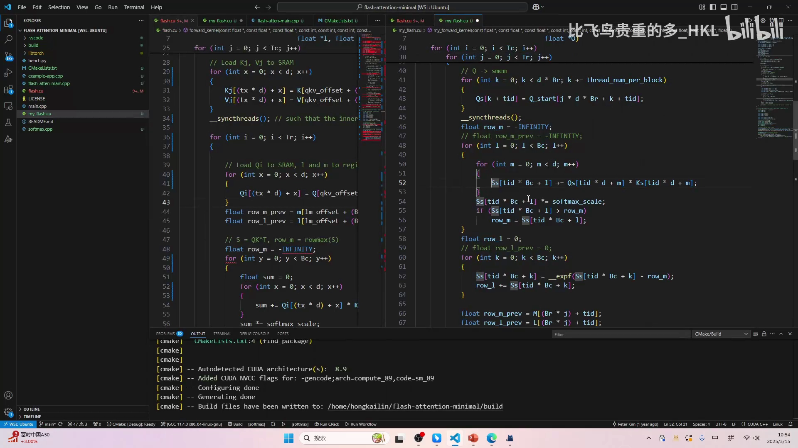 |
| 这一块，比如 BR 是 32，这个位置也是 32。所以当你这 32 个线程工作时，我这里面其实定义了一个寄存器—— [【跳转到 14:38】](https://www.bilibili.com/video/BV1FM9XYoEQ5/?p=8&t=878) | 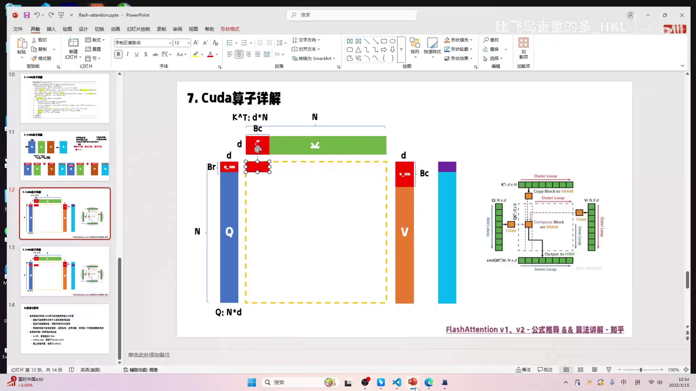 |
| 我这里面定义了一个寄存器，这 32 个线程每个线程里都有一个寄存器。 [【跳转到 14:51】](https://www.bilibili.com/video/BV1FM9XYoEQ5/?p=8&t=891) | 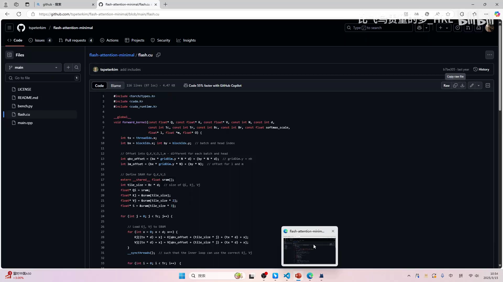 |
| 所以你求完之后，相当于有 32 个最大值——因为你有 32 个线程。所以我就把这一块的最大值都求出来了。 [【跳转到 14:56】](https://www.bilibili.com/video/BV1FM9XYoEQ5/?p=8&t=896) | 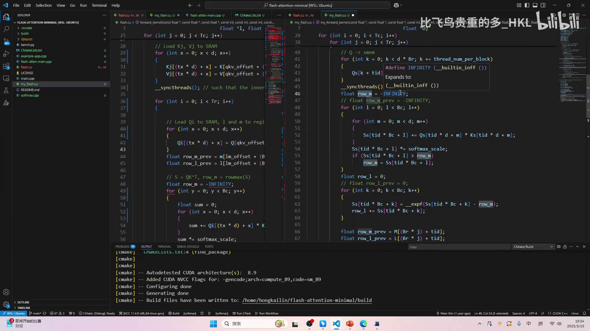 |
| 这一块的最大值都求出来了。然后下一步要做什么呢？ [【跳转到 15:03】](https://www.bilibili.com/video/BV1FM9XYoEQ5/?p=8&t=903) | 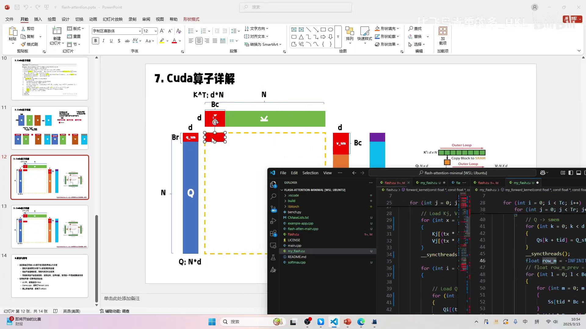 |
| 下一步就是要对它进行——我已经算出最大值了，我要用这个值减最大值，再做指数运算，然后把这个数再存回 SS 里，再求和。这个 L 表示的就是和。我再把这些东西求和，也就是要对这一块既求最大值—— [【跳转到 15:08】](https://www.bilibili.com/video/BV1FM9XYoEQ5/?p=8&t=908) | 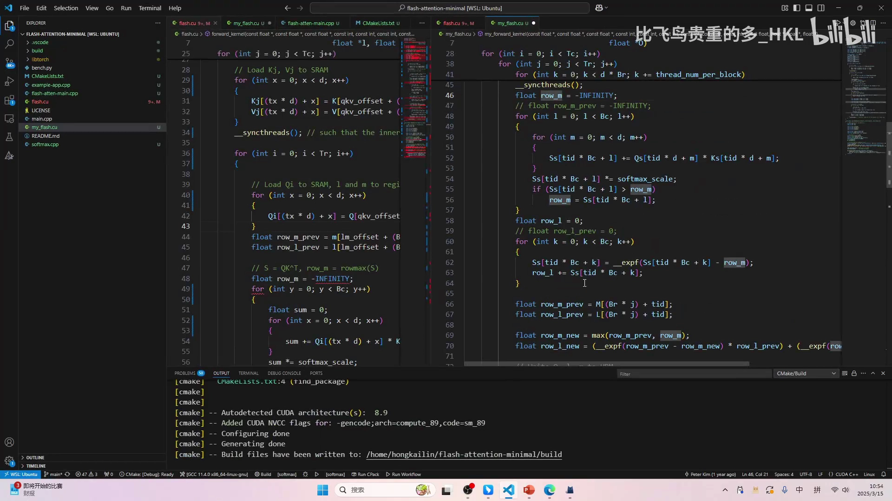 |
| 又对这一块经过指数计算之后求和。我现在要对这一块去做。做完之后呢—— [【跳转到 15:30】](https://www.bilibili.com/video/BV1FM9XYoEQ5/?p=8&t=930) | 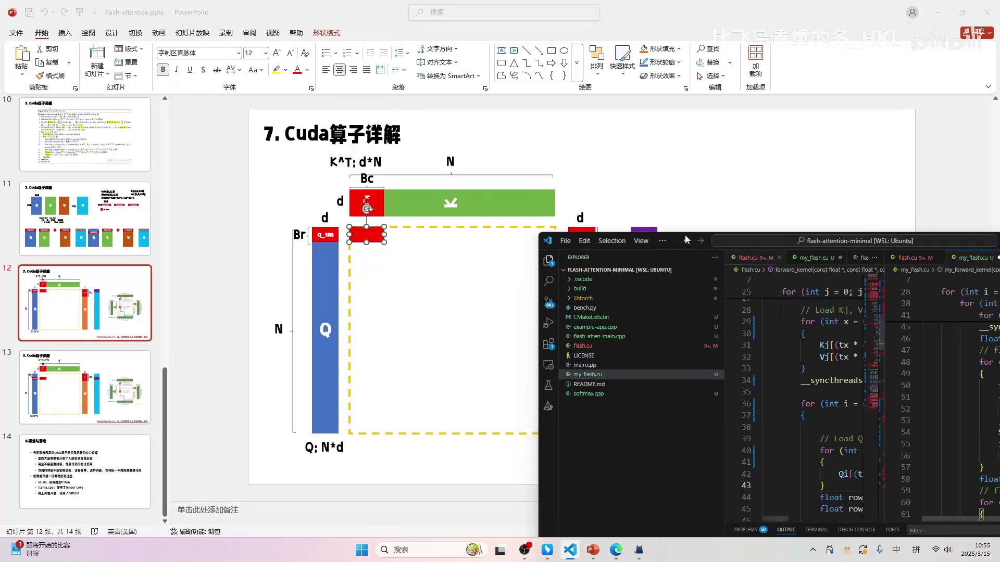 |
| 这其实就是我们之前讲的那个 softmax。我这里面要定义两个数，一个是之前的、一个是当前的。刚才我还申请了一个 L 和 M 的全局内存。这个全局内存，我就从这里拿到之前的——因为之前全是零嘛，之前全是零，M 是负无穷、L 是零。所以我们拿到之后—— [【跳转到 15:39】](https://www.bilibili.com/video/BV1FM9XYoEQ5/?p=8&t=939) | 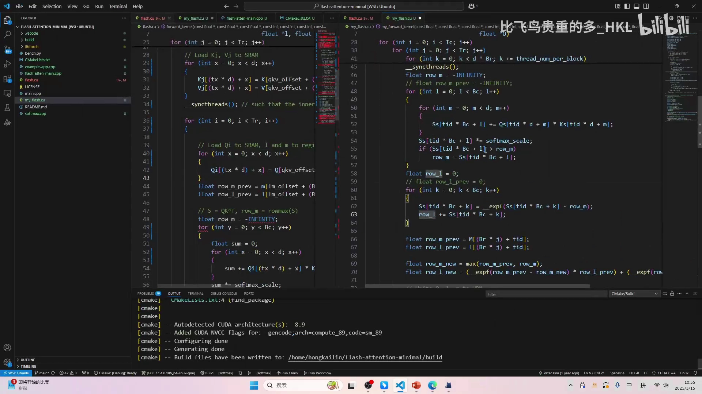 |
| 再求一个最大值，然后带这个公式——就是我们之前讲的 online softmax 公式。做完之后下面就是 S 乘 V。S 乘 V 计算完之后，再去做这个 DST 公式—— [【跳转到 16:04】](https://www.bilibili.com/video/BV1FM9XYoEQ5/?p=8&t=964) | 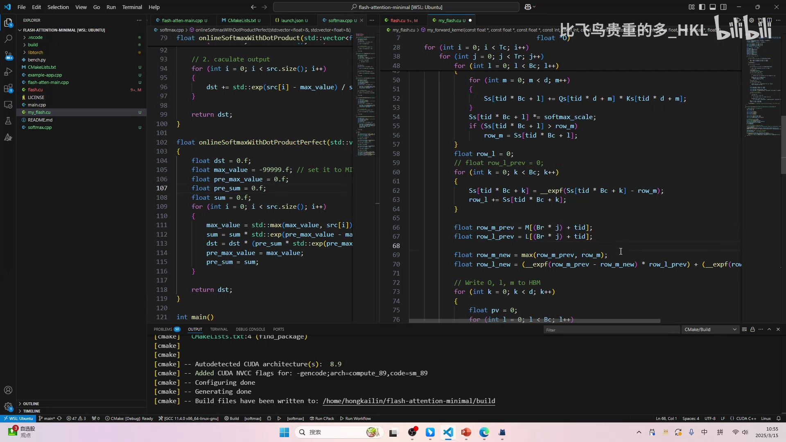 |
| 就是下面这个公式，这个公式还挺长的。其实我现在都不太确定写得对不对，我就直接把人家的搬过来了，因为我觉得这种就还好。然后我把索引调了一下。最后算完之后，我要写回到 L 和 M 里面。这个位置他又加了一个同步，我觉得挺奇怪的——我不清楚这里为什么要加同步，我觉得不加也行。不管你有多少线程，这里加不加应该都行。 [【跳转到 16:29】](https://www.bilibili.com/video/BV1FM9XYoEQ5/?p=8&t=989) | 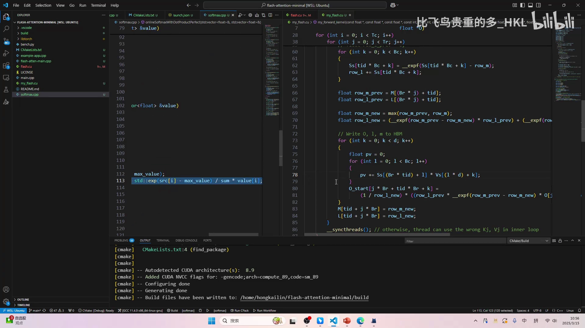 |
| 这个同步我认为其实不应该加，但它里面是加的。整体完事之后，我这里有些地方是 B（BR）、好像都是 BC。反正我这里面是考虑了这个 BC 和 BR 的不同——考虑了 BC 和 BR 的不同，哦还真的都是 BC。 [【跳转到 16:54】](https://www.bilibili.com/video/BV1FM9XYoEQ5/?p=8&t=1014) | 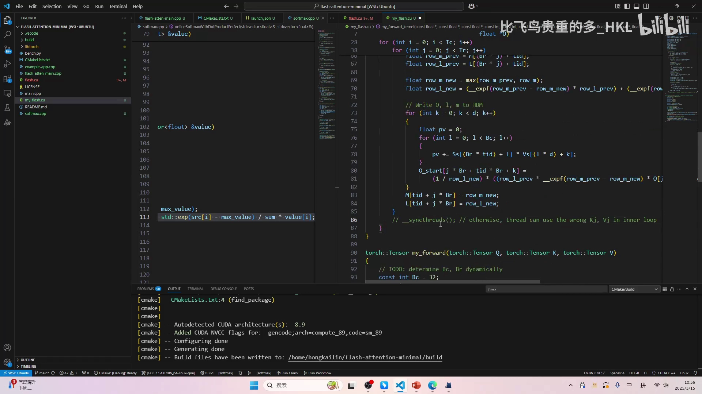 |
| 那可能跟它也没什么特别大的区别。反正我自己又重新写了一遍。怎么说呢，我最初也说过，我写这个程序其实挺痛苦的。为什么痛苦？我们下节课再说。这节课讲了 17 分钟，整体就是带大家过了一遍这个思路，其实没什么特别要讲的。 [【跳转到 17:19】](https://www.bilibili.com/video/BV1FM9XYoEQ5/?p=8&t=1039) | 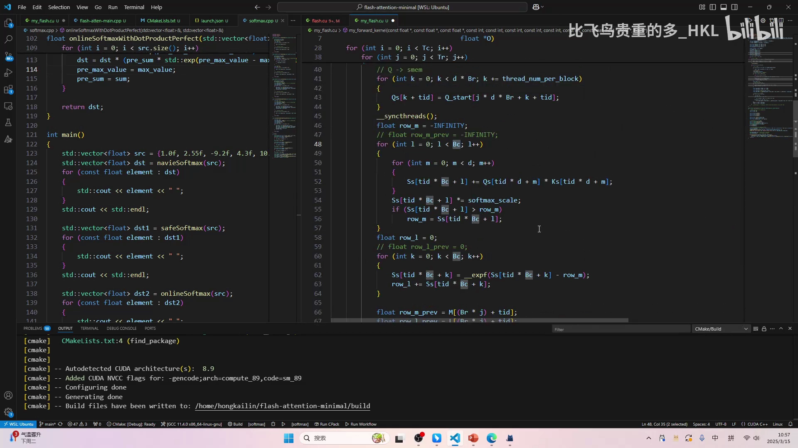 |
| 主要就是你可以看看这个。我这个代码也没验证过，你可以自己去尝试写一遍。哎，这样吧，我还是建议大家自己写一遍，你写一遍之后，可能就会跟我有一样的痛苦——我们下节课再来讲这个痛苦到底是什么。 [【跳转到 17:42】](https://www.bilibili.com/video/BV1FM9XYoEQ5/?p=8&t=1062) | 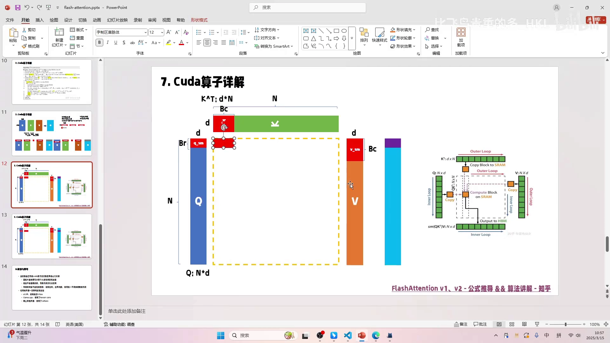 |