# 深入理解大模型量化：GPTQ 原理解析

> 本文是对 B 站视频《[LLM推理] 深入理解大模型量化：GPTQ 原理解析》的图文整理稿。原文：[BV1UjiuBFECB](https://www.bilibili.com/video/BV1UjiuBFECB/)

## 本讲要解决的核心问题（SCQA）

**背景**：今天的大模型动辄几十亿、上百亿参数，训练时权重几乎都以浮点数（如 FP32、FP16）保存。为了能算梯度，必须用带小数点的数字，但浮点数占用的位数多，模型体积和显存开销都很大。

**冲突**：一个最直接的省显存办法，是把权重从 32 位/16 位浮点压缩成 8 位、4 位甚至 3 位的整数（INT8/INT4/INT3）。可朴素的"四舍五入"在 8 位时还行，一旦压到 3~4 位，模型精度就会崩掉；而重训练（让模型边训练边适应量化）在千亿参数上成本高到几乎不可行，其他更复杂的算法又慢得没法扩展。

**疑问**：有没有办法**不重训练**，就能在千亿参数级别的模型上做到 3~4 位量化，同时把精度损失控制住？

**回答（中心思想）**：有。GPTQ 用模型的**二阶信息**做一次性的（one-shot）训练后量化（PTQ），并通过三个工程优化——**统一量化顺序、惰性批量更新、Cholesky 重参数化**——把原本昂贵的最优脑量化（OBQ）变得又快又稳，最终实现 W4A16 / W3A16 的高精度低比特量化。

---

## 一、量化是什么：用更少的位数表示同样的数

### 1.1 量化的定义与目标

量化（Quantization）是**一种对神经网络权重进行"有损压缩"的技术**：通过减少数值表示的位数来缩小模型体积 [【跳转到 00:16】](https://www.bilibili.com/video/BV1UjiuBFECB/?t=16)。

它的目标是：**消除大模型部署的显存瓶颈**，在不牺牲核心能力的情况下，让庞大的模型变得更轻、更快、更省资源。

打个比方：原本每个权重都用一支很长的尺子去量（FP32，32 位），现在换一支刻度少、但够用的短尺（INT8/INT4），尺子短了，占的地方就少了。代价是刻度变粗，会有些"量不准"，这就是"有损"的来源。

### 1.2 量化的数学：scale 与反量化

具体过程是这样的：假设有一组权重（可能来自同一个 tensor，或同一个 channel），它们分布在一段浮点数范围内。我们把这组浮点数**映射到整数范围**（比如 INT8），这就是量化 [【跳转到 01:06】](https://www.bilibili.com/video/BV1UjiuBFECB/?t=66)。

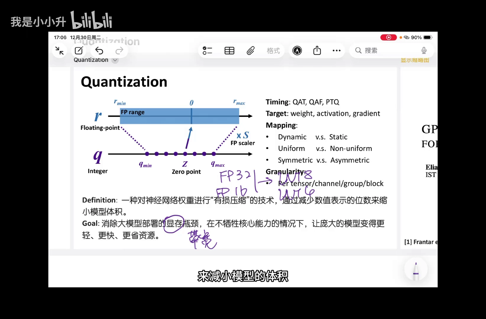

以最常用的**均匀量化（uniform）**为例，每一组权重映射到相同的整数值时，量化步长是相等的。这样带来的好处是：量化和反量化可以**通过乘以或除以一个 scale 来实现**，计算非常简单 [【跳转到 01:31】](https://www.bilibili.com/video/BV1UjiuBFECB/?t=91)。

这个 scale 怎么算？用**浮点数的范围大小（最大值 − 最小值）除以整数范围的大小（最大值 − 最小值）**，就得到了这个范围的缩放系数 [【跳转到 01:56】](https://www.bilibili.com/video/BV1UjiuBFECB/?t=116)。

用公式表示就是：

```
量化:   q = round( x / S )
反量化: x ≈ S × q
其中   S = (r_max − r_min) / (q_max − q_min)
```

- `S`：scale（缩放因子），是量化和反量化的桥梁。
- `q`：量化后的整数值。
- `round`：四舍五入到最近的整数。

---

## 二、量化技术的五个分类维度

量化的方法五花八门，但都可以从下面几个维度来归类 [【跳转到 02:21】](https://www.bilibili.com/video/BV1UjiuBFECB/?t=141)。

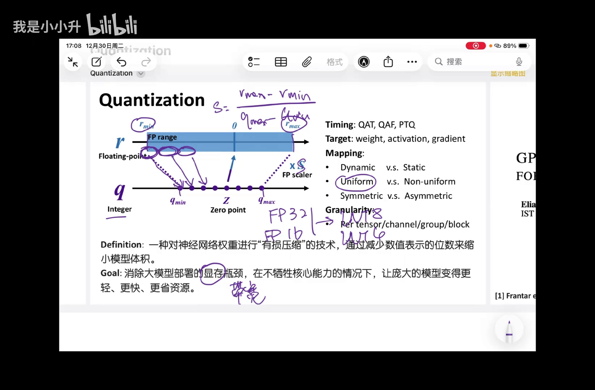

### 2.1 时机：QAT 还是 PTQ

- **QAT（Quantization-Aware Training，量化感知训练）**：在训练过程中就对权重量化，让模型"知道"自己会被量化，并在训练中补偿量化误差。效果好，但必须针对**具体模型 + 具体精度**重新训练。
- **PTQ（Post-Training Quantization，训练后量化）**：直接对已经训练好的模型做量化，不需要训练。**通用性更强、性价比更高**，是当前更主流的方向 [【跳转到 02:46】](https://www.bilibili.com/video/BV1UjiuBFECB/?t=166)。

### 2.2 对象：量化权重、激活还是梯度

量化权重（weight）是最常见的。需要先区分"权重"和"模型参数"：现在大模型都是 Transformer，里面既有**矩阵形式**的权重，也有一些**向量形式**的参数 [【跳转到 03:11】](https://www.bilibili.com/video/BV1UjiuBFECB/?t=191)。

- 我们通常量化的，是矩阵乘法里的**权重矩阵**：注意力里的 W_Q、W_K、W_V、W_O，以及 FFN（现在常用 SwiGLU）里的 Gate、Up、Down，一共七个矩阵 [【跳转到 03:36】](https://www.bilibili.com/video/BV1UjiuBFECB/?t=216)。
- **投影（projection）**：一个中间计算值乘以一个固定权重，权重固定、激活值随输入变化，这类矩阵乘法叫投影。
- 一般不量化的是：偏置 `b`、归一化里的 `gamma`（γ）这类**形状为向量的参数**。量化 γ 得不偿失，对精度影响很大 [【跳转到 04:26】](https://www.bilibili.com/video/BV1UjiuBFECB/?t=266)。

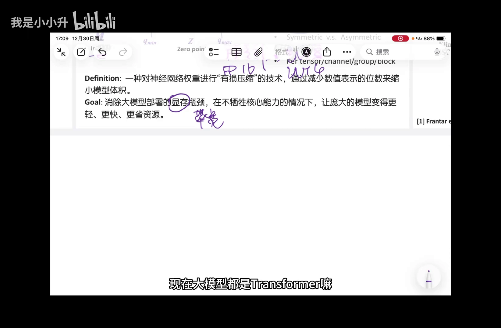

除了权重，也可以量化**激活值（activation）**，这在内存紧张的端侧部署中很常见。权重和激活量化的关键区别在于：权重的范围是**固定的**（不随输入变化），而激活的范围**会随输入 token 变化**，算出来的 scale 也会变 [【跳转到 04:51】](https://www.bilibili.com/video/BV1UjiuBFECB/?t=291)。

还有一种是**梯度（gradient）**：训练时做数据并行，不同卡需要交换梯度信息，量化梯度可以**减少通信量** [【跳转到 06:06】](https://www.bilibili.com/video/BV1UjiuBFECB/?t=366)。

### 2.3 动态（Dynamic）与静态（Static）

这是针对激活值量化的划分：

- **Static（静态）**：离线时用一个数据集先"profile"（剖析）好激活值的分布，把 scale 提前定死。
- **Dynamic（动态）**：运行时根据当前的激活数据，动态决定 scale [【跳转到 05:16】](https://www.bilibili.com/video/BV1UjiuBFECB/?t=316)。

静态量化的隐患是：运行中总会有一些激活**超出预设范围**，这些值叫 **outlier（离群值）**。处理办法包括：直接丢弃、压缩到最大值、或计算时单独拎出来处理 [【跳转到 05:41】](https://www.bilibili.com/video/BV1UjiuBFECB/?t=341)。

### 2.4 均匀（Uniform）与非均匀（Non-uniform）

均匀量化把浮点范围**等宽地**映射到整数刻度。但如果权重分布本身不均匀，就可以用**聚类**的方式：把密集区域映射到同一个整数，这是**非均匀量化** [【跳转到 06:31】](https://www.bilibili.com/video/BV1UjiuBFECB/?t=391)。

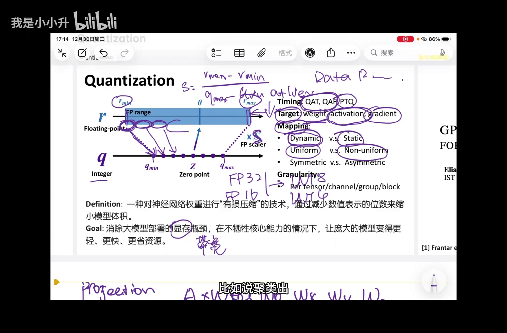

非均匀量化的量化和反量化关系不是均匀的，**不能只靠一个 scale**，必须维护一个 **codebook（码本）**：比如 INT2 有 2² = 4 种整数，就维护一个 4 元素的数组，记录每个整数映射到哪个浮点数。反量化时做一次**查表**即可 [【跳转到 07:21】](https://www.bilibili.com/video/BV1UjiuBFECB/?t=441)。

非均匀量化一般只用于**低精度**，原因有二 [【跳转到 07:46】](https://www.bilibili.com/video/BV1UjiuBFECB/?t=466)：
1. 若量化到 B 位，codebook 大小是 2^B，表太大会带来额外存储开销，得不偿失；
2. 反量化依赖设备的**查表指令**，而查表指令对元素个数或宽度有限制，B 不能太大。

### 2.5 对称（Symmetric）与非对称（Asymmetric）

- **对称量化**：权重关于零对称，反量化直接乘 scale 即可。
- **非对称量化**：范围有偏移，需要额外保存一个 **zero point（零点）Z**，它表示"原来的 0 映射到哪个整数位置"。反量化时要先把 Z 减回去 [【跳转到 09:01】](https://www.bilibili.com/video/BV1UjiuBFECB/?t=541)。

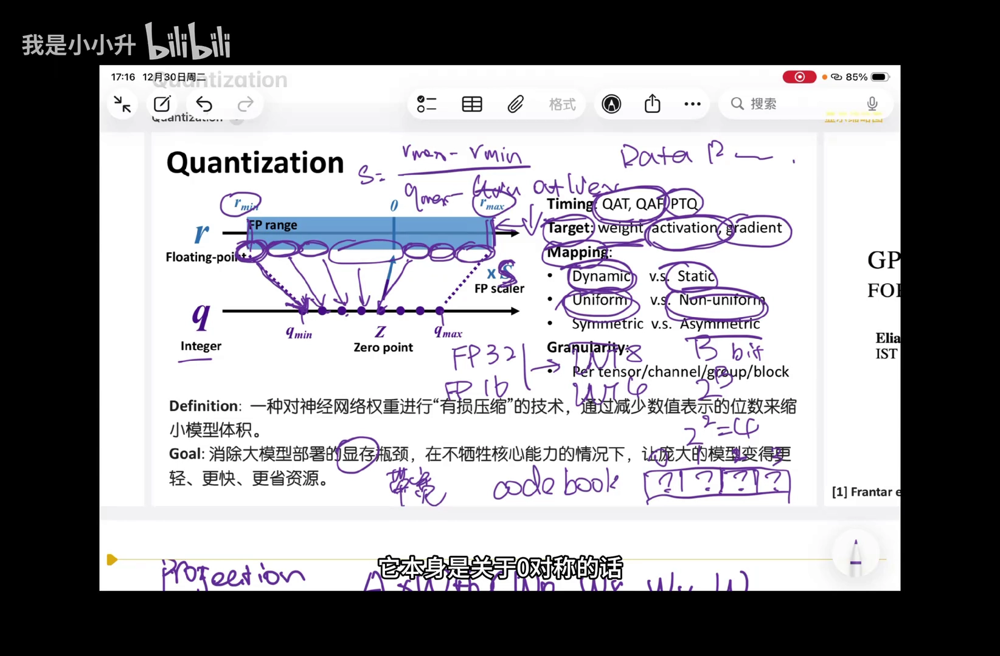

### 2.6 粒度（Granularity）：多少个元素共享一套参数

粒度决定了**多少个权重元素共享一套量化参数（metadata，包括 scale、zero point、codebook）** [【跳转到 09:26】](https://www.bilibili.com/video/BV1UjiuBFECB/?t=566)。量化对象通常是一个矩阵，按粒度从粗到细：

- **per-tensor**：整个矩阵共享一套参数。
- **per-channel**：每一行（channel）共享一套。
- **per-group**：在 channel 里再分组，比如 128 个元素一组。
- **per-block**：不一定沿 channel，按矩阵里某个 tile 大小（如 32×32）划分，每个 tile 共享一套 [【跳转到 10:16】](https://www.bilibili.com/video/BV1UjiuBFECB/?t=616)。

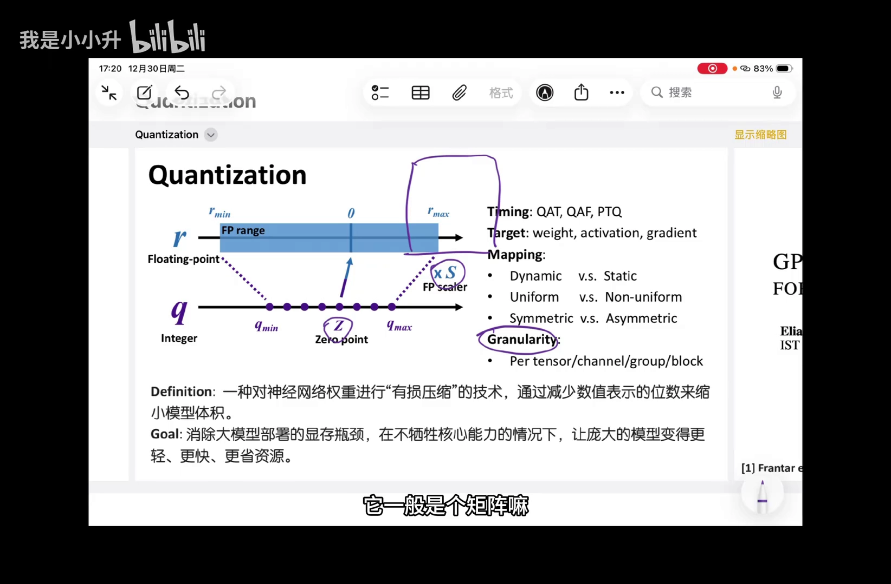

**粒度越细，精度保持越好，但压缩比越低**（因为要存更多 metadata）。不过具体选哪种，还要看硬件：如果硬件做矩阵乘法时是按某个固定大小分块的，那就顺着硬件选；如果加速器是对向量做内积，那就更适合 per-channel [【跳转到 10:41】](https://www.bilibili.com/video/BV1UjiuBFECB/?t=641)。

---

## 三、GPTQ 要解决什么问题

先看 GPTQ 在这个分类体系里的定位 [【跳转到 11:06】](https://www.bilibili.com/video/BV1UjiuBFECB/?t=666)：

- **时机**：PTQ（训练后量化），不需要训练，适用于任意已训练好的模型。
- **对象**：weight-only（仅权重），所以不存在 static/dynamic 之分。
- **映射**：uniform（均匀），量化除以 scale 再四舍五入，反量化乘以 scale。
- **对称性**：对称、非对称都可以。
- **粒度**：论文里用的是 per-channel。

### 3.1 当时已有的方法各有短板

GPTQ 并不是最早的量化算法。它要解决的问题背景是：模型参数量越来越大，旧的方案要么贵、要么慢 [【跳转到 11:56】](https://www.bilibili.com/video/BV1UjiuBFECB/?t=716)。

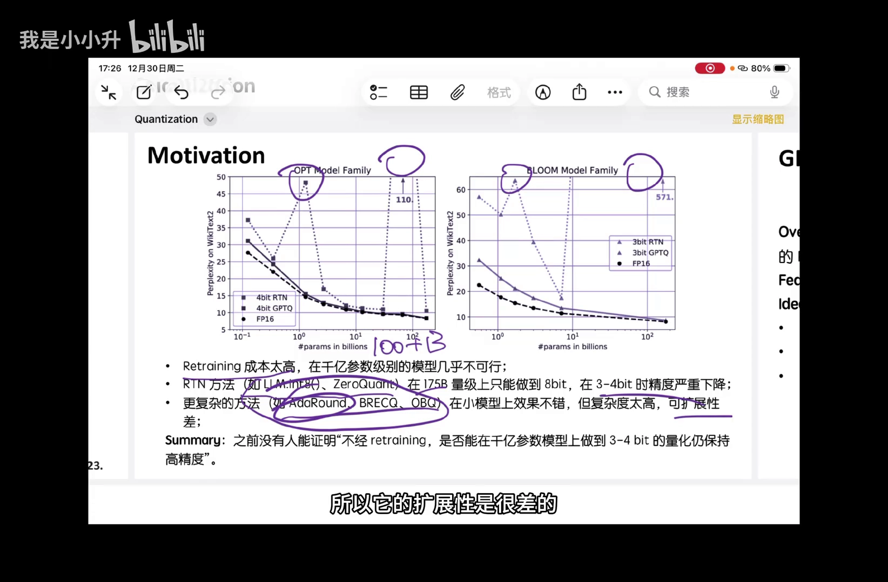

- **重训练（training）**：在千亿参数（100B+）模型上成本太高，几乎不可行。
- **RTN（Round-To-Nearest，四舍五入）**：在 175B 模型上做 8bit 效果尚可，但压到 **3~4bit 时精度严重下降**，困惑度（perplexity）明显升高，模型基本不可用 [【跳转到 12:46】](https://www.bilibili.com/video/BV1UjiuBFECB/?t=766)。
- **更复杂的算法**（如 AdaRound、BRECQ、OBQ）：小模型上效果不错，但**本身复杂度高、扩展性差**，量化一个 175B 模型要几个小时。

### 3.2 GPTQ 的目标

GPTQ 的总体思路是：**用模型的二阶信息，做一次性的（one-shot）PTQ** [【跳转到 13:11】](https://www.bilibili.com/video/BV1UjiuBFECB/?t=791)。"one-shot"指模型只需量化一遍，而不像某些方法要反复重训练。

它瞄准的是 **W4A16 / W3A16**：权重压到 4bit 或 3bit，激活保持 16bit 浮点（BF16 或 FP16）。它的三个改进点，全都建立在 OBQ 这个 baseline 之上，所以我们先理解 OBQ。

---

## 四、GPTQ 的前身：OBQ（Optimal Brain Quantization）

### 4.1 核心思想：量化一个元素，用其他元素补偿误差

OBQ（最优脑量化）的思想是：当两个矩阵相乘时，把 W 写在左边、激活写在右边，乘法可以看作**W 的每一行去乘以激活**，得到输出的每一行。因此，可以把量化误差**按 W 的每一行**来考虑 [【跳转到 14:06】](https://www.bilibili.com/video/BV1UjiuBFECB/?t=846)。

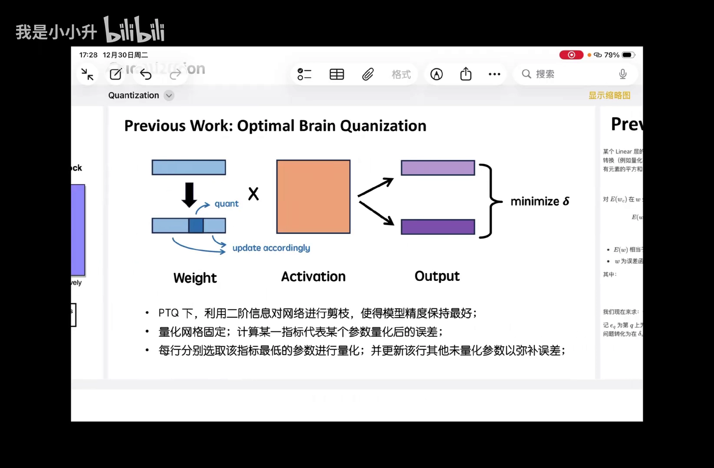

流程是这样的：按行量化，每选行中一个元素量化，量化后乘法的结果就和原来有误差；于是**调整这一行里其他未量化的元素**，把误差"补"回来，使量化前后的乘法误差最小 [【跳转到 14:31】](https://www.bilibili.com/video/BV1UjiuBFECB/?t=871)。

这引出 OBQ 要解决的两个问题 [【跳转到 14:56】](https://www.bilibili.com/video/BV1UjiuBFECB/?t=896)：
1. 找到一个**误差函数**，描述权重从 `w` 变成 `w_c` 后误差有多大；
2. 在这个函数下，**如何更新其他权重**，使误差最小。

### 4.2 误差函数的推导

设某一行权重为 `w`，激活为 `X`。假设经过某种变换（量化某元素并更新其他元素）得到 `w_c`，用**所有元素平方和**度量乘法误差 [【跳转到 16:02】](https://www.bilibili.com/video/BV1UjiuBFECB/?t=962)：

```
E(w_c) = ‖(w − w_c)X‖²₂ = (w − w_c) X Xᵀ (w − w_c)ᵀ
```

对它做**泰勒展开** [【跳转到 16:27】](https://www.bilibili.com/video/BV1UjiuBFECB/?t=987)：

```
E(w_c) = E(w) − ∇E(w)(w − w_c) + ½ (w − w_c) H (w − w_c)ᵀ + O(…)
```

可以消掉前两项：

- `E(w)`：相当于没做量化，误差为 0；
- `∇E(w)`：`w` 是误差函数的极小值点，一阶导数为 0，所以这一项也是 0。

于是只剩二阶项。而经过计算可以发现，中间那个矩阵正好是**激活乘以激活的转置** [【跳转到 16:52】](https://www.bilibili.com/video/BV1UjiuBFECB/?t=1012)：

```
E(w_c) ≈ ½ (w − w_c) H (w − w_c)ᵀ,   其中  H = 2 X Xᵀ
```

这里的 `H` 就是所谓的 **Hessian（海森矩阵）**——它来自激活值，反映了"权重变化对输出的敏感度"，这正是 GPTQ 名字里"用二阶信息"的由来。

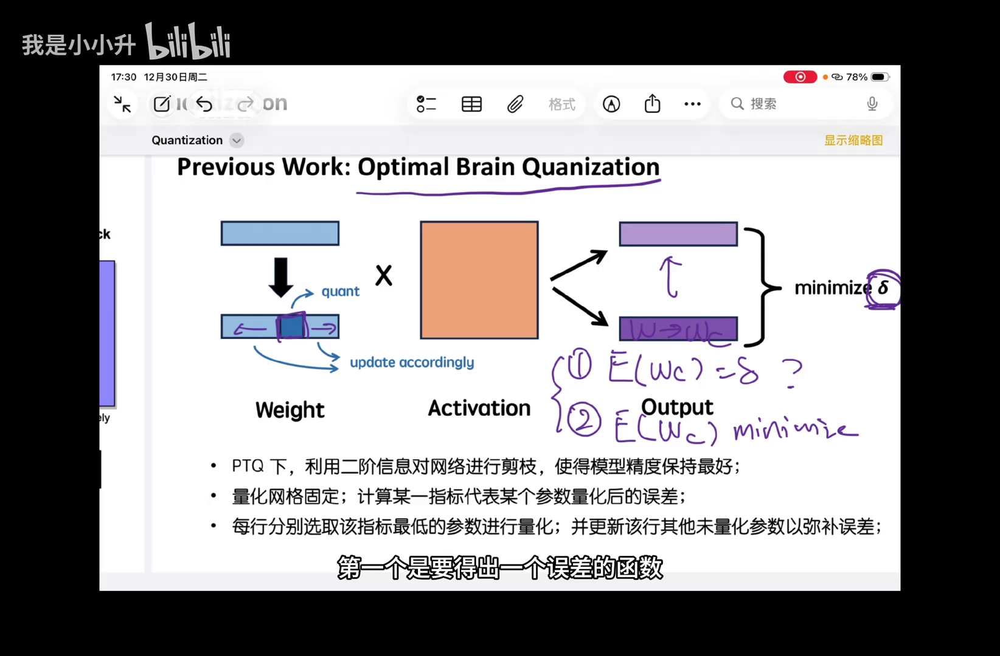

### 4.3 如何让误差最小：拉格朗日乘子法

现在想**最小化** `E(w_c)`。设我们量化了第 `q` 个权重元素，则权重变化 `δ_w = w − w_c` 中：

- 第 `q` 位：代表**该元素量化前后的误差**，是**确定的**；
- 其他位：代表其他未量化权重**要更新多少来补偿**，是**待求的** [【跳转到 17:42】](https://www.bilibili.com/video/BV1UjiuBFECB/?t=1062)。

这是一个带约束的最小化问题（约束是第 `q` 位固定），可以用**拉格朗日乘子法**求解 [【跳转到 18:07】](https://www.bilibili.com/video/BV1UjiuBFECB/?t=1087)。最终权重更新和误差都有闭式解：

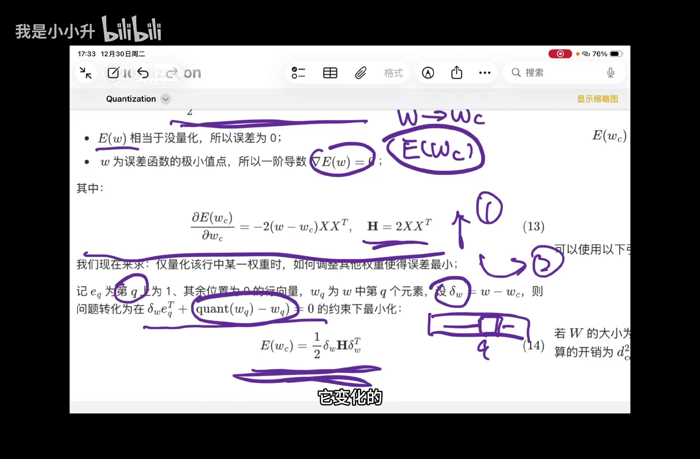

```
δ_w = − (quant(w_q) − w_q) / [H⁻¹]_qq · e_q H⁻¹
E(w_c) ≈ ½ · (quant(w_q) − w_q)² / [H⁻¹]_qq
```

可以看到，**误差正比于量化误差的平方，反比于 Hessian 逆矩阵的对角元**。理解这一点，就能理解 GPTQ 后面为什么要对 Hessian 反复做更新。

### 4.4 OBQ 的算法流程与复杂度瓶颈

OBQ 的做法是 [【跳转到 18:32】](https://www.bilibili.com/video/BV1UjiuBFECB/?t=1112)：

1. 对一行中的**每个元素**，都尝试量化它、并更新其他权重，算出各自误差；
2. 选出**误差最小**的那个元素量化，并固定下来（不再改动）；
3. 对剩余元素重复上述操作，直到全部量化完毕。

每量化完一个元素，还要更新 **Hessian 矩阵**。原因是：`H = X Xᵀ` 里，每一列对应一个 token 维度，外围维度对应 W 的每一列；某个元素被量化后，它在 Hessian 里对应的行/列就要被删除，并做相应更新 [【跳转到 18:57】](https://www.bilibili.com/video/BV1UjiuBFECB/?t=1137)。

问题在于：**OBQ 每一行都单独决定量化顺序**，导致每行第一个被量化的元素可能不同。于是每处理一个元素，都要重新计算一遍删除行列后的 Hessian 逆矩阵，时间复杂度高达 `O(d_row × d_col³)`，非常昂贵 [【跳转到 20:06】](https://www.bilibili.com/video/BV1UjiuBFECB/?t=1206)。

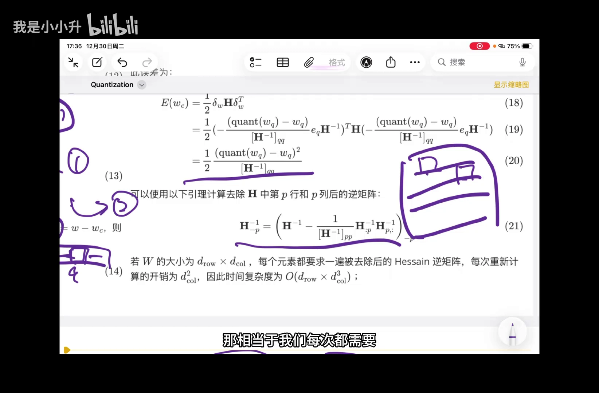

GPTQ 要做的，正是解决 OBQ 在这方面的效率与稳定性问题。

---

## 五、GPTQ 的三个关键优化

GPTQ = OBQ 的误差补偿思想 + 三个工程优化。下面逐一说明。

### 5.1 优化一：统一量化顺序，降低时间复杂度

GPTQ 的第一个观察是：**每次挑"误差最小"的元素来量化，其实没必要** [【跳转到 20:27】](https://www.bilibili.com/video/BV1UjiuBFECB/?t=1227)。

原因是：量化到后面，剩余元素已经很少，无论先量化哪个，误差都会比较大——此时"谁先谁后"已经无关紧要。作者发现，**随机顺序的效果并不比贪心顺序差**，因为初期量化的误差可以被后续权重补偿，而接近尾部的误差本来也难以补偿 [【跳转到 20:37】](https://www.bilibili.com/video/BV1UjiuBFECB/?t=1237)。

所以 GPTQ 改成：**所有行都按相同的顺序量化**——第一次都量化第 1 个元素，第二次都量化第 2 个……这样 Hessian 矩阵的更新也同步了（对所有行都是删同一行同一列），可以**共用同一套 Hessian 更新** [【跳转到 21:02】](https://www.bilibili.com/video/BV1UjiuBFECB/?t=1262)。

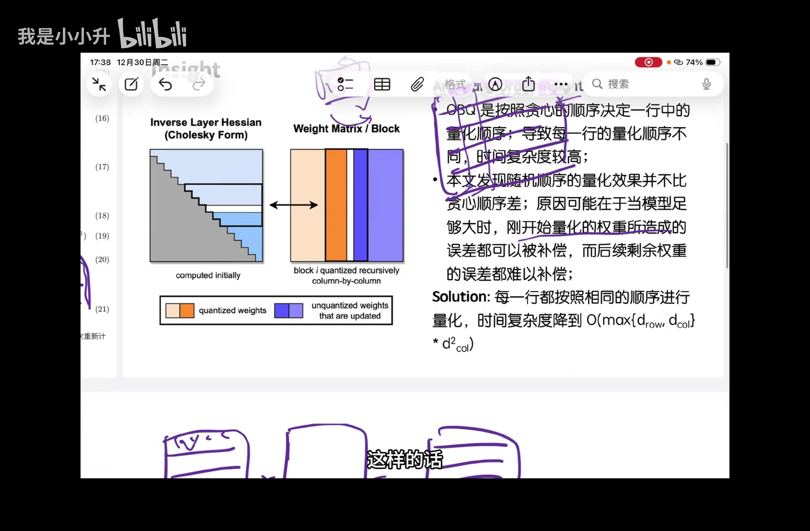

结果：时间复杂度从 `O(d_row × d_col³)` 降到 `O(max{d_row, d_col} × d_col²)`，**相当于少了一个维度** [【跳转到 21:27】](https://www.bilibili.com/video/BV1UjiuBFECB/?t=1287)。

### 5.2 优化二：惰性批量更新（Lazy Batch Updates）

第二个问题是**显存带宽**：每量化一列都要更新一次 Hessian 矩阵，而这个矩阵存在 HBM（显存）里，每次更新都要搬到 SRAM、更新完再搬回去，传输量巨大 [【跳转到 21:42】](https://www.bilibili.com/video/BV1UjiuBFECB/?t=1302)。

GPTQ 的办法是：**按列分组，一次只更新一组内的 Hessian 分块**，并且只用量子组内未量化的权重来补偿误差 [【跳转到 22:07】](https://www.bilibili.com/video/BV1UjiuBFECB/?t=1327)。

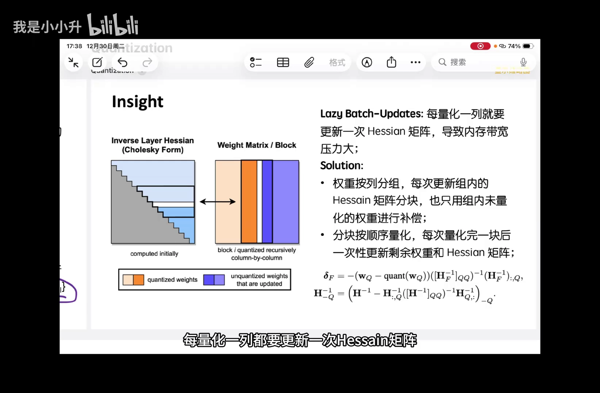

- 一组内的列按顺序量化；
- 一组量化完后，做一次 **batch update（批量更新）**，一次性更新所有剩余未量化权重，来补偿这一组造成的误差 [【跳转到 22:32】](https://www.bilibili.com/video/BV1UjiuBFECB/?t=1352)。

这样就把对 Hessian 的读写**限制在一个小分块内**，大幅缓解带宽压力。对应的更新公式，就是把单元素的公式改写成 batch 形式。

### 5.3 优化三：Cholesky 重参数化，保证数值稳定

第三个问题是**数值稳定性**。Hessian 矩阵更新涉及大量计算，更新多次后容易"变质" [【跳转到 23:08】](https://www.bilibili.com/video/BV1UjiuBFECB/?t=1388)。

理论上 `H = X Xᵀ` 是**半正定矩阵**，但多次更新后可能变成**不定矩阵**。后果很糟：更新这些元素本是为了补偿前面量化的误差，一旦 H 变成不定矩阵，更新反而会**加重误差** [【跳转到 23:35】](https://www.bilibili.com/video/BV1UjiuBFECB/?t=1415)。

常见的缓解办法是**对角线加一个 λ > 0**（如 `H + λI`），让矩阵**对角占优**，从而不易变成不定矩阵——因为对角占优矩阵的逆大致就等于各对角元的倒数 [【跳转到 23:45】](https://www.bilibili.com/video/BV1UjiuBFECB/?t=1425)。但这个方法**只在小模型（矩阵较小）上有效**。

GPTQ 提出的办法是：**对 Hessian 做 Cholesky 分解** `H = L Lᵀ`，其中 `L` 是下三角矩阵 [【跳转到 24:10】](https://www.bilibili.com/video/BV1UjiuBFECB/?t=1450)。这样：

- 更新 Hessian（删除某行某列）时，转而更新三角矩阵 `L`；
- 三角矩阵求逆非常容易，且更新过程**数值稳定性更好** [【跳转到 24:45】](https://www.bilibili.com/video/BV1UjiuBFECB/?t=1485)。

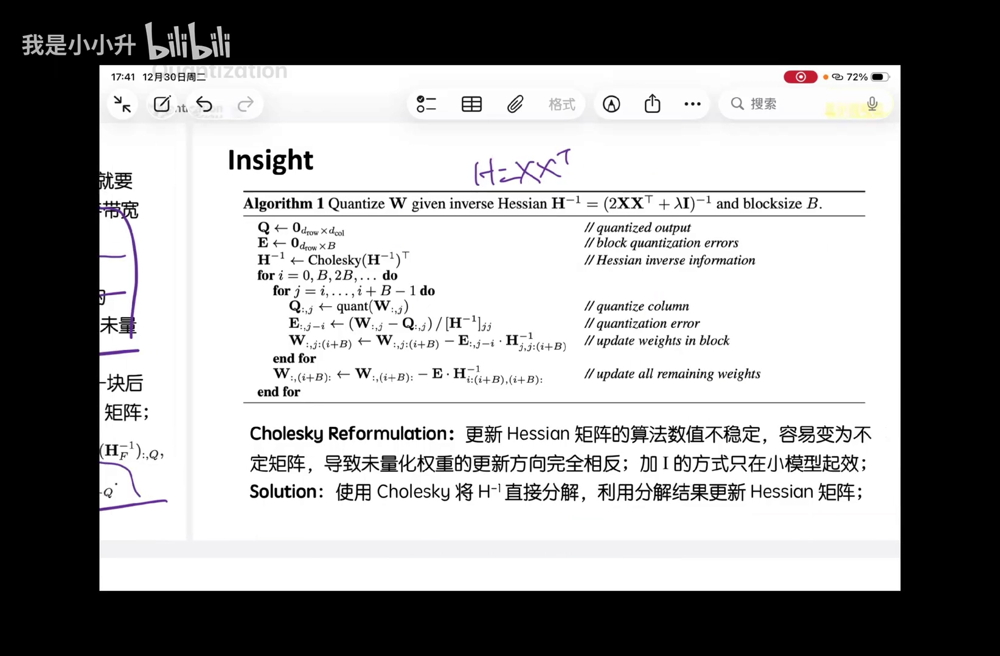

### 5.4 完整的 GPTQ 算法

把三点合起来，GPTQ 的伪代码大致如下（给定 Hessian 逆矩阵 `H⁻¹ = (2XXᵀ + λI)⁻¹` 与分块大小 `B`）：

```
输入: W, H⁻¹ = (2XXᵀ + λI)⁻¹, block size B
Q ← 0                              // 量化结果
H⁻¹ ← Cholesky(H⁻¹)ᵀ               // 用 Cholesky 分解提升稳定性
for i = 0, B, 2B, … do
  for j = i, …, i+B−1 do
    Q[:, j] ← quant(W[:, j])                        // 量化第 j 列
    E[:, j−i] ← (W[:, j] − Q[:, j]) / [H⁻¹]_jj      // 该列量化误差
    W[:, j:(i+B)] ← W[:, j:(i+B)] − E[:, j−i] · H⁻¹ // 更新块内权重
  end for
  W[:, (i+B):] ← W[:, (i+B):] − E · H⁻¹             // 批量更新剩余权重
end for
```

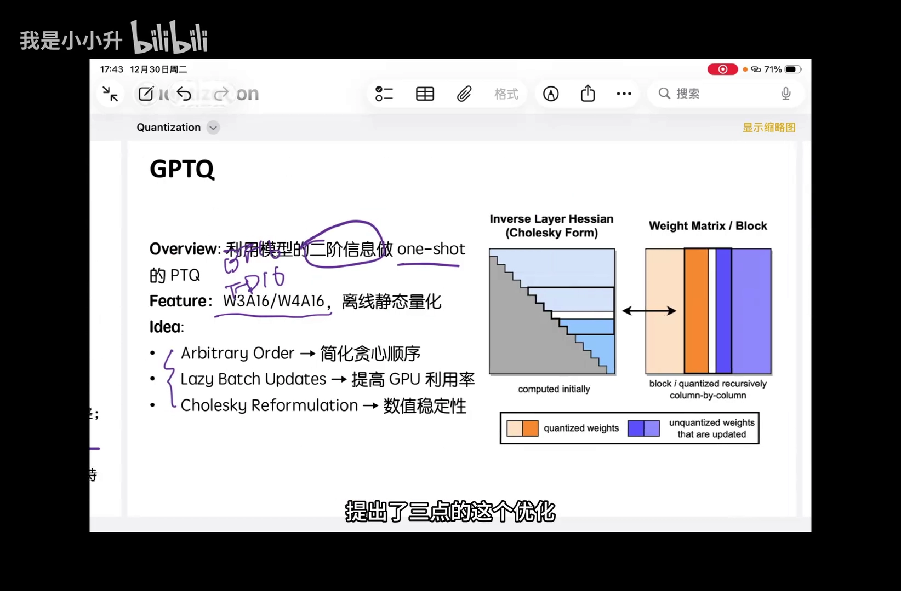

---

## 小结

- **量化**是用更低的位数表示权重、压缩模型体积的技术，目标是在不牺牲核心能力的前提下省显存、省带宽。
- 量化可以从五个维度分类：**时机**（QAT/PTQ）、**对象**（权重/激活/梯度）、**动态性**（Dynamic/Static）、**映射**（Uniform/Non-uniform）、**粒度**（per-tensor/channel/group/block）。
- **GPTQ** 定位为 weight-only 的 PTQ，用二阶信息做一次性量化，目标 W4A16 / W3A16。
- **OBQ** 是它的 baseline：量化一个元素、用同行其他元素补偿误差，但逐行独立选序导致复杂度高达 `O(d_row × d_col³)`。
- GPTQ 的三点优化：
  1. **统一量化顺序**——所有行同步量化，Hessian 更新可共用，复杂度降一个维度；
  2. **惰性批量更新**——按列分组、只更新组内 Hessian 分块，缓解显存带宽压力；
  3. **Cholesky 重参数化**——把更新转移到下三角矩阵 `L`，保证数值稳定性。

---

## 关键术语速查

| 术语 | 一句话解释 |
| --- | --- |
| 量化（Quantization） | 用更少位数（如 INT4）表示权重，压缩模型体积的有损压缩技术 |
| scale | 浮点范围与整数范围的比例，量化和反量化的缩放因子 |
| zero point | 非对称量化中，表示浮点 0 所映射到的整数位置 |
| codebook | 非均匀量化维护的查表，记录每个整数对应的浮点数 |
| QAT / PTQ | 量化感知训练 / 训练后量化；后者通用、无需重训练 |
| Dynamic / Static | 激活量化的 scale 是运行时动态算，还是离线提前定死 |
| Uniform / Non-uniform | 浮点范围是否等宽映射到整数刻度 |
| Granularity | 多少个权重元素共享一套量化参数：tensor/channel/group/block |
| outlier | 超出静态量化范围、需要特殊处理的激活离群值 |
| weight-only | 只量化权重、激活保持高精度（如 W4A16） |
| OBQ | 最优脑量化，用量化误差补偿思想逐元素量化的 baseline |
| Hessian 矩阵 H | `H = 2XXᵀ`，反映权重变化对输出的敏感度（二阶信息） |
| one-shot | 模型只量化一遍，不需要反复重训练 |
| Lazy Batch Updates | GPTQ 优化二：按列分组、只更新组内 Hessian 分块，省带宽 |
| Cholesky 分解 | `H = LLᵀ`，把 Hessian 更新转移到下三角矩阵 L，提升数值稳定性 |
