# 激活函数的几何学：从 ReLU、Sigmoid 到神经流形的可视化探索

> 本文是对 B 站视频《激活函数的几何学：从 ReLU、Sigmoid 到神经流形的可视化探索》的图文整理稿。原文：[BV1dEHe6CEex](https://www.bilibili.com/video/BV1dEHe6CEex/)。这是一门关于"神经流形"的阅读课（材料参考 Calin 的讲义 §2.1），由 Maksym Zubkov 主讲。

## 本讲要解决的核心问题（SCQA）

**背景**：神经网络常被当作黑箱。但它背后有一条重要的数学保证——**通用逼近定理**：只要激活函数是连续的、非多项式的，把隐藏层做得足够大，就能任意逼近任何一个连续函数。换句话说，"黑箱"其实是一族可以精确描述的函数。

**冲突**：激活函数的选择五花八门——线性、阶跃、ReLU、Sigmoid、tanh、softmax……不同的选择会让网络**能学到的东西完全不同**。可我们过去往往只关心"训练能不能收敛"，却很少问一个更根本的问题：*固定了一个架构和激活函数之后，这一族网络到底能表达哪些函数？*

**疑问**：激活函数究竟在做什么？它们各自有什么性质、又如何决定网络可表达的"函数集合"？有没有一个统一的视角把这一切串起来？

**回答（中心思想）**：有，这就是**神经流形（neural manifold）**的视角。把固定架构下的"参数 → 函数"看成一个映射 ψ，它的**像**就是函数空间里的一个流形。不同激活函数给出形状不同的流形；而选择哪个激活函数，本质上是在**表达力、可训练性、数值稳定性之间做权衡**。

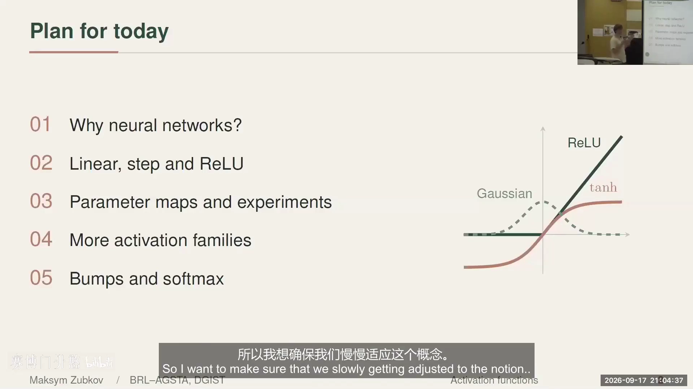

---

## 一、我们为什么需要神经网络：从直线到黑箱

### 1.1 线性回归的威力与局限

想象你有一堆数据，想预测下一个输出。最直接的办法是用一条直线去拟合，比如线性回归。它的参数只有两个——**斜率**和**与 Y 轴的交点**，既简单又**可解释** [【跳转到 01:29】](https://www.bilibili.com/video/BV1dEHe6CEex/?t=89)。

它强到什么程度？讲者举了个例子：金融行业做股票市场的朋友，被问到"你们是不是用什么花哨的机器学习？"答案是——**基本就是线性回归** [【跳转到 02:19】](https://www.bilibili.com/video/BV1dEHe6CEex/?t=139)。因为只要你选对了要关注的参数、又处理好了数据，简单的模型就能给出有意义的结果。

但数据往往更复杂：当关系不是线性的，你会看到明显的波形、周期等模式。而我们能"看出"这些模式，只是因为我们能在**二维**里把它画出来；真实数据维度极高，在十维空间里识别模式非常困难，尤其是数据稀疏或不完整时 [【跳转到 02:44】](https://www.bilibili.com/video/BV1dEHe6CEex/?t=164)。

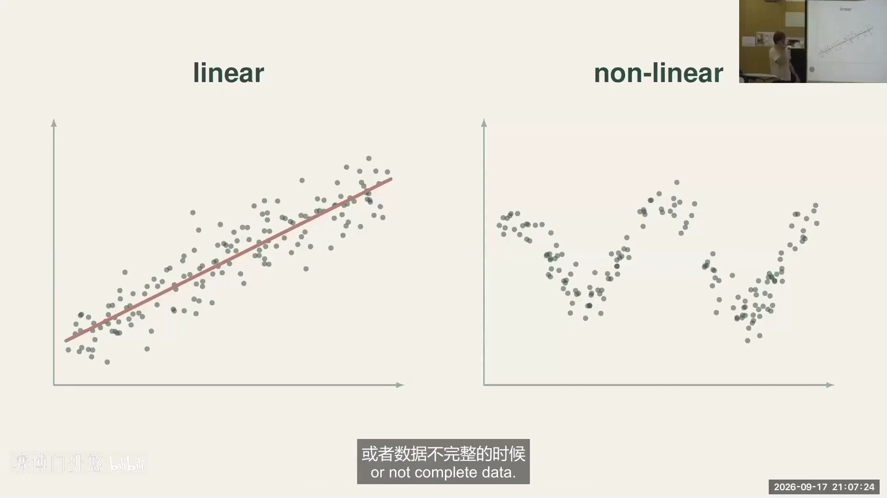

### 1.2 黑箱与通用逼近定理

对高维数据，我们就用神经网络——一个黑箱：不同架构、足够的数据，靠经验训练，就能得到很好的预测。代价是，我们失去了对那两个"可解释特征"（斜率和截距）的掌控 [【跳转到 03:34】](https://www.bilibili.com/video/BV1dEHe6CEex/?t=214)。

这里引入本课的第一条公理：**我们假设世界可以被函数建模**。讲者引用了《夸克与美洲豹》（诺贝尔物理学奖得主 Murray Gell-Mann 著），书里讨论的正是"物理定律与自然界复杂性之间的关系"——也就是"一切都能用数学描述吗？"这个长期争论的问题 [【跳转到 03:53】](https://www.bilibili.com/video/BV1dEHe6CEex/?t=233)。

在这门课里，我们选择相信"能"：我们有一个底层函数，想用前馈神经网络去学习它。而要用通用逼近定理，先得选定激活函数——**它必须是连续的、非多项式的** [【跳转到 04:26】](https://www.bilibili.com/video/BV1dEHe6CEex/?t=266)。

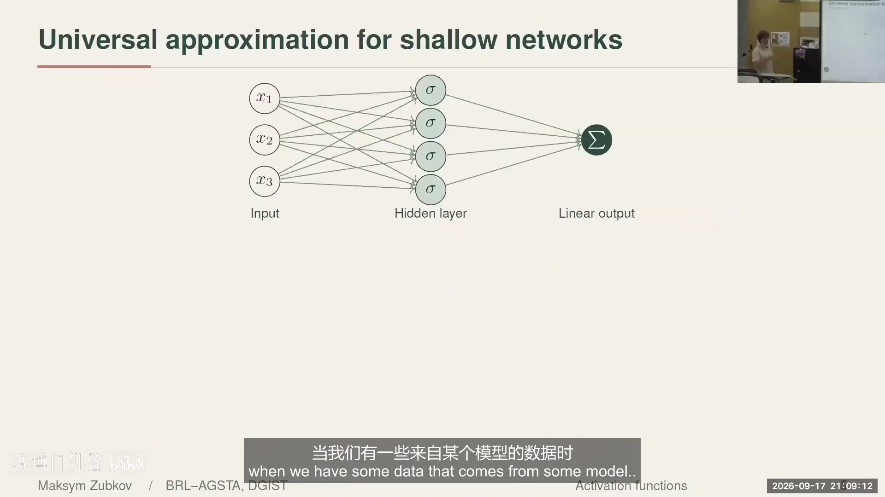

定理的表述是：设 σ: ℝ → ℝ 连续且非多项式。对任意紧集 K ⊂ ℝⁿ、连续函数 f: K → ℝ 和任意 ε > 0，都存在足够多的隐藏神经元，使得网络 N(x) = Σ aⱼ σ(wⱼᵀx + bⱼ) 满足 sup|f(x) − N(x)| < ε [【跳转到 05:16】](https://www.bilibili.com/video/BV1dEHe6CEex/?t=316)。

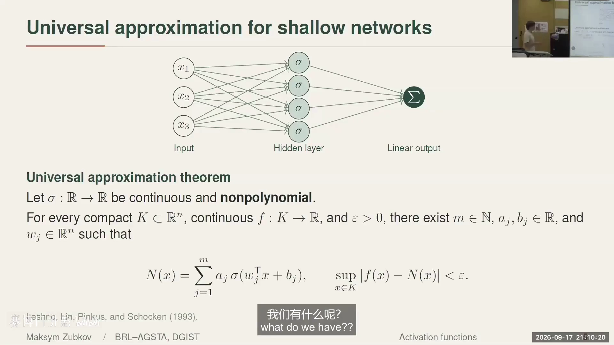

一句话：**只要过程是由某个模型支配的，理论上把网络做足够大，就能逼近它**。过去几年大公司构建 Transformer 时，这个"奇迹"确实发生了——大模型现在能证明定理了。但大模型依然是黑箱，所以我们要开始**拆解这个黑箱** [【跳转到 05:41】](https://www.bilibili.com/video/BV1dEHe6CEex/?t=341)。

---

## 二、把神经网络看作一个映射

### 2.1 一个最小例子：(1, 3, 1) 架构

拆解黑箱先从一个最小架构入手：**1 个输入、3 个隐藏神经元、1 个输出**。给定输入 x，x 分别乘以 a₁、a₂、a₃，各自加上偏差 bᵢ，再逐坐标地作用激活函数 σ，最后加权求和并加常数 d [【跳转到 06:06】](https://www.bilibili.com/video/BV1dEHe6CEex/?t=366)。

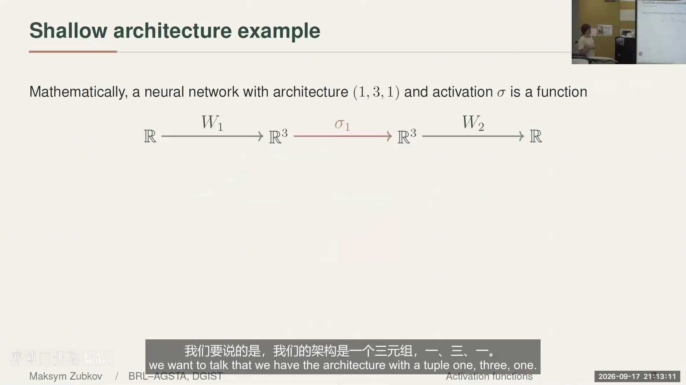

从数学角度看，这个架构是一个三元组 **(1, 3, 1)**，它其实是三个映射的**复合**：

```
ℝ --W₁--> ℝ³ --σ₁--> ℝ³ --W₂--> ℝ
```

其中 W₁、W₂ 是**仿射映射**（矩阵乘法 + 平移），σ₁ 是逐坐标的非线性激活 [【跳转到 07:21】](https://www.bilibili.com/video/BV1dEHe6CEex/?t=441)。

- **仿射映射**：先乘一个矩阵（线性映射），再平移一个向量。在机器学习里，这个平移量就是**偏差（bias）**；去掉偏差，剩下的才是纯线性映射 [【跳转到 09:26】](https://www.bilibili.com/video/BV1dEHe6CEex/?t=566)。

### 2.2 符号化表达与"矩阵分解"

把上面的复合写开，网络就是一个函数：

```
f_w(x) = c₁σ(a₁x + b₁) + c₂σ(a₂x + b₂) + c₃σ(a₃x + b₃) + d
```

即"**非线性项的线性组合，再加一个常数**" [【跳转到 10:41】](https://www.bilibili.com/video/BV1dEHe6CEex/?t=641)。

这个视角立刻带来两个深刻的观察：

- **可解释性**：线性回归只有 2 个参数，而用神经网络拟合同一条直线时，会有七八个参数共同编码同一个斜率和截距。于是"哪一组参数对应斜率""哪一组对应截距"就变得重要——这正是机器学习里的**可解释性（interpretability）**与**可辨识性（identifiability）**问题 [【跳转到 15:14】](https://www.bilibili.com/video/BV1dEHe6CEex/?t=914)。从可辨识性出发，才能谈可解释性。
- **矩阵分解**：如果网络没有偏差且用线性激活，输出就只是 W₂W₁ 作用于 x。换句话说，**研究线性神经网络等价于研究矩阵分解问题** [【跳转到 15:39】](https://www.bilibili.com/video/BV1dEHe6CEex/?t=939)。即便是最简单的线性情形，也有丰富的代数几何结构可以研究。

---

## 三、激活函数图谱与三个评价维度

一张表概览了激活函数的六大家族 [【跳转到 11:06】](https://www.bilibili.com/video/BV1dEHe6CEex/?t=666)：

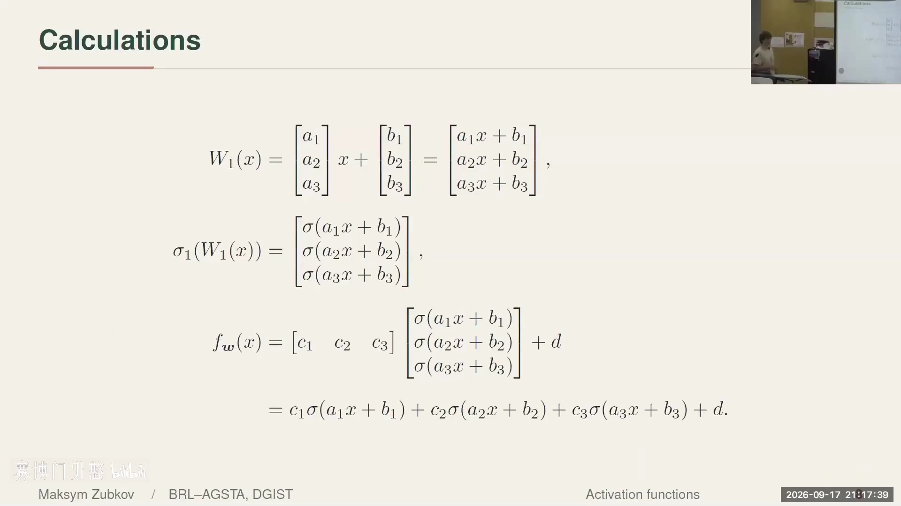

| 家族 | 例子 |
| --- | --- |
| 线性 Linear | 恒等函数 Identity |
| 阶跃 Step | Heaviside、双极阶跃 bipolar step |
| 曲棍球棒 Hockey-stick | ReLU、ELU、softplus |
| S 型 S-shaped | 逻辑斯蒂 logistic、tanh、softsign |
| 隆起 Bump | 高斯、双指数 |
| 分类 Classification | softmax |

评价一个激活函数，主要看三个方面 [【跳转到 11:31】](https://www.bilibili.com/video/BV1dEHe6CEex/?t=691)：

1. **有界还是无界**——影响训练的稳定性；
2. **是否处处可微**——存在不连续点会带来麻烦；
3. **斜率变化**——是剧烈跳变，还是平缓过渡。

---

## 四、逐个认识这些激活函数

### 4.1 线性激活：多个参数却只有一个结果

设 σ(x) = kx。代进 (1,3,1) 的公式里合并同类项，会得到 `f_w(x) = Ax + B` [【跳转到 13:59】](https://www.bilibili.com/video/BV1dEHe6CEex/?t=839)。

结论很清楚：**无论加多少线性项，输出仍是线性函数**。它没有增加任何表达力，却把两个可解释的参数"打散"成一堆参数——这正是可解释性研究的起点。

### 4.2 阶跃激活：模仿神经元的"有/无"

二值阶跃（Heaviside）函数：x < 0 时为 0，x ≥ 0 时为 1；再做个小位移，就得到取 -1 / 1 的**双极阶跃** [【跳转到 16:29】](https://www.bilibili.com/video/BV1dEHe6CEex/?t=989)。

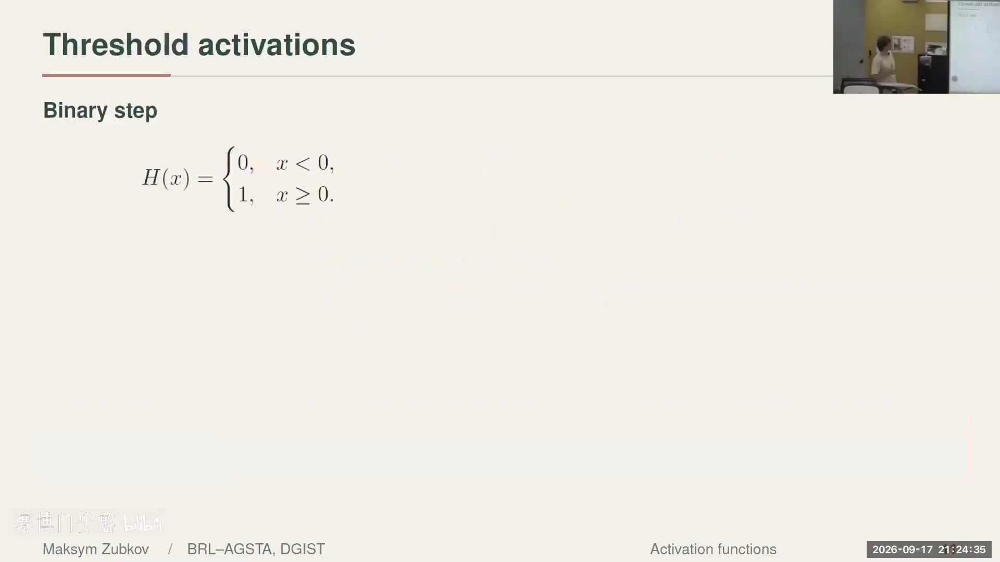

它的动机来自早期神经网络论文——想模拟大脑神经元"要么有信号、要么没有信号"的行为。但它**不连续、很难训练**，所以历史上经历了"活跃 → 沉寂 → 再次活跃"的曲折 [【跳转到 16:54】](https://www.bilibili.com/video/BV1dEHe6CEex/?t=1014)。这种激活的一个潜在用途是**量化网络**（用低精度权重跑大模型，让大模型跑在手机上），但据讲者观察它并不太受欢迎 [【跳转到 17:19】](https://www.bilibili.com/video/BV1dEHe6CEex/?t=1039)。

### 4.3 ReLU：曲棍球棒与分段线性

真正流行的是 **ReLU**（修正线性单元），因为形状像曲棍球棒，又叫"曲棍球棒函数"：x 为负时为 0，x 为正时是一条直线，非线性恰好体现在折点处 [【跳转到 18:09】](https://www.bilibili.com/video/BV1dEHe6CEex/?t=1089)。它的好处：

- **导数极便宜**：实现和评估都非常简单，适合构建超大架构、在海量数据上训练 [【跳转到 18:34】](https://www.bilibili.com/video/BV1dEHe6CEex/?t=1114)；
- **分段线性**：因此可以用**热带几何（tropical geometry）**等组合数学、代数、拓扑工具来理解这些网络 [【跳转到 18:59】](https://www.bilibili.com/video/BV1dEHe6CEex/?t=1139)。

一个有趣的小谜题：**ReLU(x) + ReLU(−x) = |x|**（绝对值）。把不同形状的激活函数像拼图一样组合，就能搭出更复杂的函数 [【跳转到 19:33】](https://www.bilibili.com/video/BV1dEHe6CEex/?t=1173)。

### 4.4 Leaky ReLU：给负半轴留一点斜率

ReLU 的一个缺点是"所有负值都变成 0"。改进办法是：在 Y 轴左侧引入一个很小的斜率，这个斜率由参数 α 控制——这就是 **Leaky ReLU / PReLU** [【跳转到 20:15】](https://www.bilibili.com/video/BV1dEHe6CEex/?t=1215)。

α 怎么选？两种思路 [【跳转到 20:40】](https://www.bilibili.com/video/BV1dEHe6CEex/?t=1240)：
1. 让网络**自己学习** α，以最小化损失；
2. **人工搜索**：在 [−2, 2] 采样若干点，各训练多次，挑平均表现最好的。

这也引出一个代数几何式的问题：**能否构造某种不变量，来解释为什么某个 α 更好？** [【跳转到 21:05】](https://www.bilibili.com/video/BV1dEHe6CEex/?t=1265)

### 4.5 Sigmoid（逻辑斯蒂）：连续版阶跃与梯度消失

**逻辑斯蒂函数** σ_c(x) = 1/(1+e^{−cx})，取值在 (0,1)，在 x=0 处等于 1/2，且满足 σ(−x)=1−σ(x) [【跳转到 31:12】](https://www.bilibili.com/video/BV1dEHe6CEex/?t=1872)。

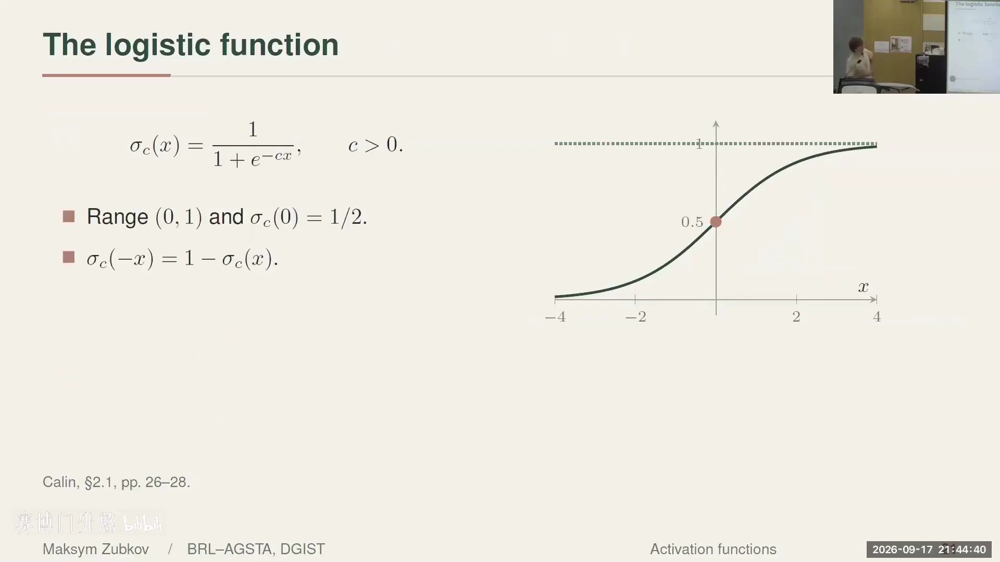

- **为什么用它**：它在 x → ±∞ 时分别趋于 0 和 1，等于用一个**连续**的方式模仿阶跃函数、模仿神经元。
- **导数极方便**：σ'(x) = c·σ(x)(1−σ(x))——导数可以用函数本身表示，这对后面章节的**反向传播**非常重要 [【跳转到 32:02】](https://www.bilibili.com/video/BV1dEHe6CEex/?t=1922)。
- **梯度消失的雏形**：导数在 0 附近非零，但当 x 很大或很小的时候会趋近于 0；多层相乘后更小，小到机器都记录不下——网络就"停止训练"了。这正是 **梯度消失（vanishing gradient）** [【跳转到 32:52】](https://www.bilibili.com/video/BV1dEHe6CEex/?t=1972)。而 ReLU 正是为解决这个问题的契机。

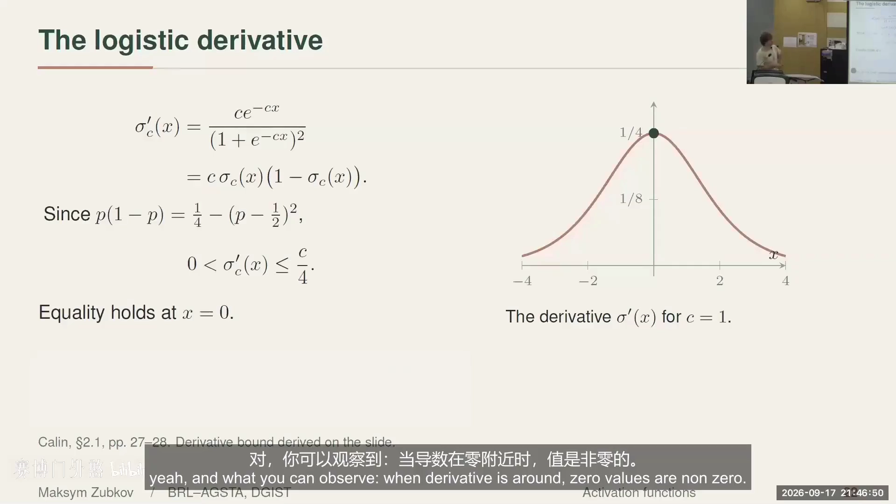

### 4.6 tanh 与"可辨识性"

**双曲正切 tanh** 同样有简洁的导数：1 − tanh²(x)。更重要的是它的**复分析性质**：若把它看作复域上的函数，会有很多**极点**。1994 年的一篇论文利用这些极点，试图从网络的输出**重建网络架构**——不仅判断网络是否可辨识，还想推断出有多少层、每层维度是多少 [【跳转到 34:57】](https://www.bilibili.com/video/BV1dEHe6CEex/?t=2097)。

这为什么重要？讲者给了两个对立面 [【跳转到 35:22】](https://www.bilibili.com/video/BV1dEHe6CEex/?t=2122)：

- **想要可辨识**：例如你在敏感数据（如医疗）上训练，希望对抗性攻击者**无法**通过输入-输出来反推网络参数；
- **不想要可辨识**：有时你又希望网络足够复杂，以防敏感数据被暴露。

### 4.7 隆起函数（Bump）：只对"偏好分数"强烈响应

任务是分类：三个苹果 A、B、C，我们希望模型对偏爱的 B 给高分。可以构造一个标量分数 z = x₃ − x₁，然后用一个**隆起函数（bump）**：z = 0 时响应最高（1），两侧迅速衰减到 0 [【跳转到 37:58】](https://www.bilibili.com/video/BV1dEHe6CEex/?t=2278)。

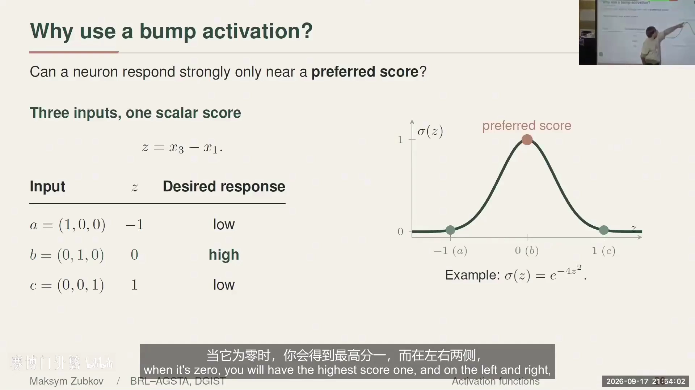

常见的隆起函数有**高斯函数**（平滑美观）和**双指数函数**（带尖角） [【跳转到 38:46】](https://www.bilibili.com/video/BV1dEHe6CEex/?t=2326)。

### 4.8 softmax 与温度

最后是最重要的 **softmax**。想象网络要识别 1~10 的数字，最后一层输出一个十维向量（称为 **logits**，即未归一化的类别分数）。softmax 把每个分量变成概率 [【跳转到 40:07】](https://www.bilibili.com/video/BV1dEHe6CEex/?t=2407)：

```
softmax(x)_j = e^{x_j} / Σ_i e^{x_i}
```

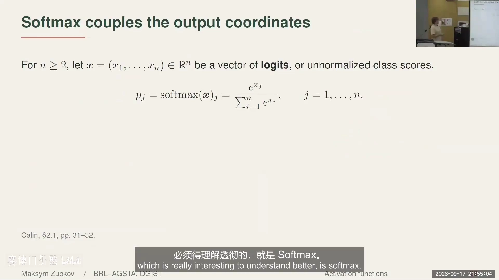

因为输出都是正数、且总和为 1，所以它给出的是**概率分布**——非常适合分类任务放在网络最后。

其中还有一个可调参数——**温度** [【跳转到 40:44】](https://www.bilibili.com/video/BV1dEHe6CEex/?t=2444)：

- 温度趋近 0：输出趋于**均匀**，概率看起来偏随机；
- 温度 = 1：得到常规分布；
- 温度 = 20（或更大）：强烈强调正确答案；
- 温度 → ∞：精确退化为 one-hot 的 0 0 1。

温度控制了"想在类别分布上投入多少强调"。这也是 Transformer 里"温度采样"的数学根源。

---

## 五、神经流形：把参数空间映射到函数空间

前面所有激活函数，最终都是为了回答同一个问题：**固定架构后，网络能表达哪些函数？** 现在用一个统一的几何框架来回答。

### 5.1 参数映射 ψ 与神经流形 M_σ

以 (1,3,1) 架构为例，把所有参数收集起来——W₁ 的 a₁,a₂,a₃ 与 b₁,b₂,b₃（6 个），W₂ 的 c₁,c₂,c₃ 与 d（4 个），一共 **10 个参数**，构成十维空间 ℝ¹⁰ [【跳转到 22:20】](https://www.bilibili.com/video/BV1dEHe6CEex/?t=1340)。

固定架构和激活函数 σ，我们就得到一个**参数映射** ψ：

```
ψ : ℝ¹⁰ → C(ℝ, ℝ)
w  ↦  [ x ↦ Σ_{j=1}^{3} c_j σ(a_j x + b_j) + d ]
```

它把"参数空间"里的一个点 w，映射到"函数空间" C(ℝ, ℝ) 里的一个具体函数 [【跳转到 23:10】](https://www.bilibili.com/video/BV1dEHe6CEex/?t=1390)。

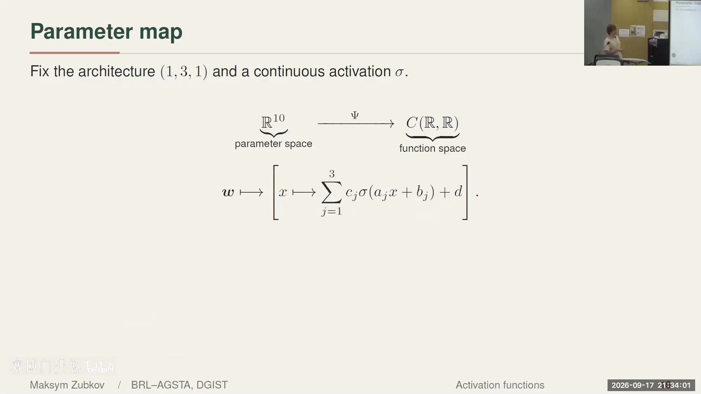

而**神经流形（neuromanifold）**，就是这个映射的**像（image）**：

```
M_σ = im ψ = { f_w : w ∈ ℝ¹⁰ } ⊂ C(ℝ, ℝ)
```

它代表"这个架构所能表达的全部函数" [【跳转到 23:35】](https://www.bilibili.com/video/BV1dEHe6CEex/?t=1415)。当我们在训练中改变参数时，其实是在这个流形上"旅行"。

讲者在这里插了一个非常直观的感叹：即便取最简单的空间，问"ℝ 作为 ℚ 上向量空间的基是什么？"都几乎无法回答——这是他在加州大学尔湾分校线性代数课上被难住的作业题。这说明**理解函数空间的几何本身极其困难，但也极其有趣**。

### 5.2 可视化实验：参数沿直线走，函数如何变化

为了把神经流形"看"出来，讲者设计了一个简单实验 [【跳转到 24:25】](https://www.bilibili.com/video/BV1dEHe6CEex/?t=1465)：

1. 在参数空间 ℝ¹⁰ 里**随机取一个点 w⁽⁰⁾，再取它的反向点 w⁽¹⁾ = −w⁽⁰⁾**；
2. 在两点之间画一条线段 w(t) = (1−t)w⁽⁰⁾ + t·w⁽¹⁾，t ∈ [0,1]；
3. **均匀采样 10,000 个点**，对每个参数画出对应函数的图像；
4. 把 10,000 张图**叠加**——落点密集处颜色更深、稀疏处更淡；
5. 换不同激活函数时**保持同一批参数点**，以便对比。

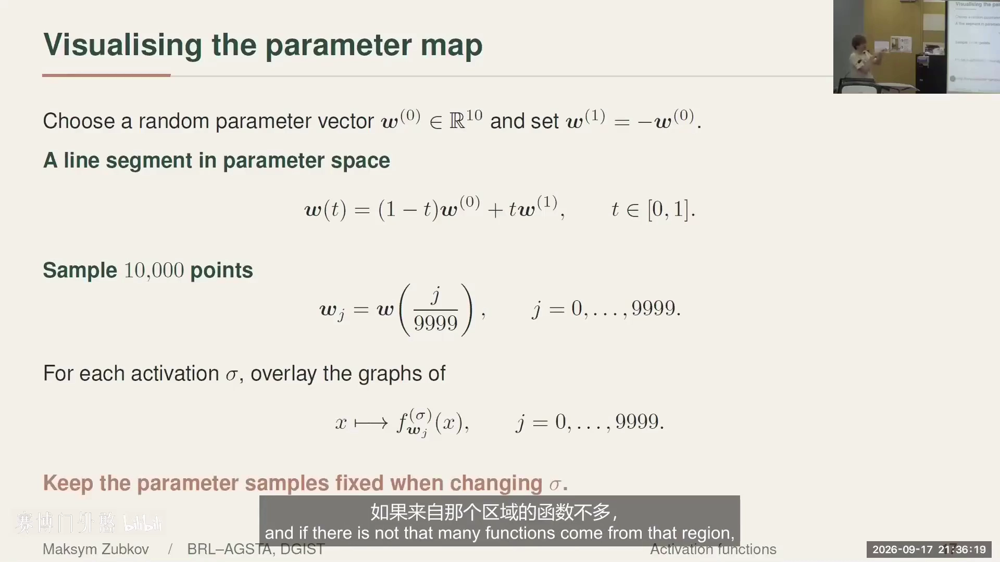

结果如下图所示，五种激活函数（线性、二值阶跃、双极阶跃、ReLU、PReLU）呈现出**明显不同的"函数分布形状"** [【跳转到 25:15】](https://www.bilibili.com/video/BV1dEHe6CEex/?t=1515)：

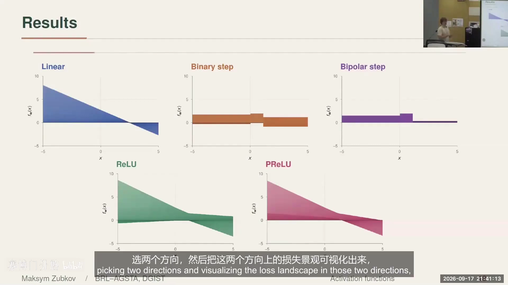

- **线性**：着色比较均匀，能达到的函数都指向原点附近的一个区域；
- **二值阶跃**：底部某处更深、某处更淡，函数在 0 以下时会长出特定条带；
- **双极阶跃**：在参数线段上相当"受限"；
- **ReLU / PReLU**：能看出两者形状的差异。

沿着参数向量移动，其实就是在让神经网络"上下移动"；把整条路径投影到 XY 平面，就能看到函数家族如何被遍历 [【跳转到 26:39】](https://www.bilibili.com/video/BV1dEHe6CEex/?t=1599)。当参数走到原点（所有参数为 0）时，就退化为零函数。

**这个实验有什么用？** 讲者说，这源自他看到的一些 YouTube 现象：*为什么网络层数越多（如从 10 层到 20 层）反而训练得更差？* 人们把参数空间两个方向的**损失景观（loss landscape）**可视化出来，才看清问题。类似地，用这种"玩具化"的函数叠加图，可以直观判断**给定架构能否表达你的数据** [【跳转到 28:19】](https://www.bilibili.com/video/BV1dEHe6CEex/?t=1699)。

---

## 六、结语：不要模仿自然，而要研究背后的几何

讲者最后分享了两个更深层的观点。

**其一：激活函数的选择是一种权衡，且真的非常非常重要。** 无论选择什么架构，激活函数的属性都会影响"我们能学到什么、学不到什么" [【跳转到 43:45】](https://www.bilibili.com/video/BV1dEHe6CEex/?t=2625)。他强烈推荐综述论文《Three Decades of Activations: A Comprehensive Survey of 400 Activation Functions for Neural Networks》（Vladimír Kunc & Jiří Kléma, arXiv:2402.09092, 2024），它用三四十页的篇幅系统梳理了 400 种激活函数及其动机与可训练性 [【跳转到 41:55】](https://www.bilibili.com/video/BV1dEHe6CEex/?t=2515)。

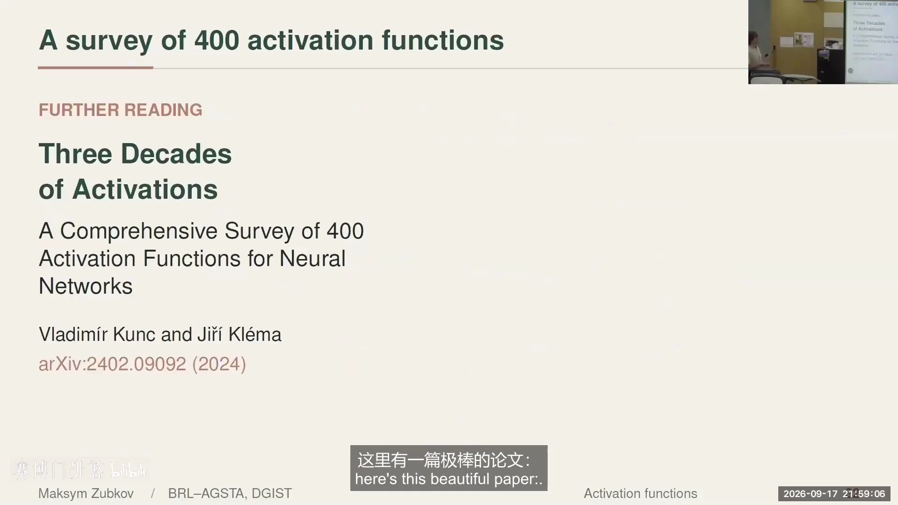

**其二：不要模仿自然。** 讲者提到一篇颇有争议的论文《Could a neuroscientist understand a microprocessor?》（Jonas & Kording, 2016）：如果我们用研究大脑的方法去研究一个**人类自己造的微处理器**（假装不了解它的底层结构），会发现几乎什么也学不到 [【跳转到 44:00】](https://www.bilibili.com/video/BV1dEHe6CEex/?t=2640)。

这个结论有点悲观，但讲者从中得到启示：**最初我们用 Sigmoid 是为了模仿神经元，但就像同一套软件可以跑在不同硬件上，大语言模型的结构与大脑完全不同，却能进行推理、甚至产出可被形式化机器验证的证明**。所以真正重要的，是**远离这些人为的架构选择，去研究现象背后真正的几何结构**——这正是"神经流形"这个想法令他着迷的原因 [【跳转到 44:50】](https://www.bilibili.com/video/BV1dEHe6CEex/?t=2690)。

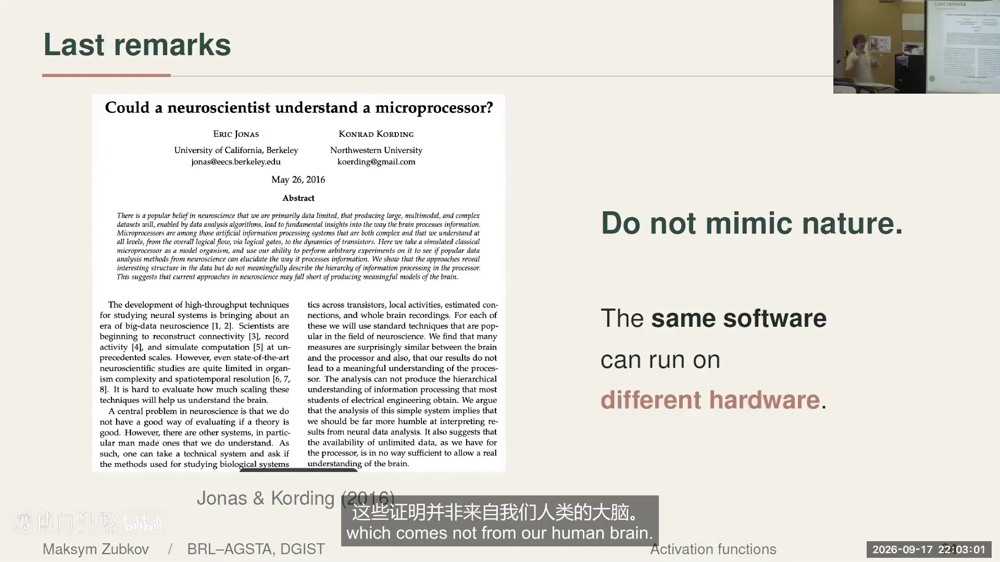

---

## 小结

- **我们为什么需要神经网络**：线性回归简单可解释，但难以处理高维非线性数据；**通用逼近定理**保证连续非多项式的激活函数 + 足够宽的隐藏层可以逼近任意连续函数。
- **把网络看作映射**：一个 (1,3,1) 架构是"仿射映射 → 逐坐标非线性 → 仿射映射"的复合；输出是"非线性项的线性组合加常数"。
- **激活函数的三个评价维度**：有界/无界、是否处处可微、斜率变化方式。
- **各激活函数的关键点**：
  - 线性——不增加表达力；
  - 阶跃——模仿神经元但不连续、难训练；
  - ReLU——导数便宜、分段线性，可接热带几何，`ReLU(x)+ReLU(−x)=|x|`；
  - Leaky ReLU——用 α 给负半轴留斜率；
  - Sigmoid——连续版阶跃，导数为 σ(1−σ)，但有**梯度消失**；
  - tanh——极点可用于**架构可辨识性**；
  - bump（高斯/双指数）——只对"偏好分数"强烈响应；
  - softmax——把 logits 变成概率分布，**温度**控制强调程度。
- **神经流形**：参数映射 ψ : ℝ¹⁰ → C(ℝ,ℝ) 的像 M_σ，代表固定架构能表达的全部函数；把参数沿直线遍历并叠加 10,000 张函数图，就能"看见"不同激活函数的表达力差异。
- **核心提醒**：激活函数的选择是权衡，且我们或许不应模仿自然，而应研究现象背后的几何结构。

---

## 关键术语速查

| 术语 | 一句话解释 |
| --- | --- |
| 通用逼近定理 | 连续非多项式激活 + 足够宽隐藏层，可逼近任意连续函数 |
| 仿射映射 | 矩阵乘法 + 平移（加偏差）；去掉平移才是线性映射 |
| 偏差 bias | 仿射映射里的平移量，相当于函数图像的垂直/位置平移 |
| (1,3,1) 架构 | 1 输入、3 隐藏神经元、1 输出的最小网络例子 |
| 阶跃函数 | Heaviside 型分段常数函数，不连续（二值/双极） |
| ReLU | 修正线性单元，x<0 为 0、x≥0 为自身，分段线性 |
| Leaky ReLU / PReLU | 负半轴带小斜率的 ReLU，斜率由参数 α 控制 |
| Sigmoid / 逻辑斯蒂 | 取值 (0,1) 的 S 型函数，导数 σ(1−σ) |
| tanh | 双曲正切，导数为 1−tanh²，复域上有极点 |
| 梯度消失 | 深层网络中导数连乘趋于 0，导致无法继续训练 |
| bump / 隆起函数 | 在某一点响应最大、两侧迅速衰减的函数（高斯等） |
| softmax | 把 logits 转成概率分布，各项非负且和为 1 |
| logits | softmax 之前的未归一化类别分数 |
| 温度 temperature | softmax 的可调参数，控制概率分布的"尖锐/均匀" |
| 可辨识性 identifiability | 能否从网络输出唯一还原参数/架构，关系到对抗安全 |
| 参数映射 ψ | 把参数向量映射到对应函数的映射 |
| 神经流形 M_σ | 参数映射的像，即固定架构能表达的全部函数集合 |
| 热带几何 | 研究分段线性结构的数学工具，可用于分析 ReLU 网络 |
| 损失景观 | 损失随参数变化的"地形图"，用于理解优化难度 |
