# Kubernetes RBAC 权限控制详解

> 视频来源：[Kubernetes RBAC Explained](https://www.youtube.com/watch?v=iE9Qb8dHqWI)（YouTube，作者 Anton Putra）
>
> 视频时长约 23 分钟，配套源码在作者的 GitHub 仓库中。本文严格基于视频字幕与幻灯片整理，按「结论先行」的方式重排。

## 本讲要解决的核心问题（SCQA）

**背景**：Kubernetes 集群里的一切都通过 API server 操作。你执行 `kubectl apply` 部署一个 Pod，请求最终会打到 `kube-apiserver`；集群里往往同时住着很多人（开发者、运维、管理员）和很多应用（Prometheus、Ingress Controller……），它们都要访问 Pod、Service、日志等资源。

**冲突**：只要拿到集群的访问权限，就默认能创建或读取**所有**资源吗？显然不行，但不加控制又无法管理。最容易想到的办法是「给每个用户单独配一张权限表」，可一旦用户和资源变多，这张表就会爆炸式膨胀、难以维护。

**疑问**：怎样才能既给每个人刚刚好的权限，又不用为每个用户、每个资源手工维护一堆条目？

**回答（中心思想）**：用 **RBAC（Role-Based Access Control，基于角色的访问控制）**。它的核心是把「用户」和「权限」解耦，中间插入一个通用的容器——**角色（Role）**：先把权限打包进角色，再把用户和角色绑定。Kubernetes 里对应成三个概念：**身份（Identity）**用 User / ServiceAccount / Group 表示，**权限**用 Role / ClusterRole 表示，**绑定（Binding）**用 RoleBinding / ClusterRoleBinding 把两者连起来。

---

## 一、请求打到 apiserver 之后：认证、授权、准入三道关

先看清楚一个 Pod 被 `kubectl apply` 之后到底走了哪些路。当你在终端输入 `kubectl apply -f pod.yaml` 时，会发生几件事：[【跳转到 00:00】](https://www.youtube.com/watch?v=iE9Qb8dHqWI&t=0)

1. kubectl 先读取你本地的 **kubeconfig** 配置；
2. 连接 API server 并**发现（discover）**有哪些可用的 API、以及它们怎么用；
3. 做**客户端校验**，检查 YAML 里有没有明显的错误和拼写问题；
4. 把 Pod 转换成 JSON 对象，带着这份负载把请求发给 `kube-apiserver`。

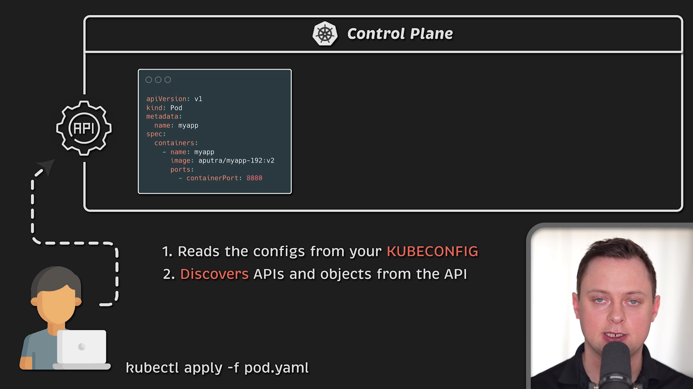

请求到达 `kube-apiserver` 后，它**不会**立刻写进 etcd。它会依次经过三道关：[【跳转到 00:42】](https://www.youtube.com/watch?v=iE9Qb8dHqWI&t=42)

1. **认证（Authentication）**：验证「你是谁」，也就是确认请求是否合法；
2. **授权（Authorization）**：检查「你是否有权创建/读取这些资源」；
3. **准入控制（Admission Control）**：通过后再做一系列准入校验。

三道都通过，请求才会落到 etcd 数据库里。

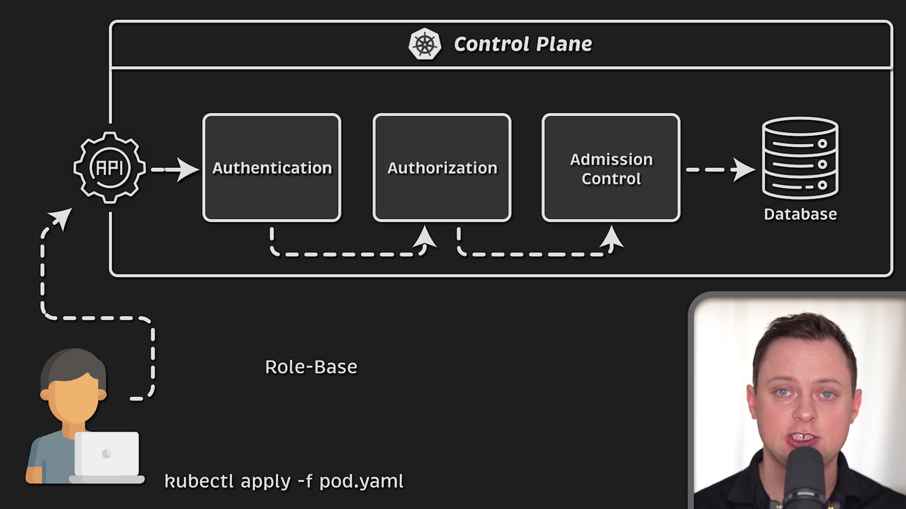

具体到错误码：认证失败会返回 **401 Unauthorized**；认证过了但没有权限，会返回 **403 Forbidden**。授权这一步通常就是靠 RBAC 实现的。[【跳转到 00:42】](https://www.youtube.com/watch?v=iE9Qb8dHqWI&t=42) [【跳转到 01:32】](https://www.youtube.com/watch?v=iE9Qb8dHqWI&t=92)

> **本视频只聚焦「授权」这一部分。** [【跳转到 01:57】](https://www.youtube.com/watch?v=iE9Qb8dHqWI&t=117)

---

## 二、从零设计一个授权系统：为什么需要「角色」

RBAC 的目标，是**根据组织内各个用户的角色来授予资源访问权限**。要理解它，最好的方式是退一步，假设你要**从头设计**一个授权系统。[【跳转到 02:02】](https://www.youtube.com/watch?v=iE9Qb8dHqWI&t=122)

### 2.1 最朴素的方案：一张三列表

最简单的做法是维护一张「用户 / 权限 / 资源」三列表：[【跳转到 02:07】](https://www.youtube.com/watch?v=iE9Qb8dHqWI&t=127)

| User | Permission | Resource |
| --- | --- | --- |
| John | read + write | app1 |
| Robert | read | app2 |
| Jennifer | read | app2 |

在这个例子里，John 对 app1 有读写权限、访问不了 app2；Robert 和 Jennifer 只对 app2 有读取权限，对 app1 没有访问权限。

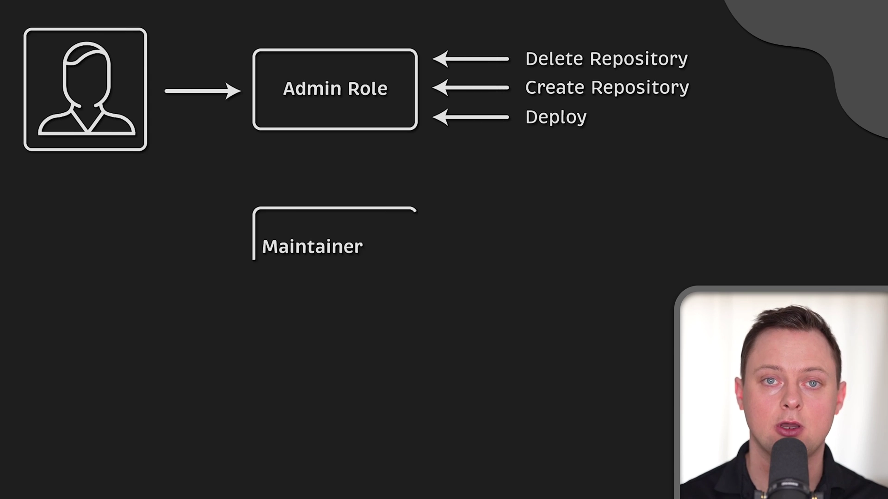

### 2.2 问题出在扩展性

这张表在用户和资源都少时很好用，但**很难扩展**。假设 Robert 和 Jennifer 在同一个团队、团队被授予了 app1 的读取权限，你就得往表里再加一条。更麻烦的是，**从表里看不出**「他们是因为同属一个团队才拥有相同权限」这层关系——权限的含义和来源丢失了。[【跳转到 02:32】](https://www.youtube.com/watch?v=iE9Qb8dHqWI&t=152)

### 2.3 解法：把「角色」插进来，拆成两张表

更好的做法是**拆解关系**，分三步：[【跳转到 03:40】](https://www.youtube.com/watch?v=iE9Qb8dHqWI&t=220)

1. 定义一个通用的权限容器——**角色（Role）**；
2. 不把权限直接给用户，而是**把权限分配给角色**；
3. 通过**绑定（Binding）**把角色和用户关联起来。

原本只有一张大表，现在变成两张：第一张是「角色 / 权限 / 资源」，第二张是「用户 / 角色」。例如让 Robert 成为 app1 的管理员，只要在第二张表里给他加上一个角色即可。[【跳转到 04:03】](https://www.youtube.com/watch?v=iE9Qb8dHqWI&t=243)

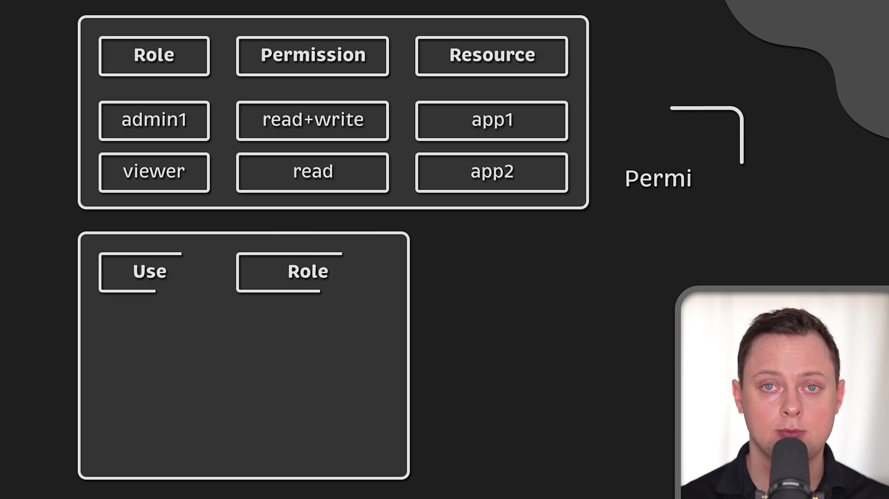

于是使用 RBAC 时，你会涉及**用户、资源、角色**三样东西。权限不再直接属于用户，而是被收纳进角色；用户通过绑定与角色关联。由于角色是通用的，当新用户需要访问同样的资源时，**直接复用已有角色、建一个新的绑定**即可。[【跳转到 04:28】](https://www.youtube.com/watch?v=iE9Qb8dHqWI&t=268)

---

## 三、Kubernetes 的三要素：身份、角色、绑定

Kubernetes 也用同一套模型来保护集群内部资源，只是名称略有不同：[【跳转到 04:50】](https://www.youtube.com/watch?v=iE9Qb8dHqWI&t=290)

- **ServiceAccount（服务账户）**＝ 访问资源的「身份」；
- **Role（角色）**＝ 承载「权限」；
- **RoleBinding（角色绑定）**＝ 把身份和角色里的权限「关联」起来。

举一个例子：要让某个应用能访问 Pod、Service 等资源，就需要一个 ServiceAccount、一个包含访问权限的 Role，以及一个把两者连起来的 RoleBinding。把这些定义提交给集群后，使用该 ServiceAccount 的应用就被允许向相应端点发请求了。[【跳转到 04:55】](https://www.youtube.com/watch?v=iE9Qb8dHqWI&t=295)

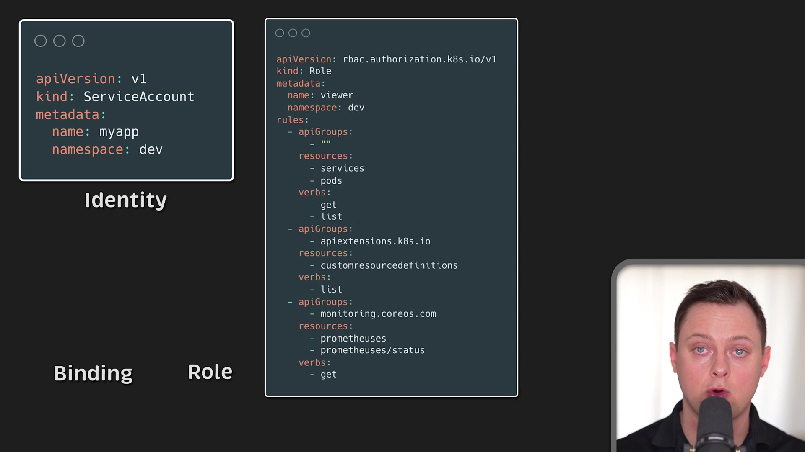

如果你从没自己创建过 RBAC 对象、只是依赖应用自带的角色，可能会一头雾水：到底授权了哪些资源？ServiceAccount 是什么？为什么角色里是一串 Kubernetes 对象？为了解决这些困惑，视频选择**暂时放下现成的 RBAC 模型，从头把它重建出来**，并聚焦三件事：[【跳转到 05:40】](https://www.youtube.com/watch?v=iE9Qb8dHqWI&t=340)

1. 识别并分配**身份**；
2. 授予**权限**；
3. 把身份与权限**关联**起来。

---

## 四、身份（一）：用户、服务账户与组

### 4.1 「用户」在 Kubernetes 里其实不是一个对象

假设团队里有人要登录 Kubernetes 控制面板，你可能会想：那就为「用户」创建一个账户实体，每个实体有唯一的名字或 ID（比如邮箱地址）就行。[【跳转到 06:15】](https://www.youtube.com/watch?v=iE9Qb8dHqWI&t=375)

但这里有个反直觉的事实：**Kubernetes 没有代表普通用户账户的对象**。所以用户**不能**通过 API 调用来添加；相反，**任何持有一张由集群证书颁发机构（CA）签名的有效证书的参与者，都被视为已通过身份认证**。[【跳转到 06:20】](https://www.youtube.com/watch?v=iE9Qb8dHqWI&t=380)

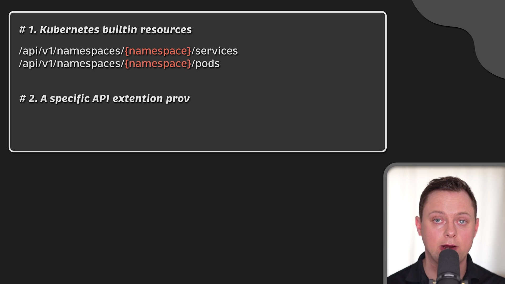

认证时，Kubernetes 会从证书「主题（Subject）」的 **Common Name（CN）** 字段里取用户名，然后创建一个临时的用户对象交给负责授权的 RBAC 模块。视频里展示了一段 Kubernetes 的 Go 代码，那个结构体映射了认证模块收集到的全部信息：[【跳转到 06:45】](https://www.youtube.com/watch?v=iE9Qb8dHqWI&t=405)

```go
type User struct {
    name string  // unique for each user
    // other fields...
}
```


### 4.2 服务账户（ServiceAccount）：给集群内部的身份

这里的「用户」指的是**人类用户**，或集群**外部**的应用。如果你要创建的是**在集群内部使用**的身份，就应该用 **ServiceAccount**。它和普通用户很像，只是由 Kubernetes 自己管理，通常会**给 Pod 分配一个 ServiceAccount 来授予权限**。[【跳转到 07:10】](https://www.youtube.com/watch?v=iE9Qb8dHqWI&t=430)

典型例子：

- 集群里部署的 **Prometheus** 需要发现自己的抓取目标；
- **Nginx Ingress Controller** 必须有权限列出某个 Service 的所有后端 Endpoint。

对于这类应用，你可以定义一个 ServiceAccount。由于 ServiceAccount 在集群内部管理，你可以像创建其他 Kubernetes 资源一样，**用 YAML 文件创建**它。

### 4.3 组（Group）

你还可以定义**用户组**或**服务账户组**。当你想引用**某个命名空间里的所有服务账户**时，用组会非常方便。[【跳转到 07:35】](https://www.youtube.com/watch?v=iE9Qb8dHqWI&t=455)

至此，你有了「识别谁有权使用资源」的机制——它可以是**一个人、一个应用，或一组人**。但接下来的问题是：他们访问的是集群里的**哪些资源**？[【跳转到 08:00】](https://www.youtube.com/watch?v=iE9Qb8dHqWI&t=480)

---

## 五、权限（一）：资源、API 端点与动词

在 Kubernetes 中我们关心的资源是 Pod、Service、Endpoint 等。这些资源通常存在 etcd 里，并通过内置 API 访问。**限制访问这些资源的最好办法，就是控制对这些 API 端点的请求。**为此你需要两样东西：[【跳转到 08:15】](https://www.youtube.com/watch?v=iE9Qb8dHqWI&t=495)

1. 资源本身的 **API 端点**；
2. 访问资源所需的**权限类型**，比如只读、读写等。

对于权限，你会用到**动词（verb）**：`get`、`list`、`create`、`patch`、`delete`…… [【跳转到 08:45】](https://www.youtube.com/watch?v=iE9Qb8dHqWI&t=525)

### 5.1 从具体端点抽象成资源列表

假设你想对 Pod、日志、Service 执行 `get`、`list`、`watch`，可以把资源和权限组合成一个列表。然后做两步简化：

- 基础 URL `/api/v1/namespaces/` 对所有人都通用——去掉；
- 假设所有资源都在当前命名空间里——把命名空间路径也删掉。

这样列表就清爽多了，一眼能看懂发生了什么。[【跳转到 09:10】](https://www.youtube.com/watch?v=iE9Qb8dHqWI&t=550)

### 5.2 内置 API 与扩展 API

除了内置对象（Pod、Endpoint、Service……），Kubernetes 还支持 **API 扩展**。比如部署 Prometheus Operator 时，它还会创建**自定义资源（CRD）**，这些对象同样存在集群里、也能用 kubectl 查询。[【跳转到 09:32】](https://www.youtube.com/watch?v=iE9Qb8dHqWI&t=572) [【跳转到 09:52】](https://www.youtube.com/watch?v=iE9Qb8dHqWI&t=592)

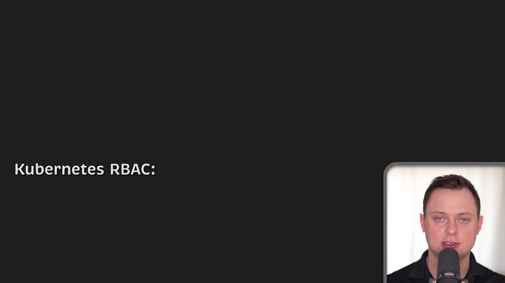

问题来了：如果省略基础 URL，Kubernetes 怎么知道这个资源是自定义的还是内置的？所以**删掉基础 URL 不是好主意**。正确的做法是引入 **API 组（apiGroups）**，在定义顶部声明它，后面用它来展开资源的 URL。读取时有两种情况：[【跳转到 10:22】](https://www.youtube.com/watch?v=iE9Qb8dHqWI&t=622) [【跳转到 10:47】](https://www.youtube.com/watch?v=iE9Qb8dHqWI&t=647)

- API 组**为空**：展开成 `/api/v1/` + 资源（用于 Pod 这类内置对象）；
- API 组**非空**：走另一套模式，用于自定义 API。

### 5.3 规则（rule）与角色（Role）

既然资源和权限都能映射了，就把它们和多个资源组合起来。在 Kubernetes 中，**资源和动词的集合称为规则（rule）**，规则可以分组到一个列表里。每条规则包含三个字段——就是你刚学到的 `apiGroups`、`resources`、`verbs`。[【跳转到 11:02】](https://www.youtube.com/watch?v=iE9Qb8dHqWI&t=662)

而在 Kubernetes 中，**规则的集合有个专门的名字，叫作角色（Role）**。

到此为止，我们已经用 User / ServiceAccount / Group 对**身份**建模，用 Role 对**权限**建模，唯一缺的就是——**怎么把两者连接起来**。[【跳转到 11:33】](https://www.youtube.com/watch?v=iE9Qb8dHqWI&t=693)

---

## 六、绑定：把身份和权限连起来

要在角色里定义的权限授予用户、ServiceAccount 或组，我们使用 **RoleBinding（角色绑定）**。看一个例子，这个定义包含两个重要字段：[【跳转到 11:44】](https://www.youtube.com/watch?v=iE9Qb8dHqWI&t=704)

```yaml
apiVersion: rbac.authorization.k8s.io/v1
kind: RoleBinding
metadata:
  name: myapp-viewer
  namespace: dev
roleRef:
  apiGroup: rbac.authorization.k8s.io
  kind: Role
  name: viewer
subjects:
  - kind: ServiceAccount
    name: myapp
    namespace: dev
```

- **roleRef**：引用要授予的 Role（这里是 `viewer`）；
- **subjects**：链接到具体身份（这里是 `myapp` 服务账户）。

一旦把 RoleBinding 提交到集群，使用该 ServiceAccount 的应用或用户就能访问角色里列出的资源。

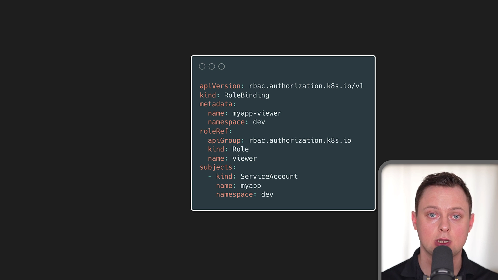

反过来，**如果删除这个绑定**，应用或用户会失去对这些资源的访问权限，而**角色本身仍然可以被其他绑定复用**。[【跳转到 12:09】](https://www.youtube.com/watch?v=iE9Qb8dHqWI&t=729)

### 6.1 subjects 与命名空间

再看 subjects 字段：它是一个列表，每项包含 `kind`、`name`、`namespace`。

- `kind` 用来区分**用户、服务账户和组**；
- `namespace` 则和命名空间隔离有关。

一般来说，把集群划分成命名空间、并把对命名空间资源的访问限制给特定账户，是很有效的做法，**尤其当多个团队共享同一个集群时**。在多数情况下，Role 和 RoleBinding 都创建在特定命名空间里，也只授予该命名空间内的访问权限。[【跳转到 12:34】](https://www.youtube.com/watch?v=iE9Qb8dHqWI&t=754)

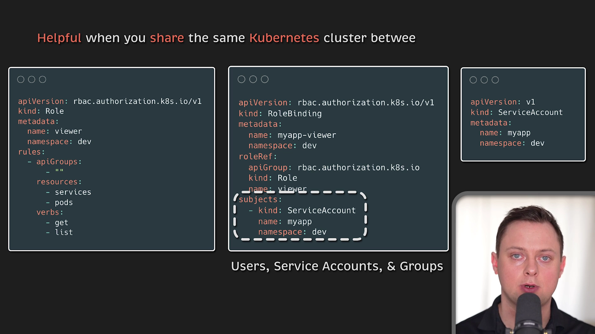

> 在某些特殊场景下，你可以把 **ClusterRole 和 RoleBinding 混用**，从而授予跨命名空间的访问权限——稍后会看到。[【跳转到 12:34】](https://www.youtube.com/watch?v=iE9Qb8dHqWI&t=754)

---

## 七、动手实践：只让 QA 团队读取 staging

先做一个小练习。假设集群里有 **staging** 和 **production** 两个命名空间，你希望**只授予 QA 团队对 staging 的读取权限**：允许他们 `get`、`list` Pod 和 Service，并从这些 Pod 取日志。[【跳转到 13:18】](https://www.youtube.com/watch?v=iE9Qb8dHqWI&t=798)

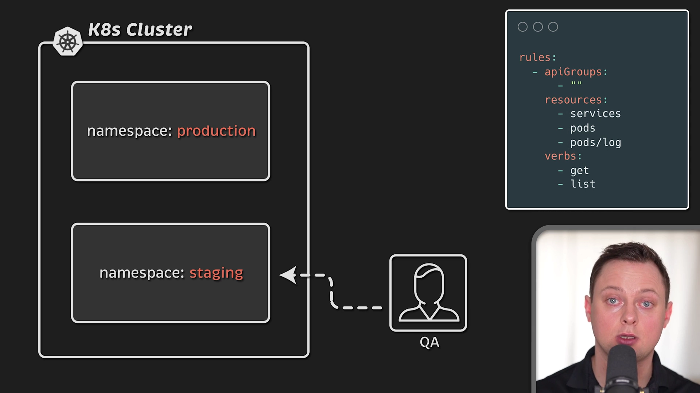

为了简化，视频用 **Minikube** 创建本地集群，并**创建一个 ServiceAccount 而不是真实用户**（逻辑完全相同）：[【跳转到 13:39】](https://www.youtube.com/watch?v=iE9Qb8dHqWI&t=819) [【跳转到 13:53】](https://www.youtube.com/watch?v=iE9Qb8dHqWI&t=833)

1. 在 **staging** 命名空间里创建一个 ServiceAccount；
2. 创建一个 **Role**，允许 QA `get` Pod、Service，并从 Pod 检索日志（`pods/log`）；
3. 用 **RoleBinding** 把 QA 的 ServiceAccount 绑定到 QA 的 Role。

集群里另有两个 Pod：一个在 staging，一个在 production。

### 7.1 用模拟（impersonation）验证权限

要「假扮」QA 团队成员，一个办法是**模拟（impersonate）这个 ServiceAccount**，然后检查它能否操作资源：[【跳转到 14:22】](https://www.youtube.com/watch?v=iE9Qb8dHqWI&t=862)

```bash
kubectl get pods -n staging --as=system:serviceaccount:staging:qa-sa
```

结果：

- 在 **staging** 里 `get pods`：**可以**；
- 在 **production** 里：**不行**，没有权限；
- 从 staging 的 Pod 取日志：**可以**。


**这个例子恰好验证了：Role / RoleBinding 的作用范围被限制在命名空间内。**

---

## 八、跨命名空间与集群范围：Role 与 ClusterRole

讲资源时我们用的 Endpoint 都带命名空间路径。那**没有命名空间的资源**，比如 **PersistentVolume 和 Node** 怎么办？[【跳转到 14:52】](https://www.youtube.com/watch?v=iE9Qb8dHqWI&t=892)

- 命名空间资源只能在命名空间内创建，其名称会出现在 HTTP 路径里；
- 如果资源是**全局**的（如 Node），命名空间名称**不会**出现在 HTTP 路径里。

那能不能把这些资源写进 Role？**可以写**——毕竟讲 Role/RoleBinding 时没提命名空间限制。但你如果真去提交并链接到 ServiceAccount，会发现**它不起作用**：[【跳转到 15:07】](https://www.youtube.com/watch?v=iE9Qb8dHqWI&t=907) [【跳转到 15:27】](https://www.youtube.com/watch?v=iE9Qb8dHqWI&t=927)

> **PersistentVolume 和 Node 是集群范围的资源，而 Role 只能授予命名空间范围内的资源访问权限。**

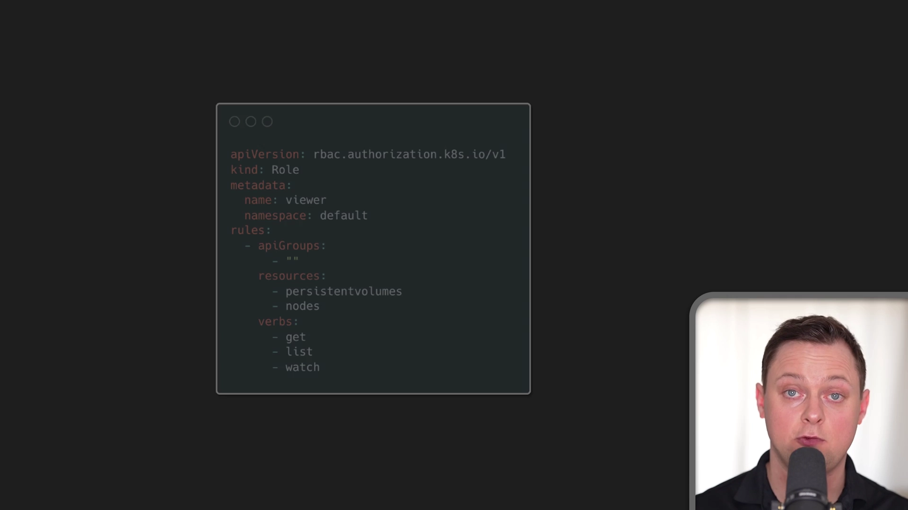

要作用于整个集群，就要用 **ClusterRole** 和对应的 **ClusterRoleBinding**。让前面的例子生效，只需把 Role 改成 ClusterRole，其他不变。你也可以用 ClusterRole 给**所有资源**授权——比如给集群里所有 Pod 授权，而不只是某个命名空间（如 staging）；这个能力并不局限于 PersistentVolume 这类集群范围资源。[【跳转到 15:52】](https://www.youtube.com/watch?v=iE9Qb8dHqWI&t=952)

### 8.1 Kubernetes 自带的一些默认角色

Kubernetes 默认就带一些 Role 和 ClusterRole。可以用 `grep` 配合 `"system"` 过滤器，拿到由控制平面直接管理的角色；所有默认的 ClusterRole 和 ClusterRoleBinding 都带有特定标签。也可以用命令查看每个 Role 和 ClusterRole 的详细信息。[【跳转到 16:14】](https://www.youtube.com/watch?v=iE9Qb8dHqWI&t=974) [【跳转到 16:33】](https://www.youtube.com/watch?v=iE9Qb8dHqWI&t=993)

```bash
# 列出由控制平面管理的角色/集群角色
kubectl get clusterroles | grep system
# 查看某个角色/集群角色的详细信息
kubectl describe clusterrole <name>
```

到这里，RBAC 的基本积木就讲完了：如何用 User / ServiceAccount / Group 创建身份；如何用 Role 给命名空间内资源分配权限；如何用 ClusterRole 给集群资源分配权限；以及如何把角色与 subject 关联。[【跳转到 16:46】](https://www.youtube.com/watch?v=iE9Qb8dHqWI&t=1006)

---

## 九、混用 RoleBinding 与 ClusterRole：三个边角场景

还剩一个主题：RBAC 的一些**不寻常的边角情况**。先看高层区别：[【跳转到 17:05】](https://www.youtube.com/watch?v=iE9Qb8dHqWI&t=1025)

- **Role / RoleBinding**：位于命名空间**之内**，只授予**特定命名空间**的访问权限；
- **ClusterRole / ClusterRoleBinding**：不属于任何命名空间，授予**整个集群**范围的访问权限。

但这两类资源**可以混用**。例如，当一个 RoleBinding 把账户链接到 ClusterRole 时会发生什么？视频用 Minikube 建了四个命名空间（dev、qa、staging、prod）来演示。[【跳转到 17:15】](https://www.youtube.com/watch?v=iE9Qb8dHqWI&t=1035)

### 场景一：RoleBinding + Role（同一命名空间内）

在 **dev** 命名空间里创建一个 ServiceAccount，再创建 Role 和 RoleBinding，授予它对 dev 的访问权限。应用后，所有资源（ServiceAccount、Role、RoleBinding）都在 dev 命名空间里，Role 授予对所有资源的访问权限，RoleBinding 把两者关联。[【跳转到 18:10】](https://www.youtube.com/watch?v=iE9Qb8dHqWI&t=1090)

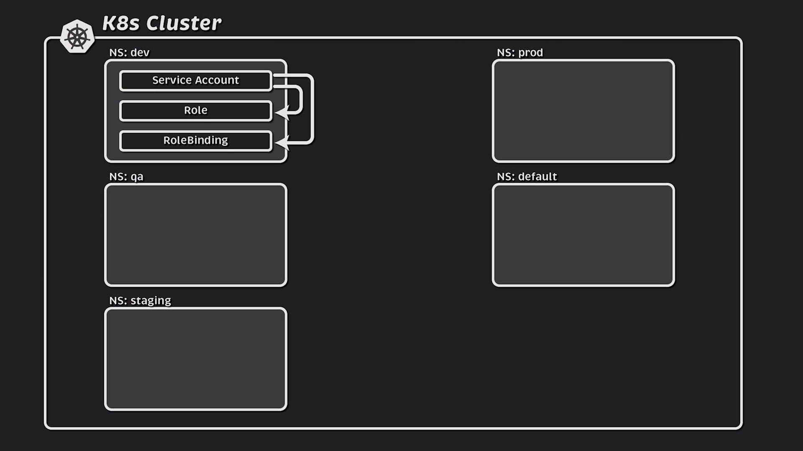

怎么测试？结合 kubectl 的两个功能——**用户模拟**和 **`auth can-i`**：[【跳转到 18:35】](https://www.youtube.com/watch?v=iE9Qb8dHqWI&t=1115)

```bash
kubectl auth can-i get pods -n dev \
  --as=system:serviceaccount:dev:myapp
```

拆解这条命令：

- `auth can-i`：查询授权模型（RBAC）所必需的；
- `get pods`：既是**动词**又是**资源**；
- `-n dev`：发命令的命名空间；
- `--as=system:serviceaccount:dev:myapp`：模拟 dev 里的 myapp 服务账户（注意 `--as=` 后面的字符串要按 `system:serviceaccount:<ns>:<name>` 的格式拼）。

通过 **Role + ServiceAccount + RoleBinding** 的组合，这个账户就能访问 dev 命名空间里的所有资源。[【跳转到 19:00】](https://www.youtube.com/watch?v=iE9Qb8dHqWI&t=1140)

### 场景二：RoleBinding + ClusterRole（只作用于绑定所在命名空间）

接着在 **staging** 命名空间里创建新的 Role 和 RoleBinding，注意这个 RoleBinding 把 **staging 的 Role** 和 **dev 的 ServiceAccount** 关联起来——也就是**跨命名空间绑定身份**。应用后，dev 里的 ServiceAccount 就能访问 staging 里的资源了。[【跳转到 19:23】](https://www.youtube.com/watch?v=iE9Qb8dHqWI&t=1163) [【跳转到 19:51】](https://www.youtube.com/watch?v=iE9Qb8dHqWI&t=1191)

> 关键点：RoleBinding 里的 `roleRef` **没有 namespace 字段**，这决定了 **RoleBinding 只能引用同一命名空间里的 Role**（所以场景二引用的 Role 必须在 staging）。

现在把 Role 换成 **ClusterRole**：在 **qa** 命名空间里创建 RoleBinding，把 dev 的 ServiceAccount 链接到 ClusterRole **`cluster-admin`**（它是 Kubernetes 内置的 ClusterRole 之一）。测试结果：该账户能访问 **qa**，但**访问不了其他命名空间**。[【跳转到 20:03】](https://www.youtube.com/watch?v=iE9Qb8dHqWI&t=1203) [【跳转到 20:56】](https://www.youtube.com/watch?v=iE9Qb8dHqWI&t=1256)

> 也就是说：**当用 RoleBinding 把身份链接到 ClusterRole 时，ClusterRole 的行为就像一个普通 Role，只授予 RoleBinding 所在命名空间的权限。**

### 场景三：ClusterRoleBinding + ClusterRole（全集群）

最后一个场景，创建 **ClusterRoleBinding**，把 ClusterRole 链接到 ServiceAccount。注意这里同样**没有 `roleRef` 字段**——因为 ClusterRoleBinding 无法识别要链接的 Role：Role 属于命名空间，而 ClusterRoleBinding 连同它引用的 ClusterRole **都不是**命名空间级的。[【跳转到 21:30】](https://www.youtube.com/watch?v=iE9Qb8dHqWI&t=1290)

```yaml
apiVersion: rbac.authorization.k8s.io/v1
kind: ClusterRoleBinding
metadata:
  name: test-admin
subjects:
  - kind: ServiceAccount
    name: myapp
    namespace: dev
roleRef:
  kind: ClusterRole
  name: cluster-admin
  apiGroup: rbac.authorization.k8s.io
```

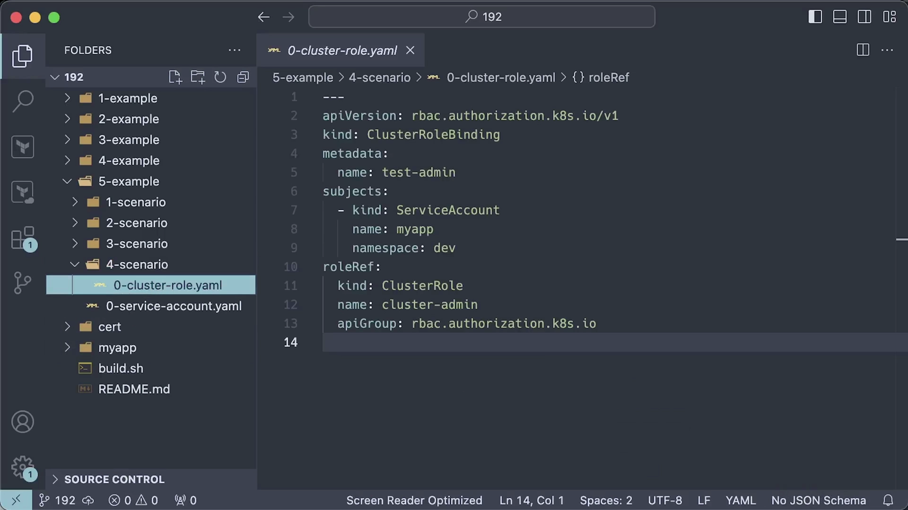

应用后：尽管 ClusterRole 和 ClusterRoleBinding 都没有定义命名空间，**dev 的服务账户现在可以访问所有内容**。[【跳转到 21:55】](https://www.youtube.com/watch?v=iE9Qb8dHqWI&t=1315)

### 9.1 从这些例子总结出的行为与限制

从三个场景可以观察到 RBAC 资源的一组规则：[【跳转到 22:00】](https://www.youtube.com/watch?v=iE9Qb8dHqWI&t=1320)

1. **Role 和 RoleBinding 必须存在于同一个命名空间**；
2. **RoleBinding 可以存在于与服务账户不同的命名空间**；
3. **RoleBinding 可以链接 ClusterRole，但只授予对 RoleBinding 所在命名空间的访问权限**；
4. **ClusterRoleBinding 把账户链接到 ClusterRole，并授予对所有资源的访问权限**；
5. **ClusterRoleBinding 不能引用 Role**。

其中最有趣的含义或许是：**当 RoleBinding 引用 ClusterRole 时，ClusterRole 可以定义一组在单个命名空间里表达的通用权限**。这样就避免了在多个命名空间里重复定义角色——一份 ClusterRole，用多个 RoleBinding 复用到不同命名空间。[【跳转到 22:30】](https://www.youtube.com/watch?v=iE9Qb8dHqWI&t=1350)

---

## 十、写得更简洁：用组合格式精简 rules

Role 或 ClusterRole 的典型 `rules` 部分，可能长这样（资源和动词逐个列出）。但上面的配置可以**用组合格式重写**，行数大幅减少，而且更简洁易读：[【跳转到 22:51】](https://www.youtube.com/watch?v=iE9Qb8dHqWI&t=1371)

```yaml
rules:
  # 逐个列出的写法
  - apiGroups: [""]
    resources: ["services"]
    verbs: ["get", "list"]
  - apiGroups: [""]
    resources: ["pods"]
    verbs: ["get", "list"]

  # 组合写法：把同权限的资源写在一起
  - apiGroups: [""]
    resources: ["services", "pods", "pods/log"]
    verbs: ["get", "list"]
```

> 视频最后提到，作者频道上还有其他关于 Kubernetes、Kafka、基准测试等的教程。

---

## 小结

- **RBAC 的核心是解耦**：把「用户」和「权限」分开，中间用「角色」承接，再用「绑定」把二者连起来——这样权限可复用、含义清晰、易于扩展。
- **请求经过三道关**：认证（你是谁，失败 401）→ 授权（能不能做，失败 403）→ 准入控制；RBAC 属于**授权**。
- **身份有三类**：普通用户（没有 API 对象，靠 CA 签名证书的 CN 表示）、ServiceAccount（集群内部使用、可用 YAML 创建）、组（方便批量引用命名空间内所有服务账户）。
- **权限用三个字段描述**：`apiGroups`、`resources`、`verbs`；一组规则叫 **rule**，规则的集合叫 **Role**。
- **绑定是关键一步**：RoleBinding 通过 `roleRef` 指向角色、`subjects` 指向身份；删除绑定即撤权，角色本身仍可复用。
- **命名空间边界**：Role/RoleBinding 只在命名空间内生效；集群范围资源（PersistentVolume、Node）必须用 **ClusterRole/ClusterRoleBinding**。
- **混用的三条结论**：RoleBinding 可跨命名空间绑定身份但不跨命名空间授权；RoleBinding + ClusterRole 只作用于绑定所在命名空间；ClusterRoleBinding + ClusterRole 作用于全集群，且**不能引用 Role**。
- **实践技巧**：用 `kubectl auth can-i ... --as=system:serviceaccount:<ns>:<name>` 验证权限；`grep system` 可查看控制平面自带角色。

## 关键术语速查

| 术语 | 一句话解释 |
| --- | --- |
| 认证（Authentication） | 确认「你是谁」；失败返回 401 |
| 授权（Authorization） | 确认「你能不能做这件事」；失败返回 403，RBAC 属于这一层 |
| 准入控制（Admission Control） | 授权之后的最后一道校验，通过才写入 etcd |
| RBAC | Role-Based Access Control，基于角色的访问控制，把用户与权限解耦 |
| User（用户） | 人类用户或集群外部应用；不是 API 对象，靠 CA 签名证书的 CN 标识 |
| ServiceAccount | 集群内部使用的身份，由 Kubernetes 管理，可用 YAML 创建，常分配给 Pod |
| Group（组） | 用户或服务账户的集合，便于批量授权（如某命名空间内所有 SA） |
| Role | 命名空间内的权限集合 |
| ClusterRole | 集群范围的权限集合，也可被 RoleBinding 复用为「通用权限模板」 |
| RoleBinding | 在命名空间内把身份和角色关联起来 |
| ClusterRoleBinding | 在全集群范围把身份和 ClusterRole 关联起来，不能引用 Role |
| rule（规则） | 一条 `apiGroups` + `resources` + `verbs` 的权限描述 |
| verb（动词） | 对资源的操作，如 get、list、create、patch、delete、watch |
| apiGroups | 资源所属的 API 组；内置对象用空字符串 `""` |
| CRD / API 扩展 | 自定义资源，通过非空 API 组访问 |
| impersonation（模拟） | 以某个身份（如 ServiceAccount）发起请求，用于验证权限 |
