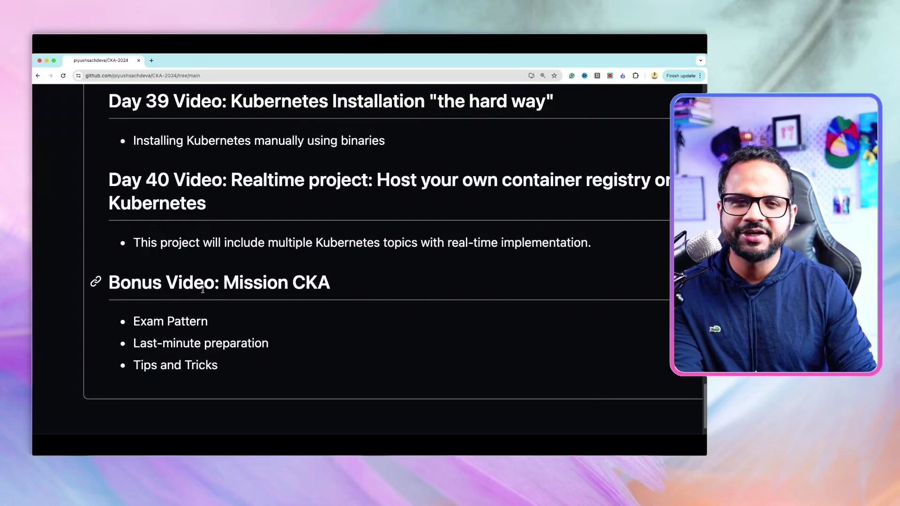
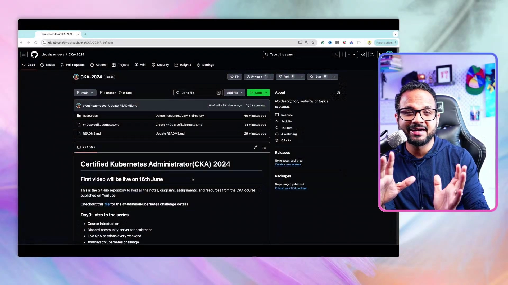
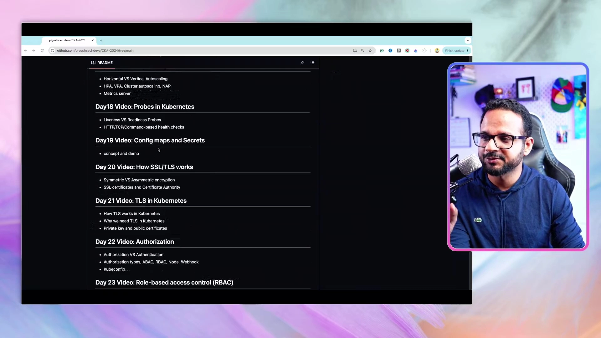
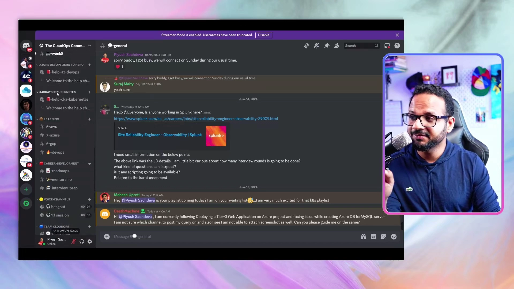
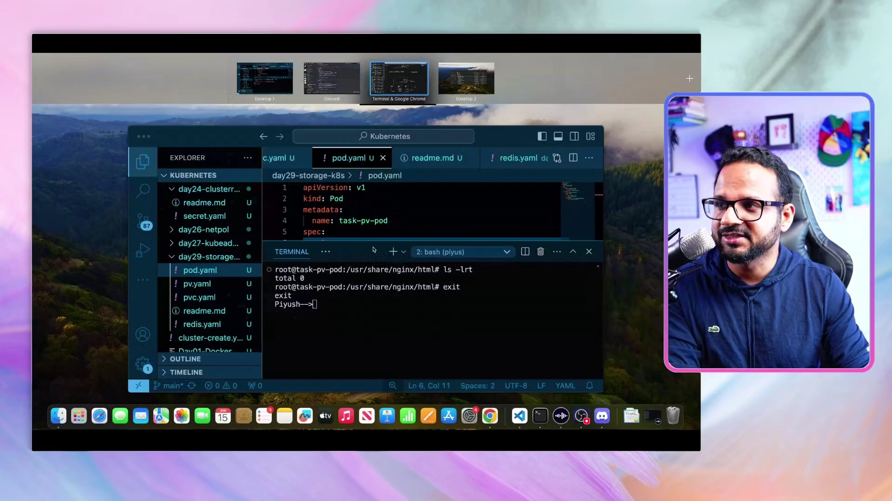

# Day 0：CKA 全课程介绍与 40 天学习路线图

> 视频来源：[FREE Kubernetes Full Course (Day 0/40) | Certified Kubernetes Administrator (CKA) Tutorial + Roadmap](https://www.youtube.com/watch?v=6_gMoe7Ik8k)（YouTube，频道 Tech Tutorials with Piyush）
>
> 这是 `#40DaysOfKubernetes` 免费课程的第 0 天（预告片），主要讲清楚整个课程怎么学、配套资源在哪里、遇到问题找谁、以及如何参与打卡挑战。本文严格基于视频字幕与画面整理。

## 本讲要解决的核心问题（SCQA）

**背景**：想系统学 Kubernetes、准备考 CKA（Certified Kubernetes Administrator，认证 Kubernetes 管理员），你需要的是一条从零到能上手的完整路线，而不是零散的博客和视频。

**冲突**：网上的 Kubernetes 资料又多又碎；初学者常常不知道该按什么顺序学、卡住时找谁求助，也很难靠自学坚持下去。

**疑问**：这门"40 天免费课程"到底包含什么？配套代码和笔记在哪？遇到问题怎么办？怎样才能边学边证明自己学到了东西？

**回答（中心思想）**：这是一门 **40 天、共 41 条视频**的 CKA 免费课程——从 Docker 基础一路讲到集群安装、网络、存储、故障排查，最后是一个**实战项目**加一条**考试冲刺**奖励视频。它配好了 **GitHub 仓库**（每个文件夹含 `resources.md` 笔记 + `task.md` 动手任务）、**Discord 社区**（互助答疑）、**每周日直播答疑**，以及 **#40DaysOfKubernetes 打卡挑战**：动手做任务、写成博客公开分享，既能学到技能，又能向招聘方展示技能。

---

## 一、课程全貌：40 天 + 1 条奖励视频

整个系列一共 **40 个视频**，另外还有一条奖励视频，合计 **41 条**。[【跳转到 01:44】](https://www.youtube.com/watch?v=6_gMoe7Ik8k&t=104) [【跳转到 02:34】](https://www.youtube.com/watch?v=6_gMoe7Ik8k&t=154)

- **第 40 个视频是一个实战项目（Realtime Project）**，把整个系列讲过的探针、Deployment、Service、Ingress 等主题串起来。作者透露，这个项目其实是**他在一次面试中被布置的任务**，能独立做出来会是非常好的练习。[【跳转到 02:09】](https://www.youtube.com/watch?v=6_gMoe7Ik8k&t=129)
- 之后还有一条 **Bonus（奖励）视频**，专门讲考试细节：**考试形式（Exam Pattern）、考前冲刺、技巧与窍门**。

**课程节奏**：整个课程持续 40 天，**每周至少发布 3~4 条视频**；如果反馈好（评论、点赞多），可能会加快发布。[【跳转到 04:14】](https://www.youtube.com/watch?v=6_gMoe7Ik8k&t=254)

从中段的大纲可以看到课程覆盖面很广，例如：HPA/VPA/集群自动扩缩容、Probes 存活与就绪探针、ConfigMap 与 Secret、SSL/TLS、Kubernetes 中的 TLS、认证与授权（Authorization）、RBAC（基于角色的访问控制）等。[【跳转到 02:59】](https://www.youtube.com/watch?v=6_gMoe7Ik8k&t=179)

---

## 二、配套资源：GitHub 仓库怎么用

作者专门建了一个 GitHub 仓库（`piyushsachdeva/CKA-2024`）集中存放本系列的**全部笔记、图表、代码片段和任务**，链接放在视频描述里。[【跳转到 01:39】](https://www.youtube.com/watch?v=6_gMoe7Ik8k&t=99)

仓库的每个 `Resources/DayNN` 文件夹里，文件虽多，但**一定有两类固定文件**：[【跳转到 02:59】](https://www.youtube.com/watch?v=6_gMoe7Ik8k&t=179) [【跳转到 03:24】](https://www.youtube.com/watch?v=6_gMoe7Ik8k&t=204)

1. **`resources.md`**：包含当天视频里的图表、代码片段和笔记；**视频上线后会立即更新**（所以还没出的那几天此时是空的）。
2. **`task.md`**：当天的一个**动手任务/练习**，帮助你巩固，并让你把学到的知识公开分享出去。

> 记住：仓库内容会**跟着视频进度更新**，第一天视频上线后 Day01 才会被填上，以此类推。

---

## 三、卡住了怎么办：Discord 社区

作者建了一个面向云运维社区的 **Discord 服务器**用于互助答疑，链接同样在视频简介里。[【跳转到 04:44】](https://www.youtube.com/watch?v=6_gMoe7Ik8k&t=284)

- 加入后先到指定频道**做个自我介绍**；
- 有 **General（综合）** 频道，任何一般性问题都能问；
- 服务器按课程/播放列表分频道，例如 Kubernetes 系列和 `#40DaysOfKubernetes` 挑战都有专门频道（如 `#help-cka-kubernetes`）；
- 提问时要点"**New Post**"发帖，并遵守发帖规则。

**发帖请尽量写全信息**，别人才容易帮你：[【跳转到 06:04】](https://www.youtube.com/watch?v=6_gMoe7Ik8k&t=364) [【跳转到 06:29】](https://www.youtube.com/watch?v=6_gMoe7Ik8k&t=389)

- 问题摘要、复现步骤、预期结果、实际结果、错误详情；
- 相关代码的 GitHub 链接；
- 发问前**标记主题助手角色（helper role）**，让一群人来帮你；**不要单独 @ 某个人**，以免打扰别人。

---

## 四、每周日直播答疑

每个周末（周日）都会做一场 **CKA 问答直播**，你可以就本周或上周视频里的任何问题提问。作者还在考虑是放在 **YouTube 直播**还是 **Discord 的 Hangout 语音频道**，欢迎大家留言选择。[【跳转到 07:19】](https://www.youtube.com/watch?v=6_gMoe7Ik8k&t=439)

---

## 五、#40DaysOfKubernetes 打卡挑战

这是课程的另一个重点：**通过动手和公开分享来学 Kubernetes**。[【跳转到 07:53】](https://www.youtube.com/watch?v=6_gMoe7Ik8k&t=473)

### 5.1 参与方式

- 挑战从 **6 月 17 日（周一）** 开始，也就是第一条视频（Day 1）发布那天；[【跳转到 07:58】](https://www.youtube.com/watch?v=6_gMoe7Ik8k&t=478)
- 每个文件夹里都有 `task.md` 任务（从 Day 1 一直到 Day 20 等），你要**完成这些任务**；
- 然后**公开分享学习成果**：把内容写成一篇**博客**，并在 **LinkedIn 或 Twitter** 帖子中附上博客链接；[【跳转到 08:23】](https://www.youtube.com/watch?v=6_gMoe7Ik8k&t=503)
- 具体要求：用**尽可能简单、任何新手都能看懂的语言**；把对应视频**嵌入博客**里；提交时**标记作者和 CloudOps 社区**，并使用 **`#40DaysOfKubernetes`** 标签。[【跳转到 09:13】](https://www.youtube.com/watch?v=6_gMoe7Ik8k&t=553)

### 5.2 奖品与目的

- 挑战结束后会评出**多名获胜者**（可能是 5 名，也可能是 10 名，取决于参与反馈）；
- **没有任何赞助商，奖品由作者个人出资**；这是一项**全球性**比赛，无论你身在何处，只要获奖就会寄送奖品；若所在地无法配送，会改寄等值的**礼品卡**。[【跳转到 09:38】](https://www.youtube.com/watch?v=6_gMoe7Ik8k&t=578) [【跳转到 10:03】](https://www.youtube.com/watch?v=6_gMoe7Ik8k&t=603)
- 但作者强调：**挑战的目的不是赢奖品**，而是[【跳转到 10:28】](https://www.youtube.com/watch?v=6_gMoe7Ik8k&t=628)
  1. **通过实践掌握技能**——自己动手做，跟上系列进度；
  2. **展示技能**——把经验公开分享，向招聘经理、HR 证明你会什么。

> 换句话说：**YouTube 播放列表教你会做，打卡挑战让你把"会做"展示出来。**

---

## 小结

- 这是一门 **40 天、41 条视频**的 CKA 免费课程，覆盖从 Docker 到 Kubernetes 集群管理、网络、存储、排障，最后是实战项目与考试冲刺。
- **GitHub 仓库**是资源中心：每一天的文件夹都有 `resources.md`（笔记/图表/代码）和 `task.md`（动手任务），并随视频上线更新。
- **Discord 社区**负责答疑：先自我介绍，按课程频道发帖，提问要给全信息并标记 helper 角色。
- **每周日**有 CKA 直播问答，可在 YouTube 或 Discord 参与。
- **#40DaysOfKubernetes 挑战**：做任务、写博客、嵌入视频、带标签公开分享；奖品由作者个人赞助，但真正的价值是"学到技能 + 展示技能"。
- 第一条正式视频（Day 1：Docker 基础）将于 **6 月 17 日**上线。

## 关键术语速查

| 术语 | 一句话解释 |
| --- | --- |
| CKA | Certified Kubernetes Administrator，Linux 基金会认证的 Kubernetes 管理员考试 |
| Kubernetes | 容器编排平台，负责部署、扩缩容和管理容器化应用 |
| Docker | 容器运行时与镜像工具，本课程从它讲起 |
| `resources.md` | 仓库中每天的笔记文件，含图表、代码片段与要点 |
| `task.md` | 仓库中每天的动手任务文件，配合打卡挑战 |
| #40DaysOfKubernetes | 课程的动手打卡挑战标签，完成任务后公开写博客并带此标签分享 |
| Live QnA | 每周日的直播问答环节 |
| RBAC | Role-Based Access Control，基于角色的访问控制（课程 Day 23 起重点讲解） |
