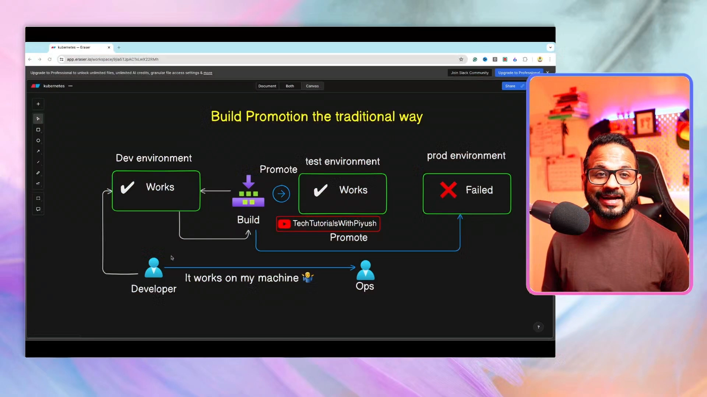
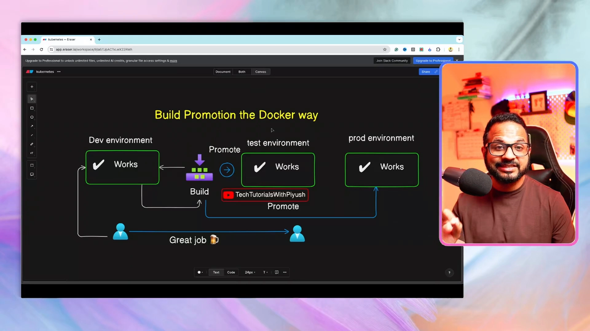
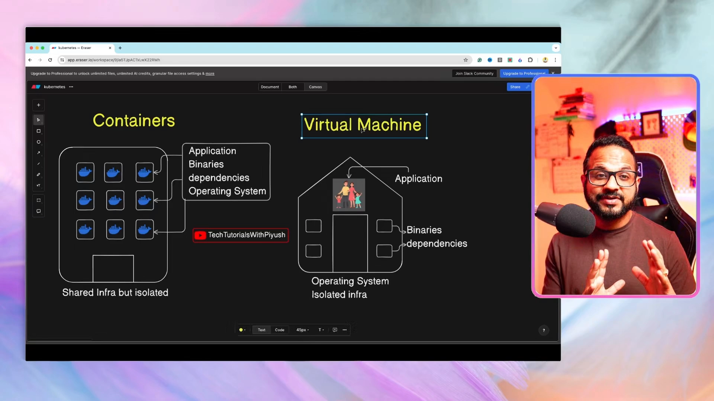
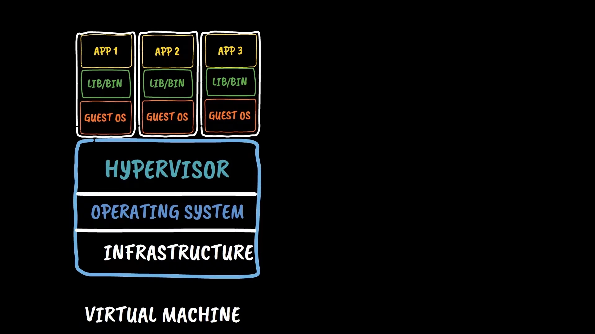
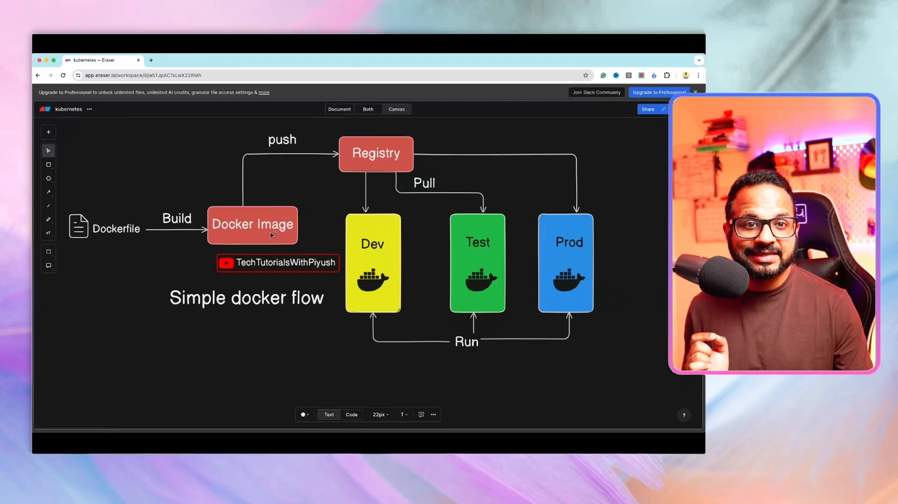
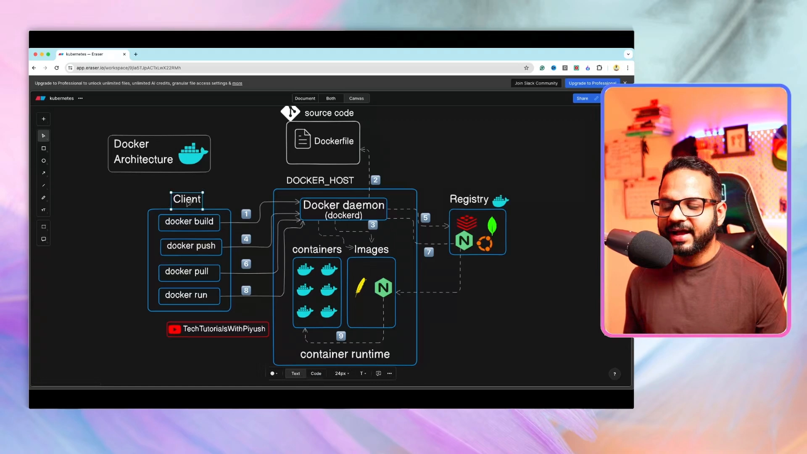

# Day 1：Docker 基础——容器是什么、为什么需要、Docker 怎么跑

> 视频来源：[Day 1/40 - Docker Tutorial For Beginners - Docker Fundamentals - CKA Full Course 2025](https://www.youtube.com/watch?v=ul96dslvVwY)（YouTube，频道 Tech Tutorials with Piyush）
>
> 这是 `#40DaysOfKubernetes` / CKA 全课程的第一条正课。本文基于视频字幕与幻灯片整理；文稿左栏为英文自动字幕，本文已翻译并重写为中文。

## 本讲要解决的核心问题（SCQA）

**背景**：这门课要从 Docker 讲起，再到 Kubernetes。Docker 是当今最主流的容器平台，几乎所有公司都在用。

**冲突**：很多初学者一上来就学 Kubernetes，却对"容器到底是什么、为什么会有容器、Docker 到底在做什么"没有概念；而传统的应用部署方式（把代码从一个环境"晋升"到另一个环境）经常在生产环境翻车。

**疑问**：为什么需要容器？容器和虚拟机到底有什么区别？Docker 的工作流程和架构是怎样的？

**回答（中心思想）**：容器是为了解决"**在我的机器上能跑，到生产就挂**"这个经典难题——它把**应用代码、依赖库、运行时甚至操作系统镜像一起打包**，做成一个可移植的镜像，保证在任何环境里表现一致。Docker 则是帮助我们 **build（构建）、ship（分发）、run（运行）** 容器的平台；它比虚拟机更轻量，因为它们共享宿主机内核，而不是每个应用都背一个完整的操作系统。

---

## 一、先搞清楚为什么需要容器：传统部署的痛

我们先看**传统（没有容器之前）**的构建晋升（build promotion）流程。假设你有三个环境：Dev、Test、Prod，以及一个开发团队。[【跳转到 02:02】](https://www.youtube.com/watch?v=ul96dslvVwY&t=122)

1. 开发者提交代码、合并到版本控制系统，构建（build）出来，部署到 **Dev 环境**——**运行正常**；
2. 晋升（promote）到 **Test 环境**——**也正常**，因为 Dev 和 Test 通常配置一致；
3. 再晋升到 **Prod 环境**——**失败了**。

失败最常见的原因是**环境配置不一致、缺少依赖、或缺了某些库**——Dev/Test 里有、Prod 里没有。而生产环境不能随便改，要走变更申请、层层审批，于是各环境之间的配置越来越不一致。[【跳转到 03:42】](https://www.youtube.com/watch?v=ul96dslvVwY&t=222)

于是出现了那句经典台词：**"It works on my machine!"**——开发者说"是环境/基础设施的问题，不是代码的问题"，开发和运维来回扯皮。**根本原因**是：没有一个简单的方法，能把依赖、库、配置**和应用程序代码一起打包**，再原封不动地送到包括生产在内的所有环境。[【跳转到 04:32】](https://www.youtube.com/watch?v=ul96dslvVwY&t=272)

---

## 二、容器的思路：把依赖、运行时和 OS 一起打包

换成 **Docker（容器）的方式**：同样从 Dev → Test → Prod，但这次我们**把依赖、库、应用代码，连同运行所需的一切（包括操作系统镜像）一起打包**再晋升。[【跳转到 04:57】](https://www.youtube.com/watch?v=ul96dslvVwY&t=297)

结果：**三个环境都正常**。当然仍可能因为网络或基础设施本身故障而出问题，但**不会再因为环境/配置不一致而失败**。开发者开心，运维开心，皆大欢喜。[【跳转到 05:47】](https://www.youtube.com/watch?v=ul96dslvVwY&t=347)

那么**容器到底是什么**？它提供一个**隔离的环境**，里面装着应用运行所需的全部东西：库、应用代码、运行时、操作系统依赖等。它**不关心宿主机是什么操作系统**——无论底层是 Ubuntu 还是 Red Hat，你的应用都能以相同方式运行，因为**访客操作系统（guest OS）被打包进了容器内部**。[【跳转到 06:12】](https://www.youtube.com/watch?v=ul96dslvVwY&t=372)

容器也常被称为**轻量级沙箱（lightweight sandbox）**，为什么"轻量"？因为它**有操作系统镜像，但没有整个操作系统**：不会带完整的 Red Hat、也不会带一堆用不到的库和二进制，**只留应用运行所必需的最小集合**，所以镜像体积远小于一个完整操作系统。[【跳转到 07:02】](https://www.youtube.com/watch?v=ul96dslvVwY&t=422)

一句话：**容器的主线目标就是 build、ship、run 你的应用代码**。

> **注意区分容器与 Docker**：Docker 只是一个帮你完成 build / ship / run 的**平台**；容器的另一类替代品是 **Podman**，不过目前大多数公司用的还是 Docker。[【跳转到 07:52】](https://www.youtube.com/watch?v=ul96dslvVwY&t=472)

---

## 三、容器 vs 虚拟机：用"房子 vs 公寓楼"来理解

用一个类比：把**虚拟机**看成"**独栋房子**"，把**容器**看成"**公寓楼**"。[【跳转到 08:17】](https://www.youtube.com/watch?v=ul96dslvVwY&t=497)

- **虚拟机（独栋房子）**：里面的二进制、依赖可以看作窗户，应用是住进去的家庭。房和基础设施都**只服务一个家庭/一个应用**，所以一台虚拟机通常只跑一个应用——**大量资源被浪费**（比如六间房只住三个人，三间空着）。[【跳转到 10:22】](https://www.youtube.com/watch?v=ul96dslvVwY&t=622)
- **容器（公寓楼）**：**整栋楼（基础设施、土地）被很多住户共享**，但每个住户（容器）**彼此隔离**——没有授权就进不了别人家。每个容器有自己的应用、二进制、依赖和操作系统，但它们**共享底层基础设施**。资源浪费最小。[【跳转到 09:32】](https://www.youtube.com/watch?v=ul96dslvVwY&t=572)

容器还解决了**资源利用率**问题：它让所有容器只占用自己**实际需要**的 CPU、内存、存储，并且能**按需扩缩容**。[【跳转到 11:37】](https://www.youtube.com/watch?v=ul96dslvVwY&t=697)

---

## 四、虚拟机的实现：Hypervisor 与虚拟化

从下往上看一台虚拟机的构成：[【跳转到 12:22】](https://www.youtube.com/watch?v=ul96dslvVwY&t=742)

1. **物理服务器**（在数据中心，或你的个人电脑）；
2. 之上的**操作系统**（Windows / Linux），负责与物理机交互；
3. 之上的 **Hypervisor（虚拟机管理程序）**，让**虚拟化**成为可能。

**虚拟化**是指**在一台计算机上并发运行多个操作系统实例**——你可以在 Windows 上同时跑 Ubuntu、Fedora、CentOS。在公有云里，物理服务器是**被多个组织/用户共享的硬件**，你在云控制台申请虚拟机时，云会在 Hypervisor 之上为你创建一台**访客虚拟机（guest VM）**，其他用户也在同一台物理硬件上各跑各自的 guest VM。[【跳转到 13:27】](https://www.youtube.com/watch?v=ul96dslvVwY&t=807)

虚拟机是"**物理机的软件仿真**"，允许一台物理机跑多个操作系统，并且相互隔离、也与宿主机隔离，带来安全性与稳定性。[【跳转到 13:47】](https://www.youtube.com/watch?v=ul96dslvVwY&t=827)

---

## 五、容器的实现：共享宿主机内核的"容器引擎"

容器底层也是一样的**物理服务器 + 宿主操作系统**，但**没有 Hypervisor**，取而代之的是**容器引擎（container engine）**。[【跳转到 14:02】](https://www.youtube.com/watch?v=ul96dslvVwY&t=842)

- Hypervisor 让我们在**单个操作系统上运行多个虚拟机**；
- **容器引擎**则让我们在**单个操作系统内核（kernel）上运行多个容器实例**。

也就是说：**容器共享宿主机的操作系统内核**，因此比虚拟机**更高效、更可移植**，同时同样保持隔离。这就是容器"轻量"的根本原因。[【跳转到 14:47】](https://www.youtube.com/watch?v=ul96dslvVwY&t=887)

---

## 六、Docker 的工作流：build → push → pull → run

接下来是一条完整的 Docker 流程。[【跳转到 15:01】](https://www.youtube.com/watch?v=ul96dslvVwY&t=901)

1. **Dockerfile（构建文件）**：一组**指令**，通常是"用某操作系统作为基础镜像 → 安装依赖 → 把本地文件复制进容器 → 运行某条命令构建镜像……"。在企业里，**Dockerfile 一般由开发者和应用代码一起编写**；在小公司/自托管项目里，往往由 DevOps 工程师编写。无论什么角色，都应该会写 Dockerfile。[【跳转到 15:26】](https://www.youtube.com/watch?v=ul96dslvVwY&t=926)
2. **`docker build` → 生成 Docker 镜像（image）**：镜像里打包了依赖、库、应用代码、操作系统等一切。**镜像是"可分发"的**——你可以把一个镜像从一个环境分发到多个环境；但**不能直接分发容器**，只能通过镜像分发。[【跳转到 16:41】](https://www.youtube.com/watch?v=ul96dslvVwY&t=1001)
3. **注册表（Registry）**：你不能直接把镜像推到各个环境，需要**中间存储**——镜像仓库。就像源代码要放进 GitHub / Bitbucket / GitLab 这样的版本控制系统一样，**Docker 镜像要放进镜像注册表**（因为镜像是二进制，不是普通文本文件）。最典型的注册表是 **Docker Hub**。[【跳转到 17:56】](https://www.youtube.com/watch?v=ul96dslvVwY&t=1076)
4. **`docker pull`**：把镜像从注册表拉到 Dev / Test / Prod 等环境。
5. **`docker run`**：把镜像变成**正在运行的实例（容器）**，应用就在各环境里跑起来了。[【跳转到 19:36】](https://www.youtube.com/watch?v=ul96dslvVwY&t=1176)

---

## 七、Docker 架构：客户端、守护进程、注册表与容器运行时

Docker 架构其实就是上面那条流程的组件化呈现。[【跳转到 20:01】](https://www.youtube.com/watch?v=ul96dslvVwY&t=1201)

- **Client（客户端）**：你安装 Docker 客户端的地方，用来执行 `docker build / push / pull / run` 等命令；[【跳转到 20:26】](https://www.youtube.com/watch?v=ul96dslvVwY&t=1226)
- **Docker daemon（守护进程 `dockerd`）**：接收客户端命令并干活。`docker build` 交给它，它根据 Dockerfile **构建出镜像**，镜像先**存到本地**（Docker host 上的本地存储）；[【跳转到 21:41】](https://www.youtube.com/watch?v=ul96dslvVwY&t=1301)
- **Registry（注册表）**：`docker push` 让守护进程把镜像**推送到镜像注册表**——可以是 Docker Hub、云厂商的 Artifact Registry、JFrog Artifactory、Nexus 等；[【跳转到 22:31】](https://www.youtube.com/watch?v=ul96dslvVwY&t=1351)
- **Pull / Run**：目标环境的 Docker 客户端执行 `docker pull` 把镜像拉下来，再 `docker run`，由 **container runtime（容器运行时）** 把容器**启动起来**。[【跳转到 23:21】](https://www.youtube.com/watch?v=ul96dslvVwY&t=1401)

> 这条流程里还有很多细节，视频说会在后续课程里逐步展开，这里先建立整体印象即可。

---

## 小结

- **容器解决的核心问题**：把应用代码 + 依赖 + 库 + 运行时 + 操作系统镜像**一起打包**，消除"在我机器上能跑、到生产就挂"的环境不一致问题。
- **容器是隔离的轻量沙箱**：有操作系统镜像但不含完整 OS，只保留最小必需，因此体积小。
- **Docker ≠ 容器**：Docker 是 build / ship / run 容器的平台（Podman 是替代品）。
- **容器 vs 虚拟机**：虚拟机像独栋房子（独享基础设施、资源浪费）；容器像公寓楼（共享基础设施、彼此隔离、利用率高）。
- **实现差异**：虚拟机靠 **Hypervisor** 跑多个 guest OS；容器靠 **容器引擎** 在同一内核上跑多个容器，因此更轻、更可移植。
- **Docker 流程**：Dockerfile →（build）→ 镜像 →（push）→ 注册表 →（pull）→ 环境 →（run）→ 容器。
- **Docker 架构**：客户端 → 守护进程（dockerd）→ 本地镜像/容器 → 注册表 → 容器运行时。
- 下一讲（Day 2）会把一个应用真正 **dockerize**，动手实践整个流程。

## 关键术语速查

| 术语 | 一句话解释 |
| --- | --- |
| 容器（Container） | 把应用及依赖打包在一起的隔离、轻量运行环境 |
| 镜像（Image） | 不可运行的"模板/包"，含依赖、库、应用代码、OS；可分发 |
| 容器 vs 镜像 | 镜像是模板，容器是镜像运行起来的实例 |
| Dockerfile | 描述如何构建镜像的一组指令文件 |
| `docker build` | 根据 Dockerfile 构建镜像 |
| `docker push/pull` | 把镜像推送到 / 从注册表拉取 |
| `docker run` | 把镜像运行为容器实例 |
| Registry（注册表） | 存放/分发镜像的仓库，如 Docker Hub、Artifactory、Nexus |
| Docker daemon（dockerd） | Docker 的后台守护进程，执行构建/拉取/运行等任务 |
| container runtime（容器运行时） | 真正负责启动容器的组件 |
| Hypervisor | 让一台物理机运行多个虚拟机（guest OS）的软件层 |
| 虚拟机（VM） | 物理机的软件仿真，独享基础设施，资源开销大 |
| 虚拟化 | 在一台计算机上并发运行多个操作系统实例 |
| 宿主机内核 | 所有容器共享的操作系统内核，是容器轻量的原因 |
| Podman | Docker 的替代容器平台 |
