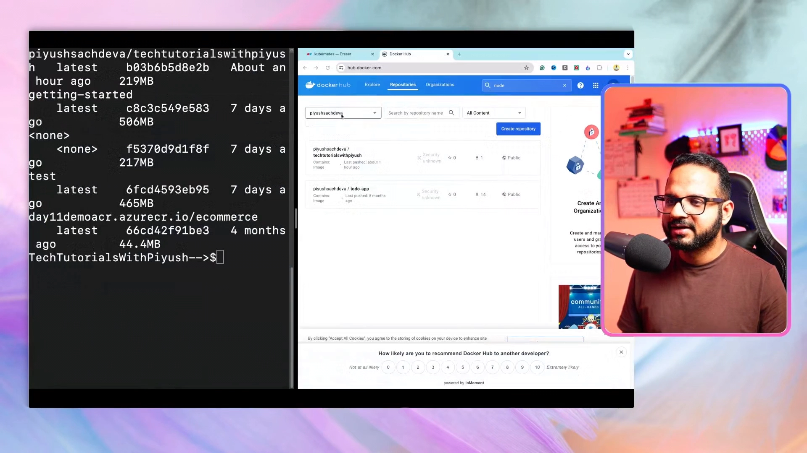
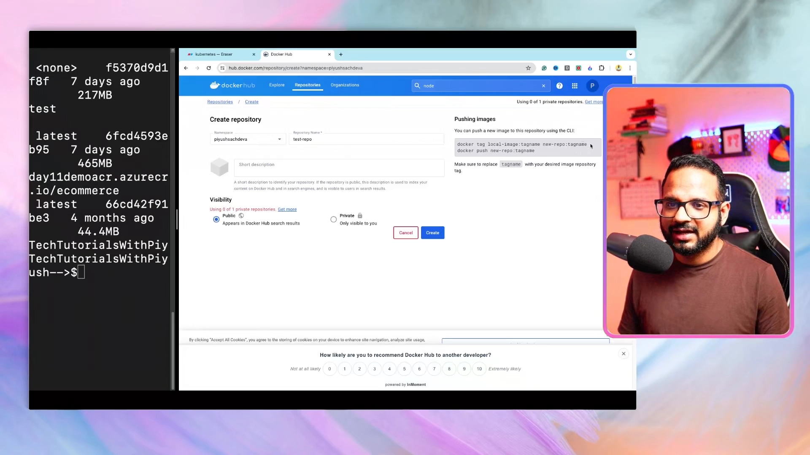
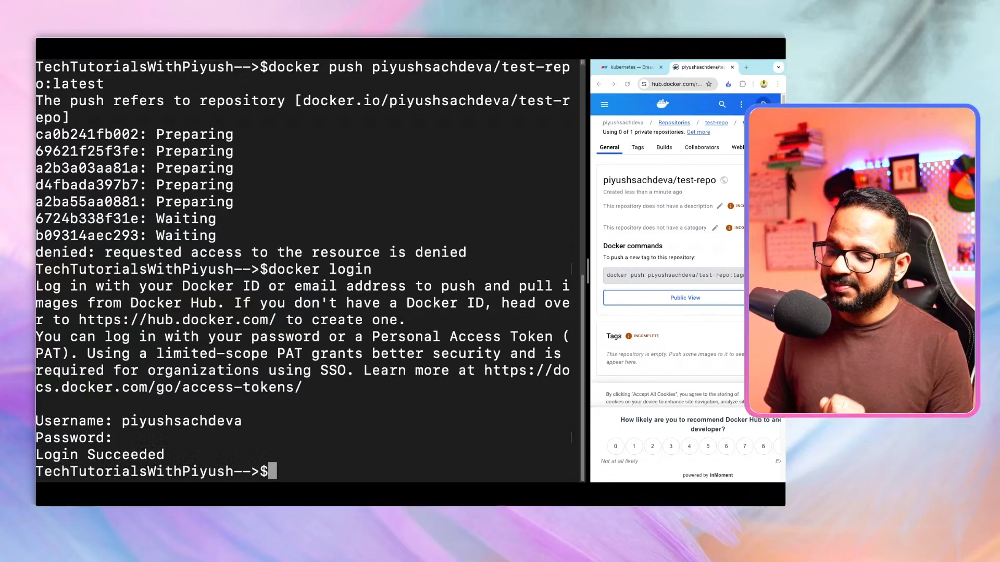
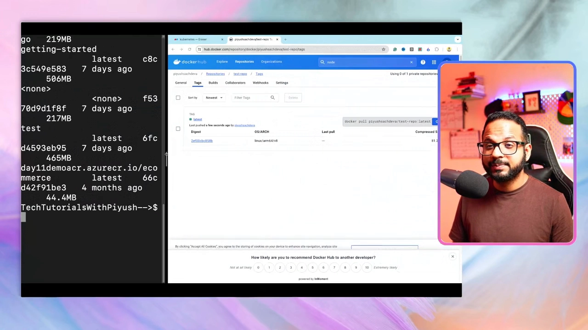
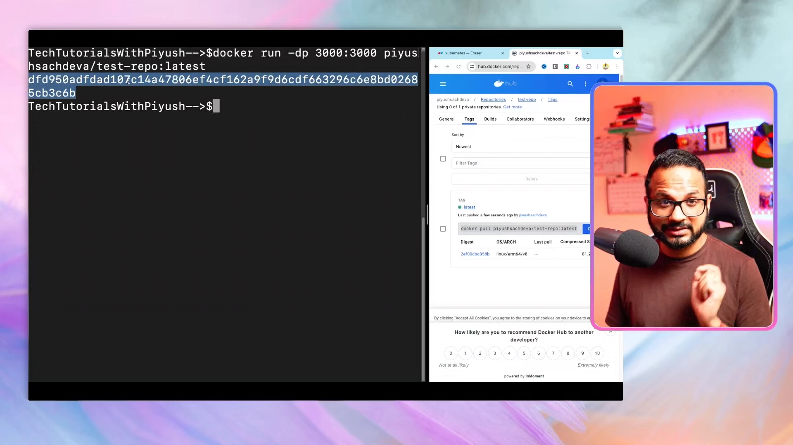
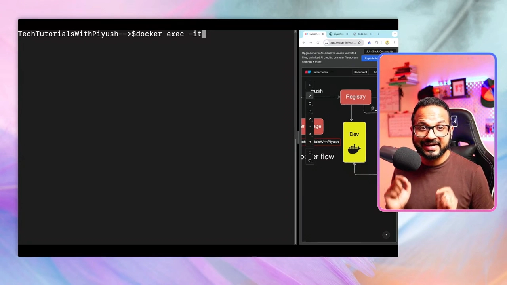

# Day 2：动手把一个应用 Docker 化——Dockerfile → build → push → run

> 视频来源：[Day 2/40 - How To Dockerize a Project - CKA Full Course 2025](https://www.youtube.com/watch?v=nfRsPiRGx74)（YouTube，频道 Tech Tutorials with Piyush）
>
> 这一讲是**动手实践**：从零写 Dockerfile，把一个 Node.js 待办清单应用打包成镜像，推送到 Docker Hub，再拉到环境里运行，并进入容器排障。文稿左栏为英文自动字幕，本文已翻译并重写为中文。

## 本讲要解决的核心问题（SCQA）

**背景**：上一讲讲了容器与 Docker 的基本原理，但光看概念不够——真正要用起来，必须会写 Dockerfile、会构建镜像、会推送和运行。

**冲突**：从"看懂"到"做出来"之间有一道坎：你不知道 Dockerfile 该怎么写、`docker build/tag/push/pull/run` 各自做什么、镜像为什么这么大、怎么进容器里排查问题。

**疑问**：把一个真实应用 Docker 化的完整流程到底长什么样？

**回答（中心思想）**：一条完整的动手链路——**写 Dockerfile → `docker build` 构建镜像 → `docker tag` + `docker login` + `docker push` 推到注册表 → `docker pull` + `docker run` 在环境里运行 → `docker exec` 进容器排障**。本讲还会发现一个遗留问题：镜像太大（~200MB），从而引出下一讲的**多阶段构建**。

---

## 一、准备工作：装 Docker，或用 Play with Docker 沙箱

这是实操课，强烈建议在自己电脑上装 **Docker Desktop**（Windows / Mac / Linux 都支持）。如果因为资源限制装不了，可以用 Docker 官方提供的**临时沙箱**：[【跳转到 01:12】](https://www.youtube.com/watch?v=nfRsPiRGx74&t=72)

1. 打开 **Play with Docker**（`labs.play-with-docker.com`），用 Docker Hub 账号登录；
2. 点击 **Start** / **Add a new instance**，它会给你开一台**轻量级虚拟机**；
3. 注意沙箱有 **4 小时**自动计时，到点会话会被终止，所以要在时限内做完。[【跳转到 03:09】](https://www.youtube.com/watch?v=nfRsPiRGx74&t=189)

沙箱里会显示一个内部 IP（如 `192.168.0.8`），你也可以开放端口来访问应用。[【跳转到 03:23】](https://www.youtube.com/watch?v=nfRsPiRGx74&t=203)

装好 Docker Desktop 后，它的 GUI 里能看到三类东西：[【跳转到 04:30】](https://www.youtube.com/watch?v=nfRsPiRGx74&t=270) [【跳转到 04:55】](https://www.youtube.com/watch?v=nfRsPiRGx74&t=295)

- **Containers**：正在运行的容器；
- **Images（Local）**：**本地**镜像仓库（不是 Docker Hub）；
- **Remote repository**：托管在 **Docker Hub** 上的远程仓库（Docker Desktop 最近也集成了 JFrog Artifactory——一个能存镜像、tar/zip、npm 包等的仓库）。



---

## 二、先准备一个要被 Docker 化的应用

在写 Dockerfile 之前，得有应用代码。视频从官方示例里拉了一个**待办清单（to-do）应用**：[【跳转到 06:35】](https://www.youtube.com/watch?v=nfRsPiRGx74&t=395)

```bash
mkdir day02-code && cd day02-code
git clone <getting-started-app 仓库地址>
cd getting-started-app
ls -ltr          # 按修改时间列出：README、package.json、spec、src、yarn.lock 等
```

这个应用的关键结构：`package.json`（依赖）、`src/`（源码）、`yarn.lock`（依赖锁文件），需要用 **yarn** 安装依赖、用 **node** 运行。

---

## 三、编写 Dockerfile：一行一行讲清楚

先创建空文件并进入 vi 编辑：[【跳转到 07:50】](https://www.youtube.com/watch?v=nfRsPiRGx74&t=470)

```bash
touch Dockerfile     # 默认命名规范：D 大写，其余小写
vi Dockerfile        # 打开后处于命令模式，按 i 进入插入模式（左下角出现 -- INSERT --）
```

然后逐条写下 Dockerfile 指令：[【跳转到 08:58】](https://www.youtube.com/watch?v=nfRsPiRGx74&t=538)

```dockerfile
# 1) 基础镜像：需要一个装好 node 的轻量 Linux
FROM node:18-alpine

# 2) 容器内的工作目录
WORKDIR /app

# 3) 把本地当前目录的文件复制进容器
COPY . .

# 4) 安装生产依赖
RUN yarn install --production

# 5) 容器启动时执行：运行入口文件
CMD ["node", "src/index.js"]

# 6) 对外暴露端口
EXPOSE 3000
```

逐条解释：

- **`FROM node:18-alpine`——基础镜像**：容器里要装应用代码、依赖、库甚至操作系统，所以先要一个基础镜像。为什么要 node 镜像而不是 Ubuntu/CentOS？因为我们要的是"**已经装好 node 的 Linux**"，用普通发行版还得自己再装 node；而 Docker Hub 上官方提供的 **node 镜像**（带"official"标记、稳定安全）里，`node:18-alpine` 基于 **Alpine**——一个**极轻量的 Linux**，依赖和库都最少、占空间小。[【跳转到 09:44】](https://www.youtube.com/watch?v=nfRsPiRGx74&t=584) [【跳转到 10:22】](https://www.youtube.com/watch?v=nfRsPiRGx74&t=622) [【跳转到 11:27】](https://www.youtube.com/watch?v=nfRsPiRGx74&t=687)
- **`WORKDIR /app`——工作目录**：容器内所有操作所在的目录。这里在根目录下建一个 `/app` 文件夹，进入容器后会默认待在这里。[【跳转到 11:52】](https://www.youtube.com/watch?v=nfRsPiRGx74&t=712)
- **`COPY . .`——复制文件**：把**本地当前目录**（第一个 `.`）的所有文件复制到**容器的工作目录**（第二个 `.`，即 `/app`）。这样应用源码就成了容器里的源文件。[【跳转到 12:17】](https://www.youtube.com/watch?v=nfRsPiRGx74&t=737)
- **`RUN yarn install --production`——安装依赖**：用 yarn 包管理器安装生产依赖。[【跳转到 13:32】](https://www.youtube.com/watch?v=nfRsPiRGx74&t=812)
- **`CMD ["node", "src/index.js"]`——启动命令**：当你执行 `docker run`、容器准备启动时，执行这条命令运行 `src/index.js`。[【跳转到 15:07】](https://www.youtube.com/watch?v=nfRsPiRGx74&t=907)
- **`EXPOSE 3000`——暴露端口**：不暴露端口，应用就无法在公网/指定端口被访问。这里用 3000。[【跳转到 15:49】](https://www.youtube.com/watch?v=nfRsPiRGx74&t=949)

> 关于**谁写 Dockerfile**：在企业里，生产应用的 Dockerfile 通常由**开发者**编写；作为 DevOps / 运维 / 云工程师，你不必亲手写每个业务应用的 Dockerfile，但**必须懂它的端到端语法和最佳实践**。[【跳转到 14:16】](https://www.youtube.com/watch?v=nfRsPiRGx74&t=856)

写完后保存退出：按 `Esc` 回到命令模式，输入 `:wq!` 回车（`q!` 则是不保存直接退出）。[【跳转到 16:39】](https://www.youtube.com/watch?v=nfRsPiRGx74&t=999)

---

## 四、构建镜像：`docker build`

不确定命令怎么用？先查帮助：`docker --help` 列出所有命令，`docker build --help` 看 `build` 的参数。[【跳转到 17:34】](https://www.youtube.com/watch?v=nfRsPiRGx74&t=1054) [【跳转到 18:24】](https://www.youtube.com/watch?v=nfRsPiRGx74&t=1104)

构建命令：

```bash
docker build -t day02-todo .
```

- `-t` 给镜像起名（这里叫 `day02-todo`）；
- 末尾的 `.` 表示使用**当前目录**里的文件和 Dockerfile。[【跳转到 18:49】](https://www.youtube.com/watch?v=nfRsPiRGx74&t=1129)

**镜像分层（layers）**：Dockerfile 有几个步骤，就会创建几层。这个文件有 6 条指令，构建时按步骤逐层创建，再合并成一个镜像。推送/拉取时也是**按层拆分再合并**——这样更快、也更好维护（只传输变化的层）。[【跳转到 19:39】](https://www.youtube.com/watch?v=nfRsPiRGx74&t=1179)

构建完成后用 `docker images` 查看：[【跳转到 20:57】](https://www.youtube.com/watch?v=nfRsPiRGx74&t=1257)

```bash
docker images
# 名称 day02-todo，tag 默认 latest，大小约 217 MB
```

> 因为没指定 tag，Docker 默认用 **latest**。

---

## 五、推送到注册表：tag + login + push

镜像先存在**本地**。要分发到其他环境，需要推到**镜像注册表**（如 Docker Hub）。[【跳转到 22:53】](https://www.youtube.com/watch?v=nfRsPiRGx74&t=1373)

1. **在 Docker Hub 创建仓库**：登录后 Create repository，命名（如 `test-repo`），选 **Public**。[【跳转到 23:07】](https://www.youtube.com/watch?v=nfRsPiRGx74&t=1387)
2. **给镜像打 tag**：把它标记成"推送目标仓库"的格式 `<用户名>/<仓库名>:<tag>`。[【跳转到 23:51】](https://www.youtube.com/watch?v=nfRsPiRGx74&t=1431)

```bash
docker tag day02-todo piyushsachdeva/test-repo:latest
```



3. **`docker push`**：第一次推送会报 **access denied**——因为还没认证。于是先 **`docker login`**，输入 Docker Hub 的用户名和密码，显示 `Login Succeeded` 后再 push。[【跳转到 25:31】](https://www.youtube.com/watch?v=nfRsPiRGx74&t=1531) [【跳转到 26:21】](https://www.youtube.com/watch?v=nfRsPiRGx74&t=1581)

```bash
docker push piyushsachdeva/test-repo:latest   # 先报 denied
docker login                                   # 输入用户名 / 密码 → Login Succeeded
docker push piyushsachdeva/test-repo:latest   # 成功
```



4. **推送成功、镜像被压缩**：push 完成会得到一个 **SHA256** 摘要（镜像的唯一 ID）。注意一个细节：本地 `docker images` 显示 217 MB，推到 Docker Hub 后显示的**压缩后大小只有 81 MB**——注册表会自动压缩。[【跳转到 26:46】](https://www.youtube.com/watch?v=nfRsPiRGx74&t=1606) [【跳转到 27:14】](https://www.youtube.com/watch?v=nfRsPiRGx74&t=1634)



---

## 六、在另一个环境拉取并运行：pull + run

现在镜像在 Docker Hub 上，可以从别的环境（比如 Play with Docker 沙箱）拉取并运行。[【跳转到 27:35】](https://www.youtube.com/watch?v=nfRsPiRGx74&t=1655)

```bash
docker pull piyushsachdeva/test-repo:latest
```

> 如果本地已有该镜像，会提示 "Image is up to date"；有变化的层时也**只下载变化的层**，不会重下整个镜像。[【跳转到 28:17】](https://www.youtube.com/watch?v=nfRsPiRGx74&t=1697)

运行容器（先 `docker run --help` 看选项）：[【跳转到 28:59】](https://www.youtube.com/watch?v=nfRsPiRGx74&t=1739)

```bash
docker run -d -p 3000:3000 piyushsachdeva/test-repo:latest
```

- `-d`：**detach**，让进程在后台运行，不用占着终端；
- `-p 3000:3000`：**端口绑定**，把外部 3000 端口映射到容器内部 3000 端口（对应 Dockerfile 里 `EXPOSE 3000`）；
- 最后是镜像名。

回车后会打印一个 **容器 ID**（容器的唯一 ID）。用 `docker ps` 确认它在运行（没指定名字时 Docker 会随机起名，比如 `friendly_panini`）。因为暴露了 3000 端口，浏览器访问 `localhost:3000` 就能看到待办应用。[【跳转到 30:14】](https://www.youtube.com/watch?v=nfRsPiRGx74&t=1814) [【跳转到 30:44】](https://www.youtube.com/watch?v=nfRsPiRGx74&t=1844)



> 这套流程证明了上一讲的核心思想：换一个环境（Test、Prod），用同一个镜像重新 `docker pull` + `docker run`，依赖、操作系统、库完全一致——**不会再出现"在我机器上能跑"的问题**。

---

## 七、进容器排障：`docker exec`

如果容器工作不正常，需要进到容器内部排查，用 **`docker exec`**（类似 SSH 进容器）：[【跳转到 31:34】](https://www.youtube.com/watch?v=nfRsPiRGx74&t=1894)

```bash
docker exec -it friendly_panini sh
```

- `-it`：交互模式；
- 后面跟**容器名或容器 ID**；
- 最后是要运行的 shell。注意：因为用的是 Alpine 镜像，它里面**没有 bash、只有 sh**，所以如果敲 `bash` 会报 "executable file not found"，改用 `sh` 即可。

进入后会**默认落在 `/app` 目录**（也就是 `WORKDIR`）。执行 `ls` 能看到所有文件和 `node_modules` 文件夹。[【跳转到 31:59】](https://www.youtube.com/watch?v=nfRsPiRGx74&t=1919)



---

## 八、发现的问题：镜像太大了，下一讲来解决

退出容器后回头看镜像大小：`docker images` 显示约 **200 MB**。[【跳转到 32:24】](https://www.youtube.com/watch?v=nfRsPiRGx74&t=1944)

对一个只有静态文件的简单待办应用来说，Alpine 基础镜像撑起的容器**不该这么大**——问题出在 **`node_modules` 被复制进了镜像**，而且构建环境与运行环境没有分离。如果换成功能更多的应用，镜像可能膨胀到好几个 GB。[【跳转到 32:49】](https://www.youtube.com/watch?v=nfRsPiRGx74&t=1969)

视频留了一个悬念：**用什么办法能把镜像体积大幅缩小、同时用上最佳实践？**（答案就是下一讲的 **多阶段构建 Multi-Stage Build**，配合 `.dockerignore` 等技巧。）[【跳转到 33:40】](https://www.youtube.com/watch?v=nfRsPiRGx74&t=2020)

---

## 小结

- **工作流**：写 Dockerfile → `docker build -t <name> .` → `docker tag` / `docker login` / `docker push` → `docker pull` / `docker run`。
- **Dockerfile 六条核心指令**：`FROM`（基础镜像）、`WORKDIR`（工作目录）、`COPY`（复制文件）、`RUN`（构建时执行）、`CMD`（启动时执行）、`EXPOSE`（暴露端口）。
- **基础镜像选择**：用官方、带具体语言运行时的镜像（如 `node:18-alpine`），Alpine 更轻量。
- **镜像分层**：每条指令一层；推送/拉取按层传输，只传变化的层。
- **推送前要登录**：`docker push` 报 access denied 时先 `docker login`；注册表会自动压缩镜像。
- **运行参数**：`-d` 后台运行、`-p 外部:内部` 端口映射；`docker ps` 看运行状态。
- **排障**：`docker exec -it <容器> sh` 进容器；Alpine 用 `sh` 不是 `bash`。
- **遗留问题**：镜像 200MB 偏大，需要**多阶段构建**优化（下一讲）。

## 关键术语速查

| 术语 | 一句话解释 |
| --- | --- |
| Dockerfile | 描述如何构建镜像的指令文件（默认名大写 D） |
| `FROM` | 指定基础镜像（如 `node:18-alpine`） |
| `WORKDIR` | 容器内的工作目录 |
| `COPY . .` | 把本地当前目录文件复制到容器工作目录 |
| `RUN` | 构建镜像时执行的命令（如装依赖） |
| `CMD` | 容器启动时执行的命令 |
| `EXPOSE` | 声明容器对外暴露的端口 |
| `docker build -t` | 构建镜像并命名 |
| 镜像分层（layer） | 每条指令一层，按层传输与复用 |
| `docker tag` | 给镜像打上"仓库地址:标签" |
| `docker login` | 登录镜像注册表（如 Docker Hub） |
| `docker push` | 把镜像推到注册表 |
| `docker pull` | 从注册表拉取镜像 |
| `docker run -d -p` | 后台运行容器并做端口映射 |
| `docker ps` | 查看正在运行的容器 |
| `docker exec -it` | 进入运行中的容器（排障） |
| Play with Docker | Docker 官方提供的临时沙箱环境 |
| Alpine | 极轻量的 Linux 基础镜像 |
| 多阶段构建 | 分离构建环境与运行环境以减小镜像（下一讲） |
