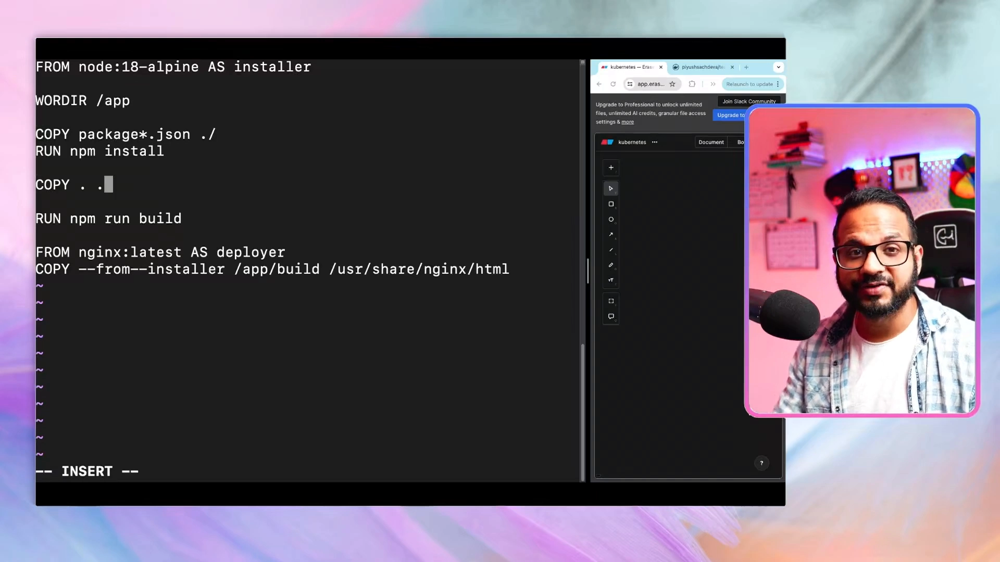
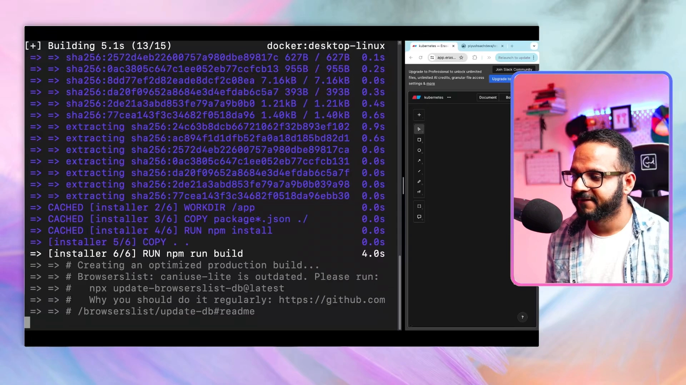
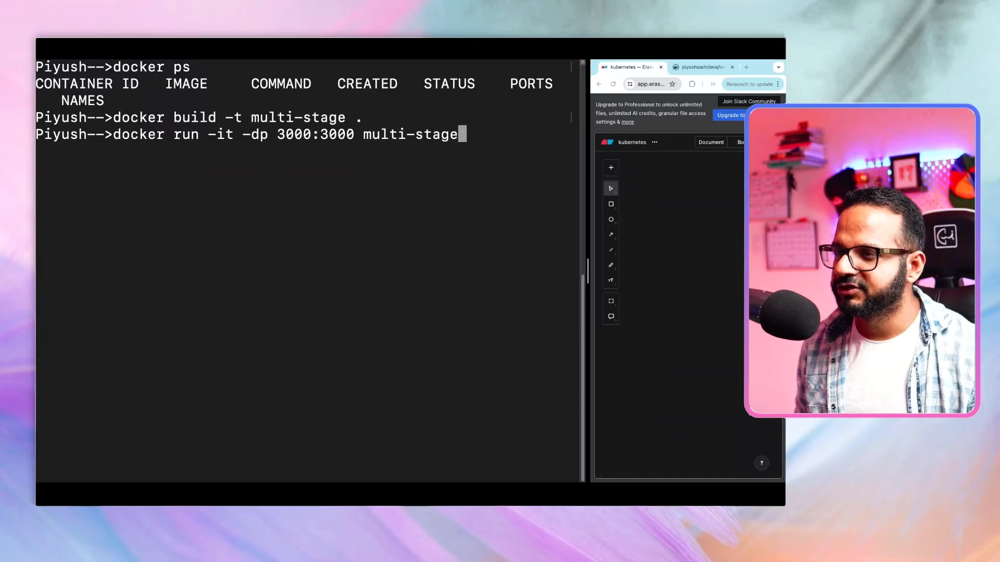
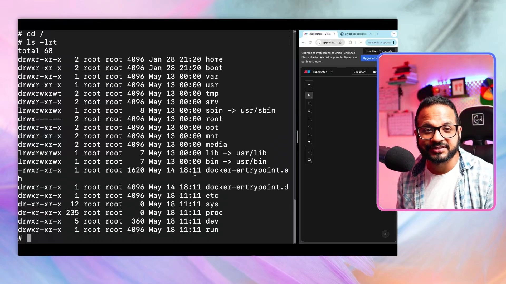
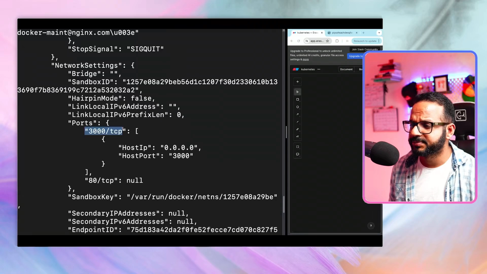

# Day 3：多阶段构建（Multi-Stage Build）——把镜像从 200MB 瘦下来

> 视频来源：[Day 3/40 - Multi Stage Docker Build - Docker Tutorial For Beginners - CKA Full Course 2024](https://www.youtube.com/watch?v=ajetvJmBvFo)（YouTube，频道 Tech Tutorials with Piyush）
>
> 这一讲解决 Day 2 留下的问题：镜像太大。办法就是**多阶段构建**。文稿左栏为英文自动字幕，本文已翻译并重写为中文。

## 本讲要解决的核心问题（SCQA）

**背景**：Day 2 我们给一个 Node.js 待办应用写了 Dockerfile，但构建出来的镜像超过 **200 MB**——明明已经用了轻量的 Alpine 基础镜像，却还是这么胖。

**冲突**：镜像过大带来一连串代价：拉取/推送慢、占用存储、启动慢，还可能把构建时才需要的依赖（如 `node_modules`）、甚至源码带进**生产运行环境**，增加安全风险。

**疑问**：既要在构建阶段用完整的工具链，又希望最终运行的镜像尽量小——怎么做？

**回答（中心思想）**：用**多阶段构建（Multi-Stage Build）**。把 Dockerfile 分成**多个阶段**：在**构建阶段（installer）**里用 node 镜像装依赖、跑构建；在**运行阶段（deployer）**里换成一个更合适的基础镜像（这里用 **Nginx**），**只把构建产物（build 目录）复制过来**。这样最终的镜像里没有 `node_modules`、没有源码，体积更小、更快、更安全。

---

## 一、问题回顾：镜像为什么这么大

Day 1 讲了容器与 Docker 原理，Day 2 动手把一个示例应用 Docker 化。但那个 Dockerfile 犯了一个常见错误：构建完之后，把**当前目录的所有东西**（`COPY . .`）都塞进了最终镜像，导致 `node_modules`、源码等一堆运行不需要的文件也留在了里面。[【跳转到 01:18】](https://www.youtube.com/watch?v=ajetvJmBvFo&t=78)

> 本讲作者嗓子不舒服（感冒 + 喉咙发炎），边喝姜柠檬茶边录，音频略沙哑，但不影响内容。

要理解多阶段构建，先把"一个阶段"讲清楚。

---

## 二、多阶段构建的思路：构建与运行分离

我们还是先克隆示例应用、`touch Dockerfile`，从零写。与 Day 2 不同的是，这次用**两个阶段（stage）**：[【跳转到 02:25】](https://www.youtube.com/watch?v=ajetvJmBvFo&t=145)

1. **`installer` 阶段**：基于 `node:18-alpine`，负责**装依赖、编译/构建**，产出 `build/` 目录（静态文件）；
2. **`deployer` 阶段**：基于 `nginx:latest`，负责**托管**这些静态文件。它**只从 installer 阶段复制 `build/` 这一个目录**——不复制 `node_modules`，也不复制源码。

这正是多阶段构建的精髓：**构建环境与运行环境彻底分离**，最终镜像只保留"服务应用所必需"的文件。

---

## 三、写多阶段 Dockerfile

完整的多阶段 Dockerfile 如下（含阶段命名与产物复制）：[【跳转到 03:15】](https://www.youtube.com/watch?v=ajetvJmBvFo&t=195)

```dockerfile
# ---------- 阶段 1：installer（构建） ----------
FROM node:18-alpine AS installer

WORKDIR /app

# 先用通配符复制依赖清单（package.json / package-lock.json）
COPY package*.json ./
RUN npm install

# 再复制其余源码，并执行构建
COPY . .
RUN npm run build

# ---------- 阶段 2：deployer（运行） ----------
FROM nginx:latest AS deployer

# 只把上一阶段生成的 build 目录复制到 Nginx 的静态目录
COPY --from=installer /app/build /usr/share/nginx/html
```

逐条解释：[【跳转到 03:40】](https://www.youtube.com/watch?v=ajetvJmBvFo&t=220)

- **`FROM node:18-alpine AS installer`**：`AS installer` 给这个阶段起名 **installer**，后面可以被引用。[【跳转到 06:10】](https://www.youtube.com/watch?v=ajetvJmBvFo&t=370)
- **`WORKDIR /app`**：还是在容器内建工作目录 `/app`。
- **`COPY package*.json ./`**：通配符 `package*.json` 表示"所有以 package 开头、以 json 结尾的文件"（即 `package.json`、`package-lock.json`）。**先只复制依赖清单**，再 `npm install`，这样能更好地利用 Docker 层缓存。[【跳转到 04:05】](https://www.youtube.com/watch?v=ajetvJmBvFo&t=245)
- **`RUN npm install`**：安装依赖。
- **`COPY . .` + `RUN npm run build`**：复制其余文件并执行构建，生成 **build/** 目录（前端静态产物）。注意：`npm install` 产生的内容此时还在**层**里，不是直接进最终镜像。[【跳转到 04:55】](https://www.youtube.com/watch?v=ajetvJmBvFo&t=295)
- **`FROM nginx:latest AS deployer`**：第二个阶段，基于 **Nginx**——一个专门用来**托管 Web 应用**的镜像，命名为 deployer。[【跳转到 05:20】](https://www.youtube.com/watch?v=ajetvJmBvFo&t=320)
- **`COPY --from=installer /app/build /usr/share/nginx/html`**：这是关键——**从上个阶段（installer）**只复制 `/app/build`，放到 Nginx 托管静态页面的目录 `/usr/share/nginx/html`。最终容器里**只有 build 目录**，没有 `node_modules`、没有其他无关文件。[【跳转到 08:01】](https://www.youtube.com/watch?v=ajetvJmBvFo&t=481)



> 小坑提醒：作者一开始把 `WORKDIR` 拼错、把 `--from=installer` 写成了 `--from-installer`（用连字符而不是等号），导致构建报 "unknown instruction / unknown flag"。多阶段构建里引用阶段的语法是 **`COPY --from=<阶段名>`**（等号）。[【跳转到 09:24】](https://www.youtube.com/watch?v=ajetvJmBvFo&t=564)

---

## 四、构建与验证：镜像更小、应用更大

保存文件后构建：

```bash
docker build -t multi-stage .
docker images
```

构建日志里能清楚看到两个阶段的步骤，例如 `[installer 2/6] WORKDIR /app` …… `[installer 6/6] RUN npm run build`，以及大量 `CACHED` 的层（缓存命中）。[【跳转到 09:49】](https://www.youtube.com/watch?v=ajetvJmBvFo&t=589)



结果：镜像大小约 **195 MB**。重点在于——**这个应用比 Day 2 的应用更大**（多了 Nginx、应用本身也更重），**镜像反而更小了**。这说明多阶段构建确实起作用了。[【跳转到 10:14】](https://www.youtube.com/watch?v=ajetvJmBvFo&t=614)

顺带清理本地无用镜像：`docker image rm <image>`（会先 untag 再删除），避免本地仓库堆积占用空间。[【跳转到 11:04】](https://www.youtube.com/watch?v=ajetvJmBvFo&t=664)

---

## 五、运行并进入容器：注意默认目录变了

运行容器：

```bash
docker ps
docker build -t multi-stage .
docker run -it -dp 3000:3000 multi-stage
docker ps
```



进入容器：

```bash
docker exec -it <容器ID> sh
```

一个容易踩的坑：**默认目录是 `/`**，而不是 `/app`。因为我们在 **installer** 阶段设置了 `WORKDIR /app`，但**第二个阶段（deployer）没有设置 WORKDIR**，所以最终镜像用的是默认根目录 `/`。[【跳转到 13:34】](https://www.youtube.com/watch?v=ajetvJmBvFo&t=814)

```bash
cd /
ls -lrt      # 看到的是 Alpine 基础镜像的根目录结构
```



进一步看：容器里**并没有 `/app` 目录**，因为文件被放到了 Nginx 托管页面的目录 `/usr/share/nginx/html`——也就是 **`index.html` 和少量元数据等静态文件**，**只有服务应用所需的文件被复制进来**。[【跳转到 15:14】](https://www.youtube.com/watch?v=ajetvJmBvFo&t=914)

> 这也解释了为什么这个镜像能更小：连 `node_modules` 都不在容器里。

---

## 六、排障三板斧：logs、exec、inspect

容器出问题时，本讲演示了三个重要命令：[【跳转到 16:04】](https://www.youtube.com/watch?v=ajetvJmBvFo&t=964)

1. **`docker logs <容器名/ID>`**：查看容器的**标准输出（stdout）**日志。[【跳转到 13:09】](https://www.youtube.com/watch?v=ajetvJmBvFo&t=789)
2. **`docker exec -it <容器名/ID> sh`**：进入容器内部排查（Nginx 日志目录在 `/var/log/nginx`）。[【跳转到 13:59】](https://www.youtube.com/watch?v=ajetvJmBvFo&t=839)
3. **`docker inspect <容器名/ID>`**：查看容器的**全部细节**——MAC 地址、IPv4、SandboxKey、Host IP / Host Port（比如 `3000/tcp → 0.0.0.0:3000`）、以及 Nginx 版本等。这在排障时非常有帮助。[【跳转到 16:29】](https://www.youtube.com/watch?v=ajetvJmBvFo&t=989)



> 记住这三个命令：**`docker logs`、`docker exec`、`docker inspect`** 是日常排障的主力。

---

## 七、其他最佳实践

多阶段构建只是容器最佳实践之一。视频还提到——**容器应以非 root 用户（known non-root user / unprivileged user）运行**，以降低安全风险。[【跳转到 17:52】](https://www.youtube.com/watch?v=ajetvJmBvFo&t=1072)

作者留了作业：**去 Docker 官方文档研究还有哪些构建/运行容器的最佳实践，并留言分享**。因为在个人自用时大家不太在意这些，但**一旦面向生产、面向客户，就要处处遵循最佳实践**。[【跳转到 18:33】](https://www.youtube.com/watch?v=ajetvJmBvFo&t=1113)

---

## 小结

- **多阶段构建**解决镜像过大的问题：把**构建阶段**和**运行阶段**分开。
- 本讲的两阶段：`installer`（`node:18-alpine` 装依赖 + `npm run build`）→ `deployer`（`nginx:latest`）。
- 关键指令：**`FROM ... AS <阶段名>`** 命名阶段，**`COPY --from=<阶段名> <源> <目标>`** 只复制构建产物。
- 效果：应用更大，镜像反而更小（约 195MB），运行环境里没有 `node_modules` 和源码，**更快、更安全、更接近生产**。
- 踩坑：引用阶段的语法是 `--from=`（等号）；第二阶段没设 `WORKDIR`，进容器默认在 `/`。
- **排障三板斧**：`docker logs`、`docker exec -it ... sh`、`docker inspect`。
- **其他最佳实践**：以非 root 用户运行容器等；生产项目要处处遵循最佳实践。

## 关键术语速查

| 术语 | 一句话解释 |
| --- | --- |
| 多阶段构建 | 在一个 Dockerfile 里定义多个阶段，构建与运行分离 |
| 阶段（stage） | 用 `FROM ... AS <名字>` 命名的一段构建过程 |
| `installer` | 本讲的构建阶段（node 装依赖、编译） |
| `deployer` | 本讲的运行阶段（nginx 托管静态文件） |
| `COPY --from=` | 从指定阶段复制文件到当前阶段 |
| `COPY package*.json ./` | 只先复制依赖清单，利于层缓存 |
| `WORKDIR` | 容器内工作目录；第二阶段未设置则默认 `/` |
| `docker image rm` | 删除本地镜像（先 untag 再 remove） |
| `docker logs` | 查看容器标准输出日志 |
| `docker exec -it ... sh` | 进入运行中的容器排障 |
| `docker inspect` | 查看容器全部细节（IP/端口/网络等） |
| 非 root 用户运行 | 容器安全最佳实践之一 |
