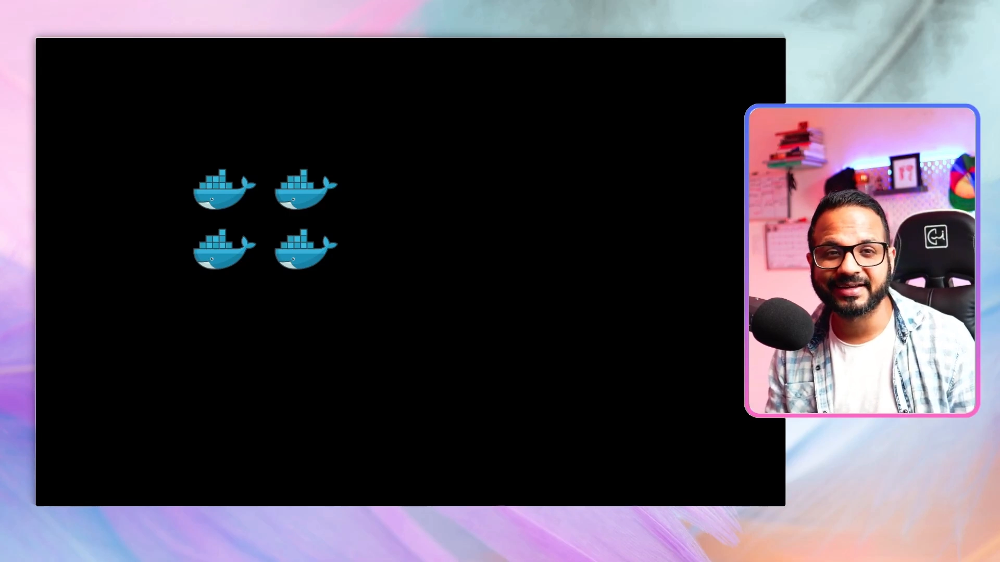
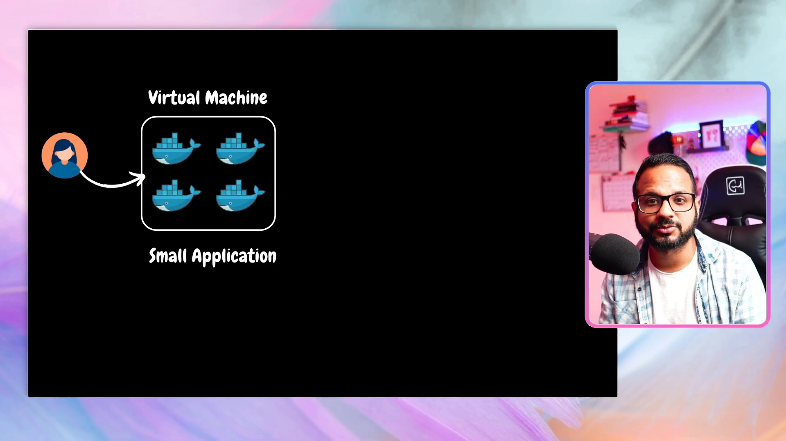
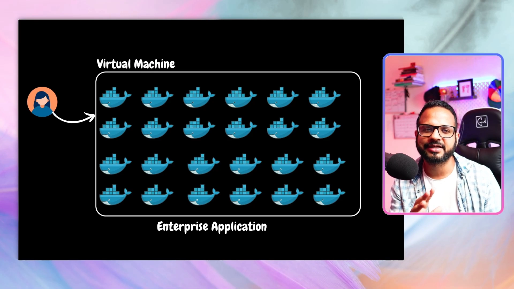
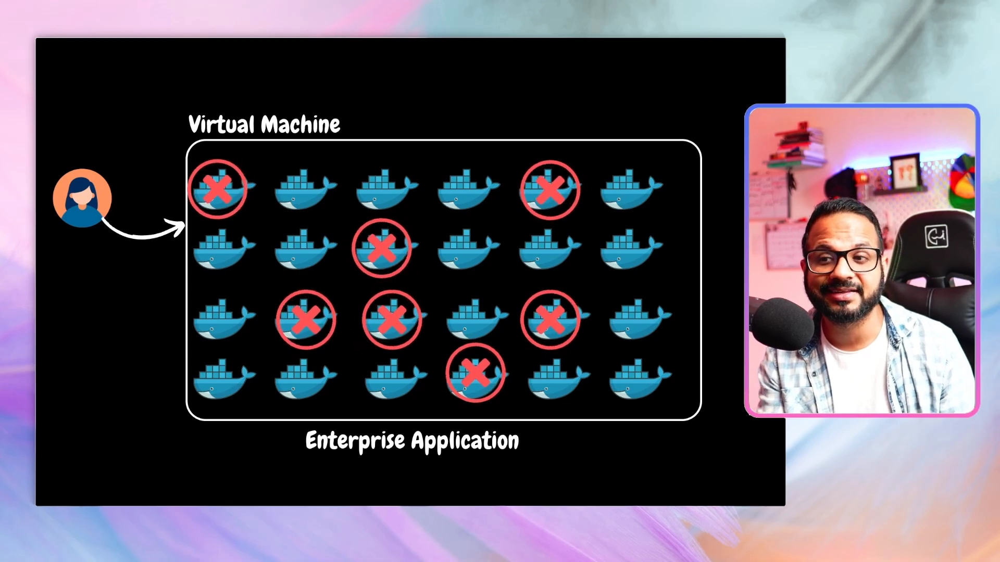
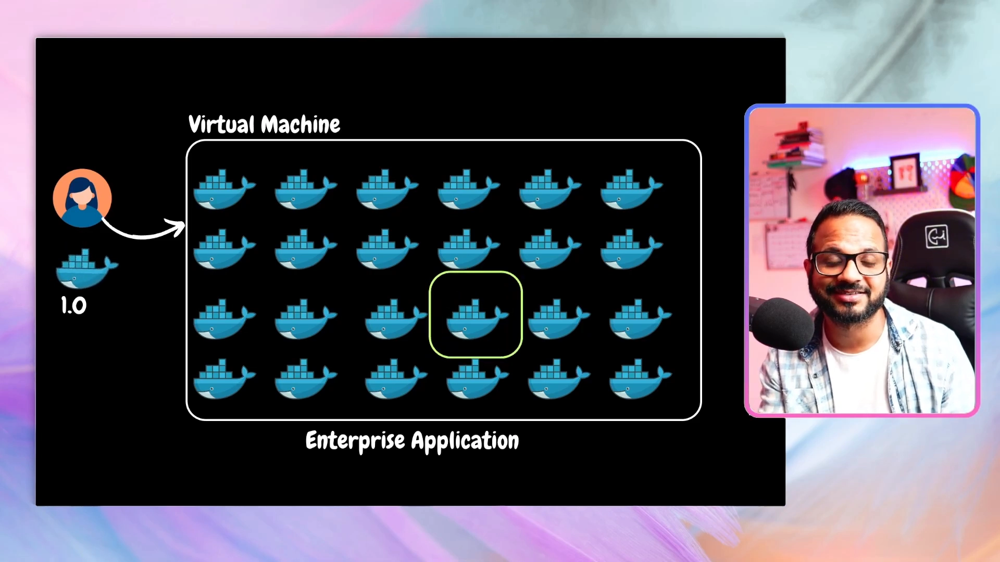
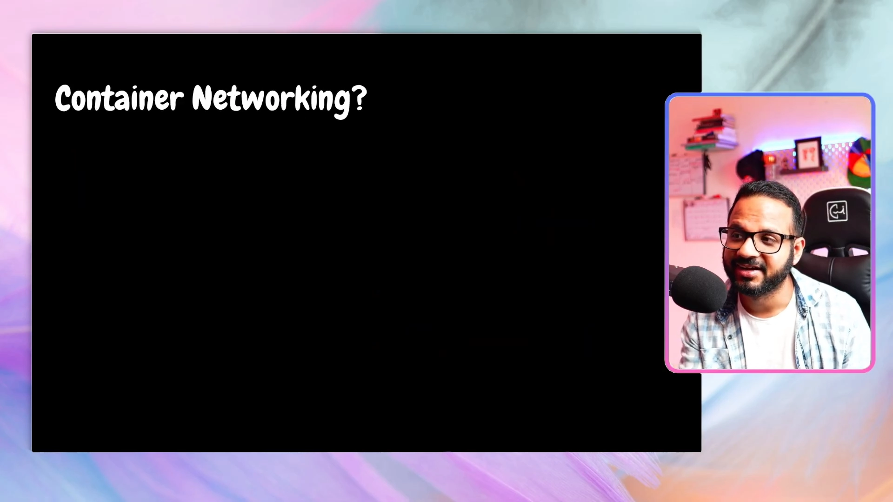
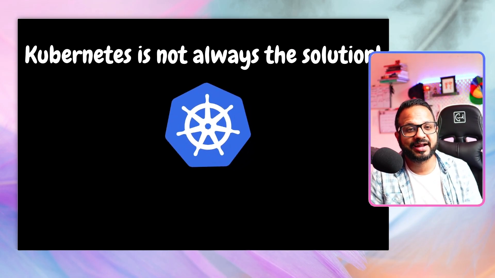

# Day 4：为什么需要 Kubernetes？——从「手动运维容器」的痛点到编排系统

> 视频来源：[Day 4/40 - Why Kubernetes Is Used - Kubernetes Simply Explained - CKA Full Course 2025](https://www.youtube.com/watch?v=lXs1VCWqIH4)（YouTube，频道 Tech Tutorials with Piyush）
>
> 前三讲都在讲容器（Docker）：什么是容器、怎么把应用容器化、怎么做多阶段构建。这一讲换个角度——**为什么光有容器还不够，我们需要 Kubernetes**。文稿左栏为英文自动字幕，本文已翻译并重写为中文。

## 本讲要解决的核心问题（SCQA）

**背景**：前几讲我们已经学会了用 Docker 把应用打包成容器，并把容器跑在一台虚拟机上。对一个小应用来说，容器基本够用。

**冲突**：一旦应用变大、容器变多、用户遍布全球，"人肉运维容器"就会变成灾难：容器半夜挂了没人修、多个容器同时崩溃来不及排查、整台虚拟机宕机导致全站下线、发布新版本要一个个手动操作、对外暴露服务要自己配负载均衡和路由……这些琐事在规模面前全是纯手工的重活。

**疑问**：有没有一个系统，能自动帮我们处理容器的部署、扩缩容、故障恢复、网络和负载均衡，让运维从"救火"变成"少干预甚至不干预"？

**回答（中心思想）**：这就是 **Kubernetes（K8s）** 存在的理由——它是一个**容器编排系统**，用一个统一的平台接管容器的调度、扩缩容、负载均衡、故障自愈等，把运维人员从重复劳动中解放出来。但也要记住另一面：**Kubernetes 不是所有场景的答案**，小应用硬上 K8s 反而浪费资源和精力。

---

## 一、先看一个"够用就好"的小场景

设想你有一个**小应用**，里面只有三四个容器（比如前端、后端、数据库）。它跑在一台虚拟机上，一切正常：用户体验好，开发、运维都满意。[【跳转到 01:22】](https://www.youtube.com/watch?v=lXs1VCWqIH4&t=82)

麻烦从"某个容器挂了"开始。**只要有一个容器宕机，就会影响真实用户**——它可能是前端、可能是数据库、也可能是后端。[【跳转到 01:27】](https://www.youtube.com/watch?v=lXs1VCWqIH4&t=87)

怎么办？你安排一两个人，**SSH 登录到这台虚拟机**，看容器日志、尽快把问题修好，让用户重新满意。对**小应用**来说，这套做法没问题——一两个人就能盯住。[【跳转到 01:52】](https://www.youtube.com/watch?v=lXs1VCWqIH4&t=112)

---

## 二、小场景为什么终究撑不住

问题在于，现实里有两个条件会让"人肉运维"失效：**时间**和**规模**。

**第一，时间上撑不住。** 如果故障发生在**非工作时间**怎么办？一两个人不可能 7×24 待命，你不得不安排全天候的专职支持。如果应用面向**全球用户**，还得覆盖所有时区——这意味着要养一支遍布各时区的团队，人力成本陡增。对一个小应用来说，这显然不划算。[【跳转到 02:17】](https://www.youtube.com/watch?v=lXs1VCWqIH4&t=137)

**第二，规模上撑不住。** 换成一个**企业级应用**，虚拟机上跑着成百上千个容器，你配了很大的团队，平时没问题。但**一旦多个容器同时崩溃**（比如一次挂掉 8~10 个），几个人根本来不及同时排查；而这是**生产环境故障**，用户正在受影响，你没有多少时间慢慢调试——况且这种故障可能每 5 分钟、10 分钟就来一次，一整天都在发生。[【跳转到 03:07】](https://www.youtube.com/watch?v=lXs1VCWqIH4&t=187)

**更糟的是底层虚拟机本身。** 如果承载应用的**虚拟机宕机**，那**整个应用会一起下线**，前面的所有努力瞬间归零。[【跳转到 03:32】](https://www.youtube.com/watch?v=lXs1VCWqIH4&t=212)

---

## 三、光"救火"还不够：日常运维还有一堆手工活

除了故障恢复，日常还有大量重复的手工操作，规模一大就都是"苦力活"：

- **版本发布**：当前跑的是 0.9 版，现在要发布 1.0 版。**几百个容器**难道一个个手动升级？不做自动化的话，纯属折腾。[【跳转到 03:57】](https://www.youtube.com/watch?v=lXs1VCWqIH4&t=237)
- **对外暴露服务**：如果各组件只是提供 API，可以前置一个 **API 网关**来负责路由；但如果是 Web 应用的不同组件，要保证所有面向用户的端点都能被访问，就得**自己摆一个外部负载均衡器并配置路由规则**——同样麻烦。[【跳转到 04:22】](https://www.youtube.com/watch?v=lXs1VCWqIH4&t=262)
- **还有网络与资源管理、安全、高可用、容错、服务发现**……每一件都要自己扛。[【跳转到 04:47】](https://www.youtube.com/watch?v=lXs1VCWqIH4&t=287)

小结一下这一节的逻辑：**没有编排系统时，容器的部署、扩缩容、网络、负载均衡、故障恢复全靠人工**，挑战多、手工步骤多，这正是问题所在。

---

## 四、所以：Kubernetes 登场

**Kubernetes 就是上述所有问题的答案。** 它接管了这些事，并以**最小化（或说优化过的）人工干预**来完成——它同样负责**可扩展性、负载均衡、编排**以及许多其他方面。[【跳转到 05:02】](https://www.youtube.com/watch?v=lXs1VCWqIH4&t=302)

用一句话概括：

> **Kubernetes 是一个容器编排系统。它把"人工盯着容器"变成"平台自动托管容器"。**

---

## 五、但是：Kubernetes 不是万能的

这一讲最重要、最容易被初学者忽略的反面提醒：**Kubernetes 并不总是解决方案**。[【跳转到 05:24】](https://www.youtube.com/watch?v=lXs1VCWqIH4&t=324)

设想你那个**只有两三个容器的小应用**（比如上一讲那个待办清单应用），**完全不需要一整套编排系统**。硬上 Kubernetes 的代价是：

- **浪费资源、浪费钱**；
- **增加大量管理负担，给团队平添"苦役（toil）"**。

而且别以为用了**托管服务**（AKS、EKS、GKE）就万事大吉——**即便用托管 Kubernetes，你仍要投入管理精力**：维护集群、确保工作负载被合理优化、安排升级与打补丁的时间表等等。要做的事一点都不少。[【跳转到 05:45】](https://www.youtube.com/watch?v=lXs1VCWqIH4&t=345)

**"我的应用是微服务 / 已经容器化了，所以就该上 Kubernetes"——这个推理是错的。** 你要**逐个评估**：到底需不需要 Kubernetes？也许用下面这些就够了：[【跳转到 06:35】](https://www.youtube.com/watch?v=lXs1VCWqIH4&t=395)

- **Docker Compose**：在一台机器上编排多个容器，简单够用；
- **容器直接跑在裸金属或虚拟机上**；
- **一台虚拟专用服务器（VPS）**：比如 DigitalOcean 的 droplet、AWS Lightsail，或 GCP、Azure 市场上的镜像。

这些方案往往能以**更低的成本、更少的管理和运维投入**满足需求。**在这一步上，务必做足功课（due diligence）：你到底需不需要容器？需不需要 Kubernetes？**[【跳转到 07:00】](https://www.youtube.com/watch?v=lXs1VCWqIH4&t=420)

---

## 小结

- 前三讲讲了**容器**，本讲回答**为什么需要 Kubernetes**。
- 手工运维容器的痛点：容器宕机影响用户、非工作时间无人值守、全球用户要覆盖所有时区、多个容器同时崩溃来不及处理、虚拟机宕机导致全站下线。
- 日常还有大量手工活：**逐版本发布、对外暴露服务的负载均衡与路由、网络/资源/安全/高可用/容错/服务发现**。
- **Kubernetes 是容器编排系统**，以最小人工干预接管调度、扩缩容、负载均衡、故障自愈等，是上述问题的答案。
- **但 Kubernetes 不是万能的**：小应用硬上 K8s 会浪费资源、增加管理负担；即便用托管服务（AKS/EKS/GKE）也仍需运维投入。
- **决策原则**：逐项评估是否真的需要 K8s；Docker Compose、裸机/虚拟机、VPS（DigitalOcean droplet、AWS Lightsail、GCP/Azure 镜像）等往往是更省成本的选择。
- 下一讲将进入 **Kubernetes 架构**与基础概念。

## 关键术语速查

| 术语 | 一句话解释 |
| --- | --- |
| 容器编排（Orchestration） | 自动管理大量容器的部署、扩缩容、调度与恢复 |
| Kubernetes（K8s） | 主流的容器编排系统，用一个平台托管容器 |
| 虚拟机（VM） | 承载容器的机器；它一旦宕机，上面的应用全部下线 |
| API 网关（API Gateway） | 放在 API 前面的统一入口，负责路由等 |
| 负载均衡器（Load Balancer） | 把流量分发到多个后端实例，并对外暴露服务 |
| 服务发现（Service Discovery） | 让服务之间能自动找到彼此的地址 |
| 高可用 / 容错 | 局部故障时系统仍能继续提供服务 |
| 托管 Kubernetes（AKS/EKS/GKE） | 云厂商托管的 K8s 服务，但仍需自行运维集群 |
| Docker Compose | 在单机上编排多个容器的轻量工具 |
| VPS（如 DigitalOcean、AWS Lightsail） | 虚拟专用服务器，低成本跑应用的选项 |
