# Day 5：什么是 Kubernetes？——控制平面（Control Plane）与工作节点架构详解

> 视频来源：[Day 5/40 - What is Kubernetes - Kubernetes Architecture Explained](https://www.youtube.com/watch?v=SGGkUCctL4I)（YouTube，频道 Tech Tutorials with Piyush）
>
> 前一讲（Day 4）我们回答了"为什么需要 Kubernetes"。这一讲接着往下：**Kubernetes 到底由哪些零件组成，它们怎么协同工作**。文稿左栏为英文自动字幕，本文已翻译并重写为中文。

## 本讲要解决的核心问题（SCQA）

**背景**：前四讲我们已经理解了容器（Docker）、容器的架构，以及为什么大规模跑容器需要一个编排系统——Kubernetes。我们知道 Kubernetes 能帮我们调度、扩缩容、自愈、做网络和负载均衡。

**冲突**：但 Kubernetes 不是"一个黑盒"。它内部由**一整套组件**组成——控制平面里有 API Server、调度器、etcd、控制器管理器，工作节点上又有 kubelet、kube-proxy。第一次看到那张架构图，密密麻麻的方框和箭头，很容易让人头晕，不知道谁是谁、谁在指挥谁。

**疑问**：Kubernetes 集群里到底有哪些组件？它们各自负责什么？当用户执行一条命令（比如创建一个 Pod）时，请求究竟经过了哪些环节、如何一步步落地？

**回答（中心思想）**：Kubernetes 集群可以拆成两半——**控制平面（Control Plane，也叫 Master Node）负责"发号施令"**，**工作节点（Worker Node）负责"真正干活"**。控制平面里，**API Server 是所有请求的唯一入口**，etcd 是集群的"账本"，调度器负责选节点，控制器管理器负责维持期望状态；工作节点上，kubelet 执行控制平面的指令、kube-proxy 负责网络。理解了这套分工和一次请求的完整链路，你就看懂了 Kubernetes 的架构。

---

## 一、先建立全局图：一个集群 = 控制平面 + 工作节点

Kubernetes 架构图的第一印象确实"有点吓人"，但作者保证：**只要看完这一讲，就能把里面每一块都搞清楚**。[【跳转到 00:42】](https://www.youtube.com/watch?v=SGGkUCctL4I&t=42)

先抓住这张图的两条主线（左边和右边）：[【跳转到 01:03】](https://www.youtube.com/watch?v=SGGkUCctL4I&t=63)

- **左边**：控制平面（Control Plane），又叫 Master Node。
- **右边**：一个或多个工作节点（Worker Node）。

### 1.1 节点（Node）其实就代表一台虚拟机

要理解这张图，先弄懂一个词：**节点（Node）**。

**节点是什么？** 字幕里原话很直白——**"Node 不是别的，就是一台虚拟机（Virtual Machine）"**。[【跳转到 01:28】](https://www.youtube.com/watch?v=SGGkUCctL4I&t=88) 在这台虚拟机上，我们跑组件、跑工作负载（workload，也就是你的应用），以及其它管理性质的组件；在 Kubernetes 里，这样一台机器就叫做一个**节点**。

换句话说，**Node 只是虚拟机（VM）的另一个名字**。[【跳转到 01:28】](https://www.youtube.com/watch?v=SGGkUCctL4I&t=88) 这张图里有**一台虚拟机用于控制平面**，**若干台虚拟机（节点）用于工作节点**。

> 小提醒：真实生产里节点不一定是虚拟机，也可以是物理机；但本讲作者用"虚拟机"来打比方，帮助初学者建立直觉。这里只需记住：**节点 = 跑 Kubernetes 组件/工作负载的一台机器**。

### 1.2 控制平面像公司的"董事会"，工作节点像"一线员工"

那控制平面（Master Node）是什么？它是**一台承载许多"管理组件"的虚拟机或节点**。[【跳转到 01:53】](https://www.youtube.com/watch?v=SGGkUCctL4I&t=113)

作者用了一个非常好懂的类比——**公司的董事会**：[【跳转到 02:18】](https://www.youtube.com/watch?v=SGGkUCctL4I&t=138)

- 控制平面里的这些组件，就像公司的**董事会**：它们**决定公司怎么运转**，但**并不亲自做一线的体力活**。
- 董事会**给其他团队、经理、主管下达指令**，让他们代替自己去执行。
- 所以控制平面属于**顶层管理（top-level management）**。

而**工作节点（Worker Node）**就对应**真正干活的一线**——**真正的工作发生在工作节点上**。[【跳转到 02:43】](https://www.youtube.com/watch?v=SGGkUCctL4I&t=163)

一句话理清这层关系：**你的应用容器跑在工作节点上，因为那里才是实际干活的地方；而"谁在指挥 Kubernetes 去干这些活"？是控制平面（Master Node），它通过一个个组件来发号施令。**[【跳转到 03:08】](https://www.youtube.com/watch?v=SGGkUCctL4I&t=188)

---

## 二、Pod 是 Kubernetes 里最小的可部署单元

在往下讲组件之前，必须先介绍一个贯穿全篇的核心概念：**Pod**。

**为什么不能直接把容器跑在 Kubernetes 上？** 作者的解释是：**我们不能让容器"独自裸跑"在 Kubernetes 里，而要把容器"封装"进一个叫做 Pod 的东西。**[【跳转到 03:33】](https://www.youtube.com/watch?v=SGGkUCctL4I&t=213)

作者用了一个生动的类比——**婴儿和襁褓**：[【跳转到 03:58】](https://www.youtube.com/watch?v=SGGkUCctL4I&t=238)

- 婴儿在**子宫**里时，需要一层**襁褓（sack）**来保护它。
- 容器之于 Pod，就像婴儿之于襁褓：**Pod 就是保护、封装容器的"襁褓"。**

**一个 Pod 里可以放几个容器？** **可以放一个，也可以放多个。** 通常（理想情况下）**一个 Pod 里只跑一个容器**；但在某些场景下也会放多个容器，这些额外的容器通常是**辅助容器（helper container）**、**监控代理（monitoring agent）**，或者**init 容器**（init container，在正式容器启动前先跑、用来做初始化工作的容器）——这些内容会在后面的章节细讲。[【跳转到 04:23】](https://www.youtube.com/watch?v=SGGkUCctL4I&t=263)

**Pod 的地位**：**Pod 是 Kubernetes 中最小的可部署单元（smallest deployable unit）**。[【跳转到 04:23】](https://www.youtube.com/watch?v=SGGkUCctL4I&t=263) 作者提醒：后面还会讲 Deployment、ReplicaSet、Service 等很多其它对象，但这一讲只要记住——**Pod 的作用就是"承载容器"：它把容器封装起来，让同一个 Pod 内的容器共享资源，然后我们运行这个 Pod。一旦 Pod 跑起来，里面的应用也就正常运行、处于健康状态了。**[【跳转到 04:48】](https://www.youtube.com/watch?v=SGGkUCctL4I&t=288)

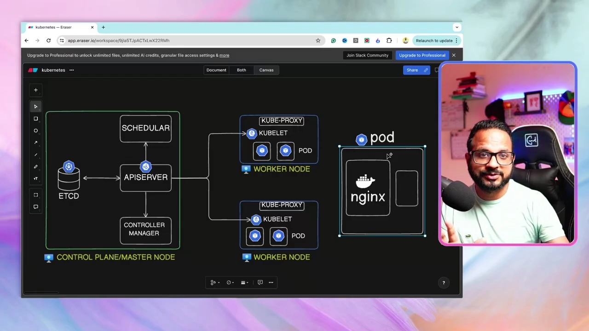

---

## 三、控制平面组件：集群的"大脑"由四个零件组成

现在正式拆解控制平面。作者先做一个总结：**你的工作负载（容器、Pod、服务等）都跑在工作节点上；而控制平面组件——也就是 API Server、Scheduler、etcd、Controller Manager 等——统一被称为"控制平面组件（control plane components）"。**[【跳转到 05:38】](https://www.youtube.com/watch?v=SGGkUCctL4I&t=338)

它们各自分工是什么？下面逐一讲清楚。

### 3.1 kube-apiserver：所有请求的唯一入口

**它是什么？** **API Server 是整个控制平面的中心。** 意思是：**任何来自客户端的请求，都会先到达 API Server**，然后由 API Server 代表客户端去和其它组件交互。[【跳转到 06:03】](https://www.youtube.com/watch?v=SGGkUCctL4I&t=363)

**为什么重要？** 因为**它是 Kubernetes 集群内部的主入口点（main entry point）**。**任何从外部来的请求，都要先进入 API Server。**[【跳转到 06:03】](https://www.youtube.com/watch?v=SGGkUCctL4I&t=363)

打个比方：API Server 就像公司的**前台/总机**——所有外来的电话、访客都必须先经过它，再由它转接到对应的部门。它是**所有组件互相沟通的枢纽**，也是**唯一有权读写集群"账本"etcd 的组件**（这一点在讲 etcd 时会再强调）。

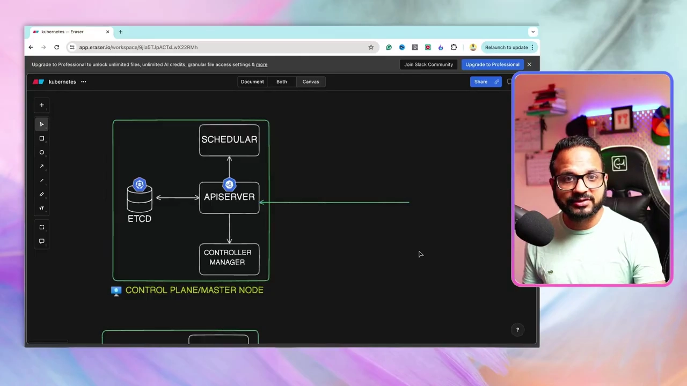

### 3.2 kube-scheduler：决定 Pod 该落到哪台节点

**它是什么？** **Scheduler（调度器）负责给你的工作负载"安排位置"**——它帮助你把 Pod 调度到合适的节点上。[【跳转到 06:28】](https://www.youtube.com/watch?v=SGGkUCctL4I&t=388)

**怎么工作？** 调度器会**从 API Server 接收请求**。举个例子：有人请求调度一个 Pod，请求先被 API Server 收到，**API Server 再把请求转发给调度器，让调度器为这个 Pod 找到一个合适的节点。**[【跳转到 06:53】](https://www.youtube.com/watch?v=SGGkUCctL4I&t=413)

**它根据什么选节点？** 节点上可能有各种约束条件，比如 **CPU、可用内存、可用的磁盘存储**等等。调度器会**基于多种因素**（包括 Pod 的 **requests 和 limits**——也就是它请求多少、最多能用多少资源——以及很多其它因素）做决策，最终为这个 Pod **找到一个合适的节点**。[【跳转到 07:18】](https://www.youtube.com/watch?v=SGGkUCctL4I&t=438)

> 打个比方：调度器像**排座位的会务人员**——它看每张桌子（节点）还剩多少空位（CPU/内存/磁盘），再把客人（Pod）安排到坐得下的桌子上。

### 3.3 kube-controller-manager：一群"监工"的集合，维持集群的期望状态

**它是什么？** **Controller Manager（控制器管理器）是"许多不同控制器的集合"。**[【跳转到 07:43】](https://www.youtube.com/watch?v=SGGkUCctL4I&t=463) 字幕里列举了几个例子：

- **node controller（节点控制器）**；
- **namespace controller（命名空间控制器）**；
- **deployment controller（部署控制器）**；
- 以及许多其它控制器。

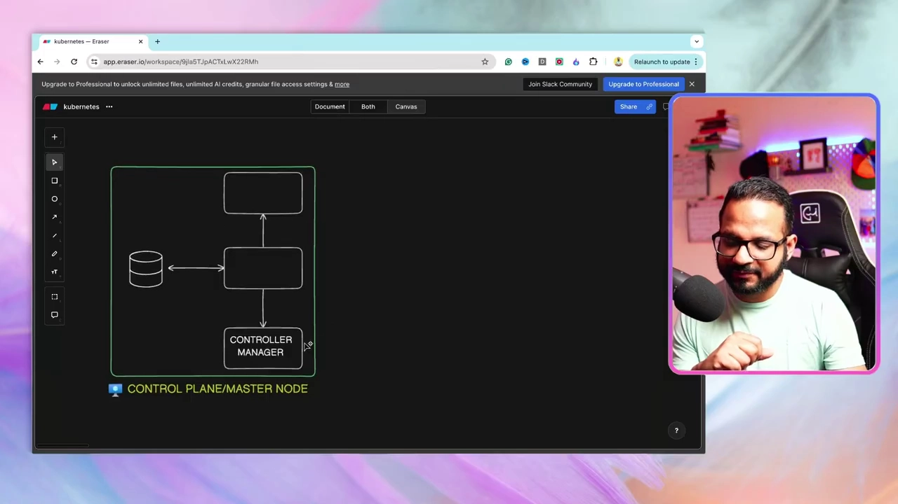

**它做什么？** **Controller Manager 的职责，就是确保所有控制器都正常运行、一切都被监控。** 它**监控 Kubernetes 对象，确保它们处于运行和健康状态**。[【跳转到 08:08】](https://www.youtube.com/watch?v=SGGkUCctL4I&t=488)

**举个具体例子**：假设某个 Pod 挂了（down 掉），Controller Manager 会**监控到这个 Pod**，并且**不断尝试重启它**——因为它借助控制器**持续监控**着这个 Pod。所以 Controller Manager 的作用，就是**让你的工作负载、节点、Deployment 等等，时时刻刻都保持"在线且健康"**。[【跳转到 08:33】](https://www.youtube.com/watch?v=SGGkUCctL4I&t=513)

> 打个比方：Controller Manager 像**值班的监工团队**——他们不停巡视，发现哪个工人（Pod）倒下了，就立刻把它扶起来、让它重新上工，保证生产线不中断。

### 3.4 etcd：整个集群的"账本"（键值数据库）

**它是什么？** **etcd 就是一个"键值数据库（key-value datastore）"。**[【跳转到 08:33】](https://www.youtube.com/watch?v=SGGkUCctL4I&t=513)

这里作者花了很长的篇幅解释"键值数据库"到底是什么，因为很多初学者不熟。我们用"是什么 → 为什么需要 → 怎么做"的顺序讲。

**先看传统的关系型数据库（RDBMS）是什么样。** RDBMS 是**关系型数据库**，数据以**行和列（rows and columns）**的形式保存。比如一张**员工表（employee table）**：有 ID、年龄、性别等字段，每一行是一位员工的数据（员工 1、员工 2、员工 3……）。[【跳转到 08:58】](https://www.youtube.com/watch?v=SGGkUCctL4I&t=538)

**关系型数据库的限制在哪？** 假设来了新员工（ID 2），你想给他多加一个 **address（地址）**字段——**除非修改整张表、给所有记录都加上这个字段，否则你没法单独给一条记录加字段。** 为什么？**因为关系型数据库有一个"固定模式（fixed schema）"**：**表里每一条记录都必须遵守这个模式。**[【跳转到 10:13】](https://www.youtube.com/watch?v=SGGkUCctL4I&t=613) 你**不能随手给某一条记录加字段**。这正是关系型数据库在**需要"随机字段"或"无模式（schema-less）"数据**的场合下变得麻烦的地方。

**键值数据库怎么解决这个问题？** **键值数据库是无模式的（schema-less），属于 NoSQL 数据库。** 在它里面，你可以**按需把值以"文档（document）"的形式存起来**，这个文档通常是 **JSON 格式**，并且是**"键-值对（key-value pair）"**的形式。[【跳转到 11:03】](https://www.youtube.com/watch?v=SGGkUCctL4I&t=663)

**举个具体例子**：一条记录可以写成 `name = Piyush`、`age = 34 或 35`、`address = XYZ`……这条记录会作为一个 **JSON 文档**存起来，并且以**键值对**的形式组织（一个 key 对应一个 value）。[【跳转到 11:28】](https://www.youtube.com/watch?v=SGGkUCctL4I&t=688)

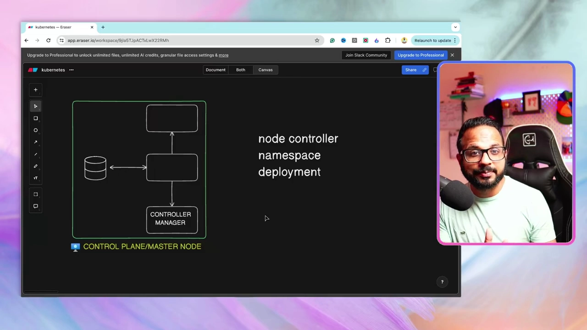

**那 etcd 到底存什么？为什么需要它？** **etcd 存储集群的"一切"信息**——**集群信息、集群状态、节点详情、Pod 详情、配置（configurations）、密钥（secrets）以及其它所有相关数据**，都以键值形式存在这个数据库里。[【跳转到 11:53】](https://www.youtube.com/watch?v=SGGkUCctL4I&t=713)

**数据是怎么更新的？** **每当集群里发生任何变化**——比如你从客户端发来一个请求，API Server 应用了这个变更——**这个变化会立刻更新到 etcd 数据库里**。[【跳转到 12:18】](https://www.youtube.com/watch?v=SGGkUCctL4I&t=738)

**谁有权访问 etcd？** 这是一个**关键规则**：**只有 API Server 与 etcd 数据库交互，并且只有 API Server 有权把变更应用到 etcd。**[【跳转到 12:43】](https://www.youtube.com/watch?v=SGGkUCctL4I&t=763) 反过来说，当我们要**从 etcd 读取信息**（比如想知道当前集群里跑了多少个 Pod）时，这个读取指令**也由 API Server 去 etcd 取**，再返回给你。[【跳转到 12:43】](https://www.youtube.com/watch?v=SGGkUCctL4I&t=763)

> 一句话记忆：**etcd = 集群唯一的"账本"，只有 API Server 这个"财务"能记账、查账。** 而且 etcd **必须时刻可用**——事实上，**整个控制平面的所有组件都必须时刻可用**。[【跳转到 13:08】](https://www.youtube.com/watch?v=SGGkUCctL4I&t=788)

作者的收尾说明：这些组件后面都会有**专门的、基于场景的（scenario-based）视频**深入讲解，还会做大量实验；这一讲只要求你对每个控制平面组件有一个**概述和基本理解**即可。[【跳转到 13:08】](https://www.youtube.com/watch?v=SGGkUCctL4I&t=788)

---

## 四、工作节点组件：真正干活的地方

讲完控制平面，作者转向**工作节点上运行的两个主要组件**：**kube-proxy 和 kubelet。**[【跳转到 13:33】](https://www.youtube.com/watch?v=SGGkUCctL4I&t=813)

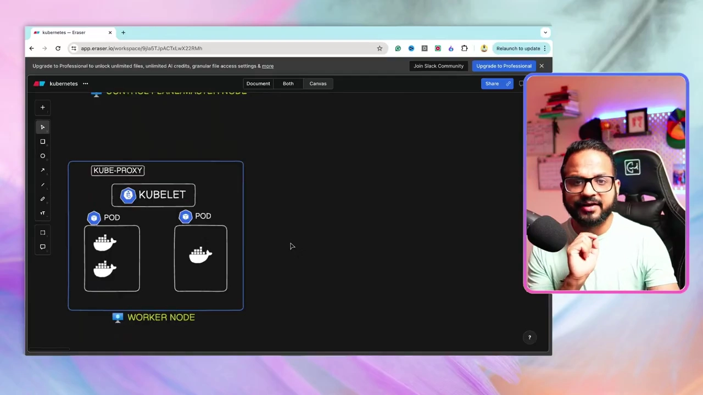

### 4.1 kubelet：节点上的"代理人"，执行控制平面下达的指令

**它是什么？** **kubelet 是接收来自控制平面指令的组件。** 控制平面节点上有我们前面讲的各个组件（比如 API Server），**API Server 会把指令发送给 kubelet，让它在工作节点上做一些变更。**[【跳转到 13:58】](https://www.youtube.com/watch?v=SGGkUCctL4I&t=838) 注意：**每个工作节点上都会运行 kubelet 和 kube-proxy。**

**举个例子（删除一个 Pod）**：[【跳转到 14:23】](https://www.youtube.com/watch?v=SGGkUCctL4I&t=863)

1. kubelet 收到来自 API Server 的指令——**"删除这个 Pod"**；
2. kubelet **执行变更**，把这个 Pod 删掉；
3. kubelet **返回响应**给 API Server——**"这个 Pod 已经删除了"**；
4. API Server 再把这个变更**写入 etcd 数据库**。[【跳转到 14:48】](https://www.youtube.com/watch?v=SGGkUCctL4I&t=888)

**总结 kubelet 的定位**：它是一个**基于节点的代理（node-based agent）**，**从 API Server 接收请求**，并且**让工作节点和控制平面节点之间能够通信**。[【跳转到 15:13】](https://www.youtube.com/watch?v=SGGkUCctL4I&t=913)

> 打个比方：kubelet 就像**驻厂的现场主管**——总部（控制平面）传下令来"把 3 号产线关掉"，他就去现场执行，并把结果回报给总部。

### 4.2 kube-proxy：让 Pod 之间能互相通信

**它是什么？** **kube-proxy 负责实现节点内部的网络（networking within the node）。**[【跳转到 15:38】](https://www.youtube.com/watch?v=SGGkUCctL4I&t=938)

**它做什么？** **它让 Pod 之间能够互相通信**——具体来说，它会创建一些 **IP table 规则（IP table rules）**，从而实现 **Pod 到 Pod 的网络通信**，让各个 Pod 和服务（services）能够彼此通信。[【跳转到 15:38】](https://www.youtube.com/watch?v=SGGkUCctL4I&t=938)

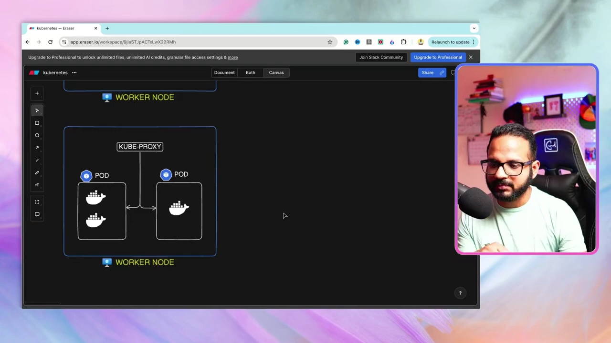

> 注意：字幕在此处对网络细节讲得较简略，只强调 kube-proxy"让 Pod 之间连通"这一核心作用，更深入的机制留到后续视频。

---

## 五、把组件串起来：一次请求的完整旅程（端到端流程）

讲了这么多零件，作者最后用**一个端到端的例子**把它们串起来，展示 **Kubernetes 架构里的一次请求从头到尾是怎么走的。**[【跳转到 16:03】](https://www.youtube.com/watch?v=SGGkUCctL4I&t=963)

为了腾出空间画图，作者先删掉了图上的部分内容，然后在图上新增了一个**用户**。

### 5.1 角色登场：用户与 kubectl

假设有一个**用户**——可能是一个 **Kubernetes 管理员**，或者来自 **DevOps 团队**的某个人，我们把他叫做 **user（用户）**。[【跳转到 16:28】](https://www.youtube.com/watch?v=SGGkUCctL4I&t=988)

这个用户使用一个叫做 **kubectl** 的**命令行客户端（CLI utility）**。字幕提醒：**kubectl 是一种"客户端"，用来帮助你与集群及其控制平面组件交互。**[【跳转到 16:53】](https://www.youtube.com/watch?v=SGGkUCctL4I&t=1013)

**用户做了什么？** 他**用 kubectl 客户端向 API Server 发出一个请求。**[【跳转到 16:53】](https://www.youtube.com/watch?v=SGGkUCctL4I&t=1013)

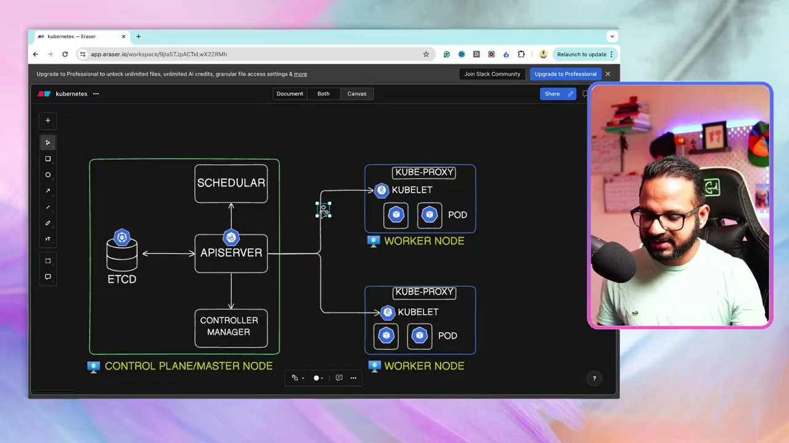

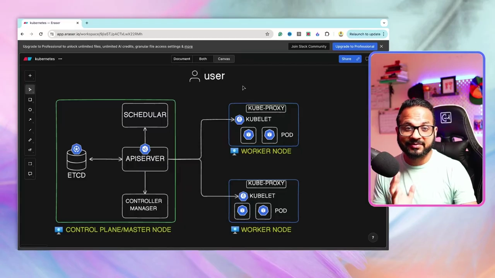

### 5.2 以"创建 Pod"为例：请求如何一步步落地

现在假设请求的内容是**创建一个 Pod**（比如执行 `kubectl create pod` 并附上镜像、端口等细节）。作者说明：kubectl 的具体命令后面会讲，这里只需理解这个流程。[【跳转到 17:43】](https://www.youtube.com/watch?v=SGGkUCctL4I&t=1063)

**API Server 收到请求后会先做几件事**：它会**先认证（authenticate）请求**，判断**这个请求是否合法、用户是否有相应权限**；然后**验证（validate）请求**——比如这个请求是不是 Kubernetes 或 kubectl 客户端**支持的操作**。[【跳转到 17:18】](https://www.youtube.com/watch?v=SGGkUCctL4I&t=1038)

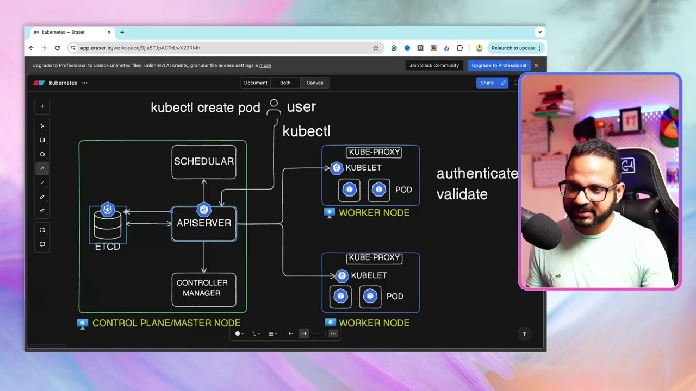

这些检查通过后，完整流程如下（作者一步步演示）：

1. **用户 → API Server**：用户通过 kubectl 把"创建 Pod"的请求发给 API Server。[【跳转到 18:08】](https://www.youtube.com/watch?v=SGGkUCctL4I&t=1088)
2. **API Server 做认证和验证**，然后把请求发给 **etcd**。[【跳转到 18:08】](https://www.youtube.com/watch?v=SGGkUCctL4I&t=1088)
3. **etcd 不会真的"创建 Pod"**——**它是个数据库，做不了这件事**。它能做的是**在数据库里"登记一条记录（entry）"，表示"这个 Pod 已被创建"**。[【跳转到 18:33】](https://www.youtube.com/watch?v=SGGkUCctL4I&t=1113)

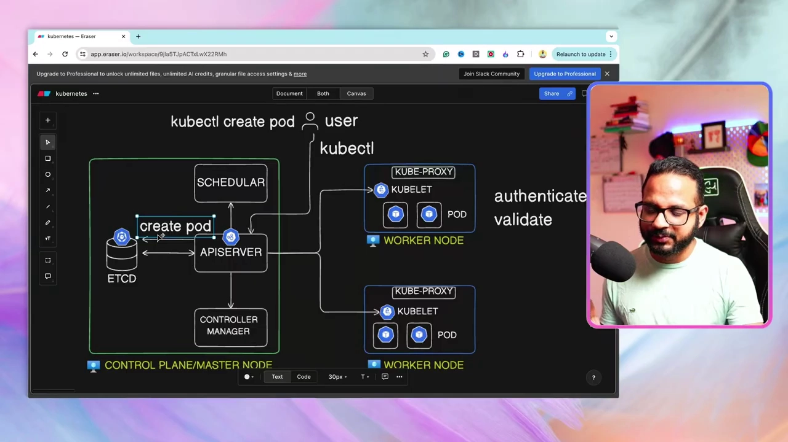

4. 记录创建完成后，**etcd 把响应返回给 API Server**——"记录已创建"。[【跳转到 18:58】](https://www.youtube.com/watch?v=SGGkUCctL4I&t=1138)
5. **Scheduler 一直在运行**，它**持续监控控制平面**。调度器发现"有一个 Pod 需要被调度到某个节点上"，于是开始安排。[【跳转到 18:58】](https://www.youtube.com/watch?v=SGGkUCctL4I&t=1138)
6. **Scheduler 告诉 API Server**："我找到了一个合适的节点，请把这个 Pod 调度到这台节点上。"[【跳转到 19:23】](https://www.youtube.com/watch?v=SGGkUCctL4I&t=1163)

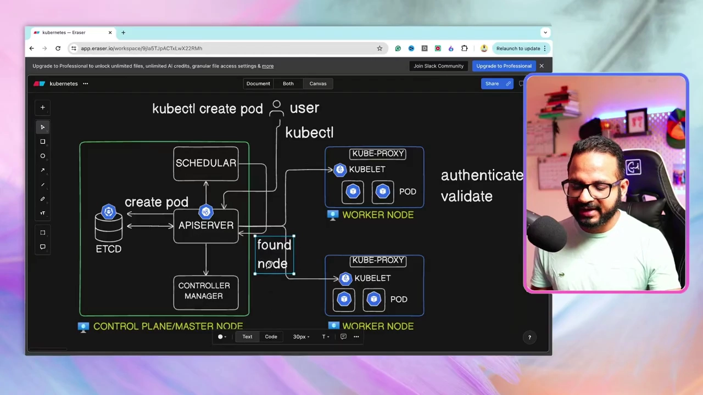

7. **注意一个关键设计**：此时 Pod **其实还没真正被调度**（只是 etcd 里有记录，调度器找到了可用节点）。**调度器只是把指令发给 API Server**——**所有组件都只向 API Server 发送细节或请求元数据，最终由 API Server 来做决定。**[【跳转到 19:48】](https://www.youtube.com/watch?v=SGGkUCctL4I&t=1188)
8. 于是 **API Server 去联系 kubelet**。假设它选中了 **节点 A（node A）**，就**通知这个节点上的 kubelet**："我有个活儿给你——把这个 Pod 调度到你的节点上。"[【跳转到 20:13】](https://www.youtube.com/watch?v=SGGkUCctL4I&t=1213)
9. **收到请求后，kubelet 在这台节点上调度/创建这个 Pod**，然后把细节**回传给 API Server**："Pod 已创建。"[【跳转到 20:38】](https://www.youtube.com/watch?v=SGGkUCctL4I&t=1238)
10. **API Server 再把这个记录更新到 etcd 数据库**——"是的，Pod 已被创建。"至此**所有工作完成**。[【跳转到 20:38】](https://www.youtube.com/watch?v=SGGkUCctL4I&t=1238)
11. 最后，**API Server 把结果返回给用户**："你请求的 Pod 现在已经被创建好了。"[【跳转到 21:03】](https://www.youtube.com/watch?v=SGGkUCctL4I&t=1263)

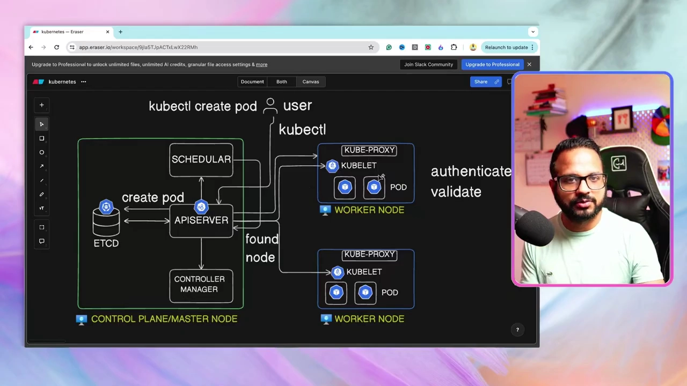

作者强调：**图中所有组件都只和 API Server 打交道，由 API Server 统一做决定、统一读写 etcd**，这就是 Kubernetes 架构"以 API Server 为中心"的含义。

### 5.3 读操作也一样：查询 Pod 走的是同一套链路

如果请求**不是"创建 Pod"，而是"查询 Pod"**（比如想查看这个节点上跑了多少个 Pod），流程类似但要简单得多：[【跳转到 21:28】](https://www.youtube.com/watch?v=SGGkUCctL4I&t=1288)

1. **API Server 收到请求**，先**认证并验证**请求；
2. 请求验证通过后，API Server **直接从 etcd 数据库读取信息**——用户（已认证）想知道某个 **namespace（命名空间）**里跑了多少个 Pod；
3. API Server 从 **etcd 取出这条数据**，然后**把响应返回给用户**。

**为什么读操作不需要去集群里逐个检查？** **因为 etcd 数据库里存着集群的每一条细节信息**，所以 API Server **只要查数据库就能拿到结果，不用去集群里数一遍。**[【跳转到 21:53】](https://www.youtube.com/watch?v=SGGkUCctL4I&t=1313)

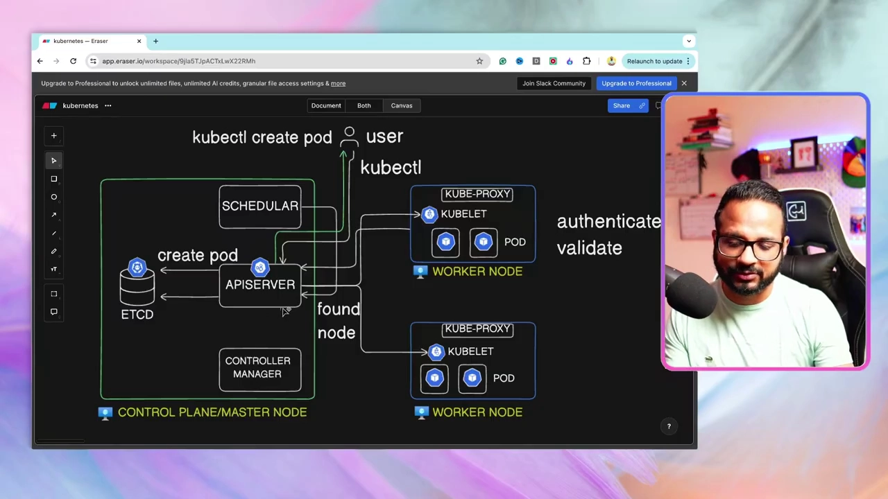

作者最后做了**流程复盘**，概括 API Server 在整个链路里做的事：[【跳转到 22:18】](https://www.youtube.com/watch?v=SGGkUCctL4I&t=1338)

- 先**认证并验证（authenticate and validate）**请求；
- 然后**从 etcd 读取和更新（retrieve and update）数据**；
- 接着**接收 scheduler 的指令**（scheduler 持续监控有没有待调度的 Pod）；
- 一旦找到待办，就**指令 API Server 去调度这个 Pod**，并提供节点细节；
- API Server 拿到节点细节后，**把请求发送给对应的 kubelet**（"我在可用节点里发现你是最合适的那台，去调度这个 Pod 吧"）；
- kubelet 完成后**把响应回传给 API Server**，API Server 再**把响应返回给客户端**。[【跳转到 23:08】](https://www.youtube.com/watch?v=SGGkUCctL4I&t=1388)

---

## 六、高可用：生产环境的控制平面通常不止一个节点

作者在这一讲里还顺带提了一个生产环境的重要实践：**在高可用（High Availability）的生产环境中，控制平面通常也不会只有一个节点，而会有多个节点来支撑高可用性。**（这个内容后面会详细展开。）[【跳转到 05:13】](https://www.youtube.com/watch?v=SGGkUCctL4I&t=313)

含义很直接：如果控制平面只有一台机器，它一挂，整个集群就没人指挥了。**多台控制平面节点互为备份**，才能保证集群的"大脑"持续在线。

> 字幕里对高可用只作为"稍后详讲"一带而过，本讲不展开具体机制。

---

## 小结

- **Kubernetes 集群 = 控制平面（Control Plane / Master Node） + 工作节点（Worker Node）**：控制平面"发号施令"，工作节点"真正干活"。[【跳转到 01:03】](https://www.youtube.com/watch?v=SGGkUCctL4I&t=63)
- **节点（Node）** 其实就是一台虚拟机：跑 Kubernetes 组件和工作负载的机器。[【跳转到 01:28】](https://www.youtube.com/watch?v=SGGkUCctL4I&t=88)
- **控制平面像公司董事会**：负责决策、下指令，不亲自干一线的活。[【跳转到 02:18】](https://www.youtube.com/watch?v=SGGkUCctL4I&t=138)
- **Pod 是 Kubernetes 中最小的可部署单元**，是封装容器的"襁褓"，一个 Pod 可含一个或多个容器。[【跳转到 04:23】](https://www.youtube.com/watch?v=SGGkUCctL4I&t=263)
- **控制平面的四大组件**：
  - **kube-apiserver**：所有请求的唯一入口，也是唯一能读写 etcd 的组件；[【跳转到 06:03】](https://www.youtube.com/watch?v=SGGkUCctL4I&t=363)
  - **etcd**：集群的"账本"（键值数据库，NoSQL、无模式），存着集群的全部信息与状态；[【跳转到 08:33】](https://www.youtube.com/watch?v=SGGkUCctL4I&t=513)
  - **kube-scheduler**：根据 CPU/内存/磁盘/requests/limits 等因素为 Pod 选节点；[【跳转到 06:28】](https://www.youtube.com/watch?v=SGGkUCctL4I&t=388)
  - **kube-controller-manager**：一群控制器（node / namespace / deployment…）的集合，持续监控、维持集群对象的健康与期望状态。[【跳转到 07:43】](https://www.youtube.com/watch?v=SGGkUCctL4I&t=463)
- **工作节点的两大组件**：**kubelet**（节点代理，执行控制平面指令、打通与控制平面的通信）与 **kube-proxy**（创建 IP table 规则，实现 Pod 间网络通信）。[【跳转到 13:33】](https://www.youtube.com/watch?v=SGGkUCctL4I&t=813)
- **一次 `kubectl create pod` 的旅程**：用户 → kubectl → API Server（认证+验证）→ etcd 记录 → Scheduler 选节点 → API Server → kubelet 创建 Pod → 回传 API Server → 更新 etcd → 返回用户。[【跳转到 18:08】](https://www.youtube.com/watch?v=SGGkUCctL4I&t=1088)
- **核心规律**：所有组件都只和 API Server 交互，由 API Server 统一做决定、统一读写 etcd；读操作直接查 etcd 即可，无需遍历集群。[【跳转到 19:48】](https://www.youtube.com/watch?v=SGGkUCctL4I&t=1188)
- **高可用**：生产环境控制平面通常有多个节点，以保障持续可用。[【跳转到 05:13】](https://www.youtube.com/watch?v=SGGkUCctL4I&t=313)

## 关键术语速查

| 术语 | 一句话解释 |
| --- | --- |
| Kubernetes（K8s） | 容器编排系统；本讲讲解它的内部架构 |
| 控制平面（Control Plane / Master Node） | 集群的"大脑"，负责决策和发指令，不跑业务负载 |
| 工作节点（Worker Node） | 真正运行容器/Pod/服务等实际工作负载的机器 |
| 节点（Node） | 一台虚拟机（或物理机），承载 Kubernetes 组件或工作负载 |
| Pod | Kubernetes 中最小的可部署单元，封装一个或多个容器 |
| 辅助容器 / init 容器 | Pod 内除主容器外的容器，用于辅助或初始化任务 |
| kube-apiserver | 所有请求的唯一入口；唯一有权读写 etcd 的组件 |
| etcd | 集群的键值数据库（"账本"），存储集群全部信息与状态 |
| 键值数据库（key-value datastore） | 无模式（schema-less）的 NoSQL 数据库，以键值对/JSON 文档存数据 |
| 关系型数据库（RDBMS） | 用行列、固定模式（fixed schema）存储数据的传统数据库 |
| kube-scheduler（调度器） | 根据 CPU/内存/磁盘/requests/limits 等为 Pod 选择节点 |
| kube-controller-manager | 多种控制器（node/namespace/deployment…）的集合，维持集群健康与期望状态 |
| kubelet | 工作节点上的代理，执行控制平面指令、与管理端通信 |
| kube-proxy | 工作节点上负责网络，创建 IP table 规则实现 Pod 间通信 |
| kubectl | 与集群交互的命令行客户端（CLI） |
| namespace（命名空间） | 集群内用于隔离/分组资源的作用域 |
| requests / limits | Pod 请求的与最多可用的资源量，供调度器决策 |
| 高可用（High Availability） | 用多台控制平面节点保障集群持续可用 |
