# Day 6：用 Kind 搭好本地 Kubernetes 集群——从单节点、多节点到多集群切换

> 视频来源：[Day 6/40 - Kubernetes Multi Node Cluster Setup Step By Step | Kind Tutorial](https://www.youtube.com/watch?v=RORhczcOrWs)（YouTube，频道 Tech Tutorials with Piyush）
>
> 前几讲讲的是容器与 Kubernetes 的"为什么"。这一讲开始动手：**用 Kind（Kubernetes in Docker）在本机搭一套 Kubernetes 集群**，并把后续整个系列做实验要用的环境先准备好。文稿左栏为英文自动字幕，本文已翻译并重写为中文。

## 本讲要解决的核心问题（SCQA）

**背景**：整个 CKA 系列不会使用任何云厂商的托管服务（AKS、EKS、GKE）。要真正学会 Kubernetes，需要一套自己完全能控制的实验环境。

**冲突**：托管 Kubernetes 服务虽然省事，但它**不让你接触 control-plane（控制平面）节点**——运维和排障都被云厂商包办了，学习价值很低；而"在本地装一套真集群"听起来又很麻烦。

**疑问**：有没有一种办法，能在自己的电脑上快速搭出一套 control-plane 与 worker 分离的多节点集群，方便反复练习和排障，还能同时管理多个集群？

**回答（中心思想）**：用 **Kind**。它把每一个 Kubernetes 节点都跑成一个 **Docker 容器**——`kind create cluster` 一条命令就能起一套集群；写一个 YAML **配置文件**，就能得到 control-plane + worker 分离的多节点集群；再用 `kubectl config use-context` 在多个集群之间切换。本讲把这一整条链路从头走通，而且它的第一站，就是 CKA 考试每道题都要做的"切换 context"。

---

## 一、托管服务学不到东西，所以本机装 Kubernetes

作者在开场先回答了一个被反复问到的问题：**"这个 CKA 系列用哪家云厂商？"答案是——哪家都不用。** [【跳转到 00:05】](https://www.youtube.com/watch?v=RORhczcOrWs&t=5)

原因是学习有先后顺序：[【跳转到 00:18】](https://www.youtube.com/watch?v=RORhczcOrWs&t=18)

- 学 Kubernetes 之前，要先学 **Docker 和容器**（这正是前面几讲的内容）；
- 学托管服务（AKS/EKS/GKE）之前，要**先学会 Kubernetes 本身的本地安装**。

**本地安装能带来最大的学习量和最多的动手机会（hands-on）**，每个概念你都能亲自练一遍。[【跳转到 00:39】](https://www.youtube.com/watch?v=RORhczcOrWs&t=39)

而一旦用托管服务，你**连 control-plane 节点都访问不到**，自然**没法排查各种故障场景**——大部分事情都被云厂商接管了，学习收获反而最少。[【跳转到 00:51】](https://www.youtube.com/watch?v=RORhczcOrWs&t=51)

> **术语：control-plane（控制平面）** 是 Kubernetes 的"大脑"，运行 API Server、调度器（scheduler）、控制器管理器（controller-manager）、etcd 等组件，负责决定"哪个容器该跑在哪台机器上"。只有能接触到 control-plane 节点，你才能看到集群内部真正的运作。

作者还说明，本讲只是"热身（warm-up）"，目的是把后续所有实验要用的环境先搭好。[【跳转到 25:58】](https://www.youtube.com/watch?v=RORhczcOrWs&t=1558)

---

## 二、Kind 是什么：把每个 Kubernetes 节点塞进一个 Docker 容器

在本地装 Kubernetes 有好几种选择：**Minikube、K3S、K3D、Kind**，还有很多其他工具。[【跳转到 01:21】](https://www.youtube.com/watch?v=RORhczcOrWs&t=81)

本讲选的是 **Kind**，它是 **Kubernetes in Docker** 的缩写，也是最流行的本地安装方式之一。

Kind 官方文档给的定义是：**一个用 Docker 容器节点来运行本地 Kubernetes 集群的工具**。它最初是为测试 Kubernetes 自身而设计的，但同样可以用于本地开发和 CI。[【跳转到 02:03】](https://www.youtube.com/watch?v=RORhczcOrWs&t=123)

把这句话拆开，Kind 在背后做的事情就很清楚了：[【跳转到 02:28】](https://www.youtube.com/watch?v=RORhczcOrWs&t=148)

1. **拉起若干个 Docker 容器**；
2. **把每个容器当作一个独立的节点（node）**；
3. 于是这些节点就能分别充当 **control-plane 节点**和 **worker 节点**。

因为底层复用了你已经装好的 Docker，所以**配置起来很简单**。Kind 的文档页 `kind.sigs.k8s.io` 提供了完整教程，作者也把链接放进了视频描述和 GitHub 仓库。

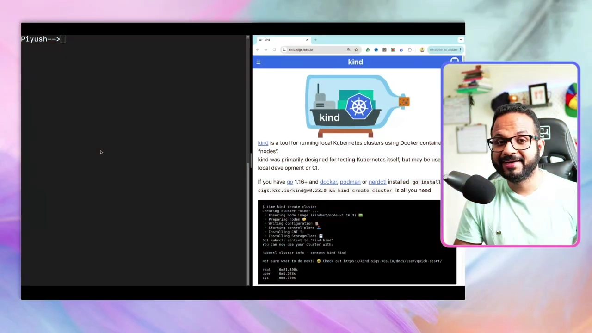

> **术语：node（节点）** 是 Kubernetes 里的一台"工作机器"。集群由若干节点组成：**control-plane 节点**负责决策，**worker 节点**负责真正运行你的容器（业务负载）。

---

## 三、装 kind：一条包管理器命令就够

**前置条件**：系统里需要有 **Go 1.16**，以及 **Docker、Podman 或 nerdctl** 三者之一。作者本机在之前的视频里已经装好了 Docker，所以直接进入安装步骤。[【跳转到 02:28】](https://www.youtube.com/watch?v=RORhczcOrWs&t=148)

打开 Kind 的快速开始（Quick Start）页面，目录里列了三种安装方式：[【跳转到 03:12】](https://www.youtube.com/watch?v=RORhczcOrWs&t=192)

1. **用包管理器安装（Installing With A Package Manager）**；
2. **用发布二进制安装（Installing From Release Binaries）**；
3. **从源码安装（Installing From Source）**。

任选一种顺手的即可，作者选了第一种。不同系统对应不同命令：[【跳转到 03:31】](https://www.youtube.com/watch?v=RORhczcOrWs&t=211)

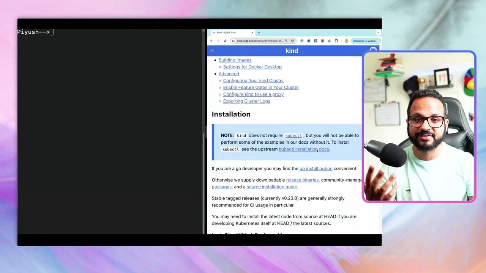

```bash
# macOS（Homebrew）
brew install kind

# macOS（MacPorts）
sudo port selfupdate && sudo port install kind

# Windows（Chocolatey，一个 Windows 包管理器）
choco install kind
```

作者用的是 Mac，执行 `brew install kind` 后下载安装完成，再用 `clear` 清屏即可。[【跳转到 04:21】](https://www.youtube.com/watch?v=RORhczcOrWs&t=261)

> **术语：包管理器（package manager）** 是帮你自动下载、安装、升级软件的工具，例如 macOS 的 Homebrew、Windows 的 Chocolatey。用它可以省去手动下载和解压的步骤。

---

## 四、创建第一个单节点集群：kind create cluster

kind 装好后，下一步就是创建集群。文档写得很直白：**创建一个 Kubernetes 集群，简单到只需要 `kind create cluster` 一条命令**。[【跳转到 04:46】](https://www.youtube.com/watch?v=RORhczcOrWs&t=286)

这条命令还有几个可选参数：[【跳转到 06:43】](https://www.youtube.com/watch?v=RORhczcOrWs&t=403)

- **`--image`**：指定用哪张节点镜像，不指定就用最新的 Kubernetes 镜像；
- **`--name`**：给集群起名字，不指定时默认叫 **`kind`**。

Kind 文档中的 "Creating a Cluster" 一节把这些都写清楚了：

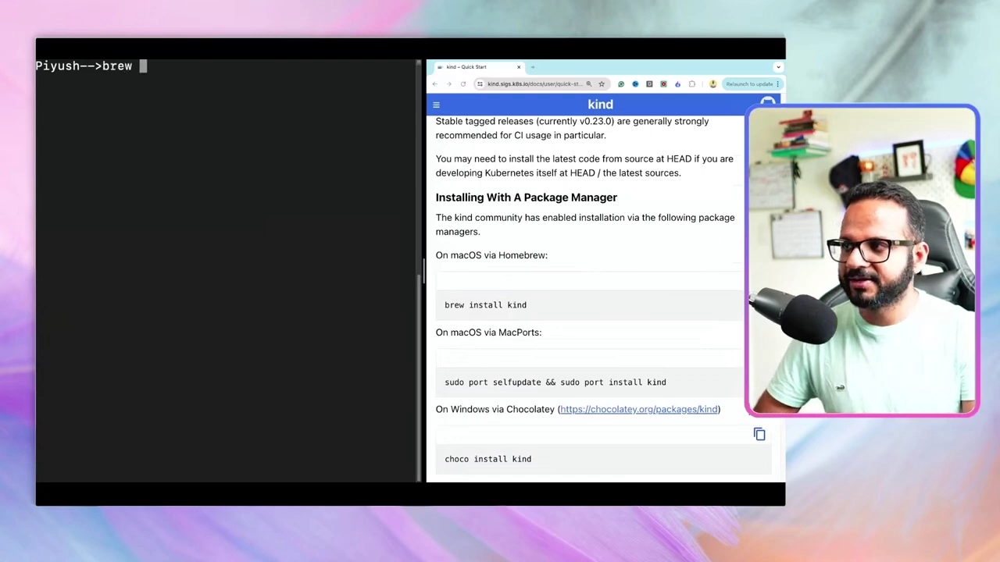

### 4.1 版本要和考试保持一致

作者特别强调版本：录制视频的 2024 年 5 月，**CKA 考试里可用的版本是 1.29**，所以他安装 1.29。[【跳转到 05:11】](https://www.youtube.com/watch?v=RORhczcOrWs&t=311)

如果你是在几个月之后看到这个视频，**考试实验室里的版本可能已经变了**，建议去 **CNCF 官方考试指南**确认当前版本。作者也安慰说，CKA 在不同版本之间**改动很小**，但还是建议用与考试相近的版本。[【跳转到 05:36】](https://www.youtube.com/watch?v=RORhczcOrWs&t=336)

要指定版本，就去 Kind 的 **GitHub Releases** 页面找对应的预构建镜像。页面上按版本列出了镜像（1.30、1.29、1.28……），作者取了 **1.29.4** 那一行——它带有镜像仓库地址和一个 **SHA 校验值**（`@sha256:...`），用来精确定位、校验我们拉到的就是那份镜像。[【跳转到 06:18】](https://www.youtube.com/watch?v=RORhczcOrWs&t=378)

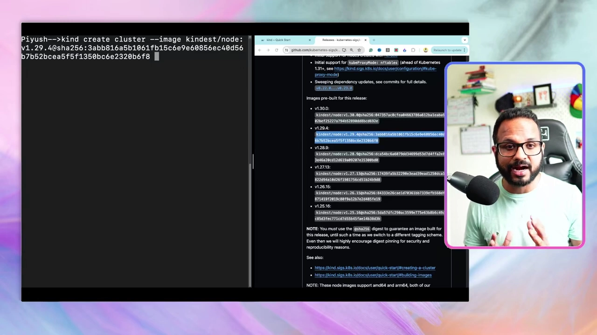

> **术语：镜像（image）** 是容器的"出厂模板"，包含应用及其运行所需的一切。这里每张镜像就是一个预装好 Kubernetes 组件的"节点"。

### 4.2 执行创建命令

把镜像名和集群名拼起来，命令如下：

```bash
kind create cluster \
  --image kindest/node:v1.29.4@sha256:3abb816a5b1061fb15c6e9e60856ec40d56b7b52bcea5f5f1350bc6e2320b6f8 \
  --name cka-cluster1
```

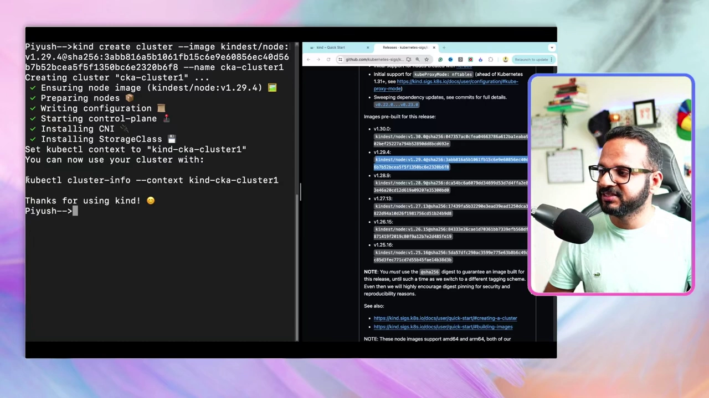

执行过程中会打印一系列步骤：**拉取节点镜像 → 准备节点 → 写配置 → 启动 control-plane**。作者提醒，control-plane 里包含我们前面讲过的各类组件：**API Server、scheduler、controller-manager、etcd** 等等。[【跳转到 07:33】](https://www.youtube.com/watch?v=RORhczcOrWs&t=453)

创建完成后，终端会提示用 `kubectl cluster-info --context kind-cka-cluster1` 查看集群。这个"context"就是后面第八节要讲的切换核心。

### 4.3 查看集群信息

`kubectl cluster-info` 用来获取指定集群的详情，这里通过 `--context kind-cka-cluster1` 指定了目标。输出会告诉你：**control-plane 正运行在某个端口上（如 63787）**，以及 **CoreDNS 正在运行**。[【跳转到 08:23】](https://www.youtube.com/watch?v=RORhczcOrWs&t=503)

> **术语：CoreDNS** 是集群内部的 DNS 服务，相当于集群里的"本地 DNS 服务器"，负责让各个服务通过名字互相找到彼此。作者说后面会有一集专门讲它，现在先把它理解成一个提供 DNS 功能的 Service 即可。[【跳转到 08:48】](https://www.youtube.com/watch?v=RORhczcOrWs&t=528)

---

## 五、装好 kubectl：与任何集群对话的唯一入口

在运行任何 `kubectl` 命令之前，**必须先装好 kubectl 命令行工具**。它是整个 CKA 系列都要用到的核心工具，也是我们**与任何 Kubernetes 集群交互的统一入口**——无论是 EKS、AKS、GKS，还是 VMware 裸金属上的本地安装，用的都是它。[【跳转到 09:13】](https://www.youtube.com/watch?v=RORhczcOrWs&t=553)

如果还没装，就去 Kubernetes 官方文档的 **Install Tools** 页面，按你的系统（Linux / macOS / Windows）跟着步骤装。以 Linux 为例，基本就是一条 `curl` 命令下载二进制、校验、再安装，和安装其他软件包没什么两样。[【跳转到 10:06】](https://www.youtube.com/watch?v=RORhczcOrWs&t=606)

装好后可以用下面这条命令验证客户端版本：

```bash
kubectl version --client
```

作者本机显示 **Client Version: v1.28.2**（字幕识别为 "1.2.28.2"，应为 v1.28.2）。他解释说：**kubectl 的版本和 Kubernetes 集群的版本是两回事**。理想情况下两者应保持一致，但他的 kubectl 是很早之前装的，而集群是刚装的 1.29，于是出现了版本不匹配。**这通常没关系**，只是提醒大家留意。[【跳转到 10:31】](https://www.youtube.com/watch?v=RORhczcOrWs&t=631)

---

## 六、kubectl get nodes 看集群：默认只有一个节点

kubectl、kind 都装好了，集群也建好了，下一步就是**和集群交互**。先运行：

```bash
kubectl get nodes
```

这条命令的执行链路是这样的：kubectl 先把请求发到 **API Server**，由它做**校验和认证**，再去 **etcd** 数据库里取结果，最后把正在运行的节点信息返回给你。[【跳转到 11:21】](https://www.youtube.com/watch?v=RORhczcOrWs&t=681)

结果只有**一个节点**，信息如下：[【跳转到 12:06】](https://www.youtube.com/watch?v=RORhczcOrWs&t=726)

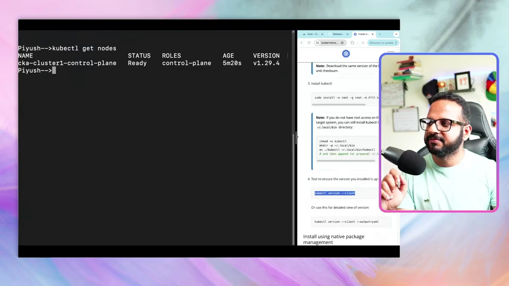

| 字段 | 值 | 含义 |
| --- | --- | --- |
| NAME | `cka-cluster1-control-plane` | 节点名 |
| STATUS | `Ready` | 已就绪 |
| ROLES | `control-plane` | 角色是控制平面 |
| AGE | `5m20s` | 已创建时长 |
| VERSION | `v1.29.4` | Kubernetes 版本 |

**为什么只有一个节点？** 因为默认创建的是**单节点集群**——control-plane 和 worker 的职责被压在同一个节点里，并没有独立的 control-plane 或 worker 节点。[【跳转到 12:31】](https://www.youtube.com/watch?v=RORhczcOrWs&t=751)

**但这不是我们想要的。** 我们希望把 **control-plane 和 worker 分离**，让它们各是独立节点，而不是挤在同一台 VM / 同一个节点里。要得到这种多节点集群，就得用到**配置文件**。

---

## 七、写一个 YAML 配置文件，搭出 control-plane + worker 多节点集群

回到 Kind 文档，往下找 **Configuring Your Kind Cluster** 一节。文档说明：默认只创建单节点，**用配置文件就能创建多节点集群**。[【跳转到 13:01】](https://www.youtube.com/watch?v=RORhczcOrWs&t=781)

多节点配置长这样（注意这是一个 **YAML 文件**，下一讲会专门讲 YAML）：

```yaml
# three node (two workers) cluster config
kind: Cluster
apiVersion: kind.x-k8s.io/v1alpha4
nodes:
  - role: control-plane
  - role: worker
  - role: worker
```

它声明了**三个节点**：一个 control-plane + 两个 worker。[【跳转到 13:26】](https://www.youtube.com/watch?v=RORhczcOrWs&t=806)

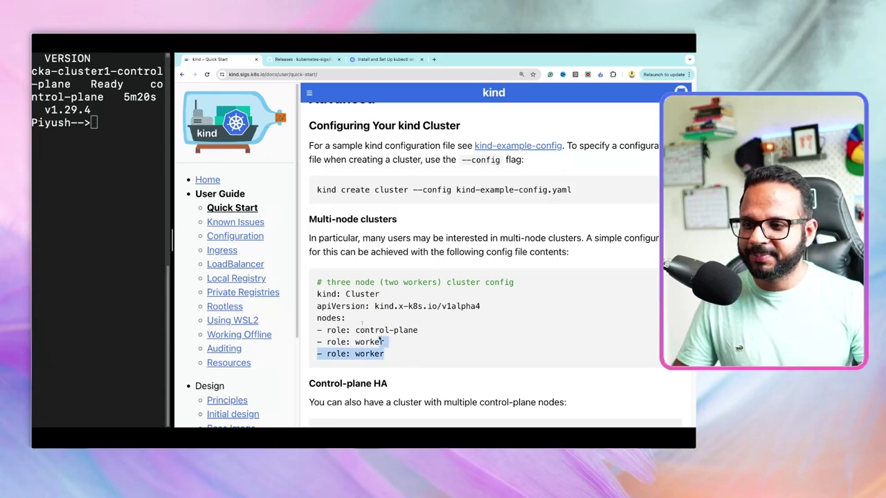

> **术语：YAML** 是一种用缩进表示层级的配置文件格式，可以理解成"给人看的配置语言"。上面的 `kind: Cluster` 表示对象类型是"集群"，`apiVersion` 指定调用哪个内部 API，`nodes` 下的每一项就是一个节点及其 `role`（角色）。

### 7.1 创建并使用这个配置文件

作者的做法是：在终端里新建一个文件，用 **vi 编辑器**写入刚才复制的内容。

```bash
vi config.yaml
# 按 i 进入插入模式，粘贴文档里的内容
# 按 Esc，输入 :wq! 保存退出
```

`:wq!` 表示**保存并退出**。文件内容就是一个 `kind: Cluster` 的对象，`nodes` 下依次是 control-plane、worker、worker。[【跳转到 14:05】](https://www.youtube.com/watch?v=RORhczcOrWs&t=845)

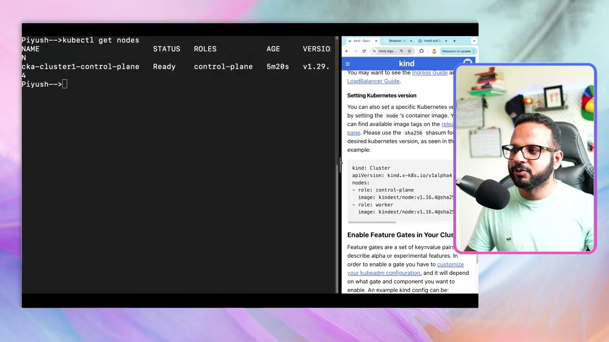

### 7.2 复用 kind create cluster，加上 --config

创建集群的命令和之前一样，只是**多了一个 `--config` 参数**指向这个文件；镜像不变，集群名字改成 `cka-cluster2`：[【跳转到 14:30】](https://www.youtube.com/watch?v=RORhczcOrWs&t=870)

```bash
kind create cluster \
  --image kindest/node:v1.29.4@sha256:3abb816a5b1061fb15c6e9e60856ec40d56b7b52bcea5f5f1350bc6e2320b6f8 \
  --name cka-cluster2 \
  --config config.yaml
```

执行时能清楚看到 Kind 在背后做的每一步：**用 1.29.4 节点镜像 → 准备节点 → 启动 control-plane → 安装 CNI（网络插件）→ 安装 StorageClass（存储类）→ 加入 worker 节点（Joining worker nodes）**。[【跳转到 16:24】](https://www.youtube.com/watch?v=RORhczcOrWs&t=984)

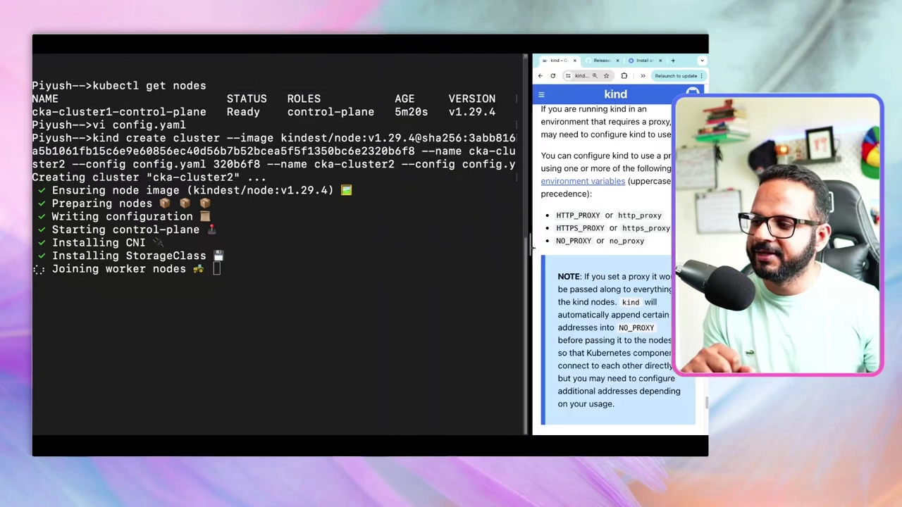

> **为什么需要"加入（join）"worker 节点？** 因为三个节点要成为"同一个集群"，就**必须把 worker 节点接入 control-plane**、在它们之间建立联系，它们才属于同一个集群。这正是"集群"的含义——**一组共同协作的资源**。[【跳转到 16:49】](https://www.youtube.com/watch?v=RORhczcOrWs&t=1009)

> 顺带一提：文档里还展示了 **Control-plane HA** 配置——生产环境里 control-plane 也应做**高可用**，即不止一个控制平面节点，**至少三个**。这部分留到后面再讲。[【跳转到 15:52】](https://www.youtube.com/watch?v=RORhczcOrWs&t=952)

### 7.3 再次查看节点

集群建好后，`kubectl get nodes` 会显示**三个节点**：一个 control-plane、两个 worker，全部处于 `Ready`，版本都是 1.29.4。[【跳转到 17:14】](https://www.youtube.com/watch?v=RORhczcOrWs&t=1034)

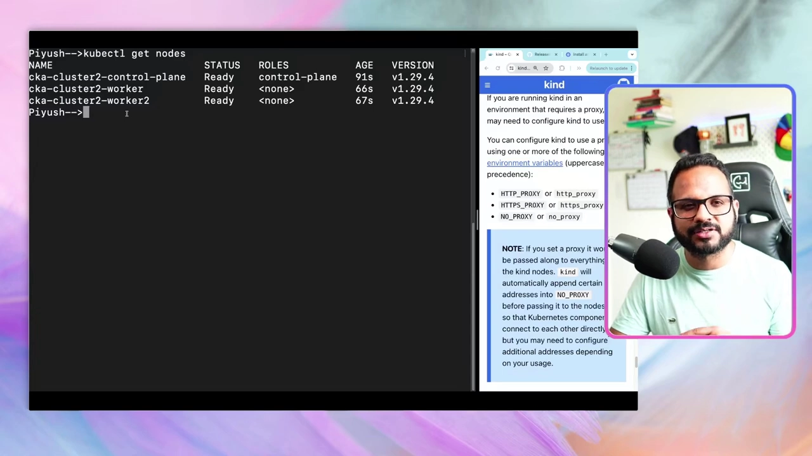

| NAME | STATUS | ROLES |
| --- | --- | --- |
| `cka-cluster2-control-plane` | Ready | control-plane |
| `cka-cluster2-worker` | Ready | `<none>` |
| `cka-cluster2-worker2` | Ready | `<none>` |

> 注意 worker 节点的 ROLES 显示为 `<none>`——这是**正常现象**，Kind 不会给 worker 打角色标签，它们依然在正常工作。

---

## 八、用 context 在多个集群间切换：CKA 每道题的第一步

现在本机有**两个集群**了，一个棘手的问题随之而来：**`kubectl` 到底在和哪个集群说话？** 刚创建完新集群时，它**自动切到了新集群**，所以我们看到的是三个节点。那要如何回头去看第一个（单节点）集群呢？答案是 **context（上下文）**。[【跳转到 18:04】](https://www.youtube.com/watch?v=RORhczcOrWs&t=1084)

> **术语：context（上下文）** 可以类比 Git 的分支：你可能有多个分支，得先切到某个分支才能对它操作。context 就是"当前 kubectl 指向哪个集群"的设定。

**先看有哪些 context：**

```bash
kubectl config get-contexts
```

输出会列出两个 context，**当前所在的那个前面带一个 `*` 星号**。此后你运行的任何命令，返回的都是"当前 context 对应集群"的结果。[【跳转到 22:36】](https://www.youtube.com/watch?v=RORhczcOrWs&t=1356)

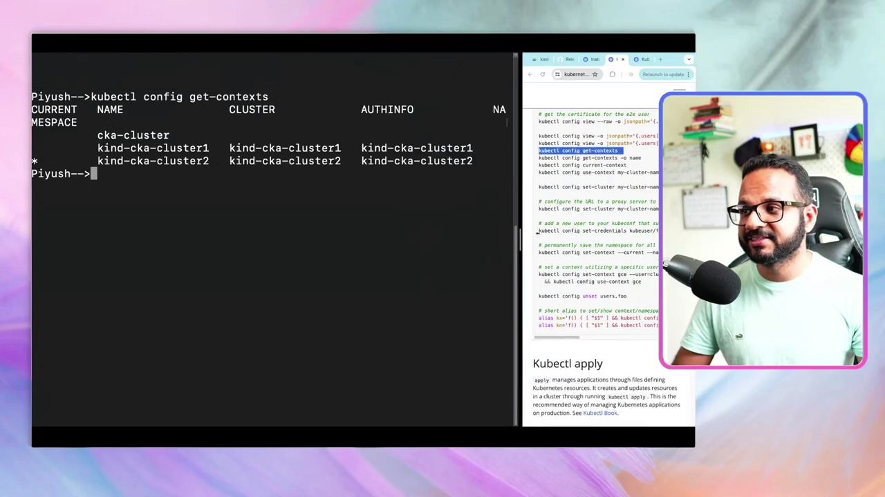

**再切换 context：**

```bash
kubectl config use-context kind-cka-cluster1
```

> **踩坑提醒**：作者一开始敲成了 `kubectl config --set-context kind-cka-cluster1`，被报错 `error: unknown flag: --set-context`。正确的命令是 **`use-context`**，不是 `--set-context`。[【跳转到 18:29】](https://www.youtube.com/watch?v=RORhczcOrWs&t=1109)

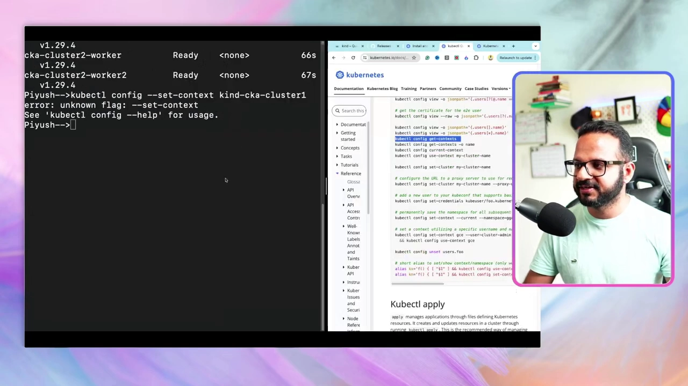

作者建议：**你不需要记住所有命令**，尤其刚学 Kubernetes 时。所以他会去查官方文档——这也引出了下一节的考试技巧。[【跳转到 18:43】](https://www.youtube.com/watch?v=RORhczcOrWs&t=1123)

**切换后验证：**

```bash
kubectl get nodes        # 切回 cluster1 → 只有 1 个节点
kubectl config use-context kind-cka-cluster2
kubectl get nodes        # 切到 cluster2 → 又回到 3 个节点
```

这样你就能在多个集群之间自由切换了。[【跳转到 23:44】](https://www.youtube.com/watch?v=RORhczcOrWs&t=1424)

### 为什么这件事如此重要？

作者反复强调 context，是因为**这正是 CKA 考试里每道题的第一步**：开始任何任务之前，你必须**先切换到题目指定的 context**。题目里会直接给出 `kubectl config use-context ...` 这条命令，你复制粘贴即可。[【跳转到 24:14】](https://www.youtube.com/watch?v=RORhczcOrWs&t=1454)

**如果忘了这一步会怎样？** 比如第一题用 cluster1 完成得很好，第二题本该切到 cluster2，你却没切 context 就继续操作——那么无论步骤做得多正确，任务都无法完成，你还会反复纠结"为什么明明做对了却不行"。[【跳转到 24:39】](https://www.youtube.com/watch?v=RORhczcOrWs&t=1479)

> 所以务必养成习惯：**读题 → 看到 use-context 命令 → 先切 context → 再做任务。**

---

## 九、考试技巧：查官方文档，比背命令更划算

作者给了一颗"定心丸"：**CKA 是完完全全的动手考试**，考的是你的**知识和技能**，而不是"记性"或"背了多少命令"。所以你**不需要记住所有命令**，尤其是初学者。[【跳转到 19:29】](https://www.youtube.com/watch?v=RORhczcOrWs&t=1169)

考试期间，**有两个站点可以访问**：[【跳转到 19:54】](https://www.youtube.com/watch?v=RORhczcOrWs&t=1194)

1. `kubernetes.io/docs` 及其所有子域名；
2. `kubernetes.io/blog` 及其所有子域名。

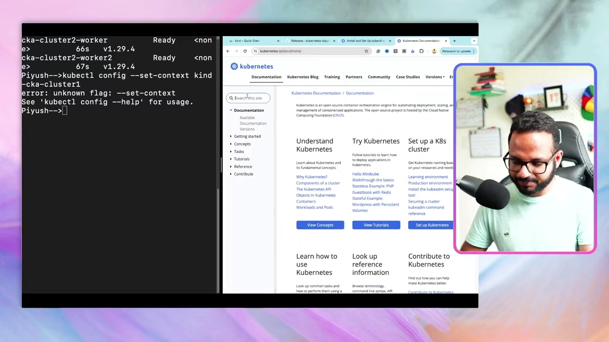

其中最重要的页面之一，是 **kubectl Cheat Sheet（命令速查小抄）**：打开 `kubernetes.io/docs`，搜索 **cheatsheet**，就能在前几条结果里找到它，里面汇总了几乎所有常用命令。[【跳转到 19:02】](https://www.youtube.com/watch?v=RORhczcOrWs&t=1142)

用法很简单：**在页面里按 `Control+F`（macOS 用 `Command+F`）搜索关键词**。比如忘了怎么切 context，就搜 `setcontext`，找到对应命令直接复制粘贴。**关键是你得知道"要搜什么"**——这也是为什么要做大量动手练习。[【跳转到 20:40】](https://www.youtube.com/watch?v=RORhczcOrWs&t=1240)

> 小插曲：作者演示时页面意外打开成了葡萄牙语 / 法语 / 越南语版本，他吐槽"英语版去哪了"——提醒我们查文档时注意页面语言。[【跳转到 22:09】](https://www.youtube.com/watch?v=RORhczcOrWs&t=1329)

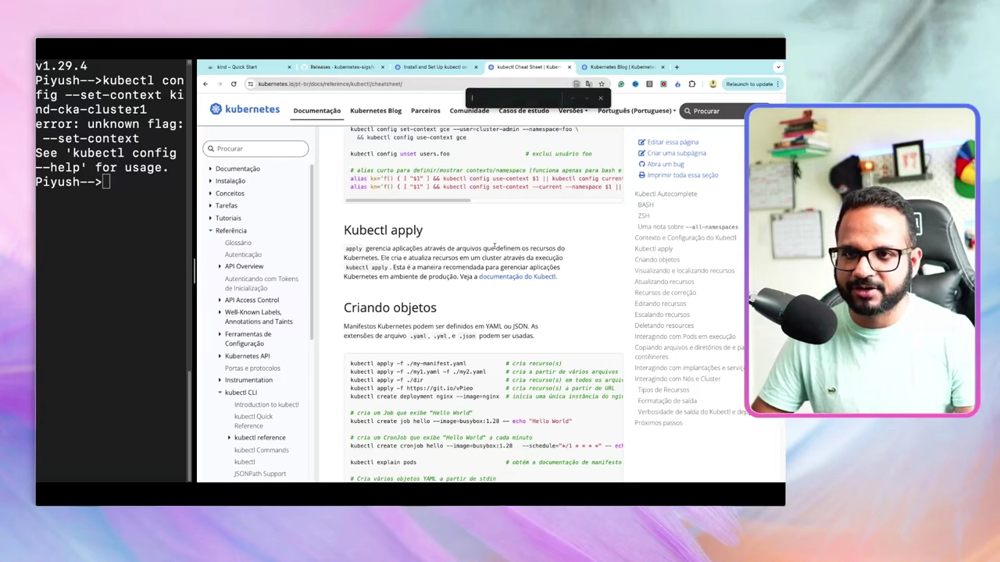

**建议**：把命令练熟，尽量别每次都去查，否则会在搜索上浪费宝贵的考试时间；如果某条命令太长记不住，再去文档里复制。[【跳转到 20:15】](https://www.youtube.com/watch?v=RORhczcOrWs&t=1215)

**下一讲预告**：创建第一个 **Pod**、**命令式（imperative）与声明式（declarative）** 的区别，以及 **YAML** 基础——包括它的格式、如何从零编写、如何检查写对了没有。[【跳转到 26:15】](https://www.youtube.com/watch?v=RORhczcOrWs&t=1575)

---

## 小结

- **不选云托管**：托管服务不让你访问 control-plane，学不到东西、也练不了排障；**本地安装带来的动手量最大**。
- **Kind = Kubernetes in Docker**：它把每个节点跑成一个 Docker 容器，这些容器可分别充当 control-plane 和 worker。本地安装还有 Minikube、K3S、K3D 等选择。
- **装 kind 的前置条件**：Go 1.16 加 Docker / Podman / nerdctl 三者之一；安装方式有包管理器（`brew install kind` / `choco install kind`）、发布二进制、源码三种。
- **单节点集群**：`kind create cluster --image <镜像> --name cka-cluster1`，不指定名字时默认叫 `kind`；CKA 当月可用版本是 1.29，镜像从 GitHub Releases 取（带 sha256 校验）。
- **kubectl 是唯一入口**：与任意集群交互都用它；`kubectl version --client` 看客户端版本，和集群版本不完全一致通常没关系。
- **`kubectl get nodes`** 的链路是 API Server 认证 → etcd 取数；单节点集群只有一个 `cka-cluster1-control-plane`。
- **多节点集群**：用 `--config config.yaml`，YAML 里声明 `control-plane + worker + worker`；创建时会安装 CNI、StorageClass，并把 worker **加入** control-plane。
- **context 切换**：`kubectl config get-contexts` 看有哪些、星号是当前；`kubectl config use-context <名字>` 切换（**不是** `--set-context`）。这是 **CKA 每道题的第一步**。
- **考试技巧**：CKA 考技能不考背诵；考试中可访问 `kubernetes.io/docs` 和 `/blog`，重点练熟 **kubectl cheatsheet**，用 `Control+F` 搜索。

## 关键术语速查

| 术语 | 一句话解释 |
| --- | --- |
| Kind | Kubernetes in Docker，用 Docker 容器当节点跑本地 K8s 集群 |
| control-plane（控制平面） | 集群的"大脑"，含 API Server、scheduler、controller-manager、etcd |
| worker node（工作节点） | 真正承载业务容器的节点，需加入 control-plane 才算同一集群 |
| node（节点） | 集群里的一台"工作机器"，分 control-plane 与 worker 两种角色 |
| `kind create cluster` | 创建集群的核心命令，支持 `--image`、`--name`、`--config` |
| `--image` | 指定节点镜像，从而决定集群的 Kubernetes 版本 |
| `--config` | 指定 YAML 配置文件，用来创建多节点或高可用集群 |
| YAML | 用缩进表示层级的配置文件格式，Kubernetes 配置的主要写法 |
| `kubectl` | Kubernetes 官方命令行工具，与任意集群交互的唯一入口 |
| `kubectl get nodes` | 查看集群里的所有节点及其状态、角色、版本 |
| `kubectl cluster-info` | 查看集群的 control-plane 地址、CoreDNS 等运行信息 |
| CoreDNS | 集群内部的 DNS 服务，让服务之间能按名字互相发现 |
| CNI | 容器网络插件，Kind 创建集群时自动安装 |
| StorageClass | 存储类，定义集群可用的存储类型 |
| context（上下文） | "当前 kubectl 指向哪个集群"的设定，类比 Git 分支 |
| `kubectl config get-contexts` | 列出所有 context，带 `*` 的是当前 context |
| `kubectl config use-context` | 切换到指定 context（注意不是 `--set-context`） |
| Control-plane HA | 控制平面高可用：生产环境至少 3 个 control-plane 节点 |
| kubectl Cheat Sheet | Kubernetes 官方常用命令速查页，考试中可查 |
