# Day 7：Pod 与命令式、声明式——Kubernetes 里创建资源的两条路

> 视频来源：[Day 7/40 - Pod In Kubernetes Explained | Imperative VS Declarative Way | YAML Tutorial](https://www.youtube.com/watch?v=_f9ql2Y5Xcc)（YouTube，频道 Tech Tutorials with Piyush）
>
> 前六讲把容器（Docker）和 Kubernetes 的整体架构铺垫完了。从这一讲开始，课程正式进入**完整的手把手实操（Hands-On）**：认识 Kubernetes 里最小的可部署单元 **Pod**，并学会**两种创建资源的方式**——命令式（imperative）与声明式（declarative），同时补齐贯穿整个系列的 **YAML** 基础。文稿左栏为英文自动字幕，本文已翻译并重写为中文。

## 本讲要解决的核心问题（SCQA）

**背景**：前面我们已经知道，用户通过 `kubectl` 这类客户端工具与集群里的 **API 服务器（API server）** 打交道，来创建、更新、删除或查询资源。而 Kubernetes 里我们要跑的工作负载（workload），最终都落在 **Pod** 上。

**冲突**：知道"Pod 是运行单元"还不够——真正上手时你会立刻遇到两个问题：**第一，Pod 到底是什么、和容器是什么关系？** **第二，到底该怎么把 Pod 创建出来？** ——是直接敲命令，还是写文件？两种方式似乎都能创建 Pod，该用哪个、为什么要都掌握？此外，Kubernetes 的配置文件几乎全是 YAML，看不懂 YAML 就寸步难行。

**疑问**：Pod 和容器是同一回事吗？命令式和声明式分别怎么用、各自适合什么场景？一份能跑的 Kubernetes YAML 清单长什么样、有哪些字段、缩进规则是什么？创建出问题（比如镜像拉取失败）又该怎么排查？

**回答（中心思想）**：**Pod 是 Kubernetes 里最小的可部署单元，它像一个"豆荚"，里面可以装一个或多个容器。** 创建 Pod 有两条同样重要、必须都掌握的路：**命令式**用一条 `kubectl run` 直接下命令，快、适合排障和临时操作；**声明式**把资源的"期望状态"写进一份 YAML 文件，再用 `kubectl create`/`apply` 提交，适合生产、CI/CD 与 GitOps。Kubernetes 的 YAML 清单由 **`apiVersion`、`kind`、`metadata`、`spec` 四个顶层字段**组成，且**大小写敏感、缩进敏感**；学完本讲你就能独立创建、检查并排障一个 Pod，还能用 `--dry-run=client -o yaml` 让 Kubernetes 替你自动生成 YAML。

---

## 一、先回顾：用户与 Kubernetes 集群是怎么交互的

要把 Pod"放"进集群，先得回忆整个集群的结构。这张图我们在《为什么需要 Kubernetes》里见过：[【跳转到 00:49】](https://www.youtube.com/watch?v=_f9ql2Y5Xcc&t=49)

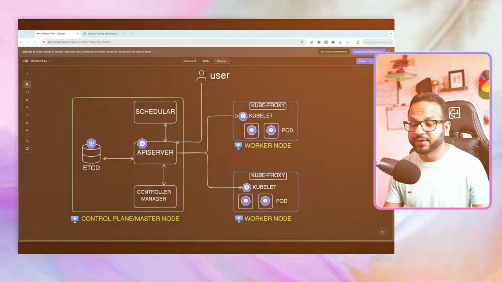

一次典型的交互是这样的：

1. **用户**（你）通过一个**客户端工具（client utility）**与集群对话。在这个系列里，我们用得最多的是 **`kubectl`**；如果用的是托管服务，客户端也可能是云厂商的控制台（cloud console）之类的工具。[【跳转到 00:54】](https://www.youtube.com/watch?v=_f9ql2Y5Xcc&t=54)
2. 用户发出的请求会送到 **API 服务器**，而 API 服务器运行在**控制平面 / 主节点（Control Plane / Master Node）**上。控制平面里还有调度器（Scheduler）、控制器管理器（Controller Manager）和保存集群状态的 **etcd**。[【跳转到 00:54】](https://www.youtube.com/watch?v=_f9ql2Y5Xcc&t=54)
3. 用户想**创建、更新、删除或查询**集群里的东西，都是通过 `kubectl` 向 API 服务器提请求。
4. 请求之后，**Pod 会被安置到某一个工作节点（worker node）上**运行。[【跳转到 01:19】](https://www.youtube.com/watch?v=_f9ql2Y5Xcc&t=79)

> 小澄清：作者特意强调，**并没有一条叫 "create pod" 的命令**。想用命令创建一个 Pod，实际用的命令是 **`kubectl run <名字> ...`**。[【跳转到 01:19】](https://www.youtube.com/watch?v=_f9ql2Y5Xcc&t=79)

---

## 二、Pod 是什么：容器被装进一个"豆荚"里

**Pod 是 Kubernetes 中最小的可部署单元。** 你可以把它想成一个**豆荚（pod）**：豆荚里可以装**一颗或好几颗豆子**，而在 Kubernetes 里，这些"豆子"就是**容器**。[【跳转到 01:44】](https://www.youtube.com/watch?v=_f9ql2Y5Xcc&t=104)

假设我们要跑一个 Nginx 应用，它会作为**一个 Pod** 运行在集群里：

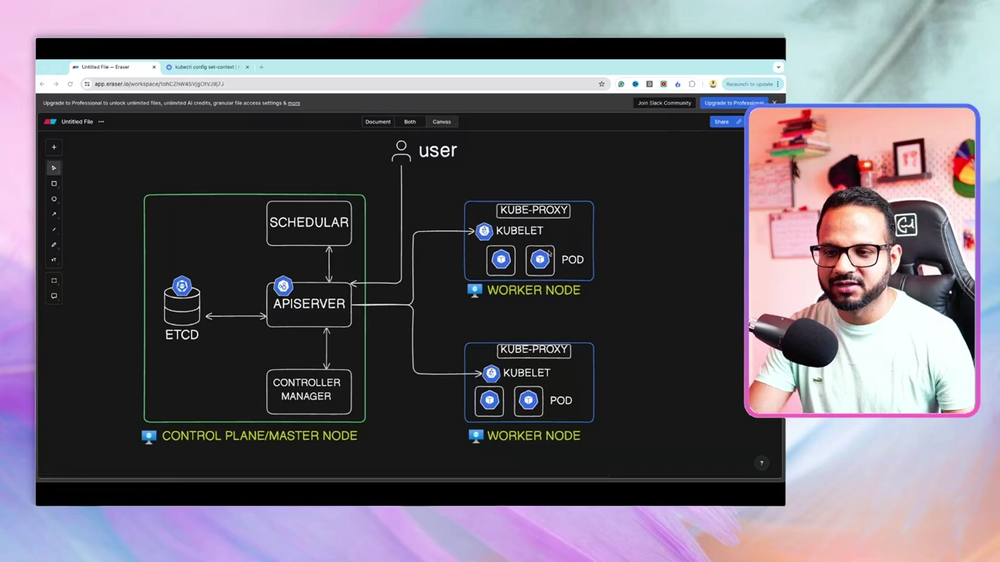

要理解 Pod，先记住以下三点：

- **为什么需要 Pod**：在 Kubernetes 里跑你的工作负载（workload）——也就是让容器跑起来——正是你使用 Kubernetes 的**主要目的**，而 Pod 就是承载这些容器的外壳。[【跳转到 02:09】](https://www.youtube.com/watch?v=_f9ql2Y5Xcc&t=129)
- **一个 Pod 可以装多个容器**：有的容器是**辅助容器（helper container）**，有的是**初始化容器（init container）**，或者负责某个特定任务，然后一直运行或跑完就结束。[【跳转到 07:34】](https://www.youtube.com/watch?v=_f9ql2Y5Xcc&t=454)
- **"就绪数"反映容器状态**：当 `kubectl get pods` 显示 **`READY 1/1`** 时，意思是这个 Pod 里**只有一个容器，而且这一个正在运行**。如果有两个容器，就可能是 `2/1`、`2/2` 这样的形式（取决于有几个容器处于运行状态）。[【跳转到 07:09】](https://www.youtube.com/watch?v=_f9ql2Y5Xcc&t=429)

> 多容器 Pod（含 helper / init / sidecar 容器）会另开一讲，这里先建立"Pod 可容纳多个容器"的概念。[【跳转到 07:34】](https://www.youtube.com/watch?v=_f9ql2Y5Xcc&t=454)

---

## 三、创建资源有两条路：命令式与声明式

在 Kubernetes 里创建 Pod，主要有**两种方式**：[【跳转到 02:34】](https://www.youtube.com/watch?v=_f9ql2Y5Xcc&t=154)

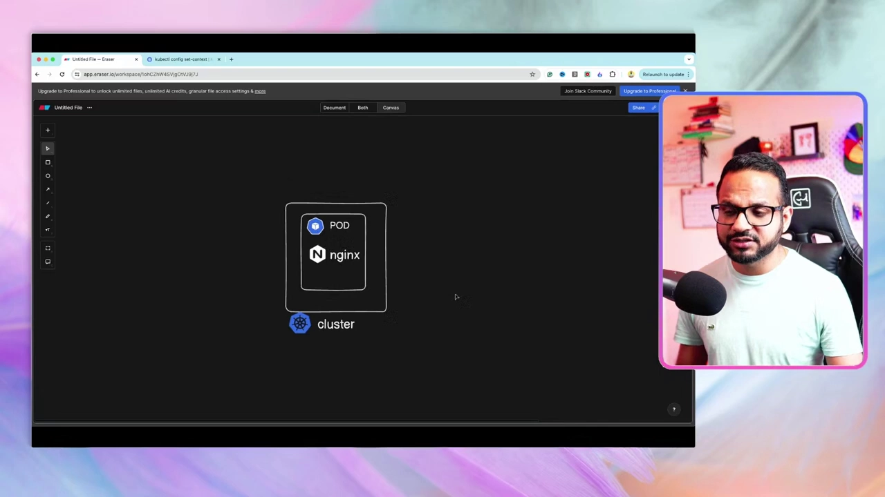

**第一条：命令式（imperative）。** 你直接运行简单命令，例如 `kubectl run nginx`，本质上是在**指示 API 服务器（或 `kubectl` 工具）**去做某件事："去执行这个 run""去把这些详情取回来"等等。它就像在命令行里**下一条条指令**。[【跳转到 02:59】](https://www.youtube.com/watch?v=_f9ql2Y5Xcc&t=179)

**第二条：声明式（declarative）。** 你**创建一个配置文件**（configuration file），这个文件可以是 **JSON** 或 **YAML** 格式。在文件里，你**描述资源的"期望状态"（desired state）**：用哪个 `apiVersion`、Pod 叫什么名字、用哪个镜像、暴露哪个端口……然后运行 `kubectl create` 或 `kubectl apply` 命令提交。注意：**JSON 和 YAML 都支持**，但 YAML 在 Kubernetes 里被大量使用——作者说他几乎没见过谁用 JSON 写 Kubernetes 配置。[【跳转到 03:24】](https://www.youtube.com/watch?v=_f9ql2Y5Xcc&t=204)

两者**同样重要，都必须掌握**，因为它们各有分工：[【跳转到 04:39】](https://www.youtube.com/watch?v=_f9ql2Y5Xcc&t=279)

| 方式 | 典型用法 | 适合场景 |
| --- | --- | --- |
| **命令式** | `kubectl run`、`kubectl get` 等命令 | **排障（troubleshoot）**、本地部署、临时快速操作 |
| **声明式** | 写 YAML，再 `kubectl create` / `apply` | **生产部署、CI/CD、GitOps** |

作者的原话是：即使你日常工作两边都用，命令式这类命令也常被用来**排查集群问题**，或在**本地部署**时使用；而声明式是**生产部署、CI/CD 乃至 GitOps** 的标准做法。[【跳转到 05:04】](https://www.youtube.com/watch?v=_f9ql2Y5Xcc&t=304)

---

## 四、命令式创建 Pod：一条 `kubectl run` 就够了

先演示命令式。作者在 VS Code 里建了一个 `README.md` 方便记录，并打开了集成终端。[【跳转到 05:49】](https://www.youtube.com/watch?v=_f9ql2Y5Xcc&t=349)

要创建的 Pod 用一个 Nginx 镜像。命令是：

```bash
# 命令式创建 Pod：kubectl run <Pod 名字> --image=<镜像>
kubectl run nginx-pod --image=nginx:latest
```

逐一解释：[【跳转到 06:19】](https://www.youtube.com/watch?v=_f9ql2Y5Xcc&t=379)

- **`kubectl run`**：命令式创建 Pod 的入口（不是 "create pod"）。
- **`nginx-pod`**：给这个 Pod 起的名字（作者为了表意清楚，用 `nginx-pod` 而不是只叫 `nginx`）。
- **`--image=nginx:latest`**：指定容器使用的镜像。`:latest` 是**可选的标签（tag）**；如果镜像有其它版本标签，也可以在这里指定。

回车后终端提示 **`pod/nginx-pod created`**，Pod 就建好了。接着查看：

```bash
kubectl get pods
```

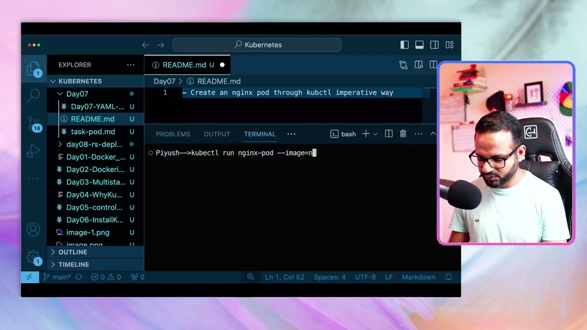

输出里 **`READY 1/1`、`STATUS Running`** 说明 Pod 里唯一的容器正在运行。作者提醒：Pod 的状态不一定"一步到位"进入 `Running`，它可能先经历**容器创建中（creating）**再变成 **Running**。[【跳转到 06:44】](https://www.youtube.com/watch?v=_f9ql2Y5Xcc&t=404)

---

## 五、动手前先补课：YAML 的基础语法

声明式要写 YAML，所以先打基础。作者说，之所以用 YAML，是因为它**非常好用、干净、直观**，在 Kubernetes 系列里我们会一直用它作为**配置语言（configuration language）**，也就是所谓的**序列化语言（serialized language）**；而且它在很多其它工具里也广泛使用，比如 **Ansible、Prometheus、Docker Compose**。[【跳转到 08:49】](https://www.youtube.com/watch?v=_f9ql2Y5Xcc&t=529)

### 5.1 文件扩展名、注释与数据类型

- **扩展名**：YAML 文件可以用 **`.yaml`** 或 **`.yml`**，两者完全等价，随便用哪个。[【跳转到 08:24】](https://www.youtube.com/watch?v=_f9ql2Y5Xcc&t=504)
- **注释**：用 **`#`** 号开头，注释内容不会被执行。[【跳转到 09:14】](https://www.youtube.com/watch?v=_f9ql2Y5Xcc&t=554)
- **数据类型**：YAML 支持**列表（list）、字典（dictionary）、字符串、整数、浮点数**等多种类型。[【跳转到 09:39】](https://www.youtube.com/watch?v=_f9ql2Y5Xcc&t=579)

### 5.2 字典（键值对）与缩进

先看一个**不是 Kubernetes 术语、只是普通例子**的字典。作者用 `employee`（员工）来演示：

```yaml
# 这是一个注释
employee:
  name: piyush
  age: 34
  address: 1.7
```

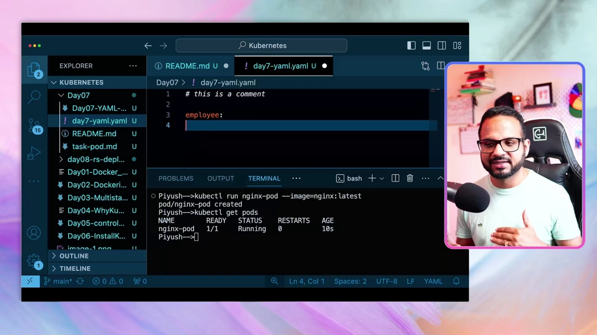

要点：[【跳转到 10:04】](https://www.youtube.com/watch?v=_f9ql2Y5Xcc&t=604)

- **字典**：`spec:`（这里用 `employee:` 演示）后面跟一个冒号，就定义了一个字典，里面可以放很多字段。用 YAML 表达层级**靠缩进和空格**（如果用 JSON，则靠花括号 `{}`）。
- **缩进**：可以用**双空格、单空格，甚至 Tab**，但**不推荐用 Tab**，因为它会让 YAML 文件变得凌乱；作者统一用**双空格**。[【跳转到 10:29】](https://www.youtube.com/watch?v=_f9ql2Y5Xcc&t=629)
- **字符串不必加引号**：`name: piyush` 这种字符串值不必用双引号括起来；加不加由你决定。[【跳转到 10:54】](https://www.youtube.com/watch?v=_f9ql2Y5Xcc&t=654)
- **同一个例子覆盖多种类型**：`name` 是字符串、`age: 34` 是整数、`address: 1.7` 是浮点数。[【跳转到 10:54】](https://www.youtube.com/watch?v=_f9ql2Y5Xcc&t=654)
- **缩进必须小心**：如果缩进不对，比如把 `age` 少缩进了一级，它就会**脱离 employee、变成一个独立字段**，语法也就错了。[【跳转到 11:19】](https://www.youtube.com/watch?v=_f9ql2Y5Xcc&t=679)

### 5.3 列表（带 `-` 破折号）

列表用**破折号 `-`** 表示，每个条目缩进到同一层级。下面给 `employee` 放进了两个员工：

```yaml
employee:
  - name: piyush
    age: 34
    address: 1.7
  - name: sachdeva
    age: 30
    address:
```

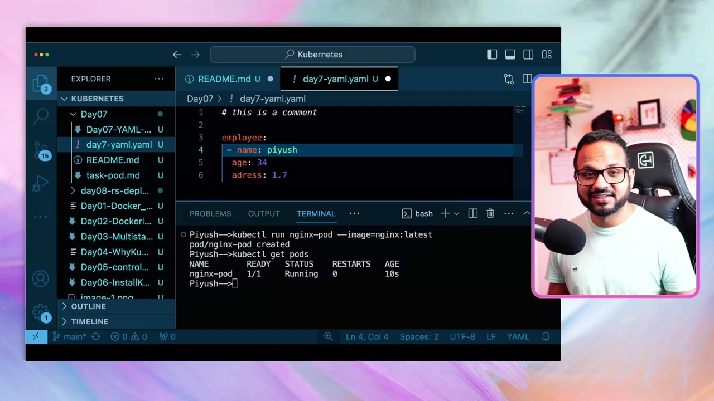

这样就得到一个**含两个值的列表**。列表可以嵌套——比如在 `address` 字段里再加一层"子列表"，放旧地址、新地址等，也就是说 YAML **支持嵌套数据结构**。只要用的是受支持的数据类型，放在顶层目录也没关系。[【跳转到 12:34】](https://www.youtube.com/watch?v=_f9ql2Y5Xcc&t=754)

---

## 六、Kubernetes 的 YAML 清单：四个顶层字段

现在从"通用 YAML"切到"Kubernetes 的 YAML 配置"。在 Kubernetes 的 YAML 里，有**四个顶层字段**必须掌握：[【跳转到 13:49】](https://www.youtube.com/watch?v=_f9ql2Y5Xcc&t=829)

1. **`apiVersion`**：用哪个 API 版本。
2. **`kind`**：要创建的资源类型。
3. **`metadata`**：元数据，比如名字、标签。
4. **`spec`**：规格，描述期望状态。

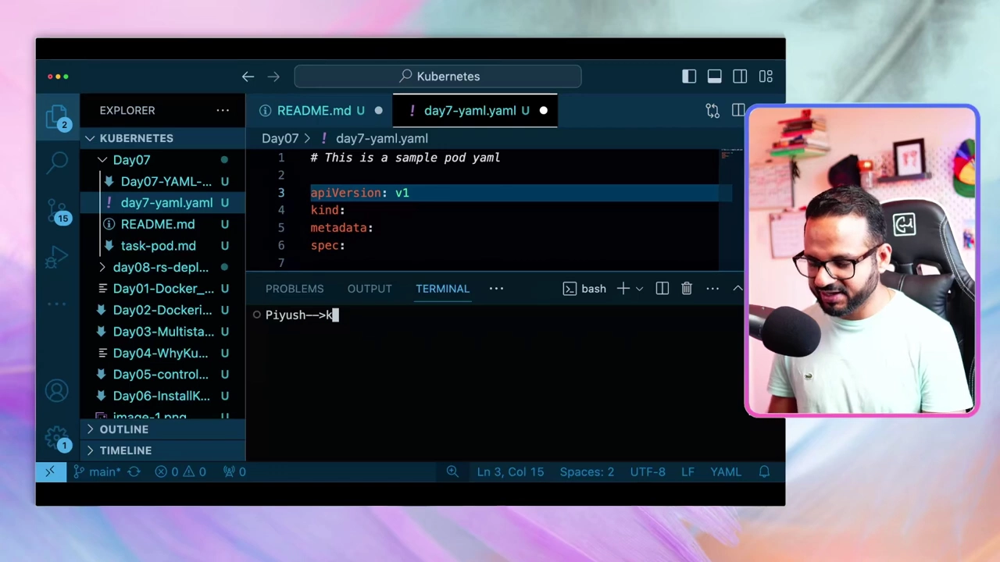

**第一条铁律：Kubernetes 的 YAML 大小写敏感（case sensitive）。** 字段必须写成它规定的格式：`apiVersion` 里的小写 `a`、`kind` 全小写、`metadata` 与 `spec` 也全小写。[【跳转到 14:14】](https://www.youtube.com/watch?v=_f9ql2Y5Xcc&t=854)

**怎么确认 `apiVersion` 该填什么？** 直接用命令查：

```bash
kubectl explain pod
```

在输出的**最上方**会列出这个对象可用的 **kind 和 version**。版本可能是 **beta、alpha、v1、v2** 等，你**必须使用受支持的那个版本**。[【跳转到 14:14】](https://www.youtube.com/watch?v=_f9ql2Y5Xcc&t=854)

> 本讲这份是 **Pod** 的示例清单，用同样的套路，Deployment、ReplicaSet、Service 等其它对象也各有各的清单。[【跳转到 15:04】](https://www.youtube.com/watch?v=_f9ql2Y5Xcc&t=904)

下面把一份完整的 Pod 清单拼出来，逐段解释：[【跳转到 15:04】](https://www.youtube.com/watch?v=_f9ql2Y5Xcc&t=904)

```yaml
# This is a sample pod yaml   （这是 Pod 示例清单的注释）
apiVersion: v1
kind: Pod
metadata:
  name: nginx-pod
  labels:
    env: demo
    type: frontend
spec:
  containers:
    - name: nginx-container
      image: nginx
      ports:
        - containerPort: 80
```

- **`apiVersion: v1`**：Pod 用的版本是 `v1`。[【跳转到 14:14】](https://www.youtube.com/watch?v=_f9ql2Y5Xcc&t=854)
- **`kind: Pod`**：注意 `Pod` 的 **P 必须大写**。[【跳转到 15:04】](https://www.youtube.com/watch?v=_f9ql2Y5Xcc&t=904)
- **`metadata`**：下面有多个字段，`name` 要给 Pod 命名（这里叫 `nginx-pod`），必须**正确缩进**。[【跳转到 15:29】](https://www.youtube.com/watch?v=_f9ql2Y5Xcc&t=929)
- **`labels`**：与 `name` **同一层级**。标签是**任意的键值对**，你想给应用贴什么标签都行；这里贴了两个：`env: demo`、`type: frontend`。**可以加多个标签**。[【跳转到 15:54】](https://www.youtube.com/watch?v=_f9ql2Y5Xcc&t=954)
- **`spec`**：描述期望状态。这里用一个 `containers` 列表——**之所以用破折号 `-`，是因为容器可能是列表**。[【跳转到 16:19】](https://www.youtube.com/watch?v=_f9ql2Y5Xcc&t=979)
  - **`name: nginx-container`**：容器名字。
  - **`image: nginx`**：容器镜像。
  - **`ports`**：这也是一个**列表**，作为 `containers` 下的**子列表**，字段是 **`containerPort`**，端口号是 **`80`**。[【跳转到 16:44】](https://www.youtube.com/watch?v=_f9ql2Y5Xcc&t=1004)

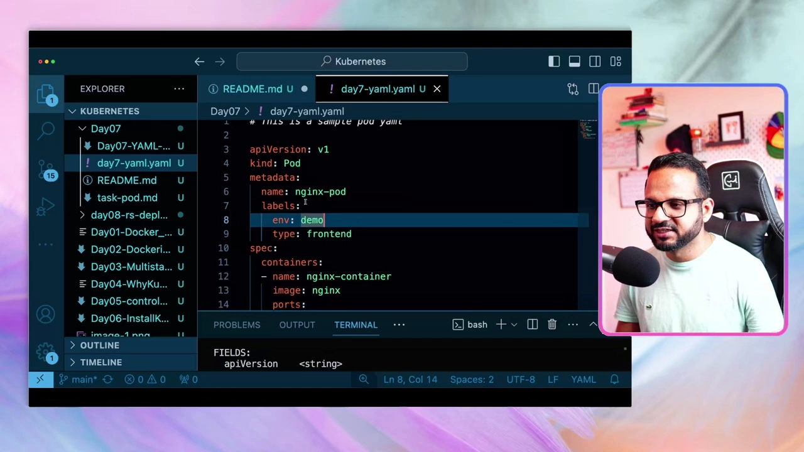

> **最容易犯错的地方**：`metadata`、`spec` 里只能写该对象**支持的字段**；而 **`labels` 要缩进在 `metadata` 下面**，如果把它写成和 `metadata` 同一层级，就是错的。缩进和空格一定要小心。[【跳转到 17:09】](https://www.youtube.com/watch?v=_f9ql2Y5Xcc&t=1029)

---

## 七、用声明式创建 Pod，并学会排障

保存 YAML 文件（作者先命名为 `day7-yaml.yaml`，后来改成 `pod.yaml`），然后用**声明式**命令提交：[【跳转到 18:24】](https://www.youtube.com/watch?v=_f9ql2Y5Xcc&t=1104)

```bash
# 方式一：create —— 用来创建资源
kubectl create -f pod.yaml

# 方式二：apply —— 既能创建、也能更新资源
kubectl apply -f pod.yaml
```

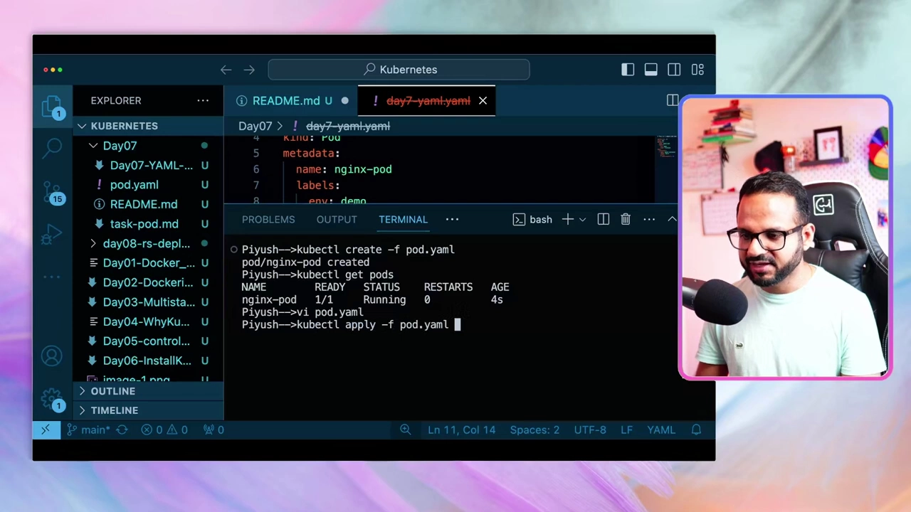

> **`create` 与 `apply` 的区别**：`apply` 既可以创建、也可以**更新**资源；如果资源已存在，`create` 会报 "already exists"，这时要么改名、要么先删除旧 Pod。删除命令是 `kubectl delete pod <Pod 名字>`。[【跳转到 18:49】](https://www.youtube.com/watch?v=_f9ql2Y5Xcc&t=1129)

### 7.1 故意制造一个错误：ImagePullBackOff

为了演示排障，作者**故意把镜像名改错**（写成 `nginx123`），再 `apply` 一次。此时 `kubectl get pods` 会看到：

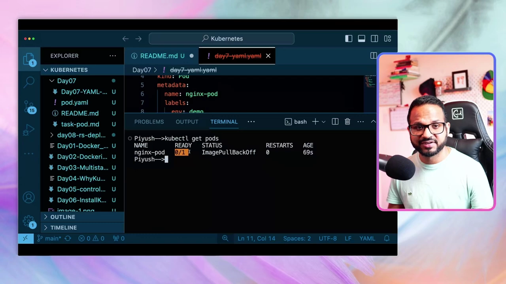

- **`READY 0/1`**：Pod 里配了一个容器，但这个容器**没就绪**。
- **`ImagePullBackOff`**：拉取 Nginx 镜像时出了问题——它无法从我们指定的 **Docker Hub 仓库**把镜像拉下来。[【跳转到 20:04】](https://www.youtube.com/watch?v=_f9ql2Y5Xcc&t=1204)

### 7.2 用 `kubectl describe` 看看到底哪里错了

排查的第一步是查看 Pod 详情：

```bash
kubectl describe pod <Pod 名字>
```

在输出的**最新事件（Events）**里能看到真正的报错：

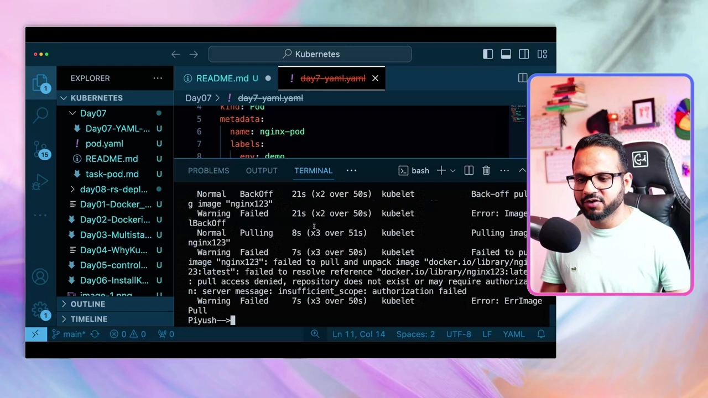

事件里写的是：**failed to pull and unpack image "nginx123"**，原因是 **pull access denied, repository does not exist or may require authorization: insufficient_scope**。这告诉我们两种可能：要么**镜像名或标签写错了**，要么**你没有权限拉取这个镜像**。因为我们用的是**公共镜像**，本不该要授权，所以问题就出在 image 写错了。[【跳转到 20:54】](https://www.youtube.com/watch?v=_f9ql2Y5Xcc&t=1254)

### 7.3 两种修复方式

- **方式一：改 YAML 再 apply。** 把镜像名改回正确值，重新 `apply`。[【跳转到 21:19】](https://www.youtube.com/watch?v=_f9ql2Y5Xcc&t=1279)
- **方式二：直接在运行中的对象上编辑。** 执行：

  ```bash
  kubectl edit pod <Pod 名字>
  ```

  它会打开一个类似 **vi 的编辑器**，把镜像改对后保存退出（`:wq`），终端提示 **`pod edited`**。因为改动是**直接作用在运行中的 Pod 上**的，所以**不需要再 apply**。[【跳转到 21:44】](https://www.youtube.com/watch?v=_f9ql2Y5Xcc&t=1304)

修改后再 `kubectl get pods`，Pod 处于 Running；再 `kubectl describe pod` 时**不会再报新错**（可能还会显示之前那条旧报错，但那已不是最新状态，因为它已经运行了一段时间）。[【跳转到 22:09】](https://www.youtube.com/watch?v=_f9ql2Y5Xcc&t=1329)

### 7.4 进入 Pod 内部

如果想像进 Docker 容器那样进去看看，用命令式风格的 `exec`：

```bash
# -it 表示交互式；-- 后跟要在容器里执行的命令
kubectl exec -it nginx-pod -- sh
```

进去后可以 `pwd` 看当前目录、查看日志等，处理完 `exit` 退出。这和 Docker 里的 `docker exec` 是一个思路。[【跳转到 22:34】](https://www.youtube.com/watch?v=_f9ql2Y5Xcc&t=1354)

---

## 八、不会写 YAML？让 Kubernetes 用 `--dry-run` 帮你生成

YAML 简单时还能手写，但字段一多（**几百行 YAML**）手敲就既费时又易错。这时可以先写**命令式**命令，再让它**输出成 YAML 格式**：[【跳转到 23:49】](https://www.youtube.com/watch?v=_f9ql2Y5Xcc&t=1429)

```bash
# --dry-run=client：只"试运行"，不真正改动集群
kubectl run nginx --image=nginx --dry-run=client

# 在试运行的基础上，把结果以 YAML 格式输出
kubectl run nginx --image=nginx --dry-run=client -o yaml
```

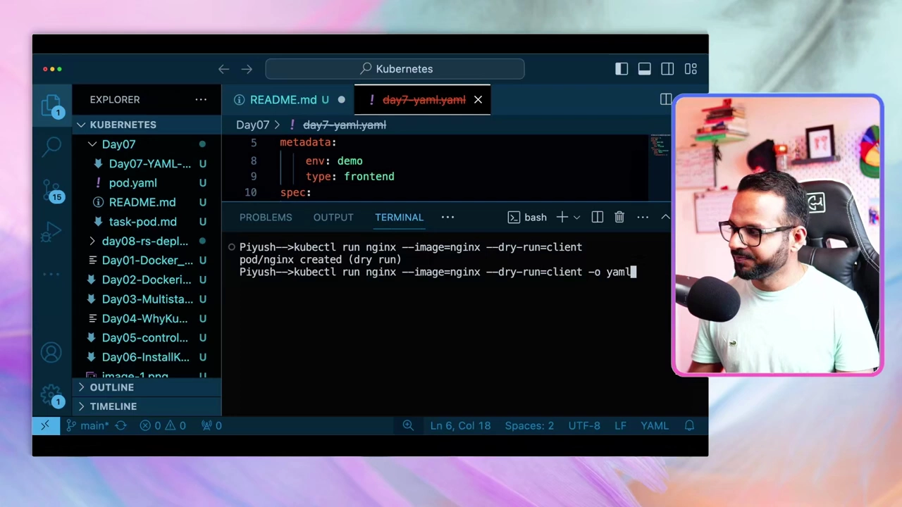

逐段理解：

- **`--dry-run=client`**：意为"**试运行**"——它**不会真正应用改动**，只是告诉你"如果没有 dry-run，这条命令会发生什么"。终端会提示 `pod/nginx created (dry run)`。[【跳转到 24:14】](https://www.youtube.com/watch?v=_f9ql2Y5Xcc&t=1454)
- **`-o yaml`**：表示"把输出以 YAML 格式给我"。于是 Kubernetes 会自动帮你生成一份 YAML（注意：它会把默认字段也补全，比如 `creationTimestamp`、`status`、`restartPolicy` 等）。[【跳转到 24:39】](https://www.youtube.com/watch?v=_f9ql2Y5Xcc&t=1479)

**把输出重定向到文件**，就能得到一份可编辑的清单：

```bash
kubectl run nginx --image=nginx --dry-run=client -o yaml > pod-new.yaml
```

生成的 `pod-new.yaml` 大致如下：

```yaml
apiVersion: v1
kind: Pod
metadata:
  labels:
    env: demo
  name: nginx
spec:
  containers:
    - image: nginx
      name: nginx
```

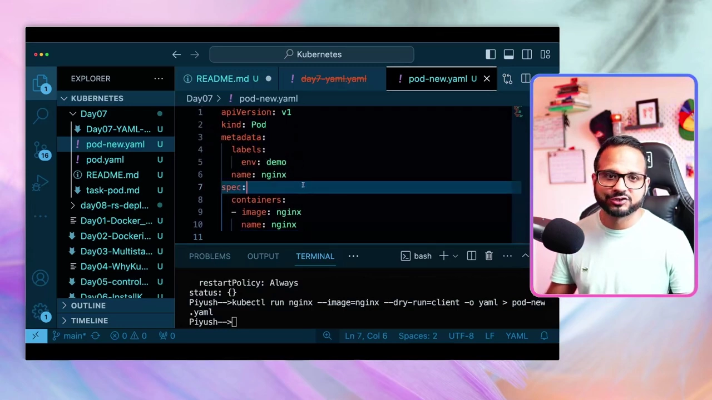

接着按需要删改：**不需要的 `creationTimestamp` 可以删掉**，`labels` 也可以改（比如把 `env` 改成 demo），镜像名改成 `nginx`，用不到的字段统统删掉，最后 `apply` 这份清单即可。[【跳转到 25:48】](https://www.youtube.com/watch?v=_f9ql2Y5Xcc&t=1548)

**同一套命令也支持 JSON**：把 `-o yaml` 换成 `-o json`，就会生成 `pod-new.json`，内容用花括号包起来，但**顶层依旧是 `apiVersion`、`kind`、`metadata`、`spec` 这四个字段**。[【跳转到 26:38】](https://www.youtube.com/watch?v=_f9ql2Y5Xcc&t=1598)

> 用什么编辑器都行：**vi/vim、VS Code** 或任何文本编辑器。但作者提醒：**考试环境里不一定有 VS Code**，所以一定要在**终端里的 vi/vim** 上做足够的手上练习——掌握 vi 的快捷键会长期受用。[【跳转到 27:28】](https://www.youtube.com/watch?v=_f9ql2Y5Xcc&t=1648)

---

## 九、查看与检查 Pod：`get`、`describe`、`show-labels`、`-o wide`

创建只是开始，日常更多是在"看" Pod。以下命令要熟练：

**1. `kubectl describe pod <Pod 名字>`——看全貌。** 它会告诉你 Pod 跑在哪个节点、有哪些条件、暴露了哪些端口、用了什么镜像、namespace 是什么、有哪些标签等。[【跳转到 28:18】](https://www.youtube.com/watch?v=_f9ql2Y5Xcc&t=1698)

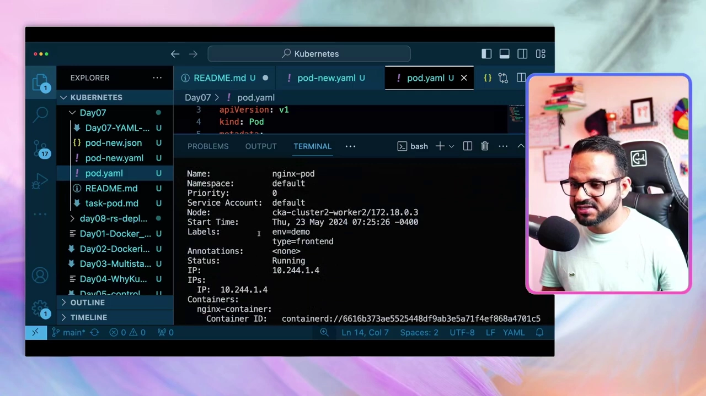

从这张输出里能看到：**Name: nginx-pod**、**Namespace: default**、**Node: cka-cluster2-worker2/172.18.0.3**（即运行所在的工作节点）、**Labels: env=demo, type=frontend**、**IP: 10.244.1.4**、以及容器 `nginx-container`。往上翻还能看到 **Conditions**（如 PodScheduled、Ready 为 True）、**Ports 80**（暴露端口）、镜像及其 ID 等。[【跳转到 28:43】](https://www.youtube.com/watch?v=_f9ql2Y5Xcc&t=1723)

**2. 标签（labels）的作用——分组与筛选。** 假设你跑着**成百上千个 Pod**，想知道"哪些属于前端应用（frontend）"，就可以**用标签检索**。查看某个对象的标签：

```bash
kubectl get pods nginx-pod --show-labels
```

它会在最右侧列出这个 Pod 的标签：`env=demo`、`type=frontend`。[【跳转到 29:33】](https://www.youtube.com/watch?v=_f9ql2Y5Xcc&t=1773)

**3. `kubectl get pods -o wide`——看扩展信息。** 普通的 `get pods` 只显示 `NAME / READY / STATUS / RESTARTS / AGE`；加上 `-o wide` 后会**额外显示 IP 和 Pod 运行所在的节点**。[【跳转到 29:58】](https://www.youtube.com/watch?v=_f9ql2Y5Xcc&t=1798)

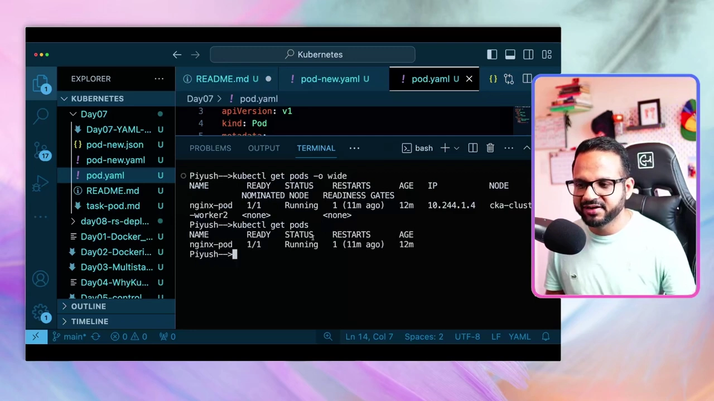

**4. `kubectl get nodes`——看节点。** 默认显示 5 个字段；加 `-o wide` 后，还会显示 Linux 版本、OS 镜像、内核版本、容器运行时、以及**外部 IP（external IP）**——这些在排障时常常很有用。[【跳转到 30:23】](https://www.youtube.com/watch?v=_f9ql2Y5Xcc&t=1823)

---

## 十、课后作业

作者留了三个练习任务（会在 GitHub 仓库里给出细节）：[【跳转到 31:38】](https://www.youtube.com/watch?v=_f9ql2Y5Xcc&t=1898)

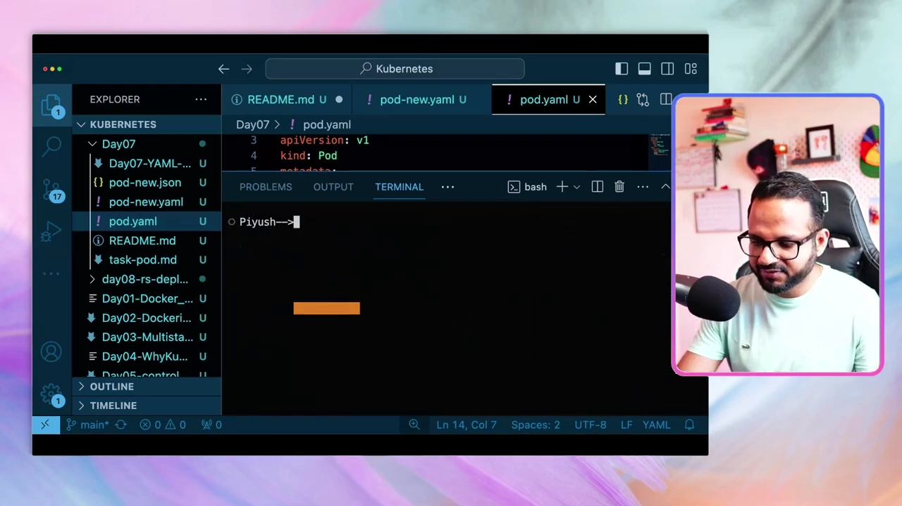

1. **任务一**：用**命令式（imperative）**命令创建一个 Pod，镜像用 **nginx**。
2. **任务二**：用**任务一里创建的 nginx**，把它**导出成 YAML**，改掉 Pod 名字，再用这份 YAML 创建一个**新的 Pod**。
3. **任务三**：**修复给定的 YAML** 并 apply，按照本讲演示的**排障步骤**走一遍。

完成任务后可以在评论区反馈，也可以到社区频道互帮互助。下一讲将进入 **Deployment 和 ReplicaSet**。[【跳转到 32:53】](https://www.youtube.com/watch?v=_f9ql2Y5Xcc&t=1973)

---

## 小结

- **Pod 是 Kubernetes 最小的可部署单元**，像一个豆荚，里面可装一个或多个容器（可以是辅助容器、初始化容器等）；`READY 1/1` 表示一个容器且已运行。
- 用户通过 **`kubectl`** 等客户端与 **API 服务器**交互，Pod 最终被安置到某个**工作节点**上。
- 创建资源有**两条同样重要的路**：**命令式**（`kubectl run`，快、适合排障/本地）与**声明式**（写 YAML 再 `create`/`apply`，适合生产、CI/CD、GitOps）。
- 命令式创建 Pod：`kubectl run nginx-pod --image=nginx:latest`；删除用 `kubectl delete pod <名字>`。
- **YAML 基础**：扩展名 `.yaml` / `.yml` 等价；`#` 是注释；支持列表、字典、字符串、整数、浮点等；**层级靠缩进**（推荐双空格、不用 Tab），缩进错了字段就"跑偏"；列表用破折号 `-`，可嵌套。
- **Kubernetes YAML 的四个顶层字段**：`apiVersion`、`kind`、`metadata`、`spec`；**大小写敏感**。Pod 用 `apiVersion: v1`、`kind: Pod`；`metadata.name` + `labels`；`spec.containers`（列表，含 name/image/ports，`containerPort: 80`）。用 `kubectl explain pod` 可查受支持的版本。
- 声明式：`kubectl create -f pod.yaml` / `kubectl apply -f pod.yaml`（apply 还能更新）。
- **排障**：镜像写错会出现 `ImagePullBackOff`（`READY 0/1`）；用 `kubectl describe pod <名字>` 看 Events（如 `Failed to pull image`、`pull access denied / insufficient_scope`）；修复可"改 YAML 再 apply"或 `kubectl edit pod <名字>` 直接改；`kubectl exec -it <pod> -- sh` 可进入容器。
- **生成 YAML**：`kubectl run nginx --image=nginx --dry-run=client -o yaml > pod-new.yaml`（`-o json` 则生成 JSON），再删掉多余字段、修改后 apply。
- **查看命令**：`describe pod`（全貌、所在节点、标签等）、`get pods --show-labels`（看标签）、`get pods -o wide`（多出 IP 与 NODE）、`get nodes [-o wide]`（节点信息）。

## 关键术语速查

| 术语 | 一句话解释 |
| --- | --- |
| Pod | Kubernetes 最小的可部署单元，可容纳一个或多个容器 |
| 容器（Container） | 实际运行应用的进程包装；被装在 Pod 里 |
| 命令式（Imperative） | 用命令直接下指令创建资源，如 `kubectl run` |
| 声明式（Declarative） | 在 YAML/JSON 里描述期望状态，用 `kubectl create`/`apply` 提交 |
| `kubectl run` | 命令式创建 Pod 的命令 |
| `kubectl create -f` | 按清单文件创建资源 |
| `kubectl apply -f` | 按清单创建或更新资源 |
| `kubectl delete pod` | 删除指定 Pod |
| YAML | 一种干净直观的配置/序列化语言，靠缩进表达层级 |
| `apiVersion` / `kind` | 清单的 API 版本 / 资源类型（如 `v1` / `Pod`） |
| `metadata` | 资源的元数据，如 name、labels |
| `spec` | 资源的期望状态，如 containers、ports |
| `labels` | 任意键值对标签，用于把资源分组、检索 |
| `namespace` | 资源所处的命名空间（示例中是 `default`） |
| `--dry-run=client` | 试运行，不真正改动集群 |
| `-o yaml` / `-o json` | 指定输出格式为 YAML / JSON |
| `kubectl explain pod` | 查看某资源支持哪些字段及 API 版本 |
| `ImagePullBackOff` | 镜像拉取失败的状态，常见于镜像名/标签写错或权限不足 |
| `kubectl describe pod` | 查看 Pod 详情，排障时看 Events 定位问题 |
| `kubectl edit pod` | 直接编辑运行中的 Pod 对象（无需再 apply） |
| `kubectl exec -it ... -- sh` | 进入 Pod 内某容器执行交互式 shell |
| `kubectl get pods -o wide` | 查看 Pod 的扩展信息（含 IP、所在节点） |
| `kubectl get nodes` | 查看集群节点信息 |
| `kubectl get ... --show-labels` | 在输出中显示资源的标签 |
