# Day 8：Deployment 与 ReplicaSet——让 Pod 永不"单点报废"

> 视频来源：[Day 8/40 - Kubernetes Deployment, Replication Controller and ReplicaSet Explained](https://www.youtube.com/watch?v=oe2zjRb51F0)（YouTube，频道 Tech Tutorials with Piyush）
>
> 上一讲我们亲手创建了 Pod，但**单独一个 Pod 一旦崩溃，用户就彻底拿不到响应**。这一讲解决的就是这个问题：用**控制器（Controller）**管理 Pod 的副本，实现自动愈合与高可用。我们会依次认识三个层层递进的对象——**Replication Controller（RC）→ ReplicaSet（RS）→ Deployment**，并全部动手演示。文稿左栏为英文自动字幕，本文已翻译并重写为中文。

## 本讲要解决的核心问题（SCQA）

**背景**：在第 7 讲里，我们已经能用 `kubectl run` 或一份 YAML 清单创建一个 Pod，让它跑在某个工作节点上。而 Kubernetes 存在的意义，就是**让我们的应用（容器）一直跑着、随时可访问**。

**冲突**：但只跑一个 Pod 是靠不住的。作者一开场就强调：**这是学 CKA 最核心的概念之一**——因为你在 Kubernetes 里做的一切，最终都是"把应用作为容器跑在 Pod 里"，而 **Pod 必须由 ReplicaSet、StatefulSet 或 Deployment 之类的控制器来托管**。如果 Pod 崩溃了，而背后没有任何机制把它拉起来，那么用户访问时只会得到一个空响应——这恰恰是**单独用 Docker 跑容器**的典型痛点。[【跳转到 00:15】](https://www.youtube.com/watch?v=oe2zjRb51F0&t=15)

**疑问**：一个编排系统，该怎么保证应用"崩了也能自动恢复"？Replication Controller、ReplicaSet、Deployment 这三者到底是什么、有什么区别、各自解决什么问题？它们又是如何让"改一行配置就自动扩缩容 / 升级版本"成为可能的？

**回答（中心思想）**：Kubernetes 用**控制器（Controller）**托管 Pod，核心承诺是"**始终维持你声明的副本数量**"（desired state）。三者的关系层层递进：**Replication Controller** 负责维持副本数、做自动愈合与简单负载均衡，是较早的版本；**ReplicaSet** 是它的升级版，用更灵活的 **selector / matchLabels** 通过标签来挑选它要管理的 Pod，因此能接管"不归自己创建"的现存 Pod；**Deployment** 又架在 ReplicaSet 之上，额外提供了**滚动更新（rolling update）与回滚（rollback）**，让你在不停机的前提下升级应用——这也是生产环境最常用的方式。一句话：**Deployment 管 ReplicaSet，ReplicaSet 管 Pod。**

---

## 一、从一个"会崩溃的 Pod"说起：为什么需要控制器

回顾上一讲的例子：一个用户通过某种入口（负载均衡器或对外暴露的端点）访问跑在节点上的一个 Nginx Pod。[【跳转到 02:11】](https://www.youtube.com/watch?v=oe2zjRb51F0&t=131)

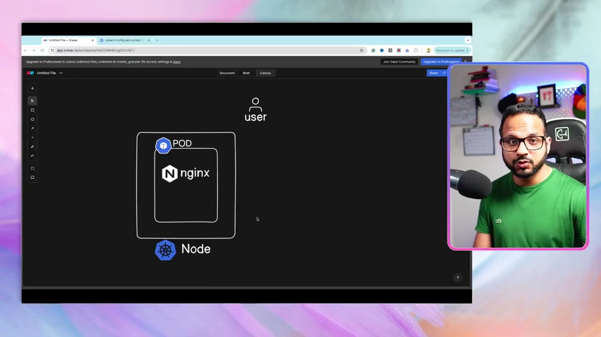

假设这个 Pod **崩溃了（crash）**——它不再可用，用户对刚才那个端点的请求就再也得不到响应。[【跳转到 03:01】](https://www.youtube.com/watch?v=oe2zjRb51F0&t=181)

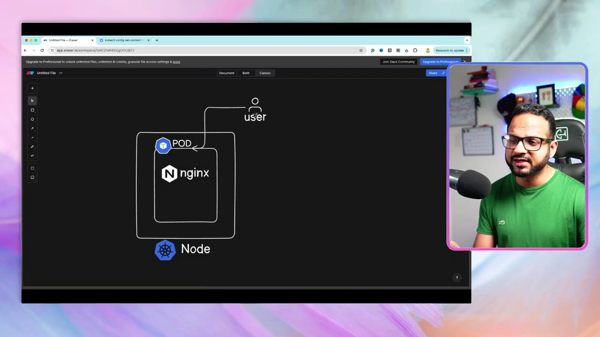

这**正是单独运行 Docker 容器的缺点**：容器挂了，没有人替你把它重新拉起来。既然我们用的是一个**编排系统（orchestration system）**，它就**应该**有某种机制——**自动愈合（auto-heal）应用**，或者在 Pod 崩溃时**自动再拉起一个新的 Pod**。[【跳转到 03:26】](https://www.youtube.com/watch?v=oe2zjRb51F0&t=206)

## 二、Replication Controller：保证副本数、自动愈合与负载均衡

**Replication Controller（复制控制器）**做的就是这件事：一旦某个 Pod 崩溃，它会立刻为你创建一个新的 Pod。其实它甚至不等到 Pod 崩溃——**大多数时候，为了高可用，我们本来就让多个相同 Pod 的副本同时运行**。[【跳转到 03:51】](https://www.youtube.com/watch?v=oe2zjRb51F0&t=231)

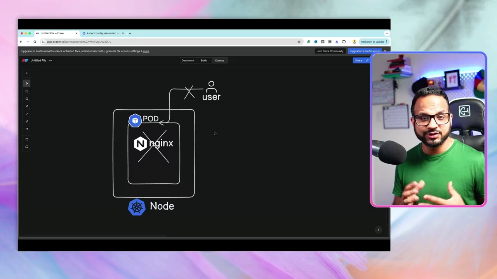

**Controller 是由 Controller Manager 管理的。** Controller Manager 是 Kubernetes 的组件之一，它负责让某个对象或资源**始终处于运行状态**、持续监控资源。Kubernetes 里有很多种 Controller——针对 Node 的、针对 Namespace 的、针对 Pod 的……而 **Replication Controller 专门负责让"所有副本始终都在跑"**，即使发生 Pod 故障也不会让应用中断。[【跳转到 04:41】](https://www.youtube.com/watch?v=oe2zjRb51F0&t=281)

它具体怎么工作？**它会把流量不再指向单个 Pod，而是指向 Replication Controller**，由 Replication Controller 内部的负载均衡逻辑，把请求分发给某个**健康的、活跃的** Pod。[【跳转到 06:21】](https://www.youtube.com/watch?v=oe2zjRb51F0&t=381)

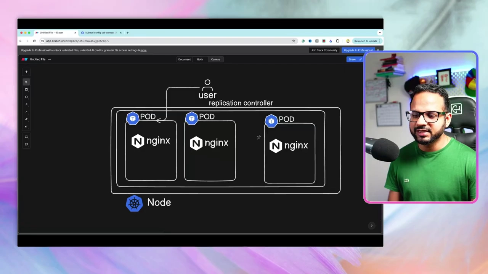

几个关键特性：

- **副本数是"期望状态"**：如果 `replicas: 3`，就**始终**维持 3 个相同的 Pod。挂掉 1 个就补 1 个，挂掉 2 个就补 2 个；如果 `replicas: 1`，那唯一的实例一挂，它立刻再拉起一个。这个数字就是**期望的、一直在跑的实例数（desired number）**。[【跳转到 07:11】](https://www.youtube.com/watch?v=oe2zjRb51F0&t=431)
- **支撑手动扩缩容**：访问量上升时，把 `replicas` 从 2 改成 3，就能加一个 Pod 分摊流量。[【跳转到 08:01】](https://www.youtube.com/watch?v=oe2zjRb51F0&t=481)
- **可以跨节点**：Pod 会共享所在节点的 CPU、内存、存储等资源。当某个节点资源不够时，我们可以**再加一个新节点**，把新 Pod 调度过去——RC 能横跨多个节点管理。[【跳转到 08:51】](https://www.youtube.com/watch?v=oe2zjRb51F0&t=531)
- **这只是"手动"自动扩缩容**：改副本数、加节点都是手动操作。后面课程还会讲 **HPA（水平自动扩缩容）/ VPA（垂直自动扩缩容）**，让这件事自动完成。[【跳转到 09:41】](https://www.youtube.com/watch?v=oe2zjRb51F0&t=581)

## 三、动手写一份 Replication Controller 清单

理论讲完，进入演示。作者在 `day08-rs-deploy` 目录下新建 `rc.yaml`。和任何 Kubernetes 对象一样，它也有**四个顶层字段：`apiVersion`、`kind`、`metadata`、`spec`**。[【跳转到 10:22】](https://www.youtube.com/watch?v=oe2zjRb51F0&t=622)

`apiVersion` 和 `kind`（注意 `ReplicationController` 是 R、C 两个大写字母）：
```yaml
apiVersion: v1
kind: ReplicationController
```

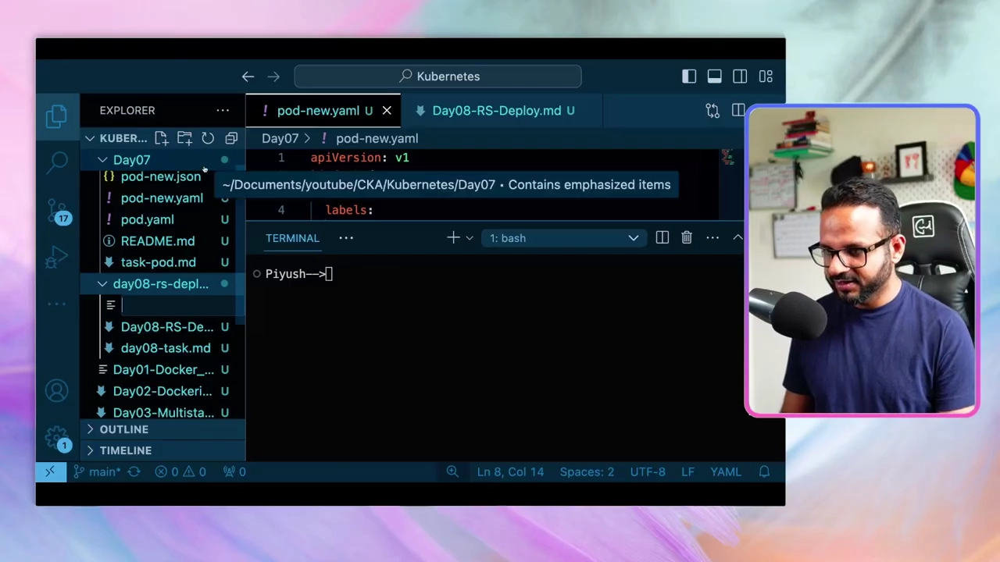

如果不确定某个对象的版本，可以查：`kubectl explain rc`（或 `kubectl explain replicationcontroller`），页面最上方会写 `VERSION: v1`，`kind` 也会一并列出。

接着在 `metadata` 里加**名字和标签（labels）**，例如 `name: nginx-rc`、`labels: env: demo`。

**关键在 `spec`。** 回想上一讲创建 Pod 时，我们描述了"用哪个镜像、叫什么名字、暴露哪个端口"。现在创建的是 Replication Controller，**它自己不定义这些，而是通过一个 `template` 去告诉它"该复制出什么样的 Pod"**：镜像版本、Pod 名字、暴露端口，全都来自这个模板。于是我们把上一讲那份 Pod YAML 里的 `metadata` 和 `spec`（去掉 `apiVersion` 和 `kind`）**整段复制到 `template` 下面**。[【跳转到 11:37】](https://www.youtube.com/watch?v=oe2zjRb51F0&t=697)

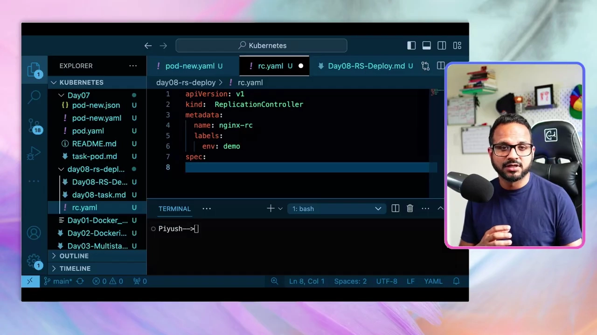

> **别被两个 `metadata`/`spec` 搞混**：最外层的 `metadata`/`spec` 属于 **Replication Controller 自己**；`template` 里嵌套的那份 `metadata`/`spec` 属于**被复制出来的 Pod**。因为缩进层级不同，它们互不干扰。[【跳转到 14:07】](https://www.youtube.com/watch?v=oe2zjRb51F0&t=847)

最后在 `template` 同级补丁一个 **`replicas`** 字段，声明想要的副本数（示例用 `3`），保存后应用：

```bash
kubectl apply -f rc.yaml
kubectl get pods      # 看到 3 个 Pod 在跑，名字 = nginx-rc + 随机后缀
kubectl get rc        # DESIRED 3 / CURRENT 3 / READY 3
kubectl describe pod <某个pod名>   # 看节点、标签、镜像、事件(错误会记在这里)
```
[【跳转到 15:22】](https://www.youtube.com/watch?v=oe2zjRb51F0&t=922)

## 四、ReplicaSet：Replication Controller 的升级版

**Replication Controller 是较老的版本，ReplicaSet 是更新的、也是更被推荐的方式。** 两者有一个本质区别：[【跳转到 16:39】](https://www.youtube.com/watch?v=oe2zjRb51F0&t=999)

- **Replication Controller 只能管理"由它自己创建"的 Pod。**
- **ReplicaSet 还能接管现存的、并非由它创建的 Pod**——靠的是多出来的 **`selector`（选择器）** 字段。在 `selector` 里写 `matchLabels`，用它去匹配 Pod 的标签。例如匹配 `env: demo`，那么**任何带这个标签的 Pod 都会被这个 ReplicaSet 纳管**。[【跳转到 17:04】](https://www.youtube.com/watch?v=oe2zjRb51F0&t=1024)

把清单里的 `kind` 改成 `ReplicaSet` 后先别急着 apply，这里有个**经典报错**：

```text
No matches for kind "ReplicaSet" in version "v1"
```

原因是 `ReplicaSet` 的 `apiVersion` **不是** `v1`。用 `kubectl explain rs` 看，最上方除了 `v1` 还会有一个 `GROUP: apps`，所以完整的写法是 **`apps/v1`**（`group/version`）。改成 `apiVersion: apps/v1` 就能创建成功。[【跳转到 17:54】](https://www.youtube.com/watch?v=oe2zjRb51F0&t=1074)

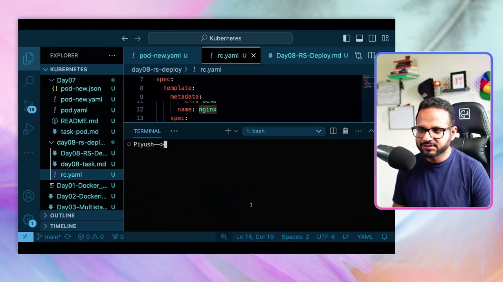

**验证 RS 的"接管"能力**：作者先 `kubectl delete rc nginx-rc` 删掉原来的 RC（注意 Pod 不会立刻消失），再 apply 这份 RS 清单——**RS 通过 `matchLabels` 接管了那三个已经存在的 Pod**，`kubectl get pods` 依然显示 3 个在跑。这就是 RS 与 RC 最主要的不同。[【跳转到 19:10】](https://www.youtube.com/watch?v=oe2zjRb51F0&t=1150)

## 五、扩缩容的三种做法

把副本数从 3 调到 5，视频里演示了三条路，**考试里要会挑最快的那条**：[【跳转到 19:35】](https://www.youtube.com/watch?v=oe2zjRb51F0&t=1175)

| 方式 | 操作 | 说明 |
| --- | --- | --- |
| **改 YAML** | 直接改 `rc.yaml` 的 `replicas`，再 `kubectl apply -f` | 声明式，最规范 |
| **改活对象** | `kubectl edit rs nginx-rs` | 编辑的是**集群里的活对象**，不是本地 YAML；保存即生效 |
| **命令式** | `kubectl scale --replicas=10 rs/nginx-rs` | 一条命令最快 |

**`kubectl edit` 的细节**：它打开的是**活对象的 YAML**，里头的字段比我们手写的清单多得多——比如 `metadata.annotations` 会记下"上一次 apply 的配置"（last-applied-configuration），还有 `creationTimestamp`、`resourceVersion`、`uid` 等。用它配合 **Vim 的 `Shift+A`（跳到行尾并进入插入模式）** 改完保存，无需再 apply，改动已经作用到活对象上。[【跳转到 20:25】](https://www.youtube.com/watch?v=oe2zjRb51F0&t=1225)

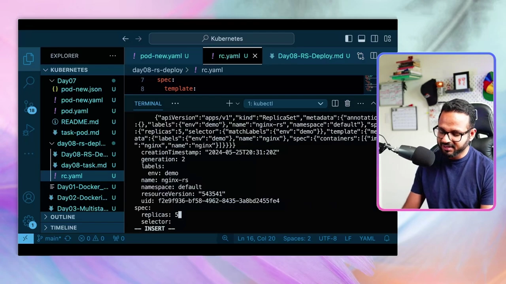

命令式那条也要记牢：`kubectl scale --replicas=10 rs/nginx-rs`。作者反复提醒，**考试时间就是一切**，同一个任务有多种解法，要挑最省时间的；不熟 Vim 命令的可以查速查表或 `kubectl scale --help`（帮助里开头就有示例）。[【跳转到 22:05】](https://www.youtube.com/watch?v=oe2zjRb51F0&t=1325)

## 六、Deployment：在 ReplicaSet 之上做滚动更新与回滚

有了 ReplicaSet，为什么还要 Deployment？**因为 Deployment 给 ReplicaSet 增加了额外能力，最关键的是"如何安全地更新版本"。**[【跳转到 23:20】](https://www.youtube.com/watch?v=oe2zjRb51F0&t=1400)

它的**层级关系**是：**你（用户）创建 Deployment → Deployment 创建并管理 ReplicaSet → ReplicaSet 管理 Pod。** 所有副本和 ReplicaSet 都归属于这个 Deployment。[【跳转到 23:34】](https://www.youtube.com/watch?v=oe2zjRb51F0&t=1414)

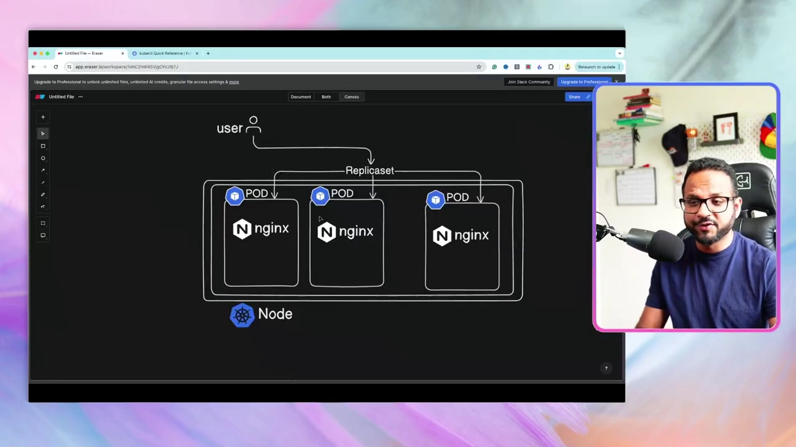

**要解决的问题**：假设三个 Pod 都跑着 `nginx 1.1`（它们来自同一个模板，所以版本完全一致），现在要把镜像升级到 `1.2`。[【跳转到 24:24】](https://www.youtube.com/watch?v=oe2zjRb51F0&t=1464)

- **如果只有 ReplicaSet**：它会**一次性重建所有 Pod**——期间所有用户都会经历一段**停机（downtime）**。对小应用（比如就一个 nginx）也许只停几秒，但**在生产环境（银行、券商、股票交易系统）里，"时间就是钱"，一毫秒的停机都承受不起**。
- **有了 Deployment**：它用**滚动更新（rolling update）**的方式改。先更新其中一个 Pod，**更新期间流量由另外两个 Pod 扛着**，同时它还会先拉起一个新 Pod 承接这部分流量；等新 Pod 起来并健康后，再把它加入 ReplicaSet / 负载均衡，接着更新下一个……**最终三个 Pod 全部升到 1.2，而对用户全程零停机**。[【跳转到 25:39】](https://www.youtube.com/watch?v=oe2zjRb51F0&t=1539)

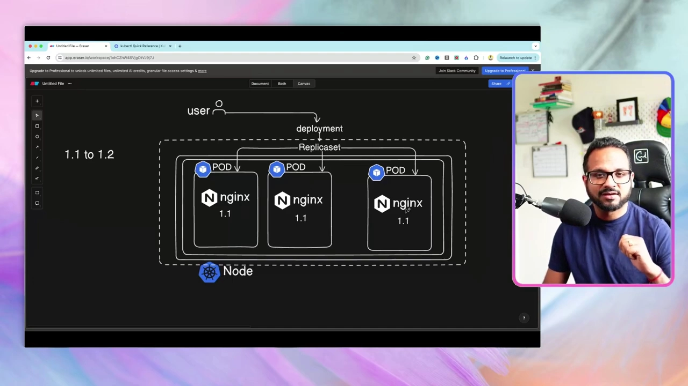

## 七、动手：Deployment 的创建、更新、回滚

删掉刚才的 ReplicaSet，把清单的 `kind` 从 `ReplicaSet` 改成 `Deployment`（`apiVersion` 仍是 `apps/v1`，也可用 `kubectl explain deployment` 核对），`replicas` 改回 3，然后：

```bash
kubectl apply -f rc.yaml      # created
kubectl get pods              # 3 个 Pod，名字变成 nginx-deploy-xxxx
kubectl get deploy            # READY 3/3、UP-TO-DATE 3、AVAILABLE 3
kubectl get all               # 一次看全：1 个 deployment、1 个 replicaset、3 个 pod...
```
[【跳转到 27:14】](https://www.youtube.com/watch?v=oe2zjRb51F0&t=1634)

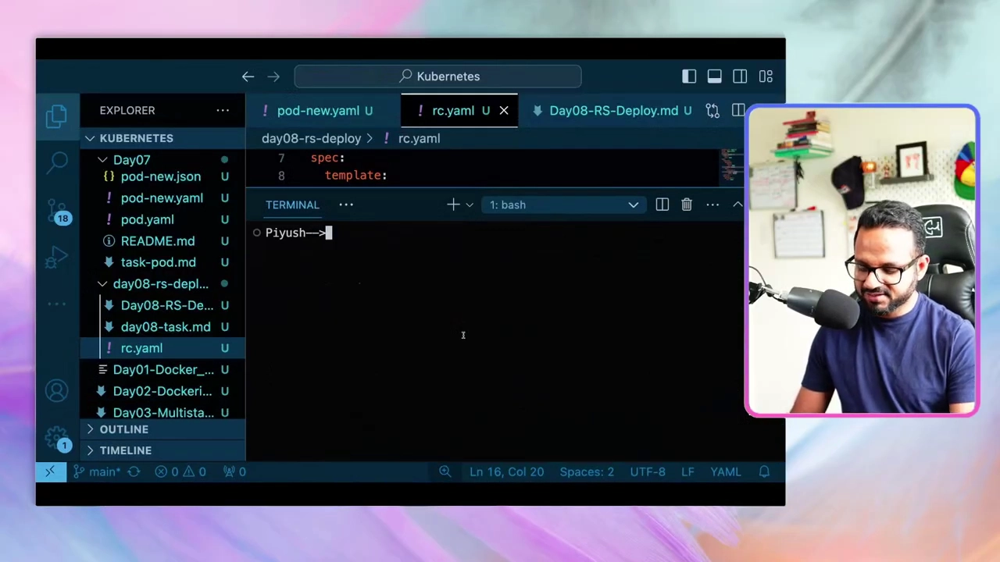

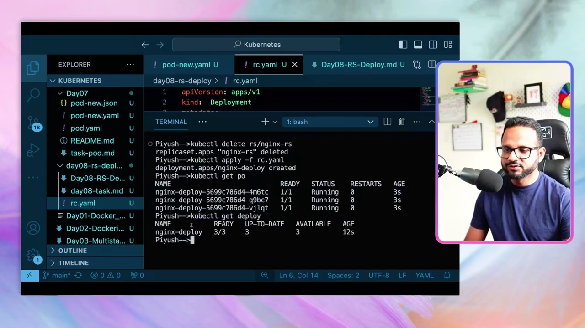

注意 `kubectl get all` 里那个默认 Service：它是 **Kubernetes 集群自带的**，下一讲专门讲 Service，这里先不用管。

**更新镜像**（把 nginx 换成 nginx:1.9.1）：

```bash
kubectl set image deploy/nginx-deploy nginx=nginx:1.9.1
kubectl describe deploy nginx-deploy   # 能看到 image 已更新为 1.9.1
```
要点：**改的是集群里的活对象，本地的 `rc.yaml` 还是旧的。** [【跳转到 29:19】](https://www.youtube.com/watch?v=oe2zjRb51F0&t=1759)

**查看发布历史与回滚**：

```bash
kubectl rollout history deploy/nginx-deploy   # REVISION 1（初始）、2（刚才更新）
kubectl rollout undo deploy/nginx-deploy        # 回滚，会生成一个新的 revision
kubectl describe deploy nginx-deploy            # image 已回到 nginx:latest
```
[【跳转到 29:44】](https://www.youtube.com/watch?v=oe2zjRb51F0&t=1784)

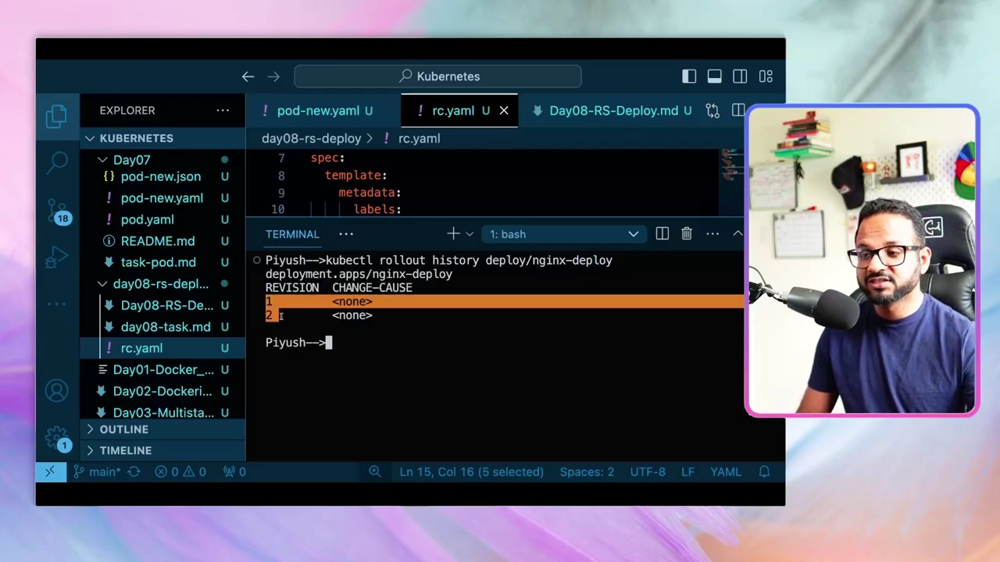

视频里还提到速查表里 `kubectl set image`、`rollout history`、`undo`、`rollout restart`、`rollout status` 等命令都在，**不用背，多练就熟**。[【跳转到 31:09】](https://www.youtube.com/watch?v=oe2zjRb51F0&t=1869)

## 八、兜底技巧：用 dry-run 自动生成 YAML

最后一个非常实用的技巧——**不用手写，让 Kubernetes 生成一份 Deployment 的 YAML 骨架**：[【跳转到 31:42】](https://www.youtube.com/watch?v=oe2zjRb51F0&t=1902)

```bash
kubectl create deploy nginx-deploy --image=nginx --dry-run=client -o yaml > deploy.yaml
```

先生成骨架、再 `> deploy.yaml` 重定向到文件。打开会看到 `kind`、`apiVersion`、`spec`（默认 1 个副本）、`selector` + `matchLabels`，以及带镜像的容器 `spec` 等默认字段。**先生成、再按需修改**，能省下大量打字时间。[【跳转到 32:12】](https://www.youtube.com/watch?v=oe2zjRb51F0&t=1932)

## 小结

- **一句话记住三者关系**：**Deployment 管 ReplicaSet，ReplicaSet 管 Pod**；Replication Controller 是 ReplicaSet 的旧版本。
- **控制器解决的核心问题**：**自动愈合 + 保证副本数（期望状态）+ 负载均衡**，让应用始终高可用，不再有"单点 Pod"。
- **RC vs RS 的本质区别**：RS 多了 **`selector` / `matchLabels`**，能通过标签**接管已存在的 Pod**；RS 的 `apiVersion` 是 **`apps/v1`**。
- **Deployment 的独门能力**：**滚动更新（不停机升级）与回滚（`rollout undo`）**，是生产环境的标准做法。
- **扩缩容有三条路**：改 YAML 再 apply、`kubectl edit` 改活对象、`kubectl scale` 一条命令——考试挑最快的那条。
- **排错记两招**：`kubectl describe pod/deploy` 看 **events**；`apiVersion` 报 "No matches for kind" 多半是 group 没写全（如 `apps/v1`）。
- **别手写 YAML**：`kubectl create ... --dry-run=client -o yaml > file.yaml` 先生成骨架。

## 关键术语速查

| 术语 | 一句话解释 |
| --- | --- |
| **Pod** | Kubernetes 中最小的可部署单元，容器的外壳。 |
| **Replication Controller (RC)** | 旧版控制器，保证副本数、自动愈合，只能管理自己创建的 Pod。 |
| **ReplicaSet (RS)** | RC 的升级版，用 `selector`/`matchLabels` 按标签纳管 Pod，含现存 Pod；`apiVersion: apps/v1`。 |
| **Deployment** | 架在 ReplicaSet 之上的控制器，提供滚动更新与回滚，生产首选。 |
| **replicas** | 期望的 Pod 副本数（desired state），控制器始终维持它。 |
| **controller / controller-manager** | 让对象/资源持续处于期望状态的组件；RC、RS、Deployment 本质上都是控制器。 |
| **selector / matchLabels** | ReplicaSet 通过标签挑选要管理的 Pod。 |
| **template** | RC/RS/Deployment 里描述"要复制出什么样的 Pod"的模板。 |
| **rolling update** | Deployment 逐个替换 Pod 的更新方式，实现零停机。 |
| **rollout history / undo** | 查看发布历史 / 回滚到上一版本。 |
| **kubectl scale / edit** | 命令式扩缩容 / 编辑集群中的活对象。 |
| **dry-run=client -o yaml** | 只生成 YAML 骨架不真正创建，用于快速起步。 |
