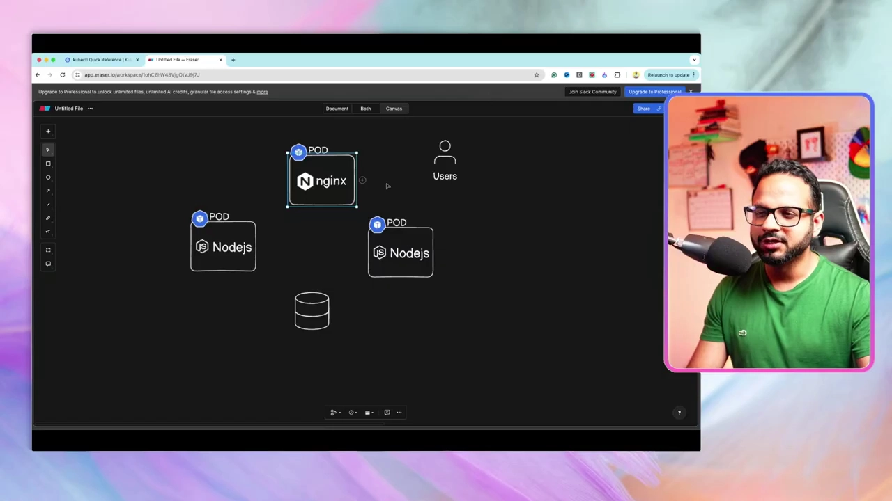
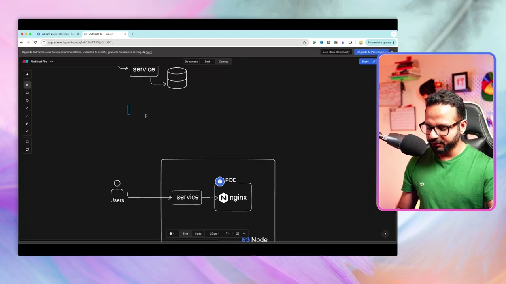
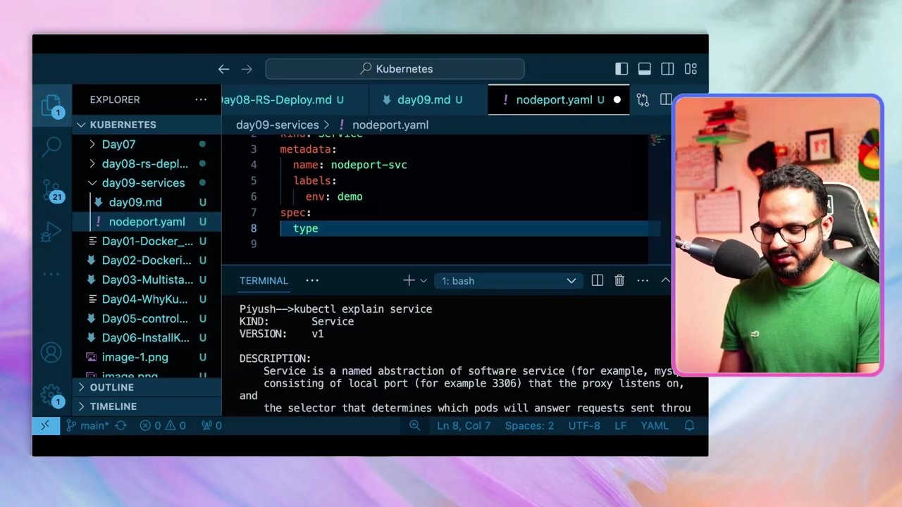
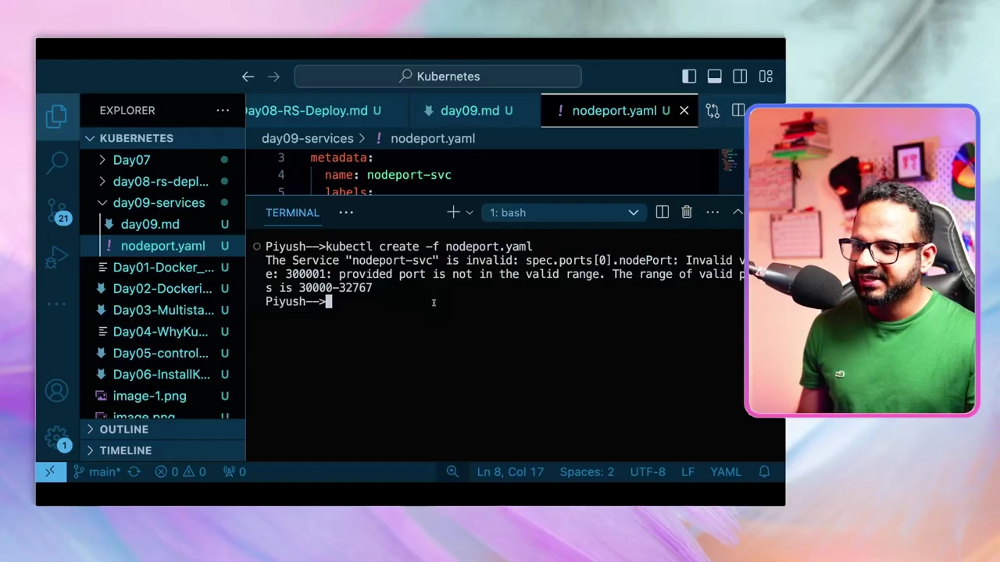
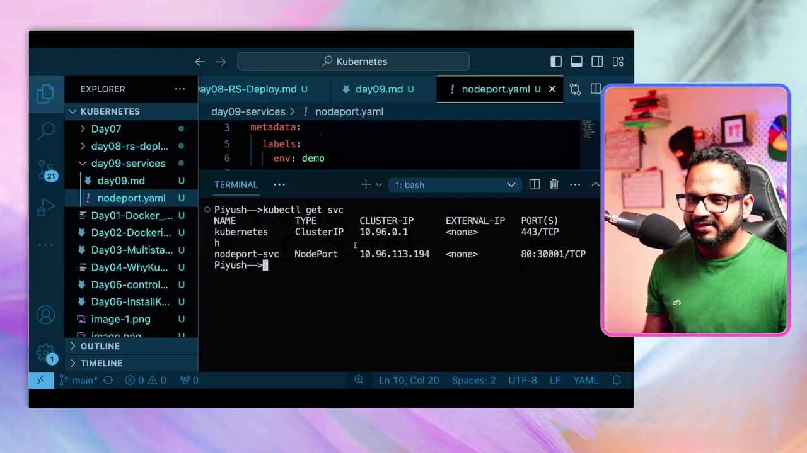
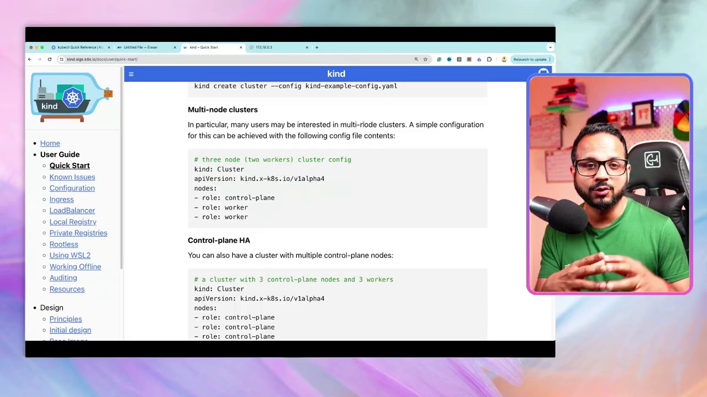
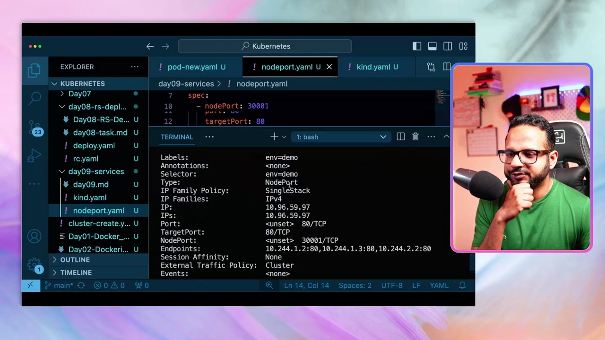
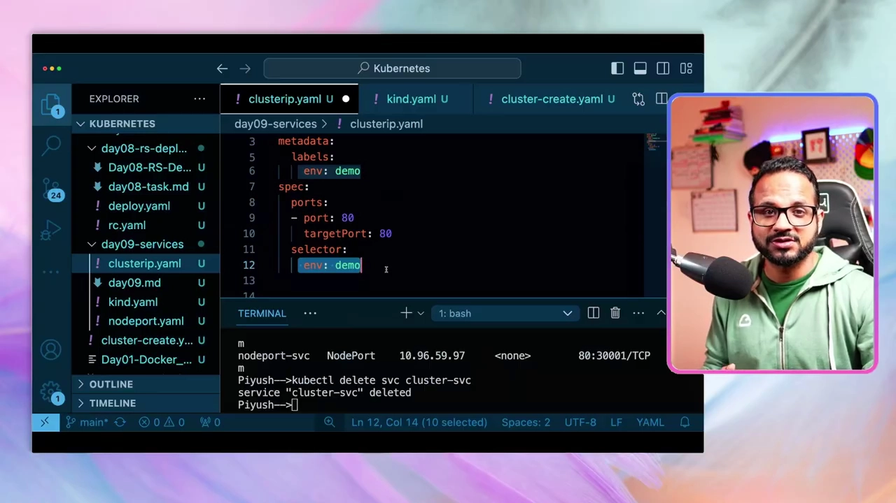
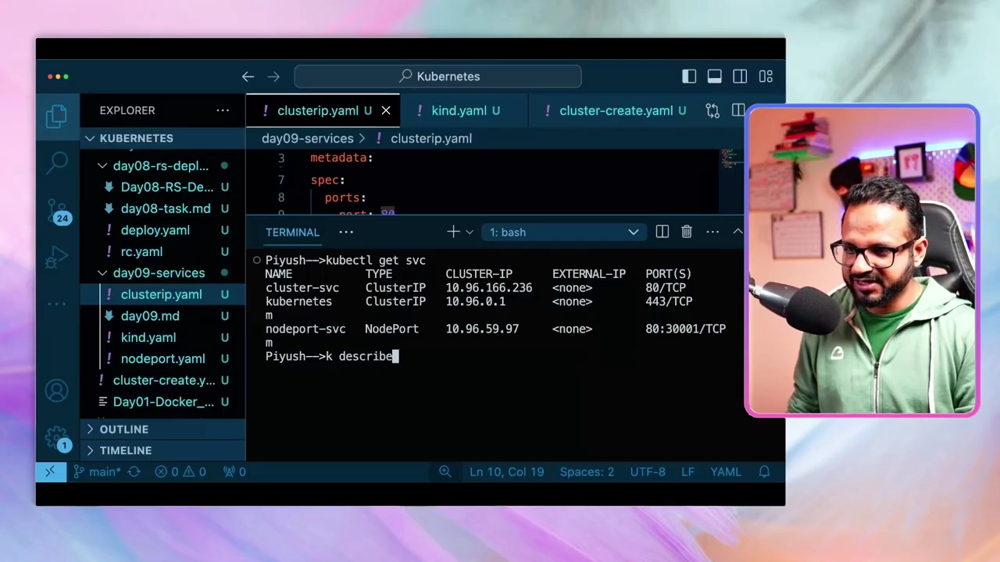
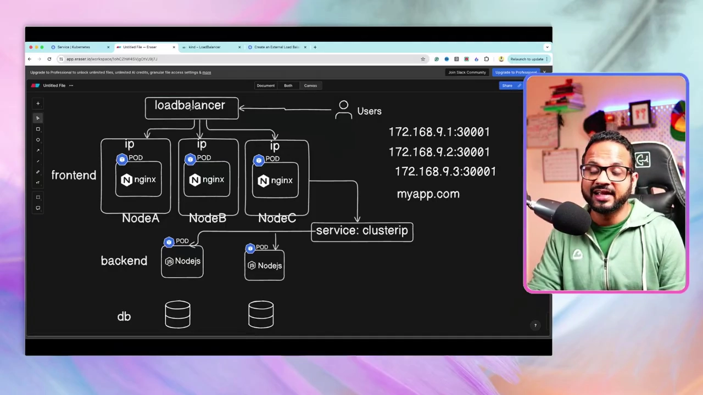

# Day 9：Service——让 Pod 拥有稳定"门牌号"的网络抽象

> 视频来源：[Day 9/40 - Kubernetes Services Explained - ClusterIP vs NodePort vs Loadbalancer vs External](https://www.youtube.com/watch?v=tHAQWLKMTB0)（YouTube，频道 Tech Tutorials with Piyush）
>
> 上一讲我们有了 Deployment，能稳定地把某个 Nginx 应用跑在多个 Pod 上。但**这些 Pod 默认只能在集群内部访问**。这一讲的主角 **Service** 就是解决"如何把应用稳定地暴露出去、以及各层 Pod 之间如何互相找到"的核心对象。我们会逐一讲清 **ClusterIP / NodePort / LoadBalancer / ExternalName** 四种类型，并亲手做一遍。文稿左栏为英文自动字幕，本文已翻译并重写为中文。

## 本讲要解决的核心问题（SCQA）

**背景**：第 8 讲结尾，我们有了一个 Deployment，背后跑着 4 个 nginx 前端 Pod，分布在多个节点上。**这个 Deployment 当时还没有对外暴露**——访问这些 Pod 只能从节点内部或集群内部进行。[【跳转到 00:36】](https://www.youtube.com/watch?v=tHAQWLKMTB0&t=36)

**冲突**：可它是个**前端应用**，用户得能从集群外面访问它；同时，一个真实应用通常是**多层（multi-tier）**的——前端（nginx）要调后端（Node.js），后端要读写外部数据源（数据库），**这些不同层的 Pod 之间也必须能互相通信**。[【跳转到 01:26】](https://www.youtube.com/watch?v=tHAQWLKMTB0&t=86) 麻烦在于：**每个 Pod 的 IP 是临时的、会变的**，一下线重起就换一个，既不能靠它对外提供稳定入口，也不能靠它在集群里互相寻址。

**疑问**：怎样才能给"一群会来会走的 Pod"一个**稳定的访问入口**？外部用户怎么访问前端？集群内部的前端怎么找到后端、后端怎么找到数据库？Kubernetes 提供了哪些 Service 类型，各自适合什么场景？在本地 Kind 集群里演示时为什么还差一步？

**回答（中心思想）**：**Service 是架在一组 Pod 之上的、稳定的网络抽象**——它给你一个**固定的 IP 和 DNS 名字**，并在后端 Pod 之间做**负载均衡**，从而解开"Pod IP 会变"这个死结，也顺带实现了**松耦合（loosely coupled）**。Kubernetes 有四种 Service 类型：**ClusterIP**（仅集群内部访问，默认）、**NodePort**（在每个节点上开一个端口对外暴露）、**LoadBalancer**（对接云厂商的外部负载均衡器）、**ExternalName**（把服务映射到外部 DNS 名）。掌握它们的区别、以及 `nodePort/port/targetPort` 三个端口的关系，是本讲的重点。

---

## 一、为什么需要 Service：Pod IP 不固定

先说清楚痛点。一个典型三层应用长这样：[【跳转到 01:26】](https://www.youtube.com/watch?v=tHAQWLKMTB0&t=86)

- **前端（frontend）**：多个 nginx Pod，需要**对外**服务用户。
- **后端（backend）**：多个 Node.js Pod，需要被前端调用，还要访问外部数据源。
- **数据层（db）**：外部数据源。

问题在于**每个 Pod 都有自己的内部 IP，但那个 IP 不是静态的——Pod 一重启，IP 就变**。[【跳转到 30:58】](https://www.youtube.com/watch?v=tHAQWLKMTB0&t=1858) 想象一下：后端要调用前端、前端要找到数据库，如果靠 IP，那么**每次 Pod 重起、IP 变化，所有调用方都得跟着改地址**，这显然不可行。我们需要一个**在集群整个生命周期里保持不变**的入口——这就是 **Service**。[【跳转到 37:47】](https://www.youtube.com/watch?v=tHAQWLKMTB0&t=2267)



## 二、Service 是什么：稳定的门牌号 + 负载均衡

我们在用户和 Pod 之间放一个 **Service**。用户访问 Service，Service 再把请求转发到它背后（由 `selector` 匹配到的）Pod，并把响应返回。[【跳转到 02:16】](https://www.youtube.com/watch?v=tHAQWLKMTB0&t=136)



Service 带来两个关键价值：

1. **松耦合**：调用方只认 Service 的名字（或固定 IP），不关心后端 Pod 是谁、有几个、IP 变成什么，**各层之间解耦**。
2. **稳定 + 负载均衡**：Service 有固定地址；当后端有多个 Pod（跨多个节点）时，**Service 会在它们之间做负载均衡**，请求按轮询等方式分发。[【跳转到 07:16】](https://www.youtube.com/watch?v=tHAQWLKMTB0&t=436)

## 三、四种 Service 类型总览

Kubernetes 提供四种 Service：[【跳转到 03:06】](https://www.youtube.com/watch?v=tHAQWLKMTB0&t=186)

| 类型 | 访问范围 | 典型用途 |
| --- | --- | --- |
| **ClusterIP**（默认） | 仅集群内部 | 集群内各服务/Pod 互相访问 |
| **NodePort** | 通过"节点 IP:端口"对外 | 本地/自建集群对外暴露服务 |
| **LoadBalancer** | 对接云厂商的外部负载均衡器 | 云上生产环境对外暴露 |
| **ExternalName** | 映射到外部 DNS 名 | 让集群内服务引用集群外的数据库等 |

下面逐个动手。

## 四、NodePort 详解：三个端口的"三角关系"

**NodePort** 是最容易理解的一种对外暴露方式：在**每个节点**上打开一个固定端口，外部通过"任意节点 IP + 该端口"就能访问到服务。[【跳转到 03:31】](https://www.youtube.com/watch?v=tHAQWLKMTB0&t=211)


以示例为例，从外到内涉及**三个端口**：

- **`nodePort` = 30001**：**对外**暴露的端口。**必须落在 30000–32767 这个范围内**（所以示例里用的是 30000 段）。[【跳转到 04:21】](https://www.youtube.com/watch?v=tHAQWLKMTB0&t=261)
- **`port` = 80**：Service 在**集群内部**监听的端口，供集群里其他服务/应用引用它。[【跳转到 06:01】](https://www.youtube.com/watch?v=tHAQWLKMTB0&t=361)
- **`targetPort` = 80**：**Pod 里的容器**真正监听的端口（这里 nginx 监听 80）。它**不对外暴露**。[【跳转到 05:11】](https://www.youtube.com/watch?v=tHAQWLKMTB0&t=311)


一句话串起来：**外部用户访问 `节点IP:30001` → Service 把它转到自己的 `port`（80）→ 再转发到 Pod 的 `targetPort`（80）。** 示例里 `port` 和 `targetPort` 恰好都是 80，但它们**可以不同**；若 `targetPort` 不写，默认就等于 `port`。[【跳转到 06:51】](https://www.youtube.com/watch?v=tHAQWLKMTB0&t=411)

> 课后小练习：如果后端有多个 Pod 跑在多个节点上，Service 依然用同样的方式暴露，并且会**自动在多个 Pod 之间做过载均衡**——所以你只需要记住"节点 IP + nodePort"。[【跳转到 07:41】](https://www.youtube.com/watch?v=tHAQWLKMTB0&t=461)

## 五、动手：写 NodePort YAML，顺便踩三个坑

在 `day09-services` 目录新建 `nodeport.yaml`。它同样是 `apiVersion`、`kind`、`metadata`、`spec` 四件套。用 `kubectl explain service`（或 `svc`）确认：`VERSION: v1`，`kind: Service`（**case-sensitive**）。[【跳转到 09:16】](https://www.youtube.com/watch?v=tHAQWLKMTB0&t=556)

`spec` 里要写清楚：`type: NodePort`，`ports` 是一个**数组**（所以每项前面要加 `-`），`selector` 用来挑选要暴露哪些 Pod。



过程中作者连踩三坑，都是考试的常见失分点：

1. **`selector` 下不要写 `matchLabels`**：Service 的 `selector` 直接写标签（如 `env: demo`），不像 ReplicaSet 那样要 `matchLabels`。[【跳转到 14:43】](https://www.youtube.com/watch?v=tHAQWLKMTB0&t=883)
2. **`type` 大小写敏感**：写 `nodeport` 会报 `unsupported value`，合法值是 `ClusterIP`、`ExternalName`、`LoadBalancer`、`NodePort`（N、P 都大写）。[【跳转到 14:56】](https://www.youtube.com/watch?v=tHAQWLKMTB0&t=896)
3. **`nodePort` 必须在 30000–32767**：多敲了一个 0（写成 `300001`）就会报 **"provided port is not in the valid range"**。[【跳转到 15:21】](https://www.youtube.com/watch?v=tHAQWLKMTB0&t=921)



改对后创建成功，`kubectl get svc` 会看到新增的 `nodeport-svc`，类型 `NodePort`，并显示 `PORT(S)` 形如 `80:30001/TCP`。[【跳转到 15:46】](https://www.youtube.com/watch?v=tHAQWLKMTB0&t=946)



**为什么在 Kind 里访问不到？** 组件都建好了，`curl 节点IP:30001` 却不通。作者带我们翻**官方文档**找到原因：Kind 集群的节点本质是容器，**它默认不会把端口暴露到宿主机**，所以需要一个**额外步骤——端口映射（port mapping）**。[【跳转到 18:03】](https://www.youtube.com/watch?v=tHAQWLKMTB0&t=1083)

在 Kind 的集群配置 `kind.yaml` 里，给 control-plane 节点加上 `extraPortMappings`：把容器的 `containerPort: 30001` 映射到宿主机的 `hostPort: 30001`。[【跳转到 20:20】](https://www.youtube.com/watch?v=tHAQWLKMTB0&t=1220)



> **重要提醒**：这个额外步骤**只针对 Kind**。在**考试环境**或**自建/云服务器**上，只要按正常方式创建 Deployment + Service，服务就能在**节点 IP + nodePort** 上访问，不需要改集群配置。[【跳转到 22:29】](https://www.youtube.com/watch?v=tHAQWLKMTB0&t=1349)

重建集群（`kind create cluster --config kind.yaml --name cka-cluster3`，记得先 `kind delete cluster`），再 apply 上一讲的 Deployment 和这份 `nodeport.yaml`，然后 `curl localhost:30001`，就看到 **"Welcome to nginx!"**——宿主机端口映射成功。[【跳转到 25:24】](https://www.youtube.com/watch?v=tHAQWLKMTB0&t=1524)



## 六、ClusterIP：集群内部的稳定访问 + Endpoints

**NodePort 是"对外"的方案；如果只是集群内部互相访问，用默认的 ClusterIP 就够。** 场景还是那套前端/后端/数据库：**[【跳转到 39:52】](https://www.youtube.com/watch?v=tHAQWLKMTB0&t=2392)**

- 每个 Pod 有自己的内部 IP，但**一重起就变**。[【跳转到 31:17】](https://www.youtube.com/watch?v=tHAQWLKMTB0&t=1877)
- 所以我们建一个 **ClusterIP 类型的 Service**，它有一组 **Endpoints**——也就是它背后那些 Pod 的 IP。前端要调用后端时，**直接用 ClusterIP 的名字或它固定的 IP** 即可。[【跳转到 32:12】](https://www.youtube.com/watch?v=tHAQWLKMTB0&t=1932)

创建方式与 NodePort 几乎一样，只是把 `type` 改成 `ClusterIP`（**其实不写 `type` 也默认是 ClusterIP**），并且**不需要 `nodePort`**，只需 `port` 和 `targetPort`。[【跳转到 34:10】](https://www.youtube.com/watch?v=tHAQWLKMTB0&t=2050)

```bash
kubectl apply -f clusterip.yaml
kubectl get svc                       # 多出一个 clusterIP 类型的 cluster-svc
kubectl describe svc cluster-svc      # 重点看 Endpoints：即后端 Pod 的 IP 列表
kubectl get pods -o wide              # Pod 的 IP
kubectl get endpoints                 # 或 kubectl get ep
```
[【跳转到 35:25】](https://www.youtube.com/watch?v=tHAQWLKMTB0&t=2125)



**Endpoints 会跟着 Pod 的生死自动更新**：一旦某个 Pod 重启换了 IP，Service 的 Endpoints 也会随之刷新。这就是"用 Service 代替 Pod IP"的意义。[【跳转到 36:15】](https://www.youtube.com/watch?v=tHAQWLKMTB0&t=2175)



> 回顾：`kubectl get svc` 里那个名字叫 `kubernetes` 的 ClusterIP，是**集群自带的默认 Service**，用于集群内部组件通信（8443）。[【跳转到 33:23】](https://www.youtube.com/watch?v=tHAQWLKMTB0&t=2003)

## 七、LoadBalancer：对接云厂商的外部负载均衡器

当应用横跨很多节点时，**不可能把每个节点的 IP 都丢给用户**。[【跳转到 39:02】](https://www.youtube.com/watch?v=tHAQWLKMTB0&t=2342) 这时用 **LoadBalancer**：它把所有 Pod 放在一个负载均衡器后端，用户只需访问一个**统一的 URL（如 `myapp.com`）**，由负载均衡器按算法把流量分发到各 Pod。[【跳转到 39:52】](https://www.youtube.com/watch?v=tHAQWLKMTB0&t=2392)



**在 Kubernetes 里，LoadBalancer 通常依赖云厂商**（AWS / Azure / GCP 等）：你先在云端**开通一个外部负载均衡器**，然后在 Service 里把 `type` 设为 `LoadBalancer` 去引用它。[【跳转到 40:17】](https://www.youtube.com/watch?v=tHAQWLKMTB0&t=2417)

创建时把 `lb.yaml` 的 `type` 改成 `loadbalancer`（L、B 大写）即可：

```bash
kubectl get svc
# lb-svc 的 TYPE=LoadBalancer，但 EXTERNAL-IP 显示 <none>
```
**为什么没有外部 IP？** 因为我们**并没有真的开通外部负载均衡器**——只是声明了服务类型。此时它会**退化成像 NodePort 一样**，给你分配一个随机的 nodePort。[【跳转到 42:20】](https://www.youtube.com/watch?v=tHAQWLKMTB0&t=2540)

> 在 Kind 上想真正试出外部 IP，可以装官方文档里的 `cloud-provider-kind`（一个模拟负载均衡器的二进制）。作者为聚焦 Kubernetes 本身没有深入，但鼓励你自己试。[【跳转到 42:45】](https://www.youtube.com/watch?v=tHAQWLKMTB0&t=2565)

## 八、ExternalName：把服务映射到外部 DNS

最后一种最简单：**ExternalName**。当你的数据库等依赖在集群**外部**、且有一个 DNS 名时，用它把集群内的 Service 映射过去。[【跳转到 44:34】](https://www.youtube.com/watch?v=tHAQWLKMTB0&t=2674)

它的 `spec` 里 **`type: ExternalName`**，而且**不是写 `labels`，而是 `externalName: <某个DNS>`**（例如你数据库监听的域名）。这样，集群内部的服务引用这个 DNS 名时，实际上就访问到了外部的数据库。理解起来就是"按命名规范给外部依赖起个别名"。

## 九、命令式快捷方式：`kubectl expose`

除了写 YAML，Service 也能**一条命令创建**——这正是上一讲"命令式 vs 声明式"的又一次实践：[【跳转到 45:12】](https://www.youtube.com/watch?v=tHAQWLKMTB0&t=2712)

```bash
kubectl expose deployment nginx-deploy --port=80 --target-port=80 --name=my-svc
```

在速查表（现名 **Quick Reference Guide**）里能搜到 `expose`，示例里也有。**考试里能少写一大段 YAML，非常实用。**

顺带，作者分享了一个提效小习惯：把 `kubectl` 设成别名 **`k`**，并在 shell 里开启 **bash 补全**（`kubectl completion` / 速查表里的补全命令），让 `Tab` 帮你自动补全命令。[【跳转到 28:14】](https://www.youtube.com/watch?v=tHAQWLKMTB0&t=1694)

## 小结

- **Service 解决的根本问题**：**Pod IP 会变**，所以需要一层**稳定、固定名称**的抽象来访问一组 Pod。
- **Service 的两大价值**：对外提供稳定入口并做负载均衡；对内实现**松耦合**。
- **四种类型**：**ClusterIP**（默认，仅集群内）、**NodePort**（节点端口对外）、**LoadBalancer**（云外部 LB）、**ExternalName**（映射外部 DNS）。
- **NodePort 三端口**：`nodePort`（对外，30000–32767）、`port`（Service 对内）、`targetPort`（容器监听）。
- **三个易错点**：`selector` 直接写标签（不写 `matchLabels`）；`type` 值大小写敏感；`nodePort` 必须落在 30000–32767。
- **Endpoints**：Service 背后的 Pod IP 列表，会随 Pod 重启自动更新。
- **Kind 特例**：要让 NodePort 在宿主机可访问，需要在集群配置里加 `extraPortMappings`；考试/自建集群不需要。
- **提效**：`kubectl expose` 一条命令建 Service；`alias k=kubectl` + bash 补全。

## 关键术语速查

| 术语 | 一句话解释 |
| --- | --- |
| **Service** | 架在一组 Pod 之上的稳定网络抽象，提供固定 IP/DNS 与负载均衡。 |
| **ClusterIP** | 默认类型，仅在集群内部可访问。 |
| **NodePort** | 在每个节点开一个端口（30000–32767）对外暴露服务。 |
| **LoadBalancer** | 对接云厂商外部负载均衡器的服务类型。 |
| **ExternalName** | 把集群内 Service 映射到外部 DNS 名。 |
| **nodePort / port / targetPort** | 对外端口 / Service 内部端口 / 容器监听端口。 |
| **selector** | Service 用它按标签挑选要暴露的后端 Pod。 |
| **Endpoints** | Service 背后 Pod 的 IP 列表，随 Pod 变化自动更新。 |
| **extraPortMappings** | Kind 集群把容器端口映射到宿主机的配置项。 |
| **kubectl expose** | 命令式创建 Service 的快捷方式。 |
