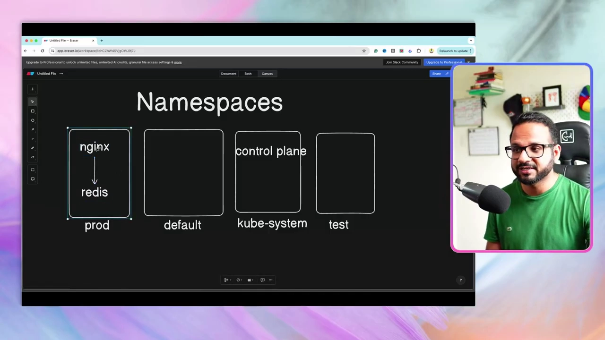
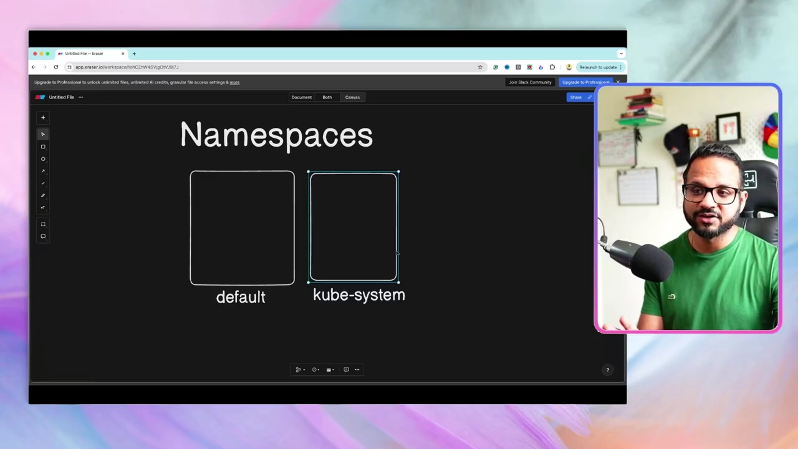
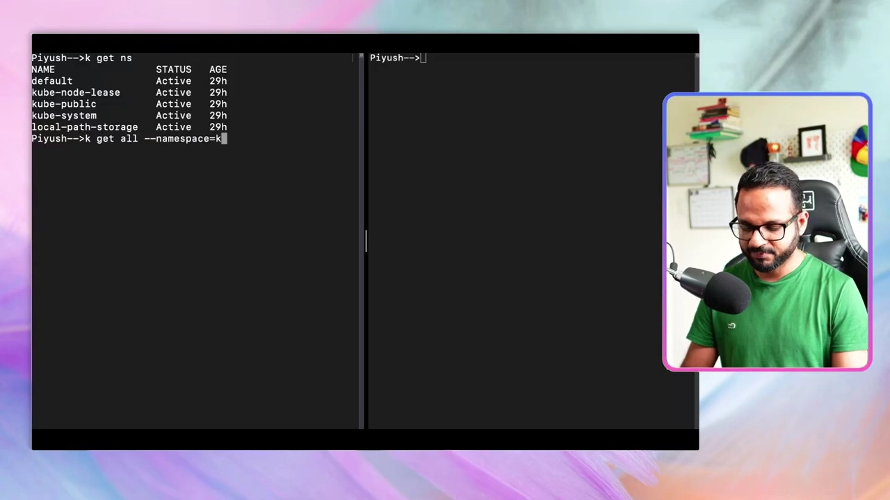
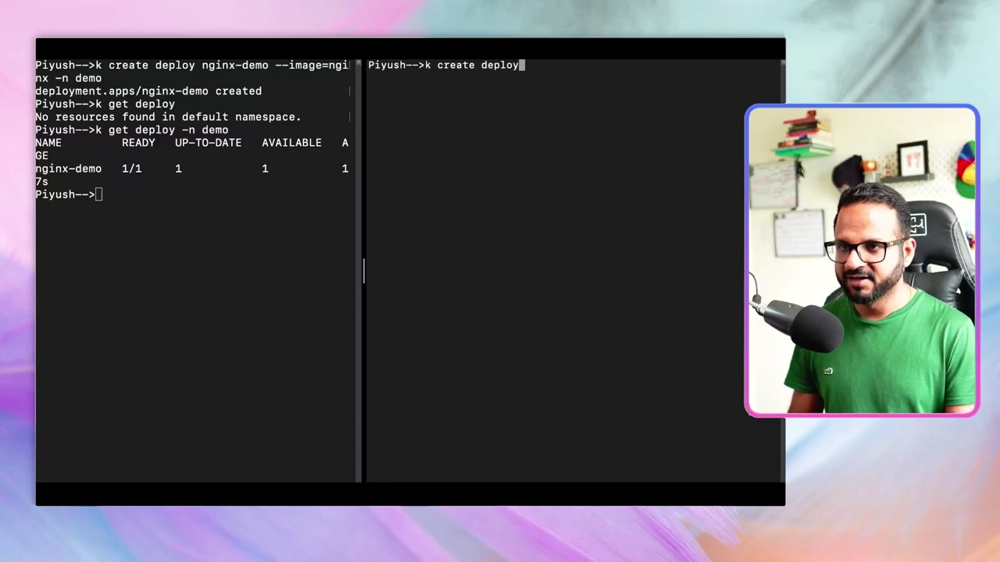
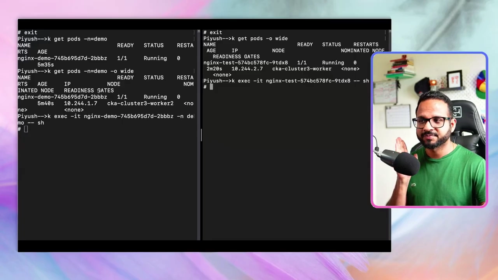
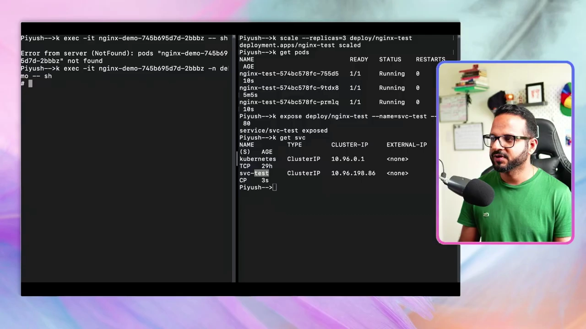
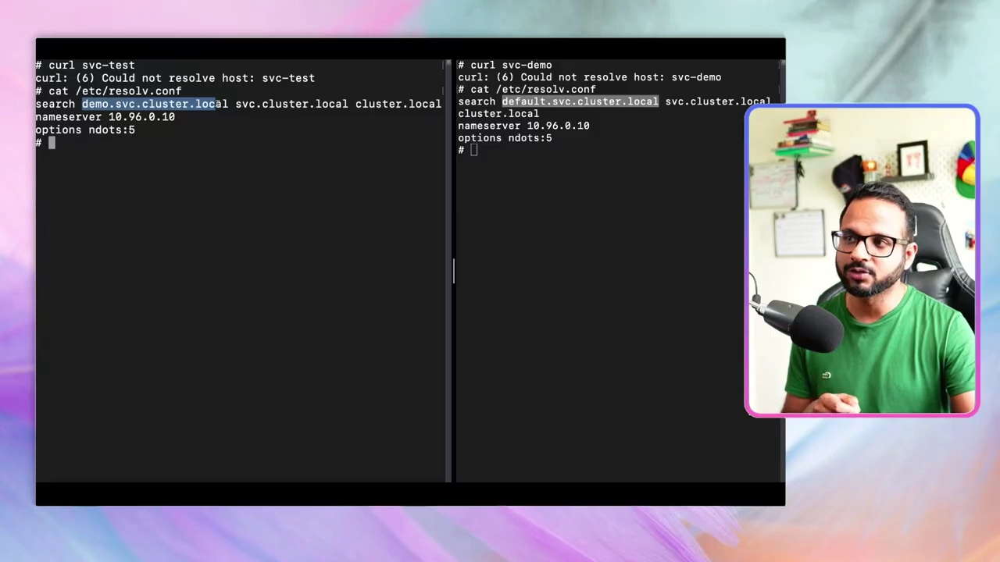
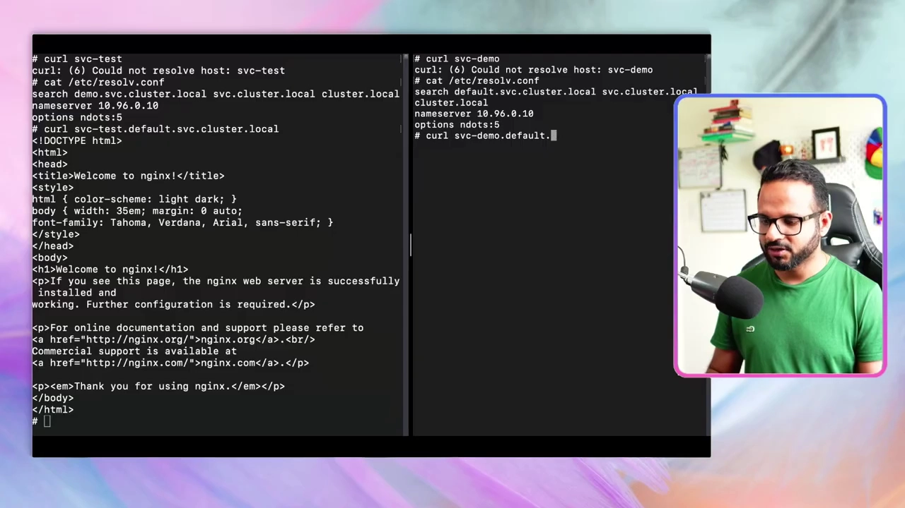
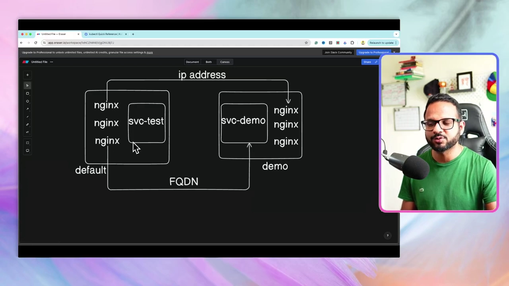

# Day 10：Namespace——集群内部的逻辑隔离与跨空间访问

> 视频来源：[Day 10/40 - Kubernetes Namespace Explained - CKA Full Course 2025](https://www.youtube.com/watch?v=yVLXIydlU_0)（YouTube，频道 Tech Tutorials with Piyush）
>
> 从第 7 讲到现在，我们创建的**所有资源其实都悄悄落在了一个叫 `default` 的命名空间里**。这一讲把 **Namespace（命名空间）** 这一层"集群内部的逻辑隔离"讲清楚：它是什么、为什么需要、怎么创建，以及最关键的——**跨命名空间该怎么访问**。文稿左栏为英文自动字幕，本文已翻译并重写为中文。

## 本讲要解决的核心问题（SCQA）

**背景**：前面所有实操里，我们用 `kubectl apply -f xxx.yaml` 或 `kubectl create deploy ...` 创建资源时，从没指定过命名空间，资源却都能正常创建、正常访问。

**冲突**：原因是从始至终我们用的都是**默认命名空间（default）**。但如果一个集群里所有资源都堆在同一空间，就会出现两个问题：**第一，管理混乱、极易误操作**——比如你本想删 A 命名空间里的某个 Pod，却手一抖删了 B 命名空间里的；**第二，不同环境/团队无法隔离**，测试环境和生产环境的东西混在一起，安全性和隔离性都很差。[【跳转到 01:37】](https://www.youtube.com/watch?v=yVLXIydlU_0&t=97)

**疑问**：Namespace 到底是什么、提供什么隔离？集群自己会不会创建一些命名空间？同一类资源能不能在不同命名空间里**重名共存**？把资源放进命名空间后，**同一个命名空间内**以及**跨命名空间**分别该怎么访问？为什么同一命名空间内能直接用主机名、跨命名空间却不行？

**回答（中心思想）**：**Namespace 给集群提供了一层"逻辑隔离"**——它把对象和资源分门别类放进不同的"隔间"里，便于管理、避免误操作，还能为每个命名空间**分配不同的权限（RBAC）**。集群自带 `default`、`kube-system` 等默认命名空间；**同一资源名可以在不同命名空间里重复**，因为它们互相隔离。访问规则是本讲的核心结论：**同一命名空间内**，直接用**主机名**即可互相通信；**跨命名空间**时，**IP 仍然可达（集群范围），但主机名不可达**——必须使用 **FQDN（完全限定域名）**，格式为 `<服务名>.<命名空间>.svc.cluster.local`。

---

## 一、Namespace 是什么：集群内部的一层"逻辑隔离"

**说白了，Namespace 就是给你的集群再提供一层隔离**，让你能用不同方式把集群内的对象和资源分隔开。[【跳转到 00:47】](https://www.youtube.com/watch?v=yVLXIydlU_0&t=47)

最直观的例子：**你创建任何资源时如果不指定命名空间，它默认就落在 `default` 命名空间**。我们从第 7 讲以来的所有资源都在这里。[【跳转到 00:47】](https://www.youtube.com/watch?v=yVLXIydlU_0&t=47)

它带来的好处：

- **避免误操作**：有三个命名空间时，你要改/删某个资源**必须显式指定是哪个命名空间**，就不容易误伤别的环境；反之，如果所有东西都挤在一个空间里，一个手滑就可能出大事。[【跳转到 02:02】](https://www.youtube.com/watch?v=yVLXIydlU_0&t=122)
- **权限隔离**：可以为**每个命名空间分配不同的权限和 RBAC**，不同团队各管各的。[【跳转到 02:02】](https://www.youtube.com/watch?v=yVLXIydlU_0&t=122)
- **环境隔离**：常见做法是 `default`（默认）、`test`（测试）、`prod`（生产）各占一个命名空间，把它们分开，**为了更好的安全性、隔离性和"各居其所"**。[【跳转到 02:52】](https://www.youtube.com/watch?v=yVLXIydlU_0&t=172)



## 二、集群自带的命名空间：default 与 kube-system

在创建任何资源前，先看看一个 Kubernetes 集群**开箱自带**哪些命名空间。运行 `kubectl get namespaces`（简写 `k get ns`），你至少会看到：[【跳转到 04:52】](https://www.youtube.com/watch?v=yVLXIydlU_0&t=292)

- **`default`**：不指定命名空间时资源的归宿。
- **`kube-system`**：**Kubernetes 自己用的**。所有**控制平面组件（control plane components）**都跑在这里。
- 此外还会有 `kube-public`、`kube-node-lease`、`local-path-storage` 等（演示时它们是空的）。



**为什么要看 kube-system 里有什么？** 用 `kubectl get all --namespace=kube-system`（简写 `--namespace=k`，再简写 `-n kube-system`）就能看到集群控制平面的全貌：**kube-apiserver、controller-manager、kube-proxy、kube-scheduler、etcd** 等控制平面组件，以及 **CoreDNS**。[【跳转到 05:17】](https://www.youtube.com/watch?v=yVLXIydlU_0&t=317)

**CoreDNS 的作用**是**把 IP 解析成主机名**（集群内部的域名解析）。这一讲后面的跨命名空间访问，靠的正是它。



## 三、动手：创建 Namespace（声明式 + 命令式）

创建命名空间有两条路，正好复习"命令式 vs 声明式"。[【跳转到 07:59】](https://www.youtube.com/watch?v=yVLXIydlU_0&t=479)

**声明式**：新建 `ns.yaml`。注意命名空间这个对象**只有三个顶层字段就够了，不需要 `spec`**：[【跳转到 08:29】](https://www.youtube.com/watch?v=yVLXIydlU_0&t=509)

```yaml
apiVersion: v1
kind: Namespace      # 注意 N 大写
metadata:
  name: demo
```

```bash
kubectl apply -f ns.yaml
kubectl get ns        # 出现新命名空间 demo
```

> 小坑：`apiVersion` 的 `v1` 里 **v 必须小写**；`kind: Namespace` 的 **N 必须大写**（Kubernetes 全部大小写敏感）。

**命令式**：一条命令就够——`kubectl create ns demo`（或 `kubectl create namespace demo`）。作者借这个例子再次强调：**有时候一条命令式命令，比"先写 YAML 再创建对象"的声明式流程更快**，尤其在临时操作时很省事。[【跳转到 09:44】](https://www.youtube.com/watch?v=yVLXIydlU_0&t=584)

删除用 `kubectl delete ns demo`。

## 四、把资源放进命名空间：`-n` 与同名隔离

创建 Pod/Deployment 时，要用 `-n <命名空间>`（或 `--namespace=<命名空间>`) 指定归属，**否则默认进 `default`**：[【跳转到 10:34】](https://www.youtube.com/watch?v=yVLXIydlU_0&t=634)

```bash
kubectl create deploy nginx-demo --image=nginx -n demo
kubectl get deploy                 # 看不到东西——默认查的是 default 命名空间
kubectl get deploy -n demo         # 加上 -n 才看得到 nginx-demo
```

**关键规则**：**读取、添加、删除某个命名空间里的资源，都必须显式带上命名空间名**。[【跳转到 11:24】](https://www.youtube.com/watch?v=yVLXIydlU_0&t=684)



**同名可共存**：因为命名空间相互隔离，你**可以用同一个名字在不同命名空间里创建对象**。比如在 `demo` 里建 `nginx-demo`，同时在 `default` 里建 `nginx-test`——或者干脆在 `default` 里也用 `nginx-demo` 这个名字，都不会冲突。[【跳转到 12:14】](https://www.youtube.com/watch?v=yVLXIydlU_0&t=734)

演示中：`demo` 里跑 `nginx-demo`，`default` 里跑 `nginx-test`，各扩到 3 个副本，然后各自 `kubectl expose` 出一个 Service（`svc-demo` / `svc-test`）。注意 **`kubectl expose` 也要带 `-n`** 才能把 Service 建到对应命名空间。[【跳转到 17:39】](https://www.youtube.com/watch?v=yVLXIydlU_0&t=1059)

## 五、跨 Namespace 通信：IP 可达，主机名不可达

现在做核心实验——**两个命名空间里的 Pod 能不能互相访问？** 作者左右分屏，左边是 `default`、右边是 `demo`，各 `exec` 进一个 Pod。[【跳转到 15:09】](https://www.youtube.com/watch?v=yVLXIydlU_0&t=909)

先看结论：

- **用 IP 访问：可行。** `curl <对方Pod的IP>` 在两个方向都能拿到响应（"Welcome to nginx"）。因为 **Pod 的 IP 是集群范围的**——同一个 IP 在集群内任何地方都能访问，即便它们属于不同命名空间。演示时左边 `10.244.1.7`、右边 `10.244.2.7`，互相 `curl` 都成功。[【跳转到 15:34】](https://www.youtube.com/watch?v=yVLXIydlU_0&t=934)



- **用主机名访问：不行。** 当尝试用 Service 的短名 `curl svc-test`（或 `svc-demo`）时，报错 **`Could not resolve host`**——因为它无法把短名解析成地址。[【跳转到 21:29】](https://www.youtube.com/watch?v=yVLXIydlU_0&t=1289)



这说明一个重要事实：**Service 的主机名是"命名空间级"的，不是"集群级"的**。`svc-demo` 这个名字只在 `demo` 命名空间内有效，`svc-test` 只在 `default` 内有效。[【跳转到 26:17】](https://www.youtube.com/watch?v=yVLXIydlU_0&t=1577)



## 六、用 FQDN 跨命名空间访问：resolv.conf 揭示规则

既然短名不行，那跨命名空间该用**全名**。作者用 `cat /etc/resolv.conf` 一探究竟——这个文件负责集群内部的 **IP ↔ DNS 解析**。[【跳转到 22:44】](https://www.youtube.com/watch?v=yVLXIydlU_0&t=1364)

你会看到 `search` 行形如：
```text
search default.svc.cluster.local svc.cluster.local cluster.local
```

由此可以拼出 **FQDN（Fully Qualified Domain Name，完全限定域名）** 的格式：

```text
<服务名>.<命名空间>.svc.cluster.local
```

- 在 **demo** 命名空间的 Pod 里：`curl svc-test.default.svc.cluster.local` → 成功；
- 在 **default** 命名空间的 Pod 里：`curl svc-demo.demo.svc.cluster.local` → 成功。

[【跳转到 24:00】](https://www.youtube.com/watch?v=yVLXIydlU_0&t=1440)



**规律总结**：**同一个命名空间内，直接用主机名**（短名）；**跨命名空间，必须用 FQDN**。虽然 **IP 在集群内到哪都能用**，但 **Pod 的 IP 不是静态的**，所以正解是：**跨命名空间用 FQDN（Service 名 + 命名空间）。**[【跳转到 24:50】](https://www.youtube.com/watch?v=yVLXIydlU_0&t=1490)

最后，作者用一张图把整条路径讲清楚：两个命名空间 `default` / `demo`，各自跑着 3 个 nginx Pod 和各自的 Service（`svc-test` / `svc-demo`）；**同命名空间靠主机名，跨命名空间靠 FQDN**。[【跳转到 26:42】](https://www.youtube.com/watch?v=yVLXIydlU_0&t=1602)



## 小结

- **Namespace = 集群内部的逻辑隔离层**：便于分类管理、避免误操作、做权限（RBAC）与环境隔离。
- **默认命名空间**：不指定就进 `default`；**`kube-system`** 承载所有控制平面组件（apiserver、etcd、scheduler、controller-manager、kube-proxy、CoreDNS 等）。
- **创建方式**：声明式 `ns.yaml`（只需 `apiVersion` / `kind` / `metadata.name`，**无需 `spec`**）；命令式 `kubectl create ns <名字>`。
- **操作资源必须带命名空间**：`-n <ns>`（或 `--namespace=`），否则默认落到 `default`。
- **同名可共存**：不同命名空间里可以创建同名对象，因为彼此隔离。
- **跨命名空间访问的两条铁律**：**IP 集群范围可达（但会变）**；**主机名只在命名空间内有效**，跨命名空间必须用 **FQDN**：`<服务名>.<命名空间>.svc.cluster.local`。
- **IPC/DNS 幕后**：**CoreDNS** 负责把 IP 解析成主机名，`/etc/resolv.conf` 里的 `search` 段决定了能省略到什么程度。

## 关键术语速查

| 术语 | 一句话解释 |
| --- | --- |
| **Namespace** | 集群内部的一层逻辑隔离，用于分组管理资源、做权限与环境隔离。 |
| **default** | 不指定命名空间时资源的默认归宿。 |
| **kube-system** | 存放 Kubernetes 控制平面组件的系统命名空间。 |
| **CoreDNS** | 集群内的 DNS，把 IP 解析为主机名（含 Service 名）。 |
| **`-n` / `--namespace`** | 指定命令作用于哪个命名空间。 |
| **RBAC** | 基于角色的访问控制，可按命名空间分配权限。 |
| **FQDN** | 完全限定域名，格式 `<服务名>.<命名空间>.svc.cluster.local`。 |
| **/etc/resolv.conf** | Pod 内的 DNS 解析配置文件，`search` 段决定可省略的域名后缀。 |
| **kubectl expose** | 命令式创建 Service，需带 `-n` 指定命名空间。 |
