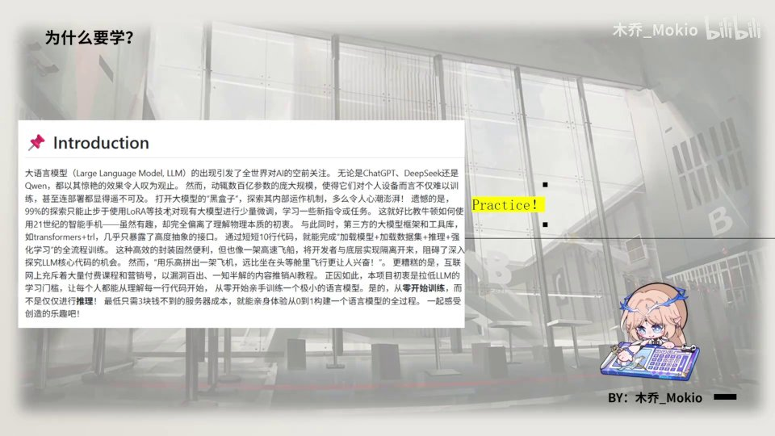
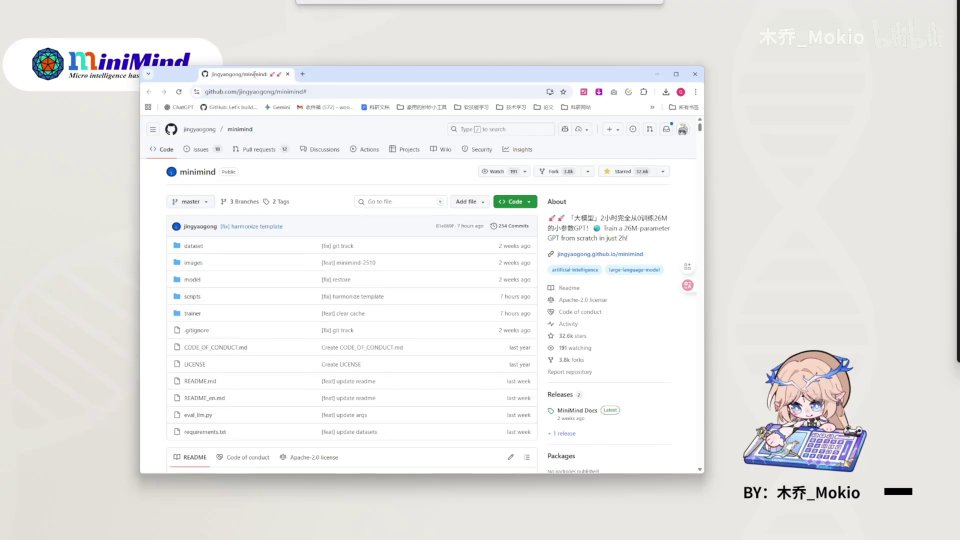
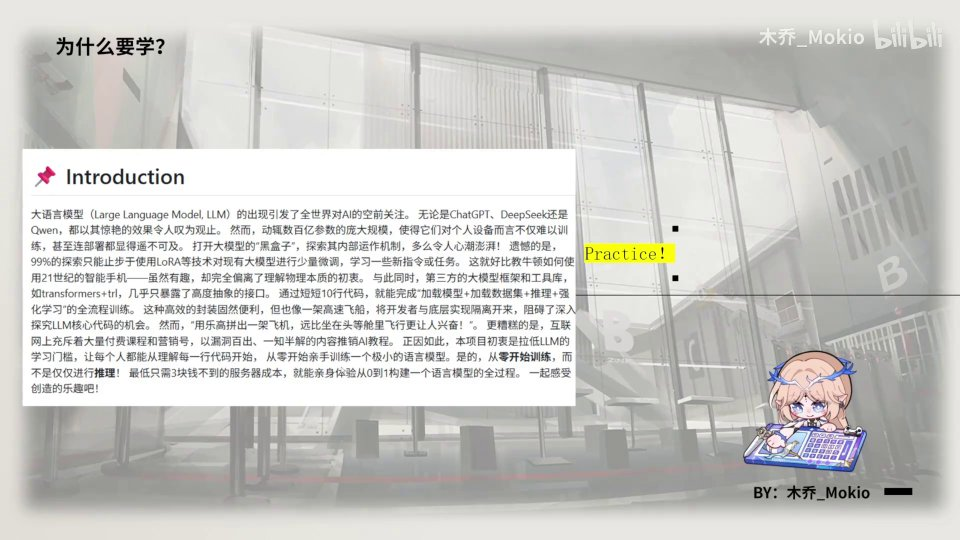
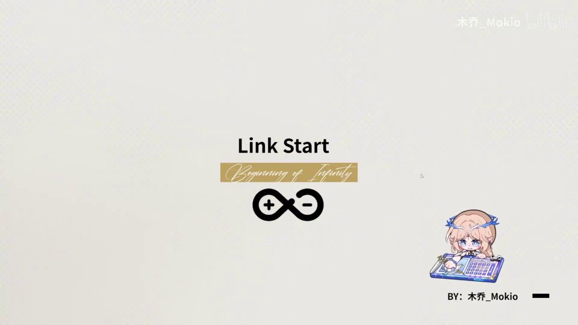

# 第1讲：开篇——为什么要从零手敲一个大模型

## 本讲要解决的核心问题（SCQA）

**背景**：大模型（Large Language Model，LLM，指参数量巨大、用海量文本训练出来的语言模型，如 ChatGPT、DeepSeek、Qwen）已经像水和电一样进入我们的日常，几乎人人都在用。

**冲突**：会用是一回事，懂原理是另一回事。Transformer 已经是好几年前的技术，ChatGPT 横空出世也过了两年，可大多数人——包括很多开发者——对大模型的底层依然陌生，日常工作和底层实现几乎是隔开的。

**疑问**：在这种"人人都用、少有人懂"的局面下，一个初学者怎样才能真正理解大模型是怎么被造出来的？

**回答（中心思想）**：跟着这套教程，用「三元三小时」，基于开源项目 Minimind，从零亲手敲出一个属于自己的大模型。只有亲手造一次轮子，你才能从"会调用"跨越到"真正学会"。

---

## 一、这套教程要做什么：三元三小时，从零手敲一个大模型

[【跳转到 00:00】](https://www.bilibili.com/video/BV1T2k6BaEeC/?p=1&t=0)

作者木乔（木乔_Mokio）用一句很直白的话给整套视频定了调：**带你用「三元三小时」亲手敲一个大模型出来**。这句话里藏着两个关键信息，值得先拆开讲清楚。

### 1.1 「三小时」：不是速成，而是完整走一遍流程

"三小时"指的是整套视频的时长量级——你花三个小时左右，就能跟着把一个大模型从零搭起来。它承诺的不是"三小时精通大模型"，而是"三小时亲手走完一遍最小可用的完整流程"。

这对初学者的意义在于：大模型听起来玄乎，但它的核心架构并不神秘，一个**极小规模**的版本完全可以在几小时内、在一台普通电脑上跑通。先把这个最小闭环走通，再回头看那些上百亿参数的庞然大物，你就有了"地图"。

### 1.2 「三元」：训练成本低到几乎可以忽略

"三元"指的是成本。整套教程训练出的模型极小，官方说法是：**最低只要不到 3 块钱的服务器成本，就能体验从 0 到 1 构建一个语言模型的全过程**。这是 Minimind 项目刻意追求的设计目标——把"动手训一个模型"这件事的经济门槛拉到人人都能承受。

一句话总结：**"三小时"降的是时间门槛，"三元"降的是金钱门槛**，两者合起来，就是把"亲手做大模型"从少数人的特权变成普通人的练习。

### 1.3 课程基于 Minimind 开源项目

大家可以看到画面左上角那个 Minimind 的标志——没错，这套视频是基于 **Minimind 这个开源项目**来做的。它不是作者从零自创的一套代码，而是站在一个成熟、公开、经过很多人验证的项目之上，做**深入的拆解与讲解**。下一节会专门介绍 Minimind。

---

## 二、为什么要学：大模型人人会用，底层却少有人懂

[【跳转到 00:25】](https://www.bilibili.com/video/BV1T2k6BaEeC/?p=1&t=25)

### 2.1 大模型已经改变了世界，也改变了每个人的习惯

正如 Minimind 项目 Introduction（引言）里所写的：大语言模型的出现引发了全世界对 AI 的空前关注。无论是 ChatGPT、DeepSeek 还是 Qwen，它们惊艳的效果都令人叹为观止。这段时间过去，使用大模型已经成了默认习惯——遇到问题先问 AI，几乎成了一种本能。

### 2.2 但"用"和"懂"之间隔着一条鸿沟

问题在于：这些模型动辄有数以百亿计的参数，**规模庞大到个人设备根本训练不起**，甚至连部署都遥不可及。

于是很自然的，99% 的探索就止步于"使用"层面：

- 用 **LoRA**（一种只训练少量附加参数、把大模型快速适配到新任务上的微调技术）做轻量微调；
- 学习几个新的指令或任务；
- 把它当黑箱来调用。

这就像让 21 世纪的人去用智能手机——非常好用，但大多数人完全不了解它内部是怎么运作的。对于大模型，**Transformer + 微调**几乎成了唯一暴露给使用者的接口，其余部分被封装得严严实实。

### 2.3 缺失的不是功能，而是"探索原理和构建的乐趣"

当大模型的框架、工具、库把它们包装成一架"高速飞机"，开发者与底层实现之间就被隔离开了。便利是便利，但你也失去了深入探索 LLM 核心代码的机会，失去了亲手构建它的乐趣。这一节要传达的核心判断就一句话：

> **会用大模型不等于懂大模型，而懂它、造它，才是完整的学习。**

---

## 三、为什么"造轮子"才是真正的学会

[【跳转到 01:00】](https://www.bilibili.com/video/BV1T2k6BaEeC/?p=1&t=60)

### 3.1 程序员的老话：只有造轮子，你才能真正学会

"不要重复造轮子"是工程里的常识，但**学原理**的时候恰恰相反——**只有造过轮子，你才真正学会**。因为你在调用一个封装好的函数时，不需要理解内部机制；而当你亲手实现它时，每一个细节都会逼着你去理解。

这就像学开车和造发动机的区别：开车的人很多，能讲清发动机怎么工作的人很少。

### 3.2 便利的封装 vs 亲手拼装的兴奋

现在的封装固然便利，但作者用了一个很传神的类比：

> **用乐高拼一架飞机，比坐在头等舱更让人兴奋。**

坐在头等舱是"使用"的极致——舒服、省事、什么都不用管；而用乐高一块块拼出飞机，虽然麻烦，却是"创造"的快乐。这套教程要给你的，正是后者。

### 3.3 网上教程良莠不齐，更需要一条清晰的路线

还有一个现实的痛点：网上充斥着漏洞百出、一知半解的内容，打着"AI 教程"的旗号来推销。初学者缺的不是信息，而是**一条经过验证、能真正把原理讲透的学习路径**。这正是 Minimind 项目要解决的问题。

---

## 四、Minimind：把大模型的门槛降下来

[【跳转到 00:30】](https://www.bilibili.com/video/BV1T2k6BaEeC/?p=1&t=30)

### 4.1 Minimind 是什么

Minimind 是一个**专门用来"从零训练一个小型语言模型"的开源项目**。它提供了一套完整、可运行的代码，把"训练一个大模型"这件事浓缩成一个足够小、足够便宜、普通人也能跑通的版本。

### 4.2 它的初衷：让每个人理解每一行代码

Minimind 的初衷写在项目的引言里，简单而有力：

> **拉低大模型的学习门槛，让每个人能够理解每一行代码。**

注意这里的措辞——不是"会用"，而是"理解每一行代码"。项目不是要再做一个竞品模型，而是要做一个**教学载体**：用小规模换取可理解性，让你能一行一行看懂语言模型到底是怎么搭起来的。

### 4.3 这套教程会拆解到什么程度

作者在 Minimind 的基础上做了一个重要补充：**Minimind 让你能训练一个小模型，而本教程要"拉低大家学习 Minimind 的门槛"**。也就是说，他会把项目里的每一块深入拆开，尽可能让你**从底层就学会怎样构建一个大模型**。

这里有一个关键论断：

> **学懂 Minimind，也就学懂了大模型。**

因为大模型和小模型的**架构原理是共通的**——都是 Transformer、注意力、归一化、位置编码那一套，区别主要在规模。把小的彻底搞懂，大的自然一通百通。

---

## 五、作者的私心：用费曼学习法把知识讲透

[【跳转到 01:25】](https://www.bilibili.com/video/BV1T2k6BaEeC/?p=1&t=85)

### 5.1 什么是费曼学习法

做这套教程还有一层"私心"：作者说自己很钟爱**费曼学习法**。

费曼学习法（Feynman Technique）是一条检验"是否真正学会"的黄金标准，简单说就是：**如果你能用最朴素的语言，把一个概念讲给一个完全不懂的人、并把他讲懂，那你才算真的学会了**。它逼你直面自己理解里的每一个模糊点——讲不下去的地方，恰恰就是你还没懂的地方。

### 5.2 输出倒逼输入

作者把这个方法用在了自己身上：

- 每次学习之后，他都会**记很多笔记**；
- 但光记笔记还不够，**只有真正的输出内容，才会让他感觉自己学会了**；
- **只有真正讲给别人、把别人讲懂，才能说自己学会了**。

所以在准备这套教程的过程中，他其实也在不断检验和完善自己的知识——"为了讲清楚而重新学一遍"，反过来又让他学到了很多。

### 5.3 这对学习者意味着什么

这意味着你看到的不是一份临时拼凑的二手资料，而是**一份为"讲懂"而反复打磨的内容**。学的时候，你也不妨用同样的方法：学完一节，试着合上视频，用自己的话把它讲给身边的人听——讲得通，才是真的会了。

---

## 六、怎么学：配套资源与学习路线

[【跳转到 02:11】](https://www.bilibili.com/video/BV1T2k6BaEeC/?p=1&t=131)

### 6.1 代码上传 GitHub，按 commit 逐期查看

这期视频依旧延续往期的惯例：**相关代码都会上传到 GitHub**。而且会**按照往期的 commit** 来组织——所谓 commit，就是 Git 版本控制里的一次"提交记录"，相当于给代码在某一时刻拍了一张快照。

这样安排的好处是：**你可以对着每一期视频，找到对应的那一次提交**，看清这一段代码在这一期里到底改了什么。学习时"视频 + 对应 commit"对照着看，思路会非常清晰。

### 6.2 仓库地址和笔记地址放在简介

仓库地址和笔记地址，作者都会放在视频**简介**里，方便随时取用。

### 6.3 一条完整的学习路线

[【跳转到 01:55】](https://www.bilibili.com/video/BV1T2k6BaEeC/?p=1&t=115)

从画面上可以看出，整套内容大致遵循这样一条路线：

1. **理论讲解**——先把原理讲清楚；
2. **手敲代码部分**——亲手把理论写成能跑的代码；
3. **数据搜集与训练部分**——准备数据、启动训练；
4. **相关 torch 方法**——用到哪些 PyTorch（深度学习框架）的方法，逐个说明。

这个顺序本身就是一条"从懂到会"的路径：**先理解，再实现，最后跑起来**。

### 6.4 一点小小的请求：三连、star、关注

作者也坦诚地说：看在准备了这么多的份上，希望大家**给一个三连**、给仓库里的项目**点一个 star**，同时**点点关注**。这些反馈是持续做下去的动力。

---

## 七、从零开始，"Link Start"

[【跳转到 02:36】](https://www.bilibili.com/video/BV1T2k6BaEeC/?p=1&t=156)

走到这里，开篇的铺垫已经完成，接下来就是正式出发。

### 7.1 怀着 "dirty your hands" 的理念

作者希望大家怀着 **"dirty your hands"**（动手实践、亲自上手）的理念来学。学大模型最忌讳当"观众"——只看不练。真正有效的姿态是：打开编辑器，跟着敲，敲错了就调试，跑通了再回头看原理。

### 7.2 from beginning to infinity

作者引用了 **"from beginning to infinity"**（从起点，到无限）——这既是一个浪漫的宣言，也点明了这门课的野心：从最小的起点出发，通向无限可能。

### 7.3 Link Start

最后，用一句动漫式的口号收尾——**"Link Start！"**

**让我们真正地从零开始，构建一个属于你自己的大模型吧。**

---

## 小结

- **一句话定位**：这套教程带你用「三元三小时」，基于开源项目 Minimind，从零亲手敲出一个自己的大模型。
- **"三小时"降时间门槛、"三元"降金钱门槛**：训练出的模型足够小，成本最低不到 3 元，普通人也能跑通完整流程。
- **为什么值得学**：大模型人人会用，但开发者与底层被隔离，缺失了探索原理和构建的乐趣；**只有造轮子才能真正学会**。
- **Minimind 的初衷**：拉低大模型的学习门槛，让每个人理解每一行代码；**学懂 Minimind 也就学懂了大模型**，因为大小模型共享同一套架构原理。
- **作者的私心**：用**费曼学习法**打磨内容——把别人讲懂，才算自己学会；所以你拿到的是一份为"讲懂"而反复锤炼的教程。
- **怎么跟学**：代码上 GitHub 并按 commit 逐期组织，仓库与笔记地址在简介；学习路线是**理论 → 手敲代码 → 数据与训练 → torch 方法**。
- **行动姿态**：怀着 "dirty your hands" 的理念，动手实践，从零开始，Link Start。

---

## 关键术语速查

| 术语 | 一句话解释 |
| --- | --- |
| 大模型（LLM） | Large Language Model，参数规模巨大、用海量文本训练出来的语言模型，如 ChatGPT、DeepSeek、Qwen。 |
| Transformer | 现代大模型的底层网络架构，也是本课程要亲手实现的核心对象。 |
| ChatGPT | 2022 年底横空出世的对话式 AI，引爆了全世界对大模型的关注。 |
| 参数 | 模型内部可学习的数值，数量常达百亿级，规模大到个人设备难以训练。 |
| LoRA | 一种轻量微调技术：冻结大模型，只训练少量附加参数来适配新任务。 |
| 封装 / 框架 | 把底层实现打包好的工具库，用起来方便，但会遮蔽内部原理。 |
| 造轮子 | 亲手实现一遍底层功能；学原理时"造轮子"才能真正学会。 |
| Minimind | 一个用于"从零训练小型语言模型"的开源教学项目，本课程基于它构建。 |
| 费曼学习法 | 用最朴素的话把一个概念讲给别人并讲懂，以此检验自己是否真的学会。 |
| GitHub | 全球最大的代码托管平台，本课程的代码会按 commit 上传到这里。 |
| commit | Git 版本控制中的一次提交记录，相当于代码在某一时刻的快照；可逐期对应视频查看。 |
| star | GitHub 上的"收藏/点赞"，用来支持作者的项目。 |
| 三连 | B 站的点赞、投币、收藏，是对 UP 主的支持。 |
| PyTorch | 主流深度学习框架，本课程手敲代码时使用的工具，简称 torch。 |
| dirty your hands | 英文习语，意为"亲自动手、上手实践"，本课程倡导的学习姿态。 |
| from beginning to infinity | 从起点到无限，本课程的口号，寓意从最小起点通向无限可能。 |
