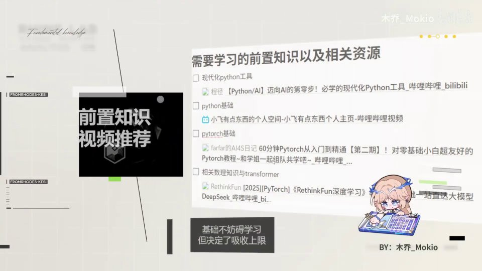
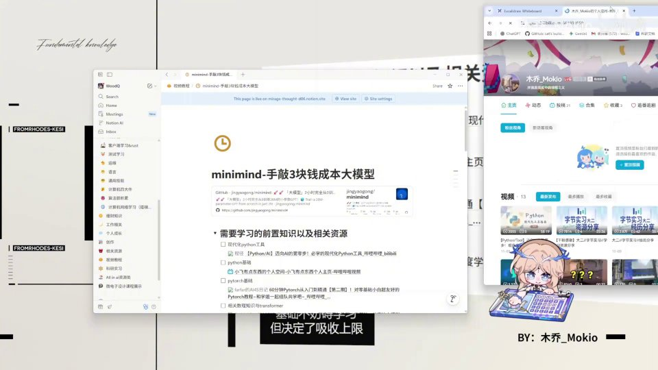
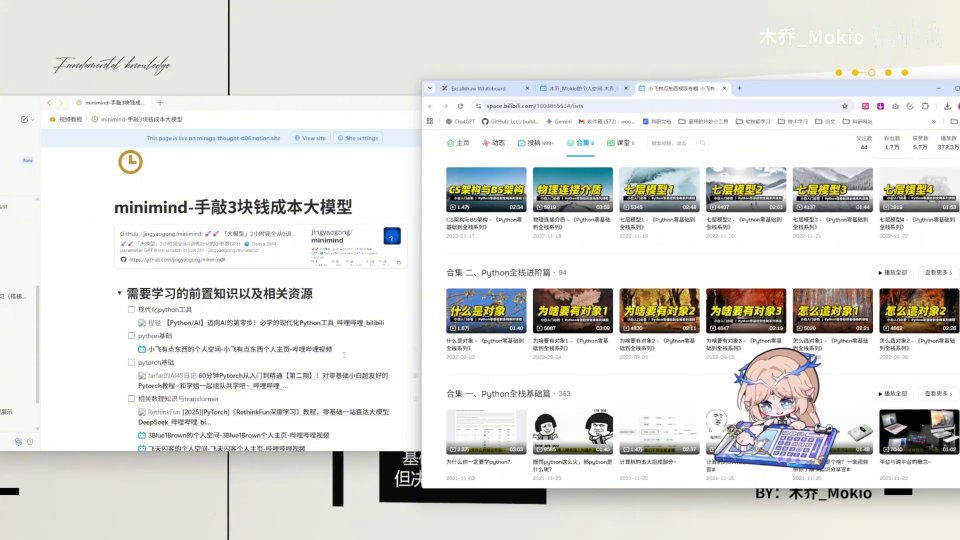
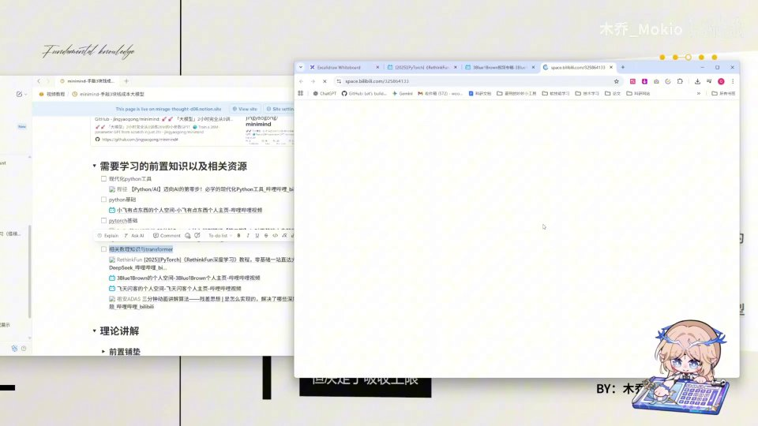
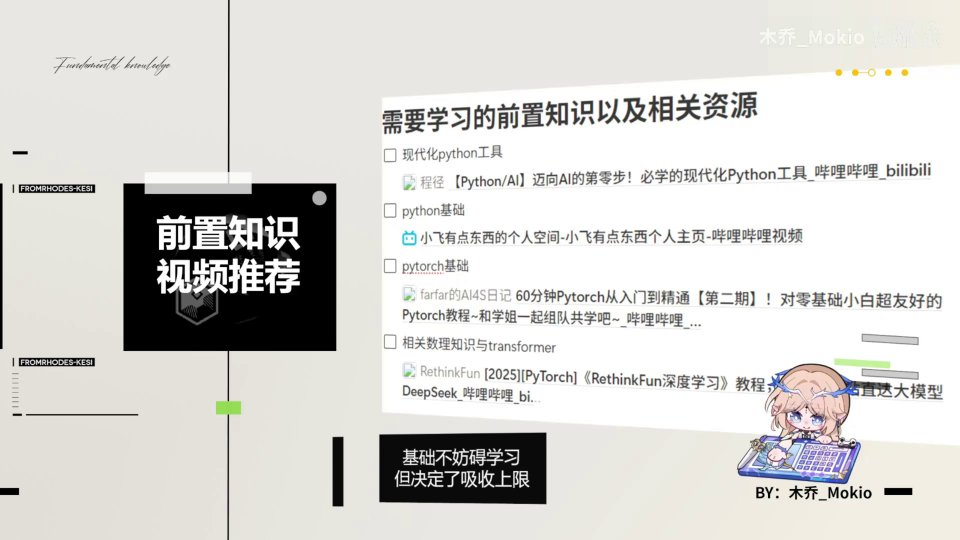
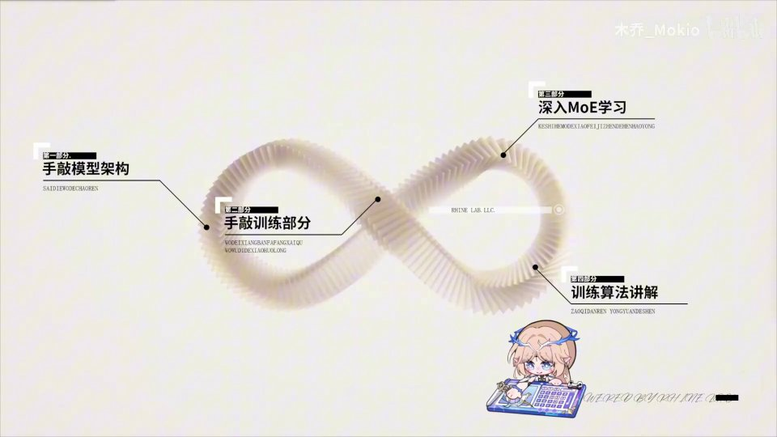

# 第2讲：前言——补好基础、看清收获、走完这条四段式学习路径

## 本讲要解决的核心问题（SCQA）

**背景**：你已经决定跟着 Minimind 系列动手实现一个属于自己的大语言模型。这套视频会尽可能把学习门槛降下来，用白板绘图、通俗解释的方式，带你从零手敲模型和训练代码。

**冲突**：但"降低门槛"不等于"什么都教"。作者明确表示，**不会**去补 Python 语法、神经网络、强化学习这类非常基础的知识；如果你这块有明显缺口，直接跟课会吸收得很吃力。可问题是，市面上的教程和资源太多太杂，初学者往往不知道该先补什么、补到什么程度。

**疑问**：那到底该先补哪些基础？补到什么程度？补完之后，这门课又能让我在知识面和动手能力上收获什么？整个系列又会按什么顺序展开？

**回答（中心思想）**：这是一门"知识 + 实操"双线并进的课。**基础不决定你能不能跟课，却决定你吸收的上限**——所以作者给出了一条清晰的前置知识清单和配套资源，又把整个系列拆成四个递进的部分（模型架构 → 预训练 → MoE → 训练算法）。你只需要按图索骥补齐缺口，就能顺着这条路走完全程。

这一讲虽然只有四分半钟，但它是整门课的"地图"：它决定了你接下来几个月该补什么、按什么顺序学、遇到卡点该往哪里找答案。下面我们把它拆成十条要点，一条条讲清楚。

---

## 一、这是一门"知识 + 实操"双线并进的课

作者一上来就给整门课定了调子：跟随这套视频学完，你能在**知识**和**实操**两方面同时有收获。这一点很关键——很多教程要么只讲原理不动手，要么只堆代码不讲"为什么"，而这门课想把两者绑在一起：**理论解释为什么这样设计，动手让你亲手把它跑起来。**

**知识方面**，课里会覆盖：

- **Transformer 基础知识**：现代大语言模型的骨架架构，理解它是读懂后面一切代码的前提；
- **YaRN 算法与 RoPE 外推**等优化方法：让模型在推理时能处理比训练时更长的上下文；
- **MoE 架构学习**：即"混合专家"结构，用稀疏激活的方式在有限算力下把模型做大；
- **大量训练方法**，包括 Pretrain、SFT、LoRA、RLHF-DPO、RLAIF（PPO/GRPO/SPO），以及**模型蒸馏**。

**实操方面**，你会学到：

- **现代化 Python 工具的使用**（就是作者上一期视频的教程）；
- **PyTorch 的编写**，包括一些基础命令的使用；
- 更重要的是，你可以在 Minimind 这个真实项目里做实验，把理论落到代码上。

[【跳转到 00:30】](https://www.bilibili.com/video/BV1T2k6BaEeC/?p=2&t=30)

先补一句背景：**Minimind 是一个"手敲 3 块钱成本大模型"的开源项目**。它的目标不是训练出最强的模型，而是用一个足够小、能在一台普通机器上跑通的模型，把大语言模型从架构到训练的完整流程展示给你看。正因为它小，你才有机会真正逐行读懂每一处设计——这正是"知识 + 实操"能同时成立的现实基础。

为了让抽象知识不那么难啃，作者还专门准备了一块**白板**，会在讲解过程中穿插绘图，把枯燥的理论画出来，尽可能降低理解门槛。

[【跳转到 01:10】](https://www.bilibili.com/video/BV1T2k6BaEeC/?p=2&t=70)

这部分信息量已经不小，下面先把那些反复出现的术语用一句话垫一下，读起来会更顺：

- **Transformer**：目前几乎所有大语言模型都在用的神经网络架构，核心是"注意力机制"，让模型在生成每个词时都能参考句子中所有其他词。
- **RoPE（旋转位置编码）**：一种给模型注入"位置信息"的方式，让模型知道"谁在前、谁在后"；"外推"指在推理时处理超出训练长度的文本。
- **YaRN**：一种把 RoPE 的位置编码"拉伸"到更长范围的技术，是长上下文模型常用的手段。
- **MoE（混合专家）**：模型里有很多个"专家"子网络，每次输入只激活其中一小部分，从而用更少计算换来更大容量。
- **Pretrain / SFT / RLHF / RLAIF**：预训练 → 监督微调 → 用人类反馈（或 AI 反馈）做强化对齐，是把一个"只会接话"的模型调教成"会听话"模型的标准流程。
- **LoRA**：一种只训练少量附加参数就能微调大模型的技术，省显存。
- **模型蒸馏**：让小模型去模仿大模型的输出，把小模型"教"得更聪明。

看不懂也没关系——这张清单的作用是让你先"混个脸熟"，后面每一讲都会逐个拆开细讲。

---

## 二、前置知识不会被补齐：先补课，吸收效果才好

作者在开头就把话说得很直白：**这套视频虽然尽量降低了门槛，但仍然不会补充非常基础的知识**。他点名了几类：

- Python 基础、语法学习；
- 基础神经网络、强化学习的概念。

如果你的这些基础真的很欠缺，那么**建议先补齐再来看**，效果会好很多。相反，如果你假装自己有基础硬跟，往往会在某个环节卡住，越学越挫败。这里其实藏着一个学习策略：**作者的课负责"把大厦盖起来"，但地基得你自己打**——他默认你已经具备读懂代码和概念的最低能力，于是把宝贵的篇幅都留给大模型本身的实现细节。

[【跳转到 00:05】](https://www.bilibili.com/video/BV1T2k6BaEeC/?p=2&t=5)

好消息是，作者并不是"甩锅"就完事——他把相关推荐的补充基础知识视频整理进了 **Notion 笔记**和下一页 PPT，方便你按图索骥。**Notion** 是一款笔记与知识管理软件，这里被当作课程的"资料总目录"，项目地址、视频清单、资源链接都挂在上面。

所以这一讲真正的"干货"，就是接下来那份前置知识清单。作者把它归纳成四类，我们逐条展开。

---

## 三、现代化 Python 工具：从 uv 和 ruff 上手

需要补的基础知识，作者在页面上列了四大类：**现代化 Python 工具、Python 基础、PyTorch 基础、相关数理知识与 Transformer**。我们一个一个说。

第一项是**现代化的 Python 工具**，也就是作者上一期视频出的教程。你可以在他的主页里找到这套"现代化 Python 教程"，里面主要教了两样东西：

- **uv**：一个非常快的 Python 包与环境管理工具。过去你要装依赖、建虚拟环境，可能会在 pip、conda、venv 之间来回切换，命令各不相同；uv 用一条命令就能同时搞定依赖安装和环境隔离，速度还快很多。
- **ruff**：一个极快的 Python 代码检查与格式化工具。它能自动帮你发现未使用的导入、可疑的写法，并按统一风格把代码排版好，相当于给代码请了一位"随身影分身"。

[【跳转到 01:33】](https://www.bilibili.com/video/BV1T2k6BaEeC/?p=2&t=93)

这些工具本身不难，但能显著提升你后面跟项目做实验的效率：你不会再被"环境装不上""依赖冲突"这类琐事卡半天。作者的定位很明确——**它属于"一次学会、长期受用"的基础设施技能**，建议直接学一下。

---

## 四、Python 语法：跟着"小飞有点东西"从基础到进阶

第二项是 **Python 基础语法**。作者推荐了 UP 主**"小飞有点东西"**，并给出了很高的评价——他认为这是他见过的全网讲 Python 讲得最好的人。

这位 UP 主的课程**从基础、进阶到全站（整站项目）由浅入深地讲解 Python 语法**，而且讲得非常通俗易懂。作者的用法建议是：

- 如果你 Python 语法还不太熟，**先看一些基础篇的内容**即可，不必一次刷完；
- 重点是能读懂、能改项目的代码，而不是成为语法专家。比如你得能看懂类（class）、函数（def）、列表推导式、装饰器这些常见写法，否则面对项目源码会一片茫然。

[【跳转到 01:52】](https://www.bilibili.com/video/BV1T2k6BaEeC/?p=2&t=112)

换句话说，语法学习是"够用就好"：能用它读懂并修改别人写的代码，就达到了跟课的标准。

---

## 五、PyTorch：跟 Farfar 的视频入门，不求精通

第三项是 **PyTorch 基础**。作者推荐了"**farfar 的 AI4S 日记**"的视频，其中有一套《60 分钟 PyTorch 从入门到精通》很合适。

PyTorch 是目前最主流的深度学习框架，用**张量（tensor）**表示多维数组、用**自动求导**帮你算梯度、用 **`nn.Module`** 把网络层搭起来。Minimind 的整套代码就是用 PyTorch 写的，所以你必须至少"见过"这些概念。

这里作者的态度很务实：**看完之后不求非常精通，大概了解 PyTorch 的概念和原理就行**。因为你后面会在 Minimind 项目里真正地写代码，框架的细节会在实战中自然补上；但如果你完全没用过张量运算、自动求导这些东西，跟课会很痛苦。

[【跳转到 02:11】](https://www.bilibili.com/video/BV1T2k6BaEeC/?p=2&t=131)

请特别注意这个"不求精通"的尺度拿捏——它体现了整门课的学习策略：**对工具类知识浅尝辄止，对课程核心知识精益求精**。把精力用在刀刃上，才不会在入门阶段就被劝退。

---

## 六、数理基础与 Transformer：RethinkFun 一整套打通

第四项也是作者眼中**最重要**的一块：**你缺失的数理知识和 Transformer**。首当其冲推荐的，是 **RethinkFun 的深度学习整套教程**。

这套教程的覆盖面很全，**从基础的数学讲起，一路讲到深度学习、Transformer，再到 CNN、RNN，最后讲到 DeepSeek 和 LLaMA** 这类真实大模型。这里出现的几个名词值得先认识一下：

- **CNN（卷积神经网络）**：擅长处理图像，用"卷积核"在图上滑动提取局部特征；
- **RNN（循环神经网络）**：擅长处理序列，按时间一步步读入，但长序列容易"遗忘"；Transformer 正是为解决它的局限而出现的；
- **DeepSeek / LLaMA**：两个知名的大语言模型系列，作为"理论落地到真实模型"的案例。

作者对这套教程的评价是"讲得已经非常透彻"，甚至说：

> 你看完这个视频，就**不需要再看我的相关理论讲解**了。

[【跳转到 02:16】](https://www.bilibili.com/video/BV1T2k6BaEeC/?p=2&t=136)

这是一句很有分量的话。它说明这门课做了清晰的**分工**：理论深水区外包给 RethinkFun，你在这里把数学和 Transformer 的基础打牢；回到 Minimind，就专心看"作者怎么把理论变成能跑的代码"。两边配合，既避免了重复，也让每份资源都发挥最大价值。

---

## 七、3Blue1Brown：用动画把抽象概念"看"懂

理论光靠文字常常不够，作者又补了一个"视觉派"资源：**3Blue1Brown** 的视频。

3Blue1Brown 的特点是**有非常优美的动画**，所以你能非常通俗而深入地理解其中讲的内容。作者明确说，**这些内容在自己的视频里就不细讲了**，如果你缺失，就去看 3Blue1Brown：

- **深度神经网络**是什么：一层层的神经元如何把输入逐步变换成输出；
- **梯度下降**：模型如何一步步"顺着坡往下走"来减小误差——想象你在浓雾中的山上，只能靠脚下坡度判断该往哪走；
- **反向传播**：误差如何从输出层往回传，指导每一层的参数更新；
- **注意力机制**和 **Transformer**：从直观层面理解模型怎么"看"一句话。

[【跳转到 02:58】](https://www.bilibili.com/video/BV1T2k6BaEeC/?p=2&t=178)

对初学者来说，动画最大的价值是**先建立直觉，再接受公式**。当你脑海里有了"梯度下降像下山""注意力像聚光灯"这样的画面，后面读论文和代码时就不会觉得它们是天书。

---

## 八、还有两个轻量入口：飞天闪客与祖安 ADAS

除了上面这些"主餐"，作者还顺手给了两个轻松一点的入口。

一是 **飞天闪客**的视频，讲解 AI 比较通俗，**一个小时**就能看完。

[【跳转到 03:20】](https://www.bilibili.com/video/BV1T2k6BaEeC/?p=2&t=200)

二是作者最近看到的 **祖安 ADAS** 的视频，它**用 3 分钟动画讲一个深度学习的基本思想**，比如**残差网络**和**注意力机制**。

[【跳转到 03:30】](https://www.bilibili.com/video/BV1T2k6BaEeC/?p=2&t=210)

这里的**残差网络**值得提前解释一句：它在网络里加了一条"捷径"（skip connection），让输入可以绕过若干层直接加到输出上。这样做的好处是缓解深层网络"越深越难训"的问题——因为梯度可以通过捷径顺畅地往回传。**这个"残差"思想在后面的 Transformer 里随处可见**，所以先通过三分钟动画建立印象，再正式学习时就会轻松很多。

这两个入口的定位是"短平快"：**不占太多时间，却能在你正式啃硬骨头之前，先把关键概念在脑子里预埋好。**

---

## 九、基础决定吸收上限：为什么值得先补

讲完资源清单，作者再次强调：**基础知识非常重要**。

作者说了一句很值得记下的话：

> 基础不妨碍你学习这期视频，但它一定决定了你吸收的上限。

[【跳转到 03:35】](https://www.bilibili.com/video/BV1T2k6BaEeC/?p=2&t=215)

这句话点破了很多人学 AI 的误区：没有基础也能"把视频看完"，代码也能"照抄跑通"，但一旦报错、一旦想改结构、一旦想理解"为什么要这样设计"，就会寸步难行。更具体地说：

- **能跑通 ≠ 学会了**：照抄代码跑出结果，不代表你理解了每一步的原理；
- **报错时无处求助**：没有基础，连错误信息都读不懂，只能干瞪眼；
- **无法迁移**：换个数据集、换个模型结构，就不知道怎么改。

所以基础不是入场券，而是天花板——**它决定了你能把这门课"吃"到多深。** 作者的劝告是：与其硬着头皮往前冲，不如花点时间先补齐最短板。

---

## 十、整套视频的四个部分与后续更新计划

最后，作者交代了整期视频的整体结构：**大概分为四个部分**，并用一条无限的莫比乌斯环把它们串起来，暗示这四个环节是循环递进、彼此关联的。

1. **第一部分：手敲模型架构**——带你一行行把整个模型搭出来，从注意力、位置编码到前馈网络，亲手组装出完整结构；
2. **第二部分：手敲训练部分**——从最基础的预训练（Pretrain）开始动手，让模型真正开始学习；
3. **第三部分：深入 MoE 架构的学习**——理解稀疏专家结构是怎么在有限算力下把模型做大的；
4. **第四部分：训练算法的讲解**——即前面提到的 SFT、LoRA、RLHF、RLAIF 等对齐与微调方法。

作者很坦诚地补充：**第三部分在他录这期视频的时候还没有学会**，但后面会学会并给大家补上。

[【跳转到 03:50】](https://www.bilibili.com/video/BV1T2k6BaEeC/?p=2&t=230)

此外，**Minimind 还有视觉模型**（即能处理图像的多模态版本）。作者表示，等他学会之后，会以 **DLC（附加内容）**的形式补充在这期视频后面，或者单独发新视频。

[【跳转到 04:15】](https://www.bilibili.com/video/BV1T2k6BaEeC/?p=2&t=255)

这段"路线图"的价值在于**让你对整门课的节奏心里有数**：先搭骨架、再学训练、然后进阶架构、最后玩转对齐算法。你也可以据此安排自己的预习和复习——比如学到第一部分前，就先把 Transformer 和 PyTorch 的基础过一遍。

---

## 小结

- 这门课是**"知识 + 实操"双线并进**：知识上覆盖 Transformer、YaRN/RoPE、MoE、训练方法与模型蒸馏；实操上教现代化 Python 工具、PyTorch 编写和真实项目实验。
- 作者**不补基础**，但给出一份明确的前置清单：现代化 Python 工具、Python 基础、PyTorch 基础、数理与 Transformer。
- 对应资源分别是：作者自己的**现代化 Python 教程**（uv、ruff）、UP 主**"小飞有点东西"**的 Python 语法课、**farfar 的 AI4S 日记**的 PyTorch 入门课、**RethinkFun** 的深度学习整套教程。
- 两个轻量入口：**3Blue1Brown** 的动画讲解，以及**飞天闪客**、**祖安 ADAS** 的通俗短视频。
- 核心理念：**基础不决定能否跟课，但决定吸收上限**，值得先补。
- 系列结构分四部分：**手敲模型架构 → 手敲预训练 → 深入 MoE → 训练算法**；MoE 部分后续补上，视觉模型会以 DLC 形式追加。

---

## 关键术语速查

| 术语 | 一句话解释 |
| --- | --- |
| Minimind | 一个"手敲 3 块钱成本大模型"的开源项目，用极小模型完整展示大语言模型的实现全流程。 |
| Transformer | 现代大语言模型的骨架架构，核心是注意力机制，能让模型在生成每个词时参考全句。 |
| 注意力机制 | 让模型在处理某个位置时，动态地"关注"句子中其他相关位置的信息。 |
| RoPE（旋转位置编码） | 一种通过旋转向量来编码词序位置的方法，让模型知道词语的先后顺序。 |
| YaRN | 一种 RoPE 外推优化方法，让模型在推理时能处理超过训练长度的长文本。 |
| MoE（混合专家） | 模型内含多个"专家"子网络，每次只激活一小部分，用更少算力换取更大模型容量。 |
| Pretrain（预训练） | 在海量文本上让模型学习语言规律的第一阶段训练，产出"会接话"的基座模型。 |
| SFT（监督微调） | 用高质量的"问题-答案"示例继续训练，让模型学会按指令回答。 |
| LoRA | 只训练少量附加参数即可微调大模型的技术，大幅节省显存。 |
| RLHF / DPO | 用人类反馈做偏好对齐，让模型输出更符合人的喜好。 |
| RLAIF（PPO/GRPO/SPO） | 用 AI 反馈替代人类反馈做对齐，PPO/GRPO/SPO 是其中不同的强化学习算法。 |
| 模型蒸馏 | 让小模型模仿大模型的输出，把大模型的能力"压缩"进小模型。 |
| 梯度下降 | 通过不断沿着误差下降的方向调整参数，来训练神经网络的优化方法。 |
| 反向传播 | 把输出端的误差逐层往回传，计算出每层参数该如何更新的算法。 |
| 残差网络 | 用"捷径"把输入直接加到输出上，缓解深层网络难以训练的问题，Transformer 中广泛使用。 |
| CNN / RNN | 分别擅长图像和序列的两类经典神经网络，Transformer 之前的代表架构。 |
| uv | 快速的 Python 包与环境管理工具，可替代 pip/conda/venv。 |
| ruff | 快速的 Python 代码检查与格式化工具。 |
| PyTorch | 主流的深度学习框架，用张量和自动求导来搭建、训练神经网络。 |
| Notion | 一款笔记与知识管理软件，本课程用它存放资源清单与项目资料。 |
