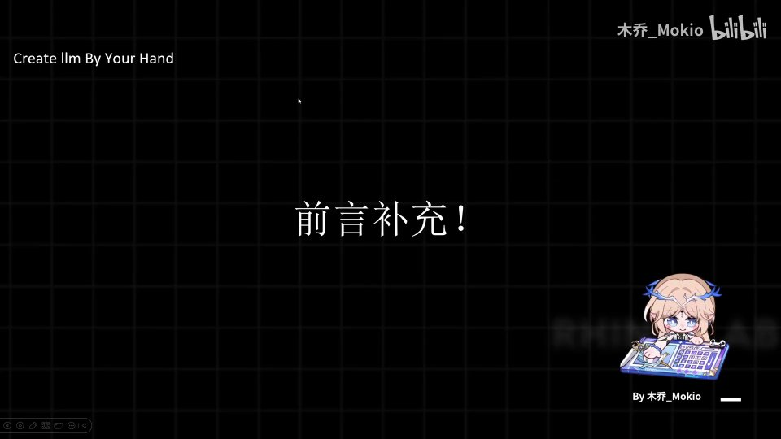
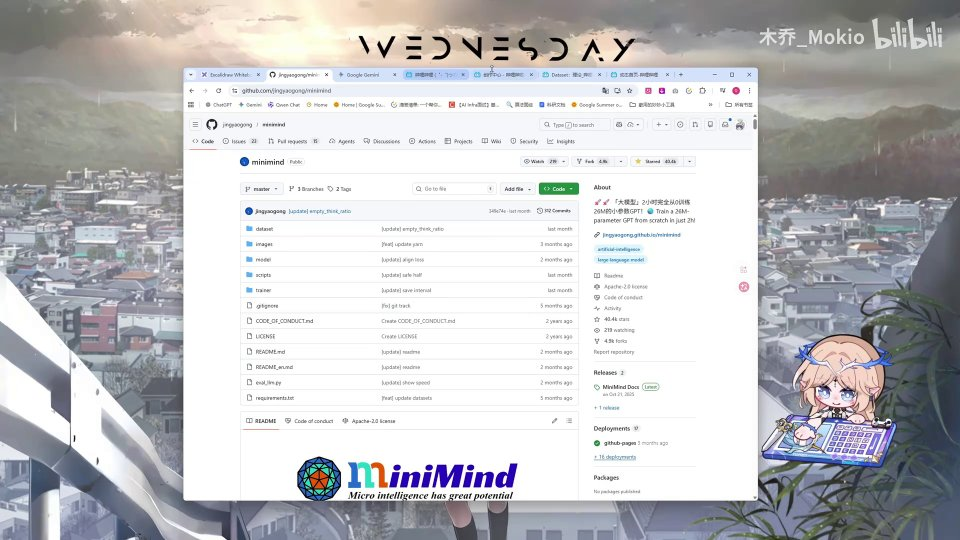
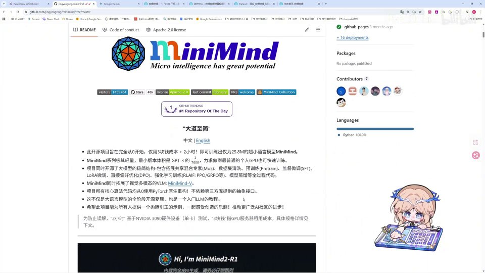

# 第3讲：必看：前言补充

## 本讲要解决的核心问题（SCQA）

**背景**：Minimind 是一个从零手写大模型的经典教学项目，官方仓库在 GitHub 上持续更新；很多同学都是跟着 up 主（木乔_Mokio）的系列视频来入门大模型的。

**冲突**：有观众发现，视频里讲解的代码和现在官方仓库里的代码"对不上"，于是评论区出现了"代码理论有问题""up 主敲的代码和官方仓库不一致"之类的疑问。

**疑问**：为什么视频里的代码会和官方仓库对不上？到底该信视频，还是信官方仓库？发现问题又该怎么反馈？

**回答（中心思想）**：这不是理论的错误，而是**时间差**造成的版本错位——up 主学习的是几个月前的旧版本，官方作者在之后修复了大量原本就写错的地方。因此，**一切以官方最新代码为准**，把视频当"讲解思路的参考"，把官方仓库当"唯一的代码事实来源"。

---

## 一、这是一次时间差导致的版本错位

这一讲不是新知识，而是一次**前言补充**，目的是避免后来的观众产生误导。[【跳转到 00:00】](https://www.bilibili.com/video/BV1T2k6BaEeC/?p=3&t=0)

事情的来龙去脉可以按时间顺序理清楚：

- up 主做这一系列 Minimind 视频，是在**去年 11 月份**上传的。[【跳转到 00:10】](https://www.bilibili.com/video/BV1T2k6BaEeC/?p=3&t=10)
- 而在做视频之前的**9 月和 10 月**，up 主就已经在学习、阅读 Minimind 的官方代码了。[【跳转到 00:15】](https://www.bilibili.com/video/BV1T2k6BaEeC/?p=3&t=15)
- 也就是说，up 主脑子里的代码版本，停留在**9—10 月**那会儿。
- 而在最近的一两个月里，Minimind 的**官方作者更新了很多原本写错的地方**。[【跳转到 01:00】](https://www.bilibili.com/video/BV1T2k6BaEeC/?p=3&t=60)
- 当 up 主制作视频时，这些地方**还没有被修复**。[【跳转到 01:00】](https://www.bilibili.com/video/BV1T2k6BaEeC/?p=3&t=60)

所以，视频里出现的代码和今天官方仓库里的代码不一致，是**完全正常**的：一个是"旧版快照"，一个是"最新修复版"。理解了这一点，评论区那些"理论错误""代码对不上"的疑问就都有了统一解释。

---

## 二、为什么视频里的代码会和官方仓库对不上

### 2.1 具体差在哪：以 `pretrain_dataset` 为例

up 主举了一个最有代表性的例子：**数据集（dataset）加载部分的代码**。[【跳转到 00:35】](https://www.bilibili.com/video/BV1T2k6BaEeC/?p=3&t=35)

- 视频里（9—10 月版本）的 `pretrain_dataset`，和现在官方仓库里的 `pretrain_dataset` **对不上**。[【跳转到 00:45】](https://www.bilibili.com/video/BV1T2k6BaEeC/?p=3&t=45)
- 进一步对比会发现，**当时的编写方式和现在的编写方式完全不一样**。[【跳转到 01:00】](https://www.bilibili.com/video/BV1T2k6BaEeC/?p=3&t=60)

这里说的 `pretrain_dataset`，指的是**预训练数据集**的读取与处理逻辑：模型训练时需要把原始文本按行读入，再做分词、截断、打包成张量。它是训练流程的入口，只要这里写法变了，后面喂给模型的数据格式就跟着变。

这里先把相关术语讲清楚，方便初学者理解：

- **预训练（pretrain）**：让模型先在海量通用文本上"学语言规律"的阶段，相当于打地基。
- **数据集（dataset）**：训练时按需把样本一条条取出来的对象，本质是一个"数据取用器"。
- **分词 / tokenizer**：把一句话切成模型能处理的 token（词元）并转成编号。

### 2.2 作者修复的是"原本就错误的地方"

需要强调：官方作者在这一两个月里更新的，是**原本错误的地方**，属于**修 bug**，而不是随意改动。[【跳转到 01:00】](https://www.bilibili.com/video/BV1T2k6BaEeC/?p=3&t=60)

这就解释了一个容易让人误会的现象——**不是视频"讲错了理论"，而是它忠实记录了当时那份还有 bug 的代码**。等 bug 被官方修好后，视频看起来自然就"过时"了。

---

## 三、观众在评论区看到的"矛盾"从哪来

评论区的典型疑问无非两类，我们逐一对号入座：

**第一类：觉得代码或理论有问题。** [【跳转到 00:25】](https://www.bilibili.com/video/BV1T2k6BaEeC/?p=3&t=25)

- 例如有观众对比后觉得"代码的理论有问题"或"理论方面有问题"。[【跳转到 00:30】](https://www.bilibili.com/video/BV1T2k6BaEeC/?p=3&t=30)
- 实际上，理论本身没错，出错的是**当时那份实现**。

**第二类：觉得 up 主敲的代码和官方仓库对不上。** [【跳转到 00:35】](https://www.bilibili.com/video/BV1T2k6BaEeC/?p=3&t=35)

- 这个观察是对的，原因就是上文说的**时间差**：up 主是基于 **9—10 月**那份官方代码来讲解的。[【跳转到 00:40】](https://www.bilibili.com/video/BV1T2k6BaEeC/?p=3&t=40)
- 在那份旧代码里确实"有很多问题"，一旦和今天的最新仓库逐行比对，自然处处不同。

举个例子，评论区就有同学针对代码里的数字和论文对不上提出疑问（比如 `dim < corr_dim` 时缩放系数的写法），这恰恰说明**大家在看代码时是认真核对的**——这种"对不上"正是需要进行本次前言补充的原因。[【跳转到 00:30】](https://www.bilibili.com/video/BV1T2k6BaEeC/?p=3&t=30)

---

## 四、给学习者的正确做法：以官方最新代码为准

结论很明确：**看视频学思路，写代码认官方**。

- 代码一定要**以官方最新代码为准**，不要照搬视频里的旧实现。[【跳转到 01:32】](https://www.bilibili.com/video/BV1T2k6BaEeC/?p=3&t=92)
- 也就是要去看官方仓库里的**最新代码**，而不是视频截图里的那一版。[【跳转到 01:39】](https://www.bilibili.com/video/BV1T2k6BaEeC/?p=3&t=99)

具体可以这样做：

1. **先跟视频理解"为什么这么写"**：架构思路、训练流程、关键模块的意图。
2. **再对照官方仓库的当前代码落笔**：以实际仓库文件为准，逐行核对。
3. **发现视频与仓库不同时，默认信仓库**：因为仓库是持续修复后的结果。

一句话：视频负责**讲清原理**，GitHub 负责**提供事实**。

---

## 五、发现问题怎么办：提 issue 向官方反馈

如果你在学习过程中确实发现了问题，正确的做法不是自己憋着，也不是照单全收，而是：

- **向官方提 issue 反馈**。[【跳转到 01:44】](https://www.bilibili.com/video/BV1T2k6BaEeC/?p=3&t=104)

**什么是 issue？** 在 GitHub 上，issue 就是给项目作者提的"问题单 / 任务单"：你可以描述你发现的 bug、不一致或改进建议，作者和其他贡献者会在下面一起讨论、跟进、修复。

这样做有三个好处：

1. **问题被官方记录**，不会被埋没，修好后所有人受益；
2. **你能拿到作者的直接答复**，比在评论区猜测更靠谱；
3. **形成社区反馈闭环**，让开源项目越用越稳。

---

## 六、继续学习的建议：可以往下看，但要自己辨别

如果你想继续深入，完全可以**接着往下看后面的视频**。[【跳转到 01:49】](https://www.bilibili.com/video/BV1T2k6BaEeC/?p=3&t=109)

但 up 主给了一个非常重要的提醒：[【跳转到 01:54】](https://www.bilibili.com/video/BV1T2k6BaEeC/?p=3&t=114)

- **一定要对照官方代码**；
- **把错误的地方自己辨别一下**；
- **不要完全照搬、直接吸收**。

这句话不只是"免责声明"，而是一种更成熟的学习方式：**带着怀疑去核对**。大模型领域代码迭代快、资料更新慢，能独立判断"视频说的"和"仓库写的"哪个对，本身就是一项重要能力。

---

## 小结

- 本讲是一次**前言补充**，不是新知识，目的是**避免误导**后来的观众。[【跳转到 00:00】](https://www.bilibili.com/video/BV1T2k6BaEeC/?p=3&t=0)
- 视频录制于**去年 11 月**，基于 up 主 **9—10 月**学习的官方代码；官方作者随后**修复了大量原本错误的地方**，于是出现"代码对不上"。[【跳转到 00:15】](https://www.bilibili.com/video/BV1T2k6BaEeC/?p=3&t=15)
- "对不上"的典型例子是 `pretrain_dataset`：旧版与现版**写法完全不同**。[【跳转到 00:45】](https://www.bilibili.com/video/BV1T2k6BaEeC/?p=3&t=45)
- 这不代表理论错误，而是**旧实现里的 bug** 后来被修好了。
- 学习原则：**代码以官方最新代码为准**，视频只作思路参考。[【跳转到 01:32】](https://www.bilibili.com/video/BV1T2k6BaEeC/?p=3&t=92)
- 发现问题**提 issue 向官方反馈**；继续学习时要**对照官方代码、自己辨别、不照搬**。[【跳转到 01:44】](https://www.bilibili.com/video/BV1T2k6BaEeC/?p=3&t=104)

---

## 关键术语速查

| 术语 | 一句话解释 |
| --- | --- |
| Minimind | 一个从零手写、可低成本训练的小型大模型教学项目，官方代码托管在 GitHub |
| 前言补充 | 正片开始前的说明性内容，本讲用它澄清"视频代码与官方仓库对不上"的误会 |
| 官方仓库（repo） | 项目在 GitHub 上的代码主目录，是判断代码正确与否的权威来源 |
| pretrain_dataset | 预训练数据集的读取与处理模块，负责把文本转成模型可训练的样本 |
| 预训练（pretrain） | 模型先在海量通用文本上学习语言规律的阶段 |
| tokenizer / 分词 | 把文本切成 token（词元）并转成编号的工具 |
| issue | GitHub 上向项目作者提交问题或建议的正式反馈渠道 |
| bug / 修复 | 代码中原本的错误及其更正；官方近一两个月修了很多此类问题 |
| 版本错位 | 视频基于旧版代码录制、仓库已更新到新版，二者不一致的现象 |
| 以官方最新代码为准 | 学习时以当前仓库代码为事实基准，视视频为思路参考的原则 |
