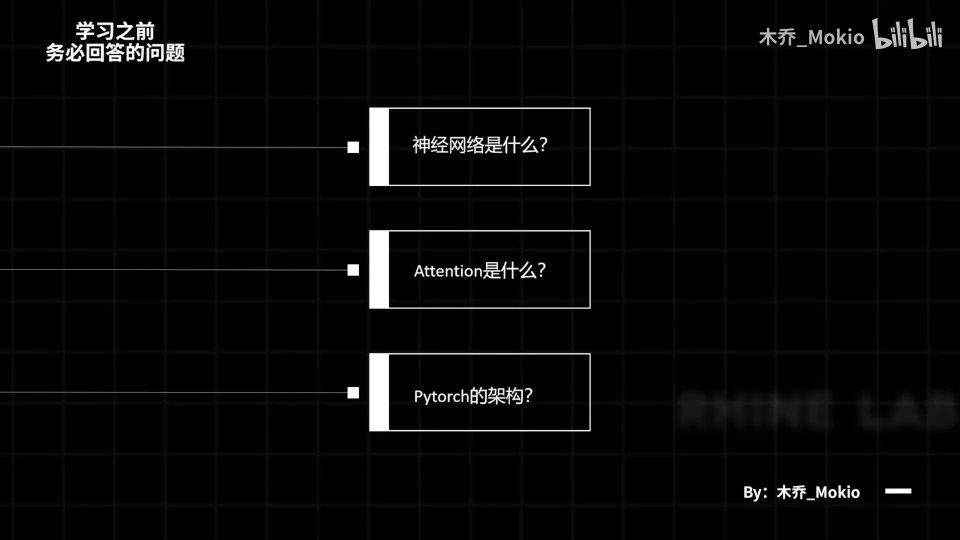
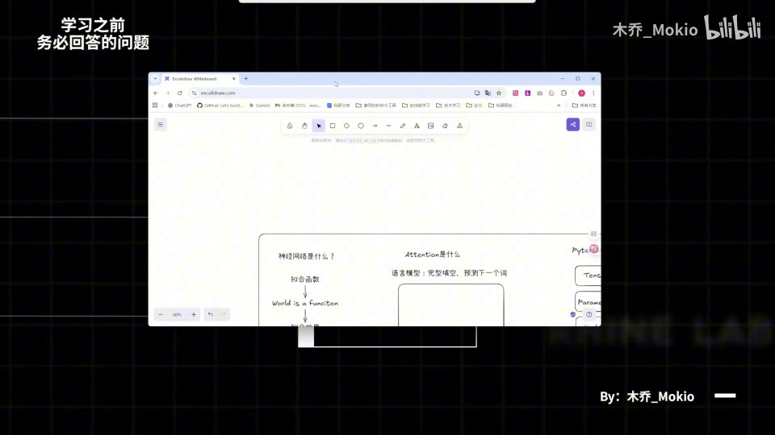
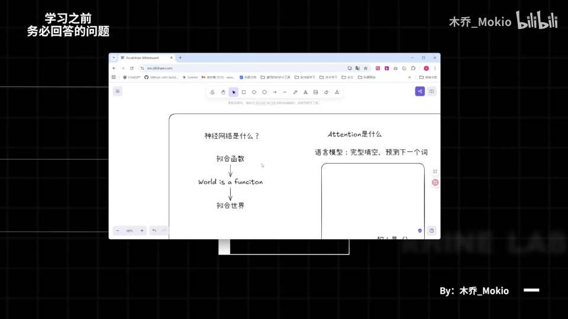
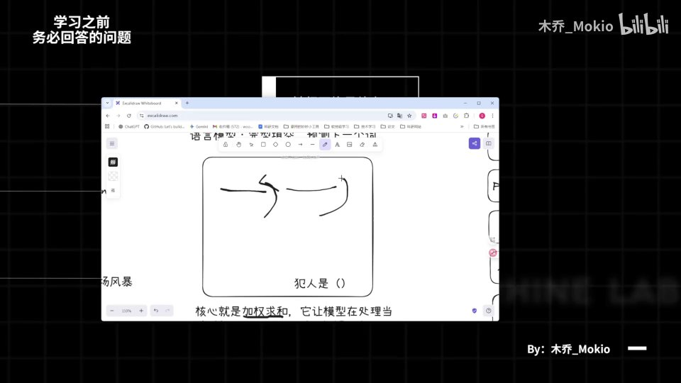
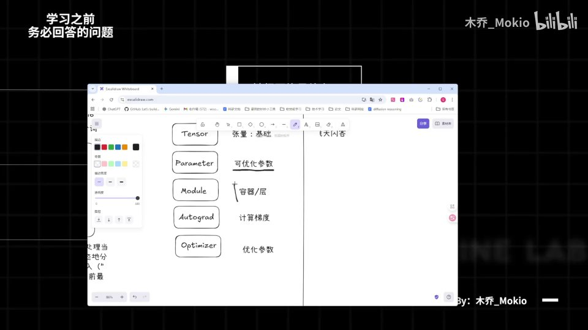
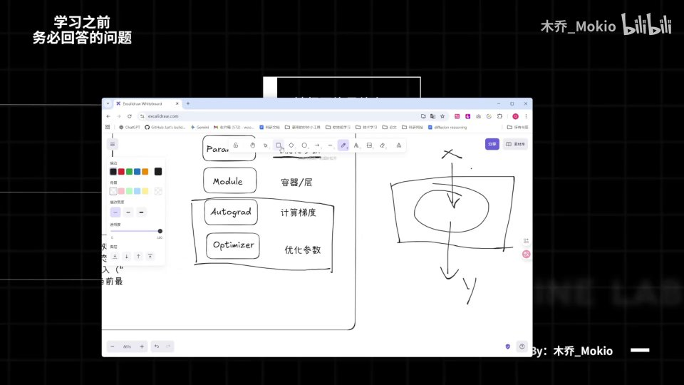

# 第4讲：前置知识

## 本讲要解决的核心问题（SCQA）

**背景**：Minimind 是一个"从零手写大模型"的教学项目，前面几讲我们已经把课程目标、环境与代码版本这些准备事项讲清楚了，接下来就要正式进入模型本身的学习。

**冲突**：可是模型代码里到处都是神经网络、Attention、PyTorch 这些名词。如果对它们完全没有概念，直接看代码和公式往往会一头雾水——看得懂每个字母，却不知道它们在一起干什么。

**疑问**：在开始学模型之前，究竟有哪些知识是"必须先会"的？如果我还不会，应该先补什么？

**回答（中心思想）**：学这门课之前，你**务必能回答三个问题**——**神经网络是什么、Attention 是什么、PyTorch 的架构是什么**。这三者是后面所有代码的地基，答得上来就能顺畅跟课；答不上来，建议先退出去补基础再回来。

[【跳转到 00:00】](https://www.bilibili.com/video/BV1T2k6BaEeC/?p=4&t=0)

---

## 一、先自查：学习前必须回答的三个问题

这一讲不讲模型代码，而是先做一次**基础自查**。up 主在开头就点明：这三个问题如果你现在还没有头绪，那最好还是去补一些基础知识再来学习；如果实在比较忙，也可以先听接下来的讲解，边学边补。[【跳转到 00:00】](https://www.bilibili.com/video/BV1T2k6BaEeC/?p=4&t=0)

这三个问题是层层递进的：

1. **神经网络是什么？** 它是"为什么而被想出来的"？为了解决什么问题？然后它"是什么"？[【跳转到 00:25】](https://www.bilibili.com/video/BV1T2k6BaEeC/?p=4&t=25)
2. **Attention 是什么？** 它又是为了解决什么问题而提出来的？[【跳转到 00:25】](https://www.bilibili.com/video/BV1T2k6BaEeC/?p=4&t=25)
3. **PyTorch 的架构你了解吗？** 这关乎我们后面写代码的相关内容。[【跳转到 00:25】](https://www.bilibili.com/video/BV1T2k6BaEeC/?p=4&t=25)

注意这三个问题的问法：不是让你背定义，而是让你回答"**它是为了解决什么问题而出现的**"。换句话说，要理解一个技术，先要理解它诞生的动机。这正是本讲要带你走一遍的路径。

如果你想去弥补自己的基础知识，现在就可以退出去补一下再回来看；如果实在太忙，就听接下来的讲解。[【跳转到 00:50】](https://www.bilibili.com/video/BV1T2k6BaEeC/?p=4&t=50)

---

## 二、神经网络是什么：一个能"拟合世界"的函数

结论先说：**神经网络诞生的目的，是"拟合函数"，进而"拟合世界运行的规律"**。它是为了拟合世界、或者说拟合世界的一部分而存在的。

### 2.1 先理解"函数"：输入 X，输出 Y

在提神经网络之前，先看一个大家都知道的概念——**函数（function）**。[【跳转到 01:00】](https://www.bilibili.com/video/BV1T2k6BaEeC/?p=4&t=60)

所谓函数，就是**给定一个输入 X，经过 function 之后能得到一个输出 Y**。说白了就是：**给一个输入，就能拿到一个输出**。

- 输入：X（比如一张图片、一句话、一组温度数据）
- 函数：中间的加工规则
- 输出：Y（比如"这张图是猫还是狗"、"明天会不会下雨"）

我们平时写代码、做数学题，本质上都在处理这种"输入 → 规则 → 输出"的关系。

### 2.2 神经网络的目的：拟合函数

那么神经网络研究的、它诞生的目的是什么呢？**就是为了拟合函数。** [【跳转到 01:25】](https://www.bilibili.com/video/BV1T2k6BaEeC/?p=4&t=85)

**什么是"拟合"（fit）？** 可以理解为"用一条曲线/一个模型去近似地描述一组数据背后的规律"。比如给它一堆散点，它自动找出一条能大致穿过这些点的曲线。

**为什么需要拟合函数？** 因为现实中的函数往往"很乱"：有的规律你**没办法用一个简单的式子写出来**，但神经网络却可以拟合**基本上任意一个函数**。[【跳转到 01:25】](https://www.bilibili.com/video/BV1T2k6BaEeC/?p=4&t=85)

这里 up 主特意说明：本讲**不会去讲"神经网络为什么能拟合任意函数"**，如果你想深入了解，可以去看相关的讲解视频（如 3B1B 的科普）。本讲只解决"它是什么、为什么存在"。[【跳转到 01:25】](https://www.bilibili.com/video/BV1T2k6BaEeC/?p=4&t=85)

### 2.3 "World is a function"：世界是一个函数

拟合函数有什么意义呢？这里出现了一句关键的话：**"world is a function"——世界是一个函数。** 如果你看过 3B1B 或类似的科普视频，应该听过这句话。[【跳转到 01:50】](https://www.bilibili.com/video/BV1T2k6BaEeC/?p=4&t=110)

为什么说世界是一个函数？因为**世界也是一个"给定输入、按规则产生输出"的系统**：你给定一个输入之后，它一定会按照相应的规则得到一个输出。[【跳转到 01:50】](https://www.bilibili.com/video/BV1T2k6BaEeC/?p=4&t=110)

举一个我们常说的谚语式例子：

> **蝴蝶扇动翅膀，会在世界这个函数下运转出一场风暴。**

翅膀扇动是"输入"，风暴是"输出"，中间那套复杂到无法用一条公式写清的因果链，就是"世界的函数"。[【跳转到 01:50】](https://www.bilibili.com/video/BV1T2k6BaEeC/?p=4&t=110)

### 2.4 于是，神经网络能"拟合世界"

把两件事拼起来：

- 神经网络可以**拟合函数**；
- 而世界**又是一个函数**。

那么神经网络又能做什么？**没错，它又能拟合世界、拟合世界运行的规律。** [【跳转到 02:15】](https://www.bilibili.com/video/BV1T2k6BaEeC/?p=4&t=135)

这就是 up 主认为神经网络诞生的**最重要的目的**：它是为了拟合世界、或者说拟合世界的一部分而存在的。[【跳转到 02:15】](https://www.bilibili.com/video/BV1T2k6BaEeC/?p=4&t=135)

理解了这一点，后面学习大模型时你就能明白：我们做的不过是**给模型看大量"输入-输出"样本，让它去逼近某个隐藏的规律**——无论是预测下一个词，还是识别一张图，本质都是在拟合。

---

## 三、Attention 是什么：让语言模型预测"下一个词"的核心机制

结论先说：**Attention（注意力）是让语言模型预测出下一个词的核心机制，它的核心做法是"加权求和"。**

### 3.1 先看语言模型：一个"完形填空"机器

要理解 Attention，先要知道它服务的对象——**语言模型（language model）**。[【跳转到 02:45】](https://www.bilibili.com/video/BV1T2k6BaEeC/?p=4&t=165)

语言模型的本质，用一句话概括就是：**它像一个"完形填空"一样的东西**。你输入一堆词之后，它会根据你输入的词，**不断预测下一个词是什么**。[【跳转到 02:45】](https://www.bilibili.com/video/BV1T2k6BaEeC/?p=4&t=165)

也就是说，**它本质上起的是一个"预测"的作用**，并不是说它完全理解了你所说的话。它只是非常擅长"猜下一个词"。[【跳转到 03:10】](https://www.bilibili.com/video/BV1T2k6BaEeC/?p=4&t=190)

> **类比**：手机输入法里，你打"今天天气真"，它会提示"好"——这就是一个微型的"预测下一个词"。

### 3.2 侦探小说的例子：为什么你能猜到"犯人是谁"

那 Attention 具体做什么？up 主用一本**推理小说**来打比方。[【跳转到 03:10】](https://www.bilibili.com/video/BV1T2k6BaEeC/?p=4&t=190)

想象你在读一本推理小说：前面写了很多很多东西，读到最后一页"**凶手是谁、犯人是什么**"的时候……[【跳转到 03:10】](https://www.bilibili.com/video/BV1T2k6BaEeC/?p=4&t=190)

当你看到"犯人"这个词时，你脑子里其实已经能**推理出犯人是谁**。为什么能推理出来？因为**前面所有内容的信息，在此刻都已经汇聚在了你的脑子里**。你能根据前面的相关信息，推导出犯人是什么——也就是**预测出下一个词是什么**。[【跳转到 03:35】](https://www.bilibili.com/video/BV1T2k6BaEeC/?p=4&t=215)

人类读小说时会"回顾前文、抓住线索"，Attention 做的就是让模型也具备这种"回头看前文"的能力。

### 3.3 核心是"加权求和"：把注意力分配给关键线索

Attention 机制的核心，就是**加权求和**。[【跳转到 04:00】](https://www.bilibili.com/video/BV1T2k6BaEeC/?p=4&t=240)

它能让模型在处理当前时刻（比如"犯人"这个词）时，**动态地分配注意力权重给之前的输入**，从而**聚合出最相关的上下文信息**。[【跳转到 04:00】](https://www.bilibili.com/video/BV1T2k6BaEeC/?p=4&t=240)

为什么要说"加权求和"？拆开看就明白了：

**（1）"加权"——重要程度不同。** 在侦探小说里，总有一些**关键的线索**，这些线索你自然要分配**更多的注意力**；而对于一些**无关痛痒的描写**，你当然分配比较少的注意力。这就是"加权"的意义。[【跳转到 04:00】](https://www.bilibili.com/video/BV1T2k6BaEeC/?p=4&t=240)

**（2）"求和"——把前面所有信息汇总。** 把前面所有的信息按权重汇总起来，用来预测出下一个词。[【跳转到 04:25】](https://www.bilibili.com/video/BV1T2k6BaEeC/?p=4&t=265)

所以"加权求和"合起来就是：**给每个历史信息一个重要性分数，重要的多算、不重要的少算，最后汇总成一个结果来预测下一个词**。

> 一句话记住：**Attention 的核心 = 加权求和，让模型在处理当前词时"动态分配注意力"给最相关的上下文。**

up 主提醒：这里只要能理解上面这句话就好；看完之后，非常推荐再去看一遍 3B1B 的 Attention 讲解视频，"真的是非常完美"。[【跳转到 02:45】](https://www.bilibili.com/video/BV1T2k6BaEeC/?p=4&t=165)

---

## 四、PyTorch 的架构：写代码必须掌握的五个概念

结论先说：**PyTorch 是后面写代码的工具，它有五个必须理解的核心概念——Tensor、Parameter、Module、Autograd、Optimizer。**

第三点，也是我们 **code 的时候必须要注意的一个点**，就是 **PyTorch 的架构**。[【跳转到 04:25】](https://www.bilibili.com/video/BV1T2k6BaEeC/?p=4&t=265) up 主认为它有**五个比较重要的概念**，理解这五个概念，后面写模型代码就不会卡壳。[【跳转到 04:50】](https://www.bilibili.com/video/BV1T2k6BaEeC/?p=4&t=290)

### 4.1 Tensor（张量）：一切数据的基础

**Tensor 就是"张量"**，它是我们在 PyTorch、包括学习机器学习和人工智能里**最基础的概念**。[【跳转到 04:57】](https://www.bilibili.com/video/BV1T2k6BaEeC/?p=4&t=297)

**什么是张量？** 可以把它简单理解为"**多维数组**"：一个数（标量）是 0 维张量，一行数（向量）是 1 维张量，一张表格（矩阵）是 2 维张量，再往上（比如一批图片）就是更高维的张量。PyTorch 里所有的输入、输出、参数，统统都是 Tensor。

如果你不知道这个概念，up 主建议去看**飞天闪客老师**新出的一个视频，里面详细讲了应该怎样去理解 tensor 这个概念。[【跳转到 04:57】](https://www.bilibili.com/video/BV1T2k6BaEeC/?p=4&t=297)

### 4.2 Parameter（可优化参数）：会被训练"调"的参数

第二点就是 **Parameter**，也就是 PyTorch 这个框架里你会定义很多**参数**。[【跳转到 05:22】](https://www.bilibili.com/video/BV1T2k6BaEeC/?p=4&t=322)

因为我们在学习的时候，总是**一开始会初始化一部分参数，然后在训练的过程中不断使这些参数达到最优**。这个 Parameter 就是我们定义的、**可以优化的一些参数**。[【跳转到 05:22】](https://www.bilibili.com/video/BV1T2k6BaEeC/?p=4&t=322)

> **类比**：Parameter 就像收音机上的旋钮，一开始位置是随机瞎放的，训练的过程就是不断微调这些旋钮，直到声音最清晰（loss 最小）。

### 4.3 Module（模块/层）：装逻辑的"容器"与"工厂"

第三点就是 **Module**，比如写代码的时候我们的 **`nn.Module`**，这个是什么呢？可以把它看做一个**容器**或者**一层东西**。[【跳转到 05:22】](https://www.bilibili.com/video/BV1T2k6BaEeC/?p=4&t=322)

它**本质上就是容纳了你对数据处理的所有逻辑**：比如你输入一个 tensor，经过这一层之后它输出了另一个 tensor，那么中间这些所有的加工过程，我们就可以包含在 `nn.Module` 里。[【跳转到 05:47】](https://www.bilibili.com/video/BV1T2k6BaEeC/?p=4&t=347)

而且它**不只是容纳逻辑**——比如你把参数放进去，它还能帮助你**管理相关的参数**。所以这个 module 就相当于一个**工厂，能够帮助你管理所有的零件**。[【跳转到 05:47】](https://www.bilibili.com/video/BV1T2k6BaEeC/?p=4&t=347)

### 4.4 Autograd 与 4.5 Optimizer：算出梯度、再去优化

第四、第五是两个总是成对出现的东西——**Autograd 和 Optimizer**。既然前面提到了"可优化参数"，那么**怎样去优化它**，就是 autograd 和 optimizer 的事。[【跳转到 06:12】](https://www.bilibili.com/video/BV1T2k6BaEeC/?p=4&t=372)

如果你学过机器学习的基础概念，就会知道我们往往优化学习用的算法是**梯度下降（gradient descent）**。[【跳转到 06:37】](https://www.bilibili.com/video/BV1T2k6BaEeC/?p=4&t=397)

顺着这个逻辑，两步走：

1. **要梯度下降，首先就要计算梯度**——这一步用 **Autograd**（自动求导，autograd 负责"算梯度"）。[【跳转到 06:37】](https://www.bilibili.com/video/BV1T2k6BaEeC/?p=4&t=397)
2. **算出梯度后，用它来更新参数**——这一步用 **Optimizer**（优化器，optimizer 负责"按梯度调参数"）。[【跳转到 06:37】](https://www.bilibili.com/video/BV1T2k6BaEeC/?p=4&t=397)

> **一句话区分**：**Autograd 回答"参数该往哪个方向调"，Optimizer 负责"真的去调它"。**

**什么是梯度下降？** 简单说，就是沿着"让误差变小"的方向，一点点挪动参数。就像下山时每一步都朝着最陡的下坡方向走，最终到达谷底（误差最小处）。

如果你不了解这些概念，依旧记得要去补基础知识。[【跳转到 06:37】](https://www.bilibili.com/video/BV1T2k6BaEeC/?p=4&t=397)

### 4.6 五个概念再串一遍

把 PyTorch 的五个概念按"数据 → 参数 → 组织 → 优化"的顺序串起来：

| 概念 | 角色 | 类比 |
| --- | --- | --- |
| **Tensor** | 张量，所有数据的基础单位 | 原料 |
| **Parameter** | 可优化的参数 | 可调的旋钮 |
| **Module** | 容器 / 层，封装逻辑并管理参数 | 工厂 |
| **Autograd** | 自动计算梯度 | 判断该往哪调 |
| **Optimizer** | 根据梯度优化参数 | 真正去调旋钮 |

---

## 五、给初学者的行动清单：答不上来就先去补

这一讲补充的其实就是上面**三个最重要的点**。[【跳转到 06:37】](https://www.bilibili.com/video/BV1T2k6BaEeC/?p=4&t=397)

如果你看完仍然一头雾水，up 主**再次、再次强调**：一定要去弥补基础知识，才能够更好地学习。[【跳转到 07:02】](https://www.bilibili.com/video/BV1T2k6BaEeC/?p=4&t=422)

给一个可执行的清单：

1. **神经网络**：搞懂"输入 → 函数 → 输出"，以及"神经网络是为了拟合函数、进而拟合世界"。推荐看 3B1B 的神经网络科普。[【跳转到 01:25】](https://www.bilibili.com/video/BV1T2k6BaEeC/?p=4&t=85)
2. **Attention**：记住"它是让语言模型预测下一个词的核心机制，核心是加权求和"，并去看 3B1B 的 Attention 讲解。[【跳转到 02:45】](https://www.bilibili.com/video/BV1T2k6BaEeC/?p=4&t=165)
3. **PyTorch**：搞懂 Tensor / Parameter / Module / Autograd / Optimizer 五个概念，并配合飞天闪客老师的 tensor 讲解视频。[【跳转到 04:57】](https://www.bilibili.com/video/BV1T2k6BaEeC/?p=4&t=297)

补完这三块，就可以放心进入下一部分——**正式开始对模型的学习**。[【跳转到 07:02】](https://www.bilibili.com/video/BV1T2k6BaEeC/?p=4&t=422) 我们下一块见。

---

## 小结

- 学 Minimind 之前，务必能回答**三个问题**：神经网络是什么、Attention 是什么、PyTorch 的架构是什么。[【跳转到 00:00】](https://www.bilibili.com/video/BV1T2k6BaEeC/?p=4&t=0)
- **神经网络**：诞生目的是**拟合函数**，因为很多规律无法用简单式子写出；而"世界是一个函数"（world is a function），所以神经网络最终是在**拟合世界及其运行规律**。[【跳转到 02:15】](https://www.bilibili.com/video/BV1T2k6BaEeC/?p=4&t=135)
- **语言模型**本质像**完形填空**，不断**预测下一个词**，并非真正理解了你的话。[【跳转到 02:45】](https://www.bilibili.com/video/BV1T2k6BaEeC/?p=4&t=165)
- **Attention** 是让语言模型预测下一个词的**核心机制**，核心是**加权求和**：关键线索分配更多注意力，无关描写分配更少。[【跳转到 04:00】](https://www.bilibili.com/video/BV1T2k6BaEeC/?p=4&t=240)
- **PyTorch 五个核心概念**：Tensor（张量·基础）、Parameter（可优化参数）、Module（容器/层）、Autograd（计算梯度）、Optimizer（优化参数）。[【跳转到 04:50】](https://www.bilibili.com/video/BV1T2k6BaEeC/?p=4&t=290)
- **梯度下降**是想让参数变优的算法；Autograd 算梯度，Optimizer 用梯度更新参数。[【跳转到 06:37】](https://www.bilibili.com/video/BV1T2k6BaEeC/?p=4&t=397)
- 补不齐基础也没关系，先听讲解，但**一定要补**，才能更好地学习后续模型内容。[【跳转到 07:02】](https://www.bilibili.com/video/BV1T2k6BaEeC/?p=4&t=422)

---

## 关键术语速查

| 术语 | 一句话解释 |
| --- | --- |
| 前置知识 | 学习本课程前必须掌握的基础，本讲聚焦神经网络、Attention、PyTorch 三块 |
| 函数（function） | 给定输入 X，经过规则加工得到输出 Y 的东西 |
| 拟合（fit） | 用模型去近似描述数据背后的规律，如用一条曲线穿过散点 |
| 神经网络 | 一种能拟合（近似）任意函数的模型，目的是学习世界运行的规律 |
| World is a function | "世界是一个函数"：世界也会对输入按规则产生输出（如蝴蝶效应） |
| 语言模型（language model） | 像完形填空一样不断预测"下一个词"的模型，本质是预测而非真正理解 |
| Attention（注意力） | 让语言模型预测下一个词的核心机制，属于加权求和 |
| 加权求和 | 给每个历史信息不同重要性权重再汇总，重要的多算、次要的少算 |
| PyTorch | 用来写深度学习代码的框架，本课程后面写代码会一直用到 |
| Tensor（张量） | PyTorch 与机器学习最基础的数据结构，可理解为多维数组 |
| Parameter（参数） | 训练中会被不断优化、达到最优的变量 |
| Module（模块/层） | 封装数据处理逻辑并管理参数的"容器/工厂"，如 `nn.Module` |
| Autograd | PyTorch 的自动求导机制，负责计算梯度 |
| Optimizer（优化器） | 根据梯度去更新/优化参数的组件 |
| 梯度下降 | 沿让误差变小的方向逐步调整参数的优化算法 |
| 3B1B | 3Blue1Brown，以可视化讲解著称的科普频道，本讲多次推荐其神经网络与 Attention 视频 |
